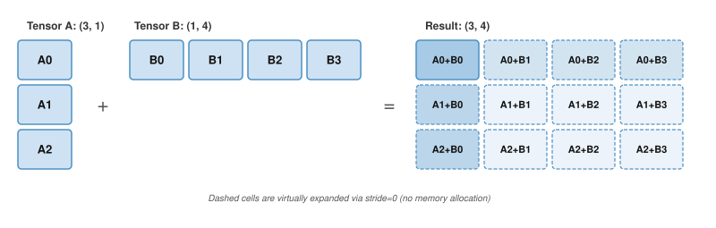

# Algorithm Foundations {#sec-appdx-algorithm-foundations}

A profile showing low utilization is often misdiagnosed as a hardware limit when the cause is algorithmic: a matrix multiply shape that wastes tensor cores, a layout that breaks contiguity, or activation memory held for backpropagation. This appendix collects the computational complexity models, memory footprint derivations, and quantization error formulas that the book's performance chapters lean on, enabling readers to evaluate algorithmic trade-offs before committing code to accelerators. It assumes familiarity with linear algebra and with the iron law introduced early in the book.

## How to Use This Appendix {.unnumbered}

This appendix is designed as a reference. Reach for it when translating a profiler symptom ("slow matmul," "shape mismatch," "OOM during training") into a concrete computational or memory cause.

Conventions used here follow the book-wide notation (for example, $B$ is reserved for batch size and $\text{BW}$ denotes bandwidth).

- **When GEMMs are slow**: Use @sec-appdx-algorithm-foundations-general-matrix-multiply-gemm-b55d and compare intensity to the hardware's ridge point.
- **When memory blows up in training**: Use @sec-appdx-algorithm-foundations-mechanics-learning-24f6 and the training memory decomposition.
- **When tensor code "should work" but does not**: Use @sec-appdx-algorithm-foundations-shapes-strides-1aea and @sec-appdx-algorithm-foundations-broadcasting-ec16.
- **When sparsity is proposed as a fix**: Use @sec-appdx-algorithm-foundations-sparse-matrix-formats-0bd0 to check density and metadata overhead.
- **When proving gradient compute bounds**: Use @sec-appdx-algorithm-baur-strassen for the Baur–Strassen reverse-mode AD complexity theorem.
- **When analyzing sequence length bottlenecks**: Use @sec-appdx-algorithm-flash-attention for the online softmax recurrence and FlashAttention HBM I/O reduction proof.
- **When allocating compute between parameters and tokens**: Use @sec-appdx-algorithm-chinchilla-derivation for the Kaplan and Chinchilla compute-optimal scaling law derivation.

```{=latex}
\vspace*{-1ex}
```
Neural networks turn linear algebra into learned behavior: matrices transform activations, tensor layouts determine how data move through memory, and backpropagation carries error signals through the resulting computation. These foundations support the deep learning treatment in @sec-neural-computation, the framework internals in @sec-ml-frameworks, and the training strategies in @sec-model-training. Architectures change, but the underlying mathematical machinery remains constant.

## Linear Algebra {#sec-appdx-algorithm-foundations-linear-algebra-c937}

Deep learning systems are, at their core, engines for transforming massive matrices. Frameworks like PyTorch abstract away the raw math, but performance engineering still depends on the underlying linear algebra. Building on how numbers are stored in @sec-appdx-machine-foundations, this section focuses on how they are manipulated.

```{=latex}
\vspace*{-1ex}
```
::: {#psp-appendix-algorithm-linear-algebra-matters .callout-perspective title="Why this matters"}

Many modern dense neural networks, especially transformers and large CNNs, spend much of their compute time in matrix multiplication or GEMM-like kernels. A self-attention block performs the Q, K, V, and output projection GEMMs plus two attention matrix multiplications: one for the attention scores and one for the attention-weighted values. The layer's feed-forward block adds more GEMMs. Understanding GEMM performance characteristics explains why batch size affects throughput, why certain layer dimensions are "better" than others, and how to interpret profiler output. Reasoning about matrix dimensions and arithmetic intensity predicts whether a dense workload is compute bound or memory bound *before* any profiler trace runs.

:::

### Tensor operations and notation {#sec-appdx-algorithm-foundations-tensor-operations-notation-2758}

Einstein summation[^fn-einsum-tensor-contraction] notation makes complex operations explicit throughout this book (implemented as `torch.einsum` in PyTorch and `np.einsum` in NumPy). Matrix multiplication $\mathbf{C} = \mathbf{A}\mathbf{B}$ becomes:
$$ C_{ij} = \sum_k A_{ik} B_{kj} $$

[^fn-einsum-tensor-contraction]: **Einstein Summation Convention**\index{Einstein Summation Convention!definition}: Repeated indices in a product are implicitly summed over, eliminating explicit summation signs. ML frameworks adopted the convention because it concisely expresses arbitrary tensor contractions in a single string.

In einsum notation, this is `ik,kj->ij`. The notation extends naturally to the multi-dimensional operations in attention mechanisms. For example, batched multi-head attention is `bhid,bhjd->bhij` (batch $b$, head $h$, query sequence $i$, key sequence $j$, and head dimension $d$).

### Memory layouts and performance {#sec-appdx-algorithm-foundations-memory-layouts-performance-44d0}

Data layout in memory (row-major vs. column-major) directly affects cache efficiency. When iterating over a matrix, accessing contiguous memory locations is dramatically faster than strided access.

A common optimization pattern is to materialize a transposed tensor once before repeated operations to ensure contiguous access in the hot loop. The one-time copy cost is amortized across many subsequent operations.

### The dot product as similarity {#sec-appdx-algorithm-foundations-dot-product-similarity-7957}

The dot product\index{Dot Product!appendix refresher} $\mathbf{a} \cdot \mathbf{b} = \sum a_i b_i$ is geometrically equivalent to $\|\mathbf{a}\| \|\mathbf{b}\| \cos \phi$, which makes it a natural measure of similarity between two vectors: for nonzero vectors, its sign distinguishes acute, right, and obtuse angles, while its magnitude also depends on both vector norms.

This geometric interpretation is why dot products appear everywhere in modern architectures. In attention mechanisms, query ($Q$) and key ($K$) vectors are dot-produced to compute a similarity score that determines how much each token attends to every other token. The resulting attention weights are then used to form a weighted combination of value ($V$) vectors—making the dot product the foundation of the transformer's ability to model long-range dependencies.

### General matrix multiply (GEMM) {#sec-appdx-algorithm-foundations-general-matrix-multiply-gemm-b55d}

GEMM[^fn-gemm-blas-routines] is the computational workhorse of deep learning. For matrices of size $M{\times}K$ and $K{\times}N$, GEMM performs $2MNK$ floating-point operations (multiply-accumulate counts as two operations).

[^fn-gemm-blas-routines]: **General Matrix Multiply (GEMM)**\index{GEMM!appendix refresher}: The BLAS (Basic Linear Algebra Subprograms) family began with vector routines standardized in 1979 [@lawson1979]; GEMM was standardized later as a Level 3 routine. The "GE" prefix stands for "general," as opposed to symmetric or triangular forms. GEMM computes $\mathbf{C} = \alpha \mathbf{A}\mathbf{B} + \beta \mathbf{C}$ and is a performance-critical routine in deep learning. @Sec-model-training-matrix-operations-1f21 explains how GEMM shapes determine training throughput.

```{python}
#| echo: false
from mlsysim import *
from mlsysim.core.units import *

# ┌── LEGO ───────────────────────────────────────────────
# │ Context: @sec-appdx-algorithm-foundations-general-matrix-multiply-gemm-b55d
# │ Goal: GEMM intensity formula and small-matrix roofline example
from mlsysim.fmt import fmt_int, fmt, check, fmt_arithmetic_intensity, fmt_display_math

class GemmIntensityExample:
    # ┌── 1. LOAD (Constants) ──────────────────────────────────────────────
    n_small = 64

    # ┌── 2. EXECUTE (The Compute) ────────────────────────────────────────
    bytes_fp16 = int(BYTES_FP16.to(byte).magnitude)
    small_intensity = n_small/3
    a100_ridge = int(
        Hardware.Cloud.A100.compute.peak_flops.to(TFLOPs/second).magnitude/Hardware.Cloud.A100.memory.bandwidth.to(TB/second).magnitude
    )
    small_efficiency_pct = small_intensity/a100_ridge * 100

    # ┌── 3. GUARD (Invariants) ──────────────────────────────────────────
    check(a100_ridge > 150, f"A100 ridge point ({a100_ridge}) unexpectedly low.")

    # ┌── 4. OUTPUT (Formatting) ─────────────────────────────────────────────
    bytes_fp16_value_str = fmt_int(bytes_fp16, commas=False)
    n_small_str = fmt(n_small, precision=0, commas=False)
    small_intensity_str = fmt_arithmetic_intensity(small_intensity * flop/byte, unit=flop/byte, precision=1, commas=False)
    small_efficiency_pct_str = fmt_percent(small_efficiency_pct/100, precision=1, commas=False, style='prose')
    a100_ridge_str = fmt_arithmetic_intensity(Hardware.Cloud.A100.ridge_point(), unit=flop/byte, precision=1, commas=False)
    intensity_formula_math = fmt_display_math(
        rf"\text{{Intensity}} = \frac{{O}}{{D_{{\text{{vol}}}}}} = "
        rf"\frac{{2n^3}}{{3n^2 \times {bytes_fp16_value_str}}} = "
        rf"\frac{{n}}{{3}}\text{{ FLOP/byte}}"
    )
```

The arithmetic intensity\index{Arithmetic Intensity!appendix refresher} of GEMM scales linearly with matrix dimension. For square $n{\times}n$ matrices in FP16 (`{python} GemmIntensityExample.bytes_fp16_value_str` bytes/element), the ideal $\beta=0$ bound reads $\mathbf{A}$ and $\mathbf{B}$ once and writes $\mathbf{C}$ once:
`{python} GemmIntensityExample.intensity_formula_math`

Reading the old $\mathbf{C}$ when $\beta \ne 0$ changes the intensity to $n/4$ FLOP/byte. This explains several important phenomena:

- **Larger batches can improve efficiency**: Batching increases effective matrix dimensions when it forms larger GEMMs or enables reuse; merely queuing independent small GEMMs does not raise intensity.
- **Aligned dimensions help**: Hardware tensor cores are optimized for precision- and architecture-specific tile multiples. Dimensions that align with these multiples avoid padding overhead and improve kernel efficiency, but they do not need to be powers of two.
- **Small matrices are inefficient**: A square GEMM with $n =$ `{python} GemmIntensityExample.n_small_str` has intensity `{python} GemmIntensityExample.n_small_str`/3 ≈ `{python} GemmIntensityExample.small_intensity_str`, well below the ridge point (`{python} GemmIntensityExample.a100_ridge_str`). Its roofline cap is ~`{python} GemmIntensityExample.small_efficiency_pct_str` of peak; launch and tiling overhead can lower realized throughput.

### Sparse matrix formats {#sec-appdx-algorithm-foundations-sparse-matrix-formats-0bd0}

When most elements in a matrix are zero, specialized storage formats avoid wasting memory on zeros and enable computations that skip them entirely. The **Compressed Sparse Row (CSR)**\index{Compressed Sparse Row!definition} format uses three arrays:

- `Values`: The nonzero elements, stored in row order
- `Col_Idx`: The column index of each nonzero element
- `Row_Ptr`: The starting position in `Values` for each row (length = num_rows + 1)

CSR is useful for sparse feature matrices in recommendation pipelines and for pruned model weights. For a matrix with $N$ elements, $R$ rows, and $K$ nonzeros, CSR uses $\mathcal{O}(K + R)$ storage instead of $\mathcal{O}(N)$; when $K$ is large relative to $R$, this is often summarized as $\mathcal{O}(K)$.

```{python}
#| echo: false
#| label: sparse-embedding-example
# ┌── LEGO ───────────────────────────────────────────────
# │ Context: @sec-appdx-algorithm-foundations-sparse-matrix-formats-0bd0 embedding example
# │ Goal: Dense vs sparse vocabulary embedding footprint at 1% density
from mlsysim.fmt import fmt_int, fmt, fmt_count, fmt_magnitude, fmt_memory, fmt_percent, fmt_qty

class SparseEmbeddingExample:
    # ┌── 1. LOAD (Constants) ──────────────────────────────────────────────
    vocab_size = 100 * THOUSAND
    embed_dim = 10 * THOUSAND
    sparsity_pct = 1

    # ┌── 2. EXECUTE (The Compute) ────────────────────────────────────────
    total_elements = vocab_size * embed_dim
    dense_bytes_q = total_elements * BYTES_FP32
    dense_bytes = dense_bytes_q.to(byte).magnitude
    nonzeros = int(total_elements * sparsity_pct/100)
    csr_bytes_per_nonzero_q = BYTES_FP32 + BYTES_INT32
    csr_bytes_per_nonzero = csr_bytes_per_nonzero_q.to(byte).magnitude
    sparse_bytes_q = nonzeros * csr_bytes_per_nonzero_q + (vocab_size + 1) * BYTES_INT32
    sparse_bytes = sparse_bytes_q.to(byte).magnitude
    reduction_factor = round(dense_bytes/sparse_bytes)

    # ┌── 3. GUARD (Invariants) ──────────────────────────────────────────
    check(sparse_bytes == 80_400_004, f"CSR footprint should include row pointers, got {sparse_bytes} bytes.")

    # ┌── 4. OUTPUT (Formatting) ─────────────────────────────────────────────
    vocab_size_str = fmt(vocab_size, precision=0)
    embed_dim_str = fmt(embed_dim, precision=0)
    total_elements_str = fmt_count(total_elements, scale="B", commas=False)
    dense_gb_str = fmt_qty(dense_bytes_q, GB, precision=0, commas=False)
    nonzeros_str = fmt_count(nonzeros, scale="M", commas=False)
    sparse_mb_str = fmt_qty(sparse_bytes_q, MB, precision=1, commas=False)
    bytes_fp32_value_str = fmt_magnitude(BYTES_FP32, unit=byte, precision=0, commas=False)
    bytes_int32_value_str = fmt_magnitude(BYTES_INT32, unit=byte, precision=0, commas=False)
    sparsity_pct_str = fmt_percent(sparsity_pct/100, precision=0, commas=False, style='prose')
    reduction_factor_mult_str = fmt_multiple(reduction_factor, precision=0, commas=False)
```

To see the trade-off concretely, consider a vocabulary embedding matrix with `{python} SparseEmbeddingExample.vocab_size_str` rows and `{python} SparseEmbeddingExample.embed_dim_str` columns (`{python} SparseEmbeddingExample.total_elements_str` parameters):

*   **Dense (FP32)**: `{python} SparseEmbeddingExample.total_elements_str` parameters $\times$ `{python} SparseEmbeddingExample.bytes_fp32_value_str` bytes each = `{python} SparseEmbeddingExample.dense_gb_str`.
*   **Sparse** (`{python} SparseEmbeddingExample.sparsity_pct_str` density): CSR stores roughly `{python} SparseEmbeddingExample.nonzeros_str` entries $\times$ (`{python} SparseEmbeddingExample.bytes_fp32_value_str`-byte value + `{python} SparseEmbeddingExample.bytes_int32_value_str`-byte column index), plus one row pointer per row and a final pointer, totaling ≈ `{python} SparseEmbeddingExample.sparse_mb_str`.
*   *Result*: A `{python} SparseEmbeddingExample.reduction_factor_mult_str` reduction in memory footprint, fitting a model that would otherwise OOM (Out of Memory).

Linear algebra tells us *what* to compute; the next question is *how* to express those computations in code. Tensor programming primitives—shapes, strides, and broadcasting—bridge the gap between mathematical notation and the array operations that actually execute on hardware.

## Tensor Programming Primitives {#sec-appdx-algorithm-foundations-tensor-programming-primitives-1400}

A shape mismatch crash, a silently wrong broadcast, a kernel running at 5 percent of peak because of a noncontiguous tensor—these common ML engineering failures all trace back to the same layer of abstraction. *Tensor programming* translates the abstract math of linear algebra into concrete array manipulations that run on hardware.

### Computational complexity cheat sheet {#sec-appdx-algorithm-foundations-computational-complexity-cheat-sheet-0c6c}

@Tbl-tensor-op-ref provides a quantitative reference for the most common building blocks. Use these formulas for napkin-math estimation of model size and compute requirements *before* hardware is provisioned. Given layer dimensions and input shapes, the formulas provide first-order parameter and compute estimates. The attention row is the key warning: sequence length contributes an $S^2$ term, while hidden dimension contributes $d^2$ projection work, so long-context models can shift the dominant cost without changing the parameter count.

```{=latex}
\begingroup
\renewcommand{\arraystretch}{1.3}
```

| **Layer Type**                |        **Output Shape**       |                                       **Parameters ($P$)**                                       |                              **FLOPs (per Forward Pass)**                              |
|:------------------------------|:-----------------------------:|:------------------------------------------------------------------------------------------------:|:--------------------------------------------------------------------------------------:|
| **Linear**                    |     $(B, N_{\text{out}})$     |            $N_{\text{in}} \times N_{\text{out}} + N_{\text{out}}$ if bias is enabled             |                $2 \times B \times N_{\text{in}} \times N_{\text{out}}$                 |
| **Conv2D**                    | $(B, C_{\text{out}}, H', W')$ |       $K^2 \times C_{\text{in}} \times C_{\text{out}} + C_{\text{out}}$ if bias is enabled       | $2 \times B \times H' \times W' \times K^2 \times C_{\text{in}} \times C_{\text{out}}$ |
| **Multi-Head Self-Attention** |   $(B, S, d_{\text{model}})$  | $4 \times d_{\text{model}}^2$, plus $4 \times d_{\text{model}}$ if projection biases are enabled |              $B \times (4 S^2 d_{\text{model}} + 8 S d_{\text{model}}^2)$              |
| **LayerNorm**                 |   $(B, S, d_{\text{model}})$  |                 $2 \times d_{\text{model}}$ if affine scale and bias are enabled                 |                   $\mathcal{O}(B \times S \times d_{\text{model}})$                    |

: **Deep Learning Tensor Primitives**: Summary of shapes, parameters, and FLOP counts. Note: $B$ is batch size, $S$ is sequence length, and $K$ is kernel size. The attention FLOPs include QKV projections and score interactions. The $S^2$ term applies to full-sequence training and prefill, while KV-cached generation is linear per token in cached context; $d^2$ projection work dominates at large hidden dimensions. {#tbl-tensor-op-ref tbl-colwidths="[25,21,21,33]"}

```{=latex}
\endgroup
```

### Shapes and strides {#sec-appdx-algorithm-foundations-shapes-strides-1aea}

A tensor\index{Tensor!appendix refresher} is a view over an underlying storage buffer, described by shape, stride, dtype, and offset metadata. Only contiguous tensors lay their logical elements out as one adjacent block.

*   **Shape**: The dimensions of the tensor (for example, `(3, 4)`).
*   **Stride**: The number of elements to skip in memory to move to the next element in a dimension.

Operations like `transpose()` or `view()` often just change the *strides*, not the data in memory. This is fast ($\mathcal{O}(1)$) but can lead to noncontiguous tensors that fail in kernels requiring contiguous data. In such cases, calling `contiguous()` forces an $\mathcal{O}(N)$ memory copy that can dominate runtime if triggered repeatedly inside a loop.

### Broadcasting {#sec-appdx-algorithm-foundations-broadcasting-ec16}

Broadcasting\index{Broadcasting!definition} allows arithmetic operations on tensors of different shapes. Compare dimensions from the last to the first. Two dimensions are compatible when:

1.  They are equal.
2.  One of them is 1.

The dimension with size one is "stretched" to match the other, as illustrated in @fig-broadcasting-rules. This stretching is virtual: the data is not copied in memory. Instead, the stride for that dimension is set to 0, allowing the hardware to read the same value repeatedly with $\mathcal{O}(1)$ memory overhead.

::: {#fig-broadcasting-rules fig-env="figure" fig-pos="htb" fig-cap="**Tensor Broadcasting Rules**: A (3,1) column and a (1,4) row broadcast across complementary dimensions, producing the pairwise sums in a (3,4) result." fig-alt="Tensor A, a three-cell column labeled A0 through A2 with shape (3,1), plus tensor B, a four-cell row labeled B0 through B3 with shape (1,4), equals a (3,4) grid whose cells contain every Ai+Bj pair. Dashed cells and an annotation indicate virtual expansion via stride 0 without memory allocation."}

:::

Consider a concrete case: tensor A has shape `(32, 1, 64)` and tensor B has shape `(1, 128, 64)`. Comparing dimensions right to left, 64 matches 64, then 1 stretches to 128, then 1 stretches to 32, yielding result shape `(32, 128, 64)`. Visualizing this expansion prevents silent logic bugs that accidentally allocate a large tensor (for example, a `(Batch, Batch)` matrix instead of an element-wise `(Batch)` vector).

Shapes, strides, and broadcasting govern how tensors flow through a model's forward pass. Training adds a second requirement: *learning from errors*. Backpropagation makes that learning possible and imposes the memory costs developed below.

## Mechanics of Learning {#sec-appdx-algorithm-foundations-mechanics-learning-24f6}

Valid tensor programs make training loops possible. Backpropagation orchestrates these tensors to compute gradients, transforming a forward prediction into a backward learning signal.

::: {#psp-appendix-algorithm-backpropagation-matters .callout-perspective title="Why this matters"}

When training fails—loss goes to NaN, gradients explode, or memory runs out—understanding what backpropagation actually does is essential for diagnosing the problem. The backward graph supplies the mental model for reasoning about gradient flow and memory usage during training.

:::

### The chain rule and automatic differentiation {#sec-appdx-algorithm-foundations-chain-rule-automatic-differentiation-e0eb}

For a composed function $y = f(g(x))$, the derivative is $\frac{dy}{dx} = \frac{dy}{dg} \cdot \frac{dg}{dx}$. In a neural network, $f$ and $g$ are layers, and the composition can be many levels deep. For a three-layer network $y = f_3(f_2(f_1(x)))$, the chain rule\index{Chain Rule!appendix refresher} extends to:
$$ \frac{\partial y}{\partial x} = \frac{\partial f_3}{\partial f_2} \cdot \frac{\partial f_2}{\partial f_1} \cdot \frac{\partial f_1}{\partial x} $$

Each factor in this product is a *local* derivative—computed at one layer using only that layer's inputs and outputs. This locality is what makes the algorithm tractable: the entire network never needs to be differentiated as a monolithic function. Instead, each layer computes its own local derivative during the backward pass and multiplies it by the gradient flowing in from the layer above.

Modern frameworks use reverse-mode automatic differentiation\index{Automatic Differentiation!appendix refresher}, which computes gradients for all $P$ parameters in a single backward pass. The key insight is that starting from the output and working backward (reverse mode) requires one pass regardless of the number of parameters, whereas starting from each input and working forward (forward mode) would require $P$ passes—one per parameter. This is why a training step is a small constant multiple of inference, commonly about 2--3$\times$ a forward pass for dense networks, rather than $P$ passes.

### The backpropagation algorithm {#sec-appdx-algorithm-foundations-backpropagation-algorithm-93f7}

Backpropagation[^fn-backprop-chain-rule] implements the chain rule efficiently through two passes: forward to compute outputs, backward to compute gradients. @Fig-backprop-graph illustrates this process for a simple two-layer network, with the forward pass (gray arrows) computing outputs and the backward pass (red dashed arrows) propagating gradients.

[^fn-backprop-chain-rule]: **Backpropagation**\index{Backpropagation!appendix refresher}: Short for "backward propagation of errors." The algorithm was independently discovered multiple times—by @werbos1974beyond and @linnainmaa1970representation for reverse-mode differentiation and by @rumelhart1986 for neural network training. Its key insight is that computing gradients for *all* parameters requires only one backward pass through the graph, making training cost roughly 2--3$\times$ inference rather than $P\times$ (once per parameter).

::: {#fig-backprop-graph fig-env="figure" fig-pos="htb" fig-cap="**Backpropagation Computational Graph**: Solid gray arrows carry the forward computation from input $x$ to loss $\mathcal{L}$, while dashed red arrows carry gradients backward along the same dependencies." fig-alt="A computational graph with four nodes labeled x, h, y, and a calligraphic L denoting loss, connected left to right. Solid gray arrows show the forward pass with weights W1 and W2. Dashed red arrows curve backward showing gradient flow with partial derivative notation."}
```{.tikz}
\begin{tikzpicture}[font=\small\sffamily, node distance=3cm, auto, >=stealth, thick]
  \tikzset{
    Node/.style={circle, draw=BlueLine, fill=BlueFill, line width=0.8pt, minimum size=0.9cm, text=TextBlack},
    Edge/.style={->, draw=GrayLine, line width=0.8pt},
    BackEdge/.style={->, dashed, draw=RedLine, line width=0.8pt, bend right=30},
    Label/.style={font=\footnotesize\sffamily, text=TextBlack}
  }
  \node[Node] (x) {x};
  \node[Node, right of=x] (h) {h};
  \node[Node, right of=h] (y) {y};
  \node[Node, right of=y, fill=RedLine!10, draw=RedLine] (L) {$\mathcal{L}$};
  \draw[Edge] (x) -- node[below, Label] {$W_1$} (h);
  \draw[Edge] (h) -- node[below, Label] {$W_2$} (y);
  \draw[Edge] (y) -- node[below, Label] {Loss} (L);
  \draw[BackEdge,overlay] (L) to node[above, Label, text=RedLine] {$\frac{\partial \mathcal{L}}{\partial y}$} (y);
  \draw[BackEdge,overlay] (y) to node[above, Label, text=RedLine] {$\frac{\partial \mathcal{L}}{\partial h}$} (h);
  \draw[BackEdge,overlay] (h) to node[above, Label, text=RedLine] {$\frac{\partial \mathcal{L}}{\partial x}$} (x);
 \path[use as bounding box] (-0.5,-0.55) rectangle (9.5,1.21);
\end{tikzpicture}
```
:::

The gradient edges retrace the forward dependencies, so each backward step requires values retained from the corresponding forward operation.

#### Forward pass {.unnumbered}

Using row-vector activations, omitting biases, and retaining intermediate activations for backward, start at $x$, the input. Multiply by $W_1$ to get hidden activation $h$. Cache $h$ because the backward pass will need it later. Multiply $h$ by $W_2$ to get output $y$. Cache $y$. Compare $y$ to the target label to compute loss $\mathcal{L}$.

At this point, the loss has been computed and memory contains the input $x$, the cached activation $h$, the cached output $y$, and the loss $\mathcal{L}$. For a large model, these cached activations can dominate memory usage.

#### Backward pass {.unnumbered}

Now trace backward from $\mathcal{L}$. The loss function provides $\frac{\partial \mathcal{L}}{\partial y}$, the gradient of loss with respect to the prediction. This is where the error signal enters the network.

Since $y = h \cdot W_2$, the chain rule gives us two gradients at this layer:
$$ \frac{\partial \mathcal{L}}{\partial W_2} = h^T \cdot \frac{\partial \mathcal{L}}{\partial y} \qquad \text{(weight gradient—used to update } W_2\text{)} $$
$$ \frac{\partial \mathcal{L}}{\partial h} = \frac{\partial \mathcal{L}}{\partial y} \cdot W_2^T \qquad \text{(input gradient—passed backward to the previous layer)} $$

Notice that computing $\frac{\partial \mathcal{L}}{\partial W_2}$ requires the cached activation $h$ from the forward pass. This is the fundamental reason activations must be available during backward: every layer's weight gradient depends on that layer's input.

Now continue backward to the first layer. Since $h = x \cdot W_1$, the same pattern gives:
$$ \frac{\partial \mathcal{L}}{\partial W_1} = x^T \cdot \frac{\partial \mathcal{L}}{\partial h} $$

Each step backward requires two things: the gradient flowing in from above $\left(\frac{\partial \mathcal{L}}{\partial h}\right)$ and that layer's input ($x$), which must be available during backward. This is why the backward pass costs roughly 2$\times$ the forward pass in compute: at each layer, it performs two matrix multiplications (one for the weight gradient, one for the input gradient) vs. one in the forward pass.

### The true cost of training memory {#sec-appdx-algorithm-foundations-true-cost-training-memory-e54e}

A common mistake is to assume that training memory equals model size. This assumption leads to immediate OOM errors because weights are only one of four components. Training memory\index{Training!memory decomposition} comprises weights, gradients, optimizer state, and retained activations:
$$ M_{\text{total}} = M_{\text{weights}} + M_{\text{gradients}} + M_{\text{optimizer}} + M_{\text{activations}} $$

For a standard Adaptive Moment Estimation (Adam) optimizer [@kingma2014adam] in mixed precision [@micikevicius2017mixed]:

```{python}
#| echo: false
#| label: training-memory-bytes
# ┌── LEGO ───────────────────────────────────────────────
# │ Context: @sec-appdx-algorithm-foundations-true-cost-training-memory-e54e
# │ Goal: Per-parameter byte counts for mixed-precision Adam training
from mlsysim.fmt import fmt_int, fmt, fmt_memory, fmt_range

class TrainingMemoryBytes:
    # ┌── 4. OUTPUT (Formatting) ─────────────────────────────────────────────
    bytes_fp16_str = fmt_memory(BYTES_FP16, unit=byte, precision=0, commas=False)
    bytes_fp32_str = fmt_memory(BYTES_FP32, unit=byte, precision=0, commas=False)
    optimizer_overhead_min = int(BYTES_ADAM_STATE.to(byte).magnitude)
    optimizer_overhead_max = optimizer_overhead_min + int(BYTES_FP32.to(byte).magnitude)
    optimizer_overhead_min_str = fmt(optimizer_overhead_min, precision=0, commas=False)
    optimizer_overhead_str = fmt_range(optimizer_overhead_min, optimizer_overhead_max, precision=0, commas=False)
```

*   **Weights**: `{python} TrainingMemoryBytes.bytes_fp16_str` (FP16/BF16) or `{python} TrainingMemoryBytes.bytes_fp32_str` (FP32).
*   **Gradients**: Same size as weights.
*   **Optimizer State**: Adam moments require `{python} TrainingMemoryBytes.optimizer_overhead_min_str` bytes per parameter; an FP32 master copy adds another `{python} TrainingMemoryBytes.bytes_fp32_str`, giving `{python} TrainingMemoryBytes.optimizer_overhead_str` bytes per parameter.
*   **Activations**: The hidden giant. A recomputation- or tiled-attention-friendly estimate scales as $\mathcal{O}(B \times S \times N_L \times d)$; a full no-recompute attention implementation also materializes attention-score tensors that scale with $S^2$.

To see how these components interact in practice, consider a concrete model.

```{python}
#| echo: false
#| label: gpt2-training-memory
# ┌─────────────────────────────────────────────────────────────────────────────
# │ GPT-2 XL TRAINING MEMORY BREAKDOWN
# ├─────────────────────────────────────────────────────────────────────────────
# │ Context: Callout "Worked Example: GPT-2 (1.5B) Training Memory",
# │          @sec-appdx-algorithm-foundations-true-cost-training-memory-e54e
# │
# │ Goal:    Compute memory breakdown (weights, gradients, optimizer, activations).
# │ Show:    Per-component GB and total for two batch sizes.
# │ How:     Scalar arithmetic from pint constants.
# │
# └─────────────────────────────────────────────────────────────────────────────
from mlsysim.fmt import fmt_int, fmt, fmt_ratio, check, sci_latex, fmt_math, fmt_display_math, fmt_percent, fmt_memory, fmt_memory_capacity, fmt_qty
from mlsysim.core.units import GiB, GB

class GPT2TrainingMem:
    # ┌── 1. LOAD ──────────────────────────────────────────
    P = Models.Language.GPT2.parameters.to(param).magnitude
    layers = Models.Language.GPT2.layers
    d = Models.Language.GPT2.hidden_dim
    bf16 = int(BYTES_FP16.to(byte).magnitude)
    fp32 = int(BYTES_FP32.to(byte).magnitude)
    accel_q = Hardware.Cloud.A100.memory.capacity
    batch_small = 8
    batch_large = 64
    seq_len = 1024
    optimizer_bytes_per_param = int((BYTES_ADAM_STATE + BYTES_FP32).to(byte).magnitude)  # FP32 master + momentum + variance

    # ┌── 2. EXECUTE ───────────────────────────────────────
    weights_q = P * bf16 * byte
    grads_q = P * bf16 * byte
    optim_q = P * optimizer_bytes_per_param * byte
    model_state_q = weights_q + grads_q + optim_q
    remaining_q = accel_q - model_state_q

    # Per-layer retained activation estimate excluding full S^2 attention-score storage:
    # input(1d) + QKV(3d) + attn_out(1d) + FFN(4d) + output(1d) + norms/masks(2d)
    act_factor = 12
    act_small_q = layers * act_factor * batch_small * seq_len * d * bf16 * byte
    total_small_q = model_state_q + act_small_q

    act_large_q = layers * act_factor * batch_large * seq_len * d * bf16 * byte

    # ┌── 3. GUARD ─────────────────────────────────────────
    check(model_state_q < accel_q, "Model state must fit on accelerator")
    check(total_small_q < accel_q, "Small batch must fit on the accelerator")
    check(act_large_q > remaining_q, "Large batch should exceed remaining capacity")

    # ┌── 4. OUTPUT ────────────────────────────────────────
    P_math = fmt_math(sci_latex(P, precision=1))  # LaTeX-safe: 1.5 \times 10^{9} (avoids 1.5e+09)
    layers_str = fmt(layers, precision=0, commas=False)
    d_str = fmt(d, precision=0, commas=False)
    bf16_bytes_value_str = fmt(bf16, precision=0, commas=False)
    weights_gb_str = fmt_qty(weights_q, GB, precision=0, commas=False)
    grads_gb_str = fmt_qty(grads_q, GB, precision=0, commas=False)
    optim_bytes_value_str = fmt(optimizer_bytes_per_param, precision=0, commas=False)
    optim_gb_str = fmt_qty(optim_q, GB, precision=0, commas=False)
    model_state_gb_str = fmt_qty(model_state_q, GB, precision=0, commas=False)
    # the sentence glosses this as "in decimal units", so it must be the
    # honest decimal conversion, not the branded nameplate
    accel_gb_str = fmt_memory(accel_q, unit=GB, precision=1, commas=False)
    remaining_gb_str = fmt_qty(remaining_q, GB, precision=1, commas=False)
    batch_small_str = fmt(batch_small, precision=0, commas=False)
    seq_len_str = fmt(seq_len, precision=0, commas=False)
    act_small_gb_str = fmt_qty(act_small_q, unit=GB, precision=1, commas=False)
    total_small_gb_str = fmt_qty(total_small_q, GB, precision=1, commas=False, approx=True)
    batch_large_str = fmt(batch_large, precision=0, commas=False)
    act_large_gb_str = fmt_qty(act_large_q, GB, precision=1, commas=False, approx=True)
    act_factor_str = fmt_ratio(act_factor, precision=0, commas=False)
    accel_class_gb_str = fmt_memory_capacity(accel_q, unit=GiB, precision=0, commas=False)
    grad_ckpt_overhead_pct_str = fmt_percent(33/100, precision=0, commas=False, style='prose')
    act_small_display_math = fmt_display_math(
        rf"{layers_str} \times {act_factor_str} \times {batch_small_str} \times {seq_len_str} \times "
        rf"{d_str} \times {bf16_bytes_value_str}\text{{ bytes }} \approx {act_small_gb_str}"
    )
```

::: {#nbk-appendix-algorithm-gpt-2-training-memory .callout-notebook title="Worked example: GPT-2 (1.5B) training memory"}

**The model**: GPT-2 XL has $P =$ `{python} GPT2TrainingMem.P_math` parameters, `{python} GPT2TrainingMem.layers_str` layers, hidden dimension $d =$ `{python} GPT2TrainingMem.d_str`.

**Model state (fixed per step)**:

- Weights (BF16): `{python} GPT2TrainingMem.P_math` $\times$ `{python} GPT2TrainingMem.bf16_bytes_value_str` bytes = `{python} GPT2TrainingMem.weights_gb_str`
- Gradients (BF16): `{python} GPT2TrainingMem.P_math` $\times$ `{python} GPT2TrainingMem.bf16_bytes_value_str` bytes = `{python} GPT2TrainingMem.grads_gb_str`
- Optimizer (FP32 master + momentum + variance): `{python} GPT2TrainingMem.P_math` $\times$ `{python} GPT2TrainingMem.optim_bytes_value_str` bytes = `{python} GPT2TrainingMem.optim_gb_str`
- **Total model state**: `{python} GPT2TrainingMem.model_state_gb_str`—fits on an `{python} GPT2TrainingMem.accel_class_gb_str`-class A100/H100 (`{python} GPT2TrainingMem.accel_gb_str` in decimal units), but leaves only `{python} GPT2TrainingMem.remaining_gb_str` for activations.

```{=latex}
\vspace*{-1.25ex}
```
**Activations (scale with batch)**:

Per-layer retained activations for this quick estimate are approximately $12 \times B \times S \times d$ BF16 elements, or $12 \times B \times S \times d \times 2$ bytes, where $B$ is batch size and $S$ is sequence length. The factor twelve accounts for the major intermediate tensors retained for backpropagation: input activations, QKV projections ($3d$), attention output, FFN intermediate ($4d$), and layer norm/dropout masks. This estimate assumes the implementation does not retain the full $B \times N_{\text{heads}} \times S^2$ attention-score tensor, as in recomputation- or tiled-attention-friendly accounting. With `{python} GPT2TrainingMem.layers_str` layers, batch size `{python} GPT2TrainingMem.batch_small_str`, and sequence length `{python} GPT2TrainingMem.seq_len_str`:

`{python} GPT2TrainingMem.act_small_display_math`

**Systems insight**: `{python} GPT2TrainingMem.total_small_gb_str` under this activation-accounting convention, which fits on one `{python} GPT2TrainingMem.accel_gb_str` accelerator. However, increase the batch to `{python} GPT2TrainingMem.batch_large_str` and activations grow to `{python} GPT2TrainingMem.act_large_gb_str`, exceeding the remaining capacity. This is the threshold where gradient checkpointing or another memory-saving method becomes necessary; its savings and recomputation overhead depend on checkpoint placement and implementation.

:::

#### Activation explosion {#sec-appdx-algorithm-foundations-activation-explosion-1da5}

While weights are fixed ($\mathcal{O}(P)$), activations grow linearly with batch size and at least linearly with sequence length; implementations that materialize attention scores add an $\mathcal{O}(S^2)$ component. As the worked example shows, activation memory can quickly exceed the room left after model state. Gradient checkpointing[^fn-gradient-checkpointing-memory] reduces this pressure by storing only selected activations and recomputing the rest during backpropagation [@chen2016training]; techniques such as FlashAttention address related attention-memory bottlenecks by tiling attention to reduce memory round-trips [@dao2022].

[^fn-gradient-checkpointing-memory]: **Gradient Checkpointing**\index{Gradient Checkpointing!appendix refresher}: Trades compute for memory. Instead of storing all activations, only a subset (checkpoints) is kept, and the missing ones are recomputed during the backward pass. This reduces memory usage from storing every layer activation to roughly the square root of the layer count at the cost of ~33 percent more compute.

The same decomposition provides a quick feasibility check: sum the per-parameter model state, add the activation term implied by batch size and sequence length, and compare the total against the accelerator's capacity.

### Computational graphs and optimization {#sec-appdx-algorithm-foundations-computational-graphs-optimization-ab43}

The dependency structure exposed by backpropagation also gives compilers something to optimize. ML compilers represent models as directed acyclic graphs (DAGs), and that representation enables hardware-independent transformations.

#### Static single assignment {#sec-appdx-algorithm-foundations-static-single-assignment-9e88}

Compilers transform graphs into static single-assignment (SSA) form\index{Static Single Assignment!appendix refresher}, where each variable is assigned exactly once. This makes data dependencies explicit, enabling safe optimizations—most importantly, *operator fusion*\index{Operator Fusion!appendix refresher}.

#### Operator fusion {#sec-appdx-algorithm-foundations-operator-fusion-5d73}

Without fusion, each operation in a chain like `MatMul → Add (bias) → ReLU` produces an intermediate tensor that is written to High Bandwidth Memory (HBM) and then read back for the next operation. For elementwise operations like `Add` and `ReLU`, the compute is trivial (one FLOP per element) but the memory traffic is not (read the tensor, write it back). The arithmetic intensity of unfused elementwise operations is therefore close to zero—deeply memory bound.

Fusion combines consecutive operations into a single kernel that reads the input once, applies all operations in registers or shared memory, and writes the final result once. For a sequence of $k$ elementwise operations on a tensor of size $N$ bytes, fusion reduces memory traffic from $2kN$ bytes (each op reads and writes) to $2N$ bytes (one read, one write)—a $k\times$ reduction.

FlashAttention\index{FlashAttention!appendix refresher} is an I/O-aware tiled attention algorithm: it computes the score, softmax, and value-product stages in SRAM tiles without materializing the full attention matrix in HBM, reducing HBM traffic and auxiliary attention memory from $\mathcal{O}(S^2)$ to $\mathcal{O}(S)$. The original work reports up to 3$\times$ wall-clock speedups on its evaluated workloads [@dao2022]; realized gains depend on shape and hardware (see @sec-appdx-algorithm-flash-attention for the step-by-step derivation). Together, the linear algebra foundations, tensor programming mechanics, and training memory model covered in this appendix form the algorithmic substrate on which all ML systems are built.

## Baur–Strassen Reverse-Mode AD Complexity Theorem {#sec-appdx-algorithm-baur-strassen}

Modern deep learning scales to hundreds of billions of parameters because evaluating the full gradient vector $\nabla f(x)$ of a scalar loss function $f: \mathbb{R}^N \to \mathbb{R}$ requires compute proportional to evaluating $f(x)$ itself, completely independent of the input dimension $N$. This fundamental complexity bound was proved by Walter Baur and Volker Strassen in 1983 (Baur & Strassen, 1983).

### Mathematical formulation and theorem statement {#sec-appdx-algorithm-baur-strassen-statement}

Let $f: \mathbb{R}^N \to \mathbb{R}$ be a multivariate scalar-valued function represented as a computational graph $G = (V, E)$ consisting of $W(f)$ elementary operations (additions, subtractions, multiplications, divisions, and unary functions such as $\exp, \ln, \sin, \sqrt{\cdot}$).

::: {#thrm-appendix-algorithm-baur-strassen .callout-theorem title="Baur–Strassen complexity theorem"}
If a scalar function $f: \mathbb{R}^N \to \mathbb{R}$ can be computed in $W(f)$ elementary operations, then the full gradient vector $\nabla f(x) = \left(\frac{\partial f}{\partial x_1}, \frac{\partial f}{\partial x_2}, \dots, \frac{\partial f}{\partial x_N}\right)^T \in \mathbb{R}^N$ can be evaluated in total work $\text{Work}_{\text{Reverse}}(f, \nabla f)$ satisfying:
$$ \text{Work}_{\text{Reverse}}(f, \nabla f) \le C \cdot W(f) $$
where $C \le 5$ is a universal constant independent of the input dimension $N$. Furthermore, the backward pass alone requires work $\text{Work}_{\text{Backward}}(\nabla f) \le 4 \cdot W(f)$.
:::

### Step-by-step chain rule adjoint graph propagation proof {#sec-appdx-algorithm-baur-strassen-proof}

Let the computational graph $G = (V, E)$ be topologically ordered with nodes $v_{1-N}, \dots, v_0, v_1, v_2, \dots, v_W$, where input variables are $x_i = v_{i-N}$ for $i \in \{1, \dots, N\}$ and the final output is $f(x) = v_W$. Each intermediate node $v_j$ is evaluated via a primitive operation:
$$ v_j = \phi_j\left( \{ v_k \mid k \in \text{Parents}(j) \} \right) $$

Define the *adjoint variable* $\bar{v}_i$ for every node $v_i$ as the partial derivative of the scalar output $v_W$ with respect to $v_i$:
$$ \bar{v}_i \triangleq \frac{\partial f}{\partial v_i} = \frac{\partial v_W}{\partial v_i} $$

By the multivariate chain rule, the adjoint $\bar{v}_i$ is the sum of partial derivatives propagated from all successor nodes (children) that consume $v_i$:
$$ \bar{v}_i = \sum_{j \in \text{Children}(i)} \bar{v}_j \cdot \frac{\partial v_j}{\partial v_i} $$

Reverse-mode automatic differentiation initializes $\bar{v}_W = 1$ and $\bar{v}_i = 0$ for all $i < W$, then traverses the nodes in reverse topological order from $v_W$ down to $v_1$. For each primitive node $v_j$, its fully accumulated adjoint $\bar{v}_j$ propagates error signals to its parent nodes $v_k$ ($k \in \text{Parents}(j)$) via:
$$ \bar{v}_k \gets \bar{v}_k + \bar{v}_j \cdot \frac{\partial v_j}{\partial v_k} $$

We now perform operation-by-operation micro-cost accounting for all primitive nodes to bound the backward work:

1. **Addition/Subtraction ($v_j = v_i \pm v_k$)**:
   - Local derivatives: $\frac{\partial v_j}{\partial v_i} = 1$, $\frac{\partial v_j}{\partial v_k} = \pm 1$.
   - Backward updates: $\bar{v}_i \gets \bar{v}_i + \bar{v}_j$ and $\bar{v}_k \gets \bar{v}_k \pm \bar{v}_j$.
   - Cost: 2 additions in backward pass for 1 forward operation. Work ratio: $\text{Fwd}(1) + \text{Bwd}(2) = 3 \text{ OPs} \le 5 \cdot 1$.
2. **Multiplication ($v_j = v_i \cdot v_k$)**:
   - Local derivatives: $\frac{\partial v_j}{\partial v_i} = v_k$, $\frac{\partial v_j}{\partial v_k} = v_i$.
   - Backward updates: $\bar{v}_i \gets \bar{v}_i + \bar{v}_j \cdot v_k$ and $\bar{v}_k \gets \bar{v}_k + \bar{v}_j \cdot v_i$.
   - Cost: 2 multiplications + 2 additions = 4 operations in backward pass for 1 forward operation. Work ratio: $\text{Fwd}(1) + \text{Bwd}(4) = 5 \text{ OPs} \le 5 \cdot 1$.
3. **Division ($v_j = v_i/v_k$)**:
   - Local derivatives: $\frac{\partial v_j}{\partial v_i} = \frac{1}{v_k}$, $\frac{\partial v_j}{\partial v_k} = -\frac{v_i}{v_k^2} = -\frac{v_j}{v_k}$.
   - Backward updates: $\bar{v}_i \gets \bar{v}_i + \frac{\bar{v}_j}{v_k}$ and $\bar{v}_k \gets \bar{v}_k - \frac{\bar{v}_j \cdot v_j}{v_k}$.
   - Cost: 2 multiplications/divisions + 2 additions = 4 operations in backward pass for 1 forward operation. Work ratio: $\text{Fwd}(1) + \text{Bwd}(4) = 5 \text{ OPs} \le 5 \cdot 1$.
4. **Unary Transcendental Operations ($v_j = \phi(v_i)$)**:
   - Local derivative: $\frac{\partial v_j}{\partial v_i} = \phi'(v_i)$.
   - Backward update: $\bar{v}_i \gets \bar{v}_i + \bar{v}_j \cdot \phi'(v_i)$.
   - For $v_j = \exp(v_i)$, $\phi'(v_i) = v_j$, requiring 1 multiplication + 1 addition = 2 OPs.
   - For $v_j = \ln(v_i)$, $\phi'(v_i) = 1/v_i$, requiring 1 division + 1 addition = 2 OPs.

Summing across all primitive nodes in $G$, every forward operation generates at most 4 backward operations:
$$ \text{Work}_{\text{Backward}}(\nabla f) \le 4 \cdot W(f) $$

Adding the forward pass work $W(f)$ yields the total work bound:
$$ \text{Work}_{\text{Reverse}}(f, \nabla f) = W(f) + \text{Work}_{\text{Backward}}(\nabla f) \le 5 \cdot W(f) $$
$\blacksquare$

::: {#psp-appendix-algorithm-baur-strassen-llm-scaling .callout-perspective title="Why 175B-parameter LLMs can be trained"}

The independence of $C \le 5$ from input dimension $N$ is the mathematical reason deep learning works. Consider training a transformer model with $P = 175 \times 10^9$ parameters:

* **Forward Pass**: Matrix multiplications $Y = X W$ require $2P$ FLOPs per token.
* **Reverse-Mode Backward Pass**: Computes both weight gradients $\frac{\partial \mathcal{L}}{\partial W} = X^T \frac{\partial \mathcal{L}}{\partial Y}$ ($2P$ FLOPs) and input activation gradients $\frac{\partial \mathcal{L}}{\partial X} = \frac{\partial \mathcal{L}}{\partial Y} W^T$ ($2P$ FLOPs), totaling $4P$ FLOPs per token.
* **Total Training Work**: $2P (\text{fwd}) + 4P (\text{bwd}) = 6P$ FLOPs per token. The backward compute factor is exactly $\frac{4P}{2P} = 2$, well within the Baur–Strassen theoretical bound of $C \le 5$.

If we instead used **Forward-Mode AD** or finite differences to compute $\nabla f \in \mathbb{R}^P$, evaluating each partial derivative separately would require $P$ forward passes: $\text{Work}_{\text{ForwardMode}}(\nabla f) = \mathcal{O}(P \cdot W) = \mathcal{O}(P^2)$ FLOPs. For $P = 175 \times 10^9$, computing a single gradient step would require $2 \times (175 \times 10^9)^2 \approx 6.1 \times 10^{22}$ FLOPs per token—making training a single batch take longer than the age of the universe. Reverse-mode AD collapses this $\mathcal{O}(P)$ factor into a constant multiplier of 2.

:::

## FlashAttention Tiling & Online Softmax Recurrence Proof {#sec-appdx-algorithm-flash-attention}

Standard self-attention in transformers requires materializing an $N \times N$ attention score matrix in High Bandwidth Memory (HBM), creating an $\mathcal{O}(N^2)$ memory bandwidth bottleneck. FlashAttention [@dao2022] eliminates this bottleneck by tiling query, key, and value matrices and recomputing attention using an online softmax recurrence without materializing intermediate scores to HBM.

### Standard softmax HBM I/O bottleneck {#sec-appdx-algorithm-flash-attention-hbm-bottleneck}

Given queries $\mathbf{Q} \in \mathbb{R}^{N \times d}$, keys $\mathbf{K} \in \mathbb{R}^{N \times d}$, and values $\mathbf{V} \in \mathbb{R}^{N \times d}$ for sequence length $N$ and head dimension $d$, standard attention evaluates:
$$ \mathbf{S} = \mathbf{Q} \mathbf{K}^T \in \mathbb{R}^{N \times N}, \qquad \mathbf{A} = \text{softmax}(\mathbf{S}) \in \mathbb{R}^{N \times N}, \qquad \mathbf{O} = \mathbf{A} \mathbf{V} \in \mathbb{R}^{N \times d} $$

To prevent numerical overflow, row-wise softmax subtracts the row maximum $m_i = \max_{1 \le j \le N} S_{ij}$:
$$ A_{ij} = \frac{\exp(S_{ij} - m_i)}{\sum_{k=1}^N \exp(S_{ik} - m_i)} $$

Standard GPU implementations execute this in three discrete kernel launches:

1. Compute $\mathbf{S} = \mathbf{Q}\mathbf{K}^T$ in SRAM, then write $\mathbf{S} \in \mathbb{R}^{N \times N}$ to HBM ($\Theta(N^2)$ writes).
2. Read $\mathbf{S}$ from HBM, compute row max $m$ and row sum $d$, compute $\mathbf{A} = \text{softmax}(\mathbf{S})$, write $\mathbf{A} \in \mathbb{R}^{N \times N}$ to HBM ($\Theta(N^2)$ reads + writes).
3. Read $\mathbf{A}$ and $\mathbf{V}$ from HBM, compute $\mathbf{O} = \mathbf{A}\mathbf{V}$, write $\mathbf{O} \in \mathbb{R}^{N \times d}$ to HBM ($\Theta(N^2 + Nd)$ reads + writes).

Total HBM memory traffic is $\Theta(N^2 + Nd)$ elements. For $N = 8192, d = 128$ in FP16, $\mathbf{S}$ requires $8192^2 \times 2 \text{ B} = 134 \text{ MB}$ per head per layer. Because modern GPUs feature massive compute throughput relative to HBM bandwidth, repeatedly reading and writing intermediate matrices $\mathbf{S}$ and $\mathbf{A}$ leaves GPU execution units memory-bound.

### Online softmax recurrence proof {#sec-appdx-algorithm-flash-attention-online-softmax-proof}

The main obstacle to tiling softmax is its non-local denominator: computing $d_i = \sum_{k=1}^N \exp(S_{ik} - m_i)$ requires knowing the global maximum $m_i$ across all $N$ keys. The online softmax recurrence solves this by incrementally updating normalization statistics as sub-blocks arrive.

::: {#thrm-appendix-algorithm-online-softmax .callout-theorem title="Online softmax recurrence theorem"}
Let a vector $x \in \mathbb{R}^N$ be partitioned into two sub-vectors $x^{(1)} \in \mathbb{R}^{N_1}$ and $x^{(2)} \in \mathbb{R}^{N_2}$ with $N = N_1 + N_2$. Let the local statistics for block 1 be:
$$ m^{(1)} = \max_{1 \le j \le N_1} x_j^{(1)}, \qquad d^{(1)} = \sum_{j=1}^{N_1} \exp\left(x_j^{(1)} - m^{(1)}\right) $$
and for block 2 be:
$$ m^{(2)} = \max_{1 \le j \le N_2} x_j^{(2)}, \qquad d^{(2)} = \sum_{j=1}^{N_2} \exp\left(x_j^{(2)} - m^{(2)}\right) $$

Then the combined maximum $m^{\text{new}}$, normalization sum $d^{\text{new}}$, and accumulated output vector $\mathbf{O}^{\text{new}}$ satisfy the exact recurrence relations:
$$ m^{\text{new}} = \max\left(m^{(1)}, m^{(2)}\right) $$
$$ d^{\text{new}} = d^{(1)} e^{m^{(1)} - m^{\text{new}}} + d^{(2)} e^{m^{(2)} - m^{\text{new}}} $$
$$ \mathbf{O}^{\text{new}} = \frac{d^{(1)} e^{m^{(1)} - m^{\text{new}}}}{d^{\text{new}}} \mathbf{O}^{(1)} + \frac{e^{m^{(2)} - m^{\text{new}}}}{d^{\text{new}}} \sum_{j=1}^{N_2} e^{x_j^{(2)} - m^{(2)}} \mathbf{V}_j^{(2)} $$
where $\mathbf{O}^{(1)} = \frac{1}{d^{(1)}} \sum_{j=1}^{N_1} e^{x_j^{(1)} - m^{(1)}} \mathbf{V}_j^{(1)}$ is the partial output accumulated from block 1.
:::

#### Derivation of denominator recurrence {.unnumbered}

Expanding the combined sum $d^{\text{new}} = \sum_{j=1}^N e^{x_j - m^{\text{new}}}$:
$$ \begin{aligned} d^{\text{new}} &= \sum_{j=1}^{N_1} e^{x_j^{(1)} - m^{\text{new}}} + \sum_{j=1}^{N_2} e^{x_j^{(2)} - m^{\text{new}}} \\ &= \sum_{j=1}^{N_1} e^{\left(x_j^{(1)} - m^{(1)}\right) + \left(m^{(1)} - m^{\text{new}}\right)} + \sum_{j=1}^{N_2} e^{\left(x_j^{(2)} - m^{(2)}\right) + \left(m^{(2)} - m^{\text{new}}\right)} \\ &= e^{m^{(1)} - m^{\text{new}}} \underbrace{\sum_{j=1}^{N_1} e^{x_j^{(1)} - m^{(1)}}}_{d^{(1)}} + e^{m^{(2)} - m^{\text{new}}} \underbrace{\sum_{j=1}^{N_2} e^{x_j^{(2)} - m^{(2)}}}_{d^{(2)}} \\ &= d^{(1)} e^{m^{(1)} - m^{\text{new}}} + d^{(2)} e^{m^{(2)} - m^{\text{new}}}. \quad \blacksquare \end{aligned} $$

#### Derivation of output rescaling recurrence {.unnumbered}

The true normalized output over the concatenated sequence is $\mathbf{O}^{\text{new}} = \frac{1}{d^{\text{new}}} \sum_{j=1}^N e^{x_j - m^{\text{new}}} \mathbf{V}_j$:
$$ \begin{aligned} \mathbf{O}^{\text{new}} &= \frac{1}{d^{\text{new}}} \left[ \sum_{j=1}^{N_1} e^{x_j^{(1)} - m^{\text{new}}} \mathbf{V}_j^{(1)} + \sum_{j=1}^{N_2} e^{x_j^{(2)} - m^{\text{new}}} \mathbf{V}_j^{(2)} \right] \\ &= \frac{1}{d^{\text{new}}} \left[ e^{m^{(1)} - m^{\text{new}}} \sum_{j=1}^{N_1} e^{x_j^{(1)} - m^{(1)}} \mathbf{V}_j^{(1)} + e^{m^{(2)} - m^{\text{new}}} \sum_{j=1}^{N_2} e^{x_j^{(2)} - m^{(2)}} \mathbf{V}_j^{(2)} \right] \end{aligned} $$

Noting that $d^{(1)} \mathbf{O}^{(1)} = \sum_{j=1}^{N_1} e^{x_j^{(1)} - m^{(1)}} \mathbf{V}_j^{(1)}$, we substitute this directly:
$$ \mathbf{O}^{\text{new}} = \frac{d^{(1)} e^{m^{(1)} - m^{\text{new}}}}{d^{\text{new}}} \mathbf{O}^{(1)} + \frac{e^{m^{(2)} - m^{\text{new}}}}{d^{\text{new}}} \sum_{j=1}^{N_2} e^{x_j^{(2)} - m^{(2)}} \mathbf{V}_j^{(2)}. \quad \blacksquare $$

### Formal HBM access complexity proof {#sec-appdx-algorithm-flash-attention-complexity-proof}

Let $M$ be the fast SRAM capacity (in words). FlashAttention chooses block sizes $B_r, B_c = \Theta\left(\frac{M}{d}\right)$ so that one tile of $\mathbf{Q}_i \in \mathbb{R}^{B_r \times d}$, $\mathbf{K}_j \in \mathbb{R}^{B_c \times d}$, $\mathbf{V}_j \in \mathbb{R}^{B_c \times d}$, and the output tile $\mathbf{O}_i \in \mathbb{R}^{B_r \times d}$ fit inside SRAM simultaneously.

The algorithm executes two nested loops:

* Partition $\mathbf{Q}$ into $T_r = \lceil N/B_r \rceil$ blocks of size $B_r \times d$.
* Partition $\mathbf{K}, \mathbf{V}$ into $T_c = \lceil N/B_c \rceil$ blocks of size $B_c \times d$.
* **Outer loop** over $i = 1, \dots, T_r$: Load $\mathbf{Q}_i$ into SRAM ($B_r d$ reads). Initialize $m_i = -\infty, d_i = 0, \mathbf{O}_i = \mathbf{0}$.
* **Inner loop** over $j = 1, \dots, T_c$: Load $\mathbf{K}_j, \mathbf{V}_j$ into SRAM ($2 B_c d$ reads). Compute $\mathbf{S}_{ij} = \mathbf{Q}_i \mathbf{K}_j^T$ in SRAM, update $m_i, d_i, \mathbf{O}_i$ via online softmax, then drop $\mathbf{S}_{ij}$.
* Write completed $\mathbf{O}_i$ to HBM ($B_r d$ writes).

#### Total memory access accounting {.unnumbered}

1. **Query Reads**: $T_r \times (B_r d) = \left(\frac{N}{B_r}\right) B_r d = N d$ elements.
2. **Key and Value Reads**: $T_r \times T_c \times (2 B_c d) = \left(\frac{N}{B_r}\right) \left(\frac{N}{B_c}\right) (2 B_c d) = \frac{2 N^2 d}{B_r}$ elements.
3. **Output Writes**: $T_r \times (B_r d) = N d$ elements.

Summing these terms yields total HBM transfers:
$$ \text{HBM}_{\text{Flash}} = 2 N d + \frac{2 N^2 d}{B_r} $$

Substituting $B_r = \Theta\left(\frac{M}{d}\right)$ gives the formal I/O complexity bound:
$$ \text{HBM}_{\text{Flash}} = \Theta\left(N d + \frac{N^2 d^2}{M}\right) $$

#### I/O reduction ratio {.unnumbered}

Comparing standard attention I/O to FlashAttention I/O:
$$ \frac{\text{HBM}_{\text{Standard}}}{\text{HBM}_{\text{Flash}}} = \frac{\Theta(N^2 + Nd)}{\Theta\left(Nd + \frac{N^2 d^2}{M}\right)} = \Theta\left(\frac{M}{d^2}\right) \quad \text{for } N \gg \frac{M}{d} $$

::: {#nbk-appendix-algorithm-flash-attention-io-reduction .callout-notebook title="A100 I/O reduction"}

Consider an NVIDIA A100 GPU with SRAM capacity $M = 192 \text{ KB} = 98,304$ FP16 values per SM, and head dimension $d = 128$ ($d^2 = 16,384$). Tile sizes are $B_r = B_c = 128$.

For sequence length $N = 4096$:

* **Standard Attention HBM Transfers**: $N^2 + N d = 4096^2 + 4096 \times 128 = 16,777,216 + 524,288 \approx 17.30 \times 10^6$ elements.
* **FlashAttention HBM Transfers**: $2 N d + \frac{2 N^2 d}{B_r} = 2(4096)(128) + \frac{2(4096)^2 (128)}{128} = 1,048,576 + 33,554,432/128 = 1,048,576 + 262,144 = 1.31 \times 10^6$ elements.
* **Realized Speedup**: $\frac{17.30 \times 10^6}{1.31 \times 10^6} \approx 13.2\times$ reduction in HBM transfers.

By reducing HBM traffic by over $13\times$, FlashAttention converts attention from a memory-bandwidth-bound operation into a compute-bound operation, reaching up to $60\%$ of peak accelerator TFLOPs.
:::

## Kaplan & Chinchilla Compute-Optimal Scaling Law Derivation {#sec-appdx-algorithm-chinchilla-derivation}

Determining the compute-optimal allocation between model parameters $N$ and training dataset tokens $D$ for a given floating-point budget $C$ is a central decision in LLM system design. This section provides the rigorous mathematical derivation of compute-optimal scaling laws using Lagrange multipliers, contrasting the original findings of @kaplan2020scaling with the compute-optimal corrections of @hoffmann2022chinchilla.

### Parametric loss surface formulation {#sec-appdx-algorithm-chinchilla-loss-surface}

The cross-entropy evaluation loss $\mathcal{L}(N, D)$ of an autoregressive transformer language model trained with $N$ non-embedding parameters on $D$ tokens is modeled by the power-law formulation:
$$ \mathcal{L}(N, D) = E + \frac{A}{N^\alpha} + \frac{B}{D^\beta} $$

where:

* $E$: Irreducible loss representing the entropy of natural language data.
* $\frac{A}{N^\alpha}$: Capacity bottleneck loss resulting from finite model parameters $N$.
* $\frac{B}{D^\beta}$: Dataset size bottleneck loss resulting from finite training tokens $D$.
* $A, B > 0$: Empirical scaling constants.
* $\alpha, \beta > 0$: Power-law scaling exponents for model size and dataset size, respectively.

### Constrained optimization via lagrange multipliers {#sec-appdx-algorithm-chinchilla-lagrange}

The total floating-point operations required to train a transformer with $N$ non-embedding parameters for $D$ tokens is given by:
$$ C = 6 N D \text{ FLOPs} $$

where $2 N D$ accounts for the forward pass and $4 N D$ accounts for the backward pass.

Given a fixed training compute budget $C_0$, we formulate the constrained optimization problem to minimize the reducible loss $\hat{\mathcal{L}}(N, D) = \frac{A}{N^\alpha} + \frac{B}{D^\beta}$:
$$ \min_{N, D} \left( \frac{A}{N^\alpha} + \frac{B}{D^\beta} \right) \quad \text{subject to} \quad g(N, D) = 6 N D - C_0 = 0 $$

We construct the Lagrangian function $\mathcal{L}_{\text{Lagrange}}(N, D, \lambda)$:
$$ \mathcal{L}_{\text{Lagrange}}(N, D, \lambda) = \frac{A}{N^\alpha} + \frac{B}{D^\beta} + \lambda (6 N D - C_0) $$

Taking partial derivatives with respect to $N, D$, and $\lambda$ and setting them to zero:
$$ \frac{\partial \mathcal{L}_{\text{Lagrange}}}{\partial N} = -\alpha A N^{-\alpha - 1} + 6 \lambda D = 0 \implies \alpha A N^{-\alpha - 1} = -6 \lambda D \tag{1} $$
$$ \frac{\partial \mathcal{L}_{\text{Lagrange}}}{\partial D} = -\beta B D^{-\beta - 1} + 6 \lambda N = 0 \implies \beta B D^{-\beta - 1} = -6 \lambda N \tag{2} $$
$$ \frac{\partial \mathcal{L}_{\text{Lagrange}}}{\partial \lambda} = 6 N D - C_0 = 0 \tag{3} $$

Multiplying Equation (1) by $N$ and Equation (2) by $D$:
$$ \alpha A N^{-\alpha} = -6 \lambda N D $$
$$ \beta B D^{-\beta} = -6 \lambda N D $$

Equating these expressions yields the fundamental power-law optimality condition:
$$ \alpha A N^{-\alpha} = \beta B D^{-\beta} $$

This condition proves that at the compute-optimal allocation, the marginal loss reduction per fractional increase in parameter count must equal the marginal loss reduction per fractional increase in dataset tokens.

### Analytical derivation of compute-optimal exponents ($N \propto \sqrt{C}, D \propto \sqrt{C}$) {#sec-appdx-algorithm-chinchilla-exponents}

From $\alpha A N^{-\alpha} = \beta B D^{-\beta}$, we solve for $D$ in terms of $N$:
$$ D^\beta = \left(\frac{\beta B}{\alpha A}\right) N^\alpha \implies D = \left(\frac{\beta B}{\alpha A}\right)^{1/\beta} N^{\alpha/\beta} $$

Substituting $D$ into the compute constraint $C = 6 N D$:
$$ C = 6 N \left(\frac{\beta B}{\alpha A}\right)^{1/\beta} N^{\alpha/\beta} = 6 \left(\frac{\beta B}{\alpha A}\right)^{1/\beta} N^{\frac{\alpha + \beta}{\beta}} $$

Solving explicitly for the compute-optimal parameter count $N^*(C)$:
$$ N^*(C) = \left( \frac{\alpha A}{\beta B} \right)^{\frac{1}{\alpha + \beta}} \left( \frac{C}{6} \right)^{\frac{\beta}{\alpha + \beta}} \propto C^{\frac{\beta}{\alpha + \beta}} $$

By symmetry, solving for the compute-optimal token count $D^*(C)$:
$$ D^*(C) = \left( \frac{\beta B}{\alpha A} \right)^{\frac{1}{\alpha + \beta}} \left( \frac{C}{6} \right)^{\frac{\alpha}{\alpha + \beta}} \propto C^{\frac{\alpha}{\alpha + \beta}} $$

#### Empirical exponents and the $D/N \approx 20$ rule {.unnumbered}

Fitting the parametric loss surface to over 400 experimental runs, @hoffmann2022chinchilla estimated $\alpha \approx 0.34$ and $\beta \approx 0.28$ (or approximately $\alpha \approx \beta \approx 0.34$).

Plugging $\alpha \approx \beta$ into the exponent formulas:
$$ \frac{\beta}{\alpha + \beta} \approx 0.5, \qquad \frac{\alpha}{\alpha + \beta} \approx 0.5 $$

This yields the Chinchilla scaling law:
$$ N^*(C) \propto C^{0.5} = \sqrt{C}, \qquad D^*(C) \propto C^{0.5} = \sqrt{C} $$

The optimal ratio of parameters to tokens is therefore constant across compute scales:
$$ \frac{D^*}{N^*} = \left( \frac{\beta B}{\alpha A} \right)^{\frac{1}{\alpha + \beta}} \approx 20 \text{ tokens per parameter.} $$

::: {#psp-appendix-algorithm-kaplan-vs-chinchilla .callout-perspective title="Kaplan vs. Chinchilla scaling"}

The difference between @kaplan2020scaling and @hoffmann2022chinchilla highlights how hyperparameter choices in empirical benchmarking can alter system design conclusions:

* **@kaplan2020scaling** estimated $\alpha \approx 0.057$ and $\beta \approx 0.28$, predicting $N \propto C^{0.73}$ and $D \propto C^{0.27}$. This led the field to scale model sizes aggressively while holding training dataset sizes relatively small (e.g., GPT-3 175B trained on 300B tokens, giving $D/N = 1.71$).
* **System Flaw in Kaplan**: @kaplan2020scaling kept the learning rate schedule cosine duration fixed and used sub-optimal batch sizes when scaling data, causing larger models to be significantly under-trained.
* **@hoffmann2022chinchilla** tuned the learning rate schedule for each training run length, revealing that parameters $N$ and tokens $D$ should scale in equal $1:1$ proportion ($N \propto \sqrt{C}$ and $D \propto \sqrt{C}$).
* **Practical Impact**: Chinchilla (70B parameters trained on 1.4T tokens, $D/N = 20$) outperformed GPT-3 (175B parameters trained on 300B tokens) across downstream benchmarks while requiring $2.5\times$ less compute during inference and $2.5\times$ less GPU VRAM.

:::

## Summary {.unnumbered}

The reusable models in this appendix connect algorithmic structure to systems behavior: matrix shapes and layouts determine computational intensity and memory traffic, sparse formats trade storage for metadata, and training memory is often set by activations rather than weights. Backpropagation and computational graphs expose the memory–compute trade-offs that optimization techniques must navigate.
