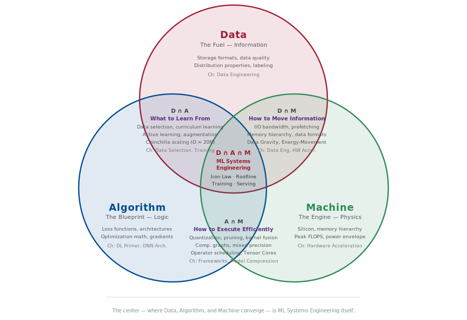

# The D·A·M Taxonomy {#sec-dam-taxonomy}

## Purpose {.unnumbered}

_When an ML system fails, where should you look first: the data path, the algorithm, or the machine?_

In production, “it’s slow” and “it’s wrong” are rarely informative symptoms. A serving stack can miss its latency Service Level Objective (SLO) because the accelerator is idle (data starvation), because the model is doing unnecessary work (algorithmic overhead), or because the accelerator is genuinely saturated (machine-bound). Without a taxonomy, teams often optimize the wrong thing—buying faster accelerators to fix a slow input pipeline, or rewriting kernels when the model is simply too large for the latency budget.

This appendix provides a compact diagnostic framework—**Data · Algorithm · Machine (D·A·M)**—and shows how to map symptoms and measurements to the term of the iron law that dominates. It serves as a “first response” checklist before committing to deeper optimization.

## How to Use This Appendix {.unnumbered}

This appendix is designed as a reference. Start with the scorecard-style metrics, form a hypothesis about which axis dominates, and then pick the tool that can confirm (or falsify) that hypothesis. Conventions used here follow the book-wide notation (for example, we reserve $B$ for batch size and use $\text{BW}$ for bandwidth).

When training is slow, check accelerator utilization, data wait time, and Model FLOPs Utilization (MFU), then map each to its Data, Algorithm, or Machine axis. When serving misses a Service Level Agreement (SLA), identify whether the regime is latency-bound (overhead), memory-bound (weight/KV movement), or compute bound. When cost is exploding, use the D·A·M rubric to ensure that effort targets the dominant term, not a nonbottleneck.

```{python}
#| echo: false
#| label: appendix-dam-setup
from mlsysim.core.constants import (
    H100_FLOPS_FP16_TENSOR, TFLOPs, second, flop, GB, byte,
    BILLION, MILLION, THOUSAND, MS_PER_SEC
)
from mlsysim.fmt import fmt, md, md_frac, md_math, sci_latex, check

# ┌── LEGO ───────────────────────────────────────────────
# Scenarios: GPU Utilization, Iron Law Analysis, Scaling Discrepancy

class DAMTaxonomy:
    """
    Namespace for D·A·M Taxonomy diagnostic examples.
    """

    # ┌── 1. LOAD (Constants) ───────────────────────────────────────────────
    # Exercise 1: Starving Accelerator
    ex1_gpu_util_pct = 25
    ex1_disk_sat_pct = 100

    # Exercise 2: Iron Law (7B Model Inference)
    ex2_params = 7 * BILLION
    ex2_latency_s = 0.050
    ex2_bytes_per_param = 2 # FP16
    ex2_flops_per_param = 2 # Fwd pass
    h100_fp16_tflops_peak = H100_FLOPS_FP16_TENSOR.m_as(TFLOPs/second)

    # Exercise 3: Scaling Law
    ex3_loss_start = 0.45
    ex3_loss_end = 0.42
    ex3_chin_pred_pct = 15

    # Exercise 4: Hardware Upgrade
    ex4_gpu_old_n = 4
    ex4_gpu_new_n = 8
    ex4_cost_k = 200

    # ┌── 2. EXECUTE (The Compute) ─────────────────────────────────────────
    # Step 1: Exercise 2 logic
    ex2_flops_per_pass = (ex2_params * ex2_flops_per_param * flop).m_as(TFLOPs)
    ex2_achieved_tflops = ex2_flops_per_pass/ex2_latency_s
    ex2_util = (ex2_achieved_tflops/h100_fp16_tflops_peak) * 100
    ex2_model_size_gb = (ex2_params * ex2_bytes_per_param * byte).m_as(GB)

    # Step 2: Exercise 3 logic
    ex3_imp_pct = (ex3_loss_start - ex3_loss_end) / ex3_loss_start * 100

    # ┌── 3. GUARD (Invariants) ───────────────────────────────────────────
    check(ex2_util < 10, f"Batch-1 utilization ({ex2_util:.1f}%) unexpectedly high.")

    # ┌── 4. OUTPUT (Formatting) ──────────────────────────────────────────────
    ex1_gpu_util_str = f"{ex1_gpu_util_pct}"
    ex1_disk_sat_str = f"{ex1_disk_sat_pct}"

    ex2_params_str = "7B"
    ex2_flops_per_pass_str = f"{ex2_flops_per_pass:.3f}"
    ex2_latency_ms_str = f"{int(ex2_latency_s * MS_PER_SEC)}"
    ex2_achieved_str = fmt(ex2_achieved_tflops, precision=2, commas=False)
    ex2_util_str = fmt(ex2_util, precision=2, commas=False)
    h100_fp16_tflops_str = f"{int(h100_fp16_tflops_peak)}"
    ex2_model_size_gb_str = f"{ex2_model_size_gb:.0f}"

    ex2_achieved_eq = md(
        f"$$\\text{{Achieved FLOP/s}} = \\frac{{{ex2_flops_per_pass_str} \\text{{ TFLOPs}}}}"
        f"{{0.050 \\text{{ s}}}} = {ex2_achieved_str} \\text{{ TFLOP/s}}$$"
    )
    ex2_util_eq = md(
        f"$$\\eta_{{\\text{{hw}}}} = \\frac{{{ex2_achieved_str}}}{{{int(h100_fp16_tflops_peak)}}} \\approx {ex2_util_str}\\%$$"
    )

    ex3_params_start_str = "125M"
    ex3_params_end_str = "1B"
    ex3_scale_factor = 8
    ex3_imp_str = f"{ex3_imp_pct:.1f}"
    ex3_chin_pred_str = f"{ex3_chin_pred_pct}"

    # Wrap in md() so the embedded $\times$ math renders when injected via
    # inline {python}. Bare f-strings bypass Pandoc's math parser.
    ex4_gpu_old_str = md(f"{ex4_gpu_old_n}$\\times$ A100")
    ex4_gpu_new_str = md(f"{ex4_gpu_new_n}$\\times$ H100")
    ex4_cost_str = f"${ex4_cost_k}K"
```

::: {.callout-learning-objectives}

- Classify an ML system bottleneck by its dominant Data, Algorithm, or Machine axis, while recognizing cross-axis interactions
- Map optimization techniques to their D·A·M intersection zone to understand which axes they span
- Apply the iron law equation to quantitatively diagnose performance problems
- Distinguish between memory-bound and compute-bound workloads using Arithmetic Intensity
- Select appropriate profiling tools and optimization strategies for each D·A·M axis
- Evaluate system health using the D·A·M Scorecard metrics (I/O Overhead, Active Params, MFU)

:::

The **Data · Algorithm · Machine (D·A·M) taxonomy** is the primary diagnostic framework for ML systems engineering. It formalizes the interdependence between information flow, mathematical logic, and physical execution. When performance stalls or behavior degrades, the diagnostic task is to identify *where the flow is blocked*. This taxonomy helps practitioners isolate the dominant bottleneck among three collectively exhaustive axes[^fn-mece], while recognizing that real systems often involve boundary cases where two or more axes interact.

[^fn-mece]: **MECE (Mutually Exclusive, Collectively Exhaustive)**: A classification principle from management consulting (popularized by McKinsey) requiring that categories do not overlap and together cover every possibility. D·A·M uses the exhaustive part as a first-pass diagnostic: every bottleneck should be explainable through Data, Algorithm, Machine, or their interactions, even when the cleanest diagnosis names a dominant axis plus a boundary effect.

## Diagnostic Summary {#sec-dam-taxonomy-diagnostic-summary-9f73}

The taxonomy maps directly to the **iron law of ML systems** established in @sec-introduction-iron-law-ml-systems-c32a. @tbl-dam-components-ref summarizes the role, primary physical constraint, and core optimization pathway for each axis.

| **Axis**          |          **Role**          |    **Physical Constraint**     | **High-Leverage Optimization**                     |
|:------------------|:--------------------------:|:------------------------------:|:---------------------------------------------------|
| **Data (D)**      | **Information** (The Fuel) |    Bandwidth ($\text{BW}$)     | Data Selection (@sec-data-selection)               |
| **Algorithm (A)** | **Logic** (The Blueprint)  |        Operations ($O$)        | Model Compression (@sec-model-compression)         |
| **Machine (M)**   |  **Physics** (The Engine)  | Throughput ($R_{\text{peak}}$) | Hardware Acceleration (@sec-hardware-acceleration) |

: **D·A·M Axis Reference**: Each axis maps to a distinct physical constraint and a high-leverage optimization strategy. Start diagnosis here: identify which constraint is binding, then follow the optimization pointer to the relevant chapter. {#tbl-dam-components-ref tbl-colwidths="[13,23,25,39]"}

This clean separation is useful as a first diagnostic step, but production systems rarely suffer from a single pure-axis bottleneck. More often, the problem sits at the *boundary* between two axes—a data format choice that determines whether the GPU can be saturated, or a pruning strategy that changes the memory access pattern. To handle these cases, we need to map the intersections.

## Intersection Landscape {#sec-dam-taxonomy-intersection-landscape-0d6e}

Real systems engineering lives at the *boundaries* between axes. @fig-dam-venn maps the intersection landscape: what concepts and techniques emerge when two or three axes overlap.

::: {#fig-dam-venn fig-env="figure" fig-pos="htb" fig-cap="**The D·A·M Intersection Landscape**: Each circle represents a pure domain: Data (information), Algorithm (logic), and Machine (physics). The pairwise intersections capture techniques that require reasoning about two domains simultaneously. The center---where all three converge---is ML Systems Engineering itself: the discipline of balancing data flow, algorithmic complexity, and hardware constraints within a single system." fig-alt="Venn diagram with three overlapping circles labeled data, algorithm, and machine. Pairwise intersections are labeled: D intersection A shows data selection and curriculum learning; D intersection M shows I/O bandwidth and data formats; A intersection M shows quantization and kernel fusion. The center intersection is labeled ML systems engineering with iron law and roofline."}

:::

@tbl-dam-intersections provides a scannable reference for each zone.

| **Zone**                | **Name**                   | **Key Techniques**                                           | **Book Coverage**                                          |
|:------------------------|:---------------------------|:-------------------------------------------------------------|:-----------------------------------------------------------|
| **D** (pure)            | Information                | Storage formats, data quality, distributions                 | @sec-data-engineering                                      |
| **A** (pure)            | Logic                      | Loss functions, architectures, gradients                     | @sec-neural-computation, @sec-network-architectures        |
| **D $\cap$ A**          | What to Learn From         | Data selection, curriculum learning, compute-optimal scaling | @sec-data-selection, @sec-model-training                   |
| **D $\cap$ M**          | How to Move Information    | I/O bandwidth, prefetching, data formats                     | @sec-data-engineering, @sec-hardware-acceleration          |
| **A $\cap$ M**          | How to Execute Efficiently | Quantization, pruning, kernel fusion, mixed precision        | @sec-ml-frameworks, @sec-model-compression                 |
| **M** (pure)            | Physics                    | Silicon, memory hierarchy, peak FLOPS                        | @sec-hardware-acceleration                                 |
| **D $\cap$ A $\cap$ M** | ML Systems Engineering     | iron law, Roofline, training loops, serving                  | @sec-model-training, @sec-model-serving, @sec-benchmarking |

: **D·A·M Intersection Reference**: Each zone maps specific techniques to the axes they span and the chapters that cover them. The pairwise intersections require reasoning about two domains simultaneously; the center requires all three. {#tbl-dam-intersections tbl-colwidths="[12,25,36,27]"}

The pure zones contain concepts that belong entirely to one axis: storage formats and distribution properties are purely Data concerns, loss functions and gradient computations are purely Algorithm, and silicon physics and peak FLOPS are purely Machine. These are the topics where single-domain expertise suffices.

The pairwise intersections are where systems thinking begins. **D $\cap$ A** (*What to Learn From*) encompasses data selection, curriculum learning, active learning, and scaling laws like Chinchilla ($D \approx 20N$)---all requiring joint reasoning about information content and algorithmic capacity. Adding data without considering whether the model can learn from it wastes compute; choosing architectures without considering data availability wastes engineering time. **D $\cap$ M** (*How to Move Information*) covers I/O bandwidth, prefetching strategies, data formats, and the energy-movement invariant. This intersection is where data gravity manifests: the physical cost of moving bytes through the memory hierarchy determines whether the machine can be fed fast enough. **A $\cap$ M** (*How to Execute Efficiently*) spans quantization, pruning, kernel fusion, mixed precision, and computational graph optimization. A pruning strategy that reduces FLOPs but destroys memory access patterns can *slow down* execution on real hardware.

The center---$D \cap A \cap M$---is where all three axes converge. The iron law, the Roofline Model, end-to-end training loops, serving pipelines, and holistic benchmarking all require simultaneous reasoning about data flow, algorithmic complexity, and hardware utilization. This center is not a single technique; it is the discipline itself.

Understanding the landscape reveals *where* a technique lives. The next step is quantifying *which axis dominates* for a given workload---and for that, we need the iron law.

## Iron Law Mapping {#sec-dam-taxonomy-iron-law-mapping-05db}

The performance of any ML task is governed by the distribution of work across the D·A·M axes. The iron law mapping reveals which component's variables dominate the execution time:
$$ T = \underbrace{ \frac{D_{\text{vol}}}{\text{BW}} }_{\text{Data (D)}} + \underbrace{ \frac{O}{R_{\text{peak}} \cdot \eta_{\text{hw}}} }_{\text{Algorithm (A) / Machine (M)}} + \underbrace{ L_{\text{lat}} }_{\text{Overhead}} $$

Algorithm and Machine share the compute term, separated by which variable the engineer controls. Reducing the total operations ($O$) is an **Algorithm** lever, while improving the hardware's peak throughput ($R_{\text{peak}}$) or utilization ($\eta_{\text{hw}}$) is a **Machine** lever.

This equation transforms performance debugging from a qualitative guessing game into a quantitative engineering problem. Every bottleneck hides in one of these terms. A slow system is one that is moving too much data ($D_{\text{vol}}$), lacking bandwidth ($\text{BW}$), executing too many operations ($O$), or failing to use the hardware's peak capability ($\eta_{\text{hw}}$). The levers below map specific optimizations to the variable they improve.

### Component levers {#sec-dam-taxonomy-component-levers-d441}

*   **Data Lever**: Reducing the volume of data ($D_{\text{vol}}$) through deduplication or curriculum learning, or increasing I/O bandwidth ($\text{BW}$).
*   **Algorithm Lever**: Reducing total arithmetic operations ($O$) through pruning, quantization, or architectural refinement.
*   **Machine Lever**: Increasing the denominator of the compute term by improving peak throughput ($R_{\text{peak}}$) or increasing the utilization factor ($\eta_{\text{hw}}$) via kernel fusion.

### D·A·M coordination: From sum to max {#sec-dam-taxonomy-dam-coordination-sum-max-92bb}

The additive iron law represents **sequential execution**---the worst case where Data, Algorithm, and Machine take turns. Skilled systems engineering, however, transforms the sum into a max:
$$ T_{\text{sequential}} = \frac{D_{\text{vol}}}{\text{BW}} + \frac{O}{R_{\text{peak}} \cdot \eta_{\text{hw}}} + L_{\text{lat}} \quad \xrightarrow{\text{overlap}} \quad T_{\text{pipelined}} = \max\left(\frac{D_{\text{vol}}}{\text{BW}}, \frac{O}{R_{\text{peak}} \cdot \eta_{\text{hw}}}\right) + L_{\text{lat}} $$

The systems engineer's job is to make these components run in parallel, not in series. @tbl-dam-overlap summarizes key D·A·M Coordination techniques:

| **Technique**           | **D·A·M Axes Overlapped**    | **Implementation**                                             |
|:------------------------|:-----------------------------|:---------------------------------------------------------------|
| **Prefetching**         | D overlaps M                 | DataLoader with `prefetch_factor`, `pin_memory=True`           |
| **CUDA Streams**        | D overlaps M                 | Separate streams for H2D transfer and compute                  |
| **Async Gradient Sync** | M (communication) overlaps A | Overlap bucketed AllReduce with remaining backward computation |
| **Double Buffering**    | D overlaps M                 | Fill buffer N+1 while computing on buffer N                    |

: **D·A·M Overlap Techniques**: Each technique allows one D·A·M axis to execute while another is in flight, converting the iron law's additive terms into overlapped terms. The payoff is transforming $T = a + b$ into $T = \max(a, b)$, which can cut latency nearly in half when the terms are balanced. {#tbl-dam-overlap}

Overlap only helps when the D·A·M axes are reasonably balanced. If one term dominates (for example, severely memory bound), overlapping the smaller term with the larger yields negligible gain—the max is still dominated by the same bottleneck. Overlap provides the greatest benefit when $D_{\text{vol}}/\text{BW} \approx O/(R_{\text{peak}} \cdot \eta_{\text{hw}})$.

::: {.callout-warning title="The overhead that cannot hide"}
The latency term $L_{\text{lat}}$ (kernel launch, synchronization barriers, Python dispatch) typically cannot be overlapped—it represents serialization points where all components must wait. This is why **kernel fusion** is so powerful: it eliminates $L_{\text{lat}}$ by combining operations, not just by speeding up any single component.
:::

The iron law tells the engineer *how much* time each axis consumes. One critical question remains: when the bottleneck sits at the boundary between Data and Machine, which side is binding? The answer lies in a single ratio.

## Arithmetic Intensity Boundary {#sec-dam-taxonomy-arithmetic-intensity-boundary-7f5e}

The boundary between **Data** (memory bound) and **Machine** (compute bound) is not arbitrary; it is defined mathematically by **arithmetic intensity**[^fn-arith-intensity] ($I$) of the workload.

[^fn-arith-intensity]: **Arithmetic Intensity**: The ratio of floating-point operations to bytes transferred (FLOPs/byte), introduced by @williams2009 as the key parameter in the Roofline Model. It determines whether a workload is memory bound or compute bound by comparison against the hardware's *ridge point* ($R_{\text{peak}}/\text{BW}$).

@sec-machine-foundations-roofline-model-2529 provides rigorous definitions of arithmetic intensity and the roofline model. Use that model to quantitatively distinguish between Data and Machine bottlenecks before applying the optimizations below.

The Roofline Model provides exact answers when there is time to profile. In the middle of a production incident, however, a faster heuristic is needed---a set of quick thresholds that points to the right axis within seconds.

## Rules of Thumb {#sec-dam-taxonomy-rules-thumb-f94f}

In the heat of a production outage, there is rarely time to solve the full iron law equation. Veteran systems engineers instead rely on these quantitative heuristics to quickly narrow the search space; the thresholds below serve as a first line of defense.

*   **If accelerator utilization $<$ 80 percent**: The workload is likely data bound (or CPU bound). The accelerator is starving.
*   **If accelerator utilization $>$ 95 percent**: The workload is likely machine bound. The accelerator is fully saturated.
*   **If batch size is one**: The workload is likely latency bound (algorithm overhead dominates).
*   **If arithmetic intensity $<$ 100 FLOPs/byte**: The workload is likely memory bound (Data/Machine boundary). This threshold is approximate for current-generation accelerators; compute the hardware's specific ridge point ($R_{\text{peak}}/\text{BW}$) for a precise boundary.
*   **If the system works in dev but fails in prod**: Suspect data drift (Data component).

Common industry labels map to D·A·M components as follows: memory bound typically indicates a **Data** bottleneck (information cannot reach the accelerator fast enough), compute bound indicates a **Machine** bottleneck (the accelerator is fully saturated), and latency bound indicates an **Algorithm** bottleneck (serial operation depth or overhead dominates).

### Bottleneck diagnostic {#sec-dam-taxonomy-bottleneck-diagnostic-3fc9}

Once the bottleneck is identified, @tbl-bottleneck-actions shows which optimizations help and which ones are wasted:

| **If the workload is...** | **Dominant Term**                            | **Optimization That Works**                                       | **Optimization That is Wasted**                    |
|:--------------------------|:---------------------------------------------|:------------------------------------------------------------------|:---------------------------------------------------|
| **Memory-Bound**          | $D_{\text{vol}}/\text{BW}$                   | Quantization, pruning, batching, kernel fusion                    | Faster accelerator (more FLOP/s will not help)     |
| **Compute-Bound**         | $O/(R_{\text{peak}} \cdot \eta_{\text{hw}})$ | Better kernels, Tensor Cores, faster accelerator, lower precision | More memory bandwidth (already saturated)          |
| **Latency-Bound**         | $L_{\text{lat}}$                             | Batching requests, kernel fusion, async dispatch                  | Neither compute nor bandwidth (overhead dominates) |

: **What Works vs. What Is Wasted**: Optimizing the wrong term yields exactly zero improvement. A memory-bound large language model (LLM) will not speed up from a faster accelerator; the accelerator will simply idle faster while waiting for memory. {#tbl-bottleneck-actions tbl-colwidths="[17,17,33,33]"}

Knowing what works also means recognizing what does not. In practice, teams under deadline pressure repeatedly fall into the same traps—optimizing the wrong axis with confidence. These failure modes are common enough to deserve their own names.

## Anti-Patterns {#sec-dam-taxonomy-antipatterns-72e1}

Diagnosing systems is often a process of elimination. Before committing to complex kernel optimizations, watch for these common traps that waste engineering cycles.

*   **The hardware crutch**: Buying faster accelerators (**Machine**) to fix a slow Python data loader (**Data**). The new hardware will just idle faster.
*   **The model twiddle**: Changing neural architectures (**Algorithm**) when the bottleneck is actually network bandwidth or disk I/O.
*   **The premature optimizer**: Writing custom CUDA kernels (**Machine**) before verifying if the Algorithm is simply doing too many unnecessary operations.

Each anti-pattern follows the same root cause: acting before diagnosing. The following case studies show what proper diagnosis looks like—starting from a confusing symptom and systematically narrowing to the dominant D·A·M axis.

## D·A·M Case Studies {#sec-dam-taxonomy-dam-case-studies-593f}

Theoretical constraints often manifest as confusing symptoms in production. These real-world scenarios illustrate how to apply the taxonomy.

### Case 1: The starving accelerator (Data) {#sec-dam-taxonomy-case-1-starving-accelerator-data-9a56}

#### Symptom {.unnumbered}

A team provisions a large A100 GPU instance to speed up training, but training time hardly improves. `nvidia-smi` shows GPU utilization fluctuating between 10 percent and 40 percent.

#### Diagnosis {.unnumbered}

The **Data** component cannot supply the **Machine** fast enough. The workload is I/O bound.

#### The fix {.unnumbered}

This is not a model or hardware problem. You must optimize the extract, transform, load (ETL) pipeline: move from raw JPEGs (CPU decoding heavy) to TFRecords or WebDataset (sequential reads), increase the number of data loader workers, and prefetch batches to GPU memory.

### Case 2: The latency cliff (Algorithm) {#sec-dam-taxonomy-case-2-latency-cliff-algorithm-8ee2}

#### Symptom {.unnumbered}

Your real-time recommendation system fails to meet the 20 ms latency SLA. The accelerator utilization is low, and the batch size is 1.

#### Diagnosis {.unnumbered}

The **Algorithm** is too computationally deep for the sequential deadline. You are latency-bound by serial operations.

#### The fix {.unnumbered}

Throwing more hardware (Machine) will not help because latency is limited by the serial execution of layers. You must change the Algorithm:

*   **Quantization**: Switch to INT8 to reduce memory fetch time.
*   **Pruning**: Remove redundant heads or channels.
*   **Knowledge Distillation**: Train a smaller student model.

### Case 3: The compute wall (Machine) {#sec-dam-taxonomy-case-3-compute-wall-machine-3a0a}

#### Symptom {.unnumbered}

Accelerator utilization is pinned at 99 percent. Memory bandwidth is unsaturated. Training is stable but takes three weeks.

#### Diagnosis {.unnumbered}

The system has successfully fed the beast. It is compute bound.

#### The fix {.unnumbered}

You have hit the physical limits of the single chip.

*   **Scale Up**: Move to a newer generation GPU (for example, A100 to H100).
*   **Scale Out**: Distribute training across multiple accelerators (Data Parallelism).
*   **Lower Precision**: Switch from FP32/TF32 training to BF16 where numerically safe; on NVIDIA Tensor Core paths, BF16 peak throughput is typically about 2$\times$ TF32 peak, with realized speedup depending on kernels and bottlenecks.

::: {.callout-checkpoint title="D·A·M diagnosis check"}

1. A training job shows 95 percent accelerator utilization but loss has plateaued for two epochs. Which D·A·M axis should you investigate, and why?
2. Your colleague suggests adding more data loader workers to a job where `nvidia-smi` shows 98 percent GPU utilization. Using the iron law, explain why this will not help.
3. An inference server meets its latency SLO at batch size 1 but fails at batch size 16. Which term in the iron law changed, and what does this tell you about the bottleneck regime?

:::

These three cases illustrate clean, single-axis bottlenecks. Production incidents are rarely so tidy—symptoms often overlap, and the dominant axis can shift during debugging. The next section provides a systematic troubleshooting matrix for the messier scenarios encountered in practice.

## Production Troubleshooting {#sec-dam-taxonomy-production-troubleshooting-02fb}

Identifying the root cause of performance bottlenecks requires systematic elimination. @tbl-dam-troubleshooting provides a diagnostic matrix for common failure modes observed in production deployments.

| **Symptom**                     | **Likely D·A·M Culprit** | **Diagnostic Question**                                            | **Recommended Action**                                 |
|:--------------------------------|:-------------------------|:-------------------------------------------------------------------|:-------------------------------------------------------|
| **Low Accelerator Utilization** | **Data**                 | Is the data loader keeping up with the accelerator?                | Implement prefetching and use binary formats.          |
| **High Latency (P99)**          | **Algorithm**            | Is the model depth or width exceeding the latency budget?          | Apply quantization (INT8) or structured pruning.       |
| **High Training Cost**          | **Machine**              | Is the hardware utilization ($\eta_{\text{hw}}$) below 30 percent? | Optimize CUDA kernels or use spot instances.           |
| **Silent Accuracy Drift**       | **Data**                 | Has the statistical distribution ($P_t$) shifted from $P_0$?       | Trigger retraining and update active learning filters. |
| **Out-of-Memory (OOM)**         | **Algorithm/Machine**    | Does the model state fit in available VRAM?                        | Use gradient checkpointing or reduce batch size.       |

: **D·A·M Diagnostic Matrix**: Root cause identification and remediation strategies for common ML systems failures. Each row connects a user-visible symptom to the D·A·M axis most likely responsible, reducing the search space before a profiler is needed. {#tbl-dam-troubleshooting tbl-colwidths="[25,21,29,25]"}

The diagnostic matrix indicates *what* to suspect. The next question is *how* to confirm that suspicion with evidence---which requires the right profiling tools.

## Tooling Map {#sec-dam-taxonomy-tooling-map-e09b}

Once a hypothesis exists (for example, "the workload appears Machine-bound"), evidence is needed to confirm it. Abstract concepts must be measured with concrete utilities. @tbl-dam-tooling connects the theoretical components to the specific Linux and Python profiling tools that confirm them.

| **Axis**      | **Key Metric**                        | **Primary Tool**        | **Secondary Tool**             |
|:--------------|:--------------------------------------|:------------------------|:-------------------------------|
| **Data**      | Batch Load Time                       | `tqdm` (iterations/sec) | `iotop`, `dstat` (Disk I/O)    |
| **Algorithm** | FLOPs, Model Depth                    | PyTorch Profiler        | DeepSpeed Flops Profiler       |
| **Machine**   | Accelerator Utilization, SM Occupancy | `nvidia-smi`            | Nsight Compute, Nsight Systems |

: **D·A·M Tooling Map**: Profiling utilities for diagnosing bottlenecks along each D·A·M axis. Start with the primary tool for quick triage; use secondary tools for deep-dive analysis when the primary tool's output is inconclusive. {#tbl-dam-tooling tbl-colwidths="[12,37,20,31]"}

Profiling tools generate raw numbers---utilization percentages, FLOP counts, bandwidth measurements. Raw numbers, however, only become actionable when compared against a standard. The D·A·M Scorecard provides that standard: a set of efficiency thresholds that distinguish healthy systems from those that need intervention.

## D·A·M Scorecard {#sec-dam-taxonomy-dam-scorecard-94e9}

To surpass qualitative guessing, the efficiency ratios in @tbl-dam-scorecard grade a system's performance against its theoretical limit. This "Report Card" standardizes what "good" looks like, anchored by **MFU**[^fn-mfu-scorecard]—the single most important metric for large-scale training.

[^fn-mfu-scorecard]: **MFU (Model FLOPs Utilization)**: The ratio of achieved model FLOPs to the hardware's theoretical peak FLOPs, introduced in the PaLM paper [@chowdhery2022palm]. Unlike raw accelerator utilization (which counts any work the accelerator performs), MFU measures only *useful* model computation, excluding overhead like gradient synchronization and memory management. @sec-benchmarking covers MFU in depth.

| **Axis**      | **Metric**        | **Definition**                                         |  **Failing Grade**  |    **Passing Grade**    |
|:--------------|:------------------|:-------------------------------------------------------|:-------------------:|:-----------------------:|
| **Data**      | **I/O Overhead**  | $\frac{\text{Data Wait Time}}{\text{Total Step Time}}$ |    $>$ 10 percent   |      $<$ 1 percent      |
| **Algorithm** | **Active Params** | $\frac{\text{Nonzero Params}}{\text{Total Params}}$    | 100 percent (Dense) | $<$ 50 percent (Sparse) |
| **Machine**   | **MFU**           | $\frac{\text{Achieved FLOPs}}{\text{Peak FLOPs}}$      |    $<$ 30 percent   |      $>$ 50 percent     |

: **The D·A·M Efficiency Rubric**: These three numbers characterize any ML system's maturity. A system that passes all three thresholds has exhausted its easy optimizations; further gains require architectural changes or hardware upgrades. {#tbl-dam-scorecard tbl-colwidths="[25,25,25,25]"}

The Scorecard and the Roofline Model both answer efficiency questions, but at different scales. The Scorecard grades the current system against known thresholds. Scaling laws and the information roofline address a more strategic question: what happens as the system scales *beyond* its current size?

## Scaling Laws vs. Roofline {#sec-dam-taxonomy-scaling-laws-vs-roofline-b290}

Systems engineering requires distinguishing between *growth trajectories* and *fundamental limits*.

### Scaling laws (the journey) {#sec-dam-taxonomy-scaling-laws-journey-4085}

Scaling laws[^fn-scaling-laws] are empirical power laws that predict *how fast* model performance improves as we increase resources. The two landmark results are Kaplan Scaling [@kaplan2020scaling], which showed that performance improves predictably with parameters ($N$), data ($D$), and compute ($C$), and Chinchilla Scaling [@hoffmann2022chinchilla], which refined this insight by defining the *optimal ratio* of these resources (for example, $D \approx 20N$ tokens per parameter).

[^fn-scaling-laws]: **Scaling Laws**: Empirical relationships, typically power laws of the form $L(x) \propto x^{-\alpha}$, that predict model loss as a function of dataset size, parameter count, or compute budget. First systematically studied by @kaplan2020scaling at OpenAI, then refined by @hoffmann2022chinchilla with the Chinchilla result. @sec-model-training discusses scaling laws in detail.

These laws are economic guides, summarizing the trade as: "If I double my compute budget, my error rate should drop by $X$ percent." They assume the information is there to be learned.

### Information roofline (the destination) {#sec-dam-taxonomy-information-roofline-destination-6426}

The information roofline is the theoretical limit of what *can* be learned from the data, regardless of scale. Three quantities define it: the *ceiling* is the Bayes Error Rate[^fn-bayes-error] (the irreducible error inherent in the data); the *slope* is the information density, or signal-to-noise ratio, of the training distribution; and the *bottleneck* appears when data has low information density---as with noisy financial tickers---causing the system to hit the "Data Quality Wall" long before the compute wall.

[^fn-bayes-error]: **Bayes Error Rate**: The lowest achievable error rate for any classifier on a given data distribution, determined by the overlap between class-conditional distributions. Named after Thomas Bayes (1701–1761). No amount of data, parameters, or compute can reduce error below this theoretical floor.

The diagnostic lesson is this: Scaling laws predict the *slope* of improvement, while the information roofline predicts the *ceiling*. If a loss curve flattens *before* the scaling law prediction, the system has hit the information roofline. Adding more accelerators (Machine) or parameters (Algorithm) at this point is futile; Data quality is the only lever left.

This distinction closes the loop on the D·A·M taxonomy. Whether the task is debugging a single training step (iron law), evaluating hardware utilization (Roofline), or planning a multi-million-dollar scaling campaign (scaling laws), the diagnostic question is always the same: *which axis dominates, and what lever moves it?*

## Summary {#sec-dam-taxonomy-summary-1521}

The D·A·M taxonomy provides a systematic framework for diagnosing ML systems bottlenecks. Each axis maps to a distinct physical constraint: Data is bounded by bandwidth, Algorithm by total operations, and Machine by peak throughput. The iron law quantifies these constraints, enabling systematic diagnosis. Use arithmetic intensity to determine the Data/Machine boundary, and the D·A·M Scorecard to evaluate system maturity.

::: {.callout-takeaways title="Where to look first"}

* **Every bottleneck lives in one of three places**: Data, Algorithm, or Machine. Identify the dominant axis before optimizing.
* **Profile arithmetic intensity before optimizing** to determine whether the regime is Data-bound or Machine-bound.
* **Diagnose the D·A·M axis before proposing solutions**: Optimizing the wrong term yields zero improvement.
* **Grade the system with the D·A·M Scorecard** (I/O Overhead < 1 percent, Active Params < 50 percent, MFU > 50 percent) before investing in optimizations.

:::

## Exercises {#sec-dam-taxonomy-exercises-135b}

### Exercise one: Component identification {.unnumbered}

A production image classification service runs on an A100 GPU. The `nvidia-smi` output shows `{python} DAMTaxonomy.ex1_gpu_util_str` percent GPU utilization, while `iotop` reveals the disk is saturated at `{python} DAMTaxonomy.ex1_disk_sat_str` percent. Which D·A·M axis is the bottleneck? What are two specific optimizations you would recommend?

**Answer**: The bottleneck is **Data**. The disk at `{python} DAMTaxonomy.ex1_disk_sat_str` percent saturation while GPU sits at `{python} DAMTaxonomy.ex1_gpu_util_str` percent utilization is the classic "starving GPU" pattern. The Machine (GPU) has capacity to spare, but the Data pipeline cannot feed it fast enough. Two optimizations: (1) Convert raw images (JPEG/PNG) to a sequential binary format like TFRecords or WebDataset to reduce CPU decoding overhead and enable sequential disk reads. (2) Increase DataLoader workers and implement prefetching to overlap I/O with computation, ensuring the next batch is ready before the GPU finishes the current one.

### Exercise two: Iron law analysis {.unnumbered}

Consider a decoder-only transformer model with `{python} DAMTaxonomy.ex2_params_str` parameters generating one token in the autoregressive decode phase at batch size 1. Using the 2 FLOPs-per-parameter rule of thumb, the decode step requires `{python} DAMTaxonomy.ex2_flops_per_pass_str` TFLOPs. On an H100 GPU (`{python} DAMTaxonomy.h100_fp16_tflops_str` TFLOPS peak FP16 Tensor Core), the measured latency is `{python} DAMTaxonomy.ex2_latency_ms_str` ms. Calculate the achieved utilization ($\eta_{\text{hw}}$). Is this system Data-bound, Algorithm-bound, or Machine-bound? Justify your answer.

**Answer**: First, calculate achieved throughput:

`{python} DAMTaxonomy.ex2_achieved_eq`

Then calculate utilization:

`{python} DAMTaxonomy.ex2_util_eq`

Computed values: Achieved = `{python} DAMTaxonomy.ex2_achieved_str` TFLOP/s, Utilization = `{python} DAMTaxonomy.ex2_util_str` percent.

These numbers prove **low Machine utilization**, but they do not by themselves prove a saturated HBM path. At batch size 1, each layer performs a matrix-vector multiply (GEMV) rather than a general matrix multiply (GEMM). The model's `{python} DAMTaxonomy.ex2_params_str` parameters (~`{python} DAMTaxonomy.ex2_model_size_gb_str` GB in FP16) must be loaded for every forward pass, so the workload has low arithmetic intensity and is a strong **Data-bottleneck candidate**. To classify it as memory-bound rather than overhead/latency-bound, confirm with profiling evidence such as near-peak HBM bandwidth or most time attributed to weight reads.

The fix targets the **Data/Algorithm boundary**: increasing the batch size transforms GEMV into GEMM, dramatically raising arithmetic intensity and pushing the workload toward compute bound. Other effective strategies include quantization (INT8 halves the bytes moved per parameter, directly reducing the $D_{\text{vol}}/\text{BW}$ term) or speculative decoding to amortize weight loads across multiple tokens.

### Exercise three: Scaling law vs. information roofline {.unnumbered}

A team has been training a sentiment analysis model. After scaling from `{python} DAMTaxonomy.ex3_params_start_str` to `{python} DAMTaxonomy.ex3_params_end_str` parameters (`{python} DAMTaxonomy.ex3_scale_factor`$\times$ increase), validation loss improved from `{python} DAMTaxonomy.ex3_loss_start` to `{python} DAMTaxonomy.ex3_loss_end` (`{python} DAMTaxonomy.ex3_imp_str` percent improvement). Chinchilla scaling would predict a ~`{python} DAMTaxonomy.ex3_chin_pred_str` percent improvement for this compute increase. What does this discrepancy suggest? Which D·A·M axis should be investigated first, and why?

**Answer**: The discrepancy points to the **Information Roofline**---the ceiling imposed by data quality rather than model capacity. Scaling laws predict the *slope* of improvement assuming sufficient information in the data. When actual improvement (`{python} DAMTaxonomy.ex3_imp_str` percent) falls well short of predicted improvement (`{python} DAMTaxonomy.ex3_chin_pred_str` percent), the model has likely extracted most learnable signal from the training distribution.

Investigate the **Data** component first. Specifically: (1) Measure the noise level in the labels---sentiment is subjective and inter-annotator agreement may be low. (2) Check for class imbalance or distribution gaps. (3) Evaluate whether the dataset covers the linguistic patterns in the target domain. Adding more parameters (Algorithm) or faster hardware (Machine) will not help when the system is hitting the Bayes error rate for this data. The path forward is better data: cleaner labels, more diverse examples, or domain-specific fine-tuning data.

### Exercise four: Anti-pattern detection {.unnumbered}

A colleague proposes upgrading from `{python} DAMTaxonomy.ex4_gpu_old_str` GPUs to `{python} DAMTaxonomy.ex4_gpu_new_str` GPUs because training is "too slow." Before approving the `{python} DAMTaxonomy.ex4_cost_str` hardware purchase, what three diagnostic questions would you ask? Map each question to the D·A·M axis it investigates.

**Answer**: Before spending `{python} DAMTaxonomy.ex4_cost_str`, ask:

1. **"What is the current GPU utilization during training?"** → *Machine*. If utilization is below 80 percent, faster GPUs will just idle faster. The bottleneck is elsewhere.

2. **"What percentage of each training step is spent waiting for data?"** → *Data*. Run `torch.profiler` or check if `DataLoader` time exceeds 10 percent of step time. If data loading dominates, the fix is pipeline optimization (binary formats, more workers, prefetching), not new GPUs.

3. **"Can the batch size scale with 2$\times$ more GPUs without degrading convergence?"** → *Algorithm*. Doubling GPUs typically requires doubling batch size to maintain efficiency. If the model already uses the maximum stable batch size, or if larger batches hurt convergence, additional GPUs provide diminishing returns. Check the scaling efficiency: if four GPUs achieve only 3$\times$ speedup over one GPU, the communication overhead suggests eight GPUs might achieve only 4--5$\times$ speedup.

Only if all three answers are favorable—high utilization, minimal data wait, and batch size headroom—does the hardware upgrade make sense.
