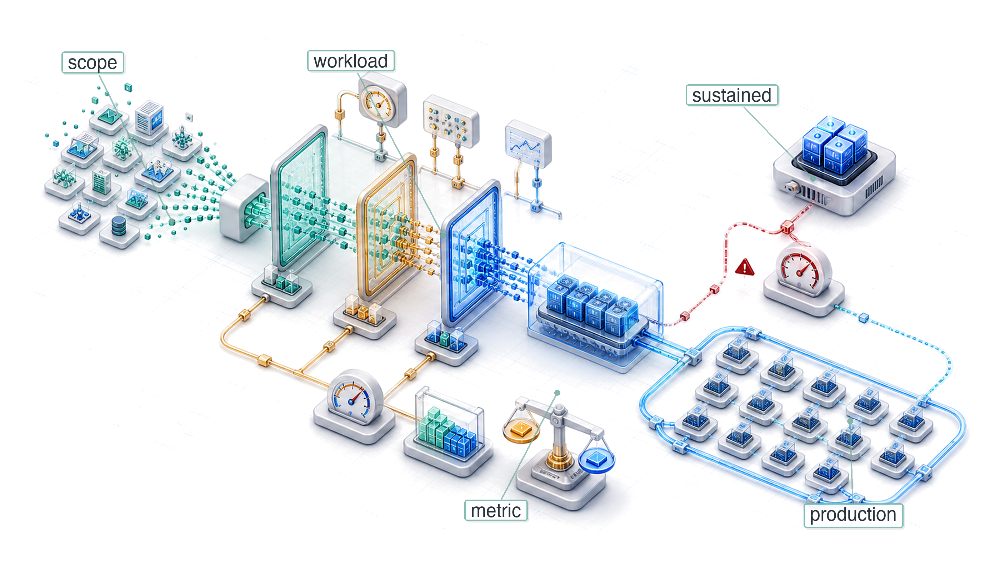
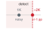
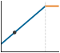
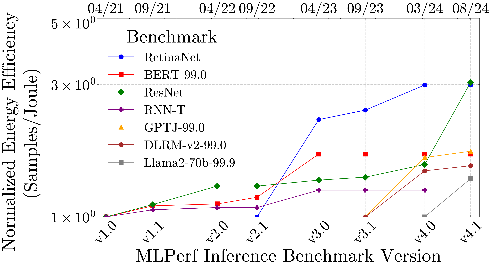
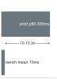

# Benchmarking {#sec-benchmarking}

::: {layout-narrow}
::: {.column-margin}

\chapterminitoc

:::

::: {.content-visible when-format="pdf"}
\noindent
{fig-alt="Isometric benchmarking rig showing a workload passing through nested measurement scopes with a visible gap between peak capability and sustained behavior."}
:::

::: {.content-visible unless-format="pdf"}
{fig-alt="Isometric benchmarking rig showing a workload passing through nested measurement scopes with a visible gap between peak capability and sustained behavior."}
:::

:::

## Purpose {.unnumbered .unlisted}

\begin{marginfigure}
\mlsysstack{75}{15}{25}{30}{35}{45}{10}{15}
\end{marginfigure}

_How can ML systems be systematically compared when hardware, models, data, and deployment conditions all interact?_

Benchmarking brings together decisions already developed across hardware targeting, model compression, data selection, and deployment behavior. Each decision improved one dimension (latency, accuracy, throughput, or energy), but an ML system is the product of all these dimensions simultaneously. A pruned model runs faster on one accelerator but slower on another. A larger batch size improves accelerator utilization but violates a latency service-level agreement. An edge device advertises peak throughput that thermal throttling halves under sustained workloads. The challenge is not whether individual optimizations work in isolation (they do) but how to measure their combined effect under conditions that actually matter. Benchmarking is the discipline of making such comparisons systematic rather than anecdotal. It requires defining what to measure (accuracy, latency, throughput, energy), at what granularity (a single kernel, a full model, an end-to-end pipeline), and under which conditions (batch size, input distribution, thermal state, concurrent load). Without this structure, teams compare numbers that were never measured on the same terms, and decisions that looked sound in a spreadsheet collapse under production workloads. Those chapters optimized the model, selected the data, and matched the hardware; benchmarking is where those optimizations are validated: where claims meet evidence, and where the gap between what was promised and what will be delivered is either quantified honestly or discovered painfully in production. In D·A·M terms, benchmarking is where co-design is held to account: the measurement discipline that reveals whether Data, Algorithm, and Machine were actually matched or merely assembled.

::: {.content-visible when-format="pdf"}

\newpage

:::

::: {.callout-learning-objectives}

- Explain benchmarking as D·A·M validation that tests whether optimization claims hold under representative conditions
- Compare training and inference benchmarks using throughput, latency percentiles, energy, accuracy, and workload scope
- Select micro, macro, or end-to-end granularity based on the engineering decision being tested
- Apply standardized benchmark run rules to align datasets, metrics, hardware configuration, and reporting
- Design benchmark protocols that control power boundaries, input distributions, batch sizes, and statistical variance
- Evaluate model and data quality with calibration, robustness, representativeness, and slice-level metrics
- Diagnose benchmark-production gaps caused by drift, thermal throttling, dynamic load, and silent degradation

:::

## ML Benchmarking Framework {#sec-benchmarking-machine-learning-benchmarking-framework-70b8}

A model quantized to INT8 may benchmark 2$\times$ faster on a synthetic workload but show no improvement under real traffic patterns with variable input sizes and concurrent requests. A pruned model may maintain accuracy on the test set but fail on edge cases the benchmark never covered. Every optimization arrives with a promise: data selection promises more efficient training, model compression promises smaller, faster models, and hardware acceleration promises higher throughput. Verifying that these claims hold in production is itself an engineering discipline.

Benchmarking is where the physical laws those chapters established (the iron law, the conservation of complexity, the memory wall) face empirical reality. The **benchmark-production gap**\index{Benchmark-Production Gap} is not a failure of methodology but the measure of how much physical reality exceeds our models of it. Closing that gap by designing measurements that predict production behavior with quantitative fidelity is the core competency that distinguishes ML systems engineering from ML research. Benchmarking is the discipline's truth-telling function: the practice that converts theoretical claims into verified engineering knowledge.

ML benchmarking operates across three interdependent dimensions that map directly to the components of any deployed system. **System benchmarking**\index{Benchmarking!system, definition} measures whether the hardware delivers promised performance under realistic workloads or whether memory bandwidth saturation and software dispatch overhead erode the gains. **Model benchmarking**\index{Model Benchmarking!definition} measures whether optimization techniques preserve model quality across the full input distribution, not just on curated test sets. **Data benchmarking**\index{Data Benchmarking!definition} measures whether the model generalizes to real-world data with all its noise, bias, and distributional shift. Each dimension can independently reveal problems invisible to the others, and a system that passes all three provides far stronger deployment confidence than one evaluated along any single axis.

```{python}
#| echo: false
# ┌── LEGO ───────────────────────────────────────────────
# │ Context: Benchmarking definition callout (peak vs sustained gap).
# │ Goal: A100 peak TFLOP/s for the significance bullet below.
from mlsysim import *
from mlsysim.core.units import *
from mlsysim import Hardware
from mlsysim.core.units import TFLOP, second
from mlsysim.fmt import fmt_flop_rate

class A100PeakBenchmark:
    _peak_flops = Hardware.Cloud.A100.compute.peak_flops

    # ┌── 4. OUTPUT (Formatting) ─────────────────────────────────────────────
    a100_fp16_tflop_per_s_str = fmt_flop_rate(_peak_flops, unit=TFLOP / second, precision=0, commas=False)
```

::: {#dfn-benchmarking-machine-learning-benchmarking .callout-definition title="Machine learning benchmarking"}

***Machine Learning Benchmarking***\index{Benchmarking!definition} is the empirical measurement of a system's end-to-end performance on representative ML workloads, designed to decouple marketed peak specifications from the sustained throughput and latency achievable under realistic operating conditions.

1.  **Significance**: The gap between peak and sustained performance is large and structurally unavoidable. An A100 GPU delivers `{python} A100PeakBenchmark.a100_fp16_tflop_per_s_str` (BF16) at peak, but production transformer training runs typically sustain 90--155 TFLOP/s (30--50 percent MFU), about a 2--3.5$\times$ gap that exists even in optimally tuned systems due to memory stalls, pipeline bubbles, and kernel launch overhead. Benchmarking quantifies this $\eta_{\text{hw}}$ gap; vendor spec sheets do not.
2.  **Distinction**: Unlike micro-benchmarks, which measure individual kernel performance such as a general matrix multiply (GEMM) at peak matrix dimensions, ML benchmarks measure the full stack: data loading, preprocessing, forward pass, gradient computation, optimizer step, and checkpoint I/O—exposing bottlenecks that individual-component benchmarks will never reveal.
3.  **Common pitfall**: A frequent misconception is that benchmark numbers are stable references. Both the workload (new model architectures) and the hardware (new GPU generations) evolve, so a result that leads a benchmark under one version often becomes the baseline under a later version, making year-over-year comparisons meaningful only when the benchmark version is held constant.

:::

Unlike traditional systems where benchmarks represent fixed specifications, ML benchmarks capture only a snapshot of a shifting reality. The gap between peak and sustained performance documented above is not fixed either: it shifts as both workloads and hardware generations evolve, making any single benchmark result time-stamped rather than universal.

::: {#psp-benchmarking-benchmarks-as-moving-targets .callout-perspective title="Benchmarks as moving targets"}

In traditional systems (for example, SPEC CPU), the benchmark is a *rigid specification*. A sorting algorithm is correct if it sorts the list. Correctness is absolute and unchanging. In ML systems, the benchmark is a *soft specification*: correctness is defined by a finite set of examples (ImageNet), and the world moves. A model that scores highly on ImageNet can still underperform on user photos taken years after the benchmark was created.

In computer architecture, engineers design for the benchmark because the benchmark represents the workload. In ML engineering, designing solely for the benchmark is *overfitting*. Robustness comes from acknowledging that the benchmark is only a proxy for a shifting reality.

:::

To make this three-dimensional framework concrete, we ground it in a running example that threads through the entire chapter, returning to it repeatedly as we develop each dimension. MobileNetV2 deployment validation\index{MobileNet!deployment validation example} spans all three evaluation dimensions, illustrating how each reveals problems the others cannot.

```{python}
#| echo: false
# ┌── LEGO ───────────────────────────────────────────────
# │ Context: MobileNetV2 deployment validation lighthouse callout.
# │ Goal: INT8 compression ratio and EdgeTPU vs CPU latency for the pipeline.
from mlsysim import Models
from mlsysim.core.units import BYTES_FP32, BYTES_INT8, MB
from mlsysim.fmt import fmt, fmt_memory, check

class MobileNetLighthouseSetup:
    _mobilenet_v2 = Models.Vision.MobileNetV2
    _edgetpu_latency_ms = 2
    _cpu_latency_ms = 15
    _mv2_size = _mobilenet_v2.size_in_bytes(BYTES_FP32)
    _mv2_int8_size = _mobilenet_v2.size_in_bytes(BYTES_INT8)
    _mv2_compress = (_mv2_size / _mv2_int8_size).to_base_units().magnitude

    check(_mv2_compress == 4.0, f"Expected 4x INT8 compression, got {_mv2_compress:.1f}x")

    # ┌── 4. OUTPUT (Formatting) ─────────────────────────────────────────────
    mobilenet_v2_size_mb_str = fmt_memory(_mv2_size, unit=MB, commas=False)
    mobilenet_v2_int8_size_mb_str = fmt_memory(_mv2_int8_size, unit=MB, precision=1, commas=False)
    mobilenet_v2_compression_ratio_mult_str = fmt_multiple(_mv2_compress, precision=0, commas=False)
    edgetpu_latency_ms_str = fmt_time(_edgetpu_latency_ms, 'millisecond', precision=0, commas=False)
    cpu_latency_ms_str = fmt_time(_cpu_latency_ms, 'millisecond', precision=0, commas=False)
```

::: {#lhs-benchmarking-mobilenet-deployment-validation .callout-lighthouse title="MobileNetV2 deployment validation"}

MobileNetV2 (introduced in @sec-network-architectures-lighthouse-roster-model-biographies-a763) serves as the lighthouse example for validating the complete optimization pipeline. MobileNetV2 refines v1's depthwise separable design with inverted residuals and linear bottlenecks while maintaining a similar parameter scale [@sandler2018]. It exemplifies the deployment challenges where benchmarking determines success or failure: compression can reduce model size, hardware acceleration can reduce inference latency, and only benchmarking can determine whether those gains survive the full deployment pipeline.

1. **Model compression** (@sec-model-compression): INT8 quantization\index{Quantization!INT8 compression ratio} reduces this MobileNetV2 worked example from `{python} MobileNetLighthouseSetup.mobilenet_v2_size_mb_str` to `{python} MobileNetLighthouseSetup.mobilenet_v2_int8_size_mb_str` (`{python} MobileNetLighthouseSetup.mobilenet_v2_compression_ratio_mult_str` compression)
2. **Hardware acceleration** (@sec-hardware-acceleration): the illustrative EdgeTPU scenario\index{Edge TPU!inference latency} uses `{python} MobileNetLighthouseSetup.edgetpu_latency_ms_str` inference vs. `{python} MobileNetLighthouseSetup.cpu_latency_ms_str` on CPU
3. **Benchmarking validation**: Verify the pipeline delivers in practice

The sections that follow address one dimension of this validation stack at a time, building toward a systematic methodology that isolates EdgeTPU latency from preprocessing and data transfer overhead, confirms INT8 quantization preserves accuracy on edge cases such as unusual lighting, and checks that performance holds on real-world smartphone images rather than only ImageNet test images.

:::

Before examining these dimensions in detail, we must establish the mindset that separates rigorous evaluation from misleading metrics. Three principles distinguish effective practitioners.

First, *benchmarks are proxies, not truth.*\index{Benchmarking!benchmarks as proxies} Every benchmark measures specific conditions that may not match the target deployment. A system can achieve high sample throughput in Offline mode (bulk throughput with all inputs available) and much lower QPS in Server mode (latency-constrained requests arriving over time). The critical question is always what the benchmark does not measure.

Second, Goodhart's Law applies everywhere.[^fn-goodharts-law]\index{Goodhart's Law!metric trap} "When a measure becomes a target, it ceases to be a good measure." Teams that optimize for benchmark rankings often produce systems that excel in evaluation but fail in production. Benchmark-specific optimizations frequently degrade characteristics that matter for deployment: robustness, calibration, and efficiency.

```{python}
#| echo: false
#| label: component-latency-example-calc
# ┌── LEGO ───────────────────────────────────────────────
# │ Context: End-to-end-beats-component prose paragraph immediately below.
# │ Goal: Component-only vs end-to-end speedup under pipeline overhead.
from mlsysim.fmt import fmt, fmt_qty, check
from mlsysim.physics import calc_amdahls_speedup

class ComponentLatencyExample:
    """A component-only speedup diluted by non-model pipeline work."""

    # ┌── 1. LOAD (Constants) ──────────────────────────────────────────────
    model_latency_ms = 10
    e2e_latency_ms = 50
    component_speedup = 3

    # ┌── 2. EXECUTE (The Compute) ────────────────────────────────────────
    model_fraction = model_latency_ms / e2e_latency_ms
    e2e_speedup = calc_amdahls_speedup(model_fraction, component_speedup)
    optimized_e2e_ms = e2e_latency_ms / e2e_speedup

    # ┌── 3. GUARD (Invariants) ───────────────────────────────────────────
    check(e2e_speedup < component_speedup, "End-to-end speedup must be bounded by non-model work.")
    check(round(e2e_speedup, 1) == 1.2, f"Expected about 1.2x end-to-end speedup, got {e2e_speedup:.1f}x")

    # ┌── 4. OUTPUT (Formatting) ─────────────────────────────────────────────
    model_latency_ms_str = fmt_time(model_latency_ms, 'millisecond', precision=0, commas=False)
    e2e_latency_ms_str = fmt_time(e2e_latency_ms, 'millisecond', precision=0, commas=False)
    component_speedup_mult_str = fmt_multiple(component_speedup, precision=0, commas=False)
    e2e_speedup_mult_str = fmt_multiple(e2e_speedup, precision=1, commas=False)
```

Third, end-to-end beats component metrics\index{Benchmarking!end-to-end vs. component metrics}. Vendors report component latency (5–10 ms for model inference), but production latency includes preprocessing, queuing, and postprocessing (50–100 ms total). A `{python} ComponentLatencyExample.component_speedup_mult_str` inference speedup applied to a `{python} ComponentLatencyExample.model_latency_ms_str` model stage inside a `{python} ComponentLatencyExample.e2e_latency_ms_str` pipeline yields only about `{python} ComponentLatencyExample.e2e_speedup_mult_str` end-to-end improvement, or worse if the optimization increases memory pressure.

::: {.column-margin}
{width="100%" fig-alt="Two stacked latency bars compare before and after a 3 times model-stage speedup: the model segment shrinks, but the other pipeline work remains, so 50 milliseconds only falls to about 43 milliseconds."}

*Component speedup rarely survives as end-to-end benchmark speedup.*
:::

[^fn-goodharts-law]: **Goodhart's Law**\index{Goodhart's Law!etymology}: @goodhart1984 articulated the original 1975 Bank of England observation on monetary policy; @strathern1997improving generalized it into the form quoted above. The original context was macroeconomics: once a monetary aggregate became an official policy target, banks changed behavior to game the metric, destroying its predictive value. In ML, the same failure mode recurs structurally: BLEU rewards n-gram overlap [@papineni2001], ImageNet rewards performance on a fixed visual distribution [@deng2009; @recht2019imagenet], and benchmark leaderboards can incentivize test-set-specific tuning.

These principles reappear throughout the benchmarking methodology and are examined in depth in @sec-benchmarking-fallacies-pitfalls-9781.

Knowing *what* to measure, however, is only half the problem. Measuring incorrectly (with the wrong workloads, biased baselines, or uncontrolled variables) produces numbers that feel precise but mislead decisions. The history of computing benchmarking is littered with examples of technically sound metrics applied with flawed methodology, from compiler-gamed Whetstone scores to cherry-picked GPU benchmarks that predict nothing about sustained workloads. Understanding how measurement methodology evolved, and where it failed, is essential for designing benchmarks that distinguish genuine improvements from measurement artifacts.

The historical foundations of benchmarking[^fn-benchmark-etymology] matter because they expose the validation failures that still recur in ML: optimized metrics that stop predicting real workloads, hardware numbers that ignore sustained operating state, and model scores that miss deployment cost. The same validation sequence governs modern practice: first verify that hardware delivers promised performance, then verify that the model and data optimizations built atop that hardware deliver their promised gains.

[^fn-benchmark-etymology]: **Benchmark**: From surveying, where a "bench mark" was a horizontal cut in stone serving as a fixed elevation reference. The term entered computing in the 1970s to describe standardized comparison points, but the surveying metaphor carries a systems lesson: just as an elevation measurement is meaningless without a calibrated reference, an ML throughput number is meaningless without controlled workloads, thermal state, and precision settings. \index{Benchmark!etymology}

## Historical Foundations {#sec-benchmarking-historical-context-7350}

In 1976, when Whetstone became one of the first standardized computing benchmarks\index{Benchmarking!historical evolution}, vendors immediately began optimizing their compilers specifically for its floating-point tests—producing impressive numbers that predicted nothing about real application performance. This gaming problem has plagued every generation of benchmarks since. Understanding *why* ML benchmarking requires our three-dimensional approach demands tracing *how* measurement methodologies evolved, and often failed, over decades of computing history. Each generation of benchmarks emerged from the limitations of its predecessors, teaching lessons that directly inform modern ML evaluation.

Before that history begins, one boundary condition matters: a benchmark is useful only when it names the layer whose claim it validates.

::: {#psp-benchmarking-related-efficiency-metrics .callout-perspective title="Benchmarking as cross-layer evidence"}

An ML benchmark is meaningful only when it identifies which layer of the system is being validated. Data selection metrics such as performance-per-data (PPD), area under the learning curve (AULC), and data compression ratio (DCR), all developed in @sec-data-selection, measure whether fewer examples can preserve learning signal. Compression metrics (@sec-model-compression) measure whether fewer parameters or lower precision preserve quality. Hardware metrics such as roofline position and TOPS/W (@sec-hardware-acceleration) measure whether the machine executes the workload efficiently. The system benchmarks in @sec-benchmarking-system-benchmarks-393c through @sec-benchmarking-mlperf-power-case-study-a554 connect these layers by testing whether local improvements survive in an end-to-end workload.

:::

That cross-layer role explains why benchmark history matters: each generation of performance measurement advanced when practitioners discovered that the previous method failed to predict real-world behavior. The evolution from simple performance metrics to ML benchmarking reveals three methodological shifts.

### Performance benchmarks {#sec-benchmarking-performance-benchmarks-ea8a}

The earliest computing benchmarks revealed a problem that plagues evaluation to this day: benchmark gaming\index{Benchmark Gaming!vendor optimization for tests}. Mainframe benchmarks like Whetstone\index{Whetstone!synthetic floating-point benchmark} [@curnow1976whetstone] and LINPACK\index{LINPACK!matrix operations benchmark}[^fn-whetstone-linpack] [@dongarra1979linpack] measured isolated operations (floating-point throughput, matrix solve speed), and vendors quickly learned to optimize specifically for these narrow tests rather than for practical performance. The resulting numbers looked impressive on paper but predicted little about how systems performed on actual workloads. SPEC CPU\index{SPEC CPU!real application workloads} (1989) broke this cycle by using a suite of portable, application-oriented programs rather than a single synthetic kernel [@dixit1993spec]. This lesson directly shapes ML benchmarking: optimization claims from @sec-model-compression require validation on representative tasks, and MLPerf's inclusion of real models like ResNet-50 and BERT ensures benchmarks capture deployment complexity rather than idealized test cases.

[^fn-whetstone-linpack]: **Whetstone and LINPACK**: Whetstone [@curnow1976whetstone] was named after the English Electric facility in Whetstone, Leicestershire, where the original ALGOL compiler was built; LINPACK [@dongarra1979linpack] was Jack Dongarra's benchmark for dense linear systems, later adopted by the Top500 list in 1993. Both measured a single operation type so narrowly that compilers could be tuned to game the result: Whetstone's floating-point loops became a test of compiler optimization rather than hardware performance. ML benchmarking inherited the same vulnerability: single-model benchmarks can be gamed through model-specific kernel tuning, which is why MLPerf requires multiple workloads spanning vision, language, and recommendation [@dongarra2003]. \index{Whetstone!etymology}\index{LINPACK!narrow benchmark}

As deployment contexts diversified, a second limitation emerged: single-metric evaluation proved inadequate. Graphics benchmarks began measuring rendering quality alongside frame rate; mobile benchmarks added battery life as a co-equal concern with performance. The multi-objective challenges from @sec-introduction (balancing accuracy, latency, and energy) manifest directly in ML evaluation, where no single metric captures deployment viability.

A third shift occurred when distributed computing\index{Distributed Computing!system-level performance} revealed that component-level optimization fails to predict system-level performance. A CPU benchmark cannot predict cluster throughput when network communication dominates. ML training similarly depends on the interplay of accelerator compute (@sec-hardware-acceleration), data pipelines, gradient synchronization, and storage throughput. MLPerf evaluates complete workflows, recognizing that performance emerges from component interactions, not from components in isolation.

DAWNBench\index{DAWNBench!time-to-accuracy evaluation} [@coleman2019] emerged as an early ML benchmark that pioneered time-to-accuracy evaluation, directly influencing MLPerf's methodology for measuring training efficiency. These lessons culminate in MLPerf\index{MLPerf!founding and purpose}[^fn-mlperf] (2018), which synthesizes representative workloads, multi-objective evaluation, and integrated measurement while addressing ML-specific challenges [@mattson2020mlperf; @reddi2020].

[^fn-mlperf]: **MLPerf**: Founded in 2018 by researchers from Google, NVIDIA, Intel, Harvard, Stanford, and UC Berkeley, the name combines "ML" with "Perf" (performance), echoing SPEC's benchmarking tradition. MLPerf's design principles—representative workloads, full-system measurement, and open submission—directly address the gaming that plagued Whetstone and LINPACK: vendors who could previously report peak kernel throughput on cherry-picked problem sizes must now report end-to-end system performance on standardized tasks [@mattson2020mlperf; @reddi2020]. \index{MLPerf!founding}

### Energy benchmarks {#sec-benchmarking-energy-benchmarks-709a}

The multi-objective evaluation paradigm naturally extended to energy efficiency\index{Benchmarking!energy, first-class metric} as computing diversified beyond mainframes with less constrained power budgets. Mobile devices demanded battery life optimization, while warehouse-scale systems faced energy costs rivaling hardware expenses. This shift established energy as a first-class metric alongside performance, spawning benchmarks like SPEC Power\index{SPEC Power!server energy efficiency}[^fn-spec-power] for servers and Green500\index{Green500!HPC energy efficiency ranking}[^fn-green500] for supercomputers.

[^fn-spec-power]: **SPEC Power**: Introduced in 2007, SPEC Power measures performance per watt across 11 load levels from idle (0 percent) through 100 percent in 10 percent increments [@lange2009]. This granularity matters for ML serving: inference workloads rarely sustain 100 percent load, and servers that are efficient at peak but wasteful at partial load inflate the energy cost of real-world deployment. \index{SPEC Power!energy efficiency}

[^fn-green500]: **Green500**: Started in 2007 as a counterpart to the Top500, Green500 ranks systems by FLOP/s per watt rather than raw performance [@feng2007green500]. Its lesson for ML systems is methodological: the most cost-effective training cluster is not necessarily the fastest one, but the system that delivers useful work per watt under the workload and measurement boundary that matter. \index{Green500!energy efficiency ranking}

Diverse workload patterns and system configurations continue to challenge power benchmarking across computing environments. MLPerf Power\index{MLPerf!power, ML energy measurement} [@mlperf_power_website] addresses this with specialized methodologies for measuring the energy impact of machine learning workloads, reflecting energy efficiency's central role in AI system design.

```{python}
#| echo: false
# ┌── LEGO ───────────────────────────────────────────────
# │ Context: Energy benchmarks subsection (MobileNet vs ResNet FLOPs).
# │ Goal: ResNet-to-MobileNet FLOPs ratio for algorithmic energy savings.
from mlsysim import Models
from mlsysim.core.units import GFLOPs
from mlsysim.fmt import fmt, fmt_qty

class MobileNetEnergyFlops:
    _flops_ratio = Models.Vision.ResNet50.inference_flops.to(GFLOPs).magnitude / Models.Vision.MobileNetV2.inference_flops.to(GFLOPs).magnitude

    # ┌── 4. OUTPUT (Formatting) ─────────────────────────────────────────────
```

Energy benchmarking extends beyond hardware power measurement to include algorithmic efficiency. Model compression techniques (pruning, quantization, knowledge distillation) can reduce energy by changing the work a system performs, not only by changing the hardware that performs it. MobileNet-family architectures use depthwise separable convolutions and related design choices to reduce computation relative to heavier CNN baselines such as ResNet [@howard2017mobilenets; @sandler2018; @he2016]. These techniques, detailed in @sec-model-compression, establish that energy-aware benchmarking must evaluate algorithmic efficiency alongside hardware power consumption; @sec-model-compression-energy-costs-d1d5 quantifies the specific energy breakdown of INT8 vs. FP32. As AI systems scale, this lesson becomes central to sustainable computing practices.

### Domain-specific benchmarks {#sec-benchmarking-domainspecific-benchmarks-b15f}

As computing diversified beyond general-purpose servers, generic benchmarks proved inadequate for specialized domains. Three categories of specialization drove this evolution, each exposing measurement dimensions that general-purpose benchmarks could not address.

Deployment constraints shape core metric priorities. Data center workloads optimize for throughput with rack- and cluster-scale power budgets, while mobile AI operates within tight device thermal envelopes, and IoT devices require milliwatt-scale operation. These constraints, rooted in efficiency principles from @sec-introduction, determine whether benchmarks prioritize total throughput or energy per operation.

Application requirements then impose functional and regulatory constraints beyond raw performance. Healthcare AI demands interpretability metrics alongside accuracy; financial systems may require very low latency with audit compliance; autonomous vehicles need safety-critical reliability and formal functional-safety validation. These requirements extend evaluation beyond traditional performance metrics; @sec-responsible-engineering later systematizes the responsible-engineering principles behind fairness, interpretability, and compliance.

Operational conditions determine real-world viability. Autonomous vehicles face wide temperature ranges and degraded sensor inputs; data centers handle large concurrent request volumes with network faults; industrial IoT endures long deployments without maintenance. The hardware capabilities from @sec-hardware-acceleration only deliver value when validated under these conditions.

Machine learning exemplifies this transition to domain-specific evaluation. Traditional CPU and GPU benchmarks prove insufficient for assessing ML workloads, which involve complex interactions between computation, memory bandwidth, and data movement patterns. MLPerf provides standardized performance measurement for machine learning models across these categories: MLPerf Training\index{MLPerf Training!data center multi-node scaling} addresses data center deployment constraints with multi-node scaling benchmarks [@mattson2020mlperf], MLPerf Inference\index{MLPerf Inference!server to edge evaluation} evaluates latency-critical application requirements across server to edge deployments [@reddi2020], and MLPerf Tiny\index{MLPerf Tiny!microcontroller benchmarks} assesses ultra-constrained operational conditions for microcontroller deployments [@banbury2021mlperftiny]. This tiered structure, summarized in @tbl-mlperf-suites, reflects the systematic application of our three-category framework to ML-specific evaluation needs.

| **MLPerf Variant**   | **Target Domain** | **Key Constraints**                              | **Primary Metrics**                             |
|:---------------------|:------------------|:-------------------------------------------------|:------------------------------------------------|
| **MLPerf Training**  | Data center       | Multi-node scaling, high bandwidth interconnects | Time-to-quality, throughput (samples/sec)       |
| **MLPerf Inference** | Server/Edge       | Latency SLAs, throughput requirements            | QPS, latency percentiles, accuracy preservation |
| **MLPerf Tiny**      | MCU/IoT           | Ultra-low-power inference, limited memory        | Latency, accuracy, energy per inference         |
| **MLPerf Power**     | Cross-cutting     | Energy budgets, thermal constraints              | Performance/W, energy per query                 |

: **MLPerf Benchmark Suite Variants**: Each variant addresses a different deployment context, from data-center-scale training to ultra-constrained microcontroller inference, targeting specific operational constraints and measuring metrics relevant to its deployment scenario. {#tbl-mlperf-suites tbl-colwidths="[20,20,30,30]"}

MLPerf Power\index{MLPerf Power!energy efficiency measurement} extends the same discipline to energy efficiency, where the benchmarked quantity is useful work per watt rather than raw throughput alone. Domain-specific benchmarks drive targeted hardware and software optimizations while ensuring that improvements translate to deployment success rather than narrow laboratory conditions.

This historical progression, from general computing benchmarks through energy-aware measurement to domain-specific evaluation frameworks, provides the foundation for understanding ML benchmarking challenges. The lessons learned (representative workloads over synthetic tests, multi-objective over single metrics, integrated systems over isolated components) directly shape AI system evaluation. @Tbl-benchmark-evolution summarizes this progression and the key lessons each generation contributed.

| **Benchmark**  | **Year** | **Primary Focus**                   | **Key Metric(s)**                       | **Lesson for ML Benchmarking**                                               |
|:---------------|:--------:|:------------------------------------|:----------------------------------------|:-----------------------------------------------------------------------------|
| **Whetstone**  |   1976   | Synthetic floating-point operations | MWIPS                                   | Gaming synthetic tests undermines evaluation validity                        |
| **LINPACK**    |   1979   | Linear algebra (matrix operations)  | FLOP/s                                  | Isolated operations miss system-level complexity and bottlenecks             |
| **SPEC CPU**   |   1989   | Real application workloads          | SPECrate, SPECspeed                     | Representative workloads reveal true deployment performance                  |
| **SPEC Power** |   2007   | Server energy efficiency            | ssj_ops/W across load levels            | Energy efficiency requires multi-load evaluation, not just peak performance  |
| **Green500**   |   2007   | HPC energy efficiency               | GFLOP/s per watt                        | Efficiency rankings complement raw performance rankings                      |
| **MLPerf**     |   2018   | ML systems (training + inference)   | Time-to-quality, QPS, latency, accuracy | Synthesizes all lessons: representative workloads + multi-objective + system |

: **Benchmark Evolution**: Evolution of computing benchmarks from synthetic operations to ML-specific evaluation. Each generation addressed limitations of its predecessors, culminating in MLPerf's synthesis of representative workloads, multi-objective metrics, and integrated system measurement. {#tbl-benchmark-evolution tbl-colwidths="[12,9,23,20,36]"}

These lessons culminate in ML benchmarking suites, yet ML systems face an additional challenge absent from traditional benchmarks: inherent probabilistic variability\index{Benchmarking!probabilistic variability}. Unlike traditional workloads with deterministic behavior, ML systems must satisfy all three historical lessons (representative workloads, multi-objective evaluation, integrated measurement) while also accounting for stochastic outcomes that vary with training data, weight initialization, and even operation ordering. This additional dimension of variability demands measurement methodologies that account for stochastic outcomes.

Individual organizations learned these lessons independently, often painfully, but isolated measurements cannot drive an industry. When one team measures inference latency including preprocessing and another excludes it, when accuracy benchmarks use different data splits, or when power measurements draw different system boundaries, the resulting numbers are incommensurable. The transition from ad-hoc measurement to standardized benchmarking suites transforms benchmarking from an internal validation exercise into a shared language that enables hardware procurement, architecture comparison, and deployment decisions across organizations.

## System Benchmarking Suites {#sec-benchmarking-system-benchmarking-suites-e946}

A team evaluating edge deployment hardware needs to compare five different system on chip (SoC) designs for a smart camera product. Vendor A reports 8 TOPS at INT8; Vendor B reports 15 TOPS at INT4; Vendor C reports inference latency on a proprietary model; Vendor D cites MLPerf scores from two generations ago; Vendor E provides only peak throughput at maximum batch size. None of these numbers are comparable. The team cannot make a procurement decision because every vendor measured a different thing, under different conditions, using different definitions of "performance." The problem is not *a lack of data* but *a lack of commensurable data*, and benchmarking suites exist to solve exactly this fragmentation.

Three lessons from benchmark history (representative workloads, multi-objective evaluation, and integrated measurement) converge with the challenge unique to ML: inherent probabilistic variability. Modern benchmarking suites encode these lessons into standardized frameworks that make the kind of cross-organization comparison our hardware procurement team needs possible.

ML benchmarks must evaluate the interplay between algorithms, hardware, and data, not merely computational efficiency alone. Early benchmarks focused on algorithmic performance [@lecun1998], but scaling demands expanded the focus to hardware efficiency [@jouppi2017], and high-profile deployment failures elevated data quality as a third evaluation dimension [@gebru2021]. This probabilistic nature elevates accuracy to a first-class evaluation dimension alongside speed and energy consumption: the same ML system can produce different results depending on the data it encounters. Energy efficiency cuts across all three framework dimensions, since algorithmic choices affect computational complexity, hardware capabilities determine energy-performance trade-offs, and dataset characteristics influence training energy costs [@hernandez2020measuring].

### ML measurement challenges {#sec-benchmarking-ml-measurement-challenges-60ea}

The unique characteristics of ML systems create measurement variability\index{Measurement Variability!sources in ML systems} that many traditional benchmarks were not designed for. Unlike deterministic algorithms that produce identical outputs given the same inputs, ML systems exhibit inherent variability from multiple sources: algorithmic randomness from weight initialization and data shuffling, hardware thermal states affecting clock speeds, system load variations from concurrent processes, and environmental factors including network conditions and power management. This variability requires rigorous statistical methodology to distinguish genuine performance improvements from measurement noise.

To address this variability, effective benchmark protocols require multiple experimental runs with different random seeds\index{Random Seed!benchmark protocol requirement}. Running each benchmark 5--10 times and reporting statistical measures beyond simple means (including standard deviations or 95 percent confidence intervals\index{Confidence Interval!benchmark reporting}) quantifies result stability and allows practitioners to distinguish genuine performance improvements from measurement noise.

Empirical studies have shown how inadequate statistical rigor can lead to misleading conclusions. Many reinforcement learning papers report improvements that fall within statistical noise [@henderson2018], while GAN comparisons often lack proper experimental protocols, leading to inconsistent rankings across different random seeds [@lucic2018gans]. These findings underscore the importance of establishing measurement protocols that account for ML's probabilistic nature.

Representative workload selection determines benchmark validity. Synthetic microbenchmarks often fail to capture the complexity of real ML workloads where data movement, memory allocation, and dynamic batching create performance patterns not visible in simplified tests. Comprehensive benchmarking therefore requires workloads that reflect actual deployment patterns: variable sequence lengths in language models, mixed precision training regimes, and realistic data loading patterns that include preprocessing overhead.

Beyond workload representativeness, the distinction between *statistical significance* and *practical significance* requires careful interpretation. A small performance improvement might achieve statistical significance across hundreds of trials but prove operationally irrelevant if it falls within measurement noise or costs exceed benefits. This creates what we call *the statistical confidence trap*, where seemingly rigorous evaluation still misleads.

```{python}
#| echo: false
#| label: statistical-confidence-calc
# ┌── LEGO ───────────────────────────────────────────────
# │ Context: The statistical confidence trap callout below.
# │ Goal: Binomial uncertainty for 95% vs 94% on 1,000 images.
from math import sqrt, ceil
from mlsysim.fmt import fmt_int, fmt, fmt_count, check, fmt_text

class StatisticalConfidenceTrap:
    """Binomial uncertainty for a 95% vs. 94% accuracy comparison on 1,000 images."""

    # ┌── 1. LOAD (Constants) ──────────────────────────────────────────────
    n_images = 1000
    baseline_accuracy = 0.95
    compressed_accuracy = 0.94
    z_95 = 1.96
    target_margin = 0.01

    # ┌── 2. EXECUTE (The Compute) ────────────────────────────────────────
    baseline_error_rate = 1 - baseline_accuracy
    compressed_error_rate = 1 - compressed_accuracy
    baseline_errors = n_images * baseline_error_rate
    compressed_errors = n_images * compressed_error_rate
    sigma_errors = sqrt(n_images * baseline_error_rate * baseline_accuracy)
    ci_low = baseline_errors - z_95 * sigma_errors
    ci_high = baseline_errors + z_95 * sigma_errors
    one_prop_n = ceil((z_95**2 * baseline_accuracy * (1 - baseline_accuracy)) / (target_margin**2))

    # ┌── 3. GUARD (Invariants) ───────────────────────────────────────────
    check(round(baseline_errors) == 50, f"Expected 50 baseline errors, got {baseline_errors:.1f}")
    check(round(compressed_errors) == 60, f"Expected 60 compressed errors, got {compressed_errors:.1f}")
    check(ci_low < compressed_errors < ci_high, "Compressed errors should fall inside baseline CI.")
    check(1800 < one_prop_n < 2000, f"One-proportion sample estimate changed: {one_prop_n}")

    # ┌── 4. OUTPUT (Formatting) ─────────────────────────────────────────────
    n_images_str = fmt(n_images, precision=0, commas=True)
    baseline_accuracy_pct_str = fmt_percent(baseline_accuracy, precision=0, commas=False, style='prose')
    compressed_accuracy_pct_str = fmt_percent(compressed_accuracy, precision=0, commas=False, style='prose')
    baseline_errors_str = fmt_count(round(baseline_errors), commas=False, label="error")
    compressed_errors_str = fmt_count(round(compressed_errors), commas=False, label="error")
    sigma_errors_str = fmt_count(round(sigma_errors), commas=False, label="error")
    z_95_str = fmt(z_95, precision=2, commas=False)
    ci_range_str = fmt_text(
        "[",
        fmt_int(round(ci_low), commas=False),
        ", ",
        fmt_int(round(ci_high), commas=False),
        "]",
    )
    one_prop_n_str = fmt(one_prop_n, precision=0, commas=True)
    target_margin_pp_str = fmt_pp(target_margin * 100, precision=0)
    ci_confidence_pct_value = 95
    ci_confidence_pct_str = fmt_percent(ci_confidence_pct_value / 100, precision=0, commas=False, style='prose')
```

::: {.column-margin}
{width="100%" fig-alt="Horizontal detectability marker: a 1K test set sits in the noisy region, while roughly 2K samples are needed for a plus or minus 1 percentage point confidence interval."}

*A 1K test set cannot reliably see a one-point regression.*
:::

::: {#nbk-benchmarking-statistical-confidence-trap .callout-notebook title="The statistical confidence trap"}

**Problem**: A baseline image classifier has `{python} StatisticalConfidenceTrap.baseline_accuracy_pct_str` accuracy. A "compressed" version is deployed and its accuracy measured on a `{python} StatisticalConfidenceTrap.n_images_str`-image test set, yielding `{python} StatisticalConfidenceTrap.compressed_accuracy_pct_str`. Did the optimization cause a real regression, or is it noise?

**Math**:

1.  **Expected errors**: At `{python} StatisticalConfidenceTrap.baseline_accuracy_pct_str` accuracy, the test set produces `{python} StatisticalConfidenceTrap.baseline_errors_str`. At `{python} StatisticalConfidenceTrap.compressed_accuracy_pct_str`, it produces `{python} StatisticalConfidenceTrap.compressed_errors_str`.
2.  **Standard Deviation** $(\sigma_{\text{err}})$: Using the binomial distribution with $N_{\text{test}}$ test examples and event probability $p_{\text{err}} = \Pr(\text{err})$:

    $$ \sigma_{\text{err}} \approx \sqrt{N_{\text{test}} \times p_{\text{err}} \times (1-p_{\text{err}})} = \sqrt{1000 \times 0.05 \times 0.95} $$

    This yields approximately `{python} StatisticalConfidenceTrap.sigma_errors_str`.

3.  **Confidence interval** (`{python} StatisticalConfidenceTrap.ci_confidence_pct_str`): `{python} StatisticalConfidenceTrap.baseline_errors_str` $\pm$ `{python} StatisticalConfidenceTrap.z_95_str` $\times$ `{python} StatisticalConfidenceTrap.sigma_errors_str` $\approx$ `{python} StatisticalConfidenceTrap.ci_range_str`.

    **Measurement implication**: Both `{python} StatisticalConfidenceTrap.baseline_errors_str` and `{python} StatisticalConfidenceTrap.compressed_errors_str` fall inside the *same confidence interval*. A `{python} StatisticalConfidenceTrap.n_images_str`-sample test set *cannot reliably detect* a 1 percentage point accuracy drop. About `{python} StatisticalConfidenceTrap.one_prop_n_str` samples are enough to estimate a `{python} StatisticalConfidenceTrap.baseline_accuracy_pct_str` accuracy rate with a `{python} StatisticalConfidenceTrap.ci_confidence_pct_str` confidence interval of about ±`{python} StatisticalConfidenceTrap.target_margin_pp_str`; detecting a 1-point regression between two independently evaluated models requires a larger two-proportion power calculation.

**Systems insight**: Small benchmarks exhibit what amounts to a laboratory fallacy. The test set, viewed as a measurement instrument, must be sized to match the precision of the change it is meant to detect.

:::

Statistical confidence is a measurement-capacity problem: the benchmark may be pointed at the right quantity, but the test set is too small to resolve the change. A second failure mode is metric alignment. Here the measurement can be precise and reproducible, yet still reward behavior that violates the deployed system's objective. The translation example makes that distinction concrete by showing how a BLEU improvement can come at the expense of latency.

```{python}
#| echo: false
#| label: goodhart-bleu-calc
# ┌─────────────────────────────────────────────────────────────────────────────
# │ GOODHART'S LAW BLEU-VS-LATENCY CALCULATION
# ├─────────────────────────────────────────────────────────────────────────────
# │ Context: "Goodhart's Law in action" callout-notebook immediately below.
# │
# │ Goal:    Quantify how a beam-search-driven BLEU gain trades against the
# │          inference latency budget.
# │ Show:    Original vs. optimized BLEU, beam size, latency, and the resulting
# │          slowdown and candidate-ratio multipliers.
# │ How:     Direct ratios on the team's reported numbers, with invariants that
# │          fix the 4x slowdown and 10x beam expansion.
# │
# └─────────────────────────────────────────────────────────────────────────────
from mlsysim.fmt import fmt, check

class GoodhartBLEUCalc:
    """BLEU leaderboard gain that violates the serving latency budget."""

    # LOAD
    original_bleu = 28.0
    optimized_bleu = 28.5
    original_latency_ms = 50
    optimized_latency_ms = 200
    original_beam_size = 1
    optimized_beam_size = 10
    latency_budget_ms = 100

    # EXECUTE
    bleu_gain = optimized_bleu - original_bleu
    candidate_ratio = optimized_beam_size / original_beam_size
    latency_slowdown = optimized_latency_ms / original_latency_ms

    # GUARD
    check(latency_slowdown == 4.0, f"Expected 4x latency slowdown, got {latency_slowdown:.1f}x")
    check(candidate_ratio == 10.0, f"Expected 10x candidate expansion, got {candidate_ratio:.1f}x")
    check(optimized_latency_ms > latency_budget_ms, "Optimized model should violate the latency budget.")

    # OUTPUT
    original_bleu_str = fmt(original_bleu, precision=0, commas=False)
    optimized_bleu_str = fmt(optimized_bleu, precision=1, commas=False)
    bleu_gain_str = fmt(bleu_gain, precision=1, commas=False)
    original_latency_ms_str = fmt_time(original_latency_ms, 'millisecond', precision=0, commas=False)
    optimized_latency_ms_str = fmt_time(optimized_latency_ms, 'millisecond', precision=0, commas=False)
    latency_slowdown_mult_str = fmt_multiple(latency_slowdown, precision=0, commas=False)
    original_beam_size_str = fmt(original_beam_size, precision=0, commas=False)
    optimized_beam_size_str = fmt(optimized_beam_size, precision=0, commas=False)
    candidate_ratio_mult_str = fmt_multiple(candidate_ratio, precision=0, commas=False)
    latency_budget_ms_str = fmt_time(latency_budget_ms, 'millisecond', precision=0, commas=False)
```

::: {#nbk-benchmarking-goodharts-law-action .callout-notebook title="Goodhart's Law in action"}

**Trap**: Optimizing for a single metric often degrades others.

**Scenario**: A team optimizes a translation model for **BLEU score**\index{BLEU!metric trap example}, creating a Goodhart's Law\index{Goodhart's Law!BLEU score example} failure.

*   **Original model**: BLEU = `{python} GoodhartBLEUCalc.original_bleu_str`, Inference = `{python} GoodhartBLEUCalc.original_latency_ms_str`.
*   **Optimized model**: BLEU = `{python} GoodhartBLEUCalc.optimized_bleu_str` (a `{python} GoodhartBLEUCalc.bleu_gain_str`-point gain), Inference = `{python} GoodhartBLEUCalc.optimized_latency_ms_str` (`{python} GoodhartBLEUCalc.latency_slowdown_mult_str` slower).

**Math**:

*   The `{python} GoodhartBLEUCalc.bleu_gain_str` BLEU gain comes from a larger beam search, which keeps the $k$ most promising partial translations at each decoding step instead of one (beam_size = `{python} GoodhartBLEUCalc.optimized_beam_size_str` vs. beam_size = `{python} GoodhartBLEUCalc.original_beam_size_str`).
*   **Cost**: `{python} GoodhartBLEUCalc.candidate_ratio_mult_str` more candidate evaluations per step.
*   **Result**: The optimized model wins the leaderboard while violating the deployed system's latency budget.

**Systems insight**: Always constrain the optimization. Maximize Accuracy subject to Latency < `{python} GoodhartBLEUCalc.latency_budget_ms_str`.

:::

These measurement failures share a deeper limitation: a benchmark on a static dataset measures recognition under a fixed distribution, not the robustness to a shifting one that production demands. The data dimension of the framework developed later in this chapter confronts exactly that gap.

The preceding measurement challenges motivate evaluating each dimension of the three-dimensional framework (system, model, and data) with distinct methodologies. The bulk of this chapter focuses on system benchmarking (training benchmarks, inference benchmarks, and power measurement) because these form the foundation of standardized evaluation through MLPerf. Model and data benchmarking require different methodologies and are treated in detail in @sec-benchmarking-model-data-benchmarking-e0ca after we establish system evaluation foundations.

### System benchmarks {#sec-benchmarking-system-benchmarks-393c}

System benchmarks measure the computational foundation that enables model capabilities, examining how hardware architectures, memory systems, and interconnects affect overall performance. This validation is critical because hardware specifications often describe theoretical peaks that real workloads never achieve. The discrepancy is common enough to make peak-performance claims misleading\index{Fallacy of Peak Performance!GPU utilization gap}. System benchmarks reveal these gaps by running standardized ML workloads rather than synthetic microbenchmarks.

::: {#psp-benchmarking-fallacy-peak-performance .callout-perspective title="The fallacy of peak performance"}

Dave Patterson often refers to peak performance as "the performance the manufacturer guarantees you will not exceed." For ML systems, that gap is especially wide because of the memory wall: a memory-bound model leaves most of the advertised FLOP/s unreachable no matter how fast the arithmetic units run. Standardized benchmarks like MLPerf are essential because they force systems to run real models on real data, revealing the true "sustained performance" that engineers can actually rely on.

:::

The peak-vs.-sustained gap is structurally guaranteed by the memory wall\index{Memory Wall!impact on GPU utilization}, not an occasional anomaly that better engineering can avoid. Recognizing this structural nature reframes vendor evaluation from guesswork into a checklist of concrete criteria.

::: {#chk-benchmarking-vendor-claims .callout-checkpoint title="Decoding vendor benchmark claims"}

When evaluating hardware or software based on vendor-reported benchmarks, check whether the claim identifies the workload, measurement boundary, and operating conditions.

- [ ] **Measured quantity**: Can you tell whether a latency number includes preprocessing and postprocessing, not just model execution?
- [ ] **Precision boundary**: Can you identify the precision behind a throughput claim, such as INT4 versus INT8 or FP16?
- [ ] **Workload boundary**: Can you name the model, batch size, and input distribution used to produce the comparison?
- [ ] **Excluded costs**: Can you account for memory transfers, model loading, initialization, sustained thermal behavior, and power at the claimed performance level?
- [ ] **Claimed vs. achieved**: Given a 1,000 TFLOP/s peak claim and a benchmark that sustains 350 TFLOP/s, estimate the MFU, and decide whether the shortfall points more to arithmetic intensity or to memory bandwidth.

@Tbl-benchmarking-vendor-claims translates common marketing phrases into the technical caveats behind each.

| **Vendor Claim**               | **What It Often Means**                                            |
|:-------------------------------|:-------------------------------------------------------------------|
| **"Up to 10,000 images/sec"**  | Peak throughput at maximum batch size, INT8, without preprocessing |
| **"Sub-millisecond latency"**  | Accelerator compute only, excluding data transfer                  |
| **"5$\times$ more efficient"** | Per-operation efficiency, not total system efficiency              |
| **"Optimized for AI"**         | May only accelerate specific operations or precisions              |

: **Decoding Vendor Benchmark Claims**: Four common marketing phrases and the technical caveats that determine whether a claim describes end-to-end performance, a narrow accelerator measurement, or an unsupported efficiency comparison. {#tbl-benchmarking-vendor-claims}

:::

The decision rule is to reject any benchmark claim whose workload boundary, precision, and excluded costs cannot be reconstructed. A headline throughput or latency number becomes useful only after the engineer can map it to the actual model, batch shape, data movement, sustained operating point, and power envelope.

The underlying hardware infrastructure (CPUs, GPUs, Tensor Processing Units (TPUs)[^fn-bench-tpu], and ASICs[^fn-asic]) determines the speed, efficiency, and scalability of ML systems. System benchmarks establish standardized methodologies for evaluating hardware performance across AI workloads, measuring metrics including computational throughput, memory bandwidth, power efficiency, and scaling characteristics [@reddi2020; @mattson2020mlperf].

[^fn-bench-tpu]: **TPU (Tensor Processing Unit)**: Google's custom ASIC for neural network workloads (architecture details in @sec-hardware-acceleration). A TPU v4 pod (4,096 chips) delivers 1.1 exaFLOP/s peak BF16, but benchmarking TPUs requires caution: their systolic-array architecture favors regular tensor operations, so peak FLOP/s overstate performance on irregular workloads like sparse attention or dynamic control flow. \index{TPU!benchmarking considerations}

[^fn-asic]: **ASIC (Application-Specific Integrated Circuit)**: An ASIC's peak TOPS number applies only to the specific operators it was designed for. A single unsupported layer forces fallback to a general-purpose processor, potentially negating the entire efficiency advantage. This makes operator coverage the first question in any ASIC benchmark: the gap between peak and achieved throughput is not a hardware limitation but a workload-compatibility limitation. \index{ASIC!benchmarking trade-off}

System benchmarks serve two functions. For practitioners, they enable informed hardware selection by providing comparative data across configurations. For manufacturers, they quantify generational improvements and guide accelerator development. The co-evolution has been dramatic: as GPU adoption grew, accuracy improved rapidly, demonstrating that hardware and algorithmic advances drive progress in tandem.

```{python}
#| echo: false
#| label: a100-roofline-constants
# ┌─────────────────────────────────────────────────────────────────────────────
# │ A100 ROOFLINE CONSTANTS
# ├─────────────────────────────────────────────────────────────────────────────
# │ Context: Prose paragraph on arithmetic intensity threshold (~line 405)
# │          and FLOP/s footnote (~line 485)
# │
# │ Goal: Provide A100 hardware specs for the roofline introduction.
# │ Show: FP16, FP32 TFLOP/s, memory bandwidth, and ridge point.
# │ How: Retrieve A100 specs from Digital Twins; compute ridge point.
# │
# └─────────────────────────────────────────────────────────────────────────────
from mlsysim.fmt import fmt_bandwidth, fmt_flop_rate, fmt_arithmetic_intensity

class A100Roofline:
    """A100 hardware constants for roofline analysis."""

    # ┌── 1. LOAD (Constants) ──────────────────────────────────────────────
    _a100_fp16 = Hardware.Cloud.A100.compute.peak_flops
    _a100_fp32 = Hardware.Cloud.A100.compute.precision_flops["fp32"]
    _a100_bw = Hardware.Cloud.A100.memory.bandwidth

    # ┌── 2. EXECUTE (The Compute) ────────────────────────────────────────
    _a100_ridge = Hardware.Cloud.A100.ridge_point().to(flop / byte).magnitude

    # ┌── 4. OUTPUT (Formatting) ─────────────────────────────────────────────
    a100_fp16_tflop_per_s_str = fmt_flop_rate(_a100_fp16, unit=TFLOP / second, precision=0, commas=False)
    a100_fp32_tflop_per_s_str = fmt_flop_rate(_a100_fp32, unit=TFLOP / second, precision=1, commas=False)
    a100_bw_tb_per_s_str = fmt_bandwidth(_a100_bw, unit=TB / second, precision=2, commas=False)
    a100_ridge_str = fmt_arithmetic_intensity(Hardware.Cloud.A100.ridge_point(), unit=flop / byte, commas=False)
```

Effective benchmark interpretation requires knowing the performance characteristics of target hardware. Whether a specific AI workload is compute bound or memory-bound provides essential insight for optimization decisions. Computational intensity, measured as FLOP/byte[^fn-flops-throughput], determines performance limits. Consider an NVIDIA A100 GPU\index{Accelerator!specifications, roofline analysis example} with `{python} A100Roofline.a100_fp16_tflop_per_s_str` of FP16 Tensor Core performance (FP32 is `{python} A100Roofline.a100_fp32_tflop_per_s_str`) and `{python} A100Roofline.a100_bw_tb_per_s_str` memory bandwidth (SXM variant). Dividing peak compute by peak bandwidth yields an arithmetic intensity threshold\index{Arithmetic Intensity!threshold for compute vs. memory bound} of `{python} A100Roofline.a100_ridge_str`. Workloads below this threshold are bottlenecked by memory bandwidth, while those above are bottlenecked by compute capacity. The roofline model in @sec-hardware-acceleration-roofline-model-42ff provides the architectural foundation for interpreting these benchmark results. @Sec-appdx-machine-foundations-roofline-model-2529 derives the roofline equation and the ridge-point threshold from first principles, so the arithmetic intensity bound used here can be reconstructed for any accelerator.

::: {#dfn-benchmarking-machine-learning-system-benchmarks .callout-definition title="Machine learning system benchmarks"}

***Machine Learning System Benchmarks***\index{ML System Benchmark!definition} are standardized evaluation protocols that hold the workload and quality target constant while varying the hardware-software stack, measuring $\eta_{\text{hw}} = R_{\text{sustained}} / R_{\text{peak}}$ and $L_{\text{lat}}$ to isolate infrastructure efficiency from algorithmic improvements.

1.  **Significance**: The same ResNet-50 model can deliver very different throughput across hardware stacks, precision formats, batch sizes, and compiler configurations, yet still report the same ImageNet Top-1 accuracy. System benchmarks capture this implementation gap, which is invisible to algorithmic benchmarks that only report accuracy.
2.  **Distinction**: Unlike algorithmic benchmarks (which vary model architectures and training procedures to improve convergence accuracy), system benchmarks hold the algorithm fixed and vary the implementation (kernel libraries, quantization formats, batch sizes, and hardware generations) to measure how efficiently the hardware-software stack executes the iron law's $O/(R_{\text{peak}} \cdot \eta_{\text{hw}})$ term.
3.  **Common pitfall**: A frequent misconception is that a system benchmark result generalizes across workloads. An accelerator that achieves high utilization on ResNet-50 (a compute-friendly vision workload) may achieve much lower utilization on a recommendation system (a memory-bandwidth-bound workload). System benchmarks are workload-specific; no single metric characterizes a hardware platform.

:::

```{python}
#| echo: false
#| label: roofline-example-calc
# ┌─────────────────────────────────────────────────────────────────────────────
# │ ROOFLINE ANALYSIS EXAMPLES (RESNET-50 AND BERT PREVIEW)
# ├─────────────────────────────────────────────────────────────────────────────
# │ Context: Prose explaining compute-bound vs memory-bound workloads, leading
# │          into the BERT roofline worked example callout
# │
# │ Goal: Ground the roofline model in concrete hardware numbers.
# │ Show: The contrast between compute-bound ResNet and memory-bound BERT.
# │ How: Calculate arithmetic intensity and utilization for both models on A100.
# │
# └─────────────────────────────────────────────────────────────────────────────
from mlsysim import Models
from mlsysim.fmt import fmt_int, fmt, check, fmt_bandwidth, fmt_flop_rate, fmt_arithmetic_intensity

# ┌── LEGO ───────────────────────────────────────────────
class RooflineExamples:
    """
    Namespace for Roofline Analysis Examples (ResNet vs BERT).
    Scenario: Comparing compute-bound vs memory-bound workloads on A100.
    """

    # ┌── 1. LOAD (Constants) ───────────────────────────────────────────────
    # A100 Specs (re-derived locally for safety)
    peak_flops = Hardware.Cloud.A100.compute.peak_flops
    peak_bw = Hardware.Cloud.A100.memory.bandwidth
    ridge_point = (peak_flops / peak_bw).to(flop / byte).magnitude  # ~153

    # ResNet (Compute Bound)
    resnet_ai = 300.0
    resnet_util_min = 85
    resnet_util_max = 90

    # BERT (Memory Bound at Batch=1)
    bert_model = Models.Language.BERT_Base
    bert_weight = bert_model.size_in_bytes(BYTES_FP32)

    # ┌── 2. EXECUTE (The Compute) ─────────────────────────────────────────
    bert_ai_b1 = (bert_model.inference_flops / bert_weight).to(flop / byte).magnitude

    # ┌── 3. GUARD (Invariants) ───────────────────────────────────────────
    check(resnet_ai > ridge_point, f"ResNet AI ({resnet_ai}) must be > Ridge ({ridge_point:.0f}) to be compute-bound.")
    check(bert_ai_b1 < ridge_point, f"BERT AI ({bert_ai_b1:.0f}) must be < Ridge ({ridge_point:.0f}) to be memory-bound.")

    # ┌── 4. OUTPUT (Formatting) ──────────────────────────────────────────────
    a100_fp16_tflop_per_s_str = fmt_flop_rate(peak_flops, unit=TFLOP / second, precision=0, commas=False)
    resnet_ai_str = fmt_arithmetic_intensity(resnet_ai * flop / byte, unit=flop / byte, precision=0, commas=False)
    bert_ai_b1_str = fmt_arithmetic_intensity((bert_model.inference_flops / bert_weight), unit=flop / byte, precision=0, commas=False)
```

[^fn-flops-throughput]: **FLOP/s (Floating-Point Operations Per Second)**: The gap between advertised peak FLOP/s and achieved FLOP/s is the central tension in hardware benchmarking. The A100 advertises `{python} RooflineExamples.a100_fp16_tflop_per_s_str` FP16 Tensor Core, but real workloads achieve different fractions of peak depending on arithmetic intensity, memory access patterns, precision, and runtime overhead. Reporting peak FLOP/s without utilization context is the most common benchmarking distortion. \index{FLOP/s!peak vs. achieved}

Roofline position[^fn-roofline-model] depends on the workload. In this worked A100 example, high-intensity operations such as dense matrix multiplications in a ResNet-50\index{ResNet-50!roofline analysis} forward pass at large batch sizes reach arithmetic intensities around ~`{python} RooflineExamples.resnet_ai_str`, above the A100 ridge, and therefore behave as compute-bound kernels [@he2016; @choquette2021]. Low-intensity operations fall far below the ridge into the memory-bound regime: a BERT inference\index{BERT!roofline analysis at batch 1} at batch size one, counting only weight-loading traffic, reaches only ~`{python} RooflineExamples.bert_ai_b1_str` arithmetic intensity and a small fraction of peak. Increasing the batch size moves that same workload across the ridge from memory-bound to compute-bound [@pope2023efficiently]. @Sec-appdx-machine-foundations-concrete-example-a100-analysis-5b30 works the intensity-to-utilization calculation end to end on the A100, contrasting a compute-bound GEMM against a memory-bound element-wise operation, so the steps generalize to any model-hardware pair.

::: {.column-margin}
```{=latex}
\vspace*{-6mm}
```
{width="100%" fig-alt="BERT batch 1 dot left of ridge and batch 32 dot near compute plateau."}

*Larger batches push transformer inference from memory-bound to compute-bound.*
:::

[^fn-roofline-model]: **Roofline Model**\index{Roofline Model!etymology and origin}: @williams2009 introduced the model at UC Berkeley, and its name comes from the visual shape of its performance ceiling. The model's diagnostic power lies in a single number: the ridge point (peak FLOP/s divided by peak bandwidth). Workloads below this threshold are memory bound and *cannot* benefit from faster arithmetic; workloads above it are compute bound and *cannot* benefit from faster memory. This diagnosis determines whether optimization effort should target the data term or the compute term of the iron law. \index{Roofline Model!origin}

A worked BERT inference estimate\index{BERT!inference deployment prediction} shows how these roofline principles translate into concrete deployment predictions.

```{python}
#| echo: false
#| label: bert-roofline-calc
# ┌─────────────────────────────────────────────────────────────────────────────
# │ BERT ROOFLINE CALCULATION
# ├─────────────────────────────────────────────────────────────────────────────
# │ Context: Callout "Roofline Analysis for BERT Inference"—the worked
# │          example applying roofline analysis to BERT-Base on A100
# │
# │ Goal: Demonstrate the complete roofline analysis workflow.
# │ Show: How batching shifts BERT from the memory-bound to compute-bound regime.
# │ How: Calculate arithmetic intensity and predict throughput across batch sizes.
# │
# └─────────────────────────────────────────────────────────────────────────────
from mlsysim import Models, Hardware
from mlsysim.fmt import (
    fmt_int,
    fmt,
    check,
    fmt_math,
    fmt_multiple,
    fmt_bandwidth,
    fmt_flop_rate,
    fmt_flops,
    fmt_magnitude,
    fmt_memory,
    fmt_params,
    fmt_arithmetic_intensity,
)

# ┌── LEGO ───────────────────────────────────────────────
class BertRoofline:
    """
    Namespace for BERT Roofline Calculation.
    Scenario: Comparing Batch-1 (Memory Bound) vs Batch-32 (Shift to Compute).
    """

    # ┌── 1. LOAD (Constants) ───────────────────────────────────────────────
    from mlsysim import Models, Hardware, Engine

    m_bert = Models.Language.BERT_Base
    h_a100 = Hardware.Cloud.A100

    # Scenarios
    batch_1 = 1
    batch_32 = 32

    # ┌── 2. EXECUTE (The Compute) ─────────────────────────────────────────
    # Use Engine to solve for both batch sizes
    p_b1 = Engine.solve(m_bert, h_a100, batch_size=batch_1, precision="fp32", efficiency=1.0)
    p_b32 = Engine.solve(m_bert, h_a100, batch_size=batch_32, precision="fp32", efficiency=0.85)

    bert_params_m = m_bert.parameters.to(Mparam).magnitude
    bert_flops_g = m_bert.inference_flops.to(GFLOPs).magnitude
    bert_weight = p_b1.memory_footprint

    ai_b1 = (m_bert.inference_flops / p_b1.memory_footprint).to(flop / byte).magnitude
    # Weights-only roofline prediction: perf = arithmetic intensity x bandwidth,
    # util = perf / peak. Displayed Step 3 equations are this identity, so the
    # displayed values must come from it (not Engine throughput, which models
    # latency overheads the hand-shown roofline calculation excludes).
    perf_b1 = (ai_b1 * flop / byte * h_a100.memory.bandwidth).to(TFLOP / second)
    util_b1 = (perf_b1 / h_a100.compute.peak_flops).to_base_units().magnitude * 100.0

    flops_b32 = bert_flops_g * batch_32
    ai_b32 = (m_bert.inference_flops * batch_32 / p_b1.memory_footprint).to(flop / byte).magnitude

    # Is it compute bound now?
    is_compute_bound_b32 = p_b32.bottleneck == "Compute"
    perf_b32 = (p_b32.throughput * m_bert.inference_flops).to(TFLOP / second)

    peak_flops = h_a100.compute.peak_flops
    peak_bw = h_a100.memory.bandwidth
    ridge_point = h_a100.ridge_point().to(flop / byte).magnitude

    # ┌── 3. GUARD (Invariants) ───────────────────────────────────────────
    check(ai_b32 > ai_b1, "Batching must increase Arithmetic Intensity.")
    check(140 <= ridge_point <= 160, f"A100 FP16 ridge should be ~153 FLOP/byte, got {ridge_point:.0f}.")
    check(abs(ai_b1 - bert_flops_g * BILLION / (bert_weight.to(MB).magnitude * MILLION)) < 1.0, "Weights-only AI must match FLOPs ÷ weight bytes.")

    # ┌── 4. OUTPUT (Formatting) ─────────────────────────────────────────────
    bert_params_m_str = fmt_params(m_bert.parameters, scale="M", precision=0, commas=False)
    bert_gflop_value_str = fmt_magnitude(m_bert.inference_flops, unit=GFLOPs, precision=0, commas=False)
    bert_gflop_str = fmt_flops(m_bert.inference_flops, unit=GFLOPs, precision=0, commas=False)
    bert_weight_mb_value_str = fmt_magnitude(bert_weight, unit=MB, precision=0, commas=False)
    bert_weight_mb_str = fmt_memory(bert_weight, unit=MB, precision=0, commas=False)

    bert_ai_b1_str = fmt_arithmetic_intensity((m_bert.inference_flops / p_b1.memory_footprint), unit=flop / byte, precision=0, commas=False)
    bert_perf_b1_tflop_per_s_str = fmt_flop_rate(perf_b1, unit=TFLOP / second, commas=False)
    bert_util_b1_str = fmt_percent(util_b1 / 100, precision=1, commas=False, style='prose')

    bert_batch32_gflop_value_str = fmt_magnitude(m_bert.inference_flops * batch_32, unit=GFLOPs, precision=0, commas=False)
    bert_batch32_gflop_str = fmt_flops(m_bert.inference_flops * batch_32, unit=GFLOPs, precision=0, commas=False)
    bert_ai_b32_str = fmt_arithmetic_intensity(
        (m_bert.inference_flops * batch_32 / p_b1.memory_footprint), unit=flop / byte, precision=0, commas=False
    )

    bert_ai_eq_str = fmt_math(rf"({bert_gflop_value_str} \times 10^{{9}}) \div ({bert_weight_mb_value_str} \times 10^{{6}})")
    bert_b32_flops_eq_str = fmt_math(rf"{bert_gflop_value_str} \times 10^{{9}} \times {batch_32}")
    bert_ai_b32_eq_str = fmt_math(rf"({bert_batch32_gflop_value_str} \times 10^{{9}}) \div ({bert_weight_mb_value_str} \times 10^{{6}})")

    bert_perf_b32_tflop_per_s_str = fmt_flop_rate(perf_b32, unit=TFLOP / second, precision=1, commas=False)
    batch1_str = fmt(batch_1, precision=0, commas=False)
    batch32_str = fmt(batch_32, precision=0, commas=False)
    batch32_mult_str = fmt_multiple(batch_32, precision=0, commas=False)
    util_peak = 0.85
    utilization_peak_str = fmt_percent(util_peak, precision=0, commas=False, style='prose')
    utilization_peak_pct_str = fmt_percent(util_peak, precision=0, commas=False, style='prose')

    a100_fp16_tflop_per_s_str = fmt_flop_rate(peak_flops, unit=TFLOP / second, precision=0, commas=False)
    a100_bw_tb_per_s_str = fmt_bandwidth(peak_bw, unit=TB / second, precision=2, commas=False)
    a100_ridge_str = fmt_arithmetic_intensity(h_a100.ridge_point(), unit=flop / byte, commas=False)
```

::: {#nbk-benchmarking-roofline-analysis-bert-inference .callout-notebook title="Roofline analysis for BERT inference"}

**Problem**: BERT-Base must be deployed for inference on an A100 GPU. Management expects high GPU utilization. What performance should we predict, and how can we improve it?

**Step 1**: Hardware limits.

- Peak compute: `{python} BertRoofline.a100_fp16_tflop_per_s_str` (FP16 Tensor Core)
- Memory bandwidth: `{python} BertRoofline.a100_bw_tb_per_s_str`
- Ridge point: `{python} BertRoofline.a100_fp16_tflop_per_s_str` ÷ `{python} BertRoofline.a100_bw_tb_per_s_str` = `{python} BertRoofline.a100_ridge_str`

Any workload with arithmetic intensity below `{python} BertRoofline.a100_ridge_str` is memory bound; above is compute bound.

**Step 2**: BERT-base characteristics.

- Parameters: `{python} BertRoofline.bert_params_m_str` = `{python} BertRoofline.bert_weight_mb_str` (FP32)
- FLOPs per inference: ~`{python} BertRoofline.bert_gflop_str` (forward pass with sequence length $S=128$)
- Data movement: ~`{python} BertRoofline.bert_weight_mb_str` (must load all weights from memory)
- Arithmetic intensity: `{python} BertRoofline.bert_ai_eq_str` = `{python} BertRoofline.bert_ai_b1_str` (weights-only model; see note in main text)

**Step 3**: Performance prediction.
Since `{python} BertRoofline.bert_ai_b1_str` < `{python} BertRoofline.a100_ridge_str`, BERT at batch = `{python} BertRoofline.batch1_str` is memory bound:

Achievable perf = `{python} BertRoofline.bert_ai_b1_str` $\times$ `{python} BertRoofline.a100_bw_tb_per_s_str` = `{python} BertRoofline.bert_perf_b1_tflop_per_s_str`

GPU utilization = `{python} BertRoofline.bert_perf_b1_tflop_per_s_str` ÷ `{python} BertRoofline.a100_fp16_tflop_per_s_str` = `{python} BertRoofline.bert_util_b1_str`

**Step 4**: Optimization via batching.
Increase batch size to `{python} BertRoofline.batch32_str`:

- Same `{python} BertRoofline.bert_weight_mb_str` of weights, but `{python} BertRoofline.batch32_mult_str` more compute
- New FLOPs: `{python} BertRoofline.bert_b32_flops_eq_str` = `{python} BertRoofline.bert_batch32_gflop_str`
- New intensity: `{python} BertRoofline.bert_ai_b32_eq_str` = `{python} BertRoofline.bert_ai_b32_str`

Since `{python} BertRoofline.bert_ai_b32_str` > `{python} BertRoofline.a100_ridge_str`, batch = `{python} BertRoofline.batch32_str` is compute bound:

Achievable perf ≈ `{python} BertRoofline.utilization_peak_str` $\times$ `{python} BertRoofline.a100_fp16_tflop_per_s_str` = `{python} BertRoofline.bert_perf_b32_tflop_per_s_str`
$$\text{GPU utilization} \approx 85\%$$

**Systems insight**: Batch size transforms memory-bound inference (`{python} BertRoofline.bert_util_b1_str` utilization) into compute-bound inference (`{python} BertRoofline.utilization_peak_pct_str` utilization). Batching, however, increases latency because the system must wait to accumulate requests. This is the fundamental throughput-latency trade-off that MLPerf scenarios capture: SingleStream (batch = 1, latency-optimized) vs. Offline (maximum batch, throughput-optimized).

:::

System benchmarks evaluate performance across scales, ranging from single-chip configurations to large distributed systems and covering AI workloads that include both training and inference tasks. This evaluation approach ensures that benchmarks accurately reflect real-world deployment scenarios and deliver insights that inform both hardware selection decisions and system architecture design. @Fig-imagenet-gpus reveals the correlation between GPU adoption and ImageNet classification error rates from 2010 to 2014: as GPU entries surged from 0 to 110, top-5 error rates dropped from 28.2 percent to 7.3 percent [@russakovsky2015; @krizhevsky2012imagenet], illustrating how hardware capabilities and algorithmic advances can drive progress in tandem.

::: {#fig-imagenet-gpus fig-env="figure" fig-pos="htb" fig-cap="**GPU Adoption and Error Reduction**: As GPU entries in ImageNet surged from 0 to 110 between 2010 and 2014, top-5 error rates dropped from 28.2 percent to 7.3 percent, demonstrating the co-evolution of hardware capabilities and algorithmic advances. Sources: [@russakovsky2015; @krizhevsky2012imagenet]." fig-alt="Dual-axis chart with blue line showing top-5 error rate declining from 28 percent to 7 percent and green bars showing GPU entries rising from 0 to 110 between 2010 and 2014."}

```{.tikz}
\begin{tikzpicture}[font=\small\usefont{T1}{phv}{m}{n}]

\pgfplotsset{myaxis/.style={
  axis line style={draw=none},
  /pgf/number format/.cd,
  1000 sep={},
   width=105mm,
   height=60mm,
   axis lines=left,
   axis line style={thick,-latex},
    tick label style={/pgf/number format/assume math mode=true},
    yticklabel style={font=\fontsize{7pt}{7}\selectfont\usefont{T1}{phv}{m}{n},
    /pgf/number format/.cd, fixed, fixed zerofill, precision=1},
    xticklabel style={font=\fontsize{7pt}{7}\selectfont\usefont{T1}{phv}{m}{n}},
    ylabel style={font=\footnotesize\usefont{T1}{phv}{m}{n}},
    xlabel style={font=\footnotesize\usefont{T1}{phv}{m}{n}},
    y tick style={draw=none},
    x tick style={draw=none,thin},
    tick align=outside,
    major tick length=1mm,
    title style={yshift=-4pt,font=\footnotesize\usefont{T1}{phv}{m}{n}},
    xmin=2009.5,xmax=2014.5,
    xtick={2010,2011,2012,2013,2014},
    }}
  %grid
\begin{axis}[myaxis,
    grid=both,
    major grid style={thin,black!60},
    minor tick num=1,
    ymin=0,    ymax=33,
    ytick={0,10,...,30},
    xticklabels={,,,,},
]
\end{axis}
%bar
\begin{axis}[myaxis,
    axis y line*=right,
    axis x line=none,
    ylabel={\color{green!60!black}\# of Entries Using GPUs},
    xlabel={Year},
    ymin=0,    ymax=133,
    ytick={0,25,...,125},
    every axis plot/.append style={
          ybar,
          bar width=0.55,
          bar shift=0pt,
          fill
        }]
      \addplot[draw=none]coordinates {(2010,0)};
      \addplot[draw=none]coordinates {(2011,0)};
      \addplot[green!60!black]coordinates {(2012,4)};
      \addplot[green!60!black]coordinates{(2013,60)};
      \addplot[green!60!black]coordinates{(2014,110)};
      %
\end{axis}
  %line
\begin{axis}[myaxis,
    ylabel={\color{blue!50!black}Top-5 Error Rate (\%)},
    xlabel={Year},
    ymin=0,    ymax=33,
    ytick={0,10,...,30},
    xticklabels={2010,2011,2012,2013,2014},
]
\addplot[
  mark=*,
  mark size=2pt,
  line width=1.5pt,
  draw=blue!50!black, %
  mark options={fill=red, draw=red} %
]
table[x=Year,y=Y, col sep=comma] {
Year,Y
  2010,28.2
  2011,25.8
  2012,16.4
  2013,11.7
  2014,7.3
};
\end{axis}
\end{tikzpicture}
```

:::

The ImageNet example demonstrates how hardware advances enable algorithmic breakthroughs. (We revisit this progression with model-specific architectural milestones in @sec-benchmarking-model-benchmarking-4847.) Effective system benchmarking, however, requires understanding the relationship between workload characteristics and hardware utilization. Modern AI systems rarely achieve theoretical peak performance due to interactions between computational patterns, memory hierarchies, and system architectures. This gap between theoretical and achieved performance shapes how we design meaningful system benchmarks.

Realistic hardware utilization patterns are essential for actionable benchmark design. As the preceding roofline analysis demonstrated, GPU utilization varies dramatically with batch size and model architecture—from `{python} BertRoofline.utilization_peak_pct_str` for compute-bound workloads to `{python} BertRoofline.bert_util_b1_str` for memory-bound single-request inference. These patterns extend to memory bandwidth: parameter-heavy transformer inference and activation-heavy convolutional workloads stress different parts of the memory hierarchy, directly impacting achievable performance across different precision levels.

The consolidation across these factors is that effective system benchmarks must measure realistic utilization rather than peak theoretical capability, and several scope boundaries fall out of that requirement. Energy is one dimension: performance per watt varies by three orders of magnitude across platforms, and an underutilized accelerator consumes disproportionate power for its output, penalizing both operational cost and environmental impact. Distribution is another: multi-node training adds communication bottlenecks, network-topology effects, and coordination overhead that single-node benchmarks cannot capture and that warrant dedicated treatment beyond this book. Within the single-machine scope here, multi-GPU benchmarking instead focuses on intra-node communication, memory-bandwidth utilization across accelerators, and gradient-synchronization efficiency in shared-memory systems, where 4-8 GPUs on NVLink or PCIe deliver parallelism without the network challenges of multi-node clusters. Across all of these, a benchmark earns its value only when its operating point matches the deployment's, not the datasheet's.

### Community-driven standardization {#sec-benchmarking-communitydriven-standardization-5c56}

The hardware utilization insights are only useful for comparison when measured consistently, which requires community-driven standardization. When one team measures inference latency with preprocessing included and another excludes it, when accuracy benchmarks use different data splits, or when power measurements employ different system boundaries, meaningful comparison becomes impossible. Individual organizations cannot establish measurement standards alone; the proliferation of benchmarks across our three dimensions creates fragmentation that only coordinated effort can resolve.

The most successful benchmarks emerge through broad collaboration among academic institutions, industry partners, and domain experts. ImageNet's lasting impact demonstrates how sustained community engagement through workshops, challenges, and open datasets establishes authority that corporate-driven benchmarks rarely achieve. This collaborative development creates a foundation for formal standardization: IEEE working groups [@ieee_working_groups] and ISO/IEC technical committees [@iso_tc] codify community-developed methodologies into official standards (for example, IEEE 2416 [@ieee_2416_2019] for system power modeling), providing precise measurement specifications that enable reliable cross-institutional comparison. Projects that provide open-source reference implementations, containerized evaluation environments, and comprehensive validation suites further reduce barriers and ensure consistent interpretation across research groups.

ML benchmarks must balance academic rigor with industry practicality, since theoretical advances must translate to practical improvements in deployed systems [@mattson2020mlperf; @reddi2020]. Benchmarks that emerge from this balance, with transparent governance and regular evolution, become durable reference points; those developed in isolation struggle to gain traction regardless of technical sophistication. These evaluation methodology principles guide both training and inference benchmark design throughout this chapter.

Community standards ensure reproducibility, but they do not prescribe the level of detail at which measurements should be taken. A benchmark could time a single matrix multiplication or an entire training run—and each choice reveals different kinds of information. The depth of measurement, from individual operations to complete systems, determines what insights benchmarks can provide and which problems they can diagnose.

## Benchmarking Granularity {#sec-benchmarking-benchmarking-granularity-3855}

A GPU kernel that runs 3$\times$ faster in isolation may deliver zero end-to-end speedup if the data pipeline cannot keep pace. This diagnostic failure illustrates a fundamental design choice: the level of detail at which evaluation occurs. Standardization specifies *how* measurement is consistent, while **benchmarking granularity**\index{Benchmarking Granularity!definition} specifies *what* is measured. Each validation dimension can be assessed at different scales, from individual operations to complete workflows, with each granularity level revealing different kinds of problems:

- **Micro benchmarks**\index{Micro Benchmark!component isolation} isolate individual components: kernel execution time, memory bandwidth utilization, single-layer accuracy. These diagnose *where* problems occur.
- **Macro benchmarks**\index{Macro Benchmark!subsystem evaluation} evaluate subsystems: full model training convergence, inference pipeline throughput, dataset bias metrics. These reveal *what* problems exist.
- **End-to-end benchmarks**\index{End-to-End Benchmark!complete workflow measurement} measure complete workflows: request-to-response latency including preprocessing, training time-to-accuracy including data loading, model performance on production data distributions. These show whether the system works.

The optimization techniques from Part III operate at different granularities (kernel fusion targets micro performance, pruning affects macro model behavior, data curation\index{Data Curation!end-to-end generalization} determines end-to-end generalization) and validation must match. A micro benchmark might show kernel speedup while a macro benchmark reveals memory bottlenecks that negate the gain; an end-to-end benchmark might expose data pipeline stalls invisible at any other level.

@Fig-granularity maps these granularity levels onto the ML stack by breaking the stack into four distinct evaluation scopes. Each scope progressively expands the measurement boundary: micro-benchmarks isolate neural network layers, macro-benchmarks encompass complete models, application benchmarks add supporting compute, and end-to-end benchmarks capture the full deployment context including non-AI components.

::: {#fig-granularity fig-env="figure" fig-pos="htb" fig-cap="**Benchmarking Granularity**: Four-panel block diagram showing micro, macro, application, and end-to-end evaluation layers. Each panel maps a distinct scope of assessment, from isolated kernel operations through full-system deployment, enabling targeted optimization at every level of the ML stack." fig-alt="Block diagram showing four evaluation layers: micro (kernels), macro (models), application (compute logic), and end-to-end (full deployment), connected by arrows to show expanding scope."}

```{.tikz}
\begin{tikzpicture}[font=\usefont{T1}{phv}{m}{n}\small]
 \tikzset{%
 Box/.style={
 node distance=1.25,
    inner xsep=2pt,
    draw=RedLine,
    line width=0.75pt,
    fill=RedL!20,
    align=flush center,
    text width=20mm,
    minimum width=20mm, minimum height=9mm
  },
   Box2/.style={Box, draw=BlueLine,fill=BlueL!20},
   Box3/.style={Box, draw=GreenLine,fill=GreenL!40},
   Box4/.style={Box, draw=BrownLine,fill=BrownL!40,text width=24mm,},
 %
  Line/.style={line width=0.35pt,black!60,text=black},
  LineD/.style={line width=0.75pt,black!60,text=black,dashed,dash pattern=on 3pt off 2pt},
  Line2/.style={line width=0.85pt,black!60,text=black,-{Latex[length=6pt, width=4pt]}}
}

  \def\rows{3}
  \def\cols{4}
  \def\r{0.35}
  \def\xgap{0.15}
  \def\ygap{0.5}

\begin{scope}[local bounding box=CEN,shift={($(0,0)+(0,0)$)}]
  \foreach \i [count=\c] in {0,...,\numexpr\rows-1} {
    \foreach \j  in {0,...,\numexpr\cols-1} {
      \pgfmathtruncatemacro{\newX}{\j + 1} %
      % Pozicija kruga
      \pgfmathsetmacro\x{\j*(2*\r + \xgap)}
      \pgfmathsetmacro\y{-\i*(2*\r + \ygap)}
\definecolor{cellcol}{RGB}{253,226,240}
     \node[fill=VioletLine!60,circle,minimum size=\r](C\c\newX)at(\x,-\y){};
    }
  }
\foreach \a/\b in {C3/C2, C2/C1}{%
  \foreach \i in {1,2,3,4}{%
    \foreach \j in {1,2,3,4}{%
      \draw[Line] (\a\i) -- (\b\j);
    }%
  }%
}
\end{scope}
\scoped[on background layer]
\node[outer sep=0pt,draw=BackLine,inner xsep=3mm,inner ysep=2mm,yshift=0mm,
           fill=BackColor!20,fit=(C11)(C34),line width=0.75pt](BB1){};
\node[above=2pt of  BB1.north,anchor=south]{ML Layers};
%%%
\node[Box,below right =0.19 and 1 of BB1.north east](MA){Model A};
\node[Box,above right =0.19 and 1 of BB1.south east](MB){Model B};
\scoped[on background layer]
\node[outer sep=0pt,draw=BackLine,inner xsep=3mm,inner ysep=2mm,yshift=0mm,
           fill=BackColor!20,fit=(MA)(MB),line width=0.75pt](BB2){};
\node[above=2pt of  BB2.north,anchor=south]{ML Model};
%
\node[Box2,right = of MA](T1){AI Task 1};
\node[Box2, right = of MB](T2){Supporting Compute};
\scoped[on background layer]
\node[outer sep=0pt,draw=BackLine,inner xsep=3mm,inner ysep=2mm,yshift=0mm,
           fill=BackColor!20,fit=(T1)(T2),line width=0.75pt](BB3){};
\node[above=2pt of  BB3.north,anchor=south]{AI Task};
%
\node[Box3,right = of T1](CN1){AI Compute Node};
\node[Box4,right = 0.75 of CN1](NA1){Non-AI Compute Node};
\node[Box3, right = of T2](CN2){AI Compute Node};
\node[Box4,right = 0.75 of CN2](NA2){Non-AI Compute Node};
\scoped[on background layer]
\node[outer sep=0pt,draw=BackLine,inner xsep=3mm,inner ysep=2mm,yshift=0mm,
           fill=BackColor!20,fit=(CN1)(NA2),line width=0.75pt](BB4){};
\node[above=2pt of  BB4.north,anchor=south]{End-to-End Application};
%
\draw[Line2](MA)--(MB);
\draw[Line2](T1)--(T2);
\draw[Line2](CN1)--(NA1);
\draw[Line2](CN2)--(NA2);
\draw[Line2](NA1)--++(0,-0.8)-|(CN2);
\draw[LineD](BB1.north east)--(MA.170);
\draw[LineD](BB1.south east)--(MA.190);
\draw[LineD](BB2.north east)--(T1.170);
\draw[LineD](BB2.south east)--(T1.190);
\draw[LineD](BB3.north east)--(CN1.170);
\draw[LineD](BB3.south east)--(CN2.190);
\end{tikzpicture}
```

:::

### Micro benchmarks {#sec-benchmarking-micro-benchmarks-7f5a}

While end-to-end benchmarks reveal overall system behavior, optimization requires pinpointing exactly which operations consume time and energy. Micro-benchmarks\index{Micro Benchmark!diagnostic purpose} serve this diagnostic purpose by isolating individual tensor operations, the mathematical primitives whose hardware optimization we examined in @sec-hardware-acceleration.

Consider debugging a slow inference pipeline: macro benchmarks might show unacceptable latency, but only micro-benchmarks reveal whether the bottleneck lies in convolutions, attention mechanisms, or memory copies. This diagnostic precision makes micro-benchmarks essential for the targeted optimization that transforms theoretical hardware capabilities into realized performance gains. These benchmarks isolate individual tasks to provide detailed insights into the computational demands of particular system elements, from neural network layers to optimization techniques to activation functions.

A key area of micro-benchmarking focuses on tensor operations, the computational core of deep learning. Libraries like cuDNN[^fn-cudnn] [@chetlur2014cudnn] by NVIDIA provide optimized primitives for core computations such as convolutions and matrix multiplications across different hardware configurations. Micro-benchmarks around these primitives help developers understand how their hardware handles the core mathematical operations that dominate ML workloads.

[^fn-cudnn]: **cuDNN (CUDA Deep Neural Network Library)**: Released by NVIDIA in 2014, cuDNN provides hand-tuned kernel implementations for convolutions, pooling, and normalization. The benchmarking implication: reported inference latencies depend heavily on which cuDNN version and algorithm autotuner settings were used, making cuDNN version a mandatory element of any reproducible benchmark specification. \index{cuDNN!benchmarking dependency}

Measuring these operations correctly requires discipline. A small set of measurement rules prevents common errors that can invalidate results entirely.

```{python}
#| echo: false
#| label: h_h100-specs-calc
# ┌── LEGO ───────────────────────────────────────────────
# │ Context: Micro-benchmarking rules callout—SOL Check.
# │ Goal: H100 FP16/FP8 peak TFLOP/s for speed-of-light diagnostics.
from mlsysim import Hardware
from mlsysim.fmt import fmt, fmt_bandwidth, fmt_flop_rate

class H100SolCheck:
    """H100 peak throughput for micro-benchmark SOL checks."""

    _h100_fp16 = Hardware.Cloud.H100.compute.peak_flops
    _h100_fp8 = Hardware.Cloud.H100.compute.precision_flops["fp8"]
    sol_example_tflops = 10 * (TFLOP / second)
    cache_bw_low_tbs = 5 * (TB / second)  # scenario assumption: lower observed cache bandwidth
    cache_bw_high_tbs = 10 * (TB / second)
    dram_bw_low_tbs = 1 * (TB / second)  # scenario assumption: lower observed DRAM bandwidth
    dram_bw_high_tbs = 2 * (TB / second)

    # ┌── 4. OUTPUT (Formatting) ─────────────────────────────────────────────
    h100_fp16_tflop_per_s_str = fmt_flop_rate(_h100_fp16, unit=TFLOP / second, precision=0, commas=False)
    h100_fp8_tflop_per_s_str = fmt_flop_rate(_h100_fp8, unit=TFLOP / second, precision=0, commas=True)
    sol_example_tflop_per_s_str = fmt_flop_rate(sol_example_tflops, unit=TFLOP / second, precision=0, commas=False)
    cache_bw_low_tb_per_s_str = fmt_bandwidth(cache_bw_low_tbs, unit=TB / second, precision=0, commas=False)
    cache_bw_high_tb_per_s_str = fmt_bandwidth(cache_bw_high_tbs, unit=TB / second, precision=0, commas=False)
    dram_bw_low_tb_per_s_str = fmt_bandwidth(dram_bw_low_tbs, unit=TB / second, precision=0, commas=False)
    dram_bw_high_tb_per_s_str = fmt_bandwidth(dram_bw_high_tbs, unit=TB / second, precision=0, commas=False)
```

::: {#psp-benchmarking-micro-benchmarking-rules .callout-perspective title="Micro-benchmarking rules"}

To avoid measuring hardware artifacts instead of kernel performance, follow the *Systems Detective's Rules*:

1.  **The warm-up rule**: Do not measure cold-start iterations as steady-state performance. Modern hardware uses DVFS (dynamic voltage and frequency scaling)\index{DVFS!warm-up measurement artifact} and Turbo Boost\index{Turbo Boost!warm-up measurement artifact}; caches, kernels, and clocks need warm-up before the measured loop represents sustained behavior.
2.  **The variance rule**: Report the **Coefficient of Variation (CV)** $(\text{CV} = \sigma_{\text{run}} / \mu_{\text{run}})$, where $\sigma_{\text{run}}$ and $\mu_{\text{run}}$ are the standard deviation and mean across repeated benchmark runs. If $\text{CV} > 0.05$ (5 percent), the measurement is noisy. This usually indicates background OS jitter, thermal throttling\index{Thermal Throttling!impact on sustained perf}, or memory contention.
3.  **The "speed of light" (SOL) check**\index{Speed of Light Check!utilization diagnosis}: Compare the achieved throughput against the roofline. If a kernel achieves `{python} H100SolCheck.sol_example_tflop_per_s_str` on an H100 (peak ~`{python} H100SolCheck.h100_fp16_tflop_per_s_str` FP16, or ~`{python} H100SolCheck.h100_fp8_tflop_per_s_str` FP8 dense), the diagnostic step is to identify the cause of low utilization (often kernel launch latency from too many small kernels) before optimizing the code itself.
4.  **The flush rule**: Memory bandwidth measurements must flush the L2 cache between runs; otherwise the reported "bandwidth" reflects cache speed (~`{python} H100SolCheck.cache_bw_low_tb_per_s_str`--`{python} H100SolCheck.cache_bw_high_tb_per_s_str`) rather than DRAM speed (~`{python} H100SolCheck.dram_bw_low_tb_per_s_str`--`{python} H100SolCheck.dram_bw_high_tb_per_s_str`).

:::

With these measurement principles established, we can now diagnose specific bottlenecks by decomposing execution time into the iron law terms introduced in @sec-introduction-iron-law-ml-systems-c32a: data movement, compute throughput, and latency overhead.

::: {#nbk-benchmarking-measuring-iron-law-terms .callout-notebook title="Measuring the iron law terms"}

**From theory to trace**: How to map the iron law equation from @sec-introduction-iron-law-ml-systems-c32a to a profiler timeline (like Nsight Systems or PyTorch Profiler).

**Measuring the data term** $\left(\frac{D_{\text{vol}}}{\text{BW}}\right)$

*   **Signal**: Look for the "Memory Throughput" or "DRAM Bandwidth" line.
*   **Formula**: $\text{BW}_{\text{effective}} = \frac{D_{\text{vol}}}{T_{\text{kernel}}}$.
*   **Diagnosis**: If $\text{BW}_{\text{effective}} \approx \text{BW}_{\text{peak}}$ (for example, >1.6 TB/s on A100), the kernel is memory bound. Optimizing compute ($O$) will do nothing.

**Measuring achieved compute throughput $(R_{\text{peak}} \cdot \eta_{\text{hw}})$**

*   **Signal**: Look for "SM Active" or "Compute Throughput".
*   **Formula**: $\text{Achieved TFLOP/s} = \frac{O}{10^{12}\,T_{\text{kernel}}}$.
*   **Diagnosis**: If $\text{Achieved TFLOP/s} \ll \text{Peak TFLOP/s}$ AND $\text{BW}_{\text{effective}} \ll \text{BW}_{\text{peak}}$, the system is in the *"Utilization Trap"*: likely Latency Bound (kernels too small) or Grid Bound (not enough threads).

**Measuring the latency term $(L_{\text{lat}})$**

*   **Signal**: Look for gaps (empty space) between colored kernel bars on the timeline.
*   **Formula**: $\text{Overhead Ratio} = \frac{T_{\text{gap}}}{T_{\text{kernel}} + T_{\text{gap}}}$.
*   **Diagnosis**: A "Sawtooth" pattern (Compute, Gap, Compute, Gap) indicates high software overhead\index{Dispatch Overhead Reduction!kernel launch batching}. The solution is operator fusion\index{Operator Fusion!latency gap elimination}, covered in @sec-hardware-acceleration-kernel-fusion-7faf, or CUDA Graphs\index{CUDA Graphs!kernel launch replay}, which capture a repeated sequence of GPU launches so the runtime can replay it with less CPU dispatch overhead.

:::

While benchmarks like MLPerf reveal *how fast* a system is, micro-benchmarking tools reveal *why* it is slow. To perform this diagnosis, engineers use kernel-level profilers that peer inside the execution of individual operations.

#### Framework profilers {.unnumbered}

Tools like PyTorch Profiler\index{Framework Profiler!performance analysis tool} capture the logical execution flow of a training or inference step. They identify which layer dominates runtime, whether CPU and GPU work overlap or synchronize unnecessarily, and whether the data loader keeps the accelerator supplied. The diagnostic metric is the step-time breakdown across data loading, compute, and communication, because that breakdown tells the engineer which subsystem owns the next optimization.

#### Kernel profilers {.unnumbered}

Tools like NVIDIA Nsight Systems and Compute\index{Kernel Profiler!hardware-level analysis} capture physical execution on the hardware. They determine whether a matrix multiplication is compute bound or memory bound, whether the Streaming Multiprocessors reach high occupancy, and whether memory accesses obey coalescing rules. The diagnostic metric is roofline position, because FLOP/s relative to memory bandwidth reveals whether more arithmetic throughput can help or whether the kernel is waiting on data movement.

The recommended workflow is to start with the Framework Profiler to find the slow layer (for example, "The Attention Block is slow"). Then, use the Kernel Profiler to diagnose the physics (for example, "The Softmax kernel is memory bound because it is reading too many bytes per FLOP"). This targeted approach avoids the "optimization without measurement" trap.

Micro-benchmarks also examine activation functions and neural network layers in isolation. This includes measuring the performance of various activation functions like the rectified linear unit (ReLU), Sigmoid, and Tanh under controlled conditions, and evaluating the computational efficiency of distinct neural network components such as LSTM cells or transformer blocks when processing standardized inputs.

DeepBench\index{Micro-Benchmark Suite!operator-level testing} [@deepbench_github], developed by Baidu, was one of the first to demonstrate the value of comprehensive micro-benchmarking. It evaluates these core operations across different hardware platforms, providing detailed performance data that helps developers optimize their deep learning implementations. By isolating and measuring individual operations, DeepBench enables precise comparison of hardware platforms and identification of potential performance bottlenecks.

These granular measurements enable precise optimization, but they cannot reveal how components interact when assembled into complete models. Macro-benchmarks address this gap.

### Macro benchmarks {#sec-benchmarking-macro-benchmarks-4283}

Micro-benchmarks confirm that individual convolution kernels run fast. Macro-benchmarks reveal whether the complete model works under realistic conditions. This shift from component-level to model-level assessment reveals how architectural choices and component interactions affect overall model behavior. For instance, while micro-benchmarks might show optimal performance for individual convolutional layers, macro-benchmarks reveal how these layers work together within a complete convolutional neural network.

Macro-benchmarks exist to serve one decision: choosing a model or architecture under standardized conditions. That decision needs the performance dimensions that emerge only at the model level: prediction accuracy, which shows how well the model generalizes to new data; memory consumption patterns across different batch sizes and sequence lengths; throughput under varying computational loads; and latency across different hardware configurations. These dimensions interact in ways a single-layer micro-benchmark cannot expose. A model that wins on accuracy may lose once its memory footprint at the target sequence length forces a smaller batch, collapsing the throughput that made it attractive, a coupling visible only when the complete model is measured as a unit.

The assessment of complete models occurs under standardized conditions using established datasets and tasks. For example, computer vision models might be evaluated on ImageNet\index{ImageNet!macro benchmark reference} [@imagenet_website], measuring both computational efficiency and prediction accuracy. Natural language processing models might be assessed on translation tasks, examining how they balance quality and speed across different language pairs.

Several industry-standard benchmarks make model-level comparison reproducible across platforms. The MLPerf family (Inference, Mobile, Client, and Tiny) provides comprehensive testing suites adapted for computational environments from data center to microcontroller, detailed in @sec-benchmarking-mlperf-inference-benchmarks-e878. For embedded systems, EEMBC's MLMark emphasizes both performance and power efficiency, while the AI-Benchmark [@ai_benchmark_website] suite specializes in mobile platforms.

### End-to-end benchmarks {#sec-benchmarking-endtoend-benchmarks-51bb}

End-to-end benchmarks provide the most inclusive evaluation by encompassing the entire pipeline of an AI system, not just the model. This includes extract, transform, load (ETL) data processing, model inference, postprocessing of results, and critical infrastructure components like storage and network systems.

Data processing (extracting from source systems, transforming through cleaning and feature engineering, and loading into model-ready formats) forms the foundation of the pipeline. These preprocessing steps directly affect overall performance, and end-to-end benchmarks must assess standardized datasets through complete pipelines to ensure data preparation does not become a bottleneck. Postprocessing similarly affects real-world performance: a computer vision system must postprocess detection boundaries, apply confidence thresholds, and format results for downstream applications before the user sees a response.

Infrastructure components heavily influence overall performance beyond the AI workload itself. Storage solutions can dominate data retrieval times with large AI datasets, and network interactions in distributed systems can become performance bottlenecks. End-to-end benchmarks must evaluate these components under specified environmental conditions to ensure reproducible measurements of the entire system.

Public end-to-end benchmarks rarely account for data storage, network, and compute performance in one measurement. While MLPerf Training and Inference approach end-to-end evaluation, they primarily focus on model performance rather than real-world deployment scenarios. Nonetheless, they provide valuable baseline metrics for assessing AI system capabilities.

Given the inherent specificity of end-to-end benchmarking, organizations typically perform these evaluations internally by instrumenting production deployments. The sensitivity of these measurements means they rarely appear publicly, but their absence from the literature does not diminish their importance.

### Granularity trade-offs and selection criteria {#sec-benchmarking-granularity-tradeoffs-selection-criteria-b7d9}

@Tbl-benchmark-comparison reveals how different challenges emerge at different stages of an AI system's lifecycle. Each benchmarking approach provides unique insights: micro-benchmarks help engineers optimize specific components like GPU kernel implementations or data loading operations, macro-benchmarks guide model architecture decisions and algorithm selection, while end-to-end benchmarks reveal system-level bottlenecks in production environments.

Picking a single granularity level is rarely sufficient because a core tension exists between diagnostic precision and real-world fidelity. @Fig-benchmark-tradeoffs maps this trade-off, placing micro-benchmarks at the high-isolation end (precise but narrow) and end-to-end benchmarks at the high-representativeness end (realistic but harder to diagnose). No single point on this spectrum provides both: micro-benchmarks pinpoint exactly which kernel is slow but miss system-level bottlenecks, while end-to-end benchmarks capture production behavior but obscure root causes. The practical takeaway is that effective ML system evaluation requires combining insights from all three levels.

| **Component**   | **Micro Benchmarks**                                      | **Macro Benchmarks**                                   | **End-to-End Benchmarks**                              |
|:----------------|:----------------------------------------------------------|:-------------------------------------------------------|:-------------------------------------------------------|
| **Focus**       | Individual operations                                     | Complete models                                        | Full system pipeline                                   |
| **Scope**       | Tensor ops, layers, activations                           | Model architecture, training, inference                | ETL, model, infrastructure                             |
| **Example**     | Conv layer performance on cuDNN                           | ResNet-50 on ImageNet                                  | Production recommendation system                       |
| **Advantages**  | Precise bottleneck identification, Component optimization | Model architecture comparison, Standardized evaluation | Realistic performance assessment, System-wide insights |
| **Challenges**  | May miss interaction effects                              | Limited infrastructure insights                        | Complex to standardize, Often proprietary              |
| **Typical Use** | Hardware selection, Operation optimization                | Model selection, Research comparison                   | Production system evaluation                           |

: **Benchmarking Granularity Levels**: Different benchmark scopes target distinct stages of ML system development. Micro-benchmarks isolate individual operations for low-level optimization, macro-benchmarks evaluate complete models to guide architectural choices, and end-to-end benchmarks assess full system performance in production environments. {#tbl-benchmark-comparison tbl-colwidths="[12,30,29,29]"}

Component interaction often produces unexpected behaviors that single-level benchmarks miss. While micro-benchmarks might show excellent performance for individual operations and macro-benchmarks might demonstrate strong model accuracy, end-to-end evaluation can reveal that data preprocessing creates unexpected bottlenecks during high-traffic periods. These system-level insights remain hidden when components undergo isolated testing.

::: {#fig-benchmark-tradeoffs fig-env="figure" fig-pos="htb" fig-cap="**Isolation vs. Representativeness**: The core trade-off in benchmarking granularity. Micro-benchmarks provide high diagnostic precision but limited real-world relevance, while end-to-end benchmarks capture realistic system behavior but offer less precise component-level insights. Effective ML system evaluation requires strategic combination of all three levels." fig-alt="Scatter plot with three labeled points along a diagonal: micro-benchmarks at high isolation, macro-benchmarks, and end-to-end benchmarks at high representativeness."}

```{.tikz}
\begin{tikzpicture}[font=\usefont{T1}{phv}{m}{n}\small,x=8mm,y=8mm]
\tikzset{%
  axis/.style={-latex,thick,black},
  grid/.style={very thin,gray!40},
  point/.style={circle,fill,inner sep=1.75pt}
}
% Draw axes
\draw[axis] (0,0) -- node[pos=.5, sloped, above=17pt]{\footnotesize Isolation/Diagnostic Power} (0,5);
\draw[axis] (0,0) --node[below=10pt] {\footnotesize Real-World Representativeness} (8,0) ;
% Draw grid lines
\foreach \x in {1,2,3,4,5,6,7}
  \draw[grid] (\x,0) -- (\x,4.75);
\foreach \y in {1,2,3,4}
  \draw[grid] (0,\y) -- (7.25,\y);
% Add trend line (passes through all three points)
\draw[dashed,thick,gray!60] (1.5,4) -- (4.5,1);
% Draw benchmark points
\node[point,color=RedLine] (micro) at (1.5,4) {};
\node[point,color=BlueLine] (macro) at (3,2.5) {};
\node[point,color=GreenD] (endtoend) at (4.5,1) {};
% Add labels
\node[right=4pt ,color=RedLine] at (micro) {\footnotesize \textbf{Micro-benchmarks}};
\node[right=4pt ,color=BlueLine] at (macro) {\footnotesize \textbf{Macro-benchmarks}};
\node[right=4pt ,color=GreenD] at (endtoend) {\footnotesize \textbf{End-to-End benchmarks}};
% Add axis labels
\node[rotate=90] at (-0.3,4.5) {\footnotesize High};
\node[rotate=90] at (-0.3,0.45) {\footnotesize Low};
\node[below] at (0.5,-0.0) {\footnotesize Low};
\node[below] at (7.5,-0.0) {\footnotesize High};
\end{tikzpicture}
```

:::

Choosing a granularity level, however, is only half the design problem. The other half is specifying the concrete ingredients every benchmark requires: the task, data, model, and metrics. Without those ingredients, even the right granularity level produces meaningless numbers. The components of a benchmark determine whether results translate into actionable engineering insight or merely generate impressive-looking numbers that collapse under scrutiny.

## Benchmark Components {#sec-benchmarking-benchmark-components-97cc}

Choosing between micro, macro, and end-to-end granularity determines what a benchmark can diagnose, but every benchmark at every granularity must still specify the task, data, model, metrics, harness, system context, and run rules that make its result interpretable. Micro-benchmarks require synthetic inputs that isolate specific computational patterns; macro-benchmarks demand representative datasets like ImageNet; end-to-end benchmarks must incorporate real-world data with all its noise and distributional shift. Despite this variation, all benchmarks share a common implementation problem: each component must constrain the next one so the final number has a defensible meaning.

The essential components interconnect to form a complete evaluation pipeline. The workflow in @fig-benchmark-components traces nine stages of an industrial audio anomaly detection benchmark, from problem definition through quantization to ARM embedded deployment. The serial dependency is the critical observation: the task definition constrains which datasets are valid, the dataset properties determine which model architectures are feasible, and the target hardware dictates quantization and compilation choices. Anomaly detection serves as an effective illustration precisely because it spans the full stack, coupling ML inference accuracy with embedded systems constraints such as memory footprint, power budget, and real-time latency. A benchmark that measured only classification accuracy or only inference speed would miss the interactions between these stages, where a decision at any point propagates forward and narrows every subsequent choice.

::: {#fig-benchmark-components fig-env="figure" fig-pos="htb" fig-cap="**Benchmark Workflow Components**: A nine-stage workflow for designing a machine learning benchmark, using an audio anomaly detection task as an example. The process flows from defining the task, dataset, model, and metrics to specifying measurement protocol and analysis methods." fig-alt="Diagram of a nine-stage benchmark workflow: task, dataset, model, metric, measurement, and analysis. Each stage includes an example."}

```{.tikz}
\begin{tikzpicture}[line cap=round,line join=round,font=\usefont{T1}{phv}{m}{n}]
\tikzset{
  Box/.style={align=center,outer sep=0pt ,
    inner xsep=2pt,
    node distance=0.45,
    draw=GreenLine,
    line width=0.75pt,
    fill=GreenL!60,
    text width=32mm,
    minimum width=17mm, minimum height=11mm
  },
   Box2/.style={Box, fill=BrownL!60,draw=BrownLine},
   Box3/.style={Box, fill=RedL!60,draw=RedLine},
   Box4/.style={Box, fill=GreenD,  text width=3mm,minimum width=3mm, minimum height=22mm,draw=none},
   Box5/.style={Box, fill=red,  text width=5mm,minimum width=5mm, minimum height=5mm,draw=none},
   Box6/.style={Box, fill=BrownL!70,text width=17mm,minimum width=17mm, minimum height=9mm,draw=none},
   Box7/.style={Box6, fill=magenta!20},
   Box8/.style={Box6, fill=magenta!20,minimum width=27mm, minimum height=18mm},
   Box9/.style={Box, node distance=0.2,fill=white,text width=22mm,minimum width=22mm,
                        minimum height=14mm,draw=none,font=\usefont{T1}{phv}{m}{n}\small},
   Trap/.style={trapezium, trapezium stretches = true, fill=GreenD,draw=none,
   minimum width=15mm,minimum height=10mm, draw=none, thick,rotate=270},
Line/.style={violet!50, line width=1.1pt,shorten <=1pt,shorten >=2pt},
LineA/.style={violet!50,line width=1.0pt,{-{Triangle[width=1.1*4pt,length=1.5*6pt]}},shorten <=1pt,shorten >=1pt},
ALine/.style={black!50, line width=1.1pt,{{Triangle[width=0.9*6pt,length=1.2*6pt]}-}},
Larrow/.style={fill=violet!50, single arrow,  inner sep=2pt, single arrow head extend=3pt,
            single arrow head indent=0pt,minimum height=10mm, minimum width=3pt}
}

\tikzset{
channel/.pic={
\pgfkeys{/channel/.cd, #1}
\begin{scope}[yscale=\scalefac,xscale=\scalefac,every node/.append style={scale=\scalefac}]
\draw[draw=BrownLine,fill=BrownLine!10](0,0.20)coordinate(W1)--
(0.75,-0.20)coordinate(W2)coordinate(\picname-W2)--(1.75,0.4)coordinate(W3)--
(1.0,0.8)coordinate(W4)coordinate(\picname-W4)--cycle;
\draw[BrownLine,shorten <=4pt,shorten >=5pt]($(W4)!0.3!(W1)$)--($(W3)!0.3!(W2)$);
\draw[BrownLine,shorten <=4pt,shorten >=7pt]($(W4)!0.5!(W1)$)--($(W3)!0.5!(W2)$);
\draw[BrownLine,shorten <=4pt,shorten >=9pt]($(W4)!0.7!(W1)$)--($(W3)!0.7!(W2)$);
\end{scope}
        },
}
\pgfkeys{
  /channel/.cd,
  channelcolor/.store in=\channelcolor,
  drawchannelcolor/.store in=\drawchannelcolor,
  scalefac/.store in=\scalefac,
  picname/.store in=\picname,
  channelcolor=BrownLine,
  drawchannelcolor=BrownLine,
  scalefac=1,
  picname=C
}
%Graph1
\begin{scope}[local bounding box=GRAPH1,shift={($(0,0)+(0,0)$)},scale=1, every node/.append style={transform shape}]
\begin{axis}[axis lines=none,  ticks=none, clip=false, width=3cm, height=2cm,
  scale only axis, enlargelimits=false,samples=600]
\addplot[smooth, color=GreenD,  domain=2:7.9] (\x,{sin((22.9*(27*deg(x))) )*cos(((1*deg(x))) )});
\end{axis}
%%fitting
\scoped[on background layer]
\node[draw=OrangeLine,fill=OrangeL!20, inner ysep=1mm, inner xsep=1mm,
fit=(GRAPH1),yshift=0mm](BB1){};
\end{scope}
%
\node[Box,below=1.3 of GRAPH1](ASDS){Anomalous Sound Detection System};
\node[Box2, minimum height=7mm,below=1 .3of ASDS](NORM){Normal};
\node[Box3, minimum height=7mm,below=0 of NORM](ANOM){Anomaly};
\draw[LineA](GRAPH1)--(ASDS);
\draw[LineA](ASDS)--(NORM);
%Graph2
\begin{scope}[local bounding box=GRAPH2,shift={($(GRAPH1)+(5.5,-1.0)$)},scale=1, every node/.append style={transform shape}]
\begin{axis}[ axis x line=bottom,  axis y line=left,  axis line style={-latex},
ticklabel style={font=\tiny\usefont{T1}{phv}{m}{n}},axis background/.style={fill=gray!10},
%clip=false,
width=4cm, height=2cm,ymax=0.99,xmax=16,
enlarge x limits=0.1,
 scale only axis, %enlargelimits=false,
 samples=600]
\addplot[smooth, color=cyan,  domain=2:14.9] (\x,{sin((3*(147*deg(x))) )*cos(((1*deg(x))) )}) ;
\end{axis}
\end{scope}
%Graph3
\begin{scope}[local bounding box=GRAPH3,shift={($(GRAPH2.south)+(-1.5,-2.3)$)},scale=1, every node/.append style={transform shape}]
\pgfdeclareverticalshading{rainbow}{100bp}
 {color(0bp)=(blue); color(25bp)=(blue); color(35bp)=(blue);
  color(45bp)=(green); color(55bp)=(cyan); color(65bp)=(blue);
  color(75bp)=(violet); color(100bp)=(violet)}
 \shade[shading=rainbow] (0.1,0.1) rectangle (3.6,2.1);
\draw[-latex](0,0)--(4,0);
\draw[-latex](0,0)--(0,2.5);
\end{scope}
%diagram
\begin{scope}[local bounding box=DIAGRAM1,shift={($(GRAPH3.south)+(-2.7,-1.5)$)}]
\node[Box4](T1){};
\node[Trap,right=1.7 of T1,anchor=north](T2){};
\node[Box5,right=2.3 of T1](T3){};
\node[Trap,right=0.65 of T3,anchor=north,yscale=-1,fill=cyan](T4){};
\node[Box4,right=2.3 of T3,fill=cyan](T5){};
\draw[LineA](T1)--(T2.south);
\draw[LineA](T2)--(T3.west);
\draw[LineA](T3)--(T4.north);
\draw[LineA](T4.south)--(T5);
\end{scope}
%%fitting2
\scoped[on background layer]
\node[draw=BackLine,fill=BackColor!40, inner ysep=2mm, inner xsep=3mm,
fit=(GRAPH2)(DIAGRAM1),yshift=0mm](BB2){};
\fill[BrownL!50](ASDS.north east)--(BB2.north west)--(BB2.south west)--(ASDS.south east)--cycle;
%%%right
\node[Box6,below right=0.9 and 0.9 of BB2.north east](FP){FP32};
\node[Box7,right=1.0  of FP](IN){INT8};
\node[Box8,right=1.1  of IN](ARM){{\large\textbf{ARM}}\\ mbed OS};
%%table
\coordinate(S) at ($(ARM.south)+(0,-1.3)$);
\begin{scope}[local bounding box=TAB2,shift={(S)},anchor=north]
\colorlet{col1}{BrownLine!35}
\colorlet{col2}{BrownLine!15}
\colorlet{col3}{BrownLine!5}
\matrix(T)[%nodes in empty cells,
  matrix of nodes,
  row sep =3\pgflinewidth,
  column sep = 3\pgflinewidth,
  nodes={text height=1.5ex,text depth=0.25ex, text width=2mm, draw=white,
  line width=0.25pt, font=\footnotesize\usefont{T1}{phv}{m}{n}},
  row 1/.style={nodes={align=center,fill=col1}},
  column 1/.style = {nodes={text width=23mm,align=left}},
  column 2/.style = {nodes={text width=16mm,align=center}},
  ]
  {
\textbf{Problem}&\textbf{AD}\\
|[fill=col3]| Model &|[fill=col3]| FC-AE\\
% NOTE: Values hardcoded because inline {python} doesn't work inside .tikz blocks.
% Source: ReferenceStats.AnomalyModel.{Latency,Auc,Energy}; keep synchronized with the Python cell below.
|[fill=col2]| Size&|[fill=col2]| 270 Kpar\\
|[fill=col3]| Latency &|[fill=col3]| 10.4 ms/inf.\\
|[fill=col2]| Accuracy &|[fill=col2]| 0.86 AUC\\
|[fill=col3]| Energy &|[fill=col3]| 516 $\mu$J/inf.\\
  };
\end{scope}
%
\begin{scope}[local bounding box=F1,shift={($(FP)+(-0.1,-4.25)$)}]
\foreach \j in {1,2,3} {
\pic[shift={(0,0)}]  at ({\j*0.02}, {0.16*\j}) {channel={scalefac=1.5,picname=1\j}};
}
\node[below=3pt of 11-W2,align=center]{Training Code};
\end{scope}
%
\draw[LineA](FP)--(IN);
\draw[LineA](IN)--(ARM);
\draw[LineA](ARM.south)--(S);
\draw[LineA](13-W4)--++(0,0.8)-|(FP);
%above
\coordinate(AB)at($(GRAPH1.north)+(-0.2,1.7)$);
\node[Box9](B1)at(AB){Problem\\ definition};
\node[Box9,right=of B1](B2){Database \\ selection \\ (public domain)};
\node[Box9,right=of B2](B3){Model \\ selection};
\node[Box9,right=of B3](B4){Model \\ training code};
\node[Box9,right=of B4](B5){Derive "Tiny" \\ version:\\ Quantization};
\node[Box9,right=of B5](B6){Embedded\\ implementation};
\node[Box9,right=of B6](B7){Benchmarking \\ harness\\ integration};
\node[Box9,right=of B7](B8){Deploy on \\ device};
\node[Box9,right=of B8](B9){Example \\ benchmark\\ run};
%%fitting arrow
\node[draw=none,fill=none, inner ysep=4mm, inner xsep=6mm,fit=(B1)(B9),xshift=-3mm](A){};
\coordinate(AL)at($($(A.north west)!0.5!(A.south west)$)+(0.6,0)$);
\coordinate(AD)at($($(A.north east)!0.5!(A.south east)$)+(0.6,0)$);
\scoped[on background layer]
\draw[draw=none,fill=cyan!50](A.north west)--(A.north east)--(AD)--(A.south east)--(A.south west)--(AL)--cycle;
\end{tikzpicture}
```

:::

Effective benchmark design must account for the optimization techniques established in preceding chapters. Quantization and pruning affect model accuracy-efficiency trade-offs, requiring benchmarks that measure both speedup and accuracy preservation simultaneously. Hardware acceleration techniques influence arithmetic intensity and memory bandwidth utilization, necessitating roofline model analysis to interpret results correctly. Understanding these optimization foundations enables benchmark selection that validates claimed improvements rather than measuring artificial scenarios.

### Problem definition {#sec-benchmarking-problem-definition-79e4}

Every benchmark begins by specifying exactly what the system must do. The anomaly detection system in @fig-benchmark-components processes audio signals to identify deviations from normal operation patterns, an industrial monitoring application that exemplifies how formal task specifications translate into practical implementations. While specific tasks vary widely by domain (natural language processing tasks include machine translation, question answering [@hirschberg2015], and text classification; computer vision employs object detection and image segmentation [@everingham2009; @lin2014microsoft]), every benchmark task specification must define three essential elements: an *input specification* (what data the system processes), an *output specification* (what response the system must produce), and a *performance specification* (quantitative requirements for accuracy, speed, and resource utilization).

Task design directly impacts the benchmark's ability to evaluate AI systems. The audio anomaly detection example illustrates this through its specific requirements: processing continuous signal data, adapting to varying noise conditions, and operating within strict time constraints. These practical constraints create a framework for assessment that reflects real-world operational demands. Each subsequent phase of benchmark implementation, from dataset selection through deployment, builds directly upon these initial specifications.

### Standardized datasets {#sec-benchmarking-standardized-datasets-123f}

A task definition is only as good as the data used to evaluate it. Standardized datasets ensure that all models undergo testing under identical conditions, enabling direct comparisons across different approaches—without them, every team would evaluate on private data, making cross-lab comparison impossible.
In computer vision, ImageNet\index{ImageNet!standardized dataset} [@imagenet_website; @deng2009], COCO\index{COCO!object detection dataset} [@lin2014microsoft], and CIFAR-10\index{CIFAR-10!classification reference dataset} [@cifar10_website] serve as reference standards; in natural language processing, SQuAD\index{SQuAD!reading comprehension dataset}[^fn-squad] [@rajpurkar2016], GLUE\index{GLUE!language understanding benchmark}[^fn-glue-saturation] [@wang2018], and WikiText [@wikitext_website; @merity2016pointer] fulfill similar roles, each encompassing a range of complexities and edge cases.

[^fn-squad]: **SQuAD (Stanford Question Answering Dataset)**: Introduced in 2016 with more than 100,000 question-answer pairs from Wikipedia [@rajpurkar2016]. AI systems exceeded the SQuAD 1.1 human baseline of 91.2 percent F1 by 2018, but this "superhuman" result illustrates a benchmarking failure mode: the task's extractive format (answers are text spans within the passage) makes it easier than open-ended question answering, inflating perceived capability relative to production NLP systems. \index{SQuAD!saturation}

[^fn-glue-saturation]: **GLUE**: GLUE's saturation arc is a benchmark-obsolescence case study. Introduced in 2018 as a broad language-understanding benchmark [@wang2018], GLUE was quickly pressured by systems such as BERT [@devlin2019] and later models. This is Goodhart's Law in action: once GLUE became a target, leaderboard optimization reduced its discriminating power. The pattern motivated harder follow-on evaluations such as SuperGLUE and BIG-bench. \index{GLUE!benchmark saturation}

Dataset selection is the first place a benchmark can lose contact with deployment reality. In the audio anomaly detection example (@fig-benchmark-components), the dataset must include representative waveform samples of normal operation alongside comprehensive examples of anomalous conditions; domain-specific collections like ToyADMOS[^fn-toyadmos] [@koizumi2019] for controlled anomaly-detection research and Google Speech Commands for general sound recognition address these requirements. Effective benchmark datasets must balance two competing demands: accurately representing real-world challenges while maintaining sufficient complexity to differentiate model performance. Simplified datasets like ToyADMOS are valuable for methodological development but may not capture the full complexity of production environments.

[^fn-toyadmos]: **ToyADMOS**: Developed by NTT Communications in 2019 for acoustic anomaly detection, containing audio recordings from toy car, toy conveyor, and related miniature-machine operating sounds [@koizumi2019]. The "toy" prefix is intentional: the controlled environment enables reproducible benchmarking but can create a domain gap when models are moved to noisier industrial environments with different machines, sensors, vibration, and background sound. \index{ToyADMOS!domain gap}

```{python}
#| echo: false
#| label: bert-model-specs
# ┌─────────────────────────────────────────────────────────────────────────────
# │ BERT MODEL SPECS
# ├─────────────────────────────────────────────────────────────────────────────
# │ Context: BERT footnote in Model Selection section (~line 1334)
# │
# │ Goal: Provide BERT-Large parameter count for the BERT baseline footnote.
# │ Show: BERT-Large parameter count in millions.
# │ How: Retrieve from Models Digital Twin.
# │
# └─────────────────────────────────────────────────────────────────────────────
from mlsysim.fmt import fmt_params

class BertModelSpecs:
    """BERT-Large parameter count for the model selection footnote."""

    _bert_large_m = Models.Language.BERT_Large.parameters.to(Mparam).magnitude
    bert_large_params_m_str = fmt_params(Models.Language.BERT_Large.parameters, scale="M", precision=0, commas=False)
```

### Model selection {#sec-benchmarking-model-selection-01e6}

With task and data specified, the benchmark must define which models to evaluate and what baselines to compare against. This choice is less straightforward than it appears: a benchmark's model selection determines whether results reflect architectural innovation, implementation quality, or simply framework-specific optimizations. The selection process builds upon the architectural foundations established in @sec-network-architectures and must account for the framework considerations discussed in @sec-ml-frameworks.

Baseline models\index{Baseline Model!reference point selection} serve as reference points spanning from basic implementations (linear regression, logistic regression) to advanced architectures with proven success in comparable domains. In NLP, models like BERT[^fn-bert] have emerged as standard baselines. Critically, the choice of baseline depends on the deployment framework: a PyTorch implementation may exhibit different performance characteristics than its TensorFlow equivalent due to framework-specific optimizations and operator implementations, meaning the benchmark must control for this variable.

[^fn-bert]: **BERT (Bidirectional Encoder Representations from Transformers)**: BERT-Large (`{python} BertModelSpecs.bert_large_params_m_str` parameters) became the default NLP baseline because its fixed-size encoder produces deterministic latency per input, unlike autoregressive models whose cost scales with output length. This predictability is precisely why MLPerf Inference adopted BERT as its NLP reference workload: a baseline must isolate hardware and software differences from model-inherent variability, and BERT's constant-cost forward pass achieves that separation. \index{BERT!benchmarking baseline}

Once the architecture is selected, model development follows two parallel optimization paths that the benchmark must track. Training optimization focuses on achieving target accuracy within computational constraints. Inference optimization addresses the transition to production—particularly precision reduction from FP32 to INT8 or lower, which demands careful calibration to maintain accuracy while reducing resource requirements. The benchmark must specify requirements for both paths, because a model that trains efficiently but deploys poorly (or vice versa) fails the full evaluation. This dual optimization naturally demands quantitative evaluation metrics that span all three dimensions of our benchmarking framework.

### Evaluation metrics {#sec-benchmarking-evaluation-metrics-6bac}

Evaluation metrics[^fn-metric-etymology] translate raw model behavior into numbers that can be compared, ranked, and used to make engineering decisions. The challenge is choosing the right numbers: a metric that captures accuracy but ignores latency may declare the winner to be a model too slow for production; one that rewards throughput but ignores energy may optimize for a deployment budget that does not exist.

[^fn-metric-etymology]: **Metric**\index{Metric!etymology}: In mathematics, a metric is a distance function satisfying strict axioms including the triangle inequality. ML borrows the term loosely for quantitative measures such as BLEU and perplexity, which are scoring rules rather than mathematical metrics. Leaderboard rankings can change when the evaluation protocol, dataset slice, or metric weighting changes, making the choice of metric an engineering decision that shapes which system wins, not just how we measure it. \index{Metric!intransitivity}

@Tbl-metric-taxonomy should be read as a decision aid: it categorizes metrics by the failure mode each exposes and the deployment context it serves. <!-- {#sec-benchmarking-metric-taxonomy-d4cd} -->

Several distinctions within this taxonomy deserve emphasis. Throughput\index{Throughput!vs. latency trade-off} measures aggregate capacity (ideal for batch processing), while latency\index{Latency!percentile, p50 p95 p99 reporting} measures individual request timing (critical for interactive applications). These metrics frequently conflict: maximizing throughput through batching often increases per-request latency. Mean latency can hide problematic tail behavior—a system with 10 ms mean latency might have 500 ms p99 latency, failing SLA requirements. In production, percentiles (p50, p95, p99) are far more informative than means. Finally, compound metrics like samples/second/watt combine multiple dimensions into a single number, enabling quick comparisons but obscuring individual bottlenecks. Reporting both atomic and compound metrics provides a complete picture.

```{=latex}
\begingroup
\renewcommand{\arraystretch}{1.25}
```

| **Category**   | **Metric**                   | **Unit**               | **Primary Use Case**   |
|:---------------|:-----------------------------|:-----------------------|:-----------------------|
| **Accuracy**   | Top-1/Top-5 Accuracy         | Percentage             | Classification         |
|                | mAP (mean Average Precision) | 0-1 score              | Object detection       |
|                | BLEU/ROUGE                   | 0-100 score            | NLP generation         |
|                | Perplexity                   | Score (lower = better) | Language modeling      |
| **Throughput** | Samples/second               | Samples/s              | Batch inference        |
|                | Token throughput             | tokens/s               | LLM inference          |
|                | Time-to-train                | Hours/days             | Training benchmarks    |
| **Latency**    | p50 latency                  | Milliseconds           | Median response time   |
|                | p99 latency                  | Milliseconds           | Tail latency (SLA)     |
|                | First-token latency          | Milliseconds           | LLM responsiveness     |
| **Efficiency** | Samples/second/watt          | Samples/s/W            | Energy efficiency      |
|                | Accuracy/FLOP                | percent/PFLOP          | Algorithmic efficiency |
|                | TCO per inference            | \$/inference           | Economic efficiency    |

: **ML Benchmarking Metric Taxonomy**: Metrics organized by evaluation category, unit, and primary use case. Accuracy metrics quantify model quality, throughput and latency metrics capture system speed, and efficiency metrics combine multiple dimensions. Selecting the right metric for the deployment context is often more important than optimizing any single metric to its maximum. {#tbl-metric-taxonomy}

```{=latex}
\endgroup
```

Metric choice must align with task objectives and deployment constraints, because the same raw model behavior can produce different scores across frameworks. The training methodologies from @sec-model-training demonstrate how different frameworks handle loss computation and gradient accumulation differently, affecting reported metrics. Even small implementation differences, such as evaluation-mode batch-normalization handling, can shift measured accuracy enough to matter when benchmark deltas are small.

Task-specific metrics quantify a model's performance on its intended function. For example, classification tasks employ metrics including accuracy (overall correct predictions), precision\index{Precision (Metric)!positive prediction accuracy} (positive prediction accuracy), recall\index{Recall!positive case detection rate} (positive case detection rate), and F1 score\index{F1 Score!precision-recall harmonic mean} (precision-recall harmonic mean) [@sokolova2009]. Regression problems use error measurements like Mean Squared Error (MSE) and Mean Absolute Error (MAE) to assess prediction accuracy. Domain-specific applications often require specialized metrics; for example, machine translation uses BLEU[^fn-bleu] to measure modified n-gram precision against one or more human reference translations [@papineni2001].

[^fn-bleu]: **BLEU (Bilingual Evaluation Understudy)**: Introduced by IBM in 2002, BLEU measures translation quality through modified n-gram precision with a brevity penalty against reference translations [@papineni2001]. BLEU is a canonical example of Goodhart's Law in ML: optimizing for n-gram matches can reward surface-level word overlap even when meaning, fluency, or deployment usefulness diverges from the target. \index{BLEU!Goodhart's Law example}

Production deployment adds implementation metrics to task metrics. Model size, measured in parameters or memory footprint, directly affects deployment feasibility across different hardware platforms. Processing latency, typically measured in milliseconds per inference, determines whether the model meets real-time requirements. Energy consumption, measured in watts or joules per inference, indicates operational efficiency. These practical considerations reflect the growing need for solutions that balance accuracy with computational efficiency. The operational challenges of maintaining these metrics in production environments are explored in deployment strategies (@sec-ml-operations).

The benchmark therefore needs a metric set that matches both task requirements and deployment constraints. A single metric rarely captures all relevant aspects of performance in real-world scenarios. For instance, in anomaly detection systems, high accuracy alone may not indicate good performance if the model generates frequent false alarms. Similarly, a fast model with poor accuracy fails to provide practical value.

```{python}
#| echo: false
#| label: anomaly-detection-specs
from mlsysim.core.units import ms, uJ
from mlsysim.fmt import fmt, fmt_energy, fmt_params, fmt_time

# ┌─────────────────────────────────────────────────────────────────────────────
# │ ANOMALY DETECTION MODEL SPECS
# ├─────────────────────────────────────────────────────────────────────────────
# │ Context: Multi-metric evaluation paragraph (~line 1408), Example Benchmark
# │          section (~line 1483), and anomaly detection trade-off prose (~line 1485)
# │
# │ Goal: Provide anomaly detection model specs for benchmark component examples.
# │ Show: Parameter count, latency, AUC, and energy per inference.
# │ How: Retrieve from Tiny model Digital Twin and anomaly constants.
# │
# └─────────────────────────────────────────────────────────────────────────────

class AnomalySpecs:
    """Anomaly detection model constants for benchmark component examples."""

    # ┌── 1. LOAD (Constants) ──────────────────────────────────────────────
    _anomaly_params = Models.Tiny.AnomalyDetector.parameters
    from mlsysim import ReferenceStats

    _anomaly_latency = ReferenceStats.AnomalyModel.Latency
    _anomaly_auc = ReferenceStats.AnomalyModel.Auc
    _anomaly_energy = ReferenceStats.AnomalyModel.Energy

    # ┌── 4. OUTPUT (Formatting) ─────────────────────────────────────────────
    anomaly_params_k_str = fmt_params(_anomaly_params, scale='K', precision=0, commas=False)
    anomaly_latency_ms_str = fmt_time(_anomaly_latency, ms, precision=1, commas=False)
    anomaly_auc_str = fmt(_anomaly_auc, precision=2, commas=False)
    anomaly_energy_uj_str = fmt_energy(_anomaly_energy, unit=uJ, precision=0, commas=False)
```

This multi-metric evaluation approach appears in our anomaly detection system, which reports performance across multiple dimensions: model size (`{python} AnomalySpecs.anomaly_params_k_str` parameters), processing speed (`{python} AnomalySpecs.anomaly_latency_ms_str`/inference), detection accuracy (`{python} AnomalySpecs.anomaly_auc_str` AUC\index{AUC!anomaly detection performance}), and energy consumption (`{python} AnomalySpecs.anomaly_energy_uj_str` per inference). This combination of metrics ensures the model meets both technical and operational requirements in real-world deployment scenarios.

### Benchmark harness {#sec-benchmarking-benchmark-harness-09ea}

Metrics define *what* to measure; the benchmark harness\index{Benchmark Harness!test infrastructure} determines *how* to measure it. A harness is the test infrastructure that delivers inputs to the system under test, collects measurements, and ensures that the entire process is reproducible\index{Reproducibility!benchmark requirement}. Without a well-designed harness, even perfectly chosen metrics produce unreliable numbers.

Harness design must align with the intended deployment scenario. For server deployments, the harness generates request patterns that simulate real-world traffic, often using a Poisson distribution[^fn-poisson] to model random but statistically consistent workloads, while managing concurrent requests and varying load intensities.

[^fn-poisson]: **Poisson Distribution**: Named after Siméon Denis Poisson, who formalized it in 1837 while modeling wrongful conviction rates in French courts. The distribution models independent events at a constant average rate $(\lambda_{\text{arr}})$, making it the standard assumption for server request arrivals. The benchmarking consequence: real ML serving traffic often violates the Poisson assumption due to bursty patterns (for example, viral content spikes), so benchmarks using Poisson arrivals systematically underestimate tail latency in production. \index{Poisson Distribution!traffic modeling}

For embedded and mobile applications, the harness generates input patterns that reflect actual deployment conditions. This might involve sequential image injection for mobile vision applications or synchronized multi-sensor streams for autonomous systems. Such precise input generation and timing control ensures the system experiences realistic operational patterns, revealing performance characteristics that would emerge in actual device deployment.

The harness must also accommodate different throughput models. Batch processing scenarios require the ability to evaluate system performance on large volumes of parallel inputs, while real-time applications need precise timing control for sequential processing. In the embedded implementation phase, the harness must support precise measurement of inference time and energy consumption per operation.

Reproducibility demands that the harness maintain consistent testing conditions across different evaluation runs. This includes controlling environmental factors such as background processes, thermal conditions, and power states that might affect performance measurements. The harness must also provide mechanisms for collecting and logging performance metrics without measurably impacting the system under test.

### System specifications {#sec-benchmarking-system-specifications-6e80}

Complementing the harness that controls test execution, system specifications document the complete computational environment: the hardware and software stack on which the benchmark runs. Without precise specifications, a reported throughput number is meaningless: the same model can train much faster on a newer accelerator than on an older one, making the hardware context inseparable from the result.

On the hardware side, specifications must capture the processor type and clock rate, accelerator model and memory (GPU, TPU, or custom ASIC), system RAM, storage type, and network configuration for distributed setups. On the software side, they must record the operating system, framework versions (for example, PyTorch 2.1 vs. TensorFlow 2.14), compiler flags, and environment management tools such as Docker containers or virtual environments. This level of detail enables other researchers to replicate the benchmark environment with high fidelity and provides critical context for interpreting performance differences.

Many benchmarks include results across multiple hardware configurations, precisely because the trade-offs between model complexity, computational resources, and performance only become visible through comparative analysis. As the field increasingly prioritizes sustainability, specifications now extend to energy consumption metrics such as FLOP/s per watt and total power draw over training time, reflecting growing awareness that computational efficiency is an engineering requirement, not merely an environmental aspiration.

### Run rules {#sec-benchmarking-run-rules-c33f}

System specifications describe *what* the benchmark runs on; run rules govern *how* it runs. These procedural constraints ensure that results can be reliably replicated, which is harder than it sounds in a field where stochastic processes (weight initialization, data shuffling, and dropout masks) mean that two identical runs on identical hardware can produce different numbers. Run rules tame this randomness by mandating fixed seeds, controlled data ordering, and systematic handling of every source of nondeterminism.

Hyperparameter documentation is equally critical. A learning-rate change can shift convergence and final accuracy, so benchmarks require exhaustive recording of every configuration setting. Similarly, benchmarks mandate the preservation and sharing of training and evaluation datasets; when privacy or licensing constraints prevent direct sharing, detailed preprocessing specifications enable construction of comparable datasets.

Code provenance completes the reproducibility chain. Contemporary benchmarks typically require publication of implementation code in version-controlled repositories—not just the model, but the full pipeline of preprocessing, training, and evaluation scripts. Advanced benchmarks distribute containerized environments that encapsulate all dependencies and configurations, while mandating detailed experimental logging: training metrics, model checkpoints, and documentation of any mid-experiment adjustments. Together, these protocols transform benchmarking from a one-time measurement into a verifiable, iterable scientific process.

### Result interpretation {#sec-benchmarking-result-interpretation-cd29}

Producing benchmark numbers is the easy part; interpreting them correctly is where most engineers go wrong. A raw throughput figure or accuracy score is meaningless without understanding the conditions that produced it, the statistical confidence behind it, and the deployment context that determines whether the number matters. <!-- {#sec-benchmarking-benchmark-result-interpretation-framework-16a7} -->

```{python}
#| echo: false
#| label: mobilenet-tradeoff-calc
# ┌─────────────────────────────────────────────────────────────────────────────
# │ MOBILENETV2 FP32-VS-INT8 EDGE TRADE-OFF
# ├─────────────────────────────────────────────────────────────────────────────
# │ Context: "Benchmarking a vision model for edge deployment" callout-example
# │          and @tbl-benchmarking-mobilenet-int8-tradeoff immediately below.
# │
# │ Goal:    Quantify the FP32-vs-INT8 trade-off for MobileNetV2 on a
# │          Raspberry Pi 4 wildlife-camera deployment.
# │ Show:    Latency, accuracy, model size, derived speedup, size reduction,
# │          accuracy drop, and frames-per-second for each precision.
# │ How:     Direct ratios on the reported FP32 and INT8 measurements.
# │
# └─────────────────────────────────────────────────────────────────────────────
from mlsysim import Models
from mlsysim.fmt import fmt, check, fmt_memory, fmt_multiple, fmt_percent, fmt_pp, fmt_fps, fmt_time

class MobileNetTradeoffCalc:
    """MobileNetV2 FP32 vs INT8 edge-deployment trade-off."""

    # LOAD
    latency_fp32_ms = 120
    latency_int8_ms = 35
    acc_fp32 = 71.8
    acc_int8 = 70.9
    size_fp32 = Models.Vision.MobileNetV2.size_in_bytes(BYTES_FP32)
    size_int8 = Models.Vision.MobileNetV2.size_in_bytes(BYTES_INT8)
    milliseconds_per_second = 1000

    # EXECUTE
    latency_speedup = latency_fp32_ms / latency_int8_ms
    size_reduction = (size_fp32 / size_int8).to_base_units().magnitude
    acc_drop = acc_fp32 - acc_int8
    fps_fp32 = milliseconds_per_second / latency_fp32_ms
    fps_int8 = milliseconds_per_second / latency_int8_ms

    # GUARD
    check(size_reduction == 4.0, f"Expected 4x size reduction, got {size_reduction:.1f}x")
    check(latency_speedup > 3, f"Expected >3x latency speedup, got {latency_speedup:.1f}x")
    check(acc_drop < 1.0, f"Accuracy drop should stay below 1 point, got {acc_drop:.1f}")

    # OUTPUT
    latency_fp32_ms_str = fmt_time(latency_fp32_ms, unit="millisecond", precision=0, commas=False)
    latency_int8_ms_str = fmt_time(latency_int8_ms, unit="millisecond", precision=0, commas=False)
    acc_fp32_str = fmt_percent(acc_fp32 / 100, precision=1, commas=False, style='symbol')
    acc_int8_str = fmt_percent(acc_int8 / 100, precision=1, commas=False, style='symbol')
    size_fp32_mb_str = fmt_memory(size_fp32, unit=MB, commas=False)
    size_int8_mb_str = fmt_memory(size_int8, unit=MB, precision=1, commas=False)
    latency_speedup_mult_str = fmt_multiple(latency_speedup, precision=1, commas=False)
    size_reduction_mult_str = fmt_multiple(size_reduction, precision=0, commas=False)
    acc_drop_str = fmt_pp(acc_drop, precision=1)
    fps_fp32_str = fmt_fps(fps_fp32, precision=1)
    fps_int8_str = fmt_fps(fps_int8, precision=1)
```

::: {#exmp-benchmarking-benchmarking-vision-model-edge-deployment .callout-example title="Benchmarking a vision model for edge deployment"}

**Scenario**: A team validates MobileNetV2 [@sandler2018] for a wildlife camera trap running on a Raspberry Pi 4.

The critical question is whether the accuracy cost of INT8 is acceptable for this deployment—@tbl-benchmarking-mobilenet-int8-tradeoff shows that quantization trades a modest accuracy drop for dramatic latency and size improvements:

| **Precision** |                   **Latency (ms)**                   |              **Accuracy (Top-1)**             |                   **Model Size**                  |
|:--------------|:----------------------------------------------------:|:---------------------------------------------:|:-------------------------------------------------:|
| **FP32**      | `{python} MobileNetTradeoffCalc.latency_fp32_ms_str` | `{python} MobileNetTradeoffCalc.acc_fp32_str` | `{python} MobileNetTradeoffCalc.size_fp32_mb_str` |
| **INT8**      | `{python} MobileNetTradeoffCalc.latency_int8_ms_str` | `{python} MobileNetTradeoffCalc.acc_int8_str` | `{python} MobileNetTradeoffCalc.size_int8_mb_str` |

: **MobileNetV2 INT8 quantization trade-off**: Latency, accuracy, and model size for FP32 and INT8 precisions on MobileNetV2. {#tbl-benchmarking-mobilenet-int8-tradeoff}

**Systems insight**:
The `{python} MobileNetTradeoffCalc.latency_speedup_mult_str` speedup and `{python} MobileNetTradeoffCalc.size_reduction_mult_str` size reduction from quantization come at a cost of `{python} MobileNetTradeoffCalc.acc_drop_str` of top-1 accuracy. For a battery-powered real-time system with this tolerance, INT8 is the clear choice, enabling about `{python} MobileNetTradeoffCalc.fps_int8_str` processing compared to about `{python} MobileNetTradeoffCalc.fps_fp32_str` with FP32.

:::

Before drawing conclusions from benchmark results, apply the vendor claim analysis framework introduced earlier (see the "Decoding Vendor Benchmark Claims" checklist) and extend it with two additional checks. First, the comparison must be fair: comparing ResNet-50 against MobileNet conflates architecture differences with optimization choices; precision differences (FP32 vs. INT8) alone can explain 2--4$\times$ performance gaps, and batch size, hardware generation, and software framework must all be controlled. Second, the statistics must be meaningful: reliable results require multiple runs, reported variance with confidence intervals, clear handling of outliers, and steady-state operation rather than cold-start effects.

Applying these questions to a representative vendor claim illustrates how incomplete specifications obscure real performance.

```{python}
#| echo: false
# ┌── LEGO ───────────────────────────────────────────────
# │ Context: Interpreting a benchmark claim callout (H100 TDP).
# │ Goal: H100 TDP for a complete vendor-specification example.
from mlsysim import Hardware
from mlsysim.core.units import watt
from mlsysim.fmt import fmt, fmt_count, fmt_qty

class H100TdpClaim:
    vendor_claim_ips = 10_000
    spec_batch_size = 32
    spec_top1_pct = 76

    # ┌── 4. OUTPUT (Formatting) ─────────────────────────────────────────────
    vendor_claim_ips_str = fmt_count(vendor_claim_ips, commas=True, label="inference")
    spec_batch_size_str = fmt(spec_batch_size, precision=0, commas=False)
    spec_top1_pct_str = fmt_percent(spec_top1_pct / 100, precision=0, commas=False, style='prose')
    h100_tdp_w_str = fmt_qty(Hardware.Cloud.H100.tdp, watt, precision=0, commas=False)
```

Beyond vendor claims, context determines which metrics matter most. A 1 percent accuracy improvement may be decisive for medical diagnostics but irrelevant for an application that prioritizes inference speed. Practitioners should also guard against *benchmark overfitting*, where models are excessively optimized for specific benchmark tasks at the expense of real-world generalization, by evaluating performance on related but distinct tasks and considering practical deployment scenarios.

::: {#nbk-benchmarking-interpreting-benchmark-claim .callout-notebook title="Interpreting a benchmark claim"}

**Problem**: A vendor claims "Our system achieves `{python} H100TdpClaim.vendor_claim_ips_str`/second on ResNet-50." Should this number be trusted for deployment planning?

**Critical questions**:

1. **What batch size?** Large batches often achieve high throughput but can violate latency targets; batch 1 achieves low latency but lower throughput.
2. **What precision?** INT8 is 2--4$\times$ faster than FP32 on supported hardware but may have accuracy or calibration implications.
3. **What is included?** Pure inference, or including preprocessing?
4. **What accuracy?** Matching the original 76.1 percent Top-1, or degraded?

**A complete specification**: "`{python} H100TdpClaim.vendor_claim_ips_str`/second on ResNet-50 at batch size `{python} H100TdpClaim.spec_batch_size_str`, INT8 precision, `{python} H100TdpClaim.spec_top1_pct_str` Top-1 accuracy, including JPEG decoding, on NVIDIA H100 at `{python} H100TdpClaim.h100_tdp_w_str` TDP."

**Systems insight**: Understanding whether a performance difference is meaningful requires both statistical rigor and contextual validation. A benchmark number without these details is a marketing claim, not an engineering specification.

:::

### Example benchmark {#sec-benchmarking-example-benchmark-229f}

To see how these components work together in practice, walk through the anomaly detection pipeline in @fig-benchmark-components one more time, now focusing on the output stage. The benchmark produces three complementary measurements: a model size of `{python} AnomalySpecs.anomaly_params_k_str` parameters with `{python} AnomalySpecs.anomaly_latency_ms_str` per inference (computational resources), a detection accuracy of `{python} AnomalySpecs.anomaly_auc_str` AUC in distinguishing normal from anomalous audio patterns (task effectiveness), and an energy consumption of `{python} AnomalySpecs.anomaly_energy_uj_str` per inference (operational efficiency).

Which of these metrics matters most depends entirely on the deployment context. Energy consumption per inference is critical for battery-powered devices but irrelevant for always-on server racks. Model size constrains embedded devices with limited memory but barely registers for cloud deployments. Processing speed determines whether the system can operate in real-time or must batch inputs. These metrics also reveal inherent trade-offs: reducing model size from `{python} AnomalySpecs.anomaly_params_k_str` parameters might improve speed and energy efficiency but degrade the `{python} AnomalySpecs.anomaly_auc_str` AUC detection accuracy. Whether these measurements constitute a "passing" benchmark depends on the deployment constraints—the framework provides structure for consistent evaluation, but acceptance criteria must come from the application requirements.

The components just enumerated define how to assemble any single benchmark. Two benchmark categories recur often enough across the optimization pipeline to warrant their own component checklists here: compression benchmarks, which a pruned or quantized model must pass before deployment, and mobile and edge benchmarks, which a power- and thermally-constrained target imposes. Each composes the task, data, model, metrics, harness, and run rules just defined while adding constraints the generic checklist does not. Both are previews of dimensions the chapter develops fully later: compression validation returns in @sec-benchmarking-compression-validation-efficiencyquality-frontier-e9c4 with the full multi-metric protocol, and sustained-power behavior returns in @sec-benchmarking-power-measurement-techniques-bcc2.

### Compression benchmarks {#sec-benchmarking-compression-benchmarks-9cf0}

```{python}
#| echo: false
#| label: compression-model-specs
from mlsysim.fmt import fmt_count

# ┌─────────────────────────────────────────────────────────────────────────────
# │ COMPRESSION BENCHMARK MODEL SPECS
# ├─────────────────────────────────────────────────────────────────────────────
# │ Context: Compression Benchmarks prose (~2 paragraphs below).
# │
# │ Goal: Provide MobileNetV2 and ResNet-50 parameter counts for the
# │       compression efficiency comparison.
# │ Show: Parameter counts, parameter ratio, and accuracy-per-parameter ratio.
# │ How:  Read from Digital Twins via Models.Vision.
# │
# └─────────────────────────────────────────────────────────────────────────────

class CompressionModelSpecs:
    """MobileNetV2 vs ResNet-50 parameter counts for compression benchmarks."""

    # ┌── 1. LOAD (Constants) ──────────────────────────────────────────────
    _mobilenet_m = Models.Vision.MobileNetV2.parameters.to(Mparam).magnitude
    _resnet50_m = Models.Vision.ResNet50.parameters.to(Mparam).magnitude
    _mobilenet_top1 = 72
    _resnet50_top1 = 76

    # ┌── 2. EXECUTE (The Compute) ────────────────────────────────────────
    _param_ratio = _resnet50_m / _mobilenet_m
    _accuracy_per_param_ratio = (_mobilenet_top1 / _mobilenet_m) / (_resnet50_top1 / _resnet50_m)

    # ┌── 3. GUARD (Invariants) ───────────────────────────────────────────
    check(_param_ratio > 7, f"Expected MobileNetV2 to have >7x fewer params, got {_param_ratio:.1f}x")
    check(_accuracy_per_param_ratio > 6, f"Expected >6x accuracy-per-parameter ratio, got {_accuracy_per_param_ratio:.1f}x")

    # ┌── 4. OUTPUT (Formatting) ─────────────────────────────────────────────
    mobilenet_params_m_str = fmt_count(_mobilenet_m * MILLION, scale='M', precision=1, commas=False)
    resnet50_params_m_str = fmt_count(_resnet50_m * MILLION, scale='M', precision=1, commas=False)
    mobilenet_top1_str = fmt_percent(_mobilenet_top1 / 100, precision=0, commas=False, style='prose')
    resnet50_top1_str = fmt_percent(_resnet50_top1 / 100, precision=0, commas=False, style='prose')
    param_ratio_mult_str = fmt_multiple(_param_ratio, precision=1, commas=False)
    accuracy_per_param_ratio_mult_str = fmt_multiple(_accuracy_per_param_ratio, precision=1, commas=False)
```

Neural network compression (pruning, quantization, knowledge distillation, and architecture optimization) requires specialized benchmarks because compression reshapes the trade-off landscape: every byte saved or operation eliminated must be weighed against potential accuracy loss and hardware compatibility.

The most basic compression metric is raw size reduction: parameter count, memory footprint in bytes, and compressed storage requirements. Size alone, however, is misleading. On ImageNet, MobileNetV2 achieves approximately `{python} CompressionModelSpecs.mobilenet_top1_str` top-1 accuracy with `{python} CompressionModelSpecs.mobilenet_params_m_str` parameters vs. ResNet-50's `{python} CompressionModelSpecs.resnet50_top1_str` accuracy with `{python} CompressionModelSpecs.resnet50_params_m_str` parameters, about `{python} CompressionModelSpecs.param_ratio_mult_str` fewer parameters at comparable accuracy, or roughly `{python} CompressionModelSpecs.accuracy_per_param_ratio_mult_str` more accuracy per parameter [@sandler2018; @he2016].

Pruning benchmarks must distinguish between structured and unstructured approaches, because they produce qualitatively different results on real hardware. Structured pruning removes entire neurons or filters, yielding smaller dense operations that conventional kernels can exploit [@li2017pruning]. Unstructured pruning eliminates individual weights and can produce very sparse models, but realizing actual speedups requires specialized sparse computation support—meaning benchmark protocols must specify hardware platform and software implementation [@han2015deep; @gale2019state].

Quantization benchmarks evaluate precision reduction across data types. INT8 delivers the 4$\times$ memory reduction and 2--4$\times$ inference speedup quantified for the MobileNetV2 lighthouse in @tbl-benchmarking-mobilenet-int8-tradeoff, with the precision-accuracy trade-off analyzed in @sec-benchmarking-inference-metrics-78d4 and the energy implications in @sec-benchmarking-energy-efficiency-cost-15ca [@jacob2018]. Mixed-precision\index{Mixed-Precision!layer-wise precision assignment} approaches push further by applying different precision levels to different layers: critical layers retain FP16 while computation-heavy layers use INT8 or INT4, enabling fine-grained efficiency optimization. Knowledge distillation\index{Knowledge Distillation!benchmark evaluation} adds another dimension: a smaller student model can preserve much of a teacher's behavior while reducing size and inference cost, but benchmarking must verify that the student generalizes rather than merely memorizing the teacher's outputs [@hinton2015distilling].

Critically, acceleration factors vary dramatically across hardware platforms: sparse models, reduced-precision models, and efficient architectures only deliver speedups when the target runtime has kernels, memory layouts, and accelerator support that exploit them. Current benchmark suites like MLPerf focus primarily on standardized reference models, while production deployments often use compressed or hardware-specific variants. This gap between what benchmarks measure and what production actually runs remains one of the field's most consequential blind spots.

### Mobile and edge benchmarks {#sec-benchmarking-mobile-edge-benchmarks-fd4f}

Mobile and edge deployments\index{Edge Deployment!constraint triangle} face constraints radically different from cloud environments, requiring specialized benchmarking approaches that capture the unique trade-offs in resource-constrained settings. These constraints form an interdependent triangle of power consumption, inference latency, and model accuracy, where improving any two typically degrades the third.

Edge deployment requires navigating trade-offs that cloud deployments can largely ignore, summarized in @tbl-edge-vs-cloud-constraints.

| **Constraint** | **Cloud Impact**               | **Edge Impact**               |
|:---------------|:-------------------------------|:------------------------------|
| **Power**      | Operational cost (~\$0.10/kWh) | Hard limit (battery capacity) |
| **Latency**    | User experience metric         | Safety-critical deadline      |
| **Accuracy**   | Primary optimization target    | Constrained by power/latency  |

: **Edge vs. Cloud Deployment Constraints**: The same three constraints (power, latency, accuracy) carry fundamentally different meanings across deployment contexts. Cloud systems treat power as an operational cost and latency as a UX metric, leaving accuracy as the primary optimization target; edge systems must treat power and latency as hard physical limits, leaving accuracy as the residual variable to optimize. {#tbl-edge-vs-cloud-constraints}

As a concrete example, a smartphone camera AI for real-time object detection may need to process video-rate inputs while staying inside a tight thermal envelope. In that setting, a MobileNet-family model can be the correct benchmark target even if a larger ResNet-family model reports higher accuracy in a cloud setting, because the edge benchmark must include sustained latency, power, and thermal behavior. A sustained edge benchmark exposes these gaps between marketed specifications and operational behavior. The peak-versus-sustained gap established in @sec-benchmarking-machine-learning-benchmarking-framework-70b8 turns acute at the edge for a physical reason absent in the data center: a passively cooled device cannot shed the heat of continuous inference indefinitely, so burst-mode numbers can degrade under thermal throttling. That thermal mechanism, not measurement sloppiness, makes edge benchmarking a categorically different exercise than cloud benchmarking.

::: {#exmp-benchmarking-benchmarking-edge .callout-example title="Benchmarking the edge"}

**Scenario**: An engineering team is selecting a device for a smart doorbell. The vendor claims the chip runs "AI at 1 W."

**Setup**: A continuous object detection loop is run.

**Observation**:

1.  **Early burst**: The chip runs quickly at the advertised power point.
2.  **Heat buildup**: Sustained inference raises junction temperature.
3.  **Thermal throttling**: The clock speed drops to stay inside the thermal envelope.
4.  **Steady state**: The chip stabilizes at a lower throughput than the burst result.

**Systems insight**: The peak result is not the product reality. A user experience designed around burst throughput is broken from the start. Always benchmark sustained performance, not just peak.

:::

Thermal throttling in a constrained passive-cooling envelope can begin during sustained inference, making short burst benchmarks misleading for always-on applications. Any edge evaluation must therefore account for sustained power draw under thermal steady state, not burst-mode peaks, and must measure end-to-end latency including data transfer overhead.

::: {.column-margin}
{width="100%" fig-alt="FPS holds briefly then drops at thermal throttling knee."}

*Burst benchmark FPS collapses once thermal throttling sets in.*
:::

```{python}
#| echo: false
# ┌── LEGO ───────────────────────────────────────────────
# │ Context: Edge benchmark reality-check callout (peak-vs-sustained).
# │ Goal: Keep a vendor-peak vs. sustained-throughput scenario local to the callout.
# └───────────────────────────────────────────────────────
from mlsysim import Hardware
from mlsysim.core.units import TOPS, milliwatt, second, watt
from mlsysim.fmt import check, fmt_ops_rate, fmt_percent, fmt_power, fmt_qty_range, fmt_time

class MobileNpuScenario:
    """Illustrative mobile NPU peak-throughput scenario for the sustained-performance contrast."""

    # ┌── 1. LOAD (Constants) ───────────────────────────────────────────────
    peak = 45 * TOPS  # scenario assumption: advertised mobile NPU marketing peak
    sustained = 20 * TOPS  # scenario assumption: sustained thermal-throttled NPU throughput
    min_sustained_duration = 30 * second  # scenario assumption: minimum sustained benchmark window
    idle_power = 50 * milliwatt  # scenario assumption: idle device draw
    active_power = 2 * watt  # scenario assumption: active inference draw
    duty_cycle = 0.01  # scenario assumption: inference active share
    tdp_low = 3 * watt  # scenario assumption: mobile edge thermal envelope lower bound
    tdp_high = 5 * watt  # scenario assumption: mobile edge thermal envelope upper bound

    # ┌── 2. EXECUTE (The Compute) ──────────────────────────────────────────
    effective_power = idle_power * (1 - duty_cycle) + active_power * duty_cycle

    # ┌── 3. GUARD (Invariants) ───────────────────────────────────────────
    check(44 <= peak.to(TOPS).magnitude <= 46, "Illustrative peak should be ~45 TOPS.")
    check(sustained < peak, "Sustained throughput should be below advertised peak.")
    check(idle_power < effective_power < active_power, "Duty-cycle power should sit between idle and active power.")

    # ┌── 4. OUTPUT (Formatting) ─────────────────────────────────────────────
    mobile_peak_tops_str = fmt_ops_rate(peak, unit=TOPS, precision=0, commas=False)
    mobile_sustained_tops_str = fmt_ops_rate(sustained, unit=TOPS, precision=0, commas=False)
    min_sustained_duration_str = fmt_time(min_sustained_duration, second, precision=0, commas=False)
    idle_power_mw_str = fmt_power(idle_power, unit=milliwatt, precision=0, commas=False)
    active_power_w_str = fmt_power(active_power, unit=watt, precision=0, commas=False)
    duty_cycle_pct_str = fmt_percent(duty_cycle, precision=0, commas=False, style="prose")
    effective_power_mw_str = fmt_power(effective_power, unit=milliwatt, precision=1, commas=False, approx=True)
```

::: {#psp-benchmarking-edge-benchmark-reality-check .callout-perspective title="Edge benchmark reality check"}

When evaluating edge hardware claims, four factors determine whether vendor numbers translate to real-world performance:

1. **Peak vs. sustained**: A vendor may advertise `{python} MobileNpuScenario.mobile_peak_tops_str` peak throughput while a sustained thermal run delivers closer to `{python} MobileNpuScenario.mobile_sustained_tops_str`. Always benchmark under sustained workloads longer than `{python} MobileNpuScenario.min_sustained_duration_str`.
2. **Power at idle vs. active**: In this scenario, a device consuming `{python} MobileNpuScenario.idle_power_mw_str` idle and `{python} MobileNpuScenario.active_power_w_str` active could report active draw for marketing, but if the application runs inference `{python} MobileNpuScenario.duty_cycle_pct_str` of the time, effective power draw is `{python} MobileNpuScenario.effective_power_mw_str`, not `{python} MobileNpuScenario.active_power_w_str`.
3. **Thermal envelope**: Edge devices often operate inside a narrow thermal design power (TDP) envelope. Exceeding it triggers throttling, so benchmark reports omitting thermal conditions are incomplete.
4. **End-to-end vs. accelerator-only**: NPU benchmarks often exclude data transfer overhead. Moving image data from camera to NPU and back can exceed inference time for small models.

:::

#### Heterogeneous processor coordination {#sec-benchmarking-heterogeneous-processor-coordination-68cf}

Mobile SoCs integrate heterogeneous processors (CPU, GPU, DSP, NPU\index{NPU!neural network acceleration}) requiring specialized benchmarking that captures workload distribution complexity while accounting for thermal and battery constraints. Effective processor coordination can deliver large gains when work is placed on the processor that matches its compute pattern. Each processor excels at different workload profiles: CPUs handle control flow, small batches, and sequential processing; GPUs accelerate parallel floating-point operations and general ML inference; DSPs excel at fixed-point signal processing and always-on detection tasks; and NPUs target specific neural network architectures with INT8/INT4 precision.

Benchmarks must evaluate workload placement decisions, not just individual processor performance. A voice assistant, for example, might use a low-power DSP for always-on wake-word detection, switch to an NPU for a short speech-recognition burst, and use the CPU for language understanding. Single-processor benchmarks miss these orchestration dynamics entirely.

#### Battery and thermal benchmarking {#sec-benchmarking-battery-thermal-benchmarking-79dd}

Battery impact\index{Benchmarking!battery, duty cycle specification} varies dramatically by use case: computational photography can consume watts during active capture, while background AI for activity recognition may need to stay in a milliwatt-scale budget for acceptable all-day endurance. The challenge is that *instantaneous power draw* during inference tells only part of the story; what matters for battery life is the *total energy budget* across a realistic usage pattern.

The most important factor is the workload duty cycle: what fraction of time the system actually runs inference. A doorbell camera that processes occasional frames spends nearly all its time idle, making standby power the dominant concern. A real-time video analytics pipeline, by contrast, is inference-bound almost continuously, making per-inference energy the critical metric. Background power, the energy consumed when the model is loaded but waiting for input, bridges these extremes and often exceeds inference energy for intermittent workloads. Finally, sustained thermal behavior must be characterized over minutes rather than seconds, because edge devices that deliver impressive burst performance frequently throttle as junction temperatures rise, settling at substantially lower steady-state throughput.

#### Edge-cloud coordination {#sec-benchmarking-edgecloud-coordination-061d}

Mobile benchmarking must also evaluate 5G/Wi-Fi edge-cloud coordination, with URLLC[^fn-urllc] emphasizing very low latency and high reliability for critical applications. This coordination introduces benchmarking dimensions absent from purely local evaluation. Network latency variability means that inference pipelines splitting work between device and cloud face unpredictable round-trip costs. Fallback behavior determines what happens when connectivity fails entirely: whether the device degrades gracefully to a smaller on-device model or queues requests until connectivity resumes. Workload splitting decisions (what computation runs locally vs. remotely) and privacy constraints (what data can be transmitted for cloud inference) further shape the benchmark design space. Each of these dimensions must be measured under realistic network conditions rather than idealized lab connectivity.

[^fn-urllc]: **URLLC (Ultra-Reliable Low-Latency Communication)**: 5G service category requiring 99.999 percent reliability and <1 ms latency. These dual constraints force a systems trade-off: pushing compute closer to users reduces round-trip latency, but the edge hardware available at that location may be smaller and more power constrained than a centralized cloud cluster. URLLC benchmarking must therefore measure the entire chain: radio latency + compute latency + model accuracy at the constrained size. \index{URLLC!edge inference constraint}

Automotive deployments add ASIL validation, multi-sensor fusion, and wide-temperature environmental testing. These unique requirements necessitate comprehensive frameworks evaluating sustained performance under thermal constraints, battery efficiency across usage patterns, and connectivity-dependent behavior, extending beyond isolated peak measurements.

Whether benchmarking cloud servers or microcontrollers, however, a critical distinction cuts across all deployment contexts: the same neural network behaves entirely differently depending on whether it is *learning* or *predicting*. This distinction shapes what we measure, how we measure it, and which metrics matter—and it is so fundamental that separate benchmarking frameworks have emerged for each phase.

## Training vs. Inference {#sec-benchmarking-training-vs-inference-evaluation-a3be}

Training and inference pursue fundamentally different objectives, and these contrasting goals create evaluation requirements so different that separate benchmarking frameworks emerged for each: MLPerf Training and MLPerf Inference [@mattson2020mlperf; @reddi2020]. The critical question is whether theoretical TFLOP/s translate to practical time-to-train or queries-per-second. Training seeks optimal parameters through iterative refinement (@sec-model-training), processing billions of examples over hours or days, stressing memory bandwidth, multi-GPU scaling, and sustained throughput. Inference applies those parameters to individual inputs in serving systems (@sec-model-serving), often within millisecond deadlines, stressing latency consistency, cold-start time (model startup delay), and power efficiency; @sec-ml-operations connects those measurements to rollout and monitoring practice.

The differences cascade through every aspect of system design. Training involves bidirectional computation (forward and backward passes), while inference performs single forward passes with fixed parameters. Memory allocation diverges sharply: training requires simultaneous access to parameters, gradients, optimizer states, and activations, creating 3--4$\times$ memory overhead compared to inference. Training employs mixed-precision computation and gradient compression to manage this overhead, while inference uses more aggressive precision reduction (detailed in @sec-benchmarking-inference-metrics-78d4) and techniques like post-training quantization and knowledge distillation. Resource utilization patterns also contrast: training targets sustained GPU saturation, whereas inference contends with variable request patterns that leave hardware underutilized, as the roofline analysis in @sec-benchmarking-system-benchmarks-393c demonstrated.

```{python}
#| echo: false
#| label: inference-energy-calc
# ┌─────────────────────────────────────────────────────────────────────────────
# │ INFERENCE ENERGY CALCULATION (E = Power × t)
# ├─────────────────────────────────────────────────────────────────────────────
# │ Context: Training vs. Inference energy comparison paragraph immediately
# │          below this cell.
# │
# │ Goal: Compute per-query energy for two inference latency scenarios.
# │ Show: Power draw, latency, joule cost, and watt-hour cost per query.
# │ How:  E = Power × t identity with two latency points (fast/slow).
# │
# └─────────────────────────────────────────────────────────────────────────────
from mlsysim.fmt import fmt_math, check, fmt_energy, fmt_power, fmt_time
from mlsysim.core.units import MWh

class InferenceEnergy:
    """Per-query energy calculation for two inference latency scenarios."""

    # ┌── 1. LOAD (Constants) ──────────────────────────────────────────────
    _power = Hardware.Cloud.V100.tdp  # Typical accelerator TDP
    _latency_fast = 10 * ms  # Illustrative fast inference
    _latency_slow = 100 * ms  # Illustrative slow inference

    # ┌── 2. EXECUTE (The Compute) ────────────────────────────────────────
    _energy_fast = (_power * _latency_fast).to(joule)
    _energy_slow = (_power * _latency_slow).to(joule)

    # ┌── 3. GUARD (Invariants) ───────────────────────────────────────────
    check(_energy_fast == 3 * joule, f"Expected 3 J at 300 W for 10 ms, got {_energy_fast.to(joule).magnitude:.1f}")
    check(_energy_slow == _energy_fast * 10, "100 ms scenario should use 10x the 10 ms energy.")

    # ┌── 4. OUTPUT (Formatting) ─────────────────────────────────────────────
    accel_power_w_str = fmt_power(_power, unit=watt, precision=0, commas=False)
    latency_fast_ms_str = fmt_time(_latency_fast, ms, precision=0, commas=False)
    latency_slow_ms_str = fmt_time(_latency_slow, ms, precision=0, commas=False)
    _latency_fast_s_str = fmt_time(_latency_fast, second, precision=2, commas=False)
    energy_fast_j_str = fmt_energy(_energy_fast, unit=joule, precision=0, commas=False)
    energy_fast_wh_str = fmt_energy(_energy_fast, unit=Wh, precision=4, commas=False)
    energy_slow_wh_str = fmt_energy(_energy_slow, unit=Wh, precision=4, commas=False)

    # Worked-example math: Power × t = E (fmt_math wraps for inline rendering)
    energy_fast_calc_math = fmt_math(rf"{accel_power_w_str} \times {_latency_fast_s_str} = {energy_fast_j_str}")
    gpt3_training_energy_mwh_str = fmt_energy(
        Models.Language.GPT3.training_energy_mwh,
        unit=MWh,
        precision=0,
        commas=True,
    )
```

Energy costs follow different patterns. Training energy costs are amortized across model lifetime and measured in total energy per trained model; estimates for large training runs can reach the scale of thousands of megawatt-hours (GPT-3 has been estimated at roughly `{python} InferenceEnergy.gpt3_training_energy_mwh_str`) [@patterson2021carbon]. Inference energy costs accumulate per query and can become a dominant operational consideration at scale. A durable way to reason about per-query energy is the identity $E_{\text{total}} = \text{Power} \times T$. For example, a `{python} InferenceEnergy.accel_power_w_str` accelerator running a `{python} InferenceEnergy.latency_fast_ms_str` inference consumes `{python} InferenceEnergy.energy_fast_calc_math`, which is about `{python} InferenceEnergy.energy_fast_wh_str`; at `{python} InferenceEnergy.latency_slow_ms_str`, that becomes about `{python} InferenceEnergy.energy_slow_wh_str`.

The training-vs.-inference distinction guides benchmark design by highlighting which metrics matter most for each phase and how evaluation methodologies must differ. Training benchmarks emphasize convergence time and scaling efficiency; inference benchmarks prioritize latency consistency and resource efficiency across diverse deployment scenarios. We examine training benchmarks first, because the quality of the trained model sets the ceiling for everything inference can deliver.

## Training Benchmarks {#sec-benchmarking-training-benchmarks-96da}

In an illustrative procurement failure, a team purchases a larger GPU cluster expecting proportional training-speed gains, only to discover that communication overhead and memory bottlenecks limit the actual speedup. **Training benchmarks**\index{Training Benchmark!definition}\index{Training Benchmark!convergence throughput scalability} exist to catch this kind of gap before procurement. They divide into three categories: convergence metrics that measure learning progress, throughput metrics that measure computational efficiency, and scalability metrics that measure distributed performance.

Training benchmarks validate whether hardware acceleration delivers promised training throughput. The GPU clusters, TPU pods, and distributed training strategies examined in @sec-hardware-acceleration all claim dramatic speedups, and training benchmarks reveal which claims hold under realistic workloads. They evaluate how hardware configurations, data loading mechanisms, and distributed training strategies perform when training production-scale models.

These benchmarks are vital because training represents the largest capital expenditure in ML systems, and only rigorous time-to-accuracy measurement reveals whether that capital delivers proportional value rather than dissipating into scaling inefficiencies, memory bottlenecks, or communication overhead.

```{python}
#| echo: false
#| label: gpt3-training-specs
# ┌─────────────────────────────────────────────────────────────────────────────
# │ GPT-3 TRAINING SPECIFICATIONS
# ├─────────────────────────────────────────────────────────────────────────────
# │ Context: Training Benchmarks prose and footnote immediately below.
# │
# │ Goal: Provide GPT-3 parameter count and training token count.
# │ Show: 175 billion parameters, 300 billion tokens.
# │ How:  Models.Language.GPT3 (alias) for parameters; Models.Language.GPT3.training_tokens
# │       for token count (training_tokens is not a ModelSpec field).
# │
# └─────────────────────────────────────────────────────────────────────────────
from mlsysim.fmt import fmt_params, fmt_tokens

class GPT3TrainingSpecs:
    """GPT-3 parameter and token counts for training benchmark context."""

    # ┌── 1. LOAD (Constants) ──────────────────────────────────────────────
    _params_b = Models.Language.GPT3.parameters.to(Bparam).magnitude
    _tokens_b = Models.Language.GPT3.training_tokens.to('count').magnitude / BILLION

    # ┌── 4. OUTPUT (Formatting) ─────────────────────────────────────────────
    gpt3_params_b_str = fmt_params(Models.Language.GPT3.parameters, scale="B", precision=0, commas=False)
    gpt3_tokens_b_str = fmt_tokens(Models.Language.GPT3.training_tokens, scale="B", precision=0, commas=False)
```

For instance, large-scale models like OpenAI's GPT-3[^fn-bench-gpt3] [@brown2020language], which consists of `{python} GPT3TrainingSpecs.gpt3_params_b_str` parameters trained on approximately 570 GB of filtered CommonCrawl text (from a ~45 TB raw dataset, combined with other sources to form `{python} GPT3TrainingSpecs.gpt3_tokens_b_str` training tokens), highlight the immense computational demands of modern training. Standardized ML training benchmarks provide systematic evaluation of the underlying systems to ensure that hardware and software configurations can meet these unprecedented demands efficiently.

[^fn-bench-gpt3]: **GPT-3**: OpenAI's 2020 language model (`{python} GPT3TrainingSpecs.gpt3_params_b_str` parameters, `{python} GPT3TrainingSpecs.gpt3_tokens_b_str` training tokens) consumed an estimated 3,640 petaFLOP-days on 10,000 V100 GPUs [@patterson2021carbon]. This scale illustrates why training benchmarks are essential for predicting whether a planned training run is operationally viable before committing the compute. \index{GPT-3!training cost}

::: {#dfn-benchmarking-ml-training-benchmarks .callout-definition title="ML training benchmarks"}

***ML Training Benchmarks***\index{ML Training Benchmark!definition} are machine learning system benchmarks that measure the time to reach a target quality metric (for example, a specified validation accuracy or loss threshold) on a fixed dataset and model, quantifying the rate of convergence per unit of resource.

1.  **Significance**: Training benchmarks reveal large gaps invisible to hardware specs. Holding the model and quality target fixed, the time to convergence can vary widely across hardware-software stacks because training performance depends on the full pipeline: data loading $(D_{\text{vol}}/\text{BW})$, compute utilization $(\eta_{\text{hw}})$, gradient synchronization $(L_{\text{lat}})$, and fault recovery overhead. A peak FLOP/s spec sheet captures none of these interactions.
2.  **Distinction**: Unlike inference benchmarks, which measure per-query latency and throughput under load, training benchmarks measure time-to-accuracy across the full optimization loop: data loading, forward pass, backward pass, gradient synchronization, and optimizer step. The binding constraint shifts from compute $(R_{\text{peak}})$ at small scale to communication $(\text{BW})$ at large scale.
3.  **Common pitfall**: A frequent misconception is that training benchmarks measure "how fast the GPU runs." At large scale, interconnect bandwidth $(\text{BW})$ for gradient synchronization and fault tolerance overhead (checkpoint I/O, straggler mitigation) often dominate the benchmark result more than peak FLOP/s.

:::

MLPerf Training\index{MLPerf Training!standardized framework} [@mattson2020mlperf; @mlperf_training_website] provides the standardized framework referenced throughout this analysis of training benchmarks.

### Training benchmark motivation {#sec-benchmarking-training-benchmark-motivation-f365}

The impact of standardized training measurement is striking: @fig-mlperf-training-improve demonstrates that performance improvements across successive MLPerf Training benchmark versions have consistently outpaced a Moore's Law baseline, with some workloads showing very large multi-year speedups [@tschand2025]. This exponential improvement illustrates a core principle: what gets measured gets improved. The standardized benchmarking framework creates competitive pressure that drives rapid optimization across the entire ML computing stack.

::: {#fig-mlperf-training-improve fig-env="figure" fig-pos="htb" fig-cap="**MLPerf Training Progress**: Standardized benchmarks reveal that machine learning training performance consistently surpasses Moore's Law, indicating substantial gains from systems-level optimizations. These trends emphasize how focused measurement and iterative improvement drive rapid advancements in ML training efficiency and scalability. Source: [@tschand2025]." fig-alt="Line chart with nine model benchmarks from 2018 to 2024 showing relative performance gains, with most exceeding the Moore's law baseline of 6.6×. Mask R-CNN shows the largest gain, up to 48×."}

```{.tikz}
\begin{tikzpicture}[font=\small\usefont{T1}{phv}{m}{n}]
\makeatletter
\newcommand*\short[1]{\expandafter\@gobbletwo\number\numexpr#1\relax}
\makeatother

\begin{axis}[
   axis line style={draw=none},
  /pgf/number format/.cd,
  width=163mm,
  height=65mm,
  legend style={at={(0.16,0.98)}, anchor=north},
  legend cell align=left,
  legend style={fill=BrownL!40,draw=BrownLine,row sep=-1.1pt,
  font=\fontsize{7pt}{7}\selectfont\usefont{T1}{phv}{m}{n}},
  date coordinates in=x,
  table/col sep=comma,
  xticklabel=\month/\short{\year},
  xtick={2018-12-01,2019-06-01,2019-12-01,
  2020-06-01,2020-12-01,2021-06-01,2021-12-01,2022-06-01,2022-12-01,
 2023-06-01,2023-12-01, 2024-06-01},
  x tick label style={rotate=0, anchor=north},
  xmin=2018-10-18,
  xmax=2024-07-30,
  ymin=0.95, ymax=64,
  ymode=log,
  log basis y=2,
  ytick={1,2,4,8,16,32,64},
  yticklabels={1,2,4,8,16,32,64},
  ylabel={},
  title={Relative performance - Best results - Closed, available, on premises},
  grid=both,
  major grid style={black!60},
        tick label style={/pgf/number format/assume math mode=true},
        ticklabel style={font=\footnotesize\usefont{T1}{phv}{m}{n}},
        xticklabel style={yshift=-3pt},
]
%green-ResNet
\addplot[green!70!black,mark=Mercedes star,
mark options={line width=1pt},
mark size=3pt,line width=1.15pt,
] table[x=Date, y=Y,  col sep=comma] {
Y,Date
1, 2018-12-15
4.87, 2019-07-15
8.2, 2020-07-15
15.5, 2021-06-15
17.85, 2021-12-15
32.5, 2022-06-15
32.5, 2022-11-15
33.8, 2023-06-15
33.8, 2023-11-15
33.8, 2024-06-15
};
\addlegendentry{ResNet}
%diamond-Mask R-CNN
\addplot[cyan!90!black,mark=diamond*,
mark size=2pt,line width=1.15pt,
] table[x=Date, y=Y,  col sep=comma] {
Y,Date
1, 2018-12-15
 3.95, 2019-07-15
6.95, 2020-07-15
18.25, 2021-06-15
22.15, 2021-12-15
32.5, 2022-06-15
32.5, 2022-11-15
48.8, 2023-06-15
48.8, 2023-11-15
};
\addlegendentry{Mask R-CNN}
%triangle RetinaNet
\addplot[OliveLine,
line width=1.15pt,
mark size=2pt,mark=triangle*,
mark options={line width=1pt}
] table[x=Date, y=Y,  col sep=comma] {
Y,Date
3.45, 2022-06-15
4.35, 2022-11-15
5.3, 2023-06-15
8.6, 2023-11-15
10.3, 2024-06-15
};
\addlegendentry{RetinaNet}
%red 3D-U-Net
\addplot[red,line width=1.15pt,
mark=square*,mark size=1.5pt,
] table[x=Date, y=Y,  col sep=comma] {
Y,Date
2.45, 2021-06-15
5.8, 2021-12-15
6.05, 2022-06-15
6.05, 2022-11-15
8.94, 2023-06-15
9.45, 2023-11-15
9.4, 2024-06-15
};
\addlegendentry{3D-U-Net}
%pentagon-Bert-large
\addplot[BlueLine,line width=1.15pt,
  mark=pentagon*,
  mark size=2pt,
] table[x=Date, y=Y,  col sep=comma] {
Y,Date
1.78, 2020-07-15
4.45, 2021-06-15
6.3, 2021-12-15
7.95, 2022-06-15
6.9, 2022-11-15
10.6, 2023-06-15
11.9, 2023-11-15
11.99, 2024-06-15
};
\addlegendentry{BERT-large}
%violet GPT3
\addplot[pink!59!orange,line width=1.15pt,
mark=|,
  mark options={line width=1pt},
  mark size=2pt,
] table[x=Date, y=Y,  col sep=comma] {
Y,Date
4.8, 2023-06-15
13.45, 2023-11-15
15.39, 2024-06-15
};
\addlegendentry{GPT3}
%red-DLRM
\addplot[RedLine,line width=1.15pt,
  mark=star,
  mark size=3pt,mark options={line width=1pt}
] table[x=Date, y=Y,  col sep=comma] {
Y,Date
1.78, 2020-07-15
5.95, 2021-06-15
9.3, 2021-12-15
10.0, 2022-06-15
10, 2022-11-15
};
\addlegendentry{DLRM}
%plus DLRM-dcnv2
\addplot[BrownLine,
line width=1.15pt,
mark size=2pt,mark=+,
mark options={line width=1pt}
] table[x=Date, y=Y,  col sep=comma] {
Y,Date
4.8, 2023-06-15
7.55, 2023-11-15
7.9, 2024-06-15
};
\addlegendentry{DLRM-dcnv2}
%violet-Stable diffusion v2
\addplot[VioletLine,
line width=1.25pt,
mark size=2pt,mark=x,
mark options={line width=1pt}
] table[x=Date, y=Y,  col sep=comma] {
Y,Date
5.5, 2023-11-15
9.8, 2024-06-15
};
\addlegendentry{Stable diffusion v2}
%orange-Moore's Law Cumulative
\addplot[orange,line width=1.25pt,
mark size=2pt,mark=*,
] table[x=Date, y=Y,  col sep=comma] {
Y,Date
1, 2018-12-15
1.23, 2019-07-15
1.78, 2020-07-15
2.45, 2021-06-15
2.85, 2021-12-15
3.45, 2022-06-15
3.9, 2022-11-15
4.8, 2023-06-15
5.5, 2023-11-15
6.6, 2024-06-15
};
\addlegendentry{Moores Law Cumulative}
\end{axis}
\end{tikzpicture}
```

:::

Beyond charting that progress, training benchmarks uncover the inefficiencies that systematic evaluation makes visible: slow data loading, underutilized accelerators, excessive memory overhead, and communication bottlenecks that erode scaling efficiency. The theoretical hardware capabilities established in @sec-hardware-acceleration (for example, GPU TFLOP/s, TPU tensor throughput) only translate to actual training speedups when benchmarks verify them under realistic conditions.

Training benchmarks serve four interconnected functions. First, they enable hardware and software optimization by providing vendor-neutral comparisons across accelerator architectures and frameworks (TensorFlow, PyTorch) on standardized tasks, guiding hardware selection for data centers and cloud environments. Software optimizations including mixed-precision training\index{Mixed-Precision Training!FP16 and FP32}[^fn-bench-mixed-precision] and memory-efficient data loading are similarly quantified. Second, they evaluate scalability: adding GPUs should reduce training time proportionally, but communication overhead, synchronization latency, and memory bottlenecks limit scaling efficiency in practice. Training benchmarks quantify these losses, revealing whether infrastructure investments deliver proportional returns. Third, they provide cost and energy accountability: with large-scale training runs consuming thousands of megawatt-hours, benchmarks that track cost per training run and power consumption per unit of progress help organizations balance computational power with sustainability goals. Finally, they ensure fair, reproducible comparison through standardized evaluation criteria, controlled randomness, and strict submission guidelines that guarantee performance results reflect genuine system capabilities rather than implementation-specific tuning.

[^fn-bench-mixed-precision]: **Mixed-Precision Training**: Uses lower precision for most arithmetic while preserving higher-precision accumulation where needed [@micikevicius2017mixed]. The benchmarking consequence: mixed-precision and full-precision runs are not directly comparable because reduced memory traffic and larger feasible batch sizes can change convergence dynamics. MLPerf addresses this by fixing the accuracy target, making time-to-accuracy the comparable quantity regardless of precision strategy. \index{Mixed-Precision Training!benchmarking comparability}

### Training metrics {#sec-benchmarking-training-metrics-0f1a}

From a systems perspective, training benchmarks assess how efficiently a model reaches a predefined accuracy threshold. Metrics like throughput and scalability are only meaningful relative to whether the model achieves its target accuracy; without this constraint, optimizing raw speed may be misleading. MLPerf Training codifies this by defining specific accuracy targets per task: a system that trains quickly but misses the target is invalid, and one that converges accurately but too slowly is impractical. Effective benchmarking balances speed, efficiency, and accuracy convergence.

#### Time and throughput {#sec-benchmarking-time-throughput-1252}

One of the primary metrics for evaluating training efficiency is the time required to reach a predefined accuracy threshold\index{Time-to-Accuracy!training benchmark primary metric}. Training time $(T_{\text{train}})$ measures how long a model takes to converge to an acceptable performance level, reflecting the overall computational efficiency of the system. Let $\text{Accuracy}(t)$ be the model's accuracy at training time $t$, and let **target accuracy** be the benchmark-specific threshold (for example, 75.9 percent top-1 accuracy for ResNet-50 on ImageNet in MLPerf). @Eq-training-time-benchmark formally defines this metric, keeping the benchmark focused on how quickly a system achieves meaningful results:

$$T_{\text{train}} = \operatorname{arg\,min}_{t} \big\{ \text{Accuracy}(t) \geq \text{target accuracy} \big\}$$ {#eq-training-time-benchmark}

**Throughput**\index{Throughput!definition}[^fn-throughput-etymology], often expressed as the number of training samples processed per second, provides an additional measure of system performance. Let $N_{\text{samples}}$ be the total number of training samples processed and $T_{\text{train}}$ the training time from @eq-training-time-benchmark. @Eq-throughput-benchmark shows:
$$\text{Throughput} = \frac{N_{\text{samples}}}{T_{\text{train}}}$$ {#eq-throughput-benchmark}

[^fn-throughput-etymology]: **Throughput**: From manufacturing, where it measured units passing through a production line per unit time. The term entered computing in the 1960s batch-processing era. The manufacturing origin carries a systems lesson: throughput and latency are inherently opposed, because batching increases throughput (more units per hour) at the cost of individual item wait time. In ML serving, this manifests as the batch-size trade-off: larger batches improve GPU utilization but increase per-request latency.

Throughput alone does not guarantee meaningful results, as a model may process a large number of samples quickly without necessarily reaching the desired accuracy. For example, MLPerf Training specifies workload-specific quality targets; a ResNet-50 result on ImageNet must reach a top-1 accuracy target of 75.9 percent to be valid [@mattson2020mlperf; @mlperf_training_website]. A hypothetical system that processes many images per second but fails to reach the target is not a valid benchmark result, while a slower system that converges efficiently can be preferable. This highlights why throughput should be evaluated in relation to time-to-accuracy rather than as an independent performance measure.

#### Scalability and parallelism {#sec-benchmarking-scalability-parallelism-1124}

Scalability\index{Scalability!distributed training metric} measures how effectively training performance improves as resources are added. Ideally, doubling GPU count should halve training time. In practice, communication overhead, memory bandwidth limits, and parallelization inefficiencies constrain scaling well below linear.

When training large-scale models such as GPT-3, OpenAI employed a large cluster of NVIDIA V100 GPUs in a distributed training setup [@brown2020language; @patterson2021carbon]. Google's TPU v4 systems demonstrate the same distributed-systems lesson at data center scale: adding computational resources provides more raw power, but performance and resiliency depend on network communication, topology, and operational management [@jouppi2023; @zu2024tpuv4]. Benchmarks such as MLPerf quantify how well a system scales across multiple accelerators, providing insights into where inefficiencies arise in distributed training.

Parallelism in training is categorized into data parallelism\index{Data Parallelism!training strategy}, model parallelism\index{Model Parallelism!training strategy}, and pipeline parallelism\index{Pipeline Parallelism!training strategy} (see @sec-model-training), each presenting distinct challenges. Data parallelism, the most commonly used strategy, involves splitting the training dataset across multiple compute nodes. The efficiency of this approach depends on synchronization mechanisms and gradient communication overhead. In contrast, model parallelism partitions the neural network itself, requiring efficient coordination between processors. Benchmarks evaluate how well a system manages these parallelism strategies without degrading accuracy convergence.

A key metric for evaluating parallelism is **scaling efficiency**\index{Scaling Efficiency!strong scaling definition}, which quantifies how much of the added computational capacity translates into actual speedup.

```{python}
#| echo: false
#| label: scaling-efficiency-calc
# ┌─────────────────────────────────────────────────────────────────────────────
# │ SCALING EFFICIENCY CALCULATION
# ├─────────────────────────────────────────────────────────────────────────────
# │ Context: Callout "Scaling Efficiency Calculation"—worked example showing
# │          strong scaling efficiency for multi-GPU ResNet-50 training
# │
# │ Goal: Demonstrate the practical impact of scaling efficiency.
# │ Show: That an 8-GPU cluster can lose 25% of its potential to overhead.
# │ How: Calculate the efficiency ratio between single-GPU and multi-GPU training times.
# │
# └─────────────────────────────────────────────────────────────────────────────
from mlsysim.fmt import fmt, check, MarkdownStr

class ScalingEfficiencyCalc:
    """Strong scaling efficiency for 8-GPU ResNet-50 training: 75% efficiency, 25% overhead loss."""

    # ┌── 1. LOAD (Constants) ──────────────────────────────────────────────
    t1_hours = 24  # single-GPU training time
    n_gpus = 8
    tn_hours = 4  # actual N-GPU training time
    # ┌── 2. EXECUTE (The Compute) ────────────────────────────────────────
    ideal_hours = t1_hours / n_gpus
    efficiency_pct = t1_hours / (n_gpus * tn_hours) * 100
    loss_pct = 100 - efficiency_pct
    eff_denom = n_gpus * tn_hours
    # ┌── 3. GUARD (Invariants) ───────────────────────────────────────────
    check(efficiency_pct == 75.0, f"Expected 75% scaling efficiency, got {efficiency_pct:.1f}%")
    check(ideal_hours < tn_hours, "Actual multi-GPU time should be slower than perfect scaling.")
    # ┌── 4. OUTPUT (Formatting) ─────────────────────────────────────────────
    ideal_hours_str = fmt_time(ideal_hours, "hour", precision=0, commas=False, style="word")
    eff_str = fmt_percent(efficiency_pct / 100, precision=0, commas=False, style='prose')
    loss_str = fmt_percent(loss_pct / 100, precision=0, commas=False, style='prose')
    eff_denom_str = fmt(eff_denom, precision=0, commas=False)
    t1_hours_str = fmt_time(t1_hours, "hour", precision=0, commas=False, style="word")
    t1_raw_str = fmt(t1_hours, precision=0, commas=False)
    n_gpus_str = fmt_count(n_gpus, commas=False, label="GPU")
    tn_hours_str = fmt_time(tn_hours, "hour", precision=0, commas=False, style="word")
    scaling_eq_str = fmt_math(
        f"\\text{{Eff}}_{{\\text{{scaling}}}}({n_gpus}) = "
        f"\\frac{{{t1_hours}\\,\\text{{hours}}}}{{{n_gpus} \\times {tn_hours}\\,\\text{{hours}}}} "
        "\\times 100\\%"
    )
```

::: {#nbk-benchmarking-scaling-efficiency-calculation .callout-notebook title="Scaling efficiency calculation"}

**Problem**: A team trains ResNet-50 on ImageNet. Single-GPU training takes `{python} ScalingEfficiencyCalc.t1_hours_str`. With `{python} ScalingEfficiencyCalc.n_gpus_str`, training takes `{python} ScalingEfficiencyCalc.tn_hours_str`. Is this good scaling? Where did the efficiency go?

**Step 1**: Define scaling efficiency.
For **strong scaling** (fixed problem size, more processors), let $T(1)$ be the training time on a single GPU, $T(N_{\text{GPU}})$ the training time on $N_{\text{GPU}}$ GPUs, and $N_{\text{GPU}}$ the GPU count. @Eq-scaling-efficiency defines efficiency:
$$\text{Eff}_{\text{scaling}} = \frac{T(1)}{N_{\text{GPU}} \times T(N_{\text{GPU}})} \times 100\%$$ {#eq-scaling-efficiency}

**Step 2**: Calculate efficiency.
`{python} ScalingEfficiencyCalc.scaling_eq_str` = `{python} ScalingEfficiencyCalc.t1_raw_str`/`{python} ScalingEfficiencyCalc.eff_denom_str` = `{python} ScalingEfficiencyCalc.eff_str`

With perfect scaling, `{python} ScalingEfficiencyCalc.n_gpus_str` would complete in `{python} ScalingEfficiencyCalc.ideal_hours_str` (`{python} ScalingEfficiencyCalc.t1_hours_str`/`{python} ScalingEfficiencyCalc.n_gpus_str`). The actual `{python} ScalingEfficiencyCalc.tn_hours_str` represents `{python} ScalingEfficiencyCalc.eff_str` efficiency.

**Step 3**: Account for the efficiency loss. @Tbl-benchmarking-scaling-efficiency-loss decomposes the "missing" `{python} ScalingEfficiencyCalc.loss_str` into measurable overhead categories—gradient synchronization, memory copy, load imbalance, and batch-size effects—each measurable through a distinct profiling signal.

| **Source**                   | **Example Contribution** | **Measurement**                     |
|:-----------------------------|:------------------------:|:------------------------------------|
| **Gradient synchronization** |          10-15%          | AllReduce time per step             |
| **Memory copy (CPU↔GPU)**    |           3-5%           | Data transfer profiling             |
| **Load imbalance**           |           2-5%           | Per-GPU step time variance          |
| **Batch size effects**       |           2-5%           | Larger batches converge differently |

: **Scaling Efficiency Loss Sources**: Illustrative decomposition of the missing efficiency budget into measurable overhead categories and the corresponding measurement signal used to attribute each loss. Actual percentages depend on model, interconnect, storage, batch schedule, and framework implementation. {#tbl-benchmarking-scaling-efficiency-loss}

**Step 4**: The systems insight.
<!-- lego-ok-block: typical strong-scaling efficiency ranges at different GPU counts -->
Scaling efficiency decreases as $N_{\text{GPU}}$ grows because communication overhead scales with GPU count while per-GPU compute shrinks. In this worked example, eight GPUs reach 75 percent efficiency; at larger scales, the same arithmetic makes clear why sophisticated communication and input-pipeline optimization become necessary.

MLPerf reports both raw performance and scaling efficiency for this reason: a system achieving 2$\times$ throughput at 50 percent efficiency may be worse than 1.5$\times$ throughput at 90 percent efficiency, depending on cost constraints.
<!-- end lego-ok-block -->

:::

#### Resource utilization {#sec-benchmarking-resource-utilization-336b}

The efficiency of machine learning training depends not only on speed and scalability but also on how well available hardware resources are used. Compute utilization\index{Resource Utilization!compute and memory} measures the extent to which processing units, such as GPUs or TPUs, are actively engaged during training. Low utilization may indicate bottlenecks in data movement, memory access, or inefficient workload scheduling.

For instance, when training BERT on a TPU cluster, input-pipeline inefficiencies can limit overall throughput even when the accelerators have high raw compute power. If storage retrieval or preprocessing cannot keep up, the system fails to keep the TPUs fully busy. Profiling resource utilization identifies the bottleneck, and optimizations such as prefetching, caching, and more parallel input processing can improve sustained performance.

Memory bandwidth is another critical factor, as deep learning models require frequent access to large volumes of data during training. If memory bandwidth becomes a limiting factor, increasing compute power alone will not improve training speed. Benchmarks assess how well models use available memory, ensuring that data transfer rates between storage, main memory, and processing units do not become performance bottlenecks.

I/O performance also plays a direct role in training efficiency, particularly when working with large datasets that cannot fit entirely in memory. Benchmarks evaluate the efficiency of data loading pipelines, including preprocessing operations, caching mechanisms, and storage retrieval speeds. Systems that fail to optimize data loading can experience large slowdowns, regardless of computational power.

#### Energy efficiency and cost {#sec-benchmarking-energy-efficiency-cost-15ca}

Training large-scale machine learning models requires substantial computational resources, leading to considerable energy consumption and financial costs. Energy efficiency metrics\index{Energy Efficiency!training cost accounting} quantify the power usage of training workloads, helping identify systems that optimize computational efficiency while minimizing energy waste. The increasing focus on sustainability has led to the inclusion of energy-based benchmarks, such as those in MLPerf Training, which measure power consumption per training run. The same power accounting governs inference, where precision becomes the dominant energy lever; @sec-benchmarking-power-measurement-techniques-bcc2 works through why INT8 quantization cuts per-inference energy by attacking both memory traffic and arithmetic cost.

```{python}
#| echo: false
#| label: gpt3-training-energy-anchor
# ┌─────────────────────────────────────────────────────────────────────────────
# │ GPT-3 TRAINING ENERGY ANCHOR
# ├─────────────────────────────────────────────────────────────────────────────
# │ Context: Training benchmark energy-efficiency paragraph below.
# │
# │ Goal: Keep the GPT-3 training-energy estimate local to this paragraph.
# │ Show: Estimated GPT-3 training electricity consumption.
# │ How: Read the registry-backed GPT-3 training energy and format it as MWh.
# │
# └─────────────────────────────────────────────────────────────────────────────
from mlsysim import Models
from mlsysim.fmt import fmt_energy
from mlsysim.core.units import MWh

class Gpt3TrainingEnergyAnchor:
    """Local registry-backed GPT-3 training-energy anchor."""

    # ┌── 1. LOAD (Registry value) ────────────────────────────────────────
    training_energy_mwh = Models.Language.GPT3.training_energy_mwh

    # ┌── 4. OUTPUT (Formatting) ──────────────────────────────────────────
    gpt3_training_energy_mwh_str = fmt_energy(
        training_energy_mwh,
        unit=MWh,
        precision=0,
        commas=True,
    )
```

Training GPT-3 was estimated to consume `{python} Gpt3TrainingEnergyAnchor.gpt3_training_energy_mwh_str` of electricity [@patterson2021carbon]. If a system can achieve the same accuracy with fewer training iterations, it directly reduces energy consumption. Energy-aware benchmarks help guide the development of hardware and training strategies that optimize power efficiency while maintaining accuracy targets.

Cost considerations extend beyond electricity usage to include hardware expenses, cloud computing costs, and infrastructure maintenance. Training benchmarks provide insights into the cost-effectiveness of different hardware and software configurations by measuring training time in relation to resource expenditure. Organizations can use these benchmarks to balance performance and budget constraints when selecting training infrastructure.

#### Fault tolerance and robustness {#sec-benchmarking-fault-tolerance-robustness-93e8}

Training workloads often run for extended periods, sometimes spanning days or weeks, making fault tolerance\index{Fault Tolerance!training checkpoint strategy} an essential consideration. A resilient system must handle unexpected failures (hardware malfunctions, network disruptions, and memory errors) without compromising accuracy convergence.

In large-scale cloud-based training, node failures are an operational reality. If a GPU node in a distributed cluster fails, training must continue without corrupting the model. Production training systems use checkpointing for fault tolerance, where models periodically save their progress so that failures do not require restarting the entire training process. For large language model training, however, checkpointing is itself a systems bottleneck: a single checkpoint must write model weights plus optimizer states to network storage, which at 100-billion-parameter scale can mean hundreds of gigabytes written before training resumes. During that write, accelerators can stall, degrading time-to-accuracy by extending the effective iteration time. Production LLM training systems address this by overlapping checkpoint I/O with the next training step (asynchronous checkpointing) or by using high-bandwidth parallel file systems that reduce idle time. MLPerf Training itself primarily measures time-to-quality under standardized workloads and does not benchmark failure recovery directly, but checkpoint overhead is a material component of any real sustained-throughput number.

#### Reproducibility and standardization {#sec-benchmarking-reproducibility-standardization-7ecf}

Reproducibility studies have repeatedly shown that modest benchmark gains can disappear when random seeds, hardware, framework versions, or implementation details change [@henderson2018]. This failure mode illustrates a pervasive problem: training benchmarks involve stochastic processes (weight initialization, data shuffling, dropout masks) that interact with hardware-specific behaviors (floating-point rounding, memory layout, compiler optimizations) to produce results that can vary meaningfully across environments.

A deeper layer of non-determinism comes from the parallel hardware itself. Operations such as parallel atomic additions, used during gradient accumulation for sparse embeddings in models like Graph Neural Networks, execute in non-deterministic order across threads when concurrent updates target the same memory location. The resulting floating-point summation order changes across runs, producing bit-for-bit different gradients even with identical inputs and seeds. Enforcing bit-exact reproducibility in these cases requires disabling the parallel accumulation paths, which reduces training throughput—a direct trade-off between reproducibility and performance that benchmark protocols must explicitly address. Without explicit controls for all these sources of variability, benchmark numbers reflect a specific confluence of conditions rather than a system's genuine capability.

MLPerf Training addresses this by enforcing strict reproducibility requirements: fixed random seeds, standardized data preprocessing, and submission rules that demonstrate result stability across accepted runs [@mattson2020mlperf]. The point is not merely to produce a fast run, but to show that the reported performance reflects system capability rather than a favorable combination of stochastic factors.

For a training benchmark, reproducibility is therefore the full run envelope, not just the random seed. A credible report must preserve the model commit, dataset checksum, preprocessing pipeline, seed plan, framework and compiler versions, precision policy, batch schedule, hardware topology, thermal and power limits, and checkpoint behavior. It must also report the distribution of accepted runs rather than a single best run. Only then can the benchmark separate a real system improvement from a favorable interaction among software version, hardware state, and stochastic training path.

### Training performance evaluation {#sec-benchmarking-training-performance-evaluation-bdc3}

A comprehensive training benchmark considers multiple dimensions of system behavior because each dimension identifies a different way hardware investment can fail to become convergence. @Tbl-training-metrics summarizes the core categories and associated metrics commonly used to benchmark system-level training performance, providing a framework for understanding how training systems behave under different workloads and configurations.

| **Category**                            | **Key Metrics**                                                                                                              | **Example Benchmark Use**                                   |
|:----------------------------------------|:-----------------------------------------------------------------------------------------------------------------------------|:------------------------------------------------------------|
| **Training Time and Throughput**        | Time-to-accuracy (seconds, minutes, hours); Throughput (samples/sec)                                                         | Comparing training speed across different GPU architectures |
| **Scalability and Parallelism**         | Scaling efficiency (percent of ideal speedup); Communication overhead (latency, bandwidth)                                   | Analyzing distributed training performance for large models |
| **Resource Utilization**                | Compute utilization (percent GPU/TPU usage); Memory bandwidth (GB/s); I/O efficiency (data loading speed)                    | Optimizing data pipelines to improve GPU utilization        |
| **Energy Efficiency and Cost**          | Energy consumption per run (MWh, kWh); Training throughput per watt (FLOP/s/W)                                               | Evaluating energy-efficient training strategies             |
| **Fault Tolerance and Robustness**      | Checkpoint overhead (time per save); Recovery success rate (percent)                                                         | Assessing failure recovery in cloud-based training systems  |
| **Reproducibility and Standardization** | Variance across runs (percent difference in accuracy, training time); Framework consistency (TensorFlow vs. PyTorch vs. JAX) | Ensuring consistency in benchmark results across hardware   |

: **Training Benchmark Dimensions**: Key categories and metrics for evaluating machine learning training systems beyond simple speed, covering resource efficiency, reproducibility, and overall performance trade-offs across different training approaches and infrastructure configurations. {#tbl-training-metrics}

The dimensions in @tbl-training-metrics interact in ways that tables cannot capture. Higher throughput from reduced precision (for example, TF32) is meaningless if it increases the iterations required to reach target accuracy, making time-to-accuracy the essential corrective metric. Scaling efficiency can look nearly linear at small node counts but taper as gradient synchronization costs dominate. Resource utilization metrics reveal why: a BERT pretraining task with moderate GPU utilization may be bottlenecked by its data pipeline, not its accelerators. Checkpointing for fault tolerance introduces its own overhead, requiring balance between resilience and performance.

Across all dimensions, measurement accuracy depends on controlling for hardware variability. GPU boost clock[^fn-gpu-boost] behavior and thermal throttling[^fn-thermal-throttling] can shift results enough to swamp small claimed gains, making repeated runs and statistical rigor (as established earlier) essential for distinguishing genuine performance differences from noise.

[^fn-gpu-boost]: **GPU Boost Clock**: Dynamic frequency scaling raises clocks above base when thermal and power headroom permit. The benchmarking trap: short benchmark runs can capture boost-clock performance, but sustained ML training may settle to lower steady-state frequencies as junction temperature rises. Reporting burst-phase results overstates the throughput a production workload can sustain. \index{GPU Boost Clock!benchmark variability}

[^fn-thermal-throttling]: **Thermal Throttling**: Frequency reduction triggered when junction temperature exceeds safe limits. For edge devices without active cooling, throttling can begin during sustained inference, meaning peak throughput numbers from short benchmarks may misrepresent steady-state performance. \index{Thermal Throttling!sustained workload impact}

Despite the availability of well-defined benchmarking methodologies, misleading conclusions recur when teams treat one training metric as a substitute for the whole optimization loop. The following pitfalls show where the benchmark must keep speed, convergence, scaling, and reproducibility tied together.

Training benchmark failures usually start when throughput is treated as the objective rather than as one part of the learning process. A system can increase examples per second by using lower numerical precision, reducing synchronization, or even bypassing certain computations, but those changes only help if convergence is preserved. A TF32 run may outpace FP32 per step and still lose overall if numerical instability increases the number of iterations required to reach the target accuracy. The benchmark therefore has to report throughput in relation to time-to-accuracy, ensuring that speed optimizations do not come at the expense of convergence efficiency.

Scaling creates a second trap because a small-node result can look linear until communication and synchronization dominate. The earlier eight-GPU calculation shows why small-node results cannot be extrapolated linearly once synchronization becomes the binding term.

```{python}
#| echo: false
# ┌── LEGO ───────────────────────────────────────────────
# │ Context: Scaling extrapolation pitfall (recap of worked example).
# │ Goal: 8-GPU ResNet-50 scaling efficiency for distant prose reuse.
from mlsysim.fmt import fmt, check

class ScalingEfficiencyRecap:
    t1_hours = 24
    n_gpus = 8
    tn_hours = 4
    efficiency_pct = t1_hours / (n_gpus * tn_hours) * 100

    check(efficiency_pct == 75.0, f"Expected 75% scaling efficiency, got {efficiency_pct:.1f}%")

    # ┌── 4. OUTPUT (Formatting) ─────────────────────────────────────────────
    n_gpus_str = fmt_count(n_gpus, commas=False, label="GPU")
    eff_str = fmt_percent(efficiency_pct / 100, precision=0, commas=False, style='prose')
```

As the preceding scaling efficiency calculation demonstrated (where `{python} ScalingEfficiencyRecap.n_gpus_str` achieved only `{python} ScalingEfficiencyRecap.eff_str` efficiency), extrapolating single-node results to clusters is a common error. Google's experience with 4,096-node TPU v4 clusters shows this effect at extreme scale, where synchronization challenges become the dominant performance factor. Proper benchmarking should measure scaling efficiency explicitly rather than assuming linear improvement.

The same discipline applies to failures and interference. Many benchmarks assume idealized conditions where hardware failures, network instability, and workload interference do not occur, even though those events are routine at scale. Effective benchmarking accounts for checkpointing overhead, failure recovery efficiency, and resource contention rather than reporting only best-case performance.

Reproducibility adds a different threat. Results must reproduce across hardware and software stacks: a TensorFlow run with Accelerated Linear Algebra (XLA) optimizations may exhibit different convergence behavior than the same model trained in PyTorch with Automatic Mixed Precision (AMP), because floating-point arithmetic, memory layouts, and optimization strategies can all shift training time and accuracy.

Avoiding these pitfalls requires evaluating throughput in relation to accuracy convergence, assessing scaling efficiency holistically, and accounting for real-world failures rather than assuming idealized conditions. A model trained efficiently, however, still requires validation of its deployment performance, which shifts the evaluation framework entirely.

## Inference Benchmarks {#sec-benchmarking-inference-benchmarks-2c1f}

Training benchmarks measure how quickly a system learns; inference benchmarks measure how reliably it serves. This shift changes nearly every aspect of evaluation. Training tolerates variable iteration times as long as convergence proceeds; inference requires consistent latency because users experience every slow response. Training optimizes for aggregate throughput across hours; inference must handle unpredictable request patterns with millisecond-level guarantees. Training runs on dedicated high-performance hardware; inference spans environments from data center GPUs to mobile phones to microcontrollers.

This is where the optimization chapters converge: the accelerated hardware from @sec-hardware-acceleration runs compressed models from @sec-model-compression to deliver real-time predictions. Inference benchmarks reveal whether those theoretical speedups become actual latency reductions under realistic deployment conditions.

::: {#dfn-benchmarking-ml-inference-benchmarks .callout-definition title="ML inference benchmarks"}

***ML Inference Benchmarks***\index{ML Inference Benchmark!definition} are machine learning system benchmarks that quantify the system's ability to meet latency constraints $(L_{\text{lat}})$ at specified throughput levels, measuring tail latency (p99), throughput (queries per second), and power efficiency across representative serving scenarios.

1.  **Significance**: Inference benchmarks expose the gap between unconstrained throughput and throughput while meeting a service-level objective (SLO), such as a p99 latency target. A system's peak queries per second under no latency constraint (offline mode) can be 2--3$\times$ higher than its sustainable rate under a p99 latency SLO (server mode), because queuing delays push tail latency above the target at high load. This gap is invisible without a benchmark that enforces latency targets at each throughput level.
2.  **Distinction**: Unlike training benchmarks, which measure time-to-accuracy over a fixed dataset, inference benchmarks measure per-query response time under realistic load patterns, capturing queuing effects, batching trade-offs, and cold-start overhead that determine real-world serving economics.
3.  **Common pitfall**: A frequent misconception is that average latency is a sufficient benchmark. A system with low average latency but a long p99 tail can violate production SLOs for the slowest 1 percent of requests; at high request rates, that small percentage becomes a large number of affected users. Tail latency is therefore the operationally relevant metric.

:::

### Inference benchmark motivation {#sec-benchmarking-inference-benchmark-motivation-eee1}

Unlike training, which runs on dedicated data center hardware, inference must be optimized for dramatically diverse deployment scenarios—from real-time applications like autonomous driving and conversational AI to mobile devices, IoT systems, and embedded processors. This diversity extends to hardware: while GPUs and TPUs dominate training, inference workloads often require specialized accelerators like NPUs\index{NPU!inference benchmarking considerations}, FPGAs, and dedicated inference chips such as Google's Edge TPU[^fn-edge-tpu]. Inference benchmarks evaluate how well hardware selection, model optimization, and data pipeline design work together across these deployment environments.

[^fn-edge-tpu]: **Edge TPU**: Google's fixed-function edge AI accelerator. It illustrates a benchmarking constraint specific to fixed-function accelerators: its headline throughput applies only to quantized TensorFlow Lite models with supported operator types, so models requiring unsupported operators fall back to the host CPU or need graph rewrites before the accelerator result is meaningful. \index{Edge TPU!operator coverage}

Scaling inference workloads across cloud servers, edge platforms, mobile devices, and TinyML systems introduces additional complexity. @Fig-power-differentials reveals the staggering power consumption differentials among these systems—spanning over ten orders of magnitude from microwatts in tiny embedded devices to hundreds of kilowatts in data center training clusters. The ranges are representative rather than exhaustive. This spread explains why no single benchmark can serve all deployment contexts: a metric meaningful for data center optimization (kilowatts per rack) becomes irrelevant for battery-powered edge devices (milliwatts per inference). Inference benchmarks must evaluate the trade-offs between latency, cost, and energy efficiency within each scale to assist organizations in making informed deployment decisions.

::: {#fig-power-differentials fig-env="figure" fig-pos="htb" fig-cap="**Power Consumption Differentials**: Power usage spans over ten orders of magnitude across ML system types, from microwatts in tinyML devices through watts at the edge to kilowatts in data center inference and hundreds of kilowatts for training clusters. Ranges are representative and vary by hardware and workload." fig-alt="Dumbbell chart on a logarithmic watts axis: Tiny 5.6 µW to 167 mW, Edge 3.9 W to 1.1 kW, Data center 267 W to 6.3 kW, Training 5.5 kW to 498 kW."}

```{python}
#| echo: false
# ┌─────────────────────────────────────────────────────────────────────────────
# │ POWER CONSUMPTION DIFFERENTIALS FIGURE
# ├─────────────────────────────────────────────────────────────────────────────
# │ Context: @fig-power-differentials—dumbbell chart showing power ranges
# │          across Tiny, Edge, Datacenter, and Training system types
# │
# │ Goal: Visualize the massive spread in power consumption across system types.
# │ Show: The six-order-of-magnitude gap from TinyML to Training clusters.
# │ How: Plot power ranges (mW to kW) on a logarithmic dumbbell chart.
# │
# └─────────────────────────────────────────────────────────────────────────────
# ┌── 1. CANVAS ────────────────────────────────────────────────────────────────
# │ Visualize the massive spread in power consumption across system types.
from book.tools.figures import style as book_style

fig, ax, COLORS, plt = book_style.setup_plot(figsize=(10, 4.25))

# ┌── 2. ARRAYS ────────────────────────────────────────────────────────────────
# All values in watts so the log axis is physically meaningful.
# Tiny is microwatt-to-milliwatt range; Edge and Datacenter watts to kilowatts;
# Training kilowatts to hundreds of kilowatts. The full span is roughly 11
# orders of magnitude, which is the point of the figure.
system_types = ["Tiny", "Edge", "Datacenter", "Training"]
min_power = [5.6e-6, 3.9, 266.9, 5500.0]  # 5.6 uW, 3.9 W, 267 W, 5.5 kW
max_power = [0.1666, 1100.0, 6300.0, 498000.0]  # 167 mW, 1.1 kW, 6.3 kW, 498 kW

# ┌── 3. RENDER ────────────────────────────────────────────────────────────────
for i, (minp, maxp) in enumerate(zip(min_power, max_power)):
    ax.plot([i, i], [minp, maxp], color=COLORS['grid'], linewidth=2, zorder=1)

ax.scatter(range(len(system_types)), min_power, color=COLORS['BlueLine'], s=80, label='Minimum Power', zorder=2, edgecolors='white')
ax.scatter(range(len(system_types)), max_power, color=COLORS['RedLine'], s=80, label='Maximum Power', zorder=2, edgecolors='white')

# ┌── 4. DECORATE ──────────────────────────────────────────────────────────────
ax.set_yscale('log')
ax.set_ylabel('Power Consumption (W, Log Scale)')
ax.set_xlabel('System Type')
ax.set_xticks(range(len(system_types)))
ax.set_xticklabels(system_types)
ax.legend(loc='upper left', fontsize=8, frameon=True, facecolor='white', framealpha=0.95, edgecolor='gray', fancybox=True, borderpad=0.6)
plt.show()
plt.close()
```

:::

These deployment differences create the practical motivation for inference benchmarks: they evaluate the bottlenecks that emerge when models transition from development to production serving. The motivating factors parallel those for training (hardware optimization, scalability, cost, fair comparison) but differ in specifics. Software optimization frameworks\index{Inference!compiler, graph optimization framework} apply inference-specific techniques such as operator fusion (see @sec-model-compression and @sec-hardware-acceleration), precision calibration, and kernel tuning, whose impact on latency, throughput, and power efficiency must be measured under realistic conditions to confirm they deliver real improvements without degrading accuracy. Auto-tuning compilers\index{Inference!compiler auto-tuning} add a hidden variable: the compiler itself can require hours of optimization per model-hardware pair, meaning benchmark results reflect the tuning budget as much as the hardware capability, and comparing results across submissions requires normalizing for compiler optimization time.

Scalability concerns also shift character. Training scales by adding GPUs to reduce time-to-accuracy on a fixed workload, whereas inference must scale dynamically in response to fluctuating user demand, handling traffic spikes without violating latency guarantees. Cold-start performance, the time required for a model to load and begin processing queries, becomes a distinct inference concern with no training analog. Applications that load models on demand, such as serverless AI deployments, are particularly sensitive to this overhead.

The cost and energy profile of inference differs sharply from training. Training costs are incurred once and amortized over the model's lifetime, while inference costs accumulate continuously as models serve production traffic. Running an inefficient model at scale can multiply cloud compute expenses, and on battery-powered devices, excessive computation directly impacts usability. Benchmarks that measure cost per inference request and efficiency per watt help organizations optimize for both performance and sustainability across deployment platforms.

MLPerf Inference extends the standardized comparison principles established for training benchmarks to deployment scenarios, defining evaluation criteria for tasks such as image classification, object detection, and speech recognition across different hardware platforms. This ensures that inference performance comparisons remain meaningful and reproducible while accounting for deployment-specific constraints like latency requirements and energy efficiency [@reddi2020].

### Inference metrics {#sec-benchmarking-inference-metrics-78d4}

For example, a voice assistant must respond quickly enough that users do not perceive lag, while a recommendation engine must score enough candidates to keep pace with user scrolling. These constraints (latency and throughput) define the performance envelope within which all serving optimizations must operate. Inference metrics formalize these real-world demands into measurable quantities, and they differ from training metrics in kind, not just degree, because the optimization target shifts from "how fast can we learn?" to "how reliably can we serve?" Training cares about throughput and time-to-accuracy; inference cares about latency consistency, resource efficiency, and deployment practicality, spanning cloud data centers handling millions of requests to edge devices operating under strict power constraints.

#### Latency and tail latency {#sec-benchmarking-latency-tail-latency-5cde}

Latency\index{Latency!inference real-time requirement} (introduced in @sec-ml-systems) measures the time for an inference system to process an input and produce a prediction. Average latency is useful, but it does not capture worst-case delays that degrade reliability in high-demand scenarios.

To account for this, benchmarks often measure tail latency\index{Tail Latency!p99 significance}[^fn-tail-latency], which reflects the worst-case delays in a system. These are typically reported as the 95th percentile (p95) or 99th percentile (p99) latency, meaning that 95 percent or 99 percent of inferences are completed within a given time. For applications such as autonomous driving or real-time trading, maintaining low tail latency is essential to avoid unpredictable delays that could lead to catastrophic outcomes.

[^fn-tail-latency]: **Tail Latency**: The 95th or 99th percentile response time, which determines production SLA compliance. @dean2013 showed that in fan-out architectures (common in recommendation systems), even 1 percent slow responses compound: a request touching 100 backend shards has a 63 percent chance that at least one shard hits its 1 percent tail, making p99 latency the effective average. Benchmarks reporting only mean latency hide this failure mode. \index{Tail Latency!fan-out amplification}

These measurements form the basis for Service Level Objectives (SLOs) and Service Level Agreements (SLAs), which formalize performance expectations.

::: {#dfn-benchmarking-slo-vs-sla .callout-definition title="SLOs and SLAs"}

***SLOs and SLAs***\index{SLO!definition}\index{SLA!definition} are performance commitment specifications for production ML serving systems: a Service Level Objective (SLO) is the internal engineering target that the team optimizes toward, while a Service Level Agreement (SLA) is the external contractual threshold whose breach triggers financial penalties.

1.  **Significance**: SLOs directly constrain the $L_{\text{lat}}$ term in the iron law by setting a hard latency ceiling that the serving system must satisfy at a given percentile. A representative production setup might set the internal SLO tighter than the external SLA, leaving headroom that functions as an error budget for transient spikes, maintenance windows, and cascading failures.
2.  **Distinction**: An SLO is violated internally (triggering a paging alert and an engineering response), while an SLA breach is a contract violation (triggering customer credits or penalties). The SLO must be tighter than the SLA; setting them equal leaves no headroom for measurement variance, deploy windows, or incident response time.
3.  **Common pitfall**: A frequent misconception is that meeting average latency satisfies an SLO. SLOs are defined at tail percentiles (p99, p99.9), not means. A system can have an excellent mean while still violating its tail-latency commitment for the slowest requests.

:::

The distinction matters in practice: engineering teams optimize toward SLOs while the business commits to SLAs. Choosing the wrong metric to optimize wastes engineering effort or violates customer guarantees.

Tail latency's connection to user experience at scale becomes critical in production systems serving millions of users. Even small P99 latency degradations create compounding effects across large user bases: if 1 percent of requests experience 10$\times$ latency (for example, 1000 ms instead of 100 ms), this affects 10,000 users per million requests, potentially leading to timeout errors, poor user experience, and customer churn. Search engines and recommendation systems demonstrate this sensitivity: Google's search-latency experiments found measurable reductions in daily searches per user after 100--400 ms server-side delays [@brutlag2009speed], which is why interactive services often treat sub-100 ms response times as a practical design target.

::: {#chk-benchmarking-metric-selection .callout-checkpoint title="Metric selection"}

The metric shapes the optimization.

Apply three rules before finalizing your metric selection:

- [ ] **Throughput vs. latency**: Decide whether the workload optimizes for cost or user experience, then name the metric the benchmark must hold fixed.
- [ ] **Tail latency**: State what p99 exposes that mean latency hides.
- [ ] **End-to-end**: List the preprocessing, model execution, and postprocessing stages included in the reported latency.

:::

Service level objectives (SLOs) in production systems therefore focus on tail latency rather than mean latency to ensure consistent user experience. Interactive services often define percentile-based latency objectives because occasional slow responses have disproportionate impact on user satisfaction. Large-scale systems may track even deeper tails, such as p99.9, when traffic spikes and infrastructure variation affect reliability.

The challenge of meeting these tail latency targets is that the source of the tail is often architectural, not algorithmic. A garbage-collected runtime, a shared kernel driver, or a priority-inversion bug in the serving stack can inject latency spikes that no model optimization will remove.

::: {#ws-benchmarking-tail-latency-death .callout-war-story title="The tail latency death"}

**Context**: Discord, a real-time chat platform supporting millions of concurrent users, originally implemented its Read States service in Go. The service tracks which channels and messages each user has read and is accessed on every connection, every message sent, and every read event, making it one of the platform's hottest data paths [@discord2020rust].

**Failure mode**: Engineers observed latency spikes every two minutes that matched Go's forced minimum garbage-collection interval. The LRU cache held tens of millions of Read States across millions of users with hundreds of thousands of updates per second, so every "stop-the-world" GC pass had to scan an enormous heap. Tuning the GC Percent setting and partitioning the cache across servers made no difference: the spikes were structural, not configurable.

**Resolution**: In 2019, Discord rewrote Read States in Rust, which has no garbage collector. Average response time dropped from milliseconds to microseconds, and the periodic latency spikes disappeared.

**Systems lesson**: Average latency is a vanity metric; tail latency is the user experience. Language-runtime choices (managed GC vs. ownership-based memory management) set a floor on the tail that no amount of tuning can lower. This failure mode is structurally embedded in ML serving stacks: feature stores that serve real-time embeddings for recommendation models (such as Deep Learning Recommendation Models) are commonly implemented in Java or Go, and their garbage-collector pauses inflate the p99 latency of every downstream inference request that waits for a retrieved embedding. No model optimization closes that gap, because the bottleneck is in the retrieval path, not the model itself. The Discord incident is the clearest documented example of this mechanism: a managed-runtime GC pause defines the tail just as decisively for an ML inference pipeline as it did for a chat service.

:::

#### End-to-end vs. component latency {#sec-benchmarking-endtoend-vs-component-latency-9952}

A critical distinction in inference benchmarking is between component latency (time spent in model computation) and end-to-end latency (total time from request arrival to response delivery). Many benchmarks report only model inference time, obscuring the remaining overhead that determines actual user experience. The overhead is not marginal: serialization, network hops, and queue wait time can dominate total request time, making model-only optimizations yield diminishing returns.

::: {#exmp-benchmarking-json-serialization-trap .callout-example title="The JSON serialization trap"}

**Scenario**: Researchers at Berkeley developed Clipper, a low-latency model serving system. Their evaluation highlighted that prediction serving overhead can dominate simple models.

**Failure mode**: For simple models like linear regression or small convolutional neural networks (CNNs), API overhead from serialization, deserialization, and language/runtime boundaries can consume more CPU time than the actual inference. The system's throughput was capped not by the model's math, but by the text processing of the input data. The GPU sat idle while the CPU parsed JSON strings.

**Systems insight**: Text protocols (JSON/HTTP) are CPU-bound bottlenecks for high-throughput ML. Binary protocols such as gRPC over Protobuf reduce parsing overhead by sending compact typed messages, while shared-memory formats such as Apache Arrow avoid repeated serialization when processes run on the same host. For high-performance serving, the "wrapper" often costs more than the "gift" [@crankshaw2017clipper].

:::

@Tbl-latency-breakdown gives an illustrative latency breakdown for an inference request. Model inference (the "benchmark" number) may represent only a fraction of total request time, with queue wait time potentially dominating under load.

| **Component**              | **Example Range** | **Notes**                  |
|:---------------------------|:-----------------:|:---------------------------|
| **Network round-trip**     |     10–100 ms     | Varies by region           |
| **Request parsing**        |      0.1–1 ms     | JSON/protobuf              |
| **Input preprocessing**    |      1–50 ms      | Tokenization, image resize |
| **Queue wait time**        |     0–1000+ ms    | Load-dependent             |
| **Model inference**        |      5–100 ms     | The "benchmark"            |
| **Output postprocessing**  |     0.5–10 ms     | Decoding, format           |
| **Response serialization** |      0.1–1 ms     | JSON/protobuf              |

: **Inference Latency Breakdown**: Different pipeline components contribute to end-to-end latency, and model inference (the number vendors typically report) can be only one part of total request time. Queue wait time can dominate under load, making end-to-end measurement essential for realistic performance assessment. Ranges are illustrative rather than universal. {#tbl-latency-breakdown}

These component-level contributions explain why optimizing any single stage yields diminishing returns on end-to-end performance, an *optimization ceiling* formalized by Amdahl's Law\index{Amdahl's Law!optimization ceiling}.

```{python}
#| echo: false
#| label: amdahl-benchmark-calc
# ┌─────────────────────────────────────────────────────────────────────────────
# │ AMDAHL'S LAW BENCHMARK CALCULATION
# ├─────────────────────────────────────────────────────────────────────────────
# │ Context: Callout "Amdahl's Law: Optimization Ceiling"—demonstrates why
# │          optimizing only the inference component of a pipeline yields
# │          diminishing end-to-end returns
# │
# │ Goal: Demonstrate that a 5× inference speedup yields only ~1.8× end-to-end
# │       improvement when preprocessing dominates the unconstrained pipeline.
# │ Show: Pre-optimization and post-optimization total latency, Amdahl ceiling.
# │ How: Apply Amdahl's Law: new total = nonoptimized + optimized/speedup.
# │
# └─────────────────────────────────────────────────────────────────────────────
from mlsysim.fmt import fmt, check
from mlsysim.physics import calc_amdahls_speedup

class AmdahlBenchmarkCalc:
    """Amdahl ceiling: 5× inference speedup → only 1.8× end-to-end when preprocessing dominates."""

    # ┌── 1. LOAD (Constants) ──────────────────────────────────────────────
    bench_preprocess_ms = 8
    bench_inference_ms = 10
    bench_inf_speedup = 5
    # ┌── 2. EXECUTE (The Compute) ────────────────────────────────────────
    bench_total_ms = bench_preprocess_ms + bench_inference_ms
    preprocess_fraction = bench_preprocess_ms / bench_total_ms
    bench_opt_inference_ms = bench_inference_ms / bench_inf_speedup
    bench_opt_total_ms = bench_preprocess_ms + bench_opt_inference_ms
    bench_e2e_improvement = calc_amdahls_speedup(1 - preprocess_fraction, bench_inf_speedup)
    # The n->inf ceiling is exactly 1/f, matching the prose math.
    amdahl_ceiling = 1 / preprocess_fraction
    # ┌── 3. GUARD (Invariants) ───────────────────────────────────────────
    check(bench_opt_inference_ms == 2.0, f"Expected optimized inference at 2 ms, got {bench_opt_inference_ms:.1f}")
    check(abs(bench_total_ms / bench_opt_total_ms - bench_e2e_improvement) < 1e-9, "Amdahl helper must agree with the direct timing arithmetic.")
    check(bench_e2e_improvement < bench_inf_speedup, "End-to-end speedup must be below component speedup.")
    # ┌── 4. OUTPUT (Formatting) ─────────────────────────────────────────────
    bench_preprocess_ms_str = fmt_time(bench_preprocess_ms, 'millisecond', precision=0, commas=False)
    bench_inference_ms_str = fmt_time(bench_inference_ms, 'millisecond', precision=0, commas=False)
    bench_inf_speedup_mult_str = fmt_multiple(bench_inf_speedup, precision=0, commas=False)
    bench_total_ms_str = fmt_time(bench_total_ms, 'millisecond', precision=0, commas=False)
    bench_e2e_improvement_mult_str = fmt_multiple(bench_e2e_improvement, precision=1, commas=False)
    bench_opt_total_ms_str = fmt_time(bench_opt_total_ms, 'millisecond', precision=0, commas=False)
    bench_opt_inf_ms_str = fmt_time(bench_opt_inference_ms, 'millisecond', precision=0, commas=False)
    amdahl_ceiling_mult_str = fmt_multiple(amdahl_ceiling, precision=2, commas=False)
    preprocess_pct_str = fmt_percent(preprocess_fraction, precision=1, commas=False, style='prose')
    preprocess_fraction_str = fmt(preprocess_fraction, precision=2, commas=False)
```

::: {#nbk-benchmarking-amdahls-law-optimization-ceiling .callout-notebook title="Amdahl's Law: optimization ceiling"}

**Problem**: A vision pipeline spends `{python} AmdahlBenchmarkCalc.bench_preprocess_ms_str` on preprocessing (JPEG decode, resize, normalize) and `{python} AmdahlBenchmarkCalc.bench_inference_ms_str` on inference. If inference alone is optimized by `{python} AmdahlBenchmarkCalc.bench_inf_speedup_mult_str`, how much does end-to-end latency actually improve?

**Math**: Optimizing inference from `{python} AmdahlBenchmarkCalc.bench_inference_ms_str` to `{python} AmdahlBenchmarkCalc.bench_opt_inf_ms_str` reduces total latency from `{python} AmdahlBenchmarkCalc.bench_total_ms_str` to only `{python} AmdahlBenchmarkCalc.bench_opt_total_ms_str`, a `{python} AmdahlBenchmarkCalc.bench_e2e_improvement_mult_str` improvement rather than `{python} AmdahlBenchmarkCalc.bench_inf_speedup_mult_str`. Amdahl's Law formalizes this ceiling: if preprocessing consumes fraction $f$ of total latency, then even infinitely fast inference yields at most $1/f$ speedup. With preprocessing at `{python} AmdahlBenchmarkCalc.preprocess_pct_str` of latency ($f \approx$ `{python} AmdahlBenchmarkCalc.preprocess_fraction_str`), the maximum achievable speedup is $1/f \approx$ `{python} AmdahlBenchmarkCalc.amdahl_ceiling_mult_str` regardless of model optimization.

**Systems insight**: Aggressive model optimization yields disappointing end-to-end results whenever the nonmodel fraction dominates. A 3$\times$ inference speedup reported in isolation might translate to only 1.5$\times$ end-to-end improvement in production. Comprehensive benchmarks must either include preprocessing in measurements or state explicitly that reported speedups apply only to the inference component.

:::

Amdahl's ceiling highlights why rigorous benchmarking methodology matters. Comprehensive latency reporting requires specifying which components are included, measuring under realistic load conditions, and distinguishing component from end-to-end metrics. Before interpreting any benchmark result, verify that the measurement approach itself is sound.

::: {#chk-benchmarking-benchmarking-methodology .callout-checkpoint title="Benchmarking methodology"}

Bad benchmarks optimize the wrong things.

Three practices distinguish rigorous benchmarks from misleading ones:

- [ ] **Representative data**: Compare the benchmark input distribution against the production distribution.
- [ ] **Warm-up**: State how many initial runs were discarded before recording measurements.
- [ ] **Isolation**: Document the machine, competing workloads, and runtime configuration used during measurement.

:::

Throughput and batch efficiency measure whether a serving system can use available hardware without violating latency constraints. Throughput counts how many inference requests a system processes per second, typically expressed as queries per second\index{Queries per Second!inference throughput metric} (QPS) or frames per second (FPS). Single-instance systems process each input independently on arrival; batch systems process multiple inputs in parallel, exploiting hardware parallelism for higher efficiency.

For example, cloud-based services handling millions of queries per second benefit from batch inference, where large groups of inputs are processed together to maximize computational efficiency. In contrast, applications like robotics, interactive AI, and augmented reality require low-latency single-instance inference, where the system must respond immediately to each new input.

Benchmarks must consider both single-instance and **batch throughput**\index{Batch Throughput!definition} to provide a comprehensive understanding of inference performance across different deployment scenarios.

Speed alone is insufficient because inference optimizations can change model behavior. Reducing numerical precision accelerates computation while cutting memory and energy, the 2--4$\times$ speedup the MobileNetV2 lighthouse measured (@tbl-benchmarking-mobilenet-int8-tradeoff), but lower-precision calculations can introduce accuracy degradation. Inference benchmarks therefore evaluate how well models perform under different numerical settings, such as FP32, FP16, and INT8[^fn-int8]. Many modern AI accelerators support mixed-precision inference, allowing systems to dynamically adjust numerical representation based on workload requirements. Model compression techniques[^fn-model-compression-benchmarking] further improve efficiency, but their impact on model accuracy varies depending on the task and dataset. Benchmarks help determine whether these optimizations are viable for deployment, ensuring that improvements in efficiency do not come at the cost of unacceptable accuracy loss.

Memory footprint and model load time define whether the model can start, stay resident, and respond within the deployment envelope. Unlike training, where models can span multiple accelerators, inference often runs within strict memory budgets. Total model size determines storage requirements, RAM usage reflects working memory during execution, and memory bandwidth can bottleneck data transfer between processing units. Cold-start performance\index{Cold Start Latency!serverless AI impact} becomes critical when models are loaded on demand rather than kept resident in memory. In serverless AI environments[^fn-serverless-ai], where resources scale dynamically with incoming requests, the time from idle to active execution determines whether users experience acceptable response times.

[^fn-int8]: **INT8 (8-Bit Integer)**: INT8 sits at the aggressive end of the precision hierarchy (FP32 baseline, FP16 halves memory, INT8 quarters it), and each step demands increasing care to preserve accuracy. The benchmarking catch: INT8 requires posttraining calibration using a representative dataset, and accuracy preservation (typically 95--99 percent of FP32) depends on the calibration data's similarity to deployment data. INT8 benchmarks without specifying the calibration dataset and procedure are not reproducible. \index{INT8!calibration dependency}

[^fn-model-compression-benchmarking]: **Model Compression Benchmarking**: Compression impact must be measured across four dimensions simultaneously: accuracy degradation, inference speedup, memory reduction, and energy savings. A technique achieving 10$\times$ size reduction with 1 percent accuracy loss may still be unsuitable if latency does not improve proportionally; unstructured pruning, for example, reduces parameter count but rarely improves latency on dense hardware because sparse operations lack efficient hardware support on most GPUs. \index{Model Compression!multi-dimensional benchmarking}

[^fn-serverless-ai]: **Serverless AI**: Deployment paradigm where models scale from zero instances on demand. The benchmarking trap: serverless providers report inference latency excluding cold-start time, but for intermittent workloads, cold starts (100 ms for small models, 10+ seconds for large language models (LLMs)) dominate the user-perceived latency. Benchmark results from warm instances systematically understate real-world latency for workloads with low request rates. \index{Serverless AI!cold-start benchmarking}

Model load time refers to the duration required to load a trained model into memory before it can process inputs. In some cases, particularly on resource-limited devices, models must be reloaded frequently to free up memory for other applications. The time taken for the first inference request is also an important consideration, as it reflects the total delay users experience when interacting with an AI-powered service. Benchmarks help quantify these delays, ensuring that inference systems can meet real-world responsiveness requirements.

Deployment-scale metrics extend the same logic from one request to a workload. Cloud services must handle millions of concurrent users efficiently, allocating resources dynamically as demand fluctuates without compromising latency; mobile devices must manage multiple simultaneous AI models without overloading the system. Scalability measures how well inference performance improves when additional computational resources are allocated. In some cases, adding more GPUs or TPUs increases throughput proportionally, but in other scenarios, bottlenecks such as memory bandwidth limitations or network latency may limit scaling efficiency. Benchmarks also assess how well a system balances multiple concurrent models in real-world deployment, where different AI-powered features may need to run at the same time without interference.

Energy consumption closes the loop because inference workloads run continuously in production. Mobile and edge devices face the most acute constraints, where battery life and thermal limits restrict available computational resources. Even in large-scale cloud environments, power efficiency directly impacts operational costs and sustainability goals. The energy required for a single inference is often measured in joules per inference, reflecting how efficiently a system processes inputs while minimizing power draw. In cloud-based inference, efficiency is commonly expressed as queries per second per watt (QPS/W) to quantify how well a system balances performance and energy consumption. For mobile AI applications, optimizing inference power consumption extends battery life and allows models to run efficiently on resource-constrained devices. Reducing energy use also plays a key role in making large-scale AI systems more environmentally sustainable, ensuring that computational advancements align with energy-conscious deployment strategies.

### Inference performance evaluation {#sec-benchmarking-inference-performance-evaluation-6793}

Unlike training, inference systems must process inputs and deliver predictions efficiently across diverse deployment scenarios. Latency, throughput, memory usage, and energy efficiency provide the structured measures for evaluating this performance.

@Tbl-inference-metrics should be read as a deployment filter: each metric identifies a constraint that can dominate a different serving environment. Trade-offs between metrics, including speed vs. accuracy and throughput vs. power consumption, are common, and understanding these trade-offs is essential for effective system design.

```{=latex}
\begingroup
\renewcommand{\arraystretch}{1.25}
```

| **Category**                    | **Key Metrics**                                                      | **Example Benchmark Use**                                |
|:--------------------------------|:---------------------------------------------------------------------|:---------------------------------------------------------|
| **Latency and Tail Latency**    | Mean latency (ms/request); Tail latency (p95, p99, p99.9)            | Evaluating real-time performance for safety-critical AI  |
| **Throughput and Efficiency**   | Queries per second (QPS); Frames per second (FPS); Batch throughput  | Comparing large-scale cloud inference systems            |
| **Numerical Precision Impact**  | Accuracy degradation (FP32 vs. INT8); Speedup from reduced precision | Balancing accuracy vs. efficiency in optimized inference |
| **Memory Footprint**            | Model size (MB/GB); RAM usage (MB); Memory bandwidth utilization     | Assessing feasibility for edge and mobile deployments    |
| **Cold-Start and Load Time**    | Model load time (s); First inference latency (s)                     | Evaluating responsiveness in serverless AI               |
| **Scalability**                 | Efficiency under load; Multi-model serving performance               | Measuring robustness for dynamic, high-demand systems    |
| **Power and Energy Efficiency** | Power consumption (W); Performance per W (QPS/W)                     | Optimizing energy use for mobile and sustainable AI      |

: **Inference Performance Metrics**: Latency, throughput, and resource usage metrics provide a quantitative basis for optimizing deployed machine learning systems and selecting appropriate hardware configurations, balancing speed, cost, and accuracy in production applications. {#tbl-inference-metrics}

```{=latex}
\endgroup
```

These metrics interact through unavoidable trade-offs. Optimizing for high throughput via large batch sizes increases latency, making a system unsuitable for real-time applications. Reducing numerical precision improves power efficiency and speed but may degrade accuracy. The deployment environment determines which trade-offs are acceptable: cloud systems prioritize scalability and throughput, while edge devices are dominated by memory and power constraints. Evaluating inference performance holistically, rather than fixating on a single metric, ensures that systems meet their functional, resource, and performance goals in context.

Deployment scenario determines the priority order among those metrics. The operational constraints and success criteria vary dramatically across contexts, so metric priorities help engineers focus benchmarking effort and interpret results within the right decision framework. @Tbl-metric-priorities illustrates how performance priorities shift across five major deployment contexts, revealing the systematic relationship between operational constraints and optimization targets.

| **Deployment Context**     | **Primary Priority**  | **Secondary Priority** | **Tertiary Priority** | **Key Design Constraint**                         |
|:---------------------------|:----------------------|:-----------------------|:----------------------|:--------------------------------------------------|
| **Real-Time Applications** | Latency (p95 < 50 ms) | Reliability (99.9%)    | Memory Footprint      | User experience demands immediate response        |
| **Cloud-Scale Services**   | Throughput (QPS)      | Cost Efficiency        | Average Latency       | Business viability requires massive scale         |
| **Edge/Mobile Devices**    | Power Consumption     | Memory Footprint       | Latency               | Battery life and resource limits dominate         |
| **Training Workloads**     | Training Time         | GPU Utilization        | Memory Efficiency     | Research velocity enables faster experimentation  |
| **Scientific/Medical**     | Accuracy              | Reliability            | Explainability        | Correctness cannot be compromised for performance |

: **Performance Metric Priorities by Deployment Context**: Different operational environments demand distinct optimization focuses, reflecting varying constraints and success criteria. These priorities guide both benchmark selection and result interpretation. {#tbl-metric-priorities}

The key insight from @tbl-metric-priorities is that the same metric can be primary in one context and irrelevant in another. Latency ranks first for real-time applications (autonomous vehicles must process sensor data within strict timing deadlines) but tertiary for cloud services (which accept higher latency in exchange for cost efficiency per query). A smartphone AI assistant that improves throughput by 50 percent but increases power consumption by 30 percent represents a net regression since battery life directly impacts user satisfaction. Medical diagnostic systems prioritize accuracy as nonnegotiable—achieving 99.2 percent accuracy at 10 ms latency provides superior value compared to 98.8 percent at 5 ms. This context-dependence means that a 2$\times$ throughput improvement represents substantial value for cloud deployments but minimal benefit for battery-powered edge devices, where 20 percent power reduction delivers superior operational impact.

Even with well-defined metrics, inference evaluations fail when the benchmark ignores the deployment constraint that dominates the serving system. The following pitfalls show where average latency, memory, energy, cold starts, and scaling assumptions can each invalidate an otherwise plausible result.

Inference benchmark failures begin when the benchmark averages away the event users actually notice. Tail latency (p95, p99) determines production reliability, not mean latency; a conversational AI system that misses its tail-latency target will produce unacceptable response delays even if its average response time looks healthy. Resource constraints create the same kind of mismatch. A model with excellent cloud throughput may still be unusable on a phone or edge device if its memory footprint or power draw exceeds the deployment budget, so practical inference benchmarks must include memory and energy alongside latency.

Serverless and on-demand serving add a separate first-request constraint. Cold-start latency[^fn-cold-start] measures the time required to initialize a model and process the first request, so excluding model load time creates unrealistic expectations for responsiveness. Evaluating both model load time and first-inference latency ensures that systems are designed for the conditions they will actually face.

```{python}
#| echo: false
#| label: cold-start-transfer-calc
# ┌─────────────────────────────────────────────────────────────────────────────
# │ COLD-START WEIGHT-TRANSFER LOWER BOUND
# ├─────────────────────────────────────────────────────────────────────────────
# │ Context: fn-cold-start footnote definition immediately below.
# │
# │ Goal:    Compute the physical lower bound on cold-start latency for a
# │          7-billion-parameter FP16 model over PCIe 4.0.
# │ Show:    Parameter count, model size in GB, PCIe effective bandwidth, and
# │          weight-transfer time in milliseconds.
# │ How:     Model size equals params times bytes per param; transfer time
# │          equals model size divided by effective PCIe bandwidth.
# │
# └─────────────────────────────────────────────────────────────────────────────
from mlsysim import Models
from mlsysim.core.units import BYTES_FP16, GB, ms, second
from mlsysim.fmt import check, fmt_bandwidth, fmt_memory, fmt_params, fmt_time

class ColdStartTransferCalc:
    """FP16 weight transfer lower bound for a 7-billion-parameter model on PCIe 4.0."""

    # LOAD
    model = Models.Language.Llama2_7B
    params = model.parameters
    model_size = model.size_in_bytes(BYTES_FP16)
    pcie_effective_bw = 25 * (GB / second)  # Illustrative PCIe 4.0 effective bandwidth

    # EXECUTE
    transfer = (model_size / pcie_effective_bw).to(ms)

    # GUARD
    check(round(model_size.to(GB).magnitude) == 14, f"Expected ~14 GB FP16 weights, got {model_size.to(GB).magnitude:.1f}")
    check(round(transfer.to(ms).magnitude) == 560, f"Expected ~560 ms transfer, got {transfer.to(ms).magnitude:.0f}")

    # OUTPUT
    params_b_str = fmt_params(params, scale='B', precision=0, commas=False)
    model_size_gb_str = fmt_memory(model_size, unit=GB, precision=0, commas=False)
    pcie_effective_gb_per_s_str = fmt_bandwidth(pcie_effective_bw, unit=GB / second, precision=0, commas=False)
    transfer_ms_str = fmt_time(transfer, ms, precision=0, commas=False)
```

[^fn-cold-start]: **Cold-Start Latency**: The initialization time from idle state, dominated by model weight loading from storage to accelerator memory. For a `{python} ColdStartTransferCalc.params_b_str`-parameter model in FP16 (~`{python} ColdStartTransferCalc.model_size_gb_str`), cold start on PCIe 4.0 (`{python} ColdStartTransferCalc.pcie_effective_gb_per_s_str` effective) takes ~`{python} ColdStartTransferCalc.transfer_ms_str` for weight transfer alone, plus framework initialization overhead. This physical lower bound means that cold-start mitigation (model caching, speculative loading) is a systems design requirement, not just an operational convenience. \index{Cold Start Latency!physical lower bound}

Inference benchmarks also become misleading when one metric is optimized in isolation. Maximizing batch throughput can degrade latency, while aggressive precision reduction can reduce accuracy. A precision example makes the comparability problem concrete.

```{python}
#| echo: false
#| label: tops-footnote-anchor
# ┌─────────────────────────────────────────────────────────────────────────────
# │ TOPS FOOTNOTE ANCHOR
# ├─────────────────────────────────────────────────────────────────────────────
# │ Context: TOPS footnote immediately below.
# │
# │ Goal: Keep the H100 INT8 TOPS figure local to the comparability warning.
# │ Show: H100 dense INT8 throughput in TOPS units.
# │ How: Read the H100 INT8 hardware constant and format it for prose.
# │
# └─────────────────────────────────────────────────────────────────────────────
from mlsysim.fmt import fmt, fmt_ops_rate, fmt_qty, check

# ┌── LEGO ───────────────────────────────────────────────
class TopsFootnoteAnchor:
    """Local H100 INT8 TOPS anchor for the metric-comparability footnote."""

    # ┌── 1. LOAD (Constants) ───────────────────────────────────────────────
    h100_tops_int8 = Hardware.Cloud.H100.compute.precision_flops["int8"].to(TOPS).magnitude
    m2_ane_peak = Hardware.Mobile.AppleM2.compute.peak_flops
    edge_tpu_peak = Hardware.Edge.Coral.compute.peak_flops

    # ┌── 2. EXECUTE (The Compute) ─────────────────────────────────────────
    # Direct hardware-constant lookup.

    # ┌── 3. GUARD (Invariants) ───────────────────────────────────────────
    check(h100_tops_int8 > 1000, "H100 INT8 peak should exceed 1000 TOPS.")
    check(m2_ane_peak.to(TOPS).magnitude > edge_tpu_peak.to(TOPS).magnitude, "M2 ANE peak should exceed Edge TPU peak.")

    # ┌── 4. OUTPUT (Formatting) ─────────────────────────────────────────────
    h100_int8_tops_str = fmt_ops_rate(Hardware.Cloud.H100.compute.precision_flops["int8"], unit=TOPS, precision=0, commas=False)
    m2_ane_tops_str = fmt_ops_rate(m2_ane_peak, unit=TOPS, precision=1, commas=False)
    edge_tpu_tops_str = fmt_ops_rate(edge_tpu_peak, unit=TOPS, precision=0, commas=False)
```

Numerical precision optimization\index{Numerical Precision Optimization|see{Quantization}} exemplifies this challenge particularly well. Individual accelerator benchmarks show INT8 operation throughput[^fn-tops] reaching about 4$\times$ the FP32 floating-point throughput on the same accelerator, creating compelling performance narratives. Those narratives are only valid when the benchmark also checks accuracy, supported operator coverage, and whether the reported operations are comparable across devices.

[^fn-tops]: **TOPS (Tera Operations Per Second)**: A measure of raw computational throughput (trillions of operations/second). The H100 delivers `{python} TopsFootnoteAnchor.h100_int8_tops_str` INT8 vs. the Apple M2 Neural Engine at `{python} TopsFootnoteAnchor.m2_ane_tops_str` and Edge TPU at `{python} TopsFootnoteAnchor.edge_tpu_tops_str`, but these numbers conflate different operation types—multiply-accumulate (MAC) vs. accumulate vs. activation. TOPS comparisons across vendors are meaningful only when the operation definition, precision, and sparsity assumptions are identical, conditions rarely met in vendor specifications. \index{TOPS!comparability limitation}

Scaling and application fit require the same skepticism. The linear scaling pitfall discussed for training benchmarks applies equally to inference, though the bottlenecks differ: training scaling is often limited by gradient synchronization, while inference scaling encounters memory bandwidth saturation, thermal throttling under sustained load, and request-routing overhead, the extra time spent assigning requests to model replicas in distributed serving. As discussed in @sec-hardware-acceleration, these limitations arise from physical hardware constraints and interconnect architectures. A cloud-optimized benchmark can therefore be irrelevant for an edge deployment where energy and memory dominate, so benchmark selection has to follow the application requirement rather than the most convenient leaderboard.

Finally, inference results need the same statistical discipline as training results. Following the evaluation methodology principles established earlier, MLPerf addresses measurement variability by requiring multiple benchmark runs and reporting percentile-based metrics rather than single measurements [@reddi2020]. MLPerf Inference, for instance, reports 99th percentile latency alongside mean performance, capturing both typical behavior and worst-case scenarios that single-run measurements might miss. This approach recognizes that system performance naturally varies due to factors such as thermal throttling, memory allocation patterns, and background processes.

Avoiding these pitfalls requires treating benchmarking as a process of balancing multiple priorities (latency, throughput, memory, energy, and accuracy) rather than optimizing for any single metric in isolation.

### MLPerf inference benchmarks {#sec-benchmarking-mlperf-inference-benchmarks-e878}

MLPerf Inference\index{MLPerf Inference!benchmark family evolution} matters because deployment context changes what a result means. The benchmark, developed by MLCommons\index{MLCommons!nonprofit benchmark consortium}[^fn-mlcommons], provides a standardized framework for evaluating machine learning inference performance across a range of deployment environments. MLPerf began with training benchmarks in 2018; MLPerf Inference was added later to standardize deployment-time evaluation across scenarios. As machine learning systems expanded into diverse applications, it became clear that a one-size-fits-all inference benchmark was insufficient. The resulting family of MLPerf inference benchmarks maps each benchmark to a deployment setting, so a score can be interpreted against the latency, throughput, memory, and power constraints the system will face.

[^fn-mlcommons]: **MLCommons**: Nonprofit consortium launched in 2020 from the earlier MLPerf effort, with members from industry, academia, startups, and nonprofits [@mlcommons2026about]. MLPerf itself began in 2018. MLCommons addresses benchmark credibility by requiring open submissions with full system specifications, preventing the cherry-picking that plagued earlier benchmarks. Published results reveal large performance differences between vendors on identical workloads, making MLCommons the closest the field has to SPEC-style apples-to-apples hardware comparison. \index{MLCommons!open submission}

#### MLPerf Inference {#sec-benchmarking-mlperf-inference-4b4a}

MLPerf Inference [@reddi2020] serves as the baseline inference benchmark, defining standardized scenarios for deployment-time evaluation across data-center and edge settings. It assesses performance across deep learning workloads such as image classification, object detection, natural language processing, and recommendation systems. This version of MLPerf is a widely used reference point for comparing AI accelerators, GPUs, TPUs, and CPUs when the submission rules and workload scenario match the intended deployment environment.

Major technology companies regularly reference MLPerf results for hardware procurement decisions. When evaluating hardware for recommendation systems infrastructure, MLPerf benchmark scores on DLRM\index{DLRM!recommendation model benchmark} (Deep Learning Recommendation Model)[^fn-dlrm-benchmarking] workloads can inform choices between different accelerator generations. Across generations, benchmark results often show substantial throughput improvements, although the magnitude depends on workload, software stack, and system configuration. This illustrates how standardized benchmarks can translate into consequential infrastructure decisions.

[^fn-dlrm-benchmarking]: **DLRM (Deep Learning Recommendation Model)**: Facebook's 2019 recommendation architecture combines embedding tables for categorical features with multilayer perceptrons (MLPs) for continuous features [@naumov2019deep]. DLRM stresses benchmarks differently than vision or language models: its embedding tables can be large enough that memory capacity and bandwidth dominate compute throughput. That makes DLRM a useful memory-bound recommendation workload in MLPerf-style inference evaluation, revealing hardware limitations invisible to compute-bound benchmarks [@reddi2020]. \index{DLRM!memory-bound benchmark}

These standardized evaluations provide invaluable comparisons, but the cost of comprehensive benchmarking limits who can participate and how thoroughly systems are evaluated.

::: {#psp-benchmarking-cost-comprehensive-benchmarking .callout-perspective title="The cost of comprehensive benchmarking"}

Submitting to MLPerf can require dedicated engineering effort, hardware access, tuning, validation, and careful documentation across the relevant configurations. The cost depends heavily on workload and scope, but it is high enough that submissions are dominated by major technology companies and hardware vendors, while smaller organizations rely on published results rather than conducting their own comprehensive evaluations. That barrier motivates the need for more lightweight, internal benchmarking practices that organizations can use to make informed decisions without the expense of full-scale standardized benchmarking.

:::

The rest of the MLPerf inference family narrows that baseline by deployment context. MLPerf Mobile\index{MLPerf Mobile!on-device inference} [@mlperf_mobile_website] evaluates whether a model can remain responsive within smartphone power and memory limits [@janapa2022mlperf], measuring real-time AI tasks such as camera-based scene detection, speech recognition, and augmented reality. MLPerf Client\index{MLPerf Client!local generative AI workloads} [@mlperf_client_website] addresses the local-computing decision: whether consumer devices can run AI workloads directly rather than relying on cloud inference. Its current emphasis on local generative-AI and LLM workloads makes CPUs, discrete GPUs, and integrated Neural Processing Units (NPUs) part of the benchmarked system rather than incidental host hardware. MLPerf Tiny\index{MLPerf Tiny!embedded AI benchmark} [@banbury2021mlperftiny] tests the extreme constraint case: embedded and ultra-low-power AI systems, such as IoT\index{IoT!power-constrained environments} devices, wearables, and microcontrollers. These variants preserve the same benchmark discipline while changing the binding resource from data center throughput to client responsiveness, mobile power, or microcontroller memory.

#### MLPerf execution scenarios {#sec-benchmarking-mlperf-execution-scenarios-89f0}

The same hardware can report dramatically different benchmark numbers depending on *how* requests arrive—a fact that explains why vendor claims often fail to predict production performance. Classic MLPerf Inference defines four execution scenarios that characterize distinct traffic patterns, each requiring different optimization strategies [@reddi2020]. Current client and generative-AI benchmark variants also include interactive measurements for latency-sensitive LLM workloads, where metrics such as time-to-first-token and time-per-output-token become central [@mlperf_client_website].

##### SingleStream {#sec-benchmarking-singlestream-c709}

SingleStream\index{SingleStream!sequential inference scenario} processes one request at a time, measuring latency for sequential inference. This scenario models mobile and embedded applications where a single user interacts with the device: a smartphone camera app classifying images, a voice assistant processing speech, or a wearable detecting gestures. The key metric is per-request latency, and batching provides no benefit since requests arrive only after the previous result is consumed. Optimization focuses on preprocessing efficiency and power consumption rather than throughput.

##### MultiStream {#sec-benchmarking-multistream-38d1}

MultiStream\index{MultiStream!synchronized sensor fusion} processes multiple synchronized input streams simultaneously, modeling scenarios like autonomous vehicles with multiple cameras that must be processed together for spatial fusion. Unlike SingleStream's sequential requests, MultiStream requires processing frames from all sensors within tight video-rate deadlines. The key distinction from Server mode is that MultiStream inputs arrive in lockstep, while Server requests arrive independently and unpredictably. The key constraint is synchronization: all streams must complete before the planning module can act. Optimization focuses on jitter handling and meeting hard deadlines rather than average throughput.

##### Server {#sec-benchmarking-server-e69f}

Server\index{Server Scenario!Poisson-distributed traffic} generates requests following a Poisson distribution, simulating cloud API traffic where requests arrive independently and unpredictably. This scenario models web services handling millions of queries from different users. Unlike SingleStream's guaranteed sequential arrival, Server traffic creates queuing dynamics where multiple requests compete for resources. The key metrics are throughput (queries per second) and tail latency (p99), and dynamic batching can improve efficiency by grouping requests that arrive within a time window. Optimization balances throughput against latency SLOs.

##### Offline {#sec-benchmarking-offline-6ece}

Offline\index{Offline Scenario!maximum throughput mode} provides all inputs upfront, measuring maximum throughput when latency constraints are removed. This scenario models batch processing pipelines: overnight data processing, scientific computing, or precomputing recommendations. With no latency requirement, systems can use maximum batch sizes to saturate hardware utilization. The key metric is pure throughput (samples per second), and optimization focuses entirely on hardware efficiency.

@Tbl-mlperf-scenarios maps the classic execution scenarios, plus the newer Interactive LLM-oriented case, to their deployment contexts and optimization strategies.

| **Scenario**     | **Context**                         | **Strategy**                         | **Focus**                                  |
|:-----------------|:------------------------------------|:-------------------------------------|:-------------------------------------------|
| **SingleStream** | Mobile apps, embedded devices       | No batching (batch = 1)              | Preprocessing, power efficiency            |
| **MultiStream**  | Autonomous driving, video analytics | Synchronized sensor fusion           | Jitter handling, deadline guarantees       |
| **Server**       | Cloud APIs, web services            | Dynamic batching with timeout        | Throughput-latency trade-off tuning        |
| **Offline**      | Batch processing, data pipelines    | Maximum batch size                   | Throughput, hardware utilization           |
| **Interactive**  | Chat, agents, local generative AI   | Token streaming, KV-cache management | Time-to-first-token, time-per-output-token |

: **MLPerf Execution Scenarios**: Classic MLPerf Inference scenarios map to distinct deployment contexts, each requiring different optimization strategies, and newer Interactive scenarios extend the framework to latency-sensitive LLM workloads. SingleStream and MultiStream prioritize latency, Server balances throughput and latency, Offline maximizes throughput, and Interactive emphasizes token-level responsiveness. Matching the scenario to deployment context determines which benchmark results are relevant. {#tbl-mlperf-scenarios}

The scenarios explain why the same hardware can report dramatically different benchmark numbers. In an illustrative comparison, an accelerator with high Offline throughput can sustain much lower Server-mode throughput once p99 latency constraints and queuing overhead are enforced, because Server mode cannot always use maximum batch sizes. When evaluating hardware for a specific application, selecting the appropriate scenario ensures benchmark results predict production performance. To make scenario-based validation concrete, we return to the MobileNetV2 lighthouse on EdgeTPU.

```{python}
#| echo: false
#| label: edgetpu-speedup-calc
# ┌─────────────────────────────────────────────────────────────────────────────
# │ EDGETPU SPEEDUP CALCULATION
# ├─────────────────────────────────────────────────────────────────────────────
# │ Context: Callout "MobileNetV2 on EdgeTPU"—validates hardware acceleration
# │          claims by comparing EdgeTPU vs ARM Cortex-M7 latency and energy
# │
# │ Goal: Contrast raw inference gains with end-to-end efficiency.
# │ Show: That instantaneous power spikes (EdgeTPU) can yield lower total energy.
# │ How: Compare EdgeTPU and CPU on latency, end-to-end speed, and J per inference.
# │
# └─────────────────────────────────────────────────────────────────────────────
from mlsysim.core.units import mJ, milliwatt, ms
from mlsysim.fmt import check, fmt_energy, fmt_multiple, fmt_power, fmt_time

class EdgeTPUSpeedupCalc:
    """EdgeTPU vs Cortex-M7: 7.5× inference speedup, higher peak power, lower energy per inference."""

    # ┌── 1. LOAD (Constants) ──────────────────────────────────────────────
    edgetpu_latency = 2 * ms  # Illustrative EdgeTPU inference latency
    cpu_latency = 15 * ms  # Illustrative Cortex-M7 inference latency
    edgetpu_e2e = 6 * ms  # Illustrative EdgeTPU end-to-end latency
    cpu_e2e = 18 * ms  # Illustrative Cortex-M7 end-to-end latency
    edgetpu_power = 500 * milliwatt  # Illustrative EdgeTPU active power
    cpu_power = 120 * milliwatt  # Illustrative Cortex-M7 active power
    # ┌── 2. EXECUTE (The Compute) ────────────────────────────────────────
    inference_speedup = (cpu_latency / edgetpu_latency).to_base_units().magnitude
    e2e_speedup = (cpu_e2e / edgetpu_e2e).to_base_units().magnitude
    power_ratio = (edgetpu_power / cpu_power).to_base_units().magnitude
    cpu_energy = (cpu_power * cpu_latency).to(mJ)
    edgetpu_energy = (edgetpu_power * edgetpu_latency).to(mJ)
    energy_ratio = (cpu_energy / edgetpu_energy).to_base_units().magnitude
    # ┌── 3. GUARD (Invariants) ───────────────────────────────────────────
    check(e2e_speedup < inference_speedup, "Preprocessing overhead should narrow the end-to-end speedup.")
    check(energy_ratio > 1, "EdgeTPU should use less active inference energy despite higher power.")
    # ┌── 4. OUTPUT (Formatting) ─────────────────────────────────────────────
    edgetpu_latency_ms_str = fmt_time(edgetpu_latency, ms, precision=0, commas=False)
    cpu_latency_ms_str = fmt_time(cpu_latency, ms, precision=0, commas=False)
    edgetpu_e2e_ms_str = fmt_time(edgetpu_e2e, ms, precision=0, commas=False)
    cpu_e2e_ms_str = fmt_time(cpu_e2e, ms, precision=0, commas=False)
    edgetpu_power_mw_str = fmt_power(edgetpu_power, unit=milliwatt, precision=0, commas=False)
    cpu_power_mw_str = fmt_power(cpu_power, unit=milliwatt, precision=0, commas=False)
    inference_speedup_mult_str = fmt_multiple(inference_speedup, precision=1, commas=False)
    e2e_speedup_mult_str = fmt_multiple(e2e_speedup, precision=0, commas=False)
    edgetpu_power_ratio_mult_str = fmt_multiple(power_ratio, precision=1, commas=False)
    cpu_energy_mj_str = fmt_energy(cpu_energy, unit=mJ, precision=1, commas=False)
    edgetpu_energy_mj_str = fmt_energy(edgetpu_energy, unit=mJ, precision=0, commas=False)
    energy_ratio_mult_str = fmt_multiple(energy_ratio, precision=1, commas=False)
```

::: {#lhs-benchmarking-mobilenet-edgetpu .callout-lighthouse title="MobileNetV2 on EdgeTPU"}

Completing our MobileNetV2 lighthouse example, we validate the hardware acceleration claims from @sec-hardware-acceleration using the scenario discipline that MLPerf applies to latency-focused edge inference [@reddi2020; @banbury2021mlperftiny].

**Hardware acceleration claim**: In this illustrative edge-accelerator scenario, the accelerator achieves ~`{python} EdgeTPUSpeedupCalc.edgetpu_latency_ms_str` inference for INT8 MobileNetV2, approximately `{python} EdgeTPUSpeedupCalc.inference_speedup_mult_str` speedup over a Cortex-M-class CPU (~`{python} EdgeTPUSpeedupCalc.cpu_latency_ms_str`). Actual results depend on operator coverage, clock frequency, thermal state, and implementation.

@Tbl-benchmarking-edgetpu-validation reports the validation protocol under the SingleStream scenario.

| **Metric**               |                **CPU (Cortex-M7)**                |                      **EdgeTPU**                      |                           **Claimed**                           |                            **Validated?**                           |
|:-------------------------|:-------------------------------------------------:|:-----------------------------------------------------:|:---------------------------------------------------------------:|:-------------------------------------------------------------------:|
| **Inference latency**    | ~`{python} EdgeTPUSpeedupCalc.cpu_latency_ms_str` | ~`{python} EdgeTPUSpeedupCalc.edgetpu_latency_ms_str` | `{python} EdgeTPUSpeedupCalc.inference_speedup_mult_str` faster |                                  ✓                                  |
| **End-to-end latency**   |   ~`{python} EdgeTPUSpeedupCalc.cpu_e2e_ms_str`   |   ~`{python} EdgeTPUSpeedupCalc.edgetpu_e2e_ms_str`   |                                —                                |      ~`{python} EdgeTPUSpeedupCalc.e2e_speedup_mult_str` faster     |
| **Power consumption**    |  ~`{python} EdgeTPUSpeedupCalc.cpu_power_mw_str`  |  ~`{python} EdgeTPUSpeedupCalc.edgetpu_power_mw_str`  |                                —                                |  ~`{python} EdgeTPUSpeedupCalc.edgetpu_power_ratio_mult_str` higher |
| **Energy per inference** |  ~`{python} EdgeTPUSpeedupCalc.cpu_energy_mj_str` |  ~`{python} EdgeTPUSpeedupCalc.edgetpu_energy_mj_str` |                                —                                | ~`{python} EdgeTPUSpeedupCalc.energy_ratio_mult_str` more efficient |

: **EdgeTPU vs. Cortex-M7 MobileNetV2 validation**: SingleStream-scenario measurements comparing inference latency, end-to-end latency, power, and energy per inference for INT8 MobileNetV2, showing how preprocessing overhead narrows the headline accelerator speedup. {#tbl-benchmarking-edgetpu-validation tbl-colwidths="[24,20,18,18,20]"}

**What this reveals**: The `{python} EdgeTPUSpeedupCalc.inference_speedup_mult_str` inference speedup is real, but end-to-end improvement is only ~`{python} EdgeTPUSpeedupCalc.e2e_speedup_mult_str` because preprocessing (image capture, resize, normalize) runs on the CPU in both cases. EdgeTPU consumes more power but completes faster, yielding better energy efficiency per inference.

**Deployment decision**: For battery-powered devices running infrequently, the active inference calculation alone favors EdgeTPU, but total battery impact depends on sleep power, wake-up energy, host-transfer overhead, and whether the accelerator adds idle leakage while the system waits. For continuous video operation, EdgeTPU's lower active energy per inference is much more likely to dominate.

The SingleStream result illustrates why benchmarking requires matching the MLPerf scenario to the deployment context: SingleStream validates mobile applications, while Offline benchmarks would give different conclusions optimized for throughput rather than latency.

:::

Training benchmarks measure learning speed; inference benchmarks measure serving speed. Yet both measures share a critical blind spot: they say nothing about *how much energy* the system consumes to achieve that speed. A system that sets throughput records while consuming kilowatts of power may be economically unsustainable or physically impossible to deploy at the edge. Completing the evaluation picture requires power measurement\index{Power Measurement!evaluation triad completion}: measuring the energy cost of performance.

## Power Measurement Techniques {#sec-benchmarking-power-measurement-techniques-bcc2}

```{python}
#| echo: false
#| label: power-claim-gap-calc
# ┌─────────────────────────────────────────────────────────────────────────────
# │ DATASHEET-VS-SUSTAINED EFFICIENCY GAP
# ├─────────────────────────────────────────────────────────────────────────────
# │ Context: Opening example of @sec-benchmarking-power-measurement-techniques-bcc2
# │          immediately below.
# │
# │ Goal:    Quantify the TOPS/W gap between a peak datasheet claim and
# │          sustained inference under thermal throttling.
# │ Show:    Datasheet TOPS and watts, sustained TOPS and watts, and the
# │          resulting efficiency-gap multiplier.
# │ How:     Direct TOPS/W ratios for each operating point and their quotient.
# │
# └─────────────────────────────────────────────────────────────────────────────
from mlsysim.fmt import fmt, fmt_ops_rate, fmt_power, check
from mlsysim.core.units import TOPS, watt

class PowerClaimGapCalc:
    """TOPS/W gap between a peak datasheet claim and sustained inference."""

    # LOAD
    datasheet_tops = 10
    datasheet_w = 0.5
    sustained_tops = 3
    sustained_w = 2

    # EXECUTE
    datasheet_tops_per_w = datasheet_tops / datasheet_w
    sustained_tops_per_w = sustained_tops / sustained_w
    efficiency_gap = datasheet_tops_per_w / sustained_tops_per_w

    # GUARD
    check(round(efficiency_gap, 1) == 13.3, f"Expected 13.3x efficiency gap, got {efficiency_gap:.1f}x")
    check(sustained_tops_per_w < datasheet_tops_per_w, "Sustained efficiency should trail the datasheet claim.")

    # OUTPUT
    datasheet_tops_str = fmt_ops_rate(datasheet_tops * TOPS, unit=TOPS, precision=0, commas=False)
    datasheet_w_str = fmt_power(datasheet_w * watt, unit=watt, precision=1, commas=False)
    sustained_tops_str = fmt_ops_rate(sustained_tops * TOPS, unit=TOPS, precision=0, commas=False)
    sustained_w_str = fmt_power(sustained_w * watt, unit=watt, precision=0, commas=False)
    efficiency_gap_mult_str = fmt_multiple(efficiency_gap, precision=1, commas=False)
```

A chip vendor advertises "`{python} PowerClaimGapCalc.datasheet_tops_str` at `{python} PowerClaimGapCalc.datasheet_w_str`," but under sustained inference load, thermal throttling drops actual throughput to `{python} PowerClaimGapCalc.sustained_tops_str` at `{python} PowerClaimGapCalc.sustained_w_str`. Without standardized power measurement, this `{python} PowerClaimGapCalc.efficiency_gap_mult_str` efficiency gap between the datasheet and reality goes undetected until deployment.

This third dimension is critical because @sec-hardware-acceleration established TOPS/W\index{TOPS/W!primary design objective} as a primary design objective alongside raw TOPS. Power benchmarks validate whether efficiency-optimized accelerators deliver their promised energy savings. TOPS/W is particularly susceptible to gaming precisely because it is a ratio of two separately quotable peaks: a vendor can read the numerator (operations) at the batch size and precision that maximize throughput and the denominator (watts) at a near-idle operating point, so the advertised efficiency describes a state the chip never occupies under real load. Power benchmarks close that loophole by fixing the workload and the measurement window, forcing the numerator and denominator to be read at the same operating point.

::: {.column-margin}
```{=latex}
\vspace*{-30mm}
```
{width="100%" fig-alt="Vertical ladder of orange bars on a log scale spanning deployment power from a neural decision processor at 150 microwatts at the bottom up through a microcontroller at 25 milliwatts, a Raspberry Pi at 3.5 watts, an edge server at 80 watts, an ML server node at 400 watts, to an ML server rack at 10 kilowatts at the top."}

*Deployment power spans ten orders of magnitude, µW to kW.*
:::

However, measuring power consumption in machine learning systems presents challenges distinct from measuring time or throughput. Power varies with temperature, workload phase, and system configuration in ways that performance metrics do not. @Tbl-power quantifies how energy demands of ML models vary dramatically across deployment environments, spanning multiple orders of magnitude from TinyML devices consuming mere microwatts to data center racks requiring kilowatts. This wide spectrum illustrates the central challenge in creating standardized benchmarking methodologies [@henderson2020towards].

Creating a unified methodology across this ten-orders-of-magnitude range requires careful consideration of each scale's unique characteristics: microwatt-level TinyML measurements demand different instrumentation than kilowatt-scale server rack monitoring. A comprehensive framework must accommodate these scales while maintaining consistency, fairness, and reproducibility.

| **Category** | **Device Type**                 | **Power Consumption** |
|:-------------|:--------------------------------|:---------------------:|
| **Tiny**     | Neural Decision Processor (NDP) |         150 µW        |
| **Tiny**     | M7 Microcontroller              |         25 mW         |
| **Mobile**   | Raspberry Pi 4                  |         3.5 W         |
| **Mobile**   | Smartphone                      |          4 W          |
| **Edge**     | Smart Camera                    |        10-15 W        |
| **Edge**     | Edge Server                     |        65-95 W        |
| **Cloud**    | ML Server Node                  |       300-500 W       |
| **Cloud**    | ML Server Rack                  |        4-10 kW        |

: **Power Consumption Spectrum**: The representative deployment points listed here span over seven orders of magnitude in power demands, from microwatt-scale TinyML devices (150 µW) to kilowatt-scale ML server racks (10 kW); @fig-power-differentials extends the same picture down to 5.6 µW at the TinyML floor and up to roughly 498 kW at the training-cluster ceiling, covering nearly eleven orders of magnitude. This enormous range explains why no single measurement technique or efficiency metric applies universally: benchmarking a 150 µW neural processor requires fundamentally different instrumentation than measuring a 10 kW server rack. {#tbl-power}

### Power measurement boundaries {#sec-benchmarking-power-measurement-boundaries-982c}

To address these measurement challenges, we must understand how power consumption is measured at different system scales, from TinyML devices to full-scale data center inference nodes. @Fig-power-diagram lays out the distinct measurement boundaries for each scenario: components in green fall inside the energy accounting boundary, while components with red dashed outlines are explicitly excluded from power measurements. This distinction matters because where the boundary is drawn determines what counts as "efficient."

::: {#fig-power-diagram fig-env="figure" fig-pos="htb" fig-cap="**Power Measurement Boundaries**: MLPerf defines system boundaries for power measurement, ranging from single-chip devices to full data center nodes, to enable fair comparisons of energy efficiency across diverse hardware platforms. These boundaries delineate which components' power consumption is included in reported metrics, impacting the interpretation of performance results. Source: [@tschand2025]." fig-alt="System diagram showing four measurement boundaries: Tiny SoC with compute units, inference SoC with accelerators and DRAM, inference node with cooling and NIC, and training rack with compute nodes."}

```{.tikz}
\begin{tikzpicture}[font=\footnotesize\usefont{T1}{phv}{m}{n}]
\tikzset{%
Line/.style={line width=1.0pt,black!50,text=black,align=center},
BoxG/.style={inner xsep=4pt,
    node distance=0.3,
    draw=GreenLine,
    line width=0.5pt,
    fill=GreenL!60,
    align=flush center,
    rounded corners=2pt,
    minimum height=7.5mm
  },
BoxFill/.style={draw=BackLine,inner xsep=2mm,inner ysep=2mm,
yshift=0mm,fill=BackColor!60,line width=1pt},
BoxFill2/.style={draw=BackLine,inner sep=1pt,fill=BackColor!60,line width=1pt,align=flush center},
BoxDash2/.style={draw=RedLine,inner sep=1pt,fill=white,line width=1pt,dashed,align=flush center},
BoxDash/.style={draw=RedLine,inner xsep=2mm,inner ysep=2mm,
yshift=0mm,fill=white,line width=1pt,dashed,align=flush center},
BoxB/.style={BoxG,fill=cyan!10},
BoxR/.style={BoxG,fill=magenta!15},
BoxO/.style={BoxG,fill=orange!15},
BoxV/.style={BoxG,fill=violet!15}
}
%%%Tiny Example
\foreach \j in {1,2} {
\node[BoxG](1C\j) at({0}, {-0.15*\j}){Compute Unit};
}
\node[BoxB,below =0.4 of  1C2.south west,minimum height=11mm](1C3){Basic\\ Switch};
\node[BoxR,below =0.4 of 1C2.south east,minimum height=11mm](1C4){On Chip\\ SRAM};
\scoped[on background layer]
\node[BoxFill,inner xsep=5mm,fit=(1C1)(1C3)(1C4)](BB1){};
\node[above=4pt of  BB1.north,inner sep=0pt, anchor=south](THE){\textbf{Tiny Example}};
\node[below=4pt of  BB1.south,inner sep=0pt, anchor=north]{Traditional (ultra) Low Power SoC};
%%%Diagam Key
\node[BoxFill,below =1.4 of BB1.219,minimum width=5mm](PMB){};
\node[right=1mm of PMB,yshift=-1pt](PMBT){Power Measurement Boundary};
\node[BoxDash,below =0.13of PMB,,minimum width=5mm](NIB){};
\node[right=1mm of NIB,yshift=-1pt](NIBT){Not in Boundary};
\scoped[on background layer]
\node[BoxFill,fill=white,inner ysep=4mm,yshift=2mm,fit=(PMB)(PMBT)(NIB)](1BB1){};
\node[below left=4pt and -4ptof  1BB1.north west,inner sep=0pt, anchor=north west]{\textbf{Diagram Key}};
%%%Inference Example
%%Typical Inference SoC 1
\foreach \j in {1,2} {
\node[BoxG,minimum height=12mm,yshift=-8mm](2C\j) at({5.6}, {-0.15*\j}){Compute\\ Unit};
}
\node[BoxB,below=of 2C2.south west,anchor=north west,minimum height=12mm](2C3){On Chip\\SRAM};
\node[BoxR,right=of 2C1.north east,anchor=north west,minimum height=10mm](2C4){Switching\\NoC};
\coordinate(S1)at($(2C3.north east)+(1,-0.25)$);
\begin{scope}[local bounding box=CU2,shift={($(S1)+(0,0)$)}]
\foreach \j in {1,2} {
\node[BoxG,minimum height=10mm](22C\j) at({0.15*\j}, {0}){Compute\\ Unit};
}
\end{scope}
\scoped[on background layer]
\node[BoxFill,fill=white,fit=(2C1)(2C3)(2C4)(CU2)](2BB1){};
\node[above left=2pt and -4pt of  2BB1.north west,inner sep=0pt, anchor=south west](TIS){Typical Inference SoC 1};
\node[BoxO,xshift=2mm,below=0mm of 2BB1.east,rotate=90,minimum height=6mm](OCD1){Off-Chip DRAM};
\node[BoxO,xshift=-2mm,above=0mm of 2BB1.west,rotate=90,minimum height=6mm](OCD2){Off-Chip DRAM};
\node[BoxO,below =11mm of OCD2.west,minimum height=8mm,minimum width=6mm](OCD4){};
\node[BoxO,below =11mm of OCD1.west,minimum height=8mm,minimum width=6mm](OCD3){};
%
\path[red](OCD4)-|coordinate(S2)(2C3.south west);
\path[red](OCD3)-|coordinate(S3)(22C2.south east);
\node[BoxG,anchor=west,minimum height=6mm,minimum width=6mm](2B1)at(S2){};
\node[BoxR,anchor=east,minimum height=6mm,minimum width=6mm](2B4)at(S3){};
\node[BoxB,minimum height=6mm,minimum width=6mm](2B3)at($(2B1)!0.66!(2B4)$){};
\node[BoxO,minimum height=6mm,minimum width=6mm](2B2)at($(2B1)!0.33!(2B4)$){};
\scoped[on background layer]
\node[BoxFill,inner xsep=5mm,fit=(OCD3)(TIS)(OCD4)](BB2){};
\scoped[on background layer]
\node[BoxFill,fill=white,fit=(2B1)(2B4),inner ysep=1.5mm,](2BB2){};
\node[above left=2pt and -4pt of  2BB2.north west,inner sep=0pt, anchor=south west]{Typical Inference SoC n};
\scoped[on background layer]
\node[BoxFill,fill=white,fit=(2C1)(2C3)(2C4)(CU2)](2BB1){};
%%%Typical Inference Node 1
\begin{scope}[local bounding box=CU3,shift={($(15,-0.45)+(0,0)$)}]
\foreach \j in {1,2} {
\node[BoxG,minimum height=17mm](3C\j) at({0}, {-0.2*\j}){Accelerator (s) +\\ Local RAM};
}
\node[BoxV,below=4mm of 3C2.south east,minimum width=15mm,minimum height=9mm,anchor=north east](3C3){Active\\ Cooling};
\node[BoxR,below=4mm of 3C3.south east,minimum width=15mm,minimum height=11mm,anchor=north east](3C4){NIC};
\node[BoxR,left=4mm of 3C2.south west,minimum width=15mm,minimum height=9mm,anchor=south east](3C5){Local\\ Storage};
\node[BoxO,below=4mm of 3C2.south west,minimum width=15mm,minimum height=15mm,anchor=north east](3C6){Host\\ DRAM};
\coordinate(S4)at($(3C6.230)+(0,-0.75)$);
\begin{scope}[local bounding box=CU2,shift={($(S4)+(0,0)$)}]
\foreach \j in {1,2} {
\node[BoxG,minimum width=16mm,minimum height=9mm](33C\j) at({0.15*\j}, {0}){Host (s)};
}
\end{scope}
%
\scoped[on background layer]
\node[BoxFill,inner xsep=5mm,fit=(3C1)(3C4)(33C2)](BB4){};
\node[below=4pt of  BB4.south west,inner sep=0pt, anchor=north west]{Traditional Inference Node 1};
\end{scope}
%%%Training Example
\def\ra{1.89mm}
\node[BoxFill2,right=24mm of 3C1.north east,minimum width=41mm,minimum height=6mm,anchor=north west](4C1){
Compute Node 1 (Measured)};
\node[BoxFill2,below=\ra of 4C1.south,minimum width=41mm,minimum height=6mm,anchor=north](4C2){
Compute Node 2 (Measured)};
\node[BoxFill2,below=\ra of 4C2.south,minimum width=41mm,minimum height=9mm,anchor=north](4C3){
Network Switches\\ (Measured/Estimated)};
\node[BoxDash2,below=\ra of 4C3.south,minimum width=41mm,minimum height=6mm,anchor=north](4C4){
Storage Node};
\node[BoxFill2,below=\ra of 4C4.south,minimum width=41mm,minimum height=6mm,anchor=north](4C5){
Compute Node n (Measured)};
\node[BoxDash2,below=\ra of 4C5.south,minimum width=41mm,minimum height=6mm,anchor=north](4C6){
DC Cooling Components};
%
\scoped[on background layer]
\node[BoxFill,inner xsep=5mm,fit=(4C1)(4C6),fill=white,draw=BrownLine,line width=0.75pt](BB6){};
\node[below=4pt of  BB6.south west,inner sep=0pt, anchor=north west]{Training Rack 1};
%%%Right
\node[BoxFill2,right=22mm of 4C1.east,minimum width=7mm,minimum height=6mm,anchor=west](5C1){};
\node[BoxFill2,below=\ra of 5C1.south,minimum width=7mm,minimum height=6mm,anchor=north](5C2){};
\node[BoxFill2,below=\ra of 5C2.south,minimum width=7mm,minimum height=9mm,anchor=north](5C3){};
\node[BoxDash2,below=\ra of 5C3.south,minimum width=7mm,minimum height=6mm,anchor=north](5C4){};
\node[BoxFill2,below=\ra of 5C4.south,minimum width=7mm,minimum height=6mm,anchor=north](5C5){};
\node[BoxDash2,below=\ra of 5C5.south,minimum width=7mm,minimum height=6mm,anchor=north](5C6){};
%
\scoped[on background layer]
\node[BoxFill,inner xsep=4.5mm,fit=(5C1)(5C6),fill=white,draw=BrownLine,line width=0.75pt](BB7){};
\node[below=4pt of  BB7.south west,inner sep=0pt, anchor=north west]{Training Rack n};
%
\node[BoxDash2,rotate=90,minimum height=6mm,minimum width=46mm](RS1)at($(BB2.east)!0.5!(BB4.west)$){Remote Storage};
\node[BoxDash2,rotate=90,minimum height=6mm,minimum width=46mm](RS2)at($(BB4.east)!0.5!(BB6.west)$){Remote Storage};
\node[BoxFill2,rotate=90,minimum height=6mm,minimum width=46mm,
fill=OrangeL!40](RS3)at($(BB6.east)!0.5!(BB7.west)$){Interconnection Fabrics};
\path[red](THE)-|coordinate(S6)(RS1);
\path[red](THE)-|coordinate(S7)($(BB6.north west)!0.5!(BB7.north east)$);
\node[]at(S6){\textbf{Inference Example}};
\node[]at(S7){\textbf{Training Example}};
\end{tikzpicture}
```

:::

The diagram is organized into three categories, Tiny, Inference, and Training examples, each reflecting different measurement scopes based on system architecture and deployment environment. In TinyML systems, the entire low-power SoC, including compute, memory, and basic interconnects, typically falls within the measurement boundary. Inference nodes introduce more complexity, incorporating multiple SoCs, local storage, accelerators, and memory, while often excluding remote storage and off-chip components. Training deployments span multiple racks, where only selected elements, including compute nodes and network switches, are measured, while storage systems, cooling infrastructure, and parts of the interconnect fabric are often excluded.

Where the boundary falls determines what counts as energy, but within any boundary the dominant term is rarely arithmetic. Decomposing inference energy into its physical sources shows why precision, not raw operation count, is the primary energy lever, and why a power benchmark that ignores data movement measures the wrong thing.

```{python}
#| echo: false
#| label: energy-per-op-constants
# ┌─────────────────────────────────────────────────────────────────────────────
# │ ENERGY PER OPERATION AND MEMORY ACCESS CONSTANTS
# ├─────────────────────────────────────────────────────────────────────────────
# │ Context: "Why INT8 Saves Energy" callout tables immediately below.
# │
# │ Goal: Provide per-operation and per-access energy values for the
# │       precision vs. energy comparison tables.
# │ Show: pJ per MAC at FP32/FP16/INT8, pJ per byte at register/L1/L2.
# │ How:  Read Horowitz 2014 energy anchors from Hardware.Tech.Op / Hardware.Tech.Memory.
# │
# └─────────────────────────────────────────────────────────────────────────────
from mlsysim.fmt import fmt, fmt_multiple, fmt_qty, fmt_energy_per_flop
from mlsysim.core.units import pJ, byte, flop

class EnergyPerOp:
    """Energy per operation and memory access for precision comparison tables."""

    # ┌── 1. LOAD (Constants) ──────────────────────────────────────────────
    ENERGY_FLOP_FP32_PJ = Hardware.Tech.Op.FlopFp32.energy
    ENERGY_FLOP_FP16_PJ = Hardware.Tech.Op.FlopFp16.energy
    ENERGY_OP_INT8_PJ = Hardware.Tech.Op.OpInt8.energy
    ENERGY_REG_PJ = Hardware.Tech.Memory.Register.energy_per_access
    ENERGY_SRAM_L1_PJ = Hardware.Tech.Memory.L1.energy_per_access
    ENERGY_SRAM_L2_PJ = Hardware.Tech.Memory.L2.energy_per_access
    ENERGY_DRAM_PJ_PER_BYTE = Hardware.Tech.Memory.DRAM.energy_per_byte

    # ┌── 2. EXECUTE (The Compute) ───────────────────────────────────────────
    # Relative-cost columns: per-op energy vs FP32, and memory tier vs register
    _fp32_e = ENERGY_FLOP_FP32_PJ.to(pJ / flop).magnitude
    fp16_rel_value = ENERGY_FLOP_FP16_PJ.to(pJ / flop).magnitude / _fp32_e
    int8_rel_value = ENERGY_OP_INT8_PJ.to(pJ / flop).magnitude / _fp32_e
    l1_rel_value = round(ENERGY_SRAM_L1_PJ.to(pJ).magnitude / ENERGY_REG_PJ.to(pJ).magnitude)
    l2_rel_value = round(ENERGY_SRAM_L2_PJ.to(pJ).magnitude / ENERGY_REG_PJ.to(pJ).magnitude)
    dram_vs_reg_ratio_value = round(ENERGY_DRAM_PJ_PER_BYTE.to(pJ / byte).magnitude / ENERGY_REG_PJ.to(pJ).magnitude / 1000) * THOUSAND

    # ┌── 4. OUTPUT (Formatting) ─────────────────────────────────────────────
    fp32_rel_mult_str = fmt_multiple(1, precision=0, commas=False)
    fp16_rel_mult_str = fmt_multiple(fp16_rel_value, precision=1, commas=False)
    int8_rel_mult_str = fmt_multiple(int8_rel_value, precision=2, commas=False)
    reg_rel_mult_str = fmt_multiple(1, precision=0, commas=False)
    l1_rel_mult_str = fmt_multiple(l1_rel_value, precision=0, commas=False)
    l2_rel_mult_str = fmt_multiple(l2_rel_value, precision=0, commas=False)
    fp32_vs_int8_mult_str = fmt_multiple(round(1.0 / int8_rel_value), precision=0, commas=False)
    energy_fp32_pj_str = fmt_energy_per_flop(ENERGY_FLOP_FP32_PJ, precision=1, commas=False)
    energy_fp16_pj_str = fmt_energy_per_flop(ENERGY_FLOP_FP16_PJ, precision=1, commas=False)
    energy_int8_pj_str = fmt_energy_per_flop(ENERGY_OP_INT8_PJ, precision=1, commas=False)
    energy_reg_pj_str = fmt_qty(ENERGY_REG_PJ, pJ, precision=2, commas=False)
    energy_l1_pj_str = fmt_qty(ENERGY_SRAM_L1_PJ, pJ, precision=1, commas=False)
    energy_l2_pj_str = fmt_qty(ENERGY_SRAM_L2_PJ, pJ, precision=0, commas=False)
    dram_vs_reg_ratio_mult_str = fmt_multiple(dram_vs_reg_ratio_value, precision=0, commas=True)
```

```{python}
#| echo: false
#| label: energy-breakdown-calc
# ┌── LEGO ───────────────────────────────────────────────
# │ Context: INT8 energy callout tables — MobileNet load vs compute breakdown
from mlsysim import Models, Hardware
from mlsysim.fmt import fmt, check, fmt_energy_per_byte, fmt_flops, fmt_memory, fmt_energy

class EnergyBreakdownCalc:
    """FP32 vs INT8 MobileNet inference energy: memory load dominates; INT8 attacks both sources."""

    # ┌── 1. LOAD (Constants) ──────────────────────────────────────────────
    m_params = Models.Vision.MobileNetV2.parameters.to(Mparam).magnitude
    m_ops = Models.Vision.MobileNetV2.inference_flops.to(MFLOPs).magnitude
    ENERGY_DRAM_PJ_PER_BYTE = Hardware.Tech.Memory.DRAM.energy_per_byte
    ENERGY_FLOP_FP32_PJ = Hardware.Tech.Op.FlopFp32.energy
    ENERGY_OP_INT8_PJ = Hardware.Tech.Op.OpInt8.energy
    _dram_pj = ENERGY_DRAM_PJ_PER_BYTE.to(pJ / byte).magnitude
    # ┌── 2. EXECUTE (The Compute) ────────────────────────────────────────
    m_fp32 = Models.Vision.MobileNetV2.size_in_bytes(BYTES_FP32)
    m_int8 = Models.Vision.MobileNetV2.size_in_bytes(BYTES_INT8)
    e_fp32_load = (m_fp32 * ENERGY_DRAM_PJ_PER_BYTE).to(uJ)
    e_fp32_compute = (Models.Vision.MobileNetV2.inference_flops * ENERGY_FLOP_FP32_PJ).to(uJ)
    e_int8_load = (m_int8 * ENERGY_DRAM_PJ_PER_BYTE).to(uJ)
    e_int8_compute = (Models.Vision.MobileNetV2.inference_flops * ENERGY_OP_INT8_PJ).to(uJ)
    e_fp32_total = e_fp32_load + e_fp32_compute
    e_int8_total = e_int8_load + e_int8_compute
    s_load = (e_fp32_load / e_int8_load).to_base_units().magnitude
    s_compute = (e_fp32_compute / e_int8_compute).to_base_units().magnitude
    s_total = (e_fp32_total / e_int8_total).to_base_units().magnitude
    e_fp32_load_mj = e_fp32_load.to(mJ)
    e_fp32_compute_mj = e_fp32_compute.to(mJ)
    # ┌── 3. GUARD (Invariants) ───────────────────────────────────────────
    check(round(m_fp32.to(MB).magnitude) == 14, f"MobileNetV2 FP32 size should be about 14 MB, got {m_fp32.to(MB).magnitude:.1f}")
    check(s_load == 4.0, f"Expected 4x load-energy reduction, got {s_load:.1f}x")
    check(s_compute > 15, f"Expected INT8 compute to be much cheaper, got {s_compute:.1f}x")
    # ┌── 4. OUTPUT (Formatting) ─────────────────────────────────────────────
    dram_energy_pj_per_byte_str = fmt_energy_per_byte(ENERGY_DRAM_PJ_PER_BYTE, precision=0, commas=False)
    m_ops_mflop_str = fmt_flops(Models.Vision.MobileNetV2.inference_flops, unit=MFLOPs, precision=0, commas=False)
    m_fp32_mb_str = fmt_memory(m_fp32, unit=MB, commas=False)
    m_int8_mb_str = fmt_memory(m_int8, unit=MB, precision=1, commas=False)
    e_fp32_load_str = fmt_energy(round(e_fp32_load.to(uJ).magnitude) * uJ, unit=uJ, precision=0, commas=False)
    e_fp32_compute_str = fmt_energy(e_fp32_compute, unit=uJ, precision=0, commas=True)
    e_fp32_total_str = fmt_energy(round(e_fp32_total.to(uJ).magnitude) * uJ, unit=uJ, precision=0, commas=True)
    e_int8_load_str = fmt_energy(round(e_int8_load.to(uJ).magnitude) * uJ, unit=uJ, precision=0, commas=False)
    e_int8_compute_str = fmt_energy(e_int8_compute, unit=uJ, precision=0, commas=False)
    e_int8_total_str = fmt_energy(round(e_int8_total.to(uJ).magnitude) * uJ, unit=uJ, precision=0, commas=True)
    load_savings_factor_mult_str = fmt_multiple(s_load, precision=0, commas=False)
    compute_savings_factor_mult_str = fmt_multiple(s_compute, precision=1, commas=False)
    total_savings_factor_mult_str = fmt_multiple(s_total, precision=1, commas=False)
    e_fp32_load_mj_str = fmt_energy(e_fp32_load_mj, unit=mJ, precision=1, commas=False)
    e_fp32_compute_mj_str = fmt_energy(e_fp32_compute_mj, unit=mJ, precision=1, commas=False)
```

::: {#nbk-benchmarking-why-int8-saves-energy .callout-notebook title="Why INT8 saves energy"}

Recall from @sec-hardware-acceleration that moving data costs far more energy than computing on it (the energy-movement invariant formalized in @sec-data-engineering and quantified by Horowitz's energy estimates [@horowitz2014]). Understanding *why* quantization reduces energy consumption\index{Quantization!INT8 energy savings} requires decomposing energy into its physical sources. Two dominant factors determine inference energy: compute operations and memory access.

Narrower datatypes generally require less switching and storage energy per operation, so @tbl-benchmarking-energy-per-precision reveals an `{python} EnergyPerOp.fp32_vs_int8_mult_str` gap between FP32 and INT8 multiply-accumulate cost:

```{=latex}
\begingroup
\renewcommand{\arraystretch}{1.25}
```

| **Precision** |           **Multiplier Energy**            |            **Relative Cost**             |
|:--------------|:------------------------------------------:|:----------------------------------------:|
| **FP32**      | ~`{python} EnergyPerOp.energy_fp32_pj_str` | `{python} EnergyPerOp.fp32_rel_mult_str` |
| **FP16**      | ~`{python} EnergyPerOp.energy_fp16_pj_str` | `{python} EnergyPerOp.fp16_rel_mult_str` |
| **INT8**      | ~`{python} EnergyPerOp.energy_int8_pj_str` | `{python} EnergyPerOp.int8_rel_mult_str` |

: **Per-operation energy by precision**: Energy cost of a single multiply-accumulate at FP32, FP16, and INT8, with relative cost normalized to FP32, illustrating why narrower datatypes dominate compute-energy savings. Values follow the canonical energy-estimate style used in @horowitz2014 and @sec-appdx-machine-foundations-numbers-know-b531. {#tbl-benchmarking-energy-per-precision}

```{=latex}
\vspace*{-1.5ex}
```
An 8-bit multiplier uses ~`{python} EnergyPerOp.fp32_vs_int8_mult_str` less energy than a 32-bit floating-point multiplier in this energy model because narrower arithmetic reduces switching and storage work [@horowitz2014]. @Sec-appdx-machine-foundations-numbers-know-b531 catalogs the canonical per-operation energy figures behind these ratios and shows why the FP32-to-INT8 and data-movement-to-compute gaps stay stable across hardware generations.

@Tbl-benchmarking-energy-memory-tier extends the picture to memory access, with energy cost per byte across each tier of the hierarchy:

| **Memory Level** |                     **Energy per Byte**                     |                 **Relative Cost**                 |
|:-----------------|:-----------------------------------------------------------:|:-------------------------------------------------:|
| **Register**     |          ~`{python} EnergyPerOp.energy_reg_pj_str`          |      `{python} EnergyPerOp.reg_rel_mult_str`      |
| **L1 Cache**     |           ~`{python} EnergyPerOp.energy_l1_pj_str`          |       `{python} EnergyPerOp.l1_rel_mult_str`      |
| **L2 Cache**     |           ~`{python} EnergyPerOp.energy_l2_pj_str`          |       `{python} EnergyPerOp.l2_rel_mult_str`      |
| **DRAM**         | ~`{python} EnergyBreakdownCalc.dram_energy_pj_per_byte_str` | `{python} EnergyPerOp.dram_vs_reg_ratio_mult_str` |

: **Memory access energy by tier**: Per-byte energy cost across the register-to-DRAM hierarchy, with relative cost normalized to a register read, exposing why off-chip memory traffic dominates inference energy budgets. Values follow the same canonical energy-estimate model used in @horowitz2014 and @sec-appdx-machine-foundations-numbers-know-b531. {#tbl-benchmarking-energy-memory-tier}

```{=latex}
\vspace*{-1.5ex}
```
Memory access dominates: reading one byte from DRAM costs over `{python} EnergyPerOp.dram_vs_reg_ratio_mult_str` more energy than a register access.

@Tbl-benchmarking-mobilenet-int8-energy combines the two effects for a MobileNetV2 inference, decomposing per-inference energy into model-load and compute terms at FP32 vs. INT8:

| **Component**                                                | **FP32 (`{python} EnergyBreakdownCalc.m_fp32_mb_str`)** | **INT8 (`{python} EnergyBreakdownCalc.m_int8_mb_str`)** |                           **Savings**                            |
|:-------------------------------------------------------------|:-------------------------------------------------------:|:-------------------------------------------------------:|:----------------------------------------------------------------:|
| **Model load from DRAM**                                     |      `{python} EnergyBreakdownCalc.e_fp32_load_str`     |      `{python} EnergyBreakdownCalc.e_int8_load_str`     |   `{python} EnergyBreakdownCalc.load_savings_factor_mult_str`    |
| **Compute (`{python} EnergyBreakdownCalc.m_ops_mflop_str`)** |    `{python} EnergyBreakdownCalc.e_fp32_compute_str`    |    `{python} EnergyBreakdownCalc.e_int8_compute_str`    |  `{python} EnergyBreakdownCalc.compute_savings_factor_mult_str`  |
| **Total**                                                    |   **`{python} EnergyBreakdownCalc.e_fp32_total_str`**   |   **`{python} EnergyBreakdownCalc.e_int8_total_str`**   | **`{python} EnergyBreakdownCalc.total_savings_factor_mult_str`** |

: **MobileNetV2 INT8 energy breakdown**: Per-inference energy decomposed into model-load and compute terms for FP32 vs. INT8, showing that INT8 quantization attacks DRAM-traffic energy as the dominant component. {#tbl-benchmarking-mobilenet-int8-energy}

```{=latex}
\endgroup
```

**Systems insight**: Memory access dominates FP32 energy consumption (~`{python} EnergyBreakdownCalc.e_fp32_load_mj_str` vs. `{python} EnergyBreakdownCalc.e_fp32_compute_mj_str` compute). INT8 quantization provides `{python} EnergyBreakdownCalc.load_savings_factor_mult_str` memory energy reduction and ~`{python} EnergyBreakdownCalc.compute_savings_factor_mult_str` compute energy reduction. The combined effect explains why quantized models on edge devices can improve battery life: they attack the dominant memory bottleneck while simultaneously accelerating compute.

:::

System-level power measurement offers a more holistic view than measuring individual components in isolation. While component-level metrics (for example, accelerator or processor power) are valuable for performance tuning, real-world ML workloads involve intricate interactions between compute units, memory systems, and supporting infrastructure. For instance, analysis of Google's TensorFlow Mobile workloads shows that data movement accounts for 57.3 percent of total inference energy consumption [@boroumand2018], highlighting how memory-bound operations can dominate system power usage.

Shared infrastructure presents additional challenges. In data centers, resources such as cooling systems and power delivery are shared across workloads, complicating attribution of energy use to specific ML tasks. Cooling alone can account for 20–30 percent of total facility power consumption, making it a major factor in energy efficiency assessments [@barroso2019]. Even at the edge, components like memory and I/O interfaces may serve both ML and non-ML functions, further blurring measurement boundaries.

Within a single Transformer forward pass, the compute profile shifts sharply between feed-forward layers—dense matrix multiplications that saturate arithmetic throughput and draw peak power—and attention layers, which are memory-bandwidth-bound with lower arithmetic intensity and correspondingly lower power draw. Modern ML accelerators respond to this oscillation through dynamic voltage and frequency scaling (DVFS)\index{DVFS!dynamic voltage and frequency scaling}, which adjusts processor voltage and clock frequency based on workload demands. Advanced DVFS implementations using on-chip switching regulators can achieve meaningful energy savings [@kim2008dvfs], causing power consumption for the same ML model to vary with system load and concurrent activity. This rapid toggling between power states within a single Transformer forward pass creates a thermal and measurement challenge that generic server workloads do not exhibit: low-rate power sampling can alias across the compute-to-memory phase boundary, producing an averaged reading that misrepresents both the peak draw and the low-power dwell time. This variability affects not only the compute components but also the supporting infrastructure, as reduced processor activity can lower cooling requirements and overall facility power draw.

Support infrastructure, particularly cooling systems, is a major component of total energy consumption in large-scale deployments. Data centers must maintain operational temperatures, typically between 20–25 °C, to ensure system reliability. Cooling overhead is captured in the Power Usage Effectiveness\index{Power Usage Effectiveness!data center cooling metric} (PUE) metric, which ranges from 1.1 in highly efficient facilities to over 2.0 in less optimized ones [@barroso2019]. The interaction between compute workloads and cooling infrastructure creates complex dependencies; for example, power management techniques like DVFS not only reduce direct processor power consumption but also decrease heat generation, creating cascading effects on cooling requirements. Even edge devices require basic thermal management.

### Computational efficiency vs. power consumption {#sec-benchmarking-computational-efficiency-vs-power-consumption-d01e}

The relationship between computational performance and energy efficiency is a central trade-off in modern ML system design. As systems push for higher performance, they often encounter diminishing returns in energy efficiency due to physical limitations in semiconductor scaling and power delivery [@koomey2011]. This relationship is particularly evident in processor frequency scaling\index{Scaling!frequency, cubic power relationship}: higher frequency often requires higher voltage, so dynamic power can rise faster than delivered throughput, reflecting the voltage-frequency-power relationship that underlies DVFS and its diminishing returns [@le2010dynamic].

In deployment scenarios with strict energy constraints, particularly battery-powered edge devices and mobile applications, optimizing this performance-energy trade-off becomes essential for practical viability. Model optimization techniques offer promising approaches to achieve better efficiency without material accuracy degradation. Numerical precision optimization techniques, which reduce computational requirements while maintaining model quality, demonstrate this trade-off effectively. Integer quantization studies show that reduced-precision computation can often preserve model quality while improving inference speed, memory traffic, and energy efficiency, although the realized gain depends on model, calibration method, and hardware support [@jacob2018; @wu2020integer; @gholami2021survey].

Optimization strategies span three interconnected dimensions: accuracy, computational performance, and energy efficiency. Advanced optimization methods enable fine-tuned control over this trade-off space. Similarly, model optimization and compression techniques require careful balancing of accuracy losses against efficiency gains. The optimal operating point among these factors depends heavily on deployment requirements and constraints; mobile applications typically prioritize energy efficiency to extend battery life, while cloud-based services might optimize for accuracy even at higher power consumption costs, benefiting from economies of scale and dedicated cooling infrastructure.

Energy efficiency metrics now occupy a central position in AI system evaluation. Power measurement standards such as MLPerf Power [@tschand2025] provide standardized frameworks for comparing energy efficiency across hardware platforms and deployment scenarios. These standards enable engineers to systematically balance performance, power consumption, and environmental impact when selecting hardware and optimization strategies.

### Standardized power measurement {#sec-benchmarking-standardized-power-measurement-7fae}

Power measurement techniques like SPEC Power have long served general computing [@lange2009], but ML workloads expose a fundamental difficulty: instantaneous power consumption during a single inference can shift rapidly between compute-intensive matrix multiplication and memory-stall phases. MLPerf Power formalizes this problem for ML systems by specifying measurement boundaries, instrumentation, and reporting rules across a wide power range [@tschand2025]. This volatility means that any single-point measurement is misleading, and the act of measurement itself (instrumentation overhead, sampling-induced delays) can perturb the very power profile being characterized.

The core challenge is therefore temporal: characterizing a quantity that fluctuates faster than many measurement instruments can sample. Dense matrix operations in transformer layers create short, intense power spikes that require high-frequency sampling to capture accurately, while CNN inference tends toward more consistent power draw amenable to lower sampling rates. The measurement window must also account for ML-specific warm-up periods, where initial inferences consume more power due to cache population and pipeline initialization. Sliding-window averages over repeated inferences smooth these fluctuations into actionable efficiency numbers, but the window size itself becomes a design parameter that can hide or reveal different aspects of the power profile.

Memory access patterns compound the measurement problem because ML systems often spend more energy moving data than computing on it. Recommendation models like Deep Learning Recommendation Model (DLRM), for example, can consume more energy on memory access than computation—a pattern that traditional compute-focused power measurement misses entirely. Capturing both compute and memory subsystem power consumption requires instrumenting the full data path, not just the processor.

Heterogeneous accelerator configurations introduce further complexity. GPUs, TPUs, and NPUs each maintain independent power management schemes, and modern SoCs dynamically switch between compute resources based on workload characteristics. Accurate system-level measurement requires synchronized power capture across all active compute units—a challenge that scales with system size. Multi-GPU configurations must account for gradient synchronization energy alongside computation, and multi-node deployments add nontrivial network infrastructure power. At the other extreme, edge deployments must capture the energy cost of model updates and data preprocessing alongside inference itself.

Batch size creates a nonlinear relationship with power consumption that single-point measurements cannot characterize. Larger batches improve compute efficiency (better amortization of memory loads) but increase memory pressure and peak power requirements, meaning the most efficient batch size for throughput may differ from the most efficient batch size for energy. Measurement across multiple batch sizes is essential for a complete efficiency profile. System idle states deserve equal attention, particularly for intermittent edge workloads: a wake-word detection TinyML system that actively processes audio for only a small fraction of operating time may be dominated by idle power consumption rather than inference energy. Finally, sustained ML workloads can cause temperature increases that trigger thermal throttling and alter power consumption patterns—an effect particularly acute in edge devices, where thermal constraints limit sustained performance and make extended benchmarking runs essential for realistic characterization.

### MLPerf power case study {#sec-benchmarking-mlperf-power-case-study-a554}

MLPerf Power [@tschand2025] turns power measurement from a device-specific reading into a comparable efficiency claim: how many useful inferences a system delivers per watt under a defined boundary. The methodology applies standardized evaluation principles across data center, edge, and tiny inference settings, where the relevant decision changes from rack operating cost to battery life to microwatt-scale endurance.

Boundary-aware standardization matters because the same hardware family can look efficient or wasteful depending on boundary and workload. By adapting the protocol to CPUs, accelerators, and heterogeneous systems while preserving measurement integrity, MLPerf Power makes cross-platform comparisons meaningful across different computing scales.

The benchmark has accumulated many reproducible measurements submitted by industry organizations, demonstrating submitted hardware capabilities and the sector-wide focus on energy-efficient AI technology. The data-center panel in @fig-power-trends shows how normalized energy efficiency has evolved across successive MLPerf Inference versions. The gains are not uniform across workloads: established vision, language, recommendation, and speech benchmarks improve modestly after their early releases, while newer generative-model workloads show larger jumps as systems mature.

::: {#fig-power-trends fig-env="figure" fig-pos="htb" fig-cap="**Data-Center Energy Efficiency Gains**: Successive MLPerf Inference benchmark versions show normalized energy efficiency (samples per joule) across data-center workloads. Established vision, language, recommendation, and speech workloads improve modestly after early releases, while newer generative-model benchmarks such as GPT-J and Llama 2 show larger gains as systems mature. Source: [@tschand2025]." fig-alt="Line chart of normalized energy efficiency in samples per joule across MLPerf Inference versions from 2021 to 2024. RetinaNet, BERT, ResNet, and RNN-T show modest gains, while GPT-J and Llama 2 rise sharply in later versions."}

{width="100%"}

:::

Analysis of the data-center MLPerf Power trends reveals two notable patterns. First, energy efficiency improvements for established ML workloads, including image classification, language understanding, recommendation, and recurrent neural network (RNN) based speech recognition (specifically ResNet, BERT, DLRM, RetinaNet, and RNN-T), have plateaued after initial gains; the low-hanging fruit of optimization has been harvested. Second, large generative-model workloads show much larger recent efficiency increases, reflecting rapid optimization as researchers and system builders tune newer, larger models [@tschand2025]. This dichotomy suggests that established workloads can reach optimization maturity while newer model classes still offer substantial efficiency headroom, a pattern likely to repeat as each architecture matures.

Timing protocols and power instrumentation provide the raw data for benchmarking. Raw data alone, however, does not guarantee sound conclusions. Converting measurements into meaningful comparisons requires understanding the systematic sources of error, bias, and misalignment that can make even carefully collected benchmark numbers misleading.

## Benchmarking Best Practices {#sec-benchmarking-benchmarking-limitations-best-practices-9d65}

Training throughput, inference latency, and power efficiency each have established measurement protocols validated through MLPerf. Knowing what to measure, however, is insufficient without understanding what benchmarks cannot capture and why this gap has derailed countless deployments.

Every benchmark makes simplifying assumptions that enable standardized comparison but diverge from production reality. Training benchmarks assume fixed datasets and reproducible random seeds; production data drifts continuously. Inference benchmarks assume steady-state operation; production traffic spikes unpredictably. Power benchmarks assume controlled thermal environments; real hardware throttles under sustained load. Four categories of limitations (statistical, deployment-related, system design, and organizational) determine whether benchmark results translate to deployment success.

### Statistical and methodological issues {#sec-benchmarking-statistical-methodological-issues-7aa5}

Benchmark results are only as reliable as the measurements that produce them. Three pervasive issues undermine this reliability if left unaddressed.

Incomplete problem coverage\index{Benchmark Coverage!incomplete problem representation} represents one of the most pervasive limitations. Many benchmarks, while useful for controlled comparisons, fail to capture the full diversity of real-world applications. Common image classification datasets such as CIFAR-10 [@cifar10_website] contain a limited variety of images. Models that perform well on these datasets may struggle when applied to more complex, real-world scenarios with greater variability in lighting, perspective, and object composition. This gap between benchmark tasks and real-world complexity means strong benchmark performance provides limited guarantees about practical deployment success.

Statistical insignificance arises when benchmark evaluations are conducted on too few data samples or trials, and it is most acute in settings where the evaluation medium itself introduces variance. Large language model evaluation exemplifies this problem: whether scoring a new LLM against a reference using human preference ratings or an LLM-as-judge protocol, the evaluation signal carries high variance because judges respond differently to prompt phrasing, ordering effects, and response length. A reported two-point preference win can disappear entirely across a different judge configuration or prompt template. Rigorous LLM benchmarking therefore requires statistical methods—bootstrap confidence intervals or paired significance tests—applied across enough prompts and response pairings to separate a genuine capability improvement from evaluation noise. Without sufficient trials and diverse input distributions, benchmarking results will mislead: reported differences reflect evaluation noise rather than genuine capability. The statistical confidence intervals around benchmark scores often go unreported, obscuring whether measured differences represent genuine improvements or measurement noise.

Reproducibility\index{Reproducibility!cross-platform challenge} represents a major ongoing challenge. Benchmark results can vary measurably depending on factors such as hardware configurations, software versions, and system dependencies. Small differences in compilers, numerical precision, or library updates can lead to inconsistent performance measurements across different environments. To mitigate this issue, MLPerf addresses reproducibility by providing reference implementations, standardized test environments, and strict submission guidelines. Even with these efforts, achieving true consistency across diverse hardware platforms remains an ongoing challenge. The proliferation of optimization libraries, framework versions, and compiler flags creates a vast configuration space where slight variations produce different results.

### Laboratory-to-deployment performance gaps {#sec-benchmarking-laboratorytodeployment-performance-gaps-16c8}

Statistical rigor ensures that benchmark measurements are accurate. Accurate measurements of the wrong thing, however, still lead to deployment failures. Benchmarks must also align with practical deployment objectives.

Misalignment with real-world goals\index{Laboratory-to-Deployment Gap!performance misalignment} occurs when benchmarks emphasize metrics such as speed, accuracy, and throughput, while practical AI deployments require balancing multiple objectives including power efficiency, cost, and robustness. A model that achieves top-line accuracy on a benchmark may be impractical for deployment if it consumes excessive energy or requires expensive hardware. Similarly, optimizing for average-case performance on benchmark datasets may neglect tail-latency requirements that determine user experience in production systems. The multi-objective nature of real deployment, encompassing resource constraints, operational costs, maintenance complexity, and business requirements, extends far beyond the single-metric optimization that most benchmarks reward.

### System design challenges {#sec-benchmarking-system-design-challenges-9ed2}

Statistical methodology and deployment alignment address how we measure and what we optimize for. A third category of limitations emerges from the physical systems being measured. Hardware behavior depends on environmental conditions, architectural compatibility, and operational context in ways that complicate fair comparison.

Environmental conditions affect benchmarks in measurable ways. Benchmark results depend on physical conditions (ambient temperature, humidity, altitude) and operational context (background processes, network load, power supply stability) in subtle but measurable ways. Elevated temperatures trigger thermal throttling that reduces computational speed; background processes compete for resources and alter performance characteristics. Ensuring valid benchmarks requires controlling these factors to the extent possible (temperature-controlled environments, standardized system states, documented background loads) and, when full control is impractical (as in distributed or cloud-based benchmarking), detailed reporting of conditions so that others can account for potential variations when interpreting results.

The hardware lottery\index{Hardware Lottery!architectural bias}[^fn-hardware-lottery] [@hooker2021] presents another critical issue. The success of a machine learning model is often dictated not only by its architecture and training data but also by how well it aligns with the underlying hardware. Some models perform exceptionally well not because they are inherently superior but because they map naturally onto GPU or TPU parallel processing capabilities. Other promising architectures may be systematically overlooked because they do not fit dominant hardware platforms.

[^fn-hardware-lottery]: **Hardware Lottery**: Coined by @hooker2021 to describe how algorithmic success depends on alignment with available hardware. The transformer succeeded partly because its dense matrix multiplications map well to GPU Tensor Cores, while graph neural networks and sparse mixture-of-experts models can be harder to evaluate when available silicon and software stacks favor dense kernels. For benchmarking, this means hardware-specific leaderboards systematically favor hardware-aligned architectures, potentially obscuring algorithms that would perform better under different hardware assumptions. \index{Hardware Lottery!benchmark bias}

Hardware compatibility dependence introduces subtle but significant biases into benchmarking results. A model that is highly efficient on a specific GPU may perform poorly on a CPU or a custom AI accelerator. @Fig-hw-lottery makes this hardware dependence concrete by comparing model performance across different platforms. Follow the arrow between the CPU and DSP plots: multi-hardware models show comparable results to "MobileNetV3 Large min" on both the CPU `uint8` and GPU configurations, but demonstrate significant accuracy improvements over the MobileNetV3 Large baseline when run on the EdgeTPU and DSP hardware. This reveals that the "best" model depends entirely on deployment target: a conclusion impossible to reach from single-platform benchmarks.

::: {#fig-hw-lottery fig-env="figure" fig-pos="htb" fig-cap="**Hardware-Dependent Accuracy**: Model performance varies significantly across hardware platforms, indicating that architectural efficiency is not solely determined by design but also by hardware compatibility. Multi-hardware models exhibit comparable accuracy to MobileNetV3 Large on CPU and GPU configurations, yet achieve substantial gains on EdgeTPU and DSP, emphasizing the importance of hardware-aware model optimization for specialized computing environments. Source: [@chu2021]." fig-alt="Four scatter plots comparing model accuracy vs. latency across CPU, GPU, EdgeTPU, and DSP, showing that performance depends on the hardware target. An arrow highlights how models perform differently on EdgeTPU and DSP."}

```{.tikz}
\begin{tikzpicture}[font=\small\usefont{T1}{phv}{m}{n}]
\pgfplotsset{myaxis/.style={
  /pgf/number format/.cd,
  1000 sep={},
   legend style={at={(1.85,0.97)}, anchor=north},
   legend cell align=left,
   legend style={fill=BrownL!30,draw=BrownLine,row sep=1.1pt,
   font=\fontsize{6pt}{6}\selectfont\usefont{T1}{phv}{m}{n}},
   width=58mm,
   height=50mm,
   axis line style={thick,-latex},
   tick label style={/pgf/number format/assume math mode=true},
   yticklabel style={xshift=0mm,font=\fontsize{7pt}{7}\selectfont\usefont{T1}{phv}{m}{n},
   /pgf/number format/.cd, fixed, fixed zerofill, precision=2},
   xticklabel style={font=\fontsize{7pt}{7}\selectfont\usefont{T1}{phv}{m}{n}},
   ylabel style={font=\fontsize{7pt}{7}\selectfont\usefont{T1}{phv}{m}{n},align=center,yshift=-1mm},
   xlabel style={font=\fontsize{7pt}{7}\selectfont\usefont{T1}{phv}{m}{n}},
   tick style={draw=black!60,thin},
   tick align=outside,
   tick pos=bottom,
   major tick length=1mm,
   title style={yshift=-4pt},
   grid=none,
   major grid style={black!60},
   x tick label style={rotate=0, anchor=north,yshift=2pt},
   ylabel={Top-1 ImageNet Acc},
   cycle list={
     {myblue,mark=*,mark size=1.5pt,line width=1pt},
     {myolive,mark=*,mark size=1.5pt,line width=1pt},
     {mygreen,mark=*,mark size=1.5pt,line width=1pt},
     {myred,mark=*,mark size=1.5pt,line width=1pt},
     {mypurple,mark=*,mark size=1.5pt,line width=1pt},
     {myorange,mark=*,mark size=1.5pt,line width=1pt},
     {black,mark=triangle*,mark size=2.5pt,line width=1pt},
     {mybrown,mark=triangle*,mark size=2.5pt,line width=1pt}
  }
    }}

%LEFT
 \begin{scope}[local bounding box=GR1,shift={(0,0)}]
\begin{axis}[myaxis,
  xmin=7,
  xmax=115,
  xtick={25,50,75,100},
  ymin=0.6912, ymax=0.783,
  ytick={0.70,0.72,...,0.78},
  xlabel={Pixel4 CPU Float latency},
]
%blue
\addplot+[] coordinates {(24.2,0.711)(37.1,0.736)(55,0.752)};
%olive
\addplot+[] coordinates {(18,0.703)(25.3,0.733)(39,0.753)};
%green
\addplot+[] coordinates {(14,0.731)(20.3,0.754)(30.5,0.766)};
%red
\addplot+[] coordinates {(12,0.695)(17.3,0.725)(27,0.748)};
%purple
\addplot+[] coordinates {(48,0.743)(60,0.762)(109.5,0.779)};
%orange
\addplot+[] coordinates {(20.5,0.7245)(28,0.75)(41.5,0.765)};
%black
\addplot+[] coordinates {(20.5,0.7345)(25,0.748)(35.5,0.758)};
%brown
\addplot+[] coordinates {(26,0.748)(31,0.759)(45.5,0.769)};
\coordinate(X)at(axis cs: 20.3,0.754);
\end{axis}
\end{scope}
%above center
\begin{scope}[local bounding box=GR2,shift={(5.7,0)}]
\begin{axis}[myaxis,
  xmin=5.4,
  xmax=34.4,
  xtick={10,20,30},
  ymin=0.691, ymax=0.782,
  ytick={0.70,0.72,...,0.78},
  xlabel={Pixel4 CPU Uint8 latency}
]
%blue
\addplot+[] coordinates {(9.0,0.711)(12.8,0.736)(18.2,0.751)};
%olive
\addplot+[] coordinates {(8.5,0.703)(11.5,0.733)(16.6,0.753)};
%green
\addplot+[] coordinates {(9.5,0.731)(13.3,0.753)(17.9,0.7655)};
%red
\addplot+[] coordinates {(6.8,0.695)(8.7,0.726)(12.6,0.749)};
%purple
\addplot+[] coordinates {(16.1,0.743)(19.5,0.762)(33.0,0.7785)};
%orange
\addplot+[] coordinates {(11.3,0.7245)(14.8,0.749)(20.2,0.765)};
%black
\addplot+[] coordinates {(10.2,0.7345)(11.5,0.749)(14.8,0.758)};
%brown
\addplot+[] coordinates {(12.3,0.748)(13.9,0.758)(18.4,0.769)};
\end{axis}
\end{scope}

%above right
\begin{scope}[local bounding box=GR3,shift={(11.4,0)}]
\begin{axis}[myaxis,
  xticklabel style={xshift=0mm,font=\fontsize{7pt}{7}\selectfont\usefont{T1}{phv}{m}{n},
  /pgf/number format/.cd, fixed, fixed zerofill, precision=1},
  xmin=2.2,
  xmax=12.9,
  xtick={2.5,5.0,7.5,10.0,12.5},
  ymin=0.691, ymax=0.782,
  ytick={0.70,0.72,...,0.78},
  xlabel={Pixel4 GPU Adreno 640 latency}
]
%blue
\addplot+[] coordinates {(3.7,0.711)(4.8,0.7355)(7.1,0.751)};
%olive
\addplot+[] coordinates {(3.4,0.703)(4.4,0.7323)(5.7,0.7525)};
%green
\addplot+[] coordinates {(4.75,0.731)(5.62,0.753)(7.29,0.7655)};
%red
\addplot+[] coordinates {(2.7,0.695)(3.37,0.725)(4.6,0.748)};
%purple
\addplot+[] coordinates {(6.1,0.7427)(7.5,0.7615)(12.4,0.7781)};
%orange
\addplot+[] coordinates {(4.86,0.7245)(5.9,0.749)(7.82,0.764)};
%black
\addplot+[] coordinates {(3.92,0.7345)(4.4,0.748)(5.58,0.758)};
%brown
\addplot+[] coordinates {(4.73,0.747)(5.39,0.758)(6.64,0.768)};
\end{axis}
\end{scope}
%below left
\begin{scope}[local bounding box=GR4,shift={(0,-5)}]
\begin{axis}[myaxis,
  xticklabel style={xshift=0mm,font=\fontsize{7pt}{7}\selectfont\usefont{T1}{phv}{m}{n},
  /pgf/number format/.cd, fixed, fixed zerofill, precision=1},
  xmin=1.85,
  xmax=3.59,
  xtick={2.0,2.5,3.0,3.5},
  ymin=0.691, ymax=0.782,
  ytick={0.70,0.72,...,0.78},
  xlabel={Pixel4 EdgeTPU latency}
]
%blue
\addplot+[] coordinates {(1.92,0.711)(2.38,0.7359)(2.845,0.7514)};
%olive
\addplot+[] coordinates {(2.03,0.703)(2.3,0.7325)(2.93,0.7525)};
%green
\addplot+[] coordinates {(1.942,0.6947)(2.105,0.7253)(2.58,0.749)};
%red
\addplot+[] coordinates {(1.942,0.6947)(2.105,0.7253)(2.58,0.749)};
%purple
\addplot+[] coordinates {(2.34,0.7425)(2.67,0.7615)(3.495,0.77844)};
%orange
\addplot+[] coordinates {(2.6,0.7245)(3.09,0.7484)(3.42,0.764)};
%black
\addplot+[] coordinates {(2.08,0.734)(2.21,0.748)(2.44,0.7577)};
%brown
\addplot+[] coordinates {(2.315,0.747)(2.4,0.7575)(2.9,0.7676)};
\end{axis}
\end{scope}
%below right
\begin{scope}[local bounding box=GR5,shift={(5.7,-5)}]
\begin{axis}[myaxis,
  xmin=2.35,
  xmax=6.35,
  xtick={3,4,5,6},
  ymin=0.691, ymax=0.782,
  ytick={0.70,0.72,...,0.78},
  xlabel={Pixel4 DSP Qualcomm Snapdragon 855 latency}
]
%blue
\addplot+[] coordinates {(2.52,0.711)(3.05,0.736)(3.72,0.751)};
\addlegendentry{Mobilenet V1}
%olive
\addplot+[] coordinates {(3.3,0.703)(3.84,0.733)(4.97,0.7525)};
\addlegendentry{Mobilenet V2}
%green
\addplot+[] coordinates {(3.95,0.731)(4.5,0.753)(5.15,0.7652)};
\addlegendentry{Mobilenet V3 Large}
%red
\addplot+[] coordinates {(2.92,0.6945)(3.29,0.725)(3.81,0.7488)};
\addlegendentry{Mobilenet V3 Large min}
%purple
\addplot+[] coordinates {(3.82,0.7425)(4.29,0.7615)(6.14,0.7781)};
\addlegendentry{Mobilenet-EdgeTPU}
%orange
\addplot+[] coordinates {(3.54,0.7245)(3.885,0.7485)(5.06,0.764)};
\addlegendentry{ProxylessNAS-Mobile}
%black
\addplot+[] coordinates {(3.08,0.7341)(3.377,0.748)(4.05,0.762)};
\addlegendentry{Multi-MAX}
%brown
\addplot+[] coordinates {(3.6,0.747)(3.84,0.759)(4.52,0.7675)};
\addlegendentry{Multi-AVG}
\coordinate(Y)at(axis cs: 4.5,0.753);
\end{axis}
\end{scope}
\draw[VioletLine!60,-{Triangle[width=8pt,length=13pt]}, line width=3pt,
shorten <=2pt](X)--(Y);
\end{tikzpicture}
```

:::

Without careful benchmarking across diverse hardware configurations, the field risks favoring architectures that "win" the hardware lottery rather than selecting models based on their intrinsic strengths. This bias can shape research directions, influence funding allocation, and impact the design of next-generation AI systems. In extreme cases, it may even stifle innovation by discouraging exploration of alternative architectures that do not align with current hardware trends.

### Organizational and strategic issues {#sec-benchmarking-organizational-strategic-issues-d25a}

The preceding limitations arise from technical challenges: statistical noise, deployment misalignment, environmental variance, and hardware compatibility. A fourth category emerges from human factors—and these may be the hardest to mitigate because they involve incentives rather than instrumentation. Competitive pressures and research incentives create systematic biases in how benchmarks are used and interpreted. These organizational dynamics require governance mechanisms and community standards to maintain benchmark integrity.

#### Benchmark engineering {#sec-benchmarking-benchmark-engineering-3af4}

While the hardware lottery is an unintended consequence of hardware trends, benchmark engineering\index{Benchmark Engineering!intentional optimization bias} is an intentional practice where models or systems are explicitly optimized to excel on specific benchmark tests. This practice can lead to misleading performance claims and results that do not generalize beyond the benchmarking environment.

Benchmark engineering occurs when AI developers fine-tune hyperparameters, preprocessing techniques, or model architectures specifically to maximize benchmark scores rather than improve real-world performance. The distinction between legitimate optimization and benchmark engineering is often blurry, sitting at the threshold where tuning for a specific benchmark crosses into overfitting to it. For example, an object detection model might be carefully optimized to achieve record-low latency on a benchmark but fail when deployed in dynamic, real-world environments with varying lighting, motion blur, and occlusions. Similarly, a language model might be tuned to excel on benchmark datasets but struggle when processing conversational speech with informal phrasing and code-switching.

The pressure to achieve high benchmark scores is often driven by competition, marketing, and research recognition. Benchmarks are frequently used to rank AI models and systems, creating an incentive to optimize specifically for them. While this can drive technical advancements, it also risks prioritizing benchmark-specific optimizations at the expense of broader generalization—precisely the Goodhart's Law dynamic introduced in @sec-benchmarking-machine-learning-benchmarking-framework-70b8 and illustrated with the BLEU-score example in @sec-benchmarking-ml-measurement-challenges-60ea.

#### Bias and over-optimization {#sec-benchmarking-bias-overoptimization-6c65}

The practitioner consuming a benchmark result must determine whether a number reflects legitimate optimization or benchmark engineering. Several practices make that distinguishable, and each catches a specific failure at a specific cost. Transparency is the first line of defense: a submission that documents every optimization applied lets a reader separate general improvement from benchmark-specific tuning, at the cost of exposing techniques a vendor may prefer to keep proprietary. Reporting both benchmark and real-world deployment results closes the same gap from the other side. Diversified evaluation across multiple, continuously updated benchmarks raises the cost of overfitting\index{Overfitting!benchmark, over-optimization to test sets} to any single test set, because a model engineered to win one cannot easily win them all; its cost is the engineering effort of maintaining many benchmarks.

Standardization and third-party verification raise the bar further. Independent audits catch results that fail to reproduce across settings, and the existence proof for this mechanism appears two sections later in MLPerf's reference-vs-submission validation (@sec-benchmarking-gaming), which disqualifies any submission that cannot hit the reference accuracy target. Application-specific testing catches the failure controlled benchmarks structurally cannot: an autonomous-driving model must be exercised across the weather, lighting, and urban settings it will actually meet, not judged solely on a curated dataset. Multi-hardware testing catches the last case, performance that is really hardware-lottery alignment rather than model quality, by confirming that a result does not depend on compatibility with one platform.

#### Benchmark evolution {#sec-benchmarking-benchmark-evolution-b523}

A persistent challenge in benchmarking is that benchmarks are rarely static. As AI systems evolve, so must the benchmarks that evaluate them. A performance target that discriminates well under one generation of models, hardware, and applications may lose relevance under another. While benchmarks are essential for tracking progress, they can also become outdated, leading to over-optimization for old metrics rather than real-world performance improvements.

This evolution is evident in the history of AI benchmarks. Early model benchmarks, for instance, focused heavily on image classification and object detection, as these were some of the first widely studied deep learning tasks. However, as AI expanded into natural language processing, recommendation systems, and generative AI\index{Generative AI!benchmark evolution}, it became clear that these early benchmarks no longer reflected the most important challenges in the field. In response, new benchmarks emerged to measure language understanding [@wang2018; @wang2019superglue] and generative AI [@liang2022helm].

Benchmark evolution extends beyond the addition of new tasks to encompass new dimensions of performance measurement. While traditional AI benchmarks emphasized accuracy and throughput, deployed applications demand evaluation across multiple criteria: fairness, robustness, scalability, and energy efficiency. @Fig-sciml-graph makes these disparate requirements concrete by mapping scientific applications across data rate and computation time. The visualization reveals a striking pattern: Large Hadron Collider sensors must process data at rates approaching $10^{14}$ bytes per second with nanosecond-scale computation times, while mobile applications operate at $10^{4}$ bytes per second with longer computational windows—a span of 10 orders of magnitude on each axis. This range of requirements necessitates specialized benchmarks. For example, edge AI applications benefit from benchmarks like MLPerf that evaluate performance under resource constraints, and scientific application domains need their own "Fast ML for Science" benchmarks [@duarte2022fastml].

::: {#fig-sciml-graph fig-env="figure" fig-pos="htb" fig-cap="**Performance Spectrum**: Scientific applications and edge devices demand vastly different computational resources, spanning multiple orders of magnitude in data rates and latency requirements. Consequently, traditional benchmarks focused solely on accuracy are insufficient; specialized evaluation metrics and benchmarks like MLPerf become essential for optimizing AI systems across diverse deployment scenarios. Source: [@duarte2022fastml]." fig-alt="Log-scale scatter plot of data rate vs. computation time, showing scientific applications from LHC sensors at 10^14 bytes/s and microsecond-scale latency to mobile devices at 10^4 bytes/s and second-scale latency."}

```{.tikz}
\scalebox{0.9}{%
\begin{tikzpicture}[font=\small\usefont{T1}{phv}{m}{n}]
\pgfplotsset{
  errorplot/.style n args={1}{
    scatter,
    line width=0.75pt,
    only marks,
    mark=none,
    error bars/.cd,
      x dir=both, x explicit,
      y dir=both, y explicit relative,
    error bar style={#1, line width=0.75pt, solid},
    error mark options={line width=0.75pt, mark size=3pt, rotate=90}
  }
}
\begin{axis}[
  ymin=2, ymax=14.3,
  ytick={2,4,6,8,10,12,14},
  yticklabels={10\textsuperscript{2},10\textsuperscript{4},10\textsuperscript{6},
  10\textsuperscript{8},10\textsuperscript{10},10\textsuperscript{12},10\textsuperscript{14}},
  xmin=2, xmax=9.0,
  xtick={2,3,4,5,6,7,8,9},
  xticklabels={10\textsuperscript{-9},10\textsuperscript{-7},10\textsuperscript{-5},
  10\textsuperscript{-3},10\textsuperscript{-1},10\textsuperscript{1},10\textsuperscript{3},10\textsuperscript{5}},
   xlabel={Computation time [s]},
   ylabel={Data rate [bytes/s]},
   width=120mm, height=120mm,
   legend style={at={(0.7,0.3)},anchor=south west},
   grid=both
]
%LHC sensor
\addplot+[errorplot={RedLine}]
  coordinates {(2.6,13.72) +- (0.1,0.022)
}node[RedLine,pos=1,right=8pt,anchor=west]{LHC sensor};
%X-ray diffraction
\addplot+[errorplot={VioletLine}]
  coordinates {(3.82,7.52) +- (0.33,0.069)
 } node[VioletLine,pos=1,right=22pt,anchor=west]{X-ray diffraction};
%Internet-of-things
\addplot+[errorplot={OliveLine}]
   coordinates {(5.49,5.50) +- (0.5,0.18)
} node[OliveLine,pos=1,right=22pt,anchor=west]{Internet-of-things};
%Mobile devices
\addplot+[errorplot={cyan!90!black}]
   coordinates {( 5.87,4.23) +- (0.1,0.044)
}node[cyan!90!black,pos=1,right=7pt,anchor=west]{Mobile devices};
%Plasma control
\addplot+[errorplot={green!70!black}]
  coordinates { (4.0,9.51) +- (0.15,0.) [meta=a]
}node[green!70!black,pos=1,above right=12pt,anchor=north west]{Plasma control};
%LHC trigger
\addplot+[errorplot={BrownLine}]
  coordinates { (3.42,9.11) +- (0.42,0.) }
node[BrownLine,pos=1, right=17pt,anchor= west]{LHC trigger};
%Beam control
\addplot+[errorplot={OrangeLine}]
  coordinates { (4.92,4.69) +- (0.42,0.) [meta=c]
}node[OrangeLine,pos=0.1,below=2pt,anchor=north east]{Beam control};
%
\addplot+[line width=1.15pt,
  scatter,
  only marks,mark size=3.25pt,
  scatter src=explicit symbolic,
  scatter/classes={
   a={mark=+,blue}, b={mark=+,red}, c={mark=+,purple},
   d={mark=+,orange!70!black},e={mark=+,violet!60!black},f={mark=+,GreenD}
  }
]
table[meta=label, row sep=crcr]{
  x    y    label \\
  3.49 8.90 a     \\
  3.34 9.89 b     \\
  2.99 9.97 c     \\
  5.00 6.72 d     \\
  4.330 8.73 f\\
  4.50 6.50 e\\
};
\node[blue,below left=2pt and -11pt]at(axis cs:3.49,8.93){DUNE readout};
\node[red,below left=0.5pt and 0pt]at(axis cs:3.34,9.89){EIC trigger};
\node[purple,above right=2.5pt and -19pt]at(axis cs:2.99,9.97){Qubit Readout};
\node[orange!70!black,above right=1.5pt and 1pt]at(axis cs:5.00,6.72){Neuro};
\node[violet!60!black,below left=0.5pt and 0pt]at(axis cs:4.50,6.50 ){Magnet quench};
\node[GreenD,below right=0.5pt and 0pt]at(axis cs:4.330,8.78){Electron microscopy};
%
\coordinate(A)at(axis cs:2,14.3);
\coordinate(B)at(axis cs:5.33,14.3);
\coordinate(C)at(axis cs:5.33,4.69);
\coordinate(D)at(axis cs:2,4.69);
\scoped[on background layer]
\filldraw[cyan!5](A)--(B)--(C)--(D)--cycle;
\node[align=center]at(axis description cs: 0.8,0.92){\textbf{Fast ML for Science}\\benchmark tasks};
\end{axis}
\end{tikzpicture}}
```

:::

The need for evolving benchmarks also presents a challenge: stability vs. adaptability. On the one hand, benchmarks must remain stable for long enough to allow meaningful comparisons over time. If benchmarks change too frequently, it becomes difficult to track long-term progress and compare new results with historical performance. On the other hand, failing to update benchmarks leads to stagnation, where models are optimized for outdated tasks rather than advancing the field. Striking the right balance between benchmark longevity and adaptation is an ongoing challenge for the AI community.

Evolving benchmarks remains essential for meaningful progress measurement. Without updates, benchmarks become detached from real-world needs, and researchers optimize for artificial test cases rather than practical challenges. The transition from ImageNet-era accuracy benchmarks to multi-dimensional evaluations spanning fairness, robustness, and energy efficiency illustrates this evolution in practice.

### MLPerf synthesis and benchmark gaming {#sec-benchmarking-gaming}

MLPerf synthesizes the principles discussed throughout this chapter into a single evolving framework: reference implementations and strict submission rules enforce reproducibility, deployment-specific suites (Inference, Mobile, Client, Tiny) align with the three-dimensional evaluation framework, and regular task updates (including generative AI and energy-efficient computing) prevent benchmark stagnation. This combination of standardization, deployment breadth, and adaptability has made MLPerf a central benchmark suite for comparing AI systems under shared rules.

In the Hennessy & Patterson tradition of quantitative systems, we must acknowledge that benchmarks are not just measurements; they are targets. The Goodhart dynamic introduced in @sec-benchmarking-machine-learning-benchmarking-framework-70b8 applies here in full force. In the high-stakes world of AI hardware, it manifests as benchmark gaming\index{Benchmark Gaming!distorting performance metrics}: optimizing hardware or compilers specifically for the benchmark's unique characteristics, rather than for real-world performance.

Common submission-specific optimization techniques in ML benchmarking include:

*   **Precision Dropping**: Compilers may silently reduce precision (for example, from FP32 to BF16) only during the benchmark run to inflate throughput, even if the user did not request it.
*   **Operator Removal**: A compiler might identify that a benchmark only cares about top-1 accuracy and "optimize out" the activation functions or layer norms if they do not affect that specific metric, yielding unrealistic speedups.
*   **Weight Preloading**: Hardcoding the benchmark model's weights into the chip's on-chip SRAM, bypassing the "memory wall" bottlenecks that real production models must face.

MLPerf prevents this gaming through its *Reference vs. Submission* validation. Every submitter must run the exact same model structure and reach a verifiable accuracy target (for example, 75.9 percent on ImageNet) to qualify. A compiler that drops precision or removes operators fails the accuracy check, and the result is disqualified. This accuracy guardrail transforms a simple speed test into a rigorous engineering benchmark, forcing vendors to optimize for the silicon contract rather than gaming the numbers.

Yet even the most rigorous system benchmarks validate only one dimension of deployment readiness. A system achieving record throughput and efficiency on MLPerf says nothing about whether the model it runs is accurate on real-world inputs, or whether the data it was trained on represents the population it will serve. Hardware that delivers promised TFLOP/s is necessary but insufficient; the model running on that hardware must preserve the quality users depend on, and the data that shaped that model must represent the world it will encounter. Completing the validation stack requires turning from hardware to the model and data dimensions of our three-dimensional framework.

## Model and Data Evaluation {#sec-benchmarking-model-data-benchmarking-e0ca}

System benchmarks can confirm that hardware delivers promised training throughput, inference latency, and power efficiency. Hardware validation alone, however, cannot ensure deployment success. The optimization pipeline from Part III also included model compression (@sec-model-compression) and data selection (@sec-data-selection), each requiring its own validation—a compressed model running on accelerated hardware trained on biased data will fail despite excellent system benchmarks. The remaining two dimensions of the framework address this gap: model benchmarks verify that compression preserved accuracy and critical model properties, while data benchmarks verify that training data enables robust generalization.

### Model benchmarking {#sec-benchmarking-model-benchmarking-4847}

Model benchmarks\index{Model Benchmarking!multi-dimensional evaluation} validate whether compression techniques from @sec-model-compression preserved the properties that matter for deployment. This extends beyond top-line accuracy. A pruned model might maintain ImageNet accuracy while losing robustness to adversarial inputs. A quantized model might preserve average-case performance while degrading on rare but critical edge cases. A distilled model might match the teacher's accuracy while losing calibration. Historically, benchmarks focused almost exclusively on accuracy, but compression makes multi-dimensional evaluation essential.

```{python}
#| echo: false
# ┌── LEGO ───────────────────────────────────────────────
# │ Context: ResNet footnote — MLPerf reference-workload spec.
# │ Goal: Pin ResNet-50 parameter count and per-image FLOP profile to the model registry.
# └───────────────────────────────────────────────────────
from mlsysim import Models
from mlsysim.core.units import GFLOPs
from mlsysim.fmt import fmt_params, fmt_flops, check

class ResNetSpec:
    """ResNet-50 canonical parameter and FLOP profile for the MLPerf reference footnote."""

    # ┌── 1. LOAD (Constants) ───────────────────────────────────────────────
    params = Models.Vision.ResNet50.parameters
    flops = Models.Vision.ResNet50.inference_flops

    # ┌── 3. GUARD (Invariants) ───────────────────────────────────────────
    check(20e6 <= float(params.magnitude) <= 30e6, "ResNet-50 params should be ~25M.")

    # ┌── 4. OUTPUT (Formatting) ─────────────────────────────────────────────
    resnet_params_str = fmt_params(params)
    resnet_gflops_str = fmt_flops(flops, unit=GFLOPs, precision=1, commas=False)
```

Recall from @fig-imagenet-gpus that ImageNet\index{ImageNet!ILSVRC challenge progression} error rates plummeted alongside GPU adoption. @Fig-imagenet-challenge adds the architectural milestones to that same progression, tracing error reduction from 28.2 percent in 2010 to 3.57 percent on the ImageNet Large Scale Visual Recognition Challenge (ILSVRC) [@russakovsky2015]. The introduction of AlexNet[^fn-bench-alexnet] reduced the error rate from 25.8 percent to 16.4 percent. Subsequent models like ZFNet, VGGNet, GoogLeNet, and ResNet[^fn-bench-resnet] continued this trend, with ResNet achieving 3.57 percent [@he2016]. This progression established the baselines against which model compression techniques are evaluated—a pruned ResNet must demonstrate how much accuracy it sacrifices for a given efficiency gain.

[^fn-bench-alexnet]: **AlexNet**: The eight-layer CNN (60M parameters) that cut ImageNet top-5 error from 25.8 percent to 16.4 percent in 2012, trained on two GTX 580 GPUs with 3 GB memory each [@krizhevsky2012imagenet]. AlexNet established a benchmarking paradigm that still informs vision evaluation: accuracy on a fixed dataset as the primary metric, with hardware configuration as a secondary specification. Later ImageNet results inherited this baseline comparison structure. \index{AlexNet!benchmarking paradigm}

[^fn-bench-resnet]: **ResNet**: Introduced by @he2016, skip connections enabled 152+ layer networks and achieved 3.57 percent top-5 ImageNet error (ensemble), surpassing the estimated human error rate reported in the ImageNet challenge context [@russakovsky2015]. ResNet-50 became a common MLPerf Training reference workload because its moderate size (`{python} ResNetSpec.resnet_params_str` parameters) and well-understood compute profile (`{python} ResNetSpec.resnet_gflops_str` per image) make it sensitive to both hardware and software optimizations without requiring multi-node setups [@mattson2020mlperf]. \index{ResNet!MLPerf reference model}

::: {#fig-imagenet-challenge fig-env="figure" fig-pos="htb" fig-cap="**ImageNet Challenge Progression**: Neural networks reduced ImageNet challenge error rates from 28.2 percent in 2010 to 3.57 percent by 2015, highlighting the impact of architectural advancements on classification accuracy. These milestones establish the baselines against which compression techniques are evaluated. Sources: [@russakovsky2015; @krizhevsky2012imagenet; @he2016]." fig-alt="Line graph showing ImageNet top-5 error decreasing from 28.2 percent in 2010 to 3.57 percent in 2015, with model labels marking AlexNet, ZFNet, GoogleNet, and ResNet milestones."}

```{python}
#| echo: false
# ┌─────────────────────────────────────────────────────────────────────────────
# │ IMAGENET CHALLENGE PROGRESSION FIGURE
# ├─────────────────────────────────────────────────────────────────────────────
# │ Context: @fig-imagenet-challenge—line plot of ImageNet top-5 error rate
# │          from 2010 (28.2%) to 2015 (3.57%) with model labels
# │
# │ Goal: Visualize the historical progression of ImageNet benchmarks.
# │ Show: The transition from accuracy-only to multi-dimensional evaluation.
# │ How: Plot top-5 error rates for architectural milestones (AlexNet to ResNet).
# │
# └─────────────────────────────────────────────────────────────────────────────
# ┌── 1. CANVAS ────────────────────────────────────────────────────────────────
# │ Visualize the historical progression of ImageNet benchmarks.
from book.tools.figures import style as book_style

fig, ax, COLORS, plt = book_style.setup_plot(figsize=(10, 5))

# ┌── 2. ARRAYS ────────────────────────────────────────────────────────────────
years = [2010, 2011, 2012, 2013, 2014, 2014, 2015]
models = ["Baseline", "Baseline", "AlexNet", "ZFNet", "VGGNet", "GoogleNet", "ResNet"]
errors = [28.2, 25.8, 16.4, 11.7, 7.3, 6.7, 3.57]

# ┌── 3. RENDER ────────────────────────────────────────────────────────────────
ax.plot(years, errors, color=COLORS['BlueLine'], linewidth=1.5, zorder=1)
ax.scatter(years, errors, color=COLORS['RedLine'], s=50, zorder=2, edgecolors='white')

# -------------------------------------------------------------------------
# Default Label Style
# -------------------------------------------------------------------------
default_label_style = {
    "xytext": (5, 8),
    "textcoords": "offset points",
    "fontsize": 9,
    "ha": "left",
    "va": "bottom",
    "bbox": dict(boxstyle="round,pad=0.2", facecolor="white", edgecolor="none", alpha=0.8),
}

# -------------------------------------------------------------------------
# Individual Label Styles by Point Index
# Indices: 0, 1, 2, 3, 4, 5, 6
# -------------------------------------------------------------------------
label_styles = {
    0: {"xytext": (5, 2), "ha": "left"},  # Baseline (2010)
    1: {"xytext": (5, 2), "ha": "left"},  # Baseline (2011)
    2: {"xytext": (5, 2), "ha": "left"},  # AlexNet
    3: {"xytext": (5, 2), "ha": "left"},  # ZFNet
    4: {"xytext": (-5, 5), "ha": "left"},  # VGGNet
    5: {"xytext": (5, -6), "ha": "right", "va": "top"},  # GoogleNet
    6: {"xytext": (5, -6), "ha": "right", "va": "top"},  # ResNet
}

for i, (year, model, error) in enumerate(zip(years, models, errors)):
    style = default_label_style.copy()
    style.update(label_styles.get(i, {}))
    ax.annotate(model, (year, error), **style)

# ┌── 4. DECORATE ──────────────────────────────────────────────────────────────
ax.set_ylim(0, 30)
ax.set_xlabel('Year')
ax.set_ylabel('Top-5 Error (%)')
plt.show()
plt.close()
```

:::

#### Accuracy metrics and their blind spots {#sec-benchmarking-accuracy-metrics-blind-spots-4dcd}

The most common model metrics (accuracy, precision, recall, F1) each reveal different aspects of model behavior while hiding others, and understanding their blind spots is essential for compression validation.

Top-$k$ accuracy measures whether the correct label appears in the model's top-$k$ predictions. Top-1 accuracy is strict; top-5 is lenient. The gap between them reveals model uncertainty: a model with 75 percent top-1 but 95 percent top-5 accuracy "knows" the answer is among a few candidates but struggles to commit. For deployment, the acceptable gap depends on whether downstream systems can use ranked predictions or require single answers.

Precision and recall matter when classes are imbalanced or errors have asymmetric costs [@sokolova2009]. A fraud detection model with 99 percent accuracy might have 10 percent recall on actual fraud (catching only one in 10 fraudulent transactions), a catastrophic failure despite high accuracy. Precision (of predicted positives, how many are correct?) and recall (of actual positives, how many were found?) expose these failures that accuracy hides.

Most insidiously, aggregate metrics hide subgroup failures. A model achieving 95 percent overall accuracy might achieve 60 percent on a critical demographic subgroup. The Gender Shades project\index{Gender Shades!demographic fairness study} [@buolamwini2018gender] revealed commercial gender-classification systems for facial analysis performing substantially worse on darker-skinned women than on lighter-skinned men, a disparity invisible to aggregate benchmarks. Disaggregated evaluation across deployment-relevant subgroups is essential; @sec-responsible-engineering examines fairness evaluation systematically.

#### Calibration: When confidence scores matter {#sec-benchmarking-calibration-confidence-scores-matter-3669}

For many deployment scenarios, *how confident* the model is matters as much as *what* it predicts. A well-calibrated[^fn-calibration] model's confidence scores correspond to actual correctness probability: when it says "90 percent confident," it should be correct 90 percent of the time.

[^fn-calibration]: **Calibration**\index{Calibration!definition and etymology}: From Arabic *qalib* (a mold for casting metal) via Latin *calibrare*, originally describing the adjustment of measuring instruments against known standards. In ML, calibration ensures predicted probabilities match empirical frequencies; Guo et al. formalize this concern for modern neural networks and show that temperature scaling is a simple effective post-hoc correction [@guo2017calibration]. The etymology is apt: just as an uncalibrated instrument produces precise but inaccurate measurements, an uncalibrated model produces confident but unreliable predictions, causing downstream systems that threshold on confidence scores to make systematically wrong decisions. \index{Calibration!etymology}

Compression can shift calibration even when preserving accuracy, a critical concern when validating quantization techniques from @sec-model-compression-quantization-precision-cd46. A quantized model might maintain headline accuracy while becoming overconfident on examples it gets wrong. This matters because post-hoc calibration techniques such as temperature scaling can only correct the problem if calibration is measured explicitly [@guo2017calibration].

Calibration failures create downstream problems. An overconfident model triggers unnecessary human review (predicted 95 percent confidence but wrong 30 percent of the time). An underconfident model fails to automate decisions it could handle (predicted 70 percent confidence but correct 95 percent of the time). **Expected Calibration Error (ECE)**\index{Expected Calibration Error!confidence-accuracy gap} measures the gap between confidence and accuracy across confidence bins; reliability diagrams visualize this correspondence.

#### Compression validation: The efficiency-quality frontier {#sec-benchmarking-compression-validation-efficiencyquality-frontier-e9c4}

Model compression (@sec-model-compression) trades model capacity for efficiency. Validation must determine whether compression achieved an acceptable trade-off or damaged capabilities that matter.

**Pareto frontier**\index{Pareto Frontier!accuracy-efficiency trade-off}[^fn-pareto] evaluation determines whether a compressed model represents a good trade-off. Plotting accuracy against the target efficiency metric (latency, model size, energy) reveals the trade-off frontier. Models on the Pareto frontier *cannot* improve one metric without degrading the other; models below the frontier are dominated by better alternatives.

::: {.column-margin}
{width="100%" fig-alt="Tiny Pareto frontier with one dominated point."}

*A dominated model loses on both axes of the Pareto frontier.*
:::

[^fn-pareto]: **Pareto Frontier**: Named after economist Vilfredo Pareto [@pareto1896cours], the frontier contains all solutions where improving one objective requires degrading another. In compression benchmarking, the frontier's shape carries diagnostic information: a steep region means efficiency gains come cheaply (prune here), while a flat region means further compression costs disproportionate accuracy (stop here). Points below the frontier are strictly dominated and represent wasted capacity. \index{Pareto Frontier!compression trade-off}

Different compression techniques fail in different ways. Quantization (reducing numerical precision) can preserve average-case performance while changing calibration or behavior near decision boundaries [@jacob2018; @guo2017calibration]. Pruning (removing weights or structures) can lose capacity for rare features, potentially fine for common cases but risky for tail scenarios [@han2015deep; @gale2019state]. Distillation (training smaller models to mimic larger ones) can match top-line accuracy while changing softer properties such as confidence and calibration [@hinton2015distilling]. Validation must probe these specific failure modes, not just measure aggregate accuracy.

Calibration is the failure mode aggregate accuracy hides most completely, and expected calibration error (ECE) is the metric that exposes it. ECE measures whether predicted confidence matches actual accuracy: when a model reports a prediction as 90 percent confident, it should be correct 90 percent of the time. Three thresholds govern interpretation. An $\text{ECE} < 0.05$ is well-calibrated, with confidence scores reliable for threshold-based decisions; an $\text{ECE}$ between 0.05 and 0.10 is moderately calibrated, where confidence scores should be used with caution; and an $\text{ECE} > 0.10$ is poorly calibrated, where confidence scores are unreliable. Compression can leave top-1 accuracy intact while pushing ECE across these thresholds, which is why a compression protocol measures it directly.

Acceptable degradation depends on deployment context. A 2 percent accuracy drop might be acceptable for a recommendation system (users tolerate imperfect suggestions) but unacceptable for medical diagnosis (each error has significant consequences). Define accuracy thresholds before compression, then validate against them. The MobileNetV2 lighthouse makes the complete INT8 validation protocol concrete.

```{python}
#| echo: false
#| label: mobilenet-int8-calc
# ┌─────────────────────────────────────────────────────────────────────────────
# │ MOBILENET INT8 COMPRESSION METRICS
# ├─────────────────────────────────────────────────────────────────────────────
# │ Context: Callout "MobileNetV2 INT8 Compression"—complete validation
# │          protocol for INT8 quantization of MobileNetV2
# │
# │ Goal: Demonstrate the necessity of multi-dimensional compression benchmarks.
# │ Show: That INT8 quantization preserves accuracy while yielding 4× size reduction.
# │ How: Compare accuracy, ECE, and model size for FP32 vs. INT8 MobileNetV2.
# │
# └─────────────────────────────────────────────────────────────────────────────
from mlsysim import Models
from mlsysim.core.units import Mparam, BYTES_FP32, BYTES_INT8, MB
from mlsysim.fmt import fmt, fmt_illuminance, check, fmt_memory, fmt_params, fmt_pp

class MobileNetINT8Calc:
    """MobileNetV2 FP32 vs INT8: aggregate accuracy holds but calibration and edge cases degrade."""

    # ┌── 1. LOAD (Constants) ──────────────────────────────────────────────
    _mobilenet_v2 = Models.Vision.MobileNetV2
    acc_fp32 = 71.8
    params = _mobilenet_v2.parameters
    size_fp32 = _mobilenet_v2.size_in_bytes(BYTES_FP32)
    size_int8 = _mobilenet_v2.size_in_bytes(BYTES_INT8)
    acc_int8 = 70.9
    top5_fp32 = 91.0
    top5_int8 = 90.4
    ece_fp32 = 0.031
    ece_int8 = 0.089
    edge_fp32 = 68.2
    edge_int8 = 61.4
    edge_occlusion_pct = 50
    edge_lux = 100
    edge_rotation_deg = 30
    real_world_edge_pct = 5
    confidence_threshold_pct = 85
    # ┌── 2. EXECUTE (The Compute) ────────────────────────────────────────
    acc_drop = acc_fp32 - acc_int8
    edge_drop = edge_fp32 - edge_int8
    size_reduction = (size_fp32 / size_int8).to_base_units().magnitude
    # ┌── 3. GUARD (Invariants) ───────────────────────────────────────────
    check(size_reduction == 4.0, f"Expected 4x size reduction, got {size_reduction:.1f}x")
    check(acc_drop < 1.0, f"Expected <1 point top-1 drop, got {acc_drop:.1f}")
    check(edge_drop > acc_drop, "Edge-case drop should exceed aggregate top-1 drop.")
    # ┌── 4. OUTPUT (Formatting) ─────────────────────────────────────────────
    mv2_acc_fp32_str = fmt_percent(acc_fp32 / 100, precision=1, commas=False, style='symbol')
    mv2_acc_fp32_prose_str = fmt_percent(acc_fp32 / 100, precision=1, commas=False, style='prose')
    mv2_params_m_str = fmt_params(params, scale='M', precision=1, commas=False)
    mv2_size_fp32_mb_str = fmt_memory(size_fp32, unit=MB, commas=False)
    mv2_size_int8_mb_str = fmt_memory(size_int8, unit=MB, precision=1, commas=False)
    mv2_acc_int8_str = fmt_percent(acc_int8 / 100, precision=1, commas=False, style='symbol')
    mv2_acc_drop_str = fmt_pp(acc_drop, precision=1, commas=False, attributive=True)  # 0.9
    mv2_acc_drop_tbl_str = fmt_pp(acc_drop, precision=1, commas=False, style="symbol")  # 0.9
    mv2_top5_fp32_str = fmt_percent(top5_fp32 / 100, precision=0, commas=False, style='symbol')
    mv2_top5_int8_str = fmt_percent(top5_int8 / 100, precision=1, commas=False, style='symbol')
    mv2_ece_fp32_str = fmt(ece_fp32, precision=3, commas=False)
    mv2_ece_int8_str = fmt(ece_int8, precision=3, commas=False)
    mv2_edge_fp32_str = fmt_percent(edge_fp32 / 100, precision=1, commas=False, style='symbol')
    mv2_edge_int8_str = fmt_percent(edge_int8 / 100, precision=1, commas=False, style='symbol')
    mv2_edge_drop_str = fmt_pp(edge_drop, precision=1, commas=False)
    mv2_edge_drop_tbl_str = fmt_pp(edge_drop, precision=1, commas=False, style="symbol")
    edge_occlusion_pct_str = fmt_percent(edge_occlusion_pct / 100, precision=0, commas=False, style='prose')
    edge_lux_str = fmt_illuminance(edge_lux * ureg.lux, precision=0, commas=False)
    edge_rotation_deg_str = fmt(edge_rotation_deg, precision=0, commas=False)
    real_world_edge_pct_str = fmt_percent(real_world_edge_pct / 100, precision=0, commas=False, style='prose')
    confidence_threshold_pct_str = fmt_percent(confidence_threshold_pct / 100, precision=0, commas=False, style='prose')
```

::: {#lhs-benchmarking-mobilenet-int8-compression .callout-lighthouse title="MobileNetV2 INT8 compression"}

Returning to our MobileNetV2 lighthouse example, consider a complete validation protocol for INT8 quantization, grounded in MobileNetV2's architecture [@sandler2018] and post-training quantization practice [@jacob2018]:

**Precompression baseline**: MobileNetV2 achieves `{python} MobileNetINT8Calc.mv2_acc_fp32_prose_str` top-1 accuracy on ImageNet at `{python} MobileNetINT8Calc.mv2_params_m_str` parameters (`{python} MobileNetINT8Calc.mv2_size_fp32_mb_str` FP32).

Notice in @tbl-benchmarking-mobilenet-int8-validation that aggregate accuracy barely changes after INT8 quantization to `{python} MobileNetINT8Calc.mv2_size_int8_mb_str`, but calibration error and edge-case accuracy tell a different story. The INT8 model's ECE of `{python} MobileNetINT8Calc.mv2_ece_int8_str` lands in the borderline band: confidence scores are becoming unreliable for automated decision thresholds.

| **Metric**             |                    **FP32**                    |                    **INT8**                    | **Acceptable?**                                                                                |
|:-----------------------|:----------------------------------------------:|:----------------------------------------------:|:-----------------------------------------------------------------------------------------------|
| **Top-1 accuracy**     | `{python} MobileNetINT8Calc.mv2_acc_fp32_str`  | `{python} MobileNetINT8Calc.mv2_acc_int8_str`  | ✓ (`{python} MobileNetINT8Calc.mv2_acc_drop_tbl_str` drop; below 1 percentage-point threshold) |
| **Top-5 accuracy**     | `{python} MobileNetINT8Calc.mv2_top5_fp32_str` | `{python} MobileNetINT8Calc.mv2_top5_int8_str` | ✓                                                                                              |
| **Calibration ECE**    | `{python} MobileNetINT8Calc.mv2_ece_fp32_str`  | `{python} MobileNetINT8Calc.mv2_ece_int8_str`  | ⚠ (degraded)                                                                                   |
| **Edge-case accuracy** | `{python} MobileNetINT8Calc.mv2_edge_fp32_str` | `{python} MobileNetINT8Calc.mv2_edge_int8_str` | ⚠ (drop of `{python} MobileNetINT8Calc.mv2_edge_drop_tbl_str`)                                 |

: **MobileNetV2 INT8 Postcompression Metrics**: FP32 vs. INT8 comparison across top-1 and top-5 accuracy, calibration error, and edge-case accuracy, revealing how aggregate accuracy can mask calibration and tail-case degradation. {#tbl-benchmarking-mobilenet-int8-validation tbl-colwidths="[25,25,25,25]"}

**Edge-case definition**: Images with >`{python} MobileNetINT8Calc.edge_occlusion_pct_str` occlusion, <`{python} MobileNetINT8Calc.edge_lux_str` lighting, or >`{python} MobileNetINT8Calc.edge_rotation_deg_str`° rotation from training distribution (approximately `{python} MobileNetINT8Calc.real_world_edge_pct_str` of real-world inputs).

**What this reveals**: Average-case accuracy looks acceptable (`{python} MobileNetINT8Calc.mv2_acc_drop_str` drop), but calibration degraded significantly and edge-case accuracy dropped `{python} MobileNetINT8Calc.mv2_edge_drop_str`. If the deployment context uses confidence thresholds (for example, "only act if confidence > `{python} MobileNetINT8Calc.confidence_threshold_pct_str`") or encounters many edge cases (unusual lighting, partial occlusions), INT8 MobileNetV2 may fail despite passing aggregate benchmarks.

**Fix**: Apply temperature scaling\index{Temperature Scaling!calibration restoration} post-hoc to restore calibration [@guo2017calibration]. Temperature scaling learns a single scalar $T_{\text{cal}}$ to divide logits before softmax: $\text{softmax}(z_i/T_{\text{cal}})$. In parallel, add edge-case examples to the test set to monitor that specific failure mode continuously.

:::

The Lottery Ticket Hypothesis\index{Lottery Ticket Hypothesis!compression trade-off} (@sec-model-compression-lottery-ticket-hypothesis-1b3d) provides concrete benchmarking data illustrating what Pareto-efficient compression looks like. Through iterative pruning, @frankle2019lottery found sparse subnetworks ("winning tickets") in fully connected and convolutional networks that could match the original network's test accuracy when trained in isolation.

The Lottery Ticket results reveal the shape of compression trade-offs: aggressive pruning can preserve accuracy for some architectures and tasks, but the acceptable sparsity point is empirical rather than universal. Compression validation should establish similar trade-off curves for each specific model and task, identifying where the model sits on the Pareto frontier and whether further compression yields meaningful efficiency gains or merely degrades quality.

#### Large language model benchmarks {#sec-benchmarking-large-language-model-benchmarks-4ec7}

The compression evaluation framework applies cleanly when the task has a stable label: classification accuracy, detection mAP, segmentation IoU. Large language models break that pattern. A team can choose a model because it scores well on a public benchmark, then discover in deployment that the model recognizes multiple-choice facts but cannot generate a grounded answer, responds too slowly for an interactive product, or produces confident unsafe text that the benchmark never stressed. LLM benchmarking therefore starts by naming the deployment failure that a score is meant to rule out.

The useful LLM metric taxonomy in @tbl-llm-benchmark-failure-taxonomy is therefore a decision aid, not a leaderboard. Its rows use MMLU\index{MMLU!multitask language understanding} (Massive Multitask Language Understanding)[^fn-mmlu], HELM (Holistic Evaluation of Language Models)[^fn-helm], and perplexity\index{Perplexity!language model prediction measure}[^fn-perplexity] as examples of scores that answer different deployment questions:

| **Deployment failure to rule out** | **Metric or benchmark family**                                 | **What the score reveals**                                                                                                                       | **What the score cannot prove**                                                                                                                        |
|:-----------------------------------|:---------------------------------------------------------------|:-------------------------------------------------------------------------------------------------------------------------------------------------|:-------------------------------------------------------------------------------------------------------------------------------------------------------|
| The model recognizes facts poorly  | MMLU (Massive Multitask Language Understanding)                | Broad factual and disciplinary knowledge across fifty-seven subjects, with scores interpretable against chance-level multiple-choice performance | Whether the model can generate grounded open-ended answers rather than choose among multiple-choice options                                            |
| The model is capable but unsafe    | HELM (Holistic Evaluation of Language Models)                  | Accuracy alongside calibration, robustness, fairness, bias, toxicity, and efficiency                                                             | Whether one aggregate score captures the deployment risk; a model can be strong on accuracy and weak on calibration, safety, cost, or prompt stability |
| The model predicts its corpus well | Perplexity                                                     | Held-out next-token prediction on the same corpus; a perplexity of 10 means the model is "10-way confused" on average                            | Whether generated answers are helpful, safe, or grounded outside that corpus                                                                           |
| The model feels slow in use        | First-token latency, inter-token latency, and token throughput | Prompt-processing delay before generation starts and decode speed after generation begins                                                        | Whether a single throughput number hides poor interactive responsiveness, especially when batching improves throughput but worsens first-token latency |

: **Failure-oriented LLM benchmark taxonomy**: LLM metrics are useful when each score is tied to the deployment failure it is meant to rule out. Recognition, holistic behavior, corpus prediction, and responsiveness expose different risks, so no single score establishes production readiness. {#tbl-llm-benchmark-failure-taxonomy tbl-colwidths="[22,22,30,26]"}

[^fn-mmlu]: **MMLU (Massive Multitask Language Understanding)**: Introduced by @hendrycks2021mmlu with 15,908 multiple-choice questions across fifty-seven subjects. MMLU's benchmarking limitation is its format: multiple-choice recognition is not the same task as open-ended generation, so an MMLU score should not be read as direct evidence that a model can produce grounded free-form answers in production. \index{MMLU!format limitation}

[^fn-helm]: **HELM (Holistic Evaluation of Language Models)**: Stanford's 2022 evaluation framework tested a broad set of models across seven dimensions (accuracy, calibration, robustness, fairness, bias, toxicity, efficiency) [@liang2022helm]. HELM's contribution is methodological: by evaluating models that score similarly on accuracy but diverge on calibration or toxicity, it demonstrates that single-metric leaderboards systematically hide failure modes that matter for production deployment. \index{HELM!multi-dimensional evaluation}

[^fn-perplexity]: **Perplexity**\index{Perplexity!etymology}: From Latin *perplexus* (entangled); in information theory, $2^{H(p)}$ where $H$ is entropy. A perplexity of 10 means the model is "10-way confused" on average. The systems consequence is interpretive rather than direct memory accounting: perplexity measures held-out next-token prediction on a corpus, while serving memory pressure is governed by context length, batch size, model shape, and decoding state; KV-cache management is a separate serving problem [@kwon2023]. \index{Perplexity!serving interpretation}

The responsiveness row deserves a concrete timing anchor because LLM benchmarks often report a single throughput number even though users experience generation in phases. A model can look efficient in tokens per second while still feeling slow if the first token arrives late, or it can improve first-token latency\index{Latency!first-token, LLM responsiveness} while producing the rest of the answer too slowly for an interactive workflow. The small calculation below turns those token-rate metrics into user-visible wall-clock time.

```{python}
#| echo: false
#| label: llm-throughput-calc
# ┌─────────────────────────────────────────────────────────────────────────────
# │ LLM THROUGHPUT CALCULATION
# ├─────────────────────────────────────────────────────────────────────────────
# │ Context: Prose bullet on "tokens/s" in the LLM benchmarking
# │          metrics discussion
# │
# │ Goal: Convert abstract token rates into tangible wall-clock times.
# │ Show: That a 4× throughput gain reduces response time from 30s to 7.5s.
# │ How: Calculate response duration for a 750-token payload across token rates.
# │
# └─────────────────────────────────────────────────────────────────────────────
from mlsysim.fmt import fmt, check, fmt_rate

class LLMThroughputCalc:
    """25 vs 100 tok/s on a 750-token response: 30 s vs 7.5 s—a 4× user-perceived difference."""

    # ┌── 1. LOAD (Constants) ──────────────────────────────────────────────
    response_tokens = 750  # ~500 words
    slow_tokens_per_s = 25
    fast_tokens_per_s = 100
    # ┌── 2. EXECUTE (The Compute) ────────────────────────────────────────
    slow_sec = response_tokens / slow_tokens_per_s
    fast_sec = response_tokens / fast_tokens_per_s
    # ┌── 4. OUTPUT (Formatting) ─────────────────────────────────────────────
    slow_s_str = fmt_time(slow_sec, "second", precision=0, commas=False, style="word")
    fast_s_str = fmt_time(fast_sec, "second", precision=1, commas=False, style="word")
    response_tokens_str = fmt_count(response_tokens, commas=False, label="token")
    slow_tokens_per_s_str = fmt_rate(slow_tokens_per_s, 'tokens/s', precision=0, commas=False)
    fast_tokens_per_s_str = fmt_rate(fast_tokens_per_s, 'tokens/s', precision=0, commas=False)
```

Token throughput\index{Token Throughput!generation rate} turns that trade-off into wall-clock time. For a response of about `{python} LLMThroughputCalc.response_tokens_str`, `{python} LLMThroughputCalc.slow_tokens_per_s_str` means `{python} LLMThroughputCalc.slow_s_str` of generation, while `{python} LLMThroughputCalc.fast_tokens_per_s_str` means `{python} LLMThroughputCalc.fast_s_str`. Time-to-first-token and inter-token latency\index{Inter-Token Latency!throughput trade-off} must therefore be reported together: one captures responsiveness at the start of the exchange, and the other captures the rate at which the answer arrives.

The final failure is that a score may measure memory rather than capability. Benchmark contamination\index{Benchmark Contamination!LLM memorization risk} is a unique LLM risk because models trained on web-scale corpora may encounter benchmark questions during pretraining, inflating scores through memorization rather than skill [@xu2024benchmarking]. Leakage detection reframes this risk as something benchmark designers can test for rather than merely suspect. Temporal holdouts use content published after the training cutoff, dynamic benchmarks generate fresh instances continuously, and contamination tests ask whether the model recalls exact benchmark phrasing. These techniques keep the benchmark aligned with the deployment question instead of rewarding exposure to the test set.

### Data benchmarking {#sec-benchmarking-data-benchmarking-22f9}

Model benchmarks validate whether compression preserved model quality. Model quality, however, depends entirely on the data used to train and evaluate it, and this dependency creates the most insidious failure mode in ML deployment. A perfectly preserved model trained on biased or unrepresentative data will still fail in production. Data benchmarks\index{Data Benchmarking!training set validation} validate whether the efficiency strategies from @sec-data-selection (active learning, curriculum design, data augmentation, and synthetic data generation) produced training sets that enable reliable deployment. This is often the last validation to fail and the hardest to diagnose: a model achieving excellent accuracy on held-out test data may collapse on production inputs that the training data never adequately represented.

Contemporary AI development reveals that data quality often determines performance boundaries more than model architecture. This recognition elevated data benchmarking from afterthought to critical discipline.

A data benchmark therefore starts with a protocol before it starts with a score. Define the deployment slice the model must serve, reserve a leakage-resistant holdout, verify duplicate and near-duplicate separation across partitions, set minimum coverage for rare classes and subgroups, audit label quality, and establish drift thresholds that determine when the benchmark no longer represents production. Only after those gates are explicit do aggregate metrics become interpretable.

#### Coverage metrics {.unnumbered}

The first question data benchmarking must answer is whether the training data represents the inputs the model will encounter. A model cannot learn patterns it has never seen, and the ways training data can fail to represent deployment reality are often subtle.

Consider class balance\index{Class Balance!coverage metric}: a fraud detection dataset with 99 percent legitimate transactions and 1 percent fraud might produce a model that achieves 99 percent accuracy by simply labeling everything legitimate. The model is useless, but the accuracy metric looks excellent. Severe imbalance\index{Class Imbalance!coverage failure mode} often requires mitigation through oversampling, class weighting, or threshold adjustment. More insidious is subgroup imbalance\index{Subgroup Imbalance!demographic disparity} within classes: a dataset might have balanced positive and negative examples overall, but negative examples might be drawn predominantly from one demographic group, creating disparities invisible to aggregate class balance metrics.

Feature coverage\index{Feature Coverage!deployment variation} presents an even harder challenge because it requires domain knowledge about what variations matter. A computer vision model trained exclusively on daytime images will fail on nighttime inputs; a natural language model trained on formal text will fail on colloquial language. Unlike class balance, which can be computed from labels alone, feature coverage requires understanding the deployment context. The lighting conditions the camera will encounter, the dialects users will speak, and the edge cases that exist in production but never appear in test sets all fall outside what labels alone can predict. These questions have no algorithmic answer; they demand collaboration between ML engineers and domain experts who understand the deployment environment.

For applications affecting people, demographic representation becomes a coverage dimension with ethical implications. Training data must represent the deployment population across relevant dimensions: age, gender, ethnicity, geography, language. A facial recognition system trained predominantly on one demographic group will systematically underperform on others, even if aggregate accuracy metrics look acceptable. The challenge is that demographic metadata is often unavailable or unreliable, making representation gaps difficult to detect and measure.

#### Quality metrics {.unnumbered}

Even when training data covers the right inputs, the labels themselves may be unreliable. Studies consistently find 3–6 percent label error rates in major datasets, including ImageNet [@northcutt2021pervasive]. These errors are not merely noise—they become learned ground truth. A model trained on data where wolves are occasionally labeled as dogs will learn the false rule that *some wolves are dogs*. The benchmark will report this as correct behavior because the model matches the (incorrect) labels.

For small datasets, manual audit of a random sample can estimate label accuracy. For large datasets, confident learning\index{Confident Learning!mislabeled example detection} techniques identify likely mislabeled examples by finding cases where model predictions systematically disagree with labels. The intuition is that when a model confidently predicts a different label than the ground truth, either the model has learned something incorrect or the label is wrong. Detection, however, is only the first step; correction requires human review, and scaling human review to millions of examples presents its own challenges.

Inter-annotator agreement provides a different lens on label quality by measuring consistency across human labelers. Cohen's kappa\index{Cohen's Kappa!inter-annotator agreement} or Fleiss' kappa quantify agreement beyond what chance would produce [@cohen1960; @fleiss1971measuring]. When agreement falls below conventional thresholds for tasks with clear ground truth, something is wrong: either the labeling guidelines are ambiguous, the task is inherently subjective, or labeler quality varies significantly. Landis and Koch's qualitative kappa bands are widely cited as a rough interpretive guide, though they should not replace domain judgment [@landis1977measurement].

The distinction between random and systematic errors\index{Systematic Error!learned ground truth} matters enormously for their downstream effects. Random label noise partially averages out during training: if different examples are mislabeled in different directions, the model learns the central tendency. Systematic errors (consistently mislabeling a particular subclass), in contrast, are learned as ground truth. A dataset where all wolves photographed in snow are labeled "dogs" will produce a model that calls snowy wolves dogs, and no amount of additional data fixes this without correcting the systematic error at its source.

#### Distribution alignment {.unnumbered}

The final category of data benchmarking asks whether models will generalize from training conditions to deployment reality. This train-to-production alignment\index{Distribution Shift!train-to-production alignment} question is where the gap between benchmark performance and production performance most frequently emerges.

The standard assumption underlying held-out evaluation, that test data comes from the same distribution as training data, is routinely violated in practice. Test sets constructed years after training data may reflect distribution drift as the world changes. Test sets from different geographic regions may reflect population shift. A model with strong held-out accuracy can drop sharply when deployed to a region or time period the test set did not represent. Standard held-out evaluation overestimates deployment performance whenever the i.i.d. (independent and identically distributed) assumption fails.

The true test is train-to-production alignment, and this is far harder to measure because production data differs from training data in ways that held-out test sets often fail to capture. Production images come from different cameras with different characteristics. Production users come from different populations with different behaviors. Production inputs include edge cases that curated test sets systematically exclude. The WILDS[^fn-wilds] benchmark [@koh2021wilds] was designed specifically to evaluate models under realistic distribution shifts: hospital systems with different patient populations, wildlife cameras at different locations, satellite imagery from different time periods. The results reveal a stark reality: models achieving 90 percent+ accuracy on in-distribution test sets may drop to 60 percent under these realistic shifts.

[^fn-wilds]: **WILDS**: Stanford's 2021 benchmark of ten datasets with real-world distribution shifts: hospital patient population changes (Camelyon17), wildlife camera location shifts (iWildCam), and satellite imagery temporal drift (PovertyMap). WILDS quantifies the deployment gap: models achieving 97 percent in-distribution accuracy can drop to 70 percent under these realistic shifts, demonstrating that standard held-out evaluation systematically overestimates production performance when the i.i.d. assumption\index{I.I.D. Assumption!held-out evaluation limitation} fails. \index{WILDS!distribution shift benchmark}

Given these challenges, shift detection methods become essential for production monitoring. Statistical tests like the Kolmogorov-Smirnov test\index{Kolmogorov-Smirnov Test!covariate shift detection} [@berger2014kolmogorov] or kernel-based two-sample tests such as Maximum Mean Discrepancy\index{Maximum Mean Discrepancy!covariate shift detection} (MMD) [@gretton2012kernel] can detect covariate shift\index{Covariate Shift!input distribution change}—when the distribution of inputs changes even if the relationship between inputs and outputs remains stable. Monitoring model confidence distributions can detect when the model encounters inputs unlike anything in training. The goal is early detection: identifying distribution shift before it causes catastrophic performance degradation, enabling intervention through model updates, data collection, or deployment constraints.

Distribution alignment challenges highlight a persistent tension in ML development between two paradigms: *fixing the data and iterating on models*, or *fixing the model and iterating on data*. @Fig-model-vs-data places these two paradigms side by side, revealing exactly where the feedback loop differs. In the model-centric diagram\index{Model-Centric AI!architectural innovation}, the iteration cycle targets the architecture while the data remains static; in the data-centric diagram, the architecture stays fixed while the cycle targets data quality. Research increasingly demonstrates that methodical dataset enhancement can yield superior performance gains compared to model refinements alone—challenging the conventional emphasis on architectural innovation.

::: {#fig-model-vs-data fig-env="figure" fig-pos="htb" fig-cap="**Development Paradigms**: Model-centric AI prioritizes architectural innovation with fixed datasets, while data-centric AI systematically improves dataset quality (annotations, diversity, and bias) with consistent model architectures to achieve performance gains. Modern research indicates that strategic data enhancement often yields greater improvements than solely refining model complexity." fig-alt="Side-by-side diagrams: model-centric AI shows data cylinders feeding CPU with feedback loop to model, data-centric AI shows feedback loop to data instead. Double arrow indicates complementary approaches."}

```{.tikz}

\begin{tikzpicture}[font=\usefont{T1}{phv}{m}{n}]

\tikzset{mycylinder/.style={cylinder, shape border rotate=90, aspect=1.3,
draw, fill=white, minimum width=25mm,minimum height=11mm,line width=1pt},
Line/.style={line width=1.0pt,black!50}
}

\begin{scope}[node distance=-0.15,local bounding box = DATA]
\node[mycylinder,fill=red!30] (A) {};
\node[mycylinder, above=of A,fill=red!50] (C) {};
\node[mycylinder, above=of C,fill=red!10] (B) {};
 \end{scope}

%Padlock
\begin{scope}[scale=0.3,shift={(1.3,8.5)}]
\draw[fill=black](0,0)--(2.7,0)--++(270:1.6)to[out=270,in=0](1.85,-2.45)
            --++(180:1.1)to[out=180,in=270](0,-1.3)--cycle;
\draw[draw=none,fill=white](1.32,-0.9)+(230:0.3)
           arc[start angle=230, end angle=-50, radius=0.3]--++(280:0.75)--++(180:0.62)--cycle;
\path[red](0.27,0)circle(1pt)coordinate(K1);
\path[red](0.57,0)circle(1pt)coordinate(K2);
\path[red](2.10,0)circle(1pt)coordinate(K3);
\path[red](2.4,0)circle(1pt)coordinate(K4);

\path[green](K1)--++(90:0.6)coordinate(KK1);
\path[green](K2)--++(90:0.5)coordinate(KK2);
\path[green](K4)--++(90:0.6)coordinate(KK4);
\path[green](K3)--++(90:0.5)coordinate(KK3);
\draw[fill=black](K1)--(KK1)to[out=90,in=90,distance=37](KK4)--(K4)
--(K3)--(KK3)to[out=90,in=90,distance=29](KK2)--(K2)--cycle;
\end{scope}

%CPU
\definecolor{CPU}{RGB}{0,120,176}
\begin{scope}[local bounding box = CPU,shift={(4.5,1.1)}]
\node[fill=CPU,minimum width=66, minimum height=66,
            rounded corners=8,outer sep=2pt] (C1) {};
\node[fill=white,minimum width=54, minimum height=54] (C2) {};
\node[fill=CPU!40,minimum width=44, minimum height=44] (C3) {CPU};

\foreach \x/\y in {0.11/1,0.26/2,0.41/3,0.56/4,0.71/5,0.85/6}{
\node[fill=CPU,minimum width=3, minimum height=15,
           inner sep=0pt,anchor=south](GO\y)at($(C1.north west)!\x!(C1.north east)$){};
}
\foreach \x/\y in {0.11/1,0.26/2,0.41/3,0.56/4,0.71/5,0.85/6}{
\node[fill=CPU,minimum width=3, minimum height=15,
           inner sep=0pt,anchor=north](DO\y)at($(C1.south west)!\x!(C1.south east)$){};
}
\foreach \x/\y in {0.11/1,0.26/2,0.41/3,0.56/4,0.71/5,0.85/6}{
\node[fill=CPU,minimum width=15, minimum height=3,
           inner sep=0pt,anchor=east](LE\y)at($(C1.north west)!\x!(C1.south west)$){};
}
\foreach \x/\y in {0.11/1,0.26/2,0.41/3,0.56/4,0.71/5,0.85/6}{
\node[fill=CPU,minimum width=15, minimum height=3,
           inner sep=0pt,anchor=west](DE\y)at($(C1.north east)!\x!(C1.south east)$){};
}
\end{scope}
\node[below=0.25of CPU](MO){Model};
\path[red](MO)-|coordinate(D)(DATA);
\node[]at(D){Data};
\draw[Line,-latex,shorten <=4pt,shorten >=4pt](DATA)--(CPU);
\draw[Line,-latex](CPU.east)--++(0:1)--++(90:2.6)-|
node[above,text=black](TXT){Systematically enhance the model}(CPU);
%
\scoped[on background layer]
\node[draw=BackLine,inner xsep=5mm,inner ysep=5mm,
yshift=2mm,
fill=BackColor,fit=(D)(DATA)(CPU)(TXT),line width=0.75pt](BB){};
\node[below=4pt of  BB.north,inner sep=0pt,xshift=3,
anchor=north,fill=BackColor]{\textbf{Model-centric AI}};
%%%%%%%%%%%%%%%%%
%right
%%%%%%%%%%%%%%%%%%%%
\begin{scope}[node distance=-0.15,shift={(13,0)},local bounding box = 2DATA]
\node[mycylinder,fill=red!30] (2A) {};
\node[mycylinder, above=of 2A,fill=red!50] (2C) {};
\node[mycylinder, above=of 2C,fill=red!10] (2B) {};
 \end{scope}

%CPU
\definecolor{CPU}{RGB}{0,120,176}
\begin{scope}[local bounding box = 2CPU,shift={(17.5,1.1)}]
\node[fill=CPU,minimum width=66, minimum height=66,
            rounded corners=8,outer sep=2pt] (2C1) {};
\node[fill=white,minimum width=54, minimum height=54] (2C2) {};
\node[fill=CPU!40,minimum width=44, minimum height=44] (2C3) {CPU};

\foreach \x/\y in {0.11/1,0.26/2,0.41/3,0.56/4,0.71/5,0.85/6}{
\node[fill=CPU,minimum width=3, minimum height=15,
           inner sep=0pt,anchor=south](2GO\y)at($(2C1.north west)!\x!(2C1.north east)$){};
}
\foreach \x/\y in {0.11/1,0.26/2,0.41/3,0.56/4,0.71/5,0.85/6}{
\node[fill=CPU,minimum width=3, minimum height=15,
           inner sep=0pt,anchor=north](2DO\y)at($(2C1.south west)!\x!(2C1.south east)$){};
}
\foreach \x/\y in {0.11/1,0.26/2,0.41/3,0.56/4,0.71/5,0.85/6}{
\node[fill=CPU,minimum width=15, minimum height=3,
           inner sep=0pt,anchor=east](2LE\y)at($(2C1.north west)!\x!(2C1.south west)$){};
}
\foreach \x/\y in {0.11/1,0.26/2,0.41/3,0.56/4,0.71/5,0.85/6}{
\node[fill=CPU,minimum width=15, minimum height=3,
           inner sep=0pt,anchor=west](2DE\y)at($(2C1.north east)!\x!(2C1.south east)$){};
}
\end{scope}
%Padlock
\begin{scope}[scale=0.3,shift={(60.3,8.5)}]
\draw[fill=black](0,0)--(2.7,0)--++(270:1.6)to[out=270,in=0](1.85,-2.45)
            --++(180:1.1)to[out=180,in=270](0,-1.3)--cycle;
\draw[draw=none,fill=white](1.32,-0.9)+(230:0.3)
           arc[start angle=230, end angle=-50, radius=0.3]--++(280:0.75)--++(180:0.62)--cycle;
\path[red](0.27,0)circle(1pt)coordinate(K1);
\path[red](0.57,0)circle(1pt)coordinate(K2);
\path[red](2.10,0)circle(1pt)coordinate(K3);
\path[red](2.4,0)circle(1pt)coordinate(K4);

\path[green](K1)--++(90:0.6)coordinate(KK1);
\path[green](K2)--++(90:0.5)coordinate(KK2);
\path[green](K4)--++(90:0.6)coordinate(KK4);
\path[green](K3)--++(90:0.5)coordinate(KK3);
\draw[fill=black](K1)--(KK1)to[out=90,in=90,distance=37](KK4)--(K4)
            --(K3)--(KK3)to[out=90,in=90,distance=29](KK2)--(K2)--cycle;
\end{scope}

\node[below=0.25of 2CPU](2MO){Model};
\path[red](2MO)-|coordinate(2D)(2DATA);
\node[]at(2D){Data};
\draw[Line,-latex,shorten <=4pt,shorten >=4pt](2DATA)--(2CPU);
\draw[Line,-latex](2CPU.east)--++(0:1)coordinate(DE)--++(90:2.6)-|
           node[above,text=black,pos=0.25](2TXT){Systematically enhance the data}(2DATA);
%
\scoped[on background layer]
\node[draw=GreenLine,inner xsep=5mm,inner ysep=5mm,
           yshift=2mm, fill=GreenL!50,fit=(2D)(2DATA)(2CPU)(2TXT)(DE),line width=0.75pt](2BB){};
\node[below=4pt of  2BB.north,inner sep=0pt,xshift=3,
           anchor=north]{\textbf{Data-centric AI}};
%%%%
\node[double arrow, fill=red!80!black!90, xshift=48,
           minimum width = 20pt, double arrow head extend=2pt,
           minimum height=30mm](DA) at(BB.east){};
\node[below=0.2of DA]{Complementary};
 \end{tikzpicture}

```

:::

Data-centric AI\index{Data-Centric AI!dataset enhancement paradigm} reflects an important shift in understanding that challenges the "more data is always better" assumption: *better* datasets, not just *larger* ones, produce more reliable and generalizable AI systems. Initiatives like DataPerf\index{DataPerf!data quality benchmark} [@mazumder2024dataperf] and DataComp\index{DataComp!data-centric benchmark}[^fn-datacomp] have emerged to systematically evaluate how dataset improvements affect model performance. For instance, DataComp [@beaumont2023] demonstrated that models trained on a carefully curated 30 percent subset of data achieved better results than those trained on the complete dataset, challenging the assumption that more data automatically leads to better performance.

[^fn-datacomp]: **DataComp**: Introduced in 2023, DataComp inverts the standard benchmark by fixing the model and training code, letting participants compete on dataset curation alone. Results showed that a carefully filtered 30 percent subset matched models trained on 10$\times$ larger unfiltered data, quantifying a systems insight: for many workloads, engineering the data pipeline yields greater performance gains per dollar than scaling compute. \index{DataComp!data-centric benchmarking}

A persistent challenge in data benchmarking emerges from dataset saturation\index{Dataset Saturation!performance capability illusion}. When models achieve near-perfect accuracy on benchmarks like ImageNet, practitioners must distinguish whether performance gains represent genuine capability advances or merely optimization to existing test sets. As the timeline in @fig-dataset-saturation illustrates, widely tracked AI benchmarks have repeatedly crossed reported human baselines, making each corresponding benchmark less useful as a differentiator [@perrault2024artificial].

::: {#fig-dataset-saturation fig-env="figure" fig-pos="htb" fig-cap="**Dataset Saturation**: AI systems have crossed reported human baselines on several widely tracked benchmark capabilities, including handwriting recognition, speech recognition, image recognition, reading comprehension, and language understanding. This saturation underscores the need for dynamic benchmarks that remain challenging as model capabilities improve. Sources: [@perrault2024artificial; @kiela2021]." fig-alt="Line chart showing five AI capabilities crossing human performance baseline from 1998 to 2020: handwriting, speech, image recognition, reading comprehension, and language understanding."}

```{.tikz}
\begin{tikzpicture}[font=\small\usefont{T1}{phv}{m}{n}]
%\node[anchor=south west]at(-0.93,-0.76){%
%\includegraphics[scale=0.7]{1}};

\begin{axis}[clip=false,
   axis line style={draw=none},
  /pgf/number format/.cd,
 1000 sep={},
  width=155mm,%155.9mm,
  height=80mm,%58.0mm,
  axis x line*=bottom,
  legend style={at={(0.16,0.98)}, anchor=north},
  legend cell align=left,
  title style={yshift=-2pt,font=\fontsize{9pt}{9}\selectfont\usefont{T1}{phv}{m}{n}},
  ylabel style={align=center,font=\footnotesize\usefont{T1}{phv}{m}{n}},
  xmin=1997,
  xmax=2022,
  xtick={2000,2005,2010,2015,2020},
   x tick label style={rotate=0, anchor=north},
  ymin=-100, ymax=24,
  ytick={-100,-80,...,20},
  yticklabels={$-$100,$-$80,$-$60,$-$40,$-$20,0,+20},
  ylabel={Test score of the AI relative\\ to human performance},
  title={Language and image recognition capabilities of AI systems have improved rapidly},
  grid=both,
  major grid style={black!60},
  minor grid style={draw=none},
  minor x tick num=4,
  minor x tick  style={thin,black!60},
  tick label style={/pgf/number format/assume math mode=true},
  ticklabel style={font=\footnotesize\usefont{T1}{phv}{m}{n}},
  xticklabel style={yshift=-3pt},
]
%Handwriting recognition
\addplot[OrangeLine,mark=*,
mark size=2pt,line width=1.5pt,
]
coordinates{
(1998,-100)(1998,-80)(2002,-48)(2003,-27)(2006,-25)(2010,-20)(2012,-5)(2013,-1)(2018,2)
}node[pos=0.67,above=3mm]{Handwriting recognition};
%Speech recognition
\addplot[RedLine,mark=*,
mark size=2.0pt,line width=1.5pt,
] coordinates{
(1998,-100)(2011,-66)(2013,-53)(2014,-28)(2015,-26)(2015,-9)(2016,-5)(2016,-1.2)(2017,0.5)(2018,2)
}node[pos=0.17,above=3mm]{Speech recognition};
%Image recognition
\addplot[GreenD,mark=*,
mark size=2.0pt,line width=1.5pt,
] coordinates{
(2009,-100)(2012,-44)(2014,-11.5)(2014,-7)(2015,1)(2016,6)(2018,11.5)(2019,9)(2020,16)
}node[pos=0.13,left=2mm,anchor=north east]{Image recognition};
%Reading comprehension
\addplot[cyan!90!black,mark=*,
mark size=2.0pt,line width=1.5pt,
] coordinates{
(2016,-100)(2016,-34)(2017,-30)(2017,-9)(2018,6)(2019,18)(2020,19)
}node[pos=0.23,left=2mm,anchor=north east,align=right]{Reading\\ comprehension};
%Language understanding
\addplot[red,mark=*,
mark size=2.0pt,line width=1.5pt,
] coordinates{
(2018,-100)(2018,-68)(2019,-64)(2019,-25)(2019,0)(2019,4)(2020,8)(2020,12)
}node[pos=0.23,right=2mm,anchor=north west,align=left]{Language\\ understanding};
%
\draw[font=\fontsize{7pt}{9}\selectfont\usefont{T1}{phv}{m}{n},latex-](axis cs:1996.5,-104)to[bend right=25]++(320:9mm)
node[align=left,below right=2mm and 1mm,anchor=west]{The capability of each AI system is normalized\\
to an initial performance $-$100};
\draw[font=\fontsize{7pt}{9}\selectfont\usefont{T1}{phv}{m}{n},latex-](axis cs:1996.8,2)to[bend left=25]++(30:6mm)
node[align=left, right=1mm,anchor=west]{Human performance, as the benchmark, is set to zero};
%
\draw[red,line width=2pt,{Triangle[width=6pt,length=5pt]}-{Triangle[width=5pt,length=6pt]}](axis cs:2021,-1)--
node[font=\fontsize{7pt}{9}\selectfont\usefont{T1}{phv}{m}{n},right,text=black]{AI systems perform worse}
(axis cs:2021,-19);
\draw[red,line width=2pt,{Triangle[width=6pt,length=5pt]}-{Triangle[width=5pt,length=6pt]}](axis cs:2021,1)--
node[align=left,font=\fontsize{7pt}{9}\selectfont\usefont{T1}{phv}{m}{n},right,text=black]{AI systems perform better than\\
the humans who did these tests}
(axis cs:2021,19);
\coordinate(A)at(axis cs:1994,-100);
\coordinate(B)at(axis cs:2027.5,-100);
\coordinate(C)at(axis cs:2027.5,0);
\coordinate(C1)at(axis cs:2027.5,25);
\coordinate(D)at(axis cs:1994,0);
\coordinate(D1)at(axis cs:1994,25);
\scoped[on background layer]
\fill[fill=magenta!5](A)--(B)--(C)--(D)--cycle;
\scoped[on background layer]
\fill[fill=green!5](D)--(C)--(C1)--(D1)--cycle;
\end{axis}
\end{tikzpicture}
```

:::

#### Dataset saturation and dynamic benchmarks {.unnumbered}

@Fig-dataset-saturation raises a critical methodological problem: when models surpass human performance on benchmarks, the result may reflect either genuine capability advances or optimization to static evaluation sets, and the two are difficult to distinguish from leaderboard scores alone. MNIST\index{MNIST!dataset saturation example}, introduced through the classic handwritten-digit recognition work of LeCun and colleagues [@lecun1998], illustrates the concern: static test images can contain dataset-specific artifacts that models learn to exploit. The question "Are we done with ImageNet?" [@beyer2020we] generalizes this concern.

Dynamic benchmarking approaches like Dynabench[^fn-dynabench] [@kiela2021] address saturation by continuously evolving test data based on model performance, ensuring that benchmarks remain challenging as capabilities improve. However, dynamic benchmarks complement rather than replace the coverage, quality, and distribution metrics described earlier: they prevent saturation but do not diagnose its causes.

[^fn-dynabench]: **Dynabench**: Facebook AI Research's 2021 platform for dynamic benchmark generation, where humans craft adversarial inputs that fool current best models. Dynabench addresses the saturation problem, where very high accuracy on static benchmarks may reflect test-set familiarity rather than robust capability, but introduces its own trade-off: dynamic benchmarks are harder to compare across time because the evaluation set changes. Static and dynamic benchmarks serve complementary diagnostic roles. \index{Dynabench!dynamic evaluation}

### Holistic system-model-data evaluation {#sec-benchmarking-holistic-systemmodeldata-evaluation-8fda}

Passing system, model, and data benchmarks independently is not enough. A system benchmark can validate hardware performance, a model benchmark can verify that compression preserved quality, and a data benchmark can assess training set representativeness, yet the deployed system can still fail because the three dimensions interact. Real-world AI performance emerges from that interaction, and optimizing one dimension can expose weaknesses in another.

Consider a concrete failure cascade: a team achieves excellent MLPerf Inference scores by deploying an INT8-quantized model on optimized hardware. System benchmarks pass. The quantized model, however, was validated only on ImageNet-distributed test data; deployment reveals accuracy degradation on factory-floor images with different lighting characteristics. Model quality benchmarks would have caught the quantization sensitivity. Further investigation shows the training data contained no images with industrial lighting—a data quality gap that no amount of system or model optimization can address.

This interdependence means that benchmark results from one dimension can be invalidated by failures in another:

- **System success + Model failure**: Hardware delivers promised throughput, but compression degraded accuracy below deployment thresholds
- **System success + Data failure**: Fast inference on representative inputs, but training data bias causes failures on demographic subgroups
- **Model success + System failure**: Accurate predictions, but latency variance under load violates SLA requirements
- **Model success + Data failure**: High accuracy on held-out test set, but distribution shift in production causes silent degradation

This interdependence is precisely the AI Triad introduced in @sec-introduction (@fig-ai-triad): System corresponds to Machine, Model corresponds to Algorithm, and Data remains Data. Holistic evaluation requires not just passing benchmarks in each dimension, but verifying that assumptions made in one dimension hold across the others. The Part III optimization pipeline (data → model → hardware) creates implicit dependencies that benchmarking must validate explicitly.

The D·A·M taxonomy\index{D·A·M Taxonomy!diagnostic framework} provides a diagnostic framework for systematically identifying which axis limits performance. @Sec-appdx-dam-taxonomy-diagnostic-summary-9f73 maps each axis to its binding physical constraint and the optimization pathway that relieves it, giving the first diagnostic step when a benchmark reveals underutilization. @Tbl-dam-bottleneck formalizes this approach by crossing each D·A·M axis with the three fundamental bottleneck types; @sec-appdx-dam-taxonomy gives the full diagnostic guide, @tbl-dam-tooling the profiling utilities, and @tbl-dam-scorecard the efficiency grading rubrics.

| **Component** | **Compute-Bound**                                    | **Memory-Bound**                                     | **I/O-Bound**                                            |
|:--------------|:-----------------------------------------------------|:-----------------------------------------------------|:---------------------------------------------------------|
| **Data**      | Preprocessing too slow (augmentation, tokenization)  | Dataset exceeds RAM (spills to disk)                 | Storage cannot feed GPU (disk throughput limit)          |
| **Algorithm** | Model too large for hardware (FLOPs exceed capacity) | Activations exceed memory (batch size limited)       | Gradient sync slower than compute (distributed training) |
| **Machine**   | GPU utilization saturated (need faster accelerator)  | Memory bandwidth saturated (need more HBM bandwidth) | Network/PCIe bandwidth saturated (need faster links)     |

: **D·A·M Bottleneck Diagnostic Matrix**: Each cell describes a performance constraint symptom, and the row identifies which D·A·M axis to address. When performance stalls, this matrix turns the first diagnostic move into an axis-specific check of Data, Algorithm, or Machine. {#tbl-dam-bottleneck tbl-colwidths="[12,29,30,29]"}

The diagnostic power of this matrix becomes clear when benchmarks reveal unexpected results—particularly when performance falls short of expectations. If system benchmarks show low GPU utilization despite adequate hardware, the bottleneck likely lies elsewhere. For example, a team observing only 30 percent GPU utilization during training might initially suspect an inefficient model architecture (Algorithm row), but profiling reveals that image augmentation runs on CPU and cannot keep up with GPU consumption (Data row, Compute-Bound column: "Preprocessing too slow"). Systematic diagnosis using this matrix prevents the common mistake of optimizing the wrong component.

Yet validation under controlled laboratory conditions differs profoundly from validation under production reality. In the laboratory, data distributions stay fixed, request patterns remain uniform, and systems run in isolation. In production, all three assumptions break simultaneously—data drifts, traffic spikes unpredictably, and system components interact in ways that isolated benchmarks cannot capture. The final dimension of benchmarking asks whether systems validated in the lab survive contact with the real world.

## Production Considerations {#sec-benchmarking-production-considerations-084b}

A system that passes all three benchmark categories can still fail in production. The three-dimensional framework validated hardware performance, model quality, and data representativeness under controlled conditions—but production violates those conditions continuously. This gap between benchmark success and deployment success motivates a final benchmarking concern: validating systems under conditions that match operational reality.

### From laboratory to production {#sec-benchmarking-laboratory-production-d22a}

Laboratory benchmarks establish what a system is capable of under ideal conditions. Production validation determines whether that system is performing correctly right now, under real conditions.

This distinction matters because laboratory benchmarks assume conditions that production systematically violates. Silent degradation poses the most insidious challenge: models can produce plausible but incorrect outputs without obvious error signals, and a recommendation system returning "reasonable" but suboptimal suggestions has no built-in error indicator. Dynamic workloads present a different failure mode: a system benchmarked at steady 1,000 QPS may fail when flash traffic events spike to 10,000 QPS, revealing that benchmark "throughput" assumed uniform request arrival rather than bursty production patterns. Data distribution shift compounds these problems over time, as production data evolves and diverges from training distributions—an image classifier trained on professional photos degrades gradually as users submit smartphone images with different lighting, angles, and compression artifacts. Finally, production imposes multi-objective constraints that benchmarks treat independently: accuracy, latency, cost, and resource utilization must all be satisfied simultaneously, and optimizing any one at the expense of others leads to deployment failure.

### Bridging benchmark to deployment {#sec-benchmarking-bridging-benchmark-deployment-7427}

Before deployment, validate benchmarking conclusions against production-representative conditions. The predeployment benchmark checklist in @tbl-predeployment-checklist summarizes the key validation steps.

| **Benchmark Assumption**       | **Production Reality**       | **Validation Approach**                |
|:-------------------------------|:-----------------------------|:---------------------------------------|
| **Uniform request arrival**    | Bursty traffic patterns      | Load test with production trace replay |
| **Clean, preprocessed inputs** | Variable quality inputs      | Evaluate on production data sample     |
| **Warm system state**          | Cold starts, cache misses    | Measure cold-start performance         |
| **Isolated execution**         | Resource contention          | Benchmark under realistic system load  |
| **Fixed model version**        | A/B testing, gradual rollout | Establish baseline for comparison      |

: **Predeployment Benchmark Checklist**: Each row pairs an assumption baked into laboratory benchmarks with the production reality that violates it and the validation step that closes the gap. A system that passes every laboratory benchmark can still fail in production unless each row of this table has been independently verified against representative operational conditions. {#tbl-predeployment-checklist}

::: {#chk-benchmarking-predeployment-benchmark-checklist .callout-checkpoint title="Predeployment benchmark checklist"}

Before deploying a model based on benchmark results:

- [ ] **Replay production traces**: Use logged request patterns to validate throughput/latency under realistic conditions.
- [ ] **Test with production data**: Sample recent production inputs (respecting privacy) to verify accuracy holds.
- [ ] **Stress test edge cases**: Identify worst-case inputs and verify graceful degradation.
- [ ] **Establish monitoring baselines**: Document expected metric ranges for anomaly detection.
- [ ] **Define rollback criteria**: Specify quantitative thresholds for reverting to the previous model version.

:::

### Production monitoring as continuous benchmarking {#sec-benchmarking-production-monitoring-continuous-benchmarking-6ac8}

Production monitoring\index{Production Monitoring!continuous benchmarking} extends benchmarking from a one-time gate to a continuous process. The same principles apply (standardized metrics, reproducible measurement, statistical rigor) but the context shifts from "will this work?" to "is this working?"

Once a model is live, benchmarking becomes a rolling comparison against the baselines just established. The immediate checks stay concrete: whether the input distribution remains close to the benchmark distribution, whether latency and throughput stay inside the measured envelope, and whether model quality moves outside the expected range. Answering those checks requires the same measurement discipline as the offline benchmark, but now the measurements arrive continuously and under live traffic.

The MLOps chapter later turns this measurement loop into release and recovery machinery: staged rollouts, shadow evaluation [running the new model beside production without serving its outputs], continuous validation, and rollback. At this point, the handoff is narrower. Benchmarking defines the baselines and failure thresholds; operations keeps measuring against them after deployment.

The same gap between benchmark conditions and production conditions explains why otherwise careful teams still make predictable mistakes. The final section names the misconceptions that turn benchmark success into deployment failure.

## Fallacies and Pitfalls {#sec-benchmarking-fallacies-pitfalls-9781}

```{python}
#| echo: false
#| label: fallacies-pitfalls-setup
# ┌─────────────────────────────────────────────────────────────────────────────
# │ FALLACIES AND PITFALLS SETUP
# ├─────────────────────────────────────────────────────────────────────────────
# │ Context: Fallacies and Pitfalls section—provides quantitative backing
# │          for all examples in the chapter's F&P discussion
# │
# │ Goal: Provide quantitative backing for benchmarking misconceptions.
# │ Show: How incorrect benchmarks lead to real-world engineering failures.
# │ How: Pre-compute comparative stats for accuracy, latency, and throughput.
# │
# └─────────────────────────────────────────────────────────────────────────────
from mlsysim.fmt import (
    MarkdownStr,
    fmt,
    fmt_count,
    fmt_multiple,
    fmt_multiple_range,
    fmt_percent,
    fmt_percent_range,
    fmt_power,
    fmt_rate,
    fmt_time,
)

class FallaciesPitfallsSetup:
    """Quantitative backing for all Fallacy/Pitfall items in the benchmarking chapter."""

    # ┌── 1. LOAD (Constants) ──────────────────────────────────────────────
    # Fallacy 1: Benchmark vs. production accuracy gap
    benchmark_accuracy_pct = 92
    production_accuracy_low_pct = 78
    production_accuracy_high_pct = 82
    # Fallacy 1: Latency gap (mean vs. p99)
    benchmark_latency_mean_ms = 15
    production_p99_low_ms = 150
    production_p99_high_ms = 200
    # Pitfall 1 (Goodhart): Quantization speedup
    pre_quant_latency_ms = 12
    post_quant_latency_ms = 8
    ranking_improvement = 15
    energy_increase_pct = 40
    ood_degradation_pct = 25
    accuracy_improvement_pct = 2.1
    # Fallacy 2: Single-metric trade-offs
    rec_accuracy_pct = 94
    rec_p99_latency_ms = 180
    slo_p99_requirement_ms = 100
    high_throughput_qps = 1200
    low_throughput_qps = 1000
    high_power = 4.2 * watt  # Illustrative high-throughput edge-system power
    low_power = 1.8 * watt  # Illustrative lower-throughput edge-system power
    battery_multiplier = 2.3
    # Pitfall 2: Benchmark saturation (ImageNet)
    imagenet_error_2010_pct = 28.2
    imagenet_error_2015_pct = 3.57
    imagenet_competition_end_year = 2017
    imagenet_teams_above_95 = 29
    imagenet_total_teams = 38
    mnist_accuracy_pct = 99.8
    edge_memory_constraint_x = 10
    edge_power_constraint_x = 100
    # Pitfall 3: Research vs. production
    isolated_throughput_qps = 800
    production_throughput_low_qps = 400
    production_throughput_high_qps = 500
    production_utilization_pct = 90
    model_inference_low_ms = 5
    model_inference_high_ms = 10
    e2e_latency_low_ms = 50
    e2e_latency_high_ms = 100
    availability_nines = 99.9
    downtime_minutes_month = 43
    # ┌── 2. EXECUTE (The Compute) ────────────────────────────────────────
    accuracy_drop_pct = benchmark_accuracy_pct - production_accuracy_high_pct
    latency_multiplier = production_p99_low_ms / benchmark_latency_mean_ms
    power_ratio = (high_power / low_power).to_base_units().magnitude
    throughput_loss_pct = round((1 - low_throughput_qps / high_throughput_qps) * 100)
    throughput_degradation_pct = round((1 - production_throughput_high_qps / isolated_throughput_qps) * 100)
    # ┌── 4. OUTPUT (Formatting) ─────────────────────────────────────────────
    benchmark_accuracy_pct_str = fmt_percent(benchmark_accuracy_pct / 100, precision=0, commas=False, style='prose')
    production_accuracy_range_str = fmt_percent_range(
        production_accuracy_low_pct / 100, production_accuracy_high_pct / 100, precision=0, commas=False, style="prose"
    )
    benchmark_latency_mean_ms_str = fmt_time(benchmark_latency_mean_ms, 'millisecond', precision=0, commas=False)
    production_p99_range_str = fmt_range(production_p99_low_ms, production_p99_high_ms, precision=0, commas=False, unit="ms")
    latency_multiplier_mult_str = fmt_multiple(latency_multiplier, precision=0, commas=False)
    pre_quant_latency_ms_str = fmt_time(pre_quant_latency_ms, 'millisecond', precision=0, commas=False)
    post_quant_latency_ms_str = fmt_time(post_quant_latency_ms, 'millisecond', precision=0, commas=False)
    ranking_improvement_str = fmt(ranking_improvement, precision=0, commas=False)
    energy_increase_pct_str = fmt_percent(energy_increase_pct / 100, precision=0, commas=False, style='prose')
    ood_degradation_pct_str = fmt_percent(ood_degradation_pct / 100, precision=0, commas=False, style='prose')
    accuracy_improvement_pct_str = fmt_percent(accuracy_improvement_pct / 100, precision=1, commas=False, style='prose')
    rec_accuracy_pct_str = fmt_percent(rec_accuracy_pct / 100, precision=0, commas=False, style='prose')
    rec_p99_latency_ms_str = fmt_time(rec_p99_latency_ms, 'millisecond', precision=0, commas=False)
    slo_p99_requirement_ms_str = fmt_time(slo_p99_requirement_ms, 'millisecond', precision=0, commas=False)
    high_throughput_qps_str = fmt_rate(high_throughput_qps, "QPS")
    low_throughput_qps_str = fmt_rate(low_throughput_qps, "QPS")
    high_power_w_str = fmt_power(high_power, unit=watt, precision=1, commas=False)
    low_power_w_str = fmt_power(low_power, unit=watt, precision=1, commas=False)
    power_ratio_mult_str = fmt_multiple(power_ratio, precision=1, commas=False)
    throughput_loss_pct_str = fmt_percent(throughput_loss_pct / 100, precision=0, commas=False, style='prose')
    battery_mult_str = fmt_multiple(battery_multiplier, precision=1, commas=False)
    imagenet_error_2010_pct_str = fmt_percent(imagenet_error_2010_pct / 100, precision=1, commas=False, style='prose')
    imagenet_error_2015_pct_str = fmt_percent(imagenet_error_2015_pct / 100, precision=2, commas=False, style='prose')
    imagenet_competition_end_year_str = fmt(imagenet_competition_end_year, precision=0, commas=False)
    imagenet_teams_above_95_str = fmt_count(imagenet_teams_above_95, label="team", commas=False)
    imagenet_total_teams_str = fmt_count(imagenet_total_teams, label="team", commas=False)
    mnist_accuracy_pct_str = fmt_percent(mnist_accuracy_pct / 100, precision=1, commas=False, style='prose')
    edge_memory_constraint_mult_str = fmt_multiple(edge_memory_constraint_x, precision=0, commas=False)
    edge_power_constraint_mult_str = fmt_multiple(edge_power_constraint_x, precision=0, commas=False)
    isolated_throughput_qps_str = fmt_rate(isolated_throughput_qps, "QPS", commas=False)
    production_throughput_range_str = fmt_range(production_throughput_low_qps, production_throughput_high_qps, precision=0, commas=False, unit="QPS")
    production_utilization_pct_str = fmt_percent(production_utilization_pct / 100, precision=0, commas=False, style='prose')
    throughput_degradation_pct_range_str = fmt_percent_range(
        1 - production_throughput_high_qps / isolated_throughput_qps,
        1 - production_throughput_low_qps / isolated_throughput_qps,
        precision=(1, 0),
        commas=False,
        style="prose",
    )
    latency_degradation_range_mult_str = fmt_multiple_range(
        production_p99_low_ms / benchmark_latency_mean_ms,
        production_p99_high_ms / benchmark_latency_mean_ms,
        precision=(0, 1),
        commas=False,
    )
    model_inference_range_str = fmt_range(model_inference_low_ms, model_inference_high_ms, precision=0, commas=False, unit="ms")
    e2e_latency_range_str = fmt_range(e2e_latency_low_ms, e2e_latency_high_ms, precision=0, commas=False, unit="ms")
    availability_nines_str = fmt_percent(availability_nines / 100, precision=1, commas=False, style='prose')
    downtime_minutes_month_str = fmt_time(downtime_minutes_month, "minute", precision=0, commas=False, style="word")
```

Benchmarking creates false confidence when standardized measurement obscures deployment realities. Teams assume controlled evaluations predict production performance, but real systems face variability, resource constraints, and multi-objective trade-offs that benchmarks cannot capture, wasting engineering effort on systems optimized for evaluation rather than deployment.

**Fallacy**: *Benchmark performance directly translates to real-world application performance.*

The seductive clarity of benchmark rankings\index{Benchmarking!fallacy of direct performance translation} leads teams to select systems as though leaderboard position predicts production behavior. It rarely does. As @sec-benchmarking-ml-measurement-challenges-60ea demonstrates, ML systems exhibit inherent variability from data quality issues, distribution shifts, and resource constraints absent in controlled evaluation. In a representative failure scenario, a language model achieving `{python} FallaciesPitfallsSetup.benchmark_accuracy_pct_str` benchmark accuracy drops to `{python} FallaciesPitfallsSetup.production_accuracy_range_str` accuracy in production when processing user-generated text with spelling errors, informal language, and domain-specific terminology. An inference system with `{python} FallaciesPitfallsSetup.benchmark_latency_mean_ms_str` mean latency on MLPerf experiences `{python} FallaciesPitfallsSetup.production_p99_range_str` p99 latency in production (`{python} FallaciesPitfallsSetup.latency_degradation_range_mult_str` degradation) due to concurrent load, garbage collection pauses, and network variability. Teams relying solely on benchmark rankings systematically underestimate deployment complexity, leading to failed launches and costly re-engineering.

::: {.column-margin}
```{=latex}
\vspace*{-29mm}
```
{width="100%" fig-alt="Margin ladder comparing production P99 latency around 150 to 200 milliseconds with a 15 millisecond benchmark mean, annotated as a 10 to 13.3 times gap."}

*Mean benchmark latency understates the production tail by an order of magnitude.*
:::

**Pitfall**: *Optimizing exclusively for benchmark metrics without considering broader system requirements.*

Benchmark leaderboards incentivize aggressive optimization, but the optimizations that climb rankings often degrade the very characteristics production demands. As discussed in @sec-benchmarking-organizational-strategic-issues-d25a, this exemplifies Goodhart's Law: when benchmark scores become optimization targets, they cease to be meaningful measures of system quality. In one illustrative scenario, a team reduces inference latency from `{python} FallaciesPitfallsSetup.pre_quant_latency_ms_str` to `{python} FallaciesPitfallsSetup.post_quant_latency_ms_str` through aggressive quantization, improving MLPerf ranking by `{python} FallaciesPitfallsSetup.ranking_improvement_str` positions while degrading calibration such that prediction confidence scores become unreliable for downstream decision-making. Another team improves ImageNet accuracy by `{python} FallaciesPitfallsSetup.accuracy_improvement_pct_str` through extensive hyperparameter tuning but the optimized model consumes `{python} FallaciesPitfallsSetup.energy_increase_pct_str` more energy and exhibits `{python} FallaciesPitfallsSetup.ood_degradation_pct_str` worse performance on out-of-distribution images from production cameras. Organizations rewarding benchmark rankings over deployment success systematically produce systems that excel in evaluation but fail in production.

**Fallacy**: *Single-metric evaluation provides sufficient insight into system performance.*

A single number\index{Single-Metric Evaluation!fallacy} is seductively simple: this system is "94 percent accurate" or "1,200 QPS fast." But production success requires balancing multiple competing objectives that any single metric obscures. As established in @sec-benchmarking-inference-metrics-78d4, modern inference systems demand evaluation across accuracy, latency, throughput, energy, and robustness dimensions. In an illustrative trade-off, a recommendation model achieving `{python} FallaciesPitfallsSetup.rec_accuracy_pct_str` accuracy with `{python} FallaciesPitfallsSetup.rec_p99_latency_ms_str` p99 latency fails service-level objectives requiring p99 < `{python} FallaciesPitfallsSetup.slo_p99_requirement_ms_str` despite excellent accuracy. Conversely, a system optimized for `{python} FallaciesPitfallsSetup.high_throughput_qps_str` throughput achieves this rate while consuming `{python} FallaciesPitfallsSetup.high_power_w_str` vs. `{python} FallaciesPitfallsSetup.low_power_w_str` for a slightly slower system at `{python} FallaciesPitfallsSetup.low_throughput_qps_str` (`{python} FallaciesPitfallsSetup.power_ratio_mult_str` power difference). For battery-powered edge devices, the `{python} FallaciesPitfallsSetup.throughput_loss_pct_str` throughput loss enables `{python} FallaciesPitfallsSetup.battery_mult_str` longer operation time. Different stakeholders prioritize different metrics: ML engineers focus on accuracy, infrastructure teams on throughput and cost, product managers on latency percentiles. Single-metric optimization systematically produces systems that excel on one dimension while failing deployment requirements on others.

**Pitfall**: *Using outdated benchmarks that no longer reflect deployment challenges and requirements.*

Benchmarks have inertia\index{Benchmark Saturation!outdated benchmarks pitfall}: teams continue reporting on established benchmarks long after those benchmarks cease to provide meaningful discrimination. Saturation occurs when multiple approaches achieve near-identical performance, eliminating useful comparison. ImageNet top-5 classification error decreased from `{python} FallaciesPitfallsSetup.imagenet_error_2010_pct_str` in 2010 to `{python} FallaciesPitfallsSetup.imagenet_error_2015_pct_str` by 2015, with the competition ending in `{python} FallaciesPitfallsSetup.imagenet_competition_end_year_str`, at which point `{python} FallaciesPitfallsSetup.imagenet_teams_above_95_str` of `{python} FallaciesPitfallsSetup.imagenet_total_teams_str` exceeded 95 percent accuracy [@russakovsky2015; @beyer2020we]; further optimization beyond this threshold provides marginal value for most applications. Similarly, MNIST became saturated enough that improvements at the third decimal place are rarely deployment-relevant [@lecun1998]. As discussed in @sec-benchmarking-statistical-methodological-issues-7aa5, statistical confidence intervals around these measurements often exceed the claimed improvements. Changing deployment contexts compound the problem: benchmarks designed for server hardware become misleading for edge devices with `{python} FallaciesPitfallsSetup.edge_memory_constraint_mult_str` less memory and `{python} FallaciesPitfallsSetup.edge_power_constraint_mult_str` lower power budgets. Effective benchmarking requires retiring saturated benchmarks and developing evaluation frameworks matching target deployment realities.

**Fallacy**: *Research benchmarks predict production behavior under real traffic.*

Research benchmarks exist to compare algorithms under controlled conditions; production systems exist to serve users under chaotic ones. Applying the former to evaluate the latter systematically overestimates performance, because research benchmarks often assume ample computational resources, optimal data quality, and idealized conditions absent in production. As established in @sec-benchmarking-laboratorytodeployment-performance-gaps-16c8, production systems face concurrent user loads, varying input quality, network latency, and system failures that degrade performance. A system achieving `{python} FallaciesPitfallsSetup.isolated_throughput_qps_str` throughput in isolated benchmarks sustains only `{python} FallaciesPitfallsSetup.production_throughput_range_str` under production load with `{python} FallaciesPitfallsSetup.production_utilization_pct_str` utilization (`{python} FallaciesPitfallsSetup.throughput_degradation_pct_range_str` degradation) due to queue contention\index{Queue Contention!production latency overhead} and garbage collection pauses\index{Garbage Collection Pause!latency variability}. Research benchmarks report model inference time (`{python} FallaciesPitfallsSetup.model_inference_range_str`) while production end-to-end latency includes preprocessing, queuing, and postprocessing overhead totaling `{python} FallaciesPitfallsSetup.e2e_latency_range_str`. Production systems require `{python} FallaciesPitfallsSetup.availability_nines_str` availability (`{python} FallaciesPitfallsSetup.downtime_minutes_month_str` downtime per month) and graceful degradation under failures, characteristics research benchmarks ignore. Effective production evaluation requires operational metrics: sustained throughput under load, recovery time from failures, and complete latency breakdown.

**Pitfall**: *Using research benchmarks as production release gates.*

Teams sometimes promote a model because it passes the research benchmark, then discover only after launch that the benchmark never exercised the operational path. A release gate for a serving system must include load tests, tail-latency measurements, data-quality checks, failure drills, and rollback criteria. Research benchmarks remain useful for comparing algorithms, but production gates must measure the deployed system under the traffic, hardware, and failure conditions it will actually face.

## Summary {#sec-benchmarking-summary-5b23}

Benchmarking completes Part III's optimization pipeline by validating whether the efficiency gains from data selection (@sec-data-selection), model compression (@sec-model-compression), and hardware acceleration (@sec-hardware-acceleration) deliver in practice. Working backward through the optimization stack (hardware first, then model quality, then data representativeness), the three-dimensional framework catches failures at each layer before they cascade to production.

```{python}
#| echo: false
#| label: precision-energy-summary-anchor
# ┌─────────────────────────────────────────────────────────────────────────────
# │ PRECISION ENERGY SUMMARY ANCHOR
# ├─────────────────────────────────────────────────────────────────────────────
# │ Context: Summary takeaway on precision as an energy lever.
# │
# │ Goal: Keep the MobileNet FP32-to-INT8 total energy ratio local to the summary.
# │ Show: Combined memory-load and compute-energy savings for MobileNetV2.
# │ How: Recompute the same FP32 and INT8 totals from model and energy constants.
# │
# └─────────────────────────────────────────────────────────────────────────────
from mlsysim import Models, Hardware
from mlsysim.fmt import fmt, check

# ┌── LEGO ───────────────────────────────────────────────
class PrecisionEnergySummary:
    """Local summary ratio for MobileNetV2 FP32 vs. INT8 inference energy."""

    # ┌── 1. LOAD (Constants) ───────────────────────────────────────────────
    m_params = Models.Vision.MobileNetV2.parameters.to(Mparam).magnitude
    m_ops = Models.Vision.MobileNetV2.inference_flops.to(MFLOPs).magnitude
    ENERGY_DRAM_PJ_PER_BYTE = Hardware.Tech.Memory.DRAM.energy_per_byte
    ENERGY_FLOP_FP32_PJ = Hardware.Tech.Op.FlopFp32.energy
    ENERGY_OP_INT8_PJ = Hardware.Tech.Op.OpInt8.energy
    dram_pj = ENERGY_DRAM_PJ_PER_BYTE.to(pJ / byte).magnitude
    fp32_pj = ENERGY_FLOP_FP32_PJ.to(pJ / flop).magnitude
    int8_pj = ENERGY_OP_INT8_PJ.to(pJ / flop).magnitude

    # ┌── 2. EXECUTE (The Compute) ─────────────────────────────────────────
    e_fp32_load = (m_params * MILLION * 4 * dram_pj) / MILLION
    e_fp32_compute = (m_ops * MILLION * fp32_pj) / MILLION
    e_int8_load = (m_params * MILLION * 1 * dram_pj) / MILLION
    e_int8_compute = (m_ops * MILLION * int8_pj) / MILLION
    s_total = (e_fp32_load + e_fp32_compute) / (e_int8_load + e_int8_compute)

    # ┌── 3. GUARD (Invariants) ───────────────────────────────────────────
    check(5 < s_total < 6, f"Expected MobileNetV2 INT8 total-energy ratio near 5.4x, got {s_total:.1f}x.")

    # ┌── 4. OUTPUT (Formatting) ─────────────────────────────────────────────
    total_savings_factor_mult_str = fmt_multiple(s_total, precision=1, commas=False)
```

The validation sequence reflects how problems manifest: hardware issues surface immediately (wrong throughput, thermal throttling), model quality issues emerge under evaluation (accuracy degradation, calibration loss), and data issues often reveal themselves only in production (distribution shift, demographic bias). System benchmarks like MLPerf Training and Inference validate hardware claims with standardized workloads. Model quality benchmarks verify that compression preserved critical properties beyond top-line accuracy. Data benchmarks expose representativeness gaps that no amount of hardware optimization can compensate for.

Rigorous benchmarking is what distinguishes engineering claims from guesses. Practitioners who validate their optimizations rigorously, by measuring wall-clock latency rather than trusting FLOP counts, profiling tail latencies rather than averages, and testing on production-representative data rather than convenient benchmarks, build systems that perform as expected when deployed. As AI systems become increasingly influential in critical applications, this measurement rigor determines whether optimization claims translate into real-world impact.

::: {.callout-takeaways title="Measuring what matters"}

* **Benchmarks validate co-design**: System, model, and data benchmarks expose different failures: hardware underdelivery, compression quality loss, and distribution mismatch. A system that passes only one axis can still fail when Data, Algorithm, and Machine constraints meet under production load.
* **Proxy numbers need boundaries**: Standardized run rules make comparisons honest, but fixed workloads are still proxies. Batch size, thermal state, input distribution, concurrency, and service-deadline windows decide whether a lab result survives the benchmark-production gap.
* **Granularity trades diagnosis for realism**: Micro-benchmarks isolate kernels, macro-benchmarks expose model-level costs, and end-to-end benchmarks capture user-visible behavior. Effective measurement stacks all three so teams can see both the symptom and the layer that caused it.
* **Tail latency is the benchmark**: Interactive systems fail at p95 and p99 before averages move. Reporting percentile latency under representative load prevents a benchmark from approving a system whose mean passes while its worst-served requests violate the SLO.
* **Amdahl caps every optimization claim**: A faster model cannot outrun the rest of the pipeline; if preprocessing is 50 percent of latency, an infinitely fast model yields only a 2$\times$ system improvement. Benchmark the whole request path before celebrating kernel speedups.
* **Efficiency still needs quality evidence**: INT8 may cut memory 4$\times$ and reduce MobileNet inference energy by about `{python} PrecisionEnergySummary.total_savings_factor_mult_str`, but calibration, subgroup robustness, and edge-case behavior decide whether the compressed model is deployable.

:::

Every chapter in this part promised a gain of fewer FLOPs, a smaller model, or higher throughput. Benchmarking is where those promises are made to face the system that will keep or break them. The gap between a claimed improvement and a measured one is not noise but structure, the place where Data, Algorithm, and Machine turn out to have been merely assembled rather than matched: Amdahl's Law shows why a model made infinitely fast still leaves a pipeline bounded by everything outside it, and the tail shows why an average can pass while the worst-served request fails. This is co-design held to account. An ML system is engineered, not asserted, and only measurement on the real workload can tell the two apart.

::: {.callout-chapter-connection title="From lab to live"}

What does a system that passes every benchmark fail to predict? Production reality is what static benchmarks cannot capture: traffic bursts, data drift, and cascading failures that emerge only under contact with live workloads. Part IV leaves the controlled environment of the benchmark for that chaotic reality, beginning with @sec-model-serving, where systems must survive contact with the real world.

:::

<!-- This is here to make sure that quizzes are inserted properly before a part begins. -->

::: { .quiz-end }
:::

```{=latex}
\part{key:vol1_deploy}
```
