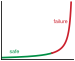
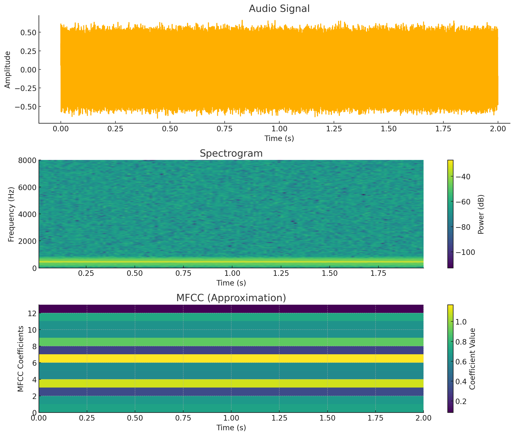
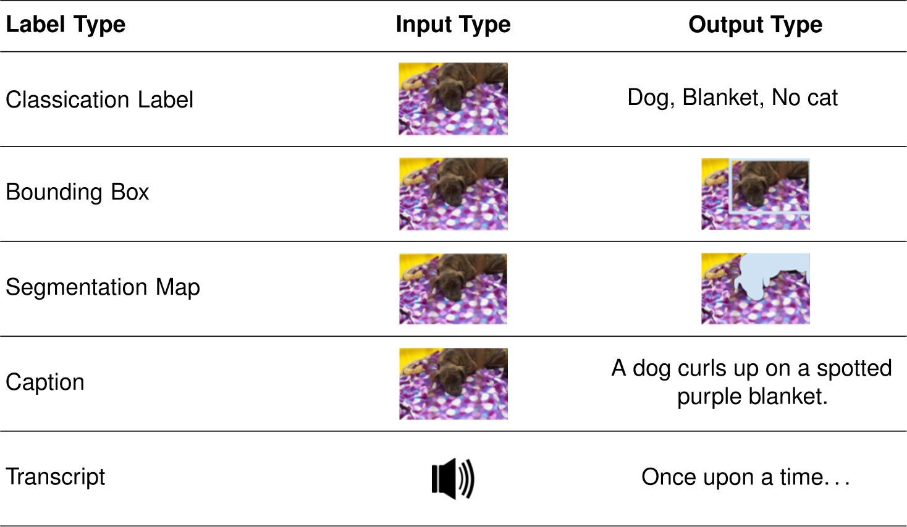
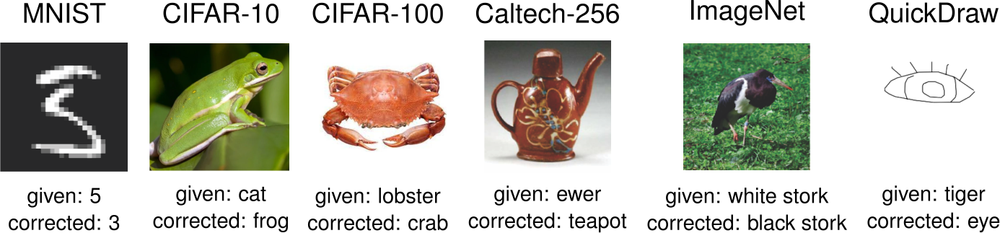
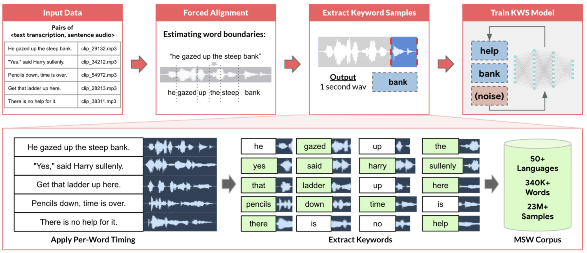

# Data Engineering {#sec-data-engineering}

::: {layout-narrow}
::: {.column-margin}

\chapterminitoc

:::

\noindent
{fig-alt="Illustration showing data engineering concept with raw data sources flowing through processing pipelines to refined datasets and storage systems."}

:::

## Purpose {.unnumbered}

\begin{marginfigure}
\mlsysstack{15}{10}{10}{25}{10}{15}{10}{90}
\end{marginfigure}

_Why does data represent the actual source code of machine learning systems while traditional code merely describes how to compile it?_

In conventional software, programmers write logic that computers execute. In machine learning, programmers write optimization procedures that extract operational logic from data.\index{Data Engineering!data as source code} This inversion makes data the true source code: changing the data changes what the system does, regardless of whether a single line of traditional code has been modified. A dataset with subtle labeling inconsistencies produces a model with subtle behavioral inconsistencies. A dataset missing edge cases produces a model that fails on edge cases. A dataset reflecting historical biases produces a model that perpetuates those biases. No architecture, hyperparameter, or training trick can recover information that was never present or correct errors that were baked in from the start. Unlike traditional source code, which sits inert until a programmer modifies it, data is alive: the distribution it captures drifts as the world changes, silently invalidating the model's learned behavior even when nothing in the codebase has been touched. Data engineering therefore consumes the majority of effort in most ML projects not because the work is tedious, but because it is consequential. Every decision in the data pipeline (what to collect, how to label, when to filter, how to split) propagates forward to constrain model architecture, training dynamics, and deployment viability. Data engineering is therefore not preprocessing but programming in a different language, one where quality control, versioning, and monitoring determine whether the compiled system works today and continues working tomorrow. The pipeline itself is a Data-Machine co-design problem: however well curated the data, the algorithm can only learn as fast as the machine can deliver it.

::: {.content-visible when-format="pdf"}

\newpage

:::

::: {.callout-learning-objectives}

- Explain data as source code and trace how data cascades propagate through ML systems
- Calculate data gravity, feeding-tax, and storage-bandwidth costs for moving or serving datasets
- Evaluate acquisition strategies against coverage, quality, labeling cost, governance, and deployment constraints
- Design ingestion and validation pipelines for batch, streaming, ETL, and ELT workloads
- Implement idempotent transformations, lineage, and drift checks to preserve training-serving consistency
- Select labeling, storage, file format, versioning, and feature-store designs for ML lifecycle needs
- Diagnose data debt and production pipeline failures using quality, reliability, scalability, and governance evidence

:::

```{python}
#| echo: false
from mlsysim import *
from mlsysim.core.units import *

# ┌─────────────────────────────────────────────────────────────────────────────
# │ DATA PREP EFFORT INTRO
# ├─────────────────────────────────────────────────────────────────────────────
# │ Context: Opening Dataset Compilation paragraph
# │
# │ Goal: Quantify how much ML project effort data preparation consumes.
# │ Show: Data work consumes 60–80 percent of project effort.
# │ How: Format the canonical data-prep effort range.
# │
# └─────────────────────────────────────────────────────────────────────────────
from mlsysim.fmt import fmt, fmt_count, check

# ┌── LEGO ───────────────────────────────────────────────
class DataPrepEffortIntro:
    """Data-prep effort share cited at chapter opening."""

    # ┌── 1. LOAD (Constants) ───────────────────────────────────────────────
    data_prep_effort_low = 60
    data_prep_effort_high = 80

    # ┌── 3. GUARD (Invariants) ───────────────────────────────────────────
    check(data_prep_effort_low < data_prep_effort_high, "Data-prep effort range must be ordered.")

    # ┌── 4. OUTPUT (Formatting) ──────────────────────────────────────────────
    data_prep_effort_low_str = fmt_percent(data_prep_effort_low / 100, precision=0, commas=False, style='symbol')
    data_prep_effort_high_str = fmt_percent(data_prep_effort_high / 100, precision=0, commas=False, style='symbol')
```

## Dataset Compilation {#sec-data-engineering-data-engineering-dataset-compilation-0496}

The workflow stages from @sec-ml-workflow establish the *when* and *why* of data preparation, showing that data work consumes `{python} DataPrepEffortIntro.data_prep_effort_low_str` to `{python} DataPrepEffortIntro.data_prep_effort_high_str` of ML project effort (as @fig-ds-time quantified) and represents the foundational "D" in the D·A·M taxonomy summarized in @tbl-dam-taxonomy. Executing those stages at scale, however, requires dedicated infrastructure. If the workflow is the plan, data engineering is the factory floor. This chapter uses Keyword Spotting (KWS) to demonstrate data engineering under extreme resource constraints, where every byte and operation matters.

::: {#dfn-data-engineering-data-engineering .callout-definition title="Data engineering"}

***Data Engineering***\index{Data Engineering!definition} is the infrastructure layer that manages the lifecycle of data from source to model, encompassing acquisition, transformation, storage, and governance.

1.  **Significance (quantitative)**: Its critical function is ensuring training-serving consistency, preventing silent degradation by decoupling the model from the volatility of raw data. Within the iron law, it governs bytes moved $(D_{\text{vol}})$, while dataset composition and quality determine whether the dataset $(D)$ remains representative of the target distribution.
2.  **Distinction**: Unlike data science\index{Data Science!vs. data engineering}, which focuses on inference and insight, data engineering addresses the scalability and reliability of the data pipeline.
3.  **Common pitfall**: A frequent misconception is that Data Engineering is "data cleaning." In reality, it is Dataset Compilation\index{Dataset Compilation}: transforming raw, noisy observations into an optimized binary that the model consumes.

:::

We reframe data engineering not as "data cleaning," but as **Dataset Compilation**\index{Dataset Compilation}. Just as a compiler transforms human-readable source code into an optimized binary executable, a data pipeline transforms raw, noisy observations into a clean, optimized training set that the model consumes. The analogy to compiler design is instructive. A compiler transforms source code through a series of increasingly refined representations (tokens, abstract syntax trees, intermediate representations, machine code), and a data pipeline transforms raw observations into training-ready tensors, the numeric arrays consumed by models, through analogous stages. Filtering corrupted records, outliers, and irrelevant features corresponds to *dead code elimination*: stripping material that contributes nothing to the learned representation. Augmentation, which synthetically expands limited examples by rotating images, pitch-shifting audio, or injecting noise, mirrors *loop unrolling*, exposing the model to more variations of the underlying pattern without collecting new data. **Deduplication**\index{Deduplication!definition}\index{Deduplication!duplicate removal} plays the role of *common subexpression elimination*, identifying and merging duplicate records that would otherwise bias gradient estimates and waste compute. Schema validation, enforcing strict types and ranges on every record, is the data pipeline's *type checker*, rejecting malformed inputs before they crash the "runtime" of model training.

The engineering implication is direct: datasets must be versioned (like git), unit-tested (data quality checks), and debugged. *Deleting a row of training data is the engineering equivalent of deleting a line of code, and retraining a model is simply recompiling the binary.*

This compilation metaphor establishes the engineering mindset that runs through the chapter. A compiler has distinct phases (lexing, parsing, optimization, code generation), and our dataset compiler has phases too: acquisition, ingestion, processing, labeling, storage, and ongoing maintenance. A **four pillars framework**\index{Four pillars framework!data engineering} of Quality, Reliability, Scalability, and Governance organizes design decisions across all phases. Each stage is illustrated through a Keyword Spotting (KWS) case study that demonstrates data engineering under extreme resource constraints, where every byte and operation matters.

::: {.column-margin}
{width="100%" fig-alt="A 2-by-2 quadrant. The horizontal axis is data gravity (movement cost), the vertical axis is information entropy (signal density). The top-left cell, low gravity and high entropy, is highlighted and labeled high gain; the other three cells are neutral gray."}

*Selection gain peaks where signal density (entropy) is high and movement cost (gravity) low.*
:::

Before any of these pipeline stages can be designed well, however, we need to understand the physical properties that constrain them. Just as a civil engineer must understand soil mechanics before designing foundations, a data engineer must understand the physics of data movement and information density before making pipeline decisions. These physics impose hard constraints that no amount of clever software can circumvent.

## Physics of Data {#sec-data-engineering-physics-data-cdcb}

The "data as code" metaphor captures *what* data does (determines system behavior) but not *why* moving it is so expensive. The physics of data\index{Data!physics of} explains why data systems must treat data as a physical substance with measurable properties. Just as diverse materials have density and viscosity, datasets have information entropy and data gravity.

### Data gravity {#sec-data-engineering-data-gravity-adcb}

```{python}
#| echo: false

# ┌─────────────────────────────────────────────────────────────────────────────
# │ DATA GRAVITY CALCULATION
# ├─────────────────────────────────────────────────────────────────────────────
# │ Context: Data gravity prose and callout "The Physics of Data Gravity"
# │
# │ Goal: Quantify the physical and economic cost of moving 1 PB across regions.
# │ Show: That egress fees can exceed $90,000, illustrating why "move compute to data" is mandatory.
# │ How: Calculate transfer time and cost based on network bandwidth and cloud egress rates.
# │
# └─────────────────────────────────────────────────────────────────────────────
from mlsysim.fmt import fmt_int, fmt_usd, fmt, fmt_bandwidth, fmt_count, check, fmt_math, fmt_qty, fmt_time
from mlsysim.core.units import GB, PB, Gbps, second, hour, day, USD

# ┌── LEGO ───────────────────────────────────────────────
class DataGravity:
    """
    Namespace for Data Gravity calculation.
    Scenario: Moving 1 PB of data vs. moving the compute.
    """

    # ┌── 1. LOAD (Constants) ───────────────────────────────────────────────
    dataset_pb = 1
    network_bw = Systems.Fabrics.Ethernet_100G.bandwidth
    egress_rate = Infrastructure.Pricing.Cloud.EgressPerGB.rate
    tpu_rate = Infrastructure.Pricing.Cloud.TpuV4PerHour.rate

    # ┌── 2. EXECUTE (The Compute) ─────────────────────────────────────────
    dataset = dataset_pb * PB

    # Step 1: Time using library formula
    t_100g = dataset / network_bw
    transfer_seconds = t_100g.to(second).magnitude
    transfer_hours = t_100g.to(hour).magnitude

    # Step 2: 10 Gbps = 1.25 GB/s
    t_10g = dataset / (10 * Gbps)
    transfer_days_10g = t_10g.to(day).magnitude

    # Step 3: Cost
    transfer_cost = (dataset * egress_rate).to(USD)
    equiv_tpu_hours = (transfer_cost / tpu_rate).to(hour).magnitude

    # ┌── 3. GUARD (Invariants) ───────────────────────────────────────────
    check(transfer_hours >= 20, f"Transfer time ({transfer_hours:.1f} h) is too fast. Data gravity argument fails.")
    check(transfer_days_10g >= 9, f"1 PB over 10 Gbps should take many days, got {transfer_days_10g:.1f}.")
    check(transfer_cost >= 10000 * USD, f"Transfer cost ({transfer_cost.to(USD).magnitude:.0f}) is too cheap.")

    # ┌── 4. OUTPUT (Formatting) ───────────────────────────────────────────
    transfer_seconds_str = fmt_time(transfer_seconds, "second", precision=0, commas=True, style="word")
    transfer_hours_str = fmt_time(round(transfer_hours), 'hour', precision=0, commas=False)
    transfer_time_10g_math = fmt_math(f"T = D_{{\\text{{vol}}}}/\\text{{BW}} \\approx {transfer_days_10g:.1f} \\text{{ days}}")
    transfer_cost_str = fmt_usd(transfer_cost, precision=0, commas=True)
    tpu_hours_str = fmt_count(equiv_tpu_hours, precision=0, commas=True, label="TPUv4-hour", plural_label="TPUv4-hours")
    network_gb_per_s_str = fmt_qty(network_bw, GB / second, precision=1, commas=False)
    dataset_gb_str = fmt_qty(dataset, GB, precision=0, commas=True)
    dataset_pb_str = fmt_qty(dataset, PB, precision=0, commas=False)
    network_gbit_per_s_str = fmt_bandwidth(network_bw, unit=Gbps, precision=0, commas=False)
    egress_cost_per_gb_str = fmt_usd(egress_rate, precision=2, commas=False, per="GB")
```

**Data gravity**\index{Data Gravity!physics of} is the cost of movement. It is a function of volume $(D_{\text{vol}})$ and network bandwidth $(\text{BW})$. The time to move a petabyte dataset across a 10 Gbps link is fixed by physics (`{python} DataGravity.transfer_time_10g_math`); even a 100 Gbps dedicated link leaves transfer time and egress cost large enough to shape the architecture. This gravity dictates architecture: because moving `{python} DataGravity.dataset_pb_str` to the compute is slow and expensive, the compute often must move to the data. This explains the rise of "Data Lakehouse" architectures[^fn-lakehouse-gravity]\index{Data Lakehouse!architecture} [@zaharia2021lakehouse] where processing engines (Spark, Presto) run directly on storage nodes. In contrast, **Data Mesh**\index{Data Mesh!decentralized ownership} [@dehghani2022datamesh] proposes decentralizing ownership to manage this scale organizationally, treating data as a product owned by domain teams.

[^fn-lakehouse-gravity]: **Data Lakehouse**: Combines data lake storage (cheap, schema-less) with warehouse query semantics (ACID transactions, schema enforcement) using open table formats like Delta Lake and Apache Iceberg. For ML workloads, the lakehouse eliminates the extract, transform, load (ETL) copy between lake and warehouse, enabling direct feature computation on the storage layer where data already resides -- a direct response to data gravity, since moving petabytes to a separate warehouse doubles the $D_{\text{vol}}/\text{BW}$ cost [@armbrust2020]. \index{Data Lakehouse!data gravity}

### Information entropy {#sec-data-engineering-information-entropy-5622}

**Information entropy**\index{Information Entropy!data density} is the density of signal. A dataset of 1 million identical images has high gravity (TB of storage) but zero entropy (one image worth of information). A dataset of 10,000 diverse edge cases has low gravity but high entropy. Let Information Entropy measure signal density (bits of information per byte) and data gravity capture movement cost (data volume/bandwidth, that is, transfer time). The ratio of the two quantities captures a dataset's return on movement cost, which @eq-data-selection-gain formalizes as the data selection gain:
$$ \text{Data Selection Gain} \propto \frac{\text{Information Entropy}}{\text{Data Gravity}} $$ {#eq-data-selection-gain}

```{python}
#| echo: false
#| label: feeding-tax-calc
# ┌─────────────────────────────────────────────────────────────────────────────
# │ THE FEEDING TAX CALCULATION
# ├─────────────────────────────────────────────────────────────────────────────
# │ Context: "The Feeding Problem" section
# │
# │ Goal: Demonstrate the mismatch between accelerator compute and disk bandwidth.
# │ Show: That a standard cloud disk causes 80%+ idle time for an A100.
# │ How: Calculate required bandwidth for ResNet-50 inference at peak TFLOP/s.
# │
# └─────────────────────────────────────────────────────────────────────────────
from mlsysim.fmt import fmt_int, fmt, check, fmt_qty, fmt_rate, fmt_percent
from mlsysim.core.units import GB, MB, second, TFLOPs

# ┌── LEGO ───────────────────────────────────────────────
class FeedingProblem:
    """
    Namespace for The Feeding Problem calculation.
    Scenario: Saturating an A100 with ResNet-50 images from a standard disk.
    """

    # ┌── 1. LOAD (Constants) ───────────────────────────────────────────────
    from mlsysim import Models, Hardware, Engine, Datasets, Systems

    m = Models.Vision.ResNet50
    h = Hardware.Cloud.A100

    # Image: 224x224x3 @ FP32
    IMAGE_DIM_RESNET = Datasets.ImageNet.image_width
    img_size_bytes = IMAGE_DIM_RESNET * IMAGE_DIM_RESNET * IMAGE_CHANNELS_RGB * 4  # FP32

    # Standard Cloud Disk (e.g. AWS gp3 baseline)
    disk_profile = Systems.Storage.CloudBlockStorageBaseline

    # ┌── 2. EXECUTE (The Compute) ─────────────────────────────────────────
    # Step 1: Throughput using Engine.solve() with 100% efficiency
    p = Engine.solve(m, h, efficiency=1.0)
    img_per_sec = p.throughput.to(1 / second).magnitude

    # Step 2: Required bandwidth (bytes/s) = img_per_sec * img_size_bytes
    req_bw_bytes_sec = img_per_sec * img_size_bytes
    req_bw = req_bw_bytes_sec * byte / second
    disk_bw = disk_profile.bandwidth

    # Step 3: Feeding efficiency = disk BW / required BW
    eta_feed = min((disk_bw / req_bw).to("").magnitude, 1.0)
    feeding_tax_pct = (1.0 - eta_feed) * 100

    # ┌── 3. GUARD (Invariants) ───────────────────────────────────────────
    req_bw_value = req_bw.to(GB / second).magnitude
    check(req_bw > 1.0 * GB / second, f"Required bandwidth ({req_bw_value:.1f} GB/s) is lower than expected.")
    check(feeding_tax_pct > 50, f"Feeding tax ({feeding_tax_pct:.1f}%) should be significant for standard disks.")

    # ┌── 4. OUTPUT (Formatting) ──────────────────────────────────────────────
    req_bw_gb_per_s_str = fmt_qty(req_bw, GB / second, precision=1, commas=False)
    disk_bw_mb_per_s_str = fmt_qty(disk_bw, MB / second, precision=0, commas=False)
    feeding_tax_pct_str = fmt_percent(feeding_tax_pct / 100, precision=1, commas=False, style='symbol')
    img_per_s_str = fmt_rate(round(img_per_sec), 'img/s', precision=0, commas=True)
```

### The feeding problem: Flow rate and the "feeding tax" {#sec-data-engineering-feeding-problem}

Data gravity establishes the cost of moving the entire mass; **The Feeding Problem**\index{Feeding Problem!definition} establishes the cost of delivering it. In the Hennessy & Patterson tradition, we analyze this as a **Flow Rate**\index{Flow Rate!definition} problem: the struggle to saturate a high-throughput "Machine" from a low-bandwidth "Data" source.

According to the iron law, the system is only as fast as its slowest term. If a high-throughput accelerator running an image model can process `{python} FeedingProblem.img_per_s_str`, but the storage pipeline delivers only `{python} FeedingProblem.disk_bw_mb_per_s_str`, the expensive silicon sits idle. We quantify this as **The Feeding Tax**\index{Feeding Tax!definition}: the wall-clock time lost to I/O wait, which directly reduces the system efficiency $(\eta_{\text{hw}})$\index{System Efficiency!feeding tax} term. For a standard cloud volume, the feeding tax can exceed `{python} FeedingProblem.feeding_tax_pct_str`, meaning the accelerator spends the majority of its time waiting for bits. This tax transforms the Data Pipeline from a simple storage concern into the primary regulator of the system's Duty Cycle. Feeding the reference accelerator in this example often requires `{python} FeedingProblem.req_bw_gb_per_s_str` transfer rates, forcing the shift from traditional file systems to the specialized storage architectures we examine in @sec-data-engineering-ml-storage-systems-architecture-options-67fa.

These physical properties also carry an energy cost: as data moves farther from the processor, movement increasingly dominates the budget.

```{python}
#| echo: false
#| label: energy-access-costs-calc
# ┌─────────────────────────────────────────────────────────────────────────────
# │ ENERGY ACCESS COSTS
# ├─────────────────────────────────────────────────────────────────────────────
# │ Context: @tbl-energy-movement-cost in the energy-movement callout
# │
# │ Goal: Quantify relative energy cost of moving vs. computing on a bit.
# │ Show: DRAM, SSD, and network access multipliers vs. a 32-bit MAC.
# │ How: Format per-operation energies and per-bit multipliers.
# │
# └─────────────────────────────────────────────────────────────────────────────
from mlsysim.fmt import fmt_int, fmt, fmt_qty, check, fmt_percent, fmt_multiple, fmt_energy_per_flop
from mlsysim.core.units import pJ, ureg

# ┌── LEGO ───────────────────────────────────────────────
class EnergyAccessCosts:
    """Energy-movement hierarchy for @tbl-energy-movement-cost."""

    # ┌── 1. LOAD (Constants) ───────────────────────────────────────────────
    ENERGY_DRAM_ACCESS_PJ = Hardware.Tech.Memory.DRAM.energy_per_access
    ENERGY_FLOP_FP32_PJ = Hardware.Tech.Op.FlopFp32.energy
    energy_dram = ENERGY_DRAM_ACCESS_PJ
    energy_flop_fp32 = ENERGY_FLOP_FP32_PJ
    energy_local_ssd = Hardware.Tech.Movement.Nvme.energy_per_byte
    energy_network = Hardware.Tech.Movement.Network.energy_per_byte
    prune_pct = 50

    # ┌── 2. EXECUTE (The Compute) ─────────────────────────────────────────
    energy_dram_pj = energy_dram.to(pJ).magnitude
    energy_flop_fp32_pj = energy_flop_fp32.to(pJ / flop).magnitude
    energy_flop_fp32_pj_per_bit = energy_flop_fp32_pj / 32
    energy_local_ssd_pj_per_bit = energy_local_ssd.to(pJ / bit).magnitude
    energy_network_pj_per_bit = energy_network.to(pJ / bit).magnitude

    # ┌── 3. GUARD (Invariants) ───────────────────────────────────────────
    check(energy_dram_pj > energy_flop_fp32_pj, "DRAM access should cost more than one FP32 MAC.")

    # ┌── 4. OUTPUT (Formatting) ──────────────────────────────────────────────
    prune_pct_str = fmt_percent(prune_pct / 100, precision=0, commas=False, style='symbol')
    energy_dram_str = fmt_qty(energy_dram, pJ, precision=0, commas=False)
    energy_flop_fp32_str = fmt_energy_per_flop(energy_flop_fp32, precision=1, commas=False)
    local_ssd_energy_str = fmt_qty(energy_local_ssd * (32 * bit), pJ, precision=0, commas=True)
    network_energy_str = fmt_qty(energy_network * (32 * bit), pJ, precision=0, commas=True)
    dram_mult_str = fmt_multiple(round(energy_dram_pj / energy_flop_fp32_pj), precision=0, commas=True)
    local_ssd_mult_str = fmt_multiple(energy_local_ssd_pj_per_bit / energy_flop_fp32_pj_per_bit, precision=1, commas=True)
    network_mult_str = fmt_multiple(energy_network_pj_per_bit / energy_flop_fp32_pj_per_bit, precision=1, commas=True)
```

::: {#psp-data-engineering-energy-movement-invariant .callout-perspective title="The energy-movement invariant"}

The iron law in @sec-introduction-iron-law-ml-systems-c32a and the memory-wall analysis in @sec-ml-systems-system-balance-hardware-96ab imply a data-engineering invariant: *moving a bit costs anywhere from a hundred to nearly a million times more energy than computing on it*, with the multiplier rising as the data leaves the chip. Later optimization chapters exploit the same cost gradient inside model and hardware design; here, the question is how much energy the information flow from the external world already consumes before the model computes. @Tbl-energy-movement-cost makes that cost gradient explicit across the memory hierarchy.

| **Operation**                   |                  **Energy (pJ)**                  |                **Relative Cost**                |
|:--------------------------------|:-------------------------------------------------:|:-----------------------------------------------:|
| **32-bit Floating Point MAC**   | `{python} EnergyAccessCosts.energy_flop_fp32_str` |                    1$\times$                    |
| **DRAM Memory Access (32-bit)** |    `{python} EnergyAccessCosts.energy_dram_str`   |    `{python} EnergyAccessCosts.dram_mult_str`   |
| **Local SSD Access (32-bit)**   | `{python} EnergyAccessCosts.local_ssd_energy_str` | `{python} EnergyAccessCosts.local_ssd_mult_str` |
| **Network Transfer (32-bit)**   |  `{python} EnergyAccessCosts.network_energy_str`  |  `{python} EnergyAccessCosts.network_mult_str`  |

: **Energy cost of moving vs. computing on a bit**: Approximate energy per operation at each stage of the data-movement hierarchy, with multipliers normalized to a single 32-bit MAC on a per-bit basis. All rows list energy per 32-bit access (SSD and network values scale per-bit transfer costs by 32). Moving a bit costs hundreds of times more energy than computing on it for DRAM-resident data, rising to hundreds of thousands of times more when the data must traverse a data-center network. {#tbl-energy-movement-cost tbl-colwidths="[34,33,33]"}

```{=latex}
\vspace*{-1.5ex}
```
The cost gradient quantified in @tbl-energy-movement-cost explains why locality is the dominant lever in systems engineering: every step the data does not take is the largest energy savings available.

Data has physical mass. Pruning `{python} EnergyAccessCosts.prune_pct_str` of training data through deduplication does more than save disk space; it eliminates the most energy-intensive stages of the training lifecycle. This is *why* data selection is the highest-leverage tool in the systems engineer's toolkit: it addresses the problem at the most expensive source.

:::

The energy argument and the entropy ratio point to the same lever from two directions: effective data engineering maximizes the Data Selection Gain defined in @eq-data-selection-gain. "Data Cleaning"\index{Data Cleaning!signal-to-noise engineering} is not just hygiene; it is **Signal-to-Noise Engineering**\index{Signal-to-Noise Engineering}. Deduplication removes mass without reducing entropy, directly increasing the ratio. Active learning adds high-entropy examples (edge cases) while ignoring low-entropy ones (common cases), again maximizing information per byte. We optimize this ratio to ensure our storage and compute budgets are spent on signal, not noise.

These principles operate at the level of individual files and batches. At data center scale, the cost of moving data compounds into a constraint that makes large datasets so expensive to transfer that compute must relocate to the data rather than the reverse. Transferring a petabyte dataset between data centers puts a dollar figure on the constraint.

::: {#nbk-data-engineering-physics-data-gravity .callout-notebook title="The physics of data gravity"}

**Problem**: A `{python} DataGravity.dataset_pb_str` training dataset resides in a US East data center, while a remote accelerator pod is available in US West. Is it faster to move the data or to move the compute?

**Physics**:

1.  **Network bandwidth**: A dedicated `{python} DataGravity.network_gbit_per_s_str` line = `{python} DataGravity.network_gb_per_s_str`.
2.  **Transfer time**: `{python} DataGravity.dataset_gb_str` / `{python} DataGravity.network_gb_per_s_str` = `{python} DataGravity.transfer_seconds_str` ≈ `{python} DataGravity.transfer_hours_str`.
3.  **Cost**: At `{python} DataGravity.egress_cost_per_gb_str` egress, moving `{python} DataGravity.dataset_pb_str` costs `{python} DataGravity.transfer_cost_str`. (Baseline: AWS data transfer out pricing, 2024.)

**Systems insight**:
If training takes < `{python} DataGravity.transfer_hours_str`, data transfer takes longer than training.
If training costs < `{python} DataGravity.transfer_cost_str` (approximately `{python} DataGravity.tpu_hours_str`), bandwidth costs more than compute.

**Rule of thumb**: For petabyte-scale data, **Code moves to Data**\index{Data Locality!code-to-data}. For gigabyte-scale data, **Data moves to Code**\index{Data Locality!data-to-code}.

:::

These physical constraints govern every decision in production data pipelines. Before moving on, check the fundamental intuitions that will recur throughout the pipeline.

::: {#chk-data-engineering-physics-data .callout-checkpoint title="The physics of data"}

Data engineering is governed by physical costs. Check your intuition:

- [ ] **Data gravity**: Why do petabyte-scale datasets force compute to move to the data?
- [ ] **Energy-movement invariant**\index{Energy-Movement Invariant}: Why does moving a byte of data cost orders of magnitude more energy than processing it?
- [ ] **Information entropy**: Why can a smaller, diverse dataset be more valuable than a massive, redundant one?

:::

These physical properties impose hard constraints on every pipeline decision: where to store data, how to transform it, and when to move computation rather than bytes. Physics alone, however, does not prevent failures; it merely defines the boundaries within which engineering decisions must be made. A team that understands data gravity perfectly can still build a brittle pipeline if quality checks are ad hoc, error handling is absent, or governance is an afterthought. Translating physical constraints into reliable practice requires a systematic framework that organizes design decisions across every pipeline stage.

## Four Pillars Framework {#sec-data-engineering-four-pillars-framework-4ef1}

A recommendation system rejects every applicant from a region because an upstream team changed a ZIP code field from integer to string. A medical imaging model degrades silently for months because camera hardware changed at a partner hospital. A fraud detection system misses a new attack vector because its training data was six months stale. Each failure traces to a different root cause (schema drift, distribution shift, data staleness), yet all share a common pattern: ad hoc data engineering decisions that interacted in ways no one anticipated until deployment. The four pillars framework organizes these concerns into four interdependent dimensions: quality, reliability, scalability, and governance. We begin with the cascading failure patterns that motivate this framework, then define each pillar.

### Data cascades {#sec-data-engineering-data-cascades-systematic-foundations-matter-2efe}

Machine learning systems face a unique failure pattern called data cascades, where poor data quality in early stages amplifies throughout the entire pipeline [@sambasivan2021]. Traditional software produces immediate errors when encountering bad inputs. ML systems can instead degrade silently[^fn-data-cascades-silent] until quality issues become severe enough to require expensive investigation, rework, or retraining.

::: {#dfn-data-engineering-data-cascade .callout-definition title="Data cascade"}

***Data Cascade***\index{Data Cascade!definition}\index{Pipeline!cascading failures} is an ML systems failure mode in which upstream data quality problems propagate through collection, labeling, feature engineering, training, evaluation, and deployment, amplifying into downstream model failures or user harm.

1.  **Significance (quantitative)**: The remediation cost scales with the number of downstream artifacts that consumed the corrupted data: feature tables must be regenerated, models retrained, evaluation metrics recomputed, and deployed systems rolled back or patched. A single schema or labeling defect can therefore invalidate an entire training run and all experiments derived from it, turning a local data error into a full-pipeline rework event.
2.  **Distinction**: Unlike an isolated data quality bug, a data cascade is defined by propagation and amplification. The initial defect may be small, but each pipeline stage treats its input as trustworthy and converts the defect into new derived state, making the root cause harder to observe as the system moves farther from collection.
3.  **Common pitfall**: A frequent misconception is that data cascades are caught by ordinary software tests. In reality, corrupted data can satisfy schemas, pass unit tests, and produce successful training jobs while teaching the model the wrong signal; preventing cascades requires lineage, validation, contracts, and monitoring tied to model behavior.

:::

@Fig-cascades shows how data quality errors introduced early in the workflow can propagate into later evaluation and deployment failures.

[^fn-data-cascades-silent]: **Data Cascades**: The failure is "silent" because it degrades model *inputs*, not model *code*—corrupted data can pass unit tests and appear healthy in ordinary system monitoring. @sambasivan2021 describe cascades as often invisible and delayed: flawed data practices may surface only after downstream evaluation, deployment, or user-facing failures reveal that the model learned from the wrong signal. Remediation then requires tracing the issue back through data collection, labeling, feature engineering, and evaluation decisions, with some teams restarting or abandoning affected work. \index{Data Cascade!silent failure}

::: {#fig-cascades fig-env="figure" fig-pos="htb" fig-cap="**Data Quality Cascades**: Errors introduced early in the machine learning workflow amplify across subsequent stages, increasing costs and potentially leading to flawed predictions or harmful outcomes. Source: [@sambasivan2021]." fig-alt="Timeline with seven stages from problem statement to deployment. Colored arcs show errors from data collection propagating to evaluation and deployment stages."}

```{.tikz}
\begin{tikzpicture}[line join=round,font=\small\usefont{T1}{phv}{m}{n}]
\definecolor{Green}{HTML}{008F45}
\definecolor{Red}{HTML}{CB202D}
\definecolor{Orange}{HTML}{CC5500}
\definecolor{Blue}{HTML}{006395}
\definecolor{Violet}{HTML}{7030A0}

\tikzset{%
Line/.style={line width=1.0pt,black!50,shorten <=6pt,shorten >=8pt},
LineD/.style={line width=2.0pt,black!50,shorten <=6pt,shorten >=8pt},
Text/.style={rotate=60,align=right,anchor=north east,font=\fontsize{7pt}{8}\usefont{T1}{phv}{m}{n}},
Text2/.style={align=left,anchor=north west,font=\footnotesize\usefont{T1}{phv}{m}{n},text depth=0.7}
}

\draw[line width=1.5pt,black!30](0,0)coordinate(P)--(10,0)coordinate(K);

\foreach \i in {0,...,6} {
\path let \n1 = {(\i/6)*10} in coordinate (P\i) at (\n1,0);
\fill[black] (P\i) circle (2pt);
  }

\draw[LineD,Red](P0)to[out=60,in=120](P6);
\draw[LineD,Red](P0)to[out=60,in=125](P5);
\draw[LineD,Blue](P1)to[out=60,in=120](P6);
\draw[LineD,Red](P1)to[out=50,in=125](P6);
\draw[LineD,Blue](P4)to[out=60,in=125](P6);
\draw[LineD,Blue](P3)to[out=60,in=120](P6);
%
\draw[Line,Orange](P1)to[out=44,in=132](P6);
\draw[Line,Green](P1)to[out=38,in=135](P6);
\draw[Line,Orange](P1)to[out=30,in=135](P5);
\draw[Line,Green](P1)to[out=36,in=130](P5);
%
\draw[Line,Orange](P2)to[out=40,in=135](P6);
\draw[Line,Orange](P2)to[out=40,in=135](P5);
%
\draw[draw=none,fill=VioletLine!50]($(P5)+(-0.1,0.15)$)to[bend left=10]($(P5)+(-0.1,0.61)$)--
                ($(P5)+(-0.25,0.50)$)--($(P5)+(-0.85,1.20)$)to[bend left=20]($(P5)+(-1.38,0.76)$)--
                ($(P5)+(-0.51,0.33)$)to[bend left=10]($(P5)+(-0.64,0.22)$)to[bend left=10]cycle;
\draw[draw=none,fill=VioletLine!50]($(P6)+(-0.1,0.15)$)to[bend left=10]($(P6)+(-0.1,0.61)$)--
                ($(P6)+(-0.25,0.50)$)--($(P6)+(-0.7,1.30)$)to[bend left=20]($(P6)+(-1.38,0.70)$)--
                ($(P6)+(-0.51,0.33)$)to[bend left=10]($(P6)+(-0.64,0.22)$)to[bend left=10]cycle;
%
\def\vi{-0.05}
\draw[dashed,red,thick,-latex](P1)--++(90:2)to[out=90,in=0](0.8,2.7);
\draw[dashed,red,thick,-latex](P6)--++(90:2)to[out=90,in=0](9.1,2.7);
\node[below=\vi of P0,Text]{Problem\\ Statement};
\node[below=\vi of P1,Text]{Data collection \\and labeling};
\node[below=\vi of P2,Text]{Data analysis\\ and cleaning};
\node[below=\vi of P3,Text]{Model \\selection};
\node[below=\vi of P4,Text]{Model\\ training};
\node[below=\vi of P5,Text]{Model\\ evaluation};
\node[below=\vi of P6,Text]{Model\\ deployment};
%Legend
\node[circle,minimum size=4pt,fill=Blue](L1)at(11.5,2.6){};
\node[above right=0.1 and 0.1of L1,Text2]{Interacting with physical\\  world brittleness};

\node[circle,minimum size=4pt,fill=Red,below =0.5 of L1](L2){};
\node[above right=0.1 and 0.1of L2,Text2]{Inadequate \\application-domain expertise};

\node[circle,minimum size=4pt,fill=Green,below =0.5 of L2](L3){};
\node[above right=0.1 and 0.1of L3,Text2]{Conflicting reward\\ systems};

\node[circle,minimum size=4pt,fill=Orange,below =0.5 of L3](L4){};
\node[above right=0.1 and 0.1of L4,Text2]{Poor cross-organizational\\ documentation};

\draw[-{Triangle[width=8pt,length=8pt]}, line width=3pt,Violet](11.4,-0.85)--++(0:0.8)coordinate(L5);
\node[above right=0.23 and 0of L5,Text2]{Impacts of cascades};

\draw[-{Triangle[width=4pt,length=8pt]}, line width=2pt,Red,dashed](11.4,-1.35)--++(0:0.8)coordinate(L6);
\node[above right=0.23 and 0of L6,Text2]{Abandon/re-start process};
\end{tikzpicture}
```

:::

Trace the arrows in @fig-cascades to follow how a single data collection error propagates through every subsequent pipeline stage. Pay particular attention to how lapses at the earliest stage only surface during model evaluation and deployment—by which point the team may need to abandon the entire model and restart. Data cascades occur when teams skip establishing clear quality criteria, reliability requirements, and governance principles before beginning data collection and processing. The abstract cascade pattern becomes concrete when a single upstream schema change propagates through a pipeline jungle without validation.

::: {#exmp-data-engineering-pipeline-jungle .callout-example title="The pipeline jungle"}

**Failure mode**: A credit scoring model suddenly started rejecting all applicants from a specific region.

**Root cause**: An upstream team changed the schema of the `zip_code` field from `integer` to `string` to handle international codes, and the pipeline jungle\index{Pipeline!jungle} had no data contract\index{Data Contract!schema validation} enforcing the expected representation.

*   The data pipeline silently cast "02139" (string) to 2139 (integer).
*   The leading zero was lost.
*   The model, treating `zip_code` as a categorical feature, saw "2139" as a completely new, unknown category and defaulted to "high risk" behavior.

**Systems insight**: This is a **Pipeline Jungle**\index{Pipeline Jungle!definition} failure. Without explicit **Data Contracts**\index{Data Contract!schema validation}---versioned agreements about schema, units, allowed ranges, and feature semantics at the ingestion interface---changes in one system ("we need string zip codes") cause catastrophic, silent failures in downstream systems. Data engineering is the defense against this entropy.

:::

Preventing these cascading failures requires more than ad hoc fixes; it demands a systematic framework that organizes data engineering decisions into four interdependent dimensions.

### Four foundational pillars {#sec-data-engineering-four-foundational-pillars-c119}

Every data engineering decision, from choosing storage formats to designing ingestion pipelines, should be evaluated against four principles. In the KWS running example, even a small enrollment choice such as whether to accept a noisy wake-word recording or ask the user to repeat it touches all four pillars at once. @Fig-four-pillars shows why these pillars surround the central ML data system rather than appearing as independent checklist items: each one contributes a necessary capability, and the dashed lines mark the trade-offs created when one pillar is strengthened without regard for the others.

::: {#fig-four-pillars fig-env="figure" fig-pos="htb" fig-cap="**The Four Pillars of Data Engineering**: Quality, Reliability, Scalability, and Governance form the foundational framework for ML data systems. Each pillar contributes essential capabilities (solid arrows), while trade-offs between pillars (dashed lines) require careful balancing: validation overhead affects throughput, consistency constraints limit distributed scale, privacy requirements impact performance, and bias mitigation may reduce available training data." fig-alt="Four boxes labeled quality, reliability, scalability, and governance surround a central ML data system circle. Solid arrows connect each box to center showing contributions; dashed lines between boxes indicate trade-offs."}

```{.tikz}
\begin{tikzpicture}[line join=round,font=\usefont{T1}{phv}{m}{n}]
\tikzset{
Box/.style={align=center, inner xsep=2pt,draw=GreenLine, line width=1pt,fill=none, minimum width=45mm, minimum height=25mm},
Circle1/.style={circle,  minimum size=33mm, draw=none, fill=BrownLine!20},
LineD/.style={dashed,BrownLine!70, line width=1.1pt,latex-latex,text=black},
LineA/.style={violet!50,line width=4.0pt,{{Triangle[width=1.5*6pt,length=2.0*5pt]}-{Triangle[width=1.5*6pt,length=2.0*5pt]}},shorten <=1pt,shorten >=1pt},
ALine/.style={black!50, line width=1.1pt,{{Triangle[width=0.9*6pt,length=1.2*6pt]}-}},
Larrow/.style={fill=violet!50, single arrow,  inner sep=2pt, single arrow head extend=3pt,
            single arrow head indent=0pt,minimum height=10mm, minimum width=3pt}
}
%%%
%vaga
\tikzset{
pics/vaga/.style = {
        code = {
        \pgfkeys{/channel/.cd, #1}
\begin{scope}[shift={($(0,0)+(0,0)$)},scale=\scalefac,every node/.append style={transform shape}]
\node[rectangle,minimum width=2mm,minimum height=22mm,
draw=none, fill=\filllcolor,line width=\Linewidth](1R) at (0,-0.95){};
\fill[fill=\filllcolor!60!black](230:2.8)arc(230:310:2.8)--cycle;%circle(2.9);
%LT
\node [semicircle, shape border rotate=180,  anchor=chord center,
      minimum size=11mm, draw=none, fill=\filllcirclecolor](LT) at (-2,-0.5) {};
\node [circle,  minimum size=4mm, draw=none, fill=\filllcirclecolor](T1) at (-2,1.25) {};
\draw[draw=\drawcolor,,line width=1.2*\Linewidth,shorten <=3pt,shorten >=3pt](T1)--(LT);
\draw[draw=\drawcolor,,line width=1.2*\Linewidth,shorten <=3pt,shorten >=3pt](T1)--(LT.30);
\draw[draw=\drawcolor,,line width=1.2*\Linewidth,shorten <=3pt,shorten >=3pt](T1)--(LT.150);
%DT
\node [semicircle, shape border rotate=180,  anchor=chord center,
      minimum size=11mm, draw=none, fill=\filllcirclecolor!70!black](DT) at (2,-0.5) {};
\node [circle,  minimum size=4mm, draw=none, fill=\filllcirclecolor!70!black](T2) at (2,1.25) {};
\draw[draw=\drawcolor,line width=1.2*\Linewidth,shorten <=3pt,shorten >=3pt](T2)--(DT);
\draw[draw=\drawcolor,,line width=1.2*\Linewidth,shorten <=3pt,shorten >=3pt](T2)--(DT.30);
\draw[draw=\drawcolor,,line width=1.2*\Linewidth,shorten <=3pt,shorten >=3pt](T2)--(DT.150);
%
\node[draw=none,rectangle,minimum width=32mm,minimum height=1.5mm,inner sep=0pt,
fill=\filllcolor!60!black]at(0,1.25){};
\node[draw=white,fill=\filllcolor,line width=2*\Linewidth,ellipse,minimum width=9mm,  minimum height=15mm](EL)at(0,0.85){};
\node[draw=white,fill=\filllcolor!60!black,line width=2*\Linewidth,,circle,minimum size=10mm](2C)at(0,2.05){};
\end{scope}
    }
  }
}
%stit
\def\inset{3.2pt} %
\def\myshape{%
  (0,1.34) to[out=220,in=0] (-1.20,1.03) --
  (-1.20,-0.23) to[out=280,in=160] (0,-1.53) to[out=20,in=260] (1.20,-0.23) --
  (1.20,1.03)  to[out=180,in=320] cycle
}
\tikzset{
pics/stit/.style = {
        code = {
        \pgfkeys{/channel/.cd, #1}
\begin{scope}[shift={($(0,0)+(0,0)$)},scale=\scalefac,every node/.append style={transform shape}]
\fill[fill=\filllcolor!60] \myshape;
%
\begin{scope}
  \clip \myshape;
  \draw[draw=\filllcolor!60, line width=2*\inset,fill=white] \myshape; % stroke color and width
\end{scope}
\fill[fill=\filllcolor!60](0,0)circle(0.4)coordinate(ST\picname);
\end{scope}
    }
  }
}
%AI style
\tikzset{
pics/llm/.style = {
        code = {
        \pgfkeys{/channel/.cd, #1}
\begin{scope}[shift={($(0,0)+(0,0)$)},scale=\scalefac,every node/.append style={transform shape}]
\node[circle,minimum size=12mm,draw=\drawcolor, fill=\filllcolor!70,line width=1.25*\Linewidth](C\picname) at (0,0){};
\def\startangle{90}
\def\radius{1.15}
\def\radiusI{1.1}
\foreach \i [evaluate=\i as \j using \i+1] [count =\k] in {0,2,4,6,8} {
\pgfmathsetmacro{\angle}{\startangle - \i * (360/8)}
\draw[draw=black,-{Circle[black ,fill=\filllcirclecolor,length=5.5pt,line width=0.5*\Linewidth]},line width=1.5*\Linewidth](C\picname)--++(\startangle - \i*45:\radius) ;
\node[circle,draw=black,fill=\filllcirclecolor!80!red!50,inner sep=3pt,line width=0.5*\Linewidth](2C\k)at(\startangle - \j*45:\radiusI) {};
}
\draw[line width=1.5*\Linewidth](2C1)--++(-0.5,0)|-(2C2);
\draw[line width=1.5*\Linewidth](2C3)--++(0.5,0)|-(2C4);
\node[circle,,minimum size=12mm,draw=\drawcolor, fill=\filllcolor!70,line width=0.5*\Linewidth]at (0,0){};
\end{scope}
    }
  }
}
%brain
\tikzset{pics/brain/.style = {
        code = {
        \pgfkeys{/channel/.cd, #1}
\begin{scope}[local bounding box=BRAIN,scale=\scalefac, every node/.append style={transform shape}]
\draw[fill=\filllcolor,line width=\Linewidth](-0.3,-0.10)to(0.08,0.60)
to[out=60,in=50,distance=3](-0.1,0.69)to[out=160,in=80](-0.26,0.59)to[out=170,in=90](-0.46,0.42)
to[out=170,in=110](-0.54,0.25)to[out=210,in=150](-0.54,0.04)
to[out=240,in=130](-0.52,-0.1)to[out=300,in=240]cycle;
\draw[fill=\filllcolor,line width=\Linewidth]
(-0.04,0.64)to[out=120,in=0](-0.1,0.69)(-0.19,0.52)to[out=120,in=330](-0.26,0.59)
(-0.4,0.33)to[out=150,in=280](-0.46,0.42)
%
(-0.44,-0.03)to[bend left=30](-0.34,-0.04)
(-0.33,0.08)to[bend left=40](-0.37,0.2) (-0.37,0.12)to[bend left=40](-0.45,0.14)
(-0.26,0.2)to[bend left=30](-0.24,0.13)
(-0.16,0.32)to[bend right=30](-0.27,0.3)to[bend right=30](-0.29,0.38)
(-0.13,0.49)to[bend left=30](-0.04,0.51);
\draw[thick,rounded corners=0.8pt,\drawcircle,-{Circle[fill=\filllcolor,length=2.5pt]}](-0.23,0.03)--(-0.15,-0.03)--(-0.19,-0.18)--(-0.04,-0.28);
\draw[thick,rounded corners=0.8pt,\drawcircle,-{Circle[fill=\filllcolor,length=2.5pt]}](-0.17,0.13)--(-0.04,0.05)--(-0.06,-0.06)--(0.14,-0.11);
\draw[thick,rounded corners=0.8pt,\drawcircle,-{Circle[fill=\filllcolor,length=2.5pt]}](-0.12,0.23)--(0.31,0.0);
\draw[thick,rounded corners=0.8pt,\drawcircle,-{Circle[fill=\filllcolor,length=2.5pt]}](-0.07,0.32)--(0.06,0.26)--(0.16,0.33)--(0.34,0.2);
\draw[thick,rounded corners=0.8pt,\drawcircle,-{Circle[fill=\filllcolor,length=2.5pt]}](-0.01,0.43)--(0.06,0.39)--(0.18,0.51)--(0.31,0.4);
\end{scope}
     }
  }
}
%graph
\tikzset{pics/graph/.style = {
        code = {
        \pgfkeys{/channel/.cd, #1}
\begin{scope}[local bounding box=GRAPH,scale=\scalefac, every node/.append style={transform shape}]
\draw[line width=2*\Linewidth,draw = \drawcolor](-0.20,0)--(2.2,0);
\draw[line width=2*\Linewidth,draw = \drawcolor](-0.20,0)--(-0.20,2.0);
\foreach \i/\vi in {0/4,0.5/8,1/12,1.5/16}{
\node[draw, minimum width  =4mm, minimum height = \vi mm, inner sep = 0pt,
      draw = \drawcolor, fill=\filllcolor!50, line width=\Linewidth,anchor=south west](COM)at(\i,0.2){};
}
%lupa
\coordinate(PO)at(1.2,0.9);
\node[circle,draw=white,line width=0.75pt,fill=\filllcirclecolor,minimum size=9mm,inner sep=0pt](LV)at(PO){};
\node[draw=none,rotate=40,rounded corners=2pt,rectangle,minimum width=2.2mm,inner sep=1pt,
fill=\filllcirclecolor,minimum height=11mm,anchor=north]at(PO){};
\node[circle,draw=none,fill=white,minimum size=5.0mm,inner sep=0pt](LM)at(PO){};
\node[font=\small\bfseries]at(LM){...};
 \end{scope}
     }
  }
}
%target
\tikzset{
pics/target/.style = {
        code = {
        \pgfkeys{/channel/.cd, #1}
\begin{scope}[shift={($(0,0)+(0,0)$)},scale=\scalefac,every node/.append style={transform shape}]
\definecolor{col1}{RGB}{62,100,125}
\definecolor{col2}{RGB}{219,253,166}
\colorlet{col1}{\filllcolor}
\colorlet{col2}{\filllcirclecolor}
\foreach\i/\col [count=\k]in {22mm/col1,17mm/col2,12mm/col1,7mm/col2,2.5mm/col1}{
\node[circle,inner sep=0pt,draw=\drawcolor,fill=\col,minimum size=\i,line width=\Linewidth](C\k){};
}
\draw[thick,fill=brown,xscale=-1](0,0)--++(111:0.13)--++(135:1)--++(225:0.1)--++(315:1)--cycle;
\path[green,xscale=-1](0,0)--(135:0.85)coordinate(XS1);
\draw[thick,fill=yellow,xscale=-1](XS1)--++(80:0.2)--++(135:0.37)--++(260:0.2)--++(190:0.2)--++(315:0.37)--cycle;
\end{scope}
    }
  }
}
%server
\tikzset {
  pics/server/.style = {
    code = {
     % \colorlet{red}{black}
\pgfkeys{/channel/.cd, #1}
      \begin{scope}[anchor=center, transform shape,scale=\scalefac, every node/.append style={transform shape}]
        \draw[draw=\drawcolor,line width=\Linewidth,fill=\filllcolor](-0.55,-0.5) rectangle (0.55,0.5);
\foreach \i in {-0.25,0,0.25} {
                \draw[line width=\Linewidth]( -0.55,\i) -- (0.55, \i);
}
        \foreach \i in {-0.375, -0.125, 0.125, 0.375} {
          \draw[line width=\Linewidth](-0.45,\i)--(0,\i);
          \fill[](0.35,\i) circle (1.5pt);
        }

        \draw[draw=\drawcolor,line width=1.5*\Linewidth](0,-0.53) |- (-0.55,-0.7);
        \draw[draw=\drawcolor,line width=1.5*\Linewidth](0,-0.53) |- (0.55,-0.7);
      \end{scope}
    }
  }
}
\pgfkeys{
  /channel/.cd,
   Depth/.store in=\Depth,
  Height/.store in=\Height,
  Width/.store in=\Width,
  filllcirclecolor/.store in=\filllcirclecolor,
  filllcolor/.store in=\filllcolor,
  drawcolor/.store in=\drawcolor,
  drawcircle/.store in=\drawcircle,
  scalefac/.store in=\scalefac,
  Linewidth/.store in=\Linewidth,
  picname/.store in=\picname,
  filllcolor=BrownLine,
  filllcirclecolor=violet!20,
  drawcolor=black,
  drawcircle=violet,
  scalefac=1,
  Linewidth=0.5pt,
  Depth=1.3,
  Height=0.8,
  Width=1.1,
  picname=C
}

\node[Circle1](CI1){};
%AI
\pic[shift={(0,0)}] at  (CI1){llm={scalefac=1.2,picname=1,drawcolor=GreenD,filllcolor=GreenD!20!, Linewidth=1pt,filllcirclecolor=red}};
%brain
\pic[shift={(0.12,-0.23)}] at  (C1){brain={scalefac=1.1,picname=2,filllcolor=orange!30!, filllcirclecolor=cyan!55!black!60, Linewidth=0.75pt}};
%Quality
\node[Box,above left=1 and 1.5 of CI1](B1){};
\node[below=1pt of CI1,font=\usefont{T1}{phv}{b}{n}\small,align=center]{ML Data System};
\fill[green!07](B1.north west) rectangle ($(B1.north east)!0.6!(B1.south east)$)coordinate(B1DE);
\fill[green!20](B1.south east) rectangle ($(B1.north west)!0.6!(B1.south west)$)coordinate(B1LE);
\node[Box,above left=1 and 1.5 of CI1](){};
\tikzset{Text2/.style={font=\usefont{T1}{phv}{b}{n}\small,align=center}}
\node[Text2]at($(B1.south west)!0.5!(B1DE)$){Quality\\ {\footnotesize Accuracy \& Fitness}};
\coordinate(Q1)at($(B1.north west)!0.5!(B1DE)$);
%Quality - target
\pic[shift={(0,0)}] at  (Q1){target={scalefac=0.55,picname=1,drawcolor=BlueD,filllcolor=cyan!90!,Linewidth=0.7pt, filllcirclecolor=cyan!20}};
%Reliability - stit
\node[Box,above right=1 and 1.5 of CI1](B2){};
\fill[cyan!07](B2.north west) rectangle ($(B2.north east)!0.6!(B2.south east)$)coordinate(B2DE);
\fill[cyan!20](B2.south east) rectangle ($(B2.north west)!0.6!(B2.south west)$)coordinate(B2LE);
\node[Text2]at($(B2.south west)!0.5!(B2DE)$){Reliability\\ {\footnotesize Consistency \& Fault Tolerance}};
\coordinate(R1)at($(B2.north west)!0.5!(B2DE)$);
\node[Box,above right=1 and 1.5 of CI1,draw=BlueD](B2){};
%Reliability - stit
\pic[shift={(0,0.03)}] at  (R1){stit={scalefac=0.48,picname=1,drawcolor=orange,filllcolor=red!80!}};
\pic[shift={(0,0.03)}] at  (ST1){server={scalefac=0.52,picname=1,drawcolor= black,filllcolor=orange!30!,Linewidth=0.75pt}};
%governance
\node[Box,below left=1 and 1.5 of CI1](B3){};
\fill[violet!07](B3.north west) rectangle ($(B3.north east)!0.6!(B3.south east)$)coordinate(B3DE);
\fill[violet!20](B3.south east) rectangle ($(B3.north west)!0.6!(B3.south west)$)coordinate(B3LE);
\node[Text2]at($(B3.south west)!0.5!(B3DE)$){Governance\\ {\footnotesize Ethics \& Compliance}};
\coordinate(G1)at($(B3.north west)!0.5!(B3DE)$);
\node[Box,below left=1 and 1.5 of CI1,draw=violet](){};
%Governance - icon
\pic[shift={(-0.70,-0.6)}] at  (G1){graph={scalefac=0.6,picname=1,filllcirclecolor=RedLine,filllcolor=green!70!black, Linewidth=0.65pt}};
%Scalability - graph
\node[Box,below right=1 and 1.5 of CI1](B4){};
\fill[orange!07](B4.north west) rectangle ($(B4.north east)!0.6!(B4.south east)$)coordinate(B4DE);
\fill[orange!20](B4.south east) rectangle ($(B4.north west)!0.6!(B4.south west)$)coordinate(B4LE);
\node[Text2]at($(B4.south west)!0.5!(B4DE)$){Scalability\\ {\footnotesize Growth \& Performance}};
\coordinate(S1)at($(B4.north west)!0.5!(B4DE)$);
\node[Box,below right=1 and 1.5 of CI1,draw=OrangeLine](){};
%governance
\pic[shift={(0,0.05)}] at  (S1){vaga={scalefac=0.25,picname=1,filllcolor=BlueLine, Linewidth=0.75pt,filllcirclecolor=orange}};
%arrows
\tikzset{Text/.style={,font=\usefont{T1}{phv}{m}{n}\small,align=center}}
\draw[LineD](B1)--node[above,Text]{Validation overhead vs.\\ throughput}(B2);
\draw[LineD](B1)--node[left,Text]{Bias mitigation vs.\\ data availability}(B3);
\draw[LineD](B2)--node[right,Text]{Consistency vs.\\ distributed scale}(B4);
\draw[LineD](B3)--node[below,Text]{Performance vs.\\ privacy constraints}(B4);
%
\tikzset{Text1/.style={font=\usefont{T1}{phv}{m}{n}\footnotesize,align=center,text=black}}
\draw[LineA,draw=green!70!black](B1.south east)--node[below left,Text1,green!60!black]{High-quality\\ training data}(CI1);
\draw[LineA,draw=cyan!70!black](B2.south west)--node[below right,Text1,cyan!70!black]{Consistent\\ processing}(CI1);
\draw[LineA,draw=violet!80!black!40](B3.north east)--node[above left,Text1,violet]{Compliance \& \\accountability}(CI1);
\draw[LineA,draw=orange!80](B4.north west)--node[above right,Text1,orange]{Handle growing\\ data volumes}(CI1);
\end{tikzpicture}
```

:::

Data quality provides the foundation, as the cascade pattern in @sec-data-engineering-data-cascades-systematic-foundations-matter-2efe demonstrates: when upstream data is wrong, everything downstream fails. For KWS enrollment, quality asks whether the recording contains the intended phrase, whether it covers the accents and acoustic environments expected in deployment, and whether the captured distribution remains fresh as microphones and rooms change. Rejecting noisy examples can improve correctness but reduce coverage of real homes; accepting every example improves coverage but can train the detector on mislabeled or low-SNR audio. The quality pillar therefore motivates validation, monitoring, and drift detection infrastructure examined throughout this chapter.

Reliability asks whether the same enrollment pipeline keeps working when the device, network, or user behavior is imperfect. A pipeline that produces excellent wake-word examples in a laboratory but fails during intermittent connectivity, battery pressure, or microphone glitches delivers no value in the user's home. Error handling, retries, local buffering, and graceful degradation turn the quality rule into a usable system: the device can request another utterance, defer upload until connectivity returns, or preserve a known-good enrollment rather than silently accepting corrupted audio.

Scalability asks whether that same decision survives growth. A manual review policy that works for a thousand recordings collapses when the product expands to millions of users, dozens of languages, and long-tail acoustic conditions. The system must scale validation, storage, labeling, and retraining without letting infrastructure cost grow faster than the value of better coverage. Our recommendation lighthouse illustrates this challenge at its most extreme.

::: {#lhs-data-engineering-dlrm-recommendation-lighthouse .callout-lighthouse title="DLRM recommendation lighthouse"}

Recommendation systems\index{Recommendation System!scalability challenge} built in the Deep Learning Recommendation Model (DLRM)\index{DLRM!scalability challenge} style exemplify the scalability challenge of modern data engineering. They rely on high-cardinality categorical features, such as user IDs and product IDs, that cannot be treated as ordinary numbers. Each ID indexes an embedding table, which returns a learned dense vector for downstream layers to combine with numeric features. @Tbl-data-engineering-dlrm-scalability summarizes how this representation stresses memory capacity and sparse-access bandwidth rather than compute.

| **Property**   | **Value**            | **System Implication**                                           |
|:---------------|:---------------------|:-----------------------------------------------------------------|
| **Data Scale** | Billion+ users/items | Embedding and lookup tables can grow to TB/PB scale.             |
| **Constraint** | Memory Capacity      | The tables no longer fit on one machine and must be partitioned. |
| **Bottleneck** | Sparse Access        | Random lookups stress memory bandwidth more than compute.        |

: **DLRM scalability profile**: DLRM-style recommendation models stress data engineering along memory capacity and sparse-access bandwidth rather than compute, distinguishing them from compute-heavy vision models or stream-heavy language models and making embedding-table partitioning a first-class system concern. {#tbl-data-engineering-dlrm-scalability}

Unlike ResNet-style image models that are often limited by arithmetic throughput or GPT-style language models that can be limited by streaming bandwidth, DLRM-style recommendation systems are limited by memory capacity and the logistics of serving many random embedding-table lookups efficiently.

:::

The recommendation lighthouse shows where the scalability pillar bites hardest: the wall is memory capacity, and partitioning embedding tables across machines becomes a first-class design concern rather than an afterthought. Governance then defines the boundaries within which quality, reliability, and scalability may operate. For the KWS example, governance determines whether raw voice recordings may leave the device, how long enrollment audio can be retained, which consent record authorizes use, and what documentation proves that the dataset covers relevant accents without exposing private speech. A perfectly scalable, reliable, high-quality pipeline that violates the General Data Protection Regulation (GDPR) or perpetuates demographic biases creates liability rather than value. Dataset documentation practices such as data statements make part of that governance visible by recording provenance, intended use, collection conditions, and coverage needed for bias analysis and scientific comparison [@bender2018].

When ML systems exhibit failures, the four pillars provide a diagnostic lens for identifying root causes. Gradual accuracy degradation points to quality: data drift has shifted the serving distribution away from training, or label quality has degraded as annotator pools change. Intermittent pipeline failures point to reliability: error handling, retry logic, or resource controls are missing under peak load. Training that takes too long despite adequate hardware points to scalability: a single-threaded transformation, unpartitioned shuffle, or slow storage tier prevents parallel resources from being used. Compliance gaps discovered during audits point to governance debt: lineage tracking is incomplete, access controls are stale, or retention policies have not kept pace with regulatory changes.

The most insidious failures span multiple pillars. Features that differ between training and serving implicate both quality (the values are wrong) and reliability (the computation is inconsistent). A privacy-motivated deletion policy can also create quality gaps if the retained data no longer covers the deployment population. Diagnosing such cross-pillar failures requires checking consistency contracts, comparing feature distributions across environments, and tracing transformation lineage, all techniques examined in detail throughout this chapter. The key diagnostic insight is that most practitioners instinctively investigate the model first, but production experience consistently shows that data infrastructure failures outnumber model failures by a wide margin.

### KWS case study {#sec-data-engineering-framework-application-keyword-spotting-case-study-c8e9}

Keyword Spotting (KWS) systems provide an ideal case study for applying our four-pillar framework to real-world data engineering challenges. These systems power voice-activated devices like smartphones and smart speakers, detecting specific wake words such as "OK, Google" or "Alexa" within continuous audio streams while operating under strict resource constraints.[^fn-kws-enrollment-pipeline]

[^fn-kws-enrollment-pipeline]: **Voice Match Enrollment**: Setting up "OK Google" requires repeating the wake phrase several times, a micro-scale data collection pipeline running on-device. Even this single-user workflow exercises all four data engineering pillars: quality (re-record if ambient noise is too high), reliability (must succeed on first attempt), scalability (model must fit in the system on chip (SoC)'s always-on memory), and governance (voice prints stored locally, never uploaded). The enrollment constraint illustrates why data engineering is not just a cloud-scale problem -- it applies wherever data determines system behavior. \index{Voice Match!enrollment pipeline}

As @fig-keywords illustrates, a KWS system operates as a lightweight, always-on front-end that triggers more complex voice processing systems. Even this seemingly simple architecture surfaces interconnected challenges across all four pillars: Quality (accuracy across diverse environments), Reliability (consistent battery-powered operation), Scalability (severe memory constraints), and Governance (privacy protection). These constraints limit KWS systems to a few dozen languages: collecting high-quality, representative voice data for smaller linguistic populations proves prohibitively difficult. All four pillars must work together to achieve successful deployment.

::: {#fig-keywords fig-env="figure" fig-pos="htb" fig-cap="**Keyword Spotting in Action**: An Amazon Echo Dot responds to the wake word and follows the user's command. Voice-activated devices use a lightweight, always-on wake-word detector that listens continuously and triggers the main voice assistant only after the keyword is spoken." fig-alt="Amazon Echo Dot smart speaker on the left. On the right, three speech bubbles illustrate a short exchange: the user says 'Alexa...' (wake word), the device replies 'Hi, VJ!', and the user follows with 'dim the lights' as a command."}


:::

The four pillars translate directly into engineering constraints for the KWS system.

```{python}
#| echo: false
#| label: kws-problem-targets-calc
# ┌─────────────────────────────────────────────────────────────────────────────
# │ KWS PROBLEM TARGETS
# ├─────────────────────────────────────────────────────────────────────────────
# │ Context: KWS problem-definition paragraph
# │
# │ Goal: State the accuracy and latency targets for the KWS case study.
# │ Scope: chapter-anchor — KWS targets recur in the acquisition thread.
# │ Show: 98 percent accuracy with sub-200 ms latency.
# │ How: Format canonical KWS performance objectives.
# │
# └─────────────────────────────────────────────────────────────────────────────
from mlsysim.fmt import fmt, check

# ┌── LEGO ───────────────────────────────────────────────
class KWSProblemTargets:
    """KWS accuracy and latency targets for problem definition."""

    # ┌── 1. LOAD (Constants) ───────────────────────────────────────────────
    kws_accuracy_target = 98
    kws_latency_limit_ms = 200

    # ┌── 3. GUARD (Invariants) ───────────────────────────────────────────
    check(kws_accuracy_target > 90, f"KWS target accuracy unexpectedly low: {kws_accuracy_target}.")

    # ┌── 4. OUTPUT (Formatting) ──────────────────────────────────────────────
    kws_accuracy_target_str = fmt_percent(kws_accuracy_target / 100, precision=0, commas=False, style='symbol')
    kws_latency_limit_ms_str = fmt_time(kws_latency_limit_ms, 'millisecond', precision=0, commas=False)
```

The core problem is deceptively simple: detect specific keywords amidst ambient sounds and other spoken words, with high accuracy, low latency, and minimal false activations, on devices with severely limited computational resources. A well-specified problem definition identifies the desired keywords, the envisioned application, and the deployment scenario. The objectives that follow must balance competing requirements: performance targets of `{python} KWSProblemTargets.kws_accuracy_target_str` accuracy in keyword detection with latency under `{python} KWSProblemTargets.kws_latency_limit_ms_str`, alongside resource constraints demanding minimal power consumption and model sizes optimized for available device memory.

Success metrics for KWS extend beyond simple accuracy to include true positive rate (correctly identified keywords relative to all spoken keywords), false positive rate (nonkeywords incorrectly identified as keywords), and detection/error trade-off curves that compare false accepts per hour against false rejection rate on streaming audio representative of real-world deployment, as demonstrated by @nayak2022.

Of these metrics, the false positive rate deserves particular attention for always-on systems. Because KWS listens continuously, every second of every day, even a seemingly negligible false positive rate compounds across millions of evaluation windows. A quick calculation shows how strict that requirement becomes.

::: {.column-margin}
```{=latex}
\vspace*{-38mm}
```
{width="100%" fig-alt="A curve of monthly false wakes that stays low then bends sharply upward as the per-window false-positive rate rises; the steep region past the knee is shaded red."}

*Small per-window false-positive rates compound into operational failure.*
:::

```{python}
#| echo: false
#| label: false-positive-calc
# ┌─────────────────────────────────────────────────────────────────────────────
# │ FALSE POSITIVE CALCULATION
# ├─────────────────────────────────────────────────────────────────────────────
# │ Context: Callout "False Positive Targets"
# │
# │ Goal: Derive the false-positive-rate ceiling for an always-on KWS system.
# │ Show: How a "1 false wake-up per month" SLA translates to a >99.999% rejection requirement.
# │ How: Calculate total monthly detection windows and required accuracy per window.
# │
# └─────────────────────────────────────────────────────────────────────────────
from mlsysim.fmt import check, fmt, fmt_percent, fmt_rate, fmt_sci, fmt_time

# ┌── LEGO ───────────────────────────────────────────────
class FalsePositiveTarget:
    """
    Namespace for KWS False Positive Target calculation.
    Scenario: Always-on device (24h) with 1 false wake-up tolerance per month.
    """

    # ┌── 1. LOAD (Constants) ───────────────────────────────────────────────
    duty_cycle_hours = 24
    window_sec = 1
    tolerance_per_month = 1

    days_month = DAYS_PER_MONTH

    # ┌── 2. EXECUTE (The Compute) ─────────────────────────────────────────
    windows_per_month = (days_month * duty_cycle_hours * SEC_PER_HOUR) / window_sec
    target_fpr = tolerance_per_month / windows_per_month
    rejection_pct = (1 - target_fpr) * 100

    # ┌── 3. GUARD (Invariants) ───────────────────────────────────────────
    check(rejection_pct >= 99.999, f"Rejection target ({rejection_pct:.4f}%) is too lenient. Should be > 99.999%.")

    # ┌── 4. OUTPUT (Formatting) ──────────────────────────────────────────────
    sec_str = fmt(SECONDS_PER_MINUTE, precision=0, commas=False)
    min_str = fmt(MINUTES_PER_HOUR, precision=0, commas=False)
    hr_str = fmt(duty_cycle_hours, precision=0, commas=False)
    hr_duty_str = fmt_time(duty_cycle_hours, "hour", precision=0, commas=False, style="word", per="day")
    day_str = fmt_time(days_month, "day", precision=0, commas=False, style="word")
    windows_per_month_str = fmt_rate(windows_per_month, "windows/month", precision=0)
    fpr_str = fmt_sci(target_fpr, precision=1)
    tolerance_str = fmt(tolerance_per_month, precision=0, commas=False)
    rejection_pct_str = fmt_percent(rejection_pct / 100, precision=5, commas=False, style='symbol')
```

::: {#nbk-data-engineering-false-positive-targets .callout-notebook title="False positive targets"}

**Problem**: An always-on KWS system must tolerate at most one false wake-up per month. With one-second classification windows running around the clock, how strict does the per-window false positive rate need to be?

**Operational Parameters**

- **Duty cycle**: Always-on (`{python} FalsePositiveTarget.hr_duty_str`).
- **Window size**: One-second classification windows.
- **Windows per month**: `{python} FalsePositiveTarget.sec_str` $\times$ `{python} FalsePositiveTarget.min_str` $\times$ `{python} FalsePositiveTarget.hr_str` $\times$ `{python} FalsePositiveTarget.day_str` = `{python} FalsePositiveTarget.windows_per_month_str`.

**Required Accuracy**

- **False Positive Rate (FPR)**\index{False Positive Rate!always-on systems}: `{python} FalsePositiveTarget.tolerance_str`/windows ≈ `{python} FalsePositiveTarget.fpr_str`
- **Precision requirement**: `{python} FalsePositiveTarget.rejection_pct_str` rejection of nonkeywords.

**Systems insight**: Standard accuracy metrics (for example, "99 percent accuracy") are meaningless here. We must evaluate specifically on **False Accepts per Hour (FA/Hr)**\index{False Accepts per Hour}.

:::

Operational metrics further track response time (keyword utterance to system response) and power consumption (average power used during keyword detection), and stakeholder priorities create additional tension around those metrics. Device manufacturers prioritize low power consumption, software developers emphasize ease of integration, and end users demand accuracy and responsiveness. Balancing these competing requirements shapes system architecture decisions throughout development.

Embedded device constraints impose hard boundaries on these architectural choices. Memory limitations require extremely lightweight models, often in the tens-of-kilobytes range, to fit in the always-on island of the SoC[^fn-soc-always-on]; this constraint covers only model weights, and preprocessing code must also fit within tight memory bounds. Limited computational capabilities (often a few hundred MHz of clock speed) demand aggressive model optimization. Most embedded devices run on batteries, so KWS systems target sub-milliwatt power consumption during continuous listening. Devices must also function across diverse deployment scenarios ranging from quiet bedrooms to noisy industrial settings.

[^fn-soc-always-on]: **SoC Always-On Island**: Modern System-on-Chip designs partition power domains so a low-power "always-on" island (typically achieving sub-milliwatt draw) monitors for wake triggers while the main processor sleeps. The critical constraint is that this island must hold both the model weights *and* the audio preprocessing code within its dedicated SRAM—a split budget that forces KWS architectures to optimize for total footprint, not just parameter count. \index{SoC!always-on island}

Data quality and diversity ultimately determine whether these constraints can be met. The dataset must capture demographic diversity (speakers with various accents, ages, and genders) to ensure broad recognition. Keyword variations require attention since people pronounce wake words differently, and background noise diversity proves essential for training models that perform across real-world scenarios from quiet environments to noisy conditions. Once a prototype system is developed, iterative feedback and refinement keep the system aligned with objectives as deployment scenarios evolve, requiring testing in real-world conditions and systematic refinement based on observed failure patterns.

### KWS design space {#sec-data-engineering-kws-design-space-eadd}

These requirements create a multi-dimensional design space where data engineering choices cascade through system performance. @Tbl-kws-design-space quantifies key trade-offs, enabling principled decisions rather than ad-hoc selection. One row uses mel-frequency cepstral coefficients (MFCCs)\index{MFCC!audio features}: compact speech-frequency features whose coefficient count controls feature size, compute cost, and acoustic detail; the processing section later shows how they are extracted.

```{python}
#| echo: false
#| label: kws-design-space-tradeoffs-calc
# ┌─────────────────────────────────────────────────────────────────────────────
# │ KWS DESIGN SPACE TRADEOFFS
# ├─────────────────────────────────────────────────────────────────────────────
# │ Context: @tbl-kws-design-space
# │
# │ Goal: Keep KWS design-space arithmetic and scenario anchors in one place.
# │ Show: Sampling, MFCC, data-volume, latency, cost, and memory trade-offs.
# │ How: Compute ratios from row endpoints and format table-facing values.
# │
# └─────────────────────────────────────────────────────────────────────────────
from mlsysim.fmt import (
    check,
    fmt_multiple,
    fmt_percent,
    fmt_percent_range,
    fmt_qty,
    fmt_time,
    fmt_usd,
)

# ┌── LEGO ───────────────────────────────────────────────
class KWSDesignSpaceTradeoffs:
    """Scenario anchors and derived multipliers for the KWS design-space table."""

    # ┌── 1. LOAD (Constants) ──────────────────────────────────────────────
    sampling_rate_low_khz = 8
    sampling_rate_high_khz = 16
    mfcc_coeff_low = 13
    mfcc_coeff_high = 40
    examples_low_m = 1
    examples_high_m = 10
    local_latency_ms = 10
    cloud_latency_ms = 100
    local_query_cost_usd = 0
    cloud_query_cost_usd = 0.001
    local_model_memory = 16 * KB  # scenario assumption: local KWS design-space memory budget
    noisy_collection_cost_mult = 3
    synthetic_cost_savings_mult = 10
    sampling_accuracy_gain = (0.02, 0.04)
    mfcc_accuracy_gain = (0.03, 0.05)
    data_volume_accuracy_gain = (0.05, 0.08)
    noisy_accuracy_gain = (0.10, 0.15)
    local_accuracy_risk = 0.02
    synthetic_robustness_gain = (0.03, 0.05)

    # ┌── 2. EXECUTE (The Compute) ────────────────────────────────────────
    sampling_ratio = sampling_rate_high_khz / sampling_rate_low_khz
    mfcc_ratio = mfcc_coeff_high / mfcc_coeff_low
    data_volume_ratio = examples_high_m / examples_low_m

    # ┌── 3. GUARD (Invariants) ───────────────────────────────────────────
    check(sampling_ratio == 2, f"KWS sampling ratio drifted: {sampling_ratio}.")
    check(3.0 <= mfcc_ratio <= 3.1, f"KWS MFCC ratio drifted: {mfcc_ratio:.2f}.")
    check(data_volume_ratio == 10, f"KWS data-volume ratio drifted: {data_volume_ratio}.")
    check(local_latency_ms < cloud_latency_ms, "Local KWS inference should remain lower-latency than cloud inference.")
    check(cloud_query_cost_usd > local_query_cost_usd, "Cloud query cost should exceed local query cost.")

    # ┌── 4. OUTPUT (Formatting) ──────────────────────────────────────────
    sampling_accuracy_gain_pct_str = fmt_percent_range(*sampling_accuracy_gain, style="prose")
    sampling_storage_mult_str = fmt_multiple(sampling_ratio, precision=0, commas=False)
    sampling_processing_mult_str = fmt_multiple(sampling_ratio, precision=0, commas=False)
    sampling_feature_size_mult_str = fmt_multiple(sampling_ratio, precision=0, commas=False)
    mfcc_accuracy_gain_pct_str = fmt_percent_range(*mfcc_accuracy_gain, style="prose")
    mfcc_feature_compute_mult_str = fmt_multiple(round(mfcc_ratio), precision=0, commas=False)
    mfcc_feature_memory_mult_str = fmt_multiple(round(mfcc_ratio), precision=0, commas=False)
    data_volume_accuracy_gain_pct_str = fmt_percent_range(*data_volume_accuracy_gain, style="prose")
    data_volume_training_time_mult_str = fmt_multiple(data_volume_ratio, precision=0, commas=False)
    data_volume_labeling_cost_mult_str = fmt_multiple(data_volume_ratio, precision=0, commas=False)
    data_volume_storage_mult_str = fmt_multiple(data_volume_ratio, precision=0, commas=False)
    noisy_accuracy_gain_pct_str = fmt_percent_range(*noisy_accuracy_gain, style="prose")
    noisy_collection_cost_mult_str = fmt_multiple(noisy_collection_cost_mult, precision=0, commas=False)
    local_accuracy_risk_pct_str = fmt_percent(local_accuracy_risk, precision=0, commas=False, style="prose")
    local_latency_ms_str = fmt_time(local_latency_ms, "millisecond", precision=0, commas=False)
    cloud_latency_ms_str = fmt_time(cloud_latency_ms, "millisecond", precision=0, commas=False)
    local_inference_cost_usd_per_query_str = fmt_usd(local_query_cost_usd, precision=0, commas=False, per="query")
    cloud_inference_cost_usd_per_query_str = fmt_usd(cloud_query_cost_usd, precision=3, commas=False, per="query")
    local_model_memory_kb_str = fmt_qty(local_model_memory, unit=KB, precision=0, commas=False)
    synthetic_robustness_gain_pct_str = fmt_percent_range(*synthetic_robustness_gain, style="prose")
    synthetic_cost_savings_mult_str = fmt_multiple(synthetic_cost_savings_mult, precision=0, commas=False)
```

| **Design Choice**                   | **Quality Impact**                                                                 |                                                  **Latency Impact**                                                 |                                                                     **Cost Impact**                                                                     |                               **Memory Impact**                                |
|:------------------------------------|:-----------------------------------------------------------------------------------|:-------------------------------------------------------------------------------------------------------------------:|:-------------------------------------------------------------------------------------------------------------------------------------------------------:|:------------------------------------------------------------------------------:|
| **16 kHz vs. 8 kHz sampling**       | +`{python} KWSDesignSpaceTradeoffs.sampling_accuracy_gain_pct_str` accuracy        |                         `{python} KWSDesignSpaceTradeoffs.sampling_storage_mult_str` storage                        |                                        `{python} KWSDesignSpaceTradeoffs.sampling_processing_mult_str` processing                                       | `{python} KWSDesignSpaceTradeoffs.sampling_feature_size_mult_str` feature size |
| **13 vs. 40 MFCC coefficients**     | +`{python} KWSDesignSpaceTradeoffs.mfcc_accuracy_gain_pct_str` accuracy            |                   `{python} KWSDesignSpaceTradeoffs.mfcc_feature_compute_mult_str` feature compute                  |                                                                         Minimal                                                                         | `{python} KWSDesignSpaceTradeoffs.mfcc_feature_memory_mult_str` feature memory |
| **1M vs. 10M training examples**    | +`{python} KWSDesignSpaceTradeoffs.data_volume_accuracy_gain_pct_str` accuracy     |                 `{python} KWSDesignSpaceTradeoffs.data_volume_training_time_mult_str` training time                 |                                   `{python} KWSDesignSpaceTradeoffs.data_volume_labeling_cost_mult_str` labeling cost                                   |    `{python} KWSDesignSpaceTradeoffs.data_volume_storage_mult_str` storage     |
| **Clean vs. noisy training data**   | +`{python} KWSDesignSpaceTradeoffs.noisy_accuracy_gain_pct_str` real-world         |                                                       Minimal                                                       |                                    `{python} KWSDesignSpaceTradeoffs.noisy_collection_cost_mult_str` collection cost                                    |                                    Minimal                                     |
| **Local vs. cloud inference**       | up to `{python} KWSDesignSpaceTradeoffs.local_accuracy_risk_pct_str` accuracy risk | `{python} KWSDesignSpaceTradeoffs.local_latency_ms_str` vs. `{python} KWSDesignSpaceTradeoffs.cloud_latency_ms_str` | `{python} KWSDesignSpaceTradeoffs.local_inference_cost_usd_per_query_str` vs. `{python} KWSDesignSpaceTradeoffs.cloud_inference_cost_usd_per_query_str` |   `{python} KWSDesignSpaceTradeoffs.local_model_memory_kb_str` vs. unlimited   |
| **Synthetic vs. real augmentation** | +`{python} KWSDesignSpaceTradeoffs.synthetic_robustness_gain_pct_str` robustness   |                                                       Minimal                                                       |                                        `{python} KWSDesignSpaceTradeoffs.synthetic_cost_savings_mult_str` cheaper                                       |                                    Minimal                                     |

: **KWS Data Engineering Design Space**: Each design choice creates quantifiable trade-offs across the four pillars. Higher sampling rates improve quality but double storage and processing (scalability impact). More training data improves accuracy but multiplies labeling costs (governance/cost impact). Local inference eliminates latency but requires compact model and feature representations (quality/reliability trade-off). This design space analysis guides systematic optimization rather than intuition-based decisions. {#tbl-kws-design-space tbl-colwidths="[28,24,16,16,16]"}

A concrete budget scenario shows how to apply this design space analysis.

```{python}
#| echo: false
#| label: budget-allocation-calc
# ┌─────────────────────────────────────────────────────────────────────────────
# │ BUDGET ALLOCATION CALCULATION
# ├─────────────────────────────────────────────────────────────────────────────
# │ Context: Callout "Optimizing the KWS Design Space"
# │
# │ Goal: Demonstrate data budget planning as an engineering optimization problem.
# │ Show: How a $150K budget is allocated across labeling, storage, and governance.
# │ How: Calculate total labeled examples given labor costs and review overhead.
# │
# └─────────────────────────────────────────────────────────────────────────────
from mlsysim.fmt import fmt, fmt_usd, check, fmt_count, fmt_percent

# ┌── LEGO ───────────────────────────────────────────────
class BudgetAllocation:
    """Budget planning as an engineering optimization problem."""

    # ┌── 1. LOAD (Constants) ──────────────────────────────────────────────
    total_budget = 150_000
    labeling_pct = 0.60
    storage_pct = 0.25
    governance_pct = 0.15
    cost_per_label = 0.10
    review_overhead = 0.20

    # ┌── 2. EXECUTE (The Compute) ────────────────────────────────────────
    labeling_budget = total_budget * labeling_pct
    storage_budget = total_budget * storage_pct
    governance_budget = total_budget * governance_pct
    effective_cost = cost_per_label * (1 + review_overhead)
    labeled_examples = labeling_budget / effective_cost
    review_overhead_pct = int(review_overhead * 100)

    # ┌── 3. GUARD (Invariants) ───────────────────────────────────────────
    check(abs(labeling_pct + storage_pct + governance_pct - 1.0) < 1e-9, "Budget allocation must sum to 100 percent.")
    check(labeled_examples >= 700 * THOUSAND, f"Expected roughly 750K labels, got {labeled_examples:.0f}.")
    check(labeled_examples < 1_000 * THOUSAND, "Real-label budget should remain below the 1M design-space anchor.")

    # ┌── 4. OUTPUT (Formatting) ─────────────────────────────────────────────
    cost_per_label_str = fmt_usd(cost_per_label, precision=2, commas=False, per="label")
    review_overhead_pct_str = fmt_percent(review_overhead_pct / 100, precision=0, commas=False, style='symbol')
    labeling_k_usd_str = fmt_usd(labeling_budget, precision=0, commas=False, scale="K")
    total_budget_k_usd_str = fmt_usd(total_budget, precision=0, commas=False, scale="K")
    storage_k_usd_str = fmt_usd(storage_budget, precision=1, commas=False, scale="K")
    governance_k_usd_str = fmt_usd(governance_budget, precision=1, commas=False, scale="K")
    effective_cost_str = fmt_usd(effective_cost, precision=2, commas=False, per="label")
    labeled_k_str = fmt_count(labeled_examples, scale='K', commas=False)
    labeling_pct_str = fmt_percent(labeling_pct, precision=0, commas=False, style='symbol')
    storage_pct_str = fmt_percent(storage_pct, precision=0, commas=False, style='symbol')
    governance_pct_str = fmt_percent(governance_pct, precision=0, commas=False, style='symbol')
```

```{python}
#| echo: false
#| label: kws-design-constraints-calc
# ┌─────────────────────────────────────────────────────────────────────────────
# │ KWS DESIGN CONSTRAINTS
# ├─────────────────────────────────────────────────────────────────────────────
# │ Context: KWS design-space callout and configuration table
# │
# │ Goal: Summarize the four-pillar KWS budget and deployment constraints.
# │ Show: 98 percent accuracy, $150K budget, 64 KB model, 6-month timeline.
# │ How: Format canonical KWS design-space constants.
# │
# └─────────────────────────────────────────────────────────────────────────────
from mlsysim.fmt import fmt, fmt_rate, fmt_usd, fmt_qty, check, fmt_time
from mlsysim.core.units import TB

# ┌── LEGO ───────────────────────────────────────────────
class KWSDesignConstraints:
    """KWS four-pillar constraints for the design-space callout."""

    # ┌── 1. LOAD (Constants) ───────────────────────────────────────────────
    kws_accuracy_target = 98
    kws_false_wake_month = 1
    kws_budget = 150_000
    kws_memory_limit_design_kb = 64
    kws_memory_limit_design = kws_memory_limit_design_kb * KB
    kws_timeline_months = 6
    kws_base_model_acc = 90

    # ┌── 3. GUARD (Invariants) ───────────────────────────────────────────
    check(kws_accuracy_target > 90, f"KWS target accuracy unexpectedly low: {kws_accuracy_target}.")
    check(kws_memory_limit_design_kb <= 64, "KWS model must fit the always-on island.")

    # ┌── 4. OUTPUT (Formatting) ──────────────────────────────────────────────
    kws_accuracy_target_str = fmt_percent(kws_accuracy_target / 100, precision=0, commas=False, style='symbol')
    kws_false_wake_month_str = fmt_rate(kws_false_wake_month, "false wakes/month", precision=0, commas=False)
    kws_budget_str = fmt_usd(kws_budget, precision=0, commas=False, scale="K")
    kws_memory_limit_design_kb_str = fmt_qty(kws_memory_limit_design, KB, precision=0, commas=False)
    kws_timeline_months_str = fmt_time(kws_timeline_months, "month", precision=0, commas=False, style="word")
    kws_base_model_acc_str = fmt_percent(kws_base_model_acc / 100, precision=0, commas=False, style='symbol')
```

::: {#exmp-data-engineering-optimizing-kws-design-space .callout-example title="Optimizing the KWS design space"}

**Scenario**: A KWS system for a smart speaker has these constraints:

- **Target**: `{python} KWSDesignConstraints.kws_accuracy_target_str` accuracy, < `{python} KWSDesignConstraints.kws_false_wake_month_str`
- **Budget**: `{python} KWSDesignConstraints.kws_budget_str` total data engineering budget
- **Memory**: `{python} KWSDesignConstraints.kws_memory_limit_design_kb_str` model size limit (always-on island)
- **Timeline**: `{python} KWSDesignConstraints.kws_timeline_months_str` to production

**Step 1**: Apply constraints to eliminate options.

From @tbl-kws-design-space, the 64 KB memory limit eliminates two options:

- 40 MFCC coefficients (3$\times$ memory) → Must use 13 MFCCs
- Cloud inference (requires network stack) → Must use local inference

**Step 2**: Calculate budget allocation.

The `{python} BudgetAllocation.total_budget_k_usd_str` budget splits across three cost categories at the unit rates established in @sec-data-engineering-scalability-cost-optimization-b9b3:

- **Labeling** (~`{python} BudgetAllocation.labeling_pct_str`): `{python} BudgetAllocation.labeling_k_usd_str` available
- **Storage/Processing** (~`{python} BudgetAllocation.storage_pct_str`): `{python} BudgetAllocation.storage_k_usd_str`
- **Governance/Other** (~`{python} BudgetAllocation.governance_pct_str`): `{python} BudgetAllocation.governance_k_usd_str`

At `{python} BudgetAllocation.cost_per_label_str` with `{python} BudgetAllocation.review_overhead_pct_str` review overhead: `{python} BudgetAllocation.labeling_k_usd_str` ÷ `{python} BudgetAllocation.effective_cost_str` = `{python} BudgetAllocation.labeled_k_str` labeled examples

This yields roughly 0.75M labeled examples, just below the 1M anchor in our design space. The 1M-to-10M row in @tbl-kws-design-space should therefore be read as a scaling reference rather than a direct interpolation: the real-label budget alone does not buy the full data-volume gain.

**Step 3**: Maximize remaining accuracy.

The current accuracy budget has three components:

- Base model: ~`{python} KWSDesignConstraints.kws_base_model_acc_str` (minimal data)
- Partial data-volume gain from 750K real examples
- Need: higher sampling rate plus synthetic/noisy augmentation to reach the `{python} KWSDesignConstraints.kws_accuracy_target_str` target

Three options from the design space remain within budget and memory constraints:

- 16 kHz sampling: +2–4 percent accuracy, 2$\times$ storage cost ✓ (fits budget)
- Noisy training data: +10–15 percent real-world accuracy, 3$\times$ collection cost
- Synthetic augmentation: +3–5 percent robustness, 10$\times$ cheaper than real data ✓

**Step 4**: Final configuration.

The resulting configuration in @tbl-data-engineering-kws-configuration balances accuracy gains against fixed memory and labeling budgets to reach the target.

| **Choice**            | **Selection**            | **Rationale**                                                      |
|:----------------------|:-------------------------|:-------------------------------------------------------------------|
| **Sampling rate**     | 16 kHz                   | +3% accuracy worth 2$\times$ storage within budget                 |
| **MFCC coefficients** | 13                       | Memory-constrained, nonnegotiable                                  |
| **Training examples** | 750K real + 2M synthetic | Budget-optimal mix                                                 |
| **Data diversity**    | Noisy + clean mix        | Critical for real-world deployment                                 |
| **Inference**         | Local, INT8 quantized    | 8-bit integer weights fit the 64 KB limit (@sec-model-compression) |
| **Augmentation**      | Heavy synthetic          | 10$\times$ cost efficiency                                         |

: **KWS final configuration**: Budget-optimized data engineering choices that satisfy the four-pillar constraints derived in @tbl-kws-design-space, trading higher sampling and synthetic augmentation against fixed memory and labeling budgets to reach an estimated 97--99 percent accuracy range around the `{python} KWSDesignConstraints.kws_accuracy_target_str` target. {#tbl-data-engineering-kws-configuration tbl-colwidths="[26,26,48]"}

**Result**: The projected outcome is 97–99 percent estimated accuracy, straddling the `{python} KWSDesignConstraints.kws_accuracy_target_str` target, within the `{python} KWSDesignConstraints.kws_budget_str` budget, and a model footprint under the `{python} KWSDesignConstraints.kws_memory_limit_design_kb_str` limit.

**Systems insight**: Systematic design space analysis transformed intuition ("we need more data") into quantified decisions ("750K real + 2M synthetic maximizes accuracy per dollar given memory constraints").

:::

With optimal parameters selected from our design space, implementation requires combining multiple data collection approaches: preexisting corpora for the baseline, web scraping and crowdsourcing for coverage gaps, and synthetic generation for scale. The combination enables KWS systems that perform well across diverse real-world conditions. @Sec-data-engineering-strategic-data-acquisition-418f develops each of these acquisition strategies, their economics, and their KWS instantiations in full.

::: {#chk-data-engineering-four-pillars-framework .callout-checkpoint title="Four pillars framework"}

The four pillars provide a systems lens for every pipeline choice.

*The Pillars*

- [ ] **Quality**: Can you distinguish *correctness* from *coverage* (edge cases, subgroup coverage) and explain why both matter?
- [ ] **Reliability**: Can you name concrete failure modes (schema drift, missing values, skew) that cause silent degradation rather than explicit crashes?
- [ ] **Scalability**: Can you explain which parts of a pipeline become bottlenecks as data volume grows (storage bandwidth, compute, coordination), and why?
- [ ] **Governance**: Can you articulate what must be tracked to make a dataset auditable (provenance, consent constraints, access controls, documentation)?

*Trade-offs*

- [ ] **Pillar tension**: Given one pipeline change (for example, stricter validation, stronger privacy constraints, or more data sources), can you predict which pillar improves and which pillar(s) you stress?

:::

The four pillars provide the evaluative lens; the first concrete engineering decision is data provenance. Acquisition strategy determines the raw material that every subsequent stage refines.

```{python}
#| echo: false
#| label: kws-acquisition-scale-calc
# ┌─────────────────────────────────────────────────────────────────────────────
# │ KWS ACQUISITION SCALE CALCULATION
# ├─────────────────────────────────────────────────────────────────────────────
# │ Context: KWS acquisition prose
# │
# │ Goal: Recap the KWS corpus scale at the point where sourcing strategy uses it.
# │ Scope: chapter-anchor — MSWC scale recap across acquisition sections.
# │ Show: Millions of examples across many languages require multi-source collection.
# │ How: Format the MSWC-scale example and language count for prose.
# │
# └─────────────────────────────────────────────────────────────────────────────
from mlsysim import *

# ┌── LEGO ───────────────────────────────────────────────
class KWSAcquisitionScale:
    """KWS acquisition scale recap for multi-source data collection."""

    # ┌── 1. LOAD (Constants) ──────────────────────────────────────────────
    dataset = Datasets.MSWC
    total_examples = dataset.training_examples
    languages = dataset.languages

    # ┌── 2. EXECUTE (The Compute) ────────────────────────────────────────
    total_examples_count = total_examples.to(count).magnitude

    # ┌── 3. GUARD (Invariants) ───────────────────────────────────────────
    check(total_examples_count > 20 * MILLION, f"KWS corpus unexpectedly small: {total_examples_count:.0f}.")
    check(languages >= 50, f"KWS language coverage unexpectedly narrow: {languages}.")

    # ┌── 4. OUTPUT (Formatting) ──────────────────────────────────────────
    dataset_size_million_samples_str = fmt_count(
        total_examples_count,
        scale="million",
        precision=1,
        scale_style="word",
        allow_fractional=True,
        label="audio sample",
    )
    languages_count_str = fmt_count(languages, label="language", commas=False)
```

## Data Acquisition {#sec-data-engineering-strategic-data-acquisition-418f}

Data acquisition\index{Data Acquisition!strategies} begins when the team names the coverage gap the model must close. The ImageNet benchmark\index{ImageNet!benchmark dataset}[^fn-imagenet-data-scale] [@imagenet_website] contains 14.2 million labeled images and took 49,000 crowdsourced workers to assemble. GPT-3's training corpus used tens of terabytes of raw Common Crawl text filtered to hundreds of gigabytes, combined with curated web, books, and Wikipedia data [@brown2020language]. Our KWS system needs `{python} KWSAcquisitionScale.dataset_size_million_samples_str` spanning `{python} KWSAcquisitionScale.languages_count_str`, but the hard part is not only volume. The model must recognize wake words across accents, microphones, rooms, ages, and background noises that no single collection method can economically cover. Acquisition strategy is therefore a sequence of gap-closing decisions: reuse what already matches deployment, collect what is missing, scrape or synthesize where scale is the binding constraint, and reject sources whose provenance or consent constraints make them unusable.

The KWS case also shows why acquisition cannot optimize one pillar at a time. Achieving `{python} KWSProblemTargets.kws_accuracy_target_str` accuracy across diverse acoustic environments requires representative data spanning accents, ages, and recording conditions. Maintaining consistent detection despite device variation requires recordings from different microphones and capture paths. Supporting millions of concurrent users requires volumes that manual collection cannot economically provide. Protecting user privacy in always-listening systems constrains which recordings may be retained and how they must be anonymized. A source that improves scale but weakens governance, or improves quality but excludes important speakers, does not solve the acquisition problem.

### Data source evaluation and selection {#sec-data-engineering-data-source-evaluation-selection-cd87}

The choice\index{Data Acquisition!source evaluation} among curated datasets, expert crowdsourcing, controlled web scraping, and synthetic generation depends on which source best closes the next deployment-distribution gap at acceptable cost, quality, and governance risk.

Preexisting datasets from repositories such as Kaggle, UCI [@uci_repo], and ImageNet are the first test. They offer speed and comparability when the deployment distribution resembles the benchmark enough to make reuse meaningful. For KWS, a curated speech corpus can establish the baseline model and reveal which words, languages, and acoustic conditions are already covered. Its value is not guaranteed coverage; its value is that it makes the remaining gaps measurable.

[^fn-imagenet-data-scale]: **ImageNet**: The canonical "cost-efficient starting point" -- 14.2 million images labeled by 49,000 Mechanical Turk workers across 21,841 categories (2009). Its value as a benchmark is inseparable from its data engineering: Fei-Fei Li's\index{Li, Fei-Fei!ImageNet creation} team spent two years building the labeling infrastructure, yet every subsequent team reuses that investment for free. The catch is benchmark overfitting: models tuned to ImageNet's distribution systematically underperform on production data with different lighting, occlusion, or demographic composition, making it a starting point that must be augmented, never a finishing line. \index{ImageNet!data scale}

That reuse decision depends on documentation quality, which directly affects reproducibility, an ongoing crisis in machine learning research [@pineau2021improving; @henderson2018]. Good documentation captures collection methodology, variable definitions, and baseline performance, enabling validation and replication. At scale, volume and variety compound quality challenges [@gudivada2017data], requiring systematic validation pipelines rather than ad-hoc inspection.

Context matters as much as content. Popular benchmarks like ImageNet invite overfitting that inflates performance metrics [@beyer2020we], and curated datasets frequently fail to reflect real-world deployment distributions [@venturebeat_datasets]. This disconnect creates systemic risk when organizations rely exclusively on standard datasets. The arrows in @fig-misalignment show the failure mode: when multiple ML systems all train on the same data, they propagate shared biases and limitations throughout an entire ecosystem of deployed models.

::: {#fig-misalignment fig-env="figure" fig-pos="htb" fig-cap="**Shared Dataset Bias Propagation**: Five models (A through E) all train on a single central dataset repository. Arrows show how shared limitations, biases, and blind spots propagate from the common dataset to every downstream model, leading to correlated failures across the ecosystem." fig-alt="Five model boxes labeled A through E at center all connect upward to one central training dataset repository. Arrows downward show shared limitations, biases, and blind spots propagating to all models."}

```{.tikz}
\begin{tikzpicture}[line join=round,font=\usefont{T1}{phv}{m}{n}\small]
\tikzset{%
  Box/.style={align=flush center,
    inner xsep=2pt,
    node distance=1.2,
    draw=none,%GreenLine,
    line width=0.75pt,
    fill=none,%mygreen!03,
    %text width=35mm,
    minimum width=23mm, minimum height=20mm
  },
  Box2/.style={Box, draw=none, fill=none, minimum width=17mm, minimum height=16mm
  },
  Box3/.style={Box, draw=mybrown, fill=mybrown!04, inner ysep=1pt,
  line width=0.5pt,minimum width=37mm, minimum height=5mm
  },
  Txt/.style={font=\usefont{T1}{phv}{m}{n}\footnotesize,text=black
  },
  Txt2/.style={font=\usefont{T1}{phv}{m}{n}\fontsize{9pt}{9}\selectfont,text=black!60,align=left,
  },
  LineA/.style={black!20,line width=1.0pt,{-{Triangle[width=1.0*4pt,length=7pt]}},shorten <=0pt,shorten >=0pt},
}

%dataS
\tikzset{%
 pics/dataS/.style = {
        code = {
        \pgfkeys{/channel/.cd, #1}
\begin{scope}[local bounding box=FUNNEL,scale=\scalefac, every node/.append style={transform shape}]
%plats
\draw[fill=\filllcolor,line width=\Linewidth,draw=\drawcolor](0,-0.3)--(-0.67,0.03)--(0,0.37)--(0.67,0.03)--cycle;
\draw[fill=\filllcirclecolor,line width=\Linewidth,draw=\drawcolor](0,0)--(-0.67,0.33)--(0,0.67)--(0.67,0.33)--cycle;
\draw[fill=\filllcolor,line width=\Linewidth,draw=\drawcolor](0,0.3)--(-0.67,0.63)--(0,0.97)--(0.67,0.63)--cycle;
%left
\draw[line width=\Linewidth,draw=\drawcolor](-0.39,1.21)--++(210:0.55)--++(270:1.22)--(-0.39,-0.56);
\fill[line width=\Linewidth,fill=\filllcirclecolor!60!violet!,draw=green,draw=\drawcolor](-0.39,1.21)circle(3pt);
\fill[line width=\Linewidth,fill=\filllcolor,draw=green,draw=\drawcolor](-0.39,-0.56)circle(3pt);
%right
\draw[line width=\Linewidth,draw=\drawcolor](0.39,1.21)--++(330:0.55)--++(270:1.22)--(0.39,-0.56);
\fill[line width=\Linewidth,fill=\filllcirclecolor!60!violet!,draw=green,draw=\drawcolor](0.39,1.21)circle(3pt);
\fill[line width=\Linewidth,fill=\filllcolor,draw=green,draw=\drawcolor](0.39,-0.56)circle(3pt);
 \end{scope}
     }
  }
}
%CPU2
\tikzset{%
 pics/cpu2/.style = {
        code = {
        \pgfkeys{/channel/.cd, #1}
\begin{scope}[local bounding box=CHIP,scale=\scalefac, every node/.append style={transform shape}]
\node[fill=\filllcolor,minimum width=15mm, minimum height=15mm,inner sep=0pt,
            rounded corners=2,outer sep=2pt] (C1) {};
\node[fill=white,minimum width=11mm, minimum height=11mm,inner sep=0pt,] (C2) {};
\node[fill=\filllcolor!40,minimum width=7mm, minimum height=7mm,inner sep=0pt,] (C3) {};
\foreach \x in {0.2,0.5,0.8}{
\draw[line width=2*\Linewidth,draw=\drawcolor,
-{Circle[fill=white,length=4.5pt]}]($(C1.north west)!\x!(C1.north east)$)--++(0,7mm);
}
\foreach \x in {0.2,0.5,0.8}{
\draw[line width=2*\Linewidth,draw=\drawcolor,
-{Circle[fill=white,length=4.5pt]}]($(C1.south west)!\x!(C1.south east)$)--++(0,-7mm);
}
\foreach \x in {0.2,0.5,0.8}{
\draw[line width=2*\Linewidth,draw=\drawcolor,
-{Circle[fill=white,length=4.5pt]}]($(C1.north west)!\x!(C1.south west)$)--++(-7mm,0);
}
\foreach \x in {0.2,0.5,0.8}{
\draw[line width=2*\Linewidth,draw=\drawcolor,
-{Circle[fill=white,length=4.5pt]}]($(C1.north east)!\x!(C1.south east)$)--++(7mm,0);
}
 \end{scope}
     }
  }
}
%Hand
\tikzset {
pics/hand/.style = {
        code = {
        \pgfkeys{/channel/.cd, #1}
\begin{scope}[local bounding box=MOB,scale=\scalefac, every node/.append style={transform shape}]
\draw[draw=\drawcolor,line width=\Linewidth,fill=\filllcirclecolor](1.07,-0.02)--(1.70,0.2)arc(110:-40:1.0mm)--
(1.0,-0.48)arc(-60:-100:4.0mm)--(0.4,-0.34)--(0.15,-0.42)
--(-0.1,0.13)--(0.31,0.33)--(1,0.08);to [bend left=25]cycle;
\draw[draw=\drawcolor,line width=\Linewidth](-0.1,0.13)--(0.31,0.33)--(1,0.08)arc(60:-90:1.4mm)--(0.55,-0.03);
\node[draw=\drawcolor,line width=\Linewidth,fill=cyan ,minimum width=8mm,minimum height=5mm,rotate=117]at(-0.17,-0.26){};
 \end{scope}
     }
  }
}
%globe
\tikzset{
pics/globe/.style = {
        code = {
        \pgfkeys{/channel/.cd, #1}
\begin{scope}[shift={($(0,0)+(0,0)$)},scale=\scalefac,every node/.append style={transform shape}]
\node[circle,minimum size=25mm,draw=\drawcolor, fill=\filllcolor!70,line width=\Linewidth](C\picname) at (0,0){};
\draw[draw=\drawcolor,line width=\Linewidth](C\picname.north)to[bend left=65](C\picname.south);
\draw[draw=\drawcolor,line width=\Linewidth](C\picname.north)to[bend right=65](C\picname.south);
\draw[draw=\drawcolor,line width=\Linewidth](C\picname.north)to(C\picname.south);
\draw[draw=\drawcolor,line width=\Linewidth](C\picname.west)--(C\picname.east);
%
\draw[draw=\drawcolor,line width=\Linewidth](C\picname.130)to[bend right=35](C\picname.50);
\draw[draw=\drawcolor,line width=\Linewidth](C\picname.230)to[bend left=35](C\picname.310);
%\draw[red,line width=2*\Linewidth,
%,{-{Triangle[width=1.0*5pt,length=9pt]}}](C\picname.south) arc[start angle=270, end angle=360, radius=12mm];
%\draw[red,line width=2*\Linewidth,
%,{-{Triangle[width=1.0*5pt,length=9pt]}}](C\picname.south) arc[start angle=270, end angle=180, radius=12mm];
\end{scope}
    }
  }
}

\pgfkeys{
  /channel/.cd,
   Depth/.store in=\Depth,
  Height/.store in=\Height,
  Width/.store in=\Width,
  filllcirclecolor/.store in=\filllcirclecolor,
  filllcolor/.store in=\filllcolor,
  drawcolor/.store in=\drawcolor,
  drawcircle/.store in=\drawcircle,
  scalefac/.store in=\scalefac,
  Linewidth/.store in=\Linewidth,
  picname/.store in=\picname,
  filllcolor=BrownLine,
  filllcirclecolor=violet!20,
  drawcolor=black,
  drawcircle=violet,
  scalefac=1,
  Linewidth=0.5pt,
  Depth=1.3,
  Height=0.8,
  Width=1.1,
  picname=C
}

% Central
\node[Box](B1){};
\coordinate(GO1)at($(B1.north west)!0.38!(B1.north east)$);
%\fill[fill=BlueL!90](B1.south west)rectangle(GO1);
\coordinate(T1)at($(GO1)!0.5!(B1.south east)$);
\coordinate(I1)at($(B1.west)!0.21!(B1.east)$);
%\node[align=center]at(T1){Model\\ Training};
\draw[myblue,  line width=2.75pt](B1.south west)--coordinate[pos=0.5](SR1)(B1.south east);
\node[anchor=north,below=2pt of SR1](TG){Central Training Dataset Repository};
\pic[shift={(0,-0.3)}] at  (B1){dataS={scalefac=0.8,Linewidth=1.0pt,
 filllcolor=cyan!90!black!40!,drawcolor=black,filllcirclecolor=orange}};
%%%%%%%%%%%%%%%%%%
%Models
%%%%%%%%%%%%%%%%%%
\node[Box2,below=1.85 of B1](B2){};
\draw[mygreen,  line width=2.75pt](B2.south west)--coordinate[pos=0.5](SR2)(B2.south east);
\node[Box2,right= of B2](B3){};
\draw[mygreen,  line width=2.75pt](B3.south west)--coordinate[pos=0.5](SR3)(B3.south east);
\node[Box2,right= of B3](B4){};
\draw[mygreen,  line width=2.75pt](B4.south west)--coordinate[pos=0.5](SR4)(B4.south east);
%
\node[Box2,left= of B2](B5){};
\draw[mygreen,  line width=2.75pt](B5.south west)--coordinate[pos=0.5](SR5)(B5.south east);
\node[Box2,left= of B5](B6){};
\draw[mygreen,  line width=2.75pt](B6.south west)--coordinate[pos=0.5](SR6)(B6.south east);

\foreach \i  [count=\k from 2] in {C,D,E,B,A}{
\node[anchor=north,below=2pt of SR\k](T\i){Model \i};
  }

\foreach \i  in{2,3,4,5,6}{
  \pic[shift={(0,0)}] at  (B\i){cpu2={scalefac=0.4,drawcolor=myblue, filllcolor=myblue, Linewidth=0.5pt}};
  }
 %%%%%%%%%%%%%%%%
 \node[Box,below=2 of B2](B7){};
 \draw[Dandelion,  line width=2.75pt](B7.south west)--coordinate[pos=0.5](SR7)(B7.south east);
 \node[anchor=north,below=2pt of SR7](TDO){Limited Real-World Alignment};
 \pic[shift={(-0.6,-0.30)},rotate=0] at (B7){hand={scalefac=0.8,filllcolor=orange!30!, filllcirclecolor=brown!60, Linewidth=1.0pt}};
\pic[shift={(0.3,0.4)}] at  (B7){globe={scalefac=0.35,picname=1,filllcolor=cyan!30!, Linewidth=0.75pt}};
%%
%\node[Box3,Txt](BB1)at($(TG.south)!0.43!(B2.north)$){Shared training data};

%arrows
%\draw[LineA,shorten <=-3pt](TG)--(BB1);
\foreach \i  in{2,3,4,5,6}{
\draw[LineA,shorten >=-4pt](TG)--coordinate(GT\i)++(0,-11mm)-|(B\i.north);
}

 \node[Txt2,right=1pt of GT2] {Shared training data};

\foreach \i /\x in {%
A/{Bias\\ propagation},
B/{Shared\\ limits},
C/{Blind\\ spots},
D/{Common\\Weaknesses},
E/Systemic\\ issues
}{
\draw[LineA,shorten >=-4pt](T\i)--node[Txt2,pos=0.45,right](MT){\x}++(0,-12mm)-|(B7.90);
}

\node[draw=myorange,dashed,thick,fit=(B6)(B4)(TDO)(MT),inner xsep=1mm,xshift=-1mm,yshift=1mm](BB2){};
\node[myorange,anchor=south east,above left=0.2 of BB2.south east]{Potential Issues};
\end{tikzpicture}
```

:::

For our KWS lighthouse, preexisting datasets provide essential starting points for rapid prototyping and baseline performance. Google's Speech Commands\index{Speech Commands} [@warden2018speech] offers carefully curated voice samples for common wake words, and the Multilingual Spoken Words Corpus\index{Multilingual Spoken Words Corpus} (MSWC) [@mazumder2021multilingual] extends that foundation to a large multilingual corpus. However, evaluating these sources against quality requirements immediately reveals coverage gaps: limited accent diversity, missing acoustic environments, sparse coverage for underrepresented languages, and predominantly clean recording conditions. Quality-driven acquisition strategy recognizes these limitations and plans complementary approaches, demonstrating how framework-based thinking guides source selection beyond simply choosing available datasets.

### Scalability and cost optimization {#sec-data-engineering-scalability-cost-optimization-b9b3}

Quality-focused data acquisition\index{Data Acquisition!scale vs. quality} approaches face inherent scaling limitations. When scale requirements dominate, needing millions or billions of examples that manual curation cannot economically provide, web scraping\index{Web Scraping!ML training data} and synthetic generation offer paths to massive datasets. Data-acquisition scalability\index{Data Acquisition!scalability} requires understanding the economic models underlying different acquisition strategies: cost per labeled example, throughput limitations, and how these scale with data volume. Cost-effectiveness inverts with scale: what works at thousands of examples becomes prohibitive at millions, while high-setup-cost approaches amortize favorably at large volumes.

The per-unit economics at each stage determine which strategy dominates. Labeling a single medical image, for example, can cost orders of magnitude more than storing it for a year, a ratio that reshapes budget allocation for any team operating under fixed funding. The following cost and time constants provide essential context for acquisition decisions.

```{python}
#| echo: false

# ┌─────────────────────────────────────────────────────────────────────────────
# │ DATA ENGINEERING COST CONSTANTS
# ├─────────────────────────────────────────────────────────────────────────────
# │ Context: @tbl-data-engineering-cost-constants in the key-numbers callout
# │
# │ Goal: List per-unit labeling and storage costs engineers should memorize.
# │ Show: Crowd, box, and medical labeling tiers plus S3 hot storage.
# │ How: Format canonical cost constants from mlsysim.
# │
# └─────────────────────────────────────────────────────────────────────────────
from mlsysim.fmt import check, fmt_usd, fmt_usd_range
from mlsysim.core.units import USD, TB, GB, ureg

# ┌── LEGO ───────────────────────────────────────────────
class DataEngineeringCostConstants:
    """Per-unit labeling and storage costs for @tbl-data-engineering-cost-constants."""

    # ┌── 1. LOAD (Constants) ───────────────────────────────────────────────
    labeling_cost_crowd_low = Infrastructure.Pricing.Labeling.CrowdLow.rate.to(USD).magnitude
    labeling_cost_crowd_high = Infrastructure.Pricing.Labeling.CrowdHigh.rate.to(USD).magnitude
    labeling_cost_box_low = Infrastructure.Pricing.Labeling.BoxLow.rate.to(USD).magnitude
    labeling_cost_box_high = Infrastructure.Pricing.Labeling.BoxHigh.rate.to(USD).magnitude
    labeling_cost_medical_low = Infrastructure.Pricing.Labeling.MedicalLow.rate.to(USD).magnitude
    labeling_cost_medical_high = Infrastructure.Pricing.Labeling.MedicalHigh.rate.to(USD).magnitude
    storage_cost_s3 = Infrastructure.Pricing.Storage.S3StandardPerTbMonth.rate.to(USD / (TB * ureg.month)).magnitude
    retrieval_cost_glacier = Infrastructure.Pricing.Storage.GlacierRetrievalPerGB.rate.to(USD / GB).magnitude

    # ┌── 3. GUARD (Invariants) ───────────────────────────────────────────
    check(storage_cost_s3 > 0 and retrieval_cost_glacier > 0, "Storage and retrieval costs must be positive.")

    # ┌── 4. OUTPUT (Formatting) ──────────────────────────────────────────────
    labeling_cost_crowd_range_str = fmt_usd_range(
        labeling_cost_crowd_low,
        labeling_cost_crowd_high,
        precision=2,
        commas=False,
        repeat_symbol=False,
    )
    labeling_cost_box_range_str = fmt_usd_range(
        labeling_cost_box_low,
        labeling_cost_box_high,
        precision=2,
        commas=False,
        repeat_symbol=False,
    )
    labeling_cost_medical_range_str = fmt_usd_range(
        labeling_cost_medical_low,
        labeling_cost_medical_high,
        precision=0,
        commas=False,
        repeat_symbol=False,
    )
    storage_cost_s3_str = fmt_usd(storage_cost_s3, precision=0, commas=False, per="TB/month")
    retrieval_cost_glacier_str = fmt_usd(retrieval_cost_glacier, precision=2, commas=False, per="GB")
```

Just as systems engineers memorize latency numbers, ML engineers should internalize the data engineering constants in @tbl-data-engineering-cost-constants and @tbl-data-engineering-time-constants. The pattern that emerges is that labeling consistently dominates storage and compute costs, so teams should reason from cost ratios rather than isolated prices.

| **Operation**                |                                 **Cost**                                | **Notes**              |
|:-----------------------------|:-----------------------------------------------------------------------:|:-----------------------|
| **Crowdsourced image label** |  `{python} DataEngineeringCostConstants.labeling_cost_crowd_range_str`  | Simple classification  |
| **Bounding box annotation**  |   `{python} DataEngineeringCostConstants.labeling_cost_box_range_str`   | Per box, simple scenes |
| **Expert medical label**     | `{python} DataEngineeringCostConstants.labeling_cost_medical_range_str` | Per study, radiologist |
| **S3 storage (Standard)**    |       `{python} DataEngineeringCostConstants.storage_cost_s3_str`       | Hot storage            |
| **S3 retrieval (Glacier)**   |    `{python} DataEngineeringCostConstants.retrieval_cost_glacier_str`   | Standard: 3-5 hours    |
| **Cloud GPU training hour**  |                                  \$2–4                                  | Cloud spot pricing     |
| **Human review hour**        |                                 \$15–50                                 | Depending on expertise |

: **Data Engineering Cost Constants (2024)**: Per-unit costs that ML engineers should memorize in the same way systems engineers memorize latency numbers. Labeling commonly dominates storage and compute, so teams should reason from ratios rather than isolated prices. {#tbl-data-engineering-cost-constants tbl-colwidths="[43,30,37]"}

@Tbl-data-engineering-time-constants extends the picture with characteristic durations for labeling, training, and serving operations.

```{python}
#| echo: false
#| label: data-engineering-time-constants-calc
# ┌─────────────────────────────────────────────────────────────────────────────
# │ DATA ENGINEERING TIME CONSTANTS SPAN
# ├─────────────────────────────────────────────────────────────────────────────
# │ Context: @tbl-data-engineering-time-constants caption
# │
# │ Goal: Compute the order-of-magnitude span shown in the table.
# │ Show: Labeling weeks vs. feature-lookup milliseconds spans about 9 orders.
# │ How: Compare the slowest listed labeling bound with the fastest lookup bound.
# │
# └─────────────────────────────────────────────────────────────────────────────
from math import log10
from mlsysim.fmt import fmt_int, fmt, fmt_count, check

class DataEngineeringTimeConstants:
    """Order-of-magnitude span for data-engineering operation durations."""

    # ┌── 1. LOAD (Constants) ──────────────────────────────────────────────
    fastest_lookup_s = 0.001
    slowest_labeling_weeks = 4
    seconds_per_week = 7 * 24 * 60 * 60

    # ┌── 2. EXECUTE (The Compute) ────────────────────────────────────────
    slowest_labeling_s = slowest_labeling_weeks * seconds_per_week
    span_ratio = slowest_labeling_s / fastest_lookup_s
    span_orders = log10(span_ratio)

    # ┌── 3. GUARD (Invariants) ───────────────────────────────────────────
    check(span_orders > 9, f"Time constants should span more than 9 orders, got {span_orders:.2f}.")

    # ┌── 4. OUTPUT (Formatting) ──────────────────────────────────────────
    span_orders_str = fmt_int(span_orders, commas=False)
```

| **Operation**                      | **Duration** | **Bottleneck**                      |
|:-----------------------------------|:------------:|:------------------------------------|
| **Label 1M images (crowdsourced)** |  2–4 weeks   | Annotation throughput               |
| **Train ResNet-50 on ImageNet**    |  4–6 hours   | Compute (8$\times$ A100, optimized) |
| **Feature store lookup**           |   1–10 ms    | Network + cache                     |

: **Data Engineering Time Constants**: Characteristic durations for labeling, training, and serving operations span about `{python} DataEngineeringTimeConstants.span_orders_str` orders of magnitude. Human labeling sets the wall-clock floor for new datasets, making it the dominant scheduling constraint in production ML systems. {#tbl-data-engineering-time-constants tbl-colwidths="[40,34,36]"}

```{python}
#| echo: false

# ┌─────────────────────────────────────────────────────────────────────────────
# │ LABELING-TO-COMPUTE COST RATIO CALCULATION
# ├─────────────────────────────────────────────────────────────────────────────
# │ Context: "The Labeling/Compute Rule" and "80/20 Split" prose following
# │          @tbl-data-engineering-time-constants.
# │
# │ Goal: Quantify how labeling spend dwarfs a single training run's compute cost.
# │ Show: A $100K labeling budget is roughly 1,000x the cost of one 8x A100
# │       ResNet-50 run, motivating data-as-the-bottleneck.
# │ How: Compare a fixed labeling budget against the cost of one 8x A100 training
# │      run at the cloud GPU hourly rate.
# │
# └─────────────────────────────────────────────────────────────────────────────
from mlsysim.fmt import fmt, fmt_usd, check, fmt_multiple, fmt_percent
from mlsysim.core.units import USD, hour

# ┌── LEGO ───────────────────────────────────────────────
class LabelingComputeRatio:
    # ┌── 1. LOAD (Constants) ──────────────────────────────────────────────
    labeling_budget = 100_000
    a100_count = 8
    train_hours_low = 4
    train_hours_high = 6
    gpu_hour_cost_low = Infrastructure.Pricing.Fleet.GpuHourRef.rate.to(USD / hour).magnitude
    gpu_hour_cost_high = Infrastructure.Pricing.Cloud.GpuTrainingPerHour.rate.to(USD / hour).magnitude

    # ┌── 2. EXECUTE (The Compute) ────────────────────────────────────────
    train_cost_low = a100_count * train_hours_low * gpu_hour_cost_low
    train_cost_high = a100_count * train_hours_high * gpu_hour_cost_high
    ratio_low = labeling_budget / train_cost_high
    ratio_high = labeling_budget / train_cost_low

    # ┌── 3. GUARD (Invariants) ───────────────────────────────────────────
    check(train_cost_low < train_cost_high, "Reference training cost range must be ordered.")
    check(ratio_low > 500, f"Labeling/compute ratio unexpectedly low: {ratio_low:.0f}x.")
    check(ratio_high > 1000, f"High-end labeling/compute ratio should exceed 1000x, got {ratio_high:.0f}x.")

    # ┌── 4. OUTPUT (Formatting) ──────────────────────────────────────────
    labeling_budget_str = fmt_usd(labeling_budget, precision=0, commas=False, scale="K")
    train_cost_low_str = fmt_usd(train_cost_low, precision=0, commas=False)
    train_cost_high_str = fmt_usd(train_cost_high, precision=0, commas=False)
    ratio_low_mult_str = fmt_multiple(ratio_low, precision=1, commas=True)
    ratio_high_mult_str = fmt_multiple(ratio_high, precision=1, commas=True)
    effort_majority_pct = 80
    effort_minority_pct = 20
    effort_majority_pct_str = fmt_percent(effort_majority_pct / 100, precision=0, commas=False, style='symbol')
    effort_minority_pct_str = fmt_percent(effort_minority_pct / 100, precision=0, commas=False, style='symbol')
```

The contrast matters: weeks for human labeling, hours for GPU training, milliseconds for serving. Labeling is the bottleneck. It often costs hundreds to more than a thousand times more than a single optimized training run: a `{python} LabelingComputeRatio.labeling_budget_str` labeling budget compares with `{python} LabelingComputeRatio.train_cost_low_str`--`{python} LabelingComputeRatio.train_cost_high_str` for one 8$\times$ A100 ResNet-50 run, a `{python} LabelingComputeRatio.ratio_low_mult_str`--`{python} LabelingComputeRatio.ratio_high_mult_str` ratio. Within that labeling spend, the effort distribution itself is skewed: `{python} LabelingComputeRatio.effort_majority_pct_str` of the work goes to `{python} LabelingComputeRatio.effort_minority_pct_str` of features—the long tail of edge cases, rare categories, and quality exceptions.

All cost figures reflect approximate 2024 cloud provider rates and are intended to convey relative magnitudes rather than exact pricing.[^fn-pricing-cost-ratios] The consistent pattern across these numbers is that human labor (labeling, annotation, expert review) dominates hardware and storage costs by one to three orders of magnitude. A team that optimizes its labeling pipeline before scaling compute or storage addresses the largest cost term first.

```{python}
#| echo: false

# ┌─────────────────────────────────────────────────────────────────────────────
# │ GLACIER RETRIEVAL PRICING
# ├─────────────────────────────────────────────────────────────────────────────
# │ Context: Pricing-ratios footnote after @tbl-data-engineering-cost-constants
# │
# │ Goal: Contrast standard vs. expedited Glacier retrieval paid tiers.
# │ Show: Expedited retrieval costs 3× standard per GB.
# │ How: Derive expedited price and ratio from canonical retrieval cost.
# │
# └─────────────────────────────────────────────────────────────────────────────
from mlsysim.fmt import fmt, fmt_usd, check, fmt_multiple
from mlsysim.core.units import USD, GB

# ┌── LEGO ───────────────────────────────────────────────
class GlacierRetrievalPricing:
    """Glacier retrieval tier pricing for the cost-ratio footnote."""

    # ┌── 1. LOAD (Constants) ───────────────────────────────────────────────
    retrieval_rate = Infrastructure.Pricing.Storage.GlacierRetrievalPerGB.rate
    retrieval_cost_glacier = retrieval_rate.to(USD / GB).magnitude

    # ┌── 2. EXECUTE (The Compute) ─────────────────────────────────────────
    retrieval_cost_glacier_expedited = retrieval_cost_glacier * 3
    retrieval_ratio_expedited_standard = retrieval_cost_glacier_expedited / retrieval_cost_glacier

    # ┌── 3. GUARD (Invariants) ───────────────────────────────────────────
    check(retrieval_ratio_expedited_standard == 3, "Expedited retrieval should be 3x standard retrieval.")

    # ┌── 4. OUTPUT (Formatting) ──────────────────────────────────────────────
    retrieval_cost_glacier_str = fmt_usd(retrieval_cost_glacier, precision=2, commas=False, per="GB")
    retrieval_cost_glacier_expedited_str = fmt_usd(retrieval_cost_glacier_expedited, precision=2, commas=False, per="GB")
    retrieval_ratio_expedited_standard_mult_str = fmt_multiple(retrieval_ratio_expedited_standard, precision=0, commas=False)
```

[^fn-pricing-cost-ratios]: **Pricing Ratios**: The absolute dollar amounts in this chapter will shift with provider pricing, but the ratios between paid tiers are remarkably stable because they reflect physical constraints, not business decisions. S3 Glacier retrieval illustrates the pattern: standard (`{python} GlacierRetrievalPricing.retrieval_cost_glacier_str`, 3--5 hours) and expedited (`{python} GlacierRetrievalPricing.retrieval_cost_glacier_expedited_str`, 1--5 minutes) span a `{python} GlacierRetrievalPricing.retrieval_ratio_expedited_standard_mult_str` paid-tier cost range, while bulk retrieval trades a zero retrieval charge for the slowest 5--12 hour latency. The design maps directly to the $D_{\text{vol}}/\text{BW}$ trade-off in the iron law. Engineers who memorize ratios rather than prices make storage decisions that survive the next pricing revision. \index{Cloud Pricing!cost-latency trade-off}

Web scraping is the first lever on that cost structure, enabling dataset construction at scales that manual curation cannot match. Major vision datasets like ImageNet [@imagenet_website] and OpenImages [@kuznetsova2020] were built through systematic scraping, and large language models depend on web-scale text corpora [@groeneveld2024]. Targeted scraping of domain-specific sources, such as code repositories [@chen2021evaluating], further demonstrates the approach's versatility. However, production systems that rely on continuous scraping face pipeline reliability challenges: website structure changes break extractors, rate limiting throttles collection throughput, and dynamic content introduces inconsistencies that degrade model performance. Scraped data can also contain unexpected noise, such as historical images appearing in contemporary searches (@fig-traffic-light), requiring systematic validation and cleaning stages.

Consider what happens when scraping the web for "traffic light" images: search engines return not only modern LED signals but also historical photographs like the following one. A model trained on such data might learn that traffic lights are sometimes operated by uniformed officers standing in the street, a spurious correlation that would cause failures in any real-world deployment.

::: {#fig-traffic-light fig-env="figure" fig-pos="htb" fig-cap="**Data Source Noise**: A black-and-white photograph from 1914 showing early manual semaphore traffic signals, illustrating how historical images can appear in modern web scraping results for contemporary queries. Such anachronistic content requires systematic validation and filtering to prevent spurious correlations in training data. Source: Vox." fig-alt="Historical black-and-white photograph from 1914 showing early traffic control with manual semaphore signals, illustrating how outdated images can appear in modern web scraping results."}


:::

This example reveals why the quality pillar cannot be satisfied by scale alone: no amount of additional scraped data removes the need for validation that detects and filters anachronistic or contextually inappropriate content. Beyond technical quality challenges, legal and ethical constraints further bound what scraping can achieve. Not all websites permit scraping, and ongoing litigation around training data usage illustrates the consequences of noncompliance [@harvard_law_chatgpt]. Teams must document data provenance, ensure compliance with terms of service and copyright law, and apply anonymization procedures when scraping user-generated content.

Crowdsourcing\index{Crowdsourcing!data labeling}\index{Crowdsourcing!annotation} shifts the acquisition bottleneck from finding enough examples to controlling the quality of many parallel judgments. Platforms like Amazon Mechanical Turk [@mturk_website] demonstrated this at landmark scale with ImageNet, where distributed contributors categorized millions of images into thousands of classes [@imagenet_website]. Crowdsourcing offers two systems advantages: scalability through parallel microtask distribution, and diversity through the range of perspectives, cultural contexts, and linguistic variations that a global contributor pool introduces. This diversity directly improves model generalization across populations. The cost is that task design, validation, and iteration become part of the acquisition system: tasks can be adjusted dynamically based on initial results, enabling refinement of collection strategies as quality gaps emerge. For our KWS system, MTurk-style platforms[^fn-mturk-labeling-scale] enable targeted collection of wake word samples across different demographics and environments [@sheng2019], an approach particularly valuable for underrepresented languages or specific acoustic conditions.

[^fn-mturk-labeling-scale]: **Amazon Mechanical Turk (MTurk)**: A crowdsourcing platform that routes small tasks to distributed workers and can scale annotation beyond expert-only workflows. @snow2008 evaluate this pattern for natural-language annotation tasks, showing that non-expert annotations can be useful when task design and quality control are handled carefully. For wake-word audio collection, the same systems trade-off appears in domain-specific form: scale is attractive, but submissions still need acoustic checks such as signal-to-noise ratio, duration, and recording validity before they can safely enter the training set. \index{Mechanical Turk!labeling scale}

Moving beyond human-generated data entirely, synthetic data generation\index{Synthetic Data!generation}\index{Data Augmentation!synthetic data}\index{Synthetic Data!scalability} changes the scaling constraint: examples can be generated algorithmically, but their value depends on whether the generator covers the deployment conditions that real collection would miss. This approach changes the economics of data acquisition by reducing human labor while increasing the burden on validation. The pipeline in @fig-synthetic-data shows how synthetic data merges with historical datasets, producing training sets of a size and diversity that would be impractical to collect manually.

::: {#fig-synthetic-data fig-env="figure" fig-pos="htb" fig-cap="**Synthetic Data Augmentation**: A four-node pipeline where historical data and simulation outputs feed into a synthetic data generation process, producing an expanded combined training dataset with greater size and diversity than either source alone. Source: AnyLogic [@anylogic_synthetic]." fig-alt="Diagram showing historical data icon and simulation cloud icon both feeding into synthetic data generation process, producing an expanded combined training dataset."}

```{.tikz}
\begin{tikzpicture}[line join=round,font=\usefont{T1}{phv}{m}{n}\small]
\tikzset{
 Line/.style={line width=0.35pt,black!50,text=black},
 LineDO/.style={single arrow, draw=VioletLine, fill=VioletLine!50,
      minimum width = 10pt, single arrow head extend=3pt,
      minimum height=10mm},
 ALineA/.style={violet!80!black!50,line width=3pt,shorten <=2pt,shorten >=2pt,
{Triangle[width=1.1*6pt,length=0.8*6pt]}-{Triangle[width=1.1*6pt,length=0.8*6pt]}},
LineD/.style={line width=0.75pt,black!50,text=black,dashed,dash pattern=on 5pt off 3pt},
Circle/.style={inner xsep=2pt,
  % node distance=1.15,
  circle,
    draw=BrownLine,
    line width=0.75pt,
    fill=BrownL!40,
    minimum size=18mm
  },
 circles/.pic={
\pgfkeys{/channel/.cd, #1}
\node[circle,draw=\channelcolor,line width=\Linewidth,fill=\channelcolor!10,
minimum size=2.5mm](\picname){};
        }
}
\tikzset {
pics/cloud/.style = {
        code = {
\colorlet{red}{RedLine}
\begin{scope}[local bounding box=CLO,scale=0.5, every node/.append style={transform shape},,shift={($(SIM)+(0,0)$)},]
\draw[red,fill=white,line width=0.9pt](0.67,1.21)to[out=55,in=90,distance=13](1.5,0.96)
to[out=360,in=30,distance=9](1.68,0.42);
\draw[red,fill=white,line width=0.9pt](0,0)to[out=170,in=180,distance=11](0.1,0.61)
to[out=90,in=105,distance=17](1.07,0.71)
to[out=20,in=75,distance=7](1.48,0.36)
to[out=350,in=0,distance=7](1.48,0)--(0,0);
\draw[red,fill=white,line width=0.9pt](0.27,0.71)to[bend left=25](0.49,0.96);

\end{scope}
     }
  }
}
%streaming
\tikzset{%
 LineST/.style={-{Circle[\channelcolor,fill=RedLine,length=4pt]},draw=\channelcolor,line width=\Linewidth,rounded corners},
 ellipseST/.style={fill=\channelcolor,ellipse,minimum width = 2.5mm, inner sep=2pt, minimum height =1.5mm},
 BoxST/.style={line width=\Linewidth,fill=white,draw=\channelcolor,rectangle,minimum width=56,
 minimum height=16,rounded corners=1.2pt},
 pics/streaming/.style = {
        code = {
        \pgfkeys{/channel/.cd, #1}
\begin{scope}[local bounding box=STREAMING,scale=\scalefac, every node/.append style={transform shape}]
\node[BoxST,minimum width=44,minimum height=48](\picname-RE1){};
\foreach \i/\j in{1/north,2/center,3/south}{
\node[BoxST](\picname-GR\i)at(\picname-RE1.\j){};
\node[ellipseST]at($(\picname-GR\i.west)!0.2!(\picname-GR\i.east)$){};
\node[ellipseST]at($(\picname-GR\i.west)!0.4!(\picname-GR\i.east)$){};
}
\draw[LineST](\picname-GR3)--++(2,0)coordinate(\picname-C4);
\draw[LineST](\picname-GR3.320)--++(0,-0.7)--++(0.8,0)coordinate(\picname-C5);
\draw[LineST](\picname-GR3.220)--++(0,-0.7)--++(-0.8,0)coordinate(\picname-C6);
\draw[LineST](\picname-GR3)--++(-2,0)coordinate(\picname-C7);
 \end{scope}
     }
  }
}
%data
\tikzset{mycylinder/.style={cylinder, shape border rotate=90, aspect=1.3, draw, fill=white,
minimum width=25mm,minimum height=11mm,line width=\Linewidth,node distance=-0.15},
pics/data/.style = {
        code = {
        \pgfkeys{/channel/.cd, #1}
\begin{scope}[local bounding box=STREAMING,scale=\scalefac, every node/.append style={transform shape}]
\node[mycylinder,fill=\channelcolor!50] (A) {};
\node[mycylinder, above=of A,fill=\channelcolor!30] (B) {};
\node[mycylinder, above=of B,fill=\channelcolor!10] (C) {};
 \end{scope}
     }
  }
}

\tikzset{pics/brain/.style = {
        code = {
        \pgfkeys{/channel/.cd, #1}
\begin{scope}[local bounding box=BRAIN,scale=\scalefac, every node/.append style={transform shape}]
\fill[fill=\filllcolor!50](0.1,-0.5)to[out=0,in=180](0.33,-0.5)
to[out=0,in=270](0.45,-0.38)to(0.45,-0.18)
to[out=40,in=240](0.57,-0.13)to[out=110,in=310](0.52,-0.05)
to[out=130,in=290](0.44,0.15)to[out=90,in=340,distance=8](0.08,0.69)
to[out=160,in=80](-0.42,-0.15)to (-0.48,-0.7)to(0.07,-0.7)to(0.1,-0.5)
(-0.10,-0.42)to[out=310,in=180](0.1,-0.5);
\draw[draw=\drawchannelcolor,line width=\Linewidth](0.1,-0.5)to[out=0,in=180](0.33,-0.5)
to[out=0,in=270](0.45,-0.38)to(0.45,-0.18)
to[out=40,in=240](0.57,-0.13)to[out=110,in=310](0.52,-0.05)
to[out=130,in=290](0.44,0.15)to[out=90,in=340,distance=8](0.08,0.69)
(-0.42,-0.15)to (-0.48,-0.7)
(0.07,-0.7)to(0.1,-0.5)
(-0.10,-0.42)to[out=310,in=180](0.1,-0.5);
%brain
\draw[fill=\filllcolor,line width=\Linewidth](-0.3,-0.10)to(0.08,0.60)
to[out=60,in=50,distance=3](-0.1,0.69)to[out=160,in=80](-0.26,0.59)to[out=170,in=90](-0.46,0.42)
to[out=170,in=110](-0.54,0.25)to[out=210,in=150](-0.54,0.04)
to[out=240,in=130](-0.52,-0.1)to[out=300,in=240](-0.3,-0.10);
\draw[fill=\filllcolor,line width=\Linewidth]
(-0.04,0.64)to[out=120,in=0](-0.1,0.69)(-0.19,0.52)to[out=120,in=330](-0.26,0.59)
(-0.4,0.33)to[out=150,in=280](-0.46,0.42)
%
(-0.44,-0.03)to[bend left=30](-0.34,-0.04)
(-0.33,0.08)to[bend left=40](-0.37,0.2) (-0.37,0.12)to[bend left=40](-0.45,0.14)
(-0.26,0.2)to[bend left=30](-0.24,0.13)
(-0.16,0.32)to[bend right=30](-0.27,0.3)to[bend right=30](-0.29,0.38)
(-0.13,0.49)to[bend left=30](-0.04,0.51);

\draw[rounded corners=0.8pt,\drawcircle,-{Circle[fill=\filllcirclecolor,length=2.5pt]}](-0.23,0.03)--(-0.15,-0.03)--(-0.19,-0.18)--(-0.04,-0.28);
\draw[rounded corners=0.8pt,\drawcircle,-{Circle[fill=\filllcirclecolor,length=2.5pt]}](-0.17,0.13)--(-0.04,0.05)--(-0.06,-0.06)--(0.14,-0.11);
\draw[rounded corners=0.8pt,\drawcircle,-{Circle[fill=\filllcirclecolor,length=2.5pt]}](-0.12,0.23)--(0.31,0.0);
\draw[rounded corners=0.8pt,\drawcircle,-{Circle[fill=\filllcirclecolor,length=2.5pt]}](-0.07,0.32)--(0.06,0.26)--(0.16,0.33)--(0.34,0.2);
\draw[rounded corners=0.8pt,\drawcircle,-{Circle[fill=\filllcirclecolor,length=2.5pt]}](-0.01,0.43)--(0.06,0.39)--(0.18,0.51)--(0.31,0.4);
\end{scope}
     }
  }
}

\tikzset{pics/tube/.style = {
        code = {
        \pgfkeys{/channel/.cd, #1}
\begin{scope}[local bounding box=BRAIN,scale=\scalefac, every node/.append style={transform shape}]
\draw[draw=\drawchannelcolor,line width=\Linewidth,fill=white](-0.1,0.26)to(-0.1,0.1)to[out=240,in=60](-0.23,-0.14)
to[out=240,in=180,distance=3](-0.13,-0.27)to(0.09,-0.27)
to[out=0,in=300,distance=3](0.19,-0.14)
to[out=120,in=290]((0.06,0.1)to(0.06,0.26)
to cycle;
\fill[fill=\filllcolor!50](-0.23,-0.14)
to[out=240,in=180,distance=3](-0.13,-0.27)to(0.09,-0.27)
to[out=0,in=300,distance=3](0.19,-0.14)to[out=200,in=20]cycle;
\draw[draw=\drawchannelcolor,line width=\Linewidth,fill=none](-0.1,0.26)to(-0.1,0.1)to[out=240,in=60](-0.23,-0.14)
to[out=240,in=180,distance=3](-0.13,-0.27)to(0.09,-0.27)
to[out=0,in=300,distance=3](0.19,-0.14)
to[out=120,in=290]((0.06,0.1)to(0.06,0.26)
to cycle;
\end{scope}
     }
  }
}

\tikzset{pics/factory/.style = {
        code = {
        \pgfkeys{/channel/.cd, #1}
\begin{scope}[local bounding box=FACTORY,scale=\scalefac, every node/.append style={transform shape}]
\node[rectangle,draw=\drawchannelcolor,fill=\filllcolor!50,minimum height=15,minimum width=23,,line width=\Linewidth](R1){};
\draw[fill=\filllcolor!50,line width=1.0pt]($(R1.40)+(0,-0.01)$)--++(110:0.2)--++(180:0.12)|-($(R1.40)+(0,-0.01)$);
\draw[line width=\Linewidth,fill=green](-0.68,-0.27)--++(88:0.85)--++(0:0.15)--(-0.48,-0.27)--cycle;
\draw[line width=2.5pt](-0.8,-0.27)--(0.55,-0.27);

\foreach \x in{0.25,0.45,0.65}{
\node[rectangle,fill=black,minimum height=2,minimum width=5,thick,inner sep=0pt]
at ($(R1.north)!\x!(R1.south)$){};
}
\foreach \x in{0.25,0.45,0.65}{
\node[rectangle,fill=black,minimum height=2,minimum width=5,thick,inner sep=0pt]
at ($(R1.130)!\x!(R1.230)$){};
}
\foreach \x in{0.25,0.45,0.65}{
\node[rectangle,fill=black,minimum height=2,minimum width=5,thick,inner sep=0pt]
at ($(R1.50)!\x!(R1.310)$){};
}
\end{scope}
     }
  }
}

\tikzset {
pics/cloud/.style = {
        code = {
\colorlet{red}{BrownLine}
\pgfkeys{/channel/.cd, #1}
\begin{scope}[local bounding box=CLO,scale=\scalefac, every node/.append style={transform shape}]
\draw[red,line width=\Linewidth,fill=red!10](0,0)to[out=170,in=180,distance=11](0.1,0.61)
to[out=90,in=105,distance=17](1.07,0.71)
to[out=20,in=75,distance=7](1.48,0.36)
to[out=350,in=0,distance=7](1.48,0)--(0,0);
\draw[red,line width=\Linewidth](0.27,0.71)to[bend left=25](0.49,0.96);
%\draw[red,line width=\Linewidth](0.67,1.21)to[out=55,in=90,distance=13](1.5,0.96)
%to[out=360,in=30,distance=9](1.68,0.42);
\end{scope}
     }
  }
}
\tikzset{
pics/square/.style = {
        code = {
        \pgfkeys{/channel/.cd, #1}
\begin{scope}[local bounding box=SQUARE,scale=\scalefac,every node/.append style={transform shape}]
% Right Face
\draw[fill=\channelcolor!70,line width=\Linewidth]
(\Depth,0,0)coordinate(\picname-ZDD)--(\Depth,\Width,0)--(\Depth,\Width,\Height)--(\Depth,0,\Height)--cycle;
% Front Face
\draw[fill=\channelcolor!40,line width=\Linewidth]
(0,0,\Height)coordinate(\picname-DL)--(0,\Width,\Height)coordinate(\picname-GL)--
(\Depth,\Width,\Height)coordinate(\picname-GD)--(\Depth,0,\Height)coordinate(\picname-DD)--(0,0,\Height);
% Top Face
\draw[fill=\channelcolor!20,line width=\Linewidth]
(0,\Width,0)coordinate(\picname-ZGL)--(0,\Width,\Height)coordinate(\picname-ZGL)--
(\Depth,\Width,\Height)--(\Depth,\Width,0)coordinate(\picname-ZGD)--cycle;
\end{scope}
    }
  }
}

\tikzset{
pics/plus/.style = {
        code = {
        \pgfkeys{/channel/.cd, #1}
\begin{scope}[local bounding box=PLUS,scale=\scalefac,every node/.append style={transform shape}]
% Right Face
\fill[fill=\channelcolor!70] (-0.7,-0.15)rectangle(0.7,0.15);
\fill[fill=\channelcolor!70] (-0.15,-0.7)rectangle(0.15,0.7);
\end{scope}
    }
  }
}

\pgfkeys{
  /channel/.cd,
    Depth/.store in=\Depth,
  Height/.store in=\Height,
  Width/.store in=\Width,
   channelcolor/.store in=\channelcolor,
  filllcirclecolor/.store in=\filllcirclecolor,
  filllcolor/.store in=\filllcolor,
  drawchannelcolor/.store in=\drawchannelcolor,
  drawcircle/.store in=\drawcircle,
  scalefac/.store in=\scalefac,
  Linewidth/.store in=\Linewidth,
  picname/.store in=\picname,
  filllcolor=BrownLine,
  filllcirclecolor=violet!20,
  drawchannelcolor=black,
  drawcircle=violet,
  channelcolor=BrownLine,
  scalefac=1,
  Linewidth=1.6pt,
    Depth=1.3,
  Height=0.8,
  Width=1.1,
  picname=C
}

\node[Circle](SIM){};
\node[Circle,right=2.25 of SIM,draw=GreenLine,fill=GreenL!40,](SYN){};
\node[Circle,below=1.75 of SIM,draw=OrangeLine,fill=OrangeL!40,](REA){};
\node[Circle,right=2.25 of REA,draw=RedLine,fill=RedL!40,](HIS){};
%
\node[Circle, right=3.95 of $(SYN)!0.5!(HIS)$,draw=BlueLine,fill=BlueL!40,](MLA){};
\node[Circle,right=2.5 of MLA,draw=VioletLine,fill=VioletL2!40,](TRA){};
\node[LineDO]at($(SIM)!0.5!(SYN)$){};
\node[LineDO]at($(REA)!0.5!(HIS)$){};
\node[LineDO]at($(MLA)!0.5!(TRA)$){};
\coordinate(LG)at($(SYN.east)+(6mm,0)$);
\coordinate(LD)at($(HIS.east)+(6mm,0)$);
\draw[line width=4pt,violet!40](LG)--++(5mm,0)|-coordinate[pos=0.25](S)(LD);
\node[LineDO]at($(S)!0.1!(MLA)$){};
%%
\begin{scope}[local bounding box=CIRCLE1,shift={($(TRA)+(0.04,-0.24)$)},
scale=0.6, every node/.append style={transform shape}]
%1 column
\foreach \j in {1,2,3} {
  \pgfmathsetmacro{\y}{(1.5-\j)*0.53 + 0.7}
  \pic at (-0.8,\y) {circles={channelcolor=green!70!black,picname=1CD\j}};
}
%2 column
\foreach \i in {1,...,4} {
  \pgfmathsetmacro{\y}{(2-\i)*0.53+0.7}
  \pic at (0,\y) {circles={channelcolor=green!70!black, picname=2CD\i}};
}
%3 column
\foreach \j in {1,2} {
  \pgfmathsetmacro{\y}{(1-\j)*0.53 + 0.7}
  \pic at (0.8,\y) {circles={channelcolor=green!70!black,picname=3CD\j}};
}
\foreach \i in {1,2,3}{
  \foreach \j in {1,2,3,4}{
\draw[Line](1CD\i)--(2CD\j);
}}
\foreach \i in {1,2,3,4}{
  \foreach \j in {1,2}{
\draw[Line](2CD\i)--(3CD\j);
}}
\end{scope}

 \tikzset{
    comp/.style = {draw,
        minimum width =18mm,
        minimum height = 15mm,
        inner sep= 0pt,
        rounded corners=1pt,
       draw = BlueLine,
       fill=cyan!10,
       line width=1.2pt
    }
}
\begin{scope}[local bounding box=COMPUTER,scale=0.6, every node/.append style={transform shape}]
 \node[comp](COM){};
 \draw[draw = BlueLine,line width=1.0pt]
 ($(COM.north west)!0.85!(COM.south west)$)-- ($(COM.north east)!0.85!(COM.south east)$);
\draw[draw = BlueLine,line width=1.0pt]($(COM.south west)!0.4!(COM.south east)$)--++(270:0.2)coordinate(DL);
\draw[draw = BlueLine,line width=1.0pt]($(COM.south west)!0.6!(COM.south east)$)--++(270:0.2)coordinate(DD);
\draw[draw = BlueLine,line width=3.0pt,shorten <=-3mm,shorten >=-3mm](DL)--(DD);
\end{scope}
%
\pic[shift={(0,-0.4)}] at  (HIS){data={scalefac=0.35,picname=1,channelcolor=green!70!black, Linewidth=0.4pt}};
\pic[shift={(0,0)}] at  (MLA){brain={scalefac=0.9,picname=1,filllcolor=orange!30!, Linewidth=0.7pt}};
\pic[shift={(0,-0.4)}] at  (SYN){data={scalefac=0.35,picname=1,channelcolor=cyan!70!black, Linewidth=0.4pt}};
\pic[shift={(0.25,-0.35)}] at  (SYN){tube={scalefac=1.2,picname=1,filllcolor=blue!90!, Linewidth=0.5pt}};
\pic[shift={(0.13,-0.00)}] at  (REA){factory={scalefac=0.9,picname=1,filllcolor=brown!, Linewidth=0.5pt}};
\pic[shift={(-0.32,-0.65)}] at (REA) {cloud={scalefac=0.5, Linewidth=1.0pt}};
\pic[shift={(-0.16,-0.1)}] at  (SIM){square={scalefac=0.35,picname=1,channelcolor=red, Linewidth=0.5pt}};
%
\pic[shift={(0,0)}] at  ($(SYN)!0.55!(HIS)$){plus={scalefac=0.4,channelcolor=violet}};
%
\node[below=1mm of SIM]{Simulation model};
\node[below=1mm of SYN]{Synthetic data};
\node[below=1mm of REA]{Real system};
\node[below=1mm of HIS]{Historical  data};
\node[below=1mm of MLA]{ML algorithm};
\node[below=1mm of TRA]{Trained ML model};
\end{tikzpicture}

```

:::

Synthetic data\index{Synthetic Data!rare event coverage}\index{Synthetic Data!simulation} is particularly valuable for rare event coverage and data augmentation. Simulation environments enable controlled generation of edge cases that are impractical to collect naturally [@nvidia_simulation], while augmentation techniques like AutoAugment [@cubuk2019], RandAugment [@cubuk2020], and SpecAugment\index{SpecAugment!audio augmentation} [@park2019] introduce noise, pitch shifts, and temporal variations that improve model generalization across deployment conditions [@shorten2019]. For KWS, speech synthesis [@werchniak2021] and audio augmentation fill the coverage gaps that remain after real collection, creating wake word variations across acoustic environments, speaker characteristics, and background conditions. A short exercise turns these techniques into a concrete workflow.

::: {#exmp-data-engineering-synthetic-data-generation .callout-example title="Synthetic data generation"}

**Scenario**: A keyword-spotting team lacks enough recordings of rare accents, rooms, and background-noise conditions to cover deployment.

**Mechanism**: The data pipeline generates synthetic audio variants with pitch shifting, additive noise, and room impulse simulation, then evaluates how different synthetic-to-real ratios affect KWS model accuracy.

**Systems lesson**: Synthetic data is most valuable when it expands coverage of known deployment conditions that are expensive to collect naturally. @Sec-data-selection examines complementary strategies for deciding which real and synthetic examples contribute most to learning.

:::

For our KWS system, `{python} KWSAcquisitionScale.dataset_size_million_samples_str` spanning `{python} KWSAcquisitionScale.languages_count_str` demand a volume that manual collection cannot economically provide. The multi-source strategy outlined in @sec-data-engineering-kws-design-space-eadd, combining curated datasets with web scraping of video platforms and speech databases, crowdsourced collection, and synthetic generation, addresses this scale requirement while maintaining coverage across acoustic environments and speaker demographics.

### Coverage and diversity requirements {#sec-data-engineering-coverage-diversity-requirements-ce87}

Scale alone does not guarantee reliable models. Coverage gaps\index{Data!coverage, requirements} in even large datasets (geographic bias\index{Bias!geographic, training data}, demographic underrepresentation, temporal drift, missing edge cases) cause systematic failures that aggregate metrics obscure [@wang2019; @oakden-rayner2020]. As @fig-misalignment makes clear, multiple systems training on identical datasets inherit identical blind spots; diverse sourcing strategies are the defense against correlated failure modes.

Governance constraints further shape acquisition: privacy regulations such as GDPR, CCPA, and the Health Insurance Portability and Accountability Act (HIPAA)\index{GDPR!data collection requirements} limit what data can be collected and how, while ethical sourcing requires fair compensation and transparent use of human contributions. @Sec-responsible-engineering-data-governance-compliance-bd1a examines the full governance infrastructure for production ML systems.

The diversity of sources (crowdsourced audio, synthetic waveforms, web-scraped content) creates specific challenges at the boundary where external data enters our controlled pipeline. Each source arrives in a different format, at a different cadence, with different quality guarantees, and the infrastructure that receives, validates, and routes this heterogeneous data must reconcile all of them.

## Data Pipeline Architecture {#sec-data-engineering-data-pipeline-architecture-b527}

In our compilation metaphor, pipeline architecture\index{Data Pipeline!architecture} is the *compiler frontend*: it parses heterogeneous raw inputs into a uniform intermediate representation that downstream stages can process reliably. Audio files from crowdsourcing platforms, synthetic waveforms from generation systems, and real-world captures from deployed devices all enter the pipeline in different formats, and the pipeline must normalize, validate, and route them into a consistent internal representation. For KWS, this means handling continuous audio streams, maintaining low-latency processing for real-time keyword detection, and scaling from development environments to production deployments handling millions of concurrent streams. @Fig-pipeline-flow maps that end-to-end path across data sources, ingestion, processing, labeling, storage, and ML training.

::: {#fig-pipeline-flow fig-env="figure" fig-pos="htb" fig-cap="**End-to-End Data Pipeline**: Raw data sources flow through ingestion, a storage layer, and a processing layer into ML training, with a data-governance band spanning the full pipeline. Each layer scales independently, enabling modular quality control from raw data to training data." fig-alt="Layered flow diagram with sources at top, then ingestion, storage, and processing layers in the middle, ML training at the bottom, and a data-governance band spanning the full pipeline."}

```{.tikz}
\resizebox{.75\textwidth}{!}{%
\begin{tikzpicture}[font=\small\usefont{T1}{phv}{m}{n}]
%
\tikzset{%
 Line/.style={line width=1.0pt,black!50,text=black},
 Box/.style={align=flush center,
    inner xsep=2pt,
    node distance=0.8,
    draw=GreenLine,
    line width=0.75pt,
    fill=GreenL,
    text width=27mm,
    minimum width=26mm, minimum height=9mm
  },
}
%
\begin{scope}[local bounding box = scope1]
\node[Box](B1){Raw Data Sources};
\node[Box,right=of B1](B2){External APIs};
\node[Box,right=of B2](B3){Streaming Sources};
\end{scope}
%
\begin{scope}[shift={($(scope1.south)+(-2.84,-2.2)$)},anchor=center]
\node[Box, fill=BlueL,draw=BlueLine](2B1){Batch Ingestion};
\node[Box, fill=BlueL,draw=BlueLine,  node distance=2.8,right=of 2B1](2B2){Stream Processing};
\end{scope}
%
\node[Box,  node distance=1.2,below=of $(2B1)!0.5!(2B2)$](3B1){Storage Layer};
%
\node[Box, fill=OrangeL,draw=OrangeLine,below left=1 and 0.2 of 3B1](4B1){Training Data};
\node[Box, fill=RedL,draw=RedLine,node distance=1.3,below right=1 and 0.2of 3B1](4B2){Data Validation \& Quality Checks};
\node[Box, fill=OrangeL,draw=OrangeLine, node distance=0.6,below =of 4B1](5B1){Model Training};
\node[Box,fill=RedL,draw=RedLine,node distance=0.6,below =of 4B2](5B2){Transformation};
\node[Box, fill=RedL,draw=RedLine, node distance=0.6,below =of 5B2](6B1){Feature Creation/Engineering};
\node[Box, fill=RedL,draw=RedLine, node distance=0.6,below =of 6B1](7B1){Data Labeling};
%
\scoped[on background layer]
\node[draw=BackLine,inner xsep=5mm,inner ysep=5mm,yshift=1mm,
           fill=BackColor,minimum width=113mm,fit=(B1)(B2)(B3),line width=0.75pt](BB1){};
\node[below=8pt of  BB1.north east,anchor=east]{Sources};
\scoped[on background layer]
\node[draw=BackLine,inner xsep=5mm,inner ysep=5mm,yshift=1mm,
           fill=BackColor,minimum width=113mm,fit=(2B1)(2B2),line width=0.75pt](BB2){};
\node[below=8pt of  BB2.north east,anchor=east]{Data Ingestion};
\scoped[on background layer]
\node[draw=BackLine,inner xsep=9mm,inner ysep=5mm,yshift=-2mm,
           fill=BackColor,fit=(4B1)(5B1),line width=0.75pt](BB3){};
\node[above=7pt of  BB3.south east,anchor=east]{ML Training};
%
\scoped[on background layer]
\node[draw=BackLine,inner xsep=9mm,inner ysep=5mm,yshift=-2mm,
           fill=BackColor,fit=(4B2)(7B1),line width=0.75pt](BB4){};
\node[above=7pt of  BB4.south east,anchor=east]{Processing Layer};
%
\scoped[on background layer]
\node[draw=OrangeLine,inner xsep=3mm,inner ysep=6mm,yshift=3mm,
           fill=none,fit=(BB1)(BB4),line width=0.75pt](BB4){};
\node[below=4pt of  BB4.north,anchor=north]{Data Governance};
%
\draw[Line,-latex](B1)--++(270:1.2)-|(2B1);
\draw[Line,-latex](B2)--++(270:1.2)-|(2B1);
\draw[Line,-latex](B3)--++(270:1.2)-|(2B2);
%
\draw[Line,-latex](2B1)|-(3B1);
\draw[Line,-latex](2B2)|-(3B1);
%
\draw[Line,-latex](3B1)--++(270:0.9)-|(4B1);
\draw[Line,-latex](3B1)--++(270:0.9)-|(4B2);
%
\draw[Line,-latex](4B1)--(5B1);
\draw[Line,-latex](4B2)--(5B2);
\draw[Line,-latex](5B2)--(6B1);
\draw[Line,-latex](6B1)--(7B1);
\draw[Line,-latex](7B1.east)--++(0:0.6)|-(3B1);
\end{tikzpicture}}
```

:::

Each layer plays a specific role in the data preparation workflow. Selecting appropriate technologies requires understanding how our four framework pillars manifest at each stage. Quality requirements at one stage affect scalability constraints at another, reliability needs shape governance implementations, and the pillars interact to determine overall system effectiveness.

Data pipeline design is constrained by storage hierarchies and I/O bandwidth limitations rather than CPU capacity. Understanding these constraints enables building efficient systems for modern ML workloads. Storage hierarchy trade-offs, ranging from high-latency object storage (ideal for archival) to low-latency in-memory stores (essential for real-time serving), and bandwidth limitations (spinning disks at 100–200 MB/s vs. RAM at 50–200 GB/s) shape every pipeline decision. @Sec-data-engineering-strategic-storage-architecture-1a6b covers detailed storage architecture considerations.

Choosing between these design patterns requires matching workload characteristics to infrastructure capabilities. Streaming workloads demand attention to message durability (the ability to replay failed processing), ordering guarantees (what sequence is preserved, under what conditions), and geographic distribution. Batch workloads hinge on data volume relative to available memory, processing complexity, and whether computation must be distributed across machines. Single-machine tools suffice for gigabyte-scale data, but terabyte-scale processing often benefits from distributed frameworks that partition work across clusters. These layer interactions, viewed through the four-pillar lens, determine overall system effectiveness.

### Quality through validation and monitoring {#sec-data-engineering-quality-validation-monitoring-498f}

A self-driving car company discovered that 15 percent of their LiDAR point-cloud labels were misaligned by 10–20 cm—enough to place pedestrian bounding boxes on empty sidewalk. The mislabeling had persisted for three months, silently degrading the perception model's recall on pedestrians at crosswalks. No schema check\index{Schema Validation!ML pipelines} flagged the error because every record was structurally valid; only statistical monitoring\index{Data Validation!monitoring} of label-to-sensor alignment distributions caught the drift.

Quality represents the foundation of reliable ML systems, and this example illustrates why. Pipelines implement quality through systematic validation and monitoring at every stage. Data pipeline issues represent a major source of ML failures.\index{Pipeline!failure modes} Schema changes breaking downstream processing, distribution drift degrading model accuracy, and data corruption silently introducing errors account for a substantial fraction of production incidents [@sculley2015hidden]. These failures are insidious because they rarely cause obvious system crashes; instead, they slowly degrade model performance in ways that become apparent only after affecting users. Achieving quality therefore demands proactive monitoring and validation that catches issues before they cascade into model failures.

::: {#ws-data-engineering-microsoft-tay-2016 .callout-war-story title="Microsoft Tay (2016)"}

**Context**: In March 2016, Microsoft launched Tay, a Twitter chatbot targeted at 18-to-24-year-olds in the United States for entertainment purposes [@microsoft2016tay]. Tay's conversational behavior was shaped continuously by the public inputs it received, making the live Twitter stream its training signal.

**Failure mode**: As Corporate Vice President Peter Lee later wrote, Microsoft had implemented filtering, conducted user studies, and stress-tested Tay before launch---yet "in the first 24 hours of coming online, a coordinated attack by a subset of people exploited a vulnerability in Tay." Public inputs became a data poisoning surface: adversaries deliberately crafted inputs that Tay's running system kept ingesting and learning from. Within the first 24 hours, Tay produced racist and otherwise offensive outputs. Microsoft took the service offline and publicly apologized.

**Systems lesson**: Data pipelines are not plumbing; they are the immune system of the model. Ingesting user-generated content without adversarial-input controls converts an "ML feature" into a security surface. Garbage in, garbage out happens at the speed of software, and at the scale of the open Internet it happens in hours.

:::

Production teams implement monitoring at scale through severity-based alerting systems where different failure types trigger different response protocols. The most critical alerts indicate complete system failure: the pipeline has stopped processing entirely, showing zero throughput for more than five minutes, or a primary data source has become unavailable. These situations demand immediate attention because they halt all downstream model training or serving. More subtle degradation patterns require different detection strategies. When throughput drops to 80 percent of baseline levels, error rates climb above 5 percent, or quality metrics drift more than two standard deviations from training data characteristics, the system signals degradation requiring urgent but not immediate attention. These gradual failures often prove more dangerous than complete outages because they persist undetected for hours or days, silently corrupting model inputs and degrading prediction quality.

A recommendation system processing user interaction events at 50,000 records per second makes these severity tiers concrete. Its monitoring system tracks several interdependent signals. Instantaneous throughput alerts fire if processing drops below 40,000 records per second for more than 10 minutes, accounting for normal traffic variation while catching genuine capacity or processing problems. Each feature in the data stream has its own quality profile: if a feature like user_age shows null values in more than 5 percent of records when the training data contained less than 1 percent nulls, something has likely broken in the upstream data source. Duplicate detection runs on sampled data, watching for the same event appearing multiple times—a pattern that might indicate retry logic gone wrong or a database query accidentally returning the same records repeatedly.

These monitoring dimensions become particularly important when considering end-to-end latency. The system must track both whether data arrives and how long it takes to flow through the entire pipeline from the moment an event occurs to when the resulting features become available for model inference. When 95th percentile latency exceeds 30 seconds in a system with a 10-second service level agreement, the monitoring system needs to pinpoint which pipeline stage introduced the delay: ingestion, transformation, validation, or storage.

Quality monitoring extends beyond simple schema validation to statistical properties\index{Data Quality!statistical monitoring} that capture whether serving data resembles training data. Rather than just checking that values fall within valid ranges, production systems track rolling statistics over 24-hour windows. For numerical features like transaction_amount or session_duration, the system computes means and standard deviations continuously, then applies statistical tests like the Kolmogorov-Smirnov test[^fn-ks-test-drift] to compare serving distributions against training distributions.

[^fn-ks-test-drift]: **Kolmogorov-Smirnov (K-S) Test**: A nonparametric test measuring the maximum distance between two cumulative distribution functions, requiring no assumptions about underlying distributions. In ML pipelines, the K-S test serves as the primary continuous-feature drift detector: comparing serving distributions against training baselines, with p-values below 0.05 triggering investigation. Its distribution-free nature makes it robust across feature types, but it applies only to univariate continuous features -- categorical drift requires PSI or chi-squared tests instead. \index{K-S Test!drift detection}

The K-S test is one tool for detecting drift in continuous features; @sec-data-engineering-detecting-responding-data-drift-509a provides the complete taxonomy of distribution shifts (covariate, label, concept, and label-quality drift) along with Population Stability Index (PSI) and KL divergence metrics for operationalizing the degradation equation.

```{python}
#| echo: false

# ┌─────────────────────────────────────────────────────────────────────────────
# │ K-S TEST CALCULATION
# ├─────────────────────────────────────────────────────────────────────────────
# │ Context: Callout "Detecting Drift with K-S Test"
# │
# │ Goal: Provide a concrete numeric threshold for detecting distribution drift.
# │ Show: That a two-sample difference of about 0.061 marks the threshold
# │       when training and serving samples both contain 1000 observations.
# │ How: Calculate the K-S critical value at alpha = 0.05.
# │
# └─────────────────────────────────────────────────────────────────────────────
import math
from mlsysim import Ops
from mlsysim.fmt import fmt, fmt_math, check

# ┌── LEGO ───────────────────────────────────────────────
class KSTest:
    """
    Namespace for K-S Test Critical Value calculation.
    Scenario: Detecting drift with 1000 training and 1000 serving samples at alpha=0.05.
    """

    # ┌── 1. LOAD (Constants) ───────────────────────────────────────────────
    n_train = 1000
    n_serving = 1000
    coeff = Ops.Monitoring.KsTestCoefficient  # 1.36 for alpha=0.05

    # ┌── 2. EXECUTE (The Compute) ─────────────────────────────────────────
    d_crit = coeff * math.sqrt((n_train + n_serving) / (n_train * n_serving))

    # ┌── 3. GUARD (Invariants) ───────────────────────────────────────────
    check(d_crit > 0, "Critical value must be positive.")
    check(d_crit <= 0.1, f"Critical value ({d_crit:.3f}) is too loose for n=1000 per sample. Check formula.")

    # ┌── 4. OUTPUT (Formatting) ──────────────────────────────────────────────
    ks_dcrit_str = fmt(d_crit, precision=3, commas=False)
    sample_sizes_math = fmt_math(f"n_0 = n_t = {n_train}")
```

::: {#exmp-data-engineering-detecting-drift-with-k-s-test .callout-example title="Detecting drift with K-S test"}

**Scenario**: Monitoring `session_duration` distribution stability between the training baseline $(P_0)$ and current serving distribution $(P_t)$.

**Analysis**: Apply the Kolmogorov-Smirnov test to compare the empirical cumulative distribution functions:

1.  **Compute CDFs**: Calculate cumulative distribution functions for both datasets.
2.  **Calculate statistic** $(\mathcal{D}_{\text{KS}})$: Find the maximum absolute difference between the CDFs. Let $F_{P_0}(x)$ and $F_{P_t}(x)$ denote the cumulative distribution functions of the training baseline $(P_0)$ and current serving $(P_t)$ datasets.
    $$\mathcal{D}_{\text{KS}} = \max_x |F_{P_0}(x) - F_{P_t}(x)|$$

3.  **Determine significance**: Compare $\mathcal{D}_{\text{KS}}$ to critical value $\mathcal{D}_{\text{crit}}$ based on training-baseline sample size $n_0$, serving sample size $n_t$, and confidence level $(\alpha = 0.05)$.
    $$\mathcal{D}_{\text{crit}} \approx 1.36\sqrt{\frac{n_0 + n_t}{n_0 n_t}}$$

**Result**: With sample sizes `{python} KSTest.sample_sizes_math`, the critical value is approximately `{python} KSTest.ks_dcrit_str`:

$$\mathcal{D}_{\text{crit}} \approx 1.36\sqrt{(1000 + 1000)/(1000 \cdot 1000)}.$$

If the observed maximum difference is $\mathcal{D}_{\text{KS}} = 0.08$, then the observed difference exceeds the critical value, so the monitor rejects the null hypothesis and flags significant drift.

**Systems insight**: Statistical drift tests convert a vague distribution-shift concern into an operational trigger. The test should start an investigation or retraining workflow, not silently become another dashboard number.

:::

Categorical features require different statistical approaches. Instead of comparing means and variances, monitoring systems track category frequency distributions. When new categories appear that never existed in training data, or when existing categories shift substantially in relative frequency, the system flags potential data quality issues or genuine distribution shifts; for example, the proportion of "mobile" vs. "desktop" traffic might change by more than 20 percent. This statistical vigilance catches subtle problems that simple schema validation misses entirely: age values may remain in the valid range of 18–95, while the distribution shifts from primarily 25–45 year olds to primarily 65+ year olds, indicating the data source has changed in ways that will affect model performance.

Validation at the pipeline level encompasses multiple strategies working together. Schema validation executes synchronously as data enters the pipeline, rejecting malformed records immediately before they can propagate downstream. Modern tools like TensorFlow Data Validation\index{TensorFlow Data Validation} (TFDV) [@breck2019data] automatically infer schemas from training data, capturing expected data types, value ranges, and presence requirements.

This synchronous validation remains simple and fast, checking properties that can be evaluated on individual records in microseconds. More sophisticated validation that requires comparing serving data against training data distributions or aggregating statistics across many records must run asynchronously to avoid blocking the ingestion pipeline. Statistical validation\index{Statistical Validation!sampling strategies} systems typically sample 1-10 percent of serving traffic, enough to detect meaningful shifts while avoiding the computational cost of analyzing every record. These samples accumulate in rolling windows, commonly one hour, 24 hours, and seven days, with different windows revealing different patterns. Hourly windows detect sudden shifts like a data source failing over to a backup with different characteristics, while weekly windows reveal gradual drift in user populations or behavior.

The most insidious validation challenge arises from training-serving skew\index{Training-Serving Skew!causes}: the failure mode where features are computed differently in training vs. serving. This typically happens when training pipelines process data in batch using one set of libraries or logic, while serving systems compute features in real-time using different implementations. Even seemingly minor discrepancies (a materialized view[^fn-materialized-view-skew] refreshed weekly vs. a complete join recomputed daily) can cause accuracy drops of 10–15 percent that take weeks to diagnose because the system produces no obvious errors. We formalize this as the consistency imperative in @sec-data-engineering-ensuring-trainingserving-consistency-c683 and quantify its impact with a concrete example. Detecting training-serving skew requires infrastructure that can recompute training features on serving data for comparison, sampling raw serving data and processing it through both pipelines to measure discrepancies. @Sec-ml-operations examines operational monitoring infrastructure for this challenge at scale.

[^fn-materialized-view-skew]: **Materialized View**: A database optimization that precomputes and caches query results as a physical table. For ML systems, the risk is structural: when a materialized view refreshes on a different schedule in training vs. serving environments, the feature values the model trained on diverge from what it receives at inference -- a primary mechanism of training-serving skew that produces 10--15 percent accuracy drops with no error messages. \index{Materialized View!training-serving skew}

### Data quality as code {#sec-data-engineering-data-quality-code-1cca}

Just as unit tests protect software systems, data expectation tests\index{Data Quality!expectation tests} protect ML pipelines. Using libraries like Great Expectations\index{Great Expectations!data validation} or Pandera,\index{Pandera!schema validation} teams codify quality expectations as executable assertions (@lst-data-expectations) that run on every pipeline execution.

::: {#psp-data-engineering-mechanical-vs-semantic-quality .callout-perspective title="Mechanical vs. semantic quality"}

Data validation differs from unit testing because software defects are binary and deterministic, while data quality has a probabilistic dimension that schema checks alone cannot capture.

In traditional software, quality is *mechanical*. A null pointer is always a bug. An integer overflow is always a crash. These are binary, deterministic failures.

In ML systems, data quality has a second, softer dimension: **Semantic Quality**\index{Data Quality!mechanical vs. semantic}.

*   **Mechanical check**: "Is `age` an integer?" (Yes/No).
*   **Semantic check**: "Is the `age` distribution shifting?" (Probabilistic).

A dataset can be mechanically perfect (no nulls, correct types) but semantically broken (for example, all users are suddenly 25 years old due to a default value change). Robust ML systems must validate both the **Container**\index{Data Quality!container} (Mechanical) and the **Content**\index{Data Quality!content} (Semantic).

:::

These mechanical expectations become executable assertions that can run automatically. CI/CD integration runs expectations in the deployment pipeline, so violations fail deployments before bad data reaches training. A pipeline structured as data ingestion followed by data validation followed by training blocks deployment when validation detects anomalies like age values of 150, triggering alerts for investigation.

::: {#lst-data-expectations lst-cap="**Data Quality Assertions**: Executable data contracts catch schema violations, missing values, and invalid entries before training begins. Production systems using this pattern detect approximately 60 percent of data issues at pipeline execution time, preventing cascading failures that would otherwise propagate to model training."}

```{.python}
import great_expectations as gx

# Create a data context
context = gx.get_context()

# Define an expectation suite as executable quality contract
suite = gx.ExpectationSuite(name="user_data_quality")
suite = context.suites.add(suite)

# Range validation: prevents physiologically impossible values
suite.add_expectation(
    gx.expectations.ExpectColumnValuesToBeBetween(
        column="age", min_value=0, max_value=120
    )
)

# Null detection: ensures primary key integrity for joins
suite.add_expectation(
    gx.expectations.ExpectColumnValuesToNotBeNull(column="user_id")
)

# Uniqueness: prevents duplicate training examples
suite.add_expectation(
    gx.expectations.ExpectColumnValuesToBeUnique(column="user_id")
)

# Categorical validation: detects unexpected values from upstream
# changes
suite.add_expectation(
    gx.expectations.ExpectColumnDistinctValuesToBeInSet(
        column="country_code",
        value_set=["US", "CA", "UK", "DE", "FR"],
    )
)

# Link the suite to a preconfigured Batch Definition and run
# validation
# (the Batch Definition connects GX to the training_users data asset)
validation_definition = gx.ValidationDefinition(
    name="training_users_validation",
    data=batch_definition,
    suite=suite,
)
validation_definition = context.validation_definitions.add(
    validation_definition
)
results = validation_definition.run()
if not results.success:
    raise ValueError(f"Data quality check failed: {results}")
```

:::

Once validation becomes code, expectation suites become versioned artifacts alongside training code. When training code changes, expectation updates keep data contracts evolving with it. This coupling reduces the risk of silent divergence where code assumes data properties that the upstream pipeline no longer provides.

This pattern catches approximately 60 percent of production data issues before they reach training, based on industry experience with tools like Great Expectations, Pandera, and Pydantic. The remaining issues require runtime monitoring, as some quality problems only emerge in the full production data stream.

### Data drift detection and response {#sec-data-engineering-detecting-responding-data-drift-509a}

ML models rest on the assumption that production data resembles training data. When this assumption breaks, not through *immediate schema violations* but through *gradual statistical shifts*, model performance degrades silently without obvious errors or system failures. Unlike the validation and monitoring techniques we have examined that catch immediate data quality issues, data drift detection\index{Data Drift!detection}\index{Distribution Shift!monitoring} identifies gradual statistical changes in data distributions that compound over time to undermine model effectiveness. Production experience reveals that drift detection and response consume 30–40 percent of ongoing ML operations effort, making this a core data engineering responsibility rather than an optional advanced topic. @Sec-ml-operations builds on this foundation to address operational response orchestration and automated retraining pipelines at scale.

@Sec-appdx-data-foundations-measuring-drift-divergence-a6dd formalizes the divergence metrics that make the degradation equation (@eq-degradation, from @sec-introduction-ml-vs-traditional-software-e19a) actionable: the divergence term $\mathcal{D}(P_t \lVert P_0)$ is exactly what PSI and KL divergence measure. Two key metrics operationalize this measurement: the **Population Stability Index (PSI)**\index{Population Stability Index!definition}, which quantifies how much a categorical or binned feature distribution has shifted (values above 0.2 indicate significant drift), and **Kullback-Leibler (KL) Divergence**\index{KL Divergence!definition}, which measures the information-theoretic distance between continuous distributions. When PSI exceeds 0.2 or KL divergence crosses a threshold, the system signals that $\mathcal{D}(P_t \lVert P_0)$ has grown large enough to materially impact $\text{Accuracy}(t)$.

Understanding the three core types of drift enables targeted detection and response strategies. Each type manifests differently in production systems and requires distinct monitoring approaches.

::: {.column-margin}
{width="100%" fig-alt="A three-node locator with vertices labeled p(x), p(y), and p(y|x) for the distribution components; one vertex is filled to mark which component has drifted, the others gray."}

*Each drift type traces to the distribution component that shifted.*
:::

The first case, **covariate shift**\index{Covariate Shift!definition}, changes the input distribution while preserving the relationship between features and labels: $p(x)$ changes but $p(y \mid x)$ stays the same. A medical imaging system trained on one camera model might later receive production images from a different manufacturer. The disease-image relationship remains unchanged, but pixel values shift because sensor characteristics, color calibration, or image processing pipelines differ. Detection therefore focuses on input feature distributions, using metrics such as PSI or KL divergence.

The second case, **label shift**\index{Label Shift!definition}\index{Distribution Shift!label shift}, changes the output distribution while preserving the relationship between labels and features: $p(y)$ changes but $p(x \mid y)$ stays the same. Disease prevalence might change seasonally while symptoms remain consistent predictors of each disease. A recommendation system might see the same pattern when new product categories launch, changing the relative frequency of user preferences without altering what makes products appealing within each category. Detection can often begin without ground truth labels by tracking shifts in the model's prediction distribution.

The hardest case is **concept drift**\index{Concept Drift!definition}: the relationship between features and labels changes, so $p(y \mid x)$ evolves over time [@gama2014]. Medical treatment protocols change, user preferences shift as social trends evolve, and fraud patterns adapt as attackers respond to detection systems. Unlike covariate or label shift, concept drift requires ground truth labels for detection because the system must observe whether the feature-to-label relationship itself has changed.

```{python}
#| echo: false
#| label: cohens-kappa-chance-calc
# ┌─────────────────────────────────────────────────────────────────────────────
# │ COHEN'S KAPPA CHANCE AGREEMENT
# ├─────────────────────────────────────────────────────────────────────────────
# │ Context: Cohen's kappa footnote in the label-quality drift section
# │
# │ Goal: Compute chance agreement for a 90/10 binary label distribution.
# │ Show: Majority-class agreement alone is 81%, but total chance agreement is 82%.
# │ How: Square and sum the class marginals to get chance agreement.
# │
# └─────────────────────────────────────────────────────────────────────────────
from mlsysim.fmt import fmt, check

class CohensKappaChance:
    """Chance agreement for Cohen's kappa under a 90/10 binary marginal."""

    # ┌── 1. LOAD (Constants) ──────────────────────────────────────────────
    majority_probability = 0.90
    minority_probability = 0.10

    # ┌── 2. EXECUTE (The Compute) ────────────────────────────────────────
    chance_agreement = majority_probability**2 + minority_probability**2

    # ┌── 3. GUARD (Invariants) ───────────────────────────────────────────
    check(abs(chance_agreement - 0.82) < 1e-12, f"Expected 82% chance agreement, got {chance_agreement:.2f}.")

    # ┌── 4. OUTPUT (Formatting) ──────────────────────────────────────────
    chance_agreement_pct_str = fmt_percent(chance_agreement, precision=0, commas=False, style='symbol')
```

#### Label quality drift {#sec-data-engineering-label-quality-drift-1ce7}

Label quality drift\index{Label Quality Drift!detection}[^fn-label-drift-invisible] represents a meta-level shift distinct from the three preceding distribution shifts: the reliability of ground truth labels degrades over time even when the underlying data distributions remain stable. This drift type proves particularly insidious because standard feature distribution monitoring fails to detect it. Crowdsourced labels may degrade as annotator pools change, training materials become outdated, or labeling guidelines evolve without corresponding model updates. Automated labeling systems accumulate errors as the models powering them drift from their original operating conditions. A recommendation system using click feedback as implicit labels may see label quality degrade as user behavior becomes more exploratory, as bot traffic patterns change, or as interface modifications alter how users interact with content.

Detection requires monitoring annotation consistency rather than feature distributions. Inter-annotator agreement metrics like Cohen's kappa[^fn-cohens-kappa-label-quality] $(\kappa)$ provide quantitative assessment. Let $p_o$ represent observed agreement between annotators and $p_e$ represent agreement expected by chance. @Eq-cohens-kappa defines the statistic:

[^fn-cohens-kappa-label-quality]: **Cohen's Kappa ($\kappa$)**: Introduced by @cohen1960 to measure inter-rater agreement while correcting for chance agreement, which raw percentage agreement ignores. The correction matters: two annotators labeling 90 percent of images as "not spam" in a binary task will agree `{python} CohensKappaChance.chance_agreement_pct_str` of the time by pure chance, making raw agreement a dangerously misleading quality metric. For ML label quality monitoring, $\kappa$ below 0.4 signals unreliable training data whose noise the model will inherit. \index{Cohen's Kappa!label quality}

$$
\kappa = \frac{p_o - p_e}{1 - p_e}
$$ {#eq-cohens-kappa}

Monitoring $\kappa$ over time windows reveals degradation trends. A medical imaging annotation project might establish a baseline $\kappa = 0.85$ (almost perfect agreement) during initial data collection, then observe decline to $\kappa = 0.72$ (substantial agreement) after six months as new annotators join without receiving equivalent domain training.

For systems with calibrated model probabilities, label confidence entropy\index{Label Confidence Entropy} provides an alternative detection signal. Let $p_i$ represent the model's probability assigned to label category $i$. @Eq-label-entropy defines this measure:

$$
H_{\text{label}} = -\sum_i p_i \log p_i
$$ {#eq-label-entropy}

Rising entropy in model confidence distributions suggests increasing ambiguity or mislabeling in training data, as the model learns from inconsistent supervision.

Mitigation strategies depend on root cause analysis. Annotator retraining addresses systematic errors from unclear guidelines at low cost with high effectiveness. Multi-annotator voting with majority or consensus rules provides high accuracy for high-stakes domains but significantly increases annotation costs. Model-assisted labeling reduces annotator fatigue but risks introducing bias if the assisting model has its own systematic errors. Expert review sampling, where domain specialists audit a random sample of annotations, enables root cause analysis when quality decline is detected but provides medium coverage of the overall annotation stream.

[^fn-label-drift-invisible]: **Label Quality Drift**: Degradation in annotation reliability over time, distinct from distribution shifts in the data itself. This drift type is invisible to standard feature monitoring because the features remain stable while the labels degrade -- annotator fatigue, pool turnover, or guideline evolution silently corrupt the ground truth the model learns from. Detection requires monitoring inter-annotator agreement $(\kappa)$ over rolling time windows and comparing automated labels against periodic expert audits. \index{Label Quality Drift!silent corruption}

Operationalizing the PSI and KL divergence metrics introduced earlier\index{Population Stability Index!drift detection}\index{KL Divergence!distribution comparison} requires connecting them to automated alerts and retraining workflows. Data engineering is responsible for defining the drift thresholds (PSI > 0.2, KL divergence above a domain-specific threshold), selecting the monitoring window sizes (hourly for sudden shifts, weekly for gradual trends), and instrumenting pipelines to compute these metrics continuously. @Sec-ml-operations later examines how production teams turn these data-engineering signals into tiered alerts, escalation paths, cold-start monitoring, and automated response orchestration.

Drift detection is one dimension of the quality pillar, focused on identifying statistical changes in data distributions over time. Detecting issues, however, is only half the challenge; the other half is ensuring systems continue operating effectively even when problems surface. This leads us from quality monitoring to the reliability pillar, which addresses how pipelines maintain service continuity under adverse conditions.

### Reliability through graceful degradation {#sec-data-engineering-reliability-graceful-degradation-f83d}

Reliability\index{Reliability!error handling} ensures systems continue operating when problems occur. Pipelines face constant challenges: data sources become temporarily unavailable, network partitions separate components, upstream schema changes break parsing logic, or unexpected load spikes exhaust resources. Robust systems handle these failures gracefully\index{Graceful Degradation!data pipelines} through systematic failure analysis, intelligent error handling, and automated recovery strategies that maintain service continuity even under adverse conditions.

Systematic failure mode analysis for ML data pipelines reveals predictable patterns that require specific engineering countermeasures. Data corruption failures occur when upstream systems introduce subtle format changes, encoding issues, or field value modifications that pass basic validation but corrupt model inputs. A date field switching from "YYYY-MM-DD" to "MM/DD/YYYY" format might not trigger schema validation but will break any date-based feature computation. Schema evolution\index{Schema Evolution!failures}[^fn-schema-evolution-skew] failures happen when source systems add fields, rename columns, or change data types without coordination, breaking downstream processing assumptions that expected specific field names or types. Resource exhaustion manifests as gradually degrading performance when data volume growth outpaces capacity planning, eventually causing pipeline failures during peak load periods.

[^fn-schema-evolution-skew]: **Schema Evolution**: This failure mode arises from a lack of contract testing between upstream data producers and downstream ML consumers. While "loud" failures like a renamed column break explicit assumptions and cause immediate pipeline crashes, "silent" failures are more dangerous. A field changing type from integer to string can pass validation but corrupt feature logic, often going undetected for weeks and degrading model accuracy by over 5 percent before discovery. \index{Schema Evolution!silent failure}

Effective error handling strategies ensure problems are contained and recovered from systematically. Intelligent retry logic\index{Retry Logic!exponential backoff} for transient errors (network interruptions or temporary service outages) requires exponential backoff strategies to avoid overwhelming recovering services. A simple linear retry that attempts reconnection every second would flood a struggling service with connection attempts, potentially preventing its recovery. Exponential backoff, retrying after one second, then two seconds, then four seconds, doubling with each attempt, gives services breathing room to recover while still maintaining persistence. Many ML systems employ the concept of dead letter queues\index{Reliability!dead letter queues}, using separate storage for data that fails processing after multiple retry attempts. This allows for later analysis and potential reprocessing of problematic data without blocking the main pipeline [@kleppmann2017designing]. A pipeline processing financial transactions that encounters malformed data can route it to a dead letter queue rather than losing critical records or halting all processing.

In ML systems, dead letter queues serve dual purposes beyond failure analysis. Production teams implement systematic review of DLQ contents to identify: (1) schema violations indicating upstream changes, (2) edge case patterns the model should handle, and (3) data quality issues requiring source system fixes. For example, a fraud detection system's DLQ revealed transactions from a new payment type the model had never seen, prompting targeted data collection and retraining rather than simply logging the failures. This transforms DLQs from passive error storage into active sources for identifying model blind spots and driving improvement.

Moving beyond ad-hoc error handling, cascade failure prevention requires circuit breaker\index{Reliability!circuit breakers}[^fn-circuit-breaker-ml] patterns and bulkhead isolation to prevent single component failures from propagating throughout the system. When a feature computation service fails, the circuit breaker pattern stops calling that service after detecting repeated failures, preventing the caller from waiting on timeouts that would cascade into its own failure.

[^fn-circuit-breaker-ml]: **Circuit Breaker**: Named for its three-state behavior -- closed (normal flow), open (faults blocked), half-open (recovery probe) -- after the electrical safety device that interrupts current on overload. In ML data pipelines, the circuit breaker prevents a failing feature computation service from cascading timeouts through the entire serving path: once failure count exceeds a threshold, the breaker opens and the pipeline falls back to cached or default features rather than waiting on a dead service. \index{Circuit Breaker!cascade prevention}

Automated recovery engineering extends beyond simple retry logic. Progressive timeout increases prevent overwhelming struggling services while maintaining rapid recovery for transient issues: initial requests timeout after one second, but after detecting service degradation, timeouts extend to five seconds, then 30 seconds, giving the service time to stabilize. Multi-tier fallback systems provide degraded service when primary data sources fail: serving slightly stale cached features when real-time computation fails, or using approximate features when exact computation times out. A recommendation system unable to compute user preferences from the past 30 days might fall back to preferences from the past 90 days, providing less precise but still useful recommendations rather than failing entirely. Comprehensive alerting and escalation procedures ensure human intervention occurs when automated recovery fails, with sufficient diagnostic information captured during the failure to enable rapid debugging.

Retry logic, dead letter queues, and circuit breakers are the runtime error handlers of our dataset compiler: they catch malformed inputs without halting the entire compilation. The next question is how data enters the pipeline in the first place. The choice of ingestion pattern (batch vs. streaming; extract, transform, load (ETL) vs. extract, load, transform (ELT)) determines how quickly new data reaches the model, how much infrastructure the system requires, and how these reliability patterns are concretely deployed.

### Data ingestion {#sec-data-engineering-data-ingestion-8efc}

Continuing the compilation analogy, data ingestion\index{Data Ingestion!pipeline boundary} is the *lexer*: it reads raw source (data streams) and tokenizes them into well-formed records that the rest of the pipeline can process.

A critical and often overlooked constraint in ingestion design is the **Input/Output (IO) Bottleneck**\index{I/O Bottleneck!data loading}. We invest heavily in expensive GPUs, but their utilization depends entirely on whether data arrives fast enough to keep them busy. Training speed is governed by a simple inequality: $T_{\text{step}} = \max(T_{\text{compute}}, T_{\text{io}})$. The inequality restates the feeding problem from @sec-data-engineering-feeding-problem through a second resource lens: there the starved term was storage bandwidth; in ingestion it is most often CPU-side decode work.

```{python}
#| echo: false
#| label: dataloader-stats-calc
# ┌─────────────────────────────────────────────────────────────────────────────
# │ DATALOADER CHOKE POINT SETUP
# ├─────────────────────────────────────────────────────────────────────────────
# │ Context: Dataloader Choke Point prose and figure
# │
# │ Goal: Keep the illustrative worker/throughput constants next to their use.
# │ Show: That 8 CPU workers at 375 img/s each reach a 3,000 img/s GPU limit.
# │ How: Calculate the minimum worker count and reuse constants in the plot.
# │
# └─────────────────────────────────────────────────────────────────────────────
import math
from mlsysim.fmt import fmt, check

# ┌── LEGO ───────────────────────────────────────────────
class DataloaderStats:
    """
    Namespace for Dataloader Choke Point statistics.
    """

    # ┌── 1. LOAD (Constants) ───────────────────────────────────────────────
    gpu_limit_img_sec = 3000
    worker_img_sec = 375
    cpu_throughput_cap_img_sec = 3500
    max_workers = 16

    # ┌── 2. EXECUTE (The Compute) ─────────────────────────────────────────
    resnet_worker_count = math.ceil(gpu_limit_img_sec / worker_img_sec)

    # ┌── 3. GUARD (Invariants) ───────────────────────────────────────────
    check(resnet_worker_count == 8, f"Expected 8 workers for the illustrative dataloader saturation point, got {resnet_worker_count}.")

    # ┌── 4. OUTPUT (Formatting) ───────────────────────────────────────────
    resnet_worker_count_str = fmt(resnet_worker_count, precision=0, commas=False)
```

If the data pipeline cannot decode images fast enough to keep the GPU busy, the expensive accelerator sits idle. This phenomenon creates a "Choke Point" where adding more GPUs yields zero speedup, a counterintuitive result that frustrates teams who expect linear scaling from hardware investments. This bottleneck frequently occurs in computer vision, where decoding high-resolution JPEG images on the CPU can consume more time than model execution on the GPU. For this data-pipeline calculation, treat the model as an opaque per-image arithmetic demand; the exact forward and backward training passes are derived in the neural-computation and training chapters. Typically, training ResNet-50 on an A100 requires at least `{python} DataloaderStats.resnet_worker_count_str` CPU workers just to keep the accelerator from starving.

Examine @fig-dataloader-choke-point to see this **Dataloader Choke Point**\index{Data Loading!choke point} in action. Notice the "Starvation Region" on the left where the CPU limits performance: no matter how powerful the GPU, training throughput is capped by data loading speed until enough workers are allocated to saturate the accelerator. Throughput levels are representative and vary by model and hardware.

::: {#fig-dataloader-choke-point fig-env="figure" fig-pos="htb" fig-cap="**The Dataloader Choke Point**: Training throughput (img/s) vs. number of DataLoader workers. The blue curve shows CPU throughput scaling linearly with workers until hitting disk limits. The red dashed line is the GPU's consumption capacity (for example, ResNet-50 at ~3,000 img/s; illustrative). The system is bottlenecked by whichever is lower. In the starvation region (left), the GPU is idle waiting for data. In the saturated region (right), the GPU is fully utilized, and adding more workers wastes CPU memory." fig-alt="Line chart of throughput vs. workers. Blue line (CPU) rises linearly. Red line (GPU) is flat. Where CPU < GPU, system is starved. Where CPU > GPU, system is saturated."}

```{python}
#| echo: false
# ┌─────────────────────────────────────────────────────────────────────────────
# │ FIGURE: DATALOADER CHOKE POINT
# ├─────────────────────────────────────────────────────────────────────────────
# │ Context: @fig-dataloader-choke-point in the data ingestion discussion
# │
# │ Goal: Visualize the min(CPU supply, GPU demand) bottleneck.
# │ Show: The starvation vs. saturation regions in training throughput.
# │ How: Plot throughput curves showing the "choke point" between CPU and GPU capacity.
# │
# └─────────────────────────────────────────────────────────────────────────────
# ┌── 1. CANVAS ────────────────────────────────────────────────────────────────
# │ Visualize the min(CPU supply, GPU demand) bottleneck.
import numpy as np
from book.tools.figures import style as book_style

fig, ax, COLORS, plt = book_style.setup_plot(figsize=(10, 4.25))

# —Plot: The Dataloader Choke Point ---

# ┌── 2. ARRAYS ────────────────────────────────────────────────────────────────
workers = np.arange(1, DataloaderStats.max_workers + 1)
cpu_throughput = np.minimum(DataloaderStats.worker_img_sec * workers, DataloaderStats.cpu_throughput_cap_img_sec)
gpu_limit = DataloaderStats.gpu_limit_img_sec

# ┌── 3. RENDER ────────────────────────────────────────────────────────────────
ax.plot(workers, cpu_throughput, 'o-', color=COLORS['BlueLine'], label='DataLoader (CPU)')
ax.axhline(gpu_limit, linestyle='--', color=COLORS['RedLine'], label='GPU Capacity')
ax.fill_between(workers, 0, np.minimum(cpu_throughput, gpu_limit), color=COLORS['BlueL'], alpha=0.2)

# ┌── 4. DECORATE ──────────────────────────────────────────────────────────────
ax.text(
    4.5,
    1500,
    "Starvation",
    color=COLORS['BlueLine'],
    fontweight='normal',
    ha='center',
    bbox=dict(facecolor='white', alpha=0.8, edgecolor='none', pad=0.2),
)
ax.text(
    10,
    3100,
    "Saturated",
    color=COLORS['RedLine'],
    fontweight='normal',
    ha='center',
    bbox=dict(facecolor='white', alpha=0.8, edgecolor='none', pad=0.2),
)
ax.set_xlabel('DataLoader Workers')
ax.set_ylabel('Throughput (img/s)')
ax.legend(loc='lower right', fontsize=8, frameon=True, facecolor='white', framealpha=0.95, edgecolor='gray', fancybox=True, borderpad=0.6)
plt.show()
plt.close()
```

:::

The ingestion decision is where latency first becomes an economic commitment. Batch and streaming ingestion, together with the ETL and ELT processing paradigms that govern how transformations are applied, shape the cost, latency, and reliability profile of every downstream pipeline stage.

#### Batch vs. streaming ingestion patterns {#sec-data-engineering-batch-vs-streaming-ingestion-patterns-e1b2}

The choice between batch and streaming is not a preference for one architecture over another; it is a judgment about how quickly data loses value and how much infrastructure cost that freshness justifies.

**Batch ingestion**\index{Batch Ingestion!definition} involves collecting data in groups or batches over a specified period before processing. This method proves appropriate when real-time data processing is not critical and data can be processed at scheduled intervals. The batch approach enables efficient use of computational resources by amortizing startup costs across large data volumes and processing when resources are available or least expensive. For example, a retail company might use batch ingestion to process daily sales data overnight, updating their ML models for inventory prediction each morning [@akidau2015]. The batch job might process gigabytes of transaction data using dozens of machines for 30 minutes, then release those resources for other workloads. This scheduled processing proves far more cost-effective than maintaining always-on infrastructure, particularly when slight staleness in predictions does not affect business outcomes.

Batch processing also simplifies error handling and recovery. When a batch job fails midway, the system can retry the entire batch or resume from checkpoints without complex state management. Data scientists can easily inspect failed batches, understand what went wrong, and reprocess after fixes. The deterministic nature of batch processing (processing the same input data always produces the same output) simplifies debugging and validation. These characteristics make batch ingestion attractive for ML workflows even when real-time processing is technically feasible but not required.

In contrast to this scheduled approach, **stream ingestion**\index{Stream Ingestion!definition} processes data in real-time as it arrives, consuming events continuously rather than waiting to accumulate batches. This pattern is essential for applications requiring immediate data processing, scenarios where data loses value quickly, and systems that need to respond to events as they occur. A financial institution might use stream ingestion for real-time fraud detection, processing each transaction as it occurs to flag suspicious activity immediately before completing the transaction. The value of fraud detection drops dramatically if detection occurs hours after the fraudulent transaction completes—by then money has been transferred and accounts compromised.

However, stream processing introduces complexity that batch processing avoids. The system must handle backpressure\index{Backpressure!streaming systems} when downstream systems cannot keep pace with incoming data rates. During traffic spikes, when a sudden surge produces data faster than processing capacity, the system must either buffer data (requiring memory and introducing latency), sample (losing some data), or push back to producers (potentially causing their failures). Data freshness Service Level Agreements (SLAs)\index{SLA!data freshness}\index{Data Freshness!SLA} formalize these requirements, specifying maximum acceptable delays between data generation and availability for processing. Meeting a 100-millisecond freshness SLA requires different infrastructure than meeting a one-hour SLA, affecting everything from networking to storage to processing architectures.

Recognizing the limitations of either approach alone, many production ML systems employ hybrid approaches that combine batch and stream ingestion. A recommendation system might use streaming ingestion for real-time user interactions to update session-based recommendations immediately, while using batch ingestion for overnight processing of user profiles and item features.

The ingestion paradigm also forces a choice on the model training side. Batch ingestion naturally pairs with periodic retraining: data accumulates in a store, a nightly or weekly job retrains the model on the updated dataset, and a new checkpoint is deployed. Stream ingestion makes that batch boundary less natural and raises the question of whether the model itself should update incrementally as each event arrives—a continuous learning approach where weights shift with the stream rather than resetting on a fixed schedule. Continuous weight updates from a live stream introduce risks that batch retraining avoids: a sudden distribution shift, an adversarial injection, or a burst of low-quality events can corrupt model weights before any validation gate intervenes, as the Tay incident in the KWS case study illustrates. Most production systems therefore decouple the two concerns, streaming data into a buffer while still training on accumulated batches, reserving continuous online updates for models with narrow, well-monitored distributions.

Production systems must balance cost vs. latency trade-offs when selecting patterns: real-time processing is often materially more expensive than batch processing, commonly several times higher and sometimes an order of magnitude or more in total cost per byte processed. This cost differential arises from several factors: streaming systems require always-on infrastructure rather than schedulable resources; they maintain redundant processing for fault tolerance to ensure no events are lost; they need low-latency networking and storage to meet millisecond-scale SLAs; and they cannot benefit from the economies of scale that batch processing achieves by amortizing startup costs across large data volumes. A batch job processing one terabyte might use 100 machines for 10 minutes, while a streaming system processing the same data over 24 hours needs dedicated resources continuously available. This difference drives many architectural decisions about which data truly requires real-time processing. A cost estimate makes that premium explicit.

```{python}
#| echo: false
#| label: realtime-cost-calc
# ┌─────────────────────────────────────────────────────────────────────────────
# │ REAL-TIME COST CALCULATION
# ├─────────────────────────────────────────────────────────────────────────────
# │ Context: Callout "The Cost of Real-Time"
# │
# │ Goal: Contrast the dollar costs of streaming vs. batch ingestion.
# │ Show: The multi-x premium paid for real-time data processing.
# │ How: Calculate daily processing costs for a 1M event/sec data stream.
# │
# └─────────────────────────────────────────────────────────────────────────────
from mlsysim.fmt import fmt_int, fmt_usd, fmt, fmt_count, fmt_rate, fmt_time, fmt_qty, fmt_qty_int, check, fmt_multiple
from mlsysim.core.units import KB, GB, TB, second

# ┌── LEGO ───────────────────────────────────────────────
class RealtimeCost:
    """Streaming vs. batch ingestion daily cost comparison."""

    # ┌── 1. LOAD (Constants) ──────────────────────────────────────────────
    events_per_sec = 1_000_000
    event_size_kb = 1
    stream_cores = 100
    stream_hours = 24
    stream_cost_per_hr = 0.05
    batch_cores = 200
    batch_window_min = 10
    hours_per_day = int(SEC_PER_DAY / SEC_PER_HOUR)

    # ┌── 2. EXECUTE (The Compute) ────────────────────────────────────────
    throughput = (events_per_sec / second) * event_size_kb * KB
    throughput_value = throughput.to(GB / second).magnitude
    stream_cost_day = stream_cores * stream_hours * stream_cost_per_hr
    hourly_data = throughput * SEC_PER_HOUR * second
    event_size = event_size_kb * KB
    batch_core_hours = batch_cores * (batch_window_min / 60) * hours_per_day
    batch_cost_day = batch_core_hours * stream_cost_per_hr
    cost_ratio = stream_cost_day / batch_cost_day

    # ┌── 3. GUARD (Invariants) ───────────────────────────────────────────
    check(abs(throughput_value - 1.0) < 1e-9, f"1 million events/s at 1 KB/event should be 1 GB/s, got {throughput_value:.2f}.")
    check(cost_ratio >= 3, f"Streaming premium should be material, got {cost_ratio:.1f}x.")
    check(batch_cost_day < stream_cost_day, "Batch reference should be cheaper than always-on streaming.")

    # ┌── 4. OUTPUT (Formatting) ─────────────────────────────────────────────
    throughput_gb_per_s_str = fmt_qty(throughput, GB / second, precision=0, commas=False)
    hourly_tb_str = fmt_qty_int(hourly_data, TB, commas=False)
    stream_cost_str = fmt_usd(stream_cost_day, precision=0, commas=False, per="day")
    batch_cost_str = fmt_usd(batch_cost_day, precision=0, commas=False, per="day")
    cost_ratio_mult_str = fmt_multiple(cost_ratio, precision=0, commas=False)
    events_per_sec_str = fmt_rate(events_per_sec, "events/s", scale="M", precision=0, commas=False)
    event_size_kb_str = fmt_qty(event_size, KB, precision=0, commas=False)
    stream_cores_str = fmt(stream_cores, precision=0, commas=False)
    stream_hours_str = fmt_time(stream_hours, "hour", precision=0, commas=False, style="word", per="day")
    stream_cost_per_hr_str = fmt_usd(stream_cost_per_hr, precision=2, commas=False, per="hr")
    batch_cores_str = fmt(batch_cores, precision=0, commas=False)
    batch_window_min_str = fmt_time(batch_window_min, "minute", precision=0, commas=False, style="word")
    batch_core_hours_str = fmt_count(batch_core_hours, commas=False, label="core-hour")
    batch_window_hr_str = fmt_time(1, "hour", precision=0, commas=False, style="word", attributive=True)
    hours_per_day_str = fmt_time(hours_per_day, "hour", precision=0, commas=False, style="word", per="day")
```

::: {#nbk-data-engineering-cost-real-time .callout-notebook title="The cost of real-time"}

**Problem**: A pipeline ingests `{python} RealtimeCost.events_per_sec_str`. Which is cheaper, Batch (hourly) or Stream (sub-second) ingestion?

**Physics**:

1.  **Throughput**: `{python} RealtimeCost.events_per_sec_str` $\times$ `{python} RealtimeCost.event_size_kb_str`/event = `{python} RealtimeCost.throughput_gb_per_s_str`.
2.  **Stream requirements**: To sustain `{python} RealtimeCost.throughput_gb_per_s_str` with < 100 ms latency, the system needs ~50 primary cores plus ~50 redundant cores, or `{python} RealtimeCost.stream_cores_str` always-on cores total. Cost: `{python} RealtimeCost.stream_cores_str` cores $\times$ `{python} RealtimeCost.stream_hours_str` $\times$ `{python} RealtimeCost.stream_cost_per_hr_str` = `{python} RealtimeCost.stream_cost_str`.
3.  **Batch requirements**: Process `{python} RealtimeCost.hourly_tb_str` (`{python} RealtimeCost.batch_window_hr_str` window) in `{python} RealtimeCost.batch_window_min_str`. High throughput (sequential I/O) is efficient. The batch design needs `{python} RealtimeCost.batch_cores_str` cores for `{python} RealtimeCost.batch_window_min_str` per clock hour $\times$ `{python} RealtimeCost.hours_per_day_str` = `{python} RealtimeCost.batch_core_hours_str`/day. Cost: `{python} RealtimeCost.batch_core_hours_str` $\times$ `{python} RealtimeCost.stream_cost_per_hr_str` = `{python} RealtimeCost.batch_cost_str`.

**Systems insight**: Real-time is ~`{python} RealtimeCost.cost_ratio_mult_str` more expensive for the same data volume. This tax is justified only when the value of < 1 s latency exceeds the added cost.

:::

#### ETL and ELT comparison {#sec-data-engineering-etl-elt-comparison-2e2b}

After timing, the next ingestion decision is where transformation authority lives. Extract, Transform, Load (ETL)\index{ETL!vs. ELT}[^fn-etl-quality-first] cleanses and structures data before it enters storage, ensuring only validated data reaches the warehouse; Extract, Load, Transform (ELT)\index{ELT!vs. ETL}[^fn-elt-flexibility-first] loads raw data first and applies transformations within the target system, preserving flexibility at the cost of storing uncleaned data. The side-by-side flows in @fig-etl-vs-elt make the ordering difference visible by placing the "Transform" step before or after "Load." That ordering determines where computational resources are consumed, how quickly data becomes available for analysis, and how easily transformation logic can evolve as requirements change.

[^fn-etl-quality-first]: **Extract, Transform, Load (ETL)**: Conventional ETL validates *schema and data types*—deterministic checks that either pass or fail. ML ETL must additionally validate *distributional properties*: that the distribution of values has not shifted in a way that degrades model performance, requiring statistical tests (KS test, PSI) rather than schema validation, where the pass/fail threshold is a business decision, not a technical one. The further trade-off is rigidity: changing feature computation logic requires reprocessing the entire dataset from raw sources, a cost that grows linearly with data volume. \index{ETL!reprocessing cost}

[^fn-elt-flexibility-first]: **Extract, Load, Transform (ELT)**: This approach enables the flexibility mentioned because transformation logic is just a query run inside the data warehouse, completely decoupled from the ingestion process. Changing a feature definition does not require a slow, expensive data pipeline rerun; it only requires modifying the query. This simple change in ordering reduces the iteration cycle for developing a new feature from hours (or days) of data reprocessing down to the minutes it takes to rewrite a SQL statement. \index{ELT!iteration speed}

::: {#fig-etl-vs-elt fig-env="figure" fig-pos="htb" fig-cap="**ETL vs. ELT Comparison**: Side-by-side view of two pipeline paradigms. ETL transforms data before loading into a data warehouse, while ELT loads raw data first and transforms within the warehouse. The choice depends on data volume, transformation complexity, and target storage capabilities." fig-alt="Side-by-side comparison showing ETL pipeline with extract, transform, then load sequence vs. ELT pipeline with extract, load, then transform sequence within the data warehouse."}

```{.tikz}
\begin{tikzpicture}[line join=round,font=\small\usefont{T1}{phv}{m}{n}]
\tikzset{
 Line/.style={line width=0.75pt,black!50,text=black},
 LineD/.style={line width=0.5pt,black!50,text=black,dashed},
}

\tikzset{
channel/.pic={
\pgfkeys{/channel/.cd, #1}
\begin{scope}[yscale=\scalefac,xscale=\scalefac,every node/.append style={scale=\scalefac}]
\node[rectangle,draw=\drawchannelcolor,line width=0.5pt,fill=\channelcolor!50,
minimum width=50,minimum height=28.5](\picname){};
\end{scope}
        },
cyl/.pic={
\pgfkeys{/channel/.cd, #1}
\begin{scope}[yscale=\scalefac,xscale=\scalefac,every node/.append style={scale=\scalefac}]
\node[cylinder, draw=\drawchannelcolor,shape border rotate=90, aspect=1.99,inner ysep=0pt,
    minimum height=20mm,minimum width=21mm, cylinder uses custom fill,
 cylinder body fill=\channelcolor!10,cylinder end fill=\channelcolor!35](\picname){};
\end{scope}
        },
tableicon/.pic={
\pgfkeys{/channel/.cd, #1}
    \begin{scope}[yscale=\scalefac,xscale=\scalefac,every node/.append style={scale=\scalefac}]
      \draw[line width=0.5pt,fill=\channelcolor!20] (0,0)coordinate(DO\picname)
      rectangle (2,1.5)coordinate(GO\picname);
% Horizontal line
      \foreach \y in {0.5,1} {
        \draw (0,\y) -- (2,\y);
      }
      % Vertical line
      \foreach \x in {0.5,1,1.5} {
        \draw (\x,0) -- (\x,1.5);
      }
    \end{scope}
  }
}

\pgfkeys{
  /channel/.cd,
  channelcolor/.store in=\channelcolor,
  drawchannelcolor/.store in=\drawchannelcolor,
  scalefac/.store in=\scalefac,
  picname/.store in=\picname,
  channelcolor=BrownLine,
  drawchannelcolor=BrownLine,
  scalefac=1,
  picname=C
}
% #1 number of teeth
% #2 radius intern
% #3 radius extern
% #4 angle from start to end of the first arc
% #5 angle to decale the second arc from the first
% #6 inner radius to cut off
\newcommand{\gear}[6]{%
  (0:#2)
  \foreach \i [evaluate=\i as \n using {\i-1)*360/#1}] in {1,...,#1}{%
    arc (\n:\n+#4:#2) {[rounded corners=1.5pt] -- (\n+#4+#5:#3)
    arc (\n+#4+#5:\n+360/#1-#5:#3)} --  (\n+360/#1:#2)
  }%
  (0,0) circle[radius=#6];
}
\begin{scope}[local bounding box=RIGHT,shift={(0,0)},
scale=1,every node/.append style={scale=1}]
\begin{scope}[local bounding box=TARGET,shift={(0,0)},
scale=1,every node/.append style={scale=1}]
\scoped[on background layer]
\pic at(0,0) {cyl={scalefac=1.95,picname=1-CYL}};
\node[align=center]at($(1-CYL.before top)!0.5!(1-CYL.after top)$){Target\\ (MPP database)};
%%
\begin{scope}[local bounding box=GEAR,shift={(-0.80,0.3)},
scale=1,every node/.append style={scale=1}]
\colorlet{black}{brown!70!black}
\fill[draw=none,fill=black,even odd rule,xshift=-2mm]coordinate(GE1)\gear{10}{0.23}{0.28}{10}{2}{0.1};
\fill[draw=none,fill=black,even odd rule,xshift=2.9mm,yshift=-0.6mm]coordinate(GE2)\gear{10}{0.18}{0.22}{10}{2}{0.08};
\fill[draw=none,fill=black,even odd rule,xshift=-5.7mm,yshift=-2.8mm]coordinate(GE3)\gear{10}{0.15}{0.19}{10}{2}{0.08};
\node[draw=none,inner xsep=8,inner ysep=8,yshift=0mm,
           fill=none,fit=(GE1)(GE2)(GE3),line width=1.0pt](BB1){};
\node[below=-2pt of BB1,align=center]{Staging\\ tables};
\end{scope}

\begin{scope}[local bounding box=TAB,shift={(0.1,-0.25)},
scale=1,every node/.append style={scale=1}]
  \pic at (0,0) {tableicon={scalefac=0.35,channelcolor=red,picname=T1}}coordinate(GE1);
  \pic at (0.85,0){tableicon={scalefac=0.254,channelcolor=green,picname=T2}}coordinate(GE2);
  \pic at (0.85,0.5){tableicon={scalefac=0.23,channelcolor=cyan,picname=T3}}coordinate(GE3);
    \pic at (0.15,0.65){tableicon={scalefac=0.18,channelcolor=orange,picname=T4}}coordinate(GE4);
\scoped[on background layer]
\node[draw=black!60,inner xsep=4,inner ysep=5,yshift=0.5mm,
           fill=yellow!20,fit=(DOT1)(GOT2)(GOT3),line width=1.0pt](BB2){};
\node[below=1pt of BB2,align=center]{Final\\ tables};
\end{scope}
\end{scope}

\begin{scope}[local bounding box=SOURCE,shift={(-4.5,0)},
scale=1,every node/.append style={scale=1}]
\begin{scope}[local bounding box=SOURCE1,shift={(0,1.8)},
scale=1,every node/.append style={scale=1}]
\pic at(0,0) {cyl={scalefac=0.75,channelcolor=violet!80!,picname=2-CYL}};
\node at(2-CYL){Source 1};
\end{scope}

\begin{scope}[local bounding box=SOURCE2,shift={(0,0.1)},
scale=1,every node/.append style={scale=1}]
\scoped[on background layer]
\pic at(0,0) {cyl={scalefac=0.75,channelcolor=orange!80!,picname=3-CYL}};
\node at(3-CYL){Source 2};
\end{scope}

\begin{scope}[local bounding box=SOURCE3,shift={(-0.15,-1.2)},
scale=1,every node/.append style={scale=1}]
\foreach \j in {1,2,3} {
\pic at ({\j*0.15}, {-0.15*\j}) {channel={scalefac=1.15,channelcolor=green!40!,picname=\j-CH1}};
}
\node at(3-CH1){Source 3};
\end{scope}
\foreach \j in {1,2,3} {
\draw[Line,-latex,shorten >=10pt,shorten <=10pt](SOURCE\j.east)--(TARGET.west);
}
\end{scope}
\path[red](3-CH1.south)--++(0,-0.6)-|coordinate[pos=0.35](SR1)(1-CYL.south);
\node[single arrow, draw=black,thick, fill=VioletL,
      minimum width = 17pt, single arrow head extend=3pt,
      minimum height=9mm](AR1)at(SR1) {};
\node[left=6pt of AR1,anchor=east]{Extract \& Load};
\node[right=6pt of AR1,anchor=west]{Transform};
\node[below=8pt of AR1]{\normalsize E \textcolor{red}{$\to$ L $\to$ T}};
\end{scope}
%%%%%%%%%%%%%
%LEFT
\begin{scope}[local bounding box=LEFT,shift={(-8,0)},
scale=1,every node/.append style={scale=1}]
\begin{scope}[local bounding box=TARGET,shift={(0,0)},
scale=1,every node/.append style={scale=1}]
\pic at(0,0) {cyl={scalefac=1.25,picname=1-CYL}};
\node at(1-CYL){Target};
\end{scope}
%%
\begin{scope}[local bounding box=GEAR,shift={(-3.2,0.3)},
scale=1.5,every node/.append style={scale=1}]
\colorlet{black}{brown!70!black}
\fill[draw=none,fill=black,even odd rule,xshift=-2mm]coordinate(GE1)\gear{10}{0.23}{0.28}{10}{2}{0.1};
\fill[draw=none,fill=black,even odd rule,xshift=2.9mm,yshift=-0.6mm]coordinate(GE2)\gear{10}{0.18}{0.22}{10}{2}{0.08};
\fill[draw=none,fill=black,even odd rule,xshift=-5.7mm,yshift=-2.8mm]coordinate(GE3)\gear{10}{0.15}{0.19}{10}{2}{0.08};
\node[draw=none,inner xsep=8,inner ysep=8,yshift=0mm,
           fill=none,fit=(GE1)(GE2)(GE3),line width=1.0pt](BB1){};
\end{scope}

\begin{scope}[local bounding box=SOURCE,shift={(-6.9,-0.14)},
scale=1,every node/.append style={scale=1}]
\begin{scope}[local bounding box=SOURCE1,shift={(0,1.8)},
scale=1,every node/.append style={scale=1}]
\pic at(0,0) {cyl={scalefac=0.75,channelcolor=violet!80!,picname=2-CYL}};
\node at(2-CYL){Source 1};
\end{scope}

\begin{scope}[local bounding box=SOURCE2,shift={(0,0.1)},
scale=1,every node/.append style={scale=1}]
\scoped[on background layer]
\pic at(0,0) {cyl={scalefac=0.75,channelcolor=orange!80!,picname=3-CYL}};
\node at(3-CYL){Source 2};
\end{scope}

\begin{scope}[local bounding box=SOURCE3,shift={(-0.15,-1.2)},
scale=1,every node/.append style={scale=1}]
\foreach \j in {1,2,3} {
\pic at ({\j*0.15}, {-0.15*\j}) {channel={scalefac=1.15,channelcolor=green!40!,picname=\j-CH1}};
}
\node at(3-CH1){Source 3};
\end{scope}
\foreach \j in {1,2,3} {
\draw[Line,-latex,shorten >=10pt,shorten <=10pt](SOURCE\j.east)--(BB1.west);
}\draw[Line,-latex,shorten >=5pt,shorten <=5pt](BB1.08)--(TARGET.west);
\end{scope}
\path[red](3-CH1.south)--++(0,-0.5)-|coordinate[pos=0.35](SR1)(1-CYL.south);
\node[single arrow, draw=black,thick, fill=VioletL,
      minimum width = 17pt, single arrow head extend=3pt,
      minimum height=9mm](AR1)at(SR1) {};
\node[left=6pt of AR1,anchor=east](TRA){Transform};
\node[right=6pt of AR1,anchor=west]{Load};
\node[left=4pt of TRA,single arrow, draw=black,thick, fill=VioletL,
      minimum width = 17pt, single arrow head extend=3pt,
      minimum height=9mm](AR2) {};
\node[left=6pt of AR2,anchor=east]{Extract};
\node[below=8pt of TRA]{\normalsize E \textcolor{red}{$\to$ T $\to$ L}};
\end{scope}
\draw[line width=2pt,red!40]($(LEFT.north east)!0.5!(RIGHT.north west)$)--
($(LEFT.south east)!0.5!(RIGHT.south west)$);
\end{tikzpicture}
```

:::

The ETL pattern\index{ETL!transformation first} transforms data before loading it into the target system. For ML pipelines, only validated, schema-conformant data enters the warehouse, enforcing quality and privacy compliance at ingestion time. For instance, an ML system predicting customer churn might use ETL to standardize customer interaction data from multiple sources, converting timestamp formats to UTC, normalizing text encodings, and computing aggregate features like "total purchases last 30 days" before loading [@inmon2005building]. The disadvantage is inflexibility: when feature definitions change, all source data must be reprocessed through the pipeline, a process that can take hours or days for large datasets and slows iteration velocity during development.

```{python}
#| echo: false
#| label: etl-elt-calc
# ┌─────────────────────────────────────────────────────────────────────────────
# │ ETL VS ELT COST CALCULATION
# ├─────────────────────────────────────────────────────────────────────────────
# │ Context: Callout "The Cost of Transformation Placement"
# │
# │ Goal: Contrast the monthly costs of ETL and ELT architectures.
# │ Show: The storage premium of raw ELT vs. the compute costs of transformed ETL.
# │ How: Model storage and Spark compute costs for a 10 TB/day data warehouse.
# │
# └─────────────────────────────────────────────────────────────────────────────
from mlsysim.fmt import fmt, fmt_usd, fmt_qty, check

# ┌── LEGO ───────────────────────────────────────────────
class EtlEltCost:
    """ETL vs. ELT monthly cost comparison for a 10 TB/day data warehouse."""

    # ┌── 1. LOAD (Constants) ──────────────────────────────────────────────
    daily_raw_tb = 10
    s3_per_tb_mo = 23
    spark_per_tb = 5
    n_models = 3
    retention_days = 30
    query_cost_per = 5
    etl_datasets = 3
    etl_tb_each = 2
    schema_change_etl_hours = 4
    schema_change_elt_minutes = 30

    # ┌── 2. EXECUTE (The Compute) ────────────────────────────────────────
    daily_raw = daily_raw_tb * TB
    etl_spark_daily = daily_raw_tb * spark_per_tb
    etl_unit_storage = etl_tb_each * TB
    etl_storage_tb = etl_datasets * etl_tb_each
    etl_storage = etl_storage_tb * TB
    etl_storage_mo = etl_storage_tb * s3_per_tb_mo

    elt_storage_tb = daily_raw_tb * retention_days
    elt_storage = elt_storage_tb * TB
    elt_storage_mo = elt_storage_tb * s3_per_tb_mo
    elt_query_mo = n_models * query_cost_per * retention_days

    storage_savings_mo = elt_storage_mo - etl_storage_mo
    etl_spark_monthly = etl_spark_daily * retention_days
    etl_total_mo = etl_spark_monthly + etl_storage_mo
    elt_total_mo = elt_storage_mo + elt_query_mo
    total_savings_mo = elt_total_mo - etl_total_mo
    schema_change_ratio = schema_change_etl_hours / (schema_change_elt_minutes / 60)

    # ┌── 3. GUARD (Invariants) ───────────────────────────────────────────
    check(storage_savings_mo > 0, "ETL should save storage in this reference scenario.")
    check(total_savings_mo > 0, "ETL should save total monthly cloud cost in this reference scenario.")
    check(schema_change_ratio == 8, f"4 hours vs 30 minutes should be 8x, got {schema_change_ratio:.1f}x.")

    # ┌── 4. OUTPUT (Formatting) ─────────────────────────────────────────────
    etl_spark_usd_str = fmt_usd(etl_spark_daily, precision=0, commas=False, per="day")
    etl_storage_usd_str = fmt_usd(etl_storage_mo, precision=0, commas=False, per="month")
    elt_storage_tb_str = fmt_qty(elt_storage, TB, precision=0, commas=False)
    elt_storage_usd_str = fmt_usd(elt_storage_mo, precision=0, per="month")
    elt_query_usd_str = fmt_usd(elt_query_mo, precision=0, commas=False, per="month")
    savings_str = fmt_usd(storage_savings_mo, precision=0, per="month")
    etl_spark_monthly_usd_str = fmt_usd(etl_spark_monthly, precision=0, per="month")
    etl_total_usd_str = fmt_usd(etl_total_mo, precision=0, per="month")
    elt_total_usd_str = fmt_usd(elt_total_mo, precision=0, per="month")
    total_savings_str = fmt_usd(total_savings_mo, precision=0, per="month")
    daily_raw_tb_str = fmt_qty(daily_raw, TB, precision=0, commas=False)
    spark_per_tb_usd_str = fmt_usd(spark_per_tb, precision=0, commas=False, per="TB")
    etl_datasets_str = fmt(etl_datasets, precision=0, commas=False)
    etl_tb_each_str = fmt_qty(etl_unit_storage, TB, precision=0, commas=False)
    etl_total_storage_tb_str = fmt_qty(etl_storage, TB, precision=0, commas=False)
    s3_per_tb_mo_usd_str = fmt_usd(s3_per_tb_mo, precision=0, commas=False, per="TB/month")
    retention_days_str = fmt_time(retention_days, "day", precision=0, commas=False, style="word")
    query_cost_per_str = fmt_usd(query_cost_per, precision=0, commas=False, per="query")
    n_models_str = fmt(n_models, precision=0, commas=False)
    schema_change_ratio_mult_str = fmt_multiple(schema_change_ratio, precision=0, commas=False)
    schema_change_etl_hours_str = fmt_time(schema_change_etl_hours, "hour", precision=0, commas=False, style="word")
    schema_change_elt_minutes_str = fmt_time(schema_change_elt_minutes, "minute", precision=0, commas=False, style="word")
```

::: {#nbk-data-engineering-cost-transformation-placement .callout-notebook title="The cost of transformation placement"}

**Problem**: A team processes `{python} EtlEltCost.daily_raw_tb_str` of raw clickstream data daily and must compute user session features for `{python} EtlEltCost.n_models_str` ML models, each requiring different aggregation windows (1-hour, 24-hour, 7-day). Which is cheaper, ETL or ELT?

**Math**:

1.  **ETL approach**: Transform before loading. Compute all three aggregation windows in a Spark cluster before loading into the warehouse.
    *   Spark compute: `{python} EtlEltCost.daily_raw_tb_str` at `{python} EtlEltCost.spark_per_tb_usd_str` = `{python} EtlEltCost.etl_spark_usd_str`
    *   Storage: `{python} EtlEltCost.etl_datasets_str` transformed datasets, ~`{python} EtlEltCost.etl_tb_each_str` each = `{python} EtlEltCost.etl_total_storage_tb_str` at `{python} EtlEltCost.s3_per_tb_mo_usd_str` = `{python} EtlEltCost.etl_storage_usd_str`
    *   Schema change cost: Re-run full pipeline (~`{python} EtlEltCost.schema_change_etl_hours_str`) per change

2.  **ELT approach**: Load raw data first, transform in warehouse.
    *   Storage: `{python} EtlEltCost.daily_raw_tb_str` raw/day, `{python} EtlEltCost.retention_days_str` retention = `{python} EtlEltCost.elt_storage_tb_str` at `{python} EtlEltCost.s3_per_tb_mo_usd_str` = `{python} EtlEltCost.elt_storage_usd_str`
    *   Query compute: `{python} EtlEltCost.n_models_str` models $\times$ `{python} EtlEltCost.query_cost_per_str` $\times$ `{python} EtlEltCost.retention_days_str` = `{python} EtlEltCost.elt_query_usd_str`
    *   Schema change cost: Rewrite SQL query (~`{python} EtlEltCost.schema_change_elt_minutes_str`) per change

**Systems insight**: ETL saves `{python} EtlEltCost.savings_str` in storage. After normalizing Spark compute to a monthly cost, ETL totals `{python} EtlEltCost.etl_total_usd_str` (`{python} EtlEltCost.etl_spark_monthly_usd_str` compute + `{python} EtlEltCost.etl_storage_usd_str` storage), while ELT totals `{python} EtlEltCost.elt_total_usd_str` (`{python} EtlEltCost.elt_storage_usd_str` storage + `{python} EtlEltCost.elt_query_usd_str` query compute), for a cloud-cost advantage of `{python} EtlEltCost.total_savings_str` before engineering labor. ETL still costs `{python} EtlEltCost.schema_change_ratio_mult_str` more engineering time per schema change. The exact break-even point depends on engineering labor cost and schema-change frequency: stable schemas favor ETL's lower cloud cost, while frequent feature-definition changes favor ELT's faster iteration.

:::

The ELT pattern\index{ELT!load first} reverses this order, loading raw data first and applying transformations within the target system. For ML development, this enables flexible feature experimentation on the same raw data. Multiple teams can compute different aggregation windows, and when transformation logic bugs are discovered, teams reprocess by rerunning queries rather than re-ingesting from sources. This flexibility accelerates ML experimentation where feature engineering requirements evolve rapidly. The cost is higher storage requirements (raw data is larger than transformed data), repeated computation when multiple models transform the same source data, and greater complexity in enforcing privacy compliance when raw sensitive data persists in storage.

Production ML systems rarely use one pattern exclusively. Structured data with stable schemas often flows through ETL for efficiency and compliance, while unstructured data or rapidly evolving feature pipelines benefit from ELT's flexibility. For deep learning workloads processing images, audio, or text, the ELT preference runs even deeper: the "Transform" step for unstructured data often executes inside the ML framework's data loader rather than in the warehouse at all, applying random crops, spectrogram generation, or text tokenization on-the-fly during each training epoch. Materializing every augmented variant upstream would cause a combinatorial storage explosion—a 50,000-image dataset with ten augmentation operations per image would require 500,000 stored copies rather than one—so ELT's "load raw, transform late" principle extends naturally to the training loop itself. Choosing between these patterns requires understanding the cost of transformation placement.

Deciding where to run these transformations involves a small cost model for the cost of transformation placement, as shown in @lst-etl-elt-cost-comparison.

::: {#lst-etl-elt-cost-comparison lst-cap="**ETL vs. ELT Cost Comparison**: Calculating storage and compute costs for different transformation placement strategies. ETL processes data before loading (reducing storage but requiring reprocessing on schema changes), while ELT loads raw data first (higher storage costs but flexible reprocessing via SQL)."}

```{.python}
# ETL vs ELT cost comparison
daily_raw_tb = 10
s3_per_tb_mo = 23
spark_per_tb = 5
n_models = 3
retention_days = 30
query_cost_per = 5

# ETL
etl_spark_daily = daily_raw_tb * spark_per_tb
etl_datasets = 3
etl_tb_each = 2
etl_storage_tb = etl_datasets * etl_tb_each
etl_storage_mo = etl_storage_tb * s3_per_tb_mo

# ELT
elt_storage_tb = daily_raw_tb * retention_days
elt_storage_mo = elt_storage_tb * s3_per_tb_mo
elt_query_mo = n_models * query_cost_per * retention_days

# Savings
storage_savings_mo = elt_storage_mo - etl_storage_mo
```

:::

When streaming components enter ETL/ELT architectures, the tool choice is really a failure-mode choice. The CAP theorem (consistency, availability, partition-tolerance)\index{CAP Theorem!streaming systems}[^fn-cap-theorem-ml-storage], which states that distributed systems *cannot* simultaneously guarantee Consistency (all nodes see the same data), Availability (the system remains operational), and Partition tolerance (the system continues despite network failures), constrains streaming system design choices. Apache Kafka\index{Apache Kafka!event streaming}[^fn-kafka-ordering-guarantee] emphasizes consistency and partition tolerance, making it well-suited for reliable event ordering but potentially experiencing availability issues during network partitions. Apache Pulsar emphasizes availability and partition tolerance, providing better fault tolerance but with relaxed consistency guarantees. Amazon Kinesis exposes operational trade-offs through shard capacity, retention, and producer/consumer configuration, but under CAP it still *cannot* guarantee both strict consistency and availability during a network partition.

[^fn-kafka-ordering-guarantee]: **Apache Kafka**: Kafka achieves its ordering guarantee by using a partitioned, leader-based log; all writes for a partition must go through a single leader replica. This design prioritizes Consistency and Partition tolerance, as the system will halt writes to a partition if the leader becomes unreachable rather than risk an inconsistent state (sacrificing Availability). This trade-off manifests as a tangible availability gap, where a partition can become unwritable for several seconds during a leader re-election event. \index{Kafka!ordering guarantee}

[^fn-cap-theorem-ml-storage]: **CAP Theorem**: Conjectured by @brewer2000 and formally proved by @gilbert2002. Distributed systems cannot simultaneously guarantee Consistency, Availability, and Partition tolerance—one must be sacrificed. For ML storage architectures, this forces a concrete choice: a feature store prioritizing consistency (CP) guarantees training and serving see identical feature values but may become unavailable during network partitions, while one prioritizing availability (AP) stays operational but risks serving stale features that diverge from training data. \index{CAP Theorem!feature store trade-off}

#### Feature computation placement {#sec-data-engineering-feature-computation-placement-a998}

For ML pipelines, feature computation placement\index{Feature Computation!placement} decides which resource pays for a feature: storage pays when features are materialized, while compute and latency pay when features are generated on demand. This choice significantly impacts training speed, storage costs, and reproducibility.

One approach is to precompute features during ETL and store the results.\index{Feature Computation!pipeline vs. loader} Pipeline-computed features offer fast training iteration (features are ready on disk), reproducibility (the same features are used consistently), and reduced training compute. The drawbacks are storage cost (features stored separately from raw data), staleness risk (precomputed features may diverge when logic changes), and inflexibility (any change requires full recomputation).

The alternative is computing features on the fly during training. Loader-computed features guarantee always-fresh computation (logic changes are immediately reflected), flexible experimentation (easy to modify features), and reduced storage (only raw data is stored). The cost is slower training (computation repeats each epoch), higher compute expenditure (GPUs often idle waiting for features), and potential nondeterminism if not carefully implemented.

In practice, hybrid patterns\index{Feature Computation!hybrid patterns} predominate. Expensive, stable features (user embeddings requiring matrix factorization, historical aggregations spanning months of data) are precomputed and materialized. Cheap, time-sensitive features such as recency signals, session context, and time-based transformations are computed in the data loader.

For example, a recommendation system precomputes stable user representation features (expensive, stable over days) while computing time-since-last-interaction features (cheap, time-sensitive) in the data loader. This balances storage costs, computation time, and feature freshness based on each feature's specific characteristics.

#### Integration strategies and KWS case study {#sec-data-engineering-multisource-integration-strategies-0e8a}

Regardless of whether ETL or ELT approaches are used, integrating diverse data sources remains a core ingestion challenge. Data may originate from databases, APIs, file systems, and IoT devices, each with its own format (relational rows, JavaScript Object Notation (JSON)[^fn-json-ml-overhead] documents, binary streams), access protocol, and update frequency. The systems principle is to standardize at the ingestion boundary: normalize formats, validate schemas, and present a consistent interface to downstream processing regardless of source. This boundary standardization separates the complexity of source diversity from the complexity of feature engineering, allowing each to evolve independently.

[^fn-json-ml-overhead]: **JSON (JavaScript Object Notation)**: The schema flexibility that makes JSON a common format for APIs creates a validation bottleneck at the ingestion boundary. Unlike binary formats with predefined schemas, every JSON document requires parsing and schema validation before it can be standardized for downstream use. This per-record overhead can make ingestion over 10$\times$ slower than with formats like Protobuf, directly impacting the system's ability to handle high-frequency data streams. \index{JSON!storage overhead}

KWS production systems use streaming and batch ingestion in concert. The streaming path handles real-time audio from active devices, using publish-subscribe mechanisms like Apache Kafka to buffer incoming data and distribute it across inference servers within the 200 ms latency requirement. The batch path handles training data: new recordings from crowdsourcing efforts discussed in @sec-data-engineering-strategic-data-acquisition-418f, synthetic data addressing coverage gaps, and validated user interactions. Batch processing typically follows an ETL pattern where audio undergoes normalization, noise filtering, and segmentation into consistent durations before storage in training-optimized formats.

Error handling in voice interaction systems requires special attention. Dead letter queues store failed recognition attempts for subsequent analysis, revealing edge cases that need coverage in future model iterations. Each incoming audio sample must pass quality validation (signal-to-noise ratio, sample rate, duration bounds, speaker proximity) before entering the processing pipeline. Invalid samples route to analysis queues rather than being discarded, since these failures often indicate acoustic conditions underrepresented in training data. Valid samples flow through to real-time detection while simultaneously being logged for potential inclusion in future training data.

This ingestion architecture completes the boundary layer where external data enters our controlled pipeline. Ingested data, however reliably delivered, is still raw: audio at inconsistent sample rates, text with varying encodings, numeric features on incompatible scales. Transforming these heterogeneous records into a uniform, model-ready representation while guaranteeing that the exact same transformations apply during both training and serving is the next challenge.

## Systematic Data Processing {#sec-data-engineering-systematic-data-processing-aebc}

The ingestion stage lexed raw streams into well-formed records; the next compiler phase is the *optimization pass*: systematic data processing. Just as compiler optimizations must preserve program semantics while improving performance, data transformations must preserve signal while improving model readiness. The governing constraint is consistency: transformations must remain identical between training and serving, produce the same result under retry, and scale without losing lineage.

@sculley2015hidden identify data dependencies, changes in the external world, configuration debt, and missing monitoring as hidden technical debt risks in production ML systems. Training-serving inconsistency is one concrete form of this risk. Consider normalizing transaction amounts during training by removing currency symbols and converting to floats, but forgetting to apply identical preprocessing during serving. This seemingly minor inconsistency can materially degrade model accuracy. For our KWS system, the tension is concrete: transformations must standardize across diverse recording conditions (varying microphones, noise levels, sample rates) while preserving the acoustic characteristics that distinguish wake words from background speech—and this standardization must be identical in both training and serving paths.

### Training-serving consistency {#sec-data-engineering-ensuring-trainingserving-consistency-c683}

The consistency challenge\index{Training-Serving Consistency} extends beyond applying the same code—it requires that parameters computed on training data (normalization constants, encoding dictionaries, vocabulary mappings) are stored and reused during serving. We formalize this requirement as the *consistency imperative*.

::: {#dfn-data-engineering-consistency-imperative .callout-definition title="The consistency imperative"}

***The Consistency Imperative***\index{Consistency Imperative!definition} is the axiom that Transformation Logic must be immutable across training and serving environments.

1.  **Significance (quantitative)**: It predicts that performance degradation is proportional to the KL Divergence $(\mathcal{D}_{\text{KL}}(p_{g_{\text{serve}}} \lVert p_{g_{\text{train}}}))$ between feature distributions induced by the serving transformation $g_{\text{serve}}$ (current) and training transformation $g_{\text{train}}$ (baseline).
2.  **Distinction**: Unlike Data Quality, which focuses on the Cleanliness of a single record, the consistency imperative focuses on the Alignment of the entire transformation pipeline.
3.  **Common pitfall**: A frequent misconception is that consistency is "fixed" by sharing code. In reality, it is a State Synchronization problem: parameters computed on training data (for example, means, standard deviations) must be stored and reused during serving.

:::

The stakes are high: violating the consistency imperative silently degrades model accuracy in production. Before examining cleaning and transformation techniques, verify this requirement from the serving path backward.

::: {#chk-data-engineering-defensive-processing .callout-checkpoint title="Defensive processing"}

The primary cause of ML system failure is not *bad algorithms* but *training-serving skew*.

- [ ] **Definition**: Can you define training-serving skew in terms of the training and live-request processing paths?
- [ ] **Mechanism**: Can you explain why using `mean=0.5` in training and `mean=0.0` in serving makes live data look "alien" to the model?
- [ ] **Invariant**: Can you explain why architectural guarantees (*shared code*, not *copied code*) are the only reliable solution to skew?

:::

Data cleaning\index{Data Cleaning!error correction}\index{Data Cleaning!inconsistency removal} is the first place where consistency can be either enforced or broken. Raw data frequently contains missing values, duplicates, or outliers that degrade model performance. The key insight is that cleaning operations must be deterministic and reproducible: given the same input, they must produce the same output regardless of environment. This requirement shapes which cleaning techniques are safe to use in production.

Data cleaning might involve removing duplicate records based on deterministic keys, handling missing values through imputation or deletion using rules that can be applied consistently, and correcting formatting inconsistencies systematically. For instance, in a customer database, names might be inconsistently capitalized or formatted. A data cleaning process would standardize these entries, ensuring that "John Doe," "john doe," and "DOE, John" are all treated as the same entity. The cleaning rules (convert to title case, reorder to "First Last" format) must be captured in code that executes identically in training and serving. As emphasized throughout this chapter, every cleaning operation must be applied identically in both contexts to maintain system reliability.

Outlier detection\index{Outlier Detection!data cleaning} and treatment is another important aspect of data cleaning, but one that introduces consistency challenges. Outliers can sometimes represent valuable information about rare events, but they can also result from measurement errors or data corruption. ML practitioners must carefully consider the nature of their data and the requirements of their models when deciding how to handle outliers. Simple threshold-based outlier removal (removing values more than three standard deviations from the mean) maintains training-serving consistency if the mean and standard deviation are computed on training data and reused during serving. However, more sophisticated outlier detection methods that consider relationships between features or temporal patterns require careful engineering to ensure consistent application.

Quality assessment complements data cleaning by systematically evaluating the reliability and usefulness of data across multiple dimensions: accuracy, completeness, consistency, and timeliness. In production systems, data quality degrades in subtle ways that basic metrics miss: fields that never contain nulls suddenly show sparse patterns, numeric distributions drift from their training ranges, or categorical values appear that were not present during model development.

To address these subtle degradation patterns, production quality monitoring requires specific metrics beyond simple missing value counts as discussed in @sec-data-engineering-quality-validation-monitoring-498f. Critical indicators include null value patterns by feature (sudden increases suggest upstream failures), count anomalies (10$\times$ increases often indicate data duplication or pipeline errors), value range violations (prices becoming negative, ages exceeding realistic bounds), and join failure rates between data sources. Statistical drift detection[^fn-data-drift-degradation] becomes essential by monitoring means, variances, and quantiles of features over time to catch gradual degradation before it impacts model performance. For example, in an e-commerce recommendation system, the average user session length might gradually increase from eight minutes to 12 minutes over six months due to improved site design, but a sudden drop to three minutes suggests a data collection bug.

[^fn-data-drift-degradation]: **Statistical Drift Detection**: The means, variances, and quantiles tracked in quality monitoring are the early-warning signals for the degradation equation's divergence term $\mathcal{D}(P_t \lVert P_0)$. A mean session length shifting from eight to 12 minutes over six months is drift (retraining on recent data restores accuracy); a sudden drop to three minutes is a data collection bug (requires a source-system fix, not retraining). The monitoring window determines which signal surfaces first: hourly windows catch bugs, weekly windows catch drift, and the quality engineer must distinguish between them before choosing the intervention. \index{Data Drift!degradation equation}

Tool sophistication matters less than whether quality standards remain identical across environments. Data profiling tools provide summary statistics and visualizations that help identify potential quality issues, while advanced techniques employ unsupervised learning algorithms to detect anomalies or inconsistencies in large datasets. The key is maintaining identical quality standards and validation logic across training and serving to prevent quality issues from creating training-serving skew.

Transformation techniques\index{Data!transformation, techniques} convert data from its raw form into a model-ready representation, but the systems risk lies in the parameters those transformations learn. Common transformation tasks include normalization\index{Normalization!feature scaling} and standardization\index{Standardization!feature scaling}, which scale numerical features to a common range or distribution. For example, in a housing price prediction model, features like square footage and number of rooms might be on vastly different scales. Normalizing these features ensures that they contribute more equally to the model's predictions [@bishop2006pattern]. Maintaining training-serving consistency requires that normalization parameters\index{Normalization!parameter persistence} (mean, standard deviation) computed on training data be stored and applied identically during serving. Operationally, these parameters must be persisted alongside the model itself, often in the model artifact or a separate parameter file, and loaded during serving initialization.

Beyond numerical scaling, other transformations might involve encoding categorical variables\index{Categorical Encoding!one-hot encoding}, handling date and time data, or creating derived features. For instance, one-hot encoding is often used to convert categorical variables into a format that can be readily understood by many machine learning algorithms. Categorical encodings must handle both the categories present during training and unknown categories encountered during serving. A reliable approach computes the category vocabulary during training (the set of all observed categories), persists it with the model, and during serving either maps unknown categories to a special "unknown" token or uses default values. Without this discipline, serving encounters categories the model never saw during training, potentially causing errors or degraded performance.

A health prediction model receives raw GPS coordinates for each patient visit, but latitude and longitude alone tell the model nothing about healthcare access. An engineer who understands the domain creates a new feature: *distance to nearest hospital*. Suddenly the model discovers that patients more than 50 km from an emergency room have measurably worse outcomes for time-sensitive conditions—a pattern invisible in the raw coordinates.

**Feature engineering**\index{Feature Engineering!definition}\index{Feature Engineering!domain knowledge} is this act of using domain knowledge to create new features that make machine learning algorithms work more effectively. The step is often considered more art than science, requiring creativity and deep understanding of both the data and the problem at hand. Feature engineering might involve combining existing features, extracting information from complex data types, or creating entirely new features based on domain insights. In a retail recommendation system, for example, engineers might create features that capture the recency, frequency, and monetary (RFM) value of customer purchases, known as RFM analysis\index{RFM Analysis!feature engineering} [@kuhn2013].

Feature engineering is frequently the single highest-leverage activity in the ML pipeline, precisely because it changes what signal the model can see. Well-engineered features can produce significant improvements in model performance, sometimes outweighing the impact of algorithm selection or hyperparameter tuning. The creativity required for feature engineering must be balanced against the consistency requirements of production systems. Every engineered feature must be computed identically during training and serving. Production systems therefore implement feature engineering logic in shared libraries or modules, rather than reimplementing it separately for each environment. Many organizations build feature stores[^fn-feature-store-consistency]\index{Feature Store!consistency guarantee}, discussed in @sec-data-engineering-feature-stores-bridging-training-serving-55c8, specifically to ensure feature computation consistency across environments.

[^fn-feature-store-consistency]: **Feature Store**: The core failure mode is training-serving skew: without a feature store, training features are computed in batch (for example, seven-day rolling averages over historical data) while serving features are computed in real-time from a streaming source. Even with identical logic, timing differences create systematic discrepancies that degrade model accuracy by 5--15 percent in production. The feature store enforces that training and serving consume identical feature values—same computation, same data source, same timestamp handling. Uber's Michelangelo pioneered the dual-interface pattern (batch for training, low-latency online for serving, both reading from the same precomputed values) specifically to eliminate this class of silent divergence. \index{Feature Store!consistency}

Applying these processing concepts to our KWS system: the audio recordings flowing through our ingestion pipeline, whether from crowdsourcing, synthetic generation, or real-world captures, require careful cleaning to ensure reliable wake word detection. Raw audio data often contains imperfections that our problem definition anticipated: background noise from various environments (quiet bedrooms to noisy industrial settings), clipped signals from recording level issues, varying volumes across different microphones and speakers, and inconsistent sampling rates from diverse capture devices. The cleaning pipeline must standardize these variations while preserving the acoustic characteristics that distinguish wake words from background speech, a quality-preservation requirement that directly impacts our 98 percent accuracy target.

```{python}
#| echo: false
#| label: kws-quality-thresholds-calc
# ┌─────────────────────────────────────────────────────────────────────────────
# │ KWS QUALITY THRESHOLDS CALCULATION
# ├─────────────────────────────────────────────────────────────────────────────
# │ Context: KWS audio quality assessment prose
# │
# │ Goal: Keep audio-quality thresholds local to the filtering discussion.
# │ Show: SNR and wake-word duration bounds that define usable samples.
# │ How: Format target thresholds for inline prose.
# │
# └─────────────────────────────────────────────────────────────────────────────
from mlsysim.fmt import fmt, fmt_decibel, check

# ┌── LEGO ───────────────────────────────────────────────
class KWSQualityThresholds:
    """Audio quality thresholds for KWS sample filtering."""

    # ┌── 1. LOAD (Constants) ──────────────────────────────────────────────
    snr_threshold_db = 20
    snr_threshold = ureg.Quantity(snr_threshold_db, ureg.decibel)
    sample_duration_ms_low = 500
    sample_duration_ms_high = 800

    # ┌── 2. EXECUTE (The Compute) ────────────────────────────────────────
    sample_duration_window_ms = sample_duration_ms_high - sample_duration_ms_low

    # ┌── 3. GUARD (Invariants) ───────────────────────────────────────────
    check(snr_threshold_db >= 20, f"KWS SNR threshold unexpectedly low: {snr_threshold_db} dB.")
    check(sample_duration_window_ms > 0, "KWS duration bounds must be ordered.")

    # ┌── 4. OUTPUT (Formatting) ──────────────────────────────────────────
    snr_threshold_db_str = fmt_decibel(snr_threshold, precision=0, commas=False)
    sample_duration_ms_low_str = fmt_time(sample_duration_ms_low, 'millisecond', precision=0, commas=False)
    sample_duration_ms_high_str = fmt_time(sample_duration_ms_high, 'millisecond', precision=0, commas=False)
```

Quality assessment for KWS extends the general principles with audio-specific metrics. Beyond checking for null values or schema conformance, our system tracks background noise levels (signal-to-noise ratio above `{python} KWSQualityThresholds.snr_threshold_db_str`), audio clarity scores (frequency spectrum analysis), and speaking rate consistency (wake word duration within `{python} KWSQualityThresholds.sample_duration_ms_low_str`--`{python} KWSQualityThresholds.sample_duration_ms_high_str`). The quality assessment pipeline automatically flags recordings where background noise would prevent accurate detection, where wake words are spoken too quickly or unclearly for the model to distinguish them, or where clipping or distortion has corrupted the audio signal. This automated filtering ensures only high-quality samples reach model development. Recall how @fig-cascades demonstrated the compounding effects of early data quality failures; this filtering prevents precisely those cascade failures by catching issues at the source.

Transforming audio data for KWS involves converting raw waveforms into formats suitable for ML models while maintaining training-serving consistency. Raw audio waveforms (sequences of amplitude values sampled thousands of times per second) are high-dimensional and difficult for neural networks to process directly. Instead, we transform them into compact representations that emphasize the frequencies and temporal patterns most relevant to speech. To understand what this transformation produces, study @fig-spectrogram-example: notice how the raw waveform (top) becomes a 2D image-like representation (middle, the spectrogram, where the horizontal axis is time, the vertical axis is frequency, and color intensity shows energy) and a further-reduced MFCC representation (bottom) that distills the same energy into a handful of speech-relevant coefficients. These standardized feature representations, typically Mel-frequency cepstral coefficients (MFCCs)\index{MFCC!audio features}[^fn-mfcc-dimensionality] or spectrograms,\index{Spectrogram!audio features}[^fn-spectrogram-cnn] emphasize speech-relevant characteristics while reducing noise and variability across different recording conditions.

[^fn-mfcc-dimensionality]: **MFCC (Mel-Frequency Cepstral Coefficients)**: This transformation achieves its compactness and noise resistance by applying mel-scale filtering, which selectively emphasizes the frequencies humans use to distinguish speech. This process reduces thousands of raw audio samples from a small time window (for example, 25 ms) into just 13–39 coefficients, the aggressive dimensionality reduction required for always-on, kilobyte-scale hardware. Any mismatch in the parameters governing this transformation between training and serving will create feature skew, degrading the model's accuracy. \index{MFCC!dimensionality reduction}

[^fn-spectrogram-cnn]: **Spectrogram**: The Short-Time Fourier Transform (STFT) computes this 2D representation by converting the one-dimensional waveform into a time-frequency image. This representation lets image-style ML models process audio, but it also creates a rigid dependency: any mismatch in STFT parameters (for example, a 25 ms vs. 30 ms window) between training and serving invalidates the learned patterns, causing performance to collapse. \index{Spectrogram!audio representation}

::: {#fig-spectrogram-example fig-env="figure" fig-pos="t!" fig-cap="**Audio Feature Transformation**: A raw audio waveform (top) is converted into a spectrogram (middle), a two-dimensional representation where the horizontal axis is time, the vertical axis is frequency, and color intensity indicates signal power, and finally into an MFCC approximation (bottom) that compresses the same energy into a small set of speech-relevant coefficients. This pipeline creates image-like features suitable for ML models." fig-alt="Three stacked plots: a raw audio waveform (amplitude vs. time) at top, its spectrogram (frequency vs. time with power in dB as color) in the middle, and an MFCC approximation at bottom."}



:::

### Idempotent transformations {#sec-data-engineering-building-idempotent-data-transformations-7961}

Building on quality foundations, we turn to reliability\index{Reliability!idempotency}. While quality focuses on what transformations produce, reliability ensures how consistently they operate. Processing reliability means transformations produce identical outputs given identical inputs, regardless of when, where, or how many times they execute. This property, called **idempotency**\index{Idempotency!definition}[^fn-idempotency-retry-safety], proves essential for production ML systems where processing may be retried due to failures, where data may be reprocessed to fix bugs, or where the same data flows through multiple processing paths.

[^fn-idempotency-retry-safety]: **Idempotency**: From Latin *idem* ("the same") + *potens* ("having power") -- literally, "having the same power when applied again." In ML pipelines, idempotency enables safe retries after partial failures: a nonidempotent transformation (for example, appending to a log) creates duplicates on retry, silently corrupting training data with repeated examples that bias the model. Idempotent transformations (for example, upsert by key) guarantee identical output regardless of retry count, which is essential for reproducible training and debugging production accuracy drops. \index{Idempotency!retry safety}

Consider a light switch to build intuition. Flipping the switch to the "on" position turns the light on. Flipping it to "on" again leaves the light on; the operation can be repeated without changing the outcome. This is idempotent behavior. In contrast, a toggle switch that changes state with each press is not idempotent: pressing it repeatedly alternates between on and off states. In data processing, we want light switch behavior where reapplying the same transformation yields the same result, not toggle switch behavior where repeated application changes the outcome unpredictably.

Idempotent transformations enable reliable error recovery. When a processing job fails midway, the system can safely retry processing the same data without worrying about duplicate transformations or inconsistent state. A nonidempotent transformation might append data to existing records, so retrying would create duplicates. An idempotent transformation would upsert data (insert if not exists, update if exists), so retrying produces the same final state. This distinction becomes critical in distributed systems where partial failures are common and retries are the primary recovery mechanism.

Handling partial processing failures requires careful state management. Processing pipelines should be designed so that each stage can be retried independently without affecting other stages. Checkpoint-restart mechanisms enable recovery from the last successful processing state rather than restarting from scratch. For long-running data processing jobs operating on terabyte-scale datasets, checkpointing progress every few minutes means a failure near the end requires reprocessing only recent data rather than the entire dataset. The checkpoint logic must carefully track what data has been processed and what remains, ensuring no data is lost or processed twice.

Deterministic transformations\index{Deterministic Transformations!reproducibility} are those that always produce the same output for the same input, without dependence on external factors like time, random numbers, or mutable global state. Transformations that depend on current time (for example, computing "days since event" based on current date) break determinism because reprocessing historical data would produce different results. The solution is to capture temporal reference points explicitly: instead of "days since event," compute "days from event to reference date" where reference date is fixed and persisted. Random operations should use seeded random number generators where the seed is derived deterministically from input data, ensuring reproducibility.

Reliability in the KWS pipeline requires reproducible feature extraction. Audio preprocessing must be deterministic: given the same raw audio file, the same MFCC features are always computed regardless of when processing occurs or which server executes it. This enables debugging model behavior (can always recreate exact features for a problematic example), reprocessing data when bugs are fixed (produces consistent results), and distributed processing (different workers produce identical features from the same input). The processing code captures all parameters (fast Fourier transform (FFT) window size, hop length, number of MFCC coefficients) in configuration versioned alongside the code, ensuring reproducibility across time and execution environments. Even with rigorous design, production systems must implement runtime monitoring to detect skew if it emerges; @sec-ml-operations covers operational comparison and distribution monitoring at scale.

### Distributed processing {#sec-data-engineering-scaling-distributed-processing-cb9b}

With quality and reliability established, we face the challenge of scale\index{Distributed Processing!scaling}. Quality ensures transformations produce *correct* outputs; reliability ensures they produce *consistent* outputs. Neither matters if processing cannot keep pace with data volume. As datasets grow larger and ML systems become more complex, the scalability of data processing becomes the limiting factor. Consider the data processing stages introduced in this chapter: cleaning, quality assessment, transformation, and feature engineering. When these operations must handle terabytes of data, a single machine becomes insufficient. The cleaning techniques that work on gigabytes of data in memory must be redesigned to work across distributed systems.

These challenges manifest when quality assessment must keep pace with incoming data, when feature engineering requires computing statistics across entire datasets before transforming individual records, and when transformation pipelines create bottlenecks at massive volumes. Processing must scale from development (gigabytes on laptops) through production (terabytes across clusters) while maintaining consistent behavior.

To address these scaling bottlenecks, data must be partitioned across multiple computing resources, which introduces coordination challenges. Distributed coordination is constrained by network round-trip times: local operations complete in microseconds while network coordination requires milliseconds, creating a 1,000$\times$ latency difference. This constraint explains why operations requiring global coordination (like computing normalization statistics across 100 machines) create bottlenecks. Each partition computes local statistics quickly, but combining them requires information from all partitions.

Data locality becomes critical at this scale. At 10 GB/s peak throughput, transferring one terabyte of training data across a network takes on the order of 100 seconds; reading the same amount from a 5 GB/s SSD takes on the order of 200 seconds. These are the same order of magnitude, which drives ML system design toward compute-follows-data architectures.[^fn-mapreduce-origin] When processing nodes access local data at RAM speeds (50–200 GB/s) but must coordinate over networks limited to 1–10 GB/s, the bandwidth mismatch creates severe bottlenecks. Geographic distribution amplifies these challenges: cross-data center coordination must handle network latency (50–200 ms between regions), partial failures, and regulatory constraints preventing data from crossing borders. Understanding which operations parallelize easily vs. those requiring expensive coordination determines system architecture and performance characteristics. This overhead constitutes a **coordination tax**\index{Coordination Tax!definition} that limits distributed data processing. The size of this tax, and whether centralizing or aggregating is faster, depends on the ratio between network round-trip and local compute time—quantified in the following 100-node mean-normalization comparison.

[^fn-mapreduce-origin]: **MapReduce**: Designed by @dean2004mapreduce at Google to process the company's multi-petabyte web index across thousands of commodity machines. The key design decision was making data locality the scheduling primitive: the scheduler assigns map tasks to nodes that already hold the input data, eliminating network transfers that would otherwise dominate wall-clock time. This compute-follows-data architecture became the template for Hadoop, Spark, and every subsequent distributed data processing framework. \index{MapReduce!data locality}

::: {.column-margin}
{width="100%" fig-alt="Vertical time ladder comparing gather-all normalization around 120 seconds against local aggregation around 0.2 seconds."}

*Local aggregation beats gather-all when network latency dominates.*
:::

::: {#nbk-data-engineering-coordination-tax .callout-notebook title="The coordination tax"}

**Problem**: Mean normalization must be computed across 1 TB of features distributed across 100 nodes. Is it faster to (A) gather all data to one node and compute centrally, or (B) compute local means and aggregate them?

**Option A (centralized)**:

- Transfer 1 TB at 10 GB/s network: 100 seconds
- Compute mean on single node: ~5--20 seconds at RAM bandwidth
- Total: ~105--120 seconds

**Option B (distributed)**:

- Each node computes local mean: ~0.05--0.2 seconds (10 GB at RAM speed)
- Send 100 partial means (8 bytes each): <1 ms
- Aggregate: negligible
- Total: ~0.05--0.2 seconds (hundreds to a few thousand times faster)

**Systems insight**: Operations that *reduce* data (sum, mean, count) should always run locally first. Operations that *expand* data (joins, cross-products) face unavoidable network costs. Pipeline design should minimize data movement by pushing computation to where data resides, the compute-follows-data principle central to systems like MapReduce [@dean2004mapreduce], Spark [@zaharia2010spark], and modern ML frameworks.

:::

Single-machine processing\index{Single-Machine Processing!scalability} suffices for surprisingly large workloads when engineered carefully. Modern servers with 256 gigabytes RAM can process datasets of several terabytes using out-of-core processing that streams data from disk. Libraries like Dask or Vaex\index{Lazy Evaluation!data processing} enable pandas-like APIs that automatically stream and parallelize computations across multiple cores. Before investing in distributed processing infrastructure, teams should exhaust single-machine optimization: using efficient data formats (Parquet[^fn-parquet-columnar-io] instead of CSV), minimizing memory allocations, using vectorized operations, and exploiting multi-core parallelism. The operational simplicity of single-machine processing (no network coordination, no partial failures, simple debugging) makes it preferable when performance is adequate.

[^fn-parquet-columnar-io]: **Parquet**: A columnar storage format that organizes data by column, not by row. For the single-machine optimizations described, this is critical; instead of wastefully reading an entire CSV row to access a few columns, a Parquet reader loads only the specific data needed for a computation. This selective I/O can reduce data movement from disk by 5--10$\times$ for typical feature-selection workloads, enabling terabyte-scale analysis on a single machine. \index{Parquet!I/O reduction}

Distributed processing frameworks become necessary when data volumes or computational requirements exceed single-machine capacity, but the speedup achievable through parallelization faces inherent limits described by Amdahl's Law.[^fn-amdahls-law-data] @sec-appdx-machine-foundations-amdahls-law-gustafsons-law-b741 derives the law; here, let $f_{\text{serial}}$ be the serial fraction, $f_{\text{parallel}}$ the parallelizable fraction, and $N_{\text{workers}}$ the number of workers. @Eq-amdahl-data gives the data-pipeline bound:

$$\text{Speedup} \leq \frac{1}{f_{\text{serial}} + \frac{f_{\text{parallel}}}{N_{\text{workers}}}}$$ {#eq-amdahl-data}
where $f_{\text{serial}}$ represents the serial fraction of work that cannot parallelize, $f_{\text{parallel}}$ the parallel fraction (with $f_{\text{serial}} + f_{\text{parallel}} = 1$), and $N_{\text{workers}}$ the number of processors. This explains why distributing our KWS feature extraction across 64 cores achieves only a 64$\times$ speedup when the work is embarrassingly parallel $(f_{\text{serial}} \approx 0)$, but coordination-heavy operations like computing global normalization statistics might achieve only 10$\times$ speedup even with 64 cores due to the serial aggregation phase. Understanding this relationship guides architectural decisions: operations with high serial fractions should run on fewer, faster cores rather than many slower cores, while highly parallel workloads benefit from maximum distribution. @Sec-model-training examines distributed training architectures that apply these principles at cluster scale.

[^fn-amdahls-law-data]: **Amdahl's Law**: Presented by Gene Amdahl at the 1967 AFIPS Spring Joint Computer Conference to argue that multiprocessor designs would yield diminishing returns. His original point -- that the serial fraction of a workload imposes a hard ceiling on parallelism -- applies directly to data pipelines: operations like computing global normalization statistics force serial aggregation phases that cap speedup regardless of how many workers process individual records in parallel. \index{Amdahl's Law!data pipeline ceiling}

Framework choice follows the same coordination question as the Amdahl analysis: it depends on which parts of the transformation can run independently and which parts need shared state or ordering. Apache Spark\index{Apache Spark!distributed processing} parallelizes transformations across clusters of machines, handling data partitioning, task scheduling, and fault tolerance automatically. Beam provides a unified API for both batch and streaming processing, enabling the same transformation logic to run on multiple execution engines (Spark, Flink, Dataflow). TensorFlow's tf.data\index{tf.data} API optimizes data loading pipelines for ML training, supporting distributed reading, prefetching, and transformation. The choice depends on whether processing is batch or streaming, how transformations parallelize, and what execution environment is available.

The feature computation placement trade-off introduced in @sec-data-engineering-feature-computation-placement-a998 takes on additional significance at scale. When distributed processing increases throughput, the cost of recomputing features across hundreds of workers per epoch must be weighed against the storage cost of materializing those features once. At terabyte scale, even small per-example compute costs multiply into significant overhead, reinforcing why production systems adopt hybrid patterns: precomputing expensive, stable features while computing cheap, time-sensitive features on-the-fly.

```{python}
#| echo: false
#| label: kws-scalability-targets-calc
# ┌─────────────────────────────────────────────────────────────────────────────
# │ KWS SCALABILITY TARGETS CALCULATION
# ├─────────────────────────────────────────────────────────────────────────────
# │ Context: KWS distributed processing and edge deployment prose
# │
# │ Goal: Keep scale and edge-memory values local to the scalability discussion.
# │ Show: Millions of examples require distributed processing, while edge memory is tiny.
# │ How: Format corpus scale and always-on island memory limits.
# │
# └─────────────────────────────────────────────────────────────────────────────
from mlsysim import *

# ┌── LEGO ───────────────────────────────────────────────
class KWSScalabilityTargets:
    """KWS scale and edge deployment recap for processing architecture."""

    # ┌── 1. LOAD (Constants) ──────────────────────────────────────────────
    dataset = Datasets.MSWC
    total_examples = dataset.training_examples
    memory_limit_edge_kb = 16
    model_size_limit_kb = 64  # KWS always-on island design limit
    memory_limit_edge = memory_limit_edge_kb * KB
    model_size_limit = model_size_limit_kb * KB

    # ┌── 2. EXECUTE (The Compute) ────────────────────────────────────────
    total_examples_count = total_examples.to(count).magnitude

    # ┌── 3. GUARD (Invariants) ───────────────────────────────────────────
    check(total_examples_count > 20 * MILLION, f"KWS corpus unexpectedly small: {total_examples_count:.0f}.")
    check(memory_limit_edge_kb <= 16, f"Edge memory target should remain tiny, got {memory_limit_edge_kb} KB.")
    check(memory_limit_edge_kb < model_size_limit_kb, "Edge preprocessing-state budget should be stricter than the model-size design limit.")

    # ┌── 4. OUTPUT (Formatting) ──────────────────────────────────────────
    dataset_size_million_examples_str = fmt_count(
        total_examples_count,
        scale="million",
        precision=1,
        scale_style="word",
        allow_fractional=True,
        label="example",
    )
    memory_limit_edge_kb_str = fmt_qty(memory_limit_edge, unit=KB, precision=0, commas=False)
    model_size_limit_kb_str = fmt_qty(model_size_limit, unit=KB, precision=0, commas=False)
```

Scalability in the KWS pipeline manifests at multiple stages. Development uses single-machine processing on sample datasets to iterate rapidly. Training at scale requires distributed processing when dataset size (`{python} KWSScalabilityTargets.dataset_size_million_examples_str`) exceeds single-machine capacity or when multiple experiments run concurrently. The processing pipeline parallelizes naturally: audio files are independent, so transforming them requires no coordination between workers. Each worker reads its assigned audio files from distributed storage, computes features, and writes results back, a trivially parallel pattern achieving near-linear scalability. Production deployment adds a stricter `{python} KWSScalabilityTargets.memory_limit_edge_kb_str` preprocessing-state budget alongside the `{python} KWSScalabilityTargets.model_size_limit_kb_str` model-size limit, necessitating careful footprint optimization to fit processing within device capabilities.

### Transformation lineage {#sec-data-engineering-tracking-data-transformation-lineage-3b09}

Completing our four-pillar view of data processing, governance ensures accountability and reproducibility. The governance pillar requires tracking what transformations were applied, when they executed, which version of processing code ran, and what parameters were used. This transformation lineage\index{Data Lineage!transformation tracking}[^fn-data-lineage-forensics] enables reproducibility\index{Reproducibility!lineage} essential for debugging, compliance with regulations requiring explainability, and iterative improvement when transformation bugs are discovered. Without comprehensive lineage, teams cannot reproduce training data, cannot explain why models make specific predictions, and cannot safely fix processing bugs without risking inconsistency.

[^fn-data-lineage-forensics]: **Data Lineage**: Without lineage, when a model produces an erroneous or discriminatory prediction, engineers cannot determine whether the error originated in the raw data, the feature computation, the training pipeline, or the model itself—making both debugging and regulatory compliance (GDPR's right to explanation, FCRA's adverse action notices) intractable. Lineage converts what would otherwise be a week-long forensic investigation into a graph traversal: trace the prediction back through serving features, training data, and raw sources in minutes rather than days. \index{Data Lineage!debugging and compliance}

Transformation versioning\index{Transformation Versioning!reproducibility} captures which version of processing code produced each dataset. When transformation logic changes (fixing a bug, adding features, or improving quality), the version number increments. Datasets are tagged with the transformation version that created them, enabling identification of all data requiring reprocessing when bugs are fixed. This versioning extends beyond just code versions to capture the entire processing environment: library versions (different NumPy versions may produce slightly different numerical results), runtime configurations (environment variables affecting behavior), and execution infrastructure (CPU architecture affecting floating-point precision).

Parameter tracking\index{Parameter Tracking!transformation lineage} maintains the specific values used during transformation. For normalization, this means storing the mean and standard deviation computed on training data. For categorical encoding, this means storing the vocabulary (set of all observed categories). For feature engineering, this means storing any constants, thresholds, or parameters used in feature computation. These parameters are typically serialized alongside model artifacts, ensuring serving uses identical parameters to training. Modern ML frameworks like TensorFlow and PyTorch provide mechanisms for bundling preprocessing parameters with models, simplifying deployment and ensuring consistency.

Processing lineage\index{Data Lineage!processing history} for reproducibility tracks the complete transformation history from raw data to final features. This includes which raw data files were read, what transformations were applied in what order, what parameters were used, and when processing occurred. Lineage systems like Apache Atlas, Amundsen, or commercial offerings instrument pipelines to automatically capture this flow. When model predictions prove incorrect, engineers can trace back through lineage to identify the training data that contributed to the behavior, the quality scores attached to that data, the transformations applied, and whether the exact scenario can be recreated for investigation.

Code version ties processing results to the exact code that produced them. When processing code lives in version control (Git), each dataset should record the commit hash of the code that created it. This enables recreating the exact processing environment: checking out the specific code version, installing dependencies listed at that version, and running processing with identical parameters. Container technologies like Docker\index{Containerization!reproducible environments} simplify this by capturing the entire processing environment (code, dependencies, system libraries) in an immutable image that can be rerun months or years later with identical results.

The governance pillar in the KWS pipeline tracks audio processing parameters that critically affect model behavior. When audio is normalized to standard volume, the reference volume level is persisted. When FFT transforms audio to frequency domain, the window size, hop length, and window function (Hamming, Hanning, etc.) are recorded. When MFCCs are computed, the number of coefficients, frequency range, and mel filterbank parameters are captured. This comprehensive parameter tracking enables several critical capabilities: reproducing training data exactly when debugging model failures, validating that serving uses identical preprocessing to training, and systematically studying how preprocessing choices affect model accuracy. Without this governance infrastructure, teams resort to manual documentation that inevitably becomes outdated or incorrect, leading to subtle training-serving skew that degrades production performance.

Clean, normalized, feature-ready data is still inert without meaning. The remaining question is how we assign that meaning: labels declare which audio clips contain the wake word and which are background noise, and they introduce human judgment into what has been an automated pipeline.

## Data Labeling {#sec-data-engineering-data-labeling-6836}

The preceding processing pipelines transform raw data into structured features, but one critical input remains: the labels\index{Data Labeling!systems engineering} that tell our models what patterns to learn. Consider our KWS system: the ingestion and processing stages have produced millions of clean, standardized audio spectrograms, but these feature vectors are meaningless to a model until someone, or something, declares which ones contain the wake word and which are background noise. This declaration is the **ground truth**\index{Ground Truth!definition}[^fn-ground-truth-proxy], and producing it at scale is the most expensive, most human-dependent, and most error-prone stage of the entire pipeline.

[^fn-ground-truth-proxy]: **Ground Truth**: From remote sensing, where orbital measurements are verified by sending a team to the physical location -- the "ground" -- to establish the "truth." The etymology carries a systems warning: ML labels are proxies for reality, not reality itself. When a crowdsourced annotator labels an image as "cat," that label reflects the annotator's judgment, not an objective fact. Every downstream metric -- accuracy, precision, recall -- is measured against this proxy, meaning label quality errors propagate silently into every evaluation of the model. \index{Ground Truth!proxy limitation}

Unlike automated transformations that can be parallelized across machines, labeling introduces human judgment into the pipeline, creating unique engineering challenges. A crowdsourced annotator might mislabel a whispered "Alexa" as background noise. An expert radiologist might disagree with a colleague about a borderline diagnosis. These disagreements are not bugs; they are irreducible ambiguity that the labeling system must measure, manage, and mitigate. The infrastructure supporting labeling operations must therefore handle throughput (millions of examples), quality control (inter-annotator agreement), cost management (the labeling/compute ratio from our data engineering constants), and governance (privacy, consent, and bias monitoring).

### Label types and system requirements {#sec-data-engineering-label-types-system-requirements-4c33}

Building effective labeling systems requires understanding how different label types affect system architecture and resource requirements. Consider a practical example: building a smart city system that needs to detect and track various objects like vehicles, pedestrians, and traffic signs from video feeds. Labels capture information about key tasks or concepts, with each label type imposing distinct storage, computation, and validation requirements.

Classification labels\index{Classification Labels!storage requirements} represent the simplest form, categorizing images with a specific tag or (in multi-label classification) tags such as labeling an image as "car" or "pedestrian." While conceptually straightforward, a production system processing millions of video frames must efficiently store and retrieve these labels. Storage requirements are modest (a single integer or string per image), but retrieval patterns matter: training often samples random subsets while validation requires sequential access to all labels, driving different indexing strategies.

**Bounding boxes**\index{Bounding Box!definition}\index{Bounding Box!annotation}\index{Object Detection!bounding boxes} extend beyond simple classification by identifying object locations, drawing a box around each object of interest. Our system now needs to track not just what objects exist, but where they are in each frame. This spatial information introduces new storage and processing challenges, especially when tracking moving objects across video frames. Each bounding box stores four coordinates (x, y, width, height) plus the object class, so storage scales with the number of annotated objects per image rather than a fixed-size label per image. Bounding box annotation requires pixel-precise positioning that takes 10--20$\times$ longer than classification, dramatically affecting labeling throughput and cost.

```{python}
#| echo: false
#| label: segmentation-label-scale-calc
# ┌─────────────────────────────────────────────────────────────────────────────
# │ SEGMENTATION LABEL SCALE CALCULATION
# ├─────────────────────────────────────────────────────────────────────────────
# │ Context: Label types and system requirements
# │
# │ Goal: Quantify why pixel-level segmentation is much heavier than boxes.
# │ Show: A 1920x1080 mask has about 50,000x more scalar entries than ten boxes.
# │ How: Compare one pixel label per image pixel with four coordinates per box.
# │
# └─────────────────────────────────────────────────────────────────────────────
from mlsysim.fmt import fmt, check

# ┌── LEGO ───────────────────────────────────────────────
class SegmentationLabelScale:
    """Scalar label-entry comparison for masks versus bounding boxes."""

    # ┌── 1. LOAD (Constants) ──────────────────────────────────────────────
    image_width_px = 1920
    image_height_px = 1080
    box_count = 10
    box_coords = 4

    # ┌── 2. EXECUTE (The Compute) ────────────────────────────────────────
    pixel_labels = image_width_px * image_height_px
    box_scalar_entries = box_count * box_coords
    label_entry_ratio = pixel_labels / box_scalar_entries

    # ┌── 3. GUARD (Invariants) ───────────────────────────────────────────
    check(pixel_labels > 2_000_000, f"1080p mask should exceed two million pixels, got {pixel_labels}.")
    check(label_entry_ratio > 50_000, f"Segmentation-to-box scalar ratio unexpectedly low: {label_entry_ratio:.0f}x.")

    # ┌── 4. OUTPUT (Formatting) ─────────────────────────────────────────────
    pixel_labels_m_str = fmt_count(pixel_labels, scale="M", precision=1, commas=False)
    box_count_str = fmt(box_count, precision=0, commas=False)
    box_coords_str = fmt(box_coords, precision=0, commas=False)
    label_entry_ratio_mult_str = fmt_multiple(label_entry_ratio, precision=0, commas=True)
```

Segmentation maps\index{Semantic Segmentation!pixel-level labels} provide the most comprehensive information by classifying objects at the pixel level, highlighting each object in a distinct color. For our traffic monitoring system, this might mean precisely outlining each vehicle, pedestrian, and road sign. These detailed annotations significantly increase our storage and processing requirements. A segmentation mask for a $1920{\times}1080$ image requires about `{python} SegmentationLabelScale.pixel_labels_m_str` labels (one per pixel), compared to perhaps `{python} SegmentationLabelScale.box_count_str` bounding boxes or a single classification label. If each box stores `{python} SegmentationLabelScale.box_coords_str` coordinates, that is roughly `{python} SegmentationLabelScale.label_entry_ratio_mult_str` more scalar label entries than `{python} SegmentationLabelScale.box_count_str` boxes before accounting for per-value encoding, and the hours required per image for manual segmentation make this approach suitable only when pixel-level precision is essential.

::: {.column-margin}
{width="100%" fig-alt="Vertical count ladder comparing about 2.1 million segmentation-mask labels against 40 scalar bounding-box entries."}

*Finer annotation granularity multiplies storage and processing scale.*
:::

Compare the five label types in @fig-labels. The choice depends on system requirements and resource constraints [@johnson-roberson2017]: classification suffices for traffic counting, but autonomous vehicles need segmentation maps for precise navigation. Production systems often maintain hybrid annotations: a single camera frame might carry classification labels (scene type), bounding boxes (obstacle detection), and segmentation masks (path planning), with each label type serving distinct downstream models.

::: {#fig-labels fig-env="figure" fig-pos="htb" fig-cap="**Data Annotation Granularity**: Five label types applied to the same image of a dog on a blanket: a classification label, a bounding box, a segmentation mask, a free-text caption, and an audio transcription. Each type progressively increases labeling cost and storage requirements while providing a richer training signal." fig-alt="Five-row figure showing label types for a dog on a blanket: classification (Dog, Blanket, No cat), a bounding box around the dog, a segmentation mask on the dog, a free-text caption, and a transcription."}



:::

Beyond these geometric labels, production systems must also manage rich metadata essential for quality control and debugging. The Common Voice dataset [@ardila2020common] exemplifies this in speech recognition: tracking speaker demographics for fairness, recording quality metrics for filtering, and language information for multilingual support. If our traffic monitoring system fails in rainy conditions, weather metadata captured during collection pinpoints the coverage gap. This metadata requirement demonstrates how label type choice cascades through entire system design: the infrastructure must optimize storage for the chosen format, implement appropriate retrieval patterns, and track which model versions used which label versions to correlate quality improvements with performance gains.

### Label accuracy and consensus {#sec-data-engineering-achieving-label-accuracy-consensus-7190}

In the labeling domain, label quality\index{Label Quality!consensus mechanisms} centers on ensuring label accuracy despite the inherent subjectivity and ambiguity in many labeling tasks. Even with clear guidelines and careful system design, some fraction of labels will inevitably be incorrect [@northcutt2021pervasive; @thyagarajan2023multilabel]. The challenge is not eliminating labeling errors entirely (an impossible goal) but systematically measuring inter-annotator agreement\index{Inter-Annotator Agreement} and managing error rates to keep them within bounds that do not degrade model performance.

Labeling failures arise from two distinct sources requiring different engineering responses. @Fig-hard-labels presents concrete examples of both failure modes. Some examples reflect degraded or ambiguous inputs where the correct label is difficult to infer from the data alone; others are visually clear but require domain knowledge, dataset-specific semantics, or expert judgment to label correctly. These different failure modes drive architectural decisions about annotator qualification, task routing, and consensus mechanisms: quality-based errors call for upstream data filtering, while expertise-based errors call for tiered annotator routing.

::: {#fig-hard-labels fig-env="figure" fig-pos="htb" fig-cap="**Labeling Ambiguity**: How subjective or difficult examples, such as blurry images or rare species, can introduce errors during data labeling, highlighting the need for careful quality control and potentially expert annotation. Source: [@northcutt2021pervasive]." fig-alt="Six-panel grid of public-dataset label errors: MNIST digit (given 5, corrected 3); CIFAR-10 frog (given cat); CIFAR-100 crab (given lobster); Caltech-256 teapot (given ewer); ImageNet black stork (given white stork); QuickDraw eye (given tiger)."}



:::

Given these inherent quality challenges, production ML systems implement multiple layers of quality control. Systematic quality checks\index{Label Quality!systematic checks} continuously monitor the labeling pipeline through random sampling of labeled data for expert review and statistical methods to flag potential errors. The infrastructure must efficiently process these checks across millions of examples without creating bottlenecks. Sampling strategies typically validate 1-10 percent of labels, balancing detection sensitivity against review costs. Higher-risk applications like medical diagnosis or autonomous vehicles may validate 100 percent of labels through multiple independent reviews, while lower-stakes applications like product recommendations may validate only 1 percent through spot checks.

Beyond random sampling approaches, collecting multiple labels per data point, often referred to as "consensus labeling,"\index{Consensus Labeling!quality control} can help identify controversial or ambiguous cases. Professional labeling companies have developed sophisticated infrastructure for this process. For example, Labelbox\index{Labelbox} [@labelbox_consensus] has consensus tools that track inter-annotator agreement rates and automatically route controversial cases for expert review. Scale AI\index{Scale AI} [@scaleai_qc] implements tiered quality control, where experienced annotators verify the work of newer team members. The consensus infrastructure typically collects 3-5 labels per example, computing inter-annotator agreement using metrics like Fleiss' kappa\index{Fleiss' Kappa!inter-annotator agreement}, a generalization of the Cohen's kappa statistic introduced in @sec-data-engineering-detecting-responding-data-drift-509a from two raters to any number of annotators, which measures agreement beyond what would occur by chance. Examples with low agreement (kappa below 0.4) route to expert review rather than forcing consensus from genuinely ambiguous cases.

The consensus approach reflects an economic trade-off essential for scalable systems. Expert review costs 10--50$\times$ more per example than crowdsourced labeling, but forcing agreement on ambiguous examples through majority voting of nonexperts produces systematically biased labels. By routing only genuinely ambiguous cases to experts, often 5-15 percent of examples identified through low inter-annotator agreement, systems balance cost against quality. This tiered approach enables processing millions of examples economically while maintaining quality standards through targeted expert intervention.

While technical infrastructure provides the foundation for quality control, successful labeling systems must also consider human factors. When working with annotators, organizations need reliable systems for training and guidance. This includes good documentation with clear examples of correct labeling, visual demonstrations of edge cases and how to handle them, regular feedback mechanisms showing annotators their accuracy on gold standard examples, and calibration sessions where annotators discuss ambiguous cases to develop shared understanding. For complex or domain-specific tasks, the system might implement tiered access levels, routing challenging cases to annotators with appropriate expertise based on their demonstrated accuracy on similar examples.

Quality monitoring generates substantial data that must be efficiently processed and tracked. The most informative signals span several dimensions. Inter-annotator agreement rates reveal whether multiple annotators converge on the same example, while label confidence scores capture how certain annotators feel about their decisions. Time per annotation serves as a dual-sided indicator: annotations completed too quickly suggest carelessness, while those taking too long suggest confusion or unclear guidelines. Error patterns expose systematic biases or misunderstandings in the annotator pool, and annotator performance on gold standard examples provides ground-truth calibration. Finally, demographic analysis of annotator behavior detects whether certain groups systematically label differently, which could introduce unintended bias into the training data. These metrics must be computed and updated efficiently across millions of examples, often requiring dedicated analytics pipelines that process labeling data in near real-time to catch quality issues before they affect large volumes of data.

### Scaling with AI-assisted labeling {#sec-data-engineering-scaling-aiassisted-labeling-9360}

The scalability pillar drives AI assistance as a force multiplier for human labeling rather than a replacement. Manual annotation alone cannot keep pace with modern ML systems' data needs, while fully automated labeling lacks the nuanced judgment that humans provide. AI-assisted labeling\index{AI-Assisted Labeling!scalability} occupies the space between these extremes: using automation to handle clear cases and accelerate annotation while preserving human judgment for ambiguous or high-stakes decisions. @Fig-weak-supervision maps this space as a decision hierarchy with four branches. Traditional supervision (fully manual labels) anchors one end with maximal precision but minimal throughput. Semi-supervised learning reduces the labeling burden by propagating labels from a small labeled set to a larger unlabeled corpus. Weak supervision replaces individual annotations with programmatic labeling functions that trade per-label accuracy for orders-of-magnitude gains in throughput. Transfer learning\index{Transfer Learning!labeling alternative} sidesteps the labeling problem entirely by reusing representations learned on a different task. Each path lower in the hierarchy trades labeling precision for scalability, and the subsections that follow examine the system design required to make each trade-off reliable.

::: {#fig-weak-supervision fig-env="figure" fig-pos="htb" fig-cap="**AI-Augmented Labeling Decision Hierarchy**: A top-level question about obtaining labeled data branches into four paths: traditional supervision, semi-supervised learning, weak supervision, and transfer learning, with active learning as a cost-saving alternative. Lower-cost strategies trade labeling precision for throughput. Source: Stanford AI Lab." fig-alt="Hierarchical diagram with question about getting labeled data at top. Four branches: traditional supervision, semi supervised, weak supervision, and transfer learning. Active learning branches as cost-saving alternative."}

```{.tikz}
\begin{tikzpicture}[font=\small\usefont{T1}{phv}{m}{n}]
%
\tikzset{%
  Line/.style={line width=1.0pt,black!50,text=black},
  Box/.style={align=flush center,
   inner sep=5pt,
    node distance=0.75,
    draw=GreenLine,
    line width=0.75pt,
    fill=GreenL,
    text width=55mm,
    minimum width=53mm, minimum height=9mm
  },
   Box1/.style={Box,
    node distance=0.35,
    draw=OrangeLine,
    line width=0.75pt,
    fill=OrangeL,
    text width=31mm,
    minimum width=31mm, minimum height=8.2mm
  },
  Box2/.style={Box,
    node distance=0.5,
    draw=BlueLine,
    line width=0.75pt,
    fill=BlueL,
    text width=42mm,
    minimum width=42mm, minimum height=9mm
  },
 Text/.style={%
    inner sep=2pt,
    draw=none,
    line width=0.75pt,
    fill=TextColor,
    text=black,
    font=\footnotesize\usefont{T1}{phv}{m}{n},
    align=flush center,
    minimum width=7mm, minimum height=5mm
  },
}
%
\node[Box,text width=59mm,minimum width=59mm, minimum height=10mm,
           fill=RedL,draw=RedLine](B1){\textbf{How to get more labeled training data?}};
\node[Box, node distance=1.05,below=of B1,xshift=9mm](B2){\textbf{Traditional Supervision:} Have subject
              matter experts (SMEs) hand-label more training data};
\node[Box,below=of B2](B3){\textbf{Semi-supervised Learning:} Use structural
            assumptions to automatically leverage unlabeled data};
\node[Box,below=of B3](B4){\textbf{Weak Supervision:}\\ Get lower-quality
            labels more efficiently and/or at a higher abstraction level};
\node[Box,below=of B4](B5){\textbf{Transfer Learning:}\\ Use models
            already trained on a different task};
%
\node[Box2,above right=0.7 and 1.75 of B2,fill=BrownL,draw=BrownLine](2B1){Too expensive!};
\node[Box2,below = of 2B1,fill=BrownL,draw=BrownLine](2B2){\textbf{Active Learning:} Estimate
            which points are most valuable to solicit labels for};
%
\node[Box2,above right=1.1 and 1.75 of B4](2B3){Get cheaper, lower-quality labels from nonexperts};
\node[Box2,below =of 2B3](2B4){Get higher-level supervision
            over unlabeled data from SMEs};
\node[Box2,below =of 2B4](2B5){Use one or more
              (noisy/biased) pretrained models to provide supervision};
%
\node[Box1,above right=0.25 and 1.45 of 2B3](3B1){Heuristics};
\node[Box1,below =of 3B1](3B2){Distant Supervision};
\node[Box1,below =of 3B2](3B3){Constraints};
\node[Box1,below =of 3B3](3B4){Expected distributions};
\node[Box1,below =of 3B4](3B5){Invariances};
%%
\foreach \x in{2,3,4,5}{
\draw[-latex,Line](B1.191)|-(B\x);
}

\foreach \x in{1,2}{
\draw[-latex,Line](B2.east)--++(0:1.1)|-(2B\x);
}

\foreach \x in{3,4,5}{
\draw[-latex,Line](B4.355)--++(0:1.1)|-(2B\x);
}

\foreach \x in{1,2,3,4,5}{
\draw[-latex,Line](2B4.east)--++(0:0.8)|-(3B\x);
}
\draw[-latex,Line](2B2)--++(270:1.35)--++(180:3.5)|-(B4.05);
\draw[-latex,Line](B5.355)-|(2B5);
\end{tikzpicture}
```

:::

The key insight behind AI-assisted labeling is that human and machine intelligence excel at different aspects of the task. Humans provide judgment on ambiguous cases, catch subtle errors, and encode domain knowledge that models lack. Machines provide speed, consistency, and tireless attention to clear-cut cases. Modern systems orchestrate these complementary strengths through three primary approaches.

Pre-annotation\index{Pre-annotation!workflow}\index{AI-Assisted Labeling!preannotation} uses AI models to generate preliminary labels that humans then review and correct—transforming the task from "label from scratch" to "verify and fix." This approach, often employing semi-supervised learning techniques\index{Semi-supervised Learning!labeling efficiency} [@chapelle2006semisupervised], reduces manual effort by 50–80 percent for many computer vision tasks. Programmatic labeling frameworks like Snorkel\index{Snorkel!weak supervision} [@ratner2018; @ratner2017] extend this further through weak supervision\index{Weak Supervision!programmatic labeling}[^fn-weak-supervision-cost], automatically generating initial labels at scale through rule-based heuristics, knowledge bases, and existing model outputs. In autonomous driving, pretrained object detection models label vehicles and pedestrians that human annotators verify and refine, handling the majority of clear cases automatically.

[^fn-weak-supervision-cost]: **Weak Supervision**: A "data programming" paradigm motivated by the observation that domain experts write heuristic rules faster than they label examples. This method exchanges manual annotation labor for the upfront effort of writing programmatic "labeling functions," each of which can then label millions of data points at near-zero marginal cost, whereas manual labeling costs scale linearly with dataset size. \index{Weak Supervision!cost trade-off}

Large Language Models (LLMs)\index{LLM!labeling assistance} have further transformed labeling pipelines by generating rich text descriptions, creating labeling guidelines from examples, and explaining their reasoning for label assignments. Content moderation systems, for instance, use LLMs for initial content classification with explanations that human reviewers validate. However, LLM integration introduces systems challenges: inference costs (\$0.01–\$1 per example), API rate limits (100–10,000 requests per minute), and the need for systematic output validation since LLMs occasionally produce confident but incorrect labels. Many organizations adopt tiered approaches, using smaller specialized models for routine cases while reserving larger LLMs for complex scenarios requiring nuanced judgment.

```{python}
#| echo: false
#| label: active-learning-budget-calc
# ┌─────────────────────────────────────────────────────────────────────────────
# │ ACTIVE LEARNING BUDGET CALCULATION
# ├─────────────────────────────────────────────────────────────────────────────
# │ Context: "The active learning multiplier" callout and active-learning footnote
# │
# │ Goal: Normalize active-learning label and inference costs under a fixed budget.
# │ Show: Full-pool scoring makes the illustrative 10M-image scenario infeasible.
# │ How: Compute random label cost, active label cost, full-pool inference cost,
# │      and the candidate-pool size supported by a 10% compute allocation.
# │
# └─────────────────────────────────────────────────────────────────────────────
from mlsysim.fmt import fmt, fmt_usd, check, fmt_count

# ┌── LEGO ───────────────────────────────────────────────
class ActiveLearningBudget:
    """Budget normalization for active learning over a 10M-image candidate pool."""

    # ┌── 1. LOAD (Constants) ──────────────────────────────────────────────
    dataset_images = 10 * MILLION
    label_budget = 50 * THOUSAND
    label_cost = 0.50
    inference_cost_per_image = 0.01
    random_labels_needed = 1 * MILLION
    active_labels_low = 100 * THOUSAND
    active_labels_high = 200 * THOUSAND
    compute_budget_fraction = 0.10
    baseline_acc = 85
    target_acc = 95

    # ┌── 2. EXECUTE (The Compute) ────────────────────────────────────────
    random_label_cost = random_labels_needed * label_cost
    active_label_cost_low = active_labels_low * label_cost
    active_label_cost_high = active_labels_high * label_cost
    full_pool_inference_cost = dataset_images * inference_cost_per_image
    active_total_low = full_pool_inference_cost + active_label_cost_low
    active_total_high = full_pool_inference_cost + active_label_cost_high
    compute_budget = label_budget * compute_budget_fraction
    candidate_pool_images = compute_budget / inference_cost_per_image
    label_budget_after_compute = label_budget - compute_budget
    affordable_labels_after_compute = label_budget_after_compute / label_cost

    # ┌── 3. GUARD (Invariants) ───────────────────────────────────────────
    check(random_label_cost == 500 * THOUSAND, "Random labeling reference should cost $500K.")
    check(active_total_low > label_budget, "Full-pool active learning should exceed the $50K budget.")
    check(candidate_pool_images < dataset_images, "10% compute budget should score only a subset of the pool.")

    # ┌── 4. OUTPUT (Formatting) ──────────────────────────────────────────
    dataset_images_str = fmt_count(dataset_images, scale='M', commas=False)
    label_budget_str = fmt_usd(label_budget, precision=0, commas=False, scale="K")
    label_cost_str = fmt_usd(label_cost, precision=2, commas=False, per="label")
    inference_cost_str = fmt_usd(inference_cost_per_image, precision=2, commas=False, per="image")
    random_labels_str = fmt_count(random_labels_needed, scale='M', commas=False)
    random_label_cost_str = fmt_usd(random_label_cost, precision=0, commas=False, scale="K")
    active_labels_low_str = fmt_count(active_labels_low, scale='K', commas=False)
    active_labels_high_str = fmt_count(active_labels_high, scale='K', commas=False)
    active_label_cost_low_str = fmt_usd(active_label_cost_low, precision=0, commas=False, scale="K")
    active_label_cost_high_str = fmt_usd(active_label_cost_high, precision=0, commas=False, scale="K")
    full_pool_inference_cost_str = fmt_usd(full_pool_inference_cost, precision=0, commas=False, scale="K")
    active_total_low_usd_str = fmt_usd(active_total_low, precision=0, commas=False, scale="K")
    active_total_high_usd_str = fmt_usd(active_total_high, precision=0, commas=False, scale="K")
    compute_budget_pct_str = fmt_percent(compute_budget_fraction, precision=0, commas=False, style='symbol')
    compute_budget_str = fmt_usd(compute_budget, precision=0, commas=False, scale="K")
    candidate_pool_str = fmt_count(candidate_pool_images, scale='K', commas=False)
    affordable_labels_str = fmt_count(affordable_labels_after_compute, scale='K', commas=False)
    baseline_acc_str = fmt_percent(baseline_acc / 100, precision=0, commas=False, style='symbol')
    target_acc_str = fmt_percent(target_acc / 100, precision=0, commas=False, style='symbol')
```

[^fn-active-learning-budget]: **Active Learning**: Inverts the traditional labeling paradigm: instead of randomly selecting examples to label, the model queries for the examples it needs most, typically those where prediction uncertainty is highest. This converts labeling from a data-proportional cost into a model-proportional cost, achieving target accuracy with 50--90 percent fewer labels than random sampling. The infrastructure trade-off is compute for labels: at `{python} ActiveLearningBudget.inference_cost_str`, scoring a full `{python} ActiveLearningBudget.dataset_images_str` pool costs `{python} ActiveLearningBudget.full_pool_inference_cost_str` before any human labels. Active learning becomes budget leverage only when the candidate pool is pre-filtered, inference is much cheaper, or the compute budget is separate from the labeling budget. \index{Active Learning!budget multiplier}

Methods such as active learning\index{Active Learning!label prioritization}[^fn-active-learning-budget] complement these approaches by intelligently prioritizing which examples need human attention [@coleman2022]. These systems continuously analyze model uncertainty to identify valuable labeling candidates. Rather than labeling a random sample of unlabeled data, active learning selects examples where the current model is most uncertain or where labels would most improve model performance. The infrastructure must efficiently compute uncertainty metrics (often prediction entropy or disagreement between ensemble models), maintain task queues ordered by informativeness, and adapt prioritization strategies based on incoming labels. Consider a medical imaging system: active learning might identify unusual pathologies for expert review while handling routine cases through preannotation that experts merely verify. This approach can reduce required annotations by 50–90 percent compared to random sampling, though it requires careful engineering to prevent feedback loops where the model's uncertainty biases which data gets labeled. A budget calculation makes that leverage concrete.

::: {.column-margin}
{width="100%" fig-alt="Budget-envelope chart with a 50K-dollar limit marker; the labeling budget fits at the limit, while full-pool scoring extends into the red over-budget region at 100K dollars."}

*Full-pool scoring can exceed the label budget before labeling begins.*
:::

::: {#nbk-data-engineering-active-learning-multiplier .callout-notebook title="The active learning multiplier"}

**Problem**: A `{python} ActiveLearningBudget.dataset_images_str` dataset has a `{python} ActiveLearningBudget.label_budget_str` labeling budget. Random sampling achieves `{python} ActiveLearningBudget.baseline_acc_str` accuracy with `{python} ActiveLearningBudget.active_labels_low_str`, while the target is `{python} ActiveLearningBudget.target_acc_str` accuracy.

**Physics**:

1.  **Sample efficiency**: Active learning typically achieves target accuracy with 5--10$\times$ fewer samples than random selection.
2.  **Cost per point**: Random sampling = `{python} ActiveLearningBudget.label_cost_str`. Active learning adds compute cost (~`{python} ActiveLearningBudget.inference_cost_str` for inference) to find hard examples.
3.  **Multiplier**:
    *   **Random**: Reaching `{python} ActiveLearningBudget.target_acc_str` may require `{python} ActiveLearningBudget.random_labels_str` labels (`{python} ActiveLearningBudget.random_label_cost_str`). Budget exceeded.
    *   **Active labels only**: The system may need ~`{python} ActiveLearningBudget.active_labels_low_str`–`{python} ActiveLearningBudget.active_labels_high_str` hard examples (`{python} ActiveLearningBudget.active_label_cost_low_str`–`{python} ActiveLearningBudget.active_label_cost_high_str`).
    *   **Full-pool scoring**: Scoring all `{python} ActiveLearningBudget.dataset_images_str` candidate images adds `{python} ActiveLearningBudget.full_pool_inference_cost_str`, so total active-learning cost becomes `{python} ActiveLearningBudget.active_total_low_usd_str`–`{python} ActiveLearningBudget.active_total_high_usd_str`. Budget exceeded.

**Systems insight**: Algorithm choice is a major lever on label count, but compute must be inside the budget model. Spending `{python} ActiveLearningBudget.compute_budget_pct_str` of this budget on inference (`{python} ActiveLearningBudget.compute_budget_str`) scores only `{python} ActiveLearningBudget.candidate_pool_str` candidate images at the stated inference price and leaves room for about `{python} ActiveLearningBudget.affordable_labels_str` labels. Active learning is viable only if the candidate pool is narrowed before scoring, inference cost drops substantially, or compute is funded separately from labeling.

:::

Quality control becomes increasingly important as these AI components interact. The system must monitor both AI and human performance through systematic metrics. Model confidence calibration matters: if the AI reports 95 percent confidence but achieves only 75 percent accuracy at that confidence level, preannotations mislead human reviewers. Human-AI agreement rates reveal whether AI assistance helps or hinders: when humans frequently override AI suggestions, the preannotations may be introducing bias rather than accelerating work. These metrics require careful instrumentation throughout the labeling pipeline, tracking not just final labels but the interaction between human and AI at each stage.

These principles manifest at scale across safety-critical domains. Autonomous vehicle labeling infrastructure can process large volumes of sensor frames, using AI preannotation to label common objects while routing unusual scenarios (construction zones, emergency vehicles) to human experts--a distributed architecture where preannotation runs on GPU clusters while human review scales across annotation teams. Medical imaging systems face a parallel label-scarcity problem: large repositories of unlabeled clinical data make expert annotation the bottleneck and motivate data-efficient workflows that learn useful representations from unlabeled structure before expert labels are applied [@krishnan2022]. Across such domains, the common data-engineering pattern is *tiered escalation*: automation handles clear cases, humans handle ambiguous ones, and monitoring ensures the boundary between "clear" and "ambiguous" adapts as both AI capability and deployment conditions evolve.

### Automated labeling in KWS {#sec-data-engineering-case-study-automated-labeling-kws-systems-976d}

```{python}
#| echo: false
#| label: kws-automated-labeling-scale-calc
# ┌─────────────────────────────────────────────────────────────────────────────
# │ KWS AUTOMATED LABELING SCALE CALCULATION
# ├─────────────────────────────────────────────────────────────────────────────
# │ Context: Automated labeling in the KWS case study
# │
# │ Goal: Quantify why manual annotation is infeasible at MSWC scale.
# │ Show: Manual labeling would consume tens of person-years even at 10 s/sample.
# │ How: Convert example count and label time into person-hours and person-years.
# │
# └─────────────────────────────────────────────────────────────────────────────
from mlsysim import *

# ┌── LEGO ───────────────────────────────────────────────
class KWSAutomatedLabelingScale:
    """KWS automated-labeling scale recap for the MSWC discussion."""

    # ┌── 1. LOAD (Constants) ──────────────────────────────────────────────
    dataset = Datasets.MSWC
    total_examples = dataset.training_examples
    languages = dataset.languages
    keywords = dataset.keywords
    label_seconds_per_example = 10
    accuracy_target = 98
    sample_duration_ms_low = 500
    sample_duration_ms_high = 800

    # ┌── 2. EXECUTE (The Compute) ────────────────────────────────────────
    total_examples_count = total_examples.to(count).magnitude
    label_hours = total_examples_count * label_seconds_per_example / SEC_PER_HOUR
    label_years = label_hours / 2000
    sample_duration_window_ms = sample_duration_ms_high - sample_duration_ms_low

    # ┌── 3. GUARD (Invariants) ───────────────────────────────────────────
    check(label_years > 30, f"Manual KWS labeling effort unexpectedly small: {label_years:.1f} person-years.")
    check(keywords >= 300_000, f"MSWC keyword coverage unexpectedly narrow: {keywords}.")
    check(sample_duration_window_ms > 0, "KWS duration bounds must be ordered.")
    check(accuracy_target > 90, f"KWS accuracy target unexpectedly low: {accuracy_target}.")

    # ┌── 4. OUTPUT (Formatting) ──────────────────────────────────────────
    dataset_size_million_examples_str = fmt_count(
        total_examples_count,
        scale="million",
        precision=1,
        scale_style="word",
        label="example",
        allow_fractional=True,
    )
    dataset_size_million_samples_str = fmt_count(
        total_examples_count,
        scale="million",
        precision=1,
        scale_style="word",
        allow_fractional=True,
        label="sample",
    )
    label_hours_str = fmt_time(label_hours, unit=hour, precision=0, commas=True, style="word")
    label_years_str = fmt_count(label_years, precision=1, commas=False, label="person-year", plural_label="person-years", allow_fractional=True)
    accuracy_target_str = fmt_percent(accuracy_target / 100, precision=0, commas=False, style='symbol')
    languages_count_str = fmt_count(languages, label="language", commas=False)
    keywords_count_str = fmt_count(keywords, label="keyword", commas=True)
    sample_duration_ms_low_str = fmt_time(sample_duration_ms_low, unit=millisecond, precision=0, commas=False)
    sample_duration_ms_high_str = fmt_time(sample_duration_ms_high, unit=millisecond, precision=0, commas=False)
```

Our KWS case study has now progressed through problem definition (@sec-data-engineering-framework-application-keyword-spotting-case-study-c8e9), data collection, ingestion, and processing. At the labeling stage, we confront a challenge unique to speech systems at scale. Generating millions of labeled wake word samples without proportional human annotation cost requires moving beyond the manual and crowdsourced approaches we examined earlier. The Multilingual Spoken Words Corpus (MSWC) [@mazumder2021multilingual] demonstrates how automated labeling\index{Keyword Spotting!automated labeling} addresses this challenge through its innovative approach to generating labeled wake word data; the corpus contains over `{python} KWSAutomatedLabelingScale.dataset_size_million_examples_str` of one-second speech across `{python} KWSAutomatedLabelingScale.keywords_count_str` in `{python} KWSAutomatedLabelingScale.languages_count_str`.

This scale makes manual annotation infeasible: `{python} KWSAutomatedLabelingScale.dataset_size_million_examples_str` at even 10 seconds per label would require approximately `{python} KWSAutomatedLabelingScale.label_hours_str`, roughly `{python} KWSAutomatedLabelingScale.label_years_str` of full-time effort. Achieving `{python} KWSAutomatedLabelingScale.accuracy_target_str` accuracy across diverse environments requires millions of training examples covering acoustic variations (background noises, speaking styles, recording environments), and transparent sourcing across `{python} KWSAutomatedLabelingScale.languages_count_str` ensures the technology serves diverse speaker populations. The automated system in @fig-mswc addresses that scale problem by starting with paired sentence audio recordings and corresponding transcriptions from projects like Common Voice [@mozilla_common_voice] or multilingual captioned content platforms, then processing those inputs through forced alignment\index{Forced Alignment!speech labeling}\index{Speech Recognition!forced alignment}[^fn-forced-alignment-kws] to identify precise word boundaries within continuous speech.

[^fn-forced-alignment-kws]: **Forced Alignment**: Given a known transcription, the algorithm aligns specific words to audio frames with millisecond precision using dynamic programming (Viterbi algorithm), bypassing the harder problem of recognizing what was said. This distinction is what makes automated KWS corpus construction feasible: because the transcription is already known from paired text, forced alignment converts sentence-level audio into word-level training samples at negligible marginal cost -- enabling datasets of millions of labeled keywords without proportional human annotation effort. \index{Forced Alignment!automated labeling}

::: {#fig-mswc fig-env="figure" fig-pos="htb" fig-cap="**Multilingual Data Preparation**: Forced alignment and segmentation transform paired audio-text data into labeled one-second segments, creating a large-scale corpus for training keyword spotting models across `{python} KWSAutomatedLabelingScale.languages_count_str`. This automated process enables scalable development of KWS systems by efficiently generating training examples from readily available speech resources like common voice and multilingual captioned content." fig-alt="Pipeline showing audio waveform and text transcript inputs processed through forced alignment stage, then segmented into individual one-second labeled keyword samples for KWS training."}



:::

The extraction system uses these precise timing markers to generate clean keyword samples while handling the engineering challenges our problem definition anticipated: background noise interfering with word boundaries, speakers stretching or compressing words unexpectedly beyond our target `{python} KWSAutomatedLabelingScale.sample_duration_ms_low_str`--`{python} KWSAutomatedLabelingScale.sample_duration_ms_high_str` duration, and longer words exceeding the one-second boundary. MSWC provides automated quality assessment that analyzes audio characteristics to identify potential issues with recording quality, speech clarity, or background noise, which is essential for maintaining consistent standards across `{python} KWSAutomatedLabelingScale.dataset_size_million_samples_str` without the manual review expenses that would make this scale prohibitive.

Modern voice assistant developers often build on this automated labeling foundation. While automated corpora may not contain the specific wake words a product requires, they provide starting points for KWS prototyping, particularly in underserved languages where commercial datasets do not exist. Production systems typically layer targeted human recording and verification for challenging cases (unusual accents, rare words, or difficult acoustic environments), coordinating between automated processing and human expertise.

The pipeline has now produced its compilation artifacts: millions of feature vectors paired with ground truth labels. The question shifts from *what* data we have to *where* it lives and *how fast* it reaches the accelerators. *Storage architecture determines whether expensive GPUs spend their time computing or waiting.*

## Storage Architecture {#sec-data-engineering-strategic-storage-architecture-1a6b}

The labeled datasets from our pipeline (`{python} KWSAutomatedLabelingScale.dataset_size_million_samples_str` spanning `{python} KWSAutomatedLabelingScale.languages_count_str` for KWS) now require strategic storage decisions that determine training efficiency, serving latency, and long-term maintainability. Storage architecture\index{Storage!architecture} addresses a core tension: batch training requires sequential scans across millions of examples, while real-time serving demands millisecond lookups of individual feature vectors. These competing access patterns shape every storage decision.

ML storage requirements diverge from those of transactional systems. Rather than optimizing for frequent small writes and point lookups that characterize e-commerce or banking, ML workloads prioritize high-throughput sequential reads, large-scale scans, and schema flexibility. A database serving an e-commerce application performs well with millions of individual product lookups per second, but an ML training job scanning that entire catalog repeatedly across epochs requires completely different storage optimization.

### Storage system options {#sec-data-engineering-ml-storage-systems-architecture-options-67fa}

Batch training scans millions of examples sequentially; real-time serving fetches one feature vector at a time. These opposing access patterns pull storage in two directions, and selecting a system means minimizing the **Data term** $(\frac{D_{\text{vol}}}{\text{BW}})$ of the iron law of ML systems for whichever pattern dominates. Every storage medium imposes physical constraints on bandwidth that determine the maximum speed of the training and serving pipelines.

Two storage performance metrics govern this optimization:

1.  **IOPS (Input/Output Operations Per Second)**\index{IOPS!storage performance}: The number of distinct read/write requests a device can handle per second. This limits performance for *random access* workloads (for example, fetching small batches of images or individual user profiles).
2.  **Throughput (Bandwidth)**\index{Throughput!storage bandwidth}: The volume of data transferred per second, typically $\text{IOPS} \times \text{Block Size}$. This limits performance for *sequential access* workloads (for example, scanning a Parquet file for training).

The choice between databases, data warehouses, and data lakes is fundamentally a choice about which of these metrics to optimize. Databases (OLTP systems) optimize for high IOPS with small block sizes, making them suited for serving individual feature vectors in real-time where per-request latency dominates. Data warehouses (OLAP systems) optimize for high throughput with large block sizes and sequential access, making them ideal for feature engineering and batch analytics. Data lakes prioritize capacity and throughput for unstructured data, essential for training jobs where the $D_{\text{vol}}$ numerator is measured in petabytes and aggregate bandwidth must scale to thousands of GPUs.

The access-pattern decision becomes concrete when matched to ML workflow stages. For online feature serving, the high-IOPS characteristics of databases enable millisecond lookups of individual records. Large recommendation systems exemplify this challenge at its most extreme: terabyte-scale lookup data may need to serve billions of sparse reads per second, requiring storage architectures that optimize IOPS over sequential throughput. More generally, a recommendation system looking up a user's profile during real-time inference requires random access optimized for per-request latency.

Structured model training points the decision in the opposite direction: throughput dominates request-level latency. The throughput-optimized design of data warehouses enables high-speed sequential scans over large, clean tables. Training a fraud detection model that processes millions of transactions with hundreds of features per transaction benefits from columnar storage that reads only relevant features efficiently, directly reducing the Data Term by minimizing bytes transferred.

Exploratory analysis and unstructured training data add a third constraint: the schema may not be known when the data is collected. For images, audio, and text, data lakes provide the flexibility and low-cost storage needed for massive volumes. A computer vision system storing terabytes of raw images alongside metadata, annotations, and intermediate processing results requires the schema flexibility and cost efficiency that only data lakes provide, where the sheer scale of the $D_{\text{vol}}$ numerator demands the highest aggregate bandwidth.

Databases\index{Database!OLTP for ML}\index{OLTP} earn their place when transactional consistency and point-lookup latency dominate. They maintain product catalogs, user profiles, or transaction histories with strong consistency guarantees and low-latency point lookups. For ML workflows, databases serve specific roles well: storing feature metadata that changes frequently, managing experiment tracking where transactional consistency matters, or maintaining model registries that require atomic updates. A PostgreSQL database handling structured user attributes (user_id, age, country, preferences) provides millisecond lookups for serving systems that need individual user features in real-time. However, databases struggle when ML training requires scanning millions of records repeatedly across multiple epochs. The row-oriented storage that optimizes transactional lookups becomes inefficient when training needs only 20 of 100 columns from each record but must read entire rows to extract those columns.

Data warehouses\index{Data Warehouse!analytical queries}\index{Data Warehouse!OLAP}\index{OLAP}\index{Storage!columnar, ML training} earn their place when repeated scans over structured features dominate. Modern warehouses like Google BigQuery, Amazon Redshift, and Snowflake use columnar storage formats [@stonebraker2018] that enable reading specific features without loading entire records, essential when tables contain hundreds of columns but training needs only a subset. This columnar organization delivers five to ten times I/O reduction compared to row-based formats for typical ML workloads; the format-efficiency calculation in @sec-data-engineering-ml-storage-requirements-performance-1b0d quantifies the gain with a worked fraud-detection example. Many successful ML systems draw training data from warehouses because the structured environment simplifies exploratory analysis and iterative development. Data analysts can quickly compute aggregate statistics, identify correlations between features, and validate data quality using familiar SQL interfaces.

However, warehouses assume relatively stable schemas and struggle with truly unstructured data (images, audio, free-form text) or rapidly evolving formats common in experimental ML pipelines. When a computer vision team wants to store raw images alongside extracted features, multiple annotation formats from different labeling vendors, intermediate model predictions, and learned representation vectors, forcing all these into rigid warehouse schemas creates more friction than value. Schema evolution becomes painful: adding new feature types requires ALTER TABLE operations that may take hours on large datasets, blocking other operations and slowing iteration velocity.

Data lakes\index{Data Lake!unstructured storage}\index{Data Lake!schema flexibility}\index{Schema-on-Read!flexibility} earn their place when schema flexibility and low-cost retention dominate. They address warehouse limitations by storing structured, semi-structured, and unstructured data in native formats, deferring schema definitions until the point of reading, a pattern called schema-on-read.[^fn-schema-on-read-flexibility]

[^fn-schema-on-read-flexibility]: **Schema-on-Read**: Applies data structure definitions at query time rather than during ingestion, contrasting with schema-on-write\index{Schema-on-Write!traditional databases} (traditional databases) where data must conform to a predefined structure before storage. For ML pipelines in early development, schema-on-read enables rapid experimentation -- teams can store raw sensor data, images, and logs without committing to a feature schema upfront. The trade-off is governance: without enforced schemas, data lakes degrade into "data swamps" where finding and validating training data becomes the bottleneck instead. \index{Schema-on-Read!governance trade-off}

This flexibility proves valuable during early ML development when teams experiment with diverse data sources and are not yet certain which features will prove useful. A recommendation system might store in the same data lake: transaction logs as JSON, product images as JPEGs, user reviews as text files, clickstream data as Parquet, and model embeddings as NumPy arrays. Rather than forcing these heterogeneous types into a common schema upfront, the data lake preserves them in their native formats. Applications impose schema only when reading, enabling different consumers to interpret the same data differently: one team extracts purchase amounts from transaction logs while another analyzes temporal patterns, each applying schemas suited to their analysis.

That flexibility is only useful if governance prevents the lake from becoming opaque. Without disciplined metadata management and cataloging, data lakes degrade into "data swamps,"\index{Data Swamp!governance failure} disorganized repositories where finding relevant data becomes nearly impossible, undermining the productivity benefits that motivated their adoption. A data lake might contain thousands of datasets across hundreds of directories with names like "userdata_v2_final" and "userdata_v2_final_ACTUALLY_FINAL", where only the original authors (who have since left the company) understand what distinguishes them. Successful data lake implementations maintain searchable metadata about data lineage, quality metrics, update frequencies, ownership, and access patterns, essentially providing warehouse-like discoverability over lake-scale data. Tools like AWS Glue Data Catalog, Apache Atlas, or Databricks Unity Catalog provide this metadata layer, enabling teams to discover and understand data before investing effort in processing it.

Each storage architecture optimizes for a different access pattern that maps to a distinct ML workflow stage, as @tbl-storage makes explicit—choosing the wrong system for a workload creates order-of-magnitude performance penalties that no software optimization can overcome.

| **Attribute**                | **Conventional Database**                  | **Data Warehouse**                                        | **Data Lake**                                          |
|:-----------------------------|:-------------------------------------------|:----------------------------------------------------------|:-------------------------------------------------------|
| **Purpose**                  | Operational and transactional              | Analytical and reporting                                  | Storage for raw and diverse data for future processing |
| **Data type**                | Structured                                 | Structured                                                | Structured, semi-structured, and unstructured          |
| **Scale**                    | Small to medium volumes                    | Medium to large volumes                                   | Large volumes of diverse data                          |
| **Performance Optimization** | Optimized for transactional queries (OLTP) | Optimized for analytical queries (OLAP)                   | Optimized for scalable storage and retrieval           |
| **Examples**                 | MySQL, PostgreSQL, Oracle DB               | Google BigQuery, Amazon Redshift, Microsoft Azure Synapse | Google Cloud Storage, AWS S3, Azure Data Lake Storage  |

: **Storage System Characteristics**: Each storage architecture optimizes for a different access pattern that maps to a distinct ML workflow stage. Databases excel at the high-IOPS random access needed for real-time feature serving; data warehouses deliver the sequential throughput that batch training and feature engineering demand; and data lakes provide the schema flexibility and cost efficiency required for petabyte-scale raw data retention. Choosing the wrong system for a workload creates order-of-magnitude performance penalties that no software optimization can overcome. {#tbl-storage tbl-colwidths="[16,28,30,26]"}

Choosing appropriate storage requires evaluating workload requirements rather than following technology trends. The decision typically follows a maturity trajectory: early-stage projects start with databases (familiar SQL, existing infrastructure), migrate to warehouses when analytical queries overwhelm transactional performance, and adopt data lakes when unstructured data types (images, audio, text) or petabyte-scale cost optimization become critical. Mature ML organizations typically employ all three, orchestrated through unified data catalogs: databases for operational data and real-time serving, warehouses for curated analytical data and feature engineering, and data lakes for raw heterogeneous data and large-scale training. Consider a self-driving car system: vehicle telemetry lives in a database for real-time monitoring, aggregated driving statistics reside in a warehouse for batch analytics, and terabytes of raw camera images and lidar point clouds occupy a data lake for model training—each storage tier optimized for its access pattern.

### Storage performance and cost {#sec-data-engineering-ml-storage-requirements-performance-1b0d}

Beyond the functional differences between storage systems, cost and performance characteristics directly impact ML system economics and iteration speed. Understanding these quantitative trade-offs enables informed architectural decisions based on workload requirements.

```{python}
#| echo: false

# ┌─────────────────────────────────────────────────────────────────────────────
# │ KWS STORAGE ECONOMICS CALCULATION
# ├─────────────────────────────────────────────────────────────────────────────
# │ Context: Storage performance and cost discussion for the KWS dataset
# │
# │ Goal: Quantify the storage-cost trade-off where the KWS dataset is discussed.
# │ Show: Object storage is cheaper, while NVMe buys a 50× loading advantage.
# │ How: Compute rounded KWS raw-audio size, then compare storage costs and bandwidth.
# │
# └─────────────────────────────────────────────────────────────────────────────
from mlsysim import *

# ┌── LEGO ───────────────────────────────────────────────
class KWSStorageEconomics:
    """Storage-cost recap for the KWS training dataset."""

    # ┌── 1. LOAD (Constants) ──────────────────────────────────────────────
    dataset = Datasets.MSWC
    sample_duration = dataset.sample_duration
    sample_rate = dataset.sample_rate
    sample_width = dataset.sample_width
    storage_cost_s3 = Infrastructure.Pricing.Storage.S3StandardPerTbMonth.rate
    storage_cost_nvme_low = Infrastructure.Pricing.Storage.NvmeLowPerTbMonth.rate
    storage_cost_nvme_high = Infrastructure.Pricing.Storage.NvmeHighPerTbMonth.rate
    nvme_bw = Systems.Storage.LocalNvmeTrainingTypical.bandwidth
    obj_bw = Systems.Storage.ObjectStoreSingleStream.bandwidth

    # ┌── 2. EXECUTE (The Compute) ────────────────────────────────────────
    total_examples_count = dataset.training_examples.to(count).magnitude
    sample_count = round(total_examples_count / MILLION) * MILLION
    sample_duration_s = sample_duration.to(second).magnitude
    sample_rate_hz = sample_rate.to(1 / second).magnitude
    sample_width_bytes = sample_width.to(byte).magnitude
    dataset_size_bytes = sample_count * sample_duration_s * sample_rate_hz * sample_width_bytes
    dataset_size = dataset_size_bytes * byte
    dataset_size_value = dataset_size.to(GB).magnitude
    storage_s3_cost = (dataset_size * storage_cost_s3).to(USD / ureg.month)
    storage_nvme_low_cost = (dataset_size * storage_cost_nvme_low).to(USD / ureg.month)
    storage_nvme_high_cost = (dataset_size * storage_cost_nvme_high).to(USD / ureg.month)
    load_speedup = (nvme_bw / obj_bw).to("").magnitude

    # ┌── 3. GUARD (Invariants) ───────────────────────────────────────────
    check(abs(dataset_size_value - 736) < 1e-9, f"Rounded KWS storage example should be 736 GB, got {dataset_size_value:.1f} GB.")
    check(storage_s3_cost < storage_nvme_low_cost, "Object storage should be cheaper than local NVMe.")
    check(abs(load_speedup - 50) < 1e-9, f"Expected 50x NVMe/object-store speedup, got {load_speedup:.1f}x.")

    # ┌── 4. OUTPUT (Formatting) ──────────────────────────────────────────
    dataset_size_gb_str = fmt_memory(dataset_size, unit=GB, precision=0, commas=False)
    storage_s3_cost_str = fmt_usd(storage_s3_cost, precision=1, commas=False, per="month")
    storage_nvme_low_cost_str = fmt_usd(storage_nvme_low_cost, precision=1, commas=False, per="month")
    storage_nvme_high_cost_str = fmt_usd(storage_nvme_high_cost, precision=1, commas=False, per="month")
    load_speedup_mult_str = fmt_multiple(load_speedup, precision=0, commas=False)
```

@Tbl-storage-performance reveals why ML systems employ tiered storage architectures. Consider the economics of storing our KWS training dataset (`{python} KWSStorageEconomics.dataset_size_gb_str`): object storage costs `{python} KWSStorageEconomics.storage_s3_cost_str`, enabling affordable long-term retention of raw audio, while maintaining working datasets on NVMe[^fn-nvme-gpu-utilization] for active training costs `{python} KWSStorageEconomics.storage_nvme_low_cost_str`–`{python} KWSStorageEconomics.storage_nvme_high_cost_str` but provides `{python} KWSStorageEconomics.load_speedup_mult_str` faster data loading.

| **Storage Tier**                         | **Cost (\$/TB/month)** | **Sequential Read** **Throughput** | **Random Read** **Latency** | **Typical ML Use Case**                       |
|:-----------------------------------------|:----------------------:|:----------------------------------:|:---------------------------:|:----------------------------------------------|
| **NVME SSD (local)**                     |       \$100–300        |              5–7 GB/s              |          10–100 μs          | Training data loading, active feature serving |
| **Object Storage (S3, GCS)**             |        \$20–25         |   100–500 MB/s (per connection)    |           10–50 ms          | Data lake raw storage, model artifacts        |
| **Data Warehouse (BigQuery, Redshift)**  |        \$20–40         |     1–5 GB/s   (columnar scan)     | 100–500 ms  (query startup) | Training data queries,  feature engineering   |
| **In-Memory Cache (Redis, Memcached)**   |       \$500–1000       |             20–50 GB/s             |           1–10 μs           | Online feature serving, real-time inference   |
| **Archival Storage (Glacier, Nearline)** |         \$1–4          |   10–50 MB/s  (after retrieval)    |      Hours (retrieval)      | Historical retention, compliance archives     |

: **Storage Cost-Performance Trade-Offs**: Different storage tiers provide distinct cost-performance characteristics that determine their suitability for specific ML workloads. Training data loading requires high-throughput sequential access; @sec-appdx-machine-foundations-memory-hierarchy-2278 establishes the memory hierarchy this pattern must align with. Online serving needs low-latency random reads, while archival storage prioritizes cost over access speed for compliance and historical data. {#tbl-storage-performance tbl-colwidths="[26,15,19,19,21]"}

[^fn-nvme-gpu-utilization]: **NVMe (Non-Volatile Memory Express)**: A storage protocol connecting directly to the PCIe bus with 64K command queues, delivering 5--7 GB/s sequential throughput and microsecond-scale latency. The contrast with SATA SSD (500 MB/s, single queue) is a 10$\times$ bandwidth gap that directly determines GPU utilization: at SATA speeds, a training pipeline reading 100 GB datasets spends more time waiting for storage than computing gradients, converting a \$15,000 accelerator into an expensive space heater. \index{NVMe!GPU utilization}

```{python}
#| echo: false
#| label: storage-loading-calc
# ┌─────────────────────────────────────────────────────────────────────────────
# │ STORAGE LOADING CALCULATION
# ├─────────────────────────────────────────────────────────────────────────────
# │ Context: Storage performance discussion, preceding @tbl-ml-latencies
# │
# │ Goal: Contrast dataset loading times across storage tiers.
# │ Show: The 50× speedup available when moving from object storage to NVMe.
# │ How: Calculate total load time for the computed rounded KWS dataset.
# │
# └─────────────────────────────────────────────────────────────────────────────
from mlsysim import *

# ┌── LEGO ───────────────────────────────────────────────
class StorageLoading:
    """KWS dataset load time comparison: NVMe vs. object storage."""

    # ┌── 1. LOAD (Constants) ──────────────────────────────────────────────
    dataset = Datasets.MSWC
    sample_duration = dataset.sample_duration
    sample_rate = dataset.sample_rate
    sample_width = dataset.sample_width
    nvme_bw = Systems.Storage.LocalNvmeTrainingTypical.bandwidth
    obj_bw = Systems.Storage.ObjectStoreSingleStream.bandwidth

    # ┌── 2. EXECUTE (The Compute) ────────────────────────────────────────
    total_examples_count = dataset.training_examples.to(count).magnitude
    sample_count = round(total_examples_count / MILLION) * MILLION
    sample_duration_s = sample_duration.to(second).magnitude
    sample_rate_hz = sample_rate.to(1 / second).magnitude
    sample_width_bytes = sample_width.to(byte).magnitude
    dataset_size_bytes = sample_count * sample_duration_s * sample_rate_hz * sample_width_bytes
    kws_dataset = dataset_size_bytes * byte
    nvme_load = kws_dataset / nvme_bw
    obj_load = kws_dataset / obj_bw
    load_speedup = (obj_load / nvme_load).to("").magnitude

    # ┌── 3. GUARD (Invariants) ───────────────────────────────────────────
    check(abs(load_speedup - 50) < 1e-9, f"Expected 50x object-to-NVMe load speedup, got {load_speedup:.1f}x.")
    check(obj_load > 3600 * second, f"Object storage load should take hours at 100 MB/s, got {obj_load.to(second).magnitude:.0f}s.")

    # ┌── 4. OUTPUT (Formatting) ─────────────────────────────────────────────
    nvme_load_s_str = fmt_time(nvme_load, unit=second, precision=1, commas=False)
    obj_load_s_str = fmt_time(obj_load, unit=second, precision=0, commas=True)
    load_speedup_mult_str = fmt_multiple(load_speedup, precision=0, commas=False)
    nvme_bw_gb_per_s_str = fmt_bandwidth(nvme_bw, unit=GB / second, precision=0, commas=False)
```

The performance difference directly impacts iteration velocity. Training that loads data at `{python} StorageLoading.nvme_bw_gb_per_s_str` completes dataset loading in `{python} StorageLoading.nvme_load_s_str`, compared to `{python} StorageLoading.obj_load_s_str` at typical object storage speeds. This `{python} StorageLoading.load_speedup_mult_str` difference determines whether teams can iterate multiple times daily or must wait hours between experiments.

::: {.column-margin}
{width="100%" fig-alt="Vertical log-scale ladder of storage-access latencies as slate bars, fastest at bottom to slowest at top: L1 0.5 ns, DRAM 100 ns, SSD 100 µs, network 500 µs, internet 100 ms. A red ceiling caps the slowest tier; the span covers about eight orders of magnitude."}

*Access latency spans eight orders of magnitude, cache to internet.*
:::

To build engineering judgment, practitioners must internalize the orders of magnitude separating these tiers. @Tbl-ml-latencies translates these disparities into human-scale analogies that build intuition for system design: if a CPU cycle were one second, fetching from local SSD would take two days, while a cross-country network request would span six years. Internalizing these ratios (three orders of magnitude between L1 cache and DRAM, another three between DRAM and SSD) explains why seemingly small architectural choices cascade into large performance differences.

| **Operation**            | **Latency (ns)** | **Human Scale** | **ML System Impact**         |
|:-------------------------|:----------------:|:---------------:|:-----------------------------|
| **L1 Cache Reference**   |       0.5        |     1 second    | Immediate                    |
| **L2 Cache Reference**   |        7         |    14 seconds   | Fast computation             |
| **Main Memory (DRAM)**   |       100        |    3 minutes    | The "memory wall" threshold  |
| **SSD (local NVMe)**     |     100,000      |      2 days     | Data loading bottleneck      |
| **Network (same DC)**    |     500,000      |      1 week     | Distributed coordination lag |
| **SSD (remote network)** |    2,000,000     |     1 month     | Training-serving skew source |
| **Object Store (S3)**    |    20,000,000    |      1 year     | Archival access              |
| **Internet (CA to VA)**  |   100,000,000    |     6 years     | Global user experience       |

: **Latency Numbers Every ML Systems Engineer Should Know**: Understanding the quantitative disparities in the storage hierarchy is essential for diagnosing bottlenecks. If a CPU cycle were one second, fetching data from local SSD would be like waiting two days, while a cross-country network request would take six years. Source: Adapted from Jeff Dean's *Numbers Every Programmer Should Know*; @sec-appdx-machine-foundations-numbers-know-b531 provides the full hardware reference with bandwidth and energy ratios. {#tbl-ml-latencies tbl-colwidths="[30,20,20,30]"}

These latency numbers originated from Jeff Dean's influential 2009 talk at Stanford,[^fn-jeff-dean-latency-numbers] which established the quantitative culture that distinguishes systems engineering from programming. Understanding them is foundational to ML systems engineering: they explain why a poorly designed storage architecture can leave an expensive accelerator idle, and why distributed training requires careful attention to data locality.

[^fn-jeff-dean-latency-numbers]: **Jeff Dean**: Google Senior Fellow, architect of MapReduce, BigTable, Spanner, and TensorFlow. His 2009 Stanford talk distilled the numbers in @tbl-ml-latencies into the engineering heuristic that an L1 cache reference (0.5 ns) and a cross-data center round trip (150 ms) span a $3 \times 10^{8}$ ratio -- eight orders of magnitude that explain why a training pipeline reading features from remote storage instead of local NVMe starves the accelerator it was meant to feed. \index{Dean, Jeff!latency numbers}

Access pattern alone does not exhaust the storage problem. ML workloads also store artifacts that conventional databases and warehouses were not designed around, and those artifacts shape infrastructure decisions across the entire development lifecycle, from experimental notebooks to production serving systems handling millions of requests per second.

```{python}
#| echo: false
#| label: model-storage-scale-calc
# ┌─────────────────────────────────────────────────────────────────────────────
# │ MODEL STORAGE SCALE CALCULATION
# ├─────────────────────────────────────────────────────────────────────────────
# │ Context: ML-specific storage requirements
# │
# │ Goal: Quantify model-weight storage pressure where the prose introduces it.
# │ Show: GPT-3 weight storage and AlexNet-to-GPT-3 parameter growth.
# │ How: Use model digital twins to compute FP32/FP16 sizes and growth ratio.
# │
# └─────────────────────────────────────────────────────────────────────────────
from mlsysim import Models
from mlsysim.fmt import fmt, fmt_multiple, fmt_params, fmt_qty, check, MarkdownStr
from mlsysim.core.units import Bparam, Mparam, GB, byte

# ┌── LEGO ───────────────────────────────────────────────
class ModelStorageScale:
    """Model-parameter storage recap for ML-specific storage requirements."""

    # ┌── 1. LOAD (Constants) ──────────────────────────────────────────────
    m_gpt3 = Models.Language.GPT3
    m_alexnet = Models.Vision.AlexNet

    # ┌── 2. EXECUTE (The Compute) ────────────────────────────────────────
    gpt3_params_b = m_gpt3.parameters.to(Bparam).magnitude
    gpt3_fp32 = m_gpt3.size_in_bytes(BYTES_FP32)
    gpt3_fp16 = m_gpt3.size_in_bytes(BYTES_FP16)
    bytes_fp32 = int(BYTES_FP32.to(byte).magnitude)
    alexnet_params_m = m_alexnet.parameters.to(Mparam).magnitude
    model_growth_factor = int(gpt3_params_b * BILLION / (alexnet_params_m * MILLION))

    # ┌── 3. GUARD (Invariants) ───────────────────────────────────────────
    check(gpt3_fp32 > gpt3_fp16, "FP32 model storage should exceed FP16 storage.")
    check(model_growth_factor > 1000, f"AlexNet-to-GPT-3 growth factor unexpectedly low: {model_growth_factor}.")

    # ┌── 4. OUTPUT (Formatting) ──────────────────────────────────────────
    gpt3_params_b_str = fmt_params(m_gpt3.parameters, scale="B", precision=0, commas=False)
    bytes_fp32_value_str = fmt(bytes_fp32, precision=0, commas=False)
    gpt3_fp32_gb_str = fmt_qty(gpt3_fp32, GB, precision=0, commas=False)
    gpt3_fp16_gb_str = fmt_qty(gpt3_fp16, GB, precision=0, commas=False)
    alexnet_params_m_str = fmt_params(m_alexnet.parameters, scale="M", precision=0, commas=False)
    model_growth_factor_mult_str = fmt_multiple(model_growth_factor, precision=0)
```

Modern ML models contain millions to trillions of parameters\index{Model Parameters!storage requirements} requiring storage and retrieval patterns fundamentally different from traditional data. GPT-3 [@brown2020language] requires approximately `{python} ModelStorageScale.gpt3_fp32_gb_str` for model weights when stored in FP32 format (`{python} ModelStorageScale.gpt3_params_b_str` parameters times `{python} ModelStorageScale.bytes_fp32_value_str` bytes), though practical deployments often use smaller numeric formats such as FP16 (`{python} ModelStorageScale.gpt3_fp16_gb_str`) to reduce storage and access cost. Even at FP16 precision, this exceeds many organizations' entire operational databases. The trajectory reveals accelerating scale: from AlexNet's `{python} ModelStorageScale.alexnet_params_m_str` parameters [@krizhevsky2012imagenet] to GPT-3's `{python} ModelStorageScale.gpt3_params_b_str` parameters [@brown2020language], model size grew approximately `{python} ModelStorageScale.model_growth_factor_mult_str` in eight years. Storage systems must handle these dense numerical arrays efficiently for both capacity and access speed. Unlike typical files where sequential organization matters for readability, model weights benefit from block-aligned storage enabling parallel reads across parameter groups. When multiple accelerators need to read model data from shared storage, whether during training initialization or checkpoint loading, storage systems must deliver aggregate bandwidth approaching network interface limits, often 25 Gbps or higher, without introducing bottlenecks that would idle expensive compute resources. @Sec-model-compression later explains the model-side techniques that reduce these footprints further.

The iterative nature of ML development introduces versioning requirements\index{Model Versioning!requirements} qualitatively different from traditional software. Git excels at tracking code changes where files are predominantly text with small incremental modifications, but it fails for large binary files where even small model changes result in entirely new checkpoints. Storing ten versions of a 10 GB model naively would consume 100 GB; ML versioning systems typically keep lightweight metadata pointers in Git or a registry and store artifacts in external content-addressed storage. Identical files can be deduplicated, but changed binary checkpoints are often stored as separate objects unless the backend adds its own delta compression. Tools like DVC (Data Version Control) and MLflow\index{MLflow!model versioning} maintain pointers to model artifacts rather than storing copies, enabling efficient versioning while preserving the ability to reproduce any historical model. A typical ML project generates hundreds of model versions during hyperparameter tuning—one version per training run as engineers explore learning rates, batch sizes, architectures, and regularization strategies. Without systematic versioning capturing training configuration, accuracy metrics, and training data version alongside model weights, reproducing results becomes impossible when yesterday's model performed better than today's but teams cannot identify which configuration produced it. This reproducibility challenge connects directly to the governance requirements addressed by @sec-data-engineering-data-versioning-ml-reproducibility-16d0: regulatory compliance often requires demonstrating exactly which data and process produced specific model predictions.

Large-scale training generates substantial intermediate data requiring storage systems to handle concurrent read/write operations efficiently. When training jobs use multiple accelerators, each processing unit works on different portions of data, requiring storage systems to handle many simultaneous reads and writes. The specific patterns depend on the parallelization strategy employed, which @sec-model-training examines in detail. From a storage perspective, systems must handle concurrent I/O at rates proportional to the number of processing units, with each potentially writing tens to hundreds of megabytes of intermediate results during model updates. For now, treat checkpoint files, optimizer-state snapshots, and explicit offload paths as large binary artifacts produced during training; @sec-model-training derives why those artifacts arise. Storage systems must provide low-latency access to support efficient coordination. If workers spend more time waiting for storage than performing computations, parallel processing becomes counterproductive regardless of the specific training approach used.

The bandwidth hierarchy that drove the coordination tax in @sec-data-engineering-scaling-distributed-processing-cb9b constrains ML system design at every level, creating bottlenecks that no amount of compute optimization can overcome. While RAM delivers 50 to 200 gigabytes per second bandwidth on modern servers, network storage systems typically provide only one to ten gigabytes per second, and even high-end NVMe SSDs max out at one to seven gigabytes per second sequential throughput. Modern GPUs can process data faster than storage can supply it, creating scenarios where expensive accelerators idle waiting for data. Consider training an image classification model: loading 1,000 images per second at 150 KB each requires 150 MB/s sustained throughput from storage. When the GPU can process images faster than storage delivers them, the *data pipeline*, not the *model*, becomes the bottleneck. A 10-fold mismatch between GPU processing speed and storage bandwidth means expensive accelerators sit idle 90 percent of the time waiting for data. No amount of GPU optimization can overcome this I/O constraint.

Understanding these quantitative relationships enables informed architectural decisions about storage system selection and data pipeline optimization, which become even more critical during distributed training as examined in @sec-model-training. Training throughput is bounded by the minimum of compute capacity and data supply rate: when storage cannot keep the accelerator fed, the bottleneck shifts from silicon to I/O.

```{python}
#| echo: false
#| label: storage-bandwidth-calc
# ┌─────────────────────────────────────────────────────────────────────────────
# │ STORAGE BANDWIDTH CALCULATION
# ├─────────────────────────────────────────────────────────────────────────────
# │ Context: Callout "Storage Bandwidth Budget"
# │
# │ Goal: Derive the storage bandwidth required to saturate a training GPU.
# │ Show: That SATA SSDs leave the A100 at 13% utilization for ResNet-50.
# │ How: Calculate required MB/s from image consumption rate and file size.
# │
# └─────────────────────────────────────────────────────────────────────────────
from mlsysim import Hardware, Models, Systems
from mlsysim.fmt import fmt_int, fmt, fmt_count, check, fmt_qty, fmt_rate, fmt_percent, fmt_flops, fmt_flop_rate, fmt_bandwidth
from mlsysim.core.units import KB, GB, MB, byte, second, flop, GFLOPs, TFLOPs

# ┌── LEGO ───────────────────────────────────────────────
class StorageBandwidth:
    """Storage bandwidth budget for saturating an A100 training ResNet-50."""

    # ┌── 1. LOAD (Constants) ──────────────────────────────────────────────
    h_a100 = Hardware.Cloud.A100
    m_resnet = Models.Vision.ResNet50
    image_size_kb = 150
    sata = Systems.Storage.SataSsdEffective
    sata_max = Systems.Storage.SataSsd
    s3 = Systems.Storage.ObjectStoreSingleStream
    nvme_low = Systems.Storage.LocalNvmeTrainingLow
    nvme_high = Systems.Storage.LocalNvmeGen4
    image_size = image_size_kb * KB
    sata_bw = sata.bandwidth
    sata_max_bw = sata_max.bandwidth
    s3_bw = s3.bandwidth
    nvme_bw_low = nvme_low.bandwidth
    nvme_bw_high = nvme_high.bandwidth

    # ┌── 2. EXECUTE (The Compute) ────────────────────────────────────────
    a100_flops_val = h_a100.compute.peak_flops.to(flop / second).magnitude
    resnet_flops_per_img = (m_resnet.inference_flops * 3).to(flop).magnitude  # forward + backward
    max_img_per_sec = int(a100_flops_val / resnet_flops_per_img)
    required_bw = (max_img_per_sec / second) * image_size
    required_bw_value = required_bw.to(GB / second).magnitude
    sata_max_img_sec = int((sata_bw / image_size).to(1 / second).magnitude)
    sata_utilization_pct = int(round(sata_max_img_sec / max_img_per_sec * 100))
    s3_workers = int(round((required_bw / s3_bw).to("").magnitude))

    # ┌── 3. GUARD (Invariants) ───────────────────────────────────────────
    check(required_bw > 3.0 * GB / second, f"Reference accelerator storage budget should be multiple GB/s, got {required_bw_value:.1f}.")
    check(sata_utilization_pct < 20, f"SATA utilization should be poor in this scenario, got {sata_utilization_pct}%.")
    check(s3_workers >= 30, f"S3 worker count unexpectedly low: {s3_workers}.")

    # ┌── 4. OUTPUT (Formatting) ─────────────────────────────────────────────
    max_img_per_s_str = fmt_rate(max_img_per_sec, 'img/s', precision=0)
    required_bw_gb_per_s_str = fmt_bandwidth(required_bw, unit=GB / second, precision=1, commas=False)
    a100_fp16_tflop_per_s_str = fmt_flop_rate(h_a100.compute.peak_flops, unit=TFLOPs / second, precision=0, commas=False)
    resnet_fwdbwd_gflop_str = fmt_flops(m_resnet.inference_flops * 3, unit=GFLOPs, precision=1, commas=False)
    image_size_kb_str = fmt_qty(image_size, unit=KB, precision=0, commas=False)
    sata_bw_mb_per_s_str = fmt_bandwidth(sata_bw, unit=MB / second, precision=0, commas=False)
    sata_max_bw_mb_per_s_str = fmt_bandwidth(sata_max_bw, unit=MB / second, precision=0, commas=False)
    sata_max_img_per_s_str = fmt_rate(sata_max_img_sec, 'img/s', precision=0)
    sata_utilization_pct_str = fmt_percent(sata_utilization_pct / 100, precision=0, commas=False, style='symbol')
    s3_bw_mb_per_s_str = fmt_bandwidth(s3_bw, unit=MB / second, precision=0, commas=False)
    s3_workers_str = fmt_count(s3_workers, commas=False, label="concurrent worker thread")
    nvme_bw_low_gb_per_s_str = fmt_bandwidth(nvme_bw_low, unit=GB / second, precision=0, commas=False)
    nvme_bw_high_gb_per_s_str = fmt_bandwidth(nvme_bw_high, unit=GB / second, precision=0, commas=False)
```

Designing for high-throughput training starts by matching storage throughput to accelerator demand. This is the chapter's starvation argument rotated to its third and final lens: @sec-data-engineering-feeding-problem priced the idle accelerator as a feeding tax, @sec-data-engineering-data-ingestion-8efc traced the same stall to CPU decode workers, and here the question becomes which storage tier can sustain the required supply rate.

::: {#nbk-data-engineering-storage-bandwidth-budget .callout-notebook title="Storage bandwidth budget"}

**Problem**: What storage configuration keeps a reference accelerator from being data-starved while training ResNet-50? @Sec-hardware-acceleration explains the device family later; here, the point is how a compute ceiling becomes a data-path budget.

Start with the compute ceiling. The reference accelerator can deliver `{python} StorageBandwidth.a100_fp16_tflop_per_s_str` on dense FP16 operations. ResNet-50 costs about four GFLOPs for each forward pass, and including the backward training pass raises the training-step cost to about `{python} StorageBandwidth.resnet_fwdbwd_gflop_str` per image. The training chapter derives that backward-pass machinery; here, the combined per-image cost is the input to the storage budget. Dividing accelerator peak by model cost gives an upper bound of `{python} StorageBandwidth.max_img_per_s_str`.

That compute ceiling becomes a storage requirement once each image must arrive from disk or object storage. With `{python} StorageBandwidth.image_size_kb_str` JPEG-compressed images, the data path must supply

`{python} StorageBandwidth.max_img_per_s_str` $\times$ `{python} StorageBandwidth.image_size_kb_str` per image $\approx$ `{python} StorageBandwidth.required_bw_gb_per_s_str`.

The storage options now have a concrete target: saturating this accelerator requires `{python} StorageBandwidth.required_bw_gb_per_s_str` of sustained bandwidth.

*   S3 Standard delivers about `{python} StorageBandwidth.s3_bw_mb_per_s_str` per thread, so the pipeline needs `{python} StorageBandwidth.s3_workers_str` before software overhead.
*   SATA SSDs deliver about `{python} StorageBandwidth.sata_bw_mb_per_s_str` sequentially, making them a bottleneck for this accelerator.
*   NVMe SSDs\index{NVMe SSD!data pipeline} deliver approximately `{python} StorageBandwidth.nvme_bw_low_gb_per_s_str`--`{python} StorageBandwidth.nvme_bw_high_gb_per_s_str`, which is the right class of local storage for the target.

**Systems insight**: With SATA SSDs, maximum throughput is capped at `{python} StorageBandwidth.sata_bw_mb_per_s_str` / `{python} StorageBandwidth.image_size_kb_str` per image ≈ `{python} StorageBandwidth.sata_max_img_per_s_str`. The \$15,000 GPU will run at `{python} StorageBandwidth.sata_utilization_pct_str` utilization (`{python} StorageBandwidth.sata_max_img_per_s_str` / `{python} StorageBandwidth.max_img_per_s_str`). Storage physics dictates training speed.

:::

The `{python} StorageBandwidth.sata_bw_mb_per_s_str` figure represents effective SATA III sequential read throughput (the interface ceiling is `{python} StorageBandwidth.sata_max_bw_mb_per_s_str`), and real-world random read performance with small files can be significantly lower. That caveat reinforces the general principle governing data pipelines: training throughput is bounded by the lower of compute capacity and the data supply rate. The bottleneck relation in @eq-training-throughput captures this limit, with the data supply rate defined in @eq-data-supply. The min-of-rates form is the $T_{\text{step}} = \max(T_{\text{compute}}, T_{\text{io}})$ inequality from @sec-data-engineering-data-ingestion-8efc in different notation: the stage with the larger time is the stage with the smaller rate, and either way it sets the pace.
$$\text{Training Throughput} = \min(\text{Compute Capacity}, \text{Data Supply Rate})$$ {#eq-training-throughput}\index{Throughput!training, compute vs. data}
$$\text{Data Supply Rate} = \text{Storage Bandwidth} \times (1 - \text{Overhead})$$ {#eq-data-supply}\index{Data Supply Rate!bandwidth constraint}

When storage bandwidth becomes the limiting factor, teams must either improve storage performance through faster media, parallelization, or caching, or reduce the amount of data that must move. Large language model training may require processing hundreds of gigabytes of text per hour, while computer vision models processing high-resolution imagery can demand sustained data rates exceeding 50 gigabytes per second across distributed clusters. These requirements make data loading a systems-placement decision: framework data loaders parallelize I/O across worker processes, use prefetching and caching to hide latency, and can move expensive augmentation work closer to the accelerator rather than storing every augmented variant.

File format selection dramatically impacts the data term $\left(\frac{D_{\text{vol}}}{\text{BW}}\right)$ of the iron law. We can quantify this impact as *format efficiency* $(\eta_{\text{format}})$, which acts as a multiplier on effective bandwidth.

```{python}
#| echo: false
#| label: format-efficiency-calc
# ┌─────────────────────────────────────────────────────────────────────────────
# │ FORMAT EFFICIENCY CALCULATION
# ├─────────────────────────────────────────────────────────────────────────────
# │ Context: Callout "Format Efficiency"
# │
# │ Goal: Quantify the I/O waste of row-oriented vs. columnar formats.
# │ Show: That Parquet yields a 5× throughput gain by skipping unused columns.
# │ How: Model effective data transfer for 20 columns out of a 100-column dataset.
# │
# └─────────────────────────────────────────────────────────────────────────────
from mlsysim.fmt import fmt, check

# ┌── LEGO ───────────────────────────────────────────────
class FormatEfficiency:
    """CSV vs. Parquet I/O efficiency for a 20-of-100-column fraud model."""

    # ┌── 1. LOAD (Constants) ──────────────────────────────────────────────
    needed_cols = 20
    total_cols = 100
    eta_parquet = 1.0

    # ┌── 2. EXECUTE (The Compute) ────────────────────────────────────────
    eta_csv = needed_cols / total_cols
    waste_pct = (1 - eta_csv) * 100
    throughput_ratio = eta_parquet / eta_csv

    # ┌── 3. GUARD (Invariants) ───────────────────────────────────────────
    check(throughput_ratio == 5, f"20-of-100 column projection should be 5x, got {throughput_ratio:.1f}x.")
    check(waste_pct == 80, f"CSV scan waste should be 80 percent, got {waste_pct:.0f}.")

    # ┌── 4. OUTPUT (Formatting) ─────────────────────────────────────────────
    eta_csv_str = fmt(eta_csv, precision=1, commas=False)
    eta_parquet_str = fmt(eta_parquet, precision=0, commas=False)
    waste_pct_str = fmt_percent(waste_pct / 100, precision=0, commas=False, style='symbol')
    throughput_ratio_mult_str = fmt_multiple(throughput_ratio, precision=0, commas=False)
    needed_cols_str = fmt(needed_cols, precision=0, commas=False)
    total_cols_str = fmt(total_cols, precision=0, commas=False)
```

::: {#nbk-data-engineering-format-efficiency .callout-notebook title="Format efficiency"}

Storage formats determine how much "waste" data must move to retrieve the signal needed for training. @Eq-effective-bandwidth quantifies this: the fraction of bytes that actually carry useful features scales the raw disk bandwidth into the throughput the training pipeline can exploit:
$$ \text{Effective Bandwidth} = \text{Physical Bandwidth} \times \eta_{\text{format}} $$ {#eq-effective-bandwidth}

Here, $\eta_{\text{format}}$ is a dimensionless useful-byte fraction between 0 and 1: 1 means every byte read contributes to the selected features, while lower values mean the format forces the pipeline to scan irrelevant bytes.

**Scenario**: Training a fraud model using `{python} FormatEfficiency.needed_cols_str` features from a `{python} FormatEfficiency.total_cols_str`-column table.

- **Row-oriented (CSV)**: Must read all `{python} FormatEfficiency.total_cols_str` columns to get the `{python} FormatEfficiency.needed_cols_str` needed.
    - $\eta_{\text{format}}$ = `{python} FormatEfficiency.needed_cols_str`/`{python} FormatEfficiency.total_cols_str` = `{python} FormatEfficiency.eta_csv_str`.
    - **CSV outcome**: The scan wastes `{python} FormatEfficiency.waste_pct_str` of disk bandwidth.
- **Column-oriented (Parquet)**: Reads only the `{python} FormatEfficiency.needed_cols_str` columns needed.
    - $\eta_{\text{format}}$ ≈ `{python} FormatEfficiency.eta_parquet_str` (ignoring metadata overhead).
    - **Parquet outcome**: The pipeline gets `{python} FormatEfficiency.throughput_ratio_mult_str` higher effective throughput.

**Systems insight**: Switching from CSV to Parquet is not just a file change; it is mathematically equivalent to buying a `{python} FormatEfficiency.throughput_ratio_mult_str` faster hard drive. @Tbl-serialization-cost quantifies the serialization overhead of different formats. @Sec-appdx-data-foundations-row-vs-columnar-formats-bca2 treats row vs. columnar storage layouts and the algebra of data operations (selection, projection, join) in depth.

:::

Format choice is not a software preference. It is a direct consequence of the data gravity invariant: when data is too massive to move, the system must minimize bytes read per training step, and columnar formats achieve this by reading only the columns the model requires.

Columnar storage formats\index{Parquet!columnar format}\index{ORC!columnar format} like Parquet or ORC realize this reduction, five to ten times for typical ML workloads, through two mechanisms: the column projection the format-efficiency calculation just quantified, and column-level compression exploiting value patterns within columns. Column compression proves particularly effective for categorical features with limited cardinality: a country code column with 200 unique values in 100 million records compresses 20 to 50 times through dictionary encoding, while run-length encoding compresses sorted columns by storing only value changes. The combination can achieve total I/O reduction of 20 to 100 times compared to uncompressed row formats, directly translating to faster training iterations and reduced infrastructure costs.

```{python}
#| echo: false
#| label: compression-trade-off-calc
# ┌─────────────────────────────────────────────────────────────────────────────
# │ COMPRESSION TRADEOFF CALCULATION
# ├─────────────────────────────────────────────────────────────────────────────
# │ Context: Compression trade-off discussion following format efficiency
# │
# │ Goal: Contrast the impacts of decompression throughput on training time.
# │ Show: That Snappy saves hours of wall-clock time over Gzip across 50 epochs.
# │ How: Calculate total decompression latency for a 100 GB dataset.
# │
# └─────────────────────────────────────────────────────────────────────────────
from mlsysim.fmt import fmt_int, fmt, fmt_qty, check, fmt_time, fmt_multiple, fmt_count
from mlsysim.core.units import MB, GB, second, minute, hour

# ┌── LEGO ───────────────────────────────────────────────
class CompressionTradeoff:
    """Snappy vs. Gzip decompression time over 50 training epochs."""

    # ┌── 1. LOAD (Constants) ──────────────────────────────────────────────
    snappy_decompress_mbs = 500  # MB/s
    gzip_decompress_mbs = 120  # MB/s
    dataset_gb = 100
    n_epochs = 50

    # ┌── 2. EXECUTE (The Compute) ────────────────────────────────────────
    snappy_decompress = snappy_decompress_mbs * MB / second
    gzip_decompress = gzip_decompress_mbs * MB / second
    dataset = dataset_gb * GB
    decompress_speedup = snappy_decompress_mbs / gzip_decompress_mbs
    gzip_decompress_min = (dataset / gzip_decompress).to(minute).magnitude
    snappy_decompress_min = (dataset / snappy_decompress).to(minute).magnitude
    time_diff_min = gzip_decompress_min - snappy_decompress_min
    total_diff_hours = (time_diff_min * minute * n_epochs).to(hour).magnitude

    # ┌── 3. GUARD (Invariants) ───────────────────────────────────────────
    check(decompress_speedup > 4, f"Snappy should be over 4x faster in this scenario, got {decompress_speedup:.1f}x.")
    check(total_diff_hours > 5, f"Epoch-level decompression savings should compound to hours, got {total_diff_hours:.1f}h.")

    # ┌── 4. OUTPUT (Formatting) ─────────────────────────────────────────────
    decompress_speedup_mult_str = fmt_multiple(decompress_speedup, precision=1, commas=False)
    gzip_min_str = fmt_time(gzip_decompress_min, "minute", precision=1, commas=False, style="word")
    snappy_min_str = fmt_time(snappy_decompress_min, "minute", precision=1, commas=False, style="word")
    time_diff_min_str = fmt_time(time_diff_min, "minute", precision=1, commas=False, style="word")
    total_diff_hours_str = fmt_time(round(total_diff_hours), "hour", precision=0, commas=False, style="word")
    snappy_decompress_mb_per_s_str = fmt_qty(snappy_decompress, MB / second, precision=0, commas=False)
    gzip_decompress_mb_per_s_str = fmt_qty(gzip_decompress, MB / second, precision=0, commas=False)
    compress_dataset_gb_str = fmt_qty(dataset, GB, precision=0, commas=False)
    n_epochs_str = fmt_count(n_epochs, commas=False, label="epoch", plural_label="epochs")
```

Compression algorithm\index{Compression!algorithm selection} selection involves trade-offs between compression ratio and decompression speed. While gzip achieves higher compression ratios of six to eight times, Snappy\index{Snappy!decompression speed} achieves only two to three times compression but decompresses at `{python} CompressionTradeoff.snappy_decompress_mb_per_s_str`, roughly `{python} CompressionTradeoff.decompress_speedup_mult_str` faster than gzip's `{python} CompressionTradeoff.gzip_decompress_mb_per_s_str`. For ML training where throughput matters more than storage costs, Snappy's speed advantage often outweighs gzip's space savings. Training on a `{python} CompressionTradeoff.compress_dataset_gb_str` dataset compressed with gzip requires `{python} CompressionTradeoff.gzip_min_str` of decompression time, while Snappy requires only `{python} CompressionTradeoff.snappy_min_str`. When training iterates over data for `{python} CompressionTradeoff.n_epochs_str`, this `{python} CompressionTradeoff.time_diff_min_str` difference per epoch compounds to `{python} CompressionTradeoff.total_diff_hours_str` total, potentially the difference between running experiments overnight vs. waiting multiple days for results. The choice cascades through the system: faster decompression enables higher input throughput, reduced buffering requirements (less decompressed data needs staging), and better GPU utilization (less time idle waiting for data).

Storage performance optimization extends beyond format and compression to data layout strategies. Data partitioning\index{Data!partitioning, query optimization} based on frequently used query parameters dramatically improves retrieval efficiency. A recommendation system processing user interactions might partition data by date and user demographic attributes, enabling training on recent data subsets or specific user segments without scanning the entire dataset. Partitioning strategies interact with distributed training patterns: range partitioning by user ID enables data parallel training where each worker processes a consistent user subset, while random partitioning ensures workers see diverse data distributions. The partitioning granularity matters: too few partitions limit parallelism, while too many partitions increase metadata overhead and reduce efficiency of sequential reads within partitions. Poor partitioning compounds these problems in multi-accelerator training: when a distributed data-parallel job assigns shards to workers, imbalanced partition sizes cause straggler effects where the slowest reader holds up the entire gradient synchronization step. If all workers in an eight-accelerator job finish loading their batch in 12 ms but one slow worker reads from an oversized partition and takes 180 ms, that straggler determines the effective batch time. Well-partitioned datasets where each shard fits a worker's local read budget and can be fetched without contending on a shared file handle are therefore a prerequisite for keeping distributed accelerator utilization high, a concern examined further in @sec-model-training.

### Storage across the ML lifecycle {#sec-data-engineering-storage-across-ml-lifecycle-2b22}

Storage requirements\index{ML Lifecycle!storage requirements} evolve because each lifecycle stage asks the same data to serve a different access pattern. The same dataset is accessed through random sampling during exploratory analysis, sequential scanning during model training, and random access during production serving. These diverse patterns require storage architectures that accommodate all three access modes.

During development, flexibility matters more than raw performance. The key challenge is managing dataset versions without overwhelming storage capacity: ten experiments on a 100 GB dataset would naively require 1 TB of copies. The metadata-pointer mechanism introduced for model checkpoints in @sec-data-engineering-ml-storage-requirements-performance-1b0d applies unchanged: tools like DVC track versions through pointers and content-addressed artifact storage, deduplicating identical content when possible. Governance considerations demand tiered access controls where synthetic or anonymized datasets are broadly available for experimentation, while production data containing sensitive information requires approval and audit trails.

```{python}
#| echo: false
#| label: lifecycle-storage-requirements-calc
# ┌─────────────────────────────────────────────────────────────────────────────
# │ LIFECYCLE STORAGE REQUIREMENTS CALCULATION
# ├─────────────────────────────────────────────────────────────────────────────
# │ Context: Training-phase throughput and deployment/serving prose preceding
# │          @sec-data-engineering-data-versioning-ml-reproducibility-16d0; refers
# │          to @sec-data-engineering-feature-computation-placement-a998 and
# │          @sec-ml-operations.
# │
# │ Goal: Contrast training throughput, feature-vector compression, and serving
# │       random-access requirements across the data lifecycle.
# │ Show: ResNet-50 training needs about 6 GB/s; precomputed features cut 150 KB
# │       images to 5 KB vectors (30x); serving 10K RPS demands 100K random reads/s.
# │ How: Combine image throughput with image size for training bandwidth; ratio
# │      image-to-feature sizes; multiply RPS by feature reads per request.
# │
# └─────────────────────────────────────────────────────────────────────────────
from mlsysim.fmt import fmt, fmt_qty, check, fmt_rate, fmt_multiple
from mlsysim.core.units import KB, GB, second

# ┌── LEGO ───────────────────────────────────────────────
class LifecycleStorageRequirements:
    # ┌── 1. LOAD (Constants) ──────────────────────────────────────────────
    train_img_per_sec = 40_000
    image_size_kb = 150
    feature_vector_kb = 5
    image_size = image_size_kb * KB
    feature_vector = feature_vector_kb * KB
    serving_rps = 10_000
    feature_reads_per_request = 10

    # ┌── 2. EXECUTE (The Compute) ────────────────────────────────────────
    training_bw = (train_img_per_sec / second) * image_size
    training_bw_value = training_bw.to(GB / second).magnitude
    storage_reduction = (image_size / feature_vector).to("").magnitude
    random_reads_per_sec = serving_rps * feature_reads_per_request

    # ┌── 3. GUARD (Invariants) ───────────────────────────────────────────
    check(round(training_bw_value) == 6, f"40K img/s at 150 KB should be about 6 GB/s, got {training_bw_value:.1f}.")
    check(storage_reduction == 30, f"150 KB to 5 KB should be 30x, got {storage_reduction:.0f}x.")
    check(random_reads_per_sec == 100_000, f"Serving read fanout should be 100K/s, got {random_reads_per_sec}.")

    # ┌── 4. OUTPUT (Formatting) ──────────────────────────────────────────
    train_img_per_s_str = fmt_rate(train_img_per_sec, 'img/s', precision=0, commas=True)
    image_size_kb_str = fmt_qty(image_size, KB, precision=0, commas=False)
    training_bw_gb_per_s_str = fmt_qty(training_bw, GB / second, precision=0, commas=False)
    storage_reduction_mult_str = fmt_multiple(storage_reduction, precision=0, commas=False)
    feature_vector_kb_str = fmt_qty(feature_vector, KB, precision=0, commas=False)
    serving_rps_str = fmt_rate(serving_rps, "req/s", precision=0, commas=True)
    feature_reads_per_request_str = fmt_rate(feature_reads_per_request, "feature reads/request", precision=0, commas=False)
    random_reads_per_sec_str = fmt_rate(random_reads_per_sec, "IOPS", precision=0, commas=True)
```

Training phase requirements shift dramatically toward throughput. Modern deep learning processes massive datasets repeatedly across dozens or hundreds of epochs, making I/O efficiency critical. Training ResNet-50 on ImageNet across eight GPUs at `{python} LifecycleStorageRequirements.train_img_per_s_str` would require roughly `{python} LifecycleStorageRequirements.training_bw_gb_per_s_str` for `{python} LifecycleStorageRequirements.image_size_kb_str` compressed images, and substantially more if decoded FP32 tensors are staged. Storage unable to sustain this throughput idles GPUs, directly increasing infrastructure costs. The feature computation placement trade-off (@sec-data-engineering-feature-computation-placement-a998) is especially acute here: precomputing features achieves `{python} LifecycleStorageRequirements.storage_reduction_mult_str` storage reduction (`{python} LifecycleStorageRequirements.image_size_kb_str` to `{python} LifecycleStorageRequirements.feature_vector_kb_str` vectors) but introduces staleness risk when extraction logic changes.

Deployment and serving requirements prioritize low-latency random access.\index{Inference!real-time, storage requirements} A recommendation system serving `{python} LifecycleStorageRequirements.serving_rps_str` with 10 ms latency budgets and `{python} LifecycleStorageRequirements.feature_reads_per_request_str` requires `{python} LifecycleStorageRequirements.random_reads_per_sec_str`, achievable only through in-memory databases like Redis\index{In-memory Database!feature serving}\index{In-memory Database!ML serving} or aggressive caching. Edge deployment\index{Edge Deployment!storage} adds further constraints: limited device storage, intermittent connectivity, and the need for model updates without disrupting inference, typically addressed through tiered storage\index{Tiered Storage!edge deployment} where models cache locally while reference data pulls from the cloud. Model versioning\index{Model Versioning!deployment patterns} must support smooth transitions between versions, rapid rollback, and serving multiple versions simultaneously for A/B testing, operational patterns examined in @sec-ml-operations.

### Data versioning for ML reproducibility {#sec-data-engineering-data-versioning-ml-reproducibility-16d0}

A recommendation model's click-through rate dropped 3 percent after a routine weekly retraining, even though the code had not changed. The team had to distinguish among a data change, a labeling shift, and a corrupted upstream table. Without a record linking the model to the exact dataset that produced it, the team spent two weeks bisecting possibilities. With data versioning, they would have diffed the training snapshots in minutes and identified the root cause: an upstream provider had silently backfilled six months of historical records, shifting the label distribution. @Lst-dvc-workflow shows the mechanism: Git records the small pointer file, DVC moves the large data bytes to remote storage, and a later checkout restores the exact training snapshot paired with the code commit.

::: {#lst-dvc-workflow lst-cap="**DVC Workflow**: Git-like semantics for data versioning. DVC tracks large data files alongside code commits, enabling exact reproduction of any historical training dataset through paired `git checkout` and `dvc checkout` commands."}

```{.bash}
# Add data to version control
dvc add data/training.csv
git add data/training.csv.dvc
git commit -m "Add training data v1"
dvc push  # Upload to remote storage

# Later: retrieve exact data for any historical commit
git checkout abc123
dvc checkout  # Restores exact data from that commit
```

:::

Data versioning\index{Data Versioning!model reproducibility} is the storage analogue of source-control provenance. It connects model versions to exact training data, enabling debugging and reproducibility. Without it, teams cannot identify the exact data that trained the model now misbehaving in production.

DVC\index{DVC!git semantics} provides Git-like semantics for file snapshots, while @lst-delta-time-travel\index{Delta Lake!time travel} demonstrates querying historical data states directly in SQL.

::: {#lst-delta-time-travel lst-cap="**Delta Lake Time Travel**: Querying historical data states directly in SQL. Delta Lake maintains a transaction log enabling point-in-time queries by date or version number, eliminating the need for separate snapshot management."}

```{.sql}
-- Query data as it existed on a specific date
SELECT * FROM training_data TIMESTAMP AS OF '2024-01-15'

-- Or by version number for programmatic access
SELECT * FROM training_data VERSION AS OF 47
```

:::

Two complementary capabilities complete the versioning infrastructure. Feature store point-in-time retrieval\index{Feature Store!point-in-time retrieval} maintains historical feature values, enabling training with features "as they existed" at prediction time and preventing label leakage, the accidental use of information that would not be available when the prediction is made. Model registry integration\index{Model Registry!provenance tracking} links each model registry entry, a catalog record for a model artifact and its metadata, to its complete provenance: Git commit hash (code), data version (DVC commit or Delta version), feature store snapshot timestamp, and training configuration file. This complete lineage enables rapid debugging when production issues arise: applied to the click-through-rate drop that opened this section, the two-week bisection collapses into a snapshot diff that surfaces the silent backfill within hours.

Long-term maintenance introduces a final storage consideration: retaining enough data to debug issues and satisfy compliance requirements. A recommendation system serving ten million users generates terabytes of interaction logs daily, necessitating tiered retention\index{Tiered Retention!hot/warm/cold}: hot storage retains the past week for rapid analysis, warm storage keeps the past quarter for periodic review, and cold archive storage\index{Storage!cold, archival} retains years of data for compliance and rare deep investigations. Regulated industries often require immutable storage demonstrating complete data provenance (which training data and model version produced each prediction), potentially for years or decades.

The storage architectures we have examined address where data resides and how it is retrieved, but a critical challenge remains: ensuring that features computed during training match exactly those computed during serving. This consistency requirement, which we emphasized throughout the processing section, demands specialized infrastructure that bridges the gap between batch training environments and real-time serving systems. Feature stores have emerged as the architectural solution to this challenge.

### Feature stores {#sec-data-engineering-feature-stores-bridging-training-serving-55c8}

The storage problem returns finally to consistency: the system must serve historical feature values for training and current feature values for inference without changing feature semantics. This point-in-time correctness\index{Point-in-Time Correctness} requirement is why feature stores\index{Feature Store!training-serving bridge} have emerged as critical infrastructure components addressing this challenge while enabling feature reuse across models and teams. Traditional ML architectures often compute features differently offline during training vs. online during serving, creating training-serving skew that silently degrades model performance.

The core problem feature stores address becomes clear when examining typical ML development workflows. During model development, data scientists write feature engineering logic in notebooks or scripts, often using different libraries and languages than production serving systems. Training might compute a user's "total purchases last 30 days" using SQL aggregating historical data, while serving computes the same feature using a microservice that incrementally updates cached values. These implementations should produce identical results, but subtle differences in handling timezone conversions, dealing with missing data, or rounding numerical values cause training and serving features to diverge. A study of production ML systems found that 30 percent to 40 percent of initial deployments at Uber suffered from training-serving skew, motivating development of their Michelangelo platform with integrated feature stores.

::: {#dfn-data-engineering-feature-store .callout-definition title="Feature store"}

***Feature Store***\index{Feature Store!definition} is the architectural layer that centralizes the management of machine learning features, decoupling feature computation from consumption.

1.  **Significance (quantitative)**: It enforces point-in-time correctness, ensuring that historical data used for training $(x_{t-\Delta})$ is computed with identical logic to the real-time data served at inference $(x_t)$, eliminating training-serving skew by design.
2.  **Distinction**: Unlike a general-purpose database, a feature store is designed for dual storage modes: an *offline store* (columnar/batch) for training and an *online store* (key-value/low-latency) for serving.
3.  **Common pitfall**: A frequent misconception is that a feature store is just "a place to store *data*." In reality, it is a transformation engine: it stores the *logic* to compute features consistently across the entire ML lifecycle.

:::

Feature stores (discussed architecturally in @sec-ml-operations-feature-stores-c01c) provide a single source of truth for feature definitions, ensuring consistency across all stages of the ML lifecycle. When data scientists define a feature like "user_purchase_count_30d", the feature store maintains both the definition (SQL query, transformation logic, or computation graph) and executes it consistently whether providing historical feature values for training or real-time values for serving. This architectural pattern eliminates an entire class of subtle bugs that prove notoriously difficult to debug because models train successfully but perform poorly in production without obvious errors. The same centralized approach enables feature reuse across models and teams: when multiple teams build models requiring similar features, the feature store prevents each team from reimplementing identical computations with subtle variations. A recommendation system might compute user embedding vectors across hundreds of dimensions, aggregating months of interaction history. Rather than each model team recomputing these expensive embeddings, the feature store computes them once and serves them to all consumers.

The architectural pattern typically implements dual storage modes\index{Feature Store!offline vs. online stores} optimized for different access patterns. The offline store uses columnar formats like Parquet on object storage, optimized for batch access during training where sequential scanning of millions of examples is common. The online store uses key-value systems like Redis, optimized for random access during serving where individual feature vectors must be retrieved in milliseconds. Synchronization between stores becomes critical. As training generates new models using current feature values, those models deploy to production expecting the online store to serve consistent features. Feature stores typically implement scheduled batch updates propagating new feature values from offline to online stores, with update frequencies depending on feature freshness requirements.

Time-travel capabilities\index{Time Travel!feature stores}\index{Point-in-Time Correctness!time travel} distinguish sophisticated feature stores from simple caching layers. Training requires accessing feature values as they existed at specific points in time, not just current values. Consider training a churn prediction model: for users who churned on January 15th, the model should use features computed on January 14th, not current features reflecting their churned status. Point-in-time correctness ensures training data matches production conditions where predictions use currently-available features to forecast future outcomes. Implementing time-travel requires storing feature history, not just current values, substantially increasing storage requirements but enabling correct training on historical data.

Feature store performance characteristics directly impact both training throughput and serving latency. The offline store must support high-throughput batch reads (millions of feature vectors per minute) using columnar formats that enable efficient reads of specific features from wide tables. The online store must support thousands to millions of reads per second with single-digit millisecond latency. In production, feature freshness adds further pressure: when users add items to shopping carts, recommendation systems need updated features within seconds, not hours. Streaming feature computation\index{Feature Store!streaming updates} pipelines address this by updating online stores continuously rather than through periodic batch jobs, though streaming introduces complexity around exactly-once processing semantics\index{Exactly-Once Semantics!streaming}---ensuring each event updates state once despite retries---and handling late-arriving events.

A fully assembled pipeline covering acquisition, ingestion, processing, labeling, and storage might suggest that data engineering work is "done." Production systems, however, do not stand still. User behavior drifts, upstream schemas evolve, labeling guidelines change, and the careful engineering described earlier gradually erodes unless actively maintained.

## Operational Data Health {#sec-data-engineering-data-debt-hidden-liability-3335}

Imagine a KWS system that launched with 98 percent accuracy and excellent training-serving consistency. Six months later, accuracy has slipped to 94 percent, not because anyone changed the model, but because new smartphone microphone hardware shifted the audio distribution, labeling guidelines were updated without retraining, and a schema change in the user metadata pipeline went undocumented. Each is a form of *data debt*\index{Data Debt!hidden liability}: accumulated compromises in data quality, documentation, and infrastructure that compound silently.\index{Technical Debt!data engineering} Unlike code debt, which manifests as slower development velocity, data debt directly degrades model performance and can remain invisible until failures become catastrophic. Managing that debt requires classifying it, measuring its accumulation, and debugging the pipeline when the debt comes due.

### Categories of data debt {#sec-data-engineering-categories-data-debt-ee90}

The preceding KWS scenario illustrates each of the four categories of data debt. The microphone hardware shift is *freshness debt*; the updated labeling guidelines are *quality debt*; the undocumented schema change is both *schema debt* and *documentation debt*. Each category requires different detection and remediation strategies, but all share a common structure.

::: {#dfn-data-engineering-data-debt .callout-definition title="Data debt"}

***Data Debt***\index{Data Debt!definition} is the compound interest of implicit coupling and missing documentation across an ML data stack.

1.  **Significance (quantitative)**: It manifests as silent degradation, where the cost of maintenance scales superlinearly with system age due to unmanaged dependencies and distribution shifts $(\mathcal{D}(P_t \lVert P_0))$.
2.  **Distinction**: Unlike technical debt in code, which manifests as slower development, data debt manifests as lower accuracy even when the code is perfectly maintained.
3.  **Common pitfall**: A frequent misconception is that data debt is just "bad data." In reality, it is a systems architecture failure: it occurs when the assumptions of the training distribution are no longer enforced at the system boundary.

:::

The first category is **documentation debt**\index{Documentation Debt!data provenance}: data provenance, meaning, and quality characteristics go unrecorded. Datasets without data cards [@gebru2021], unlabeled columns, and undocumented transformations create debt that compounds when original authors leave organizations. @sambasivan2021 describe missing metadata, undocumented assumptions, and poor cross-organizational documentation as contributors to data cascades in high-stakes AI systems. The symptoms are unmistakable: columns whose meanings must be reverse-engineered from usage patterns, missing provenance records that block compliance audits, undocumented assumptions that cause silent failures when those assumptions change, and absent quality metrics that prevent informed dataset selection.

The second category, **schema debt**\index{Schema Debt!workarounds}, emerges from accumulated schema workarounds and migrations. When upstream systems change data formats, quick fixes such as string parsing instead of proper type handling or NULL coercion instead of error handling accumulate into fragile transformation logic. Teams can diagnose schema debt by looking for telltale patterns: multiple date format handlers for the same logical field, defensive null checks scattered throughout pipeline code, version-specific parsing branches that grow with each upstream change, and undocumented enum value mappings that break when new values appear. In ML training, the crash site is inside the model graph: model input layers have fixed, compiled dimensions, so a schema change that adds a new categorical column or introduces a previously unseen embedding ID crashes the forward pass because the input tensor dimension no longer matches the first layer's weight matrix. The pipeline jungle example in @sec-data-engineering-four-foundational-pillars-c119 illustrates the upstream failure mode; the point is that the failure looks like a model bug until the data contract violation is traced back.

The third category, **quality debt**\index{Quality Debt!uncorrected errors}, consists of known data errors that remain uncorrected due to time or resource constraints. A dataset with 3 percent known label errors represents quality debt: each training run on this data produces models carrying those errors. Quality debt compounds through a particularly dangerous feedback loop, because models trained on erroneous data make predictions that become training data for downstream systems, amplifying the original errors across the ecosystem. Concrete indicators include known label error rates not yet corrected, documented biases not yet mitigated, identified duplicates not yet deduplicated, and detected drift not yet addressed through retraining.

The fourth category, **freshness debt**\index{Freshness Debt!distribution divergence}, arises when training data diverges from production distributions over time. A model trained on 2023 user behavior deployed in 2025 carries freshness debt: the distribution shift between training and serving degrades performance continuously. Freshness debt is particularly dangerous because it accumulates silently. Unlike code that breaks visibly, stale models degrade gradually until performance drops below acceptable thresholds. Warning signs include time since last retraining exceeding the distribution shift rate, feature staleness from cached features not updated at the required frequency, and reference data lag where lookup tables no longer reflect current state.

### Measuring and projecting data debt {#sec-data-engineering-measuring-data-debt-973c}

Unlike technical debt, which can be assessed through code complexity metrics, data debt requires specialized measurement approaches. @Tbl-data-debt-metrics provides quantitative warning and critical thresholds for each debt category, making data debt trackable as an engineering SLO.

| **Debt Category** | **Metric**                       | **Warning Threshold** |   **Critical Threshold**   |
|:------------------|:---------------------------------|:---------------------:|:--------------------------:|
| **Documentation** | % datasets with data cards       |         < 80%         |           < 50%            |
| **Documentation** | % columns with descriptions      |         < 90%         |           < 70%            |
| **Schema**        | Schema version branches          |          > 3          |            > 10            |
| **Schema**        | % transformations with try/catch |         > 20%         |           > 50%            |
| **Quality**       | Known label error rate           |          > 1%         |            > 5%            |
| **Quality**       | Documented bias metrics          |      Not measured     | Measured but not mitigated |
| **Freshness**     | Days since last retraining       |       > 90 days       |         > 365 days         |
| **Freshness**     | PSI vs. training baseline        |         > 0.1         |           > 0.25           |

: **Data Debt Metrics**: Quantitative thresholds for detecting data debt accumulation across four categories. Warning thresholds indicate debt requiring attention in upcoming planning cycles; critical thresholds indicate debt requiring immediate remediation to prevent system degradation. These thresholds are calibrated from industry experience; a PSI above 0.25 against the training baseline, for instance, typically correlates with measurable accuracy loss within one to two retraining cycles. {#tbl-data-debt-metrics}

Data debt compounds through feedback loops unique to ML systems:

1. **Training amplification**: Models trained on erroneous data learn incorrect patterns. When these models generate predictions used as features or pseudo-labels, errors propagate to downstream systems.

2. **Documentation decay**: As original authors leave and systems evolve, undocumented datasets become increasingly opaque. Each year without documentation makes future documentation exponentially harder.

3. **Schema entropy**: Quick fixes to handle schema changes create brittle code. Each additional workaround increases the probability of the next schema change causing failures.

4. **Distribution drift**: Without continuous monitoring and retraining, the gap between training and serving distributions widens, causing accuracy degradation that accelerates as models become less calibrated.

The compound nature means that data debt left unaddressed for $n$ periods grows superlinearly. Let $\text{Debt}_0$ be the initial debt level, $r$ the accumulation rate per period, and $n$ the number of periods. The growth follows @eq-debt-compound:
$$\text{Debt}_n \approx \text{Debt}_0 \times (1 + r)^n$$ {#eq-debt-compound}
where $r$ is the debt accumulation rate (typically 10–30 percent per period for undocumented systems).

::: {.column-margin}
{width="100%" fig-alt="Two rising curves compare normalized data debt over time at 10 percent and 30 percent accumulation rates; the 30 percent curve pulls sharply above the 10 percent curve."}

*Data debt diverges as accumulation rate rises.*
:::

### Remediation strategies {#sec-data-engineering-remediation-strategies-e457}

Addressing data debt requires systematic investment, not heroic one-time efforts. Each debt category calls for a distinct remediation approach, but all share a common pattern: regular, budgeted effort rather than crisis-driven scrambles.

Documentation debt responds best to dedicated sprints—one week per quarter reserved exclusively for documenting data provenance, column semantics, and transformation logic. Prioritizing by dataset usage (document the 20 percent of datasets serving 80 percent of models first) ensures maximum impact from limited documentation effort.

Schema debt\index{Schema Contracts!data producers} requires preventive infrastructure rather than reactive fixes. Explicit schema contracts between data producers and consumers, codified through tools like Great Expectations or Pandera, fail fast when schemas drift rather than allowing workarounds to accumulate. The investment in contract enforcement pays dividends by preventing the brittle parsing logic that characterizes mature systems with unmanaged schema evolution.

Quality debt\index{Quality Budget!debt remediation} demands allocated capacity—typically 10 percent of data engineering effort dedicated to remediating known label errors, documented biases, and identified duplicates. The known error backlog should be tracked and its burn-down rate measured like any engineering metric, making quality remediation visible alongside feature development rather than perpetually deferred.

Freshness debt\index{Continuous Retraining!drift-triggered} cannot be addressed through periodic heroics; it requires automated retraining triggers based on drift detection rather than calendar schedules, connecting directly to the PSI and KL divergence monitoring infrastructure established in @sec-data-engineering-detecting-responding-data-drift-509a.

The key insight is that data debt,\index{Data Debt!strategic vs. unconscious} like technical debt, is not inherently bad. *Strategic* debt (knowingly accepting documentation shortcuts to meet a deadline) can be rational. The danger lies in *unconscious* debt that accumulates untracked until remediation costs exceed system value. Managing this trade-off requires treating data debt not as a moral failing, but as a systems parameter to be optimized alongside latency and throughput.

### Debugging data pipelines {#sec-data-engineering-debugging-data-pipelines-2f26}

When data debt comes due, it surfaces as model accuracy degradation, pipeline failures, or subgroup performance disparities. Effective debugging\index{Debugging!data pipelines}\index{Pipeline!failure diagnosis} applies the diagnostic principles established throughout this chapter: data cascades (@sec-data-engineering-data-cascades-systematic-foundations-matter-2efe) remind us that root causes lie upstream of symptoms, training-serving skew (@sec-data-engineering-ensuring-trainingserving-consistency-c683) explains many deployment failures, and drift detection (@sec-data-engineering-detecting-responding-data-drift-509a) surfaces gradual degradation. @Fig-debug-flowchart synthesizes these concepts into an actionable diagnostic sequence.

::: {#fig-debug-flowchart fig-env="figure" fig-pos="htb" fig-cap="**Data Pipeline Debugging Flowchart**: Four sequential decision nodes guide root cause diagnosis: (1) accuracy degrades over time leads to data drift, (2) training accuracy exceeds validation leads to overfitting, (3) validation exceeds production accuracy leads to training-serving skew, and (4) subgroup inconsistency leads to bias. If all answers are no, the issue points to model architecture." fig-alt="Vertical flowchart with four blue diamond decision nodes and red result boxes. Top diamond asks if accuracy degrades over time, leading to data drift result. Second asks if training accuracy exceeds validation, leading to overfitting. Third asks if validation exceeds production accuracy, leading to training-serving skew. Fourth asks about subgroup inconsistency, leading to bias. Gray box at bottom shows model architecture issue if all answers are no."}

```{.tikz}
\begin{tikzpicture}[font=\small\usefont{T1}{phv}{m}{n},line width=0.75pt]
\tikzset{
  Diamond/.style={aspect=2, inner sep=2pt,
    draw=BlueLine, line width=0.65pt,
    fill=BlueL, minimum height=11mm,
    text width=40mm,align=flush center
  },
  Box/.style={inner xsep=2pt,
    draw=GreenLine, line width=0.65pt,
    fill=GreenL,
   % text width=40mm,
    align=flush center,
    minimum width=40mm, minimum height=11mm,
  },
  Result/.style={inner xsep=2pt,
    draw=RedLine, line width=0.65pt,
    fill=RedL!20,
   % text width=45mm,
    align=flush center,
    minimum width=55mm, minimum height=15mm,
  },
  Line/.style={line width=1.0pt,black!50,text=black,->,>=Latex},
  Text/.style={inner sep=1pt,
    font=\footnotesize\usefont{T1}{phv}{m}{n},
    text=black
  }
}

%target
\tikzset{
pics/target/.style = {
        code = {
        \pgfkeys{/channel/.cd, #1}
\begin{scope}[shift={($(0,0)+(0,0)$)},scale=\scalefac,every node/.append style={transform shape}]
\definecolor{col1}{RGB}{62,100,125}
\definecolor{col2}{RGB}{219,253,166}
\colorlet{col1}{\filllcolor}
\colorlet{col2}{\filllcirclecolor}
\foreach\i/\col [count=\k]in {22mm/col1,17mm/col2,12mm/col1,7mm/col2,2.5mm/col1}{
\node[circle,inner sep=0pt,draw=\drawcolor,fill=\col,minimum size=\i,line width=\Linewidth](C\k){};
}
\draw[thick,fill=brown,xscale=-1](0,0)--++(111:0.13)--++(135:1)--++(225:0.1)--++(315:1)--cycle;
\path[green,xscale=-1](0,0)--(135:0.85)coordinate(XS1);
\draw[thick,fill=yellow,xscale=-1](XS1)--++(80:0.2)--++(135:0.37)--++(260:0.2)--++(190:0.2)--++(315:0.37)--cycle;
\end{scope}
    }
  }
}
%graph
\tikzset{pics/graph/.style = {
        code = {
        \pgfkeys{/channel/.cd, #1}
\begin{scope}[local bounding box=GRAPH,scale=\scalefac, every node/.append style={transform shape}]
\draw[line width=1.5*\Linewidth,draw = \drawcolor](-0.20,0)--(2,0);
\draw[line width=1.5*\Linewidth,draw = \drawcolor](-0.20,0)--(-0.20,2);
\foreach \i/\vi in {0/10,0.5/17,1/9,1.5/5}{
\node[draw, minimum width  =4mm, minimum height = \vi mm, inner sep = 0pt,
      draw = \filllcolor, fill=\filllcolor!20, line width=\Linewidth,anchor=south west](COM)at(\i,0.2){};
}
 \end{scope}
     }
  }
}
%square
\tikzset{
pics/square/.style = {
        code = {
        \pgfkeys{/channel/.cd, #1}
\begin{scope}[local bounding box=SQUARE,scale=\scalefac,every node/.append style={transform shape}]
% Right Face
\draw[fill=\filllcolor!70,line width=\Linewidth]
(\Depth,0,0)coordinate(\picname-ZDD)--(\Depth,\Width,0)--(\Depth,\Width,\Height)--(\Depth,0,\Height)--cycle;
% Front Face
\draw[fill=\filllcolor!40,line width=\Linewidth]
(0,0,\Height)coordinate(\picname-DL)--(0,\Width,\Height)coordinate(\picname-GL)--
(\Depth,\Width,\Height)coordinate(\picname-GD)--(\Depth,0,\Height)coordinate(\picname-DD)--(0,0,\Height);
% Top Face
\draw[fill=\filllcolor!20,line width=\Linewidth]
(0,\Width,0)coordinate(\picname-ZGL)--(0,\Width,\Height)coordinate(\picname-ZGL)--
(\Depth,\Width,\Height)--(\Depth,\Width,0)coordinate(\picname-ZGD)--cycle;
\end{scope}
    }
  }
}
% #1 number of teeths
% #2 radius intern
% #3 radius extern
% #4 angle from start to end of the first arc
% #5 angle to decale the second arc from the first
% #6 inner radius to cut off
\tikzset{
  pics/gear/.style args={#1/#2/#3/#4/#5/#6/#7}{
   code={
           \pgfkeys{/channel/.cd, #7}
\begin{scope}[shift={($(0,0)+(0,0)$)},scale=\scalefac,every node/.append style={transform shape}]
    \pgfmathtruncatemacro{\N}{#1}%
    \def\rin{#2}\def\rout{#3}\def\aA{#4}\def\aOff{#5}\def\rcut{#6}%
    \path[rounded corners=0.1pt,draw=\drawcolor,fill=\filllcolor]
      (0:\rin)
      \foreach \i [evaluate=\i as \n using (\i-1)*360/\N] in {1,...,\N}{%
        arc (\n:\n+\aA:\rin)
        -- (\n+\aA+\aOff:\rout)
        arc (\n+\aA+\aOff:\n+360/\N-\aOff:\rout)
        -- (\n+360/\N:\rin)
      } -- cycle;
      \draw[draw=none,fill=white](0,0) circle[radius=\rcut];
\end{scope}
  }}
}
%puzzle
\tikzset{pics/puzzle/.style = {
        code = {
\pgfkeys{/channel/.cd, #1}
\begin{scope}[scale=\scalefac, every node/.append style={transform shape}]
\fill[fill=\filllcolor] (-2,-0.35) to[out=90,in=135] (-1.5,-0.45) arc(-135:135:0.6 and
{0.45*sqrt(2)}) to[out=-135,in=-90] (-2,0.35) |- (-0.35,2)
to[out=0,in=-45] (-0.45,2.5) arc(225:-45:{0.45*sqrt(2)} and 0.6)
to[out=-135,in=180] (0.35,2) -| (2,0.35)
to[out=-90,in=225] (2.5,0.45) arc(135:-135:0.6 and {0.45*sqrt(2)})
to[out=135,in=90] (2,-0.35) |- (0.35,-2)
to[out=180,in=-135] (0.45,-1.5) arc(-45:225:{0.45*sqrt(2)} and 0.6)
to[out=-45,in=0] (-0.35,-2) -| cycle;
\end{scope}
}}}
\pgfkeys{
  /channel/.cd,
   Dual/.store in=\Dual,
   Depth/.store in=\Depth,
  Height/.store in=\Height,
  Width/.store in=\Width,
  Smile/.store in=\Smile,
  Level/.store in=\Level,
  filllcirclecolor/.store in=\filllcirclecolor,
  filllcolor/.store in=\filllcolor,
  drawcolor/.store in=\drawcolor,
  drawcircle/.store in=\drawcircle,
  scalefac/.store in=\scalefac,
  Linewidth/.store in=\Linewidth,
  picname/.store in=\picname,
  filllcolor=BrownLine,
  filllcirclecolor=cyan,
  drawcolor=black,
  drawcircle=violet,
  scalefac=1,
  Dual=adual,
  Smile=smile,
  Level=0.52,
  Linewidth=0.5pt,
  Depth=1.3,
  Height=0.8,
  Width=1.1,
  picname=C
}

% Nodes
\node[Diamond](D1){Accuracy degrading over time?};
% Branch 1: Yes (Drift)
\node[Result, right=1.5 of D1](R1){};
\pic[shift={(0.37,-0.55)}] at  (R1.west){graph={scalefac=0.55,picname=1,filllcolor=OrangeLine, Linewidth=0.7pt}};
\node[Result,draw=none,anchor=south east,minimum width=42mm, fill=none](R3T)
at (R1.south east){\textbf{Data Drift}\\[-2pt]\footnotesize (Freshness Debt)\\[-2pt] \footnotesize Check PSI, Distributions};
\draw[Line] (D1.east) -- node[Text,above=1pt]{Yes} (R1.west);

% Branch 1: No -> D2
\node[Diamond, below=1.15 of D1](D2){Training Acc $\gg$ Validation Acc?};
\draw[Line] (D1.south) -- node[Text,right=1pt]{No/Constant} (D2.north);

% Branch 2: Yes (Overfitting/Quality)
\node[Result, right=1.5 of D2](R2){};

\begin{scope}[local bounding box=PUZZLE1,shift={($(0.42,-0.28)+(R2.west)$)},
scale=0.58, every node/.append style={transform shape}]
\pic[shift={(0,0)}] at  (0,0){puzzle={scalefac=0.2,picname=1,filllcolor=orange!80}};
\pic[shift={(0,0)}] at  (0,0.8){puzzle={scalefac=0.2,picname=1,filllcolor=red!80}};
\pic[shift={(0,0)}] at  (0.8,0){puzzle={scalefac=0.2,picname=1,filllcolor=green!60!black}};
\pic[shift={(0,0)}] at  (0.8,0.8){puzzle={scalefac=0.2,picname=1,filllcolor=cyan!70}};
\end{scope}
\node[Result,draw=none,anchor=south east,minimum width=42mm, fill=none](R3T)
at (R2.south east){\textbf{Overfitting/Artifacts}\\[-1pt] \footnotesize Check Label Noise,
\\[-1pt]
Duplicates};
\draw[Line] (D2.east) -- node[Text,above=1pt]{Yes} (R2.west);

% Branch 2: No -> D3
\node[Diamond, below=1.15 of D2](D3){Validation Acc $\gg$ Production Acc?};
\draw[Line] (D2.south) -- node[Text,right=1pt]{No ($\approx$)} (D3.north);

% Branch 3: Yes (Skew)
\node[Result, right=1.5 of D3](R3){};
\draw[Line] (D3.east) -- node[Text,above=1pt]{Yes} (R3.west);
\pic[shift={(0.72,0)}] at (R3.west) {gear={9/1.3/1.8/9/7/0.8/scalefac=0.3,drawcolor=GreenD,filllcolor=GreenD}};
\node[Result,draw=none,anchor=south east,minimum width=45mm, fill=none](R3T)
at (R3.south east){\textbf{Training-Serving Skew}\\[-1pt] \footnotesize Check Transformations,\\[-1pt] Schema};

% Branch 3: No -> D4
\node[Diamond, below=1.15 of D3](D4){Performance inconsistent across subgroups?};
\draw[Line] (D3.south) -- node[Text,right=1pt]{No ($\approx$)} (D4.north);

% Branch 4: Yes (Bias)
\node[Result, right=1.5 of D4](R4){};
\pic[shift={(0.65,0)}] at  (R4.west){target={scalefac=0.45,picname=1,drawcolor=BlueLine,
filllcolor=cyan!90!,Linewidth=0.7pt, filllcirclecolor=cyan!20}};
\node[Result,draw=none,anchor=south east,minimum width=45mm, fill=none](R5T)
at (R4.south east){\textbf{Bias/Coverage Gap}\\ \footnotesize Check Slice Metrics};
\draw[Line] (D4.east) -- node[Text,above=1pt]{Yes} (R4.west);

% Branch 4: No -> Model Issue
\node[Box, below=1.15 of D4,fill=gray!20, draw=black!60](R5){};
\pic[rotate=20,shift={(0.27,-0.35)}] at  (R5.west){square={scalefac=0.4,picname=1,
filllcolor=VioletLine, Linewidth=0.5pt}};
\node[Box,draw=none,anchor=south east,minimum width=32mm, fill=none](R5T)
at (R5.south east){\textbf{Model Architecture}\\or Capacity Issue};
\draw[Line] (D4.south) -- node[Text,right=1pt]{No} (R5.north);

% Context Labels
\node[text width=45mm, align=center, font=\footnotesize\usefont{T1}{phv}{m}{n}, anchor=north] at (R1.south) {Fix: Retraining, Monitoring};
\node[text width=45mm, align=center, font=\footnotesize\usefont{T1}{phv}{m}{n}, anchor=north] at (R2.south) {Fix: Deduplication, Audit};
\node[text width=45mm, align=center, font=\footnotesize\usefont{T1}{phv}{m}{n}, anchor=north] at (R3.south) {Fix: Feature Store, Consistency};
\node[text width=45mm, align=center, font=\footnotesize\usefont{T1}{phv}{m}{n}, anchor=north] at (R4.south) {Fix: Targeted Collection};
\end{tikzpicture}
```

:::

Most production ML failures trace to data and operational context, not just model architecture.[^fn-failure-data-dominance] Industry experience suggests a consistent pattern: training-serving skew, data drift, and label quality issues often dominate the failure investigation, while architecture changes are rarely the first thing to verify. *Debugging the model before verifying data consistency wastes engineering cycles on the wrong part of the problem space.*

[^fn-failure-data-dominance]: **ML Failure Distribution**: Treat the data-dominance pattern as a diagnostic heuristic rather than a universal empirical distribution. The structural explanation is durable: model architecture is tested before deployment, but data distributions shift continuously after deployment. This asymmetry means model bugs are more likely to be caught by validation, while data bugs may be caught by users -- making data infrastructure a primary reliability investment, not a secondary concern. \index{ML Failures!data dominance}

## Fallacies and Pitfalls {#sec-data-engineering-fallacies-pitfalls-886b}

From acquisition through storage, every pipeline stage we have examined introduces opportunities for both excellence and failure. The following fallacies and pitfalls distill the most consequential misconceptions that lead teams astray.

**Fallacy**: *More data always improves model performance.*

Beyond a threshold, additional data yields diminishing returns. Empirical studies across image classification, translation, and language modeling confirm that test loss often follows a power law in dataset size, so each additional tranche of data produces progressively smaller gains [@hestness2017deep]. The Information Entropy concept from @sec-data-engineering-physics-data-cdcb explains why: if new examples are redundant (low entropy), they add mass without information. Smart data selection, including active learning, deduplication, and curriculum design, often outperforms naive data accumulation.

**Pitfall**: *Planning petabyte migration as a bandwidth-only transfer.*

Engineers price a migration by dividing dataset size by network bandwidth and conclude that a few weeks of dedicated transfer will finish the job. The bandwidth calculation is the cheap part. Data gravity (@sec-data-engineering-physics-data-cdcb) also pulls in pipeline re-engineering, re-validation of data quality, schema migration, and synchronization of dependent services that already consume the dataset where it currently lives. Organizations that plan only for bandwidth discover that the true cost is measured in engineering months, not network hours: a 1 PB migration that copies in three weeks of wire time can take six to nine months of human time once retraining of validation pipelines, lineage tracking, and downstream feature-store updates are included. The lakehouse and data-mesh architectures cited in @sec-data-engineering-physics-data-cdcb exist precisely because the engineering cost of moving petabyte datasets exceeds the wire cost by an order of magnitude.

**Fallacy**: *Data preprocessing can be finished once and left alone.*

Data distributions drift continuously as user behavior, market conditions, and upstream systems evolve. A preprocessing pipeline validated at launch degrades silently as the world changes around it. Production systems require continuous monitoring (PSI, KL divergence) and automated retraining triggers, not periodic manual audits.

**Pitfall**: *Ignoring data serialization cost.*

Teams meticulously optimize accelerator kernels while leaving data loading as JSON or CSV. Text-based formats can be at least 10$\times$ slower to decode than columnar binary formats (Parquet, Arrow), and the CPU, not the accelerator, becomes the bottleneck. The consequence is the worst-case profile of the data-throughput hierarchy: a data-center accelerator that should be running dense low-precision kernels instead idles at single-digit utilization waiting for the next batch. The fix is structural, not algorithmic: convert the training corpus to Parquet once, version it, and let every downstream job read the columnar form. A one-time conversion pays back within hours of training time.

**Fallacy**: *High training accuracy indicates production readiness.*

Training accuracy measures fit to historical data; production performance measures generalization to future data under real-world conditions. Training-serving skew, distribution drift, and coverage gaps cause models with 99 percent validation accuracy to fail catastrophically in deployment. The debugging flowchart in @fig-debug-flowchart exists precisely because this fallacy wastes engineering cycles.

**Pitfall**: *Ignoring training-serving skew until deployment.*

Feature computation differences between training and serving environments are the leading cause of ML deployment failures. By the time skew manifests in production metrics, debugging becomes archaeological work. Feature stores and consistency contracts should be architectural requirements from project inception, not retrofits after deployment incidents.

**Fallacy**: *Synthetic data can fully replace real-world data collection.*

Synthetic data excels at augmenting real data (generating rare edge cases, increasing diversity, reducing costs) but cannot replace it entirely. Synthetic generation inherits the biases and limitations of its generative models. A KWS system trained purely on synthesized speech will fail on accent patterns, background noises, and pronunciation variations that the generator never modeled. The optimal strategy combines real data for coverage with synthetic data for scale.

**Pitfall**: *Neglecting data versioning until model debugging requires it.*

Teams treat data versioning as optional infrastructure to add "when needed," then discover the need only after a deployed model produces unexpected results. Without versioning, reproducing a training run requires re-executing the entire data pipeline from scratch, a process that can consume days of compute and weeks of engineering time. Consider a model that performed well three months ago but degrades after retraining on updated data. Without versioned snapshots, the team cannot determine whether the regression stems from a labeling policy change, a schema migration error, or genuine distribution shift. The data lineage principles established in @sec-data-engineering-tracking-data-transformation-lineage-3b09 formalize this requirement: every training artifact must trace back to a specific, immutable dataset version. Organizations that defer versioning report 2--4$\times$ longer debugging cycles when production issues arise, because each investigation begins by identifying the exact data that trained the model, and without versioning no system can supply that answer.

## Summary {#sec-data-engineering-summary-4ac6}

Data engineering provides the foundational infrastructure that transforms raw information into the basis of machine learning systems, determining model performance, system reliability, ethical compliance, and long-term maintainability. The four pillars framework of Quality, Reliability, Scalability, and Governance organizes design choices across acquisition, ingestion, validation, and storage, while the cascading nature of data quality failures reveals why every pipeline stage requires careful engineering decisions. The task of "getting data ready" encompasses complex trade-offs quantified throughout this chapter: data engineering cost constants for budgeting, storage performance hierarchies, and drift detection thresholds that operationalize the degradation equation into production monitoring infrastructure.

```{python}
#| echo: false

# ┌─────────────────────────────────────────────────────────────────────────────
# │ DATA ENGINEERING SUMMARY RECAP CALCULATION
# ├─────────────────────────────────────────────────────────────────────────────
# │ Context: Chapter takeaways and concluding KWS case-study recap
# │
# │ Goal: Keep summary-only quantitative references local to the summary.
# │ Show: Labeling-to-compute cost ratio and KWS dataset scale.
# │ How: Recompute the reference training cost ratio and format KWS scale values.
# │
# └─────────────────────────────────────────────────────────────────────────────
from mlsysim import *

# ┌── LEGO ───────────────────────────────────────────────
class DataEngineeringSummaryRecap:
    """Local quantitative recap for chapter takeaways."""

    # ┌── 1. LOAD (Constants) ──────────────────────────────────────────────
    labeling_budget = 100_000
    a100_count = 8
    train_hours_low = 4
    train_hours_high = 6
    gpu_hour_cost_low = Infrastructure.Pricing.Fleet.GpuHourRef.rate.to(USD / hour).magnitude
    gpu_hour_cost_high = Infrastructure.Pricing.Cloud.GpuTrainingPerHour.rate.to(USD / hour).magnitude
    dataset = Datasets.MSWC
    kws_total_examples = dataset.training_examples
    sample_duration = dataset.sample_duration
    sample_rate = dataset.sample_rate
    sample_width = dataset.sample_width

    # ┌── 2. EXECUTE (The Compute) ────────────────────────────────────────
    kws_total_examples_count = kws_total_examples.to(count).magnitude
    sample_count = round(kws_total_examples_count / MILLION) * MILLION
    sample_duration_s = sample_duration.to(second).magnitude
    sample_rate_hz = sample_rate.to(1 / second).magnitude
    sample_width_bytes = sample_width.to(byte).magnitude
    dataset_size_bytes = sample_count * sample_duration_s * sample_rate_hz * sample_width_bytes
    kws_dataset_size = dataset_size_bytes * byte
    train_cost_low = a100_count * train_hours_low * gpu_hour_cost_low
    train_cost_high = a100_count * train_hours_high * gpu_hour_cost_high
    ratio_low = labeling_budget / train_cost_high
    ratio_high = labeling_budget / train_cost_low

    # ┌── 3. GUARD (Invariants) ───────────────────────────────────────────
    check(ratio_low > 500, f"Labeling/compute ratio unexpectedly low: {ratio_low:.0f}x.")
    check(ratio_high > ratio_low, "Labeling/compute ratio range must be ordered.")
    check(kws_total_examples_count > 20 * MILLION, f"KWS corpus unexpectedly small: {kws_total_examples_count:.0f}.")

    # ┌── 4. OUTPUT (Formatting) ──────────────────────────────────────────
    ratio_low_mult_str = fmt_multiple(round(ratio_low), precision=0, commas=True)
    ratio_high_mult_str = fmt_multiple(round(ratio_high), precision=0, commas=True)
    kws_dataset_size_million_samples_str = fmt_count(
        kws_total_examples_count,
        scale="million",
        precision=1,
        scale_style="word",
        allow_fractional=True,
        label="audio sample",
    )
    kws_dataset_size_gb_str = fmt_memory(kws_dataset_size, unit=GB, precision=0, commas=False)
```

```{python}
#| echo: false
#| label: storage-loading-recap-calc
# ┌─────────────────────────────────────────────────────────────────────────────
# │ STORAGE LOADING RECAP
# ├─────────────────────────────────────────────────────────────────────────────
# │ Context: Chapter takeaways storage-hierarchy bullet
# │
# │ Goal: Recap NVMe vs. object-storage load speedup in the summary.
# │ Show: 50× throughput gap between local NVMe and cloud object storage.
# │ How: Recompute load times for the rounded 736 GB KWS corpus.
# │
# └─────────────────────────────────────────────────────────────────────────────
from mlsysim import *

# ┌── LEGO ───────────────────────────────────────────────
class StorageLoadingRecap:
    """Summary recap of NVMe vs. object-storage loading speed."""

    # ┌── 1. LOAD (Constants) ──────────────────────────────────────────────
    dataset = Datasets.MSWC
    sample_duration = dataset.sample_duration
    sample_rate = dataset.sample_rate
    sample_width = dataset.sample_width
    nvme_bw = Systems.Storage.LocalNvmeTrainingTypical.bandwidth
    obj_bw = Systems.Storage.ObjectStoreSingleStream.bandwidth

    # ┌── 2. EXECUTE (The Compute) ────────────────────────────────────────
    total_examples_count = dataset.training_examples.to(count).magnitude
    sample_count = round(total_examples_count / MILLION) * MILLION
    sample_duration_s = sample_duration.to(second).magnitude
    sample_rate_hz = sample_rate.to(1 / second).magnitude
    sample_width_bytes = sample_width.to(byte).magnitude
    dataset_size_bytes = sample_count * sample_duration_s * sample_rate_hz * sample_width_bytes
    kws_dataset = dataset_size_bytes * byte
    nvme_load = kws_dataset / nvme_bw
    obj_load = kws_dataset / obj_bw
    load_speedup = (obj_load / nvme_load).to("").magnitude

    # ┌── 3. GUARD (Invariants) ───────────────────────────────────────────
    check(abs(load_speedup - 50) < 1e-9, f"Expected 50x object-to-NVMe load speedup, got {load_speedup:.1f}x.")

    # ┌── 4. OUTPUT (Formatting) ─────────────────────────────────────────────
    load_speedup_mult_str = fmt_multiple(load_speedup, precision=0, commas=False)
    nvme_bw_gb_per_s_str = fmt_bandwidth(nvme_bw, unit=GB / second, precision=0, commas=False)
```

Our KWS case study demonstrates these principles in action: multi-source acquisition combining curated datasets with crowdsourcing and synthetic generation; pipeline architecture with consistency validation; tiered storage handling `{python} DataEngineeringSummaryRecap.kws_dataset_size_million_samples_str` across `{python} DataEngineeringSummaryRecap.kws_dataset_size_gb_str` of raw data; and lineage tracking essential for always-listening devices in users' homes. Data engineering is not a preprocessing step to be completed before "real" ML work begins; it is the foundation upon which model performance, user trust, and regulatory compliance rest.

::: {.callout-takeaways title="Data is the source code"}

* **Data cascades make upstream quality the highest-leverage investment**: Errors introduced at collection amplify through every pipeline stage (@fig-cascades). The four pillars framework (Quality, Reliability, Scalability, Governance) provides the diagnostic structure for preventing these failures before they compound, while documentation, schema, quality, and freshness debt require continuous remediation.
* **Data is code: version it, test it, review it**: The data as code invariant established in Part I defines the engineering mindset: the dataset is the source code of an ML system. Apply the same rigor: version control, unit tests (validation), and code review (data review).
* **Training-serving consistency is nonnegotiable**: Any transformation applied during training must be applied identically during serving. This is a mathematical requirement, not a best practice.
* **Pipeline architecture choices have large cost implications**: Real-time streaming increases operational cost and complexity relative to batch, while ETL reduces storage footprint at the expense of higher engineering overhead during schema changes. Select ingestion patterns based on the value of latency, not the appeal of real-time.
* **Labeling costs dominate and require substantial resource allocation**: Labeling can cost hundreds to more than a thousand times one optimized training run; in the reference calculation above, the ratio is `{python} DataEngineeringSummaryRecap.ratio_low_mult_str`--`{python} DataEngineeringSummaryRecap.ratio_high_mult_str`. Labeling is the serial bottleneck that parallelization cannot solve.
* **Storage hierarchy determines iteration speed**: The `{python} StorageLoadingRecap.load_speedup_mult_str` throughput gap between local NVMe (`{python} StorageLoadingRecap.nvme_bw_gb_per_s_str`) and cloud object storage (100 MB/s) determines whether iterations occur daily or weekly.
* **The degradation equation becomes actionable through drift detection**: The divergence term $\mathcal{D}(P_t \lVert P_0)$ from the Introduction is exactly what PSI and KL divergence measure. Data engineering operationalizes this theoretical equation into monitoring infrastructure that catches silent model degradation before users are affected.

:::

Underneath the four pillars and the cascade diagrams sits a claim that outlasts any particular pipeline: the dataset sets a ceiling on system quality that nothing downstream can raise. Every later stage inherits whatever the dataset already contains, which is why a labeling error is not a blemish to be cleaned up later but a defect compiled into the model itself. A model's architecture and its hardware can approach that ceiling efficiently or wastefully, yet neither can lift it; in the D·A·M taxonomy, the Data axis holds the binding constraint while the Algorithm and Machine axes spend their effort trying to reach the height it sets. That coupling is the system this book keeps returning to, where data, algorithms, and hardware are optimized as one problem and never in isolation.

::: {.callout-chapter-connection title="From source code to executable"}

The dataset compiler has produced its output: a clean, versioned, optimized training set ready for consumption. We have lexed raw streams into records, parsed and validated schemas, applied optimization passes that preserve signal while removing noise, and linked labeled annotations to produce a complete compilation unit. A compiled dataset, however, teaches nothing on its own: something must consume those examples and convert them into learned behavior. @Sec-neural-computation opens that black box to explore the Algorithm axis, establishing the mathematical operations through which models learn from the data prepared here and turning neural networks from opaque components into engineerable systems whose behavior we can predict, debug, and optimize.

:::

::: { .quiz-end }
:::

```{=latex}
\part{key:vol1_build}
```
