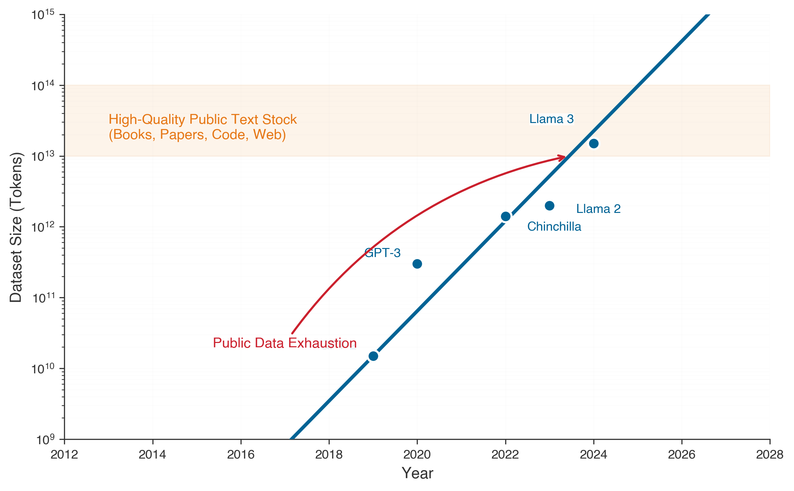

# Data Selection {#sec-data-selection}

::: {layout-narrow}
::: {.column-margin}

\chapterminitoc

:::

\noindent
{fig-alt="A futuristic digital illustration of data selection in machine learning, showing a sleek computing unit on one side with streams of binary code flowing in, where valuable data elements glow golden against a high-tech digital background."}

:::

## Purpose {.unnumbered}

\begin{marginfigure}
\mlsysstack{0}{0}{25}{50}{0}{0}{0}{90}
\end{marginfigure}

_Why can a carefully selected ten percent of your data match the accuracy of 100 percent?_

\index{Data Selection!systems optimization rationale}
The highest-impact optimization in machine learning operates upstream, before a single gradient is computed: on the data itself. Naive scaling assumes data is homogeneous, that every sample contributes equally to learning. Reality differs dramatically: in large-scale datasets, a tiny fraction of examples provides the majority of the gradient signal while the vast majority are redundant, noisy, or misaligned with the target distribution. This heterogeneity is not a statistical artifact but a systems optimization opportunity. Data engineering established that data is the source code of ML systems; data selection recognizes that not all source code is equally valuable and asks which lines of that code actually matter.

The practical consequences are enormous: compressing models and accelerating hardware speed up the execution of work, but data selection reduces the *core workload itself*. A training run that takes a week on the full dataset might take a day on a strategically selected subset, and that five-day savings compounds through every iteration of the development cycle: faster experimentation, more hyperparameter searches, quicker response to distribution drift, and lower barriers for teams with limited compute budgets. The shift is paradigmatic: from accumulating data as a massive liability to curating it as a precise resource, where every sample earns its place in the training set by contributing learning signal that no other sample provides.

::: {.content-visible when-format="pdf"}

\newpage

:::

::: {.callout-tip title="Learning Objectives"}

- Explain data selection as a systems optimization that reduces the Total Operations ($O$) term in the **iron law**, following the **D·A·M taxonomy**
- Apply the **Information-Compute Ratio (ICR)** framework to evaluate dataset value and diagnose whether training is data-starved or compute-starved
- Compare coreset selection, deduplication, and quality pruning techniques for pretraining data reduction
- Apply the **decision framework** to determine which combination of static pruning, dynamic selection, and synthetic generation fits a given workload
- Design **curriculum learning** and **active learning** strategies that adapt the training data diet as the model learns
- Evaluate how self-supervised pretraining and the **foundation model paradigm** transform data economics through cost amortization
- Analyze the **Selection Inequality**, cost-benefit trade-offs, and engineering challenges in production data selection systems

:::

## Data Selection Fundamentals {#sec-data-selection-data-selection-fundamentals-e839}

\index{iron law!Total Operations reduction via data selection}
Data selection asks a deceptively simple question with profound engineering consequences: given a clean, well-engineered dataset, which examples contribute the most learning per unit of compute cost? The data engineering infrastructure (@sec-data-engineering) established the infrastructure for collecting, cleaning, and preparing data, producing pipelines that ingest raw signals and yield well-governed, versioned datasets ready for training. That chapter ensured data *quality* through correct labels, consistent schemas, and clean records. Data selection optimizes data *value* by extracting maximum learning from minimum samples, directly shrinking the **Total Operations ($O$)** term in the **iron law** (Principle \ref{pri-iron-law}). The distinction matters: quality asks *whether* data is correct, while value asks *whether* correct data is worth the compute spent processing it.

\index{scaling laws!data-compute asymmetry}
For decades, the dominant strategy was straightforward: more data, better models. Scaling laws[^fn-scaling-laws-origin] [@kaplan2020scaling; @hoffmann2022training] confirmed that model performance improves predictably with dataset size, and teams responded rationally by scraping more web pages, labeling more images, and generating more synthetic examples. A critical asymmetry has since emerged. Hardware acceleration (@sec-hardware-acceleration) has outpaced the growth of high-quality data. Accelerator compute capacity has increased faster than traditional Moore's Law projections (architectural innovations like Tensor Cores and reduced-precision arithmetic stack on top of process-node gains, yielding effective throughput improvements faster than every two years) while the supply of novel, high-quality human-generated text and images grows at roughly 2$\times$ every five years (@tbl-scaling-asymmetry). The internet has already been scraped. Domain experts cannot label faster. This asymmetry, which researchers call the **Data Wall**\index{Data Wall!definition}[^fn-data-wall-scaling] [@villalobos2022will], has inverted the optimization priority from "get more data" to "get more from existing data."

[^fn-scaling-laws-origin]: **scaling laws**: Jared Kaplan and colleagues at Johns Hopkins and OpenAI empirically demonstrated in 2020 that language model loss follows power-law relationships with model size, dataset size, and compute budget, each with predictable exponents. For data selection, the key consequence is quantitative: loss scales as $L \propto D^{-\alpha}$ with $\alpha \approx 0.095$, meaning each doubling of data yields diminishing returns -- making it possible to calculate the exact point where selection becomes more cost-effective than collection. \index{scaling laws!power-law origin}

```{python}
#| label: scaling-asymmetry-calc
#| echo: false

# ┌─────────────────────────────────────────────────────────────────────────────
# │ SCALING ASYMMETRY TABLE
# ├─────────────────────────────────────────────────────────────────────────────
# │ Context: @tbl-scaling-asymmetry in "Data Selection Fundamentals" section
# │
# │ Goal: Quantify the growth rate gap between compute and data.
# │ Show: That compute grows 10×/3yr while data only grows 2×/5yr.
# │ How: Contrast historical growth factors for TFLOPS and high-quality tokens.
# │
# │ Imports: mlsysim.book (fmt)
# │ Exports: gpu_growth_str, gpu_period_str, web_data_growth_str, etc.
# └─────────────────────────────────────────────────────────────────────────────
from mlsysim.fmt import fmt_percent, fmt, check

# ┌── LEGO ───────────────────────────────────────────────
class SelectionEconomicsAnchor:
    """
    Namespace for coreset selection overhead anchor.
    """
    dataset_size_m = 1
    scoring_time_hrs = 2.8
    coreset_pct = 10

    scoring_time_str = f"{scoring_time_hrs:.1f} hours"
    coreset_pct_str = f"{coreset_pct}%"

# ┌── LEGO ───────────────────────────────────────────────
class ScalingAsymmetry:
    """
    Namespace for Scaling Asymmetry Table.
    Scenario: Comparing growth rates of Compute vs Data.
    """

    # ┌── 1. LOAD (Constants) ───────────────────────────────────────────────
    # Hardware: 10x every 3 years (approx 2.15x/year)
    gpu_growth_factor = 10.0
    gpu_period_years = 3.0

    # Data: 2x every 5 years (approx 1.15x/year)
    web_growth_factor = 2.0
    web_period_years = 5.0

    # Labels: 1.5x every 5 years (approx 1.08x/year)
    label_growth_factor = 1.5
    label_period_years = 5.0

    # ┌── 2. EXECUTE (The Compute) ─────────────────────────────────────────
    # Step 1: Annualized growth rates: Rate = Factor^(1/Period)
    gpu_annual = gpu_growth_factor ** (1.0 / gpu_period_years)
    web_annual = web_growth_factor ** (1.0 / web_period_years)

    # Step 2: Divergence
    gap_ratio = gpu_annual/web_annual

    # ┌── 3. GUARD (Invariants) ───────────────────────────────────────────
    check(gap_ratio >= 1.5, f"GPU growth ({gpu_annual:.2f}x/yr) isn't fast enough vs Data ({web_annual:.2f}x/yr). Gap: {gap_ratio:.2f}x")

    # ┌── 4. OUTPUT (Formatting) ──────────────────────────────────────────────
    gpu_growth_str = fmt(gpu_growth_factor, precision=0, commas=False) + "×"
    gpu_period_str = f"{int(gpu_period_years)} years"

    web_data_growth_str = fmt(web_growth_factor, precision=0, commas=False) + "×"
    web_data_period_str = f"{int(web_period_years)} years"

    label_data_growth_str = fmt(label_growth_factor, precision=1, commas=False) + "×"
    label_data_period_str = f"{int(label_period_years)} years"
```

@tbl-scaling-asymmetry quantifies the growth rates underlying this data-compute imbalance:

| **Resource**            |                                                                                        **Growth Rate** | **Implication**                                       |
|:------------------------|-------------------------------------------------------------------------------------------------------:|:------------------------------------------------------|
| **GPU Compute**         |               ~`{python} ScalingAsymmetry.gpu_growth_str` / `{python} ScalingAsymmetry.gpu_period_str` | Hardware vendors deliver reliable exponential gains   |
| **Training Data (Web)** |     ~`{python} ScalingAsymmetry.web_data_growth_str` / `{python} ScalingAsymmetry.web_data_period_str` | High-quality web text is finite; much already scraped |
| **Labeled Data**        | ~`{python} ScalingAsymmetry.label_data_growth_str` / `{python} ScalingAsymmetry.label_data_period_str` | Human annotation throughput is inherently bounded     |
| **Synthetic Data**      |                                                                                              Unbounded | Bounded by generator quality (risk of model collapse) |

: **Scaling Asymmetry in ML Resources.** Compute grows exponentially while high-quality data grows linearly or sub-linearly, creating an increasing compute-to-data imbalance that makes data selection essential. {#tbl-scaling-asymmetry .striped .hover tbl-colwidths="[20,20,60]"}

[^fn-data-wall-scaling]: **Data Wall**: Unlike compute (which scales with capital expenditure) or algorithms (which improve through research), the stock of high-quality human-generated text grows at roughly 2$\times$ per five years. Projections from Epoch AI estimated that high-quality language data could be exhausted within one to two decades at then-current consumption rates, making data the first ML resource to face a hard physical supply ceiling rather than merely an economic one. This ceiling directly constrains the Total Operations ($O$) term: when quality data runs out, additional compute yields diminishing returns regardless of hardware throughput. \index{Data Wall!scaling constraint}

\index{Data Wall!etymology}
\index{Foundation Models!data exhaustion projections}
Trace the trend line in @fig-running-out-of-human-data: foundation models are consuming the stock of human-generated text at an accelerating rate, with projections suggesting exhaustion of high-quality public data on a timeline measured in years, not decades. The exhaustion timeline is not a distant concern. It shapes training strategies today.

::: {#fig-running-out-of-human-data fig-env="figure" fig-pos="htb" fig-cap="**Dataset Growth Approaching Limits**: Foundation models are increasingly trained on vast datasets, approaching the total stock of human-generated text. Current projections suggest that high-quality public text data faces exhaustion on a near-term horizon, forcing a shift toward data selection, synthetic generation, and multimodal learning." fig-alt="Line chart of dataset size in tokens (10^9 to 10^15 on a log y-axis) vs. year (2012 to 2028). A blue line shows exponential data growth with markers for GPT-3, Chinchilla, Llama 2, and Llama 3. An orange band marks the high-quality public text stock."}



:::

The gap between what compute can process and what quality data exists continues to widen. Maintaining model relevance requires the *Continuous Training* loops of MLOps (@sec-ml-operations), and intelligent data selection becomes increasingly critical as a result.

::: {.callout-perspective title="The Scaling Asymmetry"}

**The Problem**: Compute scales exponentially. Data does not (@tbl-scaling-asymmetry).

**The Consequence**: Compute budgets now support training runs that far exceed what available high-quality data can fill. The field has become *compute-rich and data-poor*.

:::

The compute-data asymmetry inverts the optimization priority. When data was abundant and compute was scarce, the right strategy was algorithmic efficiency: squeeze more accuracy from limited GPU cycles. Now that compute is abundant and *quality data* is scarce, the winning strategy is **data selection**: squeeze more learning from each sample. Data selection operates upstream of all other optimizations. By pruning redundancy and selecting high-value samples, we reduce the workload before it ever enters the model or hits the hardware, directly shrinking the Total Operations ($O$) term in the iron law (see the following callout "Data Selection and the iron law" for a detailed analysis). For companies training frontier models, the bottleneck has shifted from GPU access to the quality and diversity of their training corpora.

The engineering toolkit for intelligent data selection follows Part III's **D·A·M taxonomy**, which establishes a deliberate optimization ordering: Data first, then Algorithm, then Machine. Data selection puts the "highest leverage first" principle into practice by addressing whether work is necessary before asking how to simplify or accelerate it. A three-stage optimization pipeline structures the practical response to the data wall:

\index{Static Pruning!definition}
\index{Dynamic Selection!definition}
\index{Synthetic Data Generation!definition}

1. **Static Pruning**: Removing low-value samples before training begins (coresets, deduplication).
2. **Dynamic Selection**: Selecting high-value samples during training (curriculum learning, active learning).
3. **Synthetic Generation**: Creating high-value samples on demand (augmentation, distillation).

Each stage increases the *information density* of the data that reaches the model, and together they form a complementary toolkit: pruning reduces *what* the pipeline contains, selection focuses *how* the pipeline uses it, and synthesis expands *what* the pipeline can access. Before examining these techniques, we must formalize *what* "data selection" means, *why* it is inherently a systems problem, and *how* to measure its effectiveness.

### Defining data selection {#sec-data-selection-defining-data-selection-ef2f}

::: {.callout-definition title="Data Selection"}

***Data Selection***\index{Data Selection!definition} is the process of maximizing the **Information-Compute Ratio** of a training dataset.

1.  **Significance (Quantitative):** It identifies the smallest subset of data sufficient to define the decision boundary, reducing the **Total Operations ($O$)** of the iron law by eliminating redundant or noisy samples ($D_{\text{vol}}$) before they consume GPU cycles.
2.  **Distinction (Durable):** Unlike **Data Engineering**, which focuses on the **Cleanliness** and **Consistency** of data, Data Selection focuses on the **Informativeness** and **Diversity** of the samples.
3.  **Common Pitfall:** A frequent misconception is that more data is always better. In reality, it is the **Quality of the Samples** that matters: adding 10$\times$ more low-quality data may yield less accuracy than 1.1$\times$ carefully selected, high-quality data.

:::

To make this concrete, consider training a model in the **GPT-2/Llama Lighthouse** family (@sec-network-architectures), which spans the autoregressive large language model (LLM) family from GPT-2's 1.5B parameters to Llama's 7B--70B range, here using a 70B parameter language model:

```{python}
#| label: gpt-llama-calc
#| echo: false

# ┌─────────────────────────────────────────────────────────────────────────────
# │ COMPUTE-DATA GAP EXAMPLE
# ├─────────────────────────────────────────────────────────────────────────────
# │ Context: "Defining Data Selection" section - 70B Llama model example
# │
# │ Goal: Demonstrate the "Data Wall" with a concrete scale example.
# │ Show: That cluster capacity (10T tokens) already exceeds available quality data (5T).
# │ How: Contrast H100 compute throughput with public dataset token counts.
# │
# │ Imports: mlsysim.book (fmt)
# │ Exports: llama_params_str, h100_count_str, tokens_capacity_str, etc.
# └─────────────────────────────────────────────────────────────────────────────
from mlsysim.core.constants import Bparam, BILLION, TRILLION, SEC_PER_HOUR, MILLION, THOUSAND
from mlsysim import Models
from mlsysim.fmt import fmt_percent, fmt, check

# ┌── LEGO ───────────────────────────────────────────────
class ComputeDataGap:
    """
    Namespace for Compute-Data Gap calculation.
    Scenario: 10k H100s vs Available Quality Tokens.
    """

    # ┌── 1. LOAD (Constants) ───────────────────────────────────────────────
    h100_count = 10000
    months = 3
    model = Models.Language.Llama2_70B

    tokens_available = 5e12 # 5T tokens (RedPajama/RefinedWeb scale)
    tokens_capacity = 10e12 # Capacity of the cluster

    # ┌── 2. EXECUTE (The Compute) ─────────────────────────────────────────
    gap_ratio = tokens_capacity/tokens_available

    # ┌── 3. GUARD (Invariants) ───────────────────────────────────────────
    check(gap_ratio >= 1.0, f"Compute ({tokens_capacity:.1e}) is less than Data ({tokens_available:.1e}). No Data Wall.")

    # ┌── 4. OUTPUT (Formatting) ──────────────────────────────────────────────
    llama_params_str = fmt(model.parameters.m_as(Bparam), precision=0, commas=False) + "B"
    h100_count_str = fmt(h100_count, precision=0, commas=True)
    tokens_capacity_str = fmt(tokens_capacity/TRILLION, precision=0, commas=False) + "T"
    tokens_available_str = fmt(tokens_available/TRILLION, precision=0, commas=False) + "T"
    compute_gap_str = fmt(gap_ratio, precision=0, commas=False)
    training_months_str = fmt(months, precision=0, commas=False)
```

The compute budget (`{python} ComputeDataGap.h100_count_str` H100 GPUs for `{python} ComputeDataGap.training_months_str` months) represents tens of millions of dollars and can process over `{python} ComputeDataGap.tokens_capacity_str` tokens. Yet only ~`{python} ComputeDataGap.tokens_available_str` tokens of deduplicated, filtered web text exist, leaving a `{python} ComputeDataGap.compute_gap_str`$\times$ gap between what compute can process and what quality data can fill. The team faces three options: train on the same data for multiple epochs (diminishing returns after epochs 2--3), lower quality thresholds to include more data (degrades model quality), or invest in data selection through better filtering, curriculum design, and synthetic augmentation to extract more learning from each token. The third option is increasingly the dominant approach.

The data selection imperative applies across model architectures, though the bottlenecks differ. Unlike our compute-bound ResNet-50 Lighthouse, GPT-2/Llama models are **memory bandwidth-bound** during inference (though often compute-bound during training as well) and still benefit enormously from data selection during training. Each token processed requires the same forward/backward pass cost regardless of model bottleneck, so fewer tokens means fewer FLOPs. Because data selection benefits every architecture regardless of its dominant bottleneck, the appropriate framing is systemic rather than purely statistical.

### Systems Perspective {#sec-data-selection-systems-perspective-bd61}

The data wall establishes *why* data selection matters; the systems perspective reveals *how* to approach it effectively. The conventional ML framing focuses on achieving the same accuracy with fewer samples, centering on statistical sample complexity and generalization theory. While valid, that framing misses the larger picture.

\index{Data Selection!systems vs. ML framing}
In this textbook, we adopt a *systems framing* that asks instead how to reduce the total cost of achieving target performance across the entire ML lifecycle. The shift moves attention from accuracy curves to resource consumption, as @tbl-ml-vs-systems-framing illustrates.

| **ML Framing**                        | **Systems Framing**                         |
|:--------------------------------------|:--------------------------------------------|
| **"Fewer samples for same accuracy"** | "Fewer FLOPs for same accuracy"             |
| **"Better generalization"**           | "Lower training cost (time, money, energy)" |
| **"Sample complexity bounds"**        | "End-to-end resource efficiency"            |
| **"Learning theory"**                 | "Cost engineering"                          |

: **ML vs. Systems Perspectives on Data Selection.** The ML framing optimizes sample complexity; the systems framing optimizes total resource cost across the pipeline. {#tbl-ml-vs-systems-framing .striped .hover}

The systems framing reveals optimization opportunities invisible to the ML framing. To see *why*, consider *how* data selection interacts with the iron law introduced in @sec-introduction-iron-law-ml-systems-c32a.

```{python}
#| label: data-selection-savings-calc
#| echo: false

# ┌─────────────────────────────────────────────────────────────────────────────
# │ IRON LAW SAVINGS CALCULATION
# ├─────────────────────────────────────────────────────────────────────────────
# │ Context: "Data Selection and the Iron Law" callout
# │
# │ Goal: Demonstrate the multiplicative impact of data selection.
# │ Show: That dataset reduction compounds with hardware and model optimizations.
# │ How: Contrast additive vs. multiplicative speedup factors for an 8x total gain.
# │
# │ Imports: mlsysim.book (fmt)
# │ Exports: training_cost_m_str, dataset_reduction_pct_str, combined_factor_str
# └─────────────────────────────────────────────────────────────────────────────
from mlsysim.fmt import fmt_percent, fmt, check

# ┌── LEGO ───────────────────────────────────────────────
class IronLawSavings:
    """
    Namespace for Iron Law Multiplicative Savings.
    Scenario: 2x Data Selection * 2x Compression * 2x Hardware = 8x Total.
    """

    # ┌── 1. LOAD (Constants) ───────────────────────────────────────────────
    budget_m = 100 # $100M training run

    # Optimization factors
    factor_data = 2.0
    factor_model = 2.0
    factor_hw = 2.0

    # Derived
    data_pruning_pct = (1 - (1/factor_data)) * 100

    # ┌── 2. EXECUTE (The Compute) ─────────────────────────────────────────
    # Step 1: Multiplicative effect
    total_speedup = factor_data * factor_model * factor_hw

    # Step 2: Savings
    compute_savings_m = budget_m * (data_pruning_pct / 100.0)

    # ┌── 3. GUARD (Invariants) ───────────────────────────────────────────
    additive_sum = factor_data + factor_model + factor_hw
    check(total_speedup > additive_sum, f"Multiplicative speedup ({total_speedup}x) should exceed additive sum ({additive_sum}).")

    # ┌── 4. OUTPUT (Formatting) ──────────────────────────────────────────────
    training_cost_m_str = fmt(budget_m, precision=0, commas=False)
    dataset_reduction_pct_str = fmt(data_pruning_pct, precision=0, commas=False)
    compute_savings_m_str = fmt(compute_savings_m, precision=0, commas=False)
    combined_factor_str = fmt(total_speedup, precision=0, commas=False)
```

::: {.callout-perspective title="Data Selection and the iron law"}
In the **iron law of ML Systems** ($T = \frac{D_{\text{vol}}}{BW} + \frac{O}{R_{\text{peak}} \cdot \eta} + L_{\text{lat}}$), data selection is the only technique that reduces the *Total Operations* term at its source. Model compression reduces operations per sample; hardware acceleration increases throughput per operation. Data selection, by contrast, reduces the number of samples processed entirely.

- **Model compression**: Reduces $O$ per forward/backward pass
- **Hardware acceleration**: Increases $R_{\text{peak}}$ (peak throughput) and $\eta$ (utilization)
- **Data selection**: Reduces the number of passes through the entire equation

\index{iron law!multiplicative savings from data selection}
This makes data selection multiplicatively valuable: when all three optimizations act on the same bottleneck, a 2$\times$ reduction in dataset size with 2$\times$ model compression and 2$\times$ hardware acceleration yields `{python} IronLawSavings.combined_factor_str`$\times$ total cost reduction, not 6$\times$.

:::

Consider training cost reduction: a `{python} IronLawSavings.dataset_reduction_pct_str` percent reduction in dataset size does not merely improve sample efficiency; it directly halves the number of forward passes, backward passes, and gradient updates. For a USD `{python} IronLawSavings.training_cost_m_str` M training run, this translates to USD `{python} IronLawSavings.compute_savings_m_str` M in compute savings. The relationship is linear and immediate.

\index{Deduplication!storage and I/O cost reduction}
\index{Active Learning!labeling cost reduction}
\index{Green AI!data selection as energy reduction}
Compute savings cascade through the entire infrastructure stack. Large datasets consume petabytes of storage and saturate network bandwidth during distributed training; deduplication and coreset selection reduce storage costs while eliminating I/O bottlenecks that can idle expensive GPU clusters. The savings extend to labeling economics: expert labeling costs (\$5--100+ per sample in domains like medical imaging) often exceed compute costs, and active learning and semi-supervised methods reduce labeling budgets by 10--100$\times$. The environmental implications compound further: training a large language model can emit hundreds of tons of CO₂, making data selection the most direct lever for Green AI, since halving the dataset halves training energy with no accuracy trade-off if done correctly. Smaller curated datasets also enable faster iteration velocity. A team that can iterate in hours rather than days has a compounding advantage in model development.

The cascading benefits illustrate a broader point: where the ML researcher asks "what is the sample complexity of this learning problem?", the systems engineer asks "what is the cost-per-accuracy-point across the entire pipeline, from data acquisition through deployment?" This chapter provides the systems engineer's toolkit for that question: techniques to minimize total cost, metrics to quantify efficiency gains, and architectural patterns to implement data selection at scale.

### Information-compute ratio {#sec-data-selection-informationcompute-ratio-8c0b}

\index{Information-Compute Ratio!definition}
\index{Pareto Frontier!data selection context}
The systems framing established earlier calls for a quantitative metric. The Optimize Principles (Part III) introduced the *Pareto Frontier* as the boundary where improving one metric necessarily degrades another, and identified three pillars of efficiency following the D·A·M taxonomy: Data, Algorithm (model compression, @sec-model-compression), and Machine (hardware acceleration, @sec-hardware-acceleration). As the first pillar in the D·A·M ordering, data selection addresses the most critical question: *how much information does each sample contribute to the model's learning per unit of computation?* We formalize this with a central metric: the Information-Compute Ratio.

\index{Roofline Model!data selection interaction}
In the optimization triad (@fig-optimization-triad), data selection plays the role of *Input Optimization*, reducing total workload before it enters the model or hardware. Model compression minimizes the math per parameter; hardware acceleration maximizes the math per second; data selection minimizes the total math required to reach convergence. The three edges of the triad capture the dominant bottlenecks: *Compute Bound* describes systems limited by arithmetic throughput, *I/O Bound* describes systems limited by data movement, and *Sample Efficiency* describes systems limited by the information content of training data.

::: {#fig-optimization-triad fig-env="figure" fig-pos="htb" fig-cap="**The optimization triad**: Machine learning performance relies on three pillars: Algorithms (Model), Data (Input Optimization), and Machine (Hardware). While algorithms and machines have traditionally received the most attention, optimizing data offers a third, independent lever for scaling performance." fig-alt="Triangular diagram with three pillars around a central ML Performance label: Algorithms (Model) at top, Machine (Hardware) at bottom-left, and Data Selection at bottom-right. Curved arrows trace each edge of the triangle, labeled Compute Bound (between Algorithms and Machine), I/O Bound (between Machine and Data Selection), and Sample Efficiency (between Data Selection and Algorithms)."}
```{.tikz}
\scalebox{0.8}{%
\begin{tikzpicture}[line join=round,font=\usefont{T1}{phv}{m}{n}\footnotesize]
\tikzset{%
Box2/.style={align=flush center, inner sep=0pt,draw=none,fill=none,minimum height=8mm },
planet/.style = {circle, draw=none,semithick, fill=yellow!10,line width=1.5pt,
                    font=\usefont{T1}{phv}{m}{n}\bfseries,
                    minimum size=27mm, inner sep=1mm,align=flush center},
satellite/.style = {circle, draw=#1, dashed, thick, fill=none,%#1!10,
                    text width=26mm, inner sep=1pt, align=flush center,minimum size=28mm,minimum height=12mm},
TxtC/.style = {font=\footnotesize\usefont{T1}{phv}{m}{n},text width=50mm,align=flush center},
LineA/.style = {violet!60,{Kite[line width=1.1pt,fill=white,round,length=9pt,width=7pt]}-,line width=1.5pt,shorten <=-3pt},
ALineA/.style={{Triangle[width=14pt,length=10pt]}-{Triangle[width=14pt,length=10pt]}, line width=7pt,cyan!40}
}

\tikzset{mycylinder/.style={cylinder, shape border rotate=90, aspect=1.3, draw, fill=white,
minimum width=25mm,minimum height=11mm,line width=\Linewidth,node distance=-0.15},
pics/data/.style = {
        code = {
        \pgfkeys{/channel/.cd, #1}
\begin{scope}[local bounding box=STREAMING,scale=\scalefac, every node/.append style={transform shape}]
\node[mycylinder,fill=\filllcolor!50] (A) {};
\node[mycylinder, above=of A,fill=\filllcolor!30] (B) {};
\node[mycylinder, above=of B,fill=\filllcolor!10] (C) {};
\fill[\filllcolor!50!black]($(C.west)!0.12!(C.east)$)circle(3pt);
\fill[\filllcolor!50!black]($(B.west)!0.12!(B.east)$)circle(3pt);
\fill[\filllcolor!50!black]($(A.west)!0.12!(A.east)$)circle(3pt);
 \end{scope}
     }
  }
}

%funnel
\tikzset{%
 pics/funnel/.style = {
        code = {
        \pgfkeys{/channel/.cd, #1}
\begin{scope}[local bounding box=FUNNEL,scale=\scalefac, every node/.append style={transform shape}]
\draw[fill=\filllcolor!50,line width=\Linewidth,draw=\drawcolor](-0.12,-0.81)--(-0.19,-0.25)--(-0.7,0.41)--(0.7,0.41)--(0.19,-0.25)--(0.12,-0.81)--cycle;
\draw[fill=\filllcolor!50,line width=\Linewidth,draw=\drawcolor](-0.19,-0.25)--(0.08,-0.25);
\draw[fill=\filllcolor!50,line width=\Linewidth,draw=\drawcolor](0.16,-0.09)--(0.41,0.31);
%
\node[line width=\Linewidth,draw=\drawcolor,fill=\filllcolor!50,inner sep=1pt,
rectangle,rounded corners=0.5pt,minimum width=16mm,minimum height=5pt]at(0,0.5){};
%
\foreach \i in{-0.5,0,0.5}{
\node[single arrow, line width=0.8*\Linewidth,draw=black,fill=\filllcirclecolor, rotate=270,inner sep=1pt,
      minimum width =9pt, single arrow head extend=2pt,
      minimum height=5mm]at(\i,0.9) {}; % length of arrow
   }
\node[single arrow,line width=0.8*\Linewidth,draw=black,fill=\filllcirclecolor, rotate=270,inner sep=1pt,
      minimum width =11pt, single arrow head extend=2pt,
      minimum height=5mm]at(0,-1.1) {}; % length of arrow
 \end{scope}
     }
  }
}
%CPU
\tikzset{%
 pics/cpu/.style = {
        code = {
        \pgfkeys{/channel/.cd, #1}
\begin{scope}[local bounding box=FUNNEL,scale=\scalefac, every node/.append style={transform shape}]
\node[fill=\filllcolor,minimum width=66, minimum height=66,
            rounded corners=2,outer sep=2pt] (C1) {};
\node[fill=white,minimum width=54, minimum height=54] (C2) {};
\node[fill=\filllcolor!40,minimum width=44, minimum height=44] (C3) {\large CPU};

\foreach \x/\y in {0.11/1,0.26/2,0.41/3,0.56/4,0.71/5,0.85/6}{
\node[fill=\filllcolor,minimum width=3, minimum height=15,
           inner sep=0pt,anchor=south](GO\y)at($(C1.north west)!\x!(C1.north east)$){};
}
\foreach \x/\y in {0.11/1,0.26/2,0.41/3,0.56/4,0.71/5,0.85/6}{
\node[fill=\filllcolor,minimum width=3, minimum height=15,
           inner sep=0pt,anchor=north](DO\y)at($(C1.south west)!\x!(C1.south east)$){};
}
\foreach \x/\y in {0.11/1,0.26/2,0.41/3,0.56/4,0.71/5,0.85/6}{
\node[fill=\filllcolor,minimum width=15, minimum height=3,
           inner sep=0pt,anchor=east](LE\y)at($(C1.north west)!\x!(C1.south west)$){};
}
\foreach \x/\y in {0.11/1,0.26/2,0.41/3,0.56/4,0.71/5,0.85/6}{
\node[fill=\filllcolor,minimum width=15, minimum height=3,
           inner sep=0pt,anchor=west](DE\y)at($(C1.north east)!\x!(C1.south east)$){};
}
 \end{scope}
     }
  }
}
\tikzset{
pics/algorithm/.style = {
        code = {
        \pgfkeys{/channel/.cd, #1}
\begin{scope}[shift={($(0,0)+(0,0)$)},scale=\scalefac,every node/.append style={transform shape}]
\node[fill=\filllcolor!60,draw=\drawcolor,line width=\Linewidth,rectangle,minimum size=2.5mm,
rounded corners=1pt,inner sep=1pt](B2)at(0,-0.47){};
\node[fill=\filllcolor!30,draw=\drawcolor,line width=\Linewidth,rectangle,minimum size=2.5mm,
rounded corners=1pt,inner sep=1pt](B3)at(-0.6,-0.47){};
\node[fill=\filllcolor!30,draw=\drawcolor,line width=\Linewidth,rectangle,minimum size=2.5mm,
rounded corners=1pt,inner sep=1pt](B1)at(0.6,-0.47){};
%
\node[fill=\filllcolor!99!violet!80,draw=\drawcolor,line width=\Linewidth,rectangle,
minimum width=8.5mm,minimum height=3mm,
rounded corners=2pt,inner sep=1pt](B0)at(0,0.53){};
\draw[draw=\drawcolor,shorten >=4pt,shorten <=4pt,line width=1.5*\Linewidth]
($(B0.north west)!0.33!(B0.south west)$)--($(B0.north east)!0.33!(B0.south east)$);
\draw[draw=\drawcolor,shorten >=4pt,shorten <=4pt,line width=1.5*\Linewidth]
($(B0.north west)!0.66!(B0.south west)$)--($(B0.north east)!0.66!(B0.south east)$);
\draw[draw=\drawcolor,rounded corners](B1)|-(B0);
\draw[draw=\drawcolor,rounded corners](B3)|-(B0);
\draw[draw=\drawcolor,rounded corners](B2)--(B0);
\node[fill=\filllcirclecolor!60,draw=\drawcolor,line width=\Linewidth,rectangle,minimum size=2.5mm,
rounded corners=1pt,inner sep=1pt,rotate=45](R2){};
\node[fill=\filllcirclecolor!30,draw=\drawcolor,line width=\Linewidth,rectangle,minimum size=2.5mm,
rounded corners=1pt,inner sep=1pt,rotate=45](R1) at (-0.6,0){};
\node[fill=\filllcirclecolor!30,draw=\drawcolor,line width=\Linewidth,rectangle,minimum size=2.5mm,
rounded corners=1pt,inner sep=1pt,rotate=45](R3) at (0.6,0){};
\end{scope}
    }
  }
}
%vaga
\tikzset{
pics/vaga/.style = {
        code = {
        \pgfkeys{/channel/.cd, #1}
\begin{scope}[shift={($(0,0)+(0,0)$)},scale=\scalefac,every node/.append style={transform shape}]
\node[rectangle,minimum width=2mm,minimum height=22mm,
draw=none, fill=\filllcolor,line width=\Linewidth](1R) at (0,-0.95){};
\fill[fill=\filllcolor!60!black](230:2.8)arc(230:310:2.8)--cycle;%circle(2.9);
%LT
\node [semicircle, shape border rotate=180,  anchor=chord center,
      minimum size=11mm, draw=none, fill=\filllcirclecolor](LT) at (-2,-0.5) {};
\node [circle,  minimum size=4mm, draw=none, fill=\filllcirclecolor](T1) at (-2,1.25) {};
\draw[draw=\drawcolor,,line width=1.2*\Linewidth,shorten <=3pt,shorten >=3pt](T1)--(LT);
\draw[draw=\drawcolor,,line width=1.2*\Linewidth,shorten <=3pt,shorten >=3pt](T1)--(LT.30);
\draw[draw=\drawcolor,,line width=1.2*\Linewidth,shorten <=3pt,shorten >=3pt](T1)--(LT.150);
%DT
\node [semicircle, shape border rotate=180,  anchor=chord center,
      minimum size=11mm, draw=none, fill=\filllcirclecolor!70!black](DT) at (2,-0.5) {};
\node [circle,  minimum size=4mm, draw=none, fill=\filllcirclecolor!70!black](T2) at (2,1.25) {};
\draw[draw=\drawcolor,line width=1.2*\Linewidth,shorten <=3pt,shorten >=3pt](T2)--(DT);
\draw[draw=\drawcolor,,line width=1.2*\Linewidth,shorten <=3pt,shorten >=3pt](T2)--(DT.30);
\draw[draw=\drawcolor,,line width=1.2*\Linewidth,shorten <=3pt,shorten >=3pt](T2)--(DT.150);
%
\node[draw=none,rectangle,minimum width=32mm,minimum height=1.5mm,inner sep=0pt,
fill=\filllcolor!60!black]at(0,1.25){};
\node[draw=white,fill=\filllcolor,line width=2*\Linewidth,ellipse,minimum width=9mm,  minimum height=15mm](EL)at(0,0.85){};
\node[draw=white,fill=\filllcolor!60!black,line width=2*\Linewidth,,circle,minimum size=10mm](2C)at(0,2.05){};
\end{scope}
    }
  }
}
\pgfkeys{
  /channel/.cd,
   Depth/.store in=\Depth,
  Height/.store in=\Height,
  Width/.store in=\Width,
  filllcirclecolor/.store in=\filllcirclecolor,
  filllcolor/.store in=\filllcolor,
  drawcolor/.store in=\drawcolor,
  drawcircle/.store in=\drawcircle,
  scalefac/.store in=\scalefac,
  Linewidth/.store in=\Linewidth,
  picname/.store in=\picname,
  filllcolor=BrownLine,
  filllcirclecolor=violet!20,
  drawcolor=black,
  drawcircle=violet,
  scalefac=1,
  Linewidth=0.5pt,
  Depth=1.3,
  Height=0.8,
  Width=1.1,
  picname=C
}
\definecolor{Siva}{RGB}{161,152,130}
\def\radius{3.5}
%planet
\node (p)   [planet]    {};
\node[TxtC,below=0pt of p]{ML\\ Performance};
%satellites

\foreach \i/\j/\sho [count=\k from 0] in {
magenta!70!/{Algorithms (Model)}/105pt,
Siva/{Data Selection}/105pt,
cyan/{Machine (Hardware)}/105pt
%violet!75!/{\textbf{Embodiment}\\{\footnotesize No grounding}}/11pt%,
%orange/\textbf{Alignment}\\ {\footnotesize Value loading}/11pt
}
{
\def\startangle{90}
%Satelit
\pgfmathsetmacro{\angle}{\startangle - \k * (360/3)}
\node (s\k) [satellite=\i, font=\footnotesize\usefont{T1}{phv}{m}{n}] at (\angle:\radius+\sho) {};
\node[TxtC,below=0pt of s\k]{\j};
%Arrows
%\draw[arr=\i,shorten >=\sho] (p) --coordinate[pos=0.35](AR\k) (s\k);
}

 \pic[shift={(0,0)}] at  (0,0){vaga={scalefac=0.35,picname=1,filllcolor=BlueLine,  Linewidth=1.0pt,filllcirclecolor=orange}};
 %algorithm
 \pic[shift={(0,0)}] at  (s0){algorithm={scalefac=1.2,picname=1,
drawcolor=black,filllcolor=orange!80!, Linewidth=0.75pt,filllcirclecolor=green}};
%data
\begin{scope}[local bounding box=DATA1,shift={($(0,-0.66)+(s1)$)},
scale=0.6, every node/.append style={transform shape}]
\pic[shift={(0,0)}] at  (0,0){data={scalefac=1,picname=1,filllcolor=BlueLine, Linewidth=0.7pt}};
\node[draw=black!70,line width=1pt,yshift=-3mm,fill=white,circle,minimum size=18mm](CIR)at(A.north east){};
\pic[shift={(0,0)}] at  (CIR){funnel={scalefac=0.6,picname=1,Linewidth=0.5pt,
 filllcolor=BrownL,drawcolor=black,filllcirclecolor=green}};
 \end{scope}
  %machine - CPU
 \pic[shift={(0,0)}] at  (s2){cpu={scalefac=0.55,picname=1,filllcolor=BrownLine, Linewidth=0.7pt}};
 %Arrows
 \draw[ALineA] (60:\radius) arc[radius=\radius, start angle=60, end angle= 0];
\coordinate (AR1) at (30:\radius);

\draw[ALineA] (300:\radius) arc[radius=\radius, start angle=300, end angle= 240];
\coordinate (AR2) at (270:\radius);

\draw[ALineA] (180:\radius) arc[radius=\radius, start angle=180, end angle= 120];
\coordinate (AR3) at (150:\radius);
%%%%%%%%%
 \path[LineA](AR1)--++(0:1.0)coordinate(MA);
 \node[Box2,anchor=west](T1)at(MA){Sample Efficiency};
 \draw[violet!50,line width=2pt](T1.north west)to[bend right=25]coordinate(AR11)(T1.south west);
 \draw[LineA](AR1)--(AR11);

 \path[LineA](AR2)--++(270:0.65)coordinate(MA2);
 \node[Box2,anchor=west,rotate=90](T2)at(MA2){};%Sample Efficiency
  \node[anchor=north](T222)at(MA2){Sample Efficiency};
 \draw[violet!50,line width=2pt](T2.north west)to[bend left=25]coordinate(AR22)(T2.south west);
 \draw[LineA](AR2)--(AR22);

 \path[LineA](AR3)--++(0:-1.0)coordinate(MA1);
 \node[Box2,anchor=east,align=right](T3)at(MA1){Compute Bound};
 \draw[violet!50,line width=2pt](T3.north east)to[bend left=25]coordinate(AR33)(T3.south east);
 \draw[LineA](AR3)--(AR33);
 \end{tikzpicture}}
```

:::

We can formalize this as the ICR:
$$\text{ICR} = \frac{\Delta \text{Model Performance}}{\Delta \text{FLOPs}}$$

### The ICR frontier: When data becomes a tax {#sec-data-selection-icr-frontier}

The Information-Compute Ratio is not constant; it follows a law of diminishing returns. We define the **ICR Frontier**\index{ICR Frontier!diminishing returns} as the point where the marginal learning signal from additional data drops toward zero.

Mathematically, let $I(D)$ be the information content of a dataset of size $D$. In a redundant dataset, $I(D)$ often scales logarithmically ($\log D$) while the compute cost $C(D)$ scales linearly ($O \cdot D$). The resulting ICR follows @eq-icr-decay:
$$\text{ICR}(D) = \frac{\frac{d}{dD} I(D)}{\frac{d}{dD} C(D)} \approx \frac{1/D}{O} = \frac{1}{O \cdot D}$$ {#eq-icr-decay}

The $1/(O \cdot D)$ decay creates what we call **The Data Wall**\index{Data Wall!zero learning signal}. Beyond the frontier, adding more data yields near-zero learning but still costs linear compute. In this regime, data is no longer an asset; it is a **Data Tax**\index{Data Tax!redundant compute cost} that inflates the $O$ term of the **iron law** without improving the accuracy numerator of the **RoC** (Return on Compute, see @sec-introduction-roc-invariant). A systems engineer's goal is to keep the system operating at the "Knee" of the ICR curve, where the learning signal per FLOP is maximized. The static and dynamic selection techniques that follow are designed to achieve exactly that.

\index{Information-Compute Ratio!equivalence to hardware speedup}
As detailed in the preceding "Data Selection and the iron law" callout, data selection turns the Total Operations ($O$) term from a fixed constant into a variable. By maximizing ICR, we reduce the total FLOPs required to reach a target performance level. A 2$\times$ improvement in ICR is mathematically equivalent to a 2$\times$ improvement in hardware Peak Throughput ($R_{\text{peak}}$), but often much cheaper to achieve. ICR focuses specifically on the compute component of the broader Selection Efficiency metric defined earlier, which also accounts for acquisition, labeling, and storage costs.

A random batch of raw data often has low ICR: it contains redundant examples, noisy samples, or "easy" examples the model has already mastered, wasting GPU cycles on zero-information updates. High-efficiency data pipelines (@fig-data-selection-pipeline) filter, order, and synthesize data to maximize ICR, ensuring that every FLOP contributes to learning. To illustrate, consider *computing ICR* on a concrete coreset selection task. Later in this chapter, @sec-data-selection-measurement-framework-733b provides the complete measurement framework for evaluating these efficiency gains, including the compute-optimal frontier diagnostic that determines whether training is data-starved or compute-starved.

::: {#fig-data-selection-pipeline fig-cap="**The data selection pipeline**: A structured approach to increasing data value. Raw data is first pruned (Static Pruning), then actively selected (Active Selection), and finally synthesized (Data Synthesis). Each stage increases the Information-Compute Ratio (ICR)." fig-alt="Flow diagram: Raw Data -> 1. Static Pruning (pretraining) -> 2. Dynamic Selection (during training) -> 3. Synthetic Gen (on-demand) -> High ICR Model, with arrows indicating the flow between stages."}
```{.tikz}
\begin{tikzpicture}[font=\small\usefont{T1}{phv}{m}{n}, >=stealth]
\tikzset{
Box/.style={align=center, inner xsep=2pt,draw=GreenLine, line width=1pt,fill=none,
minimum width=24mm, minimum height=25mm,node distance=1.0},
LineA/.style={violet!50,line width=4.0pt,{-{Triangle[width=1.5*6pt,length=2.0*5pt]}},shorten <=1pt,shorten >=1pt},
ALine/.style={black!50, line width=1.1pt,{{Triangle[width=0.9*6pt,length=1.2*6pt]}-}},
Larrow/.style={fill=violet!50, single arrow,  inner sep=2pt, single arrow head extend=3pt,
            single arrow head indent=0pt,minimum height=10mm, minimum width=3pt}
}
\tikzset{%
 pics/inbox/.style = {
        code = {
        \pgfkeys{/channel/.cd, #1}
\begin{scope}[local bounding box=INBOX,scale=\scalefac, every node/.append style={transform shape}]
\node[line width=\Linewidth,draw=\drawcolor,fill=\filllcolor!50,
rectangle,rounded corners=3pt,minimum width=14mm,minimum height=10mm]at(0,0.3){};
\node[line width=\Linewidth,draw=\drawcolor,fill=\filllcolor,
rectangle,rounded corners=3pt,minimum width=15mm,minimum height=10mm]at(0,0.1){};
\node[line width=\Linewidth,draw=\drawcolor,fill=\filllcolor!50,
,rectangle,rounded corners=3pt,minimum width=17mm,minimum height=10mm]
at(0,-0.1){};
\draw[line width=\Linewidth,draw=\drawcolor,fill=\filllcirclecolor,,rounded corners=2pt](-0.92,0.05)--
(-0.92,-0.78)--(0.92,-0.78)--(0.92,0.05)--(0.40,0.05)--(0.32,-0.2)--(-0.29,-0.2)--(-0.40,0.05)--cycle;

\node[single arrow, line width=\Linewidth,draw=black,fill=cyan!90!black!30, rotate=270,
      minimum width = 15pt, single arrow head extend=6pt,
      minimum height=10mm]at(0,0.5) {}; % length of arrow
 \end{scope}
     }
  }
}
%target
\tikzset{
pics/target/.style = {
        code = {
        \pgfkeys{/channel/.cd, #1}
\begin{scope}[shift={($(0,0)+(0,0)$)},scale=\scalefac,every node/.append style={transform shape}]
\definecolor{col1}{RGB}{62,100,125}
\definecolor{col2}{RGB}{219,253,166}
\colorlet{col1}{\filllcolor}
\colorlet{col2}{\filllcirclecolor}
\foreach\i/\col [count=\k]in {22mm/col1,17mm/col2,12mm/col1,7mm/col2,2.5mm/col1}{
\node[circle,inner sep=0pt,draw=\drawcolor,fill=\col,minimum size=\i,line width=\Linewidth](C\k){};
}
\draw[thick,fill=brown,xscale=-1](0,0)--++(111:0.13)--++(135:1)--++(225:0.1)--++(315:1)--cycle;
\path[green,xscale=-1](0,0)--(135:0.85)coordinate(XS1);
\draw[thick,fill=yellow,xscale=-1](XS1)--++(80:0.2)--++(135:0.37)--++(260:0.2)--++(190:0.2)--++(315:0.37)--cycle;
\end{scope}
    }
  }
}
%brain
\tikzset{pics/brain/.style = {
        code = {
        \pgfkeys{/channel/.cd, #1}
\begin{scope}[local bounding box=BRAIN,scale=\scalefac, every node/.append style={transform shape}]
\fill[fill=\filllcolor!50](0.1,-0.5)to[out=0,in=180](0.33,-0.5)
to[out=0,in=270](0.45,-0.38)to(0.45,-0.18)
to[out=40,in=240](0.57,-0.13)to[out=110,in=310](0.52,-0.05)
to[out=130,in=290](0.44,0.15)to[out=90,in=340,distance=8](0.08,0.69)
to[out=160,in=80](-0.42,-0.15)to (-0.48,-0.7)to(0.07,-0.7)to(0.1,-0.5)
(-0.10,-0.42)to[out=310,in=180](0.1,-0.5);
\draw[draw=\drawcolor,line width=\Linewidth](0.1,-0.5)to[out=0,in=180](0.33,-0.5)
to[out=0,in=270](0.45,-0.38)to(0.45,-0.18)
to[out=40,in=240](0.57,-0.13)to[out=110,in=310](0.52,-0.05)
to[out=130,in=290](0.44,0.15)to[out=90,in=340,distance=8](0.08,0.69)
(-0.42,-0.15)to (-0.48,-0.7)
(0.07,-0.7)to(0.1,-0.5)
(-0.10,-0.42)to[out=310,in=180](0.1,-0.5);
\draw[fill=\filllcolor,line width=\Linewidth](-0.3,-0.10)to(0.08,0.60)
to[out=60,in=50,distance=3](-0.1,0.69)to[out=160,in=80](-0.26,0.59)to[out=170,in=90](-0.46,0.42)
to[out=170,in=110](-0.54,0.25)to[out=210,in=150](-0.54,0.04)
to[out=240,in=130](-0.52,-0.1)to[out=300,in=240]cycle;
\draw[fill=\filllcolor,line width=\Linewidth]
(-0.04,0.64)to[out=120,in=0](-0.1,0.69)(-0.19,0.52)to[out=120,in=330](-0.26,0.59)
(-0.4,0.33)to[out=150,in=280](-0.46,0.42)
%
(-0.44,-0.03)to[bend left=30](-0.34,-0.04)
(-0.33,0.08)to[bend left=40](-0.37,0.2) (-0.37,0.12)to[bend left=40](-0.45,0.14)
(-0.26,0.2)to[bend left=30](-0.24,0.13)
(-0.16,0.32)to[bend right=30](-0.27,0.3)to[bend right=30](-0.29,0.38)
(-0.13,0.49)to[bend left=30](-0.04,0.51);

\draw[rounded corners=0.8pt,\drawcircle,-{Circle[fill=\filllcirclecolor,length=2.5pt]}](-0.23,0.03)--(-0.15,-0.03)--(-0.19,-0.18)--(-0.04,-0.28);
\draw[rounded corners=0.8pt,\drawcircle,-{Circle[fill=\filllcirclecolor,length=2.5pt]}](-0.17,0.13)--(-0.04,0.05)--(-0.06,-0.06)--(0.14,-0.11);
\draw[rounded corners=0.8pt,\drawcircle,-{Circle[fill=\filllcirclecolor,length=2.5pt]}](-0.12,0.23)--(0.31,0.0);
\draw[rounded corners=0.8pt,\drawcircle,-{Circle[fill=\filllcirclecolor,length=2.5pt]}](-0.07,0.32)--(0.06,0.26)--(0.16,0.33)--(0.34,0.2);
\draw[rounded corners=0.8pt,\drawcircle,-{Circle[fill=\filllcirclecolor,length=2.5pt]}](-0.01,0.43)--(0.06,0.39)--(0.18,0.51)--(0.31,0.4);
\end{scope}
     }
  }
}
%starS
\tikzset{
 mystar/.style={shape=star,star points=4,inner sep=1pt,
 minimum size=#1,star point ratio=2.1,rounded corners=#1/20},
pics/starS/.style = {
        code = {
        \pgfkeys{/channel/.cd, #1}
\begin{scope}[shift={($(0,0)+(0,0)$)},scale=\scalefac,every node/.append style={transform shape}]
\node[fill=\filllcolor,mystar={13mm}] at (0,0) {};
\node[fill=\filllcolor,mystar={8mm}] at (-0.75,0.6) {};
\node[fill=\filllcolor,mystar={4mm}] at (-0.2,1.0) {};
\node[fill=\filllcolor,mystar={5mm}] at (-0.8,-0.3) {};
\end{scope}
    }
  }
}
%funnel
\tikzset{%
 pics/funnel/.style = {
        code = {
        \pgfkeys{/channel/.cd, #1}
\begin{scope}[local bounding box=FUNNEL,scale=\scalefac, every node/.append style={transform shape}]
\draw[fill=\filllcolor,line width=\Linewidth,draw=\drawcolor](-0.12,-0.81)--(-0.19,-0.25)--(-0.7,0.41)--(0.7,0.41)--(0.19,-0.25)--(0.12,-0.81)--cycle;
\draw[fill=\filllcolor,line width=\Linewidth,draw=\drawcolor](-0.19,-0.25)--(0.08,-0.25);
\draw[fill=\filllcolor,line width=\Linewidth,draw=\drawcolor](0.16,-0.09)--(0.41,0.31);
%
\node[line width=\Linewidth,draw=\drawcolor,fill=\filllcolor,inner sep=1pt,
rectangle,rounded corners=2pt,minimum width=16mm,minimum height=5pt]at(0,0.5){};
%
\foreach \i in{-0.5,0,0.5}{
\node[single arrow, line width=0.8*\Linewidth,draw=black,fill=\filllcirclecolor, rotate=270,inner sep=1pt,
      minimum width =9pt, single arrow head extend=2pt,
      minimum height=5mm]at(\i,0.9) {}; % length of arrow
   }
\node[single arrow,line width=0.8*\Linewidth,draw=black,fill=\filllcirclecolor, rotate=270,inner sep=1pt,
      minimum width =11pt, single arrow head extend=2pt,
      minimum height=5mm]at(0,-1.1) {}; % length of arrow
 \end{scope}
     }
  }
}
\pgfkeys{
  /channel/.cd,
   Depth/.store in=\Depth,
  Height/.store in=\Height,
  Width/.store in=\Width,
  filllcirclecolor/.store in=\filllcirclecolor,
  filllcolor/.store in=\filllcolor,
  drawcolor/.store in=\drawcolor,
  drawcircle/.store in=\drawcircle,
  scalefac/.store in=\scalefac,
  Linewidth/.store in=\Linewidth,
  picname/.store in=\picname,
  filllcolor=BrownLine,
  filllcirclecolor=violet!20,
  drawcolor=black,
  drawcircle=violet,
  scalefac=1,
  Linewidth=0.5pt,
  Depth=1.3,
  Height=0.8,
  Width=1.1,
  picname=C
}
%Raw Data
\node[Box](B1){};
\fill[green!07](B1.north west) rectangle ($(B1.north east)!0.6!(B1.south east)$)coordinate(B1DE);
\fill[green!20](B1.south east) rectangle ($(B1.north west)!0.6!(B1.south west)$)coordinate(B1LE);
\node[Box](){};
\tikzset{Text2/.style={font=\usefont{T1}{phv}{b}{n}\small,align=center}}
\node[Text2]at($(B1.south west)!0.5!(B1DE)$){Raw Data};
\coordinate(Q1)at($(B1.north west)!0.5!(B1DE)$);
\pic[shift={(0,0)}] at  (Q1){inbox={scalefac=0.7,picname=1,Linewidth=1.0pt,
 filllcolor=BrownL,drawcolor=black,filllcirclecolor=orange!70!yellow!80}};
%Static Pruning
\node[Box, right=of B1](B2){};
\fill[cyan!07](B2.north west) rectangle ($(B2.north east)!0.6!(B2.south east)$)coordinate(B2DE);
\fill[cyan!20](B2.south east) rectangle ($(B2.north west)!0.6!(B2.south west)$)coordinate(B2LE);
\node[Box, right=of B1,draw=BlueD](B2){};
\node[Text2]at($(B2.south west)!0.5!(B2DE)$){1. Static\\ Pruning};
\coordinate(Q2)at($(B2.north west)!0.5!(B2DE)$);
\pic[shift={(0,0)}] at  (Q2){funnel={scalefac=0.53,picname=1,Linewidth=0.5pt,
 filllcolor=green!70!orange!70,drawcolor=black,filllcirclecolor=red!70!blue!80}};
%%Dynamic Selection
\node[Box, right=of B2](B3){};
\fill[violet!07](B3.north west) rectangle ($(B3.north east)!0.6!(B3.south east)$)coordinate(B3DE);
\fill[violet!20](B3.south east) rectangle ($(B3.north west)!0.6!(B3.south west)$)coordinate(B3LE);
\node[Box, right=of B2,draw=violet](B3){};
\node[Text2]at($(B3.south west)!0.5!(B3DE)$){2. Dynamic\\ Selection};
\coordinate(Q3)at($(B3.north west)!0.5!(B3DE)$);
 \pic[shift={(0,0)}] at  (Q3){target={scalefac=0.55,picname=1,drawcolor=BlueD,
filllcolor=cyan!90!,Linewidth=0.7pt, filllcirclecolor=cyan!20}};
%Synthetic Gen
\node[Box, right=of B3](B4){};
\fill[orange!07](B4.north west) rectangle ($(B4.north east)!0.6!(B4.south east)$)coordinate(B4DE);
\fill[orange!20](B4.south east) rectangle ($(B4.north west)!0.6!(B4.south west)$)coordinate(B4LE);
\node[Box, right=of B3,draw=OrangeLine](B4){};
\node[Text2]at($(B4.south west)!0.5!(B4DE)$){3. Synthetic\\ Gen};
\coordinate(Q4)at($(B4.north west)!0.5!(B4DE)$);
\pic[shift={(0.15,-0.23)}] at  (Q4){starS={scalefac=0.7,picname=1,filllcolor=violet!90!}};
%Model
\node[Box, right=1.5 of B4](B5){};
\fill[black!05](B5.north west) rectangle ($(B5.north east)!0.6!(B5.south east)$)coordinate(B5DE);
\fill[black!15](B5.south east) rectangle ($(B5.north west)!0.6!(B5.south west)$)coordinate(B5LE);
\node[Box, right=1.5of B4,draw=black](B5){};
\node[Text2]at($(B5.south west)!0.5!(B5DE)$){Model};
\coordinate(Q5)at($(B5.north west)!0.5!(B5DE)$);
\pic[shift={(0,0)}] at  (Q5){brain={scalefac=0.9,picname=1,filllcolor=orange!30!, Linewidth=0.95pt}};
%arrows
\foreach \i in{1,2,3}{
\pgfmathtruncatemacro{\X}{\i + 1} %
\draw[LineA](B\i)--(B\X);
}
\draw[LineA,font=\footnotesize\usefont{T1}{phv}{m}{n},text=black!70](B4)--node[above]{High ICR}(B5);
\node[below =2pt of B2,text=black!70]{Pre-training};
\node[below =2pt of B3,text=black!70]{During Training};
\node[below =2pt of B4,text=black!70]{On-Demand};
\end{tikzpicture}
```

:::

With the ICR framework established, we can verify understanding of its core mechanics.

::: {.callout-checkpoint title="Data Selection Efficiency"}

The goal of data selection is to maximize the ICR.

**Metrics**

- [ ] **ICR Application**: Given two training runs with identical accuracy gains but different compute budgets, can you determine which had higher ICR?
- [ ] **Data Efficiency**: Do you understand why a 50 percent smaller dataset with 2$\times$ higher ICR yields the same model for half the training cost?

**The Pipeline**

- [ ] **The Three Stages**: Can you map Static Pruning, Dynamic Selection, and Synthetic Generation to the training lifecycle?

:::

To make the Information-Compute Ratio concrete, consider how coreset selection improves training efficiency on a real workload.

```{python}
#| label: data-selection-setup
#| echo: false

# ┌─────────────────────────────────────────────────────────────────────────────
# │ ICR CORESET COMPARISON
# ├─────────────────────────────────────────────────────────────────────────────
# │ Context: "Computing ICR: Coresets" callout example
# │
# │ Goal: Make the Information-Compute Ratio (ICR) concrete.
# │ Show: That coresets achieve 1.8× higher ICR by focusing on difficult samples.
# │ How: Compare learning-per-FLOP for random sampling vs. coreset selection.
# │
# │ Imports: mlsysim.core.constants (RESNET50_FLOPs, GFLOPs, IMAGENET_IMAGES)
# │ Exports: imagenet_size_str, icr_ratio_str, SelectionEconomicsAnchor.coreset_pct_str, etc.
# └─────────────────────────────────────────────────────────────────────────────
from mlsysim.core.constants import RESNET50_FLOPs, GFLOPs, IMAGENET_IMAGES
from mlsysim.fmt import fmt_percent, fmt, check

class IcrCoresetComparison:
    """Compare learning-per-FLOP for random sampling vs. coreset selection."""

    # ┌── 1. LOAD (Constants) ──────────────────────────────────────────────
    imagenet_size_value = IMAGENET_IMAGES.m_as('count')
    acc_gain_random_value = 5.0                                 # % accuracy per epoch
    acc_gain_coreset_value = 4.5                                # % with 50% coreset
    coreset_fraction_value = 0.5                                # keep 50% of data

    # ┌── 2. EXECUTE (The Compute) ────────────────────────────────────────
    m_resnet = Models.ResNet50
    resnet50_fwd_gflops_value = m_resnet.inference_flops.m_as(GFLOPs)
    resnet50_fwdbwd_gflops_value = (m_resnet.inference_flops * 2).m_as(GFLOPs)
    full_epoch_flops_value = imagenet_size_value * resnet50_fwdbwd_gflops_value * BILLION

    icr_random_value = acc_gain_random_value/full_epoch_flops_value

    coreset_size_value = int(imagenet_size_value * coreset_fraction_value)
    coreset_flops_value = coreset_size_value * resnet50_fwdbwd_gflops_value * BILLION
    icr_coreset_value = acc_gain_coreset_value/coreset_flops_value
    icr_ratio_value = icr_coreset_value/icr_random_value
    acc_diff_value = acc_gain_random_value - acc_gain_coreset_value

    # ┌── 3. GUARD (Invariants) ──────────────────────────────────────────
    check(icr_ratio_value > 1.0, f"Coreset ICR ({icr_ratio_value:.2f}) should exceed random ICR.")
    check(coreset_fraction_value < 1.0, "Coreset fraction must be less than 1.")

    # ┌── 4. OUTPUT (Formatting) ─────────────────────────────────────────────
    resnet50_fwd_gflops_str = fmt(m_resnet.inference_flops.to(GFLOPs), precision=1)
    resnet50_fwdbwd_gflops_str = fmt((m_resnet.inference_flops * 2).to(GFLOPs), precision=1)
    full_epoch_flops_str = f"{full_epoch_flops_value:.2e}"
    icr_random_str = f"{icr_random_value:.1e}"
    imagenet_size_str = fmt(imagenet_size_value/MILLION, precision=2) + "M"
    coreset_size_str = f"{coreset_size_value / 1000:.0f}K"
    coreset_flops_str = f"{coreset_flops_value:.1e}"
    icr_coreset_str = f"{icr_coreset_value:.1e}"
    icr_ratio_str = fmt(icr_ratio_value, precision=1, commas=False)
    acc_gain_random_str = fmt(acc_gain_random_value, precision=1, commas=False)
    acc_gain_coreset_str = fmt(acc_gain_coreset_value, precision=1, commas=False)
    acc_diff_str = fmt(acc_diff_value, precision=1, commas=False)
    coreset_pct_str = fmt_percent(coreset_fraction_value, precision=0, commas=False)
```

::: {.callout-notebook title="Computing ICR: Coresets"}

**Scenario**: Training our **ResNet-50 Lighthouse model** (@sec-network-architectures) on ImageNet for one epoch. We compare random batch selection vs. EL2N-based coreset selection (EL2N, or Error L2-Norm, scores each sample by how uncertain the model's prediction is; it is defined formally in @sec-data-selection-coreset-selection-algorithms-2c74). ResNet-50's compute-bound nature (high **arithmetic intensity**; see @sec-machine-foundations-roofline-model-2529 for how the Roofline Model determines this classification) makes it an ideal candidate for data selection optimization: reducing dataset size directly reduces training FLOPs with minimal I/O impact.

**Setup**:

- Dataset: ImageNet (`{python} IcrCoresetComparison.imagenet_size_str` images)
- Model: ResNet-50 Lighthouse (~`{python} IcrCoresetComparison.resnet50_fwd_gflops_str` GFLOPs per forward pass, ~`{python} IcrCoresetComparison.resnet50_fwdbwd_gflops_str` GFLOPs forward + backward)
- One epoch: `{python} IcrCoresetComparison.imagenet_size_str`$\times$ `{python} IcrCoresetComparison.resnet50_fwdbwd_gflops_str` GFLOPs = **`{python} IcrCoresetComparison.full_epoch_flops_str` FLOPs**
- Accuracy improvement per epoch (early training): ~`{python} IcrCoresetComparison.acc_gain_random_str` percent points

**Random Selection (baseline)**:

- Process all `{python} IcrCoresetComparison.imagenet_size_str` samples uniformly
- Accuracy gain: `{python} IcrCoresetComparison.acc_gain_random_str` percentage points
- ICR_random = `{python} IcrCoresetComparison.acc_gain_random_str` / (`{python} IcrCoresetComparison.full_epoch_flops_str`) = **`{python} IcrCoresetComparison.icr_random_str` per FLOP**

**EL2N Coreset (`{python} IcrCoresetComparison.coreset_pct_str` percent of data)**:

- Process `{python} IcrCoresetComparison.coreset_size_str` high-uncertainty samples selected by EL2N scoring
- Coreset focuses on decision boundary samples
- Accuracy gain: `{python} IcrCoresetComparison.acc_gain_coreset_str` percentage points (90 percent of full data performance)
- Compute: `{python} IcrCoresetComparison.coreset_size_str`$\times$ `{python} IcrCoresetComparison.resnet50_fwdbwd_gflops_str` GFLOPs = **`{python} IcrCoresetComparison.coreset_flops_str` FLOPs**
- ICR_coreset = `{python} IcrCoresetComparison.acc_gain_coreset_str` / (`{python} IcrCoresetComparison.coreset_flops_str`) = **`{python} IcrCoresetComparison.icr_coreset_str` per FLOP**

**System Implication:** The coreset achieves **`{python} IcrCoresetComparison.icr_ratio_str`$\times$ higher ICR**, nearly twice the learning per FLOP, by eliminating low-information "easy" samples that contribute little to the decision boundary. The `{python} IcrCoresetComparison.acc_diff_str` percentage point accuracy difference is often acceptable given the `{python} IcrCoresetComparison.coreset_pct_str` percent compute savings.

:::

The three-stage optimization pipeline (static pruning, dynamic selection, and synthetic generation) provides the concrete techniques for maximizing ICR. Static pruning, the first stage, can reduce a dataset by 30 to 50 percent before training even begins.

## Static Pruning {#sec-data-selection-static-pruning-a390}

\index{Static Pruning!pretraining filtration}
Before a single gradient is computed, significant efficiency gains are available by removing low-value samples from the dataset. Pretraining filtration reduces total computation without affecting, and sometimes improving, final model accuracy, all without modifying the training loop or model architecture.

### The case for smaller datasets {#sec-data-selection-case-smaller-datasets-215e}

\index{Data Redundancy!empirical evidence}
The most counterintuitive finding in data selection is that training on *less* data often produces models just as accurate as training on the full dataset. Practitioners have long assumed that more data yields better performance, and while this holds in many scenarios, it obscures a critical reality: typical large-scale datasets contain massive redundancy. Empirical studies on coreset selection and data pruning have consistently demonstrated this redundancy across standard benchmarks.

On CIFAR-10, gradient-based selection methods (EL2N, GraNd) [@paul2021deep] have shown that training on 50 percent of carefully selected samples matches the accuracy of the full dataset, with aggressive pruning reaching 10--30 percent of samples while retaining 90 percent+ of original performance. ImageNet-1K presents a harder challenge because it is less redundant, yet researchers have demonstrated that 20--30 percent of ImageNet can be pruned with negligible loss, and up to 50 percent reduction is possible with a small accuracy trade-off (~1 percentage point), yielding 2$\times$ fewer training FLOPs [@paul2021deep; @sorscher2022beyond]. The pattern extends to language modeling: web-scraped corpora like The Pile[^fn-the-pile-diversity] and C4[^fn-c4-filtering] contain substantial exact and near-duplicate content, and deduplication studies [@lee2022deduplicating] report 10--30 percent redundancy ratios, with deduplicated training yielding *better* downstream performance through less memorization and more generalization.

[^fn-the-pile-diversity]: **The Pile**: An 825 GB English text corpus aggregating twenty-two sub-datasets (PubMed, ArXiv, GitHub, Project Gutenberg, CommonCrawl, Stack Exchange, Wikipedia, USPTO patents). Its redundancy profile reveals the data selection problem concretely: CommonCrawl subsets exhibit 10--30 percent near-duplicate rates, whereas curated sub-corpora like ArXiv and USPTO contribute almost zero redundancy. Multi-source curation thus yields higher ICR at the same dataset size, because each deduplicated token is more likely to carry novel information for the model. \index{The Pile!data diversity}

[^fn-c4-filtering]: **C4 (Colossal Clean Crawled Corpus)**: Applies aggressive filtering to Common Crawl data, removing pages with fewer than five sentences, deduplicating at the three-sentence level, and stripping boilerplate, JavaScript, and non-English content to produce approximately 750 GB of cleaned text. C4 demonstrated that filtering web data at scale could match curated dataset quality, establishing the "large-scale-with-filters" paradigm. The systems trade-off is direct: the CPU cost of filtering is negligible compared to the GPU cost of training on the unfiltered equivalent, making quality pruning one of the highest-ROI pretraining investments. \index{C4!quality filtering}

The reported gains are benchmark-specific. Pruning effectiveness depends on the dataset's intrinsic redundancy, the selection algorithm, and the model architecture; always validate on the specific task before deploying aggressive pruning in production. The key insight remains: *not all data points provide equal value for training.*

\index{Data Quality!noise penalty on convergence}
\index{Convergence Rate!clean vs. noisy data}
Why does this heterogeneity exist? The answer lies in how neural networks learn decision boundaries. Most samples fall far from any class boundary: a picture of a dog in good lighting is obviously a dog. These "easy" examples provide diminishing returns after the first few epochs because the model has already mastered them. The informative samples cluster near boundaries where classes become ambiguous. Beyond sample redundancy, label quality also dramatically affects data requirements. The following analysis quantifies *the data quality multiplier*: *how* label noise penalizes convergence.

```{python}
#| label: data-quality-multiplier-calc
#| echo: false

# ┌─────────────────────────────────────────────────────────────────────────────
# │ DATA QUALITY MULTIPLIER
# ├─────────────────────────────────────────────────────────────────────────────
# │ Context: "The Data Quality Multiplier" callout (Case for Smaller Datasets)
# │
# │ Goal: Demonstrate the quadratic penalty of label noise.
# │ Show: That noisy data requires 100× more samples to reach 1% error.
# │ How: Contrast sample requirements for clean vs. noisy datasets.
# │
# │ Imports: mlsysim.book (fmt)
# │ Exports: epsilon_str, epsilon_pct_str, n_clean_str, n_noisy_str, ratio_str
# └─────────────────────────────────────────────────────────────────────────────
from mlsysim.fmt import fmt_percent, fmt, check

# ┌── LEGO ───────────────────────────────────────────────
class QualityMultiplier:
    """
    Namespace for Data Quality Multiplier.
    Scenario: Comparing sample complexity for Clean (1/N) vs Noisy (1/sqrt(N)) data.
    """

    # ┌── 1. LOAD (Constants) ───────────────────────────────────────────────
    epsilon = 0.01 # 1% Target Error

    # ┌── 2. EXECUTE (The Compute) ─────────────────────────────────────────
    # Step 1: Clean: Error ~ 1/N  => N ~ 1/Error
    n_clean = 1.0 / epsilon

    # Step 2: Noisy: Error ~ 1/sqrt(N) => N ~ 1/Error^2
    n_noisy = 1.0 / (epsilon ** 2)

    ratio = n_noisy/n_clean

    # ┌── 3. GUARD (Invariants) ───────────────────────────────────────────
    check(ratio >= 50, f"Noisy penalty ({ratio:.1f}x) is too small to justify cleaning investment.")

    # ┌── 4. OUTPUT (Formatting) ──────────────────────────────────────────────
    epsilon_str = fmt(epsilon, precision=2, commas=False)
    epsilon_pct_str = fmt_percent(epsilon, precision=0, commas=False)
    n_clean_str = fmt(n_clean, precision=0, commas=False)
    n_noisy_str = fmt(n_noisy, precision=0, commas=True)
    ratio_str = fmt(ratio, precision=0, commas=False)
```

::: {.callout-notebook title="The Data Quality Multiplier"}

**The Physics of Noise**: Why is one clean sample worth 100 noisy ones?

**The Math**: Classical learning theory (for convex optimization with SGD) tells us that convergence rates depend on label noise. While deep learning operates in a non-convex regime, the qualitative relationship holds broadly.

1.  **Clean Data**: Convergence rate is typically $O(1/N)$. Halving the error requires **2$\times$** data.
2.  **Noisy Data**: Convergence rate drops to $O(1/\sqrt{N})$. Halving the error requires **4$\times$** data.

**The Multiplier**:
To reach a target error $\epsilon$:

*   $N_{clean} \propto 1/\epsilon$
*   $N_{noisy} \propto 1/\epsilon^2$

**Example**: For target error $\epsilon$ = `{python} QualityMultiplier.epsilon_str` (`{python} QualityMultiplier.epsilon_pct_str` percent):

*   $N_{clean}$ ≈ `{python} QualityMultiplier.n_clean_str`
*   $N_{noisy}$ ≈ `{python} QualityMultiplier.n_noisy_str`
*   **Ratio**: `{python} QualityMultiplier.ratio_str`$\times$ more data required if noisy.

**System Implication:** Cleaning the dataset (removing label noise) is a **`{python} QualityMultiplier.ratio_str`$\times$ compute accelerator**.

:::

The practical question then becomes *how* to identify which samples to keep.

### Coreset selection algorithms {#sec-data-selection-coreset-selection-algorithms-2c74}

\index{Coreset!definition}
\index{Coreset!etymology}
Coreset selection\index{Static Pruning!coreset selection}[^fn-coreset-geometry] answers this question by identifying a small subset of data that preserves the statistical properties of the entire dataset.

[^fn-coreset-geometry]: **Coreset (Core Set)**: The method's guarantee comes from computational geometry, where a small subset of points is proven to approximate the geometric properties of the full set within a $(1 + \varepsilon)$ factor. In machine learning, this preserves the statistical structure of the data, ensuring the loss landscape of a model trained on the coreset approximates the true loss landscape. This provable bound on error is the critical distinction from random downsampling, which offers no such guarantee. \index{Coreset!geometry origins}

The goal is to find a compact set of examples that allows a model to generalize as well as it would if trained on the full dataset. Several algorithmic families have proven effective, each with distinct computational trade-offs.

\index{k-Center Algorithm!coreset selection}
Geometry-based methods select samples that cover the data distribution without requiring any model training. The k-Center algorithm[^fn-k-center-coverage] (also known as Facility Location) selects samples that minimize the maximum distance from any point to its nearest selected center, ensuring coverage of the entire data manifold.

[^fn-k-center-coverage]: **k-Center Algorithm**: Its greedy strategy directly explains the coverage guarantee: it iteratively picks the point farthest from any existing center, forcing the selection to expand into uncovered regions of the data manifold. This geometric purity is its primary weakness; by ignoring class labels, it can undersample rare but critical examples near a decision boundary, making its provably optimal two-approximation for coverage a poor proxy for downstream model accuracy. \index{k-Center!coverage guarantee}

\index{Herding!coreset selection}
Herding takes a different approach, iteratively selecting samples whose features best approximate the mean of the full dataset, thereby maintaining distributional fidelity. These methods are computationally attractive because they operate purely on feature representations, but they ignore label information entirely.

\index{GraNd!gradient-based coreset scoring}
\index{EL2N!definition}
\index{Forgetting Events!coreset selection}
Gradient-based methods offer higher selection quality by using training dynamics to identify important samples, though they require training a proxy model first. GraNd (Gradient Normed) and EL2N (Error L2-Norm)[^fn-el2n-grand-scoring] score samples by gradient magnitude or prediction error early in training; high-scoring samples lie near the decision boundary and are most informative for learning. \index{Proxy Model!coreset score transfer}
Crucially, these scores transfer across architectures: scores computed on a smaller model like ResNet-18 predict importance for larger models like ResNet-50, enabling inexpensive proxy-based selection. Forgetting Events[^fn-forgetting-events-pruning] tracks how often a sample is "forgotten" (correctly classified, then later misclassified) during training, identifying harder and more valuable examples.

[^fn-el2n-grand-scoring]: **EL2N (Error L2-Norm) and GraNd (Gradient Normed)**: These methods score samples based on their error or gradient norm early in training, identifying samples the model finds most difficult. The practicality of this approach relies on *transferability*, where scores from a small proxy model can guide data selection for a much larger target model. For instance, a proxy trained for just five epochs can generate scores to curate a dataset for a full 90-epoch production training run. \index{EL2N!proxy transferability}

[^fn-forgetting-events-pruning]: **Forgetting Events**: This method identifies valuable examples by tracking when the model "forgets" them—transitioning from a correct to an incorrect classification during training. The central trade-off is the high cost of this analysis, which requires a full training run. However, the resulting importance scores transfer reliably from small proxy models to large target models (for example, ResNet-18 to ResNet-50), which is precisely what makes the "inexpensive proxy-based selection" strategy viable. \index{Forgetting Events!pruning trade-off}

Gradient-based approaches generally outperform geometry-based methods in selection quality but incur the overhead of proxy model training. The quality advantage justifies the proxy training overhead for most production workloads, as @tbl-coreset-comparison quantifies:

| **Method**     | **Compute Cost**    | **Requires Training** | **Best For**          | **Limitation**            |
|:---------------|:--------------------|:----------------------|:----------------------|:--------------------------|
| **k-Center**   | O(N²) or O(NK)      | No                    | Coverage, exploration | Ignores label information |
| **Herding**    | O(NK)               | No                    | Distribution matching | Assumes Gaussian-like     |
| **GraNd**      | O(epochs$\times$ N) | Yes (few epochs)      | Decision boundaries   | Requires proxy training   |
| **Forgetting** | O(full training)    | Yes (full)            | Hard examples         | Expensive to compute      |
| **EL2N**       | O(epochs$\times$ N) | Yes (few epochs)      | Uncertainty sampling  | Best with proxy model     |

: **Coreset Selection Algorithm Comparison.** N = dataset size, K = coreset size. The fundamental trade-off is selection quality vs. computational cost: gradient-based methods (GraNd, EL2N, Forgetting) outperform geometry-based methods (k-Center, Herding) because they use training dynamics to identify decision-boundary samples, but this advantage requires proxy model training as an upfront investment. {#tbl-coreset-comparison .striped .hover}

Each algorithm in @tbl-coreset-comparison represents a different answer to the ICR framework's central question: where in the compute-vs.-information trade-off should the selection budget be spent to maximize learning signal per FLOP?

@fig-coreset-selection makes the core insight behind coreset methods concrete. Compare the two panels: random sampling (left) selects points uniformly across the feature space, capturing many samples deep within class regions where the model is already confident. Coreset selection (right) concentrates the selection budget on samples near the decision boundary (the yellow uncertainty band) where the model's predictions are most uncertain. These boundary samples are precisely where additional training provides the most learning signal.

::: {#fig-coreset-selection fig-env="figure" fig-pos="htb" fig-cap="**Coreset Selection Strategy**: Random sampling (left) selects uniformly, wasting budget on easy samples far from the decision boundary. Coreset selection (right) prioritizes samples near the boundary where the model is uncertain, capturing more information per sample." fig-alt="Two scatter plots with a diagonal decision boundary. Left plot shows random dots selected. Right plot highlights dots near the boundary as selected."}

```{.tikz}
\begin{tikzpicture}[font=\small\usefont{T1}{phv}{m}{n}]
% Left plot: Random Sampling
\begin{scope}
    \node[font=\small\usefont{T1}{phv}{m}{n}] at (2.15, 5.0) {Random Sampling};

    % Decision boundary
    \draw[thick, dashed, gray] (0, 0) -- (5, 5);

    % Class A points (below line) - circles
    \foreach \x/\y in {0.5/0.2, 1.0/0.5, 0.8/1.2, 1.5/0.8, 2.0/1.0,
                       2.5/1.5, 1.2/0.3, 0.3/0.8, 1.8/1.5, 2.2/0.5,
                       3.0/2.0, 3.5/2.5, 2.8/1.8, 3.2/1.2, 4.0/2.8} {
        \fill[blue!60] (\x, \y) circle (2pt);
    }

    % Class B points (above line) - triangles
    \foreach \x/\y in {0.5/1.5, 1.0/2.0, 0.3/2.5, 1.5/2.5, 2.0/3.0,
                       2.5/3.5, 1.2/3.2, 0.8/3.8, 1.8/3.5, 2.2/4.0,
                       3.0/4.0, 3.5/4.5, 2.8/3.8, 3.2/4.2, 4.0/4.5} {
        \fill[red!60] (\x, \y) circle (2pt);
    }

    % Randomly selected (circled) - some easy, some hard
    \foreach \x/\y in {0.5/0.2, 1.5/2.5, 3.0/2.0, 0.8/3.8, 2.2/0.5} {
        \draw[thick, orange] (\x, \y) circle (5pt);
    }

    % Axis
    \draw[->,>=Latex,thick] (0, 0) -- (5.2, 0) node[right, font=\footnotesize\usefont{T1}{phv}{m}{n}] {$x_1$};
    \draw[->,>=Latex,thick] (0, 0) -- (0, 5.2) node[above, font=\footnotesize\usefont{T1}{phv}{m}{n}] {$x_2$};

    % Label
    \node[font=\footnotesize\usefont{T1}{phv}{m}{n}, orange] at (2.5, -0.5) {Selected (random)};
\end{scope}

% Right plot: Coreset Selection
\begin{scope}[xshift=7cm]
    \node[font=\small\usefont{T1}{phv}{m}{n}] at (2.15, 5.0) {Coreset Selection};

    % Decision boundary
    \draw[thick, dashed, gray] (0, 0) -- (5, 5);

    % Uncertainty band near boundary
    \fill[yellow!20] (0, 0) -- (0, 1) -- (4, 5) -- (5, 5) -- (5, 4) -- (1, 0) -- cycle;
    \node[font=\tiny\usefont{T1}{phv}{m}{n}, fill=white, inner sep=1pt] at (3.5, 3.0) {High uncertainty};

    % Class A points (below line) - circles
    \foreach \x/\y in {0.5/0.2, 1.0/0.5, 0.8/1.2, 1.5/0.8, 2.0/1.0,
                       2.5/1.5, 1.2/0.3, 0.3/0.8, 1.8/1.5, 2.2/0.5,
                       3.0/2.0, 3.5/2.5, 2.8/1.8, 3.2/1.2, 4.0/2.8} {
        \fill[blue!60] (\x, \y) circle (2pt);
    }

    % Class B points (above line) - triangles
    \foreach \x/\y in {0.5/1.5, 1.0/2.0, 0.3/2.5, 1.5/2.5, 2.0/3.0,
                       2.5/3.5, 1.2/3.2, 0.8/3.8, 1.8/3.5, 2.2/4.0,
                       3.0/4.0, 3.5/4.5, 2.8/3.8, 3.2/4.2, 4.0/4.5} {
        \fill[red!60] (\x, \y) circle (2pt);
    }

    % Coreset selected (near boundary) - circled
    \foreach \x/\y in {0.8/1.2, 2.5/1.5, 3.0/2.0, 1.0/2.0, 2.0/3.0} {
        \draw[thick, green!60!black] (\x, \y) circle (5pt);
    }

    % Axis
    \draw[->,>=Latex,thick] (0, 0) -- (5.2, 0) node[right, font=\footnotesize\usefont{T1}{phv}{m}{n}] {$x_1$};
    \draw[->,>=Latex,thick] (0, 0) -- (0, 5.2) node[above, font=\footnotesize\usefont{T1}{phv}{m}{n}] {$x_2$};

    % Label
    \node[font=\footnotesize\usefont{T1}{phv}{m}{n}, green!60!black] at (2.5, -0.5) {Selected (boundary)};
\end{scope}
\end{tikzpicture}
```

:::

\index{Proxy Model!practical workflow}
Given these trade-offs, most practitioners find that EL2N with a small proxy model offers the best balance of selection quality and computational cost. The approach is straightforward: train a lightweight model (for example, ResNet-18 instead of ResNet-50) for five to ten epochs, compute EL2N scores for all samples, then select the highest-scoring subset. The proxy does not need to be accurate; it only needs to identify which samples are hard. This upfront investment in proxy training typically yields substantial returns when the coreset reduces subsequent training by 50 percent or more. The following example illustrates this workflow in a concrete scenario.

```{python}
#| label: coreset-practice-calc
#| echo: false

# ┌─────────────────────────────────────────────────────────────────────────────
# │ CORESET PRACTICE EXAMPLE
# ├─────────────────────────────────────────────────────────────────────────────
# │ Context: "Coreset Selection in Practice" callout
# │
# │ Goal: Outline a practical workflow for 10× data reduction.
# │ Show: How a 5-epoch proxy model can identify the most informative 10% of a dataset.
# │ How: Model the selection of 100K high-uncertainty samples from a 1M image pool.
# │
# │ Imports: mlsysim.book (fmt)
# │ Exports: n_train_images_str, coreset_fraction_pct_str, n_coreset_str, etc.
# └─────────────────────────────────────────────────────────────────────────────
from mlsysim.fmt import fmt_percent, fmt, check

class CoresetPractice:
    """Practical 10× coreset workflow: 5-epoch proxy selects 100K from 1M images."""

    # ┌── 1. LOAD (Constants) ──────────────────────────────────────────────
    n_train_images_value = 1_000_000                            # 1M training images
    coreset_fraction_value = 0.1                                # keep 10%
    n_epochs_proxy_value = 5                                    # proxy training epochs

    # ┌── 2. EXECUTE (The Compute) ────────────────────────────────────────
    n_coreset_value = int(n_train_images_value * coreset_fraction_value)

    # ┌── 3. GUARD (Invariants) ──────────────────────────────────────────
    check(n_coreset_value > 0, "Coreset must be non-empty.")
    check(coreset_fraction_value < 1.0, "Coreset fraction must be less than 1.")

    # ┌── 4. OUTPUT (Formatting) ─────────────────────────────────────────────
    n_train_images_str = fmt(n_train_images_value/MILLION, precision=0) + " million"
    coreset_fraction_pct_str = fmt_percent(coreset_fraction_value, precision=0, commas=False)
    n_coreset_str = fmt(n_coreset_value, precision=0, commas=True)
    n_epochs_proxy_str = fmt(n_epochs_proxy_value, precision=0, commas=False)
```

::: {.callout-example title="Coreset Selection in Practice"}

**The Context**: A team has `{python} CoresetPractice.n_train_images_str` training images and wants to reduce to `{python} CoresetPractice.n_coreset_str` (`{python} CoresetPractice.coreset_fraction_pct_str` percent) for faster experimentation.

**The Insight**: Random sampling loses rare classes and edge cases. Instead, a coreset approach focuses on the most informative samples:

1. Train a small proxy model for `{python} CoresetPractice.n_epochs_proxy_str` epochs
2. Compute EL2N scores for all samples
3. Select the `{python} CoresetPractice.n_coreset_str` samples with highest uncertainty
4. Train the full model on this coreset

**The Systems Lesson**: The coreset often achieves **higher accuracy** than random sampling because it focuses on the decision boundary rather than redundant "easy" examples.

:::

@lst-el2n-coreset demonstrates how to compute EL2N scores and select a coreset using a lightweight proxy model. The code shows two functions: `compute_el2n_scores` trains a proxy model briefly and measures prediction confidence via L2 distance from one-hot labels, while `select_coreset` retains only the highest-uncertainty samples.

::: {#lst-el2n-coreset lst-cap="**EL2N-Based Coreset Selection**: Computing uncertainty scores with a proxy model enables 10$\times$ data reduction while preserving accuracy. The `compute_el2n_scores` function trains a small model for a few epochs, then measures prediction confidence via L2 distance from one-hot labels. High scores indicate uncertain samples near decision boundaries. The `select_coreset` function retains only these informative samples, discarding redundant easy examples."}

```{.python}
def compute_el2n_scores(model, dataloader, num_epochs=5):
    """Compute EL2N scores.

    Returns L2 norm of (prediction - one_hot_label).
    """
    # Train proxy model for a few epochs to get meaningful predictions
    train_proxy(model, dataloader, num_epochs)

    scores = []
    model.eval()
    for x, y in dataloader:
        logits = model(x)
        probs = softmax(logits, dim=1)
        # One-hot encode labels
        one_hot = zeros_like(probs).scatter_(1, y.unsqueeze(1), 1)
        # EL2N score = L2 distance from confident prediction
        el2n = (probs - one_hot).norm(dim=1)  # High = uncertain
        scores.extend(el2n.tolist())
    return scores


def select_coreset(scores, dataset, fraction=0.1):
    """Select top-k highest-scoring (most uncertain) samples."""
    k = int(len(dataset) * fraction)
    # Sort by score descending (highest uncertainty first)
    indices = argsort(scores, descending=True)[:k]
    return Subset(dataset, indices)


# Usage: 10x data reduction with minimal accuracy loss
scores = compute_el2n_scores(proxy_model, full_loader)
coreset = select_coreset(scores, full_dataset, fraction=0.1)
train_full_model(model, coreset)  # 10x faster training
```

:::

### Data Deduplication {#sec-data-selection-data-deduplication-6c20}

\index{Deduplication!definition}
While coreset selection identifies which samples to keep based on their informativeness, a complementary approach targets what to remove: exact and near-duplicates. Deduplication provides immediate efficiency gains with no accuracy penalty and requires no model training. This makes it the most accessible optimization in data selection, offering guaranteed compute savings with zero risk of degrading model quality.

\index{Hash-based Deduplication!exact matching}
The simplest form of deduplication (introduced as a data engineering pipeline stage in @sec-data-engineering-systematic-data-processing-aebc, and here elevated to an optimization lever) uses hash-based methods for exact matches. By computing a cryptographic hash (MD5 or SHA-256) for each sample and removing those with identical hashes, practitioners can eliminate byte-for-byte duplicates that inevitably accumulate in large web-scraped corpora. This process is computationally cheap, scaling linearly with dataset size, and can be parallelized trivially.

\index{MinHash!near-duplicate detection}
\index{Locality-Sensitive Hashing!near-duplicate detection}
Near-duplicate detection addresses the more subtle problem of semantically redundant content that differs at the byte level. For text, MinHash[^fn-minhash-dedup] with *Locality-Sensitive Hashing*[^fn-lsh-dedup] (LSH) approximates Jaccard similarity[^fn-jaccard-dedup] efficiently, detecting paraphrased or lightly edited content. The core idea is to create compact "fingerprints" of each document such that similar documents produce similar fingerprints with high probability, enabling fast approximate similarity detection without comparing every document pair.

[^fn-jaccard-dedup]: **Jaccard Similarity**\index{Jaccard Similarity!deduplication}: Defined as $|A \cap B| / |A \cup B|$, ranging from 0 (disjoint) to one (identical). For deduplication, the metric's set-based formulation naturally handles documents of different lengths without normalization. The practical threshold matters: setting Jaccard similarity above 0.8 catches near-duplicates while preserving legitimately similar-but-distinct content, but lowering it below 0.5 risks collapsing topically related documents and reducing dataset diversity.

[^fn-lsh-dedup]: **Locality-Sensitive Hashing (LSH)**: LSH works by hashing MinHash document fingerprints into buckets such that similar fingerprints are highly likely to collide. This probabilistic bucketing avoids the quadratic cost of comparing every document pair, directly enabling the efficiency described. The core trade-off is that tuning for higher recall (fewer missed duplicates) by using more hash functions increases computational cost, shifting the problem from an infeasible $O(N^2)$ complexity toward a manageable $O(N)$.\index{LSH!deduplication}

[^fn-minhash-dedup]: **MinHash**: Invented by Andrei Broder in 1997 [@broder1997resemblance] to detect duplicate web pages for AltaVista, the algorithm creates compact "signatures" using random hash functions such that similar documents produce similar signatures with high probability. Each signature compresses a document to a fixed-size sketch (typically 128--256 hash values), enabling similarity estimation between any two documents in $O(1)$ time. For ML pretraining pipelines processing billions of documents, MinHash reduces deduplication storage from terabytes of raw text to gigabytes of signatures. \index{MinHash!signature compression}

\index{Perceptual Hashing!image deduplication}
\index{Embedding-based Deduplication!semantic similarity}
For images, perceptual hashing produces signatures robust to minor transformations like resizing and compression, identifying visually identical images stored in different formats. Embedding-based similarity offers the highest-fidelity detection by computing dense representations (CLIP[^fn-clip-dedup] for images, sentence transformers for text) and clustering similar items, though this approach incurs higher computational overhead.

[^fn-clip-dedup]: **CLIP (Contrastive Language-Image Pretraining)**: Pretrained on 400 million image-text pairs, CLIP maps visually distinct but semantically similar images to a shared embedding space, enabling semantic deduplication across visual concepts. This capability comes at a cost: generating an embedding requires a full forward pass through a large vision transformer, making it over 100$\times$ more computationally expensive per sample than perceptual hashing. \index{CLIP!semantic deduplication}

Foundation model pretraining now treats deduplication as essential. Studies on GPT-3 and LLaMA training demonstrate that deduplicated data improves both training efficiency and downstream performance by preventing memorization of repeated content. Deduplication delivers two gains: fewer wasted FLOPs on redundant samples, and better generalization because the model sees more diverse examples per training token.

Deduplication benefits extend beyond text corpora. The DLRM lighthouse presents a unique variant of this challenge centered on *embedding deduplication*.

::: {.callout-lighthouse title="DLRM and Embedding Deduplication"}

Our **DLRM Lighthouse model** (@sec-network-architectures) presents a unique deduplication challenge. Recommendation systems are memory capacity-bound, with embedding tables consuming terabytes of storage for billions of user/item IDs. Much of this capacity is wasted on *cold embeddings*, IDs that appear rarely in training data.

Data selection for DLRM focuses on **interaction deduplication** (removing redundant user-item pairs) and **embedding pruning** (removing or sharing cold embeddings). A 20 percent reduction in unique interactions can reduce embedding table size by 30–40 percent, directly addressing DLRM's primary bottleneck: memory capacity rather than compute.

:::

### Data pruning by quality {#sec-data-selection-data-pruning-quality-3d69}

Deduplication removes redundant samples, but a third category of problematic data remains: samples that actively harm learning. Quality-based pruning eliminates samples that either contribute no meaningful signal or introduce contradictory information that confuses the optimization process.

\index{Quality Pruning!label error detection}
Label error detection represents the most impactful form of quality pruning. Tools like Cleanlab identify samples where the assigned label is likely incorrect based on model confidence patterns across training. A sample that the model consistently predicts as class A but is labeled class B either represents a hard case near the decision boundary or, more commonly, an annotation mistake. Removing or correcting these mislabeled samples prevents the model from learning contradictory signals that degrade its decision boundary.

Outlier removal addresses a different pathology: samples far from any cluster center in feature space. While outliers might represent valuable edge cases, they more often indicate noise, annotation errors, or data corruption. The key is distinguishing between informative outliers (rare but valid examples of a class) and noise (samples that do not belong to any class). Conservative thresholds help avoid discarding genuinely rare examples.

\index{Perplexity Filtering!low-information text removal}
Low-information filtering applies domain-specific heuristics to remove samples that lack sufficient signal for learning. For text corpora, this means removing documents below a perplexity threshold or with low semantic coherence, often indicative of machine-generated spam or garbled content. For image datasets, filtering targets blurry, corrupted, or near-uniform samples that provide little visual information.

Together, these three static pruning techniques, coreset selection, deduplication, and quality filtering, show that careful curation before training yields significant efficiency gains. The compute savings are multiplicative across the entire training process: a 50 percent dataset reduction means 50 percent fewer forward passes, backward passes, and gradient updates across all training epochs. For a model trained for 100 epochs, this translates to 50 epochs worth of saved compute, yielding substantial reductions in both training time and energy consumption.

Static pruning answers a question about *what* to keep, but it treats the answer as fixed. Once the pruned dataset is set, every epoch trains on the same subset. The optimal training samples, however, change as the model learns: examples that challenge an undertrained model become trivially easy after sufficient gradient updates. Dynamic selection techniques address this limitation by adapting the training data at each stage based on what the model has already mastered.

## Dynamic Selection {#sec-data-selection-dynamic-selection-edaa}

\index{Dynamic Selection!training-time optimization}
The optimal training samples do change as the model learns. Early in training, the model benefits from diverse coverage to build broad feature representations; later, it benefits from focusing on hard examples near the decision boundary to refine its predictions. Dynamic selection exploits this insight by optimizing which samples to use *during* training, adapting the data diet based on the model's evolving state.

### Curriculum learning: Easy to hard {#sec-data-selection-curriculum-learning-easy-hard-2c4e}

\index{Bengio, Yoshua!curriculum learning}
\index{Curriculum Learning!difficulty scorer and pacing function}
The first dynamic selection technique, **curriculum learning**\index{Dynamic Selection!curriculum learning}[^fn-curriculum-optimization] [@bengio2009curriculum; @soviany2022curriculum], structures the order in which data is presented to the model. Instead of random shuffling, it starts with simpler examples and gradually introduces more complex ones, mirroring how humans learn by mastering basics before advancing to harder material.

[^fn-curriculum-optimization]: **Curriculum Learning**: From Latin *currere* ("to run"), originally meaning "the course to be run" -- a metaphor that maps directly to the technique: training data as a course run in deliberate order, easy stretches first. The key insight is that curriculum learning acts as a continuation method for non-convex optimization: starting with easy examples smooths the loss landscape, helping the optimizer find better local minima. From a systems perspective, the ICR varies *within* a training run -- easy samples have high ICR early but near-zero ICR later -- which is precisely why presenting them first and phasing them out improves total compute efficiency. \index{Curriculum Learning!optimization landscape} \index{Curriculum Learning!etymology}

The effectiveness of curriculum learning stems from how neural networks respond to gradient signals at different training stages. Easy examples provide clear, consistent gradients that establish strong feature representations early in training, when the loss landscape is highly irregular. Hard examples introduced too early produce noisy gradient signals that slow convergence or cause the model to memorize outliers rather than learn general patterns. By sequencing examples from easy to hard, curriculum learning smooths the optimization trajectory.

\index{Pacing Function!linear warmup}
Implementing a curriculum requires two components: a difficulty scorer that ranks samples, and a pacing function that controls how quickly hard samples are introduced. A common choice is linear pacing:
$$
\text{samples}_t = \texttt{sort\_by\_difficulty}[:N \cdot \min(1, t/T_{\text{warmup}})]
$$
where $t$ is the current epoch and $T_{\text{warmup}}$ is the epoch at which the full dataset becomes available. Early epochs train on the easiest $N \cdot (t/T_{\text{warmup}})$ fraction; after warmup, training proceeds on the full dataset.

The difficulty scorer can be designed in several ways, each with different computational requirements and applicability (@tbl-difficulty-scoring).

| **Strategy**          | **Difficulty Score**                      | **Best For**                                |
|:----------------------|:------------------------------------------|:--------------------------------------------|
| **Loss-Based**        | Loss from probe model (low = easy)        | General-purpose; requires probe training    |
| **Confidence-Based**  | Teacher model confidence (high = easy)    | When teacher available; distillation setups |
| **Domain Heuristics** | Sentence length, image complexity         | No extra compute; domain knowledge required |
| **Self-Paced**        | Current model's loss (updated each epoch) | Adaptive; no probe needed                   |

: **Difficulty Scoring Strategies for Curriculum Learning.** Loss-based and confidence-based methods require additional model inference; domain heuristics are free but require expertise; self-paced methods adapt dynamically during training. {#tbl-difficulty-scoring .striped .hover}

From a systems perspective, curriculum learning improves convergence by reducing wasted gradient updates on samples the model cannot yet learn from. The Information-Compute Ratio is higher in early training because easy samples provide strong learning signal relative to their compute cost. The efficiency gains manifest as faster convergence to target accuracy, not higher final accuracy. @tbl-curriculum-benchmarks summarizes measured speedups from curriculum learning across standard benchmarks:

```{python}
#| label: curriculum-benchmarks-calc
#| echo: false

# ┌─────────────────────────────────────────────────────────────────────────────
# │ CURRICULUM LEARNING BENCHMARKS
# ├─────────────────────────────────────────────────────────────────────────────
# │ Context: @tbl-curriculum-benchmarks (Curriculum Learning section)
# │
# │ Goal: Quantify speedups from curriculum learning across benchmarks.
# │ Show: That speedups depend on dataset redundancy (23% for CIFAR vs. 11% for ImageNet).
# │ How: List reported speedup percentages for standard vision datasets.
# │
# │ Imports: mlsysim.book (fmt)
# │ Exports: cifar10_speedup_str, imagenet_speedup_str, mentornet_speedup_str
# └─────────────────────────────────────────────────────────────────────────────
from mlsysim.fmt import fmt_percent, fmt, check

class CurriculumBenchmarks:
    """Curriculum learning convergence speedups across CIFAR-10, CIFAR-100, ImageNet, MentorNet."""

    # ┌── 1. LOAD (Constants) ──────────────────────────────────────────────
    cifar10_baseline_epochs = 150
    cifar10_curriculum_epochs = 115

    cifar100_baseline_epochs = 220
    cifar100_curriculum_epochs = 180

    imagenet_baseline_epochs = 90
    imagenet_curriculum_epochs = 80

    mentornet_baseline_epochs = 90
    mentornet_curriculum_epochs = 70

    # ┌── 2. EXECUTE (The Compute) ────────────────────────────────────────
    cifar10_speedup_pct = (cifar10_baseline_epochs - cifar10_curriculum_epochs) / cifar10_baseline_epochs * 100
    cifar100_speedup_pct = (cifar100_baseline_epochs - cifar100_curriculum_epochs) / cifar100_baseline_epochs * 100
    imagenet_speedup_pct = (imagenet_baseline_epochs - imagenet_curriculum_epochs) / imagenet_baseline_epochs * 100
    mentornet_speedup_pct = (mentornet_baseline_epochs - mentornet_curriculum_epochs) / mentornet_baseline_epochs * 100

    # ┌── 3. GUARD (Invariants) ──────────────────────────────────────────
    check(cifar10_speedup_pct > imagenet_speedup_pct, "CIFAR-10 (more redundant) should show larger speedup than ImageNet.")
    check(all(p > 0 for p in [cifar10_speedup_pct, cifar100_speedup_pct, imagenet_speedup_pct, mentornet_speedup_pct]),
          "All speedups must be positive.")

    # ┌── 4. OUTPUT (Formatting) ─────────────────────────────────────────────
    cifar10_speedup_str = fmt(cifar10_speedup_pct, precision=0, commas=False)
    cifar100_speedup_str = fmt(cifar100_speedup_pct, precision=0, commas=False)
    imagenet_speedup_str = fmt(imagenet_speedup_pct, precision=0, commas=False)
    mentornet_speedup_str = fmt(mentornet_speedup_pct, precision=0, commas=False)
```

Observe the varying convergence gains in @tbl-curriculum-benchmarks:

| **Dataset**   | **Model** | **Pacing Strategy** |                                                                                                          **Epochs to Target Acc.** |                                                       **Speedup** |
|:--------------|----------:|:--------------------|-----------------------------------------------------------------------------------------------------------------------------------:|------------------------------------------------------------------:|
| **CIFAR-10**  | ResNet-18 | Linear warmup       |     `{python} CurriculumBenchmarks.cifar10_curriculum_epochs` vs. `{python} CurriculumBenchmarks.cifar10_baseline_epochs` baseline |   **`{python} CurriculumBenchmarks.cifar10_speedup_str`%** faster |
| **CIFAR-100** | ResNet-32 | Self-paced          |   `{python} CurriculumBenchmarks.cifar100_curriculum_epochs` vs. `{python} CurriculumBenchmarks.cifar100_baseline_epochs` baseline |  **`{python} CurriculumBenchmarks.cifar100_speedup_str`%** faster |
| **ImageNet**  | ResNet-50 | Loss-based          |   `{python} CurriculumBenchmarks.imagenet_curriculum_epochs` vs. `{python} CurriculumBenchmarks.imagenet_baseline_epochs` baseline |  **`{python} CurriculumBenchmarks.imagenet_speedup_str`%** faster |
| **ImageNet**  | ResNet-50 | MentorNet (noisy)   | `{python} CurriculumBenchmarks.mentornet_curriculum_epochs` vs. `{python} CurriculumBenchmarks.mentornet_baseline_epochs` baseline | **`{python} CurriculumBenchmarks.mentornet_speedup_str`%** faster |

: **Curriculum Learning Convergence Speedups.** Target accuracy is 95 percent of final baseline performance. Gains are larger on redundant datasets (CIFAR-10) and noisy datasets (MentorNet removes approximately 40 percent noise). ImageNet shows smaller gains because the dataset is less redundant. {#tbl-curriculum-benchmarks .striped .hover tbl-colwidths="[20,20,20,20,20]"}

\index{Self-Paced Learning!adaptive difficulty}
\index{Anti-Curriculum!hard examples first}
The table reveals an important pattern: curriculum learning gains are *inversely proportional to dataset quality*. On highly curated datasets like ImageNet, the `{python} CurriculumBenchmarks.imagenet_speedup_str` percent speedup is modest. On noisy or redundant data, gains can exceed 20 percent. The optimal ordering is also task-dependent: *anti-curriculum* (hard examples first) can work when the decision boundary is complex and easy examples contribute little to defining it, while *self-paced learning* lets the model dynamically adjust difficulty based on its current loss, eliminating the need to pre-define a curriculum. Empirically, self-paced methods often match or exceed hand-designed curricula.

### Active learning: Human-in-the-loop {#sec-data-selection-active-learning-humanintheloop-6932}

Curriculum learning optimizes the order in which samples are presented but assumes all samples are already labeled. This assumption breaks down in specialized fields such as medical diagnosis, autonomous driving, and scientific research, where labeling requires domain expertise and can cost \$5–\$100 or more per sample. Rather than labeling everything upfront, **active learning**\index{Dynamic Selection!active learning}[^fn-active-learning-queries] [@settles2009active; @ren2021survey] shifts the optimization target: instead of choosing which labeled samples to train on, it chooses which unlabeled samples are worth labeling at all.

[^fn-active-learning-queries]: **Active Learning**: The "active" component is the learning algorithm itself selecting which unlabeled samples a human expert should label next. This reframes the problem from a computational optimization (training on given data) to a financial one: maximizing model improvement per dollar spent on expert labeling. Forcing the model to query only the most informative examples can yield a 10--100$\times$ reduction in labeling costs compared to random sampling. \index{Active Learning!label cost reduction}

Unlike static pruning, which discards samples permanently, active learning maintains an unlabeled pool and queries it strategically over time. Follow the cycle in @fig-active-learning-loop: the model's current uncertainty determines what gets labeled next, creating a feedback loop where each labeling round improves the model's ability to identify what it still needs to learn.

::: {#fig-active-learning-loop fig-cap="**Active Learning Loop**: Instead of labeling all data, the model selects the most 'confusing' or informative samples from an unlabeled pool. These samples are sent to an Oracle (human annotator) and added to the training set. The model is retrained, and the cycle repeats, creating a feedback loop that maximizes information gain per label." fig-alt="A cycle diagram: Unlabeled Pool -> Selection Strategy -> Oracle -> Labeled Set -> Model Training -> back to Selection Strategy."}
```{.tikz}
\begin{tikzpicture}[font=\small\usefont{T1}{phv}{m}{n}]
\tikzset{
Box2/.style={align=flush center, inner sep=2pt,draw=none,fill=black!70,
font=\fontsize{8pt}{8}\usefont{T1}{phv}{b}{n},text=white,minimum width=20mm, minimum height=5mm },
Box/.style={align=center, inner xsep=2pt,draw=black!70, line width=1pt,node distance=12mm,
fill=none, minimum width=25mm, minimum height=20mm},
Circle1/.style={circle,  minimum size=33mm, draw=none, fill=BrownLine!20},
LineD/.style={BrownLine!60!black!20,line width=4.0pt,dashed,dash pattern=on 5pt off 2pt,
{-{Triangle[width=1.5*6pt,length=2.0*5pt]}},shorten <=5pt,shorten >=1pt},
LineA/.style={BrownLine!80!black!40,line width=4.0pt,
{-{Triangle[width=1.5*6pt,length=2.0*5pt]}},shorten <=5pt,shorten >=1pt},
ALineA/.style={violet!60,{Circle[line width=1.1pt,fill=white,round,length=5pt,width=5pt]}-,
line width=1.5pt,shorten <=-3pt,shorten >=-6pt}
}

%dataS
\tikzset{%
 pics/dataS/.style = {
        code = {
        \pgfkeys{/channel/.cd, #1}
\begin{scope}[local bounding box=FUNNEL,scale=\scalefac, every node/.append style={transform shape}]
%plats
\draw[fill=\filllcolor,line width=\Linewidth,draw=\drawcolor](0,-0.3)--(-0.67,0.03)--(0,0.37)--(0.67,0.03)--cycle;
\draw[fill=\filllcirclecolor,line width=\Linewidth,draw=\drawcolor](0,0)--(-0.67,0.33)--(0,0.67)--(0.67,0.33)--cycle;
\draw[fill=\filllcolor,line width=\Linewidth,draw=\drawcolor](0,0.3)--(-0.67,0.63)--(0,0.97)--(0.67,0.63)--cycle;
%left
\draw[line width=\Linewidth,draw=\drawcolor](-0.39,1.21)--++(210:0.55)--++(270:1.22)--(-0.39,-0.56);
\fill[line width=\Linewidth,fill=\filllcirclecolor!60!violet!,draw=green,draw=\drawcolor](-0.39,1.21)circle(3pt);
\fill[line width=\Linewidth,fill=\filllcolor,draw=green,draw=\drawcolor](-0.39,-0.56)circle(3pt);
%right
\draw[line width=\Linewidth,draw=\drawcolor](0.39,1.21)--++(330:0.55)--++(270:1.22)--(0.39,-0.56);
\fill[line width=\Linewidth,fill=\filllcirclecolor!60!violet!,draw=green,draw=\drawcolor](0.39,1.21)circle(3pt);
\fill[line width=\Linewidth,fill=\filllcolor,draw=green,draw=\drawcolor](0.39,-0.56)circle(3pt);
\end{scope}
     }
  }
}
%graph style
\tikzset{
pics/graph/.style = {
        code = {
        \pgfkeys{/channel/.cd, #1}
\begin{scope}[local bounding box=GRAPH,line join=round,scale=1, every node/.append style={transform shape}]
\def\dx{\Width}
\def\dy{\Height}
\def\dz{\Depth}
%
\def\x{0}
\def\y{0.15}
\def\z{0}
% colors
\draw[draw=\filllcirclecolor,line width=1pt](-0.2,0)--(1.3,0);
\draw[draw=\filllcirclecolor,line width=1pt](-0.2,0)--(-0.2,1.2);
\filldraw[fill=\filllcolor!10, draw=\drawcolor] (\x,\y+\dy,\z) -- (\x,\y+\dy,\z+\dz) -- (\x+\dx,\y+\dy,\z+\dz) -- (\x+\dx,\y+\dy,\z) -- cycle; % gornja strana
\filldraw[fill=\filllcolor!50, draw=\drawcolor] (\x+\dx,\y,\z) -- (\x+\dx,\y,\z+\dz) -- (\x+\dx,\y+\dy,\z+\dz) -- (\x+\dx,\y+\dy,\z) -- cycle; % desna strana
\filldraw[fill=\filllcolor!60, draw=\drawcolor] (\x,\y,\z+\dz) -- (\x+\dx,\y,\z+\dz) -- (\x+\dx,\y+\dy,\z+\dz) -- (\x,\y+\dy,\z+\dz) -- cycle; % prednja strana
\end{scope}
    }
  }
}
 %person style
 \tikzset{
 pics/man/.style = {
        code = {
        \pgfkeys{/channel/.cd, #1}
\begin{scope}[local bounding box=PERSON,scale=\scalefac, every node/.append style={transform shape}]
     % tie
    \draw[draw=\tiecolor,fill=\tiecolor] (0.0,-1.1)--(0.16,-0.87)--(0.09,-0.46)--(0.13,-0.37)--(0.0,-0.28)
                   --(-0.13,-0.37)--(-0.09,-0.46)--(-0.16,-0.87)--cycle;
    % ears
    \draw[fill=black] (0.74,0.95) to[out=20,in=80](0.86,0.80) to[out=250,in=330](0.65,0.65) to[out=70,in=260] cycle;
    \draw[fill=black] (-0.76,0.96) to[out=170,in=110](-0.85,0.80) to[out=290,in=190](-0.65,0.65) to[out=110,in=290] cycle;

    % head
    \draw[fill=black] (0,0) to[out=180,in=290](-0.72,0.84) to[out=110,in=190](-0.56,1.67)
                      to[out=70,in=110](0.68,1.58) to[out=320,in=80](0.72,0.84) to[out=250,in=0] cycle;
    % face
    \draw[fill=white] (0,0.11) to[out=175,in=290](-0.53,0.65) to[out=110,in=265](-0.61,1.22)
                      to[out=80,in=235](-0.50,1.45) to[out=340,in=215](0.50,1.47)
                      to[out=310,in=85](0.60,0.92) to[out=260,in=2] cycle;
    \draw[fill=black] (-0.50,1.45) to[out=315,in=195](0.40,1.25) to[out=340,in=10](0.37,1.32)
                      to[out=190,in=310](-0.40,1.49) -- cycle;
    % neck
    \draw[line width=1.0pt] (-0.62,-0.2) to[out=50,in=290] (-0.5,0.42);
    \draw[line width=1.0pt] (0.62,-0.2) to[out=130,in=250] (0.5,0.42);
    % body
    \draw[draw=\bodycolor,fill=\bodycolor,line width=\Linewidth] (0.0,-1.0) to[out=150,in=290](-0.48,-0.14) to[out=200,in=50](-1.28,-0.44)
                   to[out=240,in=80](-1.55,-2.06) -- (1.55,-2.06)
                   to[out=100,in=300](1.28,-0.44) to[out=130,in=340](0.49,-0.14)
                   to[out=245,in=30] cycle;
    % right stet
    \draw[line width=3pt,\stetcolor] (0.8,-0.32) to[bend left=7](0.78,-0.64)
         to[out=350,in=80](0.98,-1.35) to[out=250,in=330](0.72,-1.60);
    \draw[line width=3pt,\stetcolor] (0.43,-1.53) to[out=180,in=240](0.3,-1.15)
         to[out=60,in=170](0.78,-0.64);
    % left stet
    \draw[line width=3pt,\stetcolor] (-0.75,-0.31) to[bend right=20](-0.65,-1.45);
    \node[fill=\stetcolor,circle,minimum size=5pt] at (-0.65,-1.45) {};
    % eyes
    \node[circle,fill=black,inner sep=2pt] at (0.28,0.94) {};
    \node[circle,fill=black,inner sep=2pt] at (-0.28,0.94) {};
     % mouth
    \draw[line width=1.1pt] (-0.25,0.5) to[bend right=40](0.25,0.5);
 \end{scope}
     }
  }
}
%target
\tikzset{
pics/target/.style = {
        code = {
        \pgfkeys{/channel/.cd, #1}
\begin{scope}[shift={($(0,0)+(0,0)$)},scale=\scalefac,every node/.append style={transform shape}]
\definecolor{col1}{RGB}{62,100,125}
\definecolor{col2}{RGB}{219,253,166}
\colorlet{col1}{\filllcolor}
\colorlet{col2}{\filllcirclecolor}
\foreach\i/\col [count=\k]in {22mm/col1,17mm/col2,12mm/col1,7mm/col2,2.5mm/col1}{
\node[circle,inner sep=0pt,draw=\drawcolor,fill=\col,minimum size=\i,line width=\Linewidth](C\k){};
}
\draw[thick,fill=brown,xscale=-1](0,0)--++(111:0.13)--++(135:1)--++(225:0.1)--++(315:1)--cycle;
\path[green,xscale=-1](0,0)--(135:0.85)coordinate(XS1);
\draw[thick,fill=yellow,xscale=-1](XS1)--++(80:0.2)--++(135:0.37)--++(260:0.2)--++(190:0.2)--++(315:0.37)--cycle;
\end{scope}
    }
  }
}
%AI style
\tikzset{
pics/llm/.style = {
        code = {
        \pgfkeys{/channel/.cd, #1}
\begin{scope}[shift={($(0,0)+(0,0)$)},scale=\scalefac,every node/.append style={transform shape}]
\node[circle,minimum size=12mm,draw=\drawcolor, fill=\filllcolor!70,line width=1.25*\Linewidth](C\picname) at (0,0){};
\def\startangle{90}
\def\radius{1.15}
\def\radiusI{1.1}
\foreach \i [evaluate=\i as \j using \i+1] [count =\k] in {0,2,4,6,8} {
\pgfmathsetmacro{\angle}{\startangle - \i * (360/8)}
\draw[draw=black,-{Circle[black ,fill=\filllcirclecolor,length=5.5pt,line width=0.5*\Linewidth]},line width=1.5*\Linewidth](C\picname)--++(\startangle - \i*45:\radius) ;
\node[circle,draw=black,fill=\filllcirclecolor!80!red!50,inner sep=3pt,line width=0.5*\Linewidth](2C\k)at(\startangle - \j*45:\radiusI) {};
}
\draw[line width=1.5*\Linewidth](2C1)--++(-0.5,0)|-(2C2);
\draw[line width=1.5*\Linewidth](2C3)--++(0.5,0)|-(2C4);
\node[circle,,minimum size=12mm,draw=\drawcolor, fill=\filllcolor!70,line width=0.5*\Linewidth]at (0,0){};
\end{scope}
    }
  }
}
%brain
\tikzset{pics/brain/.style = {
        code = {
        \pgfkeys{/channel/.cd, #1}
\begin{scope}[local bounding box=BRAIN,scale=\scalefac, every node/.append style={transform shape}]
\draw[fill=\filllcolor,line width=\Linewidth](-0.3,-0.10)to(0.08,0.60)
to[out=60,in=50,distance=3](-0.1,0.69)to[out=160,in=80](-0.26,0.59)to[out=170,in=90](-0.46,0.42)
to[out=170,in=110](-0.54,0.25)to[out=210,in=150](-0.54,0.04)
to[out=240,in=130](-0.52,-0.1)to[out=300,in=240]cycle;
\draw[fill=\filllcolor,line width=\Linewidth]
(-0.04,0.64)to[out=120,in=0](-0.1,0.69)(-0.19,0.52)to[out=120,in=330](-0.26,0.59)
(-0.4,0.33)to[out=150,in=280](-0.46,0.42)
%
(-0.44,-0.03)to[bend left=30](-0.34,-0.04)
(-0.33,0.08)to[bend left=40](-0.37,0.2) (-0.37,0.12)to[bend left=40](-0.45,0.14)
(-0.26,0.2)to[bend left=30](-0.24,0.13)
(-0.16,0.32)to[bend right=30](-0.27,0.3)to[bend right=30](-0.29,0.38)
(-0.13,0.49)to[bend left=30](-0.04,0.51);
\draw[thick,rounded corners=0.8pt,\drawcircle,-{Circle[fill=\filllcolor,length=2.5pt]}](-0.23,0.03)--(-0.15,-0.03)--(-0.19,-0.18)--(-0.04,-0.28);
\draw[thick,rounded corners=0.8pt,\drawcircle,-{Circle[fill=\filllcolor,length=2.5pt]}](-0.17,0.13)--(-0.04,0.05)--(-0.06,-0.06)--(0.14,-0.11);
\draw[thick,rounded corners=0.8pt,\drawcircle,-{Circle[fill=\filllcolor,length=2.5pt]}](-0.12,0.23)--(0.31,0.0);
\draw[thick,rounded corners=0.8pt,\drawcircle,-{Circle[fill=\filllcolor,length=2.5pt]}](-0.07,0.32)--(0.06,0.26)--(0.16,0.33)--(0.34,0.2);
\draw[thick,rounded corners=0.8pt,\drawcircle,-{Circle[fill=\filllcolor,length=2.5pt]}](-0.01,0.43)--(0.06,0.39)--(0.18,0.51)--(0.31,0.4);
\end{scope}
     }
  }
}
\pgfkeys{
  /channel/.cd,
   Depth/.store in=\Depth,
  Height/.store in=\Height,
  Width/.store in=\Width,
  filllcirclecolor/.store in=\filllcirclecolor,
  filllcolor/.store in=\filllcolor,
  drawcolor/.store in=\drawcolor,
  drawcircle/.store in=\drawcircle,
  scalefac/.store in=\scalefac,
  Linewidth/.store in=\Linewidth,
  picname/.store in=\picname,
  tiecolor/.store in=\tiecolor,
  bodycolor/.store in=\bodycolor,
  stetcolor/.store in=\stetcolor,
  tiecolor=red,      % derfault tie color
  bodycolor=blue!30,  % derfault body color
  stetcolor=green,  % derfault stet color
  filllcolor=BrownLine,
  filllcirclecolor=violet!20,
  drawcolor=black,
  drawcircle=violet,
  scalefac=1,
  Linewidth=0.5pt,
  Depth=0.2,
  Height=0.5,
  Width=0.25,
  picname=C
}
%Unlabeled Pool
\node[Box,dashed](B1){};
\pic[shift={(0,-0.28)}] at  (B1){dataS={scalefac=0.9,picname=1,Linewidth=1.0pt,
 filllcolor=cyan!90!black!40!,drawcolor=black,filllcirclecolor=orange}};
 \draw[ALineA,draw=black!70](B1.south west)--++(200:0.45)
 node[below=1pt,Box2]{Unlabeled Pool};
%Selection Strategy
\node[Box,right=3 of B1,draw=BlueLine](B2){};
 \pic[shift={(0,0)}] at  (B2){target={scalefac=0.7,picname=1,
 drawcolor=BlueD,filllcolor=green!90!black,Linewidth=0.7pt, filllcirclecolor=green!20}};
\draw[ALineA,draw=BlueLine](B2.south west)--++(200:0.45)
 node[below=1pt,Box2,fill=BlueLine]{Selection Strategy};
%Oracle (Human)
\node[Box,below=of B2,draw=OrangeLine](B3){};
 %persons 1
\begin{scope}[local bounding box=PERSON1,shift={($(B3)+(-0.5,-0.17)$)},scale=1, every node/.append style={transform shape}]
\pic at (1.0,0) {man={scalefac=0.32,tiecolor=green, bodycolor=RedLine,stetcolor=RedLine, Linewidth=0.5pt}};
\pic at (0.25,0.16) {man={scalefac=0.4,tiecolor=orange, bodycolor=BlueLine,stetcolor=BlueLine, Linewidth=0.5pt}};
\end{scope}
\draw[ALineA,draw=OrangeLine](B3.south west)--++(200:0.45)
 node[below=1pt,Box2,fill=OrangeLine]{Oracle (Human)};
%Training Set
\node[Box,below=of B3,draw=GreenD](B4){};
\begin{scope}[local bounding box=GRAPH1,shift={($(B4)+(-0.67,-0.75)$)},
scale=1.3, every node/.append style={transform shape}]
\pic[shift={(0,0)}] at  (0,0){graph={filllcirclecolor=black!60,scalefac=0.5,picname=1,drawcolor=black,filllcolor=red,Height=0.5,Linewidth=1.25pt}};
\pic[shift={(0.33,0)}] at  (0,0){graph={filllcirclecolor=none,scalefac=0.5,picname=2,drawcolor=black,filllcolor=violet,Height=1,Linewidth=1.25pt}};
\pic[shift={(0.66,0)}] at  (0,0){graph={filllcirclecolor=none,scalefac=0.5,picname=3,drawcolor=black,filllcolor=green!60!black,Height=0.25,Linewidth=1.25pt}};
\pic[shift={(0.99,0)}] at  (0,0){graph={filllcirclecolor=none,scalefac=0.5,picname=4,drawcolor=black,filllcolor=cyan,Height=0.75,Linewidth=1.25pt}};
\end{scope}
\draw[ALineA,draw=GreenD](B4.south west)--++(200:0.45)
 node[below=1pt,Box2,fill=GreenD]{Training Set};
%Model
\node[Box,left=3 of B4,draw=RedLine](B5){};
%AI
\pic[shift={(0,0)}] at  (B5){llm={scalefac=0.8,picname=1,drawcolor=GreenD,filllcolor=GreenD!20!, Linewidth=1pt,filllcirclecolor=red}};
%brain
\pic[shift={(0.12,-0.18)}] at  (C1){brain={scalefac=0.81,picname=2,filllcolor=orange!30!, filllcirclecolor=cyan!55!black!60, Linewidth=0.75pt}};
\draw[ALineA,draw=RedLine](B5.south west)--++(200:0.45)
 node[below=1pt,Box2,fill=RedLine]{Model};
%arrows
\draw[LineA,BrownLine!80!black!70](B1)--node[above,font=\footnotesize\usefont{T1}{phv}{m}{n},text=black!70]{Query}(B2);
\draw[LineA](B2)--node[right,font=\footnotesize\usefont{T1}{phv}{m}{n},text=black!70]{Uncertainty}(B3);
\draw[LineA](B3)--node[right,font=\footnotesize\usefont{T1}{phv}{m}{n},text=black!70]{Labels}(B4);
\draw[LineA](B4)--node[above,font=\footnotesize\usefont{T1}{phv}{m}{n},text=black!70]{Train}(B5);
\draw[LineD](B5)--node[left,font=\footnotesize\usefont{T1}{phv}{m}{n},text=black!70]{Update}(B1);
\end{tikzpicture}
```

:::

\index{Uncertainty Sampling!active learning query strategy}
\index{Query-by-Committee!active learning strategy}
The effectiveness of active learning depends critically on the query strategy used to select samples for annotation. The simplest approach, uncertainty sampling, selects samples where the model is least confident, such as predictions near 0.5 probability for binary classification. This strategy is computationally cheap and effective in practice. Query-by-committee extends this idea by training multiple models and selecting samples where they disagree most, capturing epistemic uncertainty that a single model might miss.

For practitioners willing to invest more compute, expected model change selects samples that would cause the largest gradient update if labeled. This approach provides a theoretically grounded but expensive alternative. Diversity sampling complements uncertainty-based methods by selecting samples dissimilar from currently labeled data, ensuring the labeled set covers the full input space rather than clustering around ambiguous regions.

Active learning is particularly valuable in domains where labeling requires expertise. In medical imaging, for instance, an AI system diagnosing diseases from X-rays may be confident on common conditions but uncertain about rarer cases. By focusing human annotation on these ambiguous cases, active learning optimizes the use of expensive expert time while accelerating model improvement.

The economic implications are substantial. In production settings, labeling costs often dwarf compute costs because a specialist's time is far more expensive than GPU hours. These query strategies drive each iteration of the active learning loop in @fig-active-learning-loop, and the *active learning ROI* can exceed 10$\times$, as the following example demonstrates.

```{python}
#| label: active-learning-roi-calc
#| echo: false

# ┌─────────────────────────────────────────────────────────────────────────────
# │ ACTIVE LEARNING ROI CALCULATION
# ├─────────────────────────────────────────────────────────────────────────────
# │ Context: "The Active Learning ROI" callout (medical imaging scenario)
# │
# │ Goal: Quantify the economic return of active learning.
# │      $5/label, naive labeling costs $5M. Active learning achieves the same
# │      accuracy with 50K labels ($250K), saving $4.75M and enabling 20x faster
# │      training.
# │
# │ Imports: mlsysim.book (fmt)
# │ Exports: n_unlabeled_str, cost_saving_str, speedup_str, etc.
# └─────────────────────────────────────────────────────────────────────────────
from mlsysim.fmt import fmt_percent, fmt, check

class ActiveLearningRoi:
    """Medical imaging active learning: 20× speedup, $4.75M savings vs. naive labeling."""

    # ┌── 1. LOAD (Constants) ──────────────────────────────────────────────
    n_unlabeled_value = 1_000_000                               # scans in pool
    cost_per_label_value = 5.00                                 # $/label (specialist)
    budget_value = 500_000                                      # $ available
    deadline_months_value = 1                                   # time constraint
    n_active_value = 50_000                                     # samples needed with AL

    # ┌── 2. EXECUTE (The Compute) ────────────────────────────────────────
    cost_all_value = n_unlabeled_value * cost_per_label_value
    n_random_value = int(budget_value/cost_per_label_value)
    n_random_pct_value = n_random_value/n_unlabeled_value * 100

    cost_active_value = n_active_value * cost_per_label_value
    cost_active_pct_value = (budget_value - cost_active_value) / budget_value * 100
    speedup_value = n_unlabeled_value/n_active_value
    cost_saving_value = cost_all_value - cost_active_value

    # ┌── 3. GUARD (Invariants) ──────────────────────────────────────────
    check(cost_active_value < budget_value, "Active learning cost must be within budget.")
    check(speedup_value > 1.0, "Active learning must require fewer labels than naive labeling.")

    # ┌── 4. OUTPUT (Formatting) ─────────────────────────────────────────────
    n_unlabeled_str = fmt(n_unlabeled_value/MILLION, precision=0) + " Million"
    cost_per_label_str = fmt(cost_per_label_value, precision=2, commas=False)
    budget_str = fmt(budget_value, precision=0, commas=True)
    cost_all_str = fmt(cost_all_value, precision=0, commas=True)
    n_random_str = fmt(n_random_value, precision=0, commas=True)
    n_random_pct_str = fmt(n_random_pct_value, precision=0, commas=False)
    n_active_str = fmt(n_active_value, precision=0, commas=True)
    cost_active_str = fmt(cost_active_value, precision=0, commas=True)
    cost_active_pct_str = fmt(cost_active_pct_value, precision=0, commas=False)
    speedup_str = fmt(speedup_value, precision=0, commas=False)
    cost_saving_str = fmt(cost_saving_value/MILLION, precision=2) + " Million"
    deadline_months_str = fmt(deadline_months_value, precision=0, commas=False)
```

::: {.callout-notebook title="The Active Learning ROI"}

**Problem**: You are building a medical diagnostic AI. You have a pool of **`{python} ActiveLearningRoi.n_unlabeled_str` unlabeled scans**. A specialist doctor charges **\$`{python} ActiveLearningRoi.cost_per_label_str`** to label one scan. You have a budget of **\$`{python} ActiveLearningRoi.budget_str`** and a deadline of **`{python} ActiveLearningRoi.deadline_months_str` month**.

**Scenario A: Naive Labeling**

1.  **Cost**: Labeling all 1M scans would cost **\$`{python} ActiveLearningRoi.cost_all_str`** (10$\times$ over budget).
2.  **Time**: You can only afford to label `{python} ActiveLearningRoi.n_random_str` random scans.
3.  **Result**: Your model misses rare pathologies because they were not in the random `{python} ActiveLearningRoi.n_random_pct_str` percent.

**Scenario B: Active Learning**

1.  **Strategy**: Use an uncertainty-based selection to pick the **`{python} ActiveLearningRoi.n_active_str`** "hardest" scans for the doctor to label.
2.  **Cost**: `{python} ActiveLearningRoi.n_active_str`$\times$ `{python} ActiveLearningRoi.cost_per_label_str` = **\$`{python} ActiveLearningRoi.cost_active_str`**. (`{python} ActiveLearningRoi.cost_active_pct_str` percent under budget).
3.  **Training Speed**: With `{python} ActiveLearningRoi.speedup_str`$\times$ less data, each training epoch is **`{python} ActiveLearningRoi.speedup_str`$\times$ faster**.
4.  **Result**: Empirical studies suggest that these `{python} ActiveLearningRoi.n_active_str` "high-information" samples often achieve higher accuracy than `{python} ActiveLearningRoi.n_random_str` random samples.

**System Implication:** Data Selection functions as a **`{python} ActiveLearningRoi.speedup_str`$\times$ compute accelerator** and a **\$`{python} ActiveLearningRoi.cost_saving_str`** cost-saving measure, delivering gains that compound with every training iteration.

:::

Compare the two curves in @fig-active-learning-multiplier: Active Learning shifts the learning curve to the left, achieving target accuracy with far fewer samples than random selection. The curves are illustrative to highlight the qualitative gap.

::: {#fig-active-learning-multiplier fig-env="figure" fig-pos="htb" fig-cap="**The Active Learning Multiplier**: Model Accuracy vs. Number of Labeled Samples (Log Scale). Random sampling (gray dashed) yields linear improvements, often requiring massive datasets to capture rare edge cases. Active Learning (green solid) targets informative samples, reaching the same accuracy with fewer labels. Curves are illustrative to show the qualitative advantage." fig-alt="Line chart of accuracy vs. labeled samples (log scale). Green line (active learning) rises much faster than gray line (random sampling). Shaded area between them shows cost savings."}

```{python}
#| echo: false

# ┌─────────────────────────────────────────────────────────────────────────────
# │ ACTIVE LEARNING MULTIPLIER FIGURE
# ├─────────────────────────────────────────────────────────────────────────────
# │ Context: @fig-active-learning-multiplier (Active Learning section)
# │
# │ Goal: Visualize the data efficiency advantage of active learning.
# │ Show: That active learning reaches 90% accuracy 4× faster than random sampling.
# │ How: Plot learning curves showing accuracy vs. labeled sample count.
# │
# │ Imports: numpy, mlsysim.core.viz
# │ Exports: (figure output only)
# └─────────────────────────────────────────────────────────────────────────────
# ┌── 1. CANVAS ────────────────────────────────────────────────────────────────
# │ Visualize the data efficiency advantage of active learning.
import numpy as np
from mlsysim import viz


fig, ax, COLORS, plt = viz.setup_plot(figsize=(10, 5))
# --- Plot: Active Learning vs Random Sampling ---

# ┌── 2. ARRAYS ────────────────────────────────────────────────────────────────
samples = np.logspace(2, 4, 100)
acc_random = 50 + 40 * np.log10(samples/100 + 1) / np.log10(101)
acc_active = 50 + 45 * (1 - np.exp(-samples/1000))
acc_active = np.minimum(acc_active, 95)
acc_random = np.minimum(acc_random, 95)


# ┌── 3. RENDER ────────────────────────────────────────────────────────────────
ax.plot(samples, acc_random, '--', color=COLORS['grid'], label='Random Sampling', linewidth=2)
ax.plot(samples, acc_active, '-', color=COLORS['GreenLine'], label='Active Learning', linewidth=2.5)
ax.fill_between(samples, acc_random, acc_active, color=COLORS['GreenL'], alpha=0.3)


# ┌── 4. DECORATE ──────────────────────────────────────────────────────────────
ax.set_xscale('log')
ax.set_xlabel('Labeled Samples')
ax.set_ylabel('Accuracy (%)')
ax.annotate("", xy=(2500, 90), xytext=(9000, 90), arrowprops=dict(arrowstyle="->", color='black'))
ax.text(5000, 91, "4x Data Efficiency", ha='center', fontsize=9, bbox=dict(facecolor='white', alpha=0.8, edgecolor='none', pad=0.5))

ax.legend(
    loc='upper left',
    fontsize=8,
    frameon=True,
    facecolor='white',
    framealpha=0.95,
    edgecolor='gray',
    fancybox=True,
    borderpad=0.6
)
plt.show()
plt.close()
```

:::

Active learning yields more than cost savings: it directs the model toward precisely the examples that matter most. The Smart Doorbell Lighthouse illustrates this principle in the context of hard negative mining.

::: {.callout-lighthouse title="Mining for Hard Negatives"}

**The "Hard Negative" Problem**: Our **Smart Doorbell** faces a classic data selection challenge. The vast majority of its video feed is empty (easy negatives) or clearly people (easy positives). The model fails on the 0.01 percent of "Hard Negatives": statues, posters of people, or laundry piles that cast human-like shadows.

Random sampling will miss these rare failures. Instead, the Wake Vision team uses **Active Learning** to specifically query the Oracle (human reviewers) on low-confidence predictions. If the model sees a "statue" and predicts "Person (51 percent)", that sample is flagged for labeling. This turns the feedback loop from a random walk into a guided search for the decision boundary, reducing the data required to solve the "statue problem" by orders of magnitude compared to random collection.

:::

### Semi-supervised learning: Using unlabeled data {#sec-data-selection-semisupervised-learning-using-unlabeled-data-51fc}

\index{Semi-supervised Learning!definition}
Consider a medical imaging dataset: a hospital has 50,000 chest X-rays, but only 500 have been reviewed and labeled[^fn-labeling-economics] by radiologists---a labeling rate of one percent. Training a supervised model on 500 examples yields poor accuracy, but the structural patterns in the remaining 49,500 unlabeled images contain information about what healthy and abnormal lungs look like. Semi-supervised learning exploits this abundant unlabeled data to improve the model trained on the scarce labeled examples.

[^fn-labeling-economics]: **Clinical Labeling Economics**: A radiologist reviews approximately 50--80 chest X-rays per hour; labeling 500 scans from a pool of 50,000 requires 7--10 hours of specialist time at \$150--300 per hour --- a \$1,000--3,000 investment. Full supervised labeling of all 50,000 would cost \$75,000--150,000 and require months of specialist availability. The one percent labeling threshold is not a pedagogical convenience but a reflection of healthcare economics: semi-supervised learning is not optional in clinical ML, it is the only approach that fits within clinical research budgets. This cost structure generalizes --- any domain requiring credentialed specialists (legal, financial, scientific) faces the same arithmetic. \index{Data Labeling!clinical economics}

Active learning optimizes which samples to label but still requires human annotation for every selected example. **Semi-supervised learning** takes a more aggressive approach: rather than asking *which* samples to label, it asks whether we can extract learning signal from unlabeled data directly. It uses a small set of labeled examples to guide learning on a much larger unlabeled pool, typically achieving 80–95 percent of fully supervised accuracy with only 10–20 percent of the labels.

The core insight behind semi-supervised learning is that unlabeled data, while it cannot directly teach the mapping from inputs to outputs, contains structural information about the input distribution $P(X)$ that constrains the hypothesis space. A decision boundary that cuts through dense regions of $P(X)$ is unlikely to generalize well because it would assign different labels to similar inputs. Semi-supervised methods use unlabeled data to push decision boundaries toward low-density regions, where class transitions are more likely to occur naturally.

\index{Pseudo-labeling!semi-supervised technique}
Three main techniques implement this insight. *Pseudo-labeling*[^fn-pseudo-labeling-ssl] takes the most direct approach: train on labeled data, use the model to generate "pseudo-labels" for high-confidence unlabeled predictions, then retrain on both. The confidence threshold is critical: setting it too low introduces label noise that degrades learning, while setting it too high wastes potentially useful data.

[^fn-pseudo-labeling-ssl]: **Pseudo-labeling**: Uses a trained model's own confident predictions as ground-truth labels for unlabeled data. The technique's effectiveness depends on a virtuous cycle: accurate predictions on easy unlabeled examples expand the training set, improving the model, which enables accurate predictions on harder examples. The failure mode is equally self-reinforcing: incorrect pseudo-labels reinforce errors through *confirmation bias*, making the confidence threshold a critical systems parameter. Setting it too low compounds label noise across training iterations; setting it too high wastes unlabeled data that could contribute learning signal. \index{Pseudo-labeling!confirmation bias}

\index{Consistency Regularization!semi-supervised technique}
\index{Semi-supervised Learning!consistency plus pseudo-labeling}
Consistency regularization[^fn-consistency-reg-ssl] takes a different angle by enforcing that the model produces similar predictions for augmented versions of the same input. A robust classifier should be invariant to realistic perturbations like cropping, rotation, or color shifts. Methods like FixMatch[^fn-fixmatch-ssl] combine both approaches, assigning pseudo-labels only to samples where the unaugmented prediction is confident but training the model to predict these labels on strongly augmented versions of the same images.

[^fn-consistency-reg-ssl]: **Consistency Regularization**: Rooted in the smoothness assumption: if two inputs $x_1$ and $x_2$ are close in input space, their labels should also be close. The training objective minimizes divergence between a model's predictions on an input and its augmented version. This is conceptually distinct from data augmentation (which creates more training examples) because it explicitly enforces prediction consistency as a loss term, even for unlabeled data where the "correct" label is unknown. The systems consequence: consistency regularization extracts learning signal from unlabeled samples at the cost of doubling forward-pass compute per sample, a trade-off that favors GPU-rich, label-poor settings. \index{Consistency Regularization!compute trade-off}

[^fn-fixmatch-ssl]: **FixMatch**: It generates a pseudo-label using a weakly augmented image and then trains the model to predict that same label for a strongly augmented version of the image. This consistency training is gated by a confidence threshold; a pseudo-label is only used if the model's prediction on the weak augmentation is highly confident (for example, >0.95). This embodies a direct systems trade-off, exchanging roughly 5$\times$ more GPU compute for a potential 200$\times$ reduction in manual labeling cost. \index{FixMatch!label-compute trade-off}

\index{Label Propagation!graph-based semi-supervised}
Label propagation offers a third paradigm through graph-based reasoning: construct a similarity graph over all samples and propagate labels from labeled nodes to their neighbors. This approach works particularly well when the feature space exhibits clear cluster structure.

The systems trade-off in semi-supervised learning is straightforward: it typically achieves the same accuracy as fully supervised training with 5--10$\times$ fewer labels but requires more compute because training processes both labeled and unlabeled samples. Since labeling costs often dominate compute costs in production settings, this trade-off is usually favorable. The results of *FixMatch on CIFAR-10* illustrate this label efficiency concretely.

```{python}
#| label: fixmatch-calc
#| echo: false

# ┌─────────────────────────────────────────────────────────────────────────────
# │ FIXMATCH LABEL EFFICIENCY
# ├─────────────────────────────────────────────────────────────────────────────
# │ Context: "FixMatch on CIFAR-10" callout and @tbl-fixmatch-cifar10
# │
# │ Goal: Quantify the trade-off between labels and compute in SSL.
# │ Show: That trading 5× more compute for 200× fewer labels yields 8× total savings.
# │ How: Compare labeling and compute costs for FixMatch vs. supervised baseline.
# │
# │ Imports: mlsysim.book (fmt)
# │ Exports: cifar10_fixmatch_*_str, acc_loss_str, cost_reduction_str, etc.
# └─────────────────────────────────────────────────────────────────────────────
from mlsysim.fmt import fmt_percent, fmt, check

class FixmatchLabelEfficiency:
    """FixMatch CIFAR-10: 200× label reduction for ~8× total cost savings."""

    # ┌── 1. LOAD (Constants) ──────────────────────────────────────────────
    cifar10_full_labels = 50000
    cifar10_full_acc = 96.1

    cifar10_fixmatch_4k_labels = 4000
    cifar10_fixmatch_4k_acc = 95.7

    cifar10_fixmatch_250_labels = 250
    cifar10_fixmatch_250_acc = 94.9

    cifar10_fixmatch_40_labels = 40
    cifar10_fixmatch_40_acc = 88.6

    cost_label = 1                                              # $/label
    cost_gpu_hr = 0.50                                          # $/GPU-hour

    supervised_labels = 4000
    supervised_compute_cost = 50

    fixmatch_labels = 250
    fixmatch_compute_cost = 250                                 # 5x more training

    # ┌── 2. EXECUTE (The Compute) ────────────────────────────────────────
    cifar10_fixmatch_4k_eff = cifar10_full_labels/cifar10_fixmatch_4k_labels
    cifar10_fixmatch_250_eff = cifar10_full_labels/cifar10_fixmatch_250_labels
    cifar10_fixmatch_40_eff = cifar10_full_labels/cifar10_fixmatch_40_labels

    supervised_label_cost = supervised_labels * cost_label
    supervised_total = supervised_label_cost + supervised_compute_cost

    fixmatch_label_cost = fixmatch_labels * cost_label
    fixmatch_total = fixmatch_label_cost + fixmatch_compute_cost

    fixmatch_compute_multiplier_value = fixmatch_compute_cost/supervised_compute_cost
    cost_reduction = supervised_total/fixmatch_total
    acc_loss = cifar10_full_acc - cifar10_fixmatch_250_acc

    # ┌── 3. GUARD (Invariants) ──────────────────────────────────────────
    check(cost_reduction > 1.0, "FixMatch must be cheaper than supervised baseline.")
    check(cifar10_fixmatch_250_eff > 1.0, "FixMatch must require fewer labels than full supervision.")

    # ┌── 4. OUTPUT (Formatting) ─────────────────────────────────────────────
    supervised_label_cost_str = fmt(supervised_label_cost, precision=0, commas=True)
    supervised_total_str = fmt(supervised_total, precision=0, commas=True)
    fixmatch_label_cost_str = fmt(fixmatch_label_cost, precision=0, commas=True)
    fixmatch_total_str = fmt(fixmatch_total, precision=0, commas=True)
    cost_reduction_str = fmt(cost_reduction, precision=0, commas=False)
    acc_loss_str = fmt(acc_loss, precision=1, commas=False)
    fixmatch_compute_multiplier_str = fmt(fixmatch_compute_multiplier_value, precision=0, commas=False)
    cifar10_full_labels_str = fmt(cifar10_full_labels, precision=0, commas=True)
    cifar10_fixmatch_4k_labels_str = fmt(cifar10_fixmatch_4k_labels, precision=0, commas=True)
    cifar10_fixmatch_250_labels_str = fmt(cifar10_fixmatch_250_labels, precision=0, commas=True)
    cifar10_fixmatch_40_labels_str = fmt(cifar10_fixmatch_40_labels, precision=0, commas=True)
```

::: {.callout-example title="FixMatch on CIFAR-10"}

**FixMatch** [@sohn2020fixmatch] combines pseudo-labeling with consistency regularization to achieve high label efficiency (@tbl-fixmatch-cifar10).

| **Label Budget**                                                                     | **Method**       |                                                 **Accuracy** |                                                                   **Label Efficiency** |
|:-------------------------------------------------------------------------------------|:-----------------|-------------------------------------------------------------:|---------------------------------------------------------------------------------------:|
| **`{python} FixmatchLabelEfficiency.cifar10_full_labels_str` (100 percent)**         | Fully Supervised |         `{python} FixmatchLabelEfficiency.cifar10_full_acc`% |                                                                               Baseline |
| **`{python} FixmatchLabelEfficiency.cifar10_fixmatch_4k_labels_str` (8 percent)**    | FixMatch         |  `{python} FixmatchLabelEfficiency.cifar10_fixmatch_4k_acc`% |  **`{python} FixmatchLabelEfficiency.cifar10_fixmatch_4k_eff`$\times$ more efficient** |
| **`{python} FixmatchLabelEfficiency.cifar10_fixmatch_250_labels_str` (0.5 percent)** | FixMatch         | `{python} FixmatchLabelEfficiency.cifar10_fixmatch_250_acc`% | **`{python} FixmatchLabelEfficiency.cifar10_fixmatch_250_eff`$\times$ more efficient** |
| **`{python} FixmatchLabelEfficiency.cifar10_fixmatch_40_labels_str` (0.08 percent)** | FixMatch         |  `{python} FixmatchLabelEfficiency.cifar10_fixmatch_40_acc`% |      `{python} FixmatchLabelEfficiency.cifar10_fixmatch_40_eff`$\times$ more efficient |

: **FixMatch Label Efficiency on CIFAR-10.** With 250 labels (0.5 percent of the dataset), FixMatch achieves within 1.2 points of full supervision, demonstrating 200$\times$ label efficiency. {#tbl-fixmatch-cifar10 .striped .hover tbl-colwidths="[23,28,16,34]"}

With only `{python} FixmatchLabelEfficiency.cifar10_fixmatch_250_labels_str` labeled samples (twenty-five per class), FixMatch achieves `{python} FixmatchLabelEfficiency.cifar10_fixmatch_250_acc` percent accuracy, within `{python} FixmatchLabelEfficiency.acc_loss_str` points of full supervision using `{python} FixmatchLabelEfficiency.cifar10_fixmatch_250_eff`$\times$ fewer labels. The technique works by generating pseudo-labels on weakly augmented unlabeled images (only when model confidence exceeds 0.95), then training to predict these labels on strongly augmented versions of the same images.

**The Systems Insight**: Semi-supervised learning trades labeled data for unlabeled data and compute. On CIFAR-10, training FixMatch requires ~`{python} FixmatchLabelEfficiency.fixmatch_compute_multiplier_str`$\times$ more compute than supervised training (processing 50K unlabeled samples per epoch). When labels cost \$1 each and GPU hours cost \$0.50, the math favors semi-supervised:

- Supervised (`{python} FixmatchLabelEfficiency.cifar10_fixmatch_4k_labels_str` labels): \$`{python} FixmatchLabelEfficiency.supervised_label_cost_str` labeling + \$`{python} FixmatchLabelEfficiency.supervised_compute_cost` compute = **\$`{python} FixmatchLabelEfficiency.supervised_total_str`**
- FixMatch (`{python} FixmatchLabelEfficiency.cifar10_fixmatch_250_labels_str` labels): \$`{python} FixmatchLabelEfficiency.fixmatch_label_cost_str` labeling + \$`{python} FixmatchLabelEfficiency.fixmatch_compute_cost` compute = **\$`{python} FixmatchLabelEfficiency.fixmatch_total_str`**

An `{python} FixmatchLabelEfficiency.cost_reduction_str`$\times$ cost reduction for ~`{python} FixmatchLabelEfficiency.acc_loss_str` points of accuracy loss.

:::

The efficiency gains are substantial, but semi-supervised learning is not universally applicable. The technique assumes that unlabeled data comes from the same distribution as labeled data, and it struggles when unlabeled data contains out-of-distribution samples (the model confidently mislabels them), when class imbalance is severe (pseudo-labels amplify majority class bias), or when the labeled set does not cover all classes (preventing label propagation for unseen classes). Always validate on a held-out set with true labels to catch distribution mismatch.

Despite these limitations, semi-supervised learning reduces label requirements by 5--10$\times$ while maintaining accuracy. The trajectory across techniques is clear: coreset selection and deduplication prune low-value samples before training; curriculum learning optimizes the order of presentation during training; active learning queries only the most informative samples for human annotation; and semi-supervised learning exploits unlabeled data to stretch those annotations further. Each technique has pushed the label requirement lower, but none has eliminated it. The progression raises a deeper possibility: that task-specific labels may not be necessary at all. The structure of data itself---that cat images resemble other cat images and coherent sentences follow grammatical patterns---may provide a sufficient supervision signal.

## Self-Supervised Learning {#sec-data-selection-selfsupervised-learning-7518}

\index{Self-supervised Learning!definition}
\index{Masked Modeling!self-supervised breakthrough}
\index{Self-supervised Learning!etymology}
GPT was trained to predict the next word in a sentence. BERT was trained to fill in masked words. Neither task required a single human label. **Self-supervised learning**[^fn-self-supervised-paradigm] generalizes this insight: by designing *pretext tasks* that derive supervision from the data's inherent structure, models learn general-purpose representations from unlabeled data at scale. Where the progression from active learning to semi-supervised learning drove required labels asymptotically toward zero, SSL breaks through that asymptote entirely. It represents the field's most effective response to the data wall introduced in @sec-data-selection-data-selection-fundamentals-e839: rather than searching for more high-quality labeled data in a finite pool, SSL redefines what counts as training data by extracting supervision from the structure of unlabeled corpora that exist at web scale.

[^fn-self-supervised-paradigm]: **Self-supervised Learning**: The pretext task—predicting the next word (GPT) or a masked word (BERT)—provides a supervisory signal inherent to the unlabeled data itself, removing the human-labeling bottleneck. This reframes the system-building challenge from one of data acquisition to one of pure computational investment, where pretraining can cost >$10{,}000\times$ more than a single downstream fine-tuning. The expense is amortized across thousands of downstream tasks. \index{Self-supervised Learning!iron law restructuring}

\index{Pretext Tasks!self-supervised learning}
The key insight is that labels represent just one form of supervision. Data structure itself provides rich learning signals that require no human annotation, as @tbl-self-supervised-tasks summarizes.

| **Modality**    | **Self-Supervised Task** | **Supervision Signal**                      |
|:----------------|:-------------------------|:--------------------------------------------|
| **Text**        | Masked language modeling | Predict [MASK] from context                 |
| **Text**        | Next-token prediction    | Predict next word in sequence               |
| **Images**      | Contrastive learning     | Same image (augmented) vs. different images |
| **Images**      | Masked autoencoding      | Reconstruct masked patches                  |
| **Multi-modal** | CLIP-style alignment     | Match image-text pairs                      |

: **Self-Supervised Pretext Tasks by Modality.** Each task extracts supervision from data structure rather than human labels, enabling pretraining on unlimited unlabeled corpora. {#tbl-self-supervised-tasks .striped .hover}

\index{Masked Language Modeling!pretext task}
\index{Next-Token Prediction!pretext task}
\index{Contrastive Learning!pretext task}
\index{Multimodal Alignment!contrastive pretraining}
Pretext tasks generate supervision signals automatically. A model trained to predict masked words necessarily learns grammar, semantics, and world knowledge; a model trained to distinguish augmented views of the same image learns visual features invariant to transformations. The architectural details of these approaches, from contrastive methods like SimCLR and MoCo to masked modeling and generative pretraining, are examined in @sec-network-architectures. From a data selection perspective, the systems implication is what matters: self-supervised pretraining moves the data cost off the critical path. Instead of waiting for labels before training begins, pretraining starts immediately on unlabeled data, often web-scale corpora of billions of samples. The separation of pretraining from task-specific labeling restructures the economics of machine learning.

### The economics of amortization {#sec-data-selection-economics-amortization-98bb}

\index{Cost Amortization!self-supervised pretraining}
Understanding *why* self-supervised learning dominates modern ML practice requires examining its economic structure. The shift translates into concrete cost savings through *cost amortization*, where expensive pretraining is performed once and reused across many applications (@tbl-cost-amortization).

| **Approach**                   | **Labels per Task** |         **Compute per Task** | **Data Acquisition**     |
|:-------------------------------|--------------------:|-----------------------------:|:-------------------------|
| **Train from scratch**         |     100K–1M labeled |    100 percent full training | Task-specific collection |
| **Fine-tune foundation model** |      100–1K labeled | 1–5 percent of full training | Reuse pretraining corpus |

: **Cost Amortization in Foundation Model Fine-Tuning.** Pretraining costs are paid once and amortized across all downstream tasks; fine-tuning costs scale with task count but remain small per task. This asymmetry explains why fine-tuning dominates modern ML: the marginal cost of each new task drops by 20$\times$ or more compared to training from scratch. {#tbl-cost-amortization .striped .hover}

To illustrate this economic transformation, consider a company building ten specialized classifiers for tasks such as fraud detection, content moderation, and medical diagnosis.

```{python}
#| label: foundation-cost-calc
#| echo: false

# ┌─────────────────────────────────────────────────────────────────────────────
# │ FOUNDATION MODEL COST AMORTIZATION
# ├─────────────────────────────────────────────────────────────────────────────
# │ Context: "Economics of Amortization" section and @tbl-cost-amortization
# │
# │ Goal: Demonstrate the economic shift toward foundation models.
# │ Show: That fine-tuning yields a 100× label reduction and 20× marginal compute drop.
# │ How: Contrast total costs for 10 tasks trained from scratch vs. fine-tuned.
# │
# │ Imports: mlsysim.book (fmt)
# │ Exports: label_cost_drop_str, marginal_compute_reduction_str, etc.
# └─────────────────────────────────────────────────────────────────────────────
from mlsysim.fmt import fmt_percent, fmt, check

class FoundationCostAmortization:
    """Foundation model amortization: 10 tasks, 100× label reduction, 20× marginal compute drop."""

    # ┌── 1. LOAD (Constants) ──────────────────────────────────────────────
    cost_scratch_per_task_value = 1000                          # GPU-hrs per task
    n_tasks_value = 10                                          # number of tasks
    cost_pretrain_value = 10000                                 # GPU-hrs (one-time)
    cost_finetune_value = 50                                    # GPU-hrs per task
    labels_per_task_scratch = 100_000                           # labels from scratch
    cost_per_label = 1                                          # $/label
    labels_per_task_finetune = 1_000                            # labels for fine-tuning

    # ┌── 2. EXECUTE (The Compute) ────────────────────────────────────────
    cost_scratch_total_value = cost_scratch_per_task_value * n_tasks_value
    cost_foundation_total_value = cost_pretrain_value + (cost_finetune_value * n_tasks_value)

    label_cost_scratch_total = labels_per_task_scratch * cost_per_label * n_tasks_value
    label_cost_finetune_total = labels_per_task_finetune * cost_per_label * n_tasks_value

    label_cost_reduction = label_cost_scratch_total/label_cost_finetune_total
    marginal_compute_reduction = cost_scratch_per_task_value/cost_finetune_value
    crossover_tasks_value = cost_pretrain_value / (cost_scratch_per_task_value - cost_finetune_value)

    # ┌── 3. GUARD (Invariants) ──────────────────────────────────────────
    check(label_cost_reduction > 1.0, "Fine-tuning must require fewer labels than scratch training.")
    check(marginal_compute_reduction > 1.0, "Fine-tuning marginal compute must be less than scratch training.")
    check(crossover_tasks_value > 0, "Crossover must be a positive number of tasks.")

    # ┌── 4. OUTPUT (Formatting) ─────────────────────────────────────────────
    total_a_hrs_str = f"{cost_scratch_total_value:,}"
    total_b_hrs_str = f"{cost_foundation_total_value:,}"
    labels_per_task_scratch_str = fmt(labels_per_task_scratch, precision=0, commas=True)
    label_cost_scratch_total_str = f"${label_cost_scratch_total / 1_000_000:.0f}M"
    cost_scratch_per_task_str = fmt(cost_scratch_per_task_value, precision=0, commas=True)
    cost_scratch_total_str = fmt(cost_scratch_total_value, precision=0, commas=True)
    labels_per_task_finetune_str = fmt(labels_per_task_finetune, precision=0, commas=True)
    label_cost_finetune_total_str = f"${label_cost_finetune_total / 1_000:.0f}K"
    cost_finetune_value_str = fmt(cost_finetune_value, precision=0, commas=True)
    cost_pretrain_value_str = fmt(cost_pretrain_value, precision=0, commas=True)
    marginal_compute_reduction_str = fmt(marginal_compute_reduction, precision=0, commas=False)
    crossover_tasks_str = fmt(crossover_tasks_value, precision=0, commas=False)
    label_cost_drop_str = fmt(label_cost_reduction, precision=0, commas=True)
```

Training each classifier from scratch would require substantial investment in both labeling and compute. With ten tasks each needing `{python} FoundationCostAmortization.labels_per_task_scratch_str` labels at \$1 per label, the total labeling cost reaches **`{python} FoundationCostAmortization.label_cost_scratch_total_str`**. The compute burden amounts to `{python} FoundationCostAmortization.cost_scratch_total_str` GPU-hours across all tasks, with each requiring its own data collection effort. From start to finish, each task takes six to twelve months to complete.

The fine-tuning approach restructures these costs. Pretraining requires a one-time investment of `{python} FoundationCostAmortization.cost_pretrain_value_str` GPU-hours on unlabeled data, but this cost is paid only once. Fine-tuning each task then requires just `{python} FoundationCostAmortization.labels_per_task_finetune_str` labels (`{python} FoundationCostAmortization.label_cost_finetune_total_str` total across all ten tasks) and only `{python} FoundationCostAmortization.cost_finetune_value_str` GPU-hours of compute. Each task reaches deployment in 1–2 weeks after pretraining completes.

The return on investment is substantial across every dimension: labeling costs drop by **`{python} FoundationCostAmortization.label_cost_drop_str`×** (from `{python} FoundationCostAmortization.label_cost_scratch_total_str` to `{python} FoundationCostAmortization.label_cost_finetune_total_str`), per-task marginal compute decreases by **`{python} FoundationCostAmortization.marginal_compute_reduction_str`×**, and time to deployment accelerates by **20--50×** per task.

The cost structure explains *why* the fine-tuning paradigm dominates production ML. The pretraining cost is high but amortized across many downstream applications, while fine-tuning cost remains low on a per-task basis.

```{python}
#| label: foundation-amortization-data
#| echo: false

# ┌─────────────────────────────────────────────────────────────────────────────
# │ FOUNDATION MODEL AMORTIZATION (FIGURE DATA)
# ├─────────────────────────────────────────────────────────────────────────────
# │ Context: @fig-amortization-comparison (TikZ bar chart)
# │
# │ Goal: Provide data for visualizing training cost amortization.
# │ Show: The comparable total compute for scratch vs. foundation models across 10 tasks.
# │ How: Re-calculate total GPU-hours for use in the TikZ bar chart.
# │
# │ Imports: (none)
# │ Exports: FoundationCostAmortization.total_a_hrs_str, FoundationCostAmortization.total_b_hrs_str
# └─────────────────────────────────────────────────────────────────────────────

class FoundationAmortizationData:
    """Figure data: scratch vs. foundation model GPU-hours for 10 tasks."""

    # ┌── 1. LOAD (Constants) ──────────────────────────────────────────────
    cost_scratch_per_task_value = 1000                          # GPU-hrs per task
    n_tasks_value = 10                                          # number of tasks
    cost_pretrain_value = 10000                                 # GPU-hrs (one-time)
    cost_finetune_value = 50                                    # GPU-hrs per task

    # ┌── 2. EXECUTE (The Compute) ────────────────────────────────────────
    cost_scratch_total_value = cost_scratch_per_task_value * n_tasks_value
    cost_foundation_total_value = cost_pretrain_value + (cost_finetune_value * n_tasks_value)

    # ┌── 4. OUTPUT (Formatting) ─────────────────────────────────────────────
    total_a_hrs_str = f"{cost_scratch_total_value:,}"
    total_b_hrs_str = f"{cost_foundation_total_value:,}"
```

Contrast the two bar charts in @fig-amortization-comparison to see this cost structure in action. Training from scratch (left) incurs the full cost for each task independently. The foundation model approach (right) pays a large upfront pretraining cost but then fine-tunes each task at a fraction of the per-task cost.

::: {#fig-amortization-comparison fig-env="figure" fig-pos="htb" fig-cap="**Cost Amortization in Foundation Models**: Training from scratch (left) requires 1,000 GPU-hours per task (10,000 total for 10 tasks). The foundation model approach (right) pays 10,000 GPU-hours upfront for pretraining but reduces each subsequent task to just 50 GPU-hours. At 10 tasks the totals are comparable (10,000 vs. 10,500), but the per-task marginal cost drops by 20×, and the crossover favoring the foundation model occurs around 11 tasks." fig-alt="Two bar charts side by side. Left (train from scratch) shows ten equal bars of 1,000 GPU-hours each, totaling 10,000 hours. Right (foundation model) shows one tall pretraining bar of 10,000 GPU-hours followed by ten short fine-tuning bars of 50 GPU-hours each, totaling 10,500 hours."}

```{python}
#| echo: false
# ┌─────────────────────────────────────────────────────────────────────────────
# │ COST AMORTIZATION COMPARISON (FIGURE)
# ├─────────────────────────────────────────────────────────────────────────────
# │ Context: @fig-amortization-comparison—foundation model cost structure
# │
# │ Goal: Contrast train-from-scratch (10×1,000 hrs) vs foundation model
# │       (10,000 upfront + 10×50 fine-tune); show crossover at ~11 tasks.
# │ Show: Side-by-side bar charts; total labels; 20× per-task marginal drop.
# │ How: matplotlib subplots; stacked/grouped bars; viz.set_book_style().
# │
# │ Imports: numpy (np), matplotlib.pyplot (plt), mlsysim.core.viz (viz)
# │ Exports: (figure only, no prose variables)
# └─────────────────────────────────────────────────────────────────────────────
# ┌── 1. CANVAS ────────────────────────────────────────────────────────────────
# │ Contrast train-from-scratch (10×1,000 hrs) vs foundation model
import numpy as np
import matplotlib.pyplot as plt
from mlsysim import viz


# ┌── 2. ARRAYS ────────────────────────────────────────────────────────────────
viz.set_book_style()
COLORS = viz.COLORS
fig, (ax1, ax2) = plt.subplots(1, 2, figsize=(10, 4))

tasks = np.arange(1, 11)

# Left: Train from Scratch
ax1.bar(tasks, [1]*10, color=COLORS['RedL'], edgecolor=COLORS['RedLine'], linewidth=0.8, width=0.6)
ax1.set_title('Train from Scratch', fontweight='bold', fontsize=11)
ax1.set_xlabel('Task Number')
ax1.set_ylabel('Cost (1000 GPU-hours)')
ax1.set_ylim(0, 12)
ax1.set_xticks(tasks)
ax1.set_yticks([0, 2, 4, 6, 8, 10])
ax1.spines['top'].set_visible(False)
ax1.spines['right'].set_visible(False)
ax1.grid(False)
ax1.text(5.5, 11, 'Total: 10,000 hrs', ha='center', fontsize=9, fontweight='bold', color=COLORS['RedLine'])

# Right: Foundation Model

# ┌── 3. RENDER ────────────────────────────────────────────────────────────────
fm_tasks = np.arange(0, 11)
fm_labels = ['Pre'] + [str(i) for i in range(1, 11)]
pre_train = [10] + [0]*10
fine_tune = [0] + [0.05]*10

ax2.bar(fm_tasks, pre_train, color=COLORS['BlueL'], edgecolor=COLORS['BlueLine'], linewidth=0.8, width=0.6, label='Pre-training')
ax2.bar(fm_tasks, fine_tune, bottom=pre_train, color=COLORS['GreenL'], edgecolor=COLORS['GreenLine'], linewidth=0.8, width=0.6, label='Fine-tuning')
ax2.set_title('Foundation Model', fontweight='bold', fontsize=11)
ax2.set_xlabel('Task Number')
ax2.set_ylim(0, 12)
ax2.set_xticks(fm_tasks)
ax2.set_xticklabels(fm_labels)
ax2.set_yticks([0, 2, 4, 6, 8, 10])
ax2.spines['top'].set_visible(False)
ax2.spines['right'].set_visible(False)
ax2.grid(False)
ax2.legend(
    loc='upper right',
    fontsize=8,
    frameon=True,
    facecolor='white',
    framealpha=0.95,
    edgecolor='gray',
    fancybox=True,
    borderpad=0.6
)
ax2.text(5.5, 11, 'Total: 10,500 hrs', ha='center', fontsize=9, fontweight='bold', color=COLORS['BlueLine'])

plt.tight_layout()
plt.show()
plt.close()

# ┌── 4. DECORATE ──────────────────────────────────────────────────────────────
```

:::

### Foundation model paradigm {#sec-data-selection-foundation-model-paradigm-f0f1}

\index{Foundation Models!definition}
\index{Contrastive Learning!batch-based methods}
The amortization economics favor self-supervised learning broadly, though different SSL methods occupy different points on the cost-efficiency frontier. Contrastive approaches [@chen2020simclr; @he2020momentum] require large batch sizes (4,096+ samples) but yield excellent downstream performance with minimal labeled data. Masked modeling methods work with smaller batches at the cost of more training iterations. Generative pretraining scales log-linearly with data volume, making it the preferred approach for foundation models where pretraining cost is amortized across thousands of tasks. The architectural distinctions between these families are examined in @sec-network-architectures; what matters for data selection is the shared conclusion: self-supervised pretraining represents a **1,000$\times$ or greater multiplier** on the value of labeled data. Instead of labeling millions of task-specific examples, practitioners fine-tune on hundreds or thousands of labeled samples while inheriting knowledge distilled from billions of unlabeled tokens.

The multiplicative advantage of SSL creates the *foundation model paradigm*\index{Self-supervised learning!foundation model paradigm}[^fn-foundation-model-risk] [@bommasani2021opportunities] that defines modern ML systems. The data selection principles discussed throughout this chapter (coreset selection, curriculum learning, active learning) remain relevant within the foundation model paradigm. Pretraining corpus curation applies the same deduplication and quality filtering techniques at web scale, and fine-tuning data selection determines which labeled examples maximize downstream task performance.

[^fn-foundation-model-risk]: **Foundation Model**: The name emphasizes that these models serve as a shared base for many downstream tasks, but this creates a single point of failure. Defects in the foundation model's pretraining data (biases, factual errors, memorized private content) propagate to every application built upon it. From a systems perspective, this homogenization risk means that data selection quality during pretraining has an outsized blast radius: a curation error that would affect one task in the train-from-scratch paradigm now affects thousands of downstream deployments. \index{Foundation Model!homogenization risk}

Self-supervised learning addresses the label bottleneck by learning from data structure rather than human annotation, yet it cannot solve data scarcity itself. Rare classes may have too few examples, edge cases may never appear in the wild, and privacy constraints may prevent collecting real samples. The third stage of our data selection pipeline addresses this gap: rather than selecting or curating existing data, we create new data on demand.

## Synthetic Data Generation {#sec-data-selection-synthetic-data-generation-415c}

\index{Synthetic Data Generation!three-stage pipeline}
Static pruning removed redundancy before training. Dynamic selection focused compute on the most informative samples during training. The third and final stage of the data selection pipeline takes the opposite approach: rather than subtracting or selecting from existing data, it creates new high-value samples when real data is scarce, expensive, or lacks diversity. The strategy shifts from curation to **creation**.

### Data augmentation: Transformation-based synthesis {#sec-data-selection-data-augmentation-transformationbased-synthesis-3aa7}

\index{Data Augmentation!definition}
Data augmentation expands a dataset by applying transformations to existing samples. Because many transformations preserve label semantics while creating novel inputs, augmentation effectively multiplies the diversity of a training set without requiring additional data collection.

\index{Cutout!image augmentation}
\index{MixUp!image augmentation}
\index{CutMix!image augmentation}
For image data, augmentation techniques span a range of complexity. Geometric transformations such as rotation, flipping, cropping, and scaling introduce spatial variation that makes models robust to viewpoint changes. Photometric transformations adjust brightness, contrast, saturation, and hue to simulate different lighting conditions and camera characteristics. More advanced techniques like Cutout[^fn-cutout-augmentation] (which applies random rectangular masks), MixUp [@zhang2018mixup] (which blends two images and their labels), and CutMix[^fn-cutmix-augmentation] (which pastes patches between images) push augmentation further by creating entirely synthetic training examples that regularize learning.

[^fn-cutout-augmentation]: **Cutout**: Randomly masks square regions of input images during training, forcing the model to recognize objects from partial information rather than relying on any single discriminative region. Unlike dropout (which zeroes *neurons* in feature space), Cutout operates in input space. A single hyperparameter (patch size) yields consistent 1--2 percent accuracy improvements on CIFAR-10/100 and ImageNet with negligible compute overhead, making it one of the highest-ICR augmentation techniques: more information per sample at near-zero additional cost to the pipeline. \index{Cutout!augmentation efficiency}

[^fn-cutmix-augmentation]: **CutMix**: Replaces Cutout's zeroed-out region with a patch from a different training image, mixing labels proportionally to patch area (30 percent of image A replaced by image B yields a 70/30 label split). This addresses Cutout's weakness: zeroed regions waste pixel information that could carry learning signal. CutMix improves ImageNet top-1 accuracy by approximately one percent over baseline while also improving robustness to occlusion, providing stronger regularization than either Cutout or MixUp alone at identical compute cost. \index{CutMix!label mixing}

\index{MixUp!etymology}
\index{Back-translation!text augmentation}
Text augmentation presents different challenges because language is discrete rather than continuous. Back-translation[^fn-back-translation-nlp] offers one solution: translating text to another language and back generates paraphrases that preserve meaning while varying surface form. Simpler approaches include synonym replacement, which swaps words while preserving semantics, and random insertion or deletion, which adds noise that makes models robust to typos and informal input.

[^fn-back-translation-nlp]: **Back-translation**: Translates text to a foreign language and back, producing paraphrases that preserve meaning while varying syntax and vocabulary. For low-resource NLP tasks, back-translation can double or triple the effective training set. The systems trade-off is latency: each augmented sample requires two inference passes through a translation model, making back-translation 100--1,000$\times$ slower per sample than token-level augmentations like synonym replacement. Production pipelines therefore pre-compute back-translations offline rather than generating them on the fly in the data loader. \index{Back-translation!pipeline latency}

\index{Learned Augmentation Policy!automated search}
\index{Random Augmentation!simplified policy}
Rather than hand-designing these augmentation policies, AutoAugment[^fn-autoaugment-search] uses reinforcement learning to discover optimal augmentation strategies for specific datasets, while RandAugment[^fn-randaugment-simplicity] simplifies this by randomly sampling from a fixed set of transformations, achieving similar performance with less computation.

[^fn-autoaugment-search]: **AutoAugment**: Treats augmentation policy design as a reinforcement learning search problem: a controller selects operations (rotate, translate, shear, equalize), their magnitudes, and application probabilities to maximize validation accuracy. Learned policies transfer across datasets and architectures, but the search cost is prohibitive: 15,000 GPU-hours to find a single policy. This cost-quality trade-off explains why RandAugment displaced AutoAugment in production: the search overhead exceeded the accuracy gains for most practical training budgets. \index{AutoAugment!search cost}

[^fn-randaugment-simplicity]: **RandAugment**: Collapses AutoAugment's large search space to just two hyperparameters: the number of transformations $N$ and their shared magnitude $M$. This reduction works because augmentation policies exhibit low intrinsic dimensionality: a grid search over $N \in [1,3]$ and $M \in [5,15]$ recovers 95--100 percent of AutoAugment's accuracy gains at negligible search cost, making RandAugment the default choice for production pipelines where 15,000 GPU-hours of policy search cannot be justified. \index{RandAugment!hyperparameter simplicity}

Learned augmentation policies are particularly effective for resource-constrained models, where overfitting risk is highest. The MobileNet lighthouse illustrates this principle: when model capacity is deliberately reduced for edge deployment, augmentation becomes the primary defense against overfitting.

::: {.callout-lighthouse title="MobileNet and Aggressive Augmentation"}

Our **MobileNet Lighthouse model** (@sec-network-architectures) exemplifies how data augmentation compensates for model capacity constraints. MobileNet's depthwise separable convolutions reduce parameters by 8--9$\times$ compared to standard convolutions, but this efficiency comes at a cost: smaller models are more prone to overfitting on limited data.

The solution is **aggressive augmentation**. MobileNet training typically uses stronger augmentation than ResNet-50 training, including RandAugment with higher magnitude, more aggressive cropping, and longer training schedules. The augmentation effectively increases dataset diversity without increasing model capacity, allowing MobileNet to achieve near-ResNet accuracy at a fraction of the parameter count. For edge deployment where both data collection and model size are constrained, augmentation is essential rather than optional.

:::

### Generative synthesis: Creating new samples {#sec-data-selection-generative-synthesis-creating-new-samples-a43d}

Augmentation transforms existing samples; synthetic data generation goes further by creating entirely new examples using generative models. This capability becomes essential in three common scenarios: when real data is privacy-sensitive (as with medical records or financial transactions), when edge cases are rare (such as autonomous driving failure scenarios that must be covered but seldom occur), or when data collection is prohibitively expensive (as in robotics or scientific experiments where each sample requires physical resources).

\index{GAN!synthetic data generation}
\index{Diffusion Models!text-to-image synthesis}
Three classes of generative approaches address these needs, each with distinct cost and fidelity trade-offs. Generative Adversarial Networks (GANs) train a generator against a discriminator in an adversarial setup, producing realistic images through competition; StyleGAN, for instance, generates photorealistic faces that have augmented facial recognition datasets. Diffusion models use iterative denoising to produce high-quality images; systems like Stable Diffusion[^fn-stable-diffusion-synthesis] enable text-to-image synthesis, enabling targeted training example generation from natural language descriptions. Finally, simulation engines such as CARLA for autonomous driving or Unity and Unreal for robotics offer physics-based rendering that generates unlimited labeled data with perfect ground-truth annotations, making them particularly valuable for safety-critical applications where edge case coverage is essential.

### Bridging the domain gap {#sec-data-selection-bridging-domain-gap-100b}

[^fn-stable-diffusion-synthesis]: **Stable Diffusion**: Performs iterative denoising in a compressed latent space, making text-to-image synthesis more computationally efficient than pixel-space methods. This enables generating targeted training examples from natural language, but at a cost of 2-5 seconds per image on a single GPU. This is roughly $1{,}000\times$ slower per sample than geometric augmentation, the trade-off for producing entirely novel scenes that data transformation cannot create. \index{Stable Diffusion!generation cost}

\index{Domain Gap!synthetic vs. real data}
Synthetic data's greatest limitation is the **domain gap**,[^fn-domain-gap-shift] the statistical difference between generated and real-world data, as illustrated in @fig-domain-gap. A model trained only on synthetic data learns a decision boundary optimized for the wrong distribution, potentially performing well on synthetic test data while failing on real deployment data.

::: {#fig-domain-gap fig-env="figure" fig-pos="htb" fig-cap="**The Domain Gap Problem**: Synthetic data (blue) and real data (orange) have different distributions. A model trained on synthetic data alone learns a boundary that fails on real data. Domain adaptation techniques aim to align these distributions or learn domain-invariant features." fig-alt="Two overlapping bell curves representing synthetic and real data distributions, with a decision boundary that works for synthetic but misses real data."}

```{.tikz}
\begin{tikzpicture}[font=\small\usefont{T1}{phv}{m}{n}]
\begin{axis}[
    width=11cm, height=55mm,
    xlabel={Feature Space},
    ylabel={Density},
    xmin=-3, xmax=7.25,
    ymin=0, ymax=0.7,
    axis lines=left,
    axis line style={thick,-latex},
    axis on top,
    xtick=\empty,
    ytick=\empty,
   % legend style={at={(0.98,0.98)}, anchor=north east, font=\footnotesize\usefont{T1}{phv}{m}{n}, draw=none},
legend style={at={(0.85,0.92)}, anchor=north},
  legend cell align=left,
  legend style={fill=BrownL!30,draw=BrownLine,row sep=1.15pt,
  font=\fontsize{7pt}{7}\selectfont\usefont{T1}{phv}{m}{n}},
    clip=false
]
    % Synthetic data distribution (centered at 0)
    \addplot[line width=1.25pt, blue, domain=-3:4, samples=100, fill=blue!20, fill opacity=0.5]
        {0.4*exp(-0.5*(x)^2)};
    \addlegendentry{Synthetic}

    % Real data distribution (centered at 3, slightly different shape)
    \addplot[line width=1.25pt, orange, domain=0:7, samples=100, fill=orange!20, fill opacity=0.5]
        {0.35*exp(-0.4*(x-3)^2)};
    \addlegendentry{Real}

    % Decision boundary learned from synthetic
    \draw[thick, dashed, red] (axis cs: 1.5, 0) -- (axis cs: 1.5, 0.6)
    node[red, font=\footnotesize\usefont{T1}{phv}{m}{n}, fill=white,above=0pt,inner sep=1pt] {Synthetic boundary};

    % Ideal boundary for real data
    \draw[thick, dotted, green!60!black] (axis cs: 3, 0) -- (axis cs: 3, 0.50);
 %   \draw[thick, dotted, green!60!black] (axis cs: 0, 0) -- (axis cs: 0, 0.50);

    % Domain gap annotation
    \draw[latex-latex, thick, purple] (axis cs: 0, 0.48) --
    node[purple, font=\footnotesize\usefont{T1}{phv}{m}{n}, fill=white, inner sep=1pt]{Domain Gap} (axis cs: 3, 0.48);

\end{axis}
\end{tikzpicture}
```

:::

[^fn-domain-gap-shift]: **Domain Gap**: The statistical divergence between synthetic and real data distributions, measurable via Maximum Mean Discrepancy (MMD) or Frechet Inception Distance (FID). Research on visual domain adaptation showed that classifiers trained on one visual domain (webcam images) can lose 20--40 percent accuracy when applied to another (DSLR photos of the same objects). For synthetic data in ML systems, this gap represents a direct accuracy penalty on the serving path: a model trained on simulator-generated images may report high validation accuracy on synthetic test data while failing silently on real deployment data, creating exactly the kind of training-serving skew that is hardest to detect in production. \index{Domain Gap!training-serving skew}

\index{Domain Randomization!bridging synthetic-real gap}
Two complementary strategies address this distribution mismatch. Domain randomization[^fn-domain-randomization-sim] takes an aggressive approach: rather than trying to match the real world precisely, it trains on wildly varied synthetic data by randomizing lighting, textures, backgrounds, and camera parameters during generation.

[^fn-domain-randomization-sim]: **Domain Randomization**: The counterintuitive insight is that making synthetic data *less* realistic (by randomizing textures, colors, lighting, and physical properties) can improve transfer to the real world. By training on wildly varied synthetic environments, the model learns features robust to visual variation, treating the real world as just another point in the distribution of training domains. The systems consequence: domain randomization eliminates the need for photorealistic rendering (which is expensive) in favor of cheap, diverse generation, shifting the cost bottleneck from rendering fidelity to variation coverage. \index{Domain Randomization!rendering trade-off}

If the model encounters sufficient variation during training, the real world becomes "just another variation" within its learned distribution. This strategy produces strong results for robotics and autonomous driving, where simulation technology is mature enough to generate physically plausible variations across a wide range.

\index{Domain Adaptation!feature alignment}
Domain adaptation takes the opposite approach by explicitly aligning synthetic and real distributions. Feature alignment methods train on synthetic data while simultaneously minimizing the distance between synthetic and real feature distributions, often using adversarial training to learn domain-invariant representations. Fine-tuning offers a simpler path: pre-train on abundant synthetic data to learn general features, then fine-tune on a small real dataset to adapt to deployment conditions. Self-training combines these ideas by using a synthetic-trained model to pseudo-label real unlabeled data, then retraining on the combined labeled set.

In practice, the best results often come from mixing synthetic and real data rather than relying on either source alone. @tbl-synthetic-mix summarizes typical outcomes across different mixing ratios.

| **Synthetic Fraction**                     | **Typical Outcome**                        |
|:-------------------------------------------|:-------------------------------------------|
| **100 percent synthetic**                  | Poor real-world generalization             |
| **80 percent synthetic + 20 percent real** | Good performance, significant cost savings |
| **50 percent synthetic + 50 percent real** | Best performance in many domains           |
| **100 percent real**                       | Baseline (expensive)                       |

: **Synthetic-to-Real Data Mixing Ratios.** Pure synthetic data suffers from distribution shift; pure real data is expensive. The optimal ratio varies by domain but typically falls in the 50–80 percent synthetic range when simulation fidelity is high. {#tbl-synthetic-mix .striped .hover}

\index{Model Collapse!recursive synthetic training}
The optimal mix depends on simulation fidelity, domain complexity, and the cost differential between synthetic and real data. When synthetic data comes from ML models rather than simulators, there is a risk of *model collapse*[^fn-model-collapse-mechanism]: training on model-generated data amplifies errors and reduces diversity over generations. This concern is particularly acute for foundation models, where synthetic data from earlier model generations may contaminate future training corpora. With appropriate safeguards, synthetic data generation remains an effective tool. The following example illustrates how to combine multiple data selection techniques (augmentation, noise injection, and simulation) into a coherent strategy for a real deployment scenario.

[^fn-model-collapse-mechanism]: **Model Collapse**: Formally analyzed by Shumailov et al. in 2024, this phenomenon occurs because generative models systematically underrepresent tail distributions -- rare but important patterns that appear infrequently in training data. When generation $n+1$ trains on output from generation $n$, each successive generation further compresses the tails, producing increasingly homogeneous data. The degradation is rapid: original diversity can drop below 50 percent by generation five, which is why the Fallacies section of this chapter warns against pure synthetic training. \index{Model Collapse!tail distribution compression}

::: {.callout-example title="KWS Data Selection"}

**The Context**: Our **Keyword Spotting Lighthouse model** (@sec-network-architectures), a depthwise-separable convolutional neural network (CNN) known as DS-CNN, with **200 K** parameters, represents the extreme end of data selection challenges. Building a wake-word detector ("Hey Device") for a microcontroller with 256 KB SRAM (see @sec-ml-systems-tinyml-ubiquitous-sensing-scale-a67b for hardware constraints) requires a tiny model (~50 KB quantized) and 10,000+ labeled audio samples to train it, samples that do not yet exist.

**The Insight**:

- Recording 10,000 real utterances requires 500+ speakers for diversity
- Professional recording costs \$2–5 per sample (\$20–50K total)
- Target deployment environment (noisy kitchen, car interior) differs from recording studio

To solve this, we use a Data Selection Solution Stack:

1. **Seed Data (500 samples)**: Record 50 speakers$\times$ 10 utterances in controlled conditions
2. **Augmentation (5,000 samples)**: Apply pitch shift, time stretch, speed variation to 10$\times$ the seed data
3. **Noise Injection (10,000 samples)**: Mix clean audio with environmental noise (kitchen appliances, HVAC, traffic) sampled from AudioSet
4. **Negative Mining**: Use acoustic similarity to find hard negatives ("Hey Siri", "Hey Google") from public datasets
5. **Simulation (optional)**: Text-to-speech synthesis with diverse voice models

**The Systems Lesson**: When the target model is tiny, the data selection challenge shifts from "reduce terabytes to gigabytes" to "create a useful dataset from almost nothing." Augmentation and simulation become essential rather than optional. 500 real recordings become 10,000+ training samples at five percent of the cost. The noise injection serves as domain randomization, improving deployment robustness.

:::

### Knowledge distillation: Compressing information {#sec-data-selection-knowledge-distillation-compressing-information-ce68}

\index{Knowledge Distillation!as data selection technique}
\index{Hinton, Geoffrey!knowledge distillation}
The preceding techniques create new input samples, but there is another form of synthesis that creates enhanced labels. Knowledge distillation[^fn-distillation-dark-knowledge] [@hinton2015distilling], examined in depth as a compression technique in @sec-model-compression, also serves as a data selection technique where a smaller "student" model learns from a larger "teacher" model's outputs rather than raw labels. This section treats distillation as a *data selection* technique, where the teacher's outputs serve as enriched training data that carries more information per sample than hard labels. @sec-model-compression examines the complementary perspective: distillation as a model compression technique for producing smaller, faster student models suitable for resource-constrained deployment.

[^fn-distillation-dark-knowledge]: **Knowledge Distillation**: Hinton coined "dark knowledge" for the information in soft probability distributions: the teacher reveals not just which class is correct but which incorrect classes are most plausible. The temperature parameter controls how much dark knowledge is exposed: higher temperatures produce softer distributions that transfer more nuanced inter-class relationships. From a data selection perspective, distillation increases the *information density per sample* without changing the dataset, effectively boosting ICR by replacing low-entropy hard labels with high-entropy soft labels that carry richer gradient signal per forward pass. \index{Knowledge Distillation!information density}

\index{Dark Knowledge!soft probability distributions}
\index{Temperature Parameter!softmax for distillation}
The key insight is that the teacher's soft predictions contain more information than hard labels: a teacher predicting [0.7, 0.2, 0.1] for three classes reveals inter-class relationships (classes one and two are more similar) that a hard label [1, 0, 0] obscures entirely.

The richer supervision signal enables student models to learn more efficiently from the same data. From a systems perspective, distillation is particularly effective for creating synthetic labels at scale: run a large model (such as GPT-4) on unlabeled data to generate high-quality annotations, then train a smaller model on these synthetic labels. The smaller model inherits much of the teacher's capability at a fraction of the inference cost, amortizing the expensive teacher computation across many student deployments.

Together, augmentation, generative synthesis, and distillation complete the third stage of our data selection pipeline. Where static pruning removes redundancy and dynamic selection focuses compute on high-value samples, synthetic generation fills gaps by creating samples that never existed. The three stages form a complementary toolkit: pruning reduces what the pipeline contains, selection focuses how it is used, and synthesis expands what it can access.

Selecting the right combination of techniques from these three pipeline stages requires a structured decision framework.

## Decision Framework {#sec-data-selection-decision-framework-0261}

@tbl-data-selection summarizes the three-stage optimization pipeline introduced at the beginning of this chapter.

| **Stage**                   | **When Applied** | **Techniques**                                        |                      **Typical Gains** |
|:----------------------------|:-----------------|:------------------------------------------------------|---------------------------------------:|
| **1. Static Pruning**       | Before training  | Coreset Selection, Deduplication, Quality Filtering   |        30–50 percent dataset reduction |
| **2. Dynamic Selection**    | During training  | Curriculum Learning, Active Learning, Semi-Supervised |       10–30 percent faster convergence |
| **3. Synthetic Generation** | On-demand        | Augmentation, Generative Models, Distillation         | 2--10$\times$ effective data expansion |

: **Three-Stage Data Selection Pipeline.** Each stage increases ICR by different mechanisms: pruning removes low-value samples, dynamic selection focuses compute on high-value samples, and synthesis creates new high-value samples. {#tbl-data-selection .striped .hover}

@tbl-technique-selection provides a decision guide for selecting techniques based on the dominant constraint.

| **Constraint**                 | **Best Technique**      | **Why**                                              |
|:-------------------------------|:------------------------|:-----------------------------------------------------|
| **Limited labeling budget**    | Active Learning         | Maximizes label ROI by selecting informative samples |
| **High redundancy in data**    | Deduplication + Coreset | Removes waste before training begins                 |
| **Rare classes or edge cases** | Synthetic Generation    | Creates samples that do not exist in raw data        |
| **Slow convergence**           | Curriculum Learning     | Improves gradient quality in early training          |
| **Privacy requirements**       | Synthetic Data          | Train on generated data, not real user data          |
| **Large model, small dataset** | Knowledge Distillation  | Use teacher model's knowledge as "data"              |

: **Technique Selection Guide by Primary Constraint.** Recommended data selection techniques mapped to the dominant resource constraint in the ML pipeline. {#tbl-technique-selection .striped .hover}

@tbl-technique-selection maps individual constraints to techniques, but real projects face multiple constraints simultaneously. The decision tree in @fig-technique-decision-tree structures the selection process hierarchically: start by identifying the *primary* bottleneck, then follow the branches to narrow the field.

::: {#fig-technique-decision-tree fig-cap="**Data Selection Technique Selection Tree**: Start at the top by identifying your primary bottleneck, then follow the branches to find the most appropriate technique. Leaf nodes show recommended methods. Multiple paths may apply; combine techniques as needed." fig-alt="A decision tree flowchart with diamond decision nodes and rectangular technique recommendations. Starts with bottleneck identification and branches to specific techniques."}
```{.tikz}

\begin{tikzpicture}[font=\small\usefont{T1}{phv}{m}{n}]

  \tikzset{
     Decision/.style={draw=BlueD,fill=cyan!10, trapezium,aspect=2,inner sep=-1.2ex,
     text width=30mm,line width=1pt,
                        diamond, minimum width=32mm, minimum height=20mm, align= flush center,
                        node distance=15mm and 25mm},
    Leaf/.style={
      rectangle,
      draw=GreenLine,
      fill=green!90!black!10,
      align=center,
      line width=1pt,minimum width=23mm,
      minimum height=1cm,
      font=\footnotesize\usefont{T1}{phv}{m}{n}
    },
    Arrow/.style={->, >=Latex,line width=1pt, color=black!70}
  }

% Root
\node[Decision] (D1) {Primary\\bottleneck?};
% Left
\node[Decision, below left= 19mm and 29mm of D1] (D2) {Labeling\\cost};
\node[Decision, below = 9mm of D2] (D3) {Oracle\\available?};
\node[Leaf, left=14mm of D2] (B1){Self-\\Supervised};
\node[Leaf, below=10mm of D3] (B2){Active\\Learning};
\node[Leaf, left=14mm of D3] (B3){Semi-\\Supervised};
%right
\node[Decision, below right=19mm and 29mm  of D1] (D4) {Data\\scarcity};
\node[Decision, below = 9mm of D4] (D5) {Simulator\\available?};
\node[Leaf, right=14mm of D4] (B6){Knowledge\\Distillation};
\node[Leaf, right=14mm of D5] (B7){Data\\Augmentation};
\node[Leaf, below=10mm of D5] (B8){Synthetic\\Generation};
%center
\node[Decision, below = 9mm of D1] (D6) {Compute\\cost};
\node[Decision, below = 9mm of D6] (D7) {Redundant\\data?};
\node[Leaf, below=10mm of $(D3.south)!0.6!(D7.south)$] (B4){Dedup +\\Coreset};
\node[Leaf, below=10mm of $(D7.south)!0.4!(D5.south)$] (B5){Curriculum\\Learning};
%%arrows
\draw[Arrow](D1)-|node[above, pos=0.25, font=\scriptsize] {Labeling $\$\$\$$}(D2);
\draw[Arrow](D1)-|node[above, pos=0.25, font=\scriptsize] {Not enough data}(D4);
\draw[Arrow](D1)--node[right, pos=0.25, font=\scriptsize] {Compute $\$\$\$$}(D6);
\draw[Arrow] (D2) -- node[above, pos=0.45, font=\scriptsize] {Large pool} (B1);
\draw[Arrow](D2)--node[right, pos=0.25, font=\scriptsize] {Yes}(D3);
\draw[Arrow](D3)--node[right, pos=0.25, font=\scriptsize] {Yes}(B2);
\draw[Arrow](D3)--node[above, pos=0.25, font=\scriptsize] {No}(B3);
%
\draw[Arrow](D7.west)-|node[above, pos=0.25, font=\scriptsize] {High}(B4.120);
\draw[Arrow](D7.east)-|node[above, pos=0.25, font=\scriptsize] {Low}(B5.65);
%
\draw[Arrow](D5)--node[right, pos=0.25, font=\scriptsize] {Yes}(B8);
\draw[Arrow](D5)--node[above, pos=0.25, font=\scriptsize] {No}(B7);

\draw[Arrow] (D4) -- node[above, pos=0.45, font=\scriptsize] {Teacher} (B6);

\draw[Arrow](D4)--node[right, pos=0.25, font=\scriptsize] {Domain}(D5);

\draw[Arrow](D6)--(D7);
\end{tikzpicture}
```

:::

Each path requires a structured assessment, from initial bottleneck identification through implementation.

### Step 1: Assess the bottleneck {.unnumbered}

Identify which resource constraint most severely limits the training pipeline. If labeling cost dominates the budget, consider label efficiency techniques such as Active Learning, Semi-Supervised, or Self-Supervised learning. These methods maximize the value extracted from each human annotation. When compute cost is the primary concern, prioritize dataset reduction through Coreset selection, Deduplication, and Curriculum Learning, all of which reduce the number of training iterations required. If data scarcity is the primary problem, pursue data creation through Augmentation, Synthesis, and Distillation to expand the effective training set beyond what raw collection provides.

### Step 2: Check prerequisites {.unnumbered}

With the bottleneck identified, verify that the corresponding techniques are feasible given the available infrastructure and data. Each approach carries specific requirements that must be met before implementation can begin (@tbl-technique-prerequisites).

| **Technique**            | **Prerequisites**                                           |
|:-------------------------|:------------------------------------------------------------|
| **Active Learning**      | Access to oracle, unlabeled pool, retraining infrastructure |
| **Coreset Selection**    | Proxy model or embedding extractor, full dataset accessible |
| **Curriculum Learning**  | Difficulty scoring method, pacing schedule                  |
| **Semi-Supervised**      | Some labeled data, unlabeled data from same distribution    |
| **Self-Supervised**      | Large unlabeled corpus, pretraining compute budget          |
| **Augmentation**         | Domain knowledge of invariances, augmentation library       |
| **Synthetic Generation** | Generative model or simulator, domain gap mitigation        |

: **Technique Prerequisites.** Each technique carries specific infrastructure and data requirements that must be verified before implementation. A technique with excellent theoretical gains but unmet prerequisites will fail in practice, making this checklist the first step in technique selection. {#tbl-technique-prerequisites .striped .hover}

### Step 3: Estimate ROI {.unnumbered}

Meeting the prerequisites is necessary but not sufficient. Before committing engineering resources, estimate the return on investment for each candidate technique:
$$
\text{ROI} = \frac{\text{(Baseline Cost)} - \text{(Technique Cost + Implementation Cost)}}{\text{Technique Cost + Implementation Cost}}
$$

A technique with high theoretical gains but high implementation cost may deliver lower ROI than a simpler approach. Deduplication, for example, often achieves the highest ROI because implementation cost is minimal and gains are immediate. Active Learning, by contrast, requires oracle access, retraining infrastructure, and selection algorithm development, so its ROI depends heavily on how many labeling cycles the team expects to amortize that investment across.

### Step 4: Combine techniques {.unnumbered}

The techniques in this chapter are not mutually exclusive; in practice, the most effective pipelines combine multiple approaches. A typical production workflow begins by deduplicating the raw corpus for immediate gains at minimal cost. This cleaned dataset then undergoes coreset selection to identify the most informative samples. During training, curriculum learning orders these samples to optimize gradient quality, while data augmentation increases effective diversity at runtime. Finally, starting from a self-supervised foundation model rather than random initialization allows the pipeline to use knowledge learned from massive unlabeled corpora.

*Each stage compounds the efficiency gains of previous stages, turning individual percentage improvements into multiplicative savings.*

The preceding decision framework answers the *what* of data selection: which samples to prune, when to select dynamically, and how to synthesize new data. Understanding these algorithmic choices is essential, but algorithms alone do not translate into faster training. A perfectly designed coreset algorithm that takes 10 hours to select samples for a two-hour training run yields no practical benefit. Similarly, a curriculum learning strategy that requires scanning the entire dataset to determine difficulty rankings may idle GPUs while CPUs compute scores. The *how* of implementation matters as much as the *what* of algorithm choice. Concretely, a 2$\times$ improvement in the Information-Compute Ratio (ICR) is mathematically equivalent to doubling the hardware's peak throughput ($R_{\text{peak}}$) for that training run.

The gap between algorithmic elegance and practical value raises several systems challenges: preventing selection overhead from negating theoretical gains, handling non-sequential I/O patterns that confuse prefetching logic, and coordinating selection decisions across distributed workers without introducing synchronization bottlenecks. The engineering patterns that follow bridge the gap between data selection theory and production reality.

## Selection Engineering {#sec-data-selection-selection-engineering-a4eb}

\index{Data Selection Systems!engineering patterns}
Choosing the right data selection technique is necessary but not sufficient. The decision framework identified *which* algorithms to apply; now we must ensure those algorithms actually deliver their promised speedups when deployed on real hardware with real data pipelines. A naive active learning loop that scans the entire dataset every epoch to select the "best" samples will turn a compute-bound training job into an I/O-bound bottleneck. The architectural patterns that prevent this and implement data selection in production are the subject of the following discussion.

### The selection bottleneck {#sec-data-selection-selection-bottleneck-4d00}

\index{Selection Latency!dynamic selection bottleneck}
Dynamic data selection introduces a new bottleneck: *selection latency*. In standard training, the data loader reads the next batch sequentially. In active learning or curriculum learning, the system must evaluate a selection function $f(x)$ over a large candidate pool to determine the next batch. Concretely, scoring a 1M image dataset with a large model can take `{python} SelectionEconomicsAnchor.scoring_time_str`, potentially negating the savings from a `{python} IcrCoresetComparison.coreset_pct_str` coreset if not performed with a smaller proxy model.

\index{Selection Inequality!definition}
For a selection strategy to be systems-efficient, it must satisfy the **Selection Inequality** expressed in @eq-selection-inequality:
$$ T_{\text{selection}} + T_{train}(N_{\text{subset}}) < T_{\text{train}}(N_{\text{total}}) $$ {#eq-selection-inequality}

Here $T_{selection}$ is the time spent scoring the pool and $T_{train}$ is the compute time. If $f(x)$ requires a forward pass of a large model, the cost of selection can exceed the cost of training, producing negative ROI. A concrete scenario illustrates this trade-off.

```{python}
#| label: selection-inequality-calc
#| echo: false

# ┌─────────────────────────────────────────────────────────────────────────────
# │ SELECTION INEQUALITY WORKED EXAMPLE
# ├─────────────────────────────────────────────────────────────────────────────
# │ Context: "Selection Inequality in Practice" callout
# │
# │ Goal: Demonstrate the selection inequality with a concrete 1M image scenario.
# │ Show: That proxy scoring (0.6 hrs) is essential to preserve coreset efficiency gains.
# │ How: Contrast total training time for full-model vs. proxy scoring.
# │
# │ Imports: mlsysim.book (fmt)
# │ Exports: score_a_str, savings_b_pct_str, trap_pct_str, etc.
# └─────────────────────────────────────────────────────────────────────────────
from mlsysim.fmt import fmt_percent, fmt, check

class SelectionInequalityCalc:
    """1M image scenario: proxy scoring (0.6 hrs) preserves 90% compute savings vs full-model scoring."""

    # ┌── 1. LOAD (Constants) ──────────────────────────────────────────────
    n_images_value = 1_000_000                                  # total images
    n_coreset_value = 100_000                                   # 10% coreset
    n_epochs_value = 100                                        # training epochs
    resnet50_time_per_image_value = 0.01                        # sec/image (full model)
    resnet18_time_per_image_value = 0.002                       # sec/image (proxy)
    trap_sel_hrs_value = 50                                     # hrs for 7B model scoring

    # ┌── 2. EXECUTE (The Compute) ────────────────────────────────────────
    score_a_sec_value = n_images_value * resnet50_time_per_image_value
    train_a_sec_value = n_coreset_value * n_epochs_value * resnet50_time_per_image_value
    total_a_sec_value = score_a_sec_value + train_a_sec_value
    total_a_hrs_value = total_a_sec_value/SEC_PER_HOUR

    score_b_sec_value = n_images_value * resnet18_time_per_image_value
    train_b_sec_value = train_a_sec_value
    total_b_sec_value = score_b_sec_value + train_b_sec_value
    total_b_hrs_value = total_b_sec_value/SEC_PER_HOUR

    baseline_sec_value = n_images_value * n_epochs_value * resnet50_time_per_image_value
    baseline_hrs_value = baseline_sec_value/SEC_PER_HOUR

    savings_a_hrs_value = baseline_hrs_value - total_a_hrs_value
    savings_a_pct_value = savings_a_hrs_value/baseline_hrs_value * 100
    savings_b_hrs_value = baseline_hrs_value - total_b_hrs_value
    savings_b_pct_value = savings_b_hrs_value/baseline_hrs_value * 100
    b_beats_a_hrs_value = total_a_hrs_value - total_b_hrs_value

    trap_total_hrs_value = trap_sel_hrs_value + train_a_sec_value/SEC_PER_HOUR
    trap_overhead_pct_value = trap_sel_hrs_value / (baseline_hrs_value - trap_total_hrs_value) * 100

    # ┌── 3. GUARD (Invariants) ──────────────────────────────────────────
    check(savings_b_pct_value > savings_a_pct_value, "Proxy selection must outperform full-model selection.")
    check(total_b_hrs_value < baseline_hrs_value, "Selection + subset training must beat full training.")

    # ┌── 4. OUTPUT (Formatting) ─────────────────────────────────────────────
    score_a_str = fmt(score_a_sec_value, precision=0, commas=True)
    score_a_hrs_str = fmt(score_a_sec_value/SEC_PER_HOUR, precision=1, commas=False)
    train_a_str = fmt(train_a_sec_value, precision=0, commas=True)
    train_a_hrs_str = fmt(train_a_sec_value/SEC_PER_HOUR, precision=1, commas=False)
    total_a_hrs_str = fmt(total_a_hrs_value, precision=1, commas=False)
    score_b_str = fmt(score_b_sec_value, precision=0, commas=True)
    score_b_hrs_str = fmt(score_b_sec_value/SEC_PER_HOUR, precision=1, commas=False)
    total_b_hrs_str = fmt(total_b_hrs_value, precision=1, commas=False)
    baseline_str = fmt(baseline_sec_value, precision=0, commas=True)
    baseline_hrs_str = fmt(baseline_hrs_value, precision=0, commas=False)
    savings_a_str = fmt(savings_a_hrs_value, precision=0, commas=False)
    savings_a_pct_str = fmt(savings_a_pct_value, precision=0, commas=False)
    savings_b_str = fmt(savings_b_hrs_value, precision=0, commas=False)
    savings_b_pct_str = fmt(savings_b_pct_value, precision=0, commas=False)
    b_beats_a_str = fmt(b_beats_a_hrs_value, precision=1, commas=False)
    trap_total_str = fmt(trap_total_hrs_value, precision=1, commas=False)
    trap_pct_str = fmt(trap_overhead_pct_value, precision=0, commas=False)
```

::: {.callout-example title="Selection Inequality in Practice"}

**Scenario**: Given one million training images, the goal is to select a 100k coreset (ten percent) using EL2N scoring.

**Option A: Full Model Selection**

- Score all 1M images with the target ResNet-50: 1M$\times$ 0.01 s = **`{python} SelectionInequalityCalc.score_a_str` seconds** (`{python} SelectionInequalityCalc.score_a_hrs_str` hours)
- Train on 100k coreset for 100 epochs: 100k$\times$ $100\times0.01$ s = **`{python} SelectionInequalityCalc.train_a_str` seconds** (`{python} SelectionInequalityCalc.train_a_hrs_str` hours)
- **Total: `{python} SelectionInequalityCalc.total_a_hrs_str` hours**

**Option B: Proxy Model Selection**

- Score all 1M images with a small proxy (ResNet-18): 1M$\times$ 0.002 s = **`{python} SelectionInequalityCalc.score_b_str` seconds** (`{python} SelectionInequalityCalc.score_b_hrs_str` hours)
- Train on 100k coreset for 100 epochs: **`{python} SelectionInequalityCalc.train_a_str` seconds** (`{python} SelectionInequalityCalc.train_a_hrs_str` hours)
- **Total: `{python} SelectionInequalityCalc.total_b_hrs_str` hours**

**Baseline: No Selection**

- Train on full 1M dataset for 100 epochs: 1M$\times$ $100\times0.01$ s = **`{python} SelectionInequalityCalc.baseline_str` seconds** (`{python} SelectionInequalityCalc.baseline_hrs_str` hours)

**Analysis**:

- Option A saves `{python} SelectionInequalityCalc.savings_a_str` hours vs. baseline (`{python} SelectionInequalityCalc.savings_a_pct_str` percent reduction) ✓
- Option B saves `{python} SelectionInequalityCalc.savings_b_str` hours vs. baseline (`{python} SelectionInequalityCalc.savings_b_pct_str` percent reduction) ✓
- Option B beats Option A by `{python} SelectionInequalityCalc.b_beats_a_str` hours. Proxy selection yields better ROI.

**The Trap**: If selection required 50 hours (for example, running a 7B parameter model), the total would reach `{python} SelectionInequalityCalc.trap_total_str` hours, still better than baseline, but the selection overhead consumes `{python} SelectionInequalityCalc.trap_pct_str` percent of the savings.

**System Implication:** Selection time should be <10 percent of subset training time for good ROI.

:::

Formalizing the ten percent heuristic as *the selection inequality* requires normalizing selection cost in epoch-equivalents.

```{python}
#| label: selection-inequality-math-calc
#| echo: false

# ┌─────────────────────────────────────────────────────────────────────────────
# │ SELECTION INEQUALITY MATH DERIVATION
# ├─────────────────────────────────────────────────────────────────────────────
# │ Context: "The Selection Inequality" callout (formal derivation)
# │
# │ Goal: Formalize the selection inequality using epoch-normalized costs.
# │ Show: That iterative selection can be slower than baseline training.
# │ How: Contrast one-shot vs. per-epoch selection overheads for a 100-epoch run.
# │
# │ Imports: mlsysim.book (fmt)
# │ Exports: n_epochs_full_str, speedup_efficient_str, cost_total_iterative_str
# └─────────────────────────────────────────────────────────────────────────────
from mlsysim.fmt import fmt_percent, fmt, check

class SelectionInequalityMath:
    """Epoch-normalized selection inequality: one-shot (9× speedup) vs. iterative (slower than baseline)."""

    # ┌── 1. LOAD (Constants) ──────────────────────────────────────────────
    n_epochs_full = 100                                         # baseline epochs
    subset_fraction = 0.1                                       # keep 10%
    cost_selection_full = 1                                     # 1 epoch equivalent
    proxy_factor = 0.1                                          # proxy is 10x faster

    # ┌── 2. EXECUTE (The Compute) ────────────────────────────────────────
    n_epochs_subset = n_epochs_full * subset_fraction
    cost_total_efficient = cost_selection_full + n_epochs_subset
    speedup_efficient = n_epochs_full/cost_total_efficient

    cost_selection_iterative = n_epochs_full * 1               # selection every epoch
    cost_total_iterative = cost_selection_iterative + n_epochs_subset

    cost_selection_proxy = cost_selection_full * proxy_factor
    cost_total_proxy = cost_selection_proxy + n_epochs_subset

    # ┌── 3. GUARD (Invariants) ──────────────────────────────────────────
    check(speedup_efficient > 1.0, "One-shot selection must yield positive speedup.")
    check(cost_total_iterative > n_epochs_full, "Iterative selection must be slower than baseline.")

    # ┌── 4. OUTPUT (Formatting) ─────────────────────────────────────────────
    n_epochs_full_str = fmt(n_epochs_full, precision=0, commas=False)
    subset_fraction_pct_str = fmt_percent(subset_fraction, precision=0, commas=False)
    cost_selection_full_str = fmt(cost_selection_full, precision=0, commas=False)
    n_epochs_subset_str = fmt(n_epochs_subset, precision=0, commas=False)
    cost_total_efficient_str = fmt(cost_total_efficient, precision=0, commas=False)
    speedup_efficient_str = fmt(speedup_efficient, precision=0, commas=False)
    cost_selection_iterative_str = fmt(cost_selection_iterative, precision=0, commas=False)
    cost_total_iterative_str = fmt(cost_total_iterative, precision=0, commas=False)
    proxy_factor_inv_str = fmt(1 / proxy_factor, precision=0, commas=False)
    cost_selection_proxy_str = fmt(cost_selection_proxy, precision=1, commas=False)
    cost_total_proxy_str = fmt(cost_total_proxy, precision=1, commas=False)
    subset_fraction_str = fmt(subset_fraction, precision=1, commas=False)
```

::: {.callout-notebook title="The Selection Inequality"}

**Problem**: An active learning system selects the best `{python} SelectionInequalityMath.subset_fraction_pct_str` percent of samples for training. The selection algorithm requires running the full model on the unlabeled pool. We can determine whether this is efficient.

**The Math**:

1.  **Full Training**: `{python} SelectionInequalityMath.n_epochs_full_str` epochs. Total cost = `{python} SelectionInequalityMath.n_epochs_full_str`$\times$ C_epoch.
2.  **Selection (Full Model)**: Scoring the full dataset is equivalent to **`{python} SelectionInequalityMath.cost_selection_full_str` epoch** of training. T_selection = `{python} SelectionInequalityMath.cost_selection_full_str`$\times$ C_epoch.
3.  **Subset Training**: `{python} SelectionInequalityMath.n_epochs_full_str` epochs on `{python} SelectionInequalityMath.subset_fraction_pct_str` percent data = `{python} SelectionInequalityMath.n_epochs_full_str`$\times$ `{python} SelectionInequalityMath.subset_fraction_str`$\times$ C_epoch = `{python} SelectionInequalityMath.n_epochs_subset_str`$\times$ C_epoch.
4.  **Total Time**: `{python} SelectionInequalityMath.cost_selection_full_str` + `{python} SelectionInequalityMath.n_epochs_subset_str` = **`{python} SelectionInequalityMath.cost_total_efficient_str`**$\times$ C_epoch.
5.  **Speedup**: `{python} SelectionInequalityMath.n_epochs_full_str` / `{python} SelectionInequalityMath.cost_total_efficient_str` ≈ **`{python} SelectionInequalityMath.speedup_efficient_str`$\times$**.

**The Trap**: If the selection algorithm is iterative (for example, repeating selection every epoch), T_selection becomes `{python} SelectionInequalityMath.n_epochs_full_str`$\times$ 1 = `{python} SelectionInequalityMath.cost_selection_iterative_str`$\times$ C_epoch. Total time = `{python} SelectionInequalityMath.cost_selection_iterative_str` + `{python} SelectionInequalityMath.n_epochs_subset_str` = `{python} SelectionInequalityMath.cost_total_iterative_str`$\times$ C_epoch. The system is now **slower** than the baseline.

**System Implication:** If the cost of selecting data exceeds the cost of training on the discarded data, the optimization has failed. The goal is to spend compute to save *more* compute. As discussed in the coreset selection section, proxy models solve this problem by reducing T_selection by an order of magnitude.

:::

The stacked bars in @fig-selection-inequality demonstrate this trade-off: efficient selection (center) saves `{python} SelectionInequalityCalc.savings_b_pct_str` percent of total compute, while expensive selection (right) consumes all the savings in overhead.

::: {#fig-selection-inequality fig-env="figure" fig-pos="htb" fig-cap="**The Selection Inequality**\index{Data Selection Systems!selection inequality}: Data selection only improves end-to-end efficiency if the overhead of selection plus training on the subset is less than training on the full dataset. A lightweight selection function (proxy model, cached embeddings) keeps selection overhead low; an expensive selection function (full model forward pass) can negate the savings." fig-alt="Stacked bar chart comparing three approaches: Baseline shows a single tall bar (100) for full training; Efficient Selection shows two short stacked bars (5 selection overhead plus 40 subset training) totaling 45 with a 55 percent savings annotation; Expensive Selection shows two stacked bars (60 selection overhead plus 40 subset training) totaling 100 with a No savings annotation."}

```{python}
#| echo: false

# ┌─────────────────────────────────────────────────────────────────────────────
# │ SELECTION INEQUALITY FIGURE
# ├─────────────────────────────────────────────────────────────────────────────
# │ Context: @fig-selection-inequality (Selection Bottleneck section)
# │
# │ Goal: Visualize the total training cost components under selection.
# │ How: Plot stacked bars for baseline, efficient, and expensive selection scenarios.
# │
# │ Imports: numpy, mlsysim.core.viz
# │ Exports: (figure output only)
# └─────────────────────────────────────────────────────────────────────────────
# ┌── 1. CANVAS ────────────────────────────────────────────────────────────────
# │ Visualize the total training cost components under selection.
import numpy as np
from mlsysim import viz

fig, ax, COLORS, plt = viz.setup_plot(figsize=(10, 5))

# --- Plot: Selection Inequality Stacked Bars ---

# ┌── 2. ARRAYS ────────────────────────────────────────────────────────────────
categories = ['Baseline', 'Efficient Selection', 'Expensive Selection']
full_train_cost = np.array([100, 0, 0])
selection_overhead = np.array([0, 5, 60])
subset_train_cost = np.array([0, 40, 40])

x = np.arange(len(categories))
width = 0.3


# ┌── 3. RENDER ────────────────────────────────────────────────────────────────
p1 = ax.bar(x, full_train_cost, width, label='Full Training', color=COLORS['BlueFill'], edgecolor=COLORS['BlueLine'])
p2 = ax.bar(x, selection_overhead, width, bottom=full_train_cost, label='Selection Overhead', color=COLORS['OrangeL'], edgecolor=COLORS['OrangeLine'])
p3 = ax.bar(x, subset_train_cost, width, bottom=full_train_cost + selection_overhead, label='Subset Training', color=COLORS['GreenFill'], edgecolor=COLORS['GreenLine'])


# ┌── 4. DECORATE ──────────────────────────────────────────────────────────────
ax.set_ylabel('Total Time (Normalized)')
ax.set_xticks(x)
ax.set_xticklabels(categories)
ax.set_ylim(0, 117)
#ax.legend(loc='upper right', ncol=3, fontsize=9)
ax.legend(
    loc='upper left',
    ncol=3,
    fontsize=8,
    frameon=True,
    facecolor='white',
    framealpha=0.95,
    edgecolor='gray',
    fancybox=True,
    borderpad=0.6
)
ax.annotate("", xy=(1, 45), xytext=(1, 100), arrowprops=dict(arrowstyle="<->", color=COLORS['GreenLine'], lw=1))
ax.text(1.05, 72, "55% Savings", color=COLORS['GreenLine'], fontweight='bold', fontsize=9, va='center', bbox=dict(facecolor='white', alpha=0.8, edgecolor='none', pad=0.5))
ax.annotate("", xy=(1.85, 100), xytext=(0.15, 100), arrowprops=dict(arrowstyle="-", linestyle="--", color=COLORS['grid']))
ax.text(2, 103, "No Savings!", color=COLORS['RedLine'], fontweight='bold', fontsize=9, ha='center', bbox=dict(facecolor='white', alpha=0.8, edgecolor='none', pad=0.5))
plt.show()
plt.close()
```

:::

The lesson from @fig-selection-inequality is unambiguous: selection overhead can negate the benefits of training on a smaller subset.

::: {.callout-checkpoint title="The Selection Inequality"}

Data selection is not free. It introduces a new term to the iron law.

**The Equation**

- [ ] **Selection Cost**: Do you understand why $T_{\text{selection}} + T_{\text{train}}(subset)$ must be less than $T_{\text{train}}(\text{full})$ for the technique to be valid?
- [ ] **Overhead Management**: How do proxy models and cached embeddings keep $T_{\text{selection}}$ low?

**Systems Implications**

- [ ] **I/O patterns**: Why does random access (required for dynamic selection) kill data loader throughput compared to sequential reads?

:::

### Hardware empathy: The random access penalty {#sec-data-selection-hardware-empathy-random-access-penalty-ef16}

The selection inequality addresses compute overhead, but data selection introduces a second, often overlooked cost: I/O pattern degradation. Data selection strategies like coresets or dynamic sampling often require **random access** to samples across the dataset, jumping to sample 47,231, then 892,104, then 3,417 based on selection scores. Standard training uses sequential reads that benefit from hardware readahead and OS page caching; random access patterns devastate throughput, especially on distributed filesystems or traditional hard drives. @tbl-io-performance quantifies this penalty across storage tiers.

| **Storage Tier** | **Sequential Throughput** | **Random I/O (IOPS)** | **Random Throughput (approx)** | **Random Penalty** |
|:-----------------|--------------------------:|----------------------:|-------------------------------:|-------------------:|
| **HDD (7.2k)**   |                 ~150 MB/s |                   ~80 |                      ~0.3 MB/s |    **500$\times$** |
| **SATA SSD**     |                 ~550 MB/s |                  ~10k |                       ~40 MB/s |     **14$\times$** |
| **NVMe SSD**     |               ~3,500 MB/s |                 ~500k |                    ~2,000 MB/s |   **1.75$\times$** |
| **Cloud (S3)**   |      ~100 MB/s (per conn) |       ~10–50 ms (lat) |            Very Low (per conn) |        **Extreme** |

: **The Cost of Randomness.** Comparative I/O throughput for sequential vs. random 4 KB reads across different storage tiers. Standard data loaders optimize for sequential throughput, while data selection strategies often incur the random access penalty. {#tbl-io-performance .striped .hover}

\index{Vector Index!embedding-based selection}
High-efficiency systems mitigate this penalty through several techniques. Small proxy models (a 10M parameter "student" scoring on behalf of a 7B "teacher") reduce selection cost by an order of magnitude while preserving ranking quality. Embedding indices (for example, FAISS[^fn-faiss-selection]) transform selection from $O(N)$ linear scans into $O(\log N)$ lookups. Both approaches share a common principle: decoupling selection from training enables independent optimization.

[^fn-faiss-selection]: **FAISS (Facebook AI Similarity Search)**: Provides GPU-accelerated approximate nearest-neighbor search using inverted file indices (IVF), product quantization (PQ), and hierarchical navigable small world graphs (HNSW). A single GPU can search billions of vectors in milliseconds, transforming selection from $O(N)$ linear scans into $O(\log N)$ lookups. For data selection pipelines, FAISS enables three critical operations at billion-scale: $k$-nearest-neighbor retrieval for coreset selection, embedding-based deduplication, and stratified clustering for balanced sampling. Without this infrastructure, embedding-based selection would be computationally intractable at web scale. \index{FAISS!selection infrastructure}

\index{Shard-based Data Loading!sequential I/O optimization}
\index{Shuffle Buffer!approximate random sampling}
Data loaders also require architectural adaptation. Modern formats such as WebDataset and FFCV group thousands of samples into shards, enabling efficient bulk reads even when target samples are scattered. Shuffle buffers provide a practical approximation: the loader reads large sequential shards into memory and samples randomly within the buffer, preserving sequential I/O throughput while achieving the statistical benefits of random sampling.

### Data echoing: Amortizing I/O costs {#sec-data-selection-data-echoing-amortizing-io-costs-b4e0}

The optimizations discussed so far address I/O bandwidth, but modern data selection pipelines introduce another bottleneck: CPU computation. Synthetic data generation and heavy augmentation shift the constraint from disk speed to augmentation throughput. Heavy augmentations like 3D rotations and MixUp, or on-the-fly generative synthesis, can leave the GPU idle if the CPU cannot keep pace with sample production. When the data pipeline produces samples slower than the GPU can consume them, GPU utilization drops and training time extends, negating the efficiency gains from smarter data selection.

\index{Data Echoing!amortizing I/O costs}
Data echoing[^fn-data-echoing-pipeline] [@choi2020dataechoing] offers an elegant solution to this CPU-GPU imbalance. The technique reuses batches of data multiple times before fetching new samples, effectively trading sample diversity for GPU utilization. When the data pipeline (reading, decoding, augmenting) is slower than GPU processing, the GPU idles waiting for data.

[^fn-data-echoing-pipeline]: **Data Echoing**: The key subtlety is *where* in the pipeline to insert the echo point. Echoing before augmentation (upstream echoing) applies different random augmentations to each repetition, preserving sample diversity; echoing after augmentation (downstream echoing) feeds identical tensors to the GPU, offering no diversity benefit. Upstream echoing with an echo factor of 2--4 typically matches standard training accuracy while recovering 50--75 percent of the GPU cycles lost to pipeline stalls. \index{Data Echoing!GPU utilization}

Data echoing fills this gap by "echoing" (repeating) each batch $e$ times, applying different augmentations to each repetition so that the model still sees varied inputs.

The optimal echo factor depends on the ratio $R$ of upstream processing time to downstream training time:

$$
R = \frac{T_{\text{data pipeline}}}{T_{\text{GPU training}}}
$$

If $R > 1$ (data pipeline is the bottleneck), set echo factor $e \leq R$ to fully use GPU capacity. If $R < 1$ (GPU is the bottleneck), data echoing provides no benefit. The following worked example calculates these trade-offs for a realistic scenario.

```{python}
#| label: data-echoing-calc
#| echo: false

# ┌─────────────────────────────────────────────────────────────────────────────
# │ DATA ECHOING ROI CALCULATION
# ├─────────────────────────────────────────────────────────────────────────────
# │ Context: "Worked Example: Data Echoing ROI" callout
# │
# │ Goal: Demonstrate when data echoing provides positive ROI.
# │ How: Calculate GPU utilization and training duration with and without echoing.
# │
# │ Imports: mlsysim.book (fmt)
# │ Exports: pipeline_throughput_str, pipeline_ratio_str, idle_pct_str, echo_hrs_str
# └─────────────────────────────────────────────────────────────────────────────
from mlsysim.fmt import fmt_percent, fmt, check

class DataEchoingRoi:
    """ImageNet heavy augmentation: echo factor 2 cuts training from 107 hrs to 53 hrs."""

    # ┌── 1. LOAD (Constants) ──────────────────────────────────────────────
    pipeline_throughput_value = 300                             # images/sec (CPU-bound)
    gpu_throughput_value = 800                                  # images/sec (GPU capacity)
    n_epochs_echo_value = 90                                    # standard ImageNet epochs
    imagenet_size_value = 1_280_000                             # ~1.28M images
    echo_factor_value = 2                                       # repeat each batch 2x

    # ┌── 2. EXECUTE (The Compute) ────────────────────────────────────────
    ratio_r_value = gpu_throughput_value/pipeline_throughput_value
    gpu_idle_pct_value = (1 - pipeline_throughput_value/gpu_throughput_value) * 100

    no_echo_throughput_value = pipeline_throughput_value
    no_echo_sec_value = n_epochs_echo_value * imagenet_size_value/no_echo_throughput_value
    no_echo_hrs_value = no_echo_sec_value/SEC_PER_HOUR
    gpu_util_no_echo_value = pipeline_throughput_value/gpu_throughput_value * 100

    echo_throughput_value = pipeline_throughput_value * echo_factor_value
    echo_sec_value = n_epochs_echo_value * imagenet_size_value/echo_throughput_value
    echo_hrs_value = echo_sec_value/SEC_PER_HOUR

    # ┌── 3. GUARD (Invariants) ──────────────────────────────────────────
    check(ratio_r_value > 1.0, "Pipeline must be slower than GPU for echoing to help.")
    check(echo_hrs_value < no_echo_hrs_value, "Echoing must reduce training time.")

    # ┌── 4. OUTPUT (Formatting) ─────────────────────────────────────────────
    pipeline_throughput_str = fmt(pipeline_throughput_value, precision=0, commas=False)
    gpu_throughput_str = fmt(gpu_throughput_value, precision=0, commas=False)
    pipeline_ratio_str = fmt(ratio_r_value, precision=2, commas=False)
    idle_pct_str = fmt(gpu_idle_pct_value, precision=0, commas=False)
    no_echo_sec_str = fmt(no_echo_sec_value, precision=0, commas=True)
    no_echo_hrs_str = fmt(no_echo_hrs_value, precision=0, commas=False)
    gpu_util_str = fmt(gpu_util_no_echo_value, precision=0, commas=False)
    echo_sec_str = fmt(echo_sec_value, precision=0, commas=True)
    echo_hrs_str = fmt(echo_hrs_value, precision=0, commas=False)
    echo_factor_str = fmt(echo_factor_value, precision=0, commas=False)
    effective_throughput_str = fmt(echo_throughput_value, precision=0, commas=False)
```

::: {.callout-example title="Worked Example: Data Echoing ROI"}

**Scenario**: Training ResNet-50 on ImageNet with heavy augmentation (RandAugment + MixUp).

**Measurements**:

- Data pipeline throughput: `{python} DataEchoingRoi.pipeline_throughput_str` images/second (reading, decoding, augmenting on CPU)
- GPU training throughput: `{python} DataEchoingRoi.gpu_throughput_str` images/second (forward + backward pass)
- Ratio $R = T_{\text{pipeline}} / T_{\text{GPU}}$ = (1/`{python} DataEchoingRoi.pipeline_throughput_str`) / (1/`{python} DataEchoingRoi.gpu_throughput_str`) = `{python} DataEchoingRoi.gpu_throughput_str`/`{python} DataEchoingRoi.pipeline_throughput_str` ≈ `{python} DataEchoingRoi.pipeline_ratio_str` (GPU waiting `{python} DataEchoingRoi.idle_pct_str` percent of time)

**Without Echoing**:

- Effective throughput: `{python} DataEchoingRoi.pipeline_throughput_str` images/second (limited by data pipeline)
- Training time for 90 epochs: $90\times1.28$M / `{python} DataEchoingRoi.pipeline_throughput_str` = **`{python} DataEchoingRoi.no_echo_sec_str` seconds (`{python} DataEchoingRoi.no_echo_hrs_str` hours)**
- GPU utilization: ~`{python} DataEchoingRoi.gpu_util_str` percent

**With Echo Factor $e$ = `{python} DataEchoingRoi.echo_factor_str`**:

- Each batch is processed twice with different augmentations
- Effective throughput: `{python} DataEchoingRoi.effective_throughput_str` images/second (still below GPU capacity)
- Unique images per second: `{python} DataEchoingRoi.pipeline_throughput_str` (unchanged)
- Training time: $90\times1.28$M / `{python} DataEchoingRoi.effective_throughput_str` = **`{python} DataEchoingRoi.echo_sec_str` seconds (`{python} DataEchoingRoi.echo_hrs_str` hours)** if echoed data is equally valuable

**Echoed data has diminishing returns**: Research shows echoed samples provide approximately 70–90 percent of the value of fresh samples, depending on augmentation diversity. Empirically, Choi et al. measured a **3.25$\times$ speedup** on ResNet-50 ImageNet training when reading data over a network, with minimal accuracy degradation.

**System Implication:** Data echoing trades sample diversity for GPU utilization. It works best when:

1. Augmentation is diverse (each echo sees different transforms)
2. The dataset contains redundant samples
3. The echo factor $e$ stays below the critical threshold (~4$\times$ for ImageNet)

Above this threshold, the model starts memorizing and accuracy degrades.

:::

Data echoing also interacts with batch normalization. When the same image appears multiple times in a batch (or across nearby batches), batch normalization statistics become less representative of the true data distribution. This correlation violates the independence assumption underlying batch normalization's effectiveness. Practitioners address this by excluding consecutive echoes from the same batch or by maintaining separate batch normalization statistics for echoed samples.

The preceding engineering patterns provide production-ready implementations of data selection principles. Proxy selection reduces the computational cost of identifying valuable samples. Sharded formats and shuffle buffers reconcile random access algorithms with sequential storage hardware. Data echoing maximizes GPU utilization when the data pipeline becomes the bottleneck. Together, they transform data selection from an algorithmic idea into a deployable system.

Engineering patterns solve the *how*, but practitioners still need to answer a more fundamental question: *should I invest in data selection at all?* A deduplication pipeline that costs \$50K to build but saves \$10K per training run requires a cost model to justify. The next section provides the quantitative framework for these investment decisions.

## Cost Modeling {#sec-data-selection-cost-modeling-9b02}

\index{Cost Modeling!data selection economics}
The systems framing of data selection demands quantitative answers. Practitioners must determine whether to label 10,000 more samples or buy more GPU hours, when active learning pays for itself, and what ROI a deduplication infrastructure investment delivers.

### Quantifying data costs and ROI {#sec-data-selection-quantifying-data-costs-roi-f0b4}

\index{Total Cost of Data!formula}
Answering these questions requires understanding what training data actually costs. Total expense encompasses the full lifecycle of data acquisition, preparation, and utilization, extending well beyond storage fees. @tbl-cost-components breaks down the four cost components:

$$
C_{\text{total}} = C_{\text{acquire}} + C_{\text{label}} + C_{\text{store}} + C_{\text{process}}
$$
where:

| **Component**            | **Formula**                                           |                             **Typical Range** |
|:-------------------------|:------------------------------------------------------|----------------------------------------------:|
| **$C_{\text{acquire}}$** | $N \times c_{\text{sample}}$                          | \$0.001–\$10/sample (web scrape vs. licensed) |
| **$C_{\text{label}}$**   | $N_{\text{labeled}} \times c_{\text{label}}$          |        \$0.10–\$100/sample (crowd vs. expert) |
| **$C_{\text{store}}$**   | $S_{\text{bytes}} \times c_{\text{storage}} \times T$ |                        \$0.02–\$0.10/GB/month |
| **$C_{\text{process}}$** | $N \times E \times c_{\text{FLOP}}$                   |                Proportional to training FLOPs |

: **Total Cost of Training Data.** The four cost components span the full data lifecycle. Labeling costs ($C_{\text{label}}$) vary by three orders of magnitude depending on whether crowd workers or domain experts are required, making this the component most amenable to optimization through data selection. {#tbl-cost-components .striped .hover}

For a concrete example, consider training a vision model:

```{python}
#| label: cost-breakdown-calc
#| echo: false

# ┌─────────────────────────────────────────────────────────────────────────────
# │ TRAINING COST BREAKDOWN
# ├─────────────────────────────────────────────────────────────────────────────
# │ Context: "Cost Breakdown: ImageNet-Scale Training" callout
# │
# │ Goal: Demonstrate that data costs often exceed compute costs.
# │ How: Calculate total costs for raw data, labeling, storage, and training.
# │
# │ Imports: mlsysim.book (fmt)
# │ Exports: c_raw_str, c_label_str, c_total_str, p_data_str, p_compute_str
# └─────────────────────────────────────────────────────────────────────────────
from mlsysim.fmt import fmt_percent, fmt, check

class CostBreakdown:
    """ImageNet-scale training cost breakdown: data costs (~81%) dominate compute (~19%)."""

    # ┌── 1. LOAD (Constants) ──────────────────────────────────────────────
    c_raw_value = 50000                                         # $ for licensed dataset
    n_labels_value = 1_200_000                                  # images to label
    cost_per_label_value = 0.05                                 # $/label (crowd)
    c_store_value = 200                                         # $ storage (150 GB × 12mo)
    c_train_value = 25000                                       # $ GPU compute
    storage_gb = 150
    storage_months = 12
    train_epochs = 100
    train_gpus = 8
    train_hours = 24

    # ┌── 2. EXECUTE (The Compute) ────────────────────────────────────────
    c_label_value = n_labels_value * cost_per_label_value
    c_total_value = c_raw_value + c_label_value + c_store_value + c_train_value

    p_data_value = (c_raw_value + c_label_value + c_store_value) / c_total_value * 100
    p_compute_value = c_train_value/c_total_value * 100

    # ┌── 3. GUARD (Invariants) ──────────────────────────────────────────
    check(p_data_value > p_compute_value, "Data costs must dominate compute costs in this scenario.")
    check(abs(p_data_value + p_compute_value - 100) < 0.1, "Data + compute percentages must sum to 100.")

    # ┌── 4. OUTPUT (Formatting) ─────────────────────────────────────────────
    c_raw_str = f"${c_raw_value:,}"
    c_label_str = f"${c_label_value:,.0f}"
    c_store_str = f"${c_store_value}"
    c_train_str = f"${c_train_value:,}"
    c_total_str = f"${c_total_value:,.0f}"
    p_data_str = f"{p_data_value:.0f}%"
    p_compute_str = f"{p_compute_value:.0f}%"
    n_labels_str = fmt(n_labels_value/MILLION, precision=1) + "M"
    cb_cost_per_label_str = fmt(cost_per_label_value, precision=2, commas=False)
    storage_str = f"{storage_gb} GB × {storage_months} months"
    train_desc_str = f"{train_epochs} epochs × {train_gpus} A100s × {train_hours} h"
```

::: {.callout-example title="Cost Breakdown: ImageNet-Scale Training"}

| **Cost Component**                                                                                            | **Calculation**  | **Amount**                                                                                   |
|:--------------------------------------------------------------------------------------------------------------|:-----------------|:---------------------------------------------------------------------------------------------|
| **Raw data (`{python} CostBreakdown.n_labels_str` images)**                                                   | Licensed dataset | `{python} CostBreakdown.c_raw_str`                                                           |
| **Labels (`{python} CostBreakdown.n_labels_str`$\times$ USD `{python} CostBreakdown.cb_cost_per_label_str`)** | Crowd annotation | `{python} CostBreakdown.c_label_str`                                                         |
| **Storage (`{python} CostBreakdown.storage_str`)**                                                            | Cloud storage    | `{python} CostBreakdown.c_store_str`                                                         |
| **Training (`{python} CostBreakdown.train_desc_str`)**                                                        | GPU compute      | `{python} CostBreakdown.c_train_str`                                                         |
| **Total**                                                                                                     |                  | **`{python} CostBreakdown.c_total_str`**                                                     |
| **Data vs. Compute ratio**                                                                                    |                  | **`{python} CostBreakdown.p_data_str` data, `{python} CostBreakdown.p_compute_str` compute** |

The ratio, where data costs dominate, is typical for supervised learning. It inverts for self-supervised learning on web-scraped data, where compute dominates.

:::

### ROI framework for data selection techniques {#sec-data-selection-roi-framework-data-selection-techniques-dade}

\index{Return on Investment!data selection framework}
Understanding total costs enables rational decisions about which efficiency techniques merit investment. Every technique carries both a cost (implementation effort, compute overhead) and a benefit (reduced data requirements, faster training). Comparing these trade-offs requires a common framework: Return on Investment (ROI).
$$
\text{ROI} = \frac{\text{Savings} - \text{Investment}}{\text{Investment}} \times 100\%
$$

The challenge lies in quantifying both sides accurately. Different techniques offer distinct cost-benefit profiles, summarized in @tbl-roi-profiles:

| **Technique**         | **Investment (Cost)**                                   | **Savings (Benefit)**                                        |
|:----------------------|:--------------------------------------------------------|:-------------------------------------------------------------|
| **Deduplication**     | One-time compute for hashing + infrastructure           | Reduced storage, fewer epochs for same accuracy              |
| **Coreset Selection** | Proxy model training + selection compute                | Train on 10–50 percent of data with minimal accuracy loss    |
| **Active Learning**   | Inference on unlabeled pool + human-in-the-loop latency | 2--10$\times$ reduction in labeling budget for same acc.     |
| **Data Augmentation** | CPU/GPU cycles for transforms                           | Effective dataset size increase without new data acquisition |

: **ROI Profiles for Data Selection Techniques.** Each technique occupies a different point in the investment-vs.-savings space. Deduplication offers the lowest-risk entry point (minimal investment, guaranteed returns), while active learning offers the highest potential savings but requires the most infrastructure. {#tbl-roi-profiles .striped .hover}

### Break-even analysis {#sec-data-selection-breakeven-analysis-9a38}

ROI calculations assume that techniques deliver their promised benefits, but actual outcomes vary. For any technique, there exists a **break-even point** where investment equals savings. Below this threshold, the technique costs more than it saves; above it, the technique generates value. Identifying this threshold determines whether a technique makes sense for a given project.

```{python}
#| label: breakeven-calc
#| echo: false

# ┌─────────────────────────────────────────────────────────────────────────────
# │ ACTIVE LEARNING BREAK-EVEN ANALYSIS
# ├─────────────────────────────────────────────────────────────────────────────
# │ Context: "Break-Even Analysis" section (Example: Active Learning Break-Even)
# │
# │ Goal: Calculate the break-even point for active learning investments.
# │      $50/round inference cost, active learning achieves target accuracy with
# │      2,000 labels + $500 inference vs random sampling's 5,000 labels. The
# │      80% ROI shows active learning is economically justified when labeling
# │      exceeds inference cost.
# │
# │ Imports: mlsysim.book (fmt)
# │ Exports: cost_random_total_str, cost_active_total_str, roi_pct_str, be_n_random_str, be_n_active_str
# └─────────────────────────────────────────────────────────────────────────────
from mlsysim.fmt import fmt_percent, fmt, check

class BreakevenCalc:
    """Active learning break-even: 2K labels + $500 inference achieves same accuracy as 5K random labels."""

    # ┌── 1. LOAD (Constants) ──────────────────────────────────────────────
    cost_label = 10                                             # $/label
    n_initial = 1000                                            # initial labeled set
    n_queries_per_round = 100                                   # samples per round
    cost_inference = 50                                         # $/round (scoring pool)
    n_random = 5000                                             # random sampling needs
    n_active = 2000                                             # active learning needs
    n_rounds = 10                                               # AL query rounds

    # ┌── 2. EXECUTE (The Compute) ────────────────────────────────────────
    cost_random_total = n_random * cost_label
    cost_active_label = n_active * cost_label
    cost_active_inference = n_rounds * cost_inference
    cost_active_total = cost_active_label + cost_active_inference

    roi_pct = (cost_random_total - cost_active_total) / cost_active_total * 100

    # ┌── 3. GUARD (Invariants) ──────────────────────────────────────────
    check(cost_random_total > cost_active_total, "Active learning must be cheaper than random sampling.")
    check(roi_pct > 0, "ROI must be positive for active learning to be justified.")

    # ┌── 4. OUTPUT (Formatting) ─────────────────────────────────────────────
    cost_label_str = fmt(cost_label, precision=0, commas=False)
    n_initial_str = fmt(n_initial, precision=0, commas=True)
    cost_initial_str = fmt(n_initial * cost_label, precision=0, commas=True)
    n_queries_str = fmt(n_queries_per_round, precision=0, commas=False)
    cost_inference_str = fmt(cost_inference, precision=0, commas=False)
    be_n_random_str = fmt(n_random, precision=0, commas=True)
    be_n_active_str = fmt(n_active, precision=0, commas=True)
    n_rounds_str = fmt(n_rounds, precision=0, commas=False)
    cost_random_total_str = fmt(cost_random_total, precision=0, commas=True)
    cost_active_label_str = fmt(cost_active_label, precision=0, commas=True)
    cost_active_inference_str = fmt(cost_active_inference, precision=0, commas=True)
    cost_active_total_str = fmt(cost_active_total, precision=0, commas=True)
    roi_pct_str = fmt(roi_pct, precision=0, commas=False)
```

Suppose labeling costs \$`{python} BreakevenCalc.cost_label_str`/sample and active learning requires:

- Initial labeled set: `{python} BreakevenCalc.n_initial_str` samples (\$`{python} BreakevenCalc.cost_initial_str`)
- Oracle queries per round: `{python} BreakevenCalc.n_queries_str` samples
- Inference cost per round: \$`{python} BreakevenCalc.cost_inference_str` (scoring unlabeled pool)
- Target accuracy achievable with `{python} BreakevenCalc.be_n_random_str` random samples

If active learning reaches target accuracy with only `{python} BreakevenCalc.be_n_active_str` labeled samples:

**Random labeling cost** = `{python} BreakevenCalc.be_n_random_str`$\times$ \$`{python} BreakevenCalc.cost_label_str` = **\$`{python} BreakevenCalc.cost_random_total_str`**

**Active learning cost** = `{python} BreakevenCalc.be_n_active_str`$\times$ \$`{python} BreakevenCalc.cost_label_str` + `{python} BreakevenCalc.n_rounds_str` rounds$\times$ \$`{python} BreakevenCalc.cost_inference_str` = **\$`{python} BreakevenCalc.cost_active_total_str`**

**ROI** = (\$`{python} BreakevenCalc.cost_random_total_str` − \$`{python} BreakevenCalc.cost_active_total_str`) / \$`{python} BreakevenCalc.cost_active_total_str`$\times$ 100 percent = **`{python} BreakevenCalc.roi_pct_str` percent**

The break-even occurs when the labeling reduction equals the selection overhead. If active learning only reduces labeling by 20 percent, and selection overhead is high, ROI may be negative.

### Amortization across training runs {#sec-data-selection-amortization-across-training-runs-f6b8}

Break-even analysis captures a snapshot in time, but many data selection investments span multiple projects. Techniques with high upfront costs yield significant returns when their benefits compound across repeated training runs. **Amortized ROI** accounts for this temporal dimension, as @tbl-dedup-costs and @tbl-amortized-roi illustrate for a deduplication pipeline:

$$
\text{Amortized ROI} = \frac{N_{\text{runs}} \times \text{Per-Run Savings} - \text{One-Time Investment}}{\text{One-Time Investment}}
$$

```{python}
#| label: amortization-calc
#| echo: false

# ┌─────────────────────────────────────────────────────────────────────────────
# │ DEDUPLICATION AMORTIZATION
# ├─────────────────────────────────────────────────────────────────────────────
# │ Context: "Amortization: The Time Value of Data Selection" section
# │
# │ Goal: Demonstrate how infrastructure ROI depends on model reuse.
# │ How: Calculate amortized ROI for data deduplication infrastructure over time.
# │
# │ Imports: mlsysim.book (fmt)
# │ Exports: cost_build_str, savings_per_run_str, roi_1_str, roi_50_str
# └─────────────────────────────────────────────────────────────────────────────
from mlsysim.fmt import fmt_percent, fmt, check

class DeduplicationAmortization:
    """Deduplication pipeline ROI: negative at 1 run, highly profitable at 50 runs."""

    # ┌── 1. LOAD (Constants) ──────────────────────────────────────────────
    cost_build = 50000                                          # $ engineering time
    cost_compute_once = 5000                                    # $ one-time MinHash compute
    savings_per_run = 10000                                     # $ saved per training run

    # ┌── 2. EXECUTE (The Compute) ────────────────────────────────────────
    cost_investment = cost_build + cost_compute_once
    runs = [1, 5, 10, 50]
    # Step 1: For-loop (not list comprehension)—class bodies cannot access class attrs in comprehension scopes
    rois = []
    for _r in runs:
        rois.append((_r * savings_per_run - cost_investment) / cost_investment * 100)

    # ┌── 3. GUARD (Invariants) ──────────────────────────────────────────
    check(rois[0] < 0, "Single-run ROI must be negative (investment not yet recovered).")
    check(rois[3] > 0, "50-run ROI must be positive (highly profitable).")

    # ┌── 4. OUTPUT (Formatting) ─────────────────────────────────────────────
    cost_build_str = fmt(cost_build, precision=0, commas=True)
    cost_compute_once_str = fmt(cost_compute_once, precision=0, commas=True)
    savings_per_run_str = fmt(savings_per_run, precision=0, commas=True)
    roi_1_str = fmt(rois[0], precision=0, commas=False)
    roi_5_str = fmt(rois[1], precision=0, commas=False)
    roi_10_str = fmt(rois[2], precision=0, commas=False)
    roi_50_str = fmt(rois[3], precision=0, commas=False)
```

| **Component**                              |                                                                 **Cost** |
|:-------------------------------------------|-------------------------------------------------------------------------:|
| **Build deduplication pipeline**           | \$`{python} DeduplicationAmortization.cost_build_str` (engineering time) |
| **Compute MinHash signatures (one-time)**  |             \$`{python} DeduplicationAmortization.cost_compute_once_str` |
| **Per-run savings (20 percent less data)** |           \$`{python} DeduplicationAmortization.savings_per_run_str`/run |

: **Deduplication Infrastructure Cost Components.** The one-time investment covers engineering effort and initial compute; the per-run savings accrue with every subsequent training run on the deduplicated data. {#tbl-dedup-costs .striped .hover}

| **Number of Runs** |                                                     **Amortized ROI** |
|:-------------------|----------------------------------------------------------------------:|
| 1 run              |            `{python} DeduplicationAmortization.roi_1_str`% (net loss) |
| 5 runs             |     `{python} DeduplicationAmortization.roi_5_str`% (near break-even) |
| 10 runs            |          +`{python} DeduplicationAmortization.roi_10_str`% (positive) |
| 50 runs            | +`{python} DeduplicationAmortization.roi_50_str`% (highly profitable) |

: **Amortized ROI over Multiple Training Runs.** A deduplication pipeline that loses money on its first use becomes highly profitable when amortized across ten-plus runs, illustrating why infrastructure investments should be evaluated over their full expected lifetime. {#tbl-amortized-roi .striped .hover}

The amortization pattern reveals which circumstances favor infrastructure investment. Data selection investments deliver the highest returns under three conditions: training runs repeat frequently (hyperparameter search, model iterations, or scheduled retraining); datasets are shared across multiple teams or model architectures; and the technique generalizes broadly. Deduplication exemplifies a high-transfer investment because it benefits all models trained on the cleaned dataset. Task-specific coresets, by contrast, may not transfer across architectures, limiting their amortization potential. For one-off training runs, simple techniques like random sampling or basic augmentation often yield better ROI than sophisticated methods requiring substantial infrastructure investment. The following guidelines summarize these considerations.

::: {.callout-war-story title="The Test Set Leak"}

**The Context**: For years, ImageNet and CIFAR-10 were the gold standards for computer vision. Researchers competed to squeeze every 0.1 percent accuracy gain, assuming higher scores meant better generalization.

**The Failure**: In 2019, researchers at UC Berkeley discovered that these datasets contained significant near-duplicates between the training and test sets. A model could "solve" a test image simply by memorizing a nearly identical training image.

**The Consequence**: When the researchers constructed a truly independent test set (CIFAR-10.1) by re-collecting images from the original source with the same methodology, model accuracy dropped by 11–14 percent. The "superhuman" performance was partly an illusion of memorization.

**The Systems Lesson**: Data leakage is the silent killer of generalization. A test set that is not rigorously deduplicated against the training set produces accuracy metrics that measure memorization, not intelligence [@recht2019imagenet].

:::

::: {.callout-perspective title="When to Invest in Data Selection"}

**High ROI scenarios:**

- Labeling is expensive (medical, legal, scientific domains)
- Dataset is large and redundant (web-scraped corpora)
- Training runs are repeated frequently (hyperparameter search, retraining)
- Iteration speed matters more than final accuracy

**Low ROI scenarios:**

- Labeling is cheap or already done
- Dataset is small and curated
- Single training run (one-time cost)
- Accuracy matters more than efficiency

:::

The preceding cost models assume a single machine with centralized access to the full dataset. Production ML training, however, distributes data across many workers, introducing coordination overhead that complicates every technique discussed so far. A coreset algorithm designed for a single GPU may behave differently when its dataset is sharded across hundreds of workers, and that difference can erode or amplify the ROI calculated earlier.

## Distributed Selection {#sec-data-selection-distributed-selection-d03e}

\index{Distributed Training!data selection challenges}
The preceding sections assumed centralized access to the full dataset: a single-machine view where one process can see the entire dataset, compute global statistics, and make coordinated selection decisions. This assumption simplifies algorithm design: coreset selection can rank all samples globally, curriculum learning can establish a universal difficulty ordering, and active learning can query the single most uncertain example. Production ML training breaks this assumption. When data is sharded across hundreds of workers, each seeing only a local slice, two difficult problems arise: computing a global coreset when no single node sees all samples, and maintaining consistent curriculum difficulty rankings when the model updates asynchronously across workers.

The distributed training infrastructure that underlies these challenges (collective communication, fault tolerance, and elastic scheduling) constitutes an advanced topic beyond this chapter's scope. This section focuses specifically on how data selection techniques adapt to distributed settings, and where they fail to do so.

### Strategies for distributed selection {#sec-data-selection-strategies-distributed-selection-6119}

In standard distributed training, data parallelism is straightforward: shard the dataset across workers, each processes its shard independently. Data selection techniques, however, introduce *selection dependencies* (@tbl-selection-dependencies):

| **Technique**           | **Single-Node Assumption**      | **Distributed Challenge**                    |
|:------------------------|:--------------------------------|:---------------------------------------------|
| **Coreset Selection**   | Global view of dataset          | Each worker sees only its shard              |
| **Active Learning**     | Centralized uncertainty scoring | Scoring requires model synchronization       |
| **Curriculum Learning** | Global difficulty ordering      | Workers may have different "hardest" samples |
| **Deduplication**       | Hash table fits in memory       | Distributed hash tables add latency          |

: **Selection Dependencies in Distributed Training.** Each data selection technique assumes centralized data access that distributed training violates. The distributed challenge column identifies the specific coordination problem that must be solved. {#tbl-selection-dependencies .striped .hover}

The selection dependencies admit several architectural solutions, each navigating a different point in the consistency-scalability trade-off space.

The most straightforward approach centralizes selection while distributing training. A coordinator node performs selection on the full dataset, then distributes selected indices to workers. This preserves selection quality but introduces a single bottleneck:

```
Coordinator: score_all_samples() → selected_indices
Broadcast: selected_indices → all workers
Workers: train on subset(local_shard, selected_indices)
```

The semantics remain clean, but the coordinator becomes a single point of failure and a bandwidth bottleneck for large selections. For modest cluster sizes, this overhead is acceptable; for thousand-node deployments, it becomes prohibitive.

Hierarchical selection addresses this scalability limitation by distributing the selection computation itself. Each worker performs local selection on its shard, then a coordinator merges results:

```
Workers: local_selected = select_top_k(local_shard)
Coordinator: global_selected = merge_and_rerank(all local_selected)
Broadcast: final_indices → all workers
```

Shard-local selection reduces coordinator load substantially but introduces a quality trade-off: the system may miss globally important samples that appear unimportant within their local shard. A sample that is only moderately difficult on one worker might be the hardest example in the entire dataset when considered globally.

\index{Distributed MinHash!cross-shard deduplication}
When even hierarchical approaches prove too expensive, approximate global selection offers a fallback. These methods trade exactness for scalability through distributed approximate algorithms. Distributed MinHash enables deduplication by having each worker compute MinHash signatures independently; signatures are then aggregated to find near-duplicates across shards without requiring any single node to see all the data. Similarly, federated uncertainty sampling allows workers to compute local uncertainty scores, with a global threshold determined by score distribution statistics rather than exact ranking.

### Consistency challenges in active learning {#sec-data-selection-consistency-challenges-active-learning-59c9}

The approximate selection strategies assume static selection criteria, but active learning introduces an additional complication: the model changes during selection. Consider what happens when Worker A scores samples using the model at step $t$ while Worker B simultaneously updates the model to step $t+1$. Worker A's scores are now stale and may select samples that the updated model would rank differently.

Several strategies mitigate this staleness problem, each with distinct overhead characteristics. Synchronous scoring forces all workers to pause training and score simultaneously, guaranteeing consistency but at substantial cost in GPU utilization. Periodic score refresh offers a middle ground by re-scoring every $k$ epochs rather than every batch, trading freshness for reduced overhead. The most robust approach selects samples that exhibit high uncertainty under multiple model checkpoints, ensuring that selection decisions remain valid even as the model evolves. The following example demonstrates how these distributed selection strategies combine in practice.

```{python}
#| label: distributed-overhead-calc
#| echo: false

# ┌─────────────────────────────────────────────────────────────────────────────
# │ DISTRIBUTED CORESET SELECTION OVERHEAD
# ├─────────────────────────────────────────────────────────────────────────────
# │ Context: "Distributed Coreset Selection" callout (8x A100 cluster example)
# │
# │ Goal: Quantify the end-to-end overhead of distributed coreset selection.
# │ How: Sum latencies for embedding, deduplication, scoring, and selection phases.
# │
# │ Imports: (none)
# │ Exports: t_embed_str, t_dedup_str, t_score_str, t_total_overhead_str
# └─────────────────────────────────────────────────────────────────────────────

class DistributedOverheadCalc:
    """8× A100 cluster coreset selection: 67-minute total overhead for 10× training speedup."""

    # ┌── 1. LOAD (Constants) ──────────────────────────────────────────────
    t_embed_value = 20                                          # minutes (parallel)
    t_dedup_value = 15                                          # minutes (distributed hash)
    t_score_value = 30                                          # minutes (parallel proxy)
    t_select_value = 2                                          # minutes (centralized)

    # ┌── 2. EXECUTE (The Compute) ────────────────────────────────────────
    t_total_overhead_value = t_embed_value + t_dedup_value + t_score_value + t_select_value

    # ┌── 3. GUARD (Invariants) ──────────────────────────────────────────
    check(t_total_overhead_value > 0, "Total overhead must be positive.")
    check(t_score_value == max(t_embed_value, t_dedup_value, t_score_value, t_select_value),
          "Scoring must be the dominant overhead phase.")

    # ┌── 4. OUTPUT (Formatting) ─────────────────────────────────────────────
    t_embed_str = f"{t_embed_value} minutes"
    t_dedup_str = f"{t_dedup_value} minutes"
    t_score_str = f"{t_score_value} minutes"
    t_select_str = f"{t_select_value} minutes"
    t_total_overhead_str = f"{t_total_overhead_value} minutes"
```

::: {.callout-example title="Distributed Coreset Selection"}

**Scenario**: Select a ten percent coreset from ImageNet (1.2M images) using eight workers with four GPUs each.

**Architecture**:

::: {.content-visible when-format="pdf"}
\medskip
\centering
:::

```{.tikz}
\begin{tikzpicture}[font=\small\usefont{T1}{phv}{m}{n}]
\tikzset{
  LineA/.style={-{Triangle[width=6pt,length=6pt]}, line width=1.5pt,BrownLine!60,text=black},
  Box/.style={inner xsep=2pt, draw=BlueD, line width=0.75pt,fill=BlueL!70,
    text width=70mm,align=left,minimum width=110mm, minimum height=18mm},
   Box2/.style={Box, draw=GreenLine,fill=green!80!black!10,align= flush center,
   text width=23mm,minimum width=23mm, minimum height=16mm},
   Text/.style={right,fill=none,text=black!70,font=\footnotesize\usefont{T1}{phv}{m}{n},align=left},
}

% Coordinator node
\node[Box] (B0) {};
\node[draw=none,fill=BlueD,text=white,below=0pt of B0.north] (BB0) {\textbf{Coordinator Node}};
\node[draw=none,align=left,anchor=south]at($(B0.south)+(0,2pt)$){%
    \textbullet\ Maintains global embedding index (FAISS)\\
    \textbullet\ Merges local selections\\
    \textbullet\ Broadcasts final coreset indices};

% Worker 1
\node[Box2,below=of B0.south] (W0){};
\node[Box2,below=0pt of W0.north,minimum height=6mm,
fill=GreenLine,text=white] (WW0){\textbf{Worker 1}};
\node[align=center]at($(WW0.south)!0.5!(W0.south)$){150K images\\
    Local EL2N};
% Worker 0
\node[Box2,below=of B0.194] (W1){};
\node[Box2,below=0pt of W1.north,minimum height=6mm,
fill=GreenLine,text=white] (WW1){\textbf{Worker 0}};
\node[align=center]at($(WW1.south)!0.5!(W1.south)$){150K images\\
    Local EL2N};
% Worker N
\node[Box2,below=of B0.346] (W2){};
\node[Box2,below=0pt of W2.north,minimum height=6mm,
fill=GreenLine,text=white] (WW2){\textbf{Worker N}};
\node[align=center]at($(WW2.south)!0.5!(W2.south)$){150K images\\
    Local EL2N};
%arrows
\foreach \i in{0,1,2}{
\draw[LineA] (W\i) -- node[Text] {local\_scores} (W\i |- B0.south);
}
\node at ($(W1)!0.5!(W0)$) {\Large$\cdots$};
\node at ($(W2)!0.5!(W0)$) {\Large$\cdots$};
\end{tikzpicture}
```
::: {.content-visible when-format="pdf"}
\medskip
\raggedright
:::

**Pipeline**:

1. **Embedding phase** (parallel): Each worker computes ResNet-18 embeddings for its shard → store in shared filesystem
2. **Deduplication phase** (distributed): Coordinator builds FAISS index, workers query for near-duplicates → remove 15 percent duplicates
3. **Scoring phase** (parallel): Each worker computes EL2N scores on its deduplicated shard using proxy model
4. **Selection phase** (centralized): Coordinator collects top-20 percent scores from each worker, re-ranks globally, selects final ten percent
5. **Broadcast**: Selected indices distributed to all workers for training

**Performance** (measured on 8$\times$ A100 cluster):

- Embedding: `{python} DistributedOverheadCalc.t_embed_str` (parallel)
- Deduplication: `{python} DistributedOverheadCalc.t_dedup_str` (distributed hash join)
- Scoring: `{python} DistributedOverheadCalc.t_score_str` (parallel, five epochs proxy training)
- Selection: `{python} DistributedOverheadCalc.t_select_str` (centralized)
- **Total overhead: `{python} DistributedOverheadCalc.t_total_overhead_str`** for 10$\times$ training speedup

**System Implication:** The `{python} DistributedOverheadCalc.t_total_overhead_str` selection overhead pays for itself if full training takes more than twelve hours. For ImageNet with modern architectures, full training is around twenty-four hours, so coreset selection has clear positive ROI.

:::

The positive ROI can erode quickly when workers must coordinate frequently during training. Distributed data selection always incurs a *coordination tax*: the overhead of maintaining consistent selection across workers. The coordination tax must be smaller than the efficiency gains, or distributed selection yields negative ROI. As a rule of thumb, if selection overhead exceeds ten percent of training time, simplify the selection strategy or increase the selection interval.

Real ML systems combine data selection with model compression, hardware acceleration, and distributed training simultaneously. These optimizations interact in ways that can amplify or undermine each other, and understanding these interactions is essential for designing efficient end-to-end pipelines.

## Cross-Layer Interactions {#sec-data-selection-crosslayer-interactions-1f39}

\index{Cross-Layer Interactions!data selection with other optimizations}
Data selection does not exist in isolation. A coreset-trained model will eventually be quantized for deployment. A curriculum-learning pipeline will run on specialized accelerators. An actively-learned dataset will feed into distributed training. These downstream optimizations interact with data selection in ways that can amplify gains or introduce unexpected conflicts. Understanding these interactions helps practitioners design end-to-end efficient systems rather than optimizing components independently.

### Model Compression {#sec-data-selection-model-compression-9aef}

Model compression (@sec-model-compression) reduces the size of the trained model through pruning, quantization, and distillation. The training dataset directly affects how compressible the resulting model becomes. Models trained on smaller, higher-quality datasets are often *more* compressible than those trained on larger, noisier ones.

The mechanism relates to how models encode information. A model trained on repetitive data learns redundant features that pruning later removes. The training compute required to learn those features was wasted, only to be discarded during compression. By contrast, a model trained on diverse, informative samples learns compact, non-redundant representations from the start, making subsequent compression more effective. Empirical evidence supports this relationship: in experiments on ImageNet, models trained on fifty percent coresets selected by EL2N compress to four-bit precision with two percent less accuracy loss than models trained on the full dataset, because the curated training produced cleaner weight distributions that quantize more gracefully.

Data selection and model compression are therefore *complementary*. The techniques in this chapter can reduce both training cost *and* post-training compression effort. When planning an efficiency pipeline, apply data selection first; the resulting model will be easier to compress.

::: {.callout-war-story title="The Ninety-Nine Percent Sparsity Trap"}

**The Context**: Researchers at Google Brain investigated the impact of pruning on model performance. They pruned a ResNet model to 90 percent+ sparsity, removing the vast majority of weights.

**The Failure**: They found that while FLOPs decreased by 90 percent, the inference latency on standard hardware such as GPUs and Tensor Processing Units (TPUs) often *increased*.

**The Consequence**: Standard hardware is optimized for dense matrix multiplication. Sparse matrices require irregular memory access (checking indices, jumping addresses). Without specialized hardware support (like NVIDIA's Sparse Tensor Cores) or structured pruning (removing entire channels), the overhead of managing sparsity outweighed the reduction in FLOPs.

**The Systems Lesson**: FLOPs are not latency. A 99 percent reduction in operations can yield a 0 percent reduction in time if the remaining operations are memory bound or cache-inefficient. Optimization must target the hardware's actual bottleneck, not just an abstract metric [@hooker2020hardware].

:::

### Hardware Acceleration {#sec-data-selection-hardware-acceleration-cf40}

While model compression affects what happens after training, hardware acceleration determines how efficiently training itself proceeds. Hardware acceleration (@sec-hardware-acceleration) increases throughput through specialized accelerators, kernel optimization, and parallelization. Data selection affects which hardware bottlenecks dominate, and this relationship is more nuanced than simple speedup calculations suggest, as @tbl-bottleneck-shifts illustrates.

| **Scenario**                  | **Likely Bottleneck**               | **Hardware Optimization**                 |
|:------------------------------|:------------------------------------|:------------------------------------------|
| **Large, sequential dataset** | Memory bandwidth                    | Larger batch sizes, gradient accumulation |
| **Small, curated dataset**    | Compute (GPU idle waiting for data) | Faster data loaders, data echoing         |
| **Dynamic selection**         | Selection compute                   | Proxy models, cached embeddings           |

: **Bottleneck Shifts from Data Selection.** Data selection changes the dataset characteristics, which in turn shifts which hardware resource becomes the bottleneck. Practitioners must re-profile their systems after applying aggressive data reduction to ensure hardware optimizations target the correct constraint. {#tbl-bottleneck-shifts .striped .hover}

Data selection can therefore shift the system from one bottleneck regime to another. A technique that reduces dataset size by 80 percent may move the bottleneck from I/O to GPU compute, requiring different hardware optimizations. Before applying aggressive data reduction, profile the system to understand which bottleneck is being targeted.

### Distributed Training {#sec-data-selection-distributed-training-9266}

The preceding hardware bottleneck analysis assumes single-machine training. The interactions become more complex when scaling to multiple machines, because data selection affects different parallelism strategies in distinct ways.

Under strong scaling, where a fixed dataset is distributed across more workers, data selection reduces communication overhead by reducing gradient updates per epoch. Fewer samples means fewer synchronization points, and communication costs often dominate at large worker counts. Under weak scaling, where each worker processes more data as the cluster grows, data selection techniques can maintain accuracy while adding workers without proportionally increasing total data. This capability proves essential when data collection rather than compute is the bottleneck. Even within straightforward data parallelism, smaller curated datasets reduce per-worker shard sizes, potentially improving cache utilization and reducing I/O stalls on each node.

The benefits must be weighed against the distributed selection challenges discussed in @sec-data-selection-distributed-selection-d03e. A technique that works well on a single GPU may incur prohibitive coordination overhead across 1,000 workers, negating its efficiency gains.

### The optimization stack {#sec-data-selection-optimization-stack-ba66}

\index{Optimization Stack!multiplicative effects}
The preceding sections examined pairwise interactions, but production systems apply all these optimizations together. Trace the full optimization stack in @fig-optimization-stack, from data to deployment: each stage in this pipeline amplifies or attenuates the effects of others.

::: {#fig-optimization-stack fig-env="figure" fig-pos="htb" fig-cap="**The optimization stack**: The complete pipeline from raw data to deployed system, showing how optimizations at each stage propagate downstream. Data artifacts flow through processing stages indicated by the arrows. Optimizations early in the pipeline, particularly data selection, have multiplicative effects because they reduce the workload for all subsequent stages." fig-alt="Two-row pipeline. Top: Raw Data -> Data Selection -> Curated Data -> Training -> Model. Bottom: Model -> Compression -> Compact Model -> Hardware -> Deployed System. Green-outlined boxes mark data artifacts; orange-outlined boxes mark processing stages."}
```{.tikz}
\begin{tikzpicture}[font=\small\usefont{T1}{phv}{m}{n}]
\tikzset{
Box/.style={align=center, inner xsep=2pt,draw=GreenLine, line width=1pt,
node distance=10mm,fill=none, minimum width=28mm, minimum height=20mm},
Box1/.style={Box,draw=OrangeLine,fill=none},
BoxD/.style={Box,font=\footnotesize\usefont{T1}{phv}{b}{n},anchor=south,draw=none,text=white,fill=GreenLine,minimum height=5mm},
BoxD1/.style={Box,font=\footnotesize\usefont{T1}{phv}{b}{n},anchor=south,draw=none,text=white,fill=OrangeLine,minimum height=5mm},
Circle1/.style={circle,  minimum size=33mm, draw=none, fill=BrownLine!20},
LineD/.style={BrownLine!60!black!20,line width=4.0pt,dashed,dash pattern=on 5pt off 2pt,
{-{Triangle[width=1.5*6pt,length=2.0*5pt]}},shorten <=5pt,shorten >=1pt},
LineA/.style={BrownLine!80!black!40,line width=4.0pt,
{-{Triangle[width=1.5*6pt,length=2.0*5pt]}},shorten <=1pt,shorten >=1pt},
ALineA/.style={violet!60,{Circle[line width=1.1pt,fill=white,round,length=5pt,width=5pt]}-,
line width=1.5pt,shorten <=-3pt,shorten >=-6pt}
}

%dataS
\tikzset{%
 pics/dataS/.style = {
        code = {
        \pgfkeys{/channel/.cd, #1}
\begin{scope}[local bounding box=FUNNEL,scale=\scalefac, every node/.append style={transform shape}]
%plats
\draw[fill=\filllcolor,line width=\Linewidth,draw=\drawcolor](0,-0.3)--(-0.67,0.03)--(0,0.37)--(0.67,0.03)--cycle;
\draw[fill=\filllcirclecolor,line width=\Linewidth,draw=\drawcolor](0,0)--(-0.67,0.33)--(0,0.67)--(0.67,0.33)--cycle;
\draw[fill=\filllcolor,line width=\Linewidth,draw=\drawcolor](0,0.3)--(-0.67,0.63)--(0,0.97)--(0.67,0.63)--cycle;
%left
\draw[line width=\Linewidth,draw=\drawcolor](-0.39,1.21)--++(210:0.55)--++(270:1.22)--(-0.39,-0.56);
\fill[line width=\Linewidth,fill=\filllcirclecolor!60!violet!,draw=green,draw=\drawcolor](-0.39,1.21)circle(3pt);
\fill[line width=\Linewidth,fill=\filllcolor,draw=green,draw=\drawcolor](-0.39,-0.56)circle(3pt);
\draw[line width=\Linewidth,draw=\drawcolor](0.39,1.21)--++(330:0.55)--++(270:1.22)--(0.39,-0.56);
\fill[line width=\Linewidth,fill=\filllcirclecolor!60!violet!,draw=green,draw=\drawcolor](0.39,1.21)circle(3pt);
\fill[line width=\Linewidth,fill=\filllcolor,draw=green,draw=\drawcolor](0.39,-0.56)circle(3pt);
\end{scope}
     }
  }
}
%AI style
\tikzset{
pics/llm/.style = {
        code = {
        \pgfkeys{/channel/.cd, #1}
\begin{scope}[shift={($(0,0)+(0,0)$)},scale=\scalefac,every node/.append style={transform shape}]
\node[circle,minimum size=12mm,draw=\drawcolor, fill=\filllcolor!70,line width=1.25*\Linewidth](C\picname) at (0,0){};
\def\startangle{90}
\def\radius{1.15}
\def\radiusI{1.1}
\foreach \i [evaluate=\i as \j using \i+1] [count =\k] in {0,2,4,6,8} {
\pgfmathsetmacro{\angle}{\startangle - \i * (360/8)}
\draw[draw=black,-{Circle[black ,fill=\filllcirclecolor,length=5.5pt,line width=0.5*\Linewidth]},line width=1.5*\Linewidth](C\picname)--++(\startangle - \i*45:\radius) ;
\node[circle,draw=black,fill=\filllcirclecolor!80!red!50,inner sep=3pt,line width=0.5*\Linewidth](2C\k)at(\startangle - \j*45:\radiusI) {};
}
\draw[line width=1.5*\Linewidth](2C1)--++(-0.5,0)|-(2C2);
\draw[line width=1.5*\Linewidth](2C3)--++(0.5,0)|-(2C4);
\node[circle,,minimum size=12mm,draw=\drawcolor, fill=\filllcolor!70,line width=0.5*\Linewidth]at (0,0){};
\end{scope}
    }
  }
}
%brain
\tikzset{pics/brain/.style = {
        code = {
        \pgfkeys{/channel/.cd, #1}
\begin{scope}[local bounding box=BRAIN,scale=\scalefac, every node/.append style={transform shape}]
\draw[fill=\filllcolor,line width=\Linewidth](-0.3,-0.10)to(0.08,0.60)
to[out=60,in=50,distance=3](-0.1,0.69)to[out=160,in=80](-0.26,0.59)to[out=170,in=90](-0.46,0.42)
to[out=170,in=110](-0.54,0.25)to[out=210,in=150](-0.54,0.04)
to[out=240,in=130](-0.52,-0.1)to[out=300,in=240]cycle;
\draw[fill=\filllcolor,line width=\Linewidth]
(-0.04,0.64)to[out=120,in=0](-0.1,0.69)(-0.19,0.52)to[out=120,in=330](-0.26,0.59)
(-0.4,0.33)to[out=150,in=280](-0.46,0.42)
%
(-0.44,-0.03)to[bend left=30](-0.34,-0.04)
(-0.33,0.08)to[bend left=40](-0.37,0.2) (-0.37,0.12)to[bend left=40](-0.45,0.14)
(-0.26,0.2)to[bend left=30](-0.24,0.13)
(-0.16,0.32)to[bend right=30](-0.27,0.3)to[bend right=30](-0.29,0.38)
(-0.13,0.49)to[bend left=30](-0.04,0.51);
\draw[thick,line width=\Linewidth,rounded corners=0.8pt,\drawcircle,-{Circle[fill=\filllcolor,length=2.5pt]}](-0.23,0.03)--(-0.15,-0.03)--(-0.19,-0.18)--(-0.04,-0.28);
\draw[thick,line width=\Linewidth,rounded corners=0.8pt,\drawcircle,-{Circle[fill=\filllcolor,length=2.5pt]}](-0.17,0.13)--(-0.04,0.05)--(-0.06,-0.06)--(0.14,-0.11);
\draw[thick,line width=\Linewidth,rounded corners=0.8pt,\drawcircle,-{Circle[fill=\filllcolor,length=2.5pt]}](-0.12,0.23)--(0.31,0.0);
\draw[thick,line width=\Linewidth,rounded corners=0.8pt,\drawcircle,-{Circle[fill=\filllcolor,length=2.5pt]}](-0.07,0.32)--(0.06,0.26)--(0.16,0.33)--(0.34,0.2);
\draw[thick,line width=\Linewidth,rounded corners=0.8pt,\drawcircle,-{Circle[fill=\filllcolor,length=2.5pt]}](-0.01,0.43)--(0.06,0.39)--(0.18,0.51)--(0.31,0.4);
\end{scope}
     }
  }
}
%funnel
\tikzset{%
 pics/funnel/.style = {
        code = {
        \pgfkeys{/channel/.cd, #1}
\begin{scope}[local bounding box=FUNNEL,scale=\scalefac, every node/.append style={transform shape}]
\draw[fill=\filllcolor!50,line width=\Linewidth,draw=\drawcolor](-0.12,-0.81)--(-0.19,-0.25)--(-0.7,0.41)--(0.7,0.41)--(0.19,-0.25)--(0.12,-0.81)--cycle;
\draw[fill=\filllcolor!50,line width=\Linewidth,draw=\drawcolor](-0.19,-0.25)--(0.08,-0.25);
\draw[fill=\filllcolor!50,line width=\Linewidth,draw=\drawcolor](0.16,-0.09)--(0.41,0.31);
%
\node[line width=\Linewidth,draw=\drawcolor,fill=\filllcolor!50,inner sep=1pt,
rectangle,rounded corners=2pt,minimum width=16mm,minimum height=5pt]at(0,0.5){};
%
\foreach \i in{-0.5,0,0.5}{
\node[single arrow, line width=0.8*\Linewidth,draw=black,fill=cyan!90!black!30, rotate=270,inner sep=1pt,
      minimum width =9pt, single arrow head extend=2pt,
      minimum height=5mm]at(\i,0.9) {}; % length of arrow
   }
\node[single arrow,line width=0.8*\Linewidth,draw=black,fill=cyan!90!black!30, rotate=270,inner sep=1pt,
      minimum width =11pt, single arrow head extend=2pt,
      minimum height=5mm]at(0,-1.1) {}; % length of arrow
 \end{scope}
     }
  }
}
\tikzset{
pics/algorithm/.style = {
        code = {
        \pgfkeys{/channel/.cd, #1}
\begin{scope}[shift={($(0,0)+(0,0)$)},scale=\scalefac,every node/.append style={transform shape}]
\node[fill=\filllcolor!60,draw=\drawcolor,line width=\Linewidth,rectangle,minimum size=2.5mm,
rounded corners=1pt,inner sep=1pt](\picname-B2)at(0,-0.47){};
\node[fill=\filllcolor!30,draw=\drawcolor,line width=\Linewidth,rectangle,minimum size=2.5mm,
rounded corners=1pt,inner sep=1pt](\picname-B3)at(-0.6,-0.47){};
\node[fill=\filllcolor!30,draw=\drawcolor,line width=\Linewidth,rectangle,minimum size=2.5mm,
rounded corners=1pt,inner sep=1pt](\picname-B1)at(0.6,-0.47){};
%
\node[fill=\filllcolor!99!violet!80,draw=\drawcolor,line width=\Linewidth,rectangle,
minimum width=8.5mm,minimum height=3mm,
rounded corners=2pt,inner sep=1pt](\picname-B0)at(0,0.53){};
\draw[draw=\drawcolor,shorten >=4pt,shorten <=4pt,line width=1.5*\Linewidth]
($(\picname-B0.north west)!0.33!(\picname-B0.south west)$)--($(\picname-B0.north east)!0.33!(\picname-B0.south east)$);
\draw[draw=\drawcolor,shorten >=4pt,shorten <=4pt,line width=1.5*\Linewidth]
($(\picname-B0.north west)!0.66!(\picname-B0.south west)$)--($(\picname-B0.north east)!0.66!(\picname-B0.south east)$);
\draw[draw=\drawcolor,rounded corners](\picname-B1)|-(\picname-B0);
\draw[draw=\drawcolor,rounded corners](\picname-B3)|-(\picname-B0);
\draw[draw=\drawcolor,rounded corners](\picname-B2)--(\picname-B0);
\node[fill=\filllcirclecolor!60,draw=\drawcolor,line width=\Linewidth,rectangle,minimum size=2.5mm,
rounded corners=1pt,inner sep=1pt,rotate=45](R2){};
\node[fill=\filllcirclecolor!30,draw=\drawcolor,line width=\Linewidth,rectangle,minimum size=2.5mm,
rounded corners=1pt,inner sep=1pt,rotate=45](R1) at (-0.6,0){};
\node[fill=\filllcirclecolor!30,draw=\drawcolor,line width=\Linewidth,rectangle,minimum size=2.5mm,
rounded corners=1pt,inner sep=1pt,rotate=45](R3) at (0.6,0){};
\end{scope}
    }
  }
}
%CPU
\tikzset{%
 pics/cpu/.style = {
        code = {
        \pgfkeys{/channel/.cd, #1}
\begin{scope}[local bounding box=FUNNEL,scale=\scalefac, every node/.append style={transform shape}]
\node[fill=\filllcolor,minimum width=66, minimum height=66,
            rounded corners=2,outer sep=2pt] (C1) {};
\node[fill=white,minimum width=54, minimum height=54] (C2) {};
\node[fill=\filllcolor!40,minimum width=44, minimum height=44] (C3) {\large CPU};

\foreach \x/\y in {0.11/1,0.26/2,0.41/3,0.56/4,0.71/5,0.85/6}{
\node[fill=\filllcolor,minimum width=3, minimum height=15,
           inner sep=0pt,anchor=south](GO\y)at($(C1.north west)!\x!(C1.north east)$){};
}
\foreach \x/\y in {0.11/1,0.26/2,0.41/3,0.56/4,0.71/5,0.85/6}{
\node[fill=\filllcolor,minimum width=3, minimum height=15,
           inner sep=0pt,anchor=north](DO\y)at($(C1.south west)!\x!(C1.south east)$){};
}
\foreach \x/\y in {0.11/1,0.26/2,0.41/3,0.56/4,0.71/5,0.85/6}{
\node[fill=\filllcolor,minimum width=15, minimum height=3,
           inner sep=0pt,anchor=east](LE\y)at($(C1.north west)!\x!(C1.south west)$){};
}
\foreach \x/\y in {0.11/1,0.26/2,0.41/3,0.56/4,0.71/5,0.85/6}{
\node[fill=\filllcolor,minimum width=15, minimum height=3,
           inner sep=0pt,anchor=west](DE\y)at($(C1.north east)!\x!(C1.south east)$){};
}
 \end{scope}
     }
  }
}
\tikzset{
pics/llm1/.style = {
        code = {
        \pgfkeys{/channel/.cd, #1}
\begin{scope}[shift={($(0,0)+(0,0)$)},scale=\scalefac,every node/.append style={transform shape}]
\node[circle,minimum size=13mm,draw=\drawcolor, fill=\filllcolor!70,line width=\Linewidth](C\picname) at (0,0){\bfseries LLM};
\def\startangle{110}
\def\radius{1.75}
\def\radiusI{1.4}
\foreach \i [evaluate=\i as \j using \i+1] in {0,2,4,6,8} {
\pgfmathsetmacro{\angle}{\startangle - \i * (360/10)}
\draw[draw=\drawcolor,line width=0.7*\Linewidth,-{Circle[\drawcolor, ,fill=\filllcirclecolor,length=7.0pt]}](C\picname)--++(\startangle - \i*36:\radius) ;
\draw[draw=\drawcolor,line width=0.7*\Linewidth,-{Circle[\drawcolor, ,fill=\filllcirclecolor!80!red!50,length=4.5pt]}](C\picname)--++(\startangle - \j*36:\radiusI) ;
}
\end{scope}
    }
  }
}
\tikzset{
pics/rocket/.style = {
        code = {
        \pgfkeys{/channel/.cd, #1}
\begin{scope}[shift={($(0,0)+(0,0)$)},scale=\scalefac,every node/.append style={transform shape}]
%vrh
\draw[fill=\filllcolor,draw=\drawcolor,line width=\Linewidth](-0.26,0.5)to[bend right=12](0.26,0.5)to[bend right=7] (0,0.85)to[bend right=7] cycle;
%krila
\draw[fill=\filllcolor!70!red,,draw=\drawcolor,line width=\Linewidth,rounded corners=1pt](-0.2,-0.7)--(-0.45,-0.9)--(-0.567,-0.4)--(-0.3,-0.17)--cycle;
\draw[fill=\filllcolor!70!red,draw=\drawcolor,line width=\Linewidth,rounded corners=1pt](0.2,-0.7)--(0.45,-0.9)--(0.567,-0.4)--(0.3,-0.17)--cycle;
%rep
\draw[fill=\filllcolor,draw=\drawcolor,line width=\Linewidth](0.16,-0.76)--(0.22,-0.9)--(-0.2,-0.9)--(-0.15,-0.76)--cycle;
%body
\draw[fill=\filllcolor,draw=\drawcolor,line width=\Linewidth](-0.2,-0.7)--(0.2,-0.7)to[out=75,in=320](0,0.85)to[out=220,in=105] cycle;
%krug
\node[circle,draw=\drawcolor,minimum size=4mm,fill=\filllcirclecolor,line width=\Linewidth]{};
\draw[draw=\drawcolor](0,-0.99)--(0,-1.3);
\draw[draw=\drawcolor](-0.11,-0.99)--(-0.11,-1.2);
\draw[draw=\drawcolor](0.11,-0.99)--(0.11,-1.2);
\end{scope}
    }
  }
}
\tikzset{mycylinder/.style={cylinder, shape border rotate=90, aspect=1.3, draw, fill=white,
minimum width=25mm,minimum height=11mm,line width=\Linewidth,node distance=-0.15},
pics/data/.style = {
        code = {
        \pgfkeys{/channel/.cd, #1}
\begin{scope}[local bounding box=STREAMING,scale=\scalefac, every node/.append style={transform shape}]
\node[mycylinder,fill=\filllcolor!50] (A) {};
\node[mycylinder, above=of A,fill=\filllcolor!30] (B) {};
\node[mycylinder, above=of B,fill=\filllcolor!10] (C) {};
\fill[\filllcolor!50!black]($(C.west)!0.12!(C.east)$)circle(3pt);
\fill[\filllcolor!50!black]($(B.west)!0.12!(B.east)$)circle(3pt);
\fill[\filllcolor!50!black]($(A.west)!0.12!(A.east)$)circle(3pt);
 \end{scope}
     }
  }
}
\tikzset{%
 pics/dataFolderS/.style = {
        code = {
        \pgfkeys{/channel/.cd, #1}
\begin{scope}[local bounding box=DATAFOLDER,scale=\scalefac, every node/.append style={transform shape},
LinE/.style={\filllcirclecolor,line width=2.0pt,
{{Triangle[width=1.5*3pt,length=2.0*3pt]}-},shorten <=1pt,shorten >=1pt},
ELin/.style={\filllcirclecolor,line width=2.0pt,
{-{Triangle[width=1.5*3pt,length=2.0*3pt]}},shorten <=1pt,shorten >=1pt},]
\draw[line width=\Linewidth,draw=\drawcolor,rounded corners=0.1pt,fill=\filllcolor!20] (0,0) -- (-0.20,2.45)coordinate(\picname-GL)--
(0.4,2.45)to[out=360,in=180](0.9,2.1)-- (2.5,2.1)--(2.5,0)--cycle ;
\draw[line width=\Linewidth,draw=\drawcolor,rounded corners=2pt,
fill=\filllcolor!50] (0,0)coordinate(\picname-DL) -- (2.8,0)
coordinate(\picname-DD)-- (3,1.8) -- (0.2,1.8) -- cycle;
\draw[LinE](\picname-DD)--++(330:2.0);
\draw[LinE](-0.3,1.8)--++(150:2.0);
\draw[LinE](3,1.8)--++(30:2.0);
\draw[LinE](\picname-DL)--++(210:2.0);
 \end{scope}
     }
  }
}
\pgfkeys{
  /channel/.cd,
   Depth/.store in=\Depth,
  Height/.store in=\Height,
  Width/.store in=\Width,
  filllcirclecolor/.store in=\filllcirclecolor,
  filllcolor/.store in=\filllcolor,
  drawcolor/.store in=\drawcolor,
  drawcircle/.store in=\drawcircle,
  scalefac/.store in=\scalefac,
  Linewidth/.store in=\Linewidth,
  picname/.store in=\picname,
  tiecolor/.store in=\tiecolor,
  bodycolor/.store in=\bodycolor,
  stetcolor/.store in=\stetcolor,
  tiecolor=red,      % derfault tie color
  bodycolor=blue!30,  % derfault body color
  stetcolor=green,  % derfault stet color
  filllcolor=BrownLine,
  filllcirclecolor=violet!20,
  drawcolor=black,
  drawcircle=violet,
  scalefac=1,
  Linewidth=0.5pt,
  Depth=0.2,
  Height=0.5,
  Width=0.25,
  picname=C
}
%Unlabeled Pool
\node[Box](B1){};
\node[BoxD](BB1)at(B1.south){Raw Data};
\coordinate(S1)at($(B1.north)!0.5!(BB1.north)$);
\pic[shift={(0,-0.22)}] at  (S1){dataS={scalefac=0.6,picname=1,Linewidth=1.0pt,
 filllcolor=red!90!black!40!,drawcolor=black,filllcirclecolor=cyan}};
 % Data Selection
 \node[Box1,right=of B1](B2){};
\node[BoxD1](BB2)at(B2.south){Data Selection};
\coordinate(S2)at($(B2.north)!0.5!(BB2.north)$);
\pic[shift={(0,0.05)}] at  (S2){funnel={scalefac=0.53,picname=1,Linewidth=0.5pt,
 filllcolor=BrownL,drawcolor=black,filllcirclecolor=orange!70!yellow!80}};

 % Curated Data
 \node[Box,right=of B2](B3){};
\node[BoxD](BB3)at(B3.south){Curated Data};
\coordinate(S3)at($(B3.north)!0.5!(BB3.north)$);
\pic[shift={(0,-0.45)}] at  (S3){data={scalefac=0.4,picname=1,filllcolor=magenta, Linewidth=0.7pt}};
% Training
 \node[Box1,right=of B3](B4){};
\node[BoxD1](BB4)at(B4.south){Training};
\coordinate(S4)at($(B4.north)!0.5!(BB4.north)$);
\pic[shift={(0,-0.04)}] at  (S4){algorithm={scalefac=0.9,picname=1,
drawcolor=black,filllcolor=cyan!50!, Linewidth=0.75pt,filllcirclecolor=green}};

 % Model
 \node[Box,below right=0 and 1 of B4](B5){};
\node[BoxD](BB5)at(B5.south){Model};
\coordinate(S5)at($(B5.north)!0.5!(BB5.north)$);
%AI
\pic[shift={(0,0)}] at  (S5){llm={scalefac=0.6,picname=1,drawcolor=GreenD,
filllcolor=GreenD!20!, Linewidth=0.7pt,filllcirclecolor=red}};
%brain
\pic[shift={(0.09,-0.13)}] at  (C1){brain={scalefac=0.6,picname=2,filllcolor=orange!30!,
filllcirclecolor=cyan!55!black!60, Linewidth=0.5pt}};
% Compression
 \node[Box1,below left=0 and 1 of B5](B6){};
\node[BoxD1](BB6)at(B6.south){Compression};
\coordinate(S6)at($(B6.north)!0.5!(BB6.north)$);
\pic[shift={(-0.32,-0.27)}] at  (S6){dataFolderS={scalefac=0.29,picname=1,Linewidth=0.5pt,
 filllcolor=BrownLine,drawcolor=BrownLine,filllcirclecolor=RedLine}};
% Compact Model
 \node[Box,left=of B6](B7){};
\node[BoxD](BB7)at(B7.south){Compact Model};
\coordinate(S7)at($(B7.north)!0.5!(BB7.north)$);
\pic[shift={(0,0)}] at  (S7){llm1={scalefac=0.38,drawcolor=black,filllcolor=orange!50!, Linewidth=1.0pt,filllcirclecolor=violet!70!}};
% Hardware
 \node[Box1, left=of B7](B8){};
\node[BoxD1](BB8)at(B8.south){Hardware};
\coordinate(S8)at($(B8.north)!0.5!(BB8.north)$);
\pic[shift={(0,0)}] at  (S8){cpu={scalefac=0.35,picname=1,filllcolor=BlueLine, Linewidth=0.7pt}};
% Deployed System
 \node[Box, left=of B8](B9){};
\node[BoxD](BB9)at(B9.south){Deployed System};
\coordinate(S9)at($(B9.north)!0.5!(BB9.north)$);
\pic[shift={(0,0.1)}] at  (S9){rocket={scalefac=0.6,picname=1,
drawcolor=black,filllcolor=cyan!10!, Linewidth=0.75pt,filllcirclecolor=red}};
%arrows
\foreach \i in {1,2,3,6,7,8}{
\pgfmathtruncatemacro{\x}{\i + 1} %
\draw[LineA](B\i)--(B\x);
}
\draw[LineA](B4)-|(B5);
\draw[LineA](B5)|-(B6);
 \end{tikzpicture}
```

:::

The pipeline in @fig-optimization-stack reveals why data selection occupies a strategic position: it sits at the head of the optimization stack, following the D·A·M taxonomy introduced in @sec-data-selection-data-selection-fundamentals-e839: Data first, then Algorithm, then Machine. Reducing the dataset by 50 percent through intelligent selection does not just halve data processing time; it halves the training compute, which in turn produces a model that may require less aggressive compression, which then demands less from hardware acceleration. Each downstream stage inherits the efficiency gains (or quality losses) from upstream decisions.

The *multiplicative effect* means that *every FLOP saved in data processing is a FLOP that never needs to be executed, compressed, or accelerated.* Conversely, poor data selection that degrades model quality forces downstream stages to compensate, whether through longer training, less aggressive compression, or over-provisioned hardware.

Quantifying this multiplicative effect requires determining whether a 50 percent dataset reduction delivers 50 percent compute savings, or whether it has inadvertently degraded model quality in ways that surface only in production. Answering this question requires a rigorous measurement framework: metrics that capture both the efficiency gains and the quality costs of data selection decisions.

## Measurement Framework {#sec-data-selection-measurement-framework-733b}

\index{Measurement Framework!data selection metrics}
The techniques in this chapter (coreset selection, active learning, augmentation) all claim to improve efficiency, and rigorous measurement separates effective techniques from intuition.

### Core Metrics {#sec-data-selection-core-metrics-32e9}

\index{Performance-Per-Data!metric definition}
Three metrics form the core measurement toolkit for evaluating data selection effectiveness.

#### Performance-per-data {.unnumbered}

The most direct metric, Performance-Per-Data (PPD), measures accuracy gain per sample:
$$
\text{PPD}(n) = \frac{\text{Accuracy}(n) - \text{Accuracy}(0)}{n}
$$
where $n$ is the number of training samples. A higher PPD indicates more efficient use of data. The key insight is that PPD exhibits **diminishing returns**: the first 10,000 samples contribute far more to model performance than the next 10,000.

#### Area under the learning curve {.unnumbered}

Rather than comparing at a single point, AULC integrates performance across all dataset sizes:
$$
\text{AULC} = \int_0^N \text{Accuracy}(n) \, dn
$$

A data-efficient strategy has higher AULC because it achieves good accuracy faster. This metric is particularly useful for comparing coreset selection algorithms.

#### Data compression ratio {.unnumbered}

For coreset methods, the Data Compression Ratio (DCR) measures how much data reduction is achieved at a target accuracy:
$$
\text{DCR} = \frac{N_{\text{full}}}{N_{\text{coreset}}} \text{ at } \text{Accuracy}_{\text{target}}
$$

A DCR of 5$\times$ means the coreset achieves target accuracy with 20 percent of the data.

### The compute-optimal frontier {#sec-data-selection-computeoptimal-frontier-24ba}

The preceding metrics measure individual techniques, but a higher-level diagnostic is also needed: whether the *overall* training strategy is data-limited or compute-limited. Scaling laws provide the answer.

Research on neural scaling laws [@kaplan2020scaling; @hoffmann2022training] established that model performance follows predictable power laws with respect to compute, data, and model size. These laws provide more than theoretical interest: they offer a diagnostic framework for understanding whether training is limited by data quality or compute budget. For the relationship between scaling laws and the **Information Roofline** (the theoretical ceiling on what can be learned from any dataset), see @sec-dam-taxonomy.

\index{Chinchilla!compute-optimal training}
The Chinchilla study[^fn-chinchilla-scaling] [@hoffmann2022training] revealed a key insight: for any fixed compute budget, there exists an **optimal balance** between model size and training data. Training on too little data relative to model size wastes compute on an undertrained model; training on too much data with too small a model wastes data on a model that cannot absorb it.

[^fn-chinchilla-scaling]: **Chinchilla**: A 70B-parameter language model whose central finding upended the "bigger is better" assumption: GPT-3 (175B parameters, 300B tokens) was significantly *undertrained* relative to its size. Chinchilla, with 70B parameters but 1.4T tokens (4.7$\times$ more data), outperformed GPT-3 on most benchmarks. The Chinchilla scaling law prescribes that model parameters and training tokens should scale roughly equally, redirecting the field from model scaling toward data scaling. For this chapter, the implication is direct: at the compute-optimal frontier, data quality and selection determine whether additional compute translates into better models or wasted FLOPs. \index{Chinchilla!compute-optimal scaling}

The optimal balance defines a **compute-optimal frontier**\index{Compute-optimal frontier!Chinchilla scaling laws}: the best achievable performance at each compute budget when data and model size are properly balanced (@fig-compute-optimal-frontier).

::: {#fig-compute-optimal-frontier fig-env="figure" fig-pos="htb" fig-cap="**The Compute-Optimal Frontier**: For any training compute budget, there is a best achievable performance when data and model size are optimally balanced (green curve). Operating points below the frontier indicate inefficiency. **Data-starved** systems (orange) have compute capacity but insufficient quality data; the techniques in this chapter move them toward the frontier. **Compute-starved** systems (red) have quality data but insufficient training budget; hardware acceleration or distributed training helps here. The goal is to operate *on* the frontier, extracting maximum performance from available resources." fig-alt="A log-log plot with training compute on x-axis and model performance on y-axis. A green curve shows the optimal frontier. Orange point below curve labeled data-starved. Red point below curve labeled compute-starved. Purple point on curve labeled optimal."}

```{python}
#| echo: false
# ┌─────────────────────────────────────────────────────────────────────────────
# │ COMPUTE-OPTIMAL FRONTIER (FIGURE)
# ├─────────────────────────────────────────────────────────────────────────────
# │ Context: @fig-compute-optimal-frontier—Measuring Data Selection section
# │
# │ Goal: Plot compute-optimal frontier curve; show data-starved vs compute-
# │       starved operating points and arrows toward frontier.
# │ Show: Log-log axes; green frontier curve; orange/red/purple points; labels.
# │ How: Exponential saturation curve; scatter + annotate; viz.setup_plot().
# │
# │ Imports: numpy (np), mlsysim.core.viz (viz)
# │ Exports: (figure only, no prose variables)
# └─────────────────────────────────────────────────────────────────────────────
# ┌── 1. CANVAS ────────────────────────────────────────────────────────────────
# │ Plot compute-optimal frontier curve; show data-starved vs compute-
import numpy as np
from mlsysim import viz

fig, ax, COLORS, plt = viz.setup_plot(figsize=(10, 5))

# Compute-optimal frontier curve

# ┌── 2. ARRAYS ────────────────────────────────────────────────────────────────
x = np.logspace(0, 3, 200)
y = 95 - 45 * np.exp(-0.8 * np.log(x))

# Suboptimal region fill

# ┌── 3. RENDER ────────────────────────────────────────────────────────────────
ax.fill_between(x, 50, y, color='gray', alpha=0.08)

# Frontier curve
ax.plot(x, y, color=COLORS['GreenLine'], linewidth=2.5, label='Compute-optimal frontier', zorder=3)

# Data-starved point
ax.scatter([100], [72], color=COLORS['OrangeLine'], s=100, zorder=4, edgecolors='white')

# ┌── 4. DECORATE ──────────────────────────────────────────────────────────────
ax.annotate('', xy=(100, 83), xytext=(100, 73), arrowprops=dict(arrowstyle='->', color=COLORS['OrangeLine'], lw=1.5, linestyle='dashed'))
ax.text(110, 78, 'Better data\nselection', fontsize=8, color=COLORS['OrangeLine'], va='center',
        bbox=dict(facecolor='white', edgecolor='none', alpha=0.9, pad=2))
ax.text(100, 70, 'Data-starved', fontsize=9, fontweight='bold', color=COLORS['OrangeLine'], ha='center', va='center',
        bbox=dict(facecolor='white', edgecolor='none', alpha=0.9, pad=2))

# Compute-starved point
ax.scatter([10], [62], color=COLORS['RedLine'], s=100, zorder=4, edgecolors='white')
ax.annotate('', xy=(28, 74), xytext=(11, 63), arrowprops=dict(arrowstyle='->', color=COLORS['RedLine'], lw=1.5, linestyle='dashed'))
ax.text(12, 68, 'More\ntraining', fontsize=8, color=COLORS['RedLine'], va='bottom',ha='center',
        bbox=dict(facecolor='white', edgecolor='none', alpha=0.9, pad=2))
ax.text(10, 60, 'Compute-starved', fontsize=9, fontweight='bold', color=COLORS['RedLine'], ha='center', va='center',
        bbox=dict(facecolor='white', edgecolor='none', alpha=0.9, pad=2))

# Optimal point—lands exactly on the frontier curve y = 95 - 45 * x^-0.8 at x = 300.
ax.scatter([300], [94.6], color=COLORS['VioletLine'], s=100, zorder=4, edgecolors='white')
ax.text(295, 92.7, 'Optimal', fontsize=9, fontweight='bold', color=COLORS['VioletLine'],ha='center', va='center',
        bbox=dict(facecolor='white', edgecolor='none', alpha=0.9, pad=2))

# Suboptimal region label
ax.text(25, 54, 'Suboptimal region', fontsize=9, color='gray',
        bbox=dict(facecolor='white', edgecolor='none', alpha=0.9, pad=2))

ax.set_xscale('log')
ax.set_xlabel('Training Compute (FLOPs)')
ax.set_ylabel('Model Performance (Accuracy)')
ax.set_xlim(1, 1000)
ax.set_ylim(50, 100)
ax.set_xticks([1, 10, 100, 1000])
ax.set_xticklabels(['$10^{18}$', '$10^{19}$', '$10^{20}$', '$10^{21}$'])
ax.set_yticks([50, 60, 70, 80, 90, 100])
ax.legend(
    loc='upper left',
    fontsize=8,
    frameon=True,
    facecolor='white',
    framealpha=0.95,
    edgecolor='gray',
    fancybox=True,
    borderpad=0.6
)
plt.show()
plt.close()
```

:::

#### Diagnosing the operating point {.unnumbered}

The frontier provides a practical diagnostic framework:

- **Data-starved** (orange): Training compute is available, but performance falls short of what the frontier predicts. The bottleneck is data quality or quantity. *Solution*: Apply the techniques from this chapter (deduplication, coreset selection, curriculum learning, or synthetic augmentation) to extract more learning per sample.
- **Compute-starved** (red): High-quality data is available, but insufficient compute exists to fully exploit it. Adding more data will not help. *Solution*: Invest in hardware acceleration (@sec-hardware-acceleration), longer training runs, or distributed training.
- **On the frontier** (purple): Data and compute are balanced, extracting maximum value from both resources. Further improvement requires increasing *both* data quality and compute proportionally.

#### The Chinchilla rule of thumb {.unnumbered}

For compute-optimal training[^fn-chinchilla-ratio], the number of training tokens should scale roughly as $D_{opt} \propto C^{0.5}$. Doubling the compute budget means data should increase by about 40 percent, not 100 percent. This explains why the data wall is so constraining: as compute grows exponentially, the demand for quality data grows with its square root, but even that slower growth outpaces the supply of high-quality human-generated content.

[^fn-chinchilla-ratio]: **Chinchilla Ratio Diagnostic**: The Chinchilla scaling law provides a practical data-starvation diagnostic: the $D/N$ ratio (training tokens per model parameter). A ratio below ten indicates severe data starvation; around 20 is compute-optimal; above 40 yields diminishing returns. For reference, GPT-3 was trained at $D/N \approx 1.7$ (175B parameters, 300B tokens) --- chronically undertrained. LLaMA-2 70B at $D/N \approx 28$ is near-optimal. This single ratio is the fastest diagnostic for determining whether a training run is data-limited (add more tokens) or compute-limited (train a smaller model longer) before committing to an expensive run. \index{Chinchilla!D/N ratio diagnostic}

#### Applying the Diagnostic {.unnumbered}

If a training run underperforms expectations, a simple diagnostic applies: train for 2$\times$ longer. If performance improves substantially, the run was compute-starved. If it plateaus quickly, the run is data-starved and needs better data, not more training. The techniques in this chapter address the data-starved regime; hardware acceleration and distributed training address the compute-starved regime.

Watch how the two curves diverge in @fig-ppd-curve: a data-efficient selection strategy (blue) reaches the performance plateau much faster than random sampling (gray). The gap between the curves at any dataset size represents the efficiency opportunity: compute that could be saved by smarter data curation.

::: {#fig-ppd-curve fig-env="figure" fig-pos="htb" fig-cap="**Diminishing Returns of Data**: Random sampling (gray) vs. data-efficient selection (blue). The efficient strategy achieves higher performance with less data, reaching the convergence plateau much earlier. The red arrow shows the efficiency gap at a fixed dataset size." fig-alt="A plot with x -axis “D ataset Size ” ' and y -axis “ Performance .” Two curves start at 0. The “ Random ” curve rises slowly. The “ Efficient ” curve rises steeply and plateaus early."}

```{python}
#| echo: false

# ┌─────────────────────────────────────────────────────────────────────────────
# │ DIMINISHING RETURNS FIGURE
# ├─────────────────────────────────────────────────────────────────────────────
# │ Context: @fig-ppd-curve (Measuring Data Selection section)
# │
# │ Goal: Visualize the performance benefits of data selection.
# │ Show: That efficient selection reaches the accuracy plateau faster than random sampling.
# │ How: Plot exponential saturation curves for random vs. curated datasets.
# │
# │ Imports: numpy, mlsysim.core.viz
# │ Exports: (figure output only)
# └─────────────────────────────────────────────────────────────────────────────
# ┌── 1. CANVAS ────────────────────────────────────────────────────────────────
# │ Visualize the performance benefits of data selection.
import numpy as np
from mlsysim import viz

fig, ax, COLORS, plt = viz.setup_plot(figsize=(10, 5))

# --- Plot: Efficient vs Random Data Selection ---

# ┌── 2. ARRAYS ────────────────────────────────────────────────────────────────
x = np.linspace(0, 100, 200)
y_random = 95 * (1 - np.exp(-0.04 * x))
y_efficient = 95 * (1 - np.exp(-0.15 * x))


# ┌── 3. RENDER ────────────────────────────────────────────────────────────────
ax.plot(x, y_random, '--', color=COLORS['grid'], label='Random Sampling', linewidth=2)
ax.plot(x, y_efficient, '-', color=COLORS['BlueLine'], label='Efficient Selection', linewidth=2.5)
ax.fill_between(x, y_random, y_efficient, color=COLORS['BlueL'], alpha=0.1)


# ┌── 4. DECORATE ──────────────────────────────────────────────────────────────
ax.set_xlabel('Dataset Size (% of Total)')
ax.set_ylabel('Model Accuracy (%)')
ax.set_xlim(0, 100)
ax.set_ylim(0, 100)

idx = 40
x_val, y_eff, y_rnd = x[idx], y_efficient[idx], y_random[idx]
ax.annotate("", xy=(x_val, y_eff), xytext=(x_val, y_rnd),
            arrowprops=dict(arrowstyle="<->", color=COLORS['RedLine'], lw=1.0))
ax.text(x_val+0.7, (y_eff+y_rnd)/1.88, "Efficiency Gap\n(Saved Compute)", color=COLORS['RedLine'], fontsize=8, va='center', fontweight='bold', bbox=dict(facecolor='white', alpha=0.8, edgecolor='none', pad=0.3))

ax.legend(
    loc='lower right',
    fontsize=8,
    frameon=True,
    facecolor='white',
    framealpha=0.95,
    edgecolor='gray',
    fancybox=True,
    borderpad=0.6
)
plt.show()
plt.close()
```

:::

The practical question for practitioners is at what point to stop collecting data and start curating it, and when adding more samples wastes compute rather than improves accuracy. These questions require rigorous metrics that quantify diminishing returns, compare selection strategies, and evaluate the cost-effectiveness of different data sources.

Data selection techniques all make implicit claims about the value of different samples, and validating that a curated dataset actually preserves model quality requires systematic benchmarking across three dimensions. Coverage metrics validate that coreset selection preserved representation across classes and demographic groups. Distribution alignment metrics (such as KL divergence and PSI; see @sec-data-foundations-measuring-drift-divergence-a6dd) detect whether the curated training set drifted from the deployment distribution. Label quality metrics (inter-annotator agreement, confident learning) validate that active learning did not introduce systematic labeling errors. A 50 percent dataset reduction is only valuable if benchmarking confirms the model maintains target accuracy, calibration, and robustness.

For a comprehensive treatment of data selection metrics and benchmarking methodologies, including how initiatives like DataPerf are standardizing evaluation protocols, see @sec-benchmarking.

::: {.callout-lighthouse title="Lighthouse Data Selection"}

Data selection principles apply to all five Lighthouse Models, though the priorities differ by bottleneck:

| **Lighthouse**       | **Primary Bottleneck** | **Data Selection Priority**                                                      |
|:---------------------|:-----------------------|:---------------------------------------------------------------------------------|
| **ResNet-50**        | Compute                | Coreset selection directly reduces training FLOPs                                |
| **GPT-2/Llama**      | Memory bandwidth       | Deduplication reduces corpus size; curriculum learning improves token efficiency |
| **MobileNet**        | Latency/Power          | Aggressive augmentation compensates for reduced model capacity                   |
| **DLRM**             | Memory capacity        | Interaction deduplication and embedding pruning reduce table size                |
| **Keyword Spotting** | Extreme constraints    | Augmentation and synthesis create datasets from minimal seeds                    |

The common thread: **data selection is not a single technique but a systems optimization** tailored to whichever resource is most constrained.

:::

The measurement tools and lighthouse examples demonstrate what data selection can achieve when applied correctly. The techniques, however, involve counterintuitive trade-offs, and practitioners frequently fall into predictable traps.

## Fallacies and Pitfalls {#sec-data-selection-fallacies-pitfalls-f4d0}

Data selection involves counterintuitive diminishing returns that contradict the "more is better" intuition from traditional machine learning. The following errors fall into three groups: *conceptual fallacies* about what data selection can achieve, *implementation pitfalls* that arise when correct strategies meet engineering realities, and *transfer errors* that occur when benchmark results are applied uncritically to new domains.

```{python}
#| label: fp-scaling-calc
#| echo: false

# ┌─────────────────────────────────────────────────────────────────────────────
# │ FALLACIES AND PITFALLS CALCULATIONS
# ├─────────────────────────────────────────────────────────────────────────────
# │ Context: Quantitative backing for F&P section claims
# │
# │ Goal: Provide quantitative backing for data selection misconceptions.
# │ Show: How curated small datasets can outperform raw 10× larger ones.
# │ How: Pre-compute comparative stats for accuracy per dollar.
# │
# │ Imports: mlsysim.book (fmt)
# │ Exports: Various formatted strings for inline use
# └─────────────────────────────────────────────────────────────────────────────
from mlsysim.fmt import fmt_percent, fmt, check

class FpScalingCalc:
    """Quantitative backing for all Fallacies and Pitfalls in the F&P section."""

    # ┌── 1. LOAD (Constants) ──────────────────────────────────────────────
    # Fallacy 1: Diminishing returns
    data_1m_value = 1_000_000
    data_10m_value = 10_000_000
    acc_gain_10x_value = 4.0
    curated_size_value = 100_000
    raw_size_value = 1_000_000
    curated_accuracy_value = 92.0
    raw_accuracy_value = 88.0

    # Fallacy 2: Synthetic data/Model Collapse
    synthetic_gen1_acc_value = 95.0
    synthetic_gen5_acc_value = 78.0
    optimal_synthetic_mix_min_value = 50
    optimal_synthetic_mix_max_value = 80

    # Fallacy 4: Scale economics
    training_run_cost_value = 100_000_000
    efficiency_gain_pct_value = 10

    # Pitfall 1: Selection overhead
    selection_time_bad_value = 10                               # hours
    training_time_value = 2                                     # hours for subset
    full_training_time_value = 8                                # hours for full dataset
    selection_time_good_value = 0.5                             # 30 minutes with proxy

    # Pitfall 2: Rare class pruning
    total_samples_value = 1_000_000
    rare_class_pct_value = 0.1                                  # 0.1% of data
    coreset_pct_value = 10                                      # Keep 10%
    min_samples_threshold_value = 150

    # Pitfall 3: Deduplication leakage
    test_contamination_pct_value = 8
    inflated_acc_value = 94.0
    true_acc_value = 89.0

    # Pitfall 4: Active learning latency
    al_latency_days_value = 14
    model_drift_epochs_value = 10
    batch_size_small_value = 100
    batch_size_large_value = 1000

    # Fallacy 5: Benchmark transfer
    cifar10_coreset_pct_value = 50
    cifar10_acc_retained_value = 98
    imagenet_acc_retained_value = 95
    medical_acc_retained_value = 72

    # Pitfall 5: Deployment metrics
    coreset_size_pct_value = 10
    rare_class_acc_value = 45
    majority_class_acc_value = 97

    # ┌── 2. EXECUTE (The Compute) ────────────────────────────────────────
    curated_cost_ratio_value = raw_size_value/curated_size_value
    synthetic_acc_drop_value = synthetic_gen1_acc_value - synthetic_gen5_acc_value
    savings_value = training_run_cost_value * efficiency_gain_pct_value / 100
    selection_overhead_ratio_value = selection_time_bad_value/training_time_value
    selection_overhead_good_pct_value = selection_time_good_value/full_training_time_value * 100
    rare_class_count_value = int(total_samples_value * rare_class_pct_value / 100)
    expected_rare_in_coreset_value = int(rare_class_count_value * coreset_pct_value / 100)
    inflation_gap_value = inflated_acc_value - true_acc_value

    # ┌── 3. GUARD (Invariants) ──────────────────────────────────────────
    check(curated_accuracy_value > raw_accuracy_value,
          "Curated small dataset must outperform raw large dataset.")
    check(synthetic_acc_drop_value > 0, "Model collapse must degrade accuracy.")
    check(expected_rare_in_coreset_value < min_samples_threshold_value,
          "Random coreset should drop rare class below minimum threshold.")

    # ┌── 4. OUTPUT (Formatting) ─────────────────────────────────────────────
    # Fallacy 1
    data_1m_str = fmt(data_1m_value/MILLION, precision=0) + "M"
    data_10m_str = fmt(data_10m_value/MILLION, precision=0) + "M"
    acc_gain_10x_str = fmt(acc_gain_10x_value, precision=0, commas=False)
    curated_size_str = fmt(curated_size_value / 1e3, precision=0) + "K"
    raw_size_str = fmt(raw_size_value/MILLION, precision=0) + "M"
    curated_accuracy_str = fmt(curated_accuracy_value, precision=0, commas=False)
    raw_accuracy_str = fmt(raw_accuracy_value, precision=0, commas=False)
    curated_cost_ratio_str = fmt(curated_cost_ratio_value, precision=0, commas=False)

    # Fallacy 2
    synthetic_gen1_acc_str = fmt(synthetic_gen1_acc_value, precision=0, commas=False)
    synthetic_gen5_acc_str = fmt(synthetic_gen5_acc_value, precision=0, commas=False)
    synthetic_acc_drop_str = fmt(synthetic_acc_drop_value, precision=0, commas=False)
    optimal_synthetic_mix_str = f"{optimal_synthetic_mix_min_value}–{optimal_synthetic_mix_max_value}"

    # Fallacy 4
    training_run_cost_str = fmt(training_run_cost_value/MILLION, precision=0) + "M"
    efficiency_gain_pct_str = fmt(efficiency_gain_pct_value, precision=0, commas=False)
    savings_str = fmt(savings_value/MILLION, precision=0) + "M"

    # Pitfall 1
    selection_time_bad_str = fmt(selection_time_bad_value, precision=0, commas=False)
    training_time_str = fmt(training_time_value, precision=0, commas=False)
    full_training_time_str = fmt(full_training_time_value, precision=0, commas=False)
    selection_overhead_ratio_str = fmt(selection_overhead_ratio_value, precision=0, commas=False)
    selection_time_good_str = fmt(selection_time_good_value * 60, precision=0, commas=False)
    selection_overhead_good_pct_str = fmt(selection_overhead_good_pct_value, precision=0, commas=False)

    # Pitfall 2
    total_samples_str = fmt(total_samples_value/MILLION, precision=0) + "M"
    rare_class_pct_str = fmt(rare_class_pct_value, precision=1, commas=False)
    rare_class_count_str = fmt(rare_class_count_value, precision=0, commas=True)
    fp_coreset_pct_str = fmt(coreset_pct_value, precision=0, commas=False)
    expected_rare_in_coreset_str = fmt(expected_rare_in_coreset_value, precision=0, commas=False)
    min_samples_threshold_str = fmt(min_samples_threshold_value, precision=0, commas=False)

    # Pitfall 3
    test_contamination_pct_str = fmt(test_contamination_pct_value, precision=0, commas=False)
    inflated_acc_str = fmt(inflated_acc_value, precision=0, commas=False)
    true_acc_str = fmt(true_acc_value, precision=0, commas=False)
    inflation_gap_str = fmt(inflation_gap_value, precision=0, commas=False)

    # Pitfall 4
    al_latency_days_str = fmt(al_latency_days_value, precision=0, commas=False)
    model_drift_epochs_str = fmt(model_drift_epochs_value, precision=0, commas=False)
    batch_size_small_str = fmt(batch_size_small_value, precision=0, commas=False)
    batch_size_large_str = fmt(batch_size_large_value, precision=0, commas=True)

    # Fallacy 5
    cifar10_coreset_pct_str = fmt(cifar10_coreset_pct_value, precision=0, commas=False)
    cifar10_acc_retained_str = fmt(cifar10_acc_retained_value, precision=0, commas=False)
    imagenet_acc_retained_str = fmt(imagenet_acc_retained_value, precision=0, commas=False)
    medical_acc_retained_str = fmt(medical_acc_retained_value, precision=0, commas=False)

    # Pitfall 5
    coreset_size_pct_str = fmt(coreset_size_pct_value, precision=0, commas=False)
    rare_class_acc_str = fmt(rare_class_acc_value, precision=0, commas=False)
    majority_class_acc_str = fmt(majority_class_acc_value, precision=0, commas=False)
```

**Fallacy:** *Data is the new oil, so more is always better.*

Engineers assume linear returns from data scaling: 10$\times$ more data should yield proportional accuracy gains. In reality, the ICR framework (@sec-data-selection-informationcompute-ratio-8c0b) reveals severe diminishing returns. Scaling from `{python} FpScalingCalc.data_1m_str` to `{python} FpScalingCalc.data_10m_str` samples typically yields only `{python} FpScalingCalc.acc_gain_10x_str` percentage points of accuracy gain while incurring 9$\times$ the compute cost. @tbl-scaling-asymmetry quantifies the asymmetry: GPU compute grows 10$\times$ every three years while high-quality data grows only 2$\times$ every five years. A curated `{python} FpScalingCalc.curated_size_str` dataset achieving `{python} FpScalingCalc.curated_accuracy_str` percent accuracy often outperforms a raw `{python} FpScalingCalc.raw_size_str` dataset at `{python} FpScalingCalc.raw_accuracy_str` percent, despite `{python} FpScalingCalc.curated_cost_ratio_str`$\times$ fewer samples. Teams that blindly scale data budgets waste compute on redundant samples that contribute near-zero gradient signal.

**Fallacy:** *Synthetic data can completely replace real data.*

Engineers assume generative models produce unlimited training data at marginal cost. However, @sec-data-selection-bridging-domain-gap-100b and @tbl-synthetic-mix establish that synthetic-only training suffers from model collapse: accuracy degrades from `{python} FpScalingCalc.synthetic_gen1_acc_str` percent to `{python} FpScalingCalc.synthetic_gen5_acc_str` percent after five generations of training on model-generated data, a `{python} FpScalingCalc.synthetic_acc_drop_str`-point drop. Synthetic data is bounded by the generator's knowledge and amplifies distributional errors through feedback loops. @fig-domain-gap illustrates why: the synthetic distribution diverges from the real distribution, causing the learned decision boundary to misclassify real-world inputs. Optimal ratios are `{python} FpScalingCalc.optimal_synthetic_mix_str` percent synthetic mixed with 20–50 percent real data; pure synthetic training fails catastrophically on deployment distributions.

**Fallacy:** *Data selection is just data cleaning.*

Engineers conflate data quality (removing errors) with data value (maximizing ICR). A perfectly clean dataset can still be highly inefficient if filled with redundant, easy examples far from the decision boundary. @fig-coreset-selection illustrates the distinction: random sampling selects uniformly, wasting budget on samples deep within class regions. Coreset selection (@sec-data-selection-coreset-selection-algorithms-2c74) prioritizes samples near the decision boundary where uncertainty is highest. EL2N and GraNd methods (@tbl-coreset-comparison) achieve 1.8$\times$ higher ICR than random sampling by focusing on informative samples, not just clean ones. Cleaning addresses label errors; selection optimizes information content per FLOP.

**Fallacy:** *Data selection is only for resource-constrained settings.*

Practitioners view data selection as relevant only for TinyML or budget-limited startups. In reality, data selection delivers maximum ROI at scale. A `{python} FpScalingCalc.efficiency_gain_pct_str` percent efficiency gain on a \$`{python} FpScalingCalc.training_run_cost_str` training run saves \$`{python} FpScalingCalc.savings_str`. The data wall (@fig-running-out-of-human-data) affects frontier labs most acutely: they have compute but lack quality data. @sec-data-selection-amortization-across-training-runs-f6b8 shows that amortized ROI grows with reuse: deduplication infrastructure yielding \$10K savings per run becomes highly profitable across 50 training runs. Organizations with "unlimited" budgets increasingly adopt data selection because it addresses their true bottleneck: high-quality training data, not GPU hours.

Conceptual misunderstandings often lead to flawed strategies. Equally damaging are the implementation pitfalls that arise when correct strategies meet messy engineering realities.

**Pitfall:** *Optimizing selection without measuring selection overhead.*

A sophisticated coreset algorithm requiring `{python} FpScalingCalc.selection_time_bad_str` hours to select samples for a `{python} FpScalingCalc.training_time_str`-hour training run has `{python} FpScalingCalc.selection_overhead_ratio_str`$\times$ overhead, yielding negative ROI. @sec-data-selection-selection-bottleneck-4d00 establishes the Selection Inequality: $T_{selection} + T_{train}(subset) < T_{train}(full)$. If full training takes `{python} FpScalingCalc.full_training_time_str` hours, selection must remain under ten percent of that time. Use lightweight proxy models (ResNet-18 for five epochs instead of ResNet-50 for 100) or cached embeddings: proxy-based EL2N scoring completes in `{python} FpScalingCalc.selection_time_good_str` minutes (`{python} FpScalingCalc.selection_overhead_good_pct_str` percent overhead), satisfying the inequality while achieving comparable selection quality.

**Pitfall:** *Pruning rare classes into oblivion.*

Aggressive coreset selection removes rare classes entirely because they contribute little to average loss. In a `{python} FpScalingCalc.total_samples_str` dataset with `{python} FpScalingCalc.rare_class_pct_str` percent rare class samples (`{python} FpScalingCalc.rare_class_count_str` examples), a `{python} FpScalingCalc.fp_coreset_pct_str` percent coreset using uniform importance sampling retains only `{python} FpScalingCalc.expected_rare_in_coreset_str` rare examples on average, below the `{python} FpScalingCalc.min_samples_threshold_str`-sample minimum needed for reliable learning. @sec-data-selection-coreset-selection-algorithms-2c74 recommends stratified selection: set minimum samples per class before applying pruning, ensuring rare classes retain sufficient representation. Production models failing on rare cases despite excellent average accuracy often trace to this pitfall.

**Pitfall:** *Training on deduplicated data while evaluating on duplicated test sets.*

Web-scraped datasets contain `{python} FpScalingCalc.test_contamination_pct_str` percent train-test overlap on average. Deduplicating only training data inflates apparent test accuracy to `{python} FpScalingCalc.inflated_acc_str` percent when true generalization is `{python} FpScalingCalc.true_acc_str` percent, a `{python} FpScalingCalc.inflation_gap_str`-point gap that masks real-world performance. @sec-data-selection-data-deduplication-6c20 emphasizes joint deduplication: hash both train and test sets, removing any sample appearing in both. As noted in that section, GPT-3 and LLaMA training studies confirm that deduplicated data improves both efficiency and generalization. Teams observing accuracy drops after deduplication are measuring improved generalization, not degradation.

**Pitfall:** *Active learning without considering annotation latency.*

Active learning theory assumes instant oracle responses. @sec-data-selection-active-learning-humanintheloop-6932 notes that expert labels require days or weeks in practice. With `{python} FpScalingCalc.al_latency_days_str`-day annotation latency, a model trained for `{python} FpScalingCalc.model_drift_epochs_str` epochs between query rounds may have drifted significantly: samples selected as uncertain become irrelevant as the decision boundary shifts. Select larger batches (`{python} FpScalingCalc.batch_size_large_str` vs. `{python} FpScalingCalc.batch_size_small_str` samples) to amortize latency and use diversity sampling to hedge against model drift. @sec-data-selection-breakeven-analysis-9a38 shows that active learning ROI depends critically on matching batch size to annotation turnaround time.

A subtler class of errors emerges when practitioners assume that benchmark results transfer directly to their specific domains and deployment contexts.

**Fallacy:** *If a technique works on ImageNet, it will work on my dataset.*

Benchmark papers report impressive results, but data selection effectiveness depends critically on dataset redundancy. CIFAR-10 is highly redundant: `{python} FpScalingCalc.cifar10_coreset_pct_str` percent coresets retain `{python} FpScalingCalc.cifar10_acc_retained_str` percent accuracy. ImageNet has moderate redundancy: the same coreset retains `{python} FpScalingCalc.imagenet_acc_retained_str` percent accuracy. Domain-specific datasets (medical imaging, satellite imagery) have near-zero redundancy: `{python} FpScalingCalc.cifar10_coreset_pct_str` percent coresets may retain only `{python} FpScalingCalc.medical_acc_retained_str` percent accuracy because every sample captures unique diagnostic information. @sec-data-selection-computeoptimal-frontier-24ba and @fig-ppd-curve show how the compute-optimal frontier varies by dataset structure. Start with conservative pruning (20–30 percent) and validate on held-out data before aggressive reduction; the "free lunch" ratios from benchmark papers rarely transfer directly.

**Pitfall:** *Optimizing data selection metrics instead of deployment metrics.*

A team creates a `{python} FpScalingCalc.coreset_size_pct_str` percent coreset with excellent PPD and DCR scores, but the model fails catastrophically on production edge cases: `{python} FpScalingCalc.majority_class_acc_str` percent accuracy on majority classes but only `{python} FpScalingCalc.rare_class_acc_str` percent on rare subgroups. @sec-data-selection-core-metrics-32e9 defines efficiency metrics, but @sec-data-selection-measurement-framework-733b emphasizes that deployment success requires stratified evaluation. If the task demands 99.9 percent reliability on edge cases, the coreset must *oversample* those cases even at the cost of reduced average PPD. Include demographic subgroups, rare classes, and failure-mode coverage in selection optimization. The goal is deployment success, not benchmark efficiency.

The preceding fallacies and pitfalls share a common thread: they arise when practitioners treat data selection as a purely algorithmic exercise divorced from the systems context in which it operates.

## Summary {#sec-data-selection-summary-cf3e}

Smaller, curated datasets sometimes outperform massive ones because data selection is a *systems* problem rather than a purely statistical one: the "D" pillar of the D·A·M taxonomy, addressing the first question in the optimization ordering: can we reduce the work before it begins? Where traditional machine learning asks "how few samples achieve target accuracy?", the systems perspective asks "how do we minimize total cost across the entire pipeline?"

The reframing transforms how practitioners approach the ML development lifecycle. The shift introduced in the Purpose section, from accumulating data as a massive liability to curating it as a precise resource, becomes actionable through the ICR metric, the Selection Inequality, and the cost modeling framework. The goal is minimizing total cost across compute, storage, labeling, energy, and time, not merely maximizing accuracy.

The three-stage optimization pipeline addresses different phases of this cost equation: **Static Pruning** removes redundancy before training through coreset selection and deduplication, **Dynamic Selection** prioritizes informative examples during training through curriculum and active learning, and **Synthetic Generation** creates data where none exists through augmentation, simulation, and distillation. Together, these strategies address the "data wall," the structural asymmetry between exponentially growing compute and slowly growing high-quality data.

The self-supervised learning paradigm represents a ceiling of data selection: by eliminating task-specific labels entirely, foundation models achieve 1,000$\times$ multipliers on downstream tasks through cost amortization. The structural transformation from "train from scratch" to "pre-train once, fine-tune many" has become the dominant approach in production ML precisely because of its superior data economics.

Translating these techniques into production requires systems engineering: the Selection Inequality ($T_{\text{selection}} + T_{\text{train}}(\text{subset}) < T_{\text{train}}(\text{full})$) gates every technique, proxy models and shard-based data loaders reconcile selection algorithms with storage hardware, and data echoing maximizes GPU utilization when pipelines become the bottleneck. The cost modeling framework (total data cost, ROI analysis, and break-even thresholds) provides the quantitative tools to evaluate which techniques merit investment for a given workload, while core metrics (PPD, AULC, DCR) and the compute-optimal frontier diagnostic help practitioners determine whether their training is data-starved or compute-starved.

::: {.callout-takeaways title="Curate, Do not Accumulate"}

* **Data selection is a systems problem, and ICR is its metric**: The goal is reduced total cost across the entire pipeline (compute, storage, labeling, energy), not just "fewer samples for same accuracy." The Information-Compute Ratio quantifies this: learning gained per FLOP spent. Maximizing ICR is mathematically equivalent to improving hardware throughput, but often cheaper to achieve.
* **Start with deduplication**: It is the only data selection technique with guaranteed zero accuracy penalty and immediate compute savings. Deduplication should precede all other selection methods in any data pipeline.
* **The Selection Inequality gates every technique**: $T_{selection} + T_{train}(subset) < T_{train}(full)$. Selection overhead should stay below ten percent of training time. Proxy models and cached embeddings keep $T_{selection}$ low; expensive selection algorithms can consume all the savings they promise.
* **Dynamic selection adapts the data diet as the model learns**: Curriculum learning (easy-to-hard ordering) and active learning (uncertainty-guided labeling) exploit the insight that the optimal training distribution changes during training, improving convergence speed and label efficiency respectively.
* **Self-supervised pretraining delivers a 1000$\times$ labeled-data multiplier**: Foundation models amortize expensive pretraining across many downstream tasks, reducing per-task label requirements by 100$\times$ and marginal compute by 20$\times$. This cost amortization is strongest when techniques are reused across teams and training runs.
* **Synthetic data is a supplement, not a replacement**: Mixing 50–80 percent synthetic with 20–50 percent real data typically yields the best results. Pure synthetic training risks model collapse and domain gap degradation.
* **Data selection sits at the head of the D·A·M optimization stack**: Savings from data selection are multiplicative with downstream optimizations (model compression, hardware acceleration). Every FLOP eliminated upstream is a FLOP that never needs to be compressed or accelerated.

:::

The techniques explored throughout this chapter (deduplication, coreset selection, curriculum learning, active learning, and synthetic generation) provide practitioners with a systematic toolkit for breaking through the data wall. Organizations that master these techniques gain compound advantages: reduced labeling budgets, faster iteration cycles, lower storage costs, and models that generalize better because they learn from higher-quality examples rather than redundant noise.

::: {.callout-chapter-connection title="From Data to Algorithms"}

With high-quality data in hand, we have optimized the source of the system. Even the best data, however, cannot make an inefficient model run fast on constrained hardware. In @sec-model-compression, we move from optimizing *what* the system learns to optimizing *how* it represents that knowledge, applying pruning, quantization, and knowledge distillation to reduce the computational cost of the model artifact itself.

:::

<!-- This is here to make sure that quizzes are inserted properly before a part begins. -->

::: { .quiz-end }
:::

```{python}
#| echo: false
#| label: chapter-end
```
