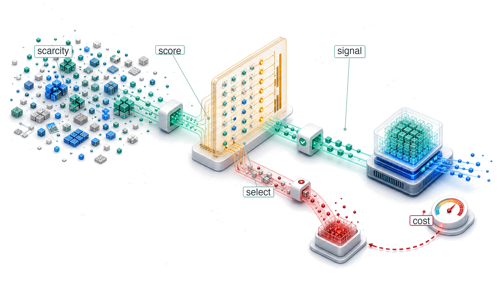
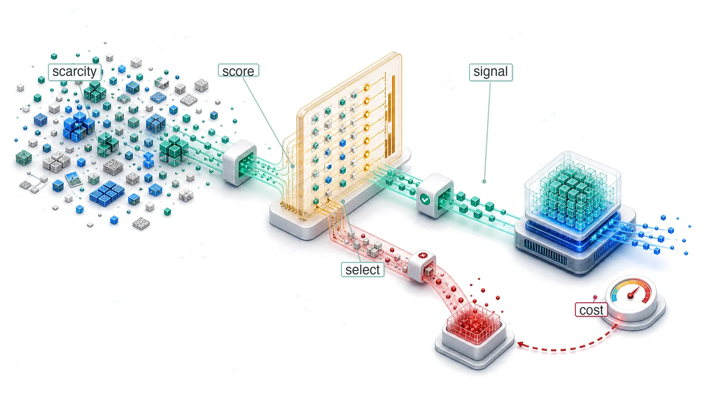

# Data Selection {#sec-data-selection}

::: {layout-narrow}
::: {.column-margin}

\chapterminitoc

:::

::: {.content-visible when-format="pdf"}
\noindent
{fig-alt="Isometric diagram of many scattered cubes flowing through a scoring panel and two gates. A smaller green stream enters a blue processing block, while a red stream diverts downward. Labels read scarcity, score, select, signal, and cost."}
:::

::: {.content-visible unless-format="pdf"}
{fig-alt="Isometric diagram of many scattered cubes flowing through a scoring panel and two gates. A smaller green stream enters a blue processing block, while a red stream diverts downward. Labels read scarcity, score, select, signal, and cost."}
:::

:::

## Purpose {.unnumbered .unlisted}

\begin{marginfigure}
\mlsysstack{0}{0}{25}{50}{0}{0}{0}{90}
\end{marginfigure}

_How can a carefully selected subset retain most of the value of a much larger dataset?_

An important class of machine learning optimizations operates upstream, before a single gradient is computed, on the data itself. Large datasets often contain redundant, noisy, or target-misaligned examples alongside more informative ones. This heterogeneity creates a systems optimization opportunity. Data engineering established that data is the source code of ML systems, and data selection recognizes that not all source code is equally valuable. Where compressing models and accelerating hardware speed up the execution of work, data selection can reduce the workload itself. The challenge is identifying redundant examples without discarding rare cases, underrepresented groups, or decision-boundary samples that shape generalization. Selection therefore trades training cost against coverage, and its overhead is justified only when the saved computation exceeds the cost of scoring, filtering, and validating the subset. When a selected subset preserves target quality, the savings compound through experimentation, adaptation to distribution drift, and deployment by teams with limited compute budgets. The shift is from accumulating data as a liability to curating it as a resource whose samples justify their processing cost. In D·A·M terms, that curation is a direct application of data-algorithm co-design\index{DAM Taxonomy@D·A·M Taxonomy!data-algorithm co-design}, with the dataset shaped deliberately to raise the statistical efficiency of learning.

::: {.content-visible when-format="pdf"}

\newpage

:::

::: {.callout-learning-objectives}

- Explain data selection as data-algorithm co-design that reduces total operations before training begins
- Calculate information-compute ratio to decide whether additional examples improve learning per FLOP
- Compare deduplication, coreset selection, and quality pruning for reducing redundant pretraining data
- Design curriculum, active learning, or synthetic-data strategies for changing data value during training
- Apply the selection inequality to test whether selection overhead beats full-dataset training cost
- Evaluate distributed selection pipelines against storage locality, consistency, and GPU utilization constraints
- Select data-selection investments using ROI, amortization, and compute-optimal frontier diagnostics

:::

## Data Selection Fundamentals {#sec-data-selection-data-selection-fundamentals-e839}

Training pays the iron-law cost for every example it processes, but not every example returns learning signal worth that cost. Data selection\index{Data Selection!definition} gives a clean, well-engineered dataset a systems objective: keep the examples that contribute the most learning per unit of compute. Data engineering makes the dataset reliable through correct labels, consistent schemas, and governed records. Data selection optimizes the dataset's value by extracting maximum learning from minimum samples, directly shrinking the total operations $(O)$ term in the iron law\index{Iron Law of ML Systems!total operations reduction via data selection} (principle \ref{pri-iron-law}). The distinction matters: quality asks whether data is correct, while value asks whether correct data is worth the compute spent processing it.

::: {.column-margin}
```{=latex}
\vspace*{-18mm}
```
{width="100%" fig-alt="Two trend lines labeled compute and data diverge, opening a red-shaded gap."}

*Compute supply can outrun high-quality data supply.*
:::

Increasing the amount of training data has long been a standard way to improve models. Scaling laws\index{Scaling Laws!data-compute asymmetry}[^fn-scaling-laws-origin] [@kaplan2020scaling; @hoffmann2022chinchilla] quantify how model performance can improve with dataset size, and teams have responded by collecting and generating more examples. Accelerator fleets, however, can expand usable compute faster than the supply of novel, high-quality human-generated text and images. Much of the easily accessible public web has already been incorporated into large training corpora, and expert labeling capacity grows slowly. This asymmetry is the **Data Wall**\index{Data Wall!definition}[^fn-data-wall-scaling], and it shifts attention from collecting more data to extracting more value from existing data. The sections that follow develop the selection methods and cost models needed to make that choice.

[^fn-scaling-laws-origin]: **Scaling Laws**\index{Scaling Laws!power-law origin}: Jared Kaplan and colleagues at Johns Hopkins and OpenAI empirically demonstrated in 2020 that language model loss follows power-law relationships with model size, dataset size, and compute budget, each with predictable exponents. For data selection, the key consequence is quantitative: loss scales as $\mathcal{L} \propto D^{-\alpha}$ with $\alpha \approx 0.095$, meaning each doubling of data yields diminishing returns---making it possible to reason about when selection becomes more cost-effective than collection.

```{python}
#| echo: false
#| label: scaling-asymmetry-calc

# ┌─────────────────────────────────────────────────────────────────────────────
# │ SCALING ASYMMETRY TABLE
# ├─────────────────────────────────────────────────────────────────────────────
# │ Context: @tbl-scaling-asymmetry in "Data Selection Fundamentals" section
# │
# │ Goal: Quantify the growth rate gap between compute and data.
# │ Show: That compute grows 10×/3yr while data only grows 2×/5yr.
# │ How: Contrast historical growth factors for TFLOP/s and high-quality tokens.
# │
# │ Scope: chapter-anchor — opening scaling-asymmetry table is reused by the
# │        fallacies section as the chapter's data-wall callback.
# └─────────────────────────────────────────────────────────────────────────────
from mlsysim.fmt import check, fmt_multiple, fmt_time

# ┌── LEGO ───────────────────────────────────────────────
class ScalingAsymmetry:
    """
    Namespace for Scaling Asymmetry Table.
    Scenario: Comparing growth rates of Compute vs Data.
    """

    # ┌── 1. LOAD (Constants) ───────────────────────────────────────────────
    # Hardware: 10x every 3 years (approx 2.15x/year)
    gpu_growth_factor = 10.0
    gpu_period_years = 3.0

    # Data: 2x every 5 years (approx 1.15x/year)
    web_growth_factor = 2.0
    web_period_years = 5.0

    # Labels: 1.5x every 5 years (approx 1.08x/year)
    label_growth_factor = 1.5
    label_period_years = 5.0

    # ┌── 2. EXECUTE (The Compute) ─────────────────────────────────────────
    # Step 1: Annualized growth rates: Rate = Factor^(1/Period)
    gpu_annual = gpu_growth_factor ** (1.0 / gpu_period_years)
    web_annual = web_growth_factor ** (1.0 / web_period_years)

    # Step 2: Divergence
    gap_ratio = gpu_annual / web_annual

    # ┌── 3. GUARD (Invariants) ───────────────────────────────────────────
    check(gap_ratio >= 1.5, f"GPU growth ({gpu_annual:.2f}x/yr) is not fast enough vs. Data ({web_annual:.2f}x/yr). Gap: {gap_ratio:.2f}x")

    # ┌── 4. OUTPUT (Formatting) ──────────────────────────────────────────────
    gpu_growth_mult_str = fmt_multiple(gpu_growth_factor, precision=0, commas=False)
    # Custom "years" suffix uses fmt_int() suffix discipline.
    gpu_period_years_str = fmt_time(round(gpu_period_years), 'year', precision=0, commas=False, style='word')

    web_data_growth_mult_str = fmt_multiple(web_growth_factor, precision=0, commas=False)
    web_data_period_years_str = fmt_time(round(web_period_years), 'year', precision=0, commas=False, style='word')

    label_data_growth_mult_str = fmt_multiple(label_growth_factor, precision=1, commas=False)
    label_data_period_years_str = fmt_time(round(label_period_years), 'year', precision=0, commas=False, style='word')
```

@Tbl-scaling-asymmetry uses an illustrative growth scenario in which GPU compute rises `{python} ScalingAsymmetry.gpu_growth_mult_str` every `{python} ScalingAsymmetry.gpu_period_years_str` while accessible high-quality data grows more slowly. These are scenario inputs, not measured universal rates.

| **Resource**            |                                                                                                   **Growth Rate** | **Implication**                                                                   |
|:------------------------|------------------------------------------------------------------------------------------------------------------:|:----------------------------------------------------------------------------------|
| **GPU Compute**         |               ~`{python} ScalingAsymmetry.gpu_growth_mult_str` / `{python} ScalingAsymmetry.gpu_period_years_str` | Hardware throughput can rise quickly in a given era                               |
| **Training Data (Web)** |     ~`{python} ScalingAsymmetry.web_data_growth_mult_str` / `{python} ScalingAsymmetry.web_data_period_years_str` | High-quality web text is finite; much already scraped                             |
| **Labeled Data**        | ~`{python} ScalingAsymmetry.label_data_growth_mult_str` / `{python} ScalingAsymmetry.label_data_period_years_str` | Human annotation throughput is inherently bounded                                 |
| **Synthetic Data**      |                                                                                                 Potentially large | Bounded by generator quality (models trained on model-generated data can degrade) |

: **Scaling Asymmetry in ML Resources**: In the illustrated scaling regime, compute grows faster than high-quality data supply, creating a compute-to-data imbalance that makes data selection valuable. {#tbl-scaling-asymmetry .striped .hover tbl-colwidths="[20,20,60]"}

[^fn-data-wall-scaling]: **Data Wall**\index{Data Wall!scaling constraint}: Unlike compute (which scales with capital expenditure) or algorithms (which improve through research), the stock of high-quality human-generated text grows slowly. Epoch AI's updated projections estimated that, under the paper's modeled consumption assumptions, models could use datasets roughly equal in size to the stock of public human-generated text between 2026 and 2032 [@villalobos2022will]. The point for systems design is not a fixed calendar deadline; it is that data can become a supply constraint rather than merely an economic one. This constraint directly affects the total operations $(O)$ term: when quality data becomes scarce, additional compute yields diminishing returns regardless of hardware throughput.

Scaling dataset size eventually encounters the finite stock of high-quality human speech and text. Follow the log-scale trajectory in @fig-running-out-of-human-data, observing how foundation model training requirements approach the estimated upper bound of available public data.

::: {#fig-running-out-of-human-data fig-env="figure" fig-pos="htb" fig-cap="**Dataset Growth Approaching Limits**: Several foundation-model datasets have grown toward estimates of the total stock of high-quality public text. The projection should be read as a dated constraint scenario rather than a fixed forecast: data selection, synthetic generation, multimodal learning, licensing, and filtering policy all change the usable supply." fig-alt="Log-scale line chart of dataset size from 100 million to 1 quadrillion tokens vs. year from 2012 to 2028. A rising blue trend line includes labeled markers for GPT-3, Chinchilla, Llama 2, and Llama 3. An orange band from 100 trillion to 1 quadrillion tokens is labeled High-Quality Public Text Stock, and a red Public Data Exhaustion annotation points toward the trend line."}
```{.tikz}
\begin{tikzpicture}[font=\usefont{T1}{phv}{m}{n}\small]

\pgfplotsset{
  layers/axis lines on top/.define layer set={
    axis background,
    axis grid,
    axis ticks,
    axis tick labels,
    pre main,
    main,
    axis lines,
    axis descriptions,
    axis foreground,
  }{/pgfplots/layers/standard},
}

\begin{axis}[
   /pgf/number format/.cd,
   tick label style={/pgf/number format/assume math mode=true},
   ticklabel style={font=\footnotesize\usefont{T1}{phv}{m}{n}},
   1000 sep={}, % uklanja zareze
  yticklabel style={
  /pgf/number format/.cd,
  sci,
  sci generic={mantissa e exponent},
  precision=1
},
    width=15cm,
    height=84mm,
    xmin=2012, xmax=2028.5,
    ymin=1e8, ymax=1.4e15,
    ymode=log,
    log basis y=10,
    xtick={2012,2014,2016,2018,2020,2022,2024,2026,2028},
    ytick={1e8,1e9,1e10,1e11,1e12,1e13,1e14,1e15},
    yticklabels={10\textsuperscript{8},10\textsuperscript{9},
    10\textsuperscript{10},10\textsuperscript{11},
    10\textsuperscript{12},10\textsuperscript{13},
    10\textsuperscript{14},10\textsuperscript{15}},
    xlabel={Year},
    ylabel={Dataset Size (Tokens)},
    axis lines*=left,
    axis line style={gray!70,line width=1pt},
 % axis on top=true,
    set layers=axis lines on top,
    tick style={gray!70},
    tick label style={font=\usefont{T1}{phv}{m}{n}\footnotesize},
    ylabel style={font=\small\usefont{T1}{phv}{m}{n},align=center,yshift=-1.2mm},
    xlabel style={font=\small\usefont{T1}{phv}{m}{n}},
    grid=both,
    major grid style={gray!12},
    minor grid style={gray!6},
    clip=false,
    major tick style={thin,black},
   tick align=outside,
   major tick length=4pt,
]

%—shaded public text stock band ---
\addplot[
    draw=none,
    fill=myorange!07
] coordinates {
    (2012,1e14)
    (2028,1e14)
    (2028,1e15)
    (2012,1e15)
}; %\closedcycle

\node[
    anchor=center,
    align=center,
    text=myorange!75!black,
    font=\footnotesize\usefont{T1}{phv}{m}{n}
] at (axis cs:2015.5,3e14)
{High-Quality Public Text Stock\\(Books, Papers, Code, Web)};

%—scaling line ---
\addplot[
    BlueLine,
    line width=1.5pt,
] coordinates {
    (2017.15,1e9)
    (2026.60,1e15)
};

%—data points ---
\addplot[
    only marks,
    mark=*,
    mark size=2.5,
    BlueLine,
    draw=white,line width=0.95pt
] coordinates {
    (2019.0,1.4e10)   % unlabeled low point
    (2020.0,3.0e11)   % GPT-3
    (2022.0,1.4e12)   % Chinchilla
    (2023.0,2.0e12)   % Llama 2
    (2024.0,1.5e13)   % Llama 3
};

%—point labels ---
\node[anchor=west, text=BlueLine, font=\usefont{T1}{phv}{m}{n}\footnotesize]
    at (axis cs:2018.5,3.0e11) {GPT-3};

\node[anchor=west, text=BlueLine, font=\usefont{T1}{phv}{m}{n}\footnotesize]
    at (axis cs:2022.0,9.0e11) {Chinchilla};

\node[anchor=west, text=BlueLine, font=\usefont{T1}{phv}{m}{n}\footnotesize]
    at (axis cs:2023.1,2.0e12) {Llama 2};

\node[anchor=west, text=BlueLine, font=\usefont{T1}{phv}{m}{n}\footnotesize]
    at (axis cs:2024.15,1.5e13) {Llama 3};

%—red curved arrow and label ---
\node[
    anchor=west,
    text=myred,
    font=\usefont{T1}{phv}{m}{n}\footnotesize
](PD) at (axis cs:2015.4,1.2e12)
{Public Data Exhaustion};
\coordinate(PO)at(axis cs:2023.45,1.05e13);
\end{axis}
\draw[myred,line width=0.75pt, <-,>=latex]
(PO)
to[bend right=15]
(PD);
\end{tikzpicture}
```
:::

The gap between what compute can process and what accessible, high-quality data can support is therefore a systems variable, not a fixed law. In the regime illustrated by @tbl-scaling-asymmetry, compute supply grows faster than accessible high-quality data, so accelerator budgets can outrun the corpus and leave the system compute-rich but data-constrained. Maintaining model relevance requires repeated refreshes of the training corpus as the world changes, and intelligent data selection becomes critical when data quality rather than accelerator time is the binding constraint.

The compute-data asymmetry can invert the optimization priority. When *data* is abundant and *compute* is scarce, the highest-leverage strategy is often algorithmic efficiency: squeeze more accuracy from limited GPU cycles. When *compute* is abundant and *quality data* is scarce, the highest-leverage strategy becomes data selection: squeeze more learning from each sample. Data selection operates upstream of all other optimizations. By pruning redundancy and selecting high-value samples, we reduce the workload before it ever enters the model or hits the hardware, directly shrinking the total operations $(O)$ term in the iron law. That is why the systems perspective treats selection as upstream workload reduction rather than a modeling heuristic. For teams whose accelerator budget exceeds their curated corpus, the bottleneck shifts from GPU access to the quality, legality, and diversity of the training data.

The engineering toolkit for intelligent data selection follows a deliberate optimization ordering\index{Data Selection!optimization ordering}: first ask whether a sample is worth processing, then ask how to process the remaining workload efficiently. Data selection puts the "largest return first" principle into practice by addressing whether work is necessary before asking how to simplify or accelerate it. The highest-return move comes first. Static pruning\index{Static Pruning!definition} removes low-value samples before a single gradient is computed. Dynamic selection\index{Dynamic Selection!definition} adapts the data diet during training through curriculum learning and active learning. Synthetic generation\index{Synthetic Data Generation!definition} creates high-value samples through augmentation, simulation, or teacher-generated examples when real data runs short.

Each stage can increase the information density of the data that reaches the model when measured quality gains justify its overhead, and together they form a complementary toolkit: pruning reduces *what* the pipeline contains, selection focuses *how* the pipeline uses it, and synthesis expands *what* the pipeline can access. Comparing these techniques requires a systems definition of data selection and a measurable account of its effectiveness.

### Defining data selection {#sec-data-selection-defining-data-selection-ef2f}

The three-stage pipeline needs a quantity that lets engineers compare samples before they spend accelerator time on them. A duplicated image, a mislabeled record, and a rare boundary case may all cost the same forward and backward pass, but they do not contribute the same learning signal. Data selection therefore starts by making sample value explicit relative to compute cost. The Information-Compute Ratio measures that value as learning signal gained per unit of training compute, formalized below.

::: {#dfn-data-selection-data-selection .callout-definition title="Data selection"}

***Data Selection***\index{Data Selection!definition} is the process of maximizing the Information-Compute Ratio (ICR) of a training dataset.

1.  **Significance**: It identifies data worth retaining, prioritizing, or generating for the target objective, reducing the total operations $(O)$ when redundant or noisy samples can be excluded without losing required coverage.
2.  **Distinction**: Unlike data engineering, which focuses on the cleanliness and consistency of data, data selection focuses on the informativeness and diversity of the samples.
3.  **Common pitfall**: A frequent misconception is that more data is always better. In reality, it is the quality of the samples that matters: adding 10$\times$ more low-quality data may yield less accuracy than 1.1$\times$ carefully selected, high-quality data.

:::

To make this concrete, consider training a model in the GPT-2/Llama Lighthouse family from @sec-network-architectures-lighthouse-roster-model-biographies-a763, which spans the autoregressive large language model (LLM) family from GPT-2's 1.5 billion parameters to Llama's 7-70 billion parameter range, here using a 70-billion-parameter language model.

```{python}
#| echo: false
#| label: gpt-llama-calc

import mlsysim.core.units as c
from mlsysim import Hardware, Infrastructure, Models, Systems
from mlsysim.engine import calibration
from mlsysim.fmt import check, fmt, fmt_count, fmt_multiple, fmt_percent, fmt_time, fmt_usd

class ComputeDataGap:
    # LOAD
    h100_count = Systems.Clusters.Training_10K.total_accelerators
    months = 3
    filtered_corpus_tokens = 5e12 * c.count
    public_text_stock = 300e12 * c.count
    sustained_mfu = calibration.REFERENCE_MFU_SUSTAINED
    training_flops_per_token = 6 * Models.Language.Llama2_70B.parameters.to(c.param) * c.flop / c.param
    training_duration = months * c.DAYS_PER_MONTH * c.HOURS_PER_DAY * c.hour

    # EXECUTE
    total_flops = h100_count * Hardware.Cloud.H100.compute.peak_flops.to(c.flop / c.second) * training_duration.to(c.second) * sustained_mfu
    tokens_capacity = (total_flops / training_flops_per_token).to(c.count)
    corpus_reuse_ratio = (tokens_capacity / filtered_corpus_tokens).to("").magnitude
    cluster_cost = h100_count * training_duration.to(c.hour) * Infrastructure.Pricing.Cloud.GpuTrainingPerHour.rate.to(c.USD / c.hour)

    # GUARD
    check(public_text_stock > tokens_capacity, "Public stock estimate should exceed the example training run capacity.")
    check(corpus_reuse_ratio > 10, f"Cluster should be able to traverse the filtered corpus many times; got {corpus_reuse_ratio:.1f}x.")

    # OUTPUT
    h100_count_str = fmt(h100_count, precision=0, commas=True)
    tokens_capacity_str = fmt_count(tokens_capacity, scale='T', precision=1, commas=False)
    filtered_corpus_tokens_str = fmt_count(filtered_corpus_tokens, scale='T', commas=False)
    public_text_stock_str = fmt_count(public_text_stock, scale='T', commas=False)
    corpus_reuse_ratio_mult_str = fmt_multiple(corpus_reuse_ratio, precision=1, commas=False)
    training_months_str = fmt_time(months, 'month', precision=0, commas=False, style='word')
    sustained_mfu_pct_str = fmt_percent(sustained_mfu, precision=0, commas=False, style='prose')
    cluster_cost_m_str = fmt_usd(cluster_cost, precision=1, commas=False, scale="M")
```

The compute budget (`{python} ComputeDataGap.h100_count_str` H100 GPUs for `{python} ComputeDataGap.training_months_str`) represents roughly `{python} ComputeDataGap.cluster_cost_m_str` at the chapter's cloud-training price anchor and can process about `{python} ComputeDataGap.tokens_capacity_str` at `{python} ComputeDataGap.sustained_mfu_pct_str` sustained MFU. Estimates of quality- and repetition-adjusted public human-generated text are on the order of `{python} ComputeDataGap.public_text_stock_str`, far larger than a single curated web corpus. The practical bottleneck is narrower: how much of that stock is accessible, legally usable, high quality, deduplicated, and useful for the target distribution. If a team has only a `{python} ComputeDataGap.filtered_corpus_tokens_str` filtered corpus ready for use, the compute budget can already process it roughly `{python} ComputeDataGap.corpus_reuse_ratio_mult_str` over. At that point, the team faces three options:

- **Repeat epochs**: The team can train on the same data for multiple epochs, but returns can diminish as examples are reused; the useful epoch count is workload-dependent.
- **Lower quality thresholds**: The team can include more data, but lower-quality tokens can degrade model quality.
- **Invest in data selection**: The team can improve filtering, curriculum design, and synthetic augmentation to extract more learning from each token.

Under these assumptions, the decision criterion favors selection over simply buying more accelerator time.

The data selection imperative applies across model architectures, though the bottlenecks differ. Unlike our compute-bound ResNet-50\index{ResNet-50!data selection} Lighthouse, GPT-2/Llama models are memory bandwidth-bound during inference (though often compute-bound during training as well) and still benefit enormously from data selection during training. Each token processed requires the same forward/backward pass cost regardless of model bottleneck, so fewer tokens means fewer FLOPs. Because data selection benefits every architecture regardless of its dominant bottleneck, the appropriate framing is systemic rather than purely statistical.

### Systems perspective {#sec-data-selection-systems-perspective-bd61}

The data wall establishes *why* data selection matters; the systems perspective reveals *how* to approach it effectively. The conventional *ML framing* focuses on achieving the same accuracy with fewer samples, centering on statistical sample complexity and generalization theory. While valid, that framing misses the larger picture.

A data-selection *systems framing*\index{Data Selection!systems vs. ML framing} asks instead how to reduce the total cost of achieving target performance across the entire ML lifecycle. The shift moves attention from accuracy curves to resource consumption, as @tbl-ml-vs-systems-framing illustrates.

| **ML Framing**                        |                         **Systems Framing** |
|:--------------------------------------|--------------------------------------------:|
| **"Fewer samples for same accuracy"** |             "Fewer FLOPs for same accuracy" |
| **"Better generalization"**           | "Lower training cost (time, money, energy)" |
| **"Sample complexity bounds"**        |            "End-to-end resource efficiency" |
| **"Learning theory"**                 |                          "Cost engineering" |

: **ML vs. Systems Perspectives on Data Selection**: The ML framing optimizes sample complexity; the systems framing optimizes total resource cost across the pipeline. {#tbl-ml-vs-systems-framing .striped .hover}

The systems framing reveals optimization opportunities invisible to the ML framing. To see *why*, consider *how* data selection interacts with the iron law introduced in @sec-introduction-iron-law-ml-systems-c32a.

```{python}
#| echo: false
#| label: data-selection-savings-calc

# ┌─────────────────────────────────────────────────────────────────────────────
# │ IRON LAW SAVINGS CALCULATION
# ├─────────────────────────────────────────────────────────────────────────────
# │ Context: "Data Selection and the Iron Law" callout
# │
# │ Goal: Demonstrate the multiplicative impact of data selection.
# │ Show: That dataset reduction compounds with hardware and model optimizations.
# │ How: Contrast additive vs. multiplicative speedup factors for an 8x total gain.
# │
# └─────────────────────────────────────────────────────────────────────────────
from mlsysim.fmt import fmt_percent, fmt, fmt_usd, check
from mlsysim import Infrastructure
from mlsysim.core.units import MILLION, USD, hour

# ┌── LEGO ───────────────────────────────────────────────
class IronLawSavings:
    """
    Namespace for Iron Law Multiplicative Savings.
    Scenario: 2x Data Selection * 2x Compression * 2x Hardware = 8x Total.
    """

    # ┌── 1. LOAD (Constants) ───────────────────────────────────────────────
    budget_m = 100  # $100M training run

    # Optimization factors
    factor_data = 2.0
    factor_model = 2.0
    factor_hw = 2.0

    # Derived
    data_pruning_pct = (1 - (1 / factor_data)) * 100

    # ┌── 2. EXECUTE (The Compute) ─────────────────────────────────────────
    # Step 1: Multiplicative effect
    total_speedup = factor_data * factor_model * factor_hw

    # Step 2: Savings
    compute_savings_m = budget_m * (data_pruning_pct / 100.0)

    # ┌── 3. GUARD (Invariants) ───────────────────────────────────────────
    additive_sum = factor_data + factor_model + factor_hw
    check(total_speedup > additive_sum, f"Multiplicative speedup ({total_speedup}x) should exceed additive sum ({additive_sum}).")

    # ┌── 4. OUTPUT (Formatting) ──────────────────────────────────────────────
    training_cost_m_str = fmt_usd((budget_m) * MILLION, precision=0, commas=False, scale="M")
    dataset_reduction_pct_str = fmt_percent(data_pruning_pct / 100, precision=0, commas=False, style='prose')
    compute_savings_m_str = fmt_usd((compute_savings_m) * MILLION, precision=0, commas=False, scale="M")
    combined_factor_mult_str = fmt_multiple(total_speedup, precision=0, commas=False)
    factor_data_mult_str = fmt_multiple(factor_data, precision=0, commas=False)
    factor_model_mult_str = fmt_multiple(factor_model, precision=0, commas=False)
    factor_hw_mult_str = fmt_multiple(factor_hw, precision=0, commas=False)
    additive_sum_mult_str = fmt_multiple(additive_sum, precision=0, commas=False)
```

::: {#psp-data-selection-data-selection-iron-law .callout-perspective title="Data selection and the iron law"}

In the iron law of ML systems $(T = \frac{D_{\text{vol}}}{\text{BW}} + \frac{O}{R_{\text{peak}} \cdot \eta_{\text{hw}}} + L_{\text{lat}})$, data selection is the only technique that reduces the total operations term at its source. Later model-level optimizations reduce $O$ per forward/backward pass, and machine-level optimizations increase $R_{\text{peak}}$ (peak throughput) and $\eta_{\text{hw}}$ (utilization). Data selection, by contrast, reduces the number of passes through the entire equation.

This makes data selection multiplicatively valuable in the iron law\index{Iron Law of ML Systems!multiplicative savings from data selection}: when all three optimization layers act on the same bottleneck, a `{python} IronLawSavings.factor_data_mult_str` reduction in dataset size with `{python} IronLawSavings.factor_model_mult_str` fewer operations per sample and `{python} IronLawSavings.factor_hw_mult_str` higher effective throughput yields `{python} IronLawSavings.combined_factor_mult_str` total cost reduction, not `{python} IronLawSavings.additive_sum_mult_str`.

:::

Consider training cost reduction. With the epoch count, batch size, and per-sample work held fixed, a `{python} IronLawSavings.dataset_reduction_pct_str` reduction in dataset size halves the number of forward passes, backward passes, and gradient updates. For the `{python} IronLawSavings.training_cost_m_str` scenario used here, this translates to `{python} IronLawSavings.compute_savings_m_str` in compute savings. Schedules that add epochs or steps reduce that saving.

Compute savings cascade through the entire infrastructure stack. Large datasets consume petabytes of storage and saturate network bandwidth during distributed training; deduplication\index{Deduplication!storage and I/O cost reduction} and coreset selection reduce storage costs while eliminating I/O bottlenecks that can idle expensive GPU clusters. The savings extend to labeling economics: expert labeling can exceed compute costs, and active learning\index{Active Learning!labeling cost reduction} and semi-supervised methods can substantially reduce labeling budgets in favorable regimes. The environmental implications compound further: for compute-dominated training runs, reducing the number of examples reduces energy consumption in proportion to the work avoided, provided the selected subset preserves accuracy. Smaller curated datasets also enable faster iteration velocity. A team that can iterate in hours rather than days has a compounding advantage in model development.

The cascading benefits illustrate a broader point: the ML researcher usually frames the problem as sample complexity, while the systems engineer frames it as cost-per-accuracy-point across the entire pipeline, from data acquisition through deployment. The systems engineer's toolkit for that problem includes techniques to minimize total cost, metrics to quantify efficiency gains, and architectural patterns to implement data selection at scale.

### Information-compute ratio {#sec-data-selection-informationcompute-ratio-8c0b}

The systems framing established earlier calls for a quantitative metric. Data selection creates a frontier between accuracy and cost\index{Information-Compute Ratio!accuracy-cost frontier}: keeping every example maximizes coverage but wastes compute on redundancy, while pruning too aggressively saves compute but loses signal. We need a way to measure where a sample sits on that frontier. The metric is the information each sample contributes to the model's learning per unit of computation. We formalize it as the **information-compute ratio**\index{Information-Compute Ratio!definition}.

@Fig-optimization-triad recasts the D·A·M taxonomy as an optimization map, with data selection playing the role of input optimization: reducing total workload before it enters the model or hardware. The model side asks how much math each example requires. The machine side asks how quickly the hardware can execute that math. The data side asks whether the example should be processed at all. The three edges of the triangle capture the dominant bottlenecks: *compute bound* describes systems limited by arithmetic throughput, *I/O bound* describes systems limited by data movement, and *sample efficiency* describes systems limited by the information content of training data.

::: {#fig-optimization-triad fig-env="figure" fig-pos="htb" fig-cap="**The D·A·M Taxonomy as an Optimization Map**: Machine learning performance is organized around Algorithms (Model), Data Selection, and Machine (Hardware). The triangle's edges label the compute-bound, I/O-bound, and sample-efficiency relationships, while data selection reduces workload before model or hardware execution." fig-alt="Triangular diagram with three pillars around a central ML Performance label: Algorithms (Model) at top, Machine (Hardware) at bottom-left, and Data Selection at bottom-right. Curved arrows trace each edge of the triangle, labeled Compute Bound (between Algorithms and Machine), I/O Bound (between Machine and Data Selection), and Sample Efficiency (between Data Selection and Algorithms)."}
```{.tikz}
\scalebox{0.8}{%
\begin{tikzpicture}[line join=round,font=\usefont{T1}{phv}{m}{n}\footnotesize]
\tikzset{%
Box2/.style={align=flush center, inner sep=0pt,draw=none,fill=none,minimum height=8mm },
planet/.style = {circle, draw=none,semithick, fill=yellow!10,line width=1.5pt,
                    font=\usefont{T1}{phv}{m}{n}\bfseries,
                    minimum size=27mm, inner sep=1mm,align=flush center},
satellite/.style = {circle, draw=#1, dashed, thick, fill=none,%#1!10,
                    text width=26mm, inner sep=1pt, align=flush center,minimum size=28mm,minimum height=12mm},
TxtC/.style = {font=\footnotesize\usefont{T1}{phv}{m}{n},text width=50mm,align=flush center},
LineA/.style = {violet!60,{Kite[line width=1.1pt,fill=white,round,length=9pt,width=7pt]}-,line width=1.5pt,shorten <=-3pt},
ALineA/.style={{Triangle[width=14pt,length=10pt]}-{Triangle[width=14pt,length=10pt]}, line width=7pt,cyan!40}
}

\tikzset{mycylinder/.style={cylinder, shape border rotate=90, aspect=1.3, draw, fill=white,
minimum width=25mm,minimum height=11mm,line width=\Linewidth,node distance=-0.15},
pics/data/.style = {
        code = {
        \pgfkeys{/channel/.cd, #1}
\begin{scope}[local bounding box=STREAMING,scale=\scalefac, every node/.append style={transform shape}]
\node[mycylinder,fill=\filllcolor!50] (A) {};
\node[mycylinder, above=of A,fill=\filllcolor!30] (B) {};
\node[mycylinder, above=of B,fill=\filllcolor!10] (C) {};
\fill[\filllcolor!50!black]($(C.west)!0.12!(C.east)$)circle(3pt);
\fill[\filllcolor!50!black]($(B.west)!0.12!(B.east)$)circle(3pt);
\fill[\filllcolor!50!black]($(A.west)!0.12!(A.east)$)circle(3pt);
 \end{scope}
     }
  }
}

%funnel
\tikzset{%
 pics/funnel/.style = {
        code = {
        \pgfkeys{/channel/.cd, #1}
\begin{scope}[local bounding box=FUNNEL,scale=\scalefac, every node/.append style={transform shape}]
\draw[fill=\filllcolor!50,line width=\Linewidth,draw=\drawcolor](-0.12,-0.81)--(-0.19,-0.25)--(-0.7,0.41)--(0.7,0.41)--(0.19,-0.25)--(0.12,-0.81)--cycle;
\draw[fill=\filllcolor!50,line width=\Linewidth,draw=\drawcolor](-0.19,-0.25)--(0.08,-0.25);
\draw[fill=\filllcolor!50,line width=\Linewidth,draw=\drawcolor](0.16,-0.09)--(0.41,0.31);
%
\node[line width=\Linewidth,draw=\drawcolor,fill=\filllcolor!50,inner sep=1pt,
rectangle,rounded corners=0.5pt,minimum width=16mm,minimum height=5pt]at(0,0.5){};
%
\foreach \i in{-0.5,0,0.5}{
\node[single arrow, line width=0.8*\Linewidth,draw=black,fill=\filllcirclecolor, rotate=270,inner sep=1pt,
      minimum width =9pt, single arrow head extend=2pt,
      minimum height=5mm]at(\i,0.9) {}; % length of arrow
   }
\node[single arrow,line width=0.8*\Linewidth,draw=black,fill=\filllcirclecolor, rotate=270,inner sep=1pt,
      minimum width =11pt, single arrow head extend=2pt,
      minimum height=5mm]at(0,-1.1) {}; % length of arrow
 \end{scope}
     }
  }
}
%CPU
\tikzset{%
 pics/cpu/.style = {
        code = {
        \pgfkeys{/channel/.cd, #1}
\begin{scope}[local bounding box=FUNNEL,scale=\scalefac, every node/.append style={transform shape}]
\node[fill=\filllcolor,minimum width=66, minimum height=66,
            rounded corners=2,outer sep=2pt] (C1) {};
\node[fill=white,minimum width=54, minimum height=54] (C2) {};
\node[fill=\filllcolor!40,minimum width=44, minimum height=44] (C3) {\large CPU};

\foreach \x/\y in {0.11/1,0.26/2,0.41/3,0.56/4,0.71/5,0.85/6}{
\node[fill=\filllcolor,minimum width=3, minimum height=15,
           inner sep=0pt,anchor=south](GO\y)at($(C1.north west)!\x!(C1.north east)$){};
}
\foreach \x/\y in {0.11/1,0.26/2,0.41/3,0.56/4,0.71/5,0.85/6}{
\node[fill=\filllcolor,minimum width=3, minimum height=15,
           inner sep=0pt,anchor=north](DO\y)at($(C1.south west)!\x!(C1.south east)$){};
}
\foreach \x/\y in {0.11/1,0.26/2,0.41/3,0.56/4,0.71/5,0.85/6}{
\node[fill=\filllcolor,minimum width=15, minimum height=3,
           inner sep=0pt,anchor=east](LE\y)at($(C1.north west)!\x!(C1.south west)$){};
}
\foreach \x/\y in {0.11/1,0.26/2,0.41/3,0.56/4,0.71/5,0.85/6}{
\node[fill=\filllcolor,minimum width=15, minimum height=3,
           inner sep=0pt,anchor=west](DE\y)at($(C1.north east)!\x!(C1.south east)$){};
}
 \end{scope}
     }
  }
}
\tikzset{
pics/algorithm/.style = {
        code = {
        \pgfkeys{/channel/.cd, #1}
\begin{scope}[shift={($(0,0)+(0,0)$)},scale=\scalefac,every node/.append style={transform shape}]
\node[fill=\filllcolor!60,draw=\drawcolor,line width=\Linewidth,rectangle,minimum size=2.5mm,
rounded corners=1pt,inner sep=1pt](B2)at(0,-0.47){};
\node[fill=\filllcolor!30,draw=\drawcolor,line width=\Linewidth,rectangle,minimum size=2.5mm,
rounded corners=1pt,inner sep=1pt](B3)at(-0.6,-0.47){};
\node[fill=\filllcolor!30,draw=\drawcolor,line width=\Linewidth,rectangle,minimum size=2.5mm,
rounded corners=1pt,inner sep=1pt](B1)at(0.6,-0.47){};
%
\node[fill=\filllcolor!99!violet!80,draw=\drawcolor,line width=\Linewidth,rectangle,
minimum width=8.5mm,minimum height=3mm,
rounded corners=2pt,inner sep=1pt](B0)at(0,0.53){};
\draw[draw=\drawcolor,shorten >=4pt,shorten <=4pt,line width=1.5*\Linewidth]
($(B0.north west)!0.33!(B0.south west)$)--($(B0.north east)!0.33!(B0.south east)$);
\draw[draw=\drawcolor,shorten >=4pt,shorten <=4pt,line width=1.5*\Linewidth]
($(B0.north west)!0.66!(B0.south west)$)--($(B0.north east)!0.66!(B0.south east)$);
\draw[draw=\drawcolor,rounded corners](B1)|-(B0);
\draw[draw=\drawcolor,rounded corners](B3)|-(B0);
\draw[draw=\drawcolor,rounded corners](B2)--(B0);
\node[fill=\filllcirclecolor!60,draw=\drawcolor,line width=\Linewidth,rectangle,minimum size=2.5mm,
rounded corners=1pt,inner sep=1pt,rotate=45](R2){};
\node[fill=\filllcirclecolor!30,draw=\drawcolor,line width=\Linewidth,rectangle,minimum size=2.5mm,
rounded corners=1pt,inner sep=1pt,rotate=45](R1) at (-0.6,0){};
\node[fill=\filllcirclecolor!30,draw=\drawcolor,line width=\Linewidth,rectangle,minimum size=2.5mm,
rounded corners=1pt,inner sep=1pt,rotate=45](R3) at (0.6,0){};
\end{scope}
    }
  }
}
%vaga
\tikzset{
pics/vaga/.style = {
        code = {
        \pgfkeys{/channel/.cd, #1}
\begin{scope}[shift={($(0,0)+(0,0)$)},scale=\scalefac,every node/.append style={transform shape}]
\node[rectangle,minimum width=2mm,minimum height=22mm,
draw=none, fill=\filllcolor,line width=\Linewidth](1R) at (0,-0.95){};
\fill[fill=\filllcolor!60!black](230:2.8)arc(230:310:2.8)--cycle;%circle(2.9);
%LT
\node [semicircle, shape border rotate=180,  anchor=chord center,
      minimum size=11mm, draw=none, fill=\filllcirclecolor](LT) at (-2,-0.5) {};
\node [circle,  minimum size=4mm, draw=none, fill=\filllcirclecolor](T1) at (-2,1.25) {};
\draw[draw=\drawcolor,,line width=1.2*\Linewidth,shorten <=3pt,shorten >=3pt](T1)--(LT);
\draw[draw=\drawcolor,,line width=1.2*\Linewidth,shorten <=3pt,shorten >=3pt](T1)--(LT.30);
\draw[draw=\drawcolor,,line width=1.2*\Linewidth,shorten <=3pt,shorten >=3pt](T1)--(LT.150);
%DT
\node [semicircle, shape border rotate=180,  anchor=chord center,
      minimum size=11mm, draw=none, fill=\filllcirclecolor!70!black](DT) at (2,-0.5) {};
\node [circle,  minimum size=4mm, draw=none, fill=\filllcirclecolor!70!black](T2) at (2,1.25) {};
\draw[draw=\drawcolor,line width=1.2*\Linewidth,shorten <=3pt,shorten >=3pt](T2)--(DT);
\draw[draw=\drawcolor,,line width=1.2*\Linewidth,shorten <=3pt,shorten >=3pt](T2)--(DT.30);
\draw[draw=\drawcolor,,line width=1.2*\Linewidth,shorten <=3pt,shorten >=3pt](T2)--(DT.150);
%
\node[draw=none,rectangle,minimum width=32mm,minimum height=1.5mm,inner sep=0pt,
fill=\filllcolor!60!black]at(0,1.25){};
\node[draw=white,fill=\filllcolor,line width=2*\Linewidth,ellipse,minimum width=9mm,  minimum height=15mm](EL)at(0,0.85){};
\node[draw=white,fill=\filllcolor!60!black,line width=2*\Linewidth,,circle,minimum size=10mm](2C)at(0,2.05){};
\end{scope}
    }
  }
}
\pgfkeys{
  /channel/.cd,
   Depth/.store in=\Depth,
  Height/.store in=\Height,
  Width/.store in=\Width,
  filllcirclecolor/.store in=\filllcirclecolor,
  filllcolor/.store in=\filllcolor,
  drawcolor/.store in=\drawcolor,
  drawcircle/.store in=\drawcircle,
  scalefac/.store in=\scalefac,
  Linewidth/.store in=\Linewidth,
  picname/.store in=\picname,
  filllcolor=BrownLine,
  filllcirclecolor=violet!20,
  drawcolor=black,
  drawcircle=violet,
  scalefac=1,
  Linewidth=0.5pt,
  Depth=1.3,
  Height=0.8,
  Width=1.1,
  picname=C
}
\definecolor{Siva}{RGB}{161,152,130}
\def\radius{3.5}
%planet
\node (p)   [planet]    {};
\node[TxtC,below=0pt of p]{ML\\ Performance};
%satellites

\foreach \i/\j/\sho [count=\k from 0] in {
magenta!70!/{Algorithms (Model)}/105pt,
Siva/{Data Selection}/105pt,
cyan/{Machine (Hardware)}/105pt
%violet!75!/{\textbf{Embodiment}\\{\footnotesize No grounding}}/11pt%,
%orange/\textbf{Alignment}\\ {\footnotesize Value loading}/11pt
}
{
\def\startangle{90}
%Satelit
\pgfmathsetmacro{\angle}{\startangle - \k * (360/3)}
\node (s\k) [satellite=\i, font=\footnotesize\usefont{T1}{phv}{m}{n}] at (\angle:\radius+\sho) {};
\node[TxtC,below=0pt of s\k]{\j};
%Arrows
%\draw[arr=\i,shorten >=\sho] (p) --coordinate[pos=0.35](AR\k) (s\k);
}

 \pic[shift={(0,0)}] at  (0,0){vaga={scalefac=0.35,picname=1,filllcolor=BlueLine,  Linewidth=1.0pt,filllcirclecolor=orange}};
 %algorithm
 \pic[shift={(0,0)}] at  (s0){algorithm={scalefac=1.2,picname=1,
drawcolor=black,filllcolor=orange!80!, Linewidth=0.75pt,filllcirclecolor=green}};
%data
\begin{scope}[local bounding box=DATA1,shift={($(0,-0.66)+(s1)$)},
scale=0.6, every node/.append style={transform shape}]
\pic[shift={(0,0)}] at  (0,0){data={scalefac=1,picname=1,filllcolor=BlueLine, Linewidth=0.7pt}};
\node[draw=black!70,line width=1pt,yshift=-3mm,fill=white,circle,minimum size=18mm](CIR)at(A.north east){};
\pic[shift={(0,0)}] at  (CIR){funnel={scalefac=0.6,picname=1,Linewidth=0.5pt,
 filllcolor=BrownL,drawcolor=black,filllcirclecolor=green}};
 \end{scope}
  %machine - CPU
 \pic[shift={(0,0)}] at  (s2){cpu={scalefac=0.55,picname=1,filllcolor=BrownLine, Linewidth=0.7pt}};
 %Arrows
 \draw[ALineA] (60:\radius) arc[radius=\radius, start angle=60, end angle= 0];
\coordinate (AR1) at (30:\radius);

\draw[ALineA] (300:\radius) arc[radius=\radius, start angle=300, end angle= 240];
\coordinate (AR2) at (270:\radius);

\draw[ALineA] (180:\radius) arc[radius=\radius, start angle=180, end angle= 120];
\coordinate (AR3) at (150:\radius);
%%%%%%%%%
 \path[LineA](AR1)--++(0:1.0)coordinate(MA);
 \node[Box2,anchor=west](T1)at(MA){Sample Efficiency};
 \draw[violet!50,line width=2pt](T1.north west)to[bend right=25]coordinate(AR11)(T1.south west);
 \draw[LineA](AR1)--(AR11);

 \path[LineA](AR2)--++(270:0.65)coordinate(MA2);
 \node[Box2,anchor=west,rotate=90](T2)at(MA2){};%Sample Efficiency
  \node[anchor=north](T222)at(MA2){I/O Bound};
 \draw[violet!50,line width=2pt](T2.north west)to[bend left=25]coordinate(AR22)(T2.south west);
 \draw[LineA](AR2)--(AR22);

 \path[LineA](AR3)--++(0:-1.0)coordinate(MA1);
 \node[Box2,anchor=east,align=right](T3)at(MA1){Compute Bound};
 \draw[violet!50,line width=2pt](T3.north east)to[bend left=25]coordinate(AR33)(T3.south east);
 \draw[LineA](AR3)--(AR33);
 \end{tikzpicture}}
```

:::

We can formalize this as the ICR, where $I$ denotes information content:
$$\text{ICR} = \frac{\Delta I}{\Delta \text{FLOPs}}$$

A higher ICR means each FLOP of training buys more learning; pushing it up is the goal of every technique in this chapter. The numerator is not directly observable in production, so engineers estimate it through proxies: validation improvement per unit compute, area under the learning curve, loss reduction on held-out data, uncertainty or gradient-based sample scores, and coverage checks on deployment-relevant slices. Those proxies are imperfect, but they make the systems question measurable before the training run spends its full budget.

### The ICR frontier: When data becomes a tax {#sec-data-selection-icr-frontier}

::: {.column-margin}
```{=latex}
\vspace*{-30mm}
```
{width="100%" fig-alt="A curve stays flat and low before bending sharply upward. A dot marks the bend, and the region to its right is shaded red."}

*Past the frontier, data becomes a tax: compute climbs, learning stalls.*
:::

The Information-Compute Ratio is not constant; it follows a law of diminishing returns. The **ICR Frontier**\index{Information-Compute Ratio!frontier} is the point where the marginal learning signal from additional data drops toward zero.

To illustrate diminishing returns, let $I(D)$ be the information content of a dataset of size $D$ and assume $I(D) \propto \log D$. This is a simplified analytical model rather than a universal law. If compute cost scales linearly with the per-sample operation count $O_{\text{sample}}$, then $C(D) = O_{\text{sample}} \cdot D$, and the resulting ICR follows @eq-icr-decay:
$$\text{ICR}(D) = \frac{\frac{d}{dD} I(D)}{\frac{d}{dD} C(D)} \approx \frac{1/D}{O_{\text{sample}}} = \frac{1}{O_{\text{sample}} \cdot D}$$ {#eq-icr-decay}

Under this illustrative model, the $1/(O_{\text{sample}} \cdot D)$ decay creates the data wall\index{Data Wall!zero learning signal}. Beyond a workload-dependent frontier, additional data may provide little learning while still adding compute. In this regime, data becomes a **data tax**\index{Data Tax!definition} that inflates the $O$ term of the iron law without a commensurate improvement in the accuracy numerator of the RoC (return on compute, see @sec-introduction-roc-invariant). The knee is a practical trade-off between target performance and marginal cost, not the mathematical maximum of ICR in this model.

Data selection turns the total operations $(O)$ term in the iron law from a fixed constant into a variable. A 2$\times$ improvement in measured ICR halves the FLOPs required to reach the same measured gain. It produces the same ideal time reduction as a 2$\times$ throughput increase only when the workload is compute-bound and the saved work lies on the critical path. ICR focuses specifically on compute; the cost-modeling framework in @sec-data-selection-cost-modeling-9b02 extends the same reasoning to acquisition, labeling, and storage costs.

A random batch of raw data can have low ICR when it contains redundant, noisy, or already-mastered examples. High-efficiency data pipelines (@fig-data-selection-pipeline) can improve ICR through three stages: static pruning before training, dynamic selection during training, and synthetic generation on demand. To illustrate, consider computing ICR on a concrete coreset selection task: a deliberately selected subset intended to preserve the full dataset's learning signal. @Sec-data-selection-coreset-selection-algorithms-2c74 defines the EL2N and GraNd scoring methods used to build such subsets, and @sec-data-selection-measurement-framework-733b provides the complete measurement framework for evaluating these efficiency gains, including the compute-optimal frontier diagnostic that determines whether training is data-starved or compute-starved.

::: {#fig-data-selection-pipeline fig-cap="**The Data Selection Pipeline**: A structured approach to increasing data value. Raw data is first pruned (Static Pruning), then selected during training (Dynamic Selection), and finally synthesized (Synthetic Generation). Each stage can increase the Information-Compute Ratio (ICR) when its quality gain justifies its compute cost." fig-alt="Flow diagram: Raw Data -> 1. Static Pruning (pretraining) -> 2. Dynamic Selection (during training) -> 3. Synthetic Generation (on-demand) -> High ICR Model, with arrows indicating the flow between stages."}
```{.tikz}
\begin{tikzpicture}[font=\small\usefont{T1}{phv}{m}{n}, >=stealth]
\tikzset{
Box/.style={align=center, inner xsep=2pt,draw=GreenLine, line width=1pt,fill=none,
minimum width=24mm, minimum height=25mm,node distance=1.0},
LineA/.style={violet!50,line width=4.0pt,{-{Triangle[width=1.5*6pt,length=2.0*5pt]}},shorten <=1pt,shorten >=1pt},
ALine/.style={black!50, line width=1.1pt,{{Triangle[width=0.9*6pt,length=1.2*6pt]}-}},
Larrow/.style={fill=violet!50, single arrow,  inner sep=2pt, single arrow head extend=3pt,
            single arrow head indent=0pt,minimum height=10mm, minimum width=3pt}
}
\tikzset{%
 pics/inbox/.style = {
        code = {
        \pgfkeys{/channel/.cd, #1}
\begin{scope}[local bounding box=INBOX,scale=\scalefac, every node/.append style={transform shape}]
\node[line width=\Linewidth,draw=\drawcolor,fill=\filllcolor!50,
rectangle,rounded corners=3pt,minimum width=14mm,minimum height=10mm]at(0,0.3){};
\node[line width=\Linewidth,draw=\drawcolor,fill=\filllcolor,
rectangle,rounded corners=3pt,minimum width=15mm,minimum height=10mm]at(0,0.1){};
\node[line width=\Linewidth,draw=\drawcolor,fill=\filllcolor!50,
,rectangle,rounded corners=3pt,minimum width=17mm,minimum height=10mm]
at(0,-0.1){};
\draw[line width=\Linewidth,draw=\drawcolor,fill=\filllcirclecolor,,rounded corners=2pt](-0.92,0.05)--
(-0.92,-0.78)--(0.92,-0.78)--(0.92,0.05)--(0.40,0.05)--(0.32,-0.2)--(-0.29,-0.2)--(-0.40,0.05)--cycle;

\node[single arrow, line width=\Linewidth,draw=black,fill=cyan!90!black!30, rotate=270,
      minimum width = 15pt, single arrow head extend=6pt,
      minimum height=10mm]at(0,0.5) {}; % length of arrow
 \end{scope}
     }
  }
}
%target
\tikzset{
pics/target/.style = {
        code = {
        \pgfkeys{/channel/.cd, #1}
\begin{scope}[shift={($(0,0)+(0,0)$)},scale=\scalefac,every node/.append style={transform shape}]
\definecolor{col1}{RGB}{62,100,125}
\definecolor{col2}{RGB}{219,253,166}
\colorlet{col1}{\filllcolor}
\colorlet{col2}{\filllcirclecolor}
\foreach\i/\col [count=\k]in {22mm/col1,17mm/col2,12mm/col1,7mm/col2,2.5mm/col1}{
\node[circle,inner sep=0pt,draw=\drawcolor,fill=\col,minimum size=\i,line width=\Linewidth](C\k){};
}
\draw[thick,fill=brown,xscale=-1](0,0)--++(111:0.13)--++(135:1)--++(225:0.1)--++(315:1)--cycle;
\path[green,xscale=-1](0,0)--(135:0.85)coordinate(XS1);
\draw[thick,fill=yellow,xscale=-1](XS1)--++(80:0.2)--++(135:0.37)--++(260:0.2)--++(190:0.2)--++(315:0.37)--cycle;
\end{scope}
    }
  }
}
%brain
\tikzset{pics/brain/.style = {
        code = {
        \pgfkeys{/channel/.cd, #1}
\begin{scope}[local bounding box=BRAIN,scale=\scalefac, every node/.append style={transform shape}]
\fill[fill=\filllcolor!50](0.1,-0.5)to[out=0,in=180](0.33,-0.5)
to[out=0,in=270](0.45,-0.38)to(0.45,-0.18)
to[out=40,in=240](0.57,-0.13)to[out=110,in=310](0.52,-0.05)
to[out=130,in=290](0.44,0.15)to[out=90,in=340,distance=8](0.08,0.69)
to[out=160,in=80](-0.42,-0.15)to (-0.48,-0.7)to(0.07,-0.7)to(0.1,-0.5)
(-0.10,-0.42)to[out=310,in=180](0.1,-0.5);
\draw[draw=\drawcolor,line width=\Linewidth](0.1,-0.5)to[out=0,in=180](0.33,-0.5)
to[out=0,in=270](0.45,-0.38)to(0.45,-0.18)
to[out=40,in=240](0.57,-0.13)to[out=110,in=310](0.52,-0.05)
to[out=130,in=290](0.44,0.15)to[out=90,in=340,distance=8](0.08,0.69)
(-0.42,-0.15)to (-0.48,-0.7)
(0.07,-0.7)to(0.1,-0.5)
(-0.10,-0.42)to[out=310,in=180](0.1,-0.5);
\draw[fill=\filllcolor,line width=\Linewidth](-0.3,-0.10)to(0.08,0.60)
to[out=60,in=50,distance=3](-0.1,0.69)to[out=160,in=80](-0.26,0.59)to[out=170,in=90](-0.46,0.42)
to[out=170,in=110](-0.54,0.25)to[out=210,in=150](-0.54,0.04)
to[out=240,in=130](-0.52,-0.1)to[out=300,in=240]cycle;
\draw[fill=\filllcolor,line width=\Linewidth]
(-0.04,0.64)to[out=120,in=0](-0.1,0.69)(-0.19,0.52)to[out=120,in=330](-0.26,0.59)
(-0.4,0.33)to[out=150,in=280](-0.46,0.42)
%
(-0.44,-0.03)to[bend left=30](-0.34,-0.04)
(-0.33,0.08)to[bend left=40](-0.37,0.2) (-0.37,0.12)to[bend left=40](-0.45,0.14)
(-0.26,0.2)to[bend left=30](-0.24,0.13)
(-0.16,0.32)to[bend right=30](-0.27,0.3)to[bend right=30](-0.29,0.38)
(-0.13,0.49)to[bend left=30](-0.04,0.51);

\draw[rounded corners=0.8pt,\drawcircle,-{Circle[fill=\filllcirclecolor,length=2.5pt]}](-0.23,0.03)--(-0.15,-0.03)--(-0.19,-0.18)--(-0.04,-0.28);
\draw[rounded corners=0.8pt,\drawcircle,-{Circle[fill=\filllcirclecolor,length=2.5pt]}](-0.17,0.13)--(-0.04,0.05)--(-0.06,-0.06)--(0.14,-0.11);
\draw[rounded corners=0.8pt,\drawcircle,-{Circle[fill=\filllcirclecolor,length=2.5pt]}](-0.12,0.23)--(0.31,0.0);
\draw[rounded corners=0.8pt,\drawcircle,-{Circle[fill=\filllcirclecolor,length=2.5pt]}](-0.07,0.32)--(0.06,0.26)--(0.16,0.33)--(0.34,0.2);
\draw[rounded corners=0.8pt,\drawcircle,-{Circle[fill=\filllcirclecolor,length=2.5pt]}](-0.01,0.43)--(0.06,0.39)--(0.18,0.51)--(0.31,0.4);
\end{scope}
     }
  }
}
%starS
\tikzset{
 mystar/.style={shape=star,star points=4,inner sep=1pt,
 minimum size=#1,star point ratio=2.1,rounded corners=#1/20},
pics/starS/.style = {
        code = {
        \pgfkeys{/channel/.cd, #1}
\begin{scope}[shift={($(0,0)+(0,0)$)},scale=\scalefac,every node/.append style={transform shape}]
\node[fill=\filllcolor,mystar={13mm}] at (0,0) {};
\node[fill=\filllcolor,mystar={8mm}] at (-0.75,0.6) {};
\node[fill=\filllcolor,mystar={4mm}] at (-0.2,1.0) {};
\node[fill=\filllcolor,mystar={5mm}] at (-0.8,-0.3) {};
\end{scope}
    }
  }
}
%funnel
\tikzset{%
 pics/funnel/.style = {
        code = {
        \pgfkeys{/channel/.cd, #1}
\begin{scope}[local bounding box=FUNNEL,scale=\scalefac, every node/.append style={transform shape}]
\draw[fill=\filllcolor,line width=\Linewidth,draw=\drawcolor](-0.12,-0.81)--(-0.19,-0.25)--(-0.7,0.41)--(0.7,0.41)--(0.19,-0.25)--(0.12,-0.81)--cycle;
\draw[fill=\filllcolor,line width=\Linewidth,draw=\drawcolor](-0.19,-0.25)--(0.08,-0.25);
\draw[fill=\filllcolor,line width=\Linewidth,draw=\drawcolor](0.16,-0.09)--(0.41,0.31);
%
\node[line width=\Linewidth,draw=\drawcolor,fill=\filllcolor,inner sep=1pt,
rectangle,rounded corners=2pt,minimum width=16mm,minimum height=5pt]at(0,0.5){};
%
\foreach \i in{-0.5,0,0.5}{
\node[single arrow, line width=0.8*\Linewidth,draw=black,fill=\filllcirclecolor, rotate=270,inner sep=1pt,
      minimum width =9pt, single arrow head extend=2pt,
      minimum height=5mm]at(\i,0.9) {}; % length of arrow
   }
\node[single arrow,line width=0.8*\Linewidth,draw=black,fill=\filllcirclecolor, rotate=270,inner sep=1pt,
      minimum width =11pt, single arrow head extend=2pt,
      minimum height=5mm]at(0,-1.1) {}; % length of arrow
 \end{scope}
     }
  }
}
\pgfkeys{
  /channel/.cd,
   Depth/.store in=\Depth,
  Height/.store in=\Height,
  Width/.store in=\Width,
  filllcirclecolor/.store in=\filllcirclecolor,
  filllcolor/.store in=\filllcolor,
  drawcolor/.store in=\drawcolor,
  drawcircle/.store in=\drawcircle,
  scalefac/.store in=\scalefac,
  Linewidth/.store in=\Linewidth,
  picname/.store in=\picname,
  filllcolor=BrownLine,
  filllcirclecolor=violet!20,
  drawcolor=black,
  drawcircle=violet,
  scalefac=1,
  Linewidth=0.5pt,
  Depth=1.3,
  Height=0.8,
  Width=1.1,
  picname=C
}
%Raw Data
\node[Box](B1){};
\fill[green!07](B1.north west) rectangle ($(B1.north east)!0.6!(B1.south east)$)coordinate(B1DE);
\fill[green!20](B1.south east) rectangle ($(B1.north west)!0.6!(B1.south west)$)coordinate(B1LE);
\node[Box](){};
\tikzset{Text2/.style={font=\usefont{T1}{phv}{b}{n}\small,align=center}}
\node[Text2]at($(B1.south west)!0.5!(B1DE)$){Raw Data};
\coordinate(Q1)at($(B1.north west)!0.5!(B1DE)$);
\pic[shift={(0,0)}] at  (Q1){inbox={scalefac=0.7,picname=1,Linewidth=1.0pt,
 filllcolor=BrownL,drawcolor=black,filllcirclecolor=orange!70!yellow!80}};
%Static Pruning
\node[Box, right=of B1](B2){};
\fill[cyan!07](B2.north west) rectangle ($(B2.north east)!0.6!(B2.south east)$)coordinate(B2DE);
\fill[cyan!20](B2.south east) rectangle ($(B2.north west)!0.6!(B2.south west)$)coordinate(B2LE);
\node[Box, right=of B1,draw=BlueD](B2){};
\node[Text2]at($(B2.south west)!0.5!(B2DE)$){1. Static\\ Pruning};
\coordinate(Q2)at($(B2.north west)!0.5!(B2DE)$);
\pic[shift={(0,0)}] at  (Q2){funnel={scalefac=0.53,picname=1,Linewidth=0.5pt,
 filllcolor=green!70!orange!70,drawcolor=black,filllcirclecolor=red!70!blue!80}};
%%Dynamic Selection
\node[Box, right=of B2](B3){};
\fill[violet!07](B3.north west) rectangle ($(B3.north east)!0.6!(B3.south east)$)coordinate(B3DE);
\fill[violet!20](B3.south east) rectangle ($(B3.north west)!0.6!(B3.south west)$)coordinate(B3LE);
\node[Box, right=of B2,draw=violet](B3){};
\node[Text2]at($(B3.south west)!0.5!(B3DE)$){2. Dynamic\\ Selection};
\coordinate(Q3)at($(B3.north west)!0.5!(B3DE)$);
 \pic[shift={(0,0)}] at  (Q3){target={scalefac=0.55,picname=1,drawcolor=BlueD,
filllcolor=cyan!90!,Linewidth=0.7pt, filllcirclecolor=cyan!20}};
%Synthetic Gen
\node[Box, right=of B3](B4){};
\fill[orange!07](B4.north west) rectangle ($(B4.north east)!0.6!(B4.south east)$)coordinate(B4DE);
\fill[orange!20](B4.south east) rectangle ($(B4.north west)!0.6!(B4.south west)$)coordinate(B4LE);
\node[Box, right=of B3,draw=OrangeLine](B4){};
\node[Text2]at($(B4.south west)!0.5!(B4DE)$){3. Synthetic\\ Gen};
\coordinate(Q4)at($(B4.north west)!0.5!(B4DE)$);
\pic[shift={(0.15,-0.23)}] at  (Q4){starS={scalefac=0.7,picname=1,filllcolor=violet!90!}};
%Model
\node[Box, right=1.5 of B4](B5){};
\fill[black!05](B5.north west) rectangle ($(B5.north east)!0.6!(B5.south east)$)coordinate(B5DE);
\fill[black!15](B5.south east) rectangle ($(B5.north west)!0.6!(B5.south west)$)coordinate(B5LE);
\node[Box, right=1.5 of B4,draw=black](B5){};
\node[Text2]at($(B5.south west)!0.5!(B5DE)$){Model};
\coordinate(Q5)at($(B5.north west)!0.5!(B5DE)$);
\pic[shift={(0,0)}] at  (Q5){brain={scalefac=0.9,picname=1,filllcolor=orange!30!, Linewidth=0.95pt}};
%arrows
\foreach \i in{1,2,3}{
\pgfmathtruncatemacro{\X}{\i + 1} %
\draw[LineA](B\i)--(B\X);
}
\draw[LineA,font=\footnotesize\usefont{T1}{phv}{m}{n},text=black!70](B4)--node[above]{High ICR}(B5);
\node[below =2pt of B2,text=black!70]{Pretraining};
\node[below =2pt of B3,text=black!70]{During Training};
\node[below =2pt of B4,text=black!70]{On-Demand};
\end{tikzpicture}
```

:::

::: {#chk-data-selection-data-selection-efficiency .callout-checkpoint title="Data selection efficiency"}

The goal of data selection is to maximize the ICR.

Metric checks:

- [ ] **ICR application**: Given two training runs with identical accuracy gains but different compute budgets, can you determine which had higher ICR?
- [ ] **Data efficiency**: Under a fixed evaluation protocol, can you explain when a 50 percent smaller dataset with 2$\times$ higher ICR yields the same measured gain for half the training FLOPs?

Pipeline check:

- [ ] **The three stages**: Can you map static pruning, dynamic selection, and synthetic generation to the training lifecycle?

:::

The practical question is how large the efficiency gap could become on a workload where dataset size, model cost, and selection strategy interact with concrete FLOP budgets. The following ImageNet-scale ResNet-50 scenario uses assumed accuracy gains to illustrate the calculation; it is not a reported EL2N result.

```{python}
#| echo: false
#| label: data-selection-setup

# ┌─────────────────────────────────────────────────────────────────────────────
# │ ICR CORESET COMPARISON
# ├─────────────────────────────────────────────────────────────────────────────
# │ Context: "Computing ICR: Coresets" callout example
# │
# │ Goal: Make the Information-Compute Ratio (ICR) concrete.
# │ Show: That coresets achieve 1.8× higher ICR by focusing on difficult samples.
# │ How: Compare learning-per-FLOP for random sampling vs. coreset selection.
# │ Scope: chapter-anchor
# │
# └─────────────────────────────────────────────────────────────────────────────
from mlsysim import Datasets, Models
from mlsysim.core.units import GFLOPs, count, flop
from mlsysim.fmt import fmt_percent, fmt, check, fmt_flops, fmt_pp, fmt_sci, fmt_sci_flops, fmt_count

class IcrCoresetComparison:
    """Illustrative learning-per-FLOP comparison for random and selected data."""

    # ┌── 1. LOAD (Constants) ──────────────────────────────────────────────
    imagenet_size = Datasets.ImageNet.training_examples.to(count)
    acc_gain_random_pp = 5.0  # percentage-point gain per epoch
    acc_gain_coreset_pp = 4.5  # percentage points with 50% coreset
    coreset_fraction_value = 0.5  # keep 50% of data

    # ┌── 2. EXECUTE (The Compute) ────────────────────────────────────────
    m_resnet = Models.Vision.ResNet50
    resnet50_fwd_flops = m_resnet.inference_flops.to(GFLOPs)
    resnet50_fwdbwd_flops = (m_resnet.inference_flops * 3).to(GFLOPs)
    full_epoch_flops = imagenet_size * resnet50_fwdbwd_flops

    icr_random_value = acc_gain_random_pp / full_epoch_flops.to(flop).magnitude

    coreset_size = imagenet_size * coreset_fraction_value
    coreset_flops = coreset_size * resnet50_fwdbwd_flops
    icr_coreset_value = acc_gain_coreset_pp / coreset_flops.to(flop).magnitude
    icr_ratio_value = icr_coreset_value / icr_random_value
    acc_diff_pp = acc_gain_random_pp - acc_gain_coreset_pp

    # ┌── 3. GUARD (Invariants) ──────────────────────────────────────────
    check(icr_ratio_value > 1.0, f"Coreset ICR ({icr_ratio_value:.2f}) should exceed random ICR.")
    check(coreset_fraction_value < 1.0, "Coreset fraction must be less than 1.")

    # ┌── 4. OUTPUT (Formatting) ─────────────────────────────────────────────
    resnet50_fwd_gflop_str = fmt_flops(resnet50_fwd_flops, unit=GFLOPs, precision=1)
    resnet50_fwdbwd_gflop_str = fmt_flops(resnet50_fwdbwd_flops, unit=GFLOPs, precision=1)
    full_epoch_flops_str = fmt_sci_flops(full_epoch_flops, precision=2)
    icr_random_str = fmt_sci(icr_random_value, precision=1)
    imagenet_size_str = fmt_count(imagenet_size, scale='M', precision=2)
    # Custom "K" suffix on a divided count uses fmt() suffix discipline.
    coreset_size_str = fmt_count(coreset_size, scale='K', precision=1, commas=False)
    coreset_flops_str = fmt_sci_flops(coreset_flops, precision=1)
    icr_coreset_str = fmt_sci(icr_coreset_value, precision=1)
    icr_ratio_mult_str = fmt_multiple(icr_ratio_value, precision=1, commas=False)
    acc_gain_random_str = fmt_pp(acc_gain_random_pp, precision=0)
    acc_gain_coreset_str = fmt_pp(acc_gain_coreset_pp, precision=1)
    acc_diff_str = fmt_pp(acc_diff_pp, precision=1)
    coreset_pct_str = fmt_percent(coreset_fraction_value, precision=0, commas=False, style='prose')
    acc_perf_pct_str = fmt_percent(acc_gain_coreset_pp / acc_gain_random_pp, precision=0, commas=False, style='prose')
```

::: {#nbk-data-selection-computing-icr-coresets .callout-notebook title="Computing ICR: Coresets"}

**Problem**: Training the ResNet-50 Lighthouse model from @sec-network-architectures-lighthouse-roster-model-biographies-a763 on ImageNet for one epoch costs `{python} IcrCoresetComparison.full_epoch_flops_str`. Under the scenario's assumed accuracy gains, how would retaining `{python} IcrCoresetComparison.coreset_pct_str` of the data change the information-compute ratio? The calculation holds the per-sample work fixed and does not include selection overhead.

**Setup**:

- Dataset: ImageNet (`{python} IcrCoresetComparison.imagenet_size_str`)
- Model: ResNet-50 Lighthouse (~`{python} IcrCoresetComparison.resnet50_fwd_gflop_str` per forward pass, roughly `{python} IcrCoresetComparison.resnet50_fwdbwd_gflop_str` for a forward plus backward training step, depending on implementation)
- One epoch: `{python} IcrCoresetComparison.imagenet_size_str` $\times$ `{python} IcrCoresetComparison.resnet50_fwdbwd_gflop_str` = `{python} IcrCoresetComparison.full_epoch_flops_str`
- Assumed accuracy improvement per epoch (early training): `{python} IcrCoresetComparison.acc_gain_random_str`

**Random selection (baseline)**:

- Process all `{python} IcrCoresetComparison.imagenet_size_str` samples uniformly
- Accuracy gain: `{python} IcrCoresetComparison.acc_gain_random_str`
- $\text{ICR}_{\text{random}}$ = `{python} IcrCoresetComparison.acc_gain_random_str` / (`{python} IcrCoresetComparison.full_epoch_flops_str`) = `{python} IcrCoresetComparison.icr_random_str` per FLOP

**EL2N coreset** (Error L2-Norm, a training-dynamics score developed later in this chapter; `{python} IcrCoresetComparison.coreset_pct_str` of data):

- Process `{python} IcrCoresetComparison.coreset_size_str` selected samples
- Assumed accuracy gain: `{python} IcrCoresetComparison.acc_gain_coreset_str` (`{python} IcrCoresetComparison.acc_perf_pct_str` of the full-data gain)
- Compute: `{python} IcrCoresetComparison.coreset_size_str` $\times$ `{python} IcrCoresetComparison.resnet50_fwdbwd_gflop_str` = `{python} IcrCoresetComparison.coreset_flops_str`
- $\text{ICR}_{\text{coreset}}$ = `{python} IcrCoresetComparison.acc_gain_coreset_str` / (`{python} IcrCoresetComparison.coreset_flops_str`) = `{python} IcrCoresetComparison.icr_coreset_str` per FLOP

**Systems insight**: Under these assumptions, the selected subset achieves `{python} IcrCoresetComparison.icr_ratio_mult_str` higher ICR with a `{python} IcrCoresetComparison.acc_diff_str` smaller accuracy gain. A real decision requires measured gains, selection overhead, and coverage checks.

:::

The three-stage optimization pipeline (static pruning, dynamic selection, and synthetic generation) provides concrete techniques for improving ICR. Static pruning, the first stage, removes examples before training begins; the safe reduction depends on the dataset, model, selection method, and target metric.

## Static Pruning {#sec-data-selection-static-pruning-a390}

The first stage of the pipeline acts entirely before training begins, removing low-value samples so that fewer of them ever reach the model. Static pruning\index{Static Pruning!pretraining filtration} and pretraining filtration can reduce total computation without modifying the training loop or model architecture, but their effect on final quality must be measured.

### The case for smaller datasets {#sec-data-selection-case-smaller-datasets-215e}

Data-selection studies show that some datasets can be reduced without lowering measured accuracy. More data can improve performance, but large datasets may also contain substantial redundancy\index{Data Redundancy!empirical evidence}. Empirical studies on coreset selection and data pruning have demonstrated this effect on several standard benchmarks.

On CIFAR-10, @paul2021deep report that EL2N pruning removed half of the training data without reducing accuracy. On ImageNet-1K, @ganguli2022 report that a self-supervised prototype metric discarded 20 percent of the data without sacrificing performance. The pattern extends to language modeling, where web-scraped corpora like The Pile[^fn-the-pile-diversity] and C4[^fn-c4-filtering] contain enough duplicate and templated content to make deduplication a systems issue. In datasets studied by @lee2022, approximate near-duplicate removal affected 3.04 percent of C4 and 13.63 percent of RealNews, and deduplicated training reduced memorization while preserving or improving perplexity.

[^fn-the-pile-diversity]: **The Pile**\index{Pile, The!data diversity}: An approximately 886 GB English text corpus (reported as 825 gibibytes by the source) aggregating twenty-two sub-datasets, including PubMed, ArXiv, GitHub, Project Gutenberg, Common Crawl, Stack Exchange, Wikipedia, and USPTO patents [@gao2020pile]. Its multi-source design makes it a useful example of data diversity: each source family has a different duplication, quality, and domain-coverage profile, so selection pipelines must preserve coverage while removing redundant text.

[^fn-c4-filtering]: **C4 (Colossal Clean Crawled Corpus)**\index{C4!quality filtering}: C4 applies filtering to Common Crawl data, including language detection, deduplication of repeated three-sentence spans, and removal of pages that fail heuristic quality checks, producing approximately 750 GB of cleaned English text [@Raffel2020exploring]. Filtering has its own compute cost and can remove useful material, so its ROI and quality effects must be measured rather than inferred from corpus size alone.

The reported gains are benchmark-specific. Pruning effectiveness depends on the dataset's intrinsic redundancy, the selection algorithm, and the model architecture; validate the result on the specific task before deploying aggressive pruning in production. Individual data points need not provide equal value for training.

This heterogeneity follows from how neural networks learn decision boundaries. Most samples fall far from any class boundary: a picture of a dog in good lighting is unambiguously a dog. These "easy" examples provide diminishing returns after the first few epochs because the model has already mastered them. The informative samples cluster near boundaries where classes become ambiguous. Beyond sample redundancy, label quality\index{Data Quality!noise penalty on convergence} also dramatically affects data requirements: symmetric label noise degrades the **effective sample size**\index{Effective Sample Size!label noise penalty} proportionally to $(1 - 2\epsilon)^2$, where an $\epsilon = 10\%$ error rate forces a system to collect $\approx 1.56\times$ more data to achieve equivalent convergence bounds as clean data. A quick calculation quantifies the **data quality multiplier**\index{Data Quality Multiplier!label noise penalty}: how label noise penalizes convergence\index{Convergence!rate, clean vs. noisy data}.

```{python}
#| echo: false
#| label: data-quality-multiplier-calc

# ┌─────────────────────────────────────────────────────────────────────────────
# │ DATA QUALITY MULTIPLIER
# ├─────────────────────────────────────────────────────────────────────────────
# │ Context: "The Data Quality Multiplier" callout (Case for Smaller Datasets)
# │
# │ Goal: Illustrate how different assumed scaling rates affect sample needs.
# │ Show: A conditional toy scenario with a 100× gap at 1% error.
# │ How: Contrast sample requirements for clean vs. noisy datasets.
# │
# └─────────────────────────────────────────────────────────────────────────────
from mlsysim.fmt import fmt_percent, fmt, check

# ┌── LEGO ───────────────────────────────────────────────
class QualityMultiplier:
    """
    Namespace for Data Quality Multiplier.
    Illustrative scenario: Clean error scales as 1/N and noisy error as 1/sqrt(N).
    """

    # ┌── 1. LOAD (Constants) ───────────────────────────────────────────────
    epsilon = 0.01  # 1% Target Error

    # ┌── 2. EXECUTE (The Compute) ─────────────────────────────────────────
    # Step 1: Clean: Error ~ 1/N  => N ~ 1/Error
    n_clean = 1.0 / epsilon

    # Step 2: Noisy: Error ~ 1/sqrt(N) => N ~ 1/Error^2
    n_noisy = 1.0 / (epsilon**2)

    ratio = n_noisy / n_clean

    # ┌── 3. GUARD (Invariants) ───────────────────────────────────────────
    check(ratio >= 50, f"Noisy penalty ({ratio:.1f}x) is too small to justify cleaning investment.")

    # ┌── 4. OUTPUT (Formatting) ──────────────────────────────────────────────
    epsilon_str = fmt(epsilon, precision=2, commas=False)
    epsilon_pct_str = fmt_percent(epsilon, precision=0, commas=False, style='prose')
    n_clean_str = fmt(n_clean, precision=0, commas=False)
    n_noisy_str = fmt(n_noisy, precision=0, commas=True)
    ratio_mult_str = fmt_multiple(ratio, precision=0, commas=False)
```

::: {#nbk-data-selection-data-quality-multiplier .callout-notebook title="The data quality multiplier"}

**Problem**: How much more noisy data does it take to reach the same target error as clean data?

**Math**: In this illustrative model, clean-data error scales as $\mathcal{O}(1/D)$, so $D_{\text{clean}} \propto 1/\epsilon$. Noisy-data error scales as $\mathcal{O}(1/\sqrt{D})$, so $D_{\text{noisy}} \propto 1/\epsilon^2$. For target error $\epsilon$ = `{python} QualityMultiplier.epsilon_str` (`{python} QualityMultiplier.epsilon_pct_str`):

*   $D_{\text{clean}}$ ≈ `{python} QualityMultiplier.n_clean_str`
*   $D_{\text{noisy}}$ ≈ `{python} QualityMultiplier.n_noisy_str`

**Result**: Under these assumptions, noisy data requires `{python} QualityMultiplier.ratio_mult_str` more samples at the target error.

**Systems insight**: Here, cleaning data acts as a `{python} QualityMultiplier.ratio_mult_str` compute accelerator; the real multiplier is workload-dependent.

:::

### Coreset selection algorithms {#sec-data-selection-coreset-selection-algorithms-2c74}

The practical question then becomes how to identify which samples to keep. **Coreset selection**\index{Coreset!definition}\index{Static Pruning!coreset selection}[^fn-coreset-geometry] turns the static pruning decision into a coverage problem: keep the smallest subset that preserves the statistical properties of the entire dataset.

[^fn-coreset-geometry]: **Coreset (Core Set)**\index{Coreset!etymology}\index{Coreset!geometry origins}: In computational geometry, a small subset can approximate a specified geometric objective within a controlled error factor [@agarwal2005geometric]. Machine learning adapts this idea as a selection principle, but a guarantee for an embedding and distance objective does not by itself guarantee neural-network accuracy. The retained subset must still be validated on the target task.

The systems decision is where to spend the selection budget: on cheap coverage metrics that preserve distributional structure, or on costlier training-dynamics scores that better target the decision boundary. The decision also needs a guardrail before any score is applied: classes, demographic groups, time windows, and rare failure modes that matter at deployment require minimum representation, because the highest-average-ICR subset can still remove the examples that define production risk.

Geometry-based methods select samples that cover a chosen representation without requiring target-model training. The $k$-Center algorithm\index{k-Center!coreset selection}[^fn-k-center-coverage], a facility-location-style objective, selects samples that reduce the maximum distance from any point to its nearest selected center under the chosen embedding and metric.

[^fn-k-center-coverage]: **k-Center Algorithm**\index{k-Center!coverage guarantee}: Its greedy strategy iteratively picks the point farthest from the existing centers under a chosen embedding and metric. Sener and Savarese use this core-set framing for convolutional-neural-network active learning [@sener2018active]. The resulting coverage bound applies to that geometric objective, not directly to downstream accuracy or rare-class preservation.

Herding\index{Herding!coreset selection} takes a different approach. Welling's original procedure iteratively constructs representative pseudo-samples whose feature statistics approximate observed moments [@welling2009]. Related moment-matching objectives can guide subset selection from a fixed pool. These methods are computationally attractive because they operate on feature representations, but their scores are not inherently label-aware.

Training-dynamics methods use a proxy model to identify examples that may be important. GraNd (Gradient Normed)\index{GraNd!gradient-based coreset scoring} and **EL2N (Error L2-Norm)**\index{EL2N!definition}[^fn-el2n-grand-scoring] score samples by gradient magnitude or prediction error early in training [@paul2021deep]. High scores identify examples the proxy finds difficult, but they can also identify noise or unrepresentative samples and therefore need coverage and quality checks. The same work reports useful score transfer across several architectures, which can enable less expensive proxy-based selection. Forgetting Events\index{Forgetting Events!coreset selection}[^fn-forgetting-events-pruning] tracks how often a sample is correctly classified and later misclassified during training [@toneva2019empirical].

[^fn-el2n-grand-scoring]: **EL2N (Error L2-Norm) and GraNd (Gradient Normed)**\index{EL2N!proxy transferability}: These methods score samples based on their error or gradient norm early in training, identifying samples the model finds most difficult. The practicality of this approach relies on *transferability*, where scores from a small proxy model can guide data selection for a much larger target model. For instance, a proxy trained for just five epochs can generate scores to curate a dataset for a full 90-epoch production training run.

[^fn-forgetting-events-pruning]: **Forgetting Events**\index{Forgetting Events!pruning trade-off}: This method identifies valuable examples by tracking when the model "forgets" them—transitioning from a correct to an incorrect classification during training. The central trade-off is the high cost of this analysis, which requires a full training run. However, the resulting importance scores transfer reliably from small proxy models to large target models (for example, ResNet-18 to ResNet-50), which is precisely what makes the "inexpensive proxy-based selection" strategy viable.

Geometry-based and training-dynamics methods optimize different proxies, so their quality ranking depends on the dataset, representation, target model, and scoring budget. @Tbl-coreset-comparison should be read as a selection-budget table: a score is useful only if its target-quality gains justify its scoring cost.

| **Method**     | **Compute Cost**                        | **Requires Training** | **Best For**          | **Limitation**            |
|:---------------|:----------------------------------------|:----------------------|:----------------------|:--------------------------|
| **k-Center**   | $\mathcal{O}(D^2)$ or $\mathcal{O}(DK)$ | No                    | Coverage, exploration | Ignores label information |
| **Herding**    | $\mathcal{O}(DK)$                       | No                    | Distribution matching | Assumes Gaussian-like     |
| **GraNd**      | $\mathcal{O}(\text{epochs} \times D)$   | Yes (few epochs)      | Decision boundaries   | Requires proxy training   |
| **Forgetting** | $\mathcal{O}(\text{full training})$     | Yes (full)            | Hard examples         | Expensive to compute      |
| **EL2N**       | $\mathcal{O}(\text{epochs} \times D)$   | Yes (few epochs)      | Uncertainty sampling  | Best with proxy model     |

: **Coreset Selection Algorithm Comparison**: $D =$ dataset size, $K =$ coreset size. Geometry-based and training-dynamics methods optimize different proxies, so their quality ranking depends on the dataset, representation, target model, and scoring budget. {#tbl-coreset-comparison .striped .hover tbl-colwidths="[10,20,20,25,25]"}

Each algorithm in @tbl-coreset-comparison occupies a different point in the ICR framework's compute-versus-information trade-off. @Fig-coreset-selection illustrates one uncertainty-based strategy rather than every coreset method. Random sampling appears on the left, while the right panel concentrates the selection budget near the illustrated decision boundary. Geometry-based methods may instead prioritize coverage across the embedding space.

::: {#fig-coreset-selection fig-env="figure" fig-pos="htb" fig-cap="**Illustrative Uncertainty-Based Selection**: Both panels select five samples, isolating allocation rather than budget. Random sampling distributes those choices across the feature space; the illustrative uncertainty strategy concentrates them in the shaded band around the current decision boundary." fig-alt="Two side-by-side x1–x2 scatter plots contain blue and red point classes separated by a dashed diagonal boundary. The left plot, Random Sampling, circles five points distributed across the plot in orange. The right plot, Coreset Selection, shades a yellow uncertainty band around the boundary and circles five points near it in green."}

```{.tikz}
\scalebox{0.9}{%
\begin{tikzpicture}[font=\small\usefont{T1}{phv}{m}{n},x=9mm,y=8mm]
% Left plot: Random Sampling
\begin{scope}
    \node[font=\small\usefont{T1}{phv}{m}{n}] at (2.15, 5.0) {Random Sampling};

    % Decision boundary
    \draw[thick, dashed, gray] (0, 0) -- (5, 5);

    % Class A points (below line) - circles
    \foreach \x/\y in {0.5/0.2, 1.0/0.5, 0.8/1.2, 1.5/0.8, 2.0/1.0,
                       2.5/1.5, 1.2/0.3, 0.3/0.8, 1.8/1.5, 2.2/0.5,
                       3.0/2.0, 3.5/2.5, 2.8/1.8, 3.2/1.2, 4.0/2.8} {
        \fill[blue!60] (\x, \y) circle (2pt);
    }

    % Class B points (above line) - triangles
    \foreach \x/\y in {0.5/1.5, 1.0/2.0, 0.3/2.5, 1.5/2.5, 2.0/3.0,
                       2.5/3.5, 1.2/3.2, 0.8/3.8, 1.8/3.5, 2.2/4.0,
                       3.0/4.0, 3.5/4.5, 2.8/3.8, 3.2/4.2, 4.0/4.5} {
        \fill[red!60] (\x, \y) circle (2pt);
    }

    % Randomly selected (circled) - some easy, some hard
    \foreach \x/\y in {0.5/0.2, 1.5/2.5, 3.0/2.0, 0.8/3.8, 2.2/0.5} {
        \draw[thick, orange] (\x, \y) circle (5pt);
    }

    % Axis
    \draw[->,>=Latex,thick] (0, 0) -- (5.2, 0) node[right, font=\footnotesize\usefont{T1}{phv}{m}{n}] {$x_1$};
    \draw[->,>=Latex,thick] (0, 0) -- (0, 5.2) node[above, font=\footnotesize\usefont{T1}{phv}{m}{n}] {$x_2$};

    % Label
    \node[font=\footnotesize\usefont{T1}{phv}{m}{n}, orange] at (2.5, -0.5) {Selected (random)};
\end{scope}

% Right plot: Coreset Selection
\begin{scope}[xshift=7cm]
    \node[font=\small\usefont{T1}{phv}{m}{n}] at (2.15, 5.0) {Coreset Selection};

    % Decision boundary
    \draw[thick, dashed, gray] (0, 0) -- (5, 5);

    % Uncertainty band near boundary
    \fill[yellow!20] (0, 0) -- (0, 1) -- (4, 5) -- (5, 5) -- (5, 4) -- (1, 0) -- cycle;
        \node[font=\fontsize{7pt}{8}\usefont{T1}{phv}{m}{n}, fill=white, inner sep=1pt] at (3.5, 3.25) {High uncertainty};

    % Class A points (below line) - circles
    \foreach \x/\y in {0.5/0.2, 1.0/0.5, 0.8/1.2, 1.5/0.8, 2.0/1.0,
                       2.5/1.5, 1.2/0.3, 0.3/0.8, 1.8/1.5, 2.2/0.5,
                       3.0/2.0, 3.5/2.5, 2.8/1.8, 3.2/1.2, 4.0/2.8} {
        \fill[blue!60] (\x, \y) circle (2pt);
    }

    % Class B points (above line) - triangles
    \foreach \x/\y in {0.5/1.5, 1.0/2.0, 0.3/2.5, 1.5/2.5, 2.0/3.0,
                       2.5/3.5, 1.2/3.2, 0.8/3.8, 1.8/3.5, 2.2/4.0,
                       3.0/4.0, 3.5/4.5, 2.8/3.8, 3.2/4.2, 4.0/4.5} {
        \fill[red!60] (\x, \y) circle (2pt);
    }

    % Coreset selected (near boundary) - circled
    \foreach \x/\y in {0.8/1.2, 2.5/1.5, 3.0/2.0, 1.0/2.0, 2.0/3.0} {
        \draw[thick, green!60!black] (\x, \y) circle (5pt);
    }

    % Axis
    \draw[->,>=Latex,thick] (0, 0) -- (5.2, 0) node[right, font=\footnotesize\usefont{T1}{phv}{m}{n}] {$x_1$};
    \draw[->,>=Latex,thick] (0, 0) -- (0, 5.2) node[above, font=\footnotesize\usefont{T1}{phv}{m}{n}] {$x_2$};

    % Label
    \node[font=\footnotesize\usefont{T1}{phv}{m}{n}, green!60!black] at (2.5, -0.5) {Selected (boundary)};
\end{scope}
\end{tikzpicture}}
```

:::

EL2N with a small proxy model\index{Proxy Model!practical workflow} offers one practical balance between scoring cost and selection quality. The approach trains a lightweight model for a few epochs, computes EL2N scores, and selects a subset subject to coverage and quality checks. The proxy must provide rankings that transfer to the target model, and the investment pays off only when downstream training savings exceed selection overhead. A concrete scenario illustrates this workflow without asserting that its 10 percent subset preserves accuracy.

```{python}
#| echo: false
#| label: coreset-practice-calc

# ┌─────────────────────────────────────────────────────────────────────────────
# │ CORESET PRACTICE EXAMPLE
# ├─────────────────────────────────────────────────────────────────────────────
# │ Context: "Coreset Selection in Practice" callout
# │
# │ Goal: Outline a practical workflow for 10× data reduction.
# │ Show: How a 5-epoch proxy model can identify the most informative 10% of a dataset.
# │ How: Model the selection of 100K high-uncertainty samples from a 1M image pool.
# │
# └─────────────────────────────────────────────────────────────────────────────
from mlsysim.core.units import count
from mlsysim.fmt import fmt_percent, fmt, fmt_count, check

class CoresetPractice:
    """Practical 10× coreset workflow: 5-epoch proxy selects 100K from 1M images."""

    # ┌── 1. LOAD (Constants) ──────────────────────────────────────────────
    train_image_count = 1_000_000 * count  # scenario assumption: 1M training images
    coreset_fraction_value = 0.1  # keep 10%
    proxy_epoch_count = 5  # proxy training epochs

    # ┌── 2. EXECUTE (The Compute) ────────────────────────────────────────
    coreset_image_count = train_image_count * coreset_fraction_value

    # ┌── 3. GUARD (Invariants) ──────────────────────────────────────────
    check(coreset_image_count > 0 * count, "Coreset must be nonempty.")
    check(coreset_fraction_value < 1.0, "Coreset fraction must be less than 1.")

    # ┌── 4. OUTPUT (Formatting) ─────────────────────────────────────────────
    n_train_images_str = fmt_count(train_image_count, scale="M", precision=0, scale_style="word")
    coreset_fraction_pct_str = fmt_percent(coreset_fraction_value, precision=0, commas=False, style='prose')
    n_coreset_str = fmt_count(coreset_image_count, precision=0, commas=True)
    n_epochs_proxy_str = fmt(proxy_epoch_count, precision=0, commas=False)
```

::: {#exmp-data-selection-coreset-selection-practice .callout-example title="Coreset selection in practice"}

**Scenario**: An engineering team aims to select a `{python} CoresetPractice.n_coreset_str` coreset (`{python} CoresetPractice.coreset_fraction_pct_str`) from `{python} CoresetPractice.n_train_images_str` training images for faster model iteration.

**Diagnosis**: Naive random subsampling drops rare classes and boundary examples. Training a lightweight proxy model for `{python} CoresetPractice.n_epochs_proxy_str` epochs calculates EL2N error scores, retaining high-uncertainty samples near the decision boundary.

**Systems lesson**: Proxy-based coreset selection replaces redundant data passes with targeted compute. Spending minor proxy training FLOPs to prune easy samples accelerates full model training while preserving accuracy on rare edge cases.

:::

@Lst-el2n-coreset demonstrates how to compute EL2N scores and select a coreset using a lightweight proxy model. The mechanism spends a small amount of probe compute to identify high-uncertainty samples near the decision boundary, then trains the full model on the retained subset rather than on redundant easy examples. The example requires an unshuffled dataloader so each score position remains aligned with its dataset index.

::: {#lst-el2n-coreset lst-cap="**EL2N-Based Coreset Selection**: The `compute_el2n_scores` function trains a proxy model for a few epochs, then measures prediction error via L2 distance from one-hot labels. High scores identify samples the proxy finds difficult, including potentially noisy examples. The `select_coreset` function illustrates ranking by this score; production use also requires coverage, noise, and target-quality validation."}

```{.python}
def compute_el2n_scores(model, dataloader, num_epochs=5):
    """Compute EL2N scores.

    Returns L2 norm of (prediction - one_hot_label).
    """
    # Train proxy model for a few epochs to get meaningful predictions
    train_proxy(model, dataloader, num_epochs)

    scores = []
    model.eval()
    for x, y in dataloader:
        logits = model(x)
        probs = softmax(logits, dim=1)
        # One-hot encode labels
        one_hot = zeros_like(probs).scatter_(1, y.unsqueeze(1), 1)
        # EL2N score = L2 distance from confident prediction
        el2n = (probs - one_hot).norm(dim=1)  # High = uncertain
        scores.extend(el2n.tolist())
    return scores


def select_coreset(scores, dataset, fraction=0.1):
    """Select top-k highest-scoring (most uncertain) samples."""
    k = int(len(dataset) * fraction)
    # Sort by score descending (highest uncertainty first)
    indices = argsort(scores, descending=True)[:k]
    return Subset(dataset, indices)


# Illustrative 10% subset; validate accuracy and coverage before use
scores = compute_el2n_scores(proxy_model, full_loader)
coreset = select_coreset(scores, full_dataset, fraction=0.1)
train_full_model(model, coreset)
```

:::

Proxy scoring turns uncertainty into reusable selected indices: `compute_el2n_scores` measures which samples still confuse a briefly trained model, and `select_coreset` retains those high-information examples for the full training run.

### Data deduplication {#sec-data-selection-data-deduplication-6c20}

While coreset selection identifies which samples to keep based on their informativeness, a complementary approach targets duplicate samples that add compute without adding learning signal. Deduplication\index{Deduplication!data selection optimization} can provide immediate efficiency gains, especially for exact and near-duplicates, and requires no model training. This makes it one of the most accessible optimizations in data selection, but near-duplicate thresholds must be validated so the pipeline does not remove useful distributional signal.

The simplest form of deduplication\index{Deduplication!hash-based, exact matching} (introduced as a data engineering pipeline stage in @sec-data-engineering-systematic-data-processing-aebc, and here elevated to an optimization lever) uses hash-based methods for exact matches. By computing a cryptographic hash (MD5 or SHA-256) for each sample and removing those with identical hashes, practitioners can eliminate byte-for-byte duplicates that inevitably accumulate in large web-scraped corpora. This process is computationally cheap, scaling linearly with dataset size, and can be parallelized trivially.

Near-duplicate detection addresses content that differs at the byte level while retaining substantial token- or character-shingle overlap. For text, MinHash\index{MinHash!near-duplicate detection}[^fn-minhash-dedup] with Locality-Sensitive Hashing\index{Locality-Sensitive Hashing!near-duplicate detection}[^fn-lsh-dedup] (LSH) approximates Jaccard similarity[^fn-jaccard-dedup] efficiently. It can detect lightly edited content with high overlap, but it does not establish semantic paraphrase equivalence.

[^fn-jaccard-dedup]: **Jaccard Similarity**\index{Jaccard Similarity!deduplication}: Defined as $|A \cap B| / |A \cup B|$, ranging from 0 (disjoint) to 1 (identical). For deduplication, the metric compares sets of shingles across documents of different lengths. The threshold must be calibrated for the shingle definition, corpus, and downstream quality because no universal cutoff separates duplicates from legitimately related documents.

[^fn-lsh-dedup]: **Locality-Sensitive Hashing (LSH)**\index{Locality-Sensitive Hashing!probabilistic bucketing}: LSH hashes MinHash signatures into buckets so that similar signatures are more likely to collide. Candidate generation avoids an exhaustive all-pairs comparison, while runtime and memory depend on signature width, banding, bucket sizes, and the number of candidates that require verification.

[^fn-minhash-dedup]: **MinHash**\index{MinHash!signature compression}: Invented by @broder1997resemblance to detect duplicate web pages for AltaVista, the algorithm creates compact signatures using random hash functions such that similar documents produce similar signatures with high probability. Each signature compresses a document to a fixed-size sketch, enabling pairwise similarity estimation in $\mathcal{O}(s)$ time for sketch size $s$.

For images, perceptual hashing\index{Perceptual Hashing!image deduplication} produces signatures robust to minor transformations like resizing and compression, identifying visually similar candidates stored in different formats. Embedding-based similarity\index{Deduplication!embedding-based} can retrieve semantic near-neighbor candidates by computing dense representations (CLIP[^fn-clip-dedup] [@radford2021learning] for images, sentence transformers for text), though proximity does not itself prove duplication and the approach incurs higher computational overhead.

[^fn-clip-dedup]: **CLIP (Contrastive Language-Image Pretraining)**\index{Contrastive Language-Image Pretraining!semantic deduplication}\index{CLIP|see{Contrastive Language-Image Pretraining}}: Pretrained on 400 million image-text pairs, CLIP maps semantically related images and text into a shared embedding space [@radford2021learning]. Embeddings can retrieve candidates for review, but semantic proximity is not proof that two samples are duplicates. Generating embeddings also costs substantially more than computing perceptual hashes, with the ratio depending on model and hardware.

Deduplication can reduce repeated-content memorization and avoid spending FLOPs on exact or near duplicates. It can also alter the corpus's intentional empirical weighting, so thresholds and downstream quality must be validated rather than assuming that every duplicate is harmful.

Deduplication also changes when retained examples index a stateful representation rather than only a training corpus.

::: {#lhs-data-selection-dlrm-embedding-deduplication .callout-lighthouse title="DLRM and embedding deduplication"}

Our DLRM Lighthouse model from @sec-network-architectures-lighthouse-roster-model-biographies-a763 is memory capacity-bound, with embedding tables consuming terabytes of storage for billions of user/item IDs. Much of this capacity is wasted on *cold embeddings*, IDs that appear rarely in training data.

Data selection for DLRM can include interaction deduplication\index{Interaction Deduplication} and embedding pruning\index{Embedding Pruning} for cold IDs. Removing repeated interactions reduces training examples but shrinks an embedding table only when IDs disappear or the allocation, hashing, or sharing policy changes.

:::

### Data pruning by quality {#sec-data-selection-data-pruning-quality-3d69}

Deduplication removes redundant samples, but a third category of problematic data remains: samples that actively harm learning. Quality-based pruning\index{Pruning!quality, label error detection} eliminates samples that either contribute no meaningful signal or introduce contradictory information that confuses the optimization process.

Label error detection represents the most impactful form of quality pruning. Tools like Cleanlab\index{Cleanlab!label error detection} identify samples where the assigned label is likely incorrect based on model confidence patterns across training. A sample that the model consistently predicts as class A but is labeled class B either represents a hard case near the decision boundary or, more commonly, an annotation mistake. Removing or correcting these mislabeled samples prevents the model from learning contradictory signals that degrade its decision boundary.

Outlier removal\index{Pruning!outlier removal} addresses a different pathology: samples far from any cluster center in feature space. While outliers might represent valuable edge cases, they more often indicate noise, annotation errors, or data corruption. The key is distinguishing between informative outliers (rare but valid examples of a class) and noise (samples that do not belong to any class). Conservative thresholds help avoid discarding genuinely rare examples.

Low-information filtering\index{Pruning!low-information filtering} applies domain-specific heuristics to remove samples that lack sufficient signal for learning. For text corpora, this often means removing high-perplexity\index{Perplexity!filtering, low-information text removal} garbled text (perplexity is a language model's measure of how surprising a text is, so high values flag incoherent strings) and, in some pipelines, very low-perplexity boilerplate or repetitive text. For image datasets, filtering targets blurry, corrupted, or near-uniform samples that provide little visual information.

Together, these three static pruning techniques---coreset selection, deduplication, and quality filtering---can reduce work before training. With epoch count, batch size, and per-sample work fixed, a 50 percent dataset reduction means 50 percent fewer forward passes, backward passes, and gradient updates. Training schedules that add compensating epochs or steps reduce that saving.

Static pruning answers a question about *what* to keep, but it treats the answer as fixed. Once the pruned dataset is set, every epoch trains on the same subset. The optimal training samples, however, change as the model learns: examples that challenge an undertrained model become trivially easy after sufficient gradient updates. Dynamic selection techniques address this limitation by adapting the training data at each stage based on what the model has already mastered.

## Dynamic Selection {#sec-data-selection-dynamic-selection-edaa}

Early in training, a model benefits from broad, easy coverage that builds stable feature representations. Later, those same examples produce little new gradient signal, while harder samples near the decision boundary become more valuable for refinement. Dynamic selection\index{Dynamic Selection!training-time optimization} exploits this changing information-compute ratio by adapting the data diet to the model's current state.

### Curriculum learning: Easy to hard {#sec-data-selection-curriculum-learning-easy-hard-2c4e}

The first dynamic selection technique, **curriculum learning**\index{Dynamic Selection!curriculum learning}\index{Curriculum Learning!difficulty scorer and pacing function}[^fn-curriculum-optimization] [@bengio2009; @soviany2022], structures the order in which data is presented to the model. Instead of random shuffling, it starts with simpler examples and gradually introduces more complex ones, mirroring how humans learn by mastering basics before advancing to harder material.

[^fn-curriculum-optimization]: **Curriculum Learning**\index{Curriculum Learning!optimization landscape}\index{Curriculum Learning!etymology}: From Latin *currere* ("to run"), originally meaning "the course to be run"---a metaphor that maps directly to the technique: training data as a course run in deliberate order, easy stretches first. Curriculum learning can act as a continuation method for nonconvex optimization, with easier examples shaping the early optimization trajectory before harder examples are introduced. From a systems perspective, the ICR of a sample can vary during training, which motivates changing the mix of examples over time.

The effectiveness of curriculum learning stems from how neural networks respond to gradient signals at different training stages. Easy examples provide clear, consistent gradients that establish strong feature representations early in training, when the loss landscape is highly irregular. Hard examples introduced too early produce noisy gradient signals that slow convergence or cause the model to memorize outliers rather than learn general patterns. By sequencing examples from easy to hard, curriculum learning smooths the optimization trajectory.

Implementing a curriculum requires two components: a difficulty scorer that ranks samples, and a pacing function\index{Pacing Function!linear warmup} that controls how quickly hard samples are introduced. A common choice is linear pacing:
$$
\text{samples}_{n_{\text{epoch}}} = \texttt{sort\_by\_difficulty}[:D \cdot \min(1, n_{\text{epoch}}/N_{\text{warmup}})]
$$
where $n_{\text{epoch}}$ is the current epoch, $D$ is the full dataset size, and $N_{\text{warmup}}$ is the number of warmup epochs before the full dataset becomes available. Early epochs train on the easiest $D \cdot (n_{\text{epoch}}/N_{\text{warmup}})$ fraction; after warmup, training proceeds on the full dataset.

The difficulty scorer is a systems choice because it trades probe-compute overhead against ordering quality, as @tbl-difficulty-scoring shows. Loss and confidence scoring buy better ordering with extra inference, heuristics avoid compute but require domain knowledge, and self-paced scoring moves adaptation into the training loop itself.

| **Strategy**          | **Difficulty Score**                      | **Best For**                                |
|:----------------------|:------------------------------------------|:--------------------------------------------|
| **Loss-Based**        | Loss from probe model (low = easy)        | General-purpose; requires probe training    |
| **Confidence-Based**  | Teacher model confidence (high = easy)    | When teacher available; distillation setups |
| **Domain Heuristics** | Sentence length, image complexity         | No extra compute; domain knowledge required |
| **Self-Paced**        | Current model's loss (updated each epoch) | Adaptive; no probe needed                   |

: **Difficulty Scoring Strategies for Curriculum Learning**: The rows compare each scorer's signal source with the system prerequisite or trade-off it introduces. {#tbl-difficulty-scoring .striped .hover}

```{python}
#| echo: false
#| label: curriculum-benchmarks-calc

# ┌─────────────────────────────────────────────────────────────────────────────
# │ CURRICULUM LEARNING BENCHMARKS
# ├─────────────────────────────────────────────────────────────────────────────
# │ Context: @tbl-curriculum-benchmarks (Curriculum Learning section)
# │
# │ Goal: Illustrate how epoch reductions can differ across workloads.
# │ Show: A hypothetical comparison, not reported benchmark measurements.
# │ How: Calculate reductions from scenario epoch counts.
# │
# └─────────────────────────────────────────────────────────────────────────────
from mlsysim.fmt import fmt_percent, fmt, check

class CurriculumBenchmarks:
    """Illustrative curriculum-learning epoch scenarios."""

    # ┌── 1. LOAD (Constants) ──────────────────────────────────────────────
    cifar10_baseline_epochs = 150
    cifar10_curriculum_epochs = 115

    cifar100_baseline_epochs = 220
    cifar100_curriculum_epochs = 180

    imagenet_baseline_epochs = 90
    imagenet_curriculum_epochs = 80

    mentornet_baseline_epochs = 90
    mentornet_curriculum_epochs = 70

    # ┌── 2. EXECUTE (The Compute) ────────────────────────────────────────
    cifar10_speedup_pct = (cifar10_baseline_epochs - cifar10_curriculum_epochs) / cifar10_baseline_epochs * 100
    cifar100_speedup_pct = (cifar100_baseline_epochs - cifar100_curriculum_epochs) / cifar100_baseline_epochs * 100
    imagenet_speedup_pct = (imagenet_baseline_epochs - imagenet_curriculum_epochs) / imagenet_baseline_epochs * 100
    mentornet_speedup_pct = (mentornet_baseline_epochs - mentornet_curriculum_epochs) / mentornet_baseline_epochs * 100

    # ┌── 3. GUARD (Invariants) ──────────────────────────────────────────
    check(cifar10_speedup_pct > imagenet_speedup_pct, "CIFAR-10 (more redundant) should show larger speedup than ImageNet.")
    check(
        all(p > 0 for p in [cifar10_speedup_pct, cifar100_speedup_pct, imagenet_speedup_pct, mentornet_speedup_pct]),
        "All epoch reductions must be positive.",
    )

    # ┌── 4. OUTPUT (Formatting) ─────────────────────────────────────────────
    cifar10_speedup_str = fmt_percent(cifar10_speedup_pct / 100, precision=1, commas=False, style='symbol')
    cifar100_speedup_str = fmt_percent(cifar100_speedup_pct / 100, precision=1, commas=False, style='symbol')
    imagenet_speedup_str = fmt_percent(imagenet_speedup_pct / 100, precision=1, commas=False, style='symbol')
    mentornet_speedup_str = fmt_percent(mentornet_speedup_pct / 100, precision=1, commas=False, style='symbol')
    cifar10_speedup_prose_str = fmt_percent(cifar10_speedup_pct / 100, precision=1, commas=False, style='prose')
    cifar100_speedup_prose_str = fmt_percent(cifar100_speedup_pct / 100, precision=1, commas=False, style='prose')
    imagenet_speedup_prose_str = fmt_percent(imagenet_speedup_pct / 100, precision=1, commas=False, style='prose')
    # Surface suffix-bearing aliases for prose; raw int attributes kept above
    # for the arithmetic at lines 1514–1517.
    cifar10_baseline_epochs_str = fmt(cifar10_baseline_epochs, precision=0, commas=False)
    cifar10_curriculum_epochs_str = fmt(cifar10_curriculum_epochs, precision=0, commas=False)
    cifar100_baseline_epochs_str = fmt(cifar100_baseline_epochs, precision=0, commas=False)
    cifar100_curriculum_epochs_str = fmt(cifar100_curriculum_epochs, precision=0, commas=False)
    imagenet_baseline_epochs_str = fmt(imagenet_baseline_epochs, precision=0, commas=False)
    imagenet_curriculum_epochs_str = fmt(imagenet_curriculum_epochs, precision=0, commas=False)
    mentornet_baseline_epochs_str = fmt(mentornet_baseline_epochs, precision=0, commas=False)
    mentornet_curriculum_epochs_str = fmt(mentornet_curriculum_epochs, precision=0, commas=False)
```

@Tbl-curriculum-benchmarks uses hypothetical epoch counts to illustrate how curriculum savings would be computed across workloads. The values are not measurements from the cited curriculum-learning studies.

| **Dataset**   | **Model** | **Pacing Strategy**    | **Epochs to Target Acc.**                                                                                                                  |                        **Epoch Reduction**                         |
|:--------------|:---------:|:-----------------------|:-------------------------------------------------------------------------------------------------------------------------------------------|:------------------------------------------------------------------:|
| **CIFAR-10**  | ResNet-18 | Linear warmup          | `{python} CurriculumBenchmarks.cifar10_curriculum_epochs_str` vs. `{python} CurriculumBenchmarks.cifar10_baseline_epochs_str` baseline     |  `{python} CurriculumBenchmarks.cifar10_speedup_str` fewer epochs  |
| **CIFAR-100** | ResNet-32 | Self-paced             | `{python} CurriculumBenchmarks.cifar100_curriculum_epochs_str` vs. `{python} CurriculumBenchmarks.cifar100_baseline_epochs_str` baseline   | `{python} CurriculumBenchmarks.cifar100_speedup_str` fewer epochs  |
| **ImageNet**  | ResNet-50 | Loss-based             | `{python} CurriculumBenchmarks.imagenet_curriculum_epochs_str` vs. `{python} CurriculumBenchmarks.imagenet_baseline_epochs_str` baseline   | `{python} CurriculumBenchmarks.imagenet_speedup_str` fewer epochs  |
| **ImageNet**  | ResNet-50 | Learned (noisy labels) | `{python} CurriculumBenchmarks.mentornet_curriculum_epochs_str` vs. `{python} CurriculumBenchmarks.mentornet_baseline_epochs_str` baseline | `{python} CurriculumBenchmarks.mentornet_speedup_str` fewer epochs |

: **Illustrative Curriculum Epoch Reductions**: The table applies one target-accuracy rule to hypothetical baseline and curriculum epoch counts. It demonstrates the arithmetic but does not establish a ranking among datasets or methods. {#tbl-curriculum-benchmarks .striped .hover tbl-colwidths="[20,20,20,20,20]"}

The scenario illustrates that useful curriculum gains must be measured at a fixed target metric. The ordering is task-dependent: *anti-curriculum*\index{Anti-Curriculum!hard examples first} presents hard examples first, while *self-paced learning*\index{Self-Paced Learning!adaptive difficulty} adjusts difficulty using the model's current loss. Neither ordering is universally superior.

### Active learning: Human-in-the-loop {#sec-data-selection-active-learning-humanintheloop-6932}

Curriculum learning optimizes the order in which samples are presented but assumes all samples are already labeled. This assumption breaks down in specialized domains where labeling requires substantial expertise, time, or money. Rather than labeling everything upfront, **active learning**\index{Active Learning!definition}\index{Dynamic Selection!active learning}[^fn-active-learning-queries] [@settles2012; @ren2021] shifts the optimization target from choosing which labeled samples to train on to choosing which unlabeled samples are worth labeling.

[^fn-active-learning-queries]: **Active Learning**\index{Active Learning!labeling cost reduction}: The "active" component is the learning algorithm itself selecting which unlabeled samples a human expert should label next. This reframes the problem from a computational optimization (training on given data) to a financial one: maximizing model improvement per dollar spent on expert labeling. Querying the most informative examples can substantially reduce labeling needs compared with random sampling, but the multiplier is task-, model-, and oracle-dependent.

Active learning transforms data acquisition from static collection into an iterative query process. Trace the circular flow path in @fig-active-learning-loop, following how model uncertainty metrics select high-value unlabeled samples for expert annotation.

The effectiveness of active learning depends critically on the query strategy used to select samples for annotation [@settles2009active; @settles2012; @ren2021]. The simplest approach, uncertainty sampling\index{Uncertainty Sampling!active learning query strategy}, selects samples where the model is least confident, such as predictions near 0.5 probability for binary classification. This strategy is computationally cheap and effective in practice. Query-by-committee\index{Query-by-Committee!active learning strategy} extends this idea by training multiple models and selecting samples where they disagree most, capturing epistemic uncertainty that a single model might miss.

For practitioners willing to invest more compute, expected model change\index{Expected Model Change!active learning query strategy} selects samples that would cause the largest gradient update if labeled. This approach provides a theoretically grounded but expensive alternative. Diversity sampling\index{Diversity Sampling!active learning query strategy} complements uncertainty-based methods by selecting samples dissimilar from currently labeled data, ensuring the labeled set covers the full input space rather than clustering around ambiguous regions.

Active learning is particularly valuable in domains where labeling requires expertise. In medical imaging, for instance, an AI system diagnosing diseases from X-rays may be confident on common conditions but uncertain about rarer cases. By focusing human annotation on these ambiguous cases, active learning optimizes the use of expensive expert time while accelerating model improvement.

::: {#fig-active-learning-loop fig-cap="**The Active Learning Closed Loop**: The selection cycle trades proxy scoring compute to query only the most informative or uncertain samples from an unlabeled pool for oracle annotation. This concentrates expensive human labeling budgets on high-entropy examples to maximize the information gained per annotated sample." fig-alt="Five-box cycle: Unlabeled Pool points right to Selection Strategy with Query, then down to Oracle (Human) with Uncertainty, down to Training Set with Labels, left to Model with Train, and back up to Unlabeled Pool with a dashed Update arrow."}
```{.tikz}
\scalebox{0.85}{\begin{tikzpicture}[font=\small\usefont{T1}{phv}{m}{n}]
\tikzset{
Box2/.style={align=flush center, inner sep=2pt,draw=none,fill=black!70,
font=\fontsize{8pt}{8}\usefont{T1}{phv}{b}{n},text=white,minimum width=20mm, minimum height=5mm },
Box/.style={align=center, inner xsep=2pt,draw=black!70, line width=1pt,node distance=12mm,
fill=none, minimum width=25mm, minimum height=20mm},
Circle1/.style={circle,  minimum size=33mm, draw=none, fill=BrownLine!20},
LineD/.style={BrownLine!60!black!20,line width=4.0pt,dashed,dash pattern=on 5pt off 2pt,
{-{Triangle[width=1.5*6pt,length=2.0*5pt]}},shorten <=5pt,shorten >=1pt},
LineA/.style={BrownLine!80!black!40,line width=4.0pt,
{-{Triangle[width=1.5*6pt,length=2.0*5pt]}},shorten <=5pt,shorten >=1pt},
ALineA/.style={violet!60,{Circle[line width=1.1pt,fill=white,round,length=5pt,width=5pt]}-,
line width=1.5pt,shorten <=-3pt,shorten >=-6pt}
}

%dataS
\tikzset{%
 pics/dataS/.style = {
        code = {
        \pgfkeys{/channel/.cd, #1}
\begin{scope}[local bounding box=FUNNEL,scale=\scalefac, every node/.append style={transform shape}]
%plats
\draw[fill=\filllcolor,line width=\Linewidth,draw=\drawcolor](0,-0.3)--(-0.67,0.03)--(0,0.37)--(0.67,0.03)--cycle;
\draw[fill=\filllcirclecolor,line width=\Linewidth,draw=\drawcolor](0,0)--(-0.67,0.33)--(0,0.67)--(0.67,0.33)--cycle;
\draw[fill=\filllcolor,line width=\Linewidth,draw=\drawcolor](0,0.3)--(-0.67,0.63)--(0,0.97)--(0.67,0.63)--cycle;
%left
\draw[line width=\Linewidth,draw=\drawcolor](-0.39,1.21)--++(210:0.55)--++(270:1.22)--(-0.39,-0.56);
\fill[line width=\Linewidth,fill=\filllcirclecolor!60!violet!,draw=green,draw=\drawcolor](-0.39,1.21)circle(3pt);
\fill[line width=\Linewidth,fill=\filllcolor,draw=green,draw=\drawcolor](-0.39,-0.56)circle(3pt);
%right
\draw[line width=\Linewidth,draw=\drawcolor](0.39,1.21)--++(330:0.55)--++(270:1.22)--(0.39,-0.56);
\fill[line width=\Linewidth,fill=\filllcirclecolor!60!violet!,draw=green,draw=\drawcolor](0.39,1.21)circle(3pt);
\fill[line width=\Linewidth,fill=\filllcolor,draw=green,draw=\drawcolor](0.39,-0.56)circle(3pt);
\end{scope}
     }
  }
}
%graph style
\tikzset{
pics/graph/.style = {
        code = {
        \pgfkeys{/channel/.cd, #1}
\begin{scope}[local bounding box=GRAPH,line join=round,scale=1, every node/.append style={transform shape}]
\def\dx{\Width}
\def\dy{\Height}
\def\dz{\Depth}
%
\def\x{0}
\def\y{0.15}
\def\z{0}
% colors
\draw[draw=\filllcirclecolor,line width=1pt](-0.2,0)--(1.3,0);
\draw[draw=\filllcirclecolor,line width=1pt](-0.2,0)--(-0.2,1.2);
\filldraw[fill=\filllcolor!10, draw=\drawcolor] (\x,\y+\dy,\z) -- (\x,\y+\dy,\z+\dz) -- (\x+\dx,\y+\dy,\z+\dz) -- (\x+\dx,\y+\dy,\z) -- cycle; % gornja strana
\filldraw[fill=\filllcolor!50, draw=\drawcolor] (\x+\dx,\y,\z) -- (\x+\dx,\y,\z+\dz) -- (\x+\dx,\y+\dy,\z+\dz) -- (\x+\dx,\y+\dy,\z) -- cycle; % desna strana
\filldraw[fill=\filllcolor!60, draw=\drawcolor] (\x,\y,\z+\dz) -- (\x+\dx,\y,\z+\dz) -- (\x+\dx,\y+\dy,\z+\dz) -- (\x,\y+\dy,\z+\dz) -- cycle; % prednja strana
\end{scope}
    }
  }
}
 %person style
 \tikzset{
 pics/man/.style = {
        code = {
        \pgfkeys{/channel/.cd, #1}
\begin{scope}[local bounding box=PERSON,scale=\scalefac, every node/.append style={transform shape}]
     % tie
    \draw[draw=\tiecolor,fill=\tiecolor] (0.0,-1.1)--(0.16,-0.87)--(0.09,-0.46)--(0.13,-0.37)--(0.0,-0.28)
                   --(-0.13,-0.37)--(-0.09,-0.46)--(-0.16,-0.87)--cycle;
    % ears
    \draw[fill=black] (0.74,0.95) to[out=20,in=80](0.86,0.80) to[out=250,in=330](0.65,0.65) to[out=70,in=260] cycle;
    \draw[fill=black] (-0.76,0.96) to[out=170,in=110](-0.85,0.80) to[out=290,in=190](-0.65,0.65) to[out=110,in=290] cycle;

    % head
    \draw[fill=black] (0,0) to[out=180,in=290](-0.72,0.84) to[out=110,in=190](-0.56,1.67)
                      to[out=70,in=110](0.68,1.58) to[out=320,in=80](0.72,0.84) to[out=250,in=0] cycle;
    % face
    \draw[fill=white] (0,0.11) to[out=175,in=290](-0.53,0.65) to[out=110,in=265](-0.61,1.22)
                      to[out=80,in=235](-0.50,1.45) to[out=340,in=215](0.50,1.47)
                      to[out=310,in=85](0.60,0.92) to[out=260,in=2] cycle;
    \draw[fill=black] (-0.50,1.45) to[out=315,in=195](0.40,1.25) to[out=340,in=10](0.37,1.32)
                      to[out=190,in=310](-0.40,1.49) -- cycle;
    % neck
    \draw[line width=1.0pt] (-0.62,-0.2) to[out=50,in=290] (-0.5,0.42);
    \draw[line width=1.0pt] (0.62,-0.2) to[out=130,in=250] (0.5,0.42);
    % body
    \draw[draw=\bodycolor,fill=\bodycolor,line width=\Linewidth] (0.0,-1.0) to[out=150,in=290](-0.48,-0.14) to[out=200,in=50](-1.28,-0.44)
                   to[out=240,in=80](-1.55,-2.06) -- (1.55,-2.06)
                   to[out=100,in=300](1.28,-0.44) to[out=130,in=340](0.49,-0.14)
                   to[out=245,in=30] cycle;
    % right stet
    \draw[line width=3pt,\stetcolor] (0.8,-0.32) to[bend left=7](0.78,-0.64)
         to[out=350,in=80](0.98,-1.35) to[out=250,in=330](0.72,-1.60);
    \draw[line width=3pt,\stetcolor] (0.43,-1.53) to[out=180,in=240](0.3,-1.15)
         to[out=60,in=170](0.78,-0.64);
    % left stet
    \draw[line width=3pt,\stetcolor] (-0.75,-0.31) to[bend right=20](-0.65,-1.45);
    \node[fill=\stetcolor,circle,minimum size=5pt] at (-0.65,-1.45) {};
    % eyes
    \node[circle,fill=black,inner sep=2pt] at (0.28,0.94) {};
    \node[circle,fill=black,inner sep=2pt] at (-0.28,0.94) {};
     % mouth
    \draw[line width=1.1pt] (-0.25,0.5) to[bend right=40](0.25,0.5);
 \end{scope}
     }
  }
}
%target
\tikzset{
pics/target/.style = {
        code = {
        \pgfkeys{/channel/.cd, #1}
\begin{scope}[shift={($(0,0)+(0,0)$)},scale=\scalefac,every node/.append style={transform shape}]
\definecolor{col1}{RGB}{62,100,125}
\definecolor{col2}{RGB}{219,253,166}
\colorlet{col1}{\filllcolor}
\colorlet{col2}{\filllcirclecolor}
\foreach\i/\col [count=\k]in {22mm/col1,17mm/col2,12mm/col1,7mm/col2,2.5mm/col1}{
\node[circle,inner sep=0pt,draw=\drawcolor,fill=\col,minimum size=\i,line width=\Linewidth](C\k){};
}
\draw[thick,fill=brown,xscale=-1](0,0)--++(111:0.13)--++(135:1)--++(225:0.1)--++(315:1)--cycle;
\path[green,xscale=-1](0,0)--(135:0.85)coordinate(XS1);
\draw[thick,fill=yellow,xscale=-1](XS1)--++(80:0.2)--++(135:0.37)--++(260:0.2)--++(190:0.2)--++(315:0.37)--cycle;
\end{scope}
    }
  }
}
%AI style
\tikzset{
pics/llm/.style = {
        code = {
        \pgfkeys{/channel/.cd, #1}
\begin{scope}[shift={($(0,0)+(0,0)$)},scale=\scalefac,every node/.append style={transform shape}]
\node[circle,minimum size=12mm,draw=\drawcolor, fill=\filllcolor!70,line width=1.25*\Linewidth](C\picname) at (0,0){};
\def\startangle{90}
\def\radius{1.15}
\def\radiusI{1.1}
\foreach \i [evaluate=\i as \j using \i+1] [count =\k] in {0,2,4,6,8} {
\pgfmathsetmacro{\angle}{\startangle - \i * (360/8)}
\draw[draw=black,-{Circle[black ,fill=\filllcirclecolor,length=5.5pt,line width=0.5*\Linewidth]},line width=1.5*\Linewidth](C\picname)--++(\startangle - \i*45:\radius) ;
\node[circle,draw=black,fill=\filllcirclecolor!80!red!50,inner sep=3pt,line width=0.5*\Linewidth](2C\k)at(\startangle - \j*45:\radiusI) {};
}
\draw[line width=1.5*\Linewidth](2C1)--++(-0.5,0)|-(2C2);
\draw[line width=1.5*\Linewidth](2C3)--++(0.5,0)|-(2C4);
\node[circle,,minimum size=12mm,draw=\drawcolor, fill=\filllcolor!70,line width=0.5*\Linewidth]at (0,0){};
\end{scope}
    }
  }
}
%brain
\tikzset{pics/brain/.style = {
        code = {
        \pgfkeys{/channel/.cd, #1}
\begin{scope}[local bounding box=BRAIN,scale=\scalefac, every node/.append style={transform shape}]
\draw[fill=\filllcolor,line width=\Linewidth](-0.3,-0.10)to(0.08,0.60)
to[out=60,in=50,distance=3](-0.1,0.69)to[out=160,in=80](-0.26,0.59)to[out=170,in=90](-0.46,0.42)
to[out=170,in=110](-0.54,0.25)to[out=210,in=150](-0.54,0.04)
to[out=240,in=130](-0.52,-0.1)to[out=300,in=240]cycle;
\draw[fill=\filllcolor,line width=\Linewidth]
(-0.04,0.64)to[out=120,in=0](-0.1,0.69)(-0.19,0.52)to[out=120,in=330](-0.26,0.59)
(-0.4,0.33)to[out=150,in=280](-0.46,0.42)
%
(-0.44,-0.03)to[bend left=30](-0.34,-0.04)
(-0.33,0.08)to[bend left=40](-0.37,0.2) (-0.37,0.12)to[bend left=40](-0.45,0.14)
(-0.26,0.2)to[bend left=30](-0.24,0.13)
(-0.16,0.32)to[bend right=30](-0.27,0.3)to[bend right=30](-0.29,0.38)
(-0.13,0.49)to[bend left=30](-0.04,0.51);
\draw[thick,rounded corners=0.8pt,\drawcircle,-{Circle[fill=\filllcolor,length=2.5pt]}](-0.23,0.03)--(-0.15,-0.03)--(-0.19,-0.18)--(-0.04,-0.28);
\draw[thick,rounded corners=0.8pt,\drawcircle,-{Circle[fill=\filllcolor,length=2.5pt]}](-0.17,0.13)--(-0.04,0.05)--(-0.06,-0.06)--(0.14,-0.11);
\draw[thick,rounded corners=0.8pt,\drawcircle,-{Circle[fill=\filllcolor,length=2.5pt]}](-0.12,0.23)--(0.31,0.0);
\draw[thick,rounded corners=0.8pt,\drawcircle,-{Circle[fill=\filllcolor,length=2.5pt]}](-0.07,0.32)--(0.06,0.26)--(0.16,0.33)--(0.34,0.2);
\draw[thick,rounded corners=0.8pt,\drawcircle,-{Circle[fill=\filllcolor,length=2.5pt]}](-0.01,0.43)--(0.06,0.39)--(0.18,0.51)--(0.31,0.4);
\end{scope}
     }
  }
}
\pgfkeys{
  /channel/.cd,
   Depth/.store in=\Depth,
  Height/.store in=\Height,
  Width/.store in=\Width,
  filllcirclecolor/.store in=\filllcirclecolor,
  filllcolor/.store in=\filllcolor,
  drawcolor/.store in=\drawcolor,
  drawcircle/.store in=\drawcircle,
  scalefac/.store in=\scalefac,
  Linewidth/.store in=\Linewidth,
  picname/.store in=\picname,
  tiecolor/.store in=\tiecolor,
  bodycolor/.store in=\bodycolor,
  stetcolor/.store in=\stetcolor,
  tiecolor=red,      % default tie color
  bodycolor=blue!30,  % default body color
  stetcolor=green,  % default stet color
  filllcolor=BrownLine,
  filllcirclecolor=violet!20,
  drawcolor=black,
  drawcircle=violet,
  scalefac=1,
  Linewidth=0.5pt,
  Depth=0.2,
  Height=0.5,
  Width=0.25,
  picname=C
}
%Unlabeled Pool
\node[Box,dashed](B1){};
\pic[shift={(0,-0.28)}] at  (B1){dataS={scalefac=0.9,picname=1,Linewidth=1.0pt,
 filllcolor=cyan!90!black!40!,drawcolor=black,filllcirclecolor=orange}};
 \draw[ALineA,draw=black!70](B1.south west)--++(200:0.45)
 node[below=1pt,Box2]{Unlabeled Pool};
%Selection Strategy
\node[Box,right=3 of B1,draw=BlueLine](B2){};
 \pic[shift={(0,0)}] at  (B2){target={scalefac=0.7,picname=1,
 drawcolor=BlueD,filllcolor=green!90!black,Linewidth=0.7pt, filllcirclecolor=green!20}};
\draw[ALineA,draw=BlueLine](B2.south west)--++(200:0.45)
 node[below=1pt,Box2,fill=BlueLine]{Selection Strategy};
%Oracle (Human)
\node[Box,below=of B2,draw=OrangeLine](B3){};
 %persons 1
\begin{scope}[local bounding box=PERSON1,shift={($(B3)+(-0.5,-0.17)$)},scale=1, every node/.append style={transform shape}]
\pic at (1.0,0) {man={scalefac=0.32,tiecolor=green, bodycolor=RedLine,stetcolor=RedLine, Linewidth=0.5pt}};
\pic at (0.25,0.16) {man={scalefac=0.4,tiecolor=orange, bodycolor=BlueLine,stetcolor=BlueLine, Linewidth=0.5pt}};
\end{scope}
\draw[ALineA,draw=OrangeLine](B3.south west)--++(200:0.45)
 node[below=1pt,Box2,fill=OrangeLine]{Oracle (Human)};
%Training Set
\node[Box,below=of B3,draw=GreenD](B4){};
\begin{scope}[local bounding box=GRAPH1,shift={($(B4)+(-0.67,-0.75)$)},
scale=1.3, every node/.append style={transform shape}]
\pic[shift={(0,0)}] at  (0,0){graph={filllcirclecolor=black!60,scalefac=0.5,picname=1,drawcolor=black,filllcolor=red,Height=0.5,Linewidth=1.25pt}};
\pic[shift={(0.33,0)}] at  (0,0){graph={filllcirclecolor=none,scalefac=0.5,picname=2,drawcolor=black,filllcolor=violet,Height=1,Linewidth=1.25pt}};
\pic[shift={(0.66,0)}] at  (0,0){graph={filllcirclecolor=none,scalefac=0.5,picname=3,drawcolor=black,filllcolor=green!60!black,Height=0.25,Linewidth=1.25pt}};
\pic[shift={(0.99,0)}] at  (0,0){graph={filllcirclecolor=none,scalefac=0.5,picname=4,drawcolor=black,filllcolor=cyan,Height=0.75,Linewidth=1.25pt}};
\end{scope}
\draw[ALineA,draw=GreenD](B4.south west)--++(200:0.45)
 node[below=1pt,Box2,fill=GreenD]{Training Set};
%Model
\node[Box,left=3 of B4,draw=RedLine](B5){};
%AI
\pic[shift={(0,0)}] at  (B5){llm={scalefac=0.8,picname=1,drawcolor=GreenD,filllcolor=GreenD!20!, Linewidth=1pt,filllcirclecolor=red}};
%brain
\pic[shift={(0.12,-0.18)}] at  (C1){brain={scalefac=0.81,picname=2,filllcolor=orange!30!, filllcirclecolor=cyan!55!black!60, Linewidth=0.75pt}};
\draw[ALineA,draw=RedLine](B5.south west)--++(200:0.45)
 node[below=1pt,Box2,fill=RedLine]{Model};
%arrows
\draw[LineA,BrownLine!80!black!70](B1)--node[above,font=\footnotesize\usefont{T1}{phv}{m}{n},text=black!70]{Query}(B2);
\draw[LineA](B2)--node[right,font=\footnotesize\usefont{T1}{phv}{m}{n},text=black!70]{Uncertainty}(B3);
\draw[LineA](B3)--node[right,font=\footnotesize\usefont{T1}{phv}{m}{n},text=black!70]{Labels}(B4);
\draw[LineA](B4)--node[above,font=\footnotesize\usefont{T1}{phv}{m}{n},text=black!70]{Train}(B5);
\draw[LineD](B5)--node[left,font=\footnotesize\usefont{T1}{phv}{m}{n},text=black!70]{Update}(B1);
\end{tikzpicture}}
```
:::

The economic implications are substantial. In production settings, labeling costs often dwarf compute costs because a specialist's time is far more expensive than GPU hours. These query strategies drive each iteration of the active learning loop in @fig-active-learning-loop, and a simple budget comparison shows how active learning can reduce labeling cost and training work.

```{python}
#| echo: false
#| label: active-learning-roi-calc

# ┌─────────────────────────────────────────────────────────────────────────────
# │ ACTIVE LEARNING ROI CALCULATION
# ├─────────────────────────────────────────────────────────────────────────────
# │ Context: "The Active Learning ROI" callout (medical imaging scenario)
# │
# │ Goal: Quantify active learning against the budget-matched random baseline.
# │      At $5/label, the $500K budget buys 100K random labels. Active learning
# │      uses 50K labels ($250K), saving $250K and halving per-epoch work.
# │
# └─────────────────────────────────────────────────────────────────────────────
from mlsysim.core.units import USD, count, ureg
from mlsysim.fmt import fmt_percent, fmt, check, fmt_time, fmt_count, fmt_usd, fmt_multiple

class ActiveLearningRoi:
    """Medical imaging active learning: 2× label ratio and $250K budget savings."""

    # ┌── 1. LOAD (Constants) ──────────────────────────────────────────────
    unlabeled_scan_count = 1_000_000 * count  # scenario assumption: scans in pool
    cost_per_label = 5.00 * (USD / count)  # scenario assumption: specialist label cost
    budget = 500_000 * USD  # scenario assumption: available budget
    deadline = 1 * ureg.month  # scenario assumption: time constraint
    active_scan_count = 50_000 * count  # scenario assumption: samples needed with AL

    # ┌── 2. EXECUTE (The Compute) ────────────────────────────────────────
    cost_all = unlabeled_scan_count * cost_per_label
    random_scan_count = (budget / cost_per_label).to(count)

    cost_active = active_scan_count * cost_per_label
    cost_active_under_budget = (budget - cost_active) / budget
    speedup_value = (random_scan_count / active_scan_count).to("").magnitude
    cost_saving = budget - cost_active
    over_budget_ratio_value = (cost_all / budget).to("").magnitude

    # ┌── 3. GUARD (Invariants) ──────────────────────────────────────────
    check(cost_active < budget, "Active learning cost must be within budget.")
    check(speedup_value > 1.0, "Active learning must require fewer labels than naive labeling.")

    # ┌── 4. OUTPUT (Formatting) ─────────────────────────────────────────────
    n_unlabeled_str = fmt_count(unlabeled_scan_count, scale="Million")
    cost_per_label_str = fmt_usd(cost_per_label.to(USD / count).magnitude, precision=0, commas=False, per="label")
    budget_str = fmt_usd(budget, precision=0, commas=True)
    cost_all_str = fmt_usd(cost_all, precision=0, commas=True)
    n_random_str = fmt_count(random_scan_count, precision=0, commas=True)
    n_active_str = fmt_count(active_scan_count, precision=0, commas=True)
    cost_active_str = fmt_usd(cost_active, precision=0, commas=True)
    cost_active_pct_str = fmt_percent(cost_active_under_budget, precision=0, commas=False, style='prose')
    speedup_mult_str = fmt_multiple(speedup_value, precision=0, commas=False)
    cost_saving_str = fmt_usd(cost_saving, precision=0, commas=True)
    over_budget_ratio_mult_str = fmt_multiple(over_budget_ratio_value, precision=0, commas=False)
    deadline_months_str = fmt_time(deadline, 'month', precision=0, commas=False, style='word')
```

::: {#nbk-data-selection-active-learning-roi .callout-notebook title="The active learning ROI"}

**Problem**: A hospital team has `{python} ActiveLearningRoi.n_unlabeled_str` unlabeled scans, a `{python} ActiveLearningRoi.cost_per_label_str` specialist-label cost, a `{python} ActiveLearningRoi.budget_str` budget, and `{python} ActiveLearningRoi.deadline_months_str`. How does uncertainty sampling change labeling cost and per-epoch training work relative to the budget-matched random baseline?

**Scenario A: Naive Labeling**

- **Cost**: Labeling all `{python} ActiveLearningRoi.n_unlabeled_str` scans would cost `{python} ActiveLearningRoi.cost_all_str` (`{python} ActiveLearningRoi.over_budget_ratio_mult_str` over budget).
- **Budget-matched baseline**: `{python} ActiveLearningRoi.budget_str` $\div$ `{python} ActiveLearningRoi.cost_per_label_str` $=$ `{python} ActiveLearningRoi.n_random_str` random scans.
- **Naive labeling outcome**: Random selection does not guarantee rare-pathology coverage.

```{=latex}
\vspace*{-1.5ex}
```
**Scenario B: Active Learning**

- **Strategy**: Uncertainty sampling selects `{python} ActiveLearningRoi.n_active_str` scans for specialist labeling.
- **Cost**: `{python} ActiveLearningRoi.n_active_str` $\times$ `{python} ActiveLearningRoi.cost_per_label_str` = `{python} ActiveLearningRoi.cost_active_str`. (`{python} ActiveLearningRoi.cost_active_pct_str` under budget).
- **Training work**: `{python} ActiveLearningRoi.n_random_str` $\div$ `{python} ActiveLearningRoi.n_active_str` $=$ `{python} ActiveLearningRoi.speedup_mult_str` fewer examples per epoch than the budget-matched random baseline.
- **Active learning outcome**: Matching `{python} ActiveLearningRoi.n_random_str` random scans requires empirical validation.

**Systems insight**: Against the budget-matched random baseline, selection saves `{python} ActiveLearningRoi.budget_str` $-$ `{python} ActiveLearningRoi.cost_active_str` $=$ `{python} ActiveLearningRoi.cost_saving_str`; accuracy still requires empirical validation.

:::

Targeted sample selection substantially reduces the annotation volume required to reach target performance goals. Compare the two accuracy trajectories in @fig-active-learning-multiplier, noting the horizontal gap between active uncertainty sampling and baseline random selection as sample counts scale.

::: {#fig-active-learning-multiplier fig-env="figure" fig-pos="htb" fig-cap="**The Active Learning Multiplier**: Model accuracy is plotted against labeled samples on a logarithmic axis. In this illustrative scenario, active learning (green solid) reaches the same accuracy with fewer labels than random sampling (gray dashed); the arrow marks an approximately 4$\times$ label-efficiency gap near 90 percent accuracy." fig-alt="Line chart with labeled samples from 100 to 10,000 on a logarithmic x-axis and accuracy on the y-axis. A green active-learning curve rises above a gray dashed random-sampling curve, the area between them is shaded green, and a horizontal arrow near 90 percent accuracy is labeled 4x Data Efficiency."}

```{python}
#| echo: false

# ┌─────────────────────────────────────────────────────────────────────────────
# │ ACTIVE LEARNING MULTIPLIER FIGURE
# ├─────────────────────────────────────────────────────────────────────────────
# │ Context: @fig-active-learning-multiplier (Active Learning section)
# │
# │ Goal: Visualize the data efficiency advantage of active learning.
# │ Show: That active learning reaches 90% accuracy 4× faster than random sampling.
# │ How: Plot learning curves showing accuracy vs. labeled sample count.
# │
# └─────────────────────────────────────────────────────────────────────────────
# ┌── 1. CANVAS ────────────────────────────────────────────────────────────────
# │ Visualize the data efficiency advantage of active learning.
import numpy as np
from book.tools.figures import style as book_style

fig, ax, COLORS, plt = book_style.setup_plot(figsize=(10, 4.0))
# —Plot: Active Learning vs Random Sampling ---

# ┌── 2. ARRAYS ────────────────────────────────────────────────────────────────
samples = np.logspace(2, 4, 100)
acc_random = 50 + 40 * np.log10(samples / 100 + 1) / np.log10(101)
acc_active = 50 + 45 * (1 - np.exp(-samples / 1000))
acc_active = np.minimum(acc_active, 95)
acc_random = np.minimum(acc_random, 95)

# ┌── 3. RENDER ────────────────────────────────────────────────────────────────
ax.plot(samples, acc_random, '--', color=COLORS['grid'], label='Random Sampling', linewidth=2)
ax.plot(samples, acc_active, '-', color=COLORS['GreenLine'], label='Active Learning', linewidth=2.5)
ax.fill_between(samples, acc_random, acc_active, color=COLORS['GreenL'], alpha=0.3)

# ┌── 4. DECORATE ──────────────────────────────────────────────────────────────
ax.set_xscale('log')
ax.set_xlabel('Labeled Samples')
ax.set_ylabel('Accuracy (%)')
ax.annotate("", xy=(2500, 90), xytext=(9000, 90), arrowprops=dict(arrowstyle="->", color='black'))
ax.text(5000, 91, "4x Data Efficiency", ha='center', fontsize=9, bbox=dict(facecolor='white', alpha=0.8, edgecolor='none', pad=0.5))

ax.legend(loc='upper left', fontsize=8, frameon=True, facecolor='white', framealpha=0.95, edgecolor='gray', fancybox=True, borderpad=0.6)
plt.show()
plt.close()
```

:::

The figure tracks a different axis from the cost notebook above. It illustrates label efficiency, while the notebook calculates labeling dollars under separate assumptions. Active learning also incurs scoring, acquisition, and repeated-retraining costs, so end-to-end savings can be smaller than the label-count gap.

Active learning yields more than cost savings: it directs the model toward precisely the examples that matter most.

::: {#exmp-data-selection-mining-hard-negatives .callout-example title="Hard negative mining in a smart doorbell"}

**Scenario**: A smart doorbell vision detector receives continuous video feeds dominated by empty backgrounds (easy negatives) and normal pedestrian poses.

**Diagnosis**: Random frame sampling fails to capture rare false positives (statues, laundry piles, human-shaped shadows). Active learning routes low-confidence predictions ("Person: 51%") to human reviewers for targeted labeling.

**Systems lesson**: Hard negative mining optimizes labeling bandwidth. Filtering out high-confidence easy samples directs expensive human annotation effort strictly toward low-confidence edge cases that expand model decision boundaries.

:::

### Semi-supervised learning: Using unlabeled data {#sec-data-selection-semisupervised-learning-using-unlabeled-data-51fc}

```{python}
#| echo: false
#| label: clinical-labeling-economics-calc

# ┌─────────────────────────────────────────────────────────────────────────────
# │ CLINICAL LABELING ECONOMICS
# ├─────────────────────────────────────────────────────────────────────────────
# │ Context: Semi-supervised learning footnote [^fn-labeling-economics] in
# │          @sec-data-selection-semisupervised-learning-using-unlabeled-data-51fc.
# │
# │ Goal:    Quantify the cost gap between labeling a 1% seed set vs. the full
# │          chest X-ray pool that motivates semi-supervised learning.
# │ Show:    Specialist hours and dollar ranges for seed vs. full labeling, and
# │          the work-weeks of radiologist time the full pool would require.
# │ How:     Multiply scan counts by review-rate and hourly-rate ranges; convert
# │          full-pool hours into full-time work-weeks.
# │
# └─────────────────────────────────────────────────────────────────────────────
import math

from mlsysim.fmt import check, fmt, fmt_percent, fmt_time_range, fmt_range, fmt_usd_range

class ClinicalLabelingEconomics:
    # LOAD
    labeled_scans = 500
    full_pool_scans = 50_000
    review_rate_low = 50
    review_rate_high = 80
    hourly_rate_low = 150
    hourly_rate_high = 300
    workweek_hours = 40

    # EXECUTE
    labeling_rate = labeled_scans / full_pool_scans
    unlabeled_scans = full_pool_scans - labeled_scans
    labeled_hours_low = labeled_scans / review_rate_high
    labeled_hours_high = labeled_scans / review_rate_low
    labeled_cost_low = labeled_hours_low * hourly_rate_low
    labeled_cost_high = labeled_hours_high * hourly_rate_high

    full_hours_low = full_pool_scans / review_rate_high
    full_hours_high = full_pool_scans / review_rate_low
    full_cost_low = full_hours_low * hourly_rate_low
    full_cost_high = full_hours_high * hourly_rate_high
    full_weeks_low = full_hours_low / workweek_hours
    full_weeks_high = full_hours_high / workweek_hours
    labeled_hours_low_display = math.ceil(labeled_hours_low)
    labeled_hours_high_display = math.ceil(labeled_hours_high)
    labeled_cost_low_display = round(labeled_cost_low, -3)
    labeled_cost_high_display = round(labeled_cost_high, -3)
    full_cost_low_display = round(full_cost_low, -3)
    full_cost_high_display = round(full_cost_high, -3)

    # GUARD
    check(labeled_cost_low < labeled_cost_high, "Initial labeling cost range must be ordered.")
    check(full_cost_low > labeled_cost_high, "Full labeling must cost far more than the 1% seed set.")

    # OUTPUT
    labeled_scans_str = fmt(labeled_scans, precision=0, commas=True)
    full_pool_scans_str = fmt(full_pool_scans, precision=0, commas=True)
    labeling_rate_pct_str = fmt_percent(labeling_rate, precision=0, commas=False, style='prose')
    unlabeled_scans_str = fmt(unlabeled_scans, precision=0, commas=True)
    review_rate_range_str = fmt_range(review_rate_low, review_rate_high, precision=0, commas=False)
    hourly_rate_range_str = fmt_usd_range(
        hourly_rate_low,
        hourly_rate_high,
        precision=0,
        commas=False,
        repeat_symbol=False,
        per="hour",
    )
    labeled_hours_range_str = fmt_time_range(
        labeled_hours_low_display,
        labeled_hours_high_display,
        "hour",
        precision=0,
        commas=False,
        style="word",
    )
    labeled_cost_range_str = fmt_usd_range(
        labeled_cost_low_display,
        labeled_cost_high_display,
        precision=0,
        commas=True,
        repeat_symbol=False,
    )
    full_hours_range_str = fmt_range(full_hours_low, full_hours_high, precision=0, commas=True)
    full_weeks_range_str = fmt_time_range(
        full_weeks_low,
        full_weeks_high,
        "week",
        precision=(1, 0),
        commas=False,
        style="word",
    )
    full_cost_range_str = fmt_usd_range(
        full_cost_low_display,
        full_cost_high_display,
        precision=0,
        commas=True,
        repeat_symbol=False,
    )
```

Consider an illustrative medical-imaging scenario with `{python} ClinicalLabelingEconomics.full_pool_scans_str` chest X-rays, of which `{python} ClinicalLabelingEconomics.labeled_scans_str` have been reviewed and labeled[^fn-labeling-economics] by radiologists, a labeling rate of `{python} ClinicalLabelingEconomics.labeling_rate_pct_str`. Whether that seed set is adequate depends on the task and distribution. Semi-supervised learning can use the remaining `{python} ClinicalLabelingEconomics.unlabeled_scans_str` images when the unlabeled pool matches the target distribution and the method is validated on labeled data.

[^fn-labeling-economics]: **Illustrative Clinical Labeling Economics**\index{Data Labeling!clinical economics}: The review-rate and hourly-rate ranges are scenario assumptions rather than reported measurements. Under those inputs, labeling `{python} ClinicalLabelingEconomics.labeled_scans_str` scans requires `{python} ClinicalLabelingEconomics.labeled_hours_range_str` and costs `{python} ClinicalLabelingEconomics.labeled_cost_range_str`; labeling all `{python} ClinicalLabelingEconomics.full_pool_scans_str` costs `{python} ClinicalLabelingEconomics.full_cost_range_str`. The arithmetic illustrates why semi-supervised learning can be attractive when expert labels are expensive, but actual review time, adjudication, prevalence, and validation requirements must be measured.

Active learning optimizes which samples to label but still requires human annotation for every selected example. **Semi-supervised learning**\index{Semi-Supervised Learning!definition} takes a more aggressive approach by extracting learning signal from unlabeled data. It uses a labeled subset to guide learning on a larger unlabeled pool and can approach fully supervised accuracy with substantially fewer labels, although the result depends on the task, distributions, and method.

The core insight behind semi-supervised learning is that unlabeled data, while it cannot directly teach the mapping from inputs to outputs, contains structural information about the input distribution $p(x)$ that constrains the hypothesis space. A decision boundary that cuts through dense regions of $p(x)$ is unlikely to generalize well because it would assign different labels to similar inputs. Semi-supervised methods use unlabeled data to push decision boundaries toward low-density regions, where class transitions are more likely to occur naturally.

Three main techniques implement this insight. Pseudo-labeling\index{Pseudo-Labeling!semi-supervised technique}[^fn-pseudo-labeling-ssl] takes the most direct approach: train on labeled data, use the model to generate "pseudo-labels" for high-confidence unlabeled predictions, then retrain on both. The confidence threshold is critical: setting it too low introduces label noise that degrades learning, while setting it too high wastes potentially useful data.

[^fn-pseudo-labeling-ssl]: **Pseudo-Labeling**\index{Pseudo-Labeling!semi-supervised learning}: Uses a trained model's own confident predictions as ground-truth labels for unlabeled data. The technique's effectiveness depends on a virtuous cycle\index{Virtuous Cycle!definition}: accurate predictions on easy unlabeled examples expand the training set, improving the model, which enables accurate predictions on harder examples. The failure mode is equally self-reinforcing: incorrect pseudo-labels reinforce errors through *confirmation bias*\index{Pseudo-Labeling!confirmation bias}, making the confidence threshold a critical systems parameter. Setting it too low compounds label noise across training iterations; setting it too high wastes unlabeled data that could contribute learning signal.

Consistency regularization\index{Consistency Regularization!semi-supervised technique}[^fn-consistency-reg-ssl] takes a different angle by enforcing that the model produces similar predictions for augmented versions of the same input. A robust classifier should be invariant to realistic perturbations like cropping, rotation, or color shifts. Methods like FixMatch\index{Semi-Supervised Learning!consistency plus pseudo-labeling}[^fn-fixmatch-ssl] combine both approaches, assigning pseudo-labels only to samples where the unaugmented prediction is confident but training the model to predict these labels on strongly augmented versions of the same images.

[^fn-consistency-reg-ssl]: **Consistency Regularization**\index{Consistency Regularization!compute trade-off}: Rooted in the smoothness assumption: if two inputs $x_1$ and $x_2$ are close in input space, their labels should also be close. The training objective minimizes divergence between a model's predictions on an input and its augmented version. This is conceptually distinct from data augmentation (which creates more training examples) because it explicitly enforces prediction consistency as a loss term, even for unlabeled data where the "correct" label is unknown. The systems consequence is additional computation for generating and comparing predictions under multiple perturbations, a trade-off that can favor compute-rich, label-poor settings.

[^fn-fixmatch-ssl]: **FixMatch**\index{FixMatch!label-compute trade-off}: It generates a pseudo-label using a weakly augmented image and then trains the model to predict that same label for a strongly augmented version of the image. This consistency training is gated by a confidence threshold; a pseudo-label is only used if the model's prediction on the weak augmentation is highly confident (for example, >0.95). This embodies a direct systems trade-off between additional training compute and fewer manual labels; the magnitude depends on the baseline and cost model.

Label propagation\index{Label Propagation!graph-based semi-supervised} offers a third paradigm through graph-based reasoning: construct a similarity graph over all samples and propagate labels from labeled nodes to their neighbors. This approach works particularly well when the feature space exhibits clear cluster structure.

```{python}
#| echo: false
#| label: fixmatch-calc

# ┌─────────────────────────────────────────────────────────────────────────────
# │ FIXMATCH LABEL EFFICIENCY
# ├─────────────────────────────────────────────────────────────────────────────
# │ Context: "FixMatch on CIFAR-10" callout and @tbl-fixmatch-cifar10
# │
# │ Goal: Quantify the trade-off between labels and compute in SSL.
# │ Show: That trading 5× more compute for 200× fewer labels yields 8× total savings.
# │ How: Compare labeling and compute costs for FixMatch vs. supervised baseline.
# │
# │ How: Compare label counts, accuracy, and total cost for supervised vs. FixMatch.
# │
# └─────────────────────────────────────────────────────────────────────────────
from mlsysim.fmt import fmt_percent, fmt, fmt_usd, fmt_multiple, fmt_count, check

class FixmatchLabelEfficiency:
    """FixMatch CIFAR-10: 200× label reduction for ~8× total cost savings."""

    # ┌── 1. LOAD (Constants) ──────────────────────────────────────────────
    cifar10_full_labels = int(Datasets.CIFAR10.training_examples.to(count).magnitude)

    cifar10_fixmatch_4k_labels = 4000
    cifar10_fixmatch_4k_acc = 95.7

    cifar10_fixmatch_250_labels = 250
    cifar10_fixmatch_250_acc = 94.9

    cifar10_fixmatch_40_labels = 40
    cifar10_fixmatch_40_acc = 88.6

    cifar10_num_classes = Datasets.CIFAR10.num_classes
    cost_label = 1  # $/label
    cost_gpu_hr = Infrastructure.Pricing.Cloud.LowCostGpuPerHour.rate.to(USD / hour).magnitude

    supervised_labels = 4000
    supervised_compute_cost = 50

    fixmatch_labels = 250
    fixmatch_compute_cost = 250  # 5x more training

    # ┌── 2. EXECUTE (The Compute) ────────────────────────────────────────
    cifar10_fixmatch_4k_eff = cifar10_full_labels / cifar10_fixmatch_4k_labels
    cifar10_fixmatch_250_eff = cifar10_full_labels / cifar10_fixmatch_250_labels
    cifar10_fixmatch_40_eff = cifar10_full_labels / cifar10_fixmatch_40_labels

    supervised_label_cost = supervised_labels * cost_label
    supervised_total = supervised_label_cost + supervised_compute_cost

    fixmatch_label_cost = fixmatch_labels * cost_label
    fixmatch_total = fixmatch_label_cost + fixmatch_compute_cost

    fixmatch_compute_multiplier_value = fixmatch_compute_cost / supervised_compute_cost
    cost_reduction = supervised_total / fixmatch_total
    labels_per_class_250 = cifar10_fixmatch_250_labels // cifar10_num_classes

    # ROI baseline: FixMatch vs. 4,000-label supervised baseline
    roi_label_efficiency = supervised_labels / fixmatch_labels

    # Label budgets as a fraction of the full training set
    cifar10_full_fraction = cifar10_full_labels / cifar10_full_labels
    cifar10_fixmatch_4k_fraction = cifar10_fixmatch_4k_labels / cifar10_full_labels
    cifar10_fixmatch_250_fraction = cifar10_fixmatch_250_labels / cifar10_full_labels
    cifar10_fixmatch_40_fraction = cifar10_fixmatch_40_labels / cifar10_full_labels

    # ┌── 3. GUARD (Invariants) ──────────────────────────────────────────
    check(cost_reduction > 1.0, "FixMatch must be cheaper than supervised baseline.")
    check(cifar10_fixmatch_250_eff > 1.0, "FixMatch must require fewer labels than full supervision.")
    check(labels_per_class_250 == 25, f"250 CIFAR-10 labels should be 25 per class, got {labels_per_class_250}.")

    # ┌── 4. OUTPUT (Formatting) ─────────────────────────────────────────────
    supervised_label_cost_str = fmt_usd(supervised_label_cost, precision=0, commas=True)
    supervised_total_usd_str = fmt_usd(supervised_total, precision=0, commas=True)
    fixmatch_label_cost_str = fmt_usd(fixmatch_label_cost, precision=0, commas=True)
    fixmatch_total_usd_str = fmt_usd(fixmatch_total, precision=0, commas=True)
    cost_reduction_mult_str = fmt_multiple(cost_reduction, precision=1, commas=False)
    fixmatch_compute_mult_str = fmt_multiple(fixmatch_compute_multiplier_value, precision=0, commas=False)
    cifar10_full_labels_str = fmt(cifar10_full_labels, precision=0, commas=True)
    cifar10_fixmatch_4k_labels_str = fmt(cifar10_fixmatch_4k_labels, precision=0, commas=True)
    cifar10_fixmatch_250_labels_str = fmt(cifar10_fixmatch_250_labels, precision=0, commas=True)
    labels_per_class_250_str = fmt(labels_per_class_250, precision=0, commas=False)
    cifar10_fixmatch_40_labels_str = fmt(cifar10_fixmatch_40_labels, precision=0, commas=True)
    # Surface suffix-bearing aliases for prose; raw float/int attributes
    # remain above for the arithmetic at lines 2048–2060 and the check at 2064.
    cifar10_fixmatch_4k_acc_str = fmt_percent(cifar10_fixmatch_4k_acc / 100, precision=1, commas=False, style='symbol')
    cifar10_fixmatch_250_acc_str = fmt_percent(cifar10_fixmatch_250_acc / 100, precision=1, commas=False, style='symbol')
    cifar10_fixmatch_250_acc_prose_str = fmt_percent(cifar10_fixmatch_250_acc / 100, precision=1, commas=False, style='prose')
    cifar10_fixmatch_40_acc_str = fmt_percent(cifar10_fixmatch_40_acc / 100, precision=1, commas=False, style='symbol')
    cifar10_fixmatch_4k_efficiency_factor_mult_str = fmt_multiple(cifar10_fixmatch_4k_eff, precision=1, commas=False)
    cifar10_fixmatch_250_efficiency_factor_mult_str = fmt_multiple(cifar10_fixmatch_250_eff, precision=0, commas=False)
    cifar10_fixmatch_40_efficiency_factor_mult_str = fmt_multiple(cifar10_fixmatch_40_eff, precision=0, commas=False)
    supervised_compute_cost_str = fmt_usd(supervised_compute_cost, precision=0, commas=False)
    fixmatch_compute_cost_str = fmt_usd(fixmatch_compute_cost, precision=0, commas=False)
    roi_label_efficiency_mult_str = fmt_multiple(roi_label_efficiency, precision=0, commas=False)
    cost_label_str = fmt_usd(cost_label, precision=0, commas=False)
    cost_gpu_hr_str = fmt_usd(cost_gpu_hr, precision=2, commas=False)
    cifar10_full_labels_k_str = fmt_count(cifar10_full_labels, scale='K', precision=0, commas=False)
    cifar10_full_frac_pct_str = fmt_percent(cifar10_full_fraction, precision=0, commas=False, style='symbol')
    cifar10_fixmatch_4k_frac_pct_str = fmt_percent(cifar10_fixmatch_4k_fraction, precision=0, commas=False, style='symbol')
    cifar10_fixmatch_250_frac_pct_str = fmt_percent(cifar10_fixmatch_250_fraction, precision=1, commas=False, style='symbol')
    cifar10_fixmatch_250_frac_pct_prose_str = fmt_percent(cifar10_fixmatch_250_fraction, precision=1, commas=False, style='prose')
    cifar10_fixmatch_40_frac_pct_str = fmt_percent(cifar10_fixmatch_40_fraction, precision=2, commas=False, style='symbol')
```

::: {#exmp-data-selection-fixmatch-cifar-10 .callout-example title="FixMatch on CIFAR-10"}

**Scenario**: A semi-supervised image classification pipeline trains on CIFAR-10 with only `{python} FixmatchLabelEfficiency.cifar10_fixmatch_250_labels_str` labeled samples (`{python} FixmatchLabelEfficiency.labels_per_class_250_str` per class) alongside unlabeled data [@sohn2020fixmatch].

**Diagnosis**: Supervised training requires thousands of expensive manual labels (`{python} FixmatchLabelEfficiency.cifar10_full_labels_k_str`). FixMatch generates high-confidence pseudo-labels (>0.95 threshold) on weakly augmented unlabeled images, enforcing consistency regularization on strongly augmented variants to reach `{python} FixmatchLabelEfficiency.cifar10_fixmatch_250_acc_prose_str` accuracy.

**Systems lesson**: Semi-supervised learning trades increased GPU compute for reduced manual labeling cost. FixMatch reduces total dataset preparation expenses by `{python} FixmatchLabelEfficiency.cost_reduction_mult_str` by replacing human annotation with automated consistency regularization loops.

:::

The systems trade-off in semi-supervised learning exchanges labeling effort for additional computation over labeled and unlabeled samples. It can approach fully supervised accuracy with fewer labels, but neither the label reduction nor the compute increase is universal. A CIFAR-10 comparison makes one such trade-off concrete.

The efficiency gains are substantial, but semi-supervised learning is not universally applicable. The technique assumes that unlabeled data comes from the same distribution as labeled data, and it struggles when unlabeled data contains out-of-distribution samples (the model confidently mislabels them), when class imbalance is severe (pseudo-labels amplify majority class bias), or when the labeled set does not cover all classes (preventing label propagation for unseen classes). Always validate on a held-out set with true labels to catch distribution mismatch.

| **Label Budget**                                                                                                                              | **Method**        |                           **Accuracy**                          |                                                                              **Label Efficiency** |
|:----------------------------------------------------------------------------------------------------------------------------------------------|:------------------|:---------------------------------------------------------------:|--------------------------------------------------------------------------------------------------:|
| **`{python} FixmatchLabelEfficiency.cifar10_full_labels_str` (`{python} FixmatchLabelEfficiency.cifar10_full_frac_pct_str`)**                 | Full training set |                               ---                               |                                                                             Label-count reference |
| **`{python} FixmatchLabelEfficiency.cifar10_fixmatch_4k_labels_str` (`{python} FixmatchLabelEfficiency.cifar10_fixmatch_4k_frac_pct_str`)**   | FixMatch          |  `{python} FixmatchLabelEfficiency.cifar10_fixmatch_4k_acc_str` |  `{python} FixmatchLabelEfficiency.cifar10_fixmatch_4k_efficiency_factor_mult_str` more efficient |
| **`{python} FixmatchLabelEfficiency.cifar10_fixmatch_250_labels_str` (`{python} FixmatchLabelEfficiency.cifar10_fixmatch_250_frac_pct_str`)** | FixMatch          | `{python} FixmatchLabelEfficiency.cifar10_fixmatch_250_acc_str` | `{python} FixmatchLabelEfficiency.cifar10_fixmatch_250_efficiency_factor_mult_str` more efficient |
| **`{python} FixmatchLabelEfficiency.cifar10_fixmatch_40_labels_str` (`{python} FixmatchLabelEfficiency.cifar10_fixmatch_40_frac_pct_str`)**   | FixMatch          |  `{python} FixmatchLabelEfficiency.cifar10_fixmatch_40_acc_str` |  `{python} FixmatchLabelEfficiency.cifar10_fixmatch_40_efficiency_factor_mult_str` more efficient |

: **FixMatch Label Efficiency on CIFAR-10**: With `{python} FixmatchLabelEfficiency.cifar10_fixmatch_250_labels_str` labels (`{python} FixmatchLabelEfficiency.cifar10_fixmatch_250_frac_pct_prose_str` of the dataset), FixMatch reaches `{python} FixmatchLabelEfficiency.cifar10_fixmatch_250_acc_prose_str` accuracy while using `{python} FixmatchLabelEfficiency.cifar10_fixmatch_250_efficiency_factor_mult_str` fewer labels than the full training set contains. {#tbl-fixmatch-cifar10 .striped .hover tbl-colwidths="[25,25,25,25]"}

Despite these limitations, semi-supervised learning can reduce label requirements while maintaining accuracy on suitable tasks. Across the techniques, coreset selection and deduplication prune low-value samples before training; curriculum learning optimizes the order of presentation during training; active learning queries only the most informative samples for human annotation; and semi-supervised learning exploits unlabeled data to stretch those annotations further. Each technique has pushed the label requirement lower, but none has eliminated it. The progression raises the possibility that task-specific labels may not be necessary at all. The structure of data itself---that cat images resemble other cat images and coherent sentences follow grammatical patterns---may provide a sufficient supervision signal.

## Self-Supervised Learning {#sec-data-selection-selfsupervised-learning-7518}

GPT was trained to predict the next token in a sequence. BERT was trained to fill in masked tokens. Neither task required a single human label. **Self-supervised learning**\index{Self-Supervised Learning!definition}[^fn-self-supervised-paradigm] generalizes this insight: by designing *pretext tasks* that derive supervision from the data's inherent structure, models learn general-purpose representations from unlabeled data at scale. Where the progression from active learning to semi-supervised learning drove required labels downward, SSL changes the accounting by making unlabeled structure itself the supervision signal. In the three-stage map, this makes SSL less a fourth stage than the limiting case of dynamic selection, the point where the label requirement reaches zero and the question shifts from which labeled samples to train on to whether labels are needed at all. It is a direct response to the data wall formalized in @sec-data-selection-icr-frontier: rather than searching only for more high-quality labeled data in a finite pool, SSL redefines what counts as training data by extracting supervision from the structure of unlabeled corpora.

[^fn-self-supervised-paradigm]: **Self-Supervised Learning**\index{Self-Supervised Learning!iron law restructuring}: The pretext task, such as next-token or masked-token prediction, provides a supervisory signal derived from the data itself. This reduces dependence on task-specific human labels but can require substantial pretraining compute. Amortization depends on how broadly the resulting model is reused.

Labels are one form of supervision; a pretext task can also derive a learning signal from the structure of the data, as @tbl-self-supervised-tasks summarizes.

| **Modality**    | **Self-Supervised Task** |                      **Supervision Signal** |
|:----------------|:-------------------------|--------------------------------------------:|
| **Text**        | Masked language modeling |                 Predict [MASK] from context |
| **Text**        | Next-token prediction    |              Predict next token in sequence |
| **Images**      | Contrastive learning     | Same image (augmented) vs. different images |
| **Images**      | Masked autoencoding      |                  Reconstruct masked patches |
| **Multi-modal** | CLIP-style alignment     |                      Match image-text pairs |

: **Self-Supervised Pretext Tasks by Modality**: Each task extracts supervision from data structure rather than human labels, enabling pretraining on large-scale unlabeled corpora. {#tbl-self-supervised-tasks .striped .hover tbl-colwidths="[30,30,40]"}

Pretext tasks\index{Pretext Task!self-supervised learning} generate supervision signals automatically. A model trained to predict masked tokens\index{Masked Language Modeling!pretext task} necessarily learns grammar, semantics, and world knowledge; a model trained to predict the next token\index{Next-Token Prediction!pretext task} in a sequence learns continuation structure; and a model trained to distinguish augmented views of the same image learns visual features invariant to transformations\index{Contrastive Learning!pretext task}. These approaches build on the CNN and transformer families examined in @sec-network-architectures, but from a data selection perspective the systems implication is what matters: self-supervised pretraining moves the data cost off the critical path. Instead of waiting for labels before training begins, pretraining starts immediately on unlabeled data, often web-scale corpora of billions of samples. The separation of pretraining from task-specific labeling restructures the economics of machine learning.

### The economics of amortization {#sec-data-selection-economics-amortization-98bb}

Understanding *why* self-supervised learning became central to many foundation-model workflows requires examining its economic structure. A foundation model is a broadly pretrained reusable base model that can be adapted to many downstream tasks through fine-tuning. That shift translates into concrete cost savings through *cost amortization*\index{Cost Amortization!self-supervised pretraining}, where expensive pretraining is performed once and reused across many applications (@tbl-cost-amortization).

| **Approach**                   | **Labels per Task** | **Compute per Task**  |     **Data Acquisition** |
|:-------------------------------|:--------------------|:----------------------|-------------------------:|
| **Train from scratch**         | 100K–1M labeled     | 100% full training    | Task-specific collection |
| **Fine-tune foundation model** | 100–1K labeled      | 1–5% of full training | Reuse pretraining corpus |

: **Illustrative Foundation-Model Amortization**: The label and compute ranges are scenario assumptions. They illustrate why reuse can lower marginal task cost when representations transfer, not a universal fine-tuning ratio. {#tbl-cost-amortization .striped .hover}

```{python}
#| echo: false
#| label: foundation-cost-calc

# ┌─────────────────────────────────────────────────────────────────────────────
# │ FOUNDATION MODEL COST AMORTIZATION
# ├─────────────────────────────────────────────────────────────────────────────
# │ Context: "Economics of Amortization" section and @tbl-cost-amortization
# │
# │ Goal: Demonstrate the economic shift toward foundation models.
# │ Show: That fine-tuning yields a 100× label reduction and 20× marginal compute drop.
# │ How: Contrast total costs for 10 tasks trained from scratch vs. fine-tuned.
# │
# └─────────────────────────────────────────────────────────────────────────────
from mlsysim.core.units import USD, count, hour
from mlsysim.fmt import fmt_percent, fmt, fmt_count, fmt_usd, check

class FoundationCostAmortization:
    """Foundation model amortization: 10 tasks, 100× label reduction, 20× marginal compute drop."""

    # ┌── 1. LOAD (Constants) ──────────────────────────────────────────────
    scratch_compute_per_task = 1000 * hour  # scenario assumption: GPU-hours per task
    task_count = 10  # number of tasks
    pretrain_compute = 10000 * hour  # scenario assumption: one-time GPU-hours
    finetune_compute_per_task = 50 * hour  # scenario assumption: GPU-hours per task
    labels_per_task_scratch = 100_000 * count  # scenario assumption: labels from scratch
    cost_per_label = 1 * (USD / count)  # scenario assumption: label price
    labels_per_task_finetune = 1_000 * count  # scenario assumption: labels for fine-tuning

    # ┌── 2. EXECUTE (The Compute) ────────────────────────────────────────
    scratch_compute_total = scratch_compute_per_task * task_count
    foundation_compute_total = pretrain_compute + (finetune_compute_per_task * task_count)

    label_cost_scratch_total = labels_per_task_scratch * cost_per_label * task_count
    label_cost_finetune_total = labels_per_task_finetune * cost_per_label * task_count

    label_cost_reduction = label_cost_scratch_total / label_cost_finetune_total
    marginal_compute_reduction = (scratch_compute_per_task / finetune_compute_per_task).to("").magnitude
    crossover_tasks_value = (pretrain_compute / (scratch_compute_per_task - finetune_compute_per_task)).to("").magnitude

    # ┌── 3. GUARD (Invariants) ──────────────────────────────────────────
    check(label_cost_reduction > 1.0, "Fine-tuning must require fewer labels than scratch training.")
    check(marginal_compute_reduction > 1.0, "Fine-tuning marginal compute must be less than scratch training.")
    check(crossover_tasks_value > 0, "Crossover must be a positive number of tasks.")

    # ┌── 4. OUTPUT (Formatting) ─────────────────────────────────────────────
    n_tasks_str = fmt(task_count, precision=0, commas=False)
    cost_per_label_str = fmt_usd(cost_per_label.to(USD / count).magnitude, precision=0, commas=False)
    labels_per_task_scratch_str = fmt_count(labels_per_task_scratch, precision=0, commas=True)
    # Currency prefix + M/K suffixes use fmt() prefix/suffix discipline.
    label_cost_scratch_total_str = fmt_usd(label_cost_scratch_total, precision=0, commas=False, scale="M")
    cost_scratch_per_task_str = fmt_count(
        scratch_compute_per_task.to(hour).magnitude, precision=0, commas=True, label="GPU-hour", plural_label="GPU-hours"
    )
    cost_scratch_total_str = fmt_count(scratch_compute_total.to(hour).magnitude, precision=0, commas=True, label="GPU-hour", plural_label="GPU-hours")
    cost_foundation_total_str = fmt_count(
        foundation_compute_total.to(hour).magnitude, precision=0, commas=True, label="GPU-hour", plural_label="GPU-hours"
    )
    labels_per_task_finetune_str = fmt_count(labels_per_task_finetune, precision=0, commas=True)
    label_cost_finetune_total_str = fmt_usd(label_cost_finetune_total, precision=0, commas=False, scale="K")
    cost_finetune_value_str = fmt_count(
        finetune_compute_per_task.to(hour).magnitude, precision=0, commas=True, label="GPU-hour", plural_label="GPU-hours"
    )
    cost_pretrain_value_str = fmt_count(pretrain_compute.to(hour).magnitude, precision=0, commas=True, label="GPU-hour", plural_label="GPU-hours")
    marginal_compute_reduction_mult_str = fmt_multiple(marginal_compute_reduction, precision=0, commas=False)
    crossover_tasks_str = fmt(crossover_tasks_value, precision=1, commas=False)
    label_cost_reduction_factor_mult_str = fmt_multiple(label_cost_reduction, precision=0, commas=True)
```

To illustrate this economic transformation, consider a company building `{python} FoundationCostAmortization.n_tasks_str` specialized classifiers. Under the scenario assumptions, each task trained from scratch needs `{python} FoundationCostAmortization.labels_per_task_scratch_str` labels at `{python} FoundationCostAmortization.cost_per_label_str` per label, for `{python} FoundationCostAmortization.label_cost_scratch_total_str` across all tasks. The modeled compute burden is `{python} FoundationCostAmortization.cost_scratch_total_str`.

The fine-tuning scenario pays `{python} FoundationCostAmortization.cost_pretrain_value_str` once, then assigns `{python} FoundationCostAmortization.labels_per_task_finetune_str` labels and `{python} FoundationCostAmortization.cost_finetune_value_str` of compute to each task. Across all `{python} FoundationCostAmortization.n_tasks_str` tasks, the modeled fine-tuning labels cost `{python} FoundationCostAmortization.label_cost_finetune_total_str`.

Under these inputs, labeling cost drops by `{python} FoundationCostAmortization.label_cost_reduction_factor_mult_str` and per-task marginal compute by `{python} FoundationCostAmortization.marginal_compute_reduction_mult_str`. These are consequences of the chosen scenario values, while total compute becomes favorable only after enough downstream tasks amortize pretraining.

The cost structure explains why fine-tuning can be economical when a pretrained model transfers across many downstream applications. The result depends on pretraining cost, reuse count, and per-task adaptation requirements.

Investing in foundation model pretraining fundamentally alters downstream task economics. Compare the side-by-side cost bar charts in @fig-amortization-comparison, contrasting repetitive scratch training expenses on the left against amortized pretraining with low-cost fine-tuning on the right.

::: {#fig-amortization-comparison fig-env="figure" fig-pos="htb" fig-cap="**Cost Amortization in Foundation Models**: Training from scratch (left) requires `{python} FoundationCostAmortization.cost_scratch_per_task_str` per task (`{python} FoundationCostAmortization.cost_scratch_total_str` total for `{python} FoundationCostAmortization.n_tasks_str` tasks). The foundation model approach (right) pays `{python} FoundationCostAmortization.cost_pretrain_value_str` upfront for pretraining but reduces each subsequent task to just `{python} FoundationCostAmortization.cost_finetune_value_str`. At `{python} FoundationCostAmortization.n_tasks_str` tasks the totals are comparable (`{python} FoundationCostAmortization.cost_scratch_total_str` vs. `{python} FoundationCostAmortization.cost_foundation_total_str`), but the per-task marginal cost drops by `{python} FoundationCostAmortization.marginal_compute_reduction_mult_str`, and the crossover favoring the foundation model occurs around `{python} FoundationCostAmortization.crossover_tasks_str` tasks. The plotted `{python} FoundationCostAmortization.n_tasks_str`-task snapshot therefore remains just below that break-even point." fig-alt="Two bar charts side by side. Left (train from scratch) shows equal per-task GPU-hour bars totaling the scratch-training cost. Right (foundation model) shows one tall pretraining bar followed by short fine-tuning bars per task."}

```{python}
#| echo: false

# ┌─────────────────────────────────────────────────────────────────────────────
# │ COST AMORTIZATION COMPARISON (FIGURE)
# ├─────────────────────────────────────────────────────────────────────────────
# │ Context: @fig-amortization-comparison—foundation model cost structure
# │
# │ Goal: Contrast train-from-scratch (10×1,000 hrs) vs foundation model
# │       (10,000 upfront + 10×50 fine-tune); show crossover at ~11 tasks.
# │ Show: Side-by-side bar charts; total labels; 20× per-task marginal drop.
# │ How: matplotlib subplots; stacked/grouped bars; book_style.set_book_style().
# │
# └─────────────────────────────────────────────────────────────────────────────
# ┌── 1. CANVAS ────────────────────────────────────────────────────────────────
# │ Contrast train-from-scratch (10×1,000 hrs) vs foundation model
import numpy as np
import matplotlib.pyplot as plt
from book.tools.figures import style as book_style

# ┌── 2. ARRAYS ────────────────────────────────────────────────────────────────
book_style.set_book_style()
COLORS = book_style.COLORS
fig, (ax1, ax2) = plt.subplots(1, 2, figsize=(10, 3.8))

tasks = np.arange(1, 11)

# Left: Train from Scratch
ax1.bar(tasks, [1] * 10, color=COLORS['RedL'], edgecolor=COLORS['RedLine'], linewidth=0.8, width=0.6)
ax1.set_title('Train from Scratch', fontweight='bold', fontsize=11)
ax1.set_xlabel('Task Number')
ax1.set_ylabel('Cost (1000 GPU-hours)')
ax1.set_ylim(0, 12)
ax1.set_xticks(tasks)
ax1.set_yticks([0, 2, 4, 6, 8, 10])
ax1.spines['top'].set_visible(False)
ax1.spines['right'].set_visible(False)
ax1.grid(False)
ax1.text(5.5, 11, 'Total: 10,000 hrs', ha='center', fontsize=9, fontweight='bold', color=COLORS['RedLine'])

# Right: Foundation Model

# ┌── 3. RENDER ────────────────────────────────────────────────────────────────
fm_tasks = np.arange(0, 11)
fm_labels = ['Pre'] + [str(i) for i in range(1, 11)]
pre_train = [10] + [0] * 10
fine_tune = [0] + [0.05] * 10

ax2.bar(fm_tasks, pre_train, color=COLORS['BlueL'], edgecolor=COLORS['BlueLine'], linewidth=0.8, width=0.6, label='Pre-training')
ax2.bar(fm_tasks, fine_tune, bottom=pre_train, color=COLORS['GreenL'], edgecolor=COLORS['GreenLine'], linewidth=0.8, width=0.6, label='Fine-tuning')
ax2.set_title('Foundation Model', fontweight='bold', fontsize=11)
ax2.set_xlabel('Task Number')
ax2.set_ylim(0, 12)
ax2.set_xticks(fm_tasks)
ax2.set_xticklabels(fm_labels)
ax2.set_yticks([0, 2, 4, 6, 8, 10])
ax2.spines['top'].set_visible(False)
ax2.spines['right'].set_visible(False)
ax2.grid(False)
ax2.legend(loc='upper right', fontsize=8, frameon=True, facecolor='white', framealpha=0.95, edgecolor='gray', fancybox=True, borderpad=0.6)
ax2.text(5.5, 11, 'Total: 10,500 hrs', ha='center', fontsize=9, fontweight='bold', color=COLORS['BlueLine'])

plt.tight_layout()
plt.show()
plt.close()

# ┌── 4. DECORATE ──────────────────────────────────────────────────────────────
```

:::

### Foundation model paradigm {#sec-data-selection-foundation-model-paradigm-f0f1}

The amortization economics can favor self-supervised learning, though different SSL methods occupy different points on the cost-efficiency frontier. SimCLR-style contrastive learning\index{SimCLR!batch requirements}\index{Contrastive Learning!batch-based methods} [@chen2020simclr] benefits from very large batches (4,096+ samples), while MoCo\index{MoCo!queue-based dictionary} [@he2020] uses a queue-based dictionary and momentum encoder to decouple the number of negatives from the mini-batch. Masked modeling methods can work with smaller batches at the cost of more training iterations. Generative pretraining follows empirical power-law scaling with data, parameters, and compute, making it attractive when pretraining cost is amortized across downstream tasks. These methods rely on architecture families introduced in @sec-network-architectures; what matters for data selection is that self-supervised pretraining can increase the value of limited labeled data when the learned representation transfers.

When its pretraining cost is reused across tasks, SSL supports the **foundation model paradigm**\index{Foundation Model!definition}\index{Self-Supervised Learning!foundation model paradigm}[^fn-foundation-model-risk] [@bommasani2021opportunities]. The data selection principles discussed throughout this chapter (coreset selection, curriculum learning, active learning) remain relevant within this paradigm. Pretraining corpus curation applies the same deduplication and quality filtering techniques at web scale, and fine-tuning data selection determines which labeled examples maximize downstream task performance.

::: {.column-margin}
{width="100%" fig-alt="One red source node at left fans out through arrows to several blue downstream task nodes at right."}

*One pretraining corpus defect propagates into many downstream tasks.*
:::

[^fn-foundation-model-risk]: **Foundation Model**\index{Foundation Model!homogenization risk}: The name emphasizes that these models serve as a shared base for many downstream tasks, but this creates a single point of failure. Defects in the foundation model's pretraining data (biases, factual errors, memorized private content) propagate to every application built upon it. From a systems perspective, this homogenization risk means that data selection quality during pretraining has an outsized blast radius: a curation error that would affect one task in the train-from-scratch paradigm now affects thousands of downstream deployments.

Self-supervised learning addresses the label bottleneck by learning from data structure rather than human annotation, yet it cannot solve data scarcity itself. Rare classes may have too few examples, edge cases may never appear in the wild, and privacy constraints may prevent collecting real samples. The third stage of our data selection pipeline addresses this gap by creating new data on demand rather than selecting or curating existing data.

## Synthetic Data Generation {#sec-data-selection-synthetic-data-generation-415c}

A robot fleet may need rare collision examples, a medical model may need cases a hospital cannot share, and a wake-word model may need thousands of noisy kitchens before the product exists. Static pruning removed redundancy before training. Dynamic selection focused compute on the most informative samples during training, and self-supervised pretraining drove its label requirement to zero, reframing what counts as training data rather than adding a stage. The third and final stage of the data selection pipeline, synthetic data generation\index{Synthetic Data Generation!three-stage pipeline}, takes the opposite approach: rather than subtracting or selecting from existing data, it creates new high-value samples when real data is scarce, expensive, or lacks diversity. The strategy shifts from *curation* to *creation*.

### Data augmentation: Transformation-based synthesis {#sec-data-selection-data-augmentation-transformationbased-synthesis-3aa7}

**Data augmentation**\index{Data Augmentation!definition} is the lowest-cost form of synthetic generation: it expands a dataset by applying transformations to existing samples. Because many transformations preserve label semantics while creating novel inputs, augmentation effectively multiplies the diversity of a training set without requiring additional data collection.

For image data, augmentation should match the invariance the deployed model must learn [@shorten2019]. Geometric transformations such as rotation, flipping, cropping, and scaling introduce spatial variation that makes models robust to viewpoint changes. Photometric transformations adjust brightness, contrast, saturation, and hue to simulate different lighting conditions and camera characteristics. More advanced techniques like Cutout\index{Cutout!image augmentation}[^fn-cutout-augmentation] (which applies random rectangular masks), MixUp\index{MixUp!image augmentation} [@zhang2018mixup] (which blends two images and their labels), and CutMix\index{CutMix!image augmentation}[^fn-cutmix-augmentation] (which pastes patches between images) push augmentation further by creating entirely synthetic training examples that regularize learning.

[^fn-cutout-augmentation]: **Cutout**\index{Cutout!augmentation efficiency}: Randomly masks square regions of input images during training, forcing the model to recognize objects from partial information rather than relying on any single discriminative region [@devries2017cutout]. Unlike dropout (which zeroes *neurons* in feature space), Cutout operates in input space. The original Cutout experiments produced 0.3--2.0 percentage-point gains across CIFAR-10/100 and SVHN with negligible compute overhead, making it a high-ICR augmentation technique when occlusion-style invariance matches the task: more information per sample at near-zero additional cost to the pipeline.

[^fn-cutmix-augmentation]: **CutMix**\index{CutMix!label mixing}: Replaces Cutout's zeroed-out region with a patch from a different training image, mixing labels proportionally to patch area (30 percent of image A replaced by image B yields a 70/30 label split) [@yun2019cutmix]. This addresses Cutout's weakness: zeroed regions waste pixel information that could carry learning signal. The CutMix paper reports ImageNet top-1 improvements of 2.28 percentage points for ResNet-50 and 1.70 percentage points for ResNet-101, while also improving localization behavior. The method provides stronger regularization than either Cutout or MixUp alone with little additional data-pipeline cost.

Text augmentation presents different challenges because language is discrete rather than continuous. Back-translation\index{Back-Translation!text augmentation}[^fn-back-translation-nlp] offers one solution for machine translation by translating target-language monolingual text into the source language and pairing the synthetic source with the original target. Simpler approaches include synonym replacement and random insertion or deletion, although these transformations can change meaning and must be validated for the task.

[^fn-back-translation-nlp]: **Back-Translation**\index{Back-Translation!pipeline latency}: In the method described by @sennrich2016backtranslation, target-language monolingual text is translated into the source language, and the synthetic source is paired with the unchanged target for machine-translation training. The systems trade-off is latency because each synthetic source requires translation-model inference. Pipelines can precompute these examples offline rather than generating them in the data loader.

Rather than hand-designing these augmentation policies, AutoAugment[^fn-autoaugment-search] uses reinforcement learning to discover augmentation strategies for specific datasets, while RandAugment[^fn-randaugment-simplicity] simplifies this by sampling from a fixed set of transformations. That compute-quality trade-off depends on both the target architecture and the invariances required at deployment.

[^fn-autoaugment-search]: **AutoAugment**\index{AutoAugment!search cost}: Treats augmentation policy design as a reinforcement learning search problem: a controller selects operations (rotate, translate, shear, equalize), their magnitudes, and application probabilities to maximize validation accuracy [@cubuk2019]. The original ImageNet search used approximately 15,000 GPU-hours, motivating later methods that reduce the search space.

[^fn-randaugment-simplicity]: **RandAugment**\index{RandAugment!hyperparameter simplicity}: Collapses AutoAugment's policy search to two hyperparameters: transformation count $N$ and shared magnitude $M$ [@cubuk2020]. That small search space matches or exceeds AutoAugment on the reported benchmarks at far lower search cost, making it practical when 15,000 GPU-hours of policy search cannot be justified.

::: {#lhs-data-selection-mobilenet-aggressive-augmentation .callout-lighthouse title="MobileNetV2 and aggressive augmentation"}

Our MobileNetV2 lighthouse model from @sec-network-architectures-lighthouse-roster-model-biographies-a763 exemplifies how data augmentation can complement a resource-constrained architecture. Its depthwise separable convolutions reduce computation and parameter count relative to comparable standard convolutions, while augmentation can improve generalization when training data is limited.

The appropriate augmentation strength depends on the dataset, model, and invariances required at deployment. Techniques such as cropping and RandAugment can increase training diversity without increasing inference-time model capacity, but their magnitude and resulting accuracy must be measured for the target workload.

:::

### Generative synthesis: Creating new samples {#sec-data-selection-generative-synthesis-creating-new-samples-a43d}

Augmentation transforms existing samples; synthetic data generation goes further by creating entirely new examples using generative models. This capability becomes essential in three common scenarios:

- **Privacy-sensitive data**: Synthetic examples can reduce exposure when real records contain medical, financial, or otherwise sensitive information.
- **Rare edge cases**: Synthetic examples can cover failure modes, such as autonomous driving scenarios, that must be tested but seldom occur naturally.
- **Expensive collection**: Synthetic examples can supplement domains such as robotics or scientific experiments where each real sample requires physical resources.

The distribution sketch in @fig-domain-gap shows the central risk of that strategy: synthetic examples can be plentiful and still misaligned with deployment data.

::: {#fig-domain-gap fig-env="figure" fig-pos="htb" fig-cap="**The Domain Gap Problem**: Synthetic data (blue) and real data (orange) occupy shifted feature distributions. The dashed red synthetic boundary and dotted green real-data boundary illustrate how a boundary learned for one distribution can be misaligned with the other." fig-alt="Density plot over feature space with an overlapping blue synthetic distribution centered near zero and orange real distribution centered near three. A dashed red vertical line near 1.5 is labeled Synthetic boundary, a dotted green vertical line appears at three, and a purple double-headed arrow labeled Domain Gap spans the two distribution centers."}

```{.tikz}
\begin{tikzpicture}[font=\small\usefont{T1}{phv}{m}{n}]
\begin{axis}[
    width=11cm, height=50mm,
    xlabel={Feature Space},
    ylabel={Density},
    xmin=-3, xmax=7.25,
    ymin=0, ymax=0.7,
    axis lines=left,
    axis line style={thick,-latex},
    axis on top,
    xtick=\empty,
    ytick=\empty,
    ylabel style={font=\footnotesize\usefont{T1}{phv}{m}{n}},
    xlabel style={font=\footnotesize\usefont{T1}{phv}{m}{n}},
   % legend style={at={(0.98,0.98)}, anchor=north east, font=\footnotesize\usefont{T1}{phv}{m}{n}, draw=none},
legend style={at={(0.85,0.92)}, anchor=north},
  legend cell align=left,
  legend style={fill=BrownL!30,draw=BrownLine,row sep=1.15pt,
  font=\fontsize{7pt}{7}\selectfont\usefont{T1}{phv}{m}{n}},
    clip=false
]
    % Synthetic data distribution (centered at 0)
    \addplot[line width=1.25pt, blue, domain=-3:4, samples=100, fill=blue!20, fill opacity=0.5]
        {0.4*exp(-0.5*(x)^2)};
    \addlegendentry{Synthetic}

    % Real data distribution (centered at 3, slightly different shape)
    \addplot[line width=1.25pt, orange, domain=0:7, samples=100, fill=orange!20, fill opacity=0.5]
        {0.35*exp(-0.4*(x-3)^2)};
    \addlegendentry{Real}

    % Decision boundary learned from synthetic
    \draw[thick, dashed, red] (axis cs: 1.5, 0) -- (axis cs: 1.5, 0.6)
    node[red, font=\footnotesize\usefont{T1}{phv}{m}{n}, fill=white,above=0pt,inner sep=1pt] {Synthetic boundary};

    % Ideal boundary for real data
    \draw[thick, dotted, green!60!black] (axis cs: 3, 0) -- (axis cs: 3, 0.50);
 %   \draw[thick, dotted, green!60!black] (axis cs: 0, 0) -- (axis cs: 0, 0.50);

    % Domain gap annotation
    \draw[latex-latex, thick, purple] (axis cs: 0, 0.48) --
    node[purple, font=\footnotesize\usefont{T1}{phv}{m}{n}, fill=white, inner sep=1pt]{Domain Gap} (axis cs: 3, 0.48);

\end{axis}
\end{tikzpicture}
```

:::

The choice among generative approaches is a cost-fidelity decision. Generative Adversarial Networks (GANs)\index{GAN!synthetic data generation} train a generator against a discriminator in an adversarial setup, producing realistic images through competition; StyleGAN, for instance, generates photorealistic faces that have augmented facial recognition datasets. Diffusion models\index{Diffusion Model!text-to-image synthesis} use iterative denoising to produce high-quality images; systems like Stable Diffusion[^fn-stable-diffusion-synthesis] support targeted training example generation from natural language descriptions through text-to-image synthesis. Finally, simulation engines such as CARLA for autonomous driving or Unity and Unreal for robotics offer physics-based rendering that can generate large volumes of labeled scenarios with known simulator state, making them particularly valuable for safety-critical applications where edge case coverage is essential.

### Bridging the domain gap {#sec-data-selection-bridging-domain-gap-100b}

[^fn-stable-diffusion-synthesis]: **Stable Diffusion**\index{Stable Diffusion!generation cost}: Performs iterative denoising in a compressed latent space, enabling targeted text-to-image examples. Its cost is seconds per image rather than near-free geometric transforms, so it fits cases where novelty matters more than per-sample throughput.

Relying on synthetic data generation introduces severe distribution alignment risks.[^fn-domain-gap-shift] Examine the feature space mapping in @fig-domain-gap, noting how decision boundaries trained on synthetic data shift away from real production deployment clusters.

[^fn-domain-gap-shift]: **Domain Gap**\index{Domain Gap!training-serving skew}: The statistical divergence between synthetic and real data distributions, measurable with metrics such as Maximum Mean Discrepancy (MMD) or Frechet Inception Distance (FID). For ML systems, the gap becomes training-serving skew: a simulator-trained model can validate well on synthetic data while failing silently on real deployment data.

Two complementary strategies address this distribution mismatch. Domain randomization\index{Domain Randomization!bridging synthetic-real gap}[^fn-domain-randomization-sim] takes an aggressive approach: rather than trying to match the real world precisely, it trains on wildly varied synthetic data by randomizing lighting, textures, backgrounds, and camera parameters during generation.

[^fn-domain-randomization-sim]: **Domain Randomization**\index{Domain Randomization!rendering trade-off}: Makes synthetic data deliberately varied by randomizing textures, colors, lighting, and physical properties. The goal is not photorealism; it is enough variation that the real world becomes one more sample from the training distribution, shifting the cost bottleneck from rendering fidelity to coverage.

If the model encounters sufficient variation during training, the real world becomes "just another variation" within its learned distribution. This strategy produces strong results for robotics and autonomous driving, where simulation technology is mature enough to generate physically plausible variations across a wide range.

Domain adaptation\index{Domain Adaptation!feature alignment} takes the opposite approach by explicitly aligning synthetic and real distributions. Feature alignment methods train on synthetic data while simultaneously minimizing the distance between synthetic and real feature distributions, often using adversarial training to learn domain-invariant representations. Fine-tuning offers a simpler path: pretrain on abundant synthetic data to learn general features, then fine-tune on a small real dataset to adapt to deployment conditions. Self-training combines these ideas by using a synthetic-trained model to pseudo-label real unlabeled data, then retraining on the combined labeled set.

In practice, the best results often come from mixing synthetic and real data rather than relying on either source alone. @Tbl-synthetic-mix summarizes representative outcomes across different mixing ratios.

| **Synthetic Fraction**       | **Representative Outcome**                          |
|:-----------------------------|:----------------------------------------------------|
| **100% synthetic**           | No real-data anchor; validate the domain gap        |
| **80% synthetic + 20% real** | Lower real-data demand; validate on deployment data |
| **50% synthetic + 50% real** | More real-data anchoring; higher collection cost    |
| **100% real**                | No synthetic-to-real gap; highest collection cost   |

: **Synthetic-to-Real Data Mixing Ratios**: Pure synthetic data can suffer from distribution shift; pure real data is expensive. The optimal ratio varies by domain, simulator fidelity, model family, and validation protocol, so the table should be read as a scenario scaffold rather than a universal recipe. {#tbl-synthetic-mix .striped .hover}

```{python}
#| echo: false
#| label: kws-data-selection-calc

# ┌─────────────────────────────────────────────────────────────────────────────
# │ KWS DATA SELECTION ECONOMICS
# ├─────────────────────────────────────────────────────────────────────────────
# │ Context: "KWS data selection" callout-example in the synthetic-data section
# │          immediately below this cell.
# │
# │ Goal:    Anchor the seed/augmentation/noise-injection sample counts and the
# │          recording cost for the Keyword Spotting Lighthouse data pipeline.
# │ Show:    Seed sample count, augmented total, target sample count, full
# │          recording cost range, and seed fraction of the target.
# │ How:     Multiply speakers by utterances and augmentation factor; multiply
# │          target samples by the per-sample recording cost range.
# │
# └─────────────────────────────────────────────────────────────────────────────
from mlsysim.fmt import check, fmt, fmt_percent, fmt_rate, fmt_text, fmt_usd_range

class KwsDataSelectionCalc:
    # LOAD
    speakers = 50
    utterances_per_speaker = 10
    augmentation_multiplier = 10
    target_samples = 10_000
    cost_per_sample_low = 2
    cost_per_sample_high = 5

    # EXECUTE
    seed_samples = speakers * utterances_per_speaker
    augmented_samples = seed_samples * augmentation_multiplier
    full_cost_low = target_samples * cost_per_sample_low
    full_cost_high = target_samples * cost_per_sample_high
    seed_cost_pct = seed_samples / target_samples * 100

    # GUARD
    check(seed_samples == 500, "Seed recording count should remain 50 speakers × 10 utterances.")
    check(seed_cost_pct <= 5, "Seed recording should stay near 5% of full recording cost.")

    # OUTPUT
    speakers_str = fmt(speakers, precision=0, commas=False)
    utterances_per_speaker_str = fmt_rate(utterances_per_speaker, "utterances/speaker", precision=0, commas=False)
    seed_samples_str = fmt(seed_samples, precision=0, commas=True)
    augmented_samples_str = fmt(augmented_samples, precision=0, commas=True)
    target_samples_str = fmt(target_samples, precision=0, commas=True)
    target_samples_plus_str = fmt_text(target_samples_str, "+")
    full_cost_range_str = fmt_usd_range(
        full_cost_low,
        full_cost_high,
        scale="K",
        precision=0,
        commas=False,
        repeat_symbol=False,
    )
    cost_per_sample_range_str = fmt_usd_range(
        cost_per_sample_low,
        cost_per_sample_high,
        precision=0,
        commas=False,
        repeat_symbol=False,
        per="sample",
    )
    augmentation_mult_str = fmt_multiple(augmentation_multiplier, precision=0, commas=False)
    seed_cost_pct_str = fmt_percent(seed_cost_pct / 100, precision=0, commas=False, style='prose')
```

::: {#exmp-data-selection-kws-data-selection .callout-example title="KWS data selection"}

**Scenario**: An embedded keyword-spotting (KWS) system targets deployment on a 256 KB SRAM microcontroller with a `{python} KwsDataSelectionCalc.target_samples_plus_str` audio sample requirement.

**Diagnosis**: Manually recording `{python} KwsDataSelectionCalc.target_samples_str` real utterances across diverse speakers and acoustic environments costs `{python} KwsDataSelectionCalc.full_cost_range_str`. Staging a 5-tier pipeline (seed recordings $\to$ augmentation $\to$ noise injection $\to$ hard-negative mining $\to$ TTS simulation) builds dataset scale from `{python} KwsDataSelectionCalc.seed_samples_str` seed samples.

**Systems lesson**: Layered data selection strategies lower acquisition costs for resource-constrained edge ML deployments. Multi-stage augmentation and noise injection achieve target accuracy at `{python} KwsDataSelectionCalc.seed_cost_pct_str` of full physical collection cost.

:::

The keyword-spotting deployment shows how augmentation, noise injection, and simulation can turn a tiny seed set into a deployable dataset, but the same creation strategy becomes riskier when synthetic samples come from ML models rather than simulators. In that setting, *model collapse*\index{Model Collapse!recursive synthetic training}[^fn-model-collapse-mechanism] can amplify errors and reduce diversity over generations. This concern is particularly acute for foundation models, where synthetic data from earlier model generations may contaminate future training corpora. With appropriate safeguards, synthetic data generation remains an effective tool.

[^fn-model-collapse-mechanism]: **Model Collapse**\index{Model Collapse!tail distribution compression}: Formally analyzed by @shumailov2024, this phenomenon occurs because generative models systematically underrepresent tail distributions -- rare but important patterns that appear infrequently in training data. When generation $n+1$ trains on output from generation $n$, each successive generation further compresses the tails, producing increasingly homogeneous data. The degradation can be rapid in recursive training settings, which is why the Fallacies section of this chapter warns against pure synthetic training.

### Knowledge distillation: Compressing information {#sec-data-selection-knowledge-distillation-compressing-information-ce68}

The preceding techniques create new input samples, but another form of synthesis creates teacher-generated targets. **Knowledge distillation**\index{Knowledge Distillation!teacher-generated targets}[^fn-distillation-dark-knowledge] [@hinton2015distilling; @gou2021] trains a student model using a teacher model's outputs alongside or instead of hard labels. Soft targets can expose relative class probabilities that a one-hot label omits, although their value depends on teacher quality, temperature, and task alignment.

[^fn-distillation-dark-knowledge]: **Knowledge Distillation**\index{Knowledge Distillation!information density}: Soft teacher probabilities can reveal relationships among classes that one-hot labels omit. The temperature parameter\index{Knowledge Distillation!temperature parameter} controls how soft those probabilities become; it must be tuned because excessive smoothing can erase useful distinctions. Distillation adds teacher inference and does not guarantee a higher ICR unless the transferred signal improves the student enough to justify that cost.

A teacher prediction such as [0.7, 0.2, 0.1] exposes relative preferences that a one-hot label [1, 0, 0] omits. A student may benefit from that signal when the teacher is accurate and aligned with the target distribution. At scale, teacher-generated targets add an inference pass and require quality controls; any student cost or quality advantage must be measured against that added generation expense.

Together, augmentation, generative synthesis, and distillation complete the third stage of our data selection pipeline. Where static pruning removes redundancy and dynamic selection focuses compute on high-value samples, synthetic generation fills gaps by creating samples that never existed. Selecting the right combination of techniques from these three pipeline stages requires a structured decision framework.

## Decision Framework {#sec-data-selection-decision-framework-0261}

When labeling budget, redundancy, rare classes, privacy, and convergence speed all matter at once, the practitioner first has to identify which constraint is binding. Each stage can raise the information-compute ratio when its measured quality gain justifies its overhead: pruning removes low-value samples before training, dynamic selection focuses compute on high-value samples during training, and synthesis creates new high-value samples on demand (@tbl-data-selection).

| **Stage**                | **When Applied** | **Techniques**                                        | **Illustrative Outcome**                             |
|:-------------------------|:-----------------|:------------------------------------------------------|:-----------------------------------------------------|
| **Static pruning**       | Before training  | Coreset Selection, Deduplication, Quality Filtering   | 30–50% dataset reduction                             |
| **Dynamic selection**    | During training  | Curriculum Learning, Active Learning, Semi-Supervised | 10–30% faster curricula; 2--100$\times$ fewer labels |
| **Synthetic generation** | On-demand        | Augmentation, Generative Models, Distillation         | 2--10$\times$ effective data expansion               |

: **Three-Stage Data Selection Pipeline**: The ranges illustrate possible outcomes rather than portable expectations. Actual gains depend on the dataset, model, selection method, and target metric. {#tbl-data-selection .striped .hover tbl-colwidths="[23,21,28,28]"}

Once the dominant constraint is named, @tbl-technique-selection compares which technique changes that constraint and why.

| **Constraint**                 | **Best Technique**        | **Why**                                              |
|:-------------------------------|:--------------------------|:-----------------------------------------------------|
| **Limited labeling budget**    | Active Learning           | Maximizes label ROI by selecting informative samples |
| **High redundancy in data**    | Deduplication + Coreset   | Removes waste before training begins                 |
| **Rare classes or edge cases** | Synthetic Generation      | Creates samples that do not exist in raw data        |
| **Slow convergence**           | Curriculum Learning       | Improves gradient quality in early training          |
| **Privacy requirements**       | Privacy-audited synthesis | Reduce direct use of real records; verify leakage    |
| **Large model, small dataset** | Knowledge Distillation    | Use teacher model's knowledge as "data"              |

: **Technique Selection Guide by Primary Constraint**: Recommended data selection techniques mapped to the dominant resource constraint in the ML pipeline. {#tbl-technique-selection .striped .hover}

@Tbl-technique-selection maps individual constraints to techniques, but real projects face multiple constraints simultaneously. The decision tree in @fig-technique-decision-tree structures the selection process hierarchically: start by identifying the primary bottleneck, then follow the branches to narrow the field.

::: {#fig-technique-decision-tree fig-pos="htb" fig-cap="**Data Selection Technique Selection Tree**: The tree begins with the primary bottleneck—labeling cost, compute cost, or data scarcity—and narrows each branch using available pools, oracles, redundancy, teachers, or simulators. Its leaves identify candidate techniques; projects with multiple binding constraints may require more than one branch." fig-alt="Decision tree rooted at Primary bottleneck, with branches for labeling cost, compute cost, and data scarcity. Labeling cost branches to self-supervised, active, or semi-supervised learning based on pool and oracle availability. Compute cost branches through redundant data to deduplication plus coreset selection or curriculum learning. Data scarcity branches through teacher or simulator availability to knowledge distillation, synthetic generation, or data augmentation."}
```{.tikz}
\begin{tikzpicture}[font=\small\usefont{T1}{phv}{m}{n}]
  \tikzset{
     Decision/.style={draw=BlueD,fill=cyan!10, trapezium,aspect=2,inner sep=-1.2ex,
     text width=30mm,line width=1pt,
                        diamond, minimum width=32mm, minimum height=20mm, align= flush center,
                        node distance=15mm and 25mm},
    Leaf/.style={
      rectangle,
      draw=GreenLine,
      fill=green!90!black!10,
      align=center,
      line width=1pt,minimum width=23mm,
      minimum height=1cm,
      font=\footnotesize\usefont{T1}{phv}{m}{n}
    },
    Arrow/.style={->, >=Latex,line width=1pt, color=black!70}
  }
\def\be{8mm}
% Root
\node[Decision] (D1) {Primary\\bottleneck?};
% Left
\node[Decision, below left= 17mm and 31mm of D1] (D2) {Labeling\\cost};
\node[Decision, below = \be of D2] (D3) {Oracle\\available?};
\node[Leaf, left=14mm of D2] (B1){Self-\\Supervised};
\node[Leaf, below=7mm of D3] (B2){Active\\Learning};
\node[Leaf, left=14mm of D3] (B3){Semi-\\Supervised};
%right
\node[Decision, below right=17mm and 31mm  of D1] (D4) {Data\\scarcity};
\node[Decision, below = \be of D4] (D5) {Simulator\\available?};
\node[Leaf, right=14mm of D4] (B6){Knowledge\\Distillation};
\node[Leaf, right=14mm of D5] (B7){Data\\Augmentation};
\node[Leaf, below=7mm of D5] (B8){Synthetic\\Generation};
%center
\node[Decision, below = 7mm of D1] (D6) {Compute\\cost};
\node[Decision, below = \be of D6] (D7) {Redundant\\data?};
\node[Leaf, below=7mm of $(D3.south)!0.6!(D7.south)$] (B4){Dedup +\\Coreset};
\node[Leaf, below=7mm of $(D7.south)!0.4!(D5.south)$] (B5){Curriculum\\Learning};
%%arrows
\draw[Arrow](D1)-|node[above, pos=0.25, font=\scriptsize\usefont{T1}{phv}{m}{n}] {Labeling $\$\$\$$}(D2);
\draw[Arrow](D1)-|node[above, pos=0.25, font=\scriptsize\usefont{T1}{phv}{m}{n}] {Not enough data}(D4);
\draw[Arrow](D1)--node[right, pos=0.25, font=\scriptsize\usefont{T1}{phv}{m}{n}] {Compute $\$\$\$$}(D6);
\draw[Arrow] (D2) -- node[above, pos=0.45, font=\scriptsize\usefont{T1}{phv}{m}{n}] {Large pool} (B1);
\draw[Arrow](D2)--node[right, pos=0.25, font=\scriptsize\usefont{T1}{phv}{m}{n}] {Yes}(D3);
\draw[Arrow](D3)--node[right, pos=0.25, font=\scriptsize\usefont{T1}{phv}{m}{n}] {Yes}(B2);
\draw[Arrow](D3)--node[above, pos=0.25, font=\scriptsize\usefont{T1}{phv}{m}{n}] {No}(B3);
%
\draw[Arrow](D7.west)-|node[above, pos=0.25, font=\scriptsize\usefont{T1}{phv}{m}{n}] {High}(B4.120);
\draw[Arrow](D7.east)-|node[above, pos=0.25, font=\scriptsize\usefont{T1}{phv}{m}{n}] {Low}(B5.65);
%
\draw[Arrow](D5)--node[right, pos=0.25, font=\scriptsize\usefont{T1}{phv}{m}{n}] {Yes}(B8);
\draw[Arrow](D5)--node[above, pos=0.25, font=\scriptsize\usefont{T1}{phv}{m}{n}] {No}(B7);

\draw[Arrow] (D4) -- node[above, pos=0.45, font=\scriptsize\usefont{T1}{phv}{m}{n}] {Teacher} (B6);

\draw[Arrow](D4)--node[right, pos=0.25, font=\scriptsize\usefont{T1}{phv}{m}{n}] {Domain}(D5);

\draw[Arrow](D6)--(D7);
\end{tikzpicture}
```

:::

### Decision process {.unnumbered}

Each path requires a structured assessment because the same dataset symptom can point to different bottlenecks. Technique selection begins by naming the binding constraint, then checks whether the data, labels, and infrastructure needed by the chosen method actually exist.

#### Step 1: Assess the bottleneck {.unnumbered}

Identify which resource constraint most severely limits the training pipeline:

- **Labeling cost**: Label-efficiency techniques such as Active Learning, Semi-Supervised learning, and Self-Supervised learning maximize the value extracted from each human annotation.
- **Compute cost**: Dataset reduction through Coreset selection, Deduplication, and Curriculum Learning reduces the number of training iterations required.
- **Data scarcity**: Data creation through Augmentation, Synthesis, and Distillation expands the effective training set beyond what raw collection provides.

This diagnostic step keeps technique selection tied to the binding resource constraint rather than to the most familiar algorithm.

#### Step 2: Check prerequisites {.unnumbered}

With the bottleneck identified, verify that the corresponding techniques are feasible given the available infrastructure and data. Each approach carries specific requirements that must be met before implementation can begin (@tbl-technique-prerequisites).

```{=latex}
\begingroup
\renewcommand{\arraystretch}{1.3}
```

| **Technique**                                        | **Prerequisites**                                           |
|:-----------------------------------------------------|:------------------------------------------------------------|
| **Active Learning**                                  | Access to oracle, unlabeled pool, retraining infrastructure |
| **Coreset Selection**\index{Coreset!data efficiency} | Proxy model or embedding extractor, full dataset accessible |
| **Curriculum Learning**                              | Difficulty scoring method, pacing schedule                  |
| **Semi-Supervised**                                  | Some labeled data, unlabeled data from same distribution    |
| **Self-Supervised**                                  | Large unlabeled corpus, pretraining compute budget          |
| **Augmentation**                                     | Domain knowledge of invariances, augmentation library       |
| **Synthetic Generation**                             | Generative model or simulator, domain gap mitigation        |

: **Technique Prerequisites**: Each technique carries specific infrastructure and data requirements that must be verified before implementation. A technique with excellent theoretical gains but unmet prerequisites will fail in practice, making this checklist the first step in technique selection. {#tbl-technique-prerequisites .striped .hover}

```{=latex}
\endgroup
```

#### Step 3: Estimate ROI {.unnumbered}

Meeting the prerequisites is necessary but not sufficient. Before committing engineering resources, estimate the return on investment for each candidate technique:
$$
\text{ROI} = \frac{\text{(Baseline Cost)} - \text{(Technique Cost + Implementation Cost)}}{\text{Technique Cost + Implementation Cost}}
$$

A technique with high theoretical gains but high implementation cost may deliver lower ROI than a simpler approach. Deduplication, for example, often achieves the highest ROI because implementation cost is minimal and gains are immediate. Active Learning, by contrast, requires oracle access, retraining infrastructure, and selection algorithm development, so its ROI depends heavily on how many labeling cycles the team expects to amortize that investment across.

#### Step 4: Combine techniques {.unnumbered}

The techniques in this chapter are not mutually exclusive; in practice, the most effective pipelines combine multiple approaches. A typical production workflow begins by deduplicating the raw corpus for immediate gains at minimal cost. This cleaned dataset then undergoes coreset selection to identify the most informative samples. During training, curriculum learning orders these samples to optimize gradient quality, while data augmentation increases effective diversity at runtime. Finally, starting from a self-supervised foundation model rather than random initialization allows the pipeline to use knowledge learned from massive unlabeled corpora.

*Stages can compound efficiency gains when their effects do not overlap and their overhead remains small; combined savings must be measured rather than assumed.*

The preceding decision framework answers the *what* of data selection: which samples to prune, when to select dynamically, and how to synthesize new data. Understanding these algorithmic choices is essential, but algorithms alone do not translate into faster training. A perfectly designed coreset algorithm that takes 10 hours to select samples for a two-hour training run yields no practical benefit. Similarly, a curriculum learning strategy that requires scanning the entire dataset to determine difficulty rankings may idle GPUs while CPUs compute scores. The *how* of implementation matters as much as the *what* of algorithm choice.

The gap between algorithmic elegance and practical value raises several systems challenges: preventing selection overhead from negating theoretical gains, handling nonsequential I/O patterns that confuse prefetching logic, and coordinating selection decisions across distributed workers without introducing synchronization bottlenecks. The engineering patterns that follow bridge the gap between data selection theory and production reality.

## Selection Engineering {#sec-data-selection-selection-engineering-a4eb}

A naive active learning loop that scans the entire dataset every epoch to select the "best" samples can turn a *compute-bound* training job into an *I/O-bound* bottleneck. **Selection engineering**\index{Selection Engineering!definition} begins where the decision framework ends: after identifying which algorithms to apply, we must ensure that they deliver their promised speedups on real hardware and real data pipelines. The architectural patterns that prevent this failure implement data selection in production.

### The selection bottleneck {#sec-data-selection-selection-bottleneck-4d00}

```{python}
#| echo: false
#| label: selection-bottleneck-anchor

# ┌─────────────────────────────────────────────────────────────────────────────
# │ SELECTION BOTTLENECK ANCHOR
# ├─────────────────────────────────────────────────────────────────────────────
# │ Context: Selection bottleneck paragraph immediately below.
# │
# │ Goal: Keep the candidate-pool and coreset values local to the bottleneck prose.
# │ Show: A 1M-image pool, 2.8-hour full-model scoring pass, and 10% coreset.
# │ How: Format the same scenario used by the selection inequality worked example.
# │
# └─────────────────────────────────────────────────────────────────────────────
from mlsysim.core.units import count, hour
from mlsysim.core.units import count, day, hour
from mlsysim.fmt import fmt, check, fmt_percent, fmt_count, fmt_time

# ┌── LEGO ───────────────────────────────────────────────
class SelectionBottleneckAnchor:
    """Local anchor for the selection-latency bottleneck scenario."""

    # ┌── 1. LOAD (Constants) ───────────────────────────────────────────────
    dataset_image_count = 1_000_000 * count  # scenario assumption: candidate images
    scoring_time = 2.8 * hour  # scenario assumption: full-model scoring pass
    coreset_pct = 10

    # ┌── 2. EXECUTE (The Compute) ─────────────────────────────────────────
    # Values are the scenario constants for the prose below.

    # ┌── 3. GUARD (Invariants) ───────────────────────────────────────────
    check(scoring_time > 2 * hour, "Full-model scoring should be hours, not minutes.")
    check(coreset_pct == 10, "Worked example assumes a 10% coreset.")

    # ┌── 4. OUTPUT (Formatting) ─────────────────────────────────────────────
    dataset_size_str = fmt_count(dataset_image_count, scale='M', commas=False)
    scoring_time_hours_str = fmt_time(scoring_time, 'hour', precision=1, commas=False, style='word')
    coreset_pct_str = fmt_percent(coreset_pct / 100, precision=0, commas=False, style='prose')
```

Dynamic data selection introduces a new bottleneck: selection latency\index{Latency!selection, dynamic selection bottleneck}. In standard training, the data loader reads the next batch sequentially. In active learning or curriculum learning, the system must evaluate a selection function $f(x)$ over a large candidate pool to determine the next batch. Concretely, scoring a `{python} SelectionBottleneckAnchor.dataset_size_str` dataset with a large model can take `{python} SelectionBottleneckAnchor.scoring_time_hours_str`, potentially negating the savings from a `{python} SelectionBottleneckAnchor.coreset_pct_str` coreset if not performed with a smaller proxy model. The systems trade-off requires that the compute cost of running selection inference over the unlabeled pool ($O_{\text{select}}$) must be strictly less than the compute saved by training on the pruned dataset ($O_{\text{pruned}}$); otherwise, selection overhead inflates total training time despite reducing sample counts.

For a selection strategy to be systems-efficient, selection plus subset training must cost less than training on the full dataset. Let $T_{\text{selection}}$ be wall-clock time spent scoring the pool, $T_{\text{train}}(D)$ be wall-clock training time for a dataset of size $D$, and $D_{\text{subset}}$ and $D_{\text{total}}$ be the retained and full sample counts. @Eq-selection-inequality expresses this break-even condition, the **Selection Inequality**\index{Selection Inequality!definition}.
$$ T_{\text{selection}} + T_{\text{train}}(D_{\text{subset}}) < T_{\text{train}}(D_{\text{total}}) $$ {#eq-selection-inequality}

If $f(x)$ requires a forward pass of a large model, the cost of selection can exceed the cost of training, producing negative ROI. A concrete scenario illustrates this trade-off.

Equivalently, we can isolate the allowable selection overhead: $T_{\text{selection}} < T_{\text{train}}(D_{\text{total}}) - T_{\text{train}}(D_{\text{subset}})$. The allowable overhead therefore depends on how much training work the subset actually saves; no fixed percentage applies across workloads.

```{python}
#| echo: false
#| label: selection-inequality-calc

from mlsysim.fmt import fmt_int

# ┌─────────────────────────────────────────────────────────────────────────────
# │ SELECTION INEQUALITY WORKED EXAMPLE
# ├─────────────────────────────────────────────────────────────────────────────
# │ Context: "Selection Inequality in Practice" callout
# │
# │ Goal: Demonstrate the selection inequality with a concrete 1M image scenario.
# │ Show: That proxy scoring (0.6 hrs) is essential to preserve coreset efficiency gains.
# │ How: Contrast total training time for full-model vs. proxy scoring.
# │
# └─────────────────────────────────────────────────────────────────────────────
from mlsysim.core.units import count, hour, second
from mlsysim.fmt import fmt_percent, fmt_int, fmt, check, fmt_count, fmt_time

class SelectionInequalityCalc:
    """1M image scenario: proxy scoring (0.6 hrs) preserves 90% compute savings vs full-model scoring."""

    # ┌── 1. LOAD (Constants) ──────────────────────────────────────────────
    image_count = 1_000_000 * count  # scenario assumption: total images
    coreset_image_count = 100_000 * count  # scenario assumption: 10% coreset
    training_epoch_count = 100  # training epochs
    resnet50_time_per_image = 0.01 * (second / count)  # scenario assumption: full-model scoring latency
    resnet18_time_per_image = 0.002 * (second / count)  # scenario assumption: proxy scoring latency
    trap_selection_time = 50 * hour  # scenario assumption: 7B model scoring
    coreset_fraction_value = coreset_image_count / image_count

    # ┌── 2. EXECUTE (The Compute) ────────────────────────────────────────
    score_a_time = image_count * resnet50_time_per_image
    train_a_time = coreset_image_count * training_epoch_count * resnet50_time_per_image
    total_a_time = score_a_time + train_a_time

    score_b_time = image_count * resnet18_time_per_image
    train_b_time = train_a_time
    total_b_time = score_b_time + train_b_time

    baseline_time = image_count * training_epoch_count * resnet50_time_per_image

    savings_a_time = baseline_time - total_a_time
    savings_a_fraction = savings_a_time / baseline_time
    savings_b_time = baseline_time - total_b_time
    savings_b_fraction = savings_b_time / baseline_time
    b_beats_a_time = total_a_time - total_b_time

    trap_total_time = trap_selection_time + train_a_time
    trap_overhead_fraction = trap_selection_time / (baseline_time - trap_total_time)

    score_b_hrs_value = score_b_time.to(hour).magnitude

    # ┌── 3. GUARD (Invariants) ──────────────────────────────────────────
    check(savings_b_fraction > savings_a_fraction, "Proxy selection must outperform full-model selection.")
    check(total_b_time < baseline_time, "Selection + subset training must beat full training.")
    check(score_b_hrs_value < 1.0, f"Proxy scoring should take under 1 hour, got {score_b_hrs_value:.2f} h.")

    # ┌── 4. OUTPUT (Formatting) ─────────────────────────────────────────────
    score_a_s_str = fmt_time(score_a_time, 'second', precision=0, commas=True)
    score_a_hrs_str = fmt_time(score_a_time, 'hour', precision=1, commas=False)
    train_a_s_str = fmt_time(train_a_time, 'second', precision=0, commas=True)
    # Every hour value renders at one decimal. Rounding each to a whole hour
    # independently broke the arithmetic on the page: the totals printed 31 and 28
    # under a line claiming a two-hour gap, and 278 - 28 printed as 249.
    train_a_hrs_str = fmt_time(train_a_time, 'hour', precision=1, commas=False)
    total_a_hrs_str = fmt_time(total_a_time, 'hour', precision=1, commas=False)
    score_b_s_str = fmt_time(score_b_time, 'second', precision=0, commas=True)
    score_b_hrs_str = fmt_time(score_b_hrs_value, 'hour', precision=1, commas=False)
    total_b_hrs_str = fmt_time(total_b_time, 'hour', precision=1, commas=False)
    baseline_s_str = fmt_time(baseline_time, 'second', precision=0, commas=True)
    baseline_hrs_str = fmt_time(baseline_time, 'hour', precision=1, commas=False)
    savings_a_hours_str = fmt_time(savings_a_time, 'hour', precision=1, commas=False)
    savings_a_pct_str = fmt_percent(savings_a_fraction, precision=0, commas=False, style='prose')
    savings_b_hours_str = fmt_time(savings_b_time, 'hour', precision=1, commas=False)
    savings_b_pct_str = fmt_percent(savings_b_fraction, precision=1, commas=False, style='prose')
    b_beats_a_hours_str = fmt_time(b_beats_a_time, 'hour', precision=1, commas=False)
    trap_total_hours_str = fmt_time(trap_total_time, 'hour', precision=1, commas=False)
    trap_pct_str = fmt_percent(trap_overhead_fraction, precision=0, commas=False, style='prose')
    n_images_str = fmt_count(image_count, scale='M', commas=False)
    n_coreset_str = fmt_count(coreset_image_count, scale='K', commas=False)
    n_epochs_str = fmt(training_epoch_count, precision=0, commas=False)
    coreset_pct_str = fmt_percent(coreset_fraction_value, precision=0, commas=False, style='prose')
    resnet50_time_per_image_s_str = fmt_time(resnet50_time_per_image, 'second', precision=2, commas=False, per='image')
    resnet18_time_per_image_s_str = fmt_time(resnet18_time_per_image, 'second', precision=3, commas=False, per='image')
    trap_sel_hrs_str = fmt_time(trap_selection_time, 'hour', precision=0, commas=False)
```

::: {#exmp-data-selection-selection-inequality-practice .callout-example title="Selection inequality in practice"}

**Scenario**: A computer vision team selects a `{python} SelectionInequalityCalc.n_coreset_str` coreset (`{python} SelectionInequalityCalc.coreset_pct_str`) from `{python} SelectionInequalityCalc.n_images_str` images to reduce training time on an accelerator cluster.

**Diagnosis**: Full-model scoring (Option A: target ResNet-50) adds `{python} SelectionInequalityCalc.score_a_hrs_str` of selection overhead, reducing net savings to `{python} SelectionInequalityCalc.savings_a_hours_str`. Proxy-model scoring (Option B: ResNet-18) drops selection overhead to `{python} SelectionInequalityCalc.score_b_hrs_str`, saving `{python} SelectionInequalityCalc.savings_b_hours_str` total wall-clock hours.

**Systems lesson**: Coreset selection reduces training latency only when selection overhead is smaller than full-dataset training savings. Proxy scoring preserves net FLOP savings by keeping sample scoring overhead well below full-model forward pass costs.

:::

Data selection algorithms are only beneficial if their compute overhead is less than the training time saved on the reduced dataset. Compare the three stacked time bars in @fig-selection-inequality, observing how expensive selection functions consume all subset training savings in computational overhead.

::: {#fig-selection-inequality fig-env="figure" fig-pos="htb" fig-cap="**The Selection Inequality**: Data selection only improves end-to-end efficiency if the overhead of selection plus training on the subset is less than training on the full dataset. A lightweight selection function (proxy model, cached embeddings) keeps selection overhead low; an expensive selection function (full model forward pass) can negate the savings." fig-alt="Stacked bar chart comparing three approaches: Baseline shows a single tall bar (100) for full training; Efficient Selection shows two short stacked bars (5 selection overhead plus 40 subset training) totaling 45 with a 55 percent savings annotation; Expensive Selection shows two stacked bars (60 selection overhead plus 40 subset training) totaling 100 with a No savings annotation."}

```{python}
#| echo: false

# ┌─────────────────────────────────────────────────────────────────────────────
# │ SELECTION INEQUALITY FIGURE
# ├─────────────────────────────────────────────────────────────────────────────
# │ Context: @fig-selection-inequality (Selection Bottleneck section)
# │
# │ Goal: Visualize the total training cost components under selection.
# │ How: Plot stacked bars for baseline, efficient, and expensive selection scenarios.
# │
# └─────────────────────────────────────────────────────────────────────────────
# ┌── 1. CANVAS ────────────────────────────────────────────────────────────────
# │ Visualize the total training cost components under selection.
import numpy as np
from book.tools.figures import style as book_style

fig, ax, COLORS, plt = book_style.setup_plot(figsize=(10, 3.8))

# —Plot: Selection Inequality Stacked Bars ---

# ┌── 2. ARRAYS ────────────────────────────────────────────────────────────────
categories = ['Baseline', 'Efficient Selection', 'Expensive Selection']
full_train_cost = np.array([100, 0, 0])
selection_overhead = np.array([0, 5, 60])
subset_train_cost = np.array([0, 40, 40])

x = np.arange(len(categories))
width = 0.3

# ┌── 3. RENDER ────────────────────────────────────────────────────────────────
p1 = ax.bar(x, full_train_cost, width, label='Full Training', color=COLORS['BlueFill'], edgecolor=COLORS['BlueLine'])
p2 = ax.bar(x, selection_overhead, width, bottom=full_train_cost, label='Selection Overhead', color=COLORS['OrangeL'], edgecolor=COLORS['OrangeLine'])
p3 = ax.bar(
    x,
    subset_train_cost,
    width,
    bottom=full_train_cost + selection_overhead,
    label='Subset Training',
    color=COLORS['GreenFill'],
    edgecolor=COLORS['GreenLine'],
)

# ┌── 4. DECORATE ──────────────────────────────────────────────────────────────
ax.set_ylabel('Total Time (Normalized)')
ax.set_xticks(x)
ax.set_xticklabels(categories)
ax.set_ylim(0, 117)
# ax.legend(loc='upper right', ncol=3, fontsize=9)
ax.legend(loc='upper left', ncol=3, fontsize=8, frameon=True, facecolor='white', framealpha=0.95, edgecolor='gray', fancybox=True, borderpad=0.6)
ax.annotate("", xy=(1, 45), xytext=(1, 100), arrowprops=dict(arrowstyle="<->", color=COLORS['GreenLine'], lw=1))
ax.text(
    1.05,
    72,
    "55% Savings",
    color=COLORS['GreenLine'],
    fontweight='bold',
    fontsize=9,
    va='center',
    bbox=dict(facecolor='white', alpha=0.8, edgecolor='none', pad=0.5),
)
ax.annotate("", xy=(1.85, 100), xytext=(0.15, 100), arrowprops=dict(arrowstyle="-", linestyle="--", color=COLORS['grid']))
ax.text(
    2,
    103,
    "No Savings!",
    color=COLORS['RedLine'],
    fontweight='bold',
    fontsize=9,
    ha='center',
    bbox=dict(facecolor='white', alpha=0.8, edgecolor='none', pad=0.5),
)
plt.show()
plt.close()
```

:::

The lesson from @fig-selection-inequality is unambiguous: selection overhead can negate the benefits of training on a smaller subset. The cost also compounds when selection runs every epoch instead of once: a per-epoch selection step that costs as much as one epoch of training spends as much compute on selection as on the subset itself, erasing any savings.

### Hardware empathy: The random-access penalty {#sec-data-selection-hardware-empathy-random-access-penalty-ef16}

The selection inequality addresses compute overhead, but some selection strategies also change I/O patterns. Index-driven sampling can turn large sequential shard reads into smaller scattered reads, reducing the benefit of readahead and batching. The impact depends on record size, queue depth, cache state, storage tier, and data-loader design. @Tbl-io-performance illustrates one 4 KB, single-device comparison rather than a training-pipeline benchmark.

```{python}
#| echo: false
#| label: random-access-penalty-calc

# ┌─────────────────────────────────────────────────────────────────────────────
# │ RANDOM-ACCESS PENALTY ACROSS STORAGE TIERS
# ├─────────────────────────────────────────────────────────────────────────────
# │ Context: @tbl-io-performance ("The Cost of Randomness") in the selection
# │          I/O-bottleneck discussion immediately above the table.
# │
# │ Goal:    Quantify the throughput gap between sequential and random 4 KB
# │          reads across HDD, SATA SSD, and NVMe SSD storage tiers.
# │ Show:    Sequential throughput, random IOPS, derived random throughput, and
# │          the sequential-vs-random penalty factor for each tier.
# │ How:     Convert IOPS at 4 KB reads to MB/s, then divide sequential by
# │          random throughput to get the penalty factor.
# │
# └─────────────────────────────────────────────────────────────────────────────
from mlsysim import Systems
from mlsysim.core.units import KB, MB, second
from mlsysim.fmt import fmt_int, check, fmt, fmt_bandwidth, fmt_rate

class RandomAccessPenalty:
    # LOAD
    hdd = Systems.Storage.Hdd7200Rpm
    sata = Systems.Storage.SataSsd
    nvme = Systems.Storage.LocalNvmeGen3
    random_read_q = 4 * KB  # scenario assumption: standard small random-read size
    hdd_seq_q = hdd.bandwidth
    hdd_iops = hdd.iops
    sata_seq_q = sata.bandwidth
    sata_iops = sata.iops
    nvme_seq_q = nvme.bandwidth
    nvme_iops = nvme.iops

    # EXECUTE
    hdd_random_q = hdd_iops * random_read_q / second
    sata_random_q = sata_iops * random_read_q / second
    nvme_random_q = nvme_iops * random_read_q / second
    hdd_penalty = (hdd_seq_q / hdd_random_q).to("").magnitude
    sata_penalty = (sata_seq_q / sata_random_q).to("").magnitude
    nvme_penalty = (nvme_seq_q / nvme_random_q).to("").magnitude

    # GUARD
    check(hdd_penalty > sata_penalty > nvme_penalty, "Random penalty should shrink as storage latency improves.")
    check(nvme_random_q < nvme_seq_q, "Random NVMe throughput should remain below sequential throughput.")

    # OUTPUT
    hdd_seq_mb_per_s_str = fmt_bandwidth(hdd_seq_q, unit=MB / second, precision=0, commas=False)
    hdd_iops_str = fmt_rate(hdd_iops, "IOPS", precision=0, commas=False)
    hdd_random_mb_per_s_str = fmt_bandwidth(hdd_random_q, unit=MB / second, precision=1, commas=False)
    hdd_penalty_factor_mult_str = fmt_multiple(round(hdd_penalty), precision=0, commas=False)

    sata_seq_mb_per_s_str = fmt_bandwidth(sata_seq_q, unit=MB / second, precision=0, commas=False)
    sata_iops_str = fmt_rate(sata_iops, "IOPS", scale='K', commas=False)
    sata_random_mb_per_s_str = fmt_bandwidth(sata_random_q, unit=MB / second, precision=0, commas=False)
    sata_penalty_factor_mult_str = fmt_multiple(sata_penalty, precision=1, commas=False)

    nvme_seq_mb_per_s_str = fmt_bandwidth(nvme_seq_q, unit=MB / second, precision=0, commas=True)
    nvme_iops_str = fmt_rate(nvme_iops, "IOPS", scale='K', commas=False)
    nvme_random_mb_per_s_str = fmt_bandwidth(nvme_random_q, unit=MB / second, precision=0, commas=True)
    nvme_penalty_factor_mult_str = fmt_multiple(nvme_penalty, precision=2, commas=False)
```

| **Storage Tier** |               **Sequential Throughput**               |             **Random I/O (IOPS)**             |              **Random Throughput (approx)**              |                      **Random Penalty**                     |
|:-----------------|:-----------------------------------------------------:|:---------------------------------------------:|:--------------------------------------------------------:|:-----------------------------------------------------------:|
| **HDD (7.2k)**   |  ~`{python} RandomAccessPenalty.hdd_seq_mb_per_s_str` |  ~`{python} RandomAccessPenalty.hdd_iops_str` | ~`{python} RandomAccessPenalty.hdd_random_mb_per_s_str`  |  `{python} RandomAccessPenalty.hdd_penalty_factor_mult_str` |
| **SATA SSD**     | ~`{python} RandomAccessPenalty.sata_seq_mb_per_s_str` | ~`{python} RandomAccessPenalty.sata_iops_str` | ~`{python} RandomAccessPenalty.sata_random_mb_per_s_str` | `{python} RandomAccessPenalty.sata_penalty_factor_mult_str` |
| **NVMe SSD**     | ~`{python} RandomAccessPenalty.nvme_seq_mb_per_s_str` | ~`{python} RandomAccessPenalty.nvme_iops_str` | ~`{python} RandomAccessPenalty.nvme_random_mb_per_s_str` | `{python} RandomAccessPenalty.nvme_penalty_factor_mult_str` |
| **Cloud (S3)**   |                Configuration-dependent                |              Not IOPS-comparable              |                 Configuration-dependent                  |                     Potentially extreme                     |

: **Illustrative Small-Read Penalty**: Registry device anchors compare sequential bandwidth with random 4 KB reads under a simplified IOPS conversion. Real throughput depends on request size, queue depth, concurrency, caching, and service configuration; the cloud row is only a qualitative scenario. {#tbl-io-performance .striped .hover tbl-colwidths="[20,20,20,20,20]"}

Systems can mitigate this penalty with proxy models, cached embeddings, and indexed retrieval. A smaller proxy can reduce scoring cost only if its ranking transfers to the target model. Lower-precision inference may reduce that cost further when the runtime, model, and required ranking fidelity support it. Embedding indices such as FAISS\index{Vector Index!embedding-based selection}[^fn-faiss-selection] replace some full scans with exact or approximate retrieval whose cost and recall depend on the index configuration. These approaches decouple selection from target-model training so each can be measured independently.

[^fn-faiss-selection]: **FAISS (Facebook AI Similarity Search)**\index{Facebook AI Similarity Search!selection infrastructure}\index{FAISS|see{Facebook AI Similarity Search}}: Provides GPU-accelerated similarity search using exact, approximate, and compressed-domain index designs [@johnson2019billion]. Johnson, Douze, and Jegou report billion-vector graph construction on multiple GPUs, showing why vector-index infrastructure matters for web-scale selection. For data selection pipelines, FAISS-style indexing supports $k$-nearest-neighbor retrieval for coreset selection, embedding-based deduplication, and stratified clustering for balanced sampling. Without this infrastructure, embedding-based selection would often fall back to expensive full-corpus scans.

Data loaders\index{Data Loading!shard-based sequential I/O} also require architectural adaptation. Sharded dataset formats package many samples into sequentially readable chunks; WebDataset and FFCV are concrete examples. Shuffle buffers\index{Shuffle Buffer!approximate random sampling} are a data-machine co-design: the loader reads large sequential shards into memory and samples randomly within the buffer, preserving sequential I/O throughput while achieving the statistical benefits of random sampling. In multi-accelerator training, each worker maintains its own shuffle buffer over a non-overlapping shard, so the randomization is local rather than global; rare classes or boundary cases that appear in only a few shards receive uneven coverage across workers unless the coreset is first stratified and shards are balanced before distribution.

::: {#chk-data-selection-selection-inequality .callout-checkpoint title="The selection inequality"}

Data selection is not free. It introduces a new term to the iron law and a new I/O cost.

Equation checks:

- [ ] **Selection cost**: Can you explain why $T_{\text{selection}} + T_{\text{train}}(\text{subset})$ must be less than $T_{\text{train}}(\text{full})$ for the technique to be valid?
- [ ] **Overhead management**: How do proxy models and cached embeddings keep $T_{\text{selection}}$ low?

Systems implications:

- [ ] **I/O patterns**: Why can nonsequential access for dynamic selection reduce data-loader throughput relative to sequential reads?

:::

### Data echoing: Amortizing I/O costs {#sec-data-selection-data-echoing-amortizing-io-costs-b4e0}

The optimizations discussed so far address I/O bandwidth, but modern data selection pipelines introduce another bottleneck: CPU computation. Synthetic data generation and heavy augmentation shift the constraint from disk speed to augmentation throughput. Heavy augmentations like 3D rotations and MixUp, or on-the-fly generative synthesis, can leave the GPU idle if the CPU cannot keep pace with sample production. When the data pipeline produces samples slower than the GPU can consume them, GPU utilization drops and training time extends, negating the efficiency gains from smarter data selection.

**Data echoing**\index{Data Echoing!amortizing I/O costs}[^fn-data-echoing-pipeline] [@choi2020dataechoing] reuses data multiple times before fetching new samples, trading freshness for accelerator utilization when the input pipeline is slower than training. Echoing before randomized augmentation can produce different transformed inputs on each repetition, while echoing later in the pipeline may repeat identical tensors.

[^fn-data-echoing-pipeline]: **Data Echoing**\index{Data Echoing!GPU utilization}: The key subtlety is *where* in the pipeline to insert the echo point. Echoing before augmentation (upstream echoing\index{Upstream Echoing!definition}) can apply different random augmentations to each repetition, while echoing after augmentation feeds identical tensors to the accelerator. Useful echo factors and realized speedups depend on the workload, batch size, insertion point, and shuffling policy [@choi2020dataechoing].

The optimal echo factor depends on the ratio $R$ of upstream processing time to downstream training time:
$$
R = \frac{T_{\text{data pipeline}}}{T_{\text{GPU training}}}
$$

If $R > 1$ (data pipeline is the bottleneck), an echo factor $e < R$ partially recovers idle GPU cycles, while $e \geq R$ can fully use GPU capacity if echoed samples remain statistically useful. Increasing $e$ beyond $R$ no longer improves utilization and can reduce sample diversity. If $R < 1$ (GPU is the bottleneck), data echoing provides no benefit. A realistic scenario makes these trade-offs concrete.

::: {.column-margin}
{width="100%" fig-alt="A threshold curve with a dashed red marker labeled e equals R; the region beyond the threshold is the over-echo zone."}

*Pipeline utilization saturates near the ratio threshold; statistical value remains workload-dependent.*
:::

```{python}
#| echo: false
#| label: data-echoing-calc

from mlsysim.fmt import fmt_int

# ┌─────────────────────────────────────────────────────────────────────────────
# │ DATA ECHOING ROI CALCULATION
# ├─────────────────────────────────────────────────────────────────────────────
# │ Context: "Worked Example: Data Echoing ROI" callout
# │
# │ Goal: Demonstrate when data echoing provides positive ROI.
# │ How: Calculate GPU utilization and training duration with and without echoing.
# │
# └─────────────────────────────────────────────────────────────────────────────
from mlsysim.core.units import count, second
from mlsysim.fmt import fmt_percent, fmt_ratio, check, fmt_time, fmt_rate, fmt, fmt_math

class DataEchoingRoi:
    """ImageNet heavy augmentation: echo factor 2 cuts training from 107 hrs to 53 hrs."""

    # ┌── 1. LOAD (Constants) ──────────────────────────────────────────────
    pipeline_throughput = 300 * (count / second)  # scenario assumption: CPU-bound images/sec
    gpu_throughput = 800 * (count / second)  # scenario assumption: GPU image/sec capacity
    echo_epoch_count = 90  # standard ImageNet epochs
    imagenet_size = Datasets.ImageNet.training_examples.to(count)
    echo_factor_value = 2  # repeat each batch 2x

    # ┌── 2. EXECUTE (The Compute) ────────────────────────────────────────
    ratio_r_value = (gpu_throughput / pipeline_throughput).to("").magnitude
    gpu_idle_fraction = 1 - pipeline_throughput / gpu_throughput

    no_echo_throughput = pipeline_throughput
    no_echo_time = echo_epoch_count * imagenet_size / no_echo_throughput
    gpu_util_no_echo = pipeline_throughput / gpu_throughput

    echo_throughput = pipeline_throughput * echo_factor_value
    echo_time = echo_epoch_count * imagenet_size / echo_throughput

    # ┌── 3. GUARD (Invariants) ──────────────────────────────────────────
    check(ratio_r_value > 1.0, "Pipeline must be slower than GPU for echoing to help.")
    check(echo_time < no_echo_time, "Echoing must reduce training time.")

    # ┌── 4. OUTPUT (Formatting) ─────────────────────────────────────────────
    pipeline_throughput_images_per_s_str = fmt_rate(pipeline_throughput, "images/s", precision=0, commas=False)
    gpu_throughput_images_per_s_str = fmt_rate(gpu_throughput, "images/s", precision=0, commas=False)
    pipeline_ratio_str = fmt_ratio(ratio_r_value, precision=2, commas=False)
    idle_pct_str = fmt_percent(gpu_idle_fraction, precision=1, commas=False, style='prose')
    no_echo_sec_str = fmt_time(round(no_echo_time.to(second).magnitude), 'second', precision=0, commas=True, style='word')
    no_echo_hrs_str = fmt_time(no_echo_time, 'hour', precision=1, commas=False, style='word')
    # Unrounded: idle_pct_str prints the complement, and rounding utilization to a
    # whole percent made the printed pair sum to 100.5 percent.
    gpu_util_str = fmt_percent(gpu_util_no_echo.to("").magnitude, precision=1, commas=False, style='prose')
    echo_sec_str = fmt_time(round(echo_time.to(second).magnitude), 'second', precision=0, commas=True, style='word')
    echo_hrs_str = fmt_time(echo_time, 'hour', precision=1, commas=False, style='word')
    echo_factor_str = fmt_ratio(echo_factor_value, precision=0, commas=False)
    effective_throughput_images_per_s_str = fmt_rate(echo_throughput, "images/s", precision=0, commas=False)
    epoch_count_str = fmt(echo_epoch_count, precision=0, commas=False)
    # Whole numerator pre-rendered as a math string (inline {python} does not
    # evaluate inside $...$): "$90 \times 1.28\text{M}$".
    epochs_images_math = fmt_math(f"{echo_epoch_count} \\times {imagenet_size.to(count).magnitude / 1e6:.2f}\\text{{M}}")
```

::: {#nbk-data-selection-worked-example-data-echoing-roi .callout-notebook title="Worked example: Data echoing ROI"}

**Scenario**: Training ResNet-50 on ImageNet with heavy augmentation (RandAugment + MixUp).

**Measurements**:

- Data pipeline throughput: `{python} DataEchoingRoi.pipeline_throughput_images_per_s_str` (reading, decoding, augmenting on CPU)
- GPU training throughput: `{python} DataEchoingRoi.gpu_throughput_images_per_s_str` (forward + backward pass)
- Ratio $R = T_{\text{pipeline}} / T_{\text{GPU}}$ = (1/`{python} DataEchoingRoi.pipeline_throughput_images_per_s_str`) / (1/`{python} DataEchoingRoi.gpu_throughput_images_per_s_str`) = `{python} DataEchoingRoi.gpu_throughput_images_per_s_str`/`{python} DataEchoingRoi.pipeline_throughput_images_per_s_str` ≈ `{python} DataEchoingRoi.pipeline_ratio_str` (GPU waiting `{python} DataEchoingRoi.idle_pct_str` of time)

**Without echoing**:

- Effective throughput: `{python} DataEchoingRoi.pipeline_throughput_images_per_s_str` (limited by data pipeline)
- Training time for `{python} DataEchoingRoi.epoch_count_str` epochs: `{python} DataEchoingRoi.epochs_images_math` / `{python} DataEchoingRoi.pipeline_throughput_images_per_s_str` = `{python} DataEchoingRoi.no_echo_sec_str` (`{python} DataEchoingRoi.no_echo_hrs_str`)
- GPU utilization: `{python} DataEchoingRoi.gpu_util_str`

**With echo factor**: $e$ = `{python} DataEchoingRoi.echo_factor_str`.

- Each batch is processed twice with different augmentations
- Effective throughput: `{python} DataEchoingRoi.effective_throughput_images_per_s_str` (still below GPU capacity)
- Unique images per second: `{python} DataEchoingRoi.pipeline_throughput_images_per_s_str` (unchanged)
- Training time: `{python} DataEchoingRoi.epochs_images_math` / `{python} DataEchoingRoi.effective_throughput_images_per_s_str` = `{python} DataEchoingRoi.echo_sec_str` (`{python} DataEchoingRoi.echo_hrs_str`) if echoed data is equally valuable

**Trade-off**: Repeated samples are not guaranteed to be as useful as fresh samples; the data echoing paper evaluates echo factor, insertion point, and shuffling because those choices determine whether reuse preserves predictive performance. In one network-fed ResNet-50/ImageNet configuration, @choi2020dataechoing reports a 3.25$\times$ reduction in wall-clock time to the target metric.

**Systems insight**: Data echoing can trade sample diversity for accelerator utilization when the input pipeline is the bottleneck. The useful echo factor must be measured for the workload because it depends on the batch size, insertion point, augmentation, shuffling, and target metric.

:::

Echoing can introduce correlations when the same example appears within or across nearby batches, so implementations must preserve adequate shuffling and validate the target metric. @choi2020dataechoing did not observe a negative batch-normalization interaction in their ResNet-50 or SSD experiments, but that result does not guarantee the same behavior for every workload.

The preceding engineering patterns provide production-ready implementations of data selection principles. Proxy selection reduces the computational cost of identifying valuable samples. Sharded formats and shuffle buffers reconcile random access algorithms with sequential storage hardware. Data echoing maximizes GPU utilization when the data pipeline becomes the bottleneck. Together, they transform data selection from an algorithmic idea into a deployable system.

Engineering patterns solve the *how*, but a more fundamental question remains: whether to invest in data selection at all. A deduplication pipeline that costs \$50K to build but saves \$10K per training run requires a cost model to justify. The next section provides the quantitative framework for these investment decisions.

## Cost Modeling {#sec-data-selection-cost-modeling-9b02}

That investment decision demands cost modeling\index{Cost Modeling!data selection economics} and quantitative answers. Practitioners must determine whether to label 10,000 more samples or buy more GPU hours, when active learning pays for itself, and what ROI a deduplication infrastructure investment delivers.

### Quantifying data costs and ROI {#sec-data-selection-quantifying-data-costs-roi-f0b4}

Answering these questions requires understanding what training data actually costs. The total cost of data\index{Total Cost of Data!formula} encompasses the full lifecycle of data acquisition, preparation, and utilization, extending well beyond storage fees. @Tbl-cost-components breaks down the four cost components. Labeling is usually the component data selection can change most directly, while storage and processing tend to scale more mechanically with retained volume and training passes.
$$
C_{\text{total}} = C_{\text{acquire}} + C_{\text{label}} + C_{\text{store}} + C_{\text{process}}
$$
```{=latex}
\begingroup
\renewcommand{\arraystretch}{1.25}
```

| **Component**            |                                 **Formula**                                  |                        **Illustrative Range** |
|:-------------------------|:----------------------------------------------------------------------------:|----------------------------------------------:|
| **$C_{\text{acquire}}$** |                         $D \times c_{\text{sample}}$                         | \$0.001–\$10/sample (web scrape vs. licensed) |
| **$C_{\text{label}}$**   |                 $D_{\text{labeled}} \times c_{\text{label}}$                 |        \$0.01–\$200/sample (crowd vs. expert) |
| **$C_{\text{store}}$**   |  $D_{\text{vol,store}} \times c_{\text{storage}} \times T_{\text{months}}$   |                        \$0.02–\$0.10/GB/month |
| **$C_{\text{process}}$** | $D \times N_{\text{epochs}} \times O_{\text{sample}} \times c_{\text{FLOP}}$ |                Proportional to training FLOPs |

: **Total Cost of Training Data**: The four cost components span the full data lifecycle. Here $D$ is the total sample count, $D_{\text{labeled}}$ is the labeled subset, $D_{\text{vol,store}}$ is stored byte volume, $T_{\text{months}}$ is retention time, $N_{\text{epochs}}$ is the number of training passes, and $O_{\text{sample}}$ is per-sample training work. The ranges are scenario anchors rather than universal market prices. {#tbl-cost-components .striped .hover tbl-colwidths="[25,30,45]"}

```{=latex}
\endgroup
```

For a concrete example, consider training a vision model.

```{python}
#| echo: false
#| label: cost-breakdown-calc

# ┌─────────────────────────────────────────────────────────────────────────────
# │ TRAINING COST BREAKDOWN
# ├─────────────────────────────────────────────────────────────────────────────
# │ Context: "Cost Breakdown: ImageNet-Scale Training" callout
# │
# │ Goal: Demonstrate that data costs often exceed compute costs.
# │ How: Calculate total costs for raw data, labeling, storage, and training.
# │
# └─────────────────────────────────────────────────────────────────────────────
from mlsysim import Infrastructure
from mlsysim.core.units import GB, USD, count, hour, ureg
from mlsysim.fmt import fmt_percent, fmt_usd, check, fmt_count, fmt_qty, fmt_time

class CostBreakdown:
    """ImageNet-scale cost breakdown: data (~83%) still leads compute (~17%) once the
    whole training campaign, not a single run, is priced."""

    # ┌── 1. LOAD (Constants) ──────────────────────────────────────────────
    raw_data_cost = 50000 * USD  # scenario assumption: licensed dataset
    label_count = 1_200_000 * count  # scenario assumption: images to label
    cost_per_label = Infrastructure.Pricing.Labeling.CrowdHigh.rate / count
    storage_rate = Infrastructure.Pricing.Storage.S3StandardLowPerTbMonth.rate
    gpu_rate = Infrastructure.Pricing.Cloud.GpuTrainingPerHour.rate
    storage_size = 150 * GB  # scenario assumption: retained training data
    storage_duration = 12 * ureg.month  # scenario assumption: retention time
    train_epoch_count = 100
    train_gpu_count = 8  # scenario assumption: 8-GPU training job
    train_duration = 24 * hour  # scenario assumption: runtime of ONE run
    # The dataset is paid for once; the accelerators are not. A published model
    # is the survivor of a campaign of hyperparameter sweeps, restarts, and
    # ablations, so pricing a single run understates compute by that factor.
    # 30 is a deliberately conservative campaign size for this scenario.
    train_run_count = 30  # scenario assumption: runs in the training campaign

    # ┌── 2. EXECUTE (The Compute) ────────────────────────────────────────
    label_cost = label_count * cost_per_label
    storage_cost = (storage_size * storage_rate * storage_duration).to(USD)
    train_gpu_hours_per_run = train_gpu_count * train_duration
    train_gpu_hours = train_gpu_hours_per_run * train_run_count
    train_compute_cost = (train_gpu_hours * gpu_rate).to(USD)
    total_cost = raw_data_cost + label_cost + storage_cost + train_compute_cost

    p_data = (raw_data_cost + label_cost + storage_cost) / total_cost
    p_compute = train_compute_cost / total_cost

    # ┌── 3. GUARD (Invariants) ──────────────────────────────────────────
    check(p_data > p_compute, "Data costs must dominate compute costs in this scenario.")
    check(abs((p_data + p_compute).to("").magnitude - 1.0) < 0.001, "Data + compute percentages must sum to 100%.")
    # Every Amount in the table must be reproducible from the operands printed
    # beside it, so each derived cost is checked against its published rate.
    check(
        abs(storage_cost.to(USD).magnitude - 36.0) < 1e-9,
        f"Storage should be 150 GB x $0.02/GB/month x 12 months = $36, got {storage_cost.to(USD).magnitude:.2f}.",
    )
    check(
        abs(train_compute_cost.to(USD).magnitude - 23_040.0) < 1e-9,
        f"Training should be 30 runs x 192 GPU-hours x $4.00/h = $23,040, " f"got {train_compute_cost.to(USD).magnitude:.2f}.",
    )
    check(
        abs(label_cost.to(USD).magnitude - 60_000.0) < 1e-9,
        f"Labels should be 1.2M x $0.05 = $60,000, got {label_cost.to(USD).magnitude:.2f}.",
    )

    # ┌── 4. OUTPUT (Formatting) ─────────────────────────────────────────────
    c_raw_usd_str = fmt_usd(raw_data_cost, precision=0)
    c_label_usd_str = fmt_usd(label_cost, precision=0)
    c_store_usd_str = fmt_usd(storage_cost, precision=0, commas=False)
    c_train_usd_str = fmt_usd(train_compute_cost, precision=0)
    train_run_count_str = fmt_count(train_run_count, label="run")
    c_total_usd_str = fmt_usd(total_cost, precision=0)
    p_data_str = fmt_percent(p_data, precision=1, commas=False, style='symbol')
    p_compute_str = fmt_percent(p_compute, precision=1, commas=False, style='symbol')
    n_labels_str = fmt_count(label_count, scale='M', precision=1)
    cb_cost_per_label_str = fmt_usd(cost_per_label.to(USD / count).magnitude, precision=2, commas=False, per="label")
    storage_size_str = fmt_qty(storage_size, GB, precision=0, commas=False)
    storage_duration_str = fmt_time(storage_duration, ureg.month, precision=0, commas=False, style="word")
    cb_storage_rate_str = fmt_usd(storage_rate.to(USD / GB / ureg.month).magnitude, precision=2, commas=False, per="GB/month")
    cb_gpu_rate_str = fmt_usd(gpu_rate.to(USD / hour).magnitude, precision=0, commas=False, per="GPU-hour")
    train_epoch_count_str = fmt_count(train_epoch_count, label="epoch", plural_label="epochs")
    train_gpu_count_str = fmt_count(train_gpu_count, label="A100")
    train_duration_str = fmt_time(train_duration, hour, precision=0, commas=False)
    train_gpu_hours_str = fmt_count(
        train_gpu_hours.to(hour).magnitude,
        label="GPU-hour",
        plural_label="GPU-hours",
    )
```

::: {#nbk-data-selection-cost-breakdown-imagenet-scale-training .callout-notebook title="Cost breakdown: ImageNet-scale training"}

@Tbl-data-selection-imagenet-cost-breakdown itemizes one illustrative acquisition, labeling, storage, and compute scenario at ImageNet scale. The resulting ratio follows from the stated licensing, annotation, storage, runtime, and compute-cost assumptions; it is not a typical ratio for every supervised workload.

```{=latex}
\begingroup
\renewcommand{\arraystretch}{1.25}
```

| **Cost Component**                                                                                                                                                                                                       | **Calculation**                                                                                                                                        |                                        **Amount**                                        |
|:-------------------------------------------------------------------------------------------------------------------------------------------------------------------------------------------------------------------------|:-------------------------------------------------------------------------------------------------------------------------------------------------------|:----------------------------------------------------------------------------------------:|
| **Raw data (`{python} CostBreakdown.n_labels_str` images)**                                                                                                                                                              | Licensed dataset, flat fee                                                                                                                             |                          `{python} CostBreakdown.c_raw_usd_str`                          |
| **Labels (crowd annotation)**                                                                                                                                                                                            | `{python} CostBreakdown.n_labels_str` $\times$ `{python} CostBreakdown.cb_cost_per_label_str`                                                          |                         `{python} CostBreakdown.c_label_usd_str`                         |
| **Storage (cloud object store)**                                                                                                                                                                                         | `{python} CostBreakdown.storage_size_str` $\times$ `{python} CostBreakdown.cb_storage_rate_str` $\times$ `{python} CostBreakdown.storage_duration_str` |                         `{python} CostBreakdown.c_store_usd_str`                         |
| **Training campaign (`{python} CostBreakdown.train_run_count_str`, each `{python} CostBreakdown.train_epoch_count_str` in `{python} CostBreakdown.train_duration_str` on `{python} CostBreakdown.train_gpu_count_str`)** | `{python} CostBreakdown.train_gpu_hours_str` $\times$ `{python} CostBreakdown.cb_gpu_rate_str`                                                         |                         `{python} CostBreakdown.c_train_usd_str`                         |
| **Total**                                                                                                                                                                                                                |                                                                                                                                                        |                       **`{python} CostBreakdown.c_total_usd_str`**                       |
| **Data vs. Compute ratio**                                                                                                                                                                                               |                                                                                                                                                        | `{python} CostBreakdown.p_data_str` data, `{python} CostBreakdown.p_compute_str` compute |

: **Illustrative ImageNet-Scale Cost Breakdown**: Itemized acquisition, labeling, storage, and compute costs under the stated scenario assumptions. Each amount follows from the rate shown beside it, using the book's published crowd-labeling, object-storage, and cloud-GPU rates. Data costs dominate this particular calculation because licensing and annotation are included while the training run itself is short. {#tbl-data-selection-imagenet-cost-breakdown tbl-colwidths="[34,36,30]"}

```{=latex}
\endgroup
```

**Systems insight**: Acquisition and labeling can dwarf compute cost in supervised vision workloads, as they do under these assumptions. The compute figure prices the whole training campaign, not one run: a published model is the survivor of sweeps, restarts, and ablations, and costing a single run would understate compute roughly thirtyfold. Even so, acquisition and labeling remain the larger share. The run count is an assumption like any other, so a complete ROI calculation must state it and price both categories rather than assuming which one dominates.

:::

### ROI framework for data selection techniques {#sec-data-selection-roi-framework-data-selection-techniques-dade}

Understanding total costs enables rational decisions about which efficiency techniques merit investment. Every technique carries both a cost (implementation effort, compute overhead) and a benefit (reduced data requirements, faster training). Comparing these trade-offs requires a common framework: Return on Investment\index{Return on Investment!data selection framework} (ROI).
$$
\text{ROI} = \frac{\text{Savings} - \text{Investment}}{\text{Investment}} \times 100\%
$$

The challenge lies in quantifying both sides accurately. @Tbl-roi-profiles summarizes the cost and benefit categories to measure; their ranking depends on the corpus, task, and existing infrastructure.

```{=latex}
\begingroup
\renewcommand{\arraystretch}{1.35}
```

| **Technique**         | **Investment (Cost)**                                   | **Savings (Benefit)**                                        |
|:----------------------|:--------------------------------------------------------|:-------------------------------------------------------------|
| **Deduplication**     | One-time compute for hashing + infrastructure           | Reduced storage and repeated-sample processing               |
| **Coreset Selection** | Proxy model training + selection compute                | Fewer retained samples if target quality and coverage hold   |
| **Active Learning**   | Inference on unlabeled pool + human-in-the-loop latency | Lower labeling demand when query selection transfers         |
| **Data Augmentation** | CPU/GPU cycles for transforms                           | Effective dataset size increase without new data acquisition |

: **ROI Profiles for Data Selection Techniques**: The table identifies costs and possible savings. No technique guarantees positive ROI; each must satisfy the selection inequality under measured workload conditions. {#tbl-roi-profiles .striped .hover tbl-colwidths="[18,39,43]"}

```{=latex}
\endgroup
```

### Break-even analysis {#sec-data-selection-breakeven-analysis-9a38}

ROI calculations assume that techniques deliver their promised benefits, but actual outcomes vary. For any technique, there exists a **break-even point**\index{Break-Even Point!data selection ROI} where investment equals savings. Below this threshold, the technique costs more than it saves; above it, the technique generates value. Identifying this threshold determines whether a technique makes sense for a given project.

```{python}
#| echo: false
#| label: breakeven-calc

# ┌─────────────────────────────────────────────────────────────────────────────
# │ ACTIVE LEARNING BREAK-EVEN ANALYSIS
# ├─────────────────────────────────────────────────────────────────────────────
# │ Context: "Break-Even Analysis" section (Example: Active Learning Break-Even)
# │
# │ Goal: Calculate the break-even point for active learning investments.
# │      $50/round inference cost, active learning achieves target accuracy with
# │      2,000 labels + $500 inference vs random sampling's 5,000 labels. The
# │      144% ROI shows active learning is economically justified when labeling
# │      exceeds inference cost.
# │
# └─────────────────────────────────────────────────────────────────────────────
from mlsysim.fmt import fmt_count, fmt_percent, fmt, check, fmt_usd, fmt_math

class BreakevenCalc:
    """Active learning break-even: 2K labels + $500 inference achieves same accuracy as 5K random labels."""

    # ┌── 1. LOAD (Constants) ──────────────────────────────────────────────
    cost_label = 10  # $/label
    n_initial = 1000  # initial labeled set
    n_queries_per_round = 100  # samples per round
    cost_inference = 50  # $/round (scoring pool)
    n_random = 5000  # random sampling needs
    n_active = 2000  # active learning needs
    n_rounds = 10  # AL query rounds

    # ┌── 2. EXECUTE (The Compute) ────────────────────────────────────────
    cost_random_total = n_random * cost_label
    cost_active_label = n_active * cost_label
    cost_active_inference = n_rounds * cost_inference
    cost_active_total = cost_active_label + cost_active_inference

    roi_pct = (cost_random_total - cost_active_total) / cost_active_total * 100

    # ┌── 3. GUARD (Invariants) ──────────────────────────────────────────
    check(cost_random_total > cost_active_total, "Active learning must be cheaper than random sampling.")
    check(roi_pct > 0, "ROI must be positive for active learning to be justified.")

    # ┌── 4. OUTPUT (Formatting) ─────────────────────────────────────────────
    cost_label_str = fmt_usd(cost_label, precision=0, commas=False, per="sample")
    n_initial_str = fmt(n_initial, precision=0, commas=True)
    cost_initial_str = fmt_usd(n_initial * cost_label, precision=0, commas=True)
    n_queries_str = fmt_count(n_queries_per_round, label="query", commas=False)
    cost_inference_str = fmt_usd(cost_inference, precision=0, commas=False)
    be_n_random_str = fmt(n_random, precision=0, commas=True)
    be_n_active_str = fmt(n_active, precision=0, commas=True)
    n_rounds_str = fmt(n_rounds, precision=0, commas=False)
    cost_random_total_str = fmt_usd(cost_random_total, precision=0, commas=True)
    cost_active_label_str = fmt_usd(cost_active_label, precision=0, commas=True)
    cost_active_inference_str = fmt_usd(cost_active_inference, precision=0, commas=True)
    cost_active_total_str = fmt_usd(cost_active_total, precision=0, commas=True)
    # "%"-glyph math form for the ROI worked-calc line (this value is only consumed inside that calculation).
    roi_pct_math = fmt_math(rf"{roi_pct:.1f}\%")
```

Suppose labeling costs `{python} BreakevenCalc.cost_label_str`, active learning starts from `{python} BreakevenCalc.n_initial_str` labeled samples (`{python} BreakevenCalc.cost_initial_str`), queries `{python} BreakevenCalc.n_queries_str` per round at `{python} BreakevenCalc.cost_inference_str` inference cost, and the random-labeling baseline requires `{python} BreakevenCalc.be_n_random_str` samples for target accuracy. If active learning reaches target accuracy with only `{python} BreakevenCalc.be_n_active_str` labeled samples, the ROI follows from comparing labeling and compute costs.
\begin{gather*}
\text{Random labeling cost} = \text{`{python} BreakevenCalc.be_n_random_str`} \times \text{`{python} BreakevenCalc.cost_label_str`} = \text{`{python} BreakevenCalc.cost_random_total_str`}
\\
\text{Active learning cost} = \text{`{python} BreakevenCalc.be_n_active_str`} \times \text{`{python} BreakevenCalc.cost_label_str`} + \text{`{python} BreakevenCalc.n_rounds_str` rounds} \times \text{`{python} BreakevenCalc.cost_inference_str`} = \text{`{python} BreakevenCalc.cost_active_total_str`}
\\
\text{ROI} = \frac{\text{`{python} BreakevenCalc.cost_random_total_str`} - \text{`{python} BreakevenCalc.cost_active_total_str`}}{\text{`{python} BreakevenCalc.cost_active_total_str`}}= \text{`{python} BreakevenCalc.roi_pct_math`}
\end{gather*}

The break-even occurs when the labeling reduction equals the selection overhead. If active learning only reduces labeling by 20 percent, and selection overhead is high, ROI may be negative.

### Amortization across training runs {#sec-data-selection-amortization-across-training-runs-f6b8}

Break-even analysis captures a snapshot in time, but many data selection investments span multiple projects. Techniques with high upfront costs yield significant returns when their benefits compound across repeated training runs. **Amortized return on investment (ROI)**\index{Return on Investment!amortized} accounts for this temporal dimension, as @tbl-dedup-costs and @tbl-amortized-roi illustrate for a deduplication pipeline:
$$
\text{Amortized ROI} = \frac{N_{\text{runs}} \times \text{Per-Run Savings} - \text{One-Time Investment}}{\text{One-Time Investment}} \times 100\%
$$

```{python}
#| echo: false
#| label: amortization-calc

# ┌─────────────────────────────────────────────────────────────────────────────
# │ DEDUPLICATION AMORTIZATION
# ├─────────────────────────────────────────────────────────────────────────────
# │ Context: "Amortization: The Time Value of Data Selection" section
# │
# │ Goal: Demonstrate how infrastructure ROI depends on model reuse.
# │ How: Calculate amortized ROI for data deduplication infrastructure over time.
# │
# └─────────────────────────────────────────────────────────────────────────────
from mlsysim.fmt import fmt_percent, fmt, check, fmt_usd

class DeduplicationAmortization:
    """Deduplication pipeline ROI: negative at 1 run, highly profitable at 50 runs."""

    # ┌── 1. LOAD (Constants) ──────────────────────────────────────────────
    cost_build = 50000  # $ engineering time
    cost_compute_once = 5000  # $ one-time MinHash compute
    savings_per_run = 10000  # $ saved per training run

    # ┌── 2. EXECUTE (The Compute) ────────────────────────────────────────
    cost_investment = cost_build + cost_compute_once
    runs = [1, 5, 10, 50]
    # Step 1: For-loop (not list comprehension)—class bodies cannot access class attrs in comprehension scopes
    rois = []
    for _r in runs:
        rois.append((_r * savings_per_run - cost_investment) / cost_investment)

    # ┌── 3. GUARD (Invariants) ──────────────────────────────────────────
    check(rois[0] < 0, "Single-run ROI must be negative (investment not yet recovered).")
    check(rois[3] > 0, "50-run ROI must be positive (highly profitable).")

    # ┌── 4. OUTPUT (Formatting) ─────────────────────────────────────────────
    cost_build_str = fmt_usd(cost_build, precision=0, commas=True)
    cost_compute_once_str = fmt_usd(cost_compute_once, precision=0, commas=True)
    savings_per_run_str = fmt_usd(savings_per_run, precision=0, commas=True, per="run")
    # ROI is a signed rate of change (negative at 1 run, >800% at 50): opt into
    # fmt_percent's wider domain explicitly so the guard still catches blunders.
    roi_1_str = fmt_percent(rois[0], precision=1, commas=False, style='symbol', allow_negative=True, max_ratio=9)
    roi_5_str = fmt_percent(rois[1], precision=1, commas=False, style='symbol', allow_negative=True, max_ratio=9)
    roi_10_str = fmt_percent(rois[2], precision=1, commas=False, style='symbol', allow_negative=True, max_ratio=9)
    roi_50_str = fmt_percent(rois[3], precision=1, commas=False, style='symbol', allow_negative=True, max_ratio=9)
```

```{=latex}
\begingroup
\renewcommand{\arraystretch}{1.3}
```

| **Component**                             |                                                               **Cost** |
|:------------------------------------------|-----------------------------------------------------------------------:|
| **Build deduplication pipeline**          | `{python} DeduplicationAmortization.cost_build_str` (engineering time) |
| **Compute MinHash signatures (one-time)** |             `{python} DeduplicationAmortization.cost_compute_once_str` |
| **Per-run savings**                       |               `{python} DeduplicationAmortization.savings_per_run_str` |

: **Deduplication Infrastructure Cost Components**: The one-time investment covers engineering effort and initial compute; the per-run savings accrue with every subsequent training run on the deduplicated data. {#tbl-dedup-costs .striped .hover}

```{=latex}
\endgroup
```

The ROI pattern in @tbl-amortized-roi reveals which circumstances favor infrastructure investment. Data selection investments deliver the highest returns under three conditions:

- **Repeated training runs**: Hyperparameter search, model iterations, and scheduled retraining reuse the same selection infrastructure many times.
- **Shared datasets**: A cleaned or deduplicated corpus can support multiple teams or model architectures.
- **Broadly reusable techniques**: Methods such as deduplication transfer across models, whereas task-specific coresets may not.

| **Number of Runs** |                                                    **Amortized ROI** |
|:-------------------|---------------------------------------------------------------------:|
| **1 run**          |            `{python} DeduplicationAmortization.roi_1_str` (net loss) |
| **5 runs**         |     `{python} DeduplicationAmortization.roi_5_str` (near break-even) |
| **10 runs**        |          +`{python} DeduplicationAmortization.roi_10_str` (positive) |
| **50 runs**        | +`{python} DeduplicationAmortization.roi_50_str` (highly profitable) |

: **Amortized ROI over Multiple Training Runs**: A deduplication pipeline that loses money on its first use becomes highly profitable when amortized across ten-plus runs, illustrating why infrastructure investments should be evaluated over their full expected lifetime. {#tbl-amortized-roi .striped .hover}

Deduplication exemplifies a high-transfer investment because it benefits all models trained on the cleaned dataset. Task-specific coresets, by contrast, may not transfer across architectures, limiting their amortization potential. For one-off training runs, simple techniques like random sampling or basic augmentation often yield better ROI than sophisticated methods requiring substantial infrastructure investment.

The investment decision therefore reduces to a practical split between high-reuse, data-limited workflows and one-off, already-curated ones.

These ROI calculations all assume a single machine. Production ML training distributes data across many workers, introducing coordination overhead that can erode or amplify those returns: a coreset algorithm designed for a single GPU may behave very differently once its dataset is sharded across hundreds of workers.

## Distributed Selection {#sec-data-selection-distributed-selection-d03e}

The preceding sections assumed centralized access to the full dataset: a single-machine view where one process can see the entire dataset, compute global statistics, and make coordinated selection decisions. This assumption simplifies algorithm design: coreset selection can rank all samples globally, curriculum learning can establish a universal difficulty ordering, and active learning can query the single most uncertain example. Production distributed training\index{Distributed Training!data selection challenges} breaks this assumption. When data is sharded across hundreds of workers, each seeing only a local slice, two difficult problems arise: computing a global coreset when no single node sees all samples, and maintaining consistent curriculum difficulty rankings when the model updates asynchronously across workers.

Whether distributed selection stays faithful to the global dataset or collapses into local shard heuristics depends on how much cross-worker coordination each technique requires against the bandwidth available to sustain it. The selection problem therefore has to be evaluated at the boundary where statistical value meets sharding and locality.

### Strategies for distributed selection {#sec-data-selection-strategies-distributed-selection-6119}

In standard distributed training, data parallelism is straightforward: shard the dataset across workers, each processes its shard independently. Data selection techniques, however, introduce selection dependencies\index{Selection Dependency!distributed training} (@tbl-selection-dependencies):

| **Technique**           | **Single-Node Assumption**      | **Distributed Challenge**                    |
|:------------------------|:--------------------------------|:---------------------------------------------|
| **Coreset Selection**   | Global view of dataset          | Each worker sees only its shard              |
| **Active Learning**     | Centralized uncertainty scoring | Scoring requires model synchronization       |
| **Curriculum Learning** | Global difficulty ordering      | Workers may have different "hardest" samples |
| **Deduplication**       | Hash table fits in memory       | Distributed hash tables add latency          |

: **Selection Dependencies in Distributed Training**: Each data selection technique assumes centralized data access that distributed training violates. The distributed challenge column identifies the specific coordination problem that must be solved. {#tbl-selection-dependencies .striped .hover}

The selection dependencies admit several architectural solutions, each navigating a different point in the consistency-scalability trade-off space. The most straightforward approach centralizes selection while distributing training. A coordinator node performs selection on the full dataset, then distributes selected indices to workers. This preserves selection quality but introduces a single bottleneck:

```
Coordinator: score_all_samples() → selected_indices
Broadcast: selected_indices → all workers
Workers: train on subset(local_shard, selected_indices)
```

The semantics remain clean, but the coordinator becomes a single point of failure and a bandwidth bottleneck for large selections. For modest cluster sizes, this overhead is acceptable; for thousand-node deployments, it becomes prohibitive.

Hierarchical selection\index{Hierarchical Selection!distributed coreset} addresses this scalability limitation by distributing the selection computation itself. Each worker performs local selection on its shard, then a coordinator merges results:

```
Workers: local_selected = select_top_k(local_shard)
Coordinator: global_selected = merge_and_rerank(all local_selected)
Broadcast: final_indices → all workers
```

Shard-local selection reduces coordinator load substantially but introduces a quality trade-off: the system may miss globally important samples that appear unimportant within their local shard. A sample that is only moderately difficult on one worker might be the hardest example in the entire dataset when considered globally.

When even hierarchical approaches prove too expensive, approximate global selection offers a fallback. These methods trade exactness for scalability through distributed approximate algorithms. Distributed MinHash\index{MinHash!distributed, cross-shard deduplication} enables deduplication by having each worker compute MinHash signatures independently; signatures are then aggregated to find near-duplicates across shards without requiring any single node to see all the data. Similarly, distributed uncertainty sampling allows workers to compute local uncertainty scores, with a global threshold determined by score distribution statistics rather than exact ranking.

### Consistency challenges in active learning {#sec-data-selection-consistency-challenges-active-learning-59c9}

The approximate selection strategies assume static selection criteria, but active learning introduces an additional complication: the model changes during selection. Consider what happens when Worker A scores samples using the model at step $t$ while Worker B simultaneously updates the model to step $t+1$. Worker A's scores are now stale and may select samples that the updated model would rank differently.

Several strategies mitigate this staleness problem, each with distinct overhead characteristics:

- **Synchronous scoring**\index{Synchronous Scoring!active learning}: All workers pause training and score simultaneously, guaranteeing consistency but at substantial cost in GPU utilization.
- **Periodic score refresh**\index{Periodic Score Refresh!active learning}: Workers re-score every $k$ epochs rather than every batch, trading freshness for reduced overhead.
- **Checkpoint-robust selection**: The system selects samples that exhibit high uncertainty under multiple model checkpoints, keeping selection decisions valid as the model evolves.

A distributed coreset scenario shows how these strategies combine in practice.

```{python}
#| echo: false
#| label: distributed-overhead-calc

# ┌─────────────────────────────────────────────────────────────────────────────
# │ DISTRIBUTED CORESET SELECTION OVERHEAD
# ├─────────────────────────────────────────────────────────────────────────────
# │ Context: "Distributed Coreset Selection" callout (8x A100 cluster example)
# │
# │ Goal: Quantify the end-to-end overhead of distributed coreset selection.
# │ How: Sum latencies for embedding, deduplication, scoring, and selection phases.
# │
# └─────────────────────────────────────────────────────────────────────────────
from mlsysim import *

class DistributedOverheadCalc:
    """8× A100 cluster coreset selection: 67-minute total overhead for 10× training speedup."""

    # ┌── 1. LOAD (Constants) ──────────────────────────────────────────────
    t_embed = 20 * minute  # scenario assumption: parallel embedding
    t_dedup = 15 * minute  # scenario assumption: distributed hash
    t_score = 30 * minute  # scenario assumption: parallel proxy scoring
    t_select = 2 * minute  # scenario assumption: centralized selection
    coreset_fraction = 0.10  # scenario selection target
    dedup_fraction = 0.15  # scenario duplicate-removal fraction
    local_top_fraction = 0.20  # scenario local candidate fraction
    imagenet_images = Datasets.ImageNet.training_examples.to(count).magnitude
    workers = 8  # scenario A100 worker count

    # ┌── 2. EXECUTE (The Compute) ────────────────────────────────────────
    t_total_overhead = t_embed + t_dedup + t_score + t_select

    # ┌── 3. GUARD (Invariants) ──────────────────────────────────────────
    check(t_total_overhead > 0 * minute, "Total overhead must be positive.")
    check(t_score == max(t_embed, t_dedup, t_score, t_select), "Scoring must be the dominant overhead phase.")

    # ┌── 4. OUTPUT (Formatting) ─────────────────────────────────────────────
    # Time formatter owns the minute display.
    t_embed_min_str = fmt_time(t_embed, 'minute', precision=0, commas=False, style='word')
    t_dedup_min_str = fmt_time(t_dedup, 'minute', precision=0, commas=False, style='word')
    t_score_min_str = fmt_time(t_score, 'minute', precision=0, commas=False, style='word')
    t_select_min_str = fmt_time(t_select, 'minute', precision=0, commas=False, style='word')
    t_total_overhead_min_str = fmt_time(t_total_overhead, 'minute', precision=0, commas=False, style='word')
    coreset_pct_str = fmt_percent(coreset_fraction, precision=0, commas=False, style='prose')
    dedup_pct_str = fmt_percent(dedup_fraction, precision=0, commas=False, style='prose')
    local_top_pct_str = fmt_percent(local_top_fraction, precision=0, commas=False, style='prose')
    imagenet_images_m_str = fmt_count(imagenet_images, scale="M", precision=1, commas=False)
    workers_str = fmt_count(workers, precision=0, commas=False)
```

::: {#exmp-data-selection-distributed-coreset-selection .callout-example title="Distributed coreset selection"}

**Scenario**: An 8-node A100 GPU cluster selects a `{python} DistributedOverheadCalc.coreset_pct_str` coreset from ImageNet (`{python} DistributedOverheadCalc.imagenet_images_m_str` images) across distributed workers.

**Diagnosis**: Centralized coreset scoring on a single node creates memory and compute bottlenecks. Distributed pipeline staging (shard-local embedding $\to$ parallel deduplication $\to$ local EL2N scoring $\to$ centralized top-$k$ merge) processes dataset selection in `{python} DistributedOverheadCalc.t_total_overhead_min_str`.

**Systems lesson**: Distributed coreset selection decouples dataset pruning scale from single-node memory capacity. Sharding embedding and scoring phases across GPU workers amortizes selection overhead over parallel cluster bandwidth.

:::

::: {#fig-distributed-coreset-architecture fig-env="figure" fig-pos="htb" fig-cap="**Distributed Coreset Selection Architecture**: Decoupling parallel shard-local scoring (workers) from centralized rank merging (coordinator) minimizes inter-node communication overhead. Workers compute EL2N scores on local shards in parallel and send only score arrays to the coordinator, keeping coordination overhead lower than the training time saved by the resulting coreset." fig-alt="Architecture diagram with one wide Coordinator Node above three representative worker boxes labeled Worker 0, Worker 1, and Worker N, separated by ellipses. The coordinator lists a global FAISS embedding index, merged local selections, and broadcast final coreset indices. Each worker lists 150K images and Local EL2N, with an upward arrow labeled local_scores."}

```{.tikz}
\scalebox{0.85}{%
\begin{tikzpicture}[font=\small\usefont{T1}{phv}{m}{n}]
\tikzset{
  LineA/.style={-{Triangle[width=6pt,length=6pt]}, line width=1.5pt,BrownLine!60,text=black},
  Box/.style={inner xsep=2pt, draw=BlueD, line width=0.75pt,fill=BlueL!70,
    text width=70mm,align=left,minimum width=110mm, minimum height=18mm},
   Box2/.style={Box, draw=GreenLine,fill=green!80!black!10,align= flush center,
   text width=23mm,minimum width=23mm, minimum height=16mm},
   Text/.style={right,fill=none,text=black!70,font=\footnotesize\usefont{T1}{phv}{m}{n},align=left},
}

% Coordinator node
\node[Box] (B0) {};
\node[draw=none,fill=BlueD,text=white,below=0pt of B0.north] (BB0) {\textbf{Coordinator Node}};
\node[draw=none,align=left,anchor=south]at($(B0.south)+(0,2pt)$){%
    \textbullet\ Maintains global embedding index (FAISS)\\
    \textbullet\ Merges local selections\\
    \textbullet\ Broadcasts final coreset indices};

% Worker 1
\node[Box2,below=of B0.south] (W0){};
\node[Box2,below=0pt of W0.north,minimum height=6mm,
fill=GreenLine,text=white] (WW0){\textbf{Worker 1}};
\node[align=center]at($(WW0.south)!0.5!(W0.south)$){150K images\\
    Local EL2N};
% Worker 0
\node[Box2,below=of B0.194] (W1){};
\node[Box2,below=0pt of W1.north,minimum height=6mm,
fill=GreenLine,text=white] (WW1){\textbf{Worker 0}};
\node[align=center]at($(WW1.south)!0.5!(W1.south)$){150K images\\
    Local EL2N};
% Worker N
\node[Box2,below=of B0.346] (W2){};
\node[Box2,below=0pt of W2.north,minimum height=6mm,
fill=GreenLine,text=white] (WW2){\textbf{Worker N}};
\node[align=center]at($(WW2.south)!0.5!(W2.south)$){150K images\\
    Local EL2N};
%arrows
\foreach \i in{0,1,2}{
\draw[LineA] (W\i) -- node[Text] {local\_scores} (W\i |- B0.south);
}
\node at ($(W1)!0.5!(W0)$) {\Large$\cdots$};
\node at ($(W2)!0.5!(W0)$) {\Large$\cdots$};
\end{tikzpicture}}
```

:::

The positive ROI can erode quickly when workers must coordinate frequently during training. Distributed data selection always incurs a coordination tax\index{Coordination Tax!distributed data selection}, the overhead of maintaining consistent selection across workers. The coordination tax must be smaller than the training time saved, or distributed selection yields negative ROI. If it approaches that limit, simplify the selection strategy or increase the selection interval.

A further constraint arises from cluster network topology\index{Distributed Selection!network topology constraints}. Gradient synchronization may use accelerator collectives over dedicated links, while embedding vectors, score arrays, and coreset indices may follow host or storage paths instead. The actual route depends on system architecture. Selection traffic can therefore expose CPU, NIC, storage, or collective-network bottlenecks that the training profile alone does not reveal.

Real ML systems combine data selection with model-level efficiency, machine-level throughput, and distributed training simultaneously. These optimizations interact in ways that can amplify or undermine each other, and understanding these interactions is essential for designing efficient end-to-end pipelines.

## Cross-Layer Interactions {#sec-data-selection-crosslayer-interactions-1f39}

Data selection does not exist in isolation. A coreset-trained model may later be simplified for deployment. A curriculum-learning pipeline will run on specialized accelerators. An actively-learned dataset will feed into distributed training. These cross-layer interactions\index{Cross-Layer Interaction!cross-optimization effects} can amplify gains or introduce unexpected conflicts. Understanding these interactions helps practitioners design end-to-end efficient systems rather than optimizing components independently.

### Model-level efficiency {#sec-data-selection-model-compression-9aef}

Model-level efficiency reduces the size or arithmetic cost of the trained model through techniques such as pruning, lower-precision representation, and distillation. The training corpus can affect the learned representation and therefore the outcome of later compression, but a smaller or curated dataset does not guarantee a more compressible model. @Sec-model-compression and @sec-hardware-acceleration return to the hardware consequences of model simplification.

::: {#psp-data-selection-sparsity-latency-trap .callout-perspective title="The sparsity latency trap"}

**Context**: The compressibility advantage from data selection is counted in arithmetic operations, but model compression research repeatedly shows that pruning reduces those counts more easily than it reduces wall-clock latency.

**Failure mode**: FLOPs can decrease dramatically while inference latency stays flat or increases. Dense matrix multiplication hardware rewards regular layout and reuse, while sparse matrices require irregular memory access, metadata checks, and address jumps. Unless the sparsity pattern matches the execution substrate, the overhead of managing sparsity can outweigh the reduction in arithmetic.

**Systems insight**: FLOPs are *not* latency. A 99 percent reduction in operations can yield a 0 percent reduction in time if the remaining operations are memory bound or cache-inefficient. Optimization must target the hardware's actual bottleneck, not just an abstract metric [@hoefler2021sparsity].

:::

The mechanism relates to how models encode information. A model trained on repetitive data can learn redundant features that pruning later removes. The training compute required to learn those features was wasted, only to be discarded during compression. By contrast, a model trained on diverse, informative samples may learn compact, nonredundant representations from the start, making subsequent compression easier to evaluate and sometimes easier to apply. Treat this as an engineering hypothesis to measure after curation rather than a guaranteed property of every selected dataset.

Data selection and model-level efficiency can be complementary, but their interaction must be evaluated jointly. Compare compression quality and deployment performance after curation rather than assuming an ordering advantage.

### Machine-level throughput {#sec-data-selection-hardware-acceleration-cf40}

While model-level efficiency affects what work remains after training, machine-level throughput determines how efficiently training itself proceeds. Specialized accelerators, kernel optimization, and parallel execution increase effective throughput. Data selection affects which machine bottlenecks dominate, and this relationship is more nuanced than simple speedup calculations suggest, as @tbl-bottleneck-shifts illustrates.

| **Observed Condition**                  | **Possible Bottleneck**        | **Candidate Response**                    |
|:----------------------------------------|:-------------------------------|:------------------------------------------|
| **Input rate below accelerator demand** | Storage, decode, or host link  | Sharding, prefetching, parallel decode    |
| **Low-intensity training kernels**      | Accelerator memory bandwidth   | Fusion, reduced traffic, lower precision  |
| **Dynamic scoring dominates iteration** | Selection compute or index I/O | Proxy models, cached scores or embeddings |

: **Diagnosing Bottlenecks after Data Selection**: Dataset and access-pattern changes can expose a different bottleneck, but dataset size alone does not determine the limiting resource. Re-profile the pipeline and match the response to the measured condition. {#tbl-bottleneck-shifts .striped .hover}

Data selection can therefore shift the system from one bottleneck regime to another. A technique that reduces dataset size by 80 percent may expose input-pipeline latency, selection compute, or true GPU compute as the next bottleneck, requiring different optimizations in each case. Before applying aggressive data reduction, profile the system to understand which bottleneck is being targeted.

### Distributed training {#sec-data-selection-distributed-training-9266}

The preceding hardware bottleneck analysis assumes single-machine training. The interactions become more complex when scaling to multiple machines, because data selection affects different parallelism strategies in distinct ways.

With worker count, batch size, and epoch count fixed, fewer retained samples mean fewer gradient synchronizations and less communication over the full run. Step-based schedules or compensating epochs may remove that saving. Smaller per-worker shards can also improve locality, although access order, record size, cache capacity, and sharding determine the actual I/O effect.

The benefits must be weighed against the distributed selection challenges discussed in @sec-data-selection-distributed-selection-d03e. A technique that works well on a single GPU may incur prohibitive coordination overhead across 1,000 workers, negating its efficiency gains.

### The optimization stack {#sec-data-selection-optimization-stack-ba66}

The preceding sections examined pairwise interactions, but production systems apply all these optimizations together. Trace the full optimization stack\index{Optimization Stack!multiplicative effects} in @fig-optimization-stack, from data to deployment: each stage in this pipeline amplifies or attenuates the effects of others.

::: {#fig-optimization-stack fig-env="figure" fig-pos="htb" fig-cap="**The Optimization Stack**: Data artifacts flow through selection and training before the resulting model enters compression and deployment. Upstream changes propagate quality and cost effects downstream, but reducing training data does not automatically simplify the model or deployment hardware." fig-alt="Two-row pipeline. The top row shows raw data, data selection, curated data, training, and a model. The bottom row shows the model, compression, a compact model, hardware, and a deployed system."}
```{.tikz}
\begin{tikzpicture}[font=\small\usefont{T1}{phv}{m}{n}]
\tikzset{
Box/.style={align=center, inner xsep=2pt,draw=GreenLine, line width=1pt,
node distance=10mm,fill=none, minimum width=28mm, minimum height=20mm},
Box1/.style={Box,draw=OrangeLine,fill=none},
BoxD/.style={Box,font=\footnotesize\usefont{T1}{phv}{b}{n},anchor=south,draw=none,text=white,fill=GreenLine,minimum height=5mm},
BoxD1/.style={Box,font=\footnotesize\usefont{T1}{phv}{b}{n},anchor=south,draw=none,text=white,fill=OrangeLine,minimum height=5mm},
Circle1/.style={circle,  minimum size=33mm, draw=none, fill=BrownLine!20},
LineD/.style={BrownLine!60!black!20,line width=4.0pt,dashed,dash pattern=on 5pt off 2pt,
{-{Triangle[width=1.5*6pt,length=2.0*5pt]}},shorten <=5pt,shorten >=1pt},
LineA/.style={BrownLine!80!black!40,line width=4.0pt,
{-{Triangle[width=1.5*6pt,length=2.0*5pt]}},shorten <=1pt,shorten >=1pt},
ALineA/.style={violet!60,{Circle[line width=1.1pt,fill=white,round,length=5pt,width=5pt]}-,
line width=1.5pt,shorten <=-3pt,shorten >=-6pt}
}

%dataS
\tikzset{%
 pics/dataS/.style = {
        code = {
        \pgfkeys{/channel/.cd, #1}
\begin{scope}[local bounding box=FUNNEL,scale=\scalefac, every node/.append style={transform shape}]
%plats
\draw[fill=\filllcolor,line width=\Linewidth,draw=\drawcolor](0,-0.3)--(-0.67,0.03)--(0,0.37)--(0.67,0.03)--cycle;
\draw[fill=\filllcirclecolor,line width=\Linewidth,draw=\drawcolor](0,0)--(-0.67,0.33)--(0,0.67)--(0.67,0.33)--cycle;
\draw[fill=\filllcolor,line width=\Linewidth,draw=\drawcolor](0,0.3)--(-0.67,0.63)--(0,0.97)--(0.67,0.63)--cycle;
%left
\draw[line width=\Linewidth,draw=\drawcolor](-0.39,1.21)--++(210:0.55)--++(270:1.22)--(-0.39,-0.56);
\fill[line width=\Linewidth,fill=\filllcirclecolor!60!violet!,draw=green,draw=\drawcolor](-0.39,1.21)circle(3pt);
\fill[line width=\Linewidth,fill=\filllcolor,draw=green,draw=\drawcolor](-0.39,-0.56)circle(3pt);
\draw[line width=\Linewidth,draw=\drawcolor](0.39,1.21)--++(330:0.55)--++(270:1.22)--(0.39,-0.56);
\fill[line width=\Linewidth,fill=\filllcirclecolor!60!violet!,draw=green,draw=\drawcolor](0.39,1.21)circle(3pt);
\fill[line width=\Linewidth,fill=\filllcolor,draw=green,draw=\drawcolor](0.39,-0.56)circle(3pt);
\end{scope}
     }
  }
}
%AI style
\tikzset{
pics/llm/.style = {
        code = {
        \pgfkeys{/channel/.cd, #1}
\begin{scope}[shift={($(0,0)+(0,0)$)},scale=\scalefac,every node/.append style={transform shape}]
\node[circle,minimum size=12mm,draw=\drawcolor, fill=\filllcolor!70,line width=1.25*\Linewidth](C\picname) at (0,0){};
\def\startangle{90}
\def\radius{1.15}
\def\radiusI{1.1}
\foreach \i [evaluate=\i as \j using \i+1] [count =\k] in {0,2,4,6,8} {
\pgfmathsetmacro{\angle}{\startangle - \i * (360/8)}
\draw[draw=black,-{Circle[black ,fill=\filllcirclecolor,length=5.5pt,line width=0.5*\Linewidth]},line width=1.5*\Linewidth](C\picname)--++(\startangle - \i*45:\radius) ;
\node[circle,draw=black,fill=\filllcirclecolor!80!red!50,inner sep=3pt,line width=0.5*\Linewidth](2C\k)at(\startangle - \j*45:\radiusI) {};
}
\draw[line width=1.5*\Linewidth](2C1)--++(-0.5,0)|-(2C2);
\draw[line width=1.5*\Linewidth](2C3)--++(0.5,0)|-(2C4);
\node[circle,,minimum size=12mm,draw=\drawcolor, fill=\filllcolor!70,line width=0.5*\Linewidth]at (0,0){};
\end{scope}
    }
  }
}
%brain
\tikzset{pics/brain/.style = {
        code = {
        \pgfkeys{/channel/.cd, #1}
\begin{scope}[local bounding box=BRAIN,scale=\scalefac, every node/.append style={transform shape}]
\draw[fill=\filllcolor,line width=\Linewidth](-0.3,-0.10)to(0.08,0.60)
to[out=60,in=50,distance=3](-0.1,0.69)to[out=160,in=80](-0.26,0.59)to[out=170,in=90](-0.46,0.42)
to[out=170,in=110](-0.54,0.25)to[out=210,in=150](-0.54,0.04)
to[out=240,in=130](-0.52,-0.1)to[out=300,in=240]cycle;
\draw[fill=\filllcolor,line width=\Linewidth]
(-0.04,0.64)to[out=120,in=0](-0.1,0.69)(-0.19,0.52)to[out=120,in=330](-0.26,0.59)
(-0.4,0.33)to[out=150,in=280](-0.46,0.42)
%
(-0.44,-0.03)to[bend left=30](-0.34,-0.04)
(-0.33,0.08)to[bend left=40](-0.37,0.2) (-0.37,0.12)to[bend left=40](-0.45,0.14)
(-0.26,0.2)to[bend left=30](-0.24,0.13)
(-0.16,0.32)to[bend right=30](-0.27,0.3)to[bend right=30](-0.29,0.38)
(-0.13,0.49)to[bend left=30](-0.04,0.51);
\draw[thick,line width=\Linewidth,rounded corners=0.8pt,\drawcircle,-{Circle[fill=\filllcolor,length=2.5pt]}](-0.23,0.03)--(-0.15,-0.03)--(-0.19,-0.18)--(-0.04,-0.28);
\draw[thick,line width=\Linewidth,rounded corners=0.8pt,\drawcircle,-{Circle[fill=\filllcolor,length=2.5pt]}](-0.17,0.13)--(-0.04,0.05)--(-0.06,-0.06)--(0.14,-0.11);
\draw[thick,line width=\Linewidth,rounded corners=0.8pt,\drawcircle,-{Circle[fill=\filllcolor,length=2.5pt]}](-0.12,0.23)--(0.31,0.0);
\draw[thick,line width=\Linewidth,rounded corners=0.8pt,\drawcircle,-{Circle[fill=\filllcolor,length=2.5pt]}](-0.07,0.32)--(0.06,0.26)--(0.16,0.33)--(0.34,0.2);
\draw[thick,line width=\Linewidth,rounded corners=0.8pt,\drawcircle,-{Circle[fill=\filllcolor,length=2.5pt]}](-0.01,0.43)--(0.06,0.39)--(0.18,0.51)--(0.31,0.4);
\end{scope}
     }
  }
}
%funnel
\tikzset{%
 pics/funnel/.style = {
        code = {
        \pgfkeys{/channel/.cd, #1}
\begin{scope}[local bounding box=FUNNEL,scale=\scalefac, every node/.append style={transform shape}]
\draw[fill=\filllcolor!50,line width=\Linewidth,draw=\drawcolor](-0.12,-0.81)--(-0.19,-0.25)--(-0.7,0.41)--(0.7,0.41)--(0.19,-0.25)--(0.12,-0.81)--cycle;
\draw[fill=\filllcolor!50,line width=\Linewidth,draw=\drawcolor](-0.19,-0.25)--(0.08,-0.25);
\draw[fill=\filllcolor!50,line width=\Linewidth,draw=\drawcolor](0.16,-0.09)--(0.41,0.31);
%
\node[line width=\Linewidth,draw=\drawcolor,fill=\filllcolor!50,inner sep=1pt,
rectangle,rounded corners=2pt,minimum width=16mm,minimum height=5pt]at(0,0.5){};
%
\foreach \i in{-0.5,0,0.5}{
\node[single arrow, line width=0.8*\Linewidth,draw=black,fill=cyan!90!black!30, rotate=270,inner sep=1pt,
      minimum width =9pt, single arrow head extend=2pt,
      minimum height=5mm]at(\i,0.9) {}; % length of arrow
   }
\node[single arrow,line width=0.8*\Linewidth,draw=black,fill=cyan!90!black!30, rotate=270,inner sep=1pt,
      minimum width =11pt, single arrow head extend=2pt,
      minimum height=5mm]at(0,-1.1) {}; % length of arrow
 \end{scope}
     }
  }
}
\tikzset{
pics/algorithm/.style = {
        code = {
        \pgfkeys{/channel/.cd, #1}
\begin{scope}[shift={($(0,0)+(0,0)$)},scale=\scalefac,every node/.append style={transform shape}]
\node[fill=\filllcolor!60,draw=\drawcolor,line width=\Linewidth,rectangle,minimum size=2.5mm,
rounded corners=1pt,inner sep=1pt](\picname-B2)at(0,-0.47){};
\node[fill=\filllcolor!30,draw=\drawcolor,line width=\Linewidth,rectangle,minimum size=2.5mm,
rounded corners=1pt,inner sep=1pt](\picname-B3)at(-0.6,-0.47){};
\node[fill=\filllcolor!30,draw=\drawcolor,line width=\Linewidth,rectangle,minimum size=2.5mm,
rounded corners=1pt,inner sep=1pt](\picname-B1)at(0.6,-0.47){};
%
\node[fill=\filllcolor!99!violet!80,draw=\drawcolor,line width=\Linewidth,rectangle,
minimum width=8.5mm,minimum height=3mm,
rounded corners=2pt,inner sep=1pt](\picname-B0)at(0,0.53){};
\draw[draw=\drawcolor,shorten >=4pt,shorten <=4pt,line width=1.5*\Linewidth]
($(\picname-B0.north west)!0.33!(\picname-B0.south west)$)--($(\picname-B0.north east)!0.33!(\picname-B0.south east)$);
\draw[draw=\drawcolor,shorten >=4pt,shorten <=4pt,line width=1.5*\Linewidth]
($(\picname-B0.north west)!0.66!(\picname-B0.south west)$)--($(\picname-B0.north east)!0.66!(\picname-B0.south east)$);
\draw[draw=\drawcolor,rounded corners](\picname-B1)|-(\picname-B0);
\draw[draw=\drawcolor,rounded corners](\picname-B3)|-(\picname-B0);
\draw[draw=\drawcolor,rounded corners](\picname-B2)--(\picname-B0);
\node[fill=\filllcirclecolor!60,draw=\drawcolor,line width=\Linewidth,rectangle,minimum size=2.5mm,
rounded corners=1pt,inner sep=1pt,rotate=45](R2){};
\node[fill=\filllcirclecolor!30,draw=\drawcolor,line width=\Linewidth,rectangle,minimum size=2.5mm,
rounded corners=1pt,inner sep=1pt,rotate=45](R1) at (-0.6,0){};
\node[fill=\filllcirclecolor!30,draw=\drawcolor,line width=\Linewidth,rectangle,minimum size=2.5mm,
rounded corners=1pt,inner sep=1pt,rotate=45](R3) at (0.6,0){};
\end{scope}
    }
  }
}
%CPU
\tikzset{%
 pics/cpu/.style = {
        code = {
        \pgfkeys{/channel/.cd, #1}
\begin{scope}[local bounding box=FUNNEL,scale=\scalefac, every node/.append style={transform shape}]
\node[fill=\filllcolor,minimum width=66, minimum height=66,
            rounded corners=2,outer sep=2pt] (C1) {};
\node[fill=white,minimum width=54, minimum height=54] (C2) {};
\node[fill=\filllcolor!40,minimum width=44, minimum height=44] (C3) {\large CPU};

\foreach \x/\y in {0.11/1,0.26/2,0.41/3,0.56/4,0.71/5,0.85/6}{
\node[fill=\filllcolor,minimum width=3, minimum height=15,
           inner sep=0pt,anchor=south](GO\y)at($(C1.north west)!\x!(C1.north east)$){};
}
\foreach \x/\y in {0.11/1,0.26/2,0.41/3,0.56/4,0.71/5,0.85/6}{
\node[fill=\filllcolor,minimum width=3, minimum height=15,
           inner sep=0pt,anchor=north](DO\y)at($(C1.south west)!\x!(C1.south east)$){};
}
\foreach \x/\y in {0.11/1,0.26/2,0.41/3,0.56/4,0.71/5,0.85/6}{
\node[fill=\filllcolor,minimum width=15, minimum height=3,
           inner sep=0pt,anchor=east](LE\y)at($(C1.north west)!\x!(C1.south west)$){};
}
\foreach \x/\y in {0.11/1,0.26/2,0.41/3,0.56/4,0.71/5,0.85/6}{
\node[fill=\filllcolor,minimum width=15, minimum height=3,
           inner sep=0pt,anchor=west](DE\y)at($(C1.north east)!\x!(C1.south east)$){};
}
 \end{scope}
     }
  }
}
\tikzset{
pics/llm1/.style = {
        code = {
        \pgfkeys{/channel/.cd, #1}
\begin{scope}[shift={($(0,0)+(0,0)$)},scale=\scalefac,every node/.append style={transform shape}]
\node[circle,minimum size=13mm,draw=\drawcolor, fill=\filllcolor!70,line width=\Linewidth](C\picname) at (0,0){\bfseries LLM};
\def\startangle{110}
\def\radius{1.75}
\def\radiusI{1.4}
\foreach \i [evaluate=\i as \j using \i+1] in {0,2,4,6,8} {
\pgfmathsetmacro{\angle}{\startangle - \i * (360/10)}
\draw[draw=\drawcolor,line width=0.7*\Linewidth,-{Circle[\drawcolor,fill=\filllcirclecolor,length=7.0pt]}](C\picname)--++(\startangle - \i*36:\radius) ;
\draw[draw=\drawcolor,line width=0.7*\Linewidth,-{Circle[\drawcolor,fill=\filllcirclecolor!80!red!50,length=4.5pt]}](C\picname)--++(\startangle - \j*36:\radiusI) ;
}
\end{scope}
    }
  }
}
\tikzset{
pics/rocket/.style = {
        code = {
        \pgfkeys{/channel/.cd, #1}
\begin{scope}[shift={($(0,0)+(0,0)$)},scale=\scalefac,every node/.append style={transform shape}]
%vrh
\draw[fill=\filllcolor,draw=\drawcolor,line width=\Linewidth](-0.26,0.5)to[bend right=12](0.26,0.5)to[bend right=7] (0,0.85)to[bend right=7] cycle;
%krila
\draw[fill=\filllcolor!70!red,,draw=\drawcolor,line width=\Linewidth,rounded corners=1pt](-0.2,-0.7)--(-0.45,-0.9)--(-0.567,-0.4)--(-0.3,-0.17)--cycle;
\draw[fill=\filllcolor!70!red,draw=\drawcolor,line width=\Linewidth,rounded corners=1pt](0.2,-0.7)--(0.45,-0.9)--(0.567,-0.4)--(0.3,-0.17)--cycle;
%rep
\draw[fill=\filllcolor,draw=\drawcolor,line width=\Linewidth](0.16,-0.76)--(0.22,-0.9)--(-0.2,-0.9)--(-0.15,-0.76)--cycle;
%body
\draw[fill=\filllcolor,draw=\drawcolor,line width=\Linewidth](-0.2,-0.7)--(0.2,-0.7)to[out=75,in=320](0,0.85)to[out=220,in=105] cycle;
%krug
\node[circle,draw=\drawcolor,minimum size=4mm,fill=\filllcirclecolor,line width=\Linewidth]{};
\draw[draw=\drawcolor](0,-0.99)--(0,-1.3);
\draw[draw=\drawcolor](-0.11,-0.99)--(-0.11,-1.2);
\draw[draw=\drawcolor](0.11,-0.99)--(0.11,-1.2);
\end{scope}
    }
  }
}
\tikzset{mycylinder/.style={cylinder, shape border rotate=90, aspect=1.3, draw, fill=white,
minimum width=25mm,minimum height=11mm,line width=\Linewidth,node distance=-0.15},
pics/data/.style = {
        code = {
        \pgfkeys{/channel/.cd, #1}
\begin{scope}[local bounding box=STREAMING,scale=\scalefac, every node/.append style={transform shape}]
\node[mycylinder,fill=\filllcolor!50] (A) {};
\node[mycylinder, above=of A,fill=\filllcolor!30] (B) {};
\node[mycylinder, above=of B,fill=\filllcolor!10] (C) {};
\fill[\filllcolor!50!black]($(C.west)!0.12!(C.east)$)circle(3pt);
\fill[\filllcolor!50!black]($(B.west)!0.12!(B.east)$)circle(3pt);
\fill[\filllcolor!50!black]($(A.west)!0.12!(A.east)$)circle(3pt);
 \end{scope}
     }
  }
}
\tikzset{%
 pics/dataFolderS/.style = {
        code = {
        \pgfkeys{/channel/.cd, #1}
\begin{scope}[local bounding box=DATAFOLDER,scale=\scalefac, every node/.append style={transform shape},
LinE/.style={\filllcirclecolor,line width=2.0pt,
{{Triangle[width=1.5*3pt,length=2.0*3pt]}-},shorten <=1pt,shorten >=1pt},
ELin/.style={\filllcirclecolor,line width=2.0pt,
{-{Triangle[width=1.5*3pt,length=2.0*3pt]}},shorten <=1pt,shorten >=1pt},]
\draw[line width=\Linewidth,draw=\drawcolor,rounded corners=0.1pt,fill=\filllcolor!20] (0,0) -- (-0.20,2.45)coordinate(\picname-GL)--
(0.4,2.45)to[out=360,in=180](0.9,2.1)-- (2.5,2.1)--(2.5,0)--cycle ;
\draw[line width=\Linewidth,draw=\drawcolor,rounded corners=2pt,
fill=\filllcolor!50] (0,0)coordinate(\picname-DL) -- (2.8,0)
coordinate(\picname-DD)-- (3,1.8) -- (0.2,1.8) -- cycle;
\draw[LinE](\picname-DD)--++(330:2.0);
\draw[LinE](-0.3,1.8)--++(150:2.0);
\draw[LinE](3,1.8)--++(30:2.0);
\draw[LinE](\picname-DL)--++(210:2.0);
 \end{scope}
     }
  }
}
\pgfkeys{
  /channel/.cd,
   Depth/.store in=\Depth,
  Height/.store in=\Height,
  Width/.store in=\Width,
  filllcirclecolor/.store in=\filllcirclecolor,
  filllcolor/.store in=\filllcolor,
  drawcolor/.store in=\drawcolor,
  drawcircle/.store in=\drawcircle,
  scalefac/.store in=\scalefac,
  Linewidth/.store in=\Linewidth,
  picname/.store in=\picname,
  tiecolor/.store in=\tiecolor,
  bodycolor/.store in=\bodycolor,
  stetcolor/.store in=\stetcolor,
  tiecolor=red,      % default tie color
  bodycolor=blue!30,  % default body color
  stetcolor=green,  % default stet color
  filllcolor=BrownLine,
  filllcirclecolor=violet!20,
  drawcolor=black,
  drawcircle=violet,
  scalefac=1,
  Linewidth=0.5pt,
  Depth=0.2,
  Height=0.5,
  Width=0.25,
  picname=C
}
%Unlabeled Pool
\node[Box](B1){};
\node[BoxD](BB1)at(B1.south){Raw Data};
\coordinate(S1)at($(B1.north)!0.5!(BB1.north)$);
\pic[shift={(0,-0.22)}] at  (S1){dataS={scalefac=0.6,picname=1,Linewidth=1.0pt,
 filllcolor=red!90!black!40!,drawcolor=black,filllcirclecolor=cyan}};
 % Data Selection
 \node[Box1,right=of B1](B2){};
\node[BoxD1](BB2)at(B2.south){Data Selection};
\coordinate(S2)at($(B2.north)!0.5!(BB2.north)$);
\pic[shift={(0,0.05)}] at  (S2){funnel={scalefac=0.53,picname=1,Linewidth=0.5pt,
 filllcolor=BrownL,drawcolor=black,filllcirclecolor=orange!70!yellow!80}};

 % Curated Data
 \node[Box,right=of B2](B3){};
\node[BoxD](BB3)at(B3.south){Curated Data};
\coordinate(S3)at($(B3.north)!0.5!(BB3.north)$);
\pic[shift={(0,-0.45)}] at  (S3){data={scalefac=0.4,picname=1,filllcolor=magenta, Linewidth=0.7pt}};
% Training
 \node[Box1,right=of B3](B4){};
\node[BoxD1](BB4)at(B4.south){Training};
\coordinate(S4)at($(B4.north)!0.5!(BB4.north)$);
\pic[shift={(0,-0.04)}] at  (S4){algorithm={scalefac=0.9,picname=1,
drawcolor=black,filllcolor=cyan!50!, Linewidth=0.75pt,filllcirclecolor=green}};

 % Model
 \node[Box,below right=0 and 1 of B4](B5){};
\node[BoxD](BB5)at(B5.south){Model};
\coordinate(S5)at($(B5.north)!0.5!(BB5.north)$);
%AI
\pic[shift={(0,0)}] at  (S5){llm={scalefac=0.6,picname=1,drawcolor=GreenD,
filllcolor=GreenD!20!, Linewidth=0.7pt,filllcirclecolor=red}};
%brain
\pic[shift={(0.09,-0.13)}] at  (C1){brain={scalefac=0.6,picname=2,filllcolor=orange!30!,
filllcirclecolor=cyan!55!black!60, Linewidth=0.5pt}};
% Compression
 \node[Box1,below left=0 and 1 of B5](B6){};
\node[BoxD1](BB6)at(B6.south){Compression};
\coordinate(S6)at($(B6.north)!0.5!(BB6.north)$);
\pic[shift={(-0.32,-0.27)}] at  (S6){dataFolderS={scalefac=0.29,picname=1,Linewidth=0.5pt,
 filllcolor=BrownLine,drawcolor=BrownLine,filllcirclecolor=RedLine}};
% Compact Model
 \node[Box,left=of B6](B7){};
\node[BoxD](BB7)at(B7.south){Compact Model};
\coordinate(S7)at($(B7.north)!0.5!(BB7.north)$);
\pic[shift={(0,0)}] at  (S7){llm1={scalefac=0.38,drawcolor=black,filllcolor=orange!50!, Linewidth=1.0pt,filllcirclecolor=violet!70!}};
% Hardware
 \node[Box1, left=of B7](B8){};
\node[BoxD1](BB8)at(B8.south){Hardware};
\coordinate(S8)at($(B8.north)!0.5!(BB8.north)$);
\pic[shift={(0,0)}] at  (S8){cpu={scalefac=0.35,picname=1,filllcolor=BlueLine, Linewidth=0.7pt}};
% Deployed System
 \node[Box, left=of B8](B9){};
\node[BoxD](BB9)at(B9.south){Deployed System};
\coordinate(S9)at($(B9.north)!0.5!(BB9.north)$);
\pic[shift={(0,0.1)}] at  (S9){rocket={scalefac=0.6,picname=1,
drawcolor=black,filllcolor=cyan!10!, Linewidth=0.75pt,filllcirclecolor=red}};
%arrows
\foreach \i in {1,2,3,6,7,8}{
\pgfmathtruncatemacro{\x}{\i + 1} %
\draw[LineA](B\i)--(B\x);
}
\draw[LineA](B4)-|(B5);
\draw[LineA](B5)|-(B6);
 \end{tikzpicture}
```

:::

The pipeline in @fig-optimization-stack reveals why data selection occupies a strategic position at the head of the optimization stack. With the training schedule held fixed, reducing the dataset by 50 percent can halve sample-level training work. It does not by itself shrink the trained model, simplify compression, or relax serving hardware requirements. Each downstream stage inherits any efficiency gains or quality losses from upstream decisions, and poor selection can force compensation through longer training or less aggressive model simplification.

Quantifying this multiplicative effect requires determining whether a 50 percent dataset reduction delivers 50 percent compute savings, or whether it has inadvertently degraded model quality in ways that surface only in production. Answering this question requires a rigorous measurement framework: metrics that capture both the efficiency gains and the quality costs of data selection decisions.

## Measurement Framework {#sec-data-selection-measurement-framework-733b}

The cross-layer stack makes a measurement framework\index{Measurement Framework!data selection metrics} unavoidable: every data selection technique claims to improve efficiency, but only rigorous measurement separates real savings from shifted costs or hidden quality loss. The metrics below tie sample reduction to accuracy, cost, and deployment coverage so that a smaller dataset is judged by what it preserves, not only by what it removes.

### Core metrics {#sec-data-selection-core-metrics-32e9}

The core metrics connect sample reduction to model quality instead of reporting accuracy alone. They measure learning per sample, performance-per-data, and compression at a target accuracy.

#### Performance-per-data {.unnumbered}

The most direct metric, **performance-per-data (PPD)**\index{Performance-Per-Data!metric definition}, measures accuracy gain per sample:
$$
\text{PPD}(n) = \frac{\text{Accuracy}(n) - \text{Accuracy}(0)}{n}
$$
where $n$ is the number of training samples. A higher PPD indicates greater average improvement per sample over the stated interval. Its shape must be measured because diminishing returns and their onset are workload-dependent.

#### Area under the learning curve {.unnumbered}

Rather than comparing at a single point, the **area under the learning curve**\index{Area Under the Learning Curve!definition} (AULC) integrates performance across all dataset sizes:
$$
\text{AULC} = \int_0^D \text{Accuracy}(n) \, dn
$$
where $n$ is the dataset size and $D$ is the total dataset size.

For the same metric and integration range, a higher AULC means the strategy achieves stronger performance with fewer samples. Comparisons must use the same upper limit $D$ or normalize the integral.

#### Data compression ratio {.unnumbered}

For coreset methods, the **Data Compression Ratio**\index{Data Compression Ratio!definition} (DCR) measures how much data reduction is achieved at a target accuracy:
$$
\text{DCR} = \frac{D_{\text{full}}}{D_{\text{coreset}}} \text{ at } \text{Accuracy}_{\text{target}}
$$

A DCR of 5$\times$ means the coreset achieves target accuracy with 20 percent of the data.

### The compute-optimal frontier {#sec-data-selection-computeoptimal-frontier-24ba}

The preceding metrics measure individual techniques, but a higher-level diagnostic is also needed to test whether the overall training strategy is data-limited or compute-limited. Neural scaling-law experiments [@kaplan2020scaling; @hoffmann2022chinchilla] fit power-law relationships over particular model families, datasets, and compute ranges. Controlled sweeps can use those fitted relationships to compare model and data allocations, but no single ratio diagnoses every training run.

The Chinchilla study\index{Chinchilla!compute-optimal training}[^fn-chinchilla-scaling] [@hoffmann2022chinchilla] fit a compute-optimal balance between model size and training data within its experimental regime. Allocations on either side of that fitted balance used the study's compute budget less effectively.

[^fn-chinchilla-scaling]: **Chinchilla**\index{Chinchilla!compute-optimal scaling}: Chinchilla is a 70-billion-parameter language model trained on 1.4 trillion tokens. In the experiments reported by @hoffmann2022chinchilla, it outperformed the larger GPT-3 on most evaluated tasks under a similar training-compute budget. The fitted compute-optimal allocation scaled parameters and tokens at roughly equal rates within the study's experimental regime; it is not a universal prescription for every architecture, dataset, or training recipe.

The optimal balance defines a **compute-optimal frontier**\index{Compute-Optimal Frontier!Chinchilla scaling laws}: the best achievable performance at each compute budget when data and model size are properly balanced. @Fig-compute-optimal-frontier sketches this diagnostic as a conceptual frontier rather than a fitted Chinchilla result.

::: {#fig-compute-optimal-frontier fig-env="figure" fig-pos="htb" fig-cap="**Illustrative Compute-Optimal Frontier**: The green curve is a conceptual frontier over normalized compute, not a fitted result from Chinchilla. Points below it illustrate allocations that a controlled model-size and token-count sweep might identify as data- or compute-limited." fig-alt="Semi-log plot with normalized training compute from 10^0 to 10^3 on the logarithmic x-axis and model performance from 50 to 100 on the y-axis. A green compute-optimal frontier bounds a gray-shaded suboptimal region. Orange Data-starved and red Compute-starved points below the curve have dashed arrows labeled Better data selection and More training, respectively; a violet Optimal point lies on the curve."}

```{python}
#| echo: false

# ┌─────────────────────────────────────────────────────────────────────────────
# │ COMPUTE-OPTIMAL FRONTIER (FIGURE)
# ├─────────────────────────────────────────────────────────────────────────────
# │ Context: @fig-compute-optimal-frontier—Measuring Data Selection section
# │
# │ Goal: Plot compute-optimal frontier curve; show data-starved vs compute-
# │       starved operating points and arrows toward frontier.
# │ Show: Log-log axes; green frontier curve; orange/red/purple points; labels.
# │ How: Exponential saturation curve; scatter + annotate; book_style.setup_plot().
# │
# └─────────────────────────────────────────────────────────────────────────────
# ┌── 1. CANVAS ────────────────────────────────────────────────────────────────
# │ Plot compute-optimal frontier curve; show data-starved vs. compute-
import numpy as np
from book.tools.figures import style as book_style

fig, ax, COLORS, plt = book_style.setup_plot(figsize=(10, 4.7))

# Compute-optimal frontier curve

# ┌── 2. ARRAYS ────────────────────────────────────────────────────────────────
x = np.logspace(0, 3, 200)
y = 95 - 45 * np.exp(-0.8 * np.log(x))

# Suboptimal region fill

# ┌── 3. RENDER ────────────────────────────────────────────────────────────────
ax.fill_between(x, 50, y, color='gray', alpha=0.08)

# Frontier curve
ax.plot(x, y, color=COLORS['GreenLine'], linewidth=2.5, label='Compute-optimal frontier', zorder=3)

# Data-starved point
ax.scatter([100], [72], color=COLORS['OrangeLine'], s=100, zorder=4, edgecolors='white')

# ┌── 4. DECORATE ──────────────────────────────────────────────────────────────
ax.annotate('', xy=(100, 83), xytext=(100, 73), arrowprops=dict(arrowstyle='->', color=COLORS['OrangeLine'], lw=1.5, linestyle='dashed'))
ax.text(
    110,
    78,
    'Better data\nselection',
    fontsize=8,
    color=COLORS['OrangeLine'],
    va='center',
    bbox=dict(facecolor='white', edgecolor='none', alpha=0.9, pad=2),
)
ax.text(
    100,
    70,
    'Data-starved',
    fontsize=9,
    fontweight='bold',
    color=COLORS['OrangeLine'],
    ha='center',
    va='center',
    bbox=dict(facecolor='white', edgecolor='none', alpha=0.9, pad=2),
)

# Compute-starved point
ax.scatter([10], [62], color=COLORS['RedLine'], s=100, zorder=4, edgecolors='white')
ax.annotate('', xy=(28, 74), xytext=(11, 63), arrowprops=dict(arrowstyle='->', color=COLORS['RedLine'], lw=1.5, linestyle='dashed'))
ax.text(
    12,
    68,
    'More\ntraining',
    fontsize=8,
    color=COLORS['RedLine'],
    va='bottom',
    ha='center',
    bbox=dict(facecolor='white', edgecolor='none', alpha=0.9, pad=2),
)
ax.text(
    10,
    60,
    'Compute-starved',
    fontsize=9,
    fontweight='bold',
    color=COLORS['RedLine'],
    ha='center',
    va='center',
    bbox=dict(facecolor='white', edgecolor='none', alpha=0.9, pad=2),
)

# Optimal point—lands exactly on the frontier curve y = 95 - 45 * x^-0.8 at x = 300.
ax.scatter([300], [94.6], color=COLORS['VioletLine'], s=100, zorder=4, edgecolors='white')
ax.text(
    295,
    92.7,
    'Optimal',
    fontsize=9,
    fontweight='bold',
    color=COLORS['VioletLine'],
    ha='center',
    va='center',
    bbox=dict(facecolor='white', edgecolor='none', alpha=0.9, pad=2),
)

# Suboptimal region label
ax.text(25, 54, 'Suboptimal region', fontsize=9, color='gray', bbox=dict(facecolor='white', edgecolor='none', alpha=0.9, pad=2))

ax.set_xscale('log')
ax.set_xlabel('Training Compute (normalized units)')
ax.set_ylabel('Model Performance (Accuracy)')
ax.set_xlim(1, 1000)
ax.set_ylim(50, 100)
ax.set_xticks([1, 10, 100, 1000])
ax.set_xticklabels(['$10^0$', '$10^1$', '$10^2$', '$10^3$'])
ax.set_yticks([50, 60, 70, 80, 90, 100])
ax.legend(loc='upper left', fontsize=8, frameon=True, facecolor='white', framealpha=0.95, edgecolor='gray', fancybox=True, borderpad=0.6)
plt.show()
plt.close()
```

:::

Once the point is plotted, the frontier diagnoses the intervention. A data-starved system has training compute available, but performance falls short of what the frontier predicts because data quality or quantity is limiting; the response is to apply the techniques from this chapter, such as deduplication, coreset selection, curriculum learning, or synthetic augmentation, to extract more learning per sample. A compute-starved system has high-quality data but cannot fully exploit it, so adding more data will not help until the training run gains effective throughput, longer duration, or more distributed capacity. Points on the frontier show that data and compute are balanced; further improvement requires increasing data quality and compute together.

```{python}
#| echo: false
#| label: chinchilla-diagnostic-calc

# ┌─────────────────────────────────────────────────────────────────────────────
# │ CHINCHILLA D/P DIAGNOSTIC ANCHORS
# ├─────────────────────────────────────────────────────────────────────────────
# │ Context: "Interpreting the Chinchilla result" subsection and the
# │          [^fn-chinchilla-ratio] footnote.
# │
# │ Goal:    Anchor the GPT-3 / Llama 2 70B reference D/P ratios.
# │ Show:    Reference D/P ratios for both models and the
# │          token-count growth implied by doubling the compute budget.
# │ How:     Divide training tokens by parameter counts for each reference
# │          model; compute sqrt(2) - 1 for the doubling growth percent.
# │
# └─────────────────────────────────────────────────────────────────────────────
import math

import mlsysim.core.units as c
from mlsysim.fmt import fmt_percent, fmt_ratio

# ┌── LEGO ───────────────────────────────────────────────
class ChinchillaDiagnostic:
    # LOAD
    from mlsysim import Models

    m_gpt3 = Models.Language.GPT3
    m_llama2 = Models.Language.Llama2_70B

    tokens_per_param_opt = 20
    llama2_70b_training_tokens = 2.0 * c.TRILLION * c.count
    compute_multiplier = 2.0

    # EXECUTE
    gpt3_dn_ratio = (Models.Language.GPT3.training_tokens.to(c.count) / m_gpt3.parameters.to(c.param)).to("").magnitude
    llama2_dn_ratio = (llama2_70b_training_tokens / m_llama2.parameters.to(c.param)).to("").magnitude
    doubling_token_growth_pct = (math.sqrt(compute_multiplier) - 1) * 100

    # ┌── 4. OUTPUT (Formatting) ─────────────────────────────────────────────
    tokens_per_param_opt_str = fmt_ratio(tokens_per_param_opt, precision=0, commas=False)
    gpt3_dn_ratio_str = fmt_ratio(gpt3_dn_ratio, precision=1, commas=False)
    llama2_dn_ratio_str = fmt_ratio(llama2_dn_ratio, precision=1, commas=False)
    doubling_token_growth_pct_str = fmt_percent(doubling_token_growth_pct / 100, precision=1, commas=False, style='prose')
```

#### Interpreting the Chinchilla result {.unnumbered}

Within the fitted Chinchilla regime, compute-optimal model parameters and training tokens grew at roughly equal rates.[^fn-chinchilla-ratio] Combining that empirical fit with the dense-transformer compute approximation, we derive $D_{\text{opt}} \propto \sqrt{C}$, so doubling compute corresponds to about $\sqrt{2} - 1$, or `{python} ChinchillaDiagnostic.doubling_token_growth_pct_str`, more tokens under those assumptions. The commonly quoted `{python} ChinchillaDiagnostic.tokens_per_param_opt_str` tokens per parameter is a useful reference point from that study, not a universal optimum.

[^fn-chinchilla-ratio]: [offset=-1mm] **Tokens per Parameter**\index{Chinchilla!tokens-per-parameter diagnostic}: The ratio $D/P$ compares training tokens with model parameters. GPT-3 used approximately `{python} ChinchillaDiagnostic.gpt3_dn_ratio_str` tokens per parameter, while Llama 2 70B used approximately `{python} ChinchillaDiagnostic.llama2_dn_ratio_str`. These descriptive ratios do not establish whether either run is compute-optimal under a different architecture, corpus, objective, or hardware budget. Controlled model-size and token-count sweeps are required for that diagnosis.

#### Applying the diagnostic {.unnumbered}

If a training run underperforms expectations, extending one run can reveal whether additional optimization steps still help, but a plateau does not identify data starvation by itself. Learning-rate schedules, optimization limits, model capacity, and data quality can all produce a plateau. A reliable diagnosis compares controlled runs that vary model size, token count, and compute allocation while holding the evaluation protocol fixed.

In @fig-ppd-curve the two curves diverge: a data-efficient selection strategy (blue) reaches the performance plateau with fewer samples than random sampling (gray). The horizontal gap represents that sample reduction and can translate into compute savings when the per-sample work and training schedule remain fixed; the vertical gap marked by the red arrow represents the performance gained at a fixed dataset size.

::: {#fig-ppd-curve fig-env="figure" fig-pos="htb" fig-cap="**Diminishing Returns of Data**: Random sampling (gray) vs. data-efficient selection (blue). The efficient strategy achieves higher performance with less data, reaching the convergence plateau much earlier. The vertical red arrow marks the performance gained at a fixed dataset size." fig-alt="Line chart with Dataset Size (% of Total) on the x-axis and Model Accuracy (%) on the y-axis. A gray dashed Random Sampling curve rises gradually, while a blue Efficient Selection curve rises more steeply and reaches the same plateau earlier; the area between them is lightly shaded blue. A vertical red double-headed arrow is labeled Performance Gap (Same Data Budget)."}

```{python}
#| echo: false

# ┌─────────────────────────────────────────────────────────────────────────────
# │ DIMINISHING RETURNS FIGURE
# ├─────────────────────────────────────────────────────────────────────────────
# │ Context: @fig-ppd-curve (Measuring Data Selection section)
# │
# │ Goal: Visualize the performance benefits of data selection.
# │ Show: That efficient selection reaches the accuracy plateau faster than random sampling.
# │ How: Plot exponential saturation curves for random vs. curated datasets.
# │
# └─────────────────────────────────────────────────────────────────────────────
# ┌── 1. CANVAS ────────────────────────────────────────────────────────────────
# │ Visualize the performance benefits of data selection.
import numpy as np
from book.tools.figures import style as book_style

fig, ax, COLORS, plt = book_style.setup_plot(figsize=(10, 4.0))

# —Plot: Efficient vs Random Data Selection ---

# ┌── 2. ARRAYS ────────────────────────────────────────────────────────────────
x = np.linspace(0, 100, 200)
y_random = 95 * (1 - np.exp(-0.04 * x))
y_efficient = 95 * (1 - np.exp(-0.15 * x))

# ┌── 3. RENDER ────────────────────────────────────────────────────────────────
ax.plot(x, y_random, '--', color=COLORS['grid'], label='Random Sampling', linewidth=2)
ax.plot(x, y_efficient, '-', color=COLORS['BlueLine'], label='Efficient Selection', linewidth=2.5)
ax.fill_between(x, y_random, y_efficient, color=COLORS['BlueL'], alpha=0.1)

# ┌── 4. DECORATE ──────────────────────────────────────────────────────────────
ax.set_xlabel('Dataset Size (% of Total)')
ax.set_ylabel('Model Accuracy (%)')
ax.set_xlim(0, 100)
ax.set_ylim(0, 100)

idx = 40
x_val, y_eff, y_rnd = x[idx], y_efficient[idx], y_random[idx]
ax.annotate("", xy=(x_val, y_eff), xytext=(x_val, y_rnd), arrowprops=dict(arrowstyle="<->", color=COLORS['RedLine'], lw=1.0))
ax.text(
    x_val + 0.7,
    (y_eff + y_rnd) / 1.88,
    "Performance Gap\n(Same Data Budget)",
    color=COLORS['RedLine'],
    fontsize=8,
    va='center',
    fontweight='bold',
    bbox=dict(facecolor='white', alpha=0.8, edgecolor='none', pad=0.3),
)

ax.legend(loc='lower right', fontsize=8, frameon=True, facecolor='white', framealpha=0.95, edgecolor='gray', fancybox=True, borderpad=0.6)
plt.show()
plt.close()
```

:::

For practitioners, the metrics in this section answer a practical question: at what point to stop collecting data and start curating it, and when adding more samples wastes compute rather than improving accuracy. Knowing that a strategy is efficient, however, is not the same as confirming that a curated dataset preserved model quality.

Data selection techniques all make implicit claims about the value of different samples, and validating that a curated dataset actually preserves model quality requires systematic benchmarking across three dimensions. Coverage metrics validate that coreset selection preserved representation across classes and demographic groups. Distribution alignment metrics (such as KL divergence and PSI, which @sec-appdx-data-foundations-measuring-drift-divergence-a6dd defines) detect whether the curated training set drifted from the deployment distribution. Label quality metrics (inter-annotator agreement, confident learning) validate that active learning did not introduce systematic labeling errors. A 50 percent dataset reduction is only valuable if benchmarking confirms the model maintains target accuracy, calibration, and robustness. The benchmarking chapter later generalizes these ideas into broader model-and-data evaluation protocols; here, the point is narrower: a curated dataset must be validated against the task distribution, not only against its reduction ratio.

The validation target can itself be unreliable. A widely cited replication study shows how benchmark accuracy can overstate what a model has actually learned, which is why the evaluation set deserves the same scrutiny as the curated training set.

::: {#exmp-data-selection-benchmark-replication-gap .callout-example title="The benchmark replication gap"}

**Scenario**: ImageNet and CIFAR-10 classification models evaluated on newly collected test sets (ImageNetV2) experienced 3–15% accuracy drops [@recht2019imagenet].

**Diagnosis**: Standard evaluation sets suffer from subtle data leakage, distribution shift, and overfitting to specific benchmark artifact distributions over years of competition.

**Systems lesson**: Evaluation dataset selection governs model generalization metrics. Data selection pipelines must validate coreset and curated datasets against multiple independent out-of-distribution test sets to prevent benchmark overfitting.

:::

The lesson carries directly to data selection: an efficiency gain measured against a single benchmark can evaporate on newly collected data, so a curated subset must hold up across multiple held-out distributions before its reduction ratio is trusted.

::: {#lhs-data-selection-lighthouse-data-selection .callout-lighthouse title="Lighthouse data selection"}

Data selection principles apply to all five Lighthouse Models, though the dominant constraint determines the technique. @Tbl-data-selection-lighthouse-priorities maps each workload to a priority: for example, compute-bound ResNet-50 benefits from coreset selection, memory-bound GPT-2/Llama from deduplication, and the tiny KWS model from augmentation and synthesis.

```{=latex}
\begingroup
\renewcommand{\arraystretch}{1.35}
```

| **Lighthouse**       | **Primary Bottleneck** | **Data Selection Priority**                                                      |
|:---------------------|:-----------------------|:---------------------------------------------------------------------------------|
| **ResNet-50**        | Compute                | Coreset selection directly reduces training FLOPs                                |
| **GPT-2/Llama**      | Memory bandwidth       | Deduplication reduces corpus size; curriculum learning improves token efficiency |
| **MobileNetV2**      | Latency/Power          | Validate augmentation against the target model and deployment invariances        |
| **DLRM**             | Memory capacity        | Interaction deduplication and embedding pruning reduce table size                |
| **Keyword Spotting** | Extreme constraints    | Augmentation and synthesis create datasets from minimal seeds                    |

: **Data selection priorities by lighthouse**: Primary bottleneck and matching data-selection priority for each lighthouse workload, showing how the dominant resource constraint dictates which selection technique pays off. {#tbl-data-selection-lighthouse-priorities}

```{=latex}
\endgroup
```

Across these models, data selection is not a single technique but a systems optimization tailored to whichever resource is most constrained.

:::

The measurement tools and lighthouse examples demonstrate what data selection can achieve when applied correctly. The techniques, however, involve counterintuitive trade-offs, and practitioners frequently fall into predictable traps.

## Fallacies and Pitfalls {#sec-data-selection-fallacies-pitfalls-f4d0}

Data selection involves counterintuitive diminishing returns that contradict the "more is better" intuition from traditional machine learning. The following errors fall into three groups: conceptual fallacies about what data selection can achieve, implementation pitfalls that arise when correct strategies meet engineering realities, and transfer errors that occur when benchmark results are applied uncritically to new domains.

```{python}
#| echo: false
#| label: fp-fallacy-calc

# ┌─────────────────────────────────────────────────────────────────────────────
# │ FALLACIES CALCULATIONS
# ├─────────────────────────────────────────────────────────────────────────────
# │ Context: Fallacies and Pitfalls section — fallacy prose below
# │
# │ Goal: Quantitative backing for data-selection fallacies.
# │ Show: Diminishing returns, synthetic collapse, scale ROI, benchmark transfer.
# │ How: Pre-compute comparative stats for accuracy and cost scenarios.
# │
# └─────────────────────────────────────────────────────────────────────────────
from mlsysim.core.units import USD, count
from mlsysim.fmt import fmt_percent, fmt, fmt_pp, check, fmt_count, fmt_usd

# ┌── LEGO ───────────────────────────────────────────────
class FpFallacyCalc:
    """Quantitative backing for Fallacies in the F&P section."""

    # ┌── 1. LOAD (Constants) ──────────────────────────────────────────────
    data_1m_count = 1_000_000 * count
    data_10m_count = 10_000_000 * count
    acc_gain_10x_pp = 4.0
    curated_sample_count = 100_000 * count
    raw_sample_count = 1_000_000 * count
    curated_accuracy_pct = 92.0
    raw_accuracy_pct = 88.0
    synthetic_gen1_acc_pct = 95.0
    synthetic_gen5_acc_pct = 78.0
    optimal_synthetic_mix_min_pct = 50
    optimal_synthetic_mix_max_pct = 80
    training_run_cost = 100_000_000 * USD  # scenario assumption: large-scale training run
    efficiency_gain_pct_value = 10
    cifar10_coreset_pct_value = 50
    cifar10_acc_retained_pct = 98
    imagenet_acc_retained_pct = 95
    medical_acc_retained_pct = 72

    # ┌── 2. EXECUTE (The Compute) ────────────────────────────────────────
    curated_cost_ratio_value = (raw_sample_count / curated_sample_count).to("").magnitude
    data_scale_value = (data_10m_count / data_1m_count).to("").magnitude
    synthetic_acc_drop_pp = synthetic_gen1_acc_pct - synthetic_gen5_acc_pct
    savings = training_run_cost * efficiency_gain_pct_value / 100

    # ┌── 3. GUARD (Invariants) ──────────────────────────────────────────
    check(curated_accuracy_pct > raw_accuracy_pct, "Curated small dataset must outperform raw large dataset.")
    check(synthetic_acc_drop_pp > 0, "Model collapse must degrade accuracy.")

    # ┌── 4. OUTPUT (Formatting) ─────────────────────────────────────────────
    data_1m_str = fmt_count(data_1m_count, scale='M')
    data_10m_str = fmt_count(data_10m_count, scale='M')
    acc_gain_10x_str = fmt_pp(acc_gain_10x_pp, precision=0)
    synthetic_gen1_acc_str = fmt_percent(synthetic_gen1_acc_pct / 100, precision=0, commas=False, style='prose')
    synthetic_gen5_acc_str = fmt_percent(synthetic_gen5_acc_pct / 100, precision=0, commas=False, style='prose')
    synthetic_acc_drop_pp_str = fmt_pp(synthetic_acc_drop_pp, precision=0, commas=False, attributive=True)
    optimal_synthetic_mix_str = fmt_percent_range(
        optimal_synthetic_mix_min_pct / 100, optimal_synthetic_mix_max_pct / 100, precision=0, commas=False, style="prose"
    )
    training_run_cost_str = fmt_usd(training_run_cost, precision=0, commas=False, scale='M')
    efficiency_gain_pct_str = fmt_percent(efficiency_gain_pct_value / 100, precision=0, commas=False, style='prose')
    savings_str = fmt_usd(savings, precision=0, commas=False, scale='M')
```

::: {.fallacy-pitfall}

**Fallacy**: *Data is the new oil, so more is always better.*

More data does not imply proportional accuracy gains because learning curves commonly show diminishing returns. The numerical comparison in this callout is illustrative rather than measured: it assumes a move from `{python} FpFallacyCalc.data_1m_str` to `{python} FpFallacyCalc.data_10m_str` samples for only `{python} FpFallacyCalc.acc_gain_10x_str` of accuracy gain. @Tbl-scaling-asymmetry likewise uses scenario growth rates. Teams should measure the learning curve and marginal compute cost for their own data rather than infer either from these example values.

:::

::: {.fallacy-pitfall}

**Pitfall**: *Replacing real-data validation with synthetic-only training data.*

Engineers assume generative models can replace data collection with inexhaustible generated examples at marginal cost. Synthetic-only training can fail through two different mechanisms. First, @sec-data-selection-bridging-domain-gap-100b and @tbl-synthetic-mix show the domain-gap problem: generated data can diverge from the real deployment distribution, causing the learned decision boundary in @fig-domain-gap to misclassify real-world inputs. Second, recursive training on model-generated data can cause model collapse [@shumailov2024]: in this illustrative scenario, accuracy degrades from `{python} FpFallacyCalc.synthetic_gen1_acc_str` to `{python} FpFallacyCalc.synthetic_gen5_acc_str` after five generations, a `{python} FpFallacyCalc.synthetic_acc_drop_pp_str` drop. The illustrative `{python} FpFallacyCalc.optimal_synthetic_mix_str` synthetic range is workload-dependent and must be validated against real deployment data.

:::

::: {.column-margin}
```{=latex}
\vspace*{-20mm}
```
{width="100%" fig-alt="A red line slopes downward toward a red endpoint dot while a lower blue line remains horizontal and ends at a blue dot."}

*Recursive synthetic-data training degrades accuracy across generations.*
:::

::: {.fallacy-pitfall}

**Fallacy**: *Data selection is just data cleaning.*

Engineers can conflate data quality, which includes removing errors, with data value under a particular task and training procedure. @Fig-coreset-selection illustrates one uncertainty-based strategy, while @sec-data-selection-coreset-selection-algorithms-2c74 also covers geometric objectives. The `{python} IcrCoresetComparison.icr_ratio_mult_str` ICR difference is a worked scenario rather than a general EL2N or GraNd result. Cleaning addresses data defects; selection evaluates the learning value and cost of retained examples.

:::

::: {.fallacy-pitfall}

**Pitfall**: *Treating data selection as a budget-only tactic.*

Practitioners view data selection as relevant only for TinyML or budget-limited startups. In reality, data selection applies wherever high-quality examples, not raw volume, constrain learning. A `{python} FpFallacyCalc.efficiency_gain_pct_str` efficiency gain on a `{python} FpFallacyCalc.training_run_cost_str` training run saves `{python} FpFallacyCalc.savings_str`. The data wall (@fig-running-out-of-human-data) becomes especially visible at large scale: teams may have compute but lack enough high-quality data for the next useful training run. @Sec-data-selection-amortization-across-training-runs-f6b8 shows that amortized ROI grows with reuse: deduplication infrastructure yielding \$10K savings per run becomes highly profitable across 50 training runs. Organizations with large budgets adopt data selection because it addresses their true bottleneck: high-quality training data, not GPU hours.

Conceptual misunderstandings often lead to flawed strategies. Equally damaging are the implementation pitfalls that arise when correct strategies meet messy engineering realities.
:::

```{python}
#| echo: false
#| label: fp-pitfall-calc

# ┌─────────────────────────────────────────────────────────────────────────────
# │ PITFALLS CALCULATIONS
# ├─────────────────────────────────────────────────────────────────────────────
# │ Context: Fallacies and Pitfalls section — pitfall prose below
# │
# │ Goal: Quantitative backing for data-selection implementation pitfalls.
# │ Show: Selection overhead, rare-class pruning, AL latency, metric mismatch.
# │ How: Pre-compute timing, sampling, and accuracy scenarios.
# │
# └─────────────────────────────────────────────────────────────────────────────
from mlsysim.fmt import check, fmt_percent, fmt_count, fmt_time

# ┌── LEGO ───────────────────────────────────────────────
class FpPitfallCalc:
    """Quantitative backing for Pitfalls in the F&P section."""

    # ┌── 1. LOAD (Constants) ──────────────────────────────────────────────
    selection_time_bad = 10 * hour  # scenario assumption: expensive selection
    training_time = 2 * hour  # scenario assumption: subset training run
    full_training_time = 8 * hour  # scenario assumption: full training run
    selection_time_good = 0.5 * hour  # scenario assumption: proxy scoring
    total_sample_count = 1_000_000 * count
    rare_class_pct_value = 0.1
    coreset_pct_value = 10
    min_sample_threshold = 150 * count
    al_latency = 14 * day  # scenario assumption: annotation turnaround
    model_drift_epoch_count = 10
    batch_size_small_count = 100
    batch_size_large_count = 1000
    coreset_size_pct_value = 10
    rare_class_acc_pct = 45
    majority_class_acc_pct = 97

    # ┌── 2. EXECUTE (The Compute) ────────────────────────────────────────
    selection_overhead_ratio_value = (selection_time_bad / training_time).to("").magnitude
    selection_overhead_good_fraction = selection_time_good / full_training_time
    rare_class_count = total_sample_count * rare_class_pct_value / 100
    expected_rare_in_coreset = rare_class_count * coreset_pct_value / 100

    # ┌── 3. GUARD (Invariants) ──────────────────────────────────────────
    check(expected_rare_in_coreset < min_sample_threshold, "Random coreset should drop rare class below minimum threshold.")

    # ┌── 4. OUTPUT (Formatting) ─────────────────────────────────────────────
    selection_time_bad_hours_str = fmt_time(selection_time_bad, 'hour', precision=0, commas=False, style='word')
    training_time_hours_str = fmt_time(
        training_time,
        "hour",
        precision=0,
        commas=False,
        style="word",
        attributive=True,
    )
    selection_overhead_ratio_mult_str = fmt_multiple(selection_overhead_ratio_value, precision=0, commas=False)
    selection_time_good_min_str = fmt_time(selection_time_good, 'minute', precision=0, commas=False, style='word')
    selection_overhead_good_pct_str = fmt_percent(selection_overhead_good_fraction, precision=1, commas=False, style='prose')
    total_samples_str = fmt_count(total_sample_count, scale='M')
    rare_class_pct_str = fmt_percent(rare_class_pct_value / 100, precision=1, commas=False, style='prose')
    rare_class_count_str = fmt_count(rare_class_count, precision=0, commas=True)
    fp_coreset_pct_str = fmt_percent(coreset_pct_value / 100, precision=0, commas=False, style='prose')
    expected_rare_in_coreset_str = fmt_count(expected_rare_in_coreset, precision=0, commas=False)
    min_samples_threshold_str = fmt_count(min_sample_threshold, precision=0, commas=False)
    al_latency_days_str = fmt_time(al_latency, 'day', precision=0, commas=False, style='word', attributive=True)
    coreset_size_pct_str = fmt_percent(coreset_size_pct_value / 100, precision=0, commas=False, style='prose')
```

::: {.fallacy-pitfall}

**Fallacy**: *Selection overhead is too small to change training economics.*

A sophisticated coreset algorithm requiring `{python} FpPitfallCalc.selection_time_bad_hours_str` to select samples for a `{python} FpPitfallCalc.training_time_hours_str` training run has `{python} FpPitfallCalc.selection_overhead_ratio_mult_str` overhead, yielding negative ROI in this scenario. @Eq-selection-inequality defines the boundary. Use lightweight proxy models or cached embeddings when they preserve selection quality. In the illustrative comparison, proxy-based EL2N scoring completes in `{python} FpPitfallCalc.selection_time_good_min_str` (`{python} FpPitfallCalc.selection_overhead_good_pct_str` overhead) and satisfies the inequality.

:::

::: {.fallacy-pitfall}

**Pitfall**: *Pruning rare classes into oblivion.*

Aggressive coreset selection removes rare classes entirely because they contribute little to average loss. In a `{python} FpPitfallCalc.total_samples_str` dataset with `{python} FpPitfallCalc.rare_class_pct_str` rare class samples (`{python} FpPitfallCalc.rare_class_count_str` examples), a `{python} FpPitfallCalc.fp_coreset_pct_str` coreset using uniform importance sampling retains only `{python} FpPitfallCalc.expected_rare_in_coreset_str` rare examples on average, below the `{python} FpPitfallCalc.min_samples_threshold_str`-sample minimum needed for reliable learning. While **importance sampling**\index{Importance Sampling!gradient variance} reweights rare samples to maintain unbiased gradient estimates, high sample weights inflate gradient variance, requiring smaller learning rates or larger batch sizes to prevent optimization instability. @Sec-data-selection-coreset-selection-algorithms-2c74 recommends stratified selection: set minimum samples per class before applying pruning, ensuring rare classes retain sufficient representation. Production models failing on rare cases despite excellent average accuracy often trace to this pitfall.

:::

::: {.fallacy-pitfall}

**Fallacy**: *Deduplicating training data is enough to make evaluation reliable.*

Some standard language-modeling datasets have measurable train-test overlap; a deduplication study reports overlap affecting over 4 percent of validation examples in evaluated datasets [@lee2022]. Deduplicating only training data is therefore insufficient: evaluation sets must also be checked against the training corpus. @Sec-data-selection-data-deduplication-6c20 emphasizes joint deduplication for reliable evaluation. As noted in that section, deduplicated data can improve both efficiency and generalization, but teams should validate the effect because near-duplicate thresholds and domain distributions matter.

:::

::: {.fallacy-pitfall}

**Pitfall**: *Active learning without considering annotation latency.*

Active-learning analyses often abstract away oracle response time. In real annotation workflows, turnaround can affect the usefulness of a query batch. The `{python} FpPitfallCalc.al_latency_days_str` latency and batch sizes in this callout are illustrative; the correct batch size depends on measured annotation capacity, model-update cadence, and diversity requirements. Active learning ROI therefore depends on both label cost and turnaround time.

:::

::: {.fallacy-pitfall}

**Fallacy**: *If a technique works on ImageNet, it will work on my dataset.*

Data-selection effectiveness depends on dataset redundancy, representation, model, and target metric. Results from CIFAR-10 or ImageNet do not establish a safe pruning ratio for medical, satellite, or other domain-specific data, and those datasets cannot be assumed to have near-zero redundancy either. Start with a measured baseline, vary the retained fraction, and validate overall and slice-level quality before aggressive reduction.

:::

::: {.fallacy-pitfall}

**Pitfall**: *Optimizing data selection metrics instead of deployment metrics.*

The illustrative failure scenario uses a `{python} FpPitfallCalc.coreset_size_pct_str` coreset that performs well on majority classes but poorly on rare subgroups. @Sec-data-selection-core-metrics-32e9 defines efficiency metrics, while @sec-data-selection-measurement-framework-733b requires stratified evaluation. Selection must preserve demographic groups, rare classes, and deployment failure modes even when doing so reduces average PPD.

:::

## Summary {#sec-data-selection-summary-cf3e}

The preceding fallacies and pitfalls arise when practitioners treat data selection as a purely algorithmic exercise divorced from the systems context in which it operates. Smaller, curated datasets sometimes outperform massive ones because data selection is a *systems* problem rather than a purely *statistical* one. It addresses the first question in the optimization ordering by reducing work before it begins. Traditional machine learning frames the problem as the number of samples needed to achieve target accuracy; the systems perspective frames it as minimizing total cost across the entire pipeline.

This systems framing becomes actionable through the ICR metric, the selection inequality, and the cost modeling framework. The goal is to minimize total cost across compute, storage, labeling, energy, and time rather than maximize accuracy alone.

The three-stage optimization pipeline addresses different phases of this cost equation: static pruning removes redundancy before training through coreset selection and deduplication, dynamic selection prioritizes informative examples during training through curriculum and active learning, and synthetic generation creates data where none exists through augmentation, simulation, and distillation. Together, these strategies address the "data wall," the structural asymmetry between exponentially growing compute and slowly growing high-quality data.

Self-supervised learning occupies one end of the data-selection spectrum: pretraining shifts much of the learning signal into a reusable model, so downstream tasks can often use fewer task-specific labels. The economics improve when the pretraining cost is amortized across enough tasks.

::: {.callout-takeaways title="Curate, do not accumulate"}

* **Selection optimizes system cost**: The goal is reduced total cost across the entire pipeline (compute, storage, labeling, energy), not just "fewer samples for same accuracy." The Information-Compute Ratio quantifies learning gained per FLOP spent. Its time benefit matches a throughput improvement only under the corresponding compute-bound assumptions.
* **Start with deduplication**: Exact deduplication is often the lowest-risk data selection technique and can deliver immediate storage and compute savings. Near-duplicate and semantic deduplication should precede expensive selection methods only after thresholds are validated against downstream quality metrics.
* **The selection inequality gates every technique**: $T_{\text{selection}} + T_{\text{train}}(\text{subset}) < T_{\text{train}}(\text{full})$. Selection overhead must remain below the training time saved by the subset. Proxy models and cached embeddings can keep $T_{\text{selection}}$ low; expensive selection algorithms can consume all the savings they promise.
* **Dynamic selection adapts the data diet as the model learns**: Curriculum learning (easy-to-hard ordering) and active learning (uncertainty-guided labeling) exploit the insight that the optimal training distribution changes during training, improving convergence speed and label efficiency respectively.
* **Self-supervised pretraining amortizes labels**: Pretraining once and fine-tuning many times spreads expensive label and compute costs across downstream tasks; the worked example delivers a 100$\times$ labeled-data multiplier and a 20$\times$ marginal-compute reduction. The amortization is strongest when the pretrained foundation is reused across teams and training runs.
* **Synthetic data is a supplement, not a replacement**: The 50–80 percent synthetic mixture is illustrative and workload-dependent, not a universal optimum. Pure synthetic training risks model collapse and domain-gap degradation.
* **Data selection sits upstream of every later optimization**: Savings from data selection are multiplicative with downstream model and machine improvements. Every FLOP eliminated upstream is a FLOP that never needs to be simplified or accelerated.

:::

Translating these techniques into production requires systems engineering: the selection inequality in @eq-selection-inequality gates every technique, proxy models and shard-based data loaders reconcile selection algorithms with storage hardware, and data echoing maximizes GPU utilization when pipelines become the bottleneck. The cost modeling framework (total data cost, ROI analysis, and break-even thresholds) provides the quantitative tools to evaluate which techniques merit investment for a given workload, while core metrics (PPD, AULC, DCR) and the compute-optimal frontier diagnostic help practitioners determine whether their training is data-starved or compute-starved.

The techniques explored throughout this chapter (deduplication, coreset selection, curriculum learning, active learning, and synthetic generation) provide a toolkit for addressing the data wall. When validated for the workload, they can reduce labeling, iteration, storage, or training costs while preserving the coverage needed for generalization.

The answer to the chapter's opening question is that examples can differ substantially in learning value. Some benchmark datasets can shed half their examples with no measured loss under a validated selection method, while more aggressive pruning usually trades additional savings for some quality loss. Selection is the discipline of distinguishing informative, representative examples from redundant or harmful ones without removing rare cases that matter at deployment. Through D·A·M, this is data-algorithm co-design working upstream of everything else, because a sample excluded safely from training is a cost no downstream optimization has to absorb.

::: {.callout-chapter-connection title="From data to algorithms"}

Data selection changes *what* the system learns from; even the best data cannot make an inefficient model run fast on constrained hardware. @Sec-model-compression shifts the focus to *how* the system represents what it learns, applying pruning, quantization, and knowledge distillation to reduce the computational cost of the model artifact itself.

:::

<!-- This is here to make sure that quizzes are inserted properly before a part begins. -->

::: { .quiz-end }
:::

```{python}
#| echo: false
#| label: chapter-end
```
