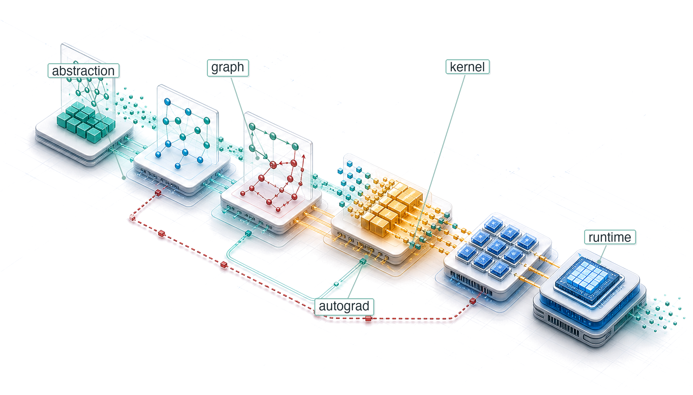
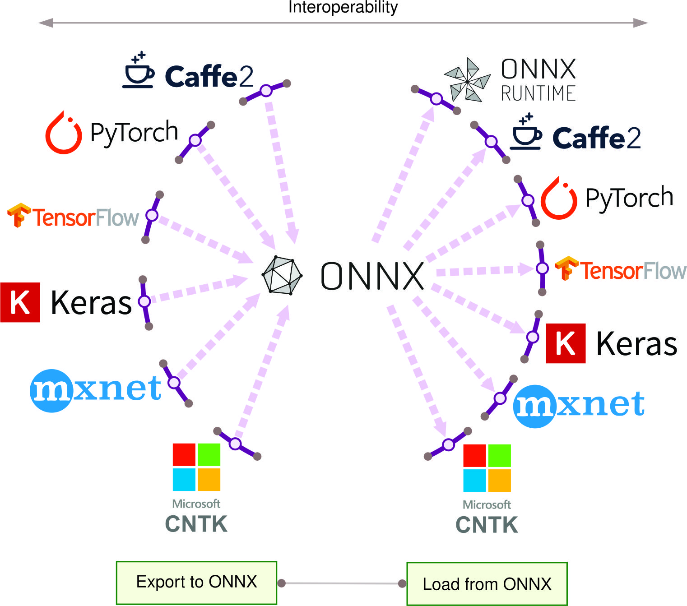

# ML Frameworks {#sec-ml-frameworks}

::: {layout-narrow}
::: {.column-margin}

\chapterminitoc

:::

::: {.content-visible when-format="pdf"}
\noindent
{fig-alt="Layered blueprint showing high-level model intent lowering through graph capture, autograd, fusion, and kernel dispatch into executable work."}
:::

::: {.content-visible unless-format="pdf"}
{fig-alt="Layered blueprint showing high-level model intent lowering through graph capture, autograd, fusion, and kernel dispatch into executable work."}
:::

:::

## Purpose {.unnumbered .unlisted}

\begin{marginfigure}
\mlsysstack{35}{90}{40}{45}{15}{0}{0}{10}
\end{marginfigure}

_Why does the framework silently constrain every decision that comes after it?_

Neural networks are defined by mathematics (matrix multiplications, gradient computations, activation functions), but mathematics does not execute itself. Between the equations and the silicon lies a translation layer that decides how operations are scheduled on hardware, how memory is allocated across the compute hierarchy, and how gradients flow backward through the computational graph. The framework is this translation layer, and the translation is not neutral. A single tensor expression may become an immediate kernel launch, a captured graph, a fused operator, a recomputed activation, or an exported inference artifact depending on the framework's execution model. Those choices shape not only speed but the engineering work itself: whether the model can be debugged step by step, whether the compiler can see enough context to eliminate memory traffic, whether gradients fit in device memory, whether custom operations survive conversion to a mobile runtime, and whether the chosen accelerator can run the model directly or falls back to a slow path. These execution-mode, compiler, and accelerator choices determine which optimizations are possible, which hardware is reachable, and which deployment targets can run the model. This abstraction creates both power and lock-in: once a project accumulates checkpoints, data pipelines, custom modules, distributed training scripts, serving formats, and team expertise around a framework, the framework becomes part of the system architecture rather than a replaceable library. In Domain–Architecture–Machine (D·A·M) terms, the framework is the mediator of algorithm-machine co-design: it exposes high-level programming constructs while translating computations into efficient execution pipelines. Understanding frameworks is therefore not about learning transient API syntax, but about mastering how system components orchestrate data movement, kernel launches, and memory allocation under real hardware constraints.

::: {.content-visible when-format="pdf"}

\newpage

:::

::: {.callout-learning-objectives}

- Explain how frameworks mediate algorithm-machine co-design through execution, differentiation, and hardware abstraction
- Compare execution strategies using dispatch overhead, compilation cost, and deployment constraints
- Analyze automatic differentiation and activation storage to choose recomputation or checkpointing
- Implement module abstraction patterns for parameter discovery, mode behavior, serialization, and hooks
- Calculate training-step FLOPs, memory traffic, and dispatch overhead to identify fusion and layout bottlenecks
- Select TensorFlow, PyTorch, JAX, or edge runtimes based on model, hardware, team, and deployment requirements

:::

## Three Framework Problems {#sec-ml-frameworks-three-problems-every-framework-must-solve-317d}

An architecture is a graph of commitments: a transformer commits the system to attention, matrix multiplications, activation state, and memory traffic. The framework is the layer that turns that graph into work the machine can execute. A few calls such as `logits = model(tokens)`, `loss = criterion(logits, targets)`, and `loss.backward()` hide billions of floating-point operations across memory hierarchies, exact gradients through millions of parameters via automatic differentiation\index{Automatic Differentiation!framework role}, thousands of GPU kernel launches, and gigabytes of intermediate state. The API looks simple because the framework is acting as a compiler for the silicon contract.

Architectures specify what computations neural networks perform, but knowing *what* to compute is entirely different from knowing *how* to compute it efficiently. A transformer's attention mechanism requires coordinating computation across memory hierarchies and accelerator cores in patterns that naive implementations would execute 100$\times$ slower than optimized ones. Implementing these operations from scratch for every model would make deep learning economically infeasible. ML frameworks exist to bridge this gap by lowering abstract model graphs into hardware-aligned execution pipelines that extract maximum performance from silicon.

A framework\index{ML Framework!compiler analogy} is to machine learning what a compiler is to traditional programming. A C compiler translates human-readable code into optimized machine instructions, managing register allocation, instruction scheduling, and memory layout. An ML framework translates high-level model definitions into hardware-specific execution plans, managing operator fusion, memory reuse, and device placement. This analogy is more than metaphor: modern frameworks literally include compilers.

Every ML framework\index{ML Framework!execution problem}\index{ML Framework!differentiation problem}\index{ML Framework!hardware abstraction problem}, regardless of API or design philosophy, must solve three core problems. The first is the *execution problem*: deciding when and how computation runs. A framework can execute operations immediately as written (eager execution\index{Eager Execution!definition}[^fn-eager-execution-tradeoff]) or build a complete description first\index{Deferred Execution!graph construction}---a computational graph\index{Computational Graph!definition}[^fn-computational-graph-frameworks] (a structured representation of operations and their dependencies)---and optimize before executing (graph execution). This choice shapes debugging capability, optimization potential, and deployment flexibility.

Once execution has a shape, the framework must solve the *differentiation problem*: computing gradients automatically. As established in @sec-neural-computation, training requires derivatives of a loss function with respect to millions or billions of parameters, and manual differentiation is error-prone at this scale. Frameworks therefore need automatic differentiation systems that compute exact gradients for arbitrary compositions of operations while managing the memory overhead of storing intermediate values.

The third problem is *hardware abstraction*: targeting diverse hardware from a single interface. The same model definition should be expressible across CPUs, GPUs, TPUs, and mobile devices, even though each target has different memory constraints and optimal execution patterns. Within the GPU slice of this problem, some framework ecosystems expose custom-kernel languages so advanced users can write high-performance kernels without dropping all the way to low-level CUDA [@tillet2019].

[^fn-computational-graph-frameworks]: **Computational Graph**\index{Computational Graph!framework optimization}: The "optimize before executing" distinction in the triggering sentence is the key design choice. Capturing the program as a data structure lets a framework fuse compatible operations into fewer GPU kernels before execution, reducing launch overhead and intermediate memory traffic. The engineering cost of this visibility is that the executed program differs from the source code, making debugging harder, a trade-off every graph-based framework must justify against the performance gain.

[^fn-eager-execution-tradeoff]: **Eager Execution**\index{Eager Execution!optimization trade-off}: This mode executes each operation immediately, which enables direct debugging with standard tools but sacrifices the global view needed for graph-level optimizations. Without capturing a larger region of computation, an eager runtime cannot fuse across that region or preplan its memory, leaving workload-dependent optimization opportunities for compilers such as `torch.compile`.

These three problems are deeply interconnected. The execution model determines *when* differentiation occurs and *what* optimizations are possible. The abstraction layer must support both execution styles across all hardware targets. Solving any one problem in isolation leads to frameworks that excel in narrow contexts but fail in broader deployment. Because these problems are ultimately about translating mathematics into efficient hardware execution, a useful perspective is to view frameworks not as libraries but as compilers.

::: {#psp-frameworks-ml-compiler .callout-perspective title="The ML compiler"}

In the context of the iron law (@sec-introduction-iron-law-ml-systems-c32a), a framework\index{ML Framework!compiler for the Silicon Contract} is a compiler for the silicon contract\index{Silicon Contract!framework compilation}.

The "source code" is the model architecture (the $O$ term). The framework's job is to take this high-level math and compile it into a series of hardware-specific kernel launches that:

1.  Minimize data movement $(D_{\text{vol}})$ through techniques like kernel fusion.
2.  Maximize utilization $(\eta_{\text{hw}})$ by matching operations to specialized hardware units like Tensor Cores.
3.  Minimize overhead $(L_{\text{lat}})$ through efficient asynchronous dispatch and graph capture.

Choosing a framework means choosing the compiler that determines *how* efficiently a model uses hardware; precision matters: a definition that captures all three responsibilities separates genuine frameworks from numerical libraries that address only one.

:::

::: {#dfn-frameworks-machine-learning-frameworks .callout-definition title="Machine learning frameworks"}

***Machine Learning Frameworks***\index{ML Framework!definition} are software systems that translate high-level mathematical model definitions into hardware-optimized execution plans by managing the computational graph, automatic differentiation, kernel dispatch, and memory allocation across the hardware hierarchy.

1.  **Significance**: Frameworks directly determine the system efficiency $(\eta_{\text{hw}})$ term in the iron law. Compiler-backed operator fusion, for example, can eliminate writes and subsequent reads of intermediate values between compatible operations. Fusing a matrix multiplication, bias add, and rectified linear unit (ReLU) changes how the same mathematics reaches hardware without changing the model.
2.  **Distinction**: Unlike a numerical library such as NumPy, which executes each operation immediately (eager evaluation), an ML framework can defer execution to analyze the full computational graph and apply global optimizations: operator fusion, memory layout transformations, and parallel scheduling. These optimizations are impossible when operations are evaluated one at a time.
3.  **Common pitfall**: A frequent misconception is that frameworks are interchangeable API wrappers. Framework choice determines which compiler paths are available. PyTorch can recover graph-level optimization from eager code through `torch.compile()`, while TensorFlow and JAX commonly rely on XLA-backed compilation paths that lower operations to target hardware. Moving from eager execution to a compiler path can change throughput materially, but the gain depends on model structure, shapes, operator support, and hardware.

:::

The compiler metaphor is not decorative. An ML framework translates logical intent into physical execution under the constraints of the iron law, deciding how to partition computation across memory hierarchies, when to trade numerical precision for throughput, and how to schedule operations so that the dominant term (data movement, computation, or overhead) is minimized. The framework is where the governing physics developed throughout this book becomes executable code.

The scale of this translation is not obvious from the API surface. A single call to `loss.backward()` triggers operation recording, memory allocation for gradients, reverse-order graph traversal, and hardware-optimized kernel dispatch---machinery that would require hundreds of lines of manual calculus for even a three-layer network. For a contemporary language model, the framework additionally orchestrates billions of floating-point operations across accelerators, coordinating memory hierarchies, numerical precision, and, when the system grows beyond one device, communication libraries. Building this from scratch would be economically prohibitive for most organizations, which is why the history of ML frameworks is a history of progressively automating these layers.

The three problems---execution, differentiation, and abstraction---did not emerge simultaneously. Each arose as a response to scaling limitations in the previous generation of tools. Tracing this evolution explains why modern frameworks are designed as they are and why they embody these particular trade-offs.

## The Ladder of Abstraction {#sec-ml-frameworks-frameworks-evolved-ac68}

In 1979, writing a matrix multiplication in Fortran that used the hardware efficiently required deep knowledge of cache lines, register scheduling, and vector units. By 2016, a single line of Python (`torch.matmul(A, W)`) could dispatch to a highly optimized implementation without the programmer knowing the details of the silicon. That compression of effort did not happen in one step; it accumulated across four decades of abstraction\index{ML Framework!historical evolution}, each layer solving a bottleneck that made the previous generation impractical for scaling. The result is a **Ladder of Abstraction**\index{Ladder of Abstraction} where each rung automates what the rung below exposed.

1.  **Solving Performance (1979–1992)**: The original **Basic Linear Algebra Subprograms (BLAS)**\index{BLAS!historical foundation}[^fn-blas-routine-acceleration] standardized reusable low-level linear-algebra primitives [@lawson1979], while LAPACK\index{LAPACK!framework foundation}[^fn-lapack-linear-algebra] [@bai2006] built higher-level numerical routines on top of that foundation. Together, these libraries solved the problem of hardware primitives: stable interfaces let frameworks delegate operations such as `C = A @ B`[^fn-gemm-hardware-utilization] to specialized implementations instead of hand-writing silicon-specific code.
2.  **Solving Usability (2006)**: **NumPy**\index{NumPy!framework foundation}[^fn-numpy-array-abstraction] solved the problem of developer velocity. By wrapping low-level BLAS routines in high-level Python [@harris2020], it allowed scientists to write code in a friendly language while executing it in optimized C/Fortran. This "Vectorization" pattern, where the slow language handles logic and the fast language handles loops, became a durable contract for scientific computing. Jupyter notebooks later extended this usability layer into readable, executable computational workflows for combining code, results, and explanations [@kluyver_thomas2016].
3.  **Solving Differentiation (2007–present)**: **Deep Learning Frameworks**\index{Deep Learning Framework!automatic differentiation} (Theano,[^fn-theano-framework-origin] TensorFlow [@abadi2016tensorflow], PyTorch [@paszke2019pytorch]) solved the problem of gradient computation. While NumPy required manual derivation of backpropagation gradients (error-prone and slow), these frameworks made automatic differentiation through computational graphs a standard capability. This turned the chain rule into a software primitive, allowing researchers to define *forward* passes and get *backward* passes automatically.

[^fn-blas-routine-acceleration]: **BLAS (Basic Linear Algebra Subprograms)**\index{BLAS!performance foundation}: The 1979 API specification that forms the bottom rung of the ladder described here. It standardized a fixed set of Fortran-callable vector operations, separating the public routine names from the machine-specific implementation decisions beneath them. Every framework above it inherits the broader version of this bargain: call a standard linear-algebra primitive from any language and let a tuned vendor library target the silicon. For modern GEMM on NVIDIA GPUs, that tuned path is cuBLAS rather than the 1979 BLAS specification itself [@nvidia_cublas].

[^fn-lapack-linear-algebra]: **LAPACK (Linear Algebra PACKage)**\index{LAPACK!higher-level numerical routines}: Extends BLAS by providing a standard API for higher-level routines (SVD, eigendecomposition, least-squares) that vendors implement with chip-specific code layered on top of fast GEMM kernels. This layered design is the architectural pattern every ML framework inherits: high-level operations delegate downward to hand-tuned primitives, so a vendor-optimized LAPACK call can execute over 10$\times$ faster than a naive implementation without the framework author writing a single line of hardware-specific code.

[^fn-gemm-hardware-utilization]: **GEMM (General Matrix Multiplication)**\index{GEMM!hardware utilization}: The matrix-matrix primitive behind `C = A @ B`. Hardware vendors hand-tune GEMM for their specific chips because dense layers, attention projections, and convolution lowering all rely on matrix multiplication, making this one routine a performance floor for many frameworks above it on the ladder. Its high arithmetic intensity makes GEMM the operation most able to approach peak compute throughput, while small or misaligned shapes often fall back to much lower utilization.

[^fn-numpy-array-abstraction]: **NumPy (Numerical Python)**\index{NumPy!framework lineage}: In 2005, Travis Oliphant unified two competing Python array libraries (Numeric and Numarray) into a single package, giving the scientific computing community one BLAS-backed array standard at the moment it needed to scale. The "vectorization" contract this created (write logic in Python, execute loops in C/Fortran via BLAS) became the design template for every ML framework that followed: PyTorch tensors and TensorFlow arrays are direct descendants, extending the same $n$-dimensional array abstraction to GPUs. Python's role in ML infrastructure inherits much of its shape from this consolidation decision.

[^fn-theano-framework-origin]: **Theano**\index{Theano!computational graph origin}: Developed at the Montreal Institute for Learning Algorithms (MILA) under Yoshua Bengio starting in 2007, Theano was an early and influential Python framework that compiled symbolic mathematical expressions into optimized CPU and GPU code via computational graphs [@bergstra2010; @al2016theano]. It demonstrated that a Python-defined computation graph could be compiled for GPU execution without requiring the researcher to write CUDA code. Mila ended active development of Theano in 2017 [@milaTheanoDevelopment].

Machine learning frameworks evolved by progressively abstracting hardware execution details into higher-level API primitives. Frameworks bridge the gap between mathematical intent and silicon reality (@fig-mlfm-timeline), moving numerical software up the ladder from low-level linear algebra routines to compiled graph execution engines.

::: {#fig-mlfm-timeline fig-env="figure" fig-pos="htb" fig-cap="**Computational Library Evolution**: A timeline of numerical computing milestones spanning 1979 to 2018. Each era automates what the layer below exposed—from BLAS and LAPACK hardware routines to NumPy vectorized syntax and graph-based automatic differentiation in modern frameworks—trading low-level transparency for developer velocity." fig-alt="Horizontal timeline from 1979 to 2018 marking key milestones: 1979 BLAS introduced, 1992 LAPACK extends BLAS, 2006 NumPy becomes Python's numerical backbone, 2007 Theano introduces computational graphs, 2015 TensorFlow, 2016 PyTorch, 2018 JAX."}

```{.tikz}
\begin{tikzpicture}[node distance=1mm,outer sep=0pt,font=\small\sffamily]
\tikzset{%
    Line/.style={line width=1.0pt,black!50
},
  Box/.style={inner xsep=1pt,
    draw=none,
    fill=#1,
    anchor=west,
    text width=27mm,align=flush center,
    minimum width=28mm, minimum height=13mm
  },
  Box/.default=red
}
\definecolor{col1}{RGB}{128, 179, 255}
\definecolor{col2}{RGB}{255, 255, 128}
\definecolor{col3}{RGB}{204, 255, 204}
\definecolor{col4}{RGB}{230, 179, 255}
\definecolor{col5}{RGB}{255, 153, 204}
\definecolor{col6}{RGB}{245, 82, 102}
\definecolor{col7}{RGB}{255, 102, 102}

\node[Box={col1}](B1){1979};
\node[Box={col2!},right=of B1](B2){1992};
\node[Box={col3},right=of B2](B3){2006};
\node[Box={col4},right=of B3](B4){2007};
\node[Box={col5},right=of B4](B5){2015};
\node[Box={col6},right=of B5](B6){2016};
\node[Box={col7},right=of B6](B7){2018};
%%
\foreach \x in{1,2,...,7}
\draw[dashed,thick,-latex](B\x)--++(270:4.1);

\path[red]([yshift=-7mm]B1.south west)coordinate(P)-|coordinate(K)(B7.south east);

\draw[line width=2pt,-latex](P)--(K)--++(0:3mm);

\def\vi{1.4}
\node[Box={col1!50},below=\vi of B1](BB1){BLAS introduced};
\node[Box={col2!50},below=\vi of B2](BB2){LAPACK extends BLAS};
\node[Box={col3!50},below=\vi of B3](BB3){NumPy becomes Python's numerical backbone};
\node[Box={col4!50},below=\vi of B4](BB4){Theano introduces computational graphs};
\node[Box={col5!50},below=\vi of B5](BB5){TensorFlow popularizes static graphs};
\node[Box={col6!50},below=\vi of B6](BB6){PyTorch introduces dynamic graphs};
\node[Box={col7!50},below=\vi of B7](BB7){JAX introduces functional paradigms};
\end{tikzpicture}
```

:::

Each generation abstracted away details that consumed engineering effort in the previous one, yet each abstraction introduced new trade-offs. BLAS hid assembly-level optimization but fixed the interface. NumPy hid memory management but required manual differentiation. Modern frameworks hide gradient computation but introduce a choice among execution models. The deeper pattern is that every abstraction hides details by preserving a contract about shape, dtype, device, and sometimes units; when that contract becomes implicit, correct components can still compose into a wrong system.

With that contract risk in view, modern frameworks converge on the same three core problems: *how* to execute computation, *how* to differentiate it, and *how* to abstract across hardware. The execution problem comes first because its resolution determines what optimizations the other two problems can exploit.

::: {#ws-frameworks-mars-climate-orbiter-units .callout-war-story title="The interface that forgot its units (1999)"}

**Context**: NASA's Mars Climate Orbiter depended on ground software, spacecraft software, navigation teams, and contractor interfaces all agreeing on the physical meaning of exchanged values [@nasa1999marsclimateorbiter].

**Mechanism**: Ground software supplied by Lockheed Martin computed thruster impulse in English units (pound-force seconds), while JPL navigation software consumed the values assuming SI units (newton-seconds)—a 4.45$\times$ implicit unit mismatch.

**Impact**: On September 23, 1999, trajectory error placed the orbiter at 57 km altitude during Mars orbit insertion instead of 226 km, destroying the \$125 million spacecraft in the atmosphere.

**Fix**: NASA revised its software interface engineering standards, requiring explicit typed unit contracts and automated interface validation across all mission software pipelines.

**Systems lesson**: Framework abstractions are valuable because they carry contracts: shape, dtype, device placement, and physical units. If those contracts are implicit, two pieces of correct code can still compose into a wrong system. ML frameworks hit this whenever tensor memory layouts (such as NCHW vs. NHWC), quantization scale factors, or physical feature units differ across pipeline stages, producing plausible outputs that quietly corrupt downstream inference.

:::

## Execution Problem {#sec-ml-frameworks-execution-problem-e1e1}

Consider two engineers writing the same neural network. The first debugs interactively, printing tensor shapes after each operation, inspecting intermediate values, and stepping through code with `pdb`. The second waits 30 seconds for compilation, then watches the model run 3$\times$ faster with no ability to inspect any intermediate state. Both are correct; they have made different choices about the **Execution Problem**\index{Execution Problem!definition}, the question of whether operations should execute immediately as written or be recorded for later execution. This choice creates a cascade of engineering trade-offs that shape every aspect of framework behavior, from debugging workflows to deployment options to peak hardware utilization.

### Why execution strategy matters: The memory wall {#sec-ml-frameworks-execution-strategy-matters-memory-wall-1ce8}

To understand why execution strategy matters so much, return to the widening compute-bandwidth gap quantified by the memory-wall equation (@eq-memory-wall). Processor arithmetic has grown faster than memory bandwidth, creating the memory wall\index{Memory Wall!execution strategy impact}\index{Memory Wall!framework execution}. Modern accelerators can perform arithmetic far faster than they can fetch data. Element-wise operations like ReLU use only a tiny fraction of peak compute capacity, not because the hardware is slow, but because they spend nearly all their time waiting for data. @Sec-appdx-machine-foundations-roofline-model-2529 formalizes this trade-off, showing exactly when operations are memory bound vs. compute bound.

The memory wall creates a critical classification: operations are either compute-bound\index{Compute-Bound!operation classification} (limited by arithmetic throughput, like large matrix multiplications) or memory-bound\index{Memory-Bound!operation classification} (limited by data movement, like activation functions and normalization). Most individual neural network operation types (activations, normalizations, element-wise operations) are memory bound, though the large matrix multiplications that dominate total compute time can be compute bound.

The key optimization for memory-bound operations is kernel fusion\index{Kernel Fusion!definition}\index{Kernel Fusion!optimizing memory-bound ops}, combining multiple operations into a single GPU function (called a *kernel*)[^fn-kernel-gpu-dispatch] to avoid intermediate memory traffic. Fusing a sequence of normalization, dropout, and activation operations into one kernel can yield large speedups by eliminating intermediate writes between operations. Attention kernels[^fn-flashattention-fusion-fw] use the same principle at larger scale: instead of materializing the full attention matrix in HBM, a fused implementation can keep tiles close to the compute units, cut HBM accesses by up to 9$\times$, and produce workload-specific speedups from 15 percent to 3$\times$ [@dao2022].

[^fn-kernel-gpu-dispatch]: **Kernel (GPU)**\index{Operator Kernel!GPU definition}: In GPU programming, a kernel is the function dispatched to execute in parallel across thousands of threads. Each kernel launch incurs 5--20 $\mu$s of CPU-side overhead for parameter assembly and GPU signaling, which means that small, unfused operations spend more time on launch overhead $(L_{\text{lat}})$ than on useful arithmetic. Reducing kernel count through fusion is therefore a direct attack on the overhead term of the iron law.

[^fn-flashattention-fusion-fw]: **Fused Attention Kernel**\index{Attention Mechanism!fused kernel}: A fused attention kernel combines the $\mathbf{Q}\mathbf{K}^T$ product, softmax, and value-weighted output into a tiled implementation that keeps intermediate values in on-chip memory rather than materializing the full attention matrix in HBM. FlashAttention\index{FlashAttention!framework fusion example} is the canonical named example introduced in @sec-network-architectures and reports up to 9$\times$ fewer HBM accesses with workload-specific speedups from 15 percent to 3$\times$ [@dao2022]. The framework lesson is broader than the specific algorithm: fusion can shift an operation's position on the Roofline Model from bandwidth-limited toward throughput-limited execution by reducing round-trips through external memory.

A framework can only fuse operations it can see together. If operations execute immediately one at a time (eager execution)\index{Eager Execution!optimization limitations}, the framework cannot fuse them. If operations are recorded first into a graph (deferred execution)\index{Graph Execution!optimization advantages}, the framework can analyze and optimize the entire computation. This is why execution strategy matters so much: it determines *what* optimizations are even possible.

### The computational graph {#sec-ml-frameworks-computational-graph-00f7}

Kernel fusion is the key optimization for memory-bound operations, but fusion requires seeing multiple operations together. Frameworks make this visibility possible through the computational graph\index{Computational Graph!definition (DAG)}, a directed acyclic graph (DAG) where nodes represent operations and edges represent data dependencies. This graph is the framework's internal model of the computation.

Mathematical operations can be decoupled from physical execution through graph representations. The computational graph (@fig-comp-graph) grounds this abstraction: tensor variables map to data nodes while operations map to transformation nodes.

::: {#fig-comp-graph fig-env="figure" fig-pos="htb" fig-cap="**Simple Computational Graph**: Representing $z = f(x, y)$ as a directed acyclic graph decouples mathematical dependencies from physical execution order, providing the structural blueprint frameworks require to track gradients and schedule operations across devices." fig-alt="Simple directed graph with nodes x and y flowing into function f(x,y) which outputs z."}

```{.tikz}
\begin{tikzpicture}[font=\sffamily\small]
%
\tikzset{%
    Line/.style={line width=1.0pt,black!50,rounded corners
},
  Box/.style={align=flush center,
   shape=circle,
    inner xsep=1pt,
    node distance=1.4,
    draw=BlueLine,
    line width=0.75pt,
    fill=BlueL,
    minimum width=8mm,
  },
}
\node[Box,fill=GreenFill,draw=GreenLine,minimum width=15mm, ](B1){$f(x,y)$};
\node[Box,right=of B1,fill=GreenFill,draw=GreenLine](B2){$z$};
\node[Box,above left=-0.10 and 2 of B1,fill=GreenFill,draw=GreenLine](B3){$x$};
\node[Box,below left=-0.10 and 2 of B1,fill=GreenFill,draw=GreenLine](B4){y};
\draw[-latex,Line](B1)--(B2);
\draw[-latex,Line](B3)to[bend left=25](B1);
\draw[-latex,Line](B4)to[bend right=25](B1);
\end{tikzpicture}
```

:::

Real machine learning models require much more complex graph structures. @Fig-mlfm-comp-graph extends this representation to show a neural network computation graph alongside the system components that reason about it. In the left panel, notice how data flows through six operation nodes in a directed acyclic graph---each node's output becomes the next node's input. The right panel reveals what the framework gains from this explicit graph structure: it can query the structure to plan memory allocation for each tensor's lifetime, and it can assign operations to devices based on data dependencies rather than execution order. The critical insight is that the graph exists independently of execution, enabling the framework to optimize before any arithmetic occurs.

::: {#fig-mlfm-comp-graph fig-env="figure" fig-pos="htb" fig-cap="**Computation Graph with System Interactions**: A neural network DAG (left) interfaces with framework runtime components (right). By maintaining an explicit graph representation independent of execution, the framework can analyze tensor lifetimes for memory reuse and assign operations to target accelerators before issuing arithmetic." fig-alt="Left side shows computational graph with six operation nodes connected by data flow edges. Right side shows system components box with memory management and device placement nodes that interact with the computational graph."}

```{.tikz}
\scalebox{0.9}{%
\begin{tikzpicture}[font=\sffamily\small]

\tikzset{
  Box/.style={ inner xsep=2pt,
    node distance=1.4,
    draw=none,
    line width=0.5pt,,
    fill=none,
    minimum width=27mm, minimum height=15mm
  },
    LineA/.style={violet!40,line width=5pt,{-{Triangle[width=1.0*11pt,length=1.0*8pt]}},shorten <=1pt,shorten >=1pt},
    graphpanel/.style={
        draw=olive!60!black,
        fill=olive!02,
        line width=0.9pt,
        rounded corners=4pt,
        inner sep=14pt,yshift=9pt
    },
    syspanel/.style={
        draw=orange!70!black,
        fill=orange!03,
        line width=0.9pt,
        rounded corners=4pt,
        inner sep=10pt
    },
    opnode/.style={
        circle,node distance=6mm,
        draw=BlueLine,,
        fill=cyan!15,
        minimum size=5mm,
        line width=0.9pt
    },
    compbox/.style={
        draw=orange!80!black,
        fill=orange!12,
        rounded corners=2pt,
        minimum width=2.7cm,
        minimum height=0.9cm,
        align=center,
        line width=0.8pt
    },
    flow/.style={
        -{Latex[length=2.2mm]},
        draw=BrownLine!75,
        line width=0.9pt
    },
}
%CPU style
\tikzset{
pics/cpu/.style = {
        code = {
        \pgfkeys{/channel/.cd, #1}
\begin{scope}[local bounding box = CPU,shift={($(0,0)+(0,0)$)},scale=\scalefac,every node/.append style={transform shape}]
\node[fill=\filllcolor,minimum width=66, minimum height=66,
            rounded corners=2,outer sep=2pt] (C1) {};
\node[fill=white,minimum width=54, minimum height=54] (C2) {};
\node[fill=\filllcolor!50,minimum width=44, minimum height=44] (C3) {\Large\bfseries GPU};

\foreach \x/\y in {0.11/1,0.26/2,0.41/3,0.56/4,0.71/5,0.85/6}{
\node[fill=\filllcolor,minimum width=4, minimum height=15,
           inner sep=0pt,anchor=south](GO\y)at($(C1.north west)!\x!(C1.north east)$){};
}
\foreach \x/\y in {0.11/1,0.26/2,0.41/3,0.56/4,0.71/5,0.85/6}{
\node[fill=\filllcolor,minimum width=4, minimum height=15,
           inner sep=0pt,anchor=north](DO\y)at($(C1.south west)!\x!(C1.south east)$){};
}
\foreach \x/\y in {0.11/1,0.26/2,0.41/3,0.56/4,0.71/5,0.85/6}{
\node[fill=\filllcolor,minimum width=15, minimum height=4,
           inner sep=0pt,anchor=east](LE\y)at($(C1.north west)!\x!(C1.south west)$){};
}
\foreach \x/\y in {0.11/1,0.26/2,0.41/3,0.56/4,0.71/5,0.85/6}{
\node[fill=\filllcolor,minimum width=15, minimum height=4,
           inner sep=0pt,anchor=west](DE\y)at($(C1.north east)!\x!(C1.south east)$){};
}
\end{scope}
    }
  }
}
\tikzset{
pics/dram/.style = {
        code = {
        \pgfkeys{/channel/.cd, #1}
\begin{scope}[shift={($(0,0)+(0,0)$)},scale=\scalefac,every node/.append style={transform shape}]
\node[draw=\drawcolor,fill=\filllcolor!70,line width=1.5*\Linewidth,inner sep=0pt,outer sep=0pt,
minimum width=56mm,minimum height=14mm](DRAM\picname)at(0,0){};
\node[draw=\drawcolor,fill=\filllcolor!30,line width=1.5*\Linewidth,inner sep=0pt,outer sep=0pt,anchor=north,
minimum width=52mm,minimum height=6mm](MDRAM\picname)at(DRAM\picname.south){};
%
\pgfmathsetmacro{\spacing}{56/(6+1)}
\foreach \i in {1,...,6} {
  \pgfmathsetmacro{\x}{\i * \spacing}
  \node[draw=\drawcolor,fill=\filllcolor!20,line width=\Linewidth, inner sep=0pt, outer sep=0pt,
        minimum width=6mm, minimum height=8mm]
        at ([xshift=\x mm]DRAM\picname.west) {};
}
%
\foreach \i in {1,...,19} {
  \pgfmathsetmacro{\x}{\i*(52/20)}
  \draw[draw=\drawcolor, line width=3*\Linewidth]
    ([xshift=\x mm,yshift=1pt]MDRAM\picname.south west) -- ++(0,2mm);
}
\end{scope}
    }
  }
}
\pgfkeys{
  /channel/.cd,
   Depth/.store in=\Depth,
  Height/.store in=\Height,
  Width/.store in=\Width,
  filllcirclecolor/.store in=\filllcirclecolor,
  filllcolor/.store in=\filllcolor,
  drawcolor/.store in=\drawcolor,
  drawcircle/.store in=\drawcircle,
  scalefac/.store in=\scalefac,
  Linewidth/.store in=\Linewidth,
  picname/.store in=\picname,
  filllcolor=BrownLine,
  filllcirclecolor=cyan!40,
  drawcolor=black,
  drawcircle=violet,
  scalefac=1,
  Linewidth=0.5pt,
  Depth=1.3,
  Height=0.8,
  Width=1.1,
  picname=C
}

    % graph nodes
    \node[opnode] (a)  {};
    \node[opnode,below left=of a] (b) {};
    \node[opnode,below right =of a] (c) {};
    \node[opnode,below=of b] (d)  {};
    \node[opnode,below =of c] (e) {};
    \node[opnode,below right=of d] (f) {};
    % edges
    \draw[flow] (a) -- (b);
    \draw[flow] (a) -- (c);
    \draw[flow] (b) -- (d);
    \draw[flow] (c) -- (e);
    \draw[flow] (d) -- (f);
    \draw[flow] (e) -- (f);
    % optional cross-edge
    \draw[flow] (b) -- (e);

    \node[opnode,minimum size=3mm,below left= 0.33 and 1.65of f] (l) {};
    \node[right=0pt of l,font=\sffamily\footnotesize](O){Operations};
    \draw[flow]($(O.east)+(1mm,0)$)--++(0:7mm)coordinate(A);
    \node[right=0pt of A,font=\sffamily\footnotesize](AA){Data flow};
    \scoped[on background layer]
    \node[graphpanel,fit=(a)(l)(O)(AA),inner xsep=6pt](FF){};
    \node[below=1pt of FF.north,font=\sffamily\bfseries\footnotesize]{Computational Graph};
%
   \node[right=29mm of FF.27,Box](MM){};
   \node[below=-6pt of MM](T1){Memory Management};
   \pic[shift={(0,0.1)}] at  (MM){dram={scalefac=0.43,picname=1,
   drawcolor=black,filllcolor=OrangeLine!50!,Linewidth=0.5pt}};
   \node[right=29mm of FF.338,Box](DP){};
      \node[below=1pt of DP](T2){Device Placement};
   \pic[shift={(0,0)}] at (DP) {cpu={scalefac=0.45,picname=1,
   drawcolor=RedLine,filllcolor=BlueLine!80!,Linewidth=0.5pt}};

   \scoped[on background layer]
   \node[fit=(MM)(T1)(T2),syspanel,yshift=1.0mm,inner xsep=6pt](DD){};
   \node[below=1pt of DD.north,font=\sffamily\bfseries\footnotesize]{System Components};

\draw[LineA](FF)--
node[above,pos=0.45,text=black!70,font=\sffamily\footnotesize]{Interacts with}
(DD);
\end{tikzpicture}}
```

:::

This graph representation is more than a visualization; it is the data structure that enables both efficient execution and automatic differentiation. The answer to *when* this graph is constructed creates a design choice with cascading implications across four dimensions. Debugging benefits from visibility into intermediate values and step-through execution. Optimization benefits from seeing multiple operations at once, which enables fusion. Deployment benefits when execution no longer depends on the Python interpreter. Flexibility benefits when control flow can depend on computed tensor values.

No single execution model optimizes all these dimensions. Frameworks must choose their position in this trade-off space, and practitioners must understand these trade-offs to select appropriate tools and write efficient code. The three execution families that follow are different answers to the same systems question: how much graph visibility should the framework trade for immediate execution and debugging?

### Three execution strategies {#sec-ml-frameworks-three-execution-strategies-5934}

The computational graph representation enables global optimization, but it leaves a critical design choice unresolved: *when* the framework builds the graph. Consider a simple operation like `y = x * 2`. One approach performs the multiplication immediately, storing the result in `y`. This is natural and debuggable, but the framework sees only one operation at a time. The other approach defers execution, recording the intention to multiply and building a graph of operations that runs later when explicitly requested. This is less intuitive, but the framework sees the complete computation, which enables optimization.

Neither approach dominates; each embodies different trade-offs between *flexibility* and *optimization potential*. Modern frameworks have explored three primary execution strategies: eager execution with dynamic graphs, static computation graphs, and hybrid approaches that combine just-in-time (JIT) compilation with eager development. Each strategy has distinct systems implications.

#### Eager execution with dynamic graphs {#sec-ml-frameworks-eager-execution-dynamic-graphs-29c2}

Eager execution\index{Eager Execution!define-by-run model} evaluates each operation immediately as the program calls it, building the computation graph dynamically\index{Dynamic Graph!eager execution} at runtime. A side-by-side comparison shows how this differs from graph-based execution at the code level.

::: {#exmp-frameworks-eager-vs-graph-execution-code-comparison .callout-example title="Eager vs. graph execution code comparison"}

**PyTorch (eager execution)**:
```{.python}
import torch

x = torch.tensor([1.0, 2.0])
y = x * 2
print(f"Intermediate value: {y}")  # Works immediately
z = y.sum()
```

**TensorFlow 1.x (static graph)**:

```{.python}
import tensorflow as tf

x = tf.placeholder(tf.float32)
y = x * 2
# print(y) -> Prints Tensor("mul:0"...), not value!
z = tf.reduce_sum(y)

with tf.Session() as sess:
    result = sess.run(z, feed_dict={x: [1.0, 2.0]})
```

**Systems insight**: Eager execution exposes intermediate values as ordinary runtime state, which makes debugging direct. Static graphs stage computation before execution, which enables whole-graph optimization but changes the debugging model.

:::

Eager execution runs operations immediately as encountered, building the computation graph dynamically during execution. When a programmer writes `y = x * 2`, the multiplication happens instantly and the result is available for immediate use.

This provides the flexibility of normal programming: developers can print intermediate values, use conditionals based on computed results, and debug with standard tools. The framework records operations as they happen, constructing a dynamic graph\index{Dynamic Graph!definition}\index{Dynamic Graph!runtime construction} that reflects the actual execution path taken.

For gradient computation, the framework records a history of operations in what is called an autograd tape\index{Autograd Tape!definition}\index{Autograd Tape!dynamic graph construction},[^fn-autograd-tape-memory] a transient data structure built during execution. Each tensor operation creates a node that records: the operation performed, references to input tensors, and how to compute gradients. These nodes form a directed acyclic graph (DAG) of operations built *during* forward pass execution, *not before*. @Lst-autograd-tape-example shows how PyTorch records operations as they execute in its default eager mode.

[^fn-autograd-tape-memory]: **Autograd Tape**\index{Autograd Tape!memory cost}: A transient data structure built during forward execution, where nodes record operations, dependencies, and backward functions for chain-rule evaluation. Its memory footprint grows with model depth and sequence length as saved activations accumulate until released during backpropagation. For deep models, frameworks retain selected activations and recompute others via activation checkpointing to prevent OOM failures.

::: {#lst-autograd-tape-example lst-cap="**Autograd Tape Construction**: Each operation executes immediately while recording a backward node to the autograd tape for later gradient computation."}

```{.python}
import torch

x = torch.tensor([1.0], requires_grad=True)
y = x * 2  # Executes immediately; records MulBackward node
z = y + 1  # Executes immediately; records AddBackward node
# The autograd tape exists NOW, built during execution
```

:::

After these two operations, the framework has constructed an autograd tape with two nodes: one for the multiplication and one for the addition. The tape records that `z` depends on `y`, and `y` depends on `x`.

Calling `z.backward()` traverses this tape in reverse topological order, applying the chain rule at each node:

1. Compute $\frac{\partial z}{\partial z} = 1$ (seed gradient)
2. Call `AddBackward0.backward()` $\rightarrow \frac{\partial z}{\partial y} = 1$
3. Call `MulBackward0.backward()` $\rightarrow \frac{\partial z}{\partial x} = 2$
4. Accumulate gradient in `x.grad`

After `backward()` completes, the autograd graph is normally released. The next forward pass builds a new graph. Values needed for gradients are saved during the forward pass and remain live until backward consumes them, so their memory cost spans both phases rather than appearing only during backward.

::: {#exmp-frameworks-in-place-autograd-failure .callout-example title="In-place operations can break gradients"}

**Scenario**: An engineer applies an in-place mutation (`x += 1`) within a custom PyTorch activation function to reduce memory allocations.

**Diagnosis**: In-place operations overwrite tensor memory containing forward-pass activations required by the autograd tape for backward-pass gradient computation, triggering a runtime version-counter error [@pytorchAutogradDocs].

**Systems lesson**: Framework automatic differentiation depends on immutable forward-pass activation records. Unchecked in-place memory mutations break autograd tape dependencies, forcing runtime framework execution halts.

:::

In eager execution frameworks, operations evaluate imperatively as host code encounters them. Trace the execution loop in @fig-mlfm-dynamic-graph-flow, following the define-and-dispatch sequence that sends individual operations directly to device stream queues.

::: {#fig-mlfm-dynamic-graph-flow fig-env="figure" fig-pos="htb" fig-cap="**Dynamic Graph Execution Flow**: In eager execution, each operation is issued as the program encounters it. Accelerator work may execute asynchronously after dispatch. This define-by-run model enables natural debugging and data-dependent control flow while limiting optimization across Python calls." fig-alt="Left-to-right flowchart with Start, Define Operation under Python Dispatch, Execute Operation under GPU Kernel, a More operations? decision, and End. A Yes branch loops back to Define Operation; a No branch continues to End."}

```{.tikz}
\begin{tikzpicture}[line join=round,font=\sffamily\small]
\tikzset{%
  Line/.style={line width=0.75pt,black!50,text=black},
  Box/.style={align=flush center,
    inner xsep=2pt,
    node distance=0.75,
    draw=BlueLine,
    line width=0.75pt,
    fill=BlueL!30,
    %text width=35mm,
    minimum width=35mm, minimum height=11mm
  },
 decision/.style = {Box,diamond,text width=35mm,aspect=1.95, inner xsep=7pt,inner ysep=-2ex, fill=VioletL2!70,
 draw=VioletLine},
  startstop/.style = {Box,minimum width=25mm,  rounded corners=10pt, fill=red!10, draw=RedLine},
  LineA/.style={black!50,line width=1.5pt,{-{Triangle[width=1.0*5pt,length=1.0*5pt]}},shorten <=0pt,shorten >=0pt},
}

\tikzset{
pics/repeat/.style = {
        code = {
        \pgfkeys{/channel/.cd, #1}
\begin{scope}[shift={($(0,0)+(0,0)$)},scale=\scalefac,every node/.append style={transform shape}]
\def\w{4cm}
\def\h{15mm}
\def\r{6mm} % radius
\def\gap{4mm} % break lengths
\draw[\filllcirclecolor, -{Latex[length=10pt,width=15pt]},line width=\Linewidth]
  (\w,\h-\r) -- (\w,\r)
  arc[start angle=0, end angle=-90, radius=\r]
  -- (\gap,0);
%
  \draw[\filllcolor, -{Latex[length=10pt,width=15pt]},line width=\Linewidth]
  (0,\r) -- (0,\h-\r)
  arc[start angle=180, end angle=90, radius=\r]
  -- ({\w-\gap},\h);
\end{scope}
    }
  }
}
\tikzset{
pics/interpreter/.style = {
        code = {
        \pgfkeys{/channel/.cd, #1}
\def\ra{}
\begin{scope}[shift={($(0,0)+(0,0)$)},scale=\scalefac,every node/.append style={transform shape}]
\node[red,font=\Large\bfseries]at(-0.75,0.6){\textless\,/\,\textgreater};
\draw[line cap=round,line join=round,yellow,line width=\Linewidth](-1.15,-0.1)--(-0.95,-0.1);
\draw[line cap=round,line join=round,red,line width=\Linewidth](-0.7,-0.1)--(0.1,-0.1);

\draw[line cap=round,line join=round,yellow,line width=\Linewidth](-1.15,-0.5)--(0,-0.5);

\draw[line cap=round,line join=round,yellow,line width=\Linewidth](-1.15,-0.9)--(-0.75,-0.9);
\draw[line cap=round,line join=round,red,line width=\Linewidth](-0.45,-0.9)--(0.45,-0.9);
\draw[line cap=round,line join=round,cyan,line width=\Linewidth](0.75,-0.9)--(1.1,-0.9);

\draw[line cap=round,line join=round,yellow,line width=\Linewidth](-1.15,-1.3)--(-1,-1.3);
\draw[line cap=round,line join=round,red,line width=\Linewidth](-0.65,-1.3)--(-0.10,-1.3);
\draw[line cap=round,line join=round,cyan,line width=\Linewidth](0.2,-1.3)--(1.1,-1.3);
\end{scope}
    }
  }
}
%CPU
\tikzset{%
 pics/cpu/.style = {
        code = {
        \pgfkeys{/channel/.cd, #1}
\begin{scope}[local bounding box=FUNNEL,scale=\scalefac, every node/.append style={transform shape}]
\node[fill=\filllcolor,minimum width=66, minimum height=66,
            rounded corners=2,outer sep=2pt] (C1) {};
\node[fill=white,minimum width=54, minimum height=54] (C2) {};
\node[fill=\filllcolor!40,minimum width=44, minimum height=44] (C3) {\Large\bfseries GPU};

\foreach \x/\y in {0.11/1,0.26/2,0.41/3,0.56/4,0.71/5,0.85/6}{
\node[fill=\filllcolor,minimum width=3, minimum height=15,
           inner sep=0pt,anchor=south](GO\y)at($(C1.north west)!\x!(C1.north east)$){};
}
\foreach \x/\y in {0.11/1,0.26/2,0.41/3,0.56/4,0.71/5,0.85/6}{
\node[fill=\filllcolor,minimum width=3, minimum height=15,
           inner sep=0pt,anchor=north](DO\y)at($(C1.south west)!\x!(C1.south east)$){};
}
\foreach \x/\y in {0.11/1,0.26/2,0.41/3,0.56/4,0.71/5,0.85/6}{
\node[fill=\filllcolor,minimum width=15, minimum height=3,
           inner sep=0pt,anchor=east](LE\y)at($(C1.north west)!\x!(C1.south west)$){};
}
\foreach \x/\y in {0.11/1,0.26/2,0.41/3,0.56/4,0.71/5,0.85/6}{
\node[fill=\filllcolor,minimum width=15, minimum height=3,
           inner sep=0pt,anchor=west](DE\y)at($(C1.north east)!\x!(C1.south east)$){};
}
 \end{scope}
     }
  }
}
%start
\tikzset{%
 pics/start/.style = {
        code = {
        \pgfkeys{/channel/.cd, #1}
\begin{scope}[local bounding box=START,scale=\scalefac, every node/.append style={transform shape}]
\node[fill=\filllcolor,minimum width=6mm, minimum height=6mm,
            outer sep=2pt] (C1) {};
\node[isosceles triangle,isosceles triangle apex angle=45,xshift=-2.5pt,
    inner sep=1pt, fill=white,minimum size =3.5mm] (T1)at (C1){};
 \end{scope}
     }
  }
}
%check
\tikzset{pics/.cd,
checkmark/.style={code={
        \pgfkeys{/channel/.cd, #1}
\pgfgettransformentries{\tmpxx}{\tmp}{\tmp}{\tmp}{\tmp}{\tmp}
\draw[line width=\tmpxx*1pt,draw=none,fill=\filllcirclecolor,line join=bevel] (0,.35) -- (.25,0) to[bend left=5] (0.8,.6) to[bend
right=5] (.25,.18) -- cycle;}}}
\tikzset{%
 pics/checkI/.style = {
        code = {
        \pgfkeys{/channel/.cd, #1}
\begin{scope}[local bounding box=CHECK,scale=\scalefac, every node/.append style={transform shape}]
\node[fill=\filllcolor,minimum width=6mm, minimum height=6mm,
            outer sep=2pt] (C1) {};
\pic[shift={(-0.27,-0.19)},scale=0.7]{checkmark};
 \end{scope}
     }
  }
}
\pgfkeys{
  /channel/.cd,
   Depth/.store in=\Depth,
  Height/.store in=\Height,
  Width/.store in=\Width,
  filllcirclecolor/.store in=\filllcirclecolor,
  filllcolor/.store in=\filllcolor,
  drawcolor/.store in=\drawcolor,
  drawcircle/.store in=\drawcircle,
  scalefac/.store in=\scalefac,
  Linewidth/.store in=\Linewidth,
  picname/.store in=\picname,
  filllcolor=BrownLine,
  filllcirclecolor=violet!20,
  drawcolor=red,
  drawcircle=violet,
  scalefac=1,
  Linewidth=0.5pt,
  Depth=1.3,
  Height=0.8,
  Width=1.1,
  picname=C
}

\node[startstop](B1){};
\coordinate(GO1)at($(B1.north west)!0.33!(B1.north east)$);
\coordinate(T1)at($(GO1)!0.5!(B1.south east)$);
\node[align=center]at(T1){Start};
\begin{scope}
\coordinate(I1)at($(GO1)!0.5!(B1.south west)$);
\clip (B1.south west) rectangle (GO1);
%\fill[RedLine!30,rounded corners=10pt] (B1.south west) rectangle (B1.north east);
\end{scope}
\draw[dashed,RedLine,  line width=0.75pt,](GO1)--(GO1|-B1.south west);
\node[startstop,fill=none]{};
\pic[shift={(0,0)}] at  (I1){start={scalefac=1,picname=1,filllcolor=GreenLine, Linewidth=0.7pt}};
%Define
\node[Box,right=of B1](B2){};
\node[above=1pt of B2,text=black!70]{Python Dispatch};
\coordinate(GO2)at($(B2.north west)!0.3!(B2.north east)$);
%\fill[fill=BlueL!90](B2.south west)rectangle(GO2);
\coordinate(T2)at($(GO2)!0.5!(B2.south east)$);
\coordinate(I2)at($(GO2)!0.5!(B2.south west)$);
\node[align=center]at(T2){Define\\Operation};
\draw[dashed,BlueLine,  line width=0.75pt,](GO2)--(GO2|-B2.south west);
\node[Box,right=of B1,fill=none]{};
\pic[shift={(0.05,0.11)}] at  (I2){interpreter={scalefac=0.35,picname=1,
filllcolor=cyan!30!, Linewidth=1.5pt,filllcirclecolor=orange}};
 %Execute
\node[Box,right=of B2](B3){};
\node[above=1pt of B3,text=black!70]{GPU Kernel};
\coordinate(GO3)at($(B3.north west)!0.3!(B3.north east)$);
%\fill[fill=BlueL!90](B3.south west)rectangle(GO3);
\coordinate(T3)at($(GO3)!0.5!(B3.south east)$);
\coordinate(I3)at($(GO3)!0.5!(B3.south west)$);
\node[align=center]at(T3){Execute\\Operation};
\draw[dashed,BlueLine,  line width=0.75pt,](GO3)--(GO3|-B3.south west);
\node[Box,right=of B2,fill=none](B3){};
\pic[shift={(0,0)}] at  (I3){cpu={scalefac=0.23,picname=1,filllcolor=BrownLine, Linewidth=0.7pt}};
%More operations
\node[decision,right=of B3](B4){More\\operations?};
\path[red](B4.west)|-coordinate(SR4)(B4.south);
\pic[shift={(-0.30,-0.14)}] at  (SR4){repeat={scalefac=0.3,picname=1,filllcolor=RedLine,
Linewidth=4pt,filllcirclecolor=GreenLine}};
%End
\node[startstop,right=of B4](B5){};
\coordinate(GO5)at($(B5.north west)!0.33!(B5.north east)$);
\coordinate(T5)at($(GO5)!0.5!(B5.south east)$);
\coordinate(I5)at($(GO5)!0.5!(B5.south west)$);
\node[align=center]at(T5){End};
\begin{scope}
\clip (B5.south west) rectangle (GO5);
%\fill[RedLine!30,rounded corners=10pt] (B5.south west) rectangle (B5.north east);
\end{scope}
\draw[dashed,RedLine,  line width=0.75pt,](GO5)--(GO5|-B5.south west);
\node[startstop,right=of B4,fill=none](B5){};
\pic[shift={(0,0)}] at  (I5){checkI={scalefac=1,picname=1,filllcolor=GreenLine, filllcirclecolor=white,Linewidth=0.7pt}};
%arrows
\foreach \i in {1,2,3,4}{
\pgfmathtruncatemacro{\x}{\i + 1}
\draw[LineA](B\i)--coordinate[pos=0.3](SR\i)(B\x);
}
\node[above=0pt of SR4]{No};
\draw[LineA](B4.south)--node[right,pos=0.5]{Yes}++(270:0.55)-|(B2);
\end{tikzpicture}
```

:::

##### Systems implications: Flexibility {.unnumbered}

The dynamic autograd tape expresses data-dependent behavior directly in the host language. Conditionals and loops can depend on tensor values computed during execution, enabling algorithms like beam search, dynamic RNN lengths, or adaptive computation that adjust their behavior based on intermediate results. Static graphs can also represent data-dependent control flow and dynamic dimensions through graph operations, but eager execution makes these patterns natural to write and debug in Python. Because operations are issued immediately, developers can print tensors, inspect values, and use standard debuggers (`pdb`, breakpoints) to diagnose errors much as they would in another Python program.

##### Systems implications: Overhead {.unnumbered}

This flexibility comes with performance costs that map directly to the iron law (@sec-introduction-iron-law-ml-systems-c32a). Each training forward pass constructs an autograd tape dynamically, adding host-side Python dispatch overhead and graph-recording work to $L_{\text{lat}}$. Operations pass through the framework dispatcher before device kernels are launched, so overhead becomes significant when individual kernels are short. Eager execution alone also lacks a static globally captured graph, preventing the framework compiler from performing kernel fusion\index{Kernel Fusion!static graph optimization} (combining multiple element-wise operations into a single GPU kernel launch to eliminate intermediate HBM reads/writes) or pre-allocating a static memory arena for intermediate activations ($D_{\text{vol}}$). The autograd tape retains the values requested by backward rules, adding memory pressure until those values can be released. Together, these costs create a performance ceiling that becomes visible as operations grow smaller and dispatch overhead dominates computation.

```{python}
#| echo: false
#| label: dispatch-tax-calc
# ┌─────────────────────────────────────────────────────────────────────────────
# │ THE DISPATCH TAX CALCULATION
# ├─────────────────────────────────────────────────────────────────────────────
# │ Context: "The Dispatch Tax" section
# │
# │ Goal: Quantify the overhead of Python dispatch vs. GPU execution.
# │ Show: Why small models are overhead-bound (>90% tax) while large models are compute-bound (<10%).
# │ How: Compare a fixed 10 μs Python dispatch latency to varying kernel durations.
# │
# └─────────────────────────────────────────────────────────────────────────────
from mlsysim.fmt import fmt_int, fmt, check, fmt_percent

# ┌── LEGO ───────────────────────────────────────────────
class DispatchTax:
    """
    Namespace for The Dispatch Tax calculation.
    Scenario: Comparing overhead for small vs large operations.
    """

    # ┌── 1. LOAD (Constants) ───────────────────────────────────────────────
    from mlsysim.engine import calibration

    KERNEL_LAUNCH_LATENCY_US = calibration.KERNEL_LAUNCH_LATENCY_US
    python_overhead_us = KERNEL_LAUNCH_LATENCY_US  # Standard Python dispatch (μs)

    # Kernel Durations (μs)
    small_kernel_us = 1.0  # e.g. ReLU on 1024 elements
    large_kernel_us = 100.0  # e.g. large matrix multiply

    # ┌── 2. EXECUTE (The Compute) ─────────────────────────────────────────
    # Step 1: Dispatch Tax = Overhead / (Overhead + Execution)
    small_tax_pct = (python_overhead_us / (python_overhead_us + small_kernel_us)) * 100
    large_tax_pct = (python_overhead_us / (python_overhead_us + large_kernel_us)) * 100

    # ┌── 3. GUARD (Invariants) ───────────────────────────────────────────
    check(small_tax_pct > 90, f"Small op tax ({small_tax_pct:.1f}%) should be dominant.")
    check(large_tax_pct < 20, f"Large op tax ({large_tax_pct:.1f}%) should be low.")

    # ┌── 4. OUTPUT (Formatting) ──────────────────────────────────────────────
    python_overhead_str = fmt_int(python_overhead_us, commas=False)
    small_kernel_str = fmt_int(small_kernel_us, commas=False)
    large_kernel_str = fmt_int(large_kernel_us, commas=False)
    small_tax_pct_str = fmt_percent(round(small_tax_pct) / 100, precision=0, commas=False, style='prose')
    large_tax_pct_str = fmt_percent(round(large_tax_pct) / 100, precision=0, commas=False, style='prose')
```

##### The dispatch tax: Python overhead vs. GPU reality {#sec-ml-frameworks-dispatch-tax .unnumbered}

Eager execution's performance ceiling is driven by a fundamental systems mismatch: the speed of the host-side interpreter vs. the speed of the device-side silicon. The dispatch tax\index{Dispatch Tax!framework overhead}, defined as the fraction of time spent in the host-side orchestration (Python) vs. actual device execution (GPU), quantifies this mismatch.

::: {.column-margin}
```{=latex}
\vspace*{-15mm}
```
{width="100%" fig-alt="Sparkline of two diverging strokes over operation size. A flat blue stroke marks the fixed Python dispatch cost; a green stroke accelerates above it as useful device work grows, the shaded gap widening to the right."}

*As work grows, useful compute outpaces fixed dispatch cost; the tax shrinks.*
:::

Every operation in an eager framework (like standard PyTorch) must pay a fixed "Tax" of approximately `{python} DispatchTax.python_overhead_str` $\mu$s for Python to look up the function, check tensor types, and launch the kernel. The relative weight of this tax depends entirely on operation size. For a small operation such as a ReLU on a small vector, the kernel might execute in only `{python} DispatchTax.small_kernel_str` $\mu$s, so the dispatch tax reaches `{python} DispatchTax.small_tax_pct_str` and the GPU spends the vast majority of its time waiting for the next command. For a large operation such as a large matrix multiply, the kernel executes for `{python} DispatchTax.large_kernel_str` $\mu$s, the dispatch tax drops to `{python} DispatchTax.large_tax_pct_str`, and the system becomes compute bound.

The dispatch tax explains why models with many small layers run significantly slower than their raw FLOP count predicts. @Sec-appdx-dam-taxonomy-bottleneck-diagnostic-3fc9 places this symptom in the bottleneck taxonomy, classifying a dispatch-dominated workload as latency-bound rather than compute-bound and showing which optimizations actually move it. To approach efficient execution, frameworks must move from *kernel-by-kernel dispatch* to *graph-level execution*, where the dispatch tax is paid once for the entire graph rather than per operation. The hybrid JIT and compilation strategies in @sec-ml-frameworks-hybrid-approaches-jit-compilation-8954 exist precisely to address this overhead.

The overhead costs of eager execution motivate the opposite design: capturing the entire computation before executing any of it. This is precisely what static computation graphs provide.

#### Static computation graphs {#sec-ml-frameworks-static-computation-graphs-e100}

Static graph execution\index{Static Graph!define-then-run model} defines the complete computational graph\index{Computational Graph!static} as a symbolic representation first, then executes it separately. This "define-then-run" execution model means the graph exists before any computation occurs, enabling aggressive ahead-of-time optimization. The key insight is that if the framework sees the entire computation before running it, the framework can analyze, transform, and optimize the graph globally---visibility unavailable across separate eager calls unless a compiler captures them. @Sec-appdx-algorithm-foundations-operator-fusion-5d73 works through the canonical global transformation this enables: for $N$ elements of $b$ bytes each, fusing a chain of $k$ elementwise operations into one kernel reduces idealized read-and-write traffic from $2kNb$ to $2Nb$ bytes.

##### Two-phase execution {.unnumbered}

Static graphs implement a clear separation between graph construction and execution. @Lst-tf-static-graph illustrates the two phases using TensorFlow 1.x, which exemplified this approach. It deliberately runs the same `x * 2` then `+ 1` computation shown under eager execution in @lst-autograd-tape-example, holding the arithmetic fixed so that the only thing that changes is *when* it executes: symbolic definition creates placeholders and operations without computation, while explicit execution triggers actual arithmetic.

::: {#lst-tf-static-graph lst-cap="**Static Graph Two-Phase Execution**: Graph construction (symbolic definition) is separated from execution (actual computation), enabling ahead-of-time optimization."}

```{.python}
# Phase 1: Graph Construction (symbolic, no computation)
import tensorflow.compat.v1 as tf

tf.disable_v2_behavior()

# Define graph symbolically
x = tf.placeholder(tf.float32, shape=[1])  # Just a placeholder
y = x * 2  # Not executed, just recorded
z = y + 1  # Still no execution
# At this point, nothing has been computed

# Phase 2: Graph Execution (actual computation)
with tf.Session() as sess:
    result = sess.run(z, feed_dict={x: [1.0]})
    # Now computation happens: result = [3.0]
```

:::

Static graph compilation separates graph construction from tensor execution. Observe the phase division in @fig-mlfm-static-graph, noting how symbolic graph definition on the left precedes ahead-of-time optimization and runtime execution on the right.

The key difference from eager execution is that during construction, `x`, `y`, and `z` are not tensors containing values but rather symbolic nodes in a graph. Operations like `*` and `+` add nodes to the graph definition without performing any arithmetic. The `print(y)` line in the code example would reveal this distinction---it would print tensor metadata, not a computed value. Execution is triggered explicitly through `sess.run()`, at which point the framework analyzes the complete graph, optimizes it, and executes the optimized version with the provided input data.

::: {#fig-mlfm-static-graph fig-env="figure" fig-pos="htb" fig-cap="**Static Graph Execution Lifecycle**: Separating symbolic graph definition (left) from concrete execution (right) provides global visibility over the computation, allowing compilers to apply ahead-of-time optimizations—such as operator fusion, buffer reuse, and layout transforms—before any tensors are materialized." fig-alt="Flow diagram showing two phases. Definition phase: Define operations, declare variables, build graph. Execution phase: Load data, run graph, get results. Arrows connect boxes left to right."}

```{.tikz}
\begin{tikzpicture}[line join=round,font=\sffamily\small]
\tikzset{%
  Box/.style={align=flush center,
    inner xsep=2pt,
    node distance=0.65,
    draw=BlueLine,
    line width=0.75pt,
    fill=BlueL!30,
    %text width=35mm,
    minimum width=27mm, minimum height=14mm
  },
  Box2/.style={Box, draw=BrownLine, fill=BrownL!30,
  },
  LineA/.style={black!40,line width=6.5pt,{-{Triangle[width=1.0*12pt,length=1.0*5pt]}},shorten <=0pt,shorten >=0pt},
}

\tikzset{
pics/interpreter/.style = {
        code = {
        \pgfkeys{/channel/.cd, #1}
\def\ra{}
\begin{scope}[shift={($(0,0)+(0,0)$)},scale=\scalefac,every node/.append style={transform shape}]
\node[red,font=\Large\bfseries]at(-0.75,0.6){\textless\,/\,\textgreater};
\draw[line cap=round,line join=round,violet,line width=\Linewidth](-1.15,-0.1)--(-0.95,-0.1);
\draw[line cap=round,line join=round,red,line width=\Linewidth](-0.7,-0.1)--(0.1,-0.1);

\draw[line cap=round,line join=round,violet,line width=\Linewidth](-1.15,-0.5)--(0,-0.5);

\draw[line cap=round,line join=round,violet,line width=\Linewidth](-1.15,-0.9)--(-0.75,-0.9);
\draw[line cap=round,line join=round,red,line width=\Linewidth](-0.45,-0.9)--(0.45,-0.9);
\draw[line cap=round,line join=round,cyan,line width=\Linewidth](0.75,-0.9)--(1.1,-0.9);

\draw[line cap=round,line join=round,violet,line width=\Linewidth](-1.15,-1.3)--(-1,-1.3);
\draw[line cap=round,line join=round,red,line width=\Linewidth](-0.65,-1.3)--(-0.10,-1.3);
\draw[line cap=round,line join=round,cyan,line width=\Linewidth](0.2,-1.3)--(1.1,-1.3);
\end{scope}
    }
  }
}
%CPU
\tikzset{%
 pics/cpu/.style = {
        code = {
        \pgfkeys{/channel/.cd, #1}
\begin{scope}[local bounding box=FUNNEL,scale=\scalefac, every node/.append style={transform shape}]
\node[fill=\filllcolor,minimum width=66, minimum height=66,
            rounded corners=2,outer sep=2pt] (C1) {};
\node[fill=white,minimum width=54, minimum height=54] (C2) {};
\node[fill=\filllcolor!40,minimum width=44, minimum height=44] (C3) {\Large\bfseries GPU};

\foreach \x/\y in {0.11/1,0.26/2,0.41/3,0.56/4,0.71/5,0.85/6}{
\node[fill=\filllcolor,minimum width=3, minimum height=15,
           inner sep=0pt,anchor=south](GO\y)at($(C1.north west)!\x!(C1.north east)$){};
}
\foreach \x/\y in {0.11/1,0.26/2,0.41/3,0.56/4,0.71/5,0.85/6}{
\node[fill=\filllcolor,minimum width=3, minimum height=15,
           inner sep=0pt,anchor=north](DO\y)at($(C1.south west)!\x!(C1.south east)$){};
}
\foreach \x/\y in {0.11/1,0.26/2,0.41/3,0.56/4,0.71/5,0.85/6}{
\node[fill=\filllcolor,minimum width=15, minimum height=3,
           inner sep=0pt,anchor=east](LE\y)at($(C1.north west)!\x!(C1.south west)$){};
}
\foreach \x/\y in {0.11/1,0.26/2,0.41/3,0.56/4,0.71/5,0.85/6}{
\node[fill=\filllcolor,minimum width=15, minimum height=3,
           inner sep=0pt,anchor=west](DE\y)at($(C1.north east)!\x!(C1.south east)$){};
}
 \end{scope}
     }
  }
}
%graph style
\tikzset{
pics/graph3D/.style = {
        code = {
        \pgfkeys{/channel/.cd, #1}
\begin{scope}[local bounding box=GRAPH,scale=1, every node/.append style={transform shape}]
\def\dx{\Width}
\def\dy{\Height}
\def\dz{\Depth}
% koordinata donjeg levog ugla (početak bara)
\def\x{0}
\def\y{0.15}
\def\z{0}
% boje
\draw[draw=\filllcirclecolor,line width=1pt](-0.2,0)--(1.3,0);
\draw[draw=\filllcirclecolor,line width=1pt](-0.2,0)--(-0.2,1.2);
\filldraw[fill=\filllcolor!10, draw=\drawcolor] (\x,\y+\dy,\z) -- (\x,\y+\dy,\z+\dz) -- (\x+\dx,\y+\dy,\z+\dz) -- (\x+\dx,\y+\dy,\z) -- cycle; % gornja strana
\filldraw[fill=\filllcolor!50, draw=\drawcolor] (\x+\dx,\y,\z) -- (\x+\dx,\y,\z+\dz) -- (\x+\dx,\y+\dy,\z+\dz) -- (\x+\dx,\y+\dy,\z) -- cycle; % desna strana
\filldraw[fill=\filllcolor!60, draw=\drawcolor] (\x,\y,\z+\dz) -- (\x+\dx,\y,\z+\dz) -- (\x+\dx,\y+\dy,\z+\dz) -- (\x,\y+\dy,\z+\dz) -- cycle; % prednja strana
\end{scope}
    }
  }
}
\tikzset{mycylinder/.style={cylinder, shape border rotate=90, aspect=1.3, draw, fill=white,
minimum width=25mm,minimum height=11mm,line width=\Linewidth,node distance=-0.15},
pics/data/.style = {
        code = {
        \pgfkeys{/channel/.cd, #1}
\begin{scope}[local bounding box=STREAMING,scale=\scalefac, every node/.append style={transform shape}]
\node[mycylinder,fill=\filllcolor!50] (A) {};
\node[mycylinder, above=of A,fill=\filllcolor!30] (B) {};
\node[mycylinder, above=of B,fill=\filllcolor!10] (C) {};
\fill[\filllcolor!50!black]($(C.west)!0.12!(C.east)$)circle(3pt);
\fill[\filllcolor!50!black]($(B.west)!0.12!(B.east)$)circle(3pt);
\fill[\filllcolor!50!black]($(A.west)!0.12!(A.east)$)circle(3pt);
 \end{scope}
     }
  }
}
\tikzset{pics/brain/.style = {
        code = {
        \pgfkeys{/channel/.cd, #1}
\begin{scope}[local bounding box=BRAIN,scale=\scalefac, every node/.append style={transform shape}]
\fill[fill=\filllcolor!50](0.1,-0.5)to[out=0,in=180](0.33,-0.5)
to[out=0,in=270](0.45,-0.38)to(0.45,-0.18)
to[out=40,in=240](0.57,-0.13)to[out=110,in=310](0.52,-0.05)
to[out=130,in=290](0.44,0.15)to[out=90,in=340,distance=8](0.08,0.69)
to[out=160,in=80](-0.42,-0.15)to (-0.48,-0.7)to(0.07,-0.7)to(0.1,-0.5)
(-0.10,-0.42)to[out=310,in=180](0.1,-0.5);
\draw[draw=\drawcolor,line width=\Linewidth](0.1,-0.5)to[out=0,in=180](0.33,-0.5)
to[out=0,in=270](0.45,-0.38)to(0.45,-0.18)
to[out=40,in=240](0.57,-0.13)to[out=110,in=310](0.52,-0.05)
to[out=130,in=290](0.44,0.15)to[out=90,in=340,distance=8](0.08,0.69)
(-0.42,-0.15)to (-0.48,-0.7)
(0.07,-0.7)to(0.1,-0.5)
(-0.10,-0.42)to[out=310,in=180](0.1,-0.5);
\draw[fill=\filllcolor,line width=\Linewidth](-0.3,-0.10)to(0.08,0.60)
to[out=60,in=50,distance=3](-0.1,0.69)to[out=160,in=80](-0.26,0.59)to[out=170,in=90](-0.46,0.42)
to[out=170,in=110](-0.54,0.25)to[out=210,in=150](-0.54,0.04)
to[out=240,in=130](-0.52,-0.1)to[out=300,in=240]cycle;
\draw[fill=\filllcolor,line width=\Linewidth]
(-0.04,0.64)to[out=120,in=0](-0.1,0.69)(-0.19,0.52)to[out=120,in=330](-0.26,0.59)
(-0.4,0.33)to[out=150,in=280](-0.46,0.42)
%
(-0.44,-0.03)to[bend left=30](-0.34,-0.04)
(-0.33,0.08)to[bend left=40](-0.37,0.2) (-0.37,0.12)to[bend left=40](-0.45,0.14)
(-0.26,0.2)to[bend left=30](-0.24,0.13)
(-0.16,0.32)to[bend right=30](-0.27,0.3)to[bend right=30](-0.29,0.38)
(-0.13,0.49)to[bend left=30](-0.04,0.51);

\draw[rounded corners=0.8pt,\drawcircle,-{Circle[fill=\filllcirclecolor,length=2.5pt]}](-0.23,0.03)--(-0.15,-0.03)--(-0.19,-0.18)--(-0.04,-0.28);
\draw[rounded corners=0.8pt,\drawcircle,-{Circle[fill=\filllcirclecolor,length=2.5pt]}](-0.17,0.13)--(-0.04,0.05)--(-0.06,-0.06)--(0.14,-0.11);
\draw[rounded corners=0.8pt,\drawcircle,-{Circle[fill=\filllcirclecolor,length=2.5pt]}](-0.12,0.23)--(0.31,0.0);
\draw[rounded corners=0.8pt,\drawcircle,-{Circle[fill=\filllcirclecolor,length=2.5pt]}](-0.07,0.32)--(0.06,0.26)--(0.16,0.33)--(0.34,0.2);
\draw[rounded corners=0.8pt,\drawcircle,-{Circle[fill=\filllcirclecolor,length=2.5pt]}](-0.01,0.43)--(0.06,0.39)--(0.18,0.51)--(0.31,0.4);
\end{scope}
     }
  }
}
\tikzset{pics/brainMEM/.style = {
        code = {
        \pgfkeys{/channel/.cd, #1}
\begin{scope}[local bounding box=BRAIN,scale=\scalefac, every node/.append style={transform shape}]
\fill[fill=\filllcolor!50](0.1,-0.5)to[out=0,in=180](0.33,-0.5)%
to[out=0,in=270](0.45,-0.38)to(0.45,-0.18)
to[out=40,in=240](0.57,-0.13)to[out=110,in=310](0.52,-0.05)
to[out=130,in=290](0.44,0.15)to[out=90,in=340,distance=8](0.08,0.69)
to[out=160,in=80](-0.42,-0.15)to (-0.48,-0.7)to(0.07,-0.7)to(0.1,-0.5)
(-0.10,-0.42)to[out=310,in=180](0.1,-0.5);
\draw[draw=\drawcolor,line width=\Linewidth](0.1,-0.5)to[out=0,in=180](0.33,-0.5)
to[out=0,in=270](0.45,-0.38)to(0.45,-0.18)
to[out=40,in=240](0.57,-0.13)to[out=110,in=310](0.52,-0.05)
to[out=130,in=290](0.44,0.15)to[out=90,in=340,distance=8](0.08,0.69)
(-0.42,-0.15)to (-0.48,-0.7)
(0.07,-0.7)to(0.1,-0.5)
(-0.10,-0.42)to[out=310,in=180](0.1,-0.5);
%
\node[draw=\drawcolor,fill=\filllcirclecolor,line width=\Linewidth,rounded corners=3pt,minimum size=8mm](MR)at(-0.350,0.31){};
\node[draw=\drawcolor,fill=white,line width=1.5*\Linewidth,circle,inner sep=1pt,minimum size=2mm]
at($(MR.south)+(0,0.25)$){};
\node[fill=\filllcolor!50!blue!50,draw=\drawcolor,line width=\Linewidth,rectangle,anchor=north,
minimum width=5mm](MMR)at(MR.north){};
\draw[draw=\drawcolor,line width=\Linewidth](MMR.120)--(MMR.240);
\node[fill=black,minimum size=0.9mm,inner sep=1pt]at($(MMR.west)!0.75!(MMR.east)$){};
\end{scope}
     }
  }
}
\pgfkeys{
  /channel/.cd,
   Depth/.store in=\Depth,
  Height/.store in=\Height,
  Width/.store in=\Width,
  filllcirclecolor/.store in=\filllcirclecolor,
  filllcolor/.store in=\filllcolor,
  drawcolor/.store in=\drawcolor,
  drawcircle/.store in=\drawcircle,
  scalefac/.store in=\scalefac,
  Linewidth/.store in=\Linewidth,
  picname/.store in=\picname,
  filllcolor=BrownLine,
  filllcirclecolor=violet!20,
  drawcolor=red,
  drawcircle=violet,
  scalefac=1,
  Linewidth=0.5pt,
  Depth=0.2,
  Height=0.5,
  Width=0.25,
  picname=C
}

\node[Box,minimum width=30mm,](B1){};
\coordinate(GO1)at($(B1.north west)!0.38!(B1.north east)$);
\coordinate(T1)at($(GO1)!0.5!(B1.south east)$);
\coordinate(I1)at($(B1.west)!0.21!(B1.east)$);
\node[align=center,minimum width=30mm,]at(T1){Define\\ Operations};
%\draw[dashed,RedLine,  line width=0.75pt,](GO1)--(GO1|-B1.south west);
\node[Box,fill=none,minimum width=30mm,]{};
\pic[shift={(0.05,0.11)}] at  (I1){interpreter={scalefac=0.38,picname=1,
filllcolor=cyan!30!, Linewidth=1.5pt,filllcirclecolor=orange}};
%Declare Variables
\node[Box,right=of B1](B2){};
\coordinate(GO2)at($(B2.north west)!0.4!(B2.north east)$);
%\fill[fill=BlueL!90](B2.south west)rectangle(GO2);
\coordinate(T2)at($(GO2)!0.5!(B2.south east)$);
\coordinate(I2)at($(B2.west)!0.24!(B2.east)$);
\node[align=center]at(T2){Declare\\ Variables};
%\draw[dashed,BlueLine,  line width=0.75pt,](GO2)--(GO2|-B2.south west);
\node[Box,right=of B1,fill=none]{};
\pic[shift={(0,0)}] at  (I2){brainMEM={scalefac=0.68,drawcolor=black,
filllcirclecolor=green!70!black!30,picname=1,filllcolor=orange!30!, Linewidth=0.75pt}};
 %Build Graph
\node[Box,right=of B2](B3){};
\coordinate(GO3)at($(B3.north west)!0.4!(B3.north east)$);
%\fill[fill=BlueL!90](B3.south west)rectangle(GO3);
\coordinate(T3)at($(GO3)!0.5!(B3.south east)$);
\coordinate(I3)at($(B3.west)!0.22!(B3.east)$);
\node[align=center]at(T3){Build\\ Graph};
%\draw[dashed,BlueLine,  line width=0.75pt,](GO3)--(GO3|-B3.south west);
\node[Box,right=of B2,fill=none](B3){};
\pic[shift={(0,0)}] at  (I3){brain={scalefac=0.65,picname=1,drawcolor=black,filllcolor=orange!30!, Linewidth=0.65pt}};
%Load Data
\node[Box2,right=1.25 of B3](B4){};
\coordinate(GO4)at($(B4.north west)!0.34!(B4.north east)$);
%\fill[fill=BlueL!90](B3.south west)rectangle(GO3);
\coordinate(T4)at($(GO4)!0.5!(B4.south east)$);
\coordinate(I4)at($(B4.west)!0.22!(B4.east)$);
\node[align=center]at(T4){Load\\ Data};
%\draw[dashed,BlueLine,  line width=0.75pt,](GO4)--(GO4|-B4.south west);
\node[Box2,right=1.25 of B3,fill=none](B4){};
\pic[shift={(0,-0.33)}] at  (I4){data={scalefac=0.3,picname=1,filllcolor=red, Linewidth=0.6pt}};
%Run Graph
\node[Box2,right=of B4](B5){};
\coordinate(GO5)at($(B5.north west)!0.34!(B5.north east)$);
\coordinate(T5)at($(GO5)!0.5!(B5.south east)$);
\coordinate(I5)at($(B5.west)!0.24!(B5.east)$);
\node[align=center]at(T5){Run\\ Graph};
%\draw[dashed,RedLine,  line width=0.75pt,](GO5)--(GO5|-B5.south west);
\node[Box2,right=of B4,fill=none](B5){};
\pic[shift={(0,0)}] at  (I5){cpu={scalefac=0.3,picname=1,filllcolor=VioletLine, Linewidth=0.7pt}};
%Get Results
\node[Box2,right=of B5,minimum width=28mm](B6){};
\coordinate(GO6)at($(B6.north west)!0.4!(B6.north east)$);
\coordinate(T6)at($(GO6)!0.5!(B6.south east)$);
\coordinate(I6)at($(B6.west)!0.22!(B6.east)$);
\node[align=center,minimum width=28mm]at(T6){Get\\ Results};
%\draw[dashed,RedLine,  line width=0.75pt,](GO6)--(GO6|-B6.south west);
\node[Box2,right=of B5,fill=none,minimum width=28mm](B6){};
\begin{scope}[shift={($(I6)+(-0.25,-0.4)$)},scale=0.7, every node/.append style={transform shape}]
\pic[shift={(0,0)}] at  (0,0){graph3D={filllcirclecolor=black!60,scalefac=0.5,picname=1,drawcolor=black,filllcolor=red,Height=0.5,Linewidth=1.25pt}};
\pic[shift={(0.33,0)}] at  (0,0){graph3D={filllcirclecolor=none,scalefac=0.5,picname=2,drawcolor=black,filllcolor=blue,Height=1,Linewidth=1.25pt}};
\pic[shift={(0.66,0)}] at  (0,0){graph3D={filllcirclecolor=none,scalefac=0.5,picname=3,drawcolor=black,filllcolor=green,Height=0.25,Linewidth=1.25pt}};
\pic[shift={(0.99,0)}] at  (0,0){graph3D={filllcirclecolor=none,scalefac=0.5,picname=4,drawcolor=black,filllcolor=orange,Height=0.75,Linewidth=1.25pt}};
\end{scope}

%arrows
\foreach \i in {1,2,3,4,5}{
\pgfmathtruncatemacro{\x}{\i + 1}
\draw[LineA](B\i)--coordinate[pos=0.3](SR\i)(B\x);
}
\begin{scope}[on background layer]
\node[draw=orange,fit=(B1)(B3),inner xsep=3mm,inner ysep=7mm,yshift=3mm,
fill=orange!05](F1){};
\node[font=\sffamily\bfseries\small,below=1pt of F1.north]{Definition Phase};
\node[draw=GreenLine,fit=(B4)(B6),inner xsep=3mm,inner ysep=7mm,yshift=3mm,
fill=green!03](F2){};
\node[font=\sffamily\bfseries\small,below=1pt of F2.north]{Execution Phase};
\end{scope}
\end{tikzpicture}

```

:::

##### Ahead-of-time optimization {.unnumbered}

Because the framework has the complete graph before execution, it can perform ahead-of-time optimization\index{Ahead-of-Time Optimization} [optimizing the graph before runtime] unavailable across uncaptured eager calls. The kernel fusion\index{Kernel Fusion!static graph optimization} opportunity introduced in @sec-ml-frameworks-execution-strategy-matters-memory-wall-1ce8 becomes actionable here: because the framework sees `y = x * 2` and `z = y + 1` together in the graph, it can fuse them into `z = x * 2 + 1`, eliminating the intermediate `y` and halving idealized memory traffic. When tensor shapes and lifetimes are known, the compiler can plan memory before execution and reuse buffers whose lifetimes do not overlap; dynamic dimensions may require bounds or runtime allocation. Tensor layouts can also be transformed globally (for example, NCHW to NHWC) to match hardware preferences, though physical layout conversions may still require copies. Dead-code elimination (DCE)[^fn-dce-graph-optimization]\index{Dead Code Elimination} removes operations whose results are unused, and constant folding\index{Constant Folding} precomputes operations on constant values when their inputs are known. These optimizations map directly to iron law terms: kernel fusion can reduce $D_{\text{vol}}$ by avoiding intermediate memory writes, constant folding reduces repeated work, planned allocation can reduce runtime overhead, and dead code elimination removes work and associated data movement when unused computations are present.

[^fn-dce-graph-optimization]: **Dead Code Elimination (DCE)**\index{Dead Code Elimination!graph optimization}: Removes graph nodes whose results do not affect observable outputs or side effects. In ML graphs, dead code arises from unused branches or post-transform artifacts; side-effect analysis ensures safe removal to prevent execution of dead operations and reduce kernel launch overhead.

Compilation frameworks like **XLA (Accelerated Linear Algebra)**\index{XLA!definition}\index{XLA!graph compilation}[^fn-xla-graph-compiler] [@GoogleXLA] take this further, compiling TensorFlow graphs to optimized executables for specific hardware.

[^fn-xla-graph-compiler]: **XLA (Accelerated Linear Algebra)**\index{XLA!compilation speedup}: The "optimized machine code" in the triggering sentence means XLA can fuse subgraphs, specialize layouts, and lower high-level operations into backend-specific code. Fusion attacks both launch overhead $(L_{\text{lat}})$ and intermediate memory writes $(D_{\text{vol}})$, but the realized speedup depends on whether the graph contains enough fusible, memory-bound work for the compiler to remove. Large GEMM-heavy regions may already be compute bound, while chains of small elementwise operations can benefit more because fusion removes repeated trips through external memory. The benefit is not a fixed multiplier: XLA helps when it can fuse operations, specialize layouts and shapes, and reduce launch or memory overhead, so gains depend on graph structure, backend support, and input-shape stability.

##### Systems implications {.unnumbered}

Static graphs\index{Static Graph!optimization benefits} achieve high performance through ahead-of-time optimization. Kernel fusion reduces memory bandwidth requirements (often the bottleneck for ML workloads), and hardware-specific compilation enables near-peak utilization.

The cost of this performance is reduced flexibility. Standard Python control flow (`if`, `for`) cannot depend on computed tensor values in static graphs. TensorFlow provides graph-level control flow primitives (`tf.cond` and `tf.while_loop`) that support data-dependent conditions, but these require special syntax that diverges from standard Python, making code harder to write and reason about. Debugging is difficult because stack traces point to graph construction code, not execution code. Error messages often reference symbolic node names rather than the actual operations that failed.

#### Hybrid approaches: JIT compilation {#sec-ml-frameworks-hybrid-approaches-jit-compilation-8954}

**JIT compilation**\index{JIT Compilation!fidelity vs. generality} pursues both eager debugging and graph optimization at once by capturing computation at runtime. The core trade-off is *fidelity vs. generality*. Tracing captures the exact execution path taken during a sample run, producing high fidelity to that specific input but missing branches not taken. Source-level compilation (scripting) analyzes the full program structure, preserving all control flow branches but requiring a restricted language subset. Both approaches produce an intermediate representation (IR)[^fn-ir-intermediate-representation] that enables the same ahead-of-time optimizations available to static graphs: operator fusion, constant folding, dead code elimination, and buffer reuse.

[^fn-ir-intermediate-representation]: **Intermediate Representation (IR)**\index{Intermediate Representation!compiler pattern}: The "intermediate" captures this format's architectural role: a language-independent layer that decouples the frontend (Python capture) from the backend (hardware code generation), exactly as LLVM IR decouples C/Rust/Swift frontends from x86/ARM backends. ML frameworks adopted this compiler pattern because it reduces the $\mathcal{O}(M \times N)$ cost of supporting $M$ frontends and $N$ backends to $\mathcal{O}(M + N)$: a single graph capture mechanism (TorchDynamo, tf2xla) can target multiple hardware backends without rewriting the capture logic.

The eager-vs.-compiled trade-off has a direct iron law consequence. JIT compilation amortizes the $L_{\text{lat}}$ (dispatch overhead) across the compiled region. Longer compiled regions mean more overhead amortized per operation, which explains why graph breaks\index{Graph Break!causes and detection} are performance-critical: each break forces a return to eager dispatch, resetting the amortization.

Historically, PyTorch's TorchScript\index{TorchScript!tracing and scripting} exemplified both strategies [@pytorchTorchScriptDocs]. TorchScript is now deprecated in favor of newer capture and export paths such as `torch.export` [@pytorchTorchScriptDocs; @pytorchExportDocs]; it remains useful here as a concrete illustration of tracing and source-level scripting. Tracing\index{JIT Compilation!tracing} executes a function with example inputs and records the tensor operations observed on that path. @Lst-torchscript-trace demonstrates how a traced module could be serialized and executed independently of the Python interpreter.

::: {#lst-torchscript-trace lst-cap="**TorchScript Tracing**: Captures tensor operations by executing a function with example inputs and recording the execution path into a static computation graph."}

```{.python}
import torch


def forward(x):
    y = x * 2
    z = y + 1
    return z


# Trace the function by running it once
x_example = torch.tensor([1.0])
traced = torch.jit.trace(forward, x_example)

# traced is now a compiled TorchScript module
# Can serialize: torch.jit.save(traced, "model.pt")
# Can optimize: fusion, constant folding
# Can run without Python interpreter
```

:::

The critical limitation of tracing reveals the fidelity-generality trade-off concretely. A trace records operations from an observed path rather than preserving arbitrary Python control flow. @Lst-tracing-silent-failure illustrates the resulting correctness risk.

::: {#lst-tracing-silent-failure lst-cap="**Tracing a Data-Dependent Branch**: Tracing records the path taken by the example input. PyTorch commonly emits a `TracerWarning` when a tensor value is converted to a Python condition because the resulting trace may not generalize."}

```{.python}
def conditional_forward(x):
    if x.sum() > 0:  # Data-dependent condition
        return x * 2
    else:
        return x * 3


traced = torch.jit.trace(conditional_forward, torch.tensor([1.0]))
# Tracing captures ONLY the x.sum() > 0 branch
# If input later has sum <= 0, traced version
# still executes x * 2 branch
```

:::

Tracing records the branch executed by the example input. In this example, converting the tensor condition to a Python Boolean commonly produces a `TracerWarning`; the resulting trace can still follow the captured branch for later inputs that require the other branch. Treating trace warnings as correctness failures is therefore essential when data-dependent Python control flow is present.

TorchScript's historical alternative, scripting\index{JIT Compilation!scripting}, analyzed supported Python source directly and compiled it to TorchScript IR without tracing a sample path [@pytorchTorchScriptDocs]. The scripting compiler preserved supported branching structure but accepted only a restricted Python subset. Current projects should follow the supported `torch.export` and target-runtime guidance rather than select between TorchScript tracing and scripting for new deployment pipelines [@pytorchExportDocs]. Within the historical TorchScript workflow, tracing fit feed-forward models whose tensor paths remained stable for the supported inputs, while scripting handled supported data-dependent control flow without a Python interpreter. Scripting's key advantage was its ability to preserve supported conditionals in the IR, as @lst-torchscript-conditional shows.

::: {#lst-torchscript-conditional lst-cap="**Scripted Control Flow**: Unlike tracing, scripting preserves both branches of conditionals in the IR, enabling correct execution based on runtime input values."}

```{.python}
@torch.jit.script
def conditional_forward(x: torch.Tensor) -> torch.Tensor:
    if x.sum() > 0:
        return x * 2
    else:
        return x * 3


# Both branches preserved in IR
# Correct branch executes based on runtime input values
```

:::

To understand what the compiler produces, @lst-torchscript-ir inspects the generated intermediate representation directly, where the single Python expression has been lowered into explicit typed primitive operations the runtime can execute without the interpreter.

::: {#lst-torchscript-ir lst-cap="**TorchScript IR Inspection**: The generated intermediate representation shows primitive operations and constants, useful for debugging and understanding compilation results."}

```{.python}
@torch.jit.script
def example(x: torch.Tensor) -> torch.Tensor:
    return x * 2 + 1


# Inspect generated IR:
print(example.graph)
# graph(%x : Tensor):
#   %1 : int = prim::Constant[value=2]()
#   %2 : Tensor = aten::mul(%x, %1)
#   %3 : int = prim::Constant[value=1]()
#   %4 : Tensor = aten::add(%2, %3, %3)
#   return (%4)
```

:::

Scripting imposed constraints because TorchScript had to analyze code that Python normally interprets dynamically. Function signatures and variables sometimes needed type annotations, and unsupported Python objects, library calls, or metaprogramming could fail compilation. @Tbl-tracing-vs-scripting summarizes this historical design trade-off rather than current deployment guidance.

The TorchScript IR represents operations using the `aten` namespace for core tensor operations, the `prim` namespace for primitives and control flow, static types for every value, and static single-assignment (SSA)\index{Static Single Assignment!compiler IR} form, where each variable is assigned exactly once to simplify compiler analysis. This IR enables optimizations independent of Python: operator fusion combines adjacent operations into single kernels, constant folding evaluates constant expressions at compile time, dead code elimination removes unused operations, and memory optimization reuses buffers when possible.

```{=latex}
\begingroup
\renewcommand{\arraystretch}{1.35}
```

| **Aspect**            | **Tracing**                  | **Scripting**                 |
|:----------------------|:-----------------------------|:------------------------------|
| **Input requirement** | Example inputs needed        | No inputs needed              |
| **Control flow**      | Cannot handle data-dependent | Supports data-dependent       |
| **Conversion ease**   | Simpler (just run function)  | Harder (restricted Python)    |
| **Type annotations**  | Not required                 | Required when inference fails |
| **Error detection**   | Runtime (wrong results)      | Compile time (syntax errors)  |
| **Best for**          | Feed-forward models          | Models with conditionals      |

: **Historical TorchScript Tracing vs. Scripting Trade-Offs**: Tracing recorded operations from example executions, while scripting preserved supported control flow at the cost of a restricted Python subset. TorchScript is deprecated for new projects. {#tbl-tracing-vs-scripting}

```{=latex}
\endgroup
```

#### Modern compilation: Graph-capture JIT {#sec-ml-frameworks-modern-compilation-torchcompile-d025}

The previous approaches force a choice: write flexible code (eager execution) or fast code (static graphs). Modern JIT compilation attempts to eliminate this trade-off by automatically compiling eager code into optimized graphs\index{Graph Compilation!eager-mode capture} with minimal developer intervention.

Graph-capture JIT systems follow the same architectural pattern across frameworks. The first execution observes tensor operations, records a graph region guarded by assumptions about shapes, dtypes, layouts, and control flow, lowers that region into an intermediate representation, applies fusion and layout optimizations, and caches executable code for later calls that satisfy the same guards. Unsupported Python code does not disappear; it forms a graph boundary where execution returns to the eager runtime. PyTorch 2.0's `torch.compile` [@ansel2024] is a concrete instance of this pattern, but the systems idea is broader than the API: compilation pays only when captured regions are long enough and stable enough to amortize capture, lowering, code generation, and cache-management costs.

This explains when compilation can help. Dispatch costs that seem negligible for one operation---a few microseconds at a time---accumulate across the thousands of operations in a forward pass. A simple fusion estimate makes the overhead concrete.

```{python}
#| echo: false
#| label: fusion-speedup-calc

# ┌─────────────────────────────────────────────────────────────────────────────
# │ FUSION SPEEDUP CALCULATION
# ├─────────────────────────────────────────────────────────────────────────────
# │ Context: Callout "The Physics of Software Overhead" comparing eager vs compiled
# │
# │ Goal: Quantify the latency and bandwidth benefits of kernel fusion.
# │ Show: A 2× speedup from eliminating redundant kernel launches and memory traffic.
# │ How: Model dispatch and memory overhead for eager vs. fused Add+ReLU.
# │
# └─────────────────────────────────────────────────────────────────────────────

from mlsysim.fmt import check, fmt_multiple, fmt_time
from mlsysim import Ops
from mlsysim.core.units import microsecond, GiB

# ┌── LEGO ───────────────────────────────────────────────
class FusionSpeedup:
    """
    Namespace for Kernel Fusion Speedup calculation.
    Scenario: Comparing Eager (2 launches) vs Fused (1 launch) overheads.
    """

    # ┌── 1. LOAD (Constants) ───────────────────────────────────────────────
    python_dispatch = Ops.RuntimeOverheads.PythonDispatch
    kernel_launch = Ops.RuntimeOverheads.KernelLaunch

    eager_ops = 2
    fused_ops = 1

    eager_mem_factor = 4  # 2R + 2W
    fused_mem_factor = 2  # 1R + 1W (intermediate fused)

    # ┌── 2. EXECUTE (The Compute) ─────────────────────────────────────────
    launch_overhead = python_dispatch + kernel_launch

    eager_total_overhead = eager_ops * launch_overhead
    fused_total_overhead = fused_ops * launch_overhead

    speedup = (eager_total_overhead / fused_total_overhead).to("").magnitude
    bw_efficiency = eager_mem_factor / fused_mem_factor

    # ┌── 3. GUARD (Invariants) ───────────────────────────────────────────
    check(speedup >= 1.5, f"Fusion speedup ({speedup:.1f}x) is too small to justify compilation complexity.")

    # ┌── 4. OUTPUT (Formatting) ──────────────────────────────────────────────
    python_dispatch_us_str = fmt_time(python_dispatch, microsecond, precision=0, commas=False)
    kernel_launch_only_us_str = fmt_time(kernel_launch, microsecond, precision=0, commas=False)
    kernel_launch_us_str = fmt_time(launch_overhead, microsecond, precision=0, commas=False)

    eager_overhead_str = fmt_time(eager_total_overhead, microsecond, precision=0, commas=False)
    compiled_overhead_str = fmt_time(fused_total_overhead, microsecond, precision=0, commas=False)

    overhead_speedup_mult_str = fmt_multiple(round(speedup), precision=0, commas=False)
    bw_efficiency_mult_str = fmt_multiple(round(bw_efficiency), precision=0, commas=False)

# Note: Use FusionSpeedup.python_dispatch_us_str directly.
```

::: {#nbk-frameworks-physics-software-overhead .callout-notebook title="The physics of software overhead"}

**Iron law connection**:
The latency term $(L_{\text{lat}})$ in the iron law is dominated by software overhead: dispatching instructions from Python to the GPU. Each operation pays a Python dispatch cost of ~`{python} FusionSpeedup.python_dispatch_us_str` plus a kernel launch cost of ~`{python} FusionSpeedup.kernel_launch_only_us_str`, which together set the per-launch overhead applied in the scenarios that follow.

**Scenario one: Eager Mode (The "Tiny Op" Trap)**
Consider a simple activation block, `y = relu(x + bias)`, in which each tensor contains $N$ elements of $b$ bytes each.

*   **Operations**: Two (Add, ReLU).
*   Execution:
    1.  Launch `Add` Kernel: `{python} FusionSpeedup.kernel_launch_us_str` overhead.
    2.  Read/Write Memory: $2Nb$ bytes.
    3.  Launch `ReLU` Kernel: `{python} FusionSpeedup.kernel_launch_us_str` overhead.
    4.  Read/Write Memory: $2Nb$ bytes.
*   **Total overhead**: `{python} FusionSpeedup.eager_overhead_str`.
*   **Total memory traffic**: $4Nb$ bytes.

**Scenario two: Compiled Mode (Fusion)**
The compiler fuses this into one kernel: `FusedAddRelu`.

*   Execution:
    1.  Launch `Fused` Kernel: `{python} FusionSpeedup.compiled_overhead_str` overhead.
    2.  Read/Write Memory: $2Nb$ bytes (the intermediate result stays on chip).

```{=latex}
\tcbbreak
```
*   **Total overhead**: `{python} FusionSpeedup.compiled_overhead_str` (`{python} FusionSpeedup.overhead_speedup_mult_str` speedup).
*   **Total memory traffic**: $2Nb$ bytes (`{python} FusionSpeedup.bw_efficiency_mult_str` bandwidth efficiency).

**Systems insight**:
Fusion wins on two fronts at once. Collapsing two launches into one halves the per-op dispatch overhead in this scenario, and keeping the intermediate result on chip cuts idealized memory traffic from $4Nb$ to $2Nb$ bytes. For small element-wise operations, the avoided round-trip to external memory can matter more than the arithmetic.

:::

@Fig-python-tax makes the dispatch tax visible: eager execution creates gaps where the GPU sits idle while Python dispatches the next kernel. The blue compute regions are short; the red dispatch regions are comparatively long. Compilation fuses these operations into a single kernel launch, replacing many dispatch gaps with one dispatch block and one fused compute block.

::: {#fig-python-tax fig-env="figure" fig-pos="htb" fig-cap="**The Python Tax**: Execution timelines show how eager mode incurs repeated host dispatch latency ($L_{\text{lat}}$) between short GPU kernels, leaving the accelerator periodically idle. Compilation fuses these operations into a single kernel launch, eliminating intermediate dispatch gaps and maximizing hardware occupancy." fig-alt="Gantt chart of execution timeline. Eager mode shows alternating red Python dispatch and blue GPU kernel blocks. Compiled mode shows one red dispatch block followed by one fused blue compute block."}

```{python}
#| echo: false
# ┌─────────────────────────────────────────────────────────────────────────────
# │ FIG-PYTHON-TAX
# ├─────────────────────────────────────────────────────────────────────────────
# │ Context: @fig-python-tax illustrating the Python dispatch overhead
# │
# │ Goal: Visualize the dispatch overhead of eager execution.
# │ Show: How the "Python Tax" creates idle gaps between GPU kernels.
# │ How: Plot a Gantt chart comparing alternating dispatch/compute vs. fused kernels.
# │
# └─────────────────────────────────────────────────────────────────────────────
# ┌── 1. CANVAS ────────────────────────────────────────────────────────────────
# │ Visualize the dispatch overhead of eager execution.
from book.tools.figures import style as book_style

fig, ax, COLORS, plt = book_style.setup_plot(figsize=(8, 3.5))

# =============================================================================
# PLOT: The Python Tax
# =============================================================================

# ┌── 2. ARRAYS ────────────────────────────────────────────────────────────────
t_dispatch, t_compute, n_ops = 10, 1, 5

# Eager execution: alternating dispatch and compute
y_eager = 0.45
bar_height = 0.18

# ┌── 3. RENDER ────────────────────────────────────────────────────────────────
for i in range(n_ops):
    start = i * (t_dispatch + t_compute)
    ax.barh(y_eager, t_dispatch, left=start, height=bar_height, color=COLORS['RedLine'], alpha=0.6, label='Python Overhead' if i == 0 else "")
    ax.barh(y_eager, t_compute, left=start + t_dispatch, height=bar_height, color=COLORS['BlueLine'], alpha=0.8, label='GPU Kernel' if i == 0 else "")

# Compiled execution: one dispatch, one fused kernel
y_compiled = 0
t_fused_compute = t_compute * n_ops * 0.8
t_compiled_dispatch = 5
ax.barh(y_compiled, t_compiled_dispatch, left=0, height=bar_height, color=COLORS['RedLine'], alpha=0.6)
ax.barh(y_compiled, t_fused_compute, left=t_compiled_dispatch, height=bar_height, color=COLORS['BlueLine'], alpha=0.8)

# ┌── 4. DECORATE ──────────────────────────────────────────────────────────────
ax.set_yticks([y_compiled, y_eager])
ax.set_yticklabels(['Compiled/Fused', 'Eager Execution'], fontsize=9)
ax.set_xlabel('Execution Time (microseconds)', fontsize=9)

ax.legend(loc='lower right', fontsize=8, frameon=True, facecolor='white', framealpha=0.95, edgecolor='gray', fancybox=True, borderpad=0.6)
ax.text(
    30,
    (y_eager + y_compiled) / 2,
    "Gap = The Python Tax",
    color=COLORS['RedLine'],
    ha='center',
    va='center',
    fontsize=8,
    fontweight='bold',
    bbox=dict(facecolor='white', alpha=0.8, edgecolor='none', pad=0.5),
)
plt.show()
plt.close()
```

:::

Automating this fusion is the design goal behind graph-capture compilers such as PyTorch 2.0's `torch.compile`.[^fn-torch-compile-hybrid] They capture eager tensor regions and compile them into fused kernels without requiring engineers to write custom CUDA.[^fn-cuda-dispatch-overhead]

[^fn-torch-compile-hybrid]: **`torch.compile`**\index{torch.compile!hybrid execution}: It is a 2020s PyTorch implementation of graph-capture JIT compilation: bytecode interception extracts tensor regions from eager programs, an intermediate representation carries those regions to compiler backends, and cached generated code is reused while guard conditions continue to hold.

[^fn-cuda-dispatch-overhead]: **CUDA (Compute Unified Device Architecture)**\index{CUDA!dispatch overhead}: NVIDIA's parallel computing platform (2007) serving as the foundational layer between high-level Python operations and GPU silicon. When PyTorch executes `torch.matmul(A, W)`, the call traverses the framework's dispatcher, selects a cuBLAS kernel, and launches it on the GPU. Each launch incurs 5--20 $\mu$s of CPU-side overhead. For small operations, this dispatch overhead $(L_{\text{lat}})$ exceeds the useful compute time, which is why compilation (fusing $N_{\text{ops}}$ operations into one kernel launch) yields speedups proportional to the reduction in launch count rather than the reduction in arithmetic.

The core engineering questions are therefore conceptual, not API-specific. A capture compiler needs a frontend that identifies graph regions in an eager program, an intermediate representation that separates the captured computation from Python, and a backend that lowers the region to hardware-specific code. It also needs a guard system: the compiled artifact is valid only while assumptions about tensor rank, dtype, layout, and control-flow path remain true. When a guard fails, the runtime must recompile or fall back to eager execution.

Graph breaks mark the boundary where compilation stops applying. Data-dependent Python control flow, unsupported library calls, I/O, custom Python objects, and highly variable shapes all shorten compiled regions. Each break reintroduces dispatch overhead and may require tensors to move between compiled code and the eager runtime. This is why graph-break analysis belongs in performance engineering: the relevant metric is not whether compilation is enabled, but how much of the hot path remains inside long, stable compiled regions.

Backends occupy different points on the flexibility-performance spectrum. A **Just-In-Time (JIT)**\index{Just-In-Time Compilation} compiler traces model execution at runtime to generate optimized kernels dynamically, incurring initial warmup latency during the first pass. Conversely, an **Ahead-Of-Time (AOT)**\index{Ahead-Of-Time Compilation} compiler compiles the entire computation graph into a standalone binary offline before execution, eliminating runtime compilation latency entirely and dropping framework dependencies for edge and embedded deployment. A general JIT backend optimizes ordinary training and serving workloads with moderate compilation cost; a specialized inference backend can apply deeper fusion, precision lowering, and autotuning when the deployment target is fixed; an ahead-of-time mobile or embedded runtime removes even more flexibility to gain footprint and predictability. The same rule governs all of them: the narrower the target and the more stable the graph, the more optimization the compiler can safely perform.

The resulting workflow is a systems decision. Rapid prototyping favors eager execution because architecture changes and guard failures make recompilation cost visible. Long training runs and high-volume inference amortize compilation cost over many executions, provided the model has stable shapes and limited graph breaks. Debugging usually starts in eager mode because errors map directly to source code; compilation is reintroduced after the model behavior is correct and the performance bottleneck is measurable.

##### Comparison of execution models {.unnumbered}

@Tbl-framework-execution-models contrasts the three execution models across six dimensions, revealing that hybrid JIT compilation achieves most of static graph performance while preserving much of eager execution's flexibility.

| **Aspect**               | **Eager + Autograd Tape** **(PyTorch default)** | **Static Graph**\index{Static Graph!definition} **(TensorFlow&nbsp;1.x)** | **JIT Compilation** **(torch.compile)** |
|:-------------------------|:------------------------------------------------|:--------------------------------------------------------------------------|:----------------------------------------|
| **Execution Model**      | Immediate                                       | Deferred                                                                  | Hybrid                                  |
| **Graph Construction**   | During forward pass                             | Before execution                                                          | First execution (cached)                |
| **Optimization**         | None (per-operation)                            | Ahead-of-time                                                             | JIT compilation                         |
| **Dynamic Control Flow** | Python control flow                             | Graph control flow                                                        | Captured regions or breaks              |
| **Debugging**            | Easy (standard Python)                          | Difficult (symbolic)                                                      | Moderate (mixed)                        |
| **Performance**          | Baseline                                        | High (optimized)                                                          | High (compiled regions)                 |

: **Execution Model Trade-Offs**: Each execution model occupies a distinct position in the flexibility-optimization trade-off space. Eager execution maximizes debugging flexibility but limits cross-operation optimization; static graphs maximize optimization but require control flow to be represented in the graph; hybrid JIT compilation compiles captured regions while falling back to eager execution for unsupported patterns. {#tbl-framework-execution-models tbl-colwidths="[25,25,25,25]"}

Eager mode's primary value is in the iteration loop quantified in @sec-ml-workflow-understanding-ml-lifecycle-ca87: it allows using standard Python debuggers (like PDB) to inspect variables mid-execution, whereas graph-mode debugging often requires specialized framework tools. This immediate feedback accelerates the prototyping phase of the ML lifecycle.

Beyond these core execution trade-offs, @tbl-mlfm-graphs highlights additional systems-level distinctions between static and dynamic approaches.

| **Aspect**                       | **Static Graphs**                                    | **Dynamic Graphs**                            |
|:---------------------------------|:-----------------------------------------------------|:----------------------------------------------|
| Memory Management                | Precise allocation planning, optimized memory usage  | Flexible but potentially less efficient       |
| **Hardware Utilization**         | Can generate highly optimized hardware-specific code | May sacrifice hardware-specific optimizations |
| **Research Velocity**            | Slower iteration due to define-then-run requirement  | Faster prototyping and model experimentation  |
| **Integration with Legacy Code** | More separation between definition and execution     | Natural integration with imperative code      |

: **Additional Graph Trade-Offs**: Systems-level distinctions between static and dynamic graphs that complement @tbl-framework-execution-models. These trade-offs reappear when selecting frameworks in @sec-ml-frameworks-selecting-framework-2949. {#tbl-mlfm-graphs tbl-colwidths="[33,34,33]"}

These trade-offs are not binary choices. Modern frameworks offer a spectrum of options, which raises the quantitative question of where on this spectrum a given project should operate.

### Quantitative principles of execution {#sec-ml-frameworks-compilation-continuum-principle-c106}

These execution models form a spectrum, and two quantitative principles make the choice measurable. The Compilation Continuum Principle\index{Compilation Continuum!principle} asks when compilation gains justify development cost by comparing production executions with development iterations. The Dispatch Overhead Law shows why eager execution can spend more time dispatching small operations than computing them.

#### The compilation continuum principle {#sec-ml-frameworks-compilation-continuum-principle-7122}

The execution problem demands a quantitative principle for when a project should compile. The execution models form a continuum from maximum flexibility to maximum optimization. @Eq-execution-continuum lays out the four positions on that axis, and each labeled arrow names the mechanism that carries a project one step rightward toward hardware.

$$
\text{Eager} \xrightarrow{\text{tracing}} \text{JIT} \xrightarrow{\text{AOT}} \text{Static Graph} \xrightarrow{\text{synthesis}} \text{Custom Hardware}
$$ {#eq-execution-continuum}

Each step rightward sacrifices flexibility for performance. The practical question is *where* a given project should be placed on this continuum. The optimal compilation strategy depends on production executions, development recompilations, and their respective time costs, combined in @eq-compilation-benefit:

$$
\text{Compilation Benefit} = \frac{N_{\text{prod}} \cdot (T_{\text{eager}} - T_{\text{compiled}})}{T_{\text{compile}} + N_{\text{dev}} \cdot T_{\text{compile}}}
$$ {#eq-compilation-benefit}

Where:

- $N_{\text{prod}}$ = number of production executions (dimensionless count: inference requests, training steps)
- $N_{\text{dev}}$ = number of development iterations requiring recompilation (dimensionless count)
- $T_{\text{eager}}$ = time per execution in eager mode (seconds)
- $T_{\text{compiled}}$ = time per execution in compiled mode (seconds)
- $T_{\text{compile}}$ = time per compilation or recompilation (seconds; assumed constant)

This model assumes that the compiled artifact remains valid between development changes and that the initial compilation and each recompilation have the same cost; under these assumptions, the decision rule is to compile when $\text{Compilation Benefit} > 1$. The ratio is dimensionless.

```{python}
#| echo: false
#| label: compilation-benchmark-calc
# ┌─────────────────────────────────────────────────────────────────────────────
# │ COMPILATION BENCHMARK CALCULATION
# ├─────────────────────────────────────────────────────────────────────────────
# │ Context: @tbl-training-benchmark caption and the compile-vs-eager prose
# │          discussion of breakeven that follows (@eq-compile-breakeven).
# │
# │ Goal:    Quantify torch.compile and TensorRT speedups over eager mode
# │          across four representative models and compute ResNet-50 breakeven.
# │ Scope: chapter-anchor — the compilation pitfall reuses this scenario.
# │ Show:    Speedup ranges (min--max) and the ResNet-50 breakeven image count.
# │ How:     Tabulate per-model throughputs, derive ratios, and solve the
# │          breakeven equation for ResNet-50 at a reference compile cost.
# │
# └─────────────────────────────────────────────────────────────────────────────
from mlsysim.fmt import (
    check,
    fmt_count,
    fmt_multiple,
    fmt_multiple_range,
    fmt_percent,
    fmt_rate,
    fmt_time,
)

class CompilationBenchmark:
    # ┌── 1. LOAD (Constants) ──────────────────────────────────────────────
    throughput = {
        "ResNet-50": {"eager": 1450, "compile": 2150, "tensorrt": 3800, "compile_min_s": 15, "compile_max_s": 30},
        "BERT-Base": {"eager": 380, "compile": 520, "tensorrt": 890, "compile_min_s": 30, "compile_max_s": 60},
        "ViT-B/16": {"eager": 620, "compile": 950, "tensorrt": 1650, "compile_min_s": 25, "compile_max_s": 45},
        "GPT-2 (124M)": {"eager": 180, "compile": 260, "tensorrt": 420, "compile_min_s": 45, "compile_max_s": 90},
    }
    resnet = throughput["ResNet-50"]
    compile_time_ref_s = 30

    # ┌── 2. EXECUTE (The Compute) ────────────────────────────────────────
    torch_compile_speedups = [row["compile"] / row["eager"] for row in throughput.values()]
    tensorrt_speedups = [row["tensorrt"] / row["eager"] for row in throughput.values()]

    resnet_compile_speedup_pct = (resnet["compile"] / resnet["eager"] - 1) * 100
    resnet_tensorrt_speedup = resnet["tensorrt"] / resnet["eager"]
    resnet_breakeven_images = compile_time_ref_s / ((1 / resnet["eager"]) - (1 / resnet["compile"]))
    resnet_breakeven_images_rounded = round(resnet_breakeven_images, -3)

    # ┌── 3. GUARD (Invariants) ───────────────────────────────────────────
    check(130_000 <= resnet_breakeven_images <= 140_000, f"ResNet-50 breakeven drifted to {resnet_breakeven_images:,.0f} images.")
    check(45 <= resnet_compile_speedup_pct <= 50, f"ResNet-50 compile speedup drifted to {resnet_compile_speedup_pct:.1f}%.")
    check(min(torch_compile_speedups) > 1.3, "torch.compile examples should all improve over eager mode.")

    # ┌── 4. OUTPUT (Formatting) ──────────────────────────────────────────
    resnet_eager_img_per_s_str = fmt_rate(resnet["eager"], 'img/s', precision=0, commas=True)
    resnet_compile_img_per_s_str = fmt_rate(resnet["compile"], 'img/s', precision=0, commas=True)

    torch_compile_speedup_range_mult_str = fmt_multiple_range(min(torch_compile_speedups), max(torch_compile_speedups), precision=1, commas=False)
    tensorrt_speedup_range_mult_str = fmt_multiple_range(min(tensorrt_speedups), max(tensorrt_speedups), precision=1, commas=False)

    resnet_compile_speedup_pct_str = fmt_percent(resnet_compile_speedup_pct / 100, precision=1, commas=False, style='prose')
    resnet_tensorrt_speedup_mult_str = fmt_multiple(resnet_tensorrt_speedup, precision=1, commas=False)
    compile_time_ref_s_str = fmt_time(compile_time_ref_s, 'second', precision=0, commas=False)
    resnet_breakeven_images_str = fmt_count(resnet_breakeven_images_rounded, commas=True, label="image")
```

@Tbl-training-benchmark presents a hypothetical throughput scenario across execution modes and model architectures:

| **Model**        | **Eager** **(examples/sec)** | **torch.compile** **(examples/sec)** | **TensorRT** **(examples/sec)** | **Compile Time** **(seconds)** |
|:-----------------|:----------------------------:|:------------------------------------:|:-------------------------------:|:------------------------------:|
| **ResNet-50**    |            1,450             |                2,150                 |              3,800              |             15--30             |
| **BERT-Base**    |             380              |                 520                  |               890               |             30--60             |
| **ViT-B/16**     |             620              |                 950                  |              1,650              |             25--45             |
| **GPT-2 (124M)** |             180              |                 260                  |               420               |             45--90             |

: **Illustrative Training and Inference Throughput**: Hypothetical throughput and compilation-time inputs for comparing execution modes on an NVIDIA A100 GPU with batch size 32. These values are assumptions rather than benchmark measurements. Within this scenario, the table implies torch.compile speedups of `{python} CompilationBenchmark.torch_compile_speedup_range_mult_str` over eager mode, while TensorRT implies `{python} CompilationBenchmark.tensorrt_speedup_range_mult_str` speedups but requires longer compilation and is inference only. {#tbl-training-benchmark tbl-colwidths="[20,20,20,20,20]"}

These throughput differences across execution modes raise a practical question—which framework execution strategy best serves each workload archetype. The appropriate strategy depends on the workload, backend, and dominant iron law term, and @tbl-framework-archetype-strategy maps each recurring archetype to a candidate execution strategy.

| **Archetype**                 | **Dominant iron law Term**                                                 | **Candidate Framework Strategy**         | **Rationale**                                                                                                                                                         |
|:------------------------------|:---------------------------------------------------------------------------|:-----------------------------------------|:----------------------------------------------------------------------------------------------------------------------------------------------------------------------|
| **ResNet-50 (Compute Beast)** | $\frac{O}{R_{\text{peak}} \cdot \eta_{\text{hw}}}$ (Compute)               | Compiled dense kernels                   | Regular dense kernels benefit from layout selection, precision lowering, and backend specialization; fusion helps most in surrounding memory- or launch-bound regions |
| **GPT-2 (Bandwidth Hog)**     | $\frac{D_{\text{vol}}}{\text{BW}}$ (Memory Bandwidth)                      | Fused attention + graph compilation      | Fused attention and compilation reduce HBM round-trips and improve cache reuse                                                                                        |
| **DLRM (Sparse Scatter)**     | $\frac{D_{\text{vol}}}{\text{BW}_{\text{random}}}+L_{\text{lat, network}}$ | Eager execution with specialized kernels | Embedding lookups are inherently irregular and dynamic; compilation gains are small                                                                                   |
| **DS-CNN (Tiny Constraint)**  | $L_{\text{lat}}$ (Overhead)                                                | Ahead-of-time microcontroller runtime    | Sub-ms inference; every microsecond of Python overhead is unacceptable                                                                                                |

: **Framework Execution Strategy by Workload**: Candidate execution strategies for each workload archetype, aligned to the dominant iron law term. {#tbl-framework-archetype-strategy tbl-colwidths="[17,28,22,33]"}

::: {#lhs-frameworks-framework-strategy-by-archetype .callout-lighthouse title="Framework strategy by archetype"}

The four recurring archetypes in @tbl-framework-archetype-strategy trace one principle across the framework: compilation benefits scale with how much of the workload is optimizable.

**Systems insight**: In the illustrative scenario, Compute Beasts such as the ResNet-50 row in @tbl-training-benchmark benefit because their dense kernels expose substantial surface for layout selection, precision lowering, and fusion. Sparse Scatter workloads such as DLRM can gain less when irregular embedding lookups leave limited compiler scope.

:::

This principle has concrete implications across three regimes. In research prototyping ($N_{\text{dev}} \gg N_{\text{prod}}$), teams should stay eager. If the architecture changes every few minutes, compilation overhead can dominate. Under the scenario's 30-second compilation assumption, ten compilations per hour consume five minutes.

For long training runs ($N_{\text{prod}} \gg N_{\text{dev}}$), compilation can pay off because its one-time cost is amortized across many steps. In the hypothetical ResNet-50 scenario in @tbl-training-benchmark, torch.compile provides `{python} CompilationBenchmark.resnet_compile_speedup_pct_str` higher throughput (`{python} CompilationBenchmark.resnet_compile_img_per_s_str` vs. `{python} CompilationBenchmark.resnet_eager_img_per_s_str`). Using the scenario's `{python} CompilationBenchmark.compile_time_ref_s_str` compile cost, this pays off after the breakeven point in @eq-compile-breakeven:

$$
N_{\text{breakeven}} = \frac{T_{\text{compile}}}{T_{\text{eager}} - T_{\text{compiled}}}
$$ {#eq-compile-breakeven}

Evaluating @eq-compile-breakeven with the hypothetical ResNet-50 values gives approximately `{python} CompilationBenchmark.resnet_breakeven_images_str`, well within a single training run of any realistic length.

For production inference ($N_{\text{dev}} \approx 0$, $N_{\text{prod}} \rightarrow \infty$), teams should maximize compilation. With no development iterations and potentially millions of requests, every optimization matters. Aggressive autotuning can be worthwhile even when compilation takes much longer, because the cost is amortized over the deployment lifetime.

These three regimes create distinct regions in the compilation decision space. @Fig-compilation-continuum maps out these regions so engineers can identify where each strategy wins. Watch for the crossover points: the steep eager line (highest per-execution cost) eventually overtakes JIT's moderate slope, while the gentlest compiled line (lowest per-execution cost but largest upfront investment) wins only beyond the second crossover in this illustrative model. The slopes reveal per-execution cost; the vertical offsets reveal compilation overhead. A project's execution volume and measured costs determine which strategy minimizes total time.

::: {#fig-compilation-continuum fig-env="figure" fig-pos="htb" fig-cap="**The Compilation Continuum**: An illustrative cost model shows how one-time compilation cost and per-execution cost create eager, JIT, and AOT crossover regions as production executions increase. The crossover locations depend on the assumed compilation costs and per-execution rates." fig-alt="Line graph with production executions on a logarithmic x-axis and total time in arbitrary units on the y-axis. Blue eager, orange JIT, and green AOT lines rise at decreasing slopes from different initial offsets. Dotted vertical lines mark the eager–JIT and JIT–AOT crossovers; labels identify the region where each strategy has the lowest total time."}

```{python}
#| echo: false
# ┌─────────────────────────────────────────────────────────────────────────────
# │ FIG-COMPILATION-CONTINUUM
# ├─────────────────────────────────────────────────────────────────────────────
# │ Context: @fig-compilation-continuum showing cost trade-offs across
# │          execution strategies (eager, JIT, AOT)
# │
# │ Goal: Visualize the total cost of ownership for different compilation strategies.
# │ Show: The crossover points where JIT and AOT beat eager execution.
# │ How: Plot total time (compile + execute) vs. production volume on a log scale.
# │
# └─────────────────────────────────────────────────────────────────────────────
# ┌── 1. CANVAS ────────────────────────────────────────────────────────────────
# │ Visualize the total cost of ownership for different compilation strategies.
import numpy as np
from book.tools.figures import style as book_style

fig, ax, COLORS, plt = book_style.setup_plot(figsize=(8, 4))
# =============================================================================
# PLOT: The Compilation Continuum
# =============================================================================

# ┌── 2. ARRAYS ────────────────────────────────────────────────────────────────
x = np.logspace(2, 7, 200)  # 100 to 10,000,000 executions

# Cost models: compile_cost + per_exec_cost * x
y_eager = 0 + 10e-6 * x
y_jit = 10 + 5e-6 * x
y_aot = 30 + 2e-6 * x

# ┌── 3. RENDER ────────────────────────────────────────────────────────────────
ax.plot(x, y_eager, color=COLORS['BlueLine'], linewidth=2.5, label=r'Eager (no compile cost, high per-exec cost)')
ax.plot(x, y_jit, color=COLORS['OrangeLine'], linewidth=2.5, label=r'JIT (low compile cost, medium per-exec cost)')
ax.plot(x, y_aot, color=COLORS['GreenLine'], linewidth=2.5, label=r'AOT (high compile cost, low per-exec cost)')

# ┌── 4. DECORATE ──────────────────────────────────────────────────────────────
eager_jit_cross = 10 / (10e-6 - 5e-6)
jit_aot_cross = (30 - 10) / (5e-6 - 2e-6)

ax.axvline(eager_jit_cross, color=COLORS['OrangeLine'], linestyle=':', linewidth=1.2)
ax.axvline(jit_aot_cross, color=COLORS['GreenLine'], linestyle=':', linewidth=1.2)
ax.text(
    2e5,
    8,
    "Eager wins",
    color=COLORS['BlueLine'],
    ha='center',
    va='center',
    fontweight='normal',
    fontsize=9,
    bbox=dict(facecolor='white', alpha=0.8, edgecolor='none', pad=0.25),
)
ax.text(
    3.2e6,
    38,
    "JIT wins",
    color=COLORS['OrangeLine'],
    ha='center',
    va='center',
    fontweight='normal',
    fontsize=9,
    bbox=dict(facecolor='white', alpha=0.8, edgecolor='none', pad=0.25),
)
ax.text(
    8e6,
    62,
    "AOT wins",
    color=COLORS['GreenLine'],
    ha='center',
    va='center',
    fontweight='normal',
    fontsize=9,
    bbox=dict(facecolor='white', alpha=0.8, edgecolor='none', pad=0.25),
)

ax.set_xscale('log')
ax.set_xlabel(r'Production Executions ($N_{\text{prod}}$)', fontsize=9)
ax.set_ylabel('Total Time (arbitrary units)', fontsize=9)
ax.set_xlim(100, 1e7)
ax.set_ylim(0, 100)
ax.legend(loc='upper left', fontsize=8, frameon=True, facecolor='white', framealpha=0.95, edgecolor='gray', fancybox=True, borderpad=0.6)
plt.show()
plt.close()
```

:::

#### The dispatch overhead law {#sec-ml-frameworks-dispatch-overhead-law-9e0a}

A second principle, the dispatch overhead law\index{Dispatch Overhead!law}, emerges from @eq-dispatch-overhead, which identifies the regime in which framework overhead, rather than compute or memory, dominates execution time. Let $N_{\text{ops}}$ be the number of operations (count), $t_{\text{dispatch}}$ the per-operation dispatch overhead (seconds), and $T_{\text{compute}}$ and $T_{\text{memory}}$ the total compute and memory times (seconds). The ratio uses the additive, no-overlap approximation $T_{\text{hw}} \approx T_{\text{compute}} + T_{\text{memory}}$; when execution overlaps those costs, measured hardware time should replace their sum. Framework overhead dominates when operations are small relative to dispatch cost:

$$
\text{Overhead Ratio} = \frac{N_{\text{ops}} \cdot t_{\text{dispatch}}}{T_{\text{compute}} + T_{\text{memory}}}
$$ {#eq-dispatch-overhead}

When Overhead Ratio $> 1$, the model is overhead-bound. Compilation can provide its largest gains for overhead-bound workloads because fusion reduces the number of dispatches. The training-step trace in @sec-ml-frameworks-putting-together-anatomy-training-step-c7f1 works this effect through end to end, previewed by the numbers that follow.

```{python}
#| echo: false
#| label: dispatch-tax-overhead-ratio

# ┌─────────────────────────────────────────────────────────────────────────────
# │ DISPATCH TAX CALCULATION
# ├─────────────────────────────────────────────────────────────────────────────
# │ Context: Callout "The Dispatch Tax" comparing overhead-bound vs compute-bound
# │
# │ Goal: Demonstrate why compilation benefits small models disproportionately.
# │ Show: That small MLPs are overhead-bound, while GPT-3 is <0.05% overhead.
# │ How: Calculate the software-to-hardware execution time ratio for both cases.
# │
# └─────────────────────────────────────────────────────────────────────────────
from mlsysim import Ops
from mlsysim.core.units import microsecond
from mlsysim.fmt import fmt_int, fmt, check, fmt_count, fmt_math, fmt_percent, fmt_ratio, fmt_time

# ┌── LEGO ───────────────────────────────────────────────
class DispatchTaxSmallLarge:
    """
    Namespace for Dispatch Tax Calculation.
    Scenario: Comparing overhead impact on Small Ops vs Large Ops.
    """

    # ┌── 1. LOAD (Constants) ───────────────────────────────────────────────
    # Scenario 1: Small MLP (Overhead Bound)
    small_ops_count = 6
    # The per-op tax this chapter already taught the reader is Python dispatch
    # plus kernel launch. A local 5.0 literal here contradicted that and the
    # registry, understating the tax threefold.
    small_dispatch_us = (Ops.RuntimeOverheads.PythonDispatch + Ops.RuntimeOverheads.KernelLaunch).to(microsecond).magnitude
    small_hw_us = 2.6

    # Scenario 2: GPT-3 Layer (Compute Bound)
    large_hw_us = 100_000.0  # 100 ms
    large_dispatch_us = 50.0

    # ┌── 2. EXECUTE (The Compute) ─────────────────────────────────────────
    # Step 1: Small Model
    small_sw_total = small_ops_count * small_dispatch_us
    small_total_time = small_sw_total + small_hw_us
    small_overhead_ratio = small_sw_total / small_hw_us
    small_overhead_pct = (small_sw_total / small_total_time) * 100
    small_speedup_limit = small_total_time / small_hw_us

    # Step 2: Large Model
    large_overhead_ratio = large_dispatch_us / large_hw_us

    # ┌── 3. GUARD (Invariants) ───────────────────────────────────────────
    check(small_overhead_ratio >= 1.0, f"Small model ratio ({small_overhead_ratio:.1f}) implies it is NOT overhead bound.")
    check(large_overhead_ratio <= 0.01, f"Large model overhead ({large_overhead_ratio:.4f}) is too high.")

    # ┌── 4. OUTPUT (Formatting) ──────────────────────────────────────────────
    dispatch_n_ops_str = fmt_count(small_ops_count, precision=0, commas=False, label="op")
    dispatch_us_per_op_str = fmt_time(small_dispatch_us, 'microsecond', precision=0, commas=False, per="op")
    dispatch_hw_time_us_str = fmt_time(small_hw_us, 'microsecond', precision=1, commas=False)

    dispatch_sw_time_us_str = fmt_time(small_sw_total, 'microsecond', precision=0, commas=False)
    dispatch_ratio_small_str = fmt_ratio(small_overhead_ratio, precision=1, commas=False)
    dispatch_overhead_pct_str = fmt_percent(round(small_overhead_pct) / 100, precision=0, commas=False, style='prose')
    dispatch_compilation_speedup_mult_str = fmt_multiple(small_speedup_limit, precision=1, commas=False)

    gpt3_hw_time_us_str = fmt_time(large_hw_us, 'microsecond', precision=0)
    gpt3_hw_time_ms_str = fmt_time(round(large_hw_us / 1000), 'millisecond', precision=0, commas=False)
    gpt3_sw_time_us_str = fmt_time(large_dispatch_us, 'microsecond', precision=0, commas=False)
    dispatch_ratio_large_str = fmt_ratio(large_overhead_ratio, precision=4, commas=False)
    t_sw_math = fmt_math(f"T_{{\\text{{sw}}}} \\approx {large_dispatch_us:.0f} \\, \\mu s")
```

Summed over $N_{\text{ops}}$ operations, the per-operation dispatch cost $t_{\text{dispatch}}$ accumulates into a per-call tax on execution. Whether that tax dominates depends on how the hardware execution time $T_{\text{hw}}$ compares to the software overhead $T_{\text{sw}}$ (both measured in seconds), and the regimes split sharply by model size.

::: {#nbk-frameworks-dispatch-tax .callout-notebook title="The dispatch tax"}

**Problem**: When does Python overhead kill performance?

**Scenario one: Small multilayer perceptron (MLP) (Overhead Bound)**

*   **Compute**: `{python} DispatchTaxSmallLarge.dispatch_n_ops_str` across small matrix/element-wise operations.
*   **Hardware time**: $T_{\text{hw}} \approx$ `{python} DispatchTaxSmallLarge.dispatch_hw_time_us_str` (mostly memory latency).
*   **Software overhead**: $T_{\text{sw}} \approx$ `{python} DispatchTaxSmallLarge.dispatch_n_ops_str` $\times$ `{python} DispatchTaxSmallLarge.dispatch_us_per_op_str` = `{python} DispatchTaxSmallLarge.dispatch_sw_time_us_str`.
*   **Ratio**: `{python} DispatchTaxSmallLarge.dispatch_sw_time_us_str`/`{python} DispatchTaxSmallLarge.dispatch_hw_time_us_str` ≈ `{python} DispatchTaxSmallLarge.dispatch_ratio_small_str`.
*   **Small-model outcome**: The system spends `{python} DispatchTaxSmallLarge.dispatch_overhead_pct_str` of time in host-side dispatch and kernel-launch overhead. Eliminating all modeled dispatch overhead would give an upper-bound speedup of `{python} DispatchTaxSmallLarge.dispatch_compilation_speedup_mult_str`.

**Scenario two: GPT-3 Layer (Compute Bound)**

*   **Compute**: Huge matrix multiplications.
*   **Hardware time**: $T_{\text{hw}} \approx$ `{python} DispatchTaxSmallLarge.gpt3_hw_time_ms_str` = `{python} DispatchTaxSmallLarge.gpt3_hw_time_us_str`.
*   **Software overhead**: `{python} DispatchTaxSmallLarge.t_sw_math`.
*   **Ratio**: `{python} DispatchTaxSmallLarge.gpt3_sw_time_us_str`/`{python} DispatchTaxSmallLarge.gpt3_hw_time_us_str` ≈ `{python} DispatchTaxSmallLarge.dispatch_ratio_large_str`.
*   **Large-model outcome**: Python overhead is negligible. Compilation helps only via kernel fusion (memory bandwidth), not dispatch elimination.

**Systems insight**: Dispatch overhead is regime-dependent. Compilation can reduce host-side overhead for small-operation workloads by fusing operations into fewer launches, while large models benefit mainly from fused kernels and memory movement reductions.

:::

The principle's implication is that workloads composed of small operations can benefit disproportionately from compilation when dispatch dominates execution. Model parameter count alone does not determine the gain.

The dispatch tax analysis reveals that small operations become overhead-bound when dispatch time exceeds device execution time. This observation matters most at the extreme edge of the deployment spectrum, where the Python runtime itself may exceed the target's resource budget.

### Frameworks for the edge: TinyML and micro-runtimes {#sec-ml-frameworks-tinyml-micro-runtimes-2a1b}

The compilation continuum reaches its extreme at the far edge\index{Edge Deployment!TinyML frameworks}. While cloud frameworks like PyTorch and TensorFlow 2.x prioritize flexibility through eager execution, TinyML\index{TinyML!micro-runtimes}[^fn-tinyml-aot-extreme] systems operating on MCUs with kilobytes of memory cannot afford the overhead of a Python interpreter or a fully dynamic runtime.

[^fn-tinyml-aot-extreme]: **TinyML**\index{TinyML!memory planning}: Systems designed for MCUs that cannot afford the memory or processing overhead of a Python interpreter. Instead of flexible eager execution, micro-runtimes use small C/C++ runtimes, fixed memory planning, and model-specific operator registration. In TensorFlow Lite Micro, inference is still interpreter-based: the application supplies a tensor arena, and the interpreter plans and reuses buffers without relying on heap allocation after setup. The hard requirement is predictable memory use, as a single `malloc()` failure on a device with just 256 KB of RAM is unrecoverable.

::: {#lhs-frameworks-lighthouse-example-smart-doorbell-tinyml .callout-lighthouse title="Lighthouse example: KWS on TinyML"}

**Scenario**: Deploying the Smart Doorbell's KWS model, the DS-CNN Tiny Constraint lighthouse, to an ARM Cortex-M4 microcontroller with 256 KB of RAM and 1 MB of Flash.

**Constraint**: A full PyTorch and Python runtime exceeds the device's memory budget by orders of magnitude.

**Framework solution**:
Micro-frameworks such as **TensorFlow Lite Micro (TFLM)**\index{TensorFlow Lite Micro!fixed memory arena} [@david2021tensorflow] solve this through a tiny interpreter-based runtime with a fixed memory discipline:

1.  **Fixed memory arena**: The application supplies a contiguous tensor arena, and the framework plans and reuses buffers from that arena rather than relying on dynamic allocation during inference.
2.  Kernel selection: Only the specific kernels used by the model (for example, Conv2D, DepthwiseConv) need to be linked or registered with the runtime.
3.  **Compact interpreter execution**: The MCU runs a small C/C++ interpreter over a flat model representation, with the model and arena bound at initialization rather than assembled dynamically at runtime.

**Silicon contract**: On TinyML devices, the contract is strictly memory-bound. The framework's primary job is to ensure the model's intermediate activations (the "working set") fit within the MCU's tiny SRAM.

:::

These micro-runtimes represent the most constrained endpoint of the continuum. By sacrificing most dynamic flexibility, they enable machine learning to run on devices consuming milliwatts of power because they keep data movement local to the chip.

The spectrum of execution strategies, from dynamic eager execution to static graph compilation and specialized micro-runtimes, requires developers to make deliberate trade-offs. The key execution-mode decisions summarize these architectural choices:

::: {#chk-frameworks-execution-models .callout-checkpoint title="Execution models"}

The choice of execution mode determines both developer velocity and model performance.

**Debuggability vs. Speed**

- [ ] **Eager mode (Python-first)**: Why does executing ops one-by-one make debugging easy but optimization hard?
- [ ] **Graph mode (compiler-first)**: Why does building a static graph enable kernel fusion?

**Modern Compromise**

- [ ] **JIT compilation**: How does `torch.compile` bridge the gap?
- [ ] **Dispatch-overhead estimate**: If six operations each incur the chapter's `{python} DispatchTaxSmallLarge.dispatch_us_per_op_str` dispatch tax while hardware work takes 2.6 $\mu$s, which term dominates?

:::

The execution problem determines *when* computation happens and *what* optimizations are possible. Neural network training, however, requires a capability that no amount of clever scheduling can provide: the ability to compute gradients automatically.

Consider what training actually requires: for each of millions of parameters, compute how a tiny change would affect the loss. Doing this manually for even a simple three-layer network requires deriving and implementing dozens of partial derivatives. For a modern transformer with billions of parameters, manual differentiation is economically impossible. A framework that executes efficiently but cannot differentiate can run inference but cannot learn.

## Differentiation Problem {#sec-ml-frameworks-differentiation-problem-8b8a}

The **Differentiation Problem**\index{Differentiation Problem!definition} is the task of computing gradients[^fn-gradient-descent-memory] automatically. Neural network training requires derivatives of a scalar loss $\mathcal{L}$ with respect to millions or billions of parameters, making manual differentiation impractical. Because a single scalar loss depends on many parameters, reverse-mode automatic differentiation (AD)\index{Automatic Differentiation!definition}[^fn-autodiff-reverse-mode] is normally efficient: one reverse traversal computes all requested parameter gradients, while recovering the same full gradient with forward mode requires one tangent direction per parameter. Major ML frameworks therefore use reverse-mode AD for ordinary scalar-loss training [@baydin2018].

[^fn-gradient-descent-memory]: **Automatic Differentiation (AD)**\index{Automatic Differentiation!reverse-mode memory cost}: The "automatically" in the triggering sentence is the key word: AD mechanizes the chain rule as a graph traversal, eliminating the manual derivative computation that made scaling beyond toy networks impractical. The systems trade-off that makes this feasible is the choice of reverse mode, which exploits the many-to-one topology of training (many parameters, one scalar loss) to compute all gradients in a single backward pass. Forward mode would require one pass per parameter, making billion-parameter training computationally impossible.

[^fn-autodiff-reverse-mode]: **Reverse-Mode AD**\index{Automatic Differentiation!reverse mode}: The $\mathcal{O}(1)$-vs.-$\mathcal{O}(P)$ asymmetry of reverse mode has a concrete price: reverse mode retains the operation-dependent values required by derivative rules during the backward traversal. Activation checkpointing changes this saved set by omitting selected values and recomputing them during the backward pass.

Building on the backpropagation algorithm introduced in @sec-neural-computation, the systems engineering of differentiation addresses how frameworks represent computation graphs, manage memory for intermediate values, and orchestrate the backward pass efficiently across accelerators. The framework's role is not to perform calculus but to manage the bookkeeping at scale, which is required for the training algorithms detailed in @sec-model-training. @Lst-auto_diff_intro illustrates the core idea with a simple three-operation function:

::: {#lst-auto_diff_intro lst-cap="**Automatic Differentiation**: AD decomposes complex functions into elementary operations with known local derivatives, allowing frameworks to apply the chain rule over a recorded operation graph."}

```{.python}
def f(x):
    a = x * x  # Square
    b = sin(x)  # Sine
    c = a * b  # Product
    return c
```

:::

Frameworks decompose this function into elementary operations, each with a known local derivative, and then combine these local derivatives via the chain rule to compute gradients through arbitrary compositions. The systems challenge is implementing this efficiently: the framework must record the computation graph during the forward pass, store intermediate values, and execute the backward pass with minimal memory overhead. Production frameworks solve each of these problems through structured graph recording, intermediate state management, and reverse-mode traversal.

### Forward and reverse mode differentiation {#sec-ml-frameworks-forward-reverse-mode-differentiation-f70a}

Two primary approaches to automatic differentiation\index{Automatic Differentiation!forward vs. reverse mode} exist, and the choice between them (forward mode vs. reverse mode) determines whether gradient computation scales with the number of input or output directions. This distinction explains why neural network training usually relies on reverse mode. Forward mode is useful to understand first because it exposes the bookkeeping directly; reverse mode then appears as the systems response to the many-parameter, one-loss shape of neural network training.

#### Forward mode {#sec-ml-frameworks-forward-mode-c3ff}

Neural network training usually uses reverse mode (covered next), but forward mode\index{Automatic Differentiation!forward mode} illuminates why reverse mode is efficient for a scalar loss with many parameters. Forward mode automatic differentiation computes directional derivatives alongside the original computation, tracking how changes propagate from input to output. This approach mirrors manual derivative computation, making it intuitive to understand and implement.

Forward mode propagates a tangent alongside each primal value and does not need to retain a reverse tape for a later backward traversal. Its memory and operation overhead depend on the computation and on how many tangent directions are propagated. One seeded execution produces a Jacobian-vector product (JVP). Recovering a full gradient with respect to $P$ independent inputs requires $P$ tangent directions, which may be evaluated separately or batched but still scales with the input dimension. Reverse mode instead computes a scalar loss gradient in one backward traversal whose cost depends on the operations rather than the parameter count alone. This asymmetry makes reverse mode the standard choice for neural-network training, while forward-mode JVPs remain useful when the number of input directions is small and in higher-order differentiation methods.

To see the mechanism concretely, consider computing both the value and derivative of $f(x) = x^2 \sin(x)$. @Lst-forward_mode_ad shows how forward mode propagates derivative computations alongside every operation, applying the chain rule and product rule at each step:

::: {#lst-forward_mode_ad lst-cap="**Forward Mode AD**: Propagates derivatives forward through the computation graph, computing one directional derivative per seeded forward pass."}

```{.python}
def f(x):  # Computing both value and derivative
    # Step 1: x -> x²
    a = x * x  # Value: x²
    da = 2 * x  # Derivative: 2x

    # Step 2: x -> sin(x)
    b = sin(x)  # Value: sin(x)
    db = cos(x)  # Derivative: cos(x)

    # Step 3: Combine using product rule
    result = a * b  # Value: x² * sin(x)
    dresult = a * db + b * da  # Derivative: x²*cos(x) + sin(x)*2x

    return result, dresult
```

:::

Forward mode achieves this systematic derivative computation by augmenting each number with its derivative value, creating what mathematicians call a "dual number"\index{Automatic Differentiation!forward-mode dual numbers}\index{Dual Number!forward mode AD}. @Lst-forward_mode_dual runs the same function at $x = 2.0$, so the bookkeeping becomes concrete: each intermediate value carries its derivative alongside it through a single pass.

::: {#lst-forward_mode_dual lst-cap="**Dual-Number Trace**: The forward-mode function of @lst-forward_mode_ad evaluated at $x = 2.0$. Each line keeps a value and its derivative, so one pass yields both $f(2.0)\approx 3.637$ and $f'(2.0)\approx 1.973$."}

```{.python}
x, dx = 2.0, 1.0  # seed: track the derivative with respect to x

a = x * x  # value:      4.0
da = 2 * x  # derivative: 4.0
b = sin(x)  # value:      0.9093
db = cos(x)  # derivative: -0.4161
c = a * b  # value:      3.637
dc = a * db + b * da  # derivative: 1.973
```

:::

That paired execution propagates one seeded tangent direction alongside the primal values. Its overhead depends on the operations and implementation rather than being exactly 2$\times$. For a scalar loss with $P$ parameters, recovering the full gradient through forward mode requires $P$ independent tangent directions, which may be evaluated separately or batched but still scales with the input dimension.

Forward mode is therefore inefficient for the usual training shape of one scalar loss and millions of parameters. It remains useful when the number of seeded input directions is small and in mixed-mode methods for specialized derivatives such as Jacobian-vector and Hessian-vector products. For the usual scalar-loss training objective, reverse mode reverses this scaling: one backward traversal computes the requested gradients for all parameters that influence the loss.

#### Reverse mode {#sec-ml-frameworks-reverse-mode-d328}

Modern ML frameworks normally use reverse mode\index{Automatic Differentiation!reverse mode}\index{Automatic Differentiation!reverse-mode backpropagation} for scalar-loss training because of computational asymmetry\index{Backpropagation!computational asymmetry}. Forward mode propagates derivatives for selected input directions, while one reverse traversal propagates adjoints from the scalar loss to all requested parameters. The advantage grows with the number of parameters, although the actual cost also depends on the graph and derivative rules.

This asymmetry makes reverse mode the standard choice for neural network training, while forward and mixed modes remain useful for other derivative shapes. Reverse mode runs on the same three-operation function $f(x) = x^2\sin(x)$ from @lst-auto_diff_intro, where $x$ reaches the output through two distinct paths: the square and the sine. @Algo-reverse-mode-ad-trace states the general reverse-mode contract before a worked trace makes one concrete input visible.

```{python}
#| echo: false
# ┌── LEGO ───────────────────────────────────────────────
# │ Goal: GPT-3 parameter count for reverse-mode scaling prose below.
from mlsysim import Models, Bparam
from mlsysim.fmt import fmt_params

class GPT3ReverseModeParams:
    """GPT-3 parameter count for reverse-mode AD scaling."""

    # ┌── 1. LOAD (Constants) ──────────────────────────────────────────────
    model = Models.Language.GPT3

    # ┌── 2. EXECUTE (The Compute) ────────────────────────────────────────
    params_b = model.parameters.to(Bparam).magnitude

    # ┌── 4. OUTPUT (Formatting) ─────────────────────────────────────────────
    gpt3_params_b_str = fmt_params(model.parameters, scale="B", precision=0, commas=False)
```

```pseudocode
#| label: algo-reverse-mode-ad-trace
#| pdf-line-number: true
#| pdf-right-comment: false
#| html-comment-delimiter: "▷"

\begin{algorithm}
\caption{Reverse-mode automatic differentiation}
\begin{algorithmic}
\Require directed acyclic graph with scalar output $y$; nodes $v_1,\dots,v_n$ in topological order; a local derivative rule for each node
\Ensure adjoints $\bar{v}_i = \partial y / \partial v_i$ for the requested input or parameter nodes
\For{$i = 1$ to $n$}
    \State compute $v_i$, record dependencies, and save values requested by its derivative rule \Comment{forward pass}
\EndFor
\State $\bar{v}_i \gets 0$ for all $i$; $\bar{y} \gets 1$
\For{$i = n$ down to $1$}
    \For{each parent $u$ of $v_i$}
        \State $\bar{u} \gets \bar{u} + \bar{v}_i \, \partial v_i / \partial u$ \Comment{accumulate via the chain rule}
    \EndFor
    \State release stored values once every rule that needs them has run
\EndFor
\State \Return the adjoints for the requested nodes
\end{algorithmic}
\end{algorithm}
```

The structure of @algo-reverse-mode-ad-trace is also its cost. The forward pass records graph dependencies and retains values requested by backward rules until the reverse traversal consumes them. Reverse mode therefore trades activation and graph memory for an efficient gradient of a scalar output. Checkpointing can save fewer values and recompute them later.

For the concrete function in @lst-auto_diff_intro with $x=2.0$, we record $a=x^2=4.0$, $b=\sin(x)\approx0.9093$, and $c=ab\approx3.637$ during the forward pass. Seeding $\bar{c}=1.0$, the reverse multiplication gives $\bar{a}=0.9093$ and $\bar{b}=4.0$; the square path contributes $0.9093\cdot4.0\approx3.6372$ to $\bar{x}$, and the sine path adds $4.0\cos(2.0)\approx-1.6646$. The final derivative is $\partial c/\partial x=\bar{x}\approx1.973$.

The critical observation is that this single backward pass computed $\partial c/\partial x$ regardless of how many paths connect $x$ to $c$. In a neural network, each weight can affect the loss through thousands of paths across layers, and reverse mode handles them all in one traversal. This is why training a `{python} GPT3ReverseModeParams.gpt3_params_b_str`-parameter model like GPT-3 is feasible at all: reverse mode's $\mathcal{O}(1)$ backward passes relative to parameter count keep gradient computation tractable.

Translating this mathematical elegance into a working system requires solving a concrete engineering problem: the backward pass needs values computed during the forward pass, so the framework must decide what to store, when to store it, and when to free it. Modern frameworks accomplish this through computational graphs and automatic gradient accumulation.[^fn-gradient-accumulation-batch]

[^fn-gradient-accumulation-batch]: **Gradient Accumulation**\index{Gradient Accumulation!memory trade-off}: A direct answer to the "when to free it" question: the framework breaks a large logical batch into smaller mini-batches processed sequentially, freeing activation memory after each mini-batch's backward pass and accumulating only the small gradient tensors. This lets a system simulate a batch size of 4,096 using the memory footprint of a 64-sample batch, trading sequential compute time for a 64$\times$ reduction in peak activation memory. Without this technique, many production training configurations would exceed accelerator memory on the first batch.

@Lst-reverse_simple_nn illustrates this with a two-layer network, showing both the forward computation that stores intermediate values and the backward pass that consumes them to produce gradients for every parameter simultaneously.

::: {#lst-reverse_simple_nn lst-cap="**Reverse Mode in a Neural Network**: The forward pass computes and stores intermediate values; the backward pass walks the computation in reverse to produce gradients for every parameter."}

```{.python}
def simple_network(x, w1, w2):
    hidden = x * w1  # First layer
    activated = max(0, hidden)  # ReLU activation
    output = activated * w2  # Second layer
    return output


# --- Forward pass stores intermediates ---
x, w1, w2 = 1.0, 2.0, 3.0
hidden = x * w1
activated = max(0, hidden)
output = activated * w2

# --- Backward pass consumes them ---
d_output = 1.0  # Seed gradient
d_w2 = activated  # = 2.0
d_activated = w2  # = 3.0
d_hidden = d_activated * (1 if hidden > 0 else 0)  # ReLU gate: 3.0
d_w1 = x * d_hidden  # = 3.0
d_x = w1 * d_hidden  # = 6.0
```

:::

Three implementation requirements emerge from this example. First, the framework must track dependencies between operations to determine the correct reverse traversal order. Second, intermediate values (hidden, activated) must persist in memory until the backward pass consumes them. Third, every operation needs both a forward implementation and a corresponding backward rule. These requirements define the engineering surface of any AD system, and the second requirement, memory persistence, turns out to be the dominant cost.

```{python}
#| echo: false
#| label: gpt3-memory-footprint

# ┌─────────────────────────────────────────────────────────────────────────────
# │ GPT-3 MEMORY FOOTPRINT
# ├─────────────────────────────────────────────────────────────────────────────
# │ Context: @sec-ml-frameworks-memory-management-strategies-b008—opening
# │          paragraph establishing memory as the binding training constraint
# │
# │ Goal: Quantify GPT-3 FP16 weight memory (350 GB) to show that a 175-billion-param
# │       model far exceeds any single GPU's capacity.
# │ Show: "175 billion parameters → 350 GB"—inline in opening prose paragraph.
# │ How: model_memory() formula; m_as(Bparam) for param count extraction.
# │
# └─────────────────────────────────────────────────────────────────────────────
from mlsysim.physics import model_memory
from mlsysim import Models, Bparam, BYTES_FP16, GB
from mlsysim.fmt import fmt, fmt_qty, check, fmt_params

# ┌── LEGO ───────────────────────────────────────────────
class GPT3MemoryFootprint:
    """GPT-3 FP16 weight memory to show single-GPU capacity is exceeded."""

    # ┌── 1. LOAD (Constants) ──────────────────────────────────────────────
    params_b = Models.Language.GPT3.parameters.to(Bparam).magnitude  # 175 billion

    # ┌── 2. EXECUTE (The Compute) ────────────────────────────────────────
    fp16_gb = model_memory(Models.Language.GPT3.parameters, BYTES_FP16, GB)  # 350 GB
    fp16 = fp16_gb * GB

    # ┌── 4. OUTPUT (Formatting) ─────────────────────────────────────────────
    gpt3_params_b_str = fmt_params(Models.Language.GPT3.parameters, scale="B", precision=0, commas=False)
    gpt3_fp16_gb_str = fmt_qty(fp16, GB, precision=0, commas=False)  # e.g. "350 GB"
```

#### Memory management strategies {#sec-ml-frameworks-memory-management-strategies-b008}

A `{python} GPT3MemoryFootprint.gpt3_params_b_str`-parameter model in FP16 requires `{python} GPT3MemoryFootprint.gpt3_fp16_gb_str` just for weights, far exceeding any single GPU's memory. Weights, however, are only the beginning: reverse mode AD also stores every intermediate activation from the forward pass for use during the backward pass. For a 100-layer network processing a batch of 64 images, these stored activations can consume 8--12 GB on top of the model weights, gradients, and optimizer state. Memory, not compute, is the binding constraint on what models a framework can train.

The saved-activation footprint accumulates across layers. @Lst-reverse_memory shows how each added layer can contribute another activation tensor that must persist until the backward pass reaches it.

::: {#lst-reverse_memory lst-cap="**Activation Persistence Across Layers**: The marked intermediates represent values retained for backward; peak saved-activation memory depends on their number and sizes."}

```{.python}
def deep_network(x, w1, w2, w3):
    # Forward pass - must store intermediates
    hidden1 = x * w1
    activated1 = max(0, hidden1)  # Store for backward
    hidden2 = activated1 * w2
    activated2 = max(0, hidden2)  # Store for backward
    output = activated2 * w3
    return output
```

:::

Frameworks attack this memory wall with two primary strategies. The first is activation checkpointing\index{Activation Checkpointing!definition}\index{Activation Checkpointing!memory-compute trade-off} (also called gradient checkpointing): rather than storing every activation, the framework keeps selected boundary values and recomputes the missing intermediates during the backward pass. At this point, the important systems idea is the runtime contract, not the placement policy. The framework treats some activations as durable checkpoints and treats the rest as values that can be regenerated when the backward traversal reaches them; @sec-model-training-activation-checkpointing-2ee1 later examines how training systems choose the checkpoints. @Lst-checkpoint-recompute makes the runtime contract visible: the forward pass keeps only the segment boundaries, and the backward pass re-runs each segment to regenerate the activations it dropped rather than reading them back from memory.

::: {#lst-checkpoint-recompute lst-cap="**Activation Checkpointing**: The forward pass stores only segment boundaries; the backward pass re-runs each segment to regenerate the dropped activations, trading recomputation for memory."}

```{.python}
# Standard backward: every forward activation stays resident
h1 = layer1(x)  # kept for backward
h2 = layer2(h1)  # kept for backward
out = layer3(h2)  # kept for backward

# Checkpointed: keep only the boundary h1 and drop h2. The
# backward pass re-runs the wrapped segment to regenerate
# h2 on demand instead of holding it in memory.
h1 = layer1(x)  # boundary: kept
out = checkpoint(
    lambda a: layer3(layer2(a)), h1
)  # h2 recomputed in backward
```

:::

The second strategy is *operation fusion*\index{Kernel Fusion}\index{Kernel Fusion!eliminating intermediate allocations}.[^fn-operation-fusion-bandwidth] Rather than executing matrix multiplication, bias addition, and ReLU as three separate operations that materialize intermediate results, frameworks can fuse compatible work into a single kernel. This can accelerate memory-bound portions by keeping intermediate values in registers or caches.

[^fn-operation-fusion-bandwidth]: **Operation Fusion**\index{Kernel Fusion!bandwidth reduction}: When compatible operations execute as separate kernels, intermediate results may be written to HBM and read back by the next kernel. Fusion can keep those values on chip and avoid the corresponding transfers. The realized benefit depends on the operations, shapes, compiler, and hardware.

The backward pass itself benefits from hardware-specific optimization. Rather than directly translating the mathematical definition of a convolution gradient into code, frameworks implement specialized backward kernels that exploit memory access patterns and hardware capabilities of modern accelerators [@chetlur2014cudnn]. These optimizations, checkpointing, fusion, and specialized kernels, work together to make training practical for architectures that would otherwise exhaust GPU memory in a single forward pass.

### Framework implementation of automatic differentiation {#sec-ml-frameworks-framework-implementation-automatic-differentiation-1407}

Checkpointing, fusion, and specialized kernels address the systems problems of AD. Frameworks usually expose these mechanisms through high-level APIs. A PyTorch training loop---`optimizer.zero_grad()`, forward pass, `loss.backward()`, `optimizer.step()`---appears to be four function calls. Behind each call, however, the framework tracks operations during the forward pass, builds and maintains the computation graph, manages memory for intermediate values, schedules gradient computations, and interfaces with hardware accelerators. The same graph machinery extends to advanced scenarios: nested `torch.autograd.grad` calls compute second-order derivatives for techniques like natural gradient descent, and mixed-precision contexts (`autocast`\index{autocast!mixed-precision context}) select reduced-precision kernels for compute-intensive operations while maintaining FP32 for numerical stability.

#### PyTorch autograd internals {#sec-ml-frameworks-pytorch-autograd-internals-4fa0}

The autograd system\index{Autograd!engine, internals}\index{PyTorch!autograd system} is the framework component that solves the differentiation problem described in @sec-ml-frameworks-three-problems-every-framework-must-solve-317d. Three systems principles govern its design: the data structure that enables efficient gradient computation, the memory cost of maintaining that data structure, and the control mechanisms that production systems require. Understanding these principles explains why training can consume substantially more memory than weight-only inference for the same model, and why frameworks provide specific mechanisms to manage that cost.

##### The reverse-linked graph structure { .unnumbered}

During the forward pass, the autograd system constructs a reverse-linked graph\index{Autograd!reverse-linked graph} of `Function` nodes\index{Gradient Function Node!computation graph}. Each node records the operation performed and stores references to the tensors it needs for gradient computation. This graph is the data structure that makes reverse-mode automatic differentiation possible: regardless of how many parameters a model has, a single backward pass through this graph computes all gradients. For a model with $P$ parameters, reverse-mode AD requires $\mathcal{O}(1)$ backward passes (compared to $\mathcal{O}(P)$ for forward-mode), which is why every major framework implements this approach.

Concretely, every tensor produced by a differentiable operation stores a `grad_fn` attribute pointing to the `Function` that created it. Each `Function` links to its inputs through `next_functions`, forming a chain from the loss back to the leaf parameters. @Lst-grad-fn-chain illustrates this structure for a simple computation:

::: {#lst-grad-fn-chain lst-cap="**Reverse-Linked Graph Structure**: Each tensor's `grad_fn` links to the `Function` that created it, forming a reverse chain from output to leaf parameters that enables $\mathcal{O}(1)$ backward passes."}

```{.python}
import torch

x = torch.tensor([2.0], requires_grad=True)
y = x * 3
z = y.pow(2)


# Traverse the reverse-linked graph
print(z.grad_fn)  # PowBackward0
print(z.grad_fn.next_functions)  # -> MulBackward0
print(
    z.grad_fn.next_functions[0][0].next_functions
)  # -> AccumulateGrad (leaf)
```

:::

The traversal reveals the chain: `PowBackward0` (for `z = y**2`) links to `MulBackward0` (for `y = x * 3`), which terminates at `AccumulateGrad` for the leaf tensor `x`. Leaf tensors are the endpoints of the graph where gradients accumulate into the `.grad` attribute rather than propagating further. The tuple format `(Function, index)` tracks which output of a multi-output operation each connection corresponds to.

A reverse-linked autograd structure has a critical systems implication: the entire graph must remain in memory from the time a tensor is created until the backward pass consumes it. The graph itself is lightweight (pointers and metadata), but the tensors it references are not, so memory consumption scales with model depth.

##### The memory-compute trade-off {#sec-ml-frameworks-principle-2-memorycompute-tradeoff-19f2}

Every value saved for the backward pass persists until its derivative rule consumes it. These saved values are one major reason training uses more memory than inference, alongside gradients and optimizer state. Different operations save different inputs or outputs, and checkpointing can replace some storage with recomputation.

```{python}
#| echo: false
#| label: resnet50-memory-breakdown

# ┌─────────────────────────────────────────────────────────────────────────────
# │ RESNET-50 MEMORY BREAKDOWN
# ├─────────────────────────────────────────────────────────────────────────────
# │ Context: @sec-ml-frameworks-principle-2-memorycompute-tradeoff-19f2—
# │          "The memory-compute trade-off" subsection
# │
# │ Goal: Compare an illustrative ResNet-50 training peak with FP32 weight storage
# │       without treating weight bytes as complete inference memory.
# │ Show: "~102 MB FP32 weights vs. 8.4–12.4 GB illustrative training peak"—inline
# │       and in "The Administrative Tax" callout (@sec-ml-frameworks-tensor-structure-dimensions-4a14).
# │ How: model.size_in_bytes() helpers; m_as(MB/Mparam) for unit extraction.
# │
# └─────────────────────────────────────────────────────────────────────────────
from mlsysim import Models, BYTES_ADAM_STATE, BYTES_FP32, GB, MB, MILLION, Mparam
from mlsysim.fmt import fmt_count, fmt_multiple_range, fmt_qty, check

# ┌── LEGO ───────────────────────────────────────────────
class ResNetMemory:
    """
    Namespace for ResNet-50 Memory Breakdown.
    Scenario: Comparing an illustrative training peak with FP32 weight storage.
    """

    # ┌── 1. LOAD (Constants) ───────────────────────────────────────────────
    model = Models.Vision.ResNet50
    activations_min = 8 * GB  # scenario assumption: saved-activation low end
    activations_max = 12 * GB  # scenario assumption: saved-activation high end

    # ┌── 2. EXECUTE (The Compute) ─────────────────────────────────────────
    params_m = model.parameters.to(Mparam).magnitude

    fp32 = model.size_in_bytes(BYTES_FP32)
    adam = model.size_in_bytes(BYTES_ADAM_STATE)

    # The prose presents the training peak as the sum of its four components, so
    # derive it here. A hardcoded 10-15 GB did not follow from 8-12 GB of
    # activations plus weights, gradients, and Adam state.
    training_min = activations_min + fp32 + fp32 + adam
    training_max = activations_max + fp32 + fp32 + adam

    # Decimal GB → MB is ×1000 (book-prose §1: decimal units in prose).
    training_ratio_min = (training_min / fp32).to_base_units().magnitude
    training_ratio_max = (training_max / fp32).to_base_units().magnitude

    # ┌── 3. GUARD (Invariants) ───────────────────────────────────────────
    check(
        training_min > activations_min and training_max > activations_max,
        "The training peak must exceed saved activations alone.",
    )

    # ┌── 4. OUTPUT (Formatting) ──────────────────────────────────────────────
    resnet_params_m_str = fmt_count(params_m * MILLION, scale='M', precision=1, commas=False)
    resnet_fp32_mb_str = fmt_qty(fp32, MB, precision=1, commas=False)
    resnet_adam_mb_str = fmt_qty(adam, MB, precision=1, commas=False)

    resnet_act_min_gb_str = fmt_qty(activations_min, GB, precision=0, commas=False)
    resnet_act_max_gb_str = fmt_qty(activations_max, GB, precision=0, commas=False)
    resnet_training_min_gb_str = fmt_qty(training_min, GB, precision=1, commas=False)
    resnet_training_max_gb_str = fmt_qty(training_max, GB, precision=1, commas=False)
    resnet_training_ratio_range_mult_str = fmt_multiple_range(training_ratio_min, training_ratio_max, precision=1, commas=False)
```

::: {.column-margin}
{width="100%" fig-alt="Vertical memory ladder comparing an illustrative ResNet-50 training footprint of roughly 8 to 12 GB against approximately 102 MB of FP32 weight storage."}

*The illustrative training peak dwarfs weight storage alone.*
:::

The saved-activation footprint depends on layer shapes, batch size, and which values each backward rule requires. Consider an illustrative ResNet-50\index{ResNet-50!training memory footprint} scenario with `{python} ResNetMemory.resnet_params_m_str` parameters (~`{python} ResNetMemory.resnet_fp32_mb_str` of FP32 weights), batch size 64, and $224{\times}224$ images. Assuming `{python} ResNetMemory.resnet_act_min_gb_str`--`{python} ResNetMemory.resnet_act_max_gb_str` of saved activations, parameter gradients add ~`{python} ResNetMemory.resnet_fp32_mb_str`, and Adam's two FP32 moment buffers add ~`{python} ResNetMemory.resnet_adam_mb_str`. Summing those four components gives an `{python} ResNetMemory.resnet_training_min_gb_str`--`{python} ResNetMemory.resnet_training_max_gb_str` training scenario, roughly `{python} ResNetMemory.resnet_training_ratio_range_mult_str` the FP32 weight storage alone. It is not a comparison with complete inference memory, which also includes activations and runtime workspaces.

The example shows why training capacity cannot be estimated from weights alone. Both depend on the operations, implementation, and memory reuse, as derived in @sec-appdx-algorithm-foundations-true-cost-training-memory-e54e for the four-component training-state equation ($M_{\text{total}} = M_{\text{weights}} + M_{\text{gradients}} + M_{\text{optimizer}} + M_{\text{activations}}$) and additional runtime memory.

Frameworks provide three primary mechanisms to manage this trade-off at the graph level. Gradient checkpointing\index{Activation Checkpointing!recomputation strategy} [@chen2016training] changes what the graph preserves: instead of saving all activations, the framework saves selected boundary values and rebuilds the missing intermediates during the backward pass. In iron law terms, checkpointing increases the $O$ term (recomputation) to reduce the $D_{\text{vol}}$ term (memory traffic). Tensor detachment provides a complementary mechanism: calling `.detach()` on a tensor changes which graph edges participate in differentiation, preventing the framework from saving activations through that path. This is essential for transfer learning, where pretrained layers should not accumulate gradients, and it reduces the $D_{\text{vol}}$ term by eliminating unnecessary activation storage. Mixed-precision training offers a third approach: store selected activations and matrix operations in lower-precision formats so the framework reduces data movement while preserving numerically sensitive work in FP32. @Sec-model-training develops these graph mechanisms into sizing decisions.

##### Extensibility and control { .unnumbered}

Production training systems require fine-grained control over gradient flow that goes beyond the default backward pass. Three categories of control arise in practice. First, **Selective Gradient Computation**\index{Selective Gradient Computation}: transfer learning and fine-tuning require freezing subsets of parameters, which the framework supports through `requires_grad=False` flags and the `.detach()` mechanism described earlier. Second, **Gradient Inspection and Modification**\index{Gradient Inspection}: debugging vanishing or exploding gradients, implementing per-tensor gradient clipping, and logging gradient statistics all require intercepting gradients mid-computation, which frameworks expose through hook APIs. Third, **Custom Differentiation Rules**\index{Custom Differentiation Rule}: operations not in the framework's built-in library (custom CUDA kernels, novel activation functions, domain-specific operations) require user-defined forward and backward implementations.

These control mechanisms share a common systems design: they are callback-based extensions that the autograd engine invokes at specific points during graph traversal, without modifying the core differentiation algorithm. This extensibility pattern allows the framework to maintain a single optimized backward pass while supporting arbitrarily complex gradient manipulation. In practice, this control appears through a few recurring PyTorch mechanisms: retained graphs, accumulated gradients, custom backward rules, hooks, and safe detachment. @Tbl-autograd-control maps each mechanism to what it controls and what it costs.

| **Mechanism**                                                           | **What it controls**                                                                                          | **Cost or hazard**                                                                                             |
|:------------------------------------------------------------------------|:--------------------------------------------------------------------------------------------------------------|:---------------------------------------------------------------------------------------------------------------|
| **`retain_graph=True`**\index{Graph Retention!multiple backward passes} | Keeps saved graph state available for another backward traversal                                              | Retains memory that would otherwise be released; the amount depends on the graph and saved values              |
| **Gradient accumulation**                                               | Successive backward passes sum into `.grad` until `zero_grad()` resets them, enabling large effective batches | Forgetting the reset silently mixes gradients across optimization steps                                        |
| **Custom `autograd.Function`**                                          | User-defined forward and backward rules for operations outside the built-in library                           | Moves the differentiation contract (what to save, how to differentiate) to the implementer                     |
| **Gradient hooks**\index{Gradient Hook!inspection and modification}     | Inspecting or modifying gradients mid-traversal (clipping, logging, debugging)                                | Runs arbitrary Python per registered tensor on every backward pass                                             |
| **`.detach()`**\index{Gradient Flow!tensor detachment}                  | Cuts gradient flow at a chosen boundary (frozen layers, inference outputs)                                    | The legacy `.data` attribute bypasses autograd and silently corrupts gradients; clone before in-place mutation |

: **Autograd Control Mechanisms**: The recurring extension points the autograd engine exposes during graph traversal, what each controls, and the memory or correctness cost each carries. {#tbl-autograd-control tbl-colwidths="[20,42,38]"}

One mechanism deserves a closer look because it exposes the differentiation contract most directly. Custom autograd functions\index{Custom Autograd Function!backward implementation} move part of that contract from the framework to the implementer: the developer explicitly specifies what to save for the backward pass and how to compute gradients. @Lst-custom-autograd-function shows the pattern.

These three principles connect directly to the framework's role as a compiler for the silicon contract. The reverse-linked graph determines which operations the backward pass must execute (the $O$ term). The memory-compute trade-off governs how much data the framework must move through the memory hierarchy (the $D_{\text{vol}}$ term). The extensibility mechanisms, in turn, allow engineers to tune both terms for their specific workload. The interaction between autograd memory management and numerical precision leads naturally to mixed-precision training, which further reduces the $D_{\text{vol}}$ term.

::: {#lst-custom-autograd-function lst-cap="**Custom Autograd Function**: Implement forward and backward methods to define custom differentiable operations, explicitly specifying tensors to save for gradient computation."}

```{.python}
class MultiplyAdd(torch.autograd.Function):
    @staticmethod
    def forward(ctx, x, y, z):
        # Save tensors needed for backward
        ctx.save_for_backward(x, y)
        return x * y + z

    @staticmethod
    def backward(ctx, grad_output):
        # Retrieve saved tensors
        x, y = ctx.saved_tensors

        # Compute gradients using chain rule
        grad_x = grad_output * y  # ∂L/∂x = ∂L/∂out * ∂out/∂x
        grad_y = grad_output * x  # ∂L/∂y = ∂L/∂out * ∂out/∂y
        grad_z = grad_output  # ∂L/∂z = ∂L/∂out * 1

        return grad_x, grad_y, grad_z


# Usage
x = torch.tensor([2.0], requires_grad=True)
y = torch.tensor([3.0], requires_grad=True)
z = torch.tensor([1.0], requires_grad=True)

output = MultiplyAdd.apply(x, y, z)
output.backward()

print(
    x.grad, y.grad, z.grad
)  # tensor([3.]), tensor([2.]), tensor([1.])
```

:::

#### Mixed-precision training support {#sec-ml-frameworks-mixedprecision-training-support-d31d}

Mixed precision\index{Mixed-Precision Training!FP16 vs. FP32 trade-offs} exploits a hardware asymmetry to improve two iron law terms simultaneously: Tensor Cores\index{Tensor Core!mixed-precision acceleration} execute FP16 matrix multiplications at higher throughput than FP32 CUDA cores (raising $R_{\text{peak}}$ and reducing the compute term $O/(R_{\text{peak}} \cdot \eta_{\text{hw}})$), while FP16 activations halve the memory footprint (reducing $D_{\text{vol}}$). Improving both terms simultaneously is rare; most optimizations improve one at the expense of the other.

Frameworks exploit this through automatic mixed-precision APIs that select reduced precision for compute-intensive operations while maintaining FP32 where numerical stability demands it. Inside these APIs, frameworks automatically apply precision rules: matrix multiplications and convolutions use FP16 for bandwidth efficiency, while numerically sensitive operations like softmax and layer normalization remain in FP32. This selective precision maintains accuracy while achieving speedups on modern GPUs with specialized hardware units. Because FP16 has a narrower dynamic range than FP32, gradients can underflow to zero during backpropagation. Loss scaling\index{Loss Scaling!gradient underflow prevention} addresses this by multiplying the loss by a large factor before the backward pass, then dividing gradients by the same factor afterward.

Frameworks also support multiple precision modes including FP16, BF16,[^fn-bf16-dynamic-range] and TF32, NVIDIA's Tensor Core compute mode for FP32 matrix operations that keeps the FP32 exponent range while using lower mantissa precision. Each mode makes a different trade-off between range and precision. BF16 maintains FP32's dynamic range, simplifying training by eliminating most gradient underflow issues and often removing the need for loss scaling. @Sec-model-training-mixedprecision-training-9218 examines the mechanics of mixed-precision training in detail, including loss scaling algorithms, memory savings analysis, and numerical stability considerations. @Lst-autocast-usage demonstrates PyTorch's mixed precision API: the `autocast` context manager automatically selects FP16 for compute-intensive operations while `GradScaler` prevents gradient underflow by dynamically scaling loss values.

[^fn-bf16-dynamic-range]: **BF16 Design Rationale**\index{BF16!design rationale}: Developed by Google Brain circa 2018 specifically for TPU training stability, BF16 preserves FP32's eight-bit exponent range while halving memory footprint—an explicit trade-off of mantissa precision (7 bits vs. FP16's 10) for dynamic range. FP16's smallest positive normal value is approximately $6.10 \times 10^{-5}$, but subnormal values extend to approximately $5.96 \times 10^{-8}$; loss scaling is especially important on hardware or in modes that flush those subnormals to zero. BF16's FP32-matched exponent largely avoids this class of gradient underflow, eliminating the need for loss scaling in most workloads, which is why BF16 and FP16 are not interchangeable: BF16 is preferred when training stability matters; FP16 is preferred when numerical precision matters more than gradient stability.

::: {#lst-autocast-usage lst-cap="**Mixed-Precision API**: Modern frameworks provide automatic mixed-precision support through context managers that handle precision selection and numerical stability."}

```{.python}
import torch
from torch.amp import autocast, GradScaler

model = MyModel().cuda()
optimizer = torch.optim.Adam(model.parameters())
scaler = GradScaler("cuda")

for inputs, targets in dataloader:
    inputs, targets = inputs.cuda(), targets.cuda()
    optimizer.zero_grad()

    # Framework automatically selects precision per operation
    with autocast(device_type="cuda", dtype=torch.float16):
        outputs = model(inputs)
        loss = criterion(outputs, targets)

    # GradScaler handles gradient scaling for numerical stability
    scaler.scale(loss).backward()
    scaler.step(optimizer)
    scaler.update()
```

:::

BF16 training typically does not require loss scaling. Comparing @lst-bf16-training with @lst-autocast-usage line for line, the `GradScaler` construction and its `scale`, `step`, and `update` calls all disappear: BF16's FP32-matched exponent range reduces the gradient-underflow risk that often forces loss scaling, so the loop collapses back to an ordinary backward pass.

::: {#lst-bf16-training lst-cap="**BF16 Training**: BF16 maintains FP32's dynamic range, often avoiding the loss scaling used for FP16 training."}

```{.python}
# BF16 training typically does not require loss scaling
with torch.autocast(device_type="cuda", dtype=torch.bfloat16):
    outputs = model(inputs)
    loss = criterion(outputs, targets)
loss.backward()  # No GradScaler needed
optimizer.step()
```

:::

##### Optimizer state and checkpointing {.unnumbered}

```{python}
#| echo: false
#| label: model-7b-optimizer-state

# ┌─────────────────────────────────────────────────────────────────────────────
# │ 7-BILLION-PARAMETER MODEL OPTIMIZER STATE MEMORY
# ├─────────────────────────────────────────────────────────────────────────────
# │ Context: @sec-ml-frameworks-pytorch-autograd-internals-4fa0 Optimizer State
# │          and Checkpointing subsection discussing Adam memory overhead
# │
# │ Goal: Quantify the memory overhead of Adam optimizer state for a 7-billion-param
# │       model: FP16 weights (14 GB) + Adam state (56 GB) = ~70 GB total,
# │       showing that optimizer state dominates training memory.
# │ Show: "~70 GB total (14 GB weights + 56 GB optimizer state)"—inline in
# │       Optimizer State prose; model_7b_fp16_gb_str reused later in nn.Module
# │       serialization and Fallacies sections.
# │ How: model_memory() for both BYTES_FP16 and BYTES_ADAM_STATE quantities.
# │
# │ Note: PERSISTENT—Model7B.model_7b_fp16_gb_str reused at line ~3170
# │       (System-Level Operations memory manager paragraph), line ~3267
# │       (nn.Module hierarchical serialization paragraph), line ~4130
# │       (Fallacies: batch size Fallacy).
# │
# └─────────────────────────────────────────────────────────────────────────────
from mlsysim.physics import model_memory
from mlsysim.fmt import fmt_qty, check
from mlsysim import Models, BYTES_ADAM_STATE, BYTES_FP16, GB

# ┌── LEGO ───────────────────────────────────────────────
class Model7B:
    """
    Namespace for 7-billion-parameter model memory.
    Scenario: Optimizer state overhead.
    """

    # ┌── 1. LOAD (Constants) ───────────────────────────────────────────────
    params = Models.Language.Llama2_7B.parameters

    # ┌── 2. EXECUTE (The Compute) ─────────────────────────────────────────
    fp16 = params * BYTES_FP16
    adam = params * BYTES_ADAM_STATE
    total = fp16 + adam

    # ┌── 4. OUTPUT (Formatting) ──────────────────────────────────────────────
    model_7b_fp16_gb_str = fmt_qty(fp16, GB, precision=0, commas=False)
    model_7b_adam_gb_str = fmt_qty(adam, GB, precision=0, commas=False)
    model_7b_total_gb_str = fmt_qty(total, GB, precision=0, commas=False)

# Note: Use Model7B.model_7b_total_gb_str directly.
```

Resuming training after interruption requires restoring model weights and optimizer state together: momentum buffers, adaptive learning rates, and gradient statistics. For Adam, optimizer state adds about 4$\times$ the FP16 weight memory (two FP32 states per parameter), so weights plus optimizer state require about 5$\times$ the FP16 weight footprint. A 7-billion-parameter model therefore requires approximately `{python} Model7B.model_7b_total_gb_str` total (`{python} Model7B.model_7b_fp16_gb_str` weights + `{python} Model7B.model_7b_adam_gb_str` optimizer state). Checkpoint size therefore bounds recovery speed after failure, connecting fault tolerance directly to the iron law's $D_{\text{vol}}$ term.

@Sec-model-training covers optimizer memory requirements and optimization strategies for large-scale training, where checkpoint size becomes a binding constraint. Frameworks provide the `state_dict()` interface to access optimizer state for serialization (@lst-state-dict-interface), and resuming training requires loading both model parameters and optimizer state (@lst-checkpoint-save-load).

The mathematics of automatic differentiation were established decades before deep learning's resurgence. What changed was the systems engineering. Before framework automation, implementing gradient computation for a single fully connected layer meant writing separate forward and backward functions, manually tracking intermediate values, and verifying mathematical correctness across dozens of operations. A modern transformer involves hundreds of operations with complex dependencies; manual gradient derivation for attention, layer normalization, and residual connections would require months of careful work per architecture variant.

::: {#lst-state-dict-interface lst-cap="**State Dictionary Interface**: Optimizers expose internal state through state_dict(), enabling serialization of momentum buffers and adaptive learning rate estimates for checkpointing."}

```{.python}
import torch
import torch.nn as nn
import torch.optim as optim

model = nn.Linear(10, 5)
optimizer = optim.Adam(model.parameters(), lr=0.001)

# After training steps, optimizer accumulates state
loss = model(torch.randn(3, 10)).sum()
loss.backward()
optimizer.step()

# Access state for checkpointing
state = optimizer.state_dict()
# Contains: {'state': {...}, 'param_groups': [{'lr': 0.001, ...}]}
```

:::

::: {#lst-checkpoint-save-load lst-cap="**Checkpoint Save and Load**: Save both model parameters and optimizer state to properly resume training with correct momentum and adaptive learning rate values."}

```{.python}
# Saving checkpoint
checkpoint = {
    "epoch": epoch,
    "model_state_dict": model.state_dict(),
    "optimizer_state_dict": optimizer.state_dict(),
}
torch.save(checkpoint, "checkpoint.pt")

# Resuming training
checkpoint = torch.load("checkpoint.pt")
model.load_state_dict(checkpoint["model_state_dict"])
optimizer.load_state_dict(checkpoint["optimizer_state_dict"])
```

:::

The breakthrough was turning this manual process into software infrastructure. A single matrix multiplication requires different gradient computations depending on which inputs require gradients, tensor shapes, hardware capabilities, and memory constraints. Autograd systems handle these variations transparently, which is why the rate of architectural innovation accelerated after frameworks matured. The mathematics did not change; software engineering made the mathematics practical to apply at scale.

#### Memory management in gradient computation {#sec-ml-frameworks-memory-management-gradient-computation-bb77}

The memory strategies from @sec-ml-frameworks-reverse-mode-d328 (checkpointing, gradient accumulation) exist because reverse-mode differentiation requires preserving computational history. As @lst-reverse_memory demonstrated, each layer adds an activation tensor that persists until the backward pass consumes it, creating a memory wave that peaks at the start of backpropagation and recedes as gradients are computed. Modern frameworks track the lifetime of each intermediate value automatically, freeing memory as soon as it is no longer needed. Even with precise lifetime tracking, however, a deeper problem remains: the cost of acquiring memory from the GPU in the first place.

The cost of raw GPU memory allocation provides a critical engineering lesson: production systems require memory abstraction. Device allocation can impose substantial overhead and synchronization. Modern frameworks therefore use **Caching Allocators**\index{Memory Management!caching allocators} that retain and reuse device blocks rather than requesting memory for every tensor. Pooling reduces allocation calls and can mitigate fragmentation, but it cannot prevent fragmentation under all allocation patterns.

::: {#psp-frameworks-caching-allocator-utilization .callout-perspective title="Caching allocator and utilization"}

Caching allocators primarily reduce allocation overhead and improve block reuse. Two considerations remain:

1.  Allocation latency: Reusing a cached block avoids repeated device-allocation calls, whose cost and synchronization behavior depend on the allocator and runtime.
2.  Fragmentation: Size classes and block splitting improve reuse but can leave free capacity in blocks that do not satisfy a request.

An out-of-memory error can reflect live allocations, allocator-reserved blocks, fragmentation, or another process. `nvidia-smi` reports device-level usage and is not sufficient by itself to diagnose the framework allocator; allocator-specific memory statistics are needed.

:::

#### Production system integration challenges {#sec-ml-frameworks-production-system-integration-challenges-cd6e}

A training iteration that takes 300 ms in profiling may take 500 ms in production because the AD system must coordinate with the memory allocator, the device manager, the operation scheduler, and the optimizer on every single step. Each gradient computation can trigger data movement between CPU and GPU, memory allocation for intermediate tensors, and kernel launches on accelerators. These system interactions dominate wall-clock time for small models and remain significant even at scale. The gap between what the programmer writes (a five-line training loop) and what the system executes (dozens of memory allocations, kernel launches, and synchronization points) is the central tension of AD system design.

The severity of this overhead depends on a deeper architectural choice: how the AD system records and replays computation in the first place. A framework that builds a dynamic trace at runtime pays per-operation bookkeeping on every forward pass, and its caching allocator must handle unpredictable allocation patterns because the graph shape is not known in advance. A framework that captures the entire computation as a static function, by contrast, can pre-plan memory pools and fuse allocations across the full backward pass, often cutting allocation overhead by an order of magnitude.

::: {#psp-frameworks-tape-based-vs-transform-based-autodiff .callout-perspective title="Tape-based vs. transform-based autodiff"}

**PyTorch (tape-based)**\index{Automatic Differentiation!tape-based vs. transform-based}: Records operations on a dynamic "tape" during the forward pass. This is flexible and easy to debug but makes it hard for a compiler to see the whole graph at once for global optimization.

**JAX (transform-based)**: Treats automatic differentiation as a high-level function transformation (`grad(f)`). Because JAX sees the mathematical function before execution, it can easily chain other transformations like `jit(grad(f))` or `vmap(grad(f))`, producing highly optimized, compiled kernels that often outperform dynamic frameworks on specialized hardware like TPUs.

:::

The AD system tracks dependencies so it can traverse independent graph branches in a valid order and accumulate gradients correctly. Independent host tasks or explicitly managed device streams can expose concurrency, but ordinary PyTorch autograd work on CUDA follows the framework's stream semantics rather than automatically assigning every independent branch to a separate stream. Actual overlap depends on runtime scheduling, dependencies, and available device resources.

The memory and system integration challenges examined in @sec-ml-frameworks-memory-management-strategies-b008 (caching allocators, activation storage, and checkpoint overhead) affect all frameworks. Yet *how* frameworks implement automatic differentiation in the first place varies significantly, with consequences for both optimization potential and developer experience. The distinction between tape-based and transform-based autodiff captures this architectural divergence. JAX[^fn-jax-functional-transforms] exemplifies the transform-based approach, where composable function transformations replace imperative tape recording.

[^fn-jax-functional-transforms]: **JAX**\index{JAX!composable transformations}: JAX exposes `grad`, `jit`, and `vmap` as transformations on functions. They can be composed when their input and output contracts align, but order matters: vectorizing gradients is not generally the same operation as differentiating a vector-valued result. Compilation can produce fused regions, library calls, and multiple kernels rather than one universal kernel. Transformed functions should be pure; Python side effects may occur during tracing but are not represented in the compiled program, while supported callbacks express intentional runtime effects.

#### How different frameworks implement AD {#sec-ml-frameworks-different-frameworks-implement-ad-2f8e}

The execution models covered in @sec-ml-frameworks-execution-problem-e1e1, namely eager, static graph, and hybrid, directly shape how each framework implements automatic differentiation:

- PyTorch\index{PyTorch!autograd implementation} [@paszke2019pytorch] builds its autograd tape dynamically during forward execution, providing immediate debugging at the cost of graph-level optimization. The `grad_fn` chain mechanism detailed in @sec-ml-frameworks-pytorch-autograd-internals-4fa0 enables flexible control flow but requires storing the complete graph until backward pass completion.
- TensorFlow\index{TensorFlow!symbolic differentiation} [@abadi2016tensorflow] (in its 1.x incarnation) performed symbolic differentiation during graph construction, enabling ahead-of-time optimization. Modern TensorFlow 2.x uses eager execution by default but provides `tf.function` for graph compilation when performance matters [@tensorflowFunctionGuide].
- JAX\index{JAX!transform-based AD} [@frostig2018compiling] transforms functions rather than tracking operations. The `jax.grad()` transformation returns a new function that computes gradients, enabling composition with `jax.vmap()` for vectorization and `jax.jit()` for compilation. This approach requires pure functions but enables composable program transformations that chain differentiation, vectorization, and compilation in a single expression.

Autodiff implementation differences determine how much debugging visibility, compiler optimization, and deployment portability a team can expect from each framework. A recurring tension runs through every AD design decision: mathematical correctness demands storing computational history, but hardware imposes strict memory limits. Every framework resolves this tension differently, choosing which activations to checkpoint, which operations to fuse, and how aggressively to trade recomputation for memory. These choices determine which models can train on which hardware, making AD system design one of the most consequential engineering decisions in any framework.

::: {#chk-frameworks-systems-cost-gradients .callout-checkpoint title="The systems cost of gradients"}

Training is *inherently more expensive* than inference because of Automatic Differentiation.

**Computational Reality**

- [ ] **Reverse mode AD**: Why is it efficient for a scalar loss with many parameters?
- [ ] **The activation tax**: Can you explain how saved-value memory depends on graph depth, tensor shapes, and checkpointing?

**Optimization Mechanics**

- [ ] **Gradient checkpointing**: How does recomputing activations save memory?

:::

The execution and differentiation problems together enable the training loop: the execution model determines when computation happens, while automatic differentiation computes the gradients that drive learning. Both problems, however, quietly assume something that cannot be taken for granted: that the same code can run across diverse hardware. A model trained on an NVIDIA A100 must serve inference on a mobile phone's ARM CPU, a Google TPU, or a microcontroller with kilobytes of memory. The same `torch.matmul` call must dispatch to cuBLAS on one device and a hand-tuned ARM NEON kernel on another. This hardware diversity creates the third problem.

## Abstraction Problem {#sec-ml-frameworks-abstraction-problem-37a5}

This hardware diversity\index{Hardware Abstraction!framework design} is architecturally fundamental. GPUs expose abundant throughput-oriented parallelism but have different memory and execution semantics from CPUs. TPUs favor regular tensor programs and compiler-visible shapes. A microcontroller has kilobytes where a server has gigabytes. The **Abstraction Problem**\index{Abstraction Problem!definition} therefore requires frameworks to hide this complexity behind a single programming interface while still enabling efficient utilization of each target's unique capabilities.

The problem decomposes into two interacting dimensions\index{Hardware Abstraction!two dimensions (data, execution)}. The first is *data representation*: how frameworks encode tensors, parameters, and computational state in forms that work across hardware. The second is *execution mapping*: how high-level operations translate into hardware-specific implementations. These dimensions are not independent concerns. The way data is represented (memory layout, precision, device placement) directly affects *what* execution strategies are possible. A tensor stored in row-major format on a GPU requires different kernels than one in column-major format on a CPU. A model quantized to INT8 enables entirely different execution paths than FP32.

Solving the abstraction problem requires sophisticated software infrastructure: tensor representations that encode both mathematical semantics and hardware constraints, intermediate representations that enable hardware-specific compilation, and runtime systems that manage data movement across the memory hierarchy. To make this concrete, trace what must happen when a programmer writes `model(input)`. The framework must resolve five decisions in rapid succession: data representation (tensor shape, memory layout, numeric precision), device placement (the bandwidth hierarchy connecting CPU, GPU, and accelerator memory), input delivery (data pipelines that sustain hundreds of MB/s to keep the accelerator fed), model organization (parameters, buffers, and submodules that must move together), and kernel execution (dispatch, scheduling, and resource optimization). These decisions build from the data container up to the hardware execution layer. Distributed placement previews the same abstraction boundary: frameworks expose placement scopes so system components can manage device boundaries, while @sec-model-training analyzes the scaling algorithms and communication costs that make those scopes efficient.

### Data structures and tensor abstractions {#sec-ml-frameworks-data-structures-tensor-abstractions-9cbf}

```{python}
#| echo: false
#| label: resnet50-params-intro

# ┌─────────────────────────────────────────────────────────────────────────────
# │ RESNET-50 PARAMETERS FOR ABSTRACTION SECTION
# ├─────────────────────────────────────────────────────────────────────────────
# │ Context: Introducing tensor abstractions with concrete model scale
# │
# │ Goal: Motivate the need for sophisticated framework data structures.
# │ Show: That 25.6M parameters must be managed without manual pointers.
# │ How: Retrieve ResNet-50 parameter count from mlsysim.core.units.
# │
# └─────────────────────────────────────────────────────────────────────────────
from mlsysim import Models, Mparam
from mlsysim.fmt import fmt, fmt_qty, check, fmt_params

# ┌── LEGO ───────────────────────────────────────────────
class ResNetAbstraction:
    """
    Namespace for ResNet-50 parameter scale in abstraction section.
    """

    # ┌── 1. LOAD (Constants) ──────────────────────────────────────────────
    params = Models.Vision.ResNet50.parameters

    # ┌── 2. EXECUTE (The Compute) ────────────────────────────────────────
    params_m = params.to(Mparam).magnitude

    # ┌── 3. GUARD (Invariants) ──────────────────────────────────────────
    check(params_m > 20, f"ResNet-50 parameter count too low: {params_m:.1f}M")

    # ┌── 4. OUTPUT (Formatting) ──────────────────────────────────────────────
    resnet_params_m_str = fmt_params(params, scale="M", precision=1, commas=False)
```

A ResNet-50 forward pass touches `{python} ResNetAbstraction.resnet_params_m_str` parameters, produces intermediate activations at every layer, and must coordinate memory across CPU and GPU address spaces. Frameworks organize all of this data so that a single model(input) call executes millions of operations without the programmer managing a single pointer, by solving four problems in sequence: defining a universal data container (tensors), placing it on the right device (memory management), feeding data fast enough (data pipelines), and dispatching the right hardware kernel (core operations). The path runs from data representation to hardware execution.

Computational graphs specify the *logical* flow of operations, but data structures determine how those operations access and manipulate data in *physical* memory. This distinction matters because the same mathematical operation can differ by an order of magnitude in throughput depending on whether data is contiguous in cache, pinned for DMA transfer, or scattered across pages.

The first step is the data container itself. Framework data structures must sustain memory bandwidth (hundreds of GB/s on modern GPUs), accommodate architectures from 1D sequences to 5D video tensors, and hide device management behind clean APIs. Tensors are the universal answer.

#### Tensors {#sec-ml-frameworks-tensors-1cb7}

At the foundation of every framework's data representation lies a single abstraction: the tensor\index{Tensor!n-dimensional arrays}\index{Tensor!etymology}, an n-dimensional array that pairs numerical values with the information needed to interpret and place them.

```{python}
#| echo: false
#| label: tensor-footprint-calc

# ┌─────────────────────────────────────────────────────────────────────────────
# │ TENSOR FOOTPRINT CALCULATION
# ├─────────────────────────────────────────────────────────────────────────────
# │ Context: Tensor definition callout
# │
# │ Goal: Make the 1024 × 1024 FP32 tensor footprint explicit in binary and
# │       decimal units.
# │ Show: 1024 × 1024 × 4 bytes ≈ 4.2 MB.
# │ How: Multiply shape by BYTES_FP32 and format in MB.
# │
# └─────────────────────────────────────────────────────────────────────────────
from mlsysim import BYTES_FP32, MB
from mlsysim.fmt import fmt, check, fmt_qty

# ┌── LEGO ───────────────────────────────────────────────
class TensorFootprint:
    """Memory footprint for a contiguous 1024 × 1024 FP32 tensor."""

    # ┌── 1. LOAD (Constants) ──────────────────────────────────────────────
    rows = 1024
    cols = 1024
    dtype_bytes = BYTES_FP32

    # ┌── 2. EXECUTE (The Compute) ────────────────────────────────────────
    footprint = rows * cols * dtype_bytes

    # ┌── 3. GUARD (Invariants) ──────────────────────────────────────────
    check(4.1 < footprint.to(MB).magnitude < 4.2, f"Expected about 4.2 MB, got {footprint.to(MB).magnitude}.")

    # ┌── 4. OUTPUT (Formatting) ─────────────────────────────────────────────
    tensor_1024_fp32_mb_str = fmt_qty(footprint, MB, precision=1, commas=False)
```

Every computation in a neural network operates on tensors.[^fn-tensor-hardware-contract] Training batches, activation maps, parameter gradients, and optimizer states are all tensors. This unified representation lets frameworks optimize a single data structure for hardware rather than managing separate containers for each role.

[^fn-tensor-hardware-contract]: **Tensor**\index{Tensor!hardware contract}: In mathematics, tensors obey coordinate-transformation laws. ML frameworks use the term more broadly for multidimensional arrays carrying shape, dtype, strides, device placement, and often automatic-differentiation metadata. A transpose commonly creates a strided view, while reshape may return either a view or a copy depending on the layout. These storage semantics make layout relevant to kernel selection and data movement.

::: {#dfn-frameworks-tensor .callout-definition title="Tensor"}

***Tensors***\index{Tensor!definition} are $n$-dimensional arrays with shape, data type, stride, and device metadata. Framework runtimes use this information to select compatible operations and hardware kernels.

1.  **Significance**: A contiguous FP32 tensor of shape $[1024, 1024]$ occupies $1024{\times}1024{\times}4 = 4{,}194{,}304$ bytes (about `{python} TensorFootprint.tensor_1024_fp32_mb_str`). A noncontiguous view may be accepted directly by a strided kernel or may require materialization when an operation demands a supported contiguous layout.
2.  **Distinction**: NumPy arrays also carry shape, dtype, and stride metadata. Framework tensors additionally integrate device placement, automatic differentiation, and accelerator dispatch.
3.  **Common pitfall**: Tensor operations may return a new allocation, a view sharing existing storage, or an in-place update, depending on the operation and API variant. Memory accounting must distinguish these cases.

:::

The tensor abstraction consumes far more memory than model weights alone suggest. Engineers who estimate memory from parameter count alone allocate accordingly and encounter out-of-memory errors that seem inexplicable. A quick memory accounting makes the hidden cost concrete: gradients, optimizer momentum, and stored activations accompany every weight tensor.

```{python}
#| echo: false
#| label: admin-tax-calc
# ┌─────────────────────────────────────────────────────────────────────────────
# │ ADMINISTRATIVE TAX CALCULATION
# ├─────────────────────────────────────────────────────────────────────────────
# │ Context: Callout "The Administrative Tax" explaining hidden memory costs
# │
# │ Goal: Demonstrate the hidden memory costs of large-scale training.
# │ Show: That a 2 GB model requires ~19 GB of VRAM during training.
# │ How: Sum gradients, optimizer states, and activations for a 1-billion-parameter model.
# │
# └─────────────────────────────────────────────────────────────────────────────
from mlsysim import BILLION, BYTES_ADAM_STATE, BYTES_FP16, GB, param
from mlsysim.fmt import fmt, fmt_qty, check, fmt_math

# ┌── LEGO ───────────────────────────────────────────────
class AdminTax:
    """
    Namespace for Administrative Tax Calculation.
    Scenario: Memory overhead for 1-billion-parameter model.
    """

    # ┌── 1. LOAD (Constants) ───────────────────────────────────────────────
    params_count = 1 * BILLION * param
    batch_size = 32
    layers = 100
    seq_len = 1024
    width = 1024
    saved_tensors_per_layer = 1

    # ┌── 2. EXECUTE (The Compute) ─────────────────────────────────────────
    weights = params_count * BYTES_FP16
    grads = weights
    opt = params_count * BYTES_ADAM_STATE

    # Step 1: Activation approximation: Batch * Layers * Sequence * Width * saved tensors * FP16
    act_bytes = batch_size * layers * seq_len * width * saved_tensors_per_layer * BYTES_FP16

    total = weights + grads + opt + act_bytes
    tax = total - weights

    # ┌── 3. GUARD (Invariants) ───────────────────────────────────────────
    check(tax.to(GB).magnitude > 15, f"Administrative tax ({tax.to(GB).magnitude:.1f} GB) unexpectedly low.")

    # ┌── 4. OUTPUT (Formatting) ──────────────────────────────────────────────
    admin_weights_gb_str = fmt_qty(weights, GB, precision=0, commas=False)
    admin_grads_gb_str = fmt_qty(grads, GB, precision=0, commas=False)
    admin_opt_gb_str = fmt_qty(opt, GB, precision=0, commas=False)
    admin_act_gb_str = fmt_qty(act_bytes, GB, precision=1, commas=False)
    admin_tax_gb_str = fmt_qty(tax, GB, precision=1, commas=False)
    admin_batch_str = fmt(batch_size, precision=0, commas=False)
    admin_layers_str = fmt(layers, precision=0, commas=False)
    admin_seq_len_str = fmt(seq_len, precision=0, commas=False)
    admin_width_str = fmt(width, precision=0, commas=False)
    admin_saved_tensors_str = fmt(saved_tensors_per_layer, precision=0, commas=False)

    admin_act_calc_math = fmt_math(
        f"{admin_batch_str} \\times {admin_layers_str} \\times {admin_seq_len_str} \\times {admin_width_str} \\times {admin_saved_tensors_str} \\times 2 \\approx \\mathbf{{{admin_act_gb_str}}}"
    )
```

```{python}
#| echo: false
# ┌── LEGO ───────────────────────────────────────────────
# │ Goal: ResNet-50 illustrative training-peak/weight-storage ratio for admin-tax callout.
from mlsysim import Models
from mlsysim.fmt import fmt_multiple_range

class ResNetAdminTaxRatio:
    """ResNet-50 illustrative training peak vs. FP32 weight-storage ratio."""

    # ┌── 1. LOAD (Constants) ──────────────────────────────────────────────
    # Cross-cell dependency: the peak is read from ResNetMemory (defined in
    # @sec-ml-frameworks-principle-2-memorycompute-tradeoff-19f2, earlier in this
    # chapter) so the two call sites cannot drift apart.
    model = Models.Vision.ResNet50
    training_min = ResNetMemory.training_min
    training_max = ResNetMemory.training_max

    # ┌── 2. EXECUTE (The Compute) ────────────────────────────────────────
    fp32 = model.size_in_bytes(BYTES_FP32)
    training_ratio_min = (training_min / fp32).to_base_units().magnitude
    training_ratio_max = (training_max / fp32).to_base_units().magnitude

    # ┌── 4. OUTPUT (Formatting) ─────────────────────────────────────────────
    resnet_training_ratio_range_mult_str = fmt_multiple_range(training_ratio_min, training_ratio_max, precision=1, commas=False)
```

::: {#nbk-frameworks-administrative-tax .callout-notebook title="The administrative tax"}

The illustrative ResNet-50 breakdown in @sec-ml-frameworks-principle-2-memorycompute-tradeoff-19f2 was ~`{python} ResNetAdminTaxRatio.resnet_training_ratio_range_mult_str` larger than FP32 weight storage alone. The following scenario expands the accounting to gradients, optimizer state, and saved activations at billion-parameter scale.

**Problem**: How much memory does training state add beyond FP16 weights in this billion-parameter scenario?

**Math**:

1.  Model weights: `{python} AdminTax.admin_weights_gb_str`.
2.  Gradients: `{python} AdminTax.admin_grads_gb_str` (same size as weights).
3.  Optimizer states (Adam): `{python} AdminTax.admin_opt_gb_str` ($4 \times$ FP16 weight memory for momentum and velocity stored in FP32).
4.  Activations: For a batch size of `{python} AdminTax.admin_batch_str` and a `{python} AdminTax.admin_layers_str`-layer network, reverse-mode AD retains the operation-dependent values required by derivative rules; activation checkpointing can omit selected values and recompute them during the backward pass.
    $$ \text{Activations} \approx B \times N_L \times S \times d_{\text{model}} \times n_{\text{saved}} \times 2 \text{ bytes} $$
    For a `{python} AdminTax.admin_seq_len_str`-token sequence, `{python} AdminTax.admin_width_str`-wide hidden state, and `{python} AdminTax.admin_saved_tensors_str` saved tensor per layer: `{python} AdminTax.admin_act_calc_math`. Materialized attention terms can add a separate $B \times N_{\text{heads}} \times S^2$ component, which is why memory-efficient attention kernels matter.

**Systems insight**: A `{python} AdminTax.admin_weights_gb_str` model carries persistent training state before the first batch is processed (`{python} AdminTax.admin_grads_gb_str` gradients + `{python} AdminTax.admin_opt_gb_str` optimizer state). During a training step, batch-dependent activations add another `{python} AdminTax.admin_act_gb_str`, raising the peak "administrative tax" to ~`{python} AdminTax.admin_tax_gb_str` beyond the weights. During training, data movement includes saving and retrieving these activations.

:::

#### Tensor structure and dimensions {#sec-ml-frameworks-tensor-structure-dimensions-4a14}

Tensors structure numerical data by adding organizational axes to linear memory layouts. Trace the rank expansion from left to right in @fig-tensor-data-structure-a, observing how rank 0 scalars evolve into rank 3 volume tensors.

::: {#fig-tensor-data-structure-a fig-env="figure" fig-pos="htb" fig-cap="**Tensor Rank Hierarchy**: Ascending tensor ranks (0 to 3) generalize multi-dimensional indexing from scalars to volume tensors. Each additional rank adds an organizational axis that the framework must linearize into physical memory addresses via strides." fig-alt="Four shapes showing tensor ranks left to right: single box labeled Rank 0, vertical column of numbers labeled Rank 1, 2D grid of numbers labeled Rank 2, and 3D cube labeled Rank 3."}

```{.tikz}
\scalebox{0.77}{%
\begin{tikzpicture}[font=\small\sffamily]
\begin{scope}
\pgfmathsetmacro{\cubex}{2.5}
\pgfmathsetmacro{\cubey}{2.5}
\pgfmathsetmacro{\cubez}{2.5}
\draw[BrownLine,fill=BrownL!40] (0,0,0) -- ++(-\cubex,0,0) -- ++(0,-\cubey,0) -- ++(\cubex,0,0) -- cycle;
\draw[BrownLine,fill=BrownL] (0,0,0) -- ++(0,0,-\cubez)coordinate(G) -- ++(0,-\cubey,0) -- ++(0,0,\cubez) -- cycle;
\draw[BrownLine,fill=BrownL!70] (0,0,0) -- ++(-\cubex,0,0) -- ++(0,0,-\cubez) -- ++(\cubex,0,0) -- cycle;
\path[red] (-\cubex,-\cubey,0)coordinate(A) -- (0,-\cubey,0)coordinate(B);
\node[below=0.3of $(A)!0.5!(B)$]{Rank 3};
\end{scope}

\begin{scope}[shift={(-5.5,-0.77)}]
\node[draw=BrownLine,fill=BrownL!40,rectangle,%anchor=north west,
minimum width=98,minimum height=98](R){};
\node[right=2pt of $(R.north west)!0.1!(R.south west)$]{1 \ldots ~2};
\node[right=2pt of $(R.north west)!0.24!(R.south west)$]{3 \ldots  ~5};
\node[right=2pt of $(R.north west)!0.39!(R.south west)$]{5 \ldots ~3};
\node[right=2pt of $(R.north west)!0.58!(R.south west)$]{$\vdots$ \phantom{\ldots~} $\vdots$};
\node[right=2pt of $(R.north west)!0.9!(R.south west)$]{3 \ldots ~3};
\node[below=0.3of $(R.south west)!0.5!(R.south east)$]{Rank 2};
\end{scope}

\begin{scope}[shift={(-8.75,-0.77)}]
\node[draw=BrownLine,fill=BrownL!40,rectangle,%anchor=north west,
minimum width=18,minimum height=98](R){};
\node[right=2pt of $(R.north west)!0.1!(R.south west)$]{1};
\node[right=2pt of $(R.north west)!0.24!(R.south west)$]{3};
\node[right=2pt of $(R.north west)!0.39!(R.south west)$]{5};
\node[right=2pt of $(R.north west)!0.58!(R.south west)$]{$\vdots$};
\node[right=2pt of $(R.north west)!0.9!(R.south west)$]{3};
\node[below=0.3of $(R.south west)!0.5!(R.south east)$](R1){Rank 1};
\end{scope}

\begin{scope}[shift={(-10.5,-0.77)}]
\node[draw=BrownLine,fill=BrownL!40,rectangle,%anchor=north west,
minimum width=18,minimum height=18](3R){0};
\end{scope}
\path[red](R1)-|coordinate(P)(3R);
\node[]at(P){Rank 0};
\end{tikzpicture}}
```

:::

In vision applications, raw image inputs map directly onto multi-dimensional tensor layouts. Examine the rank 3 tensor structure in @fig-tensor-data-structure-b, observing how red, green, and blue color channels stack along the channel dimension.

::: {#fig-tensor-data-structure-b fig-env="figure" fig-pos="htb" fig-cap="**Image as an RGB Tensor**: Decomposing a 2D color image into stacked height, width, and channel dimensions forms a rank-3 tensor. In ML systems, the ordering of these dimensions (such as channel-first vs. channel-last) determines memory access locality and cache efficiency during convolution operations." fig-alt="Three stacked grids in red, green, and blue representing RGB channels. Dimension labels show width three pixels, height three pixels, and three color channels, forming a rank-3 tensor for image data."}

```{.tikz}
\scalebox{0.67}{%
\begin{tikzpicture}[font=\sffamily\Large]
%
\tikzset{
    Line/.style={line width=1.0pt,black!70,font=\sffamily\footnotesize
},
  Box/.style={align=flush center,
    inner xsep=4pt,
    node distance=0,
    draw=white,
    line width=0.75pt,
    fill=red!80,
    minimum width=10mm,
    minimum height=10mm
  },
}
\node[Box](B1){\textbf{6}};
\node[Box,right=of B1](B2){\textbf{2}};
\node[Box,right=of B2](B3){\textbf{5}};
\node[Box,below=of B1](B4){\textbf{32}};
\node[Box,right=of B4](B5){\textbf{15}};
\node[Box,right=of B5](B6){\textbf{4}};
\node[Box,below=of B4](B7){\textbf{1}};
\node[Box,right=of B7](B8){\textbf{8}};
\node[Box,right=of B8](B9){\textbf{3}};
%%
\node[Box,fill= OliveLine, draw= white,above=of B2](2B1){\textbf{8}};
\node[Box,fill= OliveLine, draw= white,right=of 2B1](2B2){\textbf{7}};
\node[Box,fill= OliveLine, draw= white,right=of 2B2](2B3){\textbf{5}};
\node[Box,fill= OliveLine, draw= white,below=of 2B3](2B4){\textbf{1}};
\node[Box,fill= OliveLine, draw= white,below=of 2B4](2B5){\textbf{2}};
%%
\node[Box,fill= BlueLine!80, draw= white,above=of 2B2](3B1){\textbf{2}};
\node[Box,fill= BlueLine!80, draw= white,right=of 3B1](3B2){\textbf{1}};
\node[Box,fill= BlueLine!80, draw= white,right=of 3B2](3B3){\textbf{9}};
\node[Box,fill= BlueLine!80, draw= white,below=of 3B3](3B4){\textbf{4}};
\node[Box,fill= BlueLine!80, draw= white,below=of 3B4](3B5){\textbf{3}};
%
\draw[dashed,Line,latex-latex]([yshift=-3mm]B7.south west)--
            node[below=1mm]{Width: 3 Pixels}([yshift=-3mm]B9.south east);
\draw[dashed,Line,latex-latex]([xshift=-4mm]B7.south west)--
            node[left]{Height: 3 Pixels}([xshift=-4mm]B1.north west);
\draw[dashed,Line,latex-latex,shorten <=2mm]([xshift=-4mm]B1.north west)--
            node[left=3mm,pos=0.6]{3 Color Channels}([xshift=-4mm]3B1.north west);
\end{tikzpicture}}
```

:::

Framework tensors carry more than raw numbers. Each tensor stores **Tensor Metadata**\index{Tensor!metadata}, runtime information used to validate operations and select fast execution paths: a *shape* tuple (for example, `[64, 3, 224, 224]` for a batch of images), a *dtype* (framework literals such as `float32`, `float16`, or `int8`), and a *device* tag (CPU, cuda:0). A matrix multiplication, for instance, checks shape compatibility at dispatch time and uses the dtype to route to the correct hardware kernel, whether a standard FP32 GEMM or a Tensor Core FP16 path.

Memory layout\index{Memory Layout!stride patterns} implementation introduces distinct challenges in tensor design. While tensors provide an abstraction of multi-dimensional data, physical computer memory remains linear. Stride patterns\index{Tensor!stride patterns}\index{Memory Layout!row-major vs. column-major} address this disparity by creating mappings between multi-dimensional tensor indices and linear memory addresses. These patterns significantly impact computational performance by determining memory access patterns during tensor operations. @Fig-tensor-memory-layout makes this concrete with a $2{\times}3$ tensor: follow the same six values as they map into two different linear orderings---row-major and column-major---and note how the stride values change to compensate.

::: {#fig-tensor-memory-layout fig-env="figure" fig-pos="htb" fig-cap="**Tensor Memory Layout**: A $2{\times}3$ tensor can be stored in linear memory using either row-major (C-style) or column-major (Fortran-style) ordering. Strides define the number of elements to skip in each dimension when moving through memory, enabling frameworks to calculate memory addresses for tensor[i,j] as base_address + i $\times$ stride[0] + j $\times$ stride[1]. The choice of memory layout significantly impacts cache performance and computational efficiency." fig-alt="Left: 2×3 tensor grid with values 1–6. Right: two linear arrays showing row-major layout (1,2,3,4,5,6) and column-major layout (1,4,2,5,3,6). Below: stride calculations for row-major [3,1] and column-major [1,2]."}

```{.tikz}
\begin{tikzpicture}[font=\footnotesize\sffamily]
% Define colors
\definecolor{col1}{RGB}{135, 206, 250}
\definecolor{col2}{RGB}{255, 182, 193}
\definecolor{col3}{RGB}{152, 251, 152}
% 2x3 tensor visualization (LEFT SIDE)
\foreach \row in {0,1} {
  \foreach \col in {0,1,2} {
    \pgfmathsetmacro{\val}{\row * 3 + \col + 1}
    \node[draw, minimum width=15mm, minimum height=10mm,
          fill=col1!50](B\row\col) at (\col*1.7, 1-\row*1.2) {\val};
  }
}
\node[above=2pt of B01]{\textbf{2D Tensor ($2{\times}3$)}};
\path[red](B02.north east)--++(3.5,0)coordinate(CR);
\path[red](B12.340)--++(3.5,0)coordinate(ZE);
% Row-major memory layout (RIGHT SIDE)
\foreach \i in {0,1,2,3,4,5} {
  \pgfmathsetmacro{\val}{\i + 1}
  \node[draw, minimum width=11mm, minimum height=8mm,
        anchor=north west,fill=col2!50](CB\i) at ($(CR)+(\i*1.1, 0)$) {\val};
  \node[below=0pt of CB\i, font=\tiny\sffamily]  {[\i]};
}
\node[above=2pt of CB2.north east]{\textbf{Row-Major Layout}};
% Column-major memory layout (RIGHT SIDE)
\foreach \i in {0,1,2,3,4,5} {
  \pgfmathtruncatemacro{\val}{mod(\i,2)*3 + int(\i/2) + 1}
  \node[draw, minimum width=11mm, minimum height=8mm,
         anchor=north west,fill=col3!50](ZE\i) at ($(ZE)+(\i*1.1, 0)$) {\val};
  \node[below=0pt of ZE\i, font=\tiny\sffamily] {[\i]};
}
\node[above=2pt of ZE2.north east]{\textbf{Column-Major Layout}};
% Strides explanation (BOTTOM)
\node[anchor=north west,align=left,inner sep=0pt,font=\fontsize{9pt}{12}\selectfont\sffamily]
at ($(B10.south west)+(0,-0.3)$) {%
\textbf{Stride Calculation:}\\
Row-major strides: [3, 1]\\
Column-major strides: [1, 2]\\
Element [i,j] offset = i$\times$ stride[0] + j$\times$ stride[1]
};
\end{tikzpicture}
```

:::

Stride choices become performance choices. Row-major layout (used by NumPy, PyTorch) stores elements row by row, making row-wise operations more cache-friendly. Column-major layout (used by some BLAS libraries) stores elements column by column, optimizing column-wise access patterns. The stride values encode this layout information: in row-major layout for a $2{\times}3$ tensor, moving to the next row requires skipping three elements (stride[0] = 3), while moving to the next column requires skipping one element (stride[1] = 1).

These memory layout details have direct performance implications, but no ordering is universally superior. Efficient access depends on which dimension an operation traverses, the kernel's supported layouts, vectorization, and the target memory hierarchy. A mismatched layout may require strided access or a conversion, while a kernel designed for that layout can access it efficiently.

The dtype\index{Tensor!data types (dtypes)} is the tensor-level lever that trades numerical range against data movement. The standard choice in machine learning has been FP32 precision, exposed in frameworks through dtype literals such as `float32`, offering a balance of precision and efficiency. Modern frameworks extend this with multiple numeric types for different needs. Integer types support indexing and embedding operations. Reduced-precision types like FP16 enable efficient mobile deployment. INT8 precision allows fast inference on specialized hardware. The choice of numeric type affects both model behavior and computational efficiency: neural network training typically requires FP32 precision for critical accumulations to maintain stable gradient computations, while inference tasks can often use lower precision\index{Quantization!inference precision} (framework dtype literals such as `int8` or even `int4`, corresponding to INT8 and INT4), reducing memory usage and increasing processing speed. Mixed-precision training approaches combine these benefits by using FP32 for critical accumulations while performing most computations at lower precision.

Type conversions become another point where abstraction meets physics. Operating on tensors with different types demands explicit conversion rules to preserve numerical correctness. These conversions introduce computational costs and risk precision loss. Frameworks provide type casting capabilities but rely on developers to maintain numerical precision across operations.

Tensors answer the data-representation problem by encoding shape, layout, and precision into a single abstraction. A perfectly shaped tensor on the wrong device, however, or one that must cross the PCIe-to-HBM bandwidth gap to reach the GPU, can erase every layout optimization. The next problem is placement: where data lives and how it moves.

#### Device and memory management {#sec-ml-frameworks-device-memory-management-9404}

```{python}
#| echo: false
#| label: device-bandwidth-hierarchy

# ┌─────────────────────────────────────────────────────────────────────────────
# │ DEVICE BANDWIDTH HIERARCHY
# ├─────────────────────────────────────────────────────────────────────────────
# │ Context: Device and Memory Management section introducing bandwidth costs
# │
# │ Goal: Quantify the bandwidth hierarchy across system interconnects.
# │ Show: The ~64× bandwidth gap between PCIe (32 GB/s) and HBM (~2 TB/s).
# │ How: Compare transfer rates for standard interfaces and on-chip memory.
# │
# └─────────────────────────────────────────────────────────────────────────────
from mlsysim import GB, Hardware, MB, TB, TFLOP, millisecond, second
from mlsysim.fmt import fmt, check, fmt_memory, fmt_multiple, fmt_time, fmt_qty

# ┌── LEGO ───────────────────────────────────────────────
class DeviceBandwidthHierarchy:
    """
    Namespace for Device Bandwidth Hierarchy.
    Scenario: Comparing PCIe vs NVLink vs HBM speeds.
    """

    # ┌── 1. LOAD (Constants) ───────────────────────────────────────────────
    tensor_4mb = 4 * MB  # scenario assumption

    # ┌── 2. EXECUTE (The Compute) ─────────────────────────────────────────
    pcie3 = Hardware.Cloud.V100.interconnect.bandwidth  # PCIe Gen3 x16 canon
    pcie4 = Hardware.Cloud.A100.interconnect.bandwidth
    nvlink_a100 = Hardware.Cloud.A100.nvlink.bandwidth
    nvlink_a100_per_direction = nvlink_a100 / 2
    a100_bw = Hardware.Cloud.A100.memory.bandwidth
    a100_flops_fp16 = Hardware.Cloud.A100.compute.peak_flops

    # Transfer times for 4 MB tensor
    pcie3_4mb = (tensor_4mb / pcie3).to(millisecond)
    pcie4_4mb = (tensor_4mb / pcie4).to(millisecond)
    nvlink_4mb = (tensor_4mb / nvlink_a100_per_direction).to(millisecond)
    hbm_4mb = (tensor_4mb / a100_bw).to(millisecond)

    # 1 GB transfer cost analysis
    pcie4_1gb = ((1 * GB) / pcie4).to(millisecond)
    pcie4_1gb_equiv_ops = pcie4_1gb.to(second) * Hardware.Cloud.A100.compute.peak_flops

    pcie_to_hbm_gap = (a100_bw / pcie4).to_base_units().magnitude

    # ┌── 3. GUARD (Invariants) ───────────────────────────────────────────
    check(60 <= pcie_to_hbm_gap <= 70, f"PCIe-to-HBM bandwidth gap drifted to {pcie_to_hbm_gap:.1f}x.")

    # ┌── 4. OUTPUT (Formatting) ──────────────────────────────────────────────
    pcie3_gb_per_s_str = fmt_qty(pcie3, GB / second, precision=1, commas=False)
    pcie3_4mb_ms_str = fmt_time(pcie3_4mb, millisecond, precision=3, commas=False)
    pcie4_gb_per_s_str = fmt_qty(pcie4, GB / second, precision=0, commas=False)
    pcie4_bidir_gb_per_s_str = fmt_qty(pcie4 * 2, GB / second, precision=0, commas=False)
    nvlink_a100_gb_per_s_str = fmt_qty(nvlink_a100, GB / second, precision=0, commas=False)
    nvlink_a100_per_direction_gb_per_s_str = fmt_qty(nvlink_a100_per_direction, GB / second, precision=0, commas=False)
    a100_bw_gb_per_s_str = fmt_qty(a100_bw, GB / second, precision=0, commas=False)
    a100_bw_tb_per_s_str = fmt_qty(a100_bw, TB / second, precision=2, commas=False)
    a100_fp16_tflop_per_s_str = fmt_qty(a100_flops_fp16, TFLOP / second, precision=0, commas=False)
    pcie4_4mb_ms_str = fmt_time(pcie4_4mb, millisecond, precision=3, commas=False)
    nvlink_4mb_ms_str = fmt_time(nvlink_4mb, millisecond, precision=3, commas=False)
    hbm_4mb_ms_str = fmt_time(hbm_4mb, millisecond, precision=3, commas=False)
    pcie4_1gb_ms_str = fmt_time(pcie4_1gb, millisecond, precision=1, commas=False)
    pcie_to_hbm_gap_mult_str = fmt_multiple(pcie_to_hbm_gap, precision=1, commas=False)
```

Tensors and their memory layouts establish what the framework computes with. Where that data physically resides\index{Memory Management!device placement}, and how it moves between locations\index{Device Management!CPU-GPU transfers}, determines whether computation happens at full speed or crawls.

##### Frameworks as the operating system interface {#sec-ml-frameworks-os-interface}

While the high-level API focuses on math, the framework's backend functions as the operating system of the Single-Machine Stack. It manages the two critical resources of a single node: compute scheduling and data movement.

The CUDA Runtime\index{CUDA!runtime, OS layer} serves as this OS layer, providing the low-level primitives for launching kernels and managing device memory. The framework coordinates with this runtime to implement **Direct Memory Access (DMA)**\index{DMA!PCIe data movement interface} over the PCIe\index{PCIe!host-device interconnect} bus. The bandwidth gap between the host (CPU) and device (GPU) is the primary "Data Loading Bottleneck": @sec-appdx-machine-foundations-bandwidth-vs-latency-5320 models this transfer, separating the two constraints, $T = L_{\text{lat}} + D_{\text{vol}}/\text{BW}$, that determine whether a given data-loading strategy is limited by per-transfer latency or by sustained bandwidth. Frameworks mitigate this through pinned memory\index{Pinned Memory!definition} (page-locked host memory), which enables DMA transfers without pageable-memory staging. This "HW/OS" interface is what makes high-throughput training loops possible on a single machine.

Every tensor resides on a specific device, and cross-device operations incur transfer costs that can dominate execution time. PCIe 4.0 delivers `{python} DeviceBandwidthHierarchy.pcie4_gb_per_s_str` between CPU and GPU, while HBM2e provides `{python} DeviceBandwidthHierarchy.a100_bw_tb_per_s_str` within the GPU. This `{python} DeviceBandwidthHierarchy.pcie_to_hbm_gap_mult_str` bandwidth gap means a single misplaced tensor transfer can erase the entire speedup from GPU acceleration.

::: {.column-margin}
{width="100%" fig-alt="Vertical bandwidth ladder on a log axis: HBM at 2,039 GB/s sits far above NVLink at 600 GB/s, which sits far above PCIe at 32 GB/s, spanning roughly 64 times from slowest to fastest interconnect."}

*Interconnect bandwidth spans ~64$\times$: HBM far above NVLink, NVLink far above PCIe.*
:::

Device placement matters for framework design because the framework must track where every tensor lives and enforce that operations only combine tensors on the same device. When data must move, the framework must decide whether to block execution or overlap the transfer with other work. These decisions, invisible to most users, determine whether a training loop achieves 30 percent or 80 percent of theoretical hardware throughput.

Three systems principles govern effective device and memory management: understanding the bandwidth hierarchy that constrains data movement, overlapping computation with communication to hide transfer latency, and using fine-grained synchronization to maintain correctness without sacrificing concurrency, supported by quantitative analysis grounded in the iron law's data movement term. The device bandwidth hierarchy { .unnumbered}

The cost of moving data between devices varies by orders of magnitude depending on the interconnect.[^fn-nvlink-bandwidth-hierarchy] @Tbl-device-transfer-overhead shows transfer times for a $1000{\times}1000$ float32 tensor (4 MB)---roughly the size of a typical activation tensor in a moderately sized model. The numbers reveal why careless device placement can erase any speedup from GPU acceleration.

[^fn-nvlink-bandwidth-hierarchy]: **NVLink**\index{NVLink!bandwidth hierarchy}: NVIDIA's high-bandwidth GPU-to-GPU interconnect (see @sec-hardware-acceleration), providing `{python} DeviceBandwidthHierarchy.nvlink_a100_gb_per_s_str` bidirectional bandwidth (NVLink 3.0 on A100) compared to `{python} DeviceBandwidthHierarchy.pcie4_bidir_gb_per_s_str` for PCIe 4.0 x16. This ~10$\times$ bandwidth advantage determines whether tensor parallelism, splitting one large tensor computation across multiple GPUs, is practical for a given model size: GPUs connected only by PCIe can make the $D_{\text{vol}}/\text{BW}$ communication term dominate total training time, erasing the benefit of additional compute.

| **Interconnect** |                                                                             **Bandwidth**                                                                             |                   **Transfer Time**                   | **Path**       |
|:-----------------|:---------------------------------------------------------------------------------------------------------------------------------------------------------------------:|:-----------------------------------------------------:|:---------------|
| **PCIe 3.0 x16** |                                                         `{python} DeviceBandwidthHierarchy.pcie3_gb_per_s_str`                                                        |  `{python} DeviceBandwidthHierarchy.pcie3_4mb_ms_str` | Host to device |
| **PCIe 4.0 x16** |                                                         `{python} DeviceBandwidthHierarchy.pcie4_gb_per_s_str`                                                        |  `{python} DeviceBandwidthHierarchy.pcie4_4mb_ms_str` | Host to device |
| **NVLink 3.0**   | `{python} DeviceBandwidthHierarchy.nvlink_a100_per_direction_gb_per_s_str` per direction (`{python} DeviceBandwidthHierarchy.nvlink_a100_gb_per_s_str` bidirectional) | `{python} DeviceBandwidthHierarchy.nvlink_4mb_ms_str` | GPU to GPU     |
| **GPU Memory**   |                                                        `{python} DeviceBandwidthHierarchy.a100_bw_gb_per_s_str`                                                       |   `{python} DeviceBandwidthHierarchy.hbm_4mb_ms_str`  | On device      |

: **Device Transfer Overhead**: Transfer time for a 4 MB tensor across different interconnects. PCIe bandwidth shown is unidirectional (typical for GPU transfers), with full-duplex operation providing 2$\times$ total bandwidth. NVLink bandwidth is bidirectional (300 GB/s per direction). These transfer costs can dominate lightweight operations, making device placement critical. {#tbl-device-transfer-overhead tbl-colwidths="[25,25,20,30]"}

These numbers connect directly to the iron law of performance. Every cross-device transfer contributes to $(D_{\text{vol}}/\text{BW})$ at a fraction of on-device bandwidth. Dividing 1 GB by the stated PCIe 4.0 peak gives `{python} DeviceBandwidthHierarchy.pcie4_1gb_ms_str`, a bandwidth-only lower bound that omits protocol, launch, synchronization, topology, and contention overhead. Transfers can dominate lightweight or small-batch workloads, so deployed latency must be measured rather than inferred from peak bandwidth alone.

Every tensor should reside on the device where it will be consumed, and transfers should occur only when unavoidable. Frameworks track device placement for every tensor and raise errors when operations attempt to combine tensors from different devices, enforcing this discipline at the API level.

##### Overlapping computation and communication { .unnumbered}

When transfers are unavoidable, the next optimization is to hide their latency\index{Asynchronous Execution!hiding transfer latency} by executing them concurrently with computation\index{CUDA!stream overlap}. Modern GPUs contain independent hardware units for computation (SM clusters) and data transfer (copy engines), enabling true simultaneous execution. The framework abstraction that exposes this hardware parallelism is the CUDA stream\index{CUDA!stream definition}: an independent execution queue where operations execute sequentially within a stream but concurrently across streams.

Without explicit concurrency control, the GPU serializes all operations on a single default stream, leaving execution units idle while data transfers complete. By placing data transfers on one stream and computation on another, the effective latency approaches the theoretical minimum of $\max(\text{compute\_time}, \text{transfer\_time})$ rather than their sum. Stream-based overlap effectively hides the $D_{\text{vol}}/\text{BW}$ penalty when computation is the longer operation (see @lst-overlap-compute-transfer).

::: {.column-margin}
{width="100%" fig-alt="Two aligned rows: serial execution pays copy plus compute, while overlapped execution pays only the longer max stage."}

*Overlapping copy and compute costs max(copy, compute), not their sum.*
:::

::: {#lst-overlap-compute-transfer lst-cap="**Overlapping Computation and Transfer**: Separate streams can overlap eligible copies and computation when dependencies are synchronized correctly. Pinned host memory generally enables host-to-device copies to overlap with other device work."}

```{.python}
compute_stream = torch.cuda.Stream()
transfer_stream = torch.cuda.Stream()

# Transfer next batch while computing current batch
with torch.cuda.stream(transfer_stream):
    next_batch = next_batch_cpu.to("cuda", non_blocking=True)

with torch.cuda.stream(compute_stream):
    output = model(current_batch)
    loss = criterion(output, labels)

# Pinned host memory can enable transfer overlap
x_pinned = torch.randn(1000, 1000).pin_memory()
x_gpu = x_pinned.to("cuda", non_blocking=True)  # Asynchronous

# A pageable source may require staging and should not be assumed to
# overlap
y_regular = torch.randn(1000, 1000)
y_gpu = y_regular.to("cuda", non_blocking=True)
```

:::

The `non_blocking=True` flag requests an asynchronous copy with respect to the host when the backend supports it. For host-to-device copies, pinned memory\index{Pinned Memory!DMA transfer} is generally required to overlap the transfer with other device work; pageable memory may be staged internally, and the call's host-blocking behavior is implementation-dependent. Correct overlap also requires compatible hardware, separate execution resources, and explicit dependency management.

The same synchronization pattern appears when model stages overlap across microbatches. @Lst-pipeline-parallelism-streams shows each stage running on its own stream, with events enforcing only the producer-consumer dependencies needed for correctness.

::: {#lst-pipeline-parallelism-streams lst-cap="**Stage Overlap with Streams**: Overlap multiple model stages across microbatches using streams and events for inter-stage synchronization."}

```{.python}
# Pipeline parallelism: place stages on separate GPUs
devices = [torch.device(f"cuda:{i}") for i in range(3)]
stages = [
    Stage1().to(devices[0]),
    Stage2().to(devices[1]),
    Stage3().to(devices[2]),
]
streams = [torch.cuda.Stream(device=device) for device in devices]
events = [
    [torch.cuda.Event() for _ in range(num_microbatches)]
    for _ in stages
]
outputs = [[None] * num_microbatches for _ in stages]

for mb in range(num_microbatches):
    for stage_idx, (stage, stream, device) in enumerate(
        zip(stages, streams, devices)
    ):
        with torch.cuda.device(device), torch.cuda.stream(stream):
            if stage_idx > 0:
                # Wait for previous stage to complete this microbatch
                events[stage_idx - 1][mb].wait()
                stage_input = outputs[stage_idx - 1][mb].to(
                    device, non_blocking=True
                )
            else:
                stage_input = inputs[mb].to(device, non_blocking=True)

            outputs[stage_idx][mb] = stage(stage_input)
            events[stage_idx][mb].record()
```

:::

This overlap principle extends naturally to model-stage overlap within a single node. Different model stages on separate GPUs can process different microbatches concurrently, with each stage's computation overlapping the next stage's data reception (see @lst-pipeline-parallelism-streams). @Sec-model-training later names and analyzes the distributed-training strategies built from this scheduling pattern; here, the single-node implementation is enough to expose the synchronization principle that survives at larger scale. Once computation and communication overlap, the remaining challenge is ensuring correctness when operations complete out of order.

##### Synchronization and correctness { .unnumbered}

Concurrent execution introduces ordering constraints. When one stream's output becomes another stream's input, the system must enforce a happens-before relationship without unnecessarily serializing independent work. Two synchronization mechanisms\index{Synchronization!device vs. stream} exist, with dramatically different performance implications.

Full device synchronization (`torch.cuda.synchronize()`) blocks all streams and the CPU until every queued operation completes. This creates a global serialization point that eliminates all overlap benefits. CUDA events\index{Synchronization Event!inter-stream}\index{Synchronization Event!fine-grained} provide the alternative: fine-grained synchronization that blocks only the dependent stream, allowing other streams and the CPU to continue execution (see @lst-cuda-events).

::: {#lst-cuda-events lst-cap="**CUDA Events for Synchronization**: Events enable fine-grained producer-consumer patterns between streams without blocking the entire device."}

```{.python}
# Create streams and event
stream1 = torch.cuda.Stream()
stream2 = torch.cuda.Stream()
event = torch.cuda.Event()

# Stream 1: producer
with torch.cuda.stream(stream1):
    result1 = expensive_computation(data1)
    event.record()  # Mark completion point

# Stream 2: consumer (waits only for stream1's event)
with torch.cuda.stream(stream2):
    event.wait()  # Block stream2 until event is recorded
    result2 = dependent_computation(result1)  # Safe to use result1
```

:::

The performance difference between these approaches is not incremental but categorical. Full synchronization after every operation converts a concurrent pipeline into a sequential one, entirely negating the hardware parallelism that streams expose. Event-based synchronization preserves the concurrent execution model while enforcing only the dependencies that correctness requires.

Device placement discipline protects the bandwidth hierarchy from accidental PCIe traffic. Every tensor carries a device attribute, and frameworks enforce a strict invariant: operations can only combine tensors on the same device. A RuntimeError results from mixing cuda:0 and cuda:1 tensors, preventing silent cross-device transfers.

The movement mechanism is explicit. Tensor `.to()` returns the original tensor when its dtype and device already match the request; otherwise it returns a converted copy unless `copy=True` forces a copy. Module `.to()` modifies registered parameters and buffers in place and returns the module.

The performance discipline follows from the bandwidth gap: allocate tensors on the target device from the start rather than creating them on CPU and transferring them, reuse GPU memory across iterations rather than reallocating it, and colocate inputs, labels, and model parameters on the same device to eliminate implicit transfers. At `{python} DeviceBandwidthHierarchy.pcie4_gb_per_s_str`, violating any of these principles inserts PCIe transfers into the critical path that can dominate a training iteration that otherwise runs at `{python} DeviceBandwidthHierarchy.a100_bw_tb_per_s_str` on-device.

The same synchronization discipline has one operational trap: debug code often leaves `torch.cuda.synchronize()` in the hot path, turning an overlapped pipeline into a serialized one. When overlap remains poor, profiling must separate scheduling stalls from kernel inefficiency. NVIDIA Nsight Systems\index{Nsight Systems!profiling tool} (`nsys profile`) shows CPU activity, GPU kernels, and memory transfers on one timeline. NVIDIA Nsight Compute\index{Nsight Compute!profiling tool} (`ncu`) then explains kernel behavior with hardware counters.

@Tbl-nsight-metrics is the diagnostic map for that second step. SM means streaming multiprocessor, the GPU block that schedules groups of threads; a warp is one scheduled thread group.

| **Metric**             | **Meaning**                | **Optimization Target**            |
|:-----------------------|:---------------------------|:-----------------------------------|
| **SM Occupancy**       | Active warps/maximum warps | Increase parallelism if low        |
| **Memory Throughput**  | Achieved/peak bandwidth    | Optimize memory access patterns    |
| **Compute Throughput** | Achieved/peak FLOP/s       | Reduce memory bottlenecks          |
| **Tensor Core Active** | Time in Tensor Core ops    | Verify mixed-precision utilization |

: **Nsight Compute Metrics**: Key metrics for diagnosing ML kernels. Interpret each value against workload eligibility and kernel intent; Nsight Systems identifies which kernels dominate runtime, and Nsight Compute reveals why those kernels underperform. {#tbl-nsight-metrics}

#### Data pipelines and loading {#sec-ml-frameworks-domainspecific-data-organizations-48d9}

```{python}
#| echo: false
#| label: dataloader-throughput-calc
# ┌─────────────────────────────────────────────────────────────────────────────
# │ DATALOADER THROUGHPUT CALCULATIONS
# ├─────────────────────────────────────────────────────────────────────────────
# │ Context: Domain-Specific Data Organizations section on sustaining GPU throughput
# │
# │ Goal: Quantify the data ingestion requirements for high-speed training.
# │ Show: That sustaining 1000 images/s requires 150 MB/s continuous throughput.
# │ How: Calculate bandwidth from image resolution, batch size, and rate.
# │
# └─────────────────────────────────────────────────────────────────────────────
from mlsysim import BYTES_FP32, GB, Hardware, MB, byte, millisecond, second
from mlsysim.fmt import fmt, check, fmt_percent, fmt_qty, fmt_rate, fmt_time

# ┌── LEGO ───────────────────────────────────────────────
class DataloaderThroughput:
    """
    Namespace for Dataloader Throughput.
    Scenario: GPU data ingestion requirements.
    """

    # ┌── 1. LOAD (Constants) ───────────────────────────────────────────────
    img_per_sec = 1000
    img_res = 224
    img_channels = 3
    batch_size = 64

    # ┌── 2. EXECUTE (The Compute) ─────────────────────────────────────────
    # Step 1: Throughput requirement
    dataloader = img_per_sec * img_res * img_res * img_channels * (byte / second)

    # Step 2: Batch transfer
    batch_bytes = batch_size * img_res * img_res * img_channels * BYTES_FP32
    batch_transfer = (batch_bytes / Hardware.Cloud.A100.interconnect.bandwidth).to(millisecond)
    # Step 3: PCIe Ref
    pcie4 = Hardware.Cloud.A100.interconnect.bandwidth

    # ┌── 3. GUARD (Invariants) ───────────────────────────────────────────
    check(dataloader.to(MB / second).magnitude > 100, f"Throughput requirement ({dataloader.to(MB / second).magnitude:.1f} MB/s) too low.")

    # ┌── 4. OUTPUT (Formatting) ──────────────────────────────────────────────
    img_res_str = fmt(img_res, precision=0, commas=False)
    dataloader_mb_per_s_str = fmt_qty(dataloader, MB / second, precision=1, commas=False)
    batch_mb_str = fmt_qty(batch_bytes, MB, precision=1, commas=False)
    batch_transfer_ms_str = fmt_time(batch_transfer, millisecond, precision=1, commas=False)
    pcie4_gb_per_s_str = fmt_qty(pcie4, GB / second, precision=0, commas=False)
```

::: {.column-margin}
{width="100%" fig-alt="DataLoader knobs mapped to CPU parallelism, prefetch depth, and DMA."}

*Each DataLoader knob relieves a specific input bottleneck.*
:::

Streams and events address placement and movement by overlapping transfers with computation so that the GPU rarely stalls on a single tensor. Scheduling alone, however, cannot help if data arrives too slowly in the first place. The next constraint is input delivery: data must arrive fast enough to sustain throughput. The core systems principle is straightforward: the data pipeline\index{Data Pipeline!throughput optimization} must sustain the accelerator's consumption rate. A GPU processing 1,000 images per second at `{python} DataloaderThroughput.img_res_str` by `{python} DataloaderThroughput.img_res_str` resolution requires approximately `{python} DataloaderThroughput.dataloader_mb_per_s_str` of sustained raw uint8 image throughput. If the pipeline cannot maintain this rate, the accelerator idles and the effective utilization term in the iron law drops below 1.

Frameworks address this throughput requirement through three mechanisms. The first is *parallel worker processes*: the DataLoader\index{DataLoader!throughput optimization} spawns multiple CPU processes, each independently loading and preprocessing samples. Because data loading involves disk I/O and CPU-bound transformations (decoding, augmentation, normalization), a single process cannot saturate a modern GPU. Multiple workers overlap I/O wait times with preprocessing computation, collectively sustaining throughput that no single process could achieve. When `num_workers > 0`, the DataLoader distributes sample indices across workers through a shared queue, and workers push completed samples to a data queue that the main process assembles into batches.

The second mechanism is prefetching\index{Prefetching!data loader pipeline}. With multiprocessing enabled, `prefetch_factor` controls how many batches each worker prepares in advance. Four workers with `prefetch_factor=2` can maintain up to eight prefetched batches, increasing the chance that input work overlaps accelerator computation. Prefetching cannot guarantee that the accelerator never stalls; storage, decoding, augmentation, and contention can still make production slower than consumption. The cost is additional host memory proportional to the queued data.

The third mechanism is *pinned memory for DMA transfers*. The `pin_memory=True` option places batches in page-locked host memory, which can avoid pageable-memory staging and enable host-to-device copies to overlap device work. For a batch of 64 FP32 images at $224{\times}224{\times}3$ (`{python} DataloaderThroughput.batch_mb_str`), dividing by the stated PCIe 4.0 x16 peak gives `{python} DataloaderThroughput.batch_transfer_ms_str`; this is a bandwidth-only lower bound, not a measured pinned-transfer latency. The realized benefit over pageable memory depends on the platform, batch size, pipeline, and overlap. Pinned pages also reduce pageable system memory.

The DataLoader configuration is useful only when each parameter is tied to a bottleneck. In this configuration, `num_workers` enables parallel loading, `prefetch_factor` controls pipeline depth, and `pin_memory` enables DMA transfers. The worker count is a throughput/memory trade-off, not a universal constant. A practical starting point is setting `num_workers` equal to the number of available CPU cores, then adjusting based on whether loading is I/O-bound or CPU-bound. For I/O-bound workloads such as reading images from network storage, more workers overlap disk latency and improve throughput. For CPU-bound workloads involving heavy augmentation, the benefit saturates once all cores are in use. Too many workers waste memory, since each maintains a copy of the Dataset object.

Once throughput is high enough, worker process management becomes a correctness constraint. PyTorch assigns each worker a distinct PyTorch seed. A `worker_init_fn` is still useful when dataset or augmentation code also uses NumPy or Python's `random` module, as @lst-dataloader-throughput demonstrates. Shared Python state is generally process-local, so modifications in one worker do not automatically propagate to the others or the main process; explicitly shared or memory-mapped storage is needed when workers must share mutable state.

::: {#lst-dataloader-throughput lst-cap="**DataLoader Throughput Configuration**: Each parameter addresses a specific throughput bottleneck. num_workers parallelizes I/O and preprocessing across CPU cores, prefetch_factor controls pipeline depth, and pin_memory enables DMA transfers to the GPU."}

```{.python}
import random

import numpy as np
import torch
from torch.utils.data import DataLoader


def seed_worker(worker_id):
    worker_seed = torch.initial_seed() % 2**32
    np.random.seed(worker_seed)
    random.seed(worker_seed)


loader = DataLoader(
    dataset,
    batch_size=64,
    shuffle=True,
    num_workers=4,  # Parallel worker processes (mechanism 1)
    prefetch_factor=2,  # Batches prepared ahead per worker (mechanism 2)
    pin_memory=True,  # Page-locked memory for DMA (mechanism 3)
    worker_init_fn=seed_worker,  # Reproducible augmentation per worker
)

# Pipeline effect: while GPU processes batch N,
# 4 workers load batches N+1..N+8 into pinned memory,
# ready for DMA transfer when the GPU finishes.
```

:::

The Dataset choice is another throughput decision because it determines how samples can be scheduled. PyTorch supports two dataset paradigms. *Map-style*\index{Dataset!map-style} datasets implement `__len__` and `__getitem__`, enabling random access to samples by index---this pattern works well for datasets that fit in memory or support efficient random access on disk. *Iterable-style*\index{Dataset!iterable-style} datasets implement `__iter__` instead, yielding samples sequentially for streaming data sources where random access is impractical. Map-style datasets support sampler-based shuffling, while iterable datasets must implement any ordering or buffered shuffling within the iterator or data source.

**Collation**\index{Collation!batch assembly} is the final place where representation choices affect throughput. The `collate_fn` parameter determines how individual samples are combined into batches. The default collation stacks tensors along a new batch dimension, which works when all samples have identical shapes. For variable-length data such as text sequences, custom collation handles padding, sorting by length, or creating attention masks---directly affecting both memory usage and training throughput.

```{python}
#| echo: false
#| label: gpt3-parameter-structures

# ┌─────────────────────────────────────────────────────────────────────────────
# │ GPT-3 PARAMETER STRUCTURES
# ├─────────────────────────────────────────────────────────────────────────────
# │ Context: @sec-ml-frameworks-abstraction-problem-37a5 "Parameter Structures"
# │          subsection; values used in two prose paragraphs and @fig-3d-parallelism
# │
# │ Goal: Quantify GPT-3 FP16 storage (350 GB) to motivate parameter sharding
# │       across multiple devices and multi-GPU parallelism strategies.
# │ Show: "175 billion parameters require 350 GB in FP16"—inline in prose before
# │       @fig-3d-parallelism and in "Parameter Structures" sub-paragraph.
# │ How: model_memory() formula; m_as(Bparam) for param count extraction.
# │
# └─────────────────────────────────────────────────────────────────────────────
from mlsysim.physics import model_memory
from mlsysim import Models, Bparam, BYTES_FP16, GB
from mlsysim.fmt import fmt, fmt_qty, check, fmt_params

# ┌── LEGO ───────────────────────────────────────────────
class GPT3ParameterStructures:
    """GPT-3 FP16 storage to motivate parameter sharding across devices."""

    # ┌── 1. LOAD (Constants) ──────────────────────────────────────────────
    params_b = Models.Language.GPT3.parameters.to(Bparam).magnitude  # 175 billion

    # ┌── 2. EXECUTE (The Compute) ────────────────────────────────────────
    fp16_gb = model_memory(Models.Language.GPT3.parameters, BYTES_FP16, GB)  # 350 GB
    fp16 = fp16_gb * GB

    # ┌── 4. OUTPUT (Formatting) ─────────────────────────────────────────────
    gpt3_params_b_str = fmt_params(Models.Language.GPT3.parameters, scale="B", precision=0, commas=False)
    gpt3_fp16_gb_str = fmt_qty(fp16, GB, precision=0, commas=False)  # e.g. "350 GB"
```

DataLoaders, Datasets, and collation functions solve input delivery by sustaining accelerator-rate throughput through parallelism, prefetching, and DMA. These structures, however, handle only ephemeral data: samples flow through the pipeline once per epoch and are discarded. The next framework responsibility is persistent state, especially the model's own weights when those weights exceed the memory of any single device.

#### Parameter structures {.unnumbered}

A GPT-3 scale model stores `{python} GPT3ParameterStructures.gpt3_params_b_str` parameters, occupying `{python} GPT3ParameterStructures.gpt3_fp16_gb_str` in FP16. Managing these parameters across devices, keeping gradients synchronized, and maintaining optimizer state (Adam state alone can add about 4$\times$ the FP16 weight memory, as the Administrative Tax notebook showed) is a core framework responsibility. Because parameters persist throughout training and inference, frameworks organize them into compact structures that minimize memory while enabling fast read and write access. During multi-GPU training, frameworks may replicate parameters across devices for parallel computation while keeping a synchronized master copy; parameter-server systems are one communication-efficient design for workers to read and write globally shared parameters [@li2014communication]. Synchronizing multi-billion parameter models can require transferring tens of GB of gradients per step, which is why frameworks expose communication backends that can synchronize tensors efficiently. @Sec-model-training later names the specific collective operations and scaling strategies.

Parameter structures must also adapt to varying precision requirements. Training typically uses FP32 for gradient stability, but inference and large-scale training increasingly use FP16 or INT8. Frameworks implement type casting and mixed-precision management to enable these optimizations without compromising numerical accuracy.

#### Distributed execution contexts {.unnumbered}

The computational graph defines *what* to compute, but *where* and *how* that computation runs across devices is the job of execution contexts\index{Distributed Training!execution contexts}. On a single node, execution contexts manage CUDA streams and events (introduced in @sec-ml-frameworks-device-memory-management-9404) to overlap computation and data transfer across GPUs.

When training scales beyond a single machine, these same abstractions extend to named groups of devices. Frameworks use constructs like `ProcessGroup`\index{ProcessGroup!distributed execution} (PyTorch) or `Mesh` (JAX) to describe which tensors and operations belong together, relying on communication libraries like NCCL to execute collective primitives—such as **Ring-AllReduce**\index{AllReduce!collective communication} for gradient aggregation and **AllGather**\index{AllGather!collective communication} for parameter gathering. The runtime manages these primitives to maximize interconnect utilization: intra-node NVLink links deliver up to $900\text{ GB/s}$ of bi-directional bandwidth per GPU, whereas inter-node InfiniBand or Ethernet networks drop to $50\text{--}400\text{ Gbps}$ ($6.25\text{--}50\text{ GB/s}$), making collective communication efficiency the primary bottleneck in distributed training scaling. The important framework idea is the abstraction boundary: user code names placement relationships, and the framework preserves those relationships while the hardware path changes underneath.

These concepts appear here because they shape framework API design even before the book asks the reader to reason about distributed-training algorithms. The details of gradient synchronization, communication topologies, and fault tolerance build on these foundations later. For now, the only point needed is placement expressiveness: when models exceed single-device memory, frameworks must give the training system more than one way to place work. A GPT-3 scale model, for instance, cannot fit on a single GPU---its `{python} GPT3ParameterStructures.gpt3_params_b_str` parameters alone require `{python} GPT3ParameterStructures.gpt3_fp16_gb_str` in FP16, far exceeding any GPU's memory. @Fig-3d-parallelism previews the framework placement idea without requiring the full distributed-training machinery yet: a system can split work across layer groups, across replicated batches, or within very large tensors. @Sec-model-training-scaling-training-systems-adfd later formalizes these dimensions as training strategies and analyzes their communication costs.

::: {#fig-3d-parallelism fig-env="figure" fig-pos="htb" fig-cap="**Device Placement Dimensions**: A grid of eight accelerator clusters arranged in two rows and four columns, each containing stacked computational units. The braces preview three ways a framework can place work when a model no longer fits one device: across layer groups, across replicated batches, and within very large tensors." fig-alt="Grid of 8 GPU clusters in two rows and four columns. A horizontal brace labels splitting across layer groups, a vertical brace labels replicated batch groups, and a depth brace labels splitting within large tensors."}

```{.tikz}
\resizebox{0.6\textwidth}{!}{
\begin{tikzpicture}[line cap=round,line join=round,font=\small\sffamily]
\tikzset{
pics/square/.style = {
        code = {
        \pgfkeys{/channel/.cd, #1}
\begin{scope}[local bounding box=SQUARE,scale=\scalefac,every node/.append style={transform shape}]
% Right Face
\draw[fill=\channelcolor!70,line width=\Linewidth]
(\Depth,0,0)coordinate(\picname-ZDD)--(\Depth,\Width,0)--(\Depth,\Width,\Height)--(\Depth,0,\Height)--cycle;
% Front Face
\draw[fill=\channelcolor!40,line width=\Linewidth]
(0,0,\Height)coordinate(\picname-DL)--(0,\Width,\Height)coordinate(\picname-GL)--
(\Depth,\Width,\Height)coordinate(\picname-GD)--(\Depth,0,\Height)coordinate(\picname-DD)--(0,0,\Height);
% Top Face
\draw[fill=\channelcolor!20,line width=\Linewidth]
(0,\Width,0)coordinate(\picname-ZGL)--(0,\Width,\Height)coordinate(\picname-ZGL)--
(\Depth,\Width,\Height)--(\Depth,\Width,0)coordinate(\picname-ZGD)--cycle;
\end{scope}
    }
  }
}
\pgfkeys{
  /channel/.cd,
  Depth/.store in=\Depth,
  Height/.store in=\Height,
  Width/.store in=\Width,
  channelcolor/.store in=\channelcolor,
  drawchannelcolor/.store in=\drawchannelcolor,
  scalefac/.store in=\scalefac,
  Linewidth/.store in=\Linewidth,
  picname/.store in=\picname,
  Depth=1.6,
  Height=1.1,
  Width=1.4,
  channelcolor=BrownLine,
  drawchannelcolor=BrownLine,
  scalefac=1,
  Linewidth=1.0pt,
  picname=C
}
\def\ras{0.95}
\def\dis{2.2}
\begin{scope}[local bounding box=BELOW,shift={($(0,0)+(0,0)$)},scale=1,every node/.append style={transform shape}]
\begin{scope}[local bounding box=GPU0,shift={($(0,0)+(0,0)$)},scale=1,every node/.append style={transform shape}]
 \foreach \i in {1,...,4} {
 \pic[shift={(0,0)}] at  ({-\i*\ras}, {-\ras*\i}) {square={scalefac=1,picname=4,channelcolor=BlueLine,Linewidth=0.7pt}};
  }
\end{scope}
\begin{scope}[local bounding box=GPU8,shift={($(0,0)+(\dis,0)$)},scale=1,every node/.append style={transform shape}]
 \foreach \i in {1,...,4} {
 \pic[shift={(0,0)}] at  ({-\i*\ras}, {-\ras*\i}) {square={scalefac=1,picname=12,channelcolor=RedLine,Linewidth=0.7pt}};
  }
\end{scope}
\begin{scope}[local bounding box=GPU16,shift={($(0,0)+(2*\dis,0)$)},scale=1,every node/.append style={transform shape}]
 \foreach \i in {1,...,4} {
 \pic[shift={(0,0)}] at  ({-\i*\ras}, {-\ras*\i}) {square={scalefac=1,picname=20,channelcolor=GreenLine,Linewidth=0.7pt}};
  }
\end{scope}
\begin{scope}[local bounding box=GPU16,shift={($(0,0)+(3*\dis,0)$)},scale=1,every node/.append style={transform shape}]
 \foreach \i in {1,...,4} {
 \pic[shift={(0,0)}] at  ({-\i*\ras}, {-\ras*\i}) {square={scalefac=1,picname=28-\i,channelcolor=OrangeLine,Linewidth=0.7pt}};
  }
\end{scope}
\end{scope}
%%%%ABOVE
\begin{scope}[local bounding box=ABOVE,shift={($(0,0)+(0,2.2)$)},scale=1,every node/.append style={transform shape}]
\begin{scope}[local bounding box=GPU0,shift={($(0,0)+(0,0)$)},scale=1,every node/.append style={transform shape}]
 \foreach \i in {1,...,4} {
 \pic[shift={(0,0)}] at  ({-\i*\ras}, {-\ras*\i}) {square={scalefac=1,picname=0,channelcolor=OliveLine,Linewidth=0.7pt}};
  }
\end{scope}
\begin{scope}[local bounding box=GPU8,shift={($(0,0)+(1*\dis,0)$)},scale=1,every node/.append style={transform shape}]
 \foreach \i in {1,...,4} {
 \pic[shift={(0,0)}] at  ({-\i*\ras}, {-\ras*\i}) {square={scalefac=1,picname=8,channelcolor=pink,Linewidth=0.7pt}};
  }
\end{scope}
\begin{scope}[local bounding box=GPU16,shift={($(0,0)+(2*\dis,0)$)},scale=1,every node/.append style={transform shape}]
 \foreach \i in {1,...,4} {
 \pic[shift={(0,0)}] at  ({-\i*\ras}, {-\ras*\i}) {square={scalefac=1,picname=16,channelcolor=green!70!,Linewidth=0.7pt}};
  }
\end{scope}
\begin{scope}[local bounding box=GPU16,shift={($(0,0)+(3*\dis,0)$)},scale=1,every node/.append style={transform shape}]
 \foreach \i in {1,...,4} {
 \pic[shift={(0,0)}] at  ({-\i*\ras}, {-\ras*\i}) {square={scalefac=1,picname=24,channelcolor=red,Linewidth=0.7pt}};
  }
\end{scope}
\end{scope}
\node[]at($(28-4-GL)!0.5!(28-4-DD)$){GPU 28};
%
\foreach \i in {0,8,16,24,4,12,20} {
\node[]at($(\i-GL)!0.5!(\i-DD)$){GPU \i};
}
\draw[thick,decoration={brace,amplitude=5pt,mirror},decorate]([yshift=-2mm]4-DL)--
([yshift=-2mm]28-4-DD) node [midway,below=2mm] {Across layer groups};
\draw[thick,decoration={brace,amplitude=5pt},decorate]([xshift=-2mm]4-DL)--
([xshift=-2mm]0-GL) node [midway,above=5mm, sloped,pos=0.9,anchor=east] {Across replicas};
\draw[thick,decoration={brace,amplitude=5pt,mirror},decorate]([xshift=2mm]28-4-DD)--
([xshift=2mm]28-1-ZDD)node[midway, below=4mm, anchor=west, sloped,pos=0.25] {Within tensors};
\end{tikzpicture}}
```

:::

The data structures examined so far---tensors, device managers, data pipelines, parameter structures, and distributed execution contexts---define *what* data a framework manages and *where* it lives. The remaining abstraction problem is execution: what actually runs on the hardware.

### Core operations {#sec-ml-frameworks-core-operations-914f}

When an engineer writes `y = torch.matmul(x, w)`, the gap between Python and the GPU is larger than it appears. The gap between a single line of Python and thousands of parallel GPU threads is bridged by three groups of operations\index{Operator Kernel!dispatch hierarchy} working in coordination. @Fig-mlfm-core-ops shows the full stack: hardware abstraction operations manage platform-specific execution, basic numerical operations implement mathematical computation, and system-level operations coordinate scheduling, memory, and resources across the graph. The prose follows that build-up from the hardware-specific kernel path toward system orchestration.

::: {#fig-mlfm-core-ops fig-env="figure" fig-pos="htb" fig-cap="**Core Operations Stack**: Three functional tiers bridge high-level Python code to physical execution. Hardware operations manage low-level kernel dispatch and memory transfers, basic numerical operations execute dense GEMM and element-wise routines, and system-level operations coordinate graph scheduling and memory lifetimes across accelerators." fig-alt="Three grouped boxes connected left to right by arrows. System level: Scheduling, memory management, resource optimization. Numerical: GEMM, BLAS, element-wise operations. Hardware: Kernel management, memory abstraction, execution control."}

```{.tikz}
\begin{tikzpicture}[font=\sffamily\small]
%
\tikzset{Line/.style={line width=1.0pt,black!50
},
  Box/.style={align=flush center,
    inner xsep=2pt,
    node distance=0.15,
    draw=BlueLine,
    line width=0.75pt,
    fill=BlueL,
    text width=38mm,
    minimum width=30mm,
    minimum height=8.0mm
  },
  Box2/.style={Box,
    draw=OrangeLine,
    fill=OrangeL,
    text width=46mm,
    minimum width=30mm,
  },
}
\begin{scope}[local bounding box=box1]
\node[Box,](B1){Scheduling};
\node[Box,below=of B1](B2){Memory Management};
\node[Box,below=of B2](B3){Resource Optimization};
%
\scoped[on background layer]
\node[draw=BackLine,inner xsep=4mm,inner ysep=5mm,yshift=3mm,
           fill=BackColor,fit=(B1)(B2)(B3),line width=0.75pt](BB1){};
\node[below=2pt of  BB1.north,anchor=north]{System-Level Operations};
\end{scope}

\begin{scope}[local bounding box=box2,shift={(5.3,0)}]
\node[Box,fill=BrownL,draw=BrownLine,](B1){GEMM Operations};
\node[Box,fill=BrownL,draw=BrownLine,below=of B1](B2){BLAS Operations};
\node[Box,fill=BrownL,draw=BrownLine,below=of B2](B3){Element-wise Operations};
%
\scoped[on background layer]
\node[draw=BackLine,inner xsep=4mm,inner ysep=5mm,yshift=3mm,
           fill=BackColor,fit=(B1)(B2)(B3),line width=0.75pt](BB2){};
\node[below=2pt of  BB2.north,anchor=north]{Basic Numerical Operations};
\end{scope}

\begin{scope}[local bounding box=box3,shift={(11,0)}]
\node[Box2,fill=OrangeL,draw=OrangeLine,](B1){Compute Kernel Management};
\node[Box2,fill=OrangeL,draw=OrangeLine,below=of B1](B2){Memory Abstraction};
\node[Box2,fill=OrangeL,draw=OrangeLine,below=of B2](B3){Execution Control};
%
\scoped[on background layer]
\node[draw=BackLine,inner xsep=4mm,inner ysep=5mm,yshift=3mm,
           fill=BackColor,fit=(B1)(B2)(B3),line width=0.75pt](BB3){};
\node[below=2pt of  BB3.north,anchor=north]{Hardware Operations};
\end{scope}

\foreach \x/\y in{1/2,2/3}
\draw[-latex,Line](box\x)--(box\y);
\end{tikzpicture}
```

:::

#### Hardware abstraction operations {#sec-ml-frameworks-hardware-abstraction-operations-1204}

The hardware abstraction layer isolates framework code from platform-specific details. It solves three concrete problems: selecting the right compute kernel, moving data through the memory hierarchy, and coordinating execution across processing units.

##### Compute kernel management {.unnumbered}

```{python}
#| echo: false
#| label: kernel-dispatch-anchor
# ┌─────────────────────────────────────────────────────────────────────────────
# │ KERNEL DISPATCH A100 ANCHOR
# ├─────────────────────────────────────────────────────────────────────────────
# │ Context: Compute kernel management paragraph immediately below.
# │
# │ Goal: Keep the A100 FP16 Tensor Core peak local to the dispatch example.
# │ Show: A100 dense FP16 Tensor Core throughput in TFLOP/s.
# │ How: Read the hardware constant and format it for prose.
# │
# └─────────────────────────────────────────────────────────────────────────────
from mlsysim import Hardware, TFLOP, TFLOPs, second
from mlsysim.fmt import fmt_qty, check

# ┌── LEGO ───────────────────────────────────────────────
class KernelDispatchAnchor:
    """A100 Tensor Core peak used in the kernel-dispatch example."""

    # ┌── 1. LOAD (Constants) ───────────────────────────────────────────────
    a100_tflops_fp16 = Hardware.Cloud.A100.compute.peak_flops.to(TFLOPs / second).magnitude
    a100_flops_fp16 = Hardware.Cloud.A100.compute.peak_flops

    # ┌── 2. EXECUTE (The Compute) ─────────────────────────────────────────
    # Direct hardware-constant lookup.

    # ┌── 3. GUARD (Invariants) ───────────────────────────────────────────
    check(a100_tflops_fp16 > 300, "A100 FP16 Tensor Core peak should exceed 300 TFLOP/s.")

    # ┌── 4. OUTPUT (Formatting) ─────────────────────────────────────────────
    a100_fp16_tflop_per_s_str = fmt_qty(a100_flops_fp16, TFLOP / second, precision=0, commas=False)
```

The kernel manager dispatches\index{Kernel Dispatch!hardware selection} each supported operation to an implementation for the current backend. For matrix multiplication, this may be a CPU BLAS backend such as Intel oneMKL or OpenBLAS [@intelOneMKL; @openblasDocs], cuBLAS\index{cuBLAS!kernel selection} on NVIDIA GPUs [@nvidia_cublas], or accelerator-specific tensor instructions. Selection depends on dimensions, dtype, layout, backend, and library heuristics. A $4096{\times}4096$ FP16 GEMM on an A100\index{A100!Tensor Core throughput} may use a Tensor Core path whose published peak is represented here by `{python} KernelDispatchAnchor.a100_fp16_tflop_per_s_str` [@choquette2021; @NVIDIA2020]. If the backend has no implementation for an operator, execution may fall back, be partitioned, or fail, depending on the framework and runtime.

##### Memory system abstraction {.unnumbered}

The memory abstraction layer moves tensors among pageable or pinned host memory, device memory, and unified memory, and transforms data layouts to match hardware preferences. A convolutional layer, for example, may store activations in NCHW format\index{Memory Layout!NCHW vs. NHWC} (batch, channels, height, width) on NVIDIA GPUs but convert to NHWC for Apple's Metal backend. Alignment requirements vary from 4 bytes on CPUs to 128 bytes on some accelerators, and misaligned access can halve effective memory bandwidth. The runtime also preserves dependency ordering when multiple execution units access the same tensor, preventing races during concurrent operations.

##### Execution control {.unnumbered}

The execution controller coordinates work across multiple processing units and memory spaces. On a modern GPU, graph runtimes or explicit stream use can overlap independent kernels when dependency analysis proves they are ready and the kernels leave enough resources unused to run concurrently. Eager default-stream execution often serializes this work instead. The controller inserts synchronization barriers where data dependencies require them, tracks event completions to trigger dependent operations, and routes hardware errors (ECC failures, timeout watchdogs) to the framework's error handling path.

```{python}
#| echo: false
#| label: resnet50-gflops
# ┌─────────────────────────────────────────────────────────────────────────────
# │ RESNET-50 GFLOPs FOR GEMM DISCUSSION
# ├─────────────────────────────────────────────────────────────────────────────
# │ Context: Basic Numerical Operations section discussing GEMM dominance
# │
# │ Goal: Demonstrate the computational dominance of GEMM in vision models.
# │ Show: That ResNet-50 performs 8.2 GFLOPs per forward pass when a MAC
# │       counts as two FLOPs.
# │ How: Retrieve ResNet-50 GFLOPs from mlsysim.core.units.
# │
# └─────────────────────────────────────────────────────────────────────────────
from mlsysim import GFLOPs, Models
from mlsysim.fmt import fmt_flops, check

# ┌── LEGO ───────────────────────────────────────────────
class ResNetGFLOPS:
    """
    Namespace for ResNet GFLOPs.
    Scenario: Compute intensity check.
    """

    # ┌── 1. LOAD (Constants) ───────────────────────────────────────────────
    flops = Models.Vision.ResNet50.inference_flops

    # ┌── 2. EXECUTE (The Compute) ─────────────────────────────────────────
    gflops = flops.to(GFLOPs).magnitude

    # ┌── 4. OUTPUT (Formatting) ──────────────────────────────────────────────
    resnet_gflop_str = fmt_flops(flops, unit=GFLOPs, precision=1, commas=False)
```

#### Basic numerical operations {#sec-ml-frameworks-basic-numerical-operations-5516}

With hardware abstraction managing the platform-specific details, frameworks build a layer of mathematical operations on top. GEMM\index{GEMM!matrix multiplication}\index{Tensor!operations, GEMM} dominates ML computation. @Sec-appdx-algorithm-foundations-general-matrix-multiply-gemm-b55d derives how GEMM arithmetic intensity\index{GEMM!arithmetic intensity} scales with matrix dimension, predicting whether a given layer is compute bound or memory bound before any profiler runs. The operation $\mathbf{C} = \alpha \mathbf{A}\mathbf{W} + \beta \mathbf{C}$ accounts for the vast majority of arithmetic in neural networks: a single ResNet-50 forward pass performs approximately `{python} ResNetGFLOPS.resnet_gflop_str`, nearly all of which reduce to GEMM. Frameworks optimize GEMM through cache-aware **Tiling**\index{Tiling!definition} (splitting matrices into blocks that fit in L1/L2 cache), loop unrolling for instruction-level parallelism, and shape-specific kernels. Fully connected layers use standard dense GEMM, while convolutional layers use im2col transformations that reshape input patches into matrix columns, converting convolution into GEMM.

Beyond GEMM, frameworks implement BLAS operations\index{BLAS!vector and matrix operations} (AXPY for vector addition, GEMV for matrix-vector products) and element-wise operations\index{Element-Wise Operation!memory bandwidth} (activation functions, normalization). Element-wise operations are *individually cheap* but *collectively expensive* due to memory bandwidth. Each operation reads and writes the full tensor, so a sequence of five element-wise operations on a 100&nbsp;MB tensor moves 1&nbsp;GB of data. Fusing those five operations into a single kernel reduces memory traffic to 200&nbsp;MB, a 5$\times$ bandwidth savings that directly translates to faster execution.

Numerical precision adds another dimension. Training in FP32 uses 4 bytes per parameter; quantizing to INT8 reduces this to 1 byte, cutting memory by 4$\times$ and enabling 2--4$\times$ throughput improvements on hardware with INT8 acceleration. Training typically keeps numerically sensitive accumulations in higher precision, while inference can often run many operations in FP16 or INT8 with little quality loss. Frameworks maintain separate kernel implementations for each precision format and handle workflows where different layers operate at different bit widths within a single forward pass.

#### System-level operations {#sec-ml-frameworks-systemlevel-operations-6a1c}

Hardware abstraction and numerical operations provide the building blocks; system-level operations orchestrate them. The system layer ties scheduling, memory management, and resource optimization into a coherent execution engine.

The operation scheduler uses graph dependencies to identify legal execution orders and possible concurrency. Static capture can expose more of the dependency structure before execution, while eager runtimes discover work incrementally. Neither visibility guarantees an optimal schedule or simultaneous execution: overlap depends on streams, compiler and runtime decisions, resource availability, and the operations themselves.

```{python}
#| echo: false
#| label: module-memory-anchor
# ┌─────────────────────────────────────────────────────────────────────────────
# │ MODULE MEMORY ANCHOR
# ├─────────────────────────────────────────────────────────────────────────────
# │ Context: System-level operations and nn.Module introduction below.
# │
# │ Goal: Keep 7-billion-parameter FP16 and ResNet-50 parameter counts local to module prose.
# │ Show: A 7-billion-parameter FP16 checkpoint is 14 GB; ResNet-50 has about 25.6M params.
# │ How: Use model_memory() and the ResNet-50 digital twin.
# │
# └─────────────────────────────────────────────────────────────────────────────
from mlsysim import Models, BYTES_FP16, GB
from mlsysim.physics import model_memory
from mlsysim.fmt import fmt_qty, check

# ┌── LEGO ───────────────────────────────────────────────
class Module7bRuntimeMemory:
    """7-billion-parameter FP16 weight memory for system-level memory manager prose."""

    # ┌── 1. LOAD (Constants) ───────────────────────────────────────────────
    model_7b_params = Models.Language.Llama2_7B.parameters

    # ┌── 2. EXECUTE (The Compute) ─────────────────────────────────────────
    model_7b_fp16 = model_7b_params * BYTES_FP16

    # ┌── 3. GUARD (Invariants) ───────────────────────────────────────────
    check(round(model_7b_fp16.to(GB).magnitude) == 14, "7-billion-parameter FP16 weights should be about 14 GB.")

    # ┌── 4. OUTPUT (Formatting) ─────────────────────────────────────────────
    model_7b_fp16_gb_str = fmt_qty(model_7b_fp16, GB, precision=0, commas=False)
```

The memory manager allocates and reclaims GPU memory across the computational graph's lifetime. Model parameters (a 7-billion-parameter model consumes approximately `{python} Module7bRuntimeMemory.model_7b_fp16_gb_str` in FP16) persist for the entire training run, while activation tensors live only until the backward pass consumes them. PyTorch's caching allocator maintains a memory pool, subdividing and reusing freed blocks without returning them to CUDA, which avoids repeated `cudaMalloc` calls that can cost tens of microseconds and may be worse when they synchronize the device. For models that exceed GPU memory, the manager can apply checkpointing by discarding selected activations during the forward pass and recomputing them during the backward pass. The policy question---which activations to keep, and how much recomputation to tolerate---belongs to the training pipeline; the framework abstraction is what makes that policy executable.

The resource optimizer integrates scheduling and memory decisions with backend kernel selection. Matrix-multiplication libraries choose among tiled GEMM implementations according to shapes, dtype, layout, workspace, and hardware. Winograd is instead a convolution-specific transform, and Strassen is not a routine alternative selected by mainstream ML GEMM dispatch. A poor schedule can leave resources idle, while memory-pool fragmentation or excessive live state can cause an out-of-memory error even when aggregate device capacity appears sufficient.

::: {#chk-frameworks-hardware-abstraction .callout-checkpoint title="Hardware abstraction"}

The abstraction problem is the bridge between *portable code* and *efficient execution*.

- [ ] **Two dimensions**: Can you distinguish *data representation* (layout, dtype, placement) from *execution mapping* (kernel selection, scheduling), and explain how they constrain each other?
- [ ] **Kernel dispatch**: Can you explain why the same high-level operation (for example, GEMM) needs multiple implementations (CPU vector path vs. GPU Tensor Core path) and how shapes/dtypes affect the choice?
- [ ] **Memory abstraction**: Can you explain why frameworks use caching allocators and layout transforms (NCHW↔NHWC) rather than calling device allocators on every tensor?
- [ ] **Execution control**: Can you describe what the runtime is doing when it overlaps independent work (streams) and inserts synchronization only where dependencies require&nbsp;it?

:::

```{python}
#| echo: false
# ┌── LEGO ───────────────────────────────────────────────
# │ Goal: ResNet-50 parameter count for nn.Module introduction prose below.
from mlsysim import Models, Mparam
from mlsysim.fmt import fmt, check, fmt_params

class ResNetModuleParams:
    """ResNet-50 parameter count for nn.Module abstraction introduction."""

    # ┌── 1. LOAD (Constants) ──────────────────────────────────────────────
    resnet50 = Models.Vision.ResNet50

    # ┌── 2. EXECUTE (The Compute) ────────────────────────────────────────
    resnet_params_m = resnet50.parameters.to(Mparam).magnitude

    # ┌── 3. GUARD (Invariants) ──────────────────────────────────────────
    check(25 <= resnet_params_m <= 26, "ResNet-50 parameter count should be about 25.6M.")

    # ┌── 4. OUTPUT (Formatting) ─────────────────────────────────────────────
    resnet_params_m_str = fmt_params(resnet50.parameters, scale="M", precision=1, commas=False)
```

The preceding sections examined what happens beneath the API surface: tensors manage data layout, streams overlap computation with communication, and kernel dispatch routes operations to hardware. These mechanisms operate at the level of individual tensors and operations---the raw materials of machine learning computation. Practitioners, however, rarely write code at this level. A ResNet-50\index{ResNet-50!module hierarchy} has `{python} ResNetModuleParams.resnet_params_m_str` parameters organized into dozens of layers; manually tracking each tensor, registering it with an optimizer, and handling device placement would be error-prone and tedious. The abstraction problem is not fully solved by hardware-level mechanisms alone; it also requires a programming model that organizes these low-level primitives into the clean APIs that practitioners actually use.

Individual operations---matrix multiplications, activations, normalizations---are the atoms of deep learning computation. Building models from individual operations, however, would be like building a house from individual atoms. Frameworks need an organizational abstraction that lets engineers compose operations into reusable, nestable building blocks. That abstraction is the *module*.

## nn.Module Abstraction {#sec-ml-frameworks-nnmodule-abstraction-2622}

The hardware-facing half of the abstraction problem---tensors, kernels, streams, and memory managers---makes individual operations fast on diverse silicon. A ResNet-50, however, contains fifty layers, each with multiple parameter tensors, buffers, and mode-dependent behaviors. Manually wiring each tensor to the correct device, registering it with an optimizer, toggling dropout behavior between training and inference, and serializing state for checkpointing across every layer would drown practitioners in bookkeeping that has nothing to do with model design. The upper layer of the abstraction problem is organizational: composing thousands of low-level primitives\index{Module Abstraction!hierarchical composition} into the clean, composable APIs that practitioners actually use.

Every major framework answers this question through a *module abstraction* that bundles parameters, forward computation, and state management into a single reusable unit. PyTorch's `nn.Module`\index{Module Abstraction!PyTorch nn.Module}[^fn-nn-module-composition] provides an instructive case study because its design patterns recur across frameworks: Keras uses similar layer abstractions [@chollet2018keras], JAX's Flax employs analogous module structures, and TensorFlow's functional API shares conceptual parallels. Three enduring design principles recur regardless of syntax or programming paradigm.

[^fn-nn-module-composition]: **nn.Module**\index{nn.Module!parameter management}: The "design patterns recur" claim holds because `nn.Module` solves a universal organizational problem: it automatically registers any assigned submodule or parameter into a hierarchical tree, enabling a single `.to('cuda')` call to recursively place millions of parameters onto a GPU. Keras layers, JAX Flax modules, and TensorFlow's `tf.Module` all implement the same tree-walking pattern. Without it, managing model state would require manual bookkeeping that scales linearly with architectural depth, a cost that grows prohibitive for models with hundreds of layers.

### Automatic parameter discovery {#sec-ml-frameworks-nn-module-parameter-discovery-4a91}

A modern neural network may contain millions of trainable parameters spread across dozens of layers. Without automation, a programmer would need to enumerate every parameter tensor and pass it to the optimizer manually, an error-prone process that scales poorly with model complexity. Frameworks solve this through **Automatic Parameter Discovery**\index{nn.Module!parameter discovery}: the system walks the module tree, collecting every parameter tensor so the optimizer can update them in a single call.

This is a tree traversal problem at its core. PyTorch's `Module.__setattr__` registers an assigned `nn.Parameter` or child `nn.Module`\index{Parameter!registration, automatic tracking} in the module's internal mappings. A call to `.parameters()` recursively traverses registered submodules and yields registered parameters. Other frameworks expose analogous parameter trees or collections, though their mechanisms differ.

The systems consequence is significant. Automatic parameter discovery gives the optimizer a complete parameter set or parameter groups, enabling grouped, foreach, or fused update paths when the framework and backend support them. The important efficiency win is avoiding manual per-parameter Python bookkeeping; without this abstraction, each parameter update would require a separate Python function call, and the interpreter overhead alone would dominate training time for large models. @Lst-parameter_registration demonstrates the core mechanism: attribute assignment triggers registration, and `.parameters()` returns all discovered tensors.

The distinction between *parameters* and *buffers* illustrates a subtlety of discovery. Registered parameters appear in `.parameters()` whether trainable or frozen; `requires_grad` separately controls whether autograd accumulates a gradient for them. Registered buffers\index{nn.Module!registered buffer} move with the module and can appear in its state dictionary but are excluded from `.parameters()` and ordinary optimizer discovery. Batch-normalization running statistics are a common buffer use case.

::: {#lst-parameter_registration lst-cap="**Parameter Registration**: Automatic parameter tracking through attribute assignment enables optimizer access to all trainable weights without manual enumeration."}

```{.python}
import torch
import torch.nn as nn


class CustomLayer(nn.Module):
    def __init__(self, input_size, output_size):
        super().__init__()
        self.weight = nn.Parameter(
            torch.randn(output_size, input_size)
        )
        self.bias = nn.Parameter(torch.randn(output_size))
        self.register_buffer("running_mean", torch.zeros(output_size))

    def forward(self, x):
        return torch.matmul(x, self.weight.t()) + self.bias


layer = CustomLayer(10, 20)
# Framework discovers both parameters automatically:
for name, param in layer.named_parameters():
    print(f"{name}: shape {param.shape}")
```

:::

@Tbl-frameworks-parameter-discovery-apis shows how the same principle manifests differently across frameworks. Despite syntactic differences, all frameworks solve the same problem: enabling optimizers to discover and update trainable parameters while preserving nontrainable state across forward passes.

| **Framework**                                       | **Parameter Access**                                         | **Nontrainable State**                                     |
|:----------------------------------------------------|:-------------------------------------------------------------|:-----------------------------------------------------------|
| PyTorch                                             | `model.parameters()`                                         | `register_buffer()`                                        |
| **Keras**                                           | `layer.trainable_weights`                                    | `layer.non_trainable_weights`                              |
| **JAX/Flax**\index{Flax!JAX neural network library} | `variables["params"]` after `variables = model.init(key, x)` | Separate variable collections (for example, `batch_stats`) |
| TensorFlow                                          | `module.trainable_variables`                                 | `module.non_trainable_variables`                           |

: **Parameter Discovery APIs Across Frameworks**: Each framework exposes a different surface for distinguishing trainable parameters from nontrainable buffers, but all four solve the same underlying problem of letting optimizers find weights to update while preserving state (running statistics, frozen tensors) across forward passes. Across all four rows, the durable pattern consists of a trainable-parameter accessor for the optimizer and a separate nontrainable-state channel for values that must persist but must not receive gradients. {#tbl-frameworks-parameter-discovery-apis tbl-colwidths="[23,38,38]"}

### Mode-dependent behavior { .unnumbered}

Training and inference require different computational behavior\index{nn.Module!train vs. eval modes} from the same model graph. During training, dropout layers\index{Dropout!training vs. inference} randomly zero elements with probability $p_{\text{drop}} = \Pr(\text{drop})$ to regularize the network, while during inference those same layers must perform identity mapping to produce deterministic outputs. Batch normalization\index{Batch Normalization!mode-dependent behavior} uses per-batch statistics during training but switches to accumulated running statistics during inference. If these behavioral changes are left to the programmer, forgetting a single mode switch produces silently incorrect predictions in production.

Frameworks solve this with a *state flag* that propagates through the module hierarchy. A single call to `.eval()` on the root module recursively sets `self.training = False` on every descendant, and each layer queries this flag to select its behavior. This is an instance of a broader systems principle: the same computation graph must produce different execution behavior depending on context. Compilers face the same challenge when the same source code must produce debug builds (with bounds checking and symbol tables) vs. release builds (with aggressive optimization). The flag-propagation pattern ensures correctness by centralizing the mode decision at the root rather than requiring per-layer coordination.

This principle extends to parameter freezing\index{Parameter Freezing!transfer learning} for transfer learning. Setting `requires_grad=False` prevents autograd from accumulating gradients in those parameters and removes their gradient storage. It does not necessarily remove the layer's backward computation because gradients may still need to pass through its operations to reach trainable inputs or earlier parameters. Savings therefore depend on where the frozen region lies and which tensors require gradients.

### Hierarchical composition and serialization {#sec-ml-frameworks-nn-module-hierarchical-composition-6c13}

Complex models compose from reusable submodules\index{nn.Module!hierarchical composition}, creating a tree structure. A ResNet is not implemented as a monolithic block of operations but as a hierarchy: the root module contains a sequence of residual blocks, each block contains convolution layers and normalization layers, and each layer contains parameter tensors. This hierarchical composition must support two critical operations made concrete in @lst-nested_modules: recursive parameter collection for training and **State Serialization**\index{Model Serialization!state dictionary pattern} for checkpointing and deployment.

::: {#lst-nested_modules lst-cap="**Nested Module Composition**: Hierarchical module composition enables recursive parameter collection and a flat state mapping across the module tree."}

```{.python}
import torch
import torch.nn as nn


class ResidualBlock(nn.Module):
    def __init__(self, channels):
        super().__init__()
        self.conv1 = nn.Conv2d(channels, channels, 3, padding=1)
        self.bn1 = nn.BatchNorm2d(channels)
        self.conv2 = nn.Conv2d(channels, channels, 3, padding=1)
        self.bn2 = nn.BatchNorm2d(channels)

    def forward(self, x):
        residual = x
        x = torch.relu(self.bn1(self.conv1(x)))
        x = self.bn2(self.conv2(x))
        return torch.relu(x + residual)


class ResNet(nn.Module):
    def __init__(self, num_blocks, channels=64):
        super().__init__()
        self.conv_in = nn.Conv2d(3, channels, 7, padding=3)
        self.blocks = nn.ModuleList(
            [ResidualBlock(channels) for _ in range(num_blocks)]
        )
        self.fc = nn.Linear(channels, 10)

    def forward(self, x):
        x = self.conv_in(x)
        for block in self.blocks:
            x = block(x)
        x = x.mean(dim=[2, 3])  # Global average pooling
        return self.fc(x)


model = ResNet(num_blocks=4)
total = sum(p.numel() for p in model.parameters())
print(f"Total parameters: {total}")
# state_dict() flattens the tree: 'blocks.0.conv1.weight', etc.
print(list(model.state_dict().keys())[:4])
```

:::

Hierarchical composition mirrors the hardware memory hierarchy in a systems-relevant way: each submodule's parameters can be loaded independently, enabling placement across devices. When a model is too large for a single GPU, the framework can assign different subtrees of the module hierarchy to different devices, with the tree structure providing natural partition boundaries.

```{python}
#| echo: false
# ┌── LEGO ───────────────────────────────────────────────
# │ Goal: 7-billion-parameter FP16 checkpoint size for state_dict prose below.
from mlsysim.physics import model_memory
from mlsysim import Models, BYTES_FP16, GB
from mlsysim.fmt import fmt_qty, check

class Module7bCheckpointSize:
    """7-billion-parameter FP16 checkpoint size for state_dict serialization prose."""

    # ┌── 1. LOAD (Constants) ──────────────────────────────────────────────
    model_7b_params = Models.Language.Llama2_7B.parameters

    # ┌── 2. EXECUTE (The Compute) ────────────────────────────────────────
    model_7b_fp16 = model_7b_params * BYTES_FP16

    # ┌── 3. GUARD (Invariants) ──────────────────────────────────────────
    check(round(model_7b_fp16.to(GB).magnitude) == 14, "7-billion-parameter FP16 checkpoint should be about 14 GB.")

    # ┌── 4. OUTPUT (Formatting) ─────────────────────────────────────────────
    model_7b_fp16_gb_str = fmt_qty(model_7b_fp16, GB, precision=0, commas=False)
```

The `state_dict()` method produces an ordered mapping whose dotted keys (for example, `blocks.0.conv1.weight`) encode locations in the module hierarchy. A checkpoint for 7 billion FP16 parameters contains approximately `{python} Module7bCheckpointSize.model_7b_fp16_gb_str` of weight payload before metadata or additional state, but the file format and storage path determine how those bytes are serialized. `load_state_dict()` copies matching parameter and buffer values into an already-constructed module and reports missing or unexpected keys according to its strictness setting; it does not reconstruct the module hierarchy. Cross-framework exchange requires a compatible graph and operator representation in addition to weights.

The hierarchical structure also enables module-level traversal for systematic operations. Methods like `.named_modules()` iterate the entire tree, supporting bulk transformations such as replacing all BatchNorm layers with GroupNorm or applying Xavier initialization to every Linear layer. These traversal operations depend on the same tree structure that enables parameter discovery, illustrating how a single design decision propagates benefits across multiple use cases.

These three principles, automatic parameter discovery, mode-dependent behavior, and hierarchical composition with serialization, are not PyTorch-specific. Every framework must solve them. Keras layers, JAX's Flax modules, and even functional approaches all address the same problems of parameter management, state tracking, and compositional design. The differences lie not in *what* problems they solve but in *how* they prioritize among competing solutions. Two practical patterns show how the principles become system controls: selective parameter freezing reduces unnecessary gradient work for transfer learning (@lst-parameter_freezing), and module hooks provide noninvasive inspection (@lst-module_hooks).

::: {#lst-parameter_freezing lst-cap="**Parameter Freezing**: Demonstrates selective parameter freezing for transfer learning, where pretrained layers remain fixed while new layers train."}

```{.python}
from torchvision.models import ResNet18_Weights, resnet18

# Freeze all parameters in a pretrained model
pretrained_model = resnet18(weights=ResNet18_Weights.DEFAULT)

for param in pretrained_model.parameters():
    param.requires_grad = False

# Replace final layer with trainable parameters
pretrained_model.fc = nn.Linear(512, 10)  # New layer is trainable

# Only fc.parameters() will receive gradients during training
optimizer = torch.optim.Adam(
    filter(lambda p: p.requires_grad, pretrained_model.parameters()),
    lr=0.001,
)
```

:::

Module hooks\index{Module Hook!forward and backward} are the inspection counterpart to parameter freezing: they intercept intermediate computations without modifying model code, enabling gradient flow diagnosis and activation monitoring. @Lst-module_hooks illustrates both hook types.

::: {#lst-module_hooks lst-cap="**Module Hooks**: Shows forward and backward hooks for inspecting activations and gradients during training."}

```{.python}
import torch
import torch.nn as nn

model = nn.Sequential(nn.Linear(10, 20), nn.ReLU(), nn.Linear(20, 5))


# Forward hook to inspect activations
def forward_hook(module, input, output):
    print(
        f"Layer: {module.__class__.__name__}, "
        f"Output shape: {output.shape}, "
        f"mean={output.mean():.3f}, "
        f"std={output.std():.3f}"
    )


# Backward hook to inspect gradients
def backward_hook(module, grad_input, grad_output):
    print(f"Gradient norm: {grad_output[0].norm():.3f}")


# Register hooks on specific layer
handle_fwd = model[0].register_forward_hook(forward_hook)
handle_bwd = model[0].register_full_backward_hook(backward_hook)

# Execute forward and backward pass
x = torch.randn(32, 10)
y = model(x)
loss = y.sum()
loss.backward()

# Remove hooks when done
handle_fwd.remove()
handle_bwd.remove()
```

:::

Together, these patterns---parameter discovery, freezing, and hooks---demonstrate how the three principles translate into practical APIs. These `nn.Module` patterns illustrate PyTorch's approach to the abstraction problem. PyTorch, however, is only one of several major frameworks, and its choices (mutable state, class inheritance, eager execution by default) are not the only valid design points. TensorFlow centralizes state differently, and JAX avoids mutable state entirely. These are not superficial API differences; they reflect deeply different answers to the chapter's three opening problems.

## Framework Platform Analysis {#sec-ml-frameworks-major-framework-platform-analysis-fe96}

A team that prototypes quickly but cannot deploy the resulting model, or deploys reliably but cannot debug training failures, has run into a framework design trade-off rather than a missing API call. Each major framework\index{ML Framework!platform comparison} represents a distinct point in the design space defined by the three core problems: TensorFlow prioritizes the Abstraction Problem through its comprehensive deployment ecosystem, PyTorch prioritizes the Execution Problem through its dynamic graph approach, and JAX reframes the Differentiation Problem through composable function transformations. These differences are architectural, reflecting fundamental capability trade-offs that determine what each framework can and cannot do well.

::: {.column-margin}
{width="100%" fig-alt="TensorFlow, PyTorch, and JAX mapped to their strongest design emphasis."}

*Each framework optimizes for a different system bottleneck.*
:::

### TensorFlow: Eager development with graph deployment {#sec-ml-frameworks-tensorflow-ecosystem-063c}

TensorFlow's architecture\index{TensorFlow!graph-first architecture} spans eager development and graph-based optimization across hardware from cloud TPUs to microcontrollers. TensorFlow 2 executes eagerly by default. Performance-sensitive functions can be captured with `tf.function`, and deployment formats route captured computation to server, mobile, and browser runtimes. This dual path preserves the production graph capabilities inherited from TensorFlow 1.x without requiring every TensorFlow 2 program to build a complete graph before it runs.

Within a captured `tf.function`, TensorFlow can apply graph optimizations such as constant folding, operator fusion, and layout planning. @Fig-tensorflow-architecture maps the broader training-to-deployment pipeline from data preprocessing and distributed training to SavedModel export\index{SavedModel!TensorFlow export format}, TensorFlow Serving\index{TensorFlow Serving!production deployment}, TensorFlow Lite, TensorFlow.js\index{TensorFlow.js!browser deployment}, and language bindings.

::: {#fig-tensorflow-architecture fig-env="figure" fig-pos="htb" fig-cap="**TensorFlow Training-to-Deployment Pipeline**: The SavedModel format serves as the central decoupling boundary between training and deployment. It captures graph structure, weights, and signatures from heterogeneous training setups (left) and exports them directly to target-specific runtimes (right)—including TF Serving, TF Lite, and TF.js—without requiring Python in production." fig-alt="Two-column diagram. Training: data preprocessing, tf.keras, TensorFlow Hub, Premade Estimators, Distribution Strategy across CPU/GPU/TPU. Deployment via SavedModel to TensorFlow Serving, Lite, JS, and language bindings."}

```{.tikz}
\begin{tikzpicture}[font=\sffamily\small]
%
\tikzset{Line/.style={line width=1.0pt,black!50
},
  Box/.style={align=flush center,
    inner xsep=4pt,
    node distance=0.6,
    draw=BlueLine,
    line width=0.75pt,
    fill=BlueL,,
    minimum height=10mm
  },
}

\node[Box,text width=70mm,fill= BrownL,
            draw= BrownLine](B1){\textbf{Read \& Preprocess Data}\\ tf.data, feature columns};
\node[Box,fill= BrownL,draw= BrownLine,below=of B1.south west,minimum width=20mm,
             anchor=north west](B2){\textbf{tf.keras}};
\node[Box,fill= BrownL,draw= BrownLine,below=of B1.south east,,minimum width=20mm,
             anchor=north east](B3){\textbf{Premade}\\\textbf{Estimators}};
\node[Box,fill= BrownL,draw= BrownLine,
              minimum width=20mm](B4)at($(B2.east)!0.5!(B3.west)$){\textbf{TensorFlow}\\\textbf{Hub}};
%
\node[Box,text width=70mm,fill= BrownL,below=of B4,
            draw= BrownLine](B5){\textbf{Distribution Strategy}};
\node[Box,fill= BrownL,draw= BrownLine,below=of B5.south west,minimum width=18mm,
             anchor=north west](B6){\textbf{CPU}};
\node[Box,fill= BrownL,draw= BrownLine,below=of B5.south east,minimum width=18mm,
             anchor=north east](B7){\textbf{TPU}};
\node[Box,fill= BrownL,draw= BrownLine,minimum width=18mm](B8)at($(B6.east)!0.5!(B7.west)$){\textbf{GPU}};
%
\node[Box,fill= BlueL,draw= BlueLine,right=1.0 of $(B1.east)!0.5!(B7.east)$](B9){\textbf{SavedModel}};
%
\def\di{4.35}
\node[Box,text width=50mm,fill= RedL,right=\di of B1,
            draw= RedLine](L1){\textbf{TensorFlow Serving}\\ Cloud, on-prem};
\node[Box,text width=50mm,fill= RedL,right=\di of B3,
            draw= RedLine](L2){\textbf{TensorFlow Lite}\\ Android, iOS, Raspberry Pi};
\node[Box,text width=50mm,fill= RedL,right=\di of B5,
            draw= RedLine](L3){\textbf{TensorFlow.js}\\ Browser and Node Server};
\node[Box,text width=50mm,fill= RedL,right=\di of B7,
            draw= RedLine](L4){\textbf{Other Language Bindings}\\ C, Java, Go, C\#, Rust, R,\ldots};
%
\node[above=2mm of B1]{\textbf{TRAINING}};
\node[above=2mm of L1]{\textbf{DEPLOYMENT}};
%
\draw[latex-,Line](B2)--(B1.south-|B2);
\draw[latex-,Line](B3)--(B1.south-|B3);
\draw[-latex,Line](B4)--(B2);
\draw[-latex,Line](B4)--(B3);
\draw[-latex,Line](B2)--(B5.north-|B2);
\draw[-latex,Line](B3)--(B5.north-|B3);
\draw[latex-,Line](B6)--(B5.south-|B6);
\draw[latex-,Line](B7)--(B5.south-|B7);
\draw[latex-,Line](B8)--(B5.south-|B8);
\draw[Line](B6)--++(270:0.8)-|(B7);
\draw[-latex,Line](B8)-++(270:1.1)-|(B9);
\foreach \x in {1,2,3,4}
\draw[-latex,Line](B9.east)--(L\x.west);
\end{tikzpicture}
```

:::

While TensorFlow 2.0 introduced eager execution to bridge the gap between research and production, TensorFlow 2.x still exposes `tf.function` as the graph-conversion path for performance-sensitive code [@tensorflowFunctionGuide]. Its core strength remains the robust, compiled path from research to global-scale deployment. @Sec-model-training and @sec-model-serving later examine the scaling and production infrastructure that use these export paths.

### PyTorch: The eager research standard {#sec-ml-frameworks-pytorch-85cd}

Where TensorFlow's graph-first approach prioritizes *production optimization*, PyTorch\index{PyTorch!research-first design} makes the opposite trade-off: it prioritizes *developer experience*. PyTorch's architecture represents a sharply different answer to the Execution Problem, built on dynamic graphs\index{PyTorch!eager execution default} (or "Define-by-Run"). Instead of building a blueprint before execution, PyTorch builds the computational graph on-the-fly as the code runs. Facebook AI Research (FAIR) adopted this design because researchers need immediate feedback when experimenting with novel architectures; the define-then-run cycle of static graphs introduced a compilation delay that slowed the rapid prototyping essential to research workflows.

PyTorch's approach fits exploratory research for the same reason: it treats deep learning as standard Python programming. Developers can use Python loops, conditionals, and debuggers (like `pdb`) directly within a model's forward pass, with no special syntax, no separate compilation step, and no waiting to see if the code works. Eager execution enables rapid iteration and intuitive model design, which is essential when architectures and training objectives are still changing.

PyTorch's answer to the Differentiation Problem is the tape-based autograd system examined in @sec-ml-frameworks-pytorch-autograd-internals-4fa0: flexible and debuggable, but harder to optimize globally because the tape is rebuilt each iteration. Its answer to the Abstraction Problem is more pragmatic than comprehensive: strong GPU support through cuBLAS and cuDNN, with deployment paths that include `torch.export`, ExecuTorch for edge targets, ONNX, and other specialized runtimes.

The trade-off is therefore a more fragmented deployment path. Because the graph is dynamic, the framework cannot easily perform global optimizations before execution. A model that works perfectly in development may hit performance walls in production when dispatch overhead dominates small operations. To bridge this research-to-production gap, PyTorch introduced graph-capture and compilation paths, from TorchScript historically to `torch.compile` and export workflows, which allow developers to capture a dynamic model and turn it into an optimized representation for deployment. This evolution shows how an eager framework can move toward the production end of the compilation continuum while preserving the interactive experience that motivated the design.

### JAX: The functional transformation engine {#sec-ml-frameworks-jax-functional-transformation-engine-242e}

PyTorch's eager execution and TensorFlow's graph compilation represent two points on a spectrum, yet both share an imperative programming\index{Imperative Programming!framework heritage} heritage where computation proceeds as a sequence of stateful operations. JAX represents a radically different user-facing approach, one built on functional programming principles\index{JAX!pure functions requirement} and composable program transformations\index{JAX!functional transformations}\index{JAX!composable program transformations} rather than object-level tapes or user-authored graph APIs [@bradbury2018jax]. Developed by Google Research, JAX is especially useful for work requiring custom differentiation, advanced optimization research, and large-scale distributed training.

JAX's architecture treats differentiation, vectorization, and compilation as transformations on functions. The `jax.grad`\index{jax.grad!composable transformation} function returns a function that computes gradients, which can then be transformed again when the interfaces are compatible. For example, `vmap(grad(f))` can compute per-example gradients and `jit(vmap(grad(f)))` can compile that batched computation. Transformation order is semantically meaningful rather than arbitrary.

JAX's functional paradigm shifts the programming model from "tracking state through objects" to "transforming pure functions." While PyTorch and TensorFlow expose autograd primarily through dynamic tapes or graph-compilation paths, JAX asks users to write pure Python functions and then applies transformations to those functions. Automatic differentiation, vectorization, and JIT compilation are all *program transformations* that can compose. @Lst-jax-transformations demonstrates this approach.

::: {#lst-jax-transformations lst-cap="**JAX Function Transformations**: JAX treats differentiation, vectorization, and compilation as composable function transformations rather than user-authored graph operations."}

```{.python}
import jax
import jax.numpy as jnp


def loss_fn(params, x, y):
    pred = jnp.dot(x, params["w"]) + params["b"]
    return jnp.mean((pred - y) ** 2)


# Transform: compute gradients
grad_fn = jax.grad(loss_fn)

# Transform: vectorize over batch dimension
batched_grad = jax.vmap(grad_fn, in_axes=(None, 0, 0))

# Transform: compile to XLA
fast_batched_grad = jax.jit(batched_grad)

# Compose all three: fast, batched gradient computation
```

:::

This functional approach requires **Pure Functions**\index{Pure Function!JAX} (no side effects) and **Immutable Data**\index{Immutable Data!JAX} (arrays cannot be modified in place). These constraints may seem restrictive coming from PyTorch's mutable object model, but they enable formal guarantees: the compiler can safely reorder, fuse, and parallelize operations because function outputs depend only on inputs. The restriction is the feature; purity is what makes transformation composition possible.

JAX's power emerges from composition. `jax.grad`\index{JAX!gradient transformation} returns a gradient function; `jax.vmap`\index{JAX!automatic vectorization}\index{Vectorization!automatic batching} can vectorize a compatible function over mapped axes; and `jax.jit`\index{JAX!JIT compilation} can trace and compile a stable transformed function for a particular argument signature. `jax.pmap`\index{JAX!device-parallel mapping} maps a function across devices, but synchronization or gradient aggregation must be expressed with collectives such as `lax.psum` or `lax.pmean`. These transformations compose according to their types and semantics, and different orders can compute different quantities.

The same minimalist core delegates neural network abstractions to companion libraries (Flax, Haiku, Equinox) and optimization to Optax. This separation reflects the functional philosophy: the core provides transformations, while libraries build conventional abstractions on top. The trade-off is that production readiness depends not only on the transformation model, but also on the maturity of the surrounding libraries, export paths, and operational tooling for the target environment.

The functional constraints that JAX imposes become advantages in specific domains. Custom differentiation---higher-order gradients, custom vector-Jacobian product (VJP) and Jacobian-vector product (JVP) rules---composes cleanly because pure functions make differentiation rules predictable. Research on optimization algorithms benefits from transformations that let researchers manipulate gradient computation as naturally as they manipulate data. Compilation-heavy accelerator workloads use XLA\index{JAX!XLA compilation} to extract more utilization when the program can be expressed in this functional style. Scientific computing with AD requirements benefits from functional purity that enables mathematical reasoning about code. JAX requires more upfront investment than PyTorch: the functional paradigm has a learning curve, state management requires explicit patterns, and debugging compiled code is harder than eager execution. Teams should choose JAX when its strengths align with project requirements, not as a default.

### Framework trade-offs under measurement {#sec-ml-frameworks-quantitative-platform-performance-analysis-816d}

The preceding sections described each framework's design philosophy in qualitative terms: graph-first vs. eager-first, stateful vs. functional. The useful comparison is not which framework is fastest in the abstract, because that answer changes with model shape, batch size, hardware backend, and compiler configuration. The useful comparison is what each design lets the system see and optimize. @Tbl-mlfm-comparison therefore maps TensorFlow, PyTorch, and JAX back to the three framework problems: execution visibility, differentiation model, and hardware abstraction path.

| **Aspect**                    | TensorFlow                               | PyTorch                                      | JAX                                  |
|:------------------------------|:-----------------------------------------|:---------------------------------------------|:-------------------------------------|
| **Graph Type**                | Static roots, dynamic front end in 2.x   | Dynamic                                      | Functional transformations           |
| **Programming Model**         | Imperative front end, graph capture path | Imperative                                   | Functional                           |
| **Core Data Structure**       | Tensor with framework-managed state      | Tensor with framework-managed state          | Immutable array                      |
| **Execution Mode**            | Eager by default, graph for optimization | Eager by default                             | Trace and just-in-time compilation   |
| **Automatic Differentiation** | Reverse mode over captured computation   | Reverse mode over an eager tape              | Forward and reverse transformations  |
| **Hardware Abstraction**      | Broad deployment runtimes and XLA paths  | Native GPU path plus export/compile runtimes | XLA-centered accelerator compilation |
| **Optimization Risk**         | Graph capture and operator coverage      | Graph breaks after eager development         | Purity, shape stability, and tracing |

: **Framework Design Trade-Offs**: Each column reflects a distinct answer to the three core problems. TensorFlow makes deployment and graph capture central, PyTorch makes eager execution and debugging central, and JAX makes functional transformation and compiler visibility central. The table is a diagnostic map, not a benchmark ranking. {#tbl-mlfm-comparison tbl-colwidths="[28,24,24,24]"}

The measurement implication is straightforward: profile the constraint each framework makes most visible. In PyTorch, check whether eager dispatch or graph breaks dominate. In TensorFlow, check whether the captured graph covers the operators and deployment target. In JAX, check whether shapes and purity let XLA compile the program actually executed. A framework-level comparison or leaderboard can orient a decision, but it cannot replace profiling the specific workload on the target hardware.

The same simple network exposes how each design philosophy shapes the code. @Lst-framework-hello-world implements one neural network, a single linear layer mapping ten inputs to one output, across all three frameworks.

::: {#lst-framework-hello-world lst-cap="**Framework Comparison: Hello World**: The same simple neural network implemented in PyTorch (object-oriented), TensorFlow/Keras (declarative), and JAX (functional), illustrating each framework's distinct design philosophy."}

```{.python}
# PyTorch - Dynamic, Pythonic
import torch.nn as nn


class SimpleNet(nn.Module):
    def __init__(self):
        super().__init__()
        self.fc = nn.Linear(10, 1)

    def forward(self, x):
        return self.fc(x)


# TensorFlow/Keras - High-level API
import tensorflow as tf

model = tf.keras.Sequential(
    [tf.keras.layers.Dense(1, input_shape=(10,))]
)

# JAX - Functional approach
import jax.numpy as jnp
from jax import random


def simple_net(params, x):
    return jnp.dot(x, params["w"]) + params["b"]


key = random.PRNGKey(0)
key_w, key_b = random.split(key)
params = {
    "w": random.normal(key_w, (10, 1)),
    "b": random.normal(key_b, (1,)),
}
```

:::

These three implementations solve the same mathematical problem but reveal distinct answers to the Three Problems. The differences are not cosmetic; they shape debugging workflows, deployment options, and optimization potential.

PyTorch binds state and computation together through class inheritance (`nn.Module`), solving the Execution Problem through eager evaluation: the graph builds as Python runs, making standard debuggers and control flow work naturally. The cost is that no optimizer sees the full computation before execution begins.

TensorFlow/Keras also executes eagerly by default in TensorFlow 2, while structured models can be captured with `tf.function` and exported to supported deployment runtimes. Portability still depends on operator coverage and conversion for each target.

JAX makes the most radical trade-off by treating the model as a pure function[^fn-pure-function-jax] with immutable data and no internal state. This functional purity solves the Differentiation Problem most elegantly: `grad`, `vmap` (automatic vectorization), and `jit` (just-in-time compilation[^fn-jit-compilation-tradeoff]) are composable transformations on stateless functions, not infrastructure bolted onto an object system. The cost is explicit parameter management and a programming model unfamiliar to most engineers.

[^fn-jit-compilation-tradeoff]: **Just-in-Time (JIT) Compilation**\index{JIT Compilation!shape specialization}: Traces a function for an argument signature and lowers it to backend-specific executable code. The first call pays tracing and compilation costs; compatible later calls can reuse the cached executable. New shapes, dtypes, devices, or static arguments may trigger another compilation. Both compilation time and cached-call overhead depend on the program, backend, and hardware.

[^fn-pure-function-jax]: **Pure Function**\index{Pure Function!JIT requirement}: Returns outputs determined by its inputs without relying on untracked side effects. JAX transformations are designed for pure functions. Ordinary Python effects may run during tracing but are not represented in the compiled computation, and impure code can fail or behave unexpectedly. Runtime printing or external effects require supported mechanisms such as `jax.debug.print` or callbacks; random draws require explicitly managed keys.

No framework optimizes all three problems simultaneously, and the ten-line program makes the trade visible in source code rather than buried in compiler internals: where state lives, when the graph exists, and what the compiler is allowed to see. The underlying currency is compiler visibility vs. human iteration latency. Graph capture and ahead-of-time compilation reduce runtime overhead and intermediate data movement; eager evaluation shortens the human iteration loop, outside the iron-law runtime equation, at the cost of compiler visibility until a graph-capture path is used; functional purity gives XLA the freedom to fuse, reorder, and parallelize when the traced program is stable. Each philosophy also shapes code syntax, team workflows, debugging practices, and deployment pipelines, which is why framework migration costs are measured in engineer-months rather than engineer-days.

### Runtime constraint map {#sec-ml-frameworks-quantitative-framework-efficiency-comparison-3b77}

The same principle extends beyond the three general-purpose frameworks. Runtime families differ because they remove different degrees of flexibility in exchange for compiler visibility, smaller binaries, or hardware-specific execution. @Tbl-framework-efficiency-matrix is therefore a constraint map: each row shows what the runtime gives up, what optimization path that enables, and which failure mode to test before committing.

```{=latex}
\begingroup
\renewcommand{\arraystretch}{1.25}
```

| **Runtime family**              | **Where it fits**              | **Constraint anchor**                                             | **Optimization path**                         | **Constraint to test**                     |
|:--------------------------------|:-------------------------------|:------------------------------------------------------------------|:----------------------------------------------|:-------------------------------------------|
| **PyTorch eager**               | Research and iteration         | Baseline latency; full Python/runtime footprint                   | Dynamic graphs, eager debugging               | Dispatch overhead and missing graph view   |
| **Compiled PyTorch/TensorFlow** | Server training and serving    | Workload-dependent gains when graph capture is clean              | Graph capture, fusion, layout planning        | Operator coverage and graph breaks         |
| **TensorFlow Lite/Core ML**     | Mobile and edge inference      | Target-specific mobile latency and package-size budgets           | Quantization, static graphs, NPU delegates    | Target-specific conversion constraints     |
| **TF Lite Micro/microTVM**      | Microcontroller inference      | Target-specific microcontroller RAM and flash budgets             | Static allocation, INT8 kernels               | Selected operators and constrained memory  |
| **ONNX Runtime**                | Cross-framework serving        | Backend-dependent; can match native runtimes for supported graphs | Standard graph format, execution providers    | Export gaps and custom-operator fallbacks  |
| **TensorRT/TVM**                | Hardware-specialized inference | Target-dependent gains over untuned eager baselines               | Kernel fusion, precision lowering, autotuning | Narrower target and conversion assumptions |

: **Runtime Constraint Map**: Read each row left to right as one bargain, where a family gives up flexibility, gains an optimization path, and acquires a new way to fail. The middle column records where a family sits relative to an untuned eager baseline rather than a measured result, so latency, memory use, energy, and utilization still have to be measured for the specific model, hardware, precision, batch size, and compiler configuration. {#tbl-framework-efficiency-matrix tbl-colwidths="[21,18,21,21,19]"}

```{=latex}
\endgroup
```

The map reveals one systems pattern rather than a product ranking. Each move toward a narrower runtime trades flexibility for a more predictable execution plan. Specialized inference runtimes such as TensorRT\index{TensorRT!hardware utilization} and Apache TVM\index{Apache TVM!ML compiler} can deliver substantial latency gains when the model converts cleanly and the deployment target is known. Mobile and microcontroller runtimes reduce footprint by removing training machinery and relying on static graphs, quantization, platform delegates, or fixed memory arenas. A delegate is a runtime plugin that routes supported operators to a target accelerator and falls back when the operator is unsupported. The engineering question is always what was removed to make the optimization possible, because unsupported operators, dynamic shapes, or graph breaks can erase the expected advantage.

These efficiency gaps become hard constraints beyond the server room. A multi-fold latency gap between eager execution and a specialized inference engine is an optimization opportunity on a cloud GPU. On a microcontroller, a framework that exceeds the device's memory capacity cannot run. The selection criterion shifts from raw latency to whether the framework fits inside the memory and runtime envelope.

## Deployment Targets {#sec-ml-frameworks-deployment-targets-13f1}

As ML models move from cloud servers to edge devices\index{Deployment Target!cloud to edge spectrum}, the efficiency gaps measured in @sec-ml-frameworks-quantitative-platform-performance-analysis-816d transform from optimization opportunities into hard deployment constraints. Framework selection\index{Edge Deployment!framework selection} must reweight the three core problems dramatically at the edge\index{Edge Deployment!three problems reweighting}. The *execution problem* shifts from choosing between eager and graph execution to fitting computation inside the target's latency and memory budgets. The *differentiation problem* often disappears entirely, since edge devices run inference only. The *abstraction problem* intensifies as systems target ARM or x86 processors, mobile NPUs or edge TPUs, and microcontrollers with kilobytes of memory.

@Tbl-deployment-frameworks continues the same constraint map across the cloud-to-edge spectrum: each row identifies the runtime assumptions that fit the target envelope.

| **Environment**              | **Runtime assumptions that usually fit** | **Optimization lever**                       | **Binding constraint**               |
|:-----------------------------|:-----------------------------------------|:---------------------------------------------|:-------------------------------------|
| **Cloud/Server**             | Full training/serving frameworks         | Graph compilation, batching, lower precision | Throughput, cost                     |
| **Edge**                     | Static graph or portable serving runtime | Static graphs, lower-precision kernels       | Workload-specific latency and memory |
| **Mobile**                   | App-integrated runtime with delegates    | Accelerator delegates, compact model formats | Battery, thermal, app size limits    |
| **Microcontroller (TinyML)** | Tiny runtime with fixed allocation       | Static allocation, small integer kernels     | Tight RAM, no dynamic memory         |

: **Deployment Target Constraint Map**: Runtime assumptions, optimization levers, and binding constraints for each deployment tier, from cloud servers to microcontrollers. {#tbl-deployment-frameworks tbl-colwidths="[15,35,25,25]"}

@Tbl-deployment-frameworks shows why deployment target is a hard constraint rather than a late packaging step. The Smart Doorbell KWS model from @sec-ml-frameworks-tinyml-micro-runtimes-2a1b exemplifies the microcontroller tier: a runtime with a fixed memory arena and compact C/C++ footprint is not a preference but a condition for fitting the device. This constraint creates the practical framework problem that ONNX addresses: organizations often train in one environment but deploy into another whose runtime assumptions are stricter.

The **ONNX**\index{ONNX!definition}\index{ONNX!cross-framework portability}[^fn-onnx-format-portability] format addresses this fragmentation by enabling model portability across many runtimes [@bai2019onnx]: train in PyTorch, export through ONNX, and deploy through ONNX Runtime or a hardware-specific backend. TensorFlow Lite has its own conversion path rather than being a direct ONNX target in typical workflows. Standard interchange formats reduce manual conversion work when moving between development and production environments, but they do not eliminate compatibility testing, operator coverage gaps, or custom-kernel work. @Fig-onnx captures this hub-and-spoke interoperability\index{ONNX!hub-and-spoke interoperability} model---notice how ONNX sits at the center, accepting models from the six tools shown on the left and making them available to ONNX Runtime and the compatible tools shown on the right. The compression and serving choices in @sec-model-compression and @sec-model-serving sit on top of this export boundary.

[^fn-onnx-format-portability]: **ONNX (Open Neural Network Exchange)**\index{ONNX!framework portability}: The "fragmentation" ONNX addresses is that the framework used for model development may not match the runtime best suited to the deployment target. ONNX defines a hardware-agnostic graph representation that decouples the two, reducing the engineer-months of manual model conversion that would otherwise be required each time a deployment target changes. The accepted trade-off is that ONNX export can lose framework-specific optimizations or custom operators, requiring fallback implementations.

::: {#fig-onnx fig-env="figure" fig-pos="htb" fig-cap="**Framework Interoperability**: The inward spokes represent exports into the shared ONNX format, while the outward spokes represent loads into compatible tools and runtimes; portability requires support on both sides of that boundary." fig-alt="Hub diagram with ONNX at center. Left side (export): PyTorch, TensorFlow, Keras, Caffe2, MXNet, Microsoft CNTK with arrows pointing inward. Right side (load): ONNX Runtime plus the same six frameworks with arrows pointing outward."}

{width=62%}

:::

ONNX reduces the cost of framework fragmentation, but it does not eliminate the initial selection decision. The remaining question is how to choose a framework for a specific project's constraints.

## Framework Selection {#sec-ml-frameworks-selecting-framework-2949}

Framework selection\index{Framework Selection!trade-off analysis}\index{Framework Selection!constrained optimization} is a constrained optimization problem across the same three framework problems. The question is not which framework is "best"; it is which execution model, differentiation system, and abstraction path survive the project's constraints.

### The framework selection trade-off space {#sec-ml-frameworks-framework-selection-tradeoff-space-c76e}

Framework selection involves three interconnected tensions. The first is between development velocity and production performance: eager execution prioritizes iteration speed, while graph compilation prioritizes runtime optimization. Research teams that need to test ten architecture variants per day cannot afford minutes of compilation between experiments; production teams that deploy a single model for months cannot afford the throughput penalty of eager dispatch. The optimal point shifts as a project moves through its lifecycle.

This velocity-performance tension leads directly to the second, flexibility versus optimization depth. Eager execution makes host-language control flow natural but limits compiler scope until a larger region is captured. Static graphs can represent data-dependent control flow through graph operations while exposing more of the program for fusion and hardware-specific code generation. As @tbl-mlfm-graphs demonstrated, this trade-off cascades through memory management, utilization, and debugging workflows. It is not a single design decision but a system-wide constraint.

The flexibility-optimization tension, in turn, exposes a third: ecosystem breadth vs. specialization. General-purpose frameworks cover broad operation sets but often underperform specialized runtimes on workloads those runtimes can optimize deeply. TensorRT, TVM, and similar systems optimize for narrower deployment targets through fusion, precision selection, and hardware-specific scheduling [@nvidia2024tensorrt; @chen2018tvm]. ONNX bridges part of this gap through standardized interchange [@bai2019onnx]. Runtime specialization still has to be evaluated separately: the more a runtime specializes, the more it depends on conversion coverage, supported operators, and fallback behavior.

::: {#psp-frameworks-framework-selection-constraints .callout-perspective title="Framework selection constraints"}

Rather than seeking the "best" framework, effective selection first eliminates candidates that cannot satisfy hard constraints: deployment target, required operations, compiler path, and team expertise. Only then should soft preferences such as performance, development speed, and ecosystem rank the survivors.

:::

The TensorFlow ecosystem illustrates how these axes interact concretely. Its three variants (TensorFlow\index{TensorFlow!full framework}, TensorFlow Lite\index{TensorFlow Lite!mobile deployment}, TensorFlow Lite Micro\index{TensorFlow Lite Micro!microcontroller deployment}) trace a single design philosophy across progressively tighter constraints, a pattern that generalizes to any framework family. @Tbl-tf-comparison traces the trade-offs.

|                                    | TensorFlow | **TensorFlow Lite** | **TensorFlow Lite for Microcontrollers** |
|:-----------------------------------|:----------:|:-------------------:|:----------------------------------------:|
| **Training**                       |    Yes     |       Limited       |                    No                    |
| **Inference**                      |    Yes     |         Yes         |                   Yes                    |
| **Operator Coverage**              |   Broad    |  Inference-focused  |          Model-selected subset           |
| **Native Lower-Precision Tooling** |    Yes     |         Yes         |                   Yes                    |

: **TensorFlow Variant Model Support**: The four rows show what each variant can express, not how large it is. Training capability disappears across the tiers while inference and lower-precision tooling survive intact, which leaves operator coverage as the discriminating row: broad in TensorFlow, inference-focused in TensorFlow Lite, and reduced to the operators one model selects in TensorFlow Lite Micro. Binary size and memory footprint appear in @tbl-tf-hw-comparison. {#tbl-tf-comparison tbl-colwidths="[28,26,20,26]"}

The principle is progressive constraint leading to progressive optimization: fewer supported operations enable smaller binaries, tighter memory budgets, and deployment-focused lower-precision execution. Three dimensions structure this analysis: model requirements define the supported operations, software dependencies define the runtime environment, and hardware constraints define the physical limits.

### Framework selection criteria {#sec-ml-frameworks-model-requirements-2e01}

Three dimensions structure systematic framework evaluation: what the model requires (supported operations and graph semantics), what the software environment provides (OS, memory management, accelerator delegation), and what the hardware physically permits (compute, memory, power). Each dimension acts as a filter: hard constraints eliminate candidates, and soft preferences rank the survivors.

#### Model requirements {#sec-ml-frameworks-model-requirements-ca8b}

The first question is whether a framework can express the models a project requires. Examine @tbl-tf-comparison. Operator coverage narrows from full TensorFlow to TensorFlow Lite and then to the model-selected subset linked into TensorFlow Lite Micro. Each reduction narrows training capability and general-purpose operations while concentrating deployment tooling. The engineering principle is that algorithmic expressiveness and machine efficiency trade against each other. Fewer supported operations enable tighter code generation, smaller binaries, and hardware-specific optimization paths. This progressive constraint model applies to any framework family, not just TensorFlow. Layered on top of operator coverage is a separate axis with its own trade-off, whether the graph is captured statically before execution or assembled dynamically at runtime.

::: {#psp-frameworks-dynamic-vs-static-computational-graphs .callout-perspective title="Dynamic vs. static computational graphs"}

The static-vs.-dynamic graph distinction (examined in @sec-ml-frameworks-execution-problem-e1e1) has direct implications for model requirements analysis. Static graphs require control flow and dynamic behavior to be represented in forms understood by the graph runtime, which enables ahead-of-time optimization for deployment. Eager execution follows ordinary Python control flow directly, while graph-capture paths such as `torch.compile` and `tf.function`\index{tf.function!graph compilation} recover optimization opportunities when they can represent the executed program.

:::

#### Software dependencies {#sec-ml-frameworks-software-dependencies-5245}

Once model requirements are satisfied, the framework must integrate with the target software environment. @Tbl-tf-sw-comparison reveals how operating system requirements, memory management, and accelerator support vary across TensorFlow variants.

|                         |       TensorFlow      |        **TensorFlow Lite**        |   **TensorFlow Lite for Microcontrollers**   |
|:------------------------|:---------------------:|:---------------------------------:|:--------------------------------------------:|
| **Needs an OS**         |          Yes          |                Yes                |                      No                      |
| **Model Access**        | Filesystem or service | Platform-specific storage mapping | Platform-specific compiled or mapped storage |
| **Accelerator Support** |          Yes          |             Delegates             |      Optimized kernels and integrations      |

: **TensorFlow Variant Capability Comparison**: Capabilities of TensorFlow, TensorFlow Lite, and TensorFlow Lite Micro regarding operating system dependence, memory management, and hardware acceleration. Progressive constraint across variants enables selection by deployment context, from full-scale servers to resource-constrained edge devices. {#tbl-tf-sw-comparison tbl-colwidths="[28,24,24,24]"}

The key distinctions follow the same progressive constraint pattern. TensorFlow Lite Micro eliminates the OS requirement entirely, enabling bare-metal execution on microcontrollers (though it integrates with RTOSes like FreeRTOS and Zephyr when available). How each Lite runtime accesses a model depends on the platform and integration. TensorFlow Lite uses delegates for supported accelerators, while TensorFlow Lite Micro can use platform-optimized DSP or accelerator kernels without the standard delegate mechanism. Each software dependency removed is a deployment target gained.

#### Hardware constraints {#sec-ml-frameworks-hardware-constraints-e449}

Software compatibility alone does not guarantee deployment; the framework must fit within physical hardware limits. @Tbl-tf-hw-comparison sets out this final constraint dimension.

|                             | TensorFlow                                | **TensorFlow Lite**                        | **TensorFlow Lite for Microcontrollers** |
|:----------------------------|:------------------------------------------|:-------------------------------------------|:-----------------------------------------|
| **Base Binary Size**        | Build- and package-dependent              | Build- and delegate-dependent              | Model- and operator-selection-dependent  |
| **Base Memory Footprint**   | Model-, runtime-, and allocator-dependent | Model-, delegate-, and allocator-dependent | Fixed arena plus runtime state           |
| **Optimized Architectures** | x86, TPUs, GPUs                           | Arm Cortex-A, x86                          | Arm Cortex-M, DSPs, MCUs                 |

: **TensorFlow Hardware Targets**: TensorFlow variants target progressively more constrained hardware, shifting from x86, GPUs, and TPUs to Arm Cortex-A platforms and then Arm Cortex-M processors, DSPs, and MCUs. Actual binary size and memory footprint depend on the build, selected operators, delegates, model, and runtime configuration. {#tbl-tf-hw-comparison tbl-colwidths="[24,26,25,25]"}

Binary size and memory footprint depend on the selected build, operators, delegates, model, and runtime configuration. Processor architecture support shifts from x86 processors, GPUs, and TPUs in data centers through Arm Cortex-A platforms at the mobile/edge tier to Arm Cortex-M processors, DSPs, and MCUs in embedded systems. These are not arbitrary engineering tiers---they mirror the physical constraints (Light Barrier, power wall, memory wall) that carve the deployment spectrum into distinct paradigms (@sec-ml-systems-deployment-spectrum-71be). The engineering lesson generalizes beyond TensorFlow: every framework family that spans deployment tiers makes analogous trade-offs between capability and resource footprint, and the framework's job is to make those trade-offs navigable rather than invisible.

#### Production-ready evaluation factors {#sec-ml-frameworks-productionready-evaluation-factors-e088}

Beyond this expressiveness-efficiency trade-off, technical specifications establish necessary but not sufficient conditions for selection. Production deployments also require evaluating migration cost, maintenance burden, and deployment reliability.

These hardware constraints cascade into tightly coupled performance trade-offs. Inference latency, memory footprint, power consumption, and hardware utilization depend on the model and target device rather than on the runtime family alone. Lower-precision execution can reduce memory, latency, and energy at the cost of numerical margin, and framework selection determines which optimization levers are available. Scalability introduces a further concern. Consistent deployment from microcontrollers to servers, smooth prototype-to-production transitions, and version management across deployed fleets all depend on the framework's deployment toolchain. The three-dimension methodology illustrated here (model requirements, software dependencies, and hardware constraints) applies to any framework ecosystem, not just TensorFlow.

### Development support and long-term viability assessment {#sec-ml-frameworks-development-support-longterm-viability-assessment-d1d7}

Framework viability over a five-year production deployment depends on whether the ecosystem keeps the chosen execution, differentiation, and abstraction paths maintainable. Community composition matters because it determines which problems receive engineering attention: research-heavy ecosystems tend to improve experimentation and reproducibility first, production-heavy ecosystems tend to improve serving, monitoring, and compatibility first, and smaller specialized ecosystems tend to advance narrower mathematical or compiler capabilities faster than broad deployment tooling.

A framework's practical utility often depends more on these surrounding paths than on the core tensor API. Model hubs, experiment trackers, serving runtimes, cloud ML services, and interchange formats can reduce lock-in or deepen optimization, but each also adds a dependency that must be maintained. These compounding effects make framework migration progressively harder: CI/CD pipelines, monitoring infrastructure, cloud integrations, and custom operators turn an API choice into an operational commitment. The measurable indicators of viability are therefore contributor diversity, backward compatibility track record, available hiring pool, and the cost of preserving an exit path through standardized formats such as ONNX, framework-agnostic data pipelines, and documented customizations.

The three core problems have so far appeared in isolation: execution, differentiation, and abstraction examined one at a time, with framework choices and selection criteria layered on top. A single training step is where the three problems collide. Tracing one end-to-end reveals how framework execution, differentiation, and hardware abstraction operate as one integrated system.

## Anatomy of a Training Step {#sec-ml-frameworks-putting-together-anatomy-training-step-c7f1}

Eight executable Python statements make eager vs. graph execution, reverse-mode autodiff, tensor abstractions, and kernel dispatch interact inside a single training step\index{Training!step, anatomy}. Tracing that step through the PyTorch stack reveals how the execution, differentiation, and abstraction machinery operate simultaneously.

@Lst-training-step-anatomy presents a minimal training iteration for a two-layer multilayer perceptron. Though only eight executable statements, this code exercises the entire framework stack: tensor allocation, kernel dispatch, autograd recording, gradient computation, and parameter updates. Tracing each phase reveals the three problems in action and connects the quantitative principles developed in @sec-ml-frameworks-three-problems-every-framework-must-solve-317d to concrete execution.

::: {#lst-training-step-anatomy lst-cap="**Training Step Anatomy**: A minimal training iteration for a two-layer MLP, exercising tensor allocation, kernel dispatch, autograd recording, gradient computation, and parameter updates."}

```{.python}
# Single training step for a 2-layer MLP
x = torch.randn(32, 784, device="cuda")  # Input batch
y = torch.randint(0, 10, (32,), device="cuda")  # Labels

# Forward pass
optimizer.zero_grad()
h = torch.relu(x @ W1 + b1)  # Hidden layer
logits = h @ W2 + b2  # Output layer
loss = F.cross_entropy(logits, y)

# Backward pass
loss.backward()

# Parameter update
optimizer.step()
```

:::

```{python}
#| echo: false
#| label: training-step-dims
# ┌─────────────────────────────────────────────────────────────────────────────
# │ TRAINING STEP DIMENSIONS
# ├─────────────────────────────────────────────────────────────────────────────
# │ Context: Phase 1 prose references matrix dimensions inline
# │
# │ Goal: Define model dimensions for the training step example.
# │ Show: The matrix sizes for a 2-layer MLP (784 -> 256 -> 10).
# │ How: Set constants for input batch, hidden layers, and output classes.
# │
# └─────────────────────────────────────────────────────────────────────────────
from mlsysim.fmt import fmt_qty, check

# ┌── LEGO ───────────────────────────────────────────────
class TrainingStepDims:
    """Model dimensions for the two-layer MLP training step example."""

    # ┌── 1. LOAD (Constants) ──────────────────────────────────────────────
    image_side = 28

    # ┌── 2. EXECUTE (The Compute) ────────────────────────────────────────
    input_features = image_side * image_side

    # ┌── 3. GUARD (Invariants) ──────────────────────────────────────────
    check(input_features == 784, f"MNIST flattened input should be 784, got {input_features}.")

    # ┌── 4. OUTPUT (Formatting) ──────────────────────────────────────────────
    train_batch_str = fmt(32, precision=0, commas=False)
    train_input_str = fmt(input_features, precision=0, commas=False)
    train_hidden_str = fmt(256, precision=0, commas=False)
```

### Phase 1: Forward pass (solving the execution problem) {.unnumbered}

During the forward pass\index{Forward Pass!kernel dispatch}, when `h = torch.relu(x @ W1 + b1)` executes, PyTorch's eager execution triggers immediate computation:

1.  **Python dispatch**\index{Python Dispatch!overhead}: The Python interpreter calls `torch.matmul`, which routes through PyTorch's dispatcher to select the CUDA backend, adding microseconds-scale overhead before device work begins.
2.  Kernel selection\index{Kernel Dispatch!BLAS kernel selection}: cuBLAS selects an optimized GEMM kernel based on matrix dimensions (`{python} TrainingStepDims.train_batch_str` $\times$ `{python} TrainingStepDims.train_input_str` $\times$ `{python} TrainingStepDims.train_hidden_str`). For these dimensions, it might choose a tiled algorithm optimized for L2 cache.
3.  Kernel launch: The selected kernel is queued to the GPU's command buffer, adding a few microseconds of launch overhead while the CPU continues immediately through asynchronous execution.
4.  GPU execution: The kernel loads W1 from HBM[^fn-hbm-capacity-constraint] to L2 cache, performs the matrix multiply in tensor cores when available, and writes the result back to HBM; for this small GEMM, the workload usually still lasts only microseconds.
5.  Autograd recording: Simultaneously, PyTorch's autograd engine records a `MmBackward` node on the tape, storing references to `x` and `W1` for gradient computation.

```{python}
#| echo: false
#| label: hbm-capacity-footnote-anchor
# ┌─────────────────────────────────────────────────────────────────────────────
# │ HBM CAPACITY FOOTNOTE ANCHOR
# ├─────────────────────────────────────────────────────────────────────────────
# │ Context: HBM capacity footnote immediately below.
# │
# │ Goal: Keep the A100 HBM capacity local to the training-step narrative.
# │ Show: A100 HBM capacity as a branded hardware-memory prose anchor.
# │ How: Read the A100 memory capacity constant and format it for prose.
# │
# └─────────────────────────────────────────────────────────────────────────────
from mlsysim import GB, Hardware
from mlsysim.fmt import check, fmt_memory_capacity

# ┌── LEGO ───────────────────────────────────────────────
class HbmCapacityFootnote:
    """Local A100 HBM capacity anchor for the training-step footnote."""

    # ┌── 1. LOAD (Constants) ───────────────────────────────────────────────
    a100_mem = Hardware.Cloud.A100.memory.capacity

    # ┌── 2. EXECUTE (The Compute) ─────────────────────────────────────────
    # Direct hardware-constant lookup.

    # ┌── 3. GUARD (Invariants) ───────────────────────────────────────────
    check(a100_mem.to(GB).magnitude >= 80, "A100 HBM capacity anchor should be at least 80 GB.")

    # ┌── 4. OUTPUT (Formatting) ─────────────────────────────────────────────
    a100_mem_gb_str = fmt_memory_capacity(a100_mem, unit=GiB, precision=0, commas=False)
```

[^fn-hbm-capacity-constraint]: **HBM (High Bandwidth Memory)**\index{HBM!capacity constraint}: Provides 2--3 TB/s bandwidth on modern GPUs, making it the memory tier that most directly feeds accelerator arithmetic. HBM bandwidth determines whether operations are memory bound or compute bound, and its `{python} HbmCapacityFootnote.a100_mem_gb_str` capacity on an A100\index{A100!HBM capacity} sets the hard ceiling on total live training state. Weights, activations, gradients, optimizer state, and temporary workspace must fit during execution. When they do not, the framework must resort to offloading, selective recomputation, or placement across devices, each adding complexity to what the programmer perceives as a single `loss.backward()` call.

The bias addition and ReLU follow similar patterns, each adding a node to the autograd tape.

### Phase 2: Backward pass (solving the differentiation problem) {.unnumbered}

Calling `loss.backward()`\index{Backward Pass!triggering gradient computation} triggers a four-stage backward pass:

1. **Tape Traversal**\index{Autograd Tape!reverse traversal}: The autograd engine traverses the recorded graph in reverse topological order.
2. Gradient Computation: For each node, it calls the registered backward function, where $W_1$ and $W_2$ are layer weight matrices that form part of the model parameters $\theta$. Traversing in reverse, `CrossEntropyBackward` computes $\frac{\partial \mathcal{L}}{\partial \text{logits}}$ using the softmax derivative; `MmBackward` for $W_2$ computes $\frac{\partial \mathcal{L}}{\partial W_2} = h^T \cdot \frac{\partial \mathcal{L}}{\partial \text{logits}}$ along with $\frac{\partial \mathcal{L}}{\partial h}$; `ReluBackward` applies the ReLU derivative mask (zero where $h \leq 0$); and `MmBackward` for $W_1$ computes $\frac{\partial \mathcal{L}}{\partial W_1}$. The example does not request a gradient for the input tensor `x`.
3. Gradient Accumulation: Gradients are accumulated into `.grad` attributes of leaf tensors.
4. Memory Management: After each backward node completes, its saved tensors are freed, allowing memory reuse.

Together, these backward-pass stages turn the recorded forward graph into gradients while releasing intermediate state as soon as it is no longer needed.

### Phase 3: Memory traffic analysis (the physics at work) {.unnumbered}

Applying @eq-dispatch-overhead to this step, @tbl-training-step-roofline breaks down the FLOPs, memory traffic, and arithmetic intensity for each operation:

```{python}
#| echo: false
#| label: training-step-calc

# ┌─────────────────────────────────────────────────────────────────────────────
# │ TRAINING STEP FLOPs AND MEMORY ANALYSIS
# ├─────────────────────────────────────────────────────────────────────────────
# │ Context: Training Step Anatomy table showing FLOPs and memory per operation
# │
# │ Goal: Quantify the arithmetic intensity of each operation in a forward pass.
# │      MatMul has high AI (~15), ReLU has near-zero AI (0.125)—demonstrating
# │      why element-wise ops are memory-bound and benefit most from fusion.
# │
# └─────────────────────────────────────────────────────────────────────────────
from mlsysim import KB, KFLOPs, MB, MFLOPs, byte, flop
from mlsysim.fmt import check, fmt_arithmetic_intensity, fmt_flops, fmt_math, fmt_qty

# ┌── LEGO ───────────────────────────────────────────────
class TrainingStepCalc:
    """FLOPs and memory analysis for each operation in a two-layer MLP training step."""

    # ┌── 1. LOAD (Constants) ──────────────────────────────────────────────
    _batch = 32
    _input = 784
    _hidden = 256
    _output = 10

    # ┌── 2. EXECUTE (The Compute) ────────────────────────────────────────
    # Step 1: MatMul 1: [32, 784] @ [784, 256]
    mm1_flops = 2 * _batch * _input * _hidden * flop  # ~12.8M FLOPs
    mm1_mem = (_batch * _input + _input * _hidden + _batch * _hidden) * 4 * byte  # FP32

    # Step 2: ReLU: [32, 256]
    relu_flops = _batch * _hidden * flop  # ~8K FLOPs
    relu_mem = (_batch * _hidden) * 2 * 4 * byte  # read + write

    # Step 3: MatMul 2: [32, 256] @ [256, 10]
    mm2_flops = 2 * _batch * _hidden * _output * flop  # ~164K FLOPs
    mm2_mem = (_batch * _hidden + _hidden * _output + _batch * _output) * 4 * byte

    # Step 4: Cross Entropy: [32, 10]
    # Simplified operation-equivalent estimate: one exp, accumulation, and normalization per logit.
    ce_flops = _batch * _output * 3 * flop
    ce_mem = (_batch * _output) * 2 * 4 * byte

    # Step 5: Illustrative backward model (2x forward work, 3x forward memory traffic)
    forward_flops = mm1_flops + relu_flops + mm2_flops + ce_flops
    forward_mem = mm1_mem + relu_mem + mm2_mem + ce_mem
    bwd_flops = 2 * forward_flops
    bwd_mem = 3 * forward_mem
    bwd_ai = (bwd_flops / bwd_mem).to(flop / byte).magnitude

    # ┌── 3. GUARD (Invariants) ──────────────────────────────────────────
    check(
        (mm1_flops / mm1_mem).to(flop / byte).magnitude > (relu_flops / relu_mem).to(flop / byte).magnitude,
        "MatMul must have higher arithmetic intensity than ReLU.",
    )
    check(bwd_flops > forward_flops, "Backward FLOPs should exceed forward FLOPs in this approximation.")
    check(7 <= bwd_ai <= 9, f"Backward arithmetic intensity ({bwd_ai:.1f}) drifted from the expected range.")

    # ┌── 4. OUTPUT (Formatting) ─────────────────────────────────────────────
    train_mm1_dims_math = fmt_math(f"2 \\times {_batch} \\times {_input}{{\\times}}{_hidden}")
    train_relu_dims_math = fmt_math(f"{_batch}{{\\times}}{_hidden}")
    train_mm2_dims_math = fmt_math(f"2 \\times {_batch} \\times {_hidden}{{\\times}}{_output}")
    train_mm1_mflop_str = fmt_flops(mm1_flops, unit=MFLOPs, commas=False)
    train_mm1_mem_mb_str = fmt_qty(mm1_mem, MB, precision=1, commas=False)
    train_mm1_ai_str = fmt_arithmetic_intensity((mm1_flops / mm1_mem), unit=flop / byte, commas=False)

    train_relu_kflop_str = fmt_flops(relu_flops, unit=KFLOPs, commas=False)
    train_relu_mem_kb_str = fmt_qty(relu_mem, KB, precision=1, commas=False)
    train_relu_ai_str = fmt_arithmetic_intensity((relu_flops / relu_mem), unit=flop / byte, precision=3, commas=False)

    train_mm2_kflop_str = fmt_flops(mm2_flops, unit=KFLOPs, commas=False)
    train_mm2_mem_kb_str = fmt_qty(mm2_mem, KB, precision=1, commas=False)
    train_mm2_ai_str = fmt_arithmetic_intensity((mm2_flops / mm2_mem), unit=flop / byte, commas=False)

    train_ce_kflop_str = fmt_flops(ce_flops, unit=KFLOPs, commas=False)
    train_ce_mem_kb_str = fmt_qty(ce_mem, KB, precision=1, commas=False)
    train_ce_ai_str = fmt_arithmetic_intensity((ce_flops / ce_mem), unit=flop / byte, commas=False)

    train_bwd_mflop_str = fmt_flops(bwd_flops, unit=MFLOPs, commas=False)
    train_bwd_mem_mb_str = fmt_qty(bwd_mem, MB, precision=1, commas=False)
    train_bwd_ai_str = fmt_arithmetic_intensity((bwd_flops / bwd_mem), unit=flop / byte, commas=False)
```

| **Component**                            |                                           **Modeled Work**                                          |                 **Memory Traffic**                |            **Arithmetic Intensity**           |
|:-----------------------------------------|:---------------------------------------------------------------------------------------------------:|:-------------------------------------------------:|:---------------------------------------------:|
| **MatMul (x @ W1)**                      |  `{python} TrainingStepCalc.train_mm1_dims_math` = `{python} TrainingStepCalc.train_mm1_mflop_str`  |  `{python} TrainingStepCalc.train_mm1_mem_mb_str` |  `{python} TrainingStepCalc.train_mm1_ai_str` |
| **ReLU**                                 | `{python} TrainingStepCalc.train_relu_dims_math` = `{python} TrainingStepCalc.train_relu_kflop_str` | `{python} TrainingStepCalc.train_relu_mem_kb_str` | `{python} TrainingStepCalc.train_relu_ai_str` |
| **MatMul (h @ W2)**                      |  `{python} TrainingStepCalc.train_mm2_dims_math` = `{python} TrainingStepCalc.train_mm2_kflop_str`  |  `{python} TrainingStepCalc.train_mm2_mem_kb_str` |  `{python} TrainingStepCalc.train_mm2_ai_str` |
| **Cross-entropy (simplified)**           |                           ~`{python} TrainingStepCalc.train_ce_kflop_str`                           |  `{python} TrainingStepCalc.train_ce_mem_kb_str`  |  `{python} TrainingStepCalc.train_ce_ai_str`  |
| **Backward (assumed 2$\times$ forward)** |                           ~`{python} TrainingStepCalc.train_bwd_mflop_str`                          |  `{python} TrainingStepCalc.train_bwd_mem_mb_str` |  `{python} TrainingStepCalc.train_bwd_ai_str` |

: **Per-Operation Roofline Analysis**: Analytical work and memory-traffic estimates for a two-layer MLP training step. The cross-entropy row assigns one operation-equivalent each to exponentiation, accumulation, and normalization per logit, while the backward row assumes twice the forward work and three times its memory traffic. These are modeling assumptions rather than measured instruction counts. MatMul operations have much higher arithmetic intensity than element-wise operations, while the simplified ReLU and cross-entropy models remain memory-sensitive. {#tbl-training-step-roofline tbl-colwidths="[27,33,18,22]"}

The arithmetic-intensity column is the diagnostic column. Matrix multiplications reuse operands enough to move toward the compute roof, while ReLU and cross-entropy move too little work per byte to escape the memory and launch-overhead regime. This is why fusion and dispatch reduction matter even when the model is written in high-level tensor code.

```{python}
#| echo: false
#| label: mnist-training-step-calc

# ┌─────────────────────────────────────────────────────────────────────────────
# │ MNIST TRAINING STEP ROOFLINE ANALYSIS
# ├─────────────────────────────────────────────────────────────────────────────
# │ Context: Showing that small model training is overhead-bound, not compute-bound
# │
# │ Goal: On an A100, this small FP32 step's FLOPs and memory each take ~2 μs, but
# │      Assume 12 ops at the chapter's per-op dispatch tax. The step is overhead-bound!
# │      This explains why torch.compile provides 2-3x speedup for small models.
# │
# └─────────────────────────────────────────────────────────────────────────────
from mlsysim import Hardware, MB, MFLOPs, TB, TFLOP, byte, flop, microsecond, second
from mlsysim.fmt import fmt, check, fmt_count, fmt_flops, fmt_qty, fmt_time

class MnistTrainingStepCalc:
    """MNIST overhead-bound analysis: dispatch dominates compute and memory on A100."""

    # ┌── 1. LOAD (Constants) ──────────────────────────────────────────────
    _batch = 32
    _input = 784
    _hidden = 256
    _output = 10
    n_ops = 12  # Illustrative launch-count assumption
    us_per_op = (
        (Ops.RuntimeOverheads.PythonDispatch + Ops.RuntimeOverheads.KernelLaunch).to(microsecond).magnitude
    )  # the chapter's per-op tax, from the registry
    peak_flops = Hardware.Cloud.A100.compute.precision_flops["fp32"]
    mem_bw = Hardware.Cloud.A100.memory.bandwidth
    # ┌── 2. EXECUTE (The Compute) ────────────────────────────────────────
    mm1_flops = 2 * _batch * _input * _hidden * flop
    mm1_mem = (_batch * _input + _input * _hidden + _batch * _hidden) * 4 * byte
    relu_flops = _batch * _hidden * flop
    relu_mem = (_batch * _hidden) * 2 * 4 * byte
    mm2_flops = 2 * _batch * _hidden * _output * flop
    mm2_mem = (_batch * _hidden + _hidden * _output + _batch * _output) * 4 * byte
    ce_flops = _batch * _output * 3 * flop
    ce_mem = (_batch * _output) * 2 * 4 * byte
    forward_flops = mm1_flops + relu_flops + mm2_flops + ce_flops
    forward_mem = mm1_mem + relu_mem + mm2_mem + ce_mem
    bwd_flops = 2 * forward_flops
    bwd_mem = 3 * forward_mem
    total_flops = forward_flops + bwd_flops
    mem_traffic = forward_mem + bwd_mem
    t_compute = (total_flops / peak_flops).to(microsecond)
    t_memory = (mem_traffic / mem_bw).to(microsecond)
    t_overhead_us = n_ops * us_per_op  # dominant term
    # ┌── 3. GUARD (Invariants) ──────────────────────────────────────────
    check(
        t_overhead_us > 10 * max(t_compute.to(microsecond).magnitude, t_memory.to(microsecond).magnitude),
        f"Expected overhead to dominate, got overhead={t_overhead_us:.1f} μs, compute={t_compute.to(microsecond).magnitude:.2f} μs, memory={t_memory.to(microsecond).magnitude:.2f} μs.",
    )
    # ┌── 4. OUTPUT (Formatting) ─────────────────────────────────────────────
    mnist_t_compute_us_str = fmt_time(t_compute, microsecond, precision=1, commas=False)
    mnist_t_memory_us_str = fmt_time(t_memory, microsecond, precision=1, commas=False)
    mnist_t_overhead_us_str = fmt_time(t_overhead_us, microsecond, precision=0, commas=False)
    mnist_total_mflop_str = fmt_flops(total_flops, unit=MFLOPs, precision=1, commas=False)
    mnist_mem_traffic_mb_str = fmt_qty(mem_traffic, MB, precision=1, commas=False)
    mnist_n_ops_str = fmt_count(n_ops, precision=0, commas=False, label="op")
    mnist_us_per_op_str = fmt_time(us_per_op, 'microsecond', precision=0, commas=False)
    a100_peak_tflop_per_s_str = fmt_qty(peak_flops, TFLOP / second, precision=1, commas=False)
    a100_mem_bw_tb_per_s_str = fmt_qty(mem_bw, TB / second, precision=2, commas=False)
```

The model estimates ~`{python} MnistTrainingStepCalc.mnist_total_mflop_str` of work and ~`{python} MnistTrainingStepCalc.mnist_mem_traffic_mb_str` of memory traffic. To obtain ideal lower bounds, we divide these estimates by the A100 peak rates:

- $T_{\text{compute}} \approx$ `{python} MnistTrainingStepCalc.mnist_total_mflop_str`/`{python} MnistTrainingStepCalc.a100_peak_tflop_per_s_str` FP32 ≈ `{python} MnistTrainingStepCalc.mnist_t_compute_us_str`
- $T_{\text{memory}} \approx$ `{python} MnistTrainingStepCalc.mnist_mem_traffic_mb_str`/`{python} MnistTrainingStepCalc.a100_mem_bw_tb_per_s_str` ≈ `{python} MnistTrainingStepCalc.mnist_t_memory_us_str`
- Assuming `{python} MnistTrainingStepCalc.mnist_n_ops_str` kernel launches, $T_{\text{overhead}} \approx$ `{python} MnistTrainingStepCalc.mnist_n_ops_str` $\times$ `{python} MnistTrainingStepCalc.mnist_us_per_op_str` ≈ `{python} MnistTrainingStepCalc.mnist_t_overhead_us_str`

Under the stated launch-count and per-launch assumptions, the modeled training step is overhead-bound\index{Overhead-Bound!small model training}. Small models are often sensitive to Python dispatch and kernel launch costs, which drives three common production practices that all serve to reduce the dispatch term rather than changing the model's mathematical work:

- `torch.compile` can speed favorable small-operation workloads by fusing operations and reducing kernel launches
- Batch size increases help amortize per-batch overhead
- Production training uses much larger models where compute dominates

### Phase 4: Hardware abstraction (solving the abstraction problem) {.unnumbered}

The same Python code runs on different hardware through abstraction layers, each pairing a backend library with a hardware-specific execution mechanism, as @tbl-framework-backends summarizes.

| **Hardware**                                        | **Backend library**                                    | **Execution mechanism**                                           |
|:----------------------------------------------------|:-------------------------------------------------------|:------------------------------------------------------------------|
| **CUDA GPU**\index{GPU Backend!CUDA implementation} | cuBLAS [@nvidia_cublas; @choquette2021]                | GEMM kernels and CUDA streams for async execution                 |
| **CPU**\index{CPU Backend!optimized BLAS libraries} | Intel oneMKL or OpenBLAS [@intelOneMKL; @openblasDocs] | Thread-level parallelism around optimized kernels                 |
| **TPU**\index{TPU!XLA compilation}                  | XLA [@GoogleXLA]                                       | Compilation to TPU-specific high-level optimizer (HLO) operations |
| **Apple Silicon**                                   | Metal Performance Shaders                              | MPS backend                                                       |

: **Hardware Backends Behind a Single Code Path**: Each backend implements the same tensor operations through a different library and execution mechanism, so identical Python maps onto distinct silicon. {#tbl-framework-backends tbl-colwidths="[15,44,41]"}

Each backend implements common tensor-operation semantics with hardware-specific optimizations. A single `loss.backward()` call can therefore trigger different code paths depending on the hardware. Floating-point precision, reduction order, kernel selection, and nondeterministic operations may produce numerical differences across backends, so equivalence must be evaluated within the framework's documented tolerances and determinism guarantees.

::: {#psp-frameworks-three-problems-action .callout-perspective title="The three problems in action"}

This trace reveals the three problems in concrete terms:

- Execution: Eager mode enables line-by-line debugging but incurs dispatch overhead
- Differentiation: Autograd tape records operations during forward, replays in reverse during backward
- Abstraction: Same code runs on GPU/CPU/TPU through backend-specific kernel implementations

Understanding this flow enables informed optimization: fuse operations to reduce overhead, use appropriate batch sizes, and match model scale to hardware capabilities.

:::

This detailed trace through a single training step demonstrates how deeply the three core problems interact. Even simple code exercises the full framework stack, and seemingly minor decisions---device placement, batch size, compilation mode---cascade through execution, differentiation, and abstraction layers in ways that are difficult to predict without systems-level understanding. The pitfalls that follow are the common failure modes when that systems view is missing.

## Fallacies and Pitfalls {#sec-ml-frameworks-fallacies-pitfalls-61ef}

Framework selection involves subtle trade-offs where intuitions from conventional software engineering fail. The memory wall, kernel fusion constraints, and deployment target diversity create pitfalls that waste engineering effort and cause production systems to miss latency targets.

::: {.fallacy-pitfall}

**Fallacy**: *"All frameworks provide equivalent performance for the same model architecture."*

Engineers assume that ResNet-50 yields identical performance across frameworks since the mathematics is the same, forgetting that performance is an emergent property of algorithm-machine co-design. In production, framework implementation matters enormously. Compiled execution can improve supported eager workloads, and hardware-specialized inference engines such as TensorRT or TVM can reduce latency relative to untuned eager baselines when conversion is clean. The difference arises from kernel fusion depth, graph optimization strategies, memory access patterns, precision support, and backend libraries that vary between frameworks. Organizations that assume equivalence can miss latency SLAs and require costly last-minute framework migrations.

:::

::: {.fallacy-pitfall}

**Pitfall**: *Choosing frameworks based on popularity rather than project requirements.*

Engineers assume the most popular framework works for any project. In reality, deployment constraints dominate. A mobile runtime such as ExecuTorch or TensorFlow Lite and a microcontroller runtime such as TensorFlow Lite Micro make different assumptions about memory allocation, operator coverage, and hardware delegates; the former targets phones with GB-scale memory, while the latter often targets devices with hundreds of KB of RAM, commonly below 256 KB for small TinyML deployments. Teams that prototype edge applications without checking the final runtime can face memory bloat that exceeds device capacity or a late framework migration after development completes. Evaluate deployment targets per @sec-ml-frameworks-deployment-targets-13f1 before selecting a training framework.

:::

::: {.fallacy-pitfall}

**Fallacy**: *"Framework abstractions eliminate the need for systems knowledge."*

Engineers assume high-level APIs handle all optimization automatically. The Roofline Model\index{Roofline Model!compute vs. memory bound} (@sec-appdx-machine-foundations-roofline-model-2529) proves otherwise. Element-wise operations such as ReLU perform little arithmetic per byte moved, so memory traffic and launch overhead can dominate even on accelerators with abundant compute. @Sec-ml-frameworks-execution-strategy-matters-memory-wall-1ce8 explains how this imbalance can leave compute resources idle. Engineers must identify the limiting resource before choosing fusion, batching, layout, or precision optimizations.

:::

::: {.fallacy-pitfall}

**Pitfall**: *Ignoring vendor lock-in from framework-specific formats.*

Engineers assume framework migration is straightforward since models are "just math." Converting TensorFlow SavedModel to PyTorch can require rewriting custom operations, validating numerical equivalence across large test suites, and retraining when operations lack exact equivalents. ONNX (@sec-ml-frameworks-deployment-targets-13f1) improves portability, but custom operators, dynamic shapes, and backend-specific optimizations can still require manual work. Organizations that ignore this during initial framework selection face costly migrations when deployment requirements change or better frameworks emerge.

:::

::: {.fallacy-pitfall}

**Fallacy**: *Training framework choice is independent of production infrastructure.*

Engineers assume training framework choice is independent of deployment infrastructure. In practice, framework-infrastructure mismatches can impose substantial operational overhead. Some serving stacks provide atomic model swaps, while others require a process or container restart unless the deployment architecture adds version routing around them. Some frameworks and runtimes expose monitoring hooks directly; others require custom instrumentation. These are preview consequences of the serving and operations layers developed in @sec-model-serving and @sec-ml-operations; the local lesson is to evaluate the complete deployment stack during framework selection, including serving infrastructure, monitoring, and operational tooling.

:::

```{python}
#| echo: false
#| label: model-7b-memory

# ┌─────────────────────────────────────────────────────────────────────────────
# │ 7-BILLION-PARAMETER MODEL MEMORY FOOTPRINT
# ├─────────────────────────────────────────────────────────────────────────────
# │ Context: Fallacy about batch size being free optimization
# │
# │ Goal: Dispel the myth that "small" models leave infinite room for batching.
# │ Show: That FP16 weights consume a meaningful share of A100 HBM before training starts.
# │ How: Calculate weight memory for 7 billion parameters in FP16.
# │
# └─────────────────────────────────────────────────────────────────────────────
from mlsysim.physics import model_memory
from mlsysim.fmt import check, fmt_memory, fmt_memory_capacity
from mlsysim import Models, BYTES_FP16, GB, Hardware

class Model7BMemory:
    """7-billion-parameter FP16 weight memory to show batch-size myth under capacity constraints."""

    # ┌── 1. LOAD (Constants) ──────────────────────────────────────────────
    params = Models.Language.Llama2_7B.parameters
    a100_mem = Hardware.Cloud.A100.memory.capacity
    # ┌── 2. EXECUTE (The Compute) ────────────────────────────────────────
    fp16 = params * BYTES_FP16  # 14 GB
    remaining = a100_mem - fp16
    # ┌── 3. GUARD (Invariants) ──────────────────────────────────────────
    check(
        remaining.to(GB).magnitude > 60,
        f"7-billion-parameter FP16 weights leave less A100 memory than expected: {remaining.to(GB).magnitude:.1f} GB.",
    )
    # ┌── 4. OUTPUT (Formatting) ─────────────────────────────────────────────
    model_7b_fp16_gb_str = fmt_memory(fp16, unit=GB, commas=False)
    a100_remaining_7b_gb_str = fmt_memory(remaining, unit=GB, commas=False)
    a100_mem_gb_str = fmt_memory_capacity(a100_mem, unit=GiB, precision=0, commas=False)
```

::: {.fallacy-pitfall}

**Pitfall**: *Increasing batch size without modeling activation memory.*

Engineers assume that if memory is available, larger batches always improve throughput. Larger mini-batches can amortize fixed dispatch overhead, but they also scale the activation memory that must remain live during training. A 7-billion-parameter model in FP16 consumes `{python} Model7BMemory.model_7b_fp16_gb_str`, leaving `{python} Model7BMemory.a100_remaining_7b_gb_str` on an `{python} Model7BMemory.a100_mem_gb_str` A100 before accounting for other training state. Increasing batch size from 8 to 32 quadruples the batch-dependent activation footprint; transformer attention adds a large $\mathcal{O}(S^2)$ term in sequence length that makes each sample expensive. The resulting memory pressure can trigger recomputation strategies whose additional work reduces throughput despite the larger batch. Teams that blindly maximize batch size can achieve lower throughput than smaller batches that avoid these memory management pathways; @sec-model-training-minibatch-processing-4eb0 formalizes the throughput target.

:::

```{python}
#| echo: false
#| label: compilation-overhead-calc

# ┌─────────────────────────────────────────────────────────────────────────────
# │ COMPILATION OVERHEAD BREAK-EVEN ANALYSIS
# ├─────────────────────────────────────────────────────────────────────────────
# │ Context: Pitfall about treating compilation overhead as negligible
# │
# │ Goal: Demonstrate that compilation costs can outweigh execution benefits.
# │ Show: That frequent recompilation makes eager mode over 40× faster than compiled.
# │ How: Reuse the local ResNet-50 throughput table values, then model total
# │      time = (compile_time * recompiles) + (exec_time * samples).
# │
# └─────────────────────────────────────────────────────────────────────────────
from mlsysim.fmt import fmt, check, fmt_multiple, fmt_percent, fmt_rate, fmt_time

class CompilationOverheadCalc:
    """Break-even analysis showing frequent recompilation negates compiled-mode throughput gains."""

    # ┌── 1. LOAD (Constants) ──────────────────────────────────────────────
    n_images = 10_000  # small experiment
    # ResNet-50 numbers come from the earlier CompilationBenchmark cell (single source of truth).
    eager_throughput = CompilationBenchmark.resnet["eager"]  # images/sec (ResNet-50 eager)
    compiled_throughput = CompilationBenchmark.resnet["compile"]  # images/sec (ResNet-50 compiled)
    compile_min_s = CompilationBenchmark.resnet["compile_min_s"]
    compile_max_s = CompilationBenchmark.resnet["compile_max_s"]
    n_recompilations = 10  # code changes
    compilation_time_s = compile_max_s  # seconds per compile
    # ┌── 2. EXECUTE (The Compute) ────────────────────────────────────────
    resnet_compile_speedup_pct = (compiled_throughput / eager_throughput - 1) * 100
    eager_total = n_images / eager_throughput  # ~6.9 s
    compiled_total = n_images / compiled_throughput + n_recompilations * compilation_time_s  # ~304.7 s
    compiled_slowdown = compiled_total / eager_total
    # ┌── 3. GUARD (Invariants) ──────────────────────────────────────────
    check(45 <= resnet_compile_speedup_pct <= 50, f"ResNet-50 compile speedup drifted to {resnet_compile_speedup_pct:.1f}%.")
    check(compiled_slowdown > 40, f"Expected frequent recompilation to be >40x slower, got {compiled_slowdown:.1f}x.")
    # ┌── 4. OUTPUT (Formatting) ─────────────────────────────────────────────
    resnet_compile_speedup_pct_str = fmt_percent(resnet_compile_speedup_pct / 100, precision=1, commas=False, style='prose')
    compile_min_s_str = fmt_time(compile_min_s, 'second', precision=0, commas=False)
    compile_max_s_str = fmt_time(compile_max_s, 'second', precision=0, commas=False)
    n_images_str = fmt(n_images, precision=0)  # e.g. "10,000"
    n_recompilations_str = fmt(n_recompilations, precision=0, commas=False)  # e.g. "10"
    eager_throughput_img_per_s_str = fmt_rate(eager_throughput, "img/s", precision=0)  # e.g. "1,450 img/s"
    compiled_throughput_img_per_s_str = fmt_rate(compiled_throughput, "img/s", precision=0)  # e.g. "2,150 img/s"
    compilation_time_s_str = fmt_time(compilation_time_s, 'second', precision=0, commas=False)  # e.g. "30 s"
    eager_total_s_str = fmt_time(eager_total, 'second', precision=1, commas=False)  # e.g. "6.9 s"
    compiled_total_s_str = fmt_time(compiled_total, 'second', precision=1, commas=False)  # e.g. "304.7 s"
    compiled_slowdown_mult_str = fmt_multiple(compiled_slowdown, precision=1, commas=False)
```

::: {.fallacy-pitfall}

**Fallacy**: *Compilation overhead is negligible.*

Engineers assume compilation overhead is a one-time cost that pays off quickly. The hypothetical values in @tbl-training-benchmark assign ResNet-50 higher compiled throughput and a compile window of `{python} CompilationOverheadCalc.compile_min_s_str` to `{python} CompilationOverheadCalc.compile_max_s_str` per graph change. Under those assumptions, a `{python} CompilationOverheadCalc.n_images_str`-image experiment with `{python} CompilationOverheadCalc.n_recompilations_str` code changes completes in `{python} CompilationOverheadCalc.eager_total_s_str` in eager mode and `{python} CompilationOverheadCalc.compiled_total_s_str` in compiled mode, including recompilation overhead. The compiled workflow is therefore about `{python} CompilationOverheadCalc.compiled_slowdown_mult_str` slower in this illustrative rapid-prototyping scenario. Teams that enable compilation during rapid prototyping can waste time waiting for recompilations that negate throughput gains.

:::

::: {.fallacy-pitfall}

**Pitfall**: *Using one execution policy for exploration and production.*

The right framework mode depends on the loop being optimized. During exploration, eager execution and smaller tests often shorten the human feedback loop because they avoid repeated graph captures and recompilations. During production serving or long training runs, compilation can amortize its setup cost across enough requests or samples to pay back. Teams that use the same execution policy in both phases either slow research iteration or leave production throughput on the table.

:::

## Summary {#sec-ml-frameworks-summary-07f0}

Machine learning frameworks exist to solve three fundamental problems that would otherwise make deep learning impractical. The first is execution: deciding when and how computation runs. Frameworks navigate the trade-off between eager execution (immediate, debuggable, flexible) and graph execution (deferred, optimizable, deployable), while modern hybrid approaches like `torch.compile` attempt to provide both flexibility during development and optimization for production. The second is differentiation: computing gradients automatically. Frameworks implement reverse-mode automatic differentiation that computes exact gradients for arbitrary operation compositions, transforming the mathematical chain rule into a software primitive that can train billions of parameters with a single `loss.backward()` call. The third is abstraction: targeting diverse hardware from a single interface. Frameworks provide tensor abstractions, intermediate representations, and runtime systems that hide hardware complexity while enabling efficient utilization across CPUs, GPUs, TPUs, and specialized accelerators.

These problems are interconnected and constrained by the iron law of performance (@sec-introduction-iron-law-ml-systems-c32a): execution strategy determines dispatch overhead $(L_{\text{lat}})$, differentiation determines memory traffic $(D_{\text{vol}})$, and abstraction determines hardware utilization $(\eta_{\text{hw}})$. The memory wall makes data movement often more expensive than computation, explaining why frameworks invest in kernel fusion, selective recomputation, lower-precision execution, and compilation pipelines.

::: {.callout-takeaways title="The layer between math and hardware"}

* Three problems define every framework: Execution (how to run), differentiation (how to train), and abstraction (how to express). TensorFlow prioritizes abstraction for deployment breadth, PyTorch prioritizes execution for research velocity, and JAX reframes differentiation through composable function transformations. These are infrastructure commitments, not tooling preferences.
* The memory wall drives optimization: Compute capacity has grown far faster than memory bandwidth for decades, widening the cumulative gap that bounds data movement. Kernel fusion, selective recomputation, lower-precision execution, and data layout optimizations all target the data movement term $(D_{\text{vol}})$ in the iron law, not the compute term.
* Compilation must amortize its setup cost: The compilation continuum principle in @eq-compilation-benefit quantifies when execution savings exceed compilation costs. Rapidly changing graphs often favor eager mode, while repeatedly executed stable graphs can benefit from progressive compilation from JIT to AOT. The dispatch overhead law in @eq-dispatch-overhead explains why small operations can benefit disproportionately once compilation is reused.
* Module abstractions are widely adopted: Automatic parameter discovery, mode-dependent behavior, and hierarchical composition with serialization appear across major frameworks, enabling million-parameter optimization in a single optimizer step regardless of API syntax.
* Framework choice constrains deployment: Specialized inference engines, mobile runtimes, and microcontroller runtimes make different trade-offs about operator coverage, memory allocation, compilation, and hardware acceleration. The performance gap between untuned eager execution and specialized inference, or the memory gap between server and microcontroller runtimes, is not an implementation detail. The deployment target must be evaluated before framework selection.

:::

Understanding framework internals transforms how practitioners approach performance debugging and optimization. When a training job runs slower than expected, engineers who understand execution graphs can identify whether the bottleneck lies in eager-mode overhead, insufficient kernel fusion, or suboptimal memory layout. When deployment fails on target hardware, the compilation pipeline reveals whether the issue is operator support, quantization compatibility, or runtime configuration. This knowledge is essential for diagnosing and resolving performance issues in production systems.

A framework presents itself as a convenience, a cleaner way to write a model, and that is exactly what makes its influence easy to miss. Its real work is to translate mathematics into machine operations, and no translation is free: every choice it makes (eager or graph execution, when to fuse kernels, what precision to keep, how much to compile) shifts cost between the terms of the iron law rather than removing it. What looks like an API is therefore a standing decision about where the system will spend, made mostly before the engineer arrives. The framework cannot lighten the load the iron law names; it can only decide which of the three terms will carry it.

::: {.callout-chapter-connection title="From control room to power plant"}

Frameworks are the software substrate that translates abstract architectures into executable kernels. Computational graphs, autograd tapes, and kernel dispatch pipelines are the control room instruments: they give engineers visibility into and control over the training process. The machinery is built, but every budget decision it exposes remains unmade: which activations to checkpoint when memory runs short, how large a batch the hardware allows, and at what point a single device stops being enough. @Sec-model-training is where those bills come due, scaling framework execution, differentiation, and memory-management machinery into the training systems that power modern AI.

:::

::: { .quiz-end }
:::
