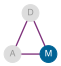
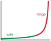
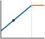

# Hardware Acceleration {#sec-hardware-acceleration}

::: {layout-narrow}
::: {.column-margin}

\chapterminitoc

:::

\noindent
{fig-alt="Colorful illustration of a System on Chip design showing specialized machine learning accelerators and chiplets integrated into a processor, with vibrant data streams flowing between neural network nodes."}

:::

## Purpose {.unnumbered}

\begin{marginfigure}
\mlsysstack{90}{35}{25}{35}{30}{0}{0}{0}
\end{marginfigure}

_Why does moving data cost more than computing it?_

The central surprise of modern computing is that *arithmetic is nearly free while memory access is expensive*. In the time it takes to fetch a single value from main memory, a processor could perform thousands of calculations. This inversion, the "memory wall," is not an engineering limitation awaiting a fix; it is a physical consequence of the speed of light and the energy cost of moving electrons across silicon. It explains why specialized accelerators exist: they are not merely faster at math but architected specifically to hide, amortize, and minimize the crushing cost of moving data through deep memory hierarchies, massive parallelism, and specialized data paths. Concretely, hardware acceleration is how many large AI workloads sustain growth when general-purpose CPU scaling alone is insufficient. It explains why some optimizations that reduce theoretical computation fail to improve actual runtime: if the operation was already memory bound, computing less changes nothing because the bottleneck was never computation. It also explains why hardware selection cannot be reduced to comparing peak FLOP/s---what matters is whether a workload's data movement patterns align with what the hardware was actually designed to accelerate. For the engineer choosing hardware, the binding question is therefore not which chip is fastest, but which chip's memory system best matches the model's access patterns. A model with large embedding tables and irregular lookups needs a very different accelerator than one performing dense matrix multiplications over compact weight tensors. Getting this match right is the difference between running at a fraction of theoretical peak and approaching the hardware's practical ceiling. The accelerator is not a generic math engine; it is the Machine constraint made concrete, dictating which algorithms survive in production.

::: {.content-visible when-format="pdf"}

\newpage

:::

::: {.callout-learning-objectives}

- Explain why systolic arrays and Tensor Cores achieve 10 to 100 times better efficiency than general-purpose processors
- Calculate arithmetic intensity and use the roofline model to determine compute-bound vs. memory-bound workloads
- Predict performance bottlenecks by quantifying the memory wall: bandwidth limits, energy costs, and cache hierarchy trade-offs
- Select appropriate dataflow strategies (weight-stationary, output-stationary, input-stationary) based on workload reuse priorities
- Analyze compiler optimizations including kernel fusion, tiling, and memory planning for efficient hardware execution
- Evaluate accelerator choices for specific deployment scenarios by reasoning about cost-performance trade-offs
- Identify common pitfalls such as ignoring bandwidth limits, expecting linear scaling, or optimizing for peak FLOP/s

:::

```{python}
#| echo: false
from mlsysim import *
from mlsysim.core.units import *

from mlsysim.fmt import (
    fmt_int,
    fmt,
    fmt_qty,
    fmt_qty_int,
    check,
    fmt_memory,
    fmt_bandwidth,
    fmt_flop_rate,
    fmt_power,
    fmt_energy,
    fmt_count,
    fmt_params,
    fmt_carbon_intensity,
    fmt_compute_efficiency,
    fmt_multiple_range,
)

class HwAccelSetup:
    """A100 peak FP16/BF16 throughput vs. server CPU for the opening callout."""

    # LOAD
    a100_tflops_fp16 = Hardware.Cloud.A100.compute.peak_flops.to(TFLOPs / second).magnitude
    cpu_tflops_low = Hardware.Cloud.ReferenceCPU.compute.peak_flops.to(TFLOPs / second).magnitude
    cpu_tflops_high = 2

    # EXECUTE
    cpu_gap_min = a100_tflops_fp16 / cpu_tflops_high
    cpu_gap_max = a100_tflops_fp16 / cpu_tflops_low

    # GUARD
    check(150 <= cpu_gap_min <= 160, f"Unexpected lower CPU gap: {cpu_gap_min:.1f}x")
    check(300 <= cpu_gap_max <= 320, f"Unexpected upper CPU gap: {cpu_gap_max:.1f}x")

    # OUTPUT
    a100_fp16_tflop_per_s_str = fmt_flop_rate(Hardware.Cloud.A100.compute.peak_flops, unit=TFLOP / second, precision=0, commas=False)
    cpu_gap_range_mult_str = fmt_multiple_range(cpu_gap_min, cpu_gap_max, precision=0, commas=False)
```

## Acceleration Fundamentals {#sec-hardware-acceleration-ai-hardware-acceleration-fundamentals-9b28}

::: {.column-margin}
{width="100%" fig-alt="D·A·M taxonomy triangle with three vertices labeled D, A, and M connected by edges. The M (Machine) vertex is filled in solid color; the D and A vertices are gray, marking this chapter as the Machine axis."}

*Hardware acceleration turns on the Machine axis.*
:::

@Sec-data-selection optimized the Data and @sec-model-compression compressed the Algorithm (Model). @Sec-appdx-dam-taxonomy frames the final Machine axis of the D·A·M taxonomy\index{D·A·M Taxonomy!machine axis}, the subject of hardware acceleration. Hardware acceleration exists because of a striking asymmetry in modern computing: arithmetic is *cheap*, but moving data is *expensive*. In the time a modern accelerator computes a thousand floating-point operations, a single value travels from main memory. This inversion, where computation is the abundant resource and bandwidth is the scarce one, is the reason specialized hardware matters for machine learning.

::: {#dfn-hw-acceleration-hardware-acceleration .callout-definition title="Hardware acceleration"}

***Hardware Acceleration***\index{Hardware Acceleration!definition} is the practice of replacing general-purpose processor logic with domain-specific silicon optimized for the regular tensor operations of ML workloads, trading programmability for the compute density $(R_{\text{peak}})$ and performance-per-watt gains that data-parallel matrix multiplication can exploit.

1.  **Significance (quantitative)**: The throughput gain is orders of magnitude. An A100 GPU delivers `{python} HwAccelSetup.a100_fp16_tflop_per_s_str` for FP16/BF16 matrix multiplication, while a server-class CPU delivers roughly 1–2 TFLOP/s for the same operation, a `{python} HwAccelSetup.cpu_gap_range_mult_str` gap achieved by dedicating 80+ billion transistors to parallel arithmetic units rather than to branch predictors, out-of-order schedulers, and large caches.
2.  **Observation**: Unlike a general-purpose CPU, which is optimized to minimize latency for any single instruction in an arbitrary serial program, an accelerator is optimized to maximize throughput for a specific operation class—meaning it achieves its gains only when the workload presents enough parallel work to keep all arithmetic units busy simultaneously.
3.  **Pitfall**: A frequent misconception is that an accelerator's advertised peak throughput is the throughput a workload receives. Delivered performance is the lower of the compute ceiling and what memory bandwidth can feed, the roofline developed in @sec-hardware-acceleration-roofline-model-42ff: a low-arithmetic-intensity kernel can sit at a small fraction of peak FLOP/s no matter how fast the silicon is rated, because it starves for data rather than for arithmetic.

:::

The preceding definition frames the chapter's central engineering trade-off. General-purpose processors devote substantial silicon area to branch prediction, speculative execution\index{Speculative Execution!eliminated in accelerators}, and complex cache coherence protocols. Accelerators strip away that generality, filling the die with arithmetic units tuned to the regular, data-parallel patterns that characterize neural network computation. The result is order-of-magnitude improvements in throughput per watt for the workloads that match these patterns.

Hardware alone, however, cannot achieve these gains. The algorithms must be designed to exploit what the hardware offers, and the hardware must be built to accelerate the operations algorithms actually use. This symbiosis motivates a complementary principle: *hardware-software co-design*.

::: {#dfn-hw-acceleration-hardware-software-co-design .callout-definition title="Hardware-software co-design"}

***Hardware-Software Co-design***\index{Hardware-Software Co-design!definition} is the ML accelerator development methodology that intentionally violates traditional hardware-software abstraction layers, allowing algorithm constraints to inform silicon design and hardware capabilities to directly shape algorithm formulation.

1.  **Significance (quantitative)**: Co-design unlocks gains unavailable to either layer acting alone. INT8 quantization delivers 2--4$\times$ throughput improvement not because 8-bit arithmetic is faster in the abstract, but because NVIDIA Tensor Cores are physically designed to execute four INT8 operations in the same die area as one FP32 operation—the algorithm change (quantization) only pays off when the hardware was co-designed to exploit it.
2.  **Observation**: Unlike layered abstraction (where software calls a hardware API without knowing the silicon details), co-design exposes hardware constraints directly to algorithm and compiler authors: data alignment requirements, precision formats, and memory access patterns all become visible inputs to global cross-layer optimization.
3.  **Pitfall**: A frequent misconception is that co-design is a one-time hardware design choice. In practice, co-design is a continuous feedback loop: NVIDIA Tensor Cores were designed for FP16 matrix multiply, then upgraded to support TF32 and INT8 after observing that ML workloads demanded them, then extended again to sparse 2:4 patterns after algorithmic pruning research demonstrated structured sparsity was trainable.

:::

Co-design explains *why* the compression techniques introduced in @sec-model-compression deliver real speedups. The quantization techniques in @sec-model-compression-quantization-precision-cd46 show why converting FP32 to INT8\index{Quantization!INT8 co-design} yields 2--4$\times$ acceleration: not because of fewer bits in the abstract, but because accelerators pack 4$\times$ more INT8 operations into the same silicon area. Structured pruning\index{Structured Pruning!hardware alignment} improves performance while unstructured pruning often does not, because structured patterns preserve the regular memory access patterns that hardware can optimize. This chapter develops that perspective level by level: the compute primitives accelerators are built to execute, the memory systems that keep those primitives fed, the roofline model that predicts which of the two is the binding constraint, and the mapping and dataflow strategies that turn a neural network into work the silicon runs efficiently. Throughout this chapter, the physical constraints of silicon will reveal *why* some theoretically promising algorithmic optimizations succeed in practice and others fail.

::: {#thrm-hw-acceleration-fundamental-limit-acceleration-amdahls-law .callout-theorem title="The fundamental limit of acceleration (Amdahl's Law)"}

Hardware acceleration *does not speed up the entire system*; it *only speeds up the parallelizable fraction ($p$)*. This is governed by **Amdahl's Law for AI**\index{Amdahl's Law!parallel fraction}\index{Parallel Computing!Amdahl's Law} [@amdahl1967], formalized in @eq-amdahl:
$$ \text{Speedup} = \frac{1}{(1 - p) + \frac{p}{G_{\text{accel}}}} $$ {#eq-amdahl}

*   **Parallel fraction** ($p$): The matrix multiplications (typically 90–99 percent of an ML workload).
*   **Accelerator gain** ($G_{\text{accel}}$): The raw speed advantage of the GPU or Tensor Processing Unit (TPU) over the CPU (typically 100--1,000$\times$).
*   **Serial fraction**\index{Serial Fraction!Amdahl bottleneck} ($1-p$): Data loading, Python overhead, and kernel launch latency\index{Kernel Launch Latency!serial overhead}.

**Pitfall**: *Serial work caps total accelerator speedup.* If data loading takes 10 percent of the time ($p=0.9$), even an *infinite speed* accelerator ($G_{\text{accel}}=\infty$) can only achieve a 10$\times$ total speedup. The serial component dominates the parallel accelerator component once the latter is sufficiently fast.

:::

Hardware acceleration targets specific terms in the iron law of ML systems\index{Iron Law!ML systems performance} (@sec-introduction-iron-law-ml-systems-c32a), which decomposes end-to-end time into data volume $(D_{\text{vol}}/\text{BW})$, computation $(O/(R_{\text{peak}} \cdot \eta_{\text{hw}}))$, and fixed latency $(L_{\text{lat}})$. While data selection reduced the total data and model compression reduced $O$ per sample, hardware acceleration increases the rate at which those operations execute by improving $R_{\text{peak}}$, $\eta_{\text{hw}}$, and $\text{BW}$. @Sec-appdx-machine-foundations-physics-computing-c77f supplies the analytical performance models that diagnose which of these terms dominates a given workload, including the dimensional analysis that confirms each iron law term resolves to seconds. Yet acceleration has a hard ceiling, established by Amdahl's Law[^fn-amdahls-law-acceleration].

[^fn-amdahls-law-acceleration]: **Amdahl's Law**: Maps directly onto the iron law's additive terms. Even if hardware drives the computation term $(O/(R_{\text{peak}} \cdot \eta_{\text{hw}}))$ to near zero, total time is still bounded below by the serial data-loading $(D_{\text{vol}}/\text{BW})$ and fixed-latency $(L_{\text{lat}})$ terms, which acceleration cannot touch. This is why a 100$\times$ improvement in raw accelerator throughput often produces only a 5--20$\times$ improvement in end-to-end task time. \index{Amdahl's Law!acceleration ceiling}

Amdahl's Law is not merely theoretical: it explains *why* many GPU upgrades disappoint in practice. The following heatmap (@fig-iron-law-heatmap) visualizes the *acceleration wall*\index{Acceleration Wall!diminishing returns}, the diminishing returns from faster hardware when serial bottlenecks persist. Unless a workload is highly parallelizable ($p > 0.99$), investing in faster hardware yields diminishing returns. The contour values are illustrative ranges for intuition.

::: {#fig-iron-law-heatmap fig-env="figure" fig-pos="htb" fig-cap="**The Iron Law Heatmap**: Total system speedup as a function of accelerator gain ($G_{\text{accel}}$) and parallel fraction ($p$). High speedup appears only near the top-right corner, where both accelerator gain and parallel fraction are high. The acceleration wall is the low-$p$ region: if a workload is even slightly serial ($p < 0.9$), increasing hardware speed yields little benefit. Contours span roughly 1$\times$–500$\times$ speedup." fig-alt="Heatmap of speedup vs. accelerator gain and parallel fraction. High speedup in green and yellow appears near the top-right corner where parallel fraction is near 1.0 and accelerator gain is high; lower-parallel-fraction regions remain blue."}

```{python}
#| echo: false
# ┌─────────────────────────────────────────────────────────────────────────────
# │ IRON LAW HEATMAP (FIGURE)
# ├─────────────────────────────────────────────────────────────────────────────
# │ Context: @fig-iron-law-heatmap—Amdahl's Law and Acceleration Wall
# │
# │ Goal: Visualize speedup = 1/((1-p)+p/S) as function of S and p; show
# │       diminishing returns when parallel fraction is low.
# │ Show: Contour heatmap; Compute Bound vs Serial Bound regions.
# │ How: meshgrid S, P; contourf with LogNorm; book_style.setup_plot().
# │
# │ Imports: sys, os, numpy (np), matplotlib.colors (mcolors), book.tools.figures.style (book_style)
# │ Exports: (figure only, no prose variables)
# └─────────────────────────────────────────────────────────────────────────────
# ┌── 1. CANVAS ────────────────────────────────────────────────────────────────
# │ Visualize speedup = 1/((1-p)+p/G_accel) as function of accelerator gain and p; show
import sys
import os
import numpy as np
import matplotlib.colors as mcolors

# ┌── 2. ARRAYS ────────────────────────────────────────────────────────────────
sys.path.insert(0, ".")
from book.tools.figures import style as book_style
from mlsysim.physics import calc_amdahls_speedup

fig, ax, COLORS, plt = book_style.setup_plot(figsize=(10, 4.75))

# =============================================================================
# PLOT: The Iron Law Heatmap
# =============================================================================
g_accel_vals = np.logspace(0, 3, 100)
p_vals = np.linspace(0.8, 0.999, 100)
g_accel_grid, p_grid = np.meshgrid(g_accel_vals, p_vals)
overall_speedup = np.vectorize(calc_amdahls_speedup)(p_grid, g_accel_grid)

# ┌── 3. RENDER ────────────────────────────────────────────────────────────────
levels = [1, 2, 5, 10, 20, 50, 100, 200, 500]
norm = mcolors.LogNorm(vmin=1, vmax=500)

cf = ax.contourf(g_accel_grid, p_grid, overall_speedup, levels=levels, cmap='RdYlBu_r', norm=norm, alpha=0.8)
cs = ax.contour(g_accel_grid, p_grid, overall_speedup, levels=levels, colors='white', linewidths=0.8, alpha=0.6)
ax.clabel(cs, inline=1, fontsize=8, fmt='%gx', colors='black')

ax.set_xscale('log')
ax.set_xlabel(r'Accelerator gain ($G_{\mathrm{accel}}$)')
ax.set_ylabel('Parallelizable Fraction (p)')

ax.text(
    100,
    0.98,
    "Compute Bound",
    color='black',
    ha='center',
    va='top',
    fontweight='bold',
    fontsize=9,
    bbox=dict(facecolor='white', alpha=0.8, edgecolor='none', pad=0.5),
)
ax.text(
    100,
    0.82,
    "Serial Bound",
    color='white',
    ha='center',
    va='bottom',
    fontweight='bold',
    fontsize=9,
    bbox=dict(facecolor='black', alpha=0.6, edgecolor='none', pad=0.5),
)
plt.show()
plt.close()

# ┌── 4. DECORATE ──────────────────────────────────────────────────────────────
```

:::

The key intuition to carry into specific hardware architectures is that raw speedups matter only after the serial fraction has been reduced.

::: {#ws-hw-acceleration-google-tpu-voice-search .callout-war-story title="The TPU capacity cliff"}

**Context**: Google had considered an application-specific chip for neural networks as early as 2006 but did not treat it as urgent: existing data-center capacity absorbed the early deep-learning workloads [@jouppi2017].

**Failure mode**: In 2013, internal projections changed the calculus. If users adopted voice-search-driven speech recognition for even a few minutes per day, the resulting DNN inference load would roughly double the number of data centers Google needed to operate. There was no realistic capital plan to absorb that, and conventional CPUs offered no path to close the gap on performance per watt or performance per dollar.

**Consequence**: Google started a high-priority custom-ASIC effort and, in fifteen months, designed, verified, built, and deployed the first-generation Tensor Processing Unit (TPU) into production data centers in 2015, optimizing for inference latency, cost, and performance per watt rather than general-purpose flexibility.

**Systems lesson**: Hardware acceleration becomes mandatory when a single workload crosses a fleet-level economic threshold. The decision is not "CPU vs. GPU vs. TPU" in the abstract; it is whether the workload's arithmetic intensity, latency target, and aggregate volume make general-purpose capacity unaffordable.

:::

The parallel fraction $p$ differs dramatically between workload archetypes running on the same hardware, and at fleet scale these differences determine whether an accelerator investment pays off or stalls at the serial bottleneck.

::: {#chk-hw-acceleration-parallelism-gate .callout-checkpoint title="The parallelism gate"}

Hardware speedups are capped by sequential bottlenecks.

**Amdahl's Reality**

- [ ] **Serial bottlenecks**: Why does a 1,000$\times$ faster GPU only speed up training by 5$\times$ if data loading is slow? (Because $\text{Speedup} \le 1/(1-p)$).
- [ ] **Workload variation**: Why does ResNet-50\index{ResNet-50!compute-bound workload} (compute bound) scale better than MobileNet (latency-bound)? (ResNet-50 spends more time in parallelizable matrix math).

:::

The serial bottleneck becomes concrete on real hardware, where the same accelerator that nears its parallel ceiling on one workload can stall on another. @Sec-appdx-machine-foundations-numbers-know-b531 collects the reference $R_{\text{peak}}$ figures across accelerator generations and the latency hierarchy that ground these hardware comparisons in order-of-magnitude terms.

```{python}
#| echo: false
#| label: amdahl-h_h100-calc
# ┌─────────────────────────────────────────────────────────────────────────────
# │ AMDAHL'S LAW ON H100
# ├─────────────────────────────────────────────────────────────────────────────
# │ Context: "Amdahl's Law on H100" lighthouse callout
# │
# │ Goal: Demonstrate the limits of parallel speedup on H100.
# │ Show: Why ResNet achieves 20× speedup while GPT-2 is capped at 5×.
# │ How: Apply Amdahl's Law with different parallelizable fractions (95% vs 80%).
# │      LLM optimization focuses on reducing serial fraction.
# │
# │ Imports: mlsysim.core.units (Hardware.Cloud.H100.compute.precision_flops["int8"]), mlsysim.book (fmt)
# │ Exports: AmdahlH100.amdahl_resnet_str, AmdahlH100.amdahl_gpt2_str,
# │          AmdahlH100.resnet_speedup_eq_math, AmdahlH100.gpt2_speedup_eq_math,
# │          AmdahlH100.hw_speedup_mult_str, AmdahlH100.h100_int8_tops_str
# └─────────────────────────────────────────────────────────────────────────────
from mlsysim.fmt import fmt_int, fmt, fmt_math, fmt_ops_rate, fmt_ratio, check
from mlsysim.physics import calc_amdahls_speedup

# ┌── LEGO ───────────────────────────────────────────────
class AmdahlH100:
    """
    Namespace for Amdahl's Law on H100.
    Scenario: Comparing speedup for Compute-Bound (ResNet) vs Memory-Bound (GPT-2).
    """

    # ┌── 1. LOAD (Constants) ───────────────────────────────────────────────
    h100_int8 = Hardware.Cloud.H100.compute.precision_flops["int8"]
    cpu_int8_tops = 8 * TOPS  # scenario assumption: baseline server-CPU INT8 throughput

    # Workload Parallel Fractions (p)
    p_resnet = 0.95  # 95% parallel (Compute Bound)
    p_gpt2 = 0.80  # 80% parallel (Bandwidth Bound/Serial Overhead)

    # ┌── 2. EXECUTE (The Compute) ─────────────────────────────────────────
    # Amdahl's Law: Speedup = 1 / ((1-p) + (p/G_accel))
    # (2026-06-10 audit: the derived ~247x ratio was hardcoded in LOAD; if
    # the registry INT8 figure changed, the displayed TOPS ref updated but
    # the speedup silently did not.)
    hw_speedup_factor = (h100_int8 / cpu_int8_tops).to("").magnitude

    speedup_resnet = calc_amdahls_speedup(p_resnet, hw_speedup_factor)
    speedup_gpt2 = calc_amdahls_speedup(p_gpt2, hw_speedup_factor)

    # Step 1: Theoretical ceiling (if accelerator gain tends to infinity)
    ceiling_gpt2 = calc_amdahls_speedup(p_gpt2, float("inf"))

    # ┌── 3. GUARD (Invariants) ───────────────────────────────────────────
    check(speedup_resnet >= speedup_gpt2 * 3, f"ResNet speedup ({speedup_resnet:.1f}x) should be much higher than GPT-2 ({speedup_gpt2:.1f}x).")
    check(speedup_gpt2 <= ceiling_gpt2, "Speedup cannot exceed theoretical ceiling.")

    # ┌── 4. OUTPUT (Formatting) ──────────────────────────────────────────────
    # Hardware context
    h100_int8_tops_str = fmt_ops_rate(Hardware.Cloud.H100.compute.precision_flops["int8"], unit=TOPS, precision=0, commas=False)
    cpu_int8_tops_str = fmt_ops_rate(cpu_int8_tops, unit=TOPS, precision=0, commas=False)
    hw_speedup_mult_str = fmt_multiple(round(hw_speedup_factor), precision=0, commas=False)

    # ResNet
    p_resnet_str = fmt(p_resnet, precision=2, commas=False)
    p_resnet_pct_str = fmt_percent(p_resnet, precision=0, commas=False, style='symbol')
    serial_resnet_str = fmt(1 - p_resnet, precision=2, commas=False)
    serial_resnet_pct_str = fmt_percent(1 - p_resnet, precision=0, commas=False, style='symbol')
    p_resnet_over_accel_str = fmt_ratio(p_resnet / hw_speedup_factor, precision=4, commas=False)
    amdahl_resnet_str = fmt(speedup_resnet, precision=1, commas=False)
    amdahl_resnet_speedup_mult_str = fmt_multiple(speedup_resnet, precision=1, commas=False)

    # GPT-2
    p_gpt2_str = fmt(p_gpt2, precision=2, commas=False)
    serial_gpt2_str = fmt(1 - p_gpt2, precision=2, commas=False)
    serial_gpt2_pct_str = fmt_percent(1 - p_gpt2, precision=0, commas=False, style='symbol')
    p_gpt2_over_accel_str = fmt_ratio(p_gpt2 / hw_speedup_factor, precision=4, commas=False)
    amdahl_gpt2_str = fmt(speedup_gpt2, precision=1, commas=False)
    amdahl_gpt2_ceiling_speedup_mult_str = fmt_multiple(ceiling_gpt2, precision=0, commas=False)

    resnet_speedup_eq_math = fmt_math(
        rf"\text{{Speedup}} = \frac{{1}}{{(1-{p_resnet_str}) + \frac{{{p_resnet_str}}}{{{hw_speedup_mult_str}}}}} "
        rf"= \frac{{1}}{{{serial_resnet_str} + {p_resnet_over_accel_str}}} "
        rf"\approx {amdahl_resnet_str}\times"
    )
    gpt2_speedup_eq_math = fmt_math(
        rf"\text{{Speedup}} = \frac{{1}}{{(1-{p_gpt2_str}) + \frac{{{p_gpt2_str}}}{{{hw_speedup_mult_str}}}}} "
        rf"= \frac{{1}}{{{serial_gpt2_str} + {p_gpt2_over_accel_str}}} "
        rf"\approx {amdahl_gpt2_str}\times"
    )
```

::: {#lhs-amdahl-h_h100 .callout-lighthouse title="Amdahl's Law on H100"}

**ResNet-50 inference on NVIDIA H100**:

- H100 delivers $G_{\text{accel}}$ = `{python} AmdahlH100.hw_speedup_mult_str` speedup over CPU for matrix multiply (`{python} AmdahlH100.h100_int8_tops_str` INT8 vs. ~`{python} AmdahlH100.cpu_int8_tops_str` on baseline CPU without AMX extensions)
- Typical inference has $p$ = `{python} AmdahlH100.p_resnet_str` (`{python} AmdahlH100.p_resnet_pct_str` parallelizable, `{python} AmdahlH100.serial_resnet_pct_str` serial: data loading, preprocessing, postprocessing)
$$
\text{`{python} AmdahlH100.resnet_speedup_eq_math`}
$$

Despite a `{python} AmdahlH100.hw_speedup_mult_str` hardware advantage, total system speedup is only `{python} AmdahlH100.amdahl_resnet_speedup_mult_str`. The `{python} AmdahlH100.serial_resnet_pct_str` serial fraction caps practical gains.

**Contrast with GPT-2 (autoregressive)**:

- Same H100, but GPT-2 token generation has $p$ = `{python} AmdahlH100.p_gpt2_str` (`{python} AmdahlH100.serial_gpt2_pct_str` serial: KV-cache updates, sampling, Python overhead)
$$
\text{`{python} AmdahlH100.gpt2_speedup_eq_math`}
$$

The *Bandwidth Hog* archetype suffers more from serial bottlenecks. Even infinite accelerator speed yields only $1/(1-p)$ = `{python} AmdahlH100.amdahl_gpt2_ceiling_speedup_mult_str` maximum speedup. This is *why* large language model (LLM) inference optimization focuses on reducing the serial fraction through serving-side techniques such as batching and speculative decoding, where a small draft model proposes tokens for parallel verification, rather than raw hardware speed.

:::

These examples reveal that hardware optimization turns on whether a workload is limited by compute rate or data movement. That distinction determines which accelerator to choose, which optimizations matter, and whether a 10$\times$ more powerful chip will help. The *roofline model* provides the analytical framework for making this diagnosis; @sec-appdx-machine-foundations-roofline-model-2529 introduces it formally and @sec-hardware-acceleration-roofline-model-42ff applies it to AI workloads. It plots an operation's *arithmetic intensity*[^fn-arithmetic-intensity-roofline], defined as the ratio of floating-point operations to bytes of memory traffic (FLOP/byte), against hardware capabilities, revealing whether performance is capped by compute or bandwidth. A dense matrix multiplication with high arithmetic intensity benefits from more TFLOP/s; a LayerNorm with low arithmetic intensity benefits from more memory bandwidth. High-reuse ResNet-50 convolutions can cross into the compute-bound regime while GPT-2's attention layers are memory bound, and this distinction is precisely *why* these architectures require different optimization strategies.

[^fn-arithmetic-intensity-roofline]: **Arithmetic Intensity**\index{Arithmetic Intensity!roofline diagnostic}: The ratio of compute operations performed for each byte of data moved from memory (FLOP/byte). This metric provides the direct, quantitative answer to the text's central question: workloads with high arithmetic intensity, such as well-tiled convolutions and GEMMs above the hardware ridge point (the intensity at which compute, not memory, becomes the limit), are compute bound and accelerate with more TFLOP/s. Workloads with low intensity, like GPT-2's attention layers (<10 FLOP/byte), are memory bound, making faster chips irrelevant without more bandwidth.

The analytical tools are now in place. The chapter builds on them in stages: the historical evolution of domain-specific architectures, from floating-point coprocessors through graphics processors to contemporary AI accelerators; the computational primitives that characterize ML workloads (matrix multiplication, vector operations, and nonlinear activation functions) and how specialized hardware optimizes them through systolic arrays and tensor cores; memory hierarchy design, where data movement energy costs exceeding computation costs by more than 100$\times$ make on-chip buffer optimization and high-bandwidth memory interfaces critical; the roofline model that diagnoses whether a given workload is bound by compute or by bandwidth; the mapping and dataflow strategies that turn that diagnosis into an execution plan the silicon runs efficiently; and the software stack, where compiler optimization and runtime system support determine the extent to which theoretical hardware capabilities translate into measurable performance. Throughout, the core analysis stays with single-accelerator and single-node systems; the closing material uses multi-device examples only to show how the same bottleneck diagnoses scale.

The history of specialized hardware reveals recurring design patterns that explain *why* accelerators take their form.

## Hardware Specialization {#sec-hardware-acceleration-evolution-hardware-specialization-fdb7}

Computing architectures follow a recurring pattern: as workloads grow in complexity, general-purpose processors become inefficient, prompting specialized hardware development\index{Hardware Specialization!evolution}. Machine learning acceleration is one stage in this longer evolution, following a trajectory observed in floating-point arithmetic, graphics processing, and digital signal processing. The architectural innovations that addressed floating-point bottlenecks in the 1980s, graphics throughput in the 1990s, and media processing in the 2000s inform AI accelerator designs. Each era confronted the same constraint introduced in the Purpose section: data movement costs dominate computation costs, and specialization succeeds by minimizing unnecessary data movement.

Modern ML accelerators (GPUs with tensor cores, Google's TPUs[^fn-tpu-origin], Apple's Neural Engine) emerged from these established architectural principles. The evolution spans four phases: specialized computing origins, parallel graphics processing, domain-specific architectures, and the emergence of ML-specific hardware. Each phase reveals design principles that remain relevant for understanding and optimizing contemporary AI systems. The magnitude of the gains from domain-specific design became unmistakable in 2015, when Google's first TPU delivered an efficiency shock that reshaped the industry's approach to AI hardware.

::: {#exmp-hw-acceleration-tpuv1-vs-k80-efficiency-shock .callout-example title="The TPUv1 vs. K80 efficiency shock"}

**Context**: In 2015, Google deployed its first Tensor Processing Unit (TPUv1)\index{TPU!v1 efficiency shock} and compared it to the dominant GPU of the era, the NVIDIA K80\index{NVIDIA!K80}.

**Result**: The TPUv1 was not just slightly faster; it was 15--30$\times$ faster on inference workloads and achieved 30--80$\times$ better performance-per-watt.

**Mechanism**: The K80 was a general-purpose processor (good for graphics, physics, diverse math). The TPU was a **Domain-Specific Architecture (DSA)**\index{Domain-Specific Architecture!definition} built for one thing: 8-bit integer matrix multiplication\index{INT8!TPU optimization}. It stripped away caches, branch prediction, and out-of-order execution logic to fill the chip with pure arithmetic units (systolic arrays)\index{Systolic Array!TPU design}.

**Systems lesson**: This result ended the "General Purpose" era for AI. It proved that tailoring silicon to the algorithmic primitive\index{Algorithmic Primitive!matrix multiply} (matrix multiplication) yields order-of-magnitude gains that Moore's Law alone could not deliver for decades.

:::

[^fn-tpu-origin]: **TPU (Tensor Processing Unit)**: The first TPU made a deliberately narrow bet, filling the die with a single $256{\times}256$ systolic array for 8-bit matrix multiplication and stripping away the caches, branch predictors, and out-of-order logic on which a general-purpose core spends most of its area. That trade buys extreme compute density on dense matrix multiply at the cost of flexibility: the same chip that excels at neural network inference is poorly suited to irregular or branch-heavy code, which is why the array dimension itself becomes a design constraint, since layers whose dimensions are not multiples of 256 leave rows and columns of the array idle. \index{TPU!origin}

Hardware specialization improves performance by implementing frequent patterns in dedicated circuits, but introduces trade-offs in flexibility, silicon area, and programming complexity. The principles that shaped early floating-point and graphics accelerators now inform AI hardware design.

### Specialized computing {#sec-hardware-acceleration-specialized-computing-22ce}

Hardware specialization emerges when specific computational patterns become the primary system bottleneck, preventing general-purpose processors from scaling efficiently. Historically, this progression follows three distinct phases: the precision bottleneck (scalar floating-point), the throughput bottleneck (parallel graphics), and the integration bottleneck (memory-compute locality).

The first phase, the precision bottleneck\index{Floating-Point Unit!precision bottleneck}, occurred when scientific and engineering applications required high-precision decimal math that general-purpose CPUs performed poorly. In the late 1970s, CPUs typically emulated floating-point operations in software, requiring hundreds of cycles for a single multiplication. This scalar inefficiency led to the first major instance of hardware specialization: the mathematics coprocessor.

The Intel 8087\index{Intel 8087!floating-point coprocessor}\index{Floating-Point Unit!history} (1980)[^fn-intel-8087-specialization] addressed this bottleneck by offloading arithmetic-intensive tasks to a dedicated unit. By implementing floating-point logic in hardware rather than software emulation, the 8087 achieved up to 100$\times$ performance gains for scientific workloads [@palmer1980intel8087]. This established a core principle: when a specific data type or operation consumes the majority of execution cycles, moving it to specialized silicon provides 10--100$\times$ improvements.

[^fn-intel-8087-specialization]: **Intel 8087**: The coprocessor implemented floating-point logic directly in silicon, avoiding the CPU's slow, multi-instruction software emulation for each calculation. This offload strategy was the sole mechanism behind the 100$\times$ performance gain, a result only achievable because scientific workloads spent the vast majority of their cycles on these specific arithmetic operations. The 8087's success thus provided the canonical proof that specializing hardware for a dominant computational kernel yields performance improvements 10--100$\times$ greater than general-purpose scaling. \index{Intel 8087!specialization pattern}

As specialized functions like floating-point math proved their value, they followed a recurring pattern of integration. The Intel 486DX (1989) moved the FPU directly onto the CPU die, eliminating the off-chip communication latency and making high-precision math a standard feature rather than an optional accelerator [@patterson2017hardware]. This cycle (specialization to solve a bottleneck, followed by integration into the general-purpose stack) repeats across every era of hardware evolution.

The progression from specialization to integration has shaped modern computing. Each domain (graphics, signal processing, machine learning) introduced specialized architectures that were later absorbed into general-purpose platforms.

To see this recurring cycle of specialization and integration in action, follow the progression in @fig-timeline from left to right: each era produced accelerators addressing the dominant computational bottleneck of its period. Capabilities such as real-time translation, recommendations, and on-device inference build directly on principles established in these earlier specialization waves.

::: {#fig-timeline fig-env="figure" fig-pos="htb" fig-cap="**Hardware Specialization Timeline**: Computing architectures progressively incorporate specialized accelerators to address emerging performance bottlenecks, from floating-point units to graphics processors and machine learning accelerators. Each era produced hardware tailored to the dominant computational patterns of its period." fig-alt="Timeline spanning 1980s to 2020s showing hardware evolution: floating-point units, GPUs with hardware transform and lighting, media codecs, TPUs with Tensor Cores, and application-specific AI engines."}

```{.tikz}
\begin{tikzpicture}[font=\usefont{T1}{phv}{m}{n}\small]
\tikzset{
  Box/.style={inner xsep=1pt,
    font=\usefont{T1}{phv}{m}{n}\footnotesize,
    draw=none,node distance=3mm,
    fill=#1,align=flush center,
    anchor=west,
    text width=35mm,
    minimum width=35mm, minimum height=10mm
  },
  Box/.default=red
}
\definecolor{col1}{RGB}{128, 179, 255}
\definecolor{col2}{RGB}{255, 255, 128}
\definecolor{col3}{RGB}{204, 255, 204}
\definecolor{col4}{RGB}{230, 179, 255}
\definecolor{col5}{RGB}{255, 153, 204}
\definecolor{col6}{RGB}{245, 82, 102}
\definecolor{col7}{RGB}{255, 102, 102}
\node[Box={col1}](B1){1980s};
\node[Box={col2},right=of B1](B2){1990s};
\node[Box={col3},right=of B2](B3){2000s};
\node[Box={col4},right=of B3](B4){2010s};
\node[Box={col5},right=of B4](B5){2020s};
\foreach \x in{1,2,...,5}
\draw[dashed,thick,-latex](B\x)--++(270:7.2);
\path[red]([yshift=-5mm]B1.south west)coordinate(P)-|coordinate(K)(B5.south east);
\draw[line width=2pt,-latex](P)--(K)--++(0:3mm);
%
\def\vi{1.1}
\node[Box={col1!50},below=\vi of B1](BB1){Floating-Point \&\\Signal Processing};
\node[Box={col1!50},below=of BB1](BB2){Intel 8087 FPU\\(1980)};
\node[Box={col1!50},below=of BB2](BB3){Texas Instruments\\TMS32010 DSP (1983)};
\node[Box={col1!50},below=of BB3](BB4){Integration of FPU\\into Intel 486DX\\(1989)};
%
\node[Box={col2!50},below=\vi of B2](2BB1){3D Graphics \&\\Multimedia};
\node[Box={col2!50},below=of 2BB1](2BB2){Introduction of\\Early GPUs};
\node[Box={col2!50},below=of 2BB2](2BB3){NVIDIA GeForce 256 --\\First GPU with\\Hardware T\&L (1999)};
\node[Box={col2!50},below=of 2BB3](2BB4){Rise of SIMD\\Processing Units};
%
\node[Box={col3!50},below=\vi of B3](3BB1){Real-time Media\\Coding \&\\Network Processing};
\node[Box={col3!50},below=of 3BB1](3BB2){Media Codecs\\(H.264, MP3)};
\node[Box={col3!50},below=of 3BB2](3BB3){Intel IXP2800\\Network Processor};
\node[Box={col3!50},below=of 3BB3](3BB4){Dedicated hardware\\for streaming\\and encoding};
%
\node[Box={col4!50},below=\vi of B4](4BB1){Deep Learning\\Tensor Operations};
\node[Box={col4!50},below=of 4BB1](4BB2){Google TPU v1 for\\ML Inference (2015)};
\node[Box={col4!50},below=of 4BB2](4BB3){NVIDIA Tensor Cores\\for DL Acceleration};
\node[Box={col4!50},below=of 4BB3](4BB4){AI-specific memory\\optimizations};
%
\node[Box={col5!50},below=\vi of B5](5BB1){Application-Specific\\Acceleration};
\node[Box={col5!50},below=of 5BB1](5BB2){AI Engines \&\\SmartNICs};
\node[Box={col5!50},below=of 5BB2](5BB3){Multi-chip and\\wafer-scale ML\\acceleration};
\node[Box={col5!50},below=of 5BB3](5BB4){ML frameworks\\optimizing for\\specialized hardware};
\end{tikzpicture}
```

:::

### Parallel computing and graphics processing {#sec-hardware-acceleration-parallel-computing-graphics-processing-4654}

The principles established through floating-point acceleration provided a blueprint for addressing subsequent computational challenges. As computing applications diversified, new computational patterns emerged that exceeded the capabilities of general-purpose processors, and each domain contributed unique insights to hardware acceleration strategies.

Graphics processing emerged as a primary driver of hardware specialization in the 1990s. Early graphics accelerators focused on specific operations like bitmap transfers and polygon filling. NVIDIA's GeForce 256\index{NVIDIA!GeForce 256}\index{GPU!history} in 1999 represented a milestone in specialized computing. The GeForce 256 implemented hardware-accelerated transform and lighting (T&L)\index{Transform and Lighting!hardware acceleration}, moving these computations from CPU to dedicated silicon. While not yet programmable, these Graphics Processing Units (GPUs) demonstrated how fixed-function parallel architectures could efficiently handle data-parallel workloads, achieving 50--100$\times$ speedups in 3D rendering tasks like texture mapping and vertex transformation. The transition to programmable shaders with the GeForce 3 (2001) and unified shader architectures with the GeForce 8 (2006) eventually enabled GPU computing for general-purpose workloads. By 2004, high-end GPUs could process over 100 million polygons per second [@owens2008].

Concurrently, Digital Signal Processing (DSP)\index{Digital Signal Processing!multiply-accumulate units} processors established parallel data path architectures with specialized multiply-accumulate units and circular buffers optimized for filtering and transform operations. Texas Instruments' TMS32010 (1983) demonstrated how domain-specific instruction sets could dramatically improve performance for signal processing applications [@lyons2011understanding].

Network processing introduced additional patterns of specialization. Network processors developed unique architectures to handle packet processing at line rate, incorporating multiple processing cores, specialized packet manipulation units, and tiered memory management systems. Intel's IXP2800 network processor shows the consequence of one hard constraint: meeting line-rate packet deadlines leaves no slack for cache misses, so the design arranges many parallel cores around tiered on-chip memory to keep data adjacent to compute. That compute-near-memory organization, forced here by packet timing, is the same arrangement ML accelerators later adopt to keep their processing-element grids fed.

Across these domains, a common blueprint emerges: identify the dominant computational patterns, build specialized processing elements and memory hierarchies around them, create tailored programming models, and progressively evolve toward more flexible architectures. This pattern of architectural co-evolution established the foundation for contemporary AI hardware design. DSP innovations in low-power signal processing enabled real-time inference on edge devices, including voice assistants and wearables. Together, these domains informed ML hardware designs and demonstrated that accelerators could be deployed across both cloud and embedded contexts.

A single result proved the GPU's relevance to AI was not theoretical. AlexNet\index{AlexNet!GPU deep learning era}[^fn-alexnet-gpu-era] [@krizhevsky2012imagenet] won the ImageNet competition by a 10.8-percentage-point margin---on two consumer-grade NVIDIA GTX 580 graphics cards, each with only 3 GB of VRAM. The systems lesson was impossible to ignore: matching a workload's data parallelism to GPU hardware could yield order-of-magnitude improvements in time-to-train. The era of GPU-centric deep learning had begun.

[^fn-alexnet-gpu-era]: **AlexNet**: Krizhevsky, Sutskever, and Hinton's 60-million-parameter convolutional neural network (CNN) that won ImageNet 2012 by a 10.8-percentage-point margin on two consumer GTX 580 GPUs with only 3 GB of VRAM each. Because the model exceeded single-GPU memory, Krizhevsky manually partitioned layers across the two cards, choosing which layers communicated across PCIe to minimize the data-transfer bottleneck—an ad-hoc model parallelism that foreshadowed later systematic tensor and pipeline parallelism strategies. Training took five to six days rather than weeks on CPUs, proving that matching a workload's parallelism to GPU hardware could yield order-of-magnitude reductions in time-to-train.

### Emergence of domain-specific architectures {#sec-hardware-acceleration-emergence-domainspecific-architectures-e56e}

These diverse acceleration patterns converged in a broader architectural shift. The emergence of domain-specific architectures (DSA)\index{Domain-Specific Architecture!scaling law breakdown}[^fn-dsa-efficiency] marks a transition in computer system design, driven by two converging factors: the breakdown of traditional scaling laws [@esmaeilzadeh2011] and the increasing computational demands of specialized workloads. Moore's Law\index{Moore's Law!slowdown}[^fn-moores-law-scaling] had previously ensured predictable enhancements in transistor density every 18 to 24 months [@moore1998]. Dennard scaling\index{Dennard Scaling!end of}[^fn-dennard-scaling-power] [@dennard1974] had permitted frequency increases without corresponding power-density increases; its breakdown removed that path to easy performance gains. Together, these shifts created a performance and efficiency bottleneck in general-purpose computing. As @hennessy2019 noted in the 2017 Turing Lecture, these limitations signaled the onset of a new era in computer architecture centered on domain-specific solutions that optimize hardware for specialized workloads.

The scale of this challenge becomes stark in @fig-systems-gap, which plots the systems gap: the divergence between what models demand and what hardware naturally provides. In the plotted normalization, GPU supply, often framed as Huang's Law\index{Huang's Law!GPU performance scaling},[^fn-huangs-law-gpu] rises about 1.7$\times$ per year while model demand rises about 6$\times$ per year, so the systems gap widens by roughly 3--4$\times$ each year.

[^fn-huangs-law-gpu]: **Huang's Law**: The observation that GPU performance for AI workloads historically improved faster than traditional Moore's Law, a pace achieved through architectural innovations (for example, Tensor Cores) rather than transistor scaling alone. The normalized figure uses a representative GPU-supply curve of about 1.7$\times$ per year and a model-demand curve of about 6$\times$ per year, illustrating a gap that widens by roughly 3--4$\times$ annually unless software and architecture co-design close it. \index{Huang's Law!GPU scaling}

The plot is normalized to a 2012 baseline to emphasize relative growth. Notice how the purple-shaded region between the curves keeps widening—this gap cannot be closed by waiting for faster chips; it requires architectural innovation.

::: {#fig-systems-gap fig-env="figure" fig-pos="htb" fig-cap="**The Systems Gap**: Relative compute growth (log scale) comparing model demand to hardware supply, normalized to 2012 = 1.0. The gray dotted line (CPU) and blue dashed line (GPU) reflect hardware progress, which lags the exponential red solid line (Model Demand). The purple region is the 'Systems Gap' that must be bridged through parallelism and co-design." fig-alt="Log-scale line chart from 2012 to 2024. Red line (model demand) rises steeply. Blue line (GPU supply) rises moderately. Gray line (CPU trend) rises slowly. A large purple shaded area between red and blue is labeled “The Systems Gap.”"}

```{python}
#| echo: false
# ┌─────────────────────────────────────────────────────────────────────────────
# │ SYSTEMS GAP (FIGURE)
# ├─────────────────────────────────────────────────────────────────────────────
# │ Context: @fig-systems-gap—model demand vs hardware supply divergence
# │
# │ Goal: Plot CPU (Moore), GPU (Huang), Model Demand growth; show widening
# │       purple gap that parallelism/co-design must bridge.
# │ Show: Log-scale; three curves; fill_between; model milestones.
# │ How: Exponential growth rates; book_style.setup_plot().
# │
# │ Imports: numpy (np), book.tools.figures.style (book_style), mlsysim.fmt (fmt)
# │ Exports: (figure only, no prose variables)
# └─────────────────────────────────────────────────────────────────────────────
# ┌── 1. CANVAS ────────────────────────────────────────────────────────────────
# │ Plot CPU (Moore), GPU (Huang), Model Demand growth; show widening
import numpy as np
from book.tools.figures import style as book_style
from mlsysim.fmt import fmt_int, fmt

fig, ax, COLORS, plt = book_style.setup_plot(figsize=(10, 4.2))

# =============================================================================
# PLOT: The Systems Gap
# =============================================================================

# ┌── 2. ARRAYS ────────────────────────────────────────────────────────────────
years = np.linspace(2012, 2024.5, 100)

# Growth rates (log10 per year)
cpu_slope = np.log10(19) / 10  # Moore's Law
gpu_slope = np.log10(250) / 10  # Huang's Law
demand_slope = np.log10(4.6e8) / 11  # Model demand

moore = 1.0 * 10 ** (cpu_slope * (years - 2012))
huang = 1.0 * 10 ** (gpu_slope * (years - 2012))
demand = 1.0 * 10 ** (demand_slope * (years - 2012))

# ┌── 3. RENDER ────────────────────────────────────────────────────────────────
ax.plot(years, moore, ':', color=COLORS['grid'], label="CPU Performance Trend", linewidth=2)
ax.plot(years, huang, '--', color=COLORS['BlueLine'], label="GPU Peak (Huang's Law)", linewidth=2.5)
ax.plot(years, demand, '-', color=COLORS['RedLine'], label="Model Demand (Scaling Laws)", linewidth=3)

ax.fill_between(years, huang, demand, where=(demand > huang), color=COLORS['VioletL'], alpha=0.3)

# ┌── 4. DECORATE ──────────────────────────────────────────────────────────────
ax.set_yscale('log')
ax.set_xlabel('Year')
ax.set_ylabel('Relative Growth (2012 = 1.0)')
ax.set_xlim(2012, 2024.5)
ax.set_ylim(0.5, 1e10)

gap_x = 2020.0
h_val = 10 ** (gpu_slope * (gap_x - 2012))
d_val = 10 ** (demand_slope * (gap_x - 2012))
gap_y = np.sqrt(h_val * d_val)

ax.text(
    gap_x,
    gap_y,
    "THE SYSTEMS GAP\n(Closed by Parallelism,\nArchitecture & Co-design)",
    ha='center',
    va='center',
    fontweight='bold',
    color=COLORS['VioletLine'],
    linespacing=1.4,
    fontsize=8,
    bbox=dict(facecolor='white', alpha=0.7, edgecolor='none', pad=2),
)

# Model milestones
points = [
    (2012, 1.0, "AlexNet"),
    (2017, 10 ** (demand_slope * 5), "Transformer"),
    (2020, 10 ** (demand_slope * 8), "GPT-3"),
    (2023, 10 ** (demand_slope * 11), "GPT-4"),
]

default_label_style = {
    "xytext": (0, 8),
    "textcoords": "offset points",
    "fontsize": 8,
    "ha": "center",
    "va": "bottom",
    "color": COLORS["RedLine"],
    "fontweight": "bold",
    "bbox": dict(boxstyle="round,pad=0.2", facecolor="white", edgecolor="none", alpha=0.8),
}

label_styles = {
    "AlexNet": {"xytext": (30, 35), "ha": "center", "va": "center", "arrowprops": dict(arrowstyle="-", color=COLORS["RedLine"], lw=0.8)},
    "Transformer": {
        "xytext": (-7, 4),
        "ha": "right",
        "va": "center",
    },
    "GPT-3": {
        "xytext": (-7, 4),
        "ha": "right",
        "va": "center",
    },
    "GPT-4": {
        "xytext": (-7, 4),
        "ha": "right",
        "va": "center",
    },
}

for y, v, label in points:
    ax.scatter(y, v, color=COLORS["RedLine"], s=25, zorder=5, edgecolors="white")

    style = default_label_style.copy()
    style.update(label_styles.get(label, {}))

    ax.annotate(label, (y, v), **style)

ax.legend(loc='upper left', fontsize=8, frameon=True, facecolor='white', framealpha=0.95, edgecolor='gray', fancybox=True, borderpad=0.6)
plt.show()
plt.close()
```

:::

[^fn-dsa-efficiency]: **Domain-Specific Architecture (DSA)**: Silicon optimized for a single application domain, sacrificing general-purpose programmability for efficiency. Google's TPU achieves 15--30$\times$ better performance per watt than GPUs on inference by eliminating branch prediction, caches, and out-of-order logic in favor of a systolic array. The trade-off is inflexibility: a DSA that excels at dense matrix multiplication may perform worse than a CPU on irregular workloads like graph traversal, making workload-hardware alignment the central design decision. Hennessy and Patterson's rule of thumb is that a new architecture must deliver at least 10$\times$ efficiency over the general-purpose alternative to justify the ecosystem cost of adoption. \index{Domain-Specific Architecture!efficiency trade-off}

```{python}
#| echo: false
#| label: systems-gap-rates-calc
import math
from mlsysim.fmt import fmt_int, fmt

class SystemsGapRates:
    """Annualized growth rates implied by the @fig-systems-gap assumptions."""

    # LOAD — same log10-per-year slopes as the figure cell
    cpu_slope = math.log10(19) / 10
    gpu_slope = math.log10(250) / 10
    demand_slope = math.log10(4.6e8) / 11

    # EXECUTE
    cpu_growth_per_year = 10**cpu_slope
    gpu_growth_per_year = 10**gpu_slope
    demand_growth_per_year = 10**demand_slope
    demand_supply_gap_per_year = demand_growth_per_year / gpu_growth_per_year

    # OUTPUT
    gpu_growth_per_year_factor_mult_str = fmt_multiple(round(gpu_growth_per_year), precision=0, commas=False)
    demand_growth_per_year_factor_mult_str = fmt_multiple(demand_growth_per_year, precision=1, commas=False)
    demand_supply_gap_per_year_mult_str = fmt_multiple(demand_supply_gap_per_year, precision=1, commas=False)
```

[^fn-moores-law-scaling]: **Moore's Law**: The consequence for ML is not just slower hardware improvement but a structurally widening gap: in the illustrative assumptions used by @fig-systems-gap, model compute demand grows roughly `{python} SystemsGapRates.demand_growth_per_year_factor_mult_str` per year while accelerator peak supply improves roughly `{python} SystemsGapRates.gpu_growth_per_year_factor_mult_str` per year, widening the demand/supply gap by about `{python} SystemsGapRates.demand_supply_gap_per_year_mult_str` per year. This divergence makes algorithmic efficiency techniques—model compression, quantization, sparsity—structurally necessary rather than optional optimizations. \index{Moore's Law!ML systems consequence}

[^fn-dennard-scaling-power]: **Dennard Scaling**: The 1974 principle that as transistor dimensions shrank, their operating voltage could be lowered to keep power density constant. Its breakdown after ~2005 meant that clock speeds could no longer be increased without violating the chip's thermal design power (TDP) limits, creating the "dark silicon" problem: at advanced nodes, thermal constraints prevent powering more than roughly 30--50 percent of transistors simultaneously [@esmaeilzadeh2011]. This directly forces specialization---only by dedicating powered transistors to narrow workloads (like matrix multiplication) can architects extract useful performance from the available silicon budget. \index{Dennard Scaling!power constraint}\index{Dark Silicon!specialization driver}

### The technology S-curve: Why we must shift {#sec-hardware-acceleration-technology-scurve-must-shift-42e0}

Every computing paradigm follows a distinct lifecycle of three phases: ferment (initial slow progress), take-off (exponential growth), and saturation (diminishing returns at physical limits). This technology S-curve\index{Technology S-Curve!computing paradigms} pattern appears in the two overlapping curves in @fig-tech-s-curve: as a general-purpose curve saturates, domain-specific architectures can open a new efficiency curve for workloads with stable computational structure.

::: {#fig-tech-s-curve fig-env="figure" fig-pos="htb" fig-cap="**The Twin S-Curves of Specialized Computing**: General-purpose CPUs (gray) enjoyed decades of exponential growth driven by Moore's Law and Dennard Scaling. As physics constrained this curve around 2010 (Saturation), domain-specific architectures (blue) provided a new efficiency curve. The durable pattern is that large efficiency gains come from specializing hardware for linear algebra, albeit at the cost of general programmability." fig-alt="Two overlapping S-curves plotting performance over time. Gray curve shows general-purpose CPUs reaching saturation around 2010. Blue curve shows domain-specific architectures in take-off phase starting 2015."}

```{python}
#| echo: false
#| warning: false
# ┌─────────────────────────────────────────────────────────────────────────────
# │ TECHNOLOGY S-CURVE (FIGURE)
# ├─────────────────────────────────────────────────────────────────────────────
# │ Context: @fig-tech-s-curve—paradigm lifecycle (ferment, take-off, saturation)
# │
# │ Goal: Plot twin S-curves: general-purpose CPUs (saturation) vs DSAs (take-off).
# │ Show: Overlapping curves; Ferment/Take-off/Saturation phase labels.
# │ How: Sigmoid curves for years 1980–2030; book_style.setup_plot().
# │
# │ Imports: numpy (np), book.tools.figures.style (book_style)
# │ Exports: (figure only, no prose variables)
# └─────────────────────────────────────────────────────────────────────────────
# ┌── 1. CANVAS ────────────────────────────────────────────────────────────────
# │ Plot twin S-curves: general-purpose CPUs (saturation) vs DSAs (take-off).
import numpy as np
from book.tools.figures import style as book_style

fig, ax, COLORS, plt = book_style.setup_plot(figsize=(10, 4.1))

# =============================================================================
# PLOT: The Twin S-Curves of Modern Computing
# =============================================================================

# ┌── 2. ARRAYS ────────────────────────────────────────────────────────────────
years = np.linspace(1980, 2030, 500)

def sigmoid(x, L, k, x0):
    return L / (1 + np.exp(-k * (x - x0)))

# Curve 1: General Purpose Computing (Moore's Law/Dennard Scaling Era)
cpu_curve = sigmoid(years, 100, 0.25, 2000)

# Curve 2: Domain Specific Architectures (Accelerator Era)
accel_curve = sigmoid(years, 10000, 0.35, 2022)

# ┌── 3. RENDER ────────────────────────────────────────────────────────────────
ax.plot(years, cpu_curve, color=COLORS['grid'], linewidth=3, label='General Purpose (CPU)')
ax.plot(years, accel_curve, color=COLORS['BlueLine'], linewidth=3, label='Domain Specific (Accelerator)')

# Fill the gap (The Shift)
mask = (years > 2012) & (accel_curve > cpu_curve)
ax.fill_between(years, cpu_curve, accel_curve, where=mask, color=COLORS['BlueL'], alpha=0.2)

# ┌── 4. DECORATE ──────────────────────────────────────────────────────────────
ax.set_yscale('log')
ax.set_ylim(0.1, 20000)
ax.set_xlim(1980, 2030)

# Annotations
ax.text(1990, 5, "Moore's Law\n(Exponential Growth)", color=COLORS['primary'], ha='center', fontsize=8, rotation=25.5, alpha=0.6)
ax.text(2021, 145, "Dennard Scaling Ends\n(Saturation)", color=COLORS['primary'], ha='center', fontweight='normal', fontsize=9)
ax.annotate(
    "The Paradigm Shift\n(Hardware-Software Co-design)",
    xy=(2012, 99),
    xytext=(2012, 4.1),
    arrowprops=dict(facecolor=COLORS['RedLine'], arrowstyle='->', lw=1, color=COLORS['RedLine']),
    fontsize=8,
    ha='center',
    fontweight='bold',
    color=COLORS['RedLine'],
    bbox=dict(facecolor='white', alpha=0.9, edgecolor='none', pad=2),
)
ax.text(2014, 330, "Era of Accelerators\n(Matrix Math focus)", color=COLORS['BlueLine'], ha='center', fontweight='normal', fontsize=9, rotation=35)
ax.annotate("", xy=(2029, 9000), xytext=(2029, 105), arrowprops=dict(arrowstyle="<->", color=COLORS['primary'], lw=1.5))
ax.text(2028.5, 900, "The Systems\nGap (~100×)", ha='right', va='center', fontsize=8, fontweight='bold', color=COLORS['primary'])

ax.set_xlabel('Year')
ax.set_ylabel('Performance/Efficiency (Log Scale)')
ax.legend(loc='upper left', fontsize=8, frameon=True, facecolor='white', framealpha=0.95, edgecolor='gray', fancybox=True, borderpad=0.6)
plt.show()
plt.close()
```

:::

The "easy" gains from shrinking transistors are gone\index{Moore's Law!slowdown impact}. To sustain the exponential growth required by AI models (which are growing 4--10$\times$ faster than Moore's Law), we cannot wait for the next CPU generation. We must shift to a new curve, one defined not by *clock speed* but by *architecture*. To understand how we reached this inflection point, we must first examine the mechanics of the scaling laws that once fueled the general-purpose era.

Historically, improvements in processor performance depended on semiconductor process scaling and increasing clock speeds. As power density limitations restricted further frequency scaling and transistor miniaturization encountered increasing physical and economic constraints, architects explored alternative approaches to sustain computational growth. The result was a shift toward domain-specific architectures, which dedicate silicon resources to optimize computation for specific application domains, trading flexibility for efficiency.

Domain-specific architectures achieve superior performance and energy efficiency when the hardware stops treating the workload as arbitrary code. The first shift is a customized data path\index{Data Path!customization}: matrix multiplication units in AI accelerators, for example, implement **systolic arrays**\index{Systolic Array!definition}, grid-like networks of processing elements that rhythmically compute and pass data through neighboring units. Once that data path is fixed, the memory hierarchy\index{Memory Hierarchy!domain-specific} can be tuned around the reuse pattern the workload actually needs, with cache configurations, prefetching logic\index{Prefetching!accelerator optimization}, and memory controllers designed for the expected tensor flow.

The same specialization then reduces control overhead. Domain-specific instruction sets encode common operation sequences into single instructions, minimizing decode and dispatch complexity, while fixed-function circuit blocks bypass software interpretation for operations that appear constantly. The result is not one trick but a stack of matching decisions: data movement, memory locality, instruction overhead, and circuit implementation all align around the same computational pattern.

Modern smartphones illustrate these principles compellingly. They can decode 4K video at 60 frames per second while consuming only a few watts of power, despite video processing requiring billions of operations per second. This efficiency is achieved through dedicated hardware video codecs[^fn-codec-etymology] that implement industry standards such as H.264/AVC (introduced in 2003) and H.265/HEVC (finalized in 2013) [@sullivan2012]. These specialized circuits provide 100--1000$\times$ improvements in both performance and power efficiency compared to software-based decoding on general-purpose processors.

[^fn-codec-etymology]: **Codec**: A portmanteau of "coder-decoder," reflecting the hardware's dual function. Encoding (compression) is compute-intensive because it searches for optimal representations, while decoding (decompression) is bandwidth-intensive because it reconstructs full-resolution frames from compressed streams. Dedicated codec silicon implements both paths in fixed-function hardware, achieving the 100--1,000$\times$ efficiency gain cited because neither path wastes transistors on the other's logic.

These later domains are not separate anecdotes; they repeat the same bottleneck response. Genomics processing benefits from custom accelerators because sequence alignment and variant calling expose stable kernels that specialized silicon can execute with less wasted movement [@Shang2018GenomicsAccel]. Blockchain computation produced application-specific integrated circuits (ASICs)[^fn-asic-flexibility] for the same reason: cryptographic hashing is fixed enough to justify silicon that trades flexibility for efficiency [@bedford_taylor2017].

[^fn-asic-flexibility]: **ASIC (Application-Specific Integrated Circuit)**: These circuits achieve their extreme efficiency by implementing a single algorithm directly in silicon, often improving performance-per-watt by $10^3\times$ to $10^5\times$. Examples include cryptographic hashing for blockchain mining and sequence alignment for genomics. The trade-off is total inflexibility: if that core algorithm changes, the ASIC cannot be reprogrammed and becomes obsolete, locking the hardware design to the specific problem version it was built to solve. \index{ASIC!flexibility trade-off}

The trajectory yields a durable engineering rule: the era of "free" performance gains from general-purpose scaling is over. For decades, software engineers could rely on Moore's Law to accelerate existing code without architectural changes. The breakdown of Dennard scaling\index{Dennard Scaling!multi-core revolution} forced a decisive change: engineers can no longer wait for faster CPUs to solve computational bottlenecks but must instead design the hardware to fit the algorithm. This necessity of hardware-software co-design is why modern AI engineering requires deep understanding of the underlying silicon. Performance is now determined by how well the algorithm's memory access patterns and parallelism map to the specialized physical structures of domain-specific architectures.

```{python}
#| echo: false
#| label: cpu-ml-inefficiency
# ┌─────────────────────────────────────────────────────────────────────────────
# │ CPU ML INEFFICIENCY STATISTICS
# ├─────────────────────────────────────────────────────────────────────────────
# │ Context: "Machine Learning Hardware Specialization" section
# │
# │ Goal: Demonstrate the inefficiency of general-purpose CPUs for ML.
# │ Show: The 100× efficiency gap between CPUs and specialized accelerators.
# │ How: Contrast CPU utilization and GFLOP/s against accelerator baselines.
# │
# │ Imports: mlsysim.core.units (A100_FLOPS*, Hardware.Mobile.iPhone15Pro.compute.peak_flops)
# │ Exports: CpuMlInefficiency.cpu_utilization_min_str,
# │          CpuMlInefficiency.cpu_utilization_max_str,
# │          CpuMlInefficiency.cpu_gflop_per_s_str,
# │          CpuMlInefficiency.a100_fp16_tflop_per_s_str,
# │          CpuMlInefficiency.a100_tf32_tflop_per_s_str,
# │          CpuMlInefficiency.mobile_tops_str
# └─────────────────────────────────────────────────────────────────────────────
from mlsysim.fmt import fmt, fmt_percent, fmt_flop_rate, fmt_ops_rate

class CpuMlInefficiency:
    """CPU vs accelerator efficiency gap for ML workloads."""

    # ┌── 1. LOAD (Constants) ──────────────────────────────────────────────
    cpu_utilization_min_value = 5  # % utilization on ML workloads
    cpu_utilization_max_value = 10  # % utilization on ML workloads
    cpu_peak_flops = Hardware.Cloud.ReferenceCPU.compute.peak_flops

    # ┌── 2. EXECUTE (The Compute) ────────────────────────────────────────
    cpu_delivered_flops = cpu_peak_flops * (cpu_utilization_max_value / 100)

    # ┌── 4. OUTPUT (Formatting) ─────────────────────────────────────────────
    cpu_utilization_min_str = fmt_percent(cpu_utilization_min_value / 100, precision=0, commas=False, style='symbol')
    cpu_utilization_max_str = fmt_percent(cpu_utilization_max_value / 100, precision=0, commas=False, style='symbol')
    cpu_gflop_per_s_str = fmt_flop_rate(cpu_delivered_flops, unit=GFLOP / second, precision=0, commas=False)

    # A100/Mobile specs for footnote comparison
    a100_fp16_tflop_per_s_str = fmt_flop_rate(Hardware.Cloud.A100.compute.peak_flops, unit=TFLOP / second, precision=0, commas=False)
    a100_tf32_tflop_per_s_str = fmt_flop_rate(Hardware.Cloud.A100.compute.precision_flops['tf32'], unit=TFLOP / second, precision=0, commas=False)
    mobile_tops_str = fmt_ops_rate(Hardware.Mobile.iPhone15Pro.compute.peak_flops, unit=TOPS, precision=0, commas=False)
```

### Machine learning hardware specialization {#sec-hardware-acceleration-machine-learning-hardware-specialization-09c5}

Machine learning constitutes a computational domain with unique characteristics that have driven the development of specialized hardware architectures. Unlike traditional computing workloads that exhibit irregular memory access patterns and diverse instruction streams, neural networks are characterized by predictable patterns\index{Neural Network!predictable computation patterns}: dense matrix multiplications, regular data flow, and tolerance for reduced precision. These characteristics enable specialized hardware optimizations that would be ineffective for general-purpose computing but provide substantial speedups for ML workloads. The hardware built to exploit these patterns constitutes a class of devices known as ML accelerators.

```{python}
#| echo: false
#| label: ml-accelerator-callout-calc
from mlsysim.fmt import fmt, check, fmt_bandwidth, fmt_flop_rate, fmt_multiple_range

class MlAcceleratorCallout:
    """A100 throughput and bandwidth vs. server CPU for the ML accelerator callout."""

    # LOAD
    a100_peak_flops = Hardware.Cloud.A100.compute.peak_flops
    a100_bandwidth = Hardware.Cloud.A100.memory.bandwidth
    cpu_flops_low = Hardware.Cloud.ReferenceCPU.compute.peak_flops
    cpu_flops_high = 2 * (TFLOP / second)  # scenario assumption: high-end server CPU upper bound

    # EXECUTE
    cpu_gap_min = (a100_peak_flops / cpu_flops_high).to_base_units().magnitude
    cpu_gap_max = (a100_peak_flops / cpu_flops_low).to_base_units().magnitude

    # GUARD
    check(150 <= cpu_gap_min <= 160, f"Unexpected lower CPU gap: {cpu_gap_min:.1f}x")
    check(300 <= cpu_gap_max <= 320, f"Unexpected upper CPU gap: {cpu_gap_max:.1f}x")

    # OUTPUT
    a100_fp16_tflop_per_s_str = fmt_flop_rate(a100_peak_flops, unit=TFLOP / second, precision=0, commas=False)
    a100_bw_tb_per_s_str = fmt_bandwidth(a100_bandwidth, unit=TB / second, precision=2, commas=False)
    cpu_gap_range_mult_str = fmt_multiple_range(cpu_gap_min, cpu_gap_max, precision=0, commas=False)
```

::: {#dfn-hw-acceleration-ml-accelerator .callout-definition title="ML accelerator"}

***Machine Learning Accelerators***\index{ML Accelerator!definition}\index{Accelerator!ML} are domain-specific processors whose silicon is designed primarily for the dense matrix operations and regular data flow of neural networks, achieving high $R_{\text{peak}}$ and memory bandwidth utilization for these workloads by devoting die area to arithmetic units rather than to general-purpose control logic.

1.  **Significance (quantitative)**: The efficiency differential over CPUs is quantifiable. An A100 GPU delivers `{python} MlAcceleratorCallout.a100_fp16_tflop_per_s_str` for FP16/BF16 matrix multiplication with `{python} MlAcceleratorCallout.a100_bw_tb_per_s_str` memory bandwidth, while a high-end server CPU delivers roughly 1–2 TFLOP/s FP32 with 200 GB/s bandwidth, a `{python} MlAcceleratorCallout.cpu_gap_range_mult_str` compute throughput gap and a 10$\times$ bandwidth gap for the same matrix-multiply workloads that dominate neural network training and inference.
2.  **Observation**: Unlike a general-purpose CPU, which executes complex, branch-dependent serial programs efficiently by minimizing per-instruction latency, an ML accelerator processes thousands of independent arithmetic operations in parallel with predictable memory access patterns—making it 100--1,000$\times$ faster at matrix multiplication but potentially slower than a CPU for irregular control flow programs like tree traversal or dynamic programming.
3.  **Pitfall**: A frequent misconception is that ML accelerators always accelerate ML. An accelerator only delivers its peak throughput when the workload provides enough parallel work to saturate all arithmetic units simultaneously: a batch-1 inference request on a 7-billion-parameter model uses roughly 5–10 percent of A100 compute capacity, because the sequential token generation cannot fill the thousands of parallel compute lanes.

:::

::: {.column-margin}
{width="100%" fig-alt="A log-scale ladder of energy per operation: DRAM access at 640 pJ is by far the longest bar, MAC arithmetic at 3.7 pJ is much shorter, and SRAM access at 0.5 pJ is shortest, showing memory access costs orders of magnitude more energy than computation."}

*A DRAM access costs ~100$\times$ a MAC; data movement dominates energy.*
:::

Machine learning computational requirements reveal limitations in traditional processors. CPUs reach only `{python} CpuMlInefficiency.cpu_utilization_min_str`–`{python} CpuMlInefficiency.cpu_utilization_max_str` utilization on neural network workloads, delivering approximately `{python} CpuMlInefficiency.cpu_gflop_per_s_str` (billions of floating-point operations per second) while consuming hundreds of watts. This inefficiency results from architectural mismatches: CPUs optimize for single-thread performance and irregular memory access, while neural networks require massive parallelism and predictable data streams. The memory bandwidth constraint compounds the problem: a single neural network layer may require accessing gigabytes of parameters, overwhelming CPU cache hierarchies designed for kilobyte-scale working sets.

The energy economics of data movement\index{Energy!data movement cost} influence accelerator design. Accessing data from DRAM can consume on the order of $10^2\times$ more energy than a multiply-accumulate operation (exact values vary by technology node and design), making minimizing data movement a primary optimization target. This disparity helps explain the progression from repurposed graphics processors to purpose-built neural network accelerators. TPUs and other custom accelerators can sustain high utilization on dense kernels by implementing systolic arrays and other architectures that maximize data reuse while minimizing movement.

Training and inference\index{Training vs. Inference!accelerator design} present distinct computational profiles that influence accelerator design. Training requires high-precision arithmetic (FP32 or FP16) [@ieee_754_2019]\index{FP16!training precision}\index{FP32!gradient computation} for gradient computation and weight updates, bidirectional data flow for backpropagation\index{Backpropagation!memory requirements} (see @sec-model-training-activation-memory-requirements-f44c for activation memory analysis), and large memory capacity for storing activations. Inference can exploit reduced precision (INT8 or INT4), requires only forward computation, and prioritizes latency over throughput[^fn-latency-throughput-hw]. These differences drive specialized architectures: training accelerators maximize FLOP/s and memory bandwidth, while inference accelerators optimize for energy efficiency and deterministic latency.

[^fn-latency-throughput-hw]: **Latency vs. Throughput in Accelerator Design**: Training's bidirectional data flow and large activation memory footprint favor throughput-oriented designs that use large batches to maximize arithmetic utilization. Inference's simple forward-pass computation, by contrast, is judged on latency, where single-request response time is the critical metric. This forces a hardware trade-off: a training-optimized architecture built to maximize FLOP/s can introduce pipeline overhead that results in >3$\times$ worse tail latency for inference workloads compared to a latency-optimized chip. \index{Latency vs. Throughput!accelerator design}

Deployment context shapes architectural choices by identifying the binding constraint. In data centers, the constraint is time-to-result for training massive models. An NVIDIA H100\index{NVIDIA!H100} consuming 700 watts is economically justified if it reduces a GPT-scale training run from weeks to days, because the cumulative cost of rented accelerator time usually dwarfs the energy bill. Google's TPUv4\index{TPU!data center integration} makes a similar trade-off, prioritizing raw throughput through massive systolic arrays and high-bandwidth memory [@jouppi2023], accepting high power consumption because faster iteration reduces both time-to-deploy and total training cost.

At the opposite extreme, edge deployment\index{Edge Deployment!power constraints} inverts this priority: the binding constraint is *energy per inference*, not *throughput*. A smartphone camera processing 30 frames per second within a three-watt power budget cannot afford the DRAM-intensive access patterns of a data center accelerator. Instead, edge architectures minimize data movement through processing-in-memory designs that integrate compute directly with storage, dynamic voltage scaling that reduces power during low-intensity operations, and neuromorphic approaches that process only changing inputs—yielding order-of-magnitude power reductions for temporal workloads like always-on audio. The systems insight is that the same memory wall principle applies at both extremes: data center chips fight it with bandwidth (terabytes per second of HBM), while edge chips fight it with proximity (keeping data in registers and scratchpads).

The success of application-specific accelerators demonstrates that no single architecture can efficiently address all ML workloads. A massive installed base of edge devices demands architectures optimized for energy efficiency and real-time latency targets, while cloud-scale training continues advancing the boundaries of computational throughput. This diversity drives continued innovation in specialized architectures, each optimized for its specific deployment context and computational requirements. However, despite this diversity, all accelerators operate under the same physical constraints: specialization pays off only when it reduces the energy cost of moving data.

::: {#chk-hw-acceleration-accelerator-gate .callout-checkpoint title="The accelerator gate"}

Hardware specialization is driven by energy physics.

**The Energy Inversion**

- [ ] **Data movement cost**: Can you explain why moving data from DRAM costs 100$\times$ more energy than computing on it?
- [ ] **Architectural response**: How do systolic arrays (TPU) and Tensor Cores (GPU) minimize this cost? (They reuse data in registers for many operations before writing back; see @sec-hardware-acceleration-systolic-arrays-6fa8 for details.)

**Selection Logic**

- [ ] **Training vs. inference**: Why do training chips need massive HBM bandwidth, while inference chips prioritize low latency and INT8 ops?

:::

This historical progression reveals a key pattern: each wave of hardware specialization responded to a specific computational bottleneck. Floating-point coprocessors addressed arithmetic precision; GPUs addressed graphics throughput; AI acceleration targets a qualitatively different constraint, the integration bottleneck examined in @sec-hardware-acceleration-integration-bottleneck-ai-needs-specialized-hardware-0b41. @Tbl-hw-evolution summarizes the key milestones in hardware specialization. The architectural strategies introduced for these earlier specialized workloads (floating-point operations, graphics rendering, media processing) now underpin the design of modern AI accelerators and provide context for understanding how hardware specialization continues to enable scalable, efficient execution of machine learning workloads across diverse deployment environments.

| **Era**   | **Computational Pattern**          | **Architecture Examples**                   | **Characteristics**                                                                                 |
|:----------|:-----------------------------------|:--------------------------------------------|:----------------------------------------------------------------------------------------------------|
| **1980s** | Floating-Point & Signal Processing | FPU, DSP                                    | • Single-purpose engines<br>• Focused instruction sets<br>• Coprocessor interfaces                  |
| **1990s** | 3D Graphics & Multimedia           | GPU, SIMD Units                             | • Many identical compute units<br>• Regular data patterns<br>• Wide memory interfaces               |
| **2000s** | Real-time Media Coding             | Media Codecs, Network Processors            | • Fixed-function pipelines<br>• High throughput processing<br>• Power-performance optimization      |
| **2010s** | Deep Learning Tensor Operations    | TPU, GPU Tensor Cores                       | • Matrix multiplication units<br>• Massive parallelism<br>• Memory bandwidth optimization           |
| **2020s** | Application-Specific Acceleration  | ML Engines, Smart NICs, Domain Accelerators | • Workload-specific datapaths<br>• Customized memory hierarchies<br>• Application-optimized designs |

: **Hardware Specialization Trends**: Successive computing eras progressively integrate specialized hardware to accelerate prevalent workloads, moving from general-purpose CPUs to domain-specific architectures and ultimately to customizable AI accelerators. Tailoring hardware to computational patterns improves performance and energy efficiency, driving innovation in machine learning systems. {#tbl-hw-evolution tbl-colwidths="[10,27,28,35]"}

What distinguishes AI acceleration from earlier specialization waves is the scale of integration required. AI accelerators must work seamlessly with frameworks like TensorFlow, PyTorch, and JAX. They require deep compiler support for graph-level transformations, kernel fusion, and memory scheduling. They must also deploy across environments from data centers to mobile devices, each with distinct performance and efficiency requirements. Such system-level transformation requires tight hardware-software coupling, a theme that recurs throughout this chapter.

AI accelerators target a specific bottleneck whose identity shapes every subsequent architectural decision. Unlike floating-point coprocessors that addressed arithmetic precision or GPUs that addressed graphics throughput, AI accelerators target a qualitatively different constraint: the integration bottleneck introduced next.

### The integration bottleneck {#sec-hardware-acceleration-integration-bottleneck-ai-needs-specialized-hardware-0b41}

Machine learning represents a computational domain where the primary performance limit has shifted from *arithmetic* to *integration*. While early coprocessors solved the precision bottleneck (8087) and GPUs solved the throughput bottleneck (rasterization), modern AI workloads are constrained by the integration bottleneck\index{Integration Bottleneck!data movement cost}: the energy and latency cost of moving massive amounts of data between memory and thousands of parallel compute units.

Neural networks are characterized by three unique properties that drive this shift:

1. **Massive parallelism**: Unlike general-purpose code with complex branching, neural networks execute billions of independent matrix multiplications and convolutions. This regular structure allows replacing complex CPU control logic with dense arrays of processing elements (systolic arrays).

2. **Predictable data flow**: Data movement in deep learning is mathematically determined by the network's layers. This predictability enables hardware to "prefetch" data into local scratchpads[^fn-scratchpad-ml], bypassing the expensive random-access cache hierarchies of CPUs.

3. **Tolerance for Reduced Precision**\index{Quantization!reduced precision tolerance}: Neural networks typically remain robust even when using 8-bit or 4-bit integers instead of 64-bit floating-point numbers. This flexibility allows architects to fit 10$\times$ more compute units in the same silicon area.

[^fn-scratchpad-ml]: **Scratchpad Memory**: Because the dataflow for a neural network is mathematically determined, a compiler can schedule the exact data needed into this fast, software-controlled local memory. This bypasses the complex and energy-intensive hardware logic a CPU cache uses to guess at future data needs for unpredictable workloads. For example, Google's TPU v1 uses a 24 MB software-managed Unified Buffer rather than relying on CPU-style hardware caches for activations, a primary driver of its efficiency on ML workloads. \index{Scratchpad Memory!ML advantage}

```{python}
#| echo: false
#| label: hw-acceleration-hbm-vs-gddr

# ┌─────────────────────────────────────────────────────────────────────────────
# │ HBM VS GDDR6X BANDWIDTH GAP
# ├─────────────────────────────────────────────────────────────────────────────
# │ Context: footnote fn-hbm-bandwidth-cost in the integration-bottleneck
# │          discussion — quantifies the HBM-over-GDDR6X bandwidth advantage.
# │
# │ Goal: Anchor the HBM vs GDDR6X comparison to registry values instead of
# │       hand-typed ranges (the old 500–700 GB/s GDDR6X figure contradicted
# │       the registry's 760 GB/s).
# │ Show: Device-level HBM range (A100 HBM2e to H100 HBM3), GDDR6X tech-class
# │       bandwidth, and the computed advantage multiple.
# │ How: Read Hardware.Cloud.A100/H100 memory bandwidth and
# │      Hardware.Tech.Memory.GDDR6X.bandwidth; form range and ratio.
# │
# │ Imports: mlsysim registries (Hardware) + fmt helpers
# │ Exports: HbmVsGddr.hbm_bw_range_str, .gddr6x_bw_str, .gap_mult_range_str
# └─────────────────────────────────────────────────────────────────────────────
from mlsysim.fmt import fmt_qty_range, fmt_bandwidth, fmt_multiple_range, check

class HbmVsGddr:
    # ┌── 1. LOAD (Constants) ──────────────────────────────────────────────
    gddr6x_bw = Hardware.Tech.Memory.GDDR6X.bandwidth
    hbm_low = Hardware.Cloud.A100.memory.bandwidth  # HBM2e device anchor
    hbm_high = Hardware.Cloud.H100.memory.bandwidth  # HBM3 device anchor

    # ┌── 2. EXECUTE (The Compute) ────────────────────────────────────────
    gap_low = (hbm_low / gddr6x_bw).to("").magnitude
    gap_high = (hbm_high / gddr6x_bw).to("").magnitude

    # ┌── 3. GUARD (Invariants) ───────────────────────────────────────────
    check(2.0 < gap_low < gap_high < 5.0, f"HBM-over-GDDR6X advantage should span roughly 2-5x, got {gap_low:.1f}-{gap_high:.1f}")

    # ┌── 4. OUTPUT (Formatting) ──────────────────────────────────────────
    hbm_bw_range_str = fmt_qty_range(hbm_low, hbm_high, TB / second, precision=1, commas=False)
    gddr6x_bw_str = fmt_bandwidth(gddr6x_bw, unit=GB / second, precision=0, commas=False)
    gap_mult_range_str = fmt_multiple_range(gap_low, gap_high, precision=1, commas=False)
```

The primary engineering challenge is no longer maximizing calculation rate but keeping data close to the calculation. In modern accelerators, accessing data from external memory (DRAM)\index{DRAM!energy cost} can consume 100$\times$ more energy than the actual arithmetic operation. This disparity is precisely why modern accelerator architectures prioritize high-bandwidth memory (HBM)\index{HBM!definition}[^fn-hbm-bandwidth-cost] and large on-chip scratchpads\index{Scratchpad Memory!accelerator design} over simply adding more compute units.

[^fn-hbm-bandwidth-cost]: **HBM (High Bandwidth Memory)**: Achieves `{python} HbmVsGddr.hbm_bw_range_str` bandwidth in current data center accelerators (A100's HBM2e to H100's HBM3) through 3D die stacking with thousands of through-silicon vias (TSVs), compared to `{python} HbmVsGddr.gddr6x_bw_str` for GDDR6X. This `{python} HbmVsGddr.gap_mult_range_str` bandwidth advantage transforms memory-bound ML workloads toward compute-bound performance, which is why high-end data center AI accelerators such as H100, A100, and TPUv4 use HBM. The trade-off is cost: HBM is a dominant cost component in data center AI accelerators, limiting it to applications where the bandwidth-per-dollar justifies the substantial premium over consumer-grade GDDR. \index{HBM!bandwidth-cost trade-off}

To see how accelerators address this integration bottleneck in practice, examine the architectural blueprint in @fig-accelerator-anatomy. Notice how every design decision, from the processing element grid to the multilevel cache hierarchy, targets data movement reduction rather than raw compute multiplication.

::: {#fig-accelerator-anatomy fig-env="figure" fig-pos="htb" fig-cap="**Anatomy of a Modern AI Accelerator**: AI accelerators integrate specialized processing elements containing tensor cores, vector units, and special function units, supported by a hierarchical memory system from high-bandwidth memory down to local caches. This architecture maximizes data reuse and parallel execution while minimizing energy-intensive data movement, forming the foundation for 100--1,000$\times$ performance improvements over general-purpose processors." fig-alt="Block diagram showing AI accelerator architecture: CPU connects to DRAM stacks and processing element grid containing tensor cores, vector units, and local caches in hierarchical arrangement."}

```{.tikz}
\begin{tikzpicture}[line cap=round,line join=round,font=\usefont{T1}{phv}{m}{n}\small]
\tikzset{
  Box/.style={align=center,outer sep=0pt,
    inner xsep=2pt,
    node distance=0.45,
    draw=GreenLine,
    line width=0.75pt,
    fill=GreenL!60,
   % text width=32mm,
    minimum width=77mm, minimum height=11mm
  },
   Box2/.style={Box, minimum width=10mm, minimum height=6mm,fill=BrownL!60,draw=BrownLine},
   Box3/.style={Box,text width=20mm,  minimum width=20mm, minimum height=9mm,fill=RedL!60,draw=RedLine},
   Box4/.style={Box3, fill=BlueLine!20,draw=BlueLine},
   Box5/.style={Box3, fill=OrangeLine!20,draw=OrangeLine},
   Box6/.style={Box3, text width=30mm,  minimum width=30mm,  minimum height=13mm,fill=OrangeLine!20,draw=OrangeLine},
Line/.style={violet!50, line width=1.1pt,shorten <=1pt,shorten >=2pt},
LineA/.style={violet!50,line width=0.8pt,{-{Triangle[width=1.0*4pt,length=1.0*6pt]}},shorten <=1pt,shorten >=1pt},
ALine/.style={black!50, line width=1.1pt,{{Triangle[width=0.9*6pt,length=1.2*6pt]}-}},
Larrow/.style={fill=violet!50, double arrow,  inner sep=2pt, double arrow head extend=3pt,
            single arrow head indent=0pt,minimum height=21mm, minimum width=3pt}
}

\tikzset{
pics/dram/.style = {
        code = {
        \pgfkeys{/channel/.cd, #1}
\begin{scope}[shift={($(0,0)+(0,0)$)},scale=\scalefac,every node/.append style={transform shape}]
\node[draw=\drawcolor,fill=\filllcolor!70,line width=1.5*\Linewidth,inner sep=0pt,outer sep=0pt,
minimum width=56mm,minimum height=14mm](DRAM\picname)at(0,0){};
\node[draw=\drawcolor,fill=\filllcolor!30,line width=1.5*\Linewidth,inner sep=0pt,outer sep=0pt,anchor=north,
minimum width=52mm,minimum height=6mm](MDRAM\picname)at(DRAM\picname.south){};
%
\pgfmathsetmacro{\spacing}{56/(6+1)}
\foreach \i in {1,...,6} {
  \pgfmathsetmacro{\x}{\i * \spacing}
  \node[draw=\drawcolor,fill=\filllcolor!20,line width=\Linewidth, inner sep=0pt, outer sep=0pt,
        minimum width=6mm, minimum height=8mm]
        at ([xshift=\x mm]DRAM\picname.west) {};
}
%
\foreach \i in {1,...,19} {
  \pgfmathsetmacro{\x}{\i*(52/20)}
  \draw[draw=\drawcolor, line width=3*\Linewidth]
    ([xshift=\x mm,yshift=1pt]MDRAM\picname.south west) -- ++(0,2mm);
}

\end{scope}
    }
  }
}
%CPU style
\tikzset{
pics/cpu/.style = {
        code = {
        \pgfkeys{/channel/.cd, #1}
\begin{scope}[local bounding box = CPU,scale=0.6, every node/.append style={transform shape}]
\node[fill=\filllcolor,minimum width=66, minimum height=66,
            rounded corners=2,outer sep=2pt] (C1) {};
\node[fill=white,minimum width=54, minimum height=54] (C2) {};
\node[fill=\filllcolor!50,minimum width=44, minimum height=44] (C3) {\large CPU};

\foreach \x/\y in {0.11/1,0.26/2,0.41/3,0.56/4,0.71/5,0.85/6}{
\node[fill=\filllcolor,minimum width=4, minimum height=15,
           inner sep=0pt,anchor=south](GO\y)at($(C1.north west)!\x!(C1.north east)$){};
}
\foreach \x/\y in {0.11/1,0.26/2,0.41/3,0.56/4,0.71/5,0.85/6}{
\node[fill=\filllcolor,minimum width=4, minimum height=15,
           inner sep=0pt,anchor=north](DO\y)at($(C1.south west)!\x!(C1.south east)$){};
}
\foreach \x/\y in {0.11/1,0.26/2,0.41/3,0.56/4,0.71/5,0.85/6}{
\node[fill=\filllcolor,minimum width=15, minimum height=4,
           inner sep=0pt,anchor=east](LE\y)at($(C1.north west)!\x!(C1.south west)$){};
}
\foreach \x/\y in {0.11/1,0.26/2,0.41/3,0.56/4,0.71/5,0.85/6}{
\node[fill=\filllcolor,minimum width=15, minimum height=4,
           inner sep=0pt,anchor=west](DE\y)at($(C1.north east)!\x!(C1.south east)$){};
}
\end{scope}
    }  }}
\pgfkeys{
  /channel/.cd,
   Depth/.store in=\Depth,
  Height/.store in=\Height,
  Width/.store in=\Width,
  filllcirclecolor/.store in=\filllcirclecolor,
  filllcolor/.store in=\filllcolor,
  drawcolor/.store in=\drawcolor,
  drawcircle/.store in=\drawcircle,
  scalefac/.store in=\scalefac,
  Linewidth/.store in=\Linewidth,
  picname/.store in=\picname,
  filllcolor=BrownLine,
  filllcirclecolor=BlueFill,
  drawcolor=black,
  drawcircle=violet,
  scalefac=1,
  Linewidth=0.5pt,
  Depth=1.3,
  Height=0.8,
  Width=1.1,
  picname=C
}

\node[Box](B1){L2 Cache (Shared)};
\coordinate(PO1)at($(B1.north west)+(0.5,0.65)$);
\pgfmathsetmacro{\spacing}{47/(2+1)}
\foreach \i [count=\j] in {0,...,2} {
  \pgfmathsetmacro{\x}{\i * \spacing}
\node[Box2,anchor=south west](GPE\j)at([xshift=\x mm]PO1){PE};
}
\node[Box2,right=1.5 of GPE3](GPE4){PE};
\node[font=\tiny\usefont{T1}{phv}{m}{n}]at($(GPE3)!0.5!(GPE4)$){$\bullet$ $\bullet$ $\bullet$};
%
\coordinate(PO2)at($(B1.south west)+(0.5,-0.65)$);
\pgfmathsetmacro{\spacing}{47/(2+1)}
\foreach \i [count=\j]in {0,...,2} {
  \pgfmathsetmacro{\x}{\i * \spacing}
\node[Box2,anchor=north west](DPE\j)at([xshift=\x mm]PO2){PE};
}
\node[Box2,right=1.5 of DPE3](DPE4){PE};
\node[font=\tiny\usefont{T1}{phv}{m}{n}]at($(DPE3)!0.5!(DPE4)$){$\bullet$ $\bullet$ $\bullet$};
%arrows
\foreach \i  in {1,...,4} {
\draw[LineA](B1.south)--++(0,-0.25)
-|(DPE\i.north);
}
\foreach \i  in {1,...,4} {
\draw[LineA](B1.north)--++(0,0.25)-|(GPE\i.south);
}
\begin{scope}[shift={($(GPE1)+(0.3,2.8)$)}]
\node[Box3](L1){L1 Cache / Scratchpad};
\node[Box4,above right=-0.10 and 0.3 of L1](TC){Tensor Core};
\node[Box4,below right=0.1 and 0.3 of L1](VU){Vector Unit};
\node[Box5,below right=0 and 0.3 of TC](SFU){SFU};
\draw[LineA](L1)|-(TC);
\draw[LineA](L1)|-(VU);
\draw[LineA](TC)-|(SFU);
\draw[LineA](VU)-|(SFU);
%%fitting
\scoped[on background layer]
\node[draw=BackLine,fill=BackColor!20, inner ysep=4mm, inner xsep=2mm,yshift=2mm,
fit=(L1)(TC)(SFU)(VU),yshift=0mm](BB1){};
\node[below left=0 and 0 of BB1.north east]{Processing Element};
\scoped[on background layer]
\fill[BrownLine!10](GPE3.north west)--(BB1.south west)--(BB1.south east)--(GPE3.north east)--cycle;
\draw[BrownLine](GPE3.north west)--(BB1.south west) (BB1.south east)--(GPE3.north east);
\end{scope}
%%fitting
\node[draw=red,dashed,fill=none, inner ysep=4mm, inner xsep=3mm,yshift=2mm,
fit=(BB1)(DPE1)(DPE4)(B1),yshift=0mm](BB2){};
\node[below =0pt of BB2.north]{AI Accelerator Chip};
%CPU
\begin{scope}[local bounding box=CPU1,shift={($(B1)+(-7.8,0)$)}]
\pic[shift={(0,0)}] at (0,0) {cpu={scalefac=1,picname=1,drawcolor=BlueLine,filllcolor=BlueLine!80!,Linewidth=0.5pt}};
\end{scope}
\node[above=6pt of CPU1]{Host CPU};
%%%%
\begin{scope}[local bounding box=DRAM1,shift={($(CPU1)+(0,-2)$)},scale=1, every node/.append style={transform shape}]
\pic[shift={(0,0)}] at  (0,0){dram={scalefac=0.45,picname=1,drawcolor=black,filllcolor=OrangeLine!50!,Linewidth=0.5pt}};
\end{scope}
\node[below=9pt of DRAM1]{Host DRAM};
\node[Larrow](AR1)at($(CPU1.east)!0.45!(B1.west)$){};
\node[align=center,above=2pt of AR1,font=\usefont{T1}{phv}{m}{n}\footnotesize]{Host Interface\\ (PCIe/NVLink)};
\draw[LineA,dashed](DRAM1)--(CPU1);
%%
\node[Box6,right=2.5 of B1](B6){High-Bandwidth Memory (HBM)};
\node[Larrow](AR2)at($(B1.east)!0.55!(B6.west)$){};
\node[align=center,above=2pt of AR2,font=\usefont{T1}{phv}{m}{n}\footnotesize]{Memory\\ Interface};
\end{tikzpicture}
```

:::

The evolution from the Intel 8087 to the Google TPU reveals a consistent pattern: hardware evolves to fit the algorithm's dominant bottleneck. Where the 8087 addressed floating-point operations that consumed 80 percent of scientific computing time, modern AI accelerators address matrix operations that constitute over 95 percent of neural network computation. This concentration of demand explains why specialized AI silicon achieves 100--1,000$\times$ performance improvements over general-purpose processors.

These same three properties, massive parallelism, predictable data flow, and tolerance for reduced precision, shape every accelerator architecture decision. Before examining the computational primitives that exploit them, we examine the architectural organization that enables their efficient execution. Modern AI accelerators achieve their dramatic performance improvements through a carefully orchestrated hierarchy of specialized components operating in concert.

The processing substrate consists of an array of processing elements\index{Processing Element!accelerator building block} (visible as the "PE" grid in @fig-accelerator-anatomy), each containing dedicated computational units optimized for specific operations: tensor cores\index{Tensor Core!matrix multiplication} execute matrix multiplication, vector units\index{Vector Unit!element-wise operations} perform element-wise operations, and special function units\index{Special Function Unit!activation functions} compute activation functions. These processing elements are organized in a grid topology that enables massive parallelism, with dozens to hundreds of units operating simultaneously on different portions of the computation, exploiting the data-level parallelism inherent in neural network workloads.

The memory hierarchy forms an equally critical architectural component. High-bandwidth memory\index{HBM!throughput requirements} provides the aggregate throughput required to sustain these numerous processing elements, while a multilevel cache hierarchy\index{Cache Hierarchy!L1/L2} from shared L2 caches\index{L2 Cache!shared} down to per-element L1 caches\index{L1 Cache!per-element} and scratchpads minimizes the energy cost of data movement. This hierarchical organization embodies a core design principle: in AI accelerators, data movement typically consumes more energy than computation itself, necessitating architectural strategies that prioritize data reuse by maintaining frequently accessed values (including weights and partial results) in proximity to compute units. Reference specifications for modern accelerators (H100, TPU v5) appear in @tbl-hardware-cheatsheet; @tbl-latency-hierarchy quantifies the access time penalties across each memory level.

The host interface establishes connectivity between the specialized accelerator and the broader computing system, enabling coordination between general-purpose CPUs that manage program control flow and the accelerator that executes computationally intensive neural network operations.

This architectural partitioning reflects specialization at the system level: CPUs address control flow, conditional logic, and system coordination, while accelerators focus on the regular, massively parallel arithmetic operations that dominate neural network execution. The data path in @fig-accelerator-anatomy runs from the host interface through the memory hierarchy and into the processing element grid; that end-to-end integration is what makes the system optimized for AI workloads rather than general computation.

With the accelerator's physical architecture established, the next step is to explain why these specific components dominate. Tensor cores, vector units, and hierarchical memory do not exist by accident; they exist because neural network computations repeatedly invoke a small set of operations. Understanding these patterns is essential because they explain which algorithmic changes translate to real speedups (those that align with hardware primitives) and which remain purely theoretical.

## AI Compute Primitives {#sec-hardware-acceleration-ai-compute-primitives-2c99}

Regardless of the layer type (fully connected, convolutional, or attention-based), the dominant operation in neural networks\index{Neural Network!dominant MAC pattern} is multiplying input values by learned weights and accumulating the results. This multiply-accumulate (MAC) pattern consumes over 95 percent of execution time and appears billions of times per inference pass. Its regularity is what makes hardware specialization possible: unlike general-purpose code with unpredictable branches and irregular memory access, MACs follow fixed data-flow patterns with predictable reuse, enabling architectures that trade away generality for raw throughput. The transition from CPUs achieving approximately 100 GFLOP/s to accelerators delivering 100,000+ GFLOP/s reflects this architectural bet: eliminating flexibility to optimize for the specific operations that neural networks actually perform.

We call the hardware units that exploit these patterns AI compute primitives\index{AI Compute Primitive!definition}: specialized functional blocks, each optimized for a particular class of operation. Three primitives are especially common in accelerators, each targeting a distinct computational pattern found in neural networks.

```{python}
#| echo: false
#| label: weight-matrix-calc
from mlsysim import MFLOP, flop
from mlsysim.fmt import fmt_int, fmt, fmt_count, fmt_flops, fmt_time, check

class WeightMatrixCalc:
    """Dense-layer MAC counts used by the compute-primitives listings."""

    # LOAD
    wm_batch_value = 32
    wm_in_value = 256
    wm_out_value = 512
    wm_vector_width = 8

    # EXECUTE
    wm_params_value = wm_in_value * wm_out_value
    wm_batch_macs_value = wm_batch_value * wm_in_value * wm_out_value
    wm_vector_chunks_value = wm_batch_macs_value / wm_vector_width

    # GUARD
    check(wm_params_value == 131_072, f"Unexpected per-sample MAC count: {wm_params_value}")
    check(wm_batch_macs_value == 4_194_304, f"Unexpected batch MAC count: {wm_batch_macs_value}")
    check(wm_vector_chunks_value == 524_288, f"Unexpected vector chunk count: {wm_vector_chunks_value}")

    # OUTPUT
    wm_macs_str = fmt_count(wm_params_value, label="MAC")
    wm_params_str = fmt_count(wm_params_value, label="parameter")
    wm_out_str = fmt(wm_out_value, precision=0, commas=False)
    wm_in_str = fmt(wm_in_value, precision=0, commas=False)
    wm_batch_str = fmt(wm_batch_value, precision=0, commas=False)
    wm_batch_macs_m_str = fmt_count(wm_batch_macs_value, scale="M", precision=1, commas=False, label="MAC")
    wm_vector_chunks_str = fmt(wm_vector_chunks_value, precision=0, commas=True)
```

@Lst-dense_layer_def demonstrates how a dense layer decomposes at the framework level, encapsulating thousands of multiply-accumulate operations in a single high-level call.

::: {#lst-dense_layer_def lst-cap="**Dense Layer Abstraction**: High-level framework APIs encapsulate `{python} WeightMatrixCalc.wm_macs_str` (`{python} WeightMatrixCalc.wm_in_str` inputs times `{python} WeightMatrixCalc.wm_out_str` outputs) in a single function call, hiding the computational complexity from developers while enabling automatic hardware optimization."}

```{.python}
# Framework abstracts compute-intensive operations
dense = Dense(512)(input_tensor)  # $256{\times}512$ MACs per sample
```

:::

This single line of code conceals the computational complexity that accelerators must handle. @Lst-dense_expansion reveals how the framework expands this high-level call into mathematical operations.

::: {#lst-dense_expansion lst-cap="**Matrix Operation Expansion**: Each dense layer decomposes into matrix multiplication and element-wise operations, exposing the dominant compute pattern that consumes over 95 percent of neural network execution time."}

```{.python}
# Linear transformation work scales with
# input_dim x output_dim x batch.
output = (
    matmul(input, weights) + bias
)  # Matrix multiply dominates cost
output = activation(
    output
)  # Element-wise: proportional to output_dim x batch
```

:::

The matrix multiplication dominates computation time, but this abstraction still hides the underlying loop structure. At the processor level, @lst-loop_level_dense reveals how nested loops multiply inputs and weights, sum the results, and apply a nonlinear function, exposing the $\mathcal{O}(B \times d_{\text{in}} \times d_{\text{out}})$ complexity that accelerators must handle efficiently.

::: {#lst-loop_level_dense lst-cap="**Processor-Level Execution**: Nested loops reveal the $\mathcal{O}(B \times d_{\text{in}} \times d_{\text{out}})$ multiply-accumulate operations that accelerators must execute, with `{python} WeightMatrixCalc.wm_batch_macs_m_str` MACs for $B$=`{python} WeightMatrixCalc.wm_batch_str`, $d_{\text{in}}$=`{python} WeightMatrixCalc.wm_in_str`, $d_{\text{out}}$=`{python} WeightMatrixCalc.wm_out_str` configurations."}

```{.python}
# Total operations: batch_size × output_size ×
# input_size MACs
for n in range(batch_size):  # Batch dimension: parallelizable
    for m in range(output_size):  # Output neurons: parallelizable
        sum = bias[m]  # Initialize accumulator
        for k in range(input_size):  # Reduction dimension: sequential
            sum += input[n, k] * weights[k, m]  # MAC operation
        output[n, m] = activation(sum)  # Nonlinear transformation
# Example work scales as batch_size × output_size ×
# input_size multiply-accumulate operations
```

:::

This loop structure reveals three distinct computational patterns that recur across all neural network architectures: element-wise operations along vectors (the activation function applied to each output), matrix-level reductions (the weighted sum across all input features), and nonlinear transformations (the activation function itself). Each pattern is frequent enough to justify dedicated silicon, offers orders-of-magnitude speedup when specialized, and has remained stable across decades of neural network evolution, from early perceptrons through transformers. The following sections examine how accelerators exploit each pattern through vector operations, matrix operations, and special function units.

### Vector operations {#sec-hardware-acceleration-vector-operations-19bf}

Vector operations\index{Vector Operation!hardware acceleration}\index{SIMD!data-level parallelism} provide the first level of hardware acceleration by processing multiple data elements simultaneously. Recall the nested-loop structure exposed in @lst-loop_level_dense: a batch of `{python} WeightMatrixCalc.wm_batch_str` samples through a `{python} WeightMatrixCalc.wm_in_str`-to-`{python} WeightMatrixCalc.wm_out_str` dense layer requires `{python} WeightMatrixCalc.wm_batch_macs_m_str` multiply-accumulate operations. A traditional scalar processor executes these one at a time, loading an input value and a weight value, multiplying them, and accumulating the result. This sequential approach is hopelessly inefficient for neural networks that repeat this pattern across millions of parameters.

Vector processing units solve this by operating on multiple data elements simultaneously. RISC-V\index{RISC-V!vector extensions}[^fn-riscv-ai-customization], the fifth generation of the reduced instruction set computer (RISC) architecture [@waterman2013], provides a useful setting for illustrating this idea. @Lst-riscv_vector_mac uses vector-style assembly code in which a single instruction processes a vector of data elements in parallel.

[^fn-riscv-ai-customization]: **RISC-V (Reduced Instruction Set Computer V)**: The open ISA allows hardware teams to add custom ML instructions—vector dot-product, activation functions, sparse tensor ops—without the licensing fees or NDAs required by ARM or x86. The constraint this removes is the 5--10 year wait for proprietary vendors to add ML-specific extensions to their roadmaps. The trade-off is software ecosystem maturity: RISC-V ML accelerators lack the cuDNN/TensorRT equivalents that make GPU programming practical, limiting adoption to edge and embedded inference where the software stack is narrow enough to build from scratch. \index{RISC-V!AI customization}

1. **Vector length configuration**: Configures the vector units to process 32-bit elements, automatically determining how many operations happen in parallel based on hardware width (VLEN).
2. **Vector initialization**: Clears the accumulator vector `v0` (containing, for example, eight parallel sums) using an exclusive-OR operation, which is more efficient than a load immediate.
3.  **Vector loads**: Loads continuous 32-bit input and weight values from memory into vector registers `v1` and `v2` in a single instruction, maximizing memory bandwidth utilization.
4.  **Fused Multiply-Accumulate**\index{Fused Multiply-Accumulate!throughput doubling}: Performs parallel multiply-add operations ($v_0 = v_0 + v_1 \times v_2$). This is the core computational primitive, doubling throughput compared to separate multiply and add instructions.
5.  **Pointer arithmetic**: Updates memory pointers by the vector byte length to prepare for the next data chunk.

::: {#lst-riscv_vector_mac lst-cap="**Vectorized Multiply-Accumulate Loop**: This illustrative loop shows how vector-style instructions enable efficient batch processing by performing multiple multiply-add operations simultaneously, reducing computational latency in neural network kernels."}

```{.c}
vsetvli t0, a0, e32
loop_batch:
    loop_neuron:
        vxor.vv v0, v0, v0
        loop_feature:
            vle32.v v1, (in_ptr)
            vle32.v v2, (wt_ptr)
            vfmacc.vv v0, v1, v2
            add in_ptr, in_ptr, 32
            add wt_ptr, wt_ptr, 32
            bnez feature_cnt, loop_feature
```

:::

The key insight from this assembly sequence is that the fused multiply-accumulate instruction (`vfmacc.vv`) performs the same operation that would require separate multiply and add instructions on a scalar processor, while the vector load instructions (`vle32.v`) amortize memory access overhead across multiple data elements. This vector implementation processes eight data elements in parallel, reducing both computation time and energy consumption. Vector load instructions transfer eight values simultaneously, maximizing memory bandwidth utilization. The vector multiply-accumulate instruction processes eight pairs of values in parallel, dramatically reducing the total instruction count from `{python} WeightMatrixCalc.wm_batch_macs_m_str` scalar operations to roughly `{python} WeightMatrixCalc.wm_vector_chunks_str` vector chunks.

Key vector operations map directly to common deep learning patterns. @Tbl-vector enumerates how operations such as reduction, gather, scatter, and masked operations appear frequently in pooling, embedding lookups, and attention mechanisms, clarifying the direct mapping between low-level vector hardware and high-level machine learning workloads.

| **Vector Operation**        | **Description**                                           | **Neural Network Application**              |
|:----------------------------|:----------------------------------------------------------|:--------------------------------------------|
| **Reduction**               | Combines elements across a vector (for example, sum, max) | Pooling layers, attention score computation |
| **Gather**                  | Loads multiple nonconsecutive memory elements             | Embedding lookups, sparse operations        |
| **Scatter**                 | Writes to multiple nonconsecutive memory locations        | Gradient updates for embeddings             |
| **Masked operations**       | Selectively operates on vector elements                   | Attention masks, padding handling           |
| **Vector-scalar broadcast** | Applies scalar to all vector elements                     | Bias addition, scaling operations           |

: **Vector Operations**: Core vector operations map directly to deep learning primitives: reductions implement pooling layers, gathers enable embedding lookups, scatters update embedding gradients, and masked operations handle attention masks. Each operation exploits data-level parallelism to process multiple elements simultaneously, explaining why vector units are universal across all accelerator designs. {#tbl-vector}

These efficiency gains extend beyond instruction count reduction. Memory bandwidth utilization improves as vector loads transfer multiple values per operation, and energy efficiency increases because control logic is amortized across many data elements. These improvements compound across the deep layers of modern neural networks, where billions of element-wise operations execute per forward pass. The architectural pattern is not new. The Cray-1[^fn-cray-vector-legacy] pioneered the same approach for scientific computing in 1975 [@jordan1982], but neural networks have given it unprecedented commercial importance.

[^fn-cray-vector-legacy]: **Cray-1 Vector Legacy**: The Cray-1 (1975) achieved 160 MFLOP/s—1,000$\times$ faster than contemporary computers—by processing 64 elements simultaneously through pipelined vector units, at a cost of \$8.8 million (\$40--45 million in 2024 dollars). Its architectural template (wide vector registers, pipelined execution, streaming data through arithmetic units) is precisely the design that modern AI accelerators scale to thousands of elements: an H100's tensor cores are conceptual descendants of Cray's vector units, operating on matrix tiles rather than vectors. \index{Cray-1!AI accelerator lineage}

Vector operations excel at element-wise transformations like activation functions, where each output depends only on *its corresponding input*. Neural networks, however, also require structured computations where each output depends on *all inputs*---the weighted sums that define layer transformations. These many-to-many operations naturally express themselves as matrix multiplications, our second compute primitive.

### Matrix operations {#sec-hardware-acceleration-matrix-operations-508d}

Matrix multiplication\index{Matrix Multiplication!neural network workhorse} dominates neural network computation, transforming high-dimensional data through structured patterns of weights, activations, and gradients [@goodfellow2016deep]. While vector operations process elements independently, matrix operations orchestrate computations across multiple dimensions simultaneously. These operations reveal patterns that drive hardware acceleration strategies.

#### Matrix operations in neural networks {#sec-hardware-acceleration-matrix-operations-neural-networks-527a}

Neural network computations decompose into hierarchical matrix operations\index{Matrix Operation!hierarchical decomposition}. @Lst-linear_matrix_hierarchy captures this hierarchy through a linear layer that transforms input features into output neurons over a batch.

::: {#lst-linear_matrix_hierarchy lst-cap="**Matrix Operations**: Neural networks perform transformations using matrix multiplications and biases to achieve output predictions. Training requires careful management of input batches and activation functions to optimize model performance."}

```{.python}
layer = nn.Linear(256, 512)  # Layer transforms 256 inputs to
# 512 outputs
output = layer(input_batch)  # Process a batch of 32 samples

# Framework Internal: Core operations (column-batch convention)
Z = matmul(weights, input)  # Matrix: transforms [256×32]
# input to [512×32] output
Z = Z + bias  # Vector: adds bias to each
# output independently
output = relu(Z)  # Vector: applies activation to
# each element independently
```

:::

This computation demonstrates the scale of matrix operations in neural networks. Each output neuron (`{python} WeightMatrixCalc.wm_out_str` total) must process all input features (`{python} WeightMatrixCalc.wm_in_str` total) for every sample in the batch (`{python} WeightMatrixCalc.wm_batch_str` samples). The weight matrix alone contains `{python} WeightMatrixCalc.wm_in_str` $\times$ `{python} WeightMatrixCalc.wm_out_str` = `{python} WeightMatrixCalc.wm_params_str` that define these transformations, illustrating why efficient matrix multiplication dominates performance considerations.

Neural networks employ matrix operations across diverse architectural patterns beyond simple linear layers. Matrix operations appear consistently across modern neural architectures. Convolution operations\index{Convolution!matrix multiplication equivalence} transform into matrix multiplications through the im2col technique\index{im2col!convolution to matrix}[^fn-im2col-memory-tradeoff], enabling efficient execution on matrix-optimized hardware. @Lst-matrix_patterns illustrates these diverse applications.

[^fn-im2col-memory-tradeoff]: **Im2col (Image-to-Column)**: Transforms convolution into a matrix multiplication by explicitly duplicating overlapping input regions into the columns of a new, larger matrix. This memory-for-compute trade-off is precisely what enables execution on matrix-optimized hardware, as the context sentence states. The cost is significant memory amplification; a standard $3{\times}3$ kernel increases the input's memory footprint by 9$\times$ to create the required dense matrix structure. \index{im2col!memory-compute trade-off}

::: {#lst-matrix_patterns lst-cap="**Matrix Patterns Across Architectures**: Linear layers, attention mechanisms, and convolutions all reduce key work to matrix multiplications, making matrix hardware the shared primitive across modern neural architectures."}

```{.python}
hidden = matmul(weights, inputs)
# weights: [out_dim x in_dim], inputs: [in_dim x batch]
# Result combines all inputs for each output

# Attention Mechanisms - Multiple matrix operations
Q = matmul(Wq, inputs)
# Project inputs to query space [query_dim x batch]
K = matmul(Wk, inputs)
# Project inputs to key space [key_dim x batch]
attention = matmul(Q, K.T)
# Compare all queries with all keys [query_dim x key_dim]

# Convolutions - Matrix multiply after reshaping
patches = im2col(input)
# Convert [H x W x C] image to matrix of patches
output = matmul(kernel, patches)
# Apply kernels to all patches simultaneously
```

:::

#### Matrix operations hardware acceleration {#sec-hardware-acceleration-matrix-operations-hardware-acceleration-514a}

This pervasive pattern of matrix multiplication has direct implications for hardware design\index{Matrix Operation!hardware acceleration}: accelerators need specialized units that can handle these computations at scale. @Lst-matrix_unit demonstrates how modern processors implement dedicated matrix units that process entire $16{\times}16$ blocks simultaneously, achieving 32$\times$ higher throughput than vector processing alone.

::: {#lst-matrix_unit lst-cap="**Matrix Unit Operation**: Enables efficient block-wise matrix multiplication and accumulation in hardware-accelerated systems, demonstrating how specialized units streamline computational tasks for AI/ML operations."}

```{.c}
mload mr1, (weight_ptr)     # Load e.g., $16{\times}16$ block of
                            # weight matrix
mload mr2, (input_ptr)      # Load corresponding input block
matmul.mm mr3, mr1, mr2     # Multiply and accumulate entire
                            # blocks at once
mstore (output_ptr), mr3    # Store computed output block
```

:::

This matrix processing unit can handle $16{\times}16$ blocks of the linear layer computation described earlier, processing 256 multiply-accumulate operations simultaneously compared to the eight operations possible with vector processing. These matrix operations complement vectorized computation by enabling structured many-to-many transformations. The interplay between matrix and vector operations shapes the efficiency of neural network execution.

Like vector processing, matrix acceleration has deep historical roots—DSPs and GPUs optimized for matrix computations in the 1980s-1990s for image processing, scientific computing, and 3D rendering [@Golub1996Matrix; @owens2008; @hwu2011]. Neural networks have made matrix multiplication commercially dominant, driving the development of dedicated tensor cores and TPUs that process these operations at unprecedented scale.

Matrix and vector operations together handle the linear algebra of neural networks. Between every linear transformation, however, sits a nonlinear activation function---and these transcendental computations (exponentials, square roots, trigonometric functions) cannot be efficiently expressed through multiply-accumulate alone.

@Tbl-matrix contrasts the two primitive types, clarifying which neural network operations map to each.

| **Operation Type**    | **Best For**            | **Examples**                                                      | **Key Characteristic**                          |
|:----------------------|:------------------------|:------------------------------------------------------------------|:------------------------------------------------|
| **Matrix Operations** | Many-to-many transforms | Layer transformations, attention, convolutions                    | Each output depends on multiple inputs          |
| **Vector Operations** | One-to-one transforms   | Activation functions, layer normalization, element-wise gradients | Each output depends only on corresponding input |

: **Operation Characteristics**: Matrix operations excel at many-to-many transformations common in neural network layers, while vector operations efficiently handle one-to-one transformations like activation functions and normalization. The distinction determines which hardware primitive (tensor core or vector unit) delivers optimal performance for each operation. {#tbl-matrix tbl-colwidths="[18,23,35,24]"}

### Special function units {#sec-hardware-acceleration-special-function-units-ed00}

Special Function Units (SFUs)\index{Special Function Unit!SFU} provide dedicated hardware for these nonlinear computations, completing the trio of core processing primitives. The need for such units is not new: floating-point coprocessors addressed scalar arithmetic bottlenecks [@palmer1980intel8087], and digital signal processing hardware addressed related demands for specialized arithmetic in scientific and signal-processing workloads [@broesch1997]. Neural networks have intensified this demand because activation functions, normalization layers, and softmax transformations appear after every linear layer, making them a throughput bottleneck rather than an occasional convenience.

#### Nonlinear functions {#sec-hardware-acceleration-nonlinear-functions-cc93}

To see why dedicated hardware matters, consider a typical layer sequence [@goodfellow2016deep]. @Lst-nonlinear_layer combines linear transformations with nonlinear activations—operations that appear simple in Python but reveal substantial computational complexity at the hardware level.

::: {#lst-nonlinear_layer lst-cap="**Nonlinear Transformations**: Neural networks process input data through a sequence of linear transformations followed by nonlinear activations to capture complex patterns. This layer sequence enhances model expressiveness and learning capabilities."}

```{.python}
layer = nn.Sequential(
    nn.Linear(256, 512), nn.ReLU(), nn.BatchNorm1d(512)
)
output = layer(input_tensor)
```

:::

This sequence introduces multiple nonlinear transformations that extend beyond simple matrix operations. @Lst-nonlinear_math breaks down these operations into their mathematical components, exposing the computational complexity that hardware must address.

::: {#lst-nonlinear_math lst-cap="**Nonlinear Transformations**: Neural networks apply linear and nonlinear operations to transform input data into meaningful features for learning. Machine learning models use these transformations to capture complex patterns in data efficiently."}

```{.python}
Z = matmul(weights, input) + bias  # Linear transformation
H = max(0, Z)  # ReLU activation
mean = reduce_mean(H, axis=0)  # BatchNorm statistics
var = reduce_mean((H - mean) ** 2)  # Variance computation
output = gamma * (H - mean) / sqrt(var + eps) + beta
# Normalization
```

:::

#### Hardware implementation of nonlinear functions {#sec-hardware-acceleration-hardware-implementation-nonlinear-functions-1e39}

The computational complexity of these operations becomes apparent when examining their implementation on traditional processors. These seemingly simple mathematical operations translate into complex sequences of instructions. Consider batch normalization [@ioffe2015batch]: computing the normalization requires reductions, variance calculation, and a square root, while operations like softmax introduce exponentials whose cost depends on the processor implementation. \index{Batch Normalization!hardware implementation}\index{ReLU!conditional operation overhead}
A rectified linear unit (ReLU) is mathematically simple, but a naive scalar implementation still performs a comparison and selection for every element; optimized ML kernels usually make that step branchless. @Lst-traditional_overhead therefore uses ReLU and batch normalization to show two different sources of overhead: element-wise passes through memory and multi-pass normalization work.

::: {#lst-traditional_overhead lst-cap="**ReLU and BatchNorm Operations**: Neural networks process input data through element-wise selections and multiple normalization passes, highlighting efficiency challenges in naive implementations."}

```{.python}
for batch in range(32):
    for feature in range(512):
       # ReLU: Naive scalar compare/select; optimized kernels
       # usually implement this branchlessly.
       z = matmul_output[batch, feature]
       h = max(0.0, z)    # Conditional operation

       # BatchNorm: Multiple passes over data
       mean_sum[feature] += h    # First pass for mean
       var_sum[feature] += h * h # Additional pass for variance

       temp[batch, feature] = h  # Extra memory storage needed

# Normalization requires complex arithmetic
for feature in range(512):
    mean = mean_sum[feature] / batch_size
    var = (var_sum[feature] / batch_size) - mean * mean

    # Square root computation: Multiple iterations
    scale = gamma[feature] / sqrt(var + eps)  # Iterative
                                              # approximation
    shift = beta[feature] - mean * scale

    # Additional pass over data for final computation
    for batch in range(32):
        output[batch, feature] = temp[batch, feature] *
                                 scale + shift
```

:::

These operations introduce several interrelated inefficiencies that compound across the deep layers of modern networks. Multiple passes over data inflate memory bandwidth requirements, while complex arithmetic operations like square root and exponential demand many instruction cycles each. Element-wise selections such as ReLU are cheap per element but still create extra memory traffic when they are launched as separate kernels, and the need for intermediate storage between passes further increases memory pressure. Vector processing units, designed for regular computations, cannot fully use their width on operations like exponentials and square roots when those functions require specialized or lower-throughput paths.

More specifically, each operation introduces distinct challenges. Batch normalization requires multiple passes through data: one for mean computation, another for variance, and a final pass for output transformation. Each pass loads and stores data through the memory hierarchy. Operations that appear simple in mathematical notation often expand into many instructions, especially for square roots and exponentials on processors without specialized hardware paths. ReLU generally maps to a compare-and-select or maximum operation, so its standalone cost is dominated less by arithmetic than by the additional read and write if it is not fused with neighboring work. The implementation needs temporary storage for intermediate values, increasing memory usage and bandwidth consumption. While vector units excel at regular computations, functions like exponentials and square roots often require specialized implementations that may not fully use vector processing capabilities.

#### SFU hardware implementation {#sec-hardware-acceleration-sfu-hardware-implementation-90ff}

SFUs address these inefficiencies through dedicated hardware implementation. Modern ML accelerators include specialized circuits that transform these complex operations into single-cycle or fixed-latency computations. @Lst-sfu_vector_ops demonstrates this efficiency: loading a vector of values allows the accelerator to apply ReLU, sigmoid, and square root operations directly in 1–8 cycles, eliminating multiple passes and complex instruction sequences.

Each SFU implements a specific function through specialized circuitry. For instance, a ReLU unit performs the comparison and selection in dedicated logic, eliminating branching overhead. Square root operations use hardware implementations of algorithms like Newton-Raphson with fixed iteration counts, providing predictable latency bounds. Exponential and logarithmic functions often combine small lookup tables with hardware interpolation circuits. @Tbl-sfu summarizes the various hardware implementations and their typical latencies, spanning from single-cycle activations to logarithmic-time reductions.

::: {#lst-sfu_vector_ops lst-cap="**Hardware Acceleration**: Single-cycle nonlinear operations enable efficient vector processing in ML accelerators, demonstrating how specialized hardware reduces computational latency."}

```{.c}
vld.v v1, (input_ptr)    # Load vector of values
vrelu.v v2, v1           # Single-cycle ReLU on entire vector
vsigm.v v3, v1           # Fixed-latency sigmoid computation
vtanh.v v4, v1           # Direct hardware tanh implementation
vrsqrt.v v5, v1          # Fast reciprocal square root
```

:::

| **Function Unit**    | **Operation**       | **Implementation Strategy**           | **Typical Latency** |
|:---------------------|:--------------------|:--------------------------------------|--------------------:|
| **Activation Unit**  | ReLU, sigmoid, tanh | Piece-wise approximation circuits     |          1–2 cycles |
| **Statistics Unit**  | Mean, variance      | Parallel reduction trees              |    $\log(N)$ cycles |
| **Exponential Unit** | exp, log            | Table lookup + hardware interpolation |          2–4 cycles |
| **Root/Power Unit**  | sqrt, rsqrt         | Fixed-iteration Newton-Raphson        |          4–8 cycles |

: **Special Function Units**: Dedicated hardware implementations of common mathematical functions (like relu, sigmoid, and reciprocal square root) accelerate machine learning computations by eliminating software overhead and enabling parallel processing of vector data. Latencies range from single-cycle or 1–2 cycle activation units to several-cycle exp/root units and $\log(N)$ reduction trees, reflecting the different hardware costs of nonlinear primitives. {#tbl-sfu}

Vector operations, matrix operations, and special function units constitute the three core computational primitives, but primitives alone do not determine throughput. The primitives tell us *what* operations accelerators perform efficiently; the execution models tell us *how* those operations are parallelized across thousands of processing elements. This distinction matters because the same matrix multiplication can achieve 10 percent or 90 percent of peak performance depending on how it maps to the execution model: a difference driven by thread organization, memory access patterns, and synchronization overhead rather than algorithmic complexity.

## Compute Units and Execution Models {#sec-hardware-acceleration-compute-units-execution-models-f406}

Modern AI processors package the three compute primitives into distinct execution units: single instruction, multiple data (SIMD) units, tensor cores, and processing elements that define how computations are structured and exposed to programmers. Understanding this organization reveals both the theoretical capabilities and practical performance characteristics that determine real-world throughput.

### Mapping primitives to execution units {#sec-hardware-acceleration-mapping-primitives-execution-units-ccb6}

The progression from computational primitives to execution units follows a structured hierarchy that reflects the increasing complexity and specialization of AI accelerators:

* Vector operations → SIMD/SIMT units that enable parallel processing of independent data elements
* Matrix operations → Tensor cores and systolic arrays that provide structured matrix multiplication
* Special functions → Dedicated hardware units integrated within processing elements

Each execution unit combines these computational primitives with specialized memory and control mechanisms, optimizing both performance and energy efficiency. This structured packaging allows hardware vendors to expose standardized programming interfaces while implementing diverse underlying architectures tailored to specific workload requirements. The choice of execution unit significantly influences overall system efficiency, affecting data locality, compute density, and workload adaptability. Subsequent sections examine how these execution units operate within AI accelerators to maximize performance across different machine learning tasks.

### Evolution from SIMD to SIMT architectures {#sec-hardware-acceleration-evolution-simd-simt-architectures-e1fd}

Imagine applying ReLU activation to a 512-element vector. A scalar processor executes 512 comparison-and-select operations sequentially. A **SIMD** (Single Instruction, Multiple Data)\index{SIMD!definition} unit processes 8 or 16 elements per instruction, reducing the work to 32–64 instructions. An **SIMT** (Single Instruction, Multiple Thread)\index{SIMT!definition} GPU can launch one lightweight thread per element; the hardware schedules those threads in warps or waves, completing the vector through multiple parallel groups while hiding latency. This progression from scalar to SIMD to SIMT reflects a fundamental insight: neural network operations consist of identical computations applied to independent data elements, and each architectural generation exploits this regularity more aggressively [@flynn1966].

SIMD execution applies identical operations to multiple data elements in parallel, minimizing instruction overhead while maximizing data throughput. This execution model is widely used to accelerate workloads with regular, independent data parallelism, such as neural network computations. The Arm Scalable Vector Extension (SVE) provides a representative example of how modern architectures implement scalable SIMD operations efficiently [@stephens2017]. @Lst-arm_sve_vector demonstrates this approach.

::: {#lst-arm_sve_vector lst-cap="**Vector Operation**: Vector multiplication and addition operations enable efficient parallel processing in machine learning models."}

```
ptrue p0.s              # Create predicate for vector length
ld1w z0.s, p0/z, [x0]   # Load vector of inputs
fmul z1.s, z0.s, z0.s   # Multiply elements
fadd z2.s, z1.s, z0.s   # Add elements
st1w z2.s, p0, [x1]     # Store results
```

:::

The `ptrue` predicate that opens this sequence is what makes SVE *scalable*: it queries the hardware's native vector length at run time, so the same binary saturates a narrow 128-bit vector unit and a wide 2048-bit one without recompilation. Intel's Advanced Matrix Extensions (AMX) [@intel2021amx] and Arm's SVE [@stephens2017] generalize this idea, letting one implementation scale across hardware of very different vector widths instead of being rebuilt for each.

To address these limitations, SIMT\index{SIMT!definition}[^fn-dally-gpu-precision] extends SIMD principles by enabling parallel execution across multiple independent threads, each maintaining its own program counter and architectural state [@lindholm2008; @nickolls2008]. This model maps naturally to matrix computations, where each thread processes different portions of a workload while still benefiting from shared instruction execution. In NVIDIA's GPU architectures, each Streaming Multiprocessor (SM)\index{Streaming Multiprocessor!GPU architecture}[^fn-sm-gpu-building-block] coordinates thousands of threads executing in parallel, allowing for efficient scaling of neural network computations. Threads are organized into warps\index{Warp!execution unit}[^fn-warp-divergence], which are the basic execution units that enable SIMT efficiency. @Lst-cuda_simt shows this parallel processing model in action.

[^fn-dally-gpu-precision]: **Reduced-Precision ML**: The precision-performance trade-off is quantifiable [@dally2021; @dally2023]: halving the bit-width of an operand quadruples the number of ALUs that fit in the same silicon area and halves the memory bandwidth consumed per element. NVIDIA's architectural shift from FP64-heavy designs (Fermi, Kepler) to mixed-precision Tensor Cores (Volta, 2017) delivered 125 TFLOP/s of FP16 tensor throughput vs. the prior generation's 21 TFLOP/s of FP16—roughly 6$\times$ at the same 300 W TDP. This established precision selection as a first-class architectural decision: the correct precision is the lowest one that preserves model accuracy, not the highest one the hardware supports. \index{Precision!reduced, architectural trade-off}

[^fn-sm-gpu-building-block]: **Streaming Multiprocessor (SM)**: The physical hardware engine that implements the SIMT model by using warp schedulers to coordinate the thousands of parallel threads mentioned in the text. The "efficient scaling" of neural networks is therefore entirely dependent on maintaining high SM *occupancy*---the fraction of active warps available to the schedulers. If occupancy is low, the SM's execution units are starved for work and sit idle, meaning the GPU is memory bound and cannot achieve its peak computational throughput. \index{Streaming Multiprocessor!occupancy}

[^fn-warp-divergence]: **Warp**: The basic execution unit of 32 threads that enables SIMT efficiency by sharing a single instruction fetch and executing in lock-step. The direct trade-off for this efficiency is *warp divergence*: when threads take different control-flow paths, the hardware must serialize each path's execution for all 32 threads, potentially cutting throughput by 50 percent or more. This is why ML kernels use branchless predicated operations to maintain full warp efficiency. \index{Warp!divergence penalty}

::: {#lst-cuda_simt lst-cap="**SIMT Execution**: Each thread processes a unique output element in parallel, demonstrating how SIMT enables efficient matrix multiplication on GPUs."}

```{.c}
__global__ void matrix_multiply(float* C, float* A, float*
                                B, int N) {  // CUDA kernel
    // Each thread processes one output element
    int row = blockIdx.y * blockDim.y + threadIdx.y;
    int col = blockIdx.x * blockDim.x + threadIdx.x;

    float sum = 0.0f;
    for (int k = 0; k < N; k++) {
        // Threads in a warp execute in parallel
        sum += A[row * N + k] * B[k * N + col];
    }
    C[row * N + col] = sum;
}
```

:::

[^fn-cuda-ecosystem]: **CUDA (Compute Unified Device Architecture)**: Released by NVIDIA in 2006, CUDA eliminated the need to disguise general-purpose computations as graphics operations, opening GPUs to scientific and ML workloads through a C-like programming model. The ecosystem it created—cuBLAS, cuDNN, TensorRT—constitutes a software moat that can lock the ML training stack to NVIDIA hardware: migrating away requires rewriting or replacing thousands of GPU-optimized kernels, a cost that often exceeds the hardware savings of competing platforms. This software lock-in, not raw silicon performance alone, helps explain why many large ML training stacks remain CUDA-centered. \index{CUDA!ecosystem lock-in}

The preceding listing shows a CUDA[^fn-cuda-ecosystem] kernel where SIMT execution allows neural network computations to scale efficiently across thousands of threads while maintaining flexibility for divergent execution paths. Similar execution models appear in AMD's RDNA and Intel's Xe architectures, reinforcing SIMT as a core mechanism for AI acceleration.

### Tensor Cores {#sec-hardware-acceleration-tensor-cores-771f}

```{python}
#| echo: false
#| label: attention-head-tensor-core-calc
from mlsysim.fmt import fmt_int, fmt, check

class AttentionHeadTensorCoreCalc:
    """Arithmetic for one 2048-token, 64-dimension attention-head QK^T."""

    # LOAD
    seq_len = 2048
    head_dim = 64
    scalar_clock_hz = 2e9
    tensor_core_ms = 0.5

    # EXECUTE
    macs = seq_len * seq_len * head_dim
    flops = 2 * macs
    scalar_ms = flops / scalar_clock_hz * THOUSAND
    tensor_speedup = scalar_ms / tensor_core_ms

    # GUARD
    check(macs == 268_435_456, f"Unexpected attention MAC count: {macs}")
    check(500 < tensor_speedup < 600, f"Unexpected tensor-core speedup: {tensor_speedup:.0f}x")

    # OUTPUT
    seq_len_str = fmt(seq_len, precision=0, commas=True)
    head_dim_str = fmt(head_dim, precision=0, commas=False)
    macs_m_str = fmt_count(macs, scale="M", precision=1, commas=False, label="MAC")
    flops_mflop_str = fmt_flops(flops * flop, unit=MFLOP, precision=1, commas=False)
    scalar_ms_str = fmt_time(scalar_ms, unit="millisecond", precision=1, commas=False)
    tensor_speedup_mult_str = fmt_multiple(tensor_speedup, precision=1, commas=False)
```

Consider a single transformer attention head computing the $Q \times K^T$ product for a `{python} AttentionHeadTensorCoreCalc.seq_len_str`-token sequence with `{python} AttentionHeadTensorCoreCalc.head_dim_str`-dimensional embeddings. This operation requires multiplying a $2048{\times}64$ matrix by a $64{\times}2048$ matrix: roughly `{python} AttentionHeadTensorCoreCalc.macs_m_str`, or about `{python} AttentionHeadTensorCoreCalc.flops_mflop_str` when the multiply and add are counted separately. On a scalar processor executing one FLOP per cycle at 2 GHz, this single attention head would take about `{python} AttentionHeadTensorCoreCalc.scalar_ms_str`. GPU SIMT execution can distribute this work across many threads, but tensor cores go further by processing entire $16{\times}16$ matrix tiles per instruction; under the illustrative assumption used here, the tiled path completes the same operation in under 0.5 milliseconds, a roughly `{python} AttentionHeadTensorCoreCalc.tensor_speedup_mult_str` improvement over scalar execution. This dramatic speedup arises not from faster clock speeds but from a fundamentally different approach to organizing computation around matrix blocks rather than individual elements.

While SIMD and SIMT units provide efficient execution of vector operations, neural networks rely heavily on matrix computations\index{Matrix Operation!neural network workloads} that require specialized execution units for structured multi-dimensional processing. The energy economics of matrix operations drive this specialization: traditional scalar processing can require multiple off-chip memory accesses per operation, while **tensor cores**\index{Tensor Core!definition}\index{Tensor Core!energy efficiency} amortize data movement across entire matrix blocks. Tensor processing units extend SIMD and SIMT principles by enabling efficient matrix operations through dedicated hardware blocks (tensor cores) that execute matrix multiplications and accumulations on matrix tiles[^fn-tensor-core-alignment]. In many cases, this shifts the dominant cost from off-chip data movement toward on-chip reuse and arithmetic, depending on the kernel mix and memory behavior.

[^fn-tensor-core-alignment]: **Tensor Core Dimension Alignment**: NVIDIA Tensor Cores are most efficient when matrix dimensions are aligned to precision- and architecture-specific multiples, such as multiples of 8 or 16 for common FP16/BF16/INT8 paths. Modern cuBLAS and cuDNN can still use Tensor Cores for many nonaligned dimensions, but poorly aligned shapes may trigger less efficient kernels, require padding, or reduce effective throughput. This is why model architects often choose embedding and channel dimensions such as 512 rather than 500 and why batch-size-1 inference may fail to reach peak Tensor Core utilization: alignment and arithmetic intensity jointly determine whether the hardware's matrix engines stay full. \index{Tensor Core!dimension alignment}

Tensor cores[^fn-tensor-core-origin] provide an example of this approach. @Lst-tensor_core_op exposes matrix computation capabilities through specialized instructions that use dedicated hardware blocks.

[^fn-tensor-core-origin]: **Tensor Core**: A single tensor core instruction executes a complete matrix-multiply-accumulate operation on a small tile of data (for example, $4{\times}4$) using a dedicated hardware block. This approach bypasses the overhead of fetching and scheduling dozens of individual arithmetic instructions on general-purpose CUDA cores. Because these blocks constitute the majority of a modern accelerator's compute resources, failing to use them can leave over 90 percent of peak theoretical throughput unused. \index{Tensor Core!throughput mechanism}

::: {#lst-tensor_core_op lst-cap="**Tensor Core Operation**: Matrix multiplications are performed in parallel across entire matrix blocks, optimizing computational efficiency for neural network training."}

```{.c}

Tensor Core Operation (example GPU):
mma.sync.aligned.m16n16k16.f16.f16
  {d0,d1,d2,d3},     // Destination registers
  {a0,a1,a2,a3},     // Source matrix A
  {b0,b1,b2,b3},     // Source matrix B
  {c0,c1,c2,c3}      // Accumulator
```

:::

A single tensor core instruction processes an entire matrix block while maintaining intermediate results in local registers, improving computational efficiency compared to implementations based on scalar or vector operations. This structured approach enables hardware to achieve high throughput while reducing the burden of explicit loop unrolling and data management at the software level.

Design priorities determine how matrix engines appear in different processor families. GPU tensor cores\index{Tensor Core!precision support} preserve programmability while accelerating general-purpose deep learning kernels. TPU-style designs use large-scale matrix units arranged in systolic arrays to maximize sustained training throughput on dense tensor kernels. Mobile NPUs[^fn-npu-on-device-strategy] shrink the same idea into low-power inference blocks, while server CPUs add matrix instruction extensions (AMX-class tiles) for inference and mixed workloads. Each version changes the same contract: how much flexibility the hardware keeps while reducing movement around dense matrix operations.

[^fn-npu-on-device-strategy]: **Neural Processing Unit (NPU)**: Mobile NPUs achieve low-power inference by implementing common tensor operations in fixed-function hardware rather than as programmable instructions, unlike general-purpose GPU cores. This architectural commitment delivers a 10--100$\times$ energy efficiency gain for supported kernels but makes deployment entirely dependent on operator coverage, as any unsupported function must fall back to the far less efficient CPU or GPU. \index{NPU!on-device strategy}

The increasing specialization of AI hardware has driven measurable performance improvements in deep learning workloads. To appreciate the magnitude of this shift, trace the curve in @fig-ai-performance from left to right: over a single decade, NVIDIA GPU performance jumped roughly 1,000$\times$ as the architecture transitioned from general-purpose floating-point execution units to highly optimized tensor processing cores.

::: {#fig-ai-performance fig-env="figure" fig-pos="htb" fig-cap="**GPU Performance Scaling**: NVIDIA single-chip inference performance increased by more than 1,000$\times$ over a decade, from 3.9 TFLOP/s (FP32) on the K20X to about 4,000 TFLOP/s (FP8 sparse tensor operations) on the H100 and roughly 9,000 TFLOP/s on the B200. This three-orders-of-magnitude gain was driven by architectural innovations transitioning from general-purpose floating-point to dedicated tensor core acceleration, reduced precision (FP16, INT8, FP8), and hardware-accelerated structured sparsity." fig-alt="Line graph of NVIDIA GPU inference performance from 2012 to 2024 on a log axis, rising from K20X at 3.9 TFLOP/s FP32 to H100 at about 4,000 and B200 at about 9,000 TFLOP/s FP8, more than a 1,000-fold increase."}

```{.tikz}
\begin{tikzpicture}[font=\usefont{T1}{phv}{m}{n}\small]

\pgfplotsset{
  layers/axis lines on top/.define layer set={
    axis background,
    axis grid,
    axis ticks,
    axis tick labels,
    pre main,
    main,
    axis lines,
    axis descriptions,
    axis foreground,
  }{/pgfplots/layers/standard},
}

\begin{axis}[
   /pgf/number format/.cd,
   tick label style={/pgf/number format/assume math mode=true},
   ticklabel style={font=\footnotesize\usefont{T1}{phv}{m}{n}},
   1000 sep={}, % uklanja zareze
  yticklabel style={
  /pgf/number format/.cd,
  sci,
  sci generic={mantissa e exponent},
  precision=1
},
    width=15cm,
    height=85mm,
    xmin=2010, xmax=2026,
    ymin=1e0, ymax=1e4,
    ymode=log,
    log basis y=10,
    xtick={2012,2014,2016,2017,2020,2022,2024},
    %ytick={1e9,1e10,1e11,1e12,1e13,1e14,1e15},
    yticklabels={1,10,100,{1,000},{10,000}},
    xlabel={Year},
    ylabel={Peak throughput (as labeled)},
    title style={align=center},
    title={NVIDIA GPU Inference Performance\\
    {\color{black!60}\footnotesize\usefont{T1}{phv}{m}{it} TFLOP/s for floating point; TOPS for INT8, logarithmic scale}},
    axis lines*=left,
    axis line style={gray!70,line width=1pt},
 % axis on top=true,
  set layers=axis lines on top,
    tick style={black!90},
    tick label style={font=\usefont{T1}{phv}{m}{n}\small},
    xlabel style={font=\usefont{T1}{phv}{m}{n}\large},
    ylabel style={font=\usefont{T1}{phv}{m}{n}\large},
    ylabel style={font=\small\usefont{T1}{phv}{m}{n},align=center,yshift=-1.2mm},
    xlabel style={font=\small\usefont{T1}{phv}{m}{n}},
    grid=major,
    major grid style={black!22},
    %minor grid style={gray!6},
    clip=false,
   tick align=outside,
   major tick length=1.5mm,
]

%—shaded public text stock band ---

\addplot[
    draw=none,
    fill=magenta!03,opacity=0.7,
] coordinates {
    (2010,1e0)
    (2010,1e4)
    (2016,1e4)
    (2016,1e0)
}; %\closedcycle
\addplot[
    draw=none,
    fill=magenta!08,opacity=0.7,
] coordinates {
    (2016,1e0)
    (2016,1e4)
    (2026,1e4)
    (2026,1e0)
}; %\closedcycle

%—data points ---
\addplot[
    %only marks,
    mark=*,
    mark options={draw=white,fill=crimson, line width=0.95pt, mark size=3.25,
    },
    crimson,line width=1.75pt
] coordinates {
    (2012,5e0)   % K20X
    (2014,7e0)   % M40
    (2016,0.44e2)   % P40
    (2017,1.3e2)   % V100
    (2020,1.1e3)   % A100
    (2022,0.4e4)   % H100
    (2024,0.9e4)   % B200 (FP8 sparse ~9,000 TFLOP/s; mlsysim Hardware.Cloud.B200)
};
%—point labels ---
\node[anchor=north, align=center,text=black, font=\usefont{T1}{phv}{m}{n}\fontsize{7pt}{8}\selectfont]
    at (axis cs:2012,4.4e0) {\textbf{K20X} \\ {\color{black!60}3.9 TFLOP/s FP32}};

\node[anchor=south, align=center,text=black, font=\usefont{T1}{phv}{m}{n}\fontsize{7pt}{8}\selectfont]
    at (axis cs:2014,9.5e0) {\textbf{M40} \\ {\color{black!60}6.8 TFLOP/s FP32}};

\node[anchor=east, align=center,text=black, font=\usefont{T1}{phv}{m}{n}\fontsize{7pt}{8}\selectfont]
    at (axis cs:2015.75,0.62e2) {\textbf{P40} \\ {\color{black!60}47 TOPS INT8}};

\node[anchor=west, align=center,text=black, font=\usefont{T1}{phv}{m}{n}\fontsize{7pt}{8}\selectfont]
    at (axis cs:2017.25,1.05e2) {\textbf{V100} \\ {\color{black!60}125 TFLOP/s FP16}};

\node[anchor=north, align=center,text=black, font=\usefont{T1}{phv}{m}{n}\fontsize{7pt}{8}\selectfont]
    at (axis cs:2020.4,1.0e3) {\textbf{A100} \\ {\color{black!60}1,248 TOPS INT8}};

\node[anchor=north, align=center,text=black, font=\usefont{T1}{phv}{m}{n}\fontsize{7pt}{8}\selectfont]
    at (axis cs:2020.5,0.95e4) {\textbf{H100} \\ {\color{black!60}4,000 TFLOP/s FP8}};

\node[anchor=north, align=center,text=black, font=\usefont{T1}{phv}{m}{n}\fontsize{7pt}{8}\selectfont]
    at (axis cs:2024,0.72e4) {\textbf{B200} \\ {\color{black!60}9,000 TFLOP/s FP8}};
%
\coordinate(A)at(axis cs:2022.5,0.4e4);
\coordinate(B)at(axis cs:2012,5e0);
\coordinate(C)at(axis cs:2016,1e0);
\coordinate(D)at(axis cs:2016,1e4);
\end{axis}
%\scoped[on background layer]
\path[](A)|-coordinate(SR)(B);
\draw[myred,dashed,thick](C)--(D);
\draw[myred,dashed,thick](A)--node[right,font=\usefont{T1}{phv}{m}{n}\fontsize{9pt}{9}\selectfont]{1,000$\times$}(SR);
\end{tikzpicture}
```

:::

### Processing elements {#sec-hardware-acceleration-processing-elements-daa1}

The highest level of execution unit organization integrates multiple tensor cores with local memory into processing elements (PEs). A processing element serves as the primary building block in many AI accelerators, combining different computational units to efficiently execute neural network operations. Each PE typically includes vector units for element-wise operations, tensor cores for matrix computation, special function units for nonlinear transformations, and dedicated memory resources to optimize data locality and minimize data movement overhead.

Processing element design varies because each architecture chooses a different balance between compute density, local memory, and interconnect distance. Graphcore's Intelligence Processing Unit (IPU)\index{Graphcore!IPU}\index{IPU!Intelligence Processing Unit} distributes computation across 1,472 tiles, each containing independent processing elements optimized for fine-grained parallelism [@Graphcore2020]. Cerebras extends the same local-compute principle in the CS-2 system, integrating roughly 850,000 AI-optimized cores across a wafer-scale device\index{Wafer-Scale Integration!single-die approach} for deep learning acceleration [@Cerebras2021]. Tesla's D1\index{Tesla D1!autonomous vehicle processor} processor emphasizes substantial local memory inside its processing elements, optimizing throughput and latency for real-time autonomous vehicle workloads [@Tesla2021].

Across these designs, the binding trade-off is the one the roster illustrates: compute density versus data locality. Packing more cores raises peak throughput only if each one can be kept fed, so a processing element's delivered efficiency depends as much on interconnect strategy and memory locality as on raw arithmetic capability.

That same dependence on locality governs which algorithmic optimizations the hardware can actually exploit. A regular grid of processing elements accelerates sparsity only when the surviving nonzero values preserve the predictable access patterns the grid depends on, which is precisely the constraint that N:M structured sparsity is designed to satisfy.

### N:M structured sparsity mechanics {#sec-hardware-acceleration-nm-structured-sparsity-mechanics-9a71}

While unstructured pruning reduces model size, it rarely translates to hardware speedup\index{Sparsity!hardware speedup requirement} because memory access becomes irregular. Hardware accelerators solve this with **N:M Structured Sparsity**\index{Sparsity!N:M structured pattern}[^fn-sparsity-nm-regularity], a pattern-based approach that enforces regularity. The notation "$N{:}M$" specifies that exactly $N$ values must be nonzero within every contiguous block of $M$ values, creating a predictable pattern that hardware can exploit.

[^fn-sparsity-nm-regularity]: **N:M Structured Sparsity**: The 2:4 ratio (50 percent density) was chosen because it sits at the accuracy-performance knee: going sparser to 1:4 (25 percent density) or 1:8 causes unrecoverable accuracy loss for most architectures without expensive retraining from scratch with sparsity-aware objectives, while denser ratios like 3:4 yield too little compression to justify the hardware complexity. At 2:4, the metadata overhead is just four index bits per four-element block (two 2-bit position indices, one per nonzero value), compact enough to store alongside the weights without inflating memory traffic—the constraint that makes the 2$\times$ theoretical throughput gain achievable in practice. \index{Sparsity!N:M regularity constraint}

NVIDIA's Sparse Tensor Cores\index{Sparse Tensor Core!2:4 constraint} implement a concrete instance of this pattern: the 2:4 constraint\index{Sparsity!structured, 2:4 hardware support}, which requires that exactly two of every contiguous block of four values be nonzero (equivalently, two must be zero). This constraint allows the hardware to compress the matrix by 50 percent in memory and metadata. The execution proceeds in three stages: first, the hardware stores only the two nonzero values and 4 bits of metadata (two 2-bit indices) for every four-element block (compression); second, during matrix multiplication, the Sparse Tensor Core reads the metadata to select the corresponding activations and performs math only on the nonzero weights (compute); third, this effectively doubles the FLOP/byte ratio, providing a theoretical 2$\times$ speedup over dense matrix multiplication with minimal accuracy loss, provided the model is fine-tuned to respect the 2:4 constraint.

To understand why "Structured" patterns are required for hardware speedup, consider how sparse matrices are actually stored in memory. @Sec-appdx-algorithm-foundations-sparse-matrix-formats-0bd0 treats sparse matrix formats such as CSR and block sparse storage formally; they make the constraint visible, since indices must be stored alongside values. Compare the storage layouts in @fig-sparse-formats. If the sparsity is random, the index overhead and irregular access kill performance. Structured sparsity, whether at the *large block* scale or the *fine-grained N:M* scale, makes this indexing predictable and compact, allowing hardware to fetch data efficiently.

::: {#fig-sparse-formats fig-env="figure" fig-pos="htb" fig-cap="**Sparse Storage Formats**: Hardware efficiency depends on how sparse matrices are stored. Dense storage (top left) is simple but wasteful for zeros. Block Sparse (top right) and CSR (bottom) compress the matrix by storing only nonzero values and their indices. Structured sparsity (like N:M or blocks) makes this indexing predictable, allowing hardware to fetch data and skip zeros efficiently." fig-alt="Grid of 3×3 matrix blocks. Top left: Dense matrix. Top right: Block sparse matrix showing dense sub-blocks. Bottom: Sparse matrix (CSR) and block sparse (BSR) representations showing values and index arrays."}

```{.tikz}
\begin{tikzpicture}[ x=5mm,y=5mm,line join=round,font=\usefont{T1}{phv}{m}{n}\small]
\tikzset{%
  cell/.style={draw=white, line width=0.6pt},
  gridline/.style={draw=black!70, line width=1.5pt},
  Arr/.style={->,>=Latex,line width=0.75pt},
}
  % dimensions
  \def\Rows{3}
  \def\Cols{9}

\definecolor{blue1}{RGB}{23,68,150}
\definecolor{blue2}{RGB}{84,131,217}
\definecolor{blue3}{RGB}{145,177,237}
  %—2) Macro: paint cell (r,c) with color ---
  \newcommand{\ColorCell}[3]{% #1=row, #2=col, #3=color
    \pgfmathtruncatemacro{\yy}{\Rows-#1}
    \fill[#3] (#2-1,\yy) rectangle ++(1,1);
    \draw[cell] (#2-1,\yy) rectangle ++(1,1);
  }
%Grid 9x3
\newcommand{\Gridd}{%
\foreach \r in {1,...,\Rows}{
  \foreach \c in {1,...,\Cols}{
    \pgfmathtruncatemacro{\yy}{\Rows-\r}

    % draw cell
    \fill[gray!25] (\c-1,\yy) rectangle ++(1,1);
    \draw[cell]    (\c-1,\yy) rectangle ++(1,1);

    % corners
    \coordinate (\br-cell-\r-\c-sw) at (\c-1,\yy);
    \coordinate (\br-cell-\r-\c-se) at (\c,\yy);
    \coordinate (\br-cell-\r-\c-nw) at (\c-1,\yy+1);
    \coordinate (\br-cell-\r-\c-ne) at (\c,\yy+1);
    \coordinate (\br-cell-\r-\c-n) at (\c-0.5,\yy+1);
    % center
    \coordinate (cell-\r-\c) at (\c-0.5,\yy+0.5);
  }
}
}
%%%%%%%%%%%%%
%Dense Matrix
%%%%%%%%%%%%%
\begin{scope}[local bounding box=BLOCK-A,shift={(0.0,0.0)}]
%—1) Base + all cell coordinates ---
\def\br{A}
\Gridd

  \ColorCell{1}{1}{blue2}
  \ColorCell{1}{2}{blue3}
  \ColorCell{1}{3}{blue2}
  \ColorCell{2}{1}{blue2}
  \ColorCell{2}{2}{blue1}
  \ColorCell{2}{3}{blue2}
  \ColorCell{3}{1}{blue2}
  \ColorCell{3}{2}{blue2}
  \ColorCell{3}{3}{blue2}
%Center
  \ColorCell{1}{4}{blue1}
  \ColorCell{1}{5}{blue2}
  \ColorCell{1}{6}{blue2}
  \ColorCell{2}{4}{blue3}
  \ColorCell{2}{5}{blue2}
  \ColorCell{2}{6}{blue1}
  \ColorCell{3}{4}{blue2}
  \ColorCell{3}{5}{blue1}
  \ColorCell{3}{6}{blue2}
%—4) Thick frame around the entire 9x3 grid ---
  \draw[gridline] (0,0) rectangle (\Cols,\Rows);

% (optional) thick vertical division after 3 and after 6 columns (as in the picture)
  \draw[gridline] (3,0) -- (3,\Rows);
  \draw[gridline] (6,0) -- (6,\Rows);
\end{scope}
%%%%%%%%%%%%%
%Sparse Matrix (CSR)
%%%%%%%%%%%%%
\begin{scope}[local bounding box=BLOCK-B,shift={(0.0,-7.0)}]
%—1) Base + all cell coordinates ---
\def\br{B}
\Gridd

  \ColorCell{1}{7}{blue1}
  \ColorCell{1}{8}{blue2}
  \ColorCell{1}{9}{blue2}
  \ColorCell{2}{7}{blue3}
  \ColorCell{2}{8}{blue2}
  \ColorCell{2}{9}{blue1}
  \ColorCell{3}{7}{blue2}
  \ColorCell{3}{8}{blue1}
  \ColorCell{3}{9}{blue2}

%—4) Thick frame around the entire 9x3 grid ---
  \draw[gridline] (0,0) rectangle (\Cols,\Rows);

% (optional) thick vertical division after 3 and after 6 columns (as in the picture)
  \draw[gridline] (3,0) -- (3,\Rows);
  \draw[gridline] (6,0) -- (6,\Rows);
\end{scope}
%%%%%%%%%%%%%
%Block Sparse Matrix
%%%%%%%%%%%%%
\begin{scope}[local bounding box=BLOCK-C,shift={(10.5,0,0)}]
%—1) Base + all cell coordinates ---
\def\br{C}
\Gridd
%LEFT
  \ColorCell{1}{1}{blue2}
  \ColorCell{1}{2}{blue3}
  \ColorCell{1}{3}{blue2}
  \ColorCell{2}{1}{blue2}
  \ColorCell{2}{2}{blue1}
  \ColorCell{2}{3}{blue2}
  \ColorCell{3}{1}{blue2}
  \ColorCell{3}{2}{blue2}
  \ColorCell{3}{3}{blue2}
%RIGHT
  \ColorCell{1}{7}{blue1}
  \ColorCell{1}{8}{blue2}
  \ColorCell{1}{9}{blue2}
  \ColorCell{2}{7}{blue3}
  \ColorCell{2}{8}{blue2}
  \ColorCell{2}{9}{blue1}
  \ColorCell{3}{7}{blue2}
  \ColorCell{3}{8}{blue1}
  \ColorCell{3}{9}{blue2}
%

  \draw[gridline] (0,0) rectangle (\Cols,\Rows);
  \draw[gridline] (3,0) -- (3,\Rows);
  \draw[gridline] (6,0) -- (6,\Rows);
\end{scope}
%%%%%%%%%%%%%
%Block Sparse (BSR)
%%%%%%%%%%%%%
\begin{scope}[local bounding box=BLOCK-D,shift={(10.5,-7.0)}]
%—1) Base + all cell coordinates ---
\def\br{D}
\Gridd
  \ColorCell{1}{4}{blue1}
  \ColorCell{1}{5}{blue2}
  \ColorCell{1}{6}{blue2}
  \ColorCell{2}{4}{blue3}
  \ColorCell{2}{5}{blue2}
  \ColorCell{2}{6}{blue1}
  \ColorCell{3}{4}{blue2}
  \ColorCell{3}{5}{blue1}
  \ColorCell{3}{6}{blue2}

  \draw[gridline] (0,0) rectangle (\Cols,\Rows);
 \draw[gridline] (3,0) -- (3,\Rows);
 \draw[gridline] (6,0) -- (6,\Rows);
\end{scope}
% =========================
% MINI GRID: 1-by-6
% =========================
\begin{scope}[local bounding box=MINI-G,shift={(24,2.1)},node distance=-0.75pt,
mCell/.style={draw=black!60,rectangle,minimum width=7.5mm,
minimum height=7.5mm,line width=0.75pt, fill=orange!15}]
\node[mCell](R1){1};
\node[mCell,below =of R1](R2){2};
\node[mCell,below =of R2](R3){4};
\node[mCell,below =of R3](R4){5};
\node[mCell,below =of R4](R5){7};
\node[mCell,below =of R5](R6){9};
\draw[black!70, line width=1pt] (R1.north west) rectangle (R6.south east);
\end{scope}
%%%%%%
\node[below=1pt of BLOCK-A]{Dense Matrix};
\node[below=1pt of BLOCK-B]{Sparse Matrix (CSR)};
\node[below=1pt of BLOCK-C]{Block Sparse Matrix};
\node[below=1pt of BLOCK-D]{Block Sparse  (BSR)};
\node[below=13pt of MINI-G,align=center]{Non-zero Block Indices};
%
%—Above   (R1,R2,R3 -> BLOCK-C) ---
\coordinate (busC) at ([xshift=-7mm]R1.west);
%
\coordinate (tapC1) at (busC |- R1.west);
\coordinate (tapC2) at (busC |- R2.west);
\coordinate (tapC3) at (busC |- R3.west);
% Arrows:
\draw[] (R1.west) -- (tapC1) ;
\draw[] (R2.west) -- (tapC2);
\draw[] (R3.west) -- (tapC3);
%
\draw[Arr] (tapC2)--++(-1.2,0)--++(0,3.5)-| (C-cell-1-1-n);
\draw[Arr] (tapC2)--++(-1.2,0)--++(0,3.5)-| (C-cell-1-3-n);
\draw[Arr] (tapC2)--++(-1.2,0)--++(0,3.5)-| (C-cell-1-9-n);
\draw[black!60,line width=4.0pt]
  ([yshift= 4mm]busC |- R1.west) -- ([yshift=-3mm]busC |- R3.west);
\fill[black!70] ($(tapC2)+(-3pt,0)$) circle (1.75pt);

% ---Below (R4,R5,R6 -> BLOCK-D) ---
\coordinate (busD) at ([xshift=-7mm]R4.west);

\coordinate (tapD4) at (busD |- R4.west);
\coordinate (tapD5) at (busD |- R5.west);
\coordinate (tapD6) at (busD |- R6.west);

\draw[] (R4.west) -- (tapD4);
\draw[] (R5.west) -- (tapD5);
\draw[] (R6.west) -- (tapD6);
  %
\draw[Arr] (tapD5)--++(-1.2,0)--++(0,1.2)-| (D-cell-1-4-n);
\draw[Arr] (tapD5)--++(-1.2,0)--++(0,1.2)-| (D-cell-1-7-n);
\draw[Arr] (tapD5)--++(-1.2,0)--++(0,1.2)-| (D-cell-1-9-n);
\draw[black!60,line width=4.0pt]
  ([yshift= 2mm]busD |- R4.west) -- ([yshift=-3mm]busD |- R6.west);
  \fill[black!70] ($(tapD5)+(-3pt,0)$) circle (1.75pt);
\end{tikzpicture}
```

:::

The 2:4 pattern illustrates a broader principle: hardware achieves efficiency not by computing zeros faster, but by *never loading them in the first place*. This insight connects sparsity to the memory wall, since structured patterns reduce memory traffic, which is where the real cost lies.

Beyond structured sparsity optimizations, different hardware architectures implement matrix operations through distinct computational structures. Systolic arrays represent one such approach that has proven particularly effective for AI workloads.

### Systolic arrays {#sec-hardware-acceleration-systolic-arrays-6fa8}

While tensor cores package matrix operations into structured computational units, systolic arrays provide an alternative approach optimized for continuous data flow and operand reuse. The core motivation for systolic architectures stems from the same energy constraint that drives accelerator design: minimizing the impact of memory access penalties through architectural design. A simple energy comparison through the array reveals why this architecture has become central to modern AI accelerators.

```{python}
#| echo: false
#| label: systolic-energy-calc
# ┌─────────────────────────────────────────────────────────────────────────────
# │ SYSTOLIC ARRAY ENERGY ADVANTAGE
# ├─────────────────────────────────────────────────────────────────────────────
# │ Context: "The Energy Advantage of Pulsing Data" callout
# │
# │ Goal: Quantify the energy efficiency of systolic arrays.
# │ Show: The 200× energy advantage of systolic architectures over vector units.
# │ How: Compare DRAM access counts for naive vs. systolic matrix multiplication.
# │
# │ Imports: mlsysim Hardware.Tech.Memory.DRAM.energy_per_access
# │ Exports: SystolicEnergy.energy_ratio_mult_str, SystolicEnergy.vector_energy_pj_per_op_value_str,
# │          SystolicEnergy.systolic_energy_pj_per_op_value_str
# └─────────────────────────────────────────────────────────────────────────────
from mlsysim.fmt import fmt_int, fmt, MarkdownStr, check

# ┌── LEGO ───────────────────────────────────────────────
class SystolicEnergy:
    """
    Namespace for Systolic Array Energy calculation.
    Scenario: Comparing energy per MAC for Vector Unit vs Systolic Array.
    """

    # ┌── 1. LOAD (Constants) ───────────────────────────────────────────────
    # Energy value sourced from the mlsysim registry (Hardware.Tech.Memory).
    ENERGY_DRAM_ACCESS_PJ = Hardware.Tech.Memory.DRAM.energy_per_access
    dram_pj = ENERGY_DRAM_ACCESS_PJ.to(pJ).magnitude
    mac_pj = 1.0  # Compute cost

    # Vector Unit: Needs 3 loads (A, B, C) + 1 write (C) per MAC
    vector_dram_accesses = 4.0

    # Systolic Array: Amortizes loads across array width
    SYSTOLIC_ARRAY_DIM = 128  # pedagogical systolic-array dimension example
    array_dim = SYSTOLIC_ARRAY_DIM  # 128

    # ┌── 2. EXECUTE (The Compute) ─────────────────────────────────────────
    # Step 1: Vector Energy = (4 * DRAM) + MAC
    e_vector = (vector_dram_accesses * dram_pj) + mac_pj

    # Systolic Energy = (2 loads / 128 ops * DRAM) + MAC
    # Step 2: Note: Only 2 loads (A, B) are amortized; C stays in accumulator
    systolic_dram_per_op = 2.0 / array_dim
    e_systolic = (systolic_dram_per_op * dram_pj) + mac_pj

    efficiency_ratio = e_vector / e_systolic

    # ┌── 3. GUARD (Invariants) ───────────────────────────────────────────
    check(efficiency_ratio >= 100, f"Systolic efficiency ({efficiency_ratio:.1f}×) is too low. Should be >100× to justify TPU design.")

    # ┌── 4. OUTPUT (Formatting) ──────────────────────────────────────────────
    dram_access_pj_value_str = fmt(dram_pj, precision=0, commas=False)
    systolic_size_str = fmt(array_dim, precision=0, commas=False)
    vector_accesses_str = fmt(vector_dram_accesses, precision=0, commas=False)
    compute_energy_pj_value_str = fmt(mac_pj, precision=0, commas=False)
    vector_energy_pj_per_op_value_str = fmt(e_vector, precision=0)
    systolic_access_str = fmt(systolic_dram_per_op, precision=3, commas=False)
    systolic_energy_pj_per_op_value_str = fmt(e_systolic, precision=0, commas=False)
    energy_ratio_mult_str = fmt_multiple(efficiency_ratio, precision=1, commas=False)
```

```{python}
#| echo: false
#| label: systolic-efficiency-anchor
# ┌─────────────────────────────────────────────────────────────────────────────
# │ SYSTOLIC ARRAY EFFICIENCY ANCHOR
# ├─────────────────────────────────────────────────────────────────────────────
# │ Context: "The Energy Advantage of Pulsing Data" callout — Systems insight bullets
# │
# │ Goal: Anchor 128×128 MAC/cycle throughput and 200× energy dividend claims.
# │ How: Hard-coded systolic array dimensions and energy ratio anchor.
# │
# │ Imports: mlsysim.fmt (fmt, fmt_multiple, fmt_rate, MarkdownStr)
# │ Exports: AcceleratorEfficiencyAnchor.systolic_macs_per_cycle_str,
# │          AcceleratorEfficiencyAnchor.energy_dividend_mult_str
# └─────────────────────────────────────────────────────────────────────────────
from mlsysim.fmt import fmt, fmt_multiple, fmt_rate, MarkdownStr, fmt_qty

# ┌── LEGO ───────────────────────────────────────────────
class AcceleratorEfficiencyAnchor:
    """
    Namespace for systolic array efficiency anchor.
    """

    # ┌── 1. LOAD (Constants) ───────────────────────────────────────────────
    systolic_dim = 128
    energy_dividend = 200

    # ┌── 2. EXECUTE (The Compute) ─────────────────────────────────────────
    systolic_macs_cycle = systolic_dim * systolic_dim

    # ┌── 4. OUTPUT (Formatting) ──────────────────────────────────────────────
    systolic_macs_per_cycle_str = fmt_rate(systolic_macs_cycle, "MACs/cycle", precision=0)
    # Custom "x" suffix → MarkdownStr per recipe Rule 1 escape-hatch
    energy_dividend_mult_str = fmt_multiple(energy_dividend, precision=0, commas=False)
    tpu_mac_units_str = fmt(100_000, precision=0)
```

The systolic architecture improves energy efficiency by keeping operands local as work pulses through the array.

::: {#nbk-hw-acceleration-energy-advantage-pulsing-data .callout-notebook title="The energy advantage of pulsing data"}

**Scenario**: The "Systolic" (heartbeat) metaphor is not just about timing; it reflects a decisive energy efficiency advantage. We can quantify the energy advantage of systolic dataflow over traditional vector units using the energy corollary:

1.  **Vector unit**: Loads $A$, loads $B$, computes $A \times B + C$, writes $C$.
    - **Data movement**: 3 loads + 1 write = `{python} SystolicEnergy.vector_accesses_str` DRAM accesses (per operation).
    - **Energy**: ≈ `{python} SystolicEnergy.vector_accesses_str` $\times$ `{python} SystolicEnergy.dram_access_pj_value_str` pJ + `{python} SystolicEnergy.compute_energy_pj_value_str` pJ (compute) = `{python} SystolicEnergy.vector_energy_pj_per_op_value_str` pJ/operation.

2.  **Systolic Array** (`{python} SystolicEnergy.systolic_size_str` $\times$ `{python} SystolicEnergy.systolic_size_str` size): Loads A and B once at the edges. Data "pulses" through `{python} SystolicEnergy.systolic_size_str` processing elements.
    - **Data movement**: 2 loads per `{python} SystolicEnergy.systolic_size_str` operations = `{python} SystolicEnergy.systolic_access_str` DRAM accesses (per operation).
    - **Energy**: ≈ `{python} SystolicEnergy.systolic_access_str` $\times$ `{python} SystolicEnergy.dram_access_pj_value_str` pJ + `{python} SystolicEnergy.compute_energy_pj_value_str` pJ (compute) ≈ `{python} SystolicEnergy.systolic_energy_pj_per_op_value_str` pJ/operation.

**Systems insight**: A systolic array is `{python} SystolicEnergy.energy_ratio_mult_str` more energy-efficient than a naive vector unit for large matrix multiplications.

- Concretely, a $128{\times}128$ array can achieve over `{python} AcceleratorEfficiencyAnchor.systolic_macs_per_cycle_str` with `{python} AcceleratorEfficiencyAnchor.energy_dividend_mult_str` better energy efficiency than a standard vector unit by pulsing data through processing elements instead of repeatedly loading it from DRAM.
- This efficiency is what allows a Google TPU to pack `{python} AcceleratorEfficiencyAnchor.tpu_mac_units_str`+ MAC units into a single chip without melting.
- **Limitation**: This "Energy Dividend" only pays out if the matrix is large enough to fill the array. For small matrices (common in real-time inference), the array is underused, and the energy efficiency drops back toward the vector unit baseline.

:::

A systolic array\index{Systolic Array!energy efficiency}\index{Systolic Array!data flow architecture} arranges processing elements in a grid pattern, where data flows rhythmically between neighboring units in a synchronized manner, enabling each operand to participate in multiple computations as it propagates through the array. This structured movement minimizes external memory accesses by maximizing local data reuse. A single weight value can contribute to dozens of operations as it moves through the processing elements, transforming the energy profile from memory-bound to compute-efficient execution.

Kung and Leiserson\index{Kung, H.T.!systolic array inventor}[^fn-systolic-array-dataflow] [@kung1979systolic] first introduced systolic arrays, formalizing their use in parallel computing architectures for efficient matrix operations [@kung1982]. Unlike general-purpose execution units, systolic arrays exploit spatial and temporal locality\index{Data Locality!spatial and temporal} by reusing operands as they propagate through the grid. Google's TPU\index{TPU!systolic array scaling} exemplifies this architectural approach: in the TPUv4, a $128{\times}128$ systolic array\index{Systolic Array!TPU configuration} of multiply-accumulate units\index{Multiply-Accumulate!MAC unit} processes matrix operations by streaming data through the array in a pipelined manner [@jouppi2023]. Follow the data paths in @fig-systolic-array to see how inputs stream horizontally while weights flow vertically, with each processing element performing one multiply-accumulate before passing operands to its neighbors.

[^fn-systolic-array-dataflow]: **Systolic Array**: From Greek *sustole* ("contraction"), borrowed from cardiology where it describes the heart's rhythmic pumping cycle. Kung and Leiserson chose the name because data pulses through the processing grid exactly as blood pulses through the circulatory system---each element contracts (computes) and pushes results to its neighbor in lock-step. This rigid rhythmic data path is the architecture's core trade-off: it excels at the dense matrix multiplication described but proves inflexible for irregular workloads, because a single weight is reused for all 128 MAC operations in a TPUv4 array column, eliminating hundreds of individual memory accesses. \index{Systolic Array!etymology}\index{Systolic Array!dataflow design}

::: {#fig-systolic-array fig-env="figure" fig-pos="htb" fig-cap="**Systolic Array Dataflow**: A control unit feeds input data streams into a grid of processing elements, each performing multiply-accumulate operations. Data flows horizontally and vertically through the array in a pipelined manner, maximizing operand reuse and minimizing memory access, as exemplified by Google's TPUv4." fig-alt="Systolic array diagram with control unit feeding data streams into processing element grid. Elements perform multiply-accumulate operations with results flowing through accumulator chain."}

```{.tikz}
\resizebox{0.9\textwidth}{!}{%
\begin{tikzpicture}[font=\usefont{T1}{phv}{m}{n}]
%
\tikzset{%
    Line/.style={line width=1.3pt,black!70,rounded corners}
}
\node[line width=0.75pt, draw=VioletLine,fill=VioletL!30, rectangle,
minimum width=200,minimum height=200](B){};
\foreach \x/\y in{0.08/1,0.33/2,0.58/3,0.95/4}
\draw[Line,line cap=round]($(B.south west)!\x!(B.south east)$)coordinate(G\y)
                --++(270:0.7)coordinate(D\y);
%
\foreach \a in{1,2,3,4}{
\begin{scope}[shift={(D\a)}, yshift=-33]
\node[line width=1.25pt, draw,fill=GreenL!30,
              minimum width=22, minimum height=32](MB\a){};
\foreach \x in{0.2,0.4,0.6,0.8}
\draw[line width=1.25pt]($(MB\a.north west)!\x!(MB\a.south west)$)--
            ($(MB\a.north east)!\x!(MB\a.south east)$);
\node[circle,line width=1.25pt,draw,minimum width=19,
           above=0.22 of MB\a,fill=white](C\a){};
\node[font=\bfseries\usefont{T1}{phv}{b}{n}]at(C\a){+};
\draw[Line](C\a)--(MB\a);
\draw[Line](MB\a.south)--++(270:0.3)--++(180:0.9)|-(C\a.west)coordinate(T\a);
\end{scope}
}

\draw[Line,-latex](MB1)--(MB2);
\draw[Line,-latex](MB2)--(MB3);
\node[font=\Huge](DL)at($(MB3.east)!0.44!(MB4.west)$){...};
\draw[Line,-latex](MB3)--(DL);
\draw[Line,-latex](DL)--(MB4);
\draw[Line,-latex](MB4)--++(0:1)node[right]{Done};

\foreach \x/\y in{0.08/1,0.31/2,0.55/3,0.95/4}
\draw[Line,line cap=round]($(B.north west)!\x!(B.south west)$)coordinate(GG\y)
                --++(180:0.7)coordinate(DD\y);

\foreach \a in{1,2,3,4}{
\begin{scope}[shift={(DD\a)}, xshift=-12,line cap=round]
\node[line width=1.25pt, draw=none,fill=GreenL!80,
              minimum width=32, minimum height=20](2MB\a){};
\foreach \x in{0,0.25,0.5,0.75}
\draw[line width=1.25pt]($(2MB\a.north west)!\x!(2MB\a.north east)$)--
            ($(2MB\a.south west)!\x!(2MB\a.south east)$);
\draw[line width=1.25pt,line cap=round,red](2MB\a.north west)
--++(180:2mm)coordinate(Z);
\draw[line width=1.25pt,line cap=round,red](2MB\a.south west)
--++(180:2mm)coordinate(DZ);
\draw[line width=1.25pt,line cap=round](Z)--(2MB\a.north east)|-(DZ);
\end{scope}
}
\draw[Line,-latex](2MB1)--(2MB2);
\draw[Line,-latex](2MB2)--(2MB3);
\node[font=\Huge,rotate=90](2DL)at($(2MB3.south)!0.52!(2MB4.north)$){...};
\draw[Line,-latex](2MB3)--(2DL);
\draw[Line,-latex](2DL)--(2MB4);
\draw[Line,-latex](2MB4)|-(MB1);
%
\node[line width=1.25pt, draw,fill=BlueL,
             % minimum width=22mm, minimum height=10mm,
             inner ysep=8,inner xsep=10,
              above left=0.25 and 1.2 of 2MB1](CO){Control};
\draw[Line,-latex](CO.350)-|(2MB1);
\draw[Line,-latex](CO.10)-|(B.north west);
%%
\def\di{0.5}
\def\du{1.0}
\draw[Line,-latex](GG1)++(\di,0)--++(0:\du)coordinate(H);
\draw[Line,-latex](H)++(\di,0)--++(0:\du)coordinate(H1);
\draw[Line,-latex](H1)++(\di,0)--++(0:\du)coordinate(H2)
node[right]{Data};
\draw[Line,-latex](GG2)++(\di,0)--++(0:\du)coordinate(2H);
\draw[Line,-latex](2H)++(\di,0)--++(0:\du)coordinate(2H1);
\draw[Line,-latex](GG3)++(\di,0)--++(0:\du)coordinate(3H);
%
\path[](H)-|coordinate(V1)(G4);
\draw[Line,-latex](V1)++(0,-5mm)--++(270:\du)coordinate(V2);
\draw[Line,-latex](V2)++(0,-5mm)--++(270:\du)coordinate(V3);
\draw[Line,-latex](V3)++(0,-5mm)--++(270:\du)coordinate(V4);
%
\path[](2H)-|coordinate(2V1)(G3);
\draw[Line,-latex](2V1)++(0,-0.8*\di)--++(270:0.8*\du)coordinate(2V2);
\draw[Line,-latex](2V2)++(0,-0.8*\di)--++(270:0.8*\du)coordinate(2V3);
\draw[Line,-latex](2V3)++(0,-0.8*\di)--++(270:0.8*\du)node[below]{Partial Sums};
%
\path[](3H)-|coordinate(3V1)(G2);
\draw[Line,-latex](3V1)--++(270:0.8*\du)coordinate(3V2);
\draw[Line,-latex](3V2)++(0,-0.6*\di)--++(270:0.8*\du)coordinate(3V3);
\draw[Line,-latex](3V3)++(0,-0.6*\di)--++(270:0.8*\du)coordinate(3V4);
\end{tikzpicture}}
```

:::

```{python}
#| echo: false
#| label: tiling-principle-calc
# ┌─────────────────────────────────────────────────────────────────────────────
# │ THE TILING PRINCIPLE: SRAM TO SYSTOLIC
# ├─────────────────────────────────────────────────────────────────────────────
# │ Context: "The Tiling Principle" section
# │
# │ Goal: Demonstrate how large matrices are partitioned for hardware.
# │ Show: That a 4096-wide layer requires exactly 1,024 tiles on a TPUv4.
# │ How: Calculate tile count and memory reuse factors.
# │
# │ Imports: (none — array dimension is a pedagogical local)
# │ Exports: SystolicArrayScaling.layer_dim_str,
# │          SystolicArrayScaling.array_dim_str,
# │          SystolicArrayScaling.tile_count_str,
# │          SystolicArrayScaling.reuse_factor_mult_str
# └─────────────────────────────────────────────────────────────────────────────
from mlsysim.fmt import fmt_int, fmt, check

# ┌── LEGO ───────────────────────────────────────────────
class TilingPrinciple:
    """
    Namespace for The Tiling Principle calculation.
    Scenario: Mapping a Transformer hidden layer to a Systolic Array.
    """

    # ┌── 1. LOAD (Constants) ───────────────────────────────────────────────
    SYSTOLIC_ARRAY_DIM = 128  # pedagogical systolic-array dimension example
    layer_dim = 4096  # Standard Transformer layer width
    array_dim = SYSTOLIC_ARRAY_DIM  # 128

    # ┌── 2. EXECUTE (The Compute) ─────────────────────────────────────────
    # Step 1: Number of tiles per dimension
    tiles_per_dim = layer_dim / array_dim
    total_tiles = tiles_per_dim**2

    # Step 2: Each tile of weights is loaded once and used for 'layer_dim' MACs
    reuse_factor = array_dim

    # ┌── 3. GUARD (Invariants) ───────────────────────────────────────────
    check(total_tiles == 1024, f"Total tiles for 4096/128 should be 1024. Got {total_tiles:.0f}")

    # ┌── 4. OUTPUT (Formatting) ──────────────────────────────────────────────
    layer_dim_str = fmt(layer_dim, precision=0)
    array_dim_str = fmt(array_dim, precision=0, commas=False)
    tile_count_str = fmt_int(
        total_tiles,
    )
    reuse_factor_mult_str = fmt_multiple(reuse_factor, precision=0, commas=False)
```

### The tiling principle: Bridging graph and silicon {#sec-hardware-acceleration-tiling-principle}

A fundamental mismatch exists between the *computational graph* (which sees a single `{python} TilingPrinciple.layer_dim_str` $\times$ `{python} TilingPrinciple.layer_dim_str` matrix multiplication) and the *physical silicon* (which possesses a fixed `{python} TilingPrinciple.array_dim_str` $\times$ `{python} TilingPrinciple.array_dim_str` systolic array). Bridging this gap requires **the tiling principle**\index{Tiling!principle, hardware-graph bridge}: the process of partitioning large tensor operations into "tiles" that fit exactly into the hardware's fast local memory (SRAM or Scratchpad).

To process our `{python} TilingPrinciple.layer_dim_str`-wide layer on a `{python} TilingPrinciple.array_dim_str`-wide systolic array, the compiler must decompose the operation into `{python} TilingPrinciple.tile_count_str` individual tiles. This is not merely a software convenience; it is a physical requirement. Each tile is fetched from slow HBM, "staged" in fast SRAM, and then "pulsed" through the systolic array. @Algo-tiled-gemm states the loop nest a compiler emits for this decomposition: stream tiles of $A$ and $B$ on chip and accumulate their product into a tile of $C$ before writing it back.

```pseudocode
#| label: algo-tiled-gemm
#| pdf-line-number: true
#| pdf-right-comment: false
#| html-comment-delimiter: "▷"
\begin{algorithm}
\caption{Tiled (blocked) matrix multiply}
\begin{algorithmic}
\Require $A \in \mathbb{R}^{M\times K}$, $B \in \mathbb{R}^{K\times N}$; tile sizes $T_M, T_N, T_K$
\Ensure $C = AB$
\For{each row tile $i_0$ (size $T_M$)}
    \For{each column tile $j_0$ (size $T_N$)}
        \State initialize the $C$-tile accumulator to zero on chip
        \For{each $k_0$ over $K$ in steps of $T_K$}
            \State load $A$-tile $[i_0,k_0]$ and $B$-tile $[k_0,j_0]$ on chip
            \State accumulate the tile product on chip \Comment{reuse $T_N$/$T_M$ per byte}
        \EndFor
        \State write the $C$-tile back to memory
    \EndFor
\EndFor
\end{algorithmic}
\end{algorithm}
```

The tile sizes are the lever. A larger tile reuses each loaded byte across more multiply-accumulate operations, raising the kernel's arithmetic intensity and pushing it toward the compute-bound side of the roofline; the ceiling is how much of $A$, $B$, and $C$ fits in fast on-chip memory at once. This tiling pattern is the central mechanism behind high-performance ML systems. It allows the hardware to maintain high system efficiency $(\eta_{\text{hw}})$ by ensuring that for every byte loaded from main memory, the data is reused `{python} TilingPrinciple.reuse_factor_mult_str` within the systolic grid. An engineer who understands tiling understands the "silicon contract": if a layer's dimensions are not multiples of the tile size (for example, a width of 129 on a 128 array), the system pays a *fringe tax* in underutilized silicon, where 127 units sit idle while one unit finishes the "remainder" tile.

::: {.column-margin}
{width="100%" fig-alt="An efficiency curve that holds high up to a tile width of 128, then drops sharply at 129 where a fringe tile appears; the region past the cliff is shaded red."}

*One extra dimension past the tile width tips utilization off a cliff.*
:::

The systolic array architecture achieves computational efficiency through synchronized data movement across a structured grid of processing elements. Systolic arrays organize computation around four components:

1. **Control unit**: Coordinates timing and data distribution across the array, maintaining synchronized operation throughout the computational grid
2. **Data streams**: Input matrices propagate through coordinated pathways where matrix A elements traverse horizontally while matrix B elements flow vertically through the processing grid
3. **Processing element grid**: Individual processing elements execute multiply-accumulate operations on streaming data, generating partial results that accumulate toward the final computation
4. **Output collection**: Results aggregate at designated output boundaries where accumulated partial sums form complete matrix elements

Because systolic arrays physically fix how data flows\index{Dataflow!weight-stationary vs. output-stationary} through the grid, designers must decide which operand to keep stationary, a choice that permanently shapes the hardware's affinity for certain workloads. This is not merely an implementation detail but a permanent architectural commitment: the decision made at chip design time determines which neural network operations will achieve high utilization and which will be starved for data.

::: {#psp-hw-acceleration-matching-architecture-workload .callout-perspective title="Matching architecture to workload"}

**The architects' dilemma**: Systolic arrays must choose which data to keep stationary (in registers) to minimize movement. This choice hard-codes the hardware's preference for certain model types. @Tbl-hw-acceleration-systolic-dataflow previews the three stationary-operand strategies and the workloads each favors; @sec-hardware-acceleration-dataflow-optimization-strategies-ce52 develops each one in full as a general mapping decision.

There is no "perfect" accelerator. A chip optimized for Weight-Stationary flow (like early TPUs) excels at CNNs where filters are small and heavily reused, but faces challenges with LLM inference at small batch sizes, where the weight matrix is read once per token with minimal reuse, pushing architectures toward output-stationary or hybrid dataflow patterns.

:::

| **Strategy**                                                     | **Stationary Item** | **Optimized For**          | **Example Workload**                                                                        |
|:-----------------------------------------------------------------|:--------------------|:---------------------------|:--------------------------------------------------------------------------------------------|
| **Weight-Stationary**\index{Weight-Stationary!dataflow strategy} | Weights ($W$)       | High Reuse of Weights      | **CNNs (Conv2D)**: Filters are small and reused across the entire image.                    |
| **Output-Stationary**\index{Output-Stationary!dataflow strategy} | Partial Sums ($C$)  | High Reuse of Accumulators | **Large Batch MatMul**: Accumulating results for many inputs against a large weight matrix. |
| **Input-Stationary**\index{Input-Stationary!dataflow strategy}   | Inputs ($A$)        | High Reuse of Activations  | **Transformers**: The same activations feed many weight matrices across attention heads.    |

: **Systolic-Array Dataflow Strategies**: Three stationary-operand choices for systolic arrays, the reuse pattern each maximizes, and the workload class that benefits, showing how a fixed dataflow choice hard-codes an accelerator's affinity for specific models. {#tbl-hw-acceleration-systolic-dataflow tbl-colwidths="[20,18,18,44]"}

The synchronized data flow ensures that matrix element $A[i,k]$ encounters corresponding $B[k,j]$ elements at precise temporal intervals, executing the multiply-accumulate operations required for matrix multiplication $C[i,j] = \sum_k A[i,k]\times B[k,j]$. This systematic reuse of operands across multiple processing elements substantially reduces memory bandwidth requirements by eliminating redundant data fetches from external memory subsystems.

Consider the multiplication of $2{\times}2$ matrices A and B within a systolic array. During the first computational cycle, element $A[0,0]=2$ propagates horizontally while $B[0,0]=1$ moves vertically, converging at processing element $\text{PE}(0,0)$ to execute the multiplication $2 \times 1 = 2$. In the subsequent cycle, the same $A[0,0]=2$ advances to $\text{PE}(0,1)$ where it encounters $B[0,1]=3$, computing $2 \times 3 = 6$. Concurrently, $A[0,1]=4$ enters $\text{PE}(0,0)$ to engage with the next B matrix element. This coordinated data movement enables systematic operand reuse across multiple computational operations, eliminating redundant memory accesses and exemplifying the efficiency principle underlying systolic array architectures.

Each processing element in the array performs a multiply-accumulate operation in every cycle. In the configuration shown here (matching the preceding example, where matrix $A$ flows horizontally and $B$ flows vertically):

1. Receives a weight value from the left (the $A$ matrix, flowing horizontally)
2. Receives an input activation from above (the $B$ matrix, flowing vertically)
3. Multiplies these values and adds to its running sum
4. Passes the weight value rightward and the input activation downward to neighboring elements

Actual data flow directions vary across implementations; some architectures reverse these roles or use weight-stationary configurations where weights are preloaded rather than streamed.

This structured computation model minimizes data movement between global memory and processing elements, improving both efficiency and scalability. As systolic arrays operate in a streaming fashion, they are particularly effective for high-throughput workloads such as deep learning training and inference.

While @fig-systolic-array captures the core dataflow principle, systolic architectures vary significantly across different accelerator designs in practice. Training-focused architectures like Google's TPU employ large arrays ($128{\times}128$ or larger) optimized for high computational throughput, while inference-oriented designs found in edge devices prioritize energy efficiency with smaller configurations ($8{\times}8$ to $32{\times}32$).

The underlying principle remains consistent: data flows systematically through processing elements, with inputs moving horizontally and vertically to compute partial sums in a synchronized fashion. However, as detailed in @sec-hardware-acceleration-understanding-ai-memory-wall-3ea9, practical effectiveness is ultimately constrained by memory bandwidth bottlenecks.

```{python}
#| echo: false
#| label: systolic-ops-calc
# ┌─────────────────────────────────────────────────────────────────────────────
# │ SYSTOLIC ARRAY OPERATIONS PER CYCLE
# ├─────────────────────────────────────────────────────────────────────────────
# │ Context: Prose describing systolic array dimensions and throughput
# │
# │ Goal: Calculate the peak throughput of a systolic array.
# │ Show: That a 128×128 array achieves over 16,000 MACs per cycle.
# │ How: Multiply array dimensions to derive total processing element count.
# │
# │ Imports: mlsysim Hardware.Cloud.TPUv4.memory.bandwidth, mlsysim.book (fmt)
# │          (systolic-array dimension is a pedagogical local)
# │ Exports: SystolicOpsCalc.systolic_dim_str, SystolicOpsCalc.systolic_ops_str,
# │          SystolicOpsCalc.tpuv4_bw_gb_per_s_str
# └─────────────────────────────────────────────────────────────────────────────
from mlsysim.fmt import fmt_int, fmt, fmt_count

class SystolicOpsCalc:
    """Peak MAC throughput of the canonical 128×128 systolic array."""

    # ┌── 1. LOAD (Constants) ──────────────────────────────────────────────
    SYSTOLIC_ARRAY_DIM = 128  # pedagogical systolic-array dimension example
    systolic_dim_value = SYSTOLIC_ARRAY_DIM
    tpuv4_bw = Hardware.Cloud.TPUv4.memory.bandwidth

    # ┌── 2. EXECUTE (The Compute) ────────────────────────────────────────
    systolic_ops_value = systolic_dim_value * systolic_dim_value

    # ┌── 4. OUTPUT (Formatting) ─────────────────────────────────────────────
    systolic_dim_str = fmt(systolic_dim_value, precision=0, commas=False)
    systolic_ops_str = fmt_count(systolic_ops_value, label="operation")
    tpuv4_bw_gb_per_s_str = fmt_bandwidth(tpuv4_bw, unit=GB / second, precision=0, commas=True)
```

A `{python} SystolicOpsCalc.systolic_dim_str` $\times$ `{python} SystolicOpsCalc.systolic_dim_str` systolic array capable of `{python} SystolicOpsCalc.systolic_ops_str` per cycle requires continuous data feed to maintain utilization. Each cycle demands fresh input activations and weight parameters that must traverse from off-chip memory through on-chip buffers to the array edges. The TPU v4's `{python} SystolicOpsCalc.tpuv4_bw_gb_per_s_str` HBM2 bandwidth enables high utilization, but even this substantial bandwidth becomes limiting when processing large transformer models where memory requirements exceed on-chip capacity.

The quantization techniques in @sec-model-compression-quantization-precision-cd46 reduce model memory footprint by converting FP32 weights to INT8 representations. This optimization directly addresses the memory bandwidth constraints identified here. Converting 32-bit floating-point weights to 8-bit integers can reduce weight traffic by 4$\times$; whether that changes a kernel from bandwidth bound to compute bound depends on the operation's original arithmetic intensity, the accelerator's INT8 ridge point (the intensity threshold at which its INT8 compute saturates), and the overhead of quantization and dequantization. Similarly, structured pruning removes entire rows or columns of weight matrices, reducing both the data volume that must traverse memory hierarchies and the computation required. These algorithmic optimizations prove valuable precisely because they target the memory bottleneck that limits accelerator performance in practice.

### Numerics in AI acceleration {#sec-hardware-acceleration-numerics-ai-acceleration-f7be}

Systolic arrays and tensor cores achieve their efficiency partly through specialized support for reduced-precision arithmetic. This connection is direct: the 2$\times$ speedup from FP16 vs. FP32 is not merely "using fewer bits" but reflects that accelerators physically pack 2$\times$ more FP16 multiply-accumulate units into the same silicon area. Building on the quantization and mixed-precision techniques established in @sec-model-compression, reduced precision becomes a hardware design decision: the numerical format determines the balance among accuracy, throughput, energy consumption, and data movement across SIMD and SIMT units, tensor cores, and systolic arrays.

#### Precision trade-offs {#sec-hardware-acceleration-precision-tradeoffs-8fa8}

Lower precision\index{Precision!hardware design parameter} is not free: each step down, from FP32 to FP16 to INT8, trades dynamic range and mantissa bits for the throughput and bandwidth gains just described. Hardware architects balance that trade-off when designing accelerator datapaths.

The evolution of AI hardware reflects this co-design between software optimization and hardware capability. Early GPU architectures supported only FP32 for deep learning workloads, but the precision-reduction strategies in @sec-model-compression-precision-reduction-strategies-db83 showed that reduced precision could maintain model accuracy, so hardware vendors responded by adding native support for FP16, BF16, and integer formats. This hardware evolution enables software optimizations to translate directly into performance gains, as reduced-precision operations execute on dedicated circuits optimized for those specific formats.

The transition from high-precision to lower-precision formats is deeply integrated into hardware execution models. As detailed in @sec-hardware-acceleration-evolution-simd-simt-architectures-e1fd, SIMD and SIMT units provide flexible support for multiple precisions. Tensor cores (@sec-hardware-acceleration-tensor-cores-771f) accelerate computation using reduced-precision arithmetic, while systolic arrays (@sec-hardware-acceleration-systolic-arrays-6fa8) optimize performance by minimizing memory bandwidth constraints through low-precision formats that maximize operand reuse.

Despite the advantages of reduced precision, deep learning models cannot always rely solely on low-bit representations. To address this challenge, modern AI accelerators implement mixed-precision computing, where different numerical formats are used at different stages of execution. These precision choices affect numerical reliability: matrix multiplications may be performed in FP16 or BF16, while accumulations are maintained in FP32 to prevent precision loss. Similarly, inference engines use INT8 arithmetic while preserving key activations in higher precision when necessary.

#### Mixed-precision computing {#sec-hardware-acceleration-mixedprecision-computing-656f}

Modern AI accelerators increasingly support mixed-precision execution\index{Mixed-Precision Computing!training and inference}, allowing different numerical formats to be used at various stages of computation. Training workloads often use FP16 or BF16 for matrix multiplications, while maintaining FP32 accumulations to preserve precision [@micikevicius2017mixed; @mellempudi2019mixed]. The software implementation of mixed-precision training, including loss scaling techniques and framework support, is covered in @sec-model-training-mixedprecision-training-9218. Inference workloads, by contrast, optimize for INT8 or even INT4, achieving high efficiency while retaining acceptable accuracy.

The shift toward precision diversity is evident in the evolution of AI hardware. Early architectures such as NVIDIA Volta provided limited support for lower precision beyond FP16, whereas later architectures, including Turing and Ampere, expanded the range of supported formats. @Tbl-nvidia-numerics traces this progression: Ampere GPUs introduced TF32 as a hybrid between FP32 and FP16 [@nvidia_tf32], alongside broader support for BF16, INT8, and INT4.

| **Architecture**                             | **Year** | **Supported Tensor Core Precisions**                           | **Supported CUDA Core Precisions** |
|:---------------------------------------------|---------:|:---------------------------------------------------------------|:-----------------------------------|
| **Volta**                                    |     2017 | FP16                                                           | FP64, FP32, FP16                   |
| **Turing**                                   |     2018 | FP16, INT8, INT4, INT1                                         | FP64, FP32, FP16, INT8             |
| **Ampere**\index{NVIDIA!Ampere architecture} |     2020 | FP64, TF32\index{TF32!tensor float 32}, BF16, FP16, INT8, INT4 | FP64, FP32, FP16, BF16, INT8       |

: **Precision Support Evolution**: GPU architectures progressively expanded support for lower-precision data types, enabling performance gains and efficiency improvements in AI workloads. Early architectures primarily used FP32, while later generations incorporated FP16, BF16, INT8, and INT4 to accelerate both training and inference tasks. {#tbl-nvidia-numerics tbl-colwidths="[15,10,38,37]"}

Newer architectures incorporate a growing diversity of numerical formats because different workloads bind at different points on the accuracy-throughput-energy trade-off. Precision support is therefore another form of workload matching, not a generic feature checklist.

The precision format used in hardware design has cascading implications across the entire system. Reducing from FP32 to FP16 cuts memory traffic in half, which matters far more than it might seem: because memory access dominates energy consumption, halving memory traffic can nearly halve total energy per inference. Simultaneously, tensor cores and systolic arrays can pack twice as many FP16 multiply-accumulate units into the same silicon area, doubling peak throughput. Integer formats push this further—INT8 arithmetic requires roughly 30$\times$ less energy than FP32 per operation, which is why inference-focused accelerators like the TPUv1 were built around INT8 from the start. The systems insight is that reduced precision does not merely "save bits": it simultaneously relieves the memory bandwidth bottleneck *and* increases compute density, attacking both sides of the roofline at once.

As AI models continue to scale, precision support connects the compute primitive discussion back to the memory wall: lower-bit formats matter when they reduce the bytes moved and keep the hardware's matrix engines fed. The remaining architectural question is how these execution units, precision formats, and memory paths integrate into complete accelerator systems. Architectural integration\index{Architectural Integration!execution unit organization} determines how efficiently computational primitives become usable accelerator throughput. SIMD lanes, tensor cores, and systolic arrays are building blocks, but their full-chip organization varies significantly across AI processors; the choice of execution units, their numerical precision support, and their connectivity shape how effectively hardware can scale for deep learning workloads.

### Intra-node interconnects: Scaling the stack {#sec-hardware-acceleration-interconnects}

Mastery of the single-machine stack requires understanding how bits move between GPUs and the CPU. In the 1–8 GPU regime, scaling is achieved through high-speed intra-node interconnects such as NVLink\index{NVLink!intra-node scaling} and host-to-device PCIe\index{PCIe!host-to-device transfers} transfers that mitigate the memory wall. These links form a **bandwidth taper**\index{Bandwidth Taper!interconnect hierarchy}: data-movement speed falls at each step away from the compute units, from on-package HBM through the GPU-to-GPU NVLink bridge down to the host PCIe link. The PCIe step is the steep one, running roughly an order of magnitude slower than NVLink, so any data path that touches the CPU is a performance hazard, the "PCIe Wall"\index{NVLink!PCIe wall} that NVLink exists to avoid. @Sec-hardware-acceleration-nodelevel-interconnect-topology-b45b develops this hierarchy quantitatively, where host-accelerator communication is the operative concern.

Modern AI processors exhibit a range of design trade-offs based on their intended applications, and comparing their configurations reveals how deployment constraints drive architectural divergence. A training-optimized accelerator like the NVIDIA A100 packs 108 Streaming Multiprocessors with wide SIMD units and FP16 tensor cores because training throughput scales with aggregate multiply-accumulate capacity. Google's TPUv4 makes a radically different bet: just two cores per chip, each containing a massive $128{\times}128$ BF16 systolic array, a design that trades programmer flexibility for extreme efficiency on the dense matrix multiplications that dominate transformer training. At the inference end, Intel's Sapphire Rapids dedicates Advanced Matrix Extensions (AMX) tile engines to INT8 and BF16, reflecting the insight from @sec-model-compression that inference models tolerate reduced precision. Apple's M1 Neural Engine takes this further by shrinking processing elements to $16{\times}16$ FP16 tiles within a 16-core array, prioritizing energy efficiency per operation over peak throughput. Energy efficiency per operation is the critical metric when a smartphone's entire compute budget is five watts. @Tbl-execution-units compares these architectural configurations.

| **Processor**                                   | **SIMD Width** |    **Tensor Core Size**    | **processing elements** | **Primary Workloads** |
|:------------------------------------------------|:--------------:|:--------------------------:|:-----------------------:|:----------------------|
| **NVIDIA A100**                                 |    1024-bit    | $4{\times}4{\times}4$ FP16 |         108 SMs         | Training, HPC         |
| **Google TPUv4**                                |    128-wide    |   $128{\times}128$ BF16    |       2 cores/chip      | Training              |
| **Intel Sapphire**\index{Intel!Sapphire Rapids} |  512-bit AVX   |  $32{\times}32$ INT8/BF16  |         56 cores        | Inference             |
| **Apple M1**                                    |  128-bit NEON  |    $16{\times}16$ FP16     |  16 Neural Engine cores | Mobile inference      |

: **AI Processor Configurations**: Modern AI processors prioritize different execution unit characteristics for specific workloads: NVIDIA A100 uses wide SIMD and tensor cores for training, Google TPUv4 emphasizes high-throughput BF16 matrix multiplication, Intel Sapphire Rapids focuses on INT8-optimized inference, and Apple M1 prioritizes low-power FP16 execution. These variations in SIMD width, tensor core size, and processing element count reflect the growing diversity in AI hardware architectures. {#tbl-execution-units tbl-colwidths="[20,20,20,20,20]"}

The pattern across these configurations reveals a consistent engineering principle: each design sacrifices generality to optimize for its target workload's dominant operation and precision. Training chips invest silicon in wide floating-point datapaths; inference chips trade precision for throughput; mobile chips trade throughput for energy efficiency. No single design dominates across all workloads, which is precisely why hardware selection depends on workload analysis rather than headline specifications.

### Cost-performance analysis {#sec-hardware-acceleration-costperformance-analysis-e925}

While architectural specifications define computational potential, practical deployment decisions require understanding cost-performance trade-offs\index{Cost-Performance Analysis!accelerator economics} across different accelerator options. However, raw computational metrics alone provide an incomplete picture. The dominant constraint in modern AI acceleration is not *compute capacity* but *data movement efficiency*.

The energy differential established earlier (where memory access costs dominate computation) drives the entire specialized hardware revolution. This disparity helps explain why many accelerators achieve only a fraction of peak compute on memory-bound workloads, while architectures that maximize data reuse (for example, systolic arrays on dense matrix kernels) can sustain substantially higher utilization under favorable conditions.

Consider an organization choosing between “more of an older accelerator” vs. “fewer of a newer accelerator.” Peak FLOP/s can be misleading for transformer-style workloads with low arithmetic intensity, where training is often memory-bandwidth bound rather than compute bound. In such cases, bandwidth per dollar and achievable utilization can matter more than headline compute, so a newer accelerator with substantially higher bandwidth can deliver materially better sustained performance even if peak FLOP/s improves by a smaller factor.

These dynamics help explain the rapid adoption of newer accelerators despite higher unit prices. For memory-bound workloads, improvements in effective bandwidth (and the software stack's ability to use it) can dominate real-world performance. Cloud deployment further complicates the analysis, as rental pricing, utilization, and operational overheads can change the break-even point between purchasing and renting hardware.

```{python}
#| echo: false
#| label: accelerator-economics-calc
from mlsysim.fmt import fmt_qty

# ┌─────────────────────────────────────────────────────────────────────────────
# │ ACCELERATOR ECONOMICS CALCULATION
# ├─────────────────────────────────────────────────────────────────────────────
# │ Context: @tbl-accelerator-economics and surrounding prose
# │
# │ Goal: Compare the economics of accelerator generations (V100→A100→H100→TPUv5p).
# │ Show: Cost per TFLOP/s across generations (V100→A100→H100, TF32 for H100).
# │ How: Divide list price by peak TFLOP/s for each accelerator via Hardware Digital Twin.
# │
# │ Imports: mlsysim.core.units (V100/A100/H100/TPUV5P FLOP/s and bandwidth,
# │          Hardware.Cloud.V100.unit_cost, Hardware.Cloud.A100.unit_cost, Hardware.Cloud.Gaudi2.compute.precision_flops["fp8"], Hardware.Cloud.Gaudi2.memory.bandwidth,
# │          TFLOPs, second, GB, TB, dollar)
# │          mlsysim.Hardware (Cloud.V100, Cloud.A100, Cloud.H100, Cloud.TPUv5p)
# │ Exports: AcceleratorEconomics.v100_tflop_per_s_str, AcceleratorEconomics.v100_bw_gb_per_s_str,
# │          AcceleratorEconomics.v100_price_str, AcceleratorEconomics.v100_pp_usd_str,
# │          AcceleratorEconomics.a100_fp16_tflop_per_s_str, AcceleratorEconomics.a100_bw_gb_per_s_str,
# │          AcceleratorEconomics.a100_bw_tb_per_s_str, AcceleratorEconomics.a100_price_str,
# │          AcceleratorEconomics.a100_pp_usd_str, AcceleratorEconomics.h100_tf32_tflop_per_s_str,
# │          AcceleratorEconomics.h100_fp16_tflop_per_s_str, AcceleratorEconomics.h100_bw_gb_per_s_str,
# │          AcceleratorEconomics.h100_bw_tb_per_s_str, AcceleratorEconomics.h100_price_str,
# │          AcceleratorEconomics.h100_pp_usd_str, AcceleratorEconomics.h100_fp8_tflop_per_s_str,
# │          AcceleratorEconomics.tpuv4_tflop_per_s_str,
# │          AcceleratorEconomics.tpuv4_bw_gb_per_s_str, AcceleratorEconomics.tpu_price_str,
# │          AcceleratorEconomics.tpu_pp_usd_str, AcceleratorEconomics.gaudi_tflop_per_s_str,
# │          AcceleratorEconomics.gaudi_bw_gb_per_s_str, AcceleratorEconomics.gaudi_price_str,
# │          AcceleratorEconomics.gaudi_pp_usd_str
# └─────────────────────────────────────────────────────────────────────────────
from mlsysim import Hardware

class AcceleratorEconomics:
    """Cost-performance comparison across accelerator generations."""

    # ┌── 1. LOAD (Constants) ──────────────────────────────────────────────
    h_v100 = Hardware.Cloud.V100
    h_a100 = Hardware.Cloud.A100
    h_h100 = Hardware.Cloud.H100
    h_tpu = Hardware.Cloud.TPUv4

    price_v100 = Hardware.Cloud.V100.unit_cost.to(USD).magnitude  # older generation
    price_a100 = Hardware.Cloud.A100.unit_cost.to(USD).magnitude  # current workhorse
    price_h100 = 25000  # lower bound of range
    price_tpu = 8000  # estimated from cloud rates
    price_gaudi = 12000  # Intel alternative

    # Gaudi 2 (FP8 — Gaudi 2's flagship precision)
    gaudi_flops = Hardware.Cloud.Gaudi2.compute.precision_flops["fp8"]
    gaudi_bw = Hardware.Cloud.Gaudi2.memory.bandwidth

    # ┌── 2. EXECUTE (The Compute) ────────────────────────────────────────
    v100_tf = h_v100.compute.peak_flops.to(TFLOPs / second).magnitude
    v100_ratio = price_v100 / v100_tf

    a100_tf = h_a100.compute.peak_flops.to(TFLOPs / second).magnitude
    a100_ratio = price_a100 / a100_tf

    h100_tf = h_h100.compute.precision_flops["tf32"].to(TFLOPs / second).magnitude
    h100_ratio = price_h100 / h100_tf

    tpu_tf = h_tpu.compute.peak_flops.to(TFLOPs / second).magnitude
    tpu_ratio = price_tpu / tpu_tf

    gaudi_ratio = price_gaudi / gaudi_flops.to(TFLOP / second).magnitude

    # ┌── 4. OUTPUT (Formatting) ─────────────────────────────────────────────
    # V100 specs
    v100_tflop_per_s_str = fmt_qty(h_v100.compute.peak_flops, TFLOP / second, precision=0, commas=False)
    v100_bw_gb_per_s_str = fmt_qty(h_v100.memory.bandwidth, GB / second, precision=0, commas=False)
    # Currency prefix → MarkdownStr per recipe Rule 1 escape-hatch
    v100_price_str = fmt_usd(price_v100, precision=0, approx=True)
    v100_pp_usd_str = fmt_usd(v100_ratio, precision=0, commas=False, per="(TFLOP/s)")

    # A100 specs (also used later in roofline sections)
    a100_fp16_tflop_per_s_str = fmt_qty(h_a100.compute.peak_flops, TFLOP / second, precision=0, commas=False)
    a100_bw_gb_per_s_str = fmt_qty(h_a100.memory.bandwidth, GB / second, precision=0, commas=True)
    a100_bw_tb_per_s_str = fmt_qty(h_a100.memory.bandwidth, TB / second, precision=2, commas=False)
    a100_price_str = fmt_usd(price_a100, precision=0, approx=True)
    a100_pp_usd_str = fmt_usd(a100_ratio, precision=1, commas=False, per="(TFLOP/s)")

    # H100 specs
    h100_tf32_tflop_per_s_str = fmt_qty(h_h100.compute.precision_flops["tf32"], TFLOP / second, precision=0, commas=False)
    h100_fp16_tflop_per_s_str = fmt_flop_rate(h_h100.compute.peak_flops, unit=TFLOPs / second, precision=0, commas=False)
    h100_fp8_tflop_per_s_str = fmt_flop_rate(Hardware.Cloud.H100.compute.precision_flops["fp8"], unit=TFLOPs / second, precision=0)
    h100_bw_gb_per_s_str = fmt_qty(h_h100.memory.bandwidth, GB / second, precision=0, commas=True)
    h100_bw_tb_per_s_str = fmt_qty(h_h100.memory.bandwidth, TB / second, precision=2, commas=False)
    h100_price_str = fmt_usd_range(price_h100, 30000, precision=0, approx=True, repeat_symbol=False)
    h100_pp_usd_str = fmt_usd(h100_ratio, precision=1, commas=False, approx=True, per="(TFLOP/s)")

    # TPUv4 specs
    tpuv4_tflop_per_s_str = fmt_qty(h_tpu.compute.peak_flops, TFLOP / second, precision=0, commas=False)
    tpuv4_bw_gb_per_s_str = fmt_qty(h_tpu.memory.bandwidth, GB / second, precision=0, commas=True)
    tpu_price_str = fmt_usd(price_tpu, precision=0, approx=True, marker="*")
    tpu_pp_usd_str = fmt_usd(tpu_ratio, precision=1, commas=False, approx=True, per="(TFLOP/s)")

    # Gaudi 2 specs
    gaudi_tflop_per_s_str = fmt_flop_rate(gaudi_flops, unit=TFLOP / second, precision=0, commas=False)
    gaudi_bw_gb_per_s_str = fmt_bandwidth(gaudi_bw, unit=GB / second, precision=0, commas=True)
    gaudi_price_str = fmt_usd(price_gaudi, precision=0, approx=True)
    gaudi_pp_usd_str = fmt_usd(gaudi_ratio, precision=1, commas=False, per="(TFLOP/s)")
```

@Tbl-accelerator-economics provides representative cost-performance data for common accelerators. These figures are approximate and vary by vendor, region, and purchase volume; the key insight is the trend rather than the absolute numbers. The cost per TFLOP/s has improved substantially from V100 to newer accelerators, even as the absolute power requirement (TDP)\index{TDP!Thermal Design Power} has climbed to nearly 1,000 W for flagship units, reflecting the industry's shift toward density over raw unit cost. The trend is not strictly monotonic at every generation under all precision modes: under the representative TF32 calculation shown here, H100's price per TFLOP/s runs slightly above A100's because list price scaled faster than TF32 throughput.

| **Accelerator**                    |                  **List Price**                 |       **Representative Peak Throughput (precision shown)**       |                  **Memory Bandwidth**                 |              **Price/Performance**               |
|:-----------------------------------|:-----------------------------------------------:|:----------------------------------------------------------------:|:-----------------------------------------------------:|:------------------------------------------------:|
| **NVIDIA V100**\index{NVIDIA!V100} |  `{python} AcceleratorEconomics.v100_price_str` |       `{python} AcceleratorEconomics.v100_tflop_per_s_str`       |  `{python} AcceleratorEconomics.v100_bw_gb_per_s_str` | `{python} AcceleratorEconomics.v100_pp_usd_str`  |
| **NVIDIA A100**\index{NVIDIA!A100} |  `{python} AcceleratorEconomics.a100_price_str` |    `{python} AcceleratorEconomics.a100_fp16_tflop_per_s_str`     |  `{python} AcceleratorEconomics.a100_bw_gb_per_s_str` | `{python} AcceleratorEconomics.a100_pp_usd_str`  |
| **NVIDIA H100**                    |  `{python} AcceleratorEconomics.h100_price_str` | `{python} AcceleratorEconomics.h100_tf32_tflop_per_s_str` (TF32) |  `{python} AcceleratorEconomics.h100_bw_gb_per_s_str` | `{python} AcceleratorEconomics.h100_pp_usd_str`  |
| **Google TPUv4**                   |  `{python} AcceleratorEconomics.tpu_price_str`  |   `{python} AcceleratorEconomics.tpuv4_tflop_per_s_str` (BF16)   | `{python} AcceleratorEconomics.tpuv4_bw_gb_per_s_str` |  `{python} AcceleratorEconomics.tpu_pp_usd_str`  |
| **Intel Gaudi 2**                  | `{python} AcceleratorEconomics.gaudi_price_str` |   `{python} AcceleratorEconomics.gaudi_tflop_per_s_str` (FP8)    | `{python} AcceleratorEconomics.gaudi_bw_gb_per_s_str` | `{python} AcceleratorEconomics.gaudi_pp_usd_str` |

: **Accelerator Cost-Performance Comparison**: Hardware costs evaluated against representative peak computational capabilities for optimal deployment strategy selection. The precision modes differ by row, so price/performance entries are useful for trend intuition but are not an apples-to-apples FP16 comparison. Newer accelerators offer better price-performance ratios, though total cost of ownership includes power consumption, cooling requirements, and infrastructure costs. Prices are approximate list prices and vary by region and volume; TPU pricing estimated from cloud rates. {#tbl-accelerator-economics tbl-colwidths="[17,18,27,18,20]"}

The table reveals several important patterns. First, price-performance generally improves across generations, though not monotonically under every price and precision assumption. Second, memory bandwidth often improves faster than the price-performance ratio suggests, making newer accelerators disproportionately valuable for memory-bound workloads. Third, the "best" accelerator depends heavily on workload characteristics: a transformer training workload that is memory-bandwidth bound may benefit more from H100's `{python} AcceleratorEconomics.h100_bw_gb_per_s_str` bandwidth than from raw FLOP/s improvements. Bandwidth consistently emerges as the deciding economic factor, which leads directly to the physical origin of the AI memory wall.

Framework selection significantly impacts these economic decisions. Detailed hardware-framework optimization strategies are covered in @sec-ml-frameworks, while performance evaluation methodologies are discussed in @sec-benchmarking.

```{python}
#| echo: false
# ┌─────────────────────────────────────────────────────────────────────────────
# │ B200 FP4 PEAK THROUGHPUT
# ├─────────────────────────────────────────────────────────────────────────────
# │ Context: B200 FP4 reference in the AI Memory Systems lead-in prose.
# │
# │ Goal: Surface NVIDIA's headline B200 FP4 peak throughput (dense + sparse).
# │ Show: ~9 PFLOP/s dense / ~18 PFLOP/s sparse in FP4 per chip.
# │ How: Read Hardware.Cloud.B200.compute.precision_flops["fp4"] from constants and double
# │      for the sparse case per the constants-file comment.
# │
# │ Imports: mlsysim.core.units (Hardware.Cloud.B200.compute.precision_flops["fp4"], PFLOPs, second)
# │ Exports: B200FP4Specs.dense_pflop_per_s_str, B200FP4Specs.sparse_pflop_per_s_str
# └─────────────────────────────────────────────────────────────────────────────
from mlsysim import Systems
from mlsysim.fmt import fmt, fmt_bandwidth, fmt_flop_rate, fmt_percent, fmt_qty

class B200FP4Specs:
    """B200 FP4 peak throughput (dense and sparse)."""

    dense_flops = Hardware.Cloud.B200.compute.precision_flops["fp4"]
    sparse_flops = 2 * dense_flops
    dense_pflop_per_s_str = fmt_flop_rate(dense_flops, unit=PFLOP / second, precision=0, commas=False)
    sparse_pflop_per_s_str = fmt_flop_rate(sparse_flops, unit=PFLOP / second, precision=0, commas=False)
```

The preceding sections revealed impressive computational machinery: vector units achieving 8$\times$ parallelism through SIMD execution, matrix operations processing 256 elements simultaneously, and tensor cores executing $16{\times}16{\times}16$ fused multiply-accumulate blocks in single cycles. An NVIDIA A100's tensor cores can execute `{python} AcceleratorEconomics.a100_fp16_tflop_per_s_str`, and newer accelerators extend this trend with FP8 support for lower-precision deep learning workloads [@blankevoort2022; @micikevicius2022fp8]. At these rates, the pure arithmetic for a ResNet-50 forward pass could complete in microseconds.

NVIDIA's Blackwell (B200) architecture extends this trend by introducing native FP4 support, with NVIDIA reporting up to `{python} B200FP4Specs.dense_pflop_per_s_str` (dense) or `{python} B200FP4Specs.sparse_pflop_per_s_str` (sparse) peak throughput in FP4 per chip. This confirms the precision bottleneck trend: as models grow, hardware adapts by trading precision for massive parallelism, requiring systems engineers to master progressively lower-bit numerics (FP8, FP4) to unlock the silicon's full potential.

Yet real ResNet-50 inference takes milliseconds, not microseconds. The gap between theoretical capability and practical performance reveals the chapter's central tension, first posed in the Purpose section: computational capability has outpaced our ability to feed data to processors. *Moving data from memory costs 100--1,000$\times$ more energy than arithmetic, and memory bandwidth grows at roughly 20 percent annually while compute throughput doubles every two years.* This disparity determines whether those `{python} AcceleratorEconomics.a100_fp16_tflop_per_s_str` translate to 30 TFLOP/s of sustained performance (10 percent utilization) or 250 TFLOP/s (80 percent utilization).

Understanding *why* this gap exists, and what architectural innovations address it, requires examining the memory systems that feed data to the compute primitives analyzed earlier. The memory hierarchy is not merely a supporting subsystem; it is the primary determinant of whether accelerators achieve their theoretical potential.

## AI Memory Systems {#sec-hardware-acceleration-ai-memory-systems-0057}

The execution units examined in previous sections (SIMD units, tensor cores, and systolic arrays) provide impressive computational throughput: modern accelerators achieve 100 to 1000 TFLOP/s for neural network operations. Yet these theoretical capabilities remain unrealized in practice when memory subsystems cannot supply data at sufficient rates. This constraint, termed the AI memory wall\index{AI Memory Systems!bandwidth bottleneck}, represents the dominant bottleneck in real-world accelerator performance. It is also the physical core of the systems gap that @fig-systems-gap charted: of all the ways model demand outruns hardware supply, the lag of memory bandwidth behind arithmetic throughput is the dominant component, and the rest of this section quantifies it.

Unlike conventional workloads, ML models require frequent access to large volumes of parameters, activations, and intermediate results, leading to substantial memory bandwidth demands. This challenge intersects with the data management strategies covered in @sec-data-engineering. Modern AI hardware addresses these demands through advanced memory hierarchies, efficient data movement techniques, and compression strategies that promote efficient execution.

### Understanding the AI memory wall {#sec-hardware-acceleration-understanding-ai-memory-wall-3ea9}

The AI memory wall\index{Memory Wall!definition}\index{Memory Wall!compute-memory divergence} represents the primary bottleneck constraining modern accelerator performance: the growing disparity between computational throughput and memory bandwidth\index{Memory Bandwidth!compute gap} that prevents accelerators from achieving their theoretical capabilities. While compute units can execute millions of operations per second through specialized primitives like vector operations and matrix multiplications, they depend critically on memory systems to supply the continuous stream of weights, activations, and intermediate results these operations require.

::: {#dfn-hw-acceleration-ai-memory-wall .callout-definition title="AI memory wall"}

***The AI Memory Wall***\index{AI Memory Wall!definition} is the ML accelerator performance constraint that arises when arithmetic throughput $(R_{\text{peak}})$ outpaces memory bandwidth $(\text{BW})$.

1.  **Significance (quantitative)**: It dictates that system performance is no longer bounded by FLOP/s, but by the energy and latency cost of moving data. Within the iron law, it is the point where the $\frac{D_{\text{vol}}}{\text{BW}}$ term dominates the total execution time $(T)$.
2.  **Observation**: Unlike a general-purpose memory wall, which affects all computing, the AI memory wall is driven by the massive model state and activation storage required by deep learning.
3.  **Pitfall**: A frequent misconception is that the memory wall is "fixed" by more memory. In reality, it is a bandwidth-latency gap: even with infinite capacity, the speed of moving data between memory and compute remains the fundamental physical bottleneck.

:::

The underlying cause of this wall is physical: the Von Neumann[^fn-von-neumann-bottleneck] Bottleneck, which has constrained computing since 1945, makes moving data cost orders of magnitude more energy than processing it.

[^fn-von-neumann-bottleneck]: **Von Neumann Bottleneck**: The physical separation of the processor from its memory forces all instructions and data to traverse an energy-intensive bus. This distance is the direct cause of the high energy cost of data movement; every byte must be fetched, paying a physical tax. Accessing a value from external DRAM can cost over 20,000$\times$ more energy than performing an 8-bit integer operation on that value [@horowitz2014]. \index{Von Neumann Bottleneck!ML accelerator constraint}

As @fig-energy-hierarchy illustrates, this energy disparity dictates that AI accelerators must prioritize data locality over raw arithmetic throughput.

::: {#fig-energy-hierarchy fig-env="figure" fig-pos="htb" fig-cap="**The Energy Hierarchy**: Energy cost per operation (Log Scale) based on the 'Horowitz Numbers.' Fetching data from off-chip DRAM costs ~128$\times$ more energy than an SRAM access and ~20,000$\times$ more than an INT8 addition. This stark physical disparity dictates that AI accelerators must prioritize data locality (keeping weights in SRAM/Registers) over raw arithmetic throughput to remain within power budgets." fig-alt="Horizontal bar chart of energy (pJ) per operation on log scale. INT8 Add is tiny (0.03). DRAM Read is huge (640). An arrow highlights the massive gap between computation and memory access."}

```{python}
#| echo: false
# ┌─────────────────────────────────────────────────────────────────────────────
# │ ENERGY HIERARCHY (FIGURE)
# ├─────────────────────────────────────────────────────────────────────────────
# │ Context: @fig-energy-hierarchy—Horowitz Numbers and Von Neumann bottleneck
# │
# │ Goal: Visualize energy cost per operation (INT8 add to DRAM read); show
# │       ~128× gap between SRAM and DRAM that drives locality optimization.
# │ Show: Horizontal bar chart; log scale; "~128× Cost" annotation.
# │ How: Hardcoded ENERGY_DATA; barh; book_style.setup_plot().
# │
# │ Imports: numpy (np), book.tools.figures.style (book_style)
# │ Exports: (figure only, no prose variables)
# └─────────────────────────────────────────────────────────────────────────────
# ┌── 1. CANVAS ────────────────────────────────────────────────────────────────
# │ Visualize energy cost per operation (INT8 add to DRAM read); show
import numpy as np
from book.tools.figures import style as book_style

fig, ax, COLORS, plt = book_style.setup_plot(figsize=(10, 4.5))

# =============================================================================
# DATA: Horowitz Numbers
# =============================================================================

# ┌── 2. ARRAYS ────────────────────────────────────────────────────────────────
ENERGY_DATA = [
    {'Operation': 'INT8 Add', 'Energy_pJ': 0.03},
    {'Operation': 'FP32 Add', 'Energy_pJ': 0.9},
    {'Operation': 'FP32 Mult', 'Energy_pJ': 3.7},
    {'Operation': 'SRAM Read (8 KB)', 'Energy_pJ': 5.0},
    {'Operation': 'DRAM Read', 'Energy_pJ': 640.0},
]
ops = [d['Operation'] for d in ENERGY_DATA]
energy = [d['Energy_pJ'] for d in ENERGY_DATA]

# =============================================================================
# PLOT: The Energy Hierarchy
# =============================================================================
colors = [COLORS['GreenLine'], COLORS['BlueLine'], COLORS['BlueLine'], COLORS['OrangeLine'], COLORS['RedLine']]
y_pos = np.arange(len(ops))

ax.barh(y_pos, energy, color=colors, alpha=0.8)
ax.set_yticks(y_pos)
ax.set_yticklabels(ops)
ax.set_xscale('log')
ax.set_xlabel('Energy per Operation (picojoules) [Log Scale]')
ax.set_xlim(0.01, 2100)

# ┌── 3. RENDER ────────────────────────────────────────────────────────────────
for i, v in enumerate(energy):
    ax.text(
        v * 1.1,
        i,
        f"{v} pJ",
        va='center',
        fontsize=9,
        fontweight='bold',
        color=COLORS['primary'],
        bbox=dict(facecolor='white', alpha=0.8, edgecolor='none', pad=0.5),
    )

# ┌── 4. DECORATE ──────────────────────────────────────────────────────────────
ax.annotate("", xy=(640, 3), xytext=(12, 3), arrowprops=dict(arrowstyle="->", color=COLORS['RedLine'], lw=1.5))
ax.text(
    80,
    3.1,
    "~128× Cost (The Memory Wall)",
    color=COLORS['RedLine'],
    ha='center',
    fontsize=9,
    bbox=dict(facecolor='white', alpha=0.8, edgecolor='none', pad=0.5),
)
plt.show()
plt.close()
```

:::

```{python}
#| echo: false
#| label: memory-wall-h100-specs-calc
from mlsysim.fmt import fmt_bandwidth, fmt_flop_rate

class MemoryWallH100Specs:
    """H100 peak throughput and bandwidth for the memory-wall scaling prose."""

    h100_peak_flops = Hardware.Cloud.H100.compute.peak_flops
    h100_bandwidth = Hardware.Cloud.H100.memory.bandwidth

    h100_fp16_tflop_per_s_str = fmt_flop_rate(h100_peak_flops, unit=TFLOP / second, precision=0, commas=False)
    h100_bw_tb_per_s_str = fmt_bandwidth(h100_bandwidth, unit=TB / second, precision=2, commas=False)
```

#### Quantifying the compute-memory performance gap {#sec-hardware-acceleration-quantifying-computememory-performance-gap-1526}

The energy disparity that @fig-energy-hierarchy captures grows more severe with each hardware generation. Over the past two decades, peak computational capabilities have grown substantially faster than DRAM bandwidth\index{Memory Bandwidth!scaling trends} [@gholami2024]. This divergence creates a widening gap where accelerators possess massive computational power but cannot access data quickly enough to use it. Representative high-end accelerators can deliver on the order of $10^3$ TFLOP/s of peak tensor throughput (e.g., NVIDIA H100 delivering `{python} MemoryWallH100Specs.h100_fp16_tflop_per_s_str` in FP16 or nearly 2,000 TFLOP/s in FP8) while providing approximately `{python} MemoryWallH100Specs.h100_bw_tb_per_s_str` of memory bandwidth. This implies that on the order of $10^2$ FLOP of work per byte moved is required to fully use the compute, which can exceed the arithmetic intensity of many practical neural network workloads.

The memory wall manifests through three critical constraints. First, the energy disparity: accessing DRAM can consume orders of magnitude more energy than a multiply-accumulate operation [@horowitz2014; @sze2017], which often shifts bottlenecks from raw compute to power and data movement. Second, the bandwidth limitation: even TB/s memory systems may not feed large parallel compute arrays continuously on memory-bound workloads, leaving compute underutilized. Third, the latency hierarchy: off-chip memory access can require hundreds of cycles, creating pipeline stalls that cascade through parallel execution units.

### Hardware balance ($\text{AI}_{\text{ridge}}$): The paradigm partition {#sec-hardware-acceleration-hardware-balance}

Different paradigms inhabit different regions of this "memory wall." We quantify this using the **hardware balance $(\text{AI}_{\text{ridge}})$**\index{Hardware Balance}, defined as the arithmetic intensity required to hide the cost of fetching one byte of data; the roofline literature calls this threshold the **ridge point**\index{Ridge Point!definition}:
$$ \text{AI}_{\text{ridge}} = \frac{R_{\text{peak}}}{\text{BW}} $$

This ratio partitions the deployment spectrum into two distinct regimes. High-end accelerators like the NVIDIA H100 have a balance of $\approx 150$--$300$, making them "Bandwidth-Hungry" giants where the challenge is moving data fast enough to saturate the ALUs. In contrast, TinyML microcontrollers often have a balance of $< 10$, making them "Compute-Starved" but relatively bandwidth-efficient. This explains why an architecture that is efficient in the cloud (where we optimize for $\text{BW}$ limits) can be a disaster at the edge: the hardware balance has shifted under the model, transforming a memory-bound success into a compute-bound failure.

The divergence between these two scaling rates is quantified in @fig-compute-memory-imbalance. The gap between the compute curve and the bandwidth curve widens year over year, confirming that memory bandwidth, not compute, is the primary constraint in AI acceleration. The values are illustrative to emphasize the divergence trend.

::: {#fig-compute-memory-imbalance fig-env="figure" fig-pos="htb" fig-cap="**The Compute-Bandwidth Divergence**: Compute throughput (FLOP/s) and memory bandwidth (GB/s) plotted on a log scale (2000–2025). While arithmetic throughput has grown exponentially, bandwidth has improved more slowly. Values are illustrative to show the widening AI memory wall." fig-alt="Line graph comparing compute performance and memory bandwidth from 2000 to 2025 on log scale. Compute grows exponentially; bandwidth grows linearly. Shaded gap labeled memory wall widens over time."}

```{python}
#| echo: false
# ┌─────────────────────────────────────────────────────────────────────────────
# │ COMPUTE-MEMORY IMBALANCE (FIGURE)
# ├─────────────────────────────────────────────────────────────────────────────
# │ Context: @fig-compute-memory-imbalance—AI memory wall quantification
# │
# │ Goal: Plot compute throughput vs memory bandwidth over time; show widening
# │       gap that defines the memory wall.
# │ Show: Two curves on log scale; shaded divergence region.
# │ How: Hardcoded years/values; fill_between; book_style.setup_plot().
# │
# │ Imports: book.tools.figures.style (book_style)
# │ Exports: (figure only, no prose variables)
# └─────────────────────────────────────────────────────────────────────────────
# ┌── 1. CANVAS ────────────────────────────────────────────────────────────────
# │ Plot compute throughput vs memory bandwidth over time; show widening
from book.tools.figures import style as book_style

fig, ax, COLORS, plt = book_style.setup_plot(figsize=(10, 4.0))
# =============================================================================
# DATA
# =============================================================================

# ┌── 2. ARRAYS ────────────────────────────────────────────────────────────────
years = [2000, 2005, 2010, 2015, 2020, 2025]
compute_performance = [1e3, 1e5, 1e7, 1e9, 1e12, 1e15]
memory_bandwidth = [1, 10, 50, 100, 500, 1000]

# =============================================================================
# PLOT: The Compute-Bandwidth Divergence
# =============================================================================

# ┌── 3. RENDER ────────────────────────────────────────────────────────────────
ax.fill_between(years, memory_bandwidth, compute_performance, color=COLORS['grid'], alpha=0.3)
ax.plot(years, compute_performance, 'o-', color=COLORS['BlueLine'], linewidth=1.5, markersize=5, label='Compute Performance')
ax.plot(years, memory_bandwidth, 's-', color=COLORS['OrangeLine'], linewidth=1.5, markersize=5, label='Memory Bandwidth')

# ┌── 4. DECORATE ──────────────────────────────────────────────────────────────
ax.annotate('', xy=(2023, 1e13), xytext=(2023, 1e4), arrowprops=dict(arrowstyle='<->', color=COLORS['primary'], lw=1.5))
ax.text(
    2022.2,
    3e6,
    'Memory Wall',
    rotation=90,
    va='bottom',
    fontsize=9,
    color=COLORS['primary'],
    fontweight='bold',
    bbox=dict(facecolor='white', alpha=0.8, edgecolor='none', pad=0.5),
)

ax.set_yscale('log')
ax.set_xlabel('Year')
ax.set_ylabel('Performance (FLOP/s or GB/s, log scale)')
ax.legend(loc='upper left', fontsize=8, frameon=True, facecolor='white', framealpha=0.95, edgecolor='gray', fancybox=True, borderpad=0.6)
plt.show()
plt.close()
```

:::

The imbalance has a direct architectural consequence visible in @fig-rising-ridge: the hardware ridge point has climbed sharply and remains high, pushing sparse and low-reuse operations further into the memory-bound regime on modern accelerators.

::: {#fig-rising-ridge fig-env="figure" fig-pos="htb" fig-cap="**The Rising Ridge**: Hardware arithmetic intensity (FLOP/byte) over time using dense FP16 tensor peaks and memory bandwidth from the local hardware constants. As compute capability grows faster than memory bandwidth, the ridge point rises from V100 through H100 and remains high on B200. This trend explains why architectures with high data reuse flourish while low-reuse workloads face a growing hardware tax." fig-alt="Line plot showing dense-FP16 arithmetic intensity ridge points: about 140 FLOP/byte for V100, 153 for A100, 295 for H100, and 281 for B200. Shaded regions indicate memory-rich and compute-dense zones."}

```{python}
#| echo: false
# ┌─────────────────────────────────────────────────────────────────────────────
# │ RISING RIDGE (FIGURE)
# ├─────────────────────────────────────────────────────────────────────────────
# │ Context: @fig-rising-ridge—ridge point and memory-bound regime
# │
# │ Goal: Plot hardware ridge point (FLOP/byte) over time using one precision
# │       basis; explain why low-reuse ops become memory-bound.
# │ Show: Line plot; chip annotations; ridge values.
# │ How: Compute dense FP16 ridge points from local hardware constants.
# │
# │ Imports: book.tools.figures.style (book_style), mlsysim.core.units
# │ Exports: (figure only, no prose variables)
# └─────────────────────────────────────────────────────────────────────────────
# ┌── 1. CANVAS ────────────────────────────────────────────────────────────────
# │ Plot hardware ridge point (FLOP/byte) over time; show V100→B200
from book.tools.figures import style as book_style

fig, ax, COLORS, plt = book_style.setup_plot(figsize=(10, 4.5))

# =============================================================================
# DATA: Ridge Points (Peak FLOP/s/Memory Bandwidth)
# =============================================================================

years = [2017, 2020, 2022, 2024]
chips = ['V100', 'A100', 'H100', 'B200']
ridges = [
    Hardware.Cloud.V100.compute.peak_flops.to(TFLOPs / second).magnitude / Hardware.Cloud.V100.memory.bandwidth.to(TB / second).magnitude,
    Hardware.Cloud.A100.compute.peak_flops.to(TFLOPs / second).magnitude / Hardware.Cloud.A100.memory.bandwidth.to(TB / second).magnitude,
    Hardware.Cloud.H100.compute.peak_flops.to(TFLOPs / second).magnitude / Hardware.Cloud.H100.memory.bandwidth.to(TB / second).magnitude,
    Hardware.Cloud.B200.compute.peak_flops.to(TFLOPs / second).magnitude / Hardware.Cloud.B200.memory.bandwidth.to(TB / second).magnitude,
]

# =============================================================================
# PLOT: The Rising Ridge
# =============================================================================

ax.plot(years, ridges, 'o-', color=COLORS['RedLine'], linewidth=2.5, markersize=8, label='Hardware Ridge Point')

# -------------------------------------------------------------------------
# Default styles
# -------------------------------------------------------------------------
default_chip_label_style = {
    "xytext": (0, 12),
    "textcoords": "offset points",
    "ha": "center",
    "va": "bottom",
    "fontweight": "bold",
    "color": COLORS["RedLine"],
    "fontsize": 9,
    "bbox": dict(boxstyle="round,pad=0.2", facecolor="white", edgecolor="none", alpha=0.8),
}

default_value_label_style = {
    "xytext": (0, -18),
    "textcoords": "offset points",
    "ha": "center",
    "va": "top",
    "fontsize": 8,
    "color": COLORS["primary"],
    "bbox": dict(boxstyle="round,pad=0.2", facecolor="white", edgecolor="none", alpha=0.8),
}

# -------------------------------------------------------------------------
# Per-label overrides
# -------------------------------------------------------------------------
chip_label_styles = {
    "V100": {
        "xytext": (0, 7),
        "ha": "center",
    },
    "A100": {
        "xytext": (-5, 7),
        "ha": "center",
    },
    "H100": {
        "xytext": (-10, 7),
        "ha": "center",
    },
    "B200": {
        "xytext": (0, 7),
        "ha": "center",
    },
}

value_label_styles = {
    "V100": {
        "xytext": (0, -8),
        "ha": "center",
    },
    "A100": {
        "xytext": (0, -8),
        "ha": "center",
    },
    "H100": {
        "xytext": (0, -8),
        "ha": "center",
    },
    "B200": {
        "xytext": (4, -8),
        "ha": "center",
    },
}

# -------------------------------------------------------------------------
# Render labels
# -------------------------------------------------------------------------
for year, ridge, chip in zip(years, ridges, chips):
    chip_style = default_chip_label_style.copy()
    chip_style.update(chip_label_styles.get(chip, {}))

    value_style = default_value_label_style.copy()
    value_style.update(value_label_styles.get(chip, {}))

    ax.annotate(chip, (year, ridge), **chip_style)
    ax.annotate(f"{ridge:.0f}", (year, ridge), **value_style)

ax.axhspan(0, 100, color=COLORS['BlueL'], alpha=0.2)

# ┌── 4. DECORATE ──────────────────────────────────────────────────────────────
ax.text(
    2019,
    50,
    "Memory-Rich Zone\n(Legacy Ops Safe)",
    color=COLORS['BlueLine'],
    ha='center',
    va='center',
    fontsize=8,
    fontweight='bold',
    bbox=dict(facecolor='white', alpha=0.8, edgecolor='none', pad=0.5),
)
ax.axhspan(100, 600, color=COLORS['OrangeL'], alpha=0.1)
ax.text(
    2019,
    350,
    "Compute-Dense Zone\n(Transformers Required)",
    color=COLORS['OrangeLine'],
    ha='center',
    va='center',
    fontsize=8,
    fontweight='bold',
    bbox=dict(facecolor='white', alpha=0.8, edgecolor='none', pad=0.5),
)

ax.set_xlabel('Release Year')
ax.set_ylabel('Arithmetic Intensity (FLOP/byte)')
ax.set_ylim(0, 650)
ax.set_xticks(years)
plt.show()
plt.close()
```

:::

Beyond performance limitations, memory access imposes a steep energy cost. Fetching data from off-chip DRAM consumes far more energy than performing arithmetic operations [@horowitz2014]. This inefficiency is particularly evident in machine learning models, where large parameter sizes, frequent memory accesses, and nonuniform data movement patterns exacerbate memory bottlenecks. The energy differential drives architectural decisions: Google's TPU achieves 30--83$\times$ better energy efficiency than contemporary GPUs by minimizing data movement through systolic arrays and large on-chip memory. These design choices demonstrate that energy constraints, not computational limits, often determine practical deployment feasibility.

#### Memory access patterns in ML workloads {#sec-hardware-acceleration-memory-access-patterns-ml-workloads-a960}

To make these energy costs concrete, we can trace a single tensor through every level of the memory hierarchy during a real inference pass.

```{python}
#| echo: false
#| label: tensor-lifecycle-calc
# ┌─────────────────────────────────────────────────────────────────────────────
# │ TENSOR LIFECYCLE: KWS AUDIO JOURNEY
# ├─────────────────────────────────────────────────────────────────────────────
# │ Context: "Life of a Tensor: The KWS Journey" callout tracing a tensor
# │          through the memory hierarchy during inference
# │
# │ Goal: Demonstrate the physical costs of the memory hierarchy.
# │ Show: The widening gaps in latency and energy between registers and DRAM.
# │ How: Calculate physical costs for a 1-second audio clip across memory tiers.
# │
# │ Imports: mlsysim.core.units (BYTES_FP16),
# │          Hardware.Tech.Memory.DRAM.energy_per_byte,
# │          Hardware.Tech.Memory.{HBM3,L2,L1}.latency,
# │          Hardware.Cloud.A100.compute.peak_flops, TFLOPs, second,
# │          mlsysim.book (fmt)
# │ Exports: TensorLifecycleCalc.kws_tensor_kb_str,
# │          TensorLifecycleCalc.kws_samples_str,
# │          TensorLifecycleCalc.kws_bytes_value_str,
# │          TensorLifecycleCalc.dram_energy_pj_bit_str,
# │          TensorLifecycleCalc.latency_hbm_ns_str,
# │          TensorLifecycleCalc.latency_l2_ns_str,
# │          TensorLifecycleCalc.latency_l1_ns_str,
# │          TensorLifecycleCalc.a100_fp16_tflop_per_s_str,
# │          TensorLifecycleCalc.reg_energy_pj_bit_str
# └─────────────────────────────────────────────────────────────────────────────
from mlsysim.fmt import fmt_int, fmt, MarkdownStr, fmt_energy_per_bit, fmt_flop_rate, fmt_magnitude, fmt_memory, fmt_qty, fmt_time

class TensorLifecycleCalc:
    """Memory-hierarchy costs for a 1-second KWS audio tensor during inference."""

    # ┌── 1. LOAD (Constants) ──────────────────────────────────────────────
    # Energy value sourced from the mlsysim registry (Hardware.Tech.Memory).
    ENERGY_DRAM_PJ_PER_BYTE = Hardware.Tech.Memory.DRAM.energy_per_byte
    kws_samples_value = 16_000
    kws_bytes_fp16_value = BYTES_FP16.to(byte).magnitude

    # ┌── 2. EXECUTE (The Compute) ────────────────────────────────────────
    kws_tensor = kws_samples_value * BYTES_FP16
    dram_energy_pj_bit_value = ENERGY_DRAM_PJ_PER_BYTE.to(pJ / byte).magnitude / 8
    dram_energy_per_bit = dram_energy_pj_bit_value * pJ / bit
    a100_fp16_flops = Hardware.Cloud.A100.compute.peak_flops

    # ┌── 4. OUTPUT (Formatting) ─────────────────────────────────────────────
    kws_tensor_kb_str = fmt_memory(kws_tensor, unit=KB, precision=0, commas=False)
    kws_samples_str = fmt(kws_samples_value, precision=0, commas=True)
    kws_bytes_value_str = fmt_magnitude(BYTES_FP16, unit=byte, precision=0, commas=False)
    dram_energy_pj_bit_str = fmt_energy_per_bit(dram_energy_per_bit, precision=0, commas=False)
    latency_hbm_ns_str = fmt_time(Hardware.Tech.Memory.DRAM.latency, unit=nanosecond, precision=0, commas=False)
    latency_l2_ns_str = fmt_time(Hardware.Tech.Memory.L2.latency, unit=nanosecond, precision=0, commas=False)
    latency_l1_ns_str = fmt_time(Hardware.Tech.Memory.L1.latency, unit=nanosecond, precision=0, commas=False)
    a100_fp16_tflop_per_s_str = fmt_flop_rate(a100_fp16_flops, unit=TFLOP / second, precision=0, commas=False)
    # Plain-string literal → MarkdownStr per recipe Rule 1 (plain string literal _str)
    reg_energy_pj_bit_str = MarkdownStr("0.1")
```

::: {#lhs-hw-acceleration-life-tensor-kws-journey .callout-lighthouse title="Life of a tensor: GPU-hosted KWS"}

Recall the Keyword Spotting lighthouse summarized in @tbl-ml-systems-lighthouse-archetypes. If the same one-second audio clip is batched on a GPU-hosted inference path, its physical journey through the memory hierarchy looks like this:

1.  **DRAM (HBM)**: The tensor starts here.
    *   **Size**: `{python} TensorLifecycleCalc.kws_samples_str` samples $\times$ `{python} TensorLifecycleCalc.kws_bytes_value_str` bytes (FP16) = `{python} TensorLifecycleCalc.kws_tensor_kb_str`.
    *   **Latency**: Fetching this from off-chip memory takes ~`{python} TensorLifecycleCalc.latency_hbm_ns_str` (plus queuing delay).
    *   **Energy**: Cost is ~`{python} TensorLifecycleCalc.dram_energy_pj_bit_str`. High cost.

2.  **L2 cache**: The GPU's DMA engine pulls it here.
    *   **Latency**: ~`{python} TensorLifecycleCalc.latency_l2_ns_str`.
    *   **Access**: Shared across multiple Streaming Multiprocessors (SMs).

3.  **L1 cache/shared memory**: A specific SM claims a tile of the audio.
    *   **Latency**: ~`{python} TensorLifecycleCalc.latency_l1_ns_str`.
    *   **Locality**: Critical step. If the data leaves this level, we pay the "HBM Tax" again.

4.  **Registers**: The Tensor Core operates here.
    *   **Latency**: ~0 ns (single cycle).
    *   **Throughput**: `{python} TensorLifecycleCalc.a100_fp16_tflop_per_s_str`.
    *   **Energy**: Cost is ~`{python} TensorLifecycleCalc.reg_energy_pj_bit_str` pJ/bit.

**Systems insight**: The "Speed of Light" limit means we cannot compute faster than we can move data from Step 1 to Step 4. The roofline is determined by the bandwidth of the Step 1 $\rightarrow$ Step 2 link.

:::

Beyond raw computational throughput, an accelerator's efficiency depends on its ability to continuously supply data to processing units without stalls. Neural networks impose three concurrent demands on this data supply. Model parameters (weights and biases) may number in the billions, requiring efficient storage and streaming to maintain throughput. Intermediate activations produced at each layer must be temporarily held for subsequent operations, contributing to memory overhead in deep architectures. During training, backpropagation adds a third demand: storing and accessing gradients for every parameter, further increasing data movement volume between compute units and memory.

As models increase in size and complexity, improvements in memory capacity and bandwidth become increasingly important. Although specialized compute units accelerate operations like matrix multiplications, their overall performance depends on the continuous, efficient delivery of data to the processing elements. In large-scale applications such as natural language processing and computer vision, models often incorporate millions to billions of parameters [@brown2020language], and achieving high performance requires minimizing delays and stalls caused by inefficient data movement between memory and compute units [@narayanan2021; @kwon2019].

One way to quantify this challenge is by comparing the data transfer time with the time required for computations. To do this, the following variables are defined: $D_{\text{vol}}$ is the total data volume (bytes), $\text{BW}$ is the available memory bandwidth (bytes/s), $O$ is the number of floating-point operations, $R_{\text{peak}}$ is the peak hardware throughput (FLOP/s), and $\eta_{\text{hw}}$ is the realized hardware utilization.

We can express the memory transfer time $T_{\text{mem}}$ and compute time $T_{\text{compute}}$ as:
$$T_{\text{mem}} = \frac{D_{\text{vol}}}{\text{BW}}$$

$$T_{\text{compute}} = \frac{O}{R_{\text{peak}} \cdot \eta_{\text{hw}}}$$

When $T_{\text{mem}} > T_{\text{compute}}$, the system becomes memory bound. This imbalance forces the processing elements to spend more time waiting for data than performing computations, demonstrating the need for memory-optimized architectures and efficient data movement strategies to sustain high performance.

@Fig-memory-wall quantifies this disparity for specific public-count models and hardware generations, showing how model parameter counts have outpaced memory bandwidth improvements. The gap between these curves, from AlexNet's 60 million parameters to publicly disclosed hundred-billion-parameter models, represents the engineering challenge that drives accelerator memory system design. Even high-bandwidth accelerators like NVIDIA's B200 (8 TB/s) and AMD's MI325X (6 TB/s) cannot close this gap by bandwidth alone: bandwidth has improved by roughly 16$\times$ since 2014, while model sizes have grown by over 10,000$\times$. Parameter counts for proprietary systems such as GPT-4 and Gemini are not officially disclosed, so they are not plotted as factual data points.

::: {#fig-memory-wall fig-env="figure" fig-pos="htb" fig-cap="**Model Size vs. Hardware Bandwidth**: Publicly disclosed model parameter counts and hardware memory bandwidth plotted from 2012 to 2025, showing how model growth from AlexNet to hundred-billion-parameter models has far outpaced bandwidth improvements across GPU and TPU generations." fig-alt="Scatter plot with trend lines comparing public AI model parameters (red) and hardware bandwidth (blue) from 2012 to 2025. Models grow from AlexNet to public-count large models. Shaded gap shows widening memory wall."}

```{python}
#| echo: false
# ┌─────────────────────────────────────────────────────────────────────────────
# │ MEMORY WALL (FIGURE)
# ├─────────────────────────────────────────────────────────────────────────────
# │ Context: @fig-memory-wall—model size vs hardware bandwidth divergence
# │
# │ Goal: Plot model parameter counts and accelerator bandwidth over time;
# │       show 10,000× model growth vs 16× bandwidth growth.
# │ Show: Scatter + trend lines; processor and model milestones.
# │ How: Hardcoded proc/model data; book_style.setup_plot().
# │
# │ Imports: numpy (np), book.tools.figures.style (book_style)
# │ Exports: (figure only, no prose variables)
# └─────────────────────────────────────────────────────────────────────────────
# ┌── 1. CANVAS ────────────────────────────────────────────────────────────────
# │ Plot model parameter counts and accelerator bandwidth over time;
import numpy as np
from book.tools.figures import style as book_style

fig, ax, COLORS, plt = book_style.setup_plot(figsize=(10, 5))

# =============================================================================
# DATA
# =============================================================================

proc_names = [
    "NVIDIA Tesla K80",
    "Google TPU v2",
    "NVIDIA Tesla V100",
    "NVIDIA A100",
    "Google TPU v4",
    "NVIDIA H100",
    "AMD MI300X",
    "Google TPU v6e",
    "AMD MI325X",
    "NVIDIA B200",
]
proc_years = [2014, 2017, 2017, 2020, 2021, 2022, 2024, 2024, 2025, 2025]
proc_bw = [480, 600, 900, 2000, 1200, 3000, 5300, 1640, 6000, 8000]
proc_log_bw = np.log10(proc_bw)

model_names = ["AlexNet", "VGG-16", "ResNet-50", "BERT Large", "GPT-3", "PaLM", "Llama 3.1", "DeepSeek-V3", "Llama 4 Maverick"]
model_years = [2012, 2014, 2015, 2018, 2020, 2022, 2024.3, 2024.9, 2025.3]
model_params = [60, 138, 25.6, 340, 175000, 540000, 405000, 671000, 400000]
model_log_params = np.log10(model_params)

# =============================================================================
# PLOT: Model Size vs Hardware Bandwidth
# =============================================================================

proc_fit = np.polyfit(proc_years, proc_log_bw, 1)
model_fit = np.polyfit(model_years, model_log_params, 1)
years_range = np.arange(2012, 2027)
proc_trend = np.polyval(proc_fit, years_range)
model_trend = np.polyval(model_fit, years_range)

mask = years_range >= 2016

# -----------------------------------------------------------------------------
# Example render
# -----------------------------------------------------------------------------
ax.scatter(proc_years, proc_log_bw, s=45, color=COLORS["BlueLine"], edgecolors="white", linewidths=0.8, zorder=4, label="Hardware bandwidth")

ax.scatter(model_years, model_log_params, s=45, color=COLORS["RedLine"], edgecolors="white", linewidths=0.8, zorder=4, label="Model size")

ax.plot(years_range, proc_trend, '--', color=COLORS["BlueLine"], lw=1.0, alpha=0.9)

ax.plot(years_range, model_trend, '--', color=COLORS["RedLine"], lw=1.0, alpha=0.9)

# =============================================================================
# LABEL CONTROL
# =============================================================================

default_proc_label_style = {
    "textcoords": "offset points",
    "fontsize": 7,
    "color": COLORS["BlueLine"],
    "ha": "left",
    "va": "bottom",
    "bbox": dict(boxstyle="round,pad=0.15", facecolor="white", edgecolor="none", alpha=0.75),
}

default_model_label_style = {
    "textcoords": "offset points",
    "fontsize": 7,
    "color": COLORS["RedLine"],
    "ha": "left",
    "va": "bottom",
    "bbox": dict(boxstyle="round,pad=0.15", facecolor="white", edgecolor="none", alpha=0.75),
}

# -----------------------------------------------------------------------------
# Samo labele koje želite da se vide
# Ključ = ime tačke
# -----------------------------------------------------------------------------
visible_proc_labels = {
    "NVIDIA Tesla K80": {"xytext": (0, 5), "ha": "center"},
    "Google TPU v2": {"xytext": (0, -10), "ha": "center", "va": "center"},
    "NVIDIA Tesla V100": {
        "xytext": (-15, 25),
        "ha": "center",
        "arrowprops": dict(arrowstyle="-", color=COLORS["BlueLine"], lw=0.8),
    },
    "Google TPU v6e": {"xytext": (0, -10), "ha": "center", "va": "center"},
    "AMD MI325X": {"xytext": (10, -13), "ha": "center", "va": "center"},
    "NVIDIA B200": {"xytext": (0, 5), "ha": "center"},
}

visible_model_labels = {
    "PaLM": {"xytext": (0, 5), "ha": "center"},
    "DeepSeek-V3": {"xytext": (25, 8), "ha": "center", "va": "center"},
    "Llama 4 Maverick": {"xytext": (5, -10), "ha": "center", "va": "center"},
}

# -----------------------------------------------------------------------------
# Draw processor labels
# -----------------------------------------------------------------------------
proc_points = dict(zip(proc_names, zip(proc_years, proc_log_bw)))
model_points = dict(zip(model_names, zip(model_years, model_log_params)))

for name, custom_style in visible_proc_labels.items():
    x, y = proc_points[name]
    style = default_proc_label_style.copy()
    style.update(custom_style)
    ax.annotate(name, (x, y), **style)

for name, custom_style in visible_model_labels.items():
    x, y = model_points[name]
    style = default_model_label_style.copy()
    style.update(custom_style)
    ax.annotate(name, (x, y), **style)

mask = years_range >= 2016

ax.fill_between(years_range[mask], proc_trend[mask], model_trend[mask], color=COLORS['grid'], alpha=0.2)

# ┌── 4. DECORATE ──────────────────────────────────────────────────────────────
ax.text(
    2022.3,
    4.2,
    'AI Memory Wall',
    fontsize=9,
    fontweight='bold',
    ha='center',
    color=COLORS['primary'],
    bbox=dict(facecolor='white', alpha=0.8, edgecolor='none', pad=0.5),
)

ax.set_xlabel('Year')
ax.set_ylabel('Log Scale (Base 10)')
ax.set_xlim(2011, 2027)
plt.show()
plt.close()
```

:::

#### Irregular memory access {#sec-hardware-acceleration-irregular-memory-access-c6ec}

Many ML workloads combine regular dense kernels with irregular memory pressure\index{Memory Access!irregular patterns} from sparsity, embedding lookups, variable sequence lengths, attention/KV-cache traffic, and small batches. The dense parts are exactly why accelerators work so well; the irregular parts are where standard caching mechanisms and memory hierarchies struggle, leading to increased memory latency and inefficient bandwidth utilization.

Comparing ML memory access patterns against traditional computing workloads reveals the scale of the challenge. Traditional workloads, such as scientific computing, general-purpose CPU applications, and database processing, typically exhibit well-defined memory access characteristics that benefit from standard caching and prefetching techniques. ML workloads, on the other hand, introduce highly dynamic access patterns (@tbl-traditional-vs-ml-mem) that challenge conventional memory optimization strategies.

| **Feature**                      | **Traditional Computing Workloads**                                     | **Machine Learning Workloads**                               |
|:---------------------------------|:------------------------------------------------------------------------|:-------------------------------------------------------------|
| **Memory Access Pattern**        | Regular and predictable (e.g., sequential reads, structured patterns)   | Irregular and dynamic (e.g., sparsity, attention mechanisms) |
| **Cache Locality**               | High temporal and spatial locality                                      | Often low locality, especially in large models               |
| **Data Reuse**                   | Structured loops with frequent data reuse                               | Sparse and dynamic reuse depending on layer type             |
| **Data Dependencies**            | Well-defined dependencies allow efficient prefetching                   | Variable dependencies based on network structure             |
| **Workload Example**             | Scientific computing (e.g., matrix factorizations, physics simulations) | Neural networks (e.g., CNNs, Transformers, sparse models)    |
| **Memory Bottleneck**            | DRAM latency, cache misses                                              | Off-chip bandwidth constraints, memory fragmentation         |
| **Impact on Energy Consumption** | Moderate, driven by FLOP-heavy execution                                | High, dominated by data movement costs                       |

: **Memory Access Characteristics**: Traditional workloads exhibit predictable, sequential memory access benefiting from standard caching, while machine learning workloads introduce irregular and dynamic patterns due to sparsity and data dependencies. These differences inform the design of memory systems that efficiently support modern AI applications. {#tbl-traditional-vs-ml-mem}

One key source of irregularity in ML workloads stems from batch size and execution order. The way input data is processed in batches directly affects memory reuse, creating a complex optimization challenge. Small batch sizes decrease the likelihood of reusing cached activations and weights, resulting in frequent memory fetches from slower, off-chip memory. Larger batch sizes can improve reuse and amortize memory access costs, but simultaneously place higher demands on available memory bandwidth, potentially creating congestion at different memory hierarchy levels. This delicate balance requires careful consideration of model architecture and available hardware resources.

Different neural network layers interact with memory in distinct ways beyond batch size considerations. Convolutional layers benefit from spatial locality, as neighboring pixels in an image are processed together, enabling efficient caching of small weight kernels. Conversely, fully connected layers require frequent access to large weight matrices, often leading to more randomized memory access patterns that poorly align with standard caching policies. Transformers\index{Transformer!memory access patterns} introduce additional complexity, as attention mechanisms demand accessing large key-value pairs stored across varied memory locations. The dynamic nature of sequence length and attention span renders traditional prefetching strategies ineffective, resulting in unpredictable memory latencies.

Another factor contributing to irregular memory access is sparsity[^fn-sparsity-memory-access] in neural networks. Many modern ML models employ techniques such as weight pruning, activation sparsity, and structured sparsity to reduce computational overhead. However, these optimizations often lead to nonuniform memory access, as sparse representations necessitate fetching scattered elements rather than sequential blocks, making hardware caching less effective. Models that incorporate dynamic computation paths, such as Mixture of Experts\index{Mixture of Experts!dynamic computation paths} and Adaptive Computation Time, introduce highly nondeterministic memory access patterns, where the active neurons or model components can vary with each inference step. This variability challenges efficient prefetching and caching strategies.

[^fn-sparsity-memory-access]: **Sparsity and Memory Irregularity**: This irregularity arises because techniques like pruning and dynamic activations force memory controllers to gather scattered nonzero elements via indirect addressing, breaking the sequential access patterns that hardware caches and prefetchers depend on. The resulting trade-off is severe, as the latency penalty from these random, unpredictable memory accesses can easily negate the computational savings from performing fewer operations. Without specialized hardware support for structured sparsity, an unstructured sparse model can become entirely memory bound and run slower than its dense counterpart, even with over 90 percent of its weights removed. \index{Sparsity!memory access irregularity}

These irregularities have measurable consequences. ML workloads often experience reduced cache efficiency, as activations and weights may not be accessed in predictable sequences. This leads to increased reliance on off-chip memory traffic, which slows down execution and consumes more energy. Irregular access patterns contribute to memory fragmentation, where the way data is allocated and retrieved results in inefficient use of available memory resources. The combined effect is that ML accelerators frequently encounter memory bottlenecks that limit their ability to fully use available compute power.

The irregular access patterns and memory wall constraints examined earlier create formidable challenges, but they also reveal optimization opportunities. Although individual memory accesses may appear unpredictable, ML workloads exhibit structured reuse patterns at a higher level: the same weights are applied across batch elements, the same kernels slide across spatial dimensions, and the same attention patterns recur across sequence positions. Hardware designers exploit these regularities through carefully structured memory hierarchies that maintain frequently accessed data close to compute units, even when the specific access sequence varies.

This insight motivates the hierarchical memory architectures found in all modern AI accelerators: rather than treating memory as a monolithic resource, these systems organize storage into distinct tiers, each optimized for different access patterns and reuse characteristics.

### Memory hierarchy {#sec-hardware-acceleration-memory-hierarchy-1839}

Modern AI accelerators implement multilevel memory hierarchies\index{Memory Hierarchy!speed-capacity trade-off} that balance speed, capacity, and energy efficiency by exploiting these structured reuse patterns. While general-purpose computing contends with unpredictable memory access, ML workloads exhibit structured reuse that can be optimized through careful data organization across multiple memory levels.

At the highest level, large-capacity but slow storage devices provide long-term model storage. At the lowest level, high-speed registers\index{Register!fastest memory} and caches ensure that compute units can access operands with minimal latency. Between these extremes, intermediate memory levels, such as scratchpad memory\index{Scratchpad Memory!software-managed}, high-bandwidth memory\index{HBM!intermediate tier}, and off-chip DRAM, offer trade-offs between performance and capacity.

The key pattern in @tbl-memory-hierarchy is that each step down the hierarchy trades roughly an order of magnitude in latency for an order of magnitude in capacity—and the energy cost of a memory access at any level dwarfs the energy cost of the arithmetic it feeds.

| **Memory Level**                                 | **Approx. Latency** | **Bandwidth** | **Capacity** | **Example Use in Deep Learning**                                     |
|:-------------------------------------------------|:-------------------:|:-------------:|:------------:|:---------------------------------------------------------------------|
| **Registers**                                    |       ~1 cycle      |    Highest    |  Few values  | Storing operands for immediate computation                           |
| **L1/L2 Cache (SRAM)**\index{SRAM!on-chip cache} |      ~1--10 ns      |      High     |    KB--MB    | Caching frequently accessed activations and small weight blocks      |
| **Scratchpad Memory**                            |      ~5--20 ns      |      High     |      MB      | Software-managed storage for intermediate computations               |
| **High-Bandwidth Memory (HBM)**                  |       ~100 ns       |   Very High   |      GB      | Storing large model parameters and activations for high-speed access |
| **Off-Chip DRAM (DDR, GDDR, LPDDR)**             |     ~50--150 ns     |    Moderate   |    GB--TB    | Storing entire model weights that do not fit on-chip                 |
| **Flash Storage (SSD/NVMe)**                     |    ~100 µs--1 ms    |      Low      |      TB      | Storing pretrained models and checkpoints for later loading          |

: **Memory Hierarchy Trade-Offs**: AI accelerators use a multilevel memory hierarchy to balance performance and capacity. Each level provides distinct latency, bandwidth, and capacity characteristics that dictate how neural network components (weights, activations, and intermediate results) should be allocated to minimize bottlenecks and maximize throughput. {#tbl-memory-hierarchy tbl-colwidths="[23,15,17,14,35]"}

The hierarchy invites an apparently simple solution: build larger, faster off-chip memory and eliminate the need for on-chip SRAM entirely. The answer is rooted in physics: signal propagation within and between chips imposes a hard latency floor.

::: {#nbk-hw-acceleration-speed-light-limit .callout-notebook title="The speed of light limit"}

**Problem**: Why is on-chip SRAM necessary instead of fetching all data from HBM?

**Physics**:

1.  **Distance**: On a large 700 mm² chip, signals travel ~20 mm.
2.  **Speed**: Signals in silicon travel at $\approx 0.5c$ (half speed of light).
3.  **Latency**: 20 mm takes $\approx 130 \text{ ps}$.
4.  **Clock cycle**: At 2 GHz, a cycle is $500 \text{ ps}$.
5.  **DRAM**: Off-chip HBM sits millimeters away on the package, but DRAM access latency plus protocol overhead = 100+ cycles.

**Systems insight**: Data *cannot* be fetched from DRAM in a single cycle. It is physically impossible. Local registers and SRAM (L1) are required to feed compute units at 2 GHz. The "memory wall" is partially a *distance wall*—and for transformer models this is the direct reason weights must be staged in SRAM in tiles rather than read in one pass from HBM: the round-trip latency to HBM is too long to sustain the systolic array's pipeline. It is also why reading an entire KV-cache from HBM on every token generation step collapses inference throughput—the access pattern cannot be hidden behind arithmetic the way a tiled matmul can.

:::

#### On-chip memory {#sec-hardware-acceleration-onchip-memory-72d1}

**On-chip memory**\index{On-Chip Memory!definition} is the fast local storage located on or near the accelerator die, including registers, SRAM caches\index{SRAM!on-chip fast memory}, and software-managed scratchpads.

Each level of the memory hierarchy serves a distinct role in AI acceleration, with different trade-offs in speed, capacity, and accessibility. Registers, located within compute cores, provide the fastest access but can only store a few operands at a time. These are best used for immediate computations, where the operands needed for an operation can be loaded and consumed within a few cycles. However, because register storage is so limited, frequent memory accesses are required to fetch new operands and store intermediate results.

To reduce the need for constant data movement between registers and external memory, small but fast caches serve as an intermediary buffer. These caches store recently accessed activations, weights, and intermediate values, ensuring that frequently used data remains available with minimal delay. However, the size of caches is limited, making them insufficient for storing full feature maps or large weight tensors in machine learning models. As a result, only the most frequently used portions of a model's parameters or activations can reside here at any given time.

For larger working datasets, many AI accelerators include scratchpad memory, which offers more storage than caches but with a key difference: it allows explicit software control over what data is stored and when it is evicted. Unlike caches, which rely on hardware-based eviction policies, scratchpad memory enables machine learning workloads to retain key values such as activations and filter weights for multiple layers of computation. This capability is useful in models like convolutional neural networks, where the same input feature maps and filter weights are reused across multiple operations. By keeping this data in scratchpad memory rather than reloading it from external memory, accelerators can significantly reduce unnecessary memory transfers and improve overall efficiency [@chen2017]. On NVIDIA GPUs, the hardware exposes scratchpad memory to programmers as *shared memory*: a fast, software-managed SRAM region that all threads in a thread block can read and write, distinct from the hardware-managed L1/L2 caches. Custom ML kernels written in CUDA or Triton control this memory explicitly. FlashAttention achieves its substantial throughput gains for transformer attention layers precisely by exploiting this mechanism: rather than materializing the full $S{\times}S$ attention score matrix in HBM, it loads KV-cache tiles into shared memory, computes attention scores and the weighted sum of values locally within those tiles, and writes only the final output back to HBM. The reduction in HBM round-trips—not fewer arithmetic operations—is the primary source of the speedup.

::: {#exmp-hw-acceleration-tensor-core-contract .callout-example title="The Tensor Core contract"}

**Scenario**: A transformer workload moves from older GPUs to NVIDIA A100 GPUs, expecting a large speedup from Tensor Cores.

**Failure mode**: Profiling shows that the Tensor Cores are barely active. The workload uses precision formats, dimensions, or custom kernels that do not match the hardware's accelerated tensor-operation paths.

**Consequence**: Tensor Cores on A100s only trigger for specific precision formats (FP16, BF16, or TF32). By forcing FP32 accumulation in a way the hardware did not support for acceleration, the code fell back to the standard CUDA cores, which have $1/16$th the throughput.

**Systems insight**: Hardware features are brittle contracts. If the workload does not present supported data types and tile shapes, the accelerator falls back to generic execution. Hardware cannot be exploited without conforming to its contracts [@NVIDIA2020].

:::

#### Off-chip memory {#sec-hardware-acceleration-offchip-memory-ecdb}

Once a model's working set outgrows on-chip SRAM, the design question is no longer how fast each tier is but which off-chip tier the data lands in, because every step down @tbl-memory-hierarchy trades latency for capacity. Model size sets the answer: weights that fit in HBM stream at a few TB/s; weights that overflow into commodity DRAM pay higher access latency on every fetch; and weights that live only on flash must be staged into faster memory before the accelerator can produce a single result. The tiers below describe what each level offers so that this capacity-versus-latency choice can be made deliberately rather than by default.

Beyond on-chip memory, high-bandwidth memory provides rapid access to larger model parameters and activations that do not fit within caches or scratchpad buffers. HBM\index{HBM!3D die stacking} achieves its high performance by stacking multiple memory dies and using wide memory interfaces, allowing it to transfer large amounts of data with minimal latency compared to traditional DRAM\index{DRAM!off-chip bandwidth}. Because of its high bandwidth and lower latency, HBM is often used to store entire layers of machine learning models that must be accessed quickly during execution. However, its cost and power consumption limit its use primarily to high-performance AI accelerators, making it less common in power-constrained environments such as edge devices.

When a machine learning model exceeds the capacity of on-chip memory and HBM, it must rely on off-chip DRAM, such as DDR, GDDR\index{GDDR!off-chip DRAM variant}, or LPDDR\index{LPDDR!low-power DRAM variant}. While DRAM offers significantly greater storage capacity, its access latency is higher, meaning that frequent retrievals from DRAM can introduce execution bottlenecks. To make effective use of DRAM, models must be structured so that only the necessary portions of weights and activations are retrieved at any given time, minimizing the impact of long memory fetch times.

At the highest level of the hierarchy, flash storage and solid-state drives (SSDs) store large pretrained models, datasets, and checkpointed weights. These storage devices offer large capacities but are too slow for real-time execution, requiring models to be loaded into faster memory tiers before computation begins. For instance, in training scenarios, checkpointed models stored in SSDs must be loaded into DRAM or HBM before resuming computation, as direct execution from SSDs would be too slow to maintain efficient accelerator utilization [@narayanan2021].

The memory hierarchy thus balances competing objectives of speed, capacity, and energy efficiency. However, moving data through multiple memory levels introduces bottlenecks that limit accelerator performance. Data transfers between memory levels incur latency costs, particularly for off-chip accesses. Limited bandwidth restricts data flow between memory tiers. Memory capacity constraints force constant data movement as models exceed local storage. These constraints make memory bandwidth the primary determinant of real-world accelerator performance, a topic we examine next.

### Memory bandwidth and architectural trade-offs {#sec-hardware-acceleration-memory-bandwidth-architectural-tradeoffs-435c}

Advertised memory bandwidth is only a ceiling; achievable bandwidth depends on access pattern, batching, locality, and the host interface that feeds the accelerator.\index{Memory Bandwidth!architectural trade-offs}

Modern accelerators exhibit distinct bandwidth-capacity trade-offs that directly shape which workloads they can serve efficiently. Representative data center accelerators provide memory bandwidth on the order of a few TB/s, often paired with tens of GB of high-bandwidth memory. *Raw bandwidth* alone, however, is misleading: what matters is *achievable bandwidth* for a given access pattern. Transformer attention mechanisms often achieve only 40–60 percent of peak bandwidth because their irregular key-value lookups across sequence positions create access patterns that cannot fully saturate wide memory buses. Convolutional layers fare better, achieving 70–85 percent of peak through predictable spatial access that aligns with hardware prefetching. Fully connected layers approach peak bandwidth only when batch sizes are large enough to amortize the cost of loading weight matrices—which connects directly to the batch-size sensitivity discussed in the following roofline analysis. The practical consequence is that an accelerator's effective bandwidth for a specific workload may be half its advertised peak, making bandwidth-per-dollar a more reliable purchasing metric than peak bandwidth alone.

As established earlier, on-chip memory access typically consumes energy in the single-digit-to-tens of picojoules per access, while external DRAM can be on the order of hundreds of picojoules per access, an orders-of-magnitude energy penalty. AI accelerators minimize DRAM access through three key strategies: weight stationarity (keeping model parameters in on-chip memory), input stationarity (buffering input activations locally), and output stationarity (accumulating partial sums on-chip).

Memory bandwidth scaling follows different trajectories across accelerator designs. GPU architectures scale bandwidth by adding memory channels, reaching on the order of 1 TB/s in mainstream products and a few TB/s in high-end systems. TPU-class designs achieve their bandwidth efficiency through systolic array dataflow and aggressive on-chip reuse, often trading flexibility for efficiency on dense tensor kernels. Mobile system on chip (SoC) designs face the tightest constraints, delivering on the order of hundreds of GB/s of unified memory bandwidth within a few-watt power envelope, which demands careful workload scheduling and thermal management.

HBM provides far higher bandwidth than commodity DDR memory, but at substantially higher cost and packaging complexity. High-bandwidth accelerators therefore trade higher memory-system cost for higher sustained performance on bandwidth-bound workloads. Edge accelerators often sacrifice bandwidth to meet tight cost and power targets while maintaining sufficient performance for inference workloads.

These bandwidth characteristics directly influence deployment decisions: cloud training prioritizes raw bandwidth for maximum model capacity, edge inference optimizes bandwidth efficiency for energy constraints, and mobile deployment balances bandwidth with cost limitations. Beyond the accelerator's internal memory system, however, data must also flow between the host CPU and the accelerator, introducing another potential bottleneck. This host-accelerator interface often becomes the unexpected chokepoint: even with 2 TB/s of HBM bandwidth on the accelerator, data must first traverse a PCIe link that provides only 64 GB/s, a 30$\times$ bandwidth reduction that can dominate total latency for small, frequent transfers.

### Host-accelerator communication {#sec-hardware-acceleration-hostaccelerator-communication-bb7a}

Machine learning accelerators, such as GPUs and TPUs, achieve high computational throughput through parallel execution. However, their efficiency is often constrained by host-accelerator data movement\index{Host-Accelerator Communication!transfer bottleneck} between the CPU and accelerator memory. Compared to many traditional workloads that keep most data within a single memory domain, AI workloads can require frequent transfers between CPU memory and accelerator memory, introducing latency, consuming bandwidth, and affecting overall performance.

::: {.column-margin}
{width="100%" fig-alt="Vertical log-scale ladder of violet bandwidth bars, widest at top: HBM, then NVLink, then PCIe, down to a narrow network bar at the bottom."}

*Bandwidth tapers steeply as data moves farther from the accelerator.*
:::

Host-accelerator data movement follows a structured sequence. Before computation begins, data is copied from CPU memory to the accelerator's memory. The CPU then issues execution instructions, and the accelerator processes the data in parallel. Once computation completes, the results are stored in accelerator memory and transferred back to the CPU. Walk through each of the four steps in @fig-host-accelerator-data-movement and consider the latency cost at every arrow: each transfer represents a potential bottleneck that must be managed to optimize end-to-end performance.

::: {#fig-host-accelerator-data-movement fig-env="figure" fig-pos="htb" fig-cap="**Host-Accelerator Data Transfer**: AI workloads require frequent data movement between CPU memory and accelerators. The four sequential steps of copying input data, issuing execution instructions, parallel computation, and transferring results each introduce potential performance bottlenecks." fig-alt="Four-step data flow diagram: (1) copy data from main memory to GPU memory, (2) CPU instructs GPU, (3) GPU executes in parallel, (4) results copy back to main memory."}

```{.tikz}
\begin{tikzpicture}[font=\usefont{T1}{phv}{m}{n}\small]
\tikzset{%
    Line/.style={line width=1.0pt,black!50}
}
\tikzset{
  Box/.style={inner xsep=2pt,
    draw=GreenLine,
    line width=0.75pt,
    node distance=1.0,
    fill=GreenL!70,
    align=flush center,
    text width=26mm,
    minimum width=26mm,
    minimum height=10mm
  },
}

\begin{scope}
\node[Box](B1){Main Memory};
\node[Box,right=of B1](B2){CPU};
\node[Box,right=of B2](B3){Memory for GPU};
\node[Box,right=of B3](B4){GPU};
\end{scope}
%
\begin{scope}[shift={(0,-6)}]
\colorlet{GreenL}{OrangeL}
\colorlet{GreenLine}{OrangeLine}
\node[Box](2B1){Main Memory};
\node[Box,right=of 2B1](2B2){CPU};
\node[Box,right=of 2B2](2B3){Memory for GPU};
\node[Box,right=of 2B3](2B4){GPU};
%
\end{scope}
%
\foreach \x in {1,2,3,4} {
 \draw[Line] (B\x) -- (2B\x);
}
%
\draw[Line,-latex]($(B1)!0.2!(2B1)$)--
node[above,text=black,pos=0.26]{Copy processing data (1)}
($(B3)!0.2!(2B3)$);
\draw[Line,-latex]($(B2)!0.37!(2B2)$)--
node[above,text=black,pos=0.26]{Instruct the processing (2)}
($(B4)!0.37!(2B4)$);
%
\draw[Line,-latex]($(B4)!0.75!(2B4)$)--
node[above,text=black,pos=0.5]{Store results}
($(B3)!0.75!(2B3)$);
\draw[Line,-latex]($(B3)!0.85!(2B3)$)--
node[above,text=black,pos=0.25]{Copy the result (4)}
($(B1)!0.85!(2B1)$);
%
\draw[Line,-latex]($(B4)!0.57!(2B4)$)
to [out=10,in=350,distance=42]
node[above,text=black,pos=0.1,fill=white]{Execute parallel in each core (3)}
($(B4)!0.62!(2B4)$);
\end{tikzpicture}

```

:::

The key challenges in host-accelerator data movement include latency, bandwidth constraints, and synchronization overheads. The efficiency of ML accelerators depends not only on their computational power but also on the continuous supply of data. Even high-performance GPUs and TPUs remain underutilized if data transfers are inefficient. Host and accelerator memory exist as separate domains, requiring explicit transfers over interconnects such as PCIe, NVLink, or proprietary links. Ineffective data movement causes execution stalls, making transfer optimization a priority.

#### Node-level interconnect topology {#sec-hardware-acceleration-nodelevel-interconnect-topology-b45b}

To optimize data movement, we must understand the physical topology of the compute node. A typical AI server is not a flat mesh of connected devices but a hierarchy of bandwidths that tapers as we move away from the chip.

```{python}
#| echo: false
#| label: interconnect-bandwidth
# ┌─────────────────────────────────────────────────────────────────────────────
# │ INTERCONNECT BANDWIDTH SPECS
# ├─────────────────────────────────────────────────────────────────────────────
# │ Context: "Node-Level Interconnect Topology" prose
# │
# │ Goal: Demonstrate the bandwidth hierarchy across system interconnects.
# │ Show: The 30-100× slowdown when data moves from local NVLink to PCIe or Network.
# │ How: List bandwidth constants for NVLink, PCIe, and InfiniBand.
# │
# │ Imports: mlsysim.core.units (NVLINK, INFINIBAND bandwidths)
# │ Exports: InterconnectHierarchy.nvlink_a100,
# │          InterconnectHierarchy.nvlink_h100, InterconnectHierarchy.ib_hdr,
# │          InterconnectHierarchy.ib_ndr, InterconnectHierarchy.ib_hdr_gbit_per_s_str,
# │          InterconnectHierarchy.ib_ndr_gbit_per_s_str, InterconnectHierarchy.taper_eq_math
# └─────────────────────────────────────────────────────────────────────────────
from mlsysim.fmt import fmt, fmt_bandwidth, MarkdownStr

# ┌── LEGO ───────────────────────────────────────────────
class InterconnectHierarchy:
    """
    Namespace for Interconnect Bandwidth Hierarchy.
    Scenario: The bandwidth taper from Chip -> Node -> Cluster.
    """

    # ┌── 1. LOAD (Constants) ───────────────────────────────────────────────
    # Device
    hbm_bw = Hardware.Cloud.A100.memory.bandwidth

    # Chip-to-Chip
    nvlink_a100 = Hardware.Cloud.A100.nvlink.bandwidth
    nvlink_h100 = Hardware.Cloud.H100.nvlink.bandwidth

    # Host-to-Device
    pcie_gen4 = Hardware.Cloud.A100.interconnect.bandwidth

    # Node-to-Node (Network)
    ib_hdr_gbps = Systems.Fabrics.InfiniBand_HDR.bandwidth.to(Gbps).magnitude
    ib_hdr_bw = Systems.Fabrics.InfiniBand_HDR.bandwidth

    ib_ndr_gbps = Systems.Fabrics.InfiniBand_NDR.bandwidth.to(Gbps).magnitude

    # ┌── 3. GUARD (Invariants) ───────────────────────────────────────────
    # The "bandwidth taper" must hold: HBM > NVLink > PCIe > Network
    check(hbm_bw > nvlink_h100 > pcie_gen4 > ib_hdr_bw, "Bandwidth hierarchy violated. HBM > NVLink > PCIe > Network")

    # ┌── 4. OUTPUT (Formatting) ──────────────────────────────────────────────
    nvlink_a100_gb_per_s_str = fmt_bandwidth(nvlink_a100, unit=GB / second, precision=0, commas=False)
    nvlink_h100_gb_per_s_str = fmt_bandwidth(nvlink_h100, unit=GB / second, precision=0, commas=False)
    ib_hdr_gbit_per_s_str = fmt_bandwidth(ib_hdr_bw, unit=Gbps, precision=0, commas=False)
    ib_ndr_gbit_per_s_str = fmt_bandwidth(Systems.Fabrics.InfiniBand_NDR.bandwidth, unit=Gbps, precision=0, commas=False)

    # Bandwidth-taper equation — one consistent chip (H100-class) so HBM, NVLink,
    # PCIe (Gen5), and the NDR network link cannot mix incompatible generations.
    taper_hbm = Hardware.Cloud.H100.memory.bandwidth
    taper_nvlink = nvlink_h100
    taper_pcie = Hardware.Cloud.H100.interconnect.bandwidth
    taper_net = Systems.Fabrics.InfiniBand_NDR.bandwidth
    check(taper_hbm > taper_nvlink > taper_pcie > taper_net, "bandwidth taper HBM > NVLink > PCIe > Network must hold")
    taper_eq_math = MarkdownStr(
        rf"$$\begin{{aligned}} \text{{HBM ({taper_hbm.to(GB/second).magnitude:.0f} GB/s)}} &\gg \text{{NVLink ({taper_nvlink.to(GB/second).magnitude:.0f} GB/s)}} \\ &\gg \text{{PCIe ({taper_pcie.to(GB/second).magnitude:.0f} GB/s)}} \gg \text{{Network ({taper_net.to(GB/second).magnitude:.0f} GB/s)}} \end{{aligned}}$$"
    )
```

1. **Device-Device Interconnect (NVLink/Infinity Fabric)**[^fn-nvlink-bandwidth]\index{NVLink!GPU interconnect}\index{GPU Interconnect!switching fabric}\index{Infinity Fabric!AMD interconnect}: Modern multi-GPU nodes use specialized high-speed bridges like NVLink to connect accelerators directly, bypassing the host CPU. Bandwidth ranges from `{python} InterconnectHierarchy.nvlink_a100_gb_per_s_str` to `{python} InterconnectHierarchy.nvlink_h100_gb_per_s_str` per GPU. The primary use case is gradient synchronization (AllReduce)\index{AllReduce!gradient synchronization}[^fn-allreduce-gradient-sync] during distributed training. This bandwidth is critical for scaling; without it, multi-GPU training often scales poorly.

2. **Host-Device Interconnect (PCIe)**\index{PCIe!host-device interconnect}: The link between the CPU and the accelerator. Bandwidth ranges from 32 to 64 GB/s (PCIe Gen4/Gen5)\index{PCIe!bandwidth generations}. This link represents the "Data Loading Bottleneck": all training data must pass through this thin pipe. Even with eight GPUs providing 5 TB/s of aggregate compute bandwidth, the system is fed by a single ~64 GB/s PCIe switch.

3. **Node-Network Interconnect (NIC)**[^fn-infiniband-rdma]\index{Network Interface Card!node interconnect}: The link to the outside world, connecting to other nodes. Bandwidth ranges from 25 to 50 GB/s (`{python} InterconnectHierarchy.ib_hdr_gbit_per_s_str` to `{python} InterconnectHierarchy.ib_ndr_gbit_per_s_str` Ethernet/InfiniBand)\index{InfiniBand!bandwidth tiers}. This interconnect limits scaling across multiple nodes. The software layer that sits on top of this hardware and exposes AllReduce to ML frameworks is NVIDIA's NCCL (NVIDIA Collective Communications Library) or MPI; PyTorch's `DistributedDataParallel` (DDP) invokes NCCL's ring-AllReduce to synchronize gradients across nodes at the end of each backward pass. The delivered bandwidth of the InfiniBand fabric therefore determines directly how long DDP's gradient synchronization step takes, and whether compute-communication overlap can hide it behind the next forward pass.

[^fn-nvlink-bandwidth]: **NVLink (NVIDIA Link)**\index{NVLink!definition}: This direct GPU-to-GPU interconnect is required because gradient synchronization (AllReduce) operations must exchange the entire model's gradients on every training step. Without the 600--900 GB/s of aggregate bandwidth this provides---close to an order of magnitude more, per direction, than the standard PCIe bus---the communication overhead causes training to become bottlenecked, preventing scaling beyond two to four GPUs in a node. \index{NVLink!training scaling}

[^fn-allreduce-gradient-sync]: **AllReduce**\index{AllReduce!definition}: A collective operation from MPI that aggregates values across all processes (the "reduce") and distributes the result back to every process (the "all"). In multi-GPU training, AllReduce synchronizes gradients every iteration: for a 7-billion-parameter model in FP16, each step exchanges roughly 14 GB across all GPUs. Ring AllReduce achieves optimal bandwidth utilization by having each GPU send and receive simultaneously, but the operation still imposes a serial fraction in Amdahl's Law that caps multi-GPU scaling efficiency. \index{AllReduce!gradient synchronization cost}

[^fn-infiniband-rdma]: **InfiniBand**: Its key feature for multi-node scaling is RDMA (Remote Direct Memory Access), which allows a GPU in one node to access memory in another directly, bypassing the host CPU. Without RDMA, the interconnect becomes limited by protocol latency, as the CPU must manage every gradient synchronization packet. By reducing this overhead from milliseconds (TCP/IP) to microseconds, RDMA ensures that scaling is constrained by raw physical bandwidth, not protocol processing. \index{InfiniBand!RDMA for ML training}

These three levels produce a characteristic bandwidth taper:

`{python} InterconnectHierarchy.taper_eq_math`

System efficiency depends on keeping data as high up this hierarchy as possible. Once data drops to PCIe or Network speeds, it encounters a 30--100$\times$ slowdown.

This structured sequence begins with step (1), where data is copied from CPU memory to accelerator memory, as GPUs cannot directly access host memory at high speeds. A direct memory access (DMA)[^fn-dma-overlap] engine typically handles this transfer without consuming CPU cycles. In step (2), the CPU issues execution commands via APIs like CUDA, ROCm, or OpenCL. Step (3) involves parallel execution on the accelerator, where stalls can occur if data is not available when needed. Finally, in step (4), computed results are copied back to CPU memory for further processing.

[^fn-dma-overlap]: **DMA (Direct Memory Access)**: A dedicated hardware unit that manages the data copy (step 1) without direct CPU management, freeing the CPU to immediately issue computation commands (step 2). This concurrency is critical; without it, the accelerator would idle between compute batches, reducing effective throughput by 20–40 percent on typical training workloads. \index{DMA!computation overlap}

Latency and bandwidth limitations directly impact AI workloads. PCIe-class host interconnects are typically much slower than an accelerator's on-package high-bandwidth memory, so large transfers can become bottlenecks, particularly in deep learning tasks. Synchronization overheads compound this problem when computation must wait for data transfers to complete. Efficient scheduling and overlapping transfers with execution are necessary to mitigate these inefficiencies.

#### Transfer optimization {#sec-hardware-acceleration-transfer-optimization-85a8}

The bandwidth taper described earlier creates a clear optimization hierarchy. Practitioners have two complementary strategies for mitigating transfer overheads: asynchronous data movement and unified memory abstraction.

DMA engines enable the first strategy by offloading data transfers from the CPU entirely. While computation proceeds on the accelerator, a DMA engine copies the next batch of training data from host memory into accelerator memory in the background. This overlap of computation and communication is essential for maintaining high utilization—without it, the accelerator would idle during every transfer, reducing effective throughput by 20–40 percent on typical training workloads.

Unified Memory\index{Unified Memory!single address space} provides the second strategy, offering a single address space accessible by both CPU and accelerator. Rather than requiring explicit copies, the runtime migrates memory pages on demand when either processor accesses them. The programming model simplifies dramatically (a single `malloc` replaces complex staging logic), but introduces performance unpredictability. Page migrations triggered by access patterns can cause latency spikes, and small or scattered accesses may thrash pages back and forth across the interconnect. For this reason, production training workloads typically use explicit DMA-based transfers for predictable performance, while Unified Memory finds its niche in prototyping and workloads where development speed outweighs absolute throughput.

These overheads (interconnect latency, bandwidth taper, and synchronization delays) are not merely implementation details. They directly shape how neural network architectures interact with hardware, because different model types create dramatically different memory pressure patterns. A convolutional layer processing images exhibits regular spatial locality that maps well to tiled prefetching, while a transformer's attention mechanism requires accessing distant tokens across long sequences, stressing bandwidth in qualitatively different ways.

### Model memory pressure {#sec-hardware-acceleration-model-memory-pressure-f95e}

Model architecture determines which memory term binds\index{Model Memory Pressure!architecture-specific}. While multilayer perceptrons (MLPs), convolutional neural networks (CNNs), and transformer networks each require large parameter sets, their distinct access patterns create different pressure on weights, activations, bandwidth, and host transfers, so each demands a different accelerator optimization strategy.

To ground this analysis, we return to the Lighthouse Models introduced in @tbl-lighthouse-examples: ResNet-50 represents CNN workloads with high spatial reuse, GPT-2/Llama exemplifies transformer memory pressure, Deep Learning Recommendation Model (DLRM) illustrates sparse embedding lookups that stress memory systems differently than dense operations, and MobileNetV2 demonstrates efficiency-optimized architectures with depthwise convolutions. These examples will recur throughout the remainder of this chapter as we analyze how memory characteristics translate to hardware utilization.

#### Multilayer perceptrons {#sec-hardware-acceleration-multilayer-perceptrons-0bbc}

MLPs, also referred to as fully connected networks, are among the simplest neural architectures. Each layer consists of a dense matrix multiplication, requiring every neuron to interact with all neurons in the preceding layer. This results in high memory bandwidth demands, particularly for weights, as every input activation contributes to a large set of computations.

From a memory perspective, MLPs rely on large, dense weight matrices that frequently exceed on-chip memory capacity, necessitating off-chip memory accesses. Since accelerators cannot directly access host memory at high speed, data transfers must be explicitly managed via interconnects such as PCIe or NVLink. These transfers introduce latency and consume bandwidth, affecting execution efficiency.

Despite their bandwidth-heavy nature, MLPs exhibit regular and predictable memory access patterns, making them amenable to optimizations such as prefetching and streaming memory accesses. Dedicated AI accelerators mitigate transfer overhead by staging weight matrices in fast SRAM caches and overlapping data movement with computation through direct memory access engines, reducing execution stalls. These optimizations allow accelerators to sustain high throughput even when handling large parameter sets [@chen2017].

#### Convolutional neural networks {#sec-hardware-acceleration-convolutional-neural-networks-3085}

Convolutional Neural Networks (CNNs)\index{CNN!spatial data reuse} are widely used in image processing and computer vision tasks. Unlike MLPs, which require dense matrix multiplications, CNNs process input feature maps using small filter kernels that slide across the image. This localized computation structure results in high spatial data reuse, where the same input pixels contribute to multiple convolutions.

CNN accelerators benefit from on-chip memory optimizations, as convolution filters exhibit extensive reuse, allowing weights to be stored in fast local SRAM instead of frequently accessing off-chip memory. However, activation maps require careful management due to their size. Since accessing main memory over interconnects like PCIe introduces latency and bandwidth bottlenecks, CNN accelerators employ tiling techniques to divide feature maps into smaller regions that fit within on-chip buffers. This minimizes costly external memory transfers, improving overall efficiency [@chen2017].

While CNN workloads are more memory-efficient than MLPs, managing intermediate activations remains a challenge. Accelerators use hierarchical caching strategies and DMA engines to optimize memory movement, ensuring that computations are not stalled by inefficient host-accelerator data transfers. These memory optimizations help CNN accelerators maintain high throughput by reducing reliance on off-chip memory bandwidth. Pioneering architectures like Eyeriss\index{Eyeriss!row-stationary dataflow} introduced row-stationary dataflows to maximize data reuse for convolutional workloads [@chen2016eyeriss]. Row-stationary is a convolution-specific hybrid in the broader dataflow taxonomy of @sec-hardware-acceleration-dataflow-optimization-strategies-ce52: it keeps rows and partial sums local when that pattern gives better reuse than a purely weight-, input-, or output-stationary mapping.

#### Transformer networks {#sec-hardware-acceleration-transformer-networks-638c}

The transformer architectures introduced in @sec-network-architectures-transformers-attentiononly-architecture-1b56 have become the dominant architecture for natural language processing and are increasingly used in other domains such as vision and speech recognition. Unlike CNNs, which rely on local computations, transformers perform global attention[^fn-attention-memory-pressure] mechanisms, where each token in an input sequence can interact with all other tokens.

[^fn-attention-memory-pressure]: **Attention Mechanism**: Introduced to neural networks by Bahdanau, Cho, and Bengio in 2014, attention allows each token to interact with every other token in the input sequence. The hardware consequence is quadratic memory growth: attention scores for a sequence of length $S$ require an $S{\times}S$ matrix, so doubling sequence length quadruples memory consumption. This scaling drives both the KV-cache bottleneck in inference (see @sec-model-serving-memory-kv-cache-d1ea) and the development of memory-efficient alternatives like FlashAttention, which tiles the computation to avoid materializing the full attention matrix in HBM. \index{Attention Mechanism!memory pressure}

These models are particularly challenging for accelerators because global token interaction\index{Attention Mechanism!global token interaction} creates large attention state while GPT-3-scale language models [@brown2020language] can exceed on-chip memory capacity through sheer parameter count. As a result, frequent movement between HBM, caches, and compute units creates substantial latency and bandwidth pressure. If the model spills beyond accelerator memory or uses host offload, PCIe or NVLink transfers add another bottleneck. Unified Memory architectures can mitigate some of these issues by dynamically handling data movement, but they introduce additional latency due to unpredictable on-demand memory migrations. These pressures make high-bandwidth memory, tensor tiling, and memory partitioning central accelerator design concerns for transformer workloads.

Attention caching mechanisms and specialized tensor layouts further reduce redundant memory fetches, improving execution efficiency. Given the bandwidth limitations of traditional interconnects, NVLink-enabled architectures offer clear advantages for large-scale transformer training, as they provide higher throughput and lower latency compared to PCIe. DMA-based asynchronous memory transfers enable overlapping computation with data movement, reducing execution stalls [@narayanan2021].

### Accelerator design implications {#sec-hardware-acceleration-ml-accelerators-implications-c962}

The diverse memory requirements of MLPs, CNNs, and transformers highlight the need for workload-specific accelerator design\index{Accelerator!design, workload-specific memory}. @Tbl-model-mem-compare reveals how memory access patterns vary dramatically across model types.

| **Model Type**  | **Weight Size**                                     | **Activation Reuse** | **Memory Access Pattern**                           | **Primary Bottleneck**      |
|:----------------|:----------------------------------------------------|:---------------------|:----------------------------------------------------|:----------------------------|
| **MLP (Dense)** | Large, dense                                        | Low                  | Regular, sequential (streamed)                      | Bandwidth (off-chip)        |
| **CNN**         | Small, reused                                       | High                 | Spatial locality                                    | Feature map movement        |
| **Transformer** | Large, usually dense; sparse in MoE/pruned variants | Low-to-medium        | Mostly regular GEMM plus KV-cache/attention traffic | Memory capacity + bandwidth |

: **ML Model Memory Access**: Different machine learning models exhibit distinct memory access patterns and bottlenecks due to variations in weight size, activation reuse, and data movement. Standard dense transformers demand high bandwidth and capacity because large weights, KV caches, and attention traffic dominate memory pressure; sparse MoE or pruned variants add further routing and sparsity considerations. CNNs benefit from spatial locality and high activation reuse, reducing memory pressure. {#tbl-model-mem-compare tbl-colwidths="[16,25,16,25,18]"}

Each model type presents unique challenges that directly impact accelerator design. MLPs benefit from fast streaming access to dense weight matrices, making memory bandwidth a critical factor in performance, especially when transferring large weights from host memory to accelerator memory. CNNs, with their high activation reuse and structured memory access patterns, can exploit on-chip caching and tiling strategies to minimize off-chip memory transfers. Transformers, however, impose heavy demands on both bandwidth and capacity: attention mechanisms require frequent access to large key-value matrices, generating high interconnect traffic and substantial memory pressure.

To address these challenges, modern AI accelerators incorporate multi-tier memory hierarchies that balance speed, capacity, and energy efficiency. On-chip SRAM caches and scratchpad memories store frequently accessed data, while high-bandwidth external memory provides scalability for large models. Efficient interconnects, such as NVLink, help alleviate host-accelerator transfer bottlenecks, particularly in transformer workloads where memory movement constraints can dominate execution time.

As ML workloads continue to grow in complexity, memory efficiency becomes as critical as raw compute power. The analysis reveals how memory systems dominate accelerator performance: DRAM access has 100$\times$ or higher energy cost than on-chip arithmetic, carefully structured memory hierarchies can improve effective bandwidth substantially, and different neural network architectures create distinct memory pressure patterns. These constraints (bandwidth limitations, energy costs, and communication overheads) determine whether theoretical computational capabilities translate into real-world performance. The remaining question is whether a specific workload is limited by compute or memory on a given accelerator. The memory wall analysis establishes *why* memory matters, but practitioners need a quantitative framework to predict which operations will bottleneck on a specific hardware configuration. Without such a framework, optimization becomes guesswork: engineers might spend weeks optimizing compute throughput for an operation that was memory-bound all along.

## Roofline Model {#sec-hardware-acceleration-roofline-model-42ff}

::: {.column-margin}
{width="100%" fig-alt="Roofline elbow: a blue memory-bound slope rises left to right to a short orange compute-bound ceiling, with a dashed vertical ridge line at the bend and one workload dot sitting low on the blue slope, far below the ridge in the memory-bound region."}

*Low arithmetic intensity pins the workload in the memory-bound regime.*
:::

The roofline model\index{Roofline Model!efficiency measurement} answers this question by plotting arithmetic intensity against attainable performance, revealing whether each operation hits a compute ceiling or a memory bandwidth ceiling. Rather than relying on peak FLOP/s figures, which reflect marketing rather than achievable throughput, the roofline model provides a quantitative framework that maps any workload onto a specific hardware platform and immediately exposes the binding constraint. This section develops that framework and applies it to the neural network architectures analyzed earlier.

The roofline model[^fn-roofline-diagnostic] [@williams2009] provides the standard framework for understanding whether workloads are compute bound\index{Compute-Bound!roofline classification} or memory bound\index{Memory-Bound!roofline classification}, directly connecting the memory wall discussion to practical performance analysis. This model enables quantitative reasoning about accelerator utilization and guides optimization decisions.

[^fn-roofline-diagnostic]: **Roofline Model**: Introduced by @williams2009 at UC Berkeley, building on earlier I/O complexity work from the 1980s. Their specific contribution was making the compute vs. bandwidth trade-off *visual* and *actionable*: the characteristic roofline plot immediately reveals whether a kernel is compute bound (hitting the flat ceiling) or memory bound (hitting the sloped bandwidth line) and quantifies the gap to hardware limits. A kernel operating at only 50 percent of its ceiling has a clear 2$\times$ utilization gap to close, making this the standard diagnostic tool for accelerator optimization. \index{Roofline Model!optimization diagnostic}

Performance is bounded by two ceilings, as @eq-roofline formalizes. Here, attainable performance $R_{\text{attainable}}$ and peak compute $R_{\text{peak}}$ are in FLOP/s (often reported as TFLOP/s), peak bandwidth $\text{BW}$ is in bytes/s (often TB/s), and arithmetic intensity $\text{AI}$ is in FLOP/byte:
$$R_{\text{attainable}} = \min(R_{\text{peak}}, \text{BW} \times \text{AI})$$ {#eq-roofline}

The key metric that determines which ceiling a workload hits is *arithmetic intensity*, the ratio of computation to memory traffic.

```{python}
#| echo: false
#| label: roofline-utilization-gap-calc
# ┌─────────────────────────────────────────────────────────────────────────────
# │ ROOFLINE UTILIZATION GAP CALCULATION
# ├─────────────────────────────────────────────────────────────────────────────
# │ Context: "The Utilization Gap" callout in §Roofline Model
# │
# │ Goal: Demonstrate why newer accelerators are harder to saturate each generation.
# │ Show: Ridge points ~139 FLOP/byte (V100), ~153 (A100), ~296 (H100); rising gap.
# │ How: ridge_point() = peak_flops/memory_bw via Hardware Digital Twin; both in
# │      SI-compatible pint units so .to(flop/byte).magnitude extracts dimensionless ratio.
# │
# │ Imports: mlsysim.core.units (V100/A100/H100 peak_flops, memory_bw,
# │          flop, byte, GB, TB, TFLOPs, second)
# │          mlsysim.Hardware (Cloud.V100, Cloud.A100, Cloud.H100)
# │ Exports: RooflineGap.v100_ridge, RooflineGap.a100_ridge,
# │          RooflineGap.h100_ridge, RooflineGap.a100_ridge_fp32,
# │          RooflineGap.v100_tflop_per_s_str, RooflineGap.v100_bw_tb_per_s_str,
# │          RooflineGap.a100_fp16_tflop_per_s_str, RooflineGap.a100_bw_tb_per_s_str,
# │          RooflineGap.h100_fp16_tflop_per_s_str, RooflineGap.h100_bw_tb_per_s_str,
# │          RooflineGap.v100_ridge_str, RooflineGap.a100_ridge_str,
# │          RooflineGap.h100_ridge_str, RooflineGap.a100_ridge_fp32_str,
# │          RooflineGap.relu_below_roofline_mult_str, RooflineGap.legacy_ai_str,
# │          RooflineGap.bandwidth_ratio_mult_str, RooflineGap.flops_ratio_mult_str,
# │          RooflineGap.dense_matmul_dim_str,
# │          RooflineGap.dense_matmul_ai_str
# └─────────────────────────────────────────────────────────────────────────────
from mlsysim.fmt import fmt_int, fmt, fmt_qty, check, MarkdownStr, fmt_arithmetic_intensity
from mlsysim import Hardware

# ┌── LEGO ───────────────────────────────────────────────
class RooflineGap:
    """
    Namespace for Roofline Utilization Gap.
    Scenario: Comparing Ridge Points across generations (V100 -> H100).
    """

    # ┌── 1. LOAD (Constants) ───────────────────────────────────────────────
    # Thresholds
    legacy_ai = 200.0
    relu_ai = 0.125
    dense_matmul_dim = 1024
    dense_matmul_bytes_per_val = 2

    # Hardware Twins
    h_v100 = Hardware.Cloud.V100
    h_a100 = Hardware.Cloud.A100
    h_h100 = Hardware.Cloud.H100

    # ┌── 2. EXECUTE (The Compute) ─────────────────────────────────────────
    # Step 1: Ridge Points (FLOP/byte) directly from Twins
    v100_ridge = h_v100.ridge_point().to(flop / byte).magnitude
    a100_ridge = h_a100.ridge_point().to(flop / byte).magnitude
    h100_ridge = h_h100.ridge_point().to(flop / byte).magnitude

    # Step 2: FP32 Ridge for A100
    a100_ridge_fp32 = (h_a100.compute.precision_flops['fp32'] / h_a100.memory.bandwidth).to(flop / byte).magnitude

    # Step 3: Display specs used by the nearby ridge-point prose
    v100_flops = h_v100.compute.peak_flops
    v100_bandwidth = h_v100.memory.bandwidth
    a100_fp16_flops = h_a100.compute.peak_flops
    a100_bandwidth = h_a100.memory.bandwidth
    h100_fp16_flops = h_h100.compute.peak_flops
    h100_bandwidth = h_h100.memory.bandwidth

    # Step 4: Comparisons
    bw_growth = (h_h100.memory.bandwidth / h_a100.memory.bandwidth).to_base_units().magnitude
    flops_growth = (h_h100.compute.peak_flops / h_a100.compute.peak_flops).to_base_units().magnitude
    relu_gap = h100_ridge / relu_ai
    dense_matmul_flops = 2 * dense_matmul_dim**3
    dense_matmul_bytes = 3 * dense_matmul_dim**2 * dense_matmul_bytes_per_val
    dense_matmul_ai = dense_matmul_flops / dense_matmul_bytes

    # ┌── 3. GUARD (Invariants) ───────────────────────────────────────────
    # Ridge points must climb: H100 > A100 > V100
    check(h100_ridge > a100_ridge > v100_ridge, f"Ridge points must climb. H100({h100_ridge:.0f}) > A100({a100_ridge:.0f}) > V100({v100_ridge:.0f}).")
    check(relu_gap >= 1000, f"ReLU gap ({relu_gap:.0f}x) is too small.")
    check(dense_matmul_ai > h100_ridge, f"Large matmul should clear the H100 ridge, got AI={dense_matmul_ai:.0f}.")
    check(
        300 <= a100_fp16_flops.to(TFLOP / second).magnitude <= 320,
        f"A100 FP16 peak should be near 312 TFLOP/s, got {a100_fp16_flops.to(TFLOP/second).magnitude:.0f}.",
    )

    # ┌── 4. OUTPUT (Formatting) ──────────────────────────────────────────────
    v100_tflop_per_s_str = fmt_flop_rate(v100_flops, unit=TFLOP / second, precision=0, commas=False)
    v100_bw_tb_per_s_str = fmt_bandwidth(v100_bandwidth, unit=TB / second, precision=1, commas=False)
    a100_fp16_tflop_per_s_str = fmt_flop_rate(a100_fp16_flops, unit=TFLOP / second, precision=0, commas=False)
    a100_bw_tb_per_s_str = fmt_bandwidth(a100_bandwidth, unit=TB / second, precision=2, commas=False)
    h100_fp16_tflop_per_s_str = fmt_flop_rate(h100_fp16_flops, unit=TFLOP / second, precision=0, commas=False)
    h100_bw_tb_per_s_str = fmt_bandwidth(h100_bandwidth, unit=TB / second, precision=2, commas=False)

    v100_ridge_str = fmt_arithmetic_intensity(h_v100.ridge_point(), unit=flop / byte, precision=1, commas=False)
    a100_ridge_str = fmt_arithmetic_intensity(h_a100.ridge_point(), unit=flop / byte, precision=1, commas=False)
    h100_ridge_str = fmt_arithmetic_intensity(h_h100.ridge_point(), unit=flop / byte, precision=1, commas=False)
    a100_ridge_fp32_str = fmt_arithmetic_intensity(
        h_a100.compute.precision_flops['fp32'] / h_a100.memory.bandwidth, unit=flop / byte, precision=1, commas=False
    )

    legacy_ai_str = fmt(legacy_ai, precision=0, commas=False)
    relu_ai_str = fmt(relu_ai, precision=3, commas=False)
    dense_matmul_dim_str = fmt(dense_matmul_dim, precision=0, commas=False)
    dense_matmul_ai_str = fmt(dense_matmul_ai, precision=1, commas=False)
    bandwidth_ratio_mult_str = fmt_multiple(bw_growth, precision=1, commas=False)
    flops_ratio_mult_str = fmt_multiple(flops_growth, precision=1, commas=False)
    relu_below_roofline_mult_str = fmt_multiple(relu_gap, precision=1, commas=True)
    full_util_pct_str = fmt_percent(1.0, precision=0, commas=False, style='symbol')
```

::: {#dfn-hw-acceleration-arithmetic-intensity .callout-definition title="Arithmetic intensity"}

***Arithmetic Intensity***\index{Arithmetic Intensity!definition} is the ratio of floating-point operations to bytes of memory traffic for a given computation ($\text{FLOP}/\text{byte}$), determining whether the workload is limited by compute throughput $(R_{\text{peak}})$ or memory bandwidth $(\text{BW})$ on a given accelerator.

1.  **Significance (quantitative)**: The intensity threshold separating memory-bound from compute-bound regimes is the roofline ridge point: $R_{\text{peak}} / \text{BW}$. For an A100 (`{python} RooflineGap.a100_fp16_tflop_per_s_str` FP16/BF16, `{python} RooflineGap.a100_bw_tb_per_s_str`), the ridge point is roughly `{python} RooflineGap.a100_ridge_str`. Matrix multiplications around 100--200 FLOP/byte straddle that threshold, while a larger well-tiled `{python} RooflineGap.dense_matmul_dim_str` $\times$ `{python} RooflineGap.dense_matmul_dim_str` matrix multiply reaches about `{python} RooflineGap.dense_matmul_ai_str` FLOP/byte and is compute bound; a pointwise ReLU performs around `{python} RooflineGap.relu_ai_str` FLOP/byte under a read-plus-write traffic model (memory bound), placing these operations in different optimization regimes on the same hardware.
2.  **Observation**: Unlike total FLOPs (a count of operations), arithmetic intensity is a ratio that characterizes the shape of a workload's hardware demand. Two kernels with identical FLOPs but different memory access patterns have different arithmetic intensities and will be bottlenecked by different hardware resources.
3.  **Pitfall**: A frequent misconception is that arithmetic intensity is a fixed property of an operation. In practice, it depends on implementation details: a naive matrix-multiply that reloads operands from DRAM for each output element has low arithmetic intensity; a blocked (tiled) implementation that reuses data from fast SRAM achieves high arithmetic intensity—the same mathematical operation, orders of magnitude apart in hardware efficiency.

:::

Arithmetic intensity (AI) measures floating-point operations per byte of memory traffic. The operation count $O$ is a dimensionless count of floating-point operations and the data volume $D_{\text{vol}}$ is measured in bytes, so AI has units of FLOP/byte, defined by @eq-arithmetic-intensity:
$$\text{AI} = \frac{O}{D_{\text{vol}}}$$ {#eq-arithmetic-intensity}

The roofline visualization shows performance (TFLOP/s) on the vertical axis and arithmetic intensity (FLOP/byte) on the horizontal axis. At low arithmetic intensity, performance increases linearly with intensity (memory-bound region). Above the ridge point, performance saturates at peak compute (compute-bound region). @Sec-appdx-dam-taxonomy-bottleneck-diagnostic-3fc9 maps each regime to the optimizations that pay off and the ones that waste effort, so that classifying a workload as memory-bound or compute-bound tells the engineer directly whether a faster accelerator or more bandwidth is the binding investment.

### Hardware ridge points {#sec-hardware-acceleration-hardware-ridge-points-b5b6}

The ridge point\index{Ridge Point!hardware comparison}, the hardware balance $\text{AI}_{\text{ridge}}$ established in @sec-hardware-acceleration-hardware-balance, is the arithmetic-intensity threshold at which an accelerator turns from memory-bound to compute-bound. @Tbl-ridge-points quantifies how different accelerators exhibit distinct characteristics based on their compute-to-bandwidth ratios:

| **Accelerator**          |           **Peak FP16**            |            **Bandwidth**             |    **Ridge Point**    |
|:-------------------------|:----------------------------------:|:------------------------------------:|:---------------------:|
| **GPU (2017-era)**       |        $\sim 10^2$ TFLOP/s         |           $\sim 10^3$ GB/s           | $\sim 10^2$ FLOP/byte |
| **GPU (2020-era)**       |        $\sim 10^2$ TFLOP/s         | $\sim 10^3$ GB/s to $\sim 10^0$ TB/s | $\sim 10^2$ FLOP/byte |
| **GPU (2023-era)**       |        $\sim 10^3$ TFLOP/s         |              a few TB/s              | $\sim 10^2$ FLOP/byte |
| **TPU-class (2023-era)** | $\sim 10^2$ to $\sim 10^3$ TFLOP/s |            $\sim 1$ TB/s             | $\sim 10^2$ FLOP/byte |

: **Hardware Ridge Points**: Representative ridge point ranges for different accelerator generations, determined by their compute-to-bandwidth ratios. Values shown are order-of-magnitude approximations; actual ridge points vary by precision mode and specific SKU. Higher ridge points require higher FLOP/byte intensity to achieve peak utilization. {#tbl-ridge-points}

These ridge point values reveal a surprising trend: as hardware has become more powerful, keeping it fully in use has become harder. A ridge-point comparison makes that trend concrete.

::: {#nbk-hw-acceleration-utilization-gap .callout-notebook title="The utilization gap"}

**The utilization physics**: Why is it harder to get `{python} RooflineGap.full_util_pct_str` utilization on an H100 than a V100?

**Metric**: The ridge point $\text{AI}_{\text{ridge}} = R_{\text{peak}} / \text{BW}$ (FLOP/byte) from @sec-hardware-acceleration-hardware-balance: how many math operations the hardware must perform for every byte of data loaded to keep the compute units busy.

**Evolution**:

*   **V100 (2017)**: `{python} RooflineGap.v100_tflop_per_s_str` / `{python} RooflineGap.v100_bw_tb_per_s_str` ≈ `{python} RooflineGap.v100_ridge_str`.
*   **A100 (2020)**: `{python} RooflineGap.a100_fp16_tflop_per_s_str` / `{python} RooflineGap.a100_bw_tb_per_s_str` ≈ `{python} RooflineGap.a100_ridge_str`.
*   **H100 (2023)**: `{python} RooflineGap.h100_fp16_tflop_per_s_str` / `{python} RooflineGap.h100_bw_tb_per_s_str` ≈ `{python} RooflineGap.h100_ridge_str`.

**Systems insight**: The "bar" for compute intensity has doubled. An algorithm with $\text{AI}$ = `{python} RooflineGap.legacy_ai_str` FLOP/byte was compute-bound (good) on A100 but is bandwidth-bound (bad) on H100. This explains why "legacy" code often sees only `{python} RooflineGap.bandwidth_ratio_mult_str` speedup on H100 (bandwidth ratio) instead of the advertised `{python} RooflineGap.flops_ratio_mult_str` (FLOPs ratio).

**Practical examples**: A standard ReLU performs 1 operation for every 8 bytes (0.125 FLOP/byte), placing it `{python} RooflineGap.relu_below_roofline_mult_str` below the H100 roofline. A well-tiled `{python} RooflineGap.dense_matmul_dim_str` $\times$ `{python} RooflineGap.dense_matmul_dim_str` dense MatMul reaches about `{python} RooflineGap.dense_matmul_ai_str` FLOP/byte, making it compute bound even on H100. Most operations fall short of the ridge point, which is why kernel fusion is the most important optimization, as explored in @sec-hardware-acceleration-kernel-fusion-7faf.

:::

Depthwise convolution\index{Depthwise Convolution!low arithmetic intensity}, embedding lookup\index{Embedding Lookup!memory-bound operation}, LayerNorm\index{LayerNorm!memory-bound operation}, and softmax\index{Softmax!memory-bound operation} are useful low-intensity reference points because they spend more time moving bytes than doing arithmetic.
@Tbl-roofline-operations maps common neural network operations to the Roofline model.

| **Operation**                              | **Arithmetic Intensity** | **Classification**                              | **Lighthouse Example**          |
|:-------------------------------------------|:-------------------------|:------------------------------------------------|:--------------------------------|
| **Conv2D (Dense)**                         | 50--200 FLOP/byte        | Straddles ridge; high-reuse cases compute-bound | **ResNet-50**                   |
| **Dense MatMul (large batch, well-tiled)** | 64--256+ FLOP/byte       | Often compute-bound at large batch              | **GPT-2 (batched projections)** |
| **Depthwise Conv**                         | 10--20 FLOP/byte         | Memory-bound                                    | **MobileNet**                   |
| **Attention Softmax**                      | 2--5 FLOP/byte           | Memory-bound                                    | **GPT-2 (Generation)**          |
| **LayerNorm**                              | 1--2 FLOP/byte           | Memory-bound                                    | **GPT-2/Llama**                 |
| **Embedding lookup**                       | <1 FLOP/byte             | Memory-bound                                    | **DLRM**                        |

: **Operations on the Roofline**: Neural network layers span a wide range of arithmetic intensities. Large, well-tiled convolutions and batched GEMMs can be compute-bound, while small-batch dense projections, MobileNet depthwise layers, attention softmax, normalization, and DLRM embeddings are often memory-bound. {#tbl-roofline-operations tbl-colwidths="[25,25,25,25]"}

To see how these intensity values translate into real performance predictions, a transformer layer provides a complete arithmetic-intensity calculation across its major sub-operations.

```{python}
#| echo: false
#| label: transformer-layer-calc
# ┌─────────────────────────────────────────────────────────────────────────────
# │ TRANSFORMER LAYER ARITHMETIC INTENSITY
# ├─────────────────────────────────────────────────────────────────────────────
# │ Context: "Transformer Layer Analysis" callout in Roofline section
# │
# │ Goal: Contrast compute-bound and memory-bound ops in a transformer layer.
# │ Show: Why softmax dominates memory traffic despite having few FLOPs.
# │ How: Calculate arithmetic intensity for QKV projection vs. softmax.
# │
# │ Imports: mlsysim.core.units (TRANSFORMER_*, BYTES_FP16)
# │ Exports: TransformerLayerCalc.t_seq_str,
# │          TransformerLayerCalc.t_hidden_str,
# │          TransformerLayerCalc.qkv_gflop_str,
# │          TransformerLayerCalc.qkv_params_str,
# │          TransformerLayerCalc.qkv_ai_str,
# │          TransformerLayerCalc.softmax_mflop_str,
# │          TransformerLayerCalc.softmax_ai_str,
# │          TransformerLayerCalc.a100_ridge_str
# └─────────────────────────────────────────────────────────────────────────────
from mlsysim.fmt import fmt, fmt_flops, fmt_int, fmt_memory, fmt_arithmetic_intensity

class TransformerLayerCalc:
    """Arithmetic intensity for QKV projection vs. softmax in a transformer layer."""

    # ┌── 1. LOAD (Constants) ──────────────────────────────────────────────
    # Illustrative transformer-layer config for this worked example (BERT-base-like).
    hidden_dim = 768
    batch_size = 32
    seq_len = 512
    num_heads = 12
    t_fp_bytes_value = BYTES_FP16.to(byte).magnitude

    # ┌── 2. EXECUTE (The Compute) ────────────────────────────────────────
    # QKV Projection
    qkv_flops_value = 2 * 3 * batch_size * seq_len * hidden_dim * hidden_dim
    qkv_flops_b_value = (qkv_flops_value * flop).to(GFLOPs).magnitude

    qkv_input_value = batch_size * seq_len * hidden_dim
    qkv_weights_value = 3 * hidden_dim * hidden_dim
    qkv_output_value = batch_size * seq_len * hidden_dim * 3
    qkv_bytes_value = (qkv_input_value + qkv_weights_value + qkv_output_value) * t_fp_bytes_value
    qkv_memory = qkv_bytes_value * byte
    qkv_ai_value = qkv_flops_value / qkv_bytes_value

    # Softmax
    softmax_flops_value = batch_size * num_heads * seq_len * seq_len * 3
    softmax_flops_m_value = (softmax_flops_value * flop).to(MFLOPs).magnitude
    softmax_bytes_value = batch_size * num_heads * seq_len * seq_len * 2 * t_fp_bytes_value
    softmax_memory = softmax_bytes_value * byte
    softmax_ai_value = softmax_flops_value / softmax_bytes_value

    a100_ridge_value = Hardware.Cloud.A100.ridge_point().to(flop / byte).magnitude

    # ┌── 4. OUTPUT (Formatting) ─────────────────────────────────────────────
    t_hidden_str = fmt(hidden_dim, precision=0, commas=False)
    t_batch_str = fmt(batch_size, precision=0, commas=False)
    t_seq_str = fmt(seq_len, precision=0, commas=False)
    t_heads_str = fmt(num_heads, precision=0, commas=False)
    qkv_gflop_str = fmt_flops(qkv_flops_value * flop, unit=GFLOPs, precision=1, commas=False)
    qkv_mb_str = fmt_memory(qkv_memory, unit=MB, precision=1, commas=False)
    qkv_ai_str = fmt(qkv_ai_value, precision=1, commas=False)
    softmax_mflop_str = fmt_flops(softmax_flops_value * flop, unit=MFLOPs, precision=1, commas=False)
    softmax_mb_str = fmt_memory(softmax_memory, unit=MB, precision=1, commas=False)
    softmax_ai_str = fmt(softmax_ai_value, precision=2, commas=False)
    a100_ridge_str = fmt_arithmetic_intensity(Hardware.Cloud.A100.ridge_point(), unit=flop / byte, precision=1, commas=False)
```

::: {#nbk-transformer-layers .callout-notebook title="Transformer layer analysis"}

For a transformer with hidden_dim = `{python} TransformerLayerCalc.t_hidden_str`, batch = `{python} TransformerLayerCalc.t_batch_str`, seq = `{python} TransformerLayerCalc.t_seq_str`:

**Attention QKV projection**:

- FLOPs: 2 $\times$ 3 $\times$ `{python} TransformerLayerCalc.t_batch_str` $\times$ `{python} TransformerLayerCalc.t_seq_str` $\times$ `{python} TransformerLayerCalc.t_hidden_str` $\times$ `{python} TransformerLayerCalc.t_hidden_str` = `{python} TransformerLayerCalc.qkv_gflop_str`
- Bytes: (input + weights + output) = (`{python} TransformerLayerCalc.t_batch_str` $\times$ `{python} TransformerLayerCalc.t_seq_str` $\times$ `{python} TransformerLayerCalc.t_hidden_str` + 3 $\times$ `{python} TransformerLayerCalc.t_hidden_str` $\times$ `{python} TransformerLayerCalc.t_hidden_str` + `{python} TransformerLayerCalc.t_batch_str` $\times$ `{python} TransformerLayerCalc.t_seq_str` $\times$ `{python} TransformerLayerCalc.t_hidden_str` $\times$ 3) $\times$ 2 ≈ `{python} TransformerLayerCalc.qkv_mb_str`
- AI = `{python} TransformerLayerCalc.qkv_gflop_str` / `{python} TransformerLayerCalc.qkv_mb_str` = `{python} TransformerLayerCalc.qkv_ai_str` FLOP/byte, which is compute bound on A100 (above `{python} TransformerLayerCalc.a100_ridge_str` threshold)

**Softmax**:

- FLOPs: `{python} TransformerLayerCalc.t_batch_str` $\times$ `{python} TransformerLayerCalc.t_heads_str` $\times$ `{python} TransformerLayerCalc.t_seq_str` $\times$ `{python} TransformerLayerCalc.t_seq_str` $\times$ 3 ≈ `{python} TransformerLayerCalc.softmax_mflop_str` (exp, sum, div)
- Bytes: `{python} TransformerLayerCalc.t_batch_str` $\times$ `{python} TransformerLayerCalc.t_heads_str` $\times$ `{python} TransformerLayerCalc.t_seq_str` $\times$ `{python} TransformerLayerCalc.t_seq_str` $\times 2 \times 2$ = `{python} TransformerLayerCalc.softmax_mb_str`
- AI = `{python} TransformerLayerCalc.softmax_mflop_str` / `{python} TransformerLayerCalc.softmax_mb_str` = `{python} TransformerLayerCalc.softmax_ai_str` FLOP/byte, which is memory-bound

This analysis explains why FlashAttention\index{FlashAttention!memory optimization}\index{Attention Mechanism!memory-bound softmax} focuses on reducing memory traffic in attention rather than reducing FLOPs.

:::

These classifications directly inform optimization strategy. Memory-bound operations benefit from reducing data movement through operator fusion, using reduced precision (FP16, INT8), and increasing arithmetic intensity through algorithmic changes like FlashAttention. Compute-bound operations, by contrast, benefit from maximizing hardware utilization through batching and parallelism, exploiting Tensor Cores and specialized compute units, and optimizing compute efficiency through tiling and scheduling.

### Calculating memory bandwidth bounds {#sec-hardware-acceleration-calculating-memory-bandwidth-bounds-7fc0}

The roofline model's memory-bound region is determined by the peak memory bandwidth. For an operation to achieve throughput $R_{\text{ops}}$ (FLOP/s, often expressed in TFLOP/s) in the memory-bound regime, @eq-required-bandwidth gives the required bandwidth:
$$\text{BW}_{\text{req}} = \frac{R_{\text{ops}}}{\text{AI}} \text{ bytes/s}$$ {#eq-required-bandwidth}

When required bandwidth exceeds peak bandwidth, performance is capped according to @eq-attainable-throughput. Here $R_{\text{ops}}$ and $R_{\text{attainable}}$ are in FLOP/s and AI is in FLOP/byte.
$$R_{\text{attainable}} = \text{BW} \times \text{AI}$$ {#eq-attainable-throughput}

A convolution layer provides the compute-bound contrast.

```{python}
#| echo: false
#| label: conv2d-analysis-calc
# ┌─────────────────────────────────────────────────────────────────────────────
# │ CONV2D LAYER ROOFLINE ANALYSIS
# ├─────────────────────────────────────────────────────────────────────────────
# │ Context: "Convolutional Layer Analysis" callout notebook
# │
# │ Goal: Demonstrate a compute-bound operation using convolution.
# │ Show: That weight reuse in Conv2D yields high arithmetic intensity.
# │ How: Calculate FLOPs and memory traffic for a standard 3x3 convolution.
# │
# │ Imports: mlsysim.core.units (BYTES_FP16, byte, MB, flop, GFLOPs),
# │          mlsysim.book (fmt)
# │ Exports: Conv2dAnalysisCalc.conv_out_m_str,
# │          Conv2dAnalysisCalc.conv_flops_per_out_value_str,
# │          Conv2dAnalysisCalc.conv_total_gflop_str,
# │          Conv2dAnalysisCalc.conv_input_mb_str,
# │          Conv2dAnalysisCalc.conv_weights_mb_str,
# │          Conv2dAnalysisCalc.conv_output_mb_str,
# │          Conv2dAnalysisCalc.conv_total_mb_str,
# │          Conv2dAnalysisCalc.conv_ai_str,
# │          Conv2dAnalysisCalc.a100_ridge_str,
# │          Conv2dAnalysisCalc.a100_fp16_tflop_per_s_str
# └─────────────────────────────────────────────────────────────────────────────
from mlsysim.fmt import fmt, fmt_int, fmt_count, fmt_arithmetic_intensity

class Conv2dAnalysisCalc:
    """Roofline analysis for a 3×3 Conv2D layer showing compute-bound behaviour."""

    # ┌── 1. LOAD (Constants) ──────────────────────────────────────────────
    conv_batch = 32
    conv_cin = 128
    conv_h = 56
    conv_w = 56
    conv_cout = 256
    conv_k = 3
    conv_fp_bytes = BYTES_FP16.to(byte).magnitude

    # ┌── 2. EXECUTE (The Compute) ────────────────────────────────────────
    conv_out_elements = conv_batch * conv_cout * conv_h * conv_w
    conv_out_m = conv_out_elements / MILLION
    conv_flops_per_out = conv_cin * conv_k * conv_k * 2
    conv_total_flops = conv_out_elements * conv_flops_per_out * flop

    conv_input_memory = conv_batch * conv_cin * conv_h * conv_w * conv_fp_bytes * byte
    conv_weights_memory = conv_cout * conv_cin * conv_k * conv_k * conv_fp_bytes * byte
    conv_output_memory = conv_batch * conv_cout * conv_h * conv_w * conv_fp_bytes * byte
    conv_total_memory = conv_input_memory + conv_weights_memory + conv_output_memory

    conv_ai = (conv_total_flops / conv_total_memory).to(flop / byte).magnitude

    a100_ridge_value = Hardware.Cloud.A100.ridge_point().to(flop / byte).magnitude
    a100_fp16_flops = Hardware.Cloud.A100.compute.peak_flops

    # ┌── 4. OUTPUT (Formatting) ─────────────────────────────────────────────
    conv_out_m_str = fmt_count(conv_out_elements, scale="M", precision=1, commas=False)
    conv_flops_per_out_value_str = fmt(conv_flops_per_out, precision=0)
    conv_total_gflop_str = fmt_flops(conv_total_flops, unit=GFLOPs, precision=1, commas=False)
    conv_input_mb_str = fmt_memory(conv_input_memory, unit=MB, precision=1, commas=False)
    conv_weights_mb_str = fmt_memory(conv_weights_memory, unit=MB, precision=1, commas=False)
    conv_output_mb_str = fmt_memory(conv_output_memory, unit=MB, precision=1, commas=False)
    conv_total_mb_str = fmt_memory(conv_total_memory, unit=MB, precision=1, commas=False)
    conv_ai_str = fmt(conv_ai, precision=1, commas=False)
    a100_ridge_str = fmt_arithmetic_intensity(Hardware.Cloud.A100.ridge_point(), unit=flop / byte, precision=1, commas=False)
    a100_fp16_tflop_per_s_str = fmt_flop_rate(a100_fp16_flops, unit=TFLOP / second, precision=0, commas=False)
```

::: {#nbk-conv-analysis .callout-notebook title="Convolutional layer analysis"}

Consider a Conv2D\index{Roofline Analysis!conv2d layer} layer with input shape (batch=32, channels=128, height=56, width=56), output channels=256, kernel size $3{\times}3$ on an A100 GPU:

**Computational requirements**:

- Output size: $32 \times 256 \times 56 \times 56$ = `{python} Conv2dAnalysisCalc.conv_out_m_str` elements
- FLOPs per output: $128 \times 3 \times 3 \times 2$ = `{python} Conv2dAnalysisCalc.conv_flops_per_out_value_str` (multiply-add)
- Total FLOPs: `{python} Conv2dAnalysisCalc.conv_out_m_str` $\times$ `{python} Conv2dAnalysisCalc.conv_flops_per_out_value_str` = `{python} Conv2dAnalysisCalc.conv_total_gflop_str`

**Memory traffic analysis**:

- Input: $32 \times 128 \times 56 \times 56 \times 2$ = `{python} Conv2dAnalysisCalc.conv_input_mb_str` (FP16)
- Weights: $256 \times 128 \times 3 \times 3 \times 2$ ≈ `{python} Conv2dAnalysisCalc.conv_weights_mb_str` (FP16)
- Output: $32 \times 256 \times 56 \times 56 \times 2$ = `{python} Conv2dAnalysisCalc.conv_output_mb_str` (FP16)
- Total: `{python} Conv2dAnalysisCalc.conv_total_mb_str`

**Arithmetic intensity**:
$\text{AI}$ = `{python} Conv2dAnalysisCalc.conv_total_gflop_str` / `{python} Conv2dAnalysisCalc.conv_total_mb_str` = `{python} Conv2dAnalysisCalc.conv_ai_str` FLOP/byte

This is well above A100's ridge point of `{python} Conv2dAnalysisCalc.a100_ridge_str`, making this operation compute-bound. The layer will achieve near-peak performance of ~`{python} Conv2dAnalysisCalc.a100_fp16_tflop_per_s_str` (FP16 with Tensor Cores).

:::

The convolutional layer's high arithmetic intensity arises from its weight reuse pattern: the same $3{\times}3$ kernel is applied across all spatial locations, amortizing the cost of loading weights across millions of output computations. This is the architectural pattern that makes CNNs so efficient on modern accelerators.

However, not all layers in a neural network exhibit this favorable profile. The fully connected (dense) layers that typically appear at the end of classification networks, or as the projection layers in transformers, have different arithmetic intensity characteristics. A dense layer provides the memory-bound contrast needed to predict where bottlenecks will occur in end-to-end model execution.

```{python}
#| echo: false
#| label: dense-layer-analysis-calc
# ┌─────────────────────────────────────────────────────────────────────────────
# │ DENSE LAYER ROOFLINE ANALYSIS
# ├─────────────────────────────────────────────────────────────────────────────
# │ Context: "Dense Layer Analysis" callout notebook
# │
# │ Goal: Contrast memory-bound GEMM with compute-bound convolution.
# │ Show: That small GEMMs fail to saturate GPU compute due to memory bandwidth limits.
# │ How: Apply the roofline model to calculate attainable performance for a dense layer.
# │
# │ Imports: mlsysim.core.units (BYTES_FP16, byte, MB, flop, MFLOPs, GFLOPs,
# │          TFLOPs, Hardware.Cloud.A100.memory.bandwidth, Hardware.Cloud.A100.compute.peak_flops, GB, second),
# │          mlsysim.book (fmt)
# │ Exports: DenseLayerAnalysisCalc.dense_total_mflop_str,
# │          DenseLayerAnalysisCalc.dense_input_kb_str,
# │          DenseLayerAnalysisCalc.dense_weights_mb_str,
# │          DenseLayerAnalysisCalc.dense_output_kb_str,
# │          DenseLayerAnalysisCalc.dense_total_mb_str,
# │          DenseLayerAnalysisCalc.dense_ai_str,
# │          DenseLayerAnalysisCalc.dense_attainable_tflop_per_s_str,
# │          DenseLayerAnalysisCalc.dense_util_pct_str,
# │          DenseLayerAnalysisCalc.a100_bw_gb_per_s_str,
# │          DenseLayerAnalysisCalc.a100_ridge_str
# └─────────────────────────────────────────────────────────────────────────────
from mlsysim.fmt import fmt, fmt_flops, fmt_int, fmt_arithmetic_intensity

class DenseLayerAnalysisCalc:
    """Roofline analysis for a small GEMM showing memory-bound behaviour."""

    # ┌── 1. LOAD (Constants) ──────────────────────────────────────────────
    dense_batch = 32
    dense_in = 2048
    dense_out = 2048

    # ┌── 2. EXECUTE (The Compute) ────────────────────────────────────────
    dense_total_mflops = (2 * dense_batch * dense_in * dense_out * flop).to(MFLOPs).magnitude

    dense_input_memory = dense_batch * dense_in * 2 * byte
    dense_weights_memory = dense_in * dense_out * 2 * byte
    dense_output_memory = dense_batch * dense_out * 2 * byte
    dense_total_memory = dense_input_memory + dense_weights_memory + dense_output_memory

    dense_total_flops = dense_total_mflops * MFLOPs
    dense_ai_qty = (dense_total_flops / dense_total_memory).to(flop / byte)
    dense_ai = dense_ai_qty.magnitude

    a100_bandwidth = Hardware.Cloud.A100.memory.bandwidth
    a100_peak = Hardware.Cloud.A100.compute.peak_flops
    dense_attainable = (a100_bandwidth * dense_ai_qty).to(TFLOP / second)
    dense_util_pct = (dense_attainable / a100_peak).to_base_units().magnitude * 100

    a100_ridge_value = Hardware.Cloud.A100.ridge_point().to(flop / byte).magnitude

    # ┌── 4. OUTPUT (Formatting) ─────────────────────────────────────────────
    dense_total_mflop_str = fmt_flops(dense_total_flops, unit=MFLOPs, precision=1, commas=False)
    dense_input_kb_str = fmt_memory(dense_input_memory, unit=KB, precision=1, commas=False)
    dense_weights_mb_str = fmt_memory(dense_weights_memory, unit=MB, precision=1, commas=False)
    dense_output_kb_str = fmt_memory(dense_output_memory, unit=KB, precision=1, commas=False)
    dense_total_mb_str = fmt_memory(dense_total_memory, unit=MB, precision=1, commas=False)
    dense_ai_str = fmt(dense_ai, precision=1, commas=False)
    dense_attainable_tflop_per_s_str = fmt_flop_rate(dense_attainable, unit=TFLOP / second, precision=1, commas=False)
    dense_util_pct_str = fmt_percent(dense_util_pct / 100, precision=1, commas=False, style='symbol')
    a100_bw_gb_per_s_str = fmt_bandwidth(a100_bandwidth, unit=GB / second, precision=0, commas=True)
    a100_ridge_str = fmt_arithmetic_intensity(Hardware.Cloud.A100.ridge_point(), unit=flop / byte, precision=1, commas=False)
```

::: {#nbk-hw-acceleration-dense-layer-analysis .callout-notebook title="Dense layer analysis"}

Consider a fully connected layer\index{Dense Layer!roofline analysis}\index{Roofline Analysis!dense layer}: input (batch = 32, features = 2048) → output (batch = 32, features = 2048) on the same A100:

**Computational requirements**:

- Matrix multiply: $(32 \times 2048) \times (2048 \times 2048)$
- Total FLOPs: $2 \times 32 \times 2048 \times 2048$ = `{python} DenseLayerAnalysisCalc.dense_total_mflop_str`

**Memory traffic analysis**:

- Input: $32 \times 2048 \times 2$ = `{python} DenseLayerAnalysisCalc.dense_input_kb_str` (FP16)
- Weights: $2048 \times 2048 \times 2$ = `{python} DenseLayerAnalysisCalc.dense_weights_mb_str` (FP16)
- Output: $32 \times 2048 \times 2$ = `{python} DenseLayerAnalysisCalc.dense_output_kb_str` (FP16)
- Total: `{python} DenseLayerAnalysisCalc.dense_total_mb_str`

**Arithmetic intensity**:
$\text{AI}$ = `{python} DenseLayerAnalysisCalc.dense_total_mflop_str` / `{python} DenseLayerAnalysisCalc.dense_total_mb_str` = `{python} DenseLayerAnalysisCalc.dense_ai_str` FLOP/byte

This is below A100's ridge point of `{python} DenseLayerAnalysisCalc.a100_ridge_str`, making this operation memory-bound. Attainable performance:
$R_{\text{attainable}}$ = `{python} DenseLayerAnalysisCalc.a100_bw_gb_per_s_str` $\times$ `{python} DenseLayerAnalysisCalc.dense_ai_str` FLOP/byte = `{python} DenseLayerAnalysisCalc.dense_attainable_tflop_per_s_str`

This is only `{python} DenseLayerAnalysisCalc.dense_util_pct_str` of peak compute capability, demonstrating the memory wall effect for small batch sizes.

:::

The dense layer's lower arithmetic intensity stems from limited weight reuse: each weight is reused across the batch but lacks the additional spatial reuse of convolutional filters, so small-batch dense layers have much lower arithmetic intensity than convolutions. This difference explains why transformer inference (dominated by dense projections) is typically memory bound while CNN inference can be compute bound.

The situation becomes even more extreme for element-wise operations like normalization layers. These operations perform negligible computation relative to the data they touch, as LayerNorm\index{Roofline Analysis!layer normalization} makes clear. Each element is loaded, transformed by a simple formula, and written back, leaving essentially no opportunity for data reuse.

```{python}
#| echo: false
#| label: layernorm-analysis-calc
# ┌─────────────────────────────────────────────────────────────────────────────
# │ LAYERNORM ROOFLINE ANALYSIS
# ├─────────────────────────────────────────────────────────────────────────────
# │ Context: "LayerNorm Analysis" callout notebook
# │
# │ Goal: Demonstrate a severely memory-bound workload.
# │ Show: Why LayerNorm achieves <1% of peak compute despite its necessity.
# │ How: Apply the roofline model to calculate arithmetic intensity for LayerNorm.
# │
# │ Imports: mlsysim.core.units (byte, MB, Hardware.Cloud.A100.memory.bandwidth, GB, GFLOPs, TFLOPs,
# │          second), mlsysim.book (fmt)
# │ Exports: LayernormAnalysisCalc.ln_elements_m_str,
# │          LayernormAnalysisCalc.ln_total_mflop_str,
# │          LayernormAnalysisCalc.ln_input_mb_str,
# │          LayernormAnalysisCalc.ln_params_kb_str,
# │          LayernormAnalysisCalc.ln_output_mb_str,
# │          LayernormAnalysisCalc.ln_total_mb_str,
# │          LayernormAnalysisCalc.ln_ai_str,
# │          LayernormAnalysisCalc.ln_ridge_gap_mult_str,
# │          LayernormAnalysisCalc.ln_attainable_tflop_per_s_str,
# │          LayernormAnalysisCalc.a100_bw_gb_per_s_str
# └─────────────────────────────────────────────────────────────────────────────
from mlsysim.fmt import fmt_int, fmt, fmt_flops, fmt_count, check

class LayernormAnalysisCalc:
    """Roofline analysis for LayerNorm showing severely memory-bound behaviour."""

    # ┌── 1. LOAD (Constants) ──────────────────────────────────────────────
    ln_batch = 32
    ln_seq = 512
    ln_hidden = 768

    # ┌── 2. EXECUTE (The Compute) ────────────────────────────────────────
    ln_elements = ln_batch * ln_seq * ln_hidden
    ln_elements_m = ln_elements / MILLION
    ln_flops_per = 6
    ln_total_mflops = ln_elements_m * ln_flops_per

    ln_input_memory = ln_elements * 2 * byte
    ln_params_memory = ln_hidden * 2 * 2 * byte
    ln_output_memory = ln_elements * 2 * byte
    ln_total_memory = ln_input_memory + ln_output_memory + ln_params_memory

    ln_total_flops = ln_total_mflops * MFLOPs
    ln_ai_qty = (ln_total_flops / ln_total_memory).to(flop / byte)
    ln_ai = ln_ai_qty.magnitude

    a100_bandwidth = Hardware.Cloud.A100.memory.bandwidth
    a100_ridge_value = Hardware.Cloud.A100.ridge_point().to(flop / byte).magnitude
    ln_attainable = (a100_bandwidth * ln_ai_qty).to(TFLOP / second)
    ln_ridge_gap = a100_ridge_value / ln_ai

    # ┌── 3. GUARD (Invariants) ───────────────────────────────────────────
    check(1.0 < ln_ai < 2.0, f"LayerNorm AI should be around 1.5 FLOP/byte, got {ln_ai:.2f}")
    check(ln_ridge_gap > 100, f"LayerNorm should sit >100x below A100 ridge, got {ln_ridge_gap:.1f}x")

    # ┌── 4. OUTPUT (Formatting) ─────────────────────────────────────────────
    ln_elements_m_str = fmt_count(ln_elements, scale="M", precision=1, commas=False)
    ln_total_mflop_str = fmt_flops(ln_total_flops, unit=MFLOPs, precision=1, commas=False)
    ln_input_mb_str = fmt_memory(ln_input_memory, unit=MB, precision=1, commas=False)
    ln_params_kb_str = fmt_memory(ln_params_memory, unit=KB, precision=1, commas=False)
    ln_output_mb_str = fmt_memory(ln_output_memory, unit=MB, precision=1, commas=False)
    ln_total_mb_str = fmt_memory(ln_total_memory, unit=MB, precision=1, commas=False)
    ln_ai_str = fmt(ln_ai, precision=1, commas=False)
    ln_ridge_gap_mult_str = fmt_multiple(round(ln_ridge_gap), commas=False, precision=0)
    ln_attainable_tflop_per_s_str = fmt_flop_rate(ln_attainable, unit=TFLOP / second, precision=1, commas=False)
    a100_bw_gb_per_s_str = fmt_bandwidth(a100_bandwidth, unit=GB / second, precision=0, commas=False)
    ln_flops_per_element_value_str = fmt(ln_flops_per, precision=0, commas=False)
```

::: {#nbk-hw-acceleration-layernorm-analysis .callout-notebook title="LayerNorm analysis"}

LayerNorm with input shape (batch = 32, seq = 512, hidden = 768):

**Computational requirements**:

- Elements: $32 \times 512 \times 768$ = `{python} LayernormAnalysisCalc.ln_elements_m_str`
- Operations per element: mean (1 ADD), variance (1 ADD, 1 MUL), normalize (1 ADD, 1 MUL, 1 DIV) ≈ `{python} LayernormAnalysisCalc.ln_flops_per_element_value_str`
- Total FLOPs: `{python} LayernormAnalysisCalc.ln_elements_m_str` $\times$ 6 = `{python} LayernormAnalysisCalc.ln_total_mflop_str`

**Memory traffic**:

- Input: `{python} LayernormAnalysisCalc.ln_elements_m_str` $\times$ 2 = `{python} LayernormAnalysisCalc.ln_input_mb_str`
- Parameters (scale, bias): $768 \times 2 \times 2$ = `{python} LayernormAnalysisCalc.ln_params_kb_str` (negligible)
- Output: `{python} LayernormAnalysisCalc.ln_elements_m_str` $\times$ 2 = `{python} LayernormAnalysisCalc.ln_output_mb_str`
- Total: `{python} LayernormAnalysisCalc.ln_total_mb_str`

**Arithmetic intensity**:
$\text{AI}$ = `{python} LayernormAnalysisCalc.ln_total_mflop_str` / `{python} LayernormAnalysisCalc.ln_total_mb_str` = `{python} LayernormAnalysisCalc.ln_ai_str` FLOP/byte

This is severely memory-bound (`{python} LayernormAnalysisCalc.ln_ridge_gap_mult_str` below the A100 ridge point). Performance is limited to:
$R_{\text{attainable}}$ = `{python} LayernormAnalysisCalc.a100_bw_gb_per_s_str` $\times$ `{python} LayernormAnalysisCalc.ln_ai_str` FLOP/byte = `{python} LayernormAnalysisCalc.ln_attainable_tflop_per_s_str`

This represents less than 1 percent of A100's compute capacity, explaining why normalization layers contribute negligible compute time but significant latency.

:::

### Optimization by intensity regime {#sec-hardware-acceleration-optimization-intensity-regime-cb3a}

The roofline analysis directly informs optimization priorities, summarized in @tbl-optimization-intensity-regime.

| **Intensity regime**          | **Typical operations**                         | **Optimization priority**                | **Common techniques**                                                                 | **Expected impact**                                                                                                                                |
|:------------------------------|:-----------------------------------------------|:-----------------------------------------|:--------------------------------------------------------------------------------------|:---------------------------------------------------------------------------------------------------------------------------------------------------|
| High AI (>200 FLOP/byte)      | Large convolutions                             | Maximize compute utilization.            | Tensor Cores, thread-block tuning, and high occupancy.                                | Can approach 90--95% of peak TFLOP/s.                                                                                                              |
| Medium AI (20--200 FLOP/byte) | Medium-sized dense layers                      | Balance compute and memory optimization. | Larger batches, register tiling, and fusion with adjacent operations.                 | Can move from memory-bound to compute-bound execution.                                                                                             |
| Low AI (<20 FLOP/byte)        | Small dense layers and element-wise operations | Reduce memory traffic.                   | Aggressive operator fusion, reduced precision (FP16 → INT8), and algorithmic changes. | Fusion alone can yield 2--4$\times$ speedups.                                                                                                      |
| Very low AI (<2 FLOP/byte)    | Normalization layers and activation functions  | Eliminate memory round-trips.            | Mandatory fusion with adjacent operations and in-place computation where possible.    | Fusion can yield 10$\times$ speedups; for example, LayerNorm combined with the Gaussian Error Linear Unit (GELU) can become a single fused kernel. |

: **Optimization by Arithmetic Intensity Regime**: Roofline position determines whether an optimization should chase compute utilization, memory-traffic reduction, or complete elimination of memory round-trips. The lower the arithmetic intensity, the more valuable fusion and data-movement avoidance become. {#tbl-optimization-intensity-regime tbl-colwidths="[18,22,20,22,18]"}

For low-AI operations, operator fusion\index{Operator Fusion!memory-bound optimization} is often the decisive optimization: LayerNorm\index{LayerNorm!kernel fusion target} combined with the Gaussian Error Linear Unit (GELU), for example, can become a single fused kernel. One of the most accessible levers for moving an operation up and right on the roofline is batching.

```{python}
#| echo: false
#| label: batch-ai-calc
from mlsysim.fmt import fmt_int, fmt, check

class BatchAiCalc:
    """Arithmetic intensity for a 2048x2048 dense layer as batch size grows."""

    # LOAD
    M = 2048
    N = 2048
    batch_small = 1
    batch_medium = 32
    batch_large = 256

    # EXECUTE
    def dense_ai(batch, m=M, n=N):
        flops = 2 * batch * m * n
        bytes_moved = 2 * batch * m + 2 * m * n + 2 * batch * n
        return flops / bytes_moved

    batch1_ai = dense_ai(batch_small)
    batch32_ai = dense_ai(batch_medium)
    batch256_ai = dense_ai(batch_large)

    # GUARD
    check(0.9 < batch1_ai < 1.1, f"Batch-1 AI should be near 1, got {batch1_ai:.2f}")
    check(30 < batch32_ai < 32, f"Batch-32 AI should be near 31, got {batch32_ai:.2f}")
    check(200 < batch256_ai < 210, f"Batch-256 AI should be near 205, got {batch256_ai:.2f}")

    # OUTPUT
    batch1_ai_str = fmt(batch1_ai, precision=1, commas=False)
    batch32_ai_str = fmt(batch32_ai, precision=1, commas=False)
    batch256_ai_str = fmt(batch256_ai, precision=1, commas=False)
```

::: {#nbk-hw-acceleration-batch-size-arithmetic-intensity .callout-notebook title="Batch size and arithmetic intensity"}

Increasing batch size\index{Batch Size!arithmetic intensity impact} improves AI for matrix operations by amortizing weight loading. @Eq-batch-ai formalizes this relationship for a dense layer $(B{\times}M){\times}(M{\times}N)$:
$$\text{AI} = \frac{2BMN}{2BM + 2MN + 2BN} \approx \frac{2BMN}{2MN} = B \quad (\text{when } 2MN \gg 2B(M+N))$$ {#eq-batch-ai}

Example: Dense layer with M=N=2048 (FP16)

- Batch = 1: AI ≈ `{python} BatchAiCalc.batch1_ai_str` FLOP/byte (memory bound)
- Batch = 32: AI ≈ `{python} BatchAiCalc.batch32_ai_str` FLOP/byte (memory bound)
- Batch = 256: AI ≈ `{python} BatchAiCalc.batch256_ai_str` FLOP/byte (compute bound on A100)

This explains the 10--100$\times$ throughput improvement from batching in production inference systems, as MLPerf Inference\index{MLPerf!inference benchmarking}, the standardized benchmark suite covered in @sec-benchmarking, demonstrates by separating bulk-throughput runs from latency-constrained serving runs.

:::

The batch size analysis reveals why inference serving systems are designed around batching: it changes the arithmetic intensity regime of memory-bound workloads. However, batching introduces latency trade-offs, since requests must wait in a queue until a batch forms. This tension between throughput (favoring large batches) and latency (favoring small batches) is a central challenge in ML serving systems, explored in depth in @sec-model-serving-dynamic-batching-latencythroughput-tradeoffs-986d.

For workloads where batching is impractical, such as interactive LLM generation where users expect streaming responses, the arithmetic intensity remains inherently low. Understanding this ceiling is essential for setting realistic performance expectations.

```{python}
#| echo: false
#| label: gpt2-throughput-calc
# ┌─────────────────────────────────────────────────────────────────────────────
# │ GPT-2 THROUGHPUT CEILING ANALYSIS
# ├─────────────────────────────────────────────────────────────────────────────
# │ Context: "The Throughput Ceiling" callout
# │
# │ Goal: Demonstrate the throughput ceiling for single-batch inference.
# │ Show: Why GPT-2 achieves only 1% utilization on A100 at batch=1.
# │ How: Calculate attainable TFLOP/s based on GPT-2's arithmetic intensity.
# │
# │ Imports: mlsysim.core.units (Models.Language.GPT2.parameters, A100_*, BYTES_FP16)
# │ Exports: Gpt2ThroughputCalc.gpt2_weight_gb_str,
# │          Gpt2ThroughputCalc.gpt2_decode_gflop_str,
# │          Gpt2ThroughputCalc.gpt2_decode_ai_str,
# │          Gpt2ThroughputCalc.gpt2_max_tflop_per_s_str,
# │          Gpt2ThroughputCalc.gpt2_utilization_pct_str,
# │          Gpt2ThroughputCalc.a100_fp16_tflop_per_s_str,
# │          Gpt2ThroughputCalc.a100_bw_tb_per_s_str,
# │          Gpt2ThroughputCalc.a100_fp32_tflop_per_s_str,
# │          Gpt2ThroughputCalc.a100_ridge_str,
# │          Gpt2ThroughputCalc.a100_ridge_fp32_str
# └─────────────────────────────────────────────────────────────────────────────
from mlsysim.fmt import (
    fmt,
    fmt_bandwidth,
    fmt_flop_rate,
    fmt_flops,
    fmt_int,
    fmt_memory,
    fmt_percent,
    fmt_usd,
    MarkdownStr,
    fmt_arithmetic_intensity,
)
from mlsysim.physics import model_memory

class Gpt2ThroughputCalc:
    """Throughput ceiling for GPT-2 XL autoregressive inference at batch=1."""

    # ┌── 1. LOAD (Constants) ──────────────────────────────────────────────
    gpt2_weight = Models.Language.GPT2.size_in_bytes(BYTES_FP16)

    # ┌── 2. EXECUTE (The Compute) ────────────────────────────────────────
    gpt2_decode_flops = 2 * Models.Language.GPT2.parameters.to(param) * flop / param
    gpt2_decode_ai_qty = (gpt2_decode_flops / gpt2_weight).to(flop / byte)
    gpt2_decode_ai = gpt2_decode_ai_qty.magnitude

    a100_bandwidth = Hardware.Cloud.A100.memory.bandwidth
    a100_fp16_flops = Hardware.Cloud.A100.compute.peak_flops
    a100_fp32_flops = Hardware.Cloud.A100.compute.precision_flops["fp32"]
    a100_ridge_value = Hardware.Cloud.A100.ridge_point().to(flop / byte).magnitude
    a100_ridge_fp32_value = (Hardware.Cloud.A100.compute.precision_flops['fp32'] / Hardware.Cloud.A100.memory.bandwidth).to(flop / byte).magnitude
    gpt2_max_flops = (gpt2_decode_ai_qty * a100_bandwidth).to(TFLOP / second)
    gpt2_utilization = (gpt2_max_flops / a100_fp16_flops).to_base_units().magnitude * 100

    # ┌── 4. OUTPUT (Formatting) ─────────────────────────────────────────────
    gpt2_weight_gb_str = fmt_memory(gpt2_weight, unit=GB, precision=0, commas=False)
    gpt2_decode_gflop_str = fmt_flops(gpt2_decode_flops, unit=GFLOPs, precision=0, commas=False)
    gpt2_decode_ai_str = fmt(gpt2_decode_ai, precision=0, commas=False)
    gpt2_max_tflop_per_s_str = fmt_flop_rate(gpt2_max_flops, unit=TFLOP / second, precision=1, commas=False)
    gpt2_utilization_pct_str = fmt_percent(gpt2_utilization / 100, precision=1, commas=False, style='symbol')
    a100_fp16_tflop_per_s_str = fmt_flop_rate(a100_fp16_flops, unit=TFLOP / second, precision=0, commas=False)
    a100_bw_tb_per_s_str = fmt_bandwidth(a100_bandwidth, unit=TB / second, precision=2, commas=False)
    a100_fp32_tflop_per_s_str = fmt_flop_rate(a100_fp32_flops, unit=TFLOP / second, precision=1, commas=False)
    a100_ridge_str = fmt_arithmetic_intensity(Hardware.Cloud.A100.ridge_point(), unit=flop / byte, precision=1, commas=False)
    a100_ridge_fp32_str = fmt_arithmetic_intensity(
        Hardware.Cloud.A100.compute.precision_flops['fp32'] / Hardware.Cloud.A100.memory.bandwidth, unit=flop / byte, precision=1, commas=False
    )
    a100_cost_usd_str = fmt_usd(15_000, precision=0)
    gpt2_util_ceiling_str = MarkdownStr("<1 percent")
```

A batch-1 GPT-2 calculation makes this bandwidth ceiling concrete.

::: {#nbk-hw-acceleration-throughput-ceiling .callout-notebook title="The throughput ceiling"}

**Problem**: What is the maximum possible utilization of an NVIDIA A100 when running GPT-2 inference (batch size 1)?

**The hardware constraints (the denominators)**

*   **Peak compute**: `{python} Gpt2ThroughputCalc.a100_fp16_tflop_per_s_str` (FP16 Tensor Core).
*   **Peak bandwidth**: `{python} Gpt2ThroughputCalc.a100_bw_tb_per_s_str` (HBM2e).
*   **Ridge point $(R_{\text{peak}}/\text{BW})$**: `{python} Gpt2ThroughputCalc.a100_fp16_tflop_per_s_str` / `{python} Gpt2ThroughputCalc.a100_bw_tb_per_s_str` = `{python} Gpt2ThroughputCalc.a100_ridge_str` (for FP16 Tensor Core).
    *   **Meaning**: Saturating this chip at FP16 precision requires `{python} Gpt2ThroughputCalc.a100_ridge_str` operations for every byte loaded. The ridge point varies by precision: FP32 operations (`{python} Gpt2ThroughputCalc.a100_fp32_tflop_per_s_str` peak) have a ridge point of only ~`{python} Gpt2ThroughputCalc.a100_ridge_fp32_str`.

**The workload characteristics (the numerator)**

*   **Model**: GPT-2 XL (1.5 billion parameters).
*   **Operation**: Autoregressive generation (1 token at a time).
*   **Data movement**: Must load all weights (`{python} Gpt2ThroughputCalc.gpt2_weight_gb_str` @ FP16) for every token.
*   **Compute**: Vector-Matrix multiplication. 2 $\times$ Params ≈ `{python} Gpt2ThroughputCalc.gpt2_decode_gflop_str`.

```{=latex}
\tcbbreak
```
*   **Arithmetic intensity**:
    `{python} Gpt2ThroughputCalc.gpt2_decode_gflop_str` / `{python} Gpt2ThroughputCalc.gpt2_weight_gb_str` = `{python} Gpt2ThroughputCalc.gpt2_decode_ai_str` FLOP/byte

**The prediction (iron law)**

Since Actual Intensity (`{python} Gpt2ThroughputCalc.gpt2_decode_ai_str`) ≪ Ridge Point (`{python} Gpt2ThroughputCalc.a100_ridge_str`), the system is bandwidth bound.

*   **Maximum throughput**: `{python} Gpt2ThroughputCalc.gpt2_decode_ai_str` FLOP/byte $\times$ `{python} Gpt2ThroughputCalc.a100_bw_tb_per_s_str` = `{python} Gpt2ThroughputCalc.gpt2_max_tflop_per_s_str`.
*   **Utilization ceiling**:
    `{python} Gpt2ThroughputCalc.gpt2_max_tflop_per_s_str` (Actual) / `{python} Gpt2ThroughputCalc.a100_fp16_tflop_per_s_str` (Peak) ≈ `{python} Gpt2ThroughputCalc.gpt2_utilization_pct_str`

**Systems insight**:
Without batching or caching, a `{python} Gpt2ThroughputCalc.a100_cost_usd_str` runs at `{python} Gpt2ThroughputCalc.gpt2_util_ceiling_str` efficiency on LLM inference. This "utilization gap" drives the need for key-value caching and quantization.

:::

As this derivation demonstrates, the Roofline model provides the diagnostic framework for identifying whether operations are compute bound or memory bound. Knowing that a workload is memory bound at `{python} Gpt2ThroughputCalc.gpt2_utilization_pct_str` utilization is only the first step; the next challenge is translating this diagnosis into efficient execution plans that exploit accelerator architectures.

## Hardware Mapping {#sec-hardware-acceleration-hardware-mapping-fundamentals-neural-networks-f9a9}

The Roofline analysis taught us to diagnose whether specific operations are compute bound or memory bound on given hardware. We saw that ResNet-50's convolutions can reach high arithmetic intensity (50–200 FLOP/byte), with the high-reuse cases crossing into the compute-bound regime, while GPT-2's attention layers achieve only 2–5 FLOP/byte and are severely memory bound. Diagnosis, however, is only half the challenge. Once we know that LayerNorm achieves only 1–2 FLOP/byte on an A100, the challenge becomes executing it efficiently despite this limitation. This is the domain of hardware mapping\index{Hardware Mapping!computational graph to hardware}, the art of translating abstract computational graphs into concrete execution plans that exploit accelerator architectures while respecting their constraints.

The memory system challenges examined in @sec-hardware-acceleration-understanding-ai-memory-wall-3ea9 established *why* memory access dominates modern AI systems: as @fig-energy-hierarchy quantified, DRAM access consumes 100--200$\times$ more energy than a multiply-accumulate operation [@horowitz2014]. The Roofline model established *how to measure* whether a workload is compute bound or memory bound. This section addresses the critical follow-up: *how to map* computations to maximize data reuse and minimize the energy-intensive transfers that the Roofline analysis revealed as the primary bottleneck.

Consider a $3{\times}3$ convolution running on an accelerator tile. The mathematical operation is fixed, but the execution plan is not. One schedule can keep a filter in local registers while many output pixels stream past it; another can advance pixel by pixel and reload the same filter values repeatedly from a slower memory tier. Both schedules compute the same tensor. Only one turns the reuse in the convolution into real bandwidth savings. Hardware mapping is the discipline that makes that difference explicit: it decides where the work runs, where the data lives while it is reused, and when each loop or kernel executes so the accelerator is fed rather than idle.

::: {#dfn-hw-acceleration-mapping-ai-acceleration .callout-definition title="Mapping in AI acceleration"}

***Mapping in AI Acceleration***\index{Hardware Mapping!definition} is the accelerator-compiler process of binding the Logical Computation Graph to the Physical Hardware Topology by deciding which operations execute on which processing elements, which data resides in which memory tier, and in what temporal order.

1.  **Significance (quantitative)**: Within the D·A·M taxonomy, mapping is the Machine-axis decision that determines whether the Algorithm's operations run at $R_{\text{peak}}$ or at $\text{BW} \times \text{AI}$. Specifically, a general matrix multiply (GEMM) with arithmetic intensity $\text{AI}$ runs at $\min(R_{\text{peak}},\; \text{BW} \times \text{AI})$; a poor tiling choice that forces unnecessary DRAM accesses can reduce effective $\text{AI}$ by 10--50$\times$, collapsing a compute-bound operation into a bandwidth-bound one and causing a commensurate drop in sustained throughput.
2.  **Observation**: Unlike Traditional Compilation (which targets a linear instruction stream on a von Neumann processor), Mapping targets a Dataflow Architecture\index{Dataflow Architecture!definition} where the movement of data is as costly as the computation itself: off-chip DRAM access consumes ~200$\times$ more energy than a multiply-accumulate in local registers.
3.  **Pitfall**: A frequent misconception is that mapping is automatically handled by frameworks. For general GPU workloads, compilers like Accelerated Linear Algebra (XLA) achieve near-optimal mappings; for specialized accelerators (systolic arrays, custom ASICs), compiler-generated mappings are often 20–50 percent suboptimal compared to hand-tuned schedules, because the compiler's search space is limited by the time budget at compilation.

:::

The convolution example exposes the three decisions that recur throughout accelerator compilation. Placement assigns the multiply-accumulate work to processing elements so parallelism does not turn into idle time or interconnect congestion. Allocation keeps weights, activations, and partial sums in the memory tier where their next use will occur, rather than letting reuse spill back to DRAM. Scheduling orders loops and kernels so the chosen placement and allocation remain valid over time. A poor choice in any one dimension can collapse a high-arithmetic-intensity operation back into a bandwidth-bound execution. In practice, these choices are too coupled to manage manually at model scale, which is why compiler support becomes part of the accelerator system.

::: {#psp-hw-acceleration-role-compiler .callout-perspective title="The role of the compiler"}

Developers rarely perform this complex mapping manually. Instead, a specialized compiler (like NVIDIA's NVCC or Google's XLA) takes the high-level model from the framework and automatically explores the mapping search space to find an optimal execution plan for the target hardware. The compiler is the critical software layer that translates the model's computational graph into an efficient hardware-specific dataflow, balancing the three interrelated aspects of computation placement, memory allocation, and execution scheduling described earlier. This compiler support is examined in detail in @sec-hardware-acceleration-compiler-support-172e.

:::

### Placement and allocation {#sec-hardware-acceleration-computation-placement-23d2}

Translating a model's computational graph into efficient hardware execution requires solving two tightly coupled problems. Computation placement\index{Computation Placement!processing element assignment} determines which operations run on which processing elements, balancing parallelism against communication costs. Memory allocation determines where data resides within the memory hierarchy, trading capacity against access latency. These two decisions interact: placing operations on distant processing elements increases the memory bandwidth required to shuttle data between them, while allocating data to fast but small on-chip memory limits which operations can execute concurrently. Getting either wrong leaves thousands of processing elements idle or starved for data.

#### Computation placement {#sec-hardware-acceleration-computation-placement-e03f}

Computation placement is the process of strategically assigning operations to an accelerator's processing elements (PEs) to maximize parallelism, minimize idle time, and reduce unnecessary data movement. Modern accelerators contain enormous numbers of PEs: the NVIDIA H100 has over 16,000 streaming processors\index{CUDA!cores, streaming processors} and more than 500 tensor cores [@choquette2023], TPUs use systolic arrays of thousands of multiply-accumulate units [@jouppi2017], and wafer-scale processors like Cerebras' CS-2 integrate over 850,000 cores [@Cerebras2021]. At these scales, even small placement inefficiencies compound into measurable performance losses because idle cores and redundant memory transfers waste both time and energy.

The difficulty of placement depends on workload regularity. CNNs exhibit structured, spatially local computation: a $256{\times}256$ image can be tiled across thousands of GPU cores with each tile processed independently, yielding balanced utilization. Transformers are harder because self-attention requires every token to interact with every other, creating nonuniform demands where attention score computation is far heavier than other operations. Graph Neural Networks (GNNs)\index{Graph Neural Network!irregular computation} are harder still, as sparse, dynamically changing graph structures make static partitioning ineffective. @Tbl-placement-challenges summarizes the core challenges that placement strategies must address across these workload types.

| **Challenge**                      | **Impact on Execution**                                                                                            | **Key Considerations for Placement**                                                        |
|:-----------------------------------|:-------------------------------------------------------------------------------------------------------------------|:--------------------------------------------------------------------------------------------|
| **Workload Imbalance**             | Some processing elements finish early while others remain overloaded, leading to idle compute resources.           | Distribute operations evenly to prevent stalls and ensure full utilization of PEs.          |
| **Irregular Computation Patterns** | Models like transformers and GNNs introduce nonuniform computation demands, making static placement difficult.     | Use adaptive placement strategies that adjust execution based on workload characteristics.  |
| **Excessive Data Movement**        | Frequent memory transfers introduce latency and increase power consumption.                                        | Keep frequently used data close to the compute units and minimize off-chip memory accesses. |
| **Limited Interconnect Bandwidth** | Poorly placed operations can create congestion, slowing data movement between PEs.                                 | Optimize spatial and temporal placement to reduce communication overhead.                   |
| **Model-Specific Execution Needs** | CNNs, transformers, and GNNs require different execution patterns, making a single placement strategy ineffective. | Tailor placement strategies to match the computational structure of each model type.        |

: **Computation Placement Challenges**: Effective neural network deployment requires strategic allocation of computations to processing elements, balancing workload distribution, data movement costs, and hardware constraints to maximize execution efficiency. These challenges guide the design of mapping strategies that optimize resource utilization and minimize communication overhead. {#tbl-placement-challenges tbl-colwidths="[20,45,35]"}

Because a well-placed workload can reduce latency by 10 to 100 times while a poorly placed one leaves thousands of PEs idle, modern accelerators increasingly rely on runtime-aware scheduling that adapts placement to real-time workload behavior rather than static execution plans. Placement decisions also interact directly with the next concern: where the data those PEs need actually resides in the memory hierarchy.

#### Memory allocation {#sec-hardware-acceleration-memory-allocation-faec}

While computation placement determines where operations execute, memory allocation defines where data resides and how it flows through the memory hierarchy during execution. The primary goal is to keep frequently accessed data as close as possible to the processing elements, minimizing latency and power consumption. GPUs achieve this through a mix of global memory, shared memory, and registers with careful tiling strategies [@NVIDIA2020]. TPUs use on-chip SRAM scratchpads where activations and weights must be preloaded to sustain systolic array execution (@fig-systolic-array), with weights streamed in perfect synchronization with input activations to maintain pipelined computation flow [@jouppi2017]. Wafer-scale processors demand careful memory partitioning to avoid excessive interconnect traffic [@Cerebras2021]. Unlike general-purpose computing, where caches abstract memory management, AI accelerators require explicit data placement strategies because poor allocation leads to three compounding penalties: increased memory latency when data must be fetched from higher-latency tiers, higher power consumption from off-chip accesses that cost orders of magnitude more energy than on-chip storage, and reduced computational throughput when processing elements stall waiting for data.

The severity of these penalties varies by workload. CNNs rely on structured, localized access patterns and benefit from well-defined memory layouts that facilitate predictable reuse [@chen2016eyeriss]. Transformer models require frequent access to large parameter sets and intermediate activations, making them highly sensitive to memory bandwidth constraints. GNNs introduce the greatest challenge, as their irregular and sparse data structures produce unpredictable access patterns that resist static allocation strategies. @Tbl-memory-allocation summarizes these allocation challenges. As model sizes continue to grow, accelerators must dynamically manage memory resources rather than relying on static allocation schemes, and memory capacity increasingly dictates how large a model can be deployed on a given accelerator.

| **Challenge**                        | **Impact on Execution**                                                                | **Key Considerations for Allocation**                                                             |
|:-------------------------------------|:---------------------------------------------------------------------------------------|:--------------------------------------------------------------------------------------------------|
| **High Memory Latency**              | Slow data access delays execution and reduces throughput.                              | Prioritize placing frequently accessed data in faster memory locations.                           |
| **Limited On-Chip Storage**          | Small local memory constrains the amount of data available near compute units.         | Allocate storage efficiently to maximize data availability without exceeding hardware limits.     |
| **High Off-Chip Bandwidth Demand**   | Frequent access to external memory increases delays and power consumption.             | Reduce unnecessary memory transfers by carefully managing when and how data is moved.             |
| **Irregular Memory Access Patterns** | Some models require accessing data unpredictably, leading to inefficient memory usage. | Organize memory layout to align with access patterns and minimize unnecessary data movement.      |
| **Model-Specific Memory Needs**      | Different models require different allocation strategies to optimize performance.      | Tailor allocation decisions based on the structure and execution characteristics of the workload. |

: **Memory Allocation Challenges**: Efficient memory management in AI accelerators balances data access speed with hardware constraints, mitigating performance bottlenecks caused by latency, bandwidth limitations, and irregular data patterns. Complex models such as transformers and graph networks impose variable and demanding memory requirements that amplify these challenges. {#tbl-memory-allocation tbl-colwidths="[25,38,37]"}

### Combinatorial complexity {#sec-hardware-acceleration-combinatorial-complexity-ea33}

The small convolution example also explains why hardware mapping becomes a combinatorial search problem\index{Hardware Mapping!combinatorial search space}. Keeping a filter local improves reuse only if the chosen processing elements have enough nearby storage and if the loop order revisits that filter before the data is evicted. Parallelizing across more processing elements improves throughput only until synchronization and interconnect traffic consume the gain. @Tbl-combinatorial-complexity summarizes these recurring tensions: each row is another way the same three decisions, placement, allocation, and scheduling, constrain one another.

| **Dimension**                         | **Placement Considerations**                                                                             | **Allocation and Scheduling Considerations**                                                         |
|:--------------------------------------|:---------------------------------------------------------------------------------------------------------|:-----------------------------------------------------------------------------------------------------|
| **Computational Granularity**         | Fine-grained placement enables greater parallelism but increases synchronization overhead.               | Coarse-grained scheduling reduces synchronization overhead but may limit flexibility.                |
| **Spatial vs. Temporal Mapping**      | Spatial placement enhances parallel execution but can lead to resource contention and memory congestion. | Temporal scheduling balances resource sharing but may reduce overall throughput.                     |
| **Memory and Data Locality**          | Placing data closer to compute units minimizes latency but may reduce overall memory availability.       | Allocating data across multiple memory levels increases capacity but introduces higher access costs. |
| **Communication and Synchronization** | Co-locating compute units reduces communication latency but may introduce contention.                    | Scheduling synchronization mechanisms mitigates stalls but can introduce additional overhead.        |
| **Dataflow and Execution Ordering**   | Static placement simplifies execution but limits adaptability to workload variations.                    | Dynamic scheduling improves adaptability but adds scheduling complexity.                             |

: **Placement-Allocation-Scheduling Trade-Offs**: AI accelerator performance depends on mapping computations to hardware, allocating data to memory tiers, and scheduling execution over time. Careful consideration of these interdependent factors is essential for maximizing throughput and minimizing energy consumption. {#tbl-combinatorial-complexity tbl-colwidths="[25,38,37]"}

These interacting factors define a vast combinatorial design space where small variations in mapping decisions lead to large differences in performance and energy efficiency. Unlike traditional workloads with predictable execution patterns, machine learning models introduce diverse computational structures that require mappings adapted to data reuse, parallelization opportunities, and memory constraints. The search space grows combinatorially, making exhaustive search infeasible. Three sources of variation contribute to this complexity:

#### Ordering computation and execution {#sec-hardware-acceleration-ordering-computation-execution-59e5}

Machine learning workloads are often structured as nested loops that iterate over various dimensions of computation. For instance, a matrix multiplication kernel may loop over batch size ($B$), input features ($C_{\text{in}}$), and output features ($C_{\text{out}}$). The order in which these loops execute\index{Loop Ordering!computational efficiency} has a profound effect on data locality, reuse patterns, and computational efficiency.

The number of ways to arrange $n_{\text{loops}}$ loops follows a factorial growth pattern:
$$
N_{\text{order}} = n_{\text{loops}}!
$$
which scales rapidly. A typical convolutional layer may involve up to seven loop dimensions, leading to:
$$
7! = 5,040 \text{ possible execution orders.}
$$

::: {.column-margin}
{width="100%" fig-alt="A line on a log scale rising steeply from a handful of choices at left to a billion-scale search space at right as loop dimensions grow."}

*Mapping choices explode combinatorially as loop dimensions grow.*
:::

When considering multiple memory levels, the search space expands as:
$$
(n_{\text{loops}}!)^{N_{\text{mem}}}
$$
where $N_{\text{mem}}$ is the number of memory hierarchy levels. This rapid expansion shows why execution order optimization matters: poor loop ordering can lead to excessive memory traffic, while an optimized order improves cache utilization [@sze2017].

#### Parallelization across processing elements {#sec-hardware-acceleration-parallelization-across-processing-elements-ee26}

Modern AI accelerators use thousands of processing elements to maximize parallelism, but determining which computations should be parallelized requires careful analysis. Excessive parallelization can introduce synchronization overheads and increased bandwidth demands, while insufficient parallelization leads to underutilized hardware.

The number of ordered ways to distribute computations among parallel units follows the permutation count:
$$
\mathcal{P}_{\text{parallel}} = \frac{n_{\text{loops}}!}{(n_{\text{loops}}-k_{\text{parallel}})!}
$$
where $n_{\text{loops}}$ is the number of loops, and $k_{\text{parallel}}$ is the number selected for parallel execution. For a six-loop computation where three loops are chosen for parallel execution, the number of valid configurations is:
$$
\frac{6!}{(6-3)!} = 120.
$$

Even for a single layer, there can be hundreds of valid parallelization strategies, each affecting data synchronization, memory contention, and overall compute efficiency. Expanding this across multiple layers and model architectures further magnifies the complexity.

#### Memory placement and data movement {#sec-hardware-acceleration-memory-placement-data-movement-b47a}

The hierarchical memory structure of AI accelerators introduces additional constraints, as data must be efficiently placed across registers, caches, shared memory, and off-chip DRAM. Data placement impacts latency, bandwidth consumption, and energy efficiency. Frequent access to slow memory creates bottlenecks, while optimized placement reduces costly memory transfers.

The number of ways to allocate data across memory levels follows an exponential growth function:
$$
\mathcal{M}_{\text{placement}} = n^{N_{\text{comp}} \times N_{\text{mem}}}
$$
where:

- $n$ = number of placement choices per level,
- $N_{\text{comp}}$ = number of computational dimensions,
- $N_{\text{mem}}$ = number of memory hierarchy levels.

For a model with:

- $N_{\text{comp}} = 5$ computational dimensions,
- $N_{\text{mem}} = 3$ memory levels,
- $n = 4$ possible placement choices per level,

\noindent the number of possible memory allocations is:
$$
4^{5 \times 3} = 4^{15} = 1,073,741,824.
$$

This highlights how even a single layer may have over a billion possible memory configurations, making manual optimization impractical.

#### Mapping search space {#sec-hardware-acceleration-mapping-search-space-b150}

By combining the complexity from computation ordering, parallelization, and memory placement, the total mapping search space can be approximated as:
$$
\mathcal{S}_{\text{mapping}} = \left( n^{N_{\text{comp}}} \times n_{\text{loops}}! \times \frac{n_{\text{loops}}!}{(n_{\text{loops}}-k_{\text{parallel}})!} \right)^{N_{\text{mem}}}
$$
where:

- $n^{N_{\text{comp}}}$ represents memory placement choices,
- $n_{\text{loops}}!$ accounts for computation ordering choices,
- $\frac{n_{\text{loops}}!}{(n_{\text{loops}}-k_{\text{parallel}})!}$ captures parallelization possibilities,
- $N_{\text{mem}}$ is the number of memory hierarchy levels.

This equation illustrates the exponential growth of the search space, making brute-force search infeasible for all but the simplest cases. A concrete example makes the impact of these choices tangible.

::: {#exmp-hw-acceleration-loop-ordering-small-convolution .callout-example title="Loop ordering in a small convolution"}

Consider a convolution applying 16 filters of size $3{\times}3$ to an $8{\times}8$ single-channel input. The computation can be expressed as five nested loops iterating over output rows ($H_{\text{out}}$), output columns ($W_{\text{out}}$), filter count ($C_{\text{out}}$), filter height ($F_h$), and filter width ($F_w$). The $5! = 120$ possible orderings of these loops all produce the same numerical result, but they generate dramatically different memory traffic.

**Ordering A (weight-stationary)**: Place the filter loops ($C_{\text{out}}$, $F_h$, $F_w$) outermost and the spatial loops ($H_{\text{out}}$, $W_{\text{out}}$) innermost. Each $3{\times}3$ filter is loaded into registers once and then applied across all 36 output positions before the next filter is loaded. Total weight loads: $16 \times 9 = 144$ values, each loaded exactly once.

**Ordering B (output-stationary)**: Place the spatial loops outermost and the filter loops innermost. For every output position, all 16 filters must be loaded, applied, and their partial sums accumulated before advancing to the next position. If the register file cannot hold all 16 filters simultaneously, filters are repeatedly fetched from cache or DRAM. In the worst case, each of the 36 output positions reloads all 144 filter weights, producing $36 \times 144 = 5{,}184$ weight reads.

**Systems insight**: Ordering A reduces weight traffic by 36$\times$ compared to Ordering B by matching the loop structure to a weight-stationary dataflow. This single reordering decision, one of the 120 possibilities predicted by the $n_{\text{loops}}! = 5! = 120$ formula, determines whether the accelerator spends its memory bandwidth loading fresh data or redundantly re-fetching weights it has already seen.

:::

The combinatorial explosion revealed by this analysis, potentially billions of valid configurations for a single neural network layer, poses a practical challenge: explaining how practitioners routinely achieve near-optimal performance despite this vast search space. Exhaustive enumeration is impossible, yet production systems consistently achieve 60–80 percent of theoretical peak performance. The answer lies in a small set of principled dataflow patterns that reduce this intractable configuration space to a manageable set of strategic choices.

## Dataflow Optimization {#sec-hardware-acceleration-dataflow-optimization-strategies-ce52}

The mapping strategies from the preceding section establish *where* computations execute and *where* data resides, but they do not specify *how* data flows through processing elements during execution\index{Dataflow Optimization!data movement minimization}. A systolic array might process a matrix multiplication with weights in local memory, but the order in which weights, inputs, and outputs move through the array directly determines memory bandwidth consumption and energy efficiency. The choice among strategies directly impacts whether an accelerator operates in the compute-bound or memory-bound region identified by the Roofline analysis—which is why compilers (@sec-hardware-acceleration-compiler-support-172e) and runtime systems (@sec-hardware-acceleration-runtime-support-f94f) must select appropriate dataflow patterns based on workload characteristics.

Three decisions structure all dataflow optimization:

1. **Locality**: Weight-stationary, output-stationary, and input-stationary strategies each make different choices about what to cache near compute units, trading off different memory access patterns.
2. **Organization**: Tensor layouts (NHWC vs. NCHW) determine whether memory accesses align with hardware preferences, with performance impacts of 2--5$\times$.
3. **Combination**: Kernel fusion and tiling restructure computation to minimize memory traffic, often achieving 2--10$\times$ speedups through reduced data movement alone.

By mastering these patterns, we can reason about 90 percent of dataflow optimization decisions without exhaustive search. The next sections examine each decision in turn, then show how they combine for specific neural network architectures including ResNet-50, GPT-2, and MLPs.

### Building blocks of mapping strategies {#sec-hardware-acceleration-building-blocks-mapping-strategies-4932}

The preceding three decisions map to four foundational techniques\index{Data Movement!optimization strategies}: data movement patterns\index{Tensor Layout!memory-aware} (weight-stationary, output-stationary, input-stationary), memory-efficient tensor layouts\index{Row-Major Layout!NHWC}\index{Channel-Major Layout!NCHW} (row-major vs. channel-major), kernel fusion\index{Kernel Fusion!reducing memory writes} (combining operations to eliminate intermediate writes), and tiling\index{Tiling!memory optimization} (partitioning computations into memory-friendly blocks). Together, these building blocks reduce the mapping search space: heuristic and model-driven optimizers can combine them instead of rediscovering the same data-movement choices from scratch.

#### Data movement patterns {#sec-hardware-acceleration-data-movement-patterns-3b06}

While computational mapping determines where and when operations occur, its success depends heavily on how efficiently data is accessed and transferred across the memory hierarchy. As discussed in @sec-hardware-acceleration-irregular-memory-access-c6ec, machine learning workloads exhibit irregular access patterns that challenge standard caching mechanisms. This irregularity makes data movement strategy\index{Data Movement!energy dominance} critical to overall system performance.

Even when computational units are mapped efficiently, poor data movement strategies degrade performance by causing frequent memory stalls and leaving hardware resources idle. If data cannot be supplied to processing elements at the required rate, computational units stall, increasing latency, memory traffic, and energy consumption [@chen2016eyeriss].

@Lst-matmul_data_movement illustrates how data movement inefficiencies affect the backbone computation of many machine learning models through a typical matrix multiplication operation.

::: {#lst-matmul_data_movement lst-cap="**Matrix Multiplication**: Data movement bottlenecks leave hardware resources idle, demonstrating why efficient data flow determines machine learning model performance."}

```{.python}
## Matrix multiplication where:
## weights: [$512{\times}256$] - model parameters
## input:   [$256{\times}32$]  - batch of activations
## Z:       [$512{\times}32$]  - output activations

## Computing each output element Z[i,j]:
for i in range(512):
    for j in range(32):
        for k in range(256):
            Z[i, j] += weights[i, k] * input[k, j]
```

:::

This computation reveals several critical dataflow challenges. The first challenge is the number of memory accesses required. For each output $Z[i, j]$, the computation must fetch an entire row of weights from the weight matrix and a full column of activations from the input matrix. Since the weight matrix contains 512 rows and the input matrix contains 32 columns, this results in repeated memory accesses that place a heavy burden on memory bandwidth.

The second challenge comes from weight reuse. The same weights are applied to multiple inputs, meaning that an ideal mapping strategy should maximize weight locality to avoid redundant memory fetches. Without proper reuse, the accelerator would waste bandwidth loading the same weights multiple times [@chen2018tvm].

The third challenge involves the accumulation of intermediate results. Since each element in $Z[i,j]$ requires contributions from 256 different weight-input pairs, partial sums must be stored and retrieved before the final value is computed. If these intermediate values are stored inefficiently, the system will require frequent memory accesses, further increasing bandwidth demands.

One way to mitigate these challenges is to use SIMD and SIMT execution models, which allow multiple values to be fetched in parallel. However, even with these optimizations, data movement remains a bottleneck. The issue is not just how quickly data is retrieved but how often it must be moved and where it is placed within the memory hierarchy [@han2016].

Because moving data dominates the energy budget that @fig-energy-hierarchy charts, the single most important goal of an accelerator is to minimize memory access. Dataflow strategies\index{Dataflow!optimization strategies} achieve this by maximizing data reuse\index{Data Reuse!accelerator optimization}. The central decision is which data is most valuable to keep local. Accelerators answer that decision by determining which data remains fixed in memory and which data streams dynamically: weight-stationary keeps model parameters local, input-stationary maintains activation data, and output-stationary preserves intermediate results. Each approach trades off different memory access patterns to maximize data reuse and minimize the energy-intensive transfers that constitute the primary bottleneck in AI acceleration.

##### Weight stationary {#sec-hardware-acceleration-weight-stationary-156a}

The weight stationary strategy\index{Weight-Stationary!CNN optimization} keeps weights fixed in local memory, while input activations and partial sums are streamed through the system. Weight stationary approaches prove particularly beneficial in CNNs and matrix multiplications, where the same set of weights is applied across multiple inputs. By ensuring weights remain stationary, this method reduces redundant memory fetches, which helps alleviate bandwidth bottlenecks and improves energy efficiency.

A key advantage of weight stationary is that it maximizes weight reuse, reducing the frequency of memory accesses to external storage. Since weight parameters are often shared across multiple computations, keeping them in local memory eliminates unnecessary data movement, lowering the overall energy cost of computation. This makes it particularly effective for architectures where weights represent the dominant memory overhead, such as systolic arrays and custom accelerators designed for machine learning.

@Lst-weight_stationary demonstrates how Weight Stationary execution keeps weights fixed in local memory while streaming inputs and accumulating partial sums.

::: {#lst-weight_stationary lst-cap="**Weight Stationary Dataflow**: Weights stay resident in local memory while inputs and partial sums stream through, minimizing parameter read traffic; best for CNNs and matrix multiplications with heavy weight reuse."}

```{.python}
## Weight Stationary Matrix Multiplication
## - Weights remain fixed in local memory
## - Input activations stream through
## - Partial sums accumulate for final output

for weight_block in weights:  # Load and keep weights stationary
    load_to_local(weight_block)  # Fixed in local storage
    for input_block in inputs:  # Stream inputs dynamically
        for output_block in outputs:  # Compute results
            output_block += compute(weight_block, input_block)
            # Reuse weights across inputs
```

:::

In weight stationary execution, weights are loaded once into local memory and remain fixed throughout the computation while inputs stream dynamically, reducing redundant memory accesses. Partial sums accumulate efficiently, minimizing unnecessary data movement. Because weights need not be reloaded for each new computation, bandwidth requirements drop significantly, making this dataflow highly effective for workloads with heavy weight reuse patterns such as CNNs and matrix multiplications.

However, while this strategy reduces weight-related memory traffic, it introduces trade-offs in input and output movement. Since inputs must be streamed dynamically while weights remain fixed, the efficiency of this approach depends on how well input activations can be delivered to the computational units without causing stalls. Partial sums, which represent intermediate results, must also be carefully accumulated to avoid excessive memory traffic. The total performance gain depends on the size of available on-chip memory, as storing larger weight matrices locally can become a constraint in models with millions or billions of parameters.

The weight stationary strategy is well-suited for workloads where weights exhibit high reuse and memory bandwidth is a limiting factor. It is commonly employed in CNNs, systolic arrays, and matrix multiplication kernels, where structured weight reuse leads to measurable performance improvements. However, for models where input or output reuse is more critical, alternative dataflow strategies, such as output stationary or input stationary, may provide better trade-offs.

##### Output stationary {#sec-hardware-acceleration-output-stationary-54e5}

Weight stationary keeps weights local and streams inputs through the system. The dominant cost shifts, however, when the bottleneck is not weight loading but the frequent writes of partial sums. In fully connected layers and transformer attention mechanisms, each output element accumulates contributions from hundreds or thousands of weight-input pairs. Writing those intermediate partial sums to external memory after every accumulation step would create a write-bandwidth bottleneck far more severe than the read overhead that weight stationary addresses. The output stationary strategy\index{Output-Stationary!partial sum accumulation} inverts the priority: it keeps partial sums fixed in local memory while streaming both weights and input activations through the system, so that each output element is written to external memory only once, after all its contributions have been accumulated [@chen2016eyeriss].

@Lst-output_stationary demonstrates how accumulating partial sums locally minimizes memory writes and enhances efficiency during matrix multiplication.

In this implementation, the accumulator buffer stays in local registers or scratchpad throughout the inner loop; weights and inputs stream in, contribute to the running sum, and are discarded. The final result is written out only once per output element, eliminating the repeated write traffic that would otherwise dominate bandwidth.

This approach aligns naturally with systolic arrays, where computation progresses through a grid of processing elements and partial sums can flow along one axis without leaving the chip. The trade-off is that both weights and activations must now be streamed dynamically, so the system must sustain high read bandwidth for two data streams simultaneously. Parallel implementations also require careful synchronization when multiple PEs contribute to the same output element. Output stationary is therefore most effective for workloads where accumulation dominates, such as fully connected layers and attention mechanisms, but less suitable when input reuse is the critical bottleneck.

::: {#lst-output_stationary lst-cap="**Output Stationary Dataflow**: Partial sums stay resident in local memory while weights and inputs stream through, so each output is written out only once, minimizing accumulation write traffic; best for fully connected layers and attention."}

```{.python}
## - Partial sums remain in local memory
## - Weights and input activations stream through dynamically
## - Final outputs are written only once

for output_block in outputs:  # Keep partial sums stationary
    accumulator = 0  # Initialize accumulation buffer
    for weight_block, input_block in zip(weights, inputs):
        accumulator += compute(weight_block, input_block)
        # Accumulate partial sums
    store_output(accumulator)  # Single write to memory
```

:::

##### Input stationary {#sec-hardware-acceleration-input-stationary-6c7b}

The two strategies examined so far each fix a different operand in local memory: weight stationary fixes weights to reduce read bandwidth for parameters, and output stationary fixes partial sums to reduce write bandwidth for accumulations. The third strategy completes the picture by fixing the remaining operand: input activations\index{Input-Stationary!dataflow strategy}. In transformer models, a single input token participates in computations across multiple attention heads and layers; in batch processing, the same activation batch feeds into many different weight matrices. When activation reuse is the dominant memory cost, keeping inputs stationary and streaming weights through the system yields the best energy and bandwidth trade-off.

@Lst-input_stationary illustrates this approach, maximizing reuse by keeping input activations stationary in local memory while dynamically streaming weights.

::: {#lst-input_stationary lst-cap="**Input Stationary Dataflow**: Input activations stay resident in local memory while weights stream through, minimizing activation read traffic; best for transformers and large-batch inference where each activation is reused."}

```{.python}
## - Input activations remain in local memory
## - Weights stream through dynamically
## - Partial sums accumulate and are written out

for input_block in inputs:  # Keep input activations stationary
    load_to_local(input_block)  # Fixed in local storage
    for weight_block in weights:  # Stream weights dynamically
        for output_block in outputs:  # Compute results
            output_block += compute(weight_block, input_block)
            # Reuse inputs across weights
```

:::

Here, input activations are loaded once and held fixed while weights stream through. Partial sums accumulate and are eventually written out, but unlike output stationary, the accumulation buffer is not the primary beneficiary of locality; instead, the input data is.

The trade-off mirrors the other two strategies: weights must now be streamed dynamically, so the system needs sustained read bandwidth for the weight stream, and partial sums require buffering before write-back. Input stationary is most effective in transformers (where each token is reused across attention heads), recurrent networks (where the hidden state participates in repeated computations), and large-batch inference (where the same activation batch feeds many weight matrices).

Taken together, the three dataflow strategies illustrate a central design choice rather than a hierarchy of quality. Weight stationary minimizes read traffic for parameters and suits CNNs with small, heavily reused filters. Output stationary minimizes write traffic for accumulations and suits fully connected layers with high fan-in. Input stationary minimizes read traffic for activations and suits transformers and batch processing with high activation reuse. No single strategy dominates; the optimal choice depends on which data element has the highest reuse ratio relative to its size, a determination that the compiler and hardware designer must make based on the specific workload and memory hierarchy. Convolution-specific designs add a fourth label, row-stationary (as in Eyeriss), but it is not a separate primitive: it is a hybrid that keeps rows of inputs and partial sums local when that mapping yields higher reuse than fixing any single operand (@sec-hardware-acceleration-convolutional-neural-networks-3085).

#### Memory-efficient tensor layouts {#sec-hardware-acceleration-memoryefficient-tensor-layouts-e250}

The preceding dataflow strategies determine which data stays close to compute; tensor layouts\index{Tensor Layout!hardware alignment} determine whether that data can be accessed efficiently once it arrives. A perfectly chosen weight-stationary dataflow still suffers if weights are stored in a format that causes scattered memory accesses. Tensor layout is therefore a kernel contract: the physical arrangement of multidimensional data must match the access pattern expected by the selected hardware path, or the accelerator pays in memory stalls, inefficient cache usage, and increased data movement.

In AI accelerators, tensor layout optimization is particularly important because data is frequently accessed in patterns dictated by the underlying hardware architecture. Choosing the right layout ensures that memory accesses align with hardware-friendly access patterns, minimizing overhead from costly memory transactions [@nvidia2021cudnn].

While developers can sometimes manually specify tensor layouts, the choice is often determined automatically by machine learning frameworks such as TensorFlow, PyTorch, and JAX, by compilers, or by AI accelerator runtimes. Low-level optimization tools such as cuDNN (for NVIDIA GPUs), XLA (for TPUs), and MLIR (for custom accelerators) may rearrange tensor layouts dynamically to optimize performance [@GoogleXLA]. In high-level frameworks, layout transformations are typically applied transparently, but developers working with custom kernels or low-level libraries such as CUDA, Metal, or OpenCL may have direct control over tensor format selection.

For example, PyTorch exposes tensor layout operations such as tensor.permute() and tensor.contiguous() for explicit memory-format control [@paszke2019pytorch]. TensorFlow often applies layout optimizations internally through the XLA compiler, choosing between NHWC (row-major) and NCHW (channel-major) based on the target hardware [@tensorflow2022]. Hardware-aware libraries such as cuDNN for GPUs and oneDNN for CPUs enforce specific memory layouts to maximize cache locality and SIMD efficiency. The practical rule is to treat layout as part of the selected backend path: the fastest tensor format is the one that avoids conversion overhead and makes the kernel's memory accesses contiguous.

##### Row-major layout {#sec-hardware-acceleration-rowmajor-layout-741f}

Row-major layout is the memory storage convention where multi-dimensional tensor elements are arranged row by row, ensuring that all values in a given row are placed contiguously before moving to the next row. This storage format is widely used in general-purpose CPUs and some machine learning frameworks because it aligns naturally with sequential memory access patterns, making it more cache-efficient for certain types of operations [@oneDNN2021].

To understand how row-major layout works, consider a single RGB image represented as a tensor of shape (Height, Width, Channels). If the image has a size of $3{\times}3$ pixels with 3 channels (RGB), the corresponding tensor is structured as (3, 3, 3). The values are stored in memory as follows:
\begin{gather*}
I(0,0,0), I(0,0,1), I(0,0,2), I(0,1,0), I(0,1,1), \\
I(0,1,2), I(0,2,0), I(0,2,1), I(0,2,2), \ldots
\end{gather*}

Each row is stored contiguously, meaning all pixel values in the first row are placed sequentially in memory before moving on to the second row. This ordering is advantageous because CPUs and cache hierarchies are optimized for sequential memory access. When data is accessed in a row-wise fashion, such as when applying element-wise operations like activation functions or basic arithmetic transformations, memory fetches are efficient, and cache utilization is maximized [@sodani2015].

The efficiency of row-major storage becomes particularly evident in CPU-based machine learning workloads, where operations such as batch normalization, matrix multiplications, and element-wise arithmetic frequently process rows of data sequentially. Since modern CPUs employ cache prefetching mechanisms, a row-major layout allows the next required data values to be preloaded into cache ahead of execution, reducing memory latency and improving overall computational throughput.

However, layout choice becomes subtle for convolutions because logical dimension order and physical memory format are not the same thing. A tensor may be described as NHWC or NCHW, but the backend ultimately cares whether the memory addresses consumed by a kernel are contiguous, aligned, and coalesced for the specific operator and precision mode.

Despite these limitations, row-major layout remains important in CPU-based machine learning frameworks. TensorFlow, for instance, commonly uses NHWC\index{NHWC!row-major layout} conventions, while PyTorch commonly exposes NCHW tensors with a separate channels-last memory format option. When targeting GPUs, frameworks and libraries may insert, propagate, or internally perform layout transformations to match the fastest kernel path.

##### Channel-major layout {#sec-hardware-acceleration-channelmajor-layout-d6a9}

In contrast to row-major layout, channel-major layout arranges data in memory such that all values for a given channel are stored together before moving to the next channel. The key insight is that GPUs process data in parallel across threads, and when threads access consecutive memory addresses, the hardware can combine these requests into a single efficient transaction (memory coalescing). Historically, many GPU convolution paths used NCHW effectively, while modern Tensor Core convolution and fusion paths often prefer NHWC or channels-last physical layouts because those layouts align better with vectorized tensor-core kernels.

To understand how channel-major layout works, consider the same RGB image tensor of size (Height, Width, Channels) = (3, 3, 3). Instead of storing pixel values row by row, the data is structured channel-first in memory as follows:
\begin{gather*}
I(0,0,0), I(0,1,0), I(0,2,0), I(1,0,0), I(1,1,0), I(1,2,0), \ldots, \\
I(0,0,1), I(0,1,1), I(0,2,1), \ldots, I(0,0,2), I(0,1,2), I(0,2,2), \ldots
\end{gather*}

In this format, all red channel values for the entire image are stored first, followed by all green values, and then all blue values. This ordering can allow some hardware accelerators to efficiently load and process data across channels in parallel, which is important for convolution operations and SIMD (Single Instruction, Multiple Data) execution models [@chetlur2014cudnn].

The advantage of a given layout becomes clear only relative to a specific backend. Convolutional layers process images by applying a shared set of filters across all channels. Depending on the kernel implementation, NCHW, NHWC, or a blocked internal layout may minimize scattered memory fetches, reduce memory latency, and improve data locality for the lowered matrix multiplications that implement convolution.

Because GPUs and TPUs rely on memory coalescing\index{Memory Coalescing!GPU optimization}[^fn-memory-coalescing-gpu], a technique in which consecutive threads fetch contiguous memory addresses, the best layout is the one that makes the kernel's actual thread-access pattern contiguous. For example, in NVIDIA GPU convolution paths, cuDNN may use or internally convert to NHWC/channels-last for Tensor Core kernels, while other kernels may still perform well with NCHW\index{NCHW!channel-major layout}. The rule is backend- and operator-dependent rather than a universal CPU=NHWC, GPU=NCHW split.

[^fn-memory-coalescing-gpu]: **Memory Coalescing**: The GPU hardware mechanism that fuses memory requests from threads in a warp into a single transaction when those threads access contiguous memory. Tensor layout affects coalescing, but the sign of the effect depends on the kernel: NCHW can be efficient for some convolution implementations, while NHWC/channels-last is often preferred for modern Tensor Core convolution and fusion paths. Poor layout choices can still create multi-fold performance gaps, but the correct fix is to match the layout to the backend rather than memorize one universal format. \index{Memory Coalescing!tensor layout impact}

Despite its advantages for some accelerator kernels, channel-major layout can introduce inefficiencies when running on general-purpose CPUs or kernels optimized for channels-last access. Since CPUs optimize for sequential memory access and vectorized loops, the most efficient layout depends on the operation, framework convention, and library implementation.

Modern AI frameworks and compilers often transform tensor layouts dynamically depending on the execution environment, but this is not guaranteed for every model or operation[^fn-nhwc-nchw-layout]. TensorFlow, XLA, cuDNN, and TensorRT may insert or choose layout conversions internally; PyTorch exposes explicit channels-last conversion and propagation paths. Developers still need to profile layout choices when convolution performance is material.

[^fn-nhwc-nchw-layout]: **NHWC vs. NCHW**: NHWC lists dimensions as batch, height, width, channel; NCHW lists batch, channel, height, width. Physical memory format determines whether adjacent threads read adjacent addresses, so the performance effect is backend-specific. Layout-to-hardware mismatch is not a micro-optimization; it can create multi-fold performance gaps, especially when a conversion prevents Tensor Core convolution or fusion paths from being used. \index{NHWC vs. NCHW!performance impact}

##### Comparing row-major and channel-major layouts {#sec-hardware-acceleration-comparing-rowmajor-channelmajor-layouts-e410}

Both row-major (NHWC) and channel-major (NCHW) layouts serve distinct purposes in machine learning workloads, with their efficiency largely determined by the hardware architecture, memory access patterns, and computational requirements. The choice of layout directly influences cache utilization, memory bandwidth efficiency, and processing throughput. @Tbl-major contrasts the performance trade-offs and hardware compatibility between these two approaches.

| **Feature**                 | **Row-Major (NHWC)**                                           | **Channel-Major (NCHW)**                                       |
|:----------------------------|:---------------------------------------------------------------|:---------------------------------------------------------------|
| **Memory Storage Order**    | Pixels are stored row-by-row, channel interleaved              | All values for a given channel are stored together first       |
| **Best for**                | CPU loops, element-wise operations, many channels-last kernels | Many legacy GPU convolution paths and channel-first model code |
| **Cache Efficiency**        | High cache locality for sequential row/channel-last access     | Can improve coalescing for channel-first kernels               |
| **Convolution Performance** | Often preferred by modern Tensor Core convolution/fusion paths | Efficient for many cuDNN and framework kernels                 |
| **Memory Fetching**         | Good when kernels vectorize over adjacent channel data         | Good when kernels process channel-major tiles                  |
| **Default in Frameworks**   | Common TensorFlow convention; PyTorch channels-last option     | Common PyTorch tensor shape convention                         |

: **Data Layout Strategies**: Row-major (NHWC) and channel-major (NCHW) layouts optimize memory access patterns for different backend kernels. NHWC/channels-last often suits CPU vectorization and modern Tensor Core convolution/fusion paths, while NCHW remains common in PyTorch model code and many GPU kernels. Choosing the appropriate layout directly impacts performance by maximizing cache utilization and memory bandwidth efficiency. {#tbl-major}

The decision to use row-major (NHWC) or channel-major (NCHW) layouts is not always made manually by developers. Instead, machine learning frameworks and AI compilers often determine the optimal layout dynamically based on the target hardware and operation type.

In practice, modern AI compilers such as TensorFlow's XLA, cuDNN, TensorRT, and PyTorch compilation paths may perform layout transformations or propagate layout metadata. The result can be high throughput without manual tensor rewrites, but performance-sensitive deployments should still profile both layout and conversion overhead on the target hardware.

#### Kernel fusion {#sec-hardware-acceleration-kernel-fusion-7faf}

One of the most impactful optimization techniques in AI acceleration involves reducing the overhead of intermediate data movement between operations. Kernel fusion\index{Kernel Fusion!hardware data movement}[^fn-kernel-fusion-memory] transforms multiple separate computations into unified operations, dramatically improving memory efficiency and execution performance. The memory bottlenecks created by intermediate writes motivate kernel fusion, which eliminates these inefficiencies.

[^fn-kernel-fusion-memory]: **Kernel Fusion**: The "intermediate data movement" referenced occurs because each separate GPU function, or kernel, must write its result back to high-bandwidth memory (HBM) before the next one begins. By compiling multiple operations into a single kernel, fusion allows intermediate values to live in fast on-chip memory, completely avoiding the HBM write/read cycle. For memory-bound operations common in transformers, this reduction in memory traffic (often 2--3$\times$) translates directly to a proportional increase in performance. \index{Kernel Fusion!memory traffic reduction}

##### Intermediate memory write {#sec-hardware-acceleration-intermediate-memory-write-f140}

AI model performance is often constrained by memory bandwidth and intermediate memory writes rather than pure arithmetic operations. Every time an operation produces an intermediate result that must be written to memory and later read back, execution stalls from the data movement overhead.

Kernel fusion represents the critical bridge between the software optimization techniques introduced in @sec-model-compression-operator-fusion-ac1d and the memory bandwidth constraints analyzed in @sec-hardware-acceleration-understanding-ai-memory-wall-3ea9. Many AI workloads introduce unnecessary intermediate memory writes, increasing memory bandwidth consumption and reducing execution efficiency [@nvidia2017gpu].

```{python}
#| echo: false
#| label: memory-footprint-calc
# ┌─────────────────────────────────────────────────────────────────────────────
# │ INTERMEDIATE MEMORY FOOTPRINT CALCULATION
# ├─────────────────────────────────────────────────────────────────────────────
# │ Context: @tbl-memory-footprint showing naive execution memory overhead
# │
# │ Goal: Demonstrate the memory overhead of intermediate tensors.
# │ Show: How naive execution quadruples memory footprint through redundant writes.
# │ How: Calculate total memory for ReLU, BatchNorm, and scaling intermediates.
# │
# │ Imports: mlsysim.core.units (BYTES_FP32, byte, MB), mlsysim.book (fmt)
# │ Exports: MemoryFootprintCalc.tensor_mb_str,
# │          MemoryFootprintCalc.total_mb_str
# └─────────────────────────────────────────────────────────────────────────────
from mlsysim.fmt import fmt

class MemoryFootprintCalc:
    """Intermediate tensor memory overhead for naïve ReLU-BatchNorm-scale execution."""

    # ┌── 1. LOAD (Constants) ──────────────────────────────────────────────
    tensor_dim = 1024
    n_intermediates = 4  # X, X', X'', Y tensors stored

    # ┌── 2. EXECUTE (The Compute) ────────────────────────────────────────
    tensor_memory = tensor_dim * tensor_dim * BYTES_FP32
    total_memory = n_intermediates * tensor_memory

    # ┌── 4. OUTPUT (Formatting) ─────────────────────────────────────────────
    tensor_mb_str = fmt_memory(tensor_memory, unit=MB, precision=1, commas=False)
    total_mb_str = fmt_memory(total_memory, unit=MB, precision=1, commas=False)
```

@Lst-naive_execution reveals how each operation becomes a separate kernel in a naïve execution model, forcing intermediate results to be written to memory and then read back for the next operation.

::: {#lst-naive_execution lst-cap="**Naïve Execution**: Each step writes intermediate results to memory before processing the next, leading to increased bandwidth usage and reduced efficiency."}

```{.python}
import torch

## Input tensor
X = torch.randn(1024, 1024).cuda()

## Step-by-step execution (naïve approach)
X1 = torch.relu(X)  # Intermediate tensor stored
# in memory
X2 = torch.batch_norm(X1)  # Another intermediate tensor stored
Y = 2.0 * X2 + 1.0  # Final result
```

:::

Each operation produces an intermediate tensor that must be written to memory and retrieved for the next operation. On large tensors, this overhead of moving data can outweigh the computational cost of the operations [@shazeer2018mesh]. @Tbl-memory-footprint illustrates the memory overhead in a naïve execution model. While only the final result $Y$ is needed, storing multiple intermediate tensors creates unnecessary memory traffic and inefficient memory usage.

| **Tensor**       |   **Size (MB) for $1024{\times}1024$ Tensor**   |
|:-----------------|:-----------------------------------------------:|
| **X**            |   `{python} MemoryFootprintCalc.tensor_mb_str`  |
| **X'**           |   `{python} MemoryFootprintCalc.tensor_mb_str`  |
| **X''**          |   `{python} MemoryFootprintCalc.tensor_mb_str`  |
| **Y**            |   `{python} MemoryFootprintCalc.tensor_mb_str`  |
| **Total Memory** | **`{python} MemoryFootprintCalc.total_mb_str`** |

: **Intermediate Tensor Storage**: Naive execution models require substantial memory to store intermediate tensors generated by each operation. For a $1024{\times}1024$ tensor, storing intermediate results (even when only the final output is needed) quadruples the total memory footprint from `{python} MemoryFootprintCalc.tensor_mb_str` to `{python} MemoryFootprintCalc.total_mb_str`. Minimizing intermediate data storage is essential for improving memory efficiency. {#tbl-memory-footprint}

The three intermediate tensors waste both memory capacity and bandwidth, limiting scalability on AI accelerators where data movement dominates execution cost.

##### Kernel fusion for memory efficiency {#sec-hardware-acceleration-kernel-fusion-memory-efficiency-f227}

Kernel fusion\index{Kernel Fusion!memory efficiency} minimizes intermediate memory writes, reducing the memory footprint and bandwidth consumption of machine learning workloads [@jia2018beyond].

Kernel fusion merges multiple computation steps into a single, optimized operation, eliminating the need for storing and reloading intermediate tensors. Instead of executing each layer or element-wise operation separately, in which each step writes its output to memory before the next step begins, fusion enables direct data propagation between operations, keeping computations within high-speed registers or local memory.

A common machine learning sequence might involve applying a nonlinear activation function (e.g., ReLU), followed by batch normalization, and then scaling the values for input to the next layer. In a naïve implementation, each of these steps generates an intermediate tensor, which is written to memory, read back, and then modified again:
$$
\begin{aligned}
X' &= \text{ReLU}(X) \\
X'' &= \text{BatchNorm}(X') \\
Y &= \alpha \cdot X'' + \beta
\end{aligned}
$$

With kernel fusion, these operations are combined into a single computation step, allowing the entire transformation to occur without generating unnecessary intermediate tensors:
$$
Y = \alpha \cdot \text{BatchNorm}\big(\text{ReLU}(X)\big) + \beta
$$

```{python}
#| echo: false
#| label: fusion-benefits-calc
# ┌─────────────────────────────────────────────────────────────────────────────
# │ KERNEL FUSION BENEFITS CALCULATION
# ├─────────────────────────────────────────────────────────────────────────────
# │ Context: @tbl-fusion-benefits comparing naive vs fused execution
# │
# │ Goal: Quantify the memory savings from kernel fusion.
# │ Show: That fusing four operations reduces memory traffic by 4×.
# │ How: Compare storage needs for intermediate tensors vs. a single fused output.
# │
# │ Imports: mlsysim.core.units (BYTES_FP32)
# │ Exports: FusionBenefitsCalc.naive_mb_str,
# │          FusionBenefitsCalc.fused_mb_str
# └─────────────────────────────────────────────────────────────────────────────
from mlsysim.fmt import MarkdownStr

class FusionBenefitsCalc:
    """Memory savings from fusing ReLU-BatchNorm-scale into a single kernel."""

    # ┌── 1. LOAD (Constants) ──────────────────────────────────────────────
    tensor_dim = 1024
    bytes_per_float = BYTES_FP32

    # ┌── 2. EXECUTE (The Compute) ────────────────────────────────────────
    tensor_memory = tensor_dim * tensor_dim * bytes_per_float
    total_memory = tensor_memory * 4

    naive_memory = total_memory  # ~16.8 MB with all four intermediates stored
    fused_memory = tensor_memory  # ~4.2 MB with only final result Y stored

    # ┌── 4. OUTPUT (Formatting) ─────────────────────────────────────────────
    # Custom " MB" suffix → MarkdownStr per recipe Rule 1 escape-hatch
    naive_mb_str = fmt_memory(naive_memory, unit=MB, precision=1, commas=False)
    fused_mb_str = fmt_memory(fused_memory, unit=MB, precision=1, commas=False)
```

| **Execution Model** | **Intermediate Tensors Stored** |        **Total Memory Usage (MB)**         |
|:--------------------|:-------------------------------:|:------------------------------------------:|
| **Naïve Execution** |             X', X''             | `{python} FusionBenefitsCalc.naive_mb_str` |
| **Fused Execution** |               None              | `{python} FusionBenefitsCalc.fused_mb_str` |

: **Operation Fusion Benefits**: Fused execution reduces memory usage by eliminating the need to store intermediate tensors, directly improving efficiency on memory-bound hardware like GPUs and TPUs. Memory consumption drops from `{python} FusionBenefitsCalc.naive_mb_str` in naive execution to `{python} FusionBenefitsCalc.fused_mb_str` with fused operations, a 4$\times$ reduction. {#tbl-fusion-benefits}

@Tbl-fusion-benefits highlights the impact of operation fusion on memory efficiency. By keeping intermediate results in registers or local memory rather than writing them to main memory, fusion significantly reduces memory traffic. This optimization is especially beneficial on highly parallel architectures like GPUs and TPUs, where minimizing memory accesses translates directly into improved execution throughput. Compared to the naïve execution model, fused execution eliminates the need for storing intermediate tensors, dramatically lowering the total memory footprint and improving overall efficiency.

##### Performance benefits and constraints {#sec-hardware-acceleration-performance-benefits-constraints-1b74}

Kernel fusion brings several key advantages that enhance memory efficiency and computation throughput. By reducing memory accesses, fused kernels ensure that intermediate values stay within registers instead of being repeatedly written to and read from memory. This significantly lowers memory traffic, which is one of the primary bottlenecks in machine learning workloads. GPUs and TPUs, in particular, benefit from kernel fusion because high-bandwidth memory is a scarce resource, and reducing memory transactions leads to better utilization of compute units [@NVIDIA2020].

However, not all operations can be fused arbitrarily. Element-wise operations, such as ReLU, batch normalization, and simple arithmetic transformations, are ideal candidates for fusion since their computations depend only on single elements from the input tensor. Matrix multiplications and convolutions constrain fusion because they involve reductions and large data movement; they are often fused with element-wise epilogues such as bias, normalization variants, or activation, but cannot be freely fused with unrelated global operations.

Another major consideration is register pressure. Fusing multiple operations means all temporary values must be kept in registers rather than memory. While this eliminates redundant memory writes, it also increases register demand. If a fused kernel exceeds the available registers per thread, the system must spill excess values into shared memory, introducing additional latency and potentially negating the benefits of fusion. On GPUs, where thread occupancy (the number of threads that can run in parallel) is limited by available registers, excessive fusion can reduce parallelism, leading to diminishing returns.

Different AI accelerators and compilers handle fusion in distinct ways. NVIDIA GPUs, for example, favor warp-level parallelism, where element-wise fusion is straightforward [@NVIDIA2020]. TPUs, on the other hand, prioritize systolic array execution for dense matrix operations [@jouppi2017]. AI compilers such as XLA (TensorFlow), TorchScript (PyTorch), TensorRT (NVIDIA), and MLIR automatically detect fusion opportunities and apply heuristics to balance memory savings and execution efficiency [@GoogleXLA].

Despite its advantages, fusion is not always beneficial. Some AI frameworks allow developers to disable fusion selectively, especially when debugging performance issues or making frequent model modifications. The decision to fuse operations must consider trade-offs between memory efficiency, register usage, and hardware execution constraints to ensure that fusion leads to tangible performance improvements.

These fusion decisions are ultimately about data locality, which now ties together the chapter's core data movement strategies.

::: {#chk-hw-acceleration-data-movement-kernel-fusion .callout-checkpoint title="Data movement and kernel fusion"}

The dataflow building blocks are now in place: data locality, tensor layout, and kernel fusion. You should be able to reason through each one:

- [ ] **Which data stays local?** Can you explain how weight-stationary, output-stationary, and input-stationary dataflows each choose a tensor to keep near compute units, and why that choice changes memory traffic?
- [ ] **Which layout fits the kernel?** Can you explain why a tensor's physical layout (NHWC vs. NCHW) must match the access pattern the selected backend expects, so that a layout mismatch can cost a multi-fold slowdown?
- [ ] **How are operations combined?** Can you explain why fusing operations such as Conv2D + BatchNorm + ReLU avoids intermediate DRAM writes, and why fusion helps most when the fused operations share simple data dependencies?
- [ ] **What remains unsolved?** Can you state why locality, layout, and fusion are insufficient unless the computation is also tiled so the chosen data actually fits in fast memory?

:::

#### Memory-efficient tiling strategies {#sec-hardware-acceleration-memoryefficient-tiling-strategies-9fce}

While modern AI accelerators offer high computational throughput, their performance is often limited by memory bandwidth rather than raw processing power. If data cannot be supplied to processing units fast enough, execution stalls occur, leading to wasted cycles and inefficient hardware utilization.

**Tiling**\index{Tiling!definition}[^fn-tiling-cache-reuse] is a technique used to mitigate this issue by restructuring computations into smaller, memory-friendly subproblems. The core insight is direct: if we cannot make memory faster, we can at least make fewer trips to it. Instead of processing entire matrices or tensors at once, which leads to excessive memory traffic, tiling partitions computations into smaller blocks (tiles) that fit within fast local memory (for example, caches, shared memory, or registers) [@lam1991].

[^fn-tiling-cache-reuse]: **Tiling (Loop Blocking)**: This restructuring directly enables the "fewer trips to memory" insight by partitioning a computation into blocks that fit entirely within fast local cache. Instead of fetching an element from slow DRAM $\mathcal{O}(N)$ times in a naive matrix multiply, it is fetched just once per tile. This reduction in memory traffic is the primary source of the 10--50$\times$ speedup observed between naive and optimized GEMM routines. \index{Tiling!DRAM traffic reduction}

Matrix multiplication, widely used in AI models, demonstrates inefficient memory access when implemented naively. @Lst-naive_matmul shows how, without tiling, repeated memory accesses for the same data lead to unnecessary bandwidth consumption.

::: {#lst-naive_matmul lst-cap="**Naïve Matrix Multiplication**: Direct implementation without tiling requires $\mathcal{O}(N^3)$ memory accesses for $N{\times}N$ matrices, repeatedly fetching the same elements from slow DRAM memory and limiting performance to a fraction of theoretical peak throughput."}

```{.python}
for i in range(N):
    for j in range(N):
        for k in range(N):
            C[i, j] += A[i, k] * B[k, j]  # Repeatedly fetching
            # A[i, k] and B[k, j]
```

:::

Each iteration requires loading elements from matrices $A$ and $B$ multiple times from memory, causing excessive data movement. As the size of the matrices increases, the memory bottleneck worsens, limiting performance.

Tiling addresses this problem by ensuring that smaller portions of matrices are loaded into fast memory, reused efficiently, and only written back to main memory when necessary. This technique is especially important in AI accelerators, where memory accesses dominate execution time. In @fig-tiling-diagram, notice how the highlighted tiles within the full matrices represent the working set that fits in fast memory at any given moment. The key insight is that we process all computations for each tile before moving to the next, rather than bouncing between tiles and repeatedly paying the DRAM access penalty.

::: {#fig-tiling-diagram fig-env="figure" fig-pos="htb" fig-cap="**Matrix Tiling**: Partitioning large matrices into smaller tiles optimizes data reuse and reduces memory access overhead during computation. This technique improves performance on AI accelerators by enabling efficient loading and processing of data in fast memory, minimizing transfers from slower main memory." fig-alt="Three matrices A, B, C with highlighted tiles showing how matrix multiplication partitions into smaller blocks. Dimensions labeled M, N, K with corresponding tile sizes Mtile, Ntile, Ktile."}

```{.tikz}
\scalebox{0.65}{%
\begin{tikzpicture}[line join=round,font=\usefont{T1}{phv}{m}{n},x=1mm,y=1mm]
\tikzset{%
   Line/.style={draw,line width=1.25pt,black,text=black},
   LineT/.style={draw,line width=0.75pt,black,text=black},
  }
%Bmatrix
\node[Line,rectangle,anchor=south west,
minimum width=66mm,minimum height=60mm](BM)at(0,0){};
\scoped[on background layer]
\node[LineT,rectangle,anchor=south west,fill=RedFill,
minimum width=18mm,minimum height=60mm](BM1)at(18mm,0){};
\node[LineT,rectangle,anchor=south west,fill=RedFill,
minimum width=18mm,minimum height=9mm](BM2)at(18mm,30mm){};
%
\draw[thick,decorate,decoration={brace, amplitude=7pt}]([yshift=2mm]BM.north west)--
([yshift=2mm]BM.north east)node[midway,above=9pt]{N};
\draw[thick,decorate,decoration={brace, amplitude=7pt,mirror}]([xshift=-2mm]BM.north west)--
([xshift=-2mm]BM.south west)node[midway,left=9pt]{K};
\draw[thick,decorate,decoration={brace, amplitude=5pt}]([xshift=2mm]BM2.north east)--
([xshift=2mm]BM2.south east)node[midway,right=6pt]{Ktile};
\draw[thick,decorate,decoration={brace, amplitude=5pt,mirror}]([yshift=-2mm,xshift=1mm]BM2.south west)--
([yshift=-2mm,xshift=-1mm]BM2.south east)node[midway,below=6pt]{Ntile};
\node[below left=2 of BM.north east]{B matrix};
%Cmatrix
\node[Line,rectangle,anchor=north west,
minimum width=66mm,minimum height=48mm](CM)at(0,-10){};
\node[LineT,rectangle,anchor=north west,
minimum width=18mm,minimum height=48mm](CM1)at(18mm,-10){};
\node[LineT,rectangle,anchor=south west,
minimum width=66mm,minimum height=15mm](CM2)at(CM.south west){};
\node[LineT,rectangle,anchor=south west,fill=BlueL,
minimum width=18mm,minimum height=14.8mm](CM3)at(CM1.south west){};
%
\draw[thick,decorate,decoration={brace, amplitude=5pt}]([yshift=-1mm,xshift=2mm]CM3.north east)--
([yshift=1mm,xshift=2mm]CM3.south east)node[midway,right=6pt]{Mtile};
\draw[thick,decorate,decoration={brace, amplitude=5pt,mirror}]([yshift=-2mm,xshift=1mm]CM3.south west)--
([yshift=-2mm,xshift=-1mm]CM3.south east)node[midway,below=6pt]{Ntile};
\node[above right=2 of CM3.north east]{Block \textsubscript{m,n}};
%Amatrix
\node[Line,rectangle,anchor=north east,
minimum width=60mm,minimum height=48mm](AM)at(-10,-10){};
\node[LineT,rectangle,anchor=south west,fill=GreenL!40,
minimum width=60mm,minimum height=15mm](AM1)at(AM.south west){};
\node[LineT,rectangle,anchor=south west,fill=GreenL,
minimum width=9mm,minimum height=15mm](AM2)at($(AM.south west)+(21mm,0)$){};
\node[below left=2 of CM.north east]{C matrix};
\node[Line,rectangle,anchor=north east,
minimum width=60mm,minimum height=48mm](AM)at(-10,-10){};
%
\draw[thick,decorate,decoration={brace, amplitude=7pt}]([yshift=2mm]AM.north west)--
([yshift=2mm]AM.north east)node[midway,above=9pt]{K};
\draw[thick,decorate,decoration={brace, amplitude=7pt,mirror}]([xshift=-2mm]AM.north west)--
([xshift=-2mm]AM.south west)node[midway,left=9pt]{M};
\draw[thick,decorate,decoration={brace, amplitude=5pt}]([yshift=-1mm,xshift=2mm]AM2.north east)--
([yshift=1mm,xshift=2mm]AM2.south east)node[midway,right=6pt]{Mtile};
\draw[thick,decorate,decoration={brace, amplitude=5pt,mirror}]([yshift=-2mm,xshift=1mm]AM2.south west)--
([yshift=-2mm,xshift=-1mm]AM2.south east)node[midway,below=6pt]{Ktile};
\node[below left=2 of AM.north east]{A matrix};
\end{tikzpicture}}
```

:::

##### Tiling fundamentals {#sec-hardware-acceleration-tiling-fundamentals-e9e6}

Tiling is based on a straightforward principle: instead of operating on an entire data structure at once, computations are divided into smaller tiles that fit within the available fast memory. By structuring execution around these tiles, data reuse is maximized, reducing redundant memory accesses and improving overall efficiency.

Consider matrix multiplication, a key operation in machine learning workloads. The operation computes $C = A \times B$ where each element $C[i,j] = \sum_{k} A[i,k] \times B[k,j]$. The naive implementation shown earlier in @lst-naive_matmul demonstrates the core problem: every iteration of the innermost loop fetches elements from matrices $A$ and $B$ from memory, performs a multiplication, and updates matrix $C$. Because matrices are large, the processor repeatedly reloads the same values from memory, even though they were just used in previous computations.

This data movement overhead is expensive: fetching from DRAM is 100--1,000$\times$ slower than accessing on-chip cache or registers. The solution is tiling.

##### Performance benefits of tiling {#sec-hardware-acceleration-performance-benefits-tiling-e7bd}

Instead of computing one element at a time and constantly moving data in and out of slow memory, tiling processes submatrices (tiles) at a time, keeping frequently used values in fast memory. The idea is to divide the matrices into smaller blocks that fit within the processor's cache or shared memory, ensuring that once a block is loaded, it is reused multiple times before moving to the next one.

@Lst-tiled_matmul demonstrates cache-friendly loop blocking: the loop bounds partition the matrices into tiles, and the hardware cache hierarchy keeps recently used tile data close to the compute units when access order has locality.

::: {#lst-tiled_matmul lst-cap="**Cache-Blocked Matrix Multiplication**: This high-level loop blocking approach divides matrices into smaller index ranges so hardware caches can reuse data within each tile, improving computational efficiency without explicit scratchpad loads."}

```{.python}
TILE_SIZE = 32  # Choose a tile size based on
# hardware constraints

# Cache blocking: partition data via loop bounds.
# Loads are implicit through the hardware cache hierarchy.
for i in range(0, N, TILE_SIZE):
    for j in range(0, N, TILE_SIZE):
        for k in range(0, N, TILE_SIZE):
            # Each tile computed independently
            for ii in range(i, i + TILE_SIZE):
                for jj in range(j, j + TILE_SIZE):
                    for kk in range(k, k + TILE_SIZE):
                        C[ii, jj] += A[ii, kk] * B[kk, jj]
```

:::

This restructuring significantly improves performance for three main reasons:

1. **Better memory reuse**: Instead of fetching elements from $A$ and $B$ repeatedly from slow memory, this approach visits a small tile repeatedly while it is likely to remain in cache, and only then moves on to the next tile. This minimizes redundant memory accesses.

2. **Reduced memory bandwidth usage**: Since each tile is used multiple times before being evicted, memory traffic is reduced. Instead of repeatedly accessing DRAM, most required data is available in L1/L2 cache or shared memory, leading to faster execution.

3. **Increased compute efficiency**: Processors spend less time waiting for data and more time performing useful computations. In architectures like GPUs and TPUs, where thousands of parallel processing units operate simultaneously, tiling ensures that data is read and processed in a structured manner, avoiding unnecessary stalls.

This technique is particularly effective in AI accelerators, where machine learning workloads consist of large matrix multiplications and tensor transformations. Without tiling, these workloads quickly become memory bound, meaning performance is constrained by how fast data can be retrieved rather than by the raw computational power of the processor.

##### Tiling methods {#sec-hardware-acceleration-tiling-methods-6257}

While the general principle of tiling remains the same, which involves partitioning large computations into smaller subproblems to improve memory reuse, there are different ways to apply tiling based on the structure of the computation and hardware constraints. The two primary tiling strategies are spatial tiling and temporal tiling. These strategies optimize different aspects of computation and memory access, and in practice, they are often combined to achieve the best performance.

Spatial tiling\index{Tiling!spatial, data partitioning} partitions data structures into smaller blocks that fit within fast memory. The tiled matrix multiplication in @lst-tiled_matmul demonstrates cache-friendly loop blocking: the code does not issue explicit scratchpad loads, but the tile-shaped access pattern lets hardware caches reuse nearby values before they are evicted. This strategy is particularly beneficial for large tensors that exceed fast memory capacity—by breaking computations into smaller tiles, data movement between memory levels is minimized, keeping operations localized within cache hierarchies.

Temporal tiling\index{Tiling!temporal} complements spatial tiling by explicitly staging data in shared memory or registers and reorganizing the computation order around that staged data. Many ML workloads access the same data repeatedly across iterations—without temporal tiling, this results in redundant memory fetches. Temporal tiling restructures the computation to ensure that frequently used data stays in fast memory for as long as possible before the next computation begins.

A classic example where temporal tiling is beneficial is convolutional operations, where the same set of weights is applied to multiple input regions. Without loop blocking, these weights might be loaded from memory multiple times for each computation. With temporal tiling, the computation is reordered so that the weights remain in fast memory across multiple inputs, reducing unnecessary memory fetches and improving overall efficiency.

@Lst-loop_blocking illustrates explicit tile staging: the code loads blocks of $A$ and $B$ into temporary fast storage, then reuses them across multiple inner-loop operations.

::: {#lst-loop_blocking lst-cap="**Explicit Tile Staging**: Reduces redundant memory accesses by loading tiles into fast temporary storage and reusing them across multiple inner-loop operations."}

```{.python}
# Explicit tile staging: load data into fast
# temporary storage before the inner loops.
for i in range(0, N, TILE_SIZE):
    for j in range(0, N, TILE_SIZE):
        for k in range(0, N, TILE_SIZE):
            # Explicitly load tiles into fast memory
            A_tile = A[i:i+TILE_SIZE, k:k+TILE_SIZE]
            B_tile = B[k:k+TILE_SIZE, j:j+TILE_SIZE]

            # Reuse loaded tiles for all inner iterations
            for ii in range(TILE_SIZE):
                for jj in range(TILE_SIZE):
                    for kk in range(TILE_SIZE):
                        C[i+ii, j+jj] += A_tile[ii, kk] *
                                         B_tile[kk, jj]
```

:::

Explicit tile staging improves performance by ensuring that the data loaded into fast memory is used multiple times before being evicted. In this implementation, small tiles of matrices $A$ and $B$ are explicitly loaded into temporary storage before performing computations, reducing memory fetch overhead. This restructuring allows the computation to process an entire tile before moving to the next, thereby reducing the number of times data must be loaded from slower memory.

This technique is particularly useful in workloads where certain values are used repeatedly, such as convolutions, recurrent neural networks (RNNs), and self-attention mechanisms in transformers. By applying loop blocking, AI accelerators can significantly reduce memory stalls and improve execution throughput.

##### Tiling challenges and trade-offs {#sec-hardware-acceleration-tiling-challenges-tradeoffs-e9c9}

Tiling improves performance only when the tile matches the locality budget of the hardware. If the tile is too small, memory fetches still dominate execution time because reuse is too limited. If the tile is too large, it exceeds fast memory and causes cache thrashing or scratchpad spills. Selecting the right tile size therefore directly determines computational efficiency and memory bandwidth usage.

The tile choice also controls load balance. In architectures such as GPUs and TPUs, computations execute in parallel across thousands of processing units. If tiles are not evenly distributed, some units remain idle while others are overloaded, leading to suboptimal utilization of computational resources. Effective tile scheduling keeps parallel execution balanced and efficient.

Data movement remains the limiting cost even after tiling. Although tiling reduces the number of slow memory accesses, transferring tiles between hierarchy levels still incurs latency and energy cost, especially when data falls from cache or scratchpad back to DRAM. Efficient memory prefetching and scheduling strategies minimize this residual movement and ensure that data is available when needed.

Hybrid tiling combines spatial and temporal strategies when neither dimension alone captures the workload's reuse pattern. Some AI accelerators use spatial tiling for matrix multiplications while employing temporal tiling for weight reuse in convolutional layers, dynamically adjusting tile sizes or reordering computations based on real-time execution conditions.

Register blocking, double buffering, and hierarchical tiling extend the same locality principle at smaller and larger memory tiers. AI compilers and runtime systems such as TensorFlow XLA, TVM, and MLIR automatically select these tiling strategies based on hardware constraints, enabling fine-tuned performance optimization without manual intervention.

@Tbl-tiling-strategies provides a comparative overview of spatial, temporal, and hybrid tiling approaches, highlighting their respective benefits and trade-offs.

| **Aspect**             | **Spatial Tiling (Data Tiling)**                                                           | **Temporal Tiling (Loop Blocking)**                                    | **Hybrid Tiling**                                              |
|:-----------------------|:-------------------------------------------------------------------------------------------|:-----------------------------------------------------------------------|:---------------------------------------------------------------|
| **Primary Goal**       | Reduce memory accesses by keeping data in fast memory longer                               | Increase data reuse across loop iterations                             | Adapt dynamically to workload constraints                      |
| **Optimization Focus** | Partitioning data structures into smaller, memory-friendly blocks                          | Reordering computations to maximize reuse before eviction              | Balancing spatial and temporal reuse strategies                |
| **Memory Usage**       | Improves cache locality and reduces DRAM access                                            | Keeps frequently used data in fast memory for multiple iterations      | Minimizes data movement while ensuring high reuse              |
| **Common Use Cases**   | Matrix multiplications, CNNs, self-attention in transformers                               | Convolutions, recurrent neural networks (RNNs), iterative computations | AI accelerators with hierarchical memory, mixed workloads      |
| **Performance Gains**  | Reduced memory bandwidth requirements, better cache utilization                            | Lower memory fetch latency, improved data locality                     | Maximized efficiency across multiple hardware types            |
| **Challenges**         | Requires careful tile size selection, inefficient for workloads with minimal spatial reuse | Can increase register pressure, requires loop restructuring            | Complexity in tuning tile size and execution order dynamically |
| **Best When**          | Data is large and needs to be partitioned for efficient processing                         | The same data is accessed multiple times across iterations             | Both data partitioning and iteration-based reuse are important |

: **Tiling Strategies**: Spatial, temporal, and hybrid tiling optimize memory access patterns for improved performance. Spatial tiling maximizes data reuse within fast memory, temporal tiling exploits loop structure for reduced accesses, and hybrid tiling combines both approaches. AI compilers and runtime systems use these techniques to automatically optimize model execution on diverse hardware. {#tbl-tiling-strategies tbl-colwidths="[16,31,27,26]"}

When machine learning models grow in size and complexity, tiling remains a critical tool for improving hardware efficiency, ensuring that AI accelerators operate near their practical potential. While manual tiling strategies can provide substantial benefits, compilers and hardware-aware optimization techniques further enhance performance by automatically selecting effective tiling strategies for a given workload.

### Applying mapping strategies to neural networks {#sec-hardware-acceleration-applying-mapping-strategies-neural-networks-3110}

While these foundational mapping techniques apply broadly, their effectiveness varies based on the computational structure, data access patterns, and parallelization opportunities of different neural network architectures. Each architecture imposes distinct constraints on data movement, memory hierarchy, and computation scheduling, requiring tailored mapping strategies to optimize performance.

A structured approach to mapping is required to address the combinatorial explosion of choices that arise when assigning computations to AI accelerators. Rather than treating each model as a separate optimization problem, we recognize that the same principles apply across different architectures; only their priority shifts based on workload characteristics. The goal is to systematically select and apply mapping strategies that maximize efficiency for different types of machine learning models.

These principles apply to three representative AI workloads, each characterized by distinct computational demands. CNNs benefit from spatial data reuse, making weight-stationary execution and the application of tiling techniques especially effective. In contrast, transformers are inherently memory bound and rely on strategies such as efficient KV-cache management, fused attention mechanisms, and highly parallel execution to mitigate memory traffic. MLPs, which involve substantial matrix multiplication operations, demand the use of structured tiling, optimized weight layouts, and memory-aware execution to enhance overall performance.

Despite their differences, each of these models follows a common set of mapping principles, with variations in how optimizations are prioritized. @Tbl-mapping-strategies summarizes the suitability of different optimization strategies for CNNs, transformers, and MLPs.

| **Optimization Technique**       | **CNNs**                                                                             | **Transformers**                                  | **MLPs**          | **Rationale**                                                                                                                                                                     |
|:---------------------------------|:-------------------------------------------------------------------------------------|:--------------------------------------------------|:------------------|:----------------------------------------------------------------------------------------------------------------------------------------------------------------------------------|
| **Dataflow Strategy**            | Weight Stationary                                                                    | Input Stationary                                  | Weight Stationary | CNNs reuse filters across spatial locations; transformers reuse activations (KV-cache) under the input-stationary strategy introduced earlier; MLPs reuse weights across batches. |
| **Memory-Aware Tensor Layouts**  | Backend-dependent (often NCHW for cuDNN convolutions, channels-last on Tensor Cores) | Backend-dependent (row-major activations typical) | Row-major typical | Layout choice depends on backend kernel path and precision mode (see the layout discussion above); the entries name common defaults, not universal prescriptions.                 |
| **Kernel Fusion**                | Convolution + Activation                                                             | Fused Attention                                   | GEMM Fusion       | CNNs optimize convolution+activation fusion; Transformers fuse attention mechanisms; MLPs benefit from fused matrix multiplications.                                              |
| **Tiling for Memory Efficiency** | Spatial Tiling                                                                       | Temporal Tiling                                   | Blocked Tiling    | CNNs tile along spatial dimensions; Transformers use loop blocking to improve sequence memory efficiency; MLPs use blocked tiling for large matrix multiplications.               |

: **Architecture-Specific Mapping Strategies**: Each neural network architecture benefits from different optimization priorities based on its computational and memory characteristics. {#tbl-mapping-strategies tbl-colwidths="[18,16,14,10,42]"}

With the mapping strategies summarized in @tbl-mapping-strategies, we now examine *why* each architecture maps the way it does. The table captures the specific strategy choices; the following subsections explain the architectural insight behind each one.

#### Convolutional neural networks (ResNet-50) {#sec-hardware-acceleration-convolutional-neural-networks-resnet50-3eb6}

For ResNet-50\index{ResNet-50!weight reuse mapping} and similar CNNs, the defining characteristic from a hardware mapping perspective is spatial weight reuse\index{Weight Reuse!spatial}. A single small filter is applied to every spatial location in the input feature map, meaning the same weights participate in hundreds or thousands of multiply-accumulate operations before the next filter is needed. This reuse pattern makes weight stationary execution the natural choice: pinning filter weights in fast on-chip memory and streaming activations through the compute units avoids repeatedly fetching the same weights from slower external memory. The result is high arithmetic intensity with modest bandwidth demand, which is precisely the profile that tensor cores and systolic arrays are designed to exploit.

This spatial regularity also enables aggressive fusion and tiling. Because convolution, batch normalization, and activation are applied at every spatial position in lockstep, compilers can fuse the entire sequence into a single kernel that never writes intermediate results to main memory. Spatial tiling then partitions the feature map into subregions sized to fit within on-chip SRAM, so the fused kernel processes each tile entirely from fast memory before moving to the next. The combination of weight stationarity, kernel fusion, and spatial tiling is what makes CNNs among the most hardware-friendly architectures, routinely achieving 70 to 80 percent of peak accelerator throughput.

#### Transformer architectures (GPT-2/Llama) {#sec-hardware-acceleration-transformer-architectures-gpt2llama-dd9a}

Where CNNs are defined by weight reuse, transformers\index{Transformer!KV-cache memory pressure} are defined by the memory pressure of the key-value (KV) cache\index{KV Cache!transformer memory pressure}. During attention computation, every query vector must access stored key and value pairs across the entire sequence length. As sequences grow, the full KV cache usually lives in HBM or device DRAM, while attention kernels tile active blocks through SRAM, registers, or shared memory. This access pattern motivates activation stationary execution: keep the currently used KV tiles close to compute while streaming queries through them, rather than repeatedly materializing large attention intermediates in external memory.

The memory-bound nature of attention also explains why fused attention kernels, such as FlashAttention\index{FlashAttention!tiled attention implementation} [@dao2022], deliver outsized performance gains for transformers.
By fusing the query-key dot product, softmax normalization, and value-weighted summation into a single kernel that tiles along the sequence dimension, these implementations avoid materializing the full attention matrix in main memory. This temporal tiling approach processes sequence blocks that fit within on-chip SRAM, substantially reducing HBM traffic while preserving the $\mathcal{O}(S^2)$ attention computation. For transformers, the mapping strategy is primarily an exercise in memory management rather than compute scheduling.

#### Multilayer perceptrons (DLRM) {#sec-hardware-acceleration-multilayer-perceptrons-dlrm-7c0d}

MLPs\index{MLP!GEMM-dominated computation} present the most straightforward mapping problem because their computation reduces almost entirely to dense General Matrix Multiplication (GEMM)\index{GEMM!General Matrix Multiplication}[^fn-gemm-ml-primitive]. Each fully connected layer multiplies an activation matrix by a weight matrix, and GEMM accounts for 90 to 95 percent of MLP computation time. The weight matrix is fixed across all samples in a batch, so weight stationary execution allows the accelerator to load weights once and reuse them across every batch element, with reuse scaling linearly with batch size. This makes MLPs highly sensitive to batching: a batch size of one leaves the weight matrix underutilized, while large batches push arithmetic intensity into the compute-bound regime where accelerators operate most efficiently. @Sec-appdx-algorithm-foundations-general-matrix-multiply-gemm-b55d derives the linear scaling that governs this sensitivity, showing that a square GEMM in FP16 reaches an arithmetic intensity of only $n/3$ FLOP/byte, so a small $64{\times}64$ multiply falls far below the accelerator's ridge point.

[^fn-gemm-ml-primitive]: **GEMM (General Matrix Multiplication)**: The operation $C = \alpha AB + \beta C$ that accounts for 90--95 percent of computation time in training deep networks. Optimized GEMM libraries (cuBLAS, oneDNN) achieve 80--95 percent of theoretical peak through register blocking, vectorization, and hierarchical tiling—the closest any real workload gets to hardware limits. Modern AI accelerators are essentially specialized GEMM engines: tensor cores, systolic arrays, and matrix extensions all exist to accelerate this single primitive, which is why GEMM performance is the most reliable predictor of end-to-end training throughput across architectures. \index{GEMM!ML performance predictor}

Because MLP layers are typically followed by activation functions and bias additions, GEMM fusion combines these steps into a single kernel, avoiding intermediate memory writes. Blocked tiling partitions the large matrix multiplications into sub-blocks sized for the accelerator's shared memory, ensuring high cache utilization throughout computation. The simplicity of the MLP mapping, dominated by a single primitive with predictable access patterns, is precisely why hardware vendors optimize GEMM libraries so aggressively: gains in GEMM performance translate directly to MLP throughput.

### Hybrid mapping strategies {#sec-hardware-acceleration-hybrid-mapping-strategies-3e8c}

The preceding subsections treat each architecture in isolation, but real models rarely consist of a single layer type. A vision transformer, for example, combines a patch embedding stage, self-attention layers, and MLP blocks [@dosovitskiy2021image]. Those layers create different reuse patterns: the embedding stage can benefit from weight-stationary mapping, attention emphasizes activation movement and tiling, and MLP blocks demand blocked GEMM tiling and fusion. No single dataflow strategy is optimal across all these layers, so hardware mapping becomes hybrid and layer-specific\index{Hardware Mapping!hybrid, layer-specific strategy}.

Hybrid mapping addresses this heterogeneity by allowing the accelerator to switch strategies at layer boundaries. Each layer presents a different balance of compute intensity, data reuse, and memory access pattern, and the optimal mapping must shift accordingly [@sze2017]. Rather than committing to one dataflow for the entire model, hybrid approaches select weight stationary execution for layers with high weight reuse, activation stationary execution for attention layers with large KV caches, and output stationary execution for layers where minimizing write traffic matters most.

Modern accelerators provide the architectural features needed to realize hybrid mapping in practice. Google TPUs switch between weight stationary and activation stationary modes depending on whether a layer is convolutional or attention-based. NVIDIA GPUs use fused kernels alongside flexible memory layouts that enable different strategies within the same model. Graphcore IPUs select execution strategies dynamically on a per-layer basis to optimize memory access. These implementations require programmable memory hierarchies, efficient interconnects, and specialized execution pipelines, reinforcing the hardware-software co-design principle.

However, hybrid mapping remains a design-time optimization. In production workloads, execution conditions change dynamically due to varying input sizes, memory contention, and hardware resource availability. Machine learning compilers and runtime systems extend these static mapping choices by introducing dynamic scheduling, memory optimizations, and automatic tuning, ensuring that deep learning workloads operate efficiently across diverse accelerators and deployment environments.

The mapping strategies and dataflow optimizations examined in preceding sections represent the "what" of efficient execution: which data to keep local, how to tile computations, and which parallelization strategies to employ. Determining optimal configurations for specific hardware and workloads, however, requires systematic automation. Machine learning compilers address this gap by transforming abstract mapping principles into concrete execution plans tailored to target accelerators.

## Compiler Support {#sec-hardware-acceleration-compiler-support-172e}

Machine learning compilers automate the translation of dataflow strategies into executable code, addressing a critical challenge: the mapping decisions analyzed earlier must be instantiated differently for each hardware target. The gap between "knowing what optimizations exist" and "applying them correctly" is vast: a single convolution can be implemented with dozens of valid tiling strategies, kernel variants, and memory layouts, most of which perform poorly on any given hardware. Compilers navigate this complexity systematically. Compiling ResNet-50 for GPU inference exemplifies the process:

1. **Graph optimization** fuses the forty-nine Conv2D-BatchNorm-ReLU sequences into forty-nine single kernels, eliminating ninety-eight intermediate memory writes that would otherwise consume bandwidth
2. **Kernel selection** chooses Tensor Core implementations for the $3{\times}3$ convolutions, exploiting the high arithmetic intensity (50--200 FLOP/byte) we calculated in the Roofline analysis
3. **Memory planning** determines that intermediate activations require approximately 2.1 GB at batch size 32, fitting comfortably in the A100's 40 GB HBM2e
4. **Computation scheduling** overlaps memory transfers for layer $\ell+1$ with computation of layer $\ell$, hiding a substantial portion of transfer latency

```{python}
#| echo: false
#| label: compiler-speedup-calc
# ┌─────────────────────────────────────────────────────────────────────────────
# │ ML COMPILER OPTIMIZATION SPEEDUP
# ├─────────────────────────────────────────────────────────────────────────────
# │ Context: @sec-hardware-acceleration-compiler-support-172e introduction
# │
# │ Goal: Demonstrate the practical impact of ML compiler optimizations.
# │ Show: The 5-6× speedup achieved via graph and memory optimizations.
# │ How: Contrast raw framework latency with optimized compiler output.
# │
# │ Imports: mlsysim.book (fmt)
# │ Exports: CompilerSpeedupCalc.naive_inference_ms,
# │          CompilerSpeedupCalc.optimized_inference_ms,
# │          CompilerSpeedupCalc.compiler_speedup_mult_str
# └─────────────────────────────────────────────────────────────────────────────
from mlsysim.fmt import fmt

class CompilerSpeedupCalc:
    """ResNet-50 latency improvement from ML compiler graph and memory optimizations."""

    # ┌── 1. LOAD (Constants) ──────────────────────────────────────────────
    naive_inference_ms = 47  # Naive execution latency (ms)
    optimized_inference_ms = 8  # Compiler-optimized latency (ms)

    # ┌── 2. EXECUTE (The Compute) ────────────────────────────────────────
    compiler_speedup = naive_inference_ms / optimized_inference_ms

    # ┌── 4. OUTPUT (Formatting) ─────────────────────────────────────────────
    # Surface suffix-bearing aliases for prose; raw ints kept above for the
    # arithmetic at line 5070.
    naive_inference_ms_str = fmt_time(naive_inference_ms, 'millisecond', precision=0, commas=False)
    optimized_inference_ms_str = fmt_time(optimized_inference_ms, 'millisecond', precision=0, commas=False)
    compiler_speedup_mult_str = fmt_multiple(compiler_speedup, precision=1, commas=False)
```

The result: inference time drops from approximately `{python} CompilerSpeedupCalc.naive_inference_ms_str` (naive execution) to approximately `{python} CompilerSpeedupCalc.optimized_inference_ms_str` (optimized), roughly a `{python} CompilerSpeedupCalc.compiler_speedup_mult_str` improvement from compilation alone, before any algorithmic changes to the model. This concrete example illustrates how the dataflow strategies from the previous section, including kernel fusion (@sec-hardware-acceleration-kernel-fusion-7faf) and tiling (@sec-hardware-acceleration-memoryefficient-tiling-strategies-9fce), translate into real performance through systematic compiler optimization.

This process exemplifies the hardware-software co-design principle established in @sec-hardware-acceleration-ai-hardware-acceleration-fundamentals-9b28, where machine learning compilers bridge high-level model representations with low-level hardware execution. The compiler optimizes models by restructuring computations, selecting efficient execution kernels, and maximizing hardware utilization [@chen2018tvm]. Unlike traditional compilers designed for general-purpose computing, ML workloads require specialized approaches for tensor computations and parallel execution.

### ML compiler design {#sec-hardware-acceleration-compiler-design-differences-ml-workloads-0698}

Machine learning compilers differ from traditional compilers\index{ML Compiler!vs. traditional compiler} because ML workloads are expressed as computation graphs that describe large-scale tensor operations rather than primarily sequential or multi-threaded program flow. These graphs require specialized optimizations that traditional compilers cannot efficiently apply [@li2021].

The distinction is not merely quantitative (more parallelism) but qualitative: where traditional compilers optimize individual instructions within sequential control flow, ML compilers optimize entire dataflow graphs in which the dominant cost is data movement rather than computation. @Tbl-ml-vs-traditional-compilers highlights this divergence across input representation, execution model, optimization priorities, and compilation output—notice how every row reflects the shift from instruction-centric to data-movement-centric optimization.

| **Aspect**                  | **Traditional Compiler**                                    | **Machine Learning Compiler**                                  |
|:----------------------------|:------------------------------------------------------------|:---------------------------------------------------------------|
| **Input Representation**    | Linear program code (C, Python)                             | Computational graph (ML models)                                |
| **Execution Model**         | Sequential or multi-threaded execution                      | Massively parallel tensor-based execution                      |
| **Optimization Priorities** | Instruction scheduling, loop unrolling, register allocation | Graph transformations, kernel fusion, memory-aware execution   |
| **Memory Management**       | Stack and heap memory allocation                            | Tensor layout transformations, tiling, memory-aware scheduling |
| **Target Hardware**         | CPUs (general-purpose execution)                            | GPUs, TPUs, and custom accelerators                            |
| **Compilation Output**      | CPU-specific machine code                                   | Hardware-specific execution plan (kernels, memory scheduling)  |

: **Compiler Optimization Priorities**: Traditional and machine learning compilers diverge in their optimization targets: traditional compilers prioritize efficient execution of sequential code, while ML compilers focus on optimizing tensor operations within computation graphs for specialized hardware. ML compilers incorporate domain-specific transformations such as kernel fusion and memory-aware scheduling, unlike the instruction scheduling and register allocation techniques used in conventional compilation. {#tbl-ml-vs-traditional-compilers tbl-colwidths="[21,40,39]"}

The table explains why compiler configuration can change performance even when model code is unchanged. ML compilers own the hidden layer that maps graph-level tensor operations onto hardware-specific kernels, layouts, and schedules; when that mapping is poor, the model leaves arithmetic units idle or moves the same bytes repeatedly.

::: {#psp-hw-acceleration-hidden-optimization-layer .callout-perspective title="The hidden optimization layer"}

Most practitioners never interact directly with ML compilers, yet compiler quality often determines whether a model achieves 20 percent or 80 percent of hardware peak performance. Calling `model.compile()` in Keras, `torch.compile()` in PyTorch, or deploying through TensorRT invokes multi-stage optimization pipelines. These pipelines perform four hidden optimizations:

- **Fuse operations** never explicitly combined by the developer (Conv2D + BatchNorm + ReLU → single kernel)
- **Reorder computations** to improve memory locality (tiling large matrix multiplies)
- **Select kernels** from libraries containing hundreds of hand-tuned implementations
- **Transform tensor layouts** between what the model definition expects and what hardware prefers

This matters practically: the same model definition can run 2--5$\times$ faster by switching compilation backends (for example, PyTorch eager mode vs. torch.compile with different backends). When performance does not meet expectations, compiler configuration and backend selection are often the first optimization levers, requiring no changes to model architecture or training procedure.

:::

### ML compilation pipeline {#sec-hardware-acceleration-ml-compilation-pipeline-7676}

Machine learning models, as defined in modern frameworks, are initially represented in a high-level computation graph that describes operations on tensors. However, these representations are not directly executable on hardware accelerators such as GPUs, TPUs, and custom AI chips. To achieve efficient execution, models must go through an ML compilation pipeline\index{ML Compiler!compilation pipeline} that transforms them into optimized execution plans suited for the target hardware [@GoogleXLA].

The machine learning compilation workflow proceeds through five stages that progressively lower abstraction. Graph optimization restructures the computation graph to eliminate inefficiencies. Kernel selection then maps each operation to a hardware-specific implementation optimized for the target accelerator. Memory planning optimizes tensor layouts and access patterns to reduce bandwidth consumption. Computation scheduling distributes workloads across parallel processing elements to maximize hardware utilization. Finally, code generation translates the optimized plan into machine-specific instructions for execution.

At each stage, the compiler applies the optimizations developed in @sec-hardware-acceleration-dataflow-optimization-strategies-ce52: kernel fusion, tiling, data movement strategies, and computation placement. These optimizations are systematically incorporated into the final execution plan, which is why machine learning acceleration depends as much on compiler-driven software optimization as on hardware improvements.

### Graph optimization {#sec-hardware-acceleration-graph-optimization-f888}

AI accelerators provide specialized hardware to speed up computation, but raw model representations are not inherently optimized for execution on these accelerators. Machine learning frameworks define models using high-level computation graphs\index{Graph Optimization!computation graph restructuring}, where nodes represent operations (such as convolutions, matrix multiplications, and activations), and edges define data dependencies. However, if executed as defined, these graphs often contain redundant operations, inefficient memory access patterns, and suboptimal execution sequences that can prevent the hardware from operating at peak efficiency.

For example, in a transformer model, the self-attention mechanism involves repeated accesses to the same key-value pairs across multiple attention heads. If compiled naïvely, the model may reload the same data multiple times, leading to excessive memory traffic [@Shoeybi2019]. Similarly, in a CNN, applying batch normalization and activation functions as separate operations after each convolution leads to unnecessary intermediate memory writes, increasing memory bandwidth usage. These inefficiencies are addressed during graph optimization, where the compiler restructures the computation graph to eliminate unnecessary operations and improve memory locality [@chen2018tvm].

Graph optimization transforms this high-level computation graph into an optimized execution plan before hardware mapping. Rather than requiring manual optimization, the compiler systematically applies transformations that improve data movement, reduce redundant computations, and restructure operations for efficient parallel execution [@nvidia_tensorRT_2021].

At this stage, the compiler works at a hardware-agnostic level, focusing on high-level restructuring before hardware-specific optimizations are applied in later phases.

Graph optimization first removes traffic that the high-level graph representation would otherwise create. Kernel fusion merges consecutive operations to eliminate unnecessary memory writes and reduce the number of kernel launches, which is particularly effective in convolutional neural networks where convolution, batch normalization, and activation functions appear in fixed sequences. Computation reordering adjusts execution order to improve data locality and parallel execution; in transformer models, this reordering enables reuse of cached key-value pairs rather than repeated memory reloads.

Redundant computation elimination serves the same goal from the compute side. By identifying and removing duplicate or unnecessary operations, the compiler avoids repeated work in models with residual connections where common subexpressions might otherwise be recomputed. Memory-aware dataflow adjustments then refine tensor layouts and optimize movement; for example, tiling matrix multiplications to meet the structural requirements of systolic arrays in TPUs aligns the graph with the accelerator's strengths. Together, these techniques prepare the model for acceleration by minimizing overhead and balancing computation against memory resources.

Modern AI compilers implement these rewrites through automated pattern recognition and structured rules, but each tool emphasizes the constraint of its target stack. Google's XLA\index{XLA!Accelerated Linear Algebra} (Accelerated Linear Algebra) in TensorFlow (see @sec-ml-frameworks for framework integration) applies graph-level fusion and layout transformations for TPUs and GPUs. TVM\index{TVM!Tensor Virtual Machine} (Tensor Virtual Machine) refines tensor layouts, adjusts computational structures, and tunes execution strategies across hardware backends, which is particularly important for embedded TinyML devices with strict memory constraints. NVIDIA's TensorRT\index{TensorRT!NVIDIA compiler}\index{NVIDIA!TensorRT} minimizes GPU kernel launch overhead through fusion and execution scheduling, reducing inference latency in large-scale convolutional neural network applications. MLIR\index{MLIR!Multi-Level Intermediate Representation} (Multi-Level Intermediate Representation) supports multi-stage transformations that improve execution order and memory access patterns across accelerator targets. These compilers preserve the model's mathematical meaning while rewriting the graph so later hardware-specific optimizations can apply. Without this restructuring, a large transformer model on an edge device may suffer excessive memory stalls; with it, reduced bandwidth consumption and latency can make real-time inference feasible on resource-constrained devices.

With the computation graph now fully optimized, the next step in compilation is kernel selection, where the compiler determines which hardware-specific implementation to use for each operation. Kernel selection translates the structured execution plan into optimized low-level instructions for the target accelerator.

### Kernel selection {#sec-hardware-acceleration-kernel-selection-df01}

Kernel selection\index{Kernel Selection!hardware-specific implementation} turns the optimized graph into a hardware contract. A kernel is a specialized implementation of a computational operation designed to run efficiently on a particular hardware architecture. Most accelerators, including GPUs, TPUs, and custom AI chips, provide multiple kernel implementations for the same operation, each optimized for different execution scenarios. Choosing the right kernel determines whether the accelerator maximizes computational throughput, avoids memory stalls, and keeps specialized processing elements busy [@nvidia_tensorRT_2021].

Kernel selection builds upon graph optimization, mapping the structured execution plan to the most efficient implementation available for each operation. Poor kernel choices can nullify the benefits of prior optimizations by introducing unnecessary computation overhead or memory bottlenecks [@chen2018tvm].

In a transformer model, the matrix multiplications that dominate self-attention computations can be executed using different strategies depending on the available hardware. On a CPU, a general-purpose matrix multiplication routine is typically employed, exploiting vectorized execution to improve efficiency. In contrast, on a GPU, the compiler may select an implementation that uses tensor cores to accelerate matrix multiplications using mixed-precision arithmetic. When the model is deployed on a TPU, the operation can be mapped onto a systolic array, ensuring that data flows through the accelerator in a manner that maximizes reuse and minimizes off-chip memory accesses. For inference workloads, an integer arithmetic kernel may be preferable, as it performs computations in INT8 instead of floating-point precision, thereby reducing power consumption without significantly compromising accuracy.

In many cases, the compiler's decision is which existing implementation to trust rather than whether to generate a kernel from scratch. cuDNN\index{cuDNN!NVIDIA deep learning library} and cuBLAS\index{cuBLAS!NVIDIA linear algebra} offer optimized kernels for deep learning on NVIDIA GPUs, oneDNN\index{oneDNN!Intel optimization library} provides optimized execution for Intel architectures, ACL (Arm Compute Library) targets Arm-based devices, and Eigen and BLIS provide efficient CPU-based implementations. These libraries encode hardware-specific knowledge so the compiler can choose a preoptimized kernel rather than reinventing an execution strategy for each platform.

AI compilers use heuristics[^fn-heuristic-kernel-selection], profiling, and cost models to decide among these options. The selection method depends on how much uncertainty the compiler can tolerate before execution begins.

[^fn-heuristic-kernel-selection]: **Heuristic in Kernel Selection**: A practical rule-of-thumb that finds good solutions quickly without exhaustively searching all possibilities. AI compilers face an exponential search space when selecting kernels: for a single GEMM operation, tile sizes, data layouts, precision modes, and fusion opportunities create thousands of valid configurations. Heuristics encode expert knowledge about hardware behavior (for example, "use tensor cores when matrix dimensions are multiples of 16") to make fast decisions, though they can miss 10--30 percent of achievable performance compared to autotuning approaches like TVM's AutoTVM, which profile actual hardware. \index{Heuristic!kernel selection trade-off}

Rule-based selection applies predefined heuristics based on known hardware capabilities. For instance, XLA, the compiler used in TensorFlow, automatically selects tensor core-optimized kernels for NVIDIA GPUs when mixed-precision execution is enabled. These predefined rules allow fast, reliable decisions without extensive analysis.

Profile-guided selection pays more search cost to reduce uncertainty. TVM uses AutoTVM to benchmark kernel options empirically and tune execution strategies based on real execution times, so operations are assigned to implementations that perform well under actual deployment conditions.

Cost model-based selection estimates execution time and memory consumption before profiling every option. MLIR applies this technique to determine effective tiling and memory access strategies [@lattner2021]. By modeling how candidate kernels interact with the accelerator's compute units and memory hierarchy, the compiler can select a kernel that minimizes execution cost while maximizing performance.

Precision-aware selection adds the numerical constraint to the same decision. Training workloads often prioritize FP32 or BF16 to maintain model accuracy, whereas inference workloads favor FP16 or INT8 to increase speed and reduce power consumption. For example, an NVIDIA GPU running inference with TensorRT can select among calibrated FP16 and INT8 engine profiles that were built for the model's accuracy constraints and input shapes. This trade-off between precision and performance is a key aspect of kernel selection, especially in resource-constrained environments.

Some compilers extend selection into adaptive tuning, where execution strategies adjust to workload and resource conditions. AutoTVM in TVM measures kernel performance across workloads and refines execution strategies; TensorRT applies optimized engine profiles based on batch size, memory constraints, and supported precision; Google's TPU compiler specializes execution plans for the target TPU topology and shape profile. The consequences of poor kernel selection are significant: a transformer model assigned a nontensor-core kernel for matrix multiplications may execute at only a fraction of possible performance, while a model designed for FP32 execution may lose accuracy if forced onto an INT8-optimized kernel. Kernel selection is therefore as much about numerical correctness as performance.

With kernel selection complete, the next stage in compilation involves memory planning and computation scheduling, where the compiler determines how data is allocated across the memory hierarchy and how kernels are launched for execution. As kernel selection determines what to execute, these subsequent phases dictate when and how those operations run, ensuring that AI accelerators operate at peak efficiency.

### Memory planning {#sec-hardware-acceleration-memory-planning-fb9f}

The memory planning phase\index{Memory Planning!compiler phase} ensures that data is allocated and accessed in a way that minimizes memory bandwidth consumption, reduces latency, and maximizes cache efficiency [@zhang2020optimizing]. Even with the most optimized execution plan, a model can still suffer from severe performance degradation if memory is not managed efficiently.

Machine learning workloads are memory-intensive, requiring frequent movement of large tensors between different levels of the memory hierarchy. The compiler must determine how tensors are stored, how they are accessed, and how intermediate results are handled to prevent memory from becoming the bottleneck.

The memory planning phase optimizes tensor layouts, memory access patterns, and buffer reuse to prevent unnecessary stalls and memory contention during execution. Tensors are arranged in formats that align with hardware access patterns, minimizing format conversions. Memory accesses are structured to reduce cache misses and stalls, lowering overall bandwidth consumption. Buffer reuse reduces redundant memory allocations by managing intermediate results so that completed buffers are reclaimed promptly. Together, these strategies ensure that data is efficiently placed and accessed, enhancing both computational performance and energy efficiency.

Balancing memory availability, reuse, and access efficiency across multiple hierarchy levels makes memory planning one of the most complex compiler problems. AI compilers use several strategies to manage memory effectively and prevent unnecessary data movement.

Tensor layout optimization determines how tensors should be arranged in memory to maximize locality and prevent unnecessary format conversions. As @sec-hardware-acceleration-memoryefficient-tensor-layouts-e250 established, different hardware accelerators favor different physical layouts depending on the backend kernel and precision mode. NVIDIA's cuDNN convolution path historically expected NCHW for many FP32 kernels, while the channels-last NHWC layout aligns with Tensor Core memory coalescing for FP16 and INT8 paths; TPU XLA prefers its own internal layout chosen by the compiler. The compiler automatically transforms tensor layouts based on the kernel and precision selected for the target hardware, ensuring that memory accesses are aligned for maximum efficiency [@abadi2016tensorflow].

Buffer allocation and reuse complements layout optimization: the compiler minimizes memory footprint by reusing intermediate storage whenever possible. Deep learning workloads generate many temporary tensors, such as activations and gradients, which can quickly overwhelm on-chip memory if not carefully managed. Instead of allocating new memory for each tensor, the compiler analyzes the computation graph to identify opportunities for buffer reuse, ensuring that intermediate values are stored and overwritten efficiently [@roesch2018].

Minimizing data movement between hierarchy levels is equally critical. AI accelerators typically have a mix of high-speed on-chip memory (such as caches or shared SRAM) and larger, but slower, external DRAM. If tensor data is repeatedly moved between these memory levels, the model may become memory bound, reducing computational efficiency. To prevent this, compilers use tiling strategies that break large computations into smaller, memory-friendly chunks, allowing execution to fit within fast, local memory and reducing the need for costly off-chip memory accesses. The consequences of neglecting memory planning are concrete: a CNN running on a GPU may achieve high computational efficiency in theory, but if its convolutional feature maps are stored in an incompatible layout that necessitates repeated format conversions, the resulting overhead can negate the gains from graph optimization and kernel selection entirely.

With memory allocation determined, the compiler must next decide when and where each computation executes.

### Computation scheduling {#sec-hardware-acceleration-computation-scheduling-7ccd}

With graph optimization completed, kernels selected, and memory planning finalized, computation scheduling\index{Computation Scheduling!parallel execution} determines the execution order and resource assignment for each operation. This phase determines when and where each computation should be executed, ensuring that workloads are efficiently distributed across available processing elements while avoiding unnecessary stalls and resource contention [@zheng2020ansor].

Without effective scheduling, massive parallelism goes to waste: computational units sit idle, memory bandwidth goes underutilized, and execution efficiency degrades. Computation scheduling keeps all processing elements active, manages execution dependencies correctly, and distributes workloads optimally [@Jia2019].

The scheduling phase coordinates parallel execution, synchronization, and resource allocation. Task partitioning decomposes computations into units that can be distributed among multiple compute cores. Execution order optimization determines the sequence for launching operations, maximizing hardware performance while reducing stalls. Resource allocation and synchronization ensure that compute cores, memory bandwidth, and shared caches are used without contention.

#### Implementation in AI compilers {#sec-hardware-acceleration-implementation-ai-compilers-ff25}

Scheduling strategies are highly dependent on the underlying hardware architecture, since different AI accelerators have unique execution models. AI compilers implement several strategies to optimize scheduling for efficient execution.

Task partitioning divides large computational graphs into smaller units that can execute in parallel. On GPUs, this typically means mapping matrix multiplications and convolutions to thousands of CUDA cores, while on TPUs, tasks are partitioned to fit within systolic arrays that operate on structured data flows [@norrie2021]. In CPUs, partitioning is often focused on breaking computations into vectorized chunks that align with SIMD execution. In each case, the goal is to keep every core active throughout execution.

Beyond task partitioning, scheduling involves optimizing execution order to minimize dependencies and maximize throughput. Many AI models include operations that can be computed independently (for example, different batches in a batch processing pipeline) alongside operations that have strict dependencies (for example, recurrent layers in an RNN). AI compilers analyze these dependencies and attempt to rearrange execution where possible, reducing idle time and improving parallel efficiency. For example, in transformer models, scheduling may prioritize preloading attention matrices into memory while earlier layers are still executing, ensuring that data is ready when needed [@Shoeybi2019].

Resource allocation and synchronization determine how compute cores share memory and coordinate execution. Modern AI accelerators often support overlapping computation and data transfers, meaning that while one task executes, the next task can begin fetching its required data. Compilers take advantage of this by scheduling tasks in a way that hides memory latency, ensuring that execution remains compute bound rather than memory-bound [@chen2018tvm]. TensorRT and XLA, for example, employ streaming execution strategies where multiple kernels are launched in parallel, and synchronization is carefully managed to prevent execution stalls [@GoogleXLA]. Poor scheduling decisions can negate the benefits of all prior compilation phases: a CNN with highly optimized kernels and efficient memory layouts will still suffer reduced throughput if compute units remain idle between kernel launches, and a transformer on a TPU may underperform if attention layers are not scheduled to overlap with memory transfers.

With scheduling complete, the final compilation stage translates this optimized execution plan into hardware-specific instructions.

#### Code generation {#sec-hardware-acceleration-code-generation-85c8}

Unlike the previous phases, which required AI-specific optimizations, code generation\index{Code Generation!hardware-specific instructions} follows many of the same principles as traditional compilers. This process includes instruction selection, register allocation, and final optimization passes, ensuring that execution makes full use of hardware-specific features such as vectorized execution, memory prefetching, and instruction reordering. Crucially, however, instruction selection for ML targets is not generic: the compiler must emit instructions that engage the hardware's matrix-specific ISA extensions. On NVIDIA GPUs, this means emitting PTX instructions such as `mma.sync.aligned` to invoke Tensor Cores directly, as shown in @lst-tensor_core_op. On Intel CPUs with Advanced Matrix Extensions (AMX), the compiler targets tile-multiply instructions operating on 2D register tiles. On Arm CPUs with the Scalable Matrix Extension, the target is outer-product accumulation across scalable matrix tiles. A code generation backend that emits generic floating-point instructions instead of these extensions leaves the hardware's primary matrix engines idle, which can reduce effective throughput by an order of magnitude regardless of how well the earlier compilation phases performed.

For CPUs and GPUs, AI compilers typically generate machine code or optimized assembly instructions, while for TPUs, FPGAs\index{FPGA!Field-Programmable Gate Array}[^fn-fpga-reconfigurability], and other accelerators, the output may be optimized bytecode or execution graphs that are interpreted by the hardware's runtime system.

[^fn-fpga-reconfigurability]: **FPGA (Field-Programmable Gate Array)**: "Field-programmable" means the logic fabric is configurable after manufacturing, contrasting with fixed-function ASICs. FPGAs can improve performance for latency-sensitive data center services by implementing custom pipelines matched to a particular workload [@putnam2014]. This reconfigurability makes FPGAs attractive for rapidly evolving ML architectures where committing to an ASIC risks obsolescence, but the requirement for hardware description languages (Verilog/VHDL) and compilation times measured in hours creates a productivity barrier that limits adoption to deployments where the efficiency benefit justifies the engineering cost. \index{FPGA!reconfigurability trade-off}

At this point, the compilation pipeline is complete: the original high-level model representation has been transformed into an optimized, executable format tailored for efficient execution on the target hardware. The combination of graph transformations, kernel selection, memory-aware execution, and parallel scheduling ensures that AI accelerators run workloads with maximum efficiency, minimal memory overhead, and optimal computational throughput.

### From compilation to runtime {#sec-hardware-acceleration-compilationruntime-support-0206}

The compiler transforms high-level machine learning models into optimized execution plans tailored to specialized hardware. Graph optimization restructures computation, kernel selection maps operations to hardware-efficient implementations, memory planning optimizes data placement, and computation scheduling ensures efficient parallel execution. Together, these phases enable AI models to fully use modern accelerators with high throughput, minimal memory overhead, and efficient execution pipelines.

All compiler optimizations share a critical limitation: they occur *before execution begins*. This static nature is both a strength, enabling aggressive whole-program optimization, and a weakness, unable to adapt when reality diverges from assumptions. The compiler makes decisions based on what it *expects to happen*, not what *actually happens*. Graph restructuring, kernel selection, memory planning, and computation scheduling all produce a single, optimized execution plan based on assumptions about batch sizes, dedicated hardware availability, and clean memory state.

Production AI systems inhabit a dynamic world that rarely matches these static assumptions. Batch sizes vary from one (latency-sensitive single requests) to 128 (throughput-oriented batch serving) within the same deployment. GPU memory fragments during long-running inference servers, forcing suboptimal tensor layouts. Multiple workloads compete for accelerator resources in multi-tenant cloud environments. Thermal throttling reduces sustained performance below the peaks observed in short benchmarks. The runtime system bridges static optimization and dynamic reality, continuously adapting execution to actual conditions rather than assumed conditions. The serving chapter later treats batching, admission control, and service-level objectives as end-to-end system problems (@sec-model-serving); here the narrower question is how the accelerator runtime keeps one model execution efficient once a request or batch reaches the hardware.

## Runtime Support {#sec-hardware-acceleration-runtime-support-f94f}

AI runtimes\index{AI Runtime!dynamic execution management} bridge this gap by providing a dynamic layer of execution management that extends compile-time optimizations with real-time decision-making [@nvidia_tensorRT_2021]. Unlike traditional compiled programs that execute a fixed instruction sequence, AI workloads require adaptive control over memory allocation, kernel execution, and resource scheduling—continuously monitoring execution conditions and making on-the-fly adjustments to maintain hardware utilization despite changing production conditions.

AI runtimes manage three interrelated aspects of execution. First, kernel execution management: runtimes dynamically select and dispatch computation kernels based on the current system state to minimize latency. Second, memory adaptation: because AI workloads process large tensors with varying footprints, runtimes adjust allocation dynamically to prevent bottlenecks and excessive data movement. Third, execution scaling: runtimes and training systems distribute workloads across multiple accelerators for multi-chip, multi-node, or cloud environments, as in pipeline-parallel systems such as GPipe [@deepmind_gpipe_2019] and device-placement methods [@mirhoseini_device_placement_2017].

AI runtimes complement compiler-based optimizations by handling these execution aspects dynamically. Comparing AI runtimes to traditional software runtimes clarifies why machine learning workloads require specialized execution strategies.

### ML runtime architecture {#sec-hardware-acceleration-runtime-architecture-differences-ml-systems-932e}

Traditional software runtimes are designed for managing general-purpose program execution, primarily handling sequential and multi-threaded workloads on CPUs. These runtimes allocate memory, schedule tasks, and optimize execution at the level of individual function calls and instructions. In contrast, AI runtimes\index{AI Runtime!vs. traditional runtime} are specialized for machine learning workloads, which require massively parallel computation, large-scale tensor operations, and dynamic memory management.

@Tbl-runtime-comparison highlights the key differences between traditional and AI runtimes. One of the key distinctions lies in execution flow. Traditional software runtimes operate on a predictable, structured execution model where function calls and CPU threads follow a predefined control path. AI runtimes, however, execute computational graphs, requiring complex scheduling decisions that account for dependencies between tensor operations, parallel kernel execution, and efficient memory access.

Memory management is another major differentiator. Traditional software runtimes handle small, frequent memory allocations, optimizing for cache efficiency and low-latency access. AI runtimes, in contrast, must dynamically allocate, reuse, and optimize large tensors, ensuring that memory access patterns align with accelerator-friendly execution. Poor memory management in AI workloads can lead to performance bottlenecks, particularly due to excessive off-chip memory transfers and inefficient cache usage.

| **Aspect**                  | **Traditional Runtime**                  | **AI Runtime**                                          |
|:----------------------------|:-----------------------------------------|:--------------------------------------------------------|
| **Execution Model**         | Sequential or multi-threaded execution   | Massively parallel tensor execution                     |
| **Task Scheduling**         | CPU thread management                    | Kernel dispatch across accelerators                     |
| **Memory Management**       | Fine-grained allocation (stack and heap) | Dynamic tensor allocation, buffer reuse                 |
| **Optimization Priorities** | Low-latency instruction execution        | Minimizing memory stalls, maximizing parallel execution |
| **Adaptability**            | Mostly static execution plan             | Adapts to batch size and hardware availability          |
| **Target Hardware**         | CPUs (general-purpose execution)         | GPUs, TPUs, and custom accelerators                     |

: **Runtime Execution Models**: Traditional runtimes prioritize sequential or multi-threaded instruction processing, while AI runtimes use massively parallel tensor operations for accelerated computation on machine learning workloads. This divergence necessitates specialized AI runtime architectures designed for efficient parallelization and memory management of large-scale tensor data. {#tbl-runtime-comparison}

AI runtimes are inherently designed for adaptability. While traditional runtimes often follow a mostly static execution plan, AI workloads typically operate in highly variable execution environments, such as cloud-based accelerators or multi-tenant hardware. As a result, AI runtimes must continuously adjust batch sizes, reallocate compute resources, and manage real-time scheduling decisions to maintain high throughput and minimize execution delays.

AI runtimes must oversee large-scale tensor execution, multi-device coordination, and real-time workload adaptation, all of which become acutely visible when models move from development to production.

```{python}
#| echo: false
#| label: runtime-production-tdp
# ┌─────────────────────────────────────────────────────────────────────────────
# │ A100 TDP FOR THERMAL THROTTLING EXAMPLE
# ├─────────────────────────────────────────────────────────────────────────────
# │ Context: "When Production Differs from Development" callout
# │
# │ Goal: Demonstrate why production performance can differ from benchmarks.
# │ Show: The gap in Thermal Design Power (TDP) between SXM and PCIe variants.
# │ How: List TDP wattage constants for different A100 form factors.
# │
# │ Imports: mlsysim.core.units (Hardware.Cloud.A100.tdp)
# │ Exports: RuntimeProductionTdp.a100_tdp_w_str
# └─────────────────────────────────────────────────────────────────────────────
from mlsysim.fmt import fmt

class RuntimeProductionTdp:
    """A100 SXM Thermal Design Power for production thermal-throttling context."""

    # ┌── 2. EXECUTE (The Compute) ────────────────────────────────────────
    # (constant lookup, no derivation)

    # ┌── 4. OUTPUT (Formatting) ─────────────────────────────────────────────
    a100_tdp_w_str = fmt_power(Hardware.Cloud.A100.tdp, unit=watt, precision=0, commas=False)
```

::: {#psp-hw-acceleration-when-production-differs-from-development .callout-perspective title="When production differs from development"}

Runtime behavior often surprises engineers who optimized their models in development environments. Four patterns account for most of the gap between development and production performance.

Training uses fixed batch sizes, but production inference may receive single requests (batch=1) or bursts (batch=64+). Runtimes must handle variable batch sizes efficiently, applying latency optimization for single requests and throughput optimization for bursts.

Long-running inference servers can gradually fragment GPU memory. Production systems usually manage this risk with memory pools, static allocation plans, admission control, and occasional process restarts rather than relying on arbitrary in-place compaction. Understanding these memory fragmentation dynamics determines when preallocation is enough and when service recycling must be part of the operating plan.

Cloud accelerators are often shared, leading to multi-tenant interference. A model that met its latency target in isolation can miss that target when a neighbor workload competes for memory bandwidth. Production systems need monitoring to detect and respond to this interference.

Sustained workloads may trigger thermal throttling that was not observed in short benchmarks. The A100 SXM operates at `{python} RuntimeProductionTdp.a100_tdp_w_str` TDP while the A100 PCIe operates at 300 W TDP; these represent different form factors with different cooling requirements, not boost vs. sustained states. Production performance depends on which variant is deployed and whether thermal limits are approached.

Understanding runtime adaptation mechanisms helps engineers design systems that degrade gracefully rather than fail unexpectedly.

:::

To see how these runtime mechanisms work together in practice, consider a concrete scenario: a transformer inference request arrives at a production server. The runtime must adapt execution parameters such as tiling and memory allocation to current conditions (dynamic execution), determine which kernel implementation to use for each operation based on real-time hardware state (kernel selection), and schedule the selected kernels across available compute units to maximize utilization (kernel scheduling). These are not independent systems but three interrelated phases of a single runtime pipeline, and the following subsections examine each phase using this transformer inference request as a running example.

### Dynamic kernel execution {#sec-hardware-acceleration-dynamic-kernel-execution-33fc}

While static compilation provides a solid foundation, efficient execution of machine learning workloads requires real-time adaptation\index{Dynamic Kernel Execution!runtime adaptation} to fluctuating conditions. When our transformer inference request arrives, the runtime cannot execute a fixed plan: available memory, input sequence length, and computational load may differ from what the compiler assumed. The runtime continuously adjusts execution strategies to match both hardware constraints and workload characteristics.

Individual computational operations (matrix multiplications, convolutions, activation functions) must be assigned to appropriate processing units, and this mapping is not fixed. As input data, memory availability, and system load change during execution, the runtime makes real-time decisions about execution order and memory management to keep workloads efficient despite shifting conditions.

The same adaptation appears in image classification. If an incoming batch of high-resolution images requires more memory than the compiler assumed, a static execution plan can cause cache thrashing or excessive off-chip memory accesses. A dynamic runtime can adjust tiling strategies during execution, breaking tensor operations into smaller tiles that fit within high-speed on-chip memory. This prevents memory stalls and improves cache utilization.

For the running transformer inference request, sequence length may vary between calls. A static execution plan optimized for one fixed sequence length can underutilize compute resources on shorter sequences or create excessive memory pressure on longer sequences. Dynamic kernel execution mitigates this by selecting kernel implementations based on the actual sequence length and adjusting memory allocation to maintain efficiency.

Overlapping computation with memory movement mitigates the bottleneck that has governed the chapter: data movement between memory hierarchy levels limits computation speed. AI runtimes implement asynchronous execution and double buffering\index{Double Buffering!latency hiding} so computations proceed without waiting for memory transfers to complete. In a large-scale model, a DMA engine transfers the next batch of training data over the PCIe link while the accelerator executes the forward and backward passes on the current batch, maintaining a steady flow of data and avoiding pipeline stalls. This hardware mechanism surfaces directly in PyTorch's training API: setting `pin_memory=True` in the `DataLoader` allocates host memory in a page-locked region that the DMA engine can transfer without CPU involvement, and calling `tensor.to(device, non_blocking=True)` issues the PCIe transfer asynchronously so the Python process can enqueue the next CUDA kernel before the copy completes. The result is that the host-to-device transfer for batch $n{+}1$ overlaps with the GPU computation for batch $n$, a direct software exposure of the double-buffering pattern.

Convolutional layers on a GPU show the scheduling version of the same problem. When multiple convolution kernels differ in size and compute demand, static scheduling can leave compute units partially occupied. Dynamic scheduling lets AI runtimes prioritize smaller kernels when capacity is available, improving hardware utilization. NVIDIA's TensorRT runtime can fuse small kernels into larger execution units to avoid launch overhead, optimizing latency-sensitive inference tasks.

Dynamic adjustment of execution strategies in response to real-time system conditions optimizes both training and inference performance across hardware platforms. These adaptations, however, depend on having the right kernel in the first place. Returning to our transformer inference example: before the runtime can adjust tiling or memory allocation for a matrix multiplication, it must first decide which kernel implementation to invoke.

### Runtime kernel selection {#sec-hardware-acceleration-runtime-kernel-selection-1ffe}

While compilers perform an initial selection of kernels based on static analysis, AI runtimes often need to override these decisions during execution. Real-time factors, such as available memory, hardware utilization, and workload priorities, may differ significantly from the assumptions made during compilation. In our transformer example, the compiler may have selected an FP32 matrix multiplication kernel, but the runtime observes that Tensor Cores are available and the operation is numerically stable, prompting a switch to an FP16 kernel for higher throughput. By dynamically selecting and switching kernels at runtime, AI runtimes can adapt to these changing conditions, ensuring that models continue to perform efficiently.

For instance, consider transformer-based language models, where a significant portion of execution time is spent on matrix multiplications. Mixed-precision transformer systems such as Megatron-LM use FP16 execution on GPU Tensor Cores to increase throughput [@Shoeybi2019]. At serving time, the AI runtime must still determine the most efficient kernel variant based on the current system state. If lower precision causes unacceptable numerical instability for a particular operation, the runtime can opt for mixed-precision execution, selectively using FP32 where higher precision is necessary.

Memory constraints also influence kernel selection. When memory bandwidth is limited, the runtime may adjust its execution strategy, reordering operations or changing the tiling strategy to fit computations into the available cache rather than relying on slower main memory. For example, a large matrix multiplication may be broken into smaller chunks, ensuring that the computation fits into the on-chip memory of the GPU, reducing overall latency.

Batch size also influences kernel selection. For workloads that handle a mix of small and large batches, the AI runtime may choose a latency-optimized kernel for small batches and a throughput-optimized kernel for large-scale batch processing. This adjustment ensures that the model continues to operate efficiently across different execution scenarios, without the need for manual tuning. With the appropriate kernels selected and their execution parameters adapted, the final pipeline stage determines *when and where* each kernel runs.

### Kernel scheduling and utilization {#sec-hardware-acceleration-kernel-scheduling-utilization-99d6}

Kernel scheduling\index{Kernel Scheduling!hardware utilization} completes the runtime pipeline by determining how selected kernels execute across available hardware to maximize parallelism and resource utilization. Returning to the transformer inference request: the runtime has selected FP16 kernels for the attention matrix multiplications and adapted tiling to fit the current sequence length. Now the scheduler must distribute these operations across GPU streaming multiprocessors, interleave them with layer normalization and activation kernels, and ensure that intermediate data is prefetched before each operation needs it. Unlike traditional task schedulers that manage CPU threads, AI runtimes coordinate a much larger number of tasks across parallel execution units: GPU cores, TPU systolic arrays [@jouppi2017], or custom AI accelerators. Keeping these resources fully engaged prevents bottlenecks and maximizes throughput.

In image recognition models that use convolutional layers, the scheduler can distribute filters across multiple processing units so independent work runs concurrently. Batch normalization and activation functions then become scheduling hazards: if they are not interleaved with other computation, they block the pipeline and reduce throughput. Runtime scheduling preserves utilization by keeping these smaller kernels from serializing the larger convolution path.

Real-time memory management reinforces the same scheduling goal. AI runtimes preload intermediate data, such as feature maps in deep neural networks, into cache before kernels need it. This proactive movement prevents delays from slower memory tiers and keeps execution continuous.

Together, kernel selection, dynamic execution adaptation, and scheduling form a tightly coupled runtime pipeline. For our transformer inference request, the pipeline determined the best kernel for each operation, adapted tiling and precision to current memory and hardware conditions, and distributed work across compute units to sustain high utilization. These three phases operate continuously and interdependently: a scheduling decision may trigger re-selection of a different kernel, which in turn requires new execution parameter adaptation.

The compiler and runtime systems examined thus far optimize execution within single accelerators, but the largest AI workloads exceed what any single chip can deliver. Single-chip optimizations achieve impressive results: ResNet-50 inference accelerates from 47 ms to 8 ms through compiler optimization alone, and the dataflow strategies we examined can push GPU utilization from 20 percent to 80 percent of peak throughput. Yet for the largest AI workloads, even perfectly optimized single-chip execution proves insufficient.

```{python}
#| echo: false
#| label: gpt3-single-h_h100-time-calc
from mlsysim.physics import dTime
from mlsysim.fmt import fmt_flop_rate, fmt_time, fmt_time_range, check

class Gpt3SingleH100Calc:
    """Single-H100 lower-bound runtime for GPT-3-scale training compute."""

    # LOAD
    # Using dTime (alias for calc_training_time) for canonical training math
    peak_seconds_qty = dTime(
        total_ops=Models.Language.GPT3.training_ops,
        num_devices=1,
        peak_flops_per_device=Hardware.Cloud.H100.compute.precision_flops["fp8"],
        efficiency_eta=1.0,
    )
    peak_seconds = peak_seconds_qty.to(second).magnitude
    peak_years = peak_seconds / SEC_PER_YEAR

    realistic_util_low = 0.40
    realistic_util_high = 0.60
    realistic_years_low = peak_years / realistic_util_high
    realistic_years_high = peak_years / realistic_util_low

    # GUARD
    check(4.5 < peak_years < 5.5, f"Single-H100 FP8 peak time should be ~5 years, got {peak_years:.2f}")

    # OUTPUT
    h100_fp8_pflop_per_s_str = fmt_flop_rate(Hardware.Cloud.H100.compute.precision_flops["fp8"], unit=PFLOPs / second, precision=2, commas=False)
    peak_years_str = fmt_time(round(peak_years), "year", precision=0, commas=False, style="word")
    realistic_years_range_str = fmt_time_range(realistic_years_low, realistic_years_high, "year", precision=1, commas=False, style="word")
```

Consider the scale of training GPT-3, which required approximately $3.14 \times 10^{23}$ floating-point operations [@brown2020language], a number so large it defies intuition without concrete comparison. To grasp this magnitude: even at the H100's peak FP8 throughput of `{python} Gpt3SingleH100Calc.h100_fp8_pflop_per_s_str`, completing this computation on a single accelerator would require about `{python} Gpt3SingleH100Calc.peak_years_str` of continuous operation at theoretical peak, and roughly `{python} Gpt3SingleH100Calc.realistic_years_range_str` at realistic utilization rates of 40–60 percent. High-volume inference services create the same pressure from the opposite direction: each request is smaller than a full training run, but global request volume can exceed what any single accelerator can serve. These computational requirements necessitate scaling beyond single-chip systems, introducing different engineering challenges from those we have examined.

## Multi-Chip Scaling {#sec-hardware-acceleration-multichip-scaling-c649}

A single H100 delivers nearly `{python} Gpt3SingleH100Calc.h100_fp8_pflop_per_s_str` of FP8 throughput, yet training a very large language model can still require thousands of such chips working in concert. The techniques covered in previous sections (dataflow optimization, kernel fusion, memory hierarchy exploitation, and compiler optimization) remain the foundation for efficient execution even in multi-chip scaling\index{Multi-Chip Scaling!beyond single accelerator}; each individual accelerator must still be optimized using these principles. The new lesson is that communication becomes another memory hierarchy. Moving data from registers to SRAM, HBM, NVLink, and then a data center fabric gets progressively slower and more expensive, so scaling is no longer only a question of adding chips. The goal here is to understand the hardware boundary where communication starts to dominate.

When single-accelerator capacity proves insufficient, the design problem shifts from feeding one chip to choosing which communication boundary the workload can tolerate. Practitioners encounter these boundaries in production even when most optimization work remains inside a single accelerator.

### Multi-chip scaling approaches {#sec-hardware-acceleration-multichip-scaling-approaches-1b9d}

Large AI systems scale beyond individual accelerators by moving the communication boundary outward, and each boundary changes the dominant trade-off.

The sequence begins inside the package. Chiplet-based architectures\index{Chiplet!modular die interconnect} partition large designs into smaller, modular dies interconnected within one package, bypassing manufacturing limits of monolithic chips while preserving relatively low communication latency. The next boundary is the node: multi-accelerator servers connect several chips through board- or server-level interconnects. Each accelerator has dedicated memory and compute resources, so workloads split through data parallelism\index{Data Parallelism!multi-accelerator scaling} (each accelerator processes different batches) or model parallelism\index{Model Parallelism!multi-accelerator scaling} (different accelerators handle different network layers). High-bandwidth intra-node interconnects can enable efficient gradient synchronization, though realized performance depends on topology and collective communication efficiency.

Beyond the node, the boundary expands into the cluster. Purpose-built data center fabrics coordinate hundreds of accelerators, making topology and collective communication algorithms central determinants of scaling efficiency; near-linear scaling is achievable on some workloads when communication overhead is controlled. Wafer-scale integration is the counter-move: instead of pushing the boundary outward, it collapses more computation back into one large device. Platforms such as Cerebras WSE-class systems integrate extremely large numbers of transistors and cores on a single device, reducing inter-chip communication overhead while introducing their own challenges in thermal dissipation, fault tolerance, and manufacturing yield.

### Why scaling introduces new constraints {#sec-hardware-acceleration-scaling-introduces-new-constraints-4d27}

The transition from single-chip to multi-chip architectures introduces communication overhead\index{Multi-Chip Scaling!communication overhead} and other qualitatively different constraints that reshape system optimization.

Communication overhead emerges as the primary limit on scaling efficiency. Amdahl's Law\index{Amdahl's Law!distributed training limit}[^fn-amdahls-law-scaling] quantifies how communication during gradient synchronization creates sequential bottlenecks. For hundred-billion-parameter-scale models, AllReduce operations can require exchanging hundreds of gigabytes of gradients per training step.

[^fn-amdahls-law-scaling]: **Amdahl's Law (Scaling Limit)**: @sec-appdx-machine-foundations-amdahls-law-gustafsons-law-b741 formalizes Amdahl's Law, which bounds speedup by the serial fraction of a workload. In multi-accelerator training, gradient synchronization constitutes the dominant serial fraction: at just 5 percent synchronization overhead, maximum speedup is capped at 20$\times$ regardless of how many accelerators are added. This hard ceiling explains why scaling efficiency degrades sharply beyond 64--128 accelerators and why later distributed-training systems focus so heavily on reducing the exposed communication fraction. \index{Amdahl's Law!scaling limit}

The first-order quantity is the gradient payload. For a model with $P$ parameters, that payload is roughly the parameter count multiplied by the bytes stored for each gradient element before optimizer state, padding, and protocol overhead enter. Scaling therefore improves only when the saved compute time exceeds the time to move this payload through the chosen interconnect and collective algorithm.

This communication overhead explains why scaling to very large accelerator counts can show diminishing returns unless the system reduces the amount of data exchanged, hides communication behind useful computation, or chooses a parallelization strategy with a better communication pattern. The same expansion also changes the memory model. Memory coherence\index{Memory Coherence!distributed system challenge} becomes expensive because ensuring that all processors see consistent views of shared memory adds 10–50 ns latency per access in traditional coherence protocols. For AI accelerators with thousands of cores, this overhead becomes prohibitive, forcing explicit memory management where programmers control data placement and synchronization manually.

Once computation spans many links, chips, and memory stacks, reliability and energy become part of the same scaling story. Large-scale systems must handle component failures gracefully because the probability of at least one failure rises with system size. For this chapter, the hardware lesson is enough: TPU Pods must tolerate optical-link failures, while wafer-scale systems incorporate redundant cores to survive localized silicon defects; the full recovery protocols belong to distributed fault-tolerance systems. Data movement also grows more expensive with distance. Moving data across a TPU Pod's optical interconnect can consume orders of magnitude more energy than on-chip communication within individual TPUs, transforming distributed training into a careful balance between computation parallelism and communication efficiency.

Data center scaling and edge deployment represent opposite ends of a deployment spectrum, yet they share the same core principles. Data center scaling coordinates many high-throughput accelerators, while edge scaling fits useful AI into a few constrained watts. Both cases require matching workload characteristics to hardware capabilities while minimizing data movement. The principles of compute specialization, memory hierarchy optimization, and workload mapping apply at both scales; only the constraints differ. Data centers optimize for aggregate throughput within power budgets measured in megawatts; edge devices optimize for responsiveness within power budgets measured in milliwatts. To make this concrete: the same ResNet-50 inference we analyzed throughout this chapter must also execute within a 5 W power envelope and a 30 ms latency target on a smartphone, constraints that require a radically different approach to the same acceleration principles.

## Heterogeneous SoC Design {#sec-hardware-acceleration-heterogeneous-soc-ai-acceleration-b1bb}

A smartphone's SoC operates within a 3--7 W sustained power budget (with brief peaks to 10--15 W), autonomous vehicles require deterministic sub-100 ms latency for perception-to-action loops, and IoT sensors must function for months to years on battery power. These constraints force specialized compute units, memory hierarchy optimization, and workload mapping strategies to operate under dramatically different rules than data center hardware. The result is heterogeneous System-on-Chip (SoC) architectures\index{System-on-Chip!heterogeneous AI acceleration} that integrate CPU cores, GPU shaders, digital signal processors (DSPs), and dedicated neural processing units (NPUs) within a single chip. Orchestrating these diverse processors to achieve optimal performance under strict power, thermal, and latency requirements demands wholly different approaches than data center deployments.

::: {#exmp-hw-acceleration-heterogeneous-microcontrollers .callout-example title="Heterogeneous microcontrollers"}

**Context**: The Smart Doorbell (Wake Vision) pushes heterogeneity to its logical limit. Unlike a smartphone SoC with a multi-watt budget, a doorbell camera often runs on a microcontroller with a milliwatt budget.

**Insight**: To achieve real-time person detection (30 FPS) within this envelope, MCUs can adopt the same heterogeneous strategy as their larger mobile cousins but at a micro-scale. A typical architecture pairs a general-purpose core (for example, Cortex-M) for system logic with a dedicated micro-NPU (for example, Ethos-U\index{Ethos-U!ARM micro-NPU}) for CNN acceleration.

**Systems lesson**: The micro-NPU executes the Wake Vision MobileNetV2 model at 50--100$\times$ better energy efficiency than the CPU could achieve alone. Without specialized acceleration, the always-on promise of the Smart Doorbell would remain physically impossible.

:::

### Mobile SoC architecture evolution {#sec-hardware-acceleration-mobile-soc-architecture-evolution-6ca8}

Qualcomm's Snapdragon AI Engine\index{Snapdragon!AI Engine}\index{Qualcomm!Snapdragon} exemplifies heterogeneous computing\index{Heterogeneous Computing!mobile SoC} for mobile AI, coordinating CPU cores, GPU shaders, a DSP, and a dedicated NPU\index{NPU!mobile SoC}[^fn-npu-efficiency-tradeoff] across a shared memory hierarchy. Modern mobile SoCs\index{Mobile SoC!architecture evolution} use workload distribution so that computer vision kernels can execute on the GPU's parallel shaders, audio processing can use DSP arithmetic units, and transformer attention mechanisms can use NPU-optimized matrix engines. This coordination requires careful scheduling to meet real-time constraints while managing thermal throttling and battery life.

[^fn-npu-efficiency-tradeoff]: **NPU (Neural Processing Unit)**: The NPU's specialized matrix engines are optimized for the dense matrix multiplications found in transformer attention, providing the hardware basis for the workload distribution described. This specialization creates a critical constraint for the scheduler: any AI operator not mapped to the NPU's fixed data paths must "fall back" to the less-efficient GPU or CPU. This fallback negates the NPU's 10--100$\times$ energy efficiency advantage, complicates meeting real-time latency budgets, and is often the primary driver of thermal throttling on mobile devices. \index{NPU!efficiency trade-off}

While Qualcomm's approach emphasizes diverse processor specialization, vertically integrated strategies highlight how tight hardware-software co-design can enable tightly coordinated heterogeneous execution. Unified memory architectures\index{Unified Memory!mobile SoC} can reduce explicit data copying overhead, and different compute blocks can be scheduled for different operator types (for example, matrix-heavy layers on an NPU, convolutional operators on a GPU, and control flow on the CPU). This coordination supports interactive on-device experiences, though realized latency depends on the full pipeline and device thermal conditions.

Beyond vertically integrated solutions, IP licensing models allow SoC designers to customize processor combinations based on target applications, mixing CPU, GPU, DSP, and NPU blocks. This modular flexibility allows automotive SoCs to emphasize deterministic real-time processing while smartphone SoCs optimize for interactive performance and battery efficiency.

### Strategies for dynamic workload distribution {#sec-hardware-acceleration-strategies-dynamic-workload-distribution-a421}

With multiple specialized processors available on heterogeneous SoCs, the critical challenge becomes intelligently distributing neural network operations\index{Workload Distribution!heterogeneous processor} across these resources to maximize performance while respecting power and latency constraints.

Consider a concrete example: an engineer deploying a real-time object detection pipeline on a mobile SoC with a CPU, GPU, and NPU. The pipeline has three stages: a MobileNet backbone for feature extraction, nonmaximum suppression\index{Non-Maximum Suppression!irregular memory access} (NMS) for postprocessing, and a display overlay\index{Display Overlay!GPU mapping} for rendering bounding boxes. The backbone consists of depthwise separable convolutions with regular, predictable access patterns and low compute cost, making it a good fit for an NPU when the operator set is supported, even though depthwise layers are often memory-bound rather than high-arithmetic-intensity kernels. NMS, by contrast, involves conditional branching over variable-length candidate lists, with irregular memory access that maps poorly to the NPU's fixed dataflow. The CPU handles NMS more efficiently because its branch predictor and large caches accommodate the unpredictable control flow. Finally, the display overlay involves pixel-level compositing across the entire frame, a massively parallel but arithmetically simple workload that maps naturally to the GPU's shader cores. This three-way split, NPU for the backbone, CPU for NMS, GPU for the overlay, achieves lower latency and lower power than running the entire pipeline on any single processor.

This example illustrates the general principle: neural networks require intelligent partitioning across heterogeneous processors based on operation characteristics and current system state. Convolutional layers with regular data access patterns typically execute efficiently on GPU shader cores or NPU matrix engines, while operations with irregular sparsity patterns or conditional control flow may perform better on general-purpose CPU cores with large caches. Attention mechanisms in transformers benefit from NPU matrix engines when sequences are long, but may execute more efficiently on CPU when sequence lengths are small due to the NPU setup overhead.

Beyond static operation-to-processor mapping, the optimal assignment can change moment to moment. Returning to the object detection example: during battery operation, the system might shift the MobileNet backbone from the NPU to lower-power DSP cores, accepting higher latency to extend battery life. Thermal state introduces another dimension: when approaching thermal limits, the runtime may reduce frame rate, switch to a smaller model, down-clock the NPU, or move unsupported branch-heavy stages to the CPU rather than assuming the CPU is always the more efficient neural-network engine. Safety-critical automotive applications add latency requirements that prioritize deterministic execution over peak throughput. Finally, concurrent workload interference from multiple AI applications may require load balancing across available processors to maintain quality of service.

Compounding the processor selection challenge, shared memory architectures require priority-based arbitration when multiple processors access LPDDR simultaneously. The Snapdragon 8 Gen 3's memory controller implements priority-based scheduling where camera processing receives higher priority than background AI tasks, ensuring real-time video processing while background neural networks adapt their execution patterns to available memory bandwidth. This arbitration becomes critical during memory-intensive operations like large language model inference, where parameter streaming from DRAM must be carefully coordinated across processors.

### Power and thermal management {#sec-hardware-acceleration-power-thermal-management-6c00}

Mobile AI workloads must maintain high performance while operating within strict power budgets\index{Power Management!mobile AI} and thermal envelopes\index{Thermal Management!mobile constraints}. These constraints require tight coordination across heterogeneous processors.

Heterogeneous SoCs implement coordinated dynamic voltage and frequency scaling (DVFS)\index{DVFS!power-performance envelope} across multiple processors to optimize the power-performance envelope. When one processor increases frequency to meet latency demands, the system may reduce voltage on other processors to maintain total power budget. This coordination becomes complex in AI workloads where computational phases may shift rapidly between processors. The system must predict upcoming workload transitions to preemptively adjust operating points while avoiding voltage/frequency oscillations that degrade efficiency.

When DVFS alone cannot maintain the power envelope, mobile SoCs implement thermal throttling\index{Thermal Throttling!intelligent migration} through a mixture of frequency reduction, model adaptation, and task migration. When the NPU approaches thermal limits during intensive neural network processing, the runtime can shift selected operators to another supported processor, lower inference frequency, or choose a smaller model profile. This approach preserves service availability during thermal events, though it requires detailed workload characterization to predict execution time and power consumption across different processors.

Beyond real-time power and thermal management, mobile AI systems must also adapt their computational strategies based on battery state and charging status. During low battery conditions, the system may switch from high-accuracy models to efficient approximations, migrate workloads from power-hungry NPU to energy-efficient DSP, or reduce inference frequency while maintaining application responsiveness. Conversely, during charging, the system can enable higher-performance models and increase processing frequency to deliver enhanced user experiences.

### Automotive heterogeneous AI systems {#sec-hardware-acceleration-automotive-heterogeneous-ai-systems-deda}

Automotive applications\index{Automotive AI!real-time safety requirements} introduce unique heterogeneous computing challenges that combine mobile-style power efficiency with hard real-time latency requirements and functional safety requirements. This combination demands distinct architectural approaches.

Automotive SoCs aim to provide deterministic inference latency for safety-critical functions while supporting advanced driver assistance systems (ADAS). The Snapdragon Ride platform coordinates multiple AI accelerators across safety domains. Redundant processing elements support functional safety objectives while high-performance accelerators handle perception, planning, and control algorithms. This architecture requires temporal isolation between safety-critical and convenience functions, implemented through hardware partitioning and time-triggered scheduling. The concrete ML workload motivation is bandwidth contention: a natural-language voice assistant running a large language model on the same SoC can consume hundreds of GB/s of memory bandwidth during a speculative-decoding step, starving the HBM bandwidth required by a safety-critical 3D object detection network that must complete its next inference within a hard deadline. Temporal isolation prevents the LLM's memory traffic from appearing in the object detection network's scheduling window. Similarly, sensor fusion models that ingest radar, lidar, and camera streams simultaneously must meet strict per-frame deadlines coordinated by the time-triggered scheduler; any bandwidth or compute interference from a lower-priority AI service can push these models past their deadline and trigger a safety fallback.

These safety requirements become even more complex when considering that modern vehicles integrate multiple AI-enabled SoCs for different domains. Vision processing SoCs handle camera-based perception, radar processing SoCs manage RF sensor data, while central compute platforms coordinate high-level decision-making. These distributed systems must maintain temporal coherence across sensor modalities with microsecond-precision timing, requiring specialized inter-SoC communication protocols and distributed synchronization mechanisms.

Extending beyond the vehicle's internal sensors, vehicle-to-everything (V2X) communication adds another layer of heterogeneous processing where AI algorithms must coordinate local sensor processing with information received from other vehicles and infrastructure. This requires ultra-low latency processing chains where 5G modems, AI accelerators, and control systems operate within millisecond deadlines while maintaining functional safety requirements.

### Software stack challenges {#sec-hardware-acceleration-software-stack-challenges-255c}

The architectural sophistication of heterogeneous SoCs turns software into the coordination layer for power, thermal state, determinism, and operator fallback.

Programming heterogeneous SoCs requires frameworks that abstract processor differences while still exposing performance-critical optimization opportunities. OpenCL\index{OpenCL!cross-processor execution} and Vulkan provide cross-processor execution, but optimal performance still depends on processor-specific tuning that complicates portability. Modern ML frameworks such as TensorFlow Lite\index{TensorFlow Lite!mobile inference} and PyTorch Mobile implement automatic processor selection, but developers still need to understand heterogeneous execution patterns because unsupported operators may fall back to less efficient processors.

Shared memory architectures compound the coordination problem. Memory management must account for processor-specific caching behavior, memory access patterns, and coherency requirements. CPU caches may interfere with GPU memory access patterns, while NPU direct memory access (DMA) operations must be synchronized with CPU cache operations to maintain data consistency.

Heterogeneous SoCs address this complexity through machine learning-based runtime optimization that learns from execution patterns to improve processor selection, thermal management, and power allocation. These systems collect telemetry on workload characteristics, processor utilization, and power consumption to predict execution strategies for new workloads.

No single processor architecture can optimally handle the diverse computational patterns in AI applications, so heterogeneous acceleration becomes a coordination problem rather than a hardware inventory. Efficient mobile AI systems deliver high performance only when processor assignment, memory coherence, thermal limits, and latency constraints are managed together.

The same coordination problem also has an energy consequence. If hardware selection determines how much data moves, how often accelerators stall, and how efficiently arithmetic maps to silicon, then it also determines how much energy the deployment consumes for each useful prediction.

## Hardware Sustainability {#sec-hardware-acceleration-hardware-sustainability-e902}

At fleet scale, the energy a chip burns per inference stops being a footnote and becomes a primary hardware-selection criterion\index{Hardware Sustainability!carbon footprint}. A single high-volume inference workload, replicated across thousands of servers, turns a modest per-operation efficiency gap into hundreds of metric tons of CO~2~ per year. Performance per watt\index{Performance per Watt!efficiency metric}\index{Energy Efficiency!TFLOPS per watt} therefore governs an AI service's operational carbon footprint and electricity bill\index{Sustainability!silicon design}, not only battery life on a phone. The notebook below makes the stake concrete, comparing a generic-CPU fleet against specialized accelerators on the same billion-inference-per-day workload.

```{python}
#| echo: false
#| label: carbon-roi-calc
# ┌─────────────────────────────────────────────────────────────────────────────
# │ CARBON ROI OF SPECIALIZED SILICON
# ├─────────────────────────────────────────────────────────────────────────────
# │ Context: "The Carbon ROI of Specialized Silicon" callout
# │
# │ Goal: Quantify carbon savings of NPUs vs CPUs for inference fleets.
# │ Show: The 200× efficiency gap and ~350 metric tons CO2e saved per year.
# │ How: Compare power consumption and compute efficiency, then project
# │      daily energy use and annual carbon savings.
# │
# │ Imports: mlsysim.core.units (DAYS_PER_YEAR), mlsysim.book (fmt)
# │ Exports: CarbonRoiCalc.cpu_power_w_str, CarbonRoiCalc.npu_power_w_str,
# │          CarbonRoiCalc.cpu_tflop_per_s_str, CarbonRoiCalc.npu_tflop_per_s_str,
# │          CarbonRoiCalc.cpu_eff_str, CarbonRoiCalc.npu_eff_str,
# │          CarbonRoiCalc.eff_gap_mult_str, CarbonRoiCalc.workload_str,
# │          CarbonRoiCalc.cpu_energy_day_kwh_str, CarbonRoiCalc.npu_energy_day_kwh_str,
# │          CarbonRoiCalc.carbon_intensity_str, CarbonRoiCalc.co2_saved_str
# └─────────────────────────────────────────────────────────────────────────────
from mlsysim.fmt import fmt_int, fmt, check, MarkdownStr

class CarbonRoiCalc:
    """Carbon ROI of specialized NPU silicon vs generic CPU inference fleets."""

    # ┌── 1. LOAD (Constants) ──────────────────────────────────────────────
    cpu_power = 100 * watt  # scenario baseline per CPU server doing inference
    cpu_flops = 1 * (TFLOP / second)  # scenario baseline peak CPU inference throughput
    cpu_servers = 1000  # Fleet size for 1B inferences/day example
    npu_power = 5 * watt  # scenario baseline per NPU chip
    npu_flops = 10 * (TFLOP / second)  # scenario baseline peak NPU inference throughput
    npu_chips = 100  # Same throughput class as 1000 CPUs
    inferences_per_day = 1 * BILLION  # 1 billion inferences/day
    carbon_intensity = Infrastructure.Grids.US_Avg.carbon_intensity_kg_kwh * kg / kWh
    cpu_power_total = cpu_servers * cpu_power
    npu_power_total = npu_chips * npu_power
    cpu_energy_day = (cpu_power_total * HOURS_PER_DAY * hour).to(kWh)
    npu_energy_day = (npu_power_total * HOURS_PER_DAY * hour).to(kWh)

    # ┌── 2. EXECUTE (The Compute) ────────────────────────────────────────
    cpu_eff = (cpu_flops / cpu_power).to(TFLOP / second / watt)
    npu_eff = (npu_flops / npu_power).to(TFLOP / second / watt)
    eff_gap = (npu_eff / cpu_eff).to_base_units().magnitude

    energy_savings_day = cpu_energy_day - npu_energy_day
    cpu_co2_year = (cpu_energy_day * DAYS_PER_YEAR * carbon_intensity).to(metric_ton)
    co2_saved_year = (energy_savings_day * DAYS_PER_YEAR * carbon_intensity).to(metric_ton)

    # ┌── 3. GUARD (Invariants) ──────────────────────────────────────────
    check(eff_gap == 200, f"Efficiency gap should be 200×, got {eff_gap}×")
    check(co2_saved_year > 300 * metric_ton, f"CO2e savings should exceed 300 tons, got {co2_saved_year.to(metric_ton).magnitude}")
    check(co2_saved_year < cpu_co2_year, "Annual savings cannot exceed total CPU fleet emissions.")

    # ┌── 4. OUTPUT (Formatting) ─────────────────────────────────────────────
    cpu_power_w_str = fmt_power(cpu_power, unit=watt, precision=0, commas=True)
    npu_power_w_str = fmt_power(npu_power, unit=watt, precision=0, commas=True)
    cpu_servers_str = fmt(cpu_servers, precision=0)
    npu_chips_str = fmt(npu_chips, precision=0)
    cpu_tflop_per_s_str = fmt_flop_rate(cpu_flops, unit=TFLOP / second, precision=0, commas=True)
    npu_tflop_per_s_str = fmt_flop_rate(npu_flops, unit=TFLOP / second, precision=0, commas=True)
    cpu_efficiency_tflop_per_s_per_w_str = fmt_compute_efficiency(cpu_eff, unit=TFLOP / second / watt, precision=2)
    npu_efficiency_tflop_per_s_per_w_str = fmt_compute_efficiency(npu_eff, unit=TFLOP / second / watt, precision=0)
    eff_gap_mult_str = fmt_multiple(eff_gap, precision=0, commas=True)
    workload_str = fmt_count(inferences_per_day, scale="billion", commas=False, scale_style="word")
    cpu_energy_day_kwh_str = fmt_energy(cpu_energy_day, unit=kWh, precision=0, commas=True)
    npu_energy_day_kwh_str = fmt_energy(npu_energy_day, unit=kWh, precision=0, commas=True)
    carbon_intensity_str = fmt_carbon_intensity(carbon_intensity, unit=kg / kWh, precision=3)
    co2_saved_str = fmt_emissions(co2_saved_year, unit=metric_ton, precision=1)
```

::: {#nbk-hw-acceleration-carbon-roi-specialized-silicon .callout-notebook title="The carbon ROI of specialized silicon"}

**Problem**: Should an inference fleet run on generic CPUs or invest in specialized NPUs (Neural Processing Units)?

**Physics**: Specialized hardware allocates a larger fraction of its transistors to arithmetic units and fewer to control logic.

*   **CPU inference**: `{python} CarbonRoiCalc.cpu_power_w_str` for `{python} CarbonRoiCalc.cpu_tflop_per_s_str` (efficiency = `{python} CarbonRoiCalc.cpu_efficiency_tflop_per_s_per_w_str`).
*   **NPU inference**: `{python} CarbonRoiCalc.npu_power_w_str` for `{python} CarbonRoiCalc.npu_tflop_per_s_str` (efficiency = `{python} CarbonRoiCalc.npu_efficiency_tflop_per_s_per_w_str`).
*   **The gap**: The NPU is `{python} CarbonRoiCalc.eff_gap_mult_str` more energy-efficient per operation.

**Math**:

1.  **Workload**: `{python} CarbonRoiCalc.workload_str` inferences per day.
2.  **CPU fleet energy**: `{python} CarbonRoiCalc.cpu_servers_str` CPU servers $\times$ `{python} CarbonRoiCalc.cpu_power_w_str` $\times$ 24 h $\approx$ `{python} CarbonRoiCalc.cpu_energy_day_kwh_str`/day.
3.  **NPU fleet energy**: `{python} CarbonRoiCalc.npu_chips_str` NPU chips $\times$ `{python} CarbonRoiCalc.npu_power_w_str` $\times$ 24 h $\approx$ `{python} CarbonRoiCalc.npu_energy_day_kwh_str`/day.
4.  **Carbon savings**: At `{python} CarbonRoiCalc.carbon_intensity_str`, switching to NPUs saves ~`{python} CarbonRoiCalc.co2_saved_str` of CO~2~ per year.

**Systems insight**: Specialized accelerators can materially reduce the energy use of matched inference workloads. For workloads with stable arithmetic patterns and high deployment volume, the per-operation energy gains compound into substantial reductions in operational carbon footprint relative to general-purpose hardware.

:::

The sustainability perspective reinforces a theme that has recurred throughout this chapter: hardware selection is never a purely technical decision. Performance per watt, carbon cost, and total cost of ownership must all enter the decision framework alongside peak FLOP/s and memory bandwidth. With scaling, heterogeneity, and sustainability now in view, the remaining step is to identify the misconceptions that cause teams to choose the wrong hardware path.

## Fallacies and Pitfalls {#sec-hardware-acceleration-fallacies-pitfalls-dc1f}

Hardware acceleration involves counterintuitive performance characteristics where impressive specifications mask underlying bottlenecks. The fallacies and pitfalls here capture hardware selection and optimization errors that waste expensive accelerator resources and lead to deployments that achieve only 10--30 percent of theoretical performance.

**Fallacy**: *More specialized hardware always provides better performance than general-purpose alternatives.*

```{python}
#| echo: false
#| label: fp-workload-fit-recap
from mlsysim.fmt import fmt_int, fmt, check, fmt_flop_rate, fmt_percent

class FpWorkloadFitRecap:
    """A100 roofline recap for the hardware-specialization fallacy."""

    # LOAD
    a100_peak_flops = Hardware.Cloud.A100.compute.peak_flops
    a100_bandwidth = Hardware.Cloud.A100.memory.bandwidth
    softmax_ai_low = 2 * (flop / byte)  # scenario assumption: attention-softmax AI lower bound
    softmax_ai_high = 5 * (flop / byte)  # scenario assumption: attention-softmax AI upper bound
    cpu_ridge_low = 10 * (flop / byte)  # scenario assumption: CPU ridge lower bound
    cpu_ridge_high = 20 * (flop / byte)  # scenario assumption: CPU ridge upper bound

    # EXECUTE
    a100_ridge = (a100_peak_flops / a100_bandwidth).to(flop / byte)
    softmax_flops_low = (softmax_ai_low * a100_bandwidth).to(TFLOP / second)
    softmax_flops_high = (softmax_ai_high * a100_bandwidth).to(TFLOP / second)
    softmax_util_high = (softmax_flops_high / a100_peak_flops).to_base_units().magnitude
    cpu_softmax_util_low = (softmax_ai_low / cpu_ridge_high).to_base_units().magnitude
    cpu_softmax_util_high = (softmax_ai_high / cpu_ridge_low).to_base_units().magnitude

    # GUARD
    check(150 * (flop / byte) <= a100_ridge <= 160 * (flop / byte), f"Unexpected A100 ridge: {a100_ridge.to(flop / byte).magnitude:.1f}")
    check(
        4 * (TFLOP / second) <= softmax_flops_low <= 5 * (TFLOP / second),
        f"Unexpected softmax low throughput: {softmax_flops_low.to(TFLOP / second).magnitude:.1f} TFLOP/s",
    )
    check(
        10 * (TFLOP / second) <= softmax_flops_high <= 11 * (TFLOP / second),
        f"Unexpected softmax high throughput: {softmax_flops_high.to(TFLOP / second).magnitude:.1f} TFLOP/s",
    )

    # OUTPUT
    a100_ridge_str = fmt_arithmetic_intensity(a100_ridge, unit=flop / byte, precision=1, commas=False)
    a100_fp16_tflop_per_s_str = fmt_flop_rate(a100_peak_flops, unit=TFLOP / second, precision=0, commas=False)
    softmax_ai_low_str = fmt_arithmetic_intensity(softmax_ai_low, unit=flop / byte, commas=False)
    softmax_ai_high_str = fmt_arithmetic_intensity(softmax_ai_high, unit=flop / byte, commas=False)
    softmax_low_tflop_per_s_str = fmt_flop_rate(softmax_flops_low, unit=TFLOP / second, precision=1, commas=False)
    softmax_high_tflop_per_s_str = fmt_flop_rate(softmax_flops_high, unit=TFLOP / second, precision=1, commas=False)
    softmax_util_high_str = fmt_percent(softmax_util_high, precision=1, commas=False, style='symbol')
    cpu_ridge_low_str = fmt_arithmetic_intensity(cpu_ridge_low, unit=flop / byte, commas=False)
    cpu_ridge_high_str = fmt_arithmetic_intensity(cpu_ridge_high, unit=flop / byte, commas=False)
    cpu_softmax_util_low_str = fmt_percent(cpu_softmax_util_low, precision=0, commas=False, style='symbol')
    cpu_softmax_util_high_str = fmt_percent(cpu_softmax_util_high, precision=0, commas=False, style='symbol')
```

Engineers assume specialized accelerators automatically outperform general-purpose processors for all AI workloads. In reality, specialized hardware achieves peak performance only when workloads match architectural assumptions, the core of Algorithm-Machine co-design. As demonstrated in @sec-hardware-acceleration-roofline-model-42ff, operations must exceed the accelerator's ridge point to be compute bound; an A100 GPU has a ridge point of `{python} FpWorkloadFitRecap.a100_ridge_str`, meaning operations with arithmetic intensity below this threshold are memory bound regardless of the accelerator's `{python} FpWorkloadFitRecap.a100_fp16_tflop_per_s_str` peak compute. A transformer attention softmax with AI = `{python} FpWorkloadFitRecap.softmax_ai_low_str`--`{python} FpWorkloadFitRecap.softmax_ai_high_str` achieves only `{python} FpWorkloadFitRecap.softmax_low_tflop_per_s_str`--`{python} FpWorkloadFitRecap.softmax_high_tflop_per_s_str` (`{python} FpWorkloadFitRecap.softmax_util_high_str` utilization) on an A100. CPUs with ridge points around `{python} FpWorkloadFitRecap.cpu_ridge_low_str`--`{python} FpWorkloadFitRecap.cpu_ridge_high_str` still treat this kernel as memory-bound, but the same AI range corresponds to about `{python} FpWorkloadFitRecap.cpu_softmax_util_low_str`--`{python} FpWorkloadFitRecap.cpu_softmax_util_high_str` of a CPU's lower peak. Models with irregular memory access, small batch sizes, or dynamic computation graphs may perform better on flexible processors. Effective hardware selection\index{Hardware Selection!workload matching} requires matching workload arithmetic intensity to architectural ridge points, not assuming specialization always wins.

```{python}
#| echo: false
#| label: fp-memory-energy-calc
# ┌─────────────────────────────────────────────────────────────────────────────
# │ F&P: MEMORY BANDWIDTH ENERGY COSTS
# ├─────────────────────────────────────────────────────────────────────────────
# │ Context: Pitfall about ignoring memory bandwidth limitations
# │
# │ Goal: Quantifies the energy penalty of DRAM vs on-chip memory and shows
# │      how low-AI operations like LayerNorm achieve <1% utilization on
# │      high-compute accelerators.
# │
# │ Imports: mlsysim Hardware.Tech.Memory (HBM3.energy_per_access,
# │          L1.energy_per_access), mlsysim.book (fmt)
# │ Exports: FpMemoryEnergyCalc.fp_ridge_example_str,
# │          FpMemoryEnergyCalc.fp_layernorm_tflop_per_s_str,
# │          FpMemoryEnergyCalc.fp_layernorm_util_str,
# │          FpMemoryEnergyCalc.fp_dram_pj_str,
# │          FpMemoryEnergyCalc.fp_sram_pj_str
# └─────────────────────────────────────────────────────────────────────────────
from mlsysim.fmt import fmt

class FpMemoryEnergyCalc:
    """Energy cost disparity and ridge-point pitfall for memory-bandwidth-limited ops."""

    # ┌── 1. LOAD (Constants) ──────────────────────────────────────────────
    # Energy values sourced from the mlsysim registry (Hardware.Tech.Memory).
    ENERGY_DRAM_ACCESS_PJ = Hardware.Tech.Memory.DRAM.energy_per_access
    ENERGY_SRAM_L1_PJ = Hardware.Tech.Memory.L1.energy_per_access
    dram_pj = ENERGY_DRAM_ACCESS_PJ.to(pJ).magnitude
    sram_pj = ENERGY_SRAM_L1_PJ.to(pJ).magnitude

    layernorm_ai = 1.5
    peak_flops = 300 * (TFLOP / second)  # hypothetical accelerator
    peak_bw = 2 * (TB / second)  # hypothetical accelerator

    # ┌── 2. EXECUTE (The Compute) ────────────────────────────────────────
    energy_ratio = int(dram_pj / sram_pj)
    fp_ridge_example = (peak_flops / peak_bw).to(flop / byte).magnitude

    layernorm_flops = (layernorm_ai * flop / byte * peak_bw).to(TFLOP / second)
    layernorm_util = (layernorm_flops / peak_flops).to_base_units().magnitude * 100

    # ┌── 4. OUTPUT (Formatting) ─────────────────────────────────────────────
    fp_ridge_example_str = fmt(fp_ridge_example, precision=0, commas=False)
    fp_layernorm_tflop_per_s_str = fmt_flop_rate(layernorm_flops, unit=TFLOP / second, precision=0, commas=False)
    fp_layernorm_util_str = fmt_percent(layernorm_util / 100, precision=0, commas=False, style='symbol')
    fp_dram_pj_str = fmt_qty(ENERGY_DRAM_ACCESS_PJ, pJ, precision=0, commas=False)
    fp_sram_pj_str = fmt_qty(ENERGY_SRAM_L1_PJ, pJ, precision=1, commas=False)
    fp_peak_tflop_per_s_str = fmt_flop_rate(peak_flops, unit=TFLOP / second, precision=0, commas=False)
    fp_peak_bw_tb_per_s_str = fmt_bandwidth(peak_bw, unit=TB / second, precision=0, commas=False)
    fp_layernorm_ai_str = fmt(layernorm_ai, precision=1, commas=False)
```

**Pitfall**: *Ignoring memory bandwidth limitations when selecting acceleration strategies.*

Practitioners focus on peak TFLOP/s without analyzing whether their workloads can achieve compute-bound performance. As quantified in @sec-hardware-acceleration-understanding-ai-memory-wall-3ea9, the energy model used here assigns about `{python} FpMemoryEnergyCalc.fp_dram_pj_str` to a DRAM access versus `{python} FpMemoryEnergyCalc.fp_sram_pj_str` for an on-chip SRAM access, creating orders-of-magnitude energy penalties. An accelerator advertising `{python} FpMemoryEnergyCalc.fp_peak_tflop_per_s_str` with `{python} FpMemoryEnergyCalc.fp_peak_bw_tb_per_s_str` bandwidth has a ridge point of `{python} FpMemoryEnergyCalc.fp_ridge_example_str` FLOP/byte; LayerNorm operations with AI = `{python} FpMemoryEnergyCalc.fp_layernorm_ai_str` FLOP/byte achieve only `{python} FpMemoryEnergyCalc.fp_layernorm_tflop_per_s_str` (`{python} FpMemoryEnergyCalc.fp_layernorm_util_str` utilization). Organizations deploy expensive high-compute accelerators for memory-bound workloads, achieving 10–20 percent utilization when lower-cost, bandwidth-optimized alternatives would perform identically. Teams must calculate workload arithmetic intensity and compare against hardware ridge points before purchasing accelerators.

```{python}
#| echo: false
#| label: fp-multigpu-scaling-calc
# ┌─────────────────────────────────────────────────────────────────────────────
# │ F&P: MULTI-GPU SCALING OVERHEAD
# ├─────────────────────────────────────────────────────────────────────────────
# │ Context: Fallacy about linear multi-GPU scaling
# │
# │ Goal: Demonstrate why multi-GPU scaling is sublinear.
# │ Show: The communication overhead of gradient synchronization.
# │ How: Contrast local compute throughput with NVLink bandwidth for an 8-GPU node.
# │
# │ Imports: mlsysim.core.units (Hardware.Cloud.A100.nvlink.bandwidth, GB, second),
# │          mlsysim.book (fmt)
# │ Exports: FpMultigpuScalingCalc.fp_nvlink_bw_gb_per_s_str,
# │          FpMultigpuScalingCalc.fp_sync_time_ms_str,
# │          FpMultigpuScalingCalc.fp_sync_overhead_str,
# │          FpMultigpuScalingCalc.fp_no_overlap_speedup_mult_str,
# │          FpMultigpuScalingCalc.fp_no_overlap_efficiency_str
# └─────────────────────────────────────────────────────────────────────────────
from mlsysim.fmt import fmt

class FpMultigpuScalingCalc:
    """NVLink gradient-sync overhead quantifying sublinear multi-GPU scaling."""

    # ┌── 1. LOAD (Constants) ──────────────────────────────────────────────
    nvlink_bw = Hardware.Cloud.A100.nvlink.bandwidth  # datasheet bidirectional total (for display)
    nvlink_bw_beta = Hardware.Cloud.A100.nvlink.bandwidth_per_direction  # one-way rate for transfer math
    gradient_size = 1.0 * GB  # scenario assumption
    step_time = 50 * millisecond  # scenario assumption
    gpu_count = Systems.Nodes.DGX_A100.accelerators_per_node

    # ┌── 2. EXECUTE (The Compute) ────────────────────────────────────────
    sync_time = (gradient_size / nvlink_bw_beta).to(millisecond)
    sync_overhead_pct = (sync_time / step_time).to_base_units().magnitude * 100
    no_overlap_speedup = (gpu_count * step_time / (step_time + sync_time)).to_base_units().magnitude
    no_overlap_efficiency_pct = no_overlap_speedup / gpu_count * 100

    # ┌── 4. OUTPUT (Formatting) ─────────────────────────────────────────────
    fp_nvlink_bw_gb_per_s_str = fmt_bandwidth(nvlink_bw, unit=GB / second, precision=0, commas=False)
    fp_sync_time_ms_str = fmt_time(sync_time, 'millisecond', precision=2, commas=False)
    fp_sync_overhead_str = fmt_percent(sync_overhead_pct / 100, precision=1, commas=False, style='symbol')
    fp_no_overlap_speedup_mult_str = fmt_multiple(no_overlap_speedup, precision=1, commas=False)
    fp_no_overlap_efficiency_str = fmt_percent(no_overlap_efficiency_pct / 100, precision=1, commas=False, style='symbol')
```

**Fallacy**: *Hardware acceleration benefits scale linearly with additional accelerators.*

Teams expect eight GPUs to train 8$\times$ faster than one GPU. Multi-accelerator scaling introduces communication overhead that violates linear scaling assumptions. As noted in @sec-hardware-acceleration-multichip-scaling-c649, AllReduce operations for gradient synchronization can require exchanging hundreds of gigabytes per training step for large models. With NVLink delivering `{python} FpMultigpuScalingCalc.fp_nvlink_bw_gb_per_s_str` bidirectional (half that, per direction, for a one-way gradient stream), synchronizing 1 GB of gradients requires `{python} FpMultigpuScalingCalc.fp_sync_time_ms_str`; for a 50 ms training step, this represents `{python} FpMultigpuScalingCalc.fp_sync_overhead_str` of step time. Without compute-communication overlap, eight-GPU setups achieve about `{python} FpMultigpuScalingCalc.fp_no_overlap_speedup_mult_str` speedup (`{python} FpMultigpuScalingCalc.fp_no_overlap_efficiency_str` efficiency) at best, and typical workloads see 6--7$\times$ (75--87 percent efficiency) due to load imbalance and synchronization barriers. Small models with insufficient parallel work achieve even worse scaling, sometimes seeing 3--4$\times$ speedup on eight GPUs (37--50 percent efficiency).

```{python}
#| echo: false
#| label: fp-peak-vs-sustained-recap
from mlsysim.fmt import fmt, check, fmt_flop_rate, fmt_percent

class FpPeakVsSustainedRecap:
    """A100 peak and sustained ranges for the peak-FLOP/s fallacy."""

    # LOAD
    a100_peak_flops = Hardware.Cloud.A100.compute.peak_flops
    transformer_flops_low = 120 * (TFLOP / second)  # scenario assumption: sustained transformer lower bound
    transformer_flops_high = 180 * (TFLOP / second)  # scenario assumption: sustained transformer upper bound
    recsys_flops_low = 10 * (TFLOP / second)  # scenario assumption: sustained recommender lower bound
    recsys_flops_high = 30 * (TFLOP / second)  # scenario assumption: sustained recommender upper bound

    # EXECUTE
    transformer_util_low = (transformer_flops_low / a100_peak_flops).to_base_units().magnitude
    transformer_util_high = (transformer_flops_high / a100_peak_flops).to_base_units().magnitude
    recsys_util_low = (recsys_flops_low / a100_peak_flops).to_base_units().magnitude
    recsys_util_high = (recsys_flops_high / a100_peak_flops).to_base_units().magnitude

    transformer_util_low_rounded = round(transformer_util_low * 10) / 10
    transformer_util_high_rounded = round(transformer_util_high * 10) / 10

    # GUARD
    check(
        300 * (TFLOP / second) <= a100_peak_flops <= 320 * (TFLOP / second),
        f"Unexpected A100 peak: {a100_peak_flops.to(TFLOP / second).magnitude:.0f}",
    )
    check(0.35 <= transformer_util_low <= 0.45, f"Unexpected transformer low utilization: {transformer_util_low:.3f}")
    check(0.55 <= transformer_util_high <= 0.65, f"Unexpected transformer high utilization: {transformer_util_high:.3f}")
    check(0.03 <= recsys_util_low <= 0.04, f"Unexpected recsys low utilization: {recsys_util_low:.3f}")
    check(0.09 <= recsys_util_high <= 0.10, f"Unexpected recsys high utilization: {recsys_util_high:.3f}")

    # OUTPUT
    a100_fp16_tflop_per_s_str = fmt_flop_rate(a100_peak_flops, unit=TFLOP / second, precision=0, commas=False)
    transformer_low_tflop_per_s_str = fmt_flop_rate(transformer_flops_low, unit=TFLOP / second, precision=0, commas=False)
    transformer_high_tflop_per_s_str = fmt_flop_rate(transformer_flops_high, unit=TFLOP / second, precision=0, commas=False)
    transformer_util_low_str = fmt_percent(transformer_util_low_rounded, precision=0, commas=False, style='symbol')
    transformer_util_high_str = fmt_percent(transformer_util_high_rounded, precision=0, commas=False, style='symbol')
    recsys_low_tflop_per_s_str = fmt_flop_rate(recsys_flops_low, unit=TFLOP / second, precision=0, commas=False)
    recsys_high_tflop_per_s_str = fmt_flop_rate(recsys_flops_high, unit=TFLOP / second, precision=0, commas=False)
    recsys_util_low_str = fmt_percent(recsys_util_low, precision=1, commas=False, style='symbol')
    recsys_util_high_str = fmt_percent(recsys_util_high, precision=1, commas=False, style='symbol')
```

**Pitfall**: *Planning accelerator capacity from peak FLOP/s specifications.*

Vendors advertise peak FLOP/s\index{Peak FLOPS!misleading metric} as the definitive measure of accelerator capability, but real-world performance equals Peak FLOP/s $\times$ Utilization, where utilization is dictated by the roofline model (@sec-hardware-acceleration-roofline-model-42ff). An A100 advertises `{python} FpPeakVsSustainedRecap.a100_fp16_tflop_per_s_str` at FP16, yet transformer training typically achieves only `{python} FpPeakVsSustainedRecap.transformer_low_tflop_per_s_str`--`{python} FpPeakVsSustainedRecap.transformer_high_tflop_per_s_str` (`{python} FpPeakVsSustainedRecap.transformer_util_low_str`--`{python} FpPeakVsSustainedRecap.transformer_util_high_str` utilization) because memory-bound operations such as attention and LayerNorm drag down the average throughput. Recommendation models fare even worse, often reaching only `{python} FpPeakVsSustainedRecap.recsys_low_tflop_per_s_str`--`{python} FpPeakVsSustainedRecap.recsys_high_tflop_per_s_str` (`{python} FpPeakVsSustainedRecap.recsys_util_low_str`--`{python} FpPeakVsSustainedRecap.recsys_util_high_str` utilization) due to sparse, irregular memory access patterns that leave compute units idle. Engineers should budget projects based on sustained throughput, measured or estimated via the roofline model, rather than peak marketing specifications.

**Fallacy**: *Any FLOP/s rating can estimate a low-precision workload.*

Accelerators have separate datapaths for different precisions, and the peak throughput varies dramatically across them. An H100 delivers roughly 1,000 TFLOP/s in FP16 tensor operations but only about 67 TFLOP/s in FP32 CUDA-core operations: a 15--16$\times$ gap within the same chip. Estimating training time with the FP32 number when the workload actually uses BF16 produces utilization figures that look catastrophic for no reason, and matching against the wrong roofline misclassifies kernels as compute-bound when they are memory-bound (or vice versa). Always match the peak constant to the precision the workload actually issues, and quote precision explicitly when reporting MFU.

```{python}
#| echo: false
#| label: fp-small-batch-calc
# ┌─────────────────────────────────────────────────────────────────────────────
# │ F&P: SMALL-BATCH INFERENCE ECONOMICS
# ├─────────────────────────────────────────────────────────────────────────────
# │ Context: Pitfall about deploying small-batch inference on high-compute GPUs
# │
# │ Goal: Demonstrate the economics of small-batch inference.
# │ Show: Why cheap GPUs (T4) are more cost-effective than A100s for batch=1.
# │ How: Contrast arithmetic intensity and utilization across GPU tiers.
# │
# │ Imports: mlsysim.core.units (Hardware.Cloud.T4.compute.peak_flops, Hardware.Cloud.T4.memory.bandwidth, Hardware.Cloud.A100.memory.bandwidth, TFLOPs,
# │          second, GB), mlsysim.book (fmt)
# │ Exports: FpSmallBatchCalc.fp_ai_b1_str,
# │          FpSmallBatchCalc.fp_ai_b256_str,
# │          FpSmallBatchCalc.fp_t4_ridge_str,
# │          FpSmallBatchCalc.fp_t4_flops_tflop_per_s_str,
# │          FpSmallBatchCalc.fp_t4_bw_gb_per_s_str
# └─────────────────────────────────────────────────────────────────────────────
from mlsysim.fmt import fmt_int, fmt, fmt_arithmetic_intensity

class FpSmallBatchCalc:
    """Small-batch arithmetic intensity and T4 ridge point for inference economics."""

    # ┌── 1. LOAD (Constants) ──────────────────────────────────────────────
    M = 2048
    N = 2048
    B = 256

    # ┌── 2. EXECUTE (The Compute) ────────────────────────────────────────
    # Batch=1
    flops_b1 = 2 * M * N
    bytes_b1 = (M * N + M + N) * 2
    ai_b1 = flops_b1 / bytes_b1

    # Batch=256
    flops_b256 = 2 * B * M * N
    bytes_b256 = (M * N + B * M + B * N) * 2
    ai_b256 = flops_b256 / bytes_b256

    # T4 ridge point
    t4_flops = Hardware.Cloud.T4.compute.peak_flops
    t4_bw = Hardware.Cloud.T4.memory.bandwidth
    a100_bw = Hardware.Cloud.A100.memory.bandwidth
    t4_ridge = (t4_flops / t4_bw).to(flop / byte).magnitude
    a100_roof_b1 = (a100_bw * ai_b1 * flop / byte).to(TFLOP / second)
    t4_roof_b1 = (t4_bw * ai_b1 * flop / byte).to(TFLOP / second)

    # ┌── 4. OUTPUT (Formatting) ─────────────────────────────────────────────
    fp_ai_b1_str = fmt(ai_b1, precision=1, commas=False)
    fp_ai_b256_str = fmt(ai_b256, precision=1, commas=False)
    fp_t4_ridge_str = fmt_arithmetic_intensity(Hardware.Cloud.T4.ridge_point(), unit=flop / byte, precision=1, commas=False)
    fp_t4_flops_tflop_per_s_str = fmt_flop_rate(t4_flops, unit=TFLOP / second, precision=0, commas=False)
    fp_t4_bw_gb_per_s_str = fmt_bandwidth(t4_bw, unit=GB / second, precision=0, commas=False)
    fp_a100_roof_b1_tflop_per_s_str = fmt_flop_rate(a100_roof_b1, unit=TFLOP / second, precision=1, commas=False)
    fp_t4_roof_b1_tflop_per_s_str = fmt_flop_rate(t4_roof_b1, unit=TFLOP / second, precision=1, commas=False)
```

**Pitfall**: *Deploying small-batch inference workloads on high-compute accelerators.*

Teams deploy high-throughput training accelerators (A100, H100) for latency-sensitive inference with batch size 1–4. As the roofline model (@sec-hardware-acceleration-roofline-model-42ff) predicts, small batches severely reduce arithmetic intensity: a dense layer with M=N=2048 achieves AI = `{python} FpSmallBatchCalc.fp_ai_b1_str` FLOP/byte at batch=1 vs. AI = `{python} FpSmallBatchCalc.fp_ai_b256_str` FLOP/byte at batch=256. At batch=1, the memory-bound roofline ceiling is only about `{python} FpSmallBatchCalc.fp_a100_roof_b1_tflop_per_s_str` on A100 and `{python} FpSmallBatchCalc.fp_t4_roof_b1_tflop_per_s_str` on T4. The T4's peak is `{python} FpSmallBatchCalc.fp_t4_flops_tflop_per_s_str` (FP16 Tensor Core) with a ridge point of `{python} FpSmallBatchCalc.fp_t4_ridge_str` (`{python} FpSmallBatchCalc.fp_t4_flops_tflop_per_s_str` / `{python} FpSmallBatchCalc.fp_t4_bw_gb_per_s_str`). Small-batch inference remains memory bound on both accelerators, so the T4's lower cost can make it more economical despite its much lower peak compute. Training-class accelerator instances often rent for several times more than inference-class instances for little latency gain in this regime. Inference deployments should match batch size to accelerator characteristics, using high-compute accelerators only for batched serving where arithmetic intensity exceeds ridge points.

**Fallacy**: *Vendor-specific optimizations have no long-term portability cost.*

Organizations optimize exclusively for specific vendors to maximize performance without considering system flexibility. As discussed in @sec-hardware-acceleration-compiler-support-172e, deep integration with vendor-specific libraries (CUDA, TensorRT, XLA) and custom kernels creates lock-in\index{Vendor Lock-In!portability trade-off}. A codebase with 50+ hand-written CUDA kernels requires six to twelve engineer-months to port to a different accelerator vendor, delaying hardware upgrades and preventing multi-vendor deployments. While vendor-specific optimizations provide 20–40 percent performance gains, they should be isolated behind hardware abstraction layers\index{Hardware Abstraction Layer!portability}. Maintaining portable code paths enables vendor competition, hardware flexibility, and faster adoption of emerging accelerators while still capturing most performance benefits through framework-level optimizations.

**Pitfall**: *Embedding vendor-specific kernels directly into application logic.*

The portability cost becomes hardest to manage when accelerator-specific code is scattered through model code, preprocessing, build scripts, and serving paths. A cleaner design localizes vendor kernels behind capability checks, framework dispatch layers, or narrow operator libraries, so the system can keep a fast path without making every higher-level component vendor-aware. The engineering goal is not to avoid specialization; it is to keep specialization replaceable when the hardware fleet changes.

```{python}
#| echo: false
#| label: feasibility-calc
# ┌─────────────────────────────────────────────────────────────────────────────
# │ HARDWARE FEASIBILITY ASSESSMENT
# ├─────────────────────────────────────────────────────────────────────────────
# │ Context: Callout "Feasibility Assessment: Can You Run It?"
# │
# │ Goal: Quantify three deployment feasibility checks.
# │ Show: Memory headroom, bandwidth-limited latency, and real-time frame budget.
# │ How: Three independent checks using model_memory() formula.
# │
# │ Imports: mlsysim.book (fmt, check), mlsysim.physics (model_memory),
# │          mlsysim.constants (GB, BYTES_FP16)
# │ Exports: FeasibilityAssessment.headroom_gb_str,
# │          FeasibilityAssessment.token_latency_ms_str,
# │          FeasibilityAssessment.frame_budget_ms_str
# └─────────────────────────────────────────────────────────────────────────────
from mlsysim.fmt import fmt_int, fmt, check
from mlsysim.physics import model_memory

# ┌── LEGO ───────────────────────────────────────────────
class FeasibilityAssessment:
    """
    Namespace for Hardware Feasibility Assessment.
    Check 1: Memory--7-billion-parameter model (FP16) on 16 GB GPU.
    Check 2: Bandwidth--70-billion-parameter model on 1 TB/s GPU.
    Check 3: Compute—30 FPS video processing.
    """

    # ┌── 1. LOAD (Constants) ───────────────────────────────────────────────
    # Memory check: 7-billion-parameter Llama model on 16 GB GPU
    llama_7b = Models.Language.Llama2_7B
    params_7b = llama_7b.parameters
    gpu_memory = 16 * GB  # scenario assumption

    # Bandwidth check: 70-billion-parameter model on 1 TB/s GPU
    llama_70b = Models.Language.Llama2_70B
    mem_bw = 1 * (TB / second)  # scenario assumption

    # Compute check: video at 30 FPS
    fps_target = 30
    latency_target = 50 * millisecond  # scenario assumption

    # ┌── 2. EXECUTE (The Compute) ─────────────────────────────────────────
    # Step 1: Memory: does the model fit?
    model_7b_memory = llama_7b.size_in_bytes(BYTES_FP16).to(GB)
    headroom = gpu_memory - model_7b_memory

    # Step 2: Bandwidth: how fast can we generate tokens?
    model_70b_memory = llama_70b.size_in_bytes(BYTES_FP16).to(GB)
    token_latency = (model_70b_memory / mem_bw).to(millisecond)

    # Step 3: Compute: real-time frame budget
    frame_budget = (1 / fps_target) * second

    # ┌── 3. GUARD (Invariants) ───────────────────────────────────────────
    check(headroom > 0 * GB, f"Model ({model_7b_memory.to(GB).magnitude}GB) doesn't fit on GPU ({gpu_memory.to(GB).magnitude}GB)!")
    check(token_latency > 0 * millisecond, "Token latency must be positive.")

    # ┌── 4. OUTPUT (Formatting) ──────────────────────────────────────────────
    headroom_gb_str = fmt_memory(headroom, unit=GB, precision=0, commas=False)
    model_7b_gb_str = fmt_memory(model_7b_memory, unit=GB, precision=0, commas=False)
    model_70b_gb_str = fmt_memory(model_70b_memory, unit=GB, precision=0, commas=False)
    mem_bw_tb_per_s_str = fmt_bandwidth(mem_bw, unit=TB / second, precision=0, commas=False)
    latency_target_ms_str = fmt_time(latency_target, 'millisecond', precision=0, commas=False)
    token_latency_ms_str = fmt_time(token_latency, 'millisecond', precision=0, commas=False)
    frame_budget_ms_str = fmt_time(frame_budget, 'millisecond', precision=1, commas=False)
    params_7b_billion_str = fmt_params(params_7b, scale="billion", precision=0, commas=False, scale_style="word", attributive=True)
    gpu_mem_gb_str = fmt_memory(gpu_memory, unit=GB, precision=0, commas=False)
```

The fallacies above reduce to a concrete procurement test.

::: {#chk-hw-acceleration-feasibility-assessment-can-you-run-it .callout-checkpoint title="Feasibility assessment: Can you run it?"}

Before procuring hardware, can you validate all three hard constraints?

- [ ] **Memory capacity**: Can you compute $M_{\text{req}} = \text{Weights} + \text{KV Cache} + \text{Activation Buffer}$ and verify $M_{\text{req}} < M_{\text{device}}$? A `{python} FeasibilityAssessment.params_7b_billion_str`-parameter Llama model uses `{python} FeasibilityAssessment.model_7b_gb_str` for FP16 weights on a `{python} FeasibilityAssessment.gpu_mem_gb_str` GPU, leaving only `{python} FeasibilityAssessment.headroom_gb_str` for context.
- [ ] **Bandwidth**: Can you compute $T_{\text{token}} = D_{\text{vol}} / \text{BW}$ and compare it with the latency target? A 70-billion-parameter model (`{python} FeasibilityAssessment.model_70b_gb_str`) on `{python} FeasibilityAssessment.mem_bw_tb_per_s_str` memory bandwidth yields approximately `{python} FeasibilityAssessment.token_latency_ms_str` per token, which fails a `{python} FeasibilityAssessment.latency_target_ms_str` latency target regardless of compute.
- [ ] **Compute**: Can you compute $T_{\text{process}} = O / (R_{\text{peak}} \cdot \eta_{\text{hw}})$ and compare it with the throughput target? Processing video at 30 FPS requires completing all inference within `{python} FeasibilityAssessment.frame_budget_ms_str`.
- [ ] **Roofline placement**: For an accelerator at roughly 2 TFLOP/s peak and 200 GB/s bandwidth, estimate the ridge-point arithmetic intensity, then place a 10 FLOP/byte kernel against it: is it compute- or memory-bound, and would a faster clock help it at all?

:::

This checklist synthesizes the principles developed throughout this chapter, translating theoretical understanding into practical engineering decisions. Together, these fallacies reduce the chapter's machinery to a diagnostic habit: start from the workload, choose the bottleneck metric, match the hardware path to that metric, and budget for the portability, scaling, and energy consequences of that choice.

## Summary {#sec-hardware-acceleration-summary-a5f8}

Hardware acceleration is the force that transformed machine learning from academic curiosity to practical reality, reshaping how we design both computational systems and the algorithms that run on them. The evolution from general-purpose processors to specialized AI accelerators reflects a shift toward domain-specific computing where hardware and software are co-designed to optimize specific computational patterns. The progression from CPUs through GPUs to specialized TPUs, NPUs, and wafer-scale systems demonstrates how understanding workload characteristics drives architectural innovation, creating opportunities for orders-of-magnitude performance improvements through targeted specialization.

The technical challenges of AI acceleration span multiple layers of the computing stack, from low-level memory hierarchy optimization to high-level compiler transformations and runtime orchestration. Memory bandwidth limitations create bottlenecks that require targeted techniques like data tiling, kernel fusion, and hierarchy-aware scheduling to overcome. Mapping neural network computations to hardware involves complex trade-offs between different dataflow patterns, memory allocation strategies, and execution scheduling approaches that must balance computational efficiency with resource utilization.

Building on these foundational concepts, the emergence of multi-chip and distributed acceleration systems introduces additional complexities around communication overhead, memory coherence, and workload partitioning that require careful system-level optimization.

```{python}
#| echo: false
#| label: summary-roofline-recap
from mlsysim.fmt import fmt_int, check

class SummaryRooflineRecap:
    """A100 ridge-point recap for the final takeaways."""

    # LOAD
    a100_peak_flops = Hardware.Cloud.A100.compute.peak_flops
    a100_bandwidth = Hardware.Cloud.A100.memory.bandwidth

    # EXECUTE
    a100_ridge = (a100_peak_flops / a100_bandwidth).to(flop / byte)

    # GUARD
    check(150 * (flop / byte) <= a100_ridge <= 160 * (flop / byte), f"Unexpected A100 summary ridge: {a100_ridge.to(flop / byte).magnitude:.1f}")

    # OUTPUT
    a100_ridge_str = fmt_arithmetic_intensity(a100_ridge, unit=flop / byte, precision=1, commas=False)
```

Engineers who internalize the Roofline model and arithmetic intensity analysis gain a diagnostic framework: when inference runs slower than expected, they can immediately determine whether the bottleneck lies in compute throughput, memory bandwidth, or software overhead, and then select the appropriate optimization strategy. This systems-level understanding transforms hardware selection from vendor comparison into principled engineering.

::: {.callout-takeaways title="Moving data costs more than computing it"}

* **The Roofline model identifies performance bottlenecks**: Plotting arithmetic intensity against throughput reveals whether workloads are memory bound (attention, embeddings) requiring bandwidth optimization, or compute bound (high-reuse convolutions, GEMMs) requiring FLOP/s optimization.
* **Memory bandwidth constrains performance**: GPU compute capacity has grown orders of magnitude faster than memory bandwidth over the past two decades. Most inference workloads are memory bound, making data movement optimization the primary concern.
* **Hardware-software co-design compounds performance**: Matching algorithm patterns to architectural capabilities (systolic arrays for dense GEMM, sparse accelerators for pruned models) can produce 10--100$\times$ improvements and typically outperforms raw hardware upgrades.
* **Tensor Cores require specific conditions**: A supported precision format (TF32, BF16, FP16, or INT8 depending on architecture), appropriate tensor dimensions, and sufficient batch size are necessary for peak utilization. Batch size directly affects arithmetic intensity and determines whether workloads reach the compute-bound regime.
* **Arithmetic intensity determines optimization strategy**: Operations with low arithmetic intensity (1--2 FLOP/byte, like LayerNorm) are memory bound; operations around 50--200 FLOP/byte, like convolutions, straddle modern accelerator ridge points and become compute bound only when reuse and tiling push them above the threshold. The ridge point (for example, `{python} SummaryRooflineRecap.a100_ridge_str` for A100) marks the transition.

:::

An accelerator is easy to mistake for a faster computer. It is better understood as a machine built to move less data per useful operation, because the cost it fights is fixed by physics; moving a byte takes far more time and energy than computing on it. Every technique in this chapter (tiling, kernel fusion, the memory hierarchy, the systolic array) exists to raise arithmetic intensity, the ratio of computation to data movement, and the roofline is the bookkeeping of that single fact. None of them repeals the cost; they only relocate the bottleneck between bandwidth and compute. This is the Machine constraint made concrete: the accelerator cannot make a byte cheaper to move, only ensure that fewer bytes must move for each result worth keeping.

::: {.callout-chapter-connection title="From optimization to validation"}

We have now optimized the full D·A·M stack: data selection minimized training requirements, model compression reduced algorithmic complexity, and hardware acceleration maximized machine throughput. Optimization without measurement, however, is guesswork. In @sec-benchmarking, we move from theoretical FLOPs to measured latency, applying the roofline model and statistical methods to validate our optimization claims against reality.

:::

::: { .quiz-end }
:::
