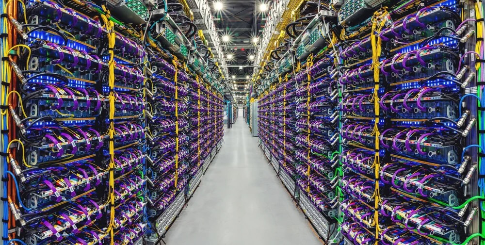
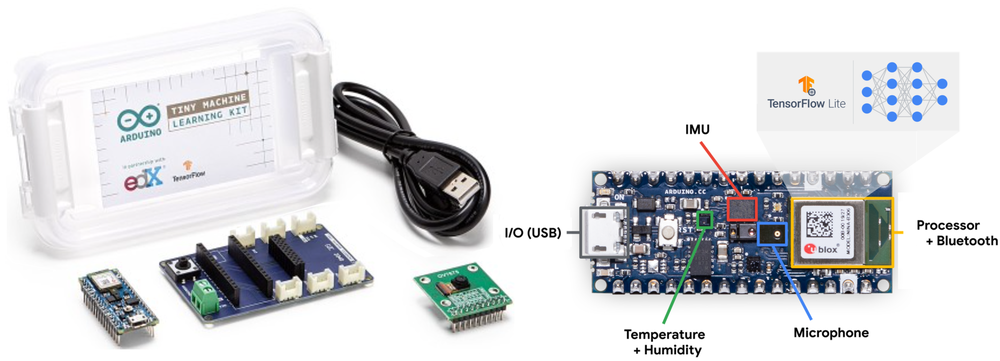

# ML Systems {#sec-ml-systems}

::: {layout-narrow}
::: {.column-margin}

\chapterminitoc

:::

\noindent
{fig-alt="Split-brain illustration with the left hemisphere showing circuit board patterns and processors on a white background, and the right hemisphere displaying a colorful neural network with various AI application icons and data connections on a blue background."}

:::

## Purpose {.unnumbered}

\begin{marginfigure}
\mlsysstack{35}{20}{30}{30}{30}{30}{25}{15}
\end{marginfigure}

_Why does deploying the same model to a phone vs. a data center demand fundamentally different engineering?_

The defining insight of ML systems engineering is that constraints drive architecture. The speed of light sets an absolute floor on how quickly distant servers can respond. Thermodynamics limits how much computation can occur in a given volume before heat becomes unmanageable. Memory physics makes moving data often more expensive than processing it. These are not engineering limitations awaiting better technology; they are permanent physical boundaries that partition the world into fundamentally distinct operating regimes. A data center can train billion-parameter models but cannot guarantee low-latency responses to users thousands of miles away. A smartphone can respond instantly but has a fraction of the memory budget. A microcontroller can run on a coin-cell battery for years but has barely enough compute for a simple keyword detector. The same model—the same algorithm applied to the same data—demands radically different engineering in each regime, not because of design preferences but because different physics governs each environment. Teams that treat deployment as an afterthought, training a model in the cloud and then asking "how do we ship this?", discover too late that the physics of their target environment invalidates months of architectural decisions. Understanding these regimes transforms deployment from an operational detail into a first-order engineering decision: the question is never simply "how do I make this model work?" but rather "which physical constraints govern my problem, and how do they shape what is even possible?"

::: {.content-visible when-format="pdf"}

\newpage

:::

::: {.callout-learning-objectives}

- Explain how physical constraints (speed of light, power wall, memory wall) necessitate the deployment spectrum from cloud to TinyML
- Apply the iron law and bottleneck principle to determine whether a workload is compute bound, memory bound, or I/O-bound
- Map workload archetypes to deployment paradigms using Lighthouse Model examples
- Distinguish the four deployment paradigms (Cloud, Edge, Mobile, TinyML) by their operational characteristics and quantitative trade-offs
- Apply the decision framework to select deployment paradigms based on privacy, latency, computational, and cost requirements
- Analyze hybrid integration patterns to determine which combinations address specific system constraints
- Evaluate deployment decisions by identifying common fallacies (including Amdahl's Law limits) and assessing architecture-requirement alignment
- Identify universal principles (data pipelines, resource management, architecture) that span deployment paradigms and explain why optimizations transfer between scales

:::

```{python}
#| echo: false
from mlsysim import *
from mlsysim.core.constants import *
#| label: ml-systems-setup
```

```{python}
#| echo: false
# ┌── LEGO ───────────────────────────────────────────────
# │ Context: Single-node stack hardware layer.
# │ Exports: MLSystemsNvlinkAnchor.nvlink_h100_bw_gb_per_s_str
from mlsysim.fmt import fmt_bandwidth

class MLSystemsNvlinkAnchor:
    """H100 NVLink bandwidth anchor for the hardware layer."""

    # ┌── 1. LOAD ──────────────────────────────────────────
    nvlink_bw = Hardware.Cloud.H100.nvlink.bandwidth
    # ┌── 4. OUTPUT ────────────────────────────────────────
    nvlink_h100_bw_gb_per_s_str = fmt_bandwidth(
        nvlink_bw,
        unit=GB / second,
        precision=0,
        commas=False,
    )
```

## Deployment Paradigm Framework {#sec-ml-systems-deployment-paradigm-framework-0d25}

\index{Physical Constraints!deployment implications}Where an ML model runs shapes what is possible in ways no algorithmic choice can override. Yet deployment is far harder than it appears, and the reason is not the model itself. In production ML systems, the model is often only a small part of the overall system [@sculley2015hidden]. The surrounding infrastructure consists of data collection, feature processing, serving infrastructure, monitoring, and resource management. All of this surrounding infrastructure changes dramatically depending on where the model executes.

Consider two extremes: a wake-word detector on a smartwatch and a recommendation engine in a data center. The wake-word detector represents a TinyML workload operating under milliwatt power budgets and kilobyte memory limits; the recommendation engine exemplifies a cloud ML workload requiring terabytes of embedding tables and megawatt-scale infrastructure. These systems solve different problems under opposite physical constraints, and the infrastructure that supports them shares almost nothing in common. This reality transforms deployment from an operational afterthought into a first-order engineering decision, one that the D·A·M taxonomy shown in @fig-ai-triad helps us reason about by foregrounding infrastructure alongside data and algorithms.

::: {.column-margin}
{width="100%" fig-alt="Vertical bar ladder of four deployment tiers by power on a log scale: Cloud 3 MW, Edge 200 W, Mobile 5 W, TinyML 50 mW, spanning megawatts to milliwatts."}

*Power spans the paradigms from megawatts (cloud) to milliwatts (TinyML).*
:::

The physical constraints that govern each environment (latency, power, and memory) force ML deployment into four distinct paradigms, each with its own engineering trade-offs and system design patterns. **Cloud ML**\index{Cloud ML!characteristics} aggregates computational resources in data centers, offering virtually unlimited compute and storage at the cost of network latency. **Edge ML**\index{Edge ML!latency benefits} moves computation closer to where data originates, including factory floors, retail stores, and hospitals, achieving lower latency and keeping sensitive data on-premises. **Mobile ML**\index{Mobile ML!energy constraints} brings intelligence directly to smartphones and tablets, balancing computational capability against battery life and thermal constraints. **TinyML**\index{TinyML!always-on sensing} pushes intelligence to the smallest devices: microcontrollers costing dollars and consuming milliwatts, enabling always-on sensing that runs for months on a coin-cell battery. These four paradigms span nine orders of magnitude in power consumption (megawatts to milliwatts) and memory capacity (terabytes to kilobytes), a range so vast that the engineering principles governing one end of the spectrum barely apply at the other.

These four paradigms exist not because of *engineering choices* but because of *physical laws* that no amount of optimization can overcome. Three fundamental constraints carve the deployment landscape into distinct operating regimes: the speed of light (establishing latency floors), thermodynamic limits on power dissipation (capping computation per watt), and the energy cost of memory signaling (creating the memory wall). These are not design preferences but physical boundaries: a self-driving car *cannot* be served from a data center 36 ms away, and a 1.5-billion-parameter model *cannot* be trained on a microcontroller. This chapter examines each paradigm in turn: the physical constraints that force them apart, the workloads each is built to serve, and how to choose among them when a system could plausibly run in more than one.

## The Architectural Anchor: The Single-Node Stack {#sec-ml-systems-architectural-anchor}

To navigate these operating regimes, we anchor our engineering decisions in a four-layer architectural model of the **Single-Node Stack**\index{Single-Node Stack!architecture layers}. This model provides the foundational framework for analyzing any ML system before it is projected onto a larger distributed fleet. Understanding how these layers interact within a single machine is the technical prerequisite for mastering larger scales.

1.  **Application (The Mission)**: The top layer where high-level requirements, such as training throughput or inference latency, are defined. This is where the "Dual Mandate" of accuracy and physics is managed (@sec-model-training, @sec-model-serving).
2.  **ML Framework (The Compiler)**\index{ML Framework!compiler role}: The translation layer that maps high-level model code to executable operations. Later chapters examine how frameworks represent those operations and manage memory (@sec-ml-frameworks).
3.  **Operating System (The Runtime)**\index{Operating System!runtime role}: The interface between framework and hardware, responsible for low-level resource orchestration and data movement between host memory and accelerator memory.
4.  **Hardware (The Silicon)**: The physical foundation where bits are transformed. This layer is defined by HBM capacity, memory bandwidth, high-speed intra-node interconnects such as NVLink (`{python} MLSystemsNvlinkAnchor.nvlink_h100_bw_gb_per_s_str` on an H100), and compute throughput. Here, the memory wall acts as the primary physical constraint (@sec-hardware-acceleration).

Every chapter in the first half of this text interrogates one or more of these layers. Mastery of this single-node regime establishes the "silicon contract" that governs all subsequent optimization and scaling efforts.

These physical constraints interact with the iron law of ML systems (@sec-introduction-iron-law-ml-systems-c32a), which decomposes end-to-end latency into data movement, computation, and overhead. Different deployment environments stress different terms of this equation: cloud systems are typically compute bound, mobile systems hit power walls, and TinyML devices are memory-capacity-limited. By pairing the physical constraints with the iron law, we develop a quantitative vocabulary for reasoning about which paradigm fits a given workload and *why*. To anchor this analysis concretely, the chapter introduces five Lighthouse Models\index{Lighthouse Model!reference workloads} (ResNet-50, GPT-2, Deep Learning Recommendation Model (DLRM), MobileNetV2, and a Keyword Spotter) that span the deployment spectrum and isolate distinct system bottlenecks. These reference workloads recur throughout the book, providing a consistent basis for comparing optimization techniques across chapters.

The physics that creates these paradigm boundaries comes first, followed by the analytical tools (iron law, bottleneck principle, workload archetypes) for mapping workloads to deployment targets. Each paradigm then receives an in-depth treatment covering infrastructure, trade-offs, and representative applications. @Fig-cloud-edge-TinyML-comparison orients the discussion by showing where each paradigm sits along the centralization spectrum. The chapter closes with a comparative decision framework and the hybrid architectures that combine paradigms when no single deployment target satisfies all requirements.

::: {#fig-cloud-edge-TinyML-comparison fig-env="figure" fig-pos="htb" fig-cap="**Distributed Intelligence Spectrum**: Machine learning deployment spans from centralized cloud infrastructure to resource-constrained TinyML devices, each balancing processing location, device capability, and network dependence. Source: [@abiresearch2024tinyml]." fig-alt="Horizontal spectrum showing five deployment tiers from left to right: ultra-low-power devices and sensors, intelligent device, gateway, on-premise servers, and cloud. Arrows indicate TinyML, edge AI, and cloud AI spans across the spectrum."}

```{.tikz}
\begin{tikzpicture}[line cap=round,line join=round,font=\usefont{T1}{phv}{m}{n}\small]
  % Parameters
  \def\angle{3}        % angle
  \def\length{18}       % Lengths (cm)
  \def\npoints{5}       % number of points
  \def\startfrac{0.13}  % start (e.g.. 0.2 = 20%)
  \def\endfrac{0.87}    % end (e.g.. 0.8 = 80%)

 \draw[line width=1pt, black!70] (0,0) -- ({\length*cos(\angle)}, {\length*sin(\angle)})coordinate(end);
 %
  \foreach \i in {0,1,...,\numexpr\npoints-1} {
    \pgfmathsetmacro{\t}{\startfrac + (\endfrac - \startfrac)*\i/(\npoints-1)}
\coordinate(T\i)at({\t*\length*cos(\angle)}, {\t*\length*sin(\angle)});
  }

\tikzset {
pics/gatewey/.style = {
        code = {
\colorlet{red}{white}
\begin{scope}[local bounding box=GAT,scale=0.9, every node/.append style={transform shape}]
\def\rI{4mm}
\def\rII{2.8mm}
\def\rIII{1.6mm}
\draw[red,line width=1.25pt](0,0)--(0,0.38)--(1.2,0.38)--(1.2,0)--cycle;
\draw[red,line width=1.5pt](0.6,0.4)--(0.6,0.9);

\draw[red, line width=1.5pt] (0.6,0.9)+(60:\rI) arc[start angle=60, end angle=-60, radius=\rI];
\draw[red, line width=1.5pt] (0.6,0.9)+(50:\rII) arc[start angle=50, end angle=-50, radius=\rII];
\draw[red, line width=1.5pt] (0.6,0.9)+(30:\rIII) arc[start angle=30, end angle=-30, radius=\rIII];
%
 \draw[red, line width=1.5pt] (0.6,0.9)+(120:\rI) arc[start angle=120, end angle=240, radius=\rI];
\draw[red, line width=1.5pt] (0.6,0.9)+(130:\rII) arc[start angle=130, end angle=230, radius=\rII];
\draw[red, line width=1.5pt] (0.6,0.9)+(150:\rIII) arc[start angle=150, end angle=210, radius=\rIII];
\fill[red](0.6,0.9)circle (1.5pt);

\foreach\i in{0.15,0.3,0.45,0.6}{
\fill[red](\i,0.19)circle (1.5pt);
}

\fill[red](1,0.19)circle (2pt);
\end{scope}
}}}

\tikzset {
pics/cloud/.style = {
        code = {
\colorlet{red}{white}
\begin{scope}[local bounding box=CLO,scale=0.6, every node/.append style={transform shape}]
\draw[red,line width=1.5pt](0,0)to[out=170,in=180,distance=11](0.1,0.61)
to[out=90,in=105,distance=17](1.07,0.71)
to[out=20,in=75,distance=7](1.48,0.36)
to[out=350,in=0,distance=7](1.48,0)--(0,0);
\draw[red,line width=1.5pt](0.27,0.71)to[bend left=25](0.49,0.96);
\draw[red,line width=1.5pt](0.67,1.21)to[out=55,in=90,distance=13](1.5,0.96)
to[out=360,in=30,distance=9](1.68,0.42);
\end{scope}
}}}

\tikzset {
  pics/server/.style = {
    code = {
      \colorlet{red}{white}
      \begin{scope}[anchor=center, transform shape,scale=0.8, every node/.append style={transform shape}]
        \draw[red,line width=1.25pt,fill=white](-0.55,-0.5) rectangle (0.55,0.5);
\foreach \i in {-0.25,0,0.25} {
                \draw[BlueLine,line width=1.25pt]( -0.55,\i) -- (0.55, \i);
}
        \foreach \i in {-0.375, -0.125, 0.125, 0.375} {
          \draw[BlueLine,line width=1.25pt](-0.45,\i)--(0,\i);
          \fill[BlueLine](0.35,\i) circle (1.5pt);
        }

\draw[red,line width=1.75pt](0,-0.53) |- (-0.55,-0.7);
        \draw[red,line width=1.75pt](0,-0.53) |- (0.55,-0.7);
      \end{scope}
    }
  }
}

\tikzset {
pics/cpu/.style = {
        code = {
\definecolor{CPU}{RGB}{0,120,176}
\colorlet{CPU}{white}
\begin{scope}[local bounding box = CPU,scale=0.33, every node/.append style={transform shape}]
\node[fill=CPU,minimum width=66, minimum height=66,
            rounded corners=2,outer sep=2pt] (C1) {};
\node[fill=violet,minimum width=54, minimum height=54] (C2) {};
%\node[fill=CPU!40,minimum width=44, minimum height=44] (C3) {CPU};

\foreach \x/\y in {0.11/1,0.26/2,0.41/3,0.56/4,0.71/5,0.85/6}{
\node[fill=CPU,minimum width=4, minimum height=15,
           inner sep=0pt,anchor=south](GO\y)at($(C1.north west)!\x!(C1.north east)$){};
}
\foreach \x/\y in {0.11/1,0.26/2,0.41/3,0.56/4,0.71/5,0.85/6}{
\node[fill=CPU,minimum width=4, minimum height=15,
           inner sep=0pt,anchor=north](DO\y)at($(C1.south west)!\x!(C1.south east)$){};
}
\foreach \x/\y in {0.11/1,0.26/2,0.41/3,0.56/4,0.71/5,0.85/6}{
\node[fill=CPU,minimum width=15, minimum height=4,
           inner sep=0pt,anchor=east](LE\y)at($(C1.north west)!\x!(C1.south west)$){};
}
\foreach \x/\y in {0.11/1,0.26/2,0.41/3,0.56/4,0.71/5,0.85/6}{
\node[fill=CPU,minimum width=15, minimum height=4,
           inner sep=0pt,anchor=west](DE\y)at($(C1.north east)!\x!(C1.south east)$){};
}
\end{scope}
    }  }}

\tikzset {
pics/mobile/.style = {
        code = {
\colorlet{red}{white}
\begin{scope}[local bounding box=MOB,scale=0.4, every node/.append style={transform shape}]
\node[rectangle,draw=red,minimum height=94,minimum width=47,
            rounded corners=6,thick,fill=white](R1){};
\node[rectangle,draw=red,minimum height=67,minimum width=38,thick,fill=GreenFill](R2){};
\node[circle,minimum size=8,below= 2pt of R2,inner sep=0pt,thick,fill=GreenFill]{};
\node[rectangle,fill=GreenFill,minimum height=2,minimum width=20,above= 4pt of R2,inner sep=0pt,thick]{};
%
 \end{scope}
     }  }}

\node[draw=none,fill=RedFill,circle,minimum size=20mm](GA)at(T2){};
\pic[shift={(-0.55,-0.5)}] at (T2) {gatewey};
\node[above=0 of GA]{Gateway};
\node[draw=none,fill=VioletL,circle,minimum size=20mm](CP)at(T0){};
\pic[shift={(0,-0)}] at (T0) {cpu};
\node[above=0 of CP,align=center]{Ultra Low Powered\\Devices and Sensors};
\node[draw=none,fill=GreenFill,,circle,minimum size=20mm](MO)at(T1){};
 \pic[shift={(0,0)}] at (T1) {mobile};
 \node[above=0 of MO,align=center]{Intelligent\\Device};
\node[draw=none,fill=BlueFill,circle,minimum size=20mm](SE)at(T3){};
\pic[shift={(-0.03,0.1)}] at (T3) {server};
 \node[above=0 of SE,align=center]{On Premise\\Servers};
\node[draw=none,fill=BrownL,circle,minimum size=20mm](CL)at(T4){};
\pic[shift={(-0.48,-0.35)}] at (T4) {cloud};
 \node[above=0 of CL,align=center]{Cloud};
%
\path (T0) -- (T1) coordinate[pos=0.5] (M1);
\path (0,0) -- (T0) coordinate[pos=0.25] (M0);
\path (T3) -- (T4) coordinate[pos=0.5] (M2);
\path (T4) -- (end) coordinate[pos=0.75] (M3);

\foreach \x in {0,1,2,3}{
\fill[OliveLine](M\x)circle (2.5pt);
}

\path[red](M0)--++(270:1.6)coordinate(LL1)-|coordinate(LL2)(M2);
\path[red](M0)--++(270:1.1)coordinate(L1)-|coordinate(L2)(M1);
\path[red](M0)--++(270:1.1)-|coordinate(L3)(M2);
\path[red](M0)--++(270:1.1)-|coordinate(L4)(M3);
%
\draw[black!70,thick](M0)--(LL1);
\draw[black!70,thick](M1)--(L2);
\draw[black!70,thick](M3)--(L4);
\draw[black!70,thick](M2)--(LL2);
\draw[latex-latex,line width=1pt,draw=black!60](L1)--node[red,fill=white]{TinyML}(L2);
\draw[latex-latex,line width=1pt,draw=black!60](L3)--node[fill=white]{Cloud AI}(L4);
\draw[latex-latex,line width=1pt,draw=black!60]([yshift=4pt]LL1)--node[fill=white,text=black]{Edge AI}([yshift=4pt]LL2);
\foreach \x in {0,1,2,3}{
\fill[OliveLine](M\x)circle (2.5pt);
}
%
\path[](M0)--++(90:2.9)-|node[pos=0.25]{\textbf{The Distributed Intelligence Spectrum}}(M3);
\end{tikzpicture}

```

:::

These four paradigms function as distinct operating envelopes, each defined by how much power, memory, and network connectivity is available. Every ML application must fit within at least one of these envelopes, and that fit determines which algorithms, hardware, and engineering trade-offs apply. The four paradigms span a continuous spectrum from centralized cloud infrastructure to distributed ultra-low-power devices. @Fig-cloud-edge-TinyML-comparison traces this spectrum visually, mapping where each paradigm sits along the centralization axis, while @tbl-deployment-paradigms-overview pins down the quantitative trade-offs:

```{python}
#| echo: false
# ┌─────────────────────────────────────────────────────────────────────────────
# │ DEPLOYMENT OVERVIEW TABLE
# ├─────────────────────────────────────────────────────────────────────────────
# │ Context: @tbl-deployment-paradigms-overview
# │
# │ Goal: Latency and mobile power columns for the deployment overview table.
# │ Show: Per-paradigm latency ranges and smartphone TDP envelope.
# │ How: Read pre-formatted range strings from mlsysim constants.
# │
# │ Imports: Platforms (Cloud/Edge/Mobile/Tiny latency_range_ms, Mobile.tdp_range_w)
# │ Exports: DeploymentOverviewTable.cloud_latency_range_str,
# │          DeploymentOverviewTable.edge_latency_range_str,
# │          DeploymentOverviewTable.mobile_latency_range_str,
# │          DeploymentOverviewTable.tiny_latency_range_str,
# │          DeploymentOverviewTable.mobile_tdp_range_str
# └─────────────────────────────────────────────────────────────────────────────

# ┌── LEGO ───────────────────────────────────────────────
class DeploymentOverviewTable:
    """Latency and power ranges for @tbl-deployment-paradigms-overview."""

    # ┌── 4. OUTPUT (Formatting) ──────────────────────────────────────────────
    cloud_latency_range_str = MarkdownStr(Platforms.Cloud.latency_range_ms)
    edge_latency_range_str = MarkdownStr(Platforms.Edge.latency_range_ms)
    mobile_latency_range_str = MarkdownStr(Platforms.Mobile.latency_range_ms)
    tiny_latency_range_str = MarkdownStr(Platforms.Tiny.latency_range_ms)
    mobile_tdp_range_str = MarkdownStr(f"{Platforms.Mobile.tdp_range_w} W")
```

| **Paradigm**  | **Where**        |                         **Latency**                         |                        **Power**                        | **Memory** | **Best For**                 |
|:--------------|:-----------------|:-----------------------------------------------------------:|:-------------------------------------------------------:|:----------:|:-----------------------------|
| **Cloud ML**  | Data centers     |  `{python} DeploymentOverviewTable.cloud_latency_range_str` |                            MW                           |     TB     | Training, complex inference  |
| **Edge ML**   | Local servers    |  `{python} DeploymentOverviewTable.edge_latency_range_str`  |                          100 W                          |     GB     | Real-time inference, privacy |
| **Mobile ML** | Smartphones      | `{python} DeploymentOverviewTable.mobile_latency_range_str` | `{python} DeploymentOverviewTable.mobile_tdp_range_str` |     GB     | Personal AI, offline         |
| **TinyML**    | Microcontrollers |  `{python} DeploymentOverviewTable.tiny_latency_range_str`  |                            mW                           |     KB     | Always-on sensing            |

: **The Deployment Spectrum (Conceptual)**: Four paradigms span nine orders of magnitude in power (MW to mW) and memory (TB to KB). This conceptual overview defines each paradigm by its operating regime; @tbl-representative-systems later grounds these categories in specific hardware platforms and quantitative decision thresholds. The hardware specifications and physical constants underpinning these numbers are catalogued in the System Assumptions appendix. {#tbl-deployment-paradigms-overview tbl-colwidths="[14,17,12,12,15,30]"}

The nine-order-of-magnitude span in @tbl-deployment-paradigms-overview is not an accident of engineering history—it is a consequence of physics. No amount of optimization can make a data center respond faster than light can travel, or make a microcontroller dissipate more heat than its surface area allows. The existence of four paradigms, rather than a single universal solution, follows from three physical laws.

::: {.content-visible when-format="pdf"}
\newpage
:::

## Physical Constraints: Why Paradigms Exist {#sec-ml-systems-deployment-spectrum-71be}

\index{Silicon Contract!physical constraints} \index{Physical Constraints!speed of light} \index{Physical Constraints!thermodynamics} \index{Physical Constraints!memory signaling}The physical laws of speed of light, power thermodynamics, and memory signaling dictate that no single "ideal" computer exists. Where a system runs reshapes the contract between model and hardware. These three constraints, which we call the *light barrier*, *power wall*, and *memory wall*, govern the engineering trade-offs ahead.[^fn-paradigm-deployment]

### The light barrier {.unnumbered}

\index{Light Barrier!latency floor}The light barrier establishes the absolute latency[^fn-latency-systems] floor. The minimum round-trip time is governed by @eq-latency-physics:
$$L_{\text{lat,min}} = \frac{2 \times \text{Distance}}{c_{\text{fiber}}} \approx \frac{2 \times \text{Distance}}{200{,}000 \text{ km/s}}$$ {#eq-latency-physics}

where $c_{\text{fiber}} \approx 200{,}000$ km/s is the speed of light in optical fiber, roughly two-thirds of its vacuum value because light propagates more slowly through glass than through a vacuum.

```{python}
#| echo: false
#| label: light-barrier-calc
# ┌─────────────────────────────────────────────────────────────────────────────
# │ LIGHT BARRIER LATENCY CALCULATION
# ├─────────────────────────────────────────────────────────────────────────────
# │ Context: "The light barrier" narrative (Physical Constraints section)
# │
# │ Goal: Demonstrate the physical latency floor of cloud computing.
# │ Show: Cross-country round-trip time exceeds tight real-time budgets.
# │ How: Apply the mlsysim network latency formula for CA-to-VA distance.
# │
# │ Imports: mlsysim.core.constants, mlsysim.physics, mlsysim.book
# │ Exports: min_latency_str, distance_str
# └─────────────────────────────────────────────────────────────────────────────
from mlsysim.physics import calc_network_latency_ms
from mlsysim.fmt import fmt, check, fmt_time, fmt_qty, MarkdownStr

# ┌── LEGO ───────────────────────────────────────────────
class LightLatency:
    """
    Namespace for Light-Speed Latency calculation.
    Scenario: Cross-country packet transmission (CA to VA) vs 10 ms budget.
    """

    # ┌── 1. LOAD (Constants) ───────────────────────────────────────────────
    distance_km = 3600 * ureg.km # California to Virginia (straight-line)
    safety_budget_ms = 10

    # ┌── 2. EXECUTE (The Compute) ─────────────────────────────────────────
    # Calculate Round-trip time (RTT) based on speed of light in fiber
    min_latency_ms = calc_network_latency_ms(distance_km)

    # ┌── 3. GUARD (Invariants) ───────────────────────────────────────────
    check(min_latency_ms > safety_budget_ms,
          f"Physics forbids cloud ({min_latency_ms:.1f} ms) within {safety_budget_ms} ms budget!")

    # ┌── 4. OUTPUT (Formatting) ──────────────────────────────────────────────
    min_latency_value = fmt_time(min_latency_ms, 'millisecond', precision=0, commas=False)
    min_latency_str = MarkdownStr(f"{min_latency_value} round-trip")
    distance_str = fmt_qty(distance_km, ureg.km, precision=0, commas=True)
```

California to Virginia (~`{python} LightLatency.distance_str` straight-line) requires ~`{python} LightLatency.min_latency_str` before any computation begins. Actual cloud services typically add 60–150 ms of software overhead. Applications requiring sub-10 ms response *cannot* use distant cloud infrastructure—physics forbids it. This constraint creates the need for edge ML and TinyML: when latency budgets are tight, computation must move closer to the data source.

### The power wall {.unnumbered}

::: {.content-visible when-format="pdf"}
\newpage
:::

\index{Power Wall!thermal limits}\index{Power Wall!frequency scaling}
\index{Dennard Scaling!breakdown}
The power wall emerged because thermodynamics limits how much computation can occur in a given volume. Under classical Dennard scaling[^fn-dennard-scaling-origin] (which held until approximately 2006), the relationship between power and frequency was cubic. Here $C$ is effective capacitance, $V$ is voltage, and $f$ is clock frequency. As voltage tracks frequency $(V \propto f)$, power rises as $f^3$, as @eq-power-scaling shows:
$$\text{Power} \propto C \times V^2 \times f \quad \text{where } V \propto f \implies \text{Power} \propto f^3$$ {#eq-power-scaling}

```{python}
#| echo: false
#| label: power-wall-throttling
from mlsysim.fmt import fmt_rate
# ┌─────────────────────────────────────────────────────────────────────────────
# │ POWER WALL: MOBILE THERMAL THROTTLING SCENARIO
# ├─────────────────────────────────────────────────────────────────────────────
# │ Context: Power Wall prose immediately below—illustrates throttling
# │          behavior on battery-powered devices.
# │
# │ Goal: Provide concrete FPS numbers showing thermal throttling on mobile.
# │ Show: A mobile model drops from 60 FPS to 15 FPS after 1 minute.
# │ How: Simple illustrative constants (no computation needed).
# │
# │ Imports: (none)
# │ Exports: ThrottlingScenario.fps_start_str,
# │          ThrottlingScenario.fps_throttled_str,
# │          ThrottlingScenario.duration_min_str
# └─────────────────────────────────────────────────────────────────────────────

# ┌── LEGO ───────────────────────────────────────────────
class ThrottlingScenario:
    """Namespace for illustrative mobile thermal throttling."""

    # ┌── 1. LOAD (Constants) ───────────────────────────────────────────────
    fps_start = 60
    fps_throttled = 15
    duration_min = 1

    # ┌── 2. EXECUTE (The Compute) ─────────────────────────────────────────
    # (illustrative scenario—no derived quantities)

    # ┌── 3. GUARD (Invariants) ───────────────────────────────────────────

    # ┌── 4. OUTPUT (Formatting) ──────────────────────────────────────────────
    fps_start_str = fmt_rate(fps_start, 'FPS', precision=0, commas=False)
    fps_throttled_str = fmt_rate(fps_throttled, 'FPS', precision=0, commas=False)
    duration_min_str = MarkdownStr("1 minute")
```

```{python}
#| echo: false
# ┌─────────────────────────────────────────────────────────────────────────────
# │ MOBILE TDP — POWER WALL NARRATIVE
# ├─────────────────────────────────────────────────────────────────────────────
# │ Context: Power Wall prose (mobile thermal throttling paragraph)
# │
# │ Goal: Cite the smartphone TDP envelope where throttling begins.
# │ Show: 2–5 W mobile power budget from centralized constants.
# │ How: Read Platforms.Mobile.tdp_range_w.
# │
# │ Imports: mlsysim.core.constants (Platforms.Mobile.tdp_range_w)
# │ Exports: MobileTdpPowerWall.mobile_tdp_range_str
# └─────────────────────────────────────────────────────────────────────────────

# ┌── LEGO ───────────────────────────────────────────────
class MobileTdpPowerWall:
    """Mobile TDP envelope cited in the Power Wall narrative."""

    # ┌── 4. OUTPUT (Formatting) ──────────────────────────────────────────────
    mobile_tdp_range_str = MarkdownStr(f"{Platforms.Mobile.tdp_range_w} W")
```

Doubling clock frequency required approximately 8$\times$ more power. The breakdown of this scaling relationship ended the era of "free" speedups via frequency scaling and forced the industry toward the parallelism (multi-core) and specialization (GPUs, Tensor Processing Units (TPUs)) that defines modern ML. Mobile devices hit hard thermal limits at `{python} MobileTdpPowerWall.mobile_tdp_range_str`; exceeding this causes "throttling," where the device reduces performance to prevent overheating. In practice, this means a mobile model that runs at `{python} ThrottlingScenario.fps_start_str` for `{python} ThrottlingScenario.duration_min_str` may throttle to `{python} ThrottlingScenario.fps_throttled_str` as the device heats up. This physical limit gives rise to mobile ML: battery-powered devices cannot simply run cloud-scale models locally.

[^fn-dennard-scaling-origin]: **Dennard Scaling**: Named after @dennard1974 at IBM, who showed that as transistors shrink, voltage and current scale proportionally, keeping power density constant. This held for three decades, delivering "free" performance gains each chip generation. When leakage current made further voltage reduction impossible around the 90 nm node (2005--2006), power density began rising with each generation---ending single-core frequency scaling and forcing the industry toward the parallelism and specialization (multi-core, GPU, TPU) that now defines ML hardware. \index{Dennard Scaling!origin and breakdown}

### The memory wall {.unnumbered}

\index{Memory Wall!bandwidth divergence}\index{Memory Wall!compute-memory gap} The memory wall [@wulf1995] reflects the widening bandwidth[^fn-bandwidth-memory-wall] gap:
$$\frac{\text{Compute Growth Rate}}{\text{Memory Bandwidth Growth Rate}} \approx \frac{1.6}{1.2} \approx 1.33$$ {#eq-memory-wall}

```{python}
#| echo: false
#| label: memory-wall-trends
# ┌─────────────────────────────────────────────────────────────────────────────
# │ MEMORY WALL: COMPUTE VS BANDWIDTH GROWTH RATES
# ├─────────────────────────────────────────────────────────────────────────────
# │ Context: Prose immediately below @eq-memory-wall, quantifying the
# │          compute-memory divergence.
# │
# │ Goal: Provide the two growth-rate numbers cited in Memory Wall narrative.
# │ Show: Compute doubles every 18 months; memory BW grows ~20% annually.
# │ How: Canonical industry trend constants formatted for prose.
# │
# │ Imports: mlsysim.book (fmt)
# │ Exports: MemoryWallTrends.compute_doubling_months_str,
# │          MemoryWallTrends.mem_bw_growth_pct_str
# └─────────────────────────────────────────────────────────────────────────────
from mlsysim.fmt import fmt, fmt_percent

# ┌── LEGO ───────────────────────────────────────────────
class MemoryWallTrends:
    """Namespace for compute vs memory bandwidth growth rates."""

    # ┌── 1. LOAD (Constants) ───────────────────────────────────────────────
    compute_doubling_months = 18
    mem_bw_growth_pct = 20

    # ┌── 2. EXECUTE (The Compute) ─────────────────────────────────────────
    # (pass-through: canonical trend values)

    # ┌── 3. GUARD (Invariants) ───────────────────────────────────────────

    # ┌── 4. OUTPUT (Formatting) ──────────────────────────────────────────────
    compute_doubling_months_str = fmt_time(compute_doubling_months, "month", precision=0, style="word")
    mem_bw_growth_pct_str = fmt_percent(mem_bw_growth_pct / 100, precision=0, style="symbol")
```

\index{Data Movement!energy dominance}
@eq-memory-wall quantifies this divergence: processors have doubled in compute capacity roughly every `{python} MemoryWallTrends.compute_doubling_months_str`, but memory bandwidth has improved only ~`{python} MemoryWallTrends.mem_bw_growth_pct_str` annually. This widening gap makes data movement the dominant bottleneck and energy cost for most ML workloads. This constraint affects all paradigms but is especially acute for TinyML, where devices have only kilobytes of memory to work with. We examine the hardware architectural responses to the memory wall, including HBM and on-chip SRAM hierarchies, in detail in @sec-hardware-acceleration-understanding-ai-memory-wall-3ea9.

::: {.column-margin}
{width="100%" fig-alt="Two diverging trend strokes: a steep red compute-growth curve pulling away from a shallow blue memory-bandwidth curve, the widening gap between them shaded red. The gap is the memory wall."}

*Compute capacity outruns memory bandwidth; the widening gap is the memory wall.*
:::

::: {#chk-ml-systems-physical-constraints-deployment .callout-checkpoint title="Physical constraints and deployment"}

Deployment choices are governed by physics, not just preference. Check your understanding:

- [ ] **Light barrier**: Can you explain why the speed of light makes cloud ML impossible for <10 ms safety tasks?
- [ ] **Power wall**: Do you understand why thermodynamics (heat dissipation) prevents data center models from running on mobile devices?
- [ ] **Memory wall**: Can you explain why data movement is often more expensive (in time and energy) than computation?

:::

These physical laws explain *why* the four paradigms exist. Physics creates the boundaries; privacy regulation, economic incentives, and data sovereignty requirements reinforce and sharpen them. We examine these additional drivers within each paradigm section, but the central insight is that the paradigms would exist even without those concerns. No regulation can make the speed of light faster, and no economic model can repeal thermodynamics.

Knowing that these barriers exist is necessary but not sufficient. Given a specific ML workload (say, a recommendation engine or a wake-word detector), we need to determine which paradigm fits and which barrier the workload will hit first. The answer requires analytical tools that connect workload characteristics to these physical constraints: the iron law to decompose latency, the bottleneck principle to identify the dominant constraint, and a set of workload archetypes to classify where each model falls on the spectrum.

## Analyzing Workloads {#sec-ml-systems-analyzing-workloads-cbb8}

\index{Silicon Contract!iron law}The central analytical tool for this chapter is the iron law of ML systems, established in @sec-introduction-iron-law-ml-systems-c32a and restated here as @eq-iron-law:
$$T = \frac{D_{\text{vol}}}{\text{BW}} + \frac{O}{R_{\text{peak}} \cdot \eta_{\text{hw}}} + L_{\text{lat}}$$ {#eq-iron-law}

This equation decomposes total latency into three terms: data movement $(D_{\text{vol}}/\text{BW})$, compute $(O/(R_{\text{peak}} \cdot \eta_{\text{hw}}))$, and fixed overhead $(L_{\text{lat}})$. For a single inference, these costs simply add up---each is paid sequentially. In production systems, however, tasks are processed continuously as a stream, and the question shifts from "*how* long does one task take?" to "*which* of these three terms actually limits the system?" The answer depends entirely on the deployment environment: a model that is **compute bound**\index{Compute-Bound vs. Memory-Bound!definition} during training may become **memory bound** during inference; a system that runs efficiently in the cloud may hit power limits on mobile devices. To determine which term dominates, we need a companion principle.

### The bottleneck principle {#sec-ml-systems-bottleneck-principle-3514}

\index{Bottleneck Principle!pipelined execution} \index{System Bottlenecks!identifying}
\index{Pipelined Execution!throughput analysis}
The iron law tells us the cost of each term. The bottleneck principle tells us which term matters. Unlike traditional software where optimizing the average case works, ML systems are dominated by their slowest component: optimizing fast operations yields zero benefit while the slowest stage remains unchanged. Modern accelerators use **pipelined execution** to overlap data movement with computation: while the accelerator computes on batch $n$, the memory system prefetches batch $n+1$. With this overlap, whichever operation is slower determines the system's throughput—the faster one "hides" behind it. The iron law's sum becomes a maximum, as @eq-bottleneck formalizes:
$$ T_{\text{bottleneck}} = \max\left(\frac{D_{\text{vol}}}{\text{BW}}, \frac{O}{R_{\text{peak}} \cdot \eta_{\text{hw}}}, T_{\text{network}}\right) + L_{\text{lat}} $$ {#eq-bottleneck}

*   **$\frac{D_{\text{vol}}}{\text{BW}}$ (Memory)**: Time to move data between memory and processor.
*   **$\frac{O}{R_{\text{peak}} \cdot \eta_{\text{hw}}}$ (Compute)**: Time to execute calculations.
*   **$T_{\text{network}}$**: Time for network communication (if offloading).
*   **$L_{\text{lat}}$ (Overhead)**: Fixed latency (kernel launch, runtime overhead).

This principle dictates that if a system is memory bound\index{Memory-Bound Workload!optimization strategy}\index{Compute-Bound vs. Memory-Bound!memory-bound} $(D_{\text{vol}}/\text{BW} > O/(R_{\text{peak}} \cdot \eta_{\text{hw}}))$, buying faster processors $(R_{\text{peak}})$ yields exactly 0 percent speedup—just as widening a six-lane highway yields no benefit when all traffic must funnel through a two-lane bridge. Engineers must identify the dominant term before optimizing. This trade-off is governed by the energy of transmission.

```{python}
#| echo: false
#| label: energy-transmission-calc
# ┌─────────────────────────────────────────────────────────────────────────────
# │ ENERGY OF TRANSMISSION CALCULATION
# ├─────────────────────────────────────────────────────────────────────────────
# │ Context: Callout "The Energy of Transmission" (Bottleneck Principle section)
# │
# │ Goal: Compare energy costs of cloud offload vs. local compute.
# │ Show: The 1000× higher energy cost of network transmission for small data segments.
# │ How: Calculate J for data transfer vs. NPU-based local inference
# │      using centralized energy constants.
# │
# │ Imports: mlsysim.book (fmt)
# │ Exports: EnergyTransmission.data_mb_str, EnergyTransmission.tx_energy_mj_per_mb_str,
# │          EnergyTransmission.compute_energy_mj_str,
# │          EnergyTransmission.cloud_total_mj_str,
# │          EnergyTransmission.local_total_mj_str, EnergyTransmission.ratio_mult_str
# └─────────────────────────────────────────────────────────────────────────────
from mlsysim.fmt import fmt_percent, fmt, check, fmt_qty

# ┌── LEGO ───────────────────────────────────────────────
class EnergyTransmission:
    """
    Namespace for Energy of Transmission vs Compute.
    Scenario: Cost of sending 1 MB to cloud vs running MobileNetV2 locally.
    """

    # ┌── 1. LOAD (Constants) ───────────────────────────────────────────────
    data_size = 1.0 * MB       # scenario assumption: 1 sec audio
    tx_energy_per_mb = Systems.NetworkEnergy.Per5gMb
    local_energy_op = Models.Vision.MobileNetV2.inference_energy

    # ┌── 2. EXECUTE (The Compute) ─────────────────────────────────────────
    cloud_energy_total = (data_size * tx_energy_per_mb).to(mJ)
    local_energy_total = local_energy_op

    ratio = (cloud_energy_total / local_energy_total).to("").magnitude

    # ┌── 3. GUARD (Invariants) ───────────────────────────────────────────
    check(ratio >= 500,
          f"Transmission ({cloud_energy_total}) is not expensive enough vs Compute ({local_energy_total}). Ratio: {ratio:.1f}x")

    # ┌── 4. OUTPUT (Formatting) ──────────────────────────────────────────────
    data_mb_str = fmt_qty(data_size, MB, precision=0, commas=False)
    tx_energy_mj_per_mb_str = fmt_qty(tx_energy_per_mb, mJ/MB, precision=0, commas=False)
    compute_energy_mj_str = fmt_qty(local_energy_op, mJ, precision=1, commas=False, per="inference")
    cloud_total_mj_str = fmt_qty(cloud_energy_total, mJ, precision=0, commas=False)
    local_total_mj_str = fmt_qty(local_energy_total, mJ, precision=1, commas=False)
    ratio_mult_str = fmt_multiple(ratio, precision=0, commas=True)
```

::: {#nbk-ml-systems-energy-transmission .callout-notebook title="The energy of transmission"}

**Problem**\index{Energy of Transmission!local vs. cloud}\index{Energy Wall!battery constraints}: Should a battery-powered sensor process data locally (TinyML) or send it to the cloud?

**Variables**:

```{=latex}
\vspace*{-3pt}
```
<!-- lego-ok-block: 1 MB is a round illustrative payload for the transmission-vs-compute ratio, not a literal audio bitrate -->
*   **Data $(D_{\text{vol}})$**: `{python} EnergyTransmission.data_mb_str` (illustrative payload volume).
*   **Transmission energy $(E_{\text{tx}})$**: `{python} EnergyTransmission.tx_energy_mj_per_mb_str` (Wi-Fi/LTE).
*   **Compute energy $(E_{\text{op}})$**: `{python} EnergyTransmission.compute_energy_mj_str` (MobileNetV2 on NPU).

**Math**:

```{=latex}
\vspace*{-3pt}
```
1.  **Cloud approach**: $E_{\text{cloud}} \approx D_{\text{vol}} \times E_{\text{tx}}$ = `{python} EnergyTransmission.data_mb_str` $\times$ `{python} EnergyTransmission.tx_energy_mj_per_mb_str` = `{python} EnergyTransmission.cloud_total_mj_str`.
2.  **Local approach**: $E_{\text{local}} \approx$ Inference = `{python} EnergyTransmission.local_total_mj_str`.

**Systems insight**: Transmitting raw data is `{python} EnergyTransmission.ratio_mult_str` more expensive than processing it locally. Even if the cloud had infinite speed $(T \approx 0)$, the energy wall makes cloud offloading physically impossible for always-on battery devices. The "machine" constraint (battery) dictates the "algorithm" choice (TinyML).

:::

The iron law's variables interact differently across deployment scenarios. Before specific workload archetypes are examined, these core performance determinants need a compact definition.

::: {#dfn-ml-systems-iron-law .callout-definition title="The iron law"}

***The iron law***\index{Iron Law!definition} is the fundamental physical constraint governing all machine learning performance, expressed as the total time $T$ required for a workload:

$$T = \frac{D_{\text{vol}}}{\text{BW}} + \frac{O}{R_{\text{peak}} \cdot \eta_{\text{hw}}} + L_{\text{lat}}$$

1.  **Significance (quantitative)**: It defines the Physical Ceiling for any system by quantifying the relationship between data volume $(D_{\text{vol}})$, compute capacity $(R_{\text{peak}})$, and communication overhead $(L_{\text{lat}})$.
2.  **Distinction (durable)**: Unlike Amdahl's Law, which focuses on Parallel Speedup, the iron law addresses the Total Energy and Time required to move and transform data.
3.  **Common pitfall**: A frequent misconception is that these terms are independent. In reality, they are Trade-off Axes: for example, increasing batch size may improve the duty cycle $(\eta_{\text{hw}})$ but also increase the data volume $(D_{\text{vol}})$ per request, potentially shifting a compute-bound problem to a memory-bound one.

:::

The iron law quantifies the *cost of each ingredient*; the bottleneck principle identifies the *speed of the assembly line*. As a rule of thumb, use the **additive form** in @eq-iron-law when analyzing the latency of a single task, and the **max form** in @eq-bottleneck when analyzing the throughput of a continuous stream of tasks.

### Workload archetypes {#sec-ml-systems-workload-archetypes-fd10}

\index{D·A·M Taxonomy!workload classification}

::: {.column-margin}
{width="100%" fig-alt="Triangle diagram with three labeled nodes connected by violet edges: D for data at top, A for algorithm at lower left, M for machine at lower right, showing the three axes are coupled."}

*Data, Algorithm, and Machine are coupled; move one and the others shift.*
:::

The bottleneck principle reduces optimization to a single diagnostic: identifying which constraint dominates for a given workload. The answer depends on the D·A·M taxonomy in @tbl-dam-taxonomy, which decomposes every ML system into Data, Algorithm, and Machine. Different deployment environments create different bottlenecks along these axes, so the same model family can require different engineering when it moves from a cloud server with terabytes of memory to a microcontroller with kilobytes.

The iron law turns that diagnostic into four **Archetypes**\index{Workload Archetype!definition}[^fn-archetype-bottleneck]. The first distinction is between arithmetic work and dense data movement. When the compute term dominates, the workload is a **Compute Beast**\index{Arithmetic Intensity!high intensity workloads}\index{Compute Beast!definition}: it performs many calculations per byte loaded, and progress comes from higher arithmetic throughput. Large neural-network training is the canonical case. When the data-movement term dominates for dense weights or activations, the workload is a **Bandwidth Hog**\index{Autoregressive Generation!memory-bound}\index{Bandwidth Hog!definition}: each token or example waits on memory bandwidth, so wider memory buses matter more than additional peak FLOP/s. Autoregressive text generation illustrates this regime.

The other two archetypes appear when the same iron-law terms are constrained by locality or by the machine envelope. When data movement is dominated by irregular table lookups and poor cache locality, the workload becomes **Sparse Scatter**\index{Embedding Table!memory capacity bound}\index{Sparse Scatter!definition}: memory capacity, access latency, and communication shape performance, as in recommendation systems with massive embedding tables. When the machine envelope itself dominates, the workload is a **Tiny Constraint**\index{Energy per Inference!binding constraint}\index{Always-On Sensing!power constraints}\index{Tiny Constraint!definition}: energy per inference and memory footprint, not raw speed, determine feasibility for always-on sensing.

These archetypes map naturally to deployment paradigms. Compute beasts and sparse scatter workloads gravitate toward cloud ML where resources are abundant, bandwidth hogs span cloud and edge depending on latency requirements, and tiny constraint workloads belong to TinyML. To make these abstractions concrete, we anchor each archetype to a specific model that recurs throughout this book as one of five reference workloads.

[^fn-archetype-bottleneck]: **Workload Archetype**: A classification of ML workloads by their dominant iron law bottleneck rather than their model family. The distinction matters because the optimization strategy differs fundamentally: a compute-bound workload benefits from faster arithmetic $(R_{\text{peak}})$, while a bandwidth-bound workload benefits only from wider memory buses $(\text{BW})$. Misidentifying the archetype wastes optimization effort on the wrong term of the iron law, as when teams add accelerator FLOP/s to a memory-bound inference pipeline and observe zero speedup. \index{Archetype!workload classification}

\index{Paradigm!deployment regimes}

[^fn-paradigm-deployment]: **Deployment Paradigm**\index{Deployment Paradigm!definition}: A distinct operating regime whose boundaries are set by physics, not convention. The Cloud-to-TinyML spectrum spans nine orders of magnitude in power because thermodynamic and electromagnetic constraints create hard walls that no software optimization can cross, forcing qualitatively different system architectures at each tier. Misidentifying the paradigm boundary wastes engineering effort: optimizing a cloud model for 5 percent higher throughput is pointless if the application's 10 ms latency budget demands edge deployment. \index{Paradigm!deployment regimes}

\index{Latency!responsiveness constraint}

[^fn-latency-systems]: **Latency**: The time between issuing a request and receiving a result, corresponding to $L_{\text{lat}}$ in the iron law. The light barrier makes this floor irreducible: the speed of light in fiber imposes a ~36 ms minimum round trip across the continental US, consuming the entire latency budget of a 10 ms safety-critical system before any computation begins. Every millisecond consumed by distance is a millisecond unavailable for model inference, which is why the light barrier forces paradigm selection rather than mere optimization. \index{Latency!deployment constraint}

[^fn-bandwidth-memory-wall]: **Memory Bandwidth (The memory wall)**\index{Memory Bandwidth!memory wall}: The term "memory wall" was coined by Wulf and McKee in 1995, who predicted that the processor-memory performance gap would eventually dominate system performance---a prediction that proved prescient for ML workloads where weight loading, not arithmetic, is the typical bottleneck. In the iron law, bandwidth $(\text{BW})$ appears in the denominator of the data term $D_{\text{vol}}/\text{BW}$, so every doubling of model size that is not matched by a doubling of memory bandwidth directly increases wall-clock time. This asymmetry, growing at roughly 1.33$\times$ per year, is why modern ML systems are more often memory-bound than compute bound.

[^fn-critical-path-ml]: **Critical Path**: The longest sequential chain of dependent operations in a pipeline. The decision rule in the triggering sentence is strict: if a 200 ms cross-region network call appears anywhere on the critical path, a system with a 100 ms total budget is guaranteed to fail regardless of how fast every other stage runs. In practice, ML inference is rarely the longest stage; data preprocessing and postprocessing often dominate, making the critical path longer than the model execution time alone suggests. \index{Critical Path!optimization}

::: {#lhs-ml-systems-five-reference-workloads .callout-lighthouse title="Five reference workloads"}

Throughout this book, we use the five Lighthouse Models summarized in @tbl-ml-systems-lighthouse-archetypes: concrete workloads that span the deployment spectrum and isolate distinct system bottlenecks. @Sec-network-architectures provides full architectural details and model biographies.

```{=latex}
\begingroup
\renewcommand{\arraystretch}{1.25}
```

| **Lighthouse**             | **Archetype**             | **Deployment Paradigm**        |
|:---------------------------|:--------------------------|:-------------------------------|
| **ResNet-50**              | Compute Beast             | Cloud training, edge inference |
| **GPT-2/Llama**            | Bandwidth Hog             | Cloud inference                |
| **DLRM**                   | Sparse Scatter            | Cloud only (distributed)       |
| **MobileNetV2**            | Compute Beast (efficient) | Mobile, edge                   |
| **Keyword Spotting (KWS)** | Tiny Constraint           | TinyML, always-on              |

: **Five lighthouse models**: Recurring workloads used throughout the book to ground the iron law in concrete practice. Each lighthouse pairs an archetype (Compute Beast, Bandwidth Hog, Sparse Scatter, Tiny Constraint) with the deployment paradigm where it predominantly runs, isolating a distinct systems bottleneck. {#tbl-ml-systems-lighthouse-archetypes}

```{=latex}
\endgroup
```

:::

To ground the abstract interdependencies of the iron law in concrete practice, we analyze these five Lighthouse Models in turn. The following summaries recap each workload from a systems perspective, connecting them to the specific iron law bottlenecks they exemplify, as visualized in the scorecard for our central Smart Doorbell narrative (@fig-doorbell-scorecard).

::: {#fig-doorbell-scorecard fig-env="figure" fig-pos="htb" fig-cap="**The Hierarchy of Constraints: Smart Doorbell Scorecard**: This visual evaluation of the Smart Doorbell scenario reveals the fundamental systems trade-off. While the model successfully fits within the kilobyte-scale memory budget (Level 1: PASS), its 101 ms baseline latency exceeds a strict 50 ms real-time response target on the ESP32-S3 (Level 2: FAIL). This indicates that further model and implementation optimization is mandatory before deployment in this tighter interaction budget." fig-alt="A horizontal bar chart showing two levels of constraints. Level 1: Memory (RAM) shows a green bar (PASS). Level 2: Latency (SLA) shows a red bar (FAIL), exceeding the limit line."}

```{python}
#| echo: false
#| label: doorbell-scorecard
# ┌─────────────────────────────────────────────────────────────────────────────
# │ DOORBELL SCORECARD (FIGURE)
# ├─────────────────────────────────────────────────────────────────────────────
# │ Context: Lighthouse model evaluation
# │ Goal: Visualize the radar plot scorecard for the smart doorbell application
# └─────────────────────────────────────────────────────────────────────────────

# ┌── 1. CANVAS ────────────────────────────────────────────────────────────────
# │ Initialize the visualization modules
import mlsysim
import matplotlib.pyplot as plt

# ┌── 2. ARRAYS ────────────────────────────────────────────────────────────────
# │ Load the Doorbell scenario with a strict real-time interaction budget.
# │ The canonical scenario uses a 200 ms SLA; this scorecard intentionally
# │ tightens the target to show latency as the active deployment constraint.
doorbell_strict = mlsysim.Scenarios.SmartDoorbell.model_copy(
    update={"sla_latency": mlsysim.Q_("50 ms")}
)
doorbell_eval = doorbell_strict.evaluate()

# ┌── 3. RENDER ────────────────────────────────────────────────────────────────
# │ Plot the radar scorecard using the mlsysim helper
fig, ax = mlsysim.plot_evaluation_scorecard(doorbell_eval)

# graphical adjustments for aesthetics
fig.set_size_inches(9, 4.5)

for patch in ax.patches:
    old_h = patch.get_height()
    new_h = old_h * 0.45
    patch.set_y(patch.get_y() + (old_h - new_h) / 2)
    patch.set_height(new_h)

# bar colors
bar_colors = ["#55B27D", "#D9534F"]
for patch, color in zip(ax.patches, bar_colors):
    patch.set_facecolor(color)
    patch.set_edgecolor("#2f5d46")
    patch.set_linewidth(1.0)

# color of the reference vertical line
for line in ax.lines:
    line.set_color("#444444")
    line.set_linestyle("--")
    line.set_linewidth(1.8)

# style for percentage labels
for txt in ax.texts:
    s = txt.get_text().strip()

    txt.set_fontsize(11)
    txt.set_fontweight("bold")

    if s == "202.0%":
        txt.set_color("#D9534F")   # red
    elif s == "6.2%":
        txt.set_color("#11823b")   # green

# ┌── 4. DECORATE ──────────────────────────────────────────────────────────────
# │ Display the figure
plt.show()
plt.close()
```

:::

```{python}
#| echo: false
#| label: lighthouse-setup
# ┌─────────────────────────────────────────────────────────────────────────────
# │ LIGHTHOUSE MODEL SPECIFICATIONS
# ├─────────────────────────────────────────────────────────────────────────────
# │ Context: Workload archetype prose (five Lighthouse Model summaries)
# │
# │ Goal: Provide specs for the five Lighthouse Models (ResNet-50, GPT-2/Llama,
# │       DLRM, MobileNetV2, KWS DS-CNN).
# │ Show: Parameter count, FLOP profile, and memory footprint per workload.
# │ How: Retrieve parameters and FLOPs from Models twin; derive sizes using
# │       size_in_bytes() with 4-byte (FP32) precision.
# │
# │ Imports: mlsysim.Models, mlsysim.fmt
# │ Exports: LighthouseModels.resnet_gflop_str, .resnet_params_m_str,
# │          .resnet_fp32_mb_str, .gpt2_params_b_str, .llama_range_str,
# │          .dlrm_embedding_gb_str, .mobilenet_flops_reduction_mult_str,
# │          .mobile_tdp_range_str, .kws_params_str, .kws_mflop_str,
# │          .kws_size_kb_str
# └─────────────────────────────────────────────────────────────────────────────
from mlsysim import Models
from mlsysim.fmt import fmt_int, fmt, fmt_qty, fmt_qty_int, check, MarkdownStr, fmt_count, fmt_multiple
from mlsysim.core.units import Mparam, Bparam, Kparam, MB, GB, KB, byte, GFLOPs, MFLOPs

# ┌── LEGO ───────────────────────────────────────────────
class LighthouseModels:
    """Five reference workload specs for the archetype narrative."""

    # ┌── 1. LOAD (Constants) ───────────────────────────────────────────────
    m_resnet = Models.Vision.ResNet50
    m_gpt2 = Models.Language.GPT2
    m_dlrm = Models.Recommendation.DLRM
    m_mobilenet = Models.Vision.MobileNetV2
    m_kws = Models.Tiny.DS_CNN

    # ┌── 2. EXECUTE (The Compute) ─────────────────────────────────────────
    resnet_fp32_size = m_resnet.size_in_bytes(4 * byte)
    resnet_fp32_value = resnet_fp32_size.to(MB).magnitude
    dlrm_embedding = m_dlrm.size_in_bytes()
    mobilenet_flops_reduction = (m_resnet.inference_flops / m_mobilenet.inference_flops).to("count").magnitude
    kws_size = m_kws.size_in_bytes(4 * byte)
    kws_size_kb = kws_size.to(KB).magnitude

    # ┌── 3. GUARD (Invariants) ───────────────────────────────────────────
    check(resnet_fp32_size >= 90 * MB, f"ResNet50 size should be ~98 MB, got {resnet_fp32_value:.0f} MB")
    check(mobilenet_flops_reduction > 10, "MobileNet reduction should be >10x vs ResNet.")
    check(750 <= kws_size_kb <= 850, f"KWS size should be about 800 KB, got {kws_size_kb:.0f} KB")

    # ┌── 4. OUTPUT (Formatting) ──────────────────────────────────────────────
    resnet_gflop_str = fmt_qty(m_resnet.inference_flops, GFLOPs, precision=1)
    resnet_params_m_str = fmt_count(m_resnet.parameters, scale="million", precision=1, label="parameter")
    resnet_fp32_mb_str = fmt_qty(resnet_fp32_size, MB, precision=1)
    gpt2_params_b_str = fmt_count(m_gpt2.parameters, scale="billion", precision=1, label="parameter")
    llama_range_str = MarkdownStr("7 to 70 billion parameters")
    dlrm_embedding_gb_str = fmt_qty_int(dlrm_embedding, GB)
    mobilenet_flops_reduction_mult_str = fmt_multiple(mobilenet_flops_reduction, precision=1)
    mobile_tdp_range_str = MarkdownStr("2 to 5 W")
    kws_params_str = fmt_count(m_kws.parameters, scale="K", commas=False, label="parameter")
    kws_mflop_str = fmt_qty(m_kws.inference_flops, MFLOPs, precision=0)
    kws_size_kb_str = fmt_qty_int(kws_size, KB)
```

The first lighthouse, **ResNet-50**\index{ResNet-50!systems characteristics}, classifies images into one thousand categories, processing each image through approximately `{python} LighthouseModels.resnet_gflop_str` using `{python} LighthouseModels.resnet_params_m_str` (`{python} LighthouseModels.resnet_fp32_mb_str` at FP32). Used in medical imaging diagnostics, autonomous vehicle perception pipelines, and as the backbone for content moderation systems, its regular, compute-dense structure makes it the canonical benchmark for hardware accelerator performance.

The language models **GPT-2/Llama**\index{GPT-2!autoregressive bottleneck}\index{Llama!memory-bound inference} power chatbots, code assistants, and content generation tools. These models generate text one token at a time, requiring the model to read its full parameter set (`{python} LighthouseModels.gpt2_params_b_str` for GPT-2, `{python} LighthouseModels.llama_range_str` for Llama) from memory for each output token. This sequential memory access pattern creates the autoregressive bottleneck that dominates serving costs.

The recommendation lighthouse, **DLRM**\index{DLRM!memory capacity bound}\index{Recommendation Systems!DLRM} (Deep Learning Recommendation Model), powers the "You might also like" recommendations on platforms like Meta and Netflix. It maps users and items to embedding vectors stored in tables that can exceed `{python} LighthouseModels.dlrm_embedding_gb_str` of embeddings, making memory capacity rather than computation the binding constraint.

The mobile lighthouse, **MobileNetV2**\index{MobileNetV2!depthwise separable convolutions}\index{MobileNetV2!efficiency gains}, runs in smartphone camera apps for real-time photo categorization and on-device visual search. It performs the same image classification task as ResNet but uses depthwise separable convolutions, which separate spatial filtering from channel mixing, to reduce computation by `{python} LighthouseModels.mobilenet_flops_reduction_mult_str`, enabling real-time inference on smartphones at `{python} LighthouseModels.mobile_tdp_range_str`.

The TinyML lighthouse, **Keyword Spotting (KWS)**\index{Keyword Spotting!TinyML archetype}, represents the always-on sensing archetype. Used in applications like Smart Doorbells, it detects wake words ("Ding Dong", "Hello") with a compact model built for resource-constrained microcontrollers [@zhang2017hello]. In this book's lighthouse setup, the workload has approximately `{python} LighthouseModels.kws_params_str` and fits in about `{python} LighthouseModels.kws_size_kb_str`, placing it in the kilobyte-memory, milliwatt-budget TinyML regime.

The range in compute requirements and memory footprints explains why no single deployment paradigm fits all workloads. A keyword spotter can operate with roughly `{python} LighthouseModels.kws_mflop_str` and `{python} LighthouseModels.kws_size_kb_str`, while ResNet-50 requires about `{python} LighthouseModels.resnet_gflop_str` and roughly `{python} LighthouseModels.resnet_fp32_mb_str` per image. The reference DLRM example already reaches `{python} LighthouseModels.dlrm_embedding_gb_str`, and production DLRM-style recommendation systems can exceed 100 TB. Language models add a bandwidth-dominated regime: billions of parameters streamed repeatedly from memory during autoregressive inference. These five Lighthouse Models serve as concrete anchors throughout the book, each isolating a distinct system bottleneck revisited in every chapter.

Analytical tools alone remain abstract until grounded in real silicon. The next step translates the iron law, bottleneck principle, and workload archetypes into quantitative engineering decisions by examining how system balance (the interplay of compute, memory, and I/O) varies across real hardware platforms.

## System Balance and Hardware {#sec-ml-systems-system-balance-hardware-96ab}

\index{Latency!decision thresholds} \index{Latency vs. Throughput!trade-offs}Physical constraints translate into engineering decisions through concrete numbers. @Tbl-latency-numbers provides order-of-magnitude latencies that should inform every deployment decision—spanning eight orders of magnitude from nanosecond compute operations to hundreds of milliseconds for cross-region network calls. Detailed hardware latencies and bandwidth constraints are covered in @sec-hardware-acceleration. The key decision rule is simple: an operation with latency $> X$ *cannot* appear on the critical path of a system whose latency budget is $X$ ms.[^fn-critical-path-ml]

```{python}
#| echo: false
#| label: latency-constants

# ┌─────────────────────────────────────────────────────────────────────────────
# │ LATENCY NUMBERS FOR ML SYSTEM DESIGN
# ├─────────────────────────────────────────────────────────────────────────────
# │ Context: @tbl-latency-numbers in @sec-ml-systems-system-balance-hardware-96ab
# │
# │ Goal: Populate the 14-row latency reference table spanning compute, memory,
# │       network, and ML operation categories.
# │ Show: The 8-order-of-magnitude gap from nanosecond register access to
# │       hundreds-of-milliseconds cross-region network RTT.
# │ How: Assign representative string constants derived from hardware specs and
# │       published measurements; no arithmetic required.
# │
# │ Imports: (none—display string constants only)
# │ Exports: LatencyConstants.lat_compute_str, LatencyConstants.lat_npu_str,
# │          LatencyConstants.lat_llm_str, LatencyConstants.lat_l1_str,
# │          LatencyConstants.lat_hbm_str, LatencyConstants.lat_dram_str,
# │          LatencyConstants.lat_net_dc_str, LatencyConstants.lat_net_region_str,
# │          LatencyConstants.lat_net_cross_str, LatencyConstants.lat_kws_str,
# │          LatencyConstants.lat_face_str, LatencyConstants.lat_gpt4_str,
# │          LatencyConstants.lat_train_str
# └─────────────────────────────────────────────────────────────────────────────

from mlsysim.fmt import MarkdownStr

# ┌── LEGO ───────────────────────────────────────────────
class LatencyConstants:
    """Namespace for Latency Constants."""

    # ┌── 4. OUTPUT (Formatting) ─────────────────────────────────────────────
    # Custom unit suffixes → MarkdownStr per recipe Rule 1 escape-hatch
    lat_compute_str = MarkdownStr("~1 ns")                                # GPU matrix multiply (per op)
    lat_npu_str = MarkdownStr("5–20 ms")                                  # NPU inference (MobileNetV2)
    lat_llm_str = MarkdownStr("20–100 ms")                                # LLM token generation

    # ┌── 4. OUTPUT (Formatting) ─────────────────────────────────────────────
    lat_l1_str = MarkdownStr("~1 ns")                                     # L1 cache hit
    lat_hbm_str = MarkdownStr("20–50 ns")                                 # HBM read (GPU)
    lat_dram_str = MarkdownStr("50–100 ns")                               # DRAM read (mobile)

    # ┌── 4. OUTPUT (Formatting) ─────────────────────────────────────────────
    lat_net_dc_str = MarkdownStr("0.5 ms")                                # same datacenter
    lat_net_region_str = MarkdownStr("1–5 ms")                            # same region
    lat_net_cross_str = MarkdownStr("50–150 ms")                          # cross-region

    # ┌── 4. OUTPUT (Formatting) ─────────────────────────────────────────────
    lat_kws_str = MarkdownStr("100 μs")                                   # wake-word detection (TinyML)
    lat_face_str = MarkdownStr("10–30 ms")                                # face detection (mobile)
    lat_gpt4_str = MarkdownStr("200–500 ms")                              # GPT-4 first token
    lat_train_str = MarkdownStr("200–400 ms")                             # ResNet-50 training step
```

These latencies, organized by category in @tbl-latency-numbers, span eight orders of magnitude:

| **Operation**                    |                  **Latency**                   | **Deployment Implication**         |
|:---------------------------------|:----------------------------------------------:|:-----------------------------------|
| **Compute**                      |                                                |                                    |
| **GPU matrix multiply (per op)** |  `{python} LatencyConstants.lat_compute_str`   | Compute is rarely the bottleneck   |
| **NPU inference (MobileNetV2)**  |    `{python} LatencyConstants.lat_npu_str`     | Mobile can do real-time vision     |
| **LLM token generation**         |    `{python} LatencyConstants.lat_llm_str`     | Perceived as "typing speed"        |
| **Memory**                       |                                                |                                    |
| **L1 cache hit**                 |     `{python} LatencyConstants.lat_l1_str`     | Keep hot data in registers         |
| **HBM read (GPU)**               |    `{python} LatencyConstants.lat_hbm_str`     | 20--50$\times$ slower than compute |
| **DRAM read (mobile)**           |    `{python} LatencyConstants.lat_dram_str`    | Memory bound on most devices       |
| **Network**                      |                                                |                                    |
| **Same data center**             |   `{python} LatencyConstants.lat_net_dc_str`   | Microservices feasible             |
| **Same region**                  | `{python} LatencyConstants.lat_net_region_str` | Edge servers viable                |
| **Cross-region**                 | `{python} LatencyConstants.lat_net_cross_str`  | Batch processing only              |
| **ML Operations**                |                                                |                                    |
| **Wake-word detection (TinyML)** |    `{python} LatencyConstants.lat_kws_str`     | Always-on feasible at <1 mW        |
| **Face detection (mobile)**      |    `{python} LatencyConstants.lat_face_str`    | Real-time at 30 FPS                |
| **GPT-4 first token**            |    `{python} LatencyConstants.lat_gpt4_str`    | User notices delay                 |
| **ResNet-50 training step**      |   `{python} LatencyConstants.lat_train_str`    | Throughput-optimized               |

: **Latency Numbers for ML System Design**\index{Latency!numbers, deployment constraints}\index{Memory Hierarchy!latency comparison}: Order-of-magnitude latencies across compute, memory, network, and ML operations that determine deployment feasibility. Spanning eight orders of magnitude, from nanosecond compute operations to hundreds of milliseconds for cross-region network calls, these physical constraints shape architectural decisions. For a comprehensive quick-reference including energy ratios and scaling rules, see @sec-appdx-machine-foundations-numbers-know-b531. {#tbl-latency-numbers}

The four deployment paradigms gain precision when grounded in concrete hardware. While @tbl-deployment-paradigms-overview defined the paradigms conceptually, @tbl-representative-systems (which appears later in this section, after the System Balance discussion) provides specific devices, processors, and quantitative thresholds that practitioners use to select deployment targets.[^fn-cost-spectrum-ml][^fn-pue-efficiency] The nine-order-of-magnitude range in power (MW cloud facilities vs. mW TinyML devices) and the wide cost spread (\$millions vs. \$10) determine which paradigm can serve a given workload economically.

These hardware differences translate directly into performance bottlenecks. To understand which constraint dominates in each paradigm, we apply the bottleneck principle (@sec-ml-systems-bottleneck-principle-3514) using the pipelined form of the iron law.

::: {#psp-ml-systems-system-balance-across-paradigms .callout-perspective title="System balance across paradigms"}

\index{System Bottlenecks!dominant constraints}The pipelined form of the iron law of ML systems from @sec-introduction-iron-law-ml-systems-c32a states that execution time is bounded by the slowest resource, as @eq-iron-law-extended formalizes:
$$T = \max\left( \frac{O}{R_{\text{peak}} \cdot \eta_{\text{hw}}}, \frac{D_{\text{vol}}}{\text{BW}}, \frac{D_{\text{vol}}}{\text{BW}_{\text{IO}}} \right) + L_{\text{lat}}$$ {#eq-iron-law-extended}

Here, $O$ represents total operations, $R_{\text{peak}}$ is peak compute rate, $\eta_{\text{hw}}$ is hardware utilization efficiency, $D_{\text{vol}}$ is data volume, $\text{BW}$ is memory bandwidth, $\text{BW}_{\text{IO}}$ is I/O bandwidth (storage or network), and $L_{\text{lat}}$ is fixed overhead. The equation identifies which resource (compute, memory, or I/O) limits performance. The dominant term varies by paradigm (see @tbl-ml-systems-paradigm-bottlenecks), shifting the optimization strategy entirely. @Sec-appdx-dam-taxonomy-bottleneck-diagnostic-3fc9\index{D·A·M Taxonomy!bottleneck diagnosis} maps each dominant term to the optimizations that work and the ones that are wasted, turning this diagnosis into an action plan.

:::

| **Paradigm**            | **Dominant Constraint**                                | **Why**                                                    | **Optimization Focus**                       |
|:------------------------|:-------------------------------------------------------|:-----------------------------------------------------------|:---------------------------------------------|
| **Cloud Training**      | $O/(R_{\text{peak}} \cdot \eta_{\text{hw}})$ (Compute) | Abundant memory/network; FLOP/s limit throughput           | Maximize accelerator utilization, batch size |
| **Cloud LLM Inference** | $D_{\text{vol}}/\text{BW}$ (memory bandwidth)          | Sequential generation repeatedly moves model state         | Increase reuse; reduce bytes moved           |
| **Edge Inference**      | $D_{\text{vol}}/\text{BW}$ (memory bandwidth)          | Limited local bandwidth; models often memory-bound         | Smaller models; fewer memory transfers       |
| **Mobile**              | Energy (implicit)                                      | Battery = $\int \text{Power} \cdot dt$; thermal throttling | Lower precision; duty cycling                |
| **TinyML**              | $M_{\text{model}} \le C_{\text{mem}}$ (Capacity)       | Kilobyte-scale memory; model must fit on-chip              | Tiny models and fixed-point arithmetic       |

: **Dominant Bottleneck by Paradigm**: Which iron-law term limits performance in each deployment paradigm, the physical reason it dominates, and the resulting optimization focus. The dominant term shifts the optimization strategy entirely: cloud training maximizes compute utilization, while LLM inference must attack memory bandwidth. {#tbl-ml-systems-paradigm-bottlenecks tbl-colwidths="[18,26,30,26]"}

Roofline analysis classifies bottlenecks by comparing a workload's arithmetic intensity against the machine balance point [@williams2009]. We use this framing informally here; @sec-appdx-machine-foundations-roofline-model-2529 derives the model in full, defining arithmetic intensity formally and deriving the ridge point that separates the memory-bound and compute-bound regimes. In that framing, the same ResNet-50 model can shift from *compute-bound*\index{Compute-Bound vs. Memory-Bound!training vs. inference}\index{Roofline Model!bottleneck analysis} training behavior at high batch sizes to more memory-sensitive single-image inference at batch=1. Deployment paradigm selection must account for this shift.

::: {.column-margin}
{width="100%" fig-alt="A roofline silhouette: a blue memory-bound slope rising to a dashed ridge line, then a flat orange compute-bound ceiling, with a batch-1 workload dot on the memory-bound slope, left of the ridge."}

*Batch-1 inference sits on the memory-bound side of the roofline.*
:::

This shift between training and inference is critical to understand. Recall the D·A·M taxonomy from @tbl-dam-taxonomy: every ML system comprises Data, Algorithm, and Machine. @Tbl-dam-phase shows how each component behaves differently depending on whether the system is training (learning patterns) or serving (applying them).

| **Component**                                           | **Training (Mutable)**                                      | **Inference (Immutable)**                               |
|:--------------------------------------------------------|:------------------------------------------------------------|:--------------------------------------------------------|
| **Data**\index{Training!data throughput}                | Massive throughput: large batches, shuffling, augmentation  | Low latency: single samples, freshness, speed           |
| **Algorithm**\index{Training!bidirectional computation} | Learning phase: update model parameters from examples       | Prediction phase: apply fixed weights to new inputs     |
| **Machine**\index{Inference!latency optimization}       | Throughput-optimized: high-bandwidth clusters, large memory | Latency-optimized: edge devices, inference accelerators |

: **D·A·M $\times$ Phase**\index{D·A·M Taxonomy!training vs. inference}: The same model imposes starkly different demands on Data, Algorithm, and Machine depending on whether the system is training or serving. When bottlenecks shift unexpectedly, check which phase is currently being optimized. {#tbl-dam-phase tbl-colwidths="[20,40,40]"}

A quantitative comparison applies this analysis to ResNet-50 inference on a high-end data center GPU (NVIDIA A100 class) and a mobile NPU.

::: {#nbk-ml-systems-resnet-50-cloud-vs-mobile .callout-notebook title="ResNet-50 on cloud vs. mobile"}

\index{ResNet-50!cloud vs. mobile}
**Problem**: Is ResNet-50 inference compute bound or memory bound on (a) a high-end data center GPU (NVIDIA A100 class) and (b) a flagship mobile NPU?

**Given** (from Lighthouse Models):

```{python}
#| echo: false
#| label: resnet-setup
# ┌─────────────────────────────────────────────────────────────────────────────
# │ RESNET-50 MODEL SIZE SETUP
# ├─────────────────────────────────────────────────────────────────────────────
# │ Context: @nbk-ml-systems-resnet-50-cloud-vs-mobile
# │
# │ Goal: Contrast ResNet-50 footprint across precision formats.
# │ Show: How reducing bytes moved changes the data volume term of the iron law.
# │ How: Calculate model size in MB for FP32, FP16, and INT8.
# │
# │ Imports: mlsysim.Models, mlsysim.fmt
# │ Exports: ResnetSetup.resnet_gflop_str, ResnetSetup.resnet_params_m_str,
# │          ResnetSetup.resnet_fp32_mb_str, ResnetSetup.resnet_fp16_mb_str,
# │          ResnetSetup.resnet_int8_mb_str
# └─────────────────────────────────────────────────────────────────────────────
from mlsysim import Models
from mlsysim.fmt import fmt, fmt_qty, fmt_count

# ┌── LEGO ───────────────────────────────────────────────
class ResnetSetup:
    """ResNet-50 footprint for the cloud-vs-mobile notebook callout."""

    # ┌── 1. LOAD (Constants) ───────────────────────────────────────────────
    m = Models.Vision.ResNet50

    # ┌── 2. EXECUTE (The Compute) ────────────────────────────────────────
    resnet_fp32_bytes_value = m.size_in_bytes(4 * byte)
    resnet_fp16_bytes_value = m.size_in_bytes(2 * byte)
    resnet_int8_bytes_value = m.size_in_bytes(1 * byte)
    resnet_params_m_value = m.parameters.to(Mparam).magnitude

    # ┌── 4. OUTPUT (Formatting) ─────────────────────────────────────────────
    resnet_gflop_str = fmt_qty(m.inference_flops, GFLOPs, precision=1, commas=False)
    resnet_params_m_str = fmt_count(m.parameters, scale="million", precision=1, commas=False, label="parameter")
    resnet_fp32_mb_str = fmt_qty(resnet_fp32_bytes_value, MB, precision=1, commas=False)
    resnet_fp16_mb_str = fmt_qty(resnet_fp16_bytes_value, MB, precision=1, commas=False)
    resnet_int8_mb_str = fmt_qty(resnet_int8_bytes_value, MB, precision=1, commas=False)
```

- ResNet-50: `{python} ResnetSetup.resnet_gflop_str` per inference, `{python} ResnetSetup.resnet_params_m_str` (`{python} ResnetSetup.resnet_fp32_mb_str` FP32, `{python} ResnetSetup.resnet_fp16_mb_str` FP16)

**Analysis**:

**(a) Cloud: NVIDIA A100 (batch=1, FP16)**

```{python}
#| echo: false
#| label: resnet-cloud
# ┌─────────────────────────────────────────────────────────────────────────────
# │ RESNET-50 CLOUD (A100) BOTTLENECK ANALYSIS
# ├─────────────────────────────────────────────────────────────────────────────
# │ Context: @nbk-ml-systems-resnet-50-cloud-vs-mobile — part (a)
# │
# │ Goal: Identify the bottleneck for single-image cloud inference.
# │ Show: A100 inference is memory-bound at batch=1.
# │ How: Engine.solve for A100 roofline bounds at FP16.
# │
# │ Imports: mlsysim (Models, Hardware, Engine), mlsysim.fmt
# │ Exports: ResnetCloud.cloud_peak_tflop_per_s_str, .cloud_bandwidth_tb_per_s_str, .cloud_ratio_mult_str,
# │          .cloud_ai_frac, .cloud_bottleneck_str, .cloud_compute_frac,
# │          .cloud_memory_frac
# └─────────────────────────────────────────────────────────────────────────────
from mlsysim import Models, Hardware, Engine
from mlsysim.fmt import fmt, sci_latex, fmt_frac, MarkdownStr, fmt_flop_rate, fmt_bandwidth
from mlsysim.core.units import flop, byte, TFLOPs, TB, millisecond, second

# ┌── LEGO ───────────────────────────────────────────────
class ResnetCloud:
    """A100 roofline analysis for ResNet-50 cloud inference."""

    # ┌── 1. LOAD (Constants) ───────────────────────────────────────────────
    m = Models.Vision.ResNet50
    h = Hardware.Cloud.A100

    # ┌── 2. EXECUTE (The Compute) ────────────────────────────────────────
    p = Engine.solve(m, h, batch_size=1, precision="fp16", efficiency=1.0)
    cloud_compute_ms_value = p.latency_compute.to(millisecond).magnitude
    cloud_memory_ms_display = (p.memory_footprint / p.peak_bw_actual).to(millisecond).magnitude
    cloud_ratio_x_value = cloud_memory_ms_display / cloud_compute_ms_value
    cloud_ai_display = (m.inference_flops / p.memory_footprint).to(flop / byte).magnitude
    resnet_flops_latex = sci_latex(m.inference_flops.to(flop))
    resnet_fp16_bytes_latex = sci_latex(p.memory_footprint.to(byte))
    cloud_compute_frac = fmt_frac(resnet_flops_latex, sci_latex(p.peak_flops_actual.to(flop/second)), f"{cloud_compute_ms_value:.3f}", "ms")
    cloud_memory_frac = fmt_frac(resnet_fp16_bytes_latex, sci_latex(p.peak_bw_actual.to(byte/second)), f"{cloud_memory_ms_display:.3f}", "ms")
    cloud_ai_frac = fmt_frac(resnet_flops_latex, resnet_fp16_bytes_latex, f"{round(cloud_ai_display):.0f}", "FLOP/byte")

    # ┌── 4. OUTPUT (Formatting) ─────────────────────────────────────────────
    cloud_peak_tflop_per_s_str = fmt_flop_rate(p.peak_flops_actual, unit=TFLOPs / second, precision=0, commas=False)
    cloud_bandwidth_tb_per_s_str = fmt_bandwidth(p.peak_bw_actual, unit=TB / second, precision=2, commas=False)
    cloud_ratio_mult_str = fmt_multiple(cloud_ratio_x_value, precision=1, commas=False)
    cloud_bottleneck_str = MarkdownStr(p.bottleneck)
```

- Peak compute: `{python} ResnetCloud.cloud_peak_tflop_per_s_str` (FP16)
- Memory bandwidth: `{python} ResnetCloud.cloud_bandwidth_tb_per_s_str`
- Compute time: $T_{\text{comp}}$ = `{python} ResnetCloud.cloud_compute_frac`
- Memory time: $T_{\text{mem}}$ = `{python} ResnetCloud.cloud_memory_frac`
- **Bottleneck**: `{python} ResnetCloud.cloud_bottleneck_str` (`{python} ResnetCloud.cloud_ratio_mult_str` slower than compute)
- **Compute per byte moved**: `{python} ResnetCloud.cloud_ai_frac`—this ratio measures how much arithmetic the workload performs for each byte loaded. When the ratio exceeds the hardware's compute-to-bandwidth ratio $(R_{\text{peak}}/\text{BW})$, the workload is compute bound; below it, the workload is memory bound. For single-image inference, the low batch size yields limited reuse, explaining why even powerful accelerators can be memory bound at batch=1.

**(b) Mobile: Flagship NPU (batch=1, INT8)**

```{python}
#| echo: false
#| label: resnet-mobile
# ┌─────────────────────────────────────────────────────────────────────────────
# │ RESNET-50 MOBILE (NPU) BOTTLENECK ANALYSIS
# ├─────────────────────────────────────────────────────────────────────────────
# │ Context: @nbk-ml-systems-resnet-50-cloud-vs-mobile — part (b) + key insight
# │
# │ Goal: Identify the mobile bottleneck and compare against cloud memory time.
# │ Show: Bandwidth gap drives cross-platform inference speedup.
# │ How: Engine.solve for mobile NPU; duplicate cloud FP16 memory time locally.
# │
# │ Imports: mlsysim (Models, Hardware, Engine), mlsysim.fmt
# │ Exports: ResnetMobile.mobile_tops_str, .mobile_bw_gb_per_s_str, .mobile_ratio_mult_str,
# │          .mobile_bottleneck_str, .bw_advantage_mult_str, .inference_speed_mult_str,
# │          .mobile_compute_frac, .mobile_memory_frac
# └─────────────────────────────────────────────────────────────────────────────
from mlsysim import Models, Hardware, Engine
from mlsysim.fmt import sci_latex, fmt_frac, fmt, MarkdownStr, fmt_qty
from mlsysim.core.units import flop, byte, TOPS, GB, millisecond, second

# ┌── LEGO ───────────────────────────────────────────────
class ResnetMobile:
    """Mobile NPU roofline analysis and cross-platform comparison."""

    # ┌── 1. LOAD (Constants) ───────────────────────────────────────────────
    m = Models.Vision.ResNet50
    h = Hardware.Mobile.iPhone15Pro
    h_cloud = Hardware.Cloud.A100

    # ┌── 2. EXECUTE (The Compute) ────────────────────────────────────────
    p = Engine.solve(m, h, batch_size=1, precision="int8", efficiency=1.0)
    p_cloud = Engine.solve(m, h_cloud, batch_size=1, precision="fp16", efficiency=1.0)
    cloud_memory_ms_display = (p_cloud.memory_footprint / p_cloud.peak_bw_actual).to(millisecond).magnitude
    mobile_compute_ms_display = (m.inference_flops / p.peak_flops_actual).to(millisecond).magnitude
    mobile_memory_ms_display = (p.memory_footprint / p.peak_bw_actual).to(millisecond).magnitude
    mobile_ratio_x_value = mobile_memory_ms_display / mobile_compute_ms_display
    bw_advantage_x_value = h_cloud.memory.bandwidth / p.peak_bw_actual
    inference_speed_x_value = mobile_memory_ms_display / cloud_memory_ms_display
    resnet_flops_latex = sci_latex(m.inference_flops.to(flop))
    resnet_int8_ops_latex = f"{resnet_flops_latex} \\text{{ INT8 ops}}"
    mobile_npu_ops_latex = f"{sci_latex(p.peak_flops_actual.to(flop/second))} \\text{{ INT8 ops/s}}"
    resnet_int8_bytes_latex = sci_latex(p.memory_footprint.to(byte))
    mobile_npu_bw_latex = sci_latex(p.peak_bw_actual.to(byte/second))
    mobile_compute_frac = fmt_frac(resnet_int8_ops_latex, mobile_npu_ops_latex, f"{mobile_compute_ms_display:.2f}", "ms")
    mobile_memory_frac = fmt_frac(resnet_int8_bytes_latex, mobile_npu_bw_latex, f"{mobile_memory_ms_display:.2f}", "ms")

    # ┌── 4. OUTPUT (Formatting) ─────────────────────────────────────────────
    mobile_tops_str = fmt_qty(p.peak_flops_actual, TOPS, precision=0, commas=False)
    mobile_bw_gb_per_s_str = fmt_qty(p.peak_bw_actual, GB / second, precision=0, commas=False)
    mobile_ratio_mult_str = fmt_multiple(mobile_ratio_x_value, precision=1, commas=False)
    mobile_bottleneck_str = MarkdownStr(p.bottleneck)
    bw_advantage_mult_str = fmt_multiple(bw_advantage_x_value, precision=1, commas=False)
    inference_speed_mult_str = fmt_multiple(inference_speed_x_value, precision=1, commas=False)
```

- Peak compute: ~`{python} ResnetMobile.mobile_tops_str` (INT8)—representative of modern mobile NPUs
- Memory bandwidth: ~`{python} ResnetMobile.mobile_bw_gb_per_s_str` (LPDDR5)
- Model size: `{python} ResnetSetup.resnet_int8_mb_str` (INT8 quantized)
- Compute time: $T_{\text{comp}}$ = `{python} ResnetMobile.mobile_compute_frac`
- Memory time: $T_{\text{mem}}$ = `{python} ResnetMobile.mobile_memory_frac`
- **Bottleneck**: `{python} ResnetMobile.mobile_bottleneck_str` (`{python} ResnetMobile.mobile_ratio_mult_str` slower than compute)

**Systems insight**: Both platforms are memory bound for single-image inference. The A100's faster memory bandwidth (`{python} ResnetCloud.cloud_bandwidth_tb_per_s_str` vs. `{python} ResnetMobile.mobile_bw_gb_per_s_str` = `{python} ResnetMobile.bw_advantage_mult_str`) translates to roughly `{python} ResnetMobile.inference_speed_mult_str` faster inference; peak compute alone is not the limiting comparison. This explains why quantization, which reduces bytes moved, can beat simply buying more peak FLOP/s for deployment.

ResNet-50 becomes compute bound when batching and data reuse raise computation per byte moved above the hardware balance point, $I > R_{\text{peak}}/\text{BW}$, where $I = O/D_{\text{vol}}$. The crossover is architecture- and implementation-dependent because activation traffic, input/output movement, cache reuse, and runtime execution details all change the effective bytes moved per inference.

:::

Compression matters more, not less, as the hardware budget tightens. As systems transition from Cloud to Edge to TinyML, available resources decrease dramatically. @Tbl-representative-systems quantifies this progression with concrete hardware examples: memory drops from 131 TB (cloud) to 520 KB (TinyML), a 250 million-fold reduction, while power budgets span nine orders of magnitude from megawatts to milliwatts[^fn-cost-spectrum-ml]. This resource disparity is most acute on microcontrollers, the primary hardware platform for TinyML, where memory and storage capacities are insufficient for conventional ML models.

[^fn-cost-spectrum-ml]: **ML Hardware Cost Spectrum**: AI infrastructure spans six orders of magnitude in cost, from \$10 microcontrollers to multi-million-dollar accelerator clusters. This million-fold range means deployment paradigm selection is simultaneously a physics decision and an economics decision. Even within individual-device choices, the same accuracy target may be achievable on a low-cost microcontroller only after substantial model reduction, or on an expensive data-center accelerator with a much larger resource budget, with fundamentally different latency, power, and operational cost profiles. \index{Hardware Cost!deployment spectrum}

[^fn-pue-efficiency]: **Power Usage Effectiveness (PUE)**\index{PUE!definition}: This metric isolates the energy overhead (for example, cooling) that determines the economic viability of the "MW cloud" paradigm. For a data center, the remaining 6 percent overhead of an elite 1.06 PUE still translates to megawatts of noncompute cost. This entire cost category does not exist for the "mW TinyML" paradigm, explaining a key part of the six-order-of-magnitude economic range. \index{PUE!efficiency overhead}

```{python}
#| echo: false

#| label: hardware-spectrum-setup

# ┌─────────────────────────────────────────────────────────────────────────────
# │ HARDWARE SPECTRUM: REPRESENTATIVE SYSTEMS TABLE
# ├─────────────────────────────────────────────────────────────────────────────
# │ Context: @tbl-representative-systems in @sec-ml-systems-system-balance-hardware-96ab
# │          and the deployment decision thresholds table that follows it.
# │
# │ Goal: Ground abstract deployment paradigms in concrete hardware specs for
# │       TPU v4 Pod (Cloud), DGX Spark (Edge), and ESP32-CAM (TinyML).
# │ Show: The roughly 8-order-of-magnitude power gap (MW cloud to sub-watt TinyML)
# │       and 8-order-of-magnitude cost gap ($millions to $10) across tiers.
# │ How: Read memory, power, and cost from mlsysim.core.constants for each platform;
# │      assign threshold strings for the decision boundary table.
# │
# │ Imports: mlsysim.core.constants (Systems.Pods.TPUv4_4096.memory, Systems.Pods.TPUv4_4096.power, Systems.Pods.TPUv4_4096.chips,
# │          Hardware.Workstation.DGX_Spark.memory.capacity, Hardware.Workstation.DGX_Spark.storage.capacity, Hardware.Workstation.DGX_Spark.tdp, Hardware.Workstation.DGX_Spark.unit_cost, Hardware.Workstation.DGX_Spark.unit_cost_max,
# │          Hardware.Tiny.ESP32_S3.memory.sram_capacity, Hardware.Tiny.ESP32_S3.memory.flash_capacity, Hardware.Tiny.ESP32_S3.tdp_min, Hardware.Tiny.ESP32_S3.tdp_max, Hardware.Tiny.ESP32_S3.unit_cost)
# │ Exports: HardwareSpectrumSetup.tpu_chips_str,
# │          HardwareSpectrumSetup.cloud_mem_tb_str,
# │          HardwareSpectrumSetup.cloud_pwr_mw_str,
# │          HardwareSpectrumSetup.edge_mem_gb_str,
# │          HardwareSpectrumSetup.edge_stor_tb_str,
# │          HardwareSpectrumSetup.edge_pwr_w_str,
# │          HardwareSpectrumSetup.edge_price_min_str,
# │          HardwareSpectrumSetup.edge_price_max_str,
# │          HardwareSpectrumSetup.tiny_flash_mb_str,
# │          HardwareSpectrumSetup.tiny_pwr_min_w_str,
# │          HardwareSpectrumSetup.tiny_pwr_max_w_str,
# │          HardwareSpectrumSetup.tiny_price_str,
# │          HardwareSpectrumSetup.cloud_compute_envelope_str,
# │          HardwareSpectrumSetup.edge_compute_envelope_str,
# │          HardwareSpectrumSetup.tiny_thresh_tops_str,
# │          HardwareSpectrumSetup.tiny_thresh_mw_str
# └─────────────────────────────────────────────────────────────────────────────

from mlsysim.fmt import fmt_percent, fmt_int, fmt_usd, fmt, check, MarkdownStr, fmt_qty, fmt_power, fmt_qty_int
from mlsysim.core.units import TB, GB, MB, watt, MW, milliwatt, USD

# ┌── LEGO ───────────────────────────────────────────────
class HardwareSpectrumSetup:
    """Namespace for Hardware Spectrum Setup."""

    # ┌── 4. OUTPUT (Formatting) ─────────────────────────────────────────────
    tpu_chips_str = fmt(Systems.Pods.TPUv4_4096.chips, precision=0)
    cloud_mem_tb_str = fmt_qty(Systems.Pods.TPUv4_4096.memory, TB, precision=0, commas=False)
    cloud_pwr_mw_str = fmt_power(Systems.Pods.TPUv4_4096.power, unit=MW, precision=0, commas=False)

    # ┌── 4. OUTPUT (Formatting) ─────────────────────────────────────────────
    edge_mem_gb_str = fmt_qty(Hardware.Workstation.DGX_Spark.memory.capacity, GB, precision=0, commas=False)
    edge_stor_tb_str = fmt_qty(Hardware.Workstation.DGX_Spark.storage.capacity, TB, precision=0, commas=False)
    edge_pwr_w_str = fmt_power(Hardware.Workstation.DGX_Spark.tdp, unit=watt, precision=0, commas=False)
    edge_price_min_str = fmt_usd(Hardware.Workstation.DGX_Spark.unit_cost.to(USD).magnitude, precision=0)
    edge_price_max_str = fmt_usd(Hardware.Workstation.DGX_Spark.unit_cost_max.to(USD).magnitude, precision=0)

    # ┌── 4. OUTPUT (Formatting) ─────────────────────────────────────────────
    tiny_flash_mb_str = fmt_qty(Hardware.Tiny.ESP32_S3.memory.flash_capacity, MB, precision=0, commas=False)
    tiny_pwr_min_w_str = fmt_power(Hardware.Tiny.ESP32_S3.tdp_min, unit=watt, precision=2, commas=False)
    tiny_pwr_max_w_str = fmt_power(Hardware.Tiny.ESP32_S3.tdp_max, unit=watt, precision=1, commas=False)
    tiny_price_str = fmt_usd(10, precision=0, commas=False)

    # ┌── 4. OUTPUT (Formatting) ─────────────────────────────────────────────
    cloud_compute_envelope_str = MarkdownStr(f"{tpu_chips_str} TPU v4 chips, >1 EFLOP/s")
    cloud_thresh_bw_gb_per_s_str = MarkdownStr("1000 GB/s")
    edge_compute_envelope_str = MarkdownStr("GB10 Grace Blackwell, 1 PFLOP/s AI")
    edge_thresh_bw_gb_per_s_str = MarkdownStr("270 GB/s")
    tiny_thresh_tops_str = MarkdownStr("1")                  # TOPS compute threshold
    tiny_thresh_mw_str = MarkdownStr("1 mW")
```

```{python}
#| echo: false
# ┌─────────────────────────────────────────────────────────────────────────────
# │ REPRESENTATIVE SYSTEMS — MOBILE HARDWARE ROW
# ├─────────────────────────────────────────────────────────────────────────────
# │ Context: @tbl-representative-systems Mobile ML row
# │
# │ Goal: Mobile RAM, storage, and TDP for the hardware spectrum table.
# │ Show: Smartphone resource ranges and 2–5 W TDP envelope.
# │ How: Read mobile constants; derive NPU/bw not needed on this row.
# │
# │ Imports: mlsysim.Hardware, mlsysim.core.constants, mlsysim.fmt
# │ Exports: RepresentativeSystemsMobileRow.mobile_ram_range_str,
# │          RepresentativeSystemsMobileRow.mobile_storage_range_str,
# │          RepresentativeSystemsMobileRow.mobile_tdp_range_str
# └─────────────────────────────────────────────────────────────────────────────
from mlsysim.fmt import fmt, MarkdownStr

# ┌── LEGO ───────────────────────────────────────────────
class RepresentativeSystemsMobileRow:
    """Mobile ML row values for @tbl-representative-systems."""

    # ┌── 4. OUTPUT (Formatting) ──────────────────────────────────────────────
    mobile_ram_range_str = MarkdownStr(f"{Platforms.Mobile.ram_range} GB")
    mobile_storage_range_str = MarkdownStr(Platforms.Mobile.storage_range)
    mobile_tdp_range_str = MarkdownStr(f"{Platforms.Mobile.tdp_range_w} W")
```

\index{Hardware Spectrum!resource progression}
The hardware spectrum turns that bottleneck diagnosis into a fit test. The platforms in @tbl-representative-systems are products of decades of hardware evolution, from floating-point coprocessors in the 1980s through graphics processors in the 2000s to today's domain-specific AI accelerators. @Sec-hardware-acceleration traces this historical progression and the architectural principles that drove it. Here, the consequence matters most: qualitatively different hardware appears at different points in the infrastructure, so each workload must be matched to the region whose compute, memory, power, and cost envelope it can satisfy.

| **Category**  |  **Example Device** |                        **Processor**                        |                           **Memory**                           |                            **Storage**                             |                                                         **Power**                                                          |                                             **Price Range**                                              |
|:--------------|:-------------------:|:-----------------------------------------------------------:|:--------------------------------------------------------------:|:------------------------------------------------------------------:|:--------------------------------------------------------------------------------------------------------------------------:|:--------------------------------------------------------------------------------------------------------:|
| **Cloud ML**  |  Google TPU v4 Pod  | `{python} HardwareSpectrumSetup.cloud_compute_envelope_str` |     `{python} HardwareSpectrumSetup.cloud_mem_tb_str` HBM2     |                          Cloud-scale (PB)                          |                                     ~`{python} HardwareSpectrumSetup.cloud_pwr_mw_str`                                     |                                          Cloud service (rental)                                          |
| **Edge ML**   |   NVIDIA DGX Spark  |  `{python} HardwareSpectrumSetup.edge_compute_envelope_str` |    `{python} HardwareSpectrumSetup.edge_mem_gb_str` LPDDR5x    |       `{python} HardwareSpectrumSetup.edge_stor_tb_str` NVMe       |                                      ~`{python} HardwareSpectrumSetup.edge_pwr_w_str`                                      | ~`{python} HardwareSpectrumSetup.edge_price_min_str`–`{python} HardwareSpectrumSetup.edge_price_max_str` |
| **Mobile ML** | Flagship Smartphone |                 Mobile SoC (CPU + GPU + NPU)                | `{python} RepresentativeSystemsMobileRow.mobile_ram_range_str` | `{python} RepresentativeSystemsMobileRow.mobile_storage_range_str` |                               `{python} RepresentativeSystemsMobileRow.mobile_tdp_range_str`                               |                                                  \$999+                                                  |
| **TinyML**    |      ESP32-CAM      |                     Dual-core @ 240 MHz                     |                           520 KB RAM                           |      `{python} HardwareSpectrumSetup.tiny_flash_mb_str` Flash      | `{python} HardwareSpectrumSetup.tiny_pwr_min_w_str`–`{python} HardwareSpectrumSetup.tiny_pwr_max_w_str` active board power |                             `{python} HardwareSpectrumSetup.tiny_price_str`                              |

: **Hardware Spectrum (Concrete Platforms)**\index{Hardware Spectrum!deployment platforms}\index{Workstation-Class Accelerators!edge deployment}: Representative devices that instantiate each deployment paradigm from @tbl-deployment-paradigms-overview. Where the conceptual table defines operating regimes, this table provides the specific processors, memory capacities, power envelopes, and price points that practitioners use to match workloads to hardware. The DGX Spark sits at the high end of the edge spectrum; most edge deployments use far smaller devices (for example, Jetson Orin Nano). We include it to illustrate the ceiling of noncloud deployment. NVIDIA's Jetson family itself spans a wide SKU spectrum, from Jetson Orin Nano (7--15 W) through Jetson Orin NX (10--25 W) to Jetson AGX Orin (15--60 W); throughout this book, Jetson power figures should be read against the specific SKU named in context. {#tbl-representative-systems tbl-colwidths="[12,14,22,13,11,14,14]"}

Each paradigm occupies a distinct region of the deployment spectrum, governed by the physical constraints (light barrier, power wall, memory wall) and quantified by the analytical tools (iron law, bottleneck principle) introduced earlier. The quantitative thresholds in @tbl-deployment-thresholds help practitioners determine which paradigm suits their workload. The following four sections progress from cloud to TinyML, tracing the gradient from maximum computational resources to maximum efficiency constraints.

```{python}
#| echo: false
#| label: deployment-thresholds-local
# ┌─────────────────────────────────────────────────────────────────────────────
# │ DEPLOYMENT THRESHOLDS TABLE
# ├─────────────────────────────────────────────────────────────────────────────
# │ Context: @tbl-deployment-thresholds immediately below.
# │
# │ Goal: Populate the deployment decision thresholds table from source constants.
# │ Show: Compute, memory bandwidth, power, and latency ranges per tier.
# │ How: Load latency/TDP from constants; derive mobile NPU/bw from phone twins.
# │
# │ Imports: mlsysim.core.constants, mlsysim.Hardware, mlsysim.fmt
# │ Exports: DeploymentThresholdsTable.*_str values used by the table below
# └─────────────────────────────────────────────────────────────────────────────
from mlsysim import Hardware, Infrastructure
from mlsysim.fmt import fmt, check, fmt_qty_range, MarkdownStr
from mlsysim.core.units import TOPS, GB, second

# ┌── LEGO ───────────────────────────────────────────────
class DeploymentThresholdsTable:
    """Deployment decision thresholds for @tbl-deployment-thresholds."""

    # ┌── 1. LOAD (Constants) ───────────────────────────────────────────────
    representative_phones = [
        Hardware.Mobile.Pixel8,
        Hardware.Mobile.iPhone15Pro,
        Hardware.Mobile.Snapdragon8Gen3,
    ]

    # ┌── 2. EXECUTE (The Compute) ─────────────────────────────────────────
    mobile_npu_lo = min(representative_phones, key=lambda p: p.compute.peak_flops.to(TOPS).magnitude).compute.peak_flops
    mobile_npu_hi = max(representative_phones, key=lambda p: p.compute.peak_flops.to(TOPS).magnitude).compute.peak_flops
    mobile_bw_lo = min(representative_phones, key=lambda p: p.memory.bandwidth.to(GB / second).magnitude).memory.bandwidth
    mobile_bw_hi = max(representative_phones, key=lambda p: p.memory.bandwidth.to(GB / second).magnitude).memory.bandwidth

    # ┌── 3. GUARD (Invariants) ───────────────────────────────────────────
    check(mobile_npu_hi.to(TOPS).magnitude > mobile_npu_lo.to(TOPS).magnitude, "Mobile NPU range collapsed to a single value.")
    check(mobile_bw_hi.to(GB / second).magnitude > mobile_bw_lo.to(GB / second).magnitude, "Mobile bandwidth range collapsed to a single value.")

    # ┌── 4. OUTPUT (Formatting) ──────────────────────────────────────────────
    cloud_thresh_tflop_per_s_str = MarkdownStr(">1000 TFLOP/s")
    cloud_thresh_bw_gb_per_s_str = MarkdownStr(">1000 GB/s")
    cloud_latency_range_str = MarkdownStr(Platforms.Cloud.latency_range_ms)
    edge_thresh_pflop_per_s_str = MarkdownStr("~1 PFLOP/s")
    edge_thresh_bw_gb_per_s_str = MarkdownStr(">270 GB/s")
    edge_latency_range_str = MarkdownStr(Platforms.Edge.latency_range_ms)
    mobile_npu_range_str = fmt_qty_range(
        mobile_npu_lo,
        mobile_npu_hi,
        TOPS,
        precision=0,
        commas=False,
    )
    mobile_bw_range_str = fmt_qty_range(
        mobile_bw_lo,
        mobile_bw_hi,
        GB / second,
        precision=0,
        commas=False,
    )
    mobile_tdp_range_str = MarkdownStr(f"{Platforms.Mobile.tdp_range_w} W")
    mobile_latency_range_str = MarkdownStr(Platforms.Mobile.latency_range_ms)
    tiny_thresh_tops_str = MarkdownStr("<1 TOPS")
    tiny_thresh_mw_str = MarkdownStr("<1 mW")
    tiny_latency_range_str = MarkdownStr(Platforms.Tiny.latency_range_ms)
```

| **Paradigm**  |                            **Compute**                            |                        **Memory bandwidth**                       |                                    **Power**                                     |                          **Latency**                          |
|:--------------|:-----------------------------------------------------------------:|:-----------------------------------------------------------------:|:--------------------------------------------------------------------------------:|:-------------------------------------------------------------:|
| **Cloud ML**  | `{python} DeploymentThresholdsTable.cloud_thresh_tflop_per_s_str` | `{python} DeploymentThresholdsTable.cloud_thresh_bw_gb_per_s_str` |                              MW class (PUE 1.1–1.3)                              |  `{python} DeploymentThresholdsTable.cloud_latency_range_str` |
| **Edge ML**   |  `{python} DeploymentThresholdsTable.edge_thresh_pflop_per_s_str` |  `{python} DeploymentThresholdsTable.edge_thresh_bw_gb_per_s_str` |                                   100 W class                                    |  `{python} DeploymentThresholdsTable.edge_latency_range_str`  |
| **Mobile ML** |     `{python} DeploymentThresholdsTable.mobile_npu_range_str`     |      `{python} DeploymentThresholdsTable.mobile_bw_range_str`     |            `{python} DeploymentThresholdsTable.mobile_tdp_range_str`             | `{python} DeploymentThresholdsTable.mobile_latency_range_str` |
| **TinyML**    |     `{python} DeploymentThresholdsTable.tiny_thresh_tops_str`     |                                 —                                 | `{python} DeploymentThresholdsTable.tiny_thresh_mw_str` always-on average target |  `{python} DeploymentThresholdsTable.tiny_latency_range_str`  |

: **Deployment Decision Thresholds**: Practical envelopes that practitioners use to determine deployment feasibility for each paradigm in @tbl-representative-systems. These values answer the question "can my workload run here?" by specifying the compute tier, memory bandwidth, and power envelope that each paradigm provides. {#tbl-deployment-thresholds tbl-colwidths="[12,18,18,32,18]"}

The threshold table completes the fit test: each paradigm below is an operating envelope with a different binding resource. The following four sections progress from cloud to TinyML, tracing the gradient from maximum computational resources to maximum efficiency constraints while keeping the same questions in view: which term binds, what optimization helps, and which trade-offs follow.

## Cloud ML: Computational Power {#sec-ml-systems-cloud-ml-maximizing-computational-power-a338}

```{python}
#| echo: false
#| label: gpt3-training-scale
# ┌─────────────────────────────────────────────────────────────────────────────
# │ GPT-3 TRAINING SCALE: CLOUD ML OPENING EXAMPLE
# ├─────────────────────────────────────────────────────────────────────────────
# │ Context: Opening paragraph of the Cloud ML section
# │          (immediately below).
# │
# │ Goal: Compute GPT-3 PFLOP-days and provide training cost/scale stats.
# │ Show: 3,640 PF-days, 10,000 V100s, 15 days, ~$4.6M cost.
# │ How: Derive PFLOP-days from Models.Language.GPT3.training_ops; format
# │      GPU count, duration, and cost from known values.
# │
# │ Imports: mlsysim.Models (GPT3), mlsysim.constants (PFLOPs, SEC_PER_DAY, ureg),
# │          mlsysim.book (fmt, check)
# │ Exports: GPT3TrainingScale.gpt3_pflop_days_str,
# │          GPT3TrainingScale.gpt3_v100_count_str,
# │          GPT3TrainingScale.gpt3_days_str,
# │          GPT3TrainingScale.gpt3_cost_m_str
# └─────────────────────────────────────────────────────────────────────────────
from mlsysim import Models
from mlsysim.fmt import fmt, fmt_count, fmt_usd, fmt_time, check
from mlsysim.core.constants import PFLOPs, SEC_PER_DAY

# ┌── LEGO ───────────────────────────────────────────────
class GPT3TrainingScale:
    """Namespace for GPT-3 training scale statistics."""

    # ┌── 1. LOAD (Constants) ───────────────────────────────────────────────
    m_gpt3 = Models.Language.GPT3
    gpt3_days = 15
    gpt3_cost_m = 4.6
    gpt3_v100_count = 10000

    # ┌── 2. EXECUTE (The Compute) ─────────────────────────────────────────
    gpt3_pflop_days = (m_gpt3.training_ops / (PFLOPs * SEC_PER_DAY)).to_base_units().magnitude

    # ┌── 3. GUARD (Invariants) ───────────────────────────────────────────
    check(gpt3_pflop_days >= 3000, f"GPT-3 training should be >=3000 PFLOP-days, got {gpt3_pflop_days:.0f}")

    # ┌── 4. OUTPUT (Formatting) ──────────────────────────────────────────────
    gpt3_pflop_days_str = fmt_count(gpt3_pflop_days, precision=1, commas=True, label="PFLOP-day", plural_label="PFLOP-days", allow_fractional=True)
    gpt3_v100_count_str = fmt_count(gpt3_v100_count, commas=True, label="V100 GPU")
    gpt3_days_str = fmt_time(gpt3_days, "day", precision=0, style="word")
    gpt3_cost_m_str = fmt_usd((gpt3_cost_m) * MILLION, precision=1, scale="M")
```

\index{Cloud ML!data center scale} \index{Data Center!ML infrastructure}
\index{Cloud ML!workload archetypes}
Consider what it took to train GPT-3: `{python} GPT3TrainingScale.gpt3_pflop_days_str` of computation, `{python} GPT3TrainingScale.gpt3_v100_count_str` running for approximately `{python} GPT3TrainingScale.gpt3_days_str`, consuming megawatts of power—at an estimated cost of ~`{python} GPT3TrainingScale.gpt3_cost_m_str`[^fn-nlp-training-scale]. No smartphone, no edge server, no single machine on Earth could have performed this computation. Only a data center, with its virtually unlimited compute, memory, and storage, could aggregate enough resources to make this possible. This is the defining proposition of cloud ML: when latency can be tolerated, it offers computational scale that no other paradigm can match.

Cloud ML aggregates computational resources in data centers[^fn-cloud-utility-model] to handle computationally intensive tasks: large-scale data processing, collaborative model development, and advanced analytics. This infrastructure serves as the natural home for three of the four workload archetypes: Compute Beast workloads like ResNet training that demand sustained TFLOP/s across thousands of accelerators, Bandwidth Hog workloads like large language model inference that benefit from TB/s HBM bandwidth, and Sparse Scatter workloads like recommendation systems that require terabytes of embedding tables and high-bandwidth interconnects for all-to-all communication patterns.

Cloud deployments range from single-machine instances (workstations, multi-GPU servers, DGX systems) to large-scale distributed systems spanning multiple data centers. This book focuses on single-machine cloud systems, where the reader learns to build and optimize ML systems on individual powerful machines. Future studies can address distributed cloud infrastructure, where systems coordinate computation across multiple networked machines. This follows the principle of establishing foundations before adding complexity.

[^fn-cloud-utility-model]: **Cloud as Utility Computing**: The utility model allows providers to offer a specialized hardware portfolio that is economically infeasible for a single organization to maintain. This provides direct, on-demand access to the specific architectures required by each workload archetype: dense accelerator pods for Compute Beasts, HBM-equipped nodes for Bandwidth Hogs, and high-memory systems with fast interconnects for Sparse Scatter. A team can therefore rent a purpose-built, \$10M+ supercomputing pod for a few hours rather than owning it. \index{Cloud Infrastructure!utility model}

[^fn-nlp-training-scale]: **Large Language Model (LLM) Training Scale**: GPT-3 required approximately `{python} GPT3TrainingScale.gpt3_pflop_days_str` and an estimated \$4.6M in compute at 2020 cloud rates. This scale illustrates the core cloud ML trade-off: only centralized infrastructure can aggregate enough $R_{\text{peak}}$ for large training runs, but the resulting $L_{\text{lat}}$ penalty (100--500 ms network round trip) makes that same infrastructure unsuitable for real-time inference. \index{LLM!training scale}

What unifies these diverse cloud workloads is a single defining trade-off:

::: {#dfn-ml-systems-cloud-ml .callout-definition title="Cloud ML"}

***Cloud Machine Learning***\index{Cloud ML!definition} is the deployment paradigm that trades latency for elastic compute by locating ML workloads in centralized data centers, decoupling computational capacity from the physical location of data sources and users.

1.  **Significance (quantitative)**: Cloud deployment dominates the $R_{\text{peak}}$ term: a single cloud region can provision thousands of accelerators on demand, delivering aggregate throughput that no typical on-premise installation can match economically. The trade-off is the $L_{\text{lat}}$ term: a minimum round-trip latency of 10--100 ms (set by the speed of light over continental distances) makes cloud infeasible for any workload requiring sub-10 ms response.
2.  **Distinction (durable)**: Unlike edge ML, which prioritizes latency determinism and data locality at fixed $R_{\text{peak}}$, cloud ML prioritizes elastic $R_{\text{peak}}$ at the cost of variable $L_{\text{lat}}$.
3.  **Common pitfall**: A frequent misconception is that cloud ML is "unlimited compute." In reality, the distance penalty $(L_{\text{lat}})$ and the ingestion bottleneck $(D_{\text{vol}}/\text{BW})$ are physics constraints that no software optimization can eliminate, setting a hard floor on response time for any workload whose data originates outside the data center.

:::

@Fig-cloud-ml maps the cloud bargain: centralization enables scale and global access, but the same centralization creates latency and internet dependence. The examples that thrive in this regime, including virtual assistants, recommendation systems, and fraud detection, all tolerate that bargain because scale matters more than immediacy. The most fundamental challenge, network latency, is not an engineering limitation but a physics constraint. A quick calculation of the distance penalty after the figure makes this concrete.

::: {#fig-cloud-ml fig-env="figure" fig-pos="htb" fig-cap="**Cloud ML Constraint Map**: Centralized infrastructure solves the scale problem for compute beasts, bandwidth hogs, and sparse scatter workloads, but it introduces the distance, dependency, privacy, and cost constraints that determine when cloud ML stops being the right deployment target." fig-alt="Constraint map for cloud ML with four branches: binding constraint, system response, failure boundary, and workloads that fit. The map connects scale and relaxed latency budgets to pooled accelerators, sharding, speed-of-light latency, internet dependence, and cloud-scale workloads."}

```{.tikz}
\begin{tikzpicture}[font=\small\usefont{T1}{phv}{m}{n}]
\tikzset{
  Box/.style={inner xsep=2pt,
  draw=GreenLine,
  fill=GreenL!50,
  node distance=0.24,
    line width=0.75pt,
    anchor=west,
    text width=30mm,align=flush center,
    minimum width=30mm, minimum height=11.5mm
  },
  Box2/.style={Box,draw=BlueLine,fill=BlueL!50, text width=32mm, minimum width=31mm
  },
  Box3/.style={Box,draw=OrangeLine,fill=OrangeL!40, text width=30mm, minimum width=32mm
  },
 Box4/.style={Box,draw=VioletLine,fill=VioletL2!40, text width=32mm, minimum width=32mm
  },
 Line/.style={line width=1.0pt,black!50,text=black,-{Triangle[width=0.8*6pt,length=0.98*6pt]}},
}
\node[Box4, fill=VioletL2!90!violet!50,](B1){Binding\\ Constraint};
\node[Box2,right=2 of B1,fill=BlueL](B2){System\\ Response};
\node[Box,right=2 of B2,fill=GreenL](B3){Failure\\ Boundary};
\node[Box3,right=2 of B3,fill=OrangeL](B4){Workloads\\ That Fit};
\node[Box,draw=OliveLine,fill=OliveL!30, minimum height=11.5mm,
above=1of $(B2.north east)!0.5!(B3.north west)$](B0){Cloud ML};
%
\node[Box4,below=0.5 of B1](B11){Scale Exceeds\\ Local Machines};
\node[Box4,below=of B11](B12){Data or State\\ Is Centralized};
\node[Box4,below=of B12](B13){Latency Budget\\ Is Relaxed};
\node[Box4,below=of B13](B14){Usage Is\\ Elastic};
%
\node[Box2,below=0.5 of B2](B21){Pool Accelerators\\ and Storage};
\node[Box2,below=of B21](B22){Shard Data\\ and Models};
\node[Box2,below=of B22](B23){Schedule at\\ Fleet Scale};
\node[Box2,below=of B23](B24){Centralize\\ Operations};
%
\node[Box,below=0.5 of B3](B31){Speed-of-Light\\ Latency};
\node[Box,below=of B31](B32){Internet\\ Dependence};
\node[Box,below=of B32](B33){Data Sovereignty\\ Exposure};
\node[Box,below=of B33](B34){Utilization-Driven\\ Cost};
%
\node[Box3,below=0.5 of B4](B41){Large-Model\\ Training};
\node[Box3,below=of B41](B42){Recommendation\\ Systems};
\node[Box3,below=of B42](B43){Fraud\\ Detection};
\node[Box3,below=of B43](B44){Cloud-Assisted\\ Voice};
%
\foreach \i in{1,2,3,4}{
  \foreach \x in{1,2,3,4}{
\draw[Line](B\x.west)--++(180:0.5)|-(B\x\i);
}
}
\foreach \x in{1,2,3,4}{
\draw[Line](B0)-|(B\x);
}
\end{tikzpicture}
```

:::

```{python}
#| echo: false
#| label: distance-penalty

# ┌─────────────────────────────────────────────────────────────────────────────
# │ DISTANCE PENALTY CALCULATION
# ├─────────────────────────────────────────────────────────────────────────────
# │ Context: "The Distance Penalty" callout in
# │          @sec-ml-systems-cloud-ml-tradeoffs-constraints-96ed
# │
# │ Goal: Demonstrate why cloud inference is physically impossible for a
# │       10 ms safety-critical response budget at 1,500 km distance.
# │ Show: That speed-of-light RTT alone (15 ms) already exceeds the 10 ms
# │       budget, leaving a −5 ms deficit before any computation begins.
# │ How: Apply calc_network_latency_ms() using SPEED_OF_LIGHT_FIBER_KM_S;
# │      subtract RTT from budget to get deficit.
# │
# │ Imports: mlsysim.physics (SPEED_OF_LIGHT_FIBER_KM_S),
# │          mlsysim.physics (calc_network_latency_ms), mlsysim.book (fmt, check)
# │ Exports: DistancePenalty.sol_km_per_s_str, DistancePenalty.rtt_formatted_ms_str,
# │          DistancePenalty.deficit_ms_str, DistancePenalty.distance_km_str,
# │          DistancePenalty.safety_budget_ms_str
# └─────────────────────────────────────────────────────────────────────────────

from mlsysim.physics import calc_network_latency_ms, SPEED_OF_LIGHT_FIBER_KM_S
from mlsysim.fmt import fmt, check, fmt_qty, fmt_time
from mlsysim.core.units import kilometer, millisecond, second

# ┌── LEGO ───────────────────────────────────────────────
class DistancePenalty:
    """Namespace for Distance Penalty."""

    # ┌── 1. LOAD (Constants) ──────────────────────────────────────────────
    distance = 1500 * kilometer                              # scenario assumption: cloud datacenter distance
    safety_budget = 10 * millisecond                         # scenario assumption: safety response budget

    # ┌── 2. EXECUTE (The Compute) ────────────────────────────────────────
    round_trip = calc_network_latency_ms(distance) * millisecond
    deficit = safety_budget - round_trip

    # ┌── 4. OUTPUT (Formatting) ─────────────────────────────────────────────
    sol_km_per_s_str = fmt_qty(SPEED_OF_LIGHT_FIBER_KM_S, kilometer / second, precision=0, commas=True)
    rtt_formatted_ms_str = fmt_time(round_trip, millisecond, precision=0, commas=False)
    deficit_ms_str = fmt_time(deficit, millisecond, precision=0, commas=False, allow_negative=True)
    distance_km_str = fmt_qty(distance, kilometer, precision=0, commas=True)
    safety_budget_ms_str = fmt_time(safety_budget, millisecond, precision=0, commas=False)
```

::: {#nbk-ml-systems-distance-penalty .callout-notebook title="The distance penalty"}

**Problem**\index{Distance Penalty!cloud latency}\index{Light Barrier!safety-critical systems}: Consider a real-time safety monitor for a robotic arm. The safety logic requires a `{python} DistancePenalty.safety_budget_ms_str` end-to-end response time to prevent injury. The model runs in a high-performance cloud data center `{python} DistancePenalty.distance_km_str` away. Can the safety budget be met?

**Physics**:

1.  **Light in fiber**: ~`{python} DistancePenalty.sol_km_per_s_str`.
2.  **Round-trip propagation**: (`{python} DistancePenalty.distance_km_str` $\times$ 2)/`{python} DistancePenalty.sol_km_per_s_str` = `{python} DistancePenalty.rtt_formatted_ms_str`.
3.  **Result**: Round-trip propagation alone requires `{python} DistancePenalty.rtt_formatted_ms_str`, exceeding the `{python} DistancePenalty.safety_budget_ms_str` end-to-end budget (`{python} DistancePenalty.deficit_ms_str` headroom) before the model performs any inference.

**Systems insight**: Physics has made cloud ML *impossible* for this application. The model must move to the Edge.

:::

### Cloud infrastructure and scale {#sec-ml-systems-cloud-infrastructure-scale-f0b1}

\index{Cloud ML!accelerator infrastructure} Cloud ML aggregates computational resources in data centers at unprecedented scale. @Fig-cloudml-example captures the physical scale behind this abstraction: Google's Cloud TPU[^fn-tpu-specialization] data center, where row upon row of specialized accelerators deliver PFLOP/s-scale training throughput. @Tbl-representative-systems quantifies how cloud systems provide orders-of-magnitude more compute and memory bandwidth than mobile devices, at correspondingly higher power and operational cost. Modern cloud accelerator systems operate at PFLOP/s to EFLOP/s of peak reduced-precision throughput and require megawatt-scale facility power in large clusters. These facilities enable workloads that are impractical on resource-constrained devices, but their remote location introduces critical trade-offs: network round-trip latency of 100–500 ms eliminates real-time applications, and operational costs scale linearly with usage.

[^fn-tpu-specialization]: **Tensor Processing Unit (TPU)**: A custom-built processor (ASIC) that delivers PFLOP/s-scale throughput by hard-wiring its architecture for the matrix multiplication operations that dominate ML workloads. This extreme specialization trades general-purpose flexibility for a >10$\times$ improvement in performance-per-watt compared to a general-purpose accelerator on the same ML task. The high cost of deploying these accelerators at data center scale is therefore only economical for massive, sustained ML computation. \index{TPU!specialization trade-off}

The physical reality of PFLOP/s-scale compute is visible in the infrastructure itself: a single facility floor houses thousands of accelerator chips organized into rows of liquid-cooled racks, each rack consuming kilowatts of power to sustain the aggregate throughput that no individual device can approach.

::: {#fig-cloudml-example fig-env="figure" fig-pos="htb" fig-cap="**Cloud Data Center Scale**: Rows of server racks illuminated by blue LEDs extend across a Google Cloud TPU data center floor, housing thousands of specialized AI accelerator chips that collectively deliver PFLOP/s-scale training throughput. Source: [@google2024gemini]." fig-alt="Aerial view of Google Cloud TPU data center with long rows of server racks illuminated by blue LEDs extending toward the horizon across a large facility floor."}

{width="100%"}

:::

Cloud ML excels at processing massive data volumes through parallelized architectures, enabling training on datasets requiring hundreds of terabytes of storage and PFLOPs of computation, resources that remain impractical on constrained devices. The training techniques covered in @sec-model-training and the hardware analysis in @sec-hardware-acceleration explain how practitioners achieve this scale.

The same centralization changes how models are shared and operated. Cloud APIs make trained models accessible worldwide across mobile, web, and IoT platforms. Shared infrastructure enables multiple teams to collaborate simultaneously with integrated version control, while pay-as-you-go pricing models[^fn-cloud-elastic-cost] eliminate upfront capital expenditure and scale elastically with demand.

A common misconception holds that cloud ML's vast computational resources make it universally superior. Exceptional computational power and storage do not automatically translate to optimal solutions for all applications. The Data Gravity Invariant\index{Data Gravity Invariant!cloud limitations} in @sec-appdx-data-foundations-napkin-math-physics-data-gravity-9ae0 explains why: as data volume scales, the cost of moving it to compute $(C_{\text{move}}(D_{\text{vol}}) \gg C_{\text{move}}(\text{Compute}))$ eventually dominates. The trade-offs listed in the preceding definition become concrete when we consider where edge and embedded deployments excel: real-time response with sub-10 ms decision-making in autonomous control loops, strict data privacy for medical devices processing patient data, predictable costs through one-time hardware investment vs. recurring cloud fees, or operation in disconnected environments such as industrial equipment in remote locations. The optimal deployment paradigm depends on specific application requirements rather than raw computational capability.

[^fn-cloud-elastic-cost]: **Pay-as-You-Go Pricing**: A cloud economic model where users pay for accelerator-hours consumed rather than hardware owned. Elastic pricing converts the fixed cost of idle $R_{\text{peak}}$ into a variable cost proportional to actual utilization, but the inverse also holds: sustained 24/7 workloads (continuous inference serving) often cost 2--3$\times$ more on cloud than equivalent on-premises hardware amortized over three years, a crossover that drives the total cost of ownership (TCO) analysis later in this section. \index{Cloud Economics!elastic pricing}

### Cloud ML trade-offs and constraints {#sec-ml-systems-cloud-ml-tradeoffs-constraints-96ed}

\index{Cloud ML!latency limitations} \index{Cloud ML!privacy concerns} \index{GDPR!compliance, cloud deployment} \index{HIPAA!compliance, cloud deployment}Cloud ML's advantages carry inherent trade-offs that shape deployment decisions. Latency is the most consequential: network round-trip delays of 100–500 ms make cloud processing unsuitable for real-time applications requiring sub-10 ms responses, such as autonomous vehicles and industrial control systems. Unpredictable response times further complicate performance monitoring and debugging across geographically distributed infrastructure.

Privacy and security pose serious challenges for cloud deployment. Transmitting sensitive data to remote data centers creates vulnerabilities and complicates regulatory compliance. Organizations handling data subject to regulations like the General Data Protection Regulation (GDPR)[^fn-gdpr-ml-constraint] or the Health Insurance Portability and Accountability Act (HIPAA)[^fn-hipaa-ml-overhead] must implement comprehensive security measures including encryption, strict access controls, and continuous monitoring to meet stringent data handling requirements. Later chapters return to privacy-preserving approaches that reduce how much sensitive data must leave its original environment.

[^fn-gdpr-ml-constraint]: **GDPR (General Data Protection Regulation)**: The European privacy framework (2018) whose "Right to be Forgotten" provision creates a systems constraint unique to ML: deleting a user's data may require retraining or fine-tuning any model that learned from it, because weight updates are not individually reversible. This transforms a legal requirement into a compute cost that scales with model size and retraining frequency. \index{GDPR!ML retraining constraint}

[^fn-hipaa-ml-overhead]: **HIPAA (Health Insurance Portability and Accountability Act)**: This US law translates the security measures from the context sentence—encryption, access controls, and monitoring—into direct systems-level costs like isolated compute, immutable logging for every inference, and end-to-end data encryption. These nonnegotiable safeguards are the source of the "stringent data handling requirements" and typically add 15–30 percent to infrastructure and operational overhead for a production ML system. \index{HIPAA!infrastructure overhead}

Cost management introduces operational complexity requiring TCO[^fn-tco-deployment]\index{Total Cost of Ownership!cloud vs. edge}\index{Total Cost of Ownership!deployment decisions} analysis rather than naive unit comparisons. A worked *cloud vs. edge TCO* comparison illustrates the gap between sticker price and true system cost.

[^fn-tco-deployment]: **Total Cost of Ownership (TCO)**: This analysis quantifies the gap between sticker price and true system cost by including all direct and indirect costs (power, cooling, labor) over a system's lifetime. The *cloud vs. edge* decision makes this explicit, trading high upfront capital expense (CapEx) for hardware against recurring operational expenses (OpEx) for cloud services. For an on-premise GPU, the initial purchase price is often only 30–40 percent of the three-year TCO, with the rest dominated by these operational costs. \index{Total Cost of Ownership!deployment economics}

```{python}
#| echo: false

#| label: tco-calc
# ┌─────────────────────────────────────────────────────────────────────────────
# │ CLOUD VS. EDGE TOTAL COST OF OWNERSHIP (TCO)
# ├─────────────────────────────────────────────────────────────────────────────
# │ Context: "Cloud vs. Edge TCO" worked example callout in
# │          @sec-ml-systems-cloud-ml-tradeoffs-constraints-96ed
# │
# │ Goal: Compute and compare 3-year annualized TCO for cloud (AWS A10G) vs.
# │       on-premises edge (GenericServer) serving 1 million requests/day.
# │ Show: That edge saves ~45% at this volume, but labor (~60% of edge cost)
# │       dominates—making "minimize compute" a misleading optimization target.
# │ How: Model cloud CapEx (GPU hours + egress + load balancer + logs) and
# │      edge CapEx/OpEx (amortized hardware + power + cooling + fiber + labor)
# │      using HOURS_PER_YEAR, Infrastructure.Pricing.Cloud.EgressPerGB.rate, and Infrastructure.Pricing.Cloud.ElectricityPerKwh.rate.
# │
# │ Imports: mlsysim.core.constants (DAYS_PER_YEAR, HOURS_PER_YEAR, Infrastructure.Pricing.Cloud.EgressPerGB.rate,
# │          Infrastructure.Pricing.Cloud.ElectricityPerKwh.rate, GB, KB, watt, ureg, MILLION)
# │ Exports: CloudEdgeTCO.c_gpu_usd_str, CloudEdgeTCO.c_egress_usd_str,
# │          CloudEdgeTCO.c_lb_usd_str, CloudEdgeTCO.c_logs_usd_str,
# │          CloudEdgeTCO.c_total_usd_str, CloudEdgeTCO.e_capex_str,
# │          CloudEdgeTCO.e_power_usd_str, CloudEdgeTCO.e_cool_usd_str,
# │          CloudEdgeTCO.e_net_usd_str, CloudEdgeTCO.e_labor_usd_str,
# │          CloudEdgeTCO.e_total_usd_str, CloudEdgeTCO.edge_savings_str,
# │          CloudEdgeTCO.labor_pct_str, CloudEdgeTCO.breakeven_requests_str,
# │          CloudEdgeTCO.breakeven_utilization_str
# └─────────────────────────────────────────────────────────────────────────────
from mlsysim import Hardware
from mlsysim.fmt import fmt_percent, fmt_int, fmt_usd, fmt, check, MarkdownStr, fmt_count, fmt_qty, fmt_power, fmt_time
from mlsysim.core.units import USD, GB, kWh, watt, hour, kilowatt, KB

# ┌── LEGO ───────────────────────────────────────────────
class CloudEdgeTCO:
    """
    Namespace for Cloud vs. Edge TCO comparison.
    Scenario: 1M req/day inference service cost analysis.
    """

    # ┌── 1. LOAD (Constants) ───────────────────────────────────────────────
    # Scenario
    requests_per_day = 1_000_000
    inference_ms = 10
    response_size = 100 * KB   # scenario assumption

    # Cloud (AWS 2024)
    gpu_price_per_hr = Infrastructure.Pricing.Cloud.A10GInferencePerHour.rate.to(USD / hour).magnitude
    gpu_instances = 4
    egress_rate = Infrastructure.Pricing.Cloud.EgressPerGB.rate
    lb_base_per_hr = 0.025
    lb_lcu_per_hr = 0.008
    avg_lcu = 50

    # Edge
    server = Hardware.Edge.GenericServer
    server_cost = 15000
    server_life_years = 3
    server_tdp = server.tdp
    electricity_rate = Infrastructure.Pricing.Cloud.ElectricityPerKwh.rate
    cooling_overhead = 0.30  # scenario assumption: edge-site cooling overhead
    fiber_annual = 1200
    devops_fte = 0.1
    devops_salary = 150000

    # ┌── 2. EXECUTE (The Compute) ─────────────────────────────────────────
    # Step 1: Cloud
    c_gpu = gpu_instances * HOURS_PER_YEAR * gpu_price_per_hr
    egress_volume_per_day = requests_per_day * response_size
    c_egress = (egress_volume_per_day * DAYS_PER_YEAR * egress_rate).to(USD).magnitude
    c_lb = lb_base_per_hr * HOURS_PER_YEAR + lb_lcu_per_hr * avg_lcu * HOURS_PER_YEAR
    c_logs = 2000
    c_total = c_gpu + c_egress + c_lb + c_logs

    # Step 2: Edge
    e_capex = (server_cost / server_life_years)
    annual_energy = server_tdp * HOURS_PER_YEAR * hour
    e_power = (annual_energy * electricity_rate).to(USD).magnitude
    e_cool = e_power * cooling_overhead
    e_net = fiber_annual
    e_labor = devops_fte * devops_salary
    e_total = e_capex + e_power + e_cool + e_net + e_labor

    edge_savings_pct = ((c_total - e_total) / c_total) * 100
    labor_pct = (e_labor/e_total) * 100
    breakeven_fraction = e_total / c_total
    breakeven_requests_per_day = requests_per_day * breakeven_fraction

    # ┌── 3. GUARD (Invariants) ───────────────────────────────────────────
    check(c_total >= e_total, f"Edge should be cheaper at 1M volume. Cloud=${c_total:.0f}, Edge=${e_total:.0f}")
    check(0 < breakeven_fraction < 1, f"Break-even fraction should lie between 0 and 1, got {breakeven_fraction:.2f}")

    # ┌── 4. OUTPUT (Formatting) ──────────────────────────────────────────────
    # Custom suffixes/prefixes (M, ms, KB, $, /year, %, W) → MarkdownStr per recipe Rule 1 escape-hatch
    requests_str = fmt_count(requests_per_day, scale='M', commas=False)
    inference_ms_str = fmt_time(inference_ms, 'millisecond', precision=0, commas=False)
    response_kb_str = fmt_qty(response_size, KB, precision=0, commas=False)
    gpu_instances_str = fmt(gpu_instances, precision=0, commas=False)
    gpu_price_str = fmt_usd(gpu_price_per_hr, precision=2, commas=False, per="hr")
    egress_gb_str = fmt_qty(egress_volume_per_day, GB, precision=0, commas=False, per="day")
    egress_price_str = fmt_usd(egress_rate, precision=2, commas=False, per="GB")
    hours_per_year_str = fmt_time(HOURS_PER_YEAR, "hour", precision=0, per="year")
    days_per_year_str = fmt_time(DAYS_PER_YEAR, "day", precision=0, commas=False, per="year")

    c_gpu_usd_str = fmt_usd(c_gpu, precision=0, approx=True)
    c_egress_usd_str = fmt_usd(c_egress, precision=0, approx=True)
    c_lb_usd_str = fmt_usd(c_lb, precision=0, approx=True)
    c_logs_usd_str = fmt_usd(c_logs, precision=0, approx=True)
    c_total_usd_str = fmt_usd(c_total, precision=0, approx=True, per="year")

    e_capex_str = fmt_usd(e_capex, precision=0, approx=True)
    e_power_usd_str = fmt_usd(e_power, precision=1, approx=True)
    e_cool_usd_str = fmt_usd(e_cool, precision=1, approx=True)
    e_net_usd_str = fmt_usd(e_net, precision=0, approx=True)
    e_labor_usd_str = fmt_usd(e_labor, precision=0, approx=True)
    e_total_usd_str = fmt_usd(e_total, approx=True, per="year", commas=True)

    edge_savings_str = fmt_percent(edge_savings_pct/100, precision=1, commas=False, style='symbol')
    labor_pct_str = fmt_percent(labor_pct/100, precision=1, commas=False, style='symbol')
    breakeven_requests_str = fmt_count(round(breakeven_requests_per_day/ THOUSAND) * THOUSAND, scale='K', commas=False)
    breakeven_utilization_str = fmt_percent(breakeven_fraction, precision=2, commas=False, style='symbol')

    # Additional Outputs for Prose
    server_cost_str = fmt_usd(server_cost, precision=0)
    server_life_years_str = fmt_time(server_life_years, "year", precision=0, commas=False, style="word")
    power_w_str = fmt_power(server_tdp, unit=watt, precision=0, commas=False)
    electricity_usd_str = fmt_usd(electricity_rate, precision=2, commas=False, per="kWh")
    devops_fte_str = fmt_count(devops_fte, precision=1, commas=False, label="FTE", plural_label="FTE", allow_fractional=True)
    devops_salary_usd_str = fmt_usd(devops_salary, precision=0)
```

For the worked comparison, @tbl-ml-systems-cloud-tco itemizes the annual GPU, network, load-balancer, and observability costs of an illustrative cloud implementation under public list pricing, and @tbl-ml-systems-edge-tco itemizes the corresponding hardware, power, cooling, network, and DevOps labor costs of an on-premise NVIDIA T4 implementation.

| **Cost Component**       | **Calculation**                                                                                                                                        |                             **Annual Cost** |
|:-------------------------|:-------------------------------------------------------------------------------------------------------------------------------------------------------|--------------------------------------------:|
| **GPU inference (A10G)** | `{python} CloudEdgeTCO.gpu_instances_str` instances $\times$ `{python} CloudEdgeTCO.hours_per_year_str` $\times$ `{python} CloudEdgeTCO.gpu_price_str` |       `{python} CloudEdgeTCO.c_gpu_usd_str` |
| **Network egress**       | `{python} CloudEdgeTCO.egress_gb_str` $\times$ `{python} CloudEdgeTCO.days_per_year_str` $\times$ `{python} CloudEdgeTCO.egress_price_str`             |    `{python} CloudEdgeTCO.c_egress_usd_str` |
| **Load balancer**        | \$0.025/hr + LCU charges                                                                                                                               |        `{python} CloudEdgeTCO.c_lb_usd_str` |
| **CloudWatch/logging**   | Monitoring, alerts                                                                                                                                     |      `{python} CloudEdgeTCO.c_logs_usd_str` |
| **Total Cloud**          |                                                                                                                                                        | **`{python} CloudEdgeTCO.c_total_usd_str`** |

: **Cloud Inference Annual TCO**: Itemized GPU, network, load-balancer, and observability costs for the cloud implementation of the ResNet-50-scale vision workload, with the totals used in the break-even comparison. {#tbl-ml-systems-cloud-tco tbl-colwidths="[33,37,30]"}

| **Cost Component**   | **Calculation**                                                                                                                              |                             **Annual Cost** |
|:---------------------|:---------------------------------------------------------------------------------------------------------------------------------------------|--------------------------------------------:|
| **Hardware CAPEX**   | `{python} CloudEdgeTCO.server_cost_str` ÷ `{python} CloudEdgeTCO.server_life_years_str` life                                                 |         `{python} CloudEdgeTCO.e_capex_str` |
| **Power (24/7)**     | `{python} CloudEdgeTCO.power_w_str` $\times$ `{python} CloudEdgeTCO.hours_per_year_str` $\times$ `{python} CloudEdgeTCO.electricity_usd_str` |     `{python} CloudEdgeTCO.e_power_usd_str` |
| **Cooling overhead** | ~30 percent of power                                                                                                                         |      `{python} CloudEdgeTCO.e_cool_usd_str` |
| **Network (fiber)**  | Fixed line for remote management                                                                                                             |       `{python} CloudEdgeTCO.e_net_usd_str` |
| **DevOps labor**     | `{python} CloudEdgeTCO.devops_fte_str` $\times$ `{python} CloudEdgeTCO.devops_salary_usd_str` salary                                         |     `{python} CloudEdgeTCO.e_labor_usd_str` |
| **Total Edge**       |                                                                                                                                              | **`{python} CloudEdgeTCO.e_total_usd_str`** |

: **Edge Inference Annual TCO**: Itemized hardware, power, cooling, network, and DevOps labor costs for the on-premise T4 implementation, exposing labor as the dominant component that determines edge break-even economics. {#tbl-ml-systems-edge-tco tbl-colwidths="[33,37,30]"}

::: {#nbk-ml-systems-cloud-vs-edge-tco .callout-notebook title="Cloud vs. edge TCO"}

**Problem**: A vision system serves `{python} CloudEdgeTCO.requests_str` daily inferences at ResNet-50 scale (`{python} CloudEdgeTCO.inference_ms_str` latency, `{python} CloudEdgeTCO.response_kb_str` response). When all costs are included (GPU hours, network egress, power, cooling, and labor, itemized in @tbl-ml-systems-cloud-tco and @tbl-ml-systems-edge-tco), is cloud or on-premises edge deployment cheaper over `{python} CloudEdgeTCO.server_life_years_str`?

**Break-even Analysis**\index{Break-Even Analysis!edge vs. cloud utilization}: @Eq-edge-breakeven determines when edge deployment becomes cost-effective. **Edge Fixed Costs** include hardware amortization and maintenance, **Cloud Variable Cost per Unit** is the per-inference cloud pricing, and **Capacity** is the maximum inference rate of the edge system:
$$\text{Break-even utilization} = \frac{\text{Edge Fixed Costs}}{\text{Cloud Variable Cost per Unit} \times \text{Capacity}}$$ {#eq-edge-breakeven}

Under this steady-capacity scenario, edge reaches cost parity at roughly `{python} CloudEdgeTCO.breakeven_requests_str` inferences/day, or about `{python} CloudEdgeTCO.breakeven_utilization_str` of the 1M/day operating point. At high, steady volume, edge wins by ~`{python} CloudEdgeTCO.edge_savings_str`; below the crossover, cloud elasticity usually wins.

**Systems insight**: Edge TCO is dominated by labor (`{python} CloudEdgeTCO.labor_pct_str`), not hardware. Organizations without existing DevOps capacity should factor in the full cost of maintaining on-premise infrastructure.

:::

Cloud deployments also carry operational constraints. Unpredictable usage spikes complicate budgeting, requiring comprehensive monitoring and cost governance frameworks. Network dependency creates a further constraint: any connectivity disruption directly impacts system availability, particularly where network access is limited or unreliable. \index{Vendor Lock-In!cloud deployment}Vendor lock-in compounds this problem, as dependencies on specific tools and APIs create portability challenges when transitioning between providers. Organizations must balance these constraints against cloud benefits based on their specific application requirements and risk tolerance. Even with these constraints, cloud ML's computational advantages make it indispensable for consumer applications operating at global scale.

### Large-scale training and inference {#sec-ml-systems-largescale-training-inference-e16d}

Cloud ML's\index{Cloud ML!consumer-scale applications} computational advantages manifest most visibly in consumer-facing applications that require massive scale. Virtual assistants\index{Voice Assistants!hybrid architecture} like Siri and Alexa illustrate the hybrid architectures\index{Hybrid Architecture!wake-word detection} that characterize modern ML systems: wake-word detection\index{Wake-Word Detection!layered architecture} runs on dedicated low-power hardware (often sub-milliwatt) directly on the device, enabling always-on listening without draining batteries; initial speech recognition increasingly runs on-device for privacy and responsiveness; and complex natural language understanding and generation use cloud infrastructure for access to larger models and broader knowledge.

Economics drive this architecture as much as latency. Attempting to process voice interactions for billions of devices entirely in the cloud runs into both an economic and an infrastructure ceiling. Quantifying the voice assistant wall shows both limits at once.

```{python}
#| echo: false
#| label: voice-assistant-wall-calc
# ┌─────────────────────────────────────────────────────────────────────────────
# │ VOICE ASSISTANT WALL: ECONOMICS + INFRASTRUCTURE
# ├─────────────────────────────────────────────────────────────────────────────
# │ Context: "The Voice Assistant Wall" callout in
# │          @sec-ml-systems-largescale-training-inference-e16d
# │
# │ Goal: Demonstrate why cloud-only voice processing fails at 1-billion-device
# │       scale on both economics and infrastructure grounds simultaneously.
# │ Show: The $500M/year economic wall and the 20+ datacenter infrastructure
# │       wall that emerge from 1 billion devices × 20 queries/day at 200 ms/query.
# │ How: Calculate total annual cloud cost, GPU-days required, peak datacenter
# │       count (with 3× peak multiplier), and raw audio bandwidth (TB/s).
# │
# │ Imports: mlsysim.core.constants (BILLION, TRILLION, SEC_PER_HOUR, HOURS_PER_DAY,
# │          BITS_PER_BYTE, MS_PER_SEC, byte, KB)
# │ Exports: VoiceAssistantWall.ww_devices_b_str,
# │          VoiceAssistantWall.ww_cloud_cost_str,
# │          VoiceAssistantWall.ww_total_cost_str,
# │          VoiceAssistantWall.ww_edge_power_range_str,
# │          VoiceAssistantWall.ww_edge_cost_str,
# │          VoiceAssistantWall.vi_devices_str,
# │          VoiceAssistantWall.vi_queries_str,
# │          VoiceAssistantWall.vi_total_queries_str,
# │          VoiceAssistantWall.vi_gpu_hours_str,
# │          VoiceAssistantWall.vi_datacenters_avg_str,
# │          VoiceAssistantWall.vi_datacenters_peak_str,
# │          VoiceAssistantWall.vi_audio_kb_per_s_str,
# │          VoiceAssistantWall.vi_total_audio_tb_str
# └─────────────────────────────────────────────────────────────────────────────
from mlsysim.fmt import fmt_percent, fmt_int, fmt_usd, fmt, fmt_count, fmt_time, check, MarkdownStr, fmt_qty

# ┌── LEGO ───────────────────────────────────────────────
class VoiceAssistantWall:
    """
    Namespace for Voice Assistant Scaling logic.
    Scenario: 1 Billion devices, economics vs infrastructure limits.
    """

    # ┌── 1. LOAD (Constants) ───────────────────────────────────────────────
    # Economics
    ww_devices_b = 1
    ww_cloud_cost_per_device = 0.50
    ww_edge_power_min_mw = 0.1
    ww_edge_power_max_mw = 1
    ww_edge_cost_per_year = 0.01

    # Infrastructure
    vi_devices_b = 1
    vi_queries_per_day = 20
    vi_gpu_ms_per_query = 200
    vi_gpus_per_datacenter = 10_000
    vi_audio_sample_rate = 16_000
    vi_audio_bits = 16
    vi_waking_hours = 16
    vi_peak_multiplier = 3

    # ┌── 2. EXECUTE (The Compute) ─────────────────────────────────────────
    # Step 1: Economics
    ww_total_cloud_cost = ww_devices_b * BILLION * ww_cloud_cost_per_device

    # Step 2: Infrastructure - Compute
    vi_total_queries_day = vi_devices_b * BILLION * vi_queries_per_day
    vi_gpu_seconds_day = vi_total_queries_day * vi_gpu_ms_per_query/MS_PER_SEC
    vi_gpu_hours_day = vi_gpu_seconds_day/SEC_PER_HOUR
    vi_gpu_hours_dc_value = vi_gpus_per_datacenter * HOURS_PER_DAY
    vi_datacenters_avg = vi_gpu_hours_day / (vi_gpus_per_datacenter * HOURS_PER_DAY)
    vi_peak_ratio = vi_peak_multiplier * (HOURS_PER_DAY/vi_waking_hours)
    vi_datacenters_peak = vi_datacenters_avg * vi_peak_ratio

    # Step 3: Infrastructure - Bandwidth
    vi_audio_bytes_per_sec = vi_audio_sample_rate * (vi_audio_bits/BITS_PER_BYTE)
    vi_audio_rate = vi_audio_bytes_per_sec * byte / second
    # Step 4: Total audio bandwidth across 1 billion devices
    vi_total_audio_rate = vi_audio_bytes_per_sec * vi_devices_b * BILLION * byte / second

    # ┌── 3. GUARD (Invariants) ───────────────────────────────────────────
    check(vi_datacenters_peak >= 20, f"Infrastructure wall ({vi_datacenters_peak:.0f} DCs) unexpectedly low.")

    # ┌── 4. OUTPUT (Formatting) ──────────────────────────────────────────────
    # Economics Strings
    ww_devices_b_str = fmt(ww_devices_b, precision=0, commas=False)
    ww_cloud_cost_str = fmt_usd(ww_cloud_cost_per_device, precision=2, commas=False, per="device/year")
    ww_total_cost_str = fmt_usd(ww_total_cloud_cost, precision=0, commas=True, per="year")
    # Multi-value range → MarkdownStr per recipe Rule 1 escape-hatch
    ww_edge_power_range_str = MarkdownStr(f"{ww_edge_power_min_mw}--{ww_edge_power_max_mw} mW")
    ww_edge_cost_str = fmt_usd(ww_edge_cost_per_year, precision=2, commas=False, per="device/year")

    # Infrastructure Strings
    vi_devices_str = fmt(vi_devices_b, precision=0, commas=False)
    vi_queries_str = fmt_rate(vi_queries_per_day, "queries/day", precision=0, commas=False)
    vi_total_queries_str = fmt_rate(vi_total_queries_day, "queries/day", scale="B", commas=False)
    vi_gpu_ms_str = fmt_time(vi_gpu_ms_per_query, 'millisecond', precision=0, commas=False)
    vi_gpu_hours_str = fmt_int(vi_gpu_hours_day, commas=True)
    vi_gpu_hours_dc_str = fmt_int(vi_gpu_hours_dc_value, commas=True)
    vi_gpus_dc_str = fmt_count(vi_gpus_per_datacenter, commas=True, label="GPU")
    vi_dc_avg_str = fmt(vi_datacenters_avg, precision=1, commas=False)
    vi_dc_peak_str = fmt(vi_datacenters_peak, precision=1, commas=False)
    vi_peak_ratio_mult_str = fmt_multiple(vi_peak_ratio, precision=1, commas=False)
    vi_audio_kb_per_s_str = fmt_qty(vi_audio_rate, KB/second, precision=0, commas=False)
    vi_audio_tb_per_s_str = fmt_qty(vi_total_audio_rate, TB/second, precision=0, commas=False)
```

::: {#nbk-ml-systems-voice-assistant-wall .callout-notebook title="The voice assistant wall"}

**Problem**\index{Scaling!infrastructure, voice assistants}\index{Cloud ML!scaling limits}: `{python} VoiceAssistantWall.ww_devices_b_str` billion voice assistant devices (smartphones, smart speakers, earbuds) each issue `{python} VoiceAssistantWall.vi_queries_str` as wake-word traffic. What would it cost to serve all queries from the cloud, and how many dedicated data centers would peak load require?

**Part 1: the economic wall**

- **Cloud cost**: ~`{python} VoiceAssistantWall.ww_cloud_cost_str` → `{python} VoiceAssistantWall.ww_devices_b_str` billion devices = `{python} VoiceAssistantWall.ww_total_cost_str`. Economically prohibitive for a free feature.
- **TinyML alternative**: `{python} VoiceAssistantWall.ww_edge_power_range_str` local wake-word detection, <`{python} VoiceAssistantWall.ww_edge_cost_str`. Viable at any scale.

**Part 2: the infrastructure wall**

The *economic* argument is compelling, but the *physics* argument is decisive:

1.  **Query volume**: `{python} VoiceAssistantWall.vi_devices_str` billion devices $\times$ `{python} VoiceAssistantWall.vi_queries_str` = `{python} VoiceAssistantWall.vi_total_queries_str`.
2.  **GPU demand**: Each query requires ~`{python} VoiceAssistantWall.vi_gpu_ms_str` of GPU time. Total: `{python} VoiceAssistantWall.vi_gpu_hours_str`-hours/day.
3.  **Data center capacity**: A large data center (~`{python} VoiceAssistantWall.vi_gpus_dc_str`) provides `{python} VoiceAssistantWall.vi_gpu_hours_dc_str`-hours/day.
4.  **Average requirement**: ~`{python} VoiceAssistantWall.vi_dc_avg_str` dedicated data centers just for voice inference.
5.  **Peak reality**: Queries cluster in waking hours (~`{python} VoiceAssistantWall.vi_peak_ratio_mult_str` peak-to-average), requiring ~`{python} VoiceAssistantWall.vi_dc_peak_str` data centers at peak.

**The bandwidth wall**: Wake-word detection requires continuous audio monitoring. If devices streamed audio to the cloud (16 kHz, 16-bit), each transmits ~`{python} VoiceAssistantWall.vi_audio_kb_per_s_str`. Across `{python} VoiceAssistantWall.vi_devices_str` billion devices: `{python} VoiceAssistantWall.vi_audio_tb_per_s_str`, a significant fraction of total global internet backbone capacity.

**Systems insight**: Cloud-only voice processing is not merely expensive; it is *physically impossible* at global scale. Local wake-word detection is an infrastructure necessity, not an optimization.

:::

The voice assistant pipeline illustrates a core systems principle: deployment decisions are constrained by performance requirements, economic realities, and infrastructure physics. The hybrid approach reduces end-to-end latency relative to pure cloud processing while maintaining the computational power needed for complex language understanding, all within sustainable cost boundaries.

Recommendation engines deployed by Netflix and Amazon demonstrate the same cloud bargain in a memory-capacity-bound form. These systems process massive datasets using collaborative filtering\index{Collaborative Filtering!recommendation systems} and deep learning architectures like the Deep Learning Recommendation Model (DLRM)[^fn-dlrm-memory-bound] to uncover patterns in user preferences. DLRM exemplifies a memory-capacity-bound workload: its massive embedding tables, representing millions of users and items, can exceed terabytes in size, requiring distributed memory across many servers just to store the model parameters. Cloud computational resources enable continuous updates and refinements as user data grows, with Netflix processing over 100 billion data points daily to deliver personalized content suggestions that directly enhance user engagement.

These applications share a common thread: they trade latency for scale, accepting hundreds of milliseconds of round-trip delay in exchange for access to computational resources that no other paradigm can provide. Fraud detection systems analyzing millions of transactions, recommendation engines processing terabytes of embedding tables, and language models generating text one token at a time all depend on this bargain. Yet as the voice assistant wall demonstrated, there exist applications where no amount of cloud compute can compensate for the physics of distance. When latency budgets drop below what the speed of light permits, or when data volumes exceed what networks can carry, the computation must move closer to the data source.

[^fn-dlrm-memory-bound]: **Deep Learning Recommendation Model (DLRM)**: Meta's 2019 architecture that exemplifies the "Sparse Scatter" archetype. Embedding tables for production recommendation systems can exceed 100 TB, making DLRM constrained by memory capacity and communication $\text{BW}$ rather than raw $R_{\text{peak}}$. This inversion of the typical compute-bound assumption forces specialized cluster designs where memory, not arithmetic, is the scarce resource. \index{DLRM!memory-bound constraint}

## Edge ML: Latency and Privacy {#sec-ml-systems-edge-ml-reducing-latency-privacy-risk-2625}

\index{Edge ML!distance penalty} \index{Edge ML!data sovereignty}When latency budgets drop below 100 ms, cloud infrastructure hits a hard physical wall. The Distance Penalty means the speed of light alone imposes minimum latencies of 40--150 ms for cross-region requests—before any computation begins. When an autonomous vehicle needs to decide whether to brake, or an industrial robot needs to stop before hitting an obstacle, 100 ms is an eternity. The logical engineering response is to move the computation closer to the data source.

Edge ML emerged from this constraint, trading unlimited computational resources for sub-100 ms latency and local data retention. In archetype terms, edge deployment transforms the optimization target: a Bandwidth Hog workload like LLM inference that is *memory bound* in the cloud becomes *latency-bound* at the edge, where the 50–100 ms network penalty dominates the 10–20 ms compute time. Edge hardware with sufficient local memory can eliminate this penalty entirely, shifting the bottleneck back to the underlying memory bandwidth constraint. Recall the iron law from @eq-iron-law-extended: by processing locally, edge deployment eliminates the $D_{\text{vol}}/\text{BW}_{\text{IO}}$ (network I/O) term entirely, collapsing the latency to $\max(D_{\text{vol}}/\text{BW}, O/(R_{\text{peak}} \cdot \eta_{\text{hw}})) + L_{\text{lat}}$—the same memory-vs.-compute trade-off, but without the network penalty that dominates cloud inference.

This paradigm shift is essential for applications where cloud's 100--500 ms round-trip delays are unacceptable. Autonomous systems requiring split-second decisions and industrial IoT[^fn-iiot-edge-latency] applications demanding real-time response cannot tolerate network delays. Similarly, applications subject to strict data privacy regulations must process information locally rather than transmitting it to remote data centers. Edge devices (gateways and IoT hubs) occupy a middle ground in the deployment spectrum, maintaining acceptable performance while operating under intermediate resource constraints.

[^fn-iiot-edge-latency]: **Industrial IoT (IIoT)**: A domain where latency constraints are set by physical safety, not user perception. The 100+ ms round-trip delay mentioned is intolerable for a robotic arm that must halt within 5 ms of detecting a human. This forces computation to the edge, trading near-zero network latency for significant on-device compute $(R_{\text{peak}})$ constraints. \index{IIoT!latency constraint}

This locality-first trade-off defines the edge paradigm.

::: {#dfn-ml-systems-edge-ml .callout-definition title="Edge ML"}

***Edge Machine Learning***\index{Edge ML!definition} is the deployment paradigm optimized for Latency Determinism and Data Locality by locating computation physically adjacent to data sources.

1.  **Significance (quantitative)**: It circumvents the Distance Penalty $(L_{\text{lat}})$ of the cloud, trading elastic scale for a fixed Local Compute Capacity $(R_{\text{peak}})$.
2.  **Distinction (durable)**: Unlike Cloud ML, which prioritizes Throughput, edge ML prioritizes Determinism and privacy. Unlike TinyML, edge ML may still use workstation-class accelerators (GPGPUs).
3.  **Common pitfall**: A frequent misconception is that edge ML refers to a specific hardware class. In reality, it is a Location Paradigm: it spans from IoT gateways to on-premise servers, unified by physical proximity to the data source.

:::

@Fig-edge-ml organizes the locality bargain into four operational dimensions. Decentralized processing reduces latency and bandwidth pressure, but it also pushes maintenance and security problems out to distributed hardware that is harder to secure than a centralized data center.

::: {.content-visible when-format="pdf"}
\newpage
:::

::: {#fig-edge-ml fig-env="figure" fig-pos="htb" fig-cap="**Edge ML Constraint Map**: Moving computation near the data removes the network-latency term and reduces bandwidth pressure, but it replaces centralized scale with fixed local capacity, distributed security exposure, and operational complexity across many sites." fig-alt="Constraint map for edge ML with four branches: binding constraint, system response, failure boundary, and workloads that fit. The map connects sub-100 ms response, raw data rates, and on-premises data to nearby compute, local filtering, fixed capacity, distributed security, and edge workloads."}

```{.tikz}
\begin{tikzpicture}[font=\small\usefont{T1}{phv}{m}{n}]
\tikzset{
  Box/.style={inner xsep=2pt,
  draw=GreenLine,
  fill=GreenL!50,
  node distance=0.4,
    line width=0.75pt,
    anchor=west,
    text width=37mm,align=flush center,
    minimum width=37mm, minimum height=9.5mm
  },
  Box2/.style={Box,draw=BlueLine,fill=BlueL!50, text width=27mm, minimum width=27mm
  },
  Box3/.style={Box,draw=OrangeLine,fill=OrangeL!40, text width=28mm, minimum width=28mm
  },
 Box4/.style={Box,draw=VioletLine,fill=VioletL2!40, text width=30mm, minimum width=30mm
  },
 Line/.style={line width=1.0pt,black!50,text=black,-{Triangle[width=0.8*6pt,length=0.98*6pt]}},
}
\node[Box4, fill=VioletL2!90!violet!50,](B1){Binding\\ Constraint};
\node[Box2,right=2 of B1,fill=BlueL](B2){System\\ Response};
\node[Box,right=2 of B2,fill=GreenL](B3){Failure\\ Boundary};
\node[Box3,right=2 of B3,fill=OrangeL](B4){Workloads\\ That Fit};
\node[Box,draw=OliveLine,fill=OliveL!30, minimum height=11.5mm,
above=0.5of $(B2.north east)!0.5!(B3.north west)$](B0){Edge ML};
%
\node[Box4,below=0.37 of B1](B11){Sub-100 ms\\ Response};
\node[Box4,below=of B11](B12){Raw Data Wider\\ Than Network};
\node[Box4,below=of B12](B13){Data Must Stay\\ On Premises};
\node[Box4,below=of B13](B14){Site Must Operate\\ Offline};
%
\node[Box2,below=0.37 of B2](B21){Place Compute\\ Near Sensors};
\node[Box2,below=of B21](B22){Filter Data\\ Before Upload};
\node[Box2,below=of B22](B23){Use Local\\ Accelerators};
\node[Box2,below=of B23](B24){Synchronize\\ Summaries};
%
\node[Box,below=0.37 of B3](B31){Fixed Local\\ Capacity};
\node[Box,below=of B31](B32){Distributed Device\\ Security};
\node[Box,below=of B32](B33){Fleet\\ Management};
\node[Box,below=of B33](B34){Model Update\\ Coordination};
%
\node[Box3,below=0.37 of B4](B41){Industrial\\ IoT};
\node[Box3,below=of B41](B42){Retail Video\\ Analytics};
\node[Box3,below=of B42](B43){Autonomous\\ Vehicles};
\node[Box3,below=of B43](B44){Hospital\\ Imaging};
%
\foreach \i in{1,2,3,4}{
\draw[Line](B1.west)--++(180:0.5)|-(B1\i);
}
\foreach \i in{1,2,3,4}{
\draw[Line](B2.west)--++(180:0.5)|-(B2\i);
}
\foreach \i in{1,2,3,4}{
\draw[Line](B3.west)--++(180:0.5)|-(B3\i);
}
\foreach \i in{1,2,3,4}{
\draw[Line](B4.west)--++(180:0.5)|-(B4\i);
}
\foreach \x in{1,2,3,4}{
\draw[Line](B0)-|(B\x);
}
\end{tikzpicture}
```

:::

The benefits of lower bandwidth usage and reduced latency become stark when we examine real-world data rates. The defining characteristic of edge deployment is less about *where* processing occurs than about *how much data* that location must handle. When the data rate exceeds available network capacity, the resulting bandwidth bottleneck forces processing to the edge regardless of other considerations.

::: {.column-margin}
{width="100%" fig-alt="Two-rung bandwidth ladder comparing 100 raw 1080p camera feeds at about 18.7 GB per second with a 10G link at about 1.25 GB per second."}

*Raw edge data can be wider than the network pipe.*
:::

```{python}
#| echo: false

#| label: bandwidth-bottleneck
# ┌─────────────────────────────────────────────────────────────────────────────
# │ BANDWIDTH BOTTLENECK CALCULATION
# ├─────────────────────────────────────────────────────────────────────────────
# │ Context: "The Bandwidth Bottleneck" worked example callout in
# │          @sec-ml-systems-edge-ml-benefits-deployment-challenges-b2d0
# │
# │ Goal: Prove that streaming 100 × 1080p cameras to the cloud is physically
# │       impossible over a 10 Gbps link and economically prohibitive via egress.
# │ Show: That aggregate data rate (≈18.7 GB/s) exceeds the 10 Gbps line by ≈15×,
# │       and 24/7 egress costs $M/month—making local edge processing mandatory.
# │ How: Calculate bytes/frame × fps × cameras; compare to Ethernet_10G cap;
# │      use calc_monthly_egress_cost() for the economic wall.
# │
# │ Imports: mlsysim.core.constants (VIDEO_1080P_WIDTH, VIDEO_1080P_HEIGHT,
# │          VIDEO_BYTES_PER_PIXEL_RGB, VIDEO_FPS_STANDARD, Infrastructure.Pricing.Cloud.EgressPerGB.rate,
# │          MB, GB, KB, second, MILLION), mlsysim.physics (calc_monthly_egress_cost)
# │ Exports: BandwidthBottleneck.cam_rate_mb_per_s_str,
# │          BandwidthBottleneck.total_rate_gb_per_s_str,
# │          BandwidthBottleneck.monthly_cost_m_str,
# │          BandwidthBottleneck.net_cap_gb_per_s_str,
# │          BandwidthBottleneck.bw_short_mult_str,
# │          BandwidthBottleneck.num_cameras_str,
# │          BandwidthBottleneck.bb_fps_str,
# │          BandwidthBottleneck.egress_cost_str,
# │          BandwidthBottleneck.video_width_str,
# │          BandwidthBottleneck.video_height_str,
# │          BandwidthBottleneck.bytes_per_pixel_value_str,
# │          BandwidthBottleneck.metadata_events_per_sec_str,
# │          BandwidthBottleneck.metadata_kb_per_event_str,
# │          BandwidthBottleneck.metadata_reduction_mult_str
# └─────────────────────────────────────────────────────────────────────────────
from mlsysim import Systems
from mlsysim.physics import calc_monthly_egress_cost
from mlsysim.fmt import fmt_int, fmt_usd, fmt, check, fmt_qty, fmt_rate
from mlsysim.core.units import USD, GB, MB, KB, second

# ┌── LEGO ───────────────────────────────────────────────
class BandwidthBottleneck:
    """
    Namespace for Bandwidth Bottleneck calculation.
    Scenario: 100 cameras at 1080p saturating a 10 Gbps link.
    """

    # ┌── 1. LOAD (Constants) ───────────────────────────────────────────────
    num_cameras = 100
    fps = VIDEO_FPS_STANDARD
    width = VIDEO_1080P_WIDTH
    height = VIDEO_1080P_HEIGHT
    bpp = VIDEO_BYTES_PER_PIXEL_RGB
    network = Systems.Fabrics.Ethernet_10G

    # ┌── 2. EXECUTE (The Compute) ─────────────────────────────────────────
    bytes_per_frame = width * height * bpp
    bytes_per_sec_single = bytes_per_frame * fps

    total_bytes_per_sec = (num_cameras * bytes_per_sec_single).to("byte/second")
    network_cap_bytes = network.bandwidth.to("byte/second")

    shortfall_ratio = (total_bytes_per_sec / network_cap_bytes).to("").magnitude

    metadata_events_per_sec = 20
    metadata_kb_per_event = 1 * KB
    metadata_bytes_per_sec = (metadata_events_per_sec * metadata_kb_per_event / second).to("byte/second")
    metadata_reduction = (total_bytes_per_sec / metadata_bytes_per_sec).to("").magnitude

    # Step 1: Cost (using helper formula)
    monthly_cost = calc_monthly_egress_cost(total_bytes_per_sec, Infrastructure.Pricing.Cloud.EgressPerGB.rate)

    # ┌── 3. GUARD (Invariants) ───────────────────────────────────────────
    check(total_bytes_per_sec > network_cap_bytes, f"Bandwidth ({total_bytes_per_sec}) fits within Network ({network_cap_bytes})! No bottleneck.")
    check(shortfall_ratio > 10, f"Narrative Violation: Bandwidth shortage dropped to {shortfall_ratio:.1f}x (text implies ~15x)")

    # ┌── 4. OUTPUT (Formatting) ──────────────────────────────────────────────
    cam_rate_mb_per_s_str = fmt_qty(bytes_per_sec_single, MB / second, precision=1, commas=False)
    total_rate_gb_per_s_str = fmt_qty(total_bytes_per_sec, GB / second, precision=1, commas=False)
    monthly_cost_m_str = fmt_usd(monthly_cost, precision=1, commas=False, scale="M", per="month")
    net_cap_gb_per_s_str = fmt_qty(network.bandwidth, GB / second, precision=2, commas=False)
    bw_short_mult_str = fmt_multiple(shortfall_ratio, precision=1, commas=False)
    metadata_events_per_sec_str = fmt_rate(metadata_events_per_sec, "events/s", precision=0, commas=False)
    metadata_kb_per_event_str = fmt_qty(metadata_kb_per_event, KB, precision=0, commas=False)
    metadata_reduction_mult_str = fmt_multiple(metadata_reduction, precision=0, commas=True)

    num_cameras_str = fmt(num_cameras, precision=0, commas=False)
    bb_fps_str = fmt_rate(fps.to("Hz").magnitude, "FPS", precision=0, commas=False)
    egress_cost_str = fmt_usd(Infrastructure.Pricing.Cloud.EgressPerGB.rate.to(USD / GB).magnitude, precision=2, commas=False, per="GB")
    video_width_str = fmt(width, precision=0, commas=False)
    video_height_str = fmt(height, precision=0, commas=False)
    bytes_per_pixel_value_str = fmt(bpp, precision=0, commas=False)
```

::: {#nbk-ml-systems-bandwidth-bottleneck .callout-notebook title="The bandwidth bottleneck"}

**Problem**\index{Bandwidth!bottleneck, video streaming}\index{Edge ML!bandwidth reduction}: Consider a quality control system for a factory floor with `{python} BandwidthBottleneck.num_cameras_str` cameras running at `{python} BandwidthBottleneck.bb_fps_str` with 1080p resolution. Should the system stream to the cloud or process at the edge?

**Physics**:

1.  **Raw data rate per camera**: `{python} BandwidthBottleneck.video_width_str` $\times$ `{python} BandwidthBottleneck.video_height_str` $\times$ `{python} BandwidthBottleneck.bytes_per_pixel_value_str` bytes $\times$ `{python} BandwidthBottleneck.bb_fps_str` ≈ `{python} BandwidthBottleneck.cam_rate_mb_per_s_str`.
2.  **Total data rate**: `{python} BandwidthBottleneck.num_cameras_str` cameras $\times$ `{python} BandwidthBottleneck.cam_rate_mb_per_s_str` = `{python} BandwidthBottleneck.total_rate_gb_per_s_str`.
3.  **Cloud transfer exposure**: Uploading raw camera feeds is primarily a bandwidth, ingest, storage, and processing problem; per-GB cloud egress charges apply when data is transferred back out of the cloud. If the raw stream were later retrieved at `{python} BandwidthBottleneck.egress_cost_str` data-transfer-out pricing, the transfer charge alone would reach `{python} BandwidthBottleneck.monthly_cost_m_str`.
4.  **Network reality**: Even a dedicated 10 Gbps line (`{python} BandwidthBottleneck.net_cap_gb_per_s_str`) cannot carry the load---the workload demands `{python} BandwidthBottleneck.bw_short_mult_str` more bandwidth than exists.

**Systems insight**: Physics has made cloud streaming *impossible* for this application. Edge processing is not optional—it is mandatory. If an edge server transmits only defect metadata (`{python} BandwidthBottleneck.metadata_kb_per_event_str` per detection at roughly `{python} BandwidthBottleneck.metadata_events_per_sec_str` across the floor), bandwidth falls by about `{python} BandwidthBottleneck.metadata_reduction_mult_str`.

:::

```{python}
#| echo: false
#| label: edge-energy-transmission-recap
# ┌─────────────────────────────────────────────────────────────────────────────
# │ EDGE BENEFITS: ENERGY OF TRANSMISSION LOCAL RECAP
# ├─────────────────────────────────────────────────────────────────────────────
# │ Context: Paragraph immediately below, bridging bandwidth to energy limits.
# │
# │ Goal: Keep the transmission-vs-compute energy ratio local to this edge section.
# │ Show: Radio transmission remains orders of magnitude more expensive than local inference.
# │ How: Recompute the same ratio from centralized energy constants.
# │
# │ Imports: mlsysim.core.constants, mlsysim.book (fmt, check)
# │ Exports: EdgeEnergyTransmissionRecap.ratio_mult_str
# └─────────────────────────────────────────────────────────────────────────────
from mlsysim.fmt import fmt, check

# ┌── LEGO ───────────────────────────────────────────────
class EdgeEnergyTransmissionRecap:
    """Local recap for the radio-transmission energy penalty."""

    # ┌── 1. LOAD (Constants) ───────────────────────────────────────────────
    data_size = 1.0 * MB       # scenario assumption
    tx_energy_per_mb = Systems.NetworkEnergy.Per5gMb
    local_energy_op = Models.Vision.MobileNetV2.inference_energy

    # ┌── 2. EXECUTE (The Compute) ─────────────────────────────────────────
    cloud_energy_total = (data_size * tx_energy_per_mb).to(mJ)
    local_energy_total = local_energy_op
    ratio = (cloud_energy_total / local_energy_total).to("").magnitude

    # ┌── 3. GUARD (Invariants) ───────────────────────────────────────────
    check(ratio >= 500,
          f"Transmission should dominate local compute; got {ratio:.1f}x.")

    # ┌── 4. OUTPUT (Formatting) ──────────────────────────────────────────────
    ratio_mult_str = fmt_multiple(ratio, precision=0, commas=True)
```

The preceding bandwidth calculation reveals why edge processing is mandatory for high-volume sensor deployments. For battery-powered edge devices (wireless cameras, drones, wearables), the constraint is even more severe: as "The Energy of Transmission" (@sec-ml-systems-bottleneck-principle-3514) established, radio transmission costs `{python} EdgeEnergyTransmissionRecap.ratio_mult_str` more energy than local inference, making cloud offloading physically impossible for battery-powered devices regardless of available bandwidth. @Fig-energy-per-inference quantifies this asymmetry across deployment tiers.

::: {#fig-energy-per-inference fig-env="figure" fig-pos="htb" fig-cap="**Energy Per Inference Across Deployment Paradigms**: Full-system energy consumption per inference spans eight orders of magnitude, from ~10 µJ for TinyML keyword spotting to ~1 kJ for a cloud LLM query. This gap is not an engineering shortcoming—it reflects the physics of data movement, cooling, and network overhead that separates deployment tiers. The 100,000,000$\times$ difference explains why always-on sensing is only feasible at the TinyML tier." fig-alt="Horizontal log-scale bar chart showing energy per inference for five workloads across four deployment paradigms. TinyML keyword spotting at 10 microjoules, Mobile MobileNetV2 at 50 millijoules, Edge ResNet-50 at 500 millijoules, Cloud ResNet-50 at 10 joules, and Cloud GPT-4 query at 1 kilojoule."}

```{python}
#| echo: false
# ┌─────────────────────────────────────────────────────────────────────────────
# │ ENERGY PER INFERENCE: LOG-SCALE BAR CHART
# ├─────────────────────────────────────────────────────────────────────────────
# │ Context: @fig-energy-per-inference—Edge ML Benefits section
# │
# │ Goal: Visualize the 8-order-of-magnitude energy gap across paradigms.
# │ Show: Why always-on sensing requires TinyML and why cloud offloading
# │       is physically impossible for battery-powered devices.
# │ How: Horizontal bar chart on log scale using existing energy data
# │      from the energy-inference-calc Python block.
# │
# │ Imports: sys, os, numpy, book.tools.figures.style
# │ Exports: (figure output)
# └─────────────────────────────────────────────────────────────────────────────
# ┌── 1. CANVAS ────────────────────────────────────────────────────────────────
# │ Visualize the 8-order-of-magnitude energy gap across paradigms.
import sys
import os
import numpy as np

# ┌── 2. ARRAYS ────────────────────────────────────────────────────────────────
sys.path.insert(0, ".")
from book.tools.figures import style as book_style
fig, ax, COLORS, plt = book_style.setup_plot(figsize=(8, 3.5))

#—Data (energy per inference, full-system estimates) ---
workloads = [
    "TinyML\nKeyword Spotting",
    "Mobile\nMobileNetV2 (NPU)",
    "Edge\nResNet-50 (Jetson)",
    "Cloud\nResNet-50 (server)",
    "Cloud\nGPT-4 Query",
]
energy_j = [1e-5, 5e-2, 5e-1, 1e1, 1e3]

paradigm_colors = [
    COLORS["OrangeLine"],   # TinyML
    COLORS["BlueLine"],     # Mobile
    COLORS["GreenLine"],    # Edge
    COLORS["RedLine"],      # Cloud (ResNet)
    COLORS["RedLine"],      # Cloud (GPT-4)
]

#—Plot (horizontal log-scale bars) ---
y_pos = np.arange(len(workloads))
bars = ax.barh(y_pos, energy_j, color=paradigm_colors, edgecolor="white",
               height=0.6, alpha=0.85)

ax.set_xscale("log")
ax.set_yticks(y_pos)
ax.set_yticklabels(workloads, fontsize=9)
ax.set_xlabel("Energy per Inference (J)")
ax.set_xlim(1e-6, 1e5)
ax.invert_yaxis()

# Add value labels on bars
labels = ["~10 µJ", "~50 mJ", "~500 mJ", "~10 J", "~1 kJ"]

# ┌── 3. RENDER ────────────────────────────────────────────────────────────────
for bar, label in zip(bars, labels):
    width = bar.get_width()
    ax.text(width * 2.5, bar.get_y() + bar.get_height() / 2,
            label, va="center", ha="left", fontsize=8, fontweight="bold",
            color=COLORS["primary"])

# Annotate the 8-order-of-magnitude gap with a double-headed arrow

# ┌── 4. DECORATE ──────────────────────────────────────────────────────────────
ax.annotate(
    "", xy=(14e2, 0), xytext=(14e2, 4),
    arrowprops=dict(arrowstyle="<->", color=COLORS["crimson"], lw=1.0),
)
ax.text(17e2, 2, "100,000,000×", fontsize=9, fontweight="bold",
        color=COLORS["crimson"], ha="left", va="center", rotation=90)

ax.grid(axis="x", alpha=0.3)
ax.grid(axis="y", visible=False)
plt.show()
plt.close()
```

:::

### Edge ML benefits and deployment challenges {#sec-ml-systems-edge-ml-benefits-deployment-challenges-b2d0}

\index{Edge ML!distributed processing} \index{Edge ML!deployment challenges}
\index{Edge ML!privacy benefits}
Edge ML spans wearables, industrial sensors, and smart home appliances that process data locally[^fn-iot-data-wall] without depending on central servers. @Fig-energy-per-inference quantifies the physical imperative: full-system energy per inference spans eight orders of magnitude across deployment paradigms, from ~10 µJ for a TinyML keyword spotter to ~1 kJ for a cloud LLM query. This 100,000,000$\times$ gap is not an engineering shortcoming to be optimized away; it reflects the irreducible costs of data movement, cooling, and network overhead that separate deployment tiers. Because edge devices operate within tight power envelopes, their memory bandwidth of 25--100 GB/s constrains deployable models to 100 MB--1 GB of parameters. This constraint, in turn, motivates the optimization techniques covered in @sec-model-compression, which achieve 2--4$\times$ speedup by compressing models to fit within these hardware budgets. The payoff extends beyond compute: processing raw camera feeds locally can avoid terabit-scale uplink requirements because raw data never leaves the device, reducing recurring cloud-transfer, storage, and processing costs.

[^fn-iot-data-wall]: **IoT Data Wall**: Connected devices are projected to exceed 25 billion by 2030 [@mckinsey2021iot], each generating continuous sensor streams. The aggregate $D_{\text{vol}}$ from these devices already exceeds global network $\text{BW}$ capacity for centralized ingestion, making local edge processing not an optimization but a physical necessity: the data simply cannot all reach the cloud. \index{IoT!data wall}

### The data locality invariant {#sec-ml-systems-data-locality-invariant}

\index{Bandwidth!latency trade-off}The decision between local edge processing and remote cloud processing is governed by the data locality invariant. This principle establishes that data must stay local when the time to transmit it exceeds the total time for remote processing (including network latency and remote compute).

::: {#dfn-ml-systems-data-locality-invariant .callout-definition title="The data locality invariant"}

***The Data Locality Invariant***\index{Data Locality Invariant!definition} states that a workload requires local processing whenever the time to transmit its data exceeds the time to process it remotely:
$$\frac{D_{\text{vol}}}{\text{BW}_{\text{network}}} > L_{\text{lat,network}} + \frac{O}{R_{\text{peak,remote}} \cdot \eta_{\text{hw,remote}}}$$

1.  **Significance (quantitative)**: The invariant defines a crossover point beyond which adding remote compute $(R_{\text{peak}})$ yields zero benefit because the network pipe $(\text{BW}_{\text{network}})$ cannot deliver the data volume $(D_{\text{vol}})$ fast enough. When the left side of the inequality dominates, the only way to reduce latency is to move the compute closer to the data, not to make the remote compute faster.
2.  **Distinction (durable)**: Unlike the iron law, which decomposes execution time into additive terms for any workload, the data locality invariant is a binary feasibility test: it determines whether remote offloading is architecturally viable before any optimization of the individual terms begins.
3.  **Common pitfall**: A frequent misconception is that 5G/6G "solves" locality. While these technologies improve $\text{BW}_{\text{network}}$, they do not reduce $L_{\text{lat,network}}$ below the speed-of-light floor, meaning latency-critical tasks remain inherently local regardless of link bandwidth.

:::

The locality crossover is easiest to see by comparing a single high-rate sensor frame with the round-trip budget for remote processing.

```{python}
#| echo: false
#| label: data-locality-invariant-calc
# ┌─────────────────────────────────────────────────────────────────────────────
# │ DATA LOCALITY INVARIANT: DRONE OFFLOAD CALCULATION
# ├─────────────────────────────────────────────────────────────────────────────
# │ Context: "Napkin math: The locality crossover" callout immediately below.
# │
# │ Goal: Quantify when a high-rate vision workload must stay local.
# │ Show: A 4K frame takes longer to transmit than the remote response budget.
# │ How: Compare frame transmission time over 100 Mbps with cloud RTT + compute.
# │
# │ Imports: mlsysim.core.constants (MB, byte), mlsysim.book (fmt, check)
# │ Exports: DataLocalityInvariant.frame_mb_str,
# │          DataLocalityInvariant.tx_time_ms_str,
# │          DataLocalityInvariant.remote_ms_str,
# │          DataLocalityInvariant.net_bw_mbit_per_s_str
# └─────────────────────────────────────────────────────────────────────────────
from mlsysim.fmt import fmt, check, MarkdownStr, fmt_bandwidth, fmt_qty, fmt_time
from mlsysim.core.units import MB, byte, bit, megabit, second, millisecond

# ┌── LEGO ───────────────────────────────────────────────
class DataLocalityInvariant:
    """
    Namespace for the data locality invariant worked example.
    Scenario: 4K video stream vs. cloud offload.
    """

    # ┌── 1. LOAD (Constants) ───────────────────────────────────────────────
    width = 3840
    height = 2160
    bpp = 3
    net_bw_mbps = 100  # home broadband uplink
    cloud_lat_ms = 100
    remote_compute_ms = 10

    # ┌── 2. EXECUTE (The Compute) ─────────────────────────────────────────
    frame_size = width * height * bpp * byte
    net_bw = net_bw_mbps * megabit / second
    frame_bits = frame_size * (8 * bit / byte)
    tx_time = frame_bits / net_bw
    remote_total_ms = cloud_lat_ms + remote_compute_ms

    # ┌── 3. GUARD (Invariants) ───────────────────────────────────────────
    check(tx_time > remote_total_ms * millisecond, "4K video should require locality at 100 Mbps.")

    # ┌── 4. OUTPUT (Formatting) ──────────────────────────────────────────────
    frame_mb_str = fmt_qty(frame_size, MB, precision=1)
    tx_time_ms_str = fmt_time(tx_time, millisecond, precision=1, commas=True)
    remote_ms_str = fmt_time(remote_total_ms, millisecond, precision=0)
    net_bw_mbit_per_s_str = fmt_bandwidth(net_bw, unit=megabit / second, precision=0, commas=False)
    frame_label_str = MarkdownStr("4K")
```

::: {#nbk-ml-systems-napkin-math-locality-crossover .callout-notebook title="The locality crossover"}

**Problem**\index{Locality Crossover!worked example}: Should a drone's object avoidance system (4K, 60 FPS) offload to the cloud?

**Variables**:

- **Data $(D_{\text{vol}})$**: `{python} DataLocalityInvariant.frame_label_str` frame ≈ `{python} DataLocalityInvariant.frame_mb_str`.
- **Bandwidth $(\text{BW}_{\text{network}})$**: `{python} DataLocalityInvariant.net_bw_mbit_per_s_str` home broadband (up).
- **Remote response $(L_{\text{lat,network}} + T_{\text{remote}})$**: `{python} DataLocalityInvariant.remote_ms_str` (round-trip + remote compute).

**Math**:

1.  **Transmission time**: `{python} DataLocalityInvariant.frame_mb_str` $\times$ 8 bits/`{python} DataLocalityInvariant.net_bw_mbit_per_s_str` = `{python} DataLocalityInvariant.tx_time_ms_str`.
2.  **Remote response**: `{python} DataLocalityInvariant.remote_ms_str`.

**Systems insight**: Since `{python} DataLocalityInvariant.tx_time_ms_str` $\gg$ `{python} DataLocalityInvariant.remote_ms_str`, the system is bandwidth blocked. The cloud could have an infinite processor $(R_{\text{peak}} = \infty)$, but the drone would still crash because it cannot move the bits fast enough. This workload is locality mandatory.

:::

Physics forces the architectural choice; the engineering trade-offs follow from it. The most immediate benefit is latency: response times drop from 100--500 ms in cloud deployments to 1--50 ms at the edge, enabling safety-critical applications that demand real-time response. Bandwidth savings compound this advantage—a retail store with 50 cameras streaming video can reduce transmission requirements from 100 Mbps (costing \$1,000--2,000 monthly) to less than 1 Mbps by processing locally and transmitting only metadata, a 99 percent reduction. Privacy strengthens in turn, because local processing eliminates transmission risks and simplifies regulatory compliance. For industrial deployments, operational resilience is the decisive advantage: systems continue functioning during network outages, a property essential for manufacturing, healthcare, and building management applications where downtime carries immediate cost.

These benefits carry corresponding limitations that compound as deployments scale. Limited computational resources[^fn-edge-resource-limits] sharply constrain model complexity: edge servers often provide an order of magnitude or more less processing throughput than cloud infrastructure, limiting deployable models to millions rather than billions of parameters. Managing distributed networks introduces complexity that scales nonlinearly with deployment size, because coordinating version control and updates across thousands of devices requires sophisticated orchestration systems[^fn-edge-fleet-ops], and hardware heterogeneity across diverse platforms demands different optimization strategies for each target.

[^fn-edge-resource-limits]: **Edge Server Constraints**: Edge hardware typically provides 1--8 GB memory and 5--50 W power, roughly 100$\times$ less than cloud servers in both dimensions. These constraints cap deployable model size at millions (not billions) of parameters, making the compression techniques in @sec-model-compression essential for achieving sustainable inference duty cycles within the thermal envelope. \index{Edge Hardware!resource limits}

[^fn-edge-fleet-ops]: **Edge Fleet Coordination**: Managing thousands of distributed edge devices introduces failure modes absent from centralized cloud: intermittent connectivity causes model version drift, hardware heterogeneity requires per-target optimization, and physical accessibility makes firmware rollbacks costly. These operational patterns are examined in @sec-ml-operations. \index{Edge Orchestration!fleet challenges}

```{python}
#| echo: false
#| label: edge-sizing-throughput
# ┌─────────────────────────────────────────────────────────────────────────────
# │ EDGE INFERENCE SIZING: THROUGHPUT REQUIREMENTS
# ├─────────────────────────────────────────────────────────────────────────────
# │ Context: @nbk-ml-systems-edge-inference-sizing — scenario + requirements table
# │
# │ Goal: Derive sustained GFLOP/s and TOPS-equivalent from store camera load.
# │ Show: Per-store inference rate cascaded through YOLOv8-nano FLOPs.
# │ How: inf/sec × model FLOPs × headroom → required TOPS equivalent.
# │
# │ Imports: mlsysim (Models), mlsysim.fmt
# │ Exports: EdgeSizingThroughput.stores_str, .cameras_per_store_str, .fps_str,
# │          .inf_per_sec_str, .yolo_gflop_per_inference_str, .sustained_gflop_per_s_str,
# │          .req_tops_equiv_str, .headroom_factor_str
# └─────────────────────────────────────────────────────────────────────────────
from mlsysim import Models
from mlsysim.fmt import fmt, fmt_flop_rate, fmt_flops, fmt_ops_rate, fmt_rate, fmt_ratio
from mlsysim.core.units import GFLOPs, TOPS, second

# ┌── LEGO ───────────────────────────────────────────────
class EdgeSizingThroughput:
    """Throughput requirements for the retail edge-sizing callout."""

    # ┌── 1. LOAD (Constants) ───────────────────────────────────────────────
    stores = 500
    cameras_per_store = 20
    fps = 15
    headroom = 2.0
    model = Models.Vision.YOLOv8_Nano

    # ┌── 2. EXECUTE (The Compute) ────────────────────────────────────────
    inf_per_sec = cameras_per_store * fps
    yolo_flops = model.inference_flops if model.inference_flops else model.training_ops
    sustained_flop_rate = inf_per_sec * yolo_flops / second
    required_ops_rate = sustained_flop_rate * headroom

    # ┌── 4. OUTPUT (Formatting) ─────────────────────────────────────────────
    stores_str = fmt(stores, precision=0, commas=False)
    cameras_per_store_str = fmt_rate(cameras_per_store, "cameras/store", precision=0, commas=False)
    fps_str = fmt_rate(fps, "FPS", precision=0, commas=False)
    headroom_factor_str = fmt_ratio(headroom, precision=0, commas=False)
    inf_per_sec_str = fmt_rate(inf_per_sec, "inferences/s", precision=0, commas=False)
    yolo_gflop_per_inference_str = fmt_flops(yolo_flops, unit=GFLOPs, precision=1, per="inference")
    sustained_gflop_per_s_str = fmt_flop_rate(sustained_flop_rate, unit=GFLOPs / second, precision=0)
    req_tops_equiv_str = fmt_ops_rate(required_ops_rate, unit=TOPS, precision=2, commas=False)
```

::: {#nbk-ml-systems-edge-inference-sizing .callout-notebook title="Edge inference sizing"}

**Problem**: A smart retail chain deploys person detection across `{python} EdgeSizingThroughput.stores_str` stores, each with `{python} EdgeSizingThroughput.cameras_per_store_str` cameras at `{python} EdgeSizingThroughput.fps_str`. Which edge accelerator (USB-scale TPU, workstation-class embedded GPU, or general-purpose mini-PC) delivers the required throughput at the lowest three-year fleet cost?

@Tbl-ml-systems-edge-sizing-requirements cascades the per-store inference rate through YOLOv8-nano's per-frame FLOP count to yield the throughput target:

```{=latex}
\begingroup
\renewcommand{\arraystretch}{1.2}
```

| **Metric**               |                                                          **Calculation**                                                          |                           **Result**                           |
|:-------------------------|:---------------------------------------------------------------------------------------------------------------------------------:|:--------------------------------------------------------------:|
| **Inferences per store** |           `{python} EdgeSizingThroughput.cameras_per_store_str` cameras $\times$ `{python} EdgeSizingThroughput.fps_str`          |        `{python} EdgeSizingThroughput.inf_per_sec_str`         |
| **Model compute**        |                             YOLOv8-nano: `{python} EdgeSizingThroughput.yolo_gflop_per_inference_str`                             |   `{python} EdgeSizingThroughput.sustained_gflop_per_s_str`    |
| **Required throughput**  | `{python} EdgeSizingThroughput.sustained_gflop_per_s_str` $\times$ `{python} EdgeSizingThroughput.headroom_factor_str` (headroom) | ~`{python} EdgeSizingThroughput.req_tops_equiv_str` equivalent |

: **Edge inference sizing requirements**: Per-store throughput target for the smart-retail person-detection scenario. {#tbl-ml-systems-edge-sizing-requirements tbl-colwidths="[33,41,25]"}

\index{Edge Accelerator!deployment selection}
\index{Embedded GPU Accelerators!edge deployment}
@tbl-ml-systems-edge-hardware-options scores three candidate edge platforms against the throughput target:

```{python}
#| echo: false

#| label: edge-sizing-fleet-tco
# ┌─────────────────────────────────────────────────────────────────────────────
# │ EDGE INFERENCE SIZING: HARDWARE + FLEET TCO
# ├─────────────────────────────────────────────────────────────────────────────
# │ Context: @nbk-ml-systems-edge-inference-sizing — hardware table + TCO
# │
# │ Goal: Compare edge accelerators and 3-year fleet TCO vs. cloud inference.
# │ Show: Sharded Coral clears throughput at lower capex than Jetson.
# │ How: Recompute throughput requirement; calc_fleet_tco() per candidate.
# │
# │ Imports: mlsysim (Hardware, Models), calc_fleet_tco, mlsysim.fmt
# │ Exports: EdgeSizingFleetTCO.jetson_*_str, .nuc_*_str, .coral_*_str,
# │          .req_tops_equiv_str, .years_str, .cloud_cost_str, .elec_cost_str
# └─────────────────────────────────────────────────────────────────────────────
from math import ceil
from mlsysim import Hardware, Models
from mlsysim.physics import calc_fleet_tco
from mlsysim.fmt import fmt_percent, fmt, fmt_rate, fmt_usd, check, MarkdownStr, fmt_qty, fmt_time, fmt_ops_rate
from mlsysim.core.units import GFLOPs, TOPS, second, hour, USD, watt, kWh

# ┌── LEGO ───────────────────────────────────────────────
class EdgeSizingFleetTCO:
    """Hardware comparison and fleet TCO for the retail edge-sizing callout."""

    # ┌── 1. LOAD (Constants) ───────────────────────────────────────────────
    stores = 500
    cameras_per_store = 20
    fps = 15
    headroom = 2.0
    derate = 0.5
    years = 3
    model = Models.Vision.YOLOv8_Nano
    coral = Hardware.Edge.Coral
    jetson = Hardware.Edge.JetsonOrinNX
    nuc = Hardware.Edge.NUC_Movidius
    coral_cost = 150
    jetson_cost = 600
    nuc_cost = 400

    # ┌── 2. EXECUTE (The Compute) ────────────────────────────────────────
    inf_per_sec = cameras_per_store * fps
    yolo_flops = model.inference_flops if model.inference_flops else model.training_ops
    sustained_flop_rate = inf_per_sec * yolo_flops / second
    required_tops_equiv = (sustained_flop_rate * headroom).to(TOPS).magnitude
    coral_peak = coral.compute.peak_flops
    coral_sustained = coral_peak * derate
    coral_sustained_tops = coral_sustained.to(TOPS).magnitude
    coral_units_per_store = ceil(required_tops_equiv / coral_sustained_tops)
    coral_cluster_peak = coral_units_per_store * coral_peak
    coral_cluster_sustained = coral_units_per_store * coral_sustained
    coral_cluster_quantity = stores * coral_units_per_store
    coral_cluster_capex = coral_cost * coral_cluster_quantity
    elec_rate = Infrastructure.Pricing.Cloud.ElectricityPerKwh.rate
    coral_cluster_power_opex = (
        coral.tdp * coral_units_per_store * stores * HOURS_PER_YEAR * hour * years * elec_rate
    ).to(USD).magnitude
    coral_cluster_tco = coral_cluster_capex + coral_cluster_power_opex
    cloud_gpu_price_per_hr = 0.75
    cloud_gpus_per_store = 1
    cloud_annual = stores * cloud_gpus_per_store * HOURS_PER_YEAR * cloud_gpu_price_per_hr
    cloud_tco_3yr = cloud_annual * years

    # ┌── 3. GUARD (Invariants) ───────────────────────────────────────────
    check(coral_units_per_store > 1, "A single derated Coral should not meet this workload.")
    check(coral_cluster_sustained.to(TOPS).magnitude >= required_tops_equiv, "Clustered Coral configuration should clear the requirement.")

    # ┌── 4. OUTPUT (Formatting) ─────────────────────────────────────────────
    req_tops_equiv_str = fmt_ops_rate(required_tops_equiv * TOPS, unit=TOPS, precision=2, commas=False)
    derate_pct_str = fmt_percent(derate, precision=0, commas=False, style='symbol')
    coral_tops_str = fmt_qty(coral_peak, TOPS, precision=0, commas=False)
    coral_sustained_tops_str = fmt_qty(coral_sustained, TOPS, precision=0, commas=False)
    coral_units_per_store_str = fmt_rate(coral_units_per_store, "boards/store", precision=0, commas=False)
    coral_cluster_peak_tops_str = fmt_ops_rate(coral_cluster_peak, unit=TOPS, precision=0, commas=False)
    coral_cluster_sustained_tops_str = fmt_ops_rate(coral_cluster_sustained, unit=TOPS, precision=0, commas=False)
    coral_cluster_unit_cost_str = fmt_usd(coral_cost * coral_units_per_store, precision=0, commas=False)
    coral_cluster_power_w_str = fmt_qty(coral.tdp * coral_units_per_store, watt, precision=0, commas=False)
    coral_cluster_power_kw_str = fmt_qty(coral.tdp * coral_units_per_store, kilowatt, precision=3, commas=False)
    jetson_cost_str = fmt_usd(jetson_cost, precision=0, commas=False)
    jetson_power_range_str = MarkdownStr("10-40 W")
    jetson_tops_str = fmt_qty(jetson.compute.precision_flops["int8"], TOPS, precision=0, commas=False)
    jetson_fleet_usd_str = fmt_usd(jetson_cost * stores, precision=0, commas=True)
    nuc_cost_str = fmt_usd(nuc_cost, precision=0, commas=False)
    nuc_power_w_str = fmt_qty(nuc.tdp, watt, precision=0, commas=False)
    nuc_tops_str = fmt_qty(nuc.compute.peak_flops, TOPS, precision=0, commas=False)
    nuc_fleet_usd_str = fmt_usd(nuc_cost * stores, precision=0, commas=True)
    coral_cluster_fleet_usd_str = fmt_usd(coral_cluster_capex, precision=0, commas=True)
    jetson_vs_coral_cluster_capex_ratio_mult_str = fmt_multiple(jetson_cost / (coral_cost * coral_units_per_store), precision=1, commas=False)
    years_count_str = fmt_time(years, "year", precision=0, commas=False, style="word")
    years_span_str = fmt_time(years, "year", precision=0, commas=False, style="word")
    stores_str = fmt(stores, precision=0, commas=False)
    hours_per_year_str = fmt_time(HOURS_PER_YEAR, 'hour', precision=0, commas=False, per="year")
    elec_cost_str = fmt_usd(elec_rate.to(USD / kWh).magnitude, precision=2, commas=False, per="kWh")
    coral_cluster_power_opex_str = fmt_usd(coral_cluster_power_opex, precision=1, commas=True)
    coral_cluster_tco_str = fmt_usd(coral_cluster_capex + coral_cluster_power_opex, precision=1, commas=True)
    cloud_cost_str = fmt_usd(cloud_tco_3yr, precision=0, commas=True)
```

| **Edge Device**                                                                |                                                              **INT8 TOPS**                                                               |                        **Power**                        |                       **Unit Cost**                       |                       **Fleet Cost**                      |
|:-------------------------------------------------------------------------------|:----------------------------------------------------------------------------------------------------------------------------------------:|:-------------------------------------------------------:|:---------------------------------------------------------:|:---------------------------------------------------------:|
| **NVIDIA Jetson Orin NX**                                                      |                                              `{python} EdgeSizingFleetTCO.jetson_tops_str`                                               |   `{python} EdgeSizingFleetTCO.jetson_power_range_str`  |       `{python} EdgeSizingFleetTCO.jetson_cost_str`       |     `{python} EdgeSizingFleetTCO.jetson_fleet_usd_str`    |
| **Intel NUC + Movidius**                                                       |                                                `{python} EdgeSizingFleetTCO.nuc_tops_str`                                                |      `{python} EdgeSizingFleetTCO.nuc_power_w_str`      |         `{python} EdgeSizingFleetTCO.nuc_cost_str`        |      `{python} EdgeSizingFleetTCO.nuc_fleet_usd_str`      |
| **Google Coral Dev (`{python} EdgeSizingFleetTCO.coral_units_per_store_str`)** | peak `{python} EdgeSizingFleetTCO.coral_cluster_peak_tops_str`<br>derated `{python} EdgeSizingFleetTCO.coral_cluster_sustained_tops_str` | `{python} EdgeSizingFleetTCO.coral_cluster_power_w_str` | `{python} EdgeSizingFleetTCO.coral_cluster_unit_cost_str` | `{python} EdgeSizingFleetTCO.coral_cluster_fleet_usd_str` |

: **Edge accelerator options**: Throughput, power, and cost for three candidate edge accelerators at fleet scale. {#tbl-ml-systems-edge-hardware-options tbl-colwidths="[40,15,15,15,15]"}

```{=latex}
\endgroup
```

**Decision**: At `{python} EdgeSizingFleetTCO.req_tops_equiv_str` equivalent required, one Coral Dev Board (`{python} EdgeSizingFleetTCO.coral_tops_str` peak, about `{python} EdgeSizingFleetTCO.coral_sustained_tops_str` after `{python} EdgeSizingFleetTCO.derate_pct_str` derating) is undersized. The low-cost edge choice is a sharded configuration with `{python} EdgeSizingFleetTCO.coral_units_per_store_str` Coral boards per store, providing `{python} EdgeSizingFleetTCO.coral_cluster_sustained_tops_str` and about `{python} EdgeSizingFleetTCO.jetson_vs_coral_cluster_capex_ratio_mult_str` lower per-store hardware capex than Jetson. Jetson remains the simpler single-device deployment when integration complexity matters more than hardware cost.

**TCO comparison** over `{python} EdgeSizingFleetTCO.years_span_str` (`{python} EdgeSizingFleetTCO.coral_units_per_store_str`): Hardware `{python} EdgeSizingFleetTCO.coral_cluster_fleet_usd_str` + Power (`{python} EdgeSizingFleetTCO.coral_cluster_power_kw_str` $\times$ `{python} EdgeSizingFleetTCO.stores_str` $\times$ `{python} EdgeSizingFleetTCO.hours_per_year_str` $\times$ `{python} EdgeSizingFleetTCO.years_count_str` $\times$ `{python} EdgeSizingFleetTCO.elec_cost_str` = `{python} EdgeSizingFleetTCO.coral_cluster_power_opex_str`) = `{python} EdgeSizingFleetTCO.coral_cluster_tco_str` total vs. cloud inference at ~`{python} EdgeSizingFleetTCO.cloud_cost_str`.

:::

Security challenges intensify because edge devices are physically accessible: equipment deployed in retail stores or public infrastructure faces tampering risks that centralized data centers do not, requiring hardware-based protection mechanisms such as secure boot, encrypted storage, and tamper-evident enclosures. Initial deployment costs of \$500-2,000 per edge server compound across locations: instrumenting 1,000 sites requires \$500,000-2,000,000 upfront, though these capital costs are offset by lower long-term operational expenses compared to equivalent cloud spending.

A realistic retail deployment shows how those constraints turn into throughput, hardware, and fleet-cost requirements.

### Real-time industrial and IoT systems {#sec-ml-systems-realtime-industrial-iot-systems-373a}

\index{Edge ML!autonomous vehicles} \index{Edge ML!industrial IoT} \index{Edge ML!smart retail} \index{Predictive Maintenance!edge deployment}
\index{Autonomous Vehicles!latency requirements}
Edge applications differ by domain, but each makes the same locality argument concrete: the system cannot wait for the network, cannot ship the data, cannot expose the raw signal, or cannot stop during an outage. Autonomous vehicles represent the most demanding application, where safety-critical decisions must occur within milliseconds based on sensor data that cannot be transmitted to remote servers. Systems like Tesla's Full Self-Driving process inputs from multiple cameras at high frame rates through custom edge hardware, making driving decisions with end-to-end latency on the order of milliseconds. This response time is infeasible with cloud processing due to network delays.

Smart retail environments demonstrate edge ML's practical advantages for privacy-sensitive, bandwidth-intensive applications. Amazon Go[^fn-amazon-go-edge] stores process video from hundreds of cameras through local edge servers, tracking customer movements and item selections to enable checkout-free shopping. This edge-based approach addresses both technical and privacy concerns. Transmitting high-resolution video from hundreds of cameras would require substantial sustained bandwidth, while local processing keeps raw video on premises, reducing exposure and simplifying compliance.

The Industrial IoT\index{IoT!deployment scale}[^fn-industry40-feedback] uses edge ML for applications where millisecond-level responsiveness directly impacts production efficiency and worker safety. Manufacturing facilities deploy edge ML systems for real-time quality control\index{Quality Control!edge processing}, with vision systems inspecting welds at speeds exceeding 60 parts per minute and predictive maintenance[^fn-predictive-maint-edge] applications monitoring over 10,000 industrial assets per facility. Across various manufacturing sectors, this approach has demonstrated 25–35 percent reductions in unplanned downtime—savings that justify the additional deployment complexity.

Smart buildings use edge ML to optimize energy consumption while maintaining operational continuity during network outages. Commercial buildings equipped with edge-based building management systems process data from thousands of sensors monitoring temperature, occupancy, air quality, and energy usage. This reduces cloud transmission requirements by an order of magnitude or more while enabling sub-second response times. Healthcare applications similarly use edge ML for patient monitoring and surgical assistance, maintaining HIPAA compliance through local processing while supporting low-latency workflows for real-time guidance.

These applications share a common assumption: the edge device is stationary and plugged into wall power. Recall the iron law in @eq-iron-law-extended: edge deployment eliminated the $D_{\text{vol}}/\text{BW}_{\text{IO}}$ network term that dominated cloud inference, but it still assumes unlimited energy. A factory edge server consuming hundreds of watts around the clock is unremarkable when connected to mains power. Billions of users, however, carry their computing devices with them, and those devices run on fixed battery budgets. When we shift from stationary edge infrastructure to the smartphone in a user's pocket, a new term enters the optimization: $\text{Energy} = \text{Power} \times T$. The dominant constraint changes from *latency* to *energy per inference*, and with it, the entire engineering calculus.

[^fn-amazon-go-edge]: **Amazon Go**: The system's use of local edge servers is a direct response to the immense data volume from hundreds of in-store cameras. This architecture avoids having to upload the raw video—which would saturate a multi-gigabit uplink—while also keeping sensitive customer footage on-premises. The edge-first design is necessitated by the sheer scale of data processed, which can exceed 1 TB per hour in a single store. \index{Amazon Go!bandwidth constraint}

[^fn-industry40-feedback]: **Industry 4.0**: The fourth industrial revolution integrates ML into the sensor-actuator feedback loop on factory floors. The systems consequence is that the control loop latency $(L_{\text{lat}})$ must be shorter than the physical process it governs: a welding robot that detects a defect at 60 Hz has 16.7 ms to halt, a budget only edge inference can meet. \index{Industry 4.0!control loop latency}

[^fn-predictive-maint-edge]: **Predictive Maintenance**: Models that analyze high-frequency sensor data (for example, vibration, thermal) to forecast equipment failure, enabling the simultaneous monitoring of thousands of assets. The "additional deployment complexity" mentioned stems directly from the edge requirement for continuous, 24/7 on-device inference. This imposes a strict power budget where the entire sensor and model must often operate on less than one watt, a major constraint driving model architecture and byte-reduction choices. \index{Predictive Maintenance!edge duty cycle}

## Mobile ML: Offline Intelligence {#sec-ml-systems-mobile-ml-personal-offline-intelligence-0983}

\index{Mobile ML!battery constraints} \index{Mobile ML!thermal envelope}Edge ML solves the distance problem that limits cloud deployments, achieving sub-100 ms latency through local processing. However, edge devices remain tethered to stationary infrastructure—gateways, factory servers, retail edge systems. Users do not stay in one place, so neither can their AI. To bring ML capabilities to users in motion, we must solve a different constraint: the battery. Unlike plugged-in edge servers that can consume hundreds of watts continuously, mobile devices must operate for hours or days on fixed energy budgets.

Mobile ML addresses this challenge by integrating machine learning directly into portable devices like smartphones and tablets, providing users with real-time, personalized capabilities. This paradigm excels when user privacy, offline operation, and immediate responsiveness matter more than computational sophistication, supporting applications such as voice recognition, computational photography[^fn-computational-photo-ml], and health monitoring while maintaining data privacy through on-device computation. These battery-powered devices must balance performance with power efficiency and thermal management, making them suited to frequent, short-duration AI tasks.

```{python}
#| echo: false
#| label: mobile-efficiency-recap
# ┌─────────────────────────────────────────────────────────────────────────────
# │ MOBILE EFFICIENCY: LOCAL MODEL AND TDP RECAP
# ├─────────────────────────────────────────────────────────────────────────────
# │ Context: Mobile ML opening constraint paragraph and footnotes below.
# │
# │ Goal: Keep MobileNet efficiency and mobile TDP references local to the prose.
# │ Show: MobileNet FLOP reduction and passive mobile thermal envelope.
# │ How: Recompute MobileNet-vs-ResNet reduction and read the mobile TDP range.
# │
# │ Imports: mlsysim.Models, mlsysim.core.constants, mlsysim.book (fmt, check)
# │ Exports: MobileEfficiencyRecap.mobilenet_flops_reduction_mult_str,
# │          MobileEfficiencyRecap.mobile_tdp_range_str
# └─────────────────────────────────────────────────────────────────────────────
from mlsysim import Models
from mlsysim.fmt import fmt, check, fmt_multiple, MarkdownStr

# ┌── LEGO ───────────────────────────────────────────────
class MobileEfficiencyRecap:
    """Local recap for MobileNet efficiency and mobile thermal limits."""

    # ┌── 1. LOAD (Constants) ───────────────────────────────────────────────
    m_mobilenet = Models.Vision.MobileNetV2
    mobile_tdp_range = Platforms.Mobile.tdp_range_w

    # ┌── 2. EXECUTE (The Compute) ─────────────────────────────────────────
    mobilenet_flops_reduction = (
        Models.Vision.ResNet50.inference_flops / m_mobilenet.inference_flops
    ).to("").magnitude

    # ┌── 3. GUARD (Invariants) ───────────────────────────────────────────
    check(mobilenet_flops_reduction > 10, "MobileNet reduction should be >10x vs ResNet.")

    # ┌── 4. OUTPUT (Formatting) ──────────────────────────────────────────────
    mobilenet_flops_reduction_mult_str = fmt_multiple(mobilenet_flops_reduction, precision=1, commas=False)
    mobile_tdp_range_str = MarkdownStr(mobile_tdp_range.replace("-", " to ") + " W")
```

\index{MobileNetV2!mobile power reduction}
The mobile environment introduces a critical constraint absent from stationary deployments: energy per inference becomes a first-order design parameter. Under the iron law in @eq-iron-law-extended, cloud and edge systems optimize for minimizing $T$, total latency. Mobile systems face an additional constraint: $\text{Energy} = \text{Power} \times T$, and the power wall described by @eq-power-scaling caps sustained power at `{python} MobileEfficiencyRecap.mobile_tdp_range_str`. In archetype terms, a Compute Beast workload like image classification must be transformed into a more compact vision model[^fn-depthwise-mobile-efficiency], reducing FLOPs by `{python} MobileEfficiencyRecap.mobilenet_flops_reduction_mult_str` while preserving enough accuracy for the application. This is not merely optimization; it represents a qualitative shift in the compute-per-byte trade-off, accepting lower peak throughput in exchange for sustainable operation within a `{python} MobileEfficiencyRecap.mobile_tdp_range_str` thermal envelope.

[^fn-computational-photo-ml]: **Computational Photography**: Uses ML algorithms (for example, multi-frame fusion, neural denoising) to overcome the physical limits of small mobile camera sensors. This exemplifies the mobile computing trade-off, as a pipeline of 10–15 models must execute within the user's perceived shutter delay (~200 ms) while adhering to a strict, shared `{python} MobileEfficiencyRecap.mobile_tdp_range_str` thermal budget. \index{Computational Photography!pipeline constraint}

[^fn-depthwise-mobile-efficiency]: **Mobile Vision Model Reduction**: MobileNet-style architectures reduce the computation in common vision layers while preserving useful accuracy for mobile tasks. The architectural details appear in @sec-network-architectures; the systems point here is that mobile deployment often requires changing the model family, not merely moving the same model to a phone. \index{MobileNetV2!mobile power constraint}

This battery-and-thermal boundary gives the mobile paradigm its defining shape.

::: {#dfn-ml-systems-mobile-ml .callout-definition title="Mobile ML"}

***Mobile Machine Learning***\index{Mobile ML!definition}\index{Mobile Machine Learning|see{Mobile ML}} is the deployment paradigm bounded by Thermal Design Power (TDP)\index{Thermal Design Power!mobile constraint} and battery energy.

1.  **Significance (quantitative)**: It is constrained by the few-watt heat dissipation capacity of passive cooling, requiring architectures that prioritize sustained energy efficiency over peak throughput $(R_{\text{peak}})$.
2.  **Distinction (durable)**: Unlike Edge ML, which may have active cooling, mobile ML must operate within a Personal Energy Budget. Unlike TinyML, it still provides a rich OS and multi-watt compute capacity.
3.  **Common pitfall**: A frequent misconception is that mobile ML performance is a fixed value. In reality, it is a Time-Varying Constraint: performance often drops as the device hits its thermal wall, triggering throttling that reduces the duty cycle $(\eta_{\text{hw}})$.

:::

@Fig-mobile-ml maps the mobile resource budget. Sensor integration and on-device processing enable real-time response and stronger privacy properties, but battery life and limited compute force engineers to optimize for sustained efficiency over raw performance.

::: {#fig-mobile-ml fig-env="figure" fig-pos="htb" fig-cap="**Mobile ML Constraint Map**: On-device processing buys responsiveness, privacy, offline operation, and personalization, but the phone's shared battery and passive thermal envelope make sustained energy efficiency the binding design constraint." fig-alt="Constraint map for mobile ML with four branches: binding constraint, system response, failure boundary, and workloads that fit. The map connects battery, passive cooling, private sensor data, and mobility to on-device inference, NPUs, compression, thermal throttling, and mobile workloads."}

```{.tikz}
\begin{tikzpicture}[font=\small\usefont{T1}{phv}{m}{n}]
\tikzset{
  Box/.style={inner xsep=2pt,
  draw=GreenLine,
  fill=GreenL!50,
  node distance=0.4,
    line width=0.75pt,
    anchor=west,
    text width=38mm,align=flush center,
    minimum width=32mm, minimum height=9.5mm
  },
  Box2/.style={Box,draw=BlueLine,fill=BlueL!50, text width=30mm, minimum width=30mm
  },
  Box3/.style={Box,draw=OrangeLine,fill=OrangeL!40, text width=35mm, minimum width=35mm
  },
 Box4/.style={Box,draw=VioletLine,fill=VioletL2!40, text width=32mm, minimum width=32mm
  },
 Line/.style={line width=1.0pt,black!50,text=black,-{Triangle[width=0.8*6pt,length=0.98*6pt]}},
}
\node[Box4, fill=VioletL2!90!violet!50,](B1){Binding\\ Constraint};
\node[Box2,right=2 of B1,fill=BlueL](B2){System\\ Response};
\node[Box,right=2 of B2,fill=GreenL](B3){Failure\\ Boundary};
\node[Box3,right=2 of B3,fill=OrangeL](B4){Workloads\\ That Fit};
\node[Box,draw=OliveLine,fill=OliveL!30, minimum height=11.5mm,
above=0.5of $(B2.north east)!0.5!(B3.north west)$](B0){Mobile ML};
%
\node[Box4,below=0.17 of B1](B11){Shared Battery\\ Budget};
\node[Box4,below=of B11](B12){Passive Thermal\\ Envelope};
\node[Box4,below=of B12](B13){Private Sensor\\ Data};
\node[Box4,below=of B13](B14){User Is Offline\\ or Moving};
%
\node[Box2,below=0.17 of B2](B21){Run Inference\\ on Device};
\node[Box2,below=of B21](B22){Use NPU and\\ Fused Kernels};
\node[Box2,below=of B22](B23){Compress Model\\ and Activations};
\node[Box2,below=of B23](B24){Throttle by\\ Thermal State};
%
\node[Box,below=0.17 of B3](B31){Battery\\ Tax};
\node[Box,below=of B31](B32){Thermal\\ Throttling};
\node[Box,below=of B32](B33){Storage and\\ Memory Limits};
\node[Box,below=of B33](B34){Platform Update\\ Fragmentation};
%
\node[Box3,below=0.17 of B4](B41){Computational\\ Photography};
\node[Box3,below=of B41](B42){Speech and\\ Translation};
\node[Box3,below=of B42](B43){Health\\ Monitoring};
\node[Box3,below=of B43](B44){Personalization};
%
\foreach \i in{1,2,3,4}{
\draw[Line](B1.west)--++(180:0.5)|-(B1\i);
}
\foreach \i in{1,2,3,4}{
\draw[Line](B2.west)--++(180:0.5)|-(B2\i);
}
\foreach \i in{1,2,3,4}{
\draw[Line](B3.west)--++(180:0.5)|-(B3\i);
}
\foreach \i in{1,2,3,4}{
\draw[Line](B4.west)--++(180:0.5)|-(B4\i);
}
\foreach \x in{1,2,3,4}{
\draw[Line](B0)-|(B\x);
}
\end{tikzpicture}

```

:::

The battery life and resource constraints listed earlier translate directly into engineering requirements. Always-on ML features incur what we call *the battery tax*, because continuous inference spends the phone's finite energy budget even before the rest of the system runs.

```{python}
#| echo: false
#| label: battery-tax
# ┌─────────────────────────────────────────────────────────────────────────────
# │ BATTERY TAX: ALWAYS-ON MOBILE ML POWER BUDGET
# ├─────────────────────────────────────────────────────────────────────────────
# │ Context: Callout "The Battery Tax"—shows why continuous mobile ML drains batteries
# │
# │ Goal: Quantify the energy cost of always-on mobile inference.
# │ Show: That a 2 W detector depletes a standard phone battery in under 8 hours.
# │ How: Calculate runtime from power draw and battery capacity (Wh).
# │
# │ Imports: ReferenceStats.MobilePower.ObjectDetector (+ MobileNpuTypical), mlsysim.core.constants
# │ Exports: BatteryTax.pwr_w_str, BatteryTax.batt_wh_str,
# │          BatteryTax.runtime_hours_str, BatteryTax.budget_pct_str,
# │          BatteryTax.runtime_frac
# └─────────────────────────────────────────────────────────────────────────────
from mlsysim import Hardware, ReferenceStats
from mlsysim.fmt import fmt_frac, fmt_percent, fmt, check, fmt_qty, fmt_time
from mlsysim.core.units import Wh, hour, watt

# ┌── LEGO ───────────────────────────────────────────────
class BatteryTax:
    """
    Namespace for Battery Tax calculation.
    Scenario: Always-on object detection draining a phone battery.
    """

    # ┌── 1. LOAD (Constants) ───────────────────────────────────────────────
    phone = Hardware.Mobile.iPhone15Pro
    power_draw = ReferenceStats.MobilePower.ObjectDetector

    # ┌── 2. EXECUTE (The Compute) ─────────────────────────────────────────
    battery_wh = phone.battery_capacity.to(Wh)
    runtime_hours = (battery_wh / power_draw).to(hour)
    full_day_energy = power_draw * HOURS_PER_DAY * hour
    daily_budget_ratio = (full_day_energy / battery_wh).to("").magnitude

    # ┌── 3. GUARD (Invariants) ───────────────────────────────────────────
    runtime_h = runtime_hours.to(hour).magnitude
    check(runtime_h < 24, "Narrative Violation: Battery now lasts more than a day with continuous ML!")
    check(runtime_h < 8, f"Narrative Violation: Battery lasts too long ({runtime_h:.1f} h) for the 'few hours' narrative.")
    check(daily_budget_ratio > 1, "Always-on detector should exceed a full-day phone battery budget.")

    # ┌── 4. OUTPUT (Formatting) ──────────────────────────────────────────────
    runtime_hours_str = fmt_time(runtime_hours, hour, precision=1, commas=False, style="word")
    pwr_w_str = fmt_qty(power_draw, watt, precision=0, commas=False)
    batt_wh_str = fmt_qty(battery_wh, Wh, precision=0, commas=False)
    # a full-day always-on detector exceeds 100% of the battery budget (≈320%)
    budget_pct_str = fmt_percent(daily_budget_ratio, precision=0, commas=False, style='symbol', max_ratio=4)
    phone_day_hours_str = fmt_time(HOURS_PER_DAY, hour, precision=0, commas=False, style="word")

    runtime_hours_display = fmt(runtime_h, precision=1, commas=False)
    runtime_frac = fmt_frac(batt_wh_str, pwr_w_str, runtime_hours_display, "hours")
```

::: {#nbk-ml-systems-battery-tax .callout-notebook title="The battery tax"}

**Problem**\index{Battery Tax!always-on constraints}\index{Battery Life!ML impact}\index{Mobile ML!energy budget}: Consider deploying a "real-time" background object detector on a smartphone. The model consumes `{python} BatteryTax.pwr_w_str` of continuous power when active. The phone has a standard `{python} BatteryTax.batt_wh_str` battery. Can the feature stay on all day?

**Physics**:

1.  **Ideal runtime**: `{python} BatteryTax.runtime_frac`
2.  **Reality**: A user expects their phone to last `{python} BatteryTax.phone_day_hours_str`. Running this single feature continuously for a day would require `{python} BatteryTax.budget_pct_str` of the phone's daily energy budget.

**Systems insight**: The model cannot simply be "deployed." The techniques in @sec-model-compression must reduce both model work and duty cycle so the feature can stay on all day.

:::

The battery constraint limits total energy consumption over time. However, even if we could ignore battery life (say, for a plugged-in tablet or a short demo), a second physical law intervenes: thermodynamics. Every watt of computation becomes a watt of heat that must be dissipated. In a data center, massive cooling systems remove this heat. In a thin, sealed mobile device with no fan, the only heat path is through the glass and metal casing to the surrounding air. This creates *the thermal wall*, a hard ceiling on sustained power consumption that exists independently of battery capacity.

The distinction matters for engineering decisions: the battery tax is a budget problem, solvable in principle by reducing how often the model runs or by increasing battery capacity. The thermal wall is a physics ceiling. No duty cycle, no larger battery, and no software optimization can raise the maximum sustained wattage a passive chassis can dissipate. A model that exceeds the thermal envelope triggers hardware throttling within seconds, regardless of how much energy remains in the battery. The two constraints therefore attack different points in the iron law: the battery limits total operations per charge ($O$ integrated over time), while the thermal wall caps the instantaneous rate ($R_{\text{peak}} \cdot \eta$) the silicon can sustain.

::: {.column-margin}
{width="100%" fig-alt="Two horizontal throughput levels: a high burst line and, well below it, a lower sustained line after thermal throttling engages."}

*Sustained thermal performance falls well below burst peaks.*
:::

```{python}
#| echo: false
#| label: thermal-quant-calc

# ┌─────────────────────────────────────────────────────────────────────────────
# │ THERMAL WALL: QUANTIZATION POWER REDUCTION
# ├─────────────────────────────────────────────────────────────────────────────
# │ Context: Callout "The Thermal Wall"—shows limits of model reduction for thermal
# │
# │ Goal: Demonstrate the limits of thermal dissipation on mobile devices.
# │ Show: That even 4× lower active power cannot save heavy models from throttling.
# │ How: Contrast optimized power draw against the 3 W mobile TDP limit.
# │
# │ Imports: mlsysim.book (fmt)
# │ Exports: ThermalQuantCalc.baseline_w_str, ThermalQuantCalc.quant_power_w_str,
# │          ThermalQuantCalc.quant_reduction_factor_mult_str
# └─────────────────────────────────────────────────────────────────────────────

from mlsysim import ReferenceStats
from mlsysim.fmt import fmt_percent, fmt, check, fmt_rate, fmt_qty, fmt_multiple, fmt_time, fmt_temperature, fmt_temperature_rate
from mlsysim.core.units import watt, second, ureg

# ┌── LEGO ───────────────────────────────────────────────
class ThermalQuantCalc:
    """Namespace for Thermal Quant Calc."""

    # ┌── 1. LOAD (Constants) ───────────────────────────────────────────────
    baseline_power = 12 * watt                                                       # scenario assumption: W, unoptimized LLM power
    quant_reduction_factor = 4                                                       # dimensionless FP32→INT8 power reduction
    mobile_tdp = ReferenceStats.MobilePower.MobileNpuTypical
    temp_rise = 1 * ureg.delta_degC / second
    trip_time = 60 * second                                                          # scenario assumption: time to thermal trip
    trip_temp = ureg.Quantity(80, ureg.degC)
    fps_before = 100                                                                 # dimensionless display rate for prose
    fps_after = 30                                                                   # dimensionless display rate for prose

    # ┌── 2. EXECUTE (The Compute) ─────────────────────────────────────────
    quant_power = baseline_power / quant_reduction_factor                            # 12 W / 4 = 3 W

    # ┌── 3. GUARD (Invariants) ───────────────────────────────────────────
    check(abs(quant_power.to(watt).magnitude - mobile_tdp.to(watt).magnitude) < 0.1,
          f"Quantized power ({quant_power.to(watt).magnitude} W) should land near the mobile TDP ({mobile_tdp.to(watt).magnitude} W).")

    # ┌── 4. OUTPUT (Formatting) ──────────────────────────────────────────────
    baseline_w_str = fmt_qty(baseline_power, watt, precision=0, commas=False)
    mobile_tdp_w_str = fmt_qty(mobile_tdp, watt, precision=0, commas=False)
    quant_power_w_str = fmt_qty(quant_power, watt, precision=0, commas=False)
    quant_reduction_factor_mult_str = fmt_multiple(quant_reduction_factor, precision=0, commas=False)
    temp_rise_s_str = fmt_temperature_rate(temp_rise, precision=0, commas=False)
    trip_time_s_str = fmt_time(trip_time, second, precision=0, commas=False)
    trip_temp_str = fmt_temperature(trip_temp, precision=0, commas=False)
    fps_before_str = fmt_rate(fps_before, 'FPS', precision=0, commas=False)
    fps_after_str = fmt_rate(fps_after, 'FPS', precision=0, commas=False)
```

::: {#nbk-ml-systems-thermal-wall .callout-notebook title="The thermal wall"}

**Problem**\index{Thermal Wall!mobile constraints}\index{Power Wall!mobile implications}: An unoptimized LLM requires `{python} ThermalQuantCalc.baseline_w_str` peak compute. Can it be deployed on a mobile device?

**Physics**:

1. **Thermal design power (TDP)**: A mobile system on chip (SoC) allows approximately `{python} ThermalQuantCalc.mobile_tdp_w_str` for passive cooling.
2. **Temperature rise**: At `{python} ThermalQuantCalc.baseline_w_str`, the device temperature rises at approximately `{python} ThermalQuantCalc.temp_rise_s_str`.
3. **Thermal trip**: Within `{python} ThermalQuantCalc.trip_time_s_str`, the hardware reaches the **Thermal Trip Point**\index{Thermal Trip Point!hardware safety} (`{python} ThermalQuantCalc.trip_temp_str`), triggering OS throttling.
4. **Result**: The `{python} ThermalQuantCalc.fps_before_str` model suddenly drops to `{python} ThermalQuantCalc.fps_after_str` to stay within the thermal envelope.

**Systems insight**: Quantization from FP32 to INT8 reduces power by approximately `{python} ThermalQuantCalc.quant_reduction_factor_mult_str`, but with a baseline of `{python} ThermalQuantCalc.baseline_w_str` the result is still `{python} ThermalQuantCalc.quant_power_w_str`---the absolute limit of the hardware. Physics sets a hard ceiling that no optimization can exceed.

:::

### Mobile ML benefits and resource constraints {#sec-ml-systems-mobile-ml-benefits-resource-constraints-c568}

```{python}
#| echo: false
#| label: mobile-battery-capacity
# ┌─────────────────────────────────────────────────────────────────────────────
# │ MOBILE BATTERY CAPACITY
# ├─────────────────────────────────────────────────────────────────────────────
# │ Context: Prose immediately below (Mobile ML Benefits) and
# │          @sec-ml-systems-fallacies-pitfalls-3dfe (Fallacy on mobile power).
# │
# │ Goal: Provide phone battery capacity for energy budget calculations.
# │ Show: Typical smartphone battery is ~15 Wh.
# │ How: Read from phone hardware twin; format for inline ref.
# │
# │ Imports: mlsysim.Hardware (Generic_Phone), mlsysim.book (fmt)
# │ Exports: MobileBatteryCapacity.phone_battery_wh_str,
# │          MobileBatteryCapacity.added_ml_runtime_low_hours_str,
# │          MobileBatteryCapacity.added_ml_runtime_high_hours_str
# └─────────────────────────────────────────────────────────────────────────────
from mlsysim import Hardware
from mlsysim.fmt import fmt, check, fmt_qty, fmt_time
from mlsysim.core.units import Wh, hour, watt

# ┌── LEGO ───────────────────────────────────────────────
class MobileBatteryCapacity:
    """Namespace for mobile battery capacity."""

    # ┌── 1. LOAD (Constants) ───────────────────────────────────────────────
    h_phone = Hardware.Mobile.iPhone15Pro
    phone_battery = h_phone.battery_capacity if h_phone.battery_capacity else 15 * Wh
    phone_battery_high = 22 * Wh   # scenario assumption
    baseline_runtime = 24 * hour   # scenario assumption
    added_ml_power = 1 * watt      # scenario assumption

    # ┌── 2. EXECUTE (The Compute) ─────────────────────────────────────────
    baseline_power = phone_battery / baseline_runtime
    baseline_power_high = phone_battery_high / baseline_runtime
    added_ml_runtime_low = phone_battery / (baseline_power + added_ml_power)
    added_ml_runtime_high = phone_battery_high / (baseline_power_high + added_ml_power)

    # ┌── 3. GUARD (Invariants) ───────────────────────────────────────────
    added_ml_runtime_low_h = added_ml_runtime_low.to(hour).magnitude
    added_ml_runtime_high_h = added_ml_runtime_high.to(hour).magnitude
    check(9 <= added_ml_runtime_low_h <= 10, "15 Wh phone plus 1 W continuous ML should run about 9 hours.")
    check(11 <= added_ml_runtime_high_h <= 12, "22 Wh phone plus 1 W continuous ML should run about 12 hours.")

    # ┌── 4. OUTPUT (Formatting) ──────────────────────────────────────────────
    phone_battery_wh_str = fmt_qty(phone_battery, Wh, precision=0, commas=True)
    added_ml_runtime_low_hours_str = fmt_time(added_ml_runtime_low, hour, precision=1, commas=False, style="word")
    added_ml_runtime_high_hours_str = fmt_time(added_ml_runtime_high, hour, precision=1, commas=False, style="word")
```

```{python}
#| echo: false
#| label: mobile-resource-recap
# ┌─────────────────────────────────────────────────────────────────────────────
# │ MOBILE RESOURCE CONSTRAINTS: LOCAL HARDWARE RECAP
# ├─────────────────────────────────────────────────────────────────────────────
# │ Context: Mobile ML resource-constraints paragraph immediately below.
# │
# │ Goal: Keep mobile RAM, storage, NPU, bandwidth, TDP, and latency refs local.
# │ Show: Representative smartphone resource ranges and UI latency budget.
# │ How: Recompute phone NPU/bandwidth ranges from representative hardware twins.
# │
# │ Imports: mlsysim.Hardware, mlsysim.core.constants, mlsysim.book (fmt, check)
# │ Exports: MobileResourceRecap.mobile_*_str values used below
# └─────────────────────────────────────────────────────────────────────────────
from mlsysim import Hardware
from mlsysim.fmt import fmt, check, MarkdownStr, fmt_qty_range
from mlsysim.core.units import TOPS, GB, second

# ┌── LEGO ───────────────────────────────────────────────
class MobileResourceRecap:
    """Local recap for smartphone hardware constraints."""

    # ┌── 1. LOAD (Constants) ───────────────────────────────────────────────
    representative_phones = [
        Hardware.Mobile.Pixel8,
        Hardware.Mobile.iPhone15Pro,
        Hardware.Mobile.Snapdragon8Gen3,
    ]
    mobile_ram_range = Platforms.Mobile.ram_range
    mobile_storage_range = Platforms.Mobile.storage_range
    mobile_latency_range = Platforms.Mobile.latency_range_ms
    mobile_tdp_range = Platforms.Mobile.tdp_range_w

    # ┌── 2. EXECUTE (The Compute) ─────────────────────────────────────────
    mobile_npu_values = [phone.compute.peak_flops for phone in representative_phones]
    mobile_bw_values = [phone.memory.bandwidth for phone in representative_phones]
    mobile_npu_min = min(mobile_npu_values, key=lambda q: q.to(TOPS).magnitude)
    mobile_npu_max = max(mobile_npu_values, key=lambda q: q.to(TOPS).magnitude)
    mobile_bw_min = min(mobile_bw_values, key=lambda q: q.to(GB / second).magnitude)
    mobile_bw_max = max(mobile_bw_values, key=lambda q: q.to(GB / second).magnitude)

    # ┌── 3. GUARD (Invariants) ───────────────────────────────────────────
    check(mobile_npu_max.to(TOPS).magnitude > mobile_npu_min.to(TOPS).magnitude, "Mobile NPU range collapsed to a single value.")
    check(mobile_bw_max.to(GB / second).magnitude > mobile_bw_min.to(GB / second).magnitude, "Mobile bandwidth range collapsed to a single value.")

    # ┌── 4. OUTPUT (Formatting) ──────────────────────────────────────────────
    mobile_ram_range_str = MarkdownStr(f"{mobile_ram_range} GB")
    mobile_storage_range_str = MarkdownStr(mobile_storage_range)
    mobile_npu_range_str = fmt_qty_range(
        mobile_npu_min,
        mobile_npu_max,
        TOPS,
        precision=0,
        commas=False,
    )
    mobile_bw_range_str = fmt_qty_range(
        mobile_bw_min,
        mobile_bw_max,
        GB / second,
        precision=0,
        commas=False,
    )
    mobile_tdp_range_str = MarkdownStr(mobile_tdp_range.replace("-", " to ") + " W")
    mobile_latency_range_str = MarkdownStr(f"{mobile_latency_range} ms")
```

\index{Mobile ML!NPU inference} \index{Mobile ML!memory bandwidth limits} \index{Neural Processing Unit!mobile devices}
\index{On-Device ML Frameworks!mobile deployment}
\index{System-on-Chip!mobile architecture}
Mobile devices exemplify intermediate constraints: `{python} MobileResourceRecap.mobile_ram_range_str` RAM (varying from mid-range to flagship), `{python} MobileResourceRecap.mobile_storage_range_str` storage, `{python} MobileResourceRecap.mobile_npu_range_str` AI compute through Neural Processing Units[^fn-npu-energy-efficiency] consuming `{python} MobileResourceRecap.mobile_tdp_range_str` power. System-on-Chip architectures[^fn-soc-integration] integrate computation and memory to minimize energy costs. Memory bandwidth of `{python} MobileResourceRecap.mobile_bw_range_str` limits models to 10–100 MB parameters, requiring the aggressive optimization techniques that @sec-model-compression details. Battery constraints (`{python} MobileBatteryCapacity.phone_battery_wh_str`–22 Wh capacity) make energy optimization critical: adding 1 W of continuous ML processing to a phone that otherwise lasts 24 hours would reduce runtime to roughly `{python} MobileBatteryCapacity.added_ml_runtime_low_hours_str`–`{python} MobileBatteryCapacity.added_ml_runtime_high_hours_str`, depending on battery capacity. Specialized frameworks provide hardware-optimized inference enabling <`{python} MobileResourceRecap.mobile_latency_range_str` UI response times.

[^fn-soc-integration]: **System-on-Chip (SoC)**: By integrating CPU, GPU, and NPU cores with shared memory on a single die, the physical energy cost of data movement is minimized. This tight integration imposes the memory bandwidth constraint that limits mobile models to a 10--100 MB scale. The design is mandatory for battery life because accessing off-chip memory consumes over 100$\times$ more energy than on-chip access. \index{System-on-Chip!energy integration}

[^fn-npu-energy-efficiency]: **Neural Processing Unit (NPU)**: A dedicated hardware block on a mobile System-on-Chip whose circuits are exclusively designed for low-precision matrix multiplication. This specialization avoids the power-intensive instruction logic of a CPU, yielding a 10--100$\times$ gain in energy efficiency (TOPS/W) that allows high AI throughput to fit within a mobile device's strict <500 mW sustained power budget. \index{Neural Processing Unit!energy efficiency}

Mobile ML excels at delivering responsive, privacy-preserving user experiences. Real-time processing can reach sub-10 ms latency for some tasks, enabling imperceptible response in interactive applications. Stronger privacy properties emerge when sensitive inputs are processed locally, reducing data transmission and central storage, and on-device enclaves such as Apple's Secure Enclave can further protect sensitive computations like biometric processing[^fn-faceid-privacy], though the strength of privacy guarantees ultimately depends on overall system design and threat model. Offline functionality further differentiates mobile from cloud: navigation, translation, and media processing all run locally within mobile resource budgets, eliminating network dependency. Personalization rounds out the advantage, because models can exploit on-device signals and user context while keeping raw data local.

[^fn-faceid-privacy]: **Face ID**: Apple's biometric system projects 30,000 IR dots for 3D face mapping, processed entirely within the Secure Enclave\index{Secure Enclave!biometric privacy}, an isolated cryptographic coprocessor whose memory is inaccessible even to the main OS. Biometric templates never leave the device. This architecture achieves a 1:1,000,000 false acceptance rate while eliminating the network transmission that would otherwise create both a latency penalty and a data breach surface, illustrating that on-device constraints can simultaneously strengthen privacy and improve accuracy. \index{Face ID!privacy architecture}

These benefits require accepting tight resource constraints. Compared to cloud deployments, mobile applications often operate under much tighter memory, storage, and latency budgets, which constrains model size and batch behavior. Battery life presents visible user impact, and thermal throttling can materially limit sustained performance: peak NPU throughput is often substantially higher than what is sustainable under prolonged workloads. Development complexity multiplies across platforms, demanding separate implementations and careful performance tuning, while device heterogeneity requires multiple model variants. Deployment friction adds further challenges: app store review processes can take days, slowing iteration compared to cloud workflows.

### Personal assistant and media processing {#sec-ml-systems-personal-assistant-media-processing-98d7}

\index{Mobile ML!computational photography} \index{Mobile ML!voice recognition} \index{Mobile ML!health monitoring}Across mobile applications, the central systems problem is that several short pipelines must share the same battery and thermal budget. Computational photography exemplifies the challenge of running multiple ML pipelines within a thermal envelope. Modern flagships process every photo through 10–15 distinct ML models in real-time: portrait mode[^fn-portrait-mode-pipeline] uses depth estimation and segmentation, night mode captures and aligns 9-15 frames with ML-based denoising, and HDR merging, super-resolution, and scene optimization run in sequence. The engineering challenge is not any individual model but the pipeline: these models must share a `{python} MobileResourceRecap.mobile_tdp_range_str` power budget and complete within the user's perceived shutter delay, requiring careful scheduling across CPU, GPU, and NPU to avoid thermal throttling.

Voice-driven interactions demonstrate mobile ML's layered architecture. Wake-word detection runs continuously at under 1 mW on a dedicated low-power core, speech recognition operates on the NPU at under 10 ms latency, and keyboard prediction uses context-aware neural models to reduce typing effort by 30–40 percent. Each layer operates at a different power tier, illustrating how mobile ML partitions workloads across heterogeneous processing units within a single SoC.

Health monitoring and augmented reality push mobile ML to its sustained-performance limits. Wearables like Apple Watch process ECG and accelerometer data entirely on-device to maintain HIPAA compliance, while AR frameworks demand consistent sub-16 ms frame times at 60 FPS for simultaneous localization, hand tracking, and scene understanding. These applications represent the ceiling of what battery-powered, passively-cooled devices can sustain, and they define the boundary beyond which mobile optimization alone is insufficient.

[^fn-portrait-mode-pipeline]: **Portrait Mode Pipeline**: This is not a single model but a sequence of real-time models for depth estimation, segmentation, and rendering. The core engineering problem is managing the pipeline's aggregate latency and power, not any single model's performance. The entire 10–15 model stack must execute within the user's perceived shutter delay and share the phone's `{python} MobileResourceRecap.mobile_tdp_range_str` thermal budget, forcing scheduling trade-offs across the CPU, GPU, and NPU to avoid throttling. \index{Portrait Mode!pipeline latency}

```{python}
#| echo: false
#| label: mobile-resnet-pitfall-recap
# ┌─────────────────────────────────────────────────────────────────────────────
# │ MOBILE PITFALL: LOCAL RESNET-50 FOOTPRINT RECAP
# ├─────────────────────────────────────────────────────────────────────────────
# │ Context: Desktop-trained model pitfall paragraph immediately below.
# │
# │ Goal: Keep ResNet-50 size and FLOP refs local to the mobile pitfall.
# │ Show: FP32 weight footprint and per-inference compute cost.
# │ How: Recompute from centralized ResNet constants.
# │
# │ Imports: mlsysim.core.constants, mlsysim.book (fmt, check)
# │ Exports: MobileResnetPitfallRecap.resnet_fp32_mb_str,
# │          MobileResnetPitfallRecap.resnet_gflop_str
# └─────────────────────────────────────────────────────────────────────────────
from mlsysim.fmt import fmt, check, fmt_qty, fmt_count, fmt_flops
from mlsysim.core.units import byte, MB, GFLOPs, param

# ┌── LEGO ───────────────────────────────────────────────
class MobileResnetPitfallRecap:
    """Local recap for ResNet-50 mobile deployment pitfalls."""

    # ┌── 1. LOAD (Constants) ───────────────────────────────────────────────
    resnet_params = Models.Vision.ResNet50.parameters
    resnet_flops = Models.Vision.ResNet50.inference_flops

    # ┌── 2. EXECUTE (The Compute) ─────────────────────────────────────────
    resnet_fp32_bytes = resnet_params * 4 * byte / param
    resnet_gflops_value = resnet_flops.to(GFLOPs).magnitude
    resnet_fp32_value = resnet_fp32_bytes.to(MB).magnitude

    # ┌── 3. GUARD (Invariants) ───────────────────────────────────────────
    check(resnet_fp32_bytes >= 90 * MB, f"ResNet-50 FP32 size should be near 100 MB; got {resnet_fp32_value:.0f} MB.")
    check(resnet_flops >= 4 * GFLOPs, f"ResNet-50 compute should be about 4 GFLOPs; got {resnet_gflops_value:.1f}.")

    # ┌── 4. OUTPUT (Formatting) ──────────────────────────────────────────────
    resnet_fp32_mb_str = fmt_qty(resnet_fp32_bytes, MB, precision=1, commas=False)
    resnet_gflop_str = fmt_flops(resnet_flops, unit=GFLOPs, precision=1, commas=False)
```

These successes can create a misleading sense of ease. A common pitfall involves attempting to deploy desktop-trained models directly to mobile or edge devices without architecture modifications. Models developed on powerful workstations often fail when deployed to resource-constrained devices. A desktop ResNet-50 pipeline may require gigabytes once activations, batches, preprocessing buffers, and runtime overhead are included, even though the FP32 weights alone are about `{python} MobileResnetPitfallRecap.resnet_fp32_mb_str`. Such a pipeline, requiring `{python} MobileResnetPitfallRecap.resnet_gflop_str` per inference, cannot run unchanged on a device with 512 MB of RAM and a 1 GFLOP/s processor. Beyond simple resource violations, desktop-optimized models may use operations unsupported by mobile hardware, assume numerical formats unavailable on embedded systems, or require batch processing incompatible with single-sample inference. Successful deployment demands architecture-aware design from the beginning: model families, arithmetic formats, and implementation choices must all match the target device.

Mobile ML demonstrates that useful intelligence can operate within a `{python} MobileResourceRecap.mobile_tdp_range_str` thermal envelope on battery power. However, smartphones still cost hundreds of dollars, require gigabytes of memory, and demand user attention to recharge daily. These requirements make them unsuitable for a vast class of applications: monitoring soil moisture across a thousand-acre farm, detecting structural stress in bridge cables, or listening for endangered species in a remote forest. These scenarios demand not just lower power but a qualitatively different engineering regime, one where the device costs dollars instead of hundreds, memory is measured in kilobytes instead of gigabytes, and the system runs unattended for months or years. Mobile optimization methods help, but they cannot bridge a 10,000-fold gap in available memory. What is needed is not a scaled-down smartphone but an entirely different class of hardware and algorithms.

## TinyML: Ubiquitous Sensing {#sec-ml-systems-tinyml-ubiquitous-sensing-scale-a67b}

\index{TinyML!ubiquitous sensing} \index{TinyML!cost efficiency}Imagine instrumenting every pallet in a warehouse, every cable on a suspension bridge, every beehive in an apiary. To put "eyes and ears" on this many physical objects, tens of thousands to millions, the device must cost dollars, not hundreds of dollars, and measure millimeters, not centimeters. Smartphones are far too expensive and too large; what is needed is intelligence at the scale of a postage stamp and the price of a cup of coffee.

\index{Coin-Cell Battery!deployment longevity}
\index{Ubiquitous Computing!etymology}
TinyML [@janapa_reddi2022] completes the deployment spectrum by pushing intelligence to its physical limits. Devices costing less than \$10 and consuming less than one milliwatt[^fn-milliwatt-threshold] of power make ubiquitous[^fn-ubiquitous-computing] sensing economically practical at massive scale. This is the exclusive domain of the Tiny Constraint archetype, where the optimization objective shifts from maximizing throughput to minimizing energy per inference. A keyword spotting model consuming 10 µJ per inference can operate for years on a coin-cell battery, achieving million-fold improvements in energy efficiency by trading model capacity for operational longevity.

[^fn-milliwatt-threshold]: **The 1 mW Threshold**: Below approximately one milliwatt, a device can be powered indefinitely by ambient energy harvesting---solar cells the size of a thumbnail (~10 mW outdoors, ~10 µW indoors), thermoelectric generators on warm pipes (~100 µW), or RF energy from nearby transmitters (~10 µW). This crossover transforms the deployment model from "battery-limited lifetime" to "deploy and forget," which is why 1 mW is not an arbitrary target but the physical boundary that makes TinyML a distinct paradigm rather than merely a scaled-down edge device. \index{Energy Harvesting!milliwatt threshold}

\index{Microcontroller Development Platforms!TinyML}
Where mobile ML requires sophisticated hardware with gigabytes of memory and multi-core processors, TinyML operates on microcontrollers[^fn-mcu-resource-floor] with kilobytes of RAM and single-digit dollar price points [@banbury2021mlperftiny; @lin2020mcunet]. This radical constraint forces an entirely different approach to machine learning deployment, prioritizing ultra-low power consumption and minimal cost over computational sophistication. TinyML systems power applications such as predictive maintenance, environmental monitoring, and simple gesture recognition. The energy gap between TinyML and cloud inference spans at least six orders of magnitude[^fn-tinyml-energy-gap] and reaches eight orders for cloud LLM queries, driving entirely different system architectures and deployment models. This extraordinary efficiency enables operation for months or years on limited power sources such as coin-cell batteries[^fn-coin-cell-longevity], as exemplified by the device kits in @fig-TinyML-example. These systems deliver actionable insights in remote or disconnected environments where power, connectivity, and maintenance access are impractical.

[^fn-mcu-resource-floor]: **Microcontroller (MCU)**: A single-chip computer whose design prioritizes minimal cost and power over performance, creating the "radical constraint" mentioned. This constraint is a hard memory ceiling: ML models must fit entirely within kilobytes of on-chip SRAM (for example, 32–512 KB), as there is no virtual memory or DRAM like in mobile devices. This resource floor, often $1{,}000\times$ lower than a smartphone's, forces the development of entirely new, memory-centric ML architectures. \index{Microcontroller!memory ceiling}

[^fn-tinyml-energy-gap]: **TinyML Energy Gap**: This differential is rooted in hardware design philosophy; cloud GPUs are optimized for raw throughput, consuming hundreds of watts, while TinyML microcontrollers are designed for near-zero power sleep states. For ordinary cloud inference, a single request may consume ~1 joule while a specialized TinyML device uses less than one microjoule, a $1{,}000{,}000\times$ gap. Cloud LLM queries can push the comparison even further, as quantified in @tbl-ml-systems-energy-per-inference. \index{TinyML!energy efficiency}

[^fn-coin-cell-longevity]: **Coin-Cell Deployment**: A CR2032 battery (225 mAh at 3 V, ~675 mWh) powers a TinyML model consuming 10--50 µW for 1--10 years. This "deploy-and-forget" operating model constrains models to <100 KB (fitting in on-chip SRAM) and drives innovation in intermittent computing\index{Intermittent Computing!power management}, where the device sleeps between inferences to stretch the energy budget across years of unattended operation.

The scale of these constraints becomes tangible when we see the hardware. @Fig-TinyML-example shows representative microcontroller development boards, each built around kilobyte-scale SRAM and milliwatt-scale power budgets. The entire ML inference pipeline, from sensor input to classification output, must fit within these physical and energy limits.

::: {#fig-TinyML-example fig-env="figure" fig-pos="htb" fig-cap="**TinyML System Scale**: Small microcontroller development boards with visible processor chips and pin connectors that enable sensor integration for always-on ML inference under tight memory and power budgets." fig-alt="Small microcontroller development boards arranged on a surface, with visible chips and connectors."}



:::

[^fn-ubiquitous-computing]: **Ubiquitous Computing**: Mark Weiser's vision of "invisible" technology is achieved when the cost and power of an intelligent sensor become so low that the economic barrier to mass deployment vanishes. This forces the optimization objective to shift from performance (throughput) to power (energy per inference), the central trade-off of the Tiny Constraint archetype. A keyword spotter achieving a million-fold energy efficiency gain can thus operate for years on a coin-cell battery, making ubiquitous intelligence practical. \index{Ubiquitous Computing!TinyML realization}

At this endpoint, the deployment target is defined by always-on sensing under kilobyte and milliwatt budgets.

::: {#dfn-ml-systems-tinyml .callout-definition title="TinyML"}

***TinyML***\index{TinyML!definition} is the machine learning domain of Always-On Sensing constrained by Kilobyte-Scale Memory and Milliwatt-Scale Power.

1.  **Significance (quantitative)**: It necessitates models small enough to reside entirely in On-Chip SRAM, avoiding the high energy cost (100$\times$ higher) of DRAM access to enable continuous inference on milliwatt power budgets.
2.  **Distinction (durable)**: Unlike Mobile ML, which uses multi-watt processors and a full OS, TinyML runs on Microcontrollers (MCUs) with no operating system abstraction.
3.  **Common pitfall**: A frequent misconception is that TinyML is just "small models." In reality, it is an Energy-Bound Paradigm: the primary metric is Energy per Inference (microjoules), not just the parameter count.

:::

TinyML's milliwatt-scale power consumption represents a six-order-of-magnitude reduction from cloud inference, a gap with profound implications for system design. In terms of @eq-iron-law-extended, TinyML operates in a regime where the dominant constraint is neither $O/(R_{\text{peak}} \cdot \eta_{\text{hw}})$ nor $D_{\text{vol}}/\text{BW}$, but a memory-fit constraint the equation does not explicitly capture: the model footprint $M_{\text{model}}$ and activation footprint must stay within on-chip memory capacity $C_{\text{mem}}$. When total memory is measured in kilobytes, the model must fit entirely on-chip, and every byte of data movement costs energy measured in picojoules. The optimization objective shifts from minimizing latency to minimizing energy per inference—efficiency, not speed.

```{python}
#| echo: false
#| label: energy-inference-calc
# ┌─────────────────────────────────────────────────────────────────────────────
# │ ENERGY PER INFERENCE: PARADIGM COMPARISON TABLE
# ├─────────────────────────────────────────────────────────────────────────────
# │ Context: Table "Energy Per Inference"—8 orders of magnitude across paradigms
# │
# │ Goal: Contrast energy efficiency across deployment tiers.
# │ Show: That TinyML is 100,000,000× more efficient per inference than a cloud LLM query.
# │ How: Apply the mlsysim Engine to solve for energy-per-inference across targets.
# │
# │ Imports: mlsysim (Models, Hardware, Engine), mlsysim.core.constants
# │          (ReferenceStats.PhoneBattery.{EnergyJ,CapacityMah,VoltageV}, ureg, BILLION)
# │ Exports: EnergyInference.e_gpt4_str, EnergyInference.e_resnet_cloud_mj_str,
# │          EnergyInference.e_resnet_edge_mj_str, EnergyInference.e_mobilenet_mj_str,
# │          EnergyInference.e_kws_str, EnergyInference.q_gpt4_str,
# │          EnergyInference.q_resnet_cloud_str, EnergyInference.q_resnet_edge_str,
# │          EnergyInference.q_mobilenet_str, EnergyInference.q_kws_str,
# │          EnergyInference.batt_cap_mah_str, EnergyInference.batt_volt_str
# └─────────────────────────────────────────────────────────────────────────────
from mlsysim import Models, Hardware, Engine, ReferenceStats
from mlsysim.fmt import fmt_int, fmt, check, MarkdownStr, fmt_count, fmt_qty
from mlsysim.core.units import joule, mJ, uJ, ureg

# ┌── LEGO ───────────────────────────────────────────────
class EnergyInference:
    """
    Namespace for Energy Per Inference comparison.
    Scenario: Battery life across Cloud vs. Edge vs. TinyML paradigms.
    """

    # ┌── 1. LOAD (Constants) ───────────────────────────────────────────────
    batt_energy_j = ReferenceStats.PhoneBattery.EnergyJ

    # Use Engine.solve() to derive vetted energy bounds for lighthouse models
    # Note: Cloud LLM (GPT-4) estimate includes system-level overhead (approx 1 kJ)
    p_resnet_cloud = Engine.solve(Models.Vision.ResNet50, Hardware.Cloud.A100, batch_size=1)
    p_resnet_edge = Engine.solve(Models.Vision.ResNet50, Hardware.Edge.JetsonOrinNX, batch_size=1)
    p_mobilenet = Engine.solve(Models.Vision.MobileNetV2, Hardware.Mobile.iPhone15Pro, batch_size=1)
    p_kws = Engine.solve(Models.Tiny.DS_CNN, Hardware.Tiny.ESP32_S3, batch_size=1)

    # ┌── 2. EXECUTE (The Compute) ─────────────────────────────────────────
    e_gpt4_j = 1000 * joule  # ~1 kJ cloud LLM query (empirical anchor)
    e_resnet_cloud_j = p_resnet_cloud.energy
    e_resnet_edge_j = p_resnet_edge.energy
    e_mobilenet_j = p_mobilenet.energy
    e_kws_j = 10 * uJ  # representative always-on KWS inference anchor

    # Queries per full battery charge
    q_gpt4 = (batt_energy_j / e_gpt4_j).to("").magnitude
    q_resnet_cloud = (batt_energy_j / e_resnet_cloud_j).to("").magnitude
    q_resnet_edge = (batt_energy_j / e_resnet_edge_j).to("").magnitude
    q_mobilenet = (batt_energy_j / e_mobilenet_j).to("").magnitude
    q_kws = (batt_energy_j / e_kws_j).to("").magnitude

    # ┌── 4. OUTPUT (Formatting) ──────────────────────────────────────────────
    e_gpt4_str = MarkdownStr("~1 kJ")
    e_resnet_cloud_mj_str = fmt_qty(e_resnet_cloud_j, mJ, precision=1)
    e_resnet_edge_mj_str = fmt_qty(e_resnet_edge_j, mJ, precision=1)
    e_mobilenet_mj_str = fmt_qty(e_mobilenet_j, mJ, precision=2)
    e_kws_str = fmt_qty(e_kws_j, uJ, precision=0, commas=False)

    q_gpt4_str = fmt_count(round(q_gpt4), commas=True, label="query")
    q_resnet_cloud_str = fmt_count(round(q_resnet_cloud), commas=True, label="query")
    q_resnet_edge_str = fmt_count(round(q_resnet_edge), commas=True, label="query")
    q_mobilenet_str = fmt_count(round(q_mobilenet), commas=True, label="query")
    q_kws_str = fmt_count(round(q_kws / MILLION) * MILLION, scale="million", precision=0, commas=False, label="query")

    batt_cap_mah_str = fmt_qty(ReferenceStats.PhoneBattery.CapacityMah, ureg.mAh, precision=0, commas=False)
    batt_volt_str = fmt_qty(ReferenceStats.PhoneBattery.VoltageV, ureg.V, precision=1, commas=False)
```

::: {#nbk-ml-systems-energy-per-inference .callout-notebook title="Energy per inference"}

\index{Energy per Inference!paradigm comparison} \index{TinyML!energy efficiency}Energy consumption spans eight orders of magnitude across deployment paradigms. @Tbl-ml-systems-energy-per-inference reports representative full-system energy per inference and the resulting smartphone-battery query counts:

| **Paradigm** | **Example Workload**           |               **Energy/Inference**               | **Battery Life (`{python} EnergyInference.batt_volt_str`, `{python} EnergyInference.batt_cap_mah_str`)** |
|:-------------|:-------------------------------|:------------------------------------------------:|---------------------------------------------------------------------------------------------------------:|
| **Cloud**    | GPT-4 query                    |      `{python} EnergyInference.e_gpt4_str`       |                                                                    `{python} EnergyInference.q_gpt4_str` |
| **Cloud**    | ResNet-50 (accelerator server) | `{python} EnergyInference.e_resnet_cloud_mj_str` |                                                            `{python} EnergyInference.q_resnet_cloud_str` |
| **Edge**     | ResNet-50 (Jetson)             | `{python} EnergyInference.e_resnet_edge_mj_str`  |                                                             `{python} EnergyInference.q_resnet_edge_str` |
| **Mobile**   | MobileNet (NPU)                |  `{python} EnergyInference.e_mobilenet_mj_str`   |                                                               `{python} EnergyInference.q_mobilenet_str` |
| **TinyML**   | Keyword spotting               |       `{python} EnergyInference.e_kws_str`       |                                                                     `{python} EnergyInference.q_kws_str` |

: **Energy per inference across paradigms**: Representative full-system energy per inference and resulting smartphone-battery query counts for cloud, edge, mobile, and TinyML workloads, illustrating the eight-order-of-magnitude span that makes always-on sensing feasible only at the TinyML tier. {#tbl-ml-systems-energy-per-inference tbl-colwidths="[22,25,25,28]"}

<!-- lego-ok-block: full-system vs. isolated-compute narrative contrast, not cell operands -->
Energy values represent *full-system energy* (including server CPUs, memory, networking, and cooling overhead), not *isolated accelerator compute energy*. For example, the A100 GPU alone executes ResNet-50 inference in under 1 ms (~0.3 J), but the full server draws ~1 kW when amortized across queuing, preprocessing, and idle power.
<!-- end lego-ok-block -->

**Systems insight**: A TinyML wake-word detector at ten µJ/inference is 100,000,000$\times$ more energy-efficient than a cloud LLM query. This gap explains why always-on sensing is only practical at the TinyML tier—a smartphone running continuous cloud queries would drain in minutes.

:::

@Fig-tiny-ml places TinyML at the endpoint of the resource envelope: milliwatt power and kilobyte memory. These limits enable always-on sensing that no other paradigm can sustain, but they force engineers to solve extreme model compression before the application can exist.

::: {#fig-tiny-ml fig-env="figure" fig-pos="htb" fig-cap="**TinyML Constraint Map**: Milliwatt power and kilobyte memory make always-on sensing economically possible, but those same limits force the model, activations, runtime, and update path to fit a radically smaller engineering envelope." fig-alt="Constraint map for TinyML with four branches: binding constraint, system response, failure boundary, and workloads that fit. The map connects milliwatt power, kilobyte memory, always-on operation, and sparse connectivity to on-chip models, integer arithmetic, sleeping between detections, compression loss, firmware update risk, and tiny sensing workloads."}

```{.tikz}
\begin{tikzpicture}[font=\small\usefont{T1}{phv}{m}{n}]
\tikzset{
  Box/.style={inner xsep=2pt,
  draw=GreenLine,
  fill=GreenL!50,
  node distance=0.4,
    line width=0.75pt,
    anchor=west,
    text width=32mm,align=flush center,
    minimum width=32mm, minimum height=9.5mm
  },
  Box2/.style={Box,draw=BlueLine,fill=BlueL!50, text width=27mm, minimum width=27mm
  },
  Box3/.style={Box,draw=OrangeLine,fill=OrangeL!40, text width=28mm, minimum width=28mm
  },
Box4/.style={Box,draw=VioletLine,fill=VioletL2!40, text width=39mm, minimum width=39mm
  },
 Line/.style={line width=1.0pt,black!50,text=black,-{Triangle[width=0.8*6pt,length=0.98*6pt]}},
}
\node[Box4, fill=VioletL2!90!violet!50,](B1){Binding\\ Constraint};
\node[Box2,right=2 of B1,fill=BlueL](B2){System\\ Response};
\node[Box,right=2 of B2,fill=GreenL](B3){Failure\\ Boundary};
\node[Box3,right=2 of B3,fill=OrangeL](B4){Workloads\\ That Fit};
\node[Box,draw=OliveLine,fill=OliveL!30, minimum height=11.5mm,
above=0.5of $(B2.north east)!0.5!(B3.north west)$](B0){TinyML};
%
\node[Box4,below=0.37 of B1](B11){Milliwatt Power\\ Budget};
\node[Box4,below=of B11](B12){Kilobyte Memory\\ Envelope};
\node[Box4,below=of B12](B13){Always-On\\ Duty Cycle};
\node[Box4,below=of B13](B14){Sparse Network\\ Access};
%
\node[Box2,below=0.27 of B2](B21){Fit Model and\\ Activations on Chip};
\node[Box2,below=of B21](B22){Use Integer and\\ Binary Arithmetic};
\node[Box2,below=of B22](B23){Sleep Between\\ Detections};
\node[Box2,below=of B23](B24){Summarize Before\\ Transmit};
%
\node[Box,below=0.37 of B3](B31){Compression-Driven\\ Accuracy Loss};
\node[Box,below=of B31](B32){Firmware Update\\ Risk};
\node[Box,below=of B32](B33){Toolchain\\ Fragmentation};
\node[Box,below=of B33](B34){No Local\\ Full Training};
%
\node[Box3,below=0.37 of B4](B41){Wake-Word\\ Detection};
\node[Box3,below=of B41](B42){Wildlife\\ Monitoring};
\node[Box3,below=of B42](B43){Medical\\ Wearables};
\node[Box3,below=of B43](B44){Factory\\ Sensors};
%
\foreach \i in{1,2,3,4}{
\draw[Line](B1.west)--++(180:0.5)|-(B1\i);
}
\foreach \i in{1,2,3,4}{
\draw[Line](B2.west)--++(180:0.5)|-(B2\i);
}
\foreach \i in{1,2,3,4}{
\draw[Line](B3.west)--++(180:0.5)|-(B3\i);
}
\foreach \i in{1,2,3,4}{
\draw[Line](B4.west)--++(180:0.5)|-(B4\i);
}
\foreach \x in{1,2,3,4}{
\draw[Line](B0)-|(B\x);
}
\end{tikzpicture}
```

:::

### TinyML advantages and operational trade-offs {#sec-ml-systems-tinyml-advantages-operational-tradeoffs-2d40}

\index{TinyML!resource constraints} \index{TinyML!model compression} \index{Microcontroller!ML deployment}TinyML operates at hardware extremes. Compared to cloud systems, TinyML deployments commonly provide roughly $10^6$ to $10^9$ times less memory, depending on whether the microcontroller budget is in low megabytes or kilobytes, with power budgets in the milliwatt range. These strict limitations enable months or years of autonomous operation[^fn-on-device-training-limits] but demand specialized algorithms and careful systems co-design. Devices range from palm-sized developer kits to millimeter-scale chips[^fn-tinyml-device-range], enabling ubiquitous sensing in contexts where networking, power, or maintenance are costly. Representative developer kits include the Arduino Nano 33 BLE Sense (256 KB RAM, 1 MB flash, 20–40 mW) and ESP32-CAM (520 KB RAM, 4 MB flash, 50–250 mW).

[^fn-on-device-training-limits]: **On-Device Training Constraints**: Full backpropagation requires storing activations for every layer, consuming memory proportional to model depth. With only 256 KB--2 MB RAM, microcontrollers cannot support this; alternatives like TinyTL fine-tune only the final layers using <50 KB of working memory. This memory constraint is why TinyML devices are predominantly inference-only, with model updates pushed via firmware rather than learned in situ. \index{TinyML!training memory constraint}

[^fn-tinyml-device-range]: **TinyML Device Range**: This physical range reflects a direct trade-off between deployment context and computational capability. Millimeter-scale systems prioritize minimal power (~140 µW) for single-function, long-duration tasks, whereas palm-sized boards trade larger size and higher power for the ability to process multiple complex sensor streams. This co-design choice creates a >10,000$\times$ power and ~100$\times$ area difference across the operational spectrum of TinyML devices. \index{TinyML!device form factor}

TinyML's extreme resource constraints paradoxically enable unique advantages. By avoiding network transmission entirely, TinyML devices achieve the lowest end-to-end latency in the deployment spectrum, enabling rapid local responses for sensing and control loops without communication overhead. This self-sufficiency also transforms the economics of large-scale deployments: when per-node costs drop to single-digit dollars, instrumenting an entire factory floor, farm, or building becomes financially viable in ways that edge or cloud alternatives cannot match. Energy efficiency compounds the economic case, enabling multi-year operation on small batteries or even indefinite operation through energy harvesting. Privacy benefits follow naturally from locality, because raw data never leaves the device, reducing transmission risks and simplifying compliance. On-device processing alone does not automatically provide formal privacy guarantees without additional security mechanisms.

These capabilities require substantial trade-offs. Computational constraints impose severe limits: microcontrollers commonly provide $10^5$ to $10^6$ bytes of RAM, forcing models and intermediate activations into the tens-of-kilobytes to low-megabytes range depending on the workload. Development complexity requires expertise spanning neural network optimization, hardware-level memory management, embedded toolchains, and specialized debugging across diverse microcontroller architectures.

Beyond these technical constraints, operational challenges compound the difficulty. Model quality can suffer from aggressive compression and reduced precision, limiting suitability for applications requiring high accuracy or robustness. Deployment can also be inflexible: devices may run a small set of fixed models, and updates may require firmware workflows that are slower and riskier than cloud rollouts. Ecosystem fragmentation[^fn-tinyml-compression-stack] across microcontroller vendors and ML frameworks creates additional overhead and portability challenges.

[^fn-tinyml-compression-stack]: **TinyML Ecosystem Fragmentation**: Unlike cloud or mobile ML, where PyTorch or TensorFlow Lite provide a single optimization path, TinyML spans dozens of incompatible microcontroller families (ARM Cortex-M, RISC-V, Xtensa), each with different instruction sets, memory layouts, and vendor-specific toolchains. A model optimized for one target often requires retuning and re-validation for another, multiplying the engineering cost of multi-device deployment and creating portability barriers absent from higher-resource paradigms. \index{TinyML!ecosystem fragmentation}

### Environmental and health monitoring {#sec-ml-systems-environmental-health-monitoring-14ad}

\index{TinyML!wake-word detection} \index{TinyML!precision agriculture} \index{TinyML!medical wearables}TinyML applications belong here when ultra-low power, low per-node cost, and local processing make a deployment feasible that no other paradigm can sustain.

Wake-word detection is the most familiar consumer application of TinyML. These systems listen continuously at sub-milliwatt power consumption, processing audio streams locally and activating higher-power components only when a wake phrase is detected—a design that dramatically reduces average device power draw[^fn-wearable-always-on].

Precision agriculture exploits TinyML's economic advantages where traditional solutions prove cost-prohibitive [@vasisht2017farmbeats]. Deployments can instrument thousands of monitoring points with multi-year battery operation, transmitting summaries instead of raw sensor streams to reduce connectivity costs.

```{python}
#| echo: false
#| label: wildlife-bandwidth-reduction-calc
# ┌─────────────────────────────────────────────────────────────────────────────
# │ WILDLIFE MONITORING: RAW AUDIO VS DETECTION SUMMARY BANDWIDTH
# ├─────────────────────────────────────────────────────────────────────────────
# │ Context: Wildlife conservation example immediately below.
# │
# │ Goal: Quantify how local TinyML audio analysis reduces satellite transfer.
# │ Show: Raw audio summaries shrink from GB/day to KB/day, a >10,000x reduction.
# │ How: Convert the raw daily audio and summary payloads to bytes and divide.
# │
# │ Imports: mlsysim.core.constants (GB, KB), mlsysim.book (fmt, check)
# │ Exports: WildlifeMonitoring.raw_audio_gb_per_day_str,
# │          WildlifeMonitoring.summary_kb_per_day_str,
# │          WildlifeMonitoring.reduction_mult_str
# └─────────────────────────────────────────────────────────────────────────────
from mlsysim.fmt import fmt, check, fmt_qty
from mlsysim.core.units import GB, KB

# ┌── LEGO ───────────────────────────────────────────────
class WildlifeMonitoring:
    """Namespace for wildlife-monitoring bandwidth reduction."""

    # ┌── 1. LOAD (Constants) ───────────────────────────────────────────────
    raw_audio_per_day = 4.3 * GB    # scenario assumption
    summary_per_day = 400 * KB      # scenario assumption

    # ┌── 2. EXECUTE (The Compute) ─────────────────────────────────────────
    reduction = (raw_audio_per_day / summary_per_day).to("").magnitude

    # ┌── 3. GUARD (Invariants) ───────────────────────────────────────────
    check(reduction > 10_000, f"Expected >10,000x bandwidth reduction, got {reduction:.0f}x.")

    # ┌── 4. OUTPUT (Formatting) ──────────────────────────────────────────────
    raw_audio_gb_per_day_str = fmt_qty(raw_audio_per_day, GB, precision=1, commas=False, per="day")
    summary_kb_per_day_str = fmt_qty(summary_per_day, KB, precision=0, commas=False, per="day")
    reduction_mult_str = fmt_multiple(reduction, precision=0, commas=True)
```

\index{Wildlife Conservation!TinyML monitoring}
Wildlife conservation uses TinyML for remote environmental monitoring. Researchers deploy solar-powered audio sensors consuming 100–500 mW that process continuous audio streams for species identification. By performing local analysis, these systems reduce satellite transmission requirements from `{python} WildlifeMonitoring.raw_audio_gb_per_day_str` of raw audio to `{python} WildlifeMonitoring.summary_kb_per_day_str` of detection summaries, a `{python} WildlifeMonitoring.reduction_mult_str` reduction that makes large-scale deployments of 100–1,000 sensors economically feasible.

Medical wearables push TinyML into healthcare, where the combination of always-on monitoring and on-device privacy proves uniquely valuable. FDA-cleared cardiac monitors achieve 95–98 percent sensitivity while processing 250–500 ECG samples per second at under 5 mW power consumption. This efficiency enables week-long continuous monitoring vs. hours for smartphone-based alternatives, while reducing diagnostic costs from \$2,000–5,000 for traditional in-lab studies to under \$100 for at-home testing.

The four deployment paradigms now span the full range from megawatt data centers to milliwatt microcontrollers. Each paradigm emerged as a response to specific physical constraints, and each excels within its operating envelope. The question of *how* an engineer should choose among them, and what to do when no single paradigm satisfies all requirements, motivates the comparative analysis that follows.

[^fn-wearable-always-on]: **Always-On Wake-Word Detection**: This sub-milliwatt power target is met by a simple, specialized model that does nothing but listen for the acoustic signature of the wake phrase. This model acts as an aggressive power gate, preventing the needless activation of the main application processor, which consumes 100--1,000$\times$ more power. The entire energy-saving architecture fails if this always-on component exceeds its stringent power budget of roughly one milliwatt. \index{Wearable ML!always-on power budget}

## Paradigm Selection {#sec-ml-systems-comparative-analysis-paradigm-selection-bf66}

Each paradigm emerged as a response to specific physical constraints: cloud ML accepts latency for unlimited compute, edge ML trades compute for latency, mobile ML trades compute for portability, and TinyML trades compute for ubiquity. Comparing these paradigms quantitatively and selecting among them for a specific application requires a unified comparison framework and a structured decision process.

### Quantitative trade-off analysis {#sec-ml-systems-quantitative-tradeoff-analysis-56a8}

\index{Latency vs. Throughput!paradigm trade-offs}Deployment decisions require seeing all four paradigms side by side across the dimensions that matter. A system architect choosing between edge and mobile deployment must compare latency, power, cost, privacy, and development complexity simultaneously.

@Tbl-big_vs_tiny provides this comparison across fourteen dimensions, from compute power and latency to cost and deployment speed.

```{python}
#| echo: false
#| label: paradigms-table

# ┌─────────────────────────────────────────────────────────────────────────────
# │ PARADIGMS TABLE: CLOUD VS EDGE VS MOBILE VS TINYML
# ├─────────────────────────────────────────────────────────────────────────────
# │ Context: Table @tbl-big_vs_tiny—14-dimension paradigm comparison
# │
# │ Goal: Synthesize the four deployment paradigms into a single reference table.
# │ Show: Dimensional constraints (latency, compute, energy) across tiers.
# │ How: List representative values for Cloud, Mobile, Edge, and TinyML.
# │      orders-of-magnitude differences that drive paradigm selection.
# │
# │ Imports: (none—pure display constants)
# │ Exports: ParadigmsTable.cloud_lat_str, ParadigmsTable.edge_lat_str,
# │          ParadigmsTable.mobile_lat_str, ParadigmsTable.tiny_lat_str,
# │          ParadigmsTable.cloud_comp_str, ParadigmsTable.edge_comp_str,
# │          ParadigmsTable.mobile_comp_str, ParadigmsTable.tiny_comp_str,
# │          ParadigmsTable.cloud_stor_str, ParadigmsTable.edge_stor_str,
# │          ParadigmsTable.mobile_stor_str, ParadigmsTable.tiny_stor_str,
# │          ParadigmsTable.cloud_pwr_str, ParadigmsTable.edge_pwr_str,
# │          ParadigmsTable.mobile_pwr_str, ParadigmsTable.tiny_pwr_str,
# │          ParadigmsTable.cloud_cost_str, ParadigmsTable.edge_cost_str,
# │          ParadigmsTable.mobile_cost_str, ParadigmsTable.tiny_cost_str
# └─────────────────────────────────────────────────────────────────────────────

from mlsysim.fmt import MarkdownStr

# ┌── LEGO ───────────────────────────────────────────────
class ParadigmsTable:
    """Namespace for Paradigms Table."""

    # ┌── 4. OUTPUT (Formatting) ──────────────────────────────────────────────
    # Descriptive prose strings → MarkdownStr per recipe Rule 1 escape-hatch
    #—Latency (network + inference time) ---
    cloud_lat_str = MarkdownStr("100 ms–1000 ms+")                                   # cloud round-trip
    edge_lat_str = MarkdownStr("10–100 ms")                                          # local network + inference
    mobile_lat_str = MarkdownStr("5–50 ms")                                          # on-device inference
    tiny_lat_str = MarkdownStr("1–10 ms")                                            # MCU response time

    #—Compute capability ---
    cloud_comp_str = MarkdownStr("Very High (Multiple GPUs/TPUs)")                   # kW-class accelerators
    edge_comp_str = MarkdownStr("High (Edge GPUs)")                                  # tens to hundreds of watts
    mobile_comp_str = MarkdownStr("Moderate (Mobile NPUs/GPUs)")                     # 1–10 W NPUs
    tiny_comp_str = MarkdownStr("Very Low (MCU/tiny processors)")                    # mW-class MCUs

    #—Storage capacity ---
    cloud_stor_str = MarkdownStr("Unlimited (petabytes+)")                           # elastic cloud storage
    edge_stor_str = MarkdownStr("Large (terabytes)")                                 # local SSDs
    mobile_stor_str = MarkdownStr("Moderate (gigabytes)")                            # phone flash
    tiny_stor_str = MarkdownStr("Very Limited (kilobytes–megabytes)")                # SRAM/flash

    #—Energy consumption ---
    cloud_pwr_str = MarkdownStr("Very High (kW–MW range)")                           # data center scale
    edge_pwr_str = MarkdownStr("High (hundreds of watts)")                           # edge server scale
    mobile_pwr_str = MarkdownStr("Moderate (1–10 W)")                                # phone TDP
    tiny_pwr_str = MarkdownStr("Very Low (mW range)")                                # energy harvesting

    #—Cost structure ---
    cloud_cost_str = MarkdownStr(r"High (\$1000s+/month)")                            # usage-based cloud
    edge_cost_str = MarkdownStr(r"Moderate (\$100s–\$1000s)")                         # hardware capex
    mobile_cost_str = MarkdownStr(r"Moderate (\$200–\$1000+ device)")                 # handset hardware
    tiny_cost_str = MarkdownStr(r"Very Low (\$1–\$10)")                               # MCU unit cost
```

| **Aspect**                 | **Cloud ML**                             | **Edge ML**                             | **Mobile ML**                             | **TinyML**                                            |
|:---------------------------|:-----------------------------------------|:----------------------------------------|:------------------------------------------|:------------------------------------------------------|
| **Processing Location**    | Centralized cloud servers (Data Centers) | Local edge devices (gateways, servers)  | Smartphones and tablets                   | Ultra-low-power microcontrollers and embedded systems |
| **Latency**                | `{python} ParadigmsTable.cloud_lat_str`  | `{python} ParadigmsTable.edge_lat_str`  | `{python} ParadigmsTable.mobile_lat_str`  | `{python} ParadigmsTable.tiny_lat_str`                |
| **Compute Power**          | `{python} ParadigmsTable.cloud_comp_str` | `{python} ParadigmsTable.edge_comp_str` | `{python} ParadigmsTable.mobile_comp_str` | `{python} ParadigmsTable.tiny_comp_str`               |
| **Storage Capacity**       | `{python} ParadigmsTable.cloud_stor_str` | `{python} ParadigmsTable.edge_stor_str` | `{python} ParadigmsTable.mobile_stor_str` | `{python} ParadigmsTable.tiny_stor_str`               |
| **Energy Consumption**     | `{python} ParadigmsTable.cloud_pwr_str`  | `{python} ParadigmsTable.edge_pwr_str`  | `{python} ParadigmsTable.mobile_pwr_str`  | `{python} ParadigmsTable.tiny_pwr_str`                |
| **Scalability**            | Excellent (virtually unlimited)          | Good (limited by edge hardware)         | Moderate (per-device scaling)             | Limited (fixed hardware)                              |
| **Data Privacy**           | Basic-Moderate (Data leaves device)      | High (Data stays in local network)      | High (Data stays on phone)                | Very High (Raw data can remain local)                 |
| **Connectivity Required**  | Constant high-bandwidth                  | Intermittent                            | Optional                                  | None                                                  |
| **Offline Capability**     | None                                     | Good                                    | Excellent                                 | Complete                                              |
| **Real-time Processing**   | Dependent on network                     | Good                                    | Very Good                                 | Excellent                                             |
| **Cost**                   | `{python} ParadigmsTable.cloud_cost_str` | `{python} ParadigmsTable.edge_cost_str` | `{python} ParadigmsTable.mobile_cost_str` | `{python} ParadigmsTable.tiny_cost_str`               |
| **Hardware Requirements**  | Cloud infrastructure                     | Edge servers/gateways                   | Modern smartphones                        | MCUs/embedded systems                                 |
| **Development Complexity** | High (cloud expertise needed)            | Moderate-High (edge+networking)         | Moderate (mobile SDKs)                    | High (embedded expertise)                             |
| **Deployment Speed**       | Fast                                     | Moderate                                | Fast                                      | Slow                                                  |

: **Fourteen-Dimension Paradigm Comparison**\index{Scalability!paradigm comparison}\index{Offline Capability!paradigm comparison}: A comprehensive side-by-side comparison across fourteen dimensions that matter for deployment decisions. Note the inverse relationship between compute power and privacy: Cloud ML provides the strongest compute but weaker privacy guarantees, while TinyML provides the strongest privacy but the weakest compute. This table serves as the primary reference for system architects evaluating deployment options. {#tbl-big_vs_tiny}

This inverse relationship between privacy and compute is not coincidental—it reflects the inherent trade-off between data locality and computational scale. Data that stays local cannot be processed at data center scale, and data that moves to the cloud cannot remain fully private. The archetype-paradigm mapping established in @sec-ml-systems-analyzing-workloads-cbb8 connects these characteristics to specific workload requirements, with each archetype gravitating toward paradigms that address its binding constraint.

@Fig-op_char plots these trade-offs as radar charts, where each paradigm forms a polygon and larger areas indicate stronger performance on that axis. Plot a) contrasts compute power and scalability, where cloud ML excels, against latency and energy efficiency, where TinyML dominates. Edge and mobile ML occupy intermediate positions.

::: {#fig-op_char fig-env="figure" fig-pos="htb" fig-cap="**Paradigm Comparison Radar Plots**: Two radar plots quantify performance and operational characteristics across cloud, edge, mobile, and TinyML paradigms. The left plot contrasts compute power, latency, scalability, and energy efficiency; the right plot contrasts connectivity independence, privacy, real-time capability, and offline operation. In both plots, higher scores indicate better performance on that dimension." fig-alt="Two radar plots with four overlapping polygons each. Left plot axes: compute power, latency, scalability, energy efficiency. Right plot axes: connectivity independence, privacy, real-time, offline capability."}

```{.tikz}
\begin{tikzpicture}[font=\usefont{T1}{phv}{m}{n}]
\pgfplotsset{myaxis/.style={
   y axis line style={draw=none},
   x axis line style={draw=black,line width=1 pt},
    width=8cm,
    height=8cm,
    grid=both,
    grid style={black!30,dashed},
    tick align=inside,
    tick style={draw=none},
    ymin=0, ymax=10,
    ytick={1,3,5,7,9},
    yticklabels={},
    xtick={0,90,180,270},
    xticklabel style={align=left,font=\fontsize{8pt}{9}\selectfont\usefont{T1}{phv}{m}{n}},
 % yticklabel style={font=\fontsize{7pt}{7}\selectfont\usefont{T1}{phv}{m}{n}},
     yticklabel style={
     rotate around={50:(axis cs:0,0)},
     anchor=center
    },
   xlabel style={font=\fontsize{7pt}{7}\selectfont\usefont{T1}{phv}{m}{n},rotate=30},
   label distance=5pt,
   legend style={at={(1.25,1)}, anchor=north},
   legend cell align=left,
   legend style={fill=BrownL!30,draw=BrownLine,row sep=2.1pt,
   font=\fontsize{7pt}{7}\selectfont\usefont{T1}{phv}{m}{n}},
      cycle list={
     {myblue,line width=1.5pt,fill=myblue!70,fill opacity=0.9},
     {mygreen,line width=1.5pt,fill=mygreen!70,fill opacity=0.4},
     {myorange,line width=1.5pt,fill=myorange!20,fill opacity=0.4},
     {myred,line width=1.5pt,fill=myred!70,fill opacity=0.4},
  },
    after end axis/.code={
      % manual y-tick labels
      \foreach \R in {1,3,5,7,9}{
      \pgfmathtruncatemacro{\newR}{\R + 0.5} %
        \node[
          font=\footnotesize\usefont{T1}{phv}{m}{n},
          anchor=base
        ]
        at (axis cs:50,\newR) {\R};
      }
    },
    legend image code/.code={
      % rectangle in Legend
      \draw[fill=#1,draw=none,fill opacity=1]
        (0pt,-2pt) rectangle (4mm,3pt);
    }
    }}
 %left graph
\begin{scope}[local bounding box=GR1,shift={(0,0)}]
\begin{polaraxis}[myaxis,
    xticklabels={Compute\\ Power, Latency, Scalability,Energy\\ Efficiency},
]
% Cloud ML
\addplot+[]  coordinates {(0,10) (90,2) (180,10) (270,3) (360,10)};
% Edge ML
\addplot+[] coordinates {(0,8) (90,7) (180,8) (270,5) (360,8)};
% Mobile ML
\addplot+[] coordinates {(0,6) (90,8) (180,7) (270,7) (360,6)};
% TinyML
\addplot+[]  coordinates {(0,3) (90,9) (180,5) (270,10) (360,3)};
\legend{Cloud ML, Edge ML, Mobile ML, TinyML}
\addplot[draw=myblue,line width=1.5pt]   coordinates {(0,10) (90,2) (180,10) (270,3) (360,10)};
\addplot[draw=mygreen,line width=1.5pt]  coordinates {(0,8) (90,7) (180,8) (270,5) (360,8)};

\end{polaraxis}
\end{scope}
\node[below=2mm of GR1,xshift=-5mm]{\large a)};
 %right graph
\begin{scope}[local bounding box=GR2,shift={(10,0)}]
\begin{polaraxis}[myaxis,
xticklabels={Connectivity\\ Independence, Data Privacy, Real-time\\ Processing,Offline Capability},
]
% Cloud ML
\addplot+[]  coordinates {(0,2) (90,3) (180,2) (270,2) (360,2)};
% Edge ML
\addplot+[] coordinates {(0,7) (90,7) (180,8) (270,6) (360,7)};
% Mobile ML
\addplot+[] coordinates {(0,8) (90,9) (180,7) (270,8) (360,8)};
% TinyML
\addplot+[]  coordinates {(0,10) (90,10) (180,10) (270,10) (360,10)};
%\legend{Cloud ML, Edge ML, Mobile ML, TinyML}
\addplot[draw=myblue,line width=1.5pt]  coordinates {(0,2) (90,3) (180,2) (270,2) (360,2)};
\addplot[draw=mygreen,line width=1.5pt] coordinates {(0,7) (90,7) (180,8) (270,6) (360,7)};
\end{polaraxis}
\end{scope}
\node[below=2mm of GR2]{\large b)};
\end{tikzpicture}
```

:::

Plot b) emphasizes operational dimensions where TinyML excels (privacy, connectivity independence, offline capability) vs. Cloud ML's reliance on centralized infrastructure and constant connectivity.

Development complexity varies inversely with hardware capability: Cloud and TinyML require deep expertise (cloud infrastructure and embedded systems, respectively), while Mobile and Edge use more accessible SDKs and tooling. Cost structures follow a similar pattern: Cloud incurs ongoing operational expenses (\$1,000s+/month), Edge requires moderate upfront investment (\$100s-\$1,000s), Mobile uses existing devices (\$0-\$10s), and TinyML minimizes hardware costs (\$1-\$10s) while demanding higher development investment.

A critical pitfall in deployment selection is choosing paradigms based solely on model accuracy without considering system-level constraints. A cloud-deployed model achieving 99 percent accuracy becomes useless for autonomous emergency braking if network latency exceeds reaction time requirements; a high-accuracy edge model that drains a mobile device's battery in minutes fails despite superior accuracy. Successful deployment requires evaluating latency requirements, power budgets, network reliability, data privacy regulations, and total cost of ownership simultaneously. These constraints should be established before model development to avoid expensive architectural pivots late in the project.

### Decision framework {#sec-ml-systems-decision-framework-241f}

\index{Decision Framework!paradigm selection} Selecting the appropriate deployment paradigm requires systematic evaluation of application constraints rather than organizational biases or technology trends. Follow the decision tree in @fig-mlsys-playbook-flowchart, which filters options through a hierarchy of critical requirements: privacy, latency, computational demands, and cost constraints.

::: {#fig-mlsys-playbook-flowchart fig-env="figure" fig-pos="htb" fig-cap="**Deployment Decision Logic**: This flowchart guides selection of an appropriate machine learning deployment paradigm by systematically evaluating privacy requirements and processing constraints, ultimately balancing performance, cost, and data security. Navigating the decision tree helps practitioners determine whether cloud, edge, mobile, or tiny machine learning best suits a given application." fig-alt="Decision flowchart with four layers: privacy, performance, compute needs, and cost. Each layer filters toward deployment options: cloud ML, edge ML, mobile ML, or TinyML based on constraints."}

```{.tikz}
\resizebox{.9\textwidth}{!}{%
\begin{tikzpicture}[line join=round,font=\small\usefont{T1}{phv}{m}{n}]
\tikzset{%
Line/.style={black!50,-{Triangle[width = 5pt, length = 8pt]}, line width = 1.25pt,text=black},
LineA/.style={line width=1.0pt,black!50,latex-latex},
Box/.style={inner xsep=2pt,inner ysep=6pt,
    node distance=1.5,
    draw=BlueLine,
    line width=0.75pt,
    fill=BlueL!40,
    align=flush center,
    text width=28mm,
    minimum width=28mm, minimum height=12mm
  },
start/.style={inner xsep=2pt,draw=magenta, line width=0.75pt,  fill=magenta!07,rounded corners=8pt,
    text width=25mm,align=flush center, minimum width=25mm, minimum height=9mm},
Box3/.style={draw=VioletLine,fill=VioletL2, trapezium,aspect=1.75,inner xsep=-2ex, text width=38mm,
    node distance=1.5,font=\footnotesize\usefont{T1}{phv}{m}{n},
diamond, minimum width=35mm, minimum height=23mm,line width=0.75pt, align= flush center},
Text/.style={above,text=black!80, font=\footnotesize\usefont{T1}{phv}{m}{n}},
}

\node[start](B1){Start};
\node[Box3,below=0.7 of B1](B2){Is privacy\\ critical?};
\node[Box, left=of B2](B3){Cloud Processing Allowed};
\node[Box, right=of B2](B4){Local Processing Preferred};
%
\node[Box3,below=of B2](2B1){Is low latency\\ required ($<$10 ms)?};
\node[Box, left=of 2B1](2B2){Latency\\ Tolerant};
\node[Box, right=of 2B1](2B3){Tiny or\\ Edge ML};
%
\node[Box3,below=of 2B1](3B1){Does the model require significant compute?};
\node[Box, left=of 3B1](3B2){Heavy\\ Compute};
\node[Box, right=of 3B1](3B3){Lightweight Processing};
%
\node[Box3,below=of 3B1](4B1){Are there strict\\ cost constraints?};
\node[Box,left=of 4B1](4B2){Flexible\\ Budget};
\node[Box,right=of 4B1](4B3){Low-Cost\\ Options};
%
\node[start,below =1.85 of 4B2](5B1){Edge ML};
\node[start,below =1.85 of 4B3](5B4){Tiny  ML};
\node[start](5B2) at($(5B1.east)!0.28!(5B4.west)$){Cloud ML};
\node[start](5B3) at($(5B1.east)!0.73!(5B4.west)$){Mobile ML};
%arrows
\draw[Line](B1)--(B2);
\draw[Line](B2)--node[Text,pos=0.2]{No}(B3);
\draw[Line](B2)--node[Text,pos=0.2]{Yes}(B4);
\draw[Line](2B1)--node[Text,pos=0.2]{No}(2B2);
\draw[Line](2B1)--node[Text,pos=0.2]{Yes}(2B3);
\draw[Line](3B1)--node[Text,pos=0.2]{Yes}(3B2);
\draw[Line](3B1)--node[Text,pos=0.2]{No}(3B3);
\draw[Line](4B1)--node[Text,pos=0.2]{No}(4B2);
\draw[Line](4B1)--node[Text,pos=0.2]{Yes}(4B3);
%
\draw[Line](B3.south)--++(0,-13mm)-|(2B1);
\draw[Line](B4.south)--++(0,-13mm)-|(2B1);
\draw[Line](2B2.south)--++(0,-13mm)-|(3B1);
\draw[Line](2B3.south)--++(0,-13mm)-|(3B1);
\draw[Line](3B3.south)--++(0,-13mm)-|(4B1);
%
\draw[Line](4B3.south)--++(0,-6mm)-|(5B4);
\draw[Line](4B3.south)--++(0,-6mm)-|(5B3);
\draw[Line](4B2.south)--++(0,-6mm)-|(5B2);

\draw[Line](3B2.west)--++(-5mm,0)|-(5B1);

\begin{scope}[on background layer,font=\footnotesize\usefont{T1}{phv}{b}{n}]
\node[draw=GreenLine,inner xsep=8mm,inner ysep=3mm,yshift=1mm,
fill=green!02,fit=(B1)(B3)(B4)(B2),  minimum width=155mm, line width=0.35pt](BB1){};
%
\node[draw=BackLine,inner xsep=8mm,inner ysep=3mm,yshift=1mm,
fill=BackColor!10,fit=(2B1)(2B2)(2B3),  minimum width=155mm, line width=0.35pt](BB2){};
%
\node[draw=RedLine,inner xsep=8mm,inner ysep=3mm,yshift=1mm,
fill=magenta!02,fit=(3B1)(3B2)(3B3),  minimum width=155mm, line width=0.35pt](BB3){};
%
\node[draw=BrownLine,inner xsep=8mm,inner ysep=3mm,yshift=1mm,
fill=BrownL!07,fit=(4B1)(4B2)(4B3),  minimum width=155mm, line width=0.35pt](BB4){};
%
\node[draw=BlueLine,inner xsep=8mm,inner ysep=6mm,yshift=-0.85mm,
fill=cyan!03,fit=(5B1)(5B4),  minimum width=155mm, line width=0.35pt](BB5){};
%
\node[below=3pt of BB1.north east,anchor=north east]{Layer: Privacy};
\node[below=3pt of BB2.north east,anchor=north east]{Layer: Performance};
\node[below=3pt of BB3.north east,anchor=north east]{Layer: Compute Needs};
\node[below=3pt of BB4.north east,anchor=north east]{Layer: Cost};
\node[above=0pt of BB5.south east,anchor=south east]{Layer: Deployment Options};
\end{scope}
\end{tikzpicture}}
```

:::

The framework evaluates four critical decision layers sequentially. Privacy constraints form the first filter, determining whether data can be transmitted externally. Applications handling sensitive data under GDPR, HIPAA, or proprietary restrictions mandate local processing, immediately eliminating cloud-only deployments. Latency requirements establish the second constraint through response time budgets: applications requiring sub-10 ms response times cannot use cloud processing, as physics-imposed network delays alone exceed this threshold. Computational demands form the third evaluation layer, assessing whether applications require high-performance infrastructure that only cloud or edge systems provide, or whether they can operate within the resource constraints of mobile or tiny devices. Cost considerations complete the framework by balancing capital expenditure, operational expenses, and energy efficiency across expected deployment lifetimes.

A safety-critical braking example makes the sequencing concrete, because latency can eliminate cloud deployment before compute or cost are considered.

```{python}
#| echo: false
#| label: braking-distance-calc
# ┌─────────────────────────────────────────────────────────────────────────────
# │ BRAKING DISTANCE CALCULATION
# ├─────────────────────────────────────────────────────────────────────────────
# │ Context: Emergency braking example in @sec-ml-systems-decision-framework-241f
# │
# │ Goal: Calculate the distance a car travels during a given latency.
# │ Show: That at 100 km/h, a 100 ms latency equals 2.8 meters of travel.
# │ How: Convert km/h to m/s; multiply by latency in seconds.
# │
# │ Imports: mlsysim.book (check)
# │ Exports: BrakingDistance.speed_str, BrakingDistance.distance_str,
# │          BrakingDistance.latency_str
# └─────────────────────────────────────────────────────────────────────────────
from mlsysim.fmt import check, fmt, fmt_time
from mlsysim.core.units import ms, second

class BrakingDistance:
    # ┌── 1. LOAD ──────────────────────────────────────────
    speed_kmh = 100
    latency_ms = 100
    # ┌── 2. EXECUTE ───────────────────────────────────────
    speed_ms = speed_kmh / 3.6 # km/h -> m/s
    distance_m = speed_ms * (latency_ms * ms).to(second).magnitude
    # ┌── 4. OUTPUT ────────────────────────────────────────
    speed_str = fmt(speed_kmh, precision=0, commas=False)
    distance_str = fmt(distance_m, precision=1, commas=False)
    latency_str = fmt_time(latency_ms, ms, precision=0, commas=False)
```

::: {#nbk-ml-systems-autonomous-vehicle-emergency-braking .callout-notebook title="Autonomous vehicle emergency braking"}

**Application**: Vision-based pedestrian detection for emergency braking.

**Walking through the decision framework**:

1. **Privacy**: Vehicle camera data is not transmitted to third parties → No strong privacy constraint. Could use cloud.

2. **Latency**: Emergency braking requires <`{python} BrakingDistance.latency_str` total response. At `{python} BrakingDistance.speed_str` km/h, a car travels `{python} BrakingDistance.distance_str` meters in `{python} BrakingDistance.latency_str`.
   - Network latency to cloud: 50–150 ms (variable) → Fails requirement
   - Edge processing: 10–30 ms → Passes
   - Decision: Cloud eliminated by physics.
3. **Compute**: Pedestrian detection requires ~10 GFLOPs at 30 FPS = 300 GFLOP/s sustained.
   - TinyML (<1 GFLOP/s): Fails
   - Mobile NPU (~35 INT8 TOPS, ample once the model is quantized to integer precision): Possible, but thermal constraints limit sustained operation
   - Edge GPU (~10+ TFLOP/s): Passes with margin
   - Decision: Edge or high-end Mobile.
4. **Cost**: Safety-critical, high-volume production (millions of vehicles).
   - Edge GPU: \$500-1000 per vehicle, amortized over 10+ year vehicle life = \$50–100/year
   - Decision: Edge GPU justified for safety-critical application.

**Result**: Edge ML with local GPU (NVIDIA Drive Orin class). Cloud used only for training, model updates, and fleet-wide analytics—not real-time inference.

**Systems insight**: Latency eliminated the cloud option before compute or cost were considered; the full privacy-latency-compute sequence narrowed four paradigms to the edge option.

:::

The preceding decision framework identifies technically feasible options, but feasibility does not guarantee success. Production deployment also depends on organizational capabilities that determine whether a technically sound choice can be implemented and maintained effectively.

Successful deployment requires considering factors beyond pure engineering constraints. Team expertise must align with paradigm requirements: cloud ML demands distributed systems knowledge, edge ML requires device management capabilities, mobile ML needs platform-specific optimization skills, and TinyML requires embedded systems expertise. Organizations lacking appropriate skills face extended development timelines that can undermine even the strongest technical advantages. Monitoring and maintenance capabilities similarly determine viability at scale: edge deployments require distributed device orchestration, while TinyML demands specialized firmware management that many organizations lack. Cost structures add another dimension, because the temporal pattern of expenses varies dramatically across paradigms. Cloud incurs recurring operational costs favorable for unpredictable workloads; Edge requires substantial upfront investment offset by lower ongoing costs; Mobile uses user-provided devices to minimize infrastructure expenses; and TinyML minimizes hardware costs while demanding significant development investment.

These organizational realities surface a broader concern: a machine learning approach is not always the right choice. Every ML deployment carries operational overhead—data pipelines, monitoring, retraining infrastructure—that simpler heuristic systems avoid, and that overhead has to be paid back by measurably better outcomes.

::: {#psp-ml-systems-complexity-tax .callout-perspective title="The complexity tax"}

Before committing to any ML deployment, weigh the **Complexity Tax**\index{Complexity Tax!ML vs. heuristics} against simpler alternatives.

Consider a classification problem solvable by either a heuristic (if-then rules) or a deep learning pipeline:

1.  **The heuristic**: Fifty lines of code. Near-zero compute cost. Maintenance: ~1 hour/month to update rules. No drift.
2.  **The ML system**: Fifty lines of model code + 2,000 lines of infrastructure (data pipelines, monitoring, GPU drivers). Maintenance: ~40 hours/month debugging drift and managing infrastructure.

An ML system that improves accuracy from 90 percent to 95 percent may still be a poor engineering choice if it introduces a 40$\times$ increase in complexity. ML systems engineering is the art of minimizing this tax through robust architecture. If the operational cost of maintaining model quality over time is unaffordable, the simpler heuristic may be the superior systems choice.

:::

Every deployment choice is constrained simultaneously by physics, infrastructure cost, and the ongoing burden of keeping the system accurate. When the complexity tax exceeds the accuracy gain, a simpler heuristic is the superior systems choice.

::: {#chk-ml-systems-system-design .callout-checkpoint title="System design"}

The central trade-off is often accuracy vs. complexity.

**Decision Gates**

- [ ] **The baseline**: Have you measured the accuracy of a simple heuristic (regex, logistic regression) before training a Deep Network?
- [ ] **The infrastructure cost**: Is the 2 percent accuracy gain from a transformer worth the 10$\times$ inference cost and maintenance burden compared to a smaller model?

:::

Successful deployment balances technical optimization against organizational capability. Paradigm selection extends well beyond technical requirements to encompass team skills, operational capacity, and economic constraints, all constrained by the physical scaling laws we have examined. Operational aspects are detailed in @sec-ml-operations and benchmarking approaches in @sec-benchmarking. In practice, however, the decision framework rarely points to a single winner. Most production systems combine multiple paradigms, such as training in the cloud, serving at the edge, and preprocessing on mobile, to satisfy constraints that no single deployment target can meet alone.

## Hybrid Architectures {#sec-ml-systems-hybrid-architectures-combining-paradigms-7cdd}

The decision framework (@fig-mlsys-playbook-flowchart) helps select the best single paradigm for a given application. In practice, however, production systems rarely use just one paradigm. Voice assistants combine TinyML wake-word detection with mobile speech recognition and cloud natural language understanding. Autonomous vehicles pair edge inference for real-time perception with cloud training for model updates. These hybrid architectures\index{Hybrid Architecture!combining paradigms} exploit the strengths of multiple paradigms while mitigating their individual weaknesses. Three integration strategies\index{Hybrid ML!integration strategies} formalize how such combinations work in practice.

::: {#dfn-ml-systems-hybrid-ml .callout-definition title="Hybrid ML"}

***Hybrid Machine Learning***\index{Hybrid ML!definition}\index{Hybrid Machine Learning|see{Hybrid ML}} is the deployment strategy that splits an ML pipeline across cloud and edge tiers, assigning latency-critical stages to local hardware and compute-intensive stages to remote data centers.

1.  **Significance (quantitative)**: Hybrid architectures exploit the iron law's additive structure: the edge tier minimizes $L_{\text{lat}}$ for time-sensitive preprocessing and inference, while the cloud tier provides the $R_{\text{peak}}$ needed for training, retraining, and heavy batch inference. The split is governed by the data locality invariant: stages where $D_{\text{vol}}/\text{BW}_{\text{network}}$ exceeds the remote compute benefit run locally; stages where cloud $R_{\text{peak}}$ dominates run remotely.
2.  **Distinction (durable)**: Unlike cloud-only deployment (which accepts the distance penalty for all stages) or edge-only deployment (which accepts limited $R_{\text{peak}}$ for all stages), hybrid ML dynamically assigns each pipeline stage to the tier where its binding iron law term is minimized.
3.  **Common pitfall**: A frequent misconception is that hybrid ML is just "running two models." In reality, the two tiers must share synchronized state—feature definitions, model versions, and preprocessing logic—so that the edge and cloud paths produce consistent results. Without this synchronization, training-serving skew emerges at the tier boundary.

:::

### Integration patterns {#sec-ml-systems-integration-patterns-5935}

\index{Hybrid ML!train-serve split} \index{Hybrid ML!hierarchical processing} \index{Hybrid ML!progressive deployment}The three essential patterns differ by which boundary creates the constraint: training/serving cost asymmetry, multi-rate data flow, or deployment reach.

The **Train-Serve Split**\index{Train-Serve Split!economics} places training in the cloud while inference happens on edge, mobile, or tiny devices. This pattern exploits cloud scale for training while benefiting from local inference latency and privacy. Training costs may reach millions of dollars for large models, while inference costs mere cents per query when deployed efficiently.[^fn-train-serve-cost-asymmetry]

In **Hierarchical Processing**\index{Hierarchical Processing!data flow}, data and intelligence flow between computational tiers. TinyML sensors perform basic anomaly detection, edge devices aggregate and analyze data from multiple sensors, and cloud systems handle complex analytics and model updates. Each tier handles tasks appropriate to its capabilities.

The third pattern, **Progressive Deployment**\index{Progressive Deployment!model compression}, systematically compresses models for deployment across tiers. A large cloud model becomes progressively optimized versions for edge servers, mobile devices, and tiny sensors. Voice assistants exemplify this pattern: wake-word detection uses small, always-on models, often tens of kilobytes for benchmark TinyML neural networks and sub-milliwatt to milliwatt-scale power on dedicated low-power hardware, while complex natural language understanding requires much larger models in cloud infrastructure.

[^fn-train-serve-cost-asymmetry]: **Train-Serve Cost Asymmetry**: Training is a one-time, compute-intensive search for model parameters, while inference is a single, cheap forward pass using those parameters. This creates the economic rationale for the split, as the massive fixed training cost is amortized over billions of subsequent low-cost inference queries. The resulting cost gap between a multi-million dollar training run and a sub-cent inference can exceed 1,000,000$\times$. \index{Train-Serve Split!cost asymmetry}

With three integration patterns available, selection becomes a constraint-matching problem: choose the pattern whose trade-off profile matches the system's dominant bottleneck. @Tbl-ml-systems-hybrid-pattern-selection summarizes the trade-off, the conditions that favor each pattern, and the conditions that argue against it.

| **Pattern**                 | **Trade-off**                          | **Choose when**                                                                                 | **Avoid when**                                                     |
|:----------------------------|:---------------------------------------|:------------------------------------------------------------------------------------------------|:-------------------------------------------------------------------|
| **Train-Serve Split**       | Training cost vs. inference latency    | Training requires scale that inference does not; privacy matters for inference but not training | Model needs continuous learning from deployed data                 |
| **Hierarchical Processing** | Local autonomy vs. global optimization | Data volume exceeds transmission capacity; decisions needed at multiple timescales              | All processing can occur at one tier; network is reliable and fast |
| **Progressive Deployment**  | Model quality vs. deployment reach     | Same model needed at multiple capability levels; graceful degradation required                  | Model cannot be meaningfully compressed; single deployment target  |

: **Hybrid Pattern Selection Guide**: The trade-off, favoring conditions, and disqualifying conditions for each of the three hybrid integration patterns. Selection matches the pattern's trade-off profile to the system's dominant bottleneck. {#tbl-ml-systems-hybrid-pattern-selection tbl-colwidths="[22,22,30,26]"}

Voice assistants combine Train-Serve Split, Progressive Deployment, and Hierarchical Processing; autonomous vehicles combine Hierarchical Processing with Progressive Deployment to run optimized models at each tier. Privacy-preserving distributed training approaches extend this menu when data should remain close to the devices that produce it.

### Production system integration {#sec-ml-systems-production-system-integration-3bb3}

\index{Hybrid ML!production systems} \index{Data Pipeline!hybrid architectures}Real-world implementations integrate multiple design patterns into cohesive solutions. @Fig-hybrid makes these interactions concrete through specific connection types. The key feature is bidirectional flow: "Deploy" paths show how models flow *downward* from cloud training to various devices, while "Data" and "Results" flow *upward* from sensors through processing stages to cloud analytics. "Sync" connections demonstrate device coordination across tiers. This bidirectional architecture, models flowing down and data flowing up, is the defining characteristic of production hybrid systems.

::: {#fig-hybrid fig-env="figure" fig-pos="htb" fig-cap="**Hybrid System Interactions**: Data flows upward from sensors through processing layers to cloud analytics, while trained models deploy downward to edge, mobile, and TinyML inference points. Five connection types (deploy, data, results, assist, and sync) establish a distributed architecture where each paradigm contributes unique capabilities." fig-alt="System diagram with four ML paradigms: TinyML sensors, edge inference, mobile processing, and cloud training. Arrows show deploy, data, results, sync, and assist flows between tiers."}

```{.tikz}
\begin{tikzpicture}[font=\small\usefont{T1}{phv}{m}{n}]
\tikzset{
Line/.style={line width=1.0pt,black!50,text=black},
  Box/.style={inner xsep=2pt,
    node distance=0.6,
    draw=GreenLine, line width=0.75pt,
    fill=GreenL,
    text width=20mm,align=flush center,
    minimum width=20mm, minimum height=9mm
  },
   Text/.style={inner xsep=2pt,
    draw=none, line width=0.75pt,
    fill=TextColor,
    font=\footnotesize\usefont{T1}{phv}{m}{n},
    align=flush center,
    minimum width=7mm, minimum height=5mm
  },
  }

\node[Box,fill=RedL,draw=RedLine](G2){Training};
\node[Box,fill=none,draw=none,below =1.2 of G2](A){};
\node[Box,node distance=2.25, left=of A](B2){Inference};
\node[Box,node distance=2.25,left=of B2,fill=BlueFill,draw=BlueLine](B1){Inference};
\node[Box,node distance=2.25, right=of A,fill=OrangeFill,draw=OrangeLine](B3){Inference};
%
\node[Box,node distance=1.15, below=of B1,fill=BlueFill,draw=BlueLine](1DB1){Processing};
\node[Box,node distance=1.15, below=of B3,fill=OrangeFill,draw=OrangeLine](1DB3){Processing};
\path[](1DB3)-|coordinate(S)(G2);
\node[Box,node distance=1.5,fill=RedL,draw=RedLine]at(S)(1DB2){Analytics};
\path[](G2)-|coordinate(SS)(B2);
\node[Box](G1)at(SS){Sensors};
%
\scoped[on background layer]
\node[draw=BackLine,inner xsep=4mm,inner ysep=6mm,anchor= west,
       yshift=1mm,fill=BackColor,fit=(G1)(B2),line width=0.75pt](BB2){};
\node[below=3pt of  BB2.north,anchor=north]{TinyML};
%
\scoped[on background layer]
\node[draw=BackLine,inner xsep=4mm,inner ysep=7mm,anchor= west,
       yshift=0mm,fill=BackColor,fit=(G2)(1DB2),line width=0.75pt](BB2){};
\node[below=3pt of  BB2.north,anchor=north]{Cloud ML};
%
\draw[Line,-latex](G1.west)--++(180:0.9)|-node[Text,pos=0.1]{Data}(B2);
\draw[Line,-latex](G2)--++(270:1.20)-|(B2);
\draw[Line,-latex](G2)--++(270:1.20)-|(B3);
\draw[Line,-latex](G2)--node[Text,pos=0.46]{Deploy}++(270:1.20)-|(B1);
%
\draw[Line,-latex](B1)--node[Text,pos=0.5]{Results}(1DB1);
\draw[Line,-latex](B2)|-node[Text,pos=0.75]{Results}(1DB1.10);
%
\draw[Line,-latex](B1.330)--++(270:0.9)-|node[Text,pos=0.2]{Assist}(B3.220);
\draw[Line,-latex](B2.east)--node[Text,pos=0.5]{Sync}++(0:5.4)|-(1DB3.170);
%
\draw[Line,-latex](1DB1.350)--node[Text,pos=0.75]{Results}(1DB2.190);
\draw[Line,-latex](1DB3.190)--node[Text,pos=0.50]{Data}(1DB2.350);
\draw[Line,-latex](B3.290)--node[Text,pos=0.5]{Results}(1DB3.70);
%
\scoped[on background layer]
\node[draw=BackLine,inner xsep=4mm,inner ysep=5mm,anchor= west,
      yshift=-2mm,fill=BackColor,fit=(B1)(1DB1),line width=0.75pt](BB2){};
\node[above=3pt of  BB2.south,anchor=south]{Edge ML};
%
\scoped[on background layer]
\node[draw=BackLine,inner xsep=4mm,inner ysep=5mm,anchor= west,
      yshift=-2mm,fill=BackColor,fit=(B3)(1DB3),line width=0.75pt](BB2){};
\node[above=3pt of  BB2.south,anchor=south]{Mobile ML};
\end{tikzpicture}
```

:::

Production systems demonstrate these integration patterns by placing each tier boundary at a different binding constraint. Industrial defect detection exemplifies Train-Serve Split: cloud infrastructure trains vision models on datasets from multiple facilities, then distributes optimized versions to edge servers managing factory floors, tablets for quality inspectors, and embedded cameras on production lines. Agricultural monitoring illustrates Hierarchical Processing: soil sensors perform local anomaly detection at the TinyML tier, edge processors aggregate data from dozens of sensors and identify field-level patterns, while cloud infrastructure handles farm-wide analytics and seasonal planning. Fitness tracking exemplifies Progressive Deployment with gateway patterns: wearables continuously monitor activity using microcontroller-optimized algorithms consuming <1 mW, sync processed summaries to smartphones that combine metrics from multiple sources, then transmit periodic updates to cloud infrastructure for longitudinal health analysis.

### Why hybrid approaches work {#sec-ml-systems-hybrid-approaches-work-4bb8}

\index{Hybrid ML!convergence principles} Hybrid architectures work because the paradigms differ in resource budgets, not in the underlying systems jobs. @Fig-ml-systems-convergence illustrates this convergence: implementations spanning cloud to tiny devices meet at the same core system challenges: managing data pipelines, balancing resource constraints, and implementing reliable architectures.

::: {#fig-ml-systems-convergence fig-env="figure" fig-pos="htb" fig-cap="**Convergence of ML Systems**: Three-layer structure showing how diverse deployments converge. The top layer lists four paradigms (Cloud, Edge, Mobile, TinyML); the middle layer identifies shared foundations (data pipelines, resource management, models, hardware, and deployment); and the bottom layer presents three system considerations (optimization and efficiency, operational aspects, and trustworthy AI) that apply across all paradigms." fig-alt="Three-layer diagram. Top: cloud, edge, mobile, TinyML implementations. Middle: data pipeline, resource management, models, hardware, deployment. Bottom: optimization and efficiency, operational aspects, trustworthy AI. Arrows connect layers."}

```{.tikz}
\begin{tikzpicture}[font=\small\usefont{T1}{phv}{m}{n}]

  \tikzset{
    Box/.style={draw=none,minimum width=38mm, minimum height=20mm, node distance=14mm},
    Arr/.style={-{Triangle[width=10pt,length=8pt]}, line width=5pt,cyan!40,shorten >=1pt, shorten <=2pt},
 Box2/.style={align=flush center, inner xsep=2pt,draw=none,
  font=\footnotesize\usefont{T1}{phv}{b}{n}, line width=0.75pt, fill=OrangeL!30, text width=38mm,
    minimum width=36mm, minimum height=7mm},
  Box3/.style = {Box2,draw=none,fill=cyan!10},
  Box4/.style = {Box2,draw=none,fill=GreenFill!60},
LineA/.style = {violet!60,{Circle[line width=1.0pt,fill=white,length=5.5pt]}-,line width=1.5pt,shorten <=-3pt},
    Arr/.style={-{Triangle[width=14pt,length=11pt]}, line width=8pt,black!40,shorten >=1pt, shorten <=2pt},
Txt/.style = {font=\footnotesize\usefont{T1}{phv}{m}{n},black!80,align=center}
}
\tikzset{
pics/stitAI/.style = {
        code = {
        \pgfkeys{/channel/.cd, #1}
\def\inset{2.2pt} %
\def\myshape{%
  (0,1.34) to[out=220,in=0] (-1.20,1.03) --
  (-1.20,-0.23) to[out=280,in=160] (0,-1.53) to[out=20,in=260] (1.20,-0.23) --
  (1.20,1.03)  to[out=180,in=320] cycle
}
\begin{scope}[shift={($(0,0)+(0,0)$)},scale=\scalefac,every node/.append style={transform shape}]
 \begin{scope}
 \clip[] \myshape;
 \draw[fill=\filllcolor,draw=\drawcolor!60, line width=3*\inset] \myshape;
\end{scope}
\node[draw=\drawcolor,line width=\Linewidth,rounded corners=4pt, fill=\filllcirclecolor,
font=\huge\usefont{T1}{phv}{m}{n},minimum size=13mm](AI) at(-1.1,-0.1){AI};
\draw[blue,rounded corners,line width=\Linewidth,-{Circle[blue,fill=yellow,length=6.5pt]}]
(AI.30)--++(3mm,0)--++(0,3mm)--++(6mm,0);
\draw[green!60!black,rounded corners,line width=\Linewidth,-{Circle[green!60!black,fill=yellow,length=6.5pt]}]
(AI.0)--++(9mm,0);
\draw[red,rounded corners,line width=\Linewidth,-{Circle[red,fill=yellow,length=6.5pt]}]
(AI.330)--++(3mm,0)--++(0,-3mm)--++(6mm,0);
\end{scope}
    }
  }
}
%cloud ML
\tikzset {
pics/cloudA/.style = {
        code = {
        \pgfkeys{/channel/.cd, #1}
\begin{scope}[local bounding box=CLO,scale=\scalefac, every node/.append style={transform shape}]
\node[draw=\drawcolor!90!red,line width=\Linewidth,minimum width=6mm,minimum height=12mm](VSK)at(0,0.5){};
\node[draw=\drawcolor!90!red,line width=\Linewidth,fill=white,minimum width=9mm,minimum height=4mm](VSKG)at(VSK.north){};
\node[draw=\drawcolor!90!red,line width=\Linewidth,fill=white,minimum width=9mm,minimum height=4mm](VSKC)at(VSK.center){};
\node[draw=\drawcolor!90!red,line width=\Linewidth,fill=white,minimum width=9mm,minimum height=4mm](VSKD)at(VSK.south){};
\draw[fill=\filllcolor,draw=\drawcolor!60,,line width=\Linewidth](0,0)to[out=170,in=180,distance=11](0.1,0.61)
to[out=90,in=105,distance=17](1.07,0.71)
to[out=20,in=75,distance=7](1.48,0.36)
to[out=350,in=0,distance=7](1.48,0)--(0,0);
\draw[draw=\drawcolor!60,,line width=\Linewidth](0.27,0.71)to[bend left=25](0.49,0.96);
\draw[draw=\drawcolor!60,,line width=\Linewidth](0.67,1.21)to[out=55,in=90,distance=13](1.5,0.96)
to[out=360,in=30,distance=9](1.68,0.42);
\node[single arrow, draw=orange,fill=orange,
      minimum width = 10pt, single arrow head extend=3pt,
      minimum height=10mm,
      rotate=270]at(1.05,0) {};
\end{scope}
}
}
}
	% #1 number of teeths
	% #2 radius intern
	% #3 radius extern
	% #4 angle from start to end of the first arc
	% #5 angle to decale the second arc from the first
	% #6 inner radius to cut off
	\tikzset{
	  pics/gear/.style args={#1/#2/#3/#4/#5/#6/#7}{
	   code={
	           \pgfkeys{/channel/.cd, #7}
	\begin{scope}[shift={($(0,0)+(0,0)$)},scale=\scalefac,every node/.append style={transform shape}]
	    \pgfmathtruncatemacro{\N}{#1}%
	    \def\rin{#2}\def\rout{#3}\def\aA{#4}\def\aOff{#5}\def\rcut{#6}%
	    \path[rounded corners=1.5pt,draw=\drawcolor,fill=\filllcolor]
	      (0:\rin)
	      \foreach \i [evaluate=\i as \n using (\i-1)*360/\N] in {1,...,\N}{%
	        arc (\n:\n+\aA:\rin)
	        -- (\n+\aA+\aOff:\rout)
	        arc (\n+\aA+\aOff:\n+360/\N-\aOff:\rout)
	        -- (\n+360/\N:\rin)
	      } -- cycle;
	      \draw[draw=none,fill=white](0,0) circle[radius=\rcut];
	\end{scope}
	  }}
	}

\tikzset {
pics/cloudML/.style = {
        code = {
        \pgfkeys{/channel/.cd, #1}
\begin{scope}[local bounding box=CLO,scale=\scalefac, every node/.append style={transform shape}]
\draw[fill=\filllcolor,draw=\drawcolor!60,,line width=\Linewidth](0,0)to[out=170,in=180,distance=11](0.1,0.61)
to[out=90,in=105,distance=17](1.07,0.71)
to[out=20,in=75,distance=7](1.48,0.36)
to[out=350,in=0,distance=7](1.48,0)--(0,0);
\draw[draw=\drawcolor!60,,line width=\Linewidth](0.27,0.71)to[bend left=25](0.49,0.96);
%\draw[draw=\drawcolor!60,,line width=\Linewidth](0.67,1.21)to[out=55,in=90,distance=13](1.5,0.96)
%to[out=360,in=30,distance=9](1.68,0.42);
%\node[single arrow, draw=orange,fill=orange,
   %   minimum width = 10pt, single arrow head extend=3pt,
   %   minimum height=10mm,
   %   rotate=270]at(1.05,0) {};
 \draw[red,rounded corners,line width=\Linewidth,-{Circle[red,fill=yellow,length=6.5pt]}]
(0.3,0.1)--++(0,-8mm)--++(-5mm,0);
 \draw[violet,rounded corners,line width=\Linewidth,-{Circle[violet,fill=yellow,length=6.5pt]}]
(0.7,0.1)--++(0,-10mm);
 \draw[blue,rounded corners,line width=\Linewidth,-{Circle[blue,fill=yellow,length=6.5pt]}]
(1.1,0.1)--++(0,-8mm)--++(5mm,0);
\pic[shift={(0,0)}] at (0.65,0.1) {gear={12/1.5/1.9/8/4/0.8/scalefac=0.35,
drawcolor=mypurple,filllcolor=mypurple}};
\end{scope}
}
}
}
\tikzset {
pics/mobile/.style = {
        code = {
        \pgfkeys{/channel/.cd, #1}
\begin{scope}[local bounding box=MOB,scale=\scalefac, every node/.append style={transform shape}]
\node[rectangle,draw=\drawcolor,minimum height=94,minimum width=47,
            rounded corners=4,thick,fill=white](R1){};
\node[rectangle,draw=\drawcolor,minimum height=67,minimum width=38,thick,fill=\filllcolor](R2){\Large AI};
\node[circle,minimum size=8,below= 2pt of R2,inner sep=0pt,thick,fill=\filllcirclecolor]{};
\node[rectangle,fill=\filllcirclecolor,minimum height=1,minimum width=20,above= 4pt of R2,inner sep=0pt,thick]{};
%
 \end{scope}
     }
  }
}
%brain
\tikzset{pics/brain/.style = {
        code = {
        \pgfkeys{/channel/.cd, #1}
\begin{scope}[local bounding box=BRAIN,scale=\scalefac, every node/.append style={transform shape}]
\draw[fill=\filllcolor,line width=\Linewidth](-0.3,-0.10)to(0.08,0.60)
to[out=60,in=50,distance=3](-0.1,0.69)to[out=160,in=80](-0.26,0.59)to[out=170,in=90](-0.46,0.42)
to[out=170,in=110](-0.54,0.25)to[out=210,in=150](-0.54,0.04)
to[out=240,in=130](-0.52,-0.1)to[out=300,in=240]cycle;
\draw[fill=\filllcolor,line width=\Linewidth]
(-0.04,0.64)to[out=120,in=0](-0.1,0.69)(-0.19,0.52)to[out=120,in=330](-0.26,0.59)
(-0.4,0.33)to[out=150,in=280](-0.46,0.42)
%
(-0.44,-0.03)to[bend left=30](-0.34,-0.04)
(-0.33,0.08)to[bend left=40](-0.37,0.2) (-0.37,0.12)to[bend left=40](-0.45,0.14)
(-0.26,0.2)to[bend left=30](-0.24,0.13)
(-0.16,0.32)to[bend right=30](-0.27,0.3)to[bend right=30](-0.29,0.38)
(-0.13,0.49)to[bend left=30](-0.04,0.51);
\draw[rounded corners=0.8pt,line width=\Linewidth,\drawcircle,-{Circle[fill=\filllcolor,length=2.5pt]}](-0.23,0.03)--(-0.15,-0.03)--(-0.19,-0.18)--(-0.04,-0.28);
\draw[rounded corners=0.8pt,line width=\Linewidth,\drawcircle,-{Circle[fill=\filllcolor,length=2.5pt]}](-0.17,0.13)--(-0.04,0.05)--(-0.06,-0.06)--(0.14,-0.11);
\draw[rounded corners=0.8pt,line width=\Linewidth,\drawcircle,-{Circle[fill=\filllcolor,length=2.5pt]}](-0.12,0.23)--(0.31,0.0);
\draw[rounded corners=0.8pt,line width=\Linewidth,\drawcircle,-{Circle[fill=\filllcolor,length=2.5pt]}](-0.07,0.32)--(0.06,0.26)--(0.16,0.33)--(0.34,0.2);
\draw[rounded corners=0.8pt,line width=\Linewidth,\drawcircle,-{Circle[fill=\filllcolor,length=2.5pt]}](-0.01,0.43)--(0.06,0.39)--(0.18,0.51)--(0.31,0.4);
\end{scope}
     }
  }
}
\tikzset{mycylinder/.style={cylinder, shape border rotate=90, aspect=1.3, draw, fill=white,
minimum width=25mm,minimum height=11mm,line width=\Linewidth,node distance=-0.15},
pics/dataP/.style = {
        code = {
        \pgfkeys{/channel/.cd, #1}
\begin{scope}[local bounding box=STREAMING,scale=\scalefac, every node/.append style={transform shape}]
\node[mycylinder,fill=\filllcolor!50] (A) {};
\node[mycylinder, above=of A,fill=\filllcolor!50] (B) {};
\node[mycylinder, above=of B,fill=\filllcolor!10] (C) {};
\fill[\filllcolor!50!black]($(C.west)!0.12!(C.east)$)circle(3pt);
\fill[\filllcolor!50!black]($(B.west)!0.12!(B.east)$)circle(3pt);
\fill[\filllcolor!50!black]($(A.west)!0.12!(A.east)$)circle(3pt);
%
\draw[draw=\drawcolor,line width=2.5*\Linewidth](B.east)--++(17mm,0);
\node[draw=\drawcolor,line width=\Linewidth,minimum width=9mm,fill=white,minimum height=22mm](BD)at($(B.east)+(8mm,0)$){};
\node[draw=\drawcolor,line width=\Linewidth,minimum width=5mm,minimum height=8mm,fill=white](BDM)at($(BD.east)+(5mm,0)$){};
\node[circle,draw=orange,line width=\Linewidth,minimum size=5mm]at($(BD.north)!0.2!(BD.south)$){};
\node[rectangle,draw=blue,line width=\Linewidth,minimum size=5mm]at($(BD.north)!0.5!(BD.south)$){};
\node[circle,draw=green,line width=\Linewidth,minimum size=5mm]at($(BD.north)!0.8!(BD.south)$){};
\end{scope}
     }
  }
}
\tikzset {
pics/hand/.style = {
        code = {
        \pgfkeys{/channel/.cd, #1}
\begin{scope}[local bounding box=MOB,scale=\scalefac, every node/.append style={transform shape}]
\draw[draw=\drawcolor,line width=\Linewidth,fill=\filllcirclecolor](1.07,-0.02)--(1.70,0.2)arc(110:-40:1.0mm)--(1.0,-0.48)arc(-60:-100:4.0mm)--(0.4,-0.34)--(0.15,-0.42)
--(-0.1,0.13)--(0.31,0.33)--(1,0.08)to [bend left=25]cycle;
\draw[draw=\drawcolor,line width=\Linewidth](-0.1,0.13)--(0.31,0.33)--(1,0.08)arc(60:-90:1.4mm)--(0.55,-0.03);
\node[draw=\drawcolor,line width=\Linewidth,fill=cyan ,minimum width=8mm,minimum height=5mm,rotate=117]at(-0.17,-0.26){};
 \end{scope}
     }
  }
}
\tikzset{%
 LineST/.style={-{Circle[\drawcolor,fill=white,length=7pt]},draw=\drawcolor,line width=\Linewidth,rounded corners},
 ellipseST/.style={fill=\filllcolor,ellipse,minimum width = 2.5mm, inner sep=2pt, minimum height =1.5mm},
 BoxST/.style={line width=\Linewidth,fill=white,draw=\drawcolor,rectangle,minimum width=56,minimum height=16
 ,rounded corners=2pt},
 pics/streaming/.style = {
        code = {
        \pgfkeys{/channel/.cd, #1}
\begin{scope}[local bounding box=STREAMING,scale=\scalefac, every node/.append style={transform shape}]
\node[BoxST,minimum width=44,minimum height=48](\picname-RE1){};
\foreach \i/\j in{1/north,2/center,3/south}{
\node[BoxST](\picname-GR\i)at(\picname-RE1.\j){};
\node[ellipseST]at($(\picname-GR\i.west)!0.2!(\picname-GR\i.east)$){};
\node[ellipseST]at($(\picname-GR\i.west)!0.4!(\picname-GR\i.east)$){};
}
\draw[LineST](\picname-GR1.40)--++(0,0.5)--++(1,0)coordinate(\picname-C1);
\draw[LineST](\picname-GR1)--++(2,0)coordinate(\picname-C2);
\draw[LineST](\picname-GR2)--++(1.8,0)coordinate(\picname-C3);
\draw[LineST](\picname-GR3)--++(2,0)coordinate(\picname-C4);
\draw[LineST](\picname-GR3.320)--++(0,-0.5)--++(1,0)coordinate(\picname-C5);
\draw[LineST](\picname-GR3.220)--++(0,-0.5)--++(-1,0)coordinate(\picname-C6);
\draw[LineST](\picname-GR3)--++(-2,0)coordinate(\picname-C7);
\draw[LineST](\picname-GR2)--++(-1.8,0)coordinate(\picname-C8);
\draw[LineST](\picname-GR1)--++(-2,0)coordinate(\picname-C9);
\draw[LineST](\picname-GR1.140)--++(0,0.5)--++(-1,0)coordinate(\picname-C10);
 \end{scope}
     }
  }
}
\tikzset{pics/light/.style = {
        code = {
        \pgfkeys{/channel/.cd, #1}
\begin{scope}[local bounding box=LIGHT,scale=\scalefac, every node/.append style={transform shape}]
 \draw[draw=\drawcolor,fill=\filllcolor,line width=\Linewidth](0,0)to[out=135,in=310](-0.18,0.5) to[out=125,in=230](-0.25,1.55)
  to[out=50,in=130,distance=14](0.89,1.55)  to[out=310,in=55](0.84,0.55)to[out=230,in=50](0.64,0) --cycle;
 \foreach \i in {0.13,0.23,0.33,0.43}{
\node[fill=\filllcolor!30!black,rounded corners=0.5pt,rectangle,minimum width=19,minimum height=2,inner sep=0pt,rotate=4]at(0.30,-\i){};
}
 \draw[draw=none,fill=\filllcolor!30!black,rounded corners=1pt](-0.03,-0.54)--(0.66,-0.5)--(0.43,-0.78)--(0.19,-0.778)--cycle;
 \end{scope}
     }
  }
}
\tikzset{%
  radius=2, start angle=-90, line cap=round,
  arr node/.style={sloped, allow upside down, single arrow,
    single arrow head extend=+.15cm, thick, minimum height=+.7cm, fill=white},
  arr/.style ={  edge node={node[arr node, pos={#1}]{}}},
  arr'/.style={insert path={node[arr node, pos={#1}]{}}},
 pics/infinityL/.style = {
        code = {
        \pgfkeys{/channel/.cd, #1}
\begin{scope}[local bounding box=LOOPS,scale=\scalefac, every node/.append style={transform shape}]
\draw[line width=+3mm, sloped, text=white,draw=\drawcolor]
  (0, 2) edge[preaction={line cap=butt, line width=+6mm, draw=white, overlay},
              out=0, in=180, arr=.2, arr=.8] (6, -2)
  (6, -2) arc[delta angle= 180]
    [arr'=.5] node[very near start]{} node[very near end]{}
  to[out=180, in=0, arr=.2, arr=.8] (0, -2) arc[delta angle=-180]
    [arr'=.5] node[very near start]{} node[very near end]{};

 \end{scope}
     }
  }
}
\pgfkeys{
  /channel/.cd,
   Depth/.store in=\Depth,
  Height/.store in=\Height,
  Width/.store in=\Width,
  filllcirclecolor/.store in=\filllcirclecolor,
  filllcolor/.store in=\filllcolor,
  drawcolor/.store in=\drawcolor,
  drawcircle/.store in=\drawcircle,
  scalefac/.store in=\scalefac,
  Linewidth/.store in=\Linewidth,
  picname/.store in=\picname,
  filllcolor=BrownLine,
  filllcirclecolor=violet!20,
  drawcolor=black,
  drawcircle=violet,
  scalefac=1,
  Linewidth=0.5pt,
  Depth=1.3,
  Height=0.8,
  Width=1.1,
  picname=C
}
%Clodu ML
\node[Box, fill=white](B1){};
\pic[shift={(-0.42,-0.40)}] at  (B1){cloudA={scalefac=0.85,filllcirclecolor=orange!80,drawcolor=BlueLine,
filllcolor=cyan!10,  Linewidth=1.0pt}};
\draw[violet,line width=1.5pt](B1.south west)--coordinate(S1)(B1.south east);
\node[Box2,anchor=north,below= 0.2 of B1](T1){Cloud ML};
\node[Txt,anchor=south,above= 0 of B1](TT1){Cloud ML\\ Training at Scale};
%\draw[LineA](S1)--(CR);
%Edge ML
\node[Box, right=of B1](B2){};
\pic[shift={(-0.52,-0.10)}] at  (B2){cloudML={scalefac=0.92,filllcirclecolor=GreenLine,drawcolor=black,
filllcolor=BrownL!30,  Linewidth=1.0pt}};
\draw[violet,line width=1.5pt](B2.south west)--coordinate(S2)(B2.south east);
\node[Box2,anchor=north,below= 0.2 of B2](T2){Edge ML};
\node[Txt,anchor=south,above= 0 of B2](TT2){Edge ML\\ On-Device Inference};
%Mobile ML
\node[Box, right=of B2](B3){};
 \pic[shift={(0,0.03)}] at  (B3){mobile={scalefac=0.55,filllcirclecolor=myblue,drawcolor=mybrown,filllcolor=mybrown!06,  Linewidth=1.0pt}};
\draw[violet,line width=1.5pt](B3.south west)--coordinate(S3)(B3.south east);
\node[Box2,anchor=north,below= 0.2 of B3](T3){Mobile ML};
\node[Txt,anchor=south,above= 0 of B3](TT3){Personal Devices\\ User Applications};
%Tiny ML
\node[Box, right=of B3](B4){};
\begin{scope}[local bounding box=TINYML,shift={($(0,0)+(B4)$)}]
\pic[shift={(0,0)}] at (0,0) {gear={12/1.5/1.9/8/4/1.2/scalefac=0.49,drawcolor=GreenLine,filllcolor=GreenLine}};
\pic[shift={(0,0)}] at (0.11,-0.2){brain={scalefac=1,picname=1,filllcolor=orange!30!, filllcirclecolor=cyan!55!black!60, Linewidth=0.75pt}};
\end{scope}
\draw[violet,line width=1.5pt](B4.south west)--coordinate(S4)(B4.south east);
\node[Box2,anchor=north,below= 0.2 of B4](T4){Tiny ML};
\node[Txt,anchor=south,above= 0 of B4](TT4){Resource-Constrained \\ Devices};
%%%%%%%%%%%%%%%%%%%%%%
%Data Pipeline
\node[Box,below=3.5 of B1](2B1){};
\pic[shift={(-0.56,-0.6)}] at  (2B1){dataP={scalefac=0.56,picname=1,filllcirclecolor=violet!20,filllcolor=BlueLine, Linewidth=0.7pt}};
\draw[violet,line width=1.5pt](2B1.south west)--coordinate(2S1)(2B1.south east);
\node[Box3,anchor=north,below= 0.2 of 2B1](2T1){Data Pipeline};
\node[Txt,anchor=south,above= 0 of 2B1](2TT1){Collection – Processing –\\ Deployment};
%System Architecture
\node[Box,below=3.5 of B4](2B3){};
\pic[shift={(0,0)}] at  (2B3){streaming={scalefac=0.43,picname=2,drawcolor=mybrown, Linewidth=1.25pt}};
\draw[violet,line width=1.5pt](2B3.south west)--coordinate(2S3)(2B3.south east);
\node[Box3,anchor=north,below= 0.2 of 2B3](2T3){System Architecture};
\node[Txt,anchor=south,above= 0 of 2B3](2TT3){Models – Hardware – \\ Software};
%
\coordinate(DR)at($(2B1)!0.5!(2B3)$);
%Resource Management
\node[Box](2B2)at(DR){};
\begin{scope}[local bounding box=RESOURCE,shift={($(-0.67,-0.2)+(2B2)$)}]
\pic[shift={(0,0)}] at (1.1,0.65) {gear={12/1.5/1.9/9/0.5/0.8/scalefac=0.25,drawcolor=RedLine,filllcolor=RedLine}};
\pic[shift={(0,0)}] at (0,0){hand={scalefac=1,picname=1,filllcolor=orange!30!, filllcirclecolor=brown!60, Linewidth=1.25pt}};
\end{scope}
\draw[violet,line width=1.5pt](2B2.south west)--coordinate(2S2)(2B2.south east);
\node[Box3,anchor=north,below= 0.2 of 2B2](2T2){Resource Management};
\node[Txt,anchor=south,above= 0 of 2B2](2TT2){Compute – Memory –\\ Energy – Network};
%%%%%%%%%%%%%%%%%%%%%%%%%
%%%%%%%%%%%%%%%%%%%%%%
%Optimization
\node[Box,below=3.5 of 2B1](3B1){};
\pic[shift={(-0.20,-0.350)}] at  (3B1){light={scalefac=0.7,drawcolor=yellow!90!black,filllcolor=yellow!50!, Linewidth=1.0pt}};
\draw[violet,line width=1.5pt](3B1.south west)--coordinate(3S1)(3B1.south east);
\node[Box4,anchor=north,below= 0.2 of 3B1](3T1){Optimization \& Efficiency};
\node[Txt,anchor=south,above= 0 of 3B1](3TT1){Model – Hardware –\\ Energy};
%Operational Aspects
\node[Box,below=3.5 of 2B2](3B2){};
\pic[shift={(-0.8,0)}] at  (3B2){infinityL={scalefac=0.27,picname=1,Linewidth=0.8pt,
 filllcolor=BrownLine,drawcolor=GreenLine}};
\draw[violet,line width=1.5pt](3B2.south west)--coordinate(3S2)(3B2.south east);
\node[Box4,anchor=north,below= 0.2 of 3B2](2T2){Operational Aspects};
\node[Txt,anchor=south,above= 0 of 3B2](3TT2){Deployment – Monitoring –\\  Update};
%Trustworthy AI
\node[Box,below=3.5 of 2B3](3B3){};
\pic[shift={(0,0.1)}] at  (3B3){stitAI={scalefac=0.66,filllcirclecolor=orange!80,,drawcolor=BlueLine,filllcolor=cyan!10,  Linewidth=1.0pt}};
\draw[violet,line width=1.5pt](3B3.south west)--coordinate(3S3)(3B3.south east);
\node[Box4,anchor=north,below= 0.2 of 3B3](3T3){Trustworthy AI };
\node[Txt,anchor=south,above= 0 of 3B3](3TT3){Security – Privacy –\\ Reliability};
%
\begin{scope}[on background layer]
\node[draw=brown,inner sep=3mm,dashed,line width=1pt,fit=(T1)(B1)(TT4)(B4)](F1){};
\node[anchor=south east,font=\small\usefont{T1}{phv}{b}{n}]at(F1.north east){ML System Implementations};
%
\node[draw=myblue,inner sep=3mm,dashed,line width=1pt,fit=(2T1)(2B1)(2TT3)(2B3)](F2){};
\node[anchor=south east,font=\small\usefont{T1}{phv}{b}{n}]at(F2.north east){Core System Principles};
%
\node[draw=mygreen,inner sep=3mm,dashed,line width=1pt,fit=(3T1)(3B1)(3TT3)(3B3)](F3){};
\node[anchor=south east,font=\small\usefont{T1}{phv}{b}{n}]at(F3.north east){System Considerations};
\end{scope}
%
\draw[Arr](F1)--(F2);
\draw[Arr](F2)--(F3);
\end{tikzpicture}
\end{document}

\tikzset{
Line/.style={line width=1.0pt,black!50,text=black},
  Box/.style={inner xsep=2pt,
    node distance=0.6,
    draw=GreenLine, line width=0.75pt,
    fill=GreenL,
    text width=30mm,align=flush center,
    minimum width=30mm, minimum height=13mm
  },
  Box1/.style={inner xsep=2pt,
    node distance=0.8,
    draw=BlueLine, line width=0.75pt,
    fill=BlueL,
    text width=36mm,align=flush center,
    minimum width=40mm, minimum height=13mm
  },
}

\begin{scope}[anchor=west]
\node[Box](B1){Cloud ML Data Centers Training at Scale};
\node[Box,right=of B1](B2){Edge ML Local Processing Inference Focus};
\node[Box,right=of B2](B3){Mobile ML Personal DevicesUser Applications};
\node[Box, right=of B3](B4){TinyML Embedded Systems Resource Constrained};
%
\scoped[on background layer]
\node[draw=BackLine,inner xsep=5mm,inner ysep=5mm,minimum width=170mm,
      anchor=west,yshift=2mm,fill=BackColor,
      fit=(B1)(B2)(B3)(B4),line width=0.75pt](BB){};
\node[below=11pt of  BB.north east,anchor=east]{ML System Implementations};
\end{scope}
%
\begin{scope}[shift={(0.4,-2.8)}, anchor=west]
\node[Box1](2B1){Data Pipeline Collection -- Processing -- Deployment};
\node[Box1,right=of 2B1](2B2){Resource Management Compute -- Memory -- Energy -- Network};
\node[Box1,right=of 2B2](2B3){System Architecture Models -- Hardware -- Software};
%
\scoped[on background layer]
\node[draw=BackLine,inner xsep=5mm,inner ysep=5mm,minimum width=170mm,
      anchor= west,yshift=-1mm,fill=BackColor,fit=(2B1)(2B2)(2B3),line width=0.75pt](BB2){};
\node[above=8pt of  BB2.south east,anchor=east]{Core System Principles};
\end{scope}
%
\begin{scope}[shift={(0.4,-6.0)}, anchor=west]
\node[Box1, fill=VioletL,draw=VioletLine](3B1){Optimization \& Efficiency Model -- Hardware -- Energy};
\node[Box1,right=of 3B1, fill=VioletL,draw=VioletLine](3B2){Operational Aspects Deployment -- Monitoring -- Updates};
\node[Box1,right=of 3B2, fill=VioletL,draw=VioletLine](3B3){Trustworthy AI Security -- Privacy -- Reliability};
%
\scoped[on background layer]
\node[draw=BackLine,inner xsep=5mm,inner ysep=5mm,minimum width=170mm,
       anchor= west,yshift=-1mm,fill=BackColor,fit=(3B1)(3B2)(3B3),line width=0.75pt](BB3){};
\node[above=8pt of  BB3.south east,anchor=east]{System Considerations};
\end{scope}
%
\draw[-latex,Line](B1.south)--++(270:0.75)-|(2B1);
\draw[-latex,Line](B2.south)--++(270:0.75)-|(2B1);
\draw[-latex,Line](B3.south)--++(270:0.75)-|(2B1);
\draw[-latex,Line](B4.south)--++(270:0.75)-|(2B1);
\draw[-latex,Line](B2.south)--++(270:0.75)-|(2B2);
\draw[-latex,Line](B3.south)--++(270:0.75)-|(2B3);
%
\draw[-latex,Line](2B1.south)--++(270:0.95)-|(3B1);
\draw[-latex,Line](2B2.south)--++(270:0.95)-|(3B1);
\draw[-latex,Line](2B3.south)--++(270:0.95)-|(3B1);
\draw[-latex,Line](2B2.south)--++(270:0.95)-|(3B2);
\draw[-latex,Line](2B3.south)--++(270:0.95)-|(3B3);
\end{tikzpicture}
```

:::

This convergence explains why techniques transfer between scales when they attack a shared bottleneck. Cloud-trained models deploy to edge because both training and inference minimize the same loss function, and only the compute budget differs. Quantization techniques developed for edge deployment reduce cloud serving costs, and distributed training strategies inform edge model parallelism.

Mobile optimization insights inform cloud efficiency because memory bandwidth constraints appear at every scale. Methods that reduce memory traffic on phones can also reduce cloud inference costs when applied to batch serving. TinyML innovations drive cross-paradigm advances because extreme constraints force genuinely novel algorithmic breakthroughs: compact model representations developed for microcontrollers can later inform larger systems with similar memory pressure.

The remaining chapters explore each layer: @Sec-data-engineering for data pipelines, @sec-model-compression for optimization, and @sec-ml-operations for operational aspects. All of these apply whether the target is a TPU Pod or an ESP32. However, shared principles also mean shared vulnerabilities: the same operational challenges (data drift, model decay, monitoring) appear at every tier and demand attention before we consider the chapter's remaining lessons.

::: {#chk-ml-systems-hybrid-ml-patterns .callout-checkpoint title="Hybrid ML patterns"}

Hybrid architectures work when you partition work across tiers—not when you copy the same pipeline everywhere.

**Integration Patterns**

- [ ] **Train-serve split**: Can you explain why training in the cloud and serving on edge/mobile is often economically optimal, even when the model runs locally?
- [ ] **Hierarchical processing**: Can you describe what each tier does in a sensor → edge → cloud pipeline, and why pushing some decisions down reduces both latency and bandwidth?
- [ ] **Progressive deployment**: Can you explain how one model family becomes multiple deployed artifacts (cloud, edge, mobile, tiny) through systematic compression?

**Design Sanity Checks**

- [ ] **Boundary choice**: Given a concrete application, can you justify where the tier boundary should fall (latency, privacy, bandwidth, power), not just what model to use?
- [ ] **Data fabric**: Can you name the minimal data flows that must go up (telemetry, labels, drift signals) to keep the deployed system from decaying?

:::

The shared foundations in @fig-ml-systems-convergence also share a vulnerability. Deployment is not the end of the engineering challenge—it is the beginning of a new one. Traditional software, once deployed correctly, remains correct indefinitely: a sorting algorithm that works today will work tomorrow, next year, and a decade from now. ML systems face a fundamentally different reality: **System Entropy (statistical decay)**\index{System Entropy!definition}\index{System Entropy!model decay}.

\index{Degradation Equation!distribution shift}
Unlike a sorting algorithm that remains correct as long as the code is unchanged, an ML model's accuracy degrades as the world drifts away from its training distribution. @Eq-degradation captures this formally: system quality decays as the distance between the training distribution and the live data distribution grows, at a rate proportional to the model's sensitivity to distributional shift. Every deployed model is in a state of unobserved decay from the moment it ships. Reliability in ML systems is therefore not a property of the code but a property of the monitoring and retraining infrastructure built to detect and correct this drift. The operational aspects covered in @sec-ml-operations address precisely this challenge.

::: {#ws-ml-systems-zillow-offers-collapse-2021 .callout-war-story title="The Zillow Offers collapse (2021)"}

**Context**: Zillow, a real-estate marketplace, launched "Zillow Offers"\index{Zillow Offers!distribution shift failure} to buy homes directly through an iBuying business that depended on forecasting home prices and resale economics [@zillow2021offers].

**Failure**: The company concluded that home-price forecasting had become more unpredictable than expected. Scaling the automated buying operation under that uncertainty created inventory and balance-sheet volatility that the business could not tolerate.

**Consequence**: Zillow wrote down \$304 million in inventory, laid off 25 percent of its workforce (2,000 people), and shut down the Offers division entirely.

**Systems lesson**: Distribution shift is not just a metric drop; it is a business risk. Automated decision-making systems interacting with dynamic markets require rapid feedback loops and circuit breakers, not just accurate offline models.

:::

Zillow's collapse is not merely a cautionary tale. It is evidence for why ML systems engineering must exist as a principled discipline. The failure was not one of *model accuracy* but of *systems reasoning*: the inability to trace how distributional shift propagates from market data through a valuation model into irreversible financial commitments. A discipline built on the statistical drift invariant and the degradation equation makes such propagation paths visible and such failure modes quantifiable before they compound into \$304 million losses.

Beyond statistical decay, engineers also fall prey to common misconceptions about ML deployment. The physical constraints we have examined throughout this chapter create counterintuitive behaviors that challenge intuitions from traditional software engineering. The chapter closes by distilling those lessons into deployment fallacies and pitfalls.

## Fallacies and Pitfalls {#sec-ml-systems-fallacies-pitfalls-3dfe}

These fallacies and pitfalls capture architectural mistakes that waste development resources, miss performance targets, or deploy systems critically mismatched to their operating constraints. Each represents a pattern we have seen repeatedly in production ML systems.

**Fallacy**: *One deployment paradigm solves all ML problems.*

Physical constraints create hard boundaries that no single paradigm can span. The memory-wall discussion in @sec-ml-systems-system-balance-hardware-96ab shows that bandwidth, memory capacity, and latency scale differently from raw compute, producing qualitatively different bottlenecks across paradigms. @Tbl-big_vs_tiny quantifies this: cloud ML achieves 100--1000 ms latency while TinyML delivers 1--10 ms, a 100$\times$ difference rooted in speed-of-light limits, not implementation quality. A real-time robotics system requiring sub-10 ms response *cannot* use cloud inference regardless of optimization, and a billion-parameter language model *cannot* fit on a microcontroller with 256 KB RAM regardless of model-size reduction. The optimal architecture typically combines paradigms, such as cloud training with edge inference or mobile preprocessing with cloud analysis.

A related misconception holds that moving computation closer to the user always reduces latency, ignoring the processing overhead introduced by less powerful edge hardware—a trade-off explored in inference benchmarks (@sec-benchmarking-inference-benchmarks-2c1f).

```{python}
#| echo: false
#| label: mobile-power-fallacy-calc

# ┌─────────────────────────────────────────────────────────────────────────────
# │ MOBILE POWER FALLACY: BATTERY DEPLETION CALCULATIONS
# ├─────────────────────────────────────────────────────────────────────────────
# │ Context: Fallacy "Model optimization overcomes mobile device power limits"
# │
# │ Goal: Demonstrate the physical limits of battery-powered inference and cooling.
# │ Show: That a 5 W workload depletes a phone battery quickly and exceeds TDP.
# │ How: Calculate runtime from local phone Wh capacity and recap thermal constants.
# │
# │ Imports: mlsysim.Hardware, mlsysim.core.constants, mlsysim.book (fmt, fmt_frac)
# │ Exports: MobilePowerFallacyCalc.low_power_w_str,
# │          MobilePowerFallacyCalc.high_power_w_str,
# │          MobilePowerFallacyCalc.phone_battery_wh_str,
# │          MobilePowerFallacyCalc.mobile_tdp_w_str,
# │          MobilePowerFallacyCalc.quant_reduction_factor_mult_str,
# │          MobilePowerFallacyCalc.low_power_hours_str,
# │          MobilePowerFallacyCalc.high_power_hours_str,
# │          MobilePowerFallacyCalc.low_power_frac,
# │          MobilePowerFallacyCalc.high_power_frac
# └─────────────────────────────────────────────────────────────────────────────

from mlsysim import Hardware, ReferenceStats
from mlsysim.fmt import fmt_percent, fmt, check, fmt_frac, fmt_qty, fmt_multiple, fmt_time
from mlsysim.core.units import Wh, watt, hour, ureg

# ┌── LEGO ───────────────────────────────────────────────
class MobilePowerFallacyCalc:
    """Namespace for Mobile Power Fallacy Calc."""

    # ┌── 1. LOAD (Constants) ──────────────────────────────────────────────
    h_phone = Hardware.Mobile.iPhone15Pro
    battery = h_phone.battery_capacity if h_phone.battery_capacity else 15 * Wh
    low_power = 1 * watt                                                           # scenario assumption: light inference
    high_power = 5 * watt                                                          # scenario assumption: heavy on-device model
    mobile_tdp = ReferenceStats.MobilePower.MobileNpuTypical
    quant_reduction_factor = 4                                                      # dimensionless FP32 to INT8 power reduction

    # ┌── 2. EXECUTE (The Compute) ────────────────────────────────────────
    low_power_runtime = (battery / low_power).to(hour)
    high_power_runtime = (battery / high_power).to(hour)

    # ┌── 3. GUARD (Invariants) ───────────────────────────────────────────
    battery_wh = battery.to(Wh).magnitude
    check(10 <= battery_wh <= 25,
          f"Representative phone battery should be in a realistic Wh range, got {battery_wh:.1f}.")
    check(high_power_runtime < low_power_runtime,
          "Higher-power mobile workload should drain the battery faster.")

    # ┌── 4. OUTPUT (Formatting) ─────────────────────────────────────────────
    phone_battery_wh_str = fmt_qty(battery, Wh, precision=0, commas=False)
    low_power_w_str = fmt_qty(low_power, watt, precision=0, commas=False)
    high_power_w_str = fmt_qty(high_power, watt, precision=0, commas=False)
    low_power_hours_str = fmt_time(low_power_runtime, hour, precision=0, commas=False)
    high_power_hours_str = fmt_time(high_power_runtime, hour, precision=0, commas=False)
    mobile_tdp_w_str = fmt_qty(mobile_tdp, watt, precision=0, commas=False)
    quant_reduction_factor_mult_str = fmt_multiple(quant_reduction_factor, precision=0, commas=False)

    # Inline fractions showing the physics.
    low_power_frac = fmt_frac(f"{phone_battery_wh_str}", f"{low_power_w_str}", f"**{low_power_hours_str}**")
    high_power_frac = fmt_frac(f"{phone_battery_wh_str}", f"{high_power_w_str}", f"**{high_power_hours_str}**")
```

**Fallacy**: *Model optimization overcomes mobile device power and thermal limits.*

Compression techniques do not scale indefinitely against physics. Consider a smartphone with a `{python} MobilePowerFallacyCalc.phone_battery_wh_str` battery:

- **Light workload** (`{python} MobilePowerFallacyCalc.low_power_w_str` inference): `{python} MobilePowerFallacyCalc.low_power_frac`
- **Heavy workload** (`{python} MobilePowerFallacyCalc.high_power_w_str`, common for large on-device models): `{python} MobilePowerFallacyCalc.high_power_frac`

The `{python} MobilePowerFallacyCalc.high_power_w_str` workload also triggers thermal throttling\index{Thermal Throttling!performance limits} that substantially reduces performance. As @sec-ml-systems-mobile-ml-benefits-resource-constraints-c568 establishes, sustained mobile inference cannot exceed approximately `{python} MobilePowerFallacyCalc.mobile_tdp_w_str` without active cooling. Reducing numerical precision (using fewer bits to represent each weight; see @sec-model-compression) cuts power by approximately `{python} MobilePowerFallacyCalc.quant_reduction_factor_mult_str`, but aggressive precision reduction often causes accuracy loss. Applications requiring continuous inference beyond mobile thermal envelopes remain physically impossible regardless of algorithmic improvements.

**Fallacy**: *TinyML represents scaled-down mobile ML.*

The difference is qualitative, not just quantitative. As @sec-ml-systems-tinyml-advantages-operational-tradeoffs-2d40 establishes, TinyML microcontrollers provide 256 KB to 1 MB of memory vs. mobile devices with 4–12 GB, a 10,000$\times$ difference requiring entirely different algorithms. Mobile ML uses reduced-precision arithmetic with minimal accuracy loss; TinyML requires extreme precision reduction that sacrifices 10--15 percent accuracy for 32$\times$ memory reduction. Mobile devices run models with millions of parameters; TinyML models contain 10,000–100,000 parameters, demanding distinct architectural choices such as specialized lightweight operations designed to minimize multiply-accumulate counts. Power budgets show similar discontinuities: mobile inference consumes 1--5 W, while TinyML targets 1--10 mW for battery-free energy harvesting. These thousand-fold gaps make TinyML a distinct problem class, not a smaller version of mobile ML. Teams that apply mobile optimization techniques directly to TinyML projects discover that quantization from FP32 to INT8\index{FP32 to INT8!TinyML limits} (reducing each weight from 32 bits to 8 bits; see @sec-model-compression) is insufficient when models must fit in 64 KB, forcing complete architectural redesign.

```{python}
#| echo: false
#| label: tco-pitfall-calc

# ┌─────────────────────────────────────────────────────────────────────────────
# │ TCO PITFALL: EDGE VS CLOUD TOTAL COST OF OWNERSHIP
# ├─────────────────────────────────────────────────────────────────────────────
# │ Context: Pitfall "Minimizing computational resources minimizes total cost"
# │
# │ Goal: Demonstrate why minimizing compute doesn't always minimize TCO.
# │ Show: That edge deployments can have 3× higher total cost due to OpEx.
# │ How: Model CapEx and OpEx for a 100-unit edge fleet.
# │
# │ Imports: mlsysim.book (fmt)
# │ Exports: TcoPitfallCalc.cloud_compute_usd_str, TcoPitfallCalc.edge_hw_usd_str,
# │          TcoPitfallCalc.edge_network_usd_str, TcoPitfallCalc.edge_maint_usd_str,
# │          TcoPitfallCalc.edge_reliability_usd_str, TcoPitfallCalc.edge_total_usd_str,
# │          TcoPitfallCalc.tco_ratio_mult_str
# └─────────────────────────────────────────────────────────────────────────────

from mlsysim.fmt import fmt_percent, fmt, fmt_usd, check, fmt_multiple
from mlsysim.core.units import USD, ureg

# ┌── LEGO ───────────────────────────────────────────────
class TcoPitfallCalc:
    """Namespace for Tco Pitfall Calc."""

    # ┌── 1. LOAD (Constants) ──────────────────────────────────────────────
    # Cloud costs (monthly)
    cloud_compute = 2000 * USD / ureg.month                                         # scenario assumption: inference compute

    # Edge costs (monthly)
    edge_hardware = 500 * USD / ureg.month                                          # scenario assumption: amortized hardware
    edge_network = 3000 * USD / ureg.month                                          # scenario assumption: network engineering
    edge_maintenance = 500 * USD / ureg.month                                       # scenario assumption: hardware maintenance
    edge_reliability = 2000 * USD / ureg.month                                      # scenario assumption: reliability engineering

    # ┌── 2. EXECUTE (The Compute) ────────────────────────────────────────
    edge_total = edge_hardware + edge_network + edge_maintenance + edge_reliability

    tco_ratio = edge_total / cloud_compute                                          # 3x

    # ┌── 4. OUTPUT (Formatting) ──────────────────────────────────────────────
    cloud_compute_usd_str = fmt_usd(cloud_compute, precision=0, commas=True, per="month")
    edge_hw_usd_str = fmt_usd(edge_hardware, precision=0, commas=False, per="month")
    edge_network_usd_str = fmt_usd(edge_network, precision=0, commas=True, per="month")
    edge_maint_usd_str = fmt_usd(edge_maintenance, precision=0, commas=False, per="month")
    edge_reliability_usd_str = fmt_usd(edge_reliability, precision=0, commas=True, per="month")
    edge_total_usd_str = fmt_usd(edge_total, precision=0, commas=True, per="month")
    tco_ratio_mult_str = fmt_multiple(tco_ratio, precision=0, commas=False)
```

**Pitfall**: *Minimizing computational resources minimizes total cost.*

Teams optimize per-unit resource consumption while ignoring operational overhead and development velocity. As the decision framework in @sec-ml-systems-decision-framework-241f emphasizes, paradigm selection requires evaluating total cost of ownership, not just compute costs. A cloud inference service costing `{python} TcoPitfallCalc.cloud_compute_usd_str` in compute appears expensive vs. `{python} TcoPitfallCalc.edge_hw_usd_str` edge hardware amortization, but edge deployments add network engineering (`{python} TcoPitfallCalc.edge_network_usd_str`), hardware maintenance (`{python} TcoPitfallCalc.edge_maint_usd_str`), and reliability engineering (`{python} TcoPitfallCalc.edge_reliability_usd_str`), totaling `{python} TcoPitfallCalc.edge_total_usd_str`---a `{python} TcoPitfallCalc.tco_ratio_mult_str` difference. Development velocity compounds the gap: cloud deployments reaching production in two months vs. six months for custom edge infrastructure represent four months of delayed revenue. The optimal cost solution requires total cost of ownership analysis including development time, operational complexity, and opportunity costs, not merely minimizing compute expenses.

```{python}
#| echo: false
#| label: amdahl-camera-calc

# ┌─────────────────────────────────────────────────────────────────────────────
# │ AMDAHL'S LAW: CAMERA PIPELINE EXAMPLE
# ├─────────────────────────────────────────────────────────────────────────────
# │ Context: Fallacy "Model optimization translates linearly to system speedup"
# │
# │ Goal: Demonstrate Amdahl's Law in a smartphone camera pipeline.
# │ Show: That a 10× model speedup yields only a 1.37× end-to-end improvement.
# │ How: Calculate total latency before and after local classifier optimization.
# │
# │ Imports: mlsysim.book (fmt)
# │ Exports: AmdahlCameraCalc.cam_isp_ms_str, AmdahlCameraCalc.cam_ml_ms_str,
# │          AmdahlCameraCalc.cam_post_ms_str, AmdahlCameraCalc.cam_total_ms_str,
# │          AmdahlCameraCalc.cam_ml_pct_str, AmdahlCameraCalc.cam_non_ml_pct_str,
# │          AmdahlCameraCalc.cam_speedup_10x_mult_str, AmdahlCameraCalc.cam_speedup_inf_mult_str,
# │          AmdahlCameraCalc.cam_ml_opt_ms_str, AmdahlCameraCalc.cam_total_opt_ms_str,
# │          AmdahlCameraCalc.range_speedup_mult_str
# └─────────────────────────────────────────────────────────────────────────────

from mlsysim.fmt import fmt_int, fmt_multiple, fmt_multiple_range, fmt_percent, check, fmt_time
from mlsysim.core.units import millisecond

# ┌── LEGO ───────────────────────────────────────────────
class AmdahlCameraCalc:
    """Namespace for Amdahl Camera Calc."""

    # ┌── 1. LOAD (Constants) ──────────────────────────────────────────────
    cam_isp = 100 * millisecond                                                    # scenario assumption: ISP + auto-exposure
    cam_ml = 60 * millisecond                                                      # scenario assumption: ML scene classification
    cam_post = 40 * millisecond                                                    # scenario assumption: tone mapping + HDR merge
    cam_ml_speedup = 10                                                            # dimensionless 10× faster ML model
    general_ml_frac_low = 0.30                                                     # dimensionless workload fraction
    general_ml_frac_high = 0.50                                                    # dimensionless workload fraction
    general_model_speedup = 100                                                    # dimensionless model speedup

    # ┌── 2. EXECUTE (The Compute) ────────────────────────────────────────
    cam_total = cam_isp + cam_ml + cam_post                                       # 200 ms
    cam_ml_fraction = cam_ml / cam_total                                          # 0.30
    cam_non_ml_fraction = 1 - cam_ml_fraction                                     # 0.70

    cam_speedup_10x = 1 / (cam_non_ml_fraction + cam_ml_fraction/cam_ml_speedup)
    cam_speedup_inf = 1 / cam_non_ml_fraction                                     # theoretical max
    cam_ml_optimized = cam_ml / cam_ml_speedup                                    # 6 ms
    cam_total_optimized = cam_isp + cam_ml_optimized + cam_post                   # 146 ms
    range_speedup_low = 1 / ((1 - general_ml_frac_low) + general_ml_frac_low/general_model_speedup)
    range_speedup_high = 1 / ((1 - general_ml_frac_high) + general_ml_frac_high/general_model_speedup)

    # ┌── 4. OUTPUT (Formatting) ─────────────────────────────────────────────
    cam_isp_ms_str = fmt_time(cam_isp, millisecond, precision=0, commas=False)
    cam_ml_ms_str = fmt_time(cam_ml, millisecond, precision=0, commas=False)
    cam_post_ms_str = fmt_time(cam_post, millisecond, precision=0, commas=False)
    cam_total_ms_str = fmt_time(cam_total, millisecond, precision=0, commas=False)
    cam_ml_pct_str = fmt_percent(cam_ml_fraction, precision=0, commas=False, style="symbol")
    cam_non_ml_pct_str = fmt_percent(cam_non_ml_fraction, precision=0, commas=False, style="symbol")
    cam_speedup_10x_mult_str = fmt_multiple(cam_speedup_10x, precision=2, commas=False)          # "1.37"
    cam_speedup_inf_mult_str = fmt_multiple(cam_speedup_inf, precision=2, commas=False)          # "1.43"
    cam_ml_opt_ms_str = fmt_time(cam_ml_optimized, millisecond, precision=0, commas=False)
    cam_total_opt_ms_str = fmt_time(cam_total_optimized, millisecond, precision=0, commas=False)
    range_speedup_mult_str = fmt_multiple_range(
        range_speedup_low, round(range_speedup_high), precision=(1, 0), commas=False
    )
```

**Fallacy**: *Model optimization translates linearly to system speedup.*

::: {.column-margin}
{width="100%" fig-alt="Two stacked pipeline bars, before and after a 10× model-stage speedup: the model segment shrinks sharply while the other camera-pipeline stages stay fixed, so the total drops only modestly."}

*A faster model stage does not linearly speed up a camera pipeline.*
:::

Amdahl's Law[^fn-amdahls-law-pipeline]\index{Amdahl's Law!speedup limits}\index{Optimization!Amdahl's Law} establishes hard limits that the Bottleneck Principle (@sec-ml-systems-bottleneck-principle-3514) makes operational, where @sec-appdx-machine-foundations-strong-scaling-amdahls-law-c6c2 derives the strong-scaling form and works a speedup example at eight processors: $\text{Speedup}_{\text{overall}} = \frac{1}{(1-p) + \frac{p}{s}}$ where $p$ is the fraction of work that can be improved and $s$ is the speedup of that fraction. Consider tapping the shutter on a smartphone camera. The image passes through `{python} AmdahlCameraCalc.cam_isp_ms_str` of signal processing (auto-exposure, white balance), `{python} AmdahlCameraCalc.cam_ml_ms_str` of ML scene classification, and `{python} AmdahlCameraCalc.cam_post_ms_str` of postprocessing (tone mapping, HDR merge)---`{python} AmdahlCameraCalc.cam_total_ms_str` total. Optimizing the ML classifier to run 10$\times$ faster (`{python} AmdahlCameraCalc.cam_ml_opt_ms_str` instead of `{python} AmdahlCameraCalc.cam_ml_ms_str`) drops total time from `{python} AmdahlCameraCalc.cam_total_ms_str` to `{python} AmdahlCameraCalc.cam_total_opt_ms_str`---only `{python} AmdahlCameraCalc.cam_speedup_10x_mult_str` overall, not 10$\times$. Even eliminating ML entirely $(s = \infty)$ achieves only `{python} AmdahlCameraCalc.cam_speedup_inf_mult_str` speedup, because the remaining `{python} AmdahlCameraCalc.cam_non_ml_pct_str` of the pipeline is untouched. Effective optimization requires profiling the entire pipeline and addressing bottlenecks systematically, because system performance depends on the slowest unoptimized stage.

[^fn-amdahls-law-pipeline]: **Amdahl's Law**: Formalized by @amdahl1967 for multiprocessor scaling, this principle applies directly to ML deployment pipelines where the model is only one stage among many. The camera example illustrates the general pattern: ML inference rarely exceeds 30--50 percent of total pipeline time in production systems, meaning even a 100$\times$ model speedup yields only about `{python} AmdahlCameraCalc.range_speedup_mult_str` end-to-end improvement. Teams that benchmark model latency in isolation systematically overestimate deployment gains. \index{Amdahl's Law!pipeline bottleneck}

**Pitfall**: *Assuming more training data always improves deployed model performance.*

\index{Scaling Laws!data limitations}Three constraints limit data scaling benefits, as the workload archetypes in @sec-ml-systems-analyzing-workloads-cbb8 illustrate. First, model size limits what can be learned: a keyword spotting model with 250K parameters achieves 95 percent accuracy on 50K samples but only 96.5 percent on 1M samples, a 1.5 percentage point gain for 20$\times$ more data, storage, and labeling cost. The model simply cannot represent more complex patterns. Second, data quality\index{Data Quality!vs. data quantity} dominates quantity: 1M curated samples often outperform 100M noisy web-scraped samples, because mislabeled examples and misleading patterns degrade performance even as dataset size grows. Third, deployment distribution matters more than training scale: a model trained on one billion web images may perform worse on medical imaging than one trained on 100K domain-specific samples. Teams that maximize dataset scale without analyzing model capacity waste months of labeling effort for negligible accuracy gains.

**Pitfall**: *Deploying the same model binary across all edge devices without hardware-specific optimization.*

Teams build a single model artifact and deploy it identically to every target device, treating deployment as a packaging step rather than an optimization opportunity. In practice, hardware-specific optimizations yield 3--5$\times$ efficiency gains that generic binaries cannot capture. An INT8 model running on a device with a dedicated Neural Processing Unit (NPU) achieves 3--4$\times$ higher throughput per watt than the same model running in FP32 on a general-purpose CPU, because the NPU's fixed-function INT8 datapaths avoid the energy overhead of floating-point arithmetic. Similarly, operator fusion\index{Operator Fusion!inference optimization} and memory layout tuning for a specific accelerator's cache hierarchy can halve inference latency without changing the model's weights. As the deployment paradigm analysis in @sec-ml-systems-deployment-paradigm-framework-0d25 establishes, each paradigm imposes distinct hardware constraints; a model binary optimized for an Arm Cortex-A78 will underutilize the matrix acceleration units on a device equipped with an Arm Ethos-U NPU. Teams that skip per-target optimization either waste battery life on mobile devices or fail to meet latency service level agreements (SLAs) on edge hardware, forcing costly postdeployment remediation.

## Summary {#sec-ml-systems-summary-d75c}

Physical constraints explain why the same model demands fundamentally different engineering on a phone and in a data center. Three immutable constraints (the speed of light, the power wall, and the memory wall) carve the deployment landscape into four distinct paradigms spanning about nine orders of magnitude in power and memory. No single paradigm suffices for production systems; hybrid architectures that partition work across Cloud, Edge, Mobile, and TinyML tiers define the state of the art.

The analytical tools developed here (the iron law, bottleneck principle, workload archetypes, and lighthouse models) recur throughout the remainder of this book. Every subsequent chapter, from data engineering to model compression to serving, operates within the deployment constraints established here. The decision framework (@fig-mlsys-playbook-flowchart) and the quantitative comparison (@tbl-big_vs_tiny) provide the reference points for those discussions. Knowing *where* to deploy is only the beginning. Every deployed model faces system entropy: accuracy degradation as the world drifts from its training distribution, making the operational infrastructure for monitoring and retraining as important as the deployment decision itself.

::: {.callout-takeaways title="Same model, different engineering"}

* **Physical constraints are permanent**: Speed of light (~36 ms cross-country round-trip), power wall\index{Physical Constraints!permanent boundaries}, and memory wall create hard boundaries that engineering cannot overcome, only navigate.
* **Identify bottlenecks before optimizing**: The same model is compute bound in training but memory bound in inference. The iron law and Bottleneck Principle pinpoint which constraint dominates; optimizing the wrong term yields zero speedup.
* **Workload archetypes determine deployment feasibility**: A Compute Beast (ResNet-50 training) requires cloud scale; a Tiny Constraint (keyword spotting) requires microcontroller efficiency. The same optimization strategy cannot serve both—match the archetype to the paradigm.
* **The deployment spectrum spans about nine orders of magnitude in power**: Cloud data-center infrastructure operates at megawatt scale, while TinyML systems target milliwatts. This gap enables entirely different application classes rather than representing a limitation.
* **Hybrid architectures are prevalent in production systems**: Voice assistants\index{Hybrid Architecture!voice assistant example} span TinyML (wake-word), Mobile (speech-to-text), and Cloud (language understanding). Rarely does one paradigm suffice; integration patterns (Train-Serve Split, Hierarchical Processing, Progressive Deployment) formalize how paradigms combine.
* **Latency budgets reveal feasibility**: 100 ms round-trip to cloud\index{Latency Budget!feasibility analysis} eliminates real-time applications; 10 ms edge inference enables them. Apply the decision framework (@fig-mlsys-playbook-flowchart) to filter paradigms by privacy, latency, compute, and cost.
* **System-level speedup obeys Amdahl's Law, not model-level gains**: A 10$\times$ faster model yields only 1.37$\times$ system speedup\index{Amdahl's Law!system optimization} when ML accounts for 30 percent of the pipeline. Profile the full system before optimizing any component.
* **Universal system principles transfer across paradigms**: Data pipelines, resource management, and system architecture recur at every scale, which is why optimization ideas can migrate from cloud to edge and back again.

:::

::: {.callout-chapter-connection title="From theory to process"}

Understanding *where* ML systems run provides the foundation for understanding *how* to build them. @Sec-ml-workflow establishes the systematic development process that guides ML systems from conception through deployment, translating the physical constraints examined here into reliable, production-ready systems.

:::

::: { .quiz-end }
:::
