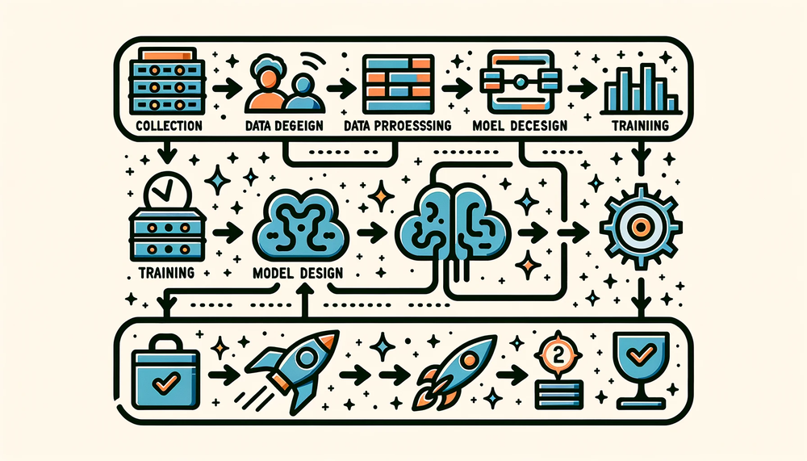

# ML Workflow {#sec-ml-workflow}

::: {layout-narrow}
::: {.column-margin}

\chapterminitoc

:::

\noindent
{fig-alt="Illustration of the machine learning workflow lifecycle showing interconnected stages from data collection through model deployment and monitoring."}

:::

## Purpose {.unnumbered}

\begin{marginfigure}
\mlsysstack{15}{15}{20}{30}{30}{45}{25}{25}
\end{marginfigure}

_Why is seeing the whole map necessary before walking any single path?_

The AI Triad (Data, Algorithm, Machine) names the components of every ML system, and deployment location determines the physical constraints each component must satisfy. Teams often treat these as separate concerns: one team collects data, another designs the model, a third provisions hardware. Yet the Triad's deepest lesson is that *these components interact*. The collected data constrains which algorithms are feasible. The chosen algorithm dictates what hardware can run it. The target hardware reshapes what data can be processed. Pull on any single thread and the entire system shifts. These interactions play out across components and across time: a model that performs well at launch degrades as the data distribution drifts, forcing retraining that may demand different hardware or revised data pipelines. Optimizing each piece in isolation is how teams build accurate models that cannot be deployed and efficient pipelines that feed the wrong data. A data engineer who sees how preprocessing choices constrain downstream architectures builds different pipelines than one who treats data preparation as an isolated task; a model developer who knows the deployment target's memory budget from day one makes different architecture decisions than one chasing accuracy in a vacuum. Before the details of any one component can be understood, the full map must be visible: how an ML system is built, evaluated, and sustained as a coherent whole.

::: {.content-visible when-format="pdf"}

\newpage

:::

::: {.callout-learning-objectives}

- Describe the six core ML lifecycle stages and their feedback-driven relationships
- Compare ML lifecycle workflows to traditional software development and explain why ML requires specialized approaches
- Apply systems thinking principles to trace how decisions propagate across lifecycle stages
- Analyze how problem-definition choices cascade through data, modeling, and deployment via exponential cost escalation
- Evaluate trade-offs between model performance, deployment constraints, and resource limitations using the iron law of workflow
- Explain why iteration velocity compounds into system quality advantages using the iteration tax analysis
- Trace how feedback loops at multiple timescales (real-time monitoring through quarterly reviews) enable continuous system improvement

:::

## ML Lifecycle {#sec-ml-workflow-understanding-ml-lifecycle-ca87}

ML systems are composed of the three interacting elements shown in @fig-ai-triad: Data, Algorithm, and Machine. They run under physical constraints that partition deployment into four paradigms: Cloud, Edge, Mobile, and TinyML (@sec-ml-systems). The parts and the operating environments are now in place. The missing piece is orchestration: *how* these components connect into a functioning system.\index{AI Triad!components}

Consider what happens without orchestration. Day one: "Build a diagnostic model for rural clinics."[^fn-beede-clinics] Day 90: 95 percent accuracy on the test set. Day 120: 96 percent accuracy after a month of architecture tuning. Day 150: model handed to deployment engineers. Day 151: deployment engineers report the model requires 4 GB of memory. Day 152: someone checks the deployment target—tablets in mobile clinics with 512 MB available. Day 153: five months of work is discarded.

The model's accuracy was excellent. The team's machine learning skills were excellent. The failure was a *workflow* failure. A deployment constraint that should have shaped every decision from day one was discovered only after the work was done. The tablet's memory limit should have propagated backward to the first architecture meeting, constraining which models were even worth considering. Instead, the team optimized each component in isolation (data collection, architecture selection, training), and the integration failure appeared only when the pieces were assembled. This is the default outcome when ML development lacks systematic orchestration.

This chapter introduces the **ML Workflow**\index{Workflow!systematic framework}, an engineering framework that prevents such failures by making constraints explicit at each development stage and tracing how they propagate across stages. The Workflow marks a transition from model researcher to systems engineer. A researcher optimizes individual elements: a better architecture, a cleaner dataset, a faster accelerator. A systems engineer orchestrates those elements into production systems that reliably deliver value. Presenting this framework before the detailed technical chapters is deliberate: understanding how the pieces fit together changes how each piece is learned. A data engineer who understands that preprocessing decisions constrain model architectures approaches data pipelines differently than one who treats data preparation as an isolated task. A model developer who knows the deployment target from day one makes different architecture choices than one optimizing accuracy in a vacuum. The Workflow provides the mental map that makes each subsequent chapter's contributions legible within the larger system.

The orchestration framework is what we call the machine learning lifecycle\index{Machine Learning Lifecycle}\index{Systems Thinking!principles in ML}—a structured, iterative process[^fn-crisp-dm-lifecycle] that guides the development, evaluation, and improvement of ML systems [@amershi2019]. The formal definition emphasizes continuous management rather than a one-time release:

[^fn-crisp-dm-lifecycle]: **CRISP-DM (Cross-Industry Standard Process for Data Mining)**: The 1996 process model that first codified data-intensive system development as six interconnected, iterative phases rather than a linear waterfall. Its core design principle (feedback loops between all phases) directly informs the modern ML lifecycle's structure. Boehm's empirical software-defect studies showed postdeployment fixes costing up to two orders of magnitude more than early fixes; this chapter later uses a deliberately simpler $2^{N_{\text{stage}}-1}$ model, where $N_{\text{stage}}$ is the lifecycle stage index, to show how constraint violations compound across ML workflow stages. \index{CRISP-DM!lifecycle influence}

```{python}
#| echo: false
from mlsysim import *
from mlsysim.core.constants import *
#| label: chapter-imports
#| output: false
# ┌─────────────────────────────────────────────────────────────────────────────
# │ CHAPTER IMPORTS
# ├─────────────────────────────────────────────────────────────────────────────
# │ Context: Global imports for all compute cells in this chapter
# │
# │ Goal: Centralize import statements for the chapter.
# │ Show: A clean namespace for subsequent calculations.
# │ How: Import constants, formatting helpers, and pint units.
# │
# │ Imports: pint, mlsysim.core.constants, mlsysim.fmt, IPython.display
# │ Exports: None (import-only cell)
# └─────────────────────────────────────────────────────────────────────────────
import pint
from mlsysim.fmt import fmt, check, MarkdownStr, fmt_math
from IPython.display import Markdown
```

Throughout this chapter, we use *lifecycle* to describe the stages themselves and *workflow* to describe the engineering discipline of orchestrating them; the lifecycle is *what gets traversed*, the workflow is *how the traversal is managed*. This distinction requires systems thinking: analyzing how a system's parts interrelate rather than treating them in isolation. These patterns (formalized in @sec-ml-workflow-integrating-systems-thinking-principles-24c0 and illustrated throughout this chapter with a detailed case study) explain *why* ML systems require integrated engineering approaches rather than sequential component optimization.

\index{ML Lifecycle!callout alias}
\index{System Entropy!lifecycle management}

::: {#dfn-ml-workflow-machine-learning-lifecycle .callout-definition title="Machine learning lifecycle"}

***Machine Learning Lifecycle***\index{Machine Learning Lifecycle!definition} is the iterative engineering process of building, deploying, monitoring, and retraining ML systems, where each stage feeds information back to earlier stages because model performance degrades continuously after deployment.

1.  **Significance (quantitative)**: The lifecycle is a closed loop, not a linear pipeline. Model accuracy decays at a rate proportional to the divergence $\mathcal{D}(P_t \lVert P_0)$ between the current and training distributions, requiring periodic retraining that re-incurs the full $O/(R_{\text{peak}} \cdot \eta_{\text{hw}})$ compute cost\index{Duty Cycle!ML lifecycle maintenance}. The retraining frequency—and therefore the amortized cost per prediction—is a direct function of drift velocity, making the lifecycle a budgeting problem, not just an engineering process.
2.  **Distinction (durable)**: Unlike a traditional software lifecycle, which degrades only when code changes, the ML lifecycle degrades when the world changes. A deployed model's accuracy erodes through data drift even when the code, infrastructure, and configuration remain untouched.
3.  **Common pitfall**: A frequent misconception is that the lifecycle ends at deployment. In reality, deployment is the beginning of the feedback loop: production monitoring surfaces drift, drift triggers retraining, and retraining produces a new model that re-enters the deployment stage.

:::

\index{Pipeline!data and model dual architecture}

@Fig-ml-lifecycle traces two parallel pipelines through the complete lifecycle. The data pipeline (green, top row) transforms raw inputs through collection, ingestion, analysis, labeling, validation, and preparation into ML-ready datasets. The model development pipeline (blue, bottom row) takes these datasets through training, evaluation, validation, and deployment to create production systems. The feedback paths are central: deployment returns online performance to data collection, while the curved data-quality loops send data fixes back to collection and data needs back to analysis. These feedback paths create the continuous improvement cycles that distinguish ML from traditional linear development.

::: {#fig-ml-lifecycle fig-env="figure" fig-pos="htb" fig-cap="**Dual-Pipeline ML Development**: The data pipeline (green, top) progresses from collection through preparation. The model pipeline (blue, bottom) takes prepared datasets through training and deployment. Feedback arrows show how deployment experience reshapes collection, while data fixes and data needs feed back into earlier data-pipeline stages." fig-alt="Two parallel pipelines: data (green, top) with six stages from collection to preparation; model (blue, bottom) with four stages. A deployment feedback path returns online performance to data collection, and curved data-quality feedback arrows labeled Data fixes and Data needs return to earlier data-pipeline stages."}

```{.tikz}
\begin{tikzpicture}[font=\usefont{T1}{phv}{m}{n}]
%
\tikzset{
  Box/.style={align=flush center,
    inner xsep=2pt,
    node distance=1.6,
    draw=GreenLine,
    line width=0.75pt,
    fill=GreenFill,
    text width=25mm,
    minimum width=25mm, minimum height=23mm
  },
  Box1/.style={Box, node distance=3.7
  },
 Line/.style={line width=1.0pt,black!50,text=black},
 Text/.style={font=\usefont{T1}{phv}{m}{n}\footnotesize,align=center
  },
DLine/.style={draw=VioletLine, line width=2pt, -{Triangle[length=3mm, bend]},
shorten >=1.1mm, shorten <=1.15mm},
}
%
\node[Box](B1){\textbf{Data Collection}\\\small Continuous input stream};
\node[Box,right=of B1](B2){\textbf{Data Ingestion}\\\small Prep data for downstream ML apps};
\node[Box, right=of B2](B3){\textbf{Data Analysis, Curation}\\\small  Inspect/select the right data};
\node[Box, right=of B3](B4){\textbf{Data Labeling}\\\small  Annotate data};
\node[Box, right=of B4](B5){\textbf{Data Validation}\\\small Verify data is usable through pipeline};
\node[Box, right=of B5](B6){\textbf{Data Preparation}\\\small Prep data for ML uses (split, versioning)};
%
\node[Box1,below=of B2,,fill=BlueFill,draw=BlueLine](2B2){\textbf{ML System Deployment}\\\small  Deploy ML system to production};
\node[Box, right=of 2B2,,fill=BlueFill,draw=BlueLine](2B3){\textbf{ML System Validation}\\\small Validate ML system for deployment};
\node[Box, right=of 2B3,,fill=BlueFill,draw=BlueLine](2B4){\textbf{Model Evaluation}\\\small Compute model KPIs};
\node[Box, right=of 2B4,,fill=BlueFill,draw=BlueLine](2B5){\textbf{Model Training}\\\small Use ML algos to create models};

\coordinate(S) at ($(B4.south)!0.5!(2B4.north)$);

\begin{scope}[local bounding box=AR,shift={($(S)+(-6,-0.7)$)},anchor=center]
% Dimensions
\def\w{6cm}
\def\h{15mm}
\def\r{6mm} % radius
\def\gap{4mm} % break lengths

\draw[BlueLine, -{Latex[length=10pt,width=22pt]},line width=10pt]
  (\w,\h-\r) -- (\w,\r)
  arc[start angle=0, end angle=-90, radius=\r]
  -- (\gap,0);

  \draw[GreenLine, -{Latex[length=10pt,width=22pt]},line width=10pt]
  (0,\r) -- (0,\h-\r)
  arc[start angle=180, end angle=90, radius=\r]
  -- ({\w-\gap},\h);
\end{scope}
%%%
\draw[Line,-latex](B1)--node[below,Text]{Raw\\ data}(B2);
\draw[Line,-latex](B2)--node[below,Text]{Indexed\\ data}(B3);
\draw[Line,-latex](B3)--node[below,Text]{Selected\\ data}(B4);
\draw[Line,-latex](B4)--node[below,Text]{Labeled\\ data}(B5);
\draw[Line,-latex](B5)--node[below,Text]{Validated\\ data}(B6);
\draw[Line,-latex](B6)|-node[left,Text,pos=0.2]{ML ready\\ Datasets}(2B5);
\draw[Line,-latex](2B5)--node[below,Text]{Models}(2B4);
\draw[Line,-latex](2B4)--node[below,Text]{KPIs}(2B3);
\draw[Line,-latex](2B3)--node[below,Text]{Validated\\ ML System}
node[above,Text]{ML\\ Certificate}(2B2);
\draw[Line,-latex](2B2)-|node[below,Text,pos=0.2]{Online\\ ML System}
node[right,Text,pos=0.8]{Online\\ Performance}(B1);

\draw[DLine,distance=44](B3.north)to[out=120,in=80]
node[below]{Data fixes}(B1.north);
\draw[DLine,distance=44](B5.north)to[out=120,in=80]
node[below]{Data needs}(B3.north);
\end{tikzpicture}
```

:::

This framework sets up the technical chapters ahead. The data pipeline receives comprehensive treatment in @sec-data-engineering, model training scales up in @sec-model-training, software frameworks enabling iterative development appear in @sec-ml-frameworks, and deployment and ongoing operations unfold in @sec-ml-operations. The interconnections among these pieces must be understood first, because each technical chapter assumes familiarity with the overall workflow.

\index{ML Operations!relationship to lifecycle}
The conceptual stages of the ML lifecycle establish the *what* and *why* of the development process. The operational implementation of this lifecycle through automation, tooling, and infrastructure constitutes the *how*. @Sec-ml-operations explores those operational practices in detail. This distinction matters: the lifecycle is the conceptual framework; operational infrastructure is the machinery that implements it at scale.

### Quantifying the ML lifecycle {#sec-ml-workflow-quantifying-ml-lifecycle-bd69}

Understanding the lifecycle conceptually is necessary but insufficient for engineering decisions. Quantitative characterization reveals *where* effort and compute actually go in ML projects, exposing which stages bottleneck development and *where* optimization investments yield the highest returns.

\index{ML Lifecycle!time allocation across stages}
```{python}
#| echo: false
#| label: data-scientist-time-allocation
# ┌─────────────────────────────────────────────────────────────────────────────
# │ DATA SCIENTIST TIME ALLOCATION
# ├─────────────────────────────────────────────────────────────────────────────
# │ Context: Used in CrowdFlower survey prose and @fig-ds-time caption
# │
# │ Goal: Keep survey percentage summaries tied to the pie-slice values.
# │ Show: That cleaning plus collection dominate reported practitioner time.
# │ How: Sum the reported percentage buckets and guard that they cover 100%.
# │
# │ Imports: mlsysim.fmt (check, fmt_percent)
# │ Exports: DataScientistTime.cleaning_str,
# │          DataScientistTime.collection_str,
# │          DataScientistTime.data_work_str,
# │          DataScientistTime.model_focused_str
# └─────────────────────────────────────────────────────────────────────────────

# ┌── LEGO ───────────────────────────────────────────────
class DataScientistTime:
    """CrowdFlower survey percentage buckets used in the time-allocation figure."""

    # ┌── 1. LOAD (Constants) ──────────────────────────────────────────────
    cleaning_pct = 60
    collection_pct = 19
    mining_pct = 9
    training_set_pct = 3
    algorithm_refinement_pct = 4
    other_pct = 5

    # ┌── 2. EXECUTE (The Compute) ────────────────────────────────────────
    data_work_pct = cleaning_pct + collection_pct
    model_focused_pct = mining_pct + training_set_pct + algorithm_refinement_pct
    total_pct = data_work_pct + model_focused_pct + other_pct

    # ┌── 3. GUARD (Invariants) ───────────────────────────────────────────
    check(total_pct == 100, f"Survey buckets sum to {total_pct}%, not 100%.")
    check(data_work_pct > model_focused_pct, "Data work should dominate model-focused buckets.")

    # ┌── 4. OUTPUT (Formatting) ──────────────────────────────────────────
    cleaning_str = fmt_percent(cleaning_pct/100, precision=0, commas=False, style='symbol')
    collection_str = fmt_percent(collection_pct/100, precision=0, commas=False, style='symbol')
    data_work_str = fmt_percent(data_work_pct/100, precision=0, commas=False, style='symbol')
    model_focused_str = fmt_percent(model_focused_pct/100, precision=0, commas=False, style='symbol')
```

Reports about where practitioners spend the most time follow a consistent pattern: data work often dominates. In the 2016 CrowdFlower data-science survey, `{python} DataScientistTime.cleaning_str` of respondents selected cleaning and organizing data as the activity where they spent the most time, while `{python} DataScientistTime.collection_str` selected collecting datasets [@crowdflower2016data]. Together, these two data-centered responses account for `{python} DataScientistTime.data_work_str` of the survey's "most time" responses. That survey reports practitioners' primary time sink rather than a universal project-level effort budget, but it captures the practical lesson that data preparation can dominate ML engineering effort. Model development and training (the focus of @sec-model-training), despite receiving the most research attention, is only one part of the lifecycle; deployment, integration, and initial monitoring setup add their own engineering burden. This distribution surprises teams accustomed to traditional software where implementation dominates. In ML projects, the "source code" is the data, and preparing that source code is a primary engineering activity. For a concrete breakdown, turn to @fig-ds-time: cleaning and organizing data was the most-time-consuming activity selected by `{python} DataScientistTime.cleaning_str` of respondents.

::: {#fig-ds-time fig-env="figure" fig-pos="htb" fig-cap="**Data Scientist Most-Time Responses**: In CrowdFlower's 2016 survey, `{python} DataScientistTime.cleaning_str` of respondents selected cleaning and organizing data as the activity where they spent the most time, with `{python} DataScientistTime.collection_str` selecting data collection. Model-focused responses such as pattern mining, training set construction, and algorithm refinement together represent roughly `{python} DataScientistTime.model_focused_str` of responses. Source: CrowdFlower, *Data Science Report 2016*." fig-alt="Pie chart showing what surveyed data scientists said they spent the most time doing: 60 percent cleaning and organizing data, 19 percent collecting datasets, 9 percent mining for patterns, 3 percent building training sets, 4 percent refining algorithms, 5 percent other tasks."}

```{.tikz}
\scalebox{0.9}{%
\begin{tikzpicture}[line join=round,font=\small\usefont{T1}{phv}{m}{n}]
\makeatletter
\def\pgfpie@legend#1{%
  \coordinate[xshift=15mm,
  yshift={(\the\pgfpie@sliceLength*0.5+1)*0.5cm}] (pgfpie@legendpos) at
  (current bounding box.east);

\scope[node distance=2.25mm]
    \foreach \pgfpie@p/\pgfpie@t [count=\pgfpie@i from 0] in {#1}
    {
      \pgfpie@findColor{\pgfpie@i}
      \node[circle,draw, fill={\pgfpie@thecolor}, draw=none,inner sep=5 pt,below =1.6mm of {pgfpie@legendpos},
      label={[font=\footnotesize\usefont{T1}{phv}{m}{n}]0:{\pgfpie@t}}] (pgfpie@legendpos) {};
    }
  \endscope
}
\makeatother
\definecolor{Greenn}{RGB}{84,180,53}
\definecolor{Redd}{RGB}{249,56,39}
\definecolor{Orangee}{RGB}{255,157,35}
\definecolor{Brownn}{RGB}{214,128,96}
\definecolor{Bluee}{RGB}{0,97,168}
\definecolor{Violett}{RGB}{178,108,186}
\definecolor{Yelloww}{RGB}{255,210,76}
\tikzset{lines/.style={
  draw=none,
  line width=0.75pt
}}

\pie[text=legend,radius=2.65,
     style={lines},
     color={Greenn!60, Redd!90, Orangee, Bluee!80, Yelloww, Violett},
     every slice/.style={draw=blue}
     ]
{60/Cleaning and organizing data,
19/Collecting datasets,
9/Mining data for patterns,
3/Building training sets,
4/Refining algorithms,
5/Other}
\end{tikzpicture}}
```

:::

\index{ML Lifecycle!iteration cycles}
Beyond time allocation, iteration cycles characterize successful ML projects. Return to @fig-ml-lifecycle and notice the feedback loops driving these iterations: each arrow represents a path that teams traverse repeatedly. Production ML systems usually require repeated iteration across data, model, and infrastructure stages, where each cycle may revisit multiple stages. Understanding what triggers these iterations guides resource allocation. Data quality issues (missing labels, distribution mismatches, preprocessing errors) are often a major source of rework. Architecture and training choices (model capacity, hyperparameters, training instability) and infrastructure issues (latency violations, resource constraints, integration failures) create additional loops that teams must budget for explicitly.

These proportions explain *why* data engineering capabilities often determine project success more than modeling sophistication. They also explain a structural choice in this book: Part I concludes with @sec-data-engineering precisely because data is where most effort goes, most iterations originate, and most failures begin. Understanding the data pipeline first provides leverage over the single largest source of project risk before the modeling, training, and optimization techniques that follow.

The cost of late discovery follows an exponential pattern[^fn-boehm-cost-curve] that this chapter formalizes later as the constraint propagation principle (@sec-ml-workflow-integrating-systems-thinking-principles-24c0); for now, the practical consequence is what matters. Late-stage constraint discoveries create exponential cost escalation because violations must be corrected across multiple preceding stages. This exponential cost structure motivates the stage interface contracts\index{Stage Interface Specification!contracts} in @tbl-stage-interface: validating outputs at each stage transition catches violations early when correction costs remain manageable.

[^fn-boehm-cost-curve]: **Exponential Cost Escalation**: Boehm's *Software Engineering Economics* [@boehm1981] quantified this pattern for traditional software, showing that defects found postdeployment can cost far more to fix than those caught during requirements. ML systems have their own version of this escalation because late-discovered constraints can require retraining, data-pipeline changes, and renewed validation, not just code changes.

[^fn-beede-clinics]: **Lab-to-Deployment Gap**: @beede2020human documented this empirically for a deep-learning diabetic retinopathy screening system deployed in Thai clinics. Although the system had specialist-level accuracy in earlier validation, 21 percent of images submitted during the first six months failed its image-quality requirements, often because clinic lighting, camera maintenance, or dilation practices did not match the system's assumptions. Those rejections added work for nurses, forced retakes or referrals, and exposed workflow and infrastructure barriers rather than simply a model-accuracy problem. \index{Workflow!lab-deployment gap}

| **Stage**                         | **Input Contract**                                        | **Output Contract**                                                                 | **Quality Invariant**                                                                                 |
|:----------------------------------|:----------------------------------------------------------|:------------------------------------------------------------------------------------|:------------------------------------------------------------------------------------------------------|
| **Problem Definition**            | Business requirements; operational context                | Measurable objectives; deployment paradigm selection; resource constraints          | All success criteria are quantifiable; target deployment paradigm is explicit                         |
| **Data Collection & Preparation** | Objectives; deployment target; quality requirements       | Versioned dataset with schema; preprocessing pipeline; data validation rules        | Distribution approximates anticipated production environment; labeling meets accuracy requirements    |
| **Model Development & Training**  | Dataset; accuracy targets;  resource constraints          | Trained model weights;  training configuration; experiment logs                     | Meets accuracy thresholds within computational budget; architecture compatible with deployment target |
| **Evaluation & Validation**       | Trained model; held-out test data; evaluation criteria    | Performance metrics across subgroups; failure mode analysis; validation certificate | No critical subgroup falls below minimum thresholds; calibration meets domain requirements            |
| **Deployment & Integration**      | Validated model; infrastructure requirements; SLA targets | Serving endpoint; monitoring  instrumentation; rollback procedures                  | Latency and throughput meet  paradigm requirements; integration tests pass                            |
| **Monitoring & Maintenance**      | Live system; performance baselines; alert threshold       | Drift detection alerts; retraining triggers; incident reports                       | Performance stays within acceptable bounds; degradation detected before user impact                   |

: **Stage Interface Specification**: Each lifecycle stage has explicit input requirements, output deliverables, and quality invariants that must hold for the stage to be considered complete. Violations of these contracts create technical debt that compounds through subsequent stages. The deployment paradigm selection in Problem Definition (Cloud, Edge, Mobile, or TinyML from @sec-ml-systems) constrains all downstream stages, as a TinyML target imposes different data, model, and monitoring requirements than a Cloud target. {#tbl-stage-interface tbl-colwidths="[18,24,27,31]"}

This compounding cost of slow iteration creates what we call the *iteration tax*. A quick calculation makes the bottleneck concrete.

::: {.column-margin}
{width="100%" fig-alt="Two rising curves over 26 weeks: a steeper hourly-iteration curve overtaking a shallower weekly-iteration curve, the two crossing partway across."}

*Slow iteration loses to fast feedback over time.*
:::

```{python}
#| echo: false
#| label: iteration-tax-calc
# ┌─────────────────────────────────────────────────────────────────────────────
# │ ITERATION TAX CALCULATION
# ├─────────────────────────────────────────────────────────────────────────────
# │ Context: Used in "The Iteration Tax" callout comparing slow vs fast cycles
# │
# │ Goal: Demonstrate why iteration velocity dominates project outcome.
# │ Show: That fast 1-hour cycles overtake slow 1-week cycles within 6 months.
# │ How: Model accuracy growth as a function of iteration count over time.
# │
# │ Imports: mlsysim.fmt (fmt, check, fmt_count_range, fmt_percent, fmt_pp, fmt_time)
# │ Exports: IterationTax.weeks_str, IterationTax.hours_week_str,
# │          IterationTax.large_time_weeks_str, IterationTax.large_acc_str,
# │          IterationTax.large_gain_str, IterationTax.large_final_str,
# │          IterationTax.small_time_hours_str, IterationTax.small_acc_str,
# │          IterationTax.small_gain_str, IterationTax.small_iters_str,
# │          IterationTax.small_uncapped_str, IterationTax.small_final_str,
# │          IterationTax.small_total_capacity_str
# └─────────────────────────────────────────────────────────────────────────────

# ┌── LEGO ───────────────────────────────────────────────
class IterationTax:
    """
    Namespace for Iteration Tax calculation.
    Scenario: Comparing a large, slow-to-train model vs a small, fast model
    over a fixed 6-month development window.
    """

    # ┌── 1. LOAD (Constants) ───────────────────────────────────────────────
    weeks_total = 26
    hours_per_week = 168

    # Large Model (Starts better, iterates slow)
    large_start_acc = 95.0
    large_gain_per_iter = 0.15    # Reduced from 0.5: SOTA gains are hard!
    large_cycle_time_hours = 168  # 1 week

    # Small Model (Starts worse, iterates fast)
    small_start_acc = 90.0
    small_gain_per_iter = 0.1
    small_cycle_time_hours = 1    # 1 hour
    small_effective_iters = 100   # Realistic cap on useful experiments

    # ┌── 2. EXECUTE (The Compute) ─────────────────────────────────────────
    # Step 1: Large model: 1 iter/week -> 26 iters
    large_iters = weeks_total * (hours_per_week/large_cycle_time_hours)
    large_final_acc = min(large_start_acc + (large_iters * large_gain_per_iter), 99.0)

    # Small model: Potential thousands, but capped by human ability to generate ideas
    # Step 2: We allow small model to reach same ceiling
    small_uncapped_acc = small_start_acc + (small_effective_iters * small_gain_per_iter)
    small_final_acc = min(small_uncapped_acc, 99.0)

    # ┌── 3. GUARD (Invariants) ───────────────────────────────────────────
    # Invariant: Small model must CATCH UP or BEAT Large model
    check(large_iters == weeks_total, f"Large model should run one experiment per week, got {large_iters}.")
    check(small_effective_iters <= weeks_total * hours_per_week, "Effective small-model iterations exceed hourly capacity.")
    check(small_final_acc >= large_final_acc, f"Small model ({small_final_acc}%) failed to beat Large model ({large_final_acc}%) despite speed.")

    # ┌── 4. OUTPUT (Formatting) ──────────────────────────────────────────────
    weeks_str = fmt_time(weeks_total, "week", precision=0, commas=False, style="word")
    weeks_span_str = fmt_time(weeks_total, "week", precision=0, commas=False, style="word")
    hours_week_str = fmt_time(hours_per_week, "hour", precision=0, commas=False, per="week")
    large_iters_str = fmt(large_iters, precision=0, commas=False)

    large_time_weeks_str = fmt_time(large_cycle_time_hours * hour, week, precision=0, commas=False, style="word")
    large_acc_str = fmt_percent(large_start_acc/100, precision=0, commas=False, style='symbol')
    large_gain_str = fmt_pp(large_gain_per_iter, precision=2)
    large_final_str = fmt_percent(large_final_acc/100, precision=1, commas=False, style='symbol')

    small_time_hours_str = fmt_time(small_cycle_time_hours * hour, hour, precision=0, commas=False, style="word")
    small_acc_str = fmt_percent(small_start_acc/100, precision=0, commas=False, style='symbol')
    small_gain_str = fmt_pp(small_gain_per_iter, precision=1)
    small_iters_str = fmt(small_effective_iters, precision=0, commas=False)
    small_uncapped_str = fmt_percent(small_uncapped_acc/100, precision=0, commas=False, style='symbol')
    small_final_str = fmt_percent(small_final_acc/100, precision=0, commas=False, style='symbol')

    # Logic check helper for text
    small_total_capacity_str = fmt(weeks_total * hours_per_week, precision=0, commas=True)
    acc_ceiling_pct_str = fmt_percent(99/100, precision=0, commas=False, style='symbol')
```

::: {#nbk-ml-workflow-iteration-tax .callout-notebook title="The iteration tax"}

**Problem**: A diabetic retinopathy (DR) screening system for rural clinics must choose between a large ensemble trained on high-resolution fundus images (training time: `{python} IterationTax.large_time_weeks_str`, accuracy: `{python} IterationTax.large_acc_str`) and a lightweight model suitable for edge deployment on clinic hardware (training time: `{python} IterationTax.small_time_hours_str`, accuracy: `{python} IterationTax.small_acc_str`). Which approach yields a better screening system in six months?

**Math**: In six months (~`{python} IterationTax.weeks_span_str`), the possible experiment count is:

1. **Large model**: `{python} IterationTax.weeks_str` of calendar time at `{python} IterationTax.large_time_weeks_str` per experiment. Each experiment improves accuracy by ~`{python} IterationTax.large_gain_str` (diminishing returns).
2. **Small model**: `{python} IterationTax.weeks_str` $\times$ `{python} IterationTax.hours_week_str` = `{python} IterationTax.small_total_capacity_str` experiments at `{python} IterationTax.small_time_hours_str` each. Even with smaller gains per iteration, the compound effect is substantial.

**Result**: If each iteration improves accuracy by `{python} IterationTax.small_gain_str` on average, the small model reaches: `{python} IterationTax.small_acc_str` + (`{python} IterationTax.small_iters_str` $\times$ `{python} IterationTax.small_gain_str`) = `{python} IterationTax.small_uncapped_str` before applying the `{python} IterationTax.acc_ceiling_pct_str` ceiling, so it renders as `{python} IterationTax.small_final_str`. The large model reaches: `{python} IterationTax.large_acc_str` + (`{python} IterationTax.large_iters_str` $\times$ `{python} IterationTax.large_gain_str`) = `{python} IterationTax.large_final_str`. Even assuming we use only a fraction of the theoretical capacity (for example, 100 effective iterations out of thousands possible), the compound effect dominates. In practice, the small model's rapid iteration enables discovering better architectures, data augmentations, and hyperparameters.

**Systems insight**: *Iteration velocity is a feature.* A system that allows ten experiments/day will almost always eventually outperform a system that allows one experiment/week, even if the latter starts with a better model. This "iteration tax" explains why startups with fast iteration often outperform larger teams with slower cycles. For our DR screening scenario, the lightweight model's rapid iteration cycle enables the team to experiment with data augmentations, preprocessing pipelines, and architecture variations far more quickly, ultimately converging on a more robust screening system despite starting at lower accuracy.

:::

The iteration tax makes a broader point: *ML workflows are not slow versions of traditional software lifecycles.* They are structurally different, and the differences show up in *where* time is spent, *how* feedback loops operate, and *how* late discoveries compound cost.

### ML vs. traditional software {#sec-ml-workflow-ml-vs-traditional-software-development-c5f5}

The realities established earlier (data-heavy effort, repeated iteration, and escalating late-stage correction costs) have no direct counterparts in traditional software engineering. Understanding exactly *where* these departures occur, and *why* conventional lifecycle models cannot accommodate them, motivates the specialized approaches that the rest of this chapter develops.

\index{Waterfall Model!contrast with ML}

Traditional lifecycles consist of sequential phases: requirements gathering, system design, implementation, testing, and deployment[^fn-waterfall-model-ml] [@royce1970managing]. Each phase produces specific artifacts that serve as inputs to subsequent phases. In financial software development, the requirements phase produces detailed specifications for transaction processing, security protocols, and regulatory compliance. These specifications translate directly into system behavior through explicit programming. This *deterministic* approach contrasts sharply with the *probabilistic* nature of ML systems described in @sec-introduction-ml-vs-traditional-software-e19a, where outputs are statistical predictions rather than deterministic transformations and where "correct" behavior is defined by distributions rather than specifications.

[^fn-waterfall-model-ml]: **Waterfall Model**: Enforces a strict sequential process where system requirements are finalized before implementation begins, a practice inherited from physical manufacturing. This core assumption, that the specification is stable, fails for ML systems where *the training data itself is the specification* and its properties can only be discovered through empirical iteration. Empirical software-engineering studies report remediation costs that can rise by orders of magnitude when defects are found late; the simplified workflow model below uses a 16$\times$ multiplier for the specific stage-1-to-stage-5 path analyzed in this chapter. \index{Waterfall Model!ML incompatibility}

\index{Fraud Detection!ML vs. rule-based}
Machine learning systems require a structurally different approach. Consider financial transaction processing: traditional systems follow predetermined rules (if account balance > transaction amount, then allow transaction), while ML-based fraud detection systems learn to recognize suspicious patterns from historical transaction data. This shift from explicit programming to learned behavior reshapes the development lifecycle, altering how we approach system reliability and robustness.

\index{Continuous Deployment!ML-specific requirements}
These differences alter *how* lifecycle stages interact. Unlike traditional software where later phases rarely influence earlier ones, ML systems require continuous feedback loops: deployment insights reshape data collection, monitoring drives model updates, and production data reveals distributional properties invisible in development. This dynamism demands continuous deployment practices that traditional release cycles cannot accommodate (@sec-ml-workflow-monitoring-maintenance-stage-e79a).

\index{Data Versioning!challenges vs. code}
@tbl-sw-ml-cycles contrasts these differences across six development dimensions, from problem definition through maintenance. These differences reflect the core challenge of working with data as a first-class citizen in system design, something traditional software engineering methodologies were not designed to handle[^fn-data-versioning-drift].

[^fn-data-versioning-drift]: **Data Versioning**: Unlike code, which changes through discrete, auditable commits, data can drift gradually (distribution shift), suddenly (schema migration), or subtly (label quality degradation). Git cannot version multi-terabyte datasets, forcing specialized tools like DVC and Git LFS. The systems consequence: without data versioning, teams cannot reproduce a prior training run or diagnose whether an accuracy regression stems from a code change or a data change, making root-cause analysis intractable. \index{Data Versioning!reproducibility}

| **Aspect**                 | **Traditional Software Lifecycles**                                  | **Machine Learning Lifecycles**                                                                                       |
|:---------------------------|:---------------------------------------------------------------------|:----------------------------------------------------------------------------------------------------------------------|
| **Problem Definition**     | Precise functional specifications are defined upfront.               | Performance-driven objectives evolve as the problem space is explored.                                                |
| **Development Process**    | Linear progression of feature implementation.                        | Iterative experimentation with data, features, and models.                                                            |
| **Testing and Validation** | Deterministic, binary pass/fail testing criteria.                    | Statistical validation and metrics that involve uncertainty.                                                          |
| **Deployment**             | Behavior remains static until explicitly updated.                    | Performance may change over time due to shifts in data distributions.                                                 |
| **Maintenance**            | Maintenance involves modifying code to address bugs or add features. | Continuous monitoring, updating data pipelines, retraining models, and adapting to new data distributions.            |
| **Feedback Loops**         | Minimal; later stages rarely impact earlier phases.                  | Frequent; insights from deployment and monitoring often refine earlier stages like data preparation and model design. |

: **Traditional Software vs. ML Development Lifecycles**: Six dimensions where ML development diverges from traditional software engineering. The most critical difference appears in the final row: while traditional software rarely sees later stages influence earlier phases, ML systems require continuous feedback loops where deployment insights reshape data collection, monitoring drives model updates, and production experiences inform architectural decisions. These differences explain why traditional project management approaches fail when applied to ML projects without modification. {#tbl-sw-ml-cycles tbl-colwidths="[21,29,50]"}

### The erosion of determinism: Breaking OS assumptions {#sec-ml-workflow-erosion-determinism}

This shift from *code-centric* to *data-centric* development erodes more than just project management models; it breaks the fundamental assumptions of modern operating systems. For over fifty years, OS kernels (from Unix to Windows) have been optimized for spatial and temporal locality[^fn-locality-violation-cost]: the belief that if a program reads byte $X$, it will likely read $X+1$ soon, and if it uses memory address $Y$, it will likely reuse it.

[^fn-locality-violation-cost]: **Locality of Reference**: Formalized by @denning1968 as the principle governing virtual memory design. The cost of violating locality is quantitative: an L1 cache hit costs approximately 1 ns, while a DRAM access costs 50--100 ns (50--100$\times$ penalty), and a Non-Volatile Memory Express (NVMe) SSD read costs 10--100 $\mu$s (10,000--100,000$\times$ penalty). Random shuffling of multi-terabyte datasets during each training epoch triggers the worst case at every level of the memory hierarchy, explaining why ML data loaders must implement their own prefetching logic rather than relying on OS page cache heuristics. \index{Locality of Reference!ML workload violation}

ML workflows violate these abstractions at scale. A multi-terabyte dataset being randomly shuffled during every training epoch presents a "worst-case" workload for traditional file system buffers and virtual memory prefetchers. When every "instruction" (a sample) is fetched stochastically from a massive pool, the OS's predictive caching logic fails, and the system defaults to expensive disk I/O or network transfers. A systems engineer must acknowledge that the "Abstractions of the 1970s," once designed to hide hardware latency, are often the primary sources of the overhead term $(L_{\text{lat}})$ in the iron law for Software 2.0. Bridging this gap requires the specialized data engineering and hardware-aware optimizations we examine in the following Parts.

These distinctions translate directly into the structured six-stage framework that organizes how ML projects unfold, each stage presenting unique challenges that traditional software methodologies cannot address.

::: {#chk-ml-workflow-ml-vs-traditional-devops .callout-checkpoint title="ML vs. traditional DevOps"}

Operating ML systems is not merely DevOps for models. Ensure you grasp the key differences:

- [ ] **Failure modes**: Can you distinguish *Silent Failure* (degradation/drift) from *Explicit Failure* (crash/exception)?
- [ ] **Logic source**: Do you understand that in ML, "Data is Source Code"? Changing data changes behavior just like changing code.
- [ ] **Iteration**: Can you explain why ML requires continuous retraining loops that do not exist in traditional CI/CD?

:::

## Lifecycle Stages {#sec-ml-workflow-six-core-lifecycle-stages-00b0}

Where traditional software follows requirements through implementation to testing, ML systems demand a different organizational structure: one that accommodates iterative experimentation, data-driven evolution, and continuous feedback. The six-stage framework that follows captures these differences.

As @fig-lifecycle-overview illustrates, the ML lifecycle distills into six core stages laid out in reading order, wrapping from a top row to a bottom row: Problem Definition establishes objectives and constraints; Data Collection and Preparation encompasses the data pipeline; Model Development and Training creates models; Evaluation and Validation ensures quality; Deployment and Integration brings systems to production; and Monitoring and Maintenance ensures continued effectiveness. The prominent feedback loop connecting monitoring back to data collection (the key insight in the diagram) shows that production signals (drift detection, performance degradation, new failure modes) flow back to inform earlier phases, capturing the cyclical nature that distinguishes ML from linear software development.

::: {#fig-lifecycle-overview fig-env="figure" fig-pos="htb" fig-cap="**Simplified Lifecycle with Feedback**: Six stages laid out in reading order across two rows—the top row covers problem definition, data collection, model development, and evaluation; the bottom row continues with deployment and monitoring. The feedback loop from monitoring back to data collection captures the essential insight that production insights drive continuous refinement across earlier stages, because data distributions shift, model performance drifts, and operational requirements evolve." fig-alt="Six-stage flowchart wrapped across two rows: problem definition, data collection, model development, and evaluation on the top row; deployment and monitoring on the bottom row. Feedback loop arrow curves from monitoring back to data collection."}

```{.tikz}
\begin{tikzpicture}[font=\small\usefont{T1}{phv}{m}{n}]
\tikzset{
Box2/.style={align=flush center, inner sep=2pt,draw=none,fill=black!70,
font=\fontsize{8pt}{8}\usefont{T1}{phv}{b}{n},text=white,minimum width=20mm, minimum height=5mm },
Box/.style={align=center, inner xsep=2pt,draw=black!70, line width=1pt,node distance=15mm,
fill=none, minimum width=25mm, minimum height=20mm},
Circle1/.style={circle,  minimum size=33mm, draw=none, fill=BrownLine!20},
LineD/.style={BrownLine!60!black!20,line width=4.0pt,dashed,dash pattern=on 5pt off 2pt,
{-{Triangle[width=1.5*6pt,length=2.0*5pt]}},shorten <=5pt,shorten >=1pt},
LineA/.style={BrownLine!80!black!40,line width=4.0pt,
{-{Triangle[width=1.5*6pt,length=2.0*5pt]}},shorten <=5pt,shorten >=1pt},
ALineA/.style={violet!60,{Circle[line width=1.0pt,fill=white,round,length=5pt,width=5pt]}-,
line width=1.2pt,shorten <=-15pt,shorten >=-6pt}
}

%dataS
\tikzset{%
 pics/dataS/.style = {
        code = {
        \pgfkeys{/channel/.cd, #1}
\begin{scope}[local bounding box=FUNNEL,scale=\scalefac, every node/.append style={transform shape}]
%plats
\draw[fill=\filllcolor,line width=\Linewidth,draw=\drawcolor](0,-0.3)--(-0.67,0.03)--(0,0.37)--(0.67,0.03)--cycle;
\draw[fill=\filllcirclecolor,line width=\Linewidth,draw=\drawcolor](0,0)--(-0.67,0.33)--(0,0.67)--(0.67,0.33)--cycle;
\draw[fill=\filllcolor,line width=\Linewidth,draw=\drawcolor](0,0.3)--(-0.67,0.63)--(0,0.97)--(0.67,0.63)--cycle;
%left
\draw[line width=\Linewidth,draw=\drawcolor](-0.39,1.21)--++(210:0.55)--++(270:1.22)--(-0.39,-0.56);
\fill[line width=\Linewidth,fill=\filllcirclecolor!60!violet!,draw=green,draw=\drawcolor](-0.39,1.21)circle(3pt);
\fill[line width=\Linewidth,fill=\filllcolor,draw=green,draw=\drawcolor](-0.39,-0.56)circle(3pt);
%right
\draw[line width=\Linewidth,draw=\drawcolor](0.39,1.21)--++(330:0.55)--++(270:1.22)--(0.39,-0.56);
\fill[line width=\Linewidth,fill=\filllcirclecolor!60!violet!,draw=green,draw=\drawcolor](0.39,1.21)circle(3pt);
\fill[line width=\Linewidth,fill=\filllcolor,draw=green,draw=\drawcolor](0.39,-0.56)circle(3pt);
\end{scope}
     }
  }
}
%testing+pencil
\tikzset{
pics/testing/.style = {
        code = {
        \pgfkeys{/channel/.cd, #1}
\begin{scope}[local bounding box=TESTING1,shift={($(0,0)+(0,0)$)},scale=\scalefac,every node/.append style={transform shape}]
\newcommand{\tikzxmark}{%
\tikz[scale=0.18] {
    \draw[line width=0.7,line cap=round,RedLine] (0,0) to [bend left=6] (1,1);
    \draw[line width=0.7,line cap=round,RedLine] (0.2,0.95) to [bend right=3] (0.8,0.05);
}}
\newcommand{\tikzxcheck}{%
\tikz[scale=0.16] {
    \draw[line width=0.7,line cap=round,GreenLine] (0.5,0.75)--(0.85,-0.1) to [bend left=16] (1.5,1.55);

}}
 \node[draw, minimum width  =15mm, minimum height = 20mm, inner sep = 0pt,
        rounded corners,draw = \drawcolor, fill=\filllcolor!10, line width=\Linewidth](COM){};
\node[draw=GreenLine,inner sep=4pt,fill=white](CB1) at ($(COM.north west)!0.25!(COM.south west)+(0.3,0)$){};
\node[xshift=0pt]at(CB1){\tikzxcheck};
\node[draw=RedLine,inner sep=4pt,fill=white](CB2) at ($(COM.north west)!0.5!(COM.south west)+(0.3,0)$){};
\node[xshift=0pt]at(CB2){\tikzxmark};
\node[draw=RedLine,inner sep=4pt,fill=white](CB3) at ($(COM.north west)!0.75!(COM.south west)+(0.3,0)$){};
\node[xshift=0pt]at(CB3){\tikzxmark};
\draw[GreenLine,decoration={zigzag,segment length=4pt, amplitude=0.5pt},decorate]($(CB1)+(0.3,0.05)$)--++(0:0.8);
\draw[GreenLine,decoration={zigzag,segment length=4pt, amplitude=0.5pt},decorate]($(CB1)+(0.3,-0.12)$)--++(0:0.7);
\draw[RedLine,decoration={zigzag,segment length=4pt, amplitude=0.5pt},decorate]($(CB2)+(0.3,0.05)$)--++(0:0.8);
\draw[RedLine,decoration={zigzag,segment length=4pt, amplitude=0.5pt},decorate]($(CB2)+(0.3,-0.12)$)--++(0:0.6);
\draw[RedLine,decoration={zigzag,segment length=4pt, amplitude=0.5pt},decorate]($(CB3)+(0.3,0.05)$)--++(0:0.8);
\draw[RedLine,decoration={zigzag,segment length=4pt, amplitude=0.5pt},decorate]($(CB3)+(0.3,-0.12)$)--++(0:0.6);
\end{scope}
    }
  }
}
%pencil
\tikzset{
pics/pencil/.style = {
        code = {
        \pgfkeys{/channel/.cd, #1}
\begin{scope}[local bounding box=TESTING1,shift={($(0,0)+(0,0)$)},scale=\scalefac,every node/.append style={transform shape},rotate=340]
            \fill[fill=\filllcolor!70] (0,4) -- (0.4,4) -- (0.4,0) --(0.3,-0.15) -- (0.2,0) -- (0.1,-0.14) -- (0,0) -- cycle;
            \draw[color=white,thick] (0.2,4) -- (0.2,0);
            \fill[black] (0,3.5) -- (0.2,3.47) -- (0.4,3.5) -- (0.4,4) arc(30:150:0.23cm);
            \fill[fill=\filllcolor!40] (0,0) -- (0.2,-0.8)node[coordinate,pos=0.75](a){} -- (0.4,0)node[coordinate,pos=0.25](b){} -- (0.3,-0.15) -- (0.2,0) -- (0.1,-0.14) -- cycle;
            \fill[fill=\filllcolor] (a) -- (0.2,-0.8) -- (b) -- cycle;

\end{scope}
    }
  }
}
%nodes
\tikzset{
pics/nodes/.style = {
        code = {
        \pgfkeys{/channel/.cd, #1}
\begin{scope}[shift={($(0,0)+(0,0)$)},scale=\scalefac,every node/.append style={transform shape}]
%\node[draw=white,fill=none,circle,minimum size=0.925*40mm,line width=1pt](CI){};
%\draw[step=5mm,draw=white] (-2,-2) grid (2,2);
\foreach \x/\y[count=\a] in {-0.2/0.35,
0.7/0.6,-0.5/1.4,-1.20/-0.8,-0.1/-1.3,-0.4/-0.43,
0.61/-0.3,1/-0.85,0.45/1.2,-0.96/0.63}{
\node[circle,fill=myblue,draw=black,inner sep=0pt,minimum size=3mm](XB\a)at(\x,\y){};
}
\foreach \x/\y[count=\a] in {-2.0/0.1
}{
\node[circle,fill=myred,draw=black,inner sep=0pt,minimum size=3mm](XR\a)at(\x,\y){};
}

\foreach \x/\y[count=\a] in {1.87/0.1
}{
\node[circle,fill=mygreen,draw=black,inner sep=0pt,minimum size=3mm](XG\a)at(\x,\y){};
}

\foreach \x in {1,3,4,6,10}{
\draw[RedLine,line width=0.5pt](XR1) edge  (XB\x);
}
\foreach \x in {1,2,5,8,9}{
\draw[mygreen,line width=0.5pt](XG1) edge  (XB\x);
}
\foreach \x in {2,3,6,9,10}{
\draw[black,line width=0.5pt](XB1) edge  (XB\x);
}
\foreach \x in {4,5,7}{
\draw[black,line width=0.5pt](XB6) edge  (XB\x);
}
\draw[black,line width=0.5pt](XB4) edge  (XB5);
\draw[black,line width=0.5pt](XB3) edge  (XB9);
\foreach \x in {2,8}{
\draw[black,line width=0.5pt](XB7) edge  (XB\x);
}
\end{scope}
    }
  }
}

%target
\tikzset{
pics/target/.style = {
        code = {
        \pgfkeys{/channel/.cd, #1}
\begin{scope}[shift={($(0,0)+(0,0)$)},scale=\scalefac,every node/.append style={transform shape}]
\definecolor{col1}{RGB}{62,100,125}
\definecolor{col2}{RGB}{219,253,166}
\colorlet{col1}{\filllcolor}
\colorlet{col2}{\filllcirclecolor}
\foreach\i/\col [count=\k]in {22mm/col1,17mm/col2,12mm/col1,7mm/col2,2.5mm/col1}{
\node[circle,inner sep=0pt,draw=\drawcolor,fill=\col,minimum size=\i,line width=\Linewidth](C\k){};
}
\draw[thick,fill=brown,xscale=-1](0,0)--++(111:0.13)--++(135:1)--++(225:0.1)--++(315:1)--cycle;
\path[green,xscale=-1](0,0)--(135:0.85)coordinate(XS1);
\draw[thick,fill=yellow,xscale=-1](XS1)--++(80:0.2)--++(135:0.37)--++(260:0.2)--++(190:0.2)--++(315:0.37)--cycle;
\end{scope}
    }
  }
}
%cloud-arrow
\tikzset {
pics/cloudA/.style = {
        code = {
        \pgfkeys{/channel/.cd, #1}
\begin{scope}[local bounding box=CLO,scale=0.8, every node/.append style={transform shape}]
\node[draw=\drawcolor!90!red,line width=\Linewidth,minimum width=6mm,minimum height=12mm](VSK)at(0,0.5){};
\node[draw=\drawcolor!90!red,line width=\Linewidth,fill=white,minimum width=9mm,minimum height=4mm](VSKG)at(VSK.north){};
\node[draw=\drawcolor!90!red,line width=\Linewidth,fill=white,minimum width=9mm,minimum height=4mm](VSKC)at(VSK.center){};
\node[draw=\drawcolor!90!red,line width=\Linewidth,fill=white,minimum width=9mm,minimum height=4mm](VSKD)at(VSK.south){};
\draw[fill=\filllcolor,draw=\drawcolor!60,,line width=\Linewidth](0,0)to[out=170,in=180,distance=11](0.1,0.61)
to[out=90,in=105,distance=17](1.07,0.71)
to[out=20,in=75,distance=7](1.48,0.36)
to[out=350,in=0,distance=7](1.48,0)--(0,0);
\draw[draw=\drawcolor!60,,line width=\Linewidth](0.27,0.71)to[bend left=25](0.49,0.96);
\draw[draw=\drawcolor!60,,line width=\Linewidth](0.67,1.21)to[out=55,in=90,distance=13](1.5,0.96)
to[out=360,in=30,distance=9](1.68,0.42);
\node[single arrow, draw=orange,fill=orange,
      minimum width = 10pt, single arrow head extend=3pt,
      minimum height=10mm,
      rotate=270]at(1.05,0) {};
\end{scope}
}
}
}
%display
\tikzset{%
    comp/.style = {draw,
        minimum width  =18mm,
        minimum height = 15mm,
        inner sep      = 0pt,
        rounded corners,
       draw = \drawcolor,
       fill=\filllcolor!10,
       line width=2.0pt
    },
 pics/displayK/.style = {
        code = {
        \pgfkeys{/channel/.cd, #1}
\begin{scope}[local bounding box=COMPUTER1,shift={(0,0)}]
 \node[comp](\picname-COM){};
% \draw[draw = \drawcolor,line width=1.0pt]
% ($(\picname-COM.north west)!0.85!(\picname-COM.south west)$)-- ($(\picname-COM.north east)!0.85!(\picname-COM.south east)$);
\draw[draw = \drawcolor,line width=\Linewidth]($(\picname-COM.south west)!0.4!(\picname-COM.south east)$)--++(270:0.2)coordinate(DL);
\draw[draw = \drawcolor,line width=\Linewidth]($(\picname-COM.south west)!0.6!(\picname-COM.south east)$)--++(270:0.2)coordinate(DD);
\draw[draw = \drawcolor,line width=3*\Linewidth,shorten <=-3mm,shorten >=-3mm](DL)--(DD);
 \draw[
  line width=1pt,
  draw=red,
  line cap=round,
  line join=round
]
(-0.70,0) --(-0.40,0) --
(-0.30,0.13) --
(-0.2,-0.18) --
(-0.05,0.32) --
(0.05,-0.15) --
(0.15,0.23) --
(0.38,-0.15) --
(0.40,0.0) --
(0.70,0.0);
\end{scope}
   }
  }
}

%%%%%%%%%%
\pgfkeys{
  /channel/.cd,
   Depth/.store in=\Depth,
  Height/.store in=\Height,
  Width/.store in=\Width,
  filllcirclecolor/.store in=\filllcirclecolor,
  filllcolor/.store in=\filllcolor,
  drawcolor/.store in=\drawcolor,
  drawcircle/.store in=\drawcircle,
  scalefac/.store in=\scalefac,
  Linewidth/.store in=\Linewidth,
  picname/.store in=\picname,
  tiecolor/.store in=\tiecolor,
  bodycolor/.store in=\bodycolor,
  stetcolor/.store in=\stetcolor,
  tiecolor=red,      % derfault tie color
  bodycolor=blue!30,  % derfault body color
  stetcolor=green,  % derfault stet color
  filllcolor=BrownLine,
  filllcirclecolor=violet!20,
  drawcolor=black,
  drawcircle=violet,
  scalefac=1,
  Linewidth=0.5pt,
  Depth=0.2,
  Height=0.5,
  Width=0.25,
  picname=C
}
%Problem Definition
\node[Box,draw=none](B1){};
 \pic[shift={(0,0)}] at  (B1){target={scalefac=0.7,picname=1,
 drawcolor=BlueD,filllcolor=myred,Linewidth=0.7pt, filllcirclecolor=myred!20}};
 \draw[ALineA,draw=mygreen](B1.south west)--++(200:0.45)
 node[below=1pt,Box2,fill=mygreen]{Problem\\ Definition};
%Data Collection \&  Preparation
\node[Box,right= of B1,draw=none](B2){};
\pic[shift={(0,-0.28)}] at  (B2){dataS={scalefac=0.9,picname=1,Linewidth=1.0pt,
 filllcolor=cyan!90!black!40!,drawcolor=black,filllcirclecolor=orange}};
\draw[ALineA,draw=mygreen](B2.south west)--++(200:0.45)
 node[below=1pt,Box2,fill=mygreen]{Data Collection  \\ \& Preparation};
%Model Development \& Training
\node[Box,right= of B2,draw=none](B3){};
 %persons 1
\pic[shift={(0,0)}] at  (B3){nodes={scalefac=0.6,picname=1,drawcolor=orange,filllcirclecolor=orange!20,filllcolor=orange}};
\draw[ALineA,draw=mygreen](B3.south west)--++(200:0.45)
 node[below=1pt,Box2,fill=mygreen]{Model Development\\ \& Training};
%Evaluation \& Validation
\node[Box,right=of B3,draw=none](B4){};
\pic[shift={(0,0)}] at  (B4){testing={scalefac=0.85,picname=1,drawcolor=myblue,filllcolor=myblue, Linewidth=1.0pt}};
\pic[shift={(0,-0.5)},rotate=-15] at  (B4){pencil={scalefac=0.37,picname=1,filllcolor=mygreen, Linewidth=1.0pt}};
\draw[ALineA,draw=mygreen](B4.south west)--++(200:0.45)
 node[below=1pt,Box2,fill=mygreen]{Evaluation \& \\ Validation};
%Deployment \& Integration
\node[Box,below= 1.5 of B4,draw=none](B5){};
%AI
\pic[shift={(-0.50,-0.40)}] at  (B5){cloudA={scalefac=1,filllcirclecolor=orange!80,drawcolor=BlueLine,
filllcolor=cyan!10,  Linewidth=1.0pt}};

\draw[ALineA,draw=mygreen](B5.south west)--++(200:0.45)
	 node[below=1pt,Box2,fill=mygreen]{Deployment \&\\ Integration};
%Monitoring \& Maintenance
\node[Box,left=of B5,draw=none](B6){};
%AI
\pic[shift={(0,0.1)}] at  (B6){displayK={scalefac=0.45,picname=D,
filllcolor=gray, drawcolor=BlueLine!70!black,Linewidth=0.7pt}};
\draw[ALineA,draw=mygreen](B6.south west)--++(200:0.45)
	 node[below=1pt,Box2,fill=mygreen]{Monitoring \&\\ Maintenance};

%arrows
\foreach \x in{1,2,3,4,5}{
\pgfmathtruncatemacro{\nx}{\x + 1} %
\draw[LineA,BrownLine!80!black!70](B\x)--(B\nx);
}
\draw[LineD](B6)-|node[above,pos=0.25,font=\footnotesize\usefont{T1}{phv}{m}{n},text=black!70]{Feedback}(B2);
\end{tikzpicture}

```

:::

```{python}
#| echo: false
#| label: mobilenet-specs
# ┌─────────────────────────────────────────────────────────────────────────────
# │ MOBILENETV2 SPECIFICATIONS
# ├─────────────────────────────────────────────────────────────────────────────
# │ Context: Used in paragraph describing MobileNetV2 as a Lighthouse Model
# │
# │ Goal: Illustrate concrete workflow constraints for mobile deployment.
# │ Show: That problem definition establishes quantitative limits on model scale.
# │ How: Retrieve MobileNetV2 parameters and FLOPs from mlsysim.core.constants.
# │
# │ Imports: mlsysim.core.constants (Models.Vision.MobileNetV2.parameters, Models.Vision.MobileNetV2.inference_flops, BYTES_FP32, MB, MFLOPs)
# │ Exports: MobilenetSpecs.mobilenet_size_mb_str, MobilenetSpecs.mobilenet_mflop_str
# └─────────────────────────────────────────────────────────────────────────────

from mlsysim.fmt import fmt, fmt_qty, check, fmt_flops
from mlsysim.core.units import MB, MFLOPs, byte, param

class MobilenetSpecs:
    """MobileNetV2 model size and FLOPs from canonical constants."""
    # ┌── 1. LOAD (Constants) ──────────────────────────────────────────────
    # MobileNetV2: 3.5M params, 300M FLOPs (inference)
    # Assuming FP32 weights for size estimate

    # ┌── 2. EXECUTE (The Compute) ────────────────────────────────────────
    mobilenet_size_q = Models.Vision.MobileNetV2.parameters * BYTES_FP32
    mobilenet_flops_q = Models.Vision.MobileNetV2.inference_flops

    # ┌── 3. GUARD (Invariants) ───────────────────────────────────────────
    check(13 * MB <= mobilenet_size_q <= 15 * MB, f"Unexpected MobileNetV2 size: {mobilenet_size_q.to(MB).magnitude:.1f} MB.")
    check(250 * MFLOPs <= mobilenet_flops_q <= 350 * MFLOPs, f"Unexpected MobileNetV2 FLOPs: {mobilenet_flops_q.to(MFLOPs).magnitude:.1f} MFLOPs.")

    # ┌── 4. OUTPUT (Formatting) ─────────────────────────────────────────────
    mobilenet_size_mb_str = fmt_qty(mobilenet_size_q, MB, precision=0, commas=False)
    mobilenet_mflop_str = fmt_flops(mobilenet_flops_q, unit=MFLOPs, precision=0, commas=False)
```

\index{MobileNetV2!workflow constraints}
To make these stages concrete, consider *how* they apply to MobileNetV2, one of the mobile Lighthouse Models introduced earlier. For MobileNetV2, Problem Definition establishes tight constraints: about `{python} MobilenetSpecs.mobilenet_size_mb_str` model size, about `{python} MobilenetSpecs.mobilenet_mflop_str`, and real-time inference on mobile-class hardware. Those constraints shape the rest of the workflow immediately. Data Collection must account for on-device preprocessing limitations, and Model Development must choose an architecture whose operations fit the budget. MobileNetV2 does this through depthwise separable convolutions[^fn-depthwise-sep-mobile-workflow], not merely by reducing parameter count. Evaluation validates both accuracy and latency on target devices, Deployment tests whether the model fits the device's memory and power envelope, and Monitoring tracks performance across diverse device populations. Each stage's decisions propagate through subsequent stages, and the workflow framework makes these dependencies explicit. A DR screening model optimized for rural clinic deployment faces analogous pressures: limited device memory, strict power budgets, and the need for real-time inference without reliable connectivity. These shared constraints are why we use DR as the chapter's running case study.

[^fn-depthwise-sep-mobile-workflow]: **Depthwise Separable Convolutions**: MobileNetV2 factorizes a standard convolution into a per-channel spatial filter (*depthwise*) followed by a $1{\times}1$ channel mixer (*pointwise*) [@sandler2018]. The factorization reduces computation by roughly 8--9$\times$ for typical kernel sizes, which is what makes the roughly `{python} MobilenetSpecs.mobilenet_mflop_str` inference budget plausible on mobile-class hardware. @Sec-network-architectures covers these architectural techniques in depth. \index{Depthwise Separable Convolution!mobile deployment}

The diagram suggests linear progression, but the feedback loop reveals the true iterative nature of ML development.

::: {#chk-ml-workflow-workflow-cycle .callout-checkpoint title="The workflow cycle"}

The ML lifecycle is not a straight line; it is a spiral of continuous refinement.

**The Stages**

- [ ] **Problem definition**: Have you defined success metrics that actually map to business value?
- [ ] **Data**: Is your data pipeline reproducible? Can you trace a model prediction back to the training data version?
- [ ] **Modeling**: Are you iterating fast enough? (The iteration tax says speed matters as much as quality).
- [ ] **Deployment**: Have you accounted for the constraint propagation principle? (A constraint ignored at stage 1 costs 16$\times$ to fix at stage 5).

:::

@Fig-lifecycle-overview captures this loop, but its deeper weight is quantitative: each stage corresponds to specific terms in the performance equation, and this mapping\index{Iron Law!workflow mapping} reveals a workflow-level version of the iron law: decisions made during data collection constrain what is achievable during model development, which in turn determines deployment requirements. The stage-by-stage mapping connects the lifecycle to the iron law of ML systems defined in @sec-introduction-iron-law-ml-systems-c32a:

::: {#psp-ml-workflow-iron-law-workflow .callout-perspective title="The iron law of workflow"}

The six lifecycle stages are not merely procedural steps; they are the engineering levers used to optimize the variables in the iron law of ML systems $(T = \frac{D_{\text{vol}}}{\text{BW}} + \frac{O}{R_{\text{peak}} \cdot \eta_{\text{hw}}} + L_{\text{lat}})$:

-   **Problem definition**: Sets the target constraints: accuracy, latency, cost, privacy, and deployment paradigm. These targets determine which terms of the equation are allowed to grow and which must be bounded from the start.
-   **Data collection and preparation**: Primarily determines the dataset size and composition $(D)$, plus the bytes the pipeline must move $(D_{\text{vol}})$. High-quality curation reduces the sample count needed to reach a target accuracy and can reduce the data movement downstream.
-   **Model development and training**: Defines the **Operations $(O)$** term. Architectural choices (for example, transformers vs. convolutional neural networks (CNNs)) set the computational floor.
-   **Evaluation and validation**: Verifies whether the achieved **Efficiency $(\eta_{\text{hw}})$** and model accuracy jointly meet deployment requirements on the target hardware.
-   **Deployment and integration**: Focuses on minimizing the **Overhead $(L_{\text{lat}})$** tax through efficient serving infrastructure.
-   **Monitoring and maintenance**: Observes drift, latency, throughput, and cost after launch, then feeds violations back into earlier stages for re-optimization.

Viewed this way, managing the workflow is mathematically equivalent to minimizing the total system latency and cost.

:::

The binding constraint differs dramatically across workload archetypes, causing each lifecycle stage to optimize different iron law terms. ResNet-50, Deep Learning Recommendation Model (DLRM), and keyword spotting (KWS) are useful anchors because each stresses a different part of the system: dense vision training tries to keep accelerators busy, sparse recommendation spends much of its time moving embedding rows, and keyword spotting is constrained first by tiny memory and always-on energy budgets. @Tbl-lighthouse-workflow-comparison shows *how* the same workflow stages manifest for these three recurring workload archetypes:

| **Stage**    | **ResNet-50 vision training**                                                                             | **DLRM recommendation**                                                                    | **KWS TinyML**\index{Keyword Spotting!energy constraint}                                |
|:-------------|:----------------------------------------------------------------------------------------------------------|:-------------------------------------------------------------------------------------------|:----------------------------------------------------------------------------------------|
| **Data Eng** | Keep image batches available fast enough to sustain >80 percent GPU utilization.                          | Keep feature-store lookups below 2 ms; embedding tables dominate storage and freshness.    | Curate short audio clips for a 256 KB SRAM-class device.                                |
| **Training** | Coordinate preprocessing, batching, mixed precision, and model execution to reduce accelerator idle time. | Optimize sparse embedding lookups because memory bandwidth limits throughput.              | Search for the smallest model family that still recognizes the trigger phrase reliably. |
| **Deploy**   | Use large batches, often >128, when throughput and cost matter more than single-request latency.          | Meet strict interactive latency targets, such as <10 ms p99, while keeping features fresh. | Stay within an always-on energy budget, often below 1 mW.                               |

: **Workflow Variations by Lighthouse Model**: The same lifecycle stages target different iron law terms depending on the workload's binding constraint. ResNet-50 emphasizes useful computation per unit time, DLRM emphasizes data movement and embedding freshness, and KWS is strictly bound by energy and memory capacity. {#tbl-lighthouse-workflow-comparison tbl-colwidths="[9,30,31,30]"}

Production systems rarely fall neatly into a single archetype. A medical imaging classifier, for instance, may require sustained computation while being trained over large image datasets yet face strict energy and memory constraints when deployed to portable clinic devices. Understanding *how* the same workflow framework adapts to each archetype, and *how* a single project can span multiple archetypes simultaneously, is essential for making sound engineering decisions.

Each stage of this workflow presents distinct engineering challenges, from curating high-quality datasets to maintaining model performance in production. To make these challenges concrete rather than abstract, we need a case study that threads through every stage. The right case study should appear simple on the surface but reveal deep complexity in practice, span enough of the deployment spectrum to exercise the workflow framework, and have a well-documented journey from research to production so that we can learn from real decisions rather than hypothetical ones.

### Case study: DR screening {#sec-ml-workflow-case-study-diabetic-retinopathy-screening-7d71}

\index{Diabetic Retinopathy!case study introduction}
DR screening fits these criteria when read across the research and deployment literature: @gulshan2016 document the large validation study for automated DR detection, while @beede2020human document what changed when a related deep-learning system was used in Thai clinics. The problem appears straightforward (classify retinal images as healthy or diseased), but the path from laboratory success toward clinical use illustrates lifecycle complexity. Together, these sources give us a documented path from data collection and validation to workflow integration and infrastructure constraints.

Diabetic retinopathy affects about 100 million people worldwide and is a leading cause of preventable blindness[^fn-dr-scale-screening]. To appreciate what the model must learn, look closely at @fig-eye-dr: the clinical challenge is detecting characteristic hemorrhages (dark red spots) that indicate disease progression. Rural areas in developing countries have approximately one ophthalmologist per 100,000+ people, making AI-assisted screening not merely convenient but medically essential.

[^fn-dr-scale-screening]: **Diabetic Retinopathy (DR)**: Affects 93--103 million people worldwide, with 22--35 percent of diabetic patients developing retinopathy. In developing countries, up to 90 percent of DR-caused vision loss is preventable with early detection, yet specialist access remains severely limited. This gap defines the ML systems problem: the screening task must be automated at scale on low-cost edge hardware in clinics that lack both ophthalmologists and reliable connectivity, making inference latency, model size, and offline capability binding deployment constraints. \index{Diabetic Retinopathy!deployment scale}

::: {#fig-eye-dr fig-env="figure" fig-pos="htb" fig-cap="**Retinal Hemorrhages**: Diabetic retinopathy causes visible hemorrhages in retinal images. While this appears to be straightforward image classification, the path from laboratory success to clinical deployment illustrates every aspect of AI lifecycle complexity. Source: Google." fig-alt="Two side-by-side retinal fundus images: Left shows healthy retina, right shows diabetic retinopathy with dark red hemorrhage spots scattered across the retina."}


:::

Initial research achieved expert-level performance in controlled settings. However, the journey to clinical deployment revealed *how* technical excellence must integrate with data quality challenges, infrastructure constraints in rural clinics, regulatory requirements, and workflow integration[^fn-healthcare-ai-deployment-gap]. The same constraint propagation dynamics apply whether the target is medical imaging systems or mobile applications like MobileNetV2, and the lifecycle stages ahead trace these dynamics in concrete detail.

[^fn-healthcare-ai-deployment-gap]: **Healthcare AI Deployment Gap**: Over 80 percent of healthcare AI projects with strong laboratory accuracy fail to reach clinical deployment. The gap explains why the DR system's expert-level area under the curve (AUC) did not translate directly to clinic adoption: success depends less on model accuracy and more on integration with clinical workflows, data infrastructure in resource-limited settings, and regulatory clearance pathways. For ML systems engineers, this means deployment constraints, not model metrics, are the binding bottleneck. \index{Healthcare AI!deployment gap}

### Stage interface specification {#sec-ml-workflow-stage-interface-specification-ae3c}

Each lifecycle stage operates as a distinct engineering phase with defined inputs, outputs, and quality invariants. Think of these as *API contracts* between teams: just as a microservice must adhere to its Swagger definition to prevent system crashes, a data pipeline must adhere to its schema and distribution contracts to prevent model failures. @Tbl-stage-interface formalizes these contracts, making explicit what each stage must receive and produce. This specification transforms the abstract lifecycle diagram into actionable engineering requirements. When a stage's output fails to meet its contract, the deficiency propagates forward, compounding costs at each subsequent stage.

This specification reveals why ML projects experience the iteration cycles diagrammed in @fig-lifecycle-overview. When a downstream stage discovers that an upstream contract was violated (for example, evaluation reveals the training data distribution does not match production), the project must iterate back to fix the root cause. Teams that validate contracts at each stage transition catch violations early, when correction costs are lowest. This validation process is best understood as *auditing stage transitions*.

```{python}
#| echo: false
#| label: constraint-propagation
# ┌─────────────────────────────────────────────────────────────────────────────
# │ CONSTRAINT PROPAGATION PRINCIPLE
# ├─────────────────────────────────────────────────────────────────────────────
# │ Context: Used in "Auditing Stage Transitions" callout, Fallacies section,
# │          and Summary section to illustrate exponential cost of late discovery
# │
# │ Goal: Demonstrate the exponential cost of late constraint discovery.
# │ Show: That late architectural errors compound across lifecycle stages.
# │ How: Model a simple doubling rule across the six stages of the ML lifecycle.
# │
# │ Imports: IPython.display (Markdown)
# │ Exports: ConstraintPropagation.cost_factor_mult_str,
# │          ConstraintPropagation.constraint_math,
# │          ConstraintPropagation.rework_cycles_str,
# │          ConstraintPropagation.rework_weeks_str
# └─────────────────────────────────────────────────────────────────────────────

from mlsysim.physics import calc_constraint_propagation_factor
from mlsysim.fmt import check, fmt_count_range, fmt_math, fmt_multiple, fmt_percent, fmt_qty, fmt_time, fmt_time_range

class ConstraintPropagation:
    """Exponential cost multiplier for late constraint discovery across lifecycle stages."""
    # ┌── 1. LOAD (Constants) ──────────────────────────────────────────────
    ML_WORKFLOW_STAGE_PROBLEM_DEFINITION = 1     # ML workflow lifecycle stage index
    ML_WORKFLOW_STAGE_DEPLOYMENT = 5
    ML_WORKFLOW_STAGE_MONITORING = 6
    ML_WORKFLOW_CONSTRAINT_COST_BASE = 2
    stage_deployment = ML_WORKFLOW_STAGE_DEPLOYMENT
    stage_monitoring = ML_WORKFLOW_STAGE_MONITORING
    stage_definition = ML_WORKFLOW_STAGE_PROBLEM_DEFINITION
    avoided_cycles_min = 2
    avoided_cycles_max = 4
    weeks_per_cycle = 4
    sensitivity_target_pct = 90
    specificity_target_pct = 80
    stage5_latency_q = 100 * millisecond  # scenario assumption
    stage5_memory_q = 500 * MB  # scenario assumption
    jetson_latency_q = 50 * millisecond  # scenario assumption
    jetson_model_q = 200 * MB  # scenario assumption
    resnet_variant_q = 200 * MB  # scenario assumption

    # ┌── 2. EXECUTE (The Compute) ────────────────────────────────────────
    cost_factor = calc_constraint_propagation_factor(
        stage_definition, stage_deployment, ML_WORKFLOW_CONSTRAINT_COST_BASE
    )
    monitoring_cost_factor = calc_constraint_propagation_factor(
        stage_definition, stage_monitoring, ML_WORKFLOW_CONSTRAINT_COST_BASE
    )
    rework_weeks_min = avoided_cycles_min * weeks_per_cycle
    rework_weeks_max = avoided_cycles_max * weeks_per_cycle

    # ┌── 3. GUARD (Invariants) ───────────────────────────────────────────
    check(cost_factor == 16, f"Stage 5 discovery should cost 16x, got {cost_factor}x.")
    check(monitoring_cost_factor == 32, f"Stage 6 discovery should cost 32x, got {monitoring_cost_factor}x.")
    check(rework_weeks_min == 8 and rework_weeks_max == 16, "Avoided cycle estimate should span 8--16 weeks.")

    # ┌── 4. OUTPUT (Formatting) ─────────────────────────────────────────────
    cost_factor_mult_str = fmt_multiple(cost_factor, precision=0, commas=False)
    constraint_math = fmt_math(f"2^{{{stage_deployment - stage_definition}}} = {cost_factor}\\times")
    rework_cycles_str = fmt_count_range(
        avoided_cycles_min,
        avoided_cycles_max,
        precision=0,
        commas=False,
    )
    rework_weeks_str = fmt_time_range(
        rework_weeks_min,
        rework_weeks_max,
        "week",
        precision=0,
        commas=False,
        style="word",
    )
    sensitivity_target_pct_str = fmt_percent(sensitivity_target_pct/100, precision=0, commas=False, style='symbol')
    specificity_target_pct_str = fmt_percent(specificity_target_pct/100, precision=0, commas=False, style='symbol')
    stage5_latency_ms_str = fmt_time(stage5_latency_q, millisecond, precision=0, commas=False)
    stage5_memory_mb_str = fmt_qty(stage5_memory_q, MB, precision=0, commas=False)
    jetson_latency_ms_str = fmt_time(jetson_latency_q, millisecond, precision=0, commas=False)
    jetson_model_mb_str = fmt_qty(jetson_model_q, MB, precision=0, commas=False)
    resnet_variant_mb_str = fmt_qty(resnet_variant_q, MB, precision=0, commas=False)
```

::: {#exmp-ml-workflow-auditing-stage-transitions .callout-example title="Auditing stage transitions"}

**Scenario**: A team claims to have completed Problem Definition for a medical imaging classifier. Before Data Collection begins, the stage transition must be audited against @tbl-stage-interface.

**Audit checklist**: From the output contract:

1. **Measurable objectives**: ✓ "Achieve >`{python} ConstraintPropagation.sensitivity_target_pct_str` sensitivity and >`{python} ConstraintPropagation.specificity_target_pct_str` specificity for referable cases"
2. **Deployment paradigm selection**: ✗ Missing. The team says "deployment will be figured out later"
3. **Resource constraints**: ✗ Incomplete. Budget specified, but no latency or memory targets

**Quality invariant check**:

- "All success criteria are quantifiable": ✓ Sensitivity/specificity targets are quantifiable

```{=latex}
\tcbbreak
```
- "Target deployment paradigm is explicit": ✗ VIOLATION. No paradigm selected

**Audit result**: Stage transition blocked. Two contract violations detected.

**Cost analysis**: Proceeding without deployment paradigm selection risks discovering at stage 5 (Deployment) that the target is Edge deployment with <`{python} ConstraintPropagation.stage5_latency_ms_str` and <`{python} ConstraintPropagation.stage5_memory_mb_str`. By the constraint propagation principle, this would cost `{python} ConstraintPropagation.constraint_math` the effort of resolving it now at stage 1.

**Resolution**: Return to Problem Definition. Establish deployment target (for example, "Edge deployment on an NVIDIA Jetson-class clinic device with <`{python} ConstraintPropagation.jetson_latency_ms_str` inference latency and <`{python} ConstraintPropagation.jetson_model_mb_str` model size"). This constraint will shape Data Collection (preprocessing must be device-compatible), Model Development (architecture must fit memory budget), and Evaluation (must include device-specific performance testing).

**Time saved**: `{python} ConstraintPropagation.rework_cycles_str` iteration cycles avoided, approximately `{python} ConstraintPropagation.rework_weeks_str` of rework prevented.

**Systems insight**: The same pattern applies to MobileNetV2. If Problem Definition specifies "mobile deployment" without the specific constraints established earlier (model size and FLOP budget), the team might develop a `{python} ConstraintPropagation.resnet_variant_mb_str` ResNet-50 variant optimized for accuracy, only to discover at Deployment that it violates every mobile constraint.

:::

The DR case study and Stage Interface Specification provide the concrete context and formal contracts that ground each lifecycle stage. The first stage, Problem Definition, determines every constraint that subsequent stages must satisfy.

## Problem Definition {#sec-ml-workflow-problem-definition-stage-5974}

\index{Problem Definition!ML vs. traditional}
A product manager writes: "Build a model that detects diabetic retinopathy." That single sentence conceals a dozen engineering decisions. The sentence conceals decisions about sensitivity thresholds for patient safety, hardware capabilities in rural clinics, latency budgets that keep clinicians engaged, and regulatory frameworks governing approval. In traditional software, requirements translate directly into implementation rules. In ML systems, defining *what* the system should do is inseparable from defining *how* it will learn to do it—and the physical constraints under which it must operate. This first stage, the leftmost box in @fig-lifecycle-overview, lays the foundation for all subsequent phases in the ML lifecycle.

\index{Problem Definition!multi-constraint optimization}
The DR screening case makes this concrete. What appears to be a straightforward classification task (detect disease in retinal photographs) actually requires balancing five competing constraints: diagnostic accuracy (patient safety), computational efficiency (rural clinic hardware), workflow integration (clinical adoption), regulatory compliance (FDA approval), and cost-effectiveness (sustainable deployment in resource-limited settings). Each constraint tightens the feasible design space for the others: pursuing higher accuracy through larger models conflicts with the hardware budget; achieving regulatory compliance demands annotation protocols that increase data collection costs. This multi-constraint optimization problem has no analogue in traditional software development.

### Constraint layers {#sec-ml-workflow-balancing-competing-constraints-b92a}

\index{Constraint Layers!statistical physical operational}
The DR example reveals that ML problem definitions are not single requirements but *stacks of interacting constraint layers*. Accuracy constraints (>90 percent sensitivity, >80 percent specificity across diverse populations and equipment) sit on top of infrastructure constraints (edge devices with limited compute, intermittent connectivity, inference within clinical workflow timeframes) which sit on top of regulatory constraints (FDA validation, audit trails, privacy compliance). Each layer narrows the feasible design space for the layers above it.

This layered structure generalizes beyond healthcare. Any ML problem definition must address at least three constraint layers: statistical (what accuracy, across which subpopulations), physical (what hardware, under what latency and memory budgets), and operational (what regulatory, organizational, or workflow requirements apply). The constraint propagation principle (@sec-ml-workflow-integrating-systems-thinking-principles-24c0) explains why: a constraint that exists but remains unspecified does not disappear—it simply surfaces later at exponentially higher cost.

The specific constraints for the DR system did not emerge from technical analysis alone. They required systematic collaboration between engineers, ophthalmologists, and clinic administrators to translate clinical needs into measurable engineering requirements. Key decisions (balancing model complexity with hardware limitations, ensuring interpretability for healthcare providers, and accounting for patient privacy) emerged from this cross-disciplinary process. Without domain expertise, the engineering team might have optimized for aggregate accuracy while missing the sensitivity threshold that determines clinical safety.

::: {#ws-ml-workflow-amazon-recruiting-bias .callout-war-story title="When the label was the bias"}
**Context**: In 2014, Amazon assembled a roughly twelve-person engineering team at its Edinburgh hub to build an internal machine-learning system for ranking technical job applicants, training it on a decade of historical resumes and hiring outcomes [@dastin2018].

**Failure**: The training labels were the bias. Because the prior decade of technical hiring at Amazon had been male-dominated, the model learned that male-coded resumes were more likely to belong to the people who had been hired. It penalized resumes containing the word "women's"---as in "women's chess club captain"---and downgraded graduates of two all-women's colleges. The model had learned to predict the historical labeling decision, not the underlying ability to do the job.

**Consequence**: Amazon disbanded the team by early 2017 and never used the tool to evaluate live applicants. A four-year, dozen-engineer effort produced no deployable system because the workflow optimized for the wrong target.

**Systems lesson**: Problem definition must specify fairness, auditability, and rejection criteria before data collection and training. A workflow trained on biased labels does not learn the operational goal; it learns to reproduce the labels.
:::

### Problem definitions evolve {#sec-ml-workflow-adapting-definitions-scale-40ed}

Unlike traditional software specifications that stabilize after requirements review, ML problem definitions are living documents that evolve as the system scales. The DR system initially targeted a handful of clinics with consistent imaging setups. Scaling to hundreds of clinics with varying equipment, staff expertise, and patient demographics[^fn-fairness-demographic-drift] forced revisions to every constraint layer: accuracy targets needed stratification by demographic group, infrastructure constraints had to accommodate heterogeneous hardware, and regulatory requirements expanded to include fairness reporting.

[^fn-fairness-demographic-drift]: **Demographic Drift**\index{Demographic Drift!definition}: Models trained on the initial handful of clinics learn statistical biases specific to that population. Scaling to hundreds of clinics with varying patient demographics exposes these biases as performance gaps, forcing the problem definition to evolve from a single aggregate accuracy target to stratified per-group thresholds. Error rate disparities between demographic groups can exceed 40$\times$, making fairness reporting a binding engineering constraint that reshapes every downstream stage. \index{Algorithmic Fairness!healthcare ML}

This evolution is not a sign of poor initial planning—it is inherent to ML systems. Scaling exposes edge cases invisible at pilot scale, and production data reveals distributional properties that no training set fully captures. The problem definition must accommodate this reality by specifying both current targets and the mechanisms for revising them: which metrics trigger re-evaluation, who approves revised thresholds, and how changes propagate to downstream stages.

With objectives defined and constraints layered, the next practical task is identifying the data that can teach the model to meet these objectives.

## Data Collection {#sec-ml-workflow-data-collection-preparation-stage-ae99}

\index{Data Collection!determines iron law Data term}
The constraints, metrics, and deployment targets from problem definition exist only on paper until a team acquires the data that will teach the model to satisfy them. This transition from defining goals to acquiring training data marks a critical juncture where many projects fail. As the quantitative data in @sec-ml-workflow-quantifying-ml-lifecycle-bd69 established, data-related activities consume the majority of project time, making decisions at this stage disproportionately consequential. In iron law terms, this stage primarily determines dataset size and composition $(D)$, along with the byte volume $(D_{\text{vol}})$ that downstream stages must move. The deployment constraints established during problem definition now become data requirements: if the model must run on edge devices, the data pipeline must produce inputs compatible with edge preprocessing. If the model must achieve 90 percent sensitivity across diverse populations, the data must include sufficient examples from each population.

Data collection and preparation is not a preliminary step but the primary engineering activity of most ML projects. @Sec-data-engineering addresses data engineering as its core focus. For DR screening, the challenge is substantial: the data must be statistically diverse enough to train a model that generalizes across populations, operationally feasible to collect in resource-limited clinics, and annotated with enough clinical rigor to satisfy regulatory scrutiny.

Problem definition decisions shape data requirements in the DR example. The multi-dimensional success criteria established (accuracy across diverse populations, hardware efficiency, and regulatory compliance) demand a data collection strategy that goes beyond typical computer vision datasets. Not all data contributes equally to learning, either—@sec-data-selection shows that strategically selecting training examples can match the accuracy of the full dataset at a fraction of the compute cost, a principle that becomes critical when iteration velocity determines project success.

The DR system requires on the order of $10^5$ retinal fundus photographs, each reviewed by multiple expert ophthalmologists. Expert consensus addresses the inherent subjectivity in medical diagnosis (two ophthalmologists may disagree on borderline cases) while establishing ground truth labels that can withstand regulatory scrutiny. The annotation process must capture clinically relevant features like microaneurysms, hemorrhages, and hard exudates across the full spectrum of disease severity.

High-resolution retinal scans can generate tens of megabytes per image, creating substantial infrastructure challenges. A clinic processing dozens of patients per day can produce gigabytes to tens of gigabytes of imaging data per week, exceeding the capacity of rural internet connections with only a few megabits per second of upload. This tension between bandwidth and compute forces architectural decisions toward edge-computing solutions rather than cloud-based processing.

::: {.column-margin}
{width="100%" fig-alt="Vertical ladder of two bars: a tall bar for raw retinal-image uploads towering over a short bar for compact edge detection summaries sent over the network."}

*Edge summaries beat raw medical-image uploads when bandwidth dominates.*
:::

```{python}
#| echo: false
#| label: bandwidth-vs-compute-calc
# ┌─────────────────────────────────────────────────────────────────────────────
# │ BANDWIDTH VS COMPUTE CALCULATION
# ├─────────────────────────────────────────────────────────────────────────────
# │ Context: Used in "Bandwidth vs. Compute" callout comparing cloud vs edge
# │
# │ Goal: Demonstrate why edge computing is mandatory for high-bandwidth sensors.
# │ Show: That raw image uploads from a rural clinic would exceed the daily time budget.
# │ How: Calculate total upload duration vs. available clinic hours.
# │
# │ Imports: mlsysim.Scenarios, mlsysim.core.units (MB, GB, KB),
# │          mlsysim.fmt (fmt, check)
# │ Exports: BandwidthCompute.bw_patients_str, BandwidthCompute.bw_photos_str,
# │          BandwidthCompute.bw_mb_per_photo_str, BandwidthCompute.bw_daily_mb_str,
# │          BandwidthCompute.bw_daily_gb_str, BandwidthCompute.bw_upload_mbit_per_s_str,
# │          BandwidthCompute.bw_upload_sec_str,
# │          BandwidthCompute.bw_upload_hours_str,
# │          BandwidthCompute.bw_clinic_hours_str,
# │          BandwidthCompute.bw_bandwidth_pct_str,
# │          BandwidthCompute.bw_summary_kb_str, BandwidthCompute.bw_reduction_mult_str
# └─────────────────────────────────────────────────────────────────────────────
from mlsysim import ReferenceStats
from mlsysim.fmt import check, fmt, fmt_bandwidth, fmt_multiple, fmt_percent, fmt_qty, fmt_rate, fmt_time
from mlsysim.core.units import MB, GB, KB, hour, megabit, second

# ┌── LEGO ───────────────────────────────────────────────
class BandwidthCompute:
    """
    Namespace for Bandwidth vs Compute calculation.
    Scenario: Rural clinic with 2 Mbps uplink trying to upload raw retinal scans.
    """

    # ┌── 1. LOAD (Constants) ───────────────────────────────────────────────
    patients_day = 150 # Increased from 100 to ensure bandwidth saturation
    photos_per_patient = 10
    mb_per_photo_q = ReferenceStats.ClinicalImaging.RetinalPhotoSize
    clinic_hours_q = 8.0 * hour  # scenario assumption
    uplink_q = 2.0 * (megabit / second)  # scenario assumption
    summary_per_patient_q = 10.0 * KB  # scenario assumption

    # ┌── 2. EXECUTE (The Compute) ─────────────────────────────────────────
    # Step 1: Data Volume
    daily_q = patients_day * photos_per_patient * mb_per_photo_q

    # Step 2: Transmission Time
    uplink_mbs_q = uplink_q.to(MB / second)
    upload_time_q = (daily_q / uplink_mbs_q).to(second)

    # Step 3: Saturation
    saturation_ratio = (upload_time_q / clinic_hours_q).to("").magnitude

    # Step 4: Edge Reduction
    summary_total_q = patients_day * summary_per_patient_q
    reduction_factor = (daily_q / summary_total_q).to("").magnitude

    # ┌── 3. GUARD (Invariants) ───────────────────────────────────────────
    check(upload_time_q >= clinic_hours_q, f"Upload fits in clinic day ({upload_time_q.to(hour).magnitude:.1f} h < {clinic_hours_q.to(hour).magnitude:.1f} h). Edge not required.")
    check(round(daily_q.to(MB).magnitude) == 7500, f"Daily image volume changed unexpectedly: {daily_q.to(MB).magnitude:.1f} MB.")
    check(reduction_factor >= 1000, "Edge compression ratio too small to justify complexity.")

    # ┌── 4. OUTPUT (Formatting) ──────────────────────────────────────────────
    bw_patients_str = fmt_rate(patients_day, "patients/day", precision=0, commas=False)
    bw_photos_str = fmt_rate(photos_per_patient, "photos/patient", precision=0, commas=False)
    bw_mb_per_photo_str = fmt_qty(mb_per_photo_q, MB, precision=0, commas=False, per="photo")
    bw_daily_mb_str = fmt_qty(daily_q, MB, precision=0, commas=True)
    bw_daily_gb_str = fmt_qty(daily_q, GB, precision=1, commas=False, per="day")
    bw_upload_mbit_per_s_str = fmt_bandwidth(uplink_q, unit=megabit / second, precision=0, commas=False)
    bw_upload_mb_per_s_str = fmt_qty(uplink_mbs_q, MB / second, precision=2, commas=False)
    bw_upload_sec_str = fmt_time(upload_time_q, second, precision=0, commas=True)
    bw_upload_hours_str = fmt_time(round(upload_time_q.to(hour).magnitude) * hour, hour, precision=0, commas=False)
    bw_clinic_hours_str = fmt_time(clinic_hours_q, hour, precision=0, commas=False)
    bw_bandwidth_pct_str = fmt_percent(saturation_ratio, precision=1, commas=False, style='symbol')
    bw_summary_kb_str = fmt_qty(summary_per_patient_q, KB, precision=0, commas=False, per="patient")
    bw_reduction_mult_str = fmt_multiple(reduction_factor, precision=0, commas=True)
```

::: {#nbk-ml-workflow-bandwidth-vs-compute .callout-notebook title="Bandwidth vs. compute"}

**Problem**: A rural clinic captures retinal images for DR screening. Can the clinic upload all images to the cloud for processing, or must it process them locally on edge hardware?

**Math**:

1.  **Daily data**: `{python} BandwidthCompute.bw_patients_str` $\times$ `{python} BandwidthCompute.bw_photos_str` $\times$ `{python} BandwidthCompute.bw_mb_per_photo_str` = `{python} BandwidthCompute.bw_daily_gb_str`.
2.  **Upload time**: The uplink is `{python} BandwidthCompute.bw_upload_mbit_per_s_str`, or `{python} BandwidthCompute.bw_upload_mb_per_s_str`. Thus `{python} BandwidthCompute.bw_daily_mb_str` / `{python} BandwidthCompute.bw_upload_mb_per_s_str` = `{python} BandwidthCompute.bw_upload_sec_str` ≈ `{python} BandwidthCompute.bw_upload_hours_str`.
3.  **The constraint**: If the clinic operates for `{python} BandwidthCompute.bw_clinic_hours_str`, uploading this data would require `{python} BandwidthCompute.bw_bandwidth_pct_str` of the clinic's total operating time, effectively saturating the connection and blocking all other operations.

**Systems insight**: A Cloud-only architecture is too "expensive" in terms of bandwidth. Moving to the edge requires uploading only *detection summaries* (`{python} BandwidthCompute.bw_summary_kb_str`), reducing bandwidth usage by `{python} BandwidthCompute.bw_reduction_mult_str`.

:::

### Lab-to-field data gap {#sec-ml-workflow-bridging-laboratory-realworld-data-e5b6}

\index{Lab-to-Field Gap!data distribution shift}
Laboratory data and production data inhabit different worlds. When DR screening deploys to rural clinics across Thailand and India, images arrive from diverse camera equipment operated by staff with varying expertise, often under suboptimal lighting with inconsistent patient positioning. A model trained on high-quality research images from standardized fundus cameras may fail on blurry, poorly-lit images from older equipment—not because the algorithm is wrong, but because the data distribution has shifted beyond the training envelope.

As the Bandwidth vs. Compute exercise quantified, this data volume makes cloud-only processing infeasible. The architectural conclusion is edge deployment using specialized hardware such as NVIDIA Jetson[^fn-jetson-edge-tradeoff]. Local preprocessing reduces bandwidth requirements by orders of magnitude but demands correspondingly more local computation, forcing a trade-off: simpler models that run on constrained hardware, or more powerful edge devices that increase per-clinic costs.

[^fn-jetson-edge-tradeoff]: **NVIDIA Jetson**: NVIDIA's Jetson family spans a wide SKU spectrum, from Jetson Orin Nano (7--15 W) through Jetson Orin NX (10--25 W) to Jetson AGX Orin (15--60 W). For per-clinic deployment, the Jetson Orin Nano-class device (4--8 GB shared LPDDR5, 7--15 W power envelope) provides integrated GPU compute for edge preprocessing while remaining within clinic power and cost budgets. This hardware choice imposes the exact trade-off described: the tight memory budget and power envelope constrain model complexity. Developers are forced to reduce model size and computation until the system fits within those limits, making model size a direct function of the per-clinic hardware cost. \index{NVIDIA Jetson!edge trade-off}

The bandwidth constraint makes infrastructure a data-collection decision rather than a late implementation detail. A typical solution architecture therefore combines edge devices for local inference and preprocessing, clinic aggregation servers for data management and buffering, and cloud training infrastructure for periodic model updates. Typical deployments target end-to-end latency under 100 milliseconds and availability sufficient to support clinical workflow without connectivity-induced delays.

\index{Federated Learning!privacy-motivated architecture}
Privacy constraints impose a similar architectural decision. Patient privacy regulations often motivate federated learning workflows that keep raw clinic data local while sharing only approved updates or summaries. This approach adds complexity to both data collection workflows and model training infrastructure but often proves necessary for regulatory approval and clinical adoption.

### Distributed data infrastructure {#sec-ml-workflow-data-infrastructure-distributed-deployment-23ec}

As the number of clinics grows from a handful to hundreds, data infrastructure must scale accordingly. Each retinal image travels through multiple stages: clinic cameras capture the image, local systems provide initial storage and processing, quality validation checks ensure usability, secure transmission moves data to central systems, and finally, integration with training datasets completes the pipeline. The infrastructure decisions at each stage are shaped by the deployment constraints established during problem definition.

```{python}
#| echo: false

#| label: storage-costs
# ┌─────────────────────────────────────────────────────────────────────────────
# │ STORAGE TIER COSTS
# ├─────────────────────────────────────────────────────────────────────────────
# │ Context: Used in footnote [^fn-tiered-storage-ml] explaining storage tiers
# │
# │ Goal: Contrast the economics of hot and cold storage tiers.
# │ Show: The roughly 4× cost premium of hot storage vs. its bandwidth advantage.
# │ How: List storage prices for local NVMe and S3 Standard tiers.
# │
# │ Imports: mlsysim.core.constants (Infrastructure.Pricing.Storage.NvmeLowPerTbMonth.rate, Infrastructure.Pricing.Storage.S3StandardPerTbMonth.rate)
# │ Exports: StorageCosts.cost_nvme_str, StorageCosts.cost_s3_str,
# │          StorageCosts.cost_ratio_mult_str
# └─────────────────────────────────────────────────────────────────────────────

from mlsysim.fmt import check, fmt_multiple, fmt_usd

class StorageCosts:
    """Hot vs. cold storage cost comparison for tiered storage footnote."""
    # ┌── 1. LOAD (Constants) ──────────────────────────────────────────────
    # NVMe SSD: ~$0.10/GB/month (AWS EBS gp2 baseline)
    # S3 Standard: ~$0.023/GB/month
    nvme_rate = Infrastructure.Pricing.Storage.NvmeLowPerTbMonth.rate
    s3_rate = Infrastructure.Pricing.Storage.S3StandardPerTbMonth.rate

    # ┌── 2. EXECUTE (The Compute) ────────────────────────────────────────
    cost_ratio = (nvme_rate / s3_rate).to("").magnitude

    # ┌── 3. GUARD (Invariants) ───────────────────────────────────────────
    check(4.0 <= cost_ratio <= 5.0, f"Expected roughly 4x storage gap, got {cost_ratio:.1f}x.")

    # ┌── 4. OUTPUT (Formatting) ─────────────────────────────────────────────
    cost_nvme_str = fmt_usd(nvme_rate, precision=2, commas=False, per="GB/month", approx=True)
    cost_s3_str = fmt_usd(s3_rate, precision=3, commas=False, per="GB/month", approx=True)
    cost_ratio_mult_str = fmt_multiple(cost_ratio, precision=1, commas=False)
```

\index{Tiered Storage!hot warm cold architecture}
Storage tiers are another place where the data pipeline either preserves or erodes downstream iteration velocity. Different data access patterns demand different storage solutions, so teams typically implement tiered storage architectures[^fn-tiered-storage-ml]:

[^fn-tiered-storage-ml]: **Tiered Storage**: Places data on different storage media based on access frequency and performance requirements. The storage price gap is roughly `{python} StorageCosts.cost_ratio_mult_str` in this example: NVMe SSDs deliver 500,000+ input/output operations per second (IOPS) at `{python} StorageCosts.cost_nvme_str`, while object storage costs `{python} StorageCosts.cost_s3_str` but with 100--200 ms latency. For ML training loops requiring sustained sequential reads at 1--10 GB/s, choosing the wrong tier converts a compute-bound training pipeline into an I/O-bound one, directly inflating the iron law's Data term $(D_{\text{vol}}/\text{BW})$. \index{Tiered Storage!ML I/O bottleneck}

- **Hot Storage**: High-throughput NVMe SSDs for data currently used in training loops.
- **Warm Storage**: S3-compatible object storage for recent datasets and active validation sets.
- **Cold Storage**: Low-cost archival storage (for example, AWS Glacier) for historical data required for regulatory audit trails but rarely accessed.

In practice, the boundary between tiers is dynamic: a dataset migrates from warm to hot when selected for the next training run, and from hot to cold when the model it trained is superseded. Automated lifecycle policies manage these transitions, promoting data based on training schedules and demoting it based on access recency—a pattern that @sec-data-engineering explores in detail.

Rural clinic deployments face severe connectivity constraints that force a choice between transmission strategies. Clinics with reliable broadband can stream images in near-real-time for centralized processing, but clinics with intermittent satellite links, common in remote regions of India and sub-Saharan Africa, require store-and-forward architectures\index{Store-and-Forward Architecture!intermittent connectivity} that batch images during connectivity windows and reconcile results asynchronously. The choice propagates through the entire stack: store-and-forward clinics need larger local storage buffers, more robust local inference capabilities, and conflict-resolution logic when locally generated predictions differ from later cloud-based analysis.

Infrastructure scalability poses a harder challenge than raw capacity. As the system grows from a handful of pilot clinics to hundreds of production sites, data heterogeneity grows faster than data volume: each clinic's camera model, lighting environment, and operator habits produce subtly different image distributions. The infrastructure must handle increasing throughput while also tracking which data came from *where*. This provenance metadata proves essential for debugging accuracy regressions at specific sites and for satisfying the audit trail requirements that regulatory validation demands.

### Managing data at scale {#sec-ml-workflow-managing-data-scale-4942}

As ML systems expand, data collection challenges compound. In our DR example, scaling from initial clinics to a broader network introduces emergent complexity: significant variability in equipment, workflows, and operating conditions. Each clinic effectively becomes an independent data source[^fn-distributed-clinic-data-cost], yet the system must ensure consistent performance across all locations. The workflow response is coordination infrastructure: shared artifact repositories, versioned APIs, and automated testing pipelines that make clinic-specific variation visible before it becomes a model failure.

[^fn-distributed-clinic-data-cost]: **Distributed Clinic Data**: Training across clinic sites without simply pooling all raw data addresses privacy and governance constraints, but it shifts cost into coordination. Each site may use different cameras, serve different patient populations, and follow different operating routines, so the system must track where data came from and how each site differs. The workflow cost is therefore not just storage capacity; it is the engineering work needed to compare, validate, and update models across sites whose data does not behave identically. \index{Distributed Data!clinic coordination cost}

Newer clinics add volume pressure as well: higher-resolution imaging devices generate larger files that amplify storage and processing demands beyond what the growing heterogeneity already imposes.

### Quality assurance and validation {#sec-ml-workflow-quality-assurance-validation-f923}

A blurry retinal image that slips past quality checks does not merely waste storage—it corrupts the training distribution, degrades model accuracy, and may produce a misdiagnosis months later in a clinic thousands of miles away. Quality assurance ensures that data meets the requirements downstream stages depend on. In our DR example, automated checks at the point of collection flag issues like poor focus or incorrect framing, allowing clinic staff to recapture images immediately rather than discovering the problem weeks later during model training.

Validation extends beyond image quality to verify proper labeling, patient association, and privacy compliance. Local validation catches problems at the point of capture; centralized validation detects distributional anomalies across the full clinic network—for instance, flagging when a particular site's images skew toward a narrow demographic range that would bias the training set.

Data collection decisions directly constrain model development: bandwidth limits dictate what architectures are feasible, privacy requirements shape training pipelines, and quality variations across clinic environments determine robustness requirements. @Fig-ml-lifecycle-feedback traces these feedback pathways concretely. Follow each labeled arrow: evaluation reveals the DR model underperforms on images from older fundus cameras, triggering targeted data collection from clinics using that equipment. Validation across diverse patient populations shows lower sensitivity for patients with cataracts, driving data augmentation strategies that simulate lens opacities. Monitoring detects accuracy drift in clinics that upgraded their imaging equipment, feeding back to update preprocessing steps.

::: {#fig-ml-lifecycle-feedback fig-env="figure" fig-pos="htb" fig-cap="**Feedback Paths Across Lifecycle Stages**: Six labeled feedback arrows connect the lifecycle stages. Data gaps identified during evaluation flow back to collection. Validation issues inform training adjustments. Performance insights from monitoring trigger new evaluation cycles. Model updates propagate from monitoring to training. Data quality issues feed back to preparation. Deployment constraints propagate backward to influence model design." fig-alt="Diagram with six boxes: data collection, preparation, training, evaluation, deployment, monitoring. Labeled feedback arrows show data gaps, validation issues, performance insights, and deployment constraints flowing between stages."}

```{.tikz}
\begin{tikzpicture}[line join=round,font=\usefont{T1}{phv}{m}{n}\small]
\tikzset{%
  Box/.style={align=flush center,
    inner xsep=2pt,
    node distance=0.65,
    draw=GreenLine,
    line width=0.75pt,
    fill=mygreen!06,
    %text width=35mm,
    minimum width=37mm, minimum height=16mm
  },
  Box2/.style={Box, draw=BrownLine, fill=BrownL!30,
  },
  Txt/.style={font=\usefont{T1}{phv}{m}{n}\footnotesize,text=black!90
  },
  LineA/.style={black!30,line width=1.5pt,{-{Triangle[width=1.0*5pt,length=9pt]}},shorten <=2pt,shorten >=2pt},
}

%funnel
\tikzset{%
 pics/funnel/.style = {
        code = {
        \pgfkeys{/channel/.cd, #1}
\begin{scope}[local bounding box=FUNNEL,scale=\scalefac, every node/.append style={transform shape}]
\draw[fill=\filllcolor!50,line width=\Linewidth,draw=\drawcolor](-0.12,-0.81)--(-0.19,-0.25)--(-0.7,0.41)--(0.7,0.41)--(0.19,-0.25)--(0.12,-0.81)--cycle;
\draw[fill=\filllcolor!50,line width=\Linewidth,draw=\drawcolor](-0.19,-0.25)--(0.08,-0.25);
\draw[fill=\filllcolor!50,line width=\Linewidth,draw=\drawcolor](0.16,-0.09)--(0.41,0.31);
%
\node[line width=\Linewidth,draw=\drawcolor,fill=\filllcolor!50,inner sep=1pt,
rectangle,rounded corners=2pt,minimum width=16mm,minimum height=5pt]at(0,0.5){};
%
\foreach \i in{-0.5,0,0.5}{
\node[single arrow, line width=0.8*\Linewidth,draw=\filllcirclecolor,fill=\filllcirclecolor, rotate=270,inner sep=1pt,
      minimum width =9pt, single arrow head extend=2pt,
      minimum height=5mm]at(\i,0.9) {}; % length of arrow
   }
\node[single arrow,line width=0.8*\Linewidth,draw=\filllcirclecolor,fill=\filllcirclecolor, rotate=270,inner sep=1pt,
      minimum width =11pt, single arrow head extend=2pt,
      minimum height=5mm]at(0,-1.1) {}; % length of arrow
 \end{scope}
     }
  }
}
%nodes
\tikzset{
pics/nodes/.style = {
        code = {
        \pgfkeys{/channel/.cd, #1}
\begin{scope}[shift={($(0,0)+(0,0)$)},scale=\scalefac,every node/.append style={transform shape}]
\foreach \x/\y[count=\a] in {-0.2/0.35,
0.7/0.6,-0.5/1.4,-1.20/-0.8,-0.1/-1.3,-0.4/-0.43,
0.61/-0.3,1/-0.85,0.45/1.2,-0.96/0.63}{
\node[circle,fill=myblue,draw=black,inner sep=0pt,minimum size=3mm](XB\a)at(\x,\y){};
}
\foreach \x/\y[count=\a] in {-2.0/0.1
}{
\node[circle,fill=myred,draw=black,inner sep=0pt,minimum size=3mm](XR\a)at(\x,\y){};
}

\foreach \x/\y[count=\a] in {1.87/0.1
}{
\node[circle,fill=mygreen,draw=black,inner sep=0pt,minimum size=3mm](XG\a)at(\x,\y){};
}

\foreach \x in {1,3,4,6,10}{
\draw[RedLine,line width=0.5pt](XR1) edge  (XB\x);
}
\foreach \x in {1,2,5,8,9}{
\draw[mygreen,line width=0.5pt](XG1) edge  (XB\x);
}
\foreach \x in {2,3,6,9,10}{
\draw[black,line width=0.5pt](XB1) edge  (XB\x);
}
\foreach \x in {4,5,7}{
\draw[black,line width=0.5pt](XB6) edge  (XB\x);
}
\draw[black,line width=0.5pt](XB4) edge  (XB5);
\draw[black,line width=0.5pt](XB3) edge  (XB9);
\foreach \x in {2,8}{
\draw[black,line width=0.5pt](XB7) edge  (XB\x);
}
\end{scope}
    }
  }
}
%testing
\tikzset{
pics/testing/.style = {
        code = {
        \pgfkeys{/channel/.cd, #1}
\begin{scope}[local bounding box=TESTING1,shift={($(0,0)+(0,0)$)},scale=\scalefac,every node/.append style={transform shape}]
\newcommand{\tikzxmark}{%
\tikz[scale=0.18] {
    \draw[line width=0.7,line cap=round,RedLine] (0,0) to [bend left=6] (1,1);
    \draw[line width=0.7,line cap=round,RedLine] (0.2,0.95) to [bend right=3] (0.8,0.05);
}}
\newcommand{\tikzxcheck}{%
\tikz[scale=0.16] {
    \draw[line width=0.7,line cap=round,GreenLine] (0.5,0.75)--(0.85,-0.1) to [bend left=16] (1.5,1.55);

}}
 \node[minimum width  =15mm, minimum height = 20mm, inner sep = 0pt,
        rounded corners=2pt,draw = \drawcolor, fill=\filllcolor!10, line width=\Linewidth](COM){};
 \node[minimum width  =8mm, minimum height = 2mm, inner sep = 0pt,anchor=north,
        rounded corners=1.5pt,draw =white, fill=\drawcolor!70, line width=0.7*\Linewidth]at
        ($(COM.north)+(0,0.75mm)$)(GOR){};
 \node[minimum size = 2.5mm, inner sep = 0pt,circle,%anchor=north,
        rounded corners=0.5pt,draw =white, fill=\drawcolor!70, line width=0.7*\Linewidth]at(GOR.north)(GOR1){};
\node[draw=GreenLine,inner sep=4pt,fill=white](CB1) at ($(COM.north west)!0.25!(COM.south west)+(0.3,0)$){};
\node[xshift=0pt]at(CB1){\tikzxcheck};
\node[draw=RedLine,inner sep=4pt,fill=white](CB2) at ($(COM.north west)!0.5!(COM.south west)+(0.3,0)$){};
\node[xshift=0pt]at(CB2){\tikzxmark};
\node[draw=RedLine,inner sep=4pt,fill=white](CB3) at ($(COM.north west)!0.75!(COM.south west)+(0.3,0)$){};
\node[xshift=0pt]at(CB3){\tikzxmark};
\draw[GreenLine,decoration={zigzag,segment length=4pt, amplitude=0.5pt},decorate]($(CB1)+(0.3,0.05)$)--++(0:0.8);
\draw[GreenLine,decoration={zigzag,segment length=4pt, amplitude=0.5pt},decorate]($(CB1)+(0.3,-0.12)$)--++(0:0.7);
\draw[RedLine,decoration={zigzag,segment length=4pt, amplitude=0.5pt},decorate]($(CB2)+(0.3,0.05)$)--++(0:0.8);
\draw[RedLine,decoration={zigzag,segment length=4pt, amplitude=0.5pt},decorate]($(CB2)+(0.3,-0.12)$)--++(0:0.6);
\draw[RedLine,decoration={zigzag,segment length=4pt, amplitude=0.5pt},decorate]($(CB3)+(0.3,0.05)$)--++(0:0.8);
\draw[RedLine,decoration={zigzag,segment length=4pt, amplitude=0.5pt},decorate]($(CB3)+(0.3,-0.12)$)--++(0:0.6);
\end{scope}
    }
  }
}
%check mark
\tikzset{pics/.cd,
checkmark/.style={code={
        \pgfkeys{/channel/.cd, #1}
\pgfgettransformentries{\tmpxx}{\tmp}{\tmp}{\tmp}{\tmp}{\tmp}
\draw[line width=\tmpxx*1pt,draw=none,fill=\filllcirclecolor,line join=bevel] (0,.35) -- (.25,0) to[bend left=5] (0.8,.6) to[bend
right=5] (.25,.18) -- cycle;}}}
\tikzset{%
 pics/checkI/.style = {
        code = {
        \pgfkeys{/channel/.cd, #1}
\begin{scope}[local bounding box=CHECK,scale=\scalefac, every node/.append style={transform shape}]
\node[fill=\filllcolor,minimum width=6mm, minimum height=6mm,
            outer sep=2pt] (C1) {};
\pic[shift={(-0.27,-0.19)},scale=0.7]{checkmark};
 \end{scope}
     }
  }
}
%cloud
\tikzset {
pics/cloudA/.style = {
        code = {
        \pgfkeys{/channel/.cd, #1}
\begin{scope}[local bounding box=CLO,scale=\scalefac,, every node/.append style={transform shape}]
\node[draw=\drawcolor!90!red,line width=\Linewidth,minimum width=6mm,minimum height=12mm](VSK)at(0,0.5){};
\node[draw=\drawcolor!90!red,line width=\Linewidth,fill=white,minimum width=9mm,minimum height=4mm](VSKG)at(VSK.north){};
\node[draw=\drawcolor!90!red,line width=\Linewidth,fill=white,minimum width=9mm,minimum height=4mm](VSKC)at(VSK.center){};
\node[draw=\drawcolor!90!red,line width=\Linewidth,fill=white,minimum width=9mm,minimum height=4mm](VSKD)at(VSK.south){};
\draw[fill=\filllcolor,draw=\drawcolor!60,,line width=\Linewidth](0,0)to[out=170,in=180,distance=11](0.1,0.61)
to[out=90,in=105,distance=17](1.07,0.71)
to[out=20,in=75,distance=7](1.48,0.36)
to[out=350,in=0,distance=7](1.48,0)--(0,0);
\draw[draw=\drawcolor!60,,line width=\Linewidth](0.27,0.71)to[bend left=25](0.49,0.96);
\draw[draw=\drawcolor!60,,line width=\Linewidth](0.67,1.21)to[out=55,in=90,distance=13](1.5,0.96)
to[out=360,in=30,distance=9](1.68,0.42);
\node[single arrow, draw=orange,fill=orange,
      minimum width = 10pt, single arrow head extend=3pt,
      minimum height=10mm,
      rotate=270]at(1.05,0) {};
\end{scope}
}
}
}
%data
\tikzset{mycylinder/.style={cylinder, shape border rotate=90, aspect=1.3, draw, fill=white,
minimum width=25mm,minimum height=11mm,line width=\Linewidth,node distance=-0.15},
pics/data/.style = {
        code = {
        \pgfkeys{/channel/.cd, #1}
\begin{scope}[local bounding box=STREAMING,scale=\scalefac, every node/.append style={transform shape}]
\node[mycylinder,fill=\filllcolor!50] (A) {};
\node[mycylinder, above=of A,fill=\filllcolor!30] (B) {};
\node[mycylinder, above=of B,fill=\filllcolor!10] (C) {};
\fill[\filllcolor!50!black]($(C.west)!0.12!(C.east)$)circle(3pt);
\fill[\filllcolor!50!black]($(B.west)!0.12!(B.east)$)circle(3pt);
\fill[\filllcolor!50!black]($(A.west)!0.12!(A.east)$)circle(3pt);
 \end{scope}
     }
  }
}
%display
\tikzset{%
    comp/.style = {draw,
        minimum width  =18mm,
        minimum height = 15mm,
        inner sep      = 0pt,
        rounded corners=3pt,
       draw = \drawcolor,
       fill=\filllcolor!10,
       line width=2.0pt
    },
 pics/displayK/.style = {
        code = {
        \pgfkeys{/channel/.cd, #1}
\begin{scope}[local bounding box=COMPUTER1,scale=\scalefac, every node/.append style={transform shape}]
\node[comp](\picname-COM){};
\draw[draw = \drawcolor,line width=\Linewidth]($(\picname-COM.south west)!0.4!(\picname-COM.south east)$)--++(270:0.2)coordinate(DL);
\draw[draw = \drawcolor,line width=\Linewidth]($(\picname-COM.south west)!0.6!(\picname-COM.south east)$)--++(270:0.2)coordinate(DD);
\draw[draw = \drawcolor,line width=3*\Linewidth,shorten <=-3mm,shorten >=-3mm](DL)--(DD);
 \draw[
  line width=1pt,
  draw=red,
  line cap=round,
  line join=round
](-0.70,0) --(-0.40,0) --(-0.30,0.13) --(-0.2,-0.18) --(-0.05,0.32) --(0.05,-0.15) --
(0.15,0.23) --(0.38,-0.15) --(0.40,0.0) --(0.70,0.0);
\end{scope}
   }
  }
}

\pgfkeys{
  /channel/.cd,
   Depth/.store in=\Depth,
  Height/.store in=\Height,
  Width/.store in=\Width,
  filllcirclecolor/.store in=\filllcirclecolor,
  filllcolor/.store in=\filllcolor,
  drawcolor/.store in=\drawcolor,
  drawcircle/.store in=\drawcircle,
  scalefac/.store in=\scalefac,
  Linewidth/.store in=\Linewidth,
  picname/.store in=\picname,
  filllcolor=BrownLine,
  filllcirclecolor=violet!20,
  drawcolor=red,
  drawcircle=violet,
  scalefac=1,
  Linewidth=0.5pt,
  Depth=0.2,
  Height=0.5,
  Width=0.25,
  picname=C
}
% Model Training
\node[Box](B1){};
\coordinate(GO1)at($(B1.north west)!0.38!(B1.north east)$);
\coordinate(T1)at($(GO1)!0.5!(B1.south east)$);
\coordinate(I1)at($(B1.west)!0.21!(B1.east)$);
\node[align=center]at(T1){Model\\ Training};
\node[Box,fill=none]{};
\pic[shift={(0.2,0)}] at  (I1){nodes={scalefac=0.4,picname=1,drawcolor=orange,filllcirclecolor=orange!20,filllcolor=orange}};
%Model Deployment
\node[Box,right=5of B1](B2){};
\coordinate(GO2)at($(B2.north west)!0.4!(B2.north east)$);
\coordinate(T2)at($(GO2)!0.5!(B2.south east)$);
\coordinate(I2)at($(B2.west)!0.24!(B2.east)$);
\node[align=center]at(T2){Model\\ Deployment};
\pic[shift={(-0.36,-0.30)}] at  (I2){cloudA={scalefac=0.6,filllcirclecolor=orange!80,drawcolor=BlueLine,
filllcolor=cyan!10,  Linewidth=1.0pt}};
%Data Preparation
\node[Box,below left=0.5 of B1](B3){};
\coordinate(GO3)at($(B3.north west)!0.4!(B3.north east)$);
\coordinate(T3)at($(GO3)!0.5!(B3.south east)$);
\coordinate(I3)at($(B3.west)!0.24!(B3.east)$);
\node[align=center]at(T3){Data\\ Preparation};
\node[Box,below left=0.5 of B1,fill=none]{};
\pic[shift={(0,0.04)}] at  (I3){funnel={scalefac=0.55,Linewidth=0.5pt,
 filllcolor=mypurple,drawcolor=black,filllcirclecolor=red}};
%Model Evaluation
\node[Box,right=5 of B3](B4){};
\coordinate(GO4)at($(B4.north west)!0.4!(B4.north east)$);
\coordinate(T4)at($(GO4)!0.5!(B4.south east)$);
\coordinate(I4)at($(B4.west)!0.24!(B4.east)$);
\node[align=center]at(T4){Model\\ Evaluation};
\node[Box,right=5 of B3,fill=none]{};
\pic[shift={(-0.1,-0.02)}] at  (I4){testing={scalefac=0.6,drawcolor=mybrown,filllcolor=gray, Linewidth=1.0pt}};
\pic[shift={(0.3,-0.46)}] at  (I4){checkI={scalefac=0.7,filllcolor=GreenLine, filllcirclecolor=white,Linewidth=0.7pt}};
%Monitoring \& Maintenance
\node[Box,right=3.5 of B4](B5){};
\coordinate(GO5)at($(B5.north west)!0.4!(B5.north east)$);
\coordinate(T5)at($(GO5)!0.5!(B5.south east)$);
\coordinate(I5)at($(B5.west)!0.24!(B5.east)$);
\node[align=center]at(T5){Monitoring \&\\ Maintenance};
\node[Box,right=3.5 of B4,fill=none]{};
\pic[shift={(-0.02,0.06)}] at  (I5){displayK={scalefac=0.65,picname=D,
filllcolor=myblue, drawcolor=myblue,Linewidth=0.7pt}};
%Data Collection
\node[Box,below =1 of B3](B6){};
\coordinate(GO6)at($(B6.north west)!0.4!(B6.north east)$);
\coordinate(T6)at($(GO6)!0.5!(B6.south east)$);
\coordinate(I6)at($(B6.west)!0.24!(B6.east)$);
\node[align=center]at(T6){Data\\ Collection};
\node[Box,below =1 of B3,fill=none]{};
\pic[shift={(0,-0.5)}] at  (I6){data={scalefac=0.45,picname=1,filllcolor=red, Linewidth=0.6pt}};
%arrows
\draw[LineA](B6)--(B3);
\draw[LineA](B4)-|(B2);
\draw[LineA](B1.350)-|(B4);
\draw[LineA](B2)-|(B5.130);
\draw[LineA](B3.60)|-(B1);
\draw[LineA](B5.south)|-node[Txt,above,pos=0.6]{Performance Insights}(B6.350);
\draw[LineA](B4.south)|-node[Txt,above,pos=0.75]{Data gaps}(B6.10);
\draw[LineA](B4.west)-|node[Txt,above,pos=0.25]{Validation Issues}(B1);
\draw[LineA](B2.170)--node[Txt,above,pos=0.5]{Deployment Constraints}(B1.10);
%
\draw[LineA](B5)--++(0,35mm)-|node[Txt,above,pos=0.25]{Model Updates}(B1);
\draw[LineA](B5.50)--++(0,35mm)-|node[Txt,above,pos=0.25]{Data Quality Issues}(B3.120);
\end{tikzpicture}

```

:::

These feedback pathways reinforce a central point: data collection does not end when training begins. The quality, volume, and diversity of the data flowing through these pipelines now become the raw material for the next stage—turning curated datasets into trained models.

## Model Development {#sec-ml-workflow-model-development-training-stage-d901}

```{python}
#| echo: false
#| label: hyperparameter-grid-cost
# ┌─────────────────────────────────────────────────────────────────────────────
# │ HYPERPARAMETER GRID COST
# ├─────────────────────────────────────────────────────────────────────────────
# │ Context: Used in hyperparameter footnote explaining multiplicative search cost
# │
# │ Goal: Keep the grid-search experiment count executable.
# │ Show: That a small Cartesian grid already requires thousands of runs.
# │ How: Raise values-per-parameter to the number of independent parameters.
# │
# │ Imports: mlsysim.fmt (fmt, check)
# │ Exports: HyperparameterGrid.n_hyperparams_str,
# │          HyperparameterGrid.values_per_param_str,
# │          HyperparameterGrid.experiment_count_str,
# │          HyperparameterGrid.formula_math
# └─────────────────────────────────────────────────────────────────────────────
from mlsysim.fmt import fmt, fmt_count, fmt_math, check

# ┌── LEGO ───────────────────────────────────────────────
class HyperparameterGrid:
    """Naive Cartesian grid-search cost for a small hyperparameter sweep."""

    # ┌── 1. LOAD (Constants) ──────────────────────────────────────────────
    n_hyperparams = 5
    values_per_param = 4

    # ┌── 2. EXECUTE (The Compute) ────────────────────────────────────────
    experiment_count = values_per_param ** n_hyperparams

    # ┌── 3. GUARD (Invariants) ───────────────────────────────────────────
    check(experiment_count == 1024, f"Expected 4^5 = 1,024 runs, got {experiment_count}.")

    # ┌── 4. OUTPUT (Formatting) ──────────────────────────────────────────
    n_hyperparams_str = fmt_count(n_hyperparams, label="hyperparameter", commas=False)
    values_per_param_str = fmt_count(values_per_param, label="value", commas=False)
    experiment_count_str = fmt(experiment_count, precision=0, commas=True)
    formula_math = fmt_math(f"{values_per_param}^{{{n_hyperparams}}}")
```

The DR team has 128,000 labeled retinal images, a validated preprocessing pipeline, and a target: >90 percent sensitivity\index{Sensitivity!medical AI metrics} on edge hardware with <50 ms inference latency. The question is no longer *what data* to collect but *what model* to build—and that question has no answer independent of the deployment constraints already established. In iron law terms, this stage defines the Operations $(O)$ term: architectural choices set the computational floor that hardware must sustain. The challenges extend well beyond selecting algorithms and tuning hyperparameters[^fn-hyperparameter-search-cost]. @Sec-model-training covers the training methodologies, infrastructure requirements, and distributed training strategies in detail. In high-stakes domains like healthcare, every design decision affects clinical outcomes, so technical performance and operational constraints must be integrated from the start.

[^fn-hyperparameter-search-cost]: **Hyperparameter**: These architectural and optimizer choices (for example, learning rate, network depth) directly define the computational operations $(O)$ for each training run. Because each combination requires a full and independent training run, the search for an optimal configuration incurs a multiplicative, not additive, cost. A naive grid search over just `{python} HyperparameterGrid.n_hyperparams_str` with `{python} HyperparameterGrid.values_per_param_str` each requires `{python} HyperparameterGrid.experiment_count_str` (`{python} HyperparameterGrid.formula_math`) complete training experiments, making it economically infeasible. \index{Hyperparameter!search cost}

\index{Transfer Learning!definition and history}
The DR system faces a sharp optimization challenge: achieve expert-level diagnostic accuracy while fitting within edge device memory and latency budgets. Data and compute budgets are finite, so techniques that reduce both requirements without sacrificing accuracy become essential design choices. Transfer learning[^fn-transfer-learning-efficiency] addresses exactly this constraint: rather than training a model from scratch, it adapts models pretrained on large datasets (like ImageNet's\index{ImageNet!transfer learning pretraining} 14 million images) to specific tasks [@krizhevsky2012imagenet; @deng2009]. Because transfer learning reuses representations already learned from millions of general images, practitioners can achieve expert-level performance with thousands rather than millions of domain-specific training examples, sharply reducing both training time and data collection effort. This approach became widespread in the 2013--2014 era through influential work including @yosinski2014transferable, establishing it as the foundation for practical computer vision applications.

[^fn-transfer-learning-efficiency]: **Transfer Learning**: Addresses the DR system's sharp optimization challenge by reusing representations already learned from ImageNet's 14 million general images. Fine-tuning with thousands of domain-specific retinal images rather than training from scratch on millions reduces the dataset size and annotation burden $(D)$ and can also reduce training data movement $(D_{\text{vol}})$, while reducing the Operations term $(O)$ of the iron law. Without this technique, the DR project would need 10--100$\times$ more labeled retinal images to reach equivalent accuracy, making the annotation cost alone prohibitive. \index{Transfer Learning!compute efficiency}

Using transfer learning combined with a meticulously labeled dataset of 128,000 images, developers in DR projects achieve AUC[^fn-auc-threshold-independence] of 0.99 with sensitivity of 97.5 percent and specificity\index{Specificity!medical AI metrics} of 93.4 percent [@gulshan2016], comparable to or exceeding ophthalmologist performance in controlled settings. This result validates approaches that combine large-scale pretraining with domain-specific fine-tuning. The training strategy uses the gradient-based optimization principles @sec-neural-computation establishes and adapts an existing vision model to medical imaging.

[^fn-auc-threshold-independence]: **AUC (Area Under the ROC Curve)**: Measures the area under the receiver operating characteristic (ROC) curve plotting true positive rate vs. false positive rate across all classification thresholds, ranging from 0.5 (random) to 1.0 (perfect). Unlike accuracy, AUC is threshold-independent and robust to class imbalance, making it the standard metric for medical screening systems. The systems consequence: a model with 0.99 AUC can still produce unacceptable sensitivity at the specific operating threshold chosen for deployment, so AUC alone cannot validate deployment readiness. \index{AUC!threshold independence}

Achieving high accuracy is only the first challenge. Edge deployment constraints impose strict efficiency requirements: models may need to fit within tens to hundreds of megabytes, complete inference in tens of milliseconds, and operate within tight memory budgets.

\index{Ensemble Learning!accuracy vs. deployment trade-off}
From a workflow perspective, accuracy gains must always be weighed against deployment feasibility. Ensemble learning[^fn-ensemble-deployment-cost] illustrates this trade-off: combining predictions from multiple models often yields better performance than any individual model, but at the cost of multiplied inference time and memory usage. Bagging\index{Bagging!ensemble method} trains multiple models on different data subsets, boosting\index{Boosting!ensemble method} sequentially trains models to correct previous errors, and stacking\index{Stacking!ensemble method} uses a meta-model to combine base model predictions. These methods generate diversity in different ways, but they impose the same workflow burden: every constituent model adds serving work that must fit the deployment budget. Winning entries in ML competitions[^fn-competition-production-gap] typically ensemble 10 to 50 models, achieving impressive accuracy that proves difficult to deploy under real-world latency and memory constraints.

[^fn-competition-production-gap]: **Competition-Production Gap**: The Netflix Prize (2006--2009) is the canonical example: the winning BellKor ensemble improved RMSE by 10.06 percent over Netflix's baseline and earned a \$1M prize, but Netflix never deployed it because the engineering complexity of serving 800+ constituent models exceeded the business value of the accuracy gain. Netflix engineers later found that simpler models plus better data infrastructure delivered more production value, validating this section's thesis that iteration velocity and deployment feasibility outweigh isolated accuracy optimization. \index{Netflix!prize, production gap}

[^fn-ensemble-deployment-cost]: **Ensemble Learning**: Combines predictions from multiple models (bagging, boosting, stacking) to achieve better accuracy than any individual model. Competition-winning entries typically ensemble 10--50 models. The systems trade-off is direct: ensembling multiplies inference latency, memory footprint, and serving cost in proportion to the number of constituent models. A 50-model ensemble that wins a Kaggle competition may require 50$\times$ the memory and compute at inference, making it incompatible with any edge deployment budget. \index{Ensemble Learning!deployment cost}

Initial research models are often much larger (sometimes multiple gigabytes when using ensembles) and therefore violate deployment constraints, requiring systematic optimization to reach a deployable form factor while preserving clinical utility.

\index{Model Compression!workflow role}
These constraints drive systematic model optimization rather than isolated accuracy tuning. Later model-compression techniques reduce computation and memory footprint, but each reduction must be revalidated against clinical accuracy. @Sec-model-compression details those techniques. The development process requires continuous iteration between accuracy optimization and efficiency optimization: model capacity, preprocessing choices, and execution cost all affect both dimensions simultaneously.

### Reproducible system artifacts {#sec-ml-workflow-systems-artifacts-beyond-model-weights-b895}

The accuracy-efficiency balancing act produces more than trained weights alone. A common failure mode is treating the trained model weights as the sole output of this stage. In a mature ML workflow, the deliverable is a **reproducible system artifact**\index{Reproducible System Artifact!definition} comprising:

1.  **Model Weights**: The learned parameters.
2.  **Inference Code**: The exact code used to run the model, including preprocessing logic.
3.  **Environment Specification**: The complete dependency graph (for example, Docker container, `requirements.txt`, CUDA drivers) required to execute the code.
4.  **Configuration**: Hyperparameters and runtime settings.

Without bundling the environment with the model, the "it works on my machine" problem creates catastrophic failures during deployment. A system that achieves 99 percent accuracy but relies on a specific library version not present in production is a broken system.

### Accuracy vs. efficiency {#sec-ml-workflow-balancing-performance-deployment-constraints-1e8e}

Medical applications demand specific performance metrics[^fn-medical-metrics-ppv] that differ from the standard classification outputs and losses @sec-neural-computation introduces. A DR system requires high sensitivity (to prevent vision loss from missed cases) and high specificity (to avoid overwhelming referral systems). These metrics must be maintained across diverse patient populations and image quality conditions.

[^fn-medical-metrics-ppv]: **Medical AI Performance Metrics**: Medical AI demands sensitivity (true positive rate) and specificity (true negative rate) rather than aggregate accuracy. For DR screening, >90 percent sensitivity is mandatory because missed cases cause blindness. The subtler systems trap is positive predictive value (PPV): a model with 95 percent accuracy in a lab can drop to 50 percent PPV in a low-prevalence population, making it clinically useless despite strong technical metrics. This prevalence dependence means a single model requires different operating thresholds per deployment site, a constraint invisible in standard ML evaluation. \index{Medical Metrics!PPV prevalence trap}

Optimizing for clinical performance alone is not enough. Edge deployment constraints from the data collection phase impose additional requirements: the model must run efficiently on resource-limited hardware while maintaining inference speeds compatible with clinical workflows. Improvements in one dimension often come at the cost of others: the Operations $(O)$ term, the model byte footprint that contributes to $D_{\text{vol}}$, and fixed serving overhead $(L_{\text{lat}})$ can pull in different directions. @Sec-network-architectures explores model capacity, while @sec-ml-systems discusses deployment feasibility, and the inherent tension between them drives architectural decisions. Systematic compression and revalidation[^fn-compression-iterative-workflow] can bridge the gap, meeting deployment requirements while aiming to preserve clinical utility.

[^fn-compression-iterative-workflow]: **Model Compression Pipeline**: Bridging the gap between research accuracy and edge deployment requires an iterative "compress-validate-adjust" loop. Each compression step can reduce model size or execution cost, but it can also silently degrade sensitivity below the clinical threshold. Finding a model that fits in device memory while preserving clinical sensitivity typically requires multiple iterations because only the full validation suite reveals whether the smaller model still satisfies the problem definition. \index{Model Compression!iterative workflow}

The ensemble trade-off illustrates a broader pattern: choosing an ensemble of lightweight models over a single large model reduces per-model complexity (enabling edge deployment) but increases pipeline complexity (requiring orchestration logic and multi-model monitoring). Every architectural decision creates this kind of downstream ripple.

### Constraint-driven development {#sec-ml-workflow-constraintdriven-development-process-cc90}

Real-world constraints shape model development from initial exploration through final optimization, demanding systematic experimentation. Development begins when data scientists collaborate with domain experts (ophthalmologists in the DR case) to identify characteristics indicative of target conditions. An ophthalmologist knows that microaneurysms smaller than 125 micrometers are the earliest sign of retinopathy; without that domain knowledge, a model architect might choose a resolution or receptive field that makes these features invisible to the network. This interdisciplinary approach ensures that model architectures capture clinically relevant features while respecting the computational constraints identified during data collection.

Computational constraints profoundly shape experimental approaches. Production ML workflows create multiplicative costs: multiple model variants, multiple hyperparameter sweeps, and multiple preprocessing approaches can quickly translate into on the order of $10^2$ training runs. When each run costs hundreds to thousands of dollars in compute, iteration costs can reach six figures per experiment cycle. This economic reality drives investments in efficient experimentation—better job scheduling, caching of intermediate results, early stopping, and automated resource optimization. Systematic hyperparameter optimization and disciplined experiment design can reduce computational costs dramatically compared to exhaustive search while achieving comparable or better results. Teams that invest in optimization infrastructure early recover the investment within the first few experiment cycles.

The inherent uncertainty of ML outcomes demands scientific methodology: controlled variables through fixed random seeds and environment versions, systematic **ablation studies**\index{Ablation Studies!definition}[^fn-ablation-component-isolation] to isolate component contributions, confounding factor analysis to separate architecture effects from optimization effects, and statistical significance testing across multiple training runs using paired offline tests rather than the A/B testing[^fn-ab-testing-production] reserved for comparing models on live production traffic. Without this rigor, teams cannot distinguish genuine performance improvements from statistical noise—a distinction that becomes critical when a 0.5 percent accuracy difference determines whether a model meets the clinical sensitivity threshold.

[^fn-ablation-component-isolation]: **Ablation Studies**: Named for surgical tissue removal, ablation studies systematically disable individual components to isolate their contribution to performance. The rigor matters because a 0.5 percent accuracy difference can determine whether the DR model meets its clinical sensitivity threshold. Without ablation, a team cannot distinguish a genuine architectural improvement from noise introduced by a different random seed, wasting iteration cycles on phantom gains. \index{Ablation Studies!component isolation}

[^fn-ab-testing-production]: **A/B Testing in ML**\index{A/B Testing!ML deployment}: Compares a new model (B) against the production baseline (A) on live, randomly segmented traffic to isolate the model's causal impact from confounding variables. The sample size requirement is the critical systems constraint: reliably detecting the 0.5 percent sensitivity lift that determines clinical acceptability requires millions of patient interactions, meaning the test duration scales inversely with traffic volume. For a low-throughput DR screening deployment, reaching statistical significance $(p < 0.05)$ can take weeks, directly gating iteration velocity.

At every development milestone, teams validate models against the deployment constraints identified in earlier lifecycle stages. Each architectural innovation must be evaluated for accuracy improvements and compatibility with edge device limitations and clinical workflow requirements. This dual validation approach ensures that development efforts align with deployment goals rather than optimizing for laboratory conditions that do not translate to real-world performance.

### Prototype to production {#sec-ml-workflow-prototype-productionscale-development-168a}

A team of three data scientists can manage experiments with spreadsheets and shared notebooks. A team of 30 cannot. As projects evolve from prototype to production, complexity grows across multiple dimensions simultaneously: larger datasets, more sophisticated models, concurrent experiments, and distributed training infrastructure. The informal coordination that worked at pilot scale becomes the primary bottleneck at production scale, a phenomenon @fig-mlops-returns quantifies by contrasting manual workflows against shared workflow platforms. The axes are relative units intended to show shape, not absolute throughput.\index{Coordination Tax!team scaling}\index{Flywheel Effect!workflow platform}

::: {#fig-mlops-returns fig-env="figure" fig-pos="htb" fig-cap="**Workflow Automation Returns**: Why infrastructure investment yields outsized returns. Ad-hoc scripts (red) scale linearly with team size but eventually saturate due to the coordination tax. In contrast, a shared workflow platform (blue) enables the Flywheel Effect, where shared components allow experimentation velocity to scale super-linearly. Axes are in relative units." fig-alt="Line chart comparing experimentation velocity vs. team size. Red line for manual workflows shows linear then saturating growth. Blue line for a shared workflow platform shows super-linear returns."}

```{python}
#| echo: false
#| label: mlops-returns-plot
# ┌─────────────────────────────────────────────────────────────────────────────
# │ MLOPS RETURNS FIGURE
# ├─────────────────────────────────────────────────────────────────────────────
# │ Context: Figure showing scaling dynamics of manual vs automated workflows
# │
# │ Goal: Demonstrate why infrastructure investment yields outsized returns.
# │ Show: How shared workflow platforms enable super-linear scaling vs. manual coordination.
# │ How: Plot throughput curves for automated vs. manual ML workflows.
# │
# │ Imports: numpy, matplotlib, book.tools.figures.style
# │ Exports: Figure (rendered inline)
# └─────────────────────────────────────────────────────────────────────────────

# ┌── LEGO ───────────────────────────────────────────────

# ┌── 1. LOAD (Inputs and Imports) ─────────────────────────────────────────────
import sys
import numpy as np
import matplotlib.pyplot as plt

# Ensure mlsys/viz is available in Quarto execution
sys.path.insert(0, ".")
from book.tools.figures import style as book_style
team_size_value = np.linspace(1, 40, 100)                    # team size range

# ┌── 2. EXECUTE (The Compute) ────────────────────────────────────────────────
velocity_manual_value = 5 * team_size_value * np.exp(-0.05 * team_size_value)  # saturating
velocity_platform_value = 5 * team_size_value ** 1.1         # super-linear

# ┌── 3. GUARD (Invariants) ───────────────────────────────────────────────────
check(len(team_size_value) == 100, "Team-size grid should contain 100 samples.")
check(velocity_platform_value[-1] > velocity_manual_value[-1], "Platform curve should exceed manual curve at scale.")

# ┌── 4. OUTPUT (Figure) ──────────────────────────────────────────────────────
fig, ax, COLORS, plt = book_style.setup_plot(figsize=(10, 4.5))
ax.plot(
    team_size_value,
    velocity_manual_value,
    "--",
    color=COLORS["RedLine"],
    label="Ad-hoc Scripts",
    linewidth=2,
)
ax.plot(
    team_size_value,
    velocity_platform_value,
    "-",
    color=COLORS["BlueLine"],
    label="Shared Platform",
    linewidth=2.5,
)

ax.fill_between(
    team_size_value,
    velocity_manual_value,
    velocity_platform_value,
    color=COLORS["BlueL"],
    alpha=0.2,
)

ax.text(16.0, 117, "The Flywheel\nEffect", ha="center", color=COLORS["BlueLine"], fontweight="normal", fontsize=8, bbox=dict(facecolor='white', alpha=0.8, edgecolor='none', pad=0.2))
ax.annotate("", xy=(18, 110), xytext=(18, 40), arrowprops=dict(arrowstyle="->", color=COLORS["BlueLine"]))

ax.text(15, 29, "Coordination Tax", ha="center", color=COLORS["RedLine"], fontweight="normal", fontsize=8, bbox=dict(facecolor='white', alpha=0.8, edgecolor='none', pad=0.3))

ax.set_xlabel("Team Size (Engineers)")
ax.set_ylabel("Experimentation Velocity (relative units)")
ax.legend(
    loc='upper left',
    fontsize=8,
    frameon=True,
    facecolor='white',
    framealpha=0.95,
    edgecolor='gray',
    fancybox=True,
    borderpad=0.6
)
plt.show()
plt.close()
```

:::

The two curves in @fig-mlops-returns encode different scaling laws rooted in coordination cost. The red curve saturates because every additional engineer in a manual workflow must synchronize with every existing engineer: sharing data splits, resolving experiment conflicts, and reconciling notebook versions. This coordination overhead grows combinatorially with team size, so beyond a threshold the marginal engineer adds more synchronization burden than experimental throughput. The blue curve escapes this ceiling because a shared platform absorbs coordination into infrastructure: reusable preprocessing components eliminate duplicate work, a versioned experiment tracker prevents conflicting runs, and an automated pipeline scheduler removes manual handoffs. Each new engineer inherits the full platform rather than negotiating with every colleague, which is why experimentation velocity scales super-linearly with team size. The widening gap between the two curves represents the cumulative return on infrastructure investment, and it explains why organizations that defer platform work face a compounding disadvantage as their teams grow.

### Reproducibility and technical debt {#sec-ml-workflow-reproducibility-technical-debt-4c78}

The flywheel effect accelerates experimentation—but rapid iteration creates a hidden liability. If experiments are not reproducible, the team cannot reliably distinguish genuine improvements from noise, and the codebase accumulates technical debt[^fn-artifact-lineage] that compounds with every unreproducible result.

\index{Technical Debt!ML-specific challenges}
\index{Experiment Tracking!tools and practices}
Reproducing ML results is harder than reproducing traditional software because the "source code" includes data versions, random seeds, hardware configurations, and library versions, not just program logic. A training run that achieves 97 percent accuracy on one GPU may yield 95 percent on another due to nondeterministic floating-point operations, and the team cannot diagnose whether a 2 percentage-point improvement came from a genuine architectural insight or a lucky random seed. Systematic experiment tracking (unique run identifiers, automated artifact versioning, and queryable experiment databases) transforms this chaos into scientific methodology. Tools like MLflow and Weights & Biases track the lineage between artifacts (data version, code commit, hyperparameters, resulting model), enabling teams to answer "what exactly changed between run 47 and run 48?" months after the experiments completed.

[^fn-artifact-lineage]: **ML Artifact Interdependence**: The "technical debt" accumulated from rapid iteration compounds because ML artifacts are deeply interdependent: a model's accuracy is valid only for the specific data version, preprocessing pipeline, and hyperparameter configuration that produced it. Changing any single artifact can invalidate all downstream results. Without lineage tracking, the team cannot distinguish whether a 2 percent accuracy regression stems from a code change, a data change, or a random seed difference, forcing expensive re-runs of experiments whose provenance is lost. \index{Artifact!lineage tracking}

The cost of neglecting reproducibility is economic, not just scientific. Teams that cannot reproduce a result waste cycles re-running experiments that may or may not converge to the same outcome. At scale, where individual training runs cost hundreds to thousands of dollars, this waste compounds rapidly. Investment in reproducibility infrastructure (versioned environments, deterministic pipelines, automated checkpointing) pays for itself within the first few experiment cycles by eliminating redundant computation and enabling confident architectural decisions.

Reproducible, optimized models are necessary but not sufficient. A model that achieves expert-level accuracy on curated research data may still fail in production. The next stage subjects these trained artifacts to systematic testing against the conditions they will actually encounter.

## Evaluation and Validation {#sec-ml-workflow-evaluation-validation-stage-b47d}

The DR team's model achieves an AUC of 0.99 on the curated research dataset—matching the best ophthalmologists. Then they test it on images from a rural clinic in Chiang Mai where a technician with two weeks of training operates a five-year-old fundus camera. Sensitivity drops to 78 percent. The model has not failed in any algorithmic sense; it has simply never seen images this blurry, this poorly lit, or this inconsistently framed. Laboratory success does not guarantee production value, and the gap between the two is where many ML projects fail. Before deployment, trained models must undergo rigorous evaluation and validation to confirm they meet performance requirements across the diverse conditions encountered in production. This stage bridges model development and deployment, transforming experimental artifacts into production-ready systems through systematic testing against predefined metrics, edge cases, and real-world scenarios.

::: {.column-margin}
{width="100%" fig-alt="A bar for the 78 percent field sensitivity result falling short of a dashed horizontal threshold line marking the 90 percent required floor; the shortfall below the line is shaded red."}

*Production validation is a gate: field sensitivity below the required floor fails deployment.*
:::

Evaluation and validation address different questions. Evaluation measures model performance against held-out test data using metrics established during problem definition. Validation confirms that the model generalizes appropriately to conditions it will encounter in production, including edge cases, distribution shifts, and unusual input conditions. Together these processes establish the evidence base required for deployment decisions and define validation as a risk-management discipline.

::: {#dfn-ml-workflow-model-validation .callout-definition title="Model validation"}

***Model Validation***\index{Model Validation!definition} is the gate that determines whether a trained model is safe to deploy by testing it against the full constraint surface of the deployment environment: latency targets, subgroup performance targets, cost budgets, and robustness under distribution shift.

1.  **Significance (quantitative)**: Validation adds dimensions that test-set accuracy ignores. A model achieving 95 percent accuracy on a static test set may miss a 100 ms p99 latency target, underperform a required subgroup threshold such as a five percentage-point maximum demographic parity gap, or lose more than ten percentage points of accuracy under common image-quality problems such as blur and glare. Each unchecked dimension is a deployment risk that compounds silently in production.
2.  **Distinction (durable)**: Unlike model evaluation (which measures accuracy on a held-out test set drawn from the same distribution as training), model validation tests the model against the full constraint surface of the deployment environment: latency, throughput, subgroup reliability, robustness, and cost.
3.  **Common pitfall**: A frequent misconception is that validation is "one more test." In reality, it is a multi-dimensional gate: a model can pass the accuracy test and still fail validation because it violates latency, subgroup reliability, or cost constraints that accuracy alone does not measure.

:::

### Evaluation metrics and thresholds {#sec-ml-workflow-evaluation-metrics-thresholds-ca81}

Effective evaluation begins with metrics that align with problem definition objectives. For our DR screening system, standard classification metrics like accuracy prove insufficient. Clinical requirements demand specific sensitivity and specificity thresholds: sensitivity above 90 percent ensures few cases of disease-causing retinopathy are missed, while specificity above 80 percent prevents overwhelming referral systems with false positives.

Beyond aggregate metrics, stratified evaluation reveals performance variations across patient subgroups. A model achieving 94 percent overall accuracy might drop below 80 percent for patients with specific comorbidities, particular age groups, or images captured under certain lighting conditions. These disparities, invisible in aggregate metrics, become critical in production where every patient deserves reliable predictions. @Sec-benchmarking provides systematic treatment of these evaluation methodologies.

Evaluation must also address calibration\index{Calibration!definition}[^fn-calibration-clinical-trust]: whether a predicted 80 percent confidence corresponds to 80 percent observed correctness. Poorly calibrated models undermine clinical trust even when accuracy metrics appear strong. Clinicians relying on confidence scores for triage decisions need those scores to reflect true uncertainty.

[^fn-calibration-clinical-trust]: **Calibration**: A calibrated model's predicted probabilities match observed frequencies: 80 percent confidence should correspond to 80 percent correctness. Calibration is distinct from accuracy, and the systems consequence for the DR system is severe: clinicians use confidence scores for triage decisions, so a miscalibrated model that assigns 90 percent confidence to uncertain cases misdirects clinical workflows more dangerously than a less accurate but well-calibrated alternative. Platt scaling\index{Platt Scaling!calibration} and temperature scaling\index{Temperature Scaling!calibration} correct calibration posttraining. \index{Calibration!clinical trust}

### Offline and online evaluation {#sec-ml-workflow-offline-online-evaluation-3a6b}

The validation gate begins offline and then moves progressively closer to production. *Offline evaluation* on held-out test sets establishes baseline performance but cannot predict production behavior. *Online evaluation* deploys models in controlled production conditions through progressive stages\index{Progressive Deployment!shadow mode}[^fn-progressive-deployment-canary]: shadow mode runs the model to make predictions but does not serve them to users, canary deployment routes a small percentage of traffic to test production behavior, and A/B testing provides statistical comparison against the baseline with larger traffic volumes.

[^fn-progressive-deployment-canary]: **Progressive Deployment**: Shadow mode runs the new model in parallel, logging predictions without serving them; canary deployment\index{Progressive Deployment!canary} (named after coal-mine canaries) then exposes 1--5 percent of traffic, increasing gradually if metrics hold. This staged approach catches 70--80 percent of production issues before full rollout, a critical safeguard because ML failures are statistical (degraded accuracy) rather than functional (crashes), making them invisible to traditional health checks. @sec-ml-operations details implementation strategies.

Each stage catches different failure modes. Offline evaluation catches algorithmic issues, shadow mode catches integration issues, canary deployment catches scaling issues, and A/B testing catches user-facing issues. Teams should plan for this staged validation workflow from the beginning, as retrofitting progressive deployment to an already-deployed system proves more difficult than building it into the original deployment architecture.

### Production-condition validation {#sec-ml-workflow-validation-production-conditions-a351}

After staged evaluation establishes basic behavior, production-condition validation tests whether the model survives the specific environment named during problem definition. This process reveals failure modes that standard evaluation cannot detect.

Cross-validation across data sources tests whether the model has learned generalizable patterns or overfit to characteristics specific to training data sources. A DR model trained primarily on images from high-quality research cameras must demonstrate robust performance on images from the diverse equipment deployed across clinic networks. Validation datasets should include images from equipment manufacturers, lighting conditions, and operator skill levels representative of actual deployment contexts.

Robustness testing subjects models to realistic perturbations and edge cases. For image-based systems, this includes testing with varying brightness, contrast, focus quality, and partial occlusions. In our DR example, teams discover that models optimized for research-quality images may fail on images captured by technicians with minimal training, requiring preprocessing pipelines that normalize image quality before inference.

\index{Concept Drift!validation}
Temporal validation assesses whether models maintain performance over time. Data distributions shift as patient populations change, equipment ages, and clinical practices evolve. Models validated only on historical data may degrade unexpectedly when deployed. This includes data or covariate drift when the input distribution changes, and concept drift when the relationship between inputs and labels changes; both motivate the continuous monitoring discussed in @sec-ml-workflow-monitoring-maintenance-stage-e79a.

### Regulatory validation {#sec-ml-workflow-regulatory-domainspecific-validation-f8ab}

Healthcare AI systems face additional validation requirements mandated by regulatory frameworks. FDA clearance for medical devices requires demonstration of safety and effectiveness through clinical validation studies with appropriate sample sizes and statistical rigor[^fn-fda-samd-constraint]. These requirements influence the entire development process, from study design through documentation practices.

[^fn-fda-samd-constraint]: **FDA AI/ML Regulation**: The FDA regulates AI/ML-based medical devices under its Software as a Medical Device (SaMD) framework and has authorized over a thousand AI/ML-enabled devices, predominantly in radiology and cardiology. The systems constraint: the FDA's 2021 AI/ML SaMD Action Plan identified draft guidance on predetermined change control plans (PCCPs) as a planned action, and later FDA guidance describes how manufacturers may propose bounded, prespecified model modifications and validation protocols in marketing submissions. This regulatory architecture directly constrains ML workflow design by requiring versioned model artifacts, reproducible training pipelines, and audit trails at every lifecycle stage, turning regulatory compliance into a first-class engineering requirement. \index{FDA!SaMD constraint}

Domain-specific validation goes beyond regulatory compliance to address stakeholder requirements. Clinical validation studies in our DR example involve deploying the system alongside expert graders and comparing predictions against ground truth established by consensus panels of ophthalmologists. These studies must demonstrate comparable accuracy and acceptable failure modes: systems that *fail safely* (referring uncertain cases to specialists) receive more clinical trust than those that *fail silently*.

Human factors validation assesses how clinicians interact with system predictions and whether the overall workflow achieves intended outcomes. A technically accurate model that clinicians distrust or misuse fails to deliver clinical value. Validation studies should measure end-to-end workflow outcomes (clinician confidence, referral appropriateness, and patient satisfaction) alongside model performance metrics.

### Deployment readiness {#sec-ml-workflow-validation-deployment-readiness-207c}

Successful validation produces the evidence package for deployment decisions: documentation covering performance across relevant metrics and subgroups, characterization of failure modes and their frequencies, validated preprocessing and inference pipelines, and evidence of regulatory compliance where required.

The transition from validation to deployment represents a decision point where teams assess whether accumulated evidence supports production release. This decision balances technical performance metrics, operational readiness, regulatory status, and organizational capacity for monitoring and maintenance. Incomplete validation creates deployment risks that compound throughout the system lifecycle.

Validation failures drive model architecture revisions, training data augmentation, and preprocessing pipeline improvements. Validation successes establish the performance baselines and monitoring thresholds that guide production operations. Once a model clears this gate, with documented evidence across metrics, subgroups, and failure modes, it is ready to leave the laboratory and enter the operating environment it was designed for. The central issue shifts from laboratory performance to whether the system can operate reliably in its target environment.

## Deployment and Integration {#sec-ml-workflow-deployment-integration-stage-d549}

A model that passes every validation test in the lab still faces its hardest exam when it meets the real world. Consider the DR system: a validated model must now run on tablets in rural clinics with intermittent connectivity, integrate with hospital information systems it was never tested against, and produce results that clinicians trust enough to act on, all within latency budgets that leave no room for cloud round-trips. Deployment is where the abstract constraints specified during problem definition become concrete engineering requirements. In iron law terms, this stage focuses on minimizing the Overhead $(L_{\text{lat}})$ term through efficient serving infrastructure, and the binding constraint varies by archetype: ResNet-50-class vision workloads use batching to improve throughput, DLRM-class recommendation workloads enforce strict latency targets, and TinyML-class audio workloads operate under severe energy budgets (@tbl-lighthouse-workflow-comparison). @Sec-ml-operations covers the operational aspects of deployment and maintenance in depth.

### Deployment requirements {#sec-ml-workflow-technical-operational-requirements-36ab}

\index{Deployment!iron law overhead minimization}
The requirements for deployment stem from both the technical specifications of the model and the operational constraints of its intended environment. In our DR example, the model must operate in rural clinics with limited computational resources and intermittent internet connectivity, while automated quality checks flag poor-quality images for recapture. It must fit into the existing clinical workflow, requiring rapid, interpretable results that assist healthcare providers without causing disruption.

These requirements influence deployment strategies. The edge deployment decision established during data collection (driven by the bandwidth constraints quantified in the Bandwidth vs. Compute exercise) now determines the optimization targets: tight model size, latency, and memory budgets that the systematic compression techniques in @sec-model-compression must satisfy. Once compressed, the model must be served efficiently under latency and throughput constraints; @sec-model-serving addresses the serving infrastructure that bridges optimized models and production traffic. A cost comparison makes these deployment trade-offs concrete.

```{python}
#| echo: false
#| label: deployment-economics-calc
# ┌─────────────────────────────────────────────────────────────────────────────
# │ DEPLOYMENT ECONOMICS CALCULATION
# ├─────────────────────────────────────────────────────────────────────────────
# │ Context: Used in "Cloud vs. Edge Deployment Economics" callout
# │
# │ Goal: Contrast the total cost of ownership for Cloud vs. Edge.
# │ Show: That Edge deployments achieve payback within 3 years due to lower OpEx.
# │ How: Model CapEx and OpEx for 500 clinics over a 3-year period.
# │
# │ Imports: mlsysim.fmt (fmt, check), mlsysim.core.constants (THOUSAND)
# │ Exports: DeploymentEconomics.n_clinics_str,
# │          DeploymentEconomics.patients_per_day_str,
# │          DeploymentEconomics.billable_images_per_patient_str,
# │          DeploymentEconomics.days_per_year_str,
# │          DeploymentEconomics.monthly_images_str,
# │          DeploymentEconomics.cloud_cost_per_image_str,
# │          DeploymentEconomics.cloud_network_usd_str,
# │          DeploymentEconomics.edge_cost_per_device_usd_str,
# │          DeploymentEconomics.image_size_mb_str,
# │          DeploymentEconomics.edge_inference_cost_str,
# │          DeploymentEconomics.cloud_latency_risk_ms_str,
# │          DeploymentEconomics.edge_latency_benefit_ms_str,
# │          DeploymentEconomics.cloud_annual_usd_str,
# │          DeploymentEconomics.cloud_total_usd_str,
# │          DeploymentEconomics.edge_capex_str,
# │          DeploymentEconomics.edge_maintenance_usd_str,
# │          DeploymentEconomics.edge_inference_annual_usd_str,
# │          DeploymentEconomics.edge_opex_year_str,
# │          DeploymentEconomics.payback_years_str
# └─────────────────────────────────────────────────────────────────────────────
from mlsysim import ReferenceStats
from mlsysim.fmt import check, fmt, fmt_int, fmt_rate, fmt_time, fmt_usd, fmt_qty
from mlsysim.core.units import MB, USD, millisecond, year

# ┌── LEGO ───────────────────────────────────────────────
class DeploymentEconomics:
    """
    Namespace for Cloud vs Edge Deployment Economics.
    Scenario: 500 clinics processing about 760K images/month total.
    """

    # ┌── 1. LOAD (Constants) ───────────────────────────────────────────────
    n_clinics = 500
    patients_day = 50
    billable_images_per_patient = 1
    days_year = DAYS_PER_YEAR

    # Cloud Costs
    cloud_inf_cost_q = 0.01 * USD  # scenario assumption, per image
    cloud_network_cost_q = 45000 * (USD / year)  # scenario assumption
    cloud_latency_q = 200 * millisecond  # scenario assumption
    image_size_q = ReferenceStats.ClinicalImaging.RetinalPhotoSize

    # Edge Costs
    edge_unit_cost_q = 500 * USD  # scenario assumption
    edge_maint_cost_q = 25000 * (USD / year)  # scenario assumption
    edge_inf_cost_q = 0.001 * USD  # scenario assumption, per image
    edge_latency_q = 50 * millisecond  # scenario assumption

    # ┌── 2. EXECUTE (The Compute) ─────────────────────────────────────────
    total_images_year = n_clinics * patients_day * billable_images_per_patient * days_year

    # Step 2: Cloud TCO (OpEx only)
    cloud_annual_inf_q = total_images_year * cloud_inf_cost_q / year
    cloud_total_year_q = cloud_annual_inf_q + cloud_network_cost_q

    # Step 3: Edge TCO
    edge_capex_q = n_clinics * edge_unit_cost_q
    edge_inference_annual_q = total_images_year * edge_inf_cost_q / year
    edge_opex_year_q = edge_maint_cost_q + edge_inference_annual_q
    edge_total_yr1_q = edge_capex_q + edge_opex_year_q * year

    # Step 4: Payback
    annual_savings_q = cloud_total_year_q - edge_opex_year_q
    payback_q = (edge_capex_q / annual_savings_q).to(year)

    # ┌── 3. GUARD (Invariants) ───────────────────────────────────────────
    check(
        image_size_q.to(MB).magnitude == 5.0,
        "Deployment image size must match the clinical imaging scenario anchor.",
    )
    check(edge_capex_q > cloud_total_year_q * year, "Edge deployment should have larger upfront cost than one year of cloud OpEx.")
    check(annual_savings_q > 0 * (USD / year), "Edge OpEx must be lower than cloud OpEx for payback.")
    check(payback_q <= 3.0 * year, f"Payback period ({fmt_time(payback_q, year, precision=1, commas=False, style='word')}) is too long to justify Edge CapEx.")

    # ┌── 4. OUTPUT (Formatting) ──────────────────────────────────────────────
    n_clinics_str = fmt(n_clinics, precision=0)
    patients_per_day_str = fmt_rate(patients_day, "patients/day", precision=0, commas=False)
    billable_images_per_patient_str = fmt(billable_images_per_patient, precision=0, commas=False)
    days_per_year_str = fmt_time(days_year, "day", precision=0, commas=False, style="word", per="year")
    monthly_images_str = fmt_int(round(total_images_year / 12 / THOUSAND) * THOUSAND)
    cloud_cost_per_image_str = fmt_usd(cloud_inf_cost_q, precision=2, commas=False, per="image")
    cloud_network_usd_str = fmt_usd(cloud_network_cost_q, precision=0, per="year")
    edge_cost_per_device_usd_str = fmt_usd(edge_unit_cost_q, precision=0, per="device")
    image_size_mb_str = fmt_qty(image_size_q, MB, precision=0, commas=False)
    edge_inference_cost_str = fmt_usd(edge_inf_cost_q, precision=3, commas=False, per="image")
    cloud_latency_risk_ms_str = fmt_time(
        cloud_latency_q, millisecond, precision=0, commas=False, marker="+"
    )
    edge_latency_benefit_ms_str = fmt_time(edge_latency_q, millisecond, precision=0, commas=False)

    cloud_annual_usd_str = fmt_usd(cloud_annual_inf_q, precision=0, commas=True, per="year")
    cloud_total_usd_str = fmt_usd(cloud_total_year_q, precision=0, commas=True, per="year")
    edge_capex_str = fmt_usd(edge_capex_q, precision=0, commas=True)
    edge_maintenance_usd_str = fmt_usd(edge_maint_cost_q, precision=0, per="year")
    edge_inference_annual_usd_str = fmt_usd(edge_inference_annual_q, precision=0, commas=True, per="year")
    edge_opex_year_str = fmt_usd(edge_opex_year_q, precision=0, commas=True, per="year")
    payback_years_str = fmt_time(payback_q, year, precision=1, commas=False, style="word", approx=True)
```

:::: {#nbk-ml-workflow-cloud-vs-edge-deployment-economics .callout-notebook title="Cloud vs. edge deployment economics"}

**Problem**: A production model processes about `{python} DeploymentEconomics.monthly_images_str` billable screening images per month across `{python} DeploymentEconomics.n_clinics_str` clinics, assuming one processed image per patient after local selection and quality checks. Should the deployment use a cloud inference endpoint or edge inference on an on-premises server?

**Option A**: Cloud inference.

- Model runs on centralized GPU servers
- Inference cost: ~`{python} DeploymentEconomics.cloud_cost_per_image_str` (cloud GPU time + API overhead)
- Annual cost: `{python} DeploymentEconomics.n_clinics_str` clinics $\times$ `{python} DeploymentEconomics.patients_per_day_str` $\times$ `{python} DeploymentEconomics.billable_images_per_patient_str` billable image/patient $\times$ `{python} DeploymentEconomics.days_per_year_str` $\times$ `{python} DeploymentEconomics.cloud_cost_per_image_str` = `{python} DeploymentEconomics.cloud_annual_usd_str`
- Plus: Network costs for uploading `{python} DeploymentEconomics.image_size_mb_str` = ~`{python} DeploymentEconomics.cloud_network_usd_str`
- **Total**: ~`{python} DeploymentEconomics.cloud_total_usd_str` operational cost
- Risk: `{python} DeploymentEconomics.cloud_latency_risk_ms_str` breaks clinical workflow; connectivity outages halt screening

**Option B**: Edge deployment on a clinic device.\index{Edge Deployment!bandwidth constraints}\index{Edge Deployment!economics}

- One-time hardware: `{python} DeploymentEconomics.n_clinics_str` $\times$ `{python} DeploymentEconomics.edge_cost_per_device_usd_str` = `{python} DeploymentEconomics.edge_capex_str` capital expense
- Inference cost: ~`{python} DeploymentEconomics.edge_inference_cost_str` (electricity only)
- Annual cost: ~`{python} DeploymentEconomics.edge_maintenance_usd_str` maintenance + ~`{python} DeploymentEconomics.edge_inference_annual_usd_str` inference electricity = ~`{python} DeploymentEconomics.edge_opex_year_str`
- **Total**: `{python} DeploymentEconomics.edge_capex_str` upfront + ~`{python} DeploymentEconomics.edge_opex_year_str`
- Benefit: <`{python} DeploymentEconomics.edge_latency_benefit_ms_str`; works offline; much lower per-inference cost

**Systems insight**: Edge deployment pays back in `{python} DeploymentEconomics.payback_years_str` and provides better reliability, yet it requires tighter model optimization (must fit in edge memory) and more complex update pipelines. The deployment paradigm selected during Problem Definition determines whether the edge option is even viable.

::: {.column-margin}
{width="100%" fig-alt="Two rising cumulative-cost curves over time: an edge curve starting higher but climbing slowly, a cloud curve starting lower but climbing steeply, crossing at a marked payback point."}

*Cloud and edge lifetime costs cross as scale grows.*
:::

::::

Integration with existing systems poses additional challenges. The ML system must interface with hospital information systems (HIS) for accessing patient records and storing results. Privacy regulations mandate secure data handling at every step, shaping deployment decisions. These considerations ensure that the system adheres to clinical and legal standards while remaining practical for daily use. @Sec-ml-operations details operational considerations that apply to these deployments.

### Pilot to full deployment {#sec-ml-workflow-scaling-deployment-pilot-production-b3b2}

Deployment proceeds through phases that progressively expose the system to real-world complexity, because each phase catches different failure modes. Simulated environments catch integration issues before any real users are affected. Pilot sites reveal real-world variability invisible in simulation: equipment differences, operator skill levels, patient population diversity. Full deployment exposes scale effects that pilot sites cannot replicate: network contention, storage bottlenecks, and rare edge cases that appear only at volume.

Scaling across multiple sites compounds these challenges. Each clinic presents unique constraints (different imaging equipment, varying network reliability, diverse operator expertise levels, and distinct workflow patterns), creating data quality inconsistencies that force preprocessing adjustments no pilot could have anticipated. The deployment paradigm itself constrains solutions: edge deployment minimizes latency but imposes strict model complexity limits, while cloud deployment enables flexibility but introduces network latency that may violate clinical workflow requirements.

Successful deployment requires more than technical optimization. Clinician feedback often reveals that initial interfaces need significant redesign before adoption. User trust and proficiency matter as much as algorithmic performance. Reliability mechanisms such as automated image quality checks, fallback workflows for errors, and stress testing for peak volumes keep systems operating robustly across conditions.

Managing improvements across distributed deployments requires centralized version control and automated update pipelines. Deployment feedback (usability concerns, performance regressions, integration surprises) shapes the monitoring strategies that keep the system healthy over time. Deployment is not an endpoint but a transition into continuous operations, where the system's behavior must be watched as carefully as any patient it screens.

## Monitoring and Maintenance {#sec-ml-workflow-monitoring-maintenance-stage-e79a}

\index{Data Drift!silent model degradation}
Six months after the DR screening system launches, a clinic in northern Thailand upgrades its fundus cameras. The new equipment produces sharper images with slightly different color profiles—an improvement by any clinical measure. Yet the model's sensitivity drops by 8 percent at that site, because the pixel distributions it learned during training no longer match the images it receives. No code changed. No one made an error. The data simply drifted beyond the training envelope, and the model degraded silently. *Traditional software maintains static behavior until explicitly updated; ML systems degrade through data drift even when untouched.* This structural difference means that deployment is not the end of the lifecycle but the beginning of an ongoing operational phase. Monitoring provides the statistical telemetry to detect degradation; maintenance ensures the system evolves in response. @Sec-ml-operations develops these operational practices in full.

For the DR screening system, monitoring tracks performance across hundreds of clinics, detecting when changing patient demographics, new imaging technologies, or equipment degradation affect accuracy. Proactive maintenance plans for incorporating new imaging modalities like OCT, expanding diagnostic capabilities while maintaining regulatory compliance. Three feedback pathways drive continuous improvement: performance insights flow back to data collection (identifying underrepresented demographics), data quality issues trigger preparation refinements (catching equipment-specific artifacts), and model updates initiate retraining when drift exceeds thresholds.

### Production monitoring {#sec-ml-workflow-production-monitoring-dynamic-systems-49ea}

Monitoring must serve two audiences simultaneously: technical teams tracking system health metrics and clinical staff needing actionable insights. Initial deployment typically reveals blind spots invisible during laboratory validation[^fn-lab-clinic-gap]. Clinics with older equipment show accuracy decreases. Specific patient subgroups, such as those with proliferative retinopathy or cataracts complicating the fundus image, trigger higher error rates. These discoveries drive targeted data collection and architectural improvements.

[^fn-lab-clinic-gap]: **Lab-to-Clinic Performance Gap**: Medical AI systems can experience substantial performance drops when deployed in real-world settings, sometimes in the double-digit percentage-point range when camera models, image quality, patient populations, or operator workflows differ from development data. The gap arises because training data cannot capture the full diversity of production conditions. FDA has emphasized total product lifecycle oversight and real-world performance monitoring for AI/ML-enabled medical devices, and device submissions may need evidence appropriate to the product's intended use and risk. For ML systems engineers, this means monitoring infrastructure should be a deployment prerequisite, not a postlaunch addition. \index{Lab-to-Clinic Gap!monitoring requirement}

A DR screening system, where missed diagnoses cause blindness, demands real-time monitoring, not periodic offline evaluations. Teams establish quantitative performance thresholds for latency, accuracy, and data distribution stability. As detailed in @sec-ml-operations, lightweight statistical tests such as Population Stability Index (PSI) and Kolmogorov-Smirnov (KS) tests[^fn-psi-ks-drift] trigger automated responses ranging from on-call alerts to retraining workflows.

[^fn-psi-ks-drift]: **PSI and KS Test**: Two lightweight statistical methods for detecting distribution drift. PSI bins features and computes divergence (PSI < 0.1: stable, 0.1--0.2: moderate drift, >0.2: significant drift). The KS test measures maximum distance between cumulative distributions in $\mathcal{O}(n \log n)$ time. Both are computationally cheap enough for real-time monitoring, which is the critical systems property: detecting drift days or weeks before it degrades model accuracy allows proactive retraining rather than reactive incident response. @sec-ml-operations covers drift detection pipelines in depth. \index{Population Stability Index!drift detection}\index{Kolmogorov-Smirnov Test!drift detection}

```{python}
#| echo: false
#| label: monitoring-thresholds
# ┌─────────────────────────────────────────────────────────────────────────────
# │ MONITORING THRESHOLDS
# ├─────────────────────────────────────────────────────────────────────────────
# │ Context: Used in bullet list describing production DR system metrics
# │
# │ Goal: Provide concrete numeric thresholds for production monitoring.
# │ Show: How sensitivity/specificity targets translate into alert thresholds.
# │ How: List target and alert levels for a medical diagnostic AI system.
# │
# │ Imports: mlsysim.fmt (fmt, check)
# │ Exports: MonitoringThresholds.sens_target_str,
# │          MonitoringThresholds.spec_target_str,
# │          MonitoringThresholds.sens_alert_str,
# │          MonitoringThresholds.spec_alert_str,
# │          MonitoringThresholds.latency_p95_target_ms_str,
# │          MonitoringThresholds.latency_alert_ms_str
# └─────────────────────────────────────────────────────────────────────────────

from mlsysim.fmt import fmt, check
from mlsysim.core.units import millisecond

class MonitoringThresholds:
    """Production monitoring targets and alert thresholds for the DR screening system."""
    # ┌── 1. LOAD (Constants) ──────────────────────────────────────────────
    # Sensitivity/specificity targets from Problem Definition stage
    # Latency targets from deployment paradigm constraints
    sens_target      = 90    # target sensitivity %
    spec_target      = 80    # target specificity %
    alert_margin_pct = 2
    latency_p95_target_q = 50 * millisecond  # scenario assumption
    latency_alert_multiplier = 2

    # ┌── 2. EXECUTE (The Compute) ────────────────────────────────────────
    sens_alert       = sens_target - alert_margin_pct
    spec_alert       = spec_target - alert_margin_pct
    latency_alert_q  = latency_p95_target_q * latency_alert_multiplier

    # ┌── 3. GUARD (Invariants) ───────────────────────────────────────────
    check(sens_alert < sens_target, "Sensitivity alert threshold must sit below target.")
    check(spec_alert < spec_target, "Specificity alert threshold must sit below target.")
    check(latency_alert_q == 100 * millisecond, f"Latency alert threshold should be 100 ms, got {latency_alert_q.to(millisecond).magnitude}.")

    # ┌── 4. OUTPUT (Formatting) ─────────────────────────────────────────────
    sens_target_str = fmt_percent(sens_target/100, precision=0, commas=False, style='symbol')
    spec_target_str = fmt_percent(spec_target/100, precision=0, commas=False, style='symbol')
    sens_alert_str = fmt_percent(sens_alert/100, precision=0, commas=False, style='symbol')
    spec_alert_str = fmt_percent(spec_alert/100, precision=0, commas=False, style='symbol')
    latency_p95_target_ms_str = fmt_time(latency_p95_target_q, millisecond, precision=0, commas=False)
    latency_alert_ms_str = fmt_time(latency_alert_q, millisecond, precision=0, commas=False)
```

A production DR system tracks several categories of metrics across a hierarchy designed to catch problems at different timescales:

- **Model performance metrics** (requiring ground truth, available with delay): sensitivity (target >`{python} MonitoringThresholds.sens_target_str`, alert if seven-day rolling average drops below `{python} MonitoringThresholds.sens_alert_str`), specificity (target >`{python} MonitoringThresholds.spec_target_str`, alert if it drops below `{python} MonitoringThresholds.spec_alert_str`), and subgroup performance (alert if any demographic drops > 5 percent below baseline).
- **Proxy metrics** (available immediately, without ground truth): prediction confidence distribution (alert if mean confidence drops >10 percent), referral rate (alert if rate changes >15 percent from baseline), and image quality rejection rate (alert if >20 percent of images fail quality checks).
- **Operational metrics**: Inference latency (P95 <`{python} MonitoringThresholds.latency_p95_target_ms_str`, alert if >`{python} MonitoringThresholds.latency_alert_ms_str`), throughput (alert if queue depth >50 images), and error rate (alert if >0.1 percent of requests fail).
- **Data stability metrics**: Feature and prediction distributions compared with a baseline, with alerts when recent traffic moves outside the expected range.

The hierarchy matters: operational metrics catch immediate problems (seconds), proxy metrics catch model issues without waiting for ground truth (hours), and performance metrics catch accuracy degradation requiring labeled data (weeks).

### Maintenance at scale {#sec-ml-workflow-maintenance-scale-554c}

Model updates require careful validation and controlled rollouts. Teams employ A/B testing frameworks to evaluate updates and implement rollback mechanisms[^fn-rollback-ml-state] that address issues quickly. Unlike traditional software where CI/CD handles changes deterministically, ML systems must account for data evolution that affects behavior in ways traditional pipelines were not designed to handle.

[^fn-rollback-ml-state]: **ML Rollback Complexity**: Unlike traditional software, an ML model's validity is coupled to the data distribution on which it was trained, not just its code. "Data evolution" means a simple rollback restores a model artifact but cannot restore the past data environment, creating a temporal state mismatch. Even a sub-60-second rollback is therefore a mitigation tactic, not a true system restore, as the stale model's performance on live data is not guaranteed. \index{Rollback!ML state mismatch}

\index{Data Lineage!regulatory compliance}
Scaling from pilot sites to hundreds of clinics causes monitoring complexity to grow rapidly. Each additional clinic generates operational logs (inference times, quality metrics, error rates), creating data volumes reaching hundreds of gigabytes per week. The monitoring infrastructure must track both global metrics and site-specific behaviors, maintain data lineage[^fn-data-lineage-audit] for regulatory compliance, and correlate production issues with training experiments for root cause analysis.

[^fn-data-lineage-audit]: **Data Lineage**: The automated recording of metadata linking each clinic's production logs to the exact data, code, and model version that generated them. Without this explicit trail, correlating a site-specific accuracy drop with a training experiment requires a manual forensic analysis across hundreds of gigabytes of logs, turning a minutes-long metadata query into a multi-week engineering task. \index{Data Lineage!audit trail}

Proactive maintenance closes the lifecycle loop: predictive models identify potential problems from operational patterns, continuous learning pipelines retrain on new data, and production insights feed back to refine problem definitions, data quality standards, and architectural decisions. The patterns underlying these dynamics (why constraints propagate, why feedback operates at multiple timescales, and why system-level behavior diverges from component-level behavior) are the subject of @sec-ml-workflow-integrating-systems-thinking-principles-24c0.

## Systems Thinking {#sec-ml-workflow-integrating-systems-thinking-principles-24c0}

The lifecycle stages do not merely execute in sequence. They interact through three structural patterns that recurred at every stage of the DR case study. Recognizing these patterns transforms reactive debugging about deployment failure into proactive design that surfaces downstream constraints early. We formalize each pattern below.

### Constraint propagation principle {#sec-ml-workflow-decisions-cascade-system-98f4}

::: {.column-margin}
{width="100%" fig-alt="Rising correction-cost curve across six lifecycle stages, from define at 1x to monitor at 32x. The curve steepens as constraints are discovered later in the lifecycle."}

*Late-discovered constraints trigger exponential rework.*
:::

The DR case study illustrated constraint propagation repeatedly: bandwidth limits drove edge deployment, which constrained model size, which reshaped data preprocessing. Each decision narrowed the feasible design space for every subsequent stage. This narrowing gives the pattern its name.

::: {#dfn-ml-workflow-constraint-propagation-principle .callout-definition title="The constraint propagation principle"}

***The Constraint Propagation Principle***\index{Constraint Propagation Principle!definition} states that, in the ML lifecycle, a constraint discovered at a late stage propagates backward through all earlier stages, and the cost of correction grows roughly exponentially with the number of stages traversed.

1.  **Significance (quantitative)**: A 100 ms latency target discovered at deployment (stage 5) propagates backward to constrain model size (stage 3: algorithm complexity $O$), which constrains dataset requirements (stage 2: data volume $D$), which constrains problem definition (stage 1: what accuracy is achievable). Each backward step multiplies the rework cost because decisions at each stage were made without the constraint that is now imposed. Within the iron law, a deployment constraint on $L_{\text{lat}}$ or $R_{\text{peak}}$ redefines the feasible region for $O$, $D_{\text{vol}}$, and $\eta_{\text{hw}}$ at every earlier stage.
2.  **Distinction (durable)**: Unlike modular decomposition (which encourages independent optimization of each component), this principle mandates end-to-end reasoning: optimizing accuracy in isolation may produce a model that is infeasible to deploy, making the "local maximum" in accuracy a "global minimum" in system viability.
3.  **Common pitfall**: A frequent misconception is that deployment is "the last step." In reality, the deployment environment is the day-one constraint: its latency budget, memory capacity, and power envelope define the boundaries of every upstream decision.

:::

Propagation operates bidirectionally, creating dynamic constraint networks rather than linear dependencies. When rural clinic deployment reveals tight bandwidth limitations, teams must redesign data preprocessing pipelines to reduce transmitted data by large factors. This requires model architectures optimized for compressed inputs, which influences training strategies that account for data degradation. Understanding these cascading relationships enables teams to make architectural decisions that accommodate rather than fight against systemic constraints.

\index{Technical Debt!ML systems compound faster}
The constraint propagation principle quantifies what experienced ML engineers know intuitively: decisions made in ignorance of downstream constraints create compounding technical debt[^fn-ml-debt-entanglement]. The stage interface specification (@tbl-stage-interface) operationalizes this principle by making constraints explicit at each stage boundary, aligning with the model, data, and infrastructure contract practices discussed in @sec-ml-operations. Those contracts enable early detection before propagation costs escalate. When propagation occurs specifically through data quality failures, the resulting pattern is known as a *data cascade*\index{Data Cascade!definition}; @sec-data-engineering formalizes this failure mode and traces how it unfolds stage by stage in @fig-cascades.

[^fn-ml-debt-entanglement]: **ML Technical Debt**: ML systems accumulate debt faster than traditional software through three mechanisms: *entanglement* (changing one feature affects all others because the model learned joint distributions), *hidden feedback loops* (predictions influence future training data), and *undeclared consumers* (downstream systems depending on outputs without contracts). Since ML code represents less than 5 percent of a production system, the remaining 95 percent of configuration, pipelines, and infrastructure is where this debt compounds silently, explaining why late-discovered constraints propagate so expensively. \index{Technical Debt!ML entanglement}

### Multi-scale feedback {#sec-ml-workflow-orchestrating-feedback-across-multiple-timescales-4e0b}

::: {.column-margin}
{width="100%" fig-alt="Vertical ladder of six feedback-loop cadences as nested blue bars, longest at top to shortest at bottom: quarter, month, week, day, hour, minute. The bar lengths span roughly five orders of magnitude in duration."}

*Feedback loops span minutes to quarters across five orders of magnitude.*
:::

\index{Feedback Loop!multi-scale temporal structure}
ML systems succeed through orchestrating feedback loops across multiple timescales, each serving different optimization purposes. Our DR deployment exemplifies this pattern: minute-level loops catch a misconfigured camera before it produces a day's worth of unusable images; daily loops detect that a particular clinic's sensitivity has drifted below threshold; weekly loops aggregate accuracy statistics and run drift detection tests; monthly loops reveal that demographic shifts in a region require expanded training data; and quarterly loops evaluate whether the overall architecture still meets evolving clinical needs.

The temporal structure of these feedback loops reflects the inherent dynamics of ML systems. Rapid loops enable quick correction of operational issues—a clinic's misconfigured camera can be detected and corrected within minutes. Slower loops enable strategic adaptation; recognizing that population demographic shifts require expanded training data takes months of monitoring to detect reliably. This multi-scale approach prevents both reactionary changes (over-responding to daily fluctuations) and sluggish adaptation (under-responding to meaningful trends). Concretely, fast iteration is not just a productivity metric; it is a systems feature that allows teams to discover better architectures and optimal hyperparameters an order of magnitude faster than competitors bound by slow, rigid pipelines.

### Emergent complexity and resource trade-offs {#sec-ml-workflow-emergent-complexity-resource-tradeoffs-14c9}

Complex systems produce **emergent behaviors**\index{Emergent Behavior!definition} invisible when analyzing individual components. In our DR deployment, individual clinics show stable performance, yet system-wide analysis detects subtle degradation affecting specific demographic groups—patterns invisible in single-site monitoring but critical for equitable healthcare delivery. ML systems are especially prone to this kind of *probabilistic* degradation through data drift and bias amplification, whereas traditional distributed systems more commonly fail through *deterministic* cascades like server crashes or resource exhaustion. The distinction matters because probabilistic degradation lacks the obvious error signals that trigger traditional incident response.

Resource optimization introduces multi-dimensional trade-offs that traditional software never faces. A 2 percent accuracy improvement might require doubling the model size, forcing deployment onto more powerful hardware; when multiplied across hundreds of clinics, that incremental accuracy gain translates into significant capital expenditure. These trade-offs manifest the power wall and memory wall from @sec-ml-systems: edge deployment reduces latency but constrains model complexity; cloud deployment enables flexibility but introduces network latency that may violate workflow requirements. Understanding these nonlinear relationships enables strategic architectural decisions rather than isolated component optimization.

Together, these three patterns (constraint propagation, multi-scale feedback, and emergent complexity with its attendant resource trade-offs) define the engineering discipline that transforms ML development from ad-hoc experimentation into systematic practice. A late-discovery scenario tests the most consequential pattern.

::: {#chk-ml-workflow-cost-late-discovery .callout-checkpoint title="The cost of late discovery"}

Apply the constraint propagation principle to this scenario:

A team discovers during monitoring (Stage 6) that their DR model fails for patients over 70 years old. This demographic requirement should have been specified at Problem Definition (Stage 1).

- [ ] Calculate the relative cost multiplier using the formula from the constraint propagation principle definition.
- [ ] Identify which intermediate stages must be revisited to fix this issue.
- [ ] State the design rule that would have prevented this late-stage rework.

:::

A discovery at monitoring, the final stage, carries the steepest multiplier of all, since the fix must propagate back through every stage that preceded it. These principles predict specific failure modes; the following fallacies and pitfalls capture the most common ways teams violate them.

## Fallacies and Pitfalls {#sec-ml-workflow-fallacies-pitfalls-4d91}

ML workflows introduce counterintuitive complexities that lead teams to apply familiar software patterns to structurally different problems. These fallacies and pitfalls capture errors that waste development cycles, cause production failures, and create technical debt that compounds as systems scale.

**Fallacy**: *ML development can follow traditional software workflows without modification.*

Engineers assume waterfall or standard agile processes will work for ML projects. In production, ML replaces deterministic specifications with probabilistic optimization, static behavior with dynamic adaptation, and isolated development with continuous feedback loops (@tbl-sw-ml-cycles). Traditional approaches treat requirements as fixed and testing as binary pass/fail, but ML systems require iterative experimentation where problem definitions evolve through exploration. Practitioner surveys have reported that data preparation often consumes 60--80 percent of ML project effort, and many ML initiatives struggle to reach production when rigid phase gates prevent teams from revisiting data, model, and deployment assumptions. Organizations that adapt workflows to accommodate ML's experimental nature can reduce rework and shorten time-to-deployment.

**Pitfall**: *Treating data preparation as a one-time preprocessing step.*

Teams assume they can "finish" data preparation and move on to modeling. In production, data distributions shift continuously. The two-pipeline architecture in @fig-ml-lifecycle shows data and model pipelines running in parallel with continuous feedback, not sequentially. As @sec-ml-workflow-monitoring-maintenance-stage-e79a establishes, data quality decisions cascade through model training, validation, and deployment. Data quality issues are a common source of production ML failures. Recommendation systems, fraud models, and clinical models may all need feature, label, or preprocessing updates as the world changes, and unchecked drift can produce several-point accuracy losses or larger failures under training-serving skew. Without continuous validation, drift is often discovered only after users or operators notice degraded behavior; teams that build data validation pipelines from the start can detect drift earlier and retrain proactively.

**Fallacy**: *Passing model evaluation means the system is ready for deployment.*

```{python}
#| echo: false
#| label: fallacies-constraint-propagation-anchor
# ┌─────────────────────────────────────────────────────────────────────────────
# │ FALLACIES CONSTRAINT PROPAGATION ANCHOR
# ├─────────────────────────────────────────────────────────────────────────────
# │ Context: Fallacies and Summary sections below.
# │
# │ Goal: Keep the stage-5 cost multiplier local to repeated fallacy prose.
# │ Show: Discovering a deployment constraint at stage 5 costs 2^(5-1) = 16x.
# │ How: Recompute the constraint propagation rule from the chapter definition.
# │
# │ Imports: mlsysim.fmt (fmt, fmt_math, check)
# │ Exports: FallaciesConstraintPropagation.constraint_math, .cost_factor_mult_str
# └─────────────────────────────────────────────────────────────────────────────
from mlsysim.fmt import fmt, fmt_math, check
from mlsysim.physics import calc_constraint_propagation_factor

# ┌── LEGO ───────────────────────────────────────────────
class FallaciesConstraintPropagation:
    """Local constraint-propagation anchor for late-stage fallacies."""

    # ┌── 1. LOAD (Constants) ───────────────────────────────────────────────
    ML_WORKFLOW_STAGE_PROBLEM_DEFINITION = 1     # ML workflow lifecycle stage index
    ML_WORKFLOW_STAGE_DEPLOYMENT = 5
    ML_WORKFLOW_CONSTRAINT_COST_BASE = 2
    stage_deployment = ML_WORKFLOW_STAGE_DEPLOYMENT
    stage_definition = ML_WORKFLOW_STAGE_PROBLEM_DEFINITION

    # ┌── 2. EXECUTE (The Compute) ─────────────────────────────────────────
    cost_factor = calc_constraint_propagation_factor(
        stage_definition, stage_deployment, ML_WORKFLOW_CONSTRAINT_COST_BASE
    )

    # ┌── 3. GUARD (Invariants) ───────────────────────────────────────────
    check(cost_factor == 16, f"Stage 5 discovery should cost 16x, got {cost_factor}x.")

    # ┌── 4. OUTPUT (Formatting) ─────────────────────────────────────────────
    cost_factor_mult_str = fmt_multiple(cost_factor, precision=0, commas=False)
    constraint_math = fmt_math(f"2^{{{stage_deployment - stage_definition}}} = {cost_factor}\\times")
```

Engineers treat the model development pipeline as the entire workflow, assuming strong evaluation metrics mean the system is complete. The two-pipeline architecture in @fig-ml-lifecycle exposes the blind spot: this mindset ignores half the lifecycle—data pipeline feedback loops, deployment integration, and production monitoring remain unaddressed. The diabetic retinopathy screening case study (@sec-ml-workflow-case-study-diabetic-retinopathy-screening-7d71) demonstrates the gap: the model passed evaluation but required additional validation to handle equipment variations across clinics, operator skill differences, and demographic diversity absent from curated development data. Evaluation metrics measure algorithm quality in isolation; production readiness requires verifying the complete system, including data freshness, preprocessing consistency, latency under load, and failure recovery. By the constraint propagation principle, a deployment-stage discovery costs `{python} FallaciesConstraintPropagation.constraint_math` the effort of catching it during problem definition. Teams that equate strong evaluation metrics with deployment readiness consistently underestimate the integration effort.

**Fallacy**: *More data always improves model performance.*

Teams assume that scaling dataset size is the most reliable path to accuracy gains, treating data collection as a monotonically beneficial investment. In practice, returns diminish sharply after sufficient coverage of the target distribution. Doubling a dataset from 500K to 1M examples can easily produce less than 1 percentage point of accuracy gain while doubling labeling costs, storage requirements, and preprocessing time. The feedback loops in @fig-ml-lifecycle illustrate why: model performance depends on the interaction between data quality, model capacity, and deployment conditions, not data volume alone. A 100K-example dataset with careful label quality control and balanced class representation can outperform a 1M-example dataset with noisy labels and skewed distributions. The Data Collection and Preparation stage (@sec-ml-workflow-data-collection-preparation-stage-ae99) establishes that data quality decisions cascade through every subsequent stage. Teams should compare the marginal value of cleaning existing data against collecting more data.

**Pitfall**: *Skipping validation stages to accelerate timelines.*

Teams assume cutting validation time ships faster. In production, the multi-stage validation process exists because each stage catches different failure modes (@sec-ml-workflow-evaluation-validation-stage-b47d). Skipping shadow mode testing can expose integration issues only after launch, including 10--50$\times$ latency spikes under production traffic. Bypassing canary deployment can turn localized model failures into broad user-facing incidents. Postdeployment fixes are often 10--100$\times$ more expensive than catching issues during validation, because they combine incident response, rollback, root-cause analysis, data repair, and renewed validation. A team that "saves" time by skipping validation may spend substantially more time on emergency remediation. Organizations investing in systematic validation infrastructure improve first-deployment success by catching production-condition failures earlier.

**Pitfall**: *Deferring deployment paradigm selection until after model development.*

Teams assume they can "figure out deployment later" and focus first on model accuracy. In production, deployment paradigm (Cloud, Edge, Mobile, TinyML) is not a late-stage detail; it is a binding constraint shaping every preceding stage (@tbl-stage-interface). A team that develops a 2 GB ensemble model discovers their target is TinyML with 256 KB memory. The resulting cascade requires revisiting Data Collection, Model Development, and Evaluation. By the constraint propagation principle, a stage-5 discovery costs `{python} FallaciesConstraintPropagation.constraint_math` the effort of incorporating the constraint at stage 1. Teams that defer paradigm selection create avoidable iteration cycles and schedule risk. The paradigm determines what can be built, not merely where it runs.

## Summary {#sec-ml-workflow-summary-fb13}

This chapter established the ML lifecycle as the systematic framework for engineering machine learning systems, the mental roadmap organizing how data, models, and deployment infrastructure interconnect throughout development. Return to @fig-ml-lifecycle one final time: the two parallel pipelines now carry richer meaning. The data pipeline transforms raw inputs through collection, ingestion, analysis, labeling, validation, and preparation into ML-ready datasets. The model development pipeline takes these datasets through training, evaluation, validation, and deployment to create production systems. With the full chapter as context, the feedback arrows tell a deeper story—each one represents a lesson learned in production flowing back to strengthen earlier stages, creating the continuous improvement cycles that distinguish ML from traditional linear development.

Understanding this framework explains why machine learning systems demand specialized approaches distinct from traditional software. ML workflows replace deterministic specifications with probabilistic optimization, static behavior with dynamic adaptation, and isolated development with continuous feedback loops. The iron law of workflow provides the quantitative backbone: lifecycle stages set constraints, shape specific terms in the performance equation $(T = \frac{D_{\text{vol}}}{\text{BW}} + \frac{O}{R_{\text{peak}} \cdot \eta_{\text{hw}}} + L_{\text{lat}})$, and feed production violations back into re-optimization. This systematic perspective recognizes that success emerges not from perfecting individual stages in isolation, but from understanding how data quality affects model performance, how deployment constraints shape training strategies, and how production insights inform each subsequent development iteration.

Three engineering insights from this chapter guide engineering decisions:

1. **Data work dominates**: Practitioner surveys and production experience both show that data collection, cleaning, labeling, validation, and preparation often consume 60--80 percent of ML engineering effort. Model development, despite receiving the most attention, is only one part of the lifecycle. Plan accordingly.

2. **Repeated iteration cycles**: Production-ready ML systems usually require repeated cycles across data, model, and infrastructure stages. Data quality issues are often a major source of rework, so investment in data engineering yields high leverage.

3. **Cost escalation compounds across stages**: The constraint propagation principle says a constraint discovered at stage $N_{\text{stage}}$ costs roughly $2^{N_{\text{stage}}-1}$ times more to fix than if caught at stage 1. A deployment paradigm mismatch discovered at stage 5 triggers a `{python} FallaciesConstraintPropagation.cost_factor_mult_str` cost multiplier. Early validation pays exponential dividends.

This workflow framework transforms ML development from ad-hoc experimentation into disciplined engineering practice. By understanding how data pipelines and model development interact through feedback loops, teams can anticipate integration challenges, allocate resources effectively, and avoid the cascading failures that derail most ML projects. The constraint propagation principle, where late-stage discoveries create exponential cost multipliers, underscores why systematic workflow management is not bureaucratic overhead but essential risk mitigation.

::: {.callout-takeaways title="See the whole map first"}

* **Two pipelines, one system**: Data processing (collection → preparation) and model development (training → deployment) run in parallel, unified by continuous feedback loops.
* **ML systems fail differently than traditional software**: They degrade silently through data drift rather than crashing through code errors, requiring continuous statistical monitoring rather than one-time testing.
* **Iteration velocity compounds**: In the worked example, a lightweight model starting 5 percentage points behind reaches the 99 percent ceiling because rapid cycles create many more chances to improve data, architecture, and hyperparameters.
* **Stage interfaces are contracts**: Explicit inputs, outputs, and quality invariants at each stage help prevent late integration failures and rework.
* **Feedback loops span multiple timescales**: Real-time inference monitoring (seconds), batch retraining triggers (days), and strategic model updates (months) all require distinct automation.
* **Constraint propagation is exponential across stages**: Deployment constraints (latency, memory) flow backward to model selection; data constraints (sample count, byte volume, quality) flow forward to architecture choices. A constraint discovered at stage $N_{\text{stage}}$ costs $2^{N_{\text{stage}}-1}$ times more to fix than if caught at stage 1.
* **The lifecycle governs the iron law**: Problem definition sets the constraints, data collection determines dataset size and composition $(D)$ plus byte movement $(D_{\text{vol}})$, model development defines $O$, deployment minimizes fixed serving overhead $(L_{\text{lat}})$, and monitoring feeds violations back into re-optimization.

:::

::: {.callout-chapter-connection title="From blueprint to fuel"}

The workflow framework established here provides the organizing structure for every technical chapter that follows. We now have the blueprint for the engine, yet an engine without fuel is just a heavy block of metal. The answer lies in data. We begin with the foundation of the AI Triad: @sec-data-engineering. From there, each part of the book maps to a different region of the workflow: Part II builds the core system (data pipelines, neural architectures, frameworks, training), Part III optimizes it for deployment (data selection, model compression, hardware acceleration, benchmarking), and Part IV deploys and operates it in production (model serving, operational practices, responsible engineering). Each chapter assumes familiarity with where its specific techniques fit within this complete workflow, building on the systematic perspective developed here.

:::

::: { .quiz-end }
:::
