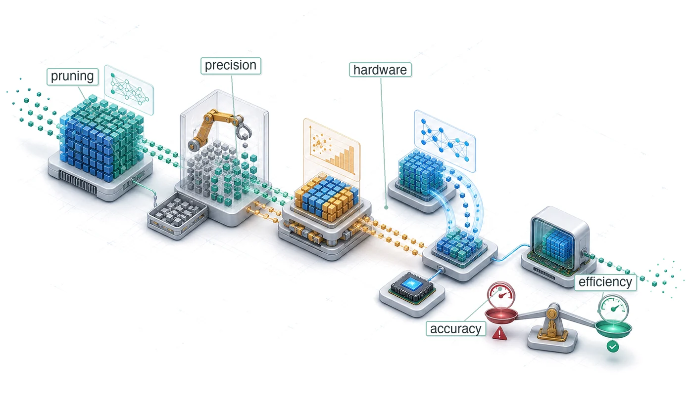

# Model Compression {#sec-model-compression}

::: {layout-narrow}
::: {.column-margin}

\chapterminitoc

:::

::: {.content-visible when-format="pdf"}
\noindent
{fig-alt="Isometric compression workshop where a large model passes through pruning, distillation, and quantization stations before fitting into a constrained device envelope."}
:::

::: {.content-visible unless-format="pdf"}
{fig-alt="Isometric compression workshop where a large model passes through pruning, distillation, and quantization stations before fitting into a constrained device envelope."}
:::

:::

## Purpose {.unnumbered .unlisted}

\begin{marginfigure}
\mlsysstack{30}{25}{90}{25}{45}{0}{0}{10}
\end{marginfigure}

_Why do the models that win benchmarks rarely become the models that run in production?_

Training produced a capable model, yet capability alone does not guarantee deployability. Cloud, Edge, Mobile, and TinyML each impose constraints that research benchmarks ignore, including memory budgets measured in megabytes rather than gigabytes, latency targets measured in milliseconds rather than seconds, and power envelopes measured in milliwatts rather than kilowatts. Research optimizes for accuracy on held-out test sets; production optimizes for accuracy per dollar, accuracy per watt, and accuracy per millisecond. Models that win benchmarks are often larger, slower, and more resource-intensive than production constraints permit. Bridging that gap requires a systematic discipline of compression that trades capabilities the deployment does not need for constraints it cannot violate. Many trained models carry more precision, more connections, or more capacity than a deployment context demands, and some of that surplus can be removed while preserving required behavior. Yet a smaller representation is not automatically a faster one. The hardware and software stack must exploit the new precision or structure; otherwise a nominal reduction can merely move the bottleneck while latency remains unchanged. Applied well, compression can substantially reduce model size, transforming a research artifact that runs only in a data center into a production asset for a phone, sensor, or microcontroller. The discipline is not simply about making models smaller but about making the right models possible for their physical environment. In D·A·M terms, compression enacts algorithm-machine co-design on the model itself, rewriting its mathematical structure to fit the physical constraints of the machine.

::: {.content-visible when-format="pdf"}

\newpage

:::

::: {.callout-learning-objectives}

- Explain compression as algorithm-machine co-design that trades surplus capacity for memory, latency, and energy constraints
- Compare pruning, distillation, quantization, and architecture search by the resource constraint each relaxes
- Calculate parameter memory, precision, and sparsity reductions to estimate best-case compression gains
- Apply post-training, quantization-aware, and weight-only strategies under accuracy and hardware constraints
- Select structured pruning and operator choices that map to available accelerator kernels
- Design compression pipelines that order pruning, distillation, and quantization to preserve deployment accuracy
- Evaluate measured latency, energy, and accuracy on target hardware rather than relying on FLOP counts

:::

## Optimization Framework {#sec-model-compression-optimization-framework-9e21}

```{python}
#| echo: false
# ┌── LEGO ───────────────────────────────────────────────
# │ Goal: LLM scale vs smartphone and MCU memory for deployment-gap prose.
from mlsysim import *
from mlsysim.core.units import *
from mlsysim import Models, Platforms
from mlsysim.physics import memory_from_params
from mlsysim.physics.quantities import token_throughput
from mlsysim.fmt import fmt, fmt_int, fmt_qty, fmt_qty_int, fmt_memory_capacity, check

class CompressionDeploymentScale:
    llm_7b_params = Models.Language.Llama2_7B.parameters.to(Bparam).magnitude
    bytes_fp16 = BYTES_FP16.to(byte).magnitude

    llm_7b_mem_fp16 = memory_from_params(llm_7b_params * Bparam, bytes_fp16 * byte / param)
    llm_7b_mem_fp16_gb = llm_7b_mem_fp16.to(GB).magnitude
    llm_175b_params = Models.Language.GPT3.parameters.to(Bparam).magnitude
    llm_175b_mem_fp16 = memory_from_params(llm_175b_params * Bparam, bytes_fp16 * byte / param)
    llm_175b_mem_fp16_gb = llm_175b_mem_fp16.to(GB).magnitude
    smartphone_ram = Platforms.Mobile.ram
    mcu_ram_kb = Platforms.Tiny.ram.to(KB).magnitude
    mcu_ram = mcu_ram_kb * KB

    check(llm_7b_mem_fp16 > smartphone_ram, "7-billion-parameter model must exceed smartphone RAM to illustrate the deployment gap.")

    # ┌── 4. OUTPUT (Formatting) ─────────────────────────────────────────────
    llm_7b_str = fmt(llm_7b_params, precision=0, commas=False)
    llm_7b_mem_gb_str = fmt_qty(llm_7b_mem_fp16, GB, precision=0, commas=False)
    llm_175b_str = fmt(llm_175b_params, precision=0, commas=False)
    llm_175b_mem_gb_str = fmt_qty(llm_175b_mem_fp16, GB, precision=0, commas=False)
    smartphone_ram_gb_str = fmt_memory_capacity(smartphone_ram, unit=GiB, precision=0, commas=False)
    mcu_ram_kb_str = fmt_memory_capacity(Platforms.Tiny.ram, unit=KiB, precision=0, commas=False)
```

::: {.column-margin}
{width="100%" fig-alt="Vertical log-scale ladder of blue bars: a 175B FP16 weight footprint at top towers over a phone RAM bar, which towers over a tiny microcontroller RAM bar at the bottom."}

*Frontier weights dwarf phone and microcontroller memory; compression bridges the gap.*
:::

A `{python} CompressionDeploymentScale.llm_7b_str`-billion parameter language model requires `{python} CompressionDeploymentScale.llm_7b_mem_gb_str` merely to store its weights in FP16. The deployment target is a smartphone with `{python} CompressionDeploymentScale.smartphone_ram_gb_str` of RAM shared across the operating system, applications, and the model. *The math does not work.* No amount of clever engineering changes this arithmetic: `{python} CompressionDeploymentScale.llm_7b_mem_gb_str` *cannot* fit in `{python} CompressionDeploymentScale.smartphone_ram_gb_str`. Yet users expect the model to run responsively, offline, without draining their battery in an hour. Every request has only a small time window in which to load data, run arithmetic, and return a result; the broader deployment gap also includes memory capacity, energy, and offline execution. That gap is not a minor inconvenience but a defining challenge of model compression.

Recall the silicon contract (principle \ref{pri-silicon-contract}), the performance bargain a model makes with its hardware. Compute throughput, memory bandwidth, memory capacity, and fixed overhead determine which resource binds first. During training, this contract is often negotiated upward. Researchers can select larger architectures, higher numerical precision, and deeper layers when a GPU cluster can afford those demands. Training also carries gradients, optimizer state, and numerical headroom that a forward-only deployment path may not need. In @sec-model-training-mixedprecision-training-9218, mixed precision improves training efficiency while preserving the numerical behavior needed to learn. Compression goes further for deployment by reducing precision to INT8 or below when the target execution path supports it. Deployment may reverse the training priorities: the production environment can be smaller, power-constrained, and latency-sensitive, even when the model was developed without those limitations. Where data selection optimized what the model learns from, compression optimizes what the trained model carries into that environment. **Model Compression**\index{Model Compression!definition} is the systematic process of renegotiating that contract for a new execution context, reducing memory footprint, computational cost, or energy consumption while preserving the behavior the application requires.

The scale of this renegotiation makes model optimization an engineering discipline, not a collection of ad hoc tricks. A `{python} CompressionDeploymentScale.llm_175b_str` billion parameter model consumes over `{python} CompressionDeploymentScale.llm_175b_mem_gb_str` in FP16 representation alone, while a microcontroller offers only `{python} CompressionDeploymentScale.mcu_ram_kb_str` of SRAM. Bridging six orders of magnitude requires systematic methods with predictable trade-offs, not trial and error. Every optimization technique removes something from the model (redundant parameters, numerical precision, or architectural complexity), and we must understand exactly what is lost, what is preserved, and how these losses compose when techniques are combined.

Compression works along three complementary dimensions. Structural optimization removes redundancy from the model itself: **Pruning**\index{Pruning!definition} eliminates low-impact parameters, knowledge distillation transfers behavior into a smaller architecture, and neural architecture search discovers designs for a specified objective. Precision optimization reduces the bit width of weights and activations; for example, FP32-to-INT8 conversion cuts the raw bytes per represented value by four. Supported low-precision matrix units can also accelerate arithmetic. Hardware-level optimization maps the result to the target processor through techniques such as fusion and supported sparsity. These dimensions form an optimization stack: structural changes alter which operations exist, precision changes bytes per value, and hardware-level work determines whether those theoretical savings become supported execution paths. A practitioner might prune ResNet-50 filters, quantize the remainder to INT8, and fuse batch normalization into convolution. Benefits compound only when the transformations relieve different bottlenecks and the runtime supports the resulting graph. Each layer therefore needs its own measurement. @Sec-hardware-acceleration-tensor-cores-771f explains the accelerator mechanisms behind low-precision paths.

Concrete systems keep those trade-offs measurable: ResNet-50 and MobileNetV2 (our Lighthouse Models from @sec-network-architectures-lighthouse-roster-model-biographies-a763) for vision workloads, transformer-based language models for sequence tasks, DLRM for recommendation memory pressure [@naumov2019deep], and the depthwise-separable convolutional neural network (CNN) known as DS-CNN for TinyML keyword spotting [@zhang2017hello]. Reusing these models lets us compare techniques under consistent conditions, making the trade-offs between accuracy, latency, memory, and energy tangible rather than abstract.

```{python}
#| echo: false
# ┌── LEGO ───────────────────────────────────────────────
# │ Goal: INT8 weight-memory reduction for iron-law definition item.
from mlsysim import Models
from mlsysim.fmt import fmt, fmt_qty, check, fmt_count

class CompressionIronLawQuant:
    bytes_fp16 = BYTES_FP16.to(byte).magnitude
    bytes_int8 = BYTES_INT8.to(byte).magnitude
    llm_175b_params = Models.Language.GPT3.parameters.to(Bparam).magnitude
    llm_175b_mem_fp16_gb = llm_175b_params * bytes_fp16
    llm_175b_mem_int8_gb = llm_175b_params * bytes_int8
    llm_175b_mem_fp16 = llm_175b_mem_fp16_gb * GB
    llm_175b_mem_int8 = llm_175b_mem_int8_gb * GB
    llm_175b_fp16_int8_reduction = llm_175b_mem_fp16_gb / llm_175b_mem_int8_gb

    check(llm_175b_fp16_int8_reduction == 2, "FP16-to-INT8 weight memory should halve.")

    # ┌── 4. OUTPUT (Formatting) ─────────────────────────────────────────────
    llm_175b_str = fmt(llm_175b_params, precision=0, commas=False)
    llm_175b_mem_gb_str = fmt_qty(llm_175b_mem_fp16, GB, precision=0, commas=False)
    llm_175b_mem_int8_gb_str = fmt_qty(llm_175b_mem_int8, GB, precision=0, commas=False)
    llm_175b_fp16_int8_reduction_mult_str = fmt_multiple(round(llm_175b_fp16_int8_reduction), precision=0, commas=False)
```

::: {#dfn-model-compression-model-compression .callout-definition title="Model compression"}

***Model Compression*** is a family of techniques that reduce a trained model's computational cost and memory footprint by eliminating redundant parameters (pruning), reducing numerical precision (quantization), or transferring learned behavior into a smaller architecture (distillation), while preserving as much predictive accuracy as possible.

1.  **Significance**: Compression directly reduces the iron law's data-movement and compute terms. INT8 quantization of a `{python} CompressionIronLawQuant.llm_175b_str`-billion-parameter LLM cuts weight memory from `{python} CompressionIronLawQuant.llm_175b_mem_gb_str` (FP16) to `{python} CompressionIronLawQuant.llm_175b_mem_int8_gb_str`, a `{python} CompressionIronLawQuant.llm_175b_fp16_int8_reduction_mult_str` reduction in $D_{\text{vol}}$, while dedicated low-precision matrix units can increase compute throughput when kernels and layouts use the supported INT8 path. Unstructured pruning to 50 percent sparsity halves the nonzero count, but executed operations fall only when the runtime can skip those zeros through a supported sparse format or kernel.
2.  **Distinction**: Unlike post-training compression methods such as pruning and quantization, neural architecture search discovers efficient architectures from scratch by exploring a design space. Here, NAS is treated as a related structural optimization technique: it changes the representation before training rather than compressing a finished model post hoc.
3.  **Common pitfall**: Compression techniques do not compose without interference. Pruning changes weight distributions and operation patterns; quantization adds calibration and kernel constraints. Their combination can lose accuracy or fail to accelerate without joint validation.

:::

The optimization stack moves from representation to numerics to execution. Deployment context determines which constraint binds first; structural methods change the computation, precision methods change the representation of each value, and architectural methods decide whether the compressed artifact actually maps to efficient hardware execution. Selection and composition follow from that constraint order rather than from a checklist of techniques.

The three dimensions form a natural hierarchy. Optimization first determines *what* computations the model should perform (representation), then *how precisely* to perform them (numerics), and finally *how efficiently* to execute them on physical hardware (implementation). @Fig-3-sections shows this progression from software concerns toward hardware-level execution.

::: {#fig-3-sections fig-env="figure" fig-pos="htb" fig-cap="**Optimization Stack**: Model optimization progresses from software-level representation (pruning, distillation, NAS) down through numerical precision (quantization) to hardware execution (kernel fusion, sparsity engines). Lowering abstraction moves optimizations closer to physical silicon, where representation decisions dictate achievable execution efficiency." fig-alt="Three stacked rectangular boxes labeled from top to bottom: efficient model representation, efficient numerics representation, efficient hardware implementation. A vertical arrow spans the stack with More software at top and More hardware at bottom."}

```{.tikz}
\resizebox{.5\textwidth}{!}{
\begin{tikzpicture}[font=\small\sffamily]
\tikzset{
  Box/.style={inner xsep=2pt,
  draw=black!90,
  line width=0.75pt,
  anchor=west,
  text width=54mm,align=flush center,
  minimum width=54mm, minimum height=8mm
  },
}
\node[Box,fill=red!30,anchor=south west](B1)at (0.33,0.5){Efficient Hardware Implementation};
\node[Box,fill=red!20,node distance=0.15,above=of B1](B2){Efficient Numerics Representation};
\node[Box,fill=red!10,node distance=0.15,above=of B2](B3){Efficient Model Representation};
\draw[latex-latex,line width=0.75pt](0,0.20)--(0,3.7);

\node[left=1.4 of B1,rotate=90,anchor=north,align=center,font=\footnotesize\sffamily]{More\\ hardware};
\node[left=1.4 of B3,rotate=90,anchor=north,align=center,font=\footnotesize\sffamily]{More \\software};
\end{tikzpicture}}
```

:::

```{python}
#| echo: false
#| label: nas-search-cost-calc
from mlsysim.fmt import fmt, fmt_count, fmt_multiple, fmt_time, check

class NASCostCalc:
    # ┌── 1. LOAD (Constants) ──────────────────────────────────────────────
    gpus = 800
    days = 28
    weight_sharing_reduction = 1000

    # ┌── 2. EXECUTE (The Compute) ────────────────────────────────────────
    gpu_days = gpus * days
    gpu_hours = gpu_days * HOURS_PER_DAY

    # ┌── 3. GUARD (Invariants) ───────────────────────────────────────────
    check(gpu_days == 22_400, "NAS GPU-day arithmetic changed unexpectedly.")
    check(gpu_hours == 537_600, "NAS GPU-hour arithmetic changed unexpectedly.")

    # ┌── 4. OUTPUT (Formatting) ──────────────────────────────────────────
    gpus_str = fmt_count(gpus, label="GPU")
    days_str = fmt_time(days, "day", precision=0, commas=False, style="word")
    gpu_days_str = fmt_count(gpu_days, label='GPU-day', plural_label='GPU-days')
    gpu_hours_str = fmt_count(gpu_hours, label='GPU-hour', plural_label='GPU-hours')
    weight_sharing_reduction_mult_str = fmt_multiple(weight_sharing_reduction, precision=0, commas=True)
```

The top layer, efficient model representation, focuses on eliminating redundancy in the model structure. Techniques like pruning, knowledge distillation, and neural architecture search (NAS)[^fn-nas-search-cost] reduce the number of parameters or operations required, addressing memory footprint and computational complexity at the algorithmic level.

[^fn-nas-search-cost]: **Neural Architecture Search (NAS)**\index{NAS!search cost}: @zoph2017neural at Google Brain used reinforcement learning to learn the architecture itself at a cost of `{python} NASCostCalc.gpu_days_str` (`{python} NASCostCalc.gpus_str` for `{python} NASCostCalc.days_str`), equivalent to `{python} NASCostCalc.gpu_hours_str`. Weight-sharing approaches such as Efficient Neural Architecture Search (ENAS) later reduced search cost by roughly `{python} NASCostCalc.weight_sharing_reduction_mult_str` by sharing parameters across candidate architectures [@pham2018efficient]. Hardware-aware NAS and scaling methods then made the search output practical for deployable architecture families such as EfficientNet and MobileNetV3 [@tan2019efficientnet; @howard2019].

The middle layer, efficient numerics representation, optimizes how numerical values are stored and processed. **Quantization**\index{Quantization!definition} and mixed-precision training reduce the bit-width of weights and activations (for example, from 32-bit floating point to 8-bit integers), enabling faster execution and lower memory usage on specialized hardware.

The bottom layer, efficient hardware implementation, asks whether the remaining operations map efficiently to the target processor. Operator fusion, supported sparsity, and hardware-aware scheduling align computation with memory hierarchies and vector or matrix units; profiling determines whether they improve utilization or throughput.

These dimensions are interdependent. Pruning reduces complexity but may require architectural changes for hardware efficiency. Quantization reduces precision but changes numerical behavior and the available execution paths. A useful strategy may combine techniques across layers when they address different binding constraints. For practitioners seeking immediate guidance, @sec-model-compression-decision-framework-0d69 maps deployment constraints to candidate techniques. The intervening sections provide the technical foundation needed to evaluate those choices.

The relative importance of each dimension varies by deployment target. Cloud systems may tolerate larger models but demand throughput; mobile devices prioritize memory and energy; embedded systems face hard constraints on all resources simultaneously. Understanding these deployment contexts shapes which optimization dimensions to prioritize.

## Deployment Context {#sec-model-compression-deployment-context-0d88}

The preceding optimization framework identifies three dimensions of compression, but which dimensions matter most depends entirely on where the model will run. A data center GPU with 80 GB of high-bandwidth memory (HBM) faces different binding constraints than a smartphone with shared RAM or a microcontroller with only a few hundred kilobytes of SRAM. @Tbl-deployment-scenarios summarizes the key constraints across deployment environments.

```{python}
#| echo: false
#| label: deployment-scenario-latency-calc
# ┌─────────────────────────────────────────────────────────────────────────────
# │ DEPLOYMENT SCENARIO LATENCY ENVELOPES
# ├─────────────────────────────────────────────────────────────────────────────
# │ Context: @tbl-deployment-scenarios—the Latency column.
# │
# │ Goal: Pin each deployment context's latency envelope to the Platforms
# │       registry so the compression targets match the tier definitions.
# │ Show: Cloud, combined mobile/edge, and TinyML latency ranges.
# │ How: Parse the Platforms tier envelopes; the mobile/edge row spans the
# │      union of the two tiers it merges.
# │
# └─────────────────────────────────────────────────────────────────────────────
from mlsysim import *

class DeploymentScenarioLatency:
    """Latency envelopes for the cloud, mobile/edge, and TinyML compression targets."""

    # ┌── 1. LOAD (Constants) ──────────────────────────────────────────────
    cloud_min_ms, cloud_max_ms = [int(v) for v in Platforms.Cloud.latency_range_ms.split("-")]
    edge_min_ms, edge_max_ms = [int(v) for v in Platforms.Edge.latency_range_ms.split("-")]
    mobile_min_ms, mobile_max_ms = [int(v) for v in Platforms.Mobile.latency_range_ms.split("-")]
    tiny_min_ms, tiny_max_ms = [int(v) for v in Platforms.Tiny.latency_range_ms.split("-")]

    # ┌── 2. EXECUTE (The Compute) ─────────────────────────────────────────
    # The table merges mobile and edge into one row, so span both envelopes.
    mobile_edge_min_ms = min(mobile_min_ms, edge_min_ms)
    mobile_edge_max_ms = max(mobile_max_ms, edge_max_ms)

    # ┌── 3. GUARD (Invariants) ────────────────────────────────────────────
    check(tiny_max_ms <= mobile_edge_max_ms <= cloud_max_ms, "Latency envelopes must widen from TinyML to cloud.")
    check(mobile_edge_min_ms <= mobile_min_ms, "Merged mobile/edge row must span the mobile envelope.")

    # ┌── 4. OUTPUT (Formatting) ───────────────────────────────────────────
    cloud_latency_range_str = fmt_range(cloud_min_ms, cloud_max_ms, precision=0, commas=False, unit="ms")
    mobile_edge_latency_range_str = fmt_range(mobile_edge_min_ms, mobile_edge_max_ms, precision=0, commas=False, unit="ms")
    tiny_latency_range_str = fmt_range(tiny_min_ms, tiny_max_ms, precision=0, commas=False, unit="ms")
```

```{=latex}
\begingroup
%\renewcommand{\arraystretch}{1.25}
```

| **Context**     |      **Memory**      |                            **Latency**                             | **Power** | **Primary Goal** |
|:----------------|:--------------------:|:------------------------------------------------------------------:|:----------|:-----------------|
| **Cloud**       |      tens of GB      |    `{python} DeploymentScenarioLatency.cloud_latency_range_str`    | Flexible  | Throughput, cost |
| **Mobile/Edge** | hundreds of MB to GB | `{python} DeploymentScenarioLatency.mobile_edge_latency_range_str` | W-scale   | Size, latency    |
| **TinyML**      |        KB–MB         |    `{python} DeploymentScenarioLatency.tiny_latency_range_str`     | mW        | Size, energy     |

: **Deployment Constraints**: Each deployment context imposes different optimization priorities. {#tbl-deployment-scenarios tbl-colwidths="[20,22,16,14,28]"}

```{=latex}
\endgroup
```

### Deployment scenarios {#sec-model-compression-deployment-scenarios-70c9}

Cloud inference often centers on throughput (requests/second/dollar), where supported quantization paths can increase serving density and operator fusion can reduce per-request latency [@choudhary2020; @dean2018]. Mobile and edge deployments must fit device memory while meeting real-time targets. A camera app processing 30 fps has 33 ms per frame, so crossing that latency threshold can determine whether the feature operates in real time.

TinyML makes optimization a deployment requirement. A microcontroller with a few hundred kilobytes of RAM *cannot* run a 100 MB model regardless of accuracy. The model must fit below hardware limits or deployment is impossible [@banbury2020benchmarking]. Mobile devices offer more headroom, but an optimization that crosses a memory, latency, or thermal threshold can still determine whether a feature ships.

This deployment-time pressure is not new. AlexNet, the landmark model that won the 2012 ImageNet challenge, encountered a memory wall during training, and its architecture records the resulting two-GPU design choice.

::: {#ws-model-compression-alexnet-2012 .callout-war-story title="AlexNet's two-GPU split (2012)"}

**Context**: In 2012, Alex Krizhevsky, Ilya Sutskever, and Geoffrey Hinton aimed to train a 60-million-parameter vision model on ImageNet [@krizhevsky2012imagenet].

**Mechanism**: An NVIDIA GTX 580 provided only 3 GB of GDDR5 memory—insufficient to store the 240 MB model weights alongside FP32 activations ($M_{\text{act}}$) and optimizer states ($M_{\text{state}}$) for single-GPU training.

**Impact**: The model could not be trained on a single device at all, so the memory ceiling propagated upward into the network design itself rather than remaining a hardware procurement problem.

**Fix**: They partitioned the model across two 3 GB GTX 580 GPUs and limited cross-GPU connections so that the working set would fit within each device's memory bound ($M_{\text{peak}} \le 3\text{ GB}$). The resulting two-tower architecture achieved a winning top-5 error rate of 15.3 percent, a 10.8 percentage point margin.

**Systems lesson**: Memory capacity bounds have constrained deep learning since its inception. Model deployment strategies (pruning, quantization) address the same physical limits that forced model splitting in AlexNet.

:::

The same memory pressure that shaped AlexNet's architecture appears in everyday product constraints when the model must run on commodity mobile hardware.

::: {#exmp-model-compression-mobilenet-win .callout-example title="An illustrative MobileNet win"}

**Scenario**: Deploying a real-time background blur video segmentation model on mid-tier Android smartphones at 30 FPS.

**Diagnosis**: An uncompressed FP32 MobileNetV3 model achieves only 8 FPS, exceeding device latency and thermal power limits. Quantizing weights to INT8 enables mobile NPU/DSP integer matrix execution.

**Systems lesson**: Here, INT8 cuts raw parameter payload by 4$\times$, and a supported integer path raises inference from 8 FPS to 35 FPS. Speed and power still require device measurement.

:::

```{python}
#| echo: false
#| label: model-device-comparison
# ┌─────────────────────────────────────────────────────────────────────────────
# │ MODEL-DEVICE MEMORY COMPARISON
# ├─────────────────────────────────────────────────────────────────────────────
# │ Context: @tbl-model-vs-device and deployment gap discussion
# │
# │ Goal: Contrast model requirements with device memory capacities.
# │ Show: The 6-order-of-magnitude gap from Cloud to TinyML.
# │ How: List VRAM and RAM constraints for standard hardware tiers.
# │
# └─────────────────────────────────────────────────────────────────────────────
from mlsysim import Models, Platforms
from mlsysim.fmt import fmt, fmt_int, fmt_multiple, fmt_qty, fmt_qty_int, fmt_memory

def _overflow_ratio(model_mem, device_mem):
    """Return how many times a model exceeds a device memory envelope."""
    return model_mem.to(byte).magnitude / device_mem.to(byte).magnitude

class ModelDeviceComparison:
    """Contrast model requirements with device memory: 6-order-of-magnitude deployment gap."""

    # ┌── 1. LOAD (Constants) ──────────────────────────────────────────────
    # Device capacities
    cloud_mem = Platforms.Cloud.ram
    mobile_mem = Platforms.Mobile.ram
    tiny_mem = Platforms.Tiny.ram

    # Model sizes (decimal — match the underlying byte-count math)
    dlrm_mem = Models.Recommendation.DLRM.model_size
    gpt2_mem = Models.Language.GPT2.size_in_bytes(BYTES_FP32)
    resnet_mem = Models.Vision.ResNet50.size_in_bytes(BYTES_FP32)
    mobilenet_mem = Models.Vision.MobileNetV2.size_in_bytes(BYTES_FP32)
    mobilenet_int8_mem = Models.Vision.MobileNetV2.size_in_bytes(BYTES_INT8)
    dscnn_mem = Models.Tiny.DS_CNN.size_in_bytes(BYTES_INT8)

    # ┌── 2. EXECUTE (The Compute) ────────────────────────────────────────
    dlrm_mobile_overflow = _overflow_ratio(dlrm_mem, mobile_mem)
    dlrm_tiny_overflow = _overflow_ratio(dlrm_mem, tiny_mem)
    gpt2_mobile_overflow = _overflow_ratio(gpt2_mem, mobile_mem)
    gpt2_tiny_overflow = _overflow_ratio(gpt2_mem, tiny_mem)
    resnet_tiny_overflow = _overflow_ratio(resnet_mem, tiny_mem)
    mobilenet_tiny_overflow = _overflow_ratio(mobilenet_mem, tiny_mem)
    mobilenet_int8_tiny_ratio = _overflow_ratio(mobilenet_int8_mem, tiny_mem)
    dscnn_tiny_overflow = _overflow_ratio(dscnn_mem, tiny_mem)

    # ┌── 3. GUARD (Invariants) ──────────────────────────────────────────
    # DS-CNN always fits TinyML—sanity check
    assert dscnn_tiny_overflow < 1, "DS-CNN must fit in TinyML device."
    assert gpt2_mobile_overflow < 1, "GPT-2 XL should fit in mobile memory for this simplified table."
    assert 6 <= mobilenet_int8_tiny_ratio <= 8, "MobileNetV2 INT8 should exceed TinyML by about 7x."

    # ┌── 4. OUTPUT (Formatting) ─────────────────────────────────────────────
    # Typed formatters own the units and multiplier glyphs in the table.
    dlrm_gb_str = fmt_qty(dlrm_mem, GB, precision=0, commas=False)
    gpt2_gb_str = fmt_qty(gpt2_mem, GB, precision=0, commas=False)
    resnet_mb_str = fmt_qty(resnet_mem, MB, precision=1, commas=False)
    mobilenet_mb_str = fmt_memory(mobilenet_mem, unit=MB, commas=False)
    mobilenet_int8_mb_str = fmt_qty(mobilenet_int8_mem, MB, precision=1, commas=False)
    dscnn_kb_str = fmt_qty(dscnn_mem, KB, precision=0, commas=False)
    cloud_cap_gb_str = fmt_qty_int(cloud_mem, GB, commas=False, approx=True)
    mobile_cap_gb_str = fmt_memory_capacity(mobile_mem, unit=GiB, precision=0, commas=False)
    tiny_cap_kb_str = fmt_memory_capacity(tiny_mem, unit=KiB, precision=0, commas=False, approx=True)
    dlrm_mobile_overflow_mult_str = fmt_multiple(dlrm_mobile_overflow)
    dlrm_tiny_overflow_mult_str = fmt_multiple(dlrm_tiny_overflow)
    gpt2_tiny_overflow_mult_str = fmt_multiple(gpt2_tiny_overflow)
    resnet_tiny_overflow_mult_str = fmt_multiple(resnet_tiny_overflow)
    mobilenet_tiny_overflow_mult_str = fmt_multiple(mobilenet_tiny_overflow)
    mobilenet_int8_tiny_ratio_mult_str = fmt_multiple(mobilenet_int8_tiny_ratio, precision=1, commas=False)
```

The gap between model requirements and device capabilities explains why compression is not optional for resource-constrained deployment.

### Balancing trade-offs {#sec-model-compression-balancing-tradeoffs-6ae3}
@Tbl-model-vs-device quantifies this deployment gap using the Lighthouse Models from @sec-network-architectures-lighthouse-roster-model-biographies-a763: even MobileNetV2 at INT8 precision exceeds TinyML device memory by about `{python} ModelDeviceComparison.mobilenet_int8_tiny_ratio_mult_str`. This mismatch makes the **accuracy-efficiency trade-off**\index{Model Compression!accuracy-efficiency trade-off} unavoidable. Increasing model capacity generally enhances predictive performance while increasing computational cost, resulting in slower, more resource-intensive inference. The improvements introduce challenges related to memory footprint, inference latency, power consumption, and training efficiency.

::: {#psp-model-compression-compression-accuracy-tradeoff-curve .callout-perspective title="The compression-accuracy trade-off curve"}

The frontier is not uniform: structure-preserving techniques sit near the top, exchanging little or no accuracy for real speedups, while aggressive structural surgery sits at the bottom, where each additional gain extracts a steepening accuracy penalty.

The engineering decision is where to stop. Compression should halt at the "knee" of the curve, the point where the marginal loss in accuracy first exceeds the marginal gain in efficiency. Past that knee, the model degrades faster than it accelerates.

:::

| **Model**              |               **Runtime Weight Memory**                |              **Artifact Weight Storage**               | **Cloud (`{python} ModelDeviceComparison.cloud_cap_gb_str`)** |   **Mobile (`{python} ModelDeviceComparison.mobile_cap_gb_str`)**   |      **TinyML (`{python} ModelDeviceComparison.tiny_cap_kb_str`)**       |
|:-----------------------|:------------------------------------------------------:|:------------------------------------------------------:|:-------------------------------------------------------------:|:-------------------------------------------------------------------:|:------------------------------------------------------------------------:|
| **DLRM**               |      `{python} ModelDeviceComparison.dlrm_gb_str`      |      `{python} ModelDeviceComparison.dlrm_gb_str`      |                               ok                              | no (`{python} ModelDeviceComparison.dlrm_mobile_overflow_mult_str`) |    no (`{python} ModelDeviceComparison.dlrm_tiny_overflow_mult_str`)     |
| **GPT-2 XL**           |      `{python} ModelDeviceComparison.gpt2_gb_str`      |      `{python} ModelDeviceComparison.gpt2_gb_str`      |                               ok                              |                                  ok                                 |    no (`{python} ModelDeviceComparison.gpt2_tiny_overflow_mult_str`)     |
| **ResNet-50**          |     `{python} ModelDeviceComparison.resnet_mb_str`     |     `{python} ModelDeviceComparison.resnet_mb_str`     |                               ok                              |                                  ok                                 |   no (`{python} ModelDeviceComparison.resnet_tiny_overflow_mult_str`)    |
| **MobileNetV2**        |   `{python} ModelDeviceComparison.mobilenet_mb_str`    |   `{python} ModelDeviceComparison.mobilenet_mb_str`    |                               ok                              |                                  ok                                 |  no (`{python} ModelDeviceComparison.mobilenet_tiny_overflow_mult_str`)  |
| **MobileNetV2 (INT8)** | `{python} ModelDeviceComparison.mobilenet_int8_mb_str` | `{python} ModelDeviceComparison.mobilenet_int8_mb_str` |                               ok                              |                                  ok                                 | no (`{python} ModelDeviceComparison.mobilenet_int8_tiny_ratio_mult_str`) |
| **DS-CNN (KWS, INT8)** |     `{python} ModelDeviceComparison.dscnn_kb_str`      |     `{python} ModelDeviceComparison.dscnn_kb_str`      |                               ok                              |                                  ok                                 |                                    ok                                    |

: **The Deployment Gap**: Model weight requirements compared against typical device capacities. DLRM represents recommendation-model embedding pressure [@naumov2019deep]; DS-CNN represents the TinyML keyword-spotting case [@zhang2017hello]. Even MobileNetV2 quantized to INT8 exceeds the `{python} ModelDeviceComparison.tiny_cap_kb_str` TinyML envelope by `{python} ModelDeviceComparison.mobilenet_int8_tiny_ratio_mult_str`, while the purpose-built DS-CNN keyword spotter fits after INT8 quantization. In this weight-only accounting, runtime weight memory equals artifact weight storage; activation, workspace, packaging, and metadata overheads are excluded. Numbers in parentheses show how many times the model exceeds device memory. {#tbl-model-vs-device tbl-colwidths="[22,17,16,14,13,18]"}

This tension manifests differently across deployment contexts. Training requires computational resources that scale with model size; inference demands strict latency and power constraints in real-time applications. Understanding where each optimization technique falls on the compression-accuracy Pareto frontier is essential for informed technique selection.

@Tbl-optimization-tradeoffs summarizes the key optimization techniques, their systems benefits, and their ML costs. These are empirical relationships—actual results depend on model architecture, task, and careful implementation.

| **Technique**                | **Systems Gain**                          | **ML Cost**          | **Typical Impact**     | **Region** |
|:-----------------------------|:------------------------------------------|:---------------------|:-----------------------|:----------:|
| **Operator Fusion**          | 10–30% latency reduction                  | None                 | No accuracy loss       |     1      |
| **FP32 → BF16**              | 2$\times$ memory, ~2$\times$ throughput   | Minimal              | $<0.1\%$ accuracy drop |     1      |
| **FP16 → INT8**              | 2$\times$ memory, 2--4$\times$ throughput | Quantization error   | 0.5–1% accuracy drop   |     2      |
| **50% Pruning**              | ~2$\times$ smaller model                  | Capacity loss        | 0.5–1% accuracy drop   |     2      |
| **Knowledge Distillation**   | 2--10$\times$ smaller student             | Capability ceiling   | 1–3% accuracy drop     |     2      |
| **4-bit Quantization**       | 4$\times$ memory reduction                | Significant error    | 2–5% accuracy drop     |    2–3     |
| **90% Pruning**              | ~10$\times$ smaller model                 | Severe capacity loss | 5–15% accuracy drop    |     3      |
| **↑ Batch Size (8$\times$)** | Higher throughput, better GPU util        | Generalization gap   | Requires LR scaling    |     —      |

: **The Optimization Trade-Offs**: Region 1 = Free Lunch, Region 2 = Efficient Trade, Region 3 = Danger Zone. Batch size affects training dynamics rather than model quality directly. These are representative engineering ranges synthesized from published work on inference runtimes, quantization, pruning, low-bit LLM quantization, and distillation [@nvidia2024tensorrt; @jacob2018; @han2015deep; @lin2023awq; @hinton2015distilling]; actual results vary with architecture, task, calibration data, and implementation quality. {#tbl-optimization-tradeoffs tbl-colwidths="[22,27,19,23,9]"}

Techniques that preserve model structure, such as fusion and precision reduction, tend to be "free" or inexpensive, while techniques that alter structure, such as pruning and distillation, extract more savings but require careful tuning. Each deployment context imposes a different binding constraint, including memory capacity on mobile devices, latency in real-time systems, and energy on battery-powered sensors. The optimization stack follows those constraints downward. Structural methods modify what computations occur, reducing the model's parameter count and operation count to fit tighter memory and compute budgets. Precision techniques reduce how many bits represent each value, directly shrinking memory footprint and accelerating arithmetic. Architectural approaches improve how efficiently the remaining operations execute on physical hardware, closing the gap between theoretical savings and measured performance.

::: {#chk-model-compression-efficiency-frontier .callout-checkpoint title="The efficiency frontier"}

Optimization is about trading one resource for another.

**Trade-offs**

- [ ] **Accuracy vs. cost**: compare a structure-preserving optimization and a structure-altering one by naming which resource each saves and which quality risk it introduces.
- [ ] **The "free lunch"**: can you point to where on the compression-accuracy frontier a technique buys efficiency at no accuracy cost, and explain why that region exists?
- [ ] **The knee**: explain why aggressive optimization should stop where the marginal accuracy loss exceeds the marginal efficiency gain.

:::

## Structural Optimization {#sec-model-compression-structural-optimization-ee93}

Modern neural networks often carry more parameters than deployment requires.[^fn-overparameterization-compute-scale] Unused capacity still consumes memory, computation, and energy. Structural optimization addresses the first dimension of our framework, **efficient model representation**\index{Model Compression!efficient model representation}, by modifying *what* the model computes. Although additional capacity can aid optimization during training, parameters that do not improve the deployed model still impose deployment cost.

[^fn-overparameterization-compute-scale]: **Overparameterization**\index{Overparameterization!compression rationale}: @zhang2017rethinking demonstrated that networks large enough to fit ImageNet can also memorize completely random labels, showing that training capacity can exceed the structure needed for natural labels. Pruning studies then show the deployment consequence: trained models often contain many parameters that can be removed or sparsified with modest task loss when pruning and fine-tuning are done carefully [@gale2019state; @blalock2020state]. The redundancy is not a universal 10$\times$ constant; it depends on architecture, dataset, sparsity pattern, and runtime support.

Every technique in this chapter follows the same engineering heuristic: the **Conservation of Complexity**\index{Conservation of Complexity!structural optimization}. Compression rarely destroys cost outright. It relocates cost between the Data, Algorithm, and Machine axes. Pruning may reduce parameters while asking the runtime to exploit sparse structure; distillation may reduce inference cost while adding a teacher-student training phase; quantization may reduce data movement while spending numerical precision. The engineer's task is to move complexity to where the cost is lowest given deployment constraints.

The challenge is removing that surplus without removing what matters. Each technique relocates complexity. Pruning reduces parameter count but asks the hardware to exploit sparse patterns and handle irregular memory access. Knowledge distillation produces a smaller deployment model by spending more compute during training. Neural architecture search reduces human design effort by spending a larger automated search budget. Structural optimization therefore asks where complexity should reside for a given deployment target.[^fn-pareto-frontier-compression]

[^fn-pareto-frontier-compression]: **Pareto Frontier**\index{Pareto Frontier!compression trade-off}: Named after Italian economist Vilfredo Pareto (1848--1923), who observed that 80 percent of Italy's land was owned by 20 percent of the population. In multi-objective optimization, the Pareto frontier is the set of solutions where improving one objective (for example, speed) necessarily sacrifices another (for example, accuracy). EfficientNet traces this frontier concretely: B0 (77.1 percent accuracy, 390 million FLOPs) to B7 (84.4 percent, 37 billion FLOPs)—a 95$\times$ compute increase for 7.3 percentage points of accuracy, quantifying how steep the trade-off becomes at the frontier's edge [@tan2019efficientnet].

These three techniques address the challenge through complementary approaches. Pruning eliminates low-impact parameters from an existing model. Knowledge distillation transfers a large model's learned capabilities to a smaller architecture. NAS automates architecture design from the ground up, building optimized structures for specific constraints [@hutter2019automl]. In practice, these techniques are often combined: a NAS-designed architecture, distilled from a large teacher, then pruned for final deployment. Pruning comes first because it exposes the central structural trade-off most directly: removing parameters only helps if the resulting structure is something the runtime can exploit.

### Pruning {#sec-model-compression-pruning-d1cb}

```{python}
#| echo: false
#| label: mobilenet-pruning-stats
# ┌─────────────────────────────────────────────────────────────────────────────
# │ MOBILENET PRUNING STATISTICS
# ├─────────────────────────────────────────────────────────────────────────────
# │ Context: "Pruning in Practice" section - MobileNet example
# │
# │ Goal: Demonstrate realistic pruning gains for a mobile-class model.
# │ Show: About 86% pruning with significant size reduction (14 MB to 2 MB).
# │ How: Compute pruning fraction from before/after model sizes.
# │
# └─────────────────────────────────────────────────────────────────────────────
from mlsysim.fmt import fmt, fmt_qty, check

# ┌── LEGO ───────────────────────────────────────────────
class MobileNetCompressionAnchor:
    """
    Namespace for MobileNet pruning anchor.
    """

    # ┌── 1. LOAD (Constants) ──────────────────────────────────────────────
    original_size_mb = 14
    pruned_size_mb = 2
    original_size = original_size_mb * MB
    pruned_size = pruned_size_mb * MB

    # ┌── 2. EXECUTE (The Compute) ────────────────────────────────────────
    pruning_pct = (1 - pruned_size_mb / original_size_mb) * 100

    # ┌── 3. GUARD (Invariants) ──────────────────────────────────────────
    check(80 <= pruning_pct <= 90, "MobileNet pruning anchor should be near 85%.")

    # ┌── 4. OUTPUT (Formatting) ───────────────────────────────────────────
    # Typed formatters own the percent and memory-unit display policy.
    pruning_pct_str = fmt_percent(pruning_pct / 100, precision=1, commas=False, style='prose')
    original_size_mb_str = fmt_qty(original_size, MB, precision=0, commas=False)
    pruned_size_mb_str = fmt_qty(pruned_size, MB, precision=0, commas=False)
```

As an illustrative deployment scenario, consider a MobileNet trained for image classification on a wearable health monitor. The trained model occupies `{python} MobileNetCompressionAnchor.original_size_mb_str`, but the target microcontroller offers only 2 MB of flash memory. Retraining a smaller architecture from scratch would require weeks of data collection and validation—time the product schedule does not allow. Suppose profiling shows that about `{python} MobileNetCompressionAnchor.pruning_pct_str` of the model's weights are near zero and contribute little on the validation set. Removing those weights and fine-tuning the remainder for a few epochs could produce a model that fits in `{python} MobileNetCompressionAnchor.pruned_size_mb_str` with an acceptable accuracy loss. The numbers anchor the engineering trade-off rather than reporting a universal MobileNet benchmark.

Pruning[^fn-pruning-lecun-1989] directly addresses memory efficiency constraints by eliminating parameters or structures that contribute little to the deployed objective. Many trained networks contain removable capacity, but the safe fraction depends on the architecture, task, pruning pattern, and recovery procedure. The central questions are *what* to prune (individual weights vs. entire structures), *how* to estimate what is expendable (magnitude, gradients, or activations), and *when* to prune (after training, during training, or even at initialization). @Sec-hardware-acceleration-nm-structured-sparsity-mechanics-9a71 explains the hardware side; the systems lesson here is that zeros become valuable only when the execution path can skip them.

[^fn-pruning-lecun-1989]: **Optimal Brain Damage**\index{Pruning!Optimal Brain Damage}: Introduced by @lecun1990optimal, the method achieved 4$\times$ parameter reduction—and proportional memory savings—in a handwriting recognizer by using a diagonal approximation to second-derivative (Hessian) information to estimate the loss increase from removing each weight. A full Hessian has $\mathcal{O}(n^2)$ entries for $n$ parameters, but Optimal Brain Damage avoids storing that full matrix by approximating its diagonal. Modern-scale pruning still favors cheaper criteria such as magnitude because even diagonal curvature estimation adds training cost.

::: {#dfn-model-compression-pruning .callout-definition title="Pruning"}

***Pruning*** is a model-compression technique that sparsifies the parameter space by removing weights that contribute minimal information to the loss landscape.

1.  **Significance**: It can convert dense matrices into sparse structures, reducing memory footprint and total data volume $(D_{\text{vol}})$ when the sparse representation, metadata, and recovery procedure preserve acceptable quality.
2.  **Distinction**: Unlike quantization, which reduces the precision of every weight, pruning reduces the count of weights by identifying and eliminating redundancy.
3.  **Common pitfall**: A frequent misconception is that pruning "automatically" speeds up execution. In reality, without specialized sparse execution support, the resulting sparse matrices may actually run slower than dense ones due to irregular memory access patterns; a higher $R_{\text{peak}}$ alone does not make an irregular sparse layout efficient.

:::

We seek a sparse version of the model parameters $\hat{\mathbf{W}}$ that minimizes the increase in prediction error (loss) while satisfying a fixed parameter budget $k$. Framing this goal mathematically clarifies both the objective and why approximate solutions are necessary:
$$
\min_{\hat{\mathbf{W}}} \mathcal{L}(\hat{\mathbf{W}}) \quad \text{subject to} \quad \|\hat{\mathbf{W}}\|_0 \leq k
$$
where $\|\hat{\mathbf{W}}\|_0$ is the **L0-norm**\index{L0 Norm!parameter count} (the count of nonzero parameters). Solving this cardinality-constrained optimization is combinatorial, so practical methods use heuristics[^fn-heuristic-magnitude-pruning] such as **Magnitude-Based Pruning**\index{Magnitude-Based Pruning!definition}. @Lst-pruning_example demonstrates this approach, removing weights with small absolute values to transform a dense weight matrix into the sparse representation visualized in @fig-sparse-matrix.

[^fn-heuristic-magnitude-pruning]: **Heuristic**\index{Heuristic!pruning}: From Greek *heuriskein* (to discover), the same root as Archimedes' "eureka." In pruning, the dominant heuristic--larger magnitude means more important--works well empirically but creates a systems trap: magnitude-based pruning applied globally can remove most parameters from overparameterized layers while leaving critical bottleneck layers largely intact, giving the appearance of aggressive compression while preserving much of the compute and memory cost in the layers that matter [@blalock2020state]. This is why iterative prune-retrain cycles with per-layer budgets are often safer than naive global magnitude pruning: each cycle lets the network redistribute importance before the next cut.

::: {#lst-pruning_example lst-cap="**Magnitude-Based Pruning**: Removes weights below a threshold to create sparse matrices, reducing the number of nonzero parameters from 9 to 4 $(k=4)$."}

```{.python}
import torch

# Original dense weight matrix
weights = torch.tensor(
    [[0.8, 0.1, -0.7], [0.05, -0.9, 0.03], [-0.6, 0.02, 0.4]]
)

# Simple magnitude-based pruning: keep only the 4 largest weights
threshold = 0.5
mask = torch.abs(weights) >= threshold
pruned_weights = weights * mask

print("Original:", weights)
print("Pruned (4 nonzeros):", pruned_weights)
```

:::

::: {#fig-sparse-matrix fig-env="figure" fig-pos="htb" fig-cap="**Sparse Matrix Transformation**: Magnitude-based pruning replaces weights below a numerical threshold with exact zeros (white cells) while preserving salient high-magnitude connections (colored cells). The resulting sparsity cuts parameter count, but realizing hardware speedups requires translating these unstructured zero entries into sparse storage formats or specialized execution kernels." fig-alt="Two 11×11 matrices side by side. Left matrix shows dense weights with colored cells indicating magnitudes. Right matrix shows sparse version with most cells white (zero) and only high-magnitude values retained in color."}

```{.tikz}
\begin{tikzpicture}[line join=round,font=\sffamily\footnotesize]
\tikzset{%
cell/.style={draw=black!80,line width=0.5pt, minimum size=\cellsize,
    minimum height=\cellheight}
}
\definecolor{Blue1}{RGB}{84,131,217}
\definecolor{Blue2}{RGB}{145,177,237}
\definecolor{Blue3}{RGB}{201,217,247}
\definecolor{Blue4}{RGB}{227,235,250}
\colorlet{Blue1}{RedFill}
\colorlet{Blue2}{RedFill}
\colorlet{Blue3}{RedFill}
\colorlet{Blue4}{RedFill}
\def\columns{3}
\def\rows{3}
\def\cellsize{8mm}
\def\cellheight{8mm}

%%LEFT
\begin{scope}[local bounding box=M1,shift={(0,0)}]
\def\columns{11}
\def\rows{11}
\def\br{M1}
\foreach \x in {1,...,\columns}{
    \foreach \y in {1,...,\rows}{
        %
\node[draw=black!80, fill=Blue4, minimum width=\cellsize,
                    minimum height=\cellheight, line width=0.5pt] (cell-\x-\y\br) at (\x*\cellsize,-\y*\cellheight) {0.01};
    }
}
%1
\foreach \c/\n/\f in {3/-1.9/Blue3,5/1.76/Blue3,8/3.75/Blue2,2/0.02/Blue4,4/0.02/Blue4,9/0.02/Blue4}{
\node[cell,fill=\f]at(cell-\c-1M1){\n};
}
%2
\foreach \c/\n/\f in {1/7.93/Blue1,4/0.68/Blue3,7/-1.1/Blue3,2/0.02/Blue4,5/0.02/Blue4,9/0.02/Blue4}{
\node[cell,fill=\f]at(cell-\c-2M1){\n};
}
%3
\foreach \c/\n/\f in {3/5.2/Blue2,4/0.2/Blue3,9/-6.2/Blue2,1/0.02/Blue4,5/0.02/Blue4,8/0.02/Blue4,10/0.02/Blue4}{
\node[cell,fill=\f]at(cell-\c-3M1){\n};
}
%4
\foreach \c/\n/\f in {9/-2.5/Blue3,2/0.02/Blue4,7/0.02/Blue4}{
\node[cell,fill=\f]at(cell-\c-4M1){\n};
}
%5
\foreach \c/\n/\f in {1/0.32/Blue3,3/-3.5/Blue3,5/0.88/Blue3,7/0.02/Blue4,9/0.02/Blue4,11/0.02/Blue4}{
\node[cell,fill=\f]at(cell-\c-5M1){\n};
}
 %6
\foreach \c/\n/\f in {4/2.4/Blue3,6/-3.1/Blue2,11/8.26/Blue1,2/0.02/Blue4,3/0.02/Blue4,5/0.02/Blue4,9/0.02/Blue4}{
\node[cell,fill=\f]at(cell-\c-6M1){\n};
}
%7
 \foreach \c/\n/\f in {1/0.96/Blue2,2/9.77/Blue1,3/0.92/Blue3,7/8.5/Blue1,8/6.6/Blue2}{
\node[cell,fill=\f]at(cell-\c-7M1){\n};
}
%8
\foreach \c/\n/\f in {2/0.8/Blue2,1/0.03/Blue4,4/0.03/Blue4,7/0.03/Blue4,6/0.02/Blue4,8/0.02/Blue4,9/0.02/Blue4,11/0.02/Blue4}{
\node[cell,fill=\f]at(cell-\c-8M1){\n};
}
%9
\foreach \c/\n/\f in {8/0.7/Blue3,9/14.8/Blue1,11/0.91/Blue3,2/0.02/Blue4,4/0.02/Blue4,7/0.03/Blue4}{
\node[cell,fill=\f]at(cell-\c-9M1){\n};
}
 %10
 \foreach \c/\n/\f in {7/-0.38/Blue2,11/10.1/Blue1,1/0.02/Blue4,2/0.02/Blue4,5/0.02/Blue4,10/0.03/Blue4}{
\node[cell,fill=\f,inner sep=0pt]at(cell-\c-10M1){\n};
}
 %11
 \foreach \c/\n/\f in {3/16.3/Blue1,6/2.9/Blue2,10/-5.4/Blue2,2/0.03/Blue4,4/0.03/Blue4,9/0.02/Blue4}{
\node[cell,fill=\f,inner sep=0pt]at(cell-\c-11M1){\n};
}
\end{scope}

%%RIGHT
\begin{scope}[local bounding box=M2,shift={(11,0)}]
\def\columns{11}
\def\rows{11}
\def\br{M2}

\foreach \x in {1,...,\columns}{
    \foreach \y in {1,...,\rows}{
        %
        \node[draw=black!80, fill=white, minimum width=\cellsize,
                    minimum height=\cellheight, line width=0.5pt] (cell-\x-\y\br) at (\x*\cellsize,-\y*\cellheight) {0};
    }
}
\node[cell,fill=Blue3]at(cell-3-1M2){-1.9};
\node[cell,fill=Blue3]at(cell-5-1M2){1.76};
\node[cell,fill=Blue2]at(cell-8-1M2){3.75};
%2
\node[cell,fill=Blue1]at(cell-1-2M2){7.93};
\node[cell,fill=Blue3]at(cell-4-2M2){0.68};
\node[cell,fill=Blue3]at(cell-7-2M2){-1.1};
%3
\node[cell,fill=Blue2]at(cell-3-3M2){5.2};
\node[cell,fill=Blue3]at(cell-4-3M2){0.2};
\node[cell,fill=Blue2]at(cell-9-3M2){-6.2};
%4
 \node[cell,fill=Blue3]at(cell-9-4M2){-2.5};
%5
\node[cell,fill=Blue3]at(cell-1-5M2){0.32};
\node[cell,fill=Blue3]at(cell-3-5M2){-3.5};
\node[cell,fill=Blue3]at(cell-5-5M2){0.88};
%6
\node[cell,fill=Blue3]at(cell-4-6M2){2.4};
\node[cell,fill=Blue2]at(cell-6-6M2){-3.1};
\node[cell,fill=Blue1]at(cell-11-6M2){8.26};
%7
\node[cell,fill=Blue2]at(cell-1-7M2){0.96};
\node[cell,fill=Blue1]at(cell-2-7M2){9.77};
\node[cell,fill=Blue3]at(cell-3-7M2){0.92};
\node[cell,fill=Blue1]at(cell-7-7M2){8.5};
\node[cell,fill=Blue2]at(cell-8-7M2){6.6};
%8
 \node[cell,fill=Blue2]at(cell-2-8M2){0.8};
%9
\node[cell,fill=Blue3]at(cell-8-9M2){0.7};
\node[cell,fill=Blue1]at(cell-9-9M2){14.8};
\node[cell,fill=Blue3]at(cell-11-9M2){0.91};
%10
\node[cell,fill=Blue2]at(cell-7-10M2){-0.38};
\node[cell,fill=Blue1]at(cell-11-10M2){10.1};
%11
\node[cell,fill=Blue1]at(cell-3-11M2){16.3};
\node[cell,fill=Blue2]at(cell-6-11M2){2.9};
\node[cell,fill=Blue2]at(cell-10-11M2){-5.4};
\end{scope}
\node[above=0.2 of M1,align=center,
            font=\sffamily\normalsize]{Weight matrix \\ (before pruning)};
\node[above=0.2 of M2,align=center,
            font=\sffamily\normalsize]{Weight matrix \\ (after pruning -- very sparse)};
\path[draw=OrangeLine, line width=2mm, -{Triangle[length=4mm, bend]},
shorten >=1.1mm, shorten <=1.15mm](cell-11-1M1.north east) to [bend left] (cell-1-1M2.north west);
\end{tikzpicture}
```

:::

Notice how the sparse matrix on the right retains only the high-magnitude values (colored cells) while the near-zero weights become exactly zero. In models amenable to pruning, much of the useful information can remain after many low-magnitude weights are removed. This observation motivates magnitude-based pruning as a practical heuristic.

To make pruning computationally feasible, practical methods often replace the hard L0 constraint with soft regularization like L1-norm $(\lambda_{\text{L1}} \| \mathbf{W} \|_1)$, where $\lambda_{\text{L1}}$ controls the strength of the sparsity penalty and $\mathbf{W}$ denotes the weight tensor being regularized. This encourages small values that can later be thresholded to zero. Practitioners typically use **Iterative Pruning**\index{Iterative Pruning!definition}, where parameters are removed in successive steps interleaved with fine-tuning to recover lost accuracy [@gale2019state; @blalock2020state].

#### Target structures {#sec-model-compression-target-structures-1230}

The choice of what to prune depends on the deployment target's hardware constraints and which resource is the binding bottleneck. When memory capacity is primary, **neuron pruning**\index{Pruning!neuron} can provide direct relief in models whose fully connected layers dominate parameter storage: removing entire neurons and their associated weights and biases reduces layer width and parameter count. Profiling must first establish that these layers, rather than embeddings, activations, or another component, are the actual bottleneck.

When convolutional inference latency on commodity accelerators is the bottleneck, **Channel Pruning**\index{Pruning!channel} (also called filter pruning) is a strong candidate. Eliminating entire channels or filters reduces feature-map depth and the multiply-accumulate count in subsequent layers. The resulting subnetwork remains dense and regular, so it can map to conventional GPU and Tensor Processing Unit (TPU) kernels without an unstructured sparse format. Realized latency still depends on the resulting dimensions, kernels, and memory traffic.

When a model contains removable stages, **layer pruning**\index{Pruning!layer} removes entire layers from the network. Each removal eliminates all computation in that stage, but it also reduces representational depth and may change tensor shapes, residual paths, or downstream interfaces. The remaining layers must absorb the lost function, typically through fine-tuning or retraining. The nominal operation saving therefore does not guarantee proportional latency: graph rewrites, kernel shapes, and memory traffic still govern execution. Layer pruning demands careful task validation and end-to-end profiling. The side-by-side comparison in @fig-channel-layer-pruning shows why channel and layer pruning have different implementation costs.

::: {#fig-channel-layer-pruning fig-env="figure" fig-pos="htb" fig-cap="**Channel vs. Layer Pruning**: Structural pruning operates at different architectural granularities. Channel pruning (left) removes feature map slices within convolutional layers while preserving overall network topology and dense execution, whereas layer pruning (right) eliminates entire computational stages, requiring graph rewiring and risking greater capacity loss to achieve larger per-operation savings." fig-alt="Side-by-side diagrams showing channel pruning (left) and layer pruning (right). Each shows three-stage CNN with feature maps as 3D blocks connected by dashed lines. Red highlights indicate pruned channels or layers."}

```{.tikz}
\begin{tikzpicture}[line join=round,font=\small\sffamily]
\colorlet{PrunedGreen}{green!30!red}
\tikzset{
 Line/.style={line width=0.5pt,black!50,dashed},
 cubes/.pic={
\pgfkeys{/cubes/.cd, #1}
\begin{scope}[scale=\scalefac,every node/.style={scale=1*\scalefac}]
\pgfmathsetmacro{\cubex}{0.1}
\pgfmathsetmacro{\cubey}{1.5}
\pgfmathsetmacro{\cubez}{1.3}
\coordinate (\picname-tl) at (-\cubex,0,0); % top-left point
\coordinate (\picname-tr) at (0,0,0); % top-right point
\coordinate (\picname-br) at (0,-\cubey,0); % bottom-right point
\coordinate (\picname-bl) at (-\cubex,-\cubey,0); % bottom-left point
\coordinate (\picname-ztl) at (-\cubex,0,-\cubez); % ztop-left point
\coordinate (\picname-ztr) at (0,0,-\cubez); % ztop-right point
\coordinate (\picname-zbr) at (0,-\cubey,-\cubez); % zbottom-right point
\coordinate (\picname-zbl) at (-\cubex,-\cubey,-\cubez); %z bottom-left point
%front
\draw[draw=\drawcubecolor,fill=\cubecolor!15, \ifboxdashed dashed\fi] (0,0,0) -- ++(-\cubex,0,0) -- ++(0,-\cubey,0) -- ++(\cubex,0,0) -- cycle;
%right
\draw[draw=\drawcubecolor,fill=\cubecolor!30, \ifboxdashed dashed\fi] (0,0,0) -- ++(0,0,-\cubez) -- ++(0,-\cubey,0) -- ++(0,0,\cubez) -- cycle;
%top
\draw[draw=\drawcubecolor,fill=\cubecolor!20, \ifboxdashed dashed\fi] (0,0,0) -- ++(-\cubex,0,0) -- ++(0,0,-\cubez) -- ++(\cubex,0,0) -- cycle;
            \end{scope}
        }
}
\makeatletter
\newif\ifboxdashed
\boxdashedfalse % default: not dashed
\makeatother

\pgfkeys{
  /cubes/.cd,
  cubecolor/.store in=\cubecolor,
  drawcubecolor/.store in=\drawcubecolor,
  scalefac/.store in=\scalefac,
  picname/.store in=\picname, % ← nova linija
  cubecolor=red,
  drawcubecolor=BrownLine,
  scalefac=1,
  dashed/.is if=boxdashed,
  dashed/.default=true,
  picname=C
}
\newcommand{\Desno}[1]{
\foreach \i /\da in {1,...,9} {
   \pic at ({\i*0.22}, {-0.022*\i}) {cubes={cubecolor=BrownLine,picname=\i-cube#1}};
}
}
\newcommand{\Levo}[1]{
\foreach \i /\da in {1,2,3} {
\pic at ({\i*0.25}, {-0.025*\i}) {cubes={scalefac=1.65,cubecolor=BrownLine,picname=\i-cube#1}};
}
}
\newcommand{\Sredina}[2]{
\foreach \i /\clr/\dclr/\da in {#2} {
\pic at ({\i*0.22}, {-0.022*\i}) {cubes={scalefac=1.35, drawcubecolor=\dclr,
cubecolor=\clr,picname=\i-cube#1,\da}};
}
}
%%%%%%%%%%%%%%%%%%%%%%
\begin{scope}[local bounding box=ROW1,shift={(0,0)}]
\begin{scope}[local bounding box=G1,shift={(0,0)}]
 \Desno{1}
\end{scope}
\begin{scope}[local bounding box=G2,shift={(-4,0.5)}]
\Sredina{2}{1/BrownLine/BrownLine/,
2/red/red/,
3/BrownLine/BrownLine/,
4/BrownLine/BrownLine/,
5/BrownLine/BrownLine/,
6/BrownLine/BrownLine/,
7/BrownLine/BrownLine/,
8/BrownLine/BrownLine/,
9/BrownLine/BrownLine/}
\end{scope}
\begin{scope}[local bounding box=G3,shift={(-7,0.8)}]
\Levo{3}
\end{scope}
\draw[Line] (1-cube1-bl) -- (9-cube2-br);
 \draw[Line] (1-cube1-tl) -- (9-cube2-tr);
 \scoped[on background layer]
\draw[Line] (1-cube1-zbl) -- (9-cube2-zbr);
 \draw[Line] (1-cube1-ztl) -- (9-cube2-ztr);
 %
 \draw[Line] (1-cube2-bl) -- (3-cube3-br);
 \draw[Line] (1-cube2-tl) -- (3-cube3-tr);
 \scoped[on background layer]
\draw[Line] (1-cube2-zbl) -- (3-cube3-zbr);
 \draw[Line] (1-cube2-ztl) -- (3-cube3-ztr);
\end{scope}
%%%%%%%%%%%%%%%%
\begin{scope}[local bounding box=ROW2,shift={(0,-4.5)}]
\begin{scope}[local bounding box=G1,shift={(0,0)}]
 \Desno{1}
\end{scope}
\begin{scope}[local bounding box=G2,shift={(-4,0.5)}]
\Sredina{2}{1/BrownLine/BrownLine/,
2/PrunedGreen/red/dashed,
3/BrownLine/BrownLine/,
4/BrownLine/BrownLine/,
5/BrownLine/BrownLine/,
6/BrownLine/BrownLine/,
7/BrownLine/BrownLine/,
8/BrownLine/BrownLine/,
9/BrownLine/BrownLine/}
\end{scope}
\begin{scope}[local bounding box=G3,shift={(-7,0.8)}]
\Levo{3}
\end{scope}
\draw[Line] (1-cube1-bl) -- (9-cube2-br);
 \draw[Line] (1-cube1-tl) -- (9-cube2-tr);
 \scoped[on background layer]
\draw[Line] (1-cube1-zbl) -- (9-cube2-zbr);
 \draw[Line] (1-cube1-ztl) -- (9-cube2-ztr);
 %
 \draw[Line] (1-cube2-bl) -- (3-cube3-br);
 \draw[Line] (1-cube2-tl) -- (3-cube3-tr);
 \scoped[on background layer]
\draw[Line] (1-cube2-zbl) -- (3-cube3-zbr);
 \draw[Line] (1-cube2-ztl) -- (3-cube3-ztr);
\end{scope}
%%%%%%%%%%%%%%%%
\begin{scope}[local bounding box=ROW3,shift={(0,-9)}]
\begin{scope}[local bounding box=G1,shift={(0,0)}]
 \Desno{1}
\end{scope}
\begin{scope}[local bounding box=G2,shift={(-4,0.5)}]
\Sredina{2}{1/BrownLine/BrownLine/,
2/BrownLine/BrownLine/,
3/BrownLine/BrownLine/,
4/BrownLine/BrownLine/,
5/BrownLine/BrownLine/,
6/BrownLine/BrownLine/,
7/BrownLine/BrownLine/,
8/BrownLine/BrownLine/}
\end{scope}
\begin{scope}[local bounding box=G3,shift={(-7,0.8)}]
\Levo{3}
\end{scope}
\draw[Line] (1-cube1-bl) -- (8-cube2-br);
 \draw[Line] (1-cube1-tl) -- (8-cube2-tr);
 \scoped[on background layer]
\draw[Line] (1-cube1-zbl) -- (8-cube2-zbr);
 \draw[Line] (1-cube1-ztl) -- (8-cube2-ztr);
 %
 \draw[Line] (1-cube2-bl) -- (3-cube3-br);
 \draw[Line] (1-cube2-tl) -- (3-cube3-tr);
 \scoped[on background layer]
\draw[Line] (1-cube2-zbl) -- (3-cube3-zbr);
 \draw[Line] (1-cube2-ztl) -- (3-cube3-ztr);
\end{scope}
\node[draw,
      single arrow, draw=red, fill=red,rotate=-90,
      minimum width=8pt, single arrow head extend=3pt,
      minimum height=13mm, line width=1pt] (ST1)
      at($(ROW1.south)!0.75!(ROW2.north)$){};
\node[below right=1pt and 12pt of ST1.south,align=center,anchor=west]{Prune the selected\\ channel (in red)};
\node[draw,
      single arrow, draw=green!90!black, fill=green!90!black,rotate=-90,
      minimum width=8pt, single arrow head extend=3pt,
      minimum height=13mm, line width=1pt] (ST2)
      at($(ROW2.south)!0.75!(ROW3.north)$){};
\node[below right=1pt and 12pt of ST2.south,align=center,anchor=west]{Reconfigure model's\\
architecture to adjust \\ to the changes};
\node[above=2pt of ROW1]{\textbf{Channel/Filter Pruning}};
%%%%%%%%%%%%%%%%%%%%%%%%%%%%%%%
%RIGHT
\begin{scope}[local bounding box=RROW1,shift={(11,0)}]
\begin{scope}[local bounding box=G1,shift={(0,0)}]
 \Desno{1}
\end{scope}
\begin{scope}[local bounding box=G2,shift={(-4,0.5)}]
\Sredina{2}{1/red/red/,
2/red/red/,
3/red/red/,
4/red/red/,
5/red/red/,
6/red/red/,
7/red/red/,
8/red/red/,
9/red/red/}
\end{scope}
\begin{scope}[local bounding box=G3,shift={(-7,0.8)}]
\Levo{3}
\end{scope}
\draw[Line] (1-cube1-bl) -- (9-cube2-br);
 \draw[Line] (1-cube1-tl) -- (9-cube2-tr);
 \scoped[on background layer]
\draw[Line] (1-cube1-zbl) -- (9-cube2-zbr);
 \draw[Line] (1-cube1-ztl) -- (9-cube2-ztr);
 %
 \draw[Line] (1-cube2-bl) -- (3-cube3-br);
 \draw[Line] (1-cube2-tl) -- (3-cube3-tr);
 \scoped[on background layer]
\draw[Line] (1-cube2-zbl) -- (3-cube3-zbr);
 \draw[Line] (1-cube2-ztl) -- (3-cube3-ztr);
\end{scope}
%%%%%%%%%%%%%%%%
\begin{scope}[local bounding box=RROW2,shift={(11,-4.5)}]
\begin{scope}[local bounding box=RG1,shift={(0,0)}]
 \Desno{1}
\end{scope}
\begin{scope}[local bounding box=RG2,shift={(-4,0.5)}]
\Sredina{2}{1/PrunedGreen/red/dashed,
2/PrunedGreen/red/dashed,
3/PrunedGreen/red/dashed,
4/PrunedGreen/red/dashed,
5/PrunedGreen/red/dashed,
6/PrunedGreen/red/dashed,
7/PrunedGreen/red/dashed,
8/PrunedGreen/red/dashed,
9/PrunedGreen/red/dashed}
\end{scope}
\begin{scope}[local bounding box=RG3,shift={(-7,0.8)}]
\Levo{3}
\end{scope}
\draw[Line] (1-cube1-bl) -- (9-cube2-br);
 \draw[Line] (1-cube1-tl) -- (9-cube2-tr);
 \scoped[on background layer]
\draw[Line] (1-cube1-zbl) -- (9-cube2-zbr);
 \draw[Line] (1-cube1-ztl) -- (9-cube2-ztr);
 %
 \draw[Line] (1-cube2-bl) -- (3-cube3-br);
 \draw[Line] (1-cube2-tl) -- (3-cube3-tr);
 \scoped[on background layer]
\draw[Line] (1-cube2-zbl) -- (3-cube3-zbr);
 \draw[Line] (1-cube2-ztl) -- (3-cube3-ztr);
\end{scope}
%%%%%%%%%%%%%%%%
\begin{scope}[local bounding box=RROW3,shift={(11,-9)}]
\begin{scope}[local bounding box=RG1,shift={(-2,0)}]
 \Desno{1}
\end{scope}
\begin{scope}[local bounding box=RG3,shift={(-5.5,0.8)}]
\Levo{3}
\end{scope}
\draw[Line] (1-cube1-bl) -- (3-cube3-br);
 \draw[Line] (1-cube1-tl) -- (3-cube3-tr);
 \scoped[on background layer]
\draw[Line] (1-cube1-zbl) -- (3-cube3-zbr);
 \draw[Line] (1-cube1-ztl) -- (3-cube3-ztr);
 %
\end{scope}
 \node[draw,
      single arrow, draw=red, fill=red,rotate=-90,
      minimum width=8pt, single arrow head extend=3pt,
      minimum height=13mm, line width=1pt] (RST1)
      at($(RROW1.south)!0.75!(RROW2.north)$){};
\node[below right=1pt and 12pt of RST1.south,align=center,anchor=west]{Prune the entire layer\\
(all channels in red)};
\node[draw,
      single arrow, draw=green!90!black, fill=green!90!black,rotate=-90,
      minimum width=8pt, single arrow head extend=3pt,
      minimum height=13mm, line width=1pt] (RST2)
      at($(RROW2.south)!0.75!(RROW3.north)$){};
\node[below right=1pt and 12pt of RST2.south,align=center,anchor=west]{Reconfigure model's\\
architecture to adjust \\ to the changes};
\node[above=2pt of RROW1]{\textbf{Layer Pruning}};
\draw[violet!30,line width=2pt]($(ROW1.north east)!0.5!(RROW1.north west)$)--
($(ROW3.south east)!0.26!(RROW3.south west)$);
\end{tikzpicture}
```

:::

To see how these approaches differ in practice, compare the two sides of @fig-channel-layer-pruning. When a channel is pruned, the model's architecture must be adjusted to accommodate the structural change. Specifically, the number of input channels in subsequent layers must be modified, requiring alterations to the depths of the filters applied to the layer with the removed channel. In contrast, layer pruning removes all channels within a layer, necessitating more significant architectural modifications. In this case, connections between remaining layers must be reconfigured to bypass the removed layer. Regardless of the pruning approach, fine-tuning is important to adapt the remaining network and restore performance.

#### Unstructured pruning {#sec-model-compression-unstructured-pruning-1c47}

**Unstructured Pruning**\index{Pruning!unstructured} removes individual weights while preserving the overall network architecture. Some connections become redundant during training, contributing little to the final output. Pruning these weak connections reduces memory requirements while preserving most of the model's accuracy.

Formalizing this process, let $\mathbf{W} \in \mathbb{R}^{m \times n}$ represent a weight matrix in a given layer. Pruning removes a subset of weights by applying a binary mask $\mathbf{M} \in \{0,1\}^{m \times n}$, yielding a pruned weight matrix:
$$
\hat{\mathbf{W}} = \mathbf{M} \odot \mathbf{W}
$$
where $\odot$ represents the element-wise Hadamard product. The mask $\mathbf{M}$ is constructed based on a pruning criterion, typically weight magnitude. A common approach is magnitude-based pruning, which removes a fraction $\rho_{\text{sparse}}$ of the lowest-magnitude weights by defining a threshold $\delta_{\text{prune}}$ such that:
$$
M_{i,j} =
\begin{cases}
1, & \text{if } |W_{i,j}| > \delta_{\text{prune}} \\
0, & \text{otherwise}
\end{cases}
$$
where $\delta_{\text{prune}}$ is chosen to ensure that only the largest $(1 - \rho_{\text{sparse}})$ fraction of weights remain. This method assumes that larger-magnitude weights contribute more to the network's function, making them preferable for retention.

Unstructured pruning reduces the number of nonzero parameters. That reduction saves artifact memory only when the zeros are encoded in a sparse format whose metadata costs less than the omitted values. Otherwise, a dense tensor with masked zeros occupies the original storage.

Unstructured pruning does not necessarily improve computational efficiency on modern hardware, however. Standard accelerators are optimized for dense matrix multiplications, and a sparse weight matrix often cannot fully use hardware acceleration unless specialized sparse computation kernels are available. Unstructured pruning therefore primarily benefits model storage rather than inference acceleration.

#### Structured pruning {#sec-model-compression-structured-pruning-9692}

Where unstructured pruning removes individual weights, **structured pruning**\index{Pruning!structured} [@li2017pruning] eliminates entire computational units: neurons, filters, channels, or layers. This approach can produce smaller dense tensors that use ordinary accelerator kernels. It is therefore often easier to turn into latency savings than arbitrary unstructured sparsity, although the new shapes, memory behavior, and task quality still require measurement.

Neurons, filters, and layers can differ substantially in their contribution to a model's predictions. Some units may carry redundant or low-impact information, but removal is safe only when validation shows that the remaining structure preserves required behavior. Identifying those structures remains the core challenge.

Hardware-aware pruning strategies, such as **N:M structured sparsity**,[^fn-nm-sparsity-a100] enforce specific patterns (for example, ensuring 2 out of every 4 weights are zero) to align with specialized accelerator capabilities. This chapter uses the 2:4 pattern as the compression example; @sec-hardware-acceleration-nm-structured-sparsity-mechanics-9a71 later shows how sparse Tensor Cores exploit it.

[^fn-nm-sparsity-a100]: **N:M Structured Sparsity**\index{Structured Sparsity!N:M pattern}: Introduced commercially with NVIDIA's A100 GPU (2020), the 2:4 pattern was chosen because it halves multiply-accumulate operations while keeping position metadata small enough for the sparse Tensor Core path [@NVIDIA2020; @choquette2021]. This fixed ratio is a hardware constraint, not a mathematical optimum: the A100 Sparse Tensor Core path accelerates 2:4 sparse operands, yielding up to 2$\times$ math-throughput speedup over dense execution when kernels and layouts satisfy the constraint. Other ratios are not accelerated by this specific hardware path, illustrating how silicon design constrains which sparsity patterns translate to actual speedup.

Pruning methods trade parameter reduction against hardware execution regularity. Compare the three panels in @fig-structured-unstructured, contrasting irregular weight removal on the left with structured neuron and channel removal in the center and right panels.

::: {#fig-structured-unstructured fig-env="figure" fig-pos="htb" fig-cap="**Unstructured vs. Structured Pruning**: The regularity-compression trade-off across pruning granularities. Unstructured pruning (left) removes arbitrary individual connections and requires a sparse representation and matching kernel to change execution. Structured pruning of neurons (middle) or convolutional channels (right) can produce smaller dense tensors that remain compatible with standard kernels, although realized latency depends on the resulting shapes and runtime. Source: [@qi2021]." fig-alt="Three-panel diagram. Left shows unstructured pruning with dashed connections in a neural network. Middle and right show structured pruning: a fully connected network with pruned neurons and a CNN with pruned filters shown as dashed squares."}

```{.tikz}
\begin{tikzpicture}[line join=round,font=\small\sffamily]
\tikzset{
 Line/.style={line width=0.5pt,black!50,text=black},
  LineD/.style={line width=0.5pt,black!50,text=black,dashed},
}
\makeatletter
\newif\ifboxdashed
\boxdashedfalse % default: not dashed
\makeatother

\tikzset{
channel/.pic={
\pgfkeys{/channel/.cd, #1}
\node[rectangle,draw=\channelcolor,line width=1pt,fill=\channelcolor!10,
minimum size=56,\ifboxdashed dashed\fi](\picname){};
\node[rectangle,draw=BrownLine,line width=0.5pt,fill=white,
minimum size=18](\smallpicname){};
        }
}

\tikzset{
circles/.pic={
\pgfkeys{/channel/.cd, #1}
\node[circle,draw=\channelcolor,line width=1pt,fill=\channelcolor!10,
minimum size=9mm,\ifboxdashed dashed\fi](\picname){};
        }
}

\tikzset{
channelw/.pic={
\pgfkeys{/channel/.cd, #1}
\node[rectangle,draw=\channelcolor,line width=1pt,fill=\channelcolor!10,
minimum size=56,\ifboxdashed dashed\fi](\picname){};
        }
}

\pgfkeys{
  /channel/.cd,
  channelcolor/.store in=\channelcolor,
  scalefac/.store in=\scalefac,
  picname/.store in=\picname,
  smallpicname/.store in=\smallpicname,
  channelcolor=BrownLine,
  scalefac=1,
  dashed/.is if=boxdashed,
  dashed/.default=true,
  picname=C
}

\begin{scope}[local bounding box=CHANEL1,shift={(0,0)}]
\foreach \i/\da in {1/dashed,2/,3/dashed,4/} {
\pic at ({-\i*0.8}, {-0.8*\i}) {channel={picname=\i-CH1,smallpicname=\i-SCH1,\da}};
}
\end{scope}

\begin{scope}[local bounding box=CHANEL2,shift={(4.5,0)}]
\foreach \i/\da in {2/dashed,3/} {
\pic at ({-\i*0.8}, {-0.8*\i}) {channelw={picname=\i-CH2,smallpicname=\i-SCH2,\da}};
}
\end{scope}
\node[below =5pt of CHANEL2,align=center]{Convolutional\\ neural network};
\draw[Line](4-SCH1.center)--++(120:3.2)coordinate(CE1);
\draw[Line](2-SCH1.north)--(CE1);
\draw[Line](1-SCH1.north)--(CE1)node[above,align=center,text=black]{Convolutional\\ kernel};
%%
\coordinate(CE2)at ($(3-CH2.north west)!0.35!(3-CH2.south east)$);
\coordinate(CE3)at ($(3-CH2.north east)!0.2!(3-CH2.south west)$);
\coordinate(CE4)at ($(1-CH1.north east)!0.15!(1-CH1.south west)$);

\draw[Line](4-SCH1.north east)--(CE2);
\draw[Line](4-SCH1.south east)--(CE2);
\foreach \i in {1,2,3}{
\draw[Line](\i-SCH1.east)--(CE2);
}
\draw[Line](CE3)--++(80:1.8)node[above]{Channels}--(CE4);
%%
\begin{scope}[local bounding box=CIRCLE1,shift={($(CHANEL1)+(-5.6,0)$)}]
\foreach \i/\da in {1/,2/dashed,3/} {
  \pgfmathsetmacro{\y}{(2-\i)*1.5}
  \pic at (0,\y) {circles={channelcolor=OrangeLine,picname=1CL\i,\da}};
}
%right -2 neurons
\foreach \j/\da in {1/dashed,2/} {
  \pgfmathsetmacro{\y}{(1-\j)*1.5 + 0.6}
  \pic at (1.8,\y) {circles={channelcolor=OrangeLine,picname=1CR\j,\da}};
}
\end{scope}

\draw[Line](1CL3)--(1CR2);
\draw[Line](1CL1)--(1CR2);
\foreach \i in {1,2,3}{
  \foreach \j in {1,2}{
\draw[LineD](1CL\i)--(1CR\j);
}}

\scoped[on background layer]
\node[draw=BlueLine,inner xsep=8,inner ysep=9,yshift=-2mm,
minimum height=57mm,
           fill=BlueL!20,fit=(CIRCLE1)(CHANEL1)(CHANEL2),line width=1.0pt](BB1){};
\node[above=2pt of BB1.south,anchor=south]{Structured pruning};
%%
\begin{scope}[local bounding box=CIRCLE2,shift={($(CIRCLE1)+(-4.6,0)$)}]
\foreach \i/\da in {1/,2/,3/} {
  \pgfmathsetmacro{\y}{(2-\i)*1.5}
  \pic at (0,\y) {circles={channelcolor=OrangeLine,picname=2CL\i,\da}};
}
%right -2 neurons
\foreach \j/\da in {1/,2/} {
  \pgfmathsetmacro{\y}{(1-\j)*1.5 + 0.6}
  \pic at (1.8,\y) {circles={channelcolor=OrangeLine,picname=2CR\j,\da}};
}
\draw[Line](2CL3)--(2CR1);
\draw[Line](2CL1)--(2CR2);
\draw[Line](2CL2)--(2CR2);

\foreach \i in {1,2,3}{
  \foreach \j in {1,2}{
\draw[LineD](2CL\i)--(2CR\j);
}}
\end{scope}
\scoped[on background layer]
\node[draw=OliveLine,inner xsep=10,inner ysep=9,yshift=-2mm,
minimum height=57mm,
           fill=yellow!10,fit=(CIRCLE2),line width=1.0pt](BB1){};
\node[above=2pt of BB1.south,anchor=south]{Unstructured pruning};
\end{tikzpicture}
```

:::

In contrast, structured pruning (depicted in the middle and right sections of @fig-structured-unstructured) removes entire neurons or filters while preserving the network's overall structure. In the middle section, a pruned fully connected network retains its fully connected nature but with fewer neurons. On the right, structured pruning is applied to a CNN by removing convolutional kernels or entire channels (dashed squares). This method maintains the CNN's core convolutional operations while reducing the computational load, making it more compatible with hardware accelerators.

A common approach to structured pruning ranks entire neurons or filters by the magnitude of their associated weights. A low group norm is an inexpensive proxy for low importance, not proof that the unit is dispensable. The score can use an $\ell_1$-norm or $\ell_2$-norm over the weights associated with each unit; groups below a selected threshold become pruning candidates. Layer-wise ranking matters because raw scales can differ across layers. The method needs no representative data pass, but computing scores, choosing a threshold, materializing the smaller graph, and validating or fine-tuning the result still incur engineering and compute cost.

Another strategy is **Activation-Based Pruning**\index{Activation-Based Pruning!definition}, which evaluates neuron or filter activations over a dataset. Units that remain weak across representative inputs become candidates for removal, subject to ablation or fine-tuning checks. This method captures input-dependent behavior rather than relying only on static weights. Its ranking can still miss rare but important inputs, depend on activation scaling, or change after upstream units are removed. Activation-based pruning therefore requires representative profiling data and validation after the selected structures are removed.

**Gradient-Based Pruning**\index{Gradient-Based Pruning!definition} uses loss derivatives to estimate how removing a neuron or filter would change the objective. A small first-order score suggests a candidate at the current checkpoint and on the sampled data; it does not establish permanent irrelevance or capture every interaction among units. Gradient-based criteria can combine a unit's value with its gradient to rank the expected local loss change. Unlike weight-only magnitude criteria, they require backward computation and are usually integrated into training or fine-tuning. The pruned result still needs task-level validation because the score is a local approximation.

These criteria trade measurement cost against fidelity to model behavior. Magnitude scores are inexpensive and provide a useful baseline, but they ignore the input distribution. Activation scores incorporate representative inputs and expose units that are quiet on that workload, while gradient-based scores also incorporate the local loss surface at additional training cost. None dominates across models, and none establishes that removal is harmless. A sound comparison prunes to the same structural target, applies the same recovery budget, and measures task quality after removal. It then profiles the exported graph, because a better importance score can preserve quality without producing shapes that the target runtime executes efficiently. The choice therefore depends on available data and compute, the structure being removed, and the deployment's quality margin.

#### Dynamic pruning {#sec-model-compression-dynamic-pruning-b794}

Traditional pruning methods, whether unstructured or structured, produce a **Static Pruning**\index{Pruning!static} mask or subnetwork that remains fixed during deployment, even if the mask was learned gradually during training. **Dynamic Pruning**\index{Pruning!dynamic} instead adapts which computation is active from input data or training dynamics, so the executed subnetwork can change over time.

Dynamic pruning can use runtime sparsity techniques in which the model selects parameters or structures from input characteristics. Activation-conditioned pruning, for example, deactivates neurons or channels for particular inputs [@hu2023]. The resulting input-dependent sparsity reduces executed work only when the controller and runtime can skip that work more cheaply than a dense path would execute it.

For instance, consider a convolutional neural network processing images with varying complexity. During inference on a simple image containing mostly uniform regions, some convolutional filters may produce negligible activations. A dynamic policy can identify candidate filters and temporarily exclude them from computation. That exclusion reduces nominal work, but the controller, irregular execution, and any quality change remain part of the result. The method becomes useful in a latency-sensitive application only when variation among inputs is large enough to repay those costs. @Sec-benchmarking presents measurement strategies for evaluating such efficiency gains; at this point, the key requirement is to measure both speed and accuracy on the same target workload and across the full input distribution.

Another class of dynamic pruning operates during training, gradually introducing and adjusting sparsity throughout the optimization process. Gradual magnitude pruning starts with a dense network and progressively increases the fraction of pruned parameters while fine-tuning the surviving weights. Dynamic sparse training variants additionally allow the network to recover from pruning-induced capacity loss by regrowing connections that prove important later in training.

Dynamic pruning can allocate different amounts of work to different inputs and can reactivate capacity that a static deployment mask would remove permanently. Those properties create an opportunity, not a guaranteed efficiency or accuracy gain. A controller sits on the critical path, input-dependent routes can fragment batches, and the enlarged behavior space requires more validation. Training may also need routing losses or regularization so that the policy actually uses its cheaper paths. Production deployments must monitor route frequency, latency tails, and quality by route; @sec-ml-operations later develops those monitoring and rollback practices. Dynamic pruning is therefore a candidate when input complexity varies enough to repay the controller and batching overhead, not a default substitute for static pruning.

#### Pruning trade-offs {#sec-model-compression-pruning-tradeoffs-fada}

The three pruning approaches occupy different positions on the regularity-versus-granularity trade-off. Unstructured pruning can remove individual weights and therefore express fine-grained sparsity, but accelerators need matching sparse formats and kernels to skip those zeros. Structured pruning removes channels, filters, or layers and can produce smaller dense operations that conventional hardware already supports. Dynamic pruning makes the executed structure input-dependent, adding control and batching overhead in exchange for conditional allocation. @Tbl-pruning summarizes these deployment distinctions.

These categories describe deployed execution rather than mutually exclusive training algorithms. A structured subnetwork may be learned with a dynamic schedule and then frozen for serving; classify the artifact by what its runtime actually executes.

| **Aspect**                 | **Unstructured Pruning**                                                                | **Structured Pruning**                                                         | **Dynamic Pruning**                                           |
|:---------------------------|:----------------------------------------------------------------------------------------|:-------------------------------------------------------------------------------|:--------------------------------------------------------------|
| **What is removed?**       | Individual weights in the model                                                         | Entire neurons, channels, filters, or layers                                   | Adjusts pruning based on runtime conditions                   |
| **Model structure**        | Sparse weight matrices; original architecture remains unchanged                         | Model architecture is modified; pruned layers are fully removed                | Structure adapts dynamically                                  |
| **Impact on memory**       | Reduces the nonzero count; storage falls only with an appropriate sparse representation | Reduces model storage by removing entire components                            | Varies based on real-time pruning                             |
| **Impact on computation**  | Dense work remains unless a supported sparse path skips zeros                           | Reduces nominal FLOPs; latency depends on resulting shapes and kernels         | Varies with routing policy and controller overhead            |
| **Hardware compatibility** | Requires sparse formats and matching execution support                                  | Produces dense subnetworks, but awkward shapes can still underutilize hardware | Requires adaptive inference engines                           |
| **Fine-tuning required?**  | Often used to recover accuracy after pruning                                            | Often used after structural modification                                       | Depends on how the routing policy and subnetworks are trained |
| **Use cases**              | Memory-efficient model compression for cloud deployment                                 | Real-time inference optimization, mobile/edge AI, and efficient training       | Adaptive AI applications, real-time systems                   |

: **Pruning Strategies**: Unstructured pruning removes individual weights but needs sparse storage and matching kernels for deployment gains; structured pruning removes whole components that map more directly to dense hardware, while dynamic pruning adds runtime adaptation and overhead. {#tbl-pruning tbl-colwidths="[20,29,30,21]"}

#### Pruning strategies {#sec-model-compression-pruning-strategies-03f7}

Beyond the broad categories of unstructured, structured, and dynamic pruning, different pruning workflows can impact model efficiency and accuracy retention. Two widely used pruning strategies are iterative pruning and one-shot pruning, each with distinct benefits and trade-offs.

##### Iterative pruning {#sec-model-compression-iterative-pruning-ee12}

Iterative pruning mitigates drastic accuracy degradation by interleaving structural removal with retraining cycles. Trace the three-row workflow in @fig-iterative-pruning, following how intermediate accuracy drops recover after each fine-tuning phase.

::: {#fig-iterative-pruning fig-env="figure" fig-pos="htb" fig-cap="**Iterative Pruning Performance**: Three rows depict successive prune-then-fine-tune cycles, each removing two of the original twenty-two channels. Accuracy drops from 0.995 to 0.971 after the first prune, recovers to 0.992 after fine-tuning, and settles at 0.991 after all three cycles, a 0.4 percent loss with 27 percent fewer channels." fig-alt="Three-row workflow showing iterative pruning. Each row displays CNN architecture, prune step with red arrow, accuracy drop box, fine-tune gears icon, and accuracy recovery. Values progress from 0.995 to 0.991 final accuracy."}

```{.tikz}
\begin{tikzpicture}[line join=round,font=\sffamily]
\tikzset{
 Line/.style={line width=0.5pt,black!50,dashed},
 cubes/.pic={
\pgfkeys{/cubes/.cd, #1}
\begin{scope}[scale=\scalefac,every node/.style={scale=1*\scalefac}]
\pgfmathsetmacro{\cubex}{0.08}
\pgfmathsetmacro{\cubey}{1.6}
\pgfmathsetmacro{\cubez}{1.6}
%front
\coordinate (\picname-tl) at (-\cubex,0,0); % top-left point
\coordinate (\picname-tr) at (0,0,0); % top-right point
\coordinate (\picname-br) at (0,-\cubey,0); % bottom-right point
\coordinate (\picname-bl) at (-\cubex,-\cubey,0); % bottom-left point
\coordinate (\picname-ztl) at (-\cubex,0,-\cubez); % ztop-left point
\coordinate (\picname-ztr) at (0,0,-\cubez); % ztop-right point
\coordinate (\picname-zbr) at (0,-\cubey,-\cubez); % zbottom-right point
\coordinate (\picname-zbl) at (-\cubex,-\cubey,-\cubez); %z bottom-left point
\draw[draw=\cubecolor,fill=\cubecolor!15, \ifboxdashed dashed\fi] (0,0,0) -- ++(-\cubex,0,0) -- ++(0,-\cubey,0) -- ++(\cubex,0,0) -- cycle;
%right
\draw[draw=\cubecolor,fill=\cubecolor!30, \ifboxdashed dashed\fi] (0,0,0) -- ++(0,0,-\cubez) -- ++(0,-\cubey,0) -- ++(0,0,\cubez) -- cycle;
%top
\draw[draw=\cubecolor,fill=\cubecolor!20, \ifboxdashed dashed\fi] (0,0,0) -- ++(-\cubex,0,0) -- ++(0,0,-\cubez) -- ++(\cubex,0,0) -- cycle;
            \end{scope}
        }
}
\makeatletter
\newif\ifboxdashed
\boxdashedfalse % default: not dashed
\makeatother

\pgfkeys{
  /cubes/.cd,
  cubecolor/.store in=\cubecolor,
  scalefac/.store in=\scalefac,
  picname/.store in=\picname, % ← nova linija
  cubecolor=red,
  scalefac=1,
  dashed/.is if=boxdashed,
  dashed/.default=true,
  picname=C
}
\newcommand{\Iteration}[8]{%
\begin{scope}[local bounding box=G1,shift={(0,0)}]
\foreach \i in {#1} {
  \pgfmathsetmacro\colorname{%
    ifthenelse(\i==#2 || \i==#3 ,
      "red", "BrownLine")}
\pic at ({\i*0.15}, {-0.02*\i}) {cubes={cubecolor=\colorname,picname=\i-cube1}};
}
\end{scope}

\begin{scope}[local bounding box=G2,shift={(-2.75,0.4)}]
\foreach \i in {#5} {
  \pgfmathsetmacro\colorname{%
    ifthenelse(\i==#6 || \i==#7,
      "red", "BrownLine")}
\pic at ({\i*0.18}, {-0.02*\i}) {cubes={scalefac=1.35,cubecolor=\colorname,picname=\i-cube2}};
}
\end{scope}

\begin{scope}[local bounding box=G3,shift={(-5.5,0.6)}]
\foreach \i in {1,2,3} {
  \pgfmathsetmacro\colorname{%
    ifthenelse(\i==13 || \i==14,"red", "BrownLine")}
\pic at ({\i*0.30}, {-0.02*\i}) {cubes={scalefac=1.5,cubecolor=\colorname,picname=\i-cube3}};
}
\end{scope}

\begin{scope}[local bounding box=G4,shift={(-7.75,1.0)}]
\foreach \i in {1} {
  \pgfmathsetmacro\colorname{%
    ifthenelse(\i==13 || \i==14,"red", "BrownLine")}
\pic at ({\i*0.25}, {-0.02*\i}) {cubes={scalefac=1.8,cubecolor=\colorname,picname=\i-cube4}};
}
\end{scope}
\draw[Line] (1-cube1-bl) -- (6-cube2-br);
 \draw[Line] (1-cube1-tl) -- (6-cube2-tr);
 \scoped[on background layer]
\draw[Line] (1-cube1-zbl) -- (6-cube2-zbr);
 \draw[Line] (1-cube1-ztl) -- (6-cube2-ztr);
 %
 \draw[Line] (1-cube2-bl) -- (3-cube3-br);
 \draw[Line] (1-cube2-tl) -- (3-cube3-tr);
 \scoped[on background layer]
\draw[Line] (1-cube2-zbl) -- (3-cube3-zbr);
 \draw[Line] (1-cube2-ztl) -- (3-cube3-ztr);
 %
  \draw[Line] (1-cube3-bl) -- (1-cube4-br);
 \draw[Line] (1-cube3-tl) -- (1-cube4-tr);
 \scoped[on background layer]
\draw[Line] (1-cube3-zbl) -- (1-cube4-zbr);
 \draw[Line] (1-cube3-ztl) -- (1-cube4-ztr);

\scoped[on background layer]
\node[draw=BlueLine,inner xsep=8,inner ysep=14,yshift=0mm,
           fill=BlueL!10,fit=(G1)(G4),line width=1.0pt](BB1){};
\node[fill=BlueL,below left=5.5pt and 11pt of  BB1.north east,anchor=north east,align=center]{
Starting Accuracy:\\ \textbf{#4}};
\node[above=1pt of  BB1.north west,anchor=south west,align=left]{\large #8};
}

%%%%%%
% #1 number of teeth
% #2 radius intern
% #3 radius extern
% #4 angle from start to end of the first arc
% #5 angle to decale the second arc from the first
% #6 inner radius to cut off
\newcommand{\gear}[6]{%
  (0:#2)
  \foreach \i [evaluate=\i as \n using {\i-1)*360/#1}] in {1,...,#1}{%
    arc (\n:\n+#4:#2) {[rounded corners=1.5pt] -- (\n+#4+#5:#3)
    arc (\n+#4+#5:\n+360/#1-#5:#3)} --  (\n+360/#1:#2)
  }%
  (0,0) circle[radius=#6];
}
\newcommand{\Test}[2]{%
\begin{scope}[local bounding box=GEAR,shift={($(BB1.east)+(8,0)$)},
scale=1.0, every node/.append style={transform shape}]
\def\ra{20mm}
\tikzset{%
 Arrow/.style={-{Triangle[width=15pt,length=8pt]}, line width=7pt,}
}
\draw[Arrow,violet!60] (-80:0.5*\ra)
arc[radius=0.5*\ra, start angle=-80, end angle= 80]coordinate(K1);
\draw[Arrow,orange!80!black!90] (100:0.5*\ra)
arc[radius=0.5*\ra, start angle=100, end angle= 260]coordinate(K2);
\node[circle,minimum size=\ra](KR){};

\fill[draw=none,fill=black,even odd rule,xshift=-2mm]\gear{10}{0.23}{0.28}{10}{2}{0.1};
\fill[draw=none,fill=black,even odd rule,xshift=3mm,yshift=2mm]\gear{10}{0.18}{0.22}{10}{2}{0.08};

\scoped[on background layer]
\node[draw=BlueLine,minimum width=27mm,minimum height=29mm,
           fill=BlueL!20,fit=(K1)(K2)(KR),line width=1.0pt](BB3){};
\end{scope}
%
\begin{scope}[local bounding box=TA1,shift={($(BB1.east)+(3.25,0)$)},
scale=1.0, every node/.append style={transform shape}]
\node[draw=BrownLine,
minimum width=27mm,minimum height=29mm,
           fill=brown!10,line width=1.0pt](BB2){};
\node[below=0.2 of BB2.north](TTA1){\textbf{Test Accuracy:}};
\node[below right= 0.7 and -0.6 of TTA1, draw,
      single arrow, draw=red, fill=red, rotate=-90,
      minimum width=8pt, single arrow head extend=3pt,
      minimum height=9mm, line width=1pt] (ST1) {};
\node[left=0.3 of ST1,anchor=north east](BR1){\large\textbf{#1}};
\end{scope}
%%
\begin{scope}[local bounding box=TA2,shift={($(BB3.east)+(2.5,0)$)},
scale=1.0, every node/.append style={transform shape}]
\node[draw=GreenLine,
minimum width=27mm,minimum height=29mm,
           fill=yellow!10,line width=1.0pt](BB4){};
\node[below=0.2 of BB4.north](TTA1){\textbf{Test Accuracy:}};
\node[below right= 1.1 and -0.9 of TTA1, draw,
      single arrow, draw=GreenLine, fill=GreenL!90!black, rotate=90,
      minimum width=8pt, single arrow head extend=3pt,
      minimum height=9mm, line width=1pt] (ST1) {};

\node[left=0.3 of ST1,anchor=south east](BR1){\large\textbf{#2}};
\end{scope}
     \node[draw,
      single arrow, draw=red, fill=red,
      minimum width=8pt, single arrow head extend=3pt,
      minimum height=16mm, line width=1pt] (ST1)
      at($(BB1.east)!0.5!(BB2.west)$){};
      \node[draw,
      single arrow, draw=VioletLine, fill=VioletL,
      minimum width=8pt, single arrow head extend=3pt,
      minimum height=16mm, line width=1pt] (ST2)
      at($(BB2.east)!0.5!(BB3.west)$){};
      \node[draw,
      single arrow, draw=GreenLine, fill=GreenL!90!black,
      minimum width=8pt, single arrow head extend=3pt,
      minimum height=9mm, line width=1pt] (ST3)
      at($(BB3.east)!0.5!(BB4.west)$){};
\node[align=center,above=3pt of ST1]{Prune\\ selected\\ channels};
\node[align=center,above=3pt of ST2]{Fine-tune\\ on new\\ structure};
}

%%%%%%%%%%%%%%%%%%%%
%#1 number of plants - first group
%#2 and #3 red plants - first group
%#4 starting accuracy - first group
%#5 number of plants - second group
%#6 and #7 red plants - second group
%#8 iteration name
%\Iteration{#1}{#1}{#2}{#3}{#4}{#5}{#6}{#7}{#8}
%%%%%%%%%%%%%%%%%%%%%%%
\begin{scope}[local bounding box=ROW1,shift={(0,0)}]
\Iteration{1,...,12}{3}{4}{0.995}{1,...,6}{5}{6}{1st Iteration}\Test{0.971}{0.992};
\end{scope}
\begin{scope}[local bounding box=ROW2,shift={(0,-6)}]
\Iteration{1,2,5,6,...,12}{3}{4}{0.992}{1,...,6}{3}{4}{2nd Iteration}\Test{0.956}{0.993};
\end{scope}
\begin{scope}[local bounding box=ROW3,shift={(0,-12)}]
\Iteration{1,2,5,6,...,12}{9}{10}{0.993}{1,2,5,6}{3}{4}{3rd Iteration}\Test{0.967}{0.991};
\end{scope}
\end{tikzpicture}
```

:::

Follow the three rows of @fig-iterative-pruning to see this gradual process in action on a convolutional neural network where six channels are pruned. Rather than removing all channels simultaneously, iterative pruning eliminates two channels per iteration over three cycles. Following each pruning step, the model undergoes fine-tuning to recover performance. The first iteration, which removes two channels, results in an accuracy decrease from 0.995 to 0.971, but subsequent fine-tuning restores accuracy to 0.992. After completing two additional pruning-tuning cycles, the final model achieves 0.991 accuracy, which represents only a 0.4 percent reduction from the original, while operating with 27 percent fewer channels. By distributing structural modifications across multiple iterations, the network maintains its performance capabilities while achieving improved computational efficiency.

##### One-shot pruning {#sec-model-compression-oneshot-pruning-12a1}

**One-Shot Pruning**\index{One-Shot Pruning!definition} removes multiple architectural components in a single step, followed by an extensive fine-tuning phase to recover model accuracy. This aggressive approach compresses the model quickly but risks greater accuracy degradation, as the network must adapt to significant structural changes simultaneously.

Consider applying one-shot pruning to the same network from the iterative pruning example. Instead of removing two channels at a time over multiple iterations, one-shot pruning eliminates all six channels simultaneously. Compare the single-row workflow in @fig-oneshot-pruning to the iterative case: removing 27 percent of the network's channels simultaneously causes the accuracy to drop significantly, from 0.995 to 0.914. Even after fine-tuning, the network only recovers to an accuracy of 0.943, which is a 5 percent degradation from the original unpruned network. While both iterative and one-shot pruning ultimately produce identical network structures, the gradual approach of iterative pruning better preserves model performance.

::: {#fig-oneshot-pruning fig-env="figure" fig-pos="htb" fig-cap="**One-Shot Pruning Impact**: All six channels (27 percent) are removed simultaneously, causing accuracy to drop from 0.995 to 0.914. Fine-tuning recovers only to 0.943, a 5 percent degradation from the original accuracy." fig-alt="Single-row workflow showing one-shot pruning. CNN with six red-highlighted channels to prune, followed by accuracy drop from 0.995 to 0.914, fine-tuning gears, and partial recovery to 0.943."}

```{.tikz}
\begin{tikzpicture}[line join=round,font=\sffamily]
\tikzset{
    Line/.style={line width=0.5pt,black!50,dashed},
 cubes/.pic={
   \pgfkeys{/cubes/.cd, #1}
\begin{scope}[scale=\scalefac,every node/.style={scale=1*\scalefac}]
\pgfmathsetmacro{\cubex}{0.08}
\pgfmathsetmacro{\cubey}{1.6}
\pgfmathsetmacro{\cubez}{1.6}
%front
\coordinate (\picname-tl) at (-\cubex,0,0); % top-left point
\coordinate (\picname-tr) at (0,0,0); % top-right point
\coordinate (\picname-br) at (0,-\cubey,0); % bottom-right point
\coordinate (\picname-bl) at (-\cubex,-\cubey,0); % bottom-left point
\coordinate (\picname-ztl) at (-\cubex,0,-\cubez); % ztop-left point
\coordinate (\picname-ztr) at (0,0,-\cubez); % ztop-right point
\coordinate (\picname-zbr) at (0,-\cubey,-\cubez); % zbottom-right point
\coordinate (\picname-zbl) at (-\cubex,-\cubey,-\cubez); %z bottom-left point
\draw[draw=\cubecolor,fill=\cubecolor!15, \ifboxdashed dashed\fi] (0,0,0) -- ++(-\cubex,0,0) -- ++(0,-\cubey,0) -- ++(\cubex,0,0) -- cycle;
%right
\draw[draw=\cubecolor,fill=\cubecolor!30, \ifboxdashed dashed\fi] (0,0,0) -- ++(0,0,-\cubez) -- ++(0,-\cubey,0) -- ++(0,0,\cubez) -- cycle;
%top
\draw[draw=\cubecolor,fill=\cubecolor!20, \ifboxdashed dashed\fi] (0,0,0) -- ++(-\cubex,0,0) -- ++(0,0,-\cubez) -- ++(\cubex,0,0) -- cycle;
            \end{scope}
        }
}
\makeatletter
\newif\ifboxdashed
\boxdashedfalse % default: not dashed
\makeatother

\pgfkeys{
  /cubes/.cd,
  cubecolor/.store in=\cubecolor,
  scalefac/.store in=\scalefac,
  picname/.store in=\picname, % ← nova linija
  cubecolor=red,
  scalefac=1,
  dashed/.is if=boxdashed,
  dashed/.default=true,
  picname=C
}
\begin{scope}[local bounding box=G1,shift={(0,0)}]
\foreach \i in {1,...,12} {
  \pgfmathsetmacro\colorname{%
    ifthenelse(\i==3 || \i==4 || \i==9 || \i==10,
      "red", "BrownLine")}
\pic at ({\i*0.15}, {-0.02*\i}) {cubes={cubecolor=\colorname,picname=\i-cube1}};
}
\end{scope}

\begin{scope}[local bounding box=G2,shift={(-2.75,0.4)}]
\foreach \i in {1,...,6} {
  \pgfmathsetmacro\colorname{%
    ifthenelse(\i==3 || \i==4,
      "red", "BrownLine")}
\pic at ({\i*0.18}, {-0.02*\i}) {cubes={scalefac=1.35,cubecolor=\colorname,picname=\i-cube2}};
}
\end{scope}

\begin{scope}[local bounding box=G3,shift={(-5.5,0.6)}]
\foreach \i in {1,2,3} {
  \pgfmathsetmacro\colorname{%
    ifthenelse(\i==13 || \i==14,"red", "BrownLine")}
\pic at ({\i*0.30}, {-0.02*\i}) {cubes={scalefac=1.5,cubecolor=\colorname,picname=\i-cube3}};
}
\end{scope}

\begin{scope}[local bounding box=G4,shift={(-7.75,1.0)}]
\foreach \i in {1} {
  \pgfmathsetmacro\colorname{%
    ifthenelse(\i==13 || \i==14,"red", "BrownLine")}
\pic at ({\i*0.25}, {-0.02*\i}) {cubes={scalefac=1.8,cubecolor=\colorname,picname=\i-cube4}};
}
\end{scope}
\draw[Line] (1-cube1-bl) -- (6-cube2-br);
 \draw[Line] (1-cube1-tl) -- (6-cube2-tr);
 \scoped[on background layer]
\draw[Line] (1-cube1-zbl) -- (6-cube2-zbr);
 \draw[Line] (1-cube1-ztl) -- (6-cube2-ztr);
 %
 \draw[Line] (1-cube2-bl) -- (3-cube3-br);
 \draw[Line] (1-cube2-tl) -- (3-cube3-tr);
 \scoped[on background layer]
\draw[Line] (1-cube2-zbl) -- (3-cube3-zbr);
 \draw[Line] (1-cube2-ztl) -- (3-cube3-ztr);
 %
  \draw[Line] (1-cube3-bl) -- (1-cube4-br);
 \draw[Line] (1-cube3-tl) -- (1-cube4-tr);
 \scoped[on background layer]
\draw[Line] (1-cube3-zbl) -- (1-cube4-zbr);
 \draw[Line] (1-cube3-ztl) -- (1-cube4-ztr);

\scoped[on background layer]
\node[draw=BlueLine,inner xsep=8,inner ysep=14,yshift=0mm,
           fill=BlueL!10,fit=(G1)(G4),line width=1.0pt](BB1){};
\node[fill=BlueL,below left=5.5pt and 11pt of  BB1.north east,anchor=north east,align=center]{
Starting Accuracy:\\ \textbf{0.995}};
\node[above=1pt of  BB1.north west,anchor=south west,align=left]{\large One-shot (a single iteration)};

\begin{scope}[local bounding box=GEAR,
shift={($(BB1.east)+(8,0)$)},
scale=1.0, every node/.append style={transform shape}]
\def\ra{20mm}
\tikzset{%
 Arrow/.style={-{Triangle[width=15pt,length=8pt]}, line width=7pt,}
}
\draw[Arrow,violet!60] (-80:0.5*\ra)
arc[radius=0.5*\ra, start angle=-80, end angle= 80]coordinate(K1);
\draw[Arrow,orange!80!black!90] (100:0.5*\ra)
arc[radius=0.5*\ra, start angle=100, end angle= 260]coordinate(K2);
\node[circle,minimum size=\ra](KR){};

% #1 number of teeth
% #2 radius intern
% #3 radius extern
% #4 angle from start to end of the first arc
% #5 angle to decale the second arc from the first
% #6 inner radius to cut off
\newcommand{\gear}[6]{%
  (0:#2)
  \foreach \i [evaluate=\i as \n using {\i-1)*360/#1}] in {1,...,#1}{%
    arc (\n:\n+#4:#2) {[rounded corners=1.5pt] -- (\n+#4+#5:#3)
    arc (\n+#4+#5:\n+360/#1-#5:#3)} --  (\n+360/#1:#2)
  }%
  (0,0) circle[radius=#6];
}

\fill[draw=none,fill=black,even odd rule,xshift=-2mm]\gear{10}{0.23}{0.28}{10}{2}{0.1};
\fill[draw=none,fill=black,even odd rule,xshift=3mm,yshift=2mm]\gear{10}{0.18}{0.22}{10}{2}{0.08};

\scoped[on background layer]
\node[draw=BlueLine,%inner xsep=8,inner ysep=8,yshift=0mm,
minimum width=27mm,minimum height=29mm,
           fill=BlueL!20,fit=(K1)(K2)(KR),line width=1.0pt](BB3){};
\end{scope}

%%
\begin{scope}[local bounding box=TA1,
shift={($(BB1.east)+(3.25,0)$)},
scale=1.0, every node/.append style={transform shape}]
\node[draw=BrownLine,
minimum width=27mm,minimum height=29mm,
           fill=brown!10,line width=1.0pt](BB2){};
\node[below=0.2 of BB2.north](TTA1){\textbf{Test Accuracy:}};
\node[below right= 0.7 and -0.9 of TTA1, draw,
      single arrow, draw=red, fill=red, rotate=-90,
      minimum width=8pt, single arrow head extend=3pt,
      minimum height=9mm, line width=1pt] (ST1) {};

\node[below right= 0.7 and -0.9 of TTA1, draw, xshift=6mm,
      single arrow, draw=red, fill=red, rotate=-90,
      minimum width=8pt, single arrow head extend=3pt,
      minimum height=9mm, line width=1pt] (ST2) {};
\node[left=0.3 of ST1,anchor=north east](BR1){\large\textbf{0.914}};
\end{scope}
%%
\begin{scope}[local bounding box=TA2,
shift={($(BB3.east)+(2.5,0)$)},
scale=1.0, every node/.append style={transform shape}]
\node[draw=GreenLine,
minimum width=27mm,minimum height=29mm,
           fill=yellow!10,line width=1.0pt](BB4){};
\node[below=0.2 of BB4.north](TTA1){\textbf{Test Accuracy:}};
\node[below right= 1.1 and -0.9 of TTA1, draw,
      single arrow, draw=GreenLine, fill=GreenL!90!black, rotate=90,
      minimum width=8pt, single arrow head extend=3pt,
      minimum height=9mm, line width=1pt] (ST1) {};

\node[left=0.3 of ST1,anchor=south east](BR1){\large\textbf{0.943}};
\end{scope}

\node[draw,
      single arrow, draw=red, fill=red,
      minimum width=8pt, single arrow head extend=3pt,
      minimum height=16mm, line width=1pt] (ST1)
      at($(BB1.east)!0.5!(BB2.west)$){};
      \node[draw,
      single arrow, draw=VioletLine, fill=VioletL,
      minimum width=8pt, single arrow head extend=3pt,
      minimum height=16mm, line width=1pt] (ST2)
      at($(BB2.east)!0.5!(BB3.west)$){};
      \node[draw,
      single arrow, draw=GreenLine, fill=GreenL!90!black,
      minimum width=8pt, single arrow head extend=3pt,
      minimum height=9mm, line width=1pt] (ST3)
      at($(BB3.east)!0.5!(BB4.west)$){};
\node[align=center,above=3pt of ST1]{Prune\\ selected\\ channels};
\node[align=center,above=3pt of ST2]{Fine-tune\\ on new\\ structure};
\end{tikzpicture}
```

:::

The choice between strategies depends on three interrelated factors. First, the sparsity target: higher reduction targets often necessitate iterative approaches to maintain accuracy, while moderate goals may be achievable with one-shot methods. Second, available resources: iterative pruning demands significant compute for multiple fine-tuning cycles, whereas one-shot approaches trade accuracy for speed. Third, the deployment timeline and target platform: one-shot methods enable faster deployment, but certain hardware architectures better support specific sparsity patterns, making iterative approaches more advantageous when time permits.

#### Lottery ticket hypothesis {#sec-model-compression-lottery-ticket-hypothesis-1b3d}

The pruning strategies in this chapter share a common assumption: they start with a trained network and then identify which parameters to remove. The relationship between network structure and trainability may run deeper than pruning strategies suggest: pruning may reveal inherently efficient subnetworks that were already hidden within the dense model, rather than merely deleting unnecessary weights after training.

This perspective leads to the Lottery Ticket Hypothesis[^fn-lottery-ticket-sparsity] (LTH), which challenges conventional pruning workflows by proposing that within large neural networks, there exist small, well-initialized subnetworks ("winning tickets") that can achieve comparable accuracy to the full model when trained in isolation. Rather than viewing pruning as a post-training compression step, LTH suggests it can serve as a discovery mechanism to identify these efficient subnetworks early in training [@rachwan2022winning].

[^fn-lottery-ticket-sparsity]: **Lottery Ticket Hypothesis**\index{Lottery Ticket Hypothesis!etymology}: Named for the intuition that training a large network is like buying many lottery tickets--most lose, but a few "winning tickets" (sparse subnetworks with favorable initializations) can train to comparable accuracy on their own. @frankle2019lottery established the hypothesis on smaller vision and fully connected networks; later work surveyed and extended the idea to larger settings [@rachwan2022winning]. The systems implication is that some of the memory and compute spent training dense networks may be discoverable overhead, but the practical payoff depends on whether the winning subnetwork can be found before paying most of the original training cost.

The original LTH experiments test the hypothesis through an iterative pruning process. Trace the cycle in @fig-winning-ticket: a network is trained, low-magnitude weights are pruned, and the survivors are reset to their original initialization rather than re-randomized. Repeating the cycle can isolate a sparse subnetwork that, in the reported settings, trains to accuracy comparable with the original network [@frankle2019lottery]. Whether the same procedure succeeds depends on architecture, scale, optimizer, and training budget.

::: {#fig-winning-ticket fig-env="figure" fig-pos="htb" fig-cap="**Lottery Ticket Iteration Cycle**: The original procedure repeatedly trains, prunes low-magnitude weights, and resets surviving weights to their initial state $\boldsymbol{\theta}_0$. The cycle tests whether the resulting sparse subnetwork can match the dense baseline when trained in isolation; the outcome is empirical rather than guaranteed." fig-alt="Cyclic flowchart with four stages: dense network, train to convergence, prune smallest weights, reset remaining weights to initial values. Arrows form an iterative loop used to test for a winning-ticket subnetwork."}

```{.tikz}
\begin{tikzpicture}[line join=round,font=\small\sffamily]
\tikzset{
Line/.style={line width=0.5pt,black!50,text=black},
LineD/.style={-{Triangle[width=7pt,length=8pt]},red,line width=1.25pt},
}

\begin{scope}[local bounding box=CIRCLES,shift={($(0,0)+(-5.6,0)$)}]
\tikzset{
circles/.pic={
\pgfkeys{/channel/.cd, #1}
\node[circle,draw=\channelcolor,line width=\linewidth,fill=\channelcolor!10,
minimum size=9mm](\picname){};
        }
}
\pgfkeys{
  /channel/.cd,
  linewidth/.store in=\linewidth,
  channelcolor/.store in=\channelcolor,
  scalefac/.store in=\scalefac,
  picname/.store in=\picname,
  channelcolor=BlueLine,
  scalefac=1,
  linewidth=0.3pt,
  picname=C
}

\def\vi{1.75}
\foreach \i in {1,...,7} {
  \pgfmathsetmacro{\y}{(7-\i)*\vi}
  \pic at (0,\y) {circles={channelcolor=VioletLine2!70!,picname=2CI\i}};
}
 %
\foreach \i in {2,4,6} {
  \pgfmathsetmacro{\y}{(7-\i)*\vi}
  \pic at (0,\y) {circles={channelcolor=red,linewidth=1pt}};
}
\foreach \i in {1,...,7} {
  \pgfmathsetmacro{\y}{(7-\i)*\vi}
  \pic at (3.5,\y) {circles={channelcolor=VioletLine2!70!,,picname=3CI\i}};
}
\foreach \i in {2,5} {
  \pgfmathsetmacro{\y}{(7-\i)*\vi}
  \pic at (3.5,\y) {circles={channelcolor=red,linewidth=1pt}};
}
%right -2 neurons
\foreach \j in {1,...,2} {
  \pgfmathsetmacro{\y}{(4-\j)*\vi + 0.6}
  \pic at (6,\y) {circles={channelcolor=red,linewidth=1pt,picname=4CI\j}};
}
%left -4 neurons
\foreach \j in {1,...,4} {
  \pgfmathsetmacro{\y}{(5-\j)*\vi + 0.6}
  \pic at (-2.85,\y) {circles={channelcolor=red,linewidth=1pt,picname=1CI\j}};
}
\foreach \i in {1,...,4} {
  \foreach \j in {1,...,7} {
\draw[VioletLine2!70!,](1CI\i )--(2CI\j);
}}
\foreach \i in {1,...,7} {
  \foreach \j in {1,...,7} {
\draw[VioletLine2!70!,](2CI\i )--(3CI\j);
}}
\foreach \i in {1,...,7} {
  \foreach \j in {1,...,2} {
\draw[VioletLine2!70!,](3CI\i )--(4CI\j);
}}
\draw[LineD](1CI1)--(2CI2);
\draw[LineD](1CI1)--(2CI4);
\draw[LineD](1CI2)--(2CI4);
\draw[LineD](1CI3)--(2CI6);
\draw[LineD](1CI4)--(2CI6);
\draw[LineD](1CI4)--(2CI2);
\draw[LineD](2CI2)--(3CI2);
\draw[LineD](2CI4)--(3CI5);
\draw[LineD](2CI6)--(3CI5);
\draw[LineD](2CI6)--(3CI2);
\draw[LineD](3CI2)--(4CI1);
\draw[LineD](3CI2)--(4CI2);
\draw[LineD](3CI5)--(4CI1);
\draw[LineD](3CI5)--(4CI2);
\end{scope}
%%%%%%%%%%%%%%
%left figure
\begin{scope}[local bounding box=krug,shift={($(CIRCLES)+(-11.2,-2.1)$)}]
\def\ra{65mm}
\draw[{Triangle[width=18pt,length=8pt]}-, line width=10pt,violet!60] (1:0.5*\ra)
arc[radius=0.5*\ra, start angle=1, end angle= 57];
\draw[{Triangle[width=18pt,length=8pt]}-, line width=10pt,cyan!80!black!90] (123:0.5*\ra)
arc[radius=0.5*\ra, start angle=123, end angle= 180];
\draw[{Triangle[width=18pt,length=8pt]}-, line width=10pt,orange!70] (245:0.53*\ra)
arc[radius=0.53*\ra, start angle=245, end angle= 290];
\node[]at(0,0){\large Iterate};
%%top
\begin{scope}[local bounding box=GEAR,shift={($(90: 0.5*\ra)+(0,-0.75)$)},
scale=1.0, every node/.append style={transform shape}]
% #1 number of teeth
% #2 radius intern
% #3 radius extern
% #4 angle from start to end of the first arc
% #5 angle to decale the second arc from the first
% #6 inner radius to cut off
\newcommand{\gear}[6]{%
  (0:#2)
  \foreach \i [evaluate=\i as \n using {\i-1)*360/#1}] in {1,...,#1}{%
    arc (\n:\n+#4:#2) {[rounded corners=1.5pt] -- (\n+#4+#5:#3)
    arc (\n+#4+#5:\n+360/#1-#5:#3)} --  (\n+360/#1:#2)
  }%
  (0,0) circle[radius=#6];
}
\fill[draw=none,fill=green!40!black,even odd rule,xshift=-2mm]\gear{12}{0.4}{0.33}{10}{2}{0.1};
\fill[draw=none,fill=green!40!black,even odd rule,xshift=4mm,yshift=4mm]\gear{10}{0.22}{0.28}{10}{2}{0.08};
\node[align=center](TTN) at (0,1.25){Train the network\\ until convergence};
\node[align=center](TTN1) at (0,-0.5){};

\scoped[on background layer]
\node[draw=BlueLine,minimum width=27mm,minimum height=27mm,
           fill=BlueL!20,fit=(TTN1)(TTN),line width=1.0pt](5BB3){};
\end{scope}
%%right
\begin{scope}[local bounding box=PRUNE,shift={($(330: 0.5*\ra)+(0,-0.5)$)},
scale=1.0, every node/.append style={transform shape}]
\node[align=center](TTN) at (0,1.25){Prune a \\percentage of\\ the lowest weights};
\node[align=center](TTN1) at (0,-0.5){};

\begin{scope}[local bounding box=MC,shift={($(TTN)+(-0.2,-0.5)$)},
scale=1.0, every node/.append style={transform shape}]

\foreach \i in {1,...,3}{
  \pgfmathsetmacro{\y}{(-\i)*0.37}
  \node[circle,draw, minimum size=2.5mm,inner sep=0pt,fill=red](2K\i) at(0,\y){};
}
\foreach \i in {1,...,3}{
  \pgfmathsetmacro{\y}{(-\i)*0.37}
  \node[circle,draw, minimum size=2.5mm,inner sep=0pt,fill=brown](3K\i) at(0.6,\y){};
}
\foreach \i in {1,...,2}{
  \pgfmathsetmacro{\y}{-(3.5-\i)*0.37}
  \node[circle,draw, minimum size=2.5mm,inner sep=0pt,fill=cyan](1K\i) at(-0.6,\y){};
}
\foreach \i in {1}{
  \pgfmathsetmacro{\y}{-(3.0-\i)*0.37}
  \node[circle,draw, minimum size=2.5mm,inner sep=0pt,fill=green!40!black](4K\i) at(1.2,\y){};
}
\foreach \i in {1,...,2}{
  \foreach \j in {1,...,3}{
\draw[Line](1K\i)--(2K\j);
}}
\foreach \i in {1,...,3}{
  \foreach \j in {1,...,3}{
\draw[Line](2K\i)--(3K\j);
}}\foreach \i in {1,...,3}{
  \foreach \j in {1}{
\draw[Line](3K\i)--(4K\j);
}}
\end{scope}
\scoped[on background layer]
\node[draw=BlueLine,minimum width=30mm,minimum height=27mm,
           fill=BlueL!20,fit=(TTN1)(TTN),line width=1.0pt](6BB3){};
\end{scope}
%%left
\begin{scope}[local bounding box=PUMPE,shift={($(210: 0.5*\ra)+(0,-0.3)$)},
scale=1.0, every node/.append style={transform shape}]
\node[align=center](TTN) at (0,1.25){Reset weights\\ to initial values};
\node[align=center](TTN1) at (0,-0.5){};
\scoped[on background layer]
\node[draw=BlueLine,yshift=-1mm,
minimum width=30mm,minimum height=27mm,
           fill=BlueL!20,fit=(TTN1)(TTN),line width=1.0pt](BB3){};
%
\begin{scope}[local bounding box=RESETA,shift={($(TTN)+(0.25,-1.2)$)}]
\def\ra{12mm}
\tikzset{%
 Arrow/.style={{Triangle[width=15pt,length=8pt]}-, line width=7pt,}
}
\draw[Arrow,violet!60] (-80:0.5*\ra)
arc[radius=0.5*\ra, start angle=-80, end angle= 80]coordinate(K1);
\node[circle,minimum size=\ra](KR){};
\end{scope}
\node[]at(-0.50,0){$\left[\begin{array}{c} 0.5\\ 0.08\\ 0.45\\ 0.98\end{array}\right]$};
\end{scope}
\end{scope}
%%%%TOP
\begin{scope}[local bounding box=KOCKICE,shift={($(GEAR)+(0,3.2)$)},
scale=1.0, every node/.append style={transform shape}]
\node[align=center](TTN) at (0,1.25){Randomly\\ initialize\\ the weights};
\node[align=center](TTN1) at (0,-0.5){};
\scoped[on background layer]
\node[draw=RedLine,yshift=-1mm,
minimum width=30mm,minimum height=27mm,
           fill=RedL!20,fit=(TTN1)(TTN),line width=1.0pt](2BB3){};
%
\begin{scope}[local bounding box=VK,shift={($(TTN)+(0.2,-1.0)$)},
scale=0.15, every node/.append style={transform shape}]
\pgfmathsetmacro{\cubex}{4}
\pgfmathsetmacro{\cubey}{4}
\pgfmathsetmacro{\cubez}{3}
\draw[fill=yellow!10] (0,0,0) -- ++(-\cubex,0,0) -- ++(0,-\cubey,0) -- ++(\cubex,0,0) -- cycle;
\draw[fill=yellow!60] (0,0,0) -- ++(0,0,-\cubez) -- ++(0,-\cubey,0) -- ++(0,0,\cubez) -- cycle;
\draw[fill=yellow!30] (0,0,0) -- ++(-\cubex,0,0) -- ++(0,0,-\cubez) -- ++(\cubex,0,0) -- cycle;
 \node[circle,draw, minimum size=5mm,inner sep=0pt,fill=green!40!black]
at($(0,0,0)!0.5!(-\cubex,-\cubey,0)$){};
 \node[circle,draw, minimum size=5mm,inner sep=0pt,fill=green!40!black]
at($(0,0,0)!0.22!(-\cubex,-\cubey,0)$){};
 \node[circle,draw, minimum size=5mm,inner sep=0pt,fill=green!40!black]
at($(0,0,0)!0.78!(-\cubex,-\cubey,0)$){};
 \node[circle,draw, minimum size=5mm,inner sep=0pt,fill=green!40!black]
at($(-\cubex,0,0)!0.78!(0,-\cubey,0)$){};
 \node[circle,draw, minimum size=5mm,inner sep=0pt,fill=green!40!black]
at($(-\cubex,0,0)!0.22!(0,-\cubey,0)$){};
%
 \node[ellipse,draw, minimum width=6mm,minimum height=3mm,inner sep=0pt,fill=green!40!black]
at($(0,0,0)!0.5!(-\cubex,0,-\cubez)$){};
 \node[ellipse,draw, minimum width=3mm,minimum height=6mm,inner sep=0pt,fill=green!40!black]
at($(0,0,0)!0.3!(0,-\cubey,-\cubez)$){};
 \node[ellipse,draw, minimum width=3mm,minimum height=6mm,inner sep=0pt,fill=green!40!black]
at($(0,0,0)!0.7!(0,-\cubey,-\cubez)$){};
\end{scope}
\end{scope}
\path[red](2BB3.north east)--++(0:3.9)coordinate(GO)|-coordinate(DO)(6BB3.south east);
\draw[brown!60,line width=2pt,dash pattern={on 10pt off 8pt}](GO)--(DO);
\node[draw,
      single arrow, draw=VioletLine, fill=VioletL,rotate=270,
      minimum width=8pt, single arrow head extend=3pt,
      minimum height=8mm, line width=1pt] (1ST2)
      at($(KOCKICE.south)!0.45!(GEAR.north)$){};
%
      \node[draw, align=left,anchor=south west,
      single arrow, draw=BlueLine, fill=BlueL,
      minimum width=8pt, single arrow head extend=10pt,
      minimum height=8mm, line width=1pt] (2ST2)
      at($(KOCKICE.east)+(2.26,-0.5)$){Remaining structure\\constitutes the winning\\
      lottery ticket subnetwork};
\end{tikzpicture}
```

:::

The Lottery Ticket Hypothesis suggests that compact, trainable subnetworks may exist inside an overparameterized initialization. That observation motivates direct sparse-training research, but the standard discovery procedure does not eliminate dense training cost: it first pays for one or more dense or partially dense runs to find the ticket. The result therefore emphasizes the role of initialization while leaving a practical systems question—whether the subnetwork can be identified before most of the original training budget is spent.

The iterative procedure also separates two effects that one-shot pruning conflates: which weights survive and how much recovery training follows each cut. In some settings, smaller pruning steps give the network more opportunity to recover; in others, the additional cycles do not justify their cost. The deployment comparison must therefore measure final quality, search or retraining cost, and realized runtime savings together.

In practice, an LTH-style pipeline should be compared with training a smaller dense model from the start, one-shot pruning with recovery, and direct sparse-training methods. The accounting must include every dense or partially dense discovery run, checkpoint rewind, pruning cycle, and recovery phase—not only the final subnetwork. A winning ticket is a training result; it becomes a systems win only when total accelerator time, final artifact size, target latency, and task quality beat those alternatives.

#### Pruning in practice {#sec-model-compression-pruning-practice-8059}

LTH presents a compelling theoretical perspective on pruning, but practical implementations must still produce runtime artifacts that deployment systems can exploit. Framework pruning is only useful when it produces a deployment artifact the runtime can exploit: a smaller dense model, a structured sparse model, or a sparse format with matching kernels. Training-time pruning often begins as mask application: the original tensor remains present, but a binary mask zeros selected weights during the forward pass. That mechanism can guide learning, yet by itself it does not guarantee lower latency or memory use. Deployment savings appear only after the masked structure is materialized into the artifact that the serving runtime actually loads.

This artifact boundary separates the pruning strategies. Unstructured pruning removes individual weights and needs sparse kernels plus an appropriate storage format to translate zeros into speed. Structured pruning removes whole channels, heads, neurons, or blocks, which can reshape tensors into smaller dense operations that ordinary accelerators already execute well. Gradual pruning during fine-tuning adds a training schedule: sparsity increases over time so the remaining weights can recover accuracy as capacity is removed. The systems audit is therefore concrete: identify what is pruned, identify the runtime format, and verify that the target hardware has kernels that make the sparsity useful.

These trade-offs become concrete when examining real-world deployments. Some model families reduce deployment cost through architecture rather than post-hoc pruning: MobileNet uses depthwise separable convolutions for mobile and embedded vision [@howard2017mobilenets], while EfficientNet uses compound scaling to improve the accuracy-efficiency trade-off under resource constraints [@tan2019efficientnet]. Pruning remains a separate optimization lever. BERT-style transformers[^fn-bert-pruning-scale] have been pruned by removing redundant attention heads or intermediate dimensions, while separate distillation methods such as DistilBERT and TinyBERT train smaller dense student models that retain much of BERT's performance [@sanh2019distilbert; @jiao2020].

[^fn-bert-pruning-scale]: **BERT Pruning**\index{BERT!compression techniques}: BERT's 12 attention heads per layer can contain substantial redundancy—@michel2019are found on MultiNLI that many heads could be removed without a statistically significant performance change. The removable fraction depends on the layer and task, so deployment pruning must measure both task quality and whether the resulting structure reduces runtime work.

Pruning has an inherent limitation: it starts with an existing architecture and carves away pieces. The pruned model inherits its structure from the original—same layer types, same connectivity patterns, just fewer parameters. The original architecture itself may be inefficient for deployment. A practitioner may need a model with a completely different structure, such as a six-layer transformer instead of a 12-layer one, that still captures the original model's capabilities.

This limitation motivates knowledge distillation, a categorically different approach. Rather than modifying an existing model's weights, distillation trains a new, compact "student" model to mimic the behavior of a larger "teacher" model. The student inherits the teacher's learned knowledge without inheriting its computational overhead.

### Knowledge distillation {#sec-model-compression-knowledge-distillation-1842}

A large language model achieves state-of-the-art accuracy on medical question-answering, but at hundreds of billions of parameters it cannot run on a hospital's on-premise server constrained to a single GPU. Pruning alone cannot bridge this gap because a sparse variant is insufficient; the target architecture needs to be fundamentally different. Knowledge distillation addresses this class of problem by training a compact "student" model to replicate a larger "teacher" model's behavior, often retaining much of the teacher's task performance at a fraction of the inference cost [@hinton2015distilling; @sanh2019distilbert]. The term *distillation* borrows from chemistry, where the process extracts a concentrated essence from a larger mixture,[^fn-distillation-etymology-chemistry] and the systems insight is similar: the teacher's predictions carry more information than the raw training labels.

::: {#dfn-model-compression-knowledge-distillation .callout-definition title="Knowledge distillation"}

***Knowledge Distillation***\index{Knowledge Distillation!definition} is a model-compression technique that trains a smaller *student*\index{Knowledge Distillation!student model} model to match the behavior of a larger, pretrained *teacher*\index{Knowledge Distillation!teacher model} model.

1.  **Significance**: Distillation moves cost from repeated inference to an additional training phase. A student can be substantially smaller than its teacher while retaining useful task performance; DistilBERT, for example, reports 40 percent fewer parameters, 60 percent faster inference, and 97 percent of BERT's language-understanding performance [@sanh2019distilbert]. This trade-off is valuable when the student-training cost is amortized across many deployed queries.
2.  **Distinction**: Unlike pruning, which removes parameters from an existing architecture, and quantization, which lowers numerical precision, distillation trains a new dense architecture. The student inherits behavior from the teacher's output distribution or intermediate representations rather than inheriting the teacher's full parameter count or layer structure.
3.  **Common pitfall**: A frequent misconception is that distillation is lossless compression. In reality, the student is bounded by its own capacity, the quality of the teacher, and the match between the distillation data and deployment distribution; a student can faithfully reproduce teacher errors as well as teacher knowledge.

:::

Teacher models transfer semantic knowledge by generating continuous probability distributions across output classes. Examine the probability bar chart in @fig-kd-targets, observing how non-target class probabilities capture inter-class structural similarities.

[^fn-distillation-etymology-chemistry]: **Distillation**\index{Knowledge Distillation!etymology}: The name borrows from the chemical process of separating a mixture. In model compression, the student learns from a teacher's softened output distribution or internal representations rather than copying its parameters. Soft targets can encode relationships among classes, but the student learns only what its objective and training data expose. The metaphor is useful but not literal: the temperature parameter comes from softmax scaling, and the size-quality trade-off depends on the student, data, objective, and training procedure [@hinton2015distilling]. Deployment savings come from the student architecture, not from the metaphor itself.

::: {#fig-kd-targets fig-env="figure" fig-pos="htb" fig-cap="**Soft Target Distribution**: The teacher's relative confidence levels indicate which classes are semantically similar (for example, cat vs. dog), providing a much richer supervision signal than a binary \"correct\" label." fig-alt="Bar chart showing probability distribution across three animal classes: Cat at 85 percent, Dog at 10 percent, Fox at 5 percent."}

```{.tikz}
\begin{tikzpicture}[font=\small\sffamily]
\definecolor{Softmax}{HTML}{FDAE61}
\definecolor{ReLU}{HTML}{ABDDA4}
\definecolor{Tanh}{HTML}{2B83BA}
\begin{axis}[
  width=85mm,
  height=53mm,
   axis line style={draw=none},
    ylabel={Probability},
    xlabel={Animal},
    ymin=0,
    axis lines=left,
   axis line style={thick,-latex},
 ytick={0,20,40,60,80,100},
  yticklabels={0\%,20\%,40\%,60\%,80\%,100\%},
    tick label style={/pgf/number format/assume math mode=true},
    yticklabel style={font=\fontsize{7pt}{7}\selectfont\sffamily,
    /pgf/number format/.cd, fixed, fixed zerofill, precision=2},
    xticklabel style={font=\fontsize{7pt}{7}\selectfont\sffamily},
    ylabel style={font=\footnotesize\sffamily},
    xlabel style={font=\footnotesize\sffamily},
    ymax=101,
    enlarge x limits=0.3,
   y tick style={draw=none},
    x tick style={draw=black,thin},
    tick align=outside,
    major tick length=1mm,
    bar width=30pt,
     grid=both,
    major grid style={thin,black!60},
    minor tick num=1,
    xtick={1,2,3},
    xticklabels={Cat,Dog,Fox},
nodes near coords={\pgfmathprintnumber{\pgfplotspointmeta}\%},
    every node near coord/.append style={yshift=0pt,
  font=\scriptsize\sffamily, anchor=south,black,
  /pgf/number format/assume math mode=true,fill=white,
   /pgf/number format/.cd, fixed, fixed zerofill, precision=2,zerofill=false},
    every axis plot/.append style={
          ybar,
          bar width=0.55,
          bar shift=0pt,
          fill
        }]
      \addplot[red]coordinates {(1,85)};
      \addplot[Tanh]coordinates{(2,10)};
      \addplot[ReLU]coordinates{(3,5)};
\end{axis}
\end{tikzpicture}
```

:::

Knowledge distillation evaluates student models against both teacher predictions and ground-truth targets. Trace the dual-path training flow in @fig-kd-overview, noting how soft distillation loss and hard student loss combine to drive parameter optimization.

Operationally, the workflow has four decisions before training begins: choose a teacher with the desired behavior, choose a student whose dense architecture fits the deployment target, run the teacher on calibration or task data to produce soft targets, and select the temperature and loss weight that balance teacher imitation against the hard labels. The validation step then checks more than accuracy. A successful distilled model must preserve calibration, subgroup behavior, and latency on the target hardware, because the student can inherit the teacher's errors as easily as its useful uncertainty.

::: {#fig-kd-overview fig-env="figure" fig-pos="htb" fig-cap="**Knowledge Distillation Workflow**: An input sample passes through both the teacher and the student network. The teacher produces soft labels via temperature-scaled softmax, while the student output is compared against both the soft labels (distillation loss) and the hard labels (student loss)." fig-alt="Block diagram showing knowledge distillation. Input flows to both teacher and student models. Teacher outputs soft labels via temperature-scaled softmax. Student outputs feed into distillation loss and student loss functions."}

```{.tikz}
\begin{tikzpicture}[font=\small\sffamily]
\tikzset{%
helvetica/.style={align=flush center,font=\small\sffamily},
Line/.style={line width=1.0pt,black!50},
Box/.style={inner xsep=2pt,
    node distance=0.7,
    draw=GreenLine,
    line width=0.75pt,
    fill=GreenL,
    align=flush center,
    minimum width=15mm, minimum height=10mm
  },
Box2/.style={Box, minimum width=25mm, minimum height=10mm}
}

\node[Box,fill=BrownL,draw=BrownLine](B1){Layer 1};
\node[Box,right=of B1,fill=BrownL,draw=BrownLine](B2){Layer 2};
\node[, node distance=0.7,right=of B2,fill=none,draw=none,
           font=\Large\bfseries](B0){$\cdots$};
\node[Box,right=of B0,fill=BrownL,draw=BrownLine](B3){Layer $N_{L,\text{student}}$};
\draw[Line,-latex](B1)--(B2);
\draw[Line,-latex](B2)--(B0);
\draw[Line,-latex](B0)--(B3);
\scoped[on background layer]
\node[draw=BrownLine,inner xsep=4mm,inner ysep=5mm,
yshift=2.5mm,fill=none,fit=(B1)(B3),line width=0.75pt](BB2){};
\node[below=4pt of  BB2.north,inner sep=0pt,
anchor=north]{Student (distilled) model};
%%
\node[Box,above=1.95 of B1,fill=RedL,draw=RedLine](GB1){Layer 1};
\node[Box,right=of GB1,fill=RedL,draw=RedLine](GB2){Layer 2};
\node[, node distance=0.7,right=of GB2,fill=none,draw=none,
           font=\Large\bfseries](GB0){$\cdots$};
\node[Box,right=of GB0,fill=RedL,draw=RedLine](GB3){Layer $N_{L,\text{teacher}}$};
\draw[Line,-latex](GB1)--(GB2);
\draw[Line,-latex](GB2)--(GB0);
\draw[Line,-latex](GB0)--(GB3);
\scoped[on background layer]
\node[draw=red,inner xsep=4mm,inner ysep=5mm,
yshift=2.5mm,fill=none,fit=(GB1)(GB3),line width=0.75pt](GBB2){};
\node[below=4pt of  GBB2.north,inner sep=0pt,
anchor=north]{Teacher model};
%%
\node[Box, rounded corners=7pt, left=2of $(GB1)!0.5!(B1)$](IN){Input x};
\draw[Line,-latex](IN.east)--++(0:0.4)|-(GB1);
\draw[Line,-latex](IN.east)--++(0:0.4)|-(B1);
%%
\node[Box2, right= 1.3of GB3,fill=OliveL,draw=OliveLine](S1){Softmax ($T_{\text{distill}}=t$)};
\node[Box2,above right=0 and 1.3 of B3,fill=OliveL,draw=OliveLine](S2){Softmax ($T_{\text{distill}}=t$)};
\node[Box2,below right=0 and 1.3 of B3,fill=OliveL,draw=OliveLine](S3){Softmax ($T_{\text{distill}}=1$)};
%
\node[Box2, right= 0.65of S1,fill=BlueL,draw=BlueLine](SL1){Soft labels};
\node[Box2, right= 0.65of S2,fill=BlueL,draw=BlueLine](SL2){Soft predictions};
\node[Box2, right= 0.65of S3,fill=BlueL,draw=BlueLine](SL3){Hard predictions};
\node[Box, rounded corners=7pt, below =1.0of SL3.250](HL){Hard\\ label y};
%
\node[Box,right=1.5of $(SL1)!0.5!(SL2)$,fill=OliveL,draw=OliveLine](L1){Loss Fn};
\node[Box,below right=0.2 and 0.2of SL3,fill=OliveL,draw=OliveLine](L2){Loss Fn};
%%
\node[left=2pt of L1,align=right,violet]{Distillation\\ loss};
\node[left=2pt of L2,align=right,violet]{Student\\ loss};
\node[below=2pt of HL,align=center]{(Ground truth)};
%
\draw[Line,-latex](GB3)--(S1);
\draw[Line,-latex](S1)--(SL1);
\draw[Line,-latex](SL1)-|(L1);
\draw[Line,-latex](SL2)-|(L1);
%
\draw[Line,-latex](B3.east)--++(0:0.74)|-(S2);
\draw[Line,-latex](B3.east)--++(0:0.74)|-(S3);
\draw[Line,-latex](S2)--(SL2);
\draw[Line,-latex](S3)--(SL3);
\draw[Line,-latex](SL3)-|(L2);
\draw[Line,-latex](L2)|-(HL);
%
\end{tikzpicture}
```

:::

#### Distillation mathematics {#sec-model-compression-distillation-mathematics-4af6}

Starting from the softmax normalization in @sec-neural-computation-softmax-ebe5, we use a **temperature parameter**\index{Knowledge Distillation!temperature parameter}[^fn-temperature-boltzmann-scaling] $T_{\text{distill}}$ to soften the probability distribution. The softmax output for class $i$ becomes:
$$
p_i^{(T_{\text{distill}})} = \frac{\exp(z_i/T_{\text{distill}})}{\sum_j \exp(z_j/T_{\text{distill}})}
$$

[^fn-temperature-boltzmann-scaling]: **Temperature (Softmax)**\index{Temperature!softmax distillation}: The term comes from the Boltzmann distribution in statistical mechanics. Dividing logits by a temperature above one produces a softer distribution and can expose relative probabilities among non-target classes. At $T_{\text{distill}}{=}1$, the expression is standard softmax; increasing the temperature reduces logit gaps but does not guarantee that the revealed probabilities help the student. The useful amount of softening depends on logit scale, teacher calibration, student capacity, loss weighting, and the accompanying $T_{\text{distill}}^2$ factor. Temperature is therefore selected empirically rather than fixed to a universal range.

A higher $T_{\text{distill}}$ flattens the softmax distribution and can expose **dark knowledge**\index{Dark Knowledge!class correlations}—relative class relationships such as a teacher assigning more probability to dog than truck for an image of a cat. The useful range is tuned for the model and objective. The total loss $\mathcal{L}_{\text{distill}}$ balances standard cross-entropy with the KL divergence:[^fn-kl-divergence-distillation]

[^fn-kl-divergence-distillation]: **KL Divergence**\index{Kullback-Leibler Divergence!distillation loss}: Introduced by Solomon Kullback and Richard Leibler in 1951, $\mathcal{D}_{\text{KL}}(p \lVert q)$ quantifies the extra bits needed to encode samples from distribution $p$ using a code optimized for $q$. The key asymmetric consequence: $\mathcal{D}_{\text{KL}}(\text{teacher} \lVert \text{student})$ penalizes the student heavily for assigning zero probability to teacher-probable outputs, forcing the student to maintain broad coverage of the teacher's distribution, including low-probability "soft labels" that carry the teacher's learned uncertainty. Distillation can affect calibration, which must be evaluated separately.

$$
\mathcal{L}_{\text{distill}} = (1 - \gamma_{\text{KD}}) \mathcal{L}_{\text{CE}}(\mathbf{p}_{\text{student}}, y) + \gamma_{\text{KD}} T_{\text{distill}}^2 \mathcal{D}_{\text{KL}}(\mathbf{p}_{\text{teacher}}^{(T_{\text{distill}})} \lVert \mathbf{p}_{\text{student}}^{(T_{\text{distill}})})
$$

Here $\mathbf{p}_{\text{teacher}}^{(T_{\text{distill}})}$ and $\mathbf{p}_{\text{student}}^{(T_{\text{distill}})}$ are the teacher and student probability distributions computed with $T_{\text{distill}}$, $y$ is the hard label, and $\gamma_{\text{KD}} \in [0,1]$ weights the hard-label and distillation terms. The factor $T_{\text{distill}}^2$ compensates for the temperature-induced reduction in gradient magnitude used in this formulation. The resulting student must still be evaluated on task quality, calibration, memory, and latency.

##### Efficiency gains and trade-offs {#sec-model-compression-efficiency-gains-tradeoffs-fb5b}

Distillation's primary deployment advantage over unstructured pruning is that it can produce a smaller *dense* model. A dense student uses conventional kernels rather than requiring a sparse execution path. This does not make every dense student fast: depth, width, sequence length, operators, numerical format, and runtime still determine the executed graph. DistilBERT, for example, reports 97 percent of BERT's language-understanding performance with 40 percent fewer parameters and 60 percent faster inference.[^fn-distilbert-model-deployment] The same principle can pair a compact computer-vision architecture such as MobileNet with teacher supervision [@howard2017mobilenets; @hinton2015distilling]. The architecture supplies the execution pattern and distillation supplies the training signal; neither substitutes for measurement. The student may inherit useful teacher behavior, but it can also inherit teacher errors, so the transfer must be validated on the deployment distribution.

[^fn-distilbert-model-deployment]: **DistilBERT**\index{DistilBERT!deployment metrics}: The reported model has 66 million parameters versus BERT-Base's 110 million, is 40 percent smaller and 60 percent faster, and retains 97 percent of its language-understanding performance. Absolute memory and latency still depend on numerical format, batch size, sequence length, runtime, and hardware [@sanh2019distilbert].

Distillation can also be combined with other compression techniques, but the evidence should be tied to the specific technique being used. For pruning, @gordon2020 show that BERT can be pruned during pretraining and then transferred to downstream tasks, rather than requiring a separate pruning pass for each task. Distilled students can also be paired with pruning or quantization in deployment pipelines, but those combinations need to be validated for the target task and hardware.

The limitations are real, however. Distillation requires teacher inference and student training, which can cost more up front than a brief post-training pruning pass, although an iterative pruning pipeline can also be expensive. Effectiveness depends on teacher quality and student capacity: an undersized student may not reproduce the required behavior, while an oversized student may miss the deployment target. @Sec-benchmarking provides a broader evaluation framework; locally, the decision should compare task quality, model size, latency, and total training cost.

@Tbl-kd-pruning contrasts the key trade-offs between knowledge distillation and pruning across accuracy retention, training cost, inference speed, hardware compatibility, and implementation complexity. DistilBERT and MobileBERT demonstrate architecture redesign plus distillation; pruning can be combined with distillation in other optimization pipelines, but these models should be understood primarily as dense student-model examples.

| **Criterion**              | **Knowledge Distillation**                                        | **Pruning**                                                                   |
|:---------------------------|:------------------------------------------------------------------|:------------------------------------------------------------------------------|
| **Accuracy retention**     | Model- and student-dependent; often strong with a capable teacher | Model- and sparsity-dependent                                                 |
| **Training cost**          | Higher – Requires teacher inference and student training          | Often lower – Requires pruning and usually fine-tuning                        |
| **Inference speed**        | Often favorable for a smaller dense student                       | Depends – Structured pruning is efficient, unstructured needs special support |
| **Hardware compatibility** | High – Works on standard accelerators                             | Limited – Sparse models may need specialized execution                        |
| **Implementation effort**  | More involved: teacher inference, student objective, and training | Varies: choose a criterion, prune, fine-tune, and export                      |

: **Distillation vs. Pruning**: Distillation spends additional training and student-design effort to produce a smaller dense model; pruning modifies an existing model, but sparse results need compatible storage and kernels to realize deployment gains. {#tbl-kd-pruning}

Knowledge distillation is frequently used alongside pruning and quantization for deployment-ready models. How distillation interacts with these complementary techniques determines the effectiveness of multi-stage optimization pipelines.

Pruning modifies an existing parameterization, while distillation transfers behavior into a chosen student architecture. Neither directly represents a dense weight tensor through low-rank factors. For an illustrative $4096{\times}4096$ matrix, a rank-128 factorization stores 6.25 percent as many scalar parameters as the dense matrix; whether that approximation is accurate depends on the matrix's singular-value spectrum. Structured approximation methods exploit this form of mathematical redundancy.

### Structured approximations {#sec-model-compression-structured-approximations-4798}

Structured approximation serves a different deployment decision from pruning or distillation: when a layer's weights are mathematically redundant, it may be cheaper to represent that redundancy directly than to store the original dense tensor. These methods decompose large weight matrices and tensors into lower-dimensional components because high-dimensional representations often admit compact, low-rank approximations. Low-rank factorization and tensor decomposition offer complementary strategies for achieving this compression.

```{python}
#| echo: false
#| label: lowrank-bandwidth-calc
# ┌─────────────────────────────────────────────────────────────────────────────
# │ LOW-RANK BANDWIDTH CALCULATION
# ├─────────────────────────────────────────────────────────────────────────────
# │ Context: SVD footnote and "The Bandwidth-Compute Trade-off" callout
# │
# │ Goal: Demonstrate memory savings from low-rank factorization.
# │ Show: The 16× storage reduction achieved by rank-128 SVD on a 4096×4096 matrix.
# │ How: Contrast weight counts for full vs. factored matrix representations.
# │
# └─────────────────────────────────────────────────────────────────────────────
from mlsysim.fmt import fmt, fmt_qty, check

# ┌── LEGO ───────────────────────────────────────────────
class LowRankFactorization:
    """
    Namespace for Low-Rank Factorization Bandwidth calculation.
    Scenario: Factoring a 4096-by-4096 matrix into rank 128 components.
    """

    # ┌── 1. LOAD (Constants) ───────────────────────────────────────────────
    mat_dim = 4096
    rank_k = 128
    bytes_per_param = 4  # FP32

    # ┌── 2. EXECUTE (The Compute) ─────────────────────────────────────────
    # Step 1: Full Matrix: N * N
    full_params = mat_dim * mat_dim
    full = memory_from_params(full_params * param, bytes_per_param * byte / param)

    # Step 2: Factored: 2 * N * K
    factored_params = 2 * mat_dim * rank_k
    factored = memory_from_params(factored_params * param, bytes_per_param * byte / param)

    data_reduction = (full / factored).to("").magnitude

    # ┌── 3. GUARD (Invariants) ───────────────────────────────────────────
    check(data_reduction > 10, f"Low-rank reduction ({data_reduction:.1f}x) is too low for K=128.")

    # ┌── 4. OUTPUT (Formatting) ──────────────────────────────────────────────
    mat_dim_str = fmt(mat_dim, precision=0, commas=False)
    rank_k_value_str = fmt(rank_k, precision=0, commas=False)
    full_mb_str = fmt_qty(full, MB, precision=1, commas=False)
    factored_mb_str = fmt_qty(factored, MB, precision=1, commas=False)
    data_reduction_mult_str = fmt_multiple(round(data_reduction), precision=0, commas=False)
```

#### Low-rank factorization {#sec-model-compression-lowrank-factorization-955e}

**Low-Rank Matrix Factorization (LRMF)**\index{Low-Rank Factorization!definition} approximates weight matrices with lower-rank representations. Given a matrix $\mathbf{A} \in \mathbb{R}^{m \times n}$, LRMF finds matrices $\mathbf{U} \in \mathbb{R}^{m \times k}$ and $\mathbf{V} \in \mathbb{R}^{n \times k}$ such that:
$$
\mathbf{A} \approx \mathbf{U}\mathbf{V}^T
$$
where $k \ll m, n$ is the approximation rank. This is typically computed via singular value decomposition (SVD),[^fn-svd-rank-tradeoff] retaining only the top $k$ singular values.

[^fn-svd-rank-tradeoff]: **Singular Value Decomposition (SVD)**\index{Singular Value Decomposition!rank-bandwidth trade-off}: The Eckart-Young theorem (1936) proves that retaining the top $k$ singular values yields an optimal rank-$k$ approximation in the Frobenius and spectral norms. The key systems trade-off is whether the high, one-time compute cost of this factorization—$\mathcal{O}(mn \cdot \min(m,n))$—is amortized by the memory and bandwidth savings from using the smaller model in repeated inference calls.

The deployment question is whether the reduction in stored weights and matrix-vector work is large enough to justify a second factor operation.

::: {#psp-model-compression-bandwidth-compute-tradeoff .callout-perspective title="The bandwidth-compute trade-off"}

Low-rank factorization can reduce both arithmetic and bandwidth demand when the retained rank is small, though it adds a second factor operation and possible kernel-launch overhead. Storing a `{python} LowRankFactorization.mat_dim_str` by `{python} LowRankFactorization.mat_dim_str` matrix requires `{python} LowRankFactorization.full_mb_str` (at FP32). Fetching this matrix for a single inference imposes substantial memory traffic, especially when execution is limited by physical memory bandwidth.

If we factorize it with rank $k$ = `{python} LowRankFactorization.rank_k_value_str`, we store two matrices (`{python} LowRankFactorization.mat_dim_str` by `{python} LowRankFactorization.rank_k_value_str` and `{python} LowRankFactorization.rank_k_value_str` by `{python} LowRankFactorization.mat_dim_str`), totaling only `{python} LowRankFactorization.factored_mb_str`, a `{python} LowRankFactorization.data_reduction_mult_str` reduction in stored values. When inference uses the two factors directly, matrix-vector arithmetic also falls from $\mathcal{O}(mn)$ to $\mathcal{O}(k(m+n))$ for small $k$. The deployment speeds up only if the two factor operations and their intermediate traffic cost less than the original dense kernel. Explicitly materializing $\mathbf{U}\mathbf{V}^T$ would add $\mathcal{O}(mkn)$ work and defeat the purpose.

:::

This bandwidth-compute trade-off is the local version of the memory wall: execution becomes bottlenecked by moving weights rather than multiplying them. @Sec-hardware-acceleration-understanding-ai-memory-wall-3ea9 later examines the same phenomenon from the hardware side.

Large weight projection matrices can be compressed into low-rank representations without full rank materialization. Locate the matrix decomposition in @fig-matrix-factorization, observing how full matrix $\mathbf{M}$ splits into rank-$k$ factors $\mathbf{L}_k$ and $\mathbf{R}_k^T$.

::: {#fig-matrix-factorization fig-env="figure" fig-pos="htb" fig-cap="**Low-Rank Factorization**: A weight matrix $\mathbf{M}$ of size $m{\times}n$ is approximated by two smaller factors, labeled $\mathbf{L}_k$ $(m{\times}k)$ and $\mathbf{R}_k^T$ $(k{\times}n)$ in the diagram and corresponding to $\mathbf{U}_k$ and $\mathbf{V}_k^T$ in the surrounding notation. Storage falls from $m \times n$ to $m \times k + k \times n$ parameters, while one dense operation becomes two factor operations." fig-alt="Three rectangular boxes show matrix factorization. A large M matrix of size m by n approximately equals the product of a narrower L-k matrix of size m by k and a wider R-k-transpose matrix of size k by n."}

```{.tikz}
\begin{tikzpicture}[font=\small\sffamily]
\tikzset{
  Box/.style={inner xsep=2pt,
  draw=black!90,node distance=0.8,
  line width=0.65pt,
  anchor=west,
  align=flush center,
  minimum width=12mm,
  minimum height=17mm
  },
}
\node[Box,fill=red!30](B1)at (0.33,0.5){\textit{M}};
\node[Box,fill=Brown!20,minimum width=8mm,
             right=of B1](B2){\textit{L\textsubscript{k}}};
\node[Box,fill=BlueL!90,minimum width=12mm,   minimum height=8mm,
             right=of B2](B3){\textit{R\textsubscript{k}\kern-3pt\textsuperscript{T}}};
\node[]at($(B1)!0.53!(B2)$){$\boldsymbol{\approx}$};
\node[]at($(B2)!0.47!(B3)$){$\boldsymbol{\times}$};
\node[below=2pt of B1]{\textit{m $\boldsymbol{\times}$ n}};
\node[below=2pt of B2]{\textit{m $\boldsymbol{\times}$ k}};
\node[below=2pt of B3]{\textit{k $\boldsymbol{\times}$ n}};
\end{tikzpicture}
```

:::

LRMF applies directly to fully connected layers and can be applied to suitably reshaped convolutional weight tensors. Storage reduces from $\mathcal{O}(mn)$ to $\mathcal{O}(mk + kn)$, while inference executes two factor operations. Choosing rank $k$ balances compression and arithmetic savings against approximation error and kernel overhead.

#### Tensor decomposition {#sec-model-compression-tensor-decomposition-5e9e}

**Tensor Decomposition**\index{Tensor Decomposition!definition} extends factorization to multi-dimensional tensors common in convolutional layers and attention mechanisms, so the deployment decision becomes whether the storage saved by a low-rank tensor representation outweighs the reconstruction and inference overhead. @Fig-tensor-decomposition breaks down a 3D tensor into its factor matrices, showing how each rank-one component contributes to the reconstruction. The choice among decomposition methods depends on tensor order, target rank, and inference overhead.

::: {#fig-tensor-decomposition fig-env="figure" fig-pos="htb" fig-cap="**Tensor Decomposition**: A three-dimensional tensor $y\in\mathbb{R}^{M{\times}N{\times}T}$ is approximated by factor matrices U, X, and V. The highlighted factor vectors $\mathbf{u}_i$, $\mathbf{x}_t$, and $\mathbf{v}_j$ combine across rank R to reconstruct the entry $y_{ijt}$. Extending low-rank approximation from two dimensions to three carries the storage and computation argument into convolutional layers. Source: [@gholami2022]." fig-alt="A three-dimensional tensor y with dimensions M by N by T beside factor matrices U, X, and transposed V. Highlighted factor vectors u i, x t, and v j combine across the rank dimension to reconstruct tensor entry y i j t."}

```{.tikz}
\scalebox{0.75}{%
\begin{tikzpicture}[line width=0.35pt,line join=round]

\begin{scope}
\newcommand{\Depth}{3}
\newcommand{\Height}{3}
\newcommand{\Width}{3}
\coordinate (O) at (0,0,0);
\coordinate (A) at (0,\Width,0);
\coordinate (B) at (0,\Width,\Height);
\coordinate (C) at (0,0,\Height);
\coordinate (D) at (\Depth,0,0);
\coordinate (E) at (\Depth,\Width,0);
\coordinate (F) at (\Depth,\Width,\Height);
\coordinate (G) at (\Depth,0,\Height);

\draw[GreenLine,fill=GreenFill] (O) -- (C) -- (G) -- (D) -- cycle;% Bottom Face
\draw[GreenLine,fill=GreenFill] (O) -- (A) -- (E) -- (D) -- cycle;% Back Face
\draw[GreenLine,fill=GreenFill] (O) -- (A) -- (B) -- (C) -- cycle;% Left Face
\draw[GreenLine,fill=none] (D) -- (E) -- (F) -- (G) -- cycle;% Right Face
\draw[GreenLine,fill=none] (C) -- (B) -- (F) -- (G) -- (C);% Front Face
\draw[GreenLine,fill=none] (A) -- (B) -- (F) -- (E) -- cycle;% Top Face
%
\draw[GreenLine,line width=0.75pt](B)--(C)--(G)--(F)--(B)
(A)--(E)--(D)--(G)
(B)--(A) (F)--(E);
\path [every edge/.append style={line width=0.75pt,draw=blue, |-|}](C)+(0,-7pt)coordinate (C2)
edge [auto, text=blue, "$N$"']  (C2 -|G)
(G) +(4.5pt,-4.5pt) coordinate (G2) edge [text=blue,"$T$"'] ([xshift=4.5pt,yshift=-4.5pt]D)
(C) +(-7pt,0) coordinate (C1) edge [blue,"$M$"] (C1 |- B);
\end{scope}

\begin{scope}[shift={(0.75,0.75)},line width=0.5pt]
\newcommand{\Depth}{0.4}
\newcommand{\Height}{0.4}
\newcommand{\Width}{0.4}
\coordinate (MO) at (0,0,0);
\coordinate (MA) at (0,\Width,0);
\coordinate (MB) at (0,\Width,\Height);
\coordinate (MC) at (0,0,\Height);
\coordinate (MD) at (\Depth,0,0);
\coordinate (ME) at (\Depth,\Width,0);
\coordinate (MF) at (\Depth,\Width,\Height);
\coordinate (MG) at (\Depth,0,\Height);

\draw[RedLine,fill=RedFill] (MO) -- (MC) -- (MG) -- (MD) -- cycle;% Bottom Face
\draw[RedLine,fill=RedFill] (MO) -- (MA) -- (ME) -- (MD) -- cycle;% Back Face
\draw[RedLine,fill=RedFill] (MO) -- (MA) -- (MB) -- (MC) -- cycle;% Left Face
\draw[RedLine,fill=none] (MD) -- (ME) -- (MF) -- (MG) -- cycle;% Right Face
\draw[RedLine,fill=none] (MC) -- (MB) -- (MF) -- (MG) -- cycle;% Front Face
\draw[RedLine,fill=none] (MA) -- (MB) -- (MF) -- (ME) -- cycle;% Top Face
\draw[latex-]($(MC)!0.5!(MG)$)--++(260:0.81)node[below,text=black]{$(i,j,t)$-th};
\node[RedLine,below right=0pt and 0pt of MG]{$\boldsymbol{y_{ijt}}$};
%
\draw[RedLine,line width=0.75pt](MB)--(MC)--(MG)--(MF)--(MB)
(MA)--(ME)--(MD)--(MG)
(MB)--(MA) (MF)--(ME);
%
\node[below=0.8of $(C)!0.5!(G)$]{$y\in\mathbb{R}^{M\times N\times T}$};
\end{scope}

%the second
\begin{scope}[shift={(5,-0.50)}]
\newcommand{\Depth}{1}
\newcommand{\Height}{0.5}
\newcommand{\Width}{3}
\coordinate (O2) at (0,0,0);
\coordinate (A2) at (0,\Width,0);
\coordinate (B2) at (0,\Width,\Height);
\coordinate (C2) at (0,0,\Height);
\coordinate (D2) at (\Depth,0,0);
\coordinate (E2) at (\Depth,\Width,0);
\coordinate (F2) at (\Depth,\Width,\Height);
\coordinate (G2) at (\Depth,0,\Height);

\draw[BrownLine,fill=brown!07] (O2) -- (C2) -- (G2) -- (D2) -- cycle;% Bottom Face
\draw[BrownLine,fill=brown!07] (O2) -- (A2) -- (E2) -- (D2) -- cycle;% Back Face
\draw[BrownLine,fill=brown!07] (O2) -- (A2) -- (B2) -- (C2) -- cycle;% Left Face
\draw[BrownLine,fill=none] (D2) -- (E2) -- (F2) -- (G2) -- cycle;% Right Face
\draw[BrownLine,fill=none] (C2) -- (B2) -- (F2) -- (G2) -- cycle;% Front Face
\draw[BrownLine,fill=none] (A2) -- (B2) -- (F2) -- (E2) -- cycle;% Top Face
\draw[BrownLine,line width=0.75pt](B2)--(C2)--(G2)--(F2)--(B2)
(A2)--(E2)--(D2)--(G2)
(B2)--(A2) (F2)--(E2);
%
\node[below=0.3 of $(C2)!0.5!(G2)$]{$U\in\mathbb{R}^{M\times R}$};
\end{scope}

%the second small
\begin{scope}[shift={(5,0.950)},line width=0.5pt]
\newcommand{\Depth}{1}
\newcommand{\Height}{0.5}
\newcommand{\Width}{0.4}
\coordinate (MO2) at (0,0,0);
\coordinate (MA2) at (0,\Width,0);
\coordinate (MB2) at (0,\Width,\Height);
\coordinate (MC2) at (0,0,\Height);
\coordinate (MD2) at (\Depth,0,0);
\coordinate (ME2) at (\Depth,\Width,0);
\coordinate (MF2) at (\Depth,\Width,\Height);
\coordinate (MG2) at (\Depth,0,\Height);

\draw[RedLine,fill=magenta!10] (MO2) -- (MC2) -- (MG2) -- (MD2) -- cycle;% Bottom Face
\draw[RedLine,fill=magenta!10] (MO2) -- (MA2) -- (ME2) -- (MD2) -- cycle;% Back Face
\draw[RedLine,fill=magenta!10] (MO2) -- (MA2) -- (MB2) -- (MC2) -- cycle;% Left Face
\draw[RedLine,fill=none] (MD2) -- (ME2) -- (MF2) -- (MG2) -- cycle;% Right Face
\draw[RedLine,fill=none] (MC2) -- (MB2) -- (MF2) -- (MG2) -- cycle;% Front Face
\draw[RedLine,fill=none] (MA2) -- (MB2) -- (MF2) -- (ME2) -- cycle;% Top Face
\draw[BrownLine,fill=none,line width=0.75pt] (F2) -- (G2) -- cycle;% Right Face
\draw[RedLine,line width=0.75pt](MB2)--(MC2)--(MG2)--(MF2)--(MB2)
(MA2)--(ME2)--(MD2)--(MG2)
(MB2)--(MA2) (MF2)--(ME2);
%
\node[RedLine,left=1pt of $(MB2)!0.5!(MC2)$](UI){$\boldsymbol{u_i}$};
\node[left=0.17 of UI,font=\Large]{$\boldsymbol{\approx}$};
\end{scope}

%%%%%%%%
%the threed
\begin{scope}[shift={(7,4)}]
\newcommand{\Depth}{1}
\newcommand{\Height}{3}
\newcommand{\Width}{0.5}
\coordinate (O3) at (0,0,0);
\coordinate (A3) at (0,\Width,0);
\coordinate (B3) at (0,\Width,\Height);
\coordinate (C3) at (0,0,\Height);
\coordinate (D3) at (\Depth,0,0);
\coordinate (E3) at (\Depth,\Width,0);
\coordinate (F3) at (\Depth,\Width,\Height);
\coordinate (G3) at (\Depth,0,\Height);

\draw[BlueLine,fill=BlueFill] (O3) -- (C3) -- (G3) -- (D3) -- cycle;% Bottom Face
\draw[BlueLine,fill=BlueFill] (O3) -- (A3) -- (E3) -- (D3) -- cycle;% Back Face
\draw[BlueLine,fill=BlueFill] (O3) -- (A3) -- (B3) -- (C3) -- cycle;% Left Face
\draw[BlueLine,fill=none] (D3) -- (E3) -- (F3) -- (G3) -- cycle;% Right Face
\draw[BlueLine,fill=none] (C3) -- (B3) -- (F3) -- (G3) -- cycle;% Front Face
\draw[BlueLine,fill=none] (A3) -- (B3) -- (F3) -- (E3) -- cycle;% Top Face
\draw[BlueLine,line width=0.75pt](B3)--(C3)--(G3)--(F3)--(B3)
(A3)--(E3)--(D3)--(G3)
(B3)--(A3) (F3)--(E3);
%
\node[right=0.3 of $(G3)!0.5!(D3)$]{$X\in\mathbb{R}^{T\times R}$};
\end{scope}

%the threed small
\begin{scope}[shift={(6.55,3.55)}]
\newcommand{\Depth}{1}
\newcommand{\Height}{0.4}
\newcommand{\Width}{0.5}
\coordinate (MO3) at (0,0,0);
\coordinate (MA3) at (0,\Width,0);
\coordinate (MB3) at (0,\Width,\Height);
\coordinate (MC3) at (0,0,\Height);
\coordinate (MD3) at (\Depth,0,0);
\coordinate (ME3) at (\Depth,\Width,0);
\coordinate (MF3) at (\Depth,\Width,\Height);
\coordinate (MG3) at (\Depth,0,\Height);

\draw[RedLine,fill=magenta!10] (MO3) -- (MC3) -- (MG3) -- (MD3) -- cycle;% Bottom Face
\draw[RedLine,fill=magenta!10] (MO3) -- (MA3) -- (ME3) -- (MD3) -- cycle;% Back Face
\draw[RedLine,fill=magenta!10] (MO3) -- (MA3) -- (MB3) -- (MC3) -- cycle;% Left Face
\draw[RedLine,fill=none] (MD3) -- (ME3) -- (MF3) -- (MG3) -- cycle;% Right Face
\draw[RedLine,fill=none] (MC3) -- (MB3) -- (MF3) -- (MG3) -- cycle;% Front Face
\draw[RedLine,fill=none] (MA3) -- (MB3) -- (MF3) -- (ME3) -- cycle;% Top Face
\draw[RedLine,line width=0.75pt](MB3)--(MC3)--(MG3)--(MF3)--(MB3)
(MA3)--(ME3)--(MD3)--(MG3)
(MB3)--(MA3) (MF3)--(ME3);
%
\draw[BlueLine,fill=none,line width=0.75pt] (F3) -- (E3) -- cycle;% Right Face
%
\node[right=0.3 of $(G3)!0.5!(D3)$]{$X\in\mathbb{R}^{T\times R}$};
\node[RedLine,left=2pt of $(MB3)!0.9!(MA3)$](UI){$\boldsymbol{x_t}$};
\end{scope}

%%%%%%%%%%%%%%%%%%%%%
%%%%%%%%
%the fourth
\begin{scope}[shift={(7,1)}]
\newcommand{\Depth}{3}
\newcommand{\Height}{0.4}
\newcommand{\Width}{1}
\coordinate (O4) at (0,0,0);
\coordinate (A4) at (0,\Width,0);
\coordinate (B4) at (0,\Width,\Height);
\coordinate (C4) at (0,0,\Height);
\coordinate (D4) at (\Depth,0,0);
\coordinate (E4) at (\Depth,\Width,0);
\coordinate (F4) at (\Depth,\Width,\Height);
\coordinate (G4) at (\Depth,0,\Height);

\draw[OliveLine,fill=yellow!10] (O4) -- (C4) -- (G4) -- (D4) -- cycle;% Bottom Face
\draw[OliveLine,fill=yellow!10] (O4) -- (A4) -- (E4) -- (D4) -- cycle;% Back Face
\draw[OliveLine,fill=yellow!10] (O4) -- (A4) -- (B4) -- (C4) -- cycle;% Left Face
\draw[OliveLine,fill=none] (D4) -- (E4) -- (F4) -- (G4) -- cycle;% Right Face
\draw[OliveLine,fill=none] (C4) -- (B4) -- (F4) -- (G4) -- cycle;% Front Face
\draw[OliveLine,fill=none] (A4) -- (B4) -- (F4) -- (E4) -- cycle;% Top Face
\draw[OliveLine,line width=0.75pt](B4)--(C4)--(G4)--(F4)--(B4)
(A4)--(E4)--(D4)--(G4)
(B4)--(A4)  (F4)--(E4);
%
\node[below=0.6 of $(C4)!0.5!(G4)$]{$V^{\mathsf T}\in\mathbb{R}^{R\times N}$};
\end{scope}
%
%the fourth small
\begin{scope}[shift={(8.8,1)}]
\newcommand{\Depth}{0.4}
\newcommand{\Height}{0.4}
\newcommand{\Width}{1}
\coordinate (MO4) at (0,0,0);
\coordinate (MA4) at (0,\Width,0);
\coordinate (MB4) at (0,\Width,\Height);
\coordinate (MC4) at (0,0,\Height);
\coordinate (MD4) at (\Depth,0,0);
\coordinate (ME4) at (\Depth,\Width,0);
\coordinate (MF4) at (\Depth,\Width,\Height);
\coordinate (MG4) at (\Depth,0,\Height);

\draw[RedLine,fill=magenta!10] (MO4) -- (MC4) -- (MG4) -- (MD4) -- cycle;% Bottom Face
\draw[RedLine,fill=magenta!10] (MO4) -- (MA4) -- (ME4) -- (MD4) -- cycle;% Back Face
\draw[RedLine,fill=magenta!10] (MO4) -- (MA4) -- (MB4) -- (MC4) -- cycle;% Left Face
\draw[RedLine,fill=none] (MD4) -- (ME4) -- (MF4) -- (MG4) -- cycle;% Right Face
\draw[RedLine,fill=none] (MC4) -- (MB4) -- (MF4) -- (MG4) -- cycle;% Front Face
\draw[RedLine,fill=none] (MA4) -- (MB4) -- (MF4) -- (ME4) -- cycle;% Top Face
\draw[RedLine,line width=0.75pt](MB4)--(MC4)--(MG4)--(MF4)--(MB4)
(MA4)--(ME4)--(MD4)--(MG4)
(MB4)--(MA4)  (MF4)--(ME4);
\node[RedLine,below=2pt of $(MC4)!0.5!(MG4)$](UI){$\boldsymbol{v_j}$};
%
\draw[OliveLine,fill=none,line width=0.75pt] (B4) -- (F4) -- cycle;% Right Face
\end{scope}
\end{tikzpicture}}
```

:::

The main tensor-decomposition families differ in representation. **CP Decomposition**\index{CP Decomposition!definition} expresses a tensor as a sum of rank-one components, $\mathcal{X} \approx \sum_{r=1}^{k} \mathbf{u}_r \otimes \mathbf{v}_r \otimes \mathbf{w}_r$ [@lebedev2015speeding]. **Tucker Decomposition**\index{Tucker Decomposition!definition} keeps a small core tensor with factor matrices, $\mathcal{X} \approx \mathcal{G} \times _1 \mathbf{U} \times _2 \mathbf{V} \times _3 \mathbf{W}$. **Tensor-Train (TT)**\index{Tensor Decomposition!Tensor-Train} represents a high-order tensor as a sequence of lower-order cores. Each method's usefulness depends on rank choice, parameter savings, approximation error, and available kernels.

Tensor decomposition applies to convolutional filters (approximating 4D weight tensors), attention mechanisms in transformers, and embedding layers in natural language processing (NLP) models. The trade-offs mirror LRMF: compression vs. information loss, and the additional computational overhead of tensor contractions during inference. @Tbl-lrmf-tensor compares LRMF and tensor decomposition across applicable data structure, compression mechanism, and computational cost.

```{=latex}
\begingroup
\renewcommand{\arraystretch}{1.3}
```

| **Feature**                   | **Low-Rank Matrix Factorization (LRMF)**                               | **Tensor Decomposition**                                                                                     |
|:------------------------------|:-----------------------------------------------------------------------|:-------------------------------------------------------------------------------------------------------------|
| **Applicable Data Structure** | Two-dimensional matrices                                               | Multi-dimensional tensors                                                                                    |
| **Compression Mechanism**     | Factorizes a matrix into two or more lower-rank matrices               | Decomposes a tensor into multiple lower-rank components                                                      |
| **Common Methods**            | Singular Value Decomposition (SVD), Alternating Least Squares (ALS)    | CP Decomposition, Tucker Decomposition, Tensor-Train (TT)                                                    |
| **Computational Complexity**  | Generally lower, often $\mathcal{O}(mnk)$ for a rank-$k$ approximation | Higher, due to iterative optimization and tensor contractions                                                |
| **Storage Reduction**         | Reduces storage from $\mathcal{O}(mn)$ to $\mathcal{O}(mk + kn)$       | Depends on the decomposition and selected ranks; stores factor matrices and, for some methods, a core tensor |
| **Inference execution**       | Replaces one dense operation with two factor operations                | Introduces tensor contractions whose latency depends on available kernels                                    |
| **Primary Use Cases**         | Fully connected layers, embeddings, recommendation systems             | Convolutional filters, attention mechanisms, multi-modal learning                                            |
| **Implementation Complexity** | Easier to implement, often involves direct factorization methods       | More complex, requiring iterative optimization and rank selection                                            |

: **Matrix and Tensor Factorization**: LRMF applies to two-dimensional matrices, while tensor decompositions extend low-rank representations to multidimensional tensors; realized storage and latency depend on rank choice and kernel support. {#tbl-lrmf-tensor tbl-colwidths="[26,37,37]"}

```{=latex}
\endgroup
```

In practice, LRMF and tensor decomposition can be combined: fully connected layers compressed via LRMF while convolutional kernels use tensor decomposition. The choice depends on the model's structure and whether memory or latency is the primary constraint.

Pruning and factorization modify existing model representations, while distillation transfers behavior into a chosen student. Neural architecture search takes a different approach: discovering architectures that are efficient by construction.

### Neural architecture search {#sec-model-compression-neural-architecture-search-cf12}

Pruning, distillation, and factorization begin from architectural choices made by people. Selecting a competitive configuration can require extensive experimentation, and a manually explored design space may omit useful candidates [@elsken2019]. **Neural Architecture Search (NAS)**\index{NAS!definition} automates part of this process by exploring a specified space of architectures and objectives. Early reinforcement-learning NAS optimized validation accuracy [@zoph2017neural], weight-sharing methods reduced candidate-evaluation cost [@pham2018efficient], and hardware-aware NAS added device latency or platform efficiency to the objective [@tan2019].

```{=latex}
\Needspace{25\baselineskip}
```

The three-stage feedback loop in @fig-nas-flow shows how NAS works. NAS[^fn-nas-hardware-aware] defines a search space of architectural components and constraints, applies a strategy such as reinforcement learning [@zoph2017neural], evolutionary search, or gradient-based optimization, and evaluates candidates against accuracy and efficiency objectives. Each evaluation guides the search toward more promising regions of the architecture space. This process can discover competitive architectures while reducing the amount of manual exploration required.

[^fn-nas-hardware-aware]: **Hardware-Aware NAS**\index{NAS!hardware-aware}: Optimizes measured latency rather than FLOPs, which can diverge by 3--5$\times$ when memory access or operator support dominates. @tan2019 fed device latency into search and found architectures 1.8$\times$ faster than MobileNetV2 at higher accuracy.

::: {#fig-nas-flow fig-env="figure" fig-pos="htb" fig-cap="**Neural Architecture Search Flow**: An automated optimization loop for architecture discovery. The search strategy samples candidate subnetworks from a predefined search space, while the performance estimation engine evaluates candidates against target accuracy and hardware constraints (such as latency or energy), feeding reward signals back to steer subsequent exploration toward Pareto-optimal designs." fig-alt="Three-box flowchart showing NAS process. Search Space box feeds into Search Strategy box, which exchanges architecture and performance estimate with Performance Estimation Strategy box in a feedback loop."}

```{.tikz}
\begin{tikzpicture}[line join=round,font=\sffamily\small]
\tikzset{%
    Line/.style={line width=1.0pt,black!50,text=black},
Box/.style={align=center,
    inner xsep=2pt,
    node distance=2.7,
    draw=BlueLine,
    line width=0.75pt,
    fill=BlueL,
    text width=32mm,
    minimum width=32mm, minimum height=10mm
  },
Box2/.style={Box,fill=VioletL2,draw=VioletLine},
Circ/.style={draw=none,fill=none,circle,minimum size=30mm},
Arr/.style={-{Triangle[width=10pt,length=6pt]}, line width=5pt,violet!40,
shorten <=-8pt,shorten >=-8pt},
 }

%griddot
\tikzset{
pics/griddot/.style = {
        code = {
        \pgfkeys{/channel/.cd, #1}
\begin{scope}[shift={($(0,0)+(0,0)$)},line cap=round,scale=\scalefac,every node/.append style={transform shape}]
\node[draw=\drawcolor,line width=0.4*\Linewidth,fill=\filllcolor,rectangle,minimum height=20mm,
minimum width=20mm](RE){};

\draw[draw=\drawcolor,line width =\Linewidth,shorten >=5pt,shorten <=5pt]
(RE.150)--coordinate[pos=0.66](D1)(RE.30);
\node[draw=\drawcolor,fill=cyan,line width=\Linewidth,circle,minimum size=13,inner sep=2pt]at(D1){};);
\draw[draw=\drawcolor,line width =\Linewidth,shorten >=5pt,shorten <=5pt]
(RE.180)--coordinate[pos=0.33](D2)(RE.0);
\node[draw=\drawcolor,fill=violet!50,line width=\Linewidth,circle,minimum size=13,inner sep=2pt]at(D2){};);
\draw[draw=\drawcolor,line width =\Linewidth,shorten >=5pt,shorten <=5pt]
(RE.210)--coordinate[pos=0.66](D1)(RE.330);
\node[draw=\drawcolor,fill=red,line width=\Linewidth,circle,minimum size=13,inner sep=2pt]at(D1){};);
\end{scope}
    }
  }
}
%patharrow
\tikzset{
pics/patharrow/.style = {
        code = {
        \pgfkeys{/channel/.cd, #1}
\begin{scope}[shift={($(0,0)+(0,0)$)},scale=\scalefac,every node/.append style={transform shape}]
\node[draw=\drawcolor,line width=1.5pt,fill=\filllcolor,rectangle,
minimum width=20mm,minimum height=20mm](RE){};
\node[draw=\drawcolor,fill=\filllcirclecolor,line width=3pt,circle,minimum size=18,inner sep=2pt,]
at($(RE.south east)!0.75)!(RE.north west)$){};
\node [font=\bfseries\fontsize{32pt}{32}\selectfont,text=\drawcolor,
rotate=45,line width=3pt]at($(RE.south east)!0.23)!(RE.north west)$){+};
%
\draw[draw=black,
-{Latex[length=6mm,width=6mm,round,open,fill=\filllcirclecolor,line width=2.5pt]},
line width=3pt,shorten <=4pt](RE.240)--++(0,0.58)
arc[start angle=180, end angle=90, radius=3mm]
--++(0.43,0)
arc[start angle=270, end angle=360, radius=3mm]
--++(0,0.7);
\end{scope}
    }
  }
}
%graph
\tikzset{pics/graph/.style = {
        code = {
        \pgfkeys{/channel/.cd, #1}
\begin{scope}[local bounding box=GRAPH,scale=\scalefac, every node/.append style={transform shape}]
\draw[line width=2*\Linewidth,draw = \drawcolor](-0.20,0)--(2,0);
\draw[line width=2*\Linewidth,draw = \drawcolor](-0.20,0)--(-0.20,2);
\foreach \i/\vi[count=\k] in {0/5,0.5/8,1/11,1.5/15}{
\node[draw, minimum width  =4mm, minimum height = \vi mm, inner sep = 0pt,
      draw = \filllcolor, fill=\filllcolor!20, line width=\Linewidth,anchor=south west](COM\k)at(\i,0.2){};
}
\draw[line width=2*\Linewidth,draw =\filllcolor!70!black!80,->,>=Latex]
($(COM1.north west)+(0,0.15)$)--($(COM2.north west)+(0,0.5)$)
--++(0,-0.35)--($(COM3.north west)+(0,0.5)$)
--++(0,-0.35)--($(COM4.north west)+(0,0.4)$)
;
 \end{scope}
     }
  }
}
\pgfkeys{
  /channel/.cd,
   Dual/.store in=\Dual,
   Depth/.store in=\Depth,
  Height/.store in=\Height,
  Width/.store in=\Width,
  Smile/.store in=\Smile,
  Level/.store in=\Level,
  filllcirclecolor/.store in=\filllcirclecolor,
  filllcolor/.store in=\filllcolor,
  drawcolor/.store in=\drawcolor,
  drawcircle/.store in=\drawcircle,
  scalefac/.store in=\scalefac,
  Linewidth/.store in=\Linewidth,
  picname/.store in=\picname,
  filllcolor=BrownLine,
  filllcirclecolor=cyan,
  drawcolor=black,
  drawcircle=violet,
  scalefac=1,
  Dual=adual,
  Smile=smile,
  Level=0.52,
  Linewidth=0.5pt,
  Depth=1.3,
  Height=0.8,
  Width=1.1,
  picname=C
}

\node[Circ](C1){};
\pic[shift={(0,0)}] at  (C1){patharrow={scalefac=1.0,picname=1,drawcolor=orange,
filllcolor=orange!05!,Linewidth=0.7pt, filllcirclecolor=green!60}};
\node[below =-7pt of C1](B1){Search Space  $\mathcal{A}$};

\node[Circ,right=4 of C1](C2){};
\pic[shift={(0,0)}] at  (C2){griddot={scalefac=1,picname=1,drawcolor=BlueD,
filllcolor=green!10!,Linewidth=2.75pt, filllcirclecolor=cyan!20}};
\node[below =-7pt of C2](B2){Search Strategy};

\node[Circ,right=4 of C2](C3){};
\pic[shift={(-0.80,-0.9)}] at  (C3){graph={scalefac=1,picname=1,filllcolor=BlueLine, Linewidth=1.0pt}};
\node[below =-7pt of C3,align=center](B3){Performance Estimation Strategy};
 \scoped[on background layer]
\node[draw=BackLine,inner xsep=5mm,inner ysep=5mm,minimum height=37mm,
yshift=5.5mm,fill=BackColor!10,fit=(C2)(C3)(B3),line width=1pt](BB1){};
\node[below=4pt of BB1.north,inner sep=0pt,
anchor=north,align=center]{One-shot approach:\\
learning model architecture parameters and weights together};
\draw[Arr](C1)--(C2);
\draw[Arr](C2.15)--node[text=black,above=2pt,align=center]{Architecture  $A\in\mathcal{A}$}(C3.165);
\draw[Arr](C3.195)--node[text=black,below,align=center]{Performance\ estimate of $A$}(C2.345);
\end{tikzpicture}
```

:::

#### The NAS optimization problem {#sec-model-compression-nas-optimization-problem-7f8e}

The effectiveness of NAS depends on three design decisions: what architectures to search over (the search space), how to explore that space efficiently (the search strategy), and how to evaluate each candidate's fitness for deployment. The optimization problem begins with a chicken-and-egg constraint: we cannot know how good an architecture is until we train it, but training is expensive. This creates two nested decisions: choosing which operations to include (the architecture) and finding the best parameters for those operations (the weights). The architecture defines *what* to optimize; the weights define *how well* that architecture can perform.

NAS is therefore a **Bi-Level Optimization Problem**\index{NAS!bi-level optimization}:[^fn-bilevel-optimization-nas] the outer loop searches the architecture space $\mathcal{A}$, while the inner loop trains candidate architectures to evaluate performance. Formally, we seek the optimal architecture $\alpha^*$ that minimizes validation loss $\mathcal{L}_{\text{val}}$ under constraints $C$ (latency, memory):
$$
\alpha^* = \operatorname{arg\,min}_{\alpha \in \mathcal{A}} \mathcal{L}_{\text{val}}(\theta^*(\alpha), \alpha) \quad \text{subject to} \quad C(\alpha) \leq C_{\text{max}}
$$
where $\theta^*(\alpha)$ represents the optimal model parameters for architecture $\alpha$, obtained by minimizing training loss:
$$
\theta^*(\alpha) = \operatorname{arg\,min}_{\theta} \mathcal{L}_{\text{train}}(\theta, \alpha)
$$

[^fn-bilevel-optimization-nas]: **Bi-Level Optimization**\index{NAS!bi-level optimization cost}: A formulation where one optimization problem sits inside another. In NAS, the outer level selects an architecture while the inner level trains that candidate's weights, so early methods paid a full training cost for every architecture evaluated. This nesting is why early NAS required 22,400 GPU-days; weight-sharing methods amortize one training run across many candidates, reducing search cost by roughly 1,000$\times$.

The core challenge is the cost of the inner loop: evaluating each candidate requires expensive training. A search space with just 10 choices across 20 layers yields $10^{20}$ architectures, making exhaustive search impossible. Efficient NAS methods address this by restricting the search space, using faster search strategies, or accelerating evaluation.

#### Search space design {#sec-model-compression-search-space-design-62db}

The search space defines what architectures NAS can discover. Well-designed search spaces incorporate domain knowledge to focus search on promising regions while remaining flexible enough to discover novel patterns.

Rather than searching entire network architectures, many NAS systems search for reusable computational blocks, or cells, that can be stacked to form complete networks. A convolutional cell might choose from operations such as $3{\times}3$ convolution, $5{\times}5$ convolution, depthwise separable convolution, max pooling, or identity connections. A simplified cell with four nodes and two operations per edge yields roughly 10,000 possible cell designs, far more tractable than searching full architectures. NASNet exemplifies this approach, discovering reusable normal and reduction cells that can be stacked to form complete networks across different model sizes.

The same search-space decision can incorporate deployment constraints directly. Hardware-aware NAS treats latency, memory, or energy on the target platform as first-class objectives rather than optimizing only for accuracy and FLOPs [@zhang2020fast]. MobileNetV3 was tuned to mobile-phone CPUs through hardware-aware NAS complemented by NetAdapt [@howard2019]. This hardware-aware approach targets measured deployment behavior rather than FLOP count alone.

#### Search strategies {#sec-model-compression-search-strategies-84ad}

Search strategies determine how to explore the architecture space efficiently without exhaustive enumeration. @Tbl-nas-strategies compares the trade-offs between search cost, architectural diversity, and optimality guarantees for each approach.

| **Strategy**                | **Search Efficiency** | **When to Use**                     | **Key Challenge**                       |
|:----------------------------|:----------------------|:------------------------------------|:----------------------------------------|
| **Reinforcement Learning**  | 22,400 GPU-days       | Novel domains, unconstrained search | High computational cost                 |
| **Evolutionary Algorithms** | 3,150 GPU-days        | Parallel infrastructure available   | Requires large populations              |
| **Gradient-Based (DARTS)**  | 1--4 GPU-days         | Limited compute budget              | May converge to suboptimal local minima |

: **NAS Search Strategy Comparison**: Representative trade-offs between search efficiency, use cases, and limitations for different NAS approaches. The costs are method-specific results from early reinforcement-learning and evolutionary searches and from DARTS, not universal ranges for each strategy [@zoph2017neural; @real2019; @liu2019darts]. {#tbl-nas-strategies tbl-colwidths="[23,18,34,25]"}

Reinforcement learning-based NAS treats architecture search as a sequential decision: a controller generates architectures and receives an accuracy reward. The controller (typically a long short-term memory network) learns to propose better architectures through policy gradient optimization. This approach discovered high-performing architectures like NASNet, but its inner loop is expensive because every reward requires training a candidate architecture; @zoph2017neural evaluated roughly 12,800 architectures, totaling 22,400 GPU-days. This cost pushed practical NAS toward weight sharing and lower-cost performance predictors.

Evolutionary algorithms maintain a population of candidate architectures and iteratively apply mutations (changing operations, adding connections) and crossover (combining parent architectures) to generate offspring. Fitness-based selection retains high-performing architectures for the next generation, so useful components such as skip connections or depthwise separable convolutions can be recombined rather than rediscovered from scratch. AmoebaNet used evolution to achieve state-of-the-art results after 3,150 GPU-days [@real2019], showing both the value of population search and the continuing need for proxy tasks, weight sharing, or massive parallelism to control search cost.

Gradient-based methods like DARTS (Differentiable Architecture Search) [@liu2019darts] represent the search space as a continuous relaxation where all possible operations are weighted combinations. Rather than discrete sampling, DARTS optimizes architecture weights and model weights jointly using gradient descent. By making the search differentiable, DARTS reduces search cost from hundreds to just one to four GPU-days, though the continuous relaxation may miss discrete architectural patterns that discrete search methods discover.

Hardware-aware NAS moves beyond FLOPs as a proxy for efficiency, directly optimizing for actual deployment metrics. MnasNet's search incorporates a latency prediction model trained on thousands of architecture-latency pairs measured on actual mobile phones. The search objective combines accuracy and latency through a weighted product:
$$
\text{Reward}(\alpha) = \text{Accuracy}(\alpha) \times \left(\frac{L_{\text{lat,target}}}{L_{\text{lat}}(\alpha)}\right)^\beta
$$
where $L_{\text{lat}}(\alpha)$ is measured latency, $L_{\text{lat,target}}$ is the latency constraint, and $\beta$ controls the accuracy-latency trade-off. This formulation penalizes architectures that exceed latency targets while rewarding those that achieve high accuracy within the budget. In the reported MnasNet search space, varying inverted-residual expansion ratios produced a stronger accuracy-latency trade-off than uniform expansion, illustrating how search can expose nonuniform designs that a narrower manual sweep might not test.

#### When to use NAS {#sec-model-compression-use-nas-2b47}

Neural architecture search can discover architectures that outperform hand-designed alternatives, but its computational cost demands careful consideration of when the investment is justified. NAS can be worthwhile for novel hardware platforms with unusual constraints, such as new accelerator architectures or highly constrained edge devices, where existing architectures are poorly optimized. It can also make sense at deployment scales where small efficiency improvements justify the upfront search cost, or when architecture families for cloud, edge, and mobile deployments can amortize one search across many variants.

Conversely, custom NAS is difficult to justify when standard deployment constraints already have well-optimized architecture families. If the compute budget is only a few GPU-days, large reinforcement-learning or evolutionary searches are impractical; differentiable or weight-sharing methods such as DARTS may remain feasible, but still require deployment-scale and validation-cost justification. Rapidly changing requirements also weaken the case because the target can move before search and validation finish.

For most practitioners, existing NAS-discovered or NAS-assisted architectures such as EfficientNet [@tan2019efficientnet], MobileNetV3 [@howard2019], and MnasNet [@tan2019] provide strong baselines before funding a search from scratch. Their transfer quality still depends on task and hardware. Reserve custom NAS for unusual constraints or deployment scales that can amortize the search and validation investment.

#### Architecture examples {#sec-model-compression-architecture-examples-b1ce}

NAS studies have surfaced reusable design patterns within their search spaces. EfficientNet jointly scales depth, width, and resolution with compound coefficients and reports improved accuracy-efficiency trade-offs across its model family [@tan2019efficientnet]. MobileNetV3 combines hardware-aware search and NetAdapt for phone latency targets [@howard2019], while FBNet incorporates device-specific latency into a mobile-CPU search objective [@wu2019]. These results show what search found under particular spaces, objectives, and measurements; they do not establish that automated search universally outperforms careful manual design.

Beyond convolutional networks, NAS has been applied to transformer architectures, including searches for compact language and vision models under compute or memory constraints. The common systems lesson is narrower than a claim that search always beats manual design: when latency, memory, or energy enters the objective and is measured on the target platform, the search evaluates candidates against the resource that deployment actually constrains. The result still depends on the search space, proxy quality, optimization budget, and final retraining.

The structural techniques covered so far (pruning, distillation, factorization, and NAS) all optimize *what* computations the model performs, including which parameters exist, which connections remain, and how the architecture is structured. These techniques can substantially reduce parameter counts and theoretical FLOPs. Regardless of structural efficiency, every surviving weight and activation must still be stored and processed at some numerical precision.

::: {#chk-model-compression-structural-optimization .callout-checkpoint title="Choosing a structural method"}

Structural methods relocate deployment cost in different ways.

- [ ] **Structured vs. unstructured pruning**: compare how each pattern interacts with GPU and TPU execution.
- [ ] **Distillation vs. pruning**: explain why a dense student may preserve accuracy better than aggressive pruning while requiring additional training.
- [ ] **NAS selection**: identify when hardware-specific constraints and deployment scale justify architecture search rather than manual design.

:::

This brings us to the second dimension of our optimization framework: the precision at which surviving computations are performed. Structural methods can reduce aggregate storage and operation count; precision optimization changes the bytes and arithmetic associated with each represented value. A 32-bit floating-point value occupies 4 bytes, whereas an 8-bit integer occupies 1 byte before scale or packing metadata. For bandwidth-bound inference, the smaller representation can reduce weight traffic and latency when the runtime maps the model to efficient low-precision kernels. The accuracy cost can be small in some well-calibrated INT8 workloads, but it must be measured for the target model, task, and hardware [@jacob2018; @gholami2022].

Quantization is often an attractive first deployment experiment because it leaves the architecture intact and can be applied post-training. Its leverage is greatest when weight or activation traffic binds and the target provides efficient low-precision kernels; otherwise, it may shrink the artifact without accelerating the request.

## Quantization and Precision {#sec-model-compression-quantization-precision-cd46}

```{python}
#| echo: false
#| label: quantization-memory-anchor
# ┌─────────────────────────────────────────────────────────────────────────────
# │ QUANTIZATION MEMORY ANCHOR
# ├─────────────────────────────────────────────────────────────────────────────
# │ Context: Quantization and Precision opening paragraph.
# │
# │ Goal: Keep the 7-billion-parameter FP16 weight-footprint comparison local to quantization prose.
# │ Show: 7 billion parameters at FP16 require 14 GB, exceeding an 8 GB smartphone RAM budget.
# │ How: Multiply parameter count by bytes per FP16 parameter.
# │
# └─────────────────────────────────────────────────────────────────────────────
from mlsysim import Models
from mlsysim.fmt import fmt, fmt_qty, check, fmt_memory_capacity

# ┌── LEGO ───────────────────────────────────────────────
class QuantizationMemoryAnchor:
    """Local 7-billion-parameter FP16 memory anchor for quantization motivation."""

    # ┌── 1. LOAD (Constants) ───────────────────────────────────────────────
    llm_7b_params_b = Models.Language.Llama2_7B.parameters.to(Bparam).magnitude
    bytes_fp16 = 2

    # ┌── 2. EXECUTE (The Compute) ─────────────────────────────────────────
    llm_7b_mem_fp16 = memory_from_params(llm_7b_params_b * Bparam, bytes_fp16 * byte / param)
    llm_7b_mem_fp16_gb = llm_7b_mem_fp16.to(GB).magnitude
    smartphone_ram = Platforms.Mobile.ram

    # ┌── 3. GUARD (Invariants) ───────────────────────────────────────────
    check(llm_7b_mem_fp16 > smartphone_ram, "7-billion-parameter FP16 weights should exceed the smartphone RAM anchor.")

    # ┌── 4. OUTPUT (Formatting) ─────────────────────────────────────────────
    llm_7b_str = fmt(llm_7b_params_b, precision=0, commas=False)
    llm_7b_mem_gb_str = fmt_qty(llm_7b_mem_fp16, GB, precision=0, commas=False)
    smartphone_ram_gb_str = fmt_memory_capacity(smartphone_ram, unit=GiB, precision=0, commas=False)
```

The framework section established the gap that compression must close: a `{python} QuantizationMemoryAnchor.llm_7b_str`-billion parameter language model in FP16 needs `{python} QuantizationMemoryAnchor.llm_7b_mem_gb_str`, while the smartphone target offers only `{python} QuantizationMemoryAnchor.smartphone_ram_gb_str` of shared RAM. Pruning can exceed 70 percent sparsity, but zeros do not shrink a densely stored deployment artifact [@han2016deep]. A complementary lever is reducing the number of bits used to represent each parameter, and the open question this section answers is how far precision can be cut before accuracy collapses. Quantization, the process of reducing numerical precision, offers one of the most impactful optimizations for deployment, because it trades bits for speed and efficiency with model-dependent accuracy loss.

::: {#dfn-model-compression-quantization .callout-definition title="Quantization"}

***Quantization*** is a model-compression technique that reduces information fidelity by mapping high-precision continuous values to a lower-precision discrete set.

1.  **Significance**: FP32-to-INT8 conversion reduces the raw payload per quantized value by 4$\times$. Real artifact size, traffic, and latency also depend on scales, metadata, packing, operator coverage, and the target kernels.
2.  **Distinction**: Unlike pruning, which reduces the count of parameters, quantization reduces the bit depth of selected weights and/or activations.
3.  **Common pitfall**: A frequent misconception is that quantization is just "rounding." In reality, it is a lossy mapping that requires careful range estimation and, often, quantization-aware training (QAT) to minimize its impact on accuracy.

:::

Quantization[^fn-quantization-shannon-theory] concerns every neural network weight and activation stored at some numerical precision: FP32 (32 bits), FP16 (16 bits), INT8 (8 bits), or lower. Bit width therefore becomes a critical systems parameter. It constrains raw payload size and cache footprint, affects bandwidth demand when values remain packed, and shapes the area and throughput trade-offs of specialized matrix engines (@sec-hardware-acceleration-numerics-ai-acceleration-f7be).

[^fn-quantization-shannon-theory]: **Quantization**\index{Quantization!information-theoretic origin}: Rooted in Shannon's theory of representing continuous signals with discrete values [@shannon1948], reducing FP32 to INT8 collapses over four billion representable values to just 256. Neural networks often tolerate this because trained weights concentrate information in relative magnitudes, not absolute precision: INT8 inference can stay close to the full-precision baseline with appropriate calibration or quantization-aware training, while INT4 and lower-bit methods become more architecture- and method-dependent [@jacob2018; @gholami2022; @shen2020; @lin2023awq]. The systems consequence is that quantization viability must be validated per-model and per-task, not assumed from aggregate benchmarks.

Three system properties can change. The raw weight payload falls by 4$\times$ from FP32 to INT8, before scale and packing metadata. Weight traffic can fall by a similar factor when values remain packed through the memory path, accelerating bandwidth-bound inference such as some low-batch large language model (LLM) decoding. Compute cost can also fall when the target provides efficient INT8 kernels; unsupported operators, conversions, or fallback paths can erase part of the gain [@gupta2015deep; @wang2019benchmarking].

The accuracy cost varies by model, task, quantizer, calibration data, and bit width. Many CNN inference models tolerate INT8 well; transformers, speech models, and outlier-heavy layers may need different granularity, mixed precision, or training-aware methods. The main approaches are **Post-Training Quantization**\index{Post-Training Quantization!definition} (PTQ), **Quantization-Aware Training**\index{Quantization-Aware Training!definition} (QAT), and **Extreme Quantization**\index{Quantization!extreme (INT4, binary)} for lower-bit deployment. They differ in training cost and control, not in a guaranteed ordering of accuracy.

The viability of each approach depends on how much precision a particular model can shed before quality deteriorates. @Fig-quantization-free-lunch illustrates a common qualitative pattern: a plateau where modest precision reduction has little measured effect, followed by a model-dependent cliff. The bit width at either boundary is not universal.

::: {#fig-quantization-free-lunch fig-env="figure" fig-pos="htb" fig-cap="**Illustrative Quantization Regimes**: The curves depict a qualitative plateau followed by an accuracy cliff as bit width falls. Their breakpoints are illustrative; actual boundaries depend on the model, layer distributions, quantizer, calibration or training method, and evaluation task." fig-alt="Illustrative line chart of accuracy versus precision. Two example curves remain nearly flat over part of the range and then fall at different low-bit thresholds. Shaded regions mark a low-loss plateau and a model-dependent cliff."}

```{python}
#| echo: false
# ┌─────────────────────────────────────────────────────────────────────────────
# │ THE QUANTIZATION FREE LUNCH (FIGURE)
# ├─────────────────────────────────────────────────────────────────────────────
# │ Context: @fig-quantization-free-lunch in Quantization and Precision section
# │
# │ Goal: Visualize the accuracy-vs-precision trade-off.
# │ Show: The "Free Lunch Zone" above 4 bits and the "cliff" below it.
# │ How: Plot model accuracy across bit-widths (FP32 to 1-bit).
# │
# └─────────────────────────────────────────────────────────────────────────────
# ┌── 1. CANVAS ────────────────────────────────────────────────────────────────
# │ Visualize the accuracy-vs-precision trade-off.
import numpy as np
from book.tools.figures import style as book_style

fig, ax, COLORS, plt = book_style.setup_plot(figsize=(10, 4.1))

# —Data ---

# ┌── 2. ARRAYS ────────────────────────────────────────────────────────────────
bits = np.array([32, 16, 8, 4, 3, 2])
acc_cnn = np.array([76.1, 76.1, 76.0, 74.5, 55.0, 10.0])
acc_trans = np.array([84.0, 84.0, 83.5, 78.0, 40.0, 10.0])

# —Plot ---

# ┌── 3. RENDER ────────────────────────────────────────────────────────────────
ax.plot(bits, acc_cnn, 'o-', color=COLORS['BlueLine'], label='CNN (ResNet-50)', markersize=5)
ax.plot(bits, acc_trans, 's-', color=COLORS['RedLine'], label='Transformer (BERT)', markersize=5)

ax.invert_xaxis()

# ┌── 4. DECORATE ──────────────────────────────────────────────────────────────
ax.set_xlabel('Precision (Bits)', labelpad=12)
ax.set_ylabel('Model Accuracy (%)')
ax.set_xticks(bits)
ax.set_xticklabels(['FP32', 'FP16', 'INT8', 'INT4', 'INT3', 'INT2'], rotation=90)

ax.axvspan(33, 7, color=COLORS['GreenL'], alpha=0.3)
ax.text(20, 50, "Free Lunch Zone\n(<1 percent Loss)", color=COLORS['GreenLine'], fontweight='bold', ha='center', fontsize=9)
ax.axvspan(3.5, 1, color=COLORS['RedL'], alpha=0.3)
ax.text(3.0, 83, "The Cliff", color=COLORS['RedLine'], fontweight='bold', ha='center', fontsize=9)
ax.legend(loc='lower left', fontsize=8, frameon=True, facecolor='white', framealpha=0.95, edgecolor='gray', fancybox=True, borderpad=0.6)
plt.show()
plt.close()
```

:::

### Precision and energy {#sec-model-compression-precision-energy-cc8e}

Precision is an energy decision as much as a storage decision. Efficient numerical representations reduce storage requirements, computation latency, and power usage, benefiting mobile AI, embedded systems, and cloud inference alike. Precision levels can be tuned to specific hardware capabilities, maximizing throughput on AI accelerators such as GPUs, TPUs, NPUs, and edge AI chips.

```{python}
#| echo: false
# ┌── LEGO ───────────────────────────────────────────────
# │ Goal: Horowitz energy hierarchy for quantization physics callout.
from mlsysim.fmt import fmt, check, fmt_energy_per_byte, fmt_energy_per_op, fmt_qty
from mlsysim.core.units import pJ, byte, flop

class QuantizationEnergyPhysics:
    # Energy values sourced from the mlsysim registry (Hardware.Tech).
    ENERGY_DRAM_ACCESS_PJ = Hardware.Tech.Memory.DRAM.energy_per_access
    ENERGY_DRAM_PJ_PER_BYTE = Hardware.Tech.Memory.DRAM.energy_per_byte
    ENERGY_FLOP_FP32_PJ = Hardware.Tech.Op.FlopFp32.energy
    ENERGY_OP_INT8_PJ = Hardware.Tech.Op.OpInt8.energy
    ENERGY_ADD_FP32_PJ = Hardware.Tech.Op.AddFp32.energy
    ENERGY_ADD_INT8_PJ = Hardware.Tech.Op.AddInt8.energy

    bytes_fp32 = BYTES_FP32.to(byte).magnitude
    bytes_int8 = BYTES_INT8.to(byte).magnitude

    energy_dram = ENERGY_DRAM_ACCESS_PJ
    energy_dram_per_byte = ENERGY_DRAM_PJ_PER_BYTE
    energy_int8_fetch = energy_dram_per_byte * BYTES_INT8
    energy_dram_read_bytes = energy_dram.to(pJ).magnitude / energy_dram_per_byte.to(pJ / byte).magnitude
    energy_dram_read_bits = energy_dram_read_bytes * 8
    energy_flop_fp32 = ENERGY_FLOP_FP32_PJ
    energy_op_int8 = ENERGY_OP_INT8_PJ
    energy_add_fp32 = ENERGY_ADD_FP32_PJ.to(pJ / flop).magnitude
    energy_add_int8 = ENERGY_ADD_INT8_PJ.to(pJ / flop).magnitude
    energy_float_add_ratio = energy_add_fp32 / energy_add_int8
    energy_dram_read_ratio = energy_dram.to(pJ).magnitude / energy_add_int8
    # Multiply-energy ratio, derived from the two multiply costs quoted in the
    # callout. Distinct from EnergyRatio.int8_fp32_energy_ratio later in this
    # chapter, which adds the accumulate step and therefore lands near 20x.
    int8_multiply_energy_reduction = (energy_flop_fp32 / energy_op_int8).to("").magnitude

    check(bytes_fp32 / bytes_int8 == 4, "FP32-to-INT8 memory reduction should be 4x.")
    check(energy_dram_read_ratio > 10_000, "DRAM reads should exceed INT8 add energy by more than four orders of magnitude.")
    check(abs(energy_dram_read_bits - 32) < 1e-9, "The 640 pJ DRAM access should correspond to a 32-bit read under the per-byte constant.")
    check(
        abs(energy_int8_fetch.to(pJ).magnitude - energy_dram_per_byte.to(pJ / byte).magnitude) < 1e-9,
        "One INT8 weight fetch should equal one byte of DRAM energy.",
    )

    # ┌── 4. OUTPUT (Formatting) ─────────────────────────────────────────────
    energy_dram_pj_str = fmt_qty(energy_dram, pJ, precision=0, commas=False)
    energy_dram_read_bits_value_str = fmt(energy_dram_read_bits, precision=0, commas=False)
    energy_flop_fp32_pj_per_op_str = fmt_energy_per_op(energy_flop_fp32, precision=1, commas=False)
    energy_op_int8_pj_per_op_str = fmt_energy_per_op(energy_op_int8, precision=1, commas=False)
    energy_float_add_ratio_mult_str = fmt_multiple(round(energy_float_add_ratio), precision=0, commas=False)
    energy_dram_read_ratio_mult_str = fmt_multiple(energy_dram_read_ratio, precision=1, commas=True)
    int8_multiply_energy_reduction_mult_str = fmt_multiple(int8_multiply_energy_reduction, precision=1, commas=False)
    mem_reduction_ratio_mult_str = fmt_multiple(round(bytes_fp32 / bytes_int8), precision=0, commas=False)
```

::: {#psp-model-compression-physics-quantization .callout-perspective title="The physics of quantization"}

The energy-movement invariant $(E_{\text{move}} \gg E_{\text{compute}})$ means that, in the physics of silicon, every fetched bit carries an energy cost [@horowitz2014]. @Sec-appdx-machine-foundations-numbers-know-b531 collects the reference energy ratios, and @sec-appdx-machine-foundations-numerical-representations-c889 compares numerical format trade-offs.

According to the iron law $(T = \frac{D_{\text{vol}}}{\text{BW}} + \frac{O}{R_{\text{peak}} \cdot \eta_{\text{hw}}} + L_{\text{lat}})$, reducing bit width changes the data-movement and compute terms only through the execution path that uses the new representation. A first-order packed-value model gives two useful comparisons:

1.  **Memory movement $(D_{\text{vol}} \times E_{\text{move}})$**: A packed INT8 stream carries one quarter as many raw value bits as FP32. The corresponding energy estimate assumes full transactions are amortized across packed values; caches, metadata, alignment, and transaction size affect the realized cost.
2.  **Compute work $(O \times E_{\text{compute}})$**: A 32-bit multiply costs ≈ `{python} QuantizationEnergyPhysics.energy_flop_fp32_pj_per_op_str`. An INT8 multiply costs ≈ `{python} QuantizationEnergyPhysics.energy_op_int8_pj_per_op_str`.

@Tbl-model-compression-energy-hierarchy normalizes these costs against an 8-bit integer add to expose the four-order-of-magnitude gap between arithmetic and DRAM access.

For inference workloads, moving from FP32 to INT8 saves `{python} QuantizationEnergyPhysics.mem_reduction_ratio_mult_str` in raw value storage, while the two multiply costs above give an idealized multiply-energy reduction of `{python} QuantizationEnergyPhysics.int8_multiply_energy_reduction_mult_str`. End-to-end energy also includes memory, control, sensors, and idle power. @Sec-appdx-machine-foundations-roofline-model-2529 gives this relationship a formal shape: workloads with little arithmetic per byte are memory-bound, so shrinking data movement dominates; workloads with more arithmetic per byte are compute-bound, so arithmetic savings matter more. The arithmetic ratio alone cannot predict device battery life.

These same physics apply at data center scale: distributed training systems use reduced precision to cut gradient communication overhead, a topic covered in @sec-model-training-mixedprecision-training-9218. @Sec-hardware-acceleration returns to the silicon mechanisms that exploit these energy differences.

:::

To understand *why* numerics matter so deeply, move from the algorithm to silicon-level energy and data movement. At that level, each bit is both a storage choice and an energy cost.

These savings explain why systems exploit quantization, not why neural networks tolerate it. Numerical tolerance depends on model- and layer-specific robustness to perturbation, while the hardware benefit still depends on preserving task accuracy. How much precision a model can shed before accuracy collapses, and how large the resulting speedup proves to be, are the questions the quantization section develops in full.

```{python}
#| echo: false
#| label: compression-energy-costs
# ┌─────────────────────────────────────────────────────────────────────────────
# │ ENERGY COSTS BY PRECISION FORMAT
# ├─────────────────────────────────────────────────────────────────────────────
# │ Context: @sec-model-compression-energy-costs-d1d5 opening paragraph
# │          (energy per addition at FP32, FP16, INT32, INT8).
# │
# │ Goal:    Provide per-operation energy costs across precision formats.
# │ Show:    Energy per add for FP32, FP16, INT32, INT8 (Horowitz 2014).
# │ How:     Retrieve constants from mlsysim.core.units and format for prose.
# │
# └─────────────────────────────────────────────────────────────────────────────
from mlsysim.core.units import pJ, flop
from mlsysim.fmt import check, fmt_energy_per_op

class EnergyCosts:
    """Energy per addition operation across numerical precisions (Horowitz 2014)."""

    # ┌── 1. LOAD (Constants) ──────────────────────────────────────────────
    # Energy values sourced from the mlsysim registry (Hardware.Tech.Op).
    ENERGY_ADD_FP32_PJ = Hardware.Tech.Op.AddFp32.energy
    ENERGY_ADD_FP16_PJ = Hardware.Tech.Op.AddFp16.energy
    ENERGY_ADD_INT32_PJ = Hardware.Tech.Op.AddInt32.energy
    ENERGY_ADD_INT8_PJ = Hardware.Tech.Op.AddInt8.energy

    energy_add_fp32_pj = ENERGY_ADD_FP32_PJ.to(pJ / flop).magnitude
    energy_add_fp16_pj = ENERGY_ADD_FP16_PJ.to(pJ / flop).magnitude
    energy_add_int32_pj = ENERGY_ADD_INT32_PJ.to(pJ / flop).magnitude
    energy_add_int8_pj = ENERGY_ADD_INT8_PJ.to(pJ / flop).magnitude

    # ┌── 2. EXECUTE—(values are direct from constants) ─────────────────

    # ┌── 3. GUARD (Invariants) ──────────────────────────────────────────
    check(energy_add_fp32_pj > energy_add_int8_pj, "FP32 add must cost more energy than INT8 add.")

    # ┌── 4. OUTPUT (Formatting) ─────────────────────────────────────────────
    energy_add_fp32_pj_per_op_str = fmt_energy_per_op(ENERGY_ADD_FP32_PJ, commas=False)
    energy_add_fp16_pj_per_op_str = fmt_energy_per_op(ENERGY_ADD_FP16_PJ, commas=False)
    energy_add_int32_pj_per_op_str = fmt_energy_per_op(ENERGY_ADD_INT32_PJ, commas=False)
    energy_add_int8_pj_per_op_str = fmt_energy_per_op(ENERGY_ADD_INT8_PJ, commas=False)
```

#### Energy costs {#sec-model-compression-energy-costs-d1d5}

@Tbl-model-compression-energy-hierarchy summarizes the canonical gap between arithmetic and data movement; precision granularity extends it. @Fig-quantized-energy gives representative operation-level energy costs across more formats and across the SRAM hierarchy: a 32-bit integer addition costs `{python} EnergyCosts.energy_add_int32_pj_per_op_str`, while an 8-bit integer addition is just `{python} EnergyCosts.energy_add_int8_pj_per_op_str`. Floating-point arithmetic follows the same direction: a 32-bit floating-point addition consumes approximately `{python} EnergyCosts.energy_add_fp32_pj_per_op_str`, whereas a 16-bit floating-point addition requires `{python} EnergyCosts.energy_add_fp16_pj_per_op_str`. The chart's headline is the gap between the two groups: even an on-chip SRAM read costs roughly two orders of magnitude more than the cheapest arithmetic operation, so where an operand lives matters more than how it is computed. DRAM access is more expensive still. These savings compound across large-scale models operating over billions of operations. Reducing a model's energy footprint therefore contributes to sustainable and accessible AI deployment: it helps mitigate the environmental impact of large-scale ML training and inference as AI workloads scale [@patterson2021carbon], and it expands the reach of machine learning into low-resource environments, from rural healthcare to autonomous systems operating in the field.

| **Operation**   |                              **Bit-Width**                               |                         **Relative Energy**                          |
|:----------------|:------------------------------------------------------------------------:|:--------------------------------------------------------------------:|
| **Integer Add** |                                  8-bit                                   |                              1$\times$                               |
| **Float Add**   |                                  32-bit                                  | `{python} QuantizationEnergyPhysics.energy_float_add_ratio_mult_str` |
| **DRAM Read**   | `{python} QuantizationEnergyPhysics.energy_dram_read_bits_value_str`-bit | `{python} QuantizationEnergyPhysics.energy_dram_read_ratio_mult_str` |

: **The Energy Hierarchy**: Relative energy cost of representative arithmetic and memory operations, normalized to an 8-bit integer add. A 32-bit float add costs `{python} QuantizationEnergyPhysics.energy_float_add_ratio_mult_str` more than its 8-bit integer counterpart, but a single `{python} QuantizationEnergyPhysics.energy_dram_read_bits_value_str`-bit DRAM read costs `{python} QuantizationEnergyPhysics.energy_dram_read_ratio_mult_str` more, placing DRAM access more than four orders of magnitude above on-chip compute. This gap is why bit-width reductions that shrink data movement dominate the energy budget of inference far more than the arithmetic savings alone would suggest [@horowitz2014]. {#tbl-model-compression-energy-hierarchy tbl-colwidths="[34,33,33]"}

::: {#fig-quantized-energy fig-env="figure" fig-pos="htb" fig-cap="**Energy per Operation by Precision**: Bar chart comparing energy in picojoules for representative integer arithmetic operations (INT8 add: 0.03 pJ; INT32 multiply: 3.10 pJ) and SRAM memory accesses (5 to 50 pJ by cache size). Lower precision yields order-of-magnitude energy savings, while memory accesses can dominate arithmetic costs. Energy figures from [@horowitz2014]." fig-alt="Bar chart comparing energy consumption in picojoules for integer arithmetic operations and memory accesses. INT8 add uses 0.03 pJ, INT32 multiply uses 3.10 pJ, and SRAM reads range from 5 to 50 pJ depending on cache size."}

```{.tikz}
\begin{tikzpicture}[font=\small\sffamily]
\definecolor{Softmax}{HTML}{FDAE61}
\definecolor{ReLU}{HTML}{ABDDA4}
\definecolor{Tanh}{HTML}{2B83BA}
%RIGHT
 \begin{scope}[local bounding box=RR2,shift={(7,0)}]
\begin{axis}[
    axis line style={draw=none},
    width=105mm,
    height=75mm,
    xlabel={Operation},
    ylabel={Energy (pJ)},
    title={Energy Consumption of Different Operations},
    title style={yshift=-4pt},
    ymin=-1.1,ymax=53,
    ytick={0,10,...,50},
    tick label style={/pgf/number format/assume math mode=true},
    yticklabel style={font=\footnotesize\sffamily,
    /pgf/number format/.cd, fixed, fixed zerofill, precision=1},
    xticklabel style={font=\fontsize{7pt}{7}\selectfont\sffamily,rotate=25,anchor=north east},
    ylabel style={font=\footnotesize\sffamily},
    enlarge x limits=0.1,
    grid=both,
    minor tick num=1,
    major grid style={black!60},
    tick style={draw=none},
    nodes near coords,
    every node near coord/.append style={yshift=2pt,
  font=\scriptsize\sffamily, anchor=south,black,
  /pgf/number format/assume math mode=true,fill=white,
   /pgf/number format/.cd, fixed, fixed zerofill, precision=2,zerofill=false,},
    major tick length=1mm,
    xtick={1,2,3,4,5,6,7,8},
    xticklabels={Integer ADD (8b), Integer ADD (16b), Integer ADD (32b),
                Integer MULT (8b), Integer MULT (32b),
                8 KB SRAM Read (32b), 32 KB SRAM Read (32b), 1 MB SRAM Read (32b) },
    every axis plot/.append style={
          ybar,
          bar width=9mm,
          bar shift=0pt,
          fill
        }]
      \addplot[VioletLine]coordinates {(1,0.03)};
      \addplot[BrownLine]coordinates{(2,0.05)};
      \addplot[BlueLine]coordinates{(3,0.1)};
      \addplot[Softmax]coordinates{(4,0.2)};
      \addplot[Softmax]coordinates {(5,3.1)};
      \addplot[Tanh]coordinates{(6,5)};
      \addplot[ReLU]coordinates{(7,10)};
      \addplot[RedLine]coordinates{(8,50)};
%
\coordinate(L)at(axis cs:1,0.03);
\coordinate(D)at(axis cs:6,5);
\coordinate(S1)at(axis cs:0,27);
\coordinate(S2)at(axis cs:2,30);
\end{axis}
\node[fill=white,text=red, font=\bfseries\large\sffamily] at (S2) {$>$100$\times$};
\draw[red,-latex,line width=2pt](L)--(D);
\end{scope}
%LEFT
\path[red](S1)--++(180:5)coordinate(S);
%%
\begin{scope}[local bounding box=RR1,shift={(S)}]
\colorlet{col1}{BrownLine!35}
\colorlet{col2}{BrownLine!15}
\colorlet{col3}{BrownLine!5}
\matrix(T)[%nodes in empty cells,
  matrix of nodes,
  row sep =3\pgflinewidth,
  column sep = 3\pgflinewidth,
  nodes={text height=1.5ex,text depth=0.25ex, text width=2mm, draw=white,
  line width=0.25pt, font=\footnotesize\sffamily},
  row 1/.style={nodes={align=center,fill=col1}},
  column 2/.style = {nodes={text width=40mm,align=left}},
  column 3/.style = {nodes={text width=20mm,align=center}},
  ]
  {
&\textbf{Operation}&\textbf{Energy (pJ)}\\
1&|[fill=col3]| Integer ADD (8b) &|[fill=col3]| 0.03\\
2&|[fill=col2]| Integer ADD (16b)&|[fill=col2]| 0.05\\
3&|[fill=col3]| Integer ADD (32b)&|[fill=col3]| 0.10\\
4&|[fill=col2]| Integer MULT (8b)&|[fill=col2]| 0.20\\
5&|[fill=col3]| Integer MULT (32b)&|[fill=col3]|3.10\\
6&|[fill=col2]| 8 KB SRAM Read (32b)&|[fill=col2]|5.00\\
7&|[fill=col3]| 32 KB SRAM Read (32b)&|[fill=col3]|10.00\\
8&|[fill=col2]| 1 MB SRAM Read (32b)&|[fill=col2]|50.00\\
  };
\end{scope}
\end{tikzpicture}

```

:::

```{python}
#| echo: false
#| label: energy-dividend-calc
# ┌── LEGO ───────────────────────────────────────────────
# │ Goal: Contrast bit-reduction vs energy-reduction in quantization.
from mlsysim.core.units import pJ, flop, byte
from mlsysim.fmt import fmt, fmt_energy_per_op, fmt_multiple, fmt_qty, check

class EnergyDividend:
    # Energy values sourced from the mlsysim registry (Hardware.Tech).
    ENERGY_ADD_FP32_PJ = Hardware.Tech.Op.AddFp32.energy
    ENERGY_ADD_INT8_PJ = Hardware.Tech.Op.AddInt8.energy
    ENERGY_DRAM_ACCESS_PJ = Hardware.Tech.Memory.DRAM.energy_per_access
    ENERGY_DRAM_PJ_PER_BYTE = Hardware.Tech.Memory.DRAM.energy_per_byte
    ENERGY_OP_INT8_PJ = Hardware.Tech.Op.OpInt8.energy

    e_add_fp32 = ENERGY_ADD_FP32_PJ.to(pJ / flop).magnitude
    e_add_int8 = ENERGY_ADD_INT8_PJ.to(pJ / flop).magnitude
    e_dram = ENERGY_DRAM_ACCESS_PJ.to(pJ).magnitude
    e_dram_per_byte = ENERGY_DRAM_PJ_PER_BYTE.to(pJ / byte).magnitude
    dram_read_bits = (e_dram / e_dram_per_byte) * 8
    e_int8_mac = ENERGY_OP_INT8_PJ.to(pJ / flop).magnitude + e_add_int8

    dividend = e_add_fp32 / e_add_int8
    dram_read_vs_int8_mac = e_dram / e_int8_mac

    check(dividend >= 25, f"INT8 should be ~30x more efficient than FP32. Ratio: {dividend:.1f}")
    check(dram_read_vs_int8_mac > 1000, "A DRAM read should dominate INT8 MAC energy by orders of magnitude.")
    check(abs(dram_read_bits - 32) < 1e-9, "The 640 pJ DRAM access should correspond to a 32-bit read under the per-byte constant.")

    # ┌── 4. OUTPUT (Formatting) ─────────────────────────────────────────────
    energy_add_fp32_pj_per_op_str = fmt_energy_per_op(ENERGY_ADD_FP32_PJ, commas=False)
    energy_add_int8_pj_per_op_str = fmt_energy_per_op(ENERGY_ADD_INT8_PJ, commas=False)
    energy_dividend_factor_mult_str = fmt_multiple(round(dividend), precision=0, commas=False)
    energy_dram_pj_str = fmt_qty(ENERGY_DRAM_ACCESS_PJ, pJ, precision=0, commas=False)
    dram_read_bits_value_str = fmt(dram_read_bits, precision=0, commas=False)
    dram_read_vs_int8_mac_mult_str = fmt_multiple(dram_read_vs_int8_mac, precision=1, commas=True)
```

### The energy dividend: INT8 vs. FP32 {#sec-model-compression-energy-dividend}

Memory reduction is often the first motivation for quantization, but lower-precision arithmetic can also provide an **Energy Dividend**\index{Energy Dividend!quantization efficiency}. Moving from FP32 to INT8 reduces raw value payload by exactly 4$\times$; the operation-level energy ratio can be larger, while end-to-end energy remains workload- and device-dependent.

The framework section's energy hierarchy already exposed this asymmetry. In the reference technology model used here, an FP32 addition costs `{python} EnergyDividend.energy_add_fp32_pj_per_op_str`, while an INT8 addition costs `{python} EnergyDividend.energy_add_int8_pj_per_op_str`, an operation-level ratio of `{python} EnergyDividend.energy_dividend_factor_mult_str`. That ratio is not a device-level battery-life prediction: memory accesses, accumulation precision, control, sensors, and idle power remain. It does explain why many accelerators add specialized low-precision units and why quantization can be necessary when arithmetic or memory energy binds.

::: {.column-margin}
```{=latex}
\vspace*{-47mm}
```
{width="100%" fig-alt="Three stacked boxes labeled D Data, A Algorithm, and M Machine, with the M Machine box highlighted."}

*Quantization pays off only when the machine axis has the right integer units.*
:::

These energy savings take on a different character for models where memory capacity, not compute, is the binding constraint.

Recommendation models turn the same energy argument into a placement problem: quantization must make the dominant memory object small enough for the machine that serves it.

::: {#lhs-model-compression-dlrm-embedding-quantization .callout-lighthouse title="DLRM and embedding quantization"}

The DLRM lighthouse (@sec-network-architectures-sparse-architectures-recommendation-systems-5d19) presents a compression challenge where memory capacity, rather than compute throughput or memory bandwidth, is the binding constraint [@naumov2019deep]. Its embedding tables can reach terabytes in size, far exceeding GPU memory.

For DLRM, quantization is not about faster math; it is about storage density. Reducing embedding-table precision from FP32 to INT8 (or lower) can reduce memory footprint by 4--8$\times$, allowing larger tables to fit on fewer GPUs when accuracy and lookup kernels tolerate the lower precision. This is a pure information-density optimization: we compress the lookup table so the *machine* (physics) can hold the *algorithm* (logic).

:::

Together, the two lighthouses separate the two reasons quantization matters. DLRM uses lower precision to make enormous tables fit; TinyML uses lower precision to keep every inference within a tiny energy and SRAM budget. Beyond direct compute savings, reducing numerical precision also lowers memory energy consumption, which often dominates total system power. Lower-precision representations reduce data storage requirements and memory bandwidth usage, leading to fewer and more efficient memory accesses. Accessing memory, particularly off-chip DRAM, is far more energy-intensive than performing arithmetic operations: the representative `{python} EnergyDividend.dram_read_bits_value_str`-bit DRAM read used in this chapter costs `{python} EnergyDividend.energy_dram_pj_str`, compared with picojoule-scale cache and arithmetic operations. An instruction's total energy can therefore be dominated by memory access patterns rather than computation.[^fn-int8-energy-deployment]

[^fn-int8-energy-deployment]: **INT8 Energy Impact**\index{Quantization!energy impact}: The energy dominance of memory access is extreme: with the Horowitz constants used here, a single `{python} EnergyDividend.dram_read_bits_value_str`-bit DRAM read costs roughly `{python} EnergyDividend.dram_read_vs_int8_mac_mult_str` the energy of an INT8 multiply-accumulate [@horowitz2014]. Quantizing from FP32 to INT8 attacks this disparity on both fronts—4$\times$ fewer bytes moved *and* cheaper arithmetic per operation—although realized energy savings depend on the memory hierarchy, kernels, and workload.

```{python}
#| echo: false
#| label: model-compression-kws-quant-imperative

# ┌─────────────────────────────────────────────────────────────────────────────
# │ KWS (DS-CNN) QUANTIZATION IMPERATIVE
# ├─────────────────────────────────────────────────────────────────────────────
# │ Context: @lhs-model-compression-tinyml-quantization-imperative — the
# │          TinyML lighthouse contrasting DS-CNN's FP32 vs INT8 footprint
# │          against the tiny-tier SRAM budget.
# │
# │ Goal: Show that the purpose-built DS-CNN keyword spotter does NOT fit the
# │       tiny-tier SRAM budget at FP32 and DOES fit at INT8 — the misfit IS
# │       the quantization imperative the callout teaches.
# │ Show: FP32 footprint (800 KB), INT8 footprint (200 KB), 512 KB budget.
# │ How: Models.Tiny.DS_CNN.size_in_bytes at 4 B and 1 B per parameter,
# │      compared against Platforms.Tiny.ram.
# │
# └─────────────────────────────────────────────────────────────────────────────
from mlsysim.fmt import fmt_qty, fmt_memory_capacity, check
from mlsysim.core.units import byte, KB

class KwsQuantImperative:
    # ┌── 1. LOAD (Constants) ──────────────────────────────────────────────
    ds_cnn = Models.Tiny.DS_CNN
    tiny_ram = Platforms.Tiny.ram

    # ┌── 2. EXECUTE (The Compute) ────────────────────────────────────────
    fp32_size = ds_cnn.size_in_bytes(4 * byte)
    int8_size = ds_cnn.size_in_bytes(1 * byte)

    # ┌── 3. GUARD (Invariants) ───────────────────────────────────────────
    check(fp32_size > tiny_ram, "FP32 DS-CNN must exceed the tiny-tier SRAM budget — that misfit is the point of this callout")
    check(int8_size < tiny_ram, "INT8 DS-CNN must fit the tiny-tier SRAM budget")

    # ┌── 4. OUTPUT (Formatting) ──────────────────────────────────────────
    fp32_kb_str = fmt_qty(fp32_size, KB, precision=0, commas=False)
    int8_kb_str = fmt_qty(int8_size, KB, precision=0, commas=False)
    budget_kb_str = fmt_memory_capacity(tiny_ram, unit=KiB, precision=0, commas=False)
```

::: {#lhs-model-compression-tinyml-quantization-imperative .callout-lighthouse title="The TinyML quantization imperative"}

The keyword spotting (KWS) lighthouse, DS-CNN, operates at the opposite extreme of the iron law from DLRM [@zhang2017hello]. A typical TinyML budget is roughly `{python} KwsQuantImperative.budget_kb_str` of SRAM, and even the purpose-built DS-CNN keyword spotter overshoots it in FP32: its weights occupy `{python} KwsQuantImperative.fp32_kb_str`. Quantized to INT8, the same network shrinks to `{python} KwsQuantImperative.int8_kb_str` and fits with room for runtime buffers. A stricter smart-doorbell microcontroller with 256 KB SRAM leaves closer to 100 KB for model weights after runtime buffers, audio windows, and feature extraction state, motivating more aggressive INT4 or binary compression.

In FP32, even the compact DS-CNN architecture moves 4$\times$ more raw weight bytes than in INT8, and the arithmetic path can also cost more on hardware with efficient integer units. For an always-on coin-cell device, that reduction contributes to longer battery life, but sensor, wake-up, feature-extraction, and idle-power costs may dominate. Here, quantization reduces the model's data-movement term and can improve its compute term $(O / (R_{\text{peak}} \cdot \eta_{\text{hw}}))$ when the integer path is supported.

:::

Reducing numerical precision thus improves efficiency on two fronts: faster computation and less data movement. This dual benefit is especially valuable for hardware accelerators and edge devices, where memory bandwidth and power efficiency are binding constraints.

#### Performance gains {#sec-model-compression-performance-gains-0656}

@Fig-quantization-impact compares illustrative FP32 and INT8 alternatives. The paired bars are not common-platform latency measurements; the storage panel shows the exact 4$\times$ reduction from 32 to 8 bits.

::: {#fig-quantization-impact fig-env="figure" fig-pos="htb" fig-cap="**Illustrative Quantization Scenario**: Paired bars separate FP32 and INT8 alternatives. The right panel shows raw weight storage, where reducing each weight from 32 to 8 bits produces an exact fourfold decrease; the left panel shows illustrative, architecture-dependent latency changes." fig-alt="Two paired bar charts compare FP32 and INT8. The left chart shows illustrative inference time in milliseconds for Inception v3, MobileNet v1, and ResNet v2. The right chart shows raw weight storage in megabytes, with every INT8 bar one quarter the FP32 bar."}

```{.tikz}
\begin{tikzpicture}[font=\small\sffamily]
\definecolor{other}{HTML}{D7191C}
\definecolor{WeightGradient}{HTML}{FDAE61}
\definecolor{Optimization}{HTML}{ABDDA4}
\definecolor{Activation}{HTML}{2B83BA}

\pgfplotsset{
  mybarstyle/.style={
   /pgf/number format/.cd,
   1000 sep={},
    width=75mm,
    height=62mm,
    axis line style={draw=none},
    ybar=1pt, ymin=0,
    bar width=8mm,
    title style={font=\fontsize{8pt}{8}\selectfont\sffamily,yshift=-4pt},
    symbolic x coords={Inception\_v3,MobileNet\_v1, ResNet\_v2},
    xtick=data,
    xticklabels={Inception v3,MobileNet v1,ResNet v2},
   legend style={at={(0.85,0.9)}, anchor=north},
   legend cell align=left,
   legend style={fill=BrownL!40,draw=BrownLine,row sep=1.85pt,
   font=\fontsize{7pt}{7}\selectfont\sffamily},
    enlarge x limits=0.2,
    tick label style={/pgf/number format/assume math mode=true},
    ticklabel style={font=\footnotesize\sffamily},
    grid=major,
    major grid style={black!60},
   every node near coord/.append style={yshift=2pt,
   /pgf/number format/assume math mode=true,
    font=\fontsize{6pt}{6}\selectfont\sffamily, anchor=south},
    %
    yticklabel style={font=\fontsize{7pt}{8}\selectfont\sffamily},
    xticklabel style={font=\fontsize{7pt}{8}\selectfont\sffamily,yshift=-3pt},
    ylabel style={font=\footnotesize\sffamily},
    xlabel style={font=\footnotesize\sffamily},
 }
}
\begin{scope}[local bounding box=RR,shift={(0,0)}]
\begin{axis}[mybarstyle,
    ymin=0,
    ytick={0,250,500,750,1000,1250},
    ylabel={Inference Time (ms)},
    title={Inference Time},
   nodes near coords={\pgfmathprintnumber{\pgfplotspointmeta}~ms},
    ]
    \addplot [fill=WeightGradient!80,draw=none] coordinates {
        ({Inception\_v3},800)
        ({MobileNet\_v1},700)
        ({ResNet\_v2},300)};
    \addplot [fill=Activation!90,draw=none] coordinates {
        ({Inception\_v3},500)
        ({MobileNet\_v1},30)
        ({ResNet\_v2},70)};
\end{axis}
 \end{scope}
 %%%%RIGHT
 \begin{scope}[local bounding box=RR2,shift={(7.5,0)}]
\begin{axis}[mybarstyle,
  ymin=0,
  ymax=150,
  ytick={0,25,50,75,100,125,150},
  ylabel={Weight Storage (MB)},
  title={Weight Storage},
  nodes near coords={\pgfmathprintnumber{\pgfplotspointmeta}~MB},
    ]
    \addplot [fill=WeightGradient!80,draw=none] coordinates {
        ({Inception\_v3},135)
        ({MobileNet\_v1},45)
        ({ResNet\_v2},24)};
    \addplot [fill=Activation!90,draw=none] coordinates {
        ({Inception\_v3},33.75)
        ({MobileNet\_v1},11.25)
        ({ResNet\_v2},6)};

\legend{FP32,INT8}
\coordinate (legend) at (axis description cs:0.85,0.9);
\end{axis}
\node[fill=white,above=1pt of legend,anchor=south,
 font=\fontsize{8pt}{8}\selectfont\sffamily]{Precision};
 \end{scope}
 \node[draw=none,inner sep=0pt,fit=(RR)(RR2)](BB){};
 \node[above=-1pt of BB]{Impact of Quantization on Inference Time and Model Size};
  \node[below=-2pt of BB]{Model};
  \end{tikzpicture}
```

:::

To make these gains concrete, consider the quantization savings when deploying a modern large language model at reduced precision.

```{python}
#| echo: false
#| label: quant-savings-calc
# ┌─────────────────────────────────────────────────────────────────────────────
# │ QUANTIZATION SAVINGS CALCULATION
# ├─────────────────────────────────────────────────────────────────────────────
# │ Context: Callout "Quantization Savings"—Llama 3 8-billion-parameter deployment
# │
# │ Goal: Demonstrate storage savings from LLM quantization.
# │ Show: That INT4 compression enables an 8-billion-parameter model to fit on an 8 GB GPU.
# │ How: Calculate total weight bytes for FP16 vs. INT4 precision.
# │
# └─────────────────────────────────────────────────────────────────────────────
from mlsysim import Models
from mlsysim.fmt import fmt_int, fmt, fmt_params, fmt_qty, fmt_qty_int, check

# ┌── LEGO ───────────────────────────────────────────────
class QuantizationSavings:
    """
    Namespace for Quantization Savings calculation.
    Scenario: FP16 vs INT4 storage for an 8-billion-parameter model.
    """

    # ┌── 1. LOAD (Constants) ───────────────────────────────────────────────
    params_b = round(Models.Language.Llama3_8B.parameters.to(Bparam).magnitude)
    bytes_fp16 = BYTES_FP16.to(byte).magnitude
    bytes_int4 = BYTES_INT4.to(byte).magnitude

    # ┌── 2. EXECUTE (The Compute) ─────────────────────────────────────────
    fp16_size_gb = params_b * bytes_fp16
    int4_size_gb = params_b * bytes_int4
    fp16_size = fp16_size_gb * GB
    int4_size = int4_size_gb * GB
    ratio = fp16_size_gb / int4_size_gb

    # ┌── 3. GUARD (Invariants) ───────────────────────────────────────────
    check(ratio == 4.0, f"FP16/INT4 ratio should be exactly 4.0, got {ratio}")
    check(
        BYTES_FP32.to(byte).magnitude / BYTES_INT8.to(byte).magnitude == 4.0,
        "Narrative Violation: INT8 compression ratio is no longer exactly 4x! Got ratio.",
    )

    # ┌── 4. OUTPUT (Formatting) ──────────────────────────────────────────────
    llm_params_b_str = fmt_params(params_b * Bparam, scale="B", precision=0, commas=False)
    llm_params_b_value_str = fmt(params_b, precision=0, commas=False)
    fp16_bytes_value_str = fmt_int(bytes_fp16, commas=False)
    int4_bytes_value_str = fmt(bytes_int4, precision=1, commas=False)
    fp16_size_gb_str = fmt_qty_int(fp16_size, GB, commas=False)
    int4_size_gb_str = fmt_qty_int(int4_size, GB, commas=False)
    compression_ratio_mult_str = fmt_multiple(round(ratio), commas=False, precision=0)
```

::: {#nbk-model-compression-quantization-savings .callout-notebook title="Quantization savings"}

**Problem**: Deploying Llama 3 `{python} QuantizationSavings.llm_params_b_str` requires storing `{python} QuantizationSavings.llm_params_b_str` parameters on-device. How much memory does the model consume at FP16 vs. INT4, and does quantization shrink it enough to fit on a single consumer GPU?

**FP16**

- **Raw weight size**: `{python} QuantizationSavings.llm_params_b_value_str` $\times 10^9 \times$ `{python} QuantizationSavings.fp16_bytes_value_str` bytes (16-bit) = `{python} QuantizationSavings.fp16_size_gb_str`
- **Runtime budget**: 16 GB leaves no headroom; a 24 GB-class device is practical.

**INT4**

- **Raw weight size**: `{python} QuantizationSavings.llm_params_b_value_str` $\times 10^9 \times$ `{python} QuantizationSavings.int4_bytes_value_str` bytes (INT4) = `{python} QuantizationSavings.int4_size_gb_str`
- **Runtime budget**: `{python} QuantizationSavings.int4_size_gb_str` leaves about 4 GB on an 8 GB device for metadata, cache, activations, and workspace.

:::

Beyond storage savings, quantization also accelerates computation through hardware parallelism. The speedup emerges from how modern processors pack more operations into the same hardware resources when working with smaller data types. A register-packing estimate makes that effect concrete.

```{python}
#| echo: false
#| label: simd-throughput-calc
# ┌─────────────────────────────────────────────────────────────────────────────
# │ SIMD THROUGHPUT CALCULATION
# ├─────────────────────────────────────────────────────────────────────────────
# │ Context: Callout "The SIMD Multiplier"
# │
# │ Goal: Demonstrate the throughput gain from hardware SIMD parallelism.
# │ Show: That INT8 quantization yields a 4× speedup on fixed-width registers.
# │ How: Calculate operations-per-register for 32-bit vs. 8-bit types.
# │
# └─────────────────────────────────────────────────────────────────────────────
from mlsysim.fmt import fmt, fmt_qty, check

# ┌── LEGO ───────────────────────────────────────────────
class SIMDThroughput:
    """
    Namespace for SIMD Throughput calculation.
    Scenario: Comparing ops per register for FP32 vs INT8.
    """

    # ┌── 1. LOAD (Constants) ───────────────────────────────────────────────
    register_bits = SIMD_REGISTER_BITS
    fp32_bits = FP32_BITS
    int8_bits = INT8_BITS

    # ┌── 2. EXECUTE (The Compute) ─────────────────────────────────────────
    ops_fp32 = register_bits // fp32_bits
    ops_int8 = register_bits // int8_bits
    gain = ops_int8 // ops_fp32

    # ┌── 3. GUARD (Invariants) ───────────────────────────────────────────
    check(gain == 4, f"INT8 vs FP32 should yield 4x ops, got {gain}x")

    # ┌── 4. OUTPUT (Formatting) ──────────────────────────────────────────────
    simd_fp32_elements_value_str = fmt(ops_fp32, precision=0, commas=False)
    simd_int8_elements_value_str = fmt(ops_int8, precision=0, commas=False)
    simd_gain_mult_str = fmt_multiple(gain, precision=0, commas=False)
    simd_register_bits_value_str = fmt(register_bits, precision=0, commas=False)
    simd_fp32_bits_value_str = fmt(fp32_bits, precision=0, commas=False)
    simd_int8_bits_value_str = fmt(int8_bits, precision=0, commas=False)
```

::: {#nbk-model-compression-simd-multiplier .callout-notebook title="The SIMD multiplier"}

**Problem**: A compute-bound layer runs INT8 instead of FP32 on the same processor. Where does the speedup come from?

**Mechanism**: Single instruction, multiple data (SIMD). A CPU or GPU core processes data in fixed-width vector registers (for example, AVX-512 is 512 bits wide).

**Math**:

1.  **Register width**: `{python} SIMDThroughput.simd_register_bits_value_str` bits.
2.  **FP32 capacity**: `{python} SIMDThroughput.simd_register_bits_value_str`/`{python} SIMDThroughput.simd_fp32_bits_value_str` = `{python} SIMDThroughput.simd_fp32_elements_value_str` elements per vector instruction.
3.  **INT8 capacity**: `{python} SIMDThroughput.simd_register_bits_value_str`/`{python} SIMDThroughput.simd_int8_bits_value_str` = `{python} SIMDThroughput.simd_int8_elements_value_str` elements per vector instruction.

**Result**: Switching to INT8 packs `{python} SIMDThroughput.simd_gain_mult_str` more elements into the same register.
$\text{Throughput Gain} = \text{INT8 elements/inst} / \text{FP32 elements/inst}$ = `{python} SIMDThroughput.simd_int8_elements_value_str`/`{python} SIMDThroughput.simd_fp32_elements_value_str` = `{python} SIMDThroughput.simd_gain_mult_str`

**Systems insight**: Quantization delivers up to `{python} SIMDThroughput.simd_gain_mult_str` speedup on compute-bound layers from vector packing alone, on hardware whose INT8 vector instructions have comparable throughput to FP32, even before considering memory bandwidth savings.

:::

Reducing numerical precision introduces trade-offs, however. Lower-precision formats can cause numerical instability and quantization noise, potentially affecting model accuracy. @Fig-quantization-error-dist shows an illustrative residual distribution aggregated across values with heterogeneous scales and possible clipping. For an ideal uniform quantizer, within-range rounding error is instead bounded by $[-\Delta/2, \Delta/2]$; errors outside that interval arise from clipping or from aggregating different step sizes. Some architectures, such as large transformer-based NLP models, tolerate quantization well, whereas others may experience significant degradation. Selecting the appropriate numerical precision therefore requires balancing accuracy constraints, hardware support, and efficiency gains.

::: {#fig-quantization-error-dist fig-env="figure" fig-pos="htb" fig-cap="**Illustrative Aggregate Quantization Residuals**: Illustrative aggregate residual distribution across heterogeneous scales and clipped values. Within one unclipped uniform quantizer, rounding error is bounded by $[-\Delta/2, \Delta/2]$; the displayed tails represent clipping or aggregation across different step sizes." fig-alt="Illustrative histogram of aggregate quantization residuals centered near zero, with tails representing clipping or aggregation across values that use different quantization step sizes."}

```{.tikz}
\begin{tikzpicture}[font=\small\sffamily]
\definecolor{barfill}{cmyk}{0.7, 0.4, 0, 0}
\begin{axis}[
  width=16cm,
  height=82mm,
  xmin=-3, xmax=3,
  ymin=0, ymax=1.06,
  axis lines=left,
  xtick={-3,-2,-1,0,1,2,3},
  xticklabels={$-$3,$-$2,$-$1,0,+1,+2,+3},
  ytick={0,0.25,0.5,0.75,1.0},
  ymajorgrids=true,
  grid style={draw=black!10},
  tick align=outside,
  tick style={black},
  tick label style={/pgf/number format/assume math mode=true},
  xlabel={\bfseries Quantization Error},
  ylabel={\bfseries\sffamily Relative Density},
  title={\bfseries Quantization Error Distribution},
  title style={yshift=1pt},
  clip=false
]

% ------------------------------------------------------------
% 1) Histogram bars (approx. values, symmetric)
%    x = bin center, y = bar height
% ------------------------------------------------------------
\addplot[ybar, line width=0.7pt,bar width=12.5pt, draw=BlueD, fill=barfill!80]
table[row sep=\\]{
x    y\\
-2.2 0.10\\
-2.0 0.16\\
-1.8 0.23\\
-1.6 0.31\\
-1.4 0.43\\
-1.2 0.56\\
-1.0 0.7\\
-0.8 0.80\\
-0.6 0.9\\
-0.4 0.97\\
-0.2 0.99\\
 0.0 1.0\\
 0.2 0.99\\
 0.4 0.95\\
 0.6 0.87\\
 0.8 0.75\\
 1.0 0.64\\
 1.2 0.52\\
 1.4 0.40\\
 1.6 0.3\\
 1.8 0.22\\
 2.0 0.15\\
 2.2 0.10\\
};

% ------------------------------------------------------------
% 2) Red tail overlays (bars in tails)
%    left tail: x <= -2.2, right tail: x >= 2.0
% ------------------------------------------------------------
\addplot[ybar, bar width=12.5pt, draw=red!70!black, fill=red!35, fill opacity=0.65]
table[row sep=\\]{
x    y\\
-2.8 0.03\\
-2.6 0.04\\
-2.4 0.06\\
};

\addplot[ybar, bar width=12.5pt, draw=red!70!black, fill=red!35, fill opacity=0.65]
table[row sep=\\]{
x    y\\
 2.4 0.06\\
 2.6 0.04\\
 2.8 0.03\\
};

% ------------------------------------------------------------
% 3) Smooth curve (normal-like) in dark red
% ------------------------------------------------------------
\addplot[line width=2pt, red!70!black, smooth, domain=-3:3, samples=200]
{exp(-0.5*x^2)}; % scaled to peak ~1

% ------------------------------------------------------------
% 4) Center dashed line around 0 (slightly to the right like the figure)
% ------------------------------------------------------------
\addplot[black!35, dashed, white,line width=1pt]
coordinates {(0.0,0) (0.0,1.0)};
% ------------------------------------------------------------
% 5) Annotations (Tail errors) with dashed arrows
% ------------------------------------------------------------
\draw[red!70!black, dashed, <-, >=Latex,line width=1pt]
(axis cs:-2.55,0.08) --  (axis cs:-2.4,0.27)
node[above=2pt,anchor=south,align=center,
text=red!70!black, font=\sffamily\bfseries]{Tail errors};
%
\draw[red!70!black, dashed, <-, >=Latex,line width=1pt]
(axis cs:2.55,0.08) --  (axis cs:2.35,0.27)
node[above=40pt,anchor=north,align=center,text=red!70!black, font=\sffamily\bfseries]{Tail errors}
node[above=27pt,anchor=north,align=center,text=black!50, font=\footnotesize\sffamily\itshape]{affect model\\
accuracy};

\node[font=\itshape\small\sffamily\itshape,text=black!70] at (rel axis cs:0.5,1.01)
{Illustrative aggregate residual density};

\node[font=\itshape\footnotesize\sffamily\itshape,text=black!70] at (rel axis cs:0.5,.-0.21)
{Most quantization errors are near zero; tail errors introduce cumulative noise};
\end{axis}
\end{tikzpicture}
```

:::

To appreciate how precision loss manifests in practice, examine the representative residual distribution in @fig-quantization-error-dist: most values quantize with small error, while clipping or heterogeneous scale choices can create larger residuals that influence model accuracy. Understanding this noise is essential, but practitioners ultimately care about end-to-end speedup, and the magnitude of the quantization speedup depends on whether a workload is compute bound or memory bound.

```{python}
#| echo: false
#| label: compression-a100-int8-speedup
# ┌─────────────────────────────────────────────────────────────────────────────
# │ A100 INT8 SPEEDUP CONSTANTS
# ├─────────────────────────────────────────────────────────────────────────────
# │ Context: "The Quantization Speedup (Compute-Bound)" callout immediately
# │          below; also referenced in the energy efficiency section
# │          via bandwidth_bound_speedup_mult_str.
# │
# │ Goal:    Quantify the throughput gain from INT8 on a reference accelerator.
# │ Show:    INT8 vs FP16 throughput as a speedup factor.
# │ How:     Read reference specs from mlsysim.core.units; compute ratio.
# │
# └─────────────────────────────────────────────────────────────────────────────
from mlsysim.fmt import check, fmt_multiple, fmt_flop_rate, fmt_ops_rate

class A100Int8Speedup:
    """A100 Tensor Core throughput: FP16 vs INT8."""

    # ┌── 1. LOAD (Constants) ──────────────────────────────────────────────
    a100_tflops_fp16 = Hardware.Cloud.A100.compute.peak_flops.to(TFLOPs / second).magnitude
    a100_tops_int8 = Hardware.Cloud.A100.compute.precision_flops["int8"].to(TOPS).magnitude
    bandwidth_bound_speedup = 2  # FP16 -> INT8 memory-traffic-dominated case

    # ┌── 2. EXECUTE (The Compute) ────────────────────────────────────────
    a100_int8_speedup = int(a100_tops_int8 / a100_tflops_fp16)

    # ┌── 3. GUARD (Invariants) ──────────────────────────────────────────
    check(a100_int8_speedup >= 2, "A100 INT8 should be at least 2x faster than FP16.")

    # ┌── 4. OUTPUT (Formatting) ─────────────────────────────────────────────
    a100_int8_speedup_mult_str = fmt_multiple(a100_int8_speedup, precision=0, commas=False)
    bandwidth_bound_speedup_mult_str = fmt_multiple(bandwidth_bound_speedup, precision=0, commas=False)
    a100_fp16_tflop_per_s_str = fmt_flop_rate(Hardware.Cloud.A100.compute.peak_flops, unit=TFLOP / second, precision=0, commas=False)
    a100_int8_tops_str = fmt_ops_rate(Hardware.Cloud.A100.compute.precision_flops["int8"], unit=TOPS, precision=0, commas=False)
```

::: {#nbk-model-compression-quantization-speedup-compute-bound .callout-notebook title="The quantization speedup (compute bound)"}

**Problem**: A compute-bound matrix multiplication (for example, in a transformer multilayer perceptron block) switches from FP16 to INT8. What is the expected speedup?

**Math**: On modern hardware with dedicated INT8 units:

1. **Integer throughput path**: The reference A100-class accelerator rates its dedicated INT8 matrix units at `{python} A100Int8Speedup.a100_int8_tops_str` against `{python} A100Int8Speedup.a100_fp16_tflop_per_s_str` on the FP16 path [@NVIDIA2020; @choquette2021]. The peak throughput increase is that spec ratio: `{python} A100Int8Speedup.a100_int8_tops_str` ÷ `{python} A100Int8Speedup.a100_fp16_tflop_per_s_str` ≈ `{python} A100Int8Speedup.a100_int8_speedup_mult_str`.
2. **Memory bandwidth**: INT8 weights are half the size, so loading them from memory takes half the time.
3. **Combined effect**: For compute-bound operations, the speedup is primarily from compute throughput: ~`{python} A100Int8Speedup.a100_int8_speedup_mult_str` speedup.

**Systems insight**: The speedup from quantization depends on the bottleneck. Compute-bound operations (large batch sizes, high arithmetic intensity $I$) see ~`{python} A100Int8Speedup.a100_int8_speedup_mult_str` from faster INT8 units, where the gain comes from the integer matrix path rather than reduced memory traffic. The bandwidth-bound case inverts this: halving the bytes moved (FP16 to INT8) yields up to `{python} A100Int8Speedup.bandwidth_bound_speedup_mult_str`, and larger bit-width reductions scale the gain further, as the next worked example traces.

:::

The complementary case is bandwidth bound, where the speedup tracks the reduction in bytes moved per token rather than peak arithmetic throughput.

```{python}
#| echo: false
#| label: quant-speedup-calc
# ┌─────────────────────────────────────────────────────────────────────────────
# │ QUANTIZATION SPEEDUP CALCULATION
# ├─────────────────────────────────────────────────────────────────────────────
# │ Context: Callout "The Quantization Speedup"
# │
# │ Goal: Demonstrate the bandwidth-driven speedup from quantization.
# │ Show: How INT4 weight compression changes total traffic when the FP16 KV cache remains.
# │ How: Calculate attainable throughput for FP16 vs. INT4 on a 7-billion-parameter model.
# │
# └─────────────────────────────────────────────────────────────────────────────
from mlsysim import Models
from mlsysim.fmt import fmt_int, fmt, fmt_params, fmt_qty, fmt_qty_int, check, fmt_time, fmt_rate, fmt_memory
from mlsysim.core.units import ms
from mlsysim.physics import memory_from_params
from mlsysim.physics.quantities import token_throughput

# ┌── LEGO ───────────────────────────────────────────────
class QuantizationSpeedup:
    """
    Namespace for Quantization Speedup calculation.
    Scenario: Deploying a 7-billion-parameter LLM on a bandwidth-constrained device.
    """

    # ┌── 1. LOAD (Constants) ───────────────────────────────────────────────
    model = Models.Language.Llama2_7B
    params_b = model.parameters.to(Bparam).magnitude
    bytes_fp16 = BYTES_FP16.to(byte).magnitude
    bytes_int4 = BYTES_INT4.to(byte).magnitude

    device_ram_gb = 16
    device_ram = device_ram_gb * GB
    mem_bw = Hardware.Tech.Storage.SystemMemory.bandwidth
    context_tokens = 4096
    batch_size = 1
    kv_heads = model.kv_heads or model.heads
    head_dim = model.hidden_dim // model.heads
    kv_cache = model.get_kv_cache_size(seq_len=context_tokens, batch_size=batch_size, precision=BYTES_FP16)
    kv_cache_gb = kv_cache.to(GB).magnitude

    # ┌── 2. EXECUTE (The Compute) ─────────────────────────────────────────
    # Step 1: Sizes
    fp16_size = memory_from_params(params_b * Bparam, bytes_fp16 * byte / param)
    fp16_size_gb = fp16_size.to(GB).magnitude
    fp16_total_gb = fp16_size_gb + kv_cache_gb
    fp16_total = fp16_total_gb * GB

    int4_size = memory_from_params(params_b * Bparam, bytes_int4 * byte / param)
    int4_size_gb = int4_size.to(GB).magnitude
    int4_total_gb = int4_size_gb + kv_cache_gb
    int4_total = int4_total_gb * GB

    # Step 2: Latency (Bandwidth Bound)
    fp16_latency = fp16_total / mem_bw
    int4_latency = int4_total / mem_bw

    # Step 3: Throughput (tokens/s)
    fp16_toks = token_throughput(1 * count, fp16_latency).to(count / second).magnitude
    int4_toks = token_throughput(1 * count, int4_latency).to(count / second).magnitude

    speedup = int4_toks / fp16_toks

    # ┌── 3. GUARD (Invariants) ───────────────────────────────────────────
    check(2.7 <= speedup <= 3.0, f"INT4 weights with an FP16 KV cache should yield about 2.9x here, got {speedup:.1f}x")
    check(bytes_fp16 / bytes_int4 == 4, "FP16-to-INT4 weight traffic should fall by 4x.")
    check(kv_cache_gb > 2, "Llama2-7B 4K FP16 KV cache should exceed 2 GB under the full-head cache model.")
    check(fp16_total > device_ram, "FP16 weights plus KV cache should exceed the 16 GB device capacity.")

    # ┌── 4. OUTPUT (Formatting) ──────────────────────────────────────────────
    params_b_str = fmt_params(model.parameters, scale="B", precision=0, commas=False)
    params_b_value_str = fmt(params_b, precision=0, commas=False)
    bytes_fp16_value_str = fmt_int(bytes_fp16, commas=False)
    bytes_int4_value_str = fmt(bytes_int4, precision=1, commas=False)
    device_ram_gb_str = fmt_qty(device_ram, GB, precision=0, commas=False)
    mem_bw_gb_per_s_str = fmt_qty_int(mem_bw, GB / second, commas=False)
    context_tokens_str = fmt_int(context_tokens)
    kv_layers_str = fmt_int(model.layers, commas=False)
    kv_heads_str = fmt_int(kv_heads, commas=False)
    kv_head_dim_str = fmt_int(head_dim, commas=False)
    kv_bytes_str = fmt_int(bytes_fp16, commas=False)
    kv_cache_gb_str = fmt_memory(kv_cache, unit=GB, precision=1, commas=False)

    fp16_size_gb_str = fmt_qty_int(fp16_size, GB, commas=False)
    fp16_total_gb_str = fmt_memory(fp16_total, unit=GB, precision=1, commas=False)
    fp16_latency_ms_str = fmt_time(round(fp16_latency.to(ms).magnitude), 'millisecond', precision=0, commas=False)
    fp16_tokens_per_s_str = fmt_rate(fp16_toks, 'tokens/s', precision=1, commas=False)

    int4_size_gb_str = fmt_qty(int4_size, GB, precision=1, commas=False)
    int4_total_gb_str = fmt_memory(int4_total, unit=GB, precision=1, commas=False)
    int4_latency_ms_str = fmt_time(round(int4_latency.to(ms).magnitude), 'millisecond', precision=0, commas=False)
    int4_tokens_per_s_str = fmt_rate(round(int4_toks), 'tokens/s', precision=0, commas=False)
    speedup_mult_str = fmt_multiple(speedup, commas=False, precision=1)
```

The result is a bandwidth-driven speedup: fewer bits moved per token means more tokens/s.

::: {#nbk-model-compression-quantization-speedup .callout-notebook title="The quantization speedup"}

**Problem**: A deployment scenario calls for running a `{python} QuantizationSpeedup.params_b_str`-parameter LLM on a device with `{python} QuantizationSpeedup.device_ram_gb_str` RAM. The weights are FP16 (`{python} QuantizationSpeedup.bytes_fp16_value_str` bytes).

**Math**:

1.  **Model size**: `{python} QuantizationSpeedup.params_b_value_str` $\times 10^9 \times$ `{python} QuantizationSpeedup.bytes_fp16_value_str` bytes = `{python} QuantizationSpeedup.fp16_size_gb_str`.
2.  **KV cache**: A `{python} QuantizationSpeedup.context_tokens_str`-token FP16 KV cache uses two tensors (keys and values) across `{python} QuantizationSpeedup.kv_layers_str` layers, `{python} QuantizationSpeedup.kv_heads_str` KV heads, `{python} QuantizationSpeedup.kv_head_dim_str` dimensions per head, and `{python} QuantizationSpeedup.kv_bytes_str` bytes per value, requiring approximately `{python} QuantizationSpeedup.kv_cache_gb_str`.
3.  **Total memory**: `{python} QuantizationSpeedup.fp16_size_gb_str` + `{python} QuantizationSpeedup.kv_cache_gb_str` = `{python} QuantizationSpeedup.fp16_total_gb_str`. This exceeds the device capacity before OS and workspace memory.
4.  **Bandwidth cost**: In this simplified full-cache-traffic model, loading weights plus the KV cache at `{python} QuantizationSpeedup.mem_bw_gb_per_s_str` takes `{python} QuantizationSpeedup.fp16_latency_ms_str` per token. That is `{python} QuantizationSpeedup.fp16_tokens_per_s_str`, too slow for chat.

**Fix (INT4)**:

1.  **Quantization**: Convert weights to INT4 (`{python} QuantizationSpeedup.bytes_int4_value_str` bytes).
2.  **New size**: `{python} QuantizationSpeedup.params_b_value_str` $\times 10^9 \times$ `{python} QuantizationSpeedup.bytes_int4_value_str` bytes = `{python} QuantizationSpeedup.int4_size_gb_str` of weights, or `{python} QuantizationSpeedup.int4_total_gb_str` including the unchanged FP16 KV cache.
3.  **New speed**: Loading that total takes `{python} QuantizationSpeedup.int4_latency_ms_str`. Speed rises to `{python} QuantizationSpeedup.int4_tokens_per_s_str`.

**Systems insight**: Weight quantization makes this configuration fit and yields a `{python} QuantizationSpeedup.speedup_mult_str` speedup in the stated traffic model, below 4$\times$ because FP16 KV-cache traffic is unchanged.

:::

::: {.column-margin}
{width="100%" fig-alt="Mini roofline with one workload dot on the memory-bound slope labeled mem 2.9x and one workload dot on the compute-bound ceiling labeled comp 2x."}

*Quantization speedup depends on whether memory bandwidth or compute throughput is binding.*
:::

### Numerical format comparison {#sec-model-compression-numerical-format-comparison-8fa2}

The format decision is to choose the numerical range and hardware path that preserve accuracy while reducing bytes moved, rather than to minimize bit width blindly. @Tbl-numerics compares commonly used numerical precision formats in machine learning, each exhibiting distinct trade-offs in storage efficiency, computational speed, and energy consumption. Formats such as FP8 and TF32 further optimize performance, especially on AI accelerators.

FP16 and BF16 formats can provide moderate efficiency gains, while accuracy preservation depends on the model, task, and training method. Many AI accelerators, such as NVIDIA Tensor Cores and TPUs, include dedicated support for FP16 computations, enabling faster matrix operations than FP32. BF16 retains FP32's 8-bit exponent but has a 7-bit mantissa, preserving a similar dynamic range while reducing precision. FP16 has a maximum finite value of 65,504, a smallest positive normal value of approximately $6.1\times10^{-5}$, and subnormal values down to approximately $6.0\times10^{-8}$. FP16 training commonly uses loss scaling and FP32 accumulation to manage underflow and overflow, while BF16's wider exponent range reduces that risk.

| **Precision Format**             | **Bit-Width** | **Storage Reduction (vs. FP32)** |             **Compute Speed (vs. FP32)**            |         **Power Effect**         | **Use Cases**                                               |
|:---------------------------------|:-------------:|:--------------------------------:|:---------------------------------------------------:|:--------------------------------:|:------------------------------------------------------------|
| **FP32**                         |     32-bit    |       Baseline (1$\times$)       |                 Baseline (1$\times$)                |             Baseline             | Training & inference (general-purpose)                      |
| **FP16**                         |     16-bit    |        2$\times$ smaller         | Up to 2$\times$ peak on selected supported hardware | Hardware- and workload-dependent | Accelerated training, inference (NVIDIA Tensor Cores, TPUs) |
| **BF16 (Brain Floating Point)**  |     16-bit    |        2$\times$ smaller         |           Hardware- and workload-dependent          | Hardware- and workload-dependent | Training on TPUs, transformer-based models                  |
| **TF32 (TensorFloat-32)**        |     19-bit    |      None (stored as FP32)       |  Up to 8$\times$ peak on NVIDIA Ampere Tensor Cores | Hardware- and workload-dependent | Training on NVIDIA GPUs                                     |
| **FP8 (Floating-Point 8-bit)**   |     8-bit     |        4$\times$ smaller         |           Hardware- and workload-dependent          | Hardware- and workload-dependent | Efficient training/inference (H100, AI accelerators)        |
| **INT8 (8-bit Integer)**         |     8-bit     |        4$\times$ smaller         |           Hardware- and workload-dependent          | Hardware- and workload-dependent | Quantized inference (Edge AI, mobile AI, NPUs)              |
| **INT4 (4-bit Integer)**         |     4-bit     |        8$\times$ smaller         |           Hardware- and workload-dependent          | Hardware- and workload-dependent | Ultra-low-power AI, experimental quantization               |
| **Binary/Ternary (1-bit/2-bit)** |    1–2-bit    |      16--32$\times$ smaller      |           Hardware- and workload-dependent          | Hardware- and workload-dependent | Extreme efficiency (binary/ternary neural networks)         |

: **Numerical Precision Formats**: Storage ratios reflect raw value width; compute speed and power effects depend on hardware support and workload behavior. {#tbl-numerics tbl-colwidths="[15,12,13,18,18,24]"}

Compare the three bit layouts in @fig-3float to see exactly where the bits go—and why the trade-off between precision and numerical range differs so sharply across formats.

::: {#fig-3float fig-env="figure" fig-pos="htb" fig-cap="**Floating-Point Bit Layouts**: Bit allocations dictate the fundamental trade-off between dynamic range and numerical precision. FP32 allocates 8 exponent and 23 mantissa bits; BF16 preserves FP32's full 8-bit dynamic range with a truncated 7-bit mantissa to prevent underflow during training, whereas FP16 uses 5 exponent and 10 mantissa bits, offering higher precision but requiring loss scaling to avoid underflow." fig-alt="Three horizontal bit-layout diagrams. FP32 shows 1-bit sign, 8-bit exponent, 23-bit mantissa. FP16 shows 1-bit sign, 5-bit exponent, 10-bit mantissa. BF16 shows 1-bit sign, 8-bit exponent, 7-bit mantissa."}

```{.tikz}
\begin{tikzpicture}[font=\small\sffamily]
\definecolor{col1}{RGB}{239,230,197}
\definecolor{col2}{RGB}{245,208,122}
\definecolor{col3}{RGB}{242,162,57}
\colorlet{col1}{VioletL}
\colorlet{col2}{RedL}
\colorlet{col3}{RedLine!50}
\tikzset{
  Box/.style={inner xsep=2pt,
  %rounded corners,
  node distance=0,
  draw=black!90,
    line width=0.75pt,
    anchor=west,
    align=flush center,
    minimum width=54mm, minimum height=11mm
  },
}

\node[Box,fill=col1,anchor=south west,minimum width=30
](B1){\textbf{1-bit}\\sign};
\node[Box,fill=col2,right=of B1,minimum width=160
](B2){\textbf{8-bit} exponent};
 \node[Box,fill=col3,right=of B2,minimum width=470,name path=GG,
](B3){\textbf{23-bit} mantissa};
\node[left=2mmof B1]{\textbf{FP32}};

\begin{scope}[shift={(0,-1.7)}]
\node[Box,fill=col1,anchor=south west,minimum width=30
](BB1){\textbf{1-bit}\\sign};
\node[Box,fill=col2,right=of BB1,minimum width=100
](BB2){\textbf{5-bit} exponent};
 \node[Box,fill=col3,right=of BB2,minimum width=200
](BB3){\textbf{10-bit} mantissa};
\node[left=2mmof BB1]{\textbf{FP16}};
\end{scope}

\begin{scope}[shift={(0,-3.4)}]
\node[Box,fill=col1,anchor=south west,minimum width=30
](DB1){\textbf{1-bit}\\sign};
\node[Box,fill=col2,right=of DB1,minimum width=160
](DB2){\textbf{8-bit} exponent};
 \node[Box,fill=col3,right=of DB2,minimum width=140
](DB3){\textbf{7-bit} mantissa};
\node[left=2mmof DB1]{\textbf{BF16}};
\end{scope}

\draw[dashed,line width=0.75pt](DB3.south east)--++(270:0.5);
\draw[dashed,line width=0.75pt,name path=D](DB3.south east)--++(90:6);
%\node[Box,fill=cyan!10,minimum width=640](B13){S};

\path [name intersections={of=D and GG,by={X,Y}}];

\draw[align=center,
text width=62mm,
decoration={brace,amplitude=13pt},
decorate,thick] ([yshift=5mm,xshift=0mm]B1.north west) -- ([yshift=5mm]X)
node [midway,above=5mm] {\textbf{16 bits}};

\draw[align=center,
text width=62mm,
decoration={brace,amplitude=13pt},
decorate,thick] ([yshift=5mm,xshift=0mm]X) -- ([yshift=5mm]B3.north east)
node [midway,above=5mm] {\textbf{16 bits}};
\end{tikzpicture}
```

:::

INT8 precision offers more aggressive efficiency improvements for inference workloads. Many quantized models use INT8 for inference, reducing raw value storage by 4$\times$ relative to FP32; realized speedups depend on hardware support, kernels, and workload behavior. INT8 is widely used in mobile and embedded AI, where energy constraints are significant.

Binary and ternary networks represent the extreme end of quantization, where weights and activations are constrained to one-bit (binary) or two-bit (ternary) values. This can greatly reduce storage and energy use, but model accuracy often degrades significantly unless specialized architectures are used. Our keyword-spotting lighthouse (@sec-network-architectures-efficient-architectures-keyword-spotting-0625) operates in this regime, where extreme compression may be required to fit the `{python} ModelDeviceComparison.tiny_cap_kb_str` SRAM device budget. INT8 may be only the starting point; engineers can push toward INT4 or binary weights, trading further accuracy for the microwatt-scale power budgets of always-on acoustic models.

```{python}
#| echo: false
#| label: compression-energy-ratio
# ┌─────────────────────────────────────────────────────────────────────────────
# │ INT8 VS FP32 MAC ENERGY RATIO
# ├─────────────────────────────────────────────────────────────────────────────
# │ Context: @sec-model-compression-precision-energy-cc8e concluding
# │          energy-ratio paragraph ("~Nx less energy than FP32").
# │
# │ Goal:    Compute the full MAC (multiply + add) energy ratio INT8 vs FP32.
# │ Show:    That INT8 MACs use ~20x less energy than FP32 MACs.
# │ How:     Sum multiply + add energies for each precision; divide.
# │
# └─────────────────────────────────────────────────────────────────────────────
from mlsysim.fmt import fmt, check
from mlsysim.physics import calc_amdahls_speedup

class EnergyRatio:
    """INT8 vs FP32 MAC energy ratio (multiply + add)."""

    # ┌── 1. LOAD (Constants) ──────────────────────────────────────────────
    # Energy values sourced from the mlsysim registry (Hardware.Tech.Op).
    ENERGY_FLOP_FP32_PJ = Hardware.Tech.Op.FlopFp32.energy
    ENERGY_OP_INT8_PJ = Hardware.Tech.Op.OpInt8.energy
    ENERGY_ADD_FP32_PJ = Hardware.Tech.Op.AddFp32.energy
    ENERGY_ADD_INT8_PJ = Hardware.Tech.Op.AddInt8.energy

    energy_mul_fp32_pj = ENERGY_FLOP_FP32_PJ.to(pJ / flop).magnitude
    energy_add_fp32_pj = ENERGY_ADD_FP32_PJ.to(pJ / flop).magnitude
    energy_op_int8_pj = ENERGY_OP_INT8_PJ.to(pJ / flop).magnitude
    energy_add_int8_pj = ENERGY_ADD_INT8_PJ.to(pJ / flop).magnitude

    # ┌── 2. EXECUTE (The Compute) ────────────────────────────────────────
    fp32_mac_pj = energy_mul_fp32_pj + energy_add_fp32_pj  # ~4.6 pJ
    int8_mac_pj = energy_op_int8_pj + energy_add_int8_pj  # ~0.23 pJ
    int8_fp32_energy_ratio = fp32_mac_pj / int8_mac_pj

    # ┌── 3. GUARD (Invariants) ──────────────────────────────────────────
    check(int8_fp32_energy_ratio > 1, "FP32 MAC must cost more energy than INT8 MAC.")

    # ┌── 4. OUTPUT (Formatting) ─────────────────────────────────────────────
    int8_fp32_energy_ratio_mult_str = fmt_multiple(round(int8_fp32_energy_ratio), precision=0, commas=False)
```

The energy analysis completes the motivation for quantization: fewer bits reduce memory movement and lower arithmetic energy, but only when the target processor exposes the corresponding low-precision units. A full INT8 multiply-accumulate, for example, uses roughly `{python} EnergyRatio.int8_fp32_energy_ratio_mult_str` less energy than its FP32 equivalent. Accelerators with Tensor Cores, FP8/INT8 units, TPUs, or NPUs can compound arithmetic savings with lower memory traffic, while general-purpose CPUs without efficient low-precision paths may lose much of the benefit to packing, dequantization, or scalar fallback. The practical implication is that precision is a model-hardware decision, not a software flag.

### Precision reduction strategies {#sec-model-compression-precision-reduction-strategies-db83}

With the hardware condition established, the question becomes *how* to reduce precision without destroying model accuracy. Naive quantization introduces errors that degrade predictions, so practitioners need structured strategies that control *where* and *how* precision is reduced.

Three approaches form a complexity ladder. Post-training quantization (PTQ) reduces precision after training, requiring no retraining and minimal engineering effort. Quantization-aware training (QAT) incorporates quantization effects into the training loop, enabling models to adapt to lower precision and retain higher accuracy. Mixed-precision training assigns different precision levels to different operations, matching precision to each layer's sensitivity. @Fig-quantization-roadmap maps quantization techniques into three progressive tiers based on implementation complexity, resource requirements, and target use cases.

::: {#fig-quantization-roadmap fig-env="figure" fig-pos="htb" fig-cap="**Quantization Complexity Roadmap**: The tiers order techniques by typical engineering and validation effort, not by guaranteed accuracy. PTQ provides a low-cost starting point; QAT and mixed precision add training or kernel control; INT4, binary, and ternary methods require increasingly model- and hardware-specific validation. A deployment may stop at any tier once it meets measured quality, latency, memory, and energy criteria, and a more complex tier is not automatically better." fig-alt="Tiered diagram with three levels. Foundation includes PTQ and basic INT8. Production adds QAT and mixed precision. Research frontier shows INT4, binary, and ternary quantization with increasing implementation and validation complexity."}

```{.tikz}
\begin{tikzpicture}[line join=round,font=\sffamily]
\tikzset{
Box/.style={align=flush center,
    inner xsep=2pt,
    node distance=1.4,
    draw=OrangeLine,
    line width=0.75pt,
    rounded corners,
    fill=OrangeL!40,
    text width=61mm,
    minimum width=58mm, minimum height=22mm
  }
  }

\tikzset{%
planet/.style = {circle, draw=yellow!50!red!90,semithick, fill=yellow!30,line width=1.5pt,
                    font=\sffamily\bfseries,
                    minimum size=24mm, inner sep=1mm,align=flush center},
satelliteI/.style = {circle, draw=none, semithick, node distance=5,%fill=#1!10,
                    text width=35mm, inner sep=1pt, align=flush center,minimum size=20mm,minimum height=12mm},
satellite/.style = {circle, draw=none, semithick, fill=#1!10,
                    text width=26mm, inner sep=1pt, align=flush center,minimum size=20mm,minimum height=12mm},
TxtC/.style = {font=\sffamily,text width=44mm,align=flush center},
arr/.style = {-{Triangle[length=3mm,width=6mm]}, color=#1!60,
                    line width=3mm, shorten <=1mm, shorten >=1mm},
Line/.style = {},
LineA/.style = {violet!60,{Circle[line width=1.5pt,fill=white,length=7.5pt]}-,line width=2.0pt,shorten <=-4pt},
LineAA/.style={violet!30,dashed, line width=1.0pt,{-{Triangle[width=1.0*6pt,length=1.6*6pt]}},shorten <=3pt,shorten >=2pt}
}

\tikzset{pics/brain/.style = {
        code = {
        \pgfkeys{/channel/.cd, #1}
\begin{scope}[local bounding box=BRAIN,scale=\scalefac, every node/.append style={transform shape}]
\draw[fill=\filllcolor,line width=\Linewidth](-0.3,-0.10)to(0.08,0.60)
to[out=60,in=50,distance=3](-0.1,0.69)to[out=160,in=80](-0.26,0.59)to[out=170,in=90](-0.46,0.42)
to[out=170,in=110](-0.54,0.25)to[out=210,in=150](-0.54,0.04)
to[out=240,in=130](-0.52,-0.1)to[out=300,in=240]cycle;
\draw[fill=\filllcolor,line width=\Linewidth]
(-0.04,0.64)to[out=120,in=0](-0.1,0.69)(-0.19,0.52)to[out=120,in=330](-0.26,0.59)
(-0.4,0.33)to[out=150,in=280](-0.46,0.42)
%
(-0.44,-0.03)to[bend left=30](-0.34,-0.04)
(-0.33,0.08)to[bend left=40](-0.37,0.2) (-0.37,0.12)to[bend left=40](-0.45,0.14)
(-0.26,0.2)to[bend left=30](-0.24,0.13)
(-0.16,0.32)to[bend right=30](-0.27,0.3)to[bend right=30](-0.29,0.38)
(-0.13,0.49)to[bend left=30](-0.04,0.51);
\draw[rounded corners=0.8pt,line width=2*\Linewidth,\drawcircle,-{Circle[fill=\filllcolor,length=5.5pt]}](-0.23,0.03)--(-0.15,-0.03)--(-0.19,-0.18)--(-0.04,-0.28);
\draw[rounded corners=0.8pt,line width=2*\Linewidth,\drawcircle,-{Circle[fill=\filllcolor,length=5.5pt]}](-0.17,0.13)--(-0.04,0.05)--(-0.06,-0.06)--(0.14,-0.11);
\draw[rounded corners=0.8pt,line width=2*\Linewidth,\drawcircle,-{Circle[fill=\filllcolor,length=5.5pt]}](-0.12,0.23)--(0.31,0.0);
\draw[rounded corners=0.8pt,line width=2*\Linewidth,\drawcircle,-{Circle[fill=\filllcolor,length=5.5pt]}](-0.07,0.32)--(0.06,0.26)--(0.16,0.33)--(0.34,0.2);
\draw[rounded corners=0.8pt,line width=2*\Linewidth,\drawcircle,-{Circle[fill=\filllcolor,length=5.5pt]}](-0.01,0.43)--(0.06,0.39)--(0.18,0.51)--(0.31,0.4);
\coordinate(PO)at(-0.1,0.2);
\node[circle,draw=white,line width=1pt,fill=\filllcirclecolor,minimum size=5mm,inner sep=0pt](LV)at(PO){};
\node[draw=none,rotate=40,rounded corners=2pt,rectangle,minimum width=1.2mm,inner sep=1pt,
fill=\filllcirclecolor,minimum height=6mm,anchor=north]at(PO){};
\node[circle,draw=none,fill=white,minimum size=3.0mm,inner sep=0pt](LM)at(PO){};
\node[font=\tiny\bfseries]at(LM){...};
\end{scope}
     }
  }
}
\tikzset{pics/factory/.style = {
        code = {
        \pgfkeys{/channel/.cd, #1}
\begin{scope}[local bounding box=FACTORY,scale=\scalefac, every node/.append style={transform shape}]
\node[rectangle,draw=\drawcolor,fill=\filllcolor!50,minimum height=15,minimum width=23,,line width=\Linewidth](R1){};
\draw[fill=\filllcolor!50,line width=1.0pt]($(R1.40)+(0,-0.01)$)--++(110:0.2)--++(180:0.12)|-($(R1.40)+(0,-0.01)$);
\draw[,line width=\Linewidth,fill=green](-0.68,-0.27)--++(88:1.10)--++(0:0.15)--(-0.48,-0.27)--cycle;
\draw[line width=2.5pt](-0.8,-0.27)--(0.55,-0.27);

\foreach \x in{0.25,0.45,0.65}{
\node[rectangle,fill=black,minimum height=2,minimum width=5,thick,inner sep=0pt]
at ($(R1.north)!\x!(R1.south)$){};
}
\foreach \x in{0.25,0.45,0.65}{
\node[rectangle,fill=black,minimum height=2,minimum width=5,thick,inner sep=0pt]
at ($(R1.130)!\x!(R1.230)$){};
}
\foreach \x in{0.25,0.45,0.65}{
\node[rectangle,fill=black,minimum height=2,minimum width=5,thick,inner sep=0pt]
at ($(R1.50)!\x!(R1.310)$){};
}
\end{scope}
     }
  }
}
%brick
\tikzset{
  cigla/.style={ inner sep=0pt,anchor=west,
    node distance=1.4pt,
    draw=none,
    line width=0.1pt,
    rounded corners=1pt,
    fill=\filllcolor,
    minimum width=4mm, minimum height=2mm
  },
    cigla1/.style={cigla,fill=\filllcirclecolor},
pics/brick/.style = {
        code = {
        \pgfkeys{/channel/.cd, #1}
\begin{scope}[shift={($(0,0)+(0,0)$)},scale=\scalefac,every node/.append style={transform shape}]
\path[clip] (-1.05,-0.52)rectangle (0.71,0.45);
\node[cigla](C1) at (-1.03,-0.4){};
\node[cigla1,right= of C1](C2){};
\node[cigla,right= of C2](C3){};
\node[cigla1,right= of C3](C4){};
%
\node[cigla,above right= of C1,anchor=south](C11){};
\node[cigla1,right= of C11](C12){};
\node[cigla,right= of C12](C13){};
\node[cigla1,right= of C13](C14){};
%
\node[cigla,above right= of C11,anchor=south](C21){};
\node[cigla1,right= of C21](C22){};
\node[cigla,right= of C22](C23){};
%
\node[cigla,above right= of C21,anchor=south](C31){};
\node[cigla1,right= of C31](C32){};
\node[cigla,right= of C32](C33){};
\end{scope}
    }
  }
}
\pgfkeys{
  /channel/.cd,
   Depth/.store in=\Depth,
  Height/.store in=\Height,
  Width/.store in=\Width,
  filllcirclecolor/.store in=\filllcirclecolor,
  filllcolor/.store in=\filllcolor,
  drawcolor/.store in=\drawcolor,
  drawcircle/.store in=\drawcircle,
  scalefac/.store in=\scalefac,
  Linewidth/.store in=\Linewidth,
  picname/.store in=\picname,
  filllcolor=BrownLine,
  filllcirclecolor=violet!20,
  drawcolor=black,
  drawcircle=violet,
  scalefac=1,
  Linewidth=0.5pt,
  Depth=1.3,
  Height=0.8,
  Width=1.1,
  picname=C
}

\def\radius{3.2}
\def\startangle{90}

\node[satelliteI,fill=green!79!black!10](S1){};
\node[satelliteI,fill=red!10,right=of S1](S2){};
\node[satelliteI,fill=gray!10,right=of S2](S3){};
%logos
\pic[shift={(0.15,-0.5)}] at  (S3){brain={scalefac=2.3,picname=1,filllcolor=orange!30!, filllcirclecolor=cyan!55!black!60, Linewidth=0.5pt}};
\pic[shift={(0.2,-0.40)}] at  (S2){factory={scalefac=1.8,picname=1,filllcolor=brown!, Linewidth=0.5pt}};
\pic[shift={(0.15,0.15)}] at  (S1) {brick={scalefac=1.5,picname=1,filllcolor=red!70!black!80, Linewidth=1.0pt,filllcirclecolor=red!90!black!50}};
 \def\ra{26mm}
\foreach \i [count=\k from 1] in{180,180,180}{
\pgfmathtruncatemacro{\newX}{\i + 90} %
\draw[Line,line width=2.6pt,violet]
   (S\k)+(\i:0.7*\ra) arc[start angle=\i, end angle=\newX, radius=0.7*\ra];
}
\draw[LineA](S1.240)--++(200:2.15)coordinate(MA);
 \node[Box,anchor=north](FO)at(MA){\textbf{Foundational}\\ Post-Training Quantization
FP32/FP16/INT8 Basic Calibration};
 \draw[LineA](S2.240)--++(200:2.15)coordinate(ST);
 \node[Box,anchor=north](PR)at(ST){\textbf{Production}\\ Quantization-Aware Training
Mixed-Precision Per-Channel Quantization};
 \draw[LineA](S3.240)--++(200:2.15)coordinate(ST1);
 \node[Box,anchor=north](RE)at(ST1){\textbf{Research Frontier}\\ INT4/INT2
Binary/Ternary Networks Extreme Quantization};
%
\node[TxtC,below=5pt of FO]{Quick deployment\\ Minimal training cost\\ 0.5-2\% accuracy loss};
\node[TxtC,below=5pt of PR]{Production systems\\ Requires retraining\\ 0.2-1\% accuracy loss};
\node[TxtC,below=5pt of RE]{Extreme constraints\\ Architectural changes \\ 2-10\% accuracy loss};
%
\draw[-{Triangle[width=18pt,length=8pt]}, line width=10pt,cyan!40,shorten >=5pt, shorten <=5pt]
(S1)--node[above,text=black]{Increasing}(S2);
\draw[-{Triangle[width=18pt,length=8pt]}, line width=10pt,cyan!40,shorten >=5pt, shorten <=5pt]
(S2)--node[above,text=black]{Complexity}(S3);
 \end{tikzpicture}
```

:::

The roadmap is a deployment-ordering device rather than a taxonomy of numerical formats. PTQ belongs first because it changes representation with minimal training cost; QAT and mixed precision move into the production tier because they require training-loop or kernel support; INT4, binary, and ternary methods sit at the frontier because the accuracy and hardware assumptions become architecture-specific.

#### Post-training quantization {#sec-model-compression-posttraining-quantization-bb5b}

Post-training quantization (PTQ) reduces numerical precision after training, converting selected weights or activations from FP32 to lower-precision representations such as INT8 without full retraining [@choukroun2019]. It reliably reduces raw value payload; latency and energy improve only when the exported graph maps to efficient low-precision kernels [@wu2020integer].

PTQ's key advantage is low computational cost: it requires no retraining and usually no labeled training set, although activation calibration typically needs a small representative calibration dataset. However, reducing precision introduces quantization error that can degrade accuracy, especially for tasks requiring fine-grained numerical precision. Machine learning frameworks such as TensorFlow Lite, the Open Neural Network Exchange runtime, and PyTorch provide built-in PTQ support.

The core mechanism of PTQ is **Uniform Quantization**\index{Uniform Quantization!definition}, which maps floating-point values to discrete integer levels using a consistent scaling factor. Because the interval between each quantized value is constant, uniform quantization simplifies implementation and enables efficient hardware execution. For the symmetric form shown here, $s$ is chosen from the maximum absolute value so that the resulting integers stay within the target range. The quantized value $q$ is computed as:
$$
q = \text{round} \left(\frac{x}{s} \right)
$$
where:

- $q$ is the quantized integer representation,
- $x$ is the original floating-point value,
- $s$ is a scaling factor that maps the floating-point range to the available integer range.

@Lst-quantization_example demonstrates uniform quantization from FP32 to INT8, reducing the raw value payload from 32 to 8 bits per weight while measuring the resulting quantization error; scale metadata and packing overhead are excluded. Once a model is quantized, the runtime can use integer arithmetic where supported [@gholami2022].

::: {#lst-quantization_example lst-cap="**Uniform Quantization**: Converts FP32 weights to INT8, reducing raw per-weight payload from 32 to 8 bits while measuring quantization error; scale metadata and packing overhead are excluded."}

```{.python}
import torch

# Original FP32 weights
weights_fp32 = torch.tensor(
    [0.127, -0.084, 0.392, -0.203], dtype=torch.float32
)
print(f"Original FP32: {weights_fp32}")
print(f"Memory per weight: 32 bits")

# Simple uniform quantization to INT8 (-128 to 127)
# Step 1: Find scale factor
max_val = weights_fp32.abs().max()
scale = max_val / 127  # 127 is max positive INT8 value

# Step 2: Quantize using our formula q = round(x/s)
weights_int8 = torch.round(weights_fp32 / scale).to(torch.int8)
print(f"Quantized INT8: {weights_int8}")
print(f"Memory per weight: 8 bits (reduced from 32)")

# Step 3: Dequantize to verify
weights_dequantized = weights_int8.float() * scale
print(f"Dequantized: {weights_dequantized}")
print(
    f"Quantization error: "
    f"{(weights_fp32 - weights_dequantized).abs().mean():.6f}"
)
```

:::

An alternative, nonuniform quantization, assigns finer-grained precision to numerical ranges that are more densely populated, which can preserve accuracy for models whose weight distributions concentrate around specific values. Nonuniform schemes require more complex calibration and are less common in production, but they can be effective for models particularly sensitive to precision changes.

PTQ is a useful first experiment for many vision, language, and speech models, but sensitivity varies by architecture, layer, and distribution. When a uniform PTQ configuration misses the quality target, the next options include finer granularity, mixed precision, weight-only methods, better calibration, or QAT.

##### Calibration {#sec-model-compression-calibration-c650}

An important aspect of PTQ is the calibration step, which estimates a clipping range $[\alpha, \beta]$ for quantized tensors. A poor range either clips important values or wastes integer levels on outliers. Calibration reduces that error on the sampled distribution; it does not guarantee performance on deployment data.

Post-training quantization relies on representative calibration data to estimate tensor clipping boundaries. Follow the step-by-step pipeline in @fig-ptq-calibration and the layer-by-layer procedure in @algo-ptq-calibration, observing how activation observers produce scale metadata for quantized runtime execution.

```pseudocode
#| label: algo-ptq-calibration
#| pdf-line-number: true
#| pdf-right-comment: false
#| html-comment-delimiter: "▷"
\begin{algorithm}
\caption{Post-training quantization calibration}
\begin{algorithmic}
\Require pretrained model $f_\theta$; representative calibration set $C$; bit width $b$; granularity (layer/group/channel); method (max, entropy, percentile)
\Ensure quantized weights and per-group range metadata $\{(\alpha_g, \beta_g, s_g, z_g)\}$
\State attach observers to weights and selected activation tensors, at the chosen granularity
\For{each batch in $C$} \Comment{calibration pass}
    \State run $f_\theta$ in inference; record per-group value distributions
\EndFor
\For{each quantization group $g$}
    \State select clipping range $[\alpha_g, \beta_g]$ by the chosen method
    \State derive scale $s_g$, zero-point $z_g$ mapping $[\alpha_g, \beta_g]$ into the $b$-bit integer range
\EndFor
\State quantize static weights; export activation range metadata for inference
\State if accuracy falls below the production threshold, widen ranges, change granularity, or move to QAT
\end{algorithmic}
\end{algorithm}
```

::: {#fig-ptq-calibration fig-env="figure" fig-pos="htb" fig-cap="**Post-Training Quantization Pipeline**: PTQ converts a trained FP32 model directly to INT8 without retraining. Representative calibration data passes through the model to record activation ranges $[\alpha, \beta]$, computing scale factor $S$ and zero-point $Z$ parameters to quantize parameters before deployment." fig-alt="Vertical flowchart with four boxes connected by arrows. Pretrained model and calibration data feed into calibration step, which feeds into quantization step, producing final quantized model output."}

```{.tikz}
\begin{tikzpicture}[font=\footnotesize\sffamily]
\tikzset{
  Box/.style={inner xsep=2pt,
   node distance=0.4,
    draw=black!90,
    line width=0.75pt,
    anchor=west,
    align=flush center,
    minimum width=64mm,
    minimum height=6.25mm
  },
Line/.style={line width=1.0pt,black!50,-latex}
}

\node[Box,fill=GreenL](B1){Quantized model};
\node[Box,fill=BlueL,above=of B1](B2){Quantization};
\node[Box,fill=BlueL,above=of B2](B3){Calibration};
\node[Box,fill=GreenL,above=of B3.north west,minimum width=30mm,
anchor= south west](B4){Pre-trained model};
\node[Box,fill=BrownL,above=of B3.north east,minimum width=30mm,
anchor= south east](B5){Calibration data};
\draw[Line](B2)--(B1);
\draw[Line](B3)--(B2);
\draw[Line](B4)--(B4|-B3.north);
\draw[Line](B5)--(B5|-B3.north);
\end{tikzpicture}
```

:::

The single calibration pass over $C$ avoids retraining, and FP32-to-INT8 weight quantization cuts raw stored weight values by 4$\times$ before scale, zero-point, and packing metadata. The price is that the static activation ranges fixed in the loop risk saturation or wasted integer levels when the calibration data misses deployment tails. The quantization step then converts model parameters to the lower-precision format, producing the final quantized model.

For example, consider quantizing activations to 8-bit integers. Mapping an unnecessarily wide real-valued clipping interval to $-128,\ldots,127$ wastes resolution. Calibration passes a representative dataset through the model and selects the real-valued clipping interval and scale.

Common calibration methods include **Max**\index{Quantization Calibration!max method} (uses the maximum absolute value and is susceptible to outliers), **Entropy**\index{Quantization Calibration!entropy method} (selects a range by minimizing a KL-divergence objective), and **Percentile**\index{Quantization Calibration!percentile method} (clips a chosen tail fraction). @Fig-resnet-activations-histogram shows why outlier handling matters: long activation tails can stretch the range and leave too few levels for the bulk of the distribution.

::: {#fig-resnet-activations-histogram fig-env="figure" fig-pos="htb" fig-cap="**Activation Distribution**: ResNet-50 layer activations exhibit a long tail, with outlier values that can lead to inefficient precision use if not handled carefully. Source: [@wu2020integer]." fig-alt="Histogram of ResNet50 activation values showing right-skewed distribution. Most values cluster near zero with long tail extending to outliers around 2.1."}

```{.tikz}
\begin{tikzpicture}[font=\small\sffamily]
\definecolor{barfill}{cmyk}{0.7, 0.4, 0, 0}
\begin{axis}[
  width=16cm,
  height=62mm,
  xmin=0, xmax=2.5,
  ymin=0, ymax=1.06,
  axis lines=left,
  xtick={0,0.5,1,1.5,2,2.5},
  xticklabels={0.0,0.5,1.0,1.5,2.0,2.5},
  ytick={0,0.25,0.5,0.75,1.0},
  ymajorgrids=true,
  grid style={draw=black!10},
  tick align=outside,
  tick style={black},
  tick label style={/pgf/number format/assume math mode=true},
  xlabel={\bfseries Activation Value},
  ylabel={\bfseries\sffamily Frequency},
  title={\bfseries ResNet-50 Layer Activation Distribution},
  title style={yshift=1pt},
  clip=false,   %enlarge x limits=0.02,
]

% ------------------------------------------------------------
% 1) Histogram bars (approx. values, symmetric)
%    x = bin center, y = bar height
% ------------------------------------------------------------
\addplot[ybar, line width=0.7pt,bar width=15pt, draw=BlueD, fill=barfill!80]
table[row sep=\\]{
x    y\\
0.05 1\\
0.15 0.95\\
0.25 0.91\\
0.35 0.84\\
0.45 0.74\\
0.55 0.6\\
0.65 0.47\\
0.75 0.36\\
0.85 0.28\\
0.95 0.21\\
1.05 0.16\\
1.15 0.12\\
};
% ------------------------------------------------------------
% 2) Red tail overlays (bars in tails)
%    left tail: x <= -2.2, right tail: x >= 2.0
% ------------------------------------------------------------
\addplot[ybar, bar width=15pt, draw=red!70!black, fill=red!35, fill opacity=0.65]
table[row sep=\\]{
x    y\\
1.25 0.09\\
1.35 0.06\\
1.45 0.04\\
1.55 0.035\\
1.65 0.03\\
1.75 0.025\\
1.85 0.02\\
1.95 0.015\\
2.05 0.01\\
};

\node[font=\itshape\small\sffamily\itshape,text=black!70] at (rel axis cs:0.5,1.01)
{Right-skewed distribution with long tail challenging quantization range selection};

\node[font=\itshape\footnotesize\sffamily\itshape,text=black!70] at (rel axis cs:0.5,.-0.27)
{Most values cluster near zero; long tail requires careful calibration range selection};
% ------------------------------------------------------------
% 3) Center dashed line around 0 (slightly to the right like the figure)
% ------------------------------------------------------------
\addplot[black!35, dashed, GreenD,line width=1pt]
coordinates {(1.1,0) (1.1,1.0)};
% ------------------------------------------------------------
% 4) Annotations (Tail errors) with dashed arrows
% ------------------------------------------------------------
\node[align=left,text=GreenD, font=\small\sffamily\bfseries,
anchor=north west]at (axis cs:1.15,0.96){99th percentile\\
{\sffamily\itshape clip here}};
%
\draw[red!70!black, dashed, <-, >=Latex,line width=1pt]
(axis cs:1.15,0.13) --  (axis cs:1.6,0.4)
node[right=5pt,align=left,text=red!70!black,
font=\small\sffamily\bfseries]{Outlier tail\\
{\color{black!70}\footnotesize\sffamily\itshape Skews quantization range}\\[-2pt]
{\color{black!70}\footnotesize\sffamily\itshape if not clipped}};
\end{axis}
\end{tikzpicture}

```

:::

Calibration ranges can be **Symmetric**\index{Quantization!symmetric} (a zero-centered range, typically with zero-point zero) or **Asymmetric**\index{Quantization!asymmetric} (one scale with a generally nonzero zero-point, useful when distributions are skewed). The choice of method and range significantly affects quantized model accuracy.

##### Tuning quantization ranges {#sec-model-compression-tuning-quantization-ranges-439d}

A key challenge in post-training quantization is selecting the appropriate calibration range $[\alpha, \beta]$ to map floating-point values into a lower-precision representation. The choice of this range directly affects the quantization error and, consequently, the accuracy of the quantized model. @Fig-calibration-ranges contrasts the two primary calibration strategies: symmetric calibration and asymmetric calibration.

::: {#fig-calibration-ranges fig-env="figure" fig-pos="htb" fig-cap="**Calibration Range Selection**: Symmetric vs. asymmetric affine quantization mappings. Symmetric quantization (left) forces real zero to map to integer zero, constraining range selection to $[-\alpha, \alpha]$ at the expense of wasted dynamic range for skewed activation distributions; asymmetric quantization (right) uses an explicit zero-point offset $Z$ to map non-centered ranges $[\alpha, \beta]$ efficiently." fig-alt="Two side-by-side mapping diagrams. Left shows symmetric calibration with range from – 1 to 1 mapping to – 127 to 127 with zero aligned. Right shows asymmetric calibration with range – 0.5 to 1.5 mapping with shifted zero point."}

```{.tikz}
\begin{tikzpicture}[line join=round,font=\large\sffamily]
\tikzset{
Line/.style={line width=1.0pt,red,text=black},
LineT/.style={black,line width=0.5pt,-latex,shorten >=2pt},
LineD/.style={dashed,black,line width=0.75pt},
}
%\node[]at(-0.7,1.7){ \includegraphics[scale=1.0]{1}};
\def\go{2.8}
\begin{scope}[local bounding box=RIGHT,shift={($(10.5,0)+(0,0)$)}]

\coordinate(RD1)at(0,0);
\coordinate(RD2)at(2.3,0);
\coordinate(RD3)at(4.42,0);
\coordinate(RD4)at(5.67,0);
\coordinate(RD5)at(8.79,0);
\coordinate(RG1)at(0.33,\go);
\coordinate(RGG1)at($(RG1)+(-0.5,0)$);
\coordinate(RG2)at(1.81,\go);
\coordinate(RG3)at(3.15,\go);
\coordinate(RG4)at(4.43,\go);
\coordinate(RG5)at(5.09,\go);
\coordinate(RG6)at(6.87,\go);
\coordinate(RG7)at(8.23,\go);
\coordinate(RGG7)at($(RG7)+(0.5,0)$);
\draw[LineD,latex-latex](RGG1)--(RGG7)node[right,text=black]{$r$};
\draw[Line](RD1)--(RD5)node[right=3pt,text=black]{$Q$};
\draw[Line](RG2)node[above=2pt]{$\alpha=-0.5$}--(RG6);
\draw[LineT](RG2)--(RD1)node[below=2pt]{$-128$};
\draw[LineT](RG1)--(RD1);
\draw[LineT](RG3)node[above=2pt]{$0$}--(RD2)node[below=2pt]{$-z$};
\draw[LineT](RG4)node[above=2pt]{$s z$}--(RD3)node[below=2pt]{$0$};
\draw[LineT](RG5)--(RD4);
\draw[LineT](RG6)node[above=2pt]{$\beta=1.5$}--(RD5);
\draw[LineT](RG7)--(RD5)node[below=2pt]{$127$};
\foreach \i/\cl in {1/red,2/red,3/green!70!black,4/red,5/red,6/red,7/red} {
\fill[\cl](RG\i)circle(2.5pt);
}
\foreach \i/\cl in {1/red,2/red,3/green!70!black,4/red,5/red} {
\fill[\cl](RD\i)circle(2.5pt);
}\end{scope}

\begin{scope}[local bounding box=LEFT,shift={($(0,0)+(0,0)$)}]
\coordinate(D1)at(0,0);
\coordinate(D2)at(2.3,0);
\coordinate(D3)at(4.42,0);
\coordinate(D4)at(5.67,0);
\coordinate(D5)at(8.79,0);
\coordinate(G1)at(0.33,\go);
\coordinate(GG1)at($(G1)+(-0.5,0)$);
\coordinate(G2)at(1.81,\go);
\coordinate(G3)at(3.15,\go);
\coordinate(G4)at(4.43,\go);
\coordinate(G5)at(5.09,\go);
\coordinate(G6)at(6.87,\go);
\coordinate(G7)at(8.23,\go);
\coordinate(GG7)at($(G7)+(0.5,0)$);
\draw[LineD,latex-latex](GG1)--(GG7)node[right,text=black]{$r$};
\draw[Line](D1)--(D5)node[right=3pt,text=black]{$Q$};
\draw[Line](G2)node[above=2pt]{$\alpha=-1$}--(G6);
\draw[LineT](G2)--(D1)node[below=2pt]{$-127$};
\draw[LineT](G1)--(D1);
\draw[LineT](G3)--(D2);
\draw[LineT](G4)node[above=2pt]{$0$}--(D3)node[below=2pt]{$0$};
\draw[LineT](G5)--(D4);
\draw[LineT](G6)node[above=2pt]{$\beta=1$}--(D5);
\draw[LineT](G7)--(D5)node[below=2pt]{$127$};
\foreach \i/\cl in {1/red,2/red,3/red,4/green!70!black,5/red,6/red,7/red} {
\fill[\cl](G\i)circle(2.5pt);
}
\foreach \i/\cl in {1/red,2/red,3/green!70!black,4/red,5/red} {
\fill[\cl](D\i)circle(2.5pt);
}
\end{scope}
\end{tikzpicture}
```

:::

Quantization scales can be assigned symmetrically around zero or dynamically offset for skewed activation distributions. Compare the two mapping diagrams side by side in @fig-calibration-ranges, observing zero-point preservation on the left versus asymmetric range utilization on the right.

##### Granularity {#sec-model-compression-granularity-93b3}

After determining the clipping range, the next optimization step is adjusting the granularity of that range to retain as much accuracy as possible. In CNNs, each convolutional filter's weights may have a different range of values. The quantization process must account for these differences to preserve model performance.

```{python}
#| echo: false
#| label: quantization-math-calc
# ┌─────────────────────────────────────────────────────────────────────────────
# │ QUANTIZATION MATH: SCALE AND ZERO-POINT
# ├─────────────────────────────────────────────────────────────────────────────
# │ Context: "Calculating Scale and Zero-Point" callout
# │
# │ Goal: Demonstrate the derivation of affine quantization parameters.
# │ Show: How to map a floating-point range to the 8-bit integer domain.
# │ How: Calculate scale and zero-point for a representative distribution.
# │
# └─────────────────────────────────────────────────────────────────────────────
from mlsysim.fmt import fmt_int, fmt, fmt_math, check

class QuantizationMathCalc:
    """Derive affine quantization parameters: scale and zero-point for [-1.0, 3.0] → UINT8."""

    # ┌── 1. LOAD (Constants) ──────────────────────────────────────────────
    alpha = -1.0  # activation range min
    beta = 3.0  # activation range max
    bits = 8  # target bit-width
    x_val = 0.0  # value to quantize

    # ┌── 2. EXECUTE (The Compute) ────────────────────────────────────────
    # Step 1: 1. Scale: s = (beta - alpha) / (2^b - 1)
    int_steps = 2**bits - 1
    scale = (beta - alpha) / int_steps

    # Step 2: 2. Zero-point: z = round(-alpha/s)
    zp_quotient = -alpha / scale
    zero_point = round(zp_quotient)

    # Step 3: 3. Quantize: x_q = clamp(round(x/s) + z, 0, 2^b - 1)
    x_q_raw = round(x_val / scale) + zero_point
    x_q = max(0, min(int_steps, x_q_raw))

    # Step 4: 4. Dequantize: x_recon = (x_q - z) * s
    x_recon = (x_q - zero_point) * scale

    # ┌── 3. GUARD (Invariants) ──────────────────────────────────────────
    check(0.001 < scale < 0.05, f"Expected scale in valid range (0.001..0.05), got {scale}")
    check(0 <= zero_point <= int_steps, "Zero-point must be in valid integer range.")
    check(abs(x_recon - x_val) < scale, "Reconstruction error must be less than one step size.")
    check(round(zp_quotient) == zero_point, "Displayed zero-point must match rounded quotient.")

    # ┌── 4. OUTPUT (Formatting) ─────────────────────────────────────────────
    alpha_str = fmt_int(alpha, commas=False)
    beta_str = fmt_int(beta, commas=False)
    range_str = fmt_int(beta - alpha, commas=False)
    steps_str = fmt(int_steps, precision=0, commas=False)
    scale_str = fmt(scale, precision=4, commas=False)
    zp_quotient_str = fmt(zp_quotient, precision=2, commas=False)
    scale_fraction_raw = rf"\frac{{{range_str}}}{{{steps_str}}}"
    scale_fraction_math = fmt_math(scale_fraction_raw)
    steps_math = fmt_math(f"2^{bits} - 1")
    zero_point_str = fmt_int(zero_point, commas=False)
    x_val_str = fmt_int(x_val, commas=False)
    x_q_str = fmt_int(x_q, commas=False)
    x_recon_str = fmt_int(x_recon, commas=False)
    alpha_math = fmt_math(rf"\alpha = {alpha_str}")
    beta_math = fmt_math(rf"\beta = {beta_str}")
    range_math = fmt_math(rf"\beta - \alpha = {range_str}")
    scale_math = fmt_math(rf"s = {scale_fraction_raw} \approx {scale_str}")

    zero_point_math = fmt_math(
        rf"z = \text{{round}}(-(\alpha)/s)"
        rf" = \text{{round}}\!\left(-({alpha_str})/{scale_fraction_raw}\right)"
        rf" = \text{{round}}({zp_quotient_str})"
        rf" = {zero_point_str}"
    )
```

::: {#nbk-model-compression-scale-zero-point .callout-notebook title="Calculating scale and zero-point"}

**The Affine Quantization Formula**\index{Quantization!affine}: An affine map sends a floating-point range $[\alpha, \beta]$ that includes zero to an integer range $[0, 2^b-1]$ (for example, UINT8) via the following construction.

**Analysis**:
We need a linear mapping $x \approx s(x_q - z)$, where $s$ is the **Scale**\index{Quantization!scale} (step size) and $z$ is the **Zero-Point**\index{Quantization!zero-point} (integer value corresponding to real zero). The affine quantization process consists of three steps:

1.  **Calculate scale $(s)$**: Divide the real range by the integer range using @eq-quant-scale.
    $$s = \frac{\beta - \alpha}{2^b - 1}$$ {#eq-quant-scale}

2.  **Calculate zero-point $(z)$**: Shift the range so that real zero maps to an integer using @eq-quant-zero-point.
    $$z = \text{round}\left(\frac{-\alpha}{s}\right)$$ {#eq-quant-zero-point}

3.  **Quantize $(x \to x_q)$** using @eq-quantize:
    $$x_q = \text{clamp}\left(\text{round}\left(\frac{x}{s} + z\right), 0, 2^b - 1\right)$$ {#eq-quantize}

```{=latex}
\vspace*{-2ex}
```
**Scenario**:
Suppose the activations range from `{python} QuantizationMathCalc.alpha_math` to `{python} QuantizationMathCalc.beta_math`, and the target precision is UINT8 $(b=8)$.

* **Range**: `{python} QuantizationMathCalc.range_math`.
* **Steps**: `{python} QuantizationMathCalc.steps_math` = `{python} QuantizationMathCalc.steps_str`.
* **Scale**: `{python} QuantizationMathCalc.scale_math`.
* **Zero-point**: `{python} QuantizationMathCalc.zero_point_math`.

**Systems insight**: The real value $0.0$ is represented by the integer `{python} QuantizationMathCalc.zero_point_str`, which ensures that zero-padding (common in CNNs) is represented exactly, preventing "quantization drift" where padding introduces nonzero noise.

:::

Sharing a single quantization scale across an entire layer can increase clipping or rounding error when channel ranges differ. Observe the filter-range variation in @fig-quantization-granularity, contrasting shared layerwise limits with independent per-channel scales.

::: {#fig-quantization-granularity fig-env="figure" fig-pos="htb" fig-cap="**Quantization Range Variation**: Different convolutional filters can have different weight ranges, motivating per-filter quantization to reduce quantization error. The differing clipping scales illustrate the choice between one layerwise range and separate channelwise ranges. Source: [@gholami2022]." fig-alt="Four rows showing CNN filters with Gaussian weight distributions. Each filter has different clipping ranges shown as red and blue dashed lines. Layer-wise clipping uses same range; channel-wise uses per-filter ranges."}

```{.tikz}
\resizebox{.8\textwidth}{!}{%
\begin{tikzpicture}[line join=round,font=\sffamily]
\tikzset{%
helvetica/.style={align=flush center,font=\small\sffamily},
Line/.style={line width=1.0pt,black!50,text=black},
Box/.style={inner xsep=2pt,
    node distance=1.2,
    draw=VioletLine2,
    line width=0.75pt,
    fill=VioletL2,
    text width=27mm,align=flush center,
    minimum width=27mm, minimum height=10mm
  },
}
\pgfmathdeclarefunction{agausss}{2}{%
  \pgfmathparse{1/(#2*sqrt(2*pi))*exp(-((x-#1)^2)/(2*#2^2))}%
}
\pgfmathdeclarefunction{gauss}{3}{%
\pgfmathparse{1/(#3*sqrt(2*pi))*exp(-((#1-#2)^2)/(2*#3^2))}%
}
%first row
\begin{scope}
\begin{scope}[local bounding box=F1,line width=0.5pt]
\newcommand{\Depth}{1.3}
\newcommand{\Height}{1.3}
\newcommand{\Width}{1.3}
\coordinate (O2) at (0,0,0);
\coordinate (A2) at (0,\Width,0);
\coordinate (B2) at (0,\Width,\Height);
\coordinate (C2) at (0,0,\Height);
\coordinate (D2) at (\Depth,0,0);
\coordinate (E2) at (\Depth,\Width,0);
\coordinate (F2) at (\Depth,\Width,\Height);
\coordinate (G2) at (\Depth,0,\Height);

\draw[fill=GreenL] (D2) -- (E2) -- (F2) -- (G2) -- cycle;% Right Face
\draw[fill=GreenL] (C2) -- (B2) -- (F2) -- (G2) -- (C2);% Front Face
\draw[fill=GreenL] (A2) -- (B2) -- (F2) -- (E2) -- cycle;% Top Face
%
\draw($(C2)!0.33!(G2)$)--($(B2)!0.33!(F2)$)--($(A2)!0.33!(E2)$);
\draw($(C2)!0.66!(G2)$)--($(B2)!0.66!(F2)$)--($(A2)!0.66!(E2)$);
\draw($(B2)!0.33!(C2)$)--($(F2)!0.33!(G2)$)--($(E2)!0.33!(D2)$);
\draw($(B2)!0.66!(C2)$)--($(F2)!0.66!(G2)$)--($(E2)!0.66!(D2)$);
\draw($(B2)!0.33!(A2)$)--($(F2)!0.33!(E2)$)--($(G2)!0.33!(D2)$);
\draw($(B2)!0.66!(A2)$)--($(F2)!0.66!(E2)$)--($(G2)!0.66!(D2)$);
\node[below=0.1of $(C2)!0.5!(G2)$]{Filter 1};
\end{scope}

\begin{scope}[line width=0.5pt,shift={(4.5,-1)},scale=0.7]
\draw[line width=2pt] plot[domain=-3.9:3.9,samples=51,
            smooth,xscale=0.5,yscale=2.0] (\x,{2*exp(-\x*\x/3});
\draw[red,dashed](3.2,0)--(3.2,4);
\draw[red,dashed](-3.2,0)--(-3.2,4);
\end{scope}

\begin{scope}[line width=0.5pt,shift={(10,-1)},scale=0.7]
\draw[line width=2pt] plot[domain=-3.9:3.9,samples=51,
             smooth,xscale=0.5,yscale=2.0] (\x,{2*exp(-\x*\x/3});
\draw[blue,dashed](1.95,0)--(1.95,4);
\draw[blue,dashed](-1.95,0)--(-1.95,4);
\end{scope}
\end{scope}
%%%%%%%%%%%%%%%%%%%%%%%%%%
%second row
\begin{scope}[shift={(0,-2.75)}]
\begin{scope}[line width=0.5pt]
\newcommand{\Depth}{1.3}
\newcommand{\Height}{1.3}
\newcommand{\Width}{1.3}
\coordinate (O2) at (0,0,0);
\coordinate (A2) at (0,\Width,0);
\coordinate (B2) at (0,\Width,\Height);
\coordinate (C2) at (0,0,\Height);
\coordinate (D2) at (\Depth,0,0);
\coordinate (E2) at (\Depth,\Width,0);
\coordinate (F2) at (\Depth,\Width,\Height);
\coordinate (G2) at (\Depth,0,\Height);

\draw[fill=white] (D2) -- (E2) -- (F2) -- (G2) -- cycle;% Right Face
\draw[fill=white] (C2) -- (B2) -- (F2) -- (G2) -- (C2);% Front Face
\draw[fill=white] (A2) -- (B2) -- (F2) -- (E2) -- cycle;% Top Face
%
\draw($(C2)!0.33!(G2)$)--($(B2)!0.33!(F2)$)--($(A2)!0.33!(E2)$);
\draw($(C2)!0.66!(G2)$)--($(B2)!0.66!(F2)$)--($(A2)!0.66!(E2)$);
\draw($(B2)!0.33!(C2)$)--($(F2)!0.33!(G2)$)--($(E2)!0.33!(D2)$);
\draw($(B2)!0.66!(C2)$)--($(F2)!0.66!(G2)$)--($(E2)!0.66!(D2)$);
\draw($(B2)!0.33!(A2)$)--($(F2)!0.33!(E2)$)--($(G2)!0.33!(D2)$);
\draw($(B2)!0.66!(A2)$)--($(F2)!0.66!(E2)$)--($(G2)!0.66!(D2)$);
\node[below=0.1of $(C2)!0.5!(G2)$]{Filter 2};
\end{scope}

\begin{scope}[line width=0.5pt,shift={(4.5,-1)},scale=0.7]
\draw[line width=2pt] plot[domain=-3:3,samples=51,
            smooth,xscale=0.8,yscale=1.5] (\x,{2*exp(-\x*\x/3});
\draw[red,dashed](3.2,0)--(3.2,3.5);
\draw[red,dashed](-3.2,0)--(-3.2,3.5);
\end{scope}

\begin{scope}[line width=0.5pt,shift={(10,-1)},scale=0.7]
\draw[line width=2pt] plot[domain=-3:3,samples=51,
             smooth,xscale=0.8,yscale=1.5] (\x,{2*exp(-\x*\x/3});
\draw[blue,dashed](2.4,0)--(2.4,3.5);
\draw[blue,dashed](-2.4,0)--(-2.4,3.5);
\end{scope}
\end{scope}
%%%%%%%%%%%%%%%%%%%%%%%%%
%third row
\begin{scope}[shift={(0,-5.5)}]
\begin{scope}[local bounding box=SF3,line width=0.5pt]
\newcommand{\Depth}{1.3}
\newcommand{\Height}{1.3}
\newcommand{\Width}{1.3}
\coordinate (O2) at (0,0,0);
\coordinate (A2) at (0,\Width,0);
\coordinate (B2) at (0,\Width,\Height);
\coordinate (C2) at (0,0,\Height);
\coordinate (D2) at (\Depth,0,0);
\coordinate (E2) at (\Depth,\Width,0);
\coordinate (F2) at (\Depth,\Width,\Height);
\coordinate (G2) at (\Depth,0,\Height);

\draw[fill=white] (D2) -- (E2) -- (F2) -- (G2) -- cycle;% Right Face
\draw[fill=white] (C2) -- (B2) -- (F2) -- (G2) -- (C2);% Front Face
\draw[fill=white] (A2) -- (B2) -- (F2) -- (E2) -- cycle;% Top Face
%
\draw($(C2)!0.33!(G2)$)--($(B2)!0.33!(F2)$)--($(A2)!0.33!(E2)$);
\draw($(C2)!0.66!(G2)$)--($(B2)!0.66!(F2)$)--($(A2)!0.66!(E2)$);
\draw($(B2)!0.33!(C2)$)--($(F2)!0.33!(G2)$)--($(E2)!0.33!(D2)$);
\draw($(B2)!0.66!(C2)$)--($(F2)!0.66!(G2)$)--($(E2)!0.66!(D2)$);
\draw($(B2)!0.33!(A2)$)--($(F2)!0.33!(E2)$)--($(G2)!0.33!(D2)$);
\draw($(B2)!0.66!(A2)$)--($(F2)!0.66!(E2)$)--($(G2)!0.66!(D2)$);
\node[below=0.1of $(C2)!0.5!(G2)$](F3){Filter 3};
\end{scope}

\begin{scope}[local bounding box=S1,line width=0.5pt,shift={(4.5,-0.5)},scale=0.7]
\draw[line width=2pt] plot[domain=-4:4,samples=51,
             smooth,xscale=0.8] (\x,{1.7*exp(-\x*\x/3});
\draw[red,dashed](3.2,0)--(3.2,2);
\draw[red,dashed](-3.2,0)--(-3.2,2);
\end{scope}

\begin{scope}[local bounding box=S2,line width=0.5pt,shift={(10,-0.5)},scale=0.7]
\draw[line width=2pt] plot[domain=-4:4,samples=51,
            smooth,xscale=0.8] (\x,{1.7*exp(-\x*\x/3});
\draw[blue,dashed](3.2,0)--(3.2,2);
\draw[blue,dashed](-3.2,0)--(-3.2,2);
\end{scope}
\end{scope}
%%%%%%%%%%%%%%%%%%%%%%%%%%
%fourth row
\begin{scope}[shift={(0,-8.65)}]
\begin{scope}[local bounding box=SFC,line width=0.5pt]
\newcommand{\Depth}{1.3}
\newcommand{\Height}{1.3}
\newcommand{\Width}{1.3}
\coordinate (CO2) at (0,0,0);
\coordinate (CA2) at (0,\Width,0);
\coordinate (CB2) at (0,\Width,\Height);
\coordinate (CC2) at (0,0,\Height);
\coordinate (CD2) at (\Depth,0,0);
\coordinate (CE2) at (\Depth,\Width,0);
\coordinate (CF2) at (\Depth,\Width,\Height);
\coordinate (CG2) at (\Depth,0,\Height);

\draw[fill=white] (CD2) -- (CE2) -- (CF2) -- (CG2) -- cycle;% Right Face
\draw[fill=white] (CC2) -- (CB2) -- (CF2) -- (CG2) -- (CC2);% Front Face
\draw[fill=white] (CA2) -- (CB2) -- (CF2) -- (CE2) -- cycle;% Top Face
%
\draw($(CC2)!0.33!(CG2)$)--($(CB2)!0.33!(CF2)$)--($(CA2)!0.33!(CE2)$);
\draw($(CC2)!0.66!(CG2)$)--($(CB2)!0.66!(CF2)$)--($(CA2)!0.66!(CE2)$);
\draw($(CB2)!0.33!(CC2)$)--($(CF2)!0.33!(CG2)$)--($(CE2)!0.33!(CD2)$);
\draw($(CB2)!0.66!(CC2)$)--($(CF2)!0.66!(CG2)$)--($(CE2)!0.66!(CD2)$);
\draw($(CB2)!0.33!(CA2)$)--($(CF2)!0.33!(CE2)$)--($(CG2)!0.33!(CD2)$);
\draw($(CB2)!0.66!(CA2)$)--($(CF2)!0.66!(CE2)$)--($(CG2)!0.66!(CD2)$);
\node[below=0.1of $(CC2)!0.5!(CG2)$](FC){Filter C};
\end{scope}

\begin{scope}[local bounding box=S3,line width=0.5pt,shift={(4.5,-1)},scale=0.7]
\draw[line width=2pt] plot[domain=-3:3,samples=51,
             smooth,xscale=0.8,yscale=1.5] (\x,{2*exp(-\x*\x/3});
\draw[red,dashed](3.2,0)coordinate(X2)--(3.2,3.5);
\draw[red,dashed](-3.2,0)coordinate(X1)--(-3.2,3.5);
\node[below=0.35of $(X1)!0.5!(X2)$,align=center]{Layerwise\\ Quantization};
\end{scope}

\begin{scope}[local bounding box=S4,line width=0.5pt,shift={(10,-1)},scale=0.7]
\draw[line width=2pt] plot[domain=-3:3,samples=51,
            smooth,xscale=0.8,yscale=1.5] (\x,{2*exp(-\x*\x/3});
\draw[blue,dashed](2.4,0)coordinate(D2)--(2.4,3.5);
\draw[blue,dashed](-2.4,0)coordinate(D1)--(-2.4,3.5);
\node[below=0.35of $(D1)!0.5!(D2)$,align=center]{Channelwise\\ Quantization};
\end{scope}
\node[rotate=90,font=\Large\bfseries]at($(S1)!0.42!(S3)$){...};
\node[rotate=90,font=\Large\bfseries]at($(S2)!0.42!(S4)$){...};
\node[rotate=90,font=\Large\bfseries]at($(SF3)!0.48!(SFC)$){...};
\end{scope}
%%%%
%diagram
\begin{scope}[local bounding box=DI,line width=0.5pt,shift={(-5,-1)}]
\node[Box](B1){Layer $N_L$};
\node[Box,below=of B1](B2){Layer $N_L-1$};
\node[Box,node distance=2.2,,below=of B2](B3){Layer 2};
\node[Box,below=of B3,fill=RedL,draw=RedLine](B4){Layer 1};
\node[rotate=90,font=\Large\bfseries](B0)at($(B2)!0.5!(B3)$){...};
\draw[Line,-latex](B4)--(B3);
\draw[Line,-latex](B3)--(B0);
\draw[Line,-latex](B0)--(B2);
\draw[Line,-latex](B2)--(B1);
\draw[Line,-latex](B1)--++(90:1.3)node[above]{Output: $\hat{y}$};
\draw[Line,latex-](B4)--++(270:1.3)node[below]{Input: $x$};
\end{scope}
\draw[dashed,red,thick](B4.north east)--(F1.north west);
\draw[dashed,red,thick](B4.south east)--(FC.south west);
\end{tikzpicture}}
```

:::

Quantization granularity trades calibration and metadata overhead against representation error. More local ranges can preserve information when channels differ, but they do not improve accuracy automatically and may lack an efficient kernel path. Each additional scale also has to be stored, loaded, and applied at the granularity supported by the backend. @Tbl-quantization-granularity summarizes four common levels, from one shared layer range to local ranges within a filter.

| **Level**                                               | **Range sharing**                  | **Trade-off**                                                                                     |
|:--------------------------------------------------------|:-----------------------------------|:--------------------------------------------------------------------------------------------------|
| **Layerwise**\index{Quantization!layerwise}             | One range per layer                | Simple but suboptimal when filter ranges vary widely                                              |
| **Groupwise**\index{Quantization!groupwise}             | Filters grouped with shared ranges | Used in Q-BERT [@shen2020] for transformer attention layers                                       |
| **Channelwise**\index{Quantization!channelwise}         | One range per filter               | Common default; balances quantization error against scale metadata and implementation overhead    |
| **Sub-channelwise**\index{Quantization!sub-channelwise} | Ranges within each filter          | More local ranges can reduce quantization error but increase metadata and implementation overhead |

: **Quantization Granularity Levels**: Granularity trades calibration overhead for accuracy, from a single per-layer range to per-filter sub-ranges. {#tbl-quantization-granularity tbl-colwidths="[15,29,56]"}

Channelwise quantization often improves accuracy over layerwise quantization when channel ranges differ, at the cost of additional scale metadata and implementation support. With granularity determined, the next consideration is what to quantize. Neural networks contain two primary numerical components: the static weights learned during training and the dynamic activations computed during inference. Each presents distinct quantization challenges.

##### Weights vs. activations {#sec-model-compression-weights-vs-activations-5efb}

Executing low-precision inference requires transforming floating-point inputs before kernel execution and requantizing intermediate accumulator outputs. Follow the color-coded pipeline stages in @fig-weight-activations-quantization, observing how violet INT8 conversion blocks feed into integer SIMD matrix multiplication before red 32-bit accumulation.

::: {#fig-weight-activations-quantization fig-env="figure" fig-pos="htb" fig-cap="**Quantized Matrix Multiplication Pipeline**: Color-coded computation stage. Floating-point weights and activation inputs are quantized to INT8 (violet), fed into integer SIMD/Tensor Core matrix multiplication (blue), accumulated in 32-bit registers (red), and requantized back to INT8 (green) before non-linear activation. From the HarvardX TinyML course." fig-alt="Matrix multiplication diagram. Violet boxes quantize floating-point inputs to INT8 before matrix multiplication, a blue block performs the multiplication, red boxes show intermediate and final output tensors, and a green block requantizes before activation."}

```{.tikz}
\begin{tikzpicture}[font=\small\sffamily]
\tikzset{%
helvetica/.style={align=flush center,font=\small\sffamily},
Line/.style={line width=1.0pt,black!50,text=black},
Box/.style={inner xsep=2pt,
    node distance=0.5,
    draw=BlueLine,
    line width=0.75pt,
    fill=BlueL,
    text width=19mm,align=flush center,
    minimum width=19mm, minimum height=9mm
  },
}

\node[Box](B1){Matrix\\ Multiplication};
\node[Box,right=of B1,fill=RedL,draw=RedLine](B2){INT32\\ Output};
\node[Box,right=of B2,fill=GreenL,draw=GreenLine](B3){Requantization};
\node[Box,node distance=1.4,right=of B3,fill=BrownL,draw=BrownLine](B4){Activation};
\node[Box,right=of B4,fill=RedL,draw=RedLine](B5){INT8\\ Output};
\node[Box,above left=0.2 and 0 of B1,fill=VioletL2,draw=VioletLine2](GB2){Quantization};
\node[Box,left=of GB2,fill=VioletL2,draw=VioletLine2](GB1){Float input};
\node[Box,below left=0.2 and 0 of B1,fill=VioletL2,draw=VioletLine2](DB2){Quantization};
\node[Box,left=of DB2,fill=VioletL2,draw=VioletLine2](DB1){Float input};
%%%
\begin{scope}[font=\fontsize{7pt}{7}\selectfont\sffamily,scale=0.75,shift={($(B4)+(0,-3.25)$)}]
\draw[line width=0.5pt, -{Latex[length=6pt,width=4pt]}] (-3,0)--(3,0)node[below, xshift=-0.12cm]{$x$};
\draw[line width=0.5pt, -{Latex[length=6pt,width=4pt]}] (0,-1.8)--(0,2.2)node[left, yshift=-0.15cm]{$y$};
\draw[xscale=1, yscale=1, line width=1.25pt, domain=-2.9:2.9,smooth,
            variable=\x, BlueLine] plot ({\x},{rad(atan(\x))});
\draw[line width=0.5pt] (0,1.4)--(2.95,1.4);
\draw[line width=0.5pt] (0,-1.4)--(-2.95,-1.4);
\draw[line width=0.5pt] (-0.1,1.4)node[left]{1}--(0,1.4);
\draw[line width=0.5pt] (-0.1,0.7)node[left]{0.5}--(0.1,0.7);
\draw[line width=0.5pt] (-0.1,-0.7)--(0.1,-0.7)node[right]{–0.5};
\draw[line width=0.5pt] (-0.1,-1.4)--(0,-1.4)node[right]{–1};
%
\draw[red, line width=1.0pt](-2.9,0.1)to[out=0,in=180](2.9,1.3);
\draw[green!90!red!90, line width=1.0pt](0,0)--++(190:3);
\draw[VioletLine,line width=1.0pt](0,0)--++(45:3);
\end{scope}
%%
\draw[Line,-latex](GB1)--(GB2);
\draw[Line,-latex](GB2)-|node[above,pos=0.3]{INT8}(B1);
\draw[Line,-latex](DB1)--(DB2);
\draw[Line,-latex](DB2)-|node[below,pos=0.3]{INT8}(B1);
\draw[Line,-latex](B1)--(B2);
\draw[Line,-latex](B2)--(B3);
\draw[Line,-latex](B3)--node[above]{INT8}(B4);
\draw[Line,-latex](B4)--(B5);
\end{tikzpicture}
```

:::

Activation quantization maps layer outputs to a lower-precision representation during inference. It reduces intermediate payloads and can reduce arithmetic cost on hardware with an efficient integer path, but it also introduces error between layers. For example, a CNN may convert FP32 feature maps to INT8 before later convolutions. The benefit is greatest when consecutive operators remain on the integer path; isolated quantized operators may pay conversion cost without reducing enough work. Whether activation quantization improves latency therefore depends on supported kernels, scale handling, tensor lifetimes, and any quantize or dequantize boundaries that remain in the exported graph.

Activation-aware methods such as **Activation-Aware Weight Quantization (AWQ)**\index{Quantization!activation-aware weight (AWQ)}[^fn-awq-salient-weights] target weight traffic in LLM inference. This approach is relevant to the GPT-2/Llama lighthouse when decoding is limited by loading model weights. By protecting a small fraction of salient weight channels based on activation magnitude, AWQ supports INT4-class weight quantization while controlling task degradation. Packed low-bit weights can reduce the memory traffic required during token generation when the runtime provides a matching kernel [@lin2023awq].

[^fn-awq-salient-weights]:  **Activation-Aware Weight Quantization (AWQ)**\index{Quantization!AWQ bandwidth reduction}: Salience is determined by activation magnitude, not weight magnitude--a distinction that matters because a small weight multiplied by a large activation produces a large output contribution. AWQ protects about 1 percent of salient weight channels through activation-aware scaling while quantizing most weights to low-bit formats, so a 7-billion-parameter FP16 weight set that would occupy about 14 GB can move toward an INT4-class weight footprint of about 3.5 GB before metadata, scales, and kernel-specific packing overheads [@lin2023awq].

##### Static vs. dynamic quantization {#sec-model-compression-static-vs-dynamic-quantization-4791}

After determining the type and granularity of the clipping range, practitioners must decide *when* the clipping ranges are calculated. Two primary approaches exist for quantizing activations: static quantization and dynamic quantization.

In **Static Quantization**\index{Static Quantization!definition}, the clipping range is precalculated and remains fixed during inference. This method introduces no runtime range-estimation overhead. Quantize, requantize, or dequantize operations may still remain. The fixed range can, however, lead to lower accuracy compared to dynamic quantization. A typical implementation involves running calibration inputs to compute the typical activation range [@jacob2018; @yao2021hawq].

**Dynamic Quantization**\index{Dynamic Quantization!definition} instead calculates a range at runtime for selected tensors. The range can adapt to the current input rather than rely on one calibration distribution, which may reduce clipping error. The trade-off is runtime work for range estimation and conversion; the net quality and latency effects depend on the operators and backend.

These timing and granularity decisions interact with the broader choice of quantization methodology. @Tbl-quantization_methods compares post-training quantization, quantization-aware training, and dynamic quantization, each offering distinct strengths and trade-offs for different deployment scenarios.

| **Method**                            | **Engineering effort**                                 | **Accuracy preservation**                | **Input adaptability**  | **Reach for it when**                                                          |
|:--------------------------------------|:-------------------------------------------------------|:-----------------------------------------|:------------------------|:-------------------------------------------------------------------------------|
| **Post-training quantization (PTQ)**  | Low: no retraining                                     | Model-dependent; parameters do not adapt | Fixed calibration range | a calibrated model meets the measured accuracy and performance targets         |
| **Quantization-aware training (QAT)** | High: additional training with quantization simulation | Often stronger when PTQ falls short      | Fixed calibration range | PTQ misses the accuracy target and the training budget allows                  |
| **Dynamic quantization**              | Moderate: ranges recomputed at runtime                 | Model-dependent; range fits each input   | Per-input range         | activation ranges vary widely across inputs and runtime overhead is acceptable |

: **Quantization Method Comparison**: The choice turns on three binding questions, namely engineering budget, accuracy threshold, and input variability, rather than on a feature checklist. {#tbl-quantization_methods tbl-colwidths="[16,22,22,15,25]"}

PTQ is the low-effort starting point; QAT spends training budget when PTQ misses the accuracy target, while dynamic quantization spends runtime work to track input-dependent ranges. Before proceeding to advanced techniques, a quick checkpoint tests comprehension of these core quantization modes.

::: {#chk-model-compression-quantization-gate .callout-checkpoint title="Calibration and range choices"}

Quantization succeeds only when the range policy matches deployment data and runtime constraints.

**Range design**

- [ ] **Calibration data**: explain how an unrepresentative calibration set creates clipping or wastes integer levels.
- [ ] **Granularity**: compare per-tensor and per-channel ranges by the error and metadata trade-off each creates.
- [ ] **Static vs. dynamic ranges**: select a range policy when activation distributions shift across inputs and runtime overhead is constrained.

**System estimate**

- [ ] **Quantization payoff**: for a 7B-parameter model served from HBM, estimate FP16 versus INT4 weight memory and the rough decode-throughput gain for memory-bandwidth-bound inference.

:::

##### PTQ in practice {#sec-model-compression-ptq-practice-2800}

The preceding subsections reveal PTQ's core trade-off: simplicity vs. accuracy control. PTQ requires no retraining, making it a common starting point for deployment optimization. Whether calibration is sufficient depends on the model, data, quantizer, target hardware, and measured accuracy requirement.

The limitation is that PTQ does not update model parameters to recover from accuracy loss. If the quantized model falls below the production threshold, practitioners can recalibrate, change granularity or quantizers, use mixed precision, or apply quantization-aware training. QAT integrates precision constraints directly into the training process using a **Straight-Through Estimator (STE)**\index{Straight-Through Estimator!gradient approximation} to pass gradients through non-differentiable quantization operators. This allows weights to adapt to low-bit representations during retraining, recovering accuracy at the cost of incurring full training compute ($O_{\text{train}}$) and hyperparameter tuning.

#### Quantization-aware training {#sec-model-compression-quantizationaware-training-4032}

Quantization-aware training incorporates numerical rounding noise directly into the optimization graph. Follow the training pipeline in @fig-qat, tracing how fake-quantization nodes simulate low-precision arithmetic during forward execution while straight-through estimators preserve backward gradient updates.

::: {#fig-qat fig-env="figure" fig-pos="htb" fig-cap="**Quantization-Aware Training Pipeline**: QAT inserts fake-quantization nodes into the forward graph to simulate low-precision clipping and rounding errors during training. Backpropagation updates floating-point master weights using straight-through estimators (STE), allowing network parameters to adapt to numerical noise before exporting fixed integer scales for inference." fig-alt="Vertical flowchart showing QAT process. Pretrained model feeds into quantization step, then retraining/fine-tuning step with training data input, producing final quantized model output."}

```{.tikz}
\begin{tikzpicture}[font=\footnotesize\sffamily]
\tikzset{
  Box/.style={inner xsep=2pt,
   node distance=0.5,
    draw=black!90,
    line width=0.75pt,
    anchor=west,
    align=flush center,
    minimum width=64mm,
    minimum height=7.5mm
  },
Line/.style={line width=1.0pt,black!50,-latex}
}
\node[Box,fill=GreenL](B1){Quantized model};
\node[Box,fill=BlueL,above=of B1](B2){Retraining/Finetuning};
\node[Box,fill=BlueL,above=of B2.north west,minimum width=30mm,
anchor= south west](B3){Quantization};
\node[Box,fill=GreenL,above=of B3.north east,minimum width=30mm,
anchor= south east](B4){Pre-trained model};
\node[Box,fill=none,above=of B2.north east,minimum width=30mm,
draw=none,anchor= south east](B5){};
\draw[Line](B2)--(B1);
\draw[Line](B4)--(B4|-B3.north);
\draw[Line](B3)--(B3|-B2.north);
\path[red](B2.north east)|-coordinate(A)(B4.north east);
\path[blue](A)-|(B5.south west)coordinate(B);
\draw[line width=0.75pt, draw=black!90, fill=OrangeL]
(A) rectangle (B) node[pos=0.5] {Training data};
\coordinate(S)at($(B)!0.5!(B5.south east)$);
\draw[Line](S)--(S|-B2.north);
\end{tikzpicture}

```

:::

QAT can reuse calibration information from a PTQ pass. Trace the two-stage pipeline in @fig-ptq-qat: PTQ estimates scales and ranges from calibration data without gradient computation. QAT then starts from the pretrained weights and fine-tunes with simulated quantization, allowing weights to adapt to low-precision constraints through backpropagation. The training cost and resulting accuracy remain workload-dependent.

::: {#fig-ptq-qat fig-env="figure" fig-pos="htb" fig-cap="**PTQ-to-QAT Pipeline**: PTQ calibration can initialize ranges and scales before QAT fine-tunes the pretrained weights with simulated quantization. Calibration data feeds the PTQ stage, and training data feeds QAT." fig-alt="Vertical flowchart with two grouped stages. PTQ stage shows pretrained model through quantize and calibrate steps. QAT stage shows fine-tuning step. Calibrate data feeds PTQ; training data feeds QAT."}

```{.tikz}
\scalebox{0.8}{
\begin{tikzpicture}[font=\small\sffamily]

\tikzset{%
helvetica/.style={align=flush center,font=\small\sffamily},
Line/.style={line width=1.0pt,black!50},
Box/.style={inner xsep=2pt,
    node distance=0.6,
    draw=GreenLine,
    line width=0.75pt,
    fill=GreenL,
    text width=27mm,align=flush center,
    minimum width=27mm, minimum height=9mm
  },
}

\node[Box](B1){Pretrained model};
\node[Box,below=of B1,fill=RedL,draw=RedLine](B2){Quantize model};
\node[Box,below=of B2,fill=RedL,draw=RedLine](B3){Calibrate model};
\node[Box,below=of B3](B4){PTQ model};
\node[Box,below=of B4,fill=RedL,draw=RedLine](B5){Fine-tune model};
\node[Box,below=of B5](B6){QAT model};
%
\node[Box,node distance=1.6,left=of B3,fill=BlueL,draw=BlueLine](B7){Calibrate data};
\node[Box,node distance=1.6,left=of B5,fill=BlueL,draw=BlueLine](B8){Training data};

\foreach \x in{1,...,5}{
\pgfmathtruncatemacro{\newX}{\x + 1}
\draw[Line,-latex](B\x)--(B\newX);
}
\draw[Line,-latex](B7)--(B3);
\draw[Line,-latex](B8)--(B5);
\scoped[on background layer]
\node[draw=BackLine,inner xsep=5mm,inner ysep=3mm,
yshift=0mm,
fill=BackColor,fit=(B2)(B3)(B7),line width=0.75pt](BB1){};
\node[below=4pt of  BB1.north,inner sep=0pt,
anchor=north,fill=BackColor]{PTQ};

\scoped[on background layer]
\node[draw=BackLine,inner xsep=5mm,inner ysep=3mm,
yshift=0mm,
fill=OliveL!30,fit=(B5)(B8),line width=0.75pt](BB2){};
\node[below=4pt of  BB2.north,inner sep=0pt,
anchor=north,fill=BackColor]{QAT};
\end{tikzpicture}}
```

:::

##### Training mathematics {#sec-model-compression-training-mathematics-699e}

During forward propagation, weights and activations are quantized and dequantized to mimic reduced precision. Let $x$ be a full-precision value, $s$ the scaling factor that maps floating-point values into a lower-precision range, and $q$ the simulated quantized value. This process is typically represented as:
$$
q = \text{round} \left(\frac{x}{s} \right) \times s
$$
where $q$ represents the simulated quantized value, $x$ denotes the full-precision weight or activation, and $s$ is the scaling factor mapping floating-point values to lower-precision integers.

Although the forward pass uses quantized values, gradient calculations during backpropagation remain in full precision. The Straight-Through Estimator (STE) accomplishes this,[^fn-ste-gradient-trick] which approximates the gradient of the quantized function by treating the rounding operation as if it had a derivative of one. In effect, the STE pretends quantization is the identity function during backpropagation, allowing gradients to flow unchanged through otherwise nondifferentiable operations. This approach prevents the gradient from being obstructed due to the nondifferentiable nature of the quantization operation, thereby allowing effective model training [@bengio2013estimating].

[^fn-ste-gradient-trick]: **Straight-Through Estimator (STE)**\index{Straight-Through Estimator!quantization-aware training}: Proposed by @bengio2013estimating, the STE substitutes the identity function for the true gradient of rounding, which is zero almost everywhere because rounding is piecewise constant. The common identity STE copies the upstream gradient through the quantizer. It is a biased heuristic rather than the true derivative.

Integrating quantization effects during training lets the model adapt its weights and activation ranges to simulated low-precision error. QAT can recover quality that a post-training route loses, particularly at aggressive bit widths, but the advantage depends on the model, quantizer, calibration, and training procedure [@krishnamoorthi2018quantizing].

##### Fake quantization nodes and implementation {#sec-model-compression-fake-quantization-nodes-implementation-e822}

QAT implementation relies on fake quantization operations that simulate quantization during forward propagation while maintaining full precision for gradient computation. These operations insert quantize-dequantize pairs into the computational graph, creating a training-time simulation of inference-time behavior.

A fake quantization node must preserve the same errors the inference runtime will see, so its three operations model the deployment path during training:

1. **Quantization**: Map floating-point value to discrete quantization level
2. **Clipping**: Enforce range constraints based on bit width
3. **Dequantization**: Convert back to floating-point for subsequent operations

Mathematically, for symmetric quantization with bit width $b$, given a floating-point input value $x$:
$$
\begin{aligned}
q_{\text{level}} &= \text{clip}\left(\text{round}\left(\frac{x}{s}\right), -2^{b-1}, 2^{b-1} - 1\right) \\
x_{\text{fake}} &= q_{\text{level}} \times s
\end{aligned}
$$
where $s = \frac{\max(|x|)}{2^{b-1} - 1}$ is the scale factor computed from the input distribution, and $x_{\text{fake}}$ represents the fake-quantized output that mimics INT8 values but remains in floating-point format.

For asymmetric quantization supporting unsigned integers, assume the observed range has been extended to include zero:
$$
\begin{aligned}
s &= \frac{\max(x) - \min(x)}{2^b - 1} \\
z &= \text{round}\left(-\frac{\min(x)}{s}\right) \\
q_{\text{level}} &= \text{clip}\left(\text{round}\left(\frac{x}{s} + z\right), 0, 2^b - 1\right) \\
x_{\text{fake}} &= (q_{\text{level}} - z) \times s
\end{aligned}
$$
where $z$ is the zero-point offset enabling asymmetric range representation.

@Lst-qat-conv-forward shows the QAT forward path: fake quantization is applied to inputs and weights before convolution, simulating INT8 numerics while retaining floating-point tensors for training.

::: {#lst-qat-conv-forward lst-cap="**QAT Convolution Forward Pass**: Fake-quantizes activations and weights before convolution to simulate deployment numerics during training."}

```{.python}
# Forward pass with fake quantization
def qat_conv_forward(x, weight):
    # Fake quantize input activations
    x_scale = compute_scale(x, bits=8, symmetric=False)
    x_zero = compute_zero_point(x, x_scale, bits=8)
    x_quant = fake_quantize(x, x_scale, x_zero, bits=8)

    # Fake quantize weights (typically symmetric)
    w_scale = compute_scale(weight, bits=8, symmetric=True)
    w_quant = fake_quantize(weight, w_scale, zero=0, bits=8)

    # Convolution with fake-quantized values
    output = conv2d(x_quant, w_quant)
    return output
```

:::

The critical aspect of fake quantization is gradient handling during backpropagation. The rounding and clipping operations are nondifferentiable, requiring gradient approximation through the straight-through estimator:
$$
\frac{\partial x_{\text{fake}}}{\partial x} = \begin{cases}
1 & \text{if } x \in [x_{\text{min}}, x_{\text{max}}] \\
0 & \text{otherwise}
\end{cases}
$$
This approximation treats the quantization function as identity within the valid range, allowing gradients to flow unchanged through the fake quantization nodes except for values that exceed clipping bounds. During backpropagation, the full-precision gradient $\frac{\partial \mathcal{L}}{\partial x_{\text{fake}}}$ propagates directly to $x$ for values within the quantization range. For values outside the range, this clipping-mask estimator blocks the gradient through the quantizer in either direction.

In practice, frameworks like PyTorch and TensorFlow implement fake quantization as custom autograd operators whose forward pass performs the quantize-dequantize round trip while the backward pass applies an STE. Scale handling depends on the method: observers may track distributions and later freeze, or scales may be learned. Batch normalization also requires deployment-consistent handling; common workflows fold or fuse it with adjacent operations and freeze its statistics before export.

##### QAT trade-offs {#sec-model-compression-qat-tradeoffs-e8ef}

QAT's[^fn-qat-accuracy-gap] primary advantage is additional control over quality at low precision. By incorporating simulated quantization noise during training or fine-tuning, the model can adapt to the deployed numerical path. Processors with dedicated integer units can then exploit INT8 arithmetic for faster or lower-energy inference when the exported operators are supported [@wu2020integer; @gholami2022]. The benefit must be measured against PTQ for the same model and target, including the extra training cost and any difference in calibration, graph coverage, or kernel selection.

[^fn-qat-accuracy-gap]: **Quantization-Aware Training (QAT)**\index{Quantization-Aware Training!accuracy preservation}: QAT simulates low-precision behavior during training or fine-tuning so weight updates can adapt to clipping and rounding error. BERT studies report that training-aware or Hessian-aware methods can remain closer to full-precision General Language Understanding Evaluation (GLUE) baselines than simpler post-training routes in their evaluated settings [@zafrir2019; @shen2020]. The exact gap depends on model, task, quantizer, bit width, training budget, and evaluation distribution; a closer benchmark result is evidence for trying QAT, not a guarantee that its added training cost or exported runtime will meet a production target.

The cost is additional engineering complexity. QAT inserts simulated quantization into training, so teams must validate quantization schemes, scale behavior, and accuracy recovery on the target model. This overhead can make QAT less practical for very large models when training budgets are already constrained. @choukroun2019 illustrate the complementary post-training route: low-bit inference quantization for pretrained networks without full retraining.

In practice, the choice between PTQ and QAT follows a simple decision rule. Start with PTQ and measure accuracy on the validation set. If accuracy meets the production threshold, the engineering cost of QAT is not justified. If PTQ falls short, invest in QAT to recover the gap. A hybrid approach, starting with PTQ calibration and applying QAT fine-tuning only for accuracy-critical layers, often provides a useful balance.

PTQ and QAT commonly target 8-bit or 4-bit precision, but retained accuracy depends on the model, task, and quantization method. Some deployment scenarios, however, demand even more aggressive compression, pushing precision to the absolute limits of what neural networks can tolerate.

### Extreme quantization {#sec-model-compression-extreme-quantization-aba4}

Extreme quantization is reserved for deployments where even INT8 or INT4 cannot meet the memory or energy budget. These techniques use binary representations with two values, often packed at one bit per value, or ternary representations with three values, which require at least two bits per value, to reduce memory use and computation [@courbariaux2015binaryconnect; @Zhu2017]. **Binarization**\index{Binarization!definition} constrains weights and activations to two values (typically -1 and +1, or 0 and 1), reducing model size and accelerating inference on specialized hardware for binary neural networks [@Rastegari2016]. However, this constraint limits model expressiveness and can degrade accuracy on tasks such as image recognition or natural language processing [@Hubara2018].

**Ternarization**\index{Ternarization!definition} extends binarization by allowing three values (-1, 0, +1), providing additional representational flexibility [@Zhu2017]. The zero value also enables sparsity. Both techniques require gradient approximation methods like Straight-Through Estimator (STE) to handle nondifferentiable quantization operations during training [@bengio2013estimating], with QAT integration helping mitigate accuracy loss [@Choi2019].

#### Challenges and limitations {#sec-model-compression-challenges-limitations-a99c}

Despite enabling ultra-low-power machine learning for embedded systems and mobile devices, binarization and ternarization face significant challenges. Performance maintenance is difficult with such drastic quantization, and speedups require optimized bit-packed kernels or dedicated hardware support [@umuroglu2017].

Accuracy loss remains a critical concern. Binary and ternary methods become candidates when higher-precision representations miss the memory or energy budget and the target offers efficient bit-packed execution [@Rastegari2016; @Hubara2018; @Zhu2017; @umuroglu2017]. Their suitability depends on the task, architecture, training method, packing format, and kernel—not on a fixed device class. A KWS-scale SRAM budget may motivate the experiment, but it does not establish in advance that binary or ternary weights preserve acceptable quality. Compare them with INT8, INT4, pruning, and architecture changes on the same workload, then measure total artifact size, latency, energy, and task quality on the target.

Before turning to architectural efficiency, the key engineering check is whether bit width, hardware arithmetic, and QAT/PTQ choice all trace back to deployment constraints.

::: {#chk-model-compression-quantization-precision .callout-checkpoint title="Quantization and precision checkpoint"}

Test your understanding of quantization before moving to architectural efficiency:

- [ ] **INT8 memory vs. energy**: can you explain why INT8 quantization provides roughly 4$\times$ memory reduction but potentially more than 4$\times$ energy reduction? Consider the energy cost of floating-point vs. integer arithmetic units.
- [ ] **QAT vs. PTQ**: do you understand the key advantage of quantization-aware training (QAT) over post-training quantization (PTQ), and when the extra training cost is justified?
- [ ] **Bit-width speedup**: can you explain why weight quantization provides nearly linear speedup with bit-width reduction for memory-bandwidth-bound LLM inference? Think about which resource is the bottleneck during autoregressive generation.

:::

```{python}
#| echo: false
#| label: theory-practice-speedup-calc
# ┌─────────────────────────────────────────────────────────────────────────────
# │ THEORY VS. PRACTICE COMPRESSION SPEEDUP
# ├─────────────────────────────────────────────────────────────────────────────
# │ Context: @sec-model-compression-architectural-efficiency-8dd3 opening
# │          and the paragraph immediately following this cell.
# │
# │ Goal:    Illustrate the gap between idealized and realized compression speedup.
# │ Show:    An 8x paper target (2x pruning x 4x INT8 quantization) alongside
# │          a hypothetical 1.5x realized outcome.
# │ How:     Multiply scenario pruning and quantization factors, then compare
# │          them with the hypothetical outcome.
# │
# └─────────────────────────────────────────────────────────────────────────────
from mlsysim.fmt import check, fmt_multiple, fmt_percent

class TheoryPracticeSpeedup:
    # ┌── 1. LOAD (Constants) ──────────────────────────────────────────────
    pruning_speedup = 2.0  # 50% structured pruning ideal
    quant_speedup = 4.0  # theoretical INT8 memory-width reduction from FP32
    measured_speedup = 1.5  # hypothetical realized outcome

    # ┌── 2. EXECUTE (The Compute) ────────────────────────────────────────
    theoretical_speedup = pruning_speedup * quant_speedup
    realized_fraction_pct = measured_speedup / theoretical_speedup * 100

    # ┌── 3. GUARD (Invariants) ───────────────────────────────────────────
    check(theoretical_speedup == 8.0, "Expected paper speedup anchor should be 8x.")
    check(measured_speedup < theoretical_speedup, "Measured speedup should remain below idealized paper speedup.")

    # ┌── 4. OUTPUT (Formatting) ──────────────────────────────────────────
    pruning_speedup_mult_str = fmt_multiple(round(pruning_speedup), precision=0, commas=False)
    quant_speedup_mult_str = fmt_multiple(round(quant_speedup), precision=0, commas=False)
    theoretical_speedup_mult_str = fmt_multiple(round(theoretical_speedup), precision=0, commas=False)
    measured_speedup_mult_str = fmt_multiple(measured_speedup, precision=1, commas=False)
    realized_fraction_pct_str = fmt_percent(realized_fraction_pct / 100, precision=1, commas=False, style='prose')
```

The first two optimization dimensions answer different questions: structural optimization (pruning, distillation, NAS) determines *what* to compute, and precision optimization (quantization) determines *how precisely* to represent and execute it. Their paper savings must be stated in the resource they actually change—nonzero count, FLOPs, or raw bytes—before those reductions are translated into latency or energy.

Yet practitioners often discover a gap between theory and practice. This illustrative scenario combines a 50 percent pruning factor with INT8 width reduction for a back-of-envelope `{python} TheoryPracticeSpeedup.theoretical_speedup_mult_str` target, then assumes that only `{python} TheoryPracticeSpeedup.measured_speedup_mult_str` is realized. That is roughly `{python} TheoryPracticeSpeedup.realized_fraction_pct_str` of the paper target. The scenario illustrates why *theoretical compression does not imply proportional speedup*. Optimization must extend beyond the model itself to how computations execute on physical hardware.

The gap arises from several sources. Sparse matrices stored in dense format waste memory bandwidth loading zeros—the hardware cannot skip what it does not know is zero. Operations that could run in parallel execute sequentially when data dependencies or the implementation prevent overlap. A fixed-depth model gives every input the same layer budget even when some cases could be resolved earlier. Closing the gap between "optimized on paper" and "optimized in practice" is the domain of our third optimization dimension: **Architectural Efficiency**\index{Architectural Efficiency!theory-practice gap}. This dimension asks whether structural and precision optimizations translate into real speedups once computation patterns meet hardware capabilities.

## Architectural Efficiency {#sec-model-compression-architectural-efficiency-8dd3}

Architectural efficiency starts from the execution trace. The preceding section quantified the gap between paper and measured speedup; a profiler explains where it goes: sparse tensors may still move through dense kernels, reduced-precision operators may require conversions the hardware cannot hide, and small layers may spend more time launching kernels and moving intermediates than doing arithmetic. The model has become smaller on paper, but the execution trace still asks the machine to perform an inefficient sequence of memory accesses and operations.

Where representation optimization determines *what* computations to perform and precision optimization determines *how precisely* to compute them, architectural efficiency determines *how* those computations fit the machine. Measured bottlenecks determine which architectural response is useful. Hardware-aware design changes the model before training so its layers match the deployment envelope. Sparsity exploitation makes removed weights visible to kernels that can skip them. Dynamic computation lets easy inputs leave early instead of paying for the worst case. Operator fusion reduces memory traffic when adjacent operations would otherwise write and reread the same tensors.

### Hardware-aware design {#sec-model-compression-hardwareaware-design-c561}

Hardware-aware design begins before compression. If the target device cannot keep convolution kernels fed, cannot store activations without spilling, or cannot meet the power budget at the chosen input resolution, pruning and quantization only treat symptoms. The architecture itself must expose the kind of work the hardware can execute efficiently. That means choosing layer shapes, scaling rules, and operator patterns with memory bandwidth, parallelism, and energy as first-class constraints rather than post-hoc deployment checks.

#### Efficient design principles {#sec-model-compression-efficient-design-principles-b015}

The first design step is diagnostic: identify what the trace shows as the limiting resource. A model can miss its target because every layer is too expensive, because one convolution family dominates arithmetic, because activations or parameters do not fit the memory hierarchy, or because the candidate architecture ignores the platform's preferred operators. @Tbl-hardware-efficient-design organizes the common responses by the bottleneck they address rather than by model family.

| **Observed bottleneck**       | **Architectural response**                                                                                                                         | **Example networks** |
|:------------------------------|:---------------------------------------------------------------------------------------------------------------------------------------------------|:---------------------|
| **Over-budget model scaling** | Adjust depth, width, and resolution together so the model stays within the latency, memory, and power envelope.                                    | EfficientNet, RegNet |
| **Redundant computation**     | Replace expensive dense operations with factorized or grouped operations that preserve useful channel mixing at lower arithmetic cost.             | MobileNet, ResNeXt   |
| **Memory pressure**           | Reduce parameter and activation storage, or reuse features so the working set fits the available cache, SRAM, or device memory.                    | DenseNet, SqueezeNet |
| **Platform mismatch**         | Include measured device latency, operator support, and power behavior in the architecture search or design loop instead of optimizing FLOPs alone. | MobileNetV3, MnasNet |

: **Hardware-Aware Design Principles**: A profiling trace should determine which architectural response is appropriate. MobileNet responds to redundant convolutional computation with depthwise separable convolutions, DenseNet and SqueezeNet respond to memory pressure with feature reuse and parameter reduction, and hardware-aware NAS incorporates measured platform behavior directly into the search objective. {#tbl-hardware-efficient-design tbl-colwidths="[23,56,21]"}

These responses interact. Reducing convolutional FLOPs with depthwise separable convolutions[^fn-depthwise-separable-mobile] helps only if the target runtime has efficient kernels for the resulting operators. Shrinking a model with parameter-reduction layers helps only if activation storage or memory traffic was part of the measured problem. Hardware-aware design therefore does not replace profiling; it moves profiling information earlier, into the architecture itself.

[^fn-depthwise-separable-mobile]: **Depthwise Separable Convolutions**\index{Depthwise Separable Convolution!mobile efficiency}: This technique reduces computation by factorizing a standard convolution into separate depthwise (per-channel) and pointwise $(1{\times}1)$ operations. MobileNet architectures use this factorization to trade model capacity and accuracy against lower operation counts for on-device vision [@howard2017mobilenets; @sandler2018].

#### Scaling optimization {#sec-model-compression-scaling-optimization-6ad9}

The first architectural response is global: when every stage of the profile is over budget, the problem is not one bad layer; the model is scaled incorrectly for the deployment envelope. The design task is then to distribute capacity across depth, width, and input resolution rather than choose a single parameter count. Depth increases sequential work and activation storage. Width exposes more parallel work but raises memory use. Resolution improves spatial detail while increasing the number of positions each convolution must process. The right balance depends on the machine: a highly parallel accelerator can often exploit width, while a small edge device may be dominated by memory capacity and energy per access.

Mathematically, the total FLOPs for a convolutional model can be approximated as:
$$
\text{FLOPs} \propto N_L \cdot w^2 \cdot r^2,
$$
where $N_L$ is depth (number of layers), $w$ is width, and $r$ is the input resolution. This expression shows why naive scaling fails: increasing width and resolution together multiplies work quickly, and the resulting model may exceed the memory bandwidth or power budget even when the parameter count appears reasonable.

Compound scaling turns this balancing act into a controlled design rule. Instead of adjusting depth, width, and resolution independently, compound scaling grows all three dimensions by fixed ratios $(\alpha, \beta, \gamma)$ relative to a base model:
$$
N_L = \alpha^\phi N_{L,0}, \quad w = \beta^\phi w_0, \quad r = \gamma^\phi r_0
$$
Here, $\phi$ is a scaling coefficient, and $\alpha$, $\beta$, and $\gamma$ are scaling factors determined from empirical accuracy and efficiency measurements. The rule matters because it prevents one dimension from consuming the budget before the others can contribute useful accuracy.

EfficientNet (@sec-model-compression-neural-architecture-search-cf12) validated this principle by using search to find a baseline architecture and then scaling it with balanced depth, width, and resolution coefficients [@tan2019efficientnet]. The lesson is not that every deployment should use EfficientNet. The systems lesson is that scaling is a resource-allocation decision: the same accuracy target can imply different depth-width-resolution trade-offs depending on which resource the target platform makes scarce. Later benchmarking material formalizes how to measure those trade-offs; here, the design principle is to scale the dimensions against the binding resource.

The same logic extends beyond convolutional models. Transformer layers, attention heads, sequence length, and embedding width play roles analogous to depth, width, and resolution: each increases capacity, but each stresses compute, memory bandwidth, or activation storage differently. Hardware-aware scaling keeps those dimensions tied to the measured bottleneck instead of treating model size as a single scalar.

#### Computation reduction {#sec-model-compression-computation-reduction-13de}

If the profile shows that a small set of convolutional operators dominates arithmetic, reducing the whole model uniformly is wasteful. The better response is to change the expensive operator. Modern efficient architectures do this by factorizing dense computations into cheaper pieces that preserve the representation needed for accuracy.

Depthwise separable convolutions, popularized by MobileNet, exemplify this approach by decomposing standard convolutions into two stages: depthwise convolution (applying separate filters to each input channel independently) and pointwise convolution ($1{\times}1$ convolution mixing outputs across channels). For batch size one, unit stride, padding that preserves an $h{\times}w$ spatial size, and a square kernel of width $k$, the computational complexity of standard convolution with $C_{\text{in}}$ input channels and $C_{\text{out}}$ output channels is:
$$
\mathcal{O}(h w C_{\text{in}} C_{\text{out}} k^2)
$$
where $k$ is kernel size. Depthwise separable convolutions reduce this to:
$$
\mathcal{O}(h w C_{\text{in}} k^2) + \mathcal{O}(h w C_{\text{in}} C_{\text{out}})
$$
eliminating the $k^2$ factor from channel-mixing operations and often achieving 5--10$\times$ FLOP reduction. The wall-clock benefit depends on kernel support and memory behavior: a mobile runtime with optimized depthwise kernels can convert much of this arithmetic reduction into latency savings, while a poorly supported backend may expose the factorized operations as many small, memory-bound kernels.

Other factorization patterns respond to the same diagnosis. Grouped convolutions, used in ResNeXt, partition feature maps into independent groups before merging them, reducing redundant cross-channel work. Bottleneck layers, used in ResNet, apply $1{\times}1$ convolutions to reduce feature dimensionality before expensive operations. SqueezeNet uses the same $1{\times}1$ idea to reduce parameters. These techniques improve efficiency when they reduce the operation that actually dominates the trace; they provide much less benefit when memory traffic, launch overhead, or unsupported kernels become the new bottleneck.

While reducing computation is essential, memory constraints often prove more limiting than compute capacity on resource-constrained devices. The next section addresses these memory bottlenecks directly.

#### Memory optimization {#sec-model-compression-memory-optimization-8c43}

When the profile points to memory rather than arithmetic, the architecture must reduce the working set or the number of expensive memory accesses. Activations, feature maps, and parameters can exceed cache, SRAM, accelerator memory, or edge-device storage even when the FLOP count is acceptable. Memory-efficient architectures therefore try to preserve useful information while storing or moving less data.

DenseNet illustrates the feature-reuse response [@huang2017]. In a traditional convolutional network, each layer computes a new set of feature maps, increasing the activation footprint as the network deepens. DenseNet connects layers so later computations can reuse earlier feature maps instead of relearning similar representations. In a standard convolutional network with $N_L$ layers, if each layer generates $g$ new feature maps, the total number of feature maps grows linearly:
$$
\mathcal{O}(N_L g)
$$

DenseNet reduces parameter redundancy through feature reuse, but concatenating retained features can increase activation storage and memory traffic. The resulting working set and runtime must be measured on the target hardware.

Activation checkpointing complements feature reuse by trading computation for memory during training. For $N_L$ comparable layers with activation footprint $A_{\text{layer}}$ per layer, evenly spaced checkpointing reduces the saved-activation term from $\mathcal{O}(N_L A_{\text{layer}})$ to $\mathcal{O}(\sqrt{N_L}\,A_{\text{layer}})$ while recomputing omitted activations during backpropagation. In the compression context, checkpointing enables training of larger models within fixed memory budgets, which in turn provides more capacity for subsequent pruning or distillation to exploit.

Parameter reduction applies the same reasoning to storage. SqueezeNet uses $1{\times}1$ convolutions to reduce the number of input channels before applying standard convolutions, making the expensive layer operate on a smaller representation [@iandola2016squeezenet]. The number of parameters in a standard convolutional layer is:
$$
\mathcal{O}(C_{\text{in}} C_{\text{out}} k^2)
$$

By reducing $C_{\text{in}}$ using $1{\times}1$ convolutions, SqueezeNet reduces parameter count, achieving the paper's AlexNet-level accuracy target with far fewer parameters than AlexNet. That trade is attractive when the deployment constraint is flash storage, model download size, or parameter bandwidth; it is less decisive when activation memory or operator overhead dominates.

Feature reuse, activation checkpointing, and parameter reduction are therefore not interchangeable recipes. Each changes a different part of the memory problem: reused features reduce redundant representations, checkpointing reduces training-time activation storage, and $1{\times}1$ bottlenecks reduce parameter movement. The correct choice follows from which memory term the profile shows as binding.

Beyond reducing what data must be stored, substantial efficiency gains emerge from optimizing how operations access memory. The next technique addresses this by combining multiple operations to reduce memory traffic.

#### Operator fusion {#sec-model-compression-operator-fusion-ac1d}

Consider a typical neural network layer: convolution followed by batch normalization followed by rectified linear unit (ReLU). Without fusion, each operation writes its output to GPU global memory, then the next operation reads that output back. Three memory round-trips occur for what could be computed entirely in fast on-chip registers. By fusing these operations into a single kernel, compilers and inference engines eliminate the redundant memory transactions, improving both throughput and latency on memory-bound workloads [@chen2018tvm; @nvidia2024tensorrt].

::: {#dfn-model-compression-operator-fusion .callout-definition title="Operator fusion"}

***Operator Fusion***\index{Operator Fusion!definition} is a compiler and runtime optimization that combines adjacent tensor operations into a single fused kernel so intermediate values remain in registers or on-chip memory instead of being written to and reread from accelerator global memory.

1.  **Significance**: In an ideal chain of $N$ element-wise operations over the same $M$-byte tensor, separate kernels can move about $2NM$, while a fused kernel can approach $2M$ by keeping intermediates on chip. Real traffic also includes weights, caches, alignment, and spills, so profiling must confirm the reduction.
2.  **Distinction**: Unlike pruning, quantization, or distillation, operator fusion does not change the model's parameters, precision, or architecture. It changes the execution schedule of mathematically equivalent operations, preserving model outputs while improving latency and throughput on memory-bound workloads.
3.  **Common pitfall**: A frequent misconception is that more fusion is always better. Fusion is constrained by data dependencies, tensor shapes, register pressure, and cache capacity; over-fusing can reduce occupancy or force spills back to memory, erasing the benefit.

:::

Modern neural networks consist of sequences of operations such as convolution, batch normalization, activation functions, and element-wise operations. When executed independently, each operation requires four steps:

1. Loading input tensors from global memory
2. Performing computation
3. Writing output tensors back to global memory
4. Launching the next kernel

The read-compute-write cycle creates memory bandwidth bottlenecks for operations with low arithmetic intensity (FLOP/byte). For an ideal sequence of $N$ operations over the same $M$-byte intermediate tensor, the unfused traffic is:
$$
D_{\text{vol,unfused}} = 2NM
$$
where each operation reads and writes the intermediate once. If the sequence is legal to fuse and intermediates stay on chip, the traffic can approach:
$$
D_{\text{vol,fused}} = 2M
$$
by reading the intermediate input once and writing its final output once. Weights, auxiliary inputs, cache effects, and register spills are outside this simple bound. Several inference patterns nevertheless approximate it closely enough for fusion to matter.

##### Convolution-BatchNorm-ReLU fusion {.unnumbered}

The common Conv-BN-ReLU pattern in @lst-conv-bn-relu-fusion can replace three launches and intermediate round-trips with one fused path when the compiler can legally fold batch normalization and combine the activation.

::: {#lst-conv-bn-relu-fusion lst-cap="**Conv-BN-ReLU Fusion**: Combining three operations into a single kernel reduces memory traffic from 6 transfers to 2, eliminating intermediate memory writes."}

```{.python}
# Pseudocode: runtime APIs and fusion legality are
# implementation-dependent.
# === UNFUSED: 3 kernel launches, 6 memory transfers ===
conv_out = conv2d(input, weight)
bn_out = batch_norm(conv_out, ...)
relu_out = relu(bn_out)


# === FUSED: 1 kernel launch, 2 memory transfers ===
def conv_bn_relu_fused(input, weight, gamma, beta, mean, var):
    # Read input and weight once
    conv = conv2d(input, weight)

    # Apply batch norm in registers (no memory write)
    bn = gamma * (conv - mean) / sqrt(var + eps) + beta

    # Apply ReLU in registers (no memory write)
    output = relu(bn)

    # Write final result once
    return output
```

:::

```{python}
#| echo: false
#| label: conv-fusion-calc
# ┌─────────────────────────────────────────────────────────────────────────────
# │ CONV-BN-RELU FUSION TRANSFER REDUCTION
# ├─────────────────────────────────────────────────────────────────────────────
# │ Context: Operator fusion prose, after @lst-conv-bn-relu-fusion
# │
# │ Goal: Demonstrate the memory traffic reduction from Conv-BN-ReLU fusion.
# │ Show: A 3× reduction in data movement (6 transfers to 2).
# │ How: Calculate memory read/write counts for fused vs. unfused execution.
# │
# └─────────────────────────────────────────────────────────────────────────────
from mlsysim.fmt import fmt, check, fmt_math

class ConvFusionCalc:
    """Demonstrate 3x memory traffic reduction from Conv-BN-ReLU fusion (6 transfers → 2)."""

    unfused_transfers = 6
    fused_transfers = 2
    conv_channels = 256
    conv_spatial = 28
    bytes_per_element = 4

    transfer_reduction = unfused_transfers / fused_transfers
    eliminated_traffic_mb = 4 * conv_channels * conv_spatial * conv_spatial * bytes_per_element / MILLION

    check(transfer_reduction == 3, "Conv-BN-ReLU fusion must yield exactly 3x transfer reduction.")

    transfer_reduction_mult_str = fmt_multiple(round(transfer_reduction), precision=0, commas=False)
    conv_bn_relu_mem_math = fmt_math(
        f"4 \\times 256 \\times 28 \\times 28 \\times 4 \\text{{ bytes}} \\approx \\text{{{eliminated_traffic_mb:.1f} MB}}"
    )
```

::: {.column-margin}
{width="100%" fig-alt="Two horizontal blue bars labeled Unfused: 6 and Fused: 2; the fused bar is one-third as long."}

*Operator fusion cuts memory transfers from six to two.*
:::

The arithmetic operations remain identical, but memory traffic drops from 6 transfers to 2 transfers (`{python} ConvFusionCalc.transfer_reduction_mult_str` reduction). For a ResNet-50 layer with 256 channels and spatial size $28{\times}28$, this eliminates `{python} ConvFusionCalc.conv_bn_relu_mem_math` of intermediate memory traffic per layer.

The same principle extends beyond CNNs. General matrix multiplication (GEMM) bias-activation fusion eliminates intermediate writes in transformer linear layers by computing element-wise operations in registers immediately after each matrix multiplication output element. Attention tiling, as in FlashAttention,[^fn-flashattention-kernel-fusion] reduces HBM traffic by processing attention in SRAM-sized tiles and avoiding materialization of the full $S{\times}S$ attention matrix, as detailed in @sec-model-training-flash-attention-ioaware-attention-optimization-3da0.

[^fn-flashattention-kernel-fusion]: **FlashAttention**\index{FlashAttention!SRAM tiling}: Demonstrates fusion's power for memory-bound attention by tiling computation to SRAM, avoiding materialization of the full attention matrix, and reporting multi-fold speedups on long sequences [@dao2022]. This exemplifies how operator fusion transforms memory-bound bottlenecks: the arithmetic is mathematically equivalent, but the memory access pattern changes, making longer-context attention feasible on hardware that could not otherwise afford the full intermediate matrix.

```{python}
#| echo: false
#| label: fusion-calc
# ┌── LEGO ───────────────────────────────────────────────
# │ Goal: Conv-BN-ReLU bandwidth and kernel-launch savings for fusion prose.
from mlsysim.fmt import fmt, fmt_int, fmt_qty, fmt_qty_int, check, fmt_time
from mlsysim.core.units import microsecond

class FusionCalc:
    conv_channels = 256
    conv_spatial = 28
    bytes_per_element = 4
    weights_mb = 2.4
    bn_params_mb = 0.002
    kernels_unfused = 159
    kernels_fused = 53
    latency_per_kernel_us = 10
    v100_bw = Hardware.Cloud.V100.memory.bandwidth

    feat_map_mb = conv_channels * conv_spatial * conv_spatial * bytes_per_element / MILLION
    feat_map = feat_map_mb * MB
    weights = weights_mb * MB
    bn_params = bn_params_mb * MB
    unfused_conv_mb = feat_map_mb * 2 + weights_mb
    unfused_conv = unfused_conv_mb * MB
    unfused_conv_display = round(unfused_conv_mb) * MB
    unfused_bn_mb = feat_map_mb * 2 + bn_params_mb
    unfused_bn = unfused_bn_mb * MB
    unfused_relu_mb = feat_map_mb * 2
    unfused_relu = unfused_relu_mb * MB
    total_unfused_mb = unfused_conv_mb + unfused_bn_mb + unfused_relu_mb
    total_unfused = total_unfused_mb * MB
    total_fused_mb = feat_map_mb * 2 + weights_mb
    total_fused = total_fused_mb * MB
    total_fused_display = round(total_fused_mb) * MB
    bandwidth_reduction_pct = (1 - total_fused_mb / total_unfused_mb) * 100
    saved_latency_ms = (kernels_unfused - kernels_fused) * latency_per_kernel_us / THOUSAND
    unfused_time = total_unfused / v100_bw
    fused_time = total_fused / v100_bw
    fusion_speedup = (unfused_time / fused_time).to("").magnitude

    check(bandwidth_reduction_pct > 40, "Fusion should reduce bandwidth by more than 40%.")
    check(fusion_speedup > 1, "Fused execution must be faster than unfused.")

    # ┌── 4. OUTPUT (Formatting) ─────────────────────────────────────────────
    feat_map_kb_str = fmt_qty(feat_map, KB, precision=1, commas=False)
    weights_mb_str = fmt_qty(weights, MB, precision=1, commas=False)
    bn_params_kb_str = fmt_qty(bn_params, KB, precision=0, commas=False)
    unfused_conv_mb_str = fmt_qty_int(unfused_conv_display, MB, commas=False)
    unfused_bn_mb_str = fmt_qty(unfused_bn, MB, precision=1, commas=False)
    unfused_relu_mb_str = fmt_qty(unfused_relu, MB, precision=1, commas=False)
    total_unfused_mb_str = fmt_qty(total_unfused, MB, precision=1, commas=False)
    total_fused_mb_str = fmt_qty_int(total_fused_display, MB, commas=False)
    bandwidth_reduction_pct_str = fmt_percent(bandwidth_reduction_pct / 100, precision=1, commas=False, style='prose')
    kernels_unfused_str = fmt(kernels_unfused, precision=0, commas=False)
    kernels_fused_str = fmt(kernels_fused, precision=0, commas=False)
    unfused_time_us_str = fmt_time(round(unfused_time.to(microsecond).magnitude), "microsecond", precision=0, commas=False, style="word")
    fused_time_us_str = fmt_time(fused_time, "microsecond", precision=1, commas=False, style="word")
    fusion_speedup_mult_str = fmt_multiple(fusion_speedup, precision=2, commas=False)
```

Memory bandwidth analysis quantifies these fusion benefits concretely. Consider a Conv-BN-ReLU sequence operating on a $28{\times}28{\times}256$ feature map (`{python} FusionCalc.feat_map_kb_str`). Without fusion, each operation performs its own memory round-trip: Conv reads input (`{python} FusionCalc.feat_map_kb_str`) plus weights (`{python} FusionCalc.weights_mb_str`) and writes output (`{python} FusionCalc.feat_map_kb_str`), totaling `{python} FusionCalc.unfused_conv_mb_str`. BN then reads that output, adds its parameters (`{python} FusionCalc.bn_params_kb_str`), and writes again, for `{python} FusionCalc.unfused_bn_mb_str`. ReLU repeats the pattern for another `{python} FusionCalc.unfused_relu_mb_str`. The total unfused memory traffic is `{python} FusionCalc.total_unfused_mb_str`. With fusion, the entire sequence reads input and weights once and writes the final output once, requiring only `{python} FusionCalc.total_fused_mb_str`—a `{python} FusionCalc.bandwidth_reduction_pct_str` bandwidth reduction.

```{python}
#| echo: false
#| label: compression-v100-specs
# ┌── LEGO ───────────────────────────────────────────────
# │ Goal: V100 bandwidth and compute specs for fusion timing prose.
from mlsysim.fmt import fmt_qty

class V100Specs:
    v100_bw = Hardware.Cloud.V100.memory.bandwidth

    # ┌── 4. OUTPUT (Formatting) ─────────────────────────────────────────────
    v100_bw_gb_per_s_str = fmt_qty(v100_bw, GB / second, precision=0, commas=False)
```

At the modeled `{python} V100Specs.v100_bw_gb_per_s_str` HBM bandwidth, these traffic volumes imply ideal lower bounds of `{python} FusionCalc.unfused_time_us_str` before fusion and `{python} FusionCalc.fused_time_us_str` after fusion, a `{python} FusionCalc.fusion_speedup_mult_str` ratio for the traffic component alone. These are not full layer latencies because convolution compute, cache effects, and launch overhead must also be included.

Fusion effectiveness varies by workload, as @tbl-fusion-speedup shows: memory-bound operations benefit most, while compute-bound operations see minimal improvement.

```{=latex}
\begingroup
\renewcommand{\arraystretch}{1.3}
```

| **Workload**                | **Relative Fusion Benefit** | **Why**                                                       |
|:----------------------------|:---------------------------:|:--------------------------------------------------------------|
| **Element-wise operations** |             High            | Highly memory bound, low arithmetic intensity                 |
| **Conv-BN-Act patterns**    |           Moderate          | Mixed memory/compute characteristics                          |
| **GEMM-based operations**   |             Low             | Compute bound; fusion reduces the memory-bound tail           |
| **Attention mechanisms**    |             High            | Long sequences amplify avoided attention-intermediate traffic |

: **Illustrative Operator Fusion Benefit by Workload**: Memory-bound workloads tend to benefit more than compute-bound workloads; realized gains depend on the graph, runtime, sequence shape, and hardware. {#tbl-fusion-speedup tbl-colwidths="[34,18,48]"}

```{=latex}
\endgroup
```

Fusion also reduces kernel launch overhead. Each CUDA kernel launch incurs microsecond-scale latency. In a hypothetical graph with fifty-three eligible Conv-BN-ReLU triplets, unfused execution launches `{python} FusionCalc.kernels_unfused_str` kernels, while fused execution launches `{python} FusionCalc.kernels_fused_str` kernels, saving repeated launch overhead in addition to memory traffic. ResNet-50 does not contain fifty-three direct triplets because residual additions interrupt many such patterns.

Fusion implementation spans the software stack, from framework-level pattern matching through compiler optimization such as Accelerated Linear Algebra (XLA), TVM, and TensorRT to runtime fusion that adapts to input shapes and hardware characteristics. The process becomes tractable when a framework can export or trace the relevant computation as a graph whose nodes are tensor operations and whose edges record data dependencies. A compiler can then match legal patterns such as Conv→BN→ReLU and rewrite them as fused operations while checking shapes, aliases, and numerical constraints. Dynamic control flow, in-place mutation, or unsupported operations can prevent that graph rewrite, so the exported plan must be inspected rather than assumed. @Sec-hardware-acceleration-kernel-fusion-7faf examines the compiler and hardware dimensions of fusion in detail, including register pressure, graph matching, and platform-specific trade-offs across GPU, TPU, and edge accelerators.

Operator fusion optimizes how operations execute by reducing memory traffic between fixed computational steps. A complementary approach challenges the assumption that all computational steps must execute at all. This leads to adaptive computation methods that vary the amount of work performed based on input characteristics.

### Adaptive computation methods {#sec-model-compression-adaptive-computation-methods-d164}

The preceding techniques (hardware-aware design and operator fusion) optimize a fixed execution graph, so absent input-dependent control, every input follows the same scheduled path. Consider image classification: a photo of a cat against a plain background may reach a confident prediction earlier than a cat partially hidden in a cluttered room. **Adaptive Inference**\index{Adaptive Inference!definition} challenges the fixed-path assumption by turning inference into a control loop: measure confidence or context, select a path or stopping point, and pay the overhead of that decision. This flexibility can reduce average work when the controller reliably separates inputs that need different amounts of computation and the runtime executes those paths efficiently, but it also introduces routing, batching, calibration, and evaluation costs.

#### Dynamic schemes {#sec-model-compression-dynamic-schemes-e9ff}

When inputs vary in difficulty, a fixed computational budget may spend more work than some cases require. Dynamic schemes modify the inference path so average computation can fall while a full path remains available. That availability does not preserve worst-case quality automatically; the exit or routing policy must be calibrated and evaluated. The design question is what the controller may vary: depth, path, expert subnetwork, or a continuous compute budget.

The first control variable is depth. **Early Exit**\index{Adaptive Computation!early exit} attaches lightweight classifiers to intermediate layers and stops once confidence is high enough [@teerapittayanon2016]. BranchyNet implements this idea with multiple exit points, while multi-exit vision transformers attach the same decision rule to transformer layers. Inputs that satisfy an exit criterion can avoid later layers; the realized latency or energy saving must exceed the cost of the exit classifiers and routing.

The systems trade-off depends on where those exits run. Mobile and edge deployments may reduce both work and latency when the early classifiers are cheap [@hu2020triple]. GPU and TPU deployments must balance any saved layers against routing overhead and batch fragmentation [@chen2024eellm]. @Fig-early-exit-transformers traces the decision logic: each layer refines the representation, the confidence estimator decides whether to exit, and the remaining inputs continue.

::: {#fig-early-exit-transformers fig-env="figure" fig-pos="htb" fig-cap="**Early Exit Architecture**: Transformer layers dynamically adjust computation by classifying each layer's output and enabling early termination if sufficient confidence is reached, reducing average latency and power when many inputs can exit before the final layer. Source: [@xin2021]." fig-alt="Flowchart with input feeding n transformer layers in sequence. Each layer connects to a classifier, confidence estimator, and exit point. Arrows show continue paths for low confidence."}

```{.tikz}
\begin{tikzpicture}[font=\small\sffamily]
\tikzset{%
Line/.style={line width=1.0pt,black!50,text=black},
Box/.style={inner xsep=2pt,
    node distance=1.7,
    draw=GreenLine,
    line width=0.75pt,
    fill=GreenL,
    text width=25mm,align=flush center,
    minimum width=25mm, minimum height=8mm
  },
}

\node[Box, ellipse,text width=14mm,minimum width=12mm,inner ysep=-1pt,
             minimum height=10mm, fill=RedL,draw=RedLine](B1){Input};
\node[Box,right=of B1](B2){Transformer 1};
\node[Box,right=of B2](B3){Transformer 2};
\node[Box, node distance=2.5,right=of B3](B4){Transformer $n$};
\node[font=\tiny\sffamily](B0)at($(B3)!0.5!(B4)$){$\bullet$ $\bullet$ $\bullet$};
%
\def\di{0.45}
\node[Box,node distance=\di,below=of B2,fill=VioletL2,draw=VioletLine](C1){Classifier 1};
\node[Box,node distance=\di,below=of C1,fill=BlueL,draw=BlueLine](C2){Confidence/LTE};
\node[Box,node distance=\di,below=of C2,ellipse,text width=14mm,minimum width=12mm,
             minimum height=10mm, fill=RedL,draw=RedLine](C3){Exit};
%
\node[Box,node distance=\di,below=of B3,fill=VioletL2,draw=VioletLine](2C1){Classifier 2};
\node[Box,node distance=\di,below=of 2C1,fill=BlueL,draw=BlueLine](2C2){Confidence/LTE};
\node[Box,node distance=\di,below=of 2C2,ellipse,text width=14mm,minimum width=12mm,
             minimum height=10mm, fill=RedL,draw=RedLine](2C3){Exit};
%
\node[Box,node distance=\di,below=of B4,fill=VioletL2,draw=VioletLine](3C1){Classifier $n$};
\node[Box,node distance=\di,below=of 3C1,fill=BlueL,draw=BlueLine](3C2){Confidence/LTE};
\node[Box,node distance=\di,below=of 3C2,ellipse,text width=14mm,minimum width=12mm,
             minimum height=10mm, fill=RedL,draw=RedLine](3C3){Exit};
%
\node[font=\tiny\sffamily](2B0)at($(2C1)!0.5!(3C1)$){$\bullet$ $\bullet$ $\bullet$};
\node[font=\tiny\sffamily](3B0)at($(2C2)!0.5!(3C2)$){$\bullet$ $\bullet$ $\bullet$};
\draw[Line,-latex](B1)--(B2);
\draw[Line,-latex](B2)--(B3);
\draw[Line,-latex](B3)--(B0);
\draw[Line,-latex](B0)--(B4);
%
\draw[Line,-latex](B2)--(C1);
\draw[Line,-latex](C1)--(C2);
\draw[Line,-latex](C2)--(C3);
%
\draw[Line,-latex](B3)--(2C1);
\draw[Line,-latex](2C1)--(2C2);
\draw[Line,-latex](2C2)--(2C3);
%
\draw[Line,-latex](B4)--(3C1);
\draw[Line,-latex](3C1)--(3C2);
\draw[Line,-latex](3C2)--(3C3);
%
\draw[Line,-latex](C2)-|node[left=6pt,pos=0.8,rotate=90]{Continue}($(B2)!0.5!(B3)$);
\draw[Line,-latex](2C2.east)-|node[right=9pt,pos=0.35,rotate=90]{Continue}($(B3)!0.68!(B0)$);
\end{tikzpicture}
```

:::

Early exits decide how far to proceed along one path. The next control variable is route. **Conditional Computation**\index{Conditional Computation!definition} decides which path, layer, unit, or expert should run for a given input [@bengio2015conditional]. The control signal can skip work, change the computation being applied, or route representations through different structures; in every case, the model becomes an input-dependent execution graph rather than a fixed sequence of layers.

Representative mechanisms make that range concrete. SkipNet uses a lightweight gate to skip CNN layers when the input is simple and to execute the full network when the input is difficult [@wang2018skipnet]. Dynamic Filter Networks condition the filters themselves on the input, adapting feature extraction at runtime rather than merely skipping operations [@jia2016dynamic]. Capsule Networks use routing to assign lower-level capsules to higher-level capsules based on agreement; in that case, routing supports part-whole representation learning rather than guaranteeing lower operation count [@sabour2017dynamic]. The systems question is therefore not just whether routing is possible, but whether the routing decision saves more time and energy than it consumes.

At subnetwork scale, the route becomes an expert-selection decision. The **Mixture of Experts (MoE)**\index{MoE!definition} framework uses a gating network to select a small subset of expert subnetworks rather than activating the entire model [@shazeer2017outrageously]. A question about mathematics and a question about history can use different experts while sharing the same overall model capacity. Google's Switch Transformer[^fn-switch-transformer-scaling] instantiates this idea in transformers by replacing the dense feedforward layer with an expert-routed layer [@fedus2022switch]. The benefit is parameter capacity without proportional per-token compute; the cost is that the full expert pool must still stay resident in memory even though only a fraction runs per token, on top of load balancing, routing overhead, and more complicated batching. This chapter treats MoE at single-system scale; large-scale deployments add distributed expert placement across machines.

[^fn-switch-transformer-scaling]: **Switch Transformer**\index{Switch Transformer!scaling trade-off}: @fedus2022switch scales to roughly 1.6 trillion total parameters while routing each token to one expert; in a compute-matched experiment, Switch-Base with 64 experts reached the T5-Base quality target in about one-seventh the training time; the trillion-parameter comparison reported roughly 4$\times$ speedup over T5-XXL. Routing each token to one expert reduces communication relative to top-$k$ routing, but load imbalance requires auxiliary losses and capacity factors. This trade-off—massive parameter capacity at low per-token compute cost, but with complex systems engineering for load balancing—defines the MoE design space.

Sparse Mixture-of-Experts architectures replace monolithic feedforward networks (FFNs) with dynamically routed sub-networks. Compare the transformer block structure on the left of @fig-switch-transformer with the expanded gating router on the right, observing how each input token activates only a single expert FFN block.

::: {#fig-switch-transformer fig-env="figure" fig-pos="htb" fig-cap="**Switch Transformer Architecture**: Replacing dense feedforward layers with a Switching FFN layer (left) enables sparse conditional routing. A gating network routes each token to a single expert (right) out of a large pool, decoupling total model capacity (parameters) from per-token compute cost (FLOPs). Source: [@fedus2022switch]." fig-alt="Two-part diagram. Left shows switch transformer block with self-attention, add-normalize, switching FFN layer, and add-normalize. Right shows expanded view with router selecting one of four FFN experts per token based on probability."}

```{.tikz}
\begin{tikzpicture}[line join=round,font=\small\sffamily]
\tikzset{%
Line/.style={line width=1.0pt,black!50,text=black},
Box/.style={inner xsep=2pt,
    node distance=0.8,
    draw=GreenLine,
    line width=0.75pt,
    fill=GreenL,
    text width=75mm,align=flush center,
    minimum width=75mm, minimum height=8mm
  },
Box2/.style={inner xsep=2pt,
    node distance=0.15,
    draw=VioletLine,
    line width=0.75pt,
    fill=VioletL2,
    text width=10mm,align=flush center,
    minimum width=10mm, minimum height=7mm
  },
Box3/.style={inner xsep=2pt,
    node distance=0.8,
    draw=VioletLine,
    line width=0.75pt,
    fill=VioletL2,
    text width=33mm,align=flush center,
    minimum width=33mm, minimum height=8mm
  },
do path picture/.style={%
    path picture={%
      \pgfpointdiff{\pgfpointanchor{path picture bounding box}{south west}}%
        {\pgfpointanchor{path picture bounding box}{north east}}%
      \pgfgetlastxy\x\y%
      \tikzset{x=\x/2,y=\y/2}%
      #1
    }
  },
  cross/.style={do path picture={
    \draw [line cap=round] (-1,-1) -- (1,1) (-1,1) -- (1,-1);
  }},
plus/.style={do path picture={
    \draw [line cap=round] (-3/4,0) -- (3/4,0) (0,-3/4) -- (0,3/4);
  }}
}

\node[Box,fill=RedL,draw=RedLine](P1){Self-Attention};
\node[Box,above=0.4 of P1,fill=BrownL,draw=BrownLine](P2){Add + Normalize};
\node[Box,node distance=6.5,above=of P2,fill=BrownL,draw=BrownLine](P3){Add + Normalize};
\draw[Line,-latex](P2.172)coordinate(DPR1)--++(90:1)coordinate(PR1);
\draw[Line,-latex](P2.8)coordinate(DPR2)--++(90:1)coordinate(PR2);
\draw[Line,-latex](P3.172)coordinate(DAN1)--++(90:0.5)coordinate(AN1);
\draw[Line,-latex](P3.8)coordinate(DAN2)--++(90:0.5)coordinate(AN2);
\draw[Line,-latex](P1.172)--(P1.172|-P2.south);
\draw[Line,-latex](P1.8)--(P1.8|-P2.south);
%%%Router-1
\begin{scope}[local bounding box=R1,line width=0.5pt,shift={($(PR1)+(-0.4,0.2)$)}]
\newcommand{\Depth}{1.3}
\newcommand{\Height}{0.7}
\newcommand{\Width}{0.4}
\coordinate (O2) at (0,0,0);
\coordinate (A2) at (0,\Width,0);
\coordinate (B2) at (0,\Width,\Height);
\coordinate (C2) at (0,0,\Height);
\coordinate (D2) at (\Depth,0,0);
\coordinate (E2) at (\Depth,\Width,0);
\coordinate (F2) at (\Depth,\Width,\Height);
\coordinate (G2) at (\Depth,0,\Height);

\draw[fill=GreenL] (D2) -- (E2) -- (F2) -- (G2) -- cycle;% Right Face
\draw[fill=GreenL] (C2) -- (B2) -- (F2) -- (G2) -- (C2);% Front Face
\draw[fill=GreenL] (A2) -- (B2) -- (F2) -- (E2) -- cycle;% Top Face
%
\node[]at($(B2)!0.5!(G2)$){Router};

\begin{scope}[local bounding box=BB1,line width=0.5pt,inner sep=3.6pt]
\def\dx{0.25}
\def\dy{0.5}
\def\dz{0.2}
% bottom-left corner coordinate (bar origin)
\def\x{0}
\def\y{0.21}
\def\z{0}

% boje
%\filldraw[fill=blue!30, draw=black] (\x,\y,\z) -- (\x,\y,\z+\dz) -- (\x,\y+\dy,\z+\dz) -- (\x,\y+\dy,\z) -- cycle; % leva strana
\filldraw[fill=red!10, draw=black] (\x,\y+\dy,\z) -- (\x,\y+\dy,\z+\dz) -- (\x+\dx,\y+\dy,\z+\dz) -- (\x+\dx,\y+\dy,\z) -- cycle; % gornja strana
%\filldraw[fill=blue!20, draw=black] (\x,\y,\z) -- (\x,\y,\z+\dz) -- (\x+\dx,\y,\z+\dz) -- (\x+\dx,\y,\z) -- cycle; % donja strana
%\filldraw[fill=blue!40, draw=black] (\x,\y,\z) -- (\x+\dx,\y,\z) -- (\x+\dx,\y+\dy,\z) -- (\x,\y+\dy,\z) -- cycle; % zadnja strana
\filldraw[fill=red!50, draw=black] (\x+\dx,\y,\z) -- (\x+\dx,\y,\z+\dz) -- (\x+\dx,\y+\dy,\z+\dz) -- (\x+\dx,\y+\dy,\z) -- cycle; % desna strana
\filldraw[fill=red!60, draw=black] (\x,\y,\z+\dz) -- (\x+\dx,\y,\z+\dz) -- (\x+\dx,\y+\dy,\z+\dz) -- (\x,\y+\dy,\z+\dz) -- cycle; % prednja strana
\end{scope}

\begin{scope}[local bounding box=BB1,shift={(0.25,0)}]
\def\dx{0.25}
\def\dy{1.0}
\def\dz{0.2}
%
\def\x{0}
\def\y{0.21}
\def\z{0}
\filldraw[fill=red!10, draw=black] (\x,\y+\dy,\z)coordinate(NB1) -- (\x,\y+\dy,\z+\dz) -- (\x+\dx,\y+\dy,\z+\dz) -- (\x+\dx,\y+\dy,\z) -- cycle; % gornja strana
\filldraw[fill=red!50, draw=black] (\x+\dx,\y,\z) -- (\x+\dx,\y,\z+\dz) -- (\x+\dx,\y+\dy,\z+\dz) -- (\x+\dx,\y+\dy,\z) -- cycle; % desna strana
\filldraw[fill=red!60, draw=black] (\x,\y,\z+\dz) -- (\x+\dx,\y,\z+\dz) -- (\x+\dx,\y+\dy,\z+\dz) -- (\x,\y+\dy,\z+\dz) -- cycle; % prednja strana
\end{scope}
\begin{scope}[local bounding box=BB1,shift={(0.5,0)}]
\def\dx{0.25}
\def\dy{0.2}
\def\dz{0.2}
%
\def\x{0}
\def\y{0.21}
\def\z{0}
%
\filldraw[fill=red!10, draw=black] (\x,\y+\dy,\z) -- (\x,\y+\dy,\z+\dz) -- (\x+\dx,\y+\dy,\z+\dz) -- (\x+\dx,\y+\dy,\z) -- cycle; % gornja strana
\filldraw[fill=red!50, draw=black] (\x+\dx,\y,\z) -- (\x+\dx,\y,\z+\dz) -- (\x+\dx,\y+\dy,\z+\dz) -- (\x+\dx,\y+\dy,\z) -- cycle; % desna strana
\filldraw[fill=red!60, draw=black] (\x,\y,\z+\dz) -- (\x+\dx,\y,\z+\dz) -- (\x+\dx,\y+\dy,\z+\dz) -- (\x,\y+\dy,\z+\dz) -- cycle; % prednja strana
\end{scope}
\begin{scope}[local bounding box=BB1,shift={(0.75,0)}]
\def\dx{0.25}
\def\dy{0.6}
\def\dz{0.2}
%
\def\x{0}
\def\y{0.21}
\def\z{0}
%
\filldraw[fill=red!10, draw=black] (\x,\y+\dy,\z) -- (\x,\y+\dy,\z+\dz) -- (\x+\dx,\y+\dy,\z+\dz) -- (\x+\dx,\y+\dy,\z) -- cycle; % gornja strana
\filldraw[fill=red!50, draw=black] (\x+\dx,\y,\z) -- (\x+\dx,\y,\z+\dz) -- (\x+\dx,\y+\dy,\z+\dz) -- (\x+\dx,\y+\dy,\z) -- cycle; % desna strana
\filldraw[fill=red!60, draw=black] (\x,\y,\z+\dz) -- (\x+\dx,\y,\z+\dz) -- (\x+\dx,\y+\dy,\z+\dz) -- (\x,\y+\dy,\z+\dz) -- cycle; % prednja strana
\end{scope}
\end{scope}
%%%%%%%%%%%%%%%%%%
%%%Router-2
\begin{scope}[local bounding box=R1,line width=0.5pt,shift={($(PR2)+(-0.4,0.2)$)}]
\newcommand{\Depth}{1.3}
\newcommand{\Height}{0.7}
\newcommand{\Width}{0.4}
\coordinate (O2) at (0,0,0);
\coordinate (A2) at (0,\Width,0);
\coordinate (B2) at (0,\Width,\Height);
\coordinate (C2) at (0,0,\Height);
\coordinate (D2) at (\Depth,0,0);
\coordinate (E2) at (\Depth,\Width,0);
\coordinate (F2) at (\Depth,\Width,\Height);
\coordinate (G2) at (\Depth,0,\Height);

\draw[fill=GreenL] (D2) -- (E2) -- (F2) -- (G2) -- cycle;% Right Face
\draw[fill=GreenL] (C2) -- (B2) -- (F2) -- (G2) -- (C2);% Front Face
\draw[fill=GreenL] (A2) -- (B2) -- (F2) -- (E2) -- cycle;% Top Face
%
\node[]at($(B2)!0.5!(G2)$){Router};

\begin{scope}[local bounding box=BB1,line width=0.5pt,inner sep=3.6pt]
\def\dx{0.25}
\def\dy{1.1}
\def\dz{0.2}
%
\def\x{0}
\def\y{0.21}
\def\z{0}

%
\filldraw[fill=red!10, draw=black] (\x,\y+\dy,\z) coordinate(NB2)-- (\x,\y+\dy,\z+\dz) -- (\x+\dx,\y+\dy,\z+\dz) -- (\x+\dx,\y+\dy,\z) -- cycle; % gornja strana
\filldraw[fill=red!50, draw=black] (\x+\dx,\y,\z) -- (\x+\dx,\y,\z+\dz) -- (\x+\dx,\y+\dy,\z+\dz) -- (\x+\dx,\y+\dy,\z) -- cycle; % desna strana
\filldraw[fill=red!60, draw=black] (\x,\y,\z+\dz) -- (\x+\dx,\y,\z+\dz) -- (\x+\dx,\y+\dy,\z+\dz) -- (\x,\y+\dy,\z+\dz) -- cycle; % prednja strana
\end{scope}

\begin{scope}[local bounding box=BB1,shift={(0.25,0)}]
\def\dx{0.25}
\def\dy{0.6}
\def\dz{0.2}
%
\def\x{0}
\def\y{0.21}
\def\z{0}
\filldraw[fill=red!10, draw=black] (\x,\y+\dy,\z) -- (\x,\y+\dy,\z+\dz) -- (\x+\dx,\y+\dy,\z+\dz) -- (\x+\dx,\y+\dy,\z) -- cycle; % gornja strana
\filldraw[fill=red!50, draw=black] (\x+\dx,\y,\z) -- (\x+\dx,\y,\z+\dz) -- (\x+\dx,\y+\dy,\z+\dz) -- (\x+\dx,\y+\dy,\z) -- cycle; % desna strana
\filldraw[fill=red!60, draw=black] (\x,\y,\z+\dz) -- (\x+\dx,\y,\z+\dz) -- (\x+\dx,\y+\dy,\z+\dz) -- (\x,\y+\dy,\z+\dz) -- cycle; % prednja strana
\end{scope}
\begin{scope}[local bounding box=BB1,shift={(0.5,0)}]
\def\dx{0.25}
\def\dy{0.3}
\def\dz{0.2}
%
\def\x{0}
\def\y{0.21}
\def\z{0}
%
\filldraw[fill=red!10, draw=black] (\x,\y+\dy,\z) -- (\x,\y+\dy,\z+\dz) -- (\x+\dx,\y+\dy,\z+\dz) -- (\x+\dx,\y+\dy,\z) -- cycle; % gornja strana
\filldraw[fill=red!50, draw=black] (\x+\dx,\y,\z) -- (\x+\dx,\y,\z+\dz) -- (\x+\dx,\y+\dy,\z+\dz) -- (\x+\dx,\y+\dy,\z) -- cycle; % desna strana
\filldraw[fill=red!60, draw=black] (\x,\y,\z+\dz) -- (\x+\dx,\y,\z+\dz) -- (\x+\dx,\y+\dy,\z+\dz) -- (\x,\y+\dy,\z+\dz) -- cycle; % prednja strana
\end{scope}
\begin{scope}[local bounding box=BB1,shift={(0.75,0)}]
\def\dx{0.25}
\def\dy{0.15}
\def\dz{0.2}
%
\def\x{0}
\def\y{0.21}
\def\z{0}
%
\filldraw[fill=red!10, draw=black] (\x,\y+\dy,\z) -- (\x,\y+\dy,\z+\dz) -- (\x+\dx,\y+\dy,\z+\dz) -- (\x+\dx,\y+\dy,\z) -- cycle; % gornja strana
\filldraw[fill=red!50, draw=black] (\x+\dx,\y,\z) -- (\x+\dx,\y,\z+\dz) -- (\x+\dx,\y+\dy,\z+\dz) -- (\x+\dx,\y+\dy,\z) -- cycle; % desna strana
\filldraw[fill=red!60, draw=black] (\x,\y,\z+\dz) -- (\x+\dx,\y,\z+\dz) -- (\x+\dx,\y+\dy,\z+\dz) -- (\x,\y+\dy,\z+\dz) -- cycle; % prednja strana
\end{scope}
\end{scope}
%%%%%%%%%%%%%%%%%
%FFN left
\begin{scope}[local bounding box=SFFN1,line width=0.5pt,shift={($(NB1)+(-1.85,1.55)$)}]
\node[Box2](FFN1){FFN1};
\node[Box2,right=of FFN1,line width=1.5pt](FFN2){FFN2};
\node[Box2,right=of FFN2](FFN3){FFN3};
\node[Box2,right=of FFN3](FFN4){FFN4};
\end{scope}
%FFN right
\begin{scope}[local bounding box=SFFN2,line width=0.5pt,shift={($(SFFN1)+(3.9,0)$)}]
\node[Box2,line width=1.5pt](2FFN1){FFN1};
\node[Box2,right=of 2FFN1](2FFN2){FFN2};
\node[Box2,right=of 2FFN2](2FFN3){FFN3};
\node[Box2,right=of 2FFN3](2FFN4){FFN4};
\end{scope}
\node[draw,circle,line width=0.75pt, above=1.2 of $(FFN2)!0.5!(FFN3)$,cross,minimum width=6mm](CI1){};
\node[draw,circle,line width=0.75pt, above=1.2 of $(2FFN2)!0.5!(2FFN3)$,cross,minimum width=6mm](CI2){};
%
\draw[Line,-latex](NB1)--++(90:0.5)-|(FFN2);
\draw[Line,-latex](NB2)--++(90:0.5)-|(2FFN1);
\draw[Line,-latex,dashed,rounded corners=8pt](NB1)--
node[below,pos=0.5]{$p = 0.65$}++(180:2.7)|-(CI1.west);
\draw[Line,-latex,dashed,rounded corners=8pt](NB2)--
node[below,pos=0.5]{$p = 0.8$}++(0:3.2)|-(CI2.east);
\draw[Line,-latex](CI1)--(CI1|-P3.south);
\draw[Line,-latex](CI2)--(CI2|-P3.south);
\draw[Line,-latex](FFN2)--++(90:0.7)-|(CI1);
\draw[Line,-latex](2FFN1)--++(90:0.7)-|(CI2);
%%%
%fitting
\scoped[on background layer]
\node[draw=BackLine,inner xsep=7mm,inner ysep=3mm,
yshift=0mm,fill=BackColor!70,fit=(FFN1)(2FFN4)(CI2)(R1),line width=0.75pt](GBB2){};
%%below Router to Add +Normalize
\draw[Line,-latex]($(DPR1)!0.25!(PR1)$)--++(180:3.8)|-(P3);
\draw[Line,-latex]($(DPR2)!0.25!(PR2)$)--++(0:3.8)|-(P3);
%%%Above Add + Normalize
\begin{scope}[local bounding box=Y1,line width=0.5pt,shift={($(AN1)+(-1.2,0)$)}]
\def\side{0.4}
\foreach \i/\col in {0/white,1/green!40,2/white,3/green!40,4/white,5/green!40}{
    \draw[fill=\col,thick] (\i*\side,0) rectangle ++(\side,\side);
}
\end{scope}
\node[left=2pt of Y1]{$y_1$};
\begin{scope}[local bounding box=Y2,line width=0.5pt,shift={($(AN2)+(-1.2,0)$)}]
\def\side{0.4}
\foreach \i/\col in {0/white,1/green!40,2/white,3/green!40,4/white,5/green!40}{
    \draw[fill=\col,thick] (\i*\side,0) rectangle ++(\side,\side);
}
\end{scope}
\node[left=2pt of Y2]{$y_2$};
%%below Self-Attention
\draw[Line,latex-](P1.188)coordinate(GSA1)--++(270:0.7)coordinate(SA1);
\node[draw,circle,line width=0.75pt, below=0 of SA1,cross,minimum width=6mm](CI3){};
\draw[Line,latex-](P1.352)coordinate(GSA2)--++(270:0.7)coordinate(SA2);
\node[draw,circle,line width=0.75pt, below=0 of SA2,cross,minimum width=6mm](CI4){};
\draw[Line,latex-](CI3.south)coordinate(GDCI3)--++(270:0.7)coordinate(DCI3);
\draw[Line,latex-](CI4.south)coordinate(GDCI4)--++(270:0.7)coordinate(DCI4);%
%
\node[left=2pt of CI3,align=center]{Positional\\ embedding};
\node[left=2pt of CI4,align=center]{Positional\\ embedding};
%
\begin{scope}[local bounding box=X1,line width=0.5pt,shift={($(DCI3)+(-1.2,-0.14)$)}]
\def\side{0.4}
\foreach \i/\col in {0/white,1/green!40,2/white,3/green!40,4/white,5/green!40}{
    \draw[fill=\col,thick] (\i*\side,0) rectangle ++(\side,\side);
}
\end{scope}
\node[left=2pt of X1]{$x_1$};
\node[below=2pt of X1]{More};
\begin{scope}[local bounding box=X2,line width=0.5pt,shift={($(DCI4)+(-1.2,-0.14)$)}]
\def\side{0.4}
\foreach \i/\col in {0/white,1/green!40,2/white,3/green!40,4/white,5/green!40}{
    \draw[fill=\col,thick] (\i*\side,0) rectangle ++(\side,\side);
}
\end{scope}
\node[left=2pt of X2]{$x_2$};
\node[below=2pt of X2]{Parameters};
%
\draw[Line,-latex]($(GSA1)!0.5!(SA1)$)--++(180:3.8)|-(P2);
\draw[Line,-latex]($(GSA2)!0.5!(SA2)$)--++(0:3.8)|-(P2);
%%%%%%%%%%%%
%left diagram
\begin{scope}[local bounding box=LD,line width=0.5pt,shift={(-13,1.8)}]
\node[Box3,fill=RedL,draw=RedLine](2P1){Self-Attention};
\node[Box3,above=of 2P1,fill=BrownL,draw=BrownLine](2P2){Add + Normalize};
\node[Box3,above=of 2P2,fill=BackColor,draw=BackLine](2P3){Switching FFN Layer};
\node[Box3,above=of 2P3,fill=BrownL,draw=BrownLine](2P4){Add + Normalize};
%
\draw[Line,-latex](2P1)--(2P2);
\draw[Line,-latex](2P2)--(2P3);
\draw[Line,-latex](2P3)--(2P4);
\draw[Line,-latex](2P4)--++(90:1)node[above]{$y$};
\draw[Line,latex-](2P1)--++(270:1)node[below]{$x$};
\draw[blue,dashed,thick]($(2P1.south east)+(0.2,-0.2)$)--++(310:5);
\draw[blue,dashed,thick]($(2P4.north east)+(0.2,-0.2)$)--++(40:5);
\end{scope}
\end{tikzpicture}
```

:::

Gate-based conditional computation is effective for multi-task and transfer learning settings where inputs benefit from specialized processing pathways, but the gate is now part of the system's critical path. Efficient deployment on GPUs, TPUs, or edge devices requires scheduling and batching expert activations so that specialization does not leave accelerator lanes idle [@lepikhin2021gshard].

Early exit and conditional computation make discrete choices: exit or continue, activate this expert or that one. Adaptive inference treats computation more like a dial, continuously modulating depth and resource allocation based on confidence and task complexity [@yang2020]. Fast Neural Networks adjust the number of active layers from a real-time complexity estimate [@wu2019fast], while dynamic layer scaling progressively increases depth when uncertainty remains high. The autonomous-driving example makes the trade-off concrete: lane detection may need a shallow path, while dense multi-object tracking may need deeper processing. The system gains only if the control signal is cheap, the routed paths preserve accuracy, and the runtime can still batch enough similar work to keep hardware busy.

#### Implementation challenges {#sec-model-compression-implementation-challenges-1184}

The efficiency gains from dynamic computation come at the price of making the control loop itself correct, cheap, and hardware-aligned. Training is harder because discrete gating decisions cannot be optimized with standard backpropagation without reinforcement learning, continuous relaxations, or regularization that stabilizes gradients across different paths. Runtime overhead then becomes the practical test: a gate that saves one layer but adds synchronization, memory traffic, or queueing delay may lose to the dense baseline. Hardware utilization compounds the problem because modern accelerators favor regular, predictable batches; when each input follows a different path, some lanes sit idle unless the runtime regroups similar paths or uses specialized kernels. @Sec-hardware-acceleration-dynamic-kernel-execution-33fc examines hardware-aware runtime strategies for these adaptive execution patterns.

The quality risks are equally important because the control policy decides which inputs receive computation. A poorly calibrated gate can underallocate work to rare but important inputs, creating biased predictions precisely where coverage matters most. If adversarial or malformed inputs can influence the gate, the same policy can become a denial-of-quality or denial-of-service lever by steering work toward cheap paths that miss hard cases or expensive paths that overload the service. Evaluation must therefore report more than average FLOPs: it must include path distributions, tail latency, accuracy by input difficulty, routing stability, and reproducibility under changing batches. Overcoming these challenges requires robust training techniques, hardware-aware execution strategies, and evaluation frameworks that account for adaptive scaling. Where dynamic computation decides whether to perform certain operations, sparsity exploitation addresses a complementary question: how to accelerate computation when many operands are zero.

### Sparsity exploitation {#sec-model-compression-sparsity-exploitation-48a6}

Recall that pruning (from @sec-model-compression-pruning-d1cb) introduces zeros into weight matrices. Sparsity exploitation asks how to accelerate computation when those zeros are present. Pruning creates zeros or removes structure; sparse formats can reduce storage, and matching kernels can reduce computation. **Sparsity**\index{Sparsity!definition}[^fn-sparsity-hardware-gap] in machine learning refers to the condition where a significant portion of the elements within a tensor, such as weight matrices or activation tensors, are zero or nearly zero.

[^fn-sparsity-hardware-gap]: **Sparsity**\index{Sparsity!hardware gap}: From Latin *sparsus* (scattered), past participle of *spargere* (to scatter); in ML, L1 regularization such as the lasso can induce exact zeros rather than merely small values [@tibshirani1996regression]. Software can represent arbitrary sparsity patterns, while efficient hardware execution generally requires a supported format or structured pattern (for example, NVIDIA's 2:4 sparsity). The gap between representable and executable sparsity separates theoretical compression from realized speedup.

More formally, for a sparse weight matrix $\mathbf{W}_{\text{sparse}} \in \mathbb{R}^{m \times n}$, the sparsity ratio $\rho_{\text{sparse}}$ can be expressed as:
$$
\rho_{\text{sparse}} = \frac{\Vert \mathbf{1}_{\{(\mathbf{W}_{\text{sparse}})_{ij} = 0\}} \Vert_0}{m \times n}
$$
where $\mathbf{1}_{\{(\mathbf{W}_{\text{sparse}})_{ij} = 0\}}$ is an indicator function that yields one if entry $(i,j)$ is zero and 0 otherwise, and $\Vert \cdot \Vert_0$ represents the L0 norm, which counts the number of nonzero elements. Exact zero is representable in floating point, but thresholded definitions also group small-magnitude values when the pruning method treats them as removable. The thresholded sparsity ratio becomes:
$$
\rho_{\text{sparse},\epsilon} = \frac{\Vert \mathbf{1}_{\{|(\mathbf{W}_{\text{sparse}})_{ij}| < \epsilon\}} \Vert_0}{m \times n}
$$
where $\epsilon$ is a small threshold value.

Exact sparsity can emerge during training through regularization or be introduced deliberately through pruning, which forces selected elements to zero. It yields memory, compute, or energy savings only when the storage format and execution path skip those zeros with less overhead than dense execution. That qualification is especially important on resource-constrained devices, where index metadata and irregular accesses consume the same scarce bandwidth and power.

#### Sparsity types {#sec-model-compression-sparsity-types-793d}

The hardware decision begins with the pattern of zeros. Sparsity in neural networks falls into two broad categories: unstructured sparsity and structured sparsity.

Unstructured sparsity occurs when individual weights are set to zero without any specific pattern, typically through magnitude-based pruning. While highly flexible, unstructured sparsity is less efficient on hardware because it lacks a predictable structure.[^fn-sparsity-vectorization-penalty] Exploiting it requires specialized hardware or software optimizations.

[^fn-sparsity-vectorization-penalty]: **Unstructured Sparsity and SIMD Waste**\index{Sparsity!SIMD vectorization}: Modern CPUs and GPUs process data in vector or tensorized groups; unstructured sparsity scatters nonzero elements irregularly through memory, so a vector load may bring back mostly zeros while still paying the full memory access cost. The processor cannot skip zero elements without first knowing where the nonzeros are, and the metadata needed to answer that question also consumes bandwidth. This is why structured sparsity can deliver speedups at lower sparsity levels than arbitrary unstructured sparsity, while unstructured sparsity often needs very high zero fractions and specialized kernels before arithmetic savings overcome indexing and lane-utilization overheads [@hoefler2021sparsity].

Structured sparsity removes regular groups such as filters, neurons, channels, blocks, or fixed within-group patterns. Regularity makes storage and execution more predictable, but acceleration still depends on whether the target supports that structure and whether the resulting shapes use its compute units efficiently. It is therefore a candidate, not an automatic preference, when deployment requires predictable resource use.

#### Sparsity utilization methods {#sec-model-compression-sparsity-utilization-methods-04c3}

A sparse model with 90 percent of weights zeroed may still run at nearly full computational cost on hardware not designed for irregular memory access. The critical question is how to translate theoretical zeros into actual speedup. The processor *cannot* skip a multiplication unless it knows the operand is zero—and discovering that requires loading the operand from memory in the first place. Bridging this gap requires specialized utilization methods and hardware support that can efficiently skip zero-valued computations [@hoefler2021sparsity]. Han et al.'s pruning work [-@han2015deep] is a canonical example of turning dense networks into sparse ones by removing unimportant connections, but accelerator speedups depend on whether the resulting sparsity pattern matches hardware-supported formats.

The simplest utilization method is a sparse matrix operation, which stores nonzero values and uses their indices to skip arithmetic on zeros. Consider the difference: multiplying a dense $4{\times}4$ matrix with a vector typically requires 16 multiplications, while a sparse-aware implementation computes the six nonzero products in addition to processing the sparse metadata:
$$
\begin{bmatrix}
2 & 0 & 0 & 1 \\
0 & 3 & 0 & 0 \\
4 & 0 & 5 & 0 \\
0 & 0 & 0 & 6
\end{bmatrix}
\begin{bmatrix} x_1 \\ x_2 \\ x_3 \\ x_4 \end{bmatrix}
=
\begin{bmatrix} 2x_1 + x_4 \\ 3x_2 \\ 4x_1 + 5x_3 \\ 6x_4 \end{bmatrix}
$$

The deployment choice is therefore not a generic desire for fewer parameters; it is a choice between representations the runtime can execute efficiently. Low-rank approximation, covered earlier in @sec-model-compression-lowrank-factorization-955e, replaces a dense matrix with smaller dense factors, while sparsity exploitation skips literal zero-valued weights. Sparsity-aware training and sparse gradient descent can help models learn or maintain zero patterns, but runtime speedup appears only when the deployed representation uses formats and kernels that skip zeros. That is why the next design question is not merely how sparse the matrix is, but what structure the zeros have.

#### Structured patterns {#sec-model-compression-structured-patterns-c3f4}

Achieving actual speedups from sparsity requires hardware that can efficiently skip zero-valued computations. Different processor architectures handle sparse patterns with varying effectiveness—for example, Ampere Sparse Tensor Cores exploit fine-grained 2:4 structured patterns while systolic arrays require dense block structures, hardware mechanics detailed in @sec-hardware-acceleration-nm-structured-sparsity-mechanics-9a71. Software libraries such as cuSPARSE can help bridge this gap by reformulating sparse computations into patterns that current hardware handles efficiently. For example, MegaBlocks [@gale2022megablocksefficientsparsetraining] reformulates sparse Mixture of Experts training into block-sparse operations, grouping routed expert-token work into dense tiles so specialized kernels can maintain high accelerator utilization despite irregular sparsity patterns.

A sparse pattern earns hardware speedup only when it is regular enough for kernels to predict. Two prominent formats make that regularity explicit: block sparse matrices and N:M sparsity patterns. Block sparse matrices isolate blocks of zero and nonzero dense submatrices so that operations on the large sparse matrix can be re-expressed as a smaller number of dense operations on submatrices. This structure supports more efficient storage of dense submatrices while maintaining shape compatibility for matrix or vector products. For example, @fig-block-sparse-gemm shows how NVIDIA's cuSPARSE [@nvidia_cusparse_block] library supports sparse block matrix operations and storage. Several other works, such as Monarch matrices [@dao2022monarchexpressivestructuredmatrices], have built on this block-sparsity approach to strike an improved balance between matrix expressivity and compute/memory efficiency.

::: {#fig-block-sparse-gemm fig-env="figure" fig-pos="htb" fig-cap="**Block Sparse Representation**: Grouping non-zero weights into dense sub-blocks ($3\times3$ tiles) and storing an auxiliary index array allows sparse matrices to be computed via regular sub-block GEMM kernels, restoring high GPU memory alignment and Tensor Core utilization. Adapted from NVIDIA cuSPARSE documentation [@nvidia_cusparse_block]." fig-alt="Grid of 3×3 matrix blocks with varying shades indicating dense submatrices. Adjacent index array shows non zero block positions. Gray blocks represent zeros, colored blocks represent dense submatrices stored separately."}

```{.tikz}
\scalebox{0.6}{\begin{tikzpicture}[line join=round,font=\sffamily]
\tikzset{%
helvetica/.style={align=flush center,font=\small\sffamily},
Line/.style={line width=1.0pt,black!50,text=black},
}
\definecolor{Blue1}{RGB}{23,68,150}
\definecolor{Blue2}{RGB}{84,131,217}
\definecolor{Blue3}{RGB}{145,177,237}
\def\columns{3}
\def\rows{3}
\def\cellsize{5mm}
\def\cellheight{5mm}

\begin{scope}[local bounding box=BL1]
\begin{scope}[local bounding box=matrica1]
\def\rowone{Blue2,Blue3,Blue2}
\def\rowtwo{Blue2,Blue1,Blue2}
\def\rowthree{Blue2,Blue2,Blue2}
\def\br{A}
%
\foreach \x in {1,...,\columns}{
    \foreach \y in {1,...,\rows}{
        %
        \node[draw=white, line width=1pt,fill=black!10, minimum width=\cellsize,
                    minimum height=\cellheight, line width=0.5pt] (cell-\x-\y\br) at (\x*\cellsize,-\y*\cellheight) {};
    }
}

%
\foreach \color [count=\x] in \rowone {
    \node[fill=\color,draw=white,line width=1pt, minimum size=\cellsize,
    minimum height=\cellheight] at (cell-\x-1\br) {};
}
\foreach \color [count=\x] in \rowtwo {
    \node[fill=\color,draw=white,line width=1pt, minimum size=\cellsize,
               minimum height=\cellheight] at (cell-\x-2\br) {};
}
\foreach \color [count=\x] in \rowthree {
    \node[fill=\color,draw=white,line width=1pt, minimum size=\cellsize,
               minimum height=\cellheight] at (cell-\x-3\br) {};
}

%countur line
\draw[line width=2pt,black!80]
    (0.5*\cellsize,-0.5*\cellheight) rectangle
    (\columns*\cellsize+0.5*\cellsize,-\rows*\cellheight-0.5*\cellheight);
\end{scope}
%%%%%%
\begin{scope}[shift={(1.5,0)}]
\def\rowone{Blue1,Blue2,Blue2}
\def\rowtwo{Blue3,Blue2,Blue1}
\def\rowthree{Blue2,Blue1,Blue2}
\def\br{B}
%
\foreach \x in {1,...,\columns}{
    \foreach \y in {1,...,\rows}{
        %
        \node[draw=white, line width=1pt,fill=black!10, minimum width=\cellsize,
                    minimum height=\cellheight, line width=0.5pt] (cell-\x-\y\br) at (\x*\cellsize,-\y*\cellheight) {};
    }
}

%
\foreach \color [count=\x] in \rowone {
    \node[fill=\color,draw=white,line width=1pt, minimum size=\cellsize,
    minimum height=\cellheight] at (cell-\x-1\br) {};
}
\foreach \color [count=\x] in \rowtwo {
    \node[fill=\color,draw=white,line width=1pt, minimum size=\cellsize,
               minimum height=\cellheight] at (cell-\x-2\br) {};
}
\foreach \color [count=\x] in \rowthree {
    \node[fill=\color,draw=white,line width=1pt, minimum size=\cellsize,
               minimum height=\cellheight] at (cell-\x-3\br) {};
}

%countur line
\draw[line width=2pt,black!80]
    (0.5*\cellsize,-0.5*\cellheight) rectangle
    (\columns*\cellsize+0.5*\cellsize,-\rows*\cellheight-0.5*\cellheight);
\end{scope}
%%%%%%
\begin{scope}[shift={(3.0,0)}]
\def\br{C}
%
\foreach \x in {1,...,\columns}{
    \foreach \y in {1,...,\rows}{
        %
        \node[draw=white, line width=1pt,fill=black!10, minimum width=\cellsize,
                    minimum height=\cellheight, line width=0.5pt] (cell-\x-\y\br) at (\x*\cellsize,-\y*\cellheight) {};
    }
}
%countur line
\draw[line width=2pt,black!80]
    (0.5*\cellsize,-0.5*\cellheight) rectangle
    (\columns*\cellsize+0.5*\cellsize,-\rows*\cellheight-0.5*\cellheight);
\end{scope}
%%%%%%%%
%second row
\begin{scope}[shift={(0,-1.5)}]
\def\rowone{Blue1,Blue3,Blue3}
\def\rowtwo{Blue1,Blue2,Blue2}
\def\rowthree{Blue2,Blue1,Blue2}
\def\br{D}
%
\foreach \x in {1,...,\columns}{
    \foreach \y in {1,...,\rows}{
        %
        \node[draw=white, line width=1pt,fill=black!10, minimum width=\cellsize,
                    minimum height=\cellheight, line width=0.5pt] (cell-\x-\y\br) at (\x*\cellsize,-\y*\cellheight) {};
    }
}

%
\foreach \color [count=\x] in \rowone {
    \node[fill=\color,draw=white,line width=1pt, minimum size=\cellsize,
    minimum height=\cellheight] at (cell-\x-1\br) {};
}
\foreach \color [count=\x] in \rowtwo {
    \node[fill=\color,draw=white,line width=1pt, minimum size=\cellsize,
               minimum height=\cellheight] at (cell-\x-2\br) {};
}
\foreach \color [count=\x] in \rowthree {
    \node[fill=\color,draw=white,line width=1pt, minimum size=\cellsize,
               minimum height=\cellheight] at (cell-\x-3\br) {};
}

%countur line
\draw[line width=2pt,black!80]
    (0.5*\cellsize,-0.5*\cellheight) rectangle
    (\columns*\cellsize+0.5*\cellsize,-\rows*\cellheight-0.5*\cellheight);
\end{scope}
\begin{scope}[shift={(1.5,-1.5)}]
\def\br{E}
%
\foreach \x in {1,...,\columns}{
    \foreach \y in {1,...,\rows}{
        %
        \node[draw=white, line width=1pt,fill=black!10, minimum width=\cellsize,
                    minimum height=\cellheight, line width=0.5pt] (cell-\x-\y\br) at (\x*\cellsize,-\y*\cellheight) {};
    }
}

%countur line
\draw[line width=2pt,black!80]
    (0.5*\cellsize,-0.5*\cellheight) rectangle
    (\columns*\cellsize+0.5*\cellsize,-\rows*\cellheight-0.5*\cellheight);
\end{scope}
\begin{scope}[shift={(3,-1.5)}]
\def\rowone{Blue1,Blue2,Blue2}
\def\rowtwo{Blue2,Blue1,Blue2}
\def\rowthree{Blue2,Blue2,Blue1}
\def\br{E}
%
\foreach \x in {1,...,\columns}{
    \foreach \y in {1,...,\rows}{
        %
        \node[draw=white, line width=1pt,fill=black!10, minimum width=\cellsize,
                    minimum height=\cellheight, line width=0.5pt] (cell-\x-\y\br) at (\x*\cellsize,-\y*\cellheight) {};
    }
}

%
\foreach \color [count=\x] in \rowone {
    \node[fill=\color,draw=white,line width=1pt, minimum size=\cellsize,
    minimum height=\cellheight] at (cell-\x-1\br) {};
}
\foreach \color [count=\x] in \rowtwo {
    \node[fill=\color,draw=white,line width=1pt, minimum size=\cellsize,
               minimum height=\cellheight] at (cell-\x-2\br) {};
}
\foreach \color [count=\x] in \rowthree {
    \node[fill=\color,draw=white,line width=1pt, minimum size=\cellsize,
               minimum height=\cellheight] at (cell-\x-3\br) {};
}

%countur line
\draw[line width=2pt,black!80]
    (0.5*\cellsize,-0.5*\cellheight) rectangle
    (\columns*\cellsize+0.5*\cellsize,-\rows*\cellheight-0.5*\cellheight);
\end{scope}
%%third row
\begin{scope}[shift={(0,-3)}]
\def\br{H}
%
\foreach \x in {1,...,\columns}{
    \foreach \y in {1,...,\rows}{
        %
        \node[draw=white, line width=1pt,fill=black!10, minimum width=\cellsize,
                    minimum height=\cellheight, line width=0.5pt] (cell-\x-\y\br) at (\x*\cellsize,-\y*\cellheight) {};
    }
}

%countur line
\draw[line width=2pt,black!80]
    (0.5*\cellsize,-0.5*\cellheight) rectangle
    (\columns*\cellsize+0.5*\cellsize,-\rows*\cellheight-0.5*\cellheight);
\end{scope}
\begin{scope}[shift={(1.5,-3)}]
\def\rowone{Blue2,Blue1,Blue3}
\def\rowtwo{Blue2,Blue2,Blue1}
\def\rowthree{Blue1,Blue2,Blue2}
\def\br{E}
%
\foreach \x in {1,...,\columns}{
    \foreach \y in {1,...,\rows}{
        %
        \node[draw=white, line width=1pt,fill=black!10, minimum width=\cellsize,
                    minimum height=\cellheight, line width=0.5pt] (cell-\x-\y\br) at (\x*\cellsize,-\y*\cellheight) {};
    }
}

%
\foreach \color [count=\x] in \rowone {
    \node[fill=\color,draw=white,line width=1pt, minimum size=\cellsize,
    minimum height=\cellheight] at (cell-\x-1\br) {};
}
\foreach \color [count=\x] in \rowtwo {
    \node[fill=\color,draw=white,line width=1pt, minimum size=\cellsize,
               minimum height=\cellheight] at (cell-\x-2\br) {};
}
\foreach \color [count=\x] in \rowthree {
    \node[fill=\color,draw=white,line width=1pt, minimum size=\cellsize,
               minimum height=\cellheight] at (cell-\x-3\br) {};
}

%countur line
\draw[line width=2pt,black!80]
    (0.5*\cellsize,-0.5*\cellheight) rectangle
    (\columns*\cellsize+0.5*\cellsize,-\rows*\cellheight-0.5*\cellheight);
\end{scope}
\begin{scope}[shift={(3,-3)}]
\def\rowone{Blue2,Blue3,Blue2}
\def\rowtwo{Blue3,Blue1,Blue1}
\def\rowthree{Blue2,Blue3,Blue2}
\def\br{E}
%
\foreach \x in {1,...,\columns}{
    \foreach \y in {1,...,\rows}{
        %
        \node[draw=white, line width=1pt,fill=black!10, minimum width=\cellsize,
                    minimum height=\cellheight, line width=0.5pt] (cell-\x-\y\br) at (\x*\cellsize,-\y*\cellheight) {};
    }
}

%
\foreach \color [count=\x] in \rowone {
    \node[fill=\color,draw=white,line width=1pt, minimum size=\cellsize,
    minimum height=\cellheight] at (cell-\x-1\br) {};
}
\foreach \color [count=\x] in \rowtwo {
    \node[fill=\color,draw=white,line width=1pt, minimum size=\cellsize,
               minimum height=\cellheight] at (cell-\x-2\br) {};
}
\foreach \color [count=\x] in \rowthree {
    \node[fill=\color,draw=white,line width=1pt, minimum size=\cellsize,
               minimum height=\cellheight] at (cell-\x-3\br) {};
}

%countur line
\draw[line width=2pt,black!80]
    (0.5*\cellsize,-0.5*\cellheight) rectangle
    (\columns*\cellsize+0.5*\cellsize,-\rows*\cellheight-0.5*\cellheight);
\end{scope}
\end{scope}
\node[below=0.2 of BL1,align=center]{Block sparse\\ weights};
\newcommand{\zeroentry}{%
    \tikz[baseline=0.8ex]{
\node[draw=black, line width=1.2pt,fill=black!10, minimum width=0.8*\cellsize,
                    minimum height=0.8*\cellheight] (cell-G)  {};
}}
\node[above=0.2 of BL1,align=center]{\zeroentry ~~= zero entry};

%%%%%%%%%%%%
%%right matrix
\begin{scope}[local bounding box=BL2,shift={(6,0)}]
\begin{scope}
\def\rowone{Blue2,Blue3,Blue2}
\def\rowtwo{Blue2,Blue1,Blue2}
\def\rowthree{Blue2,Blue2,Blue2}
\def\br{A2}
%
\foreach \x in {1,...,\columns}{
    \foreach \y in {1,...,\rows}{
        %
        \node[draw=white, line width=1pt,fill=black!10, minimum width=\cellsize,
                    minimum height=\cellheight, line width=0.5pt] (cell-\x-\y\br) at (\x*\cellsize,-\y*\cellheight) {};
    }
}
%
\foreach \color [count=\x] in \rowone {
    \node[fill=\color,draw=white,line width=1pt, minimum size=\cellsize,
    minimum height=\cellheight] at (cell-\x-1\br) {};
}
\foreach \color [count=\x] in \rowtwo {
    \node[fill=\color,draw=white,line width=1pt, minimum size=\cellsize,
               minimum height=\cellheight] at (cell-\x-2\br) {};
}
\foreach \color [count=\x] in \rowthree {
    \node[fill=\color,draw=white,line width=1pt, minimum size=\cellsize,
               minimum height=\cellheight] at (cell-\x-3\br) {};
}

%countur line
\draw[line width=2pt,black!80]
    (0.5*\cellsize,-0.5*\cellheight) rectangle
    (\columns*\cellsize+0.5*\cellsize,-\rows*\cellheight-0.5*\cellheight);
\end{scope}
%%%%%%
\begin{scope}[shift={(1.5,0)}]
\def\rowone{Blue1,Blue2,Blue2}
\def\rowtwo{Blue3,Blue2,Blue1}
\def\rowthree{Blue2,Blue1,Blue2}
\def\br{B2}
%
\foreach \x in {1,...,\columns}{
    \foreach \y in {1,...,\rows}{
        %
        \node[draw=white, line width=1pt,fill=black!10, minimum width=\cellsize,
                    minimum height=\cellheight, line width=0.5pt] (cell-\x-\y\br) at (\x*\cellsize,-\y*\cellheight) {};
    }
}

%
\foreach \color [count=\x] in \rowone {
    \node[fill=\color,draw=white,line width=1pt, minimum size=\cellsize,
    minimum height=\cellheight] at (cell-\x-1\br) {};
}
\foreach \color [count=\x] in \rowtwo {
    \node[fill=\color,draw=white,line width=1pt, minimum size=\cellsize,
               minimum height=\cellheight] at (cell-\x-2\br) {};
}
\foreach \color [count=\x] in \rowthree {
    \node[fill=\color,draw=white,line width=1pt, minimum size=\cellsize,
               minimum height=\cellheight] at (cell-\x-3\br) {};
}

%countur line
\draw[line width=2pt,black!80]
    (0.5*\cellsize,-0.5*\cellheight) rectangle
    (\columns*\cellsize+0.5*\cellsize,-\rows*\cellheight-0.5*\cellheight);
\end{scope}
%%%%%%
%second row
\begin{scope}[shift={(0,-1.5)}]
\def\rowone{Blue1,Blue3,Blue3}
\def\rowtwo{Blue1,Blue2,Blue2}
\def\rowthree{Blue2,Blue1,Blue2}
\def\br{C2}
%
\foreach \x in {1,...,\columns}{
    \foreach \y in {1,...,\rows}{
        %
        \node[draw=white, line width=1pt,fill=black!10, minimum width=\cellsize,
                    minimum height=\cellheight, line width=0.5pt] (cell-\x-\y\br) at (\x*\cellsize,-\y*\cellheight) {};
    }
}

%
\foreach \color [count=\x] in \rowone {
    \node[fill=\color,draw=white,line width=1pt, minimum size=\cellsize,
    minimum height=\cellheight] at (cell-\x-1\br) {};
}
\foreach \color [count=\x] in \rowtwo {
    \node[fill=\color,draw=white,line width=1pt, minimum size=\cellsize,
               minimum height=\cellheight] at (cell-\x-2\br) {};
}
\foreach \color [count=\x] in \rowthree {
    \node[fill=\color,draw=white,line width=1pt, minimum size=\cellsize,
               minimum height=\cellheight] at (cell-\x-3\br) {};
}

%countur line
\draw[line width=2pt,black!80]
    (0.5*\cellsize,-0.5*\cellheight) rectangle
    (\columns*\cellsize+0.5*\cellsize,-\rows*\cellheight-0.5*\cellheight);
\end{scope}
\begin{scope}[shift={(1.5,-1.5)}]
\def\rowone{Blue1,Blue2,Blue2}
\def\rowtwo{Blue2,Blue1,Blue2}
\def\rowthree{Blue2,Blue2,Blue1}
\def\br{D2}
%
\foreach \x in {1,...,\columns}{
    \foreach \y in {1,...,\rows}{
        %
        \node[draw=white, line width=1pt,fill=black!10, minimum width=\cellsize,
                    minimum height=\cellheight, line width=0.5pt] (cell-\x-\y\br) at (\x*\cellsize,-\y*\cellheight) {};
    }
}

%
\foreach \color [count=\x] in \rowone {
    \node[fill=\color,draw=white,line width=1pt, minimum size=\cellsize,
    minimum height=\cellheight] at (cell-\x-1\br) {};
}
\foreach \color [count=\x] in \rowtwo {
    \node[fill=\color,draw=white,line width=1pt, minimum size=\cellsize,
               minimum height=\cellheight] at (cell-\x-2\br) {};
}
\foreach \color [count=\x] in \rowthree {
    \node[fill=\color,draw=white,line width=1pt, minimum size=\cellsize,
               minimum height=\cellheight] at (cell-\x-3\br) {};
}

%countur line
\draw[line width=2pt,black!80]
    (0.5*\cellsize,-0.5*\cellheight) rectangle
    (\columns*\cellsize+0.5*\cellsize,-\rows*\cellheight-0.5*\cellheight);
\end{scope}
%%third row
\begin{scope}[shift={(0,-3)}]
\def\rowone{Blue2,Blue1,Blue3}
\def\rowtwo{Blue2,Blue2,Blue1}
\def\rowthree{Blue1,Blue2,Blue2}
\def\br{E2}
%
\foreach \x in {1,...,\columns}{
    \foreach \y in {1,...,\rows}{
        %
        \node[draw=white, line width=1pt,fill=black!10, minimum width=\cellsize,
                    minimum height=\cellheight, line width=0.5pt] (cell-\x-\y\br) at (\x*\cellsize,-\y*\cellheight) {};
    }
}

%
\foreach \color [count=\x] in \rowone {
    \node[fill=\color,draw=white,line width=1pt, minimum size=\cellsize,
    minimum height=\cellheight] at (cell-\x-1\br) {};
}
\foreach \color [count=\x] in \rowtwo {
    \node[fill=\color,draw=white,line width=1pt, minimum size=\cellsize,
               minimum height=\cellheight] at (cell-\x-2\br) {};
}
\foreach \color [count=\x] in \rowthree {
    \node[fill=\color,draw=white,line width=1pt, minimum size=\cellsize,
               minimum height=\cellheight] at (cell-\x-3\br) {};
}

%countur line
\draw[line width=2pt,black!80]
    (0.5*\cellsize,-0.5*\cellheight) rectangle
    (\columns*\cellsize+0.5*\cellsize,-\rows*\cellheight-0.5*\cellheight);
\end{scope}
\begin{scope}[shift={(1.5,-3)}]
\def\rowone{Blue2,Blue3,Blue2}
\def\rowtwo{Blue3,Blue1,Blue1}
\def\rowthree{Blue2,Blue3,Blue2}
\def\br{F2}
%
\foreach \x in {1,...,\columns}{
    \foreach \y in {1,...,\rows}{
        %
        \node[draw=white, line width=1pt,fill=black!10, minimum width=\cellsize,
                    minimum height=\cellheight, line width=0.5pt] (cell-\x-\y\br) at (\x*\cellsize,-\y*\cellheight) {};
    }
}

%
\foreach \color [count=\x] in \rowone {
    \node[fill=\color,draw=white,line width=1pt, minimum size=\cellsize,
    minimum height=\cellheight] at (cell-\x-1\br) {};
}
\foreach \color [count=\x] in \rowtwo {
    \node[fill=\color,draw=white,line width=1pt, minimum size=\cellsize,
               minimum height=\cellheight] at (cell-\x-2\br) {};
}
\foreach \color [count=\x] in \rowthree {
    \node[fill=\color,draw=white,line width=1pt, minimum size=\cellsize,
               minimum height=\cellheight] at (cell-\x-3\br) {};
}

%countur line
\draw[line width=2pt,black!80]
    (0.5*\cellsize,-0.5*\cellheight) rectangle
    (\columns*\cellsize+0.5*\cellsize,-\rows*\cellheight-0.5*\cellheight);
\end{scope}
\end{scope}

%%%%%%%%%%%
%%third matrix-other color
\begin{scope}[local bounding box=BL3,shift={(9.5,0.5)}]
\def\columns{2}
\def\rows{1}
\def\cellsize{5mm}
\def\cellheight{15mm}
\begin{scope}
\def\rowone{OrangeL,OrangeL}
\def\br{A3}
%
\foreach \x in {1,...,\columns}{
    \foreach \y in {1,...,\rows}{
        %
        \node[draw=white, line width=1pt,fill=white, minimum width=\cellsize,
                    minimum height=\cellheight, line width=0.5pt] (cell-\x-\y\br) at (\x*\cellsize,-\y*\cellheight) {};
    }
}
\foreach \color [count=\x] in \rowone {
    \node[fill=\color,draw=black!80,line width=2pt, minimum size=\cellsize,
    minimum height=\cellheight] at (cell-\x-1\br) {};
}
%countur line
\draw[line width=2pt,black!80]
    (0.5*\cellsize,-0.5*\cellheight) rectangle
    (\columns*\cellsize+0.5*\cellsize,-\rows*\cellheight-0.5*\cellheight);
\end{scope}
\begin{scope}[shift={(0,-1.5)}]
\def\rowone{OrangeL,OrangeL}
\def\br{B3}
%
\foreach \x in {1,...,\columns}{
    \foreach \y in {1,...,\rows}{
        %
        \node[draw=white, line width=1pt,fill=white, minimum width=\cellsize,
                    minimum height=\cellheight, line width=0.5pt] (cell-\x-\y\br) at (\x*\cellsize,-\y*\cellheight) {};
    }
}
\foreach \color [count=\x] in \rowone {
    \node[fill=\color,draw=black!80,line width=2pt, minimum size=\cellsize,
    minimum height=\cellheight] at (cell-\x-1\br) {};
}
%countur line
\draw[line width=2pt,black!80]
    (0.5*\cellsize,-0.5*\cellheight) rectangle
    (\columns*\cellsize+0.5*\cellsize,-\rows*\cellheight-0.5*\cellheight);
\end{scope}
\begin{scope}[shift={(0,-3)}]
\def\rowone{OrangeL,OrangeL}
\def\br{C3}
%
\foreach \x in {1,...,\columns}{
    \foreach \y in {1,...,\rows}{
        %
        \node[draw=white, line width=1pt,fill=white, minimum width=\cellsize,
                    minimum height=\cellheight, line width=0.5pt] (cell-\x-\y\br) at (\x*\cellsize,-\y*\cellheight) {};
    }
}
\foreach \color [count=\x] in \rowone {
    \node[fill=\color,draw=black!80,line width=2pt, minimum size=\cellsize,
    minimum height=\cellheight] at (cell-\x-1\br) {};
}
%countur line
\draw[line width=2pt,black!80]
    (0.5*\cellsize,-0.5*\cellheight) rectangle
    (\columns*\cellsize+0.5*\cellsize,-\rows*\cellheight-0.5*\cellheight);
\end{scope}
\end{scope}
\node[below=0.2 of BL2,align=center](NZ){Non-zero\\ data values};
\node[below=0.2 of BL3,align=center](BI){Block\\ indices};
\scoped[on background layer]
\node[draw=none,inner xsep=0mm,inner ysep=0mm,
yshift=0mm,fill=none,fit=(NZ)(BI),line width=0.75pt](BB1){};
\node[below=2pt of BB1](IR){Internal representation};

\coordinate(XA)at($(cell-1-1A2.north west)+(0.5,0.5)$);
\coordinate(XA1)at($(cell-1-3E2.south west)+(0.5,-1.5)$);
\coordinate(XB)at($(cell-1-1A3.north east)+(0,0.5)$);
\coordinate(XB1)at($(cell-1-1C3.south east)+(0.5,-1.5)$);
%\fill[red](cell-1-1A2.north west)circle(2pt);
\draw[line width=3.5pt,violet!30,rounded corners=20pt](XA)--++(180:1.3)|-(XA1);
\draw[line width=3.5pt,violet!30,rounded corners=20pt](XB)--++(0:1.3)|-(XB1);
%
\coordinate(T1)at($(cell-1-1A2.north west)+(-0.2,0.2)$);
\coordinate(T2)at($(cell-2-1A3.north east)+(0.2,0.2)$);
\coordinate(T3)at($(cell-2-1A3.south east)+(0.2,-0.2)$);
\coordinate(T4)at($(cell-1-1A3.south west)+(-0.2,-0.2)$);
\coordinate(T5)at($(cell-1-1A2.south west)+(-0.2,-0.2)$);
\draw[line width=3.5pt,red](T1)-|(T3)--(T4)|-(T5)--(T1);
%\fill[blue](T5)circle(2pt);

%%%%%%%%%%%
%%third matrix-other color
\begin{scope}[local bounding box=BL4,shift={(13,0)}]
\def\columns{4}
\def\rows{9}
\begin{scope}
\def\br{A4}
%
\foreach \x in {1,...,\columns}{
    \foreach \y in {1,...,\rows}{
        %
        \node[line width=2pt,draw=black!80, fill=GreenL, minimum width=\cellsize,
                    minimum height=\cellheight] (cell-\x-\y\br) at (\x*\cellsize,-\y*\cellheight) {};
    }
}
\end{scope}
\end{scope}
%%%%%%%%%%%
%%above matrix
\begin{scope}[local bounding box=BL5,shift={(13,6)}]
\def\columns{4}
\def\rows{9}
\begin{scope}
\def\br{A5}
%
\foreach \x in {1,...,\columns}{
    \foreach \y in {1,...,\rows}{
        %
        \node[line width=2pt,draw=black!80, fill=BrownL, minimum width=\cellsize,
                    minimum height=\cellheight] (cell-\x-\y\br) at (\x*\cellsize,-\y*\cellheight) {};
    }
}
\end{scope}
\end{scope}
\node[below=0.2 of BL4,align=center](OA){Output\\ activations};

\node[draw=red,inner xsep=1.5mm,inner ysep=1.5mm,outer sep=0pt,
yshift=0mm,fill=none,fit=(cell-1-1A4),line width=3.5pt](BB2){};
\draw[red,line width=1.5pt](BB2)--++(135:2)node[above left]{Dot Product};
\node[draw=red,inner xsep=1.5mm,inner ysep=1.5mm,outer sep=0pt,
yshift=0mm,fill=none,fit=(cell-1-1A5)(cell-1-9A5),line width=3.5pt](BB3){};
%
\node[single arrow, draw=black,thick, fill=VioletL,
      minimum width = 20pt, single arrow head extend=3pt,
      minimum height=10mm]at($(BL3)!0.52!(BL4)$) {};
\node[single arrow, draw=black,thick, fill=VioletL,
      minimum width = 20pt, single arrow head extend=3pt,
      minimum height=9mm,rotate=270]at($(BL5)!0.5!(BL4)$) {};
\node[left=2mm of BB3,align=center,red]{Input\\activations};
\end{tikzpicture}}
```

:::

Similarly, $N$:$M$ sparsity retains at most $N$ nonzeros in each group of $M$ consecutive elements; hardware-oriented pruning often enforces exactly $N$ retained values so every group has the same representation [@zhou2021learningnmfinegrainedstructured]. The deterministic format lets a supported kernel predict the value and metadata layout while retaining more capacity than removing whole channels or blocks. That regularity creates an executable compromise between arbitrary masks and dense computation, but only for targets with the matching path. @Fig-2-4-gemm compares dense and 2:4 matrix multiplication, while STEP examines learning more general $N$:$M$ masks for inference [@lu2023steplearningnmstructured].

At accelerator level, the same pattern-specific rule holds: hardware support is a contract between the sparse format and the execution path.

::: {#fig-2-4-gemm fig-env="figure" fig-pos="htb" fig-cap="**2:4 Structured Sparsity GEMM**: Left: standard dense matrix multiplication on Tensor Cores using full 8-element rows. Right: 2:4 sparse multiplication retains two nonzeros in every group of four and uses compact indices to select matching elements from the dense right-hand matrix. A supported sparse inner loop can halve the multiplied values, although metadata handling and the rest of the execution path determine end-to-end speedup. Source: PyTorch blog [@pytorch_sparsity_blog]." fig-alt="Side-by-side comparison of dense and 2:4 sparse GEMM on Tensor Cores. Left shows an 8-element dense row multiplication. Right shows a sparse row with two retained values per group of four and compact indices selecting matching elements from the dense right-hand matrix."}

```{.tikz}
\begin{tikzpicture}[line join=round,font=\sffamily]
\tikzset{%
 mysnake/.style={postaction={draw,decorate,decoration={snake,amplitude=3pt,segment length=19pt}}},
helvetica/.style={align=flush center,font=\small\sffamily},
Line/.style={line width=1.0pt,black!50,text=black},
Box/.style={inner sep=5pt,
    node distance=0.8,
    draw=VioletLine,
    line width=0.75pt,
    fill=VioletL2,
    text width=43mm,align=flush center,
    minimum width=43mm, minimum height=7mm
  },
do path picture/.style={%
    path picture={%
      \pgfpointdiff{\pgfpointanchor{path picture bounding box}{south west}}%
        {\pgfpointanchor{path picture bounding box}{north east}}%
      \pgfgetlastxy\x\y%
      \tikzset{x=\x/2,y=\y/2}%
      #1
    }
  },
  cross/.style={do path picture={
    \draw [line cap=round] (-1,-1) -- (1,1) (-1,1) -- (1,-1);
  }},
}
\definecolor{Blue1}{RGB}{23,68,150}
\definecolor{Blue2}{RGB}{84,131,217}
\definecolor{Blue3}{RGB}{145,177,237}
\def\columns{3}
\def\rows{3}
\def\cellsize{5mm}
\def\cellheight{5mm}

\begin{scope}[local bounding box=LEFT]
\node[draw,circle,line width=0.75pt,cross,minimum width=6mm](CI1){};
\node[draw=black, line width=1.2pt,fill=GreenL, minimum width=0.9*\cellsize,
                    minimum height=0.9*\cellheight,below=0.5 of CI1](AR) {};
\node[right=1mm of AR](AR1){Accumulator (result)};

\begin{scope}[local bounding box=M3,shift={(-0.2,1.5)}]
\def\columns{8}
\def\rows{1}
\def\br{M3}
%
\foreach \x in {1,...,\columns}{
    \foreach \y in {1,...,\rows}{
        %
        \node[draw=black!80, fill=BrownL, minimum width=\cellsize,
                    minimum height=\cellheight, line width=2pt] (cell-\x-\y\br) at (\x*\cellsize,-\y*\cellheight) {};
    }
}
\end{scope}
\begin{scope}[local bounding box=M1,shift={(-4.5,1.5)}]
\def\columns{8}
\def\rows{1}
\def\br{M1}
\def\rowone{Blue1,Blue2,Blue3,Blue1,Blue3,Blue1,Blue2,Blue3}
%
\foreach \x in {1,...,\columns}{
    \foreach \y in {1,...,\rows}{
        %
        \node[draw=black!80, fill=BrownL, minimum width=\cellsize,
                    minimum height=\cellheight, line width=1pt] (cell-\x-\y\br) at (\x*\cellsize,-\y*\cellheight) {};
    }
}
\foreach \color [count=\x] in \rowone {
    \node[fill=\color,draw=black!80,line width=2pt, minimum size=\cellsize,
    minimum height=\cellheight] at (cell-\x-1\br) {};
}
\end{scope}

\draw[Line,-latex](CI1)--(AR);
\draw[Line,-latex](M3)|-(CI1);
\draw[Line,-latex](M1)|-(CI1);
%%fitting
\scoped[on background layer]
\node[draw=BackLine,inner xsep=3mm,inner ysep=11mm,
yshift=8mm,fill=BackColor!50,fit=(AR1)(M1)(M3),line width=0.75pt](BB1){};
\node[anchor=north west,align=center]at(BB1.north west){Dense operation\\ on Tensor Core};

%%below matrix Blue
\begin{scope}[local bounding box=DM1,shift={(0.2,-2.5)}]
\def\columns{8}
\def\rows{8}
\def\br{DM1}
\def\rowone{Blue1,Blue2,Blue3,Blue1,Blue3,Blue1,Blue2,Blue3}
\def\rowtwo{Blue3,Blue2,Blue3,Blue2,Blue3,Blue3,Blue1,Blue1}
\def\rowthree{Blue2,Blue1,Blue2,Blue3,Blue3,Blue2,Blue2,Blue1}
\def\rowfour{Blue2,Blue3,Blue2,Blue3,Blue1,Blue2,Blue3,Blue3}
\def\rowfive{Blue2,Blue2,Blue3,Blue1,Blue3,Blue1,Blue2,Blue3}
\def\rowsix{Blue2,Blue3,Blue1,Blue3,Blue1,Blue3,Blue2,Blue2}
\def\rowseven{Blue3,Blue3,Blue2,Blue1,Blue2,Blue2,Blue3,Blue3}
\def\rowosam{Blue3,Blue2,Blue3,Blue2,Blue3,Blue1,Blue2,Blue1}

\foreach \x in {1,...,\columns}{
    \foreach \y in {1,...,\rows}{
        %
        \node[draw=black!80, fill=BrownL, minimum width=\cellsize,
                    minimum height=\cellheight, line width=2pt] (cell-\x-\y\br) at (\x*\cellsize,-\y*\cellheight) {};
    }
}

%
\foreach \color [count=\x] in \rowone {
    \node[fill=\color,draw=black!80,line width=2pt, minimum size=\cellsize,
    minimum height=\cellheight] at (cell-\x-1\br) {};
}
\foreach \color [count=\x] in \rowtwo {
    \node[fill=\color,draw=black!80,line width=2pt, minimum size=\cellsize,
               minimum height=\cellheight] at (cell-\x-2\br) {};
}
\foreach \color [count=\x] in \rowthree {
    \node[fill=\color,draw=black!80,line width=2pt, minimum size=\cellsize,
               minimum height=\cellheight] at (cell-\x-3\br) {};
}
\foreach \color [count=\x] in \rowfour {
    \node[fill=\color,draw=black!80,line width=2pt, minimum size=\cellsize,
               minimum height=\cellheight] at (cell-\x-4\br) {};
}
\foreach \color [count=\x] in \rowfive {
    \node[fill=\color,draw=black!80,line width=2pt, minimum size=\cellsize,
               minimum height=\cellheight] at (cell-\x-5\br) {};
}
\foreach \color [count=\x] in \rowsix {
    \node[fill=\color,draw=black!80,line width=2pt, minimum size=\cellsize,
               minimum height=\cellheight] at (cell-\x-6\br) {};
}
\foreach \color [count=\x] in \rowseven {
    \node[fill=\color,draw=black!80,line width=2pt, minimum size=\cellsize,
               minimum height=\cellheight] at (cell-\x-7\br) {};
}
\foreach \color [count=\x] in \rowosam {
    \node[fill=\color,draw=black!80,line width=2pt, minimum size=\cellsize,
               minimum height=\cellheight] at (cell-\x-8\br) {};
}
\end{scope}

%
\draw[|-|,thick]([yshift=-5.5]cell-1-8DM1.south west)--node[below=0pt,
                       font=\sffamily\small]{K}([yshift=-5.5]cell-8-8DM1.south east);
\node[left=1mm of DM1.west,rotate=90,anchor=south]{A matrix (Dense)};
\draw[|-|,thick]([xshift=7.5]cell-8-8DM1.south east)--node[right=0pt,
                       font=\sffamily\small]{M}([xshift=7.5]cell-8-1DM1.north east);
%

\node[below=22pt of DM1](SP){\textbf{Dense $M\times N\times K$ GEMM}};
%%%last matrix Green
\begin{scope}[local bounding box=DM3,shift={(6,-2.5)}]
\def\columns{4}
\def\rows{8}
\def\br{DM3}

\foreach \x in {1,...,\columns}{
    \foreach \y in {1,...,\rows}{
        %
        \node[draw=black!80, fill=GreenL, minimum width=\cellsize,
                    minimum height=\cellheight, line width=2pt] (cell-\x-\y\br) at (\x*\cellsize,-\y*\cellheight) {};
    }
}
\end{scope}
%
%
\node[below=0.35 of DM3,align=center](CM){C matrix\\ (Dense)};
\draw[|-|,thick]([yshift=9.5]cell-1-1DM3.north west)--node[above=0pt,
                       font=\sffamily\small]{N}([yshift=9.5]cell-4-1DM3.north east);
\draw[|-|,thick]([xshift=7.5]cell-4-8DM3.south east)--node[right=0pt,
                       font=\sffamily\small]{M}([xshift=7.5]cell-4-1DM3.north east);
%

%
%fitting
\node[draw=red,inner xsep=1.2mm,inner ysep=1.2mm,outer sep=0pt,
yshift=0mm,fill=none,fit=(cell-1-1DM1)(cell-8-1DM1),line width=3.5pt](BB3){};
\draw[red,line width=1.5pt](BB3)--(BB1.south);
\node[draw=red,inner xsep=1.0mm,inner ysep=1.0mm,outer sep=0pt,
yshift=0mm,fill=none,fit=(cell-1-1DM3),line width=3.5pt](BB3){};
\draw[red,line width=1.5pt](BB3)--(BB1.south east);
%%%last upper matrix brown
\begin{scope}[local bounding box=DM4,shift={(6,3.5)}]
\def\columns{4}
\def\rows{8}
\def\br{DM4}

\foreach \x in {1,...,\columns}{
    \foreach \y in {1,...,\rows}{
        %
        \node[draw=black!80, fill=BrownL, minimum width=\cellsize,
                    minimum height=\cellheight, line width=2pt] (cell-\x-\y\br) at (\x*\cellsize,-\y*\cellheight) {};
    }
}
\end{scope}
%
\node[above=0.2 of DM4,align=center](BM){Right-hand matrix\\ (Dense)};
\draw[|-|,thick]([xshift=7.5]cell-4-8DM4.south east)--node[right=0pt,
                       font=\sffamily\small]{K}([xshift=7.5]cell-4-1DM4.north east);
%fitting
\node[draw=red,inner xsep=1.2mm,inner ysep=1.2mm,outer sep=0pt,
yshift=0mm,fill=none,fit=(cell-1-1DM4)(cell-1-8DM4),line width=3.5pt](BB4){};
\draw[red,line width=1.5pt](BB4)--(BB1.east);
\node[draw=red,inner xsep=1.0mm,inner ysep=1.0mm,outer sep=0pt,
yshift=0mm,fill=none,fit=(cell-1-1DM3),line width=3.5pt](BB3){};
\draw[red,line width=1.5pt](BB3)--(BB1.south east);
\end{scope}
%%%%%%%%%%
%right part
%%%%%%%%%%%%
\begin{scope}[local bounding box=RIGHT,shift={(15.15,0)}]
\node[draw,circle,line width=0.75pt,cross,minimum width=6mm](CI1){};
\node[draw=black, line width=1.2pt,fill=GreenL, minimum width=0.9*\cellsize,
                    minimum height=0.9*\cellheight,below=0.5 of CI1](AR) {};
\node[right=1mm of AR](AR1){Accumulator (result)};

\begin{scope}[local bounding box=M3,shift={(1,1.5)}]
\def\columns{4}
\def\rows{1}
\def\br{M3}
%
\foreach \x in {1,...,\columns}{
    \foreach \y in {1,...,\rows}{
        %
        \node[draw=black!80, fill=BrownL, minimum width=\cellsize,
                    minimum height=\cellheight, line width=2pt] (cell-\x-\y\br) at (\x*\cellsize,-\y*\cellheight) {};
    }
}
\end{scope}

\begin{scope}[local bounding box=M2,shift={(-1.3,1.5)}]
\def\columns{4}
\def\rows{1}
\def\br{M2}
\def\cellsize{2.5mm}
%
\foreach \x in {1,...,\columns}{
    \foreach \y in {1,...,\rows}{
        %
        \node[draw=black!80, fill=OrangeL, minimum width=\cellsize,
                    minimum height=\cellheight, line width=2pt] (cell-\x-\y\br) at (\x*\cellsize,-\y*\cellheight) {};
    }
}
\end{scope}
\begin{scope}[local bounding box=M1,shift={(-3.8,1.5)}]
\def\columns{4}
\def\rows{1}
\def\br{M1}
\def\rowone{Blue2,Blue3,Blue1,Blue3}
%
\foreach \x in {1,...,\columns}{
    \foreach \y in {1,...,\rows}{
        %
        \node[draw=black!80, fill=BrownL, minimum width=\cellsize,
                    minimum height=\cellheight, line width=1pt] (cell-\x-\y\br) at (\x*\cellsize,-\y*\cellheight) {};
    }
}
\foreach \color [count=\x] in \rowone {
    \node[fill=\color,draw=black!80,line width=2pt, minimum size=\cellsize,
    minimum height=\cellheight] at (cell-\x-1\br) {};
}
\end{scope}
\node[Box,above=of M3)](CM){Choose matching K/2 elements out of K elements};
%%
\begin{scope}[local bounding box=M4,shift={($(CM.north)+(-2.3,1.5)$)}]
\def\columns{8}
\def\rows{1}
\def\br{M4}
\def\rowone{BrownL,BrownL!20,BrownL!20,BrownL,BrownL!20,BrownL,BrownL,BrownL!20}
%
\foreach \x in {1,...,\columns}{
    \foreach \y in {1,...,\rows}{
        %
        \node[draw=black!80, fill=BrownL, minimum width=\cellsize,
                    minimum height=\cellheight, line width=1pt] (cell-\x-\y\br) at (\x*\cellsize,-\y*\cellheight) {};
    }
}
\foreach \color [count=\x] in \rowone {
    \node[fill=\color,draw=black!80,line width=2pt, minimum size=\cellsize,
    minimum height=\cellheight] at (cell-\x-1\br) {};
}
\end{scope}
%\fill[red](cell-8-1M4)circle(2pt);
\foreach \x in{1,...,8}{
\draw[Line,-latex](cell-\x-1M4)--(cell-\x-1M4|-CM.north);
}
\foreach \x in{1,...,4}{
\draw[Line,latex-](cell-\x-1M3)--(cell-\x-1M3|-CM.south);
}
\draw[Line,-latex](CI1)--(AR);
\draw[Line,-latex](M3)|-(CI1);
\draw[Line,-latex](M1)|-(CI1);
\draw[Line,-latex](M2)|-node[left,pos=0.3]{Select}(CM);
%%fitting
\scoped[on background layer]
\node[draw=BackLine,inner xsep=3mm,inner ysep=3mm,
yshift=0mm,fill=BackColor!50,fit=(AR1)(M1)(M4)(CM),line width=0.75pt](BB1){};
\node[anchor=north west,align=center]at(BB1.north west){Sparse operation\\ on Tensor Core};

%%below matrix Blue
\begin{scope}[local bounding box=DM1,shift={(0.2,-2.5)}]
\def\columns{4}
\def\rows{8}
\def\br{DM1}
\def\rowone{Blue2,Blue3,Blue1,Blue3}
\def\rowtwo{Blue2,Blue3,Blue1,Blue2}
\def\rowthree{Blue2,Blue1,Blue3,Blue2}
\def\rowfour{Blue2,Blue3,Blue1,Blue3}
\def\rowfive{Blue3,Blue1,Blue1,Blue2}
\def\rowsix{Blue2,Blue2,Blue1,Blue3}
\def\rowseven{Blue3,Blue1,Blue2,Blue3}
\def\rowosam{Blue3,Blue2,Blue1,Blue2}

\foreach \x in {1,...,\columns}{
    \foreach \y in {1,...,\rows}{
        %
        \node[draw=black!80, fill=BrownL, minimum width=\cellsize,
                    minimum height=\cellheight, line width=2pt] (cell-\x-\y\br) at (\x*\cellsize,-\y*\cellheight) {};
    }
}

%
\foreach \color [count=\x] in \rowone {
    \node[fill=\color,draw=black!80,line width=2pt, minimum size=\cellsize,
    minimum height=\cellheight] at (cell-\x-1\br) {};
}
\foreach \color [count=\x] in \rowtwo {
    \node[fill=\color,draw=black!80,line width=2pt, minimum size=\cellsize,
               minimum height=\cellheight] at (cell-\x-2\br) {};
}
\foreach \color [count=\x] in \rowthree {
    \node[fill=\color,draw=black!80,line width=2pt, minimum size=\cellsize,
               minimum height=\cellheight] at (cell-\x-3\br) {};
}
\foreach \color [count=\x] in \rowfour {
    \node[fill=\color,draw=black!80,line width=2pt, minimum size=\cellsize,
               minimum height=\cellheight] at (cell-\x-4\br) {};
}
\foreach \color [count=\x] in \rowfive {
    \node[fill=\color,draw=black!80,line width=2pt, minimum size=\cellsize,
               minimum height=\cellheight] at (cell-\x-5\br) {};
}
\foreach \color [count=\x] in \rowsix {
    \node[fill=\color,draw=black!80,line width=2pt, minimum size=\cellsize,
               minimum height=\cellheight] at (cell-\x-6\br) {};
}
\foreach \color [count=\x] in \rowseven {
    \node[fill=\color,draw=black!80,line width=2pt, minimum size=\cellsize,
               minimum height=\cellheight] at (cell-\x-7\br) {};
}
\foreach \color [count=\x] in \rowosam {
    \node[fill=\color,draw=black!80,line width=2pt, minimum size=\cellsize,
               minimum height=\cellheight] at (cell-\x-8\br) {};
}
\end{scope}
\node[below=0.7 of DM1,align=center](NZ){Non-zero data\\ values};
\draw[|-|,thick]([yshift=-5.5]cell-1-8DM1.south west)--node[below=0pt,
                       font=\sffamily\small]{K/2}([yshift=-5.5]cell-4-8DM1.south east);
\node[left=1mm of DM1.west,rotate=90,anchor=south]{A matrix (Sparse)};
\begin{scope}[local bounding box=DM2,shift={(3.4,-2.5)}]
\def\columns{4}
\def\rows{8}
\def\br{DM2}
\def\cellsize{2.5mm}

\foreach \x in {1,...,\columns}{
    \foreach \y in {1,...,\rows}{
        %
        \node[draw=black!80, fill=OrangeL, minimum width=\cellsize,
                    minimum height=\cellheight, line width=2pt] (cell-\x-\y\br) at (\x*\cellsize,-\y*\cellheight) {};
    }
}
\end{scope}
%
\node[below=0.7 of DM2,align=center](2B){2-bits\\ indices};
\draw[|-|,thick]([yshift=-5.5]cell-1-8DM2.south west)--node[below=0pt,
                       font=\sffamily\small]{K/2}([yshift=-5.5]cell-4-8DM2.south east);
\draw[|-|,thick]([xshift=9.5]cell-4-8DM2.south east)--node[right=0pt,
                       font=\sffamily\small]{M}([xshift=9.5]cell-4-1DM2.north east);
%
\node[draw=none,inner xsep=0mm,inner ysep=0mm,
yshift=0mm,fill=none,fit=(NZ)(2B),line width=0.75pt](BB2){};
\node[below=2pt of BB2](SP){\textbf{Sparse $M\times N\times K$ GEMM}};
%%%last matrix Green
\begin{scope}[local bounding box=DM3,shift={(6,-2.5)}]
\def\columns{4}
\def\rows{8}
\def\br{DM3}

\foreach \x in {1,...,\columns}{
    \foreach \y in {1,...,\rows}{
        %
        \node[draw=black!80, fill=GreenL, minimum width=\cellsize,
                    minimum height=\cellheight, line width=2pt] (cell-\x-\y\br) at (\x*\cellsize,-\y*\cellheight) {};
    }
}
\end{scope}
%
%
\node[below=0.7 of DM3,align=center](CM){C matrix\\ (Dense)};
\draw[|-|,thick]([yshift=9.5]cell-1-1DM3.north west)--node[above=0pt,
                       font=\sffamily\small]{N}([yshift=9.5]cell-4-1DM3.north east);
\draw[|-|,thick]([xshift=7.5]cell-4-8DM3.south east)--node[right=0pt,
                       font=\sffamily\small]{M}([xshift=7.5]cell-4-1DM3.north east);
%
%fitting
\node[draw=red,inner xsep=1.2mm,inner ysep=1.2mm,outer sep=0pt,
yshift=0mm,fill=none,fit=(cell-1-1DM1)(cell-4-1DM2),line width=3.5pt](BB3){};
\draw[red,line width=1.5pt](BB3)--(BB1.south);
\node[draw=red,inner xsep=1.0mm,inner ysep=1.0mm,outer sep=0pt,
yshift=0mm,fill=none,fit=(cell-1-1DM3),line width=3.5pt](BB3){};
\draw[red,line width=1.5pt](BB3)--(BB1.south east);
%%%last upper matrix brown
\begin{scope}[local bounding box=DM4,shift={(6,3.5)}]
\def\columns{4}
\def\rows{8}
\def\br{DM4}

\foreach \x in {1,...,\columns}{
    \foreach \y in {1,...,\rows}{
        %
        \node[draw=black!80, fill=BrownL, minimum width=\cellsize,
                    minimum height=\cellheight, line width=2pt] (cell-\x-\y\br) at (\x*\cellsize,-\y*\cellheight) {};
    }
}
\end{scope}
%
\node[above=0.2 of DM4,align=center](BM){Right-hand matrix\\ (Dense)};
\draw[|-|,thick]([xshift=7.5]cell-4-8DM4.south east)--node[right=0pt,
                       font=\sffamily\small]{K}([xshift=7.5]cell-4-1DM4.north east);
\node[left=1mm of DM1.west,rotate=90,anchor=south]{A matrix (Sparse)};
%fitting
\node[draw=red,inner xsep=1.2mm,inner ysep=1.2mm,outer sep=0pt,
yshift=0mm,fill=none,fit=(cell-1-1DM4)(cell-1-8DM4),line width=3.5pt](BB4){};
\draw[red,line width=1.5pt](BB4)--(BB1.east);
\node[draw=red,inner xsep=1.0mm,inner ysep=1.0mm,outer sep=0pt,
yshift=0mm,fill=none,fit=(cell-1-1DM3),line width=3.5pt](BB3){};
\draw[red,line width=1.5pt](BB3)--(BB1.south east);
\end{scope}
\path[]($(RIGHT)!0.5!(LEFT)$)--++(90:6)coordinate(GO);
\path[]($(RIGHT)!0.5!(LEFT)$)--++(270:6)coordinate(DO);
\path[VioletLine!60,mysnake,line width=1pt](GO)--(DO);
\end{tikzpicture}
```

:::

Supported Sparse Tensor Core paths on NVIDIA Ampere and later can accelerate 2:4 sparsity by skipping prescribed zeros and carrying compact metadata, with an ideal sparse arithmetic-rate improvement of up to $2\times$ [@NVIDIA2020]. Conversely, **Unstructured Pruning**\index{Unstructured Pruning!hardware limitations} zeroes arbitrary individual weights. Those irregular locations can disrupt memory coalescing and lane utilization, while Compressed Sparse Row (CSR) or Coordinate (COO) metadata adds storage and non-unit-stride accesses. An unstructured sparse model can therefore run slower than its dense counterpart when metadata and underutilization outweigh skipped arithmetic. TPUs are useful contrast cases for dense systolic-array acceleration [@jouppi2021], but sparse acceleration still depends on a specific hardware and software path rather than accepting arbitrary masks. Field-programmable gate arrays can implement application-specific sparse formats, yet their efficiency depends on the chosen dataflow and resource budget; programmability is not a universal sparse-speedup guarantee.

Across all platforms, sparse operations can reduce memory bandwidth requirements and energy consumption when the sparse representation and kernels actually skip data movement rather than only arithmetic. This benefit compounds with quantization: a sparse INT8 model can require less memory traffic than either technique alone when the format overhead is small enough [@hoefler2021sparsity; @gale2020].

#### Challenges and limitations {#sec-model-compression-challenges-limitations-975f}

::: {.column-margin}
{width="100%" fig-alt="A speedup curve stays nearly flat before climbing through a shaded range labeled kernel-dependent break-even; no universal sparsity percentage is marked."}

*Unstructured sparsity pays off only after crossing a hardware- and kernel-specific break-even point.*
:::

The same format-hardware contract explains why sparsity often disappoints in practice. The central challenge is the gap between theoretical and practical speedups. Unstructured pruning removes individual weights based on importance, creating irregular patterns that common dense accelerator paths cannot exploit; skipping those zeros requires a sparse representation and a compatible kernel. Pruning itself adds training or analysis cost because identifying removable weights can require sophisticated importance estimation on large models. Even after sparsity is achieved, storage formats add indices whose overhead can offset saved values and arithmetic. @Sec-appdx-algorithm-foundations-sparse-matrix-formats-0bd0 details the compressed sparse row layout and quantifies how its per-nonzero metadata makes the memory payoff density-dependent. The performance break-even point varies with tensor shape, sparse format, kernel, batch size, and hardware; there is no universal sparsity threshold.

The accuracy-efficiency trade-off requires measurement across candidate sparsity levels. A model may tolerate one level with little measured impact and then degrade sharply after a comparatively small additional pruning step. The operating point is the highest useful sparsity whose task quality and deployed performance both satisfy their thresholds.

Energy efficiency is not guaranteed. While sparse operations reduce arithmetic operations, the overhead of sparse indexing and irregular memory access can increase power consumption on hardware not optimized for sparse patterns. On edge devices with tight power budgets, these overheads may outweigh the benefits.

Finally, sparsity benefits vary by layer, model, and execution target. A workload whose useful tensors remain dense, or a target without a matching sparse path, may see no improvement and can regress after metadata and irregular-access costs are included.

#### Combined optimizations {#sec-model-compression-combined-optimizations-99fd}

Pruning, quantization, operator fusion, dynamic computation, and sparse execution share weights, representations, and physical resources. A deployment may combine them when one technique cannot satisfy every constraint, but the combined result is not guaranteed to exceed the best individual technique. Each transformation can alter the accuracy, shapes, distributions, and bottlenecks assumed by the next, so combinations require joint quality and performance measurement rather than a promised compression ratio [@hoefler2021sparsity].

The interaction between sparsity and pruning is the most direct: pruning creates sparsity, but the pattern determines hardware efficiency. Removing entire filters or layers can produce smaller dense shapes, while fixed within-group patterns can map to supported sparse kernels. Unstructured pruning creates irregular patterns that require specialized formats and kernels to realize speedups [@elsen2020; @gale2019state].

Combining sparsity with quantization can multiply raw value-payload reductions, but the deployed representation carries both sparse and quantization metadata. GPUs with dedicated sparse tensor cores can accelerate supported structured patterns, while CPU outcomes depend on the chosen format, low-precision sparse kernel, tensor shape, and indexing overhead [@NVIDIA2020; @hoefler2021sparsity; @gale2020].

The recurring theme across all combinations is hardware alignment. Efficient model designs such as depthwise separable convolutions [@howard2017mobilenets], dynamic computation, and sparsity help only when the target hardware supports the resulting operation patterns [@hoefler2021sparsity]. Selecting technique combinations requires understanding target platform capabilities, as explored in @sec-hardware-acceleration.

The coordination challenges inherent in combining sparsity with other techniques point to a broader principle: optimization techniques rarely succeed in isolation, and their effectiveness depends on sequencing decisions and hardware alignment.

::: {#psp-model-compression-optimization-composition-problem .callout-perspective title="The optimization composition problem"}

Optimization techniques interact through shared representations and physical resources rather than composing as independent functions. Pruning changes the surviving value distribution, tensor shapes, or sparse format; quantization adds scales and changes the available kernels; fusion changes which intermediates are materialized and can alter the profile that justified earlier choices. Effective optimization therefore treats the model-runtime-hardware combination as a coupled system, measures it after every transformation, and revisits the sequence when a new bottleneck appears. This makes compression a systems engineering problem as well as a machine learning problem.

:::

## Technique Selection {#sec-model-compression-technique-selection-ba16}

Knowing *how* each technique works is necessary but not sufficient; the practical question is *which* techniques to apply for a given deployment target and how to sequence them. An engineer deploying a transformer model faces a decision: the model exceeds device memory by 3$\times$, inference latency is 4$\times$ above the service-level objective, and the power budget allows no more than 2 W sustained. The choice of whether to quantize first, prune first, distill to a smaller architecture, or combine techniques depends on which constraint is binding, what accuracy loss is tolerable, and how much engineering time is available. The following framework structures that decision.

Before choosing a sequence, separate the major levers by what they change. Pruning changes the operation pattern and only becomes fast when the resulting structure maps to kernels. Quantization changes bit width and is usually the first memory and bandwidth lever. Distillation changes the model itself by training a smaller dense student. @Tbl-optimization-comparison summarizes the first-order trade-offs; the sections that follow then refine the choice by constraint, hardware support, and engineering budget.

```{=latex}
\begingroup
\renewcommand{\arraystretch}{1.3}
```

| **Technique**    | **Primary Goal**       |   **Quality Risk**  |      **Training Cost**      | **Hardware Dependency** | **Candidate Use**               |
|:-----------------|:-----------------------|:-------------------:|:---------------------------:|:-----------------------:|:--------------------------------|
| **Pruning**      | Reduce FLOPs/size      |  Pattern-dependent  |  Often includes fine-tuning | High for sparse speedup | Removable structures/weights    |
| **Quantization** | Reduce bytes/precision | Bit-width-dependent | Low for PTQ; higher for QAT |  High for runtime speed | Memory- or bandwidth-bound path |
| **Distillation** | Train smaller model    |  Student-dependent  |   Teacher and student run   | Low for dense execution | A new training run is feasible  |

: **Optimization Technique Trade-Offs**: These rows identify first-order candidates rather than guaranteed outcomes. Quality risk and training cost depend on the model and method, while hardware dependency determines whether pruning or quantization changes latency. Pruning can remove structure or create sparse tensors, quantization directly reduces raw value bytes, and distillation spends teacher inference plus a student training run to produce an ordinary dense model. The candidate must still be evaluated against the same task and deployed-system thresholds. {#tbl-optimization-comparison tbl-colwidths="[13,13,16,20,16,22]"}

```{=latex}
\endgroup
```

### Mapping constraints to techniques {#sec-model-compression-mapping-constraints-techniques-ff2c}

The binding constraint should determine the optimization family before a team chooses a specific technique. @Tbl-constraint-opt-mapping connects each system constraint to the representation, precision, or architectural dimension most likely to relieve it, so technique selection starts from the deployment bottleneck rather than from the most familiar compression method.

| **System Constraint**      | **Model Representation** | **Numerical Precision** | **Architectural Efficiency** |
|:---------------------------|:------------------------:|:-----------------------:|:----------------------------:|
| **Computational Cost**     |            ✓             |       $\triangle$       |              ✓               |
| **Memory and Storage**     |            ✓             |            ✓            |         $\triangle$          |
| **Latency and Throughput** |            ✓             |       $\triangle$       |              ✓               |
| **Energy Efficiency**      |            ✓             |            ✓            |              ✓               |
| **Scalability**            |            ✓             |       $\triangle$       |              ✓               |

: **Optimization Dimensions**: System constraints drive optimization along three core dimensions: model representation, numerical precision, and architectural efficiency, each addressing different resource limitations and performance goals. ✓ marks a direct lever, while $\triangle$ marks a workload- or hardware-dependent benefit; for example, low-precision arithmetic helps only when the accelerator and runtime provide a supported path. {#tbl-constraint-opt-mapping}

Although each system constraint primarily aligns with one or more optimization dimensions, the relationships are not strictly one-to-one. Many optimization techniques affect multiple constraints simultaneously. Structuring model optimization along these three dimensions allows practitioners to analyze trade-offs more effectively and select optimizations that best align with deployment requirements.

### Decision framework {#sec-model-compression-decision-framework-0d69}

The binding constraint of the deployment target determines which technique to reach for first, because each optimization addresses a different resource bottleneck. When model size is the primary constraint, as with over-the-air updates or storage-limited devices, quantization provides the most direct raw-payload reduction. Relative to FP32 storage, INT8 post-training quantization cuts raw weight bytes by 4$\times$ and requires no retraining; its quality impact is model-dependent. INT4 cuts raw payload by 8$\times$, with quality likewise dependent on the model, task, and method. When that loss is unacceptable, distillation to a smaller architecture followed by quantization is a candidate, but both the student and final low-precision artifact must meet the task threshold.

When latency is compute-bound, the optimization must reduce executed work or improve the rate at which the target performs it. Structured pruning can remove channels or filters and produce smaller dense operations, but awkward dimensions or a new memory bottleneck can limit wall-clock gains. If the target supports INT8 execution, quantization can improve arithmetic throughput as well. Early-exit architectures add a conditional option when input difficulty varies enough to repay classifier, routing, and batching overhead.

Small-batch LLM generation often presents a distinct bottleneck: autoregressive decoding can be dominated by *memory bandwidth* rather than *compute*, because each token generation loads the weight matrices but performs relatively little arithmetic. Weight-only quantization (INT4 or INT8 weights with FP16 activations) can then approach speedup proportional to the reduction in weight bytes until KV-cache traffic, runtime overhead, or larger batches shift the bottleneck.

When energy or power binds, quantization is a candidate because it can reduce arithmetic and memory energy, while structured pruning can reduce operation count. Their gains may compound when pruned shapes, low-precision kernels, and the memory path remain efficient; end-to-end measurement must also include control, memory, sensors, communication, and idle power.

These choices also depend on the available engineering budget. If PTQ misses the quality target and fine-tuning is feasible, QAT may recover part of the gap at the same precision. Distillation becomes attractive when a dense student is worth teacher inference and a separate training run, and custom NAS when unusual constraints and deployment scale justify search. Rapid experiments should start from measured baselines and reversible transformations such as calibrated PTQ, then add training-aware methods only when the observed gap warrants their cost rather than assume fixed hour-or-day timelines.

This decision framework provides starting points for individual technique selection. Validating that a chosen technique actually achieves its intended goal requires systematic profiling and measurement, which @sec-model-compression-efficiency-measurement-2424 formalizes in detail. However, production deployments rarely rely on a single technique. Combining pruning with quantization, or distillation with hardware-aware design, introduces interaction effects that can either amplify benefits or create unexpected accuracy degradation. The following section addresses how to sequence and combine techniques effectively.

## Optimization Strategies {#sec-model-compression-optimization-strategies-f2f6}

```{python}
#| echo: false
#| label: bert-compression-calc
# ┌─────────────────────────────────────────────────────────────────────────────
# │ BERT-BASE MOBILE COMPRESSION RATIO
# ├─────────────────────────────────────────────────────────────────────────────
# │ Context: BERT-Base compression headline (pruning + distillation + quantization)
# │
# │ Goal: Pin the 16x footprint reduction shared across this section.
# │ How: ratio = round(full_mb / compressed_mb) from measured footprints.
# │
# │ Scope: chapter-anchor — BERT compression is the chapter's running
# │        optimization-strategy example and is recalled in the summary.
# └─────────────────────────────────────────────────────────────────────────────
from mlsysim.fmt import check, fmt_multiple, fmt_percent, fmt_qty_int
from mlsysim.core.units import MB

class BertCompression:
    """BERT-Base mobile compression: 440 MB to 28 MB via pruning, distillation, quantization."""

    # ┌── 1. LOAD (Constants) ──────────────────────────────────────────────
    full_mb = 440  # scenario: BERT-Base FP32 footprint
    compressed_mb = 28  # scenario: final compressed footprint
    attention_prune = 0.30  # scenario: structured-pruning share
    ffn_trim = 0.40  # scenario: FFN-width trim
    parameter_reduction = 0.75  # scenario: total structural reduction
    baseline_accuracy = 0.762  # scenario: task accuracy before compression
    pruned_accuracy = 0.751  # scenario: post-pruning accuracy
    distilled_accuracy = 0.759  # scenario: post-distillation recovery
    final_accuracy = 0.756  # scenario: final INT8 accuracy
    quant_memory_reduction = 4  # scenario: INT8 memory reduction
    mobile_speedup = 12  # scenario: mobile CPU speedup
    wrong_order_loss = 0.021  # scenario: loss if quantization precedes pruning

    # ┌── 2. EXECUTE (The Compute) ────────────────────────────────────────
    full_size = full_mb * MB
    compressed_size = compressed_mb * MB
    compression_ratio = round(full_mb / compressed_mb)
    final_accuracy_loss = baseline_accuracy - final_accuracy

    # ┌── 3. GUARD (Invariants) ───────────────────────────────────────────
    check(full_mb > compressed_mb, "Compressed model must be smaller than the original.")
    check(compression_ratio == 16, f"BERT compression should round to 16x, got {compression_ratio}.")
    check(final_accuracy_loss < wrong_order_loss, "Sequenced compression should lose less accuracy than quantization-first compression.")

    # ┌── 4. OUTPUT (Formatting) ─────────────────────────────────────────────
    full_mb_str = fmt_qty_int(full_size, MB, commas=False)
    compressed_mb_str = fmt_qty_int(compressed_size, MB, commas=False)
    compression_ratio_mult_str = fmt_multiple(compression_ratio, precision=0, commas=False)
    attention_prune_pct_str = fmt_percent(attention_prune, precision=0, commas=False, style="prose")
    ffn_trim_pct_str = fmt_percent(ffn_trim, precision=0, commas=False, style="prose")
    parameter_reduction_pct_str = fmt_percent(parameter_reduction, precision=0, commas=False, style="prose")
    baseline_accuracy_pct_str = fmt_percent(baseline_accuracy, precision=1, commas=False, style="prose")
    pruned_accuracy_pct_str = fmt_percent(pruned_accuracy, precision=1, commas=False, style="prose")
    distilled_accuracy_pct_str = fmt_percent(distilled_accuracy, precision=1, commas=False, style="prose")
    final_accuracy_pct_str = fmt_percent(final_accuracy, precision=1, commas=False, style="prose")
    quant_memory_reduction_mult_str = fmt_multiple(quant_memory_reduction, precision=0, commas=False)
    mobile_speedup_mult_str = fmt_multiple(mobile_speedup, precision=0, commas=False)
    final_accuracy_loss_pct_str = fmt_percent(final_accuracy_loss, precision=1, commas=False, style="prose")
    wrong_order_loss_pct_str = fmt_percent(wrong_order_loss, precision=1, commas=False, style="prose")
```

The chapter's illustrative BERT mobile pipeline compresses a BERT-Base-sized footprint from `{python} BertCompression.full_mb_str` to `{python} BertCompression.compressed_mb_str`, a `{python} BertCompression.compression_ratio_mult_str` reduction, not through any single technique but through sequential application of pruning, distillation, and quantization. The largest optimization gains emerge when techniques target different resources: pruning changes the operation pattern, quantization changes numerical precision, distillation recovers behavior in a smaller dense student, and architecture search can produce designs that tolerate low-precision execution from the start.

::: {#exmp-model-compression-bert-base-mobile-deployment-pipeline .callout-example title="BERT-Base mobile deployment pipeline"}

**Scenario**: Deploying a 110M-parameter BERT-Base language model on resource-constrained mobile devices [@sanh2019distilbert].

**Diagnosis**: Naively quantizing FP32 parameters before pruning corrupts layer representation capacity. Staging the pipeline in sequence (structured head/FFN pruning $\to$ knowledge distillation recovery $\to$ QAT INT8 quantization) preserves accuracy.

**Systems lesson**: Compression pipeline ordering determines end-to-end efficiency. Distilling pruned architectures before quantization achieves a `{python} BertCompression.compression_ratio_mult_str` memory reduction (`{python} BertCompression.full_mb_str` to `{python} BertCompression.compressed_mb_str`) while limiting accuracy loss to `{python} BertCompression.final_accuracy_loss_pct_str`.

:::

Sequencing matters because these levers interact through the same weights and activations. Pruning changes the surviving weight distribution, so subsequent quantization can become easier or harder depending on range and outliers. Distillation can then recover behavior that aggressive precision reduction or structural change would otherwise lose. We therefore need to choose the sequence that yields the greatest compression ratio with the least accuracy degradation. @Fig-compression-methods compares that trade-off: pruning combined with quantization (blue circles) achieves high compression ratios with minimal accuracy loss, while quantization alone (orange squares) provides a reasonable balance. In contrast, SVD (red diamonds) requires a larger model size to maintain accuracy, illustrating why complementary techniques compound while redundant ones stall.

::: {#fig-compression-methods fig-env="figure" fig-pos="htb" fig-cap="**Combined Compression Effectiveness**: Pruning combined with quantization (blue circles) achieves the highest compression ratio at near-zero accuracy change, followed by pruning alone (green triangles) and quantization alone (orange squares), while SVD (red diamonds) requires the largest model size to maintain accuracy. Source: [@han2016deep]." fig-alt="Line graph of accuracy change vs. model size ratio with four series. Blue circles (pruning plus quantization) achieve the smallest size at near-zero change, followed by green triangles (pruning only) and orange squares (quantization only). Red diamonds (SVD) require the largest size to maintain accuracy."}

```{.tikz}
\begin{tikzpicture}[font=\small\sffamily]
\definecolor{other}{HTML}{D7191C}
\definecolor{WeightGradient}{HTML}{FDAE61}
\definecolor{Optimization}{HTML}{ABDDA4}
\definecolor{Activation}{HTML}{2B83BA}
\begin{axis}[name=boundary,
 axis line style={draw=none},
  width=14cm,
  height=7cm,
  xlabel={Model Size Ratio after Compression},
  ylabel={Accuracy Change},
  xmin=2, xmax=20,
  ymin=-4.5, ymax=0.5,
  xtick={2,5,8,11,14,17,20},
  xticklabel={\pgfmathprintnumber{\tick}\%},
  ytick={-4.5,-4,-3.5,-3,...,0.5},
  yticklabel={\pgfmathprintnumber{\tick}\%},
    legend style={
    at={(0.5,1.05)},
    anchor=south,
    legend columns=4,
    font=\footnotesize\sffamily,
    /tikz/every even column/.append style={column sep=0.5cm}
  },
  axis line style={black},
  tick align=outside,
  tick label style={/pgf/number format/assume math mode=true},
  ticklabel style={font=\footnotesize\sffamily},
  grid=both,
  grid style={line width=.4pt, draw=gray!80},
  %major grid style={line width=.4pt,draw=gray!50},
  clip=false,
  enlargelimits=false,
  legend style={fill=BrownL!40,draw=none,row sep=1.85pt,
 font=\fontsize{7pt}{7}\selectfont\sffamily},
  forget plot,
]

% Pruning + Quantization (red, circle)
    \addplot+[
      scatter,
      scatter src=explicit symbolic,
      line width=1.5pt,
      draw= Activation,
      smooth,
      mark size=2.5pt,
      %
      mark options={fill=white,draw= Activation},
      scatter/classes={
        a={mark=none},
        b={mark=*}
      },
    ]
    table[row sep=crcr, meta=class] {
  x      y        class\\
  2.74   -4.7     a\\
  2.71   -1.82    b\\
  2.75   -1.25    b\\
  2.90   -0.60    b\\
  3.11   -0.24    b\\
  3.32   -0.10    b\\
  3.69   -0.01    b\\
  4.25    0.010   b\\
  5.00    0.02    b\\
  5.70    0.02    b\\
  6.39    0.02    b\\
  7.37    0.02    b\\
    };
      \addlegendimage{
      Activation,
      line width=1.25pt,
      mark=*,
      mark options={fill=white,draw=Activation},
      mark size=2.5pt
    }
\addlegendentry{Pruning + Quantization}

% Pruning Only (purple, triangle)
    \addplot+[
      scatter,
      scatter src=explicit symbolic,
      line width=1.5pt,
      draw= green!70!black,
      smooth,
      mark size=3.5pt,
      %
      mark options={fill=white,draw= green!70!black,},
      scatter/classes={
        a={mark=none},
        b={mark=triangle*}
      },
    ]
    table[row sep=crcr, meta=class] {
  x      y        class\\
  4.05   -4.7     a\\
  4.25   -4.2     b\\
  5.29   -1.99    b\\
  6.25   -1.04    b\\
  7.15   -0.6     b\\
  8.35   -0.28    b\\
  10.01  -0.073   b\\
  11.15   0.005   b\\
  12.55   0.05    b\\
    };
      \addlegendimage{
      green!70!black,
      line width=1.25pt,
      mark=triangle*,
      mark options={fill=white,draw=green!70!black},
      mark size=3.5pt
    }
     \addlegendentry{Pruning Only}
% Quantization Only
    \addplot+[
      scatter,
      scatter src=explicit symbolic,
      line width=1.5pt,
      draw=orange,
      smooth,
      mark size=2.5pt,
      %
      mark options={fill=white,draw=orange},
      scatter/classes={
        a={mark=none},
        b={mark=square*}
      },
    ]
    table[row sep=crcr, meta=class] {
      x      y        class\\
      6.45   -4.7     a\\
      6.48   -3.66    b\\
      6.65   -2.21    b\\
      7.19   -1.06    b\\
      8.07   -0.58    b\\
      9.9    -0.3      b\\
      13.03  -0.13    b\\
      16.07  -0.05    b\\
      19.3    0.01    b\\
      20.4    0.02    a\\
    };
%
    \addlegendimage{
      orange,
      line width=1.25pt,
      mark=square*,
      mark options={fill=white,draw=orange},
      mark size=2.5pt
    }
\addlegendentry{Quantization Only}
% SVD
    \addplot+[
      scatter,
      scatter src=explicit symbolic,
      line width=1.5pt,
      draw=RedLine,
      smooth,
      mark size=3.5pt,
      %
      mark options={fill=white,draw=RedLine},
      scatter/classes={
        a={mark=none},
        b={mark=diamond*}
      },
    ]
    table[row sep=crcr, meta=class] {
      x      y       class\\
      14.19  -4.7    a\\
      15.09  -2.58   b\\
      15.7   -1.86   a\\
      16.9   -1.35   a\\
      19.62  -0.83   b\\
      20.4   -0.73   a\\
    };
    % Legend
    \addlegendimage{
      RedLine,
      line width=1.25pt,
      mark=diamond*,
      mark options={fill=white,draw=RedLine},
      mark size=3.5pt
    }
    \addlegendentry{SVD}
\end{axis}
\end{tikzpicture}
```

:::

A mobile BERT pipeline makes that sequencing dependency concrete by combining pruning, distillation, and quantization under one deployment target.

## Efficiency Measurement {#sec-model-compression-efficiency-measurement-2424}

@Sec-model-compression-architectural-efficiency-8dd3 traced the gap between a compression ratio on paper and the speedup a model actually realizes. That gap now becomes a measurement obligation: INT8 has up to 4$\times$ smaller raw tensor payload than FP32, but latency must be measured on target hardware. Real speedups depend on memory hierarchy effects, kernel implementations, and hardware utilization patterns that theory alone cannot predict, so translating compression ratios into measurable improvements requires systematic profiling and evaluation. Three questions structure this analysis: *where* optimization efforts should focus, *how* to measure whether optimizations achieve their intended goals, and *how* to validate that combined techniques deliver expected benefits.

### Profiling and opportunity analysis {#sec-model-compression-profiling-opportunity-analysis-477f}

Optimization begins with profiling to identify which components consume the most computational resources and offer the greatest optimization potential. The critical first step is determining whether model optimization will actually improve system performance, since model computation often represents only a fraction of total system overhead in production environments.

Modern machine learning models exhibit heterogeneous resource consumption: specific layers, operations, or data paths contribute disproportionately to memory usage, computational cost, or latency. Understanding these patterns is essential for prioritizing optimization efforts and achieving maximum impact with minimal accuracy degradation.

Effective profiling begins with establishing baseline measurements across relevant performance dimensions. Memory consumption, both static (model parameters and buffers) and dynamic allocation during inference, determines whether a model fits on the target device at all. Computational bottlenecks, measured in both FLOPs and actual wall-clock execution time, reveal which layers dominate the inference budget. For battery-powered and edge deployments, power consumption profiles determine operational feasibility: a model that drains a phone battery in an hour is unusable regardless of its accuracy. End-to-end latency measurements identify which operations contribute most to inference delay, often revealing that memory-bound operations like layer normalization consume disproportionate wall-clock time relative to their FLOP count.

```{python}
#| echo: false
#| label: amdahl-compression-calc
# ┌─────────────────────────────────────────────────────────────────────────────
# │ AMDAHL CEILING FOR MODEL COMPRESSION
# ├─────────────────────────────────────────────────────────────────────────────
# │ Context: "FLOPs reduction != proportional speedup" warning callout in
# │          @sec-model-compression-profiling-opportunity-analysis-477f.
# │
# │ Goal:    Bound end-to-end speedup when model inference is a minority of
# │          total latency.
# │ Show:    A 20 percent model-time fraction caps overall speedup at 1.25x.
# │ How:     Apply Amdahl's Law with model_fraction as the accelerable share.
# │
# └─────────────────────────────────────────────────────────────────────────────
from mlsysim.fmt import fmt, check

class AmdahlCompression:
    # ┌── 1. LOAD (Constants) ──────────────────────────────────────────────
    flops_reduction = 0.50
    model_fraction = 0.20

    # ┌── 2. EXECUTE (The Compute) ────────────────────────────────────────
    non_model_fraction = 1 - model_fraction
    max_speedup = calc_amdahls_speedup(model_fraction, float("inf"))

    # ┌── 3. GUARD (Invariants) ───────────────────────────────────────────
    check(0 < flops_reduction < 1, "FLOPs-reduction comparison should be a fractional optimization target.")
    check(abs(max_speedup - 1.25) < 1e-12, "Amdahl example should yield 1.25x maximum speedup.")

    # ┌── 4. OUTPUT (Formatting) ──────────────────────────────────────────
    flops_reduction_pct_str = fmt_percent(flops_reduction, precision=0, commas=False, style='prose')
    model_fraction_pct_str = fmt_percent(model_fraction, precision=0, commas=False, style='prose')
    non_model_pct_str = fmt_percent(non_model_fraction, precision=0, commas=False, style='prose')
    max_speedup_mult_str = fmt_multiple(max_speedup, precision=2, commas=False)
```

A critical caveat applies when translating profiling metrics into optimization estimates.

::: {.column-margin}
{width="100%" fig-alt="A horizontal stacked bar has a narrow gray segment labeled Model 20 percent at the left and a wide blue segment labeled Other 80 percent filling the rest; a label above the right end reads max 1.25x."}

*Compression hits an end-to-end ceiling once non-model work dominates the pipeline.*
:::

Consider a hypothetical Vision Transformer (ViT) profile for edge deployment. Suppose attention layers consume 65 percent of total FLOPs, layer normalization consumes 8 percent of latency despite only 2 percent of FLOPs, and the final classification head consumes 1 percent of computation but 15 percent of parameter memory. These scenario values motivate experiments rather than prescribe solutions. Candidate tests include hardware-supported structured pruning for attention, INT8 quantization of the classification head with accuracy validation, and runtime fusion around layer normalization.

::: {#psp-model-compression-flops-speedup .callout-perspective title="FLOPs reduction is not proportional speedup"}

Reducing a model's FLOPs by `{python} AmdahlCompression.flops_reduction_pct_str` does not guarantee `{python} AmdahlCompression.flops_reduction_pct_str` latency reduction. Memory-bound operations (common in LLM inference and normalization layers) see minimal benefit from compute reduction because they are bottlenecked by data movement, not arithmetic. Critically, Amdahl's Law applies at the system level (@sec-appdx-machine-foundations-amdahls-law-gustafsons-law-b741 derives its strong-scaling form): if model inference accounts for only `{python} AmdahlCompression.model_fraction_pct_str` of end-to-end latency (with the remaining `{python} AmdahlCompression.non_model_pct_str` spent on data loading, preprocessing, and postprocessing), then even perfect model optimization yields at most `{python} AmdahlCompression.max_speedup_mult_str` overall speedup. In language model serving, CPU-bound tokenization and network round-trip time frequently dominate that non-model fraction; in computer vision pipelines, JPEG decoding and image augmentation (resize, crop, normalize) on the CPU often consume the remainder. Always profile on target hardware before estimating optimization benefits.

:::

Beyond these baseline measurements, modern optimization requires understanding model sensitivity to different types of modifications. Not all parameters contribute equally to accuracy. Layer-wise sensitivity analysis reveals which network components are most important for maintaining accuracy, guiding decisions about where to apply aggressive pruning or quantization and where to use conservative approaches.

### Measuring optimization effectiveness {#sec-model-compression-measuring-optimization-effectiveness-a3b2}

Optimization requires rigorous measurement frameworks that go beyond simple accuracy metrics to capture the full impact of optimization decisions. Effective measurement considers multiple objectives simultaneously: accuracy preservation, computational efficiency gains, memory reduction, latency improvement, and energy savings. Balancing these often-competing objectives requires careful trade-off analysis.

The measurement framework should establish clear baselines before applying any optimizations. Accuracy baselines must go beyond top-line classification accuracy to include calibration (whether confidence matches observed correctness), slice-level performance across important input or user groups, and robustness to input variations. Efficiency baselines capture computational cost (FLOPs, memory bandwidth), execution time across hardware platforms, peak memory consumption, and energy consumption profiles.

```{python}
#| echo: false
#| label: resnet50-int8-measurement-calc
# ┌─────────────────────────────────────────────────────────────────────────────
# │ RESNET-50 INT8 QUANTIZATION ILLUSTRATIVE METRICS
# ├─────────────────────────────────────────────────────────────────────────────
# │ Context: @sec-model-compression-measuring-optimization-effectiveness-a3b2
# │          baseline-vs-postquantization paragraph.
# │
# │ Goal:    Provide before/after values for an illustrative INT8 quantization
# │          evaluation framework.
# │ Show:    Accuracy drop, latency speedup, model-size reduction, and energy
# │          scenario for ResNet-50 FP32 -> INT8 on V100, plus per-class
# │          degradation, calibration error, and CPU contrast.
# │ How:     Combine scenario inputs with modeled system values, then derive
# │          drops and ratios.
# │
# └─────────────────────────────────────────────────────────────────────────────
import warnings
from mlsysim.fmt import (
    check,
    fmt_multiple,
    fmt_percent,
    fmt_pp,
    fmt_qty,
    fmt_time,
)

# ┌── LEGO ───────────────────────────────────────────────
class ResNet50Int8Metrics:
    # ┌── 1. LOAD (Constants) ──────────────────────────────────────────────
    from mlsysim import Models, Hardware, Engine
    from mlsysim.solvers import CompressionModel

    m = Models.Vision.ResNet50
    h = Hardware.Cloud.V100

    # Scenario inputs, not measurements from a single benchmark run
    fp32_top1 = 76.1
    int8_top1 = 75.8
    per_class_min_drop = 0.1
    per_class_max_drop = 1.2
    calibration_error_fp32 = 2.1
    calibration_error_int8 = 3.4
    cpu_speedup = 1.2

    # ┌── 2. EXECUTE (The Compute) ────────────────────────────────────────
    # The V100 registry has only fp32 in precision_flops; the generic solver
    # fallback makes this an illustrative model rather than a V100 benchmark.
    # Suppress the fallback warning for FP32 base metrics.
    _prev_filters = warnings.filters[:]
    warnings.filterwarnings("ignore", message="Precision.*not in", category=UserWarning)
    from mlsysim.solvers import SingleNodeModel

    p_fp32 = SingleNodeModel().solve(m, h, batch_size=1, precision="fp32")
    warnings.filters[:] = _prev_filters

    # Use CompressionModel to construct an internally consistent INT8 scenario
    c_int8 = CompressionModel().solve(m, h, method="quantization", target_bitwidth=8)

    fp32_latency = p_fp32.latency
    int8_latency = fp32_latency / c_int8.inference_speedup
    fp32_size = p_fp32.memory_footprint
    int8_size = fp32_size / c_int8.compression_ratio
    fp32_energy = p_fp32.energy
    int8_energy = fp32_energy / c_int8.inference_speedup

    top1_drop = fp32_top1 - int8_top1
    latency_speedup = (fp32_latency / int8_latency).to("").magnitude
    size_reduction = (fp32_size / int8_size).to("").magnitude
    energy_improvement = (fp32_energy / int8_energy).to("").magnitude

    # ┌── 3. GUARD (Invariants) ───────────────────────────────────────────
    check(0 < top1_drop < 1, "INT8 accuracy drop should be sub-point.")
    check(latency_speedup > 1.0, "INT8 should provide speedup over FP32.")
    check(size_reduction > 3, "INT8 size reduction should be close to 4x.")
    check(cpu_speedup < latency_speedup, "GPU INT8 speedup should exceed CPU speedup.")

    # ┌── 4. OUTPUT (Formatting) ──────────────────────────────────────────
    fp32_top1_str = fmt_percent(fp32_top1 / 100, precision=1, commas=False, style='symbol')
    int8_top1_str = fmt_percent(int8_top1 / 100, precision=1, commas=False, style='symbol')
    fp32_latency_ms_str = fmt_time(fp32_latency, 'millisecond', precision=2, commas=False)
    int8_latency_ms_str = fmt_time(int8_latency, 'millisecond', precision=2, commas=False)
    fp32_size_mb_str = fmt_qty(fp32_size, MB, precision=1, commas=False)
    int8_size_mb_str = fmt_qty(int8_size, MB, precision=1, commas=False)
    fp32_energy_j_str = fmt_qty(fp32_energy, joule, precision=2, commas=False)
    int8_energy_j_str = fmt_qty(int8_energy, joule, precision=2, commas=False)
    calibration_error_fp32_str = fmt_percent(calibration_error_fp32 / 100, precision=1, commas=False, style='symbol')
    calibration_error_int8_str = fmt_percent(calibration_error_int8 / 100, precision=1, commas=False, style='symbol')
    top1_drop_pp_str = fmt_pp(top1_drop, precision=1, commas=False, style="symbol")
    size_reduction_mult_str = fmt_multiple(round(size_reduction), precision=0, commas=False)
    energy_improvement_mult_str = fmt_multiple(round(energy_improvement), precision=0, commas=False)
```

::: {.column-margin}
{width="100%" fig-alt="Two strokes run from FP32 to INT8, each ending in a dot. The model-size stroke falls steeply and is labeled 4x smaller; the accuracy stroke is nearly horizontal and labeled ~same."}

*An illustrative INT8 profile must validate both size and accuracy.*
:::

Quantizing ResNet-50 from FP32 to INT8 should be evaluated as a before-and-after system profile, not as an accuracy number alone. @Tbl-resnet50-int8-profile uses scenario inputs, not measurements from one V100 benchmark, to illustrate the resource dimensions that determine deployment feasibility.

Because these values are illustrative, production decisions require the same measurements on the target workload and hardware.

With these comprehensive baselines in place, the measurement framework must track optimization impact systematically. Rather than evaluating techniques in isolation, applying our \mbox{three-dimensional} framework requires understanding how different approaches interact when combined. Sequential application can lead to compounding benefits or unexpected interactions that diminish overall effectiveness. @Sec-benchmarking-compression-validation-efficiencyquality-frontier-e9c4 later expands this into a full efficiency-quality evaluation framework.

```{=latex}
\begingroup
%\renewcommand{\arraystretch}{1.3}
```

| **Metric**               | **FP32 baseline**                                         | **INT8 result**                                                                                               | **Deployment reading**                                                |
|:-------------------------|:----------------------------------------------------------|:--------------------------------------------------------------------------------------------------------------|:----------------------------------------------------------------------|
| **Top-1 accuracy**       | `{python} ResNet50Int8Metrics.fp32_top1_str`              | `{python} ResNet50Int8Metrics.int8_top1_str` (`{python} ResNet50Int8Metrics.top1_drop_pp_str` drop)           | Aggregate accuracy mostly holds, but subgroup checks still matter.    |
| **Modeled V100 latency** | `{python} ResNet50Int8Metrics.fp32_latency_ms_str`        | `{python} ResNet50Int8Metrics.int8_latency_ms_str`                                                            | GPU latency improves when the runtime maps INT8 to fast kernels.      |
| **Model size**           | `{python} ResNet50Int8Metrics.fp32_size_mb_str`           | `{python} ResNet50Int8Metrics.int8_size_mb_str` (`{python} ResNet50Int8Metrics.size_reduction_mult_str`)      | The artifact becomes easier to cache, transmit, and deploy on edge.   |
| **Energy/inference**     | `{python} ResNet50Int8Metrics.fp32_energy_j_str`          | `{python} ResNet50Int8Metrics.int8_energy_j_str` (`{python} ResNet50Int8Metrics.energy_improvement_mult_str`) | Lower precision reduces both arithmetic and memory-movement energy.   |
| **Calibration error**    | `{python} ResNet50Int8Metrics.calibration_error_fp32_str` | `{python} ResNet50Int8Metrics.calibration_error_int8_str`                                                     | Confidence calibration can drift even when accuracy looks acceptable. |

: **Illustrative ResNet-50 INT8 Deployment Profile**: The values form a modeled scenario, not measurements from one hardware run. A real profile must measure accuracy, latency, artifact size, energy, and calibration on the target system. {#tbl-resnet50-int8-profile tbl-colwidths="[21,19,24,36]"}

```{=latex}
\endgroup
```

Rigorous measurement tells practitioners whether their optimizations succeeded, but the measurements themselves require tooling to perform. Profiling, quantization, pruning, and deployment all depend on software frameworks that automate otherwise prohibitively complex workflows.

## Implementation Tools {#sec-model-compression-implementation-tools-4990}

Quantizing a 175-billion-parameter model by hand, inserting scale factors at every layer boundary, managing mixed-precision accumulation, and calibrating activation ranges would require modifying thousands of lines of model code. Without framework tooling, even straightforward INT8 post-training quantization demands manual insertion of quantization operations throughout the network, while pruning requires direct manipulation of weight tensors. Both become prohibitively complex as models scale.

Tool choice should follow the layer that owns the transformation. Framework APIs are useful while the model is still being trained, calibrated, or pruned because they can see weights, activations, gradients, and training state. Compiler and runtime tools become necessary after export, when the optimized graph must match a specific accelerator. This boundary is the practical reason software infrastructure matters: it records the calibration data, pruning schedule, quantization settings, and runtime libraries that produced the artifact, instead of leaving compression as an unrepeatable sequence of manual edits.

The resulting software infrastructure transforms theoretical optimization techniques into practical tools for production environments. For this chapter, the operational requirement is reproducibility. @Sec-ml-operations later expands the same requirement into model versioning, monitoring, artifact management, and rollback procedures; here, the narrower point is that a compressed model must be traceable from training checkpoint to calibrated export to runtime artifact.

### Model optimization APIs and tools {#sec-model-compression-model-optimization-apis-tools-1849}

At the model-development layer, framework APIs are most useful for transformations that need access to training state, calibration data, or weight tensors before export. TensorFlow, PyTorch, and MXNet expose different APIs, but serve the same systems role. They insert quantization behavior into the graph, mutate or mask weights for pruning, and preserve enough metadata to reproduce the optimized artifact. @Sec-ml-frameworks examines the frameworks themselves; this section only needs the compression-facing boundary.

Quantization-aware training is the clearest example because it must change the training graph without changing the mathematical objective. The transformation inserts quantization and dequantization behavior around selected tensors, lets gradients continue to flow through the simulated low-precision path, and records the configuration needed for later conversion. @Lst-qat_example demonstrates the mechanism without depending on a specific framework API.

::: {#lst-qat_example lst-cap="**Quantization-Aware Training**: Mechanism-level transformation that trains through simulated low-precision behavior and exports the calibration metadata needed for deployment."}

```{.text}
choose target precision and calibration policy
insert quantize/dequantize boundaries around selected tensors
train with simulated low-precision values while keeping gradient flow intact
record scales, zero points, accumulator precision, and unsupported operations
export the calibrated graph and metadata as one reproducible artifact
```

:::

The same transformation pattern applies to pruning. The optimization pass owns the weight tensor, applies a mask or structured removal rule, and records which parameters were removed so that subsequent fine-tuning and export operate on the intended model. @Lst-pytorch_pruning illustrates the artifact boundary for both unstructured and structured pruning.

::: {#lst-pytorch_pruning lst-cap="**Pruning Artifact Boundary**: Applies unstructured or structured removal rules, then records the mask and fine-tuning context needed to reproduce the compressed model."}

```{.text}
choose pruning granularity: individual weights, channels, blocks, or attention heads
score candidate parameters by magnitude, sensitivity, or validation loss impact
remove or mask the selected structure according to the hardware-compatible rule
fine-tune the compressed model against the original validation target
export weights, masks, sparsity pattern, and calibration evidence together
```

:::

The engineering value is repeatability rather than the API call itself. Built-in optimization APIs provide standardized control points for experimentation: teams can vary pruning amount, quantization mode, calibration data, and fine-tuning schedule while keeping the rest of the training pipeline fixed. That repeatability is what lets practitioners compare strategies rather than debug one-off graph rewrites.

### Hardware-specific optimization libraries {#sec-model-compression-hardwarespecific-optimization-libraries-3ab1}

After the model leaves the training framework, hardware-specific libraries own the final translation step: converting a pruned, quantized, or fused graph into kernels the target platform can execute efficiently. Libraries like TensorRT, XLA, OpenVINO, and TVM perform this translation for target platforms. @Sec-hardware-acceleration explains the accelerator features these tools target; the local point is that compression is incomplete until the exported graph maps to kernels the device can actually run well.

The runtime layer checks whether the apparent compression is executable compression. A pruned model needs sparsity-aware kernels or it may still run as dense arithmetic. A quantized model needs INT8 or INT4 kernels, scale handling, and layouts that the device supports. A fused model needs an operator pattern the compiler can legally combine without changing numerical behavior. These requirements explain why framework integration is not enough by itself: the artifact must survive conversion into a hardware-specific execution plan.

### Diagnostic visualization {#sec-model-compression-diagnostic-visualization}

The toolchain boundary is therefore clear: framework APIs create and calibrate the compressed model, hardware optimization libraries adapt that model to the execution substrate, and diagnostic visualization asks whether the optimization damaged the model rather than only whether it shrank. The benchmarking and MLOps chapters later show how to validate and operate the exported artifact at system scale; within this chapter, the local diagnostic question is whether quantization, pruning, or sparsity changed the internal distributions in a way that threatens accuracy.

Quantization error histograms reveal whether quantization errors are Gaussian or contain problematic outliers. Activation visualizations help detect overflow and saturation issues. @Fig-color-mapping schematically groups first-layer convolutional kernels by visual pattern. Near-zero kernels or filters with consistently negligible activations—not merely uniform-looking filters—are pruning candidates, so the diagnostic must combine weight visualization with measured activation behavior. TensorFlow's Quantization Debugger, PyTorch's FX Graph Mode, and TensorRT Inspector provide these capabilities.

::: {#fig-color-mapping fig-env="figure" fig-pos="htb" fig-cap="**First-Layer Convolutional Filter Patterns**: An $8\times5$ grid groups stylized kernels into edge, color, frequency, mixed, and uniform-looking patterns. Appearance alone does not establish inactivity; pruning requires measured activation or importance evidence in addition to low weight variance." fig-alt="Grid of 40 stylized first-layer convolutional filters, arranged in eight columns and five rows. The final row appears nearly uniform but is labeled as requiring activation evidence rather than being classified as inactive from appearance alone."}

```{.tikz}
\begin{tikzpicture}[x=13mm,y=13mm,line join=round,font=\sffamily\footnotesize]

\definecolor{cBlue1}{RGB}{83,130,180}
\definecolor{cBlue11}{RGB}{96,128,160}
\definecolor{cBlue2}{RGB}{111,148,185}
\definecolor{cBlue3}{RGB}{155,182,205}
\definecolor{cBlue4}{RGB}{70,98,135}
\definecolor{cBlue44}{RGB}{80,104,112}
\definecolor{cBlue5}{RGB}{120,150,185}
\definecolor{cBlue55}{RGB}{128,160,160}

\definecolor{cOrange1}{RGB}{202,114,61}
\definecolor{cOrange2}{RGB}{214,164,95}
\definecolor{cOrange3}{RGB}{227,150,77}
\definecolor{cOrange33}{RGB}{224,144,80}
\definecolor{cOrange4}{RGB}{193,153,94}

\definecolor{cGreen1}{RGB}{88,154,86}
\definecolor{green11}{RGB}{192,224,192}
\definecolor{cGreen2}{RGB}{139,170,93}
\definecolor{cGreen3}{RGB}{148,182,145}
\definecolor{cGreen4}{RGB}{110,161,109}
\definecolor{cGreen5}{RGB}{162,185,162}

\definecolor{cPurple1}{RGB}{128,100,164}
\definecolor{cPurple2}{RGB}{150,133,184}
\definecolor{cPurple3}{RGB}{174,124,160}
\definecolor{cPurple4}{RGB}{199,173,193}
\definecolor{cPurple44}{RGB}{192,176,208}

\definecolor{cBrown1}{RGB}{173,146,121}
\definecolor{cBrown11}{RGB}{144,112,96}
\definecolor{cBrown2}{RGB}{201,176,145}
\definecolor{cBrown22}{RGB}{160,128,96}
\definecolor{cBrown3}{RGB}{168,141,120}
\definecolor{cBrown4}{RGB}{175,160,142}
\definecolor{cBrown44}{RGB}{160,144,128}
\definecolor{cBrown5}{RGB}{209,189,171}

\definecolor{cGray1}{RGB}{190,190,190}
\definecolor{cGray2}{RGB}{170,170,170}
\definecolor{cGray3}{RGB}{155,155,155}
\definecolor{cGray4}{RGB}{145,145,145}
\definecolor{cGray5}{RGB}{180,180,180}

\definecolor{khaki}{RGB}{208,192,160}
\definecolor{khaki1}{RGB}{208,208,176}
\definecolor{olive1}{RGB}{160,176,96}
\definecolor{rose}{RGB}{180,180,180}
\definecolor{blue1}{RGB}{80,144,192}
\definecolor{siva1}{RGB}{208,208,208}
\definecolor{rose1}{RGB}{192,160,160}
\definecolor{rose2}{RGB}{224,192,192}
%------------------------------------------------
% Dimensions
%------------------------------------------------
\def\T{1.00} % of tile page
\def\S{1.25} % step between tiles
\def\RC{3pt} % corner rounding radius

%------------------------------------------------
% Basic single tile macro
% #1,#2 = position
% #3 = base color
% #4 = content inside the tile
%------------------------------------------------
\newcommand{\Tile}[4]{%
  \begin{scope}[shift={(#1,#2)}]
    \clip[rounded corners=\RC] (0,0) rectangle (\T,\T);
    \fill[#3] (0,0) rectangle (\T,\T);
    #4
    \draw[rounded corners=\RC,draw=black!15,line width=0.3pt]
      (0,0) rectangle (\T,\T);
  \end{scope}
}

%------------------------------------------------
% Auxiliary forms
%------------------------------------------------
\newcommand{\HalfH}[2]{%
  \fill[#1] (0,0.5*\T) rectangle (\T,\T);
  \fill[#2] (0,0) rectangle (\T,0.5*\T);
}

\newcommand{\HalfHI}[2]{%
  \fill[#1] (0,0.5*\T) rectangle (\T,\T);
  \fill[#2] (0,0) rectangle (\T,0.25*\T);
  \fill[#2] (0,0.75*\T) rectangle (\T,1*\T);
}

\newcommand{\HalfV}[2]{%
  \fill[#1] (0,0) rectangle (0.5*\T,\T);
  \fill[#2] (0.5*\T,0) rectangle (\T,\T);
}

\newcommand{\DiagLR}[2]{% diagonal /
  \fill[#1] (0,0) rectangle (\T,\T);
  \fill[#2] (0,0) -- (\T,0) -- (\T,\T) -- cycle;
}

\newcommand{\DiagRL}[2]{% diagonal \
  \fill[#1] (0,0) rectangle (\T,\T);
  \fill[#2] (0,\T) -- (\T,\T) -- (\T,0) -- cycle;
}

\newcommand{\StripeH}[2]{%
  \fill[#1] (0,0) rectangle (\T,\T);
  \fill[#2] (0,0.25*\T) rectangle (\T,0.5*\T);
  \fill[#2] (0,0.75*\T) rectangle (\T,1*\T);
}

\newcommand{\StripeHI}[2]{%
  \fill[#1] (0,0) rectangle (\T,\T);
  \fill[#2] (0,0.33*\T) rectangle (\T,0.66*\T);
%  \fill[#2] (0,0.75*\T) rectangle (\T,1*\T);
}

\newcommand{\StripeHII}[2]{%
  \fill[#1] (0,0) rectangle (\T,\T);
  \fill[#2] (0,0.3*\T) rectangle (\T,0.7*\T);
}

\newcommand{\StripeHIII}[2]{%
  \fill[#1] (0,0) rectangle (\T,\T);
  \fill[#2] (0,0.25*\T) rectangle (\T,0.75*\T);
}

\newcommand{\StripeHV}[2]{%
  \fill[#1] (0,0) rectangle (\T,\T);
  \fill[#2] (0,0*\T) rectangle (0.25*\T,\T);
  \fill[#2] (0.5,0*\T) rectangle (0.75*\T,\T);
}

\newcommand{\StripeV}[2]{%
  \fill[#1] (0,0) rectangle (\T,\T);
  \fill[#2] (0.33*\T,0) rectangle (0.67*\T,\T);
}

\newcommand{\StripeVtwo}[2]{%
  \fill[#1] (0,0) rectangle (\T,\T);
  \fill[#2] (0.22*\T,0) rectangle (0.34*\T,\T);
  \fill[#2] (0.66*\T,0) rectangle (0.78*\T,\T);
}

\newcommand{\StripeVtwoI}[2]{%
  \fill[#1] (0,0) rectangle (\T,\T);
  \fill[#2] (0*\T,0) rectangle (0.25*\T,\T);
  \fill[#2] (0.75*\T,0) rectangle (1*\T,\T);
}

\newcommand{\StripeHtwo}[2]{%
  \fill[#1] (0,0) rectangle (\T,\T);
  \fill[#2] (0,0.18*\T) rectangle (\T,0.30*\T);
  \fill[#2] (0,0.70*\T) rectangle (\T,0.82*\T);
}

\newcommand{\StripeHtwoI}[2]{%
  \fill[#1] (0,0) rectangle (\T,\T);
  %\fill[#2] (0,0.18*\T) rectangle (\T,0.30*\T);
  \fill[#2] (0,0.0*\T) rectangle (\T,0.05*\T);
  \fill[#2] (0,0.25*\T) rectangle (\T,0.4*\T);
  \fill[#2] (0,0.60*\T) rectangle (\T,0.75*\T);
  \fill[#2] (0,0.95*\T) rectangle (\T,1*\T);
}

\newcommand{\CircleC}[2]{%
  \fill[#2] (0.5*\T,0.5*\T) circle[radius=0.28*\T];
}

\newcommand{\CircleCC}[2]{%
  \fill[#2] (0.5*\T,0.5*\T) circle[radius=0.33*\T];
}

\newcommand{\CircleCCC}[2]{%
  \fill[#2] (0.5*\T,0.5*\T) circle[radius=0.4*\T];
}

\newcommand{\DonutC}[3]{%
  \fill[#2] (0.5*\T,0.5*\T) circle[radius=0.34*\T];
  \fill[#3] (0.5*\T,0.5*\T) circle[radius=0.14*\T];
}

\newcommand{\SquareC}[2]{%
  \fill[#2,rounded corners=2pt] (0.26*\T,0.26*\T) rectangle (0.74*\T,0.74*\T);
}

\newcommand{\TriDown}[2]{%
  \fill[#1] (0,0) rectangle (\T,\T);
  \fill[#2] (0,\T) -- (\T,\T) -- (0.5*\T,0) -- cycle;
}

\newcommand{\TriUp}[2]{%
  \fill[#1] (0,0) rectangle (\T,\T);
  \fill[#2] (0,0) -- (\T,0) -- (0.5*\T,\T) -- cycle;
}

\newcommand{\FourQ}[2]{%
  \fill[#1] (0,0) rectangle (\T,\T);
  \fill[#2] (0,0.5*\T) rectangle (0.5*\T,\T);
  \fill[#2] (0.5*\T,0) rectangle (\T,0.5*\T);
}

%------------------------------------------------
% Row 1
%------------------------------------------------
\Tile{0*\S}{4*\S}{white}{\HalfH{cBlue1}{cOrange1}}
\Tile{1*\S}{4*\S}{white}{\HalfV{cGreen1}{red!65!black}}
\Tile{2*\S}{4*\S}{white}{\DiagLR{cBlue2}{cOrange2}}
\Tile{3*\S}{4*\S}{white}{\DiagRL{cPurple3}{cGreen2}}
\Tile{4*\S}{4*\S}{cBlue2}{\SquareC{cBlue2}{yellow!60!red!40}}
\Tile{5*\S}{4*\S}{cBlue4!90}{\StripeHtwoI{cBlue4!90}{siva1}}
\Tile{6*\S}{4*\S}{cOrange1}{\CircleCC{cOrange1}{cOrange33}}
\Tile{7*\S}{4*\S}{cBlue4}{\CircleCC{cBlue4}{blue1}}

%------------------------------------------------
% Row 2
%------------------------------------------------
\Tile{0*\S}{3*\S}{cGray1}{\StripeH{cGray1}{cPurple1}}
\Tile{1*\S}{3*\S}{cBrown2}{\StripeHV{brown!40!white}{cBrown22}}
\Tile{2*\S}{3*\S}{cGreen3}{\TriDown{cGreen3}{green11}}
\Tile{3*\S}{3*\S}{cBrown4}{\DonutC{cBrown4}{khaki!50!white}{cBrown11}}
\Tile{4*\S}{3*\S}{cBlue5!70!gray}{\StripeVtwoI{cBlue55}{cBlue44}}
\Tile{5*\S}{3*\S}{cBrown3}{\DiagLR{cBrown5}{cBrown3}}
\Tile{6*\S}{3*\S}{cBlue3}{\StripeHII{cBlue3}{cBlue1}}
\Tile{7*\S}{3*\S}{khaki!45}{\CircleCC{khaki1}{olive1}}

%------------------------------------------------
% Row 3
%------------------------------------------------
\Tile{0*\S}{2*\S}{cBrown2}{\HalfHI{cBrown2}{cBrown3}}
\Tile{1*\S}{2*\S}{cBlue4}{\TriDown{cBlue4}{cBlue3}}
\Tile{2*\S}{2*\S}{rose1}{\CircleC{rose1}{rose2}}
\Tile{3*\S}{2*\S}{cGreen3}{\FourQ{cGreen3}{cGreen4}}
\Tile{4*\S}{2*\S}{cPurple2}{\StripeHI{cPurple2}{cPurple44}}
\Tile{5*\S}{2*\S}{cBlue5}{\CircleCCC{cBlue5}{cBlue3}}
\Tile{6*\S}{2*\S}{cOrange2!75}{\DiagRL{cOrange2!75}{cOrange4}}
\Tile{7*\S}{2*\S}{cBrown5}{\StripeV{cBrown5}{cBrown44}}

%------------------------------------------------
% Row 4
%------------------------------------------------
\Tile{0*\S}{1*\S}{cBrown4!55}{\SquareC{cBrown4!55}{cBrown4}}
\Tile{1*\S}{1*\S}{cBlue1}{\DiagRL{cBlue11}{cBlue2!50}}
\Tile{2*\S}{1*\S}{cGreen2!55!gray}{\HalfH{cGreen2!55!gray}{cGreen2!35}}
\Tile{3*\S}{1*\S}{cBlue3!80}{\CircleC{cBlue3!80}{cBlue4!70}}
\Tile{4*\S}{1*\S}{cBrown5!80}{\TriUp{cBrown5!80}{cBrown3}}
\Tile{5*\S}{1*\S}{cGreen5}{\HalfV{cGreen1}{cGreen5}}
\Tile{6*\S}{1*\S}{cPurple4}{\StripeVtwoI{cPurple4}{cPurple3}}
\Tile{7*\S}{1*\S}{cBlue3}{\StripeHIII{cBlue3}{cBlue1}}
%------------------------------------------------
% Red 5 (gray row)
%------------------------------------------------
\Tile{0*\S}{0*\S}{cGray1}{\SquareC{cGray1}{cGray3}}
\Tile{1*\S}{0*\S}{cGray4}{}
\Tile{2*\S}{0*\S}{cGray5}{}
\Tile{3*\S}{0*\S}{cGray2}{}
\Tile{4*\S}{0*\S}{cGray3}{}
\Tile{5*\S}{0*\S}{cGray5}{}
\Tile{6*\S}{0*\S}{cGray2}{}
\Tile{7*\S}{0*\S}{cGray5}{}
%------------------------------------------------
%Labeling
%------------------------------------------------
\node[align=left,anchor=west]at(8*\S,4.4*\S){\textbf{\color{crimson}Oriented edges}\\
\textit{\color{black!50}Gabor-like filters}};
\node[align=left,anchor=west]at(8*\S,3.4*\S){\textbf{\color{crimson}Color blobs}\\
\textit{\color{black!50}Chromatic features}};
\node[align=left,anchor=west]at(8*\S,2.4*\S){\textbf{\color{crimson}Frequency}\\
\textit{\color{black!50}Texture patterns}};
\node[align=left,anchor=west]at(8*\S,1.4*\S){\textbf{\color{crimson}Mixed features}\\
\textit{\color{black!50}Center-surround}};
\node[align=left,anchor=west]at(8*\S,0.4*\S){\textbf{\color{crimson}Uniform-looking}\\
\textit{\color{black!50}Check activations}};
%
\node[align=center,anchor=north]at(3.86*\S,-0.3*\S){
\textit{\color{black!50}First-layer convolutional filters ($8{\times}5$ grid); activity measurements determine pruning candidates}};

\node[align=center,anchor=south]at(3.86*\S,5.0*\S){\textbf{Convolutional Kernel Weights}\\
\textit{\color{black!50}First-layer filters learn oriented edges, color blobs, and frequency patterns}};

\end{tikzpicture}

```

:::

Sparsity diagnostics answer a deployment question: which layers actually became sparse enough for the runtime to exploit? @Fig-sparse-heat-map illustrates how a layer-by-block heat map can reveal where sparsity concentrates, while trend plots track sparsity progression across pruning iterations. Kernel profiling must still determine whether the pattern yields speedup. TensorBoard, Netron, and SparseML provide these tools.

::: {#fig-sparse-heat-map fig-env="figure" fig-pos="htb" fig-cap="**Layer-Wise Sparsity Distribution**: Block-level heat map visualizing non-uniform parameter removal. Darker tiles indicate higher sparsity density, revealing which network layers retain dense features versus which layers concentrate zero-valued weights for memory saving or sparse kernel scheduling." fig-alt="Heatmap visualization of a pruned neural network with weight matrix blocks. Darker regions indicate higher sparsity where more weights have been removed. Lighter regions show retained weights."}

```{.tikz}
\begin{tikzpicture}[x=13mm,y=13mm,line join=round,font=\sffamily\footnotesize]

%====================================================
% PRECISELY DEFINED COLORS
%====================================================
%row1
\definecolor{col11}{RGB}{220,230,240}
\definecolor{col12}{RGB}{200,215,230}
\definecolor{col13}{RGB}{215,225,235}
\definecolor{col14}{RGB}{225,232,240}
\definecolor{col15}{RGB}{210,222,234}
\definecolor{col16}{RGB}{220,228,238}
\definecolor{col17}{RGB}{205,218,232}
\definecolor{col18}{RGB}{218,226,236}
%row2
\definecolor{col21}{RGB}{180,200,220}
\definecolor{col22}{RGB}{170,191,215}
\definecolor{col23}{RGB}{190,201,222}
\definecolor{col24}{RGB}{175,198,218}
\definecolor{col25}{RGB}{185,202,220}
\definecolor{col26}{RGB}{165,190,212}
\definecolor{col27}{RGB}{178,196,216}
\definecolor{col28}{RGB}{172,194,214}
%row3
\definecolor{col31}{RGB}{140,170,200}
\definecolor{col32}{RGB}{120,155,185}
\definecolor{col33}{RGB}{150,178,205}
\definecolor{col34}{RGB}{130,162,192}
\definecolor{col35}{RGB}{145,175,202}
\definecolor{col36}{RGB}{125,158,190}
\definecolor{col37}{RGB}{135,165,195}
\definecolor{col38}{RGB}{142,172,200}
%row4
\definecolor{col41}{RGB}{100,140,175}
\definecolor{col42}{RGB}{110,148,182}
\definecolor{col43}{RGB}{90,132,168}
\definecolor{col44}{RGB}{105,142,178}
\definecolor{col45}{RGB}{95,135,170}
\definecolor{col46}{RGB}{85,128,165}
\definecolor{col47}{RGB}{108,145,180}
\definecolor{col48}{RGB}{98,138,172}
%row5
\definecolor{col51}{RGB}{70,115,155}
\definecolor{col52}{RGB}{60,105,145}
\definecolor{col53}{RGB}{80,122,160}
\definecolor{col54}{RGB}{55,100,140}
\definecolor{col55}{RGB}{65,110,150}
\definecolor{col56}{RGB}{50,95,135}
\definecolor{col57}{RGB}{75,118,158}
\definecolor{col58}{RGB}{58,102,142}
%row6
\definecolor{col61}{RGB}{40,80,120}
\definecolor{col62}{RGB}{30,70,108}
\definecolor{col63}{RGB}{35,75,115}
\definecolor{col64}{RGB}{25,65,105}
\definecolor{col65}{RGB}{38,78,118}
\definecolor{col66}{RGB}{22,62,100}
\definecolor{col67}{RGB}{32,72,110}
\definecolor{col68}{RGB}{28,68,106}
%row7
\definecolor{col71}{RGB}{20,55,90}
\definecolor{col72}{RGB}{15,48,82}
\definecolor{col73}{RGB}{22,58,92}
\definecolor{col74}{RGB}{12,45,78}
\definecolor{col75}{RGB}{18,52,86}
\definecolor{col76}{RGB}{10,42,75}
\definecolor{col77}{RGB}{16,50,84}
\definecolor{col78}{RGB}{14,46,80}
%row8
\definecolor{col81}{RGB}{8,38,70}
\definecolor{col82}{RGB}{12,42,75}
\definecolor{col83}{RGB}{6,35,66}
\definecolor{col84}{RGB}{10,40,72}
\definecolor{col85}{RGB}{5,33,64}
\definecolor{col86}{RGB}{8,36,68}
\definecolor{col87}{RGB}{14,44,76}
\definecolor{col88}{RGB}{7,34,65}
%row9
\definecolor{col91}{RGB}{60,105,145}
\definecolor{col92}{RGB}{80,122,160}
\definecolor{col93}{RGB}{40,85,125}
\definecolor{col94}{RGB}{70,115,155}
\definecolor{col95}{RGB}{50,95,135}
\definecolor{col96}{RGB}{65,110,150}
\definecolor{col97}{RGB}{55,100,140}
\definecolor{col98}{RGB}{75,118,158}
%row10
\definecolor{col101}{RGB}{130,165,195}
\definecolor{col102}{RGB}{140,172,200}
\definecolor{col103}{RGB}{120,158,188}
\definecolor{col104}{RGB}{135,168,198}
\definecolor{col105}{RGB}{125,162,192}
\definecolor{col106}{RGB}{118,155,185}
\definecolor{col107}{RGB}{132,166,196}
\definecolor{col108}{RGB}{128,163,193}
%row11
\definecolor{col111}{RGB}{55,100,140}
\definecolor{col112}{RGB}{45,90,130}
\definecolor{col113}{RGB}{65,108,148}
\definecolor{col114}{RGB}{40,85,125}
\definecolor{col115}{RGB}{50,95,135}
\definecolor{col116}{RGB}{35,80,120}
\definecolor{col117}{RGB}{60,105,145}
\definecolor{col118}{RGB}{42,88,128}
%row12
\definecolor{col121}{RGB}{50, 95,135}
\definecolor{col122}{RGB}{40,85,125}
\definecolor{col123}{RGB}{60,105,145}
\definecolor{col124}{RGB}{35,80,120}
\definecolor{col125}{RGB}{45,90,130}
\definecolor{col126}{RGB}{30,75,115}
\definecolor{col127}{RGB}{55,100,140}
\definecolor{col128}{RGB}{38,82,133}
%legend
\definecolor{leg1}{RGB}{220,230,240}
\definecolor{leg2}{RGB}{160,190,215}
\definecolor{leg3}{RGB}{90,135,170}
\definecolor{leg4}{RGB}{40,80,120}
\definecolor{leg5}{RGB}{8,38,70}

%====================================================
% GEOMETRY
%====================================================
\def\BoxW{1.13}
\def\BoxH{0.52}
\def\GapX{0.20}
\def\GapY{0.2}
\def\StartY{0.10}

\pgfmathsetmacro{\RI}{\StartY}
\pgfmathsetmacro{\RII}{\StartY-(\BoxH+\GapY)}
\pgfmathsetmacro{\RIII}{\StartY-2*(\BoxH+\GapY)}
\pgfmathsetmacro{\RIV}{\StartY-3*(\BoxH+\GapY)}
\pgfmathsetmacro{\RV}{\StartY-4*(\BoxH+\GapY)}
\pgfmathsetmacro{\RVI}{\StartY-5*(\BoxH+\GapY)}
\pgfmathsetmacro{\RVII}{\StartY-6*(\BoxH+\GapY)}
\pgfmathsetmacro{\RVIII}{\StartY-7*(\BoxH+\GapY)}
\pgfmathsetmacro{\RIX}{\StartY-8*(\BoxH+\GapY)}
\pgfmathsetmacro{\RX}{\StartY-9*(\BoxH+\GapY)}
\pgfmathsetmacro{\RXI}{\StartY-10*(\BoxH+\GapY)}
\pgfmathsetmacro{\RXII}{\StartY-11*(\BoxH+\GapY)}
\pgfmathsetmacro{\GridW}{8*\BoxW + 7*\GapX}
\pgfmathsetmacro{\CenterX}{0.5*\GridW}

%====================================================
% JEDAN BOKS
% #1=x, #2=y, #3=color name
%====================================================
\newcommand{\OneBoxColor}[3]{%
  \path[
    rounded corners=2.8pt,
    fill=#3,
    draw=none
  ] (#1,#2) rectangle ++(\BoxW,\BoxH);
}

%====================================================
% ENTIRE ROW
% #1=y
% #2=label
% #3=list of 8 colors
\newcommand{\DrawRowColors}[3]{%
  \node[
    anchor=east,
    font=\sffamily\bfseries\small,
    text=black!85
  ] at (-0.25,#1+0.5*\BoxH) {#2};

  \foreach \clr [count=\i from 0] in {#3}{%
    \pgfmathsetmacro{\xx}{\i*(\BoxW+\GapX)}
    \OneBoxColor{\xx}{#1}{\clr}
  }%
}

%====================================================
% TITLE
%====================================================
\node[
  font=\sffamily\bfseries\normalsize,
  text=black!80
] at (\CenterX,1.85)
{Weight Sparsity Distribution Across Layers};

\node[
  font=\sffamily\itshape\normalsize,
  text=black!55
] at (\CenterX,1.45)
{Darker shades indicate higher sparsity (more weights pruned)};

\node[
  font=\sffamily\itshape\small,
  text=black!55
] at (\CenterX,-9.51)
{Sparsity varies by layer type: early conv layers retain features; FC layers tolerate aggressive pruning};

%====================================================
% COLUMN TITLE
%====================================================
\foreach \txt [count=\i from 0] in {Block 1,Block 2,Block 3,Block 4,Block 5,Block 6,Block 7,Block 8}{
  \pgfmathsetmacro{\xc}{\i*(\BoxW+\GapX)+0.5*\BoxW}
  \node[
    font=\sffamily\small,
    text=black!75
  ] at (\xc,0.9) {\txt};
}

%====================================================
% LINES
% Here is the KEY:
% each position gets a SPECIFIC COLOR NAME
%====================================================
\DrawRowColors{ \RI}{Conv1}    {col11,col12,col13,col14,col15,col16,col17,col18}
\DrawRowColors{\RII}{Conv2}    {col21,col22,col23,col24,col25,col26,col27,col28}
\DrawRowColors{\RIII}{Conv3}     {col31,col32,col33,col34,col35,col36,col37,col38}
\DrawRowColors{\RIV}{Conv4}    {col41,col42,col43,col44,col45,col46,col47,col48}
\DrawRowColors{\RV}{Conv5}   {col51,col52,col53,col54,col55,col56,col57,col58}

\DrawRowColors{\RVI}{FC1}       {col61,col62,col63,col64,col65,col66,col67,col68}
\DrawRowColors{\RVII}{FC2}     {col71,col72,col73,col74,col75,col76,col77,col78}

\DrawRowColors{\RVIII}{FC3}     {col81,col82,col83,col84,col85,col86,col87,col88}
\DrawRowColors{\RIX}{Attn Q/K} {col91,col92,col93,col94,col95,col96,col97,col98}
\DrawRowColors{\RX}{Attn V/O} {col101,col102,col103,col104,col105,col106,col107,col108}

\DrawRowColors{\RXI}{MLP Up}   {col111,col112,col113,col114,col115,col116,col117,col118}
\DrawRowColors{\RXII}{MLP Down} {col121,col122,col123,col124,col125,col126,col127,col128}

%====================================================
% LEGEND
%====================================================
\node[
  anchor=east,
    font=\sffamily\normalsize,
  text=black!75
] at (1.30,-8.5) {Sparsity:};

\foreach \clr/\lab [count=\i from 0] in {
  leg1/{0\%},
  leg2/{25\%},
  leg3/{50\%},
  leg4/{75\%},
  leg5/{90\%+}
}{
  \pgfmathsetmacro{\xx}{1.75 + \i*1.65}
  \path[
    rounded corners=2.8pt,
    fill=\clr,
    draw=none
  ] (\xx,-8.8) rectangle ++(1.15,0.56);

  \node[
    font=\sffamily\small,
    text=black!75
  ] at (\xx+0.575,-9.04) {\lab};
}
%
\draw[black!70,thick](106*\StartY,0.35)--++(0.5,0)
node[align=left,anchor=west]{\textit{\color{black!50}Low sparsity}\\
\textit{\color{black!50}(early layers preserved)}};
%
\draw[black!70,thick](106*\StartY,-3.25)--++(0.5,0)
node[align=left,anchor=west]{\textbf{\color{crimson}High sparsity}\\
\textit{\color{black!50}FC layers: most}\\
\textit{\color{black!50}parameters pruned}
};
%
\draw[black!70,thick](106*\StartY,-6.85)--++(0.5,0)
node[align=left,anchor=west]{\textit{\color{black!50}Transformer layers:}\\
\textit{\color{black!50}(variable sparsity)}};
\end{tikzpicture}
```

:::

The diagnostic value is the nonuniformity, not the exact shade of any one cell. If later layers are much sparser than early feature extractors, the pruning policy is concentrating compression where representations are more redundant; if early layers darken first, the policy may be destroying low-level features before the model has enough depth to compensate.

Implementation tools make compression repeatable, but they do not make the trade-offs disappear. In practice, quantization is often applied after pruning or distillation to achieve compound compression benefits: initial pruning reduces parameter count, quantization optimizes numerical representation, and fine-tuning through distillation principles recovers accuracy loss. Sequential application can enable compression ratios of 10--50$\times$ while maintaining competitive accuracy across diverse deployment scenarios, but only if the interactions are measured rather than assumed.

## Fallacies and Pitfalls {#sec-model-compression-fallacies-pitfalls-1b5e}

The most instructive lessons in model compression often come not from what works but from what fails. The scenarios below illustrate common failure modes; exact outcomes depend on the model, compression method, workload, and target hardware.

```{python}
#| echo: false
#| label: fp-setup
# ┌─────────────────────────────────────────────────────────────────────────────
# │ FALLACIES & PITFALLS CONSTANTS
# ├─────────────────────────────────────────────────────────────────────────────
# │ Context: Fallacies and Pitfalls section of Model Compression chapter
# │
# │ Goal: Provide quantitative examples for common optimization misconceptions.
# │ Show: How pruning and quantization interact nonlinearly to affect speed and accuracy.
# │ How: Pre-compute stats for bit-width degradation and dequantization overhead.
# │
# └─────────────────────────────────────────────────────────────────────────────
from mlsysim.core.units import MB
from mlsysim.fmt import check, fmt, fmt_memory, fmt_multiple, fmt_percent

# ┌── LEGO ───────────────────────────────────────────────
class FallaciesAnalysis:
    """
    Namespace for Fallacies and Pitfalls.
    Scenario: Misinterpreting compression speedups.
    """

    # ┌── 1. LOAD (Constants) ───────────────────────────────────────────────
    # Quantization parameters
    expected_bits = 32
    target_bits = 8
    overhead_pct = 15  # hypothetical conversion overhead

    # Combined pruning + quantization scenario (Pitfall 5)
    prune_speedup = 2  # 50% structured sparsity = 2× theoretical
    measured_speedup = 1.5  # the chapter's realized outcome, as in TheoryPracticeSpeedup

    # ┌── 2. EXECUTE (The Compute) ─────────────────────────────────────────
    quant_speedup = expected_bits / target_bits  # 4× from INT8
    combined_expected = quant_speedup * prune_speedup  # 8× theoretical
    quant_after_overhead = quant_speedup * (1 - overhead_pct / 100)  # scenario quant-only value
    realized_fraction_pct = measured_speedup / combined_expected * 100

    # ┌── 3. GUARD (Invariants) ───────────────────────────────────────────
    check(quant_after_overhead < quant_speedup, "Actual speedup should be less than theoretical due to overhead.")
    check(
        abs(realized_fraction_pct - 18.75) < 0.01,
        f"Realized fraction should match the chapter's 1.5x-of-8x scenario, got {realized_fraction_pct:.1f}%.",
    )

    # ┌── 4. OUTPUT (Formatting) ──────────────────────────────────────────────
    int8_size_reduction_mult_str = fmt_multiple(round(quant_speedup), commas=False, precision=0)
    expected_speedup_mult_str = fmt_multiple(round(combined_expected), precision=0, commas=False)
    actual_speedup_str = fmt_percent(realized_fraction_pct / 100, precision=1, commas=False, style='prose')
    bert_fp32_mb_str = fmt_memory(440 * MB, unit=MB, precision=0, commas=False)
    bert_int8_mb_str = fmt_memory(110 * MB, unit=MB, precision=0, commas=False)
    pruning_target_str = fmt_percent(0.70, precision=0, commas=False, style='prose')
    param_removal_str = fmt(40, precision=0, commas=False)
```

Model optimization involves counterintuitive interactions between techniques that appear independent. Engineers often assume strategies compose linearly and that theoretical metrics predict deployment performance, and those assumptions waste optimization effort, degrade accuracy, or miss deployment requirements despite substantial investment.

::: {.fallacy-pitfall}

**Fallacy**: *Optimization techniques can be applied independently without considering their interactions.*

Engineers assume optimization strategies compose additively: 50 percent pruning plus `{python} FallaciesAnalysis.int8_size_reduction_mult_str` quantization yields combined benefits. In reality, techniques interact nonlinearly and compound losses. In a representative BERT-style compression scenario, pruning to `{python} FallaciesAnalysis.pruning_target_str` sparsity may preserve most task performance, but applying INT8 quantization afterward can lose more accuracy than QAT on the pruned model. Knowledge distillation from heavily pruned teachers can also transfer degenerate attention patterns that reduce student accuracy compared with distilling from dense teachers. As @sec-model-compression-optimization-strategies-f2f6 demonstrates, successful optimization requires coordinated application where techniques are sequenced together. Organizations that apply aggressive combinations without measuring interactions waste weeks recovering lost accuracy.

:::

::: {.fallacy-pitfall}

**Pitfall**: *Optimizing for theoretical metrics rather than actual deployment performance.*

Teams can reduce FLOPs substantially without realizing proportional latency gains. In one hypothetical trace, a pruned model with `{python} FallaciesAnalysis.param_removal_str` percent fewer parameters achieves only 12 percent latency reduction because irregular sparsity prevents efficient execution. A second scenario reduces a transformer from `{python} FallaciesAnalysis.bert_fp32_mb_str` to `{python} FallaciesAnalysis.bert_int8_mb_str`, yet conversion overhead on hardware without a fast low-precision path erodes the latency benefit. These values illustrate failure modes rather than report ARM or GPU measurements. Memory bandwidth, cache behavior, kernels, and instruction-level parallelism determine actual performance, so production deployments require wall-clock measurements on target hardware.

:::

::: {.fallacy-pitfall}

**Fallacy**: *Aggressive quantization maintains model performance with minimal accuracy loss.*

Engineers assume quantization error scales uniformly with bit width. In practice, precision reduction can exhibit threshold effects, and the threshold depends on the model, layer, quantizer, calibration, and training method. The ResNet and BERT values in this chapter are illustrative rather than universal degradation bands. Even operations such as LayerNorm and Softmax can be implemented with integer approximations, so they do not universally require FP16; whether a low-precision implementation preserves task quality must be measured. As @sec-model-compression-precision-reduction-strategies-db83 demonstrates, mixed-precision approaches can retain higher precision where uniform quantization fails.

:::

::: {.fallacy-pitfall}

**Pitfall**: *Defaulting to FP32 everywhere to avoid quantization risk.*

FP32 uses twice the raw storage and bandwidth of BF16, but lower-precision execution does not automatically preserve convergence or accuracy. Mixed-precision training often retains FP32 accumulators or master weights and may require loss scaling, while inference precision must be validated per model and operator. The right question is what lowest precision preserves quality on the evaluation distribution and maps efficiently to the target hardware.

:::

::: {.fallacy-pitfall}

**Fallacy**: *Post-training optimization is enough when accuracy drops are small.*

Teams apply post-training quantization (PTQ) to avoid retraining and accept a modest task-specific accuracy gap. However, quantization-aware training (QAT) can recover part of that gap through learned quantization parameters. Similarly, posttraining pruning and post-hoc distillation can underperform training-aware compression schedules when the target sparsity or bit width is aggressive. As detailed in @sec-model-compression-precision-reduction-strategies-db83, even small accuracy improvements from training-aware methods often determine whether models meet production thresholds.

:::

::: {.fallacy-pitfall}

**Pitfall**: *Assuming compression ratios translate directly into proportional deployment gains.*

Teams may obtain a `{python} FallaciesAnalysis.int8_size_reduction_mult_str` raw weight-payload reduction through INT8 quantization and expect the same deployment gain. In practice, scales, metadata, unsupported operators, conversions, and sparse indexing erode the benefit. The chapter's `{python} FallaciesAnalysis.actual_speedup_str` end-to-end improvement versus an `{python} FallaciesAnalysis.expected_speedup_mult_str` paper target is a hypothetical trace, not a BERT benchmark. Production workflows must profile deployed latency on target hardware rather than extrapolate from compression ratios.

:::

::: {.fallacy-pitfall}

**Fallacy**: *Sparse matrices always save memory.*

Sparse formats add index-array metadata that erodes savings at moderate densities. With FP32 values and INT32 indices, CSR approaches break-even near 50 percent density before row-pointer overhead, while COO stores additional coordinates and crosses over at a lower density. Performance has no universal sparsity threshold because tensor shape, format, kernel, batch, and hardware determine whether sparse execution outruns dense execution. Specialized formats such as NVIDIA's 2:4 sparsity reduce metadata and provide a supported execution path, while arbitrary unstructured sparsity may deliver neither memory nor latency savings on commodity hardware (see @sec-model-compression-profiling-opportunity-analysis-477f).

:::

::: {.fallacy-pitfall}

**Pitfall**: *Choosing sparse storage before checking the density threshold.*

Teams sometimes convert tensors to sparse formats as soon as pruning creates visible zeros. That conversion can make the system slower and larger if metadata, gather/scatter overhead, and poor cache locality outweigh the saved values. A production compression pass should measure the realized density, choose a sparse format only after the break-even point is crossed, and prefer structured sparsity when the target hardware has kernels that can exploit it.

:::

## Summary {#sec-model-compression-summary-8229}

Model compression is not a bag of tricks but an engineering discipline built on three complementary dimensions: *structural optimization* determines what the model computes, *precision optimization* determines how precisely it computes, and *architectural optimization* determines how efficiently those computations execute on physical hardware. These dimensions can compound, but their gains do not multiply automatically. Pruning, distillation, and quantization together produce the illustrative pipeline's `{python} BertCompression.compression_ratio_mult_str` footprint reduction from `{python} BertCompression.full_mb_str` to `{python} BertCompression.compressed_mb_str`; metadata, unsupported operators, and hardware mapping determine the realized deployment gain. A parameter reduction approaches the same latency reduction only when the affected work is on the critical path and the runtime can exploit the new representation. Profile on target hardware, not paper metrics.

Combined with the data selection techniques from @sec-data-selection, these model-centric optimizations complete the model-side efficiency toolkit: data selection maximizes learning from available examples, while model compression minimizes resources required for deployment. Whether those savings become real speedups still depends on the hardware and runtime that execute the compressed model.

::: {.callout-takeaways title="From benchmark winner to production model"}

* **Compression spends surplus capacity**: Production models trade unused parameters, precision, and capacity for latency, memory, power, or cost limits the deployment cannot violate. The right target is not minimum size, but the smallest artifact that preserves the behavior the context actually needs.
* **Savings multiply only when aligned**: Structural pruning, distillation, quantization, and architecture changes can compound, as the BERT mobile pipeline's `{python} BertCompression.compression_ratio_mult_str` footprint reduction shows. The gain becomes real only when the resulting operators match the target runtime and accelerator.
* **Precision is a deployment contract**: INT8 post-training quantization offers a strong first move because it can reduce raw FP32 weight payload by 4$\times$ without retraining, while QAT, distillation, or mixed precision buy back accuracy when calibration or layer sensitivity exposes unacceptable error.
* **Hardware sets the exchange rate**: Unstructured sparsity and theoretical FLOP cuts rarely help commodity GPUs unless kernels and memory layouts can exploit them. The chapter's hypothetical 8$\times$ paper target versus 1.5$\times$ realized outcome illustrates why target-hardware profiling is mandatory.
* **End-to-end latency caps model wins**: Compression is valuable only on the critical path. When inference is 20 percent of total request latency, Amdahl's Law caps even perfect model acceleration at 1.25$\times$, so preprocessing, dispatch, and data movement may be the true optimization target.

:::

The techniques in this chapter differ in almost every detail, yet one rule runs beneath all of them. Each buys a smaller, faster, or cooler model by spending something else: pruning spends capacity, quantization spends numerical precision, distillation spends training compute, and where the model holds no surplus to spend, the bill is paid in accuracy. Compression does not make the work disappear; it moves the cost from one part of the system to another, and the hardware sets the exchange rate, which is why a technique that pays off on a phone can be worthless on a data-center GPU. This is the conservation-of-complexity heuristic at the level of a single model. The surplus an over-built network carries can be stripped away, but the constraint it was meeting cannot be, only relocated. A benchmark winner refuses to make that trade, optimizing accuracy as if the machine were free; a production model is the same algorithm, rewritten until the trade balances against the silicon that has to run it.

::: {.callout-chapter-connection title="From math to physics"}

These optimization techniques compress the model's logic, reducing the work the algorithm asks the machine to perform. Logic, however, must eventually run on physical silicon. @Sec-hardware-acceleration examines how GPUs, TPUs, and NPUs—with their systolic arrays, Sparse Tensor Cores, and tiered SRAM/HBM memory hierarchies—are architected to exploit these compressed representations and execute them at maximum throughput.

:::

::: { .quiz-end }
:::
