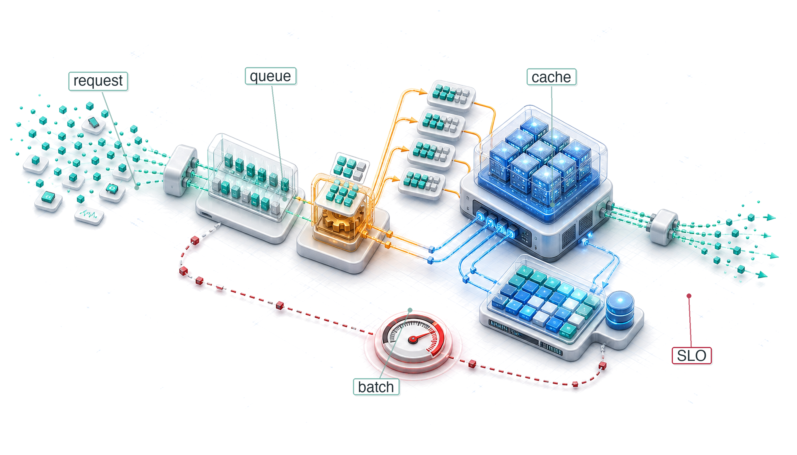
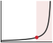

# Model Serving {#sec-model-serving}

::: {layout-narrow}
::: {.column-margin}

\chapterminitoc

:::

::: {.content-visible when-format="pdf"}
\noindent
{fig-alt="Isometric serving pipeline where variable requests become scheduled batches, occupy cache pages, run through inference workers, and return responses under latency pressure."}
:::

::: {.content-visible unless-format="pdf"}
{fig-alt="Isometric serving pipeline where variable requests become scheduled batches, occupy cache pages, run through inference workers, and return responses under latency pressure."}
:::

:::

## Purpose {.unnumbered .unlisted}

\begin{marginfigure}
\mlsysstack{35}{30}{25}{15}{90}{40}{20}{20}
\end{marginfigure}

_Why does serving invert every optimization priority that made training successful?_

Training and serving demand opposite physics. Training maximizes throughput (samples per second): large batches and long epochs where latency spikes get absorbed invisibly. Serving minimizes latency, measured in milliseconds per request: individual requests answered fast enough that a single slow response is a broken product. Training amortizes hardware costs across billions of examples; serving pays a tax on every request, where small inefficiencies compound into operational debt. This inversion is why models that train beautifully often serve poorly: the batch-heavy architectures and memory-intensive optimizations designed to saturate accelerators during training are fundamentally ill-suited for the bursty, latency-critical, cost-sensitive reality of production traffic. Serving, however, is more than a latency problem. A serving system must handle traffic that varies by orders of magnitude between peak and trough, introduce new model versions without abruptly moving all users at once, degrade gracefully when upstream dependencies fail, and do all of this continuously, not for the duration of a training run but for the lifetime of the product. Every model that proved its value during training and survived compression and benchmarking eventually arrives at the serving layer—the deployment and integration stage of the ML lifecycle—where the question shifts from "does it work?" to "does it work reliably, at scale, under production conditions, every second of every day?" The serving infrastructure is where ML systems finally meet users, and the engineering that sustains that meeting is qualitatively different from the engineering that created the model. It is also where the trained algorithm meets live data within the machine's latency budget: all three D·A·M constraints converge on every request.

::: {.content-visible when-format="pdf"}

\newpage

:::

::: {.callout-learning-objectives}

- Explain serving inversion from training throughput to per-request latency, headroom, and tail behavior
- Decompose request latency across serialization, preprocessing, inference, queuing, postprocessing, and network overhead
- Apply queueing laws and simple queue models to plan capacity against percentile latency targets
- Diagnose training-serving skew and cold starts from mismatched preprocessing, model loading, or cache behavior
- Select batching, load shedding, autoscaling, and runtime strategies for traffic patterns and latency budgets
- Evaluate LLM serving bottlenecks using token latency, KV-cache memory, and continuous batching constraints
- Calculate cost per inference from precision, hardware utilization, replica count, and runtime throughput

:::

## Serving Paradigm {#sec-model-serving-serving-paradigm-9634}

Serving\index{Serving!production deployment}\index{Model Serving!paradigm shift} begins where benchmarking stops: a model that performed under controlled measurement must now answer unpredictable live requests. Cloud, Edge, Mobile, and TinyML each impose distinct serving challenges, but all share the same inversion from throughput optimization to latency control. This serving inversion\index{Serving Inversion!throughput-to-latency shift} has concrete engineering implications that ripple through the whole stack. The iron law of ML systems undergoes a decisive shift: the latency term\index{Latency!serving constraint} $(L_{\text{lat}})$, representing the irreducible overhead of request scheduling, network round-trips, and system orchestration, becomes the dominant constraint rather than a rounding error. Controlled benchmarks establish performance under known conditions; serving faces traffic patterns no benchmark can fully anticipate. Quantization can reduce model size; serving must confirm that such optimizations preserve accuracy under real traffic distributions. Together these revalidations flip the priorities of data, algorithm, and machine once requests arrive one at a time under a latency budget.

::: {#psp-model-serving-serving-inversion .callout-perspective title="The serving inversion"}

Applying the D·A·M taxonomy reveals how deployment inverts the engineering priorities:

*   **Data (information)**: In training, the goal is Volume (shuffling billions of samples). In serving, the goal is Freshness (processing one request right now).
*   **Algorithm (logic)**: In training, the math is Mutable (updating weights via backprop). In serving, the math is Frozen (fixed weights, forward pass only).
*   **Machine (physics)**: In training, the goal is Utilization (keeping GPUs at 100 percent to saturate throughput). In serving, the goal is **Headroom**\index{Headroom!tail latency} (keeping GPUs at 40–60 percent to absorb traffic spikes before tail latency explodes; observe the exponential rise in @fig-tail-latency-explosion).

:::

A single traffic spike that exceeds this margin can cascade into system-wide failure; the queueing curve in @fig-tail-latency-explosion makes that collapse visible.

```{python}
#| echo: false
from mlsysim import *
from mlsysim.core.units import *

# ┌─────────────────────────────────────────────────────────────────────────────
# │ BLACK FRIDAY TRAFFIC SPIKE
# ├─────────────────────────────────────────────────────────────────────────────
# │ Context: Callout "The 'Black Friday' Traffic Spike"
# │
# │ Goal: Demonstrate the nonlinear failure mode of serving systems under load.
# │ Show: That a 10× traffic spike causes system collapse, not just 10× latency.
# │ How: Model queue explosion using Little's Law parameters.
# │
# └─────────────────────────────────────────────────────────────────────────────

from mlsysim.fmt import fmt, fmt_rate

class BlackFridayCalc:
    """Models the nonlinear failure mode of serving systems under a 10× traffic spike."""

    # ┌── 1. LOAD (Constants) ──────────────────────────────────────────────
    bf_latency_ms_value = 50 * ms  # scenario assumption: normal operation latency
    bf_qps_normal_value = 1000  # normal queries per second
    bf_qps_spike_value = 10000  # Black Friday peak QPS
    bf_spike_factor_value = 10  # spike multiplier (10x)
    bf_collapse_latency_s_value = 10 * second  # scenario assumption: latency during collapse

    # ┌── 4. OUTPUT (Formatting) ─────────────────────────────────────────────
    bf_latency_ms_str = fmt_time(bf_latency_ms_value, 'millisecond', precision=0, commas=False)
    bf_qps_normal_str = fmt_rate(bf_qps_normal_value, "QPS")
    bf_qps_spike_str = fmt_rate(bf_qps_spike_value, "QPS")
    bf_spike_factor_mult_str = fmt_multiple(bf_spike_factor_value, precision=0, commas=False)
    bf_collapse_latency_s_str = fmt_time(bf_collapse_latency_s_value, 'second', precision=0, commas=False)
    bf_full_util_pct_value = 100
    bf_full_util_pct_str = fmt_percent(bf_full_util_pct_value / 100, precision=0, commas=False, style='prose')
```

::: {#exmp-model-serving-black-friday-traffic-spike .callout-example title="The 'Black Friday' traffic spike"}

**Scenario**: An e-commerce recommendation system runs comfortably at `{python} BlackFridayCalc.bf_latency_ms_str` with `{python} BlackFridayCalc.bf_qps_normal_str`.

**Failure mode**: On Black Friday, traffic spikes `{python} BlackFridayCalc.bf_spike_factor_mult_str` to `{python} BlackFridayCalc.bf_qps_spike_str`. The system does not slow down `{python} BlackFridayCalc.bf_spike_factor_mult_str`; it *collapses*. Latency hits `{python} BlackFridayCalc.bf_collapse_latency_s_str`, then requests start timing out. The servers are `{python} BlackFridayCalc.bf_full_util_pct_str` loaded, but useful throughput drops to near zero because most completed requests have already timed out from the client's perspective.

**Physics**: This previews the queueing theory formalized later in @sec-model-serving-queuing-theory-tail-latency-29a6. As utilization approaches `{python} BlackFridayCalc.bf_full_util_pct_str`, queue lengths diverge nonlinearly rather than linearly. The system spends more time managing the queue (context switching, thrashing) than doing useful work.

**Fix**:

1.  **Load shedding**\index{Load Shedding!coordinated}: Reject excess requests immediately to keep the queue short.
2.  **Autoscaling**: Use an operational control loop to spin up more serving replicas before utilization hits the "knee" of the curve.
3.  **Degradation**: Serve cached/dumber recommendations to reduce compute cost per query.

**Systems lesson**: High average throughput does not protect a serving system from collapse. Tail latency control requires keeping utilization below the queueing knee, honoring the machine constraint even if that means shedding load or serving a cheaper model.

:::

::: {#fig-tail-latency-explosion fig-env="figure" fig-pos="htb" fig-cap="**The Tail Latency Explosion**: Request latency vs. serving utilization $\rho_{\text{serv}}$. While mean latency (blue) remains moderate, tail latency (red, p99) explodes once utilization passes the knee at ~70 percent. This uses the simple M/M/1 approximation introduced later in @sec-model-serving-queuing-theory-tail-latency-29a6 (p99 ≈ 4.6$\times$ mean), so the curve is illustrative rather than workload-specific." fig-alt="Line plot showing latency growing with serving utilization. Blue line (mean) rises gradually then steeply. Red line (Tail, p99) curves upward sharply at 70 percent utilization. Shaded regions indicate safe zone and danger zone."}

```{python}
#| echo: false
# ┌─────────────────────────────────────────────────────────────────────────────
# │ TAIL LATENCY EXPLOSION FIGURE
# ├─────────────────────────────────────────────────────────────────────────────
# │ Context: @fig-tail-latency-explosion—illustrates why tail latency diverges
# │          from mean latency as system utilization approaches 100%
# │
# │ Goal: Visually demonstrate the nonlinear explosion of p99 latency near
# │       saturation using an M/M/1 queueing model approximation.
# │ Show: Mean vs. p99 latency curves, with Safe Zone and Danger Zone annotations.
# │ How: Compute mean = 1/(1-rho_serv) and p99 approx 4.6x mean; plot on shared axes.
# │
# └─────────────────────────────────────────────────────────────────────────────

# ┌── 1. CANVAS ────────────────────────────────────────────────────────────────
# │ Visually demonstrate the nonlinear explosion of p99 latency near
import numpy as np
from book.tools.figures import style as book_style

fig, ax, COLORS, plt = book_style.setup_plot(figsize=(10, 4.35))
# =============================================================================
# PLOT: The Tail Latency Explosion
# =============================================================================

# ┌── 2. ARRAYS ────────────────────────────────────────────────────────────────
utilization = np.linspace(0, 0.95, 100)
mean_latency = 1 / (1 - utilization)
p99_latency = mean_latency * 4.6

# ┌── 3. RENDER ────────────────────────────────────────────────────────────────
ax.plot(utilization, mean_latency, '--', color=COLORS['BlueLine'], label='Mean Latency', linewidth=2)
ax.plot(utilization, p99_latency, '-', color=COLORS['RedLine'], label='Tail Latency (p99)', linewidth=2.5)

# ┌── 4. DECORATE ──────────────────────────────────────────────────────────────
ax.set_xlabel('System Utilization (%)')
ax.set_ylabel('Request Latency (normalized to service time)')
ax.set_xlim(0, 1.0)
ax.set_ylim(0, 50)

ax.axvspan(0, 0.5, color=COLORS['GreenL'], alpha=0.2)
ax.text(
    0.25,
    39,
    "Safe Zone",
    color=COLORS['GreenLine'],
    fontsize=8,
    fontweight='bold',
    va='center',
    ha='center',
    bbox=dict(facecolor='white', alpha=0.8, edgecolor='none', pad=0.5),
)
ax.axvspan(0.7, 1.0, color=COLORS['RedL'], alpha=0.3)
ax.text(
    0.78,
    39,
    "Danger Zone\n(Queue\nExplosion)",
    color=COLORS['RedLine'],
    fontweight='bold',
    va='center',
    ha='center',
    fontsize=8,
    linespacing=1.4,
    bbox=dict(facecolor='white', alpha=0.8, edgecolor='none', pad=0.5),
)

ax.annotate(
    "The Knee",
    xy=(0.7, 15),
    xytext=(0.59, 20),
    arrowprops=dict(facecolor=COLORS['primary'], arrowstyle='->', lw=1.0),
    fontsize=9,
    bbox=dict(facecolor='white', alpha=0.8, edgecolor='none', pad=0.5),
)

ax.set_xticks([0, 0.2, 0.4, 0.6, 0.8, 1.0])
ax.set_xticklabels(['0%', '20%', '40%', '60%', '80%', '100%'])
ax.legend(loc='upper left', fontsize=8, frameon=True, facecolor='white', framealpha=0.95, edgecolor='gray', fancybox=True, borderpad=0.6)
plt.show()
plt.close()
```

:::

@Fig-tail-latency-explosion shows that latency remains manageable at moderate utilization and then rises rapidly as the system approaches saturation; this is *why* production systems reserve headroom rather than planning for a permanently saturated accelerator\index{Tail Latency!utilization threshold} (p99). @Sec-appdx-data-foundations-distributions-long-tail-901f gives a mathematical treatment of long-tailed distributions and why p99 latency dominates the user experience at scale. The curve is a simple queueing approximation intended for intuition rather than a specific workload.

Beyond the technical limits of latency, the economics of serving have undergone a radical transformation. As models become more efficient and hardware becomes more specialized, the cost of "intelligence" is collapsing[^fn-jevons-paradox]. Facebook's experience at fleet scale illustrates the magnitude of this serving cost problem.

[^fn-jevons-paradox]: **Jevons Paradox**\index{Jevons Paradox!inference demand}: William Stanley Jevons observed in 1865 that efficiency improvements in coal-powered steam engines increased total coal consumption by making steam power economically viable for applications previously too costly [@jevons1865coal]. The same dynamic can apply to AI inference: each 10$\times$ cost reduction opens application classes that were economically infeasible at the previous price point, expanding aggregate demand by more than the efficiency gain. This is why cheaper inference can increase, not decrease, total GPU fleet demand---efficiency and demand are often complements in AI, not substitutes.

::: {#ws-model-serving-facebook-inference-tax .callout-war-story title="The inference tax at Facebook"}

**Context**: In 2018, Kim Hazelwood and Facebook's AI Infrastructure team described a production ML workload that touched nearly every user-facing surface: News Feed ranking, Ads ranking, Search, image understanding (Lumos), face recognition (Facer), anomaly detection (Sigma), automated video captioning, and a Translate system serving roughly 4.5 billion translated post impressions per day across more than two thousand language pairs [@hazelwood2018].

**Failure mode**: The expensive part of ML had moved into serving. Inference ran on the order of tens of trillions of operations per day under strict tail-latency targets, where live request arrivals constrained batching and a one-hour-old ranking model measurably degraded News Feed quality---forcing aggressive retraining alongside aggressive serving.

**Resolution**: Facebook treated inference as a first-class data-center infrastructure problem, co-designing models, accelerators, memory systems, and serving platforms together rather than treating serving as an afterthought to training.

**Systems lesson**: Training creates the model; serving pays the recurring bill. At fleet scale, a model architecture that is cheap to train can still be too expensive, too memory-bound, or too variable in tail latency to serve.

:::

The same serving-economics pressure appears in public API prices. To grasp the speed of this cost collapse, examine the log-scale price trajectory in @fig-intelligence-deflation, which tracks representative public API list-price snapshots as a market proxy. Vendor prices change frequently, so these points should be read as historical provenance for the trend rather than as current purchasing guidance [@openai2023chatgptwhisper; @openai2023gpt4; @openaiCommunity2024gpt4oApi; @openai2024gpt4oMini; @anthropic2024claude3family; @google2024gemini15flashPricing; @deepseek2024v3]. Each order-of-magnitude drop changes which applications are feasible.

::: {#fig-intelligence-deflation fig-env="figure" fig-pos="htb" fig-cap="**Intelligence Deflation**: Representative public API input-token list prices per 1M tokens ($) over time (Log Scale). Prices are model-version snapshots collected from the public pricing pages of OpenAI, Anthropic, Google, and DeepSeek between 2020 and 2025 and are intended as a market trend indicator, not a controlled or current-price comparison. API token-processing prices have collapsed by multiple orders of magnitude, transforming the economics of automated AI workflows." fig-alt="Line plot showing representative public API input-token pricing collapsing from 20 dollars per million tokens in 2020 to under 0.10 dollars per million tokens in 2025. Log scale highlights the deflationary trend with models from OpenAI, Anthropic, Google, and DeepSeek."}

```{python}
#| echo: false
# ┌─────────────────────────────────────────────────────────────────────────────
# │ INTELLIGENCE DEFLATION FIGURE
# ├─────────────────────────────────────────────────────────────────────────────
# │ Context: @fig-intelligence-deflation—log-scale scatter plot of representative
# │          public API input-token prices from 2020 to 2025, annotated with model names
# │
# │ Goal: Visualize the ~5.8× per-18-month fitted collapse in inference token cost that
# │       is transforming AI serving economics.
# │ Show: Named input/prompt-token price points on a log scale with deflation trend line.
# │ How: Fit a log-linear trend through representative price points; scatter
# │      remaining models; annotate each with model name.
# │
# └─────────────────────────────────────────────────────────────────────────────

# ┌── 1. CANVAS ────────────────────────────────────────────────────────────────
# │ Visualize the ~5.8× per-18-month fitted collapse in inference token cost that
import numpy as np
from book.tools.figures import style as book_style

fig, ax, COLORS, plt = book_style.setup_plot(figsize=(10, 4.35))
# =============================================================================
# DATA: Representative input-token pricing snapshots over time
# =============================================================================

# ┌── 2. ARRAYS ────────────────────────────────────────────────────────────────
data = [
    (2020.5, 20.0, "GPT-3 (Davinci)"),
    (2023.1, 2.0, "GPT-3.5 Turbo"),
    (2023.2, 30.0, "GPT-4 (Original)"),
    (2024.2, 15.0, "Claude 3 Opus"),
    (2024.2, 0.25, "Claude 3 Haiku"),
    (2024.3, 5.0, "GPT-4o"),
    (2024.4, 0.075, "Gemini 1.5 Flash"),
    (2024.6, 0.15, "GPT-4o-mini"),
    (2025.1, 0.27, "DeepSeek-V3"),
]
data.sort(key=lambda x: x[0])

years = np.array([d[0] for d in data])
prices = np.array([d[1] for d in data])
labels = [d[2] for d in data]

# =============================================================================
# PLOT: Intelligence Deflation
# =============================================================================
trend_years = np.array([2020.5, 2023.1, 2024.2, 2024.4, 2025.1])
trend_prices = np.array([20.0, 2.0, 0.25, 0.075, 0.27])
slope, intercept = np.polyfit(trend_years, np.log10(trend_prices), 1)
line_years = np.linspace(2020, 2025.5, 100)
line_prices = 10 ** (slope * line_years + intercept)

# -----------------------------------------------------------------------------
# RENDER
# -----------------------------------------------------------------------------
ax.plot(line_years, line_prices, linestyle='--', linewidth=1.5, color=COLORS['RedLine'])
ax.scatter(years, prices, s=45, color=COLORS['BlueLine'], edgecolors='white', zorder=3)

# -----------------------------------------------------------------------------
# Default label style
# -----------------------------------------------------------------------------
default_label_style = {
    "xytext": (6, 6),
    "textcoords": "offset points",
    "ha": "left",
    "va": "bottom",
    "fontsize": 8,
    "color": COLORS["primary"],
    "bbox": dict(boxstyle="round,pad=0.2", facecolor="white", edgecolor="none", alpha=0.8),
}

# -----------------------------------------------------------------------------
# Individual overrides by label
# -----------------------------------------------------------------------------
label_styles = {
    "GPT-3 (Davinci)": {
        "xytext": (-10, -11),
        "ha": "center",
        "va": "center",
    },
    "GPT-3.5 Turbo": {
        "xytext": (0, 10),
        "ha": "center",
        "va": "center",
    },
    "GPT-4 (Original)": {
        "xytext": (0, 10),
        "ha": "center",
        "va": "center",
    },
    "Claude 3 Opus": {
        "xytext": (0, 10),
        "ha": "center",
        "va": "center",
    },
    "Claude 3 Haiku": {
        "xytext": (-10, -10),
        "ha": "center",
        "va": "center",
    },
    "GPT-4o": {
        "xytext": (0, -10),
        "ha": "center",
        "va": "center",
    },
    "Gemini 1.5 Flash": {
        "xytext": (-20, -20),
        "ha": "center",
        "va": "center",
        "arrowprops": dict(arrowstyle="-", shrinkB=5, color=COLORS["primary"], lw=0.8),
    },
    "GPT-4o-mini": {
        "xytext": (20, -20),
        "ha": "center",
        "va": "center",
        "arrowprops": dict(arrowstyle="-", shrinkB=5, color=COLORS["primary"], lw=0.8),
    },
    "DeepSeek-V3": {
        "xytext": (0, 10),
        "ha": "center",
        "va": "center",
    },
}

# -----------------------------------------------------------------------------
# Draw labels
# -----------------------------------------------------------------------------
for x, y, label in zip(years, prices, labels):
    style = default_label_style.copy()
    style.update(label_styles.get(label, {}))
    ax.annotate(label, (x, y), **style)
# ┌── 4. DECORATE ──────────────────────────────────────────────────────────────
ax.set_yscale('log')
ax.set_yticks([100, 10, 1, 0.1, 0.01])
ax.set_yticklabels(['$100', '$10', '$1', '$0.10', '$0.01'])
ax.set_xlabel('Year')
ax.set_ylabel('Price per 1M Tokens ($)')
ax.set_ylim(0.01, 500)
ax.set_xlim(2020, 2025.5)
ax.text(
    2021,
    0.05,
    "Trend: ~5.8× Cheaper\nEvery 18 Months",
    color=COLORS['grid'],
    fontsize=9,
    ha='center',
    style='italic',
    bbox=dict(facecolor='white', alpha=0.8, edgecolor='none', pad=0.5),
)
plt.show()
plt.close()
```

:::

Two pressures now frame the serving problem: tail latency that explodes once utilization passes the queueing knee, and per-inference economics that fall by orders of magnitude as efficiency improves. Together they force a formal definition of serving built around latency rather than throughput.

::: {#dfn-model-serving-model-serving .callout-definition title="Model serving"}

***Model Serving***\index{Model Serving!definition} is the operational phase that provides model predictions to end-users or downstream systems under strict latency constraints.

1.  **Significance**: It inverts the throughput priority ($\eta_{\text{hw}}$) of training into a latency constraint $(L_{\text{lat}})$, requiring an architectural stack designed to minimize the tail latency (p99) of individual inferences.
2.  **Distinction**: Unlike model training, which processes large, predictable batches of data, model serving must handle stochastic request patterns and unpredictable load.
3.  **Common pitfall**: A frequent misconception is that serving is "just the forward pass." In reality, it is a distributed system problem: the model execution is only one component of a stack that includes request routing, load balancing, and data transformation.

:::

The SLO[^fn-slo-sla-serving] defines the latency target that shapes every architectural decision in the serving stack.

[^fn-slo-sla-serving]: **Service Level Objective (SLO) vs. Service Level Agreement (SLA)**\index{SLO!vs. SLA}: An SLO is an *internal* target (for example, "p99 latency under 50 ms"); an SLA is an *external* contractual commitment with financial penalties for violation. SLOs are set tighter than SLAs to provide a safety margin. For ML serving, both model accuracy and inference latency contribute to SLOs, creating multi-dimensional optimization targets where improving one dimension (for example, deploying a larger model for accuracy) can violate the other (latency).

Serving systems must execute a complete inference pipeline\index{Inference Pipeline!stages} under latency constraints, not just the neural network computation. A common misconception is that "inference time" equals "serving time," but the neural network is only one stage in a longer pipeline. Follow the stages in @fig-serving-inference-pipeline from left to right: raw inputs pass through preprocessing (traditional computing), neural network inference (deep learning), and postprocessing (traditional computing) before producing final outputs. Any of these stages can become the latency bottleneck. @Sec-model-serving-latency-budget-ef40 quantifies exactly where time goes, revealing a counterintuitive result about which stages dominate.

::: {#fig-serving-inference-pipeline fig-env="figure" fig-pos="htb" fig-cap="**The Inference Pipeline**: ML serving systems transform raw inputs into final outputs through sequential stages: preprocessing, neural network computation, and postprocessing. The neural network represents just one component; preprocessing and postprocessing rely on traditional computing and often dominate total latency in optimized systems." fig-alt="Flow diagram showing six connected boxes: Raw Input, Preprocessing, Neural Network, Raw Output, Postprocessing, Final Output. Preprocessing and postprocessing are labeled Traditional Computing; neural network is labeled Deep Learning."}

```{.tikz}
\begin{tikzpicture}[font=\small\usefont{T1}{phv}{m}{n}, >=stealth]
\tikzset{
Box/.style={align=center, inner xsep=2pt,draw=GreenLine, line width=1pt,fill=none,
minimum width=24mm, minimum height=25mm,node distance=1.0},
LineA/.style={BrownLine!70,line width=4.0pt,{-{Triangle[width=1.5*6pt,length=2.0*5pt]}},shorten <=1pt,shorten >=1pt},
ALine/.style={black!50, line width=1.1pt,{{Triangle[width=0.9*6pt,length=1.2*6pt]}-}},
Larrow/.style={fill=violet!50, single arrow,  inner sep=2pt, single arrow head extend=3pt,
            single arrow head indent=0pt,minimum height=10mm, minimum width=3pt}
}
%inbox
\tikzset{%
 pics/inbox/.style = {
        code = {
        \pgfkeys{/channel/.cd, #1}
\begin{scope}[local bounding box=INBOX,scale=\scalefac, every node/.append style={transform shape}]
\node[line width=\Linewidth,draw=\drawcolor,fill=\filllcolor!50,
rectangle,rounded corners=3pt,minimum width=14mm,minimum height=10mm]at(0,0.3){};
\node[line width=\Linewidth,draw=\drawcolor,fill=\filllcolor,
rectangle,rounded corners=3pt,minimum width=15mm,minimum height=10mm]at(0,0.1){};
\node[line width=\Linewidth,draw=\drawcolor,fill=\filllcolor!50,
,rectangle,rounded corners=3pt,minimum width=17mm,minimum height=10mm]
at(0,-0.1){};
\draw[line width=\Linewidth,draw=\drawcolor,fill=\filllcirclecolor,,rounded corners=2pt](-0.92,0.05)--
(-0.92,-0.78)--(0.92,-0.78)--(0.92,0.05)--(0.40,0.05)--(0.32,-0.2)--(-0.29,-0.2)--(-0.40,0.05)--cycle;

\node[single arrow, line width=\Linewidth,draw=black,fill=cyan!90!black!30, rotate=270,
      minimum width = 15pt, single arrow head extend=6pt,
      minimum height=10mm]at(0,0.5) {}; % length of arrow
 \end{scope}
     }
  }
}
%brain
\tikzset{pics/brain/.style = {
        code = {
        \pgfkeys{/channel/.cd, #1}
\begin{scope}[local bounding box=BRAIN,scale=\scalefac, every node/.append style={transform shape}]
\fill[fill=\filllcolor!50](0.1,-0.5)to[out=0,in=180](0.33,-0.5)
to[out=0,in=270](0.45,-0.38)to(0.45,-0.18)
to[out=40,in=240](0.57,-0.13)to[out=110,in=310](0.52,-0.05)
to[out=130,in=290](0.44,0.15)to[out=90,in=340,distance=8](0.08,0.69)
to[out=160,in=80](-0.42,-0.15)to (-0.48,-0.7)to(0.07,-0.7)to(0.1,-0.5)
(-0.10,-0.42)to[out=310,in=180](0.1,-0.5);
\draw[draw=\drawcolor,line width=\Linewidth](0.1,-0.5)to[out=0,in=180](0.33,-0.5)
to[out=0,in=270](0.45,-0.38)to(0.45,-0.18)
to[out=40,in=240](0.57,-0.13)to[out=110,in=310](0.52,-0.05)
to[out=130,in=290](0.44,0.15)to[out=90,in=340,distance=8](0.08,0.69)
(-0.42,-0.15)to (-0.48,-0.7)
(0.07,-0.7)to(0.1,-0.5)
(-0.10,-0.42)to[out=310,in=180](0.1,-0.5);
\draw[fill=\filllcolor,line width=\Linewidth](-0.3,-0.10)to(0.08,0.60)
to[out=60,in=50,distance=3](-0.1,0.69)to[out=160,in=80](-0.26,0.59)to[out=170,in=90](-0.46,0.42)
to[out=170,in=110](-0.54,0.25)to[out=210,in=150](-0.54,0.04)
to[out=240,in=130](-0.52,-0.1)to[out=300,in=240]cycle;
\draw[fill=\filllcolor,line width=\Linewidth]
(-0.04,0.64)to[out=120,in=0](-0.1,0.69)(-0.19,0.52)to[out=120,in=330](-0.26,0.59)
(-0.4,0.33)to[out=150,in=280](-0.46,0.42)
%
(-0.44,-0.03)to[bend left=30](-0.34,-0.04)
(-0.33,0.08)to[bend left=40](-0.37,0.2) (-0.37,0.12)to[bend left=40](-0.45,0.14)
(-0.26,0.2)to[bend left=30](-0.24,0.13)
(-0.16,0.32)to[bend right=30](-0.27,0.3)to[bend right=30](-0.29,0.38)
(-0.13,0.49)to[bend left=30](-0.04,0.51);

\draw[rounded corners=0.8pt,\drawcircle,-{Circle[fill=\filllcirclecolor,length=2.5pt]}](-0.23,0.03)--(-0.15,-0.03)--(-0.19,-0.18)--(-0.04,-0.28);
\draw[rounded corners=0.8pt,\drawcircle,-{Circle[fill=\filllcirclecolor,length=2.5pt]}](-0.17,0.13)--(-0.04,0.05)--(-0.06,-0.06)--(0.14,-0.11);
\draw[rounded corners=0.8pt,\drawcircle,-{Circle[fill=\filllcirclecolor,length=2.5pt]}](-0.12,0.23)--(0.31,0.0);
\draw[rounded corners=0.8pt,\drawcircle,-{Circle[fill=\filllcirclecolor,length=2.5pt]}](-0.07,0.32)--(0.06,0.26)--(0.16,0.33)--(0.34,0.2);
\draw[rounded corners=0.8pt,\drawcircle,-{Circle[fill=\filllcirclecolor,length=2.5pt]}](-0.01,0.43)--(0.06,0.39)--(0.18,0.51)--(0.31,0.4);
\end{scope}
     }
  }
}
%llm
\tikzset{
pics/llm/.style = {
        code = {
        \pgfkeys{/channel/.cd, #1}
\begin{scope}[shift={($(0,0)+(0,0)$)},scale=\scalefac,every node/.append style={transform shape}]
\node[circle,minimum size=12mm,draw=\drawcolor, fill=\filllcolor!70,line width=0.5*\Linewidth](C\picname) at (0,0){};
\def\startangle{90}
\def\radius{1.15}
\def\radiusI{1.1}
\foreach \i [evaluate=\i as \j using \i+1] [count =\k] in {0,2,4,6,8} {
\pgfmathsetmacro{\angle}{\startangle - \i * (360/8)}
\draw[draw=black,-{Circle[black ,fill=\filllcirclecolor,length=5.5pt,line width=0.5*\Linewidth]},line width=1.5*\Linewidth](C\picname)--++(\startangle - \i*45:\radius) ;
\node[circle,draw=black,fill=\filllcirclecolor!80!red!50,inner sep=3pt,line width=0.5*\Linewidth](2C\k)at(\startangle - \j*45:\radiusI) {};
}
\draw[line width=1.5*\Linewidth](2C1)--++(-0.5,0)|-(2C2);
\draw[line width=1.5*\Linewidth](2C3)--++(0.5,0)|-(2C4);
\node[circle,,minimum size=12mm,draw=\drawcolor, fill=\filllcolor!70,line width=0.5*\Linewidth]at (0,0){};
\node[draw,rectangle,rounded corners=1pt,minimum width=7mm,minimum height=4mm,fill=orange!10](R1)at(0.1,0.1){};
\draw[BrownLine,shorten <=2pt,shorten >=2pt ]($(R1.north west)!0.35!(R1.south west)$)--($(R1.north east)!0.35!(R1.south east)$);
\draw[BrownLine,shorten <=2pt,shorten >=2pt ]($(R1.north west)!0.7!(R1.south west)$)--($(R1.north east)!0.7!(R1.south east)$);
\node[draw,rectangle,rounded corners=1pt,minimum width=6mm,minimum height=4mm,fill=orange!10](R2)at(-0.05,-0.15){};
\draw[BrownLine,shorten <=2pt,shorten >=2pt ]($(R2.north west)!0.35!(R2.south west)$)--($(R2.north east)!0.35!(R2.south east)$);
\draw[BrownLine,shorten <=2pt,shorten >=2pt ]($(R2.north west)!0.7!(R2.south west)$)--($(R2.north east)!0.7!(R2.south east)$);
\end{scope}
    }
  }
}
%funnel
\tikzset{%
 pics/funnel/.style = {
        code = {
        \pgfkeys{/channel/.cd, #1}
\begin{scope}[local bounding box=FUNNEL,scale=\scalefac, every node/.append style={transform shape}]
\draw[fill=\filllcolor,line width=\Linewidth,draw=\drawcolor](-0.12,-0.81)--(-0.19,-0.25)--(-0.7,0.41)--(0.7,0.41)--(0.19,-0.25)--(0.12,-0.81)--cycle;
\draw[fill=\filllcolor,line width=\Linewidth,draw=\drawcolor](-0.19,-0.25)--(0.08,-0.25);
\draw[fill=\filllcolor,line width=\Linewidth,draw=\drawcolor](0.16,-0.09)--(0.41,0.31);
%
\node[line width=\Linewidth,draw=\drawcolor,fill=\filllcolor,inner sep=1pt,
rectangle,rounded corners=2pt,minimum width=16mm,minimum height=5pt]at(0,0.5){};
%
\foreach \i in{-0.5,0,0.5}{
\node[single arrow, line width=0.8*\Linewidth,draw=black,fill=\filllcirclecolor, rotate=270,inner sep=1pt,
      minimum width =9pt, single arrow head extend=2pt,
      minimum height=5mm]at(\i,0.9) {}; % length of arrow
   }
\node[single arrow,line width=0.8*\Linewidth,draw=black,fill=\filllcirclecolor, rotate=270,inner sep=1pt,
      minimum width =11pt, single arrow head extend=2pt,
      minimum height=5mm]at(0,-1.1) {}; % length of arrow
 \end{scope}
     }
  }
}
\def\inset{2.0pt} %
\def\myshape{%
  (0,1.34) to[out=220,in=0] (-1.20,1.03) --
  (-1.20,-0.23) to[out=280,in=160] (0,-1.53) to[out=20,in=260] (1.20,-0.23) --
  (1.20,1.03)  to[out=180,in=320] cycle
}
\tikzset{
pics/stitC/.style = {
        code = {
        \pgfkeys{/channel/.cd, #1}
\begin{scope}[shift={($(0,0)+(0,0)$)},scale=\scalefac,every node/.append style={transform shape}]
\fill[fill=\filllcolor!60] \myshape;
%
\begin{scope}
  \clip \myshape;
  \draw[draw=\filllcolor!60, line width=3*\inset,fill=white] \myshape; % boja i debljina po želji
\end{scope}
\draw[red,line width=3pt](-0.7,-0.35)--++(320:0.5)--++(50:1.5);
\end{scope}
    }
  }
}
%gear-arrow
% #1 number of teeths
% #2 radius intern
% #3 radius extern
% #4 angle from start to end of the first arc
% #5 angle to decale the second arc from the first
% #6 inner radius to cut off
\tikzset{
  pics/gearAR/.style args={#1/#2/#3/#4/#5/#6/#7}{
   code={
           \pgfkeys{/channel/.cd, #7}
\begin{scope}[shift={($(0,0)+(0,0)$)},scale=\scalefac,every node/.append style={transform shape},
LinE/.style={\filllcirclecolor,line width=5.0pt,
{{Triangle[width=1.5*10pt,length=2.0*5pt]}-},shorten <=5pt,shorten >=1pt},
ELin/.style={\filllcirclecolor,line width=7.0pt,
{-{Triangle[width=1.15*10pt,length=2.0*5pt]}},shorten <=0pt,shorten >=0pt}]
    \pgfmathtruncatemacro{\N}{#1}%,
    \def\rin{#2}\def\rout{#3}\def\aA{#4}\def\aOff{#5}\def\rcut{#6}%
    \path[rounded corners=0.5pt,draw=\drawcolor,fill=\filllcolor]
      (0:\rin)
      \foreach \i [evaluate=\i as \n using (\i-1)*360/\N] in {1,...,\N}{%
        arc (\n:\n+\aA:\rin)
        -- (\n+\aA+\aOff:\rout)
        arc (\n+\aA+\aOff:\n+360/\N-\aOff:\rout)
        -- (\n+360/\N:\rin)
      } -- cycle;
      \draw[draw=none,fill=white](0,0) circle[radius=\rcut];
\draw[ELin](0,0)--++(0:2.5);
\end{scope}
  }}
}
%testing+pencil
\tikzset{
pics/testing/.style = {
        code = {
        \pgfkeys{/channel/.cd, #1}
\begin{scope}[local bounding box=TESTING1,shift={($(0,0)+(0,0)$)},scale=\scalefac,every node/.append style={transform shape}]
\newcommand{\tikzxmark}{%
\tikz[scale=0.18] {
    \draw[line width=0.7,line cap=round,RedLine] (0,0) to [bend left=6] (1,1);
    \draw[line width=0.7,line cap=round,RedLine] (0.2,0.95) to [bend right=3] (0.8,0.05);
}}
\newcommand{\tikzxcheck}{%
\tikz[scale=0.16] {
    \draw[line width=0.7,line cap=round,GreenLine] (0.5,0.75)--(0.85,-0.1) to [bend left=16] (1.5,1.55);

}}
 \node[draw, minimum width  =15mm, minimum height = 20mm, inner sep = 0pt,
        rounded corners,draw = \drawcolor, fill=\filllcolor!10, line width=\Linewidth](COM){};
\node[draw=GreenLine,inner sep=4pt,fill=white](CB1) at ($(COM.north west)!0.25!(COM.south west)+(0.3,0)$){};
\node[xshift=0pt]at(CB1){\tikzxcheck};
\node[draw=RedLine,inner sep=4pt,fill=white](CB2) at ($(COM.north west)!0.5!(COM.south west)+(0.3,0)$){};
\node[xshift=0pt]at(CB2){\tikzxmark};
\node[draw=RedLine,inner sep=4pt,fill=white](CB3) at ($(COM.north west)!0.75!(COM.south west)+(0.3,0)$){};
\node[xshift=0pt]at(CB3){\tikzxmark};
\draw[GreenLine,decoration={zigzag,segment length=4pt, amplitude=0.5pt},decorate]($(CB1)+(0.3,0.05)$)--++(0:0.8);
\draw[GreenLine,decoration={zigzag,segment length=4pt, amplitude=0.5pt},decorate]($(CB1)+(0.3,-0.12)$)--++(0:0.7);
\draw[RedLine,decoration={zigzag,segment length=4pt, amplitude=0.5pt},decorate]($(CB2)+(0.3,0.05)$)--++(0:0.8);
\draw[RedLine,decoration={zigzag,segment length=4pt, amplitude=0.5pt},decorate]($(CB2)+(0.3,-0.12)$)--++(0:0.6);
\draw[RedLine,decoration={zigzag,segment length=4pt, amplitude=0.5pt},decorate]($(CB3)+(0.3,0.05)$)--++(0:0.8);
\draw[RedLine,decoration={zigzag,segment length=4pt, amplitude=0.5pt},decorate]($(CB3)+(0.3,-0.12)$)--++(0:0.6);
\end{scope}
    }
  }
}
%pencil
\tikzset{
pics/pencil/.style = {
        code = {
        \pgfkeys{/channel/.cd, #1}
\begin{scope}[local bounding box=TESTING1,shift={($(0,0)+(0,0)$)},scale=\scalefac,every node/.append style={transform shape},rotate=340]
            \fill[fill=\filllcolor!70] (0,4) -- (0.4,4) -- (0.4,0) --(0.3,-0.15) -- (0.2,0) -- (0.1,-0.14) -- (0,0) -- cycle;
            \draw[color=white,thick] (0.2,4) -- (0.2,0);
            \fill[black] (0,3.5) -- (0.2,3.47) -- (0.4,3.5) -- (0.4,4) arc(30:150:0.23cm);
            \fill[fill=\filllcolor!40] (0,0) -- (0.2,-0.8)node[coordinate,pos=0.75](a){} -- (0.4,0)node[coordinate,pos=0.25](b){} -- (0.3,-0.15) -- (0.2,0) -- (0.1,-0.14) -- cycle;
            \fill[fill=\filllcolor] (a) -- (0.2,-0.8) -- (b) -- cycle;

\end{scope}
    }
  }
}
\pgfkeys{
  /channel/.cd,
   Depth/.store in=\Depth,
  Height/.store in=\Height,
  Width/.store in=\Width,
  filllcirclecolor/.store in=\filllcirclecolor,
  filllcolor/.store in=\filllcolor,
  drawcolor/.store in=\drawcolor,
  drawcircle/.store in=\drawcircle,
  scalefac/.store in=\scalefac,
  Linewidth/.store in=\Linewidth,
  picname/.store in=\picname,
  filllcolor=BrownLine,
  filllcirclecolor=violet!20,
  drawcolor=black,
  drawcircle=violet,
  scalefac=1,
  Linewidth=0.5pt,
  Depth=1.3,
  Height=0.8,
  Width=1.1,
  picname=C
}
%Raw Data
\node[Box](B1){};
\fill[cyan!07](B1.north west) rectangle ($(B1.north east)!0.6!(B1.south east)$)coordinate(B1DE);
\fill[cyan!20](B1.south east) rectangle ($(B1.north west)!0.6!(B1.south west)$)coordinate(B1LE);
\node[Box,draw=BlueD](){};
\tikzset{Text2/.style={font=\usefont{T1}{phv}{b}{n}\small,align=center}}
\node[Text2]at($(B1.south west)!0.5!(B1DE)$){Raw Data};
\coordinate(Q1)at($(B1.north west)!0.5!(B1DE)$);
\pic[shift={(0,0)}] at  (Q1){inbox={scalefac=0.7,picname=1,Linewidth=1.0pt,
 filllcolor=BrownL,drawcolor=black,filllcirclecolor=orange!70!yellow!80}};
%Pre-processing
\node[Box, right=0.75 of B1](B2){};
\fill[cyan!07](B2.north west) rectangle ($(B2.north east)!0.6!(B2.south east)$)coordinate(B2DE);
\fill[cyan!20](B2.south east) rectangle ($(B2.north west)!0.6!(B2.south west)$)coordinate(B2LE);
\node[Box, right=0.75 of B1,draw=BlueD](B2){};
\node[Text2]at($(B2.south west)!0.5!(B2DE)$){Pre-\\processing};
\coordinate(Q2)at($(B2.north west)!0.5!(B2DE)$);
\pic[shift={(0,0)}] at  (Q2){funnel={scalefac=0.53,picname=1,Linewidth=0.5pt,
 filllcolor=green!70!orange!70,drawcolor=black,filllcirclecolor=red!70!blue!80}};
%Neural Network
\node[Box, right=of B2](B3){};
\fill[green!07](B3.north west) rectangle ($(B3.north east)!0.6!(B3.south east)$)coordinate(B3DE);
\fill[green!20](B3.south east) rectangle ($(B3.north west)!0.6!(B3.south west)$)coordinate(B3LE);
\node[Box, right=of B2,draw=GreenD](B3){};
\node[Text2]at($(B3.south west)!0.5!(B3DE)$){Neural\\ Network};
\coordinate(Q3)at($(B3.north west)!0.5!(B3DE)$);
%\pic[shift={(0,0)}] at  (Q3){brain={scalefac=0.9,picname=1,filllcolor=orange!30!, Linewidth=0.95pt}};
\pic[shift={(0,0)}] at  (Q3){llm={scalefac=0.6,drawcolor=BlueLine,filllcolor=BlueLine!50!, Linewidth=1pt,filllcirclecolor=red}};
%Raw output
\node[Box, right=of B3](B4){};
\fill[violet!07](B4.north west) rectangle ($(B4.north east)!0.6!(B4.south east)$)coordinate(B4DE);
\fill[violet!20](B4.south east) rectangle ($(B4.north west)!0.6!(B4.south west)$)coordinate(B4LE);
\node[Box, right=of B3,draw=VioletLine](B4){};
\node[Text2]at($(B4.south west)!0.5!(B4DE)$){Raw\\ Output};
\coordinate(Q4)at($(B4.north west)!0.5!(B4DE)$);
 \pic[shift={(0,0)}] at (Q4) {gearAR={14/1.4/1.8/8/4/0.7/scalefac=0.35,drawcolor=BlueLine,filllcolor=BlueLine,filllcirclecolor=red}};
%Post-processing
\node[Box, right=0.75 of B4](B5){};
\fill[violet!05](B5.north west) rectangle ($(B5.north east)!0.6!(B5.south east)$)coordinate(B5DE);
\fill[violet!15](B5.south east) rectangle ($(B5.north west)!0.6!(B5.south west)$)coordinate(B5LE);
\node[Box, right=0.75 of B4,draw=VioletLine](B5){};
\node[Text2]at($(B5.south west)!0.5!(B5DE)$){Post-\\processing};
\coordinate(Q5)at($(B5.north west)!0.5!(B5DE)$);
\pic[shift={(0,0)}] at  (Q5){testing={scalefac=0.65,picname=1,drawcolor=myblue,filllcolor=myblue, Linewidth=1.0pt}};
\pic[shift={(0,-0.5)},rotate=-15] at  (Q5){pencil={scalefac=0.30,picname=1,filllcolor=mygreen, Linewidth=1.0pt}};
%%%%%%
%Final output
\node[Box, right=0.75 of B5](B6){};
\fill[violet!05](B6.north west) rectangle ($(B6.north east)!0.6!(B6.south east)$)coordinate(B6DE);
\fill[violet!15](B6.south east) rectangle ($(B6.north west)!0.6!(B6.south west)$)coordinate(B6LE);
\node[Box, right=0.75 of B5,draw=VioletLine]{};
\node[Text2]at($(B6.south west)!0.5!(B6DE)$){Final Output};
\coordinate(Q6)at($(B6.north west)!0.5!(B6DE)$);
\pic[shift={(0,0.05)}] at  (Q6){stitC={scalefac=0.45,drawcolor=orange,filllcolor=green!55!black}};
%arrows
\foreach \i in{1,2,3,4,5}{
\pgfmathtruncatemacro{\X}{\i + 1} %
\draw[LineA](B\i)--(B\X);
}
\node[draw=myblue,line width=0.75pt,fit=(B1)(B2),inner ysep=3mm,inner xsep=4mm,xshift=1mm](F1){};
\node[draw=none,fit=(B3),inner ysep=3mm,inner xsep=4mm](F2){};
\node[draw=mypurple,line width=0.75pt,fit=(B4)(B6),inner ysep=3mm,inner xsep=4mm,xshift=-1mm](F3){};
\node[below =0pt of F1,text=myblue]{Pre-processing};
\node[below =0pt of F2,text=GreenD]{Deep Learning};
\node[below =0pt of F3,text=mypurple]{Post-processing};

\end{tikzpicture}
```

:::

The pipeline turns serving into an orchestration problem: preprocessing, model execution, postprocessing, and transport all compete for the same latency budget. Before optimizing any one stage, the system must decide whether predictions are computed ahead of time or on demand.

### Static vs. dynamic inference {#sec-model-serving-static-vs-dynamic-inference-e864}

The preceding examples explain *why* serving systems must maintain capacity headroom. Before optimizing *how* to reduce inference latency, the system must decide *when* predictions are computed. The first architectural decision in any serving system is whether predictions happen before or during user requests [@google2024staticdynamic]. This choice shapes system design, cost structure, and capability boundaries.

#### Static inference {#sec-model-serving-static-inference-35f4}

Static inference\index{Static Inference!precomputed predictions} (also called offline or batch inference) precomputes predictions for anticipated inputs and stores them for retrieval. Consider a recommendation system that generates predictions for all user-item pairs nightly. When a user requests recommendations, the system retrieves precomputed results from a lookup table rather than running inference. This approach moves compute out of the request path, enables offline quality checks, and can reduce serving costs for predictable inputs. However, static inference needs either a fallback online path or a refreshed batch computation when requests include unanticipated inputs or newly updated models.

#### Dynamic inference {#sec-model-serving-dynamic-inference-d2d5}

Dynamic inference\index{Dynamic Inference!real-time prediction} (also called online or real-time inference) computes predictions on demand when requests arrive. This handles any input, including rare edge cases and novel combinations, and immediately reflects model updates. The cost is strict latency requirements that constrain model complexity and demand robust monitoring infrastructure.

```{python}
#| echo: false
#| label: static-batch-calc
# ┌─────────────────────────────────────────────────────────────────────────────
# │ STATIC VS DYNAMIC INFERENCE
# ├─────────────────────────────────────────────────────────────────────────────
# │ Context: Static vs Dynamic inference narrative (photo organization example)
# │
# │ Goal: Contrast the economics of static vs. dynamic inference.
# │ Show: That static precomputation is superior for predictable inputs.
# │ How: Compare total batch time to per-request latency for photo classification.
# │
# └─────────────────────────────────────────────────────────────────────────────
from mlsysim.fmt import fmt, fmt_count, fmt_time

class StaticBatchCalc:
    """Contrasts static vs. dynamic inference economics for photo classification."""

    # ┌── 1. LOAD (Constants) ──────────────────────────────────────────────
    n_photos_value = 10_000  # photos in user library
    inference_ms_value = 5 * ms  # scenario assumption: ResNet-50 inference time
    dynamic_latency_budget_ms_value = 100 * ms  # scenario assumption: real-time latency budget

    # ┌── 2. EXECUTE (The Compute) ────────────────────────────────────────
    batch_total_s_value = n_photos_value * inference_ms_value

    # ┌── 4. OUTPUT (Formatting) ─────────────────────────────────────────────
    n_photos_str = fmt_count(n_photos_value, label="photo")
    inference_ms_str = fmt_time(inference_ms_value, 'millisecond', precision=0, commas=False)
    batch_total_s_str = fmt_time(batch_total_s_value, 'second', precision=0, commas=False)
    dynamic_latency_budget_ms_str = fmt_time(dynamic_latency_budget_ms_value, 'millisecond', precision=0, commas=False)
```

For our ResNet-50 image classifier, consider two deployment scenarios. A static approach suits a photo organization app that preclassifies all images in a user's library overnight. With `{python} StaticBatchCalc.n_photos_str` and `{python} StaticBatchCalc.inference_ms_str` inference each, batch processing takes ~`{python} StaticBatchCalc.batch_total_s_str` total, and users see instant classification when browsing. A dynamic approach suits a content moderation API that must classify user-uploaded images in real-time, with each image requiring the full preprocessing→inference→postprocessing pipeline and a `{python} StaticBatchCalc.dynamic_latency_budget_ms_str` latency budget. Most production image classification systems use a hybrid approach: frequently requested images (popular products, known memes) are preclassified and cached, while novel uploads trigger dynamic inference.

The choice between static and dynamic serving has direct economic implications. Stricter latency requirements directly translate into higher infrastructure costs, and quantifying the cost of latency in dollar terms reveals how much infrastructure premium each millisecond of latency reduction demands.

```{python}
#| echo: false
#| label: cost-latency-calc
# ┌─────────────────────────────────────────────────────────────────────────────
# │ COST OF LATENCY CALCULATION
# ├─────────────────────────────────────────────────────────────────────────────
# │ Context: Callout "The Cost of Latency" (Serving Paradigm section)
# │
# │ Goal: Quantify the economic trade-off between response time and hardware bill.
# │ Show: That reducing latency by 50% can increase costs by 4x.
# │ How: Calculate cost per million queries across different batch sizes.
# │
# └─────────────────────────────────────────────────────────────────────────────
from mlsysim import Infrastructure
from mlsysim.fmt import check, fmt, fmt_usd, fmt_time, fmt_rate

class CostLatencyCalc:
    """Quantifies the economic trade-off between latency and hardware cost per million queries."""

    # ┌── 1. LOAD (Constants) ──────────────────────────────────────────────
    gpu_cost_per_hour_value = Infrastructure.Pricing.Cloud.GpuTrainingPerHour.rate
    latency_a_ms_value = 5 * ms  # scenario assumption: Scenario A low latency
    throughput_a_rps_value = 200 * (count / second)  # scenario assumption: Scenario A throughput
    latency_b_ms_value = 10 * ms  # scenario assumption: Scenario B higher latency
    throughput_b_rps_value = 800 * (count / second)  # scenario assumption: Scenario B throughput

    # ┌── 2. EXECUTE (The Compute) ────────────────────────────────────────
    queries_per_hour_a_value = (throughput_a_rps_value * hour).to(count)
    cost_per_million_a_value = (gpu_cost_per_hour_value * hour) / (queries_per_hour_a_value / (MILLION * count))
    queries_per_hour_b_value = (throughput_b_rps_value * hour).to(count)
    cost_per_million_b_value = (gpu_cost_per_hour_value * hour) / (queries_per_hour_b_value / (MILLION * count))
    cost_increase_pct_value = (cost_per_million_a_value / cost_per_million_b_value - 1) * 100
    cost_ratio_value = cost_per_million_a_value / cost_per_million_b_value

    # ┌── 3. GUARD (Invariants) ──────────────────────────────────────────
    check(cost_ratio_value > 1, "Scenario A (low latency) must cost more per query than Scenario B.")

    # ┌── 4. OUTPUT (Formatting) ─────────────────────────────────────────────
    gpu_cost_per_hour_str = fmt_usd(gpu_cost_per_hour_value, precision=0, commas=False, per="hour")
    latency_a_ms_str = fmt_time(latency_a_ms_value, 'millisecond', precision=0, commas=False)
    throughput_a_rps_str = fmt_rate(throughput_a_rps_value, 'req/s', precision=0, commas=False)
    latency_b_ms_str = fmt_time(latency_b_ms_value, 'millisecond', precision=0, commas=False)
    throughput_b_rps_str = fmt_rate(throughput_b_rps_value, 'req/s', precision=0, commas=False)
    cost_a_str = fmt_usd(cost_per_million_a_value, precision=2, commas=False)
    cost_b_str = fmt_usd(cost_per_million_b_value, precision=2, commas=False)
    # low-latency Scenario A costs ≈300% more per query: a >100% change, opt in
    cost_increase_str = fmt_percent(cost_increase_pct_value / 100, precision=0, commas=False, style='prose', max_ratio=4)
    cost_ratio_mult_str = fmt_multiple(cost_ratio_value, precision=0, commas=False)
```

::: {#nbk-cost-latency .callout-notebook title="The cost of latency"}

Latency constraints directly dictate infrastructure costs. Consider a GPU server renting for `{python} CostLatencyCalc.gpu_cost_per_hour_str`.

**Scenario A (low latency)**: Batch size 1.

*   Latency: `{python} CostLatencyCalc.latency_a_ms_str`.
*   Throughput: `{python} CostLatencyCalc.throughput_a_rps_str`.
*   Cost per million queries: `{python} CostLatencyCalc.cost_a_str`.

**Scenario B (high throughput)**: Batch size 8.

*   Latency: `{python} CostLatencyCalc.latency_b_ms_str` (doubled due to batching overhead).
*   Throughput: `{python} CostLatencyCalc.throughput_b_rps_str` (quadrupled due to parallel efficiency).
*   Cost per million queries: `{python} CostLatencyCalc.cost_b_str`.

**Trade-off**: Reducing latency from `{python} CostLatencyCalc.latency_b_ms_str` to `{python} CostLatencyCalc.latency_a_ms_str` increases the hardware bill by `{python} CostLatencyCalc.cost_increase_str`. Engineers must quantify whether that speedup generates enough business value to justify the `{python} CostLatencyCalc.cost_ratio_mult_str` cost increase.

:::

Most production systems combine both approaches. Common queries hit a cache populated by batch inference while uncommon requests trigger dynamic computation. Understanding this spectrum matters because it determines which subsequent optimization strategies apply. Static inference optimizes for throughput during batch computation and storage efficiency for serving. Dynamic inference optimizes for per-request latency under concurrent load, which requires understanding *where* time goes within each request.

The static-vs.-dynamic decision is the first of several architectural choices that shape serving system design. Equally important is *where* the model executes, since deployment context constrains every subsequent optimization.

All of the cost analysis above assumes a traditional forward pass: a fixed computation graph that executes once per request and produces a result. A new class of models upends that assumption by deliberately increasing the amount of computation spent per query, trading latency for answer quality, and the serving cost implications are substantial.

::: {#psp-model-serving-looking-ahead-rise-inference-time-compute-system-2 .callout-perspective title="Looking ahead: Deliberately spending more compute per query"}

Traditional serving optimizes for minimizing latency $(L_{\text{lat}} \to 0)$. Some inference-time-compute systems\index{Reasoning Model!inference-time compute}\index{Inference-Time Compute!reasoning models} deliberately spend more compute cycles to improve answer quality. Individual token generation remains memory-bandwidth bound, but these systems may generate far more tokens per request, including intermediate reasoning or search tokens, increasing the total compute and energy spent per query. The aggregate effect can bring training-like compute budgets into the serving phase, even though each token is still governed by the memory wall.

:::

Whether a system spends one forward pass or many reasoning steps per query, deployment context still determines the feasible latency and cost envelope. That context is the next variable.

### The spectrum of serving architectures {#sec-model-serving-spectrum-serving-architectures-8966}

Although "serving" often implies a networked server processing API requests, the architectural pattern varies drastically by deployment environment. @Sec-ml-systems-deployment-paradigm-framework-0d25 introduced the four deployment paradigms (Cloud, Edge, Mobile, and TinyML) and the physical constraints (the light barrier, the power wall, and the memory wall) that give rise to them. Those constraints do not *disappear* at serving time; they *intensify*, because serving adds latency SLOs and cost pressure on top of the hardware limits that training could absorb through patience. The same model may require radically different serving strategies depending on *where* it executes.

#### Networked serving (cloud/data center) {#sec-model-serving-networked-serving-clouddatacenter-0328}

In networked serving\index{Serving!cloud/data center}\index{Microservice!model serving}, the model runs as a standalone service (microservice), the deployment paradigm @sec-ml-systems-cloud-ml-maximizing-computational-power-a338 characterized as trading latency for larger pooled compute. The primary interface is the network through request protocols such as HTTP or gRPC, so the binding constraints are network bandwidth and serialization cost before the request even reaches the accelerator. Data-center hardware such as NVIDIA GPUs (V100, A100, H100), Google Tensor Processing Units (TPUs), and AWS Inferentia supports high-throughput batching and concurrency, but cold start\index{Cold Start!cloud serving} can still stretch from seconds to minutes because container startup, model loading, and warmup sit outside the steady-state inference path.

#### Application-embedded serving (mobile/edge) {#sec-model-serving-applicationembedded-serving-mobileedge-8bd1}

In application-embedded serving\index{Serving!mobile/edge}\index{Serving!edge inference, embedded serving}, the model runs within the user application process (for example, a smartphone app using CoreML or TensorFlow Lite), the embedded paradigm @sec-ml-systems-edge-ml-reducing-latency-privacy-risk-2625 and @sec-ml-systems-mobile-ml-personal-offline-intelligence-0983 analyzed for its latency, privacy, and offline advantages. There is no "server." The interface is a function call, so optimization focuses on energy and responsiveness (SingleStream) rather than shared-server throughput.

The central advantage is **Zero-Copy Inference**\index{Inference!zero-copy, mobile optimization}: when data moves through a system, each copy consumes CPU cycles and memory bandwidth. In cloud serving, a camera frame might be copied four times: from network buffer to application memory, then to a preprocessing buffer, then to GPU-accessible memory, and finally to GPU VRAM. Mobile NPUs can eliminate most of these copies by sharing memory directly with the camera hardware. The camera writes pixels into a buffer that the NPU reads directly, avoiding the CPU entirely. This reduces both latency (no copy operations) and energy (memory copies consume significant power). The mechanism requires hardware support: the camera, CPU, and NPU must share a unified memory architecture, as in mobile system on chip (SoC) designs such as Apple's M-series and Qualcomm Snapdragon.

Typical hardware includes mobile NPUs (Apple Neural Engine, Qualcomm Hexagon) and embedded GPUs (Jetson). Cold start usually falls in milliseconds because the model is already in app memory, though first inference may trigger just-in-time (JIT) compilation (100–500 ms). The sustained power budget is 1–5 W, with thermal throttling after prolonged inference.

#### Bare-metal serving (TinyML) {#sec-model-serving-baremetal-serving-tinyml-28cf}

In TinyML serving\index{Serving!TinyML}\index{TinyML!bare-metal serving}, the model is compiled into the firmware of a microcontroller, the extreme end of the deployment spectrum @sec-ml-systems-tinyml-ubiquitous-sensing-scale-a67b introduced as ubiquitous sensing at microwatt power budgets. There is no operating system or dynamic memory allocator. "Serving" is a tight loop reading sensors and invoking the interpreter. Optimization focuses on static memory usage (fitting in SRAM) because all memory is preallocated in the Tensor Arena\index{Tensor Arena!TinyML memory} and dynamic batching is impossible. Typical hardware includes ARM Cortex-M series, ESP32, and specialized TinyML accelerators. Cold start falls in microseconds because model weights live in flash and the tensor arena is preallocated, while the power budget ranges from microwatts to milliwatts for battery operation over months or years.

@Tbl-serving-spectrum summarizes how these deployment contexts shape serving system design.

| **Characteristic**   | **Cloud/Data center** | **Mobile/Edge**      | **TinyML**                  |
|:---------------------|:----------------------|:---------------------|:----------------------------|
| **Latency Target**   | 10–100 ms             | 20–50 ms             | 1–100 ms                    |
| **Batch Size**       | 1–128 (dynamic)       | 1 (fixed)            | 1 (fixed)                   |
| **Memory**           | 16–80 GB VRAM         | 2–8 GB shared        | 256 KB–2 MB SRAM            |
| **Power**            | 300–700 W             | 1–10 W               | 1–100 mW                    |
| **Update Mechanism** | Container deploy      | App store update     | Firmware over-the-air (OTA) |
| **Failure Mode**     | Retry/failover        | Graceful degradation | Silent or reset             |
| **Monitoring**       | Full telemetry        | Limited analytics    | Heartbeat only              |

: **Serving Architecture Spectrum**: The deployment paradigm selected in @sec-ml-systems-comparative-analysis-paradigm-selection-bf66 shapes every aspect of serving system design. Cloud systems optimize for throughput with dynamic batching; mobile systems optimize for energy with fixed batch-1; TinyML systems operate under extreme memory and power constraints with no dynamic allocation. The physical walls (light, power, memory) that created these paradigms now dictate the serving constraints each must satisfy. {#tbl-serving-spectrum}

To make these architectural differences concrete, consider how a single model must adapt to each deployment context.

```{python}
#| echo: false
#| label: resnet-spectrum-calc
# ┌─────────────────────────────────────────────────────────────────────────────
# │ RESNET-50 ACROSS THE SERVING SPECTRUM
# ├─────────────────────────────────────────────────────────────────────────────
# │ Context: Callout "ResNet-50 Across the Serving Spectrum"
# │
# │ Goal: Contrast serving requirements across Cloud, Mobile, and TinyML.
# │ Show: That the same model requires different formats and architectures.
# │ How: Calculate model sizes and compare NPU vs. CPU efficiency.
# │
# └─────────────────────────────────────────────────────────────────────────────
from mlsysim import Models
from mlsysim import Systems
from mlsysim.fmt import MarkdownStr, check, fmt, fmt_time, fmt_qty, fmt_rate, fmt_memory, fmt_memory_capacity, fmt_energy

# ┌── LEGO ───────────────────────────────────────────────
class ResNetServingSpectrum:
    """
    Namespace for ResNet-50 Serving Spectrum comparison.
    Scenario: Mapping the same architecture (or alternatives) to Cloud, Mobile, TinyML.
    """

    # ┌── 1. LOAD (Constants) ───────────────────────────────────────────────
    m_resnet = Models.Vision.ResNet50
    m_mobilenet = Models.Vision.MobileNetV2

    s_cloud = Platforms.Cloud
    s_mobile = Platforms.Mobile
    s_tiny = Platforms.Tiny

    # Cloud (V100) Performance - Source: MLPerf/Vendor reports
    cloud_inf_b1_ms = 1.4
    cloud_inf_b16_ms = 14.0
    cloud_throughput = 1143
    cloud_vram = 2 * GB  # scenario assumption: batch-32 engine residency

    # Mobile (Smartphone) Performance
    mobile_inf_npu_ms = 12.0
    mobile_inf_cpu_ms = 45.0
    mobile_throughput = 80
    mobile_energy_npu = 0.8 * mJ  # scenario assumption: per-image mobile NPU energy
    mobile_energy_cpu = 4.2 * mJ  # scenario assumption: per-image mobile CPU energy

    # TinyML (Cortex-M7) Performance
    tiny_inf_ms = 120.0
    tiny_energy = 12.0 * mJ  # scenario assumption: per-image TinyML energy

    # ┌── 2. EXECUTE (The Compute) ─────────────────────────────────────────
    # Step 1: Calculate sizes using the Digital Twins
    cloud_size = m_resnet.size_in_bytes(BYTES_FP16)
    mobile_size = m_resnet.size_in_bytes(BYTES_INT8)
    tiny_original = m_resnet.size_in_bytes(BYTES_INT8)
    tiny_alt = m_mobilenet.size_in_bytes(BYTES_INT8)

    # Step 2: TinyML feasibility check
    tiny_feasibility = tiny_original < s_tiny.ram

    # ┌── 3. GUARD (Invariants) ───────────────────────────────────────────
    check(
        not tiny_feasibility,
        f"ResNet-50 ({fmt_memory(tiny_original, unit=MB, precision=1, commas=False)}) should NOT fit on TinyML (<{fmt_memory(s_tiny.ram, unit=MB, precision=1, commas=False)}).",
    )
    check(mobile_energy_cpu >= mobile_energy_npu * 3, "NPU should be significantly more energy efficient than CPU.")

    # ┌── 4. OUTPUT (Formatting) ──────────────────────────────────────────────
    # System names
    cloud_name_str = MarkdownStr(s_cloud.name)
    mobile_name_str = MarkdownStr(s_mobile.name)
    tiny_name_str = MarkdownStr(s_tiny.name)

    cloud_model_mb_str = fmt_memory(cloud_size, unit=MB, precision=1, commas=True)
    cloud_inf_b1_ms_str = fmt_time(cloud_inf_b1_ms, 'millisecond', precision=1, commas=False)
    cloud_inf_b16_ms_str = fmt_time(cloud_inf_b16_ms, 'millisecond', precision=0, commas=False)
    cloud_throughput_img_per_s_str = fmt_rate(cloud_throughput, 'img/s', precision=0)
    cloud_vram_gb_str = fmt_memory(cloud_vram, unit=GB, precision=0, commas=False)

    mobile_model_mb_str = fmt_memory(mobile_size, unit=MB, precision=1, commas=True)
    mobile_inf_npu_ms_str = fmt_time(mobile_inf_npu_ms, 'millisecond', precision=0, commas=False)
    mobile_inf_cpu_ms_str = fmt_time(mobile_inf_cpu_ms, 'millisecond', precision=0, commas=False)
    mobile_throughput_img_per_s_str = fmt_rate(mobile_throughput, 'img/s', precision=0, commas=False)
    mobile_energy_npu_mj_str = fmt_energy(mobile_energy_npu, unit=mJ, precision=1, commas=False)
    mobile_energy_cpu_mj_str = fmt_energy(mobile_energy_cpu, unit=mJ, precision=1, commas=False)
    mobile_mem_mb_str = fmt_memory(150 * MB, unit=MB, precision=0, commas=False)

    tiny_model_mb_str = fmt_memory(tiny_original, unit=MB, precision=1, commas=True)
    tiny_alt_mb_str = fmt_memory(tiny_alt, unit=MB, precision=1, commas=True)
    tiny_inf_ms_str = fmt_time(tiny_inf_ms, 'millisecond', precision=0, commas=False)
    tiny_throughput_str = fmt_rate(8, "img/s", precision=0, commas=False)
    tiny_arena_kb_str = fmt_memory(320 * KB, unit=KB, precision=0, commas=False)
    tiny_sram_kb_str = fmt_memory_capacity(s_tiny.ram, unit=s_tiny.ram.units, precision=0, commas=True)
    tiny_energy_mj_str = fmt_energy(tiny_energy, unit=mJ, precision=0, commas=False)
```

The same ResNet-50 architecture requires dramatically different serving strategies across deployment contexts. @Tbl-resnet-serving-spectrum compares the three tiers side by side: cloud serving runs the full FP16 engine at millisecond latency on a data center GPU; mobile serving compresses to INT8 and dispatches to an NPU at a fraction of the energy; TinyML cannot run ResNet-50 at all and instead serves a downsized MobileNetV2 in kilobytes of SRAM.

| **Dimension**           |                                  **`{python} ResNetServingSpectrum.cloud_name_str`**                                   |                                       **`{python} ResNetServingSpectrum.mobile_name_str`**                                       |                                                    **`{python} ResNetServingSpectrum.tiny_name_str`**                                                    |
|:------------------------|:----------------------------------------------------------------------------------------------------------------------:|:--------------------------------------------------------------------------------------------------------------------------------:|:--------------------------------------------------------------------------------------------------------------------------------------------------------:|
| **Model format**        |                       TensorRT FP16 engine (`{python} ResNetServingSpectrum.cloud_model_mb_str`)                       |                           TensorFlow Lite INT8 (`{python} ResNetServingSpectrum.mobile_model_mb_str`)                            | Not feasible (`{python} ResNetServingSpectrum.tiny_model_mb_str`); alternative: MobileNetV2-0.35 INT8 (`{python} ResNetServingSpectrum.tiny_alt_mb_str`) |
| **Inference (batch-1)** | `{python} ResNetServingSpectrum.cloud_inf_b1_ms_str` (batch-16: `{python} ResNetServingSpectrum.cloud_inf_b16_ms_str`) |    `{python} ResNetServingSpectrum.mobile_inf_npu_ms_str` (NPU), `{python} ResNetServingSpectrum.mobile_inf_cpu_ms_str` (CPU)    |                                                     `{python} ResNetServingSpectrum.tiny_inf_ms_str`                                                     |
| **Throughput**          |                       `{python} ResNetServingSpectrum.cloud_throughput_img_per_s_str` (batched)                        |                        ~`{python} ResNetServingSpectrum.mobile_throughput_img_per_s_str` (single-stream)                         |                                                  ~`{python} ResNetServingSpectrum.tiny_throughput_str`                                                   |
| **Memory**              |                           `{python} ResNetServingSpectrum.cloud_vram_gb_str` VRAM (batch-32)                           |                            `{python} ResNetServingSpectrum.mobile_mem_mb_str` peak (shared with app)                             |                `{python} ResNetServingSpectrum.tiny_arena_kb_str` arena (fits in `{python} ResNetServingSpectrum.tiny_sram_kb_str` SRAM)                 |
| **Energy/inference**    |                                                           —                                                            | `{python} ResNetServingSpectrum.mobile_energy_npu_mj_str` (NPU), `{python} ResNetServingSpectrum.mobile_energy_cpu_mj_str` (CPU) |                                                   `{python} ResNetServingSpectrum.tiny_energy_mj_str`                                                    |

: **ResNet-50 Across the Serving Spectrum**: Side-by-side comparison of cloud, mobile, and TinyML serving for the same target architecture, showing how the model format, latency, throughput, memory footprint, and energy budget shift by three to four orders of magnitude across deployment contexts. {#tbl-resnet-serving-spectrum tbl-colwidths="[20,26,27,27]"}

::: {#psp-resnet-serving .callout-perspective title="ResNet-50 across the serving spectrum"}

**Systems insight**: The "same model" claim is misleading: each row of @tbl-resnet-serving-spectrum is a different optimization, and often a different architecture entirely. The cloud and mobile tiers share the ResNet-50 graph but diverge in precision, runtime, and memory by three to four orders of magnitude; the TinyML tier cannot run ResNet-50 at all and substitutes an architecture designed for the constraints from the start. Treating these as one model hides the work that makes each deployment possible.

:::

### The load balancer layer {#sec-model-serving-load-balancer-layer-9c4d}

The preceding spectrum focused on how deployment context shapes serving constraints, from data center GPUs to microcontroller SRAM. When traffic exceeds what a single machine can handle, cloud and data center deployments that run multiple replicas of the same model require an additional infrastructure layer: the load balancer. Production serving systems place load balancers\index{Load Balancer!serving infrastructure} between clients and model servers, providing three essential functions for serving infrastructure.

Request distribution, the first function, routes incoming requests to available model replicas using algorithms like round-robin or least-connections. For latency-sensitive ML serving, algorithms that route away from slow or overloaded replicas improve tail latency. The second, health monitoring\index{Monitoring!health, replica readiness}, continuously verifies that replicas are ready to serve, routing traffic away from unhealthy instances. For ML systems, health checks must verify both process liveness and model readiness, confirming that weights are loaded and warmup is complete. The third, deployment support, enables safe model updates by gradually shifting traffic between versions instead of treating release as an all-at-once switch. @Sec-ml-operations-model-deployment-b9b9 later turns that basic traffic-shift idea into full deployment and validation strategies.

For single-machine serving with multiple model instances, such as running several Open Neural Network Exchange (ONNX) Runtime sessions, the framework and operating system handle request queuing. The full complexity of load balancing becomes necessary when scaling to distributed inference systems, where multiple machines serve the same model. The implementation details of request distribution algorithms and multi-replica architectures belong to that distributed context.

When capacity planning considers "the server" in this single-machine serving analysis, it means the machine's model serving capacity. The queuing dynamics analyzed in @sec-model-serving-queuing-theory-tail-latency-29a6 apply to understanding single-machine behavior and determining when scaling to multiple machines becomes necessary.

While load balancers distribute requests *across replicas*, achieving predictable latency also requires controlling what happens *within each machine*. The operating system environment introduces its own sources of variability.

### Deterministic latency and resource isolation {#sec-model-serving-deterministic-latency-resource-isolation-4d1c}

::: {.column-margin}
{width="100%" fig-alt="Schematic of one red source node on the left fanning out through four arrows to four identical blue consumer nodes on the right, showing one-to-many propagation from a single source."}

*One noisy neighbor perturbs every workload sharing the node.*
:::

An inference server does not operate in isolation. On a single machine, the operating system manages multiple competing processes (logging agents, monitoring tools, and system interrupts) that can intermittently steal CPU cycles from the inference pipeline. These "noisy neighbors" are a primary source of **latency jitter**\index{Latency Jitter!resource contention}, where the time required to process identical requests varies significantly, causing the 99th percentile (P99) latency to spike even when the hardware is underused. The tail latency explosion from @fig-tail-latency-explosion illustrates the same spike, but here the trigger is resource contention rather than queuing.

Achieving deterministic performance\index{Latency!deterministic}\index{Resource Isolation!serving} on a single node requires reducing interference from the operating system's normal resource-sharing behavior. Predictable serving systems such as Clockwork show that DNN inference can meet tight request-level SLOs when scheduling and execution are controlled carefully [@gujarati2020]. CPU affinity (pinning)\index{CPU Affinity!latency reduction} is one local isolation tool: it restricts the inference server's threads to specific physical cores so latency-sensitive work is less exposed to thread migration and cache-locality loss. Pinning can reduce one source of latency jitter, but it is part of a broader resource-isolation strategy rather than a complete solution.

Memory locking (`mlock`)\index{Memory!locking, mlock} addresses a related but distinct source of jitter. By default, the OS can page any memory region to disk under memory pressure. If the GPU's DMA engine begins reading model weights from a region that has been paged out, the transfer stalls until the data is faulted back into RAM, a penalty measured in milliseconds rather than microseconds. Locking model weights and KV caches in physical RAM guarantees consistent access times, though the trade-off is that pinned memory cannot be reclaimed by other processes.

The third technique, interrupt shielding\index{Interrupt Shielding!latency isolation}, completes the isolation picture. Network and storage interrupts routed to inference cores can preempt GPU command submission at unpredictable moments. Steering these interrupts to noninference cores ensures that bursts of incoming traffic do not disrupt the GPU's command stream, which is particularly important for maintaining stable tail latency under load.

These isolation principles transform a simple "model script" into a deterministic service, a transition essential for safety-critical applications like autonomous driving or real-time industrial control. The deployment spectrum, load balancing, and resource isolation define *where* models serve and *what* infrastructure supports them. The remaining question is *how* the serving software itself is organized, specifically what components comprise an inference server and how they coordinate to turn irregular user traffic into efficient hardware utilization.

## Serving System Architecture {#sec-model-serving-serving-system-architecture-4879}

User requests arrive in unpredictable bursts, one millisecond apart, then five seconds of silence, while accelerators demand steady, uniformly-sized batches. Bridging this gap requires more than a Python script calling `model.predict()`; it requires a specialized software architecture that absorbs traffic variability, forms efficient batches, and keeps hardware saturated without violating latency SLOs.

### Internal architecture and request flow {#sec-model-serving-anatomy-inference-server-f12e}

Model optimization focuses on the mathematical artifact, while model serving requires a specialized software architecture to manage high-frequency request streams and hardware utilization. An inference server\index{Inference Server!architecture}[^fn-inference-server-serving] (such as NVIDIA Triton, TensorFlow Serving, or TorchServe) is not a simple wrapper around a model script; it is a high-performance scheduler that manages concurrency, memory, and data movement.

[^fn-inference-server-serving]: **Inference Server**: Google's TensorFlow Serving\index{TensorFlow Serving!inference server} [@olston2017tensorflow] helped establish the separation of model logic from serving infrastructure; NVIDIA's Triton\index{Triton!inference server} [@nvidia_triton] extends this pattern across multiple model frameworks and backends. The critical design insight is that a scheduler and dynamic batcher turn irregular single-request traffic into accelerator-friendly execution, improving utilization when latency budgets allow batching. Exact utilization gains depend on model, hardware, arrival rate, and the configured batching window.

The internal anatomy of these servers reveals how they bridge the gap between irregular user traffic and the highly regular, batch-oriented requirements of accelerators.

Every request traverses a multi-stage pipeline designed to maximize hardware throughput while minimizing latency overhead. Walk through the six stages in @fig-server-anatomy to see how each component absorbs a different source of complexity.

::: {#fig-server-anatomy fig-env="figure" fig-pos="htb" fig-cap="**Inference Server Anatomy**: A modern inference server decouples network handling from accelerator execution through a staged pipeline. Each stage isolates a concern, from absorbing bursty traffic to forming efficient batches, so the hardware accelerator stays highly utilized despite irregular arrival patterns." fig-alt="Flowchart showing a six-stage inference server pipeline: client to network ingress to request queue (cylinder) to dynamic batcher, then down to inference runner to accelerator. Arrows connect stages sequentially."}

```{.tikz}
\begin{tikzpicture}[font=\small\usefont{T1}{phv}{m}{n}]
  \tikzset{
    Box/.style={draw=none,minimum width=20mm, minimum height=15mm, node distance=18mm},
    Arr/.style={-{Triangle[width=10pt,length=8pt]}, line width=5pt,cyan!40,shorten >=1pt, shorten <=2pt},
 Box2/.style={align=flush center, inner xsep=2pt,draw=OrangeLine,
  font=\fontsize{8pt}{10}\usefont{T1}{phv}{m}{n},
    line width=0.75pt, rounded corners,fill=OrangeL!30, text width=16mm,
    minimum width=16mm, minimum height=10mm},
LineA/.style = {violet!60,{Circle[line width=1.0pt,fill=white,length=5.5pt]}-,line width=1.5pt,shorten <=-3pt}
}
%laptop
\tikzset{
pics/laptop/.style = {
        code = {
        \pgfkeys{/channel/.cd, #1}
\begin{scope}[shift={($(0,0)+(0,0)$)},scale=\scalefac,every node/.append style={transform shape}]
\node[rounded corners=2pt,rectangle,minimum width=60,minimum height=37,
fill=\filllcolor!60,line width=\Linewidth,draw=black](EKV)at(0,0.53){};
%
\node[draw=black,rounded corners=2pt,rectangle,minimum width=53,minimum height=30,
fill=\filllcolor!10,line width=\Linewidth,](EK)at(0,0.53){};
\coordinate(SM1)at($(EK.south west)+(0.15,0.5)$);
\coordinate(SM2)at($(EK.south east)+(-1.1,0.5)$);
\coordinate(OK1)at($(EK.220)+(0,0.7)$);
\coordinate(OK2)at($(EK.240)+(0,0.7)$);
\node[fill=black,inner sep=0pt,ellipse,minimum width=2pt,minimum height=3pt](OKO1)at(OK1){};
\node[fill=black,inner sep=0pt,ellipse,minimum width=2pt,minimum height=3pt](OKO2)at(OK2){};
\draw[line width=1.4pt](SM1)to [bend right=45](SM2);
%%
\coordinate(4BL)at($(EK.south west)+(0.95,0.3)$);
    \def\n{5}          % broj boksova
    \def\w{0.12}        % širina boksa (mm)
    \def\h{0.5}       % visina boksa (mm)
    \def\gap{0.05}      % razmak između boksova (mm)
    % niz boksova
    \foreach \i in {0,...,4} {
      \pgfmathsetmacro{\x}{\i*(\w+\gap)}
      % popuna (klipujemo unutar ivica)
      \begin{scope}
        \clip[] ($(4BL)+(\x,0)$) rectangle ++(\w,\h);
        \fill[gray!10]($(4BL)+(\x,0)$) rectangle ++(\w,\h*1);
        \fill[fill=\filllcirclecolor]($(4BL)+(\x,0)$) rectangle ++(\w,\h*\Level);
      \end{scope}
      % kontura preko
      \draw[line width=0.6pt,draw=black]($(4BL)+(\x,0)$)  rectangle ++(\w,\h);
    }
%
\draw[fill=\filllcolor!60!black!30,line width=\Linewidth](-1.00,-0.1)--(1.0,-0.1)--(1.28,-0.6)--(-1.28,-0.6)--cycle;
\draw[fill=\filllcolor!60!black!30,line width=\Linewidth](1.28,-0.6)--(-1.28,-0.6)arc[start angle=180, end angle=270, radius=4pt]--(1.14,-0.73)
arc[start angle=270, end angle=355, radius=4pt]--cycle;
\draw[fill=\filllcolor!30!black!10,line width=\Linewidth](-0.95,-0.17)--(0.95,-0.17)--(1.03,-0.34)--(-1.03,-0.34)--cycle;
\draw[fill=\filllcolor!30!black!20,line width=\Linewidth](-0.16,-0.52)--(0.16,-0.52)--(0.14,-0.42)--(-0.14,-0.42)--cycle;
\end{scope}
    }
  }
}

\tikzset {
pics/gatewey/.style = {
        code = {
        \pgfkeys{/channel/.cd, #1}
\begin{scope}[local bounding box=GAT,scale=\scalefac, every node/.append style={transform shape}]
\def\rI{4mm}
\def\rII{2.8mm}
\def\rIII{1.6mm}
\draw[draw=\drawcolor,line width=0.8*\Linewidth](0,0)--(0,0.38)--(1.2,0.38)--(1.2,0)--cycle;
\draw[draw=\drawcolor,line width=\Linewidth](0.6,0.4)--(0.6,0.9);

 \draw[draw=\drawcolor, line width=\Linewidth] (0.6,0.9)+(60:\rI) arc[start angle=60, end angle=-60, radius=\rI];
\draw[draw=\drawcolor, line width=\Linewidth] (0.6,0.9)+(50:\rII) arc[start angle=50, end angle=-50, radius=\rII];
\draw[draw=\drawcolor, line width=\Linewidth] (0.6,0.9)+(30:\rIII) arc[start angle=30, end angle=-30, radius=\rIII];
%
 \draw[draw=\drawcolor, line width=\Linewidth] (0.6,0.9)+(120:\rI) arc[start angle=120, end angle=240, radius=\rI];
\draw[draw=\drawcolor, line width=\Linewidth] (0.6,0.9)+(130:\rII) arc[start angle=130, end angle=230, radius=\rII];
\draw[draw=\drawcolor, line width=\Linewidth] (0.6,0.9)+(150:\rIII) arc[start angle=150, end angle=210, radius=\rIII];
\fill[fill=\filllcolor](0.6,0.9)circle (1.5pt);

\foreach\i in{0.15,0.3,0.45,0.6}{
\fill[fill=\filllcolor](\i,0.19)circle (1.5pt);
}

\fill[fill=\filllcolor](1,0.19)circle (2pt);
\end{scope}
}
}
}
\tikzset {
pics/cpu/.style = {
        code = {
        \pgfkeys{/channel/.cd, #1}
\begin{scope}[local bounding box = CPU,scale=\scalefac, every node/.append style={transform shape}]
\node[fill=\filllcolor,minimum width=66, minimum height=66,
            rounded corners=2,outer sep=2pt] (C1) {};
\node[fill=\filllcirclecolor,minimum width=54, minimum height=54] (C2) {\bfseries\Large  GPU};

\foreach \x/\y in {0.11/1,0.26/2,0.41/3,0.56/4,0.71/5,0.85/6}{
\node[fill=\filllcolor,minimum width=4, minimum height=15,
           inner sep=0pt,anchor=south](GO\y)at($(C1.north west)!\x!(C1.north east)$){};
}
\foreach \x/\y in {0.11/1,0.26/2,0.41/3,0.56/4,0.71/5,0.85/6}{
\node[fill=\filllcolor,minimum width=4, minimum height=15,
           inner sep=0pt,anchor=north](DO\y)at($(C1.south west)!\x!(C1.south east)$){};
}
\foreach \x/\y in {0.11/1,0.26/2,0.41/3,0.56/4,0.71/5,0.85/6}{
\node[fill=\filllcolor,minimum width=15, minimum height=4,
           inner sep=0pt,anchor=east](LE\y)at($(C1.north west)!\x!(C1.south west)$){};
}
\foreach \x/\y in {0.11/1,0.26/2,0.41/3,0.56/4,0.71/5,0.85/6}{
\node[fill=\filllcolor,minimum width=15, minimum height=4,
           inner sep=0pt,anchor=west](DE\y)at($(C1.north east)!\x!(C1.south east)$){};
}
\end{scope}
    }
  }
}
\tikzset{pics/brain/.style = {
        code = {
        \pgfkeys{/channel/.cd, #1}
\begin{scope}[local bounding box=BRAIN,scale=\scalefac, every node/.append style={transform shape}]
\fill[fill=\filllcolor!50](0.1,-0.5)to[out=0,in=180](0.33,-0.5)
to[out=0,in=270](0.45,-0.38)to(0.45,-0.18)
to[out=40,in=240](0.57,-0.13)to[out=110,in=310](0.52,-0.05)
to[out=130,in=290](0.44,0.15)to[out=90,in=340,distance=8](0.08,0.69)
to[out=160,in=80](-0.42,-0.15)to(-0.48,-0.7)to(0.07,-0.7)to(0.1,-0.5)
to(-0.10,-0.42)to[out=310,in=180](0.1,-0.5);
\draw[draw=\drawcolor,line width=\Linewidth](0.1,-0.5)to[out=0,in=180](0.33,-0.5)
to[out=0,in=270](0.45,-0.38)to(0.45,-0.18)
to[out=40,in=240](0.57,-0.13)to[out=110,in=310](0.52,-0.05)
to[out=130,in=290](0.44,0.15)to[out=90,in=340,distance=8](0.08,0.69)
to(-0.42,-0.15)to(-0.48,-0.7)
(0.07,-0.7)to(0.1,-0.5)
(-0.10,-0.42)to[out=310,in=180](0.1,-0.5);
\draw[fill=\filllcolor,line width=\Linewidth](-0.3,-0.10)to(0.08,0.60)
to[out=60,in=50,distance=3](-0.1,0.69)to[out=160,in=80](-0.26,0.59)to[out=170,in=90](-0.46,0.42)
to[out=170,in=110](-0.54,0.25)to[out=210,in=150](-0.54,0.04)
to[out=240,in=130](-0.52,-0.1)to[out=300,in=240]cycle;
\draw[fill=\filllcolor,line width=\Linewidth]
(-0.04,0.64)to[out=120,in=0](-0.1,0.69)(-0.19,0.52)to[out=120,in=330](-0.26,0.59)
(-0.4,0.33)to[out=150,in=280](-0.46,0.42)
%
(-0.44,-0.03)to[bend left=30](-0.34,-0.04)
(-0.33,0.08)to[bend left=40](-0.37,0.2) (-0.37,0.12)to[bend left=40](-0.45,0.14)
(-0.26,0.2)to[bend left=30](-0.24,0.13)
(-0.16,0.32)to[bend right=30](-0.27,0.3)to[bend right=30](-0.29,0.38)
(-0.13,0.49)to[bend left=30](-0.04,0.51);

\draw[rounded corners=0.8pt,line width=\Linewidth,\drawcircle,-{Circle[fill=\filllcirclecolor,length=3.5pt]}](-0.23,0.03)--(-0.15,-0.03)--(-0.19,-0.18)--(-0.04,-0.28);
\draw[rounded corners=0.8pt,line width=\Linewidth,\drawcircle,-{Circle[fill=\filllcirclecolor,length=3.5pt]}](-0.17,0.13)--(-0.04,0.05)--(-0.06,-0.06)--(0.14,-0.11);
\draw[rounded corners=0.8pt,line width=\Linewidth,\drawcircle,-{Circle[fill=\filllcirclecolor,length=3.5pt]}](-0.12,0.23)--(0.31,0.0);
\draw[rounded corners=0.8pt,line width=\Linewidth,\drawcircle,-{Circle[fill=\filllcirclecolor,length=3.5pt]}](-0.07,0.32)--(0.06,0.26)--(0.16,0.33)--(0.34,0.2);
\draw[rounded corners=0.8pt,line width=\Linewidth,\drawcircle,-{Circle[fill=\filllcirclecolor,length=3.5pt]}](-0.01,0.43)--(0.06,0.39)--(0.18,0.51)--(0.31,0.4);
\end{scope}
     }
  }
}
%inbox
\tikzset{%
 pics/inbox/.style = {
        code = {
        \pgfkeys{/channel/.cd, #1}
\begin{scope}[local bounding box=INBOX,scale=\scalefac, every node/.append style={transform shape}]
\node[line width=\Linewidth,draw=\drawcolor,fill=\filllcolor!50,
rectangle,rounded corners=3pt,minimum width=14mm,minimum height=10mm]at(0,0.3){};
\node[line width=\Linewidth,draw=\drawcolor,fill=\filllcolor,
rectangle,rounded corners=3pt,minimum width=15mm,minimum height=10mm]at(0,0.1){};
\node[line width=\Linewidth,draw=\drawcolor,fill=\filllcolor!50,
rectangle,rounded corners=3pt,minimum width=17mm,minimum height=10mm]
at(0,-0.1){};
\draw[line width=\Linewidth,draw=\drawcolor,fill=\filllcirclecolor,rounded corners=2pt](-0.92,0.05)--
(-0.92,-0.78)--(0.92,-0.78)--(0.92,0.05)--(0.40,0.05)--(0.32,-0.2)--(-0.29,-0.2)--(-0.40,0.05)--cycle;

\node[single arrow, line width=\Linewidth,draw=black,fill=green!80!black!50, rotate=270,
      minimum width = 15pt, single arrow head extend=6pt,
      minimum height=10mm]at(0,0.5) {}; % length of arrow
 \end{scope}
     }
  }
}
%funnel
\tikzset{%
 pics/funnel/.style = {
        code = {
        \pgfkeys{/channel/.cd, #1}
\begin{scope}[local bounding box=FUNNEL,scale=\scalefac, every node/.append style={transform shape}]
\draw[fill=\filllcolor!50,line width=\Linewidth,draw=\drawcolor](-0.12,-0.81)--(-0.19,-0.25)--(-0.7,0.41)--(0.7,0.41)--(0.19,-0.25)--(0.12,-0.81)--cycle;
\draw[fill=\filllcolor!50,line width=\Linewidth,draw=\drawcolor](-0.19,-0.25)--(0.08,-0.25);
\draw[fill=\filllcolor!50,line width=\Linewidth,draw=\drawcolor](0.16,-0.09)--(0.41,0.31);
%
\node[line width=\Linewidth,draw=\drawcolor,fill=\filllcolor!50,inner sep=1pt,
rectangle,rounded corners=2pt,minimum width=16mm,minimum height=5pt]at(0,0.5){};
%
\foreach \i in{-0.5,0,0.5}{
\node[single arrow, line width=0.8*\Linewidth,draw=black,fill=cyan!90!black!30, rotate=270,inner sep=1pt,
      minimum width =9pt, single arrow head extend=2pt,
      minimum height=3.5mm]at(\i,0.83) {}; % length of arrow
   }
\node[single arrow,line width=0.8*\Linewidth,draw=black,fill=\filllcirclecolor, rotate=270,inner sep=1pt,
      minimum width =11pt, single arrow head extend=2pt,
      minimum height=4mm]at(0,-1.05) {}; % length of arrow
 \end{scope}
     }
  }
}
\pgfkeys{
  /channel/.cd,
   Depth/.store in=\Depth,
  Height/.store in=\Height,
  Width/.store in=\Width,
  Level/.store in=\Level,
  filllcirclecolor/.store in=\filllcirclecolor,
  filllcolor/.store in=\filllcolor,
  drawcolor/.store in=\drawcolor,
  drawcircle/.store in=\drawcircle,
  scalefac/.store in=\scalefac,
  Linewidth/.store in=\Linewidth,
  picname/.store in=\picname,
  filllcolor=BrownLine,
  filllcirclecolor=cyan!40,
  drawcolor=black,
  drawcircle=violet,
  scalefac=1,
  Level=0.52,
  Linewidth=0.5pt,
  Depth=1.3,
  Height=0.8,
  Width=1.1,
  picname=C
}

\node[Box, fill=white](B1){};
 \pic[shift={(0,-0.10)}] at  (B1){laptop={scalefac=0.67,picname=1,drawcolor=GreenD,
filllcolor=GreenD!70!,Linewidth=0.75pt, filllcirclecolor=red!80}};

\node[Box, fill=white,right=of B1,minimum width=16mm](B2){};
\pic[shift={(-0.68,-0.57)}] at  (B2){gatewey={scalefac=1.1,picname=1,drawcolor=green!50!black,
filllcolor=red!,Linewidth=1.5pt, filllcirclecolor=red!80}};

\node[Box, fill=white,right=of B2,minimum width=14mm](B3){};
\pic[shift={(0,0.07)}] at  (B3){brain={scalefac=1.0,picname=1,filllcolor=orange!30!, Linewidth=1pt}};

\node[Box, fill=white,right=of B3,minimum width=16mm](B4){};
\pic[shift={(0,-0.06)}] at  (B4){inbox={scalefac=0.7,picname=1,Linewidth=1.0pt,
 filllcolor=BrownL,drawcolor=black,filllcirclecolor=orange!70!yellow!80}};

\node[Box, fill=white,below=1 of B4,minimum width=17mm,minimum height=22mm](B5){};
 \pic[shift={(0,0.17)}] at  (B5){funnel={scalefac=0.9,picname=1,Linewidth=1.0pt,
 filllcolor=BrownL,drawcolor=black,filllcirclecolor=green!70!yellow!80}};

\node[Box, fill=white,below=0.8 of B5,minimum width=17mm](B6){};
\pic[shift={(0,0)}] at  (B6){cpu={scalefac=0.4,picname=1,drawcolor=GreenD,
filllcolor=BlueD!70!,Linewidth=0.75pt, filllcirclecolor=brown!20}};

\draw[Arr](B1)--(B2);
\draw[Arr](B2)--(B3);
\draw[Arr](B3)--(B4);
\draw[Arr,shorten <=5pt](B4)--(B5);
\draw[Arr](B5)--(B6);

\draw[violet,line width=1.5pt](B1.south west)--coordinate(S1)(B1.south east);
\draw[violet,line width=1.5pt](B2.south west)--coordinate(S2)(B2.south east);
\draw[violet,line width=1.5pt](B3.south west)--coordinate(S3)(B3.south east);
\draw[violet,line width=1.5pt](B4.south west)--coordinate(S4)(B4.south east);
\draw[violet,line width=1.5pt](B5.south west)--coordinate[pos=0.25](S5)(B5.north west);
\draw[violet,line width=1.5pt](B6.south west)--coordinate(S6)(B6.north west);

\node[Box2,anchor=north,below= 0.6of S1](CR){Client\\(Request)};
\draw[LineA](S1)--(CR);

\node[Box2,text width=25mm,right=0.75 of CR](NI){Network Ingress\\(HTTP/gRPC)};
\draw[LineA](S2)--(NI);

 \draw[LineA](S3)--++(210:1.15);
 \node[Box2,right=0.55 of NI](RQT){Request\\Queue};

\node[Box2,right=0.4 of RQT](DBT){Dynamic\\Batcher};
\draw[LineA](S4)--(DBT);

\node[Box2,left=of S5,text width=26mm](IRT){Inference Runner\\(TensorRT/ONNX)};
\draw[LineA](S5)--(IRT);

\draw[LineA](S6)--++(180:1.0)coordinate(AC);
\node[Box2,text width=26mm,left=of S6]{Accelerator\\(GPU/TPU)};
  % Labels
\node[above=0pt of B3, font=\scriptsize\usefont{T1}{phv}{m}{n}, text=gray] {Request Buffering};
\node[above=0pt of B4, font=\scriptsize\usefont{T1}{phv}{m}{n}, text=gray] {Throughput Opt.};
\node[right=12pt of B5.center, align=left,font=\scriptsize\usefont{T1}{phv}{m}{n}, text=gray] {Execution\\ Opt.};
\end{tikzpicture}
```

:::

This architecture serves three functions. First, concurrency management: servers use asynchronous event loops or thread pools to handle thousands of concurrent client connections without blocking, ensuring that network I/O wait times do not idle the accelerator. Second, request transformation\index{Request Transformation!tensor formats}: the server converts network payloads, such as JavaScript Object Notation (JSON) or Protobuf, into the specific tensor formats required by the optimized model runtime. Image tensors, for example, can be stored as NCHW[^fn-nchw-nhwc-serving]\index{Tensor Memory Layout!NCHW} (batch, channels, height, width) or NHWC\index{Tensor Memory Layout!NHWC} (batch, height, width, channels). PyTorch and TensorRT prefer NCHW because it places channel data contiguously, enabling efficient convolution on GPUs. TensorFlow defaults to NHWC, which is more efficient on CPUs.

[^fn-nchw-nhwc-serving]: **NCHW and NHWC (Tensor Memory Layouts)**\index{Tensor Memory Layout!NCHW}\index{Tensor Memory Layout!NHWC}: These acronyms encode the memory layout order of 4D image tensors: N (batch), C (channels), H (height), W (width). NCHW places all values for one channel contiguously, enabling vectorized convolution on GPUs; NHWC interleaves channels at each spatial position, aligning better with CPU single instruction, multiple data (SIMD) instructions. A format mismatch between client and server can produce incorrect tensors even when the shape appears valid, so serving code should make layout conversions explicit.

Third, model management: inference servers manage the lifecycle of loaded model artifacts, including loading weights into VRAM, tracking which artifact version is active, and completing warmup inferences before exposing the model to live traffic. Full registries (versioned artifact stores), release gates (checks before release), and rollback governance (rules for reverting a bad release) belong to @sec-ml-operations; the local serving concern is whether the right artifact is loaded and ready. Among these components, the scheduler deserves special attention because it embodies the core serving trade-off between throughput and latency.

The **Scheduler**\index{Scheduler!inference server} is the "brain" of the inference server. It implements the dynamic batching logic discussed in @sec-model-serving-throughput-optimization-18d1. The scheduler must decide whether to run a single request immediately to minimize its latency or wait five milliseconds for a second request and process them together to maximize throughput.

Systems designers use the **Batching Window**\index{Batching!window, latency-throughput trade-off} parameter to tune this trade-off. A window of 0 ms optimizes for pure latency (no batching), while a small bounded window lets the scheduler trade a controlled amount of waiting for higher accelerator utilization. This decision determines how busy the accelerator stays: whether the hardware spends its time computing or waiting for work.

### Interface protocols and serialization {#sec-model-serving-interface-protocols-serialization-5510}

The mechanism used to transport data between client and server directly affects the latency budget. Model inference is often highly optimized, yet the cost of moving data into the model (serialization and network protocol overhead) can become the dominant bottleneck, especially for lightweight models where inference time is small.

#### The serialization bottleneck {#sec-model-serving-serialization-bottleneck-aaa0}

ML serving payloads are fundamentally different from typical web API payloads: they consist of multi-dimensional float arrays (image tensors, embedding vectors, token ID sequences) that are dense, binary, and large. Text-based formats like JSON are ubiquitous but computationally expensive for this kind of data. Serialization overhead\index{Serialization!overhead} appears when parsing a JSON object requires reading every byte, validating syntax, and converting text representations into machine-native types. For tensor payloads, the cost compounds: floating-point values must first be encoded as ASCII digits (inflating a 4-byte float to 10–15 characters), and binary data such as image bytes requires Base64 encoding, which adds 33 percent size overhead before JSON parsing begins. For high-throughput systems, this consumes CPU cycles that could otherwise be used for request handling or preprocessing.

Binary formats like Protocol Buffers[^fn-protobuf-serialization] (Protobuf) or FlatBuffers[^fn-flatbuffers-zerocopy] reduce this bloat by using schema-aware binary encodings instead of text encodings. Native float arrays can transmit as compact IEEE 754 bytes with no ASCII conversion and no Base64 wrapper. FlatBuffers can also enable zero-copy access in supported cases, where the network buffer can be read without allocating a separate object graph.

[^fn-protobuf-serialization]: **Protocol Buffers (Protobuf)**\index{Protocol Buffers!serialization}: Protobuf uses a predefined schema (from a `.proto` file) to encode structured data into a compact binary format [@protobufDocs]. Because the schema carries field names and types, the wire payload need not repeat them as JSON does. Its wire format is still not identical to a C++ object's in-memory layout, so it requires a parsing step and does not provide the same direct zero-copy access pattern that FlatBuffers targets.

[^fn-flatbuffers-zerocopy]: **FlatBuffers**\index{FlatBuffers!etymology}: The "flat" in the name describes the design: the binary buffer can serve as the serialized representation and the data structure being read, avoiding a separate parsing or unpacking phase for supported access patterns [@flatbuffersDocs]. For ML inference, this can enable zero-copy access\index{FlatBuffers!zero-copy serialization} to tensor metadata---the serving system reads tensor shapes and offsets directly from the buffer rather than allocating a second object representation.

#### REST vs. gRPC {#sec-model-serving-rest-vs-grpc-c7b7}

Two common paradigms define serving interfaces, each with distinct system characteristics. REST (Representational State Transfer)\index{REST!HTTP/1.1 protocol} typically uses HTTP/1.1 and JSON. It is widely supported, human-readable, and stateless, making it a common choice for public-facing APIs. However, REST's statelessness forces re-sending context with every call; for LLM serving, where a conversation context can exceed 10 KB of token IDs, this per-request overhead compounds at high QPS. Standard HTTP/1.1 uses persistent TCP connections by default, but without HTTP/2-style multiplexing a client often needs multiple connections or careful connection pooling to avoid head-of-line blocking and handshake overhead after idle timeouts. JSON serialization also adds significant latency for numerical data like tensors.

In contrast, gRPC (gRPC Remote Procedure Call)\index{gRPC!inference protocol}[^fn-grpc-inference] uses HTTP/2 and commonly uses Protobuf\index{Protocol Buffers!serialization}. HTTP/2 enables multiplexing multiple requests over a single persistent TCP connection, reducing connection-management overhead and allowing efficient binary streaming. Protobuf provides typed schemas and efficient binary serialization, making gRPC a common choice for internal service-to-service communication where latency and typed interfaces matter.

[^fn-grpc-inference]: **gRPC (gRPC Remote Procedure Call)**\index{gRPC!inference protocol}: gRPC pairs HTTP/2 transport with an interface definition language and message format, most commonly Protocol Buffers [@grpcDocs]. The relevant serving advantage is the combination of typed contracts, persistent multiplexed connections, streaming support, and compact binary messages. The size and latency benefit over REST/JSON depends on payload shape, client/server implementation, and whether serialization is a meaningful share of the end-to-end latency budget.

A concrete payload comparison shows how the serialization choice changes both wire size and parsing cost.

```{python}
#| echo: false
#| label: serialization-comparison-calc
# ┌─────────────────────────────────────────────────────────────────────────────
# │ JSON VS PROTOBUF SERIALIZATION
# ├─────────────────────────────────────────────────────────────────────────────
# │ Context: Callout "JSON vs Protobuf Serialization"
# │
# │ Goal: Quantify the serialization tax in high-throughput inference.
# │ Show: The 10× efficiency gain of Protobuf over JSON for vector data.
# │ How: Calculate parsing overhead and wire size for a 1000-float payload.
# │
# └─────────────────────────────────────────────────────────────────────────────
from mlsysim.fmt import fmt_int, MarkdownStr, check, fmt, fmt_time, fmt_memory
from mlsysim.core.units import byte, KB

# ┌── LEGO ───────────────────────────────────────────────
class SerializationEfficiency:
    """
    Namespace for Serialization Efficiency calculation.
    Scenario: Comparing JSON vs Protobuf for a 1000-float payload.
    """

    # ┌── 1. LOAD (Constants) ───────────────────────────────────────────────
    floats_count = 1000
    json_parse_us = 50.0
    proto_parse_us = 5.0
    json_bytes_per_float = 9  # scenario: ~9 ASCII chars/float incl. separators
    protobuf_bytes_per_float = int(BYTES_FP32.to(byte).magnitude)  # FP32 binary
    requests_per_sec = 10_000  # scenario throughput

    # ┌── 2. EXECUTE (The Compute) ─────────────────────────────────────────
    efficiency_gain = json_parse_us / proto_parse_us
    json_size = floats_count * json_bytes_per_float * byte
    protobuf_size = floats_count * protobuf_bytes_per_float * byte

    # ┌── 3. GUARD (Invariants) ───────────────────────────────────────────
    check(efficiency_gain >= 5, f"Protobuf gain ({efficiency_gain:.1f}x) is too small to justify switching.")
    check(json_size > protobuf_size, "JSON wire size must exceed Protobuf.")

    # ┌── 4. OUTPUT (Formatting) ──────────────────────────────────────────────
    serial_floats_str = fmt(floats_count, precision=0)
    json_size_str = fmt_memory(json_size, unit=KB, precision=0, commas=False)
    json_parse_us_str = fmt_time(round(json_parse_us), 'microsecond', precision=0, commas=False)
    protobuf_size_str = fmt_memory(protobuf_size, unit=KB, precision=0, commas=False)
    protobuf_parse_us_str = fmt_time(round(proto_parse_us), 'microsecond', precision=0, commas=False)
    requests_per_sec_str = fmt(requests_per_sec, precision=0)
    efficiency_gain_mult_str = fmt_multiple(efficiency_gain, precision=0, commas=False)
```

::: {#nbk-model-serving-json-vs-protobuf-serialization .callout-notebook title="JSON vs. Protobuf serialization"}

Consider a request payload containing `{python} SerializationEfficiency.serial_floats_str` floating point numbers (for example, an embedding vector).

*   **JSON**\index{JSON!serialization overhead}: Uses ~`{python} SerializationEfficiency.json_size_str` on the wire. Requires ~`{python} SerializationEfficiency.json_parse_us_str` to parse.
*   **Protobuf**: Uses ~`{python} SerializationEfficiency.protobuf_size_str` on the wire. Requires ~`{python} SerializationEfficiency.protobuf_parse_us_str` to parse.

For this illustrative system processing `{python} SerializationEfficiency.requests_per_sec_str` requests per second, switching to a binary tensor payload saves nearly half a core of CPU time in serialization overhead alone. This `{python} SerializationEfficiency.efficiency_gain_mult_str` scenario gain makes gRPC/Protobuf, FlatBuffers, or another binary protocol a strong candidate for high-throughput internal microservices when serialization is a visible part of the latency budget.

:::

The system choice is constraint-dependent. REST/HTTP is common when public compatibility, debugging, and ecosystem reach dominate. gRPC/Protobuf, or another binary protocol, is favored when internal high-QPS tensor traffic, connection reuse, or streaming makes serialization a meaningful share of the latency and CPU budget.

The architectural components and protocols examined so far describe *how* serving systems are built. Understanding *why* certain configurations perform better requires analyzing what happens to individual requests as they traverse these components.

## Request Lifecycle {#sec-model-serving-request-lifecycle-d9c6}

A single HTTP request carrying a $224{\times}224$ JPEG image arrives at an inference server. Between the moment the first byte enters the network stack and the moment the classification result leaves, that request traverses six pipeline stages, each consuming milliseconds that the user experiences as wait time. Understanding *where* time goes within each request is essential for effective optimization: one cannot improve what one does not measure.

### The latency budget {#sec-model-serving-latency-budget-ef40}

For dynamic inference systems, the serving inversion established in @sec-model-serving-serving-paradigm-9634 creates a latency budget\index{Latency Budget!optimization objectives} that shapes system design [@gujarati2020]. A serving system with second-scale per-request latency may miss many interactive SLOs, even if it achieves excellent throughput.

```{python}
#| echo: false
#| label: tail-latency-ratio-calc
# ┌─────────────────────────────────────────────────────────────────────────────
# │ TAIL LATENCY RATIO
# ├─────────────────────────────────────────────────────────────────────────────
# │ Context: Latency Budget introduction paragraph
# │
# │ Goal: Demonstrate why mean latency is a misleading metric for user experience.
# │ Show: That p99 users can wait 40× longer than the median.
# │ How: Calculate the ratio between mean and tail response times.
# │
# └─────────────────────────────────────────────────────────────────────────────
from mlsysim.fmt import fmt, fmt_multiple, fmt_qty

class TailLatencyRatioCalc:
    """Demonstrates why mean latency misleads by showing the p99-to-mean ratio."""

    # ┌── 1. LOAD (Constants) ──────────────────────────────────────────────
    mean_latency_ms_value = 50 * ms  # scenario assumption: mean latency
    p99_latency_ms_value = 2000 * ms  # scenario assumption: p99 latency

    # ┌── 2. EXECUTE (The Compute) ────────────────────────────────────────
    tail_ratio_value = p99_latency_ms_value / mean_latency_ms_value

    # ┌── 4. OUTPUT (Formatting) ─────────────────────────────────────────────
    tail_ratio_mult_str = fmt_multiple(tail_ratio_value, precision=0, commas=False)
```

Relevant metrics shift from aggregate throughput to latency distributions. Mean latency reveals little about user experience; p50\index{Latency!p50, median response time}, p95\index{Latency!p95, percentile target}, and p99 latencies\index{Latency!percentiles (p50, p95, p99)} reveal how the system performs across the full range of requests. If the mean latency is 50 ms but p99 is two seconds, one in a hundred users waits `{python} TailLatencyRatioCalc.tail_ratio_mult_str` longer than average. For consumer-facing applications, these tail latencies often determine user satisfaction and retention.[^fn-tail-latency-serving]

[^fn-tail-latency-serving]: **Tail Latency**\index{Tail Latency!revenue impact}: Unlike averages, percentile latencies reveal the performance impact of system outliers common in ML serving, such as model cache misses or garbage collection pauses. These rare, high-latency requests disproportionately harm user satisfaction and directly impact revenue. Foundational studies at Google and Amazon quantified this relationship, finding that 100 ms of added latency cost ~1 percent in sales, establishing percentile targets (p95, p99) as the critical metrics for service quality.

Managing these percentile constraints requires decomposing the total allowed response time into a latency budget\index{Latency Budget!request lifecycle breakdown} that allocates time across each processing phase.

::: {#dfn-model-serving-latency-budget .callout-definition title="Latency budget"}

***Latency Budget***\index{Latency Budget!definition} is the time capital allocated to an ML inference request, strictly bounded by the end-to-end service level objective (SLO).

1.  **Significance**: It acts as a zero-sum constraint system where any milliseconds consumed by serialization or network overhead directly reduce the latency budget $(L_{\text{lat}})$ available for model inference.
2.  **Distinction**: Unlike average latency, which hides variance, a latency budget is a hard bound that must be maintained for the slowest requests (for example, p99).
3.  **Common pitfall**: A frequent misconception is that the "model" has the entire budget. In reality, the model often has less than 50 percent of the total budget; the remainder is consumed by the request lifecycle (DNS, TLS, load balancing, serialization).

:::

Before computing a full budget, this checkpoint sets the foundational latency-analysis skills every serving engineer needs.

::: {#chk-model-serving-resnet-50-latency-analysis .callout-checkpoint title="ResNet-50 latency analysis"}

Serving optimizes tail latency under load. Use this checkpoint to separate queueing and batching effects before choosing an optimization.

- [ ] **Queue behavior**: Use @fig-tail-latency-explosion to describe why latency rises nonlinearly as utilization approaches saturation.
- [ ] **Batching trade-off**: Compare the throughput gain from larger batches against the latency cost per request.

:::

Every serving request decomposes into three phases that each consume part of the latency budget. Preprocessing\index{Preprocessing!latency impact} transforms raw input such as image bytes or text strings into model-ready tensors. Inference\index{Inference!pipeline phase} executes the model computation. Postprocessing\index{Postprocessing!response formatting} transforms model outputs into user-facing responses.

::: {.column-margin}
{width="100%" fig-alt="Horizontal stacked bar of the request latency budget: a gray preprocessing segment on the left, an orange inference segment of about the same width in the middle, and a thin gray trailing segment on the right. Inference is one slice among equals rather than the whole budget."}

*Inference is one slice of the latency budget; preprocessing rivals it.*
:::

Faster hardware does not automatically mean faster serving\index{Amdahl's Law!preprocessing bottleneck}. In practice, preprocessing and postprocessing can dominate total latency when inference runs on optimized accelerators. Optimizing exclusively the inference phase yields diminishing returns if the surrounding pipeline remains bottlenecked by CPU operations.

### Latency distribution analysis {#sec-model-serving-latency-distribution-analysis-b0f8}

Understanding *where* time goes requires instrumenting each phase independently. A ResNet-50 latency budget breakdown reveals exactly how each millisecond is spent when our classifier receives a JPEG image.

```{python}
#| echo: false
#| label: latency-table-calc
# ┌─────────────────────────────────────────────────────────────────────────────
# │ LATENCY BUDGET BREAKDOWN TABLE
# ├─────────────────────────────────────────────────────────────────────────────
# │ Context: Callout "ResNet-50: Latency Budget Breakdown" table
# │
# │ Goal: Decompose the request lifecycle into processing phases.
# │ Show: That noninference tasks (JPEG decode, resize) consume 50% of the latency budget.
# │ How: Sum millisecond-scale components for a standard vision inference request.
# │
# └─────────────────────────────────────────────────────────────────────────────

from mlsysim.fmt import fmt_int, MarkdownStr, fmt, fmt_percent, fmt_time

class LatencyTableCalc:
    """Decomposes the ResNet-50 request lifecycle into processing phases with percentages."""

    # ┌── 1. LOAD (Constants) ──────────────────────────────────────────────
    l_jpeg_value = 3.0 * ms  # scenario assumption: JPEG decode latency
    l_resize_value = 1.0 * ms  # scenario assumption: resize to 224×224 latency
    l_norm_value = 0.5 * ms  # scenario assumption: normalize latency
    l_transfer_value = 0.5 * ms  # scenario assumption: CPU→GPU transfer latency
    l_inf_value = 5.0 * ms  # scenario assumption: ResNet-50 forward pass latency
    l_post_value = 0.1 * ms  # scenario assumption: softmax + top-5 latency

    # ┌── 2. EXECUTE (The Compute) ────────────────────────────────────────
    l_total_value = l_jpeg_value + l_resize_value + l_norm_value + l_transfer_value + l_inf_value + l_post_value
    p_jpeg_value = l_jpeg_value / l_total_value * 100
    p_resize_value = l_resize_value / l_total_value * 100
    p_norm_value = l_norm_value / l_total_value * 100
    p_transfer_value = l_transfer_value / l_total_value * 100
    p_inf_value = l_inf_value / l_total_value * 100
    p_post_value = l_post_value / l_total_value * 100

    # ┌── 4. OUTPUT (Formatting) ─────────────────────────────────────────────
    l_jpeg_ms_str = fmt_time(l_jpeg_value, 'millisecond', precision=0, commas=False)
    l_resize_ms_str = fmt_time(l_resize_value, 'millisecond', precision=0, commas=False)
    l_norm_ms_str = fmt_time(l_norm_value, 'millisecond', precision=1, commas=False)
    l_transfer_ms_str = fmt_time(l_transfer_value, 'millisecond', precision=1, commas=False)
    l_inf_ms_str = fmt_time(l_inf_value, 'millisecond', precision=0, commas=False)
    l_post_ms_str = fmt_time(l_post_value, 'millisecond', precision=1, commas=False)
    l_total_ms_str = fmt_time(l_total_value, 'millisecond', precision=1, commas=False)

    p_jpeg_str = fmt_percent(round(p_jpeg_value) / 100, precision=0, commas=False, style='symbol')
    p_resize_str = fmt_percent(round(p_resize_value) / 100, precision=0, commas=False, style='symbol')
    p_norm_str = fmt_percent(round(p_norm_value) / 100, precision=0, commas=False, style='symbol')
    p_transfer_str = fmt_percent(round(p_transfer_value) / 100, precision=0, commas=False, style='symbol')
    p_inf_str = fmt_percent(round(p_inf_value) / 100, precision=0, commas=False, style='symbol')
    p_post_str = fmt_percent(round(p_post_value) / 100, precision=0, commas=False, style='symbol')
```

```{python}
#| echo: false
#| label: latency-budget-calc
# ┌─────────────────────────────────────────────────────────────────────────────
# │ PREPROCESSING SHARE OF LATENCY
# ├─────────────────────────────────────────────────────────────────────────────
# │ Context: Latency distribution narrative (key insight paragraph)
# │
# │ Goal: Demonstrate the shifting bottleneck from inference to preprocessing.
# │ Show: That optimized inference (TensorRT) makes preprocessing 63% of total latency.
# │ How: Compare phase durations before and after model acceleration.
# │
# └─────────────────────────────────────────────────────────────────────────────
from mlsysim.fmt import fmt, fmt_percent, fmt_time
from mlsysim.physics import calc_amdahls_speedup

class LatencyBudgetCalc:
    """Demonstrates the shifting bottleneck from inference to preprocessing after TensorRT optimization."""

    # ┌── 1. LOAD (Constants) ──────────────────────────────────────────────
    jpeg_decode_ms_value = 3.0 * ms  # scenario assumption: JPEG decode latency
    resize_ms_value = 1.0 * ms  # scenario assumption: resize latency
    normalize_ms_value = 0.5 * ms  # scenario assumption: normalize latency
    cpu_gpu_ms_value = 0.5 * ms  # scenario assumption: CPU→GPU transfer latency
    resnet_inference_ms_value = 5.0 * ms  # scenario assumption: PyTorch inference latency
    postprocess_ms_value = 0.1 * ms  # scenario assumption: postprocessing latency
    tensorrt_inference_ms_value = 2.0 * ms  # scenario assumption: TensorRT inference latency

    # ┌── 2. EXECUTE (The Compute) ────────────────────────────────────────
    preprocess_ms_value = jpeg_decode_ms_value + resize_ms_value + normalize_ms_value
    total_latency_ms_value = preprocess_ms_value + cpu_gpu_ms_value + resnet_inference_ms_value + postprocess_ms_value
    preprocess_pct_value = preprocess_ms_value / total_latency_ms_value * 100
    tensorrt_total_ms_value = preprocess_ms_value + cpu_gpu_ms_value + tensorrt_inference_ms_value + postprocess_ms_value
    tensorrt_preprocess_pct_value = preprocess_ms_value / tensorrt_total_ms_value * 100

    # ┌── 4. OUTPUT (Formatting) ─────────────────────────────────────────────
    preprocess_ms_str = fmt_time(preprocess_ms_value, 'millisecond', precision=1, commas=False)
    cpu_gpu_ms_str = fmt_time(cpu_gpu_ms_value, 'millisecond', precision=1, commas=False)
    resnet_inference_ms_str = fmt_time(resnet_inference_ms_value, 'millisecond', precision=0, commas=False)
    tensorrt_inference_ms_str = fmt_time(tensorrt_inference_ms_value, 'millisecond', precision=0, commas=False)
    model_10x_ms_str = fmt_time(resnet_inference_ms_value / 10, 'millisecond', precision=1, commas=False)
    total_latency_ms_str = fmt_time(total_latency_ms_value, 'millisecond', precision=1, commas=False)
    preprocess_pct_str = fmt_percent(preprocess_pct_value / 100, precision=1, commas=False, style='prose')
    tensorrt_preprocess_pct_str = fmt_percent(tensorrt_preprocess_pct_value / 100, precision=1, commas=False, style='prose')
```

::: {#nbk-model-serving-resnet-50-latency-budget-breakdown .callout-notebook title="ResNet-50: Latency budget breakdown"}

@Tbl-model-serving-resnet50-latency-budget breaks a typical ResNet-50 serving request down per phase:

| **Phase**          | **Operation**              |                    **Time**                    |               **Percentage**               |
|:-------------------|:---------------------------|:----------------------------------------------:|:------------------------------------------:|
| **Preprocessing**  | JPEG decode                |   `{python} LatencyTableCalc.l_jpeg_ms_str`    |   `{python} LatencyTableCalc.p_jpeg_str`   |
| **Preprocessing**  | Resize to $224{\times}224$ |  `{python} LatencyTableCalc.l_resize_ms_str`   |  `{python} LatencyTableCalc.p_resize_str`  |
| **Preprocessing**  | Normalize (mean/std)       |   `{python} LatencyTableCalc.l_norm_ms_str`    |   `{python} LatencyTableCalc.p_norm_str`   |
| **Data Transfer**  | CPU→GPU copy               | `{python} LatencyTableCalc.l_transfer_ms_str`  | `{python} LatencyTableCalc.p_transfer_str` |
| **Inference**      | ResNet-50 forward pass     |    `{python} LatencyTableCalc.l_inf_ms_str`    |   `{python} LatencyTableCalc.p_inf_str`    |
| **Postprocessing** | Softmax + top-5            |   `{python} LatencyTableCalc.l_post_ms_str`    |  ~`{python} LatencyTableCalc.p_post_str`   |
| **Total**          |                            | **`{python} LatencyTableCalc.l_total_ms_str`** |                  **100%**                  |

: **ResNet-50 latency budget**: Per-phase breakdown of a single serving request, showing that preprocessing and data transfer together rival the cost of the ResNet-50 forward pass itself. The percentages expose where engineering effort actually pays off, which is rarely in the model. Per-phase percentages are rounded to the nearest whole number and may not sum to exactly 100. {#tbl-model-serving-resnet50-latency-budget tbl-colwidths="[28,28,22,22]"}

**Systems insight**: The ResNet-50\index{ResNet-50!latency budget} serving budget shows preprocessing consumes `{python} LatencyBudgetCalc.preprocess_pct_str` of latency despite model inference being the computationally intensive phase. With TensorRT optimization reducing inference to `{python} LatencyBudgetCalc.tensorrt_inference_ms_str`, preprocessing would dominate at `{python} LatencyBudgetCalc.tensorrt_preprocess_pct_str`.

:::

The ResNet example represents compute-bound inference where the forward-pass arithmetic dominates the latency budget. Applying the same framework to a different model architecture often reveals that the bottleneck shifts from compute to memory bandwidth, invalidating the optimization strategies that worked for vision models. Recommendation systems exhibit exactly this shift.

```{python}
#| echo: false
from mlsysim.fmt import fmt_int

# ┌─────────────────────────────────────────────────────────────────────────────
# │ DLRM SERVING LATENCY (IO-BOUND EXAMPLE)
# ├─────────────────────────────────────────────────────────────────────────────
# │ Context: Lighthouse example "DLRM Serving"
# │
# │ Goal: Contrast compute-bound and I/O-bound serving bottlenecks.
# │ Show: That embedding lookups consume 67% of recommendation latency.
# │ How: Model DLRM latency across parsing, embedding, and MLP phases.
# │
# └─────────────────────────────────────────────────────────────────────────────

from mlsysim.fmt import MarkdownStr, fmt, fmt_percent, fmt_time

class DlrmLatencyCalc:
    """Models DLRM serving latency to contrast I/O-bound vs. compute-bound bottlenecks."""

    # ┌── 1. LOAD (Constants) ──────────────────────────────────────────────
    dlrm_input_ms_value = 0.5 * ms  # scenario assumption: request parsing latency
    dlrm_embed_ms_value = 6.0 * ms  # scenario assumption: embedding lookup latency
    dlrm_mlp_ms_value = 1.5 * ms  # scenario assumption: MLP forward latency
    dlrm_post_ms_value = 1.0 * ms  # scenario assumption: ranking and filtering latency

    # ┌── 2. EXECUTE (The Compute) ────────────────────────────────────────
    dlrm_total_ms_value = dlrm_input_ms_value + dlrm_embed_ms_value + dlrm_mlp_ms_value + dlrm_post_ms_value
    dlrm_mlp_pct_value = dlrm_mlp_ms_value / dlrm_total_ms_value * 100

    # ┌── 4. OUTPUT (Formatting) ─────────────────────────────────────────────
    dlrm_input_ms_str = fmt_time(dlrm_input_ms_value, 'millisecond', precision=1, commas=False)
    dlrm_embed_ms_str = fmt_time(dlrm_embed_ms_value, 'millisecond', precision=0, commas=False)
    dlrm_mlp_ms_str = fmt_time(dlrm_mlp_ms_value, 'millisecond', precision=1, commas=False)
    dlrm_post_ms_str = fmt_time(dlrm_post_ms_value, 'millisecond', precision=0, commas=False)
    dlrm_total_ms_str = fmt_time(dlrm_total_ms_value, 'millisecond', precision=0, commas=False)
    dlrm_mlp_pct_str = fmt_percent(round(dlrm_mlp_pct_value) / 100, precision=0, commas=False, style='prose')
```

::: {#lhs-model-serving-lighthouse-example-dlrm-serving .callout-lighthouse title="Lighthouse example: DLRM serving"}

**Scenario**: Serving a Deep Learning Recommendation Model (DLRM\index{DLRM!I/O-bound serving}) with a 10 ms P99 latency budget.

**Analysis**: While ResNet-50's model stage is dominated by convolutional neural network (CNN) compute, DLRM's dominant model-stage cost is embedding-table memory access. End-to-end serving bottlenecks still require measuring the full path: preprocessing, inference, postprocessing, and data movement. @Tbl-model-serving-dlrm-latency-budget breaks the recommendation request down by phase:

| **Phase**          | **Operation**            |                     **Time**                     |  **Bottleneck**  |
|:-------------------|:-------------------------|:------------------------------------------------:|:----------------:|
| **Input Parsing**  | Request parsing          |   `{python} DlrmLatencyCalc.dlrm_input_ms_str`   |       CPU        |
| **Embedding Look** | Fetch 100+ dense vectors |   `{python} DlrmLatencyCalc.dlrm_embed_ms_str`   | memory bandwidth |
| **Inference**      | MLP forward pass         |    `{python} DlrmLatencyCalc.dlrm_mlp_ms_str`    |     Compute      |
| **Postprocessing** | Ranking & Filtering      |   `{python} DlrmLatencyCalc.dlrm_post_ms_str`    |       CPU        |
| **Total**          |                          | **`{python} DlrmLatencyCalc.dlrm_total_ms_str`** |                  |

: **DLRM serving latency**: Per-phase breakdown of a recommendation request under a 10 ms p99 budget, contrasting DLRM's memory-bandwidth-bound embedding lookups against ResNet-50's compute-bound forward pass. Adding compute to the inference stage does not help once embedding-table bandwidth is the binding constraint. {#tbl-model-serving-dlrm-latency-budget tbl-colwidths="[28,28,22,22]"}

**Systems insight**: In DLRM, the "Inference" multilayer perceptron (MLP) stage is only ~`{python} DlrmLatencyCalc.dlrm_mlp_pct_str` of the latency. The majority of time is spent in embedding lookups, retrieving massive 128-dim vectors from terabyte-scale tables. This is a memory-bandwidth and capacity-bound workload where adding more compute does not help unless the embedding tables can be served faster.

:::

The two lighthouse cases illustrate the same general failure mode: straightforward optimization efforts target where ML expertise applies (model quantization, pruning) while the binding constraint sits elsewhere (image decoding on CPU for ResNet-50, embedding-table memory bandwidth for DLRM). The pattern generalizes: any serving system where the model accounts for less than half of total latency will see diminishing returns from model-only optimizations, regardless of how large those individual speedups are. Amdahl's Law quantifies the ceiling. Adopting the quantitative approach to serving exposes these hidden bottlenecks before engineering effort is misallocated.

```{python}
#| echo: false
#| label: amdahl-serving-calc
# ┌─────────────────────────────────────────────────────────────────────────────
# │ AMDAHL'S LAW IN SERVING
# ├─────────────────────────────────────────────────────────────────────────────
# │ Context: Callout "The Quantitative Approach to Serving"
# │
# │ Goal: Demonstrate why model-only optimization yields diminishing returns.
# │ Show: That a 10× model speedup produces only 1.8× end-to-end improvement.
# │ How: Apply Amdahl's Law using the noninference latency share.
# │
# └─────────────────────────────────────────────────────────────────────────────
from mlsysim.fmt import fmt, fmt_percent, fmt_time

class AmdahlServingCalc:
    """Applies Amdahl's Law to show that 10× model speedup yields only ~1.8× end-to-end improvement."""

    # ┌── 1. LOAD (Constants) ──────────────────────────────────────────────
    # Re-derived from latency-budget-calc constants
    preprocess_ms_value = (3.0 + 1.0 + 0.5) * ms  # scenario assumption: JPEG decode + resize + normalize
    cpu_gpu_ms_value = 0.5 * ms  # scenario assumption: CPU→GPU transfer latency
    resnet_inference_ms_value = 5.0 * ms  # scenario assumption: PyTorch inference latency
    postprocess_ms_value = 0.1 * ms  # scenario assumption: postprocessing latency

    # ┌── 2. EXECUTE (The Compute) ────────────────────────────────────────
    total_latency_ms_value = preprocess_ms_value + cpu_gpu_ms_value + resnet_inference_ms_value + postprocess_ms_value
    non_model_ms_value = preprocess_ms_value + cpu_gpu_ms_value
    non_model_pct_value = non_model_ms_value / total_latency_ms_value * 100
    model_speedup = 10
    model_fraction = resnet_inference_ms_value / total_latency_ms_value
    model_10x_ms_value = resnet_inference_ms_value / model_speedup
    amdahl_speedup_value = calc_amdahls_speedup(model_fraction, model_speedup)
    optimized_total_ms_value = total_latency_ms_value / amdahl_speedup_value

    # ┌── 4. OUTPUT (Formatting) ─────────────────────────────────────────────
    non_model_pct_str = fmt_percent(non_model_pct_value / 100, precision=1, commas=False, style='prose')
    optimized_total_ms_str = fmt_time(optimized_total_ms_value, 'millisecond', precision=1, commas=False)
    amdahl_speedup_mult_str = fmt_multiple(amdahl_speedup_value, precision=1, commas=False)
```

::: {#nbk-model-serving-quantitative-approach-serving .callout-notebook title="The quantitative approach to serving"}

*Amdahl's Law at work* (@sec-appdx-machine-foundations-amdahls-law-gustafsons-law-b741 provides the formal derivation): preprocessing (`{python} LatencyBudgetCalc.preprocess_ms_str`) and data transfer (`{python} LatencyBudgetCalc.cpu_gpu_ms_str`) consume `{python} AmdahlServingCalc.non_model_pct_str` of total latency. Optimizing the model 10$\times$ faster (`{python} LatencyBudgetCalc.resnet_inference_ms_str` → `{python} LatencyBudgetCalc.model_10x_ms_str`) yields only `{python} AmdahlServingCalc.amdahl_speedup_mult_str` end-to-end speedup (from `{python} LatencyBudgetCalc.total_latency_ms_str` to `{python} AmdahlServingCalc.optimized_total_ms_str`). This is why focusing exclusively on model optimization (quantization, pruning) often disappoints: the bottleneck is elsewhere.

*DSA efficiency*: General-purpose CPUs achieve only 1–2 percent of peak performance at batch-1 because instruction overhead dominates. DSAs like TPUs and Tensor Cores replace complex logic with dense multiply-accumulate (MAC) arrays, achieving 10--100$\times$ higher arithmetic intensity. This makes hardware acceleration an economic requirement for many high-throughput or low-latency serving workloads.

**Systems insight**: Profile before optimizing. If preprocessing dominates, GPU-accelerated pipelines (NVIDIA DALI) may outperform model quantization\index{Model Quantization|see{Quantization}}.

:::

Moving preprocessing closer to the accelerator\index{Preprocessing!gpu, accelerated pipelines} can reduce avoidable CPU-GPU transfers, but the end-to-end gain is pipeline-specific. Effective optimization targets the largest time consumers first.

#### The serving tax bill {#sec-model-serving-serving-tax-bill-dc6c}

Beyond the model execution itself, every request pays a "tax" to the serving infrastructure. @Tbl-serving-tax gives representative overhead ranges for a high-performance inference request (for example, ResNet-50 classification).

| **Tax Component** |    **Typical Cost**   | **Scaling Behavior** | **Tax Evasion Strategy**        |
|:------------------|:---------------------:|:---------------------|:--------------------------------|
| **Network I/O**   |         1-5 ms        | Linear with payload  | Compression, Region Colocation  |
| **Serialization** |  50–500 $\mu\text{s}$ | Linear with payload  | gRPC/Protobuf (vs. JSON)        |
| **Queuing**       |       0.1-10 ms       | Exponential w/ load  | Dynamic Batching, Autoscaling   |
| **Dispatch**      |  10–50 $\mu\text{s}$  | Constant per batch   | Kernel Fusion (reduce launches) |
| **Data Copy**     | 100–500 $\mu\text{s}$ | Linear with tensor   | Zero-Copy/Shared Memory         |

: **The Serving Tax Bill**: A representative breakdown of noninference latency sources. While individual components like serialization seem small ($<1$ ms), they compound. In a 5 ms inference service, this "tax" can easily consume 50 percent of the latency budget. The primary engineering goal is to reduce these costs through architectural choices like binary protocols, persistent connections, and zero-copy data paths. {#tbl-serving-tax}

```{python}
#| echo: false
#| label: serving-tax-microseconds-calc

# ┌─────────────────────────────────────────────────────────────────────────────
# │ SERVING TAX MICROSECOND OVERHEADS
# ├─────────────────────────────────────────────────────────────────────────────
# │ Context: Killer microseconds discussion following tbl-serving-tax.
# │
# │ Goal: Quantify the share of a 5 ms inference budget consumed by the
# │       named microsecond-scale overheads.
# │ Show: Serialization + dispatch + data copy range as a percentage of budget.
# │ How: Sum lower/upper bounds and divide by the 5 ms budget.
# │
# └─────────────────────────────────────────────────────────────────────────────
from mlsysim.fmt import fmt, check, fmt_percent

# ┌── LEGO ───────────────────────────────────────────────
class ServingTaxMicrosecondsCalc:
    """Microsecond-scale serving tax as a share of a 5 ms latency budget."""

    # ┌── 1. LOAD (Constants) ──────────────────────────────────────────────
    inference_budget_us = 5_000
    serialization_min_us = 50
    serialization_max_us = 500
    dispatch_min_us = 10
    dispatch_max_us = 50
    data_copy_min_us = 100
    data_copy_max_us = 500

    # ┌── 2. EXECUTE (The Compute) ────────────────────────────────────────
    micro_tax_min_us = serialization_min_us + dispatch_min_us + data_copy_min_us
    micro_tax_max_us = serialization_max_us + dispatch_max_us + data_copy_max_us
    micro_tax_min_pct = micro_tax_min_us / inference_budget_us * 100
    micro_tax_max_pct = micro_tax_max_us / inference_budget_us * 100

    # ┌── 3. GUARD (Invariants) ───────────────────────────────────────────
    check(micro_tax_min_us == 160, "Minimum named microsecond tax should be 160 us.")
    check(micro_tax_max_us == 1050, "Maximum named microsecond tax should be 1050 us.")

    # ┌── 4. OUTPUT (Formatting) ─────────────────────────────────────────────
    micro_tax_min_pct_str = fmt_percent(micro_tax_min_pct / 100, precision=1, commas=False, style='prose')
    micro_tax_max_pct_str = fmt_percent(micro_tax_max_pct / 100, precision=0, commas=False, style='prose')
```

#### The killer microseconds problem {#sec-model-serving-killer-microseconds-problem-bc00}

Barroso, Patterson, and colleagues identified a critical gap in how systems handle latency at different time scales\index{Killer Microseconds!latency gap} [@barroso2017]. Operations in the microsecond range are too short for traditional OS scheduling (which operates at millisecond granularity) yet too long to simply spin-wait without wasting CPU cycles. This "killer microseconds" regime matters in modern serving workloads. Using the representative ranges in @tbl-serving-tax, serialization at 50–500 μs, dispatch at 10–50 μs, and data copy at 100–500 μs are each individually small, but for a 5 ms inference service, these named microsecond-scale overheads collectively consume about `{python} ServingTaxMicrosecondsCalc.micro_tax_min_pct_str` to `{python} ServingTaxMicrosecondsCalc.micro_tax_max_pct_str` of the latency budget before network and queuing delays are counted. No single overhead justifies optimization in isolation, yet together they determine whether the system meets its SLO.

The latency budget framework provides a systematic approach to this compound problem. Measurement comes first: without per-phase instrumentation, engineers cannot distinguish a preprocessing bottleneck from a serialization bottleneck, and optimization effort gets misallocated to the most visible component (the model) rather than the most expensive one. Once measurement reveals the true distribution of time, engineering effort should flow proportionally—a phase consuming 50 percent of latency deserves more attention than one consuming 5 percent, regardless of which feels more tractable. Architectural changes such as GPU-accelerated preprocessing or aggressive batching can shift work between phases entirely, sometimes eliminating a bottleneck rather than merely reducing it.

### Resolution and input size trade-offs {#sec-model-serving-resolution-input-size-tradeoffs-155d}

Input resolution affects both preprocessing and inference latency, but the relationship differs depending on whether the system is compute bound\index{Compute-Bound!resolution scaling} (limited by arithmetic throughput) or memory-bound\index{Memory-Bound!activation tensors} (limited by data movement). A compute-bound system slows proportionally to increased computation; a memory-bound system may show minimal slowdown if activation tensors still fit in fast memory. The roofline analysis in @sec-hardware-acceleration-roofline-model-42ff develops this distinction in depth, making it essential for informed resolution decisions.

For compute-bound models, @eq-resolution-throughput formalizes how throughput scales inversely with resolution squared:
$$\frac{\text{Throughput}(r_2)}{\text{Throughput}(r_1)} = \left(\frac{r_1}{r_2}\right)^2$$ {#eq-resolution-throughput}

```{python}
#| echo: false
#| label: resolution-scaling-calc
# ┌─────────────────────────────────────────────────────────────────────────────
# │ RESOLUTION SCALING SLOWDOWN
# ├─────────────────────────────────────────────────────────────────────────────
# │ Context: Resolution and input size tradeoffs narrative
# │
# │ Goal: Quantify the relationship between input resolution and latency.
# │ Show: The quadratic relationship between resolution and computation time.
# │ How: Calculate theoretical slowdown for doubled resolution.
# │
# └─────────────────────────────────────────────────────────────────────────────
from mlsysim import Datasets
from mlsysim.fmt import fmt

class ResolutionScalingCalc:
    """Quantifies the quadratic relationship between input resolution and inference slowdown."""

    # ┌── 1. LOAD (Constants) ──────────────────────────────────────────────
    IMAGE_DIM_RESNET = Datasets.ImageNet.image_width
    r1_value = IMAGE_DIM_RESNET  # original resolution
    r2_value = 2 * IMAGE_DIM_RESNET  # doubled resolution
    measured_slowdown_factor_value = 3.6  # actual measured slowdown factor

    # ┌── 2. EXECUTE (The Compute) ────────────────────────────────────────
    theoretical_slowdown_value = (r2_value / r1_value) ** 2

    # ┌── 4. OUTPUT (Formatting) ─────────────────────────────────────────────
    r1_str = fmt(r1_value, precision=0, commas=False)
    r2_str = fmt(r2_value, precision=0, commas=False)
    theoretical_slowdown_mult_str = fmt_multiple(theoretical_slowdown_value, precision=0, commas=False)
    measured_slowdown_mult_str = fmt_multiple(measured_slowdown_factor_value, precision=1, commas=False)
```

Doubling resolution from `{python} ResolutionScalingCalc.r1_str` to `{python} ResolutionScalingCalc.r2_str` theoretically yields `{python} ResolutionScalingCalc.theoretical_slowdown_mult_str` slowdown (measured: `{python} ResolutionScalingCalc.measured_slowdown_mult_str` due to fixed overhead amortization). Higher resolution also shifts the compute-memory balance, but toward compute: every convolution weight is reused across more spatial positions, so FLOPs and activation traffic both grow quadratically while the fixed weight traffic is amortized, and arithmetic intensity rises further above the roofline ridge point. The serving costs of resolution are quadratic latency growth and quadratic activation-memory pressure, not a bandwidth bottleneck.

```{python}
#| echo: false
#| label: resolution-bottleneck-calc
# ┌─────────────────────────────────────────────────────────────────────────────
# │ RESOLUTION AND COMPUTE BOTTLENECK TABLE
# ├─────────────────────────────────────────────────────────────────────────────
# │ Context: @tbl-resolution-bottleneck (Resolution and Compute Bottleneck)
# │
# │ Goal: Quantify how input resolution shifts ResNet-50 arithmetic intensity.
# │ Show: FLOPs and activations grow quadratically while weight traffic is
# │       fixed, so intensity RISES with resolution (deeper into compute-bound).
# │ How: Scale registry FLOPs and a 224×224 activation footprint by (R/224)²;
# │      divide by total traffic (fixed weights + activation reads/writes).
# │
# └─────────────────────────────────────────────────────────────────────────────
from mlsysim import Hardware
from mlsysim.core.units import TFLOP, second, GB
from mlsysim.fmt import fmt_arithmetic_intensity, fmt_memory, fmt_flop_rate, fmt_bandwidth

class ResolutionBottleneckCalc:
    """Shows that higher resolution raises arithmetic intensity: quadratic FLOPs amortize the fixed weight traffic."""

    # ┌── 1. LOAD (Constants) ──────────────────────────────────────────────
    resnet = Models.Vision.ResNet50
    base_dim = Datasets.ImageNet.image_width
    base_flops = resnet.inference_flops
    weight_bytes = resnet.size_in_bytes(BYTES_FP32)
    act_224 = 12.5 * MB  # scenario assumption: 224×224 activation footprint
    act_rw_factor = 2  # scenario assumption: each activation written once, read once
    # V100 ridge point = FP32 peak / HBM2 bandwidth, derived from the registry (PCIe variant).
    v100_pcie = Hardware.Cloud.V100_PCIe
    v100_sxm2 = Hardware.Cloud.V100
    ridge_point_value = (v100_pcie.compute.precision_flops["fp32"] / v100_pcie.memory.bandwidth).to(flop / byte)

    # ┌── 2. EXECUTE (The Compute) ────────────────────────────────────────
    # FLOPs and activation footprint both scale with (R/224)²; weight traffic
    # does not. 2026-06-07: replaces hand-typed intensities that DECREASED
    # with resolution — they implied constant FLOPs, inverting the physics.
    scale_384 = (384 / base_dim) ** 2
    scale_512 = (512 / base_dim) ** 2
    scale_640 = (640 / base_dim) ** 2
    act_384 = act_224 * scale_384
    act_512 = act_224 * scale_512
    act_640 = act_224 * scale_640
    ai_224_value = (base_flops / (weight_bytes + act_rw_factor * act_224)).to(flop / byte)
    ai_384_value = (base_flops * scale_384 / (weight_bytes + act_rw_factor * act_384)).to(flop / byte)
    ai_512_value = (base_flops * scale_512 / (weight_bytes + act_rw_factor * act_512)).to(flop / byte)
    ai_640_value = (base_flops * scale_640 / (weight_bytes + act_rw_factor * act_640)).to(flop / byte)

    # ┌── 3. GUARD (Invariants) ───────────────────────────────────────────
    check(ai_640_value > ai_224_value, "Intensity must rise with resolution: weights amortize over more spatial positions")
    check((ai_224_value / ridge_point_value).to("").magnitude > 1, "ResNet-50 at 224x224 is compute-bound on V100")

    # ┌── 4. OUTPUT (Formatting) ─────────────────────────────────────────────
    act_224_mb_str = fmt_memory(act_224, unit=MB, precision=1, commas=False)
    act_384_mb_str = fmt_memory(act_384, unit=MB, precision=1, commas=False)
    act_512_mb_str = fmt_memory(act_512, unit=MB, precision=1, commas=False)
    act_640_mb_str = fmt_memory(act_640, unit=MB, precision=1, commas=False)

    ai_224_flops_per_byte_str = fmt_arithmetic_intensity(ai_224_value, commas=False)
    ai_384_flops_per_byte_str = fmt_arithmetic_intensity(ai_384_value, commas=False)
    ai_512_flops_per_byte_str = fmt_arithmetic_intensity(ai_512_value, commas=False)
    ai_640_flops_per_byte_str = fmt_arithmetic_intensity(ai_640_value, commas=False)

    ridge_point_flops_per_byte_str = fmt_arithmetic_intensity(ridge_point_value, precision=1, commas=False)

    v100_pcie_fp32_str = fmt_flop_rate(v100_pcie.compute.precision_flops["fp32"], unit=TFLOP / second, precision=0, commas=False)
    v100_sxm2_fp32_str = fmt_flop_rate(v100_sxm2.compute.precision_flops["fp32"], unit=TFLOP / second, precision=1, commas=False)
    v100_bw_str = fmt_bandwidth(v100_pcie.memory.bandwidth, unit=GB / second, precision=0, commas=False)
```

@Tbl-resolution-bottleneck quantifies this transition for ResNet-50:

| **Resolution**       |                **Activation Size**                 |                      **Arith. Intensity**                     | **Bottleneck** |
|:---------------------|:--------------------------------------------------:|:-------------------------------------------------------------:|:--------------:|
| **$224{\times}224$** | `{python} ResolutionBottleneckCalc.act_224_mb_str` | `{python} ResolutionBottleneckCalc.ai_224_flops_per_byte_str` |    Compute     |
| **$384{\times}384$** | `{python} ResolutionBottleneckCalc.act_384_mb_str` | `{python} ResolutionBottleneckCalc.ai_384_flops_per_byte_str` |    Compute     |
| **$512{\times}512$** | `{python} ResolutionBottleneckCalc.act_512_mb_str` | `{python} ResolutionBottleneckCalc.ai_512_flops_per_byte_str` |    Compute     |
| **$640{\times}640$** | `{python} ResolutionBottleneckCalc.act_640_mb_str` | `{python} ResolutionBottleneckCalc.ai_640_flops_per_byte_str` |    Compute     |

: **Resolution and Compute Bottleneck**: ResNet-50 arithmetic intensity rises with resolution: FLOPs and activation traffic grow quadratically while the fixed weight traffic is amortized over more spatial positions. For a V100 PCIe (`{python} ResolutionBottleneckCalc.v100_pcie_fp32_str` FP32; the SXM2 variant runs `{python} ResolutionBottleneckCalc.v100_sxm2_fp32_str` FP32) with `{python} ResolutionBottleneckCalc.v100_bw_str` of HBM2 memory bandwidth, the ridge point is approximately `{python} ResolutionBottleneckCalc.ridge_point_flops_per_byte_str`; every row sits above it, so higher resolution drives the workload deeper into the compute-bound regime. The serving costs of resolution are quadratic latency and activation-memory growth, not memory bandwidth. {#tbl-resolution-bottleneck tbl-colwidths="[25,25,25,25]"}

#### Resolution strategies in production {#sec-model-serving-deploymentspecific-resolution-decisions-1d76}

Different deployment contexts impose distinct resolution requirements shaped by their dominant constraints. Mobile applications often accept lower resolution ($224{\times}224$) for object detection in camera viewfinders, where latency and battery life outweigh marginal accuracy gains. Medical imaging sits at the opposite extreme, requiring $512{\times}512$ or higher for diagnostic accuracy, with relaxed latency requirements that permit the additional compute. Autonomous vehicles split the difference by using multiple resolutions for different tasks: low resolution for rapid detection across wide fields of view and high-resolution crops for fine-grained recognition of detected objects. Cloud APIs face yet another challenge—they typically receive images at whatever resolution the client uploads and must handle the resulting range gracefully. This variability makes cloud APIs ideal candidates for adaptive resolution strategies, where the system selects resolution dynamically based on content characteristics.

```{python}
#| echo: false
#| label: adaptive-resolution-calc
# ┌─────────────────────────────────────────────────────────────────────────────
# │ ADAPTIVE RESOLUTION
# ├─────────────────────────────────────────────────────────────────────────────
# │ Context: Adaptive Resolution paragraph (content-based selection)
# │
# │ Goal: Demonstrate the throughput gain from content-aware resolution.
# │ Show: A 1.4× throughput improvement while maintaining high accuracy.
# │ How: List benchmark results for adaptive vs. static high resolution.
# │
# └─────────────────────────────────────────────────────────────────────────────
from mlsysim.fmt import fmt, fmt_count, fmt_percent

class AdaptiveResolutionCalc:
    """Demonstrates 1.4× throughput gain from content-aware resolution selection."""

    # ┌── 1. LOAD (Constants) ──────────────────────────────────────────────
    adaptive_throughput_improvement_factor_value = 1.4  # throughput gain factor
    adaptive_accuracy_retention_pct_value = 99.2  # accuracy retention (%)

    # ┌── 4. OUTPUT (Formatting) ─────────────────────────────────────────────
    adaptive_throughput_improvement_mult_str = fmt_multiple(adaptive_throughput_improvement_factor_value, precision=1, commas=False)
    adaptive_accuracy_retention_str = fmt_percent(adaptive_accuracy_retention_pct_value / 100, precision=1, commas=False, style='prose')
```

#### Adaptive resolution {#sec-model-serving-adaptive-resolution-cb4e}

Adaptive resolution\index{Adaptive Resolution!content-based selection} lets production systems select resolution dynamically based on content. One approach runs a lightweight classifier at $128{\times}128$ to categorize content type, then selects task-appropriate resolution with documents at $512{\times}512$, landscapes at $224{\times}224$, and faces at $384{\times}384$. This achieves `{python} AdaptiveResolutionCalc.adaptive_throughput_improvement_mult_str` throughput improvement with `{python} AdaptiveResolutionCalc.adaptive_accuracy_retention_str` accuracy retention vs. fixed high resolution. This pattern trades preprocessing cost from running the lightweight classifier for inference savings on the main model.

The latency analysis so far has focused on sequential processing: one request completing before the next begins. The preprocessing, inference, and postprocessing stages use different hardware resources. This separation creates an opportunity to process multiple requests simultaneously.

### Hardware utilization and request pipelining {#sec-model-serving-utilization-request-pipelining-c61c}

The preceding analysis examined where time goes within individual pipeline stages. Optimizing each stage in isolation, however, misses a critical opportunity: the stages use different hardware resources. The latency budget analysis in @sec-model-serving-latency-budget-ef40 reveals that model inference is only one component of the request lifecycle. From a hardware perspective, the primary goal of a serving system is to maximize the **duty cycle**\index{Duty Cycle!accelerator utilization} of the accelerator, the percentage of time the GPU is performing useful computation.

In a serialized serving system, the hardware sits idle during network I/O and CPU-based preprocessing. High-performance serving systems use **Request Pipelining**\index{Request Pipelining!GPU utilization} to overlap these stages, ensuring the GPU is fed a continuous stream of tensors.

#### Overlapping I/O and compute {#sec-model-serving-overlapping-io-compute-966c}

The two timing diagrams in @fig-serving-pipeline-timing illustrate the impact of pipelining. In the serial case (A), each request must complete its entire lifecycle (Network $\rightarrow$ CPU Preprocessing $\rightarrow$ GPU Inference $\rightarrow$ Postprocessing) before the next request begins, and the grey idle gaps leave the GPU unused for more than 50 percent of the time. In the pipelined case (B), those gaps disappear.

::: {#fig-serving-pipeline-timing fig-env="figure" fig-pos="htb" fig-cap="**Request Pipelining**: Pipelining hides latency by overlapping independent operations across different hardware resources. In pipelined execution (B), the CPU processes the next request's data while the GPU executes the current request's inference. This increases the GPU duty cycle toward 100 percent, effectively doubling or tripling throughput on the same hardware without changing the model." fig-alt="Two timing diagrams. A (Serial): alternating CPU preprocessing, GPU inference, and idle blocks in sequence. B (Pipelined): two parallel rows where CPU preprocessing overlaps with GPU inference, eliminating idle time."}

```{.tikz}
\begin{tikzpicture}[font=\small\usefont{T1}{phv}{m}{n}, scale=0.8]
  \definecolor{CPUColor}{RGB}{173,216,230}
  \definecolor{GPUColor}{RGB}{144,238,144}
  \definecolor{WaitColor}{RGB}{240,240,240}
  \tikzset{
 Pre/.style={align=flush center, draw=black,
    font=\small\usefont{T1}{phv}{m}{n}, node distance=-1pt,
    line width=0.75pt, fill=cyan!20, text width=15mm,
    minimum width=16mm, minimum height=7mm},
 Gpu/.style={Pre,fill=GPUColor!60},
 Idle/.style={Pre,fill=WaitColor}
}
\node[Pre](R1){Pre};
\node[Gpu,right=of R1](R2){GPU};
\node[Idle,right=of R2](R3){Idle};
\node[Pre,right=of R3](R4){Pre};
\node[Gpu,right=of R4](R5){GPU};
%
\node[Pre,below=1.25of R1](R11){Pre1};
\node[Pre,right=of R11](R12){Pre 2};
\node[Pre,right=of R12](R13){Pre 3};
\node[Pre,right=of R13](R14){Pre 4};
%
\node[Gpu,below=of R12](R21){GPU 1};
\node[Gpu,right=of R21](R22){GPU 2};
\node[Gpu,right=of R22](R23){GPU 3};
\node[Gpu,right=of R23](R24){GPU 4};
%
\node[draw=none,fit=(R1)(R5)](T1){};
\node[above=0pt of T1]{\textbf{A. Serial Execution} (Low Utilization)};
\node[draw=none,fit=(R11)(R24)](T2){};
\node[above=0pt of T2]{\textbf{B. Pipelined Execution} (High Utilization)};
\end{tikzpicture}
```

:::

Pipelining is enabled by asynchronous I/O and concurrency models. Instead of waiting for a GPU kernel to finish, the server's CPU thread submits the work to the GPU's command queue and immediately begins preprocessing the next incoming request.

#### The systems metric: Hardware duty cycle {#sec-model-serving-systems-metric-hardware-duty-cycle-7530}

In the "Quantitative Approach" to ML systems, we define system efficiency\index{System Efficiency!hardware duty cycle} as the ability of a serving system to saturate the bottleneck resource. For most ML systems, this is the GPU's compute cores or memory bandwidth. We quantify this in @eq-system-efficiency:
$$\text{System Efficiency} = \frac{\sum T_{\text{compute}}}{\text{Wall Clock Time} \times \text{Resource Count}}$$ {#eq-system-efficiency}

If a ResNet-50 request takes 10 ms total (5 ms GPU, 5 ms CPU), a serial system achieves only 50 percent efficiency. By pipelining just two requests, efficiency approaches 100 percent (assuming the CPU can keep up with the GPU). If the CPU is too slow to feed the GPU, the system becomes CPU-bound, and further model optimization provides zero throughput gain. This is Amdahl's Law from @sec-appdx-machine-foundations-amdahls-law-gustafsons-law-b741 applied to serving: if preprocessing consumes 50 percent of latency, maximum speedup is 2$\times$ regardless of how fast the model runs. The hardware trajectory makes this ceiling progressively tighter. Accelerator compute throughput (FLOPs) has grown far faster than CPU single-thread performance across successive hardware generations, so the inference portion of the pipeline shrinks while the CPU-bound preprocessing portion remains unchanged. A system that was compute-bound on an older accelerator may become CPU-bound after a hardware upgrade—not because preprocessing got slower, but because the model got dramatically faster while the CPU did not.

### Postprocessing {#sec-model-serving-postprocessing-3b24}

The request lifecycle concludes with postprocessing\index{Postprocessing!logits to predictions}, the phase that transforms model outputs into actionable results. A neural network produces raw tensors (floating-point arrays that carry no inherent meaning to applications or users). A 0.95 probability becomes a confident "dog" label only after postprocessing converts it; a sequence of token IDs becomes readable text; a bounding box tensor becomes a highlighted region in an image. Postprocessing significantly impacts both latency and the usefulness of predictions.

#### From logits to predictions {#sec-model-serving-logits-predictions-09df}

Classification models output logits\index{Logits!classification output} or probabilities across classes. Converting these raw outputs to predictions involves several steps. The simplest is argmax selection\index{Argmax!prediction selection}, which returns the highest-probability class. Thresholding\index{Thresholding!confidence cutoff} applies a confidence cutoff, returning predictions only when the model is sufficiently certain. Top-$k$ extraction returns multiple high-probability classes with their scores, useful when applications need ranked alternatives. Calibration adjusts raw probabilities to better reflect true likelihoods, a step that adds computation but is essential when downstream systems make decisions based on confidence scores. For ResNet-50 image classification, @lst-resnet-postprocessing shows the full postprocessing path from raw logits to an API-ready response, including probability normalization, top-$k$ extraction, label lookup, and response formatting.

::: {#lst-resnet-postprocessing lst-cap="**ResNet-50 Postprocessing**: Transforms raw logits to calibrated probabilities, extracts top-$k$ predictions, and formats the API response."}

```{.python}
# Transform raw logits to calibrated probabilities
# Input: logits tensor of shape (batch_size, 1000) - one score per
# ImageNet class
probs = torch.softmax(
    logits, dim=-1
)  # Normalize to sum=1; ~0.05 ms on GPU

# Extract top-5 predictions for multi-class response
# topk returns (values, indices) sorted by probability
top5_probs, top5_indices = probs.topk(5)  # ~0.02 ms; GPU operation
top5_probs = top5_probs.squeeze(0).tolist()
top5_indices = top5_indices.squeeze(0).tolist()

# Map class indices to human-readable labels
# imagenet_labels: list of 1000 class names from synset mapping
labels = [
    imagenet_labels[i] for i in top5_indices
]  # ~0.01 ms; CPU lookup

# Format response with predictions and metadata for API contract
response = {
    "predictions": [
        {"label": label, "confidence": float(prob)}
        for label, prob in zip(labels, top5_probs)
    ],
    "model_version": "resnet50-v2.1",  # Client-side version tracking
    "inference_time_ms": 5.2,  # Observability for latency monitoring
}
```

:::

For this example, total postprocessing time is approximately 0.1 ms, negligible compared to preprocessing and inference.

Each step adds latency but improves response utility. Calibration in particular can add significant computation but is necessary when downstream systems make decisions based on confidence scores.

#### Output formatting {#sec-model-serving-output-formatting-753f}

Production systems rarely return raw predictions. Outputs must conform to API contracts that specify JSON serialization schemas, confidence score formatting, and thresholding rules. Error handling must address edge cases: the system must define behavior when no prediction exceeds the confidence threshold or when the input appears out-of-distribution. Response metadata (model version, inference time, feature attributions) enables downstream monitoring and debugging.

The latency budget analysis reveals *where* time goes within a single request. Production systems, however, do not process requests in isolation: they must handle hundreds or thousands of concurrent requests competing for finite resources. Understanding this concurrency requires a different analytical framework.

## Queuing Theory {#sec-model-serving-queuing-theory-tail-latency-29a6}

The preceding lifecycle analysis assumed sequential processing. In production, concurrent requests compete for finite resources, and queuing theory\index{Queuing Theory!serving systems} predicts how this competition affects latency. These principles explain the counterintuitive behavior that causes well-provisioned systems to violate latency SLOs when load increases modestly.

### Little's Law {#sec-model-serving-littles-law-9352}

Serving engineers routinely face a concrete capacity decision: given a latency SLO\index{SLO!capacity planning} and an expected request rate, the system must determine how much in-flight work it has to hold before deciding how many GPUs to provision. Little's Law (@sec-appdx-machine-foundations-littles-law-21a3) answers the first question by relating queue depth to throughput. The M/M/1 model later answers the second by predicting how latency degrades under load. Together, they provide the quantitative framework for capacity planning.

```{python}
#| echo: false
#| label: littles-law-calc
# ┌─────────────────────────────────────────────────────────────────────────────
# │ LITTLE'S LAW CALCULATION
# ├─────────────────────────────────────────────────────────────────────────────
# │ Context: Callout "Little's Law" (Capacity Planning section)
# │
# │ Goal: Connect observable request rates to hardware capacity requirements.
# │ Show: The required concurrency (memory) to sustain a 1000 QPS target.
# │ How: Apply Little's Law (Q_req = lambda_arr * T_lat) using throughput and latency SLO.
# │
# └─────────────────────────────────────────────────────────────────────────────
from mlsysim.fmt import fmt_int, MarkdownStr, check, fmt, fmt_time

# ┌── LEGO ───────────────────────────────────────────────
class CapacityPlanningAnchor:
    """
    Namespace for serving capacity anchor.
    """

    qps_target = 1000
    slo_ms = 50

    # ┌── 4. OUTPUT (Formatting) ─────────────────────────────────────────────
    qps_str = fmt_rate(qps_target, "QPS", commas=False)
    qps_display_str = fmt_rate(qps_target, "QPS", commas=True)
    slo_ms_str = fmt_time(slo_ms, 'millisecond', precision=0, commas=False)

# ┌── LEGO ───────────────────────────────────────────────
```

Serving engineers need a tool that connects observable metrics to capacity requirements. The most celebrated result in queuing theory is Little's Law,\index{Little's Law!concurrency calculation}\index{Little's Law!L=λW formula}[^fn-littles-law-serving] which @eq-littles-law expresses as a simple relationship between three quantities in any stable system:
$$Q_{\text{req}} = \lambda_{\text{arr}} \cdot T_{\text{lat}}$$ {#eq-littles-law}
where $Q_{\text{req}}$ is the average number of requests in the system, $\lambda_{\text{arr}}$ is the arrival rate (requests per second), and $T_{\text{lat}}$ is the average time each request spends in the system.

Concretely, a server targeting `{python} CapacityPlanningAnchor.qps_str` with a `{python} CapacityPlanningAnchor.slo_ms_str` SLO can translate that pair directly into the number of concurrent request slots it must hold in memory, the hard floor for activation storage on that node; the worked example below carries out that calculation.

[^fn-littles-law-serving]: **Little's Law**\index{Little's Law!capacity planning}: John D. C. Little proved in 1961 that $Q_{\text{req}} = \lambda_{\text{arr}} T_{\text{lat}}$ holds for any stable system regardless of arrival distribution, service distribution, or scheduling discipline. This universality is why it anchors ML capacity planning: the formula requires no assumptions about whether requests arrive in bursts, whether inference times vary, or whether the scheduler batches aggressively. The only requirement is stability $(\lambda_{\text{arr}} < \mu)$, and when that condition breaks, no amount of optimization prevents queue divergence.

::: {#psp-model-serving-notation-alert-l-vs-latency .callout-perspective title="Notation alert: L vs. latency"}

In queuing theory, $T_{\text{lat}}$ denotes the *response time* or *time in system per request*; queue-only waiting time is $W_q$. This book uses $Q_{\text{req}}$ for the average in-system request count, $\lambda_{\text{arr}}$ for arrival rate, and $\rho_{\text{serv}}=\lambda_{\text{arr}}/\mu$ for serving utilization. The subscripts distinguish queueing notation from the degradation equation's $\lambda$ sensitivity parameter and keep serving utilization from occupying bare $\rho$. Elsewhere in this book, we use $L_{\text{lat}}$ for latency with descriptive subscripts ($L_{\text{lat,wait}}$, $L_{\text{lat,compute}}$) to denote latency components. In the batching analysis that follows (@sec-model-serving-dynamic-batching-latencythroughput-tradeoffs-986d), $L_{\text{lat,wait}}$ corresponds to the queueing wait component $W_q$, and $L_{\text{lat,compute}}$ includes inference time.

:::

This relationship holds regardless of arrival distribution, service time distribution, or scheduling policy. A practical capacity calculation shows why this universality matters for serving memory.

::: {#nbk-model-serving-littles-law-capacity-sizing .callout-notebook title="Little's Law capacity sizing"}

**Problem**: How much concurrent request capacity does a system need to serve `{python} CapacityPlanningAnchor.qps_display_str`?

**Math**: Little's Law gives $Q_{\text{req}} = \lambda_{\text{arr}} T_{\text{lat}}$, so concurrency equals throughput multiplied by latency (@sec-appdx-machine-foundations-littles-law-21a3 derives the law).

**Given**:
```{python}
#| echo: false
#| label: littles-law-capacity-planning
# ┌─────────────────────────────────────────────────────────────────────────────
# │ LITTLE'S LAW CALCULATION
# ├─────────────────────────────────────────────────────────────────────────────
# │ Context: Callout "Little's Law" (Capacity Planning section)
# │
# │ Goal: Connect observable request rates to hardware capacity requirements.
# │ Show: The required concurrency (memory) to sustain a 1000 QPS target.
# │ How: Apply Little's Law (Q_req = lambda_arr * T_lat) using throughput and latency SLO.
# │
# └─────────────────────────────────────────────────────────────────────────────
from mlsysim.fmt import fmt_int, MarkdownStr, check, fmt, fmt_time

# ┌── LEGO ───────────────────────────────────────────────
class CapacityPlanning:
    """
    Namespace for Little's Law Capacity calculation.
    Scenario: Determining concurrency requirements for a 1000 QPS target.
    """

    # ┌── 1. LOAD (Constants) ───────────────────────────────────────────────
    lambda_qps = 1000.0
    latency_slo_s = 0.050  # 50 ms

    # ┌── 2. EXECUTE (The Compute) ─────────────────────────────────────────
    # Step 1: Q_req = lambda_arr * T_lat
    concurrency = lambda_qps * latency_slo_s

    # ┌── 3. GUARD (Invariants) ───────────────────────────────────────────
    check(concurrency == 50, f"Math broken: 1000 * 0.05 should be 50, got {concurrency}")

    # ┌── 4. OUTPUT (Formatting) ──────────────────────────────────────────────
    littles_lambda_qps_str = fmt_rate(lambda_qps, "QPS")
    littles_w_ms_str = fmt_time(round(latency_slo_s * MS_PER_SEC), 'millisecond', precision=0, commas=False)
    littles_w_s_str = fmt_time(latency_slo_s, 'second', precision=2, commas=False)
    littles_l_str = fmt(concurrency, precision=0, commas=False)
```

* **Throughput target $(\lambda_{\text{arr}})$**: `{python} CapacityPlanning.littles_lambda_qps_str`.
* **Latency target $(T_{\text{lat}})$**: `{python} CapacityPlanning.littles_w_ms_str` (`{python} CapacityPlanning.littles_w_s_str`).

**Math**:

$Q_{\text{req}}$ = `{python} CapacityPlanning.littles_lambda_qps_str` $\times$ `{python} CapacityPlanning.littles_w_s_str` = `{python} CapacityPlanning.littles_l_str` concurrent requests

**Systems insight**: The server must have enough RAM to hold `{python} CapacityPlanning.littles_l_str` requests simultaneously across batch and queue state. If the GPU runs out of memory at batch size 32, the system physically *cannot* hit 1,000 QPS at 50 ms latency; the only options are to reduce latency $(T_{\text{lat}})$ or add enough memory for a larger resident $Q_{\text{req}}$.

:::

Little's Law has immediate practical implications. If an inference service averages 10 ms per request $(T_{\text{lat}} = 0.01 \text{ s})$ and the system shows 50 concurrent requests on average $(Q_{\text{req}} = 50)$, then the arrival rate must be $\lambda_{\text{arr}} = Q_{\text{req}} / T_{\text{lat}} = 5000$ requests per second. Conversely, if the system must limit concurrent requests to 10 (perhaps due to GPU memory constraints) and the service time is 10 ms, it can sustain at most 1000 requests per second.

```{python}
#| echo: false
#| label: batching-tax-calc
# ┌─────────────────────────────────────────────────────────────────────────────
# │ THE BATCHING TAX CALCULATION
# ├─────────────────────────────────────────────────────────────────────────────
# │ Context: "The Batching Tax" section
# │
# │ Goal: Quantify the wait-time cost of larger batches using queuing theory.
# │ Show: That batch-32 adds significant wait time compared to batch-1.
# │ How: Calculate formation delay given arrival rate and batch size.
# │
# └─────────────────────────────────────────────────────────────────────────────
from mlsysim.fmt import fmt_int, check, fmt, fmt_time

# ┌── LEGO ───────────────────────────────────────────────
class BatchingTax:
    """
    Namespace for The Batching Tax calculation.
    Scenario: Comparing wait times for B=1 vs B=32 at 500 QPS.
    """

    # ┌── 1. LOAD (Constants) ───────────────────────────────────────────────
    lambda_qps = 500.0

    # Inference times (ms)
    t_inf_b1 = 2.0
    t_inf_b32 = 15.0

    # ┌── 2. EXECUTE (The Compute) ─────────────────────────────────────────
    # Step 1: Batch 1
    w_form_b1 = ((1 - 1) / (2 * lambda_qps) * second).to(ms).magnitude  # 0 ms
    lat_b1 = w_form_b1 + t_inf_b1

    # Batch 32
    # Step 2: Formation Delay ~ (B-1) / (2 * lambda)
    w_form_b32 = ((32 - 1) / (2 * lambda_qps) * second).to(ms).magnitude  # ~31 ms
    lat_b32 = w_form_b32 + t_inf_b32

    penalty_ratio = lat_b32 / lat_b1

    # ┌── 3. GUARD (Invariants) ───────────────────────────────────────────
    check(lat_b32 > lat_b1 * 10, f"Batch-32 penalty ({lat_b32:.1f} ms) should be significant.")

    # ┌── 4. OUTPUT (Formatting) ──────────────────────────────────────────────
    wait_time_b1_ms_str = fmt_time(round(w_form_b1), 'millisecond', precision=0, commas=False)
    wait_time_b32_ms_str = fmt_time(round(w_form_b32), 'millisecond', precision=0, commas=False)
    lat_b1_ms_str = fmt_time(lat_b1, 'millisecond', precision=0, commas=False)
    lat_b32_ms_str = fmt_time(lat_b32, 'millisecond', precision=0, commas=False)
    penalty_ratio_mult_str = fmt_multiple(round(penalty_ratio), precision=0, commas=False)
```

### The batching tax: The latency-throughput frontier {#sec-model-serving-batching-tax}

While Little's Law relates queue depth to throughput, it does not account for the **Batching Tax**\index{Batching!tax, latency penalty}: the deliberate delay introduced to maximize hardware utilization. In the tradition of quantitative systems, we analyze this as a queuing delay problem.

When an inference server batches requests, it introduces two distinct sources of latency:

1.  **Batch formation delay $(L_{\text{lat,form}})$**\index{Batching!batch formation delay, definition}: The time the first request in a batch waits for the last request to arrive.
2.  **Inference inflation**\index{Inference Inflation!definition}: The growth in inference time $T_{\text{inf}}(B)$ when the GPU processes $B$ samples instead of 1.

The resulting latency-throughput Pareto frontier\index{Pareto Frontier!serving trade-offs} is the set of configurations where one cannot improve throughput without paying a "tax" in increased latency. We can quantify the total batched-request latency for a batch size $B$ and arrival rate $\lambda_{\text{arr}}$ as @eq-batching-tax:
$$ L_{\text{lat,total}} \approx \underbrace{ \frac{B-1}{2\lambda_{\text{arr}}} }_{\text{Formation delay}} + \underbrace{ T_{\text{inf}}(B) }_{\text{Inference time}} $$ {#eq-batching-tax}

This equation reveals the "cost of throughput." Increasing $B$ to saturate the GPU amortizes the hardware cost, but inflates the per-request latency. Concretely, at 500 QPS, moving from batch-1 to batch-32 increases wait-time from `{python} BatchingTax.wait_time_b1_ms_str` to `{python} BatchingTax.wait_time_b32_ms_str`, contributing to a `{python} BatchingTax.penalty_ratio_mult_str` total latency penalty (`{python} BatchingTax.lat_b1_ms_str` → `{python} BatchingTax.lat_b32_ms_str`). For a systems engineer, this tax is the primary regulator of economic efficiency: the engineer chooses the batch size that maximizes throughput (minimizing cost per query) without violating the latency SLO $(L_{\text{lat}})$.

### The utilization-latency relationship {#sec-model-serving-utilizationlatency-relationship-a2f0}

Little's Law describes average system behavior, but it does not reveal *how* latency changes as load approaches capacity. To answer the critical question of *how* much spare capacity a serving system needs, we turn to the M/M/1 queue model [@harchol-balter2013].[^fn-mm1-erlang-serving] For a system with Poisson arrivals\index{Poisson Process!queuing model} and exponential service times, @eq-mm1-wait gives the average time in system:
$$T_{\text{lat}} = \frac{1}{\mu - \lambda_{\text{arr}}} = \frac{\text{service time}}{1 - \rho_{\text{serv}}}$$ {#eq-mm1-wait}
where $\lambda_{\text{arr}}$ is the arrival rate, $\mu$ is the service rate (requests per second the server can handle), and $\rho_{\text{serv}} = \lambda_{\text{arr}}/\mu$ is the utilization\index{Utilization!latency relationship} (fraction of time the server is busy).

[^fn-mm1-erlang-serving]: **M/M/1 Queue**\index{M/M/1 Queue!wait time formula}\index{M/M/1 Queue!Erlang origin}: Queuing theory originated with Agner Krarup Erlang's 1909 analysis of the Copenhagen Telephone Exchange, where call arrivals genuinely were memoryless (Poisson). The M/M/1 model's exponential service time assumption fit telephony well but overpredicts service-time variance for many fixed-shape ML inference workloads. This mismatch is useful for intuition: M/M/1 overestimates wait times by roughly 2$\times$ compared with a deterministic-service model such as M/D/1, so capacity planning based on it tends to preserve more headroom.

This equation reveals why serving systems exhibit nonlinear behavior: small increases in load near capacity cause disproportionate latency increases[^fn-queuing-divergence]. @Tbl-utilization-latency quantifies this relationship, showing how average time in system grows rapidly as utilization approaches 100 percent.

[^fn-queuing-divergence]: **Super-Linear Latency Divergence**\index{Queuing Theory!utilization divergence}: The planning knee often appears well before full saturation. In the M/M/1 mean response-time equation, $E[T] = \frac{1/\mu}{1-\rho_{\text{serv}}}$, where $\rho_{\text{serv}} = \lambda_{\text{arr}}/\mu$ is utilization. The $(1-\rho_{\text{serv}})^{-1}$ term diverges as $\rho_{\text{serv}} \to 1$: at $\rho_{\text{serv}} = 0.7$, mean response time is already 3.3$\times$ the base service time; at $\rho_{\text{serv}} = 0.9$, it is 10$\times$. The exact operating limit is a policy and workload choice, but trying to stretch a latency-sensitive queue toward saturation creates disproportionate latency growth.

```{python}
#| echo: false
#| label: utilization-latency-calc
# ┌─────────────────────────────────────────────────────────────────────────────
# │ M/M/1 UTILIZATION-LATENCY RELATIONSHIP
# ├─────────────────────────────────────────────────────────────────────────────
# │ Context: @tbl-utilization-latency
# │
# │ Goal: Show how M/M/1 time-in-system grows as utilization approaches capacity.
# │ How: Latency multiple = 1/(1-rho); example latency = multiple x 5 ms service.
# │
# └─────────────────────────────────────────────────────────────────────────────
from mlsysim.fmt import fmt_percent, fmt_time, fmt_multiple, check
from mlsysim.core.units import ms

class UtilizationLatency:
    """M/M/1 time-in-system = service/(1-rho); example uses a 5 ms service time."""

    # ┌── 1. LOAD (Constants) ──────────────────────────────────────────────
    rho_pct = [50, 70, 80, 90, 95]  # utilization points
    service_ms_value = 5.0 * ms  # ResNet-50 service time

    # ┌── 2. EXECUTE (The Compute) ────────────────────────────────────────
    latency_multiple_value = [1.0 / (1.0 - r / 100.0) for r in rho_pct]
    example_ms_value = []
    for _mult in latency_multiple_value:
        example_ms_value.append(_mult * service_ms_value)

    # ┌── 3. GUARD (Invariants) ───────────────────────────────────────────
    check(latency_multiple_value == sorted(latency_multiple_value), "Latency multiple must grow with utilization.")
    check(abs(latency_multiple_value[0] - 2.0) < 1e-9, "rho=50% must yield a 2x multiple.")

    # ┌── 4. OUTPUT (Formatting) ─────────────────────────────────────────────
    rho_str = [fmt_percent(r / 100, precision=0, commas=False, style='symbol') for r in rho_pct]
    rho_prose_str = [fmt_percent(r / 100, precision=0, commas=False, style='prose') for r in rho_pct]
    latency_multiple_mult_str = [fmt_multiple(m, precision=None, commas=False) for m in latency_multiple_value]
    example_ms_str = [fmt_time(round(e.to(ms).magnitude) * ms, 'millisecond', precision=0, commas=False) for e in example_ms_value]
    service_ms_str = fmt_time(service_ms_value, 'millisecond', precision=0, commas=False)
```

|  **Utilization $(\rho_{\text{serv}})$**  |                    **Latency Multiple**                    | **Example (`{python} UtilizationLatency.service_ms_str` service)** |
|:----------------------------------------:|:----------------------------------------------------------:|:------------------------------------------------------------------:|
| `{python} UtilizationLatency.rho_str[0]` | `{python} UtilizationLatency.latency_multiple_mult_str[0]` |          `{python} UtilizationLatency.example_ms_str[0]`           |
| `{python} UtilizationLatency.rho_str[1]` | `{python} UtilizationLatency.latency_multiple_mult_str[1]` |          `{python} UtilizationLatency.example_ms_str[1]`           |
| `{python} UtilizationLatency.rho_str[2]` | `{python} UtilizationLatency.latency_multiple_mult_str[2]` |          `{python} UtilizationLatency.example_ms_str[2]`           |
| `{python} UtilizationLatency.rho_str[3]` | `{python} UtilizationLatency.latency_multiple_mult_str[3]` |          `{python} UtilizationLatency.example_ms_str[3]`           |
| `{python} UtilizationLatency.rho_str[4]` | `{python} UtilizationLatency.latency_multiple_mult_str[4]` |          `{python} UtilizationLatency.example_ms_str[4]`           |

: **Utilization-Latency Relationship**: Average time in system (wait + service) as a multiple of service time for an M/M/1 queue. At `{python} UtilizationLatency.rho_prose_str[0]` utilization, time in system is `{python} UtilizationLatency.latency_multiple_mult_str[0]` service time; at `{python} UtilizationLatency.rho_prose_str[3]`, it reaches `{python} UtilizationLatency.latency_multiple_mult_str[3]`. This nonlinear growth explains why systems that perform well at moderate load suddenly violate SLOs when traffic increases: moving from 80 percent to 90 percent utilization doubles latency. {#tbl-utilization-latency}

The M/M/1 model assumes exponentially distributed service times, but ML inference typically has near-constant service time for fixed batch sizes, making the M/D/1\index{M/D/1 Queue!deterministic service} (deterministic service) model more accurate in practice. We use M/M/1 here because it yields closed-form solutions and produces conservative estimates. For M/D/1 queues, average wait time is approximately half of M/M/1 at the same utilization, which matters for capacity planning: M/M/1 analysis will slightly over-provision, erring on the side of meeting SLOs rather than violating them.[^fn-kendall-notation-serving]

[^fn-kendall-notation-serving]: **Kendall Notation**\index{Kendall Notation!queuing models}: In the A/S/c (Arrival/Service/servers) system, "M" signifies a Markovian (memoryless) process and "D" means deterministic. The text selects M/M/1 rather than the more realistic M/D/1 because M/M/1's conservative bias is a *feature* for capacity planning: it overestimates wait times by roughly 2$\times$ when service times are nearly deterministic, preserving margin against variance surprises. The cost of modest over-provisioning is often far lower than the cost of an SLA miss at the p99 tail when service time variance spikes unexpectedly.

### Multi-server considerations {#sec-model-serving-multiserver-considerations-00fc}

The preceding analysis focuses on a single serving node (one machine serving inference requests). This scope aligns with this book's focus on mastering the basic unit of ML systems. Single-node queuing dynamics are prerequisite to effective scaling. Engineers cannot optimize a distributed system without first understanding the behavior of its components.

M/M/1 analysis remains the foundation for right-sizing individual nodes, identifying the scaling trigger, and avoiding premature scale-out. First, it determines whether one GPU can meet the latency SLO at expected traffic. Then it shows when arrival rate exceeds single-node capacity. Finally, it prevents teams from adding replicas before the bottleneck is actually node capacity rather than batching policy, preprocessing, cold start, or runtime configuration.

Once traffic truly exceeds single-node capacity, the next move is replica-level scale-out: multiple independent serving nodes sit behind a load balancer and each runs the same model. The M/M/c queuing model\index{M/M/c Queue!multi-server} extends M/M/1 to $c$ parallel servers, showing how replicas\index{Replica!tail latency improvement} can improve latency when traffic is balanced across independent servers. The exact p99 improvement depends on arrival process, service-time variance, dispatch policy, and per-replica utilization. That replica model is still different from distributed inference, where one request is split across GPUs through model sharding, tensor parallelism, or pipeline parallelism. This chapter establishes the single-node and replica foundations; distributed inference adds coordination overhead and consistency challenges beyond this scope.

### Tail latency {#sec-model-serving-tail-latency-5376}

Production SLOs\index{SLO!percentile targets} typically specify percentile targets (p95, p99) rather than averages because tail latency determines user experience for the slowest requests [@dean2013]. For an M/M/1 queue, the p99 latency follows:
$$T_{\text{lat},\text{p99}} \approx \frac{\text{service time}}{1 - \rho_{\text{serv}}} \cdot \ln\left(\frac{1}{1 - 0.99}\right) \approx \frac{4.6 \cdot \text{service time}}{1 - \rho_{\text{serv}}}$$ {#eq-p99-latency}

At 70 percent utilization, the M/M/1 p99 approximation is approximately 15 times the service time $(4.6/0.3 \approx 15.3)$, while average latency is only 3.3 times. For deterministic-service models such as M/D/1, tail values require model-specific calculation rather than a simple universal multiplier. The important point is unchanged: systems that seem healthy with low average latency can have unacceptable tail latency, since the average hides the experience of the unluckiest requests.

#### The tail at scale problem {#sec-model-serving-tail-scale-problem-958d}

Dean and Barroso's analysis reveals *why* tail latency becomes critical as systems scale beyond single machines [@dean2013]. When requests fan out to multiple servers, the probability of experiencing at least one slow response grows rapidly with server count. This "tail at scale"\index{Tail at Scale!fan-out amplification} effect makes individual server tail latency critical for overall system performance.

For single-machine serving, this principle has two implications. First, tail latency on individual machines matters because it will compound when systems eventually scale. Second, the tail-tolerant techniques described later (hedging, graceful degradation) provide value even on single machines and become indispensable at scale.

Tail-tolerant techniques such as request hedging send redundant requests after a timeout, accepting whichever response arrives first. Backup requests and load balancing away from slow servers directly address latency variance. These techniques apply cleanly to multiple model replicas, and some single-node systems can approximate them with concurrent streams or instances when cancellation and resource isolation semantics permit it. They become essential when scaling to distributed inference systems.

The queuing model and tail latency analysis provide the inputs for capacity planning. A concrete deployment makes the trade-offs tangible.

```{python}
#| echo: false
#| label: capacity-planning-calc
# ┌─────────────────────────────────────────────────────────────────────────────
# │ RESNET-50 CAPACITY PLANNING
# ├─────────────────────────────────────────────────────────────────────────────
# │ Context: Callout "ResNet-50 Capacity Planning"
# │
# │ Goal: Demonstrate the complete capacity planning workflow.
# │ Show: That 12 V100 GPUs are needed for 5000 QPS at 50 ms p99 with N+1 redundancy.
# │ How: Apply the displayed M/M/1 p99 bound to find safe utilization and required service rate.
# │
# └─────────────────────────────────────────────────────────────────────────────
import math
from mlsysim.fmt import (
    fmt_int,
    fmt,
    fmt_count,
    fmt_math,
    fmt_ratio,
    check,
    fmt_percent,
    fmt_time,
    fmt_rate,
)

class CapacityPlanningCalc:
    """ResNet-50 capacity planning: GPUs needed for 5000 QPS at 50 ms p99 with N+1 redundancy."""

    # ┌── 1. LOAD (Constants) ──────────────────────────────────────────────
    cp_peak_qps_value = 5000 * (count / second)  # scenario assumption: peak traffic
    cp_service_ms_value = 5 * ms  # scenario assumption: TensorRT FP16 service time
    cp_p99_target_ms_value = 50 * ms  # scenario assumption: p99 latency SLO
    cp_v100_throughput_value = 1143 * (count / second)  # scenario assumption: V100 batch-16 throughput
    cp_headroom_factor_value = 1.3  # 30% headroom for variance
    cp_fp32_bits_value = FP32_BITS  # FP32 bit width
    cp_int8_bits_value = INT8_BITS  # INT8 bit width
    mm1_p99_factor_value = 4.6  # p99 multiplier for M/M/1
    mm1_rho_example_util_value = 0.7  # example utilization

    # ┌── 2. EXECUTE (The Compute) ────────────────────────────────────────
    cp_rho_safe_value = 1 - (mm1_p99_factor_value * cp_service_ms_value) / cp_p99_target_ms_value
    cp_mu_required_value = cp_peak_qps_value / cp_rho_safe_value
    cp_gpus_raw_value = (cp_mu_required_value / cp_v100_throughput_value).to("").magnitude
    cp_gpus_ceil_value = math.ceil(cp_gpus_raw_value)
    cp_final_raw_value = cp_gpus_ceil_value * cp_headroom_factor_value
    cp_final_ceil_value = math.ceil(cp_final_raw_value)
    cp_gpus_after_fail_value = cp_final_ceil_value - 1
    cp_util_after_fail_value = (cp_peak_qps_value / cp_v100_throughput_value).to("").magnitude / cp_gpus_after_fail_value * 100
    cp_n_plus_2_min_value = cp_gpus_ceil_value + 2
    cp_n_plus_2_headroom_value = cp_final_ceil_value + 2
    cp_precision_ratio_value = cp_fp32_bits_value // cp_int8_bits_value
    mm1_wait_factor_value = mm1_p99_factor_value / (1 - mm1_rho_example_util_value)

    check(
        abs(cp_gpus_raw_value - 8.1) < 0.05,
        f"GPU count before rounding should be about 8.1, got {cp_gpus_raw_value:.2f}",
    )
    check(cp_gpus_ceil_value == 9, f"9259 / 1143 should ceil to 9 GPUs, got {cp_gpus_ceil_value}")

    # ┌── 4. OUTPUT (Formatting) ─────────────────────────────────────────────
    cp_mu_required_req_per_s_str = fmt_rate(cp_mu_required_value, 'req/s', precision=1, commas=False)
    cp_gpus_raw_str = fmt(cp_gpus_raw_value, precision=1, commas=False)
    cp_gpus_ceil_str = fmt_count(cp_gpus_ceil_value, precision=0, commas=False)
    cp_final_raw_str = fmt(cp_final_raw_value, precision=1, commas=False)
    cp_final_ceil_str = fmt(cp_final_ceil_value, precision=0, commas=False)
    cp_gpus_after_fail_str = fmt(cp_gpus_after_fail_value, precision=0, commas=False)
    cp_util_after_fail_str = fmt_percent(cp_util_after_fail_value / 100, precision=1, commas=False, style='prose')
    cp_n_plus_2_min_gpus_str = fmt_count(cp_n_plus_2_min_value, precision=0, commas=False, label="GPU")
    cp_n_plus_2_headroom_gpus_str = fmt_count(cp_n_plus_2_headroom_value, precision=0, commas=False, label="GPU")
    cp_peak_qps_str = fmt_rate(cp_peak_qps_value, 'QPS', precision=0)
    cp_v100_throughput_img_per_s_str = fmt_rate(cp_v100_throughput_value, 'img/s', precision=0)
    cp_service_ms_str = fmt_time(cp_service_ms_value, 'millisecond', precision=0, commas=False)
    cp_p99_target_ms_str = fmt_time(cp_p99_target_ms_value, 'millisecond', precision=0, commas=False)
    cp_rho_safe_str = fmt(cp_rho_safe_value, precision=2, commas=False)
    cp_rho_safe_pct_str = fmt_percent(cp_rho_safe_value, precision=0, commas=False, style='prose')
    mm1_p99_factor_str = fmt_ratio(mm1_p99_factor_value, precision=1, commas=False)
    cp_rho_safe_math = fmt_math(
        f"\\rho_{{\\text{{serv}}}} \\leq 1 - ({mm1_p99_factor_str} \\times {cp_service_ms_str})/" f"{cp_p99_target_ms_str} = {cp_rho_safe_str}"
    )
    cp_mu_required_math = fmt_math(f"\\mu_{{\\text{{required}}}} = {cp_peak_qps_str} / {cp_rho_safe_str} = {cp_mu_required_req_per_s_str}")
    cp_headroom_pct_value = (cp_headroom_factor_value - 1) * 100
    cp_headroom_pct_str = fmt_percent(cp_headroom_pct_value / 100, precision=0, commas=False, style='prose')
    cp_headroom_factor_str = fmt_ratio(cp_headroom_factor_value, precision=1, commas=False)
```

Applying Little's Law to ResNet-50 makes the capacity constraint concrete.

::: {#nbk-model-serving-resnet-50-capacity-planning .callout-notebook title="ResNet-50 capacity planning"}

Consider designing a ResNet-50 serving system with these requirements:

- **Target p99 latency**: 50 ms
- **Peak expected traffic**: `{python} CapacityPlanningCalc.cp_peak_qps_str`
- **Service time** (TensorRT FP16): 5 ms

**Step 1**: Find safe utilization.
From @eq-p99-latency, $T_{\text{lat},\text{p99}} \approx$ `{python} CapacityPlanningCalc.mm1_p99_factor_str` $\times$ service time / $(1 - \rho_{\text{serv}})$. Setting $T_{\text{lat},\text{p99}} \leq 50$ ms with 5 ms service time gives `{python} CapacityPlanningCalc.cp_rho_safe_math` (`{python} CapacityPlanningCalc.cp_rho_safe_pct_str` maximum utilization). This uses the conservative M/M/1 p99 bound from the displayed equation rather than applying an average-wait M/D/1 adjustment to a tail-latency SLO.

**Step 2**: Calculate required service rate.
`{python} CapacityPlanningCalc.cp_mu_required_math`

**Step 3**: Determine GPU count.
Single V100 throughput at $B = 16$: `{python} CapacityPlanningCalc.cp_v100_throughput_img_per_s_str`

GPUs needed = `{python} CapacityPlanningCalc.cp_mu_required_req_per_s_str` / `{python} CapacityPlanningCalc.cp_v100_throughput_img_per_s_str` = `{python} CapacityPlanningCalc.cp_gpus_raw_str` → `{python} CapacityPlanningCalc.cp_gpus_ceil_str` GPUs

**Step 4**: Add headroom for variance.
Production systems add `{python} CapacityPlanningCalc.cp_headroom_pct_str` headroom for traffic spikes and variance: final count = `{python} CapacityPlanningCalc.cp_gpus_ceil_str` $\times$ `{python} CapacityPlanningCalc.cp_headroom_factor_str` = `{python} CapacityPlanningCalc.cp_final_raw_str`, rounded up to `{python} CapacityPlanningCalc.cp_final_ceil_str`.

**Step 5**: Verify fault tolerance.
The `{python} CapacityPlanningCalc.cp_headroom_pct_str` headroom addresses traffic variance, but production systems also need fault tolerance. With `{python} CapacityPlanningCalc.cp_final_ceil_str` GPUs, losing one leaves `{python} CapacityPlanningCalc.cp_gpus_after_fail_str` GPUs handling `{python} CapacityPlanningCalc.cp_peak_qps_str`. The postfailure utilization is (`{python} CapacityPlanningCalc.cp_peak_qps_str` / `{python} CapacityPlanningCalc.cp_v100_throughput_img_per_s_str`) / `{python} CapacityPlanningCalc.cp_gpus_after_fail_str` = `{python} CapacityPlanningCalc.cp_util_after_fail_str`.

This remains well below the `{python} CapacityPlanningCalc.cp_rho_safe_pct_str` safe utilization threshold, confirming N+1 redundancy is satisfied. For stricter fault tolerance requirements, N+2 redundancy (tolerating two simultaneous failures) would require `{python} CapacityPlanningCalc.cp_n_plus_2_min_gpus_str` under the same safe-utilization threshold, or about `{python} CapacityPlanningCalc.cp_n_plus_2_headroom_gpus_str` if the `{python} CapacityPlanningCalc.cp_headroom_pct_str` headroom must remain after two simultaneous failures.

**Result**: Provision `{python} CapacityPlanningCalc.cp_final_ceil_str` V100 GPUs to serve `{python} CapacityPlanningCalc.cp_peak_qps_str` at 50 ms p99 latency with N+1 fault tolerance.

:::

The queuing analysis explains the capacity planning approach detailed in @sec-model-serving-capacity-planning-96a3 and connects directly to the MLPerf Server scenario. @Sec-benchmarking-server-e69f explains how MLPerf measures throughput only for requests meeting the latency SLO: a system achieving 10,000 QPS but violating the SLO on 5 percent of requests reports only 9,500 valid QPS.

### Tail-tolerant techniques {#sec-model-serving-tailtolerant-techniques-066e}

Eliminating all sources of latency variability is often impractical. Production systems instead employ techniques that tolerate variability while still meeting SLOs [@dean2013; @dean2012rapid]. The useful organization is by failure mode: a straggler replica calls for a race, fan-out calls for early detection, overload calls for admission control or graceful degradation, and retry amplification calls for coordinated shedding.

For a straggler replica, the system can race the slow path. Under hedging,\index{Hedging!tail tolerance} when a request has not completed within the expected time, the system sends a duplicate request to another server.[^fn-hedging-tail-tolerance] The client uses whichever response arrives first and cancels the other. For ML serving, this means maintaining multiple model replicas and routing slow requests to alternative replicas. The overhead is modest: if the system hedges at the 95th percentile, only 5 percent of requests generate duplicates, increasing load by only 5 percent while dramatically reducing tail latency.

[^fn-hedging-tail-tolerance]: **Hedging**: The term is borrowed from finance, where an offsetting bet reduces risk; here, the redundant request is a bet against a slow server. This is not free: for ML systems, the losing hedged request may still occupy accelerator time if inference has already launched, because ordinary GPU kernels are not cheaply cancelled mid-execution. Thus, a hedging policy must budget duplicate work as well as the latency benefit.

Ordinary launched inference kernels are not cheaply interrupted mid-execution. When a hedged request completes, the duplicate must be cancelled, but if inference has already begun on the GPU, cancellation approaches include checking a cancellation flag before launching inference, accepting wasted compute for the in-flight kernel, or using request prioritization to deprioritize the duplicate. Since hedging typically applies only to a small tail of requests, the overhead from occasional wasted compute can remain acceptable when the policy is tuned carefully.

Tied requests\index{Tied Request!latency reduction} make the same race more aggressive by sending the request to multiple servers simultaneously, but include a tag allowing servers to cancel execution once another server begins processing. This eliminates the delay of waiting to detect a slow response before hedging. For inference servers with significant startup overhead from model loading and memory allocation, tied requests ensure at least one server begins immediately.

Fan-out systems need a different intervention point because one slow backend can stall the entire distributed request. Canary requests\index{Canary Request!fan-out protection} first send the request to a small subset of one to two servers.[^fn-canary-fanout] If these return within expected time, the system sends to the remainder. If the canary is slow, the system can retry elsewhere or use cached results before committing to the full fan-out. The technique turns a potential tail-latency amplification problem into an early warning signal.

[^fn-canary-fanout]: **Canary**\index{Canary!etymology}: Named for the coal mine practice (early 1900s--1980s) of using birds whose high metabolic rate made them sensitive to toxic gases before concentrations became lethal to humans. In ML serving, canary requests\index{Canary Request!fan-out protection} serve the same early-warning function for fan-out queries: by testing 1--2 backends before committing to the full fan-out, the system detects slow or failing replicas before a single straggler stalls the entire distributed inference request---a critical protection when fan-out width means tail latency grows with the *maximum* of all backend response times.

When the problem is overload rather than a single straggler, racing makes the system worse by adding duplicate work. The system instead has to protect user-visible responsiveness and admitted-request latency. Graceful degradation\index{Graceful Degradation!overload handling} returns approximate results rather than timing out: classification systems can return cached predictions for similar inputs, generative models can return shorter outputs, and ensembles can return predictions from a subset of models. Reducing the number of active ensemble members during overload directly shortens service time ($T_\text{service}$), which increases the server's service rate $\mu$ and brings utilization $\rho_{\text{serv}} = \lambda_{\text{arr}} / \mu$ back below the queueing knee (@fig-tail-latency-explosion)—trading a controlled accuracy reduction for SLO survival instead of an uncontrolled latency collapse. Admission control\index{Admission Control!queue depth threshold} is stricter. When queue depth exceeds a threshold, it proactively rejects requests with immediate 503 responses rather than accepting work that is likely to time out. This sacrifices throughput to protect latency for admitted requests.

A practical starting point for setting the threshold is two to three times the number of workers (a queue of two to three service times' worth of work). For a system with four workers, this yields a queue depth threshold of 8 to 12 requests. Adaptive admission control adjusts thresholds based on observed p99 latency, tightening when latency increases above target and relaxing when latency remains healthy. The M/D/1 property of ML inference—that compiled models executing a fixed batch size have near-constant, deterministic service times—gives ML admission controllers a precision advantage over general web server admission controllers. In a general web service, service time depends on database join complexity, cache state, and query structure, making it highly stochastic and difficult to predict. In ML inference, the forward pass time for a given batch size is often bounded tightly enough that an admission controller can estimate how many concurrent requests the system can absorb before the queue is likely to cause an SLO violation, rather than relying only on coarse conservative heuristics.

A subtle failure mode occurs when all replicas are overloaded simultaneously. If the load balancer retries rejected requests at other replicas that are also overloaded, retry traffic amplifies the overload. Coordinated load shedding\index{Load Shedding!retry coordination} addresses this by sharing load information across replicas, enabling system-wide decisions about which requests to accept. When global load exceeds capacity, replicas collectively reject the same fraction of requests rather than each rejecting independently and triggering retries.

These techniques become essential at scale when fan-out amplification makes individual server tail latency visible to users. Single-machine serving systems can implement hedged and tied requests across GPU streams or model replicas. The queuing analysis here assumes first-in-first-out (FIFO) processing, but production systems often implement priority scheduling such as deadline-aware or shortest-job-first approaches to further reduce tail latency for heterogeneous workloads [@harchol-balter2013].

::: {#chk-model-serving-queuing-slo-headroom .callout-checkpoint title="Queuing and SLO headroom"}

Latency SLOs are not enforced by "fast inference" alone; they are enforced by *headroom*.

- [ ] **Little's Law**: Can you use $Q_{\text{req}} = \lambda_{\text{arr}} T_{\text{lat}}$ to explain why rising queue depth implies rising latency even if per-request compute time is unchanged?
- [ ] **Utilization cliff**: Can you explain why latency grows nonlinearly as utilization $\rho_{\text{serv}}$ approaches one, and why production systems target a conservative $\rho_{\text{serv}}$ rather than "100 percent busy"?
- [ ] **Wait vs. compute**: Given an end-to-end latency budget, can you separate $L_{\text{lat,compute}}$ from $L_{\text{lat,wait}}$ and explain which one queuing theory primarily predicts?
- [ ] **Capacity planning**: Can you explain why a throughput number is only "real" if requests still meet the percentile latency SLO under load?
- [ ] **Headroom estimate**: To hold p99 under 50 ms at 2,000 requests per second, estimate the average in-flight request count $Q_{\text{req}} = \lambda_{\text{arr}} T_{\text{lat}}$ implies, and how fast that margin shrinks as $\rho_{\text{serv}}$ passes 0.7.

:::

The tail-tolerant techniques examined in this section optimize the flow of requests through a functioning serving system. The queuing analysis, however, assumes two critical preconditions: that models are loaded and ready to process requests, and that predictions match what was validated during development. In production, this assumption fails regularly: during deployments, new instances must load models from scratch; during scaling events, cold start latency affects the first requests to new replicas; and when preprocessing pipelines diverge from training, accuracy silently degrades. The next section examines these lifecycle challenges that must be solved before queuing optimization becomes relevant.

## Model Lifecycle Management {#sec-model-serving-model-lifecycle-management-ff2e}

Queuing theory and tail-tolerant techniques optimize the steady-state flow of requests, but they cannot help if the system never reaches steady state. A newly deployed replica that takes 35 seconds to compile its TensorRT engine violates every SLO during that window. A model whose OpenCV-based serving pipeline resizes images differently than the PIL-based training pipeline silently drops 5 percentage points of accuracy—a degradation invisible to latency dashboards. *These lifecycle failures are not edge cases; they occur at every deployment, every scaling event, and every framework migration.* Addressing them requires engineering discipline in two areas: getting models ready to serve (cold start and initialization) and keeping predictions faithful to what was validated (training-serving skew).

### Training-serving skew {#sec-model-serving-trainingserving-skew-7b99}

A model that performed well during validation may silently degrade when deployed. This phenomenon, known as training-serving skew\index{Training-Serving Skew!silent accuracy degradation}, represents one of the most subtle failure modes in production ML because it is invisible to latency monitoring and exception tracking [@sculley2015hidden; @baylor2017].

::: {#dfn-model-serving-training-serving-skew .callout-definition title="Training-serving skew"}

***Training-Serving Skew***\index{Training-Serving Skew!definition} is the distributional divergence between the training and inference environments caused by inconsistent logic or state.

1.  **Significance**: It violates the consistency imperative, causing silent accuracy degradation proportional to the difference in the transformation functions $(f_{\text{train}}(x) \neq f_{\text{serve}}(x))$.
2.  **Distinction**: Unlike data drift (which is an external shift in the environment), training-serving skew is an internal failure of the engineering stack.
3.  **Common pitfall**: A frequent misconception is that skew is "found" by looking for errors. In reality, it is invisible to exceptions: the system runs perfectly and the latency is low, but the predictions are statistically wrong.

:::

@Sec-ml-operations provides comprehensive coverage of skew diagnosis, monitoring, and organizational prevention strategies. Here we focus on the *serving-specific* manifestation: **preprocessing divergence**\index{Preprocessing!divergence, training vs. serving}. This occurs when the real-time inference pipeline processes raw data differently than the batch training pipeline, a common failure mode when training uses Python/Pandas while serving uses C++/Java or optimized inference servers. Unlike data drift (which @sec-ml-operations addresses through monitoring), preprocessing divergence is deterministic and preventable through careful engineering.

::: {#exmp-model-serving-resnet-50-image-preprocessing-skew .callout-example title="ResNet-50: Image preprocessing skew"}

**Scenario**: For ResNet-50 serving, three preprocessing choices commonly diverge between training and serving pipelines.

- **Resize interpolation**\index{Resize Interpolation!skew source}: Training uses PIL.BILINEAR while OpenCV defaults to cv2.INTER_LINEAR. These produce pixel-level differences that can shift accuracy by 0.5–1 percent.
- **Color space handling**: JPEG loading in different libraries may produce BGR vs. RGB ordering. If the model trained on RGB but serves BGR inputs, predictions are essentially random.
- **Normalization constants**: ImageNet normalization uses specific mean/std values. Using `mean=[0.5, 0.5, 0.5]` instead of `mean=[0.485, 0.456, 0.406]` shifts inputs out of the training distribution.

**Systems lesson**: The safest approach is to export the exact preprocessing code used during training and run it identically in serving, or use a framework like NVIDIA DALI that can help standardize preprocessing across training and serving environments.

:::

### Cold start and initialization dynamics {#sec-model-serving-model-loading-initialization-cc5a}

With preprocessing pipelines designed to avoid training-serving skew, the next challenge is getting models ready to serve. Before processing any request, models must load from storage into memory and prepare for inference [@romero2021infaas]. This initialization latency, known as cold start\index{Cold Start!scaling events}, affects system responsiveness during deployments, scaling events, and recovery from failures.

::: {#dfn-model-serving-cold-start .callout-definition title="Cold start"}

***Cold Start***\index{Cold Start!definition} is the initialization latency incurred when instantiating a new model replica.

1.  **Significance**: It represents the fixed cost of state hydration (loading weights, compiling graphs), which can take seconds or minutes, effectively blocking the system's ability to scale elastically in response to traffic bursts.
2.  **Distinction**: Unlike inference latency $(L_{\text{lat}})$, which is a per-request cost, cold start is a per-replica cost that occurs only during deployment or scaling events.
3.  **Common pitfall**: A frequent misconception is that cold start is "just loading weights." In reality, it includes graph compilation and memory allocation, which can often take longer than the bandwidth-limited data transfer itself $(D_{\text{vol}}/\text{BW})$.

:::

Cold start dynamics determine whether systems meet latency requirements from the moment they begin serving traffic. Breaking a representative startup into phases reveals where each part contributes to total initialization latency.

Cold start\index{Cold Start!anatomy} latency compounds from multiple sources, each adding to the time between deployment and serving readiness. **Weight loading**\index{Weight Loading!cold start} reads model parameters from disk or network storage. Graph compilation\index{Graph Compilation!JIT overhead} performs just-in-time compilation of operations for the specific hardware. Memory allocation reserves GPU memory for activations and intermediate values. Warmup\index{Warmup!cache population}[^fn-warmup-coldstart] execution performs initial inferences that populate caches and trigger lazy initialization.

[^fn-warmup-coldstart]: **Warmup**\index{Warmup!cold start mitigation}: Borrowed from JIT compilation, where initial executions compile hot paths into optimized machine code. For ML serving, warmup inferences trigger CUDA kernel compilation, cuDNN algorithm auto-tuning, and memory pool allocation that frameworks defer until first use. Without warmup, the first live request absorbs all of this setup and can be orders of magnitude slower than steady state. During autoscaling events, this means new replicas can violate SLOs for their first several seconds of traffic.

```{python}
#| echo: false
#| label: cold-start-calc
# ┌─────────────────────────────────────────────────────────────────────────────
# │ COLD START TIMELINE
# ├─────────────────────────────────────────────────────────────────────────────
# │ Context: Callout "ResNet-50: Cold Start Timeline"
# │
# │ Goal: Decompose the cold start latency of serverless inference.
# │ Show: That precompiling models reduces cold start from ~35 s to ~1.5 s.
# │ How: Sum phase durations for data transfer, CUDA initialization, and model loading.
# │
# └─────────────────────────────────────────────────────────────────────────────

from mlsysim.fmt import fmt_time, fmt_time_range

class ColdStartCalc:
    """Decomposes cold start latency showing precompiled TensorRT reduces startup from ~35 s to ~1.5 s."""

    # ┌── 1. LOAD (Constants) ──────────────────────────────────────────────
    cs_ssd_value = 0.5 * second  # scenario assumption: weight loading from SSD
    cs_s3_value = 4.0 * second  # scenario assumption: weight loading from S3
    cs_cuda_value = 0.4 * second  # scenario assumption: CUDA context initialization
    cs_compile_value = 30.0 * second  # scenario assumption: TensorRT compilation
    cs_warmup_value = 0.2 * second  # scenario assumption: warmup inferences
    cs_runtime_overhead_value = 0.4 * second  # scenario assumption: runtime overhead

    # ┌── 2. EXECUTE (The Compute) ────────────────────────────────────────
    cs_local_total_value = cs_ssd_value + cs_cuda_value + cs_warmup_value + cs_runtime_overhead_value
    cs_cloud_total_value = cs_s3_value + cs_cuda_value + cs_compile_value + cs_warmup_value + cs_runtime_overhead_value

    # ┌── 4. OUTPUT (Formatting) ─────────────────────────────────────────────
    cs_local_s_str = fmt_time(cs_local_total_value, 'second', precision=1, commas=False, approx=True)
    cs_cloud_s_str = fmt_time(cs_cloud_total_value, 'second', precision=0, commas=False, approx=True)
    cs_ssd_s_str = fmt_time(cs_ssd_value, 'second', precision=1, commas=False)
    cs_s3_str = fmt_time_range(3 * second, 5 * second, "second", precision=0, commas=False)
    cs_cuda_str = fmt_time_range(0.3 * second, 0.5 * second, "second", precision=1, commas=False)
    cs_compile_str = fmt_time_range(15 * second, 30 * second, "second", precision=0, commas=False)
    cs_warmup_s_str = fmt_time(cs_warmup_value, 'second', precision=1, commas=False)
    cs_runtime_overhead_s_str = fmt_time(cs_runtime_overhead_value, 'second', precision=1, commas=False)
```

::: {#nbk-model-serving-resnet-50-cold-start-timeline .callout-notebook title="ResNet-50: Cold start timeline"}

@Tbl-model-serving-resnet-coldstart traces the per-phase duration of a ResNet-50 cold start:

| **Phase**                       |                    **Duration**                    | **Notes**                                           |
|:--------------------------------|:--------------------------------------------------:|:----------------------------------------------------|
| **Weight loading (SSD)**        |       `{python} ColdStartCalc.cs_ssd_s_str`        | 98 MB FP32 weights from local storage               |
| **Weight loading (S3)**         |         `{python} ColdStartCalc.cs_s3_str`         | Network latency dominates for cloud storage         |
| **CUDA context**                |        `{python} ColdStartCalc.cs_cuda_str`        | GPU driver initialization and memory setup          |
| **TensorRT compilation**        |      `{python} ColdStartCalc.cs_compile_str`       | Converts PyTorch model to optimized engine          |
| **Warmup (10 inferences)**      |      `{python} ColdStartCalc.cs_warmup_s_str`      | Triggers remaining lazy initialization              |
| **Runtime overhead**            | `{python} ColdStartCalc.cs_runtime_overhead_s_str` | Process startup, framework hooks, and runtime setup |
| **Total (local, optimized)**    |    **`{python} ColdStartCalc.cs_local_s_str`**     | With precompiled TensorRT engine, warm container    |
| **Total (cloud, first deploy)** |    **`{python} ColdStartCalc.cs_cloud_s_str`**     | Including compilation from cold state               |

: **ResNet-50 cold start timeline**: Per-phase durations for weight loading, CUDA context creation, TensorRT compilation, and warmup, with totals for the optimized local case and the first-deploy cloud case showing where the dominant cost lives. {#tbl-model-serving-resnet-coldstart tbl-colwidths="[30,12,48]"}

**Systems insight**: Precompiling models and storing the optimized engine eliminates the 30-second compilation phase on subsequent deployments.

:::

The CUDA context[^fn-cuda-context-serving]\index{CUDA!context, initialization overhead} is the first cost in the cold start timeline. Before any GPU operation, the CUDA runtime must establish a *context*: a data structure that tracks memory allocations, loaded kernels, and device state. Creating a context requires communicating with the GPU driver and allocating GPU memory for internal bookkeeping. The 0.3–0.5 s value in @tbl-model-serving-resnet-coldstart is a scenario assumption for this cold-start budget, not a universal CUDA constant. CUDA lazy loading defers some module and kernel loading until first use, reducing apparent startup time but shifting some cost to the first inference [@nvidiaCudaLazyLoading].

CUDA MPS (Multi-Process Service)[^fn-cuda-mps-serving]\index{CUDA MPS!context sharing} addresses GPU sharing for multi-process deployments. Normally, each process creates its own CUDA context, and the GPU may time-slice between contexts. MPS allows work from multiple processes to overlap on the GPU through a shared service, reducing context-switching overhead and improving utilization when individual processes underuse the device [@nvidiaCudaMps]. The trade-off is reduced isolation: a crash in one process can affect others sharing the MPS server.

[^fn-cuda-context-serving]: **CUDA (Compute Unified Device Architecture)**\index{CUDA!context overhead}: NVIDIA's parallel computing platform [@nickolls2008], named for its goal of unifying diverse GPU shader models into a single general-purpose architecture. Before CUDA, GPU programming required disguising computations as graphics operations. The CUDA context---the data structure tracking memory allocations, loaded kernels, and device state---is the runtime's per-process gateway to GPU resources; in serverless or rapidly scaling serving systems, context creation and lazy module loading can become visible parts of cold start latency [@nvidiaCudaLazyLoading].

[^fn-cuda-mps-serving]: **CUDA MPS (Multi-Process Service)**\index{CUDA MPS!multi-model serving}: MPS creates a control daemon that allows CUDA work from different processes to overlap on the GPU, which can improve utilization and reduce context-switching overhead when processes individually underuse the accelerator [@nvidiaCudaMps]. For multi-model serving, MPS can help replicas share GPU streaming multiprocessors efficiently. The trade-off is fault isolation: clients share MPS-managed GPU state, so hardware partitioning with Multi-Instance GPU (MIG) provides stronger isolation at the cost of fixed partition granularity.

Without warmup, the first real request triggers compilation and memory allocation mid-inference, often causing timeout failures. A request that normally takes 5 ms might require 500 ms during cold start, violating SLOs and degrading user experience.

### Loading strategies {#sec-model-serving-loading-strategies-eb38}

Different loading strategies trade off cold start duration against serving performance and memory efficiency. The simplest approach, full loading\index{Model Loading!full loading}, reads the entire model into memory before serving begins. This maximizes inference speed since all weights are immediately available, but extends cold start duration and limits model size to available memory. The approach is appropriate when cold start latency is acceptable and models comfortably fit in memory.

When models are too large for immediate full loading, memory mapping\index{Memory Mapping!on-demand model loading}\index{mmap!model loading} offers an alternative by mapping model files directly into the address space and loading pages on demand as accessed. This reduces cold start time since inference can begin before the full model loads, but causes unpredictable latency as pages fault in during initial requests. Memory mapping works well for infrequently accessed model components but can cause latency spikes if critical weights are not preloaded.

A third strategy, lazy initialization\index{Initialization!lazy, deferred compilation}, defers compilation and allocation until first use. This minimizes startup time but shifts latency to the first request. Production systems often combine lazy initialization with synthetic warmup requests to trigger initialization before real traffic arrives.

### Model caching infrastructure {#sec-model-serving-model-caching-infrastructure-4f1a}

Production systems cache model weights at the infrastructure level to reduce cold start for common deployment scenarios. One approach, container image embedding\index{Model Caching!container embedding}, bundles model weights directly in the container image. This produces a single deployment artifact and eliminates network fetches at startup, but creates large images (often 10–50 GB) that slow container pulls and consume registry storage. This approach works best for models that rarely update.

For organizations with many models and frequent updates, a shared filesystem (EFS, GCS FUSE) containing model weights provides a more flexible alternative. Multiple replicas share cached weights, and updates propagate immediately without redeployment. The trade-off is that network latency affects cold start, and filesystem availability becomes a critical dependency.

When cold start latency is critical for high-traffic models, node-local SSD caching\index{SSD Cache!model loading} prepopulates local SSDs on inference nodes with frequently-used models. This approach provides fast loading from Non-Volatile Memory Express (NVMe) drives at 500 MB/s or more without network dependency, but requires cache management to handle model updates and capacity limits. The choice among these strategies depends on model update frequency: infrequent updates favor container embedding, frequent updates favor shared filesystem, and performance-critical deployments benefit from local caching with background refresh.

### Multi-model serving {#sec-model-serving-multimodel-serving-a9c1}

Production systems often serve multiple models from a single machine\index{Multi-Model Serving!GPU memory management}, whether different model versions for A/B testing, ensemble components, or entirely different models sharing infrastructure. GPU memory becomes the limiting resource, requiring careful management strategies.

Three strategies address multi-model memory management. Time-multiplexing\index{Time-Multiplexing!model swapping} loads one model at a time and swaps based on request routing—simple but introduces swap latency. Memory sharing\index{Memory!sharing, GPU multi-model} partitions GPU memory among models, limiting concurrent execution count but enabling more models to remain resident. Model virtualization\index{Model Virtualization!lifecycle management}, as implemented by frameworks like Triton, separates model lifecycle from application code through model repository and control APIs for loading, unloading, and versioning models [@nvidia_triton; @nvidiaTritonModelRepository; @nvidiaTritonModelManagement]. The choice depends on request patterns: if models receive traffic evenly, concurrent loading works; if traffic is bursty and model-specific, time-multiplexing with explicit preloading reduces average latency while maximizing GPU utilization.

#### Multi-stream execution {#sec-model-serving-multistream-execution-1b1f}

When multiple models or multiple instances of the same model must run concurrently on a single GPU, the hardware must partition resources between them. NVIDIA's Multi-Instance GPU[^fn-mig-multimodel]\index{MIG!hardware isolation} technology enables hardware-level isolation, dividing an A100 into up to seven independent GPU instances, each with dedicated memory and compute resources [@nvidiaMigUserGuide]. MIG is available on A100, A30 (up to four instances), H100, H200, and newer data center GPUs. For older GPUs such as V100 or T4, CUDA stream scheduling provides time-multiplexed sharing without hardware isolation.

[^fn-mig-multimodel]: **MIG (Multi-Instance GPU)**\index{MIG!hardware isolation}: Introduced with NVIDIA's A100 [@NVIDIA2020] and documented across supported data-center GPUs [@nvidiaMigUserGuide], MIG partitions a single physical GPU into independent instances, each with dedicated compute and memory resources. Unlike software sharing (MPS or time-slicing), MIG provides hardware-level isolation between partitions. The trade-off is granularity---partitions must follow fixed profiles, so resources cannot be divided arbitrarily. For multi-model serving, MIG reduces noisy-neighbor risk on shared hardware, while per-model SLO guarantees still depend on scheduler policy, load, and the selected partition profile.

The choice depends on whether consistent latency with MIG or maximum utilization with shared streams is the priority.

#### Model swapping and host memory {#sec-model-serving-model-swapping-host-memory-c54f}

When the aggregate size of all models exceeds GPU memory capacity, the serving system must swap models between host memory (DRAM) and device memory (VRAM)\index{VRAM!device memory} on demand. This introduces a new latency component determined by the PCIe bus bandwidth\index{Bandwidth!PCIe, model swapping}.

```{python}
#| echo: false
#| label: model-swap-calc
# ┌─────────────────────────────────────────────────────────────────────────────
# │ MODEL SWAP TIME
# ├─────────────────────────────────────────────────────────────────────────────
# │ Context: Model swapping and host memory discussion
# │
# │ Goal: Quantify the latency cost of model swapping.
# │ Show: That a reference model swap over PCIe takes hundreds of milliseconds.
# │ How: Load the reusable model-loading scenario and PCIe Gen4 bandwidth,
# │      then calculate transfer duration.
# │
# └─────────────────────────────────────────────────────────────────────────────
from mlsysim import *

class ModelSwapCalc:
    """Quantifies the latency cost of swapping a reference model over PCIe Gen4."""

    # ┌── 1. LOAD (Constants) ──────────────────────────────────────────────
    loading_scenario = ReferenceStats.ModelLoading
    model_size = loading_scenario.PcieSwapReferenceModelSize
    pcie_bw = Hardware.Cloud.A100.interconnect.bandwidth  # PCIe Gen4 x16 bandwidth

    # ┌── 2. EXECUTE (The Compute) ────────────────────────────────────────
    model_swap = transfer_time(model_size, pcie_bw)

    # ┌── 4. OUTPUT (Formatting) ─────────────────────────────────────────────
    model_size_gb_str = fmt_memory(model_size, unit=GB, precision=0, commas=False)
    pcie_bw_gb_per_s_str = fmt_bandwidth(pcie_bw, unit=GB / second, precision=0, commas=False)
    model_swap_ms_str = fmt_time(model_swap, 'millisecond', precision=1, commas=False)
```

For a `{python} ModelSwapCalc.model_size_gb_str` model on PCIe Gen4 x16 (`{python} ModelSwapCalc.pcie_bw_gb_per_s_str` theoretical bandwidth), loading takes at least `{python} ModelSwapCalc.model_swap_ms_str` before deserialization, graph setup, or warmup.

::: {.column-margin}
{width="100%" fig-alt="Horizontal millisecond scale with a dashed 50 ms SLO marker far left of a red model-load marker around 312 ms."}

*Model loading lands far outside a tight serving SLO.*
:::

To mitigate this, systems use *pinned memory*\index{Pinned Memory!DMA transfer} (page-locked host memory). By default, the operating system can move ("page") any memory region to disk when RAM is under pressure. This creates a problem for GPU transfers: if the GPU's DMA (Direct Memory Access) engine begins reading a memory region that gets paged out mid-transfer, the transfer fails or stalls. To avoid this, the CPU must first copy data to a temporary pinned buffer before the GPU can safely read it, adding both latency and CPU overhead.

Pinning memory instructs the OS to keep that region permanently in physical RAM. The GPU's DMA engine can then transfer data directly from the pinned region without an extra pageable-to-pinned staging copy. The trade-off is that pinned memory reduces the RAM available for other processes and cannot be reclaimed under memory pressure. For model serving, the transfer-path improvement often justifies pinning model weights and frequently-used input buffers, while leaving less critical memory pageable.

The lifecycle management strategies examined so far ensure models are ready to serve: loaded into memory, warmed up, and producing predictions consistent with training. With these prerequisites satisfied, the queuing dynamics from @sec-model-serving-queuing-theory-tail-latency-29a6 become relevant. The next optimization opportunity lies in how requests are grouped for processing, which directly affects both the throughput and latency terms in our queuing equations.

## Throughput Optimization {#sec-model-serving-throughput-optimization-18d1}

Consider a representative ResNet-50 classifier scenario on a V100 GPU at batch size one: the GPU processes one image, then sits idle while the CPU fetches and preprocesses the next---achieving only 15 percent hardware utilization and 200 images per second. The same GPU processing 32 images at once reaches 95 percent utilization and 1,280 images per second, a 6.4$\times$ throughput improvement on identical hardware because fixed costs are amortized across requests. The difference is batching, the core lever for improving serving economics. Batching\index{Batching!training vs. serving}\index{Batching!throughput optimization}[^fn-batch-serving-tradeoff] differs sharply between training and serving [@crankshaw2017clipper]. *Training* batches maximize throughput by processing hundreds or thousands of samples together with no concern for individual sample latency. *Serving* batches must balance throughput against individual request latency, often processing small batches while ensuring no request waits too long. This adaptive approach is called dynamic batching because the system adjusts batch composition in real time based on arriving requests.

[^fn-batch-serving-tradeoff]: **Batch**\index{Batching!etymology}: From Old French *bache* (a quantity baked at one time), entering computing in the 1950s for jobs processed together without human interaction. The ML serving usage preserves the original trade-off: grouping requests amortizes fixed costs (kernel launch, weight loading) across multiple inputs, but each request must wait for the batch to fill. In training, batches of 256--4096 are routine; in serving, batches above 8--32 typically violate latency SLOs, making the serving batch a fundamentally different optimization target.

::: {#dfn-model-serving-dynamic-batching .callout-definition title="Dynamic batching"}

***Dynamic Batching***\index{Dynamic Batching!definition} is the ML serving optimization that trades Latency for Throughput under stochastic arrival patterns.

1.  **Significance**: By buffering requests into a batching window, the scheduler amortizes fixed overheads $(L_{\text{lat}})$ across multiple inputs, pushing the system away from the memory-bound regime $(\text{BW})$ toward the compute-bound regime $(R_{\text{peak}})$.
2.  **Distinction**: Unlike Static Batching, which is fixed during training, Dynamic Batching adaptively adjusts the batch size at Inference Time based on real-time traffic volume.
3.  **Common pitfall**: A frequent misconception is that batching "always helps." In reality, there is a latency-throughput Pareto frontier: if the batching window is too large, the increased queuing delay may violate the system's SLO before the throughput gains are realized.

:::

### Why batching helps {#sec-model-serving-batching-helps-f1dc}

Modern accelerators achieve peak efficiency only at sufficient batch sizes\index{GPU Utilization!batch size dependency} [@shen2019]. A single inference request leaves most compute units idle because GPUs are designed for parallel execution across thousands of threads. Batching amortizes fixed costs across multiple requests and enables parallel execution across the batch dimension.

Two fixed costs dominate at small batch sizes. **Kernel launch overhead**\index{Kernel Launch!fixed overhead}[^fn-kernel-launch-serving] is the time for the CPU to prepare and submit work to the GPU. Each layer in a neural network typically requires a separate kernel launch: the CPU must assemble kernel parameters, copy them to GPU-accessible memory, and signal the GPU to begin execution. This overhead is typically 5–20 μs per kernel, independent of batch size. ResNet-50\index{ResNet-50!batching efficiency} has approximately fifty layers, so kernel launch alone adds 250–1000 μs per inference. At batch size one, this overhead may exceed the actual compute time; at batch size thirty-two, the same overhead is amortized across thirty-two images. Weight loading\index{Weight Loading!memory efficiency} reads model parameters from GPU memory (VRAM) to the compute units. At batch size one, the GPU reads all weights to process one image; at batch size thirty-two, the same weight read processes thirty-two images, achieving 32$\times$ better memory efficiency. Measuring batching efficiency on a concrete model quantifies how these fixed costs amortize in practice.

[^fn-kernel-launch-serving]: **Kernel (GPU)**: CUDA borrowed this term from operating systems circa 2007 because GPU functions represent the computational "core" of parallel algorithms. Unlike OS kernels that run continuously, GPU kernels are discrete units of parallel work launched by the CPU. Each launch\index{Kernel Launch!serving overhead} carries 5--20 $\mu$s of overhead independent of batch size---negligible for large training batches but dominant at batch-1 serving, where a 50-layer model accumulates 250--1000 $\mu$s of pure launch overhead per inference.

```{python}
#| echo: false
#| label: batch-throughput-calc
# ┌─────────────────────────────────────────────────────────────────────────────
# │ BATCHING THROUGHPUT AND LATENCY
# ├─────────────────────────────────────────────────────────────────────────────
# │ Context: Callout "ResNet-50 Batching Efficiency" key insight
# │
# │ Goal: Quantify the throughput-latency trade-off of batching.
# │ Show: That batch-32 achieves 6.4× throughput at the cost of 7× higher latency.
# │ How: Contrast batch-1 and batch-32 performance including window wait times.
# │
# └─────────────────────────────────────────────────────────────────────────────
from mlsysim.fmt import fmt, fmt_time, fmt_rate, fmt_percent, check

class BatchThroughputCalc:
    """Quantifies the 6.4× throughput gain of batch-32 over batch-1 and its latency cost."""

    # ┌── 1. LOAD (Constants) ──────────────────────────────────────────────
    batch_sizes = [1, 4, 8, 16, 32]
    inference_ms_value = [5.0, 7.2, 9.1, 14.0, 25.0]  # scenario: measured V100 latency
    gpu_util_pct = [15, 42, 65, 85, 95]  # scenario: measured GPU utilization
    batch_window_ms_value = 10.0 * ms  # scenario assumption: batching window

    # ┌── 2. EXECUTE (The Compute) ────────────────────────────────────────
    # Per-image compute = inference / batch; throughput = batch / inference_seconds
    per_image_ms_value = [inf / b for inf, b in zip(inference_ms_value, batch_sizes)]
    throughput_value = [b / (inf / 1000.0) for b, inf in zip(batch_sizes, inference_ms_value)]
    throughput_ratio_value = throughput_value[-1] / throughput_value[0]
    batch32_total_ms_value = batch_window_ms_value + inference_ms_value[-1] * ms

    # ┌── 3. GUARD (Invariants) ───────────────────────────────────────────
    check(throughput_value == sorted(throughput_value), "Throughput must increase monotonically with batch size.")
    check(abs(throughput_ratio_value - 6.4) < 0.05, f"batch-32/batch-1 throughput ratio should be ~6.4x, got {throughput_ratio_value:.2f}.")

    # ┌── 4. OUTPUT (Formatting) ─────────────────────────────────────────────
    # Table columns (one entry per batch size)
    batch_size_str = [fmt(b, precision=0, commas=False) for b in batch_sizes]
    inference_ms_str = [fmt_time(inf * ms, 'millisecond', precision=None, commas=False) for inf in inference_ms_value]
    per_image_ms_str = [fmt_time(p * ms, 'millisecond', precision=None, commas=False) for p in per_image_ms_value]
    throughput_img_per_s_str = [fmt_rate(round(t), 'img/s', precision=0, commas=True) for t in throughput_value]
    gpu_util_str = [fmt_percent(u / 100, precision=0, commas=False, style='symbol') for u in gpu_util_pct]
    gpu_util_prose_str = [fmt_percent(u / 100, precision=0, commas=False, style='prose') for u in gpu_util_pct]
    # Prose scalars (callout below)
    throughput_ratio_mult_str = fmt_multiple(throughput_ratio_value, precision=1, commas=False)
    batch_window_ms_str = fmt_time(batch_window_ms_value, 'millisecond', precision=0, commas=False)
    batch32_inference_ms_str = fmt_time(inference_ms_value[-1] * ms, 'millisecond', precision=0, commas=False)
    batch32_total_ms_str = fmt_time(batch32_total_ms_value, 'millisecond', precision=0, commas=False)
    batch1_inference_total_ms_str = fmt_time(inference_ms_value[0] * ms, 'millisecond', precision=0, commas=False)
```

::: {#nbk-model-serving-resnet-50-batching-efficiency .callout-notebook title="ResNet-50 batching efficiency"}

@Tbl-model-serving-batching-throughput-tradeoff illustrates the throughput-latency trade-off for a ResNet-50/V100 scenario across batch sizes one through thirty-two:

```{=latex}
\begingroup
\renewcommand{\arraystretch}{1.3}
```

|                  **Batch Size**                  |                 **Inference Time**                 |               **Per-Image Compute**                |                       **Throughput**                       |                 **GPU Util.**                  |
|:------------------------------------------------:|:--------------------------------------------------:|:--------------------------------------------------:|:----------------------------------------------------------:|:----------------------------------------------:|
| `{python} BatchThroughputCalc.batch_size_str[0]` | `{python} BatchThroughputCalc.inference_ms_str[0]` | `{python} BatchThroughputCalc.per_image_ms_str[0]` | `{python} BatchThroughputCalc.throughput_img_per_s_str[0]` | `{python} BatchThroughputCalc.gpu_util_str[0]` |
| `{python} BatchThroughputCalc.batch_size_str[1]` | `{python} BatchThroughputCalc.inference_ms_str[1]` | `{python} BatchThroughputCalc.per_image_ms_str[1]` | `{python} BatchThroughputCalc.throughput_img_per_s_str[1]` | `{python} BatchThroughputCalc.gpu_util_str[1]` |
| `{python} BatchThroughputCalc.batch_size_str[2]` | `{python} BatchThroughputCalc.inference_ms_str[2]` | `{python} BatchThroughputCalc.per_image_ms_str[2]` | `{python} BatchThroughputCalc.throughput_img_per_s_str[2]` | `{python} BatchThroughputCalc.gpu_util_str[2]` |
| `{python} BatchThroughputCalc.batch_size_str[3]` | `{python} BatchThroughputCalc.inference_ms_str[3]` | `{python} BatchThroughputCalc.per_image_ms_str[3]` | `{python} BatchThroughputCalc.throughput_img_per_s_str[3]` | `{python} BatchThroughputCalc.gpu_util_str[3]` |
| `{python} BatchThroughputCalc.batch_size_str[4]` | `{python} BatchThroughputCalc.inference_ms_str[4]` | `{python} BatchThroughputCalc.per_image_ms_str[4]` | `{python} BatchThroughputCalc.throughput_img_per_s_str[4]` | `{python} BatchThroughputCalc.gpu_util_str[4]` |

: **ResNet-50 batching sweep**: Per-image compute, throughput, and GPU utilization across batch sizes one through thirty-two on a V100. Throughput grows `{python} BatchThroughputCalc.throughput_ratio_mult_str` from batch one to batch thirty-two as GPU utilization climbs from `{python} BatchThroughputCalc.gpu_util_prose_str[0]` to `{python} BatchThroughputCalc.gpu_util_prose_str[4]`, while pure inference time stretches from `{python} BatchThroughputCalc.batch1_inference_total_ms_str` to `{python} BatchThroughputCalc.batch32_inference_ms_str`. {#tbl-model-serving-batching-throughput-tradeoff}

```{=latex}
\endgroup
```

Note: Times shown are pure inference time, excluding queue wait. @Sec-model-serving-traffic-patterns-batching-strategy-2e6b analyzes how user-perceived latency includes batching window wait.

**Systems insight**: Batch size thirty-two achieves `{python} BatchThroughputCalc.throughput_ratio_mult_str` higher throughput than batch size 1. However, user-perceived latency includes both queue wait and inference time. With a `{python} BatchThroughputCalc.batch_window_ms_str` batching window and `{python} BatchThroughputCalc.batch32_inference_ms_str` inference, total latency reaches `{python} BatchThroughputCalc.batch32_total_ms_str` vs. `{python} BatchThroughputCalc.batch1_inference_total_ms_str` at batch size 1.

:::

The table reveals the throughput-latency trade-off in stark terms: larger batches dramatically improve hardware efficiency but increase per-request latency. In practice, the optimal batch size depends on both the latency Service Level Objective (SLO) and the arrival rate of requests. The question facing every serving engineer is therefore quantitative: determining the largest batch size that still meets a given latency SLO. In this scenario, batch size 8 with a 5 ms batching window has worst-case user latency of about 14 ms (5 ms wait plus 9 ms inference), below a 20 ms SLO budget. That earns nearly 3$\times$ higher service throughput than batch-1 serving on the same hardware, provided sustained load is high enough to fill the batching window.

Plotting the same trade-off in @fig-throughput-latency-knee reveals the knee where extra batching stops paying for its latency cost: throughput is already flattening while latency begins to spike, so batching beyond that point trades modest capacity gains for queueing delay.

::: {#fig-throughput-latency-knee fig-env="figure" fig-pos="htb" fig-cap="**The Throughput-Latency Knee**: Batch size vs. throughput (blue) and latency (orange). Throughput increases with batch size as hardware utilization improves, but eventually saturates. Latency remains relatively flat until the knee, after which it spikes due to queuing. Values are representative and depend on model/hardware." fig-alt="Dual-axis line chart. Blue line (throughput) rises and plateaus. Orange line (latency) stays low then spikes upward. A vertical line marks the optimal point where throughput is high before latency explodes."}

```{python}
#| echo: false
# ┌─────────────────────────────────────────────────────────────────────────────
# │ THROUGHPUT-LATENCY KNEE FIGURE
# ├─────────────────────────────────────────────────────────────────────────────
# │ Context: @fig-throughput-latency-knee—dual-axis plot preceding the
# │          dynamic batching section, illustrating the throughput/latency trade-off
# │
# │ Goal: Show that throughput saturates and latency spikes at the same batch
# │       size threshold, revealing the optimal operating point.
# │ Show: Throughput (req/s) and latency (ms) as a function of batch size on
# │       log-scale x-axis with an annotated optimal point.
# │ How: Plot tabular BATCHING_DATA on dual y-axes; mark optimal with axvline.
# │
# └─────────────────────────────────────────────────────────────────────────────

# ┌── 1. CANVAS ────────────────────────────────────────────────────────────────
# │ Show that throughput saturates and latency spikes at the same batch
import pandas as pd
from book.tools.figures import style as book_style

fig, ax1, COLORS, plt = book_style.setup_plot(figsize=(10, 4.1))
# =============================================================================
# DATA
# =============================================================================

# ┌── 2. ARRAYS ────────────────────────────────────────────────────────────────
BATCHING_DATA = [
    {'BatchSize': 1, 'Throughput': 64, 'Latency': 15.6},
    {'BatchSize': 2, 'Throughput': 120, 'Latency': 16.5},
    {'BatchSize': 4, 'Throughput': 230, 'Latency': 17.4},
    {'BatchSize': 8, 'Throughput': 404, 'Latency': 19.8},
    {'BatchSize': 16, 'Throughput': 650, 'Latency': 24.6},
    {'BatchSize': 32, 'Throughput': 935, 'Latency': 34.2},
    {'BatchSize': 64, 'Throughput': 1100, 'Latency': 60.0},
    {'BatchSize': 128, 'Throughput': 1143, 'Latency': 136.8},
    {'BatchSize': 256, 'Throughput': 1150, 'Latency': 300.0},
]
df = pd.DataFrame(BATCHING_DATA)

# =============================================================================
# PLOT: The Throughput-Latency Knee
# =============================================================================
color_tp, color_lat = COLORS['BlueLine'], COLORS['OrangeLine']

# ┌── 3. RENDER ────────────────────────────────────────────────────────────────

ax1.plot(df['BatchSize'], df['Throughput'], 'o-', color=color_tp, label='Throughput')
ax1.set_xlabel('Batch Size')
ax1.set_ylabel('Throughput (Requests/sec)', color=color_tp, fontweight='bold')
ax1.tick_params(axis='y', labelcolor=color_tp)
ax1.set_xscale('log', base=2)

ax2 = ax1.twinx()
ax2.plot(df['BatchSize'], df['Latency'], 's-', color=color_lat, label='Latency')
ax2.set_ylabel('Latency (ms)', color=color_lat, fontweight='bold', rotation=270, labelpad=15)
ax2.tick_params(axis='y', labelcolor=color_lat)
ax2.spines['right'].set_visible(True)
ax2.spines['top'].set_visible(False)

optimal_idx = 5
ax1.axvline(df['BatchSize'].iloc[optimal_idx], color='gray', linestyle='--', alpha=0.5)
ax1.text(
    df['BatchSize'].iloc[optimal_idx] - 2,
    400,
    " Optimal\n Point",
    ha='right',
    color='gray',
    fontsize=9,
    bbox=dict(facecolor='white', alpha=0.8, edgecolor='none', pad=0.5),
)
plt.show()
plt.close()

# ┌── 4. DECORATE ──────────────────────────────────────────────────────────────
```

:::

The "knee" in @fig-throughput-latency-knee marks the point where the blue throughput curve begins to plateau just as the orange latency curve starts its sharp upward spike. This is the optimal operating point: push batch size beyond the knee and queuing delays dominate; staying below it leaves hardware capacity on the table. The numbers are representative rather than tied to a single benchmark.

The efficiency gains from batching come at a cost: requests must wait for the batch to form. This creates a direct tension between throughput optimization (larger batches) and latency minimization (immediate processing). The different batching strategies and their trade-offs govern how engineers tune this balance.

### Static vs. dynamic batching {#sec-model-serving-static-vs-dynamic-batching-fd0a}

Static batching\index{Static Batching!fixed batch size} waits for a fixed batch size before processing, which is simple to implement but fragile under variable traffic: during low traffic, requests wait indefinitely for a full batch, and during high traffic, large batches increase per-request latency. Dynamic batching\index{Dynamic Batching!time window} addresses this failure mode by collecting requests within a bounded time window and processing whatever has arrived when the window closes [@olston2017tensorflow; @nvidia_triton]. The window size becomes the tuning knob: shorter windows reduce latency but sacrifice throughput, longer windows improve throughput but increase latency, and latency-sensitive deployments tune both the time window and maximum batch size against arrival pattern, model shape, and SLO.

### Dynamic batching latency-throughput trade-offs {#sec-model-serving-dynamic-batching-latencythroughput-tradeoffs-986d}

Dynamic batching introduces a quantifiable tension between throughput optimization and latency constraints. Under overload, the mechanism is queue growth rather than slower inference, which enables systematic configuration decisions instead of trial-and-error tuning.

::: {#nbk-model-serving-why-latency-spikes-under-load .callout-notebook title="Why latency spikes under load"}

Recall from @sec-model-serving-littles-law-9352: Little's Law $(Q_{\text{req}} = \lambda_{\text{arr}} T_{\text{lat}})$ governs all stable queues. When hardware is saturated, the service rate $\mu$ is maxed out; if the arrival rate $\lambda_{\text{arr}}$ grows beyond that capacity, queue depth $(Q_{\text{req}})$ increases. Since $\mu$ cannot grow, *latency $(T_{\text{lat}})$ must grow with queue depth*. This is why admission control (rejecting requests when $T_{\text{lat}}$ exceeds a threshold) is the only way to preserve latency during overload.

:::

@Eq-batching-latency decomposes the total user-perceived latency for a batched request into two components:
$$L_{\text{lat}} = L_{\text{lat,wait}} + L_{\text{lat,compute}}(B)$$ {#eq-batching-latency}
where $L_{\text{lat,wait}}$ is the time spent waiting in the batching queue (corresponding to $L_{\text{lat,queue}}$ in the overall latency budget) and $L_{\text{lat,compute}}(B)$ is the inference time for batch size $B$ (encompassing $L_{\text{lat,infer}}$ plus portions of $L_{\text{lat,pre}}$ and $L_{\text{lat,post}}$). The batching window $T_{\text{window}}$ bounds wait time ($L_{\text{lat,wait}} \leq T_{\text{window}}$), while batch size affects compute time through GPU utilization characteristics.

#### Quantitative analysis of batching {#sec-model-serving-queue-waiting-time-analysis-8d5c}

For Poisson arrivals with rate $\lambda_{\text{arr}}$ and batching window $T_{\text{window}}$, requests arrive uniformly within the window. A request arriving at time $t$ within the window waits $T_{\text{window}} - t$ for the batch to close. @Eq-avg-wait shows that the average wait time is simply half the window:
$$E[L_{\text{lat,wait}}] = \frac{T_{\text{window}}}{2}$$ {#eq-avg-wait}

```{python}
#| echo: false
#| label: batching-budget-calc
# ┌─────────────────────────────────────────────────────────────────────────────
# │ BATCHING WINDOW LATENCY BUDGET
# ├─────────────────────────────────────────────────────────────────────────────
# │ Context: Batching window latency budget analysis
# │
# │ Goal: Demonstrate how batching windows consume the latency budget.
# │ Show: That a 20 ms window consumes 20% of a 50 ms SLO before computation.
# │ How: Calculate average wait time assuming uniform request arrival.
# │
# └─────────────────────────────────────────────────────────────────────────────
from mlsysim.fmt import fmt, fmt_percent, fmt_time

class BatchingBudgetCalc:
    """Shows that a 20 ms batching window consumes 20% of a 50 ms SLO before any computation."""

    # ┌── 1. LOAD (Constants) ──────────────────────────────────────────────
    batch_window_ms_value = 20 * ms  # scenario assumption: batching window
    slo_ms_value = 50 * ms  # scenario assumption: latency SLO
    inference_ms_value = 5 * ms  # scenario assumption: inference time

    # ┌── 2. EXECUTE (The Compute) ────────────────────────────────────────
    avg_wait_ms_value = batch_window_ms_value / 2
    max_wait_ms_value = batch_window_ms_value
    budget_pct_value = avg_wait_ms_value / slo_ms_value * 100

    # ┌── 4. OUTPUT (Formatting) ─────────────────────────────────────────────
    avg_wait_ms_str = fmt_time(avg_wait_ms_value, 'millisecond', precision=0, commas=False)
    max_wait_ms_str = fmt_time(max_wait_ms_value, 'millisecond', precision=0, commas=False)
    budget_pct_str = fmt_percent(budget_pct_value / 100, precision=0, commas=False, style='prose')
```

This simple relationship has direct implications. A `{python} BatchingBudgetCalc.max_wait_ms_str` batching window adds `{python} BatchingBudgetCalc.avg_wait_ms_str` *average* wait (up to `{python} BatchingBudgetCalc.max_wait_ms_str` for the *first* arrival in a window; later arrivals wait less) regardless of batch size achieved. For a 50 ms *mean* latency SLO with 5 ms inference, the average wait consumes `{python} BatchingBudgetCalc.budget_pct_str` of the latency budget before any computation begins; tail SLOs must budget the full window.

#### Batch size distribution {#sec-model-serving-batch-size-distribution-b3d3}

The number of requests collected during window $T_{\text{window}}$ follows a Poisson distribution with mean $\lambda_{\text{arr}} T_{\text{window}}$. @Eq-batch-distribution formalizes this relationship:
$$\Pr(\text{batch size} = k) = \frac{(\lambda_{\text{arr}} T_{\text{window}})^k e^{-\lambda_{\text{arr}} T_{\text{window}}}}{k!}$$ {#eq-batch-distribution}

```{python}
#| echo: false
#| label: batch-variability-calc
# ┌─────────────────────────────────────────────────────────────────────────────
# │ POISSON BATCH-SIZE VARIABILITY
# ├─────────────────────────────────────────────────────────────────────────────
# │ Context: @tbl-batch-variability
# │
# │ Goal: Show batch-size statistics under Poisson arrivals for a fixed window.
# │ How: mean = lambda*T; std = sqrt(mean); P(0) = e^-mean; survival P(X>=2*mean).
# │
# └─────────────────────────────────────────────────────────────────────────────
import math
from mlsysim.fmt import fmt, fmt_percent, fmt_time, check
from mlsysim.core.units import ms

class BatchVariability:
    """Poisson batch-size statistics for a fixed 10 ms window across traffic levels."""

    # ┌── 1. LOAD (Constants) ──────────────────────────────────────────────
    qps = [50, 200, 500, 1000]
    window_ms_value = 10 * ms

    # ┌── 2. EXECUTE (The Compute) ────────────────────────────────────────
    window_s = window_ms_value.to('second').magnitude
    mean_value = []
    for _q in qps:
        mean_value.append(_q * window_s)
    std_value = [math.sqrt(m) for m in mean_value]
    p0_value = [math.exp(-m) for m in mean_value]
    p_ge_value = []
    for _m in mean_value:
        _k = round(2 * _m)
        _cdf = 0.0
        for _i in range(_k):
            _cdf += math.exp(-_m) * _m**_i / math.factorial(_i)
        p_ge_value.append(1.0 - _cdf)

    # ┌── 3. GUARD (Invariants) ───────────────────────────────────────────
    check(mean_value == sorted(mean_value), "Mean batch must grow with arrival rate.")
    check(abs(mean_value[0] - 0.5) < 1e-9, "50 QPS x 10 ms must give a mean of 0.5.")

    # ┌── 4. OUTPUT (Formatting) ─────────────────────────────────────────────
    p0_prec = [0, 0, 1, 3]  # display precision per traffic level
    pge_prec = [0, 0, 0, 1]
    qps_str = [fmt(q, precision=0, commas=False) for q in qps]
    mean_str = [fmt(m, precision=None, commas=False) for m in mean_value]
    std_str = [fmt(s, precision=None, commas=False) for s in std_value]
    p0_str = [fmt_percent(round(p * 100, pr) / 100, precision=pr, commas=False, style='symbol') for p, pr in zip(p0_value, p0_prec)]
    p_ge_str = [fmt_percent(round(p * 100, pr) / 100, precision=pr, commas=False, style='symbol') for p, pr in zip(p_ge_value, pge_prec)]
    p_ge_prose_str = [fmt_percent(round(p * 100, pr) / 100, precision=pr, commas=False, style='prose') for p, pr in zip(p_ge_value, pge_prec)]
    window_ms_str = fmt_time(window_ms_value, 'millisecond', precision=0, commas=False)
```

@Tbl-batch-variability quantifies this variability, showing how batch size fluctuates for different traffic levels with a fixed `{python} BatchVariability.window_ms_str` window:

|                **Arrival Rate**                |              **Mean Batch**             |              **Std Dev**               |       **$\Pr(\text{batch}=0)$**       | **$\Pr(\text{batch} \ge 2 \times \text{mean})$** |
|:----------------------------------------------:|:---------------------------------------:|:--------------------------------------:|:-------------------------------------:|:------------------------------------------------:|
| **`{python} BatchVariability.qps_str[0]` QPS** | `{python} BatchVariability.mean_str[0]` | `{python} BatchVariability.std_str[0]` | `{python} BatchVariability.p0_str[0]` |     `{python} BatchVariability.p_ge_str[0]`      |
| **`{python} BatchVariability.qps_str[1]` QPS** | `{python} BatchVariability.mean_str[1]` | `{python} BatchVariability.std_str[1]` | `{python} BatchVariability.p0_str[1]` |     `{python} BatchVariability.p_ge_str[1]`      |
| **`{python} BatchVariability.qps_str[2]` QPS** | `{python} BatchVariability.mean_str[2]` | `{python} BatchVariability.std_str[2]` | `{python} BatchVariability.p0_str[2]` |     `{python} BatchVariability.p_ge_str[2]`      |
| **`{python} BatchVariability.qps_str[3]` QPS** | `{python} BatchVariability.mean_str[3]` | `{python} BatchVariability.std_str[3]` | `{python} BatchVariability.p0_str[3]` |     `{python} BatchVariability.p_ge_str[3]`      |

: **Batch Size Variability**: At low traffic, batching windows frequently contain zero requests (wasted GPU cycles). At moderate traffic, batch sizes fluctuate significantly around the mean. High traffic provides more stable batching, and the probability of batches reaching at least twice the mean size decreases as traffic grows (from `{python} BatchVariability.p_ge_prose_str[0]` at `{python} BatchVariability.qps_str[0]` QPS to `{python} BatchVariability.p_ge_prose_str[3]` at `{python} BatchVariability.qps_str[3]` QPS), reflecting the law of large numbers. {#tbl-batch-variability tbl-colwidths="[24,18,18,20,20]"}

#### Throughput maximization strategy {#sec-model-serving-throughput-maximization-strategy-27f5}

Throughput optimization requires separating per-request latency from saturated service capacity. A request waits for batch formation, then pays the service time of the formed batch. Under sustained load, however, batch formation can overlap with the previous batch's execution, so capacity is governed by the ready-batch service time:
$$\mu_{\text{eff}}(B) \approx \frac{B}{T_{\text{service}}(B)}, \qquad \text{throughput} = \min(\lambda_{\text{arr}}, \mu_{\text{eff}}(B))$$ {#eq-batch-throughput}

In @eq-batch-throughput, $\lambda_{\text{arr}}$ is the offered arrival rate and $\mu_{\text{eff}}(B)$ is the saturated service capacity for batch size $B$. The numerator increases linearly with batch size while service time often increases sub-linearly over a useful range because GPU parallelism is better utilized. The batching window still appears in request latency and in low-traffic regimes, where the expected batch size is limited by arrivals during the window, roughly $\lambda_{\text{arr}} T_{\text{window}}$.

For ResNet-50 on a V100 GPU, service time approximately scales as $T_{\text{service}}(B) = 5 \text{ ms} + 0.6 B$ (5 ms fixed overhead plus 0.6 ms per image in the batch). This linear approximation captures the dominant trend; actual service times may deviate slightly due to memory hierarchy effects. With a $T_{\text{window}} = 10 \text{ ms}$ batching window, @tbl-batching-throughput extends the pure-inference sweep of @tbl-model-serving-batching-throughput-tradeoff by folding in the window wait, so its latency column reflects end-to-end cost rather than inference time alone:

```{python}
#| echo: false
#| label: batching-analysis-calc
# ┌─────────────────────────────────────────────────────────────────────────────
# │ BATCHING THROUGHPUT ANALYSIS
# ├─────────────────────────────────────────────────────────────────────────────
# │ Context: @tbl-batching-throughput and "Iron Law of Batching Efficiency" callout
# │
# │ Goal: Quantify the efficiency gains from high-batch serving.
# │ Show: That batch-32 improves utilization from 11% to 79% over batch-1.
# │ How: Contrast throughput and latency while applying Iron Law efficiency terms.
# │
# └─────────────────────────────────────────────────────────────────────────────
from mlsysim.fmt import fmt, fmt_int, fmt_percent, fmt_time, fmt_rate

# Helper functions at module scope (used by class body and slo-violation-calc)
def service_time_value(b, _fixed=5.0 * ms, _per_image=0.6 * ms):
    return _fixed + _per_image * b

def total_latency_value(b, _T=10.0 * ms, _fixed=5.0 * ms, _per_image=0.6 * ms):
    return _T + _fixed + _per_image * b

def throughput_value(b, _T=10.0 * ms, _fixed=5.0 * ms, _per_image=0.6 * ms):
    return (b * count / (_T + _fixed + _per_image * b)).to(count / second)

class BatchingAnalysisCalc:
    """Quantifies batching efficiency: batch-32 achieves 14.6× throughput gain over batch-1."""

    # ┌── 1. LOAD (Constants) ──────────────────────────────────────────────
    T_window_value = 10.0 * ms  # scenario assumption: batching window
    fixed_overhead_ms_value = 5.0 * ms  # scenario assumption: fixed overhead
    per_image_ms_value = 0.6 * ms  # scenario assumption: per-image compute
    batch_sizes_value = [1, 4, 8, 16, 32]
    il_overhead_ms_value = 5.0 * ms  # scenario assumption: Iron Law overhead
    il_compute_b1_ms_value = 0.6 * ms  # scenario assumption: batch-1 compute
    il_compute_b32_ms_value = 19.2 * ms  # scenario assumption: batch-32 compute
    il_threshold_pct_value = 10  # efficiency threshold (%)

    # ┌── 2. EXECUTE (The Compute) ────────────────────────────────────────
    # for-loop avoids Python 3 class-scope comprehension issue with batch_sizes_value
    throughputs_value = {}
    for b in batch_sizes_value:
        throughputs_value[b] = throughput_value(b, T_window_value, fixed_overhead_ms_value, per_image_ms_value)
    latencies_value = {}
    for b in batch_sizes_value:
        latencies_value[b] = total_latency_value(b, T_window_value, fixed_overhead_ms_value, per_image_ms_value)
    service_times_value = {}
    for b in batch_sizes_value:
        service_times_value[b] = service_time_value(b, fixed_overhead_ms_value, per_image_ms_value)
    throughput_increase_value = throughputs_value[32] / throughputs_value[1]
    il_eff_b1_pct_value = int((il_compute_b1_ms_value / (il_overhead_ms_value + il_compute_b1_ms_value)).to("").magnitude * 100)
    il_eff_b32_pct_value = int((il_compute_b32_ms_value / (il_overhead_ms_value + il_compute_b32_ms_value)).to("").magnitude * 100)

    # ┌── 4. OUTPUT (Formatting) ─────────────────────────────────────────────
    throughput_increase_mult_str = fmt_multiple(throughput_increase_value, precision=1, commas=False)
    b1_throughput_img_per_s_str = fmt_rate(round(throughputs_value[1]), 'img/s', precision=0, commas=False)
    b32_throughput_img_per_s_str = fmt_rate(round(throughputs_value[32]), 'img/s', precision=0, commas=False)
    b1_latency_ms_str = fmt_time(latencies_value[1], 'millisecond', precision=1, commas=False)
    b32_latency_ms_str = fmt_time(latencies_value[32], 'millisecond', precision=1, commas=False)
    il_overhead_ms_str = fmt_time(il_overhead_ms_value, 'millisecond', precision=0, commas=False)
    il_compute_b1_ms_str = fmt_time(il_compute_b1_ms_value, 'millisecond', precision=1, commas=False)
    il_compute_b32_ms_str = fmt_time(il_compute_b32_ms_value, 'millisecond', precision=1, commas=False)
    il_eff_b1_str = fmt_percent(il_eff_b1_pct_value / 100, precision=0, commas=False, style='prose')
    il_eff_b32_str = fmt_percent(il_eff_b32_pct_value / 100, precision=0, commas=False, style='prose')
    il_threshold_str = fmt_percent(il_threshold_pct_value / 100, precision=0, commas=False, style='prose')
    T_window_ms_str = fmt_time(T_window_value, 'millisecond', precision=0, commas=False)

    # Per-batch exports for @tbl-batching-throughput
    st_b1_ms_str = fmt_time(service_times_value[1], 'millisecond', precision=1, commas=False)
    st_b4_ms_str = fmt_time(service_times_value[4], 'millisecond', precision=1, commas=False)
    st_b8_ms_str = fmt_time(service_times_value[8], 'millisecond', precision=1, commas=False)
    st_b16_ms_str = fmt_time(service_times_value[16], 'millisecond', precision=1, commas=False)
    st_b32_ms_str = fmt_time(service_times_value[32], 'millisecond', precision=1, commas=False)
    tl_b4_ms_str = fmt_time(latencies_value[4], 'millisecond', precision=1, commas=False)
    tl_b8_ms_str = fmt_time(latencies_value[8], 'millisecond', precision=1, commas=False)
    tl_b16_ms_str = fmt_time(latencies_value[16], 'millisecond', precision=1, commas=False)
    tp_b4_img_per_s_str = fmt_rate(round(throughputs_value[4]), 'img/s', precision=0, commas=False)
    tp_b8_img_per_s_str = fmt_rate(round(throughputs_value[8]), 'img/s', precision=0, commas=False)
    tp_b16_img_per_s_str = fmt_rate(round(throughputs_value[16]), 'img/s', precision=0, commas=False)

# service_time_value, total_latency_value, throughput_value already at module scope
```

| **Batch Size** |                **Service Time**               |                 **Total Latency**                  |                        **Throughput**                        | **Efficiency** |
|:--------------:|:---------------------------------------------:|:--------------------------------------------------:|:------------------------------------------------------------:|:--------------:|
|       1        |  `{python} BatchingAnalysisCalc.st_b1_ms_str` | `{python} BatchingAnalysisCalc.b1_latency_ms_str`  | `{python} BatchingAnalysisCalc.b1_throughput_img_per_s_str`  |      Low       |
|       4        |  `{python} BatchingAnalysisCalc.st_b4_ms_str` |    `{python} BatchingAnalysisCalc.tl_b4_ms_str`    |     `{python} BatchingAnalysisCalc.tp_b4_img_per_s_str`      |    Moderate    |
|       8        |  `{python} BatchingAnalysisCalc.st_b8_ms_str` |    `{python} BatchingAnalysisCalc.tl_b8_ms_str`    |     `{python} BatchingAnalysisCalc.tp_b8_img_per_s_str`      |      Good      |
|       16       | `{python} BatchingAnalysisCalc.st_b16_ms_str` |   `{python} BatchingAnalysisCalc.tl_b16_ms_str`    |     `{python} BatchingAnalysisCalc.tp_b16_img_per_s_str`     |      High      |
|       32       | `{python} BatchingAnalysisCalc.st_b32_ms_str` | `{python} BatchingAnalysisCalc.b32_latency_ms_str` | `{python} BatchingAnalysisCalc.b32_throughput_img_per_s_str` |    Maximum     |

: **Batching Throughput Analysis**: Scenario analysis for ResNet-50 throughput on V100 with `{python} BatchingAnalysisCalc.T_window_ms_str` batching window. Throughput increases `{python} BatchingAnalysisCalc.throughput_increase_mult_str` from batch size one to 32 (`{python} BatchingAnalysisCalc.b1_throughput_img_per_s_str` to `{python} BatchingAnalysisCalc.b32_throughput_img_per_s_str`), but total latency more than doubles (`{python} BatchingAnalysisCalc.b1_latency_ms_str` to `{python} BatchingAnalysisCalc.b32_latency_ms_str`). The optimal configuration depends on whether the latency SLO or throughput target is the binding constraint. {#tbl-batching-throughput tbl-colwidths="[20,20,20,20,20]"}

The throughput gains in @tbl-batching-throughput trace directly back to the fixed-overhead term in the iron law established in @sec-model-training-iron-law-training-performance-a53f, where batching amortizes work across requests.

::: {#nbk-model-serving-iron-law-batching-efficiency .callout-notebook title="The iron law of batching efficiency"}

*Iron law connection*:
In serving, batching improves throughput by amortizing fixed per-batch work such as scheduling, kernel launch, and weight reads; queue wait remains a separate latency cost. The same iron-law decomposition from @eq-compute-time shows why:
$$ T = \frac{O}{R_{\text{peak}} \cdot \eta_{\text{hw}}} + L_{\text{lat}} $$ {#eq-compute-time}

*Deriving the sweet spot*:

*   **Case 1 (batch 1)**: Overhead (`{python} BatchingAnalysisCalc.il_overhead_ms_str`) ≫ Compute (`{python} BatchingAnalysisCalc.il_compute_b1_ms_str`). Efficiency ≈ `{python} BatchingAnalysisCalc.il_eff_b1_str`. The GPU is mostly waiting.
*   **Case 2 (batch 32)**: Overhead (`{python} BatchingAnalysisCalc.il_overhead_ms_str`) ≪ Compute (`{python} BatchingAnalysisCalc.il_compute_b32_ms_str`). Efficiency ≈ `{python} BatchingAnalysisCalc.il_eff_b32_str`. The GPU is crunching numbers.

*Golden rule*: Increase batch size until fixed overhead becomes negligible (< `{python} BatchingAnalysisCalc.il_threshold_str` of total time) or the latency SLO blocks further waiting. Beyond this point, additional batching yields minimal throughput but imposes a linear queueing penalty.

:::

These three results compose into one working model of dynamic batching: the window sets the average wait at half its length, Poisson arrivals make the realized batch size fluctuate around $\lambda_{\text{arr}} T_{\text{window}}$, and the saturated service capacity $\mu_{\text{eff}}(B)$ climbs with batch size until fixed overhead is amortized away. None of them yet enforces the latency SLO. The passes that follow add that missing constraint, working backward from a hard percentile budget to the largest batch the window may safely form.

#### Latency-constrained optimization {#sec-model-serving-latencyconstrained-optimization-8f66}

When latency SLOs provide the binding constraint, the optimization problem becomes finding the maximum batch size that meets the SLO. For a latency target $L_{\text{lat,target}}$ and average wait time $T_{\text{window}}/2$, @eq-latency-constrained-batch defines the maximum allowable batch size using a first-order *average* latency approximation:
$$B_{\text{max}} = \max\left\{B : \frac{T_{\text{window}}}{2} + T_{\text{service}}(B) \leq L_{\text{lat,target}}\right\}$$ {#eq-latency-constrained-batch}

Consider a 50 ms p95 latency SLO for ResNet-50 serving (using this mean-based approximation as a starting point):

```{python}
#| echo: false
#| label: latency-constrained-calc
# ┌─────────────────────────────────────────────────────────────────────────────
# │ LATENCY-CONSTRAINED OPTIMIZATION
# ├─────────────────────────────────────────────────────────────────────────────
# │ Context: Latency-constrained optimization narrative, comparing conservative
# │          vs aggressive batching window scenarios for a 50 ms p95 SLO
# │
# │ Goal: Demonstrate diminishing returns for large batching windows.
# │ Show: That aggressive windows gain only ~12% throughput while adding 10 ms wait.
# │ How: Contrast throughput and average wait for conservative vs. long windows.
# │
# └─────────────────────────────────────────────────────────────────────────────
from mlsysim.fmt import fmt_int, MarkdownStr, check, fmt, fmt_percent, fmt_time, fmt_rate

# ┌── LEGO ───────────────────────────────────────────────
class BatchingOptimization:
    """
    Namespace for Latency-Constrained Batching Optimization.
    Scenario: Comparing 5 ms (Conservative) vs 25 ms (Aggressive) batching windows.
    """

    # ┌── 1. LOAD (Constants) ───────────────────────────────────────────────
    # Scenario 1 (Conservative)
    s1_window = 5.0
    s1_batch = 32
    s1_tput = 1140.0

    # Scenario 2 (Aggressive)
    s2_window = 25.0
    s2_batch = 48
    s2_tput = 1280.0

    # ┌── 2. EXECUTE (The Compute) ─────────────────────────────────────────
    # Step 1: Avg wait = Window / 2
    s1_wait = s1_window / 2
    s2_wait = s2_window / 2

    # Step 2: Budget (target 50 ms)
    s1_budget = 50 - s1_wait
    s2_budget = 50 - s2_wait

    # Step 3: Trade-off metrics
    tput_gain = ((s2_tput / s1_tput) - 1) * 100
    latency_increase = s2_wait - s1_wait
    s1_expected_batch_value = s1_tput * (s1_window / 1000)
    s2_expected_batch_value = s2_tput * (s2_window / 1000)

    # ┌── 3. GUARD (Invariants) ───────────────────────────────────────────
    check(tput_gain <= 25, f"Aggressive batching gained too much throughput ({tput_gain:.1f}%). Diminishing returns not shown.")
    check(latency_increase >= 5, "Latency penalty is too small to be a concern.")

    # ┌── 4. OUTPUT (Formatting) ──────────────────────────────────────────────
    s1_window_ms_str = fmt_time(round(s1_window), 'millisecond', precision=0, commas=False)
    s1_wait_ms_str = fmt_time(s1_wait, 'millisecond', precision=1, commas=False)
    s1_budget_ms_str = fmt_time(s1_budget, 'millisecond', precision=1, commas=False)
    s1_batch_str = fmt_count(s1_batch, commas=False, label="image")
    s1_expected_batch_str = fmt(s1_expected_batch_value, precision=1, commas=False)
    s1_throughput_img_per_s_str = fmt_rate(round(s1_tput), 'img/s', precision=0)

    s2_window_ms_str = fmt_time(round(s2_window), 'millisecond', precision=0, commas=False)
    s2_wait_ms_str = fmt_time(s2_wait, 'millisecond', precision=1, commas=False)
    s2_budget_ms_str = fmt_time(s2_budget, 'millisecond', precision=1, commas=False)
    s2_batch_str = fmt(s2_batch, precision=0, commas=False)
    s2_expected_batch_str = fmt(s2_expected_batch_value, precision=0, commas=False)
    s2_throughput_img_per_s_str = fmt_rate(round(s2_tput), 'img/s', precision=0)

    throughput_gain_pct_str = fmt_percent(tput_gain / 100, precision=1, commas=False, style='prose')
    latency_avg_increase_ms_str = fmt_time(latency_increase, 'millisecond', precision=0, commas=False)
    # Simplified P99 increase for prose consistency
    latency_p99_increase_ms_str = fmt_time(round(s2_window - s1_window), 'millisecond', precision=0, commas=False)
```

Scenario one: Conservative window ($T_{\text{window}}$ = `{python} BatchingOptimization.s1_window_ms_str`)

- Average wait: `{python} BatchingOptimization.s1_wait_ms_str` (maximum wait = `{python} BatchingOptimization.s1_window_ms_str` for the first request in a window)
- Latency budget for inference: `{python} BatchingOptimization.s1_budget_ms_str` (mean-latency planning; tail SLOs should budget the full window)
- Memory cap: `{python} BatchingOptimization.s1_batch_str` (typical batch ≈ `{python} BatchingOptimization.s1_expected_batch_str` at this throughput)
- Achieved throughput: ~`{python} BatchingOptimization.s1_throughput_img_per_s_str`

Scenario two: Aggressive window ($T_{\text{window}}$ = `{python} BatchingOptimization.s2_window_ms_str`)

- Average wait: `{python} BatchingOptimization.s2_wait_ms_str`
- Latency budget for inference: `{python} BatchingOptimization.s2_budget_ms_str`
- Configured batch size cap: `{python} BatchingOptimization.s2_batch_str` (typical batch ≈ `{python} BatchingOptimization.s2_expected_batch_str` at this throughput)
- Achieved throughput: ~`{python} BatchingOptimization.s2_throughput_img_per_s_str`

The aggressive window achieves only `{python} BatchingOptimization.throughput_gain_pct_str` higher throughput but increases average latency by `{python} BatchingOptimization.latency_avg_increase_ms_str` and p99 latency by `{python} BatchingOptimization.latency_p99_increase_ms_str`. Examine @tbl-batching-throughput: for latency-sensitive applications, the conservative window provides better user experience at modest throughput cost.

#### SLO violation analysis {#sec-model-serving-slo-violation-analysis-6ebf}

```{python}
#| echo: false
#| label: slo-violation-calc
# ┌─────────────────────────────────────────────────────────────────────────────
# │ SLO VIOLATION ANALYSIS
# ├─────────────────────────────────────────────────────────────────────────────
# │ Context: SLO violation analysis narrative, estimating p99 latency impact
# │          from Poisson-driven batch size variability
# │
# │ Goal: Demonstrate why provisioning on mean latency causes SLO violations.
# │ Show: That p99 latency can be ~1.66× higher than the mean due to batch size variance.
# │ How: Model request arrival and batch assembly to compare mean vs. tail response times.
# │
# └─────────────────────────────────────────────────────────────────────────────
from mlsysim.fmt import fmt, fmt_time

class SloViolationCalc:
    """p99 latency is ~1.66× the mean due to batch size variance from Poisson arrivals."""

    # ┌── 1. LOAD (Constants) ──────────────────────────────────────────────
    qps_value = 500 * (count / second)  # scenario assumption: request arrival rate
    T_slo_value = 10.0 * ms  # scenario assumption: batching window
    p99_batch_count_value = 11

    # ┌── 2. EXECUTE (The Compute) ────────────────────────────────────────
    # service_time_value is a module-level function from batching-analysis-calc
    mean_batch_value = (qps_value * T_slo_value).to(count).magnitude
    mean_wait_value = T_slo_value / 2
    mean_service_value = service_time_value(int(mean_batch_value))
    mean_latency_value = mean_wait_value + mean_service_value
    p99_service_value = service_time_value(p99_batch_count_value)
    p99_latency_value = T_slo_value + p99_service_value
    p99_to_mean_value = p99_latency_value / mean_latency_value

    # ┌── 4. OUTPUT (Formatting) ─────────────────────────────────────────────
    qps_str = fmt_rate(qps_value, "QPS", commas=False)
    T_slo_ms_str = fmt_time(T_slo_value, 'millisecond', precision=0, commas=False)
    mean_wait_ms_str = fmt_time(mean_wait_value, 'millisecond', precision=0, commas=False)
    mean_batch_str = fmt(mean_batch_value, precision=0, commas=False)
    mean_service_ms_str = fmt_time(mean_service_value, 'millisecond', precision=0, commas=False)
    mean_latency_ms_str = fmt_time(mean_latency_value, 'millisecond', precision=0, commas=False)
    p99_service_ms_str = fmt_time(p99_service_value, 'millisecond', precision=1, commas=False)
    p99_latency_ms_str = fmt_time(p99_latency_value, 'millisecond', precision=1, commas=False)
    p99_ratio_mult_str = fmt_multiple(p99_to_mean_value, precision=2, commas=False)
    p99_batch_str = fmt(p99_batch_count_value, precision=0, commas=False)
```

Batch size variability causes SLO violations even when mean latency appears safe. The p99 latency includes both worst-case wait time (full window) and worst-case batch size (governed by Poisson tail). @Eq-p99-batch-latency captures this relationship:
$$L_{\text{lat,p99}} \approx T_{\text{window}} + T_{\text{service}}(B_{\text{p99}})$$ {#eq-p99-batch-latency}
where $B_{\text{p99}}$ is the 99th percentile batch size. For $\lambda_{\text{arr}}$ = `{python} SloViolationCalc.qps_str` and $T_{\text{window}}$ = `{python} SloViolationCalc.T_slo_ms_str`:

- Mean batch size: `{python} SloViolationCalc.mean_batch_str`
- p99 batch size: `{python} SloViolationCalc.p99_batch_str` (from Poisson distribution)
- Mean latency: `{python} SloViolationCalc.mean_wait_ms_str` + `{python} SloViolationCalc.mean_service_ms_str` = `{python} SloViolationCalc.mean_latency_ms_str`
- p99 latency: `{python} SloViolationCalc.T_slo_ms_str` + `{python} SloViolationCalc.p99_service_ms_str` = `{python} SloViolationCalc.p99_latency_ms_str`

The p99 latency is `{python} SloViolationCalc.p99_ratio_mult_str` the mean, reflecting both wait time variance and batch size variance. Systems that provision based on mean latency will experience SLO violations.

::: {#psp-model-serving-practitioners-perspective-latency-throughput-trade-off .callout-perspective title="The latency-throughput trade-off"}

A single "inference speed" number is undefined until the batch size is named, because batch size selects which regime, and which bottleneck, the system operates in.

*   **Batch-1 regime**: Latency-bound. The request path is dominated by Python overhead and memory bandwidth, since each request loads the weights for a single input. This regime governs real-time interaction such as typing helpers and robotics.
*   **Batch-N regime**: Throughput-bound. Amortizing the weight load across a full batch shifts the bottleneck to compute (FLOP/s). This regime governs offline processing and high-traffic services.

The two regimes optimize opposite quantities, so a model that is "fast" at batch 1 may be far from peak throughput, and vice versa. Any latency or throughput figure must therefore specify whether it was measured at single-stream latency (batch 1) or maximum throughput (batch N).

:::

The same batch-size dependence drives how the serving system shapes its batches in the first place, which the next adaptive-window analysis makes concrete.

#### Adaptive batching windows {#sec-model-serving-adaptive-batching-windows-c404}

Fixed batching windows waste latency budget during high traffic when large batches form quickly. @Lst-adaptive-batching demonstrates how adaptive strategies adjust the window based on queue depth.

This approach reduces average wait time during high traffic while maintaining batch sizes. For traffic varying between 200–1000 QPS, a fixed 10 ms window produces 15 ms average latency at 650 img/s, while an adaptive window cuts average latency to 11 ms (27 percent reduction) and improves throughput to 680 img/s (5 percent improvement).

The interplay between window size and batch limits creates a space of possible configurations, each representing a different balance between throughput and latency.

::: {#lst-adaptive-batching lst-cap="**Adaptive Batching Window**: Dynamically adjusts batch timeout based on queue depth and arrival rate, reducing average latency by 27 percent compared to fixed windows while maintaining throughput."}

```{.python}
def adaptive_batching_window(
    queue_depth, arrival_rate, slo_ms, service_ms, fixed_overhead_ms
):
    """Compute optimal batching window.

    Based on current system state.
    """
    target_batch_size = 16  # Optimal batch for GPU utilization

    # Fast path: batch ready, close immediately to minimize latency
    if queue_depth >= target_batch_size:
        return 0

    # Compute maximum allowable wait from the remaining p99 budget.
    max_wait_ms = max(0, slo_ms - service_ms - fixed_overhead_ms)

    # Estimate time to accumulate target batch at current arrival
    # rate.
    # arrival_rate is requests/second, so convert seconds to
    # milliseconds.
    if arrival_rate > 0:
        requests_needed = target_batch_size - queue_depth
        estimated_wait_ms = requests_needed / arrival_rate * 1000.0
        # Return minimum of estimated wait and SLO-constrained maximum
        return min(estimated_wait_ms, max_wait_ms)

    return max_wait_ms  # Low traffic: use remaining budget to accumulate batch
```

:::

The batching configuration space forms a Pareto frontier\index{Pareto Frontier!throughput-latency} where improving throughput requires accepting higher latency. @Tbl-pareto-batching traces this frontier across five representative configurations:

```{python}
#| echo: false
#| label: pareto-batching-calc
# ┌─────────────────────────────────────────────────────────────────────────────
# │ BATCHING PARETO FRONTIER
# ├─────────────────────────────────────────────────────────────────────────────
# │ Context: @tbl-pareto-batching
# │
# │ Goal: Tabulate the throughput-latency Pareto frontier across batching windows.
# │ How: avg/p99/throughput are batching-simulator outputs per (window, max-batch)
# │      config (LOAD); the caption's throughput gain and p99 ratio are derived.
# │
# └─────────────────────────────────────────────────────────────────────────────
from mlsysim.fmt import fmt, fmt_time, fmt_rate, fmt_percent, fmt_multiple, check
from mlsysim.core.units import ms

class ParetoBatching:
    """Batching Pareto frontier: five simulated window/max-batch configurations."""

    # ┌── 1. LOAD (Constants) ──────────────────────────────────────────────
    # Batching-simulator outputs for each (window, max-batch) configuration.
    window_ms = [2, 5, 10, 20, 50]
    max_batch = [16, 32, 32, 64, 128]
    avg_ms = [8, 10, 15, 23, 38]
    p99_ms = [18, 22, 35, 52, 98]
    throughput_value = [890, 1140, 1240, 1310, 1350]

    # ┌── 2. EXECUTE (The Compute) ────────────────────────────────────────
    throughput_gain_value = throughput_value[-1] / throughput_value[0] - 1
    p99_ratio_value = p99_ms[-1] / p99_ms[0]

    # ┌── 3. GUARD (Invariants) ───────────────────────────────────────────
    check(throughput_value == sorted(throughput_value), "Throughput must rise across the frontier.")
    check(p99_ms == sorted(p99_ms), "p99 latency must rise across the frontier.")

    # ┌── 4. OUTPUT (Formatting) ─────────────────────────────────────────────
    window_str = [fmt(w, precision=0, commas=False) for w in window_ms]
    max_batch_str = [fmt(b, precision=0, commas=False) for b in max_batch]
    avg_ms_str = [fmt_time(a * ms, 'millisecond', precision=0, commas=False) for a in avg_ms]
    p99_ms_str = [fmt_time(p * ms, 'millisecond', precision=0, commas=False) for p in p99_ms]
    throughput_str = [fmt_rate(t, 'img/s', precision=0, commas=True) for t in throughput_value]
    throughput_gain_str = fmt_percent(round(throughput_gain_value * 100) / 100, precision=0, commas=False, style='prose')
    p99_ratio_mult_str = fmt_multiple(p99_ratio_value, precision=1, commas=False)
```

|             **Window (ms)**             |               **Max Batch**                |             **Avg Latency**             |             **p99 Latency**             |                **Throughput**               | **Configuration**    |
|:---------------------------------------:|:------------------------------------------:|:---------------------------------------:|:---------------------------------------:|:-------------------------------------------:|:---------------------|
| `{python} ParetoBatching.window_str[0]` | `{python} ParetoBatching.max_batch_str[0]` | `{python} ParetoBatching.avg_ms_str[0]` | `{python} ParetoBatching.p99_ms_str[0]` | `{python} ParetoBatching.throughput_str[0]` | Ultra-low latency    |
| `{python} ParetoBatching.window_str[1]` | `{python} ParetoBatching.max_batch_str[1]` | `{python} ParetoBatching.avg_ms_str[1]` | `{python} ParetoBatching.p99_ms_str[1]` | `{python} ParetoBatching.throughput_str[1]` | Balanced             |
| `{python} ParetoBatching.window_str[2]` | `{python} ParetoBatching.max_batch_str[2]` | `{python} ParetoBatching.avg_ms_str[2]` | `{python} ParetoBatching.p99_ms_str[2]` | `{python} ParetoBatching.throughput_str[2]` | Moderate latency     |
| `{python} ParetoBatching.window_str[3]` | `{python} ParetoBatching.max_batch_str[3]` | `{python} ParetoBatching.avg_ms_str[3]` | `{python} ParetoBatching.p99_ms_str[3]` | `{python} ParetoBatching.throughput_str[3]` | Throughput-optimized |
| `{python} ParetoBatching.window_str[4]` | `{python} ParetoBatching.max_batch_str[4]` | `{python} ParetoBatching.avg_ms_str[4]` | `{python} ParetoBatching.p99_ms_str[4]` | `{python} ParetoBatching.throughput_str[4]` | Maximum throughput   |

: **Batching Pareto Frontier**: Each configuration represents a different point on the throughput-latency trade-off curve. Moving from `{python} ParetoBatching.window_str[0]` ms to `{python} ParetoBatching.window_str[4]` ms windows improves throughput by only `{python} ParetoBatching.throughput_gain_str` while increasing p99 latency by `{python} ParetoBatching.p99_ratio_mult_str`. Diminishing returns make aggressive batching costly for latency-sensitive applications. {#tbl-pareto-batching tbl-colwidths="[13,12,13,13,15,34]"}

#### Practical configuration guidelines {#sec-model-serving-practical-configuration-guidelines-9791}

The Pareto frontier in @tbl-pareto-batching illustrates why these guidelines matter: past the knee, widening the window buys steeply diminishing throughput for sharply rising tail latency. Principled batching configuration avoids this region of diminishing returns by working backward from the latency budget. Allocating twenty to 30 percent of the SLO to batching wait time leaves the remainder for inference and overhead, which bounds the maximum window at $T_{\text{max}} = 0.3 \times L_{\text{lat,SLO}}$. The traffic estimate that feeds this calculation should use the p95 arrival rate rather than the average, because batching windows tuned for average traffic produce oversized batches during spikes—precisely when SLO headroom matters most. GPU memory imposes a hard ceiling on batch size independent of the latency constraint, since activation memory scales linearly with the batch dimension. Finally, monitoring the actual batch size distribution in production reveals whether initial traffic assumptions hold; high variance signals that the window needs adaptive tuning rather than a fixed configuration.

For ResNet-50 with 50 ms SLO and 500 QPS traffic:

```{python}
#| echo: false
#| label: practical-config-calc
# ┌─────────────────────────────────────────────────────────────────────────────
# │ PRACTICAL BATCHING CONFIGURATION
# ├─────────────────────────────────────────────────────────────────────────────
# │ Context: Practical configuration guidelines example—calculating optimal
# │          batch window and size for ResNet-50 with 50 ms SLO at 500 QPS
# │
# │ Goal: Outline the systematic procedure for deriving a production batching config.
# │ Show: How allocating 30% of the SLO budget to batching yields a safe 12 ms window.
# │ How: Calculate expected batch size from QPS and cap by memory limits.
# │
# └─────────────────────────────────────────────────────────────────────────────
import math
from mlsysim.fmt import fmt, check, fmt_time, fmt_rate

class PracticalConfigCalc:
    """Derives a production batching config: 30% SLO budget yields a 12 ms window for 500 QPS."""

    # ┌── 1. LOAD (Constants) ──────────────────────────────────────────────
    pc_slo_ms_value = 50 * ms  # scenario assumption: latency SLO
    pc_qps_value = 500 * (count / second)  # scenario assumption: arrival rate
    pc_budget_pct_value = 0.3
    pc_mem_limit_batch_count_value = 32
    pc_config_window_ms_value = 12 * ms  # scenario assumption: tuned batching window
    pc_config_batch_count_value = 32
    pc_base_service_ms_value = 5.0 * ms  # scenario assumption: fixed service time
    pc_per_image_ms_value = 0.6 * ms  # scenario assumption: per-image service time
    pc_throughput_efficiency_factor_value = 0.89

    # ┌── 2. EXECUTE (The Compute) ────────────────────────────────────────
    pc_batch_budget_ms_value = pc_slo_ms_value * pc_budget_pct_value
    pc_max_window_ms_value = pc_batch_budget_ms_value
    pc_expected_batch_value = (pc_qps_value * pc_config_window_ms_value).to(count).magnitude

    poisson_term = math.exp(-pc_expected_batch_value)
    poisson_cdf = poisson_term
    pc_p99_batch_count_value = 0
    while poisson_cdf < 0.99:
        pc_p99_batch_count_value += 1
        poisson_term *= pc_expected_batch_value / pc_p99_batch_count_value
        poisson_cdf += poisson_term

    pc_p99_batch_count_value = min(pc_p99_batch_count_value, pc_config_batch_count_value)
    pc_p99_service_ms_value = pc_base_service_ms_value + pc_per_image_ms_value * pc_p99_batch_count_value
    pc_predicted_p99_ms_value = pc_config_window_ms_value + pc_p99_service_ms_value

    pc_peak_service_ms_value = pc_base_service_ms_value + pc_per_image_ms_value * pc_config_batch_count_value
    pc_predicted_throughput_value = (pc_config_batch_count_value * count / pc_peak_service_ms_value * pc_throughput_efficiency_factor_value).to(
        count / second
    )

    check(pc_predicted_p99_ms_value < pc_slo_ms_value, "Predicted p99 should stay within the serving SLO.")

    # ┌── 4. OUTPUT (Formatting) ─────────────────────────────────────────────
    pc_slo_ms_str = fmt_time(pc_slo_ms_value, 'millisecond', precision=0, commas=False)
    pc_qps_img_per_s_str = fmt_rate(pc_qps_value, 'img/s', precision=0, commas=False)
    pc_batch_budget_ms_str = fmt_time(pc_batch_budget_ms_value, 'millisecond', precision=0, commas=False)
    pc_max_window_ms_str = fmt_time(pc_max_window_ms_value, 'millisecond', precision=0, commas=False)
    pc_expected_batch_str = fmt(pc_expected_batch_value, precision=0, commas=False)
    pc_mem_limit_batch_str = fmt(pc_mem_limit_batch_count_value, precision=0, commas=False)
    pc_config_window_ms_str = fmt_time(pc_config_window_ms_value, 'millisecond', precision=0, commas=False)
    pc_config_batch_str = fmt(pc_config_batch_count_value, precision=0, commas=False)
    pc_p99_batch_str = fmt(pc_p99_batch_count_value, precision=0, commas=False)
    pc_predicted_p99_ms_str = fmt_time(pc_predicted_p99_ms_value, 'millisecond', precision=1, commas=False)
    pc_predicted_throughput_img_per_s_str = fmt_rate(pc_predicted_throughput_value, 'img/s', precision=1)
```

The calculation turns the SLO and arrival-rate assumptions into two deployable knobs: the batching window and maximum batch size. @Tbl-practical-batching-config summarizes the resulting configuration and the predicted operating point.

| **Quantity**                 | **Value**                                                                                                                                           | **Engineering role**                                  |
|:-----------------------------|:----------------------------------------------------------------------------------------------------------------------------------------------------|:------------------------------------------------------|
| Latency budget for batching  | `{python} PracticalConfigCalc.pc_batch_budget_ms_str`                                                                                               | Portion of the SLO available for queueing delay.      |
| Maximum window               | `{python} PracticalConfigCalc.pc_max_window_ms_str`                                                                                                 | Upper bound implied by the latency budget.            |
| Expected batch size          | `{python} PracticalConfigCalc.pc_expected_batch_str`                                                                                                | Average batch under the stated traffic.               |
| p99 batch size               | `{python} PracticalConfigCalc.pc_p99_batch_str`                                                                                                     | Burst size under Poisson arrivals.                    |
| Memory-limited maximum batch | `{python} PracticalConfigCalc.pc_mem_limit_batch_str`                                                                                               | Hard cap imposed by accelerator memory.               |
| Selected configuration       | $T_{\text{window}}$ = `{python} PracticalConfigCalc.pc_config_window_ms_str`, $B_{\text{max}}$ = `{python} PracticalConfigCalc.pc_config_batch_str` | Practical knob setting for deployment.                |
| Predicted p99 latency        | `{python} PracticalConfigCalc.pc_predicted_p99_ms_str`                                                                                              | Confirms that the configuration stays within the SLO. |
| Predicted peak capacity      | `{python} PracticalConfigCalc.pc_predicted_throughput_img_per_s_str`                                                                                | Capacity if the selected batch cap is saturated.      |
| Served throughput            | `{python} PracticalConfigCalc.pc_qps_img_per_s_str`                                                                                                 | Arrival-limited load handled by the configuration.    |

: **Practical Batching Configuration**: Working backward from a 50 ms SLO and 500 QPS traffic estimate yields a 12 ms batching window and batch-32 cap. The predicted p99 latency remains within the SLO, while the batch cap leaves headroom for bursts. {#tbl-practical-batching-config tbl-colwidths="[30,30,40]"}

### Continuous batching {#sec-model-serving-continuous-batching-8bb6}

Autoregressive models\index{Autoregressive Model!token generation} like language models generate outputs token by token—each new token depends on all previously generated tokens, so generation is inherently sequential. The dynamic batching examined in @sec-model-serving-throughput-optimization-18d1 assumes fixed-length outputs. LLMs violate this assumption: if one sequence in a batch of eight finishes after ten tokens while others need 100 tokens, 90 percent of the compute for that sequence slot is wasted\index{Sequence Length Variability!batch waste} [@yu2022orca].

Continuous batching[^fn-continuous-batching-llm]\index{Continuous Batching!LLM serving} (also called iteration-level batching) addresses this waste by allowing new requests to join a batch between generation steps and completed sequences to exit [@yu2022orca; @kwon2023]. The system manages batch composition dynamically at each decoding iteration rather than forming static batches that persist for the entire generation process.

The mechanism works as follows: when a sequence generates its end-of-sequence token, its slot becomes immediately available. A waiting request can fill that slot for the next iteration rather than waiting for the entire batch to complete. Similarly, the system can add new requests to available slots without interrupting ongoing generation.

[^fn-continuous-batching-llm]: **Continuous Batching**\index{Continuous Batching!scheduling granularity}: Also called "iteration-level batching" [@yu2022orca] and, in NVIDIA TensorRT-LLM, "in-flight batching" [@nvidiaTensorRtLlm]. The key insight is scheduling granularity: traditional batching commits to a fixed batch for an entire generation sequence (potentially hundreds of iterations), while continuous batching reschedules at every token-generation step---analogous to preemptive OS process scheduling vs. run-to-completion. This finer granularity reduces the waste from variable-length sequences, where a batch slot occupied by a completed sequence sits idle until all other sequences finish.

This dynamic approach maintains high GPU utilization even when sequence lengths vary by 100$\times$ or more.

Systems implementing continuous batching, such as vLLM[^fn-vllm-paging] and TensorRT-LLM, improve throughput by keeping decode slots occupied as sequences enter and exit [@kwon2023; @nvidiaTensorRtLlm]. Sarathi-Serve refines this scheduler with chunked prefill and stall-free batching to reduce interference between prompt processing and token decoding [@agrawal2024sarathi]. The improvement comes from two sources: reducing wasted compute on completed sequences and reducing average wait time for new requests. For production language model serving where response lengths vary from single tokens to thousands, continuous batching has become a central technique for cost-effective deployment.

[^fn-vllm-paging]: **vLLM (Virtual LLM)**\index{vLLM!virtual memory analogy}: An open-source serving system that enables continuous batching via its PagedAttention algorithm [@kwon2023]. Inspired by OS virtual memory, this technique reduces the severe KV-cache fragmentation and reservation waste that constrains static batching. By keeping KV-cache waste low, vLLM can serve larger effective batches on the same hardware.

Memory management adds complexity to continuous batching. As sequences enter and exit the batch, the key-value cache that stores attention context must be dynamically allocated and freed. Consider what happens when sequences of varying lengths share GPU memory: a 100-token sequence completes and releases its cache, but a new 150-token sequence cannot use that space because it needs a larger contiguous block. Over time, small unusable gaps accumulate between allocated regions, eventually preventing new sequences from starting even when total free memory appears sufficient. This *memory fragmentation*\index{Memory Fragmentation!KV cache} can waste 40 to 50 percent of available memory in naive implementations, severely limiting the concurrent batch size that determines throughput.

#### PagedAttention {#sec-model-serving-pagedattention-b8d4}

::: {.column-margin}
{width="100%" fig-alt="Two horizontal bars: the contiguous-allocation bar carries a wide red wasted segment; the paged-allocation bar below shows only a thin red sliver, the rest used."}

*PagedAttention recovers the KV-cache waste of contiguous allocation.*
:::

PagedAttention\index{PagedAttention!memory fragmentation solution},[^fn-pagedattention-serving] introduced in vLLM, solves this fragmentation problem by applying operating system virtual memory concepts to GPU memory [@kwon2023]. Instead of allocating one contiguous block per sequence, PagedAttention divides the KV cache into fixed-size *pages* (typically 16 tokens each). A sequence's cache consists of pointers to noncontiguous pages scattered across GPU memory. When a sequence completes, its pages return to a free list and can be reused by any new sequence, regardless of length. vLLM reports that this paging approach reduces KV-cache waste to below 4 percent while improving throughput relative to prior contiguous-allocation designs. The overhead is a page-table lookup during attention computation, making PagedAttention a standard reference point for production LLM serving.

[^fn-pagedattention-serving]: **PagedAttention**\index{PagedAttention!memory efficiency}: The name directly references OS virtual memory paging, first implemented on the Atlas computer at Manchester (1962) to solve the same class of allocation problem---programs needed more memory than physically available, and contiguous allocation wasted space. Introduced at SOSP 2023, PagedAttention applies this six-decade-old abstraction to GPU KV-cache memory: before it, LLM serving systems wasted 60--80 percent of KV cache memory due to fragmentation and over-reservation. PagedAttention reduces waste to under 4 percent, enabling 2--4$\times$ higher throughput on the same hardware [@kwon2023].

The batching and memory techniques covered here establish the foundation for LLM serving, but several advanced topics warrant additional study.

::: {#psp-model-serving-llm-serving-beyond-fundamentals .callout-perspective title="LLM serving: Beyond the fundamentals"}

Language model serving introduces challenges beyond the batching and memory principles established here. The key-value cache that stores attention context scales with sequence length and batch size, often exceeding the model weights themselves in memory consumption. Techniques like speculative decoding\index{Speculative Decoding!latency reduction}\index{Speculative Decoding!draft model verification} use small draft models to propose multiple tokens that the target model verifies in parallel, achieving 2--3$\times$ latency reduction for interactive applications [@leviathan2023speculative]. Weight-only quantization (such as INT4 weights with FP16 activations) is especially relevant for memory-bandwidth-bound LLM inference [@lin2023awq].

These LLM-specific optimizations build directly on the foundations this chapter establishes: queuing theory governs request scheduling, batching trade-offs determine throughput-latency curves, and precision selection follows the same accuracy-efficiency principles. The serving fundamentals apply universally; LLM serving adds domain-specific techniques atop this foundation. Advanced treatments provide detailed coverage of KV cache optimization, including techniques for multi-tenant serving, where one fleet shares capacity across users, and distributed inference, where one request may be split across machines.

:::

Continuous batching is the dominant technique for LLM serving, yet not all deployment scenarios benefit from batching. The sophisticated techniques examined so far (from dynamic batching windows to PagedAttention) optimize for high-throughput server workloads. These techniques introduce complexity and latency overhead that may not be justified for all deployment contexts. The practical question is *when* batching hurts rather than helps.

Some scenarios require single-request processing. Ultra-low latency requirements\index{Latency!ultra-low, no batching}, where p99 latency must stay under 10 ms, make any batching delay unacceptable. Highly variable request sizes create padding overhead that wastes compute, since the smallest input in a batch must be padded to match the largest. Memory constraints also become binding when models already consume most GPU memory, since batch activations scale linearly with batch size and can trigger out-of-memory errors.

### Session affinity constraints {#sec-model-serving-session-affinity-constraints-8b1f}

When requests from the same user or session should route to the same replica, batching becomes constrained. Session affinity, also called sticky sessions, matters for three main reasons.

The most impactful case is KV-cache reuse\index{KV Cache!session reuse}\index{KV Cache!multi-turn conversations} in conversational AI, where the key-value cache from previous turns can materially speed up multi-turn conversations. Routing a follow-up request to a different replica forfeits this cached context, forcing the system to recompute or reload prefix state for long conversations.

A second driver is user-specific models\index{Personalized Model!user adapters}: some systems serve personalized models or adapters per user, and routing requests to the replica that has already loaded that user's adapter avoids repeated loading overhead. Similarly, stateful preprocessing that maintains tokenizer caches or session-specific normalization requires rebuilding state when requests route to a different replica.

The tension with batching is clear since strict affinity\index{Session Affinity!sticky sessions} constrains which requests can be batched together, potentially reducing batch sizes and GPU utilization. Production systems often implement soft affinity\index{Soft Affinity!load balancing} where requests prefer their assigned replica but can overflow to others when that replica is overloaded. This preserves most affinity benefits while maintaining load balance.

### Traffic patterns and batching strategy {#sec-model-serving-traffic-patterns-batching-strategy-2e6b}

The optimal batching strategy depends critically on how requests arrive. Different deployment contexts exhibit distinct arrival patterns, each requiring different batching approaches. The MLPerf inference benchmark codifies these patterns into four scenarios that directly map to real-world deployments, as @sec-benchmarking-mlperf-execution-scenarios-89f0 explains in detail.

#### Server traffic (poisson arrivals) {#sec-model-serving-server-traffic-poisson-arrivals-5d26}

The MLPerf Server scenario models cloud/API-like inference traffic with Poisson arrivals\index{Server Traffic!Poisson process}\index{Poisson Process!serving arrivals} [@reddi2020].[^fn-poisson-serving] Under that model, arrivals are independent and uniformly distributed over time. @Eq-poisson-batch expresses the expected batch size for Poisson arrivals with rate $\lambda_{\text{arr}}$ and batching window $T_{\text{window}}$:
$$E[\text{batch size}] = \lambda_{\text{arr}} \cdot T_{\text{window}}$$ {#eq-poisson-batch}

[^fn-poisson-serving]: **Poisson Process**: Named after French mathematician Simeon Denis Poisson (1781--1840), this stochastic model describes events occurring continuously and independently at a constant average rate. The key property for serving: variance equals the mean, so batch sizes fluctuate significantly at moderate traffic---with $\lambda_{\text{arr}}=200$ req/s and a 10 ms window, expected batch size is two but roughly 14 percent of windows will be empty (wasted GPU cycles). This variance is why batching windows must be tuned probabilistically rather than set from average traffic alone.

The variance equals the mean (a property of Poisson distributions), so batch sizes fluctuate significantly at moderate traffic. With $\lambda_{\text{arr}} = 200$ requests/second and $T_{\text{window}} = 10$ ms, expected batch size is two, but roughly 14 percent of windows will have zero requests (wasted compute cycles) while others may have four or more.

A useful heuristic for the batching window balances waiting cost against throughput benefit. @Eq-optimal-window expresses one such rule:
$$T_{\text{window}} \approx \min\left(L_{\text{lat,SLO}} - T_{\text{service}}, \sqrt{\frac{T_{\text{service}}}{\lambda_{\text{arr}}}}\right)$$ {#eq-optimal-window}
where $L_{\text{lat,SLO}}$ is the latency SLO, $T_{\text{service}}$ is the service time (in seconds), and $\lambda_{\text{arr}}$ is the arrival rate (in requests per second), making the second term dimensionally consistent in seconds. The square-root form is a local cost-model heuristic: it balances a fixed per-batch benefit against a waiting cost that grows with the arrival interval. It is not a closed-form optimum for ML serving specifically; production systems calibrate the window empirically against observed traffic. A counterintuitive result emerges from this equation: as traffic increases, the optimal window decreases while achieved batch sizes still grow. @Tbl-traffic-adaptive demonstrates this phenomenon across four traffic levels.

::: {.column-margin}
{width="100%" fig-alt="Two strokes against rising QPS: batch size climbs upward while the batching window falls."}

*As QPS rises, the batching window shrinks while batch size grows.*
:::

```{python}
#| echo: false
#| label: traffic-adaptive-batching-calc

# ┌─────────────────────────────────────────────────────────────────────────────
# │ TRAFFIC-ADAPTIVE BATCHING TABLE
# ├─────────────────────────────────────────────────────────────────────────────
# │ Context: tbl-traffic-adaptive—window sizing from eq-optimal-window.
# │
# │ Goal: Demonstrate that higher arrival rates can use shorter batching windows
# │       while still producing larger average batches.
# │ Show: Computed window, expected batch size, and approximate service+wait latency.
# │ How: Apply T_window = min(L_SLO - S, sqrt(S/lambda)) with one service-time assumption.
# │
# └─────────────────────────────────────────────────────────────────────────────
import math
from mlsysim.fmt import fmt, check, fmt_time

# ┌── LEGO ───────────────────────────────────────────────
class TrafficAdaptiveBatchingCalc:
    """Traffic-adaptive batching windows derived from the displayed heuristic."""

    # ┌── 1. LOAD (Constants) ──────────────────────────────────────────────
    latency_slo_ms = 50
    service_time_ms = 25
    arrival_rates = (100, 500, 1_000, 5_000)

    # ┌── 2. EXECUTE (The Compute) ────────────────────────────────────────
    service_time = service_time_ms * ms
    latency_budget = (latency_slo_ms - service_time_ms) * ms
    rows = []
    for qps in arrival_rates:
        arrival_rate = qps * count / second
        unconstrained_window = ((service_time / arrival_rate) ** 0.5).to(second)
        window = min(latency_budget, unconstrained_window)
        avg_batch = (arrival_rate * window).to(count).magnitude
        approx_latency = service_time + window
        rows.append((qps, window, avg_batch, approx_latency))

    # ┌── 3. GUARD (Invariants) ───────────────────────────────────────────
    windows_decrease = True
    avg_batches_increase = True
    for idx in range(len(rows) - 1):
        windows_decrease = windows_decrease and rows[idx][1] > rows[idx + 1][1]
        avg_batches_increase = avg_batches_increase and rows[idx][2] < rows[idx + 1][2]

    check(windows_decrease, "Windows should decrease as traffic rises.")
    check(avg_batches_increase, "Average batch size should increase as traffic rises.")

    # ┌── 4. OUTPUT (Formatting) ─────────────────────────────────────────────
    qps_100_str = fmt_rate(rows[0][0], "QPS")
    window_100_ms_str = fmt_time(rows[0][1], 'millisecond', precision=1, commas=False)
    avg_batch_100_str = fmt(rows[0][2], precision=1, commas=False)
    latency_100_ms_str = fmt_time(rows[0][3], 'millisecond', precision=1, commas=False)

    qps_500_str = fmt_rate(rows[1][0], "QPS")
    window_500_ms_str = fmt_time(rows[1][1], 'millisecond', precision=1, commas=False)
    avg_batch_500_str = fmt(rows[1][2], precision=1, commas=False)
    latency_500_ms_str = fmt_time(rows[1][3], 'millisecond', precision=1, commas=False)

    qps_1000_str = fmt_rate(rows[2][0], "QPS")
    window_1000_ms_str = fmt_time(rows[2][1], 'millisecond', precision=0, commas=False)
    avg_batch_1000_str = fmt(rows[2][2], precision=0, commas=False)
    latency_1000_ms_str = fmt_time(rows[2][3], 'millisecond', precision=0, commas=False)

    qps_5000_str = fmt_rate(rows[3][0], "QPS")
    window_5000_ms_str = fmt_time(rows[3][1], 'millisecond', precision=2, commas=False)
    avg_batch_5000_str = fmt(rows[3][2], precision=1, commas=False)
    latency_5000_ms_str = fmt_time(rows[3][3], 'millisecond', precision=1, commas=False)
```

```{=latex}
\begingroup
\renewcommand{\arraystretch}{1.25} % default is 1,
```

| **Arrival Rate**                                        |                     **Optimal Window**                    |                     **Avg Batch Size**                    |                    **Approx. Latency**                     |
|:--------------------------------------------------------|:---------------------------------------------------------:|:---------------------------------------------------------:|:----------------------------------------------------------:|
| **`{python} TrafficAdaptiveBatchingCalc.qps_100_str`**  |  `{python} TrafficAdaptiveBatchingCalc.window_100_ms_str` |  `{python} TrafficAdaptiveBatchingCalc.avg_batch_100_str` | `{python} TrafficAdaptiveBatchingCalc.latency_100_ms_str`  |
| **`{python} TrafficAdaptiveBatchingCalc.qps_500_str`**  |  `{python} TrafficAdaptiveBatchingCalc.window_500_ms_str` |  `{python} TrafficAdaptiveBatchingCalc.avg_batch_500_str` | `{python} TrafficAdaptiveBatchingCalc.latency_500_ms_str`  |
| **`{python} TrafficAdaptiveBatchingCalc.qps_1000_str`** | `{python} TrafficAdaptiveBatchingCalc.window_1000_ms_str` | `{python} TrafficAdaptiveBatchingCalc.avg_batch_1000_str` | `{python} TrafficAdaptiveBatchingCalc.latency_1000_ms_str` |
| **`{python} TrafficAdaptiveBatchingCalc.qps_5000_str`** | `{python} TrafficAdaptiveBatchingCalc.window_5000_ms_str` | `{python} TrafficAdaptiveBatchingCalc.avg_batch_5000_str` | `{python} TrafficAdaptiveBatchingCalc.latency_5000_ms_str` |

: **Traffic-Adaptive Batching**: Higher traffic enables shorter windows while still achieving larger average batches. Values are computed from @eq-optimal-window with a 50 ms SLO and a 25 ms service-time assumption, so the latency column is the approximate service-plus-window budget rather than a measured production p99. {#tbl-traffic-adaptive}

```{=latex}
\endgroup
```

#### Streaming traffic (correlated arrivals) {#sec-model-serving-streaming-traffic-correlated-arrivals-32b6}

Autonomous vehicles\index{Streaming Traffic!sensor synchronization}, video analytics, and robotics systems receive inputs from multiple synchronized sensors. A six-camera timeline makes the synchronization deadline concrete. @Tbl-model-serving-multicamera-timeline traces the per-event timeline for one synchronized frame set on a vehicle with six cameras capturing at 30 FPS and requiring spatial fusion.

```{=latex}
\begingroup
\renewcommand{\arraystretch}{1.25} % default is 1,
```

| **Time**    | **Event**                         |
|:------------|:----------------------------------|
| $T = 0$ ms  | Cameras begin capturing frame N   |
| $T = 8$ ms  | Camera 1 frame arrives            |
| $T = 10$ ms | Cameras 2-5 frames arrive         |
| $T = 15$ ms | Camera 6 arrives (jitter)         |
| $T = 15$ ms | Batch inference begins (6 images) |
| $T = 25$ ms | Inference complete                |
| $T = 32$ ms | Result ready for planning module  |

: **Multi-camera frame timeline**: Event-by-event timeline for one synchronized frame set across six cameras at 30 FPS. The example shows a 7 ms arrival spread between the first and last camera frame, while the system reserves 12 ms of the 33 ms hard deadline as jitter tolerance before batch inference must begin. {#tbl-model-serving-multicamera-timeline}

```{=latex}
\endgroup
```

::: {#nbk-model-serving-multi-camera-autonomous-vehicle-serving .callout-notebook title="Multi-camera autonomous vehicle serving"}

The timeline in @tbl-model-serving-multicamera-timeline fixes the serving problem through a set of hard constraints rather than the statistical arrival rates that govern Poisson traffic:

- Hard deadline: 33 ms per frame set (real-time requirement)
- Batch size: Fixed at six (one per camera)
- Synchronization budget: 12 ms of 33 ms total (36 percent for jitter tolerance)
- Timeout policy: If camera frame not received by $T + 20$ ms, use previous frame

**Systems insight**: Unlike Poisson traffic where dynamic batching optimizes throughput, streaming traffic fixes both batch size and deadline externally, so the serving system must spend its budget on synchronization policies that handle sensor jitter while still meeting the hard deadline.

:::

#### Single-user traffic (sequential arrivals) {#sec-model-serving-singleuser-traffic-sequential-arrivals-78da}

Streaming traffic correlates arrivals by sensor synchronization, making batch size and deadline externally fixed. At the opposite end of the spectrum, mobile and embedded applications face no batching opportunity at all. The optimization target shifts from synchronization budget against a hard frame deadline to per-request latency against energy consumption under a thermal power envelope.

Mobile and embedded applications serve one user at a time\index{Single-User Traffic!mobile serving}; the MLPerf SingleStream scenario\index{SingleStream!MLPerf scenario} captures this sequential-serving shape. For ResNet-50 on a phone, the dominant costs shift from batch formation to per-request latency and energy.

```{python}
#| echo: false
from mlsysim.fmt import fmt_int

# ┌─────────────────────────────────────────────────────────────────────────────
# │ MOBILE SERVING LATENCY AND ENERGY
# ├─────────────────────────────────────────────────────────────────────────────
# │ Context: Callout "ResNet-50: Mobile Serving"—single-user traffic pattern
# │
# │ Goal: Contrast latency and energy costs for mobile inference.
# │ Show: That JPEG decode dominates the energy budget, exceeding NPU inference.
# │ How: Model latency and J per request for a complete vision pipeline.
# │
# └─────────────────────────────────────────────────────────────────────────────

from mlsysim.fmt import fmt, fmt_fps, fmt_int, fmt_time, fmt_memory, fmt_power, fmt_energy, fmt_count, check

class MobileServingCalc:
    """Mobile vision pipeline: JPEG decode dominates energy; NPU handles inference at 82% utilization."""

    # ┌── 1. LOAD (Constants) ──────────────────────────────────────────────
    m_cam_ms = 8 * ms  # scenario assumption: camera capture latency
    m_jpeg_ms = 15 * ms  # scenario assumption: JPEG decode latency
    m_resize_ms = 5 * ms  # scenario assumption: resize latency
    m_npu_ms = 12 * ms  # scenario assumption: mobile NPU inference latency
    m_ui_ms = 5 * ms  # scenario assumption: UI/postprocess latency
    peak_memory = 150 * MB  # scenario assumption: app-shared peak memory
    m_cam_mj = 0.08 * mJ  # scenario assumption: camera capture energy
    m_jpeg_mj = 1.5 * mJ  # scenario assumption: JPEG decode energy
    m_resize_mj = 0.4 * mJ  # scenario assumption: resize energy
    m_npu_mj = 0.8 * mJ  # scenario assumption: mobile NPU inference energy
    m_ui_mj = 0.2 * mJ  # scenario assumption: UI/postprocess energy

    # ┌── 2. EXECUTE (The Compute) ────────────────────────────────────────
    m_total_ms = m_cam_ms + m_jpeg_ms + m_resize_ms + m_npu_ms + m_ui_ms
    m_total_mj = m_cam_mj + m_jpeg_mj + m_resize_mj + m_npu_mj + m_ui_mj
    battery_wh = 10 * Wh
    sustained_power = m_total_mj / m_total_ms
    check(
        sustained_power > 50 * mW,
        "mobile pipeline sustained power should be ~60–70 mW",
    )
    inferences_per_battery_m = (battery_wh / m_total_mj).to(count).magnitude / MILLION
    sustained_power_display = round(sustained_power.to(mW).magnitude) * mW

    # ┌── 4. OUTPUT (Formatting) ─────────────────────────────────────────────
    m_cam_ms_str = fmt_time(m_cam_ms, ms, precision=0, commas=False)
    m_jpeg_ms_str = fmt_time(m_jpeg_ms, ms, precision=0, commas=False)
    m_resize_ms_str = fmt_time(m_resize_ms, ms, precision=0, commas=False)
    m_npu_ms_str = fmt_time(m_npu_ms, ms, precision=0, commas=False)
    m_ui_ms_str = fmt_time(m_ui_ms, ms, precision=0, commas=False)
    m_total_ms_str = fmt_time(m_total_ms, ms, precision=0, commas=False)
    m_cam_mj_str = fmt_energy(m_cam_mj, unit=mJ, precision=2, commas=False)
    m_jpeg_mj_str = fmt_energy(m_jpeg_mj, unit=mJ, precision=1, commas=False)
    m_resize_mj_str = fmt_energy(m_resize_mj, unit=mJ, precision=1, commas=False)
    m_npu_mj_str = fmt_energy(m_npu_mj, unit=mJ, precision=1, commas=False)
    m_ui_mj_str = fmt_energy(m_ui_mj, unit=mJ, precision=1, commas=False)
    m_total_mj_str = fmt_energy(m_total_mj, unit=mJ, precision=2, commas=False)
    battery_wh_str = fmt_energy(battery_wh, unit=Wh, precision=0, commas=False)
    sustained_mw_str = fmt_power(sustained_power_display, unit=mW, precision=0, commas=False)
    fps_str = fmt_fps(1000 / m_total_ms.to(ms).magnitude)
    inferences_per_battery_m_str = fmt_count(
        (battery_wh / m_total_mj).to(count).magnitude,
        scale="M",
        precision=1,
        commas=False,
    )
    peak_memory_mb_str = fmt_memory(peak_memory, unit=MB, precision=0, commas=False)
```

::: {#nbk-model-serving-resnet-50-mobile-serving .callout-notebook title="ResNet-50: Mobile serving"}

@Tbl-model-serving-mobile-pipeline-breakdown decomposes per-phase latency and energy for a single-user mobile vision inference:

```{=latex}
\begingroup
\renewcommand{\arraystretch}{1.25} % default is 1,
```

| **Phase**              |                   **Duration**                  |                    **Energy**                   | **Notes**                                      |
|:-----------------------|:-----------------------------------------------:|:-----------------------------------------------:|:-----------------------------------------------|
| **Camera buffer read** |    `{python} MobileServingCalc.m_cam_ms_str`    |    `{python} MobileServingCalc.m_cam_mj_str`    | System API                                     |
| **JPEG decode (CPU)**  |    `{python} MobileServingCalc.m_jpeg_ms_str`   |    `{python} MobileServingCalc.m_jpeg_mj_str`   | Single-threaded                                |
| **Resize + Normalize** |   `{python} MobileServingCalc.m_resize_ms_str`  |   `{python} MobileServingCalc.m_resize_mj_str`  | CPU preprocessing                              |
| **NPU inference**      |    `{python} MobileServingCalc.m_npu_ms_str`    |    `{python} MobileServingCalc.m_npu_mj_str`    | 82% utilization                                |
| **Postprocess + UI**   |     `{python} MobileServingCalc.m_ui_ms_str`    |     `{python} MobileServingCalc.m_ui_mj_str`    | Result rendering                               |
| **Total**              | **`{python} MobileServingCalc.m_total_ms_str`** | **`{python} MobileServingCalc.m_total_mj_str`** | `{python} MobileServingCalc.fps_str` sustained |

: **Mobile ResNet-50 pipeline**: Per-phase latency and energy for a single-user mobile vision inference, showing that JPEG decode on the CPU dominates the energy budget even though the NPU inference stage carries the model's compute. Optimization targets shift from throughput to energy-per-inference at the edge. {#tbl-model-serving-mobile-pipeline-breakdown tbl-colwidths="[30,20,20,30]"}

```{=latex}
\endgroup
```

*Key metrics for serving nodes*:

- **Energy per inference**: `{python} MobileServingCalc.m_total_mj_str` enables ~`{python} MobileServingCalc.inferences_per_battery_m_str` inferences per `{python} MobileServingCalc.battery_wh_str` battery (typical smartphone)
- **Thermal budget**: At `{python} MobileServingCalc.m_total_mj_str` / `{python} MobileServingCalc.m_total_ms_str` = `{python} MobileServingCalc.sustained_mw_str` sustained, indefinite operation without throttling
- **NPU vs. CPU trade-off**: CPU fallback replaces the 12 ms, 0.8 mJ NPU inference stage with a 45 ms, 4.2 mJ CPU stage; the full pipeline would rise from 45 ms and `{python} MobileServingCalc.m_total_mj_str` to about 78 ms and 6.4 mJ before additional system overhead.
- **Memory footprint**: `{python} MobileServingCalc.peak_memory_mb_str` peak (model + activations), competing with app memory

**Systems insight**: Even at batch size one, the mobile NPU achieves 82 percent utilization because its compute capacity matches single-image workloads. This differs from data center GPUs, which achieve only 15 percent utilization at batch size one because their massive parallelism requires larger batches to saturate.

:::

#### Mobile serving constraints {#sec-model-serving-mobile-serving-constraints-eb68}

Unlike cloud serving where cost dominates, mobile serving faces three related constraints that shape optimization strategy. The first is an energy budget\index{Energy!budget, mobile inference} that throughput targets ignore, because each inference depletes battery. In the modeled pipeline, `{python} MobileServingCalc.m_total_mj_str` at `{python} MobileServingCalc.fps_str` draws about `{python} MobileServingCalc.sustained_mw_str` for the inference path alone, before camera, display, ISP, and OS overhead add to that total in a full photo app, so the optimization target shifts from throughput to energy-per-inference. Thermal throttling\index{Thermal Throttling!mobile serving} compounds this limit, since sustained high-power operation triggers thermal management: once the SoC reaches its thermal ceiling (typically 45 °C junction), the OS reduces NPU frequency by 30–50 percent, degrading both latency and throughput, which is why bursty workloads that allow cooling between bursts outperform sustained maximum throughput. Memory constraints\index{Memory!constraints, mobile RAM} close the set, because mobile devices share limited RAM across applications. A model consuming 500 MB may be evicted during background operation, forcing a reload (cold start) that adds 200–500 ms of latency, and even a 150 MB footprint becomes problematic when the model must coexist with other app components. Memory-efficient quantization improves user experience through faster model restoration, and memory-mapped model loading (@sec-model-serving-loading-strategies-eb38) helps further by loading pages on demand rather than requiring the full model in memory.

These constraints make mobile serving optimization qualitatively different from cloud optimization. The goal is not maximum throughput but sustainable performance, maintaining acceptable latency without thermal throttling or excessive battery drain.

#### Traffic pattern summary {#sec-model-serving-traffic-pattern-summary}

Traffic-adaptive batching\index{Traffic-Adaptive Batching!window tuning} adjusts the batching window as queue depth and request rate change. @Tbl-traffic-patterns-summary maps the four MLPerf scenarios to their deployment contexts and optimal batching strategies, providing a decision framework for serving system design.

| **Scenario**     | **Context**                         | **Strategy**                  | **Focus**                                |
|:-----------------|:------------------------------------|:------------------------------|:-----------------------------------------|
| **Server**       | Cloud APIs, web services            | Dynamic batching with timeout | Window tuning, utilization-latency curve |
| **MultiStream**  | Autonomous driving, video analytics | Synchronized sensor fusion    | Jitter handling, deadline guarantees     |
| **SingleStream** | Mobile apps, embedded devices       | No batching ($B = 1$)         | Preprocessing, power efficiency          |
| **Offline**      | Batch processing, data pipelines    | Maximum batch size            | Throughput, hardware utilization         |

: **Traffic Patterns and Batching Strategies**: The four MLPerf inference scenarios map to distinct deployment contexts. Server traffic (cloud APIs) uses dynamic batching with timeout; MultiStream (autonomous driving) uses synchronized sensor fusion; SingleStream (mobile) processes requests individually; Offline (batch processing) maximizes batch size for throughput. {#tbl-traffic-patterns-summary tbl-colwidths="[16,28,28,28]"}

The MLPerf Server scenario\index{Server Scenario!MLPerf} captures cloud API traffic, MultiStream\index{MultiStream!MLPerf scenario} captures synchronized sensor workloads, and Offline inference\index{Inference!offline, MLPerf scenario} captures batch processing where throughput dominates latency.

::: {#chk-model-serving-batching-traffic-patterns .callout-checkpoint title="Batching and traffic patterns"}

Batching is the primary lever for serving economics, but the optimal strategy depends on context.

- [ ] **Throughput-latency trade-off**: Can you explain why batch size 32 achieves 6$\times$ higher throughput than batch size one, yet a production system with a 20 ms SLO might still choose batch size eight?
- [ ] **Dynamic vs. static batching**: Can you describe why static batching (waiting for a full batch) fails under variable traffic, and how dynamic batching with a time window solves this?
- [ ] **Traffic pattern matching**: Given a deployment scenario (for example, cloud API, autonomous vehicle, mobile app), can you select the appropriate MLPerf scenario and explain why that batching strategy fits?
- [ ] **Adaptive windows**: Can you explain why the optimal batching window *decreases* as traffic *increases*, even though batch sizes grow?

:::

The batching strategies examined so far share a critical assumption: each request produces a single, fixed-size output---one classification label, one bounding box, one embedding vector. This assumption governs the queuing math, the Pareto frontier analysis, and the traffic-adaptive window tuning. The fastest-growing category of serving workloads, however, violates this assumption entirely. Large language models generate outputs token by token, with each token depending on every previous one. A single request may produce hundreds or thousands of tokens over seconds of elapsed time, yet must feel responsive from the first token onward. This fundamental shift from *fixed-output* to *variable-length, streaming-output* serving builds directly on the continuous batching and KV-cache paging already established for autoregressive generation. What it adds are phase-split metrics for prefill and decode, decoding strategies that trade output quality against per-token cost, and memory tactics such as prefix reuse and offloading that exploit shared context.

## LLM Serving {#sec-model-serving-llm-serving-b8bf}

Large language models\index{LLM Serving!token generation} introduce three properties absent from traditional serving: *autoregressive generation*[^fn-autoregressive-serving] (each token depends on all previous tokens, making output inherently sequential), *variable-length output* (response length is unknown at request time, invalidating fixed-batch assumptions), and *stateful memory* (the key-value cache grows with each generated token, creating dynamic memory pressure that traditional models never face). Together, these properties create a qualitatively different serving challenge. The p50, p95, and p99 metrics that govern classification serving still matter, but they apply to different *phases* of the request---the initial prompt processing and the subsequent token generation. The foundational principles of queuing theory, batching trade-offs, and latency budgets apply universally; LLM serving adds domain-specific techniques atop this foundation.

[^fn-autoregressive-serving]: **Autoregressive**\index{Autoregressive Model!autoregressive, serial bottleneck}: From Greek *auto-* (self) and Latin *regressus* (a going back)---the output "regresses" on itself. George Udny Yule introduced autoregressive models in 1927 for analyzing sunspot cycles. In language modeling, each output token conditions on all previously generated tokens, creating a serial dependency that prevents the parallelism exploited during training. This serial bottleneck explains why LLM serving is memory-bandwidth-bound rather than compute bound: the model weights must be read from memory once per token, regardless of available compute capacity.

### Performance metrics: TTFT and TPOT {#sec-model-serving-performance-metrics-ttft-tpot-b009}

::: {.column-margin}
{width="100%" fig-alt="A roofline silhouette: a blue memory-bound slope rising to a dashed ridge, then a flat orange compute-bound ceiling. A TTFT dot sits on the orange ceiling; a TPOT dot sits on the blue slope."}

*TTFT and TPOT live in different bottleneck regimes.*
:::

Generative models produce a stream of tokens rather than a single output tensor. This streaming nature requires dedicated LLM performance metrics that reflect the internal state transition from "prefill" (processing input) to "decode" (generating output). The two key measures are **Time to First Token (TTFT)**\index{Time to First Token!definition} and **Time Per Output Token (TPOT)**\index{Time Per Output Token!definition}, which capture responsiveness and fluidity respectively.

::: {#dfn-model-serving-llm-performance-metrics .callout-definition title="LLM performance metrics"}

***LLM Performance Metrics***\index{LLM Performance Metrics!definition} are the two-dimensional measurements of latency for streaming autoregressive generation.

1.  **Significance**: They decompose user-perceived latency into Time to First Token (TTFT)\index{Time to First Token!prefill phase} (governed by the compute-bound Prefill Phase) and Time Per Output Token (TPOT)\index{Time Per Output Token!decode phase} (governed by the memory-bandwidth-bound Decode Phase).
2.  **Distinction**: Unlike Fixed-Output Metrics (for example, end-to-end latency), LLM metrics measure the Fluidity of Generation, acknowledging that the user experience depends on the *rhythm* of token arrival.
3.  **Common pitfall**: A frequent misconception is that a "fast model" has a low TTFT. In reality, a model can have a fast TTFT but a sluggish TPOT (if the memory wall $(\text{BW})$ is the bottleneck), leading to a frustrating user experience where the answer starts quickly but "stutters" thereafter.

:::

These two metrics capture distinct user experience aspects, and production systems set separate SLO targets for each.

::: {#psp-model-serving-llm-serving-latency-targets .callout-perspective title="LLM serving latency targets"}

Interactive LLM services usually need separate SLOs for responsiveness, generation fluidity, and fleet throughput. The values below are illustrative targets rather than universal requirements:

- **TTFT**: < 500 ms (for a 1000-token prompt)
- **TPOT**: < 50 ms (equivalent to ~20 tokens/s, faster than human reading speed)
- **Throughput**: > 1000 tokens/s aggregate across active serving replicas

The systems point is that a single "latency" number hides the prefill/decode split: TTFT is the blank-screen budget, TPOT is the reading-flow budget, and aggregate service throughput, measured as tokens/s summed across active serving replicas, determines whether those targets hold under shared load.

:::

Meeting these TPOT targets depends on more than memory bandwidth alone: the algorithm used to select each token also affects per-token latency and output quality.

### Decoding strategies {#sec-model-serving-decoding-strategies-afe8}

Generative models require decoding strategies that trade off quality, diversity, and latency. The choice of decoding strategy dramatically affects both output quality and computational cost.

The simplest approach, greedy decoding\index{Greedy Decoding!LLM generation}, selects the highest-probability token at each step at the cost of one model pass per token. It is fast but often produces repetitive outputs because it cannot recover from early mistakes. Beam search\index{Beam Search!decoding strategy} improves quality by maintaining multiple candidate sequences and selecting the highest-scoring complete sequence, but it multiplies per-token compute by the beam width. Sampling\index{Sampling!temperature, top-k, top-p} with temperature, top-$k$\index{Top-k!sampling}, and top-$p$ (also called nucleus sampling\index{Nucleus Sampling!top-p}) injects controlled randomness for diversity at negligible extra compute [@holtzman2020curious]; its serving cost lies less in arithmetic than in output-length variance, which widens the spread of sequence lengths that continuous batching must absorb.

These costs compound at the per-token level [@meister2020]: beam search with width five runs roughly 5$\times$ the compute of greedy decoding for every token, which is why interactive, latency-sensitive deployments rarely use it and instead reach for greedy or sampling.

Production LLM systems return tokens as they are produced rather than waiting for complete generation. This streaming response\index{Streaming Response!LLM serving} transforms the user experience: a two-second total generation feels responsive when tokens stream continuously, but feels broken when users stare at a blank screen for two seconds. Streaming requires infrastructure support for chunked HTTP responses and client-side incremental rendering. The latency profile shifts accordingly: TTFT determines when output starts appearing (responsiveness), while TPOT determines the perceived generation speed (fluidity). Once generation is streamed token by token, the serving bottleneck shifts from one prediction request to a stateful sequence whose memory footprint grows on every step.

### Memory and KV cache {#sec-model-serving-memory-kv-cache-d1ea}

Generative inference requires managing the KV Cache[^fn-kv-cache-serving]\index{KV Cache!LLM memory}\index{KV Cache!sequence length scaling}, a stateful memory structure that grows with sequence length. Unlike traditional models where memory usage is constant per batch, LLM memory usage is dynamic. Each generated token adds to the context window, consuming additional GPU memory through state accumulation, and variable-length sequences can lead to memory fragmentation if not managed explicitly.

[^fn-kv-cache-serving]: **KV Cache (Key-Value Cache)**\index{KV Cache!memory scaling}: To avoid redundant work, the system caches the Key and Value vectors from previous tokens, which remain valid throughout generation. This design choice is the direct cause of the dynamic memory growth described; the cache's size grows linearly with every generated token, making memory management, not computation, the primary constraint. For the 70-billion-parameter-class grouped-query-attention sizing example in this section, the FP16 KV cache is about 0.31 MB per token per sequence; grouped-query attention (GQA), used in Llama-family models such as Llama 3, shares key/value heads across multiple query heads, reducing the cache relative to full multi-head attention [@dubey2024llama]. A batch of 32 requests at an 8,000-token context therefore requires roughly 80 GB just for KV cache, several times larger still without grouped-query or multi-query attention.

The continuous batching and PagedAttention techniques covered in @sec-model-serving-continuous-batching-8bb6 address these challenges.

#### Prefix caching and memory offloading {#sec-model-serving-prefix-caching-offloading}

The memory pressure from KV caches can be further mitigated through architectural strategies that exploit request patterns. **Prefix Caching**\index{Prefix Caching!KV cache reuse} stores the KV cache of common instruction prefixes (such as a 2,000-token system prompt or a shared retrieval-augmented generation (RAG) context), allowing many independent requests to reuse the same precomputed hidden states. For $N$ requests sharing a prefix of $S_{\text{prefix}}$ tokens, the saved prefill work is roughly $(N-1)S_{\text{prefix}}$ token steps, plus the avoided reads and writes of the prefix KV state. For multi-turn conversations, this "caching of the past" allows the system to process only the *new* tokens in each turn.

When the aggregate KV cache exceeds GPU VRAM, systems can employ **KV Cache Offloading**\index{KV Cache!offloading}. This strategy spills inactive or low-priority context windows to host CPU RAM or NVMe SSD, freeing VRAM for active generation. The reload cost is bounded below by bytes moved divided by PCIe or NVMe bandwidth, before software overhead and queueing are added. Offloading therefore prevents Out-of-Memory (OOM) failures and enables larger context windows, but it also creates affinity, invalidation, and hot-decode latency risks that must be budgeted explicitly.

Advanced techniques including speculative decoding[^fn-speculative-decoding] and distributed parallelism, where one request is split across multiple devices or machines, are covered in specialized treatments of large-scale systems.

[^fn-speculative-decoding]: **Speculative Decoding**\index{Speculative Decoding!throughput}: A small "draft" model generates $k$ candidate tokens autoregressively; the large target model then verifies the proposed block in parallel [@leviathan2023speculative]. When the draft model's proposals are accepted at rate $\alpha$, effective throughput can scale with the number of accepted tokens per verification step. This breaks the serial autoregressive bottleneck at the runtime layer, not the architecture layer.

The computational intensity of managing KV caches across concurrent requests raises a broader question about the energy cost of each token generated. Unlike classification models where energy per inference is constant, LLM energy consumption scales with response length—every generated token requires reading the entire model from memory. Energy and carbon accounting translate these hardware demands into metrics that make the environmental impact concrete.

```{python}
#| echo: false
#| label: carbon-cost-h100-tdp
# ┌─────────────────────────────────────────────────────────────────────────────
# │ H100 TDP FOR CARBON COST OF CHAT
# ├─────────────────────────────────────────────────────────────────────────────
# │ Context: Callout "The Carbon Cost of a Chat" (~10 lines below)
# │
# │ Goal: Provide H100 TDP for the energy-per-token callout.
# │ Show: The power envelope of the H100 GPU.
# │ How: Retrieve TDP from Hardware Digital Twins.
# │
# └─────────────────────────────────────────────────────────────────────────────
from mlsysim import Hardware
from mlsysim.core.units import watt
from mlsysim.fmt import fmt_power

class CarbonCostH100Tdp:
    """H100 TDP anchor for the carbon-cost-of-chat callout."""

    # ┌── 1. LOAD (Constants) ──────────────────────────────────────────────
    h_h100 = Hardware.Cloud.H100

    # ┌── 4. OUTPUT (Formatting) ─────────────────────────────────────────────
    h100_tdp_w_str = fmt_power(h_h100.tdp, unit=watt, precision=0, commas=False)
```

```{python}
#| echo: false
#| label: carbon-cost-calc
# ┌─────────────────────────────────────────────────────────────────────────────
# │ CARBON COST OF CHAT
# ├─────────────────────────────────────────────────────────────────────────────
# │ Context: Callout "The Carbon Cost of a Chat" - energy footprint of LLM serving
# │
# │ Goal: Quantify the energy cost per LLM token.
# │ Show: That poor utilization causes about 3× higher energy consumption per token.
# │ How: Calculate J per token based on TDP and concurrent request volume.
# │
# └─────────────────────────────────────────────────────────────────────────────
from mlsysim import ReferenceStats
from mlsysim.fmt import fmt_int, fmt, fmt_count, fmt_qty, check, fmt_percent, fmt_rate, fmt_power, fmt_energy

class CarbonCostCalc:
    """Energy cost per LLM token: poor utilization causes about 3× higher J/token."""

    # ┌── 1. LOAD (Constants) ──────────────────────────────────────────────
    # Energy anchors sourced from the mlsysim registry (ReferenceStats.EnergyAnchors).
    ENERGY_SMARTPHONE_CHARGE_J = ReferenceStats.EnergyAnchors.SmartphoneCharge
    ENERGY_BOILING_WATER_J = ReferenceStats.EnergyAnchors.BoilingWater
    cc_concurrent_requests_value = 114  # concurrent requests per H100
    cc_tokens_per_sec_req_value = 8 * (count / second)  # scenario assumption: decode tokens/s per request
    cc_host_overhead = 300 * watt  # scenario assumption: host server power overhead
    cc_response_tokens_value = 500  # typical response length
    cc_low_util_pct_value = 10  # poor utilization scenario (%)
    cc_idle_power = 300 * watt  # scenario assumption: GPU idle power

    # ┌── 2. EXECUTE (The Compute) ────────────────────────────────────────
    _h100_tdp = Hardware.Cloud.H100.tdp
    cc_total_tokens_sec = cc_concurrent_requests_value * cc_tokens_per_sec_req_value
    cc_total_power = _h100_tdp + cc_host_overhead
    cc_joules_per_token = cc_total_power / cc_total_tokens_sec
    cc_response_joules = cc_joules_per_token * cc_response_tokens_value * count
    cc_low_util_tokens_sec = cc_total_tokens_sec * (cc_low_util_pct_value / 100)
    cc_low_util_joules = cc_idle_power / cc_low_util_tokens_sec

    check(
        cc_total_tokens_sec.to(count / second).magnitude == 912,
        f"114 concurrent requests × 8 tokens/s should be 912 tokens/s, got {cc_total_tokens_sec.to(count / second).magnitude:.0f}",
    )

    # ┌── 4. OUTPUT (Formatting) ─────────────────────────────────────────────
    cc_concurrent_str = fmt(cc_concurrent_requests_value, precision=0, commas=False)
    cc_tokens_req_tokens_per_s_str = fmt_rate(cc_tokens_per_sec_req_value, 'tokens/s', precision=0, commas=False)
    cc_total_tokens_per_s_str = fmt_rate(round(cc_total_tokens_sec.to(count / second).magnitude), 'tokens/s', precision=0, commas=False)
    cc_host_overhead_w_str = fmt_power(cc_host_overhead, unit=watt, precision=0, commas=False)
    cc_total_power_w_str = fmt_power(cc_total_power, unit=watt, precision=0, commas=False)
    cc_joules_token_j_str = fmt_qty(cc_joules_per_token, joule, precision=4, commas=False, per='token')
    cc_response_tokens_str = fmt_count(cc_response_tokens_value, label="token", commas=False)
    cc_response_joules_j_str = fmt_energy(cc_response_joules, unit=joule, precision=1, commas=False)
    cc_smartphone_j_str = fmt_energy(ENERGY_SMARTPHONE_CHARGE_J, unit=joule, precision=0)
    cc_boiling_j_str = fmt_energy(ENERGY_BOILING_WATER_J, unit=joule, precision=0)
    cc_low_util_pct_str = fmt_percent(cc_low_util_pct_value / 100, precision=0, commas=False, style='prose')
    cc_idle_power_w_str = fmt_power(cc_idle_power, unit=watt, precision=0, commas=False)
    cc_low_util_joules_j_str = fmt_qty(cc_low_util_joules, joule, precision=1, commas=False, per='token')
```

::: {#nbk-carbon-chat .callout-notebook title="The carbon cost of a chat"}

**Problem**: How much energy does an H100-backed chat service spend per generated token and for a response with `{python} CarbonCostCalc.cc_response_tokens_str`?

As LLMs scale, joules per token becomes a first-class operational metric alongside latency. For this scenario using an H100 GPU (`{python} CarbonCostH100Tdp.h100_tdp_w_str` TDP), the energy footprint follows from throughput and power [@choquette2023]:

1.  **Throughput**: `{python} CarbonCostCalc.cc_concurrent_str` concurrent requests $\times$ `{python} CarbonCostCalc.cc_tokens_req_tokens_per_s_str` per request ≈ `{python} CarbonCostCalc.cc_total_tokens_per_s_str`.
2.  **Power**: `{python} CarbonCostH100Tdp.h100_tdp_w_str` (GPU) + `{python} CarbonCostCalc.cc_host_overhead_w_str` (Host/Overhead) = `{python} CarbonCostCalc.cc_total_power_w_str`.
3.  **Energy per token**:

    `{python} CarbonCostCalc.cc_total_power_w_str` / `{python} CarbonCostCalc.cc_total_tokens_per_s_str` ≈ `{python} CarbonCostCalc.cc_joules_token_j_str`

**Systems insight**: A typical response of `{python} CarbonCostCalc.cc_response_tokens_str` consumes ≈ `{python} CarbonCostCalc.cc_response_joules_j_str`.

- For comparison, charging a smartphone consumes ≈ `{python} CarbonCostCalc.cc_smartphone_j_str`.
- Boiling a cup of water consumes ≈ `{python} CarbonCostCalc.cc_boiling_j_str`.

The primary way to reduce J/token is to increase hardware utilization and eliminate redundant compute. If the GPU sits at `{python} CarbonCostCalc.cc_low_util_pct_str` utilization due to poor batching, the idle power is still ~`{python} CarbonCostCalc.cc_idle_power_w_str`, causing the energy per token to rise to >`{python} CarbonCostCalc.cc_low_util_joules_j_str`. Architectural optimizations like prefix caching also skip the energy-intensive prefill phase for shared context, directly reducing the energy footprint of retrieval-augmented generation (RAG) and chat applications. The serving lesson is that efficiency is not only a latency or cost metric; it also determines how much energy each useful token consumes.

:::

Energy efficiency depends on the same batching, memory, and prefix-cache mechanisms that govern LLM latency, so the useful summary is a constraint checklist rather than a single scalar metric.

::: {#chk-model-serving-llm-serving-fundamentals .callout-checkpoint title="LLM serving fundamentals"}

LLM serving introduces constraints absent from traditional model serving.

- [ ] **TTFT vs. TPOT**: Can you explain why these two metrics capture different user experience aspects (responsiveness vs. fluidity) and why they are governed by different hardware bottlenecks (compute vs. memory bandwidth)?
- [ ] **Memory wall**: Can you explain why adding more compute cores yields zero latency improvement for token generation, and why only faster memory or smaller models help? (The Llama-3 case study in @sec-model-serving-production-case-study-serving-llama38b-0499 quantifies this relationship.)
- [ ] **Continuous batching**: Can you explain why traditional static batching wastes compute when sequence lengths vary, and how iteration-level batching solves this?
- [ ] **PagedAttention**: Can you explain the memory fragmentation problem in KV cache management and how borrowing virtual memory concepts from OS design achieves near-zero waste?
- [ ] **Prefix caching**: Can you explain how caching the KV states of common instruction prefixes reduces redundant computation and speeds up RAG or multi-turn applications?

:::

## Inference Runtime Selection {#sec-model-serving-inference-runtime-selection-5eef}

The batching strategies and LLM-specific techniques determine *how* requests are grouped and processed. These strategies assume an underlying execution engine that actually runs the model computations—an assumption that matters enormously. The token generation time formalized later in @eq-token-generation-time and the latency budgets established earlier are achievable only if the runtime efficiently maps operations to hardware. The inference runtime, the software layer that orchestrates tensor operations and manages hardware resources, can vary by an order of magnitude in performance for identical models. Runtime work therefore has two phases: selection chooses the execution engine, and configuration tunes that engine for the target model, hardware, and latency distribution.

### Runtime ecosystem and configuration {#sec-model-serving-frameworknative-serving-da62}

Selection should start with the binding constraint rather than the framework used during training. When deployment speed and compatibility dominate, PyTorch and TensorFlow models can serve directly using their native runtimes. This approach maximizes compatibility (any model that trains will serve) and simplifies the deployment pipeline (no export or conversion step). Framework runtimes include training functionality that adds overhead, and default execution paths may not exploit hardware-specific optimizations.

TorchScript and TensorFlow SavedModel formats enable ahead-of-time compilation and graph optimization, improving over eager execution while maintaining framework compatibility. These formats represent the first step toward deployment optimization without abandoning the familiar framework ecosystem.

#### General-purpose optimization {#sec-model-serving-generalpurpose-optimization-9ec2}

When portability across hardware is the binding constraint, ONNX Runtime[^fn-onnx-runtime-serving]\index{ONNX Runtime!cross-platform inference} provides a hardware-agnostic optimization layer [@onnxruntime2024]. Models export to ONNX format, then ONNX Runtime applies graph optimizations and selects execution providers for the target hardware. This enables single-format deployment across CPUs, GPUs, and specialized accelerators.

[^fn-onnx-runtime-serving]: **ONNX Runtime**\index{ONNX Runtime!cross-platform serving}: Microsoft's inference engine acts as a hardware abstraction layer: the same ONNX model runs on CPUs, NVIDIA GPUs, AMD GPUs, or custom accelerators through pluggable "execution providers." ONNX Runtime applies framework-agnostic graph optimizations---constant folding, redundant node elimination, operator fusion---that benefit all targets. This cross-platform capability avoids maintaining separate optimization pipelines per hardware target, accepting a 5--15 percent throughput loss vs. TensorRT for vision models, offset by the ability to retarget the same `.onnx` artifact across CPU/GPU/NPU without recompilation---a flexibility premium that matters most in heterogeneous device fleets where recompiling per-target is measured in engineer-days.

#### Specialized inference engines {#sec-model-serving-specialized-inference-engines-475f}

When latency or hardware cost binds more tightly than portability, TensorRT\index{Inference!engine, specialized}\index{TensorRT!GPU optimization}[^fn-tensorrt-gpu-serving] (NVIDIA GPUs), OpenVINO[^fn-openvino-serving]\index{OpenVINO!Intel optimization} (Intel hardware), and similar engines optimize specifically for their target hardware [@nvidia2024tensorrt; @openvinoDocs; @chen2018tvm]. They apply aggressive optimizations that framework-native runtimes cannot safely perform.

[^fn-openvino-serving]: **OpenVINO (Open Visual Inference and Neural Network Optimization)**\index{OpenVINO!Intel inference}: An Intel-oriented inference toolkit that converts, optimizes, and runs models across Intel CPU, GPU, and NPU targets [@openvinoDocs]. This direct hardware targeting is an "aggressive" optimization because it abandons some portability that framework-native runtimes must guarantee, allowing it to exploit target-specific kernels and precision choices. The resulting performance gain is workload- and hardware-dependent, but it can make dedicated CPU or edge serving economically viable for smaller and latency-sensitive models.

[^fn-tensorrt-gpu-serving]: **TensorRT**\index{TensorRT!GPU optimization}: It abandons the portability of general-purpose frameworks by requiring a build phase that optimizes the model for a target GPU architecture (for example, an H100) [@nvidia2024tensorrt]. This hardware lock-in allows aggressive optimizations like layer fusion and precision selection that are unsafe for a framework that must run on any hardware. The resulting nonportable engine can materially reduce latency and therefore the number of GPUs required to meet a throughput target.

```{python}
#| echo: false
#| label: layer-fusion-h100-bw
# ┌─────────────────────────────────────────────────────────────────────────────
# │ H100 BANDWIDTH FOR LAYER FUSION FOOTNOTE
# ├─────────────────────────────────────────────────────────────────────────────
# │ Context: Layer fusion paragraph and footnote immediately below
# │
# │ Goal: Provide H100 memory bandwidth for the layer-fusion latency example.
# │ Show: The HBM bandwidth ceiling used in the fusion savings estimate.
# │ How: Retrieve memory bandwidth from Hardware Digital Twins.
# │
# └─────────────────────────────────────────────────────────────────────────────
from mlsysim import Hardware
from mlsysim.fmt import fmt_bandwidth

class LayerFusionH100Bw:
    """H100 bandwidth anchor for the layer-fusion footnote."""

    # ┌── 1. LOAD (Constants) ──────────────────────────────────────────────
    h_h100 = Hardware.Cloud.H100

    # ┌── 2. EXECUTE (The Compute) ────────────────────────────────────────
    h100_bw = h_h100.memory.bandwidth

    # ┌── 4. OUTPUT (Formatting) ─────────────────────────────────────────────
    h100_bw_tb_per_s_str = fmt_bandwidth(h100_bw, unit=TB / second, precision=2, commas=False)
```

Layer fusion[^fn-layer-fusion-serving]\index{Layer Fusion!kernel optimization} combines multiple sequential operations into a single GPU kernel. Consider a common pattern: convolution → batch normalization → rectified linear unit (ReLU) activation. Without fusion, this requires three kernel launches, three round-trips to GPU memory (write conv output, read for batchnorm, write batchnorm output, read for ReLU), and three sets of intermediate tensors. Fusion combines all three into one kernel that reads inputs once, computes the combined result in registers, and writes final outputs once. This eliminates kernel launch overhead (15–60 μs saved per fusion) and reduces memory traffic by 2--3$\times$. TensorRT automatically detects and fuses common patterns; a typical ResNet-50 reduces from ~50 kernels to ~15 after fusion.

[^fn-layer-fusion-serving]: **Layer Fusion**\index{Layer Fusion!compiler analogy}: Analogous to loop fusion in compiler optimization, where adjacent loops over the same array are combined to reduce memory traffic. Kernel fusion applies the identical principle to GPU operations: sequential kernels that write and re-read intermediate tensors from HBM are merged into a single kernel that keeps data in registers. The savings compound---a typical ResNet-50 has ~35 fusible operation pairs, and each eliminated HBM round-trip saves 1--3 $\mu$s at `{python} LayerFusionH100Bw.h100_bw_tb_per_s_str` bandwidth, converting memory-bound chains into compute-bound fused kernels.

Kernel auto-tuning\index{Kernel Auto-Tuning!algorithm selection} selects the fastest algorithm for each operation on the specific GPU. A single convolution can be implemented using dozens of algorithms such as direct, fast Fourier transform (FFT) based, Winograd, and various tiling strategies, each optimal for different input sizes and GPU architectures. Auto-tuning benchmarks each candidate and caches the winner, trading compilation time for runtime performance.

These optimizations typically achieve 2--5$\times$ speedup over framework-native serving but require explicit export and may not support all operations. A runtime comparison on a standard model quantifies these gains across the optimization spectrum.

```{python}
#| echo: false
#| label: runtime-comparison-calc
# ┌─────────────────────────────────────────────────────────────────────────────
# │ RUNTIME COMPARISON
# ├─────────────────────────────────────────────────────────────────────────────
# │ Context: Callout "ResNet-50: Runtime Comparison"—specialized inference
# │          engines section
# │
# │ Goal: Demonstrate the speedup spectrum across inference runtimes.
# │ Show: That hardware-specific engines (TensorRT) yield up to 9× speedup over eager PyTorch.
# │ How: Compare benchmarked latencies for JIT, ONNX, and TensorRT at multiple precisions.
# │
# └─────────────────────────────────────────────────────────────────────────────
from mlsysim.fmt import fmt_int, fmt, fmt_time

class RuntimeComparisonCalc:
    """ResNet-50 runtime comparison: TensorRT INT8 achieves up to 9× speedup over eager PyTorch."""

    # ┌── 1. LOAD (Constants) ──────────────────────────────────────────────
    rt_pytorch_ms_value = 8.5 * ms  # scenario assumption: eager PyTorch latency
    rt_torchscript_ms_value = 6.2 * ms  # scenario assumption: TorchScript latency
    rt_onnx_ms_value = 5.1 * ms  # scenario assumption: ONNX Runtime latency
    rt_trt_fp32_ms_value = 2.8 * ms  # scenario assumption: TensorRT FP32 latency
    rt_trt_fp16_ms_value = 1.4 * ms  # scenario assumption: TensorRT FP16 latency
    rt_trt_int8_ms_value = 0.9 * ms  # scenario assumption: TensorRT INT8 latency

    # ┌── 2. EXECUTE (The Compute) ────────────────────────────────────────
    rt_pytorch_speedup_value = 1.0
    rt_torchscript_speedup_value = rt_pytorch_ms_value / rt_torchscript_ms_value
    rt_onnx_speedup_value = rt_pytorch_ms_value / rt_onnx_ms_value
    rt_trt_fp32_speedup_value = rt_pytorch_ms_value / rt_trt_fp32_ms_value
    rt_trt_fp16_speedup_value = rt_pytorch_ms_value / rt_trt_fp16_ms_value
    rt_trt_int8_speedup_value = rt_pytorch_ms_value / rt_trt_int8_ms_value

    # ┌── 4. OUTPUT (Formatting) ─────────────────────────────────────────────
    rt_pytorch_ms_str = fmt_time(rt_pytorch_ms_value, 'millisecond', precision=1, commas=False)
    rt_torchscript_ms_str = fmt_time(rt_torchscript_ms_value, 'millisecond', precision=1, commas=False)
    rt_onnx_ms_str = fmt_time(rt_onnx_ms_value, 'millisecond', precision=1, commas=False)
    rt_trt_fp32_ms_str = fmt_time(rt_trt_fp32_ms_value, 'millisecond', precision=1, commas=False)
    rt_trt_fp16_ms_str = fmt_time(rt_trt_fp16_ms_value, 'millisecond', precision=1, commas=False)
    rt_trt_int8_ms_str = fmt_time(rt_trt_int8_ms_value, 'millisecond', precision=1, commas=False)
    rt_pytorch_speedup_mult_str = fmt_multiple(rt_pytorch_speedup_value, precision=0, commas=False)
    rt_torchscript_speedup_mult_str = fmt_multiple(rt_torchscript_speedup_value, precision=1, commas=False)
    rt_onnx_speedup_mult_str = fmt_multiple(rt_onnx_speedup_value, precision=1, commas=False)
    rt_trt_fp32_speedup_mult_str = fmt_multiple(round(rt_trt_fp32_speedup_value), commas=False, precision=0)
    rt_trt_fp16_speedup_mult_str = fmt_multiple(rt_trt_fp16_speedup_value, precision=1, commas=False)
    rt_trt_int8_speedup_mult_str = fmt_multiple(rt_trt_int8_speedup_value, precision=1, commas=False)
```

::: {#nbk-model-serving-resnet-50-runtime-comparison .callout-notebook title="ResNet-50: Runtime comparison"}

@Tbl-model-serving-runtime-comparison compares ResNet-50 inference latency and speedup across runtimes on a V100 GPU at batch size one:

```{=latex}
\begingroup
\renewcommand{\arraystretch}{1.25} % default is 1,
```

| **Runtime**     |                      **Latency**                       |                           **Speedup**                            | **Notes**                 |
|:----------------|:------------------------------------------------------:|:----------------------------------------------------------------:|:--------------------------|
| PyTorch (eager) |   `{python} RuntimeComparisonCalc.rt_pytorch_ms_str`   |   `{python} RuntimeComparisonCalc.rt_pytorch_speedup_mult_str`   | Baseline, no optimization |
| TorchScript     | `{python} RuntimeComparisonCalc.rt_torchscript_ms_str` | `{python} RuntimeComparisonCalc.rt_torchscript_speedup_mult_str` | JIT compilation           |
| ONNX Runtime    |    `{python} RuntimeComparisonCalc.rt_onnx_ms_str`     |    `{python} RuntimeComparisonCalc.rt_onnx_speedup_mult_str`     | Cross-platform            |
| TensorRT FP32   |  `{python} RuntimeComparisonCalc.rt_trt_fp32_ms_str`   |  `{python} RuntimeComparisonCalc.rt_trt_fp32_speedup_mult_str`   | NVIDIA-specific           |
| TensorRT FP16   |  `{python} RuntimeComparisonCalc.rt_trt_fp16_ms_str`   |  `{python} RuntimeComparisonCalc.rt_trt_fp16_speedup_mult_str`   | Tensor Core acceleration  |
| TensorRT INT8   |  `{python} RuntimeComparisonCalc.rt_trt_int8_ms_str`   |  `{python} RuntimeComparisonCalc.rt_trt_int8_speedup_mult_str`   | Requires calibration      |

: **Inference runtime comparison**: Latency and speedup for ResNet-50 (batch size one) across PyTorch eager, TorchScript, ONNX Runtime, and TensorRT in three precisions on a V100. Each step down the table trades portability for raw speed, exposing the optimization-compatibility trade-off that defines runtime selection. {#tbl-model-serving-runtime-comparison tbl-colwidths="[30,20,20,30]"}

```{=latex}
\endgroup
```

**Systems insight**: The `{python} RuntimeComparisonCalc.rt_trt_int8_speedup_mult_str` speedup from TensorRT INT8 comes at the cost of: (1) quantization calibration data, (2) potential accuracy loss (<1 percent for ResNet-50), and (3) NVIDIA-specific deployment.

:::

The optimization-compatibility trade-off is inherent. More aggressive optimization yields better performance yet increases deployment complexity and may introduce numerical differences from training. The choice depends on latency requirements, deployment constraints, and available engineering resources.

After the runtime is chosen, configuration applies the same constraint-first logic. Thread pool sizing controls parallelism for CPU inference: too few threads leave cores idle, while too many cause contention. Memory allocation strategies (preallocated buffers vs. dynamic allocation) trade startup cost against flexibility. Execution provider selection prioritizes which hardware backends handle each operation, and graph optimization level trades compilation time for runtime performance. These settings are not a separate checklist after selection; they are how the selected runtime is made honest under production traffic. Production deployments therefore measure configuration impact on latency distributions rather than relying on defaults.

### Precision selection for serving {#sec-model-serving-precision-selection-serving-55ba}

A team deploying ResNet-50 on V100 GPUs faces a concrete constraint: their 30-GPU cluster costs \$90/hour, and business growth requires 3$\times$ more throughput without expanding the fleet. Switching from FP32 to INT8 inference achieves exactly this—the same model on the same hardware serves 3$\times$ more requests per second, reducing the effective cost per inference by two-thirds, at a cost of less than 0.4 percentage points of accuracy. This example illustrates the direct connection between numerical precision and infrastructure economics. Precision selection connects to the quantization techniques covered in @sec-model-compression-quantization-precision-cd46. @Sec-appdx-machine-foundations-numerical-representations-c889 compares the numerical formats (FP32, FP16, BF16, FP8, INT8) and their precision-range trade-offs, and @sec-appdx-machine-foundations-integer-quantization-5442 details the mechanics of symmetric and asymmetric integer quantization. Serving adds runtime concerns such as calibration data availability, layer sensitivity under production inputs, and dynamic precision selection.

#### Precision-throughput relationship {#sec-model-serving-precisionthroughput-relationship-b503}

For memory-bandwidth-bound operations\index{Memory-Bandwidth Bound!precision impact}, reducing precision\index{Precision!throughput trade-off}\index{Quantization!serving precision} proportionally increases throughput by reducing data movement. @Eq-precision-throughput quantifies the theoretical maximum speedup from precision reduction:
$$
\frac{\text{Throughput}_{\text{INT8}}}{\text{Throughput}_{\text{FP32}}} = \frac{32}{8} = 4\times \text{ (theoretical maximum)}
$$ {#eq-precision-throughput}

In practice, GPU compute pipelines and Tensor Core alignment effects limit achieved speedup to 2.5--3.5$\times$ for INT8 vs. FP32. Tensor Core kernels\index{Tensor Core!alignment requirements} are most efficient when matrix dimensions are aligned, such as INT8 multiples of 16 elements and FP16 multiples of 8 elements on many paths. Modern cuBLAS and cuDNN can still use Tensor Cores for many other dimensions, though often less efficiently or with internal padding. @Sec-hardware-acceleration provides the detailed Tensor Core architecture that explains these alignment constraints. The precision trade-offs for a standard vision model illustrate how these theoretical limits manifest in practice.

```{python}
#| echo: false
#| label: precision-trade-off-calc
# ┌─────────────────────────────────────────────────────────────────────────────
# │ PRECISION TRADEOFFS
# ├─────────────────────────────────────────────────────────────────────────────
# │ Context: Callout "ResNet-50: Precision Tradeoffs on V100"—precision-
# │          throughput relationship section
# │
# │ Goal: Quantify the three-way trade-off between latency, memory, and accuracy.
# │ Show: That FP16 is a "free lunch" (2× speedup) while INT8 trades marginal accuracy for 3× gains.
# │ How: Contrast ResNet-50 metrics across FP32, FP16, and INT8 precisions.
# │
# └─────────────────────────────────────────────────────────────────────────────
from mlsysim.fmt import fmt, fmt_percent, fmt_time, fmt_memory

class PrecisionTradeoffCalc:
    """ResNet-50 precision tradeoffs: FP16 gives 2× free speedup; INT8 gives 3× with <0.4pp accuracy loss."""

    # ┌── 1. LOAD (Constants) ──────────────────────────────────────────────
    pt_fp32_ms_value = 2.8 * ms  # scenario assumption: V100 FP32 latency
    pt_fp32_mem = 98 * MB  # scenario assumption: V100 FP32 footprint
    pt_fp32_acc_pct_value = 76.13
    pt_fp16_ms_value = 1.4 * ms  # scenario assumption: V100 FP16 latency
    pt_fp16_mem = 49 * MB  # scenario assumption: V100 FP16 footprint
    pt_fp16_acc_pct_value = 76.13
    pt_fp16_util_value = 85
    pt_int8_ms_value = 0.9 * ms  # scenario assumption: V100 INT8 latency
    pt_int8_mem = 25 * MB  # scenario assumption: V100 INT8 footprint
    pt_int8_ptq_acc_pct_value = 75.80
    pt_int8_qat_acc_pct_value = 76.05
    pt_int8_util_value = 92

    # ┌── 2. EXECUTE (The Compute) ────────────────────────────────────────
    pt_int8_speedup_value = pt_fp32_ms_value / pt_int8_ms_value
    pt_fp16_speedup_value = pt_fp32_ms_value / pt_fp16_ms_value
    pt_int8_vs_fp16_speedup_value = pt_fp16_ms_value / pt_int8_ms_value
    pt_int8_acc_loss_value = pt_fp32_acc_pct_value - pt_int8_ptq_acc_pct_value

    # ┌── 4. OUTPUT (Formatting) ─────────────────────────────────────────────
    pt_fp32_ms_str = fmt_time(pt_fp32_ms_value, 'millisecond', precision=1, commas=False)
    pt_fp32_mem_mb_str = fmt_memory(pt_fp32_mem, unit=MB, precision=0, commas=False)
    pt_fp32_acc_str = fmt_percent(pt_fp32_acc_pct_value / 100, precision=2, commas=False, style='symbol')
    pt_fp16_ms_str = fmt_time(pt_fp16_ms_value, 'millisecond', precision=1, commas=False)
    pt_fp16_mem_mb_str = fmt_memory(pt_fp16_mem, unit=MB, precision=0, commas=False)
    pt_fp16_acc_str = fmt_percent(pt_fp16_acc_pct_value / 100, precision=2, commas=False, style='symbol')
    pt_fp16_util_str = fmt_percent(pt_fp16_util_value / 100, precision=0, commas=False, style='symbol')
    pt_int8_ms_str = fmt_time(pt_int8_ms_value, 'millisecond', precision=1, commas=False)
    pt_int8_mem_mb_str = fmt_memory(pt_int8_mem, unit=MB, precision=0, commas=False)
    pt_int8_ptq_acc_str = fmt_percent(pt_int8_ptq_acc_pct_value / 100, precision=2, commas=False, style='symbol')
    pt_int8_qat_acc_str = fmt_percent(pt_int8_qat_acc_pct_value / 100, precision=2, commas=False, style='symbol')
    pt_int8_util_str = fmt_percent(pt_int8_util_value / 100, precision=0, commas=False, style='symbol')
    pt_int8_speedup_mult_str = fmt_multiple(pt_int8_speedup_value, precision=1, commas=False)
    pt_fp16_speedup_mult_str = fmt_multiple(pt_fp16_speedup_value, precision=0, commas=False)
    pt_int8_vs_fp16_speedup_mult_str = fmt_multiple(pt_int8_vs_fp16_speedup_value, precision=1, commas=False)
    pt_int8_acc_loss_str = fmt_pp(pt_int8_acc_loss_value, precision=2)
```

::: {#nbk-model-serving-resnet-50-precision-trade-offs-v100 .callout-notebook title="ResNet-50: Precision trade-offs on V100"}

@Tbl-model-serving-precision-tradeoffs compares latency, memory, accuracy, and Tensor Core utilization across FP32, FP16, and two INT8 paths for ResNet-50:

| **Precision**  |                   **Latency**                   |                      **Memory**                     |                     **Accuracy**                     |               **Tensor Core Util.**               | **Calibration** |
|:---------------|:-----------------------------------------------:|:---------------------------------------------------:|:----------------------------------------------------:|:-------------------------------------------------:|:----------------|
| **FP32**       | `{python} PrecisionTradeoffCalc.pt_fp32_ms_str` | `{python} PrecisionTradeoffCalc.pt_fp32_mem_mb_str` |   `{python} PrecisionTradeoffCalc.pt_fp32_acc_str`   |                         0%                        | None            |
| **FP16**       | `{python} PrecisionTradeoffCalc.pt_fp16_ms_str` | `{python} PrecisionTradeoffCalc.pt_fp16_mem_mb_str` |   `{python} PrecisionTradeoffCalc.pt_fp16_acc_str`   | `{python} PrecisionTradeoffCalc.pt_fp16_util_str` | None            |
| **INT8 (PTQ)** | `{python} PrecisionTradeoffCalc.pt_int8_ms_str` | `{python} PrecisionTradeoffCalc.pt_int8_mem_mb_str` | `{python} PrecisionTradeoffCalc.pt_int8_ptq_acc_str` | `{python} PrecisionTradeoffCalc.pt_int8_util_str` | 1,000 samples   |
| **INT8 (QAT)** | `{python} PrecisionTradeoffCalc.pt_int8_ms_str` | `{python} PrecisionTradeoffCalc.pt_int8_mem_mb_str` | `{python} PrecisionTradeoffCalc.pt_int8_qat_acc_str` | `{python} PrecisionTradeoffCalc.pt_int8_util_str` | Full retraining |

: **Precision trade-offs on V100**: Latency, memory footprint, accuracy, and Tensor Core utilization for ResNet-50 in FP32, FP16, and INT8 (PTQ and QAT). FP16 is a near-free `{python} PrecisionTradeoffCalc.pt_fp16_speedup_mult_str` speedup over FP32, while INT8 reaches `{python} PrecisionTradeoffCalc.pt_int8_speedup_mult_str` over FP32 (`{python} PrecisionTradeoffCalc.pt_int8_vs_fp16_speedup_mult_str` beyond FP16) at the cost of calibration data and a fraction of a percentage point in accuracy. {#tbl-model-serving-precision-tradeoffs tbl-colwidths="[22,11,11,11,22,22]"}

**Systems insight**:

- INT8 achieves `{python} PrecisionTradeoffCalc.pt_int8_speedup_mult_str` speedup but loses `{python} PrecisionTradeoffCalc.pt_int8_acc_loss_str` of accuracy with post-training quantization (PTQ)
- Quantization-aware training (QAT) recovers most accuracy but requires retraining
- FP16 provides `{python} PrecisionTradeoffCalc.pt_fp16_speedup_mult_str` speedup with no accuracy loss for most models

:::

#### Precision selection constraints {#sec-model-serving-layer-sensitivity-6a31}

Precision selection is constrained by layer sensitivity\index{Quantization!layer sensitivity}\index{Layer Sensitivity!precision tolerance}, calibration data, and runtime policy. Not all layers tolerate reduced precision equally. Empirically, quantization error for a layer scales with weight magnitude and gradient sensitivity, captured by the following proportionality in @eq-quant-error:
$$\epsilon_{\text{quant}} \propto \kappa_{\text{quant}} \cdot \|W\|_2 \cdot 2^{-b}$$ {#eq-quant-error}
where $\kappa_{\text{quant}}$ is a layer-specific sensitivity coefficient (determined empirically or via Fisher information), $\|W\|_2$ is the weight L2 norm, and $b$ is the bit width. This explains observed patterns where first convolutional layers with high gradients and large sensitivity coefficients are precision-sensitive and often kept at FP16, middle layers with stable gradients and low sensitivity coefficients tolerate INT8 well, and final classification layers with small weights but high task sensitivity benefit from FP16 or higher precision.

Post-training quantization\index{Post-Training Quantization!calibration} adds a data constraint. The calibration dataset\index{Calibration!dataset, representative traffic}\index{Calibration!INT8 quantization} determines the scale factors used for INT8 conversion, so it must represent actual serving traffic rather than merely reuse convenient training or validation data. A model calibrated on ImageNet-style validation images can lose several percentage points when served on wildlife camera images with different lighting and backgrounds, a failure mode revisited in @sec-model-serving-fallacies-pitfalls-336b.

Advanced serving systems turn precision\index{Precision!dynamic, adaptive quality} into a runtime policy. If the system is ahead of its latency SLO, it can use higher precision for better accuracy. For low-confidence INT8 results, it can recompute at FP16. Different customer tiers may receive different precision levels. This pattern enables adaptive quality-latency trade-offs while maximizing throughput during normal operation.

The precision decision has direct infrastructure consequences: INT8 inference achieves roughly 3$\times$ higher throughput than FP32, meaning a workload requiring 30 GPUs at FP32 needs only 10 at INT8. This 3$\times$ reduction in hardware translates directly to a 3$\times$ reduction in operating costs. The connection between model-level optimization and infrastructure economics is why precision selection cannot be treated as purely a model concern.

Runtime selection and precision tuning operate at the model level: they determine *what* computation runs and at *what* numerical format. Between the model and the silicon, however, lies another optimization layer encompassing the mechanics of graph compilation to kernels, byte movement from disk to memory, and CPU-GPU coordination. These node-level techniques often yield the final 2--5$\times$ that separates a functional prototype from a production-grade serving node.

## Node-Level Optimization {#sec-model-serving-nodelevel-optimization-3d9d}

At that lower layer, node-level optimization identifies which boundary is wasting time on this machine. Consider an image classifier whose model benchmark promises millisecond inference but whose production trace shows a slower request path. The trace usually points to one of four recurring diagnostic boundaries:

- **Graph-to-kernel boundary**: The computation graph\index{Graph Compilation!optimization} has to become a small number of efficient kernels rather than a long sequence of launch overheads.
- **CPU execution boundary**: CPU-side work has to exploit vector units, locality, and runtime libraries rather than scalar Python.
- **Load boundary**: Model bytes have to move from disk into memory fast enough that cold starts do not dominate scale-up events.
- **Host-accelerator boundary**: The host has to keep the accelerator scheduled without gaps caused by preprocessing, transfers, or synchronization.

These are not independent tricks. They are places where a measured trace can explain why a request path is slower than the model benchmark promised.

### Runtime graph compilation {#sec-model-serving-runtime-graph-compilation-7a7e}

Inference engines like TensorRT were introduced in @sec-model-serving-inference-runtime-selection-5eef. These engines achieve 2--5$\times$ speedups because serving changes the compiler problem. Training computation graphs are *dynamic and mutable*, whereas serving graphs are usually *static*. Once shapes and operators are fixed, the compiler can spend deployment-time work to remove runtime work.

The first gain is operator fusion\index{Operator Fusion!graph compilation}, the same kernel-merging optimization @sec-model-serving-specialized-inference-engines-475f applied to TensorRT. What the static serving graph adds is *when* the fusion happens: because operators and shapes are fixed before any request arrives, the compiler can discover and commit the fused kernels ahead of time rather than rediscovering them at runtime, so no request pays for the analysis.

The same static graph also enables constant folding\index{Constant Folding!compile-time optimization}\index{Optimization!compile-time, constant folding}. If a subexpression depends only on fixed weights or constants, such as `x * (sqrt(2) / 2)`, the compiler replaces it with the precomputed multiplication `x * 0.707...`. This removes work from every request without changing the model's mathematical output.

Memory planning\index{Memory Planning!tensor allocation} applies the same idea to allocation rather than arithmetic. Since the tensor lifetimes are known, the runtime can precalculate memory offsets and reuse buffers instead of allocating reactively during the request. The result is not just fewer operations, but a more predictable serving path with fewer allocator stalls and less memory fragmentation.

These optimizations lead to a deployment choice. Just-in-time compilation adapts to the shapes observed at runtime, but the first request pays the compilation penalty. Ahead-of-time compilation removes that startup spike by shipping an optimized artifact, but the deployment must explicitly cover every shape profile the service will accept.

::: {#psp-model-serving-jit-vs-aot-compilation .callout-perspective title="Compilation timing trade-off"}

Just-in-time compilation\index{JIT Compilation!runtime optimization} waits until the graph is first executed and can specialize to the shapes it observes. That specialization is useful for variable traffic, but it moves compiler work into the serving path and creates a cold-request latency spike.

Ahead-of-time compilation\index{Ahead-of-Time Compilation!predeployment} performs the compiler work before deployment. It gives the service a fixed graph and avoids startup compilation latency, at the cost of defining all dynamic shapes explicitly or compiling multiple profiles.

The systems choice is where to pay compilation cost: JIT pays it in the serving path and risks a first-request latency spike, while AOT pays it before deployment and requires tighter control over input shapes.

:::

The JIT vs. AOT choice governs GPU compilation strategy; CPU inference faces its own optimization landscape, where vectorization and quantization replace graph compilation as the primary levers.

### CPU inference optimization {#sec-model-serving-cpu-inference-optimization-ae86}

GPUs dominate the narrative, yet CPUs remain the workhorse for many inference workloads, especially small models, latency-insensitive batch jobs, and cost-constrained environments. CPU optimization starts from a different machine model. Modern CPUs[^fn-simd-cpu-serving]\index{SIMD!CPU vectorization} (Intel Xeon, AMD EPYC) contain vector units such as AVX-512 and AMX, but a scalar Python loop cannot use them. Specialized runtimes like OpenVINO or Intel Extension for PyTorch (IPEX) map neural network operators directly to these vector instructions, substantially improving performance over naive scalar implementations [@openvinoDocs].

[^fn-simd-cpu-serving]: **SIMD (Single Instruction, Multiple Data)**\index{SIMD!CPU inference}: From Michael Flynn's 1966 taxonomy of computer architectures, SIMD enables one instruction to operate on multiple data elements simultaneously. Intel's AVX-512 processes 512 bits (16 floats) per instruction; AMX extends this to matrix tile operations. For CPU inference, SIMD exploitation is the primary optimization lever: naive scalar matrix multiplication achieves ~1 percent of theoretical peak, while SIMD-optimized kernels approach 80--90 percent utilization---a gap that determines whether CPU-only serving is economically viable.

The next CPU boundary is locality. On multi-socket servers[^fn-numa-cpu-serving], accessing memory attached to a different CPU socket (NUMA\index{NUMA!memory locality}) adds significant latency. An inference server must therefore be NUMA-aware: threads\index{Thread Pinning!CPU affinity} should be pinned to specific cores, and the model weights and input buffers those threads touch should be allocated on the same socket. ML model weights—hundreds of megabytes for a mid-sized network, gigabytes for a large language model—massively exceed the capacity of a CPU's L3 cache, so the NUMA penalty is persistent rather than occasional. Every inference pass must read the full weight tensor; the working set never fits in cache, producing guaranteed cache thrashing and forcing constant fetches from main RAM across the slower inter-socket link.

[^fn-numa-cpu-serving]: **NUMA (Non-Uniform Memory Access)**\index{NUMA!inference latency}: Accessing memory local to a CPU socket is faster than accessing memory attached to a different socket. Pinning an inference thread to a core is insufficient if its required memory is allocated remotely, forcing every weight access across the slower inter-socket link. This failure to co-locate threads and data imposes a ~60 percent latency overhead, as remote access takes ~130 ns vs. ~80 ns for local. The penalty is compounded for ML workloads because model weights, which can range from hundreds of megabytes to gigabytes, exceed L3 cache capacity entirely—ensuring that cross-socket fetches occur on every inference pass rather than only on cache misses.

This is why CPUs often outperform GPUs at batch size one for small models\index{Batching!batch, small, CPU advantage}. Launching a GPU kernel (~10 $\mu$s) and transferring data (~50 $\mu$s) can exceed the compute time for a tiny dense layer. For models under 50 MB serving single requests, a well-optimized CPU runtime can deliver lower latency than a GPU because it avoids the accelerator handoff entirely.

### Model serialization and fast loading {#sec-model-serving-fast-model-loading-1109}

Autoscaling systems are operational control loops that add or remove serving replicas based on load. In those systems, the time to spin up a new node is critical. A major component of "Cold Start" (@sec-model-serving-model-loading-initialization-cc5a) is simply reading the model weights from disk into memory. The choice of serialization format determines how quickly this loading can occur.

The standard PyTorch `torch.load()` uses Python's `pickle` format\index{Pickle!loading overhead}. This approach is inefficient because it requires the CPU to unpickle objects one by one, copy them into memory, and then often copy them again to the GPU. The memory mapping introduced for on-demand loading in @sec-model-serving-loading-strategies-eb38 offers a faster path here for a different reason: if the serialized bytes already match the in-memory tensor layout, the mapped file needs no parsing or copying at all.

Building on this zero-copy principle, Safetensors[^fn-safetensors-loading]\index{Safetensors!zero-copy loading} is a tensor format designed specifically for fast loading. It stores tensors as raw bytes with a minimal JSON header. This enables zero-copy\index{Zero-Copy!model loading} loading: the raw bytes on disk are mapped directly into the tensor's memory buffer.

```{python}
#| echo: false
#| label: safetensors-loading-speed-calc
# ┌─────────────────────────────────────────────────────────────────────────────
# │ SAFETENSORS LOADING SPEED
# ├─────────────────────────────────────────────────────────────────────────────
# │ Context: @exmp-model-serving-loading-speed-safetensors-vs-pickle and
# │          [^fn-safetensors-loading] in Node-Level Optimization.
# │
# │ Goal: Keep the checkpoint-size, load-time, and storage-bandwidth values in the
# │       loading-speed example traceable and consistently formatted.
# │ Show: Pickle vs. Safetensors load times for Stable Diffusion v1.5.
# │ How: Use the MLSysIM Stable Diffusion v1.5 model entry, the reusable
# │      cold-start loading scenario, and the Gen3 NVMe storage registry to
# │      compute the speedup.
# │
# └─────────────────────────────────────────────────────────────────────────────
from mlsysim import *

class SafetensorsLoadingSpeed:
    """Loading-speed comparison for Pickle vs. Safetensors model weights."""

    # ┌── 1. LOAD (Constants) ──────────────────────────────────────────────
    model = Models.GenerativeVision.StableDiffusion_v1_5
    loading_scenario = ReferenceStats.ModelLoading
    checkpoint_size = loading_scenario.StableDiffusionV15CheckpointSize
    pickle_load = loading_scenario.StableDiffusionV15PickleLoadTime
    safetensors_load = loading_scenario.StableDiffusionV15SafetensorsLoadTime
    nvme_bw = Systems.Storage.LocalNvmeGen3.bandwidth

    # ┌── 2. EXECUTE (The Compute) ────────────────────────────────────────
    load_speedup = pickle_load / safetensors_load

    # ┌── 3. GUARD (Invariants) ───────────────────────────────────────────
    check(safetensors_load < pickle_load, "Safetensors example should load faster than Pickle.")
    check(
        safetensors_load >= checkpoint_size / nvme_bw * 0.9,
        "Safetensors load time should respect NVMe bandwidth for the checkpoint size.",
    )
    check(load_speedup.to("").magnitude > 1, "Loading speedup must exceed 1x.")
    check(
        checkpoint_size >= model.size_in_bytes(BYTES_FP16),
        "Serialized checkpoint should be at least as large as raw FP16 model weights.",
    )

    # ┌── 4. OUTPUT (Formatting) ─────────────────────────────────────────────
    checkpoint_size_gb_str = fmt_memory(checkpoint_size, unit=GB, precision=0, commas=False)
    pickle_load_s_str = fmt_time(pickle_load, unit=second, precision=0, commas=False)
    safetensors_load_s_str = fmt_time(safetensors_load, unit=second, precision=1, commas=False)
    nvme_bw_gb_per_s_str = fmt_bandwidth(nvme_bw, unit=GB / second, precision=1, commas=False)
    load_speedup_mult_str = fmt_multiple(load_speedup, precision=0, commas=False)
```

::: {#exmp-model-serving-loading-speed-safetensors-vs-pickle .callout-example title="Loading speed: Safetensors vs. Pickle"}

**Scenario**: A cold-start replica has to load a `{python} SafetensorsLoadingSpeed.checkpoint_size_gb_str` Stable Diffusion v1.5 checkpoint before it can absorb traffic.

**Analysis**:

- **Pickle path**: The PyTorch pickle-based loader takes `{python} SafetensorsLoadingSpeed.pickle_load_s_str` in this scenario because Python has to reconstruct objects before tensors are usable.
- **Safetensors path**: The same weights stored with Safetensors load in `{python} SafetensorsLoadingSpeed.safetensors_load_s_str`, a `{python} SafetensorsLoadingSpeed.load_speedup_mult_str` improvement.

**Systems insight**: With memory-mapped Safetensors files, loading speed becomes limited mainly by the disk's read speed—for example `{python} SafetensorsLoadingSpeed.nvme_bw_gb_per_s_str` on local Gen3 NVMe—rather than by CPU parsing overhead.

:::

[^fn-safetensors-loading]: **Safetensors**\index{Safetensors!fast loading}: The name emphasizes safety: unlike Python's pickle format, safetensors cannot execute arbitrary code during deserialization, eliminating a class of security vulnerabilities where malicious model files could compromise a serving system [@huggingface_safetensors]. The format stores tensors as contiguous raw bytes with a minimal JSON header, enabling memory-mapped loading; in the local example above, that path is `{python} SafetensorsLoadingSpeed.load_speedup_mult_str` faster than pickle. For autoscaling serving fleets, this loading speed directly reduces cold start latency: the difference between a load that takes `{python} SafetensorsLoadingSpeed.pickle_load_s_str` and one that takes `{python} SafetensorsLoadingSpeed.safetensors_load_s_str` determines whether new replicas can absorb traffic spikes before SLOs are violated.

### Profiling the serving node {#sec-model-serving-profiling-serving-node-1e99}

Optimization without measurement is guesswork. The system efficiency metric defined in @eq-system-efficiency provides the target: maximizing the fraction of wall-clock time the accelerator spends on useful computation. Timeline profiling tools\index{Timeline Profiling!serving optimization} like PyTorch Profiler\index{Framework Profiler!timeline analysis} or NVIDIA Nsight Systems (nsys)\index{GPU Profiler!timeline analysis} make that target visible by showing the exact sequence of events on the CPU and GPU.

A useful trace reading is bottleneck-first. Empty spaces in the GPU bar mean idle hardware, usually because the GPU is waiting for CPU preprocessing or disk I/O. Thousands of tiny GPU slivers indicate excessive kernel launches and point toward operator fusion or graph compilation. `MemcpyHtoD` blocks expose host-to-device movement; the diagnostic question is whether those transfers overlap with computation or block it. The timeline therefore converts a vague complaint about slow serving into a concrete boundary in the request path.

::: {#exmp-model-serving-profiling-loop .callout-example title="The profiling loop"}

**Scenario**: A serving node has high P99 latency even though average accelerator utilization looks acceptable, and a trace of warm requests shows large blank regions in the accelerator timeline between short kernels.

**Approach**:

1. **Setup**: Run a warmup, then capture ten to fifty representative requests in Chrome Tracing, Nsight, or the runtime's profiler.
2. **Diagnosis**: Find the largest idle gap or longest blocking event in the trace.
3. **Fix**: Apply the smallest targeted fix, such as fusion for kernel-launch fragmentation, pinning for CPU locality, zero-copy loading for startup, or scheduling changes for host-device stalls.
4. **Verification**: Capture the trace again and confirm that the targeted gap disappeared or moved.

**Systems lesson**: Profiling is credible only when the next trace changes in the expected direction. The loop prevents optimization from becoming a list of tricks detached from measured bottlenecks.

:::

@Tbl-optimization-impact is a decision aid rather than a checklist: choose the technique whose target metric matches the measured bottleneck, not the row with the largest typical gain.

| **Technique**         | **Target Metric**    | **Typical Gain** | **Implement. Cost** | **Best For**           |
|:----------------------|:---------------------|:----------------:|:--------------------|:-----------------------|
| **Operator Fusion**   | Latency & Throughput |   2--5$\times$   | Medium (Compiler)   | Memory-bound layers    |
| **INT8 Quantization** | Throughput           |   3--4$\times$   | High (Calibration)  | Inference-heavy nodes  |
| **Graph Compilation** | Latency              |  1.5--3$\times$  | Low (One-line)      | Static graph models    |
| **Zero-Copy Loading** | Startup Time         |  10--50$\times$  | Low (File format)   | Autoscaling/Cold Start |
| **CPU Pinning**       | Tail Latency (P99)   | 20-50% reduction | Low (Config)        | Latency-critical apps  |

: **Node-Level Optimization Impact**: A decision matrix for selecting optimization techniques. High-impact techniques like quantization often carry higher implementation costs (calibration data requirements), while architectural changes like zero-copy loading offer dramatic gains for specific metrics (startup time) with low effort. {#tbl-optimization-impact tbl-colwidths="[18,22,17,20,23]"}

This hierarchy of impact guides where to invest engineering effort. A layered checkpoint keeps that prioritization tied to the serving stack, from request transport down to fused kernels.

::: {#chk-model-serving-optimization-hierarchy .callout-checkpoint title="The optimization hierarchy"}

Optimizing inference follows the request path from the outside in.

The stack has four levels.

- [ ] **System level**: Have you minimized network round trips and serialization overhead? (gRPC, persistent connections).
- [ ] **Application level**: Are you batching requests effectively? (Dynamic batching).
- [ ] **Model level**: Is the model compiled for the target hardware? (TensorRT, ONNX Runtime).
- [ ] **Kernel level**: Are operations fused to minimize memory bandwidth?

:::

The optimization techniques examined so far (batching, runtime selection, precision tuning, graph compilation) collectively determine how much useful work a single serving node extracts from its hardware. The next step is economic: determining *how much* infrastructure is required and at *what* total cost.

## Economics and Planning {#sec-model-serving-economics-capacity-planning-3e7e}

Every optimization technique examined so far (batching, precision tuning, operator fusion, graph compilation) reduces a single number: the cost of one inference on one machine. Production deployment, however, requires answering a different question: how many machines, of what type, at what total cost. A team that achieves 1,200 images/second on a V100 still needs to know whether 8 V100s at \$3/hour each or 24 T4s at \$0.53/hour each yields lower total cost of ownership for their 5,000 QPS target. Serving costs\index{Serving!economics, infrastructure costs}\index{Serving!costs, request volume scaling} scale with request volume, unlike training costs that scale with dataset size and model complexity [@zhang2019mark]. The public API price compression shown in @fig-intelligence-deflation illustrates this pressure: as per-token prices fall, the margin on each inference shrinks, making infrastructure efficiency a primary lever for economic viability.

### Cost per inference {#sec-model-serving-cost-per-inference-27fc}

Cost per inference\index{Cost Per Inference!serving economics} decomposes into four components: compute time (GPU or CPU cycles consumed per inference), memory (accelerator memory required to hold model weights and activations), data transfer (network bandwidth for request and response payloads), and orchestration overhead (container runtime, load balancing, and monitoring). For GPU inference, the dominant cost component shifts with utilization. At high utilization, compute time dominates because the GPU stays busy processing requests. At low utilization, memory cost dominates\index{GPU Utilization!cost economics} because the GPU is reserved and billed even while idle. This distinction matters for cost optimization: improving throughput reduces compute cost per inference, while improving utilization reduces the memory waste of idle hardware. Applying the framework to ResNet-50 shows how hourly price and sustained throughput combine into cost per inference.

```{python}
#| echo: false
#| label: cost-analysis-calc
# ┌─────────────────────────────────────────────────────────────────────────────
# │ COST ANALYSIS
# ├─────────────────────────────────────────────────────────────────────────────
# │ Context: Callout "ResNet-50: Cost Analysis"—cost per inference section
# │
# │ Goal: Contrast the cost-per-million inferences across hardware tiers.
# │ Show: That GPU throughput can make T4 cheaper per inference than CPU, while V100 is justified only at high sustained traffic.
# │ How: Calculate unit costs using AWS hourly rates and measured images-per-second.
# │
# └─────────────────────────────────────────────────────────────────────────────
from mlsysim.fmt import fmt, fmt_rate, fmt_usd

class CostAnalysisCalc:
    """ResNet-50 cost analysis: T4 achieves lowest cost-per-image despite higher hourly rate than CPU."""

    # ┌── 1. LOAD (Constants) ──────────────────────────────────────────────
    ca_cpu_cost_value = 0.17 * (USD / hour)  # scenario assumption: c5.xlarge hourly cost
    ca_cpu_throughput_value = 50 * (count / second)  # scenario assumption: CPU throughput
    ca_t4_cost_value = 0.53 * (USD / hour)  # scenario assumption: g4dn.xlarge hourly cost
    ca_t4_throughput_value = 400 * (count / second)  # scenario assumption: T4 throughput
    ca_v100_cost_value = 3.06 * (USD / hour)  # scenario assumption: p3.2xlarge hourly cost
    ca_v100_throughput_value = 1200 * (count / second)  # scenario assumption: V100 throughput

    # ┌── 2. EXECUTE (The Compute) ────────────────────────────────────────
    ca_cpu_images_per_hour_value = (ca_cpu_throughput_value * hour).to(count)
    ca_t4_images_per_hour_value = (ca_t4_throughput_value * hour).to(count)
    ca_v100_images_per_hour_value = (ca_v100_throughput_value * hour).to(count)
    ca_cpu_cpm_value = (ca_cpu_cost_value * hour) / (ca_cpu_images_per_hour_value / (MILLION * count))
    ca_t4_cpm_value = (ca_t4_cost_value * hour) / (ca_t4_images_per_hour_value / (MILLION * count))
    ca_v100_cpm_value = (ca_v100_cost_value * hour) / (ca_v100_images_per_hour_value / (MILLION * count))
    ca_v100_price_increase_value = ca_v100_cost_value / ca_t4_cost_value

    # ┌── 4. OUTPUT (Formatting) ─────────────────────────────────────────────
    ca_cpu_cost_str = fmt_usd(ca_cpu_cost_value * hour, precision=2, commas=False)
    ca_cpu_throughput_img_per_s_str = fmt_rate(ca_cpu_throughput_value, 'img/s', precision=0, commas=False)
    ca_cpu_cpm_usd_str = fmt_usd(ca_cpu_cpm_value, precision=2, commas=False)
    ca_t4_cost_str = fmt_usd(ca_t4_cost_value * hour, precision=2, commas=False)
    ca_t4_throughput_img_per_s_str = fmt_rate(ca_t4_throughput_value, 'img/s', precision=0, commas=False)
    ca_t4_cpm_usd_str = fmt_usd(ca_t4_cpm_value, precision=2, commas=False)
    ca_v100_cost_str = fmt_usd(ca_v100_cost_value * hour, precision=2, commas=False)
    ca_v100_throughput_img_per_s_str = fmt_rate(ca_v100_throughput_value, 'img/s', precision=0)
    ca_v100_cpm_usd_str = fmt_usd(ca_v100_cpm_value, precision=2, commas=False)
    ca_v100_price_increase_mult_str = fmt_multiple(ca_v100_price_increase_value, precision=1, commas=False)
```

::: {#nbk-model-serving-resnet-50-cost-analysis .callout-notebook title="ResNet-50: Cost analysis"}

@Tbl-model-serving-resnet-cloud-cost compares hourly cost, throughput, and per-million-image cost for serving ResNet-50 on AWS (US-East, on-demand pricing in 2026):

| **Instance Type**         |                **Cost/Hour**                 |                        **Throughput**                        |              **Cost per 1M Images**             |
|:--------------------------|:--------------------------------------------:|:------------------------------------------------------------:|:-----------------------------------------------:|
| **c5.xlarge (CPU)**       | `{python} CostAnalysisCalc.ca_cpu_cost_str`  | `{python} CostAnalysisCalc.ca_cpu_throughput_img_per_s_str`  |  `{python} CostAnalysisCalc.ca_cpu_cpm_usd_str` |
| **g4dn.xlarge (T4 GPU)**  |  `{python} CostAnalysisCalc.ca_t4_cost_str`  |  `{python} CostAnalysisCalc.ca_t4_throughput_img_per_s_str`  |  `{python} CostAnalysisCalc.ca_t4_cpm_usd_str`  |
| **p3.2xlarge (V100 GPU)** | `{python} CostAnalysisCalc.ca_v100_cost_str` | `{python} CostAnalysisCalc.ca_v100_throughput_img_per_s_str` | `{python} CostAnalysisCalc.ca_v100_cpm_usd_str` |

: **ResNet-50 cloud inference cost comparison**: AWS hourly cost, sustained throughput, and resulting cost per one million images for CPU, T4, and V100 instances in this scenario, showing how a higher hourly rate can still yield lower cost per inference when throughput rises enough. {#tbl-model-serving-resnet-cloud-cost tbl-colwidths="[31,22,22,25]"}

**Systems insight**: The T4 GPU instance achieves the lowest cost per inference despite higher hourly cost, because GPU throughput dramatically exceeds CPU throughput. The V100 is only cost-effective at very high sustained traffic where its higher throughput justifies the `{python} CostAnalysisCalc.ca_v100_price_increase_mult_str` price increase. Cloud pricing varies by region and changes over time; consult current pricing for production planning.

:::

### GPU vs. CPU economics {#sec-model-serving-gpu-vs-cpu-economics-eb06}

In the worked AWS example above, GPU instances cost more per hour but deliver much higher parallel throughput\index{GPU vs. CPU!economics}. The crossover point depends on model characteristics and latency requirements.

CPU inference makes economic sense for small models with few parameters and simple operations, when latency requirements are relaxed (hundreds of milliseconds acceptable), when request volume is low or highly variable (making GPU reservation wasteful), or when the model's operations do not parallelize well. GPU inference is attractive when models are large with parallel-friendly operations, latency requirements are strict (tens of milliseconds), request volume is high and consistent enough to sustain utilization, and batching can amortize the per-inference overhead of GPU kernel launches.

Beyond steady-state costs, startup time\index{Autoscaling!startup latency} affects scaling economics. CPU instances typically start in 30–60 seconds while GPU instances take 2–5 minutes including driver initialization, model loading, and warmup. For variable traffic patterns, this startup latency can be more important than cost per inference. If traffic spikes arrive faster than GPU instances can scale, latency SLOs will be violated despite having sufficient eventual capacity.

This asymmetry suggests different scaling strategies where CPU instances enable reactive scaling\index{Reactive Scaling!CPU instances} by responding to current demand while GPU instances often require predictive scaling\index{Predictive Scaling!GPU instances} by provisioning based on anticipated demand. For bursty workloads, a hybrid approach\index{Scaling!hybrid, GPU+CPU} uses always-on GPU capacity for baseline load plus CPU overflow capacity for spikes, trading higher per-inference cost during spikes for better responsiveness. This GPU+CPU hybrid is one instance of the broader *hybrid architecture* patterns cataloged in @sec-ml-systems-hybrid-architectures-combining-paradigms-7cdd, where the train-serve split and hierarchical processing patterns also combine paradigms to balance cost, latency, and capability.

### Capacity planning {#sec-model-serving-capacity-planning-96a3}

The GPU vs. CPU decision establishes the cost per inference, but determining how much infrastructure to provision requires combining cost analysis with the queuing theory foundations from @sec-model-serving-queuing-theory-tail-latency-29a6. Capacity planning\index{Capacity Planning!infrastructure sizing} translates three inputs into infrastructure specifications: traffic patterns (peak request rate, daily/weekly cycles, growth projections), latency SLOs (p50, p95, p99 targets), and model characteristics (inference time distribution at various batch sizes) [@harchol-balter2013].

```{python}
#| echo: false
#| label: capacity-planning-recap
# ┌─────────────────────────────────────────────────────────────────────────────
# │ RESNET-50 CAPACITY PLANNING RECAP
# ├─────────────────────────────────────────────────────────────────────────────
# │ Context: Paragraph immediately below, recalling the ResNet-50 worked example.
# │
# │ Goal: Keep the ResNet-50 capacity-planning recap local to this section.
# │ Show: Safe utilization and final GPU count from the queuing-theory callout.
# │ How: Recompute the same ResNet-50 scenario from shared constants.
# │
# └─────────────────────────────────────────────────────────────────────────────
import math
from mlsysim.fmt import fmt, fmt_count, fmt_percent

class CapacityPlanningRecap:
    """Local recap for the ResNet-50 capacity-planning worked example."""

    # ┌── 1. LOAD (Constants) ──────────────────────────────────────────────
    cp_peak_qps_value = 5000 * (count / second)  # scenario assumption: peak traffic
    cp_service_ms_value = 5 * ms  # scenario assumption: TensorRT FP16 service time
    cp_p99_target_ms_value = 50 * ms  # scenario assumption: p99 latency SLO
    cp_v100_throughput_value = 1143 * (count / second)  # scenario assumption: V100 throughput
    cp_headroom_factor_value = 1.3
    mm1_p99_factor_value = 4.6

    # ┌── 2. EXECUTE (The Compute) ────────────────────────────────────────
    cp_rho_safe_value = 1 - (mm1_p99_factor_value * cp_service_ms_value) / cp_p99_target_ms_value
    cp_mu_required_value = cp_peak_qps_value / cp_rho_safe_value
    cp_gpus_raw_value = (cp_mu_required_value / cp_v100_throughput_value).to("").magnitude
    cp_gpus_ceil_value = math.ceil(cp_gpus_raw_value)
    cp_final_ceil_value = math.ceil(cp_gpus_ceil_value * cp_headroom_factor_value)

    # ┌── 4. OUTPUT (Formatting) ─────────────────────────────────────────────
    cp_rho_safe_pct_str = fmt_percent(cp_rho_safe_value, precision=0, commas=False, style='prose')
    cp_final_ceil_str = fmt_count(cp_final_ceil_value, commas=False, label="V100")
```

The worked example in @sec-model-serving-queuing-theory-tail-latency-29a6 demonstrates the complete workflow: starting from a 50 ms p99 SLO and 5,000 QPS target, deriving the conservative M/M/1 safe utilization threshold of `{python} CapacityPlanningRecap.cp_rho_safe_pct_str` from @eq-p99-latency, and determining GPU count with headroom of `{python} CapacityPlanningRecap.cp_final_ceil_str`. Production systems typically provision for peak load plus 30 percent headroom, using autoscaling to reduce costs during low-traffic periods while meeting latency objectives during peaks; @sec-ml-operations develops the operational policy layer around these serving calculations. The key insight from capacity planning is that throughput numbers are meaningful only when coupled with latency guarantees: as the valid-QPS accounting in @sec-model-serving-queuing-theory-tail-latency-29a6 established, capacity must be sized for requests that actually meet the SLO, not for raw request volume.

### Production case study: Serving 8-billion-parameter Llama 3 {#sec-model-serving-production-case-study-serving-llama38b-0499}

The dominant cost in serving a large language model\index{LLM Serving!production case study} is not compute but KV-cache memory, and @fig-kv-cache-growth shows why. Plotted at 70-billion-parameter scale to amplify the effect, the cache grows linearly with context length and batch size until long contexts push even an H100 into its out-of-memory zone. The 8-billion-parameter Llama 3\index{Llama 3!8-billion-parameter serving case study}\index{LLM Serving!8-billion-parameter case study} profile analyzed in the rest of this section obeys the same physics with more headroom, making it a workload an engineer can fit on one GPU and reason about end to end.

::: {#fig-kv-cache-growth fig-env="figure" fig-pos="htb" fig-cap="**The KV-Cache Explosion**: Memory usage vs. Context Length for a 70-billion-parameter-class model. Assumes 80 layers, $d_{\text{model}} = 8192$, FP16 KV cache, GQA (8$\times$). The linear growth of the Key-Value cache (storing attention history) quickly consumes available GPU memory (red dashed line). For batch size 32 (purple), the system hits the 'OOM Zone' at just 8k context length, forcing a trade-off between batch size (throughput) and context window (capability)." fig-alt="Line chart showing memory usage increasing linearly with context length. Multiple lines for different batch sizes. Red dashed horizontal line marks GPU memory limit. Purple line for batch 32 crosses into OOM zone at 8k context."}

```{python}
#| echo: false
# ┌─────────────────────────────────────────────────────────────────────────────
# │ KV-CACHE GROWTH FIGURE
# ├─────────────────────────────────────────────────────────────────────────────
# │ Context: @fig-kv-cache-growth—introduces the KV-cache memory bottleneck
# │          for LLM serving with long contexts and large batch sizes
# │
# │ Goal: Demonstrate that KV-cache memory grows linearly with context length
# │       and batch size, hitting OOM at practical serving configurations.
# │ Show: KV-cache size (GB) vs. context length (tokens) for batch sizes 1, 4,
# │       16, 32; A100/H100 80 GB limit annotated; OOM zone shaded.
# │ How: Compute KV cache bytes = 2 × layers × d_model × seq × batch × bytes
# │      ÷ gqa_ratio; convert to GB; plot per-batch-size using book.tools.figures.style palette.
# │
# └─────────────────────────────────────────────────────────────────────────────

# ┌── 1. CANVAS ────────────────────────────────────────────────────────────────
# │ Demonstrate that KV-cache memory grows linearly with context length
import numpy as np
from book.tools.figures import style as book_style

fig, ax, COLORS, plt = book_style.setup_plot(figsize=(10, 5))
# =============================================================================
# PLOT: The KV-Cache Explosion
# =============================================================================

# ┌── 2. ARRAYS ────────────────────────────────────────────────────────────────
seq_len = np.linspace(0, 32000, 100)
from mlsysim import Models

_m70b = Models.Language.Llama3_70B  # 70-billion-parameter class, FP16
layers, d_model, bytes_per_param = _m70b.layers, _m70b.hidden_dim, BYTES_FP16.to(byte).magnitude
gqa_ratio = _m70b.heads // _m70b.kv_heads  # Grouped Query Attention (query heads / KV heads)

def get_kv_gb(batch, seq):
    # KV cache size = 2 * layers * d_model * seq * batch * bytes_per_param/gqa_ratio
    bytes_total = (2 * layers * d_model * seq * batch * bytes_per_param) / gqa_ratio
    return (bytes_total * byte).to(GB).magnitude

batches = [1, 4, 16, 32]
colors = [COLORS['BlueLine'], COLORS['GreenLine'], COLORS['OrangeLine'], COLORS['VioletLine']]

# ┌── 3. RENDER ────────────────────────────────────────────────────────────────
for b, c in zip(batches, colors):
    gb = get_kv_gb(b, seq_len)
    ax.plot(seq_len, gb, label=f'Batch Size {b}', color=c, linewidth=2)

limit_gb = 80
ax.axhline(limit_gb, color=COLORS['RedLine'], linestyle='--', linewidth=2)

# ┌── 4. DECORATE ──────────────────────────────────────────────────────────────
ax.text(
    27000,
    limit_gb + 2,
    "A100/H100 Capacity (80 GB)",
    color=COLORS['RedLine'],
    fontweight='bold',
    ha='center',
    fontsize=8,
    bbox=dict(facecolor='white', alpha=0.8, edgecolor='none', pad=0.5),
)
ax.axhspan(limit_gb, 140, color=COLORS['RedL'], alpha=0.2)
ax.text(
    27000,
    100,
    "Out of Memory\n(OOM) Zone",
    color=COLORS['RedLine'],
    ha='center',
    fontsize=10,
    fontweight='bold',
    bbox=dict(facecolor='white', alpha=0.8, edgecolor='none', pad=0.5),
)

ax.annotate(
    "Linear Growth",
    xy=(15000, get_kv_gb(4, 15000)),
    xytext=(11000, 34),
    arrowprops=dict(facecolor=COLORS['primary'], arrowstyle='->'),
    fontsize=9,
    bbox=dict(facecolor='white', alpha=0.8, edgecolor='none', pad=0.5),
)

ax.set_xlabel('Context Length (Tokens)')
ax.set_ylabel('KV Cache Size (GB) [FP16]')
ax.set_xlim(0, 32000)
ax.set_ylim(0, 120)
ax.set_xticks([0, 8000, 16000, 24000, 32000])
ax.set_xticklabels(['0', '8k', '16k', '24k', '32k'])
ax.legend(loc='upper left', fontsize=8, frameon=True, facecolor='white', framealpha=0.95, edgecolor='gray', fancybox=True, borderpad=0.6)
plt.show()
plt.close()
```

:::

The linear growth of the KV cache with sequence length forces a hard trade-off: to support longer contexts (32k+), we must reduce batch size, which in turn kills throughput efficiency.

```{python}
#| echo: false
#| label: llm-case-study-hw-specs
# ┌─────────────────────────────────────────────────────────────────────────────
# │ LLM CASE STUDY HARDWARE SPECIFICATIONS
# ├─────────────────────────────────────────────────────────────────────────────
# │ Context: Workload Profile (~5 lines below: LlmCaseStudyHwSpecs.h100_mem_gb_str),
# │          "Physics of Token Generation" callout (~50 lines below:
# │          LlmCaseStudyHwSpecs.a100_bw_tb_per_s_str)
# │
# │ Goal: Provide H100 memory capacity and A100 bandwidth for the
# │       8-billion-parameter Llama 3 case study's workload profile and token
# │       generation analysis.
# │ Show: The memory ceiling and bandwidth of H100 and A100 GPUs.
# │ How: Retrieve constants from Hardware Digital Twins.
# │
# └─────────────────────────────────────────────────────────────────────────────
from mlsysim import Hardware, Models
from mlsysim.solvers import ServingModel
from mlsysim.fmt import fmt, fmt_qty, fmt_time, fmt_memory, fmt_memory_capacity, fmt_bandwidth
from mlsysim.physics import transfer_time

class LlmCaseStudyHwSpecs:
    """H100 memory and A100 bandwidth for the 8-billion-parameter Llama 3 case study."""

    # ┌── 1. LOAD (Constants) ──────────────────────────────────────────────
    h_a100 = Hardware.Cloud.A100
    h_h100 = Hardware.Cloud.H100
    m = Models.Language.Llama3_8B
    prompt_tokens = 1000
    decode_tokens = 256

    # ┌── 2. EXECUTE (The Compute) ────────────────────────────────────────
    a100_bw = h_a100.memory.bandwidth
    _serving = ServingModel().solve(
        m,
        h_a100,
        seq_len=prompt_tokens + decode_tokens,
        batch_size=1,
        precision="int4",
        efficiency=1.0,
    )
    case_study_model_weight = _serving.total_memory_required
    a100_token_time = transfer_time(case_study_model_weight, a100_bw)

    # ┌── 4. OUTPUT (Formatting) ─────────────────────────────────────────────
    a100_mem_gb_str = fmt_memory_capacity(h_a100.memory.capacity, unit=GiB, precision=0, commas=False)
    a100_bw_tb_per_s_str = fmt_bandwidth(a100_bw, unit=TB / second, precision=2, commas=False)
    h100_mem_gb_str = fmt_memory_capacity(h_h100.memory.capacity, unit=GiB, precision=0, commas=False)
    case_study_model_weight_gb_str = fmt_memory(case_study_model_weight, unit=GB, precision=1, commas=False)
    a100_token_ms_str = fmt_time(a100_token_time, 'millisecond', precision=1, commas=False)
```

```{python}
#| echo: false
#| label: llm-case-study-h100-bw-recap
# ┌─────────────────────────────────────────────────────────────────────────────
# │ H100 BANDWIDTH FOR LLAMA 3 CASE STUDY
# ├─────────────────────────────────────────────────────────────────────────────
# │ Context: Workload profile and decode-phase analysis immediately below
# │
# │ Goal: Keep H100 bandwidth local to the 8B Llama 3 case study.
# │ Show: The HBM bandwidth used in workload and token-latency calculations.
# │ How: Retrieve memory bandwidth from Hardware Digital Twins.
# │
# └─────────────────────────────────────────────────────────────────────────────
from mlsysim import Hardware
from mlsysim.fmt import fmt_bandwidth

class LlmCaseStudyH100BwRecap:
    """Local H100 bandwidth recap for the 8B Llama 3 case study."""

    # ┌── 1. LOAD (Constants) ──────────────────────────────────────────────
    h_h100 = Hardware.Cloud.H100

    # ┌── 2. EXECUTE (The Compute) ────────────────────────────────────────
    h100_bw = h_h100.memory.bandwidth

    # ┌── 4. OUTPUT (Formatting) ─────────────────────────────────────────────
    h100_bw_tb_per_s_str = fmt_bandwidth(h100_bw, unit=TB / second, precision=2, commas=False)
```

#### Workload profile {#sec-model-serving-workload-profile-a380}

These fixed assumptions define the reference workload used throughout the latency, memory, and economics calculations in this section.

*   **Model**: 8-billion-parameter Llama 3 (quantized to 4-bit using activation-aware weight quantization (AWQ); see @sec-model-compression for quantization techniques) [@dubey2024llama; @lin2023awq].
*   **Hardware**: 1$\times$ NVIDIA H100 SXM5 GPU (`{python} LlmCaseStudyHwSpecs.h100_mem_gb_str` HBM3, `{python} LlmCaseStudyH100BwRecap.h100_bw_tb_per_s_str` bandwidth) [@choquette2023].
*   **Request characteristics**: 1,000-token input prompt (Prefill), 256-token generated response (Decode).
*   **Target SLOs**: TTFT $<$ 200 ms, TPOT $<$ 20 ms.

#### Latency deconstruction {#sec-model-serving-latency-deconstruction-217e}

The end-to-end request latency is governed by the two-phase execution model of autoregressive transformers, applying the TTFT and TPOT metrics defined in @sec-model-serving-performance-metrics-ttft-tpot-b009.

##### Prefill phase (time to first token) {.unnumbered}

The model processes the 1,000-token prompt in parallel\index{Prefill Phase!compute-bound}\index{Prefill Phase!parallel processing}. In this scenario, the H100 prefill rate is set to approximately 10,000 tokens/s: $T_{\text{prefill}} = 1000\text{ tokens} / 10{,}000\text{ tokens/s} = 100\text{ ms}$. Accounting for 20 ms of system overhead (network ingress, tokenization), the TTFT is 120 ms, comfortably within the 200 ms SLO.

##### Decode phase (time per output token) {.unnumbered}

The model generates 256 tokens sequentially. This phase is memory-bandwidth bound\index{Decode Phase!memory-bandwidth bound}\index{Memory Bandwidth!LLM bottleneck}\index{Decode Phase!sequential generation}—the same IO-bound pattern seen in the DLRM embedding lookups (@sec-model-serving-latency-distribution-analysis-b0f8), but at a larger scale: the system must read the entire 3.5 GB weight tensor from VRAM to generate a single token.

::: {#psp-model-serving-physics-token-generation .callout-perspective title="The physics of token generation"}

<!-- lego-ok-block: pedagogical energy-movement ratio range from @tbl-energy-movement-cost -->
Recall the energy-movement invariant\index{Energy-Movement Invariant!decode phase} quantified in @tbl-energy-movement-cost: moving a bit is 100--1,000$\times$ more expensive than computing on it. In the *Decode Phase*, this law determines the physical "cost per word."
<!-- end lego-ok-block -->

**Physics**: Because the decode phase has an arithmetic intensity of $\approx 1$ FLOP/byte (we must read every weight just to generate one token), performance is strictly limited by memory bandwidth $(\text{BW})$, not compute. This relationship is captured in @eq-token-generation-time:
$$ T_{\text{token}} \approx \frac{D_{\text{vol}}}{\text{BW}_{\text{memory}}} $$ {#eq-token-generation-time}

**Implication**: Every token generation pays a massive "energy tax" to move the model's logic from HBM into compute registers. For comparison, on an A100 `{python} LlmCaseStudyHwSpecs.a100_mem_gb_str` (`{python} LlmCaseStudyHwSpecs.a100_bw_tb_per_s_str` HBM2e), an 8-billion-parameter Llama 3 model (`{python} LlmCaseStudyHwSpecs.case_study_model_weight_gb_str` INT4) generates tokens at $\approx$ `{python} LlmCaseStudyHwSpecs.a100_token_ms_str` per token. When decode remains bandwidth-bound, adding more *compute cores* yields little latency improvement; *faster memory* (Physics), *smaller models* (Algorithm), or better batching and cache management change the bound.

:::

```{python}
#| echo: false
#| label: llm-serving-calc
# ┌─────────────────────────────────────────────────────────────────────────────
# │ LLM SERVING ECONOMICS (8-BILLION-PARAMETER LLAMA 3 CASE STUDY)
# ├─────────────────────────────────────────────────────────────────────────────
# │ Context: 8-billion-parameter Llama 3 serving case study--token latency,
# │          throughput, and
# │          unit economics on H100 with INT4 quantization
# │
# │ Goal: Connect memory bandwidth, KV cache capacity, prefill throughput, and serving economics.
# │ Show: That KV capacity bounds concurrency, while prefill throughput can bound full-request throughput.
# │ How: Calculate TPOT, concurrent batch size, request throughput, and $/M
# │      tokens for 8-billion-parameter Llama 3 on H100.
# │
# └─────────────────────────────────────────────────────────────────────────────
from mlsysim.fmt import fmt_int, fmt_usd, check, fmt, fmt_count, fmt_qty, fmt_time, fmt_rate, fmt_memory
from mlsysim.physics import transfer_time

# ┌── LEGO ───────────────────────────────────────────────
class LlmServingCalc:
    """8-billion-parameter Llama 3 serving economics: capacity bounds residency, prefill/decode bound throughput."""

    # ┌── 1. LOAD (Constants) ──────────────────────────────────────────────
    from mlsysim import Models, Hardware
    from mlsysim.solvers import ServingModel

    m = Models.Language.Llama3_8B
    h = Hardware.Cloud.H100

    # Configuration
    decode_tokens_value = 256
    prompt_tokens_value = 1000
    total_tokens = prompt_tokens_value + decode_tokens_value

    # ┌── 2. EXECUTE (The Compute) ────────────────────────────────────────
    # Use the authoritative ServingModel for LLM physics
    res = ServingModel().solve(m, h, seq_len=total_tokens, batch_size=1, precision="int4", efficiency=0.4)  # realized efficiency

    realized_tpot = res.itl

    # Theoretical floor (100% BW efficiency)
    token_time_theoretical = transfer_time(res.total_memory_required, h.memory.bandwidth)

    total_decode = decode_tokens_value * count * realized_tpot
    total_decode_s = total_decode.to(second)

    # KV Cache Sizing using library results
    kv_cache_reserved = 72 * GB
    kv_per_token = m.get_kv_cache_size(seq_len=1, batch_size=1, precision=BYTES_INT4)
    kv_capacity_tokens_value = int(round((kv_cache_reserved / kv_per_token).to(count).magnitude))

    concurrent_batch_value = int(kv_capacity_tokens_value / total_tokens)
    req_time_s = res.ttft + total_decode_s

    # Throughput scaling
    prefill_tokens_per_s_value = 10_000 * (count / second)  # scenario assumption: H100 prefill rate
    prefill_req_per_s_value = (prefill_tokens_per_s_value / (prompt_tokens_value * count) * count).to(count / second)
    decode_req_capacity_value = (concurrent_batch_value * count / req_time_s).to(count / second)

    serving_req_per_s_value = min(prefill_req_per_s_value, decode_req_capacity_value)
    sec_per_hr = SEC_PER_HOUR * second
    tokens_per_hour_value = (serving_req_per_s_value * sec_per_hr * total_tokens).to(count)

    hourly_cost_value = 3.00 * (USD / hour)  # scenario assumption: H100 SXM5 instance rental cost
    cost_per_m_tokens_value = (hourly_cost_value * hour) / (tokens_per_hour_value / (MILLION * count))
    remaining_vram = int((80 * GB - res.total_memory_required).to(GB).magnitude) * GB

    check(
        abs((decode_tokens_value * count * realized_tpot - total_decode_s).to(second).magnitude) < 1e-6,
        "Decode latency must equal tokens × TPOT",
    )
    check(
        2_190_000 <= kv_capacity_tokens_value <= 2_200_000,
        f"72 GB / per-token KV should hold about 2.20M tokens, got {kv_capacity_tokens_value:,}",
    )

    # ┌── 4. OUTPUT (Formatting) ─────────────────────────────────────────────
    model_weight_gb_str = fmt_memory(res.total_memory_required, unit=GB, precision=1, commas=False)
    token_time_theoretical_ms_str = fmt_time(token_time_theoretical, 'millisecond', precision=1, commas=False)
    realized_tpot_ms_str = fmt_time(realized_tpot, ms, precision=2, commas=False)
    decode_tokens_str = fmt_count(decode_tokens_value, commas=False, label="token")
    total_decode_s_str = fmt_time(total_decode_s, second, precision=2, commas=False)
    kv_cache_gb_str = fmt_memory(kv_cache_reserved, unit=GB, precision=0, commas=False)
    kv_per_token_mb_str = fmt_memory(kv_per_token, unit=MB, precision=3, commas=False)
    kv_capacity_tokens_str = fmt_count(round(kv_capacity_tokens_value), scale="million", precision=1, commas=False, label="token")
    tokens_per_req_str = fmt_count(total_tokens, label="token")
    concurrent_batch_str = fmt_count(concurrent_batch_value, commas=False, label="request")
    req_time_s_str = fmt_time(req_time_s, second, precision=2, commas=False)
    prompt_tokens_str = fmt_count(prompt_tokens_value, commas=True, label="token")
    sec_per_hr_str = fmt_time(sec_per_hr, "second", precision=0, commas=True, per="hr")
    prefill_tokens_per_s_str = fmt_rate(prefill_tokens_per_s_value, 'tokens/s', precision=0)
    prefill_req_per_s_str = fmt_rate(prefill_req_per_s_value, 'req/s', precision=0, commas=False)
    decode_req_capacity_req_per_s_str = fmt_rate(round(decode_req_capacity_value), 'req/s', precision=0, commas=False)
    hourly_cost_str = fmt_usd(hourly_cost_value, precision=0, commas=False, per="hour")
    m_tokens_per_hour_str = fmt_rate(tokens_per_hour_value, "tokens/hour", scale="million", precision=1, commas=False)
    cost_per_million_tokens_usd_str = fmt_usd(
        cost_per_m_tokens_value,
        precision=3,
        commas=False,
        per="million tokens",
    )
    remaining_vram_gb_str = fmt_memory(remaining_vram, unit=GB, precision=0, commas=False)
```

*   $T_{\text{token}} \approx$ `{python} LlmServingCalc.model_weight_gb_str` / `{python} LlmCaseStudyH100BwRecap.h100_bw_tb_per_s_str` ≈ `{python} LlmServingCalc.token_time_theoretical_ms_str` (theoretical limit).
*   In this scenario, accounting for kernel launch overhead, attention computation, and a conservative production safety margin, realized $T_{\text{token}}$ is approximately `{python} LlmServingCalc.realized_tpot_ms_str`.
*   Total decode time: `{python} LlmServingCalc.decode_tokens_str` $\times$ `{python} LlmServingCalc.realized_tpot_ms_str` = `{python} LlmServingCalc.total_decode_s_str`.
*   TPOT is `{python} LlmServingCalc.realized_tpot_ms_str`, well within the 20 ms "fluidity" SLO.

#### Memory and throughput {#sec-model-serving-memory-throughput-63dd}

With 4-bit weights occupying `{python} LlmServingCalc.model_weight_gb_str`, the remaining ~`{python} LlmServingCalc.remaining_vram_gb_str` is available for the KV Cache. Using PagedAttention, we can allocate this memory with near-zero fragmentation.

*   Each token requires approximately `{python} LlmServingCalc.kv_per_token_mb_str` of INT4 KV cache in the 8-billion-parameter Llama 3 configuration (Grouped Query Attention reduces KV-head storage relative to full multi-head attention at FP16).
*   Total cache capacity ≈ `{python} LlmServingCalc.kv_cache_gb_str` / `{python} LlmServingCalc.kv_per_token_mb_str` ≈ `{python} LlmServingCalc.kv_capacity_tokens_str`.
*   At `{python} LlmServingCalc.tokens_per_req_str`, the GPU can handle a concurrent batch size of ~`{python} LlmServingCalc.concurrent_batch_str`.

#### Unit economics {#sec-model-serving-unit-economics-b685}

For a representative H100 SXM5 rental cost of approximately `{python} LlmServingCalc.hourly_cost_str`:

*   Prefill-limited admissions: `{python} LlmServingCalc.prefill_tokens_per_s_str` divided by `{python} LlmServingCalc.prompt_tokens_str` = `{python} LlmServingCalc.prefill_req_per_s_str`. This is below the KV-residency limit of `{python} LlmServingCalc.concurrent_batch_str` / `{python} LlmServingCalc.req_time_s_str` ≈ `{python} LlmServingCalc.decode_req_capacity_req_per_s_str`, so full-request throughput is `{python} LlmServingCalc.prefill_req_per_s_str` $\times$ `{python} LlmServingCalc.sec_per_hr_str` $\times$ `{python} LlmServingCalc.tokens_per_req_str` ≈ `{python} LlmServingCalc.m_tokens_per_hour_str`.
*   **Cost per million tokens**: `{python} LlmServingCalc.hourly_cost_str` / `{python} LlmServingCalc.m_tokens_per_hour_str` ≈ `{python} LlmServingCalc.cost_per_million_tokens_usd_str`.

This analysis highlights that for LLMs, memory capacity\index{Memory!capacity, LLM throughput}\index{KV Cache!memory capacity} (the size of the KV cache) determines the maximum concurrent residency, while prefill compute and decode bandwidth determine realized token throughput and cost under a specific traffic mix. Memory bandwidth\index{Memory Bandwidth!LLM latency}\index{HBM!memory bandwidth} remains the primary determinant of decode latency.

This case study applies the core principles developed throughout this chapter: latency budgets decompose into prefill and decode phases, queuing theory governs batch sizing and capacity planning, and hardware constraints in the form of memory bandwidth and capacity determine achievable performance and cost. The quantitative framework established here enables principled engineering decisions, but only when applied correctly. Common misconceptions cause even experienced engineers to misapply these principles in practice.

## Fallacies and Pitfalls {#sec-model-serving-fallacies-pitfalls-336b}

Serving inverts training priorities in ways that violate intuitions from batch processing. The nonlinear relationship between utilization and latency, the hidden costs of preprocessing, and the silent failure modes of training-serving skew cause violated SLOs, wasted optimization effort, and accuracy degradation invisible to standard monitoring.

**Fallacy**: *Reducing model inference latency proportionally reduces user-perceived latency.*

```{python}
#| echo: false
#| label: fallacy-latency-calc
# ┌─────────────────────────────────────────────────────────────────────────────
# │ FALLACY: INFERENCE LATENCY ≠ USER LATENCY
# ├─────────────────────────────────────────────────────────────────────────────
# │ Context: Fallacy "Reducing model inference latency proportionally reduces
# │          user-perceived latency"
# │
# │ Goal: Demonstrate the nonlinear interaction between inference speed and queuing.
# │ Show: That collapsing queuing wait yields system-level speedups far exceeding model-level speedups.
# │ How: Model M/M/1 queuing wait times for 5 ms vs. 2 ms inference latencies.
# │
# └─────────────────────────────────────────────────────────────────────────────
from mlsysim.fmt import fmt, fmt_percent, fmt_time

class FallacyLatencyCalc:
    """Shows system-level speedup far exceeds model-level speedup due to nonlinear queuing dynamics."""

    # ┌── 1. LOAD (Constants) ──────────────────────────────────────────────
    fl_utilization_high_value = 0.8
    fl_service_slow_ms_value = 5 * ms  # scenario assumption: slow service time
    fl_service_fast_ms_value = 2 * ms  # scenario assumption: optimized service time

    # ┌── 2. EXECUTE (The Compute) ────────────────────────────────────────
    # M/M/1: wait = service * rho / (1 - rho)
    fl_wait_slow_ms_value = fl_service_slow_ms_value * fl_utilization_high_value / (1 - fl_utilization_high_value)
    fl_total_slow_ms_value = fl_wait_slow_ms_value + fl_service_slow_ms_value
    # New utilization: rho_new = rho_old * (service_new/service_old)
    fl_utilization_new_value = fl_utilization_high_value * (fl_service_fast_ms_value / fl_service_slow_ms_value)
    fl_wait_fast_ms_value = fl_service_fast_ms_value * fl_utilization_new_value / (1 - fl_utilization_new_value)
    fl_total_fast_ms_value = fl_wait_fast_ms_value + fl_service_fast_ms_value
    fl_model_speedup_value = fl_service_slow_ms_value / fl_service_fast_ms_value
    fl_system_speedup_value = fl_total_slow_ms_value / fl_total_fast_ms_value
    fl_queuing_improvement_value = fl_wait_slow_ms_value / fl_wait_fast_ms_value
    fl_inference_gain_ms_value = fl_service_slow_ms_value - fl_service_fast_ms_value

    # ┌── 4. OUTPUT (Formatting) ─────────────────────────────────────────────
    fl_utilization_high_pct_str = fmt_percent(fl_utilization_high_value, precision=0, commas=False, style='prose')
    fl_service_slow_ms_str = fmt_time(fl_service_slow_ms_value, 'millisecond', precision=0, commas=False)
    fl_wait_slow_ms_str = fmt_time(fl_wait_slow_ms_value, 'millisecond', precision=0, commas=False)
    fl_service_fast_ms_str = fmt_time(fl_service_fast_ms_value, 'millisecond', precision=0, commas=False)
    fl_utilization_new_pct_str = fmt_percent(fl_utilization_new_value, precision=0, commas=False, style='prose')
    fl_wait_fast_ms_str = fmt_time(fl_wait_fast_ms_value, 'millisecond', precision=1, commas=False)
    fl_inference_gain_ms_str = fmt_time(fl_inference_gain_ms_value, 'millisecond', precision=0, commas=False)
    fl_queuing_improvement_mult_str = fmt_multiple(fl_queuing_improvement_value, precision=1, commas=False)
    fl_total_slow_ms_str = fmt_time(fl_total_slow_ms_value, 'millisecond', precision=0, commas=False)
    fl_total_fast_ms_str = fmt_time(fl_total_fast_ms_value, 'millisecond', precision=1, commas=False)
    fl_system_speedup_mult_str = fmt_multiple(fl_system_speedup_value, precision=1, commas=False)
    fl_model_speedup_mult_str = fmt_multiple(fl_model_speedup_value, precision=1, commas=False)
```

Engineers who optimize model inference expect proportional improvement in user-perceived latency\index{Latency!inference vs. user-perceived}, but serving systems introduce latency sources absent from offline benchmarks. Under load, queuing delay dominates: @eq-mm1-wait shows that at `{python} FallacyLatencyCalc.fl_utilization_high_pct_str` utilization with `{python} FallacyLatencyCalc.fl_service_slow_ms_str` service time, average wait time is `{python} FallacyLatencyCalc.fl_wait_slow_ms_str` before inference even begins. Reducing inference from `{python} FallacyLatencyCalc.fl_service_slow_ms_str` to `{python} FallacyLatencyCalc.fl_service_fast_ms_str` changes service time but also shifts utilization from `{python} FallacyLatencyCalc.fl_utilization_high_pct_str` to `{python} FallacyLatencyCalc.fl_utilization_new_pct_str`, reducing queuing wait from `{python} FallacyLatencyCalc.fl_wait_slow_ms_str` to `{python} FallacyLatencyCalc.fl_wait_fast_ms_str`, a `{python} FallacyLatencyCalc.fl_queuing_improvement_mult_str` queuing improvement that dwarfs the `{python} FallacyLatencyCalc.fl_inference_gain_ms_str` inference gain. This nonlinear interaction between inference speed and queuing behavior means the *system-level* speedup (`{python} FallacyLatencyCalc.fl_total_slow_ms_str` → `{python} FallacyLatencyCalc.fl_total_fast_ms_str`, or `{python} FallacyLatencyCalc.fl_system_speedup_mult_str`) far exceeds the *model-level* speedup (`{python} FallacyLatencyCalc.fl_service_slow_ms_str` → `{python} FallacyLatencyCalc.fl_service_fast_ms_str`, or `{python} FallacyLatencyCalc.fl_model_speedup_mult_str`). Conversely, teams that reduce inference by only 20 percent at high utilization see negligible user-facing improvement because queuing still dominates. Serving optimization requires analyzing the complete latency budget, including serialization, queuing, preprocessing, and postprocessing, under realistic load conditions rather than profiling inference latency in isolation.

**Pitfall**: *Running serving infrastructure at high utilization to maximize cost efficiency.*

```{python}
#| echo: false
#| label: fallacy-utilization-calc
# ┌─────────────────────────────────────────────────────────────────────────────
# │ PITFALL: HIGH UTILIZATION LATENCY DEGRADATION
# ├─────────────────────────────────────────────────────────────────────────────
# │ Context: Pitfall "Running serving infrastructure at high utilization to
# │          maximize cost efficiency"
# │
# │ Goal: Demonstrate the nonlinear latency explosion near system capacity.
# │ Show: That increasing utilization from 70% to 90% triples average latency.
# │ How: Model M/M/1 wait times to identify the practical utilization ceiling.
# │
# └─────────────────────────────────────────────────────────────────────────────
from mlsysim.fmt import fmt, fmt_int, fmt_percent, fmt_time

class FallacyUtilizationCalc:
    """Moving from 70% to 90% utilization cuts costs 22% but triples average latency."""

    # ┌── 1. LOAD (Constants) ──────────────────────────────────────────────
    fu_util_high_value = 0.9
    fu_util_mod_value = 0.7
    fu_service_ms_value = 5 * ms  # scenario assumption: service time

    # ┌── 2. EXECUTE (The Compute) ────────────────────────────────────────
    # M/M/1: wait factor = rho / (1 - rho); total time = service / (1 - rho)
    fu_wait_high_factor_value = fu_util_high_value / (1 - fu_util_high_value)
    fu_cost_reduction_pct_value = (1 - fu_util_mod_value / fu_util_high_value) * 100
    fu_avg_latency_mod_value = fu_service_ms_value / (1 - fu_util_mod_value)
    fu_avg_latency_high_value = fu_service_ms_value / (1 - fu_util_high_value)
    fu_latency_increase_factor_value = fu_avg_latency_high_value / fu_avg_latency_mod_value
    fu_p99_mod_value = 4.6 * fu_service_ms_value / (1 - fu_util_mod_value)
    fu_p99_high_value = 4.6 * fu_service_ms_value / (1 - fu_util_high_value)

    # ┌── 4. OUTPUT (Formatting) ─────────────────────────────────────────────
    fu_util_high_pct_str = fmt_percent(fu_util_high_value, precision=0, commas=False, style='prose')
    fu_util_mod_pct_str = fmt_percent(fu_util_mod_value, precision=0, commas=False, style='prose')
    fu_wait_high_factor_mult_str = fmt_multiple(fu_wait_high_factor_value, precision=0, commas=False)
    fu_total_high_factor_mult_str = fmt_multiple(1 / (1 - fu_util_high_value), precision=0, commas=False)
    fu_cost_reduction_str = fmt_percent(fu_cost_reduction_pct_value / 100, precision=1, commas=False, style='prose')
    fu_latency_increase_mult_str = fmt_multiple(fu_latency_increase_factor_value, precision=0, commas=False)
    fu_service_ms_str = fmt_time(fu_service_ms_value, 'millisecond', precision=0, commas=False)
    fu_p99_mod_ms_str = fmt_time(fu_p99_mod_value, 'millisecond', precision=1, commas=False)
    fu_p99_high_ms_str = fmt_time(round(fu_p99_high_value), 'millisecond', precision=0, commas=False)
```

Teams target `{python} FallacyUtilizationCalc.fu_util_high_pct_str` utilization\index{Utilization!high utilization pitfall} to minimize idle capacity. In production, latency degrades nonlinearly as utilization approaches capacity. @Eq-mm1-wait shows that at `{python} FallacyUtilizationCalc.fu_util_high_pct_str` utilization, average time in system reaches `{python} FallacyUtilizationCalc.fu_total_high_factor_mult_str` service time. Moving from `{python} FallacyUtilizationCalc.fu_util_mod_pct_str` to `{python} FallacyUtilizationCalc.fu_util_high_pct_str` utilization cuts infrastructure costs by `{python} FallacyUtilizationCalc.fu_cost_reduction_str` but triples average latency. For a `{python} FallacyUtilizationCalc.fu_service_ms_str` inference service, p99 latency jumps from ~`{python} FallacyUtilizationCalc.fu_p99_mod_ms_str` to ~`{python} FallacyUtilizationCalc.fu_p99_high_ms_str` (M/M/1 model). Systems provisioned for average load violate SLOs precisely when traffic increases during business-critical periods. Production systems targeting 60 to 70 percent utilization at peak load maintain the latency headroom needed to absorb traffic spikes.

**Fallacy**: *Training accuracy guarantees serving accuracy.*

```{python}
#| echo: false
#| label: fallacy-skew-calc
# ┌─────────────────────────────────────────────────────────────────────────────
# │ FALLACY: TRAINING-SERVING SKEW
# ├─────────────────────────────────────────────────────────────────────────────
# │ Context: Fallacy "Training accuracy guarantees serving accuracy"
# │
# │ Goal: Quantify the silent accuracy degradation from preprocessing mismatches.
# │ Show: A model at 95% validation accuracy drops to 90% in production from
# │       resize interpolation differences between training and serving pipelines.
# │ How: Model validation vs. production accuracy for a mismatched vision pipeline.
# │
# └─────────────────────────────────────────────────────────────────────────────
from mlsysim.fmt import fmt, fmt_percent, fmt_pp, fmt_range

class FallacySkewCalc:
    """Training-serving skew: 95% validation accuracy drops to 90% from preprocessing mismatches."""

    # ┌── 1. LOAD (Constants) ──────────────────────────────────────────────
    fs_val_acc_pct_value = 95.0
    fs_prod_acc_pct_value = 90.0
    fs_resize_drop_min_pct_value = 0.5
    fs_resize_drop_max_pct_value = 1.0

    # ┌── 2. EXECUTE (The Compute) ────────────────────────────────────────
    fs_acc_drop_value = fs_val_acc_pct_value - fs_prod_acc_pct_value

    # ┌── 4. OUTPUT (Formatting) ─────────────────────────────────────────────
    fs_val_acc_str = fmt_percent(fs_val_acc_pct_value / 100, precision=0, commas=False, style='prose')
    fs_prod_acc_str = fmt_percent(fs_prod_acc_pct_value / 100, precision=0, commas=False, style='prose')
    fs_acc_drop_str = fmt_pp(fs_acc_drop_value, precision=0, attributive=True)
    fs_resize_drop_str = fmt_range(fs_resize_drop_min_pct_value, fs_resize_drop_max_pct_value, precision=None, commas=False, unit="percentage points")
```

Engineers assume identical model weights preserve validation set performance\index{Training-Serving Skew!serving accuracy fallacy}. In production, preprocessing differences silently shift inputs outside the training distribution. @Sec-model-serving-trainingserving-skew-7b99 shows how training-serving skew causes accuracy degradation despite identical weights: PIL vs. OpenCV resize interpolation alone can shift accuracy by `{python} FallacySkewCalc.fs_resize_drop_str`, FP64 vs. FP32 normalization produces different values, or feature computation timing changes. A model achieving `{python} FallacySkewCalc.fs_val_acc_str` validation accuracy drops to `{python} FallacySkewCalc.fs_prod_acc_str` in production from these preprocessing mismatches, a `{python} FallacySkewCalc.fs_acc_drop_str` loss invisible to latency monitoring. Standard monitoring checking exceptions and latency violations fails to detect this silent degradation. Production systems require either identical preprocessing code for training and serving, or statistical monitoring comparing input distributions to catch drift before accuracy degrades.

**Pitfall**: *Using average latency to evaluate serving system performance.*

```{python}
#| echo: false
#| label: tail-latency-calc
# ┌─────────────────────────────────────────────────────────────────────────────
# │ PITFALL: TAIL LATENCY AMPLIFICATION
# ├─────────────────────────────────────────────────────────────────────────────
# │ Context: Pitfall "Using average latency to evaluate serving system
# │          performance"
# │
# │ Goal: Demonstrate the significant gap between mean and p99 latency in queuing systems.
# │ Show: At 70% utilization, average latency is ~17 ms but p99 reaches ~77 ms—
# │       a 4.6× gap invisible to mean-based monitoring.
# │ How: M/M/1 mean vs. p99 approximation at typical serving utilization.
# │
# └─────────────────────────────────────────────────────────────────────────────
from mlsysim.fmt import fmt, fmt_percent, fmt_time

class TailLatencyCalc:
    """At 70% utilization, p99 latency is 4.6× the mean—invisible to average-based monitoring."""

    # ┌── 1. LOAD (Constants) ──────────────────────────────────────────────
    tl_util_value = 0.7
    tl_service_ms_value = 5 * ms  # scenario assumption: service time

    # ┌── 2. EXECUTE (The Compute) ────────────────────────────────────────
    # M/M/1: avg time in system = service / (1 - rho)
    tl_avg_ms_value = tl_service_ms_value / (1 - tl_util_value)
    # M/M/1 p99 approximation: 4.6 * avg
    tl_p99_ms_value = 4.6 * tl_avg_ms_value
    tl_gap_value = tl_p99_ms_value / tl_avg_ms_value

    # ┌── 4. OUTPUT (Formatting) ─────────────────────────────────────────────
    tl_util_pct_str = fmt_percent(tl_util_value, precision=0, commas=False, style='prose')
    tl_service_ms_str = fmt_time(tl_service_ms_value, 'millisecond', precision=0, commas=False)
    tl_avg_ms_str = fmt_time(tl_avg_ms_value, 'millisecond', precision=1, commas=False)
    tl_p99_ms_str = fmt_time(tl_p99_ms_value, 'millisecond', precision=1, commas=False)
    tl_gap_mult_str = fmt_multiple(tl_gap_value, precision=1, commas=False)
```

Engineers monitor average latency\index{Latency!mean, monitoring pitfall} because it trends smoothly and is simple to compute. In production, averages hide the slowest requests that determine user satisfaction. As @sec-model-serving-tail-latency-5376 demonstrates, at `{python} TailLatencyCalc.tl_util_pct_str` utilization with `{python} TailLatencyCalc.tl_service_ms_str` service time, average latency is `{python} TailLatencyCalc.tl_avg_ms_str` but p99 reaches `{python} TailLatencyCalc.tl_p99_ms_str`, a `{python} TailLatencyCalc.tl_gap_mult_str` gap invisible to mean-based monitoring. Teams optimizing average latency miss the tail that determines user satisfaction: the 1 percent of users experiencing `{python} TailLatencyCalc.tl_p99_ms_str` delays often generate the most valuable transactions. Production SLOs specify percentile targets (p95, p99) precisely because averages mask tail behavior.

**Fallacy**: *Larger serving batches always improve throughput without affecting latency SLOs.*

```{python}
#| echo: false
#| label: fallacy-batching-calc
# ┌─────────────────────────────────────────────────────────────────────────────
# │ FALLACY: LARGER BATCHES ALWAYS IMPROVE THROUGHPUT
# ├─────────────────────────────────────────────────────────────────────────────
# │ Context: Fallacy "Larger serving batches always improve throughput without
# │          affecting latency SLOs"
# │
# │ Goal: Demonstrate the diminishing returns of increasing serving batch sizes.
# │ Show: Batch size 16→32 gains only ~12% throughput while nearly doubling
# │       inference time (14 ms→25 ms); padding wastes 15-30% of compute.
# │ How: Compare throughput and inference time across two batch sizes.
# │
# └─────────────────────────────────────────────────────────────────────────────
from mlsysim.fmt import fmt_int, fmt, fmt_percent, fmt_time

class FallacyBatchingCalc:
    """Batch-16 to batch-32 yields only ~12% more throughput while nearly doubling inference time."""

    # ┌── 1. LOAD (Constants) ──────────────────────────────────────────────
    fb_batch_small_count_value = 16
    fb_batch_large_count_value = 32
    fb_throughput_small_value = 1143 * (count / second)  # scenario assumption: batch-16 throughput
    fb_throughput_large_value = 1280 * (count / second)  # scenario assumption: batch-32 throughput
    fb_inf_small_ms_value = 14 * ms  # scenario assumption: batch-16 inference time
    fb_inf_large_ms_value = 25 * ms  # scenario assumption: batch-32 inference time
    fb_padding_waste_min_pct_value = 15
    fb_padding_waste_max_pct_value = 30

    # ┌── 2. EXECUTE (The Compute) ────────────────────────────────────────
    fb_throughput_gain_pct_value = (fb_throughput_large_value / fb_throughput_small_value - 1) * 100

    # ┌── 4. OUTPUT (Formatting) ─────────────────────────────────────────────
    fb_batch_small_str = fmt(fb_batch_small_count_value, precision=0, commas=False)
    fb_batch_large_str = fmt(fb_batch_large_count_value, precision=0, commas=False)
    fb_throughput_gain_str = fmt_percent(round(fb_throughput_gain_pct_value) / 100, precision=0, commas=False, style='prose')
    fb_inf_small_ms_str = fmt_time(fb_inf_small_ms_value, 'millisecond', precision=0, commas=False)
    fb_inf_large_ms_str = fmt_time(fb_inf_large_ms_value, 'millisecond', precision=0, commas=False)
    fb_padding_waste_min_str = fmt_percent(fb_padding_waste_min_pct_value / 100, precision=0, commas=False, style='prose')
    fb_padding_waste_max_str = fmt_percent(fb_padding_waste_max_pct_value / 100, precision=0, commas=False, style='prose')
```

Engineers maximize batch size\index{Batching!fallacy of larger batches} assuming GPU saturation improves cost efficiency under production load. In serving systems, however, batching introduces a latency-throughput trade-off\index{Latency!throughput trade-off} governed by queuing dynamics absent from offline benchmarks. Accumulating requests into larger batches increases wait time for early arrivals: a batch window of 10 ms means the first request waits 10 ms before inference begins, directly adding to p99 latency. In the representative ResNet-50/V100 scenario used earlier, increasing batch size from `{python} FallacyBatchingCalc.fb_batch_small_str` to `{python} FallacyBatchingCalc.fb_batch_large_str` improves throughput only `{python} FallacyBatchingCalc.fb_throughput_gain_str` but nearly doubles per-batch inference time from `{python} FallacyBatchingCalc.fb_inf_small_ms_str` to `{python} FallacyBatchingCalc.fb_inf_large_ms_str`, and variable input sizes within a batch can create padding\index{Padding!batching overhead} overhead that wastes compute on padding tokens. @Sec-model-serving-dynamic-batching-latencythroughput-tradeoffs-986d shows why, for tight p99 targets, larger batch sizes can violate SLOs when batch formation delay plus increased per-batch inference time exceeds the latency budget. Serving batch optimization requires jointly tuning batch size, batch timeout, and concurrency against latency SLOs under realistic traffic patterns, not maximizing throughput in isolation.

**Pitfall**: *Calibrating quantized models with training data rather than production traffic.*

```{python}
#| echo: false
#| label: fallacy-calibration-calc
# ┌─────────────────────────────────────────────────────────────────────────────
# │ PITFALL: CALIBRATION DATA MISMATCH
# ├─────────────────────────────────────────────────────────────────────────────
# │ Context: Pitfall "Calibrating quantized models with training data rather
# │          than production traffic"
# │
# │ Goal: Quantify the accuracy loss from calibrating INT8 on mismatched data.
# │ Show: ResNet-50 INT8 drops 3.2pp (76.1%→72.9%) when calibrated on ImageNet
# │       but served on wildlife camera images—invisible to latency monitoring.
# │ How: Model validation vs. OOD accuracy for a calibration-mismatched system.
# │
# └─────────────────────────────────────────────────────────────────────────────
from mlsysim.fmt import fmt, fmt_percent

class FallacyCalibrationCalc:
    """INT8 model calibrated on ImageNet drops 3.2pp when serving out-of-distribution wildlife images."""

    # ┌── 1. LOAD (Constants) ──────────────────────────────────────────────
    fc_acc_loss_pct_value = 3.2
    fc_imagenet_acc_pct_value = 76.1  # ResNet-50 INT8 on ImageNet

    # ┌── 2. EXECUTE (The Compute) ────────────────────────────────────────
    fc_ood_acc_pct_value = fc_imagenet_acc_pct_value - fc_acc_loss_pct_value

    # ┌── 4. OUTPUT (Formatting) ─────────────────────────────────────────────
    fc_acc_loss_str = fmt_pp(fc_acc_loss_pct_value, precision=1, attributive=True)
    fc_imagenet_acc_str = fmt_percent(fc_imagenet_acc_pct_value / 100, precision=1, commas=False, style='prose')
    fc_ood_acc_str = fmt_percent(fc_ood_acc_pct_value / 100, precision=1, commas=False, style='prose')
```

Teams calibrate with training data\index{Calibration!production traffic mismatch} because it is readily available and produced validation accuracy. In production, traffic distribution often differs from training data, making calibration scale factors suboptimal. Post-training quantization determines INT8 scale factors by measuring activation ranges on calibration data, but this assumes production inputs match the calibration distribution. One production system achieving `{python} FallacyCalibrationCalc.fc_imagenet_acc_str` accuracy on ImageNet-calibrated INT8 dropped to `{python} FallacyCalibrationCalc.fc_ood_acc_str`, a `{python} FallacyCalibrationCalc.fc_acc_loss_str` loss, when serving wildlife camera images with different lighting and backgrounds. @Sec-model-compression shows quantization error scales with activation range: miscalibration amplifies errors precisely on out-of-distribution inputs where activations exceed calibrated ranges. Effective quantization is data-algorithm co-design: the compressed model must be calibrated against representative samples of actual serving traffic, not convenience data.

**Fallacy**: *Cold start latency only matters for the first request.*

```{python}
#| echo: false
#| label: fallacy-coldstart-calc
# ┌─────────────────────────────────────────────────────────────────────────────
# │ PITFALL: COLD START COMPOUNDING
# ├─────────────────────────────────────────────────────────────────────────────
# │ Context: Pitfall "Cold start latency only matters for the first request"
# │
# │ Goal: Demonstrate how cold starts compound during traffic spikes.
# │ Show: 10 new instances × 30 s TensorRT compilation = 300 instance-seconds;
# │       cold requests hit 100× latency vs. steady-state.
# │ How: Calculate aggregate cold-start work, parallel warm time, and latency multiplier.
# │
# └─────────────────────────────────────────────────────────────────────────────
from mlsysim.fmt import fmt, fmt_count, fmt_time

class FallacyColdstartCalc:
    """Cold starts compound: 10 new instances at 30 s compile time = 300 instance-seconds."""

    # ┌── 1. LOAD (Constants) ──────────────────────────────────────────────
    cs_new_instance_count_value = 10
    cs_compile_time_s_value = 30 * second  # scenario assumption: TensorRT compilation per instance
    cs_steady_latency_ms_value = 5 * ms  # scenario assumption: steady-state latency
    cs_cold_latency_ms_value = 500 * ms  # scenario assumption: first request during cold start

    # ┌── 2. EXECUTE (The Compute) ────────────────────────────────────────
    cs_aggregate_cold_s_value = cs_new_instance_count_value * cs_compile_time_s_value
    cs_parallel_warm_s_value = cs_compile_time_s_value
    cs_cold_multiplier_value = cs_cold_latency_ms_value / cs_steady_latency_ms_value

    # ┌── 4. OUTPUT (Formatting) ─────────────────────────────────────────────
    cs_new_instances_str = fmt(cs_new_instance_count_value, precision=0, commas=False)
    cs_compile_time_s_str = fmt_time(cs_compile_time_s_value, 'second', precision=0, commas=False)
    cs_aggregate_cold_str = fmt_count(cs_aggregate_cold_s_value, precision=0, commas=False, label="instance-second", plural_label="instance-seconds")
    cs_parallel_warm_s_str = fmt_time(cs_parallel_warm_s_value, 'second', precision=0, commas=False)
    cs_steady_latency_ms_str = fmt_time(cs_steady_latency_ms_value, 'millisecond', precision=0, commas=False)
    cs_cold_latency_ms_str = fmt_time(cs_cold_latency_ms_value, 'millisecond', precision=0, commas=False)
    cs_cold_mult_str = fmt_multiple(cs_cold_multiplier_value, precision=0, commas=False)
```

Engineers optimize steady-state latency\index{Cold Start!bursty traffic impact} assuming most requests hit warm instances. In production, cold starts compound during the events that matter most: traffic spikes requiring scale-up, deployments rolling out new versions, and recovery from instance failures. @Sec-model-serving-model-loading-initialization-cc5a details the anatomy of cold start: TensorRT compilation alone takes `{python} FallacyColdstartCalc.cs_compile_time_s_str` per instance. During a traffic spike requiring `{python} FallacyColdstartCalc.cs_new_instances_str` new instances, aggregate cold-start work reaches `{python} FallacyColdstartCalc.cs_aggregate_cold_str`; if the instances warm in parallel, new capacity becomes useful after about `{python} FallacyColdstartCalc.cs_parallel_warm_s_str`. Worse, requests hitting cold instances experience `{python} FallacyColdstartCalc.cs_cold_latency_ms_str` latency vs. `{python} FallacyColdstartCalc.cs_steady_latency_ms_str` steady-state, a `{python} FallacyColdstartCalc.cs_cold_mult_str` degradation that violates SLOs precisely when traffic is highest. Systems ignoring cold start meet SLOs during steady state but fail during scale-up events and deployment windows when reliability matters most.

**Pitfall**: *Scaling without a warm-pool or staged-loading budget.*

Autoscaling policies that count only steady-state replicas underestimate the capacity needed during traffic spikes and deployments. Serving systems need warm pools (pre-initialized spare replicas), staged model loading, or admission control so that new replicas become useful before user requests depend on them. The budget should include compilation, weight loading, cache initialization, and health-check time, because those steps determine whether scale-out adds capacity or adds another source of tail latency.

## Summary {#sec-model-serving-summary-9635}

Serving marks the transition from model development to production deployment, where the optimization priorities that governed training must be inverted. The shift from throughput maximization to latency minimization transforms every system design decision. The queuing theory foundations\index{Queuing Theory!serving foundations} established here reveal *why* this inversion is not merely a change in metrics but a change in the governing mathematics. The nonlinear relationship between utilization and latency means that systems behaving well at moderate load can suddenly violate SLOs when traffic increases modestly. Little's Law and the M/M/1 wait time equations provide the quantitative foundation for capacity planning, replacing intuition-based provisioning with engineering rigor.

Effective serving optimization requires understanding the complete request path rather than focusing exclusively on model inference. Interface protocols like gRPC and efficient serialization formats minimize the "tax" of data movement, while preprocessing often consumes 45 to 70 percent of total latency when inference runs on optimized accelerators. The microsecond-scale overheads identified by Barroso, Patterson, and colleagues explain *why* serving latency often exceeds the sum of its measured parts, and *why* system-level optimization matters as much as model optimization. Training-serving skew represents another dimension of this complexity, silently degrading accuracy when preprocessing logic differs between training and production environments in ways that traditional testing cannot detect.

The traffic pattern analysis reveals how the deployment paradigm selected in @sec-ml-systems shapes every serving decision downstream. Server workloads with Poisson arrivals optimize dynamic batching windows, autonomous vehicles with streaming sensor data require synchronized batch formation, and mobile applications with single-user patterns eliminate batching entirely. Each pattern is a direct consequence of the physical constraints (power wall, memory wall, light barrier) that created the four paradigms in the first place. The MLPerf scenarios codify these patterns for standardized benchmarking, connecting the serving principles established here to the measurement frameworks explored in @sec-benchmarking.

Node-level optimization techniques (graph compilation, operator fusion, and systematic profiling) bridge the gap between model-level decisions and hardware execution, often yielding 2--5$\times$ additional speedup through better utilization of the accelerator's duty cycle. Precision selection and runtime optimization extend the quantization techniques from @sec-model-compression and Tensor Core capabilities from @sec-hardware-acceleration into the serving domain. The translation of these technical metrics into unit economics, as shown by the Llama-3 case study, demonstrates *how* engineering decisions regarding batching, precision, and hardware selection directly determine the financial viability of deployment, a pressure illustrated by the public API price compression in @fig-intelligence-deflation.

The serving principles established here (queuing theory for capacity planning, preprocessing optimization, batching strategy selection, and training-serving skew prevention) form the foundation for building production ML systems that meet real-world SLAs. Whether deploying a recommendation system serving millions of users or a medical AI where every millisecond affects patient outcomes, these principles translate mathematical understanding into engineering decisions that determine whether systems succeed or fail under load.

::: {.callout-takeaways title="Inverting every training priority"}

* **Serving is latency economics**: Training rewards throughput over long runs, but serving spends a fixed per-request budget across serialization, preprocessing, queuing, inference, postprocessing, and the network. Optimizing only model latency misses the stages users actually wait on.
* **Utilization turns into waiting**: Queuing theory makes capacity planning nonlinear: at 80 percent utilization, average time in system is 5$\times$ service time; at 90 percent, it reaches 10$\times$. Cost-efficient headroom keeps modest traffic surges from becoming SLO failures.
* **Fast models reveal pipeline taxes**: Once inference falls to roughly 5 ms, image decode, tokenization, and other preprocessing can consume 45--70 percent of total latency. The binding optimization becomes the request path, not the neural network kernel.
* **Batching follows traffic, not habit**: Poisson web arrivals can use dynamic batching, synchronized sensors need aligned batches, and single-user mobile workloads often cannot batch at all. The right batching window converts slack into throughput without spending the latency budget.
* **Skew breaks accuracy without errors**: Resize methods, normalization order, calibration data, or feature definitions that differ between training and serving shift live inputs outside the learned distribution. Reusing identical code paths and monitoring production slices prevents silent degradation.
* **LLM serving is memory management**: Decode often reads weights from VRAM for every generated token, so token latency is bandwidth-bound unless batching changes the constraint. KV-cache layout, PagedAttention, continuous batching, precision, and runtime choice determine both concurrency and cost per token.
* **Runtime choices become infrastructure bills**: Precision, graph compilation, operator fusion, and serving runtime translate directly into replica count and cost per inference. Quantization and specialized runtimes can materially reduce required serving capacity when they preserve accuracy and fit the target hardware.

:::

Training is judged by how much work it completes; serving is judged by whether the work finishes in time, and that single change of question inverts everything. A latency budget is fixed from the outside, by the user and the contract, and every stage of a request spends against the same envelope: serialization, preprocessing, the queue, the model, the response. The trained algorithm, the live data, and the machine all meet inside that envelope, and the queue is what makes it treacherous, because waiting time climbs nonlinearly with load and a system comfortably within budget at moderate traffic can blow through it on a small surge. Nothing in serving removes work from the request; it only decides how the fixed budget is divided, which is why the goal is no longer speed but the guarantee that every request, every time, lands inside the line.

::: {.callout-chapter-connection title="From node to factory"}

This chapter engineered the single serving node. On its own, however, that node is fragile. Models drift as the world changes, updates must reach users without interrupting service, and scaling events require many replicas to behave like one dependable system. In @sec-ml-operations, we scale our perspective from the single request to the production factory: CI/CD (automated build, test, and release pipelines) decides which model artifact may ship, model registries (versioned model artifact stores) and feature stores (shared serving/training feature repositories) keep serving aligned with training, observability (telemetry for behavior and health) detects latency and accuracy drift, and rollback machinery (tools for reverting a bad release) keeps failures from becoming permanent outages.

:::

<!-- This is here to make sure that quizzes are inserted properly before a part begins. -->

::: { .quiz-end }
:::
