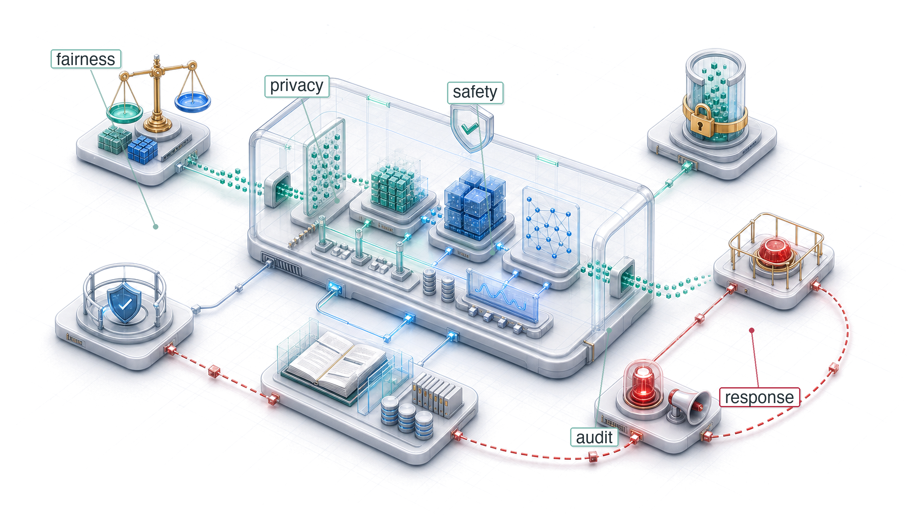
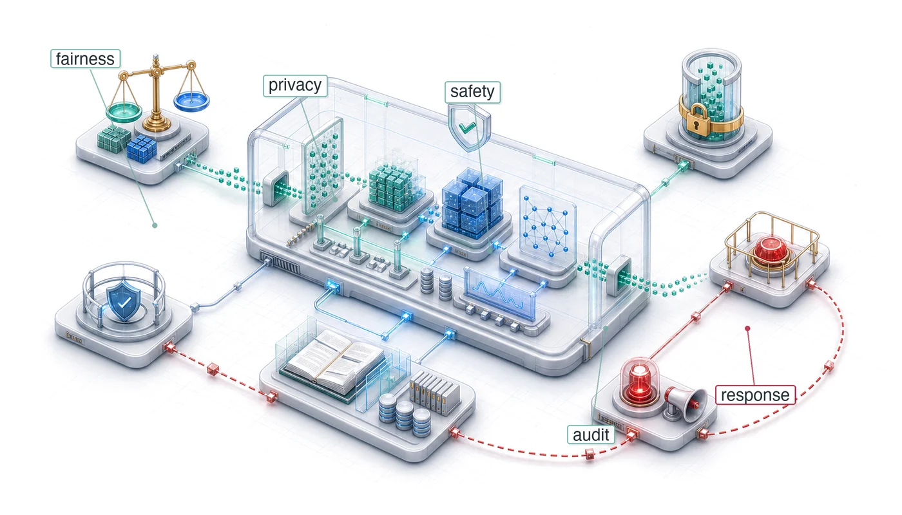

# Responsible Engineering {#sec-responsible-engineering}

::: {layout-narrow}
::: {.column-margin}

\chapterminitoc

:::

::: {.content-visible when-format="pdf"}
\noindent
{fig-alt="Isometric governed ML system chamber with fairness checks, safety rails, audit records, privacy boundaries, and incident response paths around a deployed pipeline."}
:::

::: {.content-visible unless-format="pdf"}
{fig-alt="Isometric governed ML system chamber with fairness checks, safety rails, audit records, privacy boundaries, and incident response paths around a deployed pipeline."}
:::

:::

## Purpose {.unnumbered .unlisted}

\begin{marginfigure}
\mlsysstack{0}{0}{10}{10}{20}{40}{90}{15}
\end{marginfigure}

_Why can a system that does exactly what it was told to do still cause harm?_

Operations targets low latency, high availability, and sustained predictive quality. Responsible engineering asks whether those targets describe the right behavior, whom the system serves, and which costs its specification leaves unmeasured. An ML system can satisfy latency, throughput, and aggregate accuracy requirements while reproducing historical discrimination, rewarding harmful engagement, consuming unjustified energy, or using data without adequate privacy and accountability controls. Such a system has not malfunctioned; it is efficiently optimizing an incomplete specification. The omitted constraints appear as uneven outcomes across populations, lifetime cost and emissions, decisions people cannot understand or contest, and evidence that cannot be reconstructed after harm occurs. If those consequences are not defined as requirements before deployment and monitored afterward, conventional health checks can remain green while harm accumulates. Responsible engineering treats them as system failures to be diagnosed, measured, and mitigated with the same rigor as latency or accuracy regressions. That work requires translating broad obligations into testable bounds, documented assumptions, traceable data, and response paths that remain enforceable in production. In D·A·M terms, responsibility broadens the definition of correctness: data must be examined for encoded harms and lawful use, algorithms must be bounded by defensible outcome and efficiency requirements, and machine infrastructure must monitor, document, and enforce those boundaries throughout the system lifecycle.

::: {.content-visible when-format="pdf"}

\newpage

:::

::: {.callout-learning-objectives}

- Explain how optimized ML systems can amplify harm through proxies, feedback loops, and distribution shift
- Apply data-algorithm-machine diagnosis to localize responsibility failures in data, algorithm objectives, or monitoring infrastructure
- Calculate fairness metrics from confusion matrices and compare trade-offs on the fairness-accuracy Pareto frontier
- Design disaggregated evaluation, stress testing, and monitoring to expose subgroup-specific failures before deployment
- Analyze total cost, inference dominance, and carbon impact as measurable responsibility constraints
- Construct model cards, datasheets, lineage records, and audit trails for accountability
- Evaluate privacy, access-control, and compliance designs against regulatory and human-review requirements

:::

## Responsibility as Systems Engineering {#sec-responsible-engineering-responsibility-systems-engineering-5cfd}

In 2014, Amazon built an AI recruiting tool[^fn-amazon-recruiting-scale] that penalized resumes containing the word "women's" (as in "women's chess club captain") and downgraded graduates of all-women's colleges. The system optimized faithfully for its stated objective: identify candidates similar to those previously hired. The failure was not that the model malfunctioned, but that historical hiring patterns encoded gender bias, and the model reproduced that bias at scale.

[^fn-amazon-recruiting-scale]: **Amazon Recruiting Tool**\index{Amazon Recruiting!specification failure}: Developed starting in 2014 by Amazon's Edinburgh engineering team to rate applicants on a 1--5 scale, the system trained on approximately a decade of resumes—overwhelmingly from male applicants reflecting the tech industry's gender ratio. By 2015 the gender bias was identified; by 2017 the project was abandoned after repeated remediation attempts [@dastin2018]. The engineering cost was not the compute but the opportunity cost: a multi-year recruiting project failed because the objective encoded historical bias, making it a documented specification failure in ML tooling.

If MLOps is the control loop for *reliability*, then **Responsible Engineering**\index{Responsible Engineering!safety control loop} is the control loop for *safety*\index{Safety!responsible engineering}. Where MLOps monitors system health and triggers retraining when performance degrades, responsible engineering monitors outcome quality and triggers intervention when systems cause harm. A model can optimize flawlessly for its stated objective and still cause systematic harm because the failure is not a bug in the code but a flaw in the specification. In systems engineering terms, a system can pass *verification* (it meets its stated requirements) while failing *validation* (it does not meet the user's true needs) [@nasa2016systemsengineering].

Traditional software engineering often isolates defects within modules, although shared dependencies can still propagate failures. Machine learning systems add data-dependent coupling: data flows through shared representations, so problems in one component can affect many outputs. A&nbsp;biased training dataset does not produce a localized code defect; it can bias predictions across the system. @Sec-appdx-dam-taxonomy formalizes the diagnostic framework that locates where such a failure originates,&nbsp;decomposing it along three axes: biased data, a misaligned algorithm, or inadequate infrastructure for monitoring outcomes. This makes responsibility an architectural concern, not an afterthought.

*Engineering responsibility therefore expands what "correct" means for ML systems.* Correctness in the traditional sense (reliable, performant, and maintainable) remains necessary, but ML systems must also be correct in a broader sense: fair across user groups, efficient in resource consumption, and transparent in their decision processes. Expanded correctness is engineering itself, applied to failure modes that conventional metrics do not capture. A latency regression is visible in dashboards; a fairness regression is invisible until it harms real users (principle \ref{pri-bias-feedback}). Both require systematic detection, measurement, and remediation.

Diagnosing, preventing, and mitigating these failures requires following the responsibility gap through the system. Concrete cases reveal the distance between technical performance and responsible outcomes, and the mechanisms (proxy variables, feedback loops, distribution shift) through which it manifests. That gap motivates repeatable engineering processes for impact assessment, model documentation, disaggregated testing, and incident response. The resource consumption quantified throughout this book (training compute, inference energy, carbon footprint) then becomes an ethical constraint as well as a performance constraint, because efficiency optimization serves responsibility as directly as it serves speed. Data governance and compliance infrastructure (access control, privacy protection, lineage tracking, and audit systems) make those practices&nbsp;enforceable&nbsp;at&nbsp;scale.

## Engineering Responsibility Gap {#sec-responsible-engineering-engineering-responsibility-gap-6f6f}

A loan model that approves 95 percent of qualified majority-group applicants while rejecting 40 percent of equally qualified minority-group applicants can still achieve a low aggregate loss. The **Responsibility Gap**\index{Responsibility Gap!definition} between this *technical correctness* and *responsible outcomes* represents a central challenge in machine learning systems engineering, one that existing testing methodologies were not designed to address. The gap manifests through concrete mechanisms: proxy variables, feedback loops, and distribution shift, each producing harm through a distinct pathway that conventional monitoring leaves invisible.

### When optimization succeeds but systems fail {#sec-responsible-engineering-optimization-succeeds-systems-fail-1a22}

The recruiting-tool failure turns this gap into a data problem rather than a code defect. A model trained on a decade of historical hiring data\index{Bias!historical data encoding} optimized faithfully for the objective it was given, but those historical patterns encoded gender bias\index{Bias!gender discrimination} that the system reproduced in candidate ratings [@dastin2018].

The technical mechanism behind this outcome is straightforward. The model learned token-level patterns from historical data. When most previously successful hires were men, resumes containing language associated with women's activities or institutions appeared statistically less correlated with positive hiring decisions. The model correctly identified these patterns in the training data but learned the wrong lesson from correct pattern recognition. More generally, learned text representations can encode and amplify gender stereotypes, including in word embeddings [@bolukbasi2016].

::: {.column-margin}
{width="100%" fig-alt="D·A·M locator triangle with three nodes: D (Data) at top filled solid green, A (Algorithm) and M (Machine) at the lower corners shown gray, connected by violet edges. The Data node is highlighted."}

*The Amazon failure is a data-axis failure: biased historical signal.*
:::

Amazon attempted remediation by removing explicit gender indicators and gendered terms from the training process. This intervention did not establish that the remaining recommendations were unbiased because other resume features could retain sex-correlated signal.[^fn-proxy-variable-bias] In general, **Proxy Variables**\index{Proxy Variable!definition}\index{Bias!proxy variables} can carry indirect demographic signal: ZIP codes can correlate with race because of residential segregation, names can correlate with gender or ethnicity, and healthcare utilization can correlate with socioeconomic conditions. In Amazon's case, the reported penalties for terms such as "women's" and for graduates of two all-women's colleges showed how resume text could encode sex-linked patterns [@dastin2018]. Removing protected attributes from training data is therefore insufficient to establish fairness.

[^fn-proxy-variable-bias]: **Proxy Variable**\index{Proxy Variable!bias detection}: Removing one proxy may have little effect when other correlated features retain similar signal. Conversely, correlation alone does not prove discrimination or identify the appropriate intervention. Protected-attribute removal, subgroup evaluation, counterfactual tests, causal analysis, and review of the full decision process provide complementary evidence; no single diagnostic is a complete defense.

::: {#ws-responsible-engr-compas-recidivism-algorithm-audit .callout-war-story title="The COMPAS recidivism algorithm audit (2016)"}

**Context**: COMPAS\index{COMPAS!recidivism algorithm audit} is a risk assessment tool used in US courtrooms to predict re-offending for bail and sentencing decisions [@angwin2016].

**Mechanism**: Optimizing for calibration across populations with differing baseline recidivism rates forced mathematical trade-offs between predictive parity and error-rate balance across racial groups.

**Impact**: Black defendants who did not re-offend were incorrectly flagged as high-risk at nearly twice the rate of White defendants (44.9 percent vs. 23.5 percent), while White recidivists were far more often mislabeled low-risk.

**Response**: The audit exposed why calibration alone could not settle whether the error distribution was acceptable. Any jurisdiction using such scores needs an explicit policy for which fairness criteria matter, independent validation across groups, and review of how the score enters the decision workflow.

**Systems lesson**: The scores were approximately calibrated by race, but they violated equalized odds because false positive and false negative rates did not match across groups. Formal fairness results show that calibration and error-rate parity conflict when base rates differ, showing why engineering responsibility requires explicitly choosing which fairness constraint matters.

:::

The right intervention would have required multiple levels of change. Separate evaluation of resume scores for male-associated vs. female-associated candidates could have revealed the disparity quantitatively. Fairness constraints or adversarial debiasing, where an auxiliary adversary tries to recover protected-attribute signal from the learned representation and the main model is penalized when that signal remains, might have reduced some encoded signal but would still require subgroup validation. Human review for borderline cases could have added a safeguard if reviewers were trained, empowered, and monitored rather than asked to rubber-stamp scores. Tracking actual hiring outcomes by gender over time would have enabled outcome monitoring beyond model metrics alone. Amazon eventually scrapped the project after determining that sufficient remediation was not feasible [@dastin2018].

The Amazon case demonstrates how optimization objectives diverge from organizational values. The system found genuine statistical patterns in historical hiring decisions and optimized them faithfully. Those patterns, however, reflected biased historical practices rather than job-relevant qualifications.

The Amazon and COMPAS[^fn-compas-recidivism-score] cases share a troubling pattern: each system achieved its stated objective while producing outcomes that conflicted with the values the system was intended to serve. Conventional engineering success can coexist with serious system failures. The pattern raises two design questions: whether the loss function is a defensible proxy for the system's true goal, and whether error rates remain acceptable across the subgroups the system affects.

[^fn-compas-recidivism-score]: **COMPAS (Correctional Offender Management Profiling for Alternative Sanctions)**\index{COMPAS!calibration and error rates}: In the analyzed data, COMPAS scores were approximately calibrated by race, meaning a given score corresponded to a similar observed re-offense probability across groups. Because recidivism prevalence differed between populations, calibration coexisted with disparate error rates [@chouldechova2017; @kleinberg2016inherent]. Calibration testing alone therefore could not establish error-rate parity or determine whether the allocation of errors was acceptable.

Conventional tests focused only on the stated objective may not catch these problems because they represent failures of problem specification, where the *technical objective* (minimizing prediction error on historical outcomes) diverges from the *desired social objective* (making fair and accurate predictions across demographic groups). Specification failures are difficult to detect precisely because the systems continue functioning normally by conventional engineering metrics. When a system appears healthy by its monitored technical metrics, harm outside those metrics can remain invisible.

::: {#chk-responsible-engr-responsible-design .callout-checkpoint title="Responsible design"}

Responsibility is a system property, not a model property.

**Failure Modes**

- [ ] **Alignment**: test whether the loss function is a defensible proxy for the system's true goal.
- [ ] **Disparate impact**: compare error rates across subgroups rather than relying on aggregate accuracy.

```{=latex}
\vspace*{-1.5ex}
```
**Check**

- [ ] **Pre-mortem**: before deploying, ask: "If this system causes a scandal in six months, what likely went wrong?"
```{=latex}
\vspace*{-1ex}
```
:::

### Silent failure modes {#sec-responsible-engineering-silent-failure-modes-e219}

::: {.column-margin}
{width="100%" fig-alt="A red square source on the left with five arrows fanning out to five identical blue circles on the right, representing one upstream fault propagating to many downstream consumers."}

*One upstream change; many silently affected.*
:::

Consider a hospital sepsis model that begins recommending aggressive treatments for low-risk patients after an electronic health record (EHR) workflow change alters how vital signs are recorded. No alarm triggers: the model's confidence scores remain high, its latency stays within its service level agreement, and all system health checks pass green. The failure is silent: the input data distribution has shifted, but the monitoring pipeline has no mechanism to detect distributional drift.

::: {#dfn-responsible-engr-distribution-shift .callout-definition title="Distribution shift"}

***Distribution Shift***\index{Distribution Shift!responsibility lens}, introduced in @sec-introduction and operationalized for drift detection in @sec-ml-operations, occurs when the deployment distribution differs from the distribution used to develop or evaluate the model. Standard empirical-risk minimization commonly assumes matching training and deployment distributions. Covariate shift\index{Data Drift!definition} changes $p(x)$ while holding $p(y \mid x)$ stable; label shift changes $p(y)$ while holding $p(x \mid y)$ stable; concept drift\index{Concept Drift!definition} changes $p(y \mid x)$.

1.  **Significance**: Divergence statistics such as Jensen-Shannon divergence $\mathcal{D}_{\text{JS}}(P_t \lVert P_0)$ measure distributional change, not accuracy degradation. Useful alert thresholds must be calibrated empirically for each task, representation, label process, and deployment environment, then related to observed outcomes when labels are available. A $\mathcal{D}_{\text{JS}}$ value of 0.1 may be harmless for one feature space and severe for another, and input-divergence monitoring may miss concept drift.
2.  **Distinction**: Distribution shift describes a change between development and deployment conditions. It does not imply that the learned mapping was correct at training time, nor does every shift reduce performance.
3.  **Common pitfall**: Distribution shift is an umbrella term with several overlapping taxonomies. Monitoring only $p(x)$ can detect some covariate changes but cannot establish whether $p(y \mid x)$ remains stable; detecting concept drift generally requires labeled outcomes or justified proxies.

:::

This sepsis scenario illustrates a class of failure that availability-focused monitoring is poorly equipped to handle. Some software failures are loud: a null pointer exception crashes the program, and a network timeout returns an error code. Conventional software can also return incorrect results silently. ML systems add statistical failure modes\index{Silent Failure!detection challenges} in which degraded predictions look like normal predictions. One mechanism behind this silent degradation is distribution shift.

Matching training and deployment distributions is a standard assumption in supervised-learning analysis, although adaptation methods relax it under additional assumptions. Distribution shift can also affect groups unequally, allowing aggregate metrics to mask subgroup harm.

::: {.column-margin}
{width="100%" fig-alt="A curve that stays flat then bends sharply upward at a red knee dot, with the region to the right of the knee shaded red to mark the danger zone."}

*Past the knee, the proxy decouples from the goal.*
:::

::: {#psp-responsible-engr-alignment-gap .callout-perspective title="The alignment gap"}

A model optimizes a proxy metric (Clicks) because the true metric (User Satisfaction) is unobservable, and the two can diverge sharply. Goodhart's Law\index{Goodhart's Law!metric optimization} warns that optimizing a measure can weaken its relationship to the underlying goal. In an illustrative system, $\text{Correlation}(\text{Clicks}, \text{Satisfaction})$ might begin at 0.8; once ranking maximizes clicks, it may find clickbait with high clicks but low satisfaction, and the correlation could fall to 0.2.

Conceptually, assuming normalized metrics on a common scale, @eq-alignment-gap captures the gap:
$$ \text{Gap} = \mathbb{E}[\text{Proxy}] - \mathbb{E}[\text{True}] $$ {#eq-alignment-gap}

If the model increases Clicks by 20 percent but decreases Satisfaction by 5 percent, the signed alignment gap increases.

**Systems insight**: Engineers cannot directly optimize an unobserved goal. They need defensible proxy validation; randomized holdouts can estimate causal effects only when their outcomes measure the goal or a justified surrogate.

:::

Distribution shift\index{Distribution Shift!causes of model degradation} explains *why* models degrade over time (the operational detection and monitoring strategies for drift are covered in @sec-ml-operations). The failure is environmental: the world changed after the model was trained, and the model has no mechanism to notice. Retraining on fresh data can partially address this class of failure, but it cannot address a second mechanism for silent failure that operates even when the data distribution is perfectly stable. Metric misalignment occurs when the quantity the model optimizes diverges from the outcome the organization actually values. The dynamics of that divergence are made precise by Goodhart's Law: once a proxy becomes the optimization target, it stops tracking the goal it was chosen to represent.

::: {#psp-responsible-engr-d-m-taxonomy .callout-perspective title="The D·A·M taxonomy"}

When a system causes harm, use the D·A·M taxonomy to identify the root cause. Responsibility failures are rarely "algorithm bugs"; they are structural flaws along one of the three axes:

*   **Data (information)**: Does the training data reflect historical bias? (for example, Amazon's recruiting tool learning from biased history). The failure is in the *Fuel*.
*   **Algorithm (logic)**: Does the objective function optimize a proxy for harm? (for example, optimizing "engagement" amplifies polarization). The failure is in the *Blueprint*.
*   **Machine (physics)**: Does the energy cost justify the societal benefit? (for example, training a massive model for a trivial task). The failure is in the *Engine*.

Locating the dominant failure in the taxonomy identifies the first remediation to test: better curation (Data), safer objectives (Algorithm), or more efficient infrastructure (Machine). Real failures can span axes, so the intervention must still be evaluated end to end.

:::

The alignment gap\index{Alignment Gap!proxy metric divergence} illustrates a failure that originates in the algorithm axis: the optimization objective is misspecified, so even a model that generalizes flawlessly to new data can drive outcomes that conflict with organizational or societal goals. Distribution shift, by contrast, originates in the data axis: the inputs changed, and the learned mapping no longer reflects reality. Both failures are silent, but they demand different remediations (better objectives vs. better monitoring), and conflating the two wastes engineering effort on the wrong fix. The D·A·M taxonomy\index{DAM Taxonomy@D·A·M Taxonomy!responsibility diagnosis} introduced in @sec-introduction maps each failure to the axis it originates from (Data · Algorithm · Machine), which @sec-appdx-dam-taxonomy defines in full.

While the D·A·M taxonomy helps diagnose *where* failures originate, engineers also need a framework for understanding *when* and *how* different failure types manifest. @Tbl-failure-modes complements that diagnostic framework by categorizing failures by detection time, spatial scope, and remediation requirements. Crashes and performance degradation trigger immediate alerts through existing infrastructure. Data quality issues, distribution shifts, and fairness violations require specialized detection mechanisms because the system continues operating normally from a technical perspective while producing increasingly problematic outputs.

```{=latex}
\begingroup
%\renewcommand{\arraystretch}{1.25}
```

| **Failure Type**            | **Illustrative Detection Time** | **Illustrative Scope** | **Possible Response**          | **Example**                               |
|:----------------------------|:--------------------------------|:-----------------------|:-------------------------------|:------------------------------------------|
| **Crash**                   | Immediate                       | Complete               | Restart after correcting cause | Out of memory error                       |
| **Performance Degradation** | Minutes                         | Complete               | Relieve resource contention    | Latency spike from resource contention    |
| **Data Quality**            | Hours–days                      | Partial                | Data correction may be needed  | Corrupted inputs from upstream system     |
| **Distribution Shift**      | Days–weeks                      | Partial or all         | May require adaptation         | Population change due to new user segment |
| **Fairness Violation**      | Weeks–months                    | Subpopulation          | May require redesign           | Bias amplification in historical patterns |

: **Illustrative ML System Failure Mode Taxonomy**: Detection time, scope, and remediation depend on the application; the entries show representative cases. Silent failures such as data quality issues, distribution shift, and fairness violations may require proactive monitoring because they do not necessarily trigger traditional alerts. {#tbl-failure-modes tbl-colwidths="[18,15,14,28,25]"}

```{=latex}
\endgroup
```

The YouTube recommendation feedback loop\index{Feedback Loop!recommendation amplification} (examined as a technical debt pattern in @sec-ml-operations-production-debt-patterns-ffdc) illustrates this pattern at scale [@ribeiro2020].[^fn-goodhart-law-proxy] @ribeiro2020 audited radicalization pathways on YouTube, finding migration from milder to more extreme channel categories and recommendation reachability between those categories. The broader systems lesson is that feedback loops can work exactly as designed while producing outcomes that conflict with societal values. Recommendation objectives must therefore be tested against downstream harms, not only against engagement proxies.

[^fn-goodhart-law-proxy]: **Goodhart's Law**\index{Goodhart's Law!proxy decoupling}: "When a measure becomes a target, it ceases to be a good measure" (Strathern's generalization of Goodhart's 1975 monetary policy observation) [@strathern1997improving; @goodhart1984]. Recommendation feedback loops are the canonical ML manifestation: gradient descent optimizes watch-time proxies at a speed no human curator can match, and the system's own outputs reshape the training distribution—users who consume extreme content generate data that reinforces extremity, decoupling the proxy from user welfare orders of magnitude faster than manual editorial processes ever could.

The News Feed case adds a twist the YouTube loop did not: a platform choosing to trade measured engagement for long-term welfare, direct evidence that engagement proxies are known to be incomplete even by those who optimize them. A distinct failure mode operates at the population level: proxy variables that appear neutral in the aggregate can encode systematic disparities across demographic groups. The distribution shift\index{Distribution Shift!population mismatch} defined in this section also manifests as population mismatch, where models trained on one population perform differently on another without obvious indicators. The same proxy mechanism that let Amazon's recruiting model reconstruct gender reappears in healthcare, where cost as a stand-in for need produced one of the most widely studied cases of algorithmic harm.

::: {#exmp-responsible-engr-news-feed-proxy-shift .callout-example title="News Feed proxy shifts"}

**Scenario**: Facebook shifted News Feed ranking objectives from short-term engagement proxies (clicks, watch time) to meaningful social interaction metrics [@facebook2018newsfeed].

**Diagnosis**: Optimizing solely for short-term engagement proxies decoupled ranking outputs from long-term user welfare, amplifying clickbait and passive consumption.

**Systems lesson**: Engagement metrics are proxies for value, not value itself. Recommendation algorithms require multi-objective optimization with explicit safety constraints to prevent proxy collapse.

:::

Silent failure modes complicate testing. Traditional software testing often verifies specified behavior through exact assertions. ML systems add behavior learned from data and performance evaluated statistically, making correctness harder to define. The opening failures share a troubling pattern: conventional technical checks did not cover the harms that emerged. Organizations reduce this gap when they convert responsibility goals into structured engineering practice.

::: {#ws-responsible-engr-proxy-variable-trap .callout-war-story title="The proxy variable trap (2019)"}

**Context**: In 2019, Ziad Obermeyer and colleagues at UC Berkeley audited a commercial Optum\index{Optum} algorithm used by health systems to enroll patients with complex needs into high-risk care management programs, examining roughly fifty thousand patients across one large academic hospital [@obermeyer2019].

**Mechanism**: The model predicted "future healthcare cost" as a proxy for "future health need." Because the US healthcare system spends less on Black patients than on White patients with the same illness level, the algorithm learned this pattern and assigned lower risk scores to Black patients.

**Impact**: At any given risk score, Black patients carried substantially more chronic conditions than White patients, reducing the share of Black patients enrolled in specialized care.

**Response**: The study showed that replacing cost with a direct measure of health need would raise the share of Black patients identified for additional care from 17.7 percent to 46.5 percent at the analyzed threshold.

**Systems lesson**: Optimizing for a proxy inherits the biases of the system that generated the proxy. The proxy-target relationship must be audited across every demographic subgroup the system serves.

:::

### When responsible engineering succeeds {#sec-responsible-engineering-responsible-engineering-succeeds-29e0}

Each documented success shares the same structural move: a vague responsibility goal becomes an engineering constraint that can be specified, tested, communicated, and, when necessary, used to stop deployment. Following the findings of Gender Shades, a 2018 audit that exposed severe error-rate disparities in commercial gender classification [@buolamwini2018gender], Microsoft invested in improving gender-classification\index{Gender Classification!demographic disparities} performance across demographic groups\index{Bias!mitigation strategies}. Targeted data collection, model changes, and systematic disaggregated evaluation gave the team an explicit error-rate target, and Microsoft reported large error-rate reductions for darker-skinned subjects, bringing audited error rates below 2 percent [@raji2019]. The company published these improvements transparently, turning external audit results into measurable engineering targets.

Twitter's automatic image cropping system\index{Image Cropping!racial bias} shows the same discipline under a different constraint. In 2020, users raised concerns about racial and gender bias in which faces appeared in preview thumbnails. Twitter audited the system, reported measured disparities and limitations, and shifted toward uncropped previews that gave users more control [@yee2021]. In that case, responsible engineering changed the product design rather than relying only on a better ranking threshold.

**Differential Privacy**\index{Differential Privacy!mathematical guarantees} makes the pattern formal: a privacy requirement becomes a mathematical guarantee rather than a policy aspiration [@dwork2008].[^fn-differential-privacy-tradeoff] Systems that use differential privacy must calibrate noise to balance utility against privacy, track privacy budget across repeated analyses, and document the chosen privacy parameters.

[^fn-differential-privacy-tradeoff]: **Differential Privacy**\index{Differential Privacy!epsilon trade-off}: Introduced by @dwork2006calibrating, a randomized mechanism $\mathcal{M}$ satisfies $(\epsilon, \delta)$-differential privacy if for all neighboring datasets $D, D'$ differing by one record and output sets $\mathcal{S}$, $\mathbb{P}[\mathcal{M}(D) \in \mathcal{S}] \leq e^\epsilon \cdot \mathbb{P}[\mathcal{M}(D') \in \mathcal{S}] + \delta$. Here $\epsilon$ bounds privacy loss and $\delta$ permits a small probability of exceeding that bound; their acceptable values depend on the threat model and policy. The systems trade-off is utility rather than mere implementation complexity: stronger privacy often requires more noise or tighter sampling, and privacy loss composes across repeated queries or training steps. Engineers must therefore track cumulative privacy loss with a valid accountant and report the assumptions behind the chosen budget.

A common pattern unites these cases: responsibility creates value only when technical interventions (improved data, better evaluation, architectural changes, formal guarantees, or user controls) combine with organizational commitments to transparency, long-term investment, and the willingness to remove features that cannot be made safe. Each success rested on systematic testing and evaluation practices, yet the nature of responsible testing differs fundamentally from traditional software verification.

### The testing challenge {#sec-responsible-engineering-testing-challenge-77b0}

Traditional software testing verifies that systems behave correctly because correctness has clear definitions. The function should return the sum of its inputs, the database should maintain referential integrity. These properties can be expressed as testable assertions.

Responsible ML properties resist simple formalization. **Fairness**\index{Fairness!mathematical definitions} has multiple mathematical definitions that can conflict under conditions such as unequal base rates and imperfect prediction [@chouldechova2017; @kleinberg2016inherent]. What counts as fair depends on context, values, and trade-offs that technical systems cannot resolve alone. Individual fairness\index{Fairness!individual vs. group} requires that similar individuals receive similar treatment, while group fairness requires equitable outcomes across demographic categories. These criteria can conflict, and choosing between them requires value judgments beyond the scope of optimization.

Fairness constraints and predictive performance can trade off, but the relationship is application-specific. A Pareto frontier represents configurations for which one plotted objective cannot improve without degrading another. @Fig-fairness-frontier visualizes one hypothetical fairness-accuracy frontier\index{Pareto Frontier!fairness-accuracy trade-off}\index{Fairness!accuracy trade-off}. Its three points illustrate possible policy choices; they do not imply that unconstrained training always maximizes accuracy at high disparity, that zero disparity must reduce accuracy, or that every application has a sweet spot.

::: {#fig-fairness-frontier fig-env="figure" fig-pos="htb" fig-cap="**An Illustrative Fairness-Accuracy Pareto Frontier**: A hypothetical relationship between model accuracy and demographic disparity. The x-axis is inverted so lower disparity lies to the right. Points A, B, and C illustrate three possible operating choices along this constructed frontier; the curve is not an empirical or universal law." fig-alt="Hypothetical curve relating accuracy and disparity, with three labeled operating points A, B, and C. The x-axis is inverted so lower disparity lies to the right."}

```{python}
#| echo: false
# ┌─────────────────────────────────────────────────────────────────────────────
# │ FAIRNESS-ACCURACY PARETO FRONTIER (FIGURE)
# ├─────────────────────────────────────────────────────────────────────────────
# │ Context: @fig-fairness-frontier—Fairness-Accuracy trade-off section
# │
# │ Goal: Visualize Pareto frontier: accuracy vs demographic disparity; show
# │       Points A (unconstrained), B (sweet spot), C (strict equality).
# │ Show: Curve with three annotated points; exponential decay shape.
# │ How: accuracy = 0.85 + 0.10*(1-exp(-20*disparity)); scatter + labels.
# │
# └─────────────────────────────────────────────────────────────────────────────
# ┌── 1. CANVAS ────────────────────────────────────────────────────────────────
# │ Visualize Pareto frontier: accuracy vs demographic disparity; show
import numpy as np
from book.tools.figures import style as book_style

fig, ax, COLORS, plt = book_style.setup_plot(figsize=(10, 4.0))

# =============================================================================
# PLOT: The Fairness-Accuracy Pareto Frontier
# =============================================================================

# ┌── 2. ARRAYS ────────────────────────────────────────────────────────────────
disparity = np.linspace(0.0, 0.20, 100)
accuracy = 0.85 + 0.10 * (1 - np.exp(-20 * disparity))

# ┌── 3. RENDER ────────────────────────────────────────────────────────────────
ax.plot(disparity, accuracy, color=COLORS['primary'], linewidth=2, linestyle='--')

ax.plot(0.18, 0.947, 'o', color=COLORS['RedLine'], markersize=8)

# ┌── 4. DECORATE ──────────────────────────────────────────────────────────────
ax.text(
    0.18,
    0.943,
    "A: Unconstrained\n(Max Accuracy)",
    ha='center',
    va='top',
    fontsize=8,
    bbox=dict(facecolor='white', alpha=0.8, edgecolor='none', pad=0.5),
)

ax.plot(0.05, 0.913, 'o', color=COLORS['GreenLine'], markersize=8)
ax.text(
    0.053,
    0.905,
    "B: Sweet Spot\n(91 percent Acc, 3.6 times Fairer)",
    ha='right',
    va='bottom',
    fontsize=8,
    bbox=dict(facecolor='white', alpha=0.8, edgecolor='none', pad=0.5),
)

ax.plot(0.0, 0.85, 'o', color=COLORS['BlueLine'], markersize=8)
ax.annotate(
    "C: Strict Equality\n(Large Drop)",
    xy=(0.95, 0.05),
    xycoords=ax.transAxes,
    xytext=(0.82, 0.17),
    textcoords=ax.transAxes,
    ha='center',
    va='center',
    fontsize=8,
    bbox=dict(facecolor='white', alpha=0.8, edgecolor='none', pad=0.5),
    arrowprops=dict(arrowstyle='->', color='black', lw=0.75),
)

ax.set_xlabel('Demographic Disparity (Lower is Fairer)')
ax.set_ylabel('Model Accuracy')
ax.invert_xaxis()
plt.show()
plt.close()
```

:::

```{python}
#| label: testing-constraint-anchor-calc
#| echo: false
# ┌─────────────────────────────────────────────────────────────────────────────
# │ TESTING CONSTRAINT ANCHOR
# ├─────────────────────────────────────────────────────────────────────────────
# │ Context: Subgroup testing challenge prose (@sec-responsible-engineering-testing-challenge-77b0)
# │
# │ Goal: Quantify minority subgroup sample multipliers for testing.
# │ Show: 10,000 base test size, 1% minority, 100 minority samples, 100x multiplier.
# │ How: Calculate required data multiplier for 1% minority group.
# │
# └─────────────────────────────────────────────────────────────────────────────
from mlsysim.fmt import fmt, fmt_multiple, check, fmt_percent

# ┌── LEGO ───────────────────────────────────────────────
class TestingConstraintAnchor:
    """
    Namespace for subgroup testing challenges.
    """

    # ┌── 1. LOAD (Constants) ───────────────────────────────────────────────
    base_test_size = 10_000
    minority_pct = 1

    # ┌── 2. EXECUTE (The Compute) ─────────────────────────────────────────
    minority_samples = int(base_test_size * (minority_pct / 100))
    data_multiplier = int(100 / minority_pct)

    # ┌── 3. GUARD (Invariants) ───────────────────────────────────────────
    check(data_multiplier == 100, "A 1 percent subgroup should require a 100x sampling multiplier.")
    check(minority_samples == 100, f"Expected 100 subgroup samples, got {minority_samples}.")

    # ┌── 4. OUTPUT (Formatting) ──────────────────────────────────────────────
    base_size_str = fmt(base_test_size, precision=0)
    minority_pct_str = fmt_percent(round(minority_pct) / 100, precision=0, commas=False, style='prose')
    minority_samples_str = fmt(minority_samples, precision=0, commas=False)
    multiplier_mult_str = fmt_multiple(data_multiplier, precision=0, commas=False)
```

```{python}
#| label: gender-shades-disparity-calc
#| echo: false
# ┌─────────────────────────────────────────────────────────────────────────────
# │ GENDER SHADES ERROR DISPARITY
# ├─────────────────────────────────────────────────────────────────────────────
# │ Context: @tbl-gender-shades-results and surrounding prose
# │
# │ Goal: Quantify error rate disparities across demographic groups.
# │ Show: The 43.4× dark-female/light-male ratio in the Face++ results.
# │ How: Calculate error multiples between intersectional subgroups.
# │
# └─────────────────────────────────────────────────────────────────────────────
from mlsysim import Literature
from mlsysim.fmt import fmt, fmt_int, fmt_multiple, check, fmt_percent

# ┌── LEGO ───────────────────────────────────────────────
class GenderShadesDisparity:
    """
    Namespace for Gender Shades Error Disparity analysis.
    Scenario: Quantifying bias across demographic groups in gender classification.
    """

    # ┌── 1. LOAD (Constants) ───────────────────────────────────────────────
    err_light_male = Literature.Fairness.GenderShadesErrLightMale
    err_light_female = Literature.Fairness.GenderShadesErrLightFemale
    err_dark_male = Literature.Fairness.GenderShadesErrDarkMale
    err_dark_female = Literature.Fairness.GenderShadesErrDarkFemale

    # ┌── 2. EXECUTE (The Compute) ─────────────────────────────────────────
    disparity_fold = err_dark_female / err_light_male
    disparity_light_female = err_light_female / err_light_male
    disparity_dark_male = err_dark_male / err_light_male

    acc_light_male = 100.0 - err_light_male
    acc_dark_female = 100.0 - err_dark_female

    # ┌── 3. GUARD (Invariants) ───────────────────────────────────────────
    check(disparity_fold >= 40, f"Disparity ({disparity_fold:.1f}x) is too low.")

    # ┌── 4. OUTPUT (Formatting) ──────────────────────────────────────────────
    # Prose style outputs
    error_light_male_str = fmt_percent(err_light_male / 100, precision=1, commas=False, style='prose')
    error_dark_female_str = fmt_percent(err_dark_female / 100, precision=1, commas=False, style='prose')

    # Table symbol style outputs
    error_light_male_tbl_str = fmt_percent(err_light_male / 100, precision=1, commas=False, style='symbol')
    error_light_female_tbl_str = fmt_percent(err_light_female / 100, precision=1, commas=False, style='symbol')
    error_dark_male_tbl_str = fmt_percent(err_dark_male / 100, precision=1, commas=False, style='symbol')
    error_dark_female_tbl_str = fmt_percent(err_dark_female / 100, precision=1, commas=False, style='symbol')

    disparity_factor_mult_str = fmt_multiple(disparity_fold, precision=1, commas=False)
    disparity_light_female_factor_mult_str = fmt_multiple(disparity_light_female, precision=1, commas=False)
    disparity_dark_male_factor_mult_str = fmt_multiple(disparity_dark_male, precision=1, commas=False)
    acc_light_str = fmt_percent(acc_light_male / 100, precision=1, commas=False, style='prose')
    acc_dark_str = fmt_percent(acc_dark_female / 100, precision=1, commas=False, style='prose')
```

The frontier tells engineers what trade-off they may need to choose, but it cannot be plotted until subgroup performance is measured. Responsible properties become testable when engineers work with stakeholders to define criteria appropriate for specific applications. The Gender Shades project\index{Gender Shades!algorithmic audit methodology}[^fn-gender-shades-audit] demonstrated how **Disaggregated Evaluation**\index{Disaggregated Evaluation!definition}\index{Disaggregated Evaluation!demographic stratification} across demographic categories reveals disparities invisible in aggregate metrics [@buolamwini2018gender], exposing the subgroup failures that responsibility monitoring must catch before deployment. @Tbl-gender-shades-results shows the dramatic error-rate differences that commercial gender-classification systems produced across demographic groups. Concretely, a `{python} TestingConstraintAnchor.base_size_str`-sample test set that suffices for the majority group provides only `{python} TestingConstraintAnchor.minority_samples_str` samples for a minority subgroup representing `{python} TestingConstraintAnchor.minority_pct_str` of the population—effectively requiring `{python} TestingConstraintAnchor.multiplier_mult_str` more data than the majority group for high-confidence validation.

[^fn-gender-shades-audit]: **Gender Shades**\index{Gender Shades!disaggregated evaluation}: A 2018 study by Joy Buolamwini (MIT Media Lab) and Timnit Gebru (Microsoft Research) that audited commercial gender-classification systems from Microsoft, IBM, and Face++ using the Fitzpatrick skin type scale—originally a dermatological classification developed by Thomas Fitzpatrick in 1975 for UV sensitivity and later validated for clinical use [@fitzpatrick1988], repurposed here as a demographic benchmark for algorithmic auditing. The study demonstrated the value of disaggregated evaluation; in the Face++ results reproduced in @tbl-gender-shades-results, the dark-female error rate is `{python} GenderShadesDisparity.disparity_factor_mult_str` the light-male rate. Microsoft's later reported reductions show how public audit results can motivate measurable remediation [@raji2019].

| **Demographic Group**     |                      **Error Rate (%)**                     |                   **Relative to Light-Skinned Males**                   |
|:--------------------------|:-----------------------------------------------------------:|:-----------------------------------------------------------------------:|
| **Light-skinned males**   |  `{python} GenderShadesDisparity.error_light_male_tbl_str`  |                          Baseline (1.0$\times$)                         |
| **Light-skinned females** | `{python} GenderShadesDisparity.error_light_female_tbl_str` | `{python} GenderShadesDisparity.disparity_light_female_factor_mult_str` |
| **Dark-skinned males**    |   `{python} GenderShadesDisparity.error_dark_male_tbl_str`  |   `{python} GenderShadesDisparity.disparity_dark_male_factor_mult_str`  |
| **Dark-skinned females**  |  `{python} GenderShadesDisparity.error_dark_female_tbl_str` |        `{python} GenderShadesDisparity.disparity_factor_mult_str`       |

: **Gender Shades Face++ Error Rates**: The dark-female error rate is `{python} GenderShadesDisparity.disparity_factor_mult_str` the light-male rate. Source: [@buolamwini2018gender]. {#tbl-gender-shades-results tbl-colwidths="[34,33,33]"}

As @tbl-gender-shades-results quantifies, disaggregated evaluation revealed what an aggregate score concealed. Face++ reported error rates of `{python} GenderShadesDisparity.error_light_male_str` for light-skinned males and `{python} GenderShadesDisparity.error_dark_female_str` for dark-skinned females (accuracies of `{python} GenderShadesDisparity.acc_light_str` and `{python} GenderShadesDisparity.acc_dark_str`). The aggregate metric gave no indication that the dark-female error rate was `{python} GenderShadesDisparity.disparity_factor_mult_str` the light-male rate.

No universal threshold defines acceptable disparity, but teams should establish explicit, justified bounds before deployment. A team might adopt an error-rate ratio below 1.25$\times$ or a false-positive-rate difference under 5 percentage points as an application-specific release policy. In US employment law, the disparate impact doctrine[^fn-disparate-impact-law] shapes regulatory oversight, while the four-fifths rule[^fn-four-fifths-threshold] provides a separate, non-dispositive selection-rate diagnostic. The key engineering discipline is defining criteria appropriate to the application and governing law rather than generalizing one domain's threshold.

[^fn-disparate-impact-law]: **Disparate Impact**\index{Disparate Impact!legal doctrine}: In *Griggs v. Duke Power Co.* (1971), the US Supreme Court held under Title VII that an employment practice may be unlawful because of its operation even without discriminatory intent [@griggs1971dukePower]. Disparate impact is a legal claim with statute- and context-specific elements, not a synonym for any statistical disparity. Model outcomes and proxies can supply relevant evidence, but metrics alone do not establish liability.

[^fn-four-fifths-threshold]: **Four-Fifths Rule**\index{Four-Fifths Rule!adverse impact threshold}: The 1978 Uniform Guidelines on Employee Selection Procedures use the four-fifths rule as a practical employment-selection diagnostic [@uniformguidelines1978]. A selection rate below 80 percent of the rate for the group with the highest rate is generally regarded as evidence of adverse impact, but the Guidelines also recognize that smaller differences may matter and that the ratio is not dispositive.

Despite the inherent challenges, several concrete testing approaches can surface responsibility issues before deployment:

- **Slice-based evaluation**: Partitions test data into meaningful subgroups and reports metrics separately for each slice, asking whether aggregate performance hides subgroup failure. A model may achieve 95 percent accuracy overall but only 78 percent accuracy on low-income applicants or users from rural areas, a disparity invisible in aggregate reporting.
- **Invariance testing**\index{Invariance Testing!fairness verification}: Checks whether the model changes behavior for the wrong reasons. Replacing "John" with "Jamal" in a loan application should not change approval likelihood if the feature is not legitimate for the decision. Behavioral testing frameworks such as CheckList\index{CheckList} apply this idea by organizing tests around model capabilities and invariance-style expectations rather than accuracy alone [@ribeiro2020beyond].
- **Boundary and stress testing**: Probes regions where ordinary validation sets are least informative. Boundary testing evaluates model behavior at the edges of input distributions (unusual ages, extreme values, rare categories) where training data may be sparse and predictions unreliable. Stress testing extends boundary testing to adversarial conditions: corrupted inputs, distribution shift, adversarial examples, and edge cases designed to probe failure modes systematically. Stakeholder red-teaming\index{Red Teaming!stakeholder engagement} adds evidence from domain experts and affected community members, surfacing failure modes no automated test can discover because they require lived experience to imagine.

Responsible testing strategies complement traditional software testing rather than replacing it. Each demands joint judgment to select, configure, and interpret. Legal specialists cannot alone specify which demographic slices matter for a healthcare algorithm, and product managers cannot alone determine appropriate invariance tests for a loan model. Domain experts, affected stakeholders, policy specialists, and engineers must define the relevant harms together; engineers then encode those requirements as measurable tests and production controls. Responsibility therefore needs clear ownership within engineering as well as independent oversight outside it.

### Engineering leadership on responsibility {#sec-responsible-engineering-engineering-leadership-responsibility-e03c}

By the time Amazon abandoned the recruiting tool, attempted remediation had not provided confidence that it would avoid discriminatory recommendations [@dastin2018]. Earlier design choices can narrow the available fixes. Responsible AI engineering cannot be delegated exclusively to ethics boards or legal departments. These groups provide essential oversight but lack the technical access required to identify problems early in the development process.

Legal or ethics review can identify a problem near deployment, but it cannot recover design options the system has already foreclosed. If the team trained the model without fairness constraints, chose an architecture that cannot support interpretability requirements, or built a data pipeline without the demographic attributes needed for monitoring, review can only accept, reject, or demand expensive redesign. Engineers therefore occupy a critical position in the ML development lifecycle because their choices define the solution space for all subsequent interventions: architecture determines which fairness constraints can apply, the optimization objective determines which patterns the system learns, and the data pipeline determines whether disaggregated evaluation is possible.

::: {#dfn-responsible-engr-responsible-ai-engineering .callout-definition title="Responsible AI engineering"}

***Responsible AI Engineering***\index{Responsible AI Engineering!definition} is the engineering discipline of designing, deploying, and maintaining systems with probabilistic outputs by operationalizing societal and regulatory requirements as testable constraints on the D·A·M axes: permissible data contents, provenance, and composition; allowable model behavior and robustness properties; and infrastructure bounds such as latency, energy, compute budget, carbon emissions, and audit-log retention.

1.  **Significance**: Each D·A·M axis acquires concrete governance constraints: the data axis is bounded by privacy regulations such as the General Data Protection Regulation (GDPR), which limits which records, fields, and features can be collected; the algorithm axis is bounded by fairness and robustness metrics (for example, demographic parity within $\varepsilon = 5\%$ across protected groups, meaning positive prediction rates must not differ by more than 5 percentage points, or accuracy degradation less than 2 percent under adversarial perturbation $\|\delta\|_\infty \leq 0.01$, a worst-case input change bounded to 0.01 per normalized feature under the $\ell_\infty$ norm); and the machine axis is bounded by resource and infrastructure budgets such as latency, energy per inference, carbon emissions, and audit-log retention. Violating these bounds is a system failure, not a research shortcoming.
2.  **Distinction**: Unlike AI ethics (which articulates aspirational values), responsible AI engineering translates those values into measurable, testable invariants that can be verified through automated testing and continuous monitoring, using the same lifecycle practices that enforce latency SLOs.
3.  **Common pitfall**: A frequent misconception is that responsibility is "added" at the end of development. Constraints on what data may be collected affect what can be learned and audited, while infrastructure choices affect what evidence can be retained. Late-stage remediation may remain possible, but it is often narrower, slower, and more expensive.

:::

An engineering-centered approach does not diminish the importance of diverse perspectives in identifying potential harms. Product managers, user researchers, affected communities, and policy experts contribute essential knowledge about how systems fail socially despite technical success. Engineers translate these concerns into measurable requirements and testable properties that can be verified throughout the development lifecycle. Effective responsibility requires engineers who both listen to stakeholder concerns and possess the technical capability to implement appropriate safeguards.

Engineering teams do not operate in isolation. As @fig-governance-layers makes clear, engineering practices are nested within broader organizational, industry, and regulatory governance structures, each layer imposing constraints on the ones inside it. Technical excellence at the innermost layer enables, but does not replace, compliance with requirements flowing inward from external governance.

::: {#fig-governance-layers fig-env="figure" fig-pos="htb" fig-cap="**Responsible AI Governance Layers**: Four nested ovals place team-level safeguards at the center, surrounded by organizational safety culture, industry certification and review, and government regulation. The nesting distinguishes implementation at the center from oversight outside it; the annotation states that requirements flow inward and technical practices enable compliance. Adapted from @shneiderman2022human." fig-alt="Four nested ovals labeled, from center outward: Team—Reliable Systems, Organization—Safety culture and organization design, Industry—Trustworthy certification and external reviews, and Government Regulation—laws, executive orders, regulatory agencies. The team layer lists audit trails, verification and bias testing, explainable interfaces, and software-engineering workflows. A bottom annotation reads, “Requirements flow inward; technical practices enable compliance.”"}

```{.tikz}
\scalebox{0.9}{%
\begin{tikzpicture}[line join=round,font=\sffamily\small]
\definecolor{col1}{RGB}{249,240,241}
\definecolor{col2}{RGB}{246,231,233}
\definecolor{col3}{RGB}{229,220,228}
\definecolor{col4}{RGB}{211,212,214}
\definecolor{blue1}{RGB}{0,76,151}
\definecolor{green1}{RGB}{46,139,87}
\tikzset{%
  EL1/.style={align=flush center,
    ellipse,
    inner xsep=2pt,
    %node distance=0.4,
    draw=crimson,%mygreen,
    line width=0.75pt,
    fill=col1,%mygreen!06,
    minimum width=134mm, minimum height=73mm
  },
  Box2/.style={Box, draw=myred, fill=magenta!03 },
  Txt/.style={crimson,align=center,font=\sffamily\bfseries\fontsize{8pt}{8}\selectfont},
  Txt1/.style={black!60,align=center,font=\sffamily\fontsize{6pt}{7}\selectfont},
  LineA/.style={black!50,line width=1.25pt,
  {{Triangle[width=1.0*5pt,length=1.0*8pt]}-{Triangle[width=1.0*5pt,length=1.0*8pt]}},
  shorten <=0pt,shorten >=0pt},
}

\node[EL1](E1){};
\node[below=3pt of E1.north,Txt]{GOVERNMENT REGULATION\\
{\color{black!70}\sffamily\itshape\fontsize{6pt}{6}\selectfont Laws, executive orders, regulatory agencies}};

\node[EL1,minimum width=105mm, minimum height=61.5mm,fill=col2](E2)
at(0,-0.28){};
\node[below=2pt of E2.north,Txt]{Industry\\
{\color{black!70}\sffamily\itshape\fontsize{6pt}{6}\selectfont
Trustworthy certification and external reviews}};

\node[EL1,minimum width=77mm, minimum height=49mm,
draw=blue1,fill=col3](E3)
at(-0.35,-0.44){};
\node[below=4pt of E3.north,Txt,blue1]{Organization\\
{\color{black!70}\sffamily\itshape\fontsize{6pt}{6}\selectfont
Safety culture and organization design}};

\node[EL1,minimum width=49mm, minimum height=33mm,
draw=green1,fill=col4](E4)
at(-0.85,-0.87){};

\node[below=18pt of E4.north,Txt,green1](T1){Team\\ Reliable Systems};

\node[below=1pt of T1,Txt1]{%
Audit trails\\ Verification \& bias testing\\
Explainable interfaces\\ SE workflows};

\node[left=6pt of E3.east,anchor=east,Txt1]{%
Leadership\\ commitment
\\[1ex]
Hiring \& training
\\[1ex]
Internal reviews};

\node[left=6pt of E2.east,anchor=east,Txt1]{%
Auditing firms
\\[1ex]
Certification\\ bodies
\\[1ex]
Professional \\ societies};
%line below
\coordinate(L)at ($(E1.south)+(-45mm,-2mm)$);
\coordinate(D)at ($(E1.south)+(45mm,-2mm)$);

\draw[-latex,Txt1](L)--node[below=1pt]{Requirements flow inward; technical practices enable compliance}(D);
\end{tikzpicture}}
```

:::

Those governance layers define who owns responsibility, but they do not yet account for the costs that ordinary performance metrics omit.

Beyond ethical imperatives, responsible engineering can deliver business value through three reinforcing mechanisms. The most immediate is risk mitigation\index{Risk Mitigation!responsible engineering value}: ML system failures create legal and financial exposure that systematic responsibility practices can reduce. Amazon abandoned an internal recruiting model after discovering sex-linked disparities in its recommendations. Organizations implementing disaggregated evaluation, documentation, and monitoring can reduce the probability of costly failures and preserve evidence of their engineering process if problems emerge.

A second mechanism is regulatory compliance\index{Regulatory Compliance!business value}, driven by legal requirements that vary by jurisdiction and application risk. The EU AI Act, for example, classifies high-risk AI applications\index{High-Risk AI!EU classification} and mandates technical requirements including risk assessment, data governance, transparency, and human oversight. Organizations that build responsibility into engineering practice can demonstrate compliance through existing documentation and monitoring rather than expensive retrofitting; the engineering lesson is that proactive controls are usually cheaper than reconstructing evidence after deployment.

::: {#psp-responsible-engr-full-cost-iron-law .callout-perspective title="The full cost of the iron law"}

The iron law of ML systems (principle \ref{pri-iron-law}) established in @sec-introduction-iron-law-ml-systems-c32a holds that system performance depends on the interaction between data, compute, and system overhead. Earlier chapters optimized each term by compressing models (@sec-model-compression), accelerating hardware (@sec-hardware-acceleration), and automating operations (@sec-ml-operations). Yet an optimization can create or shift costs that its benchmark omits.

A model quantized for edge deployment consumes less energy, but also produces outputs that may differ across demographic groups. A recommendation system optimized for engagement maximizes a business metric, but may amplify harmful content. Responsible engineering extends our accounting to include these broader impacts: the carbon cost of computation, the fairness cost of optimization choices, and the societal cost of deployment at scale. The iron law governs *how fast* our systems run; responsible engineering governs *how well* they serve.

:::

Competitive differentiation\index{Trust!competitive differentiation} completes the business case. Trust can drive enterprise purchasing decisions for ML-powered services, and organizations that can demonstrate systematic responsibility practices through model cards, audit trails, and published evaluation results may qualify for deployments that competitors cannot. Apple's privacy positioning, Microsoft's responsible AI principles, and Anthropic's safety research illustrate responsibility as a strategic investment rather than a purely defensive cost.

The quantization techniques from @sec-model-compression can reduce inference energy when the deployed runtime and hardware exploit the representation and measured workload energy falls. The monitoring infrastructure from @sec-ml-operations can support disaggregated fairness evaluation when the system lawfully collects the necessary outcome and subgroup data. Responsible engineering synthesizes these capabilities into disciplined practice through structured frameworks that translate principles into processes.

Systematic processes applied early could have reduced the likelihood or severity of the failures examined in @sec-responsible-engineering-responsibility-systems-engineering-5cfd. Checklists, documentation standards, testing protocols, and monitoring infrastructure translate responsibility principles into repeatable engineering workflows, but they do not guarantee prevention.

## Responsible Engineering Checklist {#sec-responsible-engineering-responsible-engineering-checklist-a038}

A structured predeployment review could have surfaced the sex-linked signals learned by Amazon's recruiting tool, while disaggregated testing exposed COMPAS's error-rate disparity. Both failures shared a common cause: responsibility was treated as a separate review stage rather than integrated into the development workflow. A responsible engineering checklist\index{Responsible Engineering!checklist methodology} embeds assessment wherever engineering decisions create durable risk: before deployment, in documentation, during population-specific evaluation, at explanation and compliance boundaries, and after launch through monitoring. The stages build on one another: assessment identifies what to measure, documentation preserves the assumptions, fairness evaluation checks whether performance holds across groups, explainability and compliance translate decisions into obligations, and monitoring connects detected violations to intervention.

### Predeployment assessment {#sec-responsible-engineering-predeployment-assessment-2324}

Before a loan approval model reaches production, a team must determine the provenance of the training data, identify who is represented and who is missing, anticipate failure modes, and define recourse for affected users. @Tbl-predeployment-assessment structures this evaluation into five phases, distinguishing critical-path blockers from high-priority items that can proceed with documented risk acceptance.

| **Phase**      | **Priority**  | **Key Questions**                                                                                                | **Documentation Required**                                                                           |
|:---------------|:--------------|:-----------------------------------------------------------------------------------------------------------------|:-----------------------------------------------------------------------------------------------------|
| **Data**       | Critical Path | Where did this data come from? Who is represented? Who is missing? What historical biases might be encoded?      | Data provenance records, demographic composition analysis, collection methodology documentation      |
| **Training**   | High Priority | What are we optimizing for? What might we be implicitly penalizing? How do architecture choices affect outcomes? | Objective function specification, regularization choices, hyperparameter selection rationale         |
| **Evaluation** | Critical Path | Does performance hold across different user groups? What edge cases exist? How were test sets constructed?       | Disaggregated metrics by demographic group, edge case testing results, test set composition analysis |
| **Deployment** | Critical Path | Who will this system affect? What happens when it fails? What recourse do affected users have?                   | Impact assessment, stakeholder identification, rollback procedures, user notification protocols      |
| **Monitoring** | High Priority | How will we detect problems? Who reviews system behavior? What triggers intervention?                            | Monitoring dashboard specifications, alert thresholds, review schedules, escalation procedures       |

: **Predeployment Assessment Framework**: Critical Path items block deployment until addressed. High Priority items should be completed before or shortly after launch. Systematic coverage of responsibility concerns throughout the ML lifecycle reduces the chance that risks are overlooked. {#tbl-predeployment-assessment tbl-colwidths="[15,15,35,35]"}

Critical Path items are deployment blockers: the system must not go to production until these questions are answered. High Priority items should be addressed but may proceed with documented risk acceptance and a remediation timeline. The distinction enables teams to ship responsibly without requiring perfection on every dimension before initial deployment.

The Evaluation row in @tbl-predeployment-assessment raises the critical concern of whether performance holds across different user groups. Answering this question requires statistically valid test sets for each group, which can create surprisingly stringent data requirements when representation is uneven.

```{python}
#| label: representation-stats-calc
#| echo: false
# ┌─────────────────────────────────────────────────────────────────────────────
# │ STATISTICS OF REPRESENTATION
# ├─────────────────────────────────────────────────────────────────────────────
# │ Context: "The Statistics of Representation" callout (Pre-Deployment section)
# │
# │ Goal: Demonstrate why fairness evaluation requires intentional data engineering.
# │ Show: The 100× data requirement for minority groups under random sampling.
# │ How: Calculate total dataset size needed to capture a 1% minority subgroup.
# │
# └─────────────────────────────────────────────────────────────────────────────
from mlsysim.fmt import fmt, fmt_int, fmt_percent, fmt_count, fmt_pp

# ┌── LEGO ───────────────────────────────────────────────
class RepresentationStats:
    """
    Namespace for Statistics of Representation.
    Scenario: Random vs Stratified sampling for a 1% minority group.
    """

    # ┌── 1. LOAD (Constants) ───────────────────────────────────────────────
    target_imgs = 10_000
    minority_fraction = 0.01
    target_margin_pp = 1
    confidence = 0.95

    # ┌── 2. EXECUTE (The Compute) ─────────────────────────────────────────
    random_total = target_imgs / minority_fraction
    multiplier = random_total / target_imgs

    # ┌── 3. GUARD (Invariants) ───────────────────────────────────────────
    check(multiplier == 100, "Multiplier should be 100.")

    # ┌── 4. OUTPUT (Formatting) ──────────────────────────────────────────────
    repr_target_images_str = fmt_count(target_imgs, label="image")
    repr_group_fraction_pct_str = fmt_percent(round(int(minority_fraction * 100)) / 100, precision=0, commas=False, style='prose')
    repr_target_margin_pp_str = fmt_pp(target_margin_pp, precision=0)
    repr_confidence_pct_str = fmt_percent(confidence, precision=0, commas=False, style='prose')
    repr_group_fraction_str = fmt(minority_fraction, precision=2, commas=False)
    repr_random_total_str = fmt_count(int(random_total), label="image")
    repr_mult_str = fmt_multiple(int(multiplier), commas=False, precision=0)
```

::: {.column-margin}
{width="100%" fig-alt="Random sampling vs. targeted stratified evaluation for a 1 percent subgroup."}

*Random sampling barely reaches small subgroups.*
:::

:::: {#nbk-responsible-engr-statistics-representation .callout-notebook title="The statistics of representation"}

**Problem**: An engineering team needs to verify that a Face ID model works for a minority group representing `{python} RepresentationStats.repr_group_fraction_pct_str` of the user base. A worst-case binomial margin of error near `{python} RepresentationStats.repr_target_margin_pp_str` at `{python} RepresentationStats.repr_confidence_pct_str` confidence requires roughly `{python} RepresentationStats.repr_target_images_str` for this group.

**Random Sampling**\index{Random Sampling!minority representation cost}: To get `{python} RepresentationStats.repr_target_images_str` of a `{python} RepresentationStats.repr_group_fraction_pct_str` group via random sampling, the team must collect and label:
$D_{\text{eval,total}}$ = `{python} RepresentationStats.repr_target_images_str` / `{python} RepresentationStats.repr_group_fraction_str` = `{python} RepresentationStats.repr_random_total_str`

**Stratified Sampling**\index{Stratified Sampling!fairness evaluation}: Specifically targeting this group (for example, via active learning or community outreach) requires only `{python} RepresentationStats.repr_target_images_str`.
**Systems insight**: Relying on "natural distribution" data for fairness is prohibitively expensive under random sampling. Validating the minority group effectively requires `{python} RepresentationStats.repr_mult_str` more data than the majority group. Fairness requires intentional data engineering\index{Intentional Data Engineering!fairness evaluation}, not just more data.

::::

Intentional data engineering addresses *what* the model sees during evaluation, but even a perfectly representative dataset cannot prevent harm at deployment if the system lacks adequate human oversight. The representation cost calculated in notebook \ref{nbk-responsible-engr-statistics-representation} is a predeployment gate; the question that follows is what happens once the model is live and making decisions that affect people.

:::: {#ws-responsible-engr-automation-paradox .callout-war-story title="The automation paradox (2018)"}

**Context**: Uber's Advanced Technologies Group (ATG) was testing self-driving cars in Arizona, relying on a human safety driver to intervene if the autonomous perception system failed [@ntsb2019uber].

**Mechanism**: The perception system detected a pedestrian crossing the road but repeatedly toggled its classification between vehicle, bicycle, and unknown, resetting its trajectory prediction while automatic emergency braking was intentionally disabled.

**Impact**: The safety driver was visually distracted by a personal phone and failed to take control, resulting in a fatal collision.

**Fix**: Uber retrofitted the fleet with driver-monitoring cameras, re-enabled automatic emergency braking, and established dual-operator staffing during autonomous road testing.

**Systems lesson**: Adding a human backup creates a new system with its own failure modes. High automation reliability can encourage complacency and reduce vigilance, so an effective fallback requires workload design, attention monitoring, and a safety case for the combined human-machine system.

::::

::: {.column-margin}
```{=latex}
\vspace*{-15mm}
```
{width="100%" fig-alt="Conceptual curves showing automation reliability rising while human vigilance may fall without effective complacency controls."}

*Without effective controls, reliable automation can erode vigilance.*
:::

For high-stakes applications, the deployment phase should specify where human oversight\index{Safety!human oversight requirements} is required. Human-in-the-loop (HITL) systems\index{Human-in-the-Loop!decision oversight} route uncertain, high-consequence, or flagged decisions to human reviewers rather than acting autonomously. Effective HITL design must specify four requirements: the review scope (which decisions require human review), the confidence thresholds that trigger escalation, the training reviewers receive, and the mechanisms for monitoring reviewer performance. HITL is not a catch-all solution: human reviewers can rubber-stamp automated decisions, introduce their own biases, or become overwhelmed by alert volume. Effective HITL design requires calibrating the human-machine boundary to the specific application risks and reviewer capabilities.

The predeployment assessment framework parallels aviation preflight checklists, which standardize critical checks under time pressure. Production ML deployments require equivalent discipline and rigorous verification. A checklist prompts teams to ask the right questions but does not prove that a system is safe; documentation standards preserve the answers and allow them to travel with the model.

### Model documentation standards {#sec-responsible-engineering-model-documentation-standards-bef6}

Consider inheriting a production model from a departed colleague: the model achieves 94 percent accuracy on its test set, but three pieces of information are missing. The identity of that test set, the data the model was trained on, and the populations it was validated against are unknown. Without those answers, deploying or updating the model is a gamble. **Model Cards**\index{Model Card!standardized documentation} solve this problem by providing a standardized documentation format for ML models[^fn-model-card-transparency] [@mitchell2019]. Originally developed at Google, model cards function as "nutrition labels" that capture information essential for responsible deployment and travel with the model throughout its lifecycle.

[^fn-model-card-transparency]: **Model Cards**\index{Model Card!documentation standard}: The primary failure mode model cards address is scope creep\index{Scope Creep!model cards}: gradual expansion from "it worked for case A" to "try it for case B" without revalidating intended use; in practice, cards are often written after deployment decisions are made, documenting observed behavior rather than constraining it. The companion "Datasheets for Datasets" [@gebru2021] applies the same principle to training data. Without both, the card becomes a historical record rather than a guard rail.

A complete model card covers seven concerns that together enable responsible deployment. It begins with technical details (architecture, training procedures, hyperparameters) that enable reproducibility and auditing. Crucially, it specifies *intended use* alongside explicit exclusions, preventing the scope creep where models designed for photo organization get repurposed for security screening. The card then documents which *factors* (demographic groups, environmental conditions, instrumentation differences) might affect performance, guiding both evaluation strategy and monitoring protocols.

The remaining sections close the gap between what a model *can* do and what it *should* do. Performance metrics must include disaggregated results across the factors identified in @sec-responsible-engineering-testing-challenge-77b0, because aggregate accuracy alone conceals the disparities this chapter has documented. Training and evaluation data documentation enables assessment of potential encoded biases and provides essential context for interpreting results. Ethical considerations make implicit trade-offs explicit by documenting known limitations, potential harms, and mitigations implemented, while caveats and recommendations provide guidance on appropriate use and known failure modes.

A concrete MobileNetV2\index{MobileNetV2} model card makes these abstract categories operational: @tbl-model-card-example shows how each section addresses specific deployment concerns for edge deployment.

```{python}
#| label: model-card-calc
#| echo: false
# ┌─────────────────────────────────────────────────────────────────────────────
# │ MOBILENETV2 MODEL CARD SPECS
# ├─────────────────────────────────────────────────────────────────────────────
# │ Context: @tbl-model-card-example
# │
# │ Goal: Format MobileNetV2 parameter count from registry for model card example.
# │ Show: Parameter count formatted as 3.5M.
# │ How: Load parameters from Models.Vision.MobileNetV2 and format with fmt_params.
# └─────────────────────────────────────────────────────────────────────────────
from mlsysim import Models
from mlsysim.fmt import fmt_params

class ModelCardExample:
    mv2_params = Models.Vision.MobileNetV2.parameters
    mv2_params_m_str = fmt_params(mv2_params, scale='M', precision=1, commas=False)
```

```{=latex}
\begingroup
\renewcommand{\arraystretch}{1.35}
```

| **Section**                | **Content**                                                                                                                                                                                                                               |
|:---------------------------|:------------------------------------------------------------------------------------------------------------------------------------------------------------------------------------------------------------------------------------------|
| **Model Details**          | MobileNetV2 architecture with `{python} ModelCardExample.mv2_params_m_str` parameters, trained on ImageNet using depthwise separable convolutions. INT8 quantized for edge deployment.                                                    |
| **Intended Use**           | Real-time image classification on mobile devices with less than 50 ms latency requirement. Suitable for consumer applications including photo organization and accessibility features.                                                    |
| **Factors**                | Performance varies with image quality (blur, lighting), object size in frame, and categories outside ImageNet distribution.                                                                                                               |
| **Metrics**                | 71.8% top-1 accuracy on ImageNet validation (full precision: 72.0%). Accuracy varies by category: 85% on common objects, 45% on fine-grained distinctions.                                                                                |
| **Ethical Considerations** | Training data reflects ImageNet biases in geographic and demographic representation. Not validated for high-stakes applications (medical diagnosis, security screening). Performance may degrade on images from underrepresented regions. |

: **Illustrative Model Card: MobileNetV2 for Edge Deployment**: Abstract model card categories translate to practical documentation that guides responsible deployment decisions. The numerical entries are scenario assumptions, not reported benchmark results. {#tbl-model-card-example tbl-colwidths="[22,78]"}

```{=latex}
\endgroup
```

Datasheets for datasets\index{Datasheets for Datasets!training data documentation} provide analogous documentation for training data [@gebru2021]. These documents capture data provenance, collection methodology, demographic composition, and known limitations that affect downstream model behavior. Documentation establishes what a model is designed to do; testing verifies whether it performs equitably across the populations it serves.

### Testing across populations {#sec-responsible-engineering-testing-across-populations-9f20}

The disaggregated evaluation that exposed the Gender Shades disparities (@sec-responsible-engineering-testing-challenge-77b0) now becomes an operational release-gate task: selecting the slices, metrics, and thresholds that determine whether deployment is allowed. Aggregate performance metrics mask disparities across user populations, the **Flaw of Averages**\index{Flaw of Averages} [@savage2009flaw]; responsible testing requires disaggregated evaluation that examines performance for each relevant subgroup.

::: {#psp-responsible-engr-flaw-averages .callout-perspective title="The flaw of averages"}

In systems engineering, we rarely design for the "average" case; we design for the tail cases and boundary conditions. A bridge that is "safe on average" but collapses under a heavy truck is a failure. Similarly, an ML system that is "accurate on average" but fails for a specific ethnic or gender group is an engineering failure. The same principle that drives us to measure tail latency (p99) for system reliability applies to fairness: we must use disaggregated evaluation\index{Disaggregated Evaluation!fairness testing} to measure system fairness. Looking only at aggregate accuracy blinds the analysis to systemic failures occurring in the margins. Responsible engineering requires making these "tails" visible through granular, population-specific measurement.

:::

The flaw of averages gives the testing principle: aggregate metrics are not enough. The next question is which tails to expose. That answer depends on the workload archetype, because each archetype creates different opportunities for bias to enter and different metrics for detecting it.

@Tbl-fairness-archetype turns the flaw of averages into an engineering workflow: a vision model fails differently than a recommendation system, so the fairness metrics must match the failure mode and the subgroup slices must come from the application context. For healthcare applications, demographic factors like race, age, and gender are essential. For content moderation, language and cultural context matter. For financial services, protected categories under fair lending laws require specific attention.

Testing infrastructure should support stratified evaluation\index{Stratified Evaluation!population-based testing} where performance metrics are computed separately for each relevant subgroup, enabling comparison of error rates and error types across populations. Intersectional analysis\index{Intersectional Analysis!combined attribute testing} considers combinations of attributes because harms may concentrate at intersections not visible in single-factor analysis. Confidence intervals provide uncertainty quantification for subgroup metrics when small subgroup sizes may yield unreliable estimates. Temporal monitoring tracks subgroup performance over time, detecting drift that affects some populations before others.

Tool choice matters only after the team has named the fairness metric, subgroup slices, and alert thresholds. Open-source libraries such as Fairlearn [@bird2020fairlearn], AI Fairness 360 [@bellamy2019], and Google's What-If Tool [@wexler2020whatif] lower the implementation cost of disaggregated and intersectional evaluation, but a library can only compute the metric the engineer asks for. It cannot decide which subgroup definition matters, which disparity threshold should page the team, or which fairness constraint is appropriate for the deployment context.

::: {#lhs-responsible-engr-fairness-concerns-by-archetype .callout-lighthouse title="Fairness concerns by archetype"}

Fairness risks vary across the workload archetypes in @sec-ml-systems. @Tbl-fairness-archetype maps each to a primary risk and metric.

```{=latex}
\vspace*{-1.5ex}
```

| **Archetype**                 | **Primary Fairness Risk**                                                                       | **Key Evaluation Metric**                                                          | **Real-World Example**                                                                                                     |
|:------------------------------|:------------------------------------------------------------------------------------------------|:-----------------------------------------------------------------------------------|:---------------------------------------------------------------------------------------------------------------------------|
| **ResNet-50 (Compute Beast)** | Training data bias (underrepresentation of deployment-relevant groups)                          | Disaggregated accuracy by demographic group                                        | Evaluate the deployed classifier on application-specific demographic slices; Gender Shades values do not measure ResNet-50 |
| **GPT-2 (Bandwidth Hog)**     | Corpus bias (overrepresentation of majority viewpoints in web text)                             | Toxicity rate by demographic prompt context; stereotype score                      | LLMs produce more toxic completions for prompts mentioning minority groups                                                 |
| **DLRM (Sparse Scatter)**     | Feedback-loop amplification (popular items get more data)                                       | Share of recommendation impressions by item category and supplier or creator group | Filter bubbles: the system recommends similar content to similar users, reducing discovery of niche creators               |
| **DS-CNN (Tiny Constraint)**  | Deployment-context mismatch (trained on clean audio, deployed in noisy real-world environments) | False positive rate by acoustic environment and speaker accent                     | Voice assistants perform worse on accented speech; wake-word triggers on TV audio in some languages                        |

: **Fairness Risk by ML Archetype**: Fairness risks vary by archetype's data source and deployment context. {#tbl-fairness-archetype tbl-colwidths="[11,32,23,34]"}

```{=latex}
\vspace*{1.5ex}
```

**Systems insight**: Fairness evaluation must match each archetype's failure mode. Vision models require stratified demographic accuracy; large language models (LLMs) need toxicity and stereotype probes; recommenders need exposure audits; TinyML needs acoustic-environment tests. The Lighthouse keyword spotting (KWS) system introduced in @sec-ml-systems as the Tiny Constraint lighthouse faces exactly this challenge for its DS-CNN, a depthwise-separable convolutional neural network (CNN): trained on clean studio audio, it must perform equitably across accents, background noise levels, and speaker demographics in production homes (a governance challenge addressed in @sec-responsible-engineering-data-governance-compliance-bd1a).

:::

#### Worked example: Fairness analysis in loan approval {#sec-responsible-engineering-worked-example-fairness-analysis-loan-approval-2c72}

```{python}
#| label: fairness-metrics-calc
#| echo: false
# ┌─────────────────────────────────────────────────────────────────────────────
# │ LOAN APPROVAL FAIRNESS METRICS
# ├─────────────────────────────────────────────────────────────────────────────
# │ Context: @tbl-confusion-group-a, @tbl-confusion-group-b, @tbl-fairness-metrics-summary
# │
# │ Goal: Demonstrate the calculation of standard fairness metrics.
# │ Show: How TPR disparities (Equal Opportunity) reveal hidden discrimination.
# │ How: Compute metrics from confusion matrices for two demographic groups.
# │
# └─────────────────────────────────────────────────────────────────────────────
from mlsysim.fmt import fmt, check, fmt_math, fmt_percent, fmt_pp

# ┌── LEGO ───────────────────────────────────────────────
class LoanFairness:
    """
    Namespace for Loan Approval Fairness analysis.
    Scenario: Comparing approval rates and TPR across Majority/Minority groups.
    """

    # ┌── 1. LOAD (Constants) ───────────────────────────────────────────────
    a_tp, a_fn = 4500, 500
    a_fp, a_tn = 1000, 4000
    b_tp, b_fn = 600, 400
    b_fp, b_tn = 200, 800

    # ┌── 2. EXECUTE (The Compute) ─────────────────────────────────────────
    a_total = a_tp + a_fn + a_fp + a_tn
    b_total = b_tp + b_fn + b_fp + b_tn

    a_app_pct = (a_tp + a_fp) / a_total * 100
    b_app_pct = (b_tp + b_fp) / b_total * 100
    dp_disparity = a_app_pct - b_app_pct

    a_tpr_pct = a_tp / (a_tp + a_fn) * 100
    b_tpr_pct = b_tp / (b_tp + b_fn) * 100
    tpr_disparity = a_tpr_pct - b_tpr_pct

    a_fpr_pct = a_fp / (a_fp + a_tn) * 100
    b_fpr_pct = b_fp / (b_fp + b_tn) * 100
    a_fnr_pct = a_fn / (a_tp + a_fn) * 100
    b_fnr_pct = b_fn / (b_tp + b_fn) * 100

    fpr_disparity = a_fpr_pct - b_fpr_pct
    a_qualified = a_tp + a_fn
    b_qualified = b_tp + b_fn
    majority_acc_pct = (a_tp + a_tn) / a_total * 100
    overall_acc_pct = (a_tp + a_tn + b_tp + b_tn) / (a_total + b_total) * 100

    # ┌── 3. GUARD (Invariants) ───────────────────────────────────────────
    check(tpr_disparity >= 25, f"TPR Disparity ({tpr_disparity:.1f}%) is too low.")

    # ┌── 4. OUTPUT (Formatting) ──────────────────────────────────────────────
    a_approval_tbl_str = fmt_percent(round(a_app_pct) / 100, precision=0, commas=False, style='symbol')
    b_approval_tbl_str = fmt_percent(round(b_app_pct) / 100, precision=0, commas=False, style='symbol')
    dp_disparity_str = fmt_pp(dp_disparity, precision=0, attributive=True)
    dp_disparity_tbl_str = fmt_pp(dp_disparity, precision=0, style="symbol")
    a_tpr_str = fmt_percent(round(a_tpr_pct) / 100, precision=0, commas=False, style='prose')
    a_tpr_tbl_str = fmt_percent(round(a_tpr_pct) / 100, precision=0, commas=False, style='symbol')
    b_tpr_str = fmt_percent(round(b_tpr_pct) / 100, precision=0, commas=False, style='prose')
    b_tpr_tbl_str = fmt_percent(round(b_tpr_pct) / 100, precision=0, commas=False, style='symbol')
    tpr_disparity_str = fmt_pp(tpr_disparity, precision=0, attributive=True)
    tpr_disparity_tbl_str = fmt_pp(tpr_disparity, precision=0, style="symbol")
    a_fpr_str = fmt_percent(round(a_fpr_pct) / 100, precision=0, commas=False, style='prose')
    a_fpr_tbl_str = fmt_percent(round(a_fpr_pct) / 100, precision=0, commas=False, style='symbol')
    b_fpr_tbl_str = fmt_percent(round(b_fpr_pct) / 100, precision=0, commas=False, style='symbol')
    a_fnr_str = fmt_percent(round(a_fnr_pct) / 100, precision=0, commas=False, style='prose')
    b_fnr_str = fmt_percent(round(b_fnr_pct) / 100, precision=0, commas=False, style='prose')

    a_tp_str = fmt(a_tp, precision=0)
    a_fn_str = fmt(a_fn, precision=0)
    a_fp_str = fmt(a_fp, precision=0)
    a_tn_str = fmt(a_tn, precision=0)
    b_tp_str = fmt(b_tp, precision=0)
    b_fn_str = fmt(b_fn, precision=0)
    b_fp_str = fmt(b_fp, precision=0)
    b_tn_str = fmt(b_tn, precision=0)
    a_total_str = fmt(a_total, precision=0)
    b_total_str = fmt(b_total, precision=0)
    a_qualified_str = fmt(a_qualified, precision=0)
    b_qualified_str = fmt(b_qualified, precision=0)
    a_approval_math = fmt_math(rf"({a_tp:,} + {a_fp:,}) / {a_total:,} = {a_app_pct:.0f}\%")
    b_approval_math = fmt_math(rf"({b_tp:,} + {b_fp:,}) / {b_total:,} = {b_app_pct:.0f}\%")
    a_tpr_math = fmt_math(rf"{a_tp:,} / ({a_tp:,} + {a_fn:,}) = {a_tpr_pct:.0f}\%")
    b_tpr_math = fmt_math(rf"{b_tp:,} / ({b_tp:,} + {b_fn:,}) = {b_tpr_pct:.0f}\%")
    a_fpr_math = fmt_math(rf"{a_fp:,} / ({a_fp:,} + {a_tn:,}) = {a_fpr_pct:.0f}\%")
    b_fpr_math = fmt_math(rf"{b_fp:,} / ({b_fp:,} + {b_tn:,}) = {b_fpr_pct:.0f}\%")
    fpr_disparity_str = fmt_pp(fpr_disparity, precision=0, style="symbol")
    majority_acc_str = fmt_percent(round(majority_acc_pct) / 100, precision=0, commas=False, style='prose')
    overall_acc_str = fmt_percent(overall_acc_pct / 100, precision=1, commas=False, style='prose')
```

A loan approval model\index{Fairness Metrics!loan approval case study} reports `{python} LoanFairness.majority_acc_str` accuracy on the majority group and `{python} LoanFairness.overall_acc_str` overall accuracy across the evaluated applicants—numbers that may satisfy a coarse aggregate dashboard. @Tbl-confusion-group-a and @tbl-confusion-group-b reveal what the aggregate conceals: loan approval outcomes for the same model evaluated separately on two demographic groups.

|                        |          **Approved (pred)**          |          **Rejected (pred)**          |
|:-----------------------|:-------------------------------------:|:-------------------------------------:|
| **Repaid (actual)**    | `{python} LoanFairness.a_tp_str` (TP) | `{python} LoanFairness.a_fn_str` (FN) |
| **Defaulted (actual)** | `{python} LoanFairness.a_fp_str` (FP) | `{python} LoanFairness.a_tn_str` (TN) |

: **Confusion Matrix for Group A (Majority)**: In this constructed scenario, loan approval outcomes for `{python} LoanFairness.a_total_str` applicants from the majority demographic group. The `{python} LoanFairness.a_tpr_str` true positive rate (`{python} LoanFairness.a_tp_str` approved of `{python} LoanFairness.a_qualified_str` qualified) and `{python} LoanFairness.a_fpr_str` false positive rate establish the baseline for fairness comparison. {#tbl-confusion-group-a}

@Tbl-confusion-group-a establishes the majority-group baseline; after the metric definitions, @tbl-confusion-group-b presents the minority-group comparison.[^fn-fairness-metric-incompatibility]

[^fn-fairness-metric-incompatibility]: **Fairness Metric Incompatibility**\index{Fairness Metrics!impossibility theorem}: The measured disparities in this worked example show how one set of confusion matrices\index{Confusion Matrix!fairness analysis} can violate demographic parity, equal opportunity, and equalized odds. A separate impossibility result shows that, with unequal group base rates and imperfect prediction, several desirable criteria---including calibration-style predictive parity and error-rate balance---cannot generally be satisfied together [@chouldechova2017]. In those settings, optimizing one criterion can degrade another. A system designer must therefore make the trade-off explicit rather than assuming all guarantees can be achieved at once.

From the same two confusion matrices, we can test three different definitions of equal treatment:

- **Demographic parity**\index{Demographic Parity!definition}\index{Fairness Metrics!demographic parity}: Requires equal positive selection rates across groups regardless of true qualification ($P(\hat{Y}=1 \mid A=a) = P(\hat{Y}=1 \mid A=b)$). Group A receives approval at a rate of `{python} LoanFairness.a_approval_math`, while Group B receives approval at `{python} LoanFairness.b_approval_math`. The `{python} LoanFairness.dp_disparity_str` disparity indicates unequal treatment in approval decisions.
- **Equal opportunity**\index{Equal Opportunity!definition}\index{Fairness Metrics!equal opportunity}: Requires equal true positive rates\index{True Positive Rate!fairness computation} among qualified applicants ($P(\hat{Y}=1 \mid Y=1, A=a) = P(\hat{Y}=1 \mid Y=1, A=b)$). Group A achieves a TPR of `{python} LoanFairness.a_tpr_math`, meaning `{python} LoanFairness.a_tpr_str` of applicants who would repay receive approval. Group B achieves only `{python} LoanFairness.b_tpr_math`. This `{python} LoanFairness.tpr_disparity_str` disparity means qualified applicants from Group B face substantially higher rejection rates than equally qualified applicants from Group A.
- **Equalized odds**\index{Equalized Odds!definition}\index{Fairness Metrics!equalized odds}: Requires both equal true positive rates and equal false positive rates ($P(\hat{Y}=1 \mid Y=y, A=a) = P(\hat{Y}=1 \mid Y=y, A=b)$ for $y \in \{0,1\}$).[^fn-equalized-odds-postprocessing] Group A shows an FPR of `{python} LoanFairness.a_fpr_math`, and Group B shows `{python} LoanFairness.b_fpr_math`. While false positive rates are equal, the true positive rate disparity means equalized odds is violated. More generally, unequal group base rates and imperfect prediction make several fairness criteria mutually incompatible, so the applicable guarantee must be chosen and justified rather than inferred from one aggregate metric.

|                        |          **Approved (pred)**          |          **Rejected (pred)**          |
|:-----------------------|:-------------------------------------:|:-------------------------------------:|
| **Repaid (actual)**    | `{python} LoanFairness.b_tp_str` (TP) | `{python} LoanFairness.b_fn_str` (FN) |
| **Defaulted (actual)** | `{python} LoanFairness.b_fp_str` (FP) | `{python} LoanFairness.b_tn_str` (TN) |

: **Confusion Matrix for Group B (Minority)**: In the same constructed scenario, loan approval outcomes for `{python} LoanFairness.b_total_str` applicants from the minority demographic group. The `{python} LoanFairness.b_tpr_str` true positive rate (`{python} LoanFairness.b_tp_str` approved of `{python} LoanFairness.b_qualified_str` qualified) reveals a `{python} LoanFairness.tpr_disparity_str` disparity compared with Group A; the confusion matrices alone do not identify its cause. {#tbl-confusion-group-b}

The metrics disagree because they encode different policy choices about which error rates matter most.

[^fn-equalized-odds-postprocessing]: **Equalized Odds**\index{Equalized Odds!postprocessing}: Formalized by @hardt2016equality, requiring that both TPR and FPR be equal across protected groups; the weaker "equal opportunity" relaxes this to TPR alone. Equalized-odds postprocessing may require randomized, group-dependent decisions rather than deterministic thresholds alone. It also requires protected-group information at decision time and must be evaluated under applicable law; for example, US credit regulation generally restricts using protected bases to assess creditworthiness.

The metrics show that the model rejects qualified applicants from Group B at a much higher rate (`{python} LoanFairness.b_fnr_str` false negative rate\index{False Negative Rate!fairness impact} vs. `{python} LoanFairness.a_fnr_str`) while maintaining similar false positive rates. These confusion matrices establish a disparity, not whether it arose from thresholds, labels, features, sampling, historical discrimination, or another cause.

Where collection and use of protected attributes are lawful and justified, production systems can automate these calculations and trigger review when disparities exceed predefined thresholds. @Lst-fairness-metrics-code makes the failure-handling contract explicit: undefined group rates are reported as insufficient data rather than compared against a threshold.

::: {#lst-fairness-metrics-code lst-cap="**Automated Fairness Monitoring**: The core pattern computes per-group metrics from confusion matrices and alerts when disparities exceed application-specific thresholds. Production use requires sufficient data and lawful, justified handling of group attributes."}

```{.python}
def compute_fairness_metrics(confusion_matrix):
    tp, fp, tn, fn = (
        confusion_matrix[k] for k in ["TP", "FP", "TN", "FN"]
    )
    total = tp + fp + tn + fn
    return {
        # Demographic parity
        "approval_rate": (tp + fp) / total if total else None,
        # Equal opportunity
        "tpr": tp / (tp + fn) if (tp + fn) else None,
        # Equalized odds (with TPR)
        "fpr": fp / (fp + tn) if (fp + tn) else None,
    }


# Compare groups and flag disparities exceeding threshold
for metric in ["approval_rate", "tpr", "fpr"]:
    if metrics_a[metric] is None or metrics_b[metric] is None:
        report_insufficient_data(metric)
        continue
    disparity = abs(metrics_a[metric] - metrics_b[metric])
    # e.g., 0.05 for high-stakes applications
    if disparity > FAIRNESS_THRESHOLD:
        trigger_alert(metric, disparity)
```

:::

Automated monitoring achieves what manual auditing cannot at scale: continuous tracking of fairness metrics with immediate alerting when disparities emerge. The `{python} LoanFairness.tpr_disparity_str` TPR disparity far exceeds this scenario's 5-percentage-point release threshold, indicating the model requires fairness intervention before deployment. @Tbl-fairness-metrics-summary reveals the pattern across the computed metrics and disparities.

| **Metric**              |                **Group A**                 |                **Group B**                 | **Disparity**                                 |
|:------------------------|:------------------------------------------:|:------------------------------------------:|:----------------------------------------------|
| **Approval Rate**       | `{python} LoanFairness.a_approval_tbl_str` | `{python} LoanFairness.b_approval_tbl_str` | `{python} LoanFairness.dp_disparity_tbl_str`  |
| **True Positive Rate**  |   `{python} LoanFairness.a_tpr_tbl_str`    |   `{python} LoanFairness.b_tpr_tbl_str`    | `{python} LoanFairness.tpr_disparity_tbl_str` |
| **False Positive Rate** |   `{python} LoanFairness.a_fpr_tbl_str`    |   `{python} LoanFairness.b_fpr_tbl_str`    | `{python} LoanFairness.fpr_disparity_str`     |

: **Fairness Metrics Summary**: In this constructed loan scenario, approval rate and true positive rate differ across groups, while false positive rates match; the table establishes disparity but not its cause. {#tbl-fairness-metrics-summary tbl-colwidths="[40,20,20,20]"}

To understand how aggregate metrics can hide disparities, look closely at @fig-fairness-threshold. In this constructed example, each shared threshold applied to different score distributions produces different subgroup outcomes [@barocas2016]. Aggregate performance alone does not determine whether those outcomes are acceptable for either group.

Several mitigation approaches exist, each with distinct trade-offs:

- **Threshold adjustment**\index{Threshold Adjustment!fairness mitigation}: Lowers the approval threshold for Group B to equalize TPR but may increase false positives for that group.
- **Reweighting**\index{Reweighting!bias mitigation}: Increases the weight of Group B samples during training to give the model stronger signal about this population but may reduce overall accuracy.[^fn-reweighting-sample-bias]
- **Adversarial debiasing**\index{Adversarial Debiasing!fairness constraints}: Trains with an adversary that discourages the representation from encoding group membership but adds training complexity.[^fn-adversarial-debiasing-cost]

::: {#fig-fairness-threshold fig-env="figure" fig-pos="htb" fig-cap="**Threshold Effects on Subgroup Outcomes**: Two candidate classification thresholds intersect different score distributions for Subgroups A and B. Circles mark positive outcomes (loan repayment), plus markers mark negative outcomes (default), and color distinguishes subgroup; each boundary approves the markers to its left. Each dashed line carries the overall accuracy that boundary achieves, not a score cutoff. Moving to the higher-accuracy boundary lifts overall accuracy from 75 percent to 81.25 percent, but the whole gain falls in Subgroup A, which becomes perfectly separated, while Subgroup B goes from one misclassification to three." fig-alt="Two horizontal rows labeled Subgroup A and Subgroup B contain colored circle and plus markers at different positions. Dashed vertical lines labeled 75 percent and 81.25 percent cross both rows. Circles denote positive outcomes, plus signs denote negative outcomes, and color identifies subgroup."}

```{.tikz}
\scalebox{0.7}{%
\begin{tikzpicture}[line join=round,font=\sffamily]
\tikzset{%
LineA/.style={line width=2.5pt,black!50,text=black},
LineD/.style={line width=1.5pt,black!50,text=black,dashed,dash pattern=on 4pt off 3pt},
circR/.style={draw=red, fill=white,line width=2.5pt,circle, minimum size=5mm, inner sep=0pt},
circB/.style={draw=blue!70!black, fill=white,line width=2.5pt,circle, minimum size=5mm, inner sep=0pt},
}
\newcommand{\fplus}[1][black]--($(D7D)+(0,-0.37)$);
\draw[LineD]($(D8G)+(0,1)$)node[above]{81.25\%}--($(D8D)+(0,-0.37)$)coordinate(DO);

\foreach \x in{0.25,0.35,0.42,0.49}{
\node[circB,yshift=4mm]at($(A1)!\x!(A2)$){};
 }

\foreach \x in{0.68,0.75,0.82,0.89}{
\node[yshift=4mm]at($(A1)!\x!(A2)$){\fplus[blue!70!black]};
 }

\foreach \x in{0.05,0.12,0.19,0.42}{
\node[circR,yshift=4mm]at($(B1)!\x!(B2)$){};
 }

\foreach \x in{0.35,0.49,0.56,0.75}{
\node[yshift=4mm]at($(B1)!\x!(B2)$){\fplus[red]};
 }
\node[draw=none,fit=(SA)(A2)(SE)(DO)](FI){};

\node[circB,below left =-2pt and 1pt of FI.210](CI1){};
\node[circR,right=5pt of CI1](CI2){};
\node[right=0pt of CI2]{Positive outcome};

\node[below right=-7pt and 0pt of FI.300](CI3){\fplus[blue!70!black]};
\node[right= -6pt of CI3](CI4){\fplus[red]};
\node[right=0pt of CI4]{Negative outcome};

\node[below=17pt of FI.south]{\footnotesize Color indicates subgroup; marker shape indicates outcome.};
\end{tikzpicture}}
```

:::

The choice among these approaches requires stakeholder input about which trade-offs are acceptable in the specific application context. Engineers present these trade-offs effectively by making them explicit and quantifiable.

[^fn-reweighting-sample-bias]: **Reweighting**\index{Reweighting!importance sampling}: A preprocessing technique rooted in importance sampling from statistics: samples from an underrepresented group receive higher loss weights during training, amplifying their influence on gradient updates without removing any data. @kamiran2011 showed that appropriately chosen weights can reduce disparate impact from training data. The systems trade-off is application-specific: reweighting shifts the loss landscape and may reduce performance on other slices, so the cost must be evaluated against the Pareto frontier for the application.

[^fn-adversarial-debiasing-cost]: **Adversarial Debiasing**\index{Adversarial Debiasing!training cost}: The key differentiating property is representation pressure: the adversary discourages the primary model from encoding protected-attribute information, which can reduce protected-attribute leakage and help satisfy selected fairness criteria under the evaluated distribution [@zhang2018mitigating]; it does not provide a general fairness guarantee under arbitrary deployment shift; guarantees depend on assumptions about invariance, labels, causal structure, and the type of shift. Postprocessing methods such as threshold adjustment may also be appropriate under different assumptions but must be revalidated when deployment demographics or label processes change. The cost is additional training, hyperparameter tuning, and slice-level validation rather than a universal percentage overhead.

::: {#chk-responsible-engr-fairness-criteria .callout-checkpoint title="Fairness criteria"}

Fairness is not a single metric; it is a constrained design choice.

- [ ] **Metric definitions**: can you distinguish demographic parity, equal opportunity, equalized odds, and calibration in terms of which rates must match across groups?
- [ ] **Impossibility trade-off**: can you explain (at a high level) why base-rate differences make it impossible to satisfy all fairness criteria simultaneously?
- [ ] **Systems interpretation**: given the confusion matrices in @tbl-confusion-group-a and @tbl-confusion-group-b, can you identify which disparity matters operationally (TPR vs. FPR vs. approval rate) and what kind of harm it represents?
- [ ] **Engineering decision**: for a concrete high-stakes domain (credit, hiring, criminal justice), can you justify which fairness constraint you would prioritize and why?

:::

#### Quantifying the fairness-accuracy trade-off {#sec-responsible-engineering-quantifying-fairnessaccuracy-tradeoff-ce4a}

The impossibility result in @kleinberg2016inherent establishes that fairness criteria can conflict, and @fig-fairness-frontier turns that conflict into an engineering trade-off. However, knowing the trade-off exists is insufficient: engineers must quantify the practical cost of fairness constraints to inform stakeholder decisions. A compact hiring scenario makes that cost concrete, distinct from the loan approval example in @sec-responsible-engineering-worked-example-fairness-analysis-loan-approval-2c72 and with different disparity magnitudes to illustrate a different point.

```{python}
#| label: fairness-price-calc
#| echo: false
# ┌─────────────────────────────────────────────────────────────────────────────
# │ THE PRICE OF FAIRNESS
# ├─────────────────────────────────────────────────────────────────────────────
# │ Context: "The Price of Fairness" callout (Pareto Frontier section)
# │
# │ Goal: Quantify the economic cost of achieving mathematical fairness.
# │ Show: The NET utility loss (value of extra qualified hires MINUS cost of
# │       extra bad hires) when equalizing TPR via threshold adjustment.
# │ How: Two-sided accounting against a baseline near the utility-optimal
# │      threshold; a tax exists only when the marginal admits skew unqualified.
# │
# └─────────────────────────────────────────────────────────────────────────────

from mlsysim.fmt import fmt, fmt_usd, check, fmt_percent, fmt_pp
from mlsysim.core.units import USD

class FairnessPrice:
    """Utility cost of closing a TPR gap via threshold adjustment in a hiring model."""

    # ┌── 1. LOAD (Constants) ──────────────────────────────────────────────
    hire_value = 100_000 * USD  # scenario assumption: value of a successful hire
    bad_hire_cost = 50_000 * USD  # scenario assumption: cost of a bad hire
    fp_increase_pp = 15  # scenario assumption: FPR increase to close the TPR gap (pp)
    group_a_tpr = 0.90  # scenario baseline
    group_b_tpr = 0.70  # scenario baseline
    group_b_fpr = 0.10  # scenario baseline FPR for the disadvantaged group
    aggregate_accuracy = 0.85  # scenario baseline
    minority_group_share = 0.30  # Disadvantaged group as fraction of applicant pool
    positive_base_rate = 0.20  # Fraction of applicants who would be successful hires

    # ┌── 2. EXECUTE (The Compute) ────────────────────────────────────────
    # Two-sided accounting (2026-06-07: the earlier version counted only the
    # extra bad-hire cost and ignored the value of the additional qualified
    # hires; under those parameters the intervention was net-POSITIVE, so the
    # claimed "utility tax" did not follow). The intervention raises TPR by
    # tpr_gap_pp among qualified applicants (+value) and FPR by
    # fp_increase_pp among unqualified applicants (-cost), for the
    # disadvantaged group only:
    tpr_gap_pp = (group_a_tpr - group_b_tpr) * 100
    extra_tp_value = (tpr_gap_pp / 100.0) * positive_base_rate * hire_value
    extra_fp_cost = (fp_increase_pp / 100.0) * (1 - positive_base_rate) * bad_hire_cost
    net_change_per_applicant = extra_tp_value - extra_fp_cost
    baseline_utility_per_applicant = group_b_tpr * positive_base_rate * hire_value - group_b_fpr * (1 - positive_base_rate) * bad_hire_cost
    loss_fraction_within_group = (-net_change_per_applicant / baseline_utility_per_applicant).to("").magnitude
    population_average_loss = -net_change_per_applicant * minority_group_share

    # ┌── 3. GUARD (Invariants) ───────────────────────────────────────────
    check(net_change_per_applicant < 0 * USD, "The fairness tax only exists when extra bad-hire cost exceeds extra hire value")
    check(abs(loss_fraction_within_group - 0.20) < 1e-9, "Within-group utility loss should be 20% under the stated assumptions.")

    # ┌── 4. OUTPUT (Formatting) ─────────────────────────────────────────────
    # Typed formatters own currency, percent, and percentage-point display.
    hire_value_k_str = fmt_usd(hire_value, precision=0)  # e.g. "$100,000"
    bad_hire_cost_k_str = fmt_usd(bad_hire_cost, precision=0)  # e.g. "$50,000"
    fp_increase_pp_str = fmt_pp(fp_increase_pp, precision=0, attributive=True)  # absolute FPR change
    tpr_gap_pp_str = fmt_pp(tpr_gap_pp, precision=0, attributive=True)
    group_a_tpr_pct_str = fmt_percent(group_a_tpr, precision=0, commas=False, style='prose')
    group_b_tpr_pct_str = fmt_percent(group_b_tpr, precision=0, commas=False, style='prose')
    aggregate_accuracy_pct_str = fmt_percent(aggregate_accuracy, precision=0, commas=False, style='prose')
    extra_tp_value_str = fmt_usd(extra_tp_value, precision=0, commas=True)
    extra_fp_cost_str = fmt_usd(extra_fp_cost, precision=0, commas=True)
    net_loss_str = fmt_usd(round(-net_change_per_applicant), precision=0, commas=True)
    within_group_loss_str = fmt_percent(loss_fraction_within_group, precision=0, commas=False, style='prose')
    population_average_loss_str = fmt_usd(population_average_loss, precision=0, commas=True)
    minority_share_str = fmt_percent(minority_group_share, precision=0, commas=False, style='prose')
    positive_base_rate_str = fmt_percent(positive_base_rate, precision=0, commas=False, style='prose')
```

::: {#nbk-responsible-engr-price-fairness .callout-notebook title="The price of fairness"}

**Problem**: Stakeholders demand elimination of a `{python} FairnessPrice.tpr_gap_pp_str` true positive rate (TPR) disparity in a hiring model. What is the "Price of Fairness" in terms of hiring quality?

**Physics**: TPRs can be equalized by adjusting the classification threshold $(\gamma_{\text{cls}})$ for the disadvantaged group.

*   **Original state**: Group A ($\text{TPR} =$ `{python} FairnessPrice.group_a_tpr_pct_str`), Group B ($\text{TPR} =$ `{python} FairnessPrice.group_b_tpr_pct_str`). Aggregate Accuracy = `{python} FairnessPrice.aggregate_accuracy_pct_str`.
*   **Intervention**: Lower $\gamma_{\text{cls},g=B}$ until $\text{TPR}_{g=B} =$ `{python} FairnessPrice.group_a_tpr_pct_str`.
*   **The cost**: Lowering the threshold increases false positives (hiring candidates who do not meet the bar).

```{=latex}
\vspace*{-1ex}
```
**Math**:

1.  Under the scenario's assumed threshold response, closing the `{python} FairnessPrice.tpr_gap_pp_str` TPR gap produces a `{python} FairnessPrice.fp_increase_pp_str` increase in false positives for the disadvantaged group.
2.  If the positive base rate is `{python} FairnessPrice.positive_base_rate_str`, the value of a successful hire is `{python} FairnessPrice.hire_value_k_str`, and the cost of a bad hire is `{python} FairnessPrice.bad_hire_cost_k_str`, both sides of the intervention must be counted:
    - $\Delta\text{Utility} = \Delta\text{TPR} \times \text{Base Rate} \times \text{Hire Value} - \Delta\text{FPR} \times (1 - \text{Base Rate}) \times \text{Bad Hire Cost}$.
    - The added true-positive value is `{python} FairnessPrice.extra_tp_value_str` per Group B applicant, while the added false-positive cost is `{python} FairnessPrice.extra_fp_cost_str`, for a net loss of `{python} FairnessPrice.net_loss_str`.
    - This is `{python} FairnessPrice.within_group_loss_str` of Group B's baseline utility. With Group B at `{python} FairnessPrice.minority_share_str` of applicants, the population-average loss is `{python} FairnessPrice.population_average_loss_str` per applicant; an aggregate percentage also requires the other group's baseline utility.

```{=latex}
\vspace*{-1.5ex}
```
**Systems insight**: The "Price of Fairness"\index{Price of Fairness!utility trade-off} in this scenario is a `{python} FairnessPrice.within_group_loss_str` within-group utility loss, not a derivable aggregate percentage. The loss is not automatic: when a TPR gap reflects a miscalibrated threshold, closing it can raise net utility. It appears when the baseline threshold is near the utility optimum and marginal admissions skew unqualified. We owe stakeholders both the Pareto frontier and the assumptions that produced it.

:::

The calculation gives stakeholders a way to choose a point on the fairness-accuracy frontier, but it still does not explain any particular decision. When a loan applicant receives a rejection, stating that "the model's true positive rate for this demographic group is 60 percent compared to 90 percent for other groups" provides no actionable information. The applicant needs to know *why* the application was rejected and *what* could be changed. These questions require explainability, which is the ability to articulate which input features drove specific predictions.

### Explainability requirements {#sec-responsible-engineering-explainability-requirements-0b67}

A loan applicant denied credit by an algorithmic system may be entitled under applicable law to reasons or specific adverse-action factors, not merely aggregate statistics. **Explainability**\index{Explainability!definition and purposes}[^fn-explainability-interpretability-tradeoff] supports this capability: it enables human oversight of automated decisions, supports debugging when problems emerge, and can satisfy applicable requirements for decision transparency\index{Transparency!regulatory requirements}.

[^fn-explainability-interpretability-tradeoff]: **Explainability and Interpretability**\index{Explainability!architecture trade-off}: *Interpretability* usually describes how readily a person can understand a model or its behavior, often through a constrained structure such as a short rule list or sparse linear model. *Explainability* is broader and includes post-hoc methods such as LIME and SHAP. Neither property is automatic: a linear model with opaque features can be difficult to interpret, and a feature attribution is not a causal account of a decision. The systems implication is that intrinsic constraints affect model selection, while post-hoc methods add a computation and validation path whose cost depends on the method, model, and serving workflow. GDPR access and automated-decision provisions use the phrase "meaningful information about the logic involved" for covered processing [@gdpr2016], leaving the appropriate technical approach dependent on the decision and governing law.

The level of explainability required varies by application context and regulatory environment. @Tbl-explainability-requirements maps common deployment scenarios to their explainability needs.

```{=latex}
\begingroup
\renewcommand{\arraystretch}{1.3}
```

| **Application Domain** | **Explainability Level**             | **Typical Requirements**                                        |
|:-----------------------|:-------------------------------------|:----------------------------------------------------------------|
| **Credit decisions**   | Specific reasons for covered actions | Principal reasons may have to be disclosed to the applicant     |
| **Medical diagnosis**  | Decision support                     | Support clinical review and applicable documentation            |
| **Content moderation** | Context-dependent                    | Support notices or appeals where required                       |
| **Recommendation**     | Context-dependent                    | Provide transparency appropriate to the use and governing rules |
| **Fraud detection**    | Controlled disclosure                | Balance applicable notice duties with adversarial-gaming risk   |

: **Explainability Considerations by Domain**: Requirements vary by decision, actor, jurisdiction, and governing rules. The engineering challenge is matching explanation mechanisms to applicable requirements while managing risks such as gaming. {#tbl-explainability-requirements tbl-colwidths="[18,25,57]"}

```{=latex}
\endgroup
```

Engineering teams should select explainability approaches based on these domain requirements:

- **Post-hoc explanation methods**\index{Explainability!post-hoc methods (SHAP, LIME)}\index{SHAP!feature attribution}\index{LIME!local explanations}: Methods such as SHapley Additive exPlanations (SHAP) and Local Interpretable Model-agnostic Explanations (LIME) generate feature importance scores\index{Feature Importance!prediction attribution} for individual predictions without requiring model architecture changes.[^fn-lime-shap-cost]
- **Inherently interpretable models**\index{Interpretable Model!transparency by design}: Expose decision structure through suitably constrained linear models, decision trees, or rule lists, but may sacrifice predictive performance. Attention weights alone are not necessarily faithful explanations of model behavior.
- **Concept-based explanations**\index{Concept-Based Explanation!human-understandable feature}: Map model behavior to human-understandable concepts rather than raw features.

The choice involves trade-offs between explanation fidelity, computational cost, and model flexibility.

::: {#exmp-responsible-engr-hospital-shortcut .callout-example title="The hospital shortcut"}

**Scenario**: Pneumonia detection vision models trained at Mount Sinai achieved high internal accuracy but failed on external hospital datasets [@zech2018variable].

**Diagnosis**: The neural network learned shortcut features (hospital-specific scanner artifacts and text tags) rather than true biological lung pathology.

**Systems lesson**: Models exploit the path of least resistance in feature spaces. External validation is essential for detecting shortcut learning; saliency maps can provide supporting evidence but do not establish that the model learned the intended mechanism.

:::

[^fn-lime-shap-cost]: **LIME (Local Interpretable Model-Agnostic Explanations) and SHAP (SHapley Additive exPlanations)**\index{SHAP!inference latency}: LIME [@ribeiro2016] fits a local interpretable surrogate around each prediction; SHAP [@lundberg2017unified] adapts Shapley values\index{Shapley Value!feature attribution} from cooperative game theory to compute feature contributions under a unified additive framework. Exact Shapley-value computation can be expensive, so practical SHAP implementations rely on approximations or model-specific algorithms. The systems trade-off is that explanation fidelity, latency, and implementation complexity must be budgeted explicitly rather than treated as free.

The hospital shortcut shows why interpretability is a systems requirement rather than presentation polish: teams need enough visibility to investigate shortcuts before deployment. @Fig-interpretability-spectrum arranges the resulting trade-offs along a single axis. On the left side, suitably constrained decision trees and linear models can offer direct auditability, although feature design and model size still matter. On the right side, deep neural networks and convolutional architectures can provide greater capacity for complex tasks but resist direct human inspection, motivating post-hoc summaries such as LIME or SHAP that must themselves be validated.

::: {#fig-interpretability-spectrum fig-env="figure" fig-pos="htb" fig-cap="**Model Interpretability Spectrum**: A horizontal continuum groups decision trees, linear regression, and logistic regression as intrinsically interpretable, while random forests, neural networks, and CNNs/transformers require post-hoc explanation. The grouping frames model selection as an auditability trade-off rather than a universal ranking of model quality." fig-alt="Horizontal green-to-red spectrum labeled More Interpretable on the left and Less Interpretable on the right. Six positions are labeled Decision Trees, Linear Regression, Logistic Regression, Random Forest, Neural Network, and CNN/Transformer. Braces group the first three as intrinsically interpretable and the last three as requiring post-hoc explanation; notes below say to inspect decision logic directly on the left and use LIME, SHAP, or attention maps on the right."}

```{.tikz}
\begin{tikzpicture}[line join=round,font=\sffamily\small]
\tikzset{%
  Box/.style={align=flush center,
    inner xsep=2pt,
    node distance=0.4,
    draw=mygreen,
    line width=0.75pt,
    fill=mygreen!06,
    minimum width=24mm, minimum height=10mm
  },
  Box2/.style={Box, draw=myred, fill=magenta!03 },
  Txt/.style={,font=\sffamily\itshape\footnotesize,black!50},
  LineA/.style={black!50,line width=1.25pt,
  {{Triangle[width=1.0*5pt,length=1.0*8pt]}-{Triangle[width=1.0*5pt,length=1.0*8pt]}},
  shorten <=0pt,shorten >=0pt},
}

\ExplSyntaxOn

\fp_new:N \l__ctr_rect_width_fp
\fp_new:N \l__ctr_rect_height_fp
\fp_new:N \l__ctr_rect_angle_fp
\tl_new:N \l__ctr_rect_spec_tl
\tl_new:N \l__ctr_rect_name_tl
\int_new:N \g__ctr_rect_shading_int

\keys_define:nn { colour_transition_rectangle }
  {
    width  .fp_set:N  = \l__ctr_rect_width_fp,
    width  .initial:n = {6},
    height .fp_set:N  = \l__ctr_rect_height_fp,
    height .initial:n = {3},
    angle  .fp_set:N  = \l__ctr_rect_angle_fp,
    angle  .initial:n = {0},
  }

\NewDocumentCommand \ColourTransitionRectangle { O{} m }
  {
    \group_begin:
      \keys_set:nn { colour_transition_rectangle } {#1}
      \clist_set:Nn \l_tmpa_clist {#2}

      \int_compare:nNnTF { \clist_count:N \l_tmpa_clist } = {1}
        {
          % only a color
          \path[fill=\clist_item:Nn \l_tmpa_clist {1}]
            ({\fp_eval:n{-\l__ctr_rect_width_fp/2}}, {\fp_eval:n{-\l__ctr_rect_height_fp/2}})
            rectangle
            ({\fp_eval:n{ \l__ctr_rect_width_fp/2}}, {\fp_eval:n{ \l__ctr_rect_height_fp/2}});
        }
        {
          %Multiple colors -> one unique shading across the entire rectangle
          \__ctr_rect_build_shading:V \l_tmpa_clist

          \shade[
            shading=\tl_use:N \l__ctr_rect_name_tl,
            shading~angle=\fp_eval:n { -\l__ctr_rect_angle_fp }
          ]
            ({\fp_eval:n{-\l__ctr_rect_width_fp/2}}, {\fp_eval:n{-\l__ctr_rect_height_fp/2}})
            rectangle
            ({\fp_eval:n{ \l__ctr_rect_width_fp/2}}, {\fp_eval:n{ \l__ctr_rect_height_fp/2}});
        }
    \group_end:
  }

\cs_new_protected:Npn \__ctr_rect_build_shading:n #1
  {
    \tl_clear:N \l__ctr_rect_spec_tl

    \int_step_inline:nn { \clist_count:n {#1} }
      {
        \tl_put_right:Nx \l__ctr_rect_spec_tl
          {
            color(\fp_eval:n {100*(##1-1)/(\clist_count:n {#1}-1)}bp)=(\clist_item:nn {#1}{##1})
          }
        % Add ; only between items, not at the end
        \int_compare:nNnF {##1} = {\clist_count:n {#1}}
          {
            \tl_put_right:Nn \l__ctr_rect_spec_tl {;}
          }
      }

    \int_gincr:N \g__ctr_rect_shading_int
    \tl_set:Nx \l__ctr_rect_name_tl
      { colourtransitionrect\int_use:N \g__ctr_rect_shading_int }

    \use:e
      {
        \exp_not:N \pgfdeclarehorizontalshading
          { \tl_use:N \l__ctr_rect_name_tl }
          { 100bp }
          { \tl_use:N \l__ctr_rect_spec_tl }
      }
  }

\cs_generate_variant:Nn \__ctr_rect_build_shading:n { V }

\ExplSyntaxOff

\tikzset {
pics/DT/.style = {
        code = {
        \pgfkeys{/channel/.cd, #1}
\begin{scope}[local bounding box=CLO,scale=\scalefac,, every node/.append style={transform shape}]
\node[draw=\drawcolor,line width=\Linewidth,inner sep=1pt,
circle,minimum size=5mm]at(0,0.6)(CX1){};
\node[draw=\drawcolor,line width=\Linewidth,inner sep=1pt,
circle,minimum size=4mm]at(-0.7,-0.6)(CX2){};
\node[draw=\drawcolor,line width=\Linewidth,inner sep=1pt,
circle,minimum size=4mm]at(0.7,-0.6)(CX3){};
\draw[draw=\drawcolor,line width=0.7*\Linewidth](CX2)--(CX1)--(CX3);
\end{scope}
  }
 }
}
\tikzset {
pics/LR/.style = {
        code = {
        \pgfkeys{/channel/.cd, #1}
\begin{scope}[local bounding box=CLO,scale=\scalefac,, every node/.append style={transform shape}]
\node[draw=\drawcolor,line width=\Linewidth,inner sep=1pt,
circle,minimum size=3.5mm]at(-0.7,-0.6)(2CX1){};
\node[draw=\drawcolor,line width=\Linewidth,inner sep=1pt,
circle,minimum size=3.5mm]at(0.5,0.6)(2CX4){};
\draw[draw=\drawcolor,line width=0.7*\Linewidth](2CX1)--(2CX4);
\node[draw=\drawcolor,line width=\Linewidth,inner sep=1pt,fill=white,
circle,minimum size=3.5mm]at(-0.3,-0.2)(2CX2){};
\node[draw=\drawcolor,line width=\Linewidth,inner sep=1pt,fill=white,
circle,minimum size=3.5mm]at(0.1,0.2)(2CX3){};
\end{scope}
  }
 }
}

\tikzset {
pics/LRL/.style = {
        code = {
        \pgfkeys{/channel/.cd, #1}
\begin{scope}[local bounding box=CLO,scale=\scalefac,, every node/.append style={transform shape}]
\draw[draw=\drawcolor,line width=\Linewidth]
(-0.8,-0.7)to[bend right=35](-0.1,0)to[bend left=35](0.6,0.7);
\end{scope}
  }
 }
}

\tikzset {
pics/RF/.style = {
        code = {
        \pgfkeys{/channel/.cd, #1}
\begin{scope}[local bounding box=CLO,scale=\scalefac,, every node/.append style={transform shape}]
\draw[-{Circle[fill=white,length=6.5pt]},draw=\drawcolor,line width=\Linewidth]
(0,-0.7)to(0,0.7);
\draw[-{Circle[fill=white,length=5.5pt]},draw=\drawcolor,line width=\Linewidth]
(-0.7,-0.7)to(-0.7,0.6);
\draw[-{Circle[fill=white,length=5.5pt]},draw=\drawcolor,line width=\Linewidth]
(0.7,-0.7)to(0.7,0.6);
\end{scope}
  }
 }
}
\tikzset {
pics/NN/.style = {
        code = {
        \pgfkeys{/channel/.cd, #1}
\begin{scope}[local bounding box=CLO,scale=\scalefac,, every node/.append style={transform shape}]
\node[draw=\drawcolor,line width=\Linewidth,inner sep=1pt,fill=\drawcolor!10,
circle,minimum size=5mm]at(1,0)(CD1){};
\node[draw=\drawcolor,line width=\Linewidth,inner sep=1pt,fill=\drawcolor!10,
circle,minimum size=5mm]at(0,0.4)(CD2){};
\node[draw=\drawcolor,line width=\Linewidth,inner sep=1pt,fill=\drawcolor!10,
circle,minimum size=5mm]at(0,-0.4)(CD3){};
\node[draw=\drawcolor,line width=\Linewidth,inner sep=1pt,fill=\drawcolor!10,
circle,minimum size=5mm]at(-1,0.7)(CD4){};
\node[draw=\drawcolor,line width=\Linewidth,inner sep=1pt,fill=\drawcolor!10,
circle,minimum size=5mm]at(-1,-0.7)(CD5){};
\draw[draw=\drawcolor,line width=0.7*\Linewidth](CD5)--(CD3);
\draw[draw=\drawcolor,line width=0.7*\Linewidth](CD5)--(CD2);
\draw[draw=\drawcolor,line width=0.7*\Linewidth](CD4)--(CD3);
\draw[draw=\drawcolor,line width=0.7*\Linewidth](CD4)--(CD2);
\draw[draw=\drawcolor,line width=0.7*\Linewidth](CD1)--(CD3);
\draw[draw=\drawcolor,line width=0.7*\Linewidth](CD1)--(CD2);
\end{scope}
  }
 }
}
\tikzset {
pics/CNN/.style = {
        code = {
        \pgfkeys{/channel/.cd, #1}
\begin{scope}[local bounding box=CLO,scale=\scalefac,, every node/.append style={transform shape}]
\node[draw=\drawcolor,line width=\Linewidth,inner sep=1pt,fill=\drawcolor!10,
circle,minimum size=4.5mm]at(1.3,0)(CD1){};
\node[draw=\drawcolor,line width=\Linewidth,inner sep=1pt,fill=\drawcolor!10,
circle,minimum size=4.5mm]at(0.3,0.4)(CD2){};
\node[draw=\drawcolor,line width=\Linewidth,inner sep=1pt,fill=\drawcolor!10,
circle,minimum size=4.5mm]at(0.3,-0.4)(CD3){};
%
\node[draw=\drawcolor,line width=\Linewidth,inner sep=1pt,fill=\drawcolor!10,
circle,minimum size=4.5mm]at(-0.7,0.7)(CD4){};
\node[draw=\drawcolor,line width=\Linewidth,inner sep=1pt,fill=\drawcolor!10,
circle,minimum size=4.5mm]at(-0.7,-0.7)(CD6){};
\node[draw=\drawcolor,line width=\Linewidth,inner sep=1pt,fill=\drawcolor!10,
circle,minimum size=4.5mm]at(-0.7,0)(CD5){};
%
\node[draw=\drawcolor,line width=\Linewidth,inner sep=1pt,fill=\drawcolor!10,
circle,minimum size=4.5mm]at(-1.7,0.7)(CD7){};
\node[draw=\drawcolor,line width=\Linewidth,inner sep=1pt,fill=\drawcolor!10,
circle,minimum size=4.5mm]at(-1.7,-0.7)(CD9){};
\node[draw=\drawcolor,line width=\Linewidth,inner sep=1pt,fill=\drawcolor!10,
circle,minimum size=4.5mm]at(-1.7,0)(CD8){};

\draw[draw=\drawcolor,line width=0.7*\Linewidth](CD7)--(CD4);
\draw[draw=\drawcolor,line width=0.7*\Linewidth](CD7)--(CD5);
\draw[draw=\drawcolor,line width=0.7*\Linewidth](CD8)--(CD4);
\draw[draw=\drawcolor,line width=0.7*\Linewidth](CD8)--(CD6);
\draw[draw=\drawcolor,line width=0.7*\Linewidth](CD9)--(CD5);
\draw[draw=\drawcolor,line width=0.7*\Linewidth](CD9)--(CD6);
%
\draw[draw=\drawcolor,line width=0.7*\Linewidth](CD4)--(CD3);
\draw[draw=\drawcolor,line width=0.7*\Linewidth](CD4)--(CD2);
\draw[draw=\drawcolor,line width=0.7*\Linewidth](CD3)--(CD3);
%
\draw[draw=\drawcolor,line width=0.7*\Linewidth](CD6)--(CD3);
\draw[draw=\drawcolor,line width=0.7*\Linewidth](CD6)--(CD2);
%
\draw[draw=\drawcolor,line width=0.7*\Linewidth](CD1)--(CD3);
\draw[draw=\drawcolor,line width=0.7*\Linewidth](CD1)--(CD2);
\end{scope}
  }
 }
}
\pgfkeys{
  /channel/.cd,
   Depth/.store in=\Depth,
  Height/.store in=\Height,
  Width/.store in=\Width,
  filllcirclecolor/.store in=\filllcirclecolor,
  filllcolor/.store in=\filllcolor,
  drawcolor/.store in=\drawcolor,
  drawcircle/.store in=\drawcircle,
  scalefac/.store in=\scalefac,
  Linewidth/.store in=\Linewidth,
  picname/.store in=\picname,
  filllcolor=BrownLine,
  filllcirclecolor=violet!20,
  drawcolor=red,
  drawcircle=violet,
  scalefac=1,
  Linewidth=0.5pt,
  Depth=0.2,
  Height=0.5,
  Width=0.25,
  picname=C
}

\definecolor{color2}{RGB}{36,140,106}
\definecolor{color4}{RGB}{58,105,158}
\definecolor{color5}{RGB}{110,83,117}

 \ColourTransitionRectangle[
    width=12,
    height=0.2,
    angle=0
  ]{mygreen,mygreen,myblue,myred,myred}
 \path[thick] (-60mm,-1.0mm) rectangle (60mm,1.0mm);
\coordinate(POG)at(-60mm,1.0mm);
\coordinate(POD)at(-60mm,-1.0mm);
\coordinate(KRG)at(60mm,1.0mm);
\coordinate(KRD)at(60mm,-1.0mm);
\coordinate(SRG)at(0mm,1.0mm);

 \draw[LineA]($(POD)+(0,-4mm)$)coordinate(LE)--($(KRD)+(0,-4mm)$)
 coordinate(DE);

  \foreach \i [count=\x, evaluate=\i as \t using \i/12] in {1,3,5,7,9,11}{
  \coordinate(T\x)at($(LE)!\t!(DE)$);
}

\foreach \i/\col in {1/mygreen,
2/color2,
3/myblue,
4/color4,
5/color5,
6/myred}{
\fill[\col](T\i)circle(3.75pt);
}

\foreach \i [count=\x] in {{Decision\\ Trees},
{Linear\\ Regression},
Logistic\\ Regression,
Random\\ Forest,
Neural\\ Network,
CNN/\\Transformer}{
\node[align=flush center,font=\sffamily\footnotesize,below=5pt of T\x]{\i};
}

\node[Box,left=of LE](B1){More \\Interpretable};
\node[Box2,right=of DE](B2){Less \\Interpretable};
 %\foreach \i [evaluate=\i as \t using \i/12] in {1,3,5,7,9,11}
  %\fill[red] ($(LE)!\t!(DE)$) circle (2.75pt);

\pic[shift={(0,0)}] at  ($(T1)+(0,-16mm)$){DT={scalefac=0.35,picname=1,drawcolor=mygreen, Linewidth=1pt}};
\pic[shift={(0,0)}] at  ($(T2)+(0,-16mm)$){LR={scalefac=0.35,picname=1,drawcolor=color2, Linewidth=1pt}};
\pic[shift={(0,0)}] at  ($(T3)+(0,-16mm)$){LRL={scalefac=0.35,picname=1,drawcolor=myblue, Linewidth=1.5pt}};
\pic[shift={(0,0)}] at  ($(T4)+(0,-16mm)$){RF={scalefac=0.35,picname=1,drawcolor=color4, Linewidth=1.0pt}};
\pic[shift={(0.08,0)}] at  ($(T5)+(0,-16mm)$){NN={scalefac=0.35,picname=1,drawcolor=color5, Linewidth=1.0pt}};
\pic[shift={(0.2,0)}] at  ($(T6)+(0,-16mm)$){CNN={scalefac=0.35,picname=1,drawcolor=myred, Linewidth=1.0pt}};
%
\draw[mybrown,line width=0.75pt,decoration={brace,amplitude=7pt},decorate]
($(POG)+(0,2mm)$)--($(SRG)+(-2mm,2mm)$)
node [text=black,midway,above=2mm] {Intrinsically Interpretable};
%
\draw[mybrown,line width=0.75pt,decoration={brace,amplitude=7pt},decorate]
($(SRG)+(2mm,2mm)$)--($(KRG)+(0mm,2mm)$)
node [text=black,midway,above=2mm] {Requires Post-Hoc Explanation};
%
\node[below=21mm of T2,Txt]{Inspect decision logic directly};
\node[below=21mm of T5,Txt]{Use LIME, SHAP, or attention maps};
\end{tikzpicture}

```

:::

The choice depends on the application's accountability requirements. Adverse-action laws require accurate, specific reasons for covered credit decisions, but they do not mandate a particular model architecture. Other applications may face different transparency, safety, or contestability duties. The spectrum does not imply "simple is always better," because a highly interpretable model that makes inaccurate predictions may also cause harm. The engineering challenge is selecting a model and explanation process that meet the application's predictive and accountability requirements.

Some explainability and transparency requirements carry the force of law. The EU AI Act, which entered into force on August 1, 2024 and applies in phases, imposes documentation, transparency, human-oversight, and risk-management obligations for covered high-risk systems [@euaiact2024]. Regulation B requires specific principal reasons for covered adverse actions, and its official interpretation states that disclosed reasons must accurately describe factors actually considered or scored ([12 C.F.R. § 1002.9](https://www.consumerfinance.gov/rules-policy/regulations/1002/9/); [official interpretation](https://www.consumerfinance.gov/rules-policy/regulations/1002/interp-9/)). The applicable technical mechanism depends on the system, decision, jurisdiction, and legal obligation.

### The regulatory landscape {#sec-responsible-engineering-regulatory-landscape-1ec1}

Regulation changes responsible engineering from a best-practice argument into architecture constraints. Imagine a credit model denies an applicant and the applicant asks why, contests the decision, and later requests access to the data used about her. The system must do more than report an accuracy score. It must produce an explanation tied to the specific decision, preserve the model and data lineage that led to that output, route the dispute to a substantive human review path, retain audit logs, and support deletion or access workflows where data rights apply. Responsible engineering now operates within explicit regulatory frameworks\index{Regulatory Compliance!AI governance} that turn transparency, oversight, and accountability into technical requirements.

Regulation first enters the architecture through risk classification. The EU AI Act\index{EU AI Act!risk classification}\index{Regulatory Compliance!EU AI Act} establishes a comprehensive framework, classifying AI systems by risk level and mandating requirements accordingly.[^fn-eu-ai-act] The Act entered into force on August 1, 2024 and applies in phases: prohibited-practice rules began applying in 2025, while high-risk and other operator obligations phase in by system category and implementation guidance. Article 99 sets maximum fines of EUR 35 million or 7 percent of global turnover for prohibited AI practices, while many other operator obligations are capped at EUR 15 million or 3 percent [@euaiact2024].

For engineers, the important point is not the fine schedule but the capabilities the law demands. Covered high-risk systems[^fn-high-risk-ai] must implement risk management, data governance, technical documentation, transparency, human oversight, and accuracy, robustness, and security requirements. A covered credit-decision system therefore needs auditability from inception: model versions, training data provenance, validation evidence, human-oversight design, logging, and postdeployment monitoring must be part of the architecture rather than documents assembled after launch.

[^fn-eu-ai-act]: **EU AI Act (Regulation 2024/1689)**\index{EU AI Act!systems requirements}: The first comprehensive AI legal framework, defining four risk tiers with penalties that vary by infringement category; prohibited AI-practice violations can reach EUR 35 million or 7 percent of global turnover; many other obligations, including many high-risk operator obligations, are capped at EUR 15 million or 3 percent. The Act has extraterritorial reach: non-EU organizations may need to comply when they place systems on the EU market or when system outputs are used in the EU. Systems engineering implications are concrete: high-risk AI requires logging infrastructure for audit trails, human oversight mechanisms built into the architecture, and CE marking---all capabilities that must be designed in from inception, not retrofitted after deployment.

[^fn-high-risk-ai]: **High-Risk AI (EU AI Act Annex III)**\index{High-Risk AI!classification criteria}: Annex III enumerates specified use cases in areas including biometrics, critical infrastructure, education, employment, essential services, law enforcement, migration, and justice. Classification depends on intended use and the Article 6 criteria, including exclusions for some systems that do not materially influence decisions or pose significant risk; profiling systems within Annex III remain high-risk. Model architecture alone does not determine classification.

Contestability adds a second architectural requirement. GDPR\index{GDPR!Article 22 automated decisions} moves the same applicant workflow into data-subject rights. Article 22 grants EU data subjects the right not to be subject to decisions based solely on automated processing that produce legal or similarly significant effects, subject to specified exceptions and safeguards.[^fn-gdpr-automated-decisions] Article 15(1)(h) separately gives data subjects access to meaningful information about the logic involved in automated decision-making referred to in Article 22. Engineering teams should determine which decisions are covered and design the required explanation and human-review capabilities accordingly. Where a substantive review path is required, it must be operationally staffed and supported by summaries, provenance, and audit tools.

```{python}
#| label: gdpr-review-load-calc
#| echo: false
# ┌─────────────────────────────────────────────────────────────────────────────
# │ GDPR ARTICLE 22 REVIEW LOAD
# ├─────────────────────────────────────────────────────────────────────────────
# │ Context: [^fn-gdpr-automated-decisions] footnote on GDPR Article 22 substantive
# │          human review requirements.
# │
# │ Goal:    Quantify the daily operational load of substantive human review.
# │ Show:    One million daily decisions at a 0.1 percent appeal rate yield 1,000
# │          review cases per day.
# │ How:     Multiply daily decision volume by the review-rate fraction.
# │
# └─────────────────────────────────────────────────────────────────────────────
from mlsysim.core.units import MILLION
from mlsysim.fmt import fmt, fmt_count, fmt_rate, check, fmt_percent

class GDPRReviewLoad:
    """Operational load from substantive review of automated decisions."""

    # ┌── 1. LOAD (Constants) ──────────────────────────────────────────────
    daily_decisions = 1 * MILLION
    review_rate_pct = 0.1

    # ┌── 2. EXECUTE (The Compute) ────────────────────────────────────────
    review_cases = daily_decisions * (review_rate_pct / 100.0)

    # ┌── 3. GUARD (Invariants) ───────────────────────────────────────────
    check(review_cases == 1_000, f"Review load expected 1,000 cases/day, got {review_cases:.0f}.")

    # ┌── 4. OUTPUT (Formatting) ─────────────────────────────────────────────
    daily_decisions_str = fmt_count(daily_decisions, scale="M", commas=False)
    review_rate_str = fmt_percent(review_rate_pct / 100, precision=1, commas=False, style='prose')
    review_cases_str = fmt_rate(review_cases, "cases/day", precision=0, commas=True)
```

[^fn-gdpr-automated-decisions]: **GDPR (General Data Protection Regulation) Articles 15 and 22**\index{GDPR!Article 22 requirements}: Article 22 restricts certain solely automated decisions with legal or similarly significant effects and, for specified exceptions, requires safeguards including human intervention, the ability to express a point of view, and the ability to contest the decision; article 15(1)(h) contains the access right to meaningful information about the logic involved in such automated decision-making [@gdpr2016]. The European Data Protection Board's guidance emphasizes that required human oversight must be substantive and not merely a "rubber-stamping" exercise [@edpb2018automatedProfiling]. If `{python} GDPRReviewLoad.review_rate_str` of `{python} GDPRReviewLoad.daily_decisions_str` daily decisions are appealed or escalated, the system must handle `{python} GDPRReviewLoad.review_cases_str`; this is a workload assumption, not a model-error rate.

US sectoral law reaches similar capabilities through domain-specific evidence requirements. These regulations are less unified than the EU AI Act, but they can impose related engineering duties. In the credit example, the Equal Credit Opportunity Act (ECOA) and its implementing Regulation B require specific principal reasons for covered adverse actions, and those reasons must accurately describe factors actually considered or scored ([12 C.F.R. § 1002.9](https://www.consumerfinance.gov/rules-policy/regulations/1002/9/); [official interpretation](https://www.consumerfinance.gov/rules-policy/regulations/1002/interp-9/)). If consumer-report information or credit scores influence the decision, the Fair Credit Reporting Act (FCRA) adds notice obligations; if the same scoring machinery is used for housing, the Fair Housing Act (FHA) adds a discrimination-prohibition constraint. The technical consequence is practical rather than abstract: covered systems need evidence and controls that support the applicable reasons, notices, review, and nondiscrimination duties.

::: {#chk-responsible-engr-ethical-deployment .callout-checkpoint title="Ethical deployment"}

Deployment is where safeguards must become operational.

**Safety Net**

- [ ] **Rollback**: verify that the previous model can be restored within the incident-response target.
- [ ] **Human-in-the-loop**: is there a path for human review of low-confidence predictions?

**Monitoring Plan**

- [ ] **Silent failure**: specify the subgroup metrics that will expose post-deployment bias.

:::

Healthcare regulations, including the Health Insurance Portability and Accountability Act (HIPAA)[^fn-hipaa-ml-constraints] and Food and Drug Administration (FDA) guidance, impose the same pattern with different artifacts: protected-health-information controls, validation records, audit logs, and incident response. Employment systems likewise require evidence that automated screening does not reproduce discriminatory hiring practices. Across domains, the task is to translate each obligation into a concrete capability: explanation, human review, lineage, access control, deletion, monitoring, or incident response. The deployment checkpoint that follows is therefore not a US-sectoral checklist; it is the common production contract implied by the regulatory landscape.

[^fn-hipaa-ml-constraints]: **HIPAA (Health Insurance Portability and Accountability Act)**\index{HIPAA!ML system constraints}: Enacted in 1996, with Privacy Rule and Security Rule requirements establishing standards for protected health information [@hipaa1996; @hhs2003hipaaprivacy; @hhs2005hipaasecurity]; pHI may be used for training under applicable authorization or another permitted pathway, such as an IRB or Privacy Board waiver; de-identified data and limited data sets with data-use agreements provide additional pathways. Model outputs may remain PHI when they identify or can reasonably identify individuals, and security-rule documentation retention must be reflected in audit and evidence design. Civil money penalties are tiered and inflation-adjusted by regulation [@hhs2026civilMoneyPenaltyAdjustment].

The engineering response to these regulatory requirements is proactive architectural design. Teams that build documentation, monitoring, explainability, and human oversight into systems from inception demonstrate compliance efficiently. Teams that must retrofit these capabilities face expensive redesign or deployment constraints. The foundation established here, that responsibility is an engineering requirement rather than a legal afterthought, enables more targeted compliance strategies as regulatory frameworks mature. Yet regulatory readiness still covers only the planned path; even well-designed systems can fail, making incident response preparation essential.

### Monitoring and incident response {#sec-responsible-engineering-monitoring-incident-response-54f4}

Zillow reported a \$304 million[^fn-zillow-dam-failure] Q3 2021 Homes-segment inventory write-down after buying homes at prices above revised estimates of future selling prices [@zillow2021offers]. A systems diagnosis can interpret the failure as a combination of forecasting uncertainty, distribution shift, operational capacity limits, and insufficient circuit breakers. Planning for system failures before they occur is a core responsible engineering practice. Incident response\index{Incident Response!ML system failures} and monitoring\index{Monitoring!responsible operations} require preparation before the system fails. Building on the incident severity classification and response framework from @sec-ml-operations-incident-response-ml-systems-c637, @tbl-incident-response adapts that general framework to responsible deployment, where detection must surface fairness violations and demographic-slice degradation alongside ordinary outages. The five components are largely the standard incident-response arc; what makes the table actionable is its last column. The requirements state what each component must do, but the predeployment-verification column states what must be proven before launch: an alert threshold that has been tested, a rollback path that has been exercised, a contact list that is current. A requirement without a verified control is an intention, not a safeguard, so this column is the gate that decides whether the system is ready to deploy.

[^fn-zillow-dam-failure]: **Zillow's D·A·M (Data · Algorithm · Machine) Failure**\index{Zillow!distribution shift failure}: Zillow's 2021 write-down is a useful systems case because the documented business failure combined forecast uncertainty with operational execution [@zillow2021offers]. A D·A·M diagnosis interprets the data axis as the mismatch between historical home-sale data and pandemic-era price volatility, the algorithm axis as the difficulty of pricing homes with reliable uncertainty estimates, and the machine axis as an automated iBuying pipeline that needed stronger capacity limits and circuit breakers. This is an engineering interpretation of Zillow's public disclosure, not a claim that Zillow identified one root technical cause.

| **Component**     | **Requirements**                                                                          | **Predeployment Verification**                                                     |
|:------------------|:------------------------------------------------------------------------------------------|:-----------------------------------------------------------------------------------|
| **Detection**     | Monitoring systems that identify anomalies, degraded performance, and fairness violations | Alert thresholds tested, on-call rotation established, escalation paths documented |
| **Assessment**    | Procedures for evaluating incident scope and severity                                     | Severity classification defined, impact assessment templates prepared              |
| **Mitigation**    | Technical capabilities to reduce harm while investigation proceeds                        | Rollback procedures tested, fallback systems operational, kill switches functional |
| **Communication** | Protocols for stakeholder notification                                                    | Contact lists current, message templates prepared, approval chains defined         |
| **Remediation**   | Processes for permanent fixes and system improvements                                     | Root cause analysis procedures, change management integration                      |

: **Incident Response Framework**: Systematic preparation for ML system failures requires five distinct components. Detection identifies anomalies through specialized monitoring; assessment evaluates scope using severity classifications; mitigation reduces harm through tested rollback procedures; communication notifies stakeholders through preapproved channels; remediation implements permanent fixes through root cause analysis. Each component requires both operational requirements and predeployment verification. {#tbl-incident-response tbl-colwidths="[20,40,40]"}

ML systems create unique maintenance challenges and technical debt\index{Technical Debt!ML systems} [@sculley2015hidden]. Models degrade silently, dependencies shift unexpectedly, and feedback loops\index{Feedback Loop!problem amplification} amplify small problems into large ones. Incident response planning must account for these ML-specific failure modes, and effective response depends on continuous monitoring infrastructure that detects problems in the first place. The monitoring infrastructure from @sec-ml-operations provides the foundation for responsible system operation, extending traditional operational metrics to include outcome quality measures.

```{=latex}
\newpage
```
Responsible monitoring extends along several interconnected dimensions:

- **Performance stability tracking**: Detects gradual prediction quality degradation that might not trigger immediate alerts. Slow accuracy decay that accumulates over weeks can be particularly dangerous because it evades threshold-based alarms.
- **Subgroup parity monitoring**: Adds a fairness lens to temporal tracking, comparing error rates across demographic groups to detect emerging disparities before they cause significant harm.
- **Input distribution monitoring**: Can flag population shifts and potential adversarial manipulation before observed outcome metrics move.
- **Outcome monitoring**: Validates whether predictions translate to intended real-world results, not merely whether model scores remain stable.
- **User feedback systems**: Surface complaints and corrections that reveal problems invisible to any automated metric, including harms that only affected users can articulate.

Together, these dimensions connect model-level metrics, data-layer shifts, real-world outcomes, and human reports into one monitoring surface.

Effective monitoring requires both data collection infrastructure and disciplined review processes. Dashboards that no one examines provide no protection, so engineering teams must establish regular review cadences with clear ownership and escalation procedures.

The frameworks established in this section address one dimension of responsible engineering: ensuring systems work fairly and reliably across user populations. Fairness is not the only cost that conventional engineering metrics overlook. Every model training run, every inference request, every monitoring dashboard consumes electricity that translates into carbon emissions and dollar costs. A system can be perfectly fair across demographic groups while consuming orders of magnitude more resources than the task requires, harming not specific user populations but the broader environment and the organizations paying the bills. Responsible engineering must therefore extend beyond *who* the system serves to encompass *what it costs* to serve them.

## Environmental and Cost Awareness {#sec-responsible-engineering-environmental-cost-awareness-0f3e}

In 2019, researchers estimated that development-scale training and architecture search for a large Natural Language Processing (NLP) model could emit as much carbon as five cars over their entire lifetimes [@strubell2019]. Later analysis showed that the most quoted architecture-search estimate was highly sensitive to proxy-task, hardware, data-center efficiency, and grid carbon-intensity assumptions [@patterson2021carbon]. The correction sharpened the responsible-engineering point rather than weakening it: training runs consume megawatt-hours of electricity, inference at scale multiplies per-request inefficiencies into measurable environmental impact\index{Environmental Impact!ML systems}, and resource-intensive models exclude organizations that lack large compute budgets. The optimization techniques developed in @sec-model-compression, @sec-hardware-acceleration, and @sec-benchmarking therefore serve double duty as instruments of responsible engineering, connecting computational efficiency to environmental sustainability\index{Sustainability!environmental responsibility}, economic accessibility, and long-term scalability.

### Efficiency as responsibility {#sec-responsible-engineering-efficiency-responsibility-fb99}

Training a single large language model\index{Large Language Model|see{LLM}}\index{LLM} consumes thousands of GPU\index{Graphics Processing Unit|see{GPU}}\index{GPU} hours and energy measured in megawatt-hours\index{Energy Consumption!training costs}. Much of this expense, however, is not intrinsic to the learning task but represents *accidental complexity*: training from scratch when fine-tuning would suffice, using larger models than tasks require, and running hyperparameter searches that explore redundant configurations. Computational cost depends on engineering choices as well as model physics. Green AI\index{Green AI!efficiency as metric} treats that efficiency as a primary metric rather than an afterthought.[^fn-green-ai-efficiency]

[^fn-green-ai-efficiency]: **Green AI**\index{Green AI!compute reporting}: @schwartz2020 contrasted "Red AI\index{Red AI!performance at any cost}" (performance at any cost) with "Green AI" (efficiency as primary metric). The compute-growth anchor comes from AI and Compute's 2012--2018 trend analysis, which reported a 300,000$\times$ increase in compute used in the largest AI training runs [@amodei2018aicompute]. The Green AI proposal---reporting FLOPs alongside accuracy for every published result---reframes efficiency from an engineering preference into a scientific reporting obligation, making the resource cost of marginal accuracy gains visible and comparable across research groups.

Resource efficiency and responsible engineering are directly linked through three interconnected channels:

- **Environmental impact**: More computation can increase energy use and emissions, but the relationship also depends on hardware utilization, power, runtime, facility overhead, and grid intensity. Efficiency techniques reduce environmental impact when they lower measured lifecycle energy for the required workload and quality target.
- **Accessibility**: Resource-efficient models can broaden deployment options by running on less expensive hardware. A quantized model that runs on a smartphone can reduce dependence on connectivity and recurring cloud API costs.
- **Sustainability at scale**: Systems serving millions of users multiply per-request resource demand. A latency reduction saves accelerator time only when it reduces service demand rather than shifting work or idle time; annual savings depend on traffic, batching, concurrency, and utilization.

These channels make optimization a responsibility requirement rather than a narrow performance exercise.

The optimization techniques can directly serve responsibility goals. Quantization\index{Quantization!environmental benefits}, pruning\index{Pruning!carbon reduction}, knowledge distillation\index{Knowledge Distillation!efficiency gains}, and hardware acceleration can reduce model size, executed work, latency, or energy, but the realized benefit and quality impact depend on the model, workload, runtime, and hardware.

Responsible engineers apply these techniques as design requirements, not afterthoughts. The question shifts from maximizing accuracy alone to maximizing accuracy within efficiency constraints.

### Efficiency engineering in practice {#sec-responsible-engineering-efficiency-engineering-practice-d6c9}

Acknowledging that efficiency matters is the easy part; the harder engineering challenge is translating that principle into measurable targets. The goal is selecting the smallest model that meets task requirements, then applying methodical optimization to reduce resource consumption further. Edge deployment scenarios make these constraints concrete because they impose hard physical limits that cannot be negotiated away.

```{python}
#| label: edge-efficiency-calc
#| echo: false
from mlsysim.core.units import watt, milliwatt, second, ms, Mparam, Kparam, param
from mlsysim.fmt import fmt, check, MarkdownStr, fmt_fps, fmt_latency, fmt_multiple, fmt_params, fmt_power, fmt_time
from mlsysim import Hardware, Models

class EdgeEfficiencyCalc:
    # ┌── 1. LOAD (Constants) ──────────────────────────────────────────────
    h_phone = Hardware.Mobile.iPhone15Pro

    smart_power = h_phone.tdp if h_phone.tdp else 3 * watt
    smart_latency = 100 * ms  # scenario assumption: photo enhancement latency
    iot_power = 100 * milliwatt  # scenario assumption: IoT sensor power budget
    iot_latency = 1 * second  # scenario assumption: anomaly detection latency
    cam_power = 1 * watt  # scenario assumption: embedded camera power
    cam_latency = 33 * ms  # scenario assumption: 30 FPS requirement
    wear_power = 500 * milliwatt  # scenario assumption: wearable power budget
    wear_latency = 500 * ms  # scenario assumption: health monitoring latency

    mv2_params = Models.Vision.MobileNetV2.parameters
    mv2_power = 1.2 * watt  # scenario assumption
    mv2_latency = 40 * ms  # scenario assumption

    eff_params = Models.Vision.EfficientNetB0.parameters
    eff_power = 1.8 * watt  # scenario assumption
    eff_latency = 65 * ms  # scenario assumption

    rn50_params = Models.Vision.ResNet50.parameters
    rn50_power = 4.5 * watt  # scenario assumption
    rn50_latency = 180 * ms  # scenario assumption

    tiny_params = Models.Tiny.DS_CNN.parameters
    tiny_power = 50 * milliwatt  # scenario assumption
    tiny_latency = 200 * ms  # scenario assumption

    # ┌── 2. EXECUTE (The Compute) ────────────────────────────────────────
    cam_fps = (1 / cam_latency).to("1/second").magnitude  # frame rate implied by the camera latency budget

    mv2_fits_phone = mv2_power <= smart_power and mv2_latency <= smart_latency
    mv2_fits_iot = mv2_power <= iot_power and mv2_latency <= iot_latency
    eff_fits_phone = eff_power <= smart_power and eff_latency <= smart_latency
    eff_fits_iot = eff_power <= iot_power and eff_latency <= iot_latency
    rn50_fits_phone = rn50_power <= smart_power and rn50_latency <= smart_latency
    rn50_fits_iot = rn50_power <= iot_power and rn50_latency <= iot_latency
    tiny_fits_phone = tiny_power <= smart_power and tiny_latency <= smart_latency
    tiny_fits_iot = tiny_power <= iot_power and tiny_latency <= iot_latency

    tiny_wear_power_margin = (wear_power / tiny_power).to("").magnitude
    mv2_wear_power_overage = (mv2_power / wear_power).to("").magnitude

    # ┌── 3. GUARD (Invariants) ───────────────────────────────────────────
    check(tiny_fits_iot, "TinyML should fit the IoT power and latency envelope.")
    check(tiny_power <= wear_power and tiny_latency <= wear_latency, "TinyML should fit the wearable budget.")
    check(not mv2_fits_iot, "MobileNetV2 should not fit the IoT power envelope.")

    # ┌── 4. OUTPUT (Formatting) ─────────────────────────────────────────────
    smart_power_w_str = fmt_power(smart_power, unit=watt, precision=0, commas=False)
    smart_latency_str = fmt_latency(smart_latency, unit=ms, precision=0, commas=False)
    iot_power_mw_str = fmt_power(iot_power, unit=milliwatt, precision=0, commas=False)
    iot_latency_s_str = fmt_time(iot_latency, second, precision=0, commas=False, style='word')
    cam_power_w_str = fmt_power(cam_power, unit=watt, precision=0, commas=False)
    cam_latency_str = fmt_latency(cam_latency, unit=ms, precision=0, commas=False)
    cam_fps_str = fmt_fps(cam_fps)
    wear_power_mw_str = fmt_power(wear_power, unit=milliwatt, precision=0, commas=False)
    wear_latency_str = fmt_latency(wear_latency, unit=ms, precision=0, commas=False)

    mv2_params_m_str = fmt_params(mv2_params, scale='M', precision=1, commas=False)
    mv2_power_w_str = fmt_power(mv2_power, unit=watt, precision=1, commas=False)
    mv2_latency_str = fmt_latency(mv2_latency, unit=ms, precision=0, commas=False)

    eff_params_m_str = fmt_params(eff_params, scale='M', precision=1, commas=False)
    eff_power_w_str = fmt_power(eff_power, unit=watt, precision=1, commas=False)
    eff_latency_str = fmt_latency(eff_latency, unit=ms, precision=0, commas=False)

    rn50_params_m_str = fmt_params(rn50_params, scale='M', precision=1, commas=False)
    rn50_power_w_str = fmt_power(rn50_power, unit=watt, precision=1, commas=False)
    rn50_latency_str = fmt_latency(rn50_latency, unit=ms, precision=0, commas=False)

    tiny_params_k_str = fmt_params(tiny_params, scale='K', precision=0, commas=False)
    tiny_power_mw_str = fmt_power(tiny_power, unit=milliwatt, precision=0, commas=False)
    tiny_latency_str = fmt_latency(tiny_latency, unit=ms, precision=0, commas=False)
    tiny_wear_power_margin_factor_mult_str = fmt_multiple(tiny_wear_power_margin, precision=0, commas=False)
    mv2_wear_power_overage_factor_mult_str = fmt_multiple(mv2_wear_power_overage, precision=1, commas=False)

    mv2_fits_phone_str = MarkdownStr("Yes" if mv2_fits_phone else "No")
    mv2_fits_iot_str = MarkdownStr("Yes" if mv2_fits_iot else "No")
    eff_fits_phone_str = MarkdownStr("Yes" if eff_fits_phone else "No")
    eff_fits_iot_str = MarkdownStr("Yes" if eff_fits_iot else "No")
    rn50_fits_phone_str = MarkdownStr("Yes" if rn50_fits_phone else "No")
    rn50_fits_iot_str = MarkdownStr("Yes" if rn50_fits_iot else "No")
    tiny_fits_phone_str = MarkdownStr("Yes" if tiny_fits_phone else "No")
    tiny_fits_iot_str = MarkdownStr("Yes" if tiny_fits_iot else "No")
```

Edge deployment scenarios\index{Edge Deployment!power constraints} make efficiency requirements concrete. In this illustrative scenario, a wearable device has a `{python} EdgeEfficiencyCalc.wear_power_mw_str` power budget\index{Power Budget!edge devices} and must run inference continuously for 24 hours on a small battery. @Tbl-edge-deployment-constraints compares assumed constraints across four deployment contexts, from smartphones with `{python} EdgeEfficiencyCalc.smart_power_w_str` budgets to IoT sensors\index{IoT!power budget constraints} operating at `{python} EdgeEfficiencyCalc.iot_power_mw_str`.

| **Deployment Context** |                 **Power Budget**                |                                  **Latency Requirement**                                  | **Typical Use Cases**                       |
|:-----------------------|:-----------------------------------------------:|:-----------------------------------------------------------------------------------------:|:--------------------------------------------|
| **Smartphone**         | `{python} EdgeEfficiencyCalc.smart_power_w_str` |                      `{python} EdgeEfficiencyCalc.smart_latency_str`                      | Photo enhancement, voice assistants         |
| **IoT Sensor**         |  `{python} EdgeEfficiencyCalc.iot_power_mw_str` |                      `{python} EdgeEfficiencyCalc.iot_latency_s_str`                      | Anomaly detection, environmental monitoring |
| **Embedded Camera**    |  `{python} EdgeEfficiencyCalc.cam_power_w_str`  | `{python} EdgeEfficiencyCalc.cam_fps_str` (`{python} EdgeEfficiencyCalc.cam_latency_str`) | Real-time object detection, surveillance    |
| **Wearable Device**    | `{python} EdgeEfficiencyCalc.wear_power_mw_str` |                       `{python} EdgeEfficiencyCalc.wear_latency_str`                      | Health monitoring, activity recognition     |

: **Illustrative Edge Deployment Constraints**: The power and latency values are scenario assumptions for comparing deployment contexts; actual budgets depend on hardware, workload, and product requirements. {#tbl-edge-deployment-constraints tbl-colwidths="[20,14,23,43]"}

The scenarios in @tbl-model-efficiency-comparison provide guidance for efficiency optimization. Techniques that enable deployment on power-constrained platforms can reduce environmental impact per inference when they lower measured energy without shifting costs elsewhere. Financial savings also depend on provisioning, utilization, pricing, and traffic.

| **Model**           |                  **Parameters**                 |               **Inference Power**               |                  **Latency**                   |                **Fits Smartphone?**               |                  **Fits IoT?**                  |
|:--------------------|:-----------------------------------------------:|:-----------------------------------------------:|:----------------------------------------------:|:-------------------------------------------------:|:-----------------------------------------------:|
| **MobileNetV2**     |  `{python} EdgeEfficiencyCalc.mv2_params_m_str` |  `{python} EdgeEfficiencyCalc.mv2_power_w_str`  | `{python} EdgeEfficiencyCalc.mv2_latency_str`  |  `{python} EdgeEfficiencyCalc.mv2_fits_phone_str` |  `{python} EdgeEfficiencyCalc.mv2_fits_iot_str` |
| **EfficientNet-B0** |  `{python} EdgeEfficiencyCalc.eff_params_m_str` |  `{python} EdgeEfficiencyCalc.eff_power_w_str`  | `{python} EdgeEfficiencyCalc.eff_latency_str`  |  `{python} EdgeEfficiencyCalc.eff_fits_phone_str` |  `{python} EdgeEfficiencyCalc.eff_fits_iot_str` |
| **ResNet-50**       | `{python} EdgeEfficiencyCalc.rn50_params_m_str` |  `{python} EdgeEfficiencyCalc.rn50_power_w_str` | `{python} EdgeEfficiencyCalc.rn50_latency_str` | `{python} EdgeEfficiencyCalc.rn50_fits_phone_str` | `{python} EdgeEfficiencyCalc.rn50_fits_iot_str` |
| **TinyML Model**    | `{python} EdgeEfficiencyCalc.tiny_params_k_str` | `{python} EdgeEfficiencyCalc.tiny_power_mw_str` | `{python} EdgeEfficiencyCalc.tiny_latency_str` | `{python} EdgeEfficiencyCalc.tiny_fits_phone_str` | `{python} EdgeEfficiencyCalc.tiny_fits_iot_str` |

: **Model Efficiency Comparison**: Illustrative model profiles under the stated deployment assumptions. Model selection must account for accuracy, latency, power, memory, runtime support, and lifecycle impact; parameter count alone does not determine cost or environmental impact. {#tbl-model-efficiency-comparison tbl-colwidths="[20,15,20,10,25,10]"}

For the wearable budget in @tbl-edge-deployment-constraints, the TinyML model leaves a `{python} EdgeEfficiencyCalc.tiny_wear_power_margin_factor_mult_str` power margin, while MobileNetV2 exceeds the same power budget by `{python} EdgeEfficiencyCalc.mv2_wear_power_overage_factor_mult_str` before accounting for sustained thermals. Fitting the device envelope is necessary but not sufficient: per-inference power compounds into lifetime serving cost once the model runs continuously at production scale.

### Total cost of ownership {#sec-responsible-engineering-total-cost-ownership-35c1}

A team spends \$3,200 training a recommendation model and celebrates the modest cost. Six months later, they discover they are spending \$500,000 per year serving it. The surprise illustrates how total cost of ownership\index{Total Cost of Ownership!definition}[^fn-tco-inference-dominance] can be dominated by recurring inference at high traffic. Other systems may be dominated by training, data, staffing, or idle capacity, so measurement determines where optimization should focus.

::: {.column-margin}
{width="100%" fig-alt="Horizontal stacked bar of three-year total cost of ownership: a thin gray training sliver on the left, a wide orange inference segment dominating the middle, and a gray operations segment on the right. Training is a sliver; inference is most of the total."}

*At production scale, recurring inference can dominate lifetime cost.*
:::

[^fn-tco-inference-dominance]: [offset=-20mm] **TCO (Total Cost of Ownership)**\index{Total Cost of Ownership!inference dominance}: ML TCO includes labeling, monitoring, retraining, remediation, energy, audits, and compliance. At sufficient traffic, recurring inference can dominate a one-time training bill; utilization and update cadence determine the balance.

```{python}
#| label: inference-cost-calc
#| echo: false
# ┌─────────────────────────────────────────────────────────────────────────────
# │ INFERENCE COST DOMINANCE
# ├─────────────────────────────────────────────────────────────────────────────
# │ Context: Recommendation system TCO example (prose before @tbl-tco-training)
# │
# │ Goal: Demonstrate why inference costs dominate production systems.
# │ Show: The massive TCO disparity between single training runs and daily inference.
# │ How: Calculate daily GPU-hours for a high-traffic recommendation service.
# │
# └─────────────────────────────────────────────────────────────────────────────

from mlsysim.fmt import fmt, fmt_count, fmt_usd, fmt_time, fmt_int, fmt_ratio, check
from mlsysim import Infrastructure
from mlsysim.core.units import (
    MILLION,
    SEC_PER_HOUR,
    hour,
    ms,
    second,
    USD,
)

class InferenceCostCalc:
    """Training vs. inference TCO comparison for a 10M-user recommendation system."""

    # ┌── 1. LOAD (Constants) ──────────────────────────────────────────────
    gpu_rate = Infrastructure.Pricing.Cloud.GpuTrainingPerHour.rate
    data_prep_hours = 100 * hour  # scenario assumption: data preparation GPU-hours
    hyperparam_hours = 500 * hour  # scenario assumption: hyperparameter search GPU-hours
    train_hours = 200 * hour  # scenario assumption: final training GPU-hours
    retrain_cycles = 12  # dimensionless quarterly retraining cycles over 3 years

    users_daily_value = 10_000_000  # Daily active users
    recs_per_user_count = 20  # Recommendations per user per day
    inference_latency = 10 * ms  # scenario assumption: unbatched, non-overlapped accelerator service demand
    gpu_inf_rate = Infrastructure.Pricing.Cloud.GpuInferencePerHour.rate

    # ┌── 2. EXECUTE (The Compute) ────────────────────────────────────────
    data_prep_cost = data_prep_hours * gpu_rate
    hyperparam_cost = hyperparam_hours * gpu_rate
    train_cost = train_hours * gpu_rate
    total_train_cost = data_prep_cost + hyperparam_cost + train_cost

    inferences_daily_value = users_daily_value * recs_per_user_count
    gpu_time_daily = inferences_daily_value * inference_latency
    gpus_needed = gpu_time_daily.to(hour) / (24 * hour)
    annual_inf_cost = gpus_needed * 24 * 365 * hour * gpu_inf_rate

    lifecycle_inf_cost = annual_inf_cost * 3
    lifecycle_train_cost = total_train_cost * retrain_cycles
    inf_train_ratio = lifecycle_inf_cost / lifecycle_train_cost

    # ┌── 3. GUARD (Invariants) ───────────────────────────────────────────
    total_train_cost_usd = total_train_cost.to(USD).magnitude
    inf_train_ratio_scalar = inf_train_ratio.to("").magnitude
    check(abs(total_train_cost_usd - 3_200) < 1e-9, f"Training cycle cost changed to ${total_train_cost_usd:,.0f}.")
    check(inf_train_ratio_scalar >= 35, f"Inference ratio {inf_train_ratio_scalar:.1f}:1 should dominate training.")

    # ┌── 4. OUTPUT (Formatting) ─────────────────────────────────────────────
    data_prep_usd_str = fmt_usd(data_prep_cost, precision=0, commas=True)
    hyperparam_usd_str = fmt_usd(hyperparam_cost, precision=0, commas=True)
    train_cost_str = fmt_usd(train_cost, precision=0, commas=True)
    total_train_usd_str = fmt_usd(total_train_cost, precision=0, commas=True)
    lifecycle_train_usd_str = fmt_usd(lifecycle_train_cost, precision=0, commas=True)
    inferences_m_str = fmt_count(inferences_daily_value, scale="M", commas=False)
    gpus_str = fmt_count(gpus_needed, precision=1, commas=False, label="GPU", allow_fractional=True)
    annual_inf_usd_str = fmt_usd(annual_inf_cost, precision=0, commas=True)
    lifecycle_inf_usd_str = fmt_usd(lifecycle_inf_cost, precision=1, commas=False, scale="M")
    ratio_str = fmt_ratio(round(inf_train_ratio_scalar), precision=0, commas=False)
    gpu_rate_input_str = fmt_usd(gpu_rate, precision=0, commas=False, per="hour")
    data_prep_hrs_str = fmt_count(data_prep_hours.to(hour).magnitude, precision=0, label="GPU-hour", plural_label="GPU-hours")
    hyperparam_hrs_str = fmt_count(hyperparam_hours.to(hour).magnitude, precision=0, label="GPU-hour", plural_label="GPU-hours")
    train_hrs_str = fmt_count(train_hours.to(hour).magnitude, precision=0, label="GPU-hour", plural_label="GPU-hours")
    users_daily_m_str = fmt_count(users_daily_value, scale="M", commas=False)
    recs_per_user_str = fmt(recs_per_user_count, precision=0, commas=False)
    inference_ms_str = fmt_time(inference_latency, "millisecond", precision=0, commas=False, style="word")
    gpu_inf_rate_str = fmt_usd(gpu_inf_rate.to(USD / hour).magnitude, precision=2, commas=False, per="GPU-hour")
```

Consider a concrete example of a recommendation system serving `{python} InferenceCostCalc.users_daily_m_str` users daily. Training costs appear considerable: data preparation consumes `{python} InferenceCostCalc.data_prep_hrs_str` at approximately `{python} InferenceCostCalc.gpu_rate_input_str` (`{python} InferenceCostCalc.data_prep_usd_str`), hyperparameter search across multiple configurations requires `{python} InferenceCostCalc.hyperparam_hrs_str` (`{python} InferenceCostCalc.hyperparam_usd_str`), and the final training run uses `{python} InferenceCostCalc.train_hrs_str` (`{python} InferenceCostCalc.train_cost_str`). Total training cost reaches approximately `{python} InferenceCostCalc.total_train_usd_str`.

Inference costs dominate in this scenario. With `{python} InferenceCostCalc.users_daily_m_str` users each receiving `{python} InferenceCostCalc.recs_per_user_str` recommendations per day, the system serves `{python} InferenceCostCalc.inferences_m_str` inferences daily. Treating `{python} InferenceCostCalc.inference_ms_str` per inference as unbatched, non-overlapped dedicated GPU service demand yields approximately `{python} InferenceCostCalc.gpus_str` running continuously. At `{python} InferenceCostCalc.gpu_inf_rate_str`, the scenario's annual GPU cost reaches `{python} InferenceCostCalc.annual_inf_usd_str`.

Over a three-year operational period, quarterly retraining produces total training costs of approximately `{python} InferenceCostCalc.lifecycle_train_usd_str`, while inference costs over the same period total `{python} InferenceCostCalc.lifecycle_inf_usd_str`. The resulting `{python} InferenceCostCalc.ratio_str`:1 ratio is specific to these assumptions, but it tells us where to direct optimization effort in this scenario: inference latency and serving efficiency.

Per-query optimization\index{Optimization!inference, per-query cost} becomes important when serving billions of requests. Shaving a fifth off the per-query accelerator service demand can reduce required hardware when other workload assumptions remain fixed. Hardware selection among CPUs, GPUs, and Tensor Processing Units\index{Tensor Processing Unit|see{TPU}}\index{TPU} changes costs and carbon footprint in workload- and deployment-dependent ways. Model compression through quantization and pruning can reduce high-volume inference costs when it lowers measured service demand without unacceptable quality loss.

Total cost of ownership (TCO)\index{Total Cost of Ownership!operational costs} encompasses additional dimensions beyond computation. Operational costs include monitoring, maintenance, retraining, and incident response, all of which scale with system complexity and the rate of distribution shift in the application domain. Opportunity costs reflect that resources consumed by ML systems cannot be used for other purposes. Wasteful resource consumption in one project constrains what other projects can attempt.

Engineers should evaluate return on investment (ROI)\index{Return on Investment!ML systems}: whether the value an ML system delivers justifies its resource consumption. A recommendation system that increases engagement by 1 percent might not justify millions of dollars in computational costs, while a medical diagnosis system that saves lives does. Explicit trade-offs enable responsible resource allocation.[^fn-ml-roi-heuristic]

[^fn-ml-roi-heuristic]: **ML ROI (Return on Investment)**\index{Return on Investment!ML systems, heuristic baseline}: Deployment-to-training cost ratios vary with traffic, utilization, hardware, update cadence, staffing, and incident burden. The appropriate model choice depends on measured lifecycle cost and task value rather than a fixed ratio.

#### TCO calculation methodology {#sec-responsible-engineering-tco-calculation-methodology-7cb0}

Quantifying operational carbon impact requires measured or estimated energy use, facility overhead, and applicable grid carbon intensity\index{Carbon Footprint!energy to emissions conversion}. Engineers can estimate three-year total cost of ownership using a structured approach that separates training, inference, and operational costs into ledgers. Training is usually a one-time or periodic expense, inference recurs with every user request, and operations accumulate through monitoring, retraining, and incident response. The ledger methodology applies that structure to the recommendation system example in this section.

```{python}
#| label: carbon-factor-calc
#| echo: false
# ┌─────────────────────────────────────────────────────────────────────────────
# │ CARBON FACTOR—GPU-HOUR BASELINE
# ├─────────────────────────────────────────────────────────────────────────────
# │ Context: @sec-responsible-engineering-tco-calculation-methodology-7cb0
# │          "The carbon cost of compute" callout-perspective bullets.
# │
# │ Goal:    Establish the scenario baseline that converts GPU-hours into
# │          kg CO2e for downstream TCO calculations.
# │ Show:    A 400 W GPU emitting 0.16 kg CO2e per hour implies a grid
# │          intensity of 0.4 kg/kWh.
# │ How:     Derive carbon intensity from per-GPU-hour emissions and TDP power.
# │
# │
# │ Note:    Referenced by tco-calc cell to keep the carbon factor consistent.
# └─────────────────────────────────────────────────────────────────────────────
from mlsysim.core.units import watt, kilowatt, hour, kg, kWh
from mlsysim import Hardware, Infrastructure
from mlsysim.fmt import check, fmt_carbon_intensity, fmt_emissions, fmt_power, fmt_time

class CarbonFactor:
    """Scenario baseline for converting GPU-hours into carbon emissions."""

    # ┌── 1. LOAD (Constants) ──────────────────────────────────────────────
    gpu_power = Hardware.Cloud.A100.tdp
    carbon_per_gpu_hr = Infrastructure.Pricing.Fleet.CarbonPerGpuHr.rate

    # ┌── 2. EXECUTE (The Compute) ────────────────────────────────────────
    energy_per_gpu_hr = gpu_power * hour
    carbon_intensity = (carbon_per_gpu_hr / energy_per_gpu_hr).to(kg / kWh)

    # ┌── 3. GUARD (Invariants) ───────────────────────────────────────────
    check(abs(gpu_power.to(watt).magnitude - 400) < 1e-9, "A100 baseline power should be 400 W.")
    check(abs(carbon_per_gpu_hr.to(kg).magnitude - 0.16) < 1e-9, "GPU-hour carbon factor should be 0.16 kg.")

    # ┌── 4. OUTPUT (Formatting) ─────────────────────────────────────────────
    gpu_power_w_str = fmt_power(gpu_power, unit=watt, precision=0, commas=False)
    gpu_power_kw_str = fmt_power(gpu_power, unit=kilowatt, precision=1, commas=False)
    carbon_intensity_str = fmt_carbon_intensity(carbon_intensity, unit=kg / kWh, precision=1, commas=False)
    carbon_per_gpu_hr_kg_str = fmt_emissions(carbon_per_gpu_hr, unit=kg, precision=2, commas=False)
    gpu_hour_str = fmt_time(1 * hour, hour, precision=0, commas=False, style='word')
```

::: {#nbk-responsible-engr-carbon-cost-compute .callout-notebook title="The carbon cost of compute"}

**Problem**: The TCO ledgers must convert "compute hours" into "kg CO~2~eq". What carbon factor does one GPU-hour carry under the scenario baseline?

**Variables**:

*   **Power**: `{python} CarbonFactor.gpu_power_w_str` per GPU (scenario baseline).
*   **Intensity**: `{python} CarbonFactor.carbon_intensity_str` CO~2~eq (rounded grid baseline).

**Math**: @Eq-carbon-footprint captures the standard conversion:
$$ \text{Carbon} = \text{Energy (kWh)} \times \text{Carbon Intensity (kg/kWh)} $$ {#eq-carbon-footprint}
Applying the baseline assumptions:
\begin{gather*}
\left(\text{`{python} CarbonFactor.gpu_power_kw_str`} \times \text{`{python} CarbonFactor.gpu_hour_str`}\right) \times \text{`{python} CarbonFactor.carbon_intensity_str`} = \text{`{python} CarbonFactor.carbon_per_gpu_hr_kg_str` CO}_2\text{eq per GPU-hour}
\end{gather*}
**Systems insight**: This conversion factor lets the ledgers track "Carbon Cost" alongside "Dollar Cost", making emissions a first-class engineering metric across the downstream TCO tables.

:::

```{python}
#| label: tco-calc
#| echo: false
# ┌─────────────────────────────────────────────────────────────────────────────
# │ TCO CALCULATION—TRAINING, INFERENCE, AND OPERATIONS
# ├─────────────────────────────────────────────────────────────────────────────
# │ Context: @tbl-tco-training, @tbl-tco-inference, @tbl-tco-operations,
# │          @tbl-tco-summary, and surrounding prose in
# │          @sec-responsible-engineering-tco-calculation-methodology-7cb0
# │
# │ Goal: Compute three-year TCO for a recommendation system across training,
# │       inference, and operational dimensions with carbon accounting.
# │ Show: Training 2% vs inference 73% vs operations 25% of three-year TCO.
# │ How: LEGO class TCOCalc; all outputs are class attributes.
# │
# └─────────────────────────────────────────────────────────────────────────────
from mlsysim.fmt import fmt, fmt_count, fmt_emissions, fmt_int, fmt_text, fmt_usd, check, fmt_percent, fmt_time
from mlsysim import Infrastructure
from mlsysim.core.units import (
    THOUSAND,
    MILLION,
    DAYS_PER_YEAR,
    hour,
    ms,
    second,
    USD,
    kg,
)
from mlsysim.core.units import metric_ton

class TCOCalc:
    # ┌── 1. LOAD (Constants) ──────────────────────────────────────────────
    train_gpu_rate = Infrastructure.Pricing.Cloud.GpuTrainingPerHour.rate
    inf_gpu_rate = Infrastructure.Pricing.Cloud.GpuInferencePerHour.rate
    carbon_per_gpu_hour = Infrastructure.Pricing.Fleet.CarbonPerGpuHr.rate / hour
    t_data_prep_time = 100 * hour  # scenario assumption
    t_hparam_exps = 50
    t_hparam_cost_exp = 40.0 * USD  # scenario assumption
    t_final_time = 200 * hour  # scenario assumption
    t_cycles_3yr = 12
    i_users = 10_000_000
    i_recs_per_user = 20
    i_latency = 10 * ms  # dedicated accelerator service demand; illustrative unbatched, non-overlapped scenario
    o_monitor_yr = 50000.0 * USD  # scenario assumption
    o_oncall_yr = 100000.0 * USD  # scenario assumption
    o_incident_yr = 20000.0 * USD  # scenario assumption

    # ┌── 2. EXECUTE (The Compute) ────────────────────────────────────────
    train_cost_cycle = (t_data_prep_time * train_gpu_rate) + (t_hparam_exps * t_hparam_cost_exp) + (t_final_time * train_gpu_rate)
    train_tco_3yr = train_cost_cycle * t_cycles_3yr

    hparam_gpu_time = (t_hparam_exps * t_hparam_cost_exp / train_gpu_rate).to(hour)
    train_gpu_time_cycle = t_data_prep_time + t_final_time + hparam_gpu_time
    train_carbon_cycle = (train_gpu_time_cycle * carbon_per_gpu_hour).to(kg)
    train_carbon_3yr = train_carbon_cycle * t_cycles_3yr

    # B. Inference
    inf_daily_total = i_users * i_recs_per_user
    inf_gpu_time_day = (inf_daily_total * i_latency).to(hour)
    inf_gpu_hours_day = inf_gpu_time_day.to(hour).magnitude
    inf_cost_day = (inf_gpu_time_day * inf_gpu_rate).to(USD)
    inf_tco_3yr = inf_cost_day * DAYS_PER_YEAR * 3
    inf_carbon_day = (inf_gpu_time_day * carbon_per_gpu_hour).to(kg)
    inf_carbon_3yr = inf_carbon_day * DAYS_PER_YEAR * 3

    # C. Operations
    o_total_3yr = (o_monitor_yr + o_oncall_yr + o_incident_yr) * 3

    # D. Totals
    total_tco = train_tco_3yr + inf_tco_3yr + o_total_3yr
    total_carbon_kg = train_carbon_3yr + inf_carbon_3yr

    # E. Percentages
    p_train = (train_tco_3yr / total_tco).to("").magnitude * 100
    p_inf = (inf_tco_3yr / total_tco).to("").magnitude * 100
    p_ops = (o_total_3yr / total_tco).to("").magnitude * 100
    p_total = p_train + p_inf + p_ops

    # ┌── 3. GUARD (Invariants) ───────────────────────────────────────────
    check(inf_tco_3yr >= train_tco_3yr * 5, "Inference TCO does not dominate Training.")
    check(abs((carbon_per_gpu_hour * hour).to(kg).magnitude - 0.16) < 1e-9, "TCO carbon factor should match the scenario baseline.")

    # ┌── 4. OUTPUT (Formatting) ──────────────────────────────────────────────
    train_gpu_rate_per_hour = train_gpu_rate.to(USD / hour).magnitude
    inf_gpu_rate_per_hour = inf_gpu_rate.to(USD / hour).magnitude
    t_data_prep_hrs = t_data_prep_time.to(hour).magnitude
    t_final_hrs = t_final_time.to(hour).magnitude
    t_hparam_cost_exp_usd = t_hparam_cost_exp.to(USD).magnitude
    inf_cost_year = inf_cost_day * DAYS_PER_YEAR

    # Training table strings: composed Markdown text with typed scalar formatters.
    t_data_prep_calc_str = fmt_text(
        fmt_int(t_data_prep_hrs, commas=False),
        " GPU-hr $\\times$ ",
        fmt_usd(train_gpu_rate_per_hour, precision=0, commas=False),
        " = ",
        fmt_usd(t_data_prep_time * train_gpu_rate),
    )
    t_hparam_calc_str = fmt_text(
        fmt_int(t_hparam_exps, commas=False),
        " $\\times$ ",
        fmt_usd(t_hparam_cost_exp_usd, precision=0, commas=False),
        " = ",
        fmt_usd(t_hparam_exps * t_hparam_cost_exp),
    )
    t_final_calc_str = fmt_text(
        fmt_int(t_final_hrs, commas=False),
        " GPU-hr $\\times$ ",
        fmt_usd(train_gpu_rate_per_hour, precision=0, commas=False),
        " = ",
        fmt_usd(t_final_time * train_gpu_rate),
    )
    t_cycles_calc_str = fmt_text(
        fmt_int(t_cycles_3yr // 3, commas=False),
        "/year $\\times$ 3 years = ",
        fmt_int(t_cycles_3yr, commas=False),
    )
    t_subtotal_usd_str = fmt_usd(train_cost_cycle, precision=0, commas=True)
    t_total_usd_str = fmt_usd(round(train_tco_3yr), precision=0, commas=True)
    t_total_k_usd_str = fmt_usd((round(train_tco_3yr.to(USD).magnitude / THOUSAND)) * THOUSAND * USD, commas=False, scale="K")
    t_cycles_str = fmt(t_cycles_3yr, precision=0, commas=False)

    # Emissions formatters own kg and metric-ton display.
    t_data_prep_carbon_kg_str = fmt_emissions(t_data_prep_time * carbon_per_gpu_hour, unit=kg, commas=False)
    t_hparam_carbon_kg_str = fmt_emissions(hparam_gpu_time * carbon_per_gpu_hour, unit=kg, commas=False)
    t_final_carbon_kg_str = fmt_emissions(t_final_time * carbon_per_gpu_hour, unit=kg, commas=False)
    t_subtotal_carbon_kg_str = fmt_emissions(train_carbon_cycle, unit=kg, commas=False)
    t_total_carbon_kg_str = fmt_emissions(train_carbon_3yr, unit=kg, commas=True)
    t_total_carbon_t_str = fmt_emissions(train_carbon_3yr, unit=metric_ton, precision=1, commas=False)

    # Inference table strings: composed Markdown text with typed scalar formatters.
    i_daily_q_calc_str = fmt_text(
        fmt_count(i_users, scale="M", precision=0, commas=False),
        " $\\times$ ",
        fmt_int(i_recs_per_user, commas=False),
        " = ",
        fmt_count(inf_daily_total, scale="M", precision=0, commas=False),
    )
    i_gpu_sec_calc_str = fmt_text(
        fmt_count(inf_daily_total, scale="M", precision=0, commas=False),
        " $\\times$ ",
        fmt_time(i_latency, second, precision=None, commas=False),
        " = ",
        fmt_count(inf_daily_total * i_latency.to(second).magnitude, scale="M", precision=None, commas=False),
        " sec",
    )
    i_gpu_hr_day_str = fmt_count(round(inf_gpu_hours_day), commas=False, label="GPU-hr", plural_label="GPU-hr")
    i_daily_carbon_kg_str = fmt_emissions(inf_carbon_day, unit=kg, precision=1, commas=False)
    i_annual_calc_str = fmt_text(
        fmt_int(inf_gpu_hours_day, commas=False),
        " $\\times$ ",
        fmt_int(DAYS_PER_YEAR, commas=False),
        " $\\times$ ",
        fmt_usd(inf_gpu_rate_per_hour, precision=2, commas=False),
        " = ",
        fmt_usd(inf_cost_year, precision=0, commas=False, scale="K"),
    )
    i_annual_carbon_kg_str = fmt_emissions(inf_carbon_3yr / 3, unit=kg, precision=1, commas=True)
    i_total_usd_str = fmt_usd(inf_tco_3yr, precision=2, commas=False, scale="M")
    i_carbon_kg_str = fmt_emissions(inf_carbon_3yr, unit=kg, precision=1, commas=True)
    i_carbon_t_str = fmt_emissions(inf_carbon_3yr, unit=metric_ton, precision=1, commas=False)
    i_daily_queries_m_str = fmt_count(inf_daily_total, scale="M", commas=False)
    i_latency_ms_str = fmt_time(i_latency, ms, precision=0, commas=False)
    i_annual_cost_k_str = fmt_usd((round(inf_cost_year.to(USD).magnitude / THOUSAND)) * THOUSAND * USD, commas=False, scale="K")
    i_total_m_usd_str = fmt_usd(inf_tco_3yr, precision=2, commas=False, scale="M")

    # Operations table strings — currency values use fmt() prefixes/suffixes.
    o_monitor_annual_usd_str = fmt_usd(o_monitor_yr, precision=0, commas=False, scale="K")
    o_monitor_usd_str = fmt_usd(round(o_monitor_yr * 3), precision=0, commas=False, scale="K")
    o_oncall_annual_usd_str = fmt_usd(o_oncall_yr, precision=0, commas=False, scale="K")
    o_oncall_usd_str = fmt_usd(round(o_oncall_yr * 3), precision=0, commas=False, scale="K")
    o_incident_annual_usd_str = fmt_usd(o_incident_yr, precision=0, commas=False, scale="K")
    o_incident_usd_str = fmt_usd(round(o_incident_yr * 3), precision=0, commas=False, scale="K")
    o_total_usd_str = fmt_usd(o_total_3yr, precision=0, commas=False, scale="K")
    o_monitor_annual_k_usd_str = fmt_usd(o_monitor_yr.to(USD).magnitude, precision=0, commas=False, scale="K", per="year")
    o_oncall_annual_k_usd_str = fmt_usd(o_oncall_yr.to(USD).magnitude, precision=0, commas=False, scale="K", per="year")
    o_incident_annual_k_usd_str = fmt_usd(o_incident_yr.to(USD).magnitude, precision=0, commas=False, scale="K", per="year")
    o_total_k_usd_str = fmt_usd(o_total_3yr, precision=0, commas=False, scale="K")

    # Summary strings — currency and unit values use fmt() prefixes/suffixes.
    total_tco_str = fmt_usd(total_tco, precision=2, commas=False, scale="M")
    total_carbon_t_str = fmt_emissions(total_carbon_kg, unit=metric_ton, commas=False, approx=True)
    p_train_str = fmt_percent(p_train / 100, precision=1, commas=False, style='prose')
    p_train_tbl_str = fmt_percent(p_train / 100, precision=1, commas=False, style='symbol')
    p_inf_str = fmt_percent(p_inf / 100, precision=1, commas=False, style='prose')
    p_inf_tbl_str = fmt_percent(p_inf / 100, precision=1, commas=False, style='symbol')
    p_ops_str = fmt_percent(p_ops / 100, precision=1, commas=False, style='prose')
    p_ops_tbl_str = fmt_percent(p_ops / 100, precision=1, commas=False, style='symbol')
    p_total_str = fmt_percent(round(p_total) / 100, precision=0, commas=False, style='symbol')
    train_gpu_rate_str = fmt_usd(train_gpu_rate, precision=0, commas=False, per="hour")

# Bridge exports for TCOSummary in the next cell
inf_tco_3yr = TCOCalc.inf_tco_3yr
train_tco_3yr = TCOCalc.train_tco_3yr
inf_carbon_3yr = TCOCalc.inf_carbon_3yr
train_carbon_3yr = TCOCalc.train_carbon_3yr
```

##### Training costs {#sec-responsible-engineering-training-costs-e0a4}

Training costs include both initial development and ongoing retraining. @Tbl-tco-training breaks down these costs, showing how quarterly retraining cycles accumulate over a three-year operational period.

| **Cost Component**              |           **Calculation**            |             **Financial Cost**            |                  **Carbon (kg CO~2~)**                   |
|:--------------------------------|:------------------------------------:|:-----------------------------------------:|:--------------------------------------------------------:|
| **Initial data preparation**    |         hours $\times$ rate          |  `{python} TCOCalc.t_data_prep_calc_str`  |       `{python} TCOCalc.t_data_prep_carbon_kg_str`       |
| **Hyperparameter search**       | experiments $\times$ cost/experiment |    `{python} TCOCalc.t_hparam_calc_str`   |        `{python} TCOCalc.t_hparam_carbon_kg_str`         |
| **Final training**              |         hours $\times$ rate          |    `{python} TCOCalc.t_final_calc_str`    |         `{python} TCOCalc.t_final_carbon_kg_str`         |
| **Subtotal per training cycle** |                                      | **`{python} TCOCalc.t_subtotal_usd_str`** |     **`{python} TCOCalc.t_subtotal_carbon_kg_str`**      |
| **Retraining frequency**        |      cycles/year $\times$ years      |    `{python} TCOCalc.t_cycles_calc_str`   | same multiplier (`{python} TCOCalc.t_cycles_str` cycles) |
| **Total training cost**         |       subtotal $\times$ cycles       |   **`{python} TCOCalc.t_total_usd_str`**  |       **`{python} TCOCalc.t_total_carbon_kg_str`**       |

: **Training Cost Calculation**: Training costs accumulate through initial development (`{python} TCOCalc.t_subtotal_usd_str` per cycle) and quarterly retraining over a three-year operational period. Data preparation, hyperparameter search, and final training consume GPU hours at `{python} TCOCalc.train_gpu_rate_str`, totaling `{python} TCOCalc.t_total_usd_str` across `{python} TCOCalc.t_cycles_str` training cycles. Despite appearing substantial, training represents only `{python} TCOCalc.p_train_str` of total cost of ownership. {#tbl-tco-training tbl-colwidths="[24,30,21,25]"}

##### Inference costs {#sec-responsible-engineering-inference-costs-3278}

@Tbl-tco-inference walks the conversion chain that turns traffic into cost: daily queries become GPU-seconds, GPU-seconds become GPU-hours, and GPU-hours convert into both dollars and carbon. Carbon attaches only once the workload is expressed in GPU-hours, so the query and GPU-second rows leave the carbon column blank by design rather than omitting data. Following the chain to the bottom row supplies the inference term for the total-cost comparison in @tbl-tco-summary; dominance follows only when that term is compared with training and operations.

| **Cost Component**        |         **Calculation**          |           **Financial Cost**           |           **Carbon (kg CO~2~)**           |
|:--------------------------|:--------------------------------:|:--------------------------------------:|:-----------------------------------------:|
| **Daily queries**         |   users $\times$ queries/user    | `{python} TCOCalc.i_daily_q_calc_str`  |                     -                     |
| **GPU-seconds/day**       | queries $\times$ service demand  | `{python} TCOCalc.i_gpu_sec_calc_str`  |                     -                     |
| **GPU-hours/day**         |      seconds ÷ SEC_PER_HOUR      |  `{python} TCOCalc.i_gpu_hr_day_str`   |  `{python} TCOCalc.i_daily_carbon_kg_str` |
| **Annual GPU cost**       | hours $\times$ 365 $\times$ rate |  `{python} TCOCalc.i_annual_calc_str`  | `{python} TCOCalc.i_annual_carbon_kg_str` |
| **3-year inference cost** |        annual $\times$ 3         | **`{python} TCOCalc.i_total_usd_str`** |   **`{python} TCOCalc.i_carbon_kg_str`**  |

: **Illustrative Inference Cost Calculation**: In this unbatched, non-overlapped service model, `{python} TCOCalc.i_daily_queries_m_str` daily queries at `{python} TCOCalc.i_latency_ms_str` of dedicated accelerator demand require `{python} TCOCalc.i_gpu_hr_day_str` daily, totaling `{python} TCOCalc.i_annual_cost_k_str` annually and `{python} TCOCalc.i_total_m_usd_str` over three years. Real utilization, batching, and concurrency change this conversion. {#tbl-tco-inference tbl-colwidths="[25,27,27,21]"}

##### Operational costs {#sec-responsible-engineering-operational-costs-1d5f}

Operational costs encompass infrastructure, personnel, and incident response. ML systems generate operational burdens that traditional software does not: "incident response" frequently means debugging silent failures (data drift, feature corruption, or distribution shifts) rather than binary service outages, and "monitoring infrastructure" must continuously track statistical anomalies in model predictions across demographic slices, not merely service availability. @Tbl-tco-operations itemizes these ongoing expenses, which often surprise teams focused primarily on compute costs.

| **Cost Component**                |             **Annual Estimate**              |            **3-Year Total**            |
|:----------------------------------|:--------------------------------------------:|:--------------------------------------:|
| **Monitoring infrastructure**     | `{python} TCOCalc.o_monitor_annual_usd_str`  |  `{python} TCOCalc.o_monitor_usd_str`  |
| **On-call engineering (0.5 FTE)** |  `{python} TCOCalc.o_oncall_annual_usd_str`  |  `{python} TCOCalc.o_oncall_usd_str`   |
| **Incident response (estimated)** | `{python} TCOCalc.o_incident_annual_usd_str` | `{python} TCOCalc.o_incident_usd_str`  |
| **Total operational**             |                                              | **`{python} TCOCalc.o_total_usd_str`** |

: **Operational Cost Calculation**: Illustrative operational costs include monitoring infrastructure (`{python} TCOCalc.o_monitor_annual_k_usd_str`), on-call engineering at 0.5 FTE (`{python} TCOCalc.o_oncall_annual_k_usd_str`), and incident response reserves (`{python} TCOCalc.o_incident_annual_k_usd_str`). The `{python} TCOCalc.o_total_k_usd_str` three-year total represents `{python} TCOCalc.p_ops_str` of this scenario's TCO. Actual staffing and incident costs depend on system scale, risk, organizational structure, and support model. {#tbl-tco-operations tbl-colwidths="[34,33,33]"}

```{python}
#| label: tco-summary-calc
#| echo: false
# ┌─────────────────────────────────────────────────────────────────────────────
# │ TCO SUMMARY AND QUANTIZATION ROI
# ├─────────────────────────────────────────────────────────────────────────────
# │ Context: @tbl-tco-summary caption and Summary section reuse
# │
# │ Goal: Summarize 3-year lifecycle costs and quantization ROI.
# │ Show: How small latency gains translate into massive dollar and carbon savings.
# │ How: Apply a 20% reduction factor to total inference TCO.
# │
# │ Note: Uses i_total_value, t_total_value, i_carbon_value from tco-calc cell
# └─────────────────────────────────────────────────────────────────────────────
from mlsysim.fmt import fmt_ratio, fmt_usd, check, fmt_percent, fmt_qty_int
from mlsysim.core.units import THOUSAND, USD
from mlsysim.core.units import metric_ton

# ┌── LEGO ───────────────────────────────────────────────
class TCOSummary:
    """
    Namespace for TCO Summary and Quantization ROI.
    Scenario: Quantifying savings from a 20% accelerator-service-demand reduction.
    """

    # ┌── 1. LOAD (Constants) ───────────────────────────────────────────────
    quant_reduction_pct = 0.20  # 20%
    training_time_reduction_pct = 0.50

    # Load from module-level variables computed in the previous cell
    inf_tco_3yr = inf_tco_3yr
    train_tco_3yr = train_tco_3yr
    inf_carbon_3yr = inf_carbon_3yr

    # ┌── 2. EXECUTE (The Compute) ─────────────────────────────────────────
    inf_train_ratio = (inf_tco_3yr / train_tco_3yr).to("").magnitude
    carbon_train_ratio = (inf_carbon_3yr / train_carbon_3yr).to("").magnitude

    # Step 1: Savings
    savings_dollars = inf_tco_3yr * quant_reduction_pct
    savings_carbon = inf_carbon_3yr * quant_reduction_pct

    # ┌── 3. GUARD (Invariants) ───────────────────────────────────────────
    check(savings_dollars >= 100_000 * USD, f"Savings ({fmt_usd(savings_dollars, precision=0, commas=True)}) too small to justify optimization.")

    # ┌── 4. OUTPUT (Formatting) ──────────────────────────────────────────────
    inf_train_ratio_str = fmt_ratio(round(inf_train_ratio), precision=0, commas=False)
    quant_savings_str = fmt_usd((round(savings_dollars.to(USD).magnitude / THOUSAND)) * THOUSAND * USD, commas=False, scale="K")
    quant_carbon_tonnes_str = fmt_qty_int(savings_carbon, metric_ton, commas=False)
    quant_reduction_pct_str = fmt_percent(round(int(quant_reduction_pct * 100)) / 100, precision=0, commas=False, style='prose')
    training_time_reduction_pct_str = fmt_percent(training_time_reduction_pct, precision=0, commas=False, style='prose')
```

The stark breakdown in @tbl-tco-summary answers where the money goes: inference at `{python} TCOCalc.p_inf_str`, operations at `{python} TCOCalc.p_ops_str`, and training at only `{python} TCOCalc.p_train_str`.

| **Category**   |           **3-Year Cost**            |           **Percentage**           |               **Modeled Accelerator Carbon**               |
|:---------------|:------------------------------------:|:----------------------------------:|:----------------------------------------------------------:|
| **Training**   | `{python} TCOCalc.t_total_k_usd_str` | `{python} TCOCalc.p_train_tbl_str` |          `{python} TCOCalc.t_total_carbon_t_str`           |
| **Inference**  |  `{python} TCOCalc.i_total_usd_str`  |  `{python} TCOCalc.p_inf_tbl_str`  |             `{python} TCOCalc.i_carbon_t_str`              |
| **Operations** |  `{python} TCOCalc.o_total_usd_str`  |  `{python} TCOCalc.p_ops_tbl_str`  |                       Not estimated                        |
| **Total TCO**  | **`{python} TCOCalc.total_tco_str`** | **`{python} TCOCalc.p_total_str`** | **`{python} TCOCalc.total_carbon_t_str` modeled subtotal** |

: **Total Cost of Ownership Summary**: In this illustrative service-demand scenario, the inference-to-training cost ratio is `{python} TCOSummary.inf_train_ratio_str`:1. A `{python} TCOSummary.quant_reduction_pct_str` reduction in per-query accelerator demand saves about `{python} TCOSummary.quant_savings_str` and `{python} TCOSummary.quant_carbon_tonnes_str` of modeled accelerator CO~2~ under the same assumptions. The carbon subtotal excludes operations, facility overhead, and embodied impacts. {#tbl-tco-summary tbl-colwidths="[25,25,25,25]"}

Those proportions turn efficiency from a tuning preference into a responsibility check.

::: {#chk-responsible-engr-efficiency-as-responsibility .callout-checkpoint title="Efficiency as responsibility"}

Total cost of ownership reveals where responsible optimization has the most leverage.

- [ ] **Inference dominance**: under this scenario's assumptions, can you explain why a `{python} TCOSummary.quant_reduction_pct_str` accelerator-service-demand reduction delivers more savings than a `{python} TCOSummary.training_time_reduction_pct_str` training time reduction?
- [ ] **Carbon accounting**: can you convert GPU-hours into kg CO~2~eq using power draw and carbon intensity, and explain how workload design, hardware, scheduling, and region affect the result?
- [ ] **Sufficiency test**: for a given ML system, can you justify that the model size is appropriate for the task, or identify where a simpler model would deliver comparable accuracy at a fraction of the cost?

:::

#### Environmental impact {#sec-responsible-engineering-environmental-impact-0292}

The TCO analysis in the preceding section captures costs that appear on invoices, but computational resources carry costs that no invoice reflects. Operational emissions\index{Environmental Impact!carbon accounting} depend on measured energy, facility power usage effectiveness (PUE)\index{PUE!Power Usage Effectiveness}, and regional grid carbon intensity ($\text{gCO}_2\text{e}/\text{kWh}$)\index{Carbon Intensity!grid emissions}; embodied manufacturing impacts require separate accounting. A first-order operational estimate is $\text{Energy}_{\text{hardware}} \times \text{PUE} \times \text{Carbon Intensity}$. Per-request energy is measured in joules per inference, whereas joules per FLOP characterizes hardware work efficiency. An optimization that reduces TCO may not reduce energy or emissions if it changes utilization, hardware, or workload placement. Data-center electricity use\index{Data Center!energy consumption} makes workload design, hardware, cloud region, and timing part of responsible engineering [@henderson2020towards]. The magnitude becomes clearer in a scale calculation for training a large foundation model.

::: {.column-margin}
```{=latex}
\vspace*{-47mm}
```
{width="100%" fig-alt="Model-training emissions compared with more than 100 passenger-car years."}

*This training scenario exceeds 100 passenger-car years of emissions.*
:::

Efficiency optimization and environmental responsibility align when measured lifecycle energy and emissions fall for the required workload and quality target. More granular carbon accounting methodologies build on this foundation: lifecycle assessment tracks impacts across the system's full life, scope 1/2/3 emissions separate direct emissions, purchased electricity, and supply-chain or use-phase emissions, and carbon-aware scheduling\index{Carbon-Aware Scheduling!lower-carbon times and regions} shifts work toward lower-carbon times or regions.

The same physical quantities that govern performance also affect responsibility. Data movement and computation contribute to chip-level energy, while data-center emissions additionally depend on utilization, facility overhead, grid intensity, and embodied impacts. Pareto analysis applies to both accuracy-fairness and accuracy-latency objectives, but reweighting an objective can improve multiple metrics when the current solution is dominated. *Responsible engineering extends the constrained optimization problem this book has been teaching to objectives that include societal impact alongside throughput and latency.*

```{python}
#| label: carbon-scale-calc
#| echo: false
# ┌─────────────────────────────────────────────────────────────────────────────
# │ CARBON COST OF SCALE
# ├─────────────────────────────────────────────────────────────────────────────
# │ Context: "The Carbon Cost of Scale" callout (Environmental Impact section)
# │
# │ Goal: Relate large-scale training energy to real-world emissions.
# │ Show: That GPT-3 training is equivalent to over 100 passenger cars per year.
# │ How: Convert training MWh into CO2e tonnage and automotive equivalence.
# │
# └─────────────────────────────────────────────────────────────────────────────

from mlsysim.fmt import fmt, fmt_carbon_intensity, fmt_count, fmt_emissions, fmt_energy, fmt_int, check, fmt_qty_int
from mlsysim.core.units import THOUSAND
from mlsysim.core.units import MWh, kWh, gram, kg, metric_ton
from mlsysim import Models, Infrastructure
from mlsysim.physics import carbon_from_energy

class CarbonScaleCalc:
    """GPT-3 scale training carbon footprint in tonnes CO2e and passenger-car equivalents."""

    # ┌── 1. LOAD (Constants) ──────────────────────────────────────────────
    train_energy = Models.Language.GPT3.training_energy_mwh
    carbon_intensity = Infrastructure.Grids.US_Avg.carbon_intensity_g_kwh * (gram / kWh)
    car_annual_emissions = 4.6 * metric_ton  # scenario assumption: passenger car annual emissions

    # ┌── 2. EXECUTE (The Compute) ────────────────────────────────────────
    train_energy_kwh_q = train_energy.to(kWh)
    total_emissions = carbon_from_energy(train_energy_kwh_q, carbon_intensity)
    cars_equivalent = (total_emissions / car_annual_emissions).to("").magnitude
    one_pct_cars_equivalent = cars_equivalent * 0.01

    # ┌── 3. GUARD (Invariants) ───────────────────────────────────────────
    check(total_emissions > 500 * metric_ton, "GPT-3-scale training should exceed 500 metric tons CO2e.")
    check(cars_equivalent > 100, "Passenger-car equivalent should exceed 100 cars.")
    check(one_pct_cars_equivalent > 1, "A one percent energy reduction should exceed one car-year in this scenario.")

    # ┌── 4. OUTPUT (Formatting) ─────────────────────────────────────────────
    train_energy_mwh_str = fmt_energy(train_energy, unit=MWh, precision=0, commas=True)
    train_energy_kwh_str = fmt_energy(train_energy_kwh_q, unit=kWh, precision=0, commas=True)
    carbon_intensity_g_kwh_str = fmt_carbon_intensity(carbon_intensity, unit=gram / kWh, precision=0, commas=False)
    carbon_intensity_str = fmt_carbon_intensity(carbon_intensity, unit=kg / kWh, precision=3, commas=False)
    total_emissions_kg_str = fmt_emissions(total_emissions, unit=kg, commas=True)
    total_emissions_tons_str = fmt_qty_int(total_emissions, metric_ton, commas=False)
    cars_eq_str = fmt_int(round(cars_equivalent), commas=False)
    one_percent_improvement_cars_str = fmt_count(one_pct_cars_equivalent, precision=1, commas=False, label="car", allow_fractional=True)
    car_annual_tons_str = fmt_emissions(car_annual_emissions, unit=metric_ton, precision=1, commas=False)
```

:::: {#nbk-responsible-engr-carbon-cost-scale .callout-notebook title="The carbon cost of scale"}

**Problem**: A foundation model is being trained at the scale of GPT-3\index{GPT-3}, consuming `{python} CarbonScaleCalc.train_energy_mwh_str` of electricity [@patterson2021carbon]. What is the operational carbon impact under the stated grid-intensity assumption?

**Math**:

1.  **Energy consumption**: `{python} CarbonScaleCalc.train_energy_mwh_str` = `{python} CarbonScaleCalc.train_energy_kwh_str`.
2.  **Carbon intensity**\index{Carbon Intensity!definition}: This scenario uses $\approx$ `{python} CarbonScaleCalc.carbon_intensity_g_kwh_str` CO~2~ (`{python} CarbonScaleCalc.carbon_intensity_str`) [@patterson2021carbon].
3.  **Total emissions**: `{python} CarbonScaleCalc.train_energy_kwh_str` $\times$ `{python} CarbonScaleCalc.carbon_intensity_str` = `{python} CarbonScaleCalc.total_emissions_kg_str` CO~2~ (`{python} CarbonScaleCalc.total_emissions_tons_str`).
4.  **Comparison**: The scenario assumes `{python} CarbonScaleCalc.car_annual_tons_str` CO~2~ per passenger-car year.

**Systems insight**: Under this training-energy scenario, the operational emissions equal the assumed annual emissions of `{python} CarbonScaleCalc.cars_eq_str` passenger cars. A 1 percent reduction in total training energy under the same grid mix would remove the equivalent of about `{python} CarbonScaleCalc.one_percent_improvement_cars_str` taken off the road for a year from the calculation.

::::

The checklists, fairness metrics, explainability mechanisms, and efficiency analyses developed in previous sections tell engineering teams *what to measure* and *how to act*. A natural follow-up concern is *what* infrastructure records those answers, supports audits, and routes violations to the appropriate intervention rather than relying on human memory. The answer lies in **Data Governance**\index{Data Governance!definition}—the engineering discipline that transforms policy intentions into enforceable technical controls.

## Data Governance and Compliance {#sec-responsible-engineering-data-governance-compliance-bd1a}

Recommendation and targeting models can consume user data at enormous scale, which means a governance failure in the data pipeline is simultaneously a failure in the ML system's data ingestion and validation infrastructure. Governance is the enforcement layer that makes accountability possible: fairness metrics, model cards, and impact assessments only matter at scale if the system can establish what data it used, who accessed it, which legal basis allowed processing, and whether applicable deletion or contestability rights were honored.

```{python}
#| label: meta-governance-fines-calc
#| echo: false
# ┌─────────────────────────────────────────────────────────────────────────────
# │ META IRELAND DPC FINE ARITHMETIC
# ├─────────────────────────────────────────────────────────────────────────────
# │ Context: Opening paragraph of @sec-responsible-engineering-data-governance-compliance-bd1a
# │          on the January 2023 Meta Ireland DPC fines.
# │
# │ Goal:    Anchor the January 2023 Meta Ireland fine totals in body prose.
# │ Show:    EUR 210 million plus EUR 180 million sums to EUR 390 million.
# │ How:     Sum the Facebook and Instagram fines and guard the total.
# │
# └─────────────────────────────────────────────────────────────────────────────
from mlsysim.core.units import MILLION
from mlsysim.fmt import fmt_eur, check

class MetaGovernanceFine:
    """January 2023 Meta Ireland DPC fine arithmetic."""

    # ┌── 1. LOAD (Constants) ──────────────────────────────────────────────
    facebook_fine_eur = 210 * MILLION
    instagram_fine_eur = 180 * MILLION

    # ┌── 2. EXECUTE (The Compute) ────────────────────────────────────────
    total_fine_eur = facebook_fine_eur + instagram_fine_eur

    # ┌── 3. GUARD (Invariants) ───────────────────────────────────────────
    check(total_fine_eur == 390 * MILLION, f"Meta fine total changed to EUR {total_fine_eur/MILLION:.0f}M.")

    # ┌── 4. OUTPUT (Formatting) ─────────────────────────────────────────────
    facebook_fine_str = fmt_eur(facebook_fine_eur, scale="M", precision=0, commas=False)
    instagram_fine_str = fmt_eur(instagram_fine_eur, scale="M", precision=0, commas=False)
    total_fine_str = fmt_eur(total_fine_eur, scale="M", precision=0, commas=False)
```

The Meta fines make the governance question concrete: a system must establish a lawful basis for processing as well as protect the data. In January 2023, the Irish Data Protection Commission issued separate `{python} MetaGovernanceFine.facebook_fine_str` and `{python} MetaGovernanceFine.instagram_fine_str` fines (totaling `{python} MetaGovernanceFine.total_fine_str`) against Meta Ireland. The decisions concerned unlawful reliance on contractual necessity for personalized advertising together with transparency and fairness violations, not a data breach [@dpc2023metaIreland].

The storage architectures examined in @sec-data-engineering are governance enforcement mechanisms\index{Data Governance!enforcement mechanisms} that determine who accesses data, how usage is tracked, and whether systems comply with regulatory requirements. Every architectural decision, from acquisition strategies through processing pipelines to storage design, carries governance implications that manifest when systems face regulatory audits, privacy violations, or ethical challenges. Data governance turns abstract policy into concrete engineering through access controls on training data, audit infrastructure that records data access, privacy-preserving training techniques, and lineage systems that trace raw audio recordings to production models. Because those obligations bind architecture rather than paperwork, they are worth stating as a principle in their own right, one local to this chapter rather than one of the part-opening principles that frame the volume.

::: {#pri-responsible-engr-compliance-engineering .callout-principle .unnumbered title="Compliance as Engineering Constraint"}

**Invariant**: Data governance obligations are engineering requirements, not optional policy overlays.

**Implication**: Systems that process regulated data must map applicable duties to technical and organizational controls. Access control, erasure, contestability, audit, and lineage may be required or useful depending on the jurisdiction, data, actor, and use case. The General Data Protection Regulation (GDPR), California Consumer Privacy Act (CCPA), Brazil's General Data Protection Law (LGPD, *Lei Geral de Proteção de Dados*), and China's Personal Information Protection Law (PIPL) differ in scope and duties, so no single control checklist establishes compliance across them.

:::

Data governance encompasses four interconnected domains that make security, privacy, compliance, and lineage mutually dependent enforcement constraints:

- **Security infrastructure**: Protects data assets through identity controls, access authorization, encryption, and secure key management across the data lifecycle.
- **Privacy mechanisms**: Determine what information is exposed even to authorized users, respecting individual rights while enabling model training.
- **Compliance frameworks**: Translate jurisdiction-specific regulatory requirements into architectural constraints that shape how data flows through the system.
- **Lineage and audit systems**: Create the accountability trails that make the first three domains verifiable. Without them, security policies, privacy guarantees, and compliance claims are difficult to demonstrate or investigate.

The Lighthouse KWS system, the keyword-spotting voice assistant introduced in @sec-ml-systems as the Tiny Constraint lighthouse, illustrates how the fairness risks identified in @tbl-fairness-archetype intensify at the governance level. A deployed architecture may process audio locally in users' homes, maintain authorized voice-pattern histories, and cache models derived from population-wide training data. These capabilities create governance obligations around consent management, data minimization, access auditing, and deletion rights.

For the KWS system, the four domains become concrete enforcement questions. Security determines who may reach data through encryption at rest and in transit, role-based access controls, and logging of policy-relevant feature-store access. Privacy determines what the system may retain through data minimization and, where appropriate, differential privacy. Compliance determines which regulatory duties constrain data flow, translating applicable requirements into erasure pipelines and consent-management APIs. Lineage and audit determine how the system reconstructs what happened through documentation of data provenance, model lineage, and decision audit trails. @Fig-data-governance-pillars shows the broader operating model that supports these domains: organization, policies, data catalogs, data sourcing, data quality, data operations, data security, and shared definitions. The domains and this broader operating model must work together because a failure in any one undermines the others: encrypted data with no access controls is still vulnerable, and compliant storage without verifiable audit trails cannot survive a regulatory audit. In the context of the D·A·M taxonomy, governance provides structural support for the data axis, helping keep the system's information safe, compliant, and reliable across the data lifecycle.

::: {#fig-data-governance-pillars fig-env="figure" fig-pos="htb" fig-cap="**Data Governance Framework**: Eight operating elements surround Data Governance as a central hub: policies, organization, security, operations, data quality and master data, sourcing, catalogs, and shared analytic definitions. The circular arrangement presents governance as a coordinated operating model rather than a single control, spanning organizational functions such as catalogs, sourcing, and analytic definitions alongside the four technical domains (security, privacy, compliance, and lineage). Adapted from standard enterprise data governance frameworks." fig-alt="Circular diagram with 'Data Governance' at center, surrounded by eight topical elements: Organization, Policies, Data catalogs, Data & analytic definitions, Data Sourcing, Data quality & master Data, Data Operations, Data Security."}

```{.tikz}
\resizebox{.85\textwidth}{!}{
\begin{tikzpicture}[line join=round,font=\sffamily]
%Gear style
% #1 number of teeths
% #2 radius intern
% #3 radius extern
% #4 angle from start to end of the first arc
% #5 angle to decale the second arc from the first
% #6 inner radius to cut off
\tikzset{
  pics/gear/.style args={#1/#2/#3/#4/#5/#6/#7}{
   code={
           \pgfkeys{/channel/.cd, #7}
\begin{scope}[shift={($(0,0)+(0,0)$)},scale=\scalefac,every node/.append style={transform shape}]
    \pgfmathtruncatemacro{\N}{#1}%
    \def\rin{#2}\def\rout{#3}\def\aA{#4}\def\aOff{#5}\def\rcut{#6}%
    \path[rounded corners=1.5pt,draw=\drawcolor,fill=\filllcolor]
      (0:\rin)
      \foreach \i [evaluate=\i as \n using (\i-1)*360/\N] in {1,...,\N}{%
        arc (\n:\n+\aA:\rin)
        -- (\n+\aA+\aOff:\rout)
        arc (\n+\aA+\aOff:\n+360/\N-\aOff:\rout)
        -- (\n+360/\N:\rin)
      } -- cycle;
      \draw[draw=none,fill=white](0,0) circle[radius=\rcut];
\end{scope}
  }}
}
%Data style
\tikzset{mycylinder/.style={cylinder, shape border rotate=90, aspect=1.3, draw, fill=white,
minimum width=25mm,minimum height=11mm,line width=\Linewidth,node distance=-0.15},
pics/data/.style = {
        code = {
        \pgfkeys{/channel/.cd, #1}
\begin{scope}[local bounding box=STREAMING,scale=\scalefac, every node/.append style={transform shape}]
\node[mycylinder,fill=\filllcolor!50] (A) {};
\node[mycylinder, above=of A,fill=\filllcolor!30] (B) {};
\node[mycylinder, above=of B,fill=\filllcolor!10] (C) {};
 \end{scope}
     }
  }
}
%cloud style
\tikzset {
pics/cloud/.style = {
        code = {
 \pgfkeys{/channel/.cd, #1}
\begin{scope}[local bounding box=CLO,scale=\scalefac, every node/.append style={transform shape}]
\draw[draw=\drawcolor,line width=\Linewidth](0,0)to[out=170,in=180,distance=11](0.1,0.61)
to[out=90,in=105,distance=17](1.07,0.71)
to[out=20,in=75,distance=7](1.48,0.36)
to[out=350,in=0,distance=7](1.48,0)--(0,0);
\draw[draw=\drawcolor,line width=\Linewidth](0.27,0.71)to[bend left=25](0.49,0.96);
\draw[draw=\drawcolor,line width=\Linewidth](0.67,1.21)to[out=55,in=90,distance=13](1.5,0.96)
to[out=360,in=30,distance=9](1.68,0.42);
\end{scope}
     }
  }
}
%person style
\tikzset {
pics/person/.style = {
        code = {
 \pgfkeys{/channel/.cd, #1}
\begin{scope}[local bounding box=PER,scale=\scalefac, every node/.append style={transform shape}]
\coordinate (head-center) at (0,0);
\coordinate (top) at ([yshift=-2mm]head-center);
\coordinate (left) at ([yshift=-10mm,xshift=-7mm]head-center);
\coordinate (right) at ([yshift=-10mm,xshift=7mm]head-center);
\draw[rounded corners=1.5mm,line width=\Linewidth,fill=\filllcolor]
  (top) to [out=-10,in=100]
  (right) to [bend left=15]
  (left) to [out=80,in=190]
  (top);
 \draw[fill=\filllcirclecolor,line width=\Linewidth] (head-center) circle (0.35);
\end{scope}
     }
  }
}
%padlock
\tikzset{
pics/lokot/.style = {
        code = {
        \pgfkeys{/channel/.cd, #1}
\begin{scope}[shift={($(0,0)+(0,0)$)},scale=\scalefac,every node/.append style={transform shape}]
\fill[fill=\filllcolor](0,0)--(2.7,0)--++(270:1.6)to[out=270,in=0](1.85,-2.45)--++(180:1.1)to[out=180,in=270](0,-1.3)--cycle;
\fill[fill=white](1.32,-0.9)+(230:0.3)arc[start angle=230, end angle=-50, radius=0.3]--++(280:0.75)--++(180:0.62)--cycle;
\path[](0.27,0)circle(1pt)coordinate(K1);
\path[](0.57,0)circle(1pt)coordinate(K2);
\path[](2.10,0)circle(1pt)coordinate(K3);
\path[](2.4,0)circle(1pt)coordinate(K4);
\path[](K1)--++(90:0.6)coordinate(KK1);
\path[](K2)--++(90:0.5)coordinate(KK2);
\path[](K4)--++(90:0.6)coordinate(KK4);
\path[](K3)--++(90:0.5)coordinate(KK3);
\fill[fill=\filllcolor](K1)--(KK1)to[out=90,in=90,distance=37](KK4)--(K4)--(K3)--(KK3)to[out=90,in=90,distance=29](KK2)--(K2)--cycle;
\end{scope}
    }
  }
}
%testing
\tikzset{
pics/testing/.style = {
        code = {
        \pgfkeys{/channel/.cd, #1}
\begin{scope}[local bounding box=TESTING1,shift={($(0,0)+(0,0)$)},scale=\scalefac,every node/.append style={transform shape}]
\newcommand{\tikzxmark}{%
\tikz[scale=0.18] {
    \draw[line width=0.7,line cap=round,GreenLine] (0,0) to [bend left=6] (1,1);
    \draw[line width=0.7,line cap=round,GreenLine] (0.2,0.95) to [bend right=3] (0.8,0.05);
}}
\newcommand{\tikzxcheck}{%
\tikz[scale=0.16] {
    \draw[line width=0.7,line cap=round,GreenLine] (0.5,0.75)--(0.85,-0.1) to [bend left=16] (1.5,1.55);
}}
 \node[draw, minimum width  =15mm, minimum height = 20mm, inner sep = 0pt,
        rounded corners,draw = \drawcolor, fill=\filllcolor!10, line width=\Linewidth](COM){};
\node[draw=GreenLine,inner sep=4pt,fill=white](CB1) at ($(COM.north west)!0.25!(COM.south west)+(0.3,0)$){};
\node[xshift=0pt]at(CB1){\tikzxcheck};
\node[draw=GreenLine,inner sep=4pt,fill=white](CB2) at ($(COM.north west)!0.5!(COM.south west)+(0.3,0)$){};
\node[xshift=0pt]at(CB2){\tikzxmark};
\node[draw=GreenLine,inner sep=4pt,fill=white](CB3) at ($(COM.north west)!0.75!(COM.south west)+(0.3,0)$){};
\node[xshift=0pt]at(CB3){\tikzxmark};
\draw[GreenLine,decoration={zigzag,segment length=4pt, amplitude=0.5pt},decorate]($(CB1)+(0.3,0.05)$)--++(0:0.8);
\draw[GreenLine,decoration={zigzag,segment length=4pt, amplitude=0.5pt},decorate]($(CB1)+(0.3,-0.12)$)--++(0:0.7);
\draw[GreenLine,decoration={zigzag,segment length=4pt, amplitude=0.5pt},decorate]($(CB2)+(0.3,0.05)$)--++(0:0.8);
\draw[GreenLine,decoration={zigzag,segment length=4pt, amplitude=0.5pt},decorate]($(CB2)+(0.3,-0.12)$)--++(0:0.6);
\draw[GreenLine,decoration={zigzag,segment length=4pt, amplitude=0.5pt},decorate]($(CB3)+(0.3,0.05)$)--++(0:0.8);
\draw[GreenLine,decoration={zigzag,segment length=4pt, amplitude=0.5pt},decorate]($(CB3)+(0.3,-0.12)$)--++(0:0.6);
\end{scope}
    }
  }
}
%quality
\tikzset{
pics/quality/.style = {
        code = {
        \pgfkeys{/channel/.cd, #1}
\begin{scope}[local bounding box=QUALITY1,shift={($(0,0)+(0,0)$)},scale=\scalefac,every node/.append style={transform shape}]
 \node[draw=\drawcolor, minimum width  =20mm, minimum height = 12mm, inner sep      = 0pt,
        rounded corners,fill=\filllcolor, line width=2.0pt](COM){};
 \draw[draw = \drawcolor,line width=1.0pt]
 ($(COM.north west)!0.85!(COM.south west)$)-- ($(COM.north east)!0.85!(COM.south east)$);
\node[GreenLine](CB1) at ($(COM.north west)!0.25!(COM.south west)+(0.3,0)$){
\mbox{\ooalign{$\checkmark$\cr\hidewidth$\square$\hidewidth\cr}}};
\node[GreenLine](CB2) at ($(COM.north west)!0.6!(COM.south west)+(0.3,0)$){
\makebox[0pt][l]{$\square$}\raisebox{.15ex}{\hspace{0.1em}$\checkmark$}};
 \draw[GreenLine,decoration={zigzag,segment length=4pt, amplitude=0.5pt},decorate]($(CB1)+(0.3,0.05)$)--++(0:1.3);
\draw[GreenLine,decoration={zigzag,segment length=4pt, amplitude=0.5pt},decorate]($(CB1)+(0.3,-0.12)$)--++(0:1.0);
\draw[GreenLine,decoration={zigzag,segment length=4pt, amplitude=0.5pt},decorate]($(CB2)+(0.3,0.05)$)--++(0:1.3);
\draw[GreenLine,decoration={zigzag,segment length=4pt, amplitude=0.5pt},decorate]($(CB2)+(0.3,-0.12)$)--++(0:1.0);
\end{scope}
    }
  }
}
%graph
\tikzset{pics/graph/.style = {
        code = {
        \pgfkeys{/channel/.cd, #1}
\begin{scope}[local bounding box=GRAPH,scale=\scalefac, every node/.append style={transform shape}]
\draw[line width=2*\Linewidth,draw = \drawcolor](-0.20,0)--(2,0);
\draw[line width=2*\Linewidth,draw = \drawcolor](-0.20,0)--(-0.20,2);
\foreach \i/\vi in {0/10,0.5/17,1/9,1.5/5}{
\node[draw, minimum width  =4mm, minimum height = \vi mm, inner sep = 0pt,
      draw = \drawcolor, fill=\filllcolor!20, line width=\Linewidth,anchor=south west](COM)at(\i,0.2){};
}
 \end{scope}
     }
  }
}
\pgfkeys{
  /channel/.cd,
   Depth/.store in=\Depth,
  Height/.store in=\Height,
  Width/.store in=\Width,
  filllcirclecolor/.store in=\filllcirclecolor,
  filllcolor/.store in=\filllcolor,
  drawcolor/.store in=\drawcolor,
  drawcircle/.store in=\drawcircle,
  scalefac/.store in=\scalefac,
  Linewidth/.store in=\Linewidth,
  picname/.store in=\picname,
  filllcolor=BrownLine,
  filllcirclecolor=violet!20,
  drawcolor=black,
  drawcircle=violet,
  scalefac=1,
  Linewidth=0.5pt,
  Depth=1.3,
  Height=0.8,
  Width=1.1,
  picname=C
}
% Styles for planets, satellites, and arrows
\tikzset{%
planet/.style = {circle, draw=none,semithick, fill=blue!30,fill=cyan!80!black!30,text width=27mm, inner sep=1mm,align=center},
satellite/.style = {circle, draw=none, semithick, fill=#1!20,text width=18mm, inner sep=1pt, align=flush center,minimum size=21mm},
arr/.style = {-{Triangle[length=3mm,width=6mm]}, color=#1,line width=3mm, shorten <=1mm, shorten >=1mm}
}
% Outer circle and central planet
\node[draw=BackLine!50,line width=5pt,circle,minimum size=216.8]{};
\node (p) [planet] {\bfseries Data\\ Governance };
% Satellites around the planet
\foreach \i [count=\k] in {red,cyan, purple, green!80!black!70!, orange, yellow,brown!80!,violet}
{
\node (s\k) [satellite=\i] at (\k*45:3.6) {};
}
% Arcs around satellites
\def\ra{24mm}
\foreach \i [count=\k] in{-45,0,45,90,135,180,225,270}{
\pgfmathtruncatemacro{\newX}{\i + 180}
\draw[BrownLine, line width=0.75pt,{Circle[BrownLine,length=4pt]}-{Circle[BrownLine,length=4pt]}]
   (s\k)+(\i:0.5*\ra) arc[start angle=\i, end angle=\newX, radius=0.5*\ra];
}
%Gears decoration
\pic[shift={(0.33,0.23)}] at (s4) {gear={10/1.45/1.9/10/2/0.7/scalefac=0.22,drawcolor=RedLine,filllcolor=RedLine}};
\pic[shift={(-0.4,-0.2)}] at (s4) {gear={10/1.45/1.9/8/2/0.75/scalefac=0.25,drawcolor=RedLine,filllcolor=RedLine}};
% Persons icons
\pic[shift={(0.1,0.45)}] at (s2) {person={scalefac=0.7,drawcolor=RedLine,filllcolor=Green!70,Linewidth=1pt,filllcirclecolor=yellow}};
\pic[shift={(-0.1,0.3)}] at (s2) {person={scalefac=0.7,drawcolor=RedLine,filllcolor=Green!70,Linewidth=1pt,filllcirclecolor=yellow}};
% Padlock icon
\pic[shift={(-0.5,0.15)}] at  (s3){lokot={scalefac=0.35,picname=1,drawcolor=violet!,filllcolor=violet,Linewidth=0.7pt}};
% Cloud icon
\pic[shift={(-0.6,-0.49)}] at (s6) {cloud={scalefac=0.75,drawcolor=red,filllcolor=red,Linewidth=1.75pt}};
% Data quality block
\pic[shift={(0,-0.0)}] at (s5) {quality={scalefac=0.70,drawcolor=BlueLine,filllcolor=cyan!10,Linewidth=1.75pt}};
% Data element placement
\pic[shift={(0.03,-0.43)}] at  (s8){data={scalefac=0.4,picname=1,drawcolor=BlueLine, filllcolor=BlueLine,Linewidth=0.7pt}};
% Policies block with checkmarks
\pic[shift={(0.04,0.0)}] at  (s1){testing={scalefac=0.7,picname=1,drawcolor= BrownLine,filllcolor=BrownL!80!, Linewidth=0.75pt}};
% Bar chart icon
\pic[shift={(-0.35,-0.51)}] at  (s7){graph={scalefac=0.5,picname=1,drawcolor=RedLine, filllcolor=RedL!40!,Linewidth=1.0pt}};
% Labels for satellites
\node[above=5pt of s2]{Organization};
\node[left=5pt of s3]{Data Security};
\node[left=5pt of s4]{Data Operations};
\node[left=5pt of s5,align=center]{Data quality \&\\ master data};
\node[below=5pt of s6]{Data Sourcing};
\node[right=5pt of s7,align=center]{Data  \& \\ analytic definitions};
\node[right=5pt of s8]{Data  catalogs};
\node[right=5pt of s1]{Policies};
\end{tikzpicture}
}
```

:::

### Security and access control architecture {#sec-responsible-engineering-security-access-control-architecture-982a}

Consider a data scientist querying a feature store for training data. She can read aggregated voice features but cannot access the raw audio recordings from which they were derived. The serving pipeline can read online features for inference but cannot write to the training dataset. Neither can modify source data. The separation is intentional: it reflects a layered security architecture\index{Security!access control architecture} where governance requirements translate into enforceable technical controls at each pipeline stage. Feature stores can implement role-based access control (RBAC)\index{Role-Based Access Control!data governance} that maps organizational policies into database permissions, preventing unauthorized access. These controls operate across storage tiers: object storage like S3 enforces bucket policies, data warehouses implement column-level security that hides sensitive fields, and feature stores maintain separate read/write paths with different permission requirements.

Access control mechanisms remain incomplete without encryption\index{Encryption!data lifecycle protection}, which protects data at rest and in transit but does not prevent misuse after decryption or authorized access. Training data stored in data lakes can use server-side encryption with keys managed through dedicated key management services\index{Key Management!encryption infrastructure} (AWS KMS, Google Cloud KMS). Feature stores can use encryption at rest and transport encryption in transit. Lighthouse KWS edge devices can combine transport encryption for confidentiality with code signing to verify model-update integrity; both controls still require secure key management and update authorization.

Serialized weights, Open Neural Network Exchange exports, and checkpoints require the same protection as training data. Weights represent substantial intellectual property and are a vulnerability surface: an attacker who injects a backdoored model into a registry can compromise deployments that accept the artifact, an attacker who retrieves weights may probe whether particular records were in training [@shokri2017membership], and model-extraction attacks\index{Model Extraction!model artifact security} can steal model behavior through prediction APIs [@tramer2016stealing]. Model registries therefore require version-pinned access controls, cryptographic signatures that verify artifact integrity before serving, and write-protected promotion gates so that only pipeline-validated checkpoints can overwrite production slots. Training pipelines themselves must be protected from data poisoning attacks\index{Data Poisoning!training pipeline security}, where adversarially crafted samples inserted into the training corpus cause the learned model to exhibit targeted misbehavior at inference time.

Access control and encryption establish *who* can reach data and *how* it is protected in transit and at rest. Controlling access is only half the problem: even authorized users can compromise individual privacy if the data itself is insufficiently protected.

### Technical privacy protection methods {#sec-responsible-engineering-technical-privacy-protection-methods-4a74}

A data scientist with legitimate access to training data does not need, and should not see, individual user records when aggregate statistics suffice. Privacy-preserving techniques\index{Privacy!technical protection methods}[^fn-privacy-techniques-hierarchy] address this gap by determining what information systems expose even to authorized users, adding a second layer of protection beyond access control. Differential privacy\index{Differential Privacy!formal guarantees} provides a formal bound on how much one record can affect the output distribution. Implementing differential privacy in production requires careful engineering: applying a mechanism with calibrated noise\index{Differential Privacy!noise injection}, tracking privacy budgets\index{Differential Privacy!epsilon budget} with a valid accountant across composed data uses, and testing the implementation. Membership inference attacks\index{Membership Inference Attack!privacy testing} can supplement these checks but cannot establish the formal guarantee.[^fn-membership-inference-privacy]

[^fn-privacy-techniques-hierarchy]: **Privacy-Preserving Techniques**\index{Privacy!technique hierarchy}: K-anonymity\index{k-Anonymity!privacy technique} [@sweeney2002] ensures each record is indistinguishable from at least $k-1$ others with respect to chosen quasi-identifiers, l-diversity\index{L-Diversity!privacy technique} adds attribute variety within equivalence classes [@machanavajjhala2007ldiversity], and t-closeness\index{T-Closeness!privacy technique} bounds distribution distance [@li2007tcloseness]. These syntactic guarantees address different threats from differential privacy and do not by themselves protect against all ML-specific leakage: a model trained on de-identified data can still memorize examples or reveal membership signal under some conditions [@shokri2017membership]. Differential privacy instead bounds the influence of one record under a specified mechanism and privacy budget, offering a semantic guarantee designed to remain meaningful in the presence of side information; the methods are therefore not a simple strength hierarchy, and the appropriate protection depends on the release, threat model, and utility requirements.

[^fn-membership-inference-privacy]: **Membership Inference Attack**\index{Membership Inference Attack!privacy validation}: The attack uses model behavior to infer whether a record appeared in training; overfitting can increase the signal [@shokri2017membership]. In practice, higher confidence on training samples can help distinguish members from nonmembers. Its measured success depends on model access, data distribution, and defense assumptions. A successful empirical attack reveals practical leakage, but it does not alone prove violation of a stated $(\epsilon, \delta)$ bound. Formal differential privacy comes from the mechanism and its accounting.

KWS systems face particularly acute privacy challenges because the always-listening architecture requires processing audio continuously while minimizing data retention and exposure\index{Privacy!always-listening devices}. Production systems can address these risks through three architectural choices:

- **On-device processing**: Can keep wake word detection local, with audio transmitted only after detection under the stated design.
- **Federated learning**\index{Federated Learning!privacy preservation}: Allows devices to train on local audio and share model updates rather than raw recordings; aggregation and privacy controls still matter.[^fn-federated-learning-minimization]
- **Automatic deletion policies**: Apply stated retention periods to primary storage and serving stores. Complete deletion also requires verification across replicas, backups, caches, and derived artifacts according to the governing policy.

Together, these choices minimize what leaves the device, what the server can reconstruct, and how long sensitive traces persist.

[^fn-federated-learning-minimization]: **Federated Learning**\index{Federated Learning!data minimization}: @mcmahan2017communication introduced Federated Averaging\index{Federated Averaging!data minimization} (FedAvg), in which each device trains locally and shares model updates rather than raw records. This architecture can limit routine transfer of raw data, but it is not a privacy guarantee: model updates can leak training information through reconstruction attacks\index{Reconstruction Attack!federated learning vulnerability} [@zhu2019deep]. Federated learning may therefore be combined with secure aggregation, differential privacy, and retention controls in a defense-in-depth design whose guarantees depend on the complete protocol.

### Architecting for regulatory compliance {#sec-responsible-engineering-architecting-regulatory-compliance-eb56}

When a European user invokes an applicable right to erasure\index{Right to Erasure!data lineage requirement} under GDPR, the voice assistant must determine which personal data and downstream artifacts are in scope and execute the appropriate workflow within the regulation's response deadlines [@gdpr2016]. Compliance requirements transform legal obligations into system architecture constraints\index{Regulatory Compliance!architecture constraints} that shape pipeline design, storage choices, and operational procedures. GDPR's data minimization principle\index{GDPR!data minimization principle}\index{Data Minimization!privacy by design} requires limiting collection and retention to what is necessary for stated purposes. Article 15 access rights cover personal data undergoing processing and specified information about that processing, not every artifact merely associated with a user.

Voice assistants operating globally face overlapping regulatory regimes because requirements vary by jurisdiction and apply differently based on user age and data sensitivity. GDPR cross-border-transfer rules\index{Data Localization!cross-border transfer} permit transfers through adequacy decisions, appropriate safeguards, or limited derogations rather than imposing categorical data localization. These rules can still drive regional storage, replication, and processing choices. Data cards\index{Data Card!compliance documentation} [@pushkarna2022] record provenance, intended uses, and risks as operational metadata, as illustrated in @fig-data-card, but a valid card does not by itself make a dataset or model compliant.

::: {#fig-data-card fig-env="figure" fig-pos="t!" fig-cap="**Data Governance Documentation**: The populated Open Images Extended—More Inclusively Annotated People card organizes authorship, motivation, intended and unsafe uses, conjunctional use, and method caveats in one artifact. Recording permitted and prohibited uses makes the card reviewable governance evidence, though it does not establish compliance by itself. Adapted from the Open Images Extended—MIAP Data Card in @pushkarna2022." fig-alt="Structured data card for the Open Images Extended—More Inclusively Annotated People dataset. The card contains a dataset description and links, authorship and funding fields, motivations and intended-use fields, safety and unsafe-use warnings, conjunctional-use guidance, and method summaries with known caveats for object detection and fairness evaluation."}

```{.tikz}
\begin{tikzpicture}[font=\footnotesize\sffamily,line width=0.75pt]
\newcommand\Warning[1][1.4]{%
 \makebox[#1em][c]{%
 \makebox[0pt][c]{\raisebox{.3em}{\fontsize{7pt}{7}\selectfont\bfseries !}}%
 \makebox[0pt][c]{\color{red}\LARGE$\bigtriangleup$}}}%

\colorlet{BlueD}{blue!50!black}

\newcommand\barrow{%
\begin{tikzpicture}
\begin{scope}[local bounding box=BARROW,scale=0.6, every node/.append style={transform shape}]
\node[fill=white,draw=BlueD,line width=0.75pt,rectangle,minimum width=4mm,
minimum height=4mm,inner sep=0pt](RS1){};
\draw[shorten >=1pt,shorten <=-1.5pt,draw=BlueD,line width=0.75pt,
-{Latex[length=2pt, width=3pt]}](RS1.center)--(RS1.north east);
\end{scope}
\end{tikzpicture}
     }
 \tikzset{%
    Text/.style={align=flush left},
    TextB1/.style={align=flush left,font=\fontsize{11pt}{13}\selectfont\sffamily\bfseries},
    TextB2/.style={align=flush left,font=\fontsize{10pt}{11}\selectfont\sffamily\bfseries},
    TextB3/.style={align=flush left,font=\fontsize{9pt}{10}\selectfont\sffamily\bfseries},
    TextBLUE/.style={BlueD},
    TextF/.style={align=flush left,font=\fontsize{6.5pt}{8}\selectfont\sffamily},
  Box/.style={%
    draw=BrownLine,
    line width=0.75pt,
    rounded corners=3pt,
    fill=BrownL!40,
    minimum height=5mm
  },
}

\node[TextB1](N11){Open Images Extended - More \\ Inclusively Annotated People (MIAP)};
\node[TextBLUE,below=1mm of N11.south west,anchor=north west](N12){
Dataset Download~\barrow • Related Publication~\barrow};
\node[TextF,text width=92mm,right=14mm of N12.south east,anchor=south west](N13){This dataset was created for
fairness research and fairness evaluations
in person detection. This dataset contains 100,000 images sampled from
Open Images V6 with additional annotations added. Annotations include the
image coordinates of bounding boxes for each visible person. Each box is annotated
with attributes for perceived gender presentation and
age range presentation. It can be used in conjunction with Open Images V6.};
%
\scoped[on background layer]
\node[draw=none,fit=(N11)(N13)](BB1){};
%%%%%%%2
\node[TextB2,below=8mm of N11.south west,anchor=north west](N21){Authorship};
\node[TextBLUE,below=0mm of N21.south west,anchor=north west](N22){PUBLISHER(S)};
\node[TextB3,below=0mm of N22.south west,anchor=north west](N23){Google LLC};
\node[TextBLUE,right=16mm of N22.east,anchor=west](N24){INDUSTRY TYPE};
\node[TextF,below=0mm of N24.south west,anchor=north west](N25){Corporate - Tech};
\node[TextBLUE,right=32mm of N24.east,anchor=west](N26){DATASET AUTHORS};
\node[TextF,below=0mm of N26.south west,anchor=north west](N27){Candice Schumann, Google, 2021 \\
Susanna Ricco, Google, 2021 \\ Utsav Prabhu, Google, 2021 \\ Vittorio Ferrari, Google, 2021\\
Caroline Pantofaru, Google, 2021};
%
\node[TextBLUE,below=15mm of N22.south west,anchor=north west](N28){PUBLISHER(S)};
\node[TextB3,below=0mm of N28.south west,anchor=north west](N29){Google LLC};
\path[red](N28)-|coordinate(S21)(N25.south west);
\node[TextBLUE,anchor=west](N24)at(S21){FUNDING TYPE};
\node[TextF,below=0mm of N24.south west,anchor=north west](N210){Private Funding};
\path[red](N28)-|coordinate(S22)(N26);
\node[TextBLUE](N211)at(S22){DATASET CONTACT};
\node[TextF,Box,text=BlueD,below=0mm of N211.south west,anchor=north west,
xshift=1.5mm](N212){open-images-extended@google.com};
%
%%%% 3
\node[TextB2,below=34mm of N21.south west,anchor=north west](N31){Motivations};
\node[TextBLUE,below=0mm of N31.south west,anchor=north west](N32){DATASET PURPOSE(S)};
\node[TextB3,below=0mm of N32.south west,anchor=north west](N33){Research Purposes\\[1ex]
Machine Learning};
\node[TextF,below=0mm of N33.south west,anchor=north west](N33a){Training, testing, and validation};
\path[red](N32)-|coordinate(S30)(N24.south west);
\node[TextBLUE,anchor=west](N34)at(S30){KEY APPLICATION(S)};
\node[TextF,Box,below=0mm of N34.south west,anchor=north west,xshift=1.5mm](N3212){Machine Learning};
\node[TextF,Box,right=2mm of N3212.east,anchor=west,xshift=1.5mm](N3213){Object Recognition};
\node[TextF,Box,below=8mm of N34.south west,anchor=north west,xshift=1.5mm](N3212){Machine Learning Fairness};
%
\path[red](N32)-|coordinate(S300)(N211.south west);
\node[TextBLUE,anchor=west](N36)at(S300){PROBLEM SPACE};
\node[TextF,below=0mm of N36.south west,anchor=north west](N37){This dataset was created for fairness research
and\\ fairness evaluation with respect   to person detection.};
\node[TextBLUE,below=0mm of N37.south west,anchor=north west](N35){
See accompanying article~\barrow};
%
\node[TextBLUE,below=17mm of N32.south west,anchor=north west](N38){};
\node[TextB3,below=0mm of N38.south west,anchor=north west](N39){};
\path[red](N38)-|coordinate(S31)(N34.south west);
\node[TextBLUE,anchor=west](N39)at(S31){PRIMARY MOTIVATION(S)};
\node[TextF,below=-1mm of N39.south west,anchor=north west,text width=50mm, align=flush left](N310){%
\leftmargini=9pt\vspace*{-4mm}
\begin{itemize} \itemsep=-3pt
\item Provide more complete ground-truth for bounding boxes around people.
\item Provide a standard fairness evaluation set for the broader fairness community.
\end{itemize}};
%
\path[red](N38)-|coordinate(S32)(N35.south west);
\node[TextBLUE,anchor=west](N34)at(S32){INTENDED AND/OR SUITABLE USE CASE(S)};
\node[TextF,below=-1mm of N34.south west,anchor=north west,text width=75mm, align=flush left](N310){%
\leftmargini=9pt\vspace*{-4mm}
\begin{itemize} \itemsep=-3pt
\item \textbf{ML Model Evaluation for:} person detection, fairness evaluation
\item \textbf{ML Model Training for:} person detection, Object detection
\end{itemize}\vspace*{-2mm}
Also: \\\vspace*{-2mm}
\leftmargini=9pt
\begin{itemize}\itemsep=-3pt\vspace*{-1mm}
\item \textbf{Person detection:} Without specifying gender or age presentations\\
\item \textbf{Fairness evaluations:} Over gender and age presentations\\
\item \textbf{Fairness research:} Without building gender presentation or age classifiers
\end{itemize}
};
\path[red](N38)-|coordinate(S32)(N36);
%%%%%%%%%%4
\node[TextB2,below=52mm of N31.south west,anchor=north west](N41){Use of Dataset};
\node[TextBLUE,below=0mm of N41.south west,anchor=north west](N42){SAFETY OF USE};
\node[TextB3,below=0mm of N42.south west,anchor=north west](N43){Conditional Use};
\node[TextF,below=0mm of N43.south west,anchor=north west](N431){There are some known\\ unsafe applications.};
%
\path[red](N42)-|coordinate(S40)(N39.south west);
\node[TextBLUE,anchor=west](N44)at(S40){UNSAFE APPLICATION(S)};
\node[TextF,below=0mm of N44.south west,anchor=north west,xshift=1.0mm,yshift=1mm](N441){
\Warning};
\node[TextF,Box,right=-1mm of N441.east,anchor=west,xshift=1.5mm](N442){Gender classification};
\node[TextF,Box,right=0mm of N442.east,anchor=west,xshift=1.5mm](N443){Age classification};
%
\path[red](N42)-|coordinate(S401)(N310.south west);
\node[TextBLUE,anchor=west](N46)at(S401){UNSAFE USE CASE(S)};
\node[TextF,below=0mm of N46.south west,anchor=north west,text width=72mm](N47){This dataset should not be used to create gender or age classifiers. The intention of perceived gender and age labels is to capture gender and age presentation as assessed by a third party based on visual cues alone, rather than an individual's self-identified gender or actual age.};
%
\node[TextBLUE,below=14mm of N42.south west,anchor=north west](N48){CONJUNCTIONAL USE};
\node[TextB3,below=0mm of N48.south west,anchor=north west](N49){Safe to use with\\ other datasets};
\path[red](N48)-|coordinate(S41)(N44.south west);
\node[TextBLUE,anchor=west](N44)at(S41){KNOWN CONJUNCTIONAL DATASET(S)};
\node[TextF,below=0mm of N44.south west,anchor=north west,text width=55mm](N410){%
\leftmargini=9pt\vspace*{-4mm}
\begin{itemize} \itemsep=-3pt
\item The data in this dataset can be combined with \textcolor{BlueD}{Open Images V6}
\end{itemize}};
\path[red](N48)-|coordinate(S42)(N46.south west);
\node[TextBLUE,anchor=west](N411)at(S42){KNOWN CONJUNCTIONAL USES};
\node[TextF,below=0mm of N411.south west,anchor=north west,
](N412){Analyzing bounding box annotations not annotated under\\ the Open Images V6 procedure.};
%%%%%%%%%%%%%%%%5
\node[TextBLUE,below=35mm of N41.south west,anchor=north west](N52){METHOD};
\node[TextB3,below=0mm of N52.south west,anchor=north west](N53){Object Detection};
%
\path[red](N52)-|coordinate(S50)(N44.south west);
\node[TextBLUE,anchor=west](N54)at(S50){SUMMARY};
\node[TextF,below=0mm of N54.south west,anchor=north west](N510){A person object detector can be trained using\\ the Object Detection API in TensorFlow.};
%
\path[red](N52)-|coordinate(S501)(N411.south west);
\node[TextBLUE,anchor=west](N56)at(S501){KNOWN CAVEATS};
\node[TextF,below=0mm of N56.south west,anchor=north west,text width=74mm](N57){
If this dataset is used in conjunction with the original Open Images dataset, negative examples
of people should only be pulled from images with an explicit negative person image level label.\\
\smallskip
The dataset does not contain any examples not annotated as containing at least one person
by the original Open Images annotation procedure.};
%
\node[TextBLUE,below=17mm of N52.south west,anchor=north west](N58){METHOD};
\node[TextB3,below=0mm of N58.south west,anchor=north west](N59){Fairness Evaluation};
\path[red](N58)-|coordinate(S51)(N54.south west);
\node[TextBLUE,anchor=west](N54)at(S51){SUMMARY};
\node[TextF,below=0mm of N54.south west,anchor=north west](N510){Fairness evaluations can be run over the splits \\
of gender presentation and age presentation.};
\path[red](N58)-|coordinate(S52)(N56.south west);
\node[TextBLUE,anchor=west](N511)at(S52){KNOWN CAVEATS};
\node[TextF,below=0mm of N511.south west,anchor=north west,text width=74mm](N512){There still
exists a gender presentation skew towards unknown and predominantly masculine, as well as an
age presentation range skew towards middle.};
%
\node[draw=none,fit=(N52)(N512)](BB5){};
\scoped[on background layer]
\node[draw=BrownLine,inner xsep=0mm,inner ysep=0mm,yshift=0mm,
      fill=BrownL!10,fit=(BB1)(BB5),line width=0.75pt](BB){};
\foreach \i in{0.303,0.595,0.80}{
\draw[BrownLine,line width=0.75pt]($(BB.north west)!\i!(BB.south west)$)--($(BB.north east)!\i!(BB.south east)$);
}
\foreach \i in{0.097}{
\draw[BrownLine,line width=2.75pt]($(BB.north west)!\i!(BB.south west)$)--($(BB.north east)!\i!(BB.south east)$);
}
\end{tikzpicture}
```

:::

### Building data lineage infrastructure {#sec-responsible-engineering-building-data-lineage-infrastructure-3128}

Data-card fields become operational checks once they enter the pipeline: provenance, intended use, risk, and retention metadata determine which datasets can train which models and which artifacts must be traced during an audit. Compliance obligations are only as credible as the infrastructure that demonstrates them. When a regulator asks "which training data produced this model?" or a user invokes an applicable right to erasure, the organization must answer with engineering precision, not manual investigation. Data lineage provides this capability, transforming compliance documentation into operational infrastructure that powers governance across the ML lifecycle. Modern lineage systems like Apache Atlas\index{Apache Atlas!data lineage} and DataHub\index{DataHub!data lineage}[^fn-data-lineage-compliance] can integrate with pipeline orchestrators such as Airflow and Kubeflow to capture relationships automatically. When an Airflow\index{Apache Airflow!lineage capture} directed acyclic graph reads audio files from S3 and transforms them into spectrograms, the lineage system records each step and traces a feature back to its source audio file. Automated tracking also supports deletion requests. When a user invokes applicable erasure rights, the lineage graph identifies candidate derived artifacts—features, embeddings, and trained model versions—for the appropriate deletion, invalidation, restriction, unlearning, retraining, or legal-review workflow.

[^fn-data-lineage-compliance]: **Data Lineage Systems**\index{Data Lineage!GDPR compliance}: Apache Atlas and DataHub can capture metadata about data flows from pipeline execution, creating graphs in which nodes are datasets and edges are transformations. GDPR Article 30 requires records of processing activities [@gdpr2016], not automated model-level lineage specifically. Lineage can nevertheless help identify candidate derived artifacts for deletion, restriction, retraining, or legal review when an applicable request arrives.

A production KWS system can implement lineage tracking across the data engineering lifecycle. Source audio ingestion can create lineage records linking each audio file to its acquisition method, supporting verification of consent requirements. Processing pipeline execution extends lineage graphs as audio becomes features and embeddings, and each transformation can record code versions and hyperparameters. Training jobs create lineage edges from feature collections to model artifacts, recording which data versions trained which model versions. When a voice assistant device downloads a model update, lineage tracking can record the deployment, supporting recall if training data is later discovered to have quality or compliance issues. Lineage captures provenance, but accountable operation also requires access history: who touched the data, when, and under which authority.

### Audit infrastructure and accountability {#sec-responsible-engineering-audit-infrastructure-accountability-669d}

::: {.column-margin}
{width="100%" fig-alt="A red convex curve accelerates above a green straight line, with pink shading between them."}

*Retained audit events turn accountability into a growing storage workload.*
:::

Lineage tracks *what* data exists and *how* it transforms through the pipeline. Governance also requires knowing *who* accessed data and *when*, an accountability dimension lineage alone cannot provide. Audit systems record these access events, creating accountability trails\index{Audit Trail!accountability logging} for obligations such as HIPAA\index{HIPAA!audit requirements} and the Sarbanes-Oxley Act (SOX) where applicable.[^fn-audit-trail-scale] Production ML systems can generate enormous audit volumes, requiring infrastructure such as tamper-evident, access-controlled logs, efficient indexing that supports queries for specific user or dataset accesses, automated analysis that detects anomalous patterns, and retention/deletion rules matched to the governing obligation.

[^fn-audit-trail-scale]: **Audit Trail**\index{Audit Trail!storage scale}: Audit integrity requires controls against unauthorized alteration, but retention and deletion duties vary by record type and law; append-only object storage with retention controls, or cryptographic hash chains, can provide tamper evidence without creating a universal rule that records are never deleted. A large platform may log billions of events daily; HIPAA's Security Rule also imposes multi-year documentation-retention obligations for required policies and procedures [@hhs2005hipaasecurity]. Retention planning must distinguish records that must be preserved from personal data that must be minimized or deleted.

KWS systems implement multi-tier audit architectures\index{Audit Trail!multi-tier logging} that balance granularity against performance and cost:

- **Edge devices**: Log critical events locally, with logs periodically uploaded to centralized storage for compliance retention.
- **Feature stores**: Log policy-relevant access with purpose-limited metadata, such as the requesting service, authorized subject identifiers, and feature groups retrieved.
- **Training infrastructure**: Logs which jobs read which data partitions, supporting investigation and retention verification. Access logs alone cannot prove that deleted user data is absent from later model weights.

The tiers split audit work according to where evidence is generated, while preserving enough context to reconstruct access and deletion claims.

Regulatory requirements extend audit responsibility to prediction-time behavior. Answering "why was this specific applicant denied a loan?" requires enough context to reconstruct the decision, but not necessarily a permanent copy of every raw feature. Without inference-time logging\index{Audit Trail!inference-time logging}, an audit trail may answer access questions without reconstructing which model, threshold, and evidence produced a specific decision. Production audit infrastructure should retain the minimum purpose-limited evidence required—for example, model version, decision threshold, output, reason codes, and selected input provenance—with access controls, retention limits, and identifiers appropriate to the governing rules. The goal is to make per-decision reconstruction a controlled query rather than a manual investigation.

Together, the four governance domains—security, privacy, compliance, and audit—form an enforcement layer that supports the other practices in this chapter. Data governance helps capture measurements, record actions, and preserve evidence for review. Without this infrastructure, responsible engineering remains aspirational; with it, teams can demonstrate specific controls and investigate whether commitments were met.

## Fallacies and Pitfalls {#sec-responsible-engineering-fallacies-pitfalls-61b9}

Teams can still fail after assembling assessment frameworks, fairness metrics, explainability mechanisms, efficiency analyses, and governance infrastructure. A team may retrofit fairness after benchmark success, trust aggregate accuracy, or treat compliance evidence as paperwork rather than system behavior, drawing on intuitions from traditional software engineering where bugs are local and testing is deterministic. Recognizing these failure patterns early, before a fallacy shapes a design decision, is far cheaper than discovering it after deployment.

::: {.fallacy-pitfall}

**Fallacy**: *Responsibility can be addressed after the system achieves technical objectives.*

Teams assume fairness constraints can be retrofitted once models demonstrate strong benchmark performance. In production, early architectural decisions constrain what interventions remain feasible. Amazon's recruiting tool (see @sec-responsible-engineering-optimization-succeeds-systems-fail-1a22) illustrates this trap: attempted remediation did not provide confidence that the system would avoid discriminatory recommendations, and Amazon abandoned the project [@dastin2018]. Organizations deferring responsibility may face redesign, deployment with documented risks, or cancellation. Integrating fairness constraints early can be less costly than retrofitting them after data contracts, monitoring, and release gates are fixed.

:::

```{python}
#| label: fairness-pitfall-summary-anchor
#| echo: false
# ┌─────────────────────────────────────────────────────────────────────────────
# │ FAIRNESS PITFALL SUMMARY ANCHOR
# ├─────────────────────────────────────────────────────────────────────────────
# │ Context: Fallacy on aggregate metrics below.
# │
# │ Goal: Keep the loan-approval TPR gap and rejection-rate ratio local to the pitfall.
# │ Show: 90% vs 60% TPR is a 30 percentage-point gap; 40% vs 10% FNR is 4x.
# │ How: Recompute from the confusion matrices in the worked example.
# │
# └─────────────────────────────────────────────────────────────────────────────
from mlsysim.fmt import fmt, check, fmt_pp

# ┌── LEGO ───────────────────────────────────────────────
class FairnessPitfallAnchor:
    """Local fairness metric recap for the aggregate-metrics pitfall."""

    # ┌── 1. LOAD (Confusion Matrices) ───────────────────────────────────────
    a_tp, a_fn = 4500, 500
    b_tp, b_fn = 600, 400

    # ┌── 2. EXECUTE (The Compute) ─────────────────────────────────────────
    a_tpr_pct = a_tp / (a_tp + a_fn) * 100
    b_tpr_pct = b_tp / (b_tp + b_fn) * 100
    tpr_disparity = a_tpr_pct - b_tpr_pct
    a_fnr_pct = a_fn / (a_tp + a_fn) * 100
    b_fnr_pct = b_fn / (b_tp + b_fn) * 100
    fnr_ratio = b_fnr_pct / a_fnr_pct

    # ┌── 3. GUARD (Invariants) ───────────────────────────────────────────
    check(tpr_disparity == 30, "Loan example should have a 30 percentage-point TPR gap.")
    check(fnr_ratio == 4, "Minority-group false-negative rate should be 4x the majority rate.")

    # ┌── 4. OUTPUT (Formatting) ─────────────────────────────────────────────
    tpr_disparity_str = fmt_pp(tpr_disparity, precision=0, attributive=True)
    fnr_ratio_mult_str = fmt_multiple(fnr_ratio, precision=0, commas=False)
```

::: {.fallacy-pitfall}

**Pitfall**: *Relying on aggregate metrics to assess fairness.*

Engineers assume high overall accuracy indicates the system works well for all users. The Flaw of Averages (@sec-responsible-engineering-testing-across-populations-9f20) reveals this intuition fails: aggregate metrics can conceal large subgroup disparities (@sec-responsible-engineering-testing-challenge-77b0). The loan approval analysis in @sec-responsible-engineering-worked-example-fairness-analysis-loan-approval-2c72 showed a `{python} FairnessPitfallAnchor.tpr_disparity_str` TPR gap, with qualified minority applicants rejected at `{python} FairnessPitfallAnchor.fnr_ratio_mult_str` the majority-group rate. These disparities can persist undetected when standard monitoring tracks only aggregates. Production systems require disaggregated evaluation with application-specific thresholds, such as the 1.25$\times$ error-rate ratio or 5 percentage point TPR difference used in this example.

:::

::: {.fallacy-pitfall}

**Fallacy**: *Removing sensitive attributes from training data eliminates bias.*

Teams remove gender, race, and protected attributes\index{Bias!attribute removal fallacy} expecting this ensures fairness. Other features can act as proxy variables\index{Proxy Variable!bias reconstruction} when they correlate with sensitive characteristics. ZIP codes, purchase patterns, browsing history, college names, and language choices can carry indirect demographic signal. Amazon's system (see @sec-responsible-engineering-optimization-succeeds-systems-fail-1a22) penalized terms such as "women's" and graduates of two all-women's colleges [@dastin2018]. A population-health study found that correcting a cost-based proxy would increase the share of Black patients receiving additional help from 17.7 percent to 46.5 percent [@obermeyer2019]. Removing protected attributes does not by itself establish fairness.

:::

::: {.fallacy-pitfall}

**Pitfall**: *Treating documentation as sufficient accountability.*

Teams invest effort in model cards, then consider responsibility requirements satisfied. Documentation provides transparency (@sec-responsible-engineering-model-documentation-standards-bef6) but not enforcement. A model card specifying "not validated for high-stakes decisions" has no effect when the system is repurposed for loan approvals without technical restrictions. Accountability requires operational integration: monitoring dashboards, documented subgroup-disparity alert thresholds, incident response procedures, and access controls preventing deployment beyond validated use cases.

:::

::: {.fallacy-pitfall}

**Fallacy**: *Responsible AI is primarily a legal compliance issue.*

Teams treat responsibility as external oversight rather than engineering practice. Engineering decisions made months before legal review constrain the solution space more than any compliance assessment. Architecture selection determines what fairness interventions are feasible, while data pipeline design establishes whether disaggregated evaluation is even possible. As @sec-responsible-engineering-engineering-leadership-responsibility-e03c establishes, systems designed with responsibility as an engineering objective enable efficient validation; systems where responsibility is added at late-stage review face redesign or deployment with documented risks.

:::

```{python}
#| echo: false
# ┌── LEGO ───────────────────────────────────────────────
# │ Context: Fallacy/pitfall recap and chapter summary TCO prose.
from mlsysim import Infrastructure
from mlsysim.core.units import DAYS_PER_YEAR, MILLION, THOUSAND, hour, ms, USD
from mlsysim.core.units import metric_ton
from mlsysim.fmt import fmt_ratio, fmt_usd, check, fmt_percent, fmt_qty_int

class ResponsibleTcoRecap:
    # ┌── 1. LOAD (Constants) ──────────────────────────────────────────────
    train_gpu_rate = Infrastructure.Pricing.Cloud.GpuTrainingPerHour.rate
    inf_gpu_rate = Infrastructure.Pricing.Cloud.GpuInferencePerHour.rate
    carbon_per_gpu_hour = Infrastructure.Pricing.Fleet.CarbonPerGpuHr.rate / hour
    t_data_prep_time = 100 * hour  # scenario assumption
    t_hparam_exps = 50
    t_hparam_cost_exp = 40.0 * USD  # scenario assumption
    t_final_time = 200 * hour  # scenario assumption
    t_cycles_3yr = 12
    i_users = 10_000_000
    i_recs_per_user = 20
    i_latency = 10 * ms  # dedicated accelerator service demand; illustrative unbatched, non-overlapped scenario
    o_monitor_yr = 50000.0 * USD  # scenario assumption
    o_oncall_yr = 100000.0 * USD  # scenario assumption
    o_incident_yr = 20000.0 * USD  # scenario assumption
    quant_reduction_pct = 0.20

    # ┌── 2. EXECUTE (The Compute) ────────────────────────────────────────
    train_cost_cycle = (t_data_prep_time * train_gpu_rate) + (t_hparam_exps * t_hparam_cost_exp) + (t_final_time * train_gpu_rate)
    train_tco_3yr = train_cost_cycle * t_cycles_3yr
    hparam_gpu_time = (t_hparam_exps * t_hparam_cost_exp / train_gpu_rate).to(hour)
    train_gpu_time_cycle = t_data_prep_time + t_final_time + hparam_gpu_time
    train_carbon_3yr = train_gpu_time_cycle * carbon_per_gpu_hour * t_cycles_3yr

    inf_daily_total = i_users * i_recs_per_user
    inf_gpu_time_day = (inf_daily_total * i_latency).to(hour)
    inf_tco_3yr = inf_gpu_time_day * inf_gpu_rate * DAYS_PER_YEAR * 3
    inf_carbon_3yr = inf_gpu_time_day * carbon_per_gpu_hour * DAYS_PER_YEAR * 3
    o_total_3yr = (o_monitor_yr + o_oncall_yr + o_incident_yr) * 3
    total_tco = train_tco_3yr + inf_tco_3yr + o_total_3yr

    p_train = (train_tco_3yr / total_tco).to("").magnitude * 100
    p_inf = (inf_tco_3yr / total_tco).to("").magnitude * 100
    carbon_train_ratio = (inf_carbon_3yr / train_carbon_3yr).to("").magnitude
    savings_dollars = inf_tco_3yr * quant_reduction_pct
    savings_carbon = inf_carbon_3yr * quant_reduction_pct

    # ┌── 3. GUARD (Invariants) ───────────────────────────────────────────
    check(round((inf_tco_3yr / train_tco_3yr).to("").magnitude) >= 40, "Inference should round to at least 40x training TCO in this scenario.")
    check(carbon_train_ratio > 40, "Inference carbon should dominate training carbon in this scenario.")

    # ┌── 4. OUTPUT (Formatting) ─────────────────────────────────────────────
    p_train_str = fmt_percent(p_train / 100, precision=1, commas=False, style='prose')
    p_inf_str = fmt_percent(p_inf / 100, precision=1, commas=False, style='prose')
    carbon_train_mult_str = fmt_multiple(round(carbon_train_ratio), precision=0, commas=False)
    inf_train_ratio_str = fmt_ratio(round((inf_tco_3yr / train_tco_3yr).to("").magnitude), precision=0, commas=False)
    quant_reduction_pct_str = fmt_percent(round(int(quant_reduction_pct * 100)) / 100, precision=0, commas=False, style='prose')
    quant_savings_str = fmt_usd((round(savings_dollars.to(USD).magnitude / THOUSAND)) * THOUSAND * USD, commas=False, scale="K")
    quant_carbon_tonnes_str = fmt_qty_int(savings_carbon, metric_ton, commas=False)
```

::: {.fallacy-pitfall}

**Pitfall**: *Measuring the environmental impact of training but not inference.*

Public discourse focuses on training-run carbon, and engineers often follow this framing when assessing environmental responsibility. The illustrative TCO analysis in @sec-responsible-engineering-total-cost-ownership-35c1 shows why this focus is incomplete: under its unbatched service-demand assumptions, the inference-to-training cost ratio is about 40:1. A model trained periodically but served millions of times daily can have a lifecycle footprint dominated by inference rather than training. For the recommendation system analyzed in @tbl-tco-summary, training accounts for `{python} ResponsibleTcoRecap.p_train_str` of three-year costs while inference accounts for `{python} ResponsibleTcoRecap.p_inf_str`. In this example, inference emits about `{python} ResponsibleTcoRecap.carbon_train_mult_str` as much CO~2~ as training. Engineers who optimize training efficiency while ignoring per-query inference demand can leave the larger term in this scenario unexamined. These values are scenario-dependent, but they show why lifecycle accounting must include both terms.

:::

::: {.fallacy-pitfall}

**Fallacy**: *Model weights are exempt from data governance and deletion requests.*

Teams often assume that once training data has been compiled into model weights\index{Model Weights!data governance obligations}\index{Data Governance!model artifact compliance}, the data is gone and compliance obligations cannot reach the artifact. Models can memorize training data, and membership inference attacks may reveal whether a record appeared in training [@shokri2017membership]. Whether particular weights constitute personal data or require action after an erasure request is case-specific. Engineering teams should track data-to-model lineage and evaluate deletion, restriction, retraining, machine unlearning, or compensating controls with legal and privacy specialists when a request may affect deployed artifacts [@cao2015; @bourtoule2021].

:::

Across these failures, the recurring mistake is to treat responsibility as a document, metric, or late-stage review rather than a system property. Measurable constraints, continuous monitoring, and enforceable governance carry responsibility through the full lifecycle.

## Summary {#sec-responsible-engineering-summary-45cf}

Responsible engineering is ML systems engineering done completely, not a separate discipline. The chapter traced a path from failure diagnosis through prevention to enforcement, beginning with the responsibility gap (the distance between technical performance and responsible outcomes) and demonstrating how proxy variables, feedback loops, and distribution shift can harm users while conventional metrics remain acceptable. The engineering response includes checklists that systematize predeployment assessment, fairness metrics that make disparities measurable, explanation mechanisms selected for applicable stakeholder and regulatory requirements, and monitoring infrastructure that can surface silent failures and connect signals to response.

Translating responsibility concerns into measurable properties\index{Measurable Property!responsibility requirements} makes them tractable. A justified, application-specific bound on disparity is testable; "be fair" is not. This translation extends beyond fairness: in the chapter's illustrative TCO scenario, a `{python} ResponsibleTcoRecap.quant_reduction_pct_str` accelerator-service-demand reduction saves `{python} ResponsibleTcoRecap.quant_savings_str` and is modeled to avoid `{python} ResponsibleTcoRecap.quant_carbon_tonnes_str` of CO~2~ under the stated assumptions. Documentation becomes model cards with explicit intended use and known limitations. Governance becomes access control, lineage tracking, and audit infrastructure that makes compliance evidence available rather than merely aspirational. Across these cases, abstract ethical obligations become concrete engineering requirements that can be specified, tested, monitored, and enforced.

The responsible engineering practices developed in this chapter are integral components of complete engineering, not external constraints layered onto technical work. Systems that ignore fairness, efficiency, transparency, or governance are technically incomplete. The same rigor applied to latency budgets and memory constraints must extend to fairness criteria, environmental impact, and applicable regulatory requirements. Integrating these considerations from system inception makes obligations testable, exposes trade-offs earlier, and makes failures easier to diagnose and govern in production.

::: {.callout-takeaways title="Reliable for whom?"}

* Aggregate correctness hides harm: A model can look accurate in aggregate while one subgroup's error rate is `{python} GenderShadesDisparity.disparity_factor_mult_str` another subgroup's rate, as in the Face++ Gender Shades audit. Responsible evaluation therefore starts with disaggregated and intersectional slices, not aggregate accuracy alone.
* Responsibility becomes testable through thresholds: "Be fair" is not testable, but bounded disparity, documented intended use, and explainability requirements are. Translating values into measurable constraints lets teams review trade-offs among fairness, accuracy, latency, and cost.
* Efficiency is a social constraint: An efficient model can reduce energy and cost and broaden who can deploy it. In the chapter's illustrative scenario, inference dominates total cost by `{python} ResponsibleTcoRecap.inf_train_ratio_str`:1 over training, making per-query optimization responsible engineering.
* Monitoring must watch outcomes: Bias and privacy failures can continue with green uptime dashboards because harmful predictions look operationally normal. Production monitoring must track subgroup outcomes, data lineage, feedback loops, and incident paths with the same rigor as latency regressions.
* Governance has to be built in: Model cards, datasheets, access controls, erasure workflows, human-review paths, and audit trails are technical infrastructure, not optional policy overlays. Regulations such as GDPR require capabilities that should be designed into the pipeline; later remediation may remain possible but can be narrower and costlier once the system is serving decisions.

:::

A system that does exactly what it was told is dangerous precisely because the telling is never complete. Every objective a model is given is a specification with gaps, and an optimizer is a machine for finding them. It can reproduce the bias latent in its data, chase the proxy instead of the goal, and call the result success because nothing in the objective said otherwise. Responsible engineering is the discipline of writing back in what the specification left out. Constraints and monitoring reduce the risk that optimization amplifies harms encoded in the data. The constraint is the same kind the rest of the book imposed in latency and memory, except that here it protects people the objective never named, and a model that is fast and accurate while wrong about whom it serves has not failed less than one that crashes, only more quietly.

::: {.callout-chapter-connection title="From technique to philosophy"}

The chapter closes a circle that began with the iron law of ML systems (principle \ref{pri-iron-law}). The optimizations developed in @sec-model-compression, @sec-hardware-acceleration, and @sec-ml-operations were motivated by performance, but they can also support responsibility. Efficiency can reduce energy and emissions, compression can lower deployment resource requirements, and outcome monitoring can surface bias. The engineering techniques overlap, but the responsibility lens changes which outcomes are measured. @Sec-conclusion connects these pieces into a coherent philosophy of engineering excellence.

:::

::: { .quiz-end }
:::

```{=latex}
\part{key:synthesis}
```
