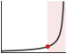
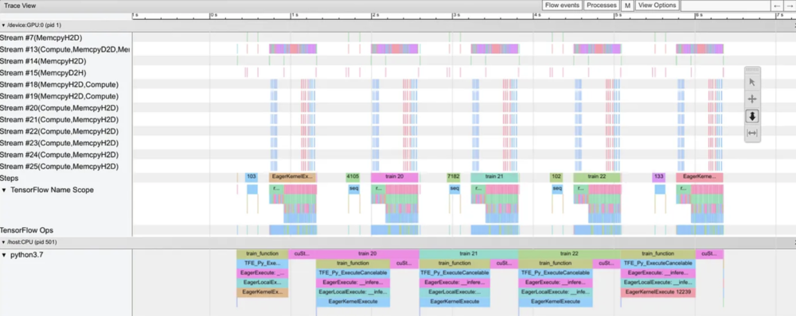
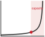

# Model Training {#sec-model-training}

::: {layout-narrow}
::: {.column-margin}

\chapterminitoc

:::

\noindent
{fig-alt="Artistic depiction of neural network training showing miniature workers and scientists operating machinery on a large glowing neural network with interconnected neurons and synapses."}

:::

## Purpose {.unnumbered}

\begin{marginfigure}
\mlsysstack{50}{25}{45}{90}{12}{10}{0}{20}
\end{marginfigure}

_Why does training a model cost millions while running it costs pennies?_

Inference computes a single forward pass: data flows through the network, a prediction emerges. Training multiplies that cost at every level. Each example requires a forward pass plus a backward pass to compute gradients, plus an optimizer step that updates every parameter. The optimizer itself maintains momentum and variance estimates that can exceed the model's own memory footprint. Then repeat across billions of examples, for multiple epochs, across dozens of hyperparameter configurations. The result is a million-to-one asymmetry between the cost of learning and the cost of using what was learned. This asymmetry is the primary gatekeeper to AI innovation: training a model costs orders of magnitude more than running it, a gap so large that it governs who can participate at all. A research lab that trains in three days iterates through ideas ten times faster than one that takes a month, and the compounding effect of faster iteration dominates any single architectural insight. For the systems engineer, training is the phase where hardware decisions matter most, where parallelism strategies determine feasibility, and where the ML workflow's most expensive iteration loop either accelerates or stalls the entire project.

::: {.content-visible when-format="pdf"}

\newpage

:::

::: {.callout-learning-objectives}

- Explain the iron law of training performance and identify which term (operations, peak throughput, or utilization) each optimization technique targets
- Calculate computational requirements (FLOPs), memory footprints (activation storage, optimizer states), and training cost estimates for neural network training
- Compare optimization algorithms (SGD, Adam, AdamW) based on convergence speed, memory overhead, and computational cost
- Identify training bottlenecks using arithmetic intensity (Roofline Model) and the profile-diagnose-fix-reprofile methodology to distinguish compute, memory, and data-bound regimes
- Apply memory and throughput optimizations (mixed-precision, activation checkpointing, gradient accumulation, IO-aware attention) to fit large models within accelerator constraints
- Construct efficient single-machine training pipelines using data prefetching, pipeline overlapping, and the systematic optimization framework
- Analyze when single-machine training becomes infeasible (memory, duration, dataset scale) and evaluate trade-offs of scaling to multi-accelerator configurations

:::

```{python}
#| echo: false
from mlsysim import *
from mlsysim.core.units import *

# ┌─────────────────────────────────────────────────────────────────────────────
# │ TRAINING SYSTEMS FUNDAMENTALS
# ├─────────────────────────────────────────────────────────────────────────────
# │ Context: §Training Systems Fundamentals, §Iron Law, §3AM Gradient Explosion
# │
# │ Goal: Provide cost, scale, FLOP, and model-spec constants for the opening
# │       sections of the chapter (Fundamentals through Iron Law).
# │ Show: Training cost asymmetry, GPT-2/3 specs, failure scenario numbers.
# │ How:  Retrieve model specs from Digital Twins; format costs and FLOPs.
# │
# │ Imports: mlsysim (Hardware, Models), mlsysim.core.units (*),
# │          mlsysim.fmt (domain formatters, fmt, sci, fmt_math, check)
# │ Exports: TrainingScenarios.{cost,flops,loss,fp16}
# └─────────────────────────────────────────────────────────────────────────────
from mlsysim import Hardware, Models
from mlsysim.fmt import (
    fmt_int,
    fmt,
    fmt_count,
    fmt_sci,
    fmt_sci_flops,
    fmt_math,
    check,
    fmt_bandwidth,
    fmt_flop_rate,
    fmt_memory,
    fmt_params,
    fmt_usd,
)

class TrainingScenarios:
    # ┌── 1. LOAD (Constants) ──────────────────────────────────────────────
    gpt2_cost_2019 = 50_000
    gpt4_cost_est = 100 * MILLION
    gpt2_fwd_flops = 3e9
    gpt2_total_flops = 1e19
    adam_example_model = Models.Language.Llama2_7B
    adam_example_params = adam_example_model.parameters
    ckpt_layers = 48

    # ┌── 2. EXECUTE (The Compute) ────────────────────────────────────────
    adam_inference = adam_example_model.size_in_bytes(BYTES_FP16)
    adam_grad = adam_example_model.size_in_bytes(BYTES_FP16)
    adam_moments = adam_example_model.size_in_bytes(BYTES_ADAM_STATE)
    adam_training_state = adam_inference + adam_grad + adam_moments
    adam_training_memory_multiplier = (adam_training_state / adam_inference).to("").magnitude

    ckpt_count = round(ckpt_layers**0.5)
    ckpt_memory_units = ckpt_count + (ckpt_layers / ckpt_count)
    ckpt_memory_savings_pct = (1 - ckpt_memory_units / ckpt_layers) * 100

    # ┌── 3. GUARD (Invariants) ───────────────────────────────────────────
    check(adam_training_memory_multiplier == 6, "Adam training state should be 6x FP16 inference weights")
    check(ckpt_count == 7, f"sqrt(48) checkpoint count should round to 7, got {ckpt_count}")

    # ┌── 4. OUTPUT (Formatting) ──────────────────────────────────────────
    gpt2_training_cost_2019_str = fmt_usd(gpt2_cost_2019, precision=0, commas=True)
    gpt4_training_cost_est_str = fmt_usd(gpt4_cost_est, scale="M", precision=0, commas=False)
    gpt2_fwd_flops_str = fmt_sci(gpt2_fwd_flops)
    gpt2_total_flops_str = fmt_sci_flops(gpt2_total_flops * flop)
    adam_example_params_b_str = fmt_params(adam_example_params, precision=0)
    adam_inference_gb_str = fmt_memory(adam_inference, unit=GB, precision=0, commas=False)
    adam_grad_gb_str = fmt_memory(adam_grad, unit=GB, precision=0, commas=False)
    adam_moments_gb_str = fmt_memory(adam_moments, unit=GB, precision=0, commas=False)
    adam_training_state_gb_str = fmt_memory(adam_training_state, unit=GB, precision=0, commas=False)
    adam_training_memory_mult_str = fmt_multiple(adam_training_memory_multiplier, precision=0, commas=False)
    ckpt_layers_str = fmt_count(ckpt_layers, commas=False, label="layer")
    ckpt_layers_count_str = fmt(ckpt_layers, precision=0, commas=False)
    ckpt_count_str = fmt(ckpt_count, precision=0, commas=False)
    ckpt_memory_units_str = fmt(ckpt_memory_units, precision=1, commas=False)
    ckpt_memory_savings_pct_str = fmt_percent(ckpt_memory_savings_pct / 100, precision=1, commas=False, style='symbol')

    # Hardware specs used in the staged-pipeline narrative and MFU callout
    nvlink_h100_gb_per_s_str = fmt_bandwidth(Hardware.Cloud.H100.nvlink.bandwidth, unit=GB / second, precision=0, commas=False)
    a100_fp16_tflop_per_s_str = fmt_flop_rate(
        Hardware.Cloud.A100.compute.peak_flops,
        unit=TFLOP / second,
        precision=0,
        commas=False,
    )
```

::: {.column-margin}
{width="100%" fig-alt="A cost curve that stays nearly flat across model scale, then rises almost vertically at the right, with a marked knee point and a shaded danger zone past it. Training cost explodes at large scale."}

*Training cost stays flat across scale, then explodes past the large-scale knee.*
:::

## Training Systems Fundamentals {#sec-model-training-training-systems-fundamentals-05d2}

The frameworks examined in @sec-ml-frameworks provided the execution substrate: computational graphs that schedule operations, automatic differentiation that computes gradients, and hardware abstractions that target diverse accelerators. Those tools make a single training step possible. This chapter confronts what happens when that step must execute billions of times, and what systems engineering is required to do so within practical time and budget constraints.

Running GPT-2 once costs a fraction of a cent, while training GPT-2\index{Training!cost asymmetry}\index{Training!inference vs. training} cost approximately `{python} TrainingScenarios.gpt2_training_cost_2019_str` in 2019. A GPT-4-class model may cost only a few cents to run once, yet its training run is commonly estimated near `{python} TrainingScenarios.gpt4_training_cost_est_str`[^fn-training-cost-scaling]. This million-to-one cost asymmetry, introduced in the Purpose section, reflects the sheer volume of computation required: tens of billions of forward passes, each followed by a backward pass, repeated across datasets measured in terabytes.

[^fn-training-cost-scaling]: **Training Cost Scaling**\index{Training Cost!scaling trajectory}: The roughly 2,000$\times$ cost increase from GPT-2--scale training [@radford2019language] to GPT-4--class training (widely cited nine-figure estimates in industry reporting) over several years reflects three compounding factors: parameter counts, training-token budgets, and accelerator fleets all grew dramatically. Exact GPT-4 training details were not disclosed, but public estimates commonly place such training runs in the regime of tens of thousands of A100-class accelerators for months, not single-node clusters. This trajectory made training one of the largest capital expenditures for organizations building models at that scale, exceeding the annual R&D budget of most universities.

A single forward pass through GPT-2 requires roughly `{python} TrainingScenarios.gpt2_fwd_flops_str` floating-point operations. Training requires tens of billions of such passes, and each backward pass costs approximately twice as much as the forward pass, yielding a computational budget on the order of `{python} TrainingScenarios.gpt2_total_flops_str` [@radford2019language]. This asymmetry makes training systems engineering a distinct discipline and explains why access to training infrastructure increasingly determines who can participate in AI development.

::: {#dfn-training-training-systems .callout-definition title="Training systems"}

***Machine Learning Training Systems***\index{Training Systems!definition}\index{Training!systems} are software-hardware systems that execute the iterative optimization loop (forward pass, loss computation, backward pass, and parameter update) to minimize a loss function over a training dataset.

1.  **Significance (quantitative)**: Training memory cost is `{python} TrainingScenarios.adam_training_memory_mult_str` the inference memory cost per parameter when using the Adaptive Moment Estimation (Adam) optimizer: a `{python} TrainingScenarios.adam_example_params_b_str`-parameter model requires `{python} TrainingScenarios.adam_inference_gb_str` (FP16 weights) + `{python} TrainingScenarios.adam_grad_gb_str` (FP16 gradients) + `{python} TrainingScenarios.adam_moments_gb_str` (Adam first and second moments in FP32) = `{python} TrainingScenarios.adam_training_state_gb_str` at least, before accounting for activation storage. This multiplier is the primary reason a model that runs inference on one GPU requires multiple GPUs for training.
2.  **Observation**: Unlike inference systems, which execute a single forward pass and discard intermediate activations, training systems must retain all intermediate activations from the forward pass for use during the backward pass, creating a memory footprint that grows linearly with model depth and batch size.
3.  **Pitfall**: A frequent misconception is that training failures are compute problems. The most common training failure is out-of-memory (OOM) error, which is a memory management problem: the activation tensors from all $N_L$ layers accumulate during the forward pass and must coexist in GPU memory simultaneously, causing OOM before the first gradient is computed.

:::

```{python}
#| echo: false
from mlsysim import Models

# ┌── LEGO ───────────────────────────────────────────────
# │ Goal: GPT-2 weight, Adam, and layer counts for memory-pressure prose.
# │ Exports: TrainingMemoryPressure.{gpt2_params_b,gpt2_params_gb_fp32,gpt2_adam,gpt2_layers}_str
from mlsysim.fmt import fmt_count, fmt_memory, fmt_params

class TrainingMemoryPressure:
    gpt2 = Models.Language.GPT2
    gpt2_params = gpt2.parameters
    gpt2_layers = gpt2.layers
    gpt2_params_fp32 = gpt2.size_in_bytes(BYTES_FP32)
    gpt2_adam = gpt2.size_in_bytes(BYTES_ADAM_STATE)

    # ┌── 4. OUTPUT (Formatting) ─────────────────────────────────────────────
    gpt2_params_b_str = fmt_params(gpt2_params)
    gpt2_layers_str = fmt_count(gpt2_layers, commas=False, label="layer")
    gpt2_params_gb_fp32_str = fmt_memory(gpt2_params_fp32, unit=GB, precision=0, commas=False)
    gpt2_adam_gb_str = fmt_memory(gpt2_adam, unit=GB, precision=0, commas=False)
```

Three characteristics distinguish training workloads from general-purpose computing. First, computational intensity\index{Training!computational intensity}: that `{python} TrainingScenarios.gpt2_total_flops_str` budget spread over days of wall-clock time demands sustained PFLOP/s-scale throughput from hardware that rarely exceeds 30 to 70 percent utilization. Second, memory pressure\index{Training!memory pressure}: storing `{python} TrainingMemoryPressure.gpt2_params_b_str` weights requires `{python} TrainingMemoryPressure.gpt2_params_gb_fp32_str` in FP32; the Adam optimizer adds two additional state tensors per parameter\index{Optimizer State!memory overhead}, consuming another `{python} TrainingMemoryPressure.gpt2_adam_gb_str`; and activation storage across `{python} TrainingMemoryPressure.gpt2_layers_str` can double or triple this total, easily exceeding a single accelerator's memory capacity. Third, data dependencies: each gradient update depends on the result of the previous one, creating sequential bottlenecks that limit how much parallelism the system can exploit.

Each challenge points to a different kind of fix. Computational intensity pushes the system toward higher accelerator utilization and lower-precision arithmetic. Memory pressure calls for techniques such as gradient checkpointing[^fn-checkpointing-training], a specific application of *rematerialization* (discarding and recomputing intermediate values to save memory, from @sec-ml-frameworks) that trades recomputation for reduced activation storage, and mixed-precision training[^fn-mixed-precision-training], which reduces the memory footprint of weights and activations. Data dependencies motivate pipeline designs that overlap computation with data movement, building directly on the data loading throughput optimized in @sec-data-engineering so the accelerator never sits idle waiting for the next batch. The current chapter focuses on single-machine and single-node multi-GPU training; scaling to hundreds of machines across network boundaries introduces communication and fault tolerance challenges beyond our current scope.

### The staged system pipeline: Identifying "accelerator bubbles" {#sec-model-training-staged-pipeline}

A training system is not a single loop; it is a **staged system pipeline**\index{Training Pipeline!staged system workflow}. Reaching high accelerator utilization requires analyzing training as a factory floor where four distinct stages coordinate to keep the ALUs busy:

1.  **Data Loading & Preprocessing** (CPU/Storage): Fetching raw bits from Non-Volatile Memory Express (NVMe), decoding, and augmenting on CPU cores.
2.  **Host-to-Device Transfer** (PCIe): Moving the processed batch over the PCIe bus into GPU memory via DMA.
3.  **Forward/Backward Pass** (Accelerator): Propagating activations and gradients through layers on the GPU.
4.  **Parameter Synchronization** (NVLink): Exchanging gradients between GPUs over NVLink (`{python} TrainingScenarios.nvlink_h100_gb_per_s_str`) in multi-GPU configurations to update weights.

Any mismatch in the throughput of these stages creates **accelerator bubbles**\index{Accelerator!bubbles, pipeline idleness}—intervals of idle silicon where the "Machine" axis of the AI Triad sits at 0 percent utilization while waiting for the "Data" axis to catch up. A systems engineer's primary task during training is to eliminate these bubbles through asynchronous prefetching and pipeline overlapping, ensuring that the next batch is ready on the PCIe bus before the current backward pass completes. We develop the quantitative tools for measuring and fixing these bubbles in @sec-model-training-identifying-bottlenecks-f57f.

[^fn-checkpointing-training]: **Gradient Checkpointing (Activation Checkpointing)**\index{Activation Checkpointing!memory-compute trade-off}: The memory pressure described here arises because backpropagation requires every layer's activations from the forward pass. Checkpointing breaks this requirement by saving activations at only $\sqrt{N_L}$ strategic layers and recomputing the rest during the backward pass, trading roughly 33 percent additional compute for about `{python} TrainingScenarios.ckpt_memory_savings_pct_str` activation-memory savings in the simplified $\sqrt{N_L}$ model. For GPT-2's `{python} TrainingScenarios.ckpt_layers_str`, this means about `{python} TrainingScenarios.ckpt_count_str` checkpoints and a peak of roughly `{python} TrainingScenarios.ckpt_memory_units_str` activation units across the checkpointed network (not one unit per layer at all `{python} TrainingScenarios.ckpt_layers_count_str` layers).

[^fn-mixed-precision-training]: **Mixed-Precision Training**\index{Mixed-Precision Training!trade-off}: Uses half-precision (FP16 or BF16) for computation while maintaining FP32 "master weights"\index{FP32 Master Weights!mixed-precision training} for accumulation, where rounding errors would otherwise compound. A loss scaling trick prevents gradient underflow in FP16's limited dynamic range, yielding nearly 2$\times$ memory savings and 2--8$\times$ throughput gains on Tensor Cores. BF16 ("Brain Floating Point," from Google Brain [@google_bfloat16]) later eliminated loss scaling by matching FP32's 8-bit exponent range, simplifying the dominant failure mode of half-precision training.

The chapter follows that dependency chain. We begin with the iron law of training performance, a specialized application of the general iron law (@sec-introduction-iron-law-ml-systems-c32a) that separates total operations, peak throughput, and utilization. That equation gives us the accounting system for the mathematical foundations that follow: neural-network computation as a workload, optimizer behavior, backpropagation mechanics, and arithmetic intensity. Once the costs are visible, the chapter turns to the training pipeline itself, where data loading, forward pass, backward pass, and parameter updates each constrain the next. The optimization sections then target the terms exposed by the accounting: mixed-precision training, FlashAttention, gradient accumulation, checkpointing, and data prefetching. Only after those single-machine levers are clear do we examine scaling beyond one accelerator, where communication overhead becomes the next bottleneck.

Before formalizing the iron law, consider how these constraints interact in practice. The theoretical framework matters because failures are expensive: a single *gradient explosion* can erase days of computation worth thousands of dollars.

::: {#ws-training-palm-loss-spikes .callout-war-story title="The PaLM loss spikes (2022)"}

**Context**: During training of the 540B-parameter PaLM model, the largest run exhibited training-instability behavior that smaller runs did not show [@chowdhery2022palm].

**Failure mode**: The training loss spiked roughly 20 times despite gradient clipping. The spikes occurred irregularly, sometimes late in training, and were not explained by a simple "bad data batch" story.

**Consequence**: The practical mitigation was operational: restart from a checkpoint about 100 steps before the spike and skip roughly 200--500 data batches around the failure window. The mitigation avoided recurrence at the same point and showed that very large training runs require planned recovery paths alongside optimizer theory.

**Systems lesson**: Large-scale training stability is an operational problem as much as an optimization problem. Checkpoint cadence, automated loss-spike detection, batch skipping, and numerically robust formats such as BF16\index{BF16!dynamic range advantage} are part of the training system, not afterthoughts.

:::

## Iron Law of Training Performance {#sec-model-training-iron-law-training-performance-a53f}

PaLM's loss spikes illustrate a broader point: instability at very large scale is not a rare accident but a predictable consequence of pushing computational intensity, memory pressure, and data dependencies simultaneously. Each of those three characteristics is individually manageable, yet their interactions produce failure modes that operational recovery alone cannot prevent. Diagnosing which factor dominates a given failure, and quantifying the cost of each, requires a formal decomposition of training time into its physical constituents.

The iron law\index{Training!iron law of training performance}\index{Iron Law of Training Performance!utilization gap} provides exactly that organizing framework: it decomposes training time so that every optimization technique maps to a specific term in the equation. This is a specialized application of the general iron law of ML systems introduced in @sec-introduction-iron-law-ml-systems-c32a, focused specifically on maximizing computational throughput.

::: {#dfn-training-iron-law-training-performance .callout-definition title="The iron law of training performance"}

***The Iron Law of Training Performance***\index{Iron Law of Training Performance!definition} is the simplified form of the general iron law that isolates the computational bottleneck of iterative optimization:
$$T_{\text{train}} = \frac{O}{R_{\text{peak}} \times \eta_{\text{hw}}}$$ {#eq-training-iron-law}

The simplification is valid when the pipeline is correctly staged: at training scale with large batches, data movement $(D_{\text{vol}}/\text{BW})$ is overlapped with compute via prefetching pipelines, and communication overhead $(L_{\text{lat}})$ is absorbed by gradient overlap strategies, leaving hardware utilization as the dominant remaining lever. When pipelines are poorly staged, $D_{\text{vol}}/\text{BW}$ resurfaces as the bottleneck and the simplified form no longer applies.

1.  **Significance (quantitative)**: The three factors identify three distinct optimization levers: $O$ (reducible by algorithmic changes, fewer training tokens, or model-compression methods such as pruning and distillation, which @sec-model-compression defines), $R_{\text{peak}}$ (improved by hardware and lower-precision tensor cores), and $\eta_{\text{hw}}$ (the utilization fraction and primary engineering target; GPT-3 training achieved $\eta_{\text{hw}} \approx 0.45$ [@narayanan2021], and well-tuned large training systems often target higher sustained utilization).
2.  **Observation**: Unlike the general iron law, which models all three cost terms $(D_{\text{vol}}/\text{BW}, O/(R_{\text{peak}} \cdot \eta_{\text{hw}}), L_{\text{lat}})$, this simplified form assumes data movement and communication are not the binding constraint, an assumption that breaks for small-batch workloads or bandwidth-limited deployments.
3.  **Pitfall**: A frequent misconception is that $\eta_{\text{hw}}$ is fixed by hardware. System efficiency is a pipeline property: memory bandwidth saturation, kernel launch overhead, and synchronization barriers each reduce $\eta_{\text{hw}}$ independently, and diagnosing which factor dominates requires profiling rather than reading hardware specs.

:::

::: {.column-margin}
{width="100%" fig-alt="A horizontal bar split into three segments labeled D, C, and L for data, compute, and latency. The middle compute segment is the widest and shaded orange; the data and latency segments are narrow and gray, showing compute dominates training time."}

*Training is compute-dominated: data and latency overlap away.*
:::

@Eq-training-iron-law reveals three levers for improvement: reduce total operations through algorithmic innovation, increase peak throughput through hardware utilization, or improve utilization through better pipeline orchestration. Each optimization technique in this chapter pulls one or more of these levers, as summarized in @tbl-iron-law-mapping.

| **Technique**                   | **Term Affected**               | **Mechanism**                                                                  |
|:--------------------------------|:--------------------------------|:-------------------------------------------------------------------------------|
| **Mixed Precision (FP16/BF16)** | Peak Throughput ↑               | Tensor Cores operate at up to 16$\times$ higher FLOP/s                         |
| **Data Prefetching**            | Utilization ↑                   | Reduces accelerator idle time waiting for data                                 |
| **Gradient Checkpointing**      | Total Operations ↑              | Adds recomputation, but enables larger models                                  |
| **Gradient Accumulation**       | Utilization ↑                   | Maintains high batch parallelism efficiency                                    |
| **Operator Fusion**             | Utilization ↑                   | Reduces memory bandwidth bottlenecks                                           |
| **FlashAttention**              | Memory Traffic ↓, Utilization ↑ | Same asymptotic FLOPs, much lower HBM IO; backward recomputation may add FLOPs |

: **Iron Law Optimization Mapping**: Optimization techniques mapped to iron law terms. Understanding which term a technique affects guides optimization strategy selection. {#tbl-iron-law-mapping tbl-colwidths="[25,27,48]"}

A caveat: the iron law focuses on execution efficiency---how fast the hardware processes a given workload. It does not capture data-side factors such as data quality, dataset size, or curriculum design, which affect how many total operations $O$ are needed to reach a target accuracy. A cleaner dataset or a better data mix can reduce the number of epochs required, shrinking $O$ without touching hardware at all. In this chapter we hold the workload fixed and ask how to execute it as fast as possible.

The gap between theoretical peak performance and actual training speed is often 2--3$\times$. Scaling to multiple accelerators introduces additional communication overhead that can erode these gains, a trade-off we examine in @sec-model-training-scaling-training-systems-adfd. The core intuition is that speed depends on how much useful work the hardware can sustain, not on peak specifications alone.

::: {#chk-training-physics-training .callout-checkpoint title="The physics of training"}

Training speed is governed by the utilization of hardware peaks.

**The Utilization Gap**

- [ ] **Peak vs. real**: Why is 100 percent accelerator utilization impossible? (Memory bandwidth stalls, kernel launch overhead, communication latencies).
- [ ] **Batch size physics**: Why does increasing batch size generally improve hardware utilization? (It increases arithmetic intensity, moving operations from memory-bound to compute bound. We formalize this as *Model FLOPs Utilization* in @sec-model-training-identifying-bottlenecks-f57f.)
- [ ] **Order of magnitude**: A frontier run needs on the order of $10^{23}$ FLOPs at a utilization $\eta_{\text{hw}}$ well below 1. Estimate which lever shortens wall-clock time more, doubling $R_{\text{peak}}$ or doubling $\eta_{\text{hw}}$, and why the iron law says the two are not interchangeable in practice.

**Precision Economics**

- [ ] **Mixed precision**: How does FP16/BF16 double throughput? (Tensor Cores run 2$\times$ faster, and memory bandwidth effectively doubles).

:::

The iron law provides a static framework for reasoning about training performance, but the history of deep learning reveals how the binding constraint has shifted over time as hardware and algorithms co-evolved. In 1986, backpropagation was formalized [@rumelhart1986], and training a three-layer network on toy datasets required days on CPU workstations---the bottleneck was raw compute throughput $(R_{\text{peak}})$. In 2012, AlexNet demonstrated GPU training [@krizhevsky2012imagenet], reducing ImageNet training from weeks to days and launching the deep learning era. By 2017, transformers\index{Transformer!training evolution} [@vaswani2017] shifted attention toward large-scale sequence modeling and high-throughput accelerator kernels. GPT-3 in 2020 consumed about $3.14 \times 10^{23}$ FLOPs [@brown2020language], making utilization $(\eta_{\text{hw}})$ critical. By 2023, training efficiency improved through the techniques examined in this chapter: FlashAttention reduces memory traffic while improving $\eta_{\text{hw}}$; gradient checkpointing trades additional $O$ for memory capacity; mixed precision increases $R_{\text{peak}}$. Each innovation was motivated by a specific iron law bottleneck.

```{python}
#| echo: false
#| label: gpt2-lighthouse-hardware-calc
from mlsysim.fmt import fmt_sci_flops, fmt_memory, fmt_params

# ┌─────────────────────────────────────────────────────────────────────────────
# │ GPT-2 LIGHTHOUSE + V100 HARDWARE SPECS
# ├─────────────────────────────────────────────────────────────────────────────
# │ Context: §Running Example: Training GPT-2, §GPT-2 Attention Layer
# │          Computation (notebook), §Activation Memory Requirements,
# │          §Gradient Accumulation walkthrough.
# │
# │ Goal: Provide GPT-2 weight/dataset sizes, DLRM scale, and V100 hardware
# │       specs for the lighthouse table and GPT-2 FLOP notebook.
# │ Show: GPT-2 lighthouse table specs; V100 throughput in system implication.
# │ How:  Hard-coded model sizes; V100 specs from Hardware Digital Twin.
# │
# │ Imports: mlsysim.core.units (TFLOPs, second, GB)
# │ Exports: GPT2LighthouseSpecs.gpt2_weights_*, dlrm_*, resnet50_act_*
# └─────────────────────────────────────────────────────────────────────────────

# ── GPT-2 Lighthouse Sizes + DLRM Scale ──────────────────────────────────
class GPT2LighthouseSpecs:
    # ┌── 1. LOAD ──────────────────────────────────────────────────────────────
    gpt2_model = Models.Language.GPT2
    gpt2_params = gpt2_model.parameters
    gpt2_total_flops = 1e19
    gpt2_weights_fp16 = gpt2_model.size_in_bytes(BYTES_FP16)
    gpt2_weights_fp32 = gpt2_model.size_in_bytes(BYTES_FP32)
    gpt2_dataset_size = gpt2_model.training_dataset_size
    dlrm_model = Models.Recommendation.DLRM
    dlrm_params_min = dlrm_model.parameter_range_min
    dlrm_params_max = dlrm_model.parameter_range_max

    # ┌── 4. OUTPUT ────────────────────────────────────────────────────────────
    gpt2_params_b_str = fmt_params(gpt2_params)
    gpt2_total_flops_str = fmt_sci_flops(gpt2_total_flops * flop)
    gpt2_weights_fp16_gb_str = fmt_memory(gpt2_weights_fp16, unit=GB, precision=0, commas=False)
    gpt2_weights_fp32_gb_str = fmt_memory(gpt2_weights_fp32, unit=GB, precision=0, commas=False)
    gpt2_dataset_size_gb_str = fmt_memory(gpt2_dataset_size, unit=GB, precision=0, commas=False)
    dlrm_params_min_b_str = fmt_params(dlrm_params_min, precision=0)
    dlrm_params_max_t_str = fmt_params(dlrm_params_max, precision=0)
```

### Running example: Training GPT-2 {#sec-model-training-running-example-training-gpt2-19cd}

To ground the abstract principles of training systems in concrete engineering decisions, we use GPT-2 as a recurring worked example throughout this chapter. This Lighthouse Model is large enough to expose real systems bottlenecks yet small enough to reason about without massive cluster infrastructure. In inference, GPT-2 serves as the Bandwidth Hog lighthouse; in training, the same model exposes a different constraint mix: activation memory, accelerator utilization, and data-pipeline throughput.

::: {#lhs-training-lighthouse-example-training-gpt-2 .callout-lighthouse title="Lighthouse example: Training GPT-2"}

**Context**:
GPT-2 (1.5 billion parameters) serves as our primary case study for large-scale training because it sits at the "sweet spot" of systems complexity. It is large enough to require distributed training and serious memory optimizations, yet small enough to comprehend without the massive infrastructure complexity of trillion-parameter clusters. @Tbl-training-gpt2-lighthouse-specs maps each model property to the systems constraint it creates:

| **Property**     |                           **Specification**                           | **Systems Implication**                                                                                                                                        |
|:-----------------|:---------------------------------------------------------------------:|:---------------------------------------------------------------------------------------------------------------------------------------------------------------|
| **Parameters**   |         `{python} GPT2LighthouseSpecs.gpt2_params_b_str` (XL)         | Requires ~`{python} GPT2LighthouseSpecs.gpt2_weights_fp16_gb_str` (FP16) or ~`{python} GPT2LighthouseSpecs.gpt2_weights_fp32_gb_str` (FP32) for weights alone. |
| **Architecture** |                          48 Layers, 1600 Dim                          | Deep pipeline creates heavy activation memory pressure.                                                                                                        |
| **Dataset**      | OpenWebText (`{python} GPT2LighthouseSpecs.gpt2_dataset_size_gb_str`) | I/O throughput must match high-speed accelerator compute.                                                                                                      |
| **Compute**      |         ~ `{python} GPT2LighthouseSpecs.gpt2_total_flops_str`         | Training takes days/weeks; demands parallelization.                                                                                                            |

: **GPT-2 (1.5 billion parameters) lighthouse model specifications**: Parameter count, architecture depth, dataset size, and total training compute mapped to their systems implications. Each row pairs a model property with the engineering constraint it creates—memory footprint for weights, activation pressure from pipeline depth, I/O throughput requirements, and parallelization demand. {#tbl-training-gpt2-lighthouse-specs tbl-colwidths="[20,26,54]"}

**Challenge**:
Training GPT-2 is primarily memory-bound (due to activation storage) and compute-intensive (requiring massive matrix multiplications). It forces us to move beyond simple training loops to sophisticated pipelines that manage data movement as carefully as computation.

:::

Not all training workloads are compute bound. Recommendation models like Deep Learning Recommendation Model (DLRM) are dominated by massive embedding tables\index{Embedding Table!capacity bottleneck} (`{python} GPT2LighthouseSpecs.dlrm_params_min_b_str` to `{python} GPT2LighthouseSpecs.dlrm_params_max_t_str` parameters, mostly embeddings) that make them memory-bandwidth-bound rather than compute bound. For such workloads, the first scaling problem is often capacity: splitting the embedding tables across devices so the model fits at all. The remainder of this chapter focuses on dense, compute-intensive training using GPT-2 as the primary worked example.

Training systems occupy a critical position in the machine learning pipeline: they consume prepared data from upstream engineering (@sec-data-engineering) and produce trained model artifacts that later systems must deploy and monitor. Data quality directly impacts training stability, while training efficiency determines iteration velocity during model development. The same pressure appears at three scales. At data scale, petabyte datasets require efficient I/O pipelines and distributed storage. At model scale, billion-parameter models force the system to decide whether to replicate the model across batches with data parallelism\index{Distributed Training!data parallelism}[^fn-training-data-parallelism] or split the model across devices with model parallelism\index{Distributed Training!model parallelism}[^fn-training-model-parallelism]. At infrastructure scale, coordinating thousands of accelerators introduces communication overhead that can dominate training time. These challenges are why the workflow contracts from @sec-ml-workflow matter during training: orchestration decisions shape both scientific iteration and systems cost.

GPT-2's `{python} GPT2LighthouseSpecs.gpt2_dataset_size_gb_str` WebText corpus sits at the lower end of this data scale spectrum. Frontier models consume datasets that are two to three orders of magnitude larger, and the physics of data movement shifts qualitatively across that range. At the low end, the entire dataset fits in memory and the $D_{\text{vol}}/\text{BW}$ term in the iron law is negligible; at the high end, sustained I/O throughput becomes the binding constraint, requiring dedicated prefetch workers, zero-copy transfer paths, and distributed storage backends to keep accelerators from starving between batches.

::: {#psp-training-10-gb-10-tb-scale-factor .callout-perspective title="The 10 GB to 10 TB scale factor"}

-   **Memory-resident regime** (10 GB): The entire dataset often fits in system RAM. Data loading is a one-time "startup cost," and the disk bandwidth $(\text{BW})$ does not matter after the first few seconds.
-   **Streaming regime** (10 TB): Data becomes a continuous, high-pressure stream. The system can no longer "load" the data; it must orchestrate its movement. The $D_{\text{vol}}$ term shifts from a storage bottleneck to a networking and I/O bottleneck, requiring zero-copy paths and multi-worker prefetching just to keep the accelerator from starving.

Scale changes more than the amount of data; it transforms the system's physics.

:::

[^fn-training-data-parallelism]: **Data Parallelism**: Replicates the full model on every device, splitting only the data. Each device computes gradients independently, then an AllReduce operation synchronizes them---adding communication volume proportional to model size at every step. This synchronization tax limits scaling efficiency: doubling accelerators rarely halves training time once communication becomes the bottleneck. \index{Data Parallelism!communication overhead}

[^fn-training-model-parallelism]: **Model Parallelism**: Partitions the model's layers across devices when it exceeds single-device memory. Activations must transfer between devices at every partition boundary, and naive partitioning creates "pipeline bubbles" where downstream devices idle while waiting---often reducing utilization to 25--50 percent. Microbatch pipelining (GPipe, PipeDream) recovers most of this lost efficiency. \index{Model Parallelism!pipeline bubbles}

These scaling challenges translate into concrete workflow requirements. Training workflows consist of interdependent stages---data preprocessing, forward and backward passes, and parameter updates---extending the neural network concepts from @sec-neural-computation. System constraints often dictate performance limits: accelerators with high compute-to-bandwidth ratios are frequently bottlenecked by memory bandwidth, where data movement between memory hierarchies is slower than the computations themselves [@patterson2017hardware]. In distributed setups, synchronization across devices introduces additional latency, with interconnect performance\index{InfiniBand!interconnect performance}\index{NVLink!training interconnect} (NVLink, InfiniBand) critically affecting throughput[^fn-transformer-training].

The same hardware-software boundary that frameworks exposed in @sec-ml-frameworks is central here. Mixed-precision training emerged from recognizing that Tensor Core hardware could accelerate reduced-precision arithmetic. Gradient checkpointing arose from memory capacity constraints. Training systems engineering is the work of matching those algorithmic choices to the physical limits of the machine.

[^fn-transformer-training]: **Transformer Training Interconnect Sensitivity**: Self-attention's $\mathcal{O}(S^2)$ memory and compute scaling amplifies the interconnect bottleneck mentioned here: each layer's activation tensors must transfer between devices at every pipeline boundary, and gradient synchronization scales with the full parameter count. GPT-3 training across 1,024 V100 GPUs spent an estimated 30--40 percent of wall-clock time on inter-GPU communication, making the NVLink vs. InfiniBand bandwidth choice a first-order determinant of training cost. \index{Training!transformer, interconnect sensitivity}

These scaling challenges share a common thread: every bottleneck traces back to the cost of specific mathematical operations---matrix multiplications that consume trillions of FLOPs, activation functions constrained by memory bandwidth, and optimizer states that triple the memory footprint. Before we can design effective systems to execute these operations at scale, we need to understand exactly what they cost [@goto2008].

## Mathematical Foundations {#sec-model-training-mathematical-foundations-d894}

@Sec-neural-computation established *what* neural network operations compute and *why* they enable learning. The question for a systems engineer is *what they cost*\index{Training!mathematical foundations}\index{Training!computational cost}---the FLOPs consumed, the memory required, and the bandwidth demanded when these conceptually simple operations execute at scale. A matrix multiplication is just $C = AB$ in notation, but training GPT-2 requires executing that operation billions of times with matrices too large to fit in fast memory. The activation function $f(x) = \max(0, x)$ appears trivial, yet the choice between rectified linear unit (ReLU) and sigmoid determines whether Tensor Cores can accelerate computation.

Four dimensions structure this cost analysis. First, FLOP counts of the matrix operations that dominate dense neural-network training. Second, memory requirements for storing activations and optimizer states simultaneously. Third, bandwidth demands that determine whether operations are compute bound or memory bound. Fourth, arithmetic intensity classifications that guide optimization strategy selection. Together, these dimensions provide the vocabulary for analyzing the computational intensity, memory pressure, and data dependencies introduced in @sec-model-training-training-systems-fundamentals-05d2.

### Neural network computation {#sec-model-training-neural-network-computation-5660}

Neural network training consists of repeated matrix operations and nonlinear transformations. These operations are conceptually simple but create the system-level challenges that dominate modern training infrastructure. The introduction of backpropagation\index{Backpropagation!historical introduction}[^fn-backprop-provenance] by @rumelhart1986 and the development of efficient matrix computation libraries such as Basic Linear Algebra Subprograms (BLAS)\index{BLAS!matrix computation foundation}[^fn-blas-training] [@dongarra1988] laid the groundwork for modern training architectures.

[^fn-backprop-provenance]: **Backpropagation Provenance**: The algorithm was independently derived by @linnainmaa1970representation for automatic differentiation of computer programs and by @werbos1974beyond in a Harvard PhD thesis on economic modeling—over a decade before @rumelhart1986 popularized it for neural networks. This delay between derivation and broad adoption recurs in ML systems history: attention mechanisms predated transformers by decades, but the 2017 Transformer showed that attention-heavy models could train efficiently on contemporary GPU systems; later TPU and GPU clusters enabled much larger deployments. Every modern framework's `backward()` call implements Linnainmaa's reverse-mode AD, not textbook chain rule—the difference is that graph-reverse topological traversal enables parallel gradient computation across independent subgraphs. \index{Backpropagation!provenance}

[^fn-blas-training]: **BLAS**: The original BLAS specification standardized reusable Fortran-callable vector operations [@lawson1979]. Later BLAS extensions added matrix-vector and matrix-matrix routines, giving the familiar Level 1, Level 2, and Level 3 hierarchy [@dongarra1988]. Training is dominated by Level 3 operations precisely because their high arithmetic intensity---$\mathcal{O}(n)$ FLOP/byte---saturates hardware compute units rather than starving on memory bandwidth. cuBLAS and oneDNN implement these as the kernel layer beneath every framework's matrix multiplication. \index{BLAS!training compute hierarchy}

#### Mathematical operations in neural networks {#sec-model-training-mathematical-operations-neural-networks-ddac}

Forward propagation\index{Forward Propagation!layer computation}, in its simplest case, involves two operations: matrix multiplication and activation function application. Matrix multiplication implements the linear transformation at each layer. The following equation represents how information flows through each layer:

At layer $\ell$, the computation can be described as (following the row-vector convention established in @sec-neural-computation):
$$
\mathbf{A}^{(\ell)} = f\left(\mathbf{A}^{(\ell-1)}\mathbf{W}^{(\ell)} + \mathbf{b}^{(\ell)}\right)
$$
where:

* $\mathbf{A}^{(\ell-1)}$ represents the activations from the previous layer (or the input layer for the first layer), with each row being a sample in the batch,
* $\mathbf{W}^{(\ell)} \in \mathbb{R}^{n_{\ell-1} \times n_\ell}$ is the weight matrix at layer $\ell$, which contains the parameters learned by the network,
* $\mathbf{b}^{(\ell)}$ is the bias vector for layer $\ell$,
* $f(\cdot)$ is the activation function applied element-wise (for example, ReLU, sigmoid) to introduce nonlinearity.

#### Matrix operations {#sec-model-training-matrix-operations-1f21}

@Sec-neural-computation-matrix-multiplication-formulation-417c established that forward propagation reduces to chains of matrix multiplications, and @sec-network-architectures-core-computational-primitives-b853 catalogued the computational primitives---general matrix multiply (GEMM), convolution, and dynamic attention---that every architecture shares. Training amplifies these patterns: each operation executes not once but billions of times, and each forward pass is paired with a backward pass that roughly doubles the computational cost. Understanding which matrix operations dominate---and how their shapes change between forward and backward passes---reveals *why* specific system designs and optimizations emerged for training.

Matrix multiplication\index{Matrix Multiplication!training operations} dominance has driven both algorithmic and hardware innovations. Early neural network implementations relied on standard CPU-based linear algebra libraries, but the scale of modern training demanded specialized optimizations. Strassen's algorithm\index{Strassen's Algorithm!matrix multiplication}[^fn-strassen-training] reduced the naive $\mathcal{O}(n^3)$ complexity to approximately $\mathcal{O}(n^{2.807})$ [@strassen1969], and contemporary hardware-accelerated libraries like cuBLAS\index{cuBLAS!hardware-accelerated linear algebra} [@nvidia_cublas] continue pushing computational efficiency limits.

[^fn-strassen-training]: **Strassen's Algorithm**: Achieves $\mathcal{O}(n^{2.807})$ by replacing one of eight sub-mul&shy;ti&shy;plications with additions, but training systems rarely benefit. The recursion disrupts the regular memory-access patterns that Tensor Cores exploit, and accumulated rounding errors across billions of training iterations can destabilize convergence. In practice, mainstream GEMM libraries such as cuBLAS leave the dominant training matrix multiplications to highly optimized blocked $\mathcal{O}(n^3)$ kernels with superior hardware utilization rather than recursive Strassen variants. \index{Strassen's Algorithm!practical crossover}

This computational dominance has driven system-level optimizations: blocked matrix computations that parallelize across multiple units, and memory hierarchies designed for the access patterns of both forward and backward passes. As neural architectures grew, weight and activation matrices both had to remain accessible for backpropagation, and hardware evolved to serve these dense multiplication patterns within growing memory budgets.

To illustrate the scale of these operations concretely, consider the attention layer computations in our GPT-2 Lighthouse Model.

```{python}
#| echo: false
#| label: gpt2-flop-calc

# ┌─────────────────────────────────────────────────────────────────────────────
# │ GPT-2 FLOP CALCULATION
# ├─────────────────────────────────────────────────────────────────────────────
# │ Context: GPT-2 Attention Layer Computation callout—FLOP breakdown for
# │          QKV projections, attention scores, FFN, and total training compute
# │
# │ Goal: Decompose transformer computation into individual matrix operations.
# │ Show: That FFN FLOPs dominate Attention FLOPs at standard sequence lengths.
# │ How: Calculate FLOPs for projections, attention scores, and FFN blocks.
# │
# │ Imports: mlsysim.core.units (Models.Language.GPT2.hidden_dim, Models.Language.GPT2.layers,
# │          Hardware.Cloud.V100.compute.peak_flops, TFLOPs, second, flop, GFLOP, TFLOP,
# │          PFLOPs), mlsysim.book (fmt)
# │ Exports: qkv_billion_str, attn_qk_billion_str, attn_pair_billion_str,
# │          out_proj_billion_str, total_layer_gflop_str,
# │          per_step_tflop_str, total_pflop_str, v100_time_s_str, batch_str,
# │          seq_len_str, hidden_str, head_dim_str,
# │          n_layers_gpt2_str, training_steps_str
# └─────────────────────────────────────────────────────────────────────────────
from mlsysim import Hardware, Models
from mlsysim.fmt import fmt_int, fmt, fmt_count, fmt_ratio, check, fmt_time, fmt_flops, fmt_flop_rate

# ┌── LEGO ───────────────────────────────────────────────
class GPT2Compute:
    """
    Namespace for GPT-2 Compute Breakdown.
    Scenario: Training GPT-2 XL (1.5B) for 50k steps.
    """

    # ┌── 1. LOAD (Constants) ───────────────────────────────────────────────
    # Architecture (GPT-2 XL)
    model = Models.Language.GPT2
    hidden_dim = Models.Language.GPT2.hidden_dim
    layers = Models.Language.GPT2.layers
    heads = 25  # GPT-2 XL heads
    head_dim = hidden_dim // heads

    # Training Config
    batch = 32
    seq_len = 1024
    steps = 50_000

    # Hardware (V100)
    v100_peak_flops = Hardware.Cloud.V100.compute.peak_flops

    # ┌── 2. EXECUTE (The Compute) ─────────────────────────────────────────
    # A. Attention Layer
    # Step 1: QKV: 3 * (Batch * Seq * Hidden * Hidden)
    macs_qkv = 3 * (batch * seq_len * hidden_dim * hidden_dim)
    flops_qkv = 2 * macs_qkv

    # Step 2: Attention matmuls (QK^T and Attn×V): Batch * Heads * Seq * Seq * HeadDim each
    macs_score = batch * heads * seq_len * seq_len * head_dim
    flops_score = 2 * macs_score
    flops_attn_pair = 2 * flops_score

    # Step 3: Output projection (Attn output → hidden)
    macs_out_proj = batch * seq_len * hidden_dim * hidden_dim
    flops_out_proj = 2 * macs_out_proj

    # Step 4: FFN (Hidden -> 4*Hidden -> Hidden)
    macs_ffn = 2 * (batch * seq_len * hidden_dim * (4 * hidden_dim))
    flops_ffn = 2 * macs_ffn

    # Step 5: Total per Layer (Forward)
    flops_layer_fwd = flops_qkv + flops_attn_pair + flops_out_proj + flops_ffn

    # Step 6: Total Step (Forward + Backward)
    flops_step_fwd = flops_layer_fwd * layers
    flops_step_total = flops_step_fwd * 3

    # Step 7: Total Training
    flops_training_total = flops_step_total * steps
    flops_layer_fwd_qty = flops_layer_fwd * flop
    flops_step_total_qty = flops_step_total * flop
    flops_training_total_qty = flops_training_total * flop

    # Step 8: Time
    v100_time = (flops_step_total_qty / v100_peak_flops).to(second)

    # ┌── 3. GUARD (Invariants) ───────────────────────────────────────────
    check(flops_training_total >= QUADRILLION, f"Training FLOPs ({flops_training_total:.1e}) too low.")

    # ┌── 4. OUTPUT (Formatting) ──────────────────────────────────────────────
    qkv_billion_str = fmt_int(flops_qkv / BILLION, commas=False)
    attn_qk_billion_str = fmt_int(flops_score / BILLION, commas=False)
    attn_pair_billion_str = fmt_int(flops_attn_pair / BILLION, commas=False)
    out_proj_billion_str = fmt_int(flops_out_proj / BILLION, commas=False)

    total_layer_gflop_str = fmt_flops(flops_layer_fwd_qty, unit=GFLOPs, precision=2, commas=False)

    per_step_tflop_str = fmt_flops(flops_step_total_qty, unit=TFLOPs, precision=1, commas=False)
    total_pflop_str = fmt_flops(flops_training_total_qty, unit=PFLOPs, precision=1, commas=False)
    v100_time_s_str = fmt_time(v100_time, second, precision=1, commas=False)

    # Formula structure constants
    mac_factor = 2
    n_projections = 3
    ffn_coeff = 2 * 2 * 4  # 2 MAC × 2 linear layers × 4 expansion

    # Context exports
    batch_str = fmt(batch, precision=0, commas=False)
    seq_len_str = fmt(seq_len, precision=0, commas=False)
    hidden_str = fmt(hidden_dim, precision=0, commas=False)
    head_dim_str = fmt(head_dim, precision=0, commas=False)
    n_layers_gpt2_str = fmt(layers, precision=0, commas=False)
    training_steps_str = fmt_count(steps, label="step")
    mac_factor_str = fmt_ratio(mac_factor, precision=0, commas=False)
    n_projections_str = fmt(n_projections, precision=0, commas=False)
    ffn_coeff_str = fmt(ffn_coeff, precision=0, commas=False)
```

A single GPT-2 layer makes the scale of these computations concrete.

::: {#nbk-training-gpt-2-attention-layer-computation .callout-notebook title="GPT-2 attention layer computation"}

Each GPT-2 layer performs attention computations that exemplify dense matrix multiplication demands. For one GPT-2 transformer layer (all heads combined) with batch size $B$ = `{python} GPT2Compute.batch_str`, sequence length $S$ = `{python} GPT2Compute.seq_len_str`, and hidden dimension $d$ = `{python} GPT2Compute.hidden_str`:

**Query, Key, Value Projections** (the three linear transformations that create attention inputs—3 separate matrix multiplications):
$$
\text{FLOPs} = `{python} GPT2Compute.mac_factor_str` \times `{python} GPT2Compute.n_projections_str` \times (B \times S \times d \times d)
$$
$$
= `{python} GPT2Compute.mac_factor_str` \times `{python} GPT2Compute.n_projections_str` \times (`{python} GPT2Compute.batch_str` \times `{python} GPT2Compute.seq_len_str` \times `{python} GPT2Compute.hidden_str` \times `{python} GPT2Compute.hidden_str`) \approx `{python} GPT2Compute.qkv_billion_str` \text{ billion FLOPs}
$$

**Attention matmuls** (Q $\times$ K^T and Attn $\times$ V):
\begin{gather*}
\text{FLOPs}_{\text{QK}} = `{python} GPT2Compute.mac_factor_str` \times B \times N_{\text{heads}} \times S \times S \times d_{\text{head}}
= `{python} GPT2Compute.attn_qk_billion_str` \text{ billion FLOPs}
\\
\text{FLOPs}_{\text{Attn}\times\text{V}} = \text{FLOPs}_{\text{QK}};\quad
\text{pair total} \approx `{python} GPT2Compute.attn_pair_billion_str` \text{ billion FLOPs}
\end{gather*}

**Output projection** (attention output $\rightarrow$ hidden):
$$
\text{FLOPs} = `{python} GPT2Compute.mac_factor_str` \times B \times S \times d \times d \approx `{python} GPT2Compute.out_proj_billion_str` \text{ billion FLOPs}
$$

**Feed-Forward Network** (Two linear transformations with expansion factor 4):
$$
\text{FLOPs} \approx `{python} GPT2Compute.ffn_coeff_str` \times B \times S \times d^2
$$
**Computation Scale**

- Per-layer forward total (QKV `{python} GPT2Compute.qkv_billion_str` + attention `{python} GPT2Compute.attn_pair_billion_str` + output proj `{python} GPT2Compute.out_proj_billion_str` + FFN): ~`{python} GPT2Compute.total_layer_gflop_str`
- With `{python} GPT2Compute.n_layers_gpt2_str` layers in GPT-2: ~`{python} GPT2Compute.per_step_tflop_str` per training step
- At `{python} GPT2Compute.training_steps_str` training steps: ~`{python} GPT2Compute.total_pflop_str` total training computation

```{python}
#| echo: false
#| label: training-hardware-v100
# ┌─────────────────────────────────────────────────────────────────────────────
# │ V100 HARDWARE SPECS FOR GPT-2 COMPUTE NOTEBOOK
# ├─────────────────────────────────────────────────────────────────────────────
# │ Context: GPT-2 Attention Layer Computation notebook — Systems insight line.
# │
# │ Goal: Provide V100 peak throughput for the training-step time estimate.
# │ Show: FP16/FP32 TFLOP/s in the Systems insight paragraph.
# │ How:  V100 specs from Hardware Digital Twin.
# │
# │ Imports: mlsysim.core.units (TFLOPs, second, GB)
# │ Exports: TrainingHardware.v100_fp16_tflop_per_s_str, TrainingHardware.v100_fp32_tflop_per_s_str
# └─────────────────────────────────────────────────────────────────────────────
from mlsysim.fmt import fmt_bandwidth, fmt_flop_rate, fmt_memory

class TrainingHardware:
    v100 = Hardware.Cloud.V100
    v100_fp16_tflop_per_s_str = fmt_flop_rate(v100.compute.peak_flops, unit=TFLOP / second, precision=0, commas=False)
    v100_fp32_tflop_per_s_str = fmt_flop_rate(v100.compute.precision_flops["fp32"], unit=TFLOP / second, precision=1, commas=False)
    v100_bw_gb_per_s_str = fmt_bandwidth(v100.memory.bandwidth, unit=GB / second, precision=0, commas=False)
    v100_mem_gb_str = fmt_memory(v100.memory.capacity, unit=GB, precision=1, commas=False)
```

**Systems insight**: A V100 GPU (`{python} TrainingHardware.v100_fp16_tflop_per_s_str` peak with Tensor Cores, `{python} TrainingHardware.v100_fp32_tflop_per_s_str` without) would require `{python} GPT2Compute.v100_time_s_str` for the modeled attention-plus-FFN training-step estimate at 100 percent utilization (theoretical peak; practical throughput would be lower). Actual training steps take 180 to 220 ms, requiring 8 to 32 GPUs to achieve this throughput depending on utilization and interconnect efficiency.

:::

These FLOP counts are not academic bookkeeping. They are the Compute term of the iron law made concrete, and they explain why training cost scales as a predictable function of model architecture and sequence length rather than as an unpredictable emergent property.

#### Matrix-vector and batched operations {#sec-model-training-matrixvector-operations-dbd8}

Not all operations in neural networks involve large matrix-matrix multiplications. Normalization layers, bias additions, and certain recurrent computations involve matrix-vector operations instead. Although computationally simpler than matrix-matrix multiplication, these operations present distinct system challenges: they exhibit lower hardware utilization due to their limited parallelization potential. A single vector provides insufficient work to keep thousands of accelerator cores busy simultaneously. This characteristic influences both hardware design and model architecture decisions, particularly in networks processing sequential inputs or computing layer statistics.

Recognizing the limitations of matrix-vector operations, the introduction of batching\index{Batching!hardware utilization} transformed matrix computation in neural networks. By processing multiple inputs simultaneously, training systems convert matrix-vector operations into more efficient matrix-matrix operations. This approach improves hardware utilization but increases memory demands for storing intermediate results. Modern implementations must balance batch sizes against available memory, leading to specific optimizations in memory management and computation scheduling.

The progression from matrix-vector to batched matrix-matrix operations explains the hardware design choices in modern accelerators. Hardware accelerators like Google's TPU\index{TPU!matrix unit design} [@jouppi2017] reflect this evolution, incorporating specialized matrix units and memory hierarchies optimized for batched operations. These hardware adaptations enable training of large-scale models like GPT-3 [@brown2020language] through efficient handling of the matrix-matrix multiplication patterns that batching produces.

::: {#psp-training-why-gpus-dominate-training .callout-perspective title="Why GPUs dominate training"}

The matrix operations described earlier directly explain data-center training hardware architecture. GPUs became central to large-scale training for three reasons. First, matrix multiplication's independent element calculations map well to thousands of GPU cores (NVIDIA A100 has 6,912 CUDA cores). Second, specialized hardware units like Tensor Cores accelerate matrix operations by 10--20$\times$ through dedicated hardware for dense matrix workloads. Third, blocked matrix computation patterns enable efficient use of GPU memory hierarchy (L1/L2 cache, shared memory, global memory).

When GPT-2 examples later show *why* V100 GPUs achieve 2.4$\times$ speedup with mixed precision, this acceleration comes from Tensor Cores executing the matrix multiplications we just analyzed. Matrix operation characteristics are prerequisite for appreciating *why* pipeline optimizations like mixed-precision training provide such substantial benefits.

:::

Matrix multiplications dominate training compute, but neural networks require more than linear transformations. Between each layer's matrix operations, activation functions introduce the nonlinearity that enables networks to learn complex patterns. These functions appear computationally trivial compared to matrix multiplication, yet their implementation characteristics affect training efficiency in ways that matter at scale.

```{python}
#| echo: false
#| label: activation-benchmarks-calc
from mlsysim.fmt import fmt_multiple_range, fmt_time

# ┌─────────────────────────────────────────────────────────────────────────────
# │ ACTIVATION FUNCTION BENCHMARKS + GELU OVERHEAD
# ├─────────────────────────────────────────────────────────────────────────────
# │ Context: §Activation Functions, §GELU discussion, @tbl-compare-activations.
# │
# │ Goal: Provide execution time benchmarks and GELU cost factors.
# │ Show: Relative costs of sigmoid, tanh, ReLU, softmax; GELU overhead.
# │ How:  Hard-coded benchmark times; derived speedup ratios.
# │
# │ Imports: mlsysim.book (fmt, check)
# │ Exports: ActivationBenchmarks.{tanh,sigmoid,relu,softmax,gelu}_*_str
# └─────────────────────────────────────────────────────────────────────────────
class ActivationBenchmarks:
    # ┌── 1. LOAD ──────────────────────────────────────────────────────────────
    tanh_time = 0.61
    sigmoid_time = 1.10
    relu_time = 0.45
    softmax_time = 0.91

    # ┌── 2. EXECUTE ───────────────────────────────────────────────────────────
    tanh_speedup = sigmoid_time / tanh_time

    # ┌── 3. GUARD ─────────────────────────────────────────────────────────────
    check(tanh_speedup >= 1.5, f"Tanh speedup over sigmoid should be >= 1.5x, got {tanh_speedup:.1f}x")

    # ┌── 4. OUTPUT ────────────────────────────────────────────────────────────
    tanh_exec_time_s_str = fmt_time(tanh_time, 'second', precision=2, commas=False)
    sigmoid_exec_time_s_str = fmt_time(sigmoid_time, 'second', precision=2, commas=False)
    relu_exec_time_s_str = fmt_time(relu_time, 'second', precision=2, commas=False)
    softmax_exec_time_s_str = fmt_time(softmax_time, 'second', precision=2, commas=False)
    tanh_speedup_mult_str = fmt_multiple(tanh_speedup, precision=1, commas=False)

    sigmoid_slower_factor_min = 3
    sigmoid_slower_factor_max = 4
    relu_peak_flops_pct = 95
    sigmoid_peak_flops_pct_min = 30
    sigmoid_peak_flops_pct_max = 40
    sigmoid_slower_factor_range_mult_str = fmt_multiple_range(sigmoid_slower_factor_min, sigmoid_slower_factor_max, precision=0, commas=False)
    relu_peak_flops_pct_str = fmt_percent(relu_peak_flops_pct / 100, precision=0, commas=False, style='symbol')
    sigmoid_peak_flops_pct_min_str = fmt_percent(sigmoid_peak_flops_pct_min / 100, precision=0, commas=False, style='symbol')
    sigmoid_peak_flops_pct_max_str = fmt_percent(sigmoid_peak_flops_pct_max / 100, precision=0, commas=False, style='symbol')

    exp_cycles_min = 10
    exp_cycles_max = 20
    arith_cycles = 1
    exp_cycles_min_str = fmt(exp_cycles_min, precision=0, commas=False)
    exp_cycles_max_str = fmt(exp_cycles_max, precision=0, commas=False)
    arith_cycles_str = fmt(arith_cycles, precision=0, commas=False)

    # GELU vs ReLU
    gelu_approx_cost = 1.5
    gelu_cost_factor_min = 2
    gelu_cost_factor_max = 4
    gelu_overhead_pct_min = 10
    gelu_overhead_pct_max = 20
    gelu_cost_factor_range_mult_str = fmt_multiple_range(gelu_cost_factor_min, gelu_cost_factor_max, precision=0, commas=False)
    gelu_approx_cost_factor_mult_str = fmt_multiple(1.5, precision=1, commas=False)
    gelu_overhead_pct_min_str = fmt_percent(gelu_overhead_pct_min / 100, precision=0, commas=False, style='symbol')
    gelu_overhead_pct_max_str = fmt_percent(gelu_overhead_pct_max / 100, precision=0, commas=False, style='symbol')

    gpt2_layers = Models.Language.GPT2.layers
    gpt2_layers_str = fmt_count(gpt2_layers, commas=False, label="layer")
```

#### Activation functions {#sec-model-training-activation-functions-faa7}

In @sec-neural-computation, we established the mathematical properties of activation functions\index{Activation Function!training efficiency} like sigmoid, tanh, ReLU\index{ReLU!hardware efficiency}, and softmax. While their role is to introduce nonlinearity, their implementation characteristics significantly impact training system performance. From a systems perspective, the choice of activation function determines computational cost, hardware utilization, and memory access patterns during backpropagation.

The critical question for ML systems engineers is not *what* these functions do mathematically, but *how* to implement them efficiently at scale. The computational trade-offs that govern this choice determine real-world training efficiency.

Because activation functions execute millions of times per training step, even small per-operation differences compound into significant training time impact. The selection of an activation function directly influences training throughput and hardware efficiency. @Fig-activation-perf quantifies scalar CPU differences on Apple M2 hardware, revealing that Tanh executes in `{python} ActivationBenchmarks.tanh_exec_time_s_str` compared to Sigmoid's `{python} ActivationBenchmarks.sigmoid_exec_time_s_str`, a `{python} ActivationBenchmarks.tanh_speedup_mult_str` speedup. On accelerators, the same lesson must be translated through the roofline: activation kernels are often limited by memory traffic, fusion boundaries, and special-function throughput rather than by scalar instruction latency alone.

::: {#fig-activation-perf fig-env="figure" fig-pos="htb" fig-cap="**Activation Function Execution Time**: CPU benchmarks on Apple M2 hardware reveal significant variation. ReLU completes in `{python} ActivationBenchmarks.relu_exec_time_s_str`, Tanh in `{python} ActivationBenchmarks.tanh_exec_time_s_str`, Softmax in `{python} ActivationBenchmarks.softmax_exec_time_s_str`, and Sigmoid in `{python} ActivationBenchmarks.sigmoid_exec_time_s_str`. These differences directly affect training throughput and real-time inference latency, making activation function selection a system-level design decision." fig-alt="Bar chart comparing CPU execution times for four activation functions on Apple M2 hardware. Bars from left to right: Sigmoid at `{python} ActivationBenchmarks.sigmoid_exec_time_s_str` (red, tallest), Tanh at `{python} ActivationBenchmarks.tanh_exec_time_s_str` (blue), ReLU at `{python} ActivationBenchmarks.relu_exec_time_s_str` (green, shortest), and Softmax at `{python} ActivationBenchmarks.softmax_exec_time_s_str` (orange). Y-axis labeled Execution Time (seconds)."}

```{.tikz}
\scalebox{0.9}{%
\begin{tikzpicture}[font=\small\usefont{T1}{phv}{m}{n}]
% Standard color definitions
\definecolor{BlueLine}{HTML}{006395}
\definecolor{GreenLine}{HTML}{008F45}
\definecolor{RedLine}{HTML}{CB202D}
\definecolor{OrangeLine}{HTML}{CC5500}

\begin{axis}[
    ylabel={Execution Time (seconds)},
    ymin=0.40,
    width=100mm,
    height=70mm,
    axis lines=left,
    axis line style={thick,-latex},
    ytick={0.4,0.5,...,1.1},
    yticklabel style={font=\footnotesize\usefont{T1}{phv}{m}{n},
    /pgf/number format/.cd, fixed, fixed zerofill, precision=2},
    xticklabel style={font=\footnotesize\usefont{T1}{phv}{m}{n}},
    ylabel style={font=\footnotesize\usefont{T1}{phv}{m}{n}},
    ymax=1.15,
    enlarge x limits=0.2,
    tick style={draw=black,thin},
    tick align=outside,
    major tick length=1mm,
    xtick={1,2,3,4},
    xticklabels={Sigmoid,Tanh,ReLU,Softmax},
    every axis plot/.append style={
          ybar,
          bar width=0.55,
          bar shift=0pt,
          fill
        }]
      \addplot[RedLine] coordinates {(1,1.1)};
      \addplot[BlueLine] coordinates {(2,0.61)};
      \addplot[GreenLine] coordinates {(3,0.45)};
      \addplot[OrangeLine] coordinates {(4,0.91)};
\end{axis}
\end{tikzpicture}}
```

:::

In production environments, modern hardware accelerators alter these relative characteristics, but the underlying cost hierarchy remains. Functions requiring transcendental operations are significantly more expensive than simple thresholding: in software, GELU `exp()` evaluation takes `{python} ActivationBenchmarks.exp_cycles_min_str`--`{python} ActivationBenchmarks.exp_cycles_max_str` clock cycles compared to `{python} ActivationBenchmarks.arith_cycles_str` cycle for basic arithmetic. Modern GPUs and TPUs mitigate this through lookup tables or piece-wise linear approximations, but even optimized hardware-based sigmoid\index{Sigmoid!computational cost}/tanh\index{Tanh!computational cost} remains `{python} ActivationBenchmarks.sigmoid_slower_factor_range_mult_str` slower than ReLU. ReLU's $\max(0,x)$ requires only a single comparison and conditional set---a simple multiplexer checking the sign bit---enabling it to run at `{python} ActivationBenchmarks.relu_peak_flops_pct_str`+ of peak FLOP/s, while sigmoid achieves only `{python} ActivationBenchmarks.sigmoid_peak_flops_pct_min_str`--`{python} ActivationBenchmarks.sigmoid_peak_flops_pct_max_str` hardware utilization. Beyond raw throughput, ReLU's characteristic of producing roughly 50 percent zeros enables system-level sparsity optimizations\index{Sparsity!ReLU optimization}---sparse matrix operations and gradient compression---that reduce memory bandwidth requirements, the primary bottleneck in large-scale training. In contrast, global normalization functions like Softmax\index{Softmax!global normalization}[^fn-softmax-training] require access to the entire input vector simultaneously to compute the denominator, preventing the independent element-wise parallelization possible with Sigmoid or ReLU.

[^fn-softmax-training]: **Softmax**: A "soft" (differentiable) approximation to the argmax function---re&shy;turn&shy;ing a probability dis&shy;tri&shy;bution rather than a hard one-hot vector. The systems cost is its global normalization: computing the denominator $\sum e^{x_i}$ requires reading the entire input vector, preventing the element-wise parallelization that makes ReLU fast. This memory-access pattern is precisely what FlashAttention restructures via tiling. \index{Softmax!memory access pattern}

@Tbl-compare-activations synthesizes these system-level trade-offs, showing *how* mathematical behavior translates into operational constraints.

| **Function** | **Key Advantages**                                                               | **Key Disadvantages**                            | **System Implications**                                                                              |
|:-------------|:---------------------------------------------------------------------------------|:-------------------------------------------------|:-----------------------------------------------------------------------------------------------------|
| **Sigmoid**  | Smooth gradients; bounded output in $(0, 1)$.                                    | Vanishing gradients; nonzero-centered output.    | Exponential computation adds overhead; LUT-based hardware implementation is required for efficiency. |
| **Tanh**     | Zero-centered output in $(-1, 1)$.                                               | Vanishing gradients at extremes.                 | Better convergence than sigmoid; similar computational cost due to exponential terms.                |
| **ReLU**     | Extremely efficient computation; avoids vanishing gradients for positive inputs. | Can suffer from "dying ReLU" (inactive neurons). | Single-instruction hardware implementation; enables sparsity-based optimizations.                    |
| **Softmax**  | Outputs probability distribution over classes.                                   | High computational cost; nonlocal dependencies.  | Requires global normalization; memory-intensive due to dependencies across the entire input vector.  |

: **Activation Function Systems Comparison**: While activation functions contribute only a fraction of total training time, their implementation characteristics (computational complexity, hardware utilization, and memory patterns) significantly impact the efficiency of modern learning pipelines. {#tbl-compare-activations tbl-colwidths="[10,28,25,37]"}

In practice, ReLU is the default choice for large-scale networks due to its efficiency and scalability. Softmax remains indispensable for classification tasks requiring probabilistic outputs, despite its computational cost.

Our GPT-2 Lighthouse Model illustrates these trade-offs through its use of GELU, the Gaussian Error Linear Unit.

```{python}
#| echo: false
#| label: gpt2-gelu-bridge
# ┌─────────────────────────────────────────────────────────────────────────────
# │ GPT-2 GELU ACTIVATION—BRIDGE
# ├─────────────────────────────────────────────────────────────────────────────
# │ Context: GELU Activation Function callout
# │ Goal:    Bridge class-level values to module-level exports
# │ Exports: gelu_cost_min_str, gelu_cost_max_str, gelu_layers_str,
# │          gelu_overhead_min_str, gelu_overhead_max_str, gelu_approx_str
```

::: {#nbk-training-gpt-2-gelu-activation-function .callout-notebook title="GPT-2 GELU activation function"}

Beyond the foundational activation functions covered in @sec-neural-computation (Sigmoid, Tanh, ReLU), modern architectures increasingly adopt smoother alternatives. GPT-2 uses a GELU activation\index{GELU!Gaussian Error Linear Unit} [@radford2019language], the Gaussian Error Linear Unit introduced by @hendrycks2016gaussian and often implemented with the common tanh-based approximation. The exact mathematical definition is:
$$
\text{GELU}(x) = x \cdot \Phi(x) = x \cdot \frac{1}{2}\left[1 + \text{erf}\left(\frac{x}{\sqrt{2}}\right)\right]
$$
where $\Phi(x)$ is the cumulative distribution function of the standard normal distribution.

**Why GELU for GPT-2?**

- Smoother gradients than ReLU, reducing the dying neuron problem
- Stochastic regularization effect: acts like dropout by probabilistically dropping inputs
- Better empirical performance on language modeling tasks

**System Performance Trade-off**

- Computational cost: ~`{python} ActivationBenchmarks.gelu_cost_factor_range_mult_str` more expensive than ReLU (requires erf function evaluation)
- Memory: Same as ReLU (element-wise operation)
- Training time impact: For GPT-2's `{python} ActivationBenchmarks.gpt2_layers_str`, GELU adds ~`{python} ActivationBenchmarks.gelu_overhead_pct_min_str` to `{python} ActivationBenchmarks.gelu_overhead_pct_max_str` to total forward pass time
- Justified by results: The improved model quality (lower perplexity) offsets the computational overhead

Frameworks implement fast approximation of GELU using optimized formulas (@lst-gelu-approx). This approximation reduces computational cost to approximately `{python} ActivationBenchmarks.gelu_approx_cost_factor_mult_str` ReLU while maintaining GELU's benefits, demonstrating *how* production systems balance mathematical properties with implementation efficiency.

:::

::: {#lst-gelu-approx lst-cap="**GELU Approximation**: Fast approximation avoids expensive erf() computation while preserving activation properties."}

```{.python}
# Fast GELU approximation used in production systems
# Avoids expensive erf() computation while
# preserving activation properties
gelu_approx = (
    0.5 * x * (1 + tanh(sqrt(2 / pi) * (x + 0.044715 * x**3)))
)
```

:::

The GELU approximation highlights a broader pattern: compute cost is not always the dominant concern. For activation functions, the real bottleneck is often memory bandwidth rather than arithmetic operations. This distinction between compute-bound and memory-bound operations directly affects optimization priorities and recurs throughout our analysis of training bottlenecks.

The distinction is quantifiable. A matrix multiplication in GPT-2's attention layers performs hundreds of FLOPs per byte loaded, saturating the accelerator's arithmetic units. An element-wise activation like ReLU or GELU performs one to three FLOPs per byte, finishing its arithmetic before the next cache line arrives from HBM. The arithmetic intensity gap between these two operation classes spans two orders of magnitude, which means that optimizing activation compute (for example, replacing GELU with a cheaper function) yields almost no wall-clock improvement because memory transfer time, not arithmetic time, determines how long the operation takes.

::: {#psp-training-memory-bandwidth-bottlenecks .callout-perspective title="Memory bandwidth bottlenecks"}

Activation functions reveal a critical systems principle: not all operations are compute bound. While matrix multiplications saturate accelerator compute units, activation functions often become memory-bandwidth-bound\index{Memory Bandwidth!activation function bottleneck} for three reasons. First, element-wise operations perform few calculations per memory access (ReLU performs one operation per load). Second, simple operations complete faster than memory transfer time, limiting parallelism benefits. Third, modern GPUs have 10--100$\times$ more compute throughput than memory bandwidth.

This is why activation function choice matters less than expected. ReLU vs. sigmoid shows only 2--3$\times$ difference despite vastly different computational complexity, because both are bottlenecked by memory access. The forward pass must carefully manage activation storage to prevent memory bandwidth from limiting overall training throughput.

:::

Forward pass operations and their computational characteristics establish the workload that training systems must compute: matrix multiplications dominating FLOPs, activation functions constrained by memory bandwidth. A neural network that only computes predictions, however, learns nothing. Training requires updating model parameters so future predictions improve. The forward pass produces a loss value quantifying how wrong the current predictions are; the question now shifts from *how much does computation cost* to *how do we use the result to improve*.

### Optimization algorithms {#sec-model-training-optimization-algorithms-c6a9}

Optimization algorithms determine, given a loss value and the gradient information it produces, how each parameter should change to reduce future errors. These algorithms govern the learning trajectory, translating gradients into parameter updates that steer the model toward better performance, and their selection has direct system-level implications for computation efficiency, memory requirements, and scalability. The focus here is on the algorithms themselves during training: how they use gradients, how much state they retain, and how their update rules interact with the hardware budget.

#### Gradient-based optimization methods {#sec-model-training-gradientbased-optimization-methods-9798}

In @sec-neural-computation-parameter-update-algorithms-b592, we introduced gradient descent as the fundamental optimization algorithm: iteratively adjusting parameters in the direction of steepest descent. That conceptual foundation assumed modest networks on single devices. Here, we examine *how* gradient descent and its variants interact with real hardware constraints. The same mathematical operation that elegantly adjusts weights becomes a significant systems challenge when models contain billions of parameters and training data spans terabytes.

##### Gradient descent {#sec-model-training-gradient-descent-4034}

Gradient descent\index{Gradient Descent!parameter optimization}\index{Gradient Descent!training foundation}\index{Gradient Descent!etymology}\index{Gradient Descent!full-batch computation} is the mathematical foundation of neural network training, iteratively adjusting parameters to minimize a loss function. In training systems, this mathematical operation translates into specific computational patterns. For each iteration, the system must:

1. Compute forward pass activations
2. Calculate loss value
3. Compute gradients through backpropagation
4. Update parameters using the gradient values

The computational demands of gradient descent scale with both model size and dataset size. Computing gradients requires storing intermediate activations during the forward pass for backpropagation. These activations consume memory proportional to the depth of the network and the number of examples being processed.

Traditional gradient descent processes the entire dataset before each parameter update. For a training set with one million examples, the system must compute an aggregate gradient over all examples before taking one step. Let $B_{\text{micro}}$ denote the examples resident for one forward/backward pass; gradient accumulation composes multiple micro-batches into one larger effective batch. The peak-memory relation in @eq-gd-memory and the step-time relation in @eq-gd-time capture the implementation distinction:
$$ \text{Peak Activation Memory} \propto B_{\text{micro}} \times \text{Activation Memory per Example} $$ {#eq-gd-memory}
$$ T_{\text{step}} \propto D \times T_{\text{forward+backward per example}} $$ {#eq-gd-time}

This memory breakdown is formalized in the Algorithm Foundations appendix, which derives the full training memory equation including optimizer state overhead. Full-batch training does not require storing every example's activations simultaneously if the dataset is streamed or microbatched; peak memory is governed by the examples held in memory at once. The systems problem is still severe: processing $D=1{,}000{,}000$ examples before each update creates million-example iteration times, reducing the rate at which the model can learn from the data.

These system constraints led to the development of variants that better align with hardware capabilities. The key insight was that exact gradient computation, while mathematically appealing, is not necessary for effective learning. SGD\index{Stochastic Gradient Descent!gradient estimation}\index{Stochastic Gradient Descent!etymology}\index{Stochastic Gradient Descent!Robbins and Monro}[^fn-sgd-training] represents a pivotal shift in optimization strategy, estimating gradients using individual training examples rather than the entire dataset. This approach drastically reduces memory requirements since only one example's activations and gradients need storage at any time.

[^fn-sgd-training]: **Stochastic Gradient Descent**\index{Gradient Descent!gradient noise}: "Stochastic" from Greek *stochastikos* ("able to guess")---rather than computing exact gradients over all data, SGD estimates them from random samples. The systems payoff is enormous: memory drops from $\mathcal{O}(D)$ (full dataset) to $\mathcal{O}(B)$ (one mini-batch), and common mini-batch sizes of 32--512 strike the balance between gradient noise and hardware utilization that keeps accelerators in their compute-bound regime. \index{Stochastic Gradient Descent!memory-utilization trade-off}

However, processing single examples creates new system challenges. Modern accelerators achieve peak performance through parallel computation, processing multiple data elements simultaneously. Single-example updates leave most computing resources idle, resulting in poor hardware utilization. The frequent parameter updates also increase memory bandwidth requirements, as weights must be read and written for each example rather than amortizing these operations across multiple examples.

##### Mini-batch processing {#sec-model-training-minibatch-processing-4eb0}

Mini-batch gradient descent\index{Mini-Batch Processing!accelerator efficiency} emerges as a practical compromise between full-batch and stochastic methods, computing gradients over small batches of examples that align well with modern accelerator architectures [@dean2012large]. GPUs contain thousands of cores designed for parallel computation, and mini-batch processing allows these cores to simultaneously compute gradients for multiple examples. The batch size $B$ becomes a key system parameter, influencing both computational efficiency and memory requirements.

::: {#dfn-training-batch-processing .callout-definition title="Batch processing"}

***Batch Processing***\index{Batch Processing!definition} is the aggregation of multiple training examples into a single tensor operation to amortize fixed per-step overhead (kernel launch, optimizer update) across $B$ examples, shifting the workload from memory-bandwidth-bound to compute-bound as $B$ increases.

1.  **Significance (quantitative)**: Throughput increases with batch size up to the critical batch size\index{Critical Batch Size!throughput-convergence limit}, beyond which additional examples provide diminishing gradient quality without proportional convergence benefit. For ResNet-50 on ImageNet, empirical studies find the critical batch size near $B \approx 8{,}192$: at this batch size, throughput approaches $R_{\text{peak}}$ while validation accuracy is preserved; larger batches require learning rate scaling (linear rule: $\eta \propto B$) to compensate for reduced update frequency.
2.  **Observation**: Unlike stochastic gradient descent ($B=1$), which updates parameters after every example with maximum noise, mini-batch processing averages gradients over $B$ examples, reducing the gradient noise (standard deviation of the mean gradient) by $1/\sqrt{B}$—lowering the data-movement volume $D_{\text{vol}}$ per effective update while giving the hardware enough parallel work to reach compute-bound utilization.
3.  **Pitfall**: A frequent misconception is that linear learning rate scaling (multiplying $\eta$ by $B/B_0$) works at any batch size. The linear rule holds only up to the critical batch size; beyond it, the noise reduction from larger batches no longer compensates for the reduced number of updates per epoch, and validation accuracy degrades even with perfectly scaled learning rates.

:::

The relationship between batch size and system performance follows clear patterns that reveal hardware-software trade-offs. Memory requirements scale linearly with batch size, but the specific costs vary dramatically by model architecture, as @eq-batch-memory-decomposition shows:
$$
\text{Memory Required} = \text{Parameter Memory}
                         + \text{Gradient Memory}
                         + B \times \text{Activation Memory}
$$ {#eq-batch-memory-decomposition}

```{python}
#| echo: false
#| label: resnet50-batch-memory-calc
# ┌─────────────────────────────────────────────────────────────────────────────
# │ RESNET-50 BATCH MEMORY REQUIREMENTS
# ├─────────────────────────────────────────────────────────────────────────────
# │ Context: Prose paragraph explaining memory scaling with batch size
# │
# │ Goal: Quantify how memory consumption scales with batch size.
# │ Show: The linear growth of activations vs. fixed parameter memory.
# │ How: Calculate memory for activations, gradients, and parameters.
# │
# │ Imports: mlsysim.Models, mlsysim.constants, mlsysim.book (fmt/check),
# │          mlsysim.physics (model_memory)
# │ Exports: resnet50_act_mem_b32_gb_str, resnet50_grad_mem_b32_gb_str,
# │          resnet50_param_mem_b32_mb_str, resnet50_act_mem_b64_gb_str,
# │          resnet50_grad_mem_b64_gb_str
# └─────────────────────────────────────────────────────────────────────────────
from mlsysim import Models
from mlsysim.fmt import check, fmt_memory, fmt_percent

# ┌── LEGO ───────────────────────────────────────────────
class ResNetBatchMemory:
    """
    Namespace for ResNet-50 Batch Memory Scaling.
    Scenario: Comparing memory footprint at B=32 vs B=64.
    """

    # ┌── 1. LOAD (Constants) ───────────────────────────────────────────────
    # Activations and gradients are representative measured values; parameter
    # memory comes from the model registry.
    act_mem_b32 = 8 * GB  # scenario assumption
    grad_mem_b32 = 4 * GB  # scenario assumption
    model = Models.Vision.ResNet50

    # ┌── 2. EXECUTE (The Compute) ─────────────────────────────────────────
    # Doubling batch size doubles activation and gradient memory
    act_mem_b64 = act_mem_b32 * 2
    grad_mem_b64 = grad_mem_b32 * 2
    param_mem_b32 = model.size_in_bytes(BYTES_FP32)

    # ┌── 3. GUARD (Invariants) ───────────────────────────────────────────
    check(act_mem_b64 == 2 * act_mem_b32, "Batch doubling should double activation memory")
    param_mem_b32_value = param_mem_b32.to(MB).magnitude
    check(100 <= param_mem_b32_value <= 105, f"ResNet-50 FP32 parameters should be about 102 MB, got {param_mem_b32_value:.1f}")

    # ┌── 4. OUTPUT (Formatting) ──────────────────────────────────────────────
    resnet50_act_mem_b32_gb_str = fmt_memory(act_mem_b32, unit=GB, precision=0, commas=False)
    resnet50_grad_mem_b32_gb_str = fmt_memory(grad_mem_b32, unit=GB, precision=0, commas=False)
    resnet50_param_mem_b32_mb_str = fmt_memory(param_mem_b32, unit=MB, precision=1, commas=False)

    resnet50_act_mem_b64_gb_str = fmt_memory(act_mem_b64, unit=GB, precision=0, commas=False)
    resnet50_grad_mem_b64_gb_str = fmt_memory(grad_mem_b64, unit=GB, precision=0, commas=False)

# Note: Use ResNetBatchMemory.resnet50_act_mem_b32_gb_str directly.
```

For concrete understanding, consider ResNet-50 training with different batch sizes. At batch size 32, the model requires approximately `{python} ResNetBatchMemory.resnet50_act_mem_b32_gb_str` of forward activation memory, `{python} ResNetBatchMemory.resnet50_grad_mem_b32_gb_str` of additional backward-pass activation working set (empirical order-of-magnitude totals, not parameter gradients), and `{python} ResNetBatchMemory.resnet50_param_mem_b32_mb_str` for parameters per accelerator. Doubling to batch size 64 doubles activation-related totals to `{python} ResNetBatchMemory.resnet50_act_mem_b64_gb_str` and `{python} ResNetBatchMemory.resnet50_grad_mem_b64_gb_str`. This linear scaling quickly exhausts accelerator memory, with high-end training accelerators typically providing 40--80 GB of HBM (High Bandwidth Memory).

Larger batches enable more efficient computation through improved parallelism and better memory access patterns. Accelerator utilization efficiency demonstrates this trade-off: batch sizes of 256 or higher typically achieve over 90 percent hardware utilization on modern training accelerators, while smaller batches of 16--32 may only achieve 60--70 percent utilization due to insufficient parallelism to saturate the hardware. Linear scaling rules for large-batch training (scale learning rate proportionally to batch size increase) help maintain convergence speed [@goyal2017accurate].

This establishes a central theme in training systems: the hardware-software trade-off between memory constraints and computational efficiency. Training systems must select batch sizes that maximize hardware utilization while fitting within available memory. The optimal choice often requires gradient accumulation when memory constraints prevent using efficiently large batches, trading micro-batch serialization and some overhead for the same effective batch size.

#### Adaptive and momentum-based optimizers {#sec-model-training-adaptive-momentumbased-optimizers-f079}

SGD computes correct gradients but struggles with ill-conditioned loss landscapes[^fn-saddle-points] where some dimensions are steep (requiring small steps) while others are shallow (benefiting from large steps). A single learning rate[^fn-learning-rate-training] either oscillates dangerously in steep dimensions or moves glacially in shallow ones. Each subsequent optimizer\index{Optimizer!momentum-based methods}\index{Optimizer!adaptive learning rate} we examine solves a specific limitation of its predecessors: momentum smooths oscillations by averaging gradient history, RMSprop adapts step sizes per parameter, and Adam combines both strategies. Understanding this progression clarifies why Adam became the default choice for transformer training while revealing the system costs, specifically memory and computation, that each refinement introduces [@kingma2014adam].

[^fn-saddle-points]: **Loss Landscape Geometry**: The "local minima" framing of neural network optimization is misleading at scale. For overparameterized networks (parameters >> training samples), the dominant challenge is saddle points—critical points where the gradient is zero but the Hessian has both positive and negative eigenvalues. In high-dimensional spaces, almost all local minima have approximately equivalent loss values, so avoiding bad minima is less important than maintaining gradient signal through saddle regions. This is why batch size, learning rate schedule, and normalization choices matter more than optimizer type for training stability: they govern how aggressively the optimizer escapes saddle points, not how carefully it descends to a minimum. \index{Loss Landscape!saddle points}

[^fn-learning-rate-training]: **Learning Rate ($\eta$)**: The single most consequential hyperparameter---it controls step size along the gradient direction. Too large and the optimizer overshoots minima; too small and training stalls for days. Modern practice replaces fixed rates with schedules (warmup + cosine decay), and the linear scaling rule requires $\eta$ to increase proportionally with batch size. Learning rate also interacts with numerical precision: FP16's limited mantissa constrains the range of effective rates, creating a hidden coupling between hardware choice and convergence. \index{Learning Rate!precision interaction}

##### Momentum-based methods {#sec-model-training-momentumbased-methods-504c}

Momentum methods\index{Momentum!optimization physics}\index{Momentum!memory overhead}[^fn-momentum-training] address SGD's oscillation problem by accumulating a velocity vector across iterations, smoothing out noisy gradient directions. From a systems perspective, this smoothing comes at a cost: the training system must maintain a velocity vector with the same dimensionality as the parameter vector, effectively doubling the memory needed for optimization state.

[^fn-momentum-training]: **Momentum**: Borrowed from physics, where momentum (mass $\times$ velocity) describes an object's tendency to continue moving. The metaphor explains the design: accumulated velocity smooths noisy gradients, reducing the iteration count needed for convergence. The systems cost is an additional velocity vector per parameter (2$\times$ optimizer state vs. SGD), the first step on the memory escalation that culminates in Adam's 3$\times$ overhead. \index{Momentum!memory overhead}

##### Adaptive learning rate methods {#sec-model-training-adaptive-learning-rate-methods-1328}

While momentum smooths gradient direction, it does not address the different scales of gradients across parameters. RMSprop\index{RMSprop!adaptive step sizes}[^fn-rmsprop-training] solves this by maintaining a moving average of squared gradients for each parameter, automatically reducing step sizes for parameters with historically large gradients. This per-parameter adaptation requires storing the moving average $s_t$, creating memory overhead similar to momentum methods. The element-wise operations in RMSprop also introduce additional computational steps compared to basic gradient descent.

[^fn-rmsprop-training]: **RMSprop**: Proposed by Geoffrey Hinton in Lecture 6e of his 2012 Coursera course---never published in a peer-reviewed paper, making it perhaps the most influential optimizer disseminated via a slide deck. RMSprop divides the learning rate by a running average of recent gradient magnitudes, adapting step sizes per parameter. This per-parameter adaptation is what Adam inherits as its second moment $v_t$, directly contributing to Adam's 3$\times$ memory overhead described later. \index{RMSprop!origin and Adam inheritance}

##### Adam optimization {#sec-model-training-adam-optimization-5c42}

Adam\index{Adam Optimizer!convergence properties}\index{Adam Optimizer!Kingma and Ba}[^fn-adam-optimizer-memory] combines the benefits of both momentum and RMSprop: momentum's gradient smoothing addresses noisy updates, while RMSprop's adaptive scaling handles parameter-specific step sizes. This combination maintains two moving averages for each parameter:
\begin{gather*}
m_t = \beta_1 m_{t-1} + (1-\beta_1)\nabla \mathcal{L}(\theta_t)
\\
v_t = \beta_2 v_{t-1} + (1-\beta_2)\big(\nabla \mathcal{L}(\theta_t)\big)^2
\\
\hat{m}_t = \frac{m_t}{1-\beta_1^t}, \qquad \hat{v}_t = \frac{v_t}{1-\beta_2^t}
\\
\theta_{t+1} = \theta_t - \eta \frac{\hat{m}_t}{\sqrt{\hat{v}_t} + \epsilon}
\end{gather*}

```{python}
#| echo: false
#| label: adam-memory-calc

# ┌─────────────────────────────────────────────────────────────────────────────
# │ ADAM MEMORY CALCULATION
# ├─────────────────────────────────────────────────────────────────────────────
# │ Context: Adam optimization section—memory overhead discussion
# │
# │ Goal: Quantify the memory overhead of second-order optimization.
# │ Show: That Adam's state vectors (m_t, v_t) triple the parameter memory footprint.
# │ How: Calculate total bytes for weight, momentum, and variance vectors.
# │
# │ Imports: mlsysim.core.units (BYTES_FP32, byte)
# │ Exports: adam_overhead_mb_str
# └─────────────────────────────────────────────────────────────────────────────
from mlsysim.physics import memory_from_params
from mlsysim.fmt import fmt_memory

# ┌── LEGO ───────────────────────────────────────────────
class AdamMemory:
    """
    Namespace for Adam Memory Overhead Calculation.
    Scenario: Memory cost for a generic 100M parameter model.
    """

    # ┌── 1. LOAD (Constants) ───────────────────────────────────────────────
    params = 100 * Mparam  # scenario assumption
    vectors = 2  # m_t, v_t

    # ┌── 2. EXECUTE (The Compute) ─────────────────────────────────────────
    # Overhead = params * 2 vectors * 4 bytes
    overhead = memory_from_params(params, vectors * BYTES_FP32 / param)

    # ┌── 4. OUTPUT (Formatting) ──────────────────────────────────────────────
    adam_overhead_mb_str = fmt_memory(overhead, unit=MB, precision=0, commas=False)

# Note: Use AdamMemory.adam_overhead_mb_str directly.
```

The system implications of Adam are more substantial than previous methods. The optimizer must store two additional vectors ($m_t$ and $v_t$) for each parameter, tripling the parameter-plus-optimizer-state footprint; for a 100M-parameter model, those auxiliary vectors alone add `{python} AdamMemory.adam_overhead_mb_str` beyond weight storage.

```{python}
#| echo: false
#| label: optimizer-scenarios-calc
# ┌── LEGO ───────────────────────────────────────────────
# │ Goal: SGD iteration ranges and Adam memory for a 7B-parameter model.
# │ Exports: OptimizerScenarios.{sgd_iterations,adam_7b}_*_str
from mlsysim.physics import memory_from_params
from mlsysim.fmt import fmt, check, fmt_count_range, fmt_memory, fmt_params

class OptimizerScenarios:
    sgd_iters_min = 50_000
    sgd_iters_max = 500_000
    adam_7b_params = 7 * Bparam

    adam_7b_weights = memory_from_params(adam_7b_params, BYTES_FP16 / param)
    adam_7b_gradients = adam_7b_weights
    adam_7b_moments = memory_from_params(adam_7b_params, BYTES_ADAM_STATE / param)
    adam_7b_state = adam_7b_weights + adam_7b_gradients + adam_7b_moments

    adam_7b_state_value = adam_7b_state.to(GB).magnitude
    check(adam_7b_state_value == 84, f"7-billion-parameter Adam state should be 84 GB, got {adam_7b_state_value}")

    # ┌── 4. OUTPUT (Formatting) ──────────────────────────────────────────
    sgd_iterations_range_str = fmt_count_range(
        sgd_iters_min,
        sgd_iters_max,
        commas=True,
        label="iteration",
    )
    adam_7b_params_str = fmt_params(adam_7b_params, precision=0)
    adam_7b_state_gb_str = fmt_memory(adam_7b_state, unit=GB, precision=0, commas=False)
```

[^fn-adam-optimizer-memory]: **Adam (Adaptive Moment Estimation)**: The two moving averages are the first moment (momentum) and second moment (uncentered variance) of the gradients, stored for every model parameter. For a `{python} OptimizerScenarios.adam_7b_params_str` model, Adam's FP32 moment tensors alone consume 56 GB; the full mixed-precision training state before activations is `{python} OptimizerScenarios.adam_7b_state_gb_str` once FP16 weights, FP16 gradients, and Adam moments are counted together. \index{Adam Optimizer!memory overhead}

#### Optimization algorithm system implications {#sec-model-training-optimization-algorithm-system-implications-f9f2}

The choice of optimization algorithm creates specific patterns of computation and memory access that influence training efficiency. Optimizer auxiliary memory increases progressively from SGD (no auxiliary state) through Momentum (one velocity vector) to Adam (two moment vectors), as quantified in @tbl-optimizer-properties. These memory costs must be balanced against convergence[^fn-convergence-training] benefits. While Adam often requires fewer iterations to reach convergence, its per-iteration memory and computation overhead may impact training speed on memory-constrained systems. At GPT-2 scale, this overhead becomes a first-order memory constraint.

[^fn-convergence-training]: **Convergence**: Training converges when the loss stops decreasing meaningfully, typically after `{python} OptimizerScenarios.sgd_iterations_range_str` for large models. The systems consequence: faster convergence (fewer iterations) directly reduces wall-clock time and cost, but the optimizer that converges fastest (Adam) requires two FP32 auxiliary tensors beyond the parameters and gradients---a trade-off between time and memory that shapes every training budget. \index{Convergence!time-memory trade-off}

| **Property**                    |  **SGD**   |  **Momentum**  |    **RMSprop**    |               **Adam**              |
|:--------------------------------|:----------:|:--------------:|:-----------------:|:-----------------------------------:|
| **Memory Overhead**             |    None    | Velocity terms | Squared gradients | Both velocity and squared gradients |
| **Parameter + optimizer state** | 1$\times$  |   2$\times$    |     2$\times$     |              3$\times$              |
| **Access Pattern**              | Sequential |   Sequential   |       Random      |                Random               |
| **Operations/Parameter**        |     2      |       3        |         4         |                  5                  |
| **Hardware Efficiency**         |    Low     |     Medium     |        High       |               Highest               |
| **Convergence Speed**           |  Slowest   |     Medium     |        Fast       |               Fastest               |

: **Optimizer Memory Footprint**: Different optimization algorithms impose varying auxiliary-state costs due to the storage of intermediate values like velocities and squared gradients. The multiplier row counts parameters plus optimizer auxiliary state and excludes gradients and activations; full training memory must add those terms explicitly. Understanding these trade-offs is important for resource-constrained deployments and large-scale model training. {#tbl-optimizer-properties tbl-colwidths="[22,12,15,17,34]"}

```{python}
#| echo: false
#| label: gpt2-optimizer-memory-calc

# ┌─────────────────────────────────────────────────────────────────────────────
# │ GPT-2 OPTIMIZER MEMORY CALCULATION
# ├─────────────────────────────────────────────────────────────────────────────
# │ Context: GPT-2 Optimizer Memory Requirements callout—FP32 vs AMP memory
# │
# │ Goal: Quantify the dominance of optimizer state in the memory budget.
# │ Show: That mixed-precision Adam requires more memory than pure FP32 SGD.
# │ How: Compare weight, gradient, and state bytes for GPT-2.
# │
# │ Imports: mlsysim (Hardware, Models), mlsysim.core.units (Bparam,
# │          BYTES_FP32, BYTES_FP16, GB), mlsysim.book (fmt)
# │ Exports: param_fp32_gb_str, grad_fp32_gb_str, adam_state_gb_str,
# │          total_static_fp32_gb_str, total_static_amp_gb_str, v100_mem_gib_str
# └─────────────────────────────────────────────────────────────────────────────
from mlsysim import Hardware, Models
from mlsysim.fmt import check, fmt_memory, fmt_params

# ┌── LEGO ───────────────────────────────────────────────
class GPT2Optimizer:
    """
    Namespace for GPT-2 Optimizer Memory.
    Scenario: FP32 vs Mixed Precision (AMP) baselines.
    """

    # ┌── 1. LOAD (Constants) ───────────────────────────────────────────────
    model = Models.Language.GPT2
    v100_mem = Hardware.Cloud.V100.memory.capacity

    # ┌── 2. EXECUTE (The Compute) ─────────────────────────────────────────
    model_params = model.parameters

    # FP32 Baseline
    param_fp32 = model.size_in_bytes(BYTES_FP32)
    grad_fp32 = model.size_in_bytes(BYTES_FP32)
    adam_m_fp32 = model.size_in_bytes(BYTES_FP32)
    adam_v_fp32 = model.size_in_bytes(BYTES_FP32)
    total_static_fp32 = param_fp32 + grad_fp32 + adam_m_fp32 + adam_v_fp32

    # AMP (FP16)
    param_fp16 = model.size_in_bytes(BYTES_FP16)
    grad_fp16 = model.size_in_bytes(BYTES_FP16)
    master_fp32 = model.size_in_bytes(BYTES_FP32)
    # Optimizer remains FP32
    total_static_amp = param_fp16 + grad_fp16 + master_fp32 + adam_m_fp32 + adam_v_fp32

    # ┌── 4. OUTPUT (Formatting) ──────────────────────────────────────────────
    model_params_b_str = fmt_params(model_params)
    param_fp32_gb_str = fmt_memory(param_fp32, unit=GB, precision=0, commas=False)
    grad_fp32_gb_str = fmt_memory(grad_fp32, unit=GB, precision=0, commas=False)
    adam_state_gb_str = fmt_memory(adam_m_fp32 + adam_v_fp32, unit=GB, precision=0, commas=False)
    total_static_fp32_gb_str = fmt_memory(total_static_fp32, unit=GB, precision=0, commas=False)
    total_static_amp_gb_str = fmt_memory(total_static_amp, unit=GB, precision=0, commas=False)
    v100_mem_gib_str = fmt_memory(v100_mem, unit=GiB, precision=0, commas=False)

# Note: Use GPT2Optimizer.param_fp32_gb_str directly.
```

::: {#nbk-gpt2-optimizer .callout-notebook title="GPT-2 optimizer memory requirements"}

A representative GPT-2 XL training configuration uses the Adam optimizer with the following hyperparameters:

- β₁ = 0.9 (momentum decay)
- β₂ = 0.999 (second moment decay)
- Learning rate: Warmed up from 0 to 2.5e-4 over first 500 steps, then cosine decay
- Weight decay: 0.01
- Gradient clipping: Global norm clipping at 1.0

**Memory Overhead Calculation**\index{Adam Optimizer!memory overhead}

For GPT-2's `{python} GPT2Optimizer.model_params_b_str` parameters in FP32 (4 bytes each):

- Parameters: `{python} GPT2Optimizer.model_params_b_str` $\times$ 4 bytes = `{python} GPT2Optimizer.param_fp32_gb_str`
- Gradients: `{python} GPT2Optimizer.model_params_b_str` $\times$ 4 bytes = `{python} GPT2Optimizer.grad_fp32_gb_str`
- Adam State (m, v): `{python} GPT2Optimizer.model_params_b_str` $\times$ 8 bytes = `{python} GPT2Optimizer.adam_state_gb_str`
- Total static memory: `{python} GPT2Optimizer.total_static_fp32_gb_str`

This explains why GPT-2's `{python} GPT2Optimizer.total_static_fp32_gb_str` static training state alone approaches the `{python} GPT2Optimizer.v100_mem_gib_str` capacity of a V100 before activation storage is counted.

**System Decisions Driven by Optimizer**

1. Mixed precision training (FP16) reduces operation precision but requires keeping FP32 master weights, maintaining the static memory footprint at ~`{python} GPT2Optimizer.total_static_amp_gb_str`.
2. Gradient accumulation (splitting effective batches into smaller micro-batches) allows effective batch size $B=512$ despite memory limits.

Adam's memory overhead is a necessary trade-off for convergence. In this illustrative configuration, GPT-2 XL converges in ~50K steps vs. ~150K+ steps with SGD+Momentum, saving weeks of training time despite higher per-step cost.

:::

The costs quantified in @tbl-optimizer-properties create a design tension: Adam's 3$\times$ memory overhead buys faster convergence, but that overhead determines maximum feasible model size and batch size on a given accelerator. Variants like AdamW\index{AdamW!decoupled weight decay}[^fn-adamw-training] [@loshchilov2019adamw] decouple weight decay from the gradient update, improving generalization without increasing memory cost.

[^fn-adamw-training]: **AdamW (Adam with Decoupled Weight Decay)**\index{AdamW!decoupled weight decay}: Decoupling weight decay from the gradient update corrects a flaw where standard Adam's adaptive learning rates weaken regularization for parameters with large historical gradients (parameters with large second-moment estimates $v_t$). This directly improves generalization without adding to the 3$\times$ per-parameter memory overhead, resolving the exact design tension between convergence speed and accelerator capacity mentioned in the text. The fix requires zero additional accelerator state, making it a memory-neutral upgrade and the default for training large transformer models.

#### Framework optimizer interface and scheduling {#sec-model-training-framework-optimizer-interface-82ff}

After optimizer memory is quantified, the framework interface matters because it fixes when that state is read, written, cleared, and preserved across steps. A training loop separates gradient computation from parameter updates so that the system can accumulate gradients, synchronize them, or defer updates without changing the optimizer equations. @Lst-adam-training demonstrates where Adam optimization\index{Adam Optimization|see{Adam Optimizer}} enters that cycle.

::: {#lst-adam-training lst-cap="**Adam Training Loop**: Standard four-step optimization cycle with gradient clearing, forward pass, backward pass, and parameter update."}

```{.python}
import torch
import torch.nn as nn
import torch.optim as optim

# Initialize Adam optimizer with model parameters
# and learning rate
optimizer = optim.Adam(
    model.parameters(), lr=0.001, betas=(0.9, 0.999)
)
loss_function = nn.CrossEntropyLoss()

# Standard training loop implementing the four-step optimization cycle
for epoch in range(num_epochs):
    for batch_idx, (data, targets) in enumerate(dataloader):
        # Step 1: Clear accumulated gradients from previous iteration
        optimizer.zero_grad()

        # Step 2: Forward pass - compute model predictions
        predictions = model(data)
        loss = loss_function(predictions, targets)

        # Step 3: Backward pass - compute gradients via
        # automatic differentiation
        loss.backward()

        # Step 4: Parameter update - apply Adam optimization equations
        optimizer.step()
```

:::

The `optimizer.zero_grad()` call marks the boundary between one update and the next. Gradients accumulate\index{Gradient Accumulation!framework behavior} across calls to `backward()`, so clearing them explicitly prevents stale gradients from contaminating the next batch. The same accumulation behavior later becomes useful for large effective batch sizes, but only when the training loop manages the boundary deliberately.

The `optimizer.step()` method is the other boundary: it consumes the current gradients and mutates persistent optimizer state. For Adam optimization, this call implements momentum estimation, squared gradient tracking, bias correction, and the parameter update. @Algo-adam-update makes the hidden state explicit so the memory cost remains visible rather than disappearing behind an API call.

::: {.column-margin}
{width="100%" fig-alt="A single stacked memory bar split into three segments, Params, Grads, and Adam optimizer state in a 1 to 1 to 2 ratio, with the optimizer-state segment highlighted as the largest single piece, half the total."}

*Adam state is the largest piece: 2$\times$ the weights, half of training memory.*
:::

```pseudocode
#| label: algo-adam-update
#| pdf-line-number: true
\begin{algorithm}
\caption{Adam parameter update (one optimizer step)}
\begin{algorithmic}
\Require gradient $g_t = \nabla\mathcal{L}(\theta_t)$; step $t$; rate $\eta$; decays $\beta_1,\beta_2$; constant $\epsilon$
\Ensure updated parameter $\theta_{t+1}$; moment buffers $m_t, v_t$ carried to the next step
\State $m_t \gets \beta_1 m_{t-1} + (1-\beta_1)\, g_t$ \Comment{first moment (momentum)}
\State $v_t \gets \beta_2 v_{t-1} + (1-\beta_2)\, g_t^2$ \Comment{second moment (variance)}
\State $\hat{m}_t \gets m_t / (1-\beta_1^{t})$; \quad $\hat{v}_t \gets v_t / (1-\beta_2^{t})$ \Comment{bias correction}
\State $\theta_{t+1} \gets \theta_t - \eta\, \hat{m}_t / (\sqrt{\hat{v}_t} + \epsilon)$ \Comment{parameter update}
\end{algorithmic}
\end{algorithm}
```

Steps 1 and 2 keep two persistent moment buffers per parameter, so parameters plus optimizer state reach roughly 3$\times$ the parameter memory before gradients, activations, and FP32 master weights are counted. Framework implementations manage the allocator and access patterns for these optimizer states, but they do not remove the cost. Each Adam step reads the gradient, parameter, first moment, and second moment, then writes back the updated moments and parameter. The abstraction reduces implementation burden; the systems budget still pays for two extra tensors that must occupy memory and move through the hierarchy every step.

#### Learning rate scheduling integration {#sec-model-training-learning-rate-scheduling-integration-451b}

The framework's **learning rate scheduling**\index{Learning Rate Scheduling!definition}\index{Learning Rate!scheduling}\index{Learning Rate!warmup}\index{Learning Rate!cosine decay} hook changes the optimizer's trajectory without adding per-parameter state. It adjusts the learning rate $\eta$ during training, letting the system shape convergence behavior while leaving the underlying optimizer equations intact.

Schedules such as cosine annealing\index{Cosine Annealing!learning rate schedule}, exponential decay, or step-wise reductions implement that trajectory by changing the step size over time. @Lst-cosine-annealing shows where cosine annealing enters an Adam training loop.

::: {#lst-cosine-annealing lst-cap="**Cosine Annealing Scheduler**: Learning rate scheduling with cosine annealing integrated into the training loop."}

```{.python}
import torch
import torch.optim as optim
import torch.optim.lr_scheduler as lr_scheduler
import math

# Initialize optimizer with initial learning rate
optimizer = optim.Adam(
    model.parameters(), lr=0.001, weight_decay=1e-4
)

# Configure cosine annealing scheduler
# T_max: number of epochs for one complete cosine cycle
# eta_min: minimum learning rate (default: 0)
scheduler = lr_scheduler.CosineAnnealingLR(
    optimizer,
    T_max=100,  # Complete cycle over 100 epochs
    eta_min=1e-6,  # Minimum learning rate
)

# Training loop with integrated learning rate scheduling
for epoch in range(num_epochs):
    # Track learning rate for monitoring
    current_lr = optimizer.param_groups[0]["lr"]
    print(f"Epoch {epoch}: Learning Rate = {current_lr:.6f}")

    # Standard training loop
    for batch_idx, (data, targets) in enumerate(dataloader):
        optimizer.zero_grad()
        predictions = model(data)
        loss = loss_function(predictions, targets)
        loss.backward()
        optimizer.step()

    # Update learning rate at end of epoch
    # Implements: lr = eta_min + (eta_max - eta_min)
    #             * (1 + cos(π * epoch/T_max)) / 2
    scheduler.step()
```

:::

This separation lets the systems engineer combine base optimization algorithms (SGD, Adam) with scheduling strategies (cosine annealing, linear warmup) without reimplementing the update rule.

The preceding optimization algorithms specify how to update parameters given gradients, but they take those gradients as given. SGD, momentum, and Adam all assume gradient vectors arrive ready-made. In practice, computing gradients for a network with billions of parameters is itself a major computational and memory challenge. The cost of gradient computation, not the cost of the optimizer step, is what makes training so much more expensive than inference.

### Backpropagation mechanics {#sec-model-training-backpropagation-mechanics-0b64}

Backpropagation\index{Backpropagation!computational cost}\index{Backpropagation!memory requirements} solves the gradient computation problem by tracing error signals backward through the network, systematically attributing responsibility to each parameter for the final prediction error. Its memory and computational requirements reveal why training systems face such substantial resource constraints.

The backpropagation algorithm computes gradients by systematically moving backward through a neural network's computational graph\index{Automatic Differentiation!computational graph}. In @sec-neural-computation-gradient-computation-backpropagation-dacf, we established the mathematical foundation: the chain rule\index{Chain Rule!backpropagation foundation} breaks gradient computation into layer-by-layer operations, with each layer receiving adjustment signals proportional to its contribution to the final error. If terms like "computational graph" or "gradient flow" feel unfamiliar, the factory assembly line analogy in that section is worth revisiting.

Here, we shift focus from *what* backpropagation computes to *what it costs* to compute it at scale. The layer computations from @sec-model-training-mathematical-operations-neural-networks-ddac produce activations that must be retained for the backward pass. Computing $\frac{\partial \mathcal{L}}{\partial \mathbf{W}^{(\ell)}}$ requires access to these stored activations, creating the training memory equation\index{Training!memory equation} that gradient checkpointing\index{Gradient Checkpointing!memory reduction} later exploits.

```{python}
#| echo: false
#| label: gpt2-activation-memory-calc

# ┌─────────────────────────────────────────────────────────────────────────────
# │ GPT-2 ACTIVATION MEMORY CALCULATION
# ├─────────────────────────────────────────────────────────────────────────────
# │ Context: Backpropagation Mechanics section and Activation Memory
# │          Requirements callout—per-layer and total activation memory
# │
# │ Goal: Decompose the transformer training memory footprint.
# │ Show: That activations scale with batch size and eventually dwarf weights.
# │ How: Calculate memory for attention, FFN, and optimizer states.
# │
# │ Imports: mlsysim (Hardware, Models), mlsysim.core.units (Models.Language.GPT2.layers,
# │          Models.Language.GPT2.hidden_dim, BYTES_FP16, MB, GB, BYTES_ADAM_STATE),
# │          mlsysim.book (fmt), mlsysim.physics (model_memory)
# │ Exports: batch_size_str, seq_len_str, n_layers_str, hidden_dim_str,
# │          ffn_dim_str, attn_act_mb_str, ffn_act_mb_str, per_layer_mb_str,
# │          total_act_gb_str, params_gb_str, grad_gb_str, opt_gb_str,
# │          peak_gb_str, v100_mem_gib_str, ckpt_reduction_str
# └─────────────────────────────────────────────────────────────────────────────
from mlsysim import Hardware, Models
from mlsysim.fmt import fmt, check, fmt_count, fmt_memory, fmt_percent
from mlsysim.physics import calc_activation_memory

# ┌── LEGO ───────────────────────────────────────────────
class GPT2ActivationMemory:
    """
    Namespace for Activation Memory breakdown.
    Scenario: Comparing Activations vs Parameters for GPT-2 XL training.
    """

    # ┌── 1. LOAD (Constants) ───────────────────────────────────────────────
    # Architecture
    model = Models.Language.GPT2
    hidden_dim = Models.Language.GPT2.hidden_dim
    layers = Models.Language.GPT2.layers
    heads = Models.Language.GPT2.heads
    head_dim = hidden_dim // heads

    # Config
    batch_size = 8
    seq_len = 1024
    bytes_per_val = BYTES_FP16.to(byte).magnitude

    # Derived
    ffn_dim = hidden_dim * 4

    # Hardware
    v100_mem = Hardware.Cloud.V100.memory.capacity

    # ┌── 2. EXECUTE (The Compute) ─────────────────────────────────────────
    # Use library formula for activations
    total_act = calc_activation_memory(
        n_layers=layers, seq_len=seq_len, batch_size=batch_size, hidden_dim=hidden_dim, n_heads=heads, precision_bytes=bytes_per_val, strategy="none"
    )

    # Individual parts for formatting (approximate for display)
    attn_act = batch_size * seq_len * hidden_dim * 4 * BYTES_FP16
    ffn_act = batch_size * seq_len * ffn_dim * BYTES_FP16
    # Attention-score buffers (Korthikanti et al. 2023): QK^T scores, softmax
    # output, and dropout mask together cost 5*a*S^2*B bytes per layer at FP16 —
    # the dominant term, and exactly what selective recomputation discards.
    attn_scores = (5 * heads * seq_len * seq_len * batch_size) * byte
    layernorm = 10.0 * MB
    per_layer = attn_act + ffn_act + attn_scores + layernorm

    # Step 5: C. Parameters & State
    params = model.size_in_bytes(BYTES_FP16)
    grad = params
    opt = model.size_in_bytes(BYTES_ADAM_STATE)

    peak = total_act + params + grad + opt

    # Step 6: D. Optimizations
    ckpt_reduction_pct = 75
    ckpt_act = total_act * (1 - ckpt_reduction_pct / 100.0)

    recompute_overhead = 33
    act_fp32 = total_act * 2

    # ┌── 3. GUARD (Invariants) ───────────────────────────────────────────
    total_act_value = total_act.to(GB).magnitude
    params_value = params.to(GB).magnitude
    check(total_act_value >= params_value, f"Activations ({total_act_value:.1f}G) should exceed Params ({params_value:.1f}G).")

    # ┌── 4. OUTPUT (Formatting) ──────────────────────────────────────────────
    batch_size_str = fmt(batch_size, precision=0, commas=False)
    seq_len_str = fmt(seq_len, precision=0, commas=False)
    n_layers_str = fmt_count(layers, commas=False, label="layer")
    hidden_dim_str = fmt(hidden_dim, precision=0, commas=False)
    ffn_dim_str = fmt(ffn_dim, precision=0, commas=False)

    attn_act_mb_str = fmt_memory(attn_act, unit=MB, precision=1, commas=False)
    ffn_act_mb_str = fmt_memory(ffn_act, unit=MB, precision=1, commas=False)
    attn_scores_mb_str = fmt_memory(attn_scores, unit=MB, precision=1, commas=False)
    heads_str = fmt(heads, precision=0, commas=False)
    layernorm_mb_str = fmt_memory(layernorm, unit=MB, precision=0, commas=False)
    per_layer_mb_str = fmt_memory(per_layer, unit=MB, precision=1, commas=False)

    total_act_gb_str = fmt_memory(total_act, unit=GB, precision=1, commas=False)
    params_gb_str = fmt_memory(params, unit=GB, precision=0, commas=False)
    grad_gb_str = fmt_memory(grad, unit=GB, precision=0, commas=False)
    opt_gb_str = fmt_memory(opt, unit=GB, precision=0, commas=False)
    peak_gb_str = fmt_memory(peak, unit=GB, precision=1, commas=False)
    v100_mem_gib_str = fmt_memory(v100_mem, unit=GiB, precision=0, commas=False)

    ckpt_reduction_str = fmt_percent(ckpt_reduction_pct / 100, precision=0, commas=False, style="symbol")
    ckpt_act_gb_str = fmt_memory(ckpt_act, unit=GB, precision=1, commas=False)
    recompute_str = fmt(recompute_overhead, precision=0, commas=False)
    act_fp32_gb_str = fmt_memory(act_fp32, unit=GB, precision=1, commas=False)

# Note: Use GPT2ActivationMemory.total_act_gb_str directly.
```

A simple three-layer network processing MNIST requires kilobytes of activation storage. GPT-2 processing a single batch requires over `{python} GPT2ActivationMemory.total_act_gb_str`, more than most accelerators can hold. That gap defines the engineering challenge this chapter addresses. For the mathematical foundations of how backpropagation drives these memory costs, including the full training memory equation ($M_{\text{total}} = M_{\text{weights}} + M_{\text{gradients}} + M_{\text{optimizer}} + M_{\text{activations}}$), see @sec-appdx-algorithm-foundations-true-cost-training-memory-e54e. Modern training systems use autodifferentiation (see @sec-ml-frameworks) to handle gradient computations automatically, but the underlying memory and computation patterns remain the systems engineer's responsibility to manage.

::: {.column-margin}
{width="100%" fig-alt="Three-rung memory ladder comparing kilobyte-scale MNIST activations, a 32 GB V100 HBM ceiling, and GPT-2 activation memory above that ceiling."}

*Activation memory spans MNIST toys to GPT-scale training.*
:::

#### Activation memory requirements {#sec-model-training-activation-memory-requirements-f44c}

Training systems must maintain intermediate values (activations)\index{Activation Memory!forward pass storage}\index{Activation Memory!storage requirements} from the forward pass to compute gradients during the backward pass. This requirement compounds the memory demands of optimization algorithms. For each layer $\ell$, the system must store:

* Input activations from the forward pass
* Output activations after applying layer operations
* Layer parameters being optimized
* Computed gradients for parameter updates

Consider a batch of training examples passing through a network. The forward pass computes and stores:
\begin{gather*}
\mathbf{z}^{(\ell)} = \mathbf{a}^{(\ell-1)}\mathbf{W}^{(\ell)} + \mathbf{b}^{(\ell)}
\\
\mathbf{a}^{(\ell)} = f(\mathbf{z}^{(\ell)})
\end{gather*}

Both $\mathbf{z}^{(\ell)}$ and $\mathbf{a}^{(\ell)}$ must be cached for the backward pass. This creates a multiplicative effect on memory usage: each layer's memory requirement is multiplied by the batch size, and the optimizer's memory overhead (discussed in the previous section) applies to each parameter. Quantifying these costs for our GPT-2 Lighthouse Model reveals the scale of the activation memory challenge.

For GPT-2, the calculation decomposes that pressure into per-layer attention, feed-forward, and training-state costs.

```{python}
#| echo: false
#| label: gpt2-activation-memory-bridge
# ┌─────────────────────────────────────────────────────────────────────────────
# │ GPT-2 ACTIVATION MEMORY—BRIDGE
# ├─────────────────────────────────────────────────────────────────────────────
# │ Context: Activation Memory Breakdown callout
# │ Goal:    Bridge class-level values to module-level exports
# │ Exports: act_batch_str, act_seq_str, act_hidden_str, act_n_layers_str,
# │          act_ffn_dim_str, act_attn_mb_str, act_ffn_mb_str, act_per_layer_str,
# │          act_total_gb_str, act_params_gb_str, act_grad_gb_str, act_opt_gb_str,
# │          act_peak_gb_str, v100_mem_gib_str
```

::: {#nbk-training-gpt-2-activation-memory-breakdown .callout-notebook title="GPT-2 activation memory breakdown"}

For GPT-2 with batch size $B$ = `{python} GPT2ActivationMemory.batch_size_str`, sequence length $S$ = `{python} GPT2ActivationMemory.seq_len_str`, hidden dimension $d$ = `{python} GPT2ActivationMemory.hidden_dim_str`, and `{python} GPT2ActivationMemory.n_layers_str`:

**Per-Layer Activation Memory.**

- Attention activations: $B \times S \times d \times 4$ (Q, K, V, output) = `{python} GPT2ActivationMemory.batch_size_str` $\times$ `{python} GPT2ActivationMemory.seq_len_str` $\times$ `{python} GPT2ActivationMemory.hidden_dim_str` $\times$ $4 \times 2$ bytes (FP16) = `{python} GPT2ActivationMemory.attn_act_mb_str`
- FFN activations: $B \times S \times (4d)$ (intermediate expansion) = `{python} GPT2ActivationMemory.batch_size_str` $\times$ `{python} GPT2ActivationMemory.seq_len_str` $\times$ `{python} GPT2ActivationMemory.ffn_dim_str` $\times$ 2 bytes = `{python} GPT2ActivationMemory.ffn_act_mb_str`
- Attention scores: $5 \times a \times S^2 \times B$ bytes for the $S{\times}S$ score, softmax, and dropout buffers across $a$ = `{python} GPT2ActivationMemory.heads_str` heads = `{python} GPT2ActivationMemory.attn_scores_mb_str`—the dominant term, quadratic in sequence length, and exactly what selective recomputation discards
- Layer norm states: Minimal (~`{python} GPT2ActivationMemory.layernorm_mb_str` per layer)
- Total per layer: ~`{python} GPT2ActivationMemory.per_layer_mb_str` (attention + FFN + attention scores + layer norm states)

**Full Model Activation Memory.**

- Total activation memory (library estimate, includes residual-stream and framework buffers beyond the line items above): `{python} GPT2ActivationMemory.total_act_gb_str`
- Parameters (FP16): `{python} GPT2ActivationMemory.params_gb_str`
- Gradients: `{python} GPT2ActivationMemory.grad_gb_str`
- Optimizer state (Adam, FP32): `{python} GPT2ActivationMemory.opt_gb_str`
- Peak memory during training: ~`{python} GPT2ActivationMemory.peak_gb_str`

This exceeds a single V100's `{python} GPT2ActivationMemory.v100_mem_gib_str` capacity.

**System Solutions Applied.**

1. Gradient checkpointing: Recompute activations during backward pass, reducing activation memory by `{python} GPT2ActivationMemory.ckpt_reduction_str` (to ~`{python} GPT2ActivationMemory.ckpt_act_gb_str`) at cost of `{python} GPT2ActivationMemory.recompute_str` more compute
2. Activation CPU offloading: Store some activations in CPU RAM, transfer during backward pass
3. Mixed precision: FP16 activations (already applied) vs. FP32 (would be `{python} GPT2ActivationMemory.act_fp32_gb_str`)
4. Reduced batch size: Use batch size $B=16$ per accelerator + gradient accumulation over two steps = effective batch size $B=32$

Most GPT-2 implementations use a training configuration of gradient checkpointing and batch size $B=16$ per accelerator, fitting comfortably in `{python} GPT2ActivationMemory.v100_mem_gib_str` V100s while maintaining training efficiency.

:::

This breakdown illustrates the practical engineering decisions required when accelerator memory falls short. The same trade-off between stored activations, recomputation, and batch size drives the memory-computation analysis that follows.

::: {#chk-training-memory-compute-trade-off .callout-checkpoint title="The memory-compute trade-off"}

Training large models requires managing the memory wall (the bandwidth bottleneck introduced in @sec-neural-computation and revisited in @sec-ml-frameworks-execution-strategy-matters-memory-wall-1ce8).

**The Bottleneck**

- [ ] **Activation memory**: Do you understand why activations (stored for backprop) dominate memory usage, often exceeding parameter size by 10$\times$?
- [ ] **Optimization strategy**: Can you explain how **Gradient Checkpointing** trades compute (re-calculating activations) for memory capacity?
- [ ] **Memory estimate**: For GPT-2 (1.5B parameters) in mixed precision, put a one-significant-figure number on each term in @eq-total-training-memory: weights, gradients, optimizer state, and activations at batch size 32. Which term is largest, and would the total fit a 32 GB accelerator? The next section works it through.

**Scaling Limits**

- [ ] **Batch size constraints**: Why does memory capacity limit the maximum batch size, and how does gradient accumulation solve this without increasing memory?

:::

#### Memory-computation trade-offs {#sec-model-training-memorycomputation-tradeoffs-411e}

Training systems must balance memory usage\index{Training!memory management} against computational efficiency\index{Memory-Computation Tradeoff!training systems}. Each forward pass through the network generates a set of activations that must be stored for the backward pass. For a neural network with $N_L$ layers, let $s_\ell$ represent the size of intermediate computations (like $z^{(\ell)}$) and $a_\ell$ represent the activation outputs at layer $\ell$. Processing a batch of $B$ examples requires storing the memory specified by @eq-activation-memory-per-batch:

$$ \text{Memory per batch} = B \times \sum_{\ell=1}^{N_L} (s_\ell + a_\ell) $$ {#eq-activation-memory-per-batch}

This memory requirement compounds with the weights, gradients, and optimizer memory discussed in the previous section. @Eq-total-training-memory gives the full training memory footprint:
$$ \text{Total Memory} = \text{Memory}_{\text{weights}} + \text{Memory}_{\text{gradients}} + \text{Memory}_{\text{optimizer}} + \text{Memory per batch} $$ {#eq-total-training-memory}

To manage these substantial memory requirements, training systems use several sophisticated strategies. Gradient checkpointing is a basic approach, strategically recomputing some intermediate values during the backward pass rather than storing them. While this increases computational work, it can significantly reduce memory usage, enabling training of deeper networks or larger batch sizes on memory-constrained hardware [@chen2016training]. @Algo-gradient-checkpointing makes the trade explicit: the forward pass keeps activations at only a sparse set of checkpoint layers, and the backward pass recomputes the rest on demand.

```pseudocode
#| label: algo-gradient-checkpointing
#| pdf-line-number: true
\begin{algorithm}
\caption{Gradient checkpointing (activation recomputation)}
\begin{algorithmic}
\Require $N_L$-layer network; checkpoint set $\mathcal{C} \subseteq \{1,\dots,N_L\}$ (e.g.\ every $\sqrt{N_L}$ layers)
\Ensure parameter gradients, at reduced peak activation memory
\For{$\ell = 1$ to $N_L$}
    \State forward layer $\ell$; store its activation only if $\ell \in \mathcal{C}$ \Comment{drop the rest}
\EndFor
\For{$\ell = N_L$ down to $1$}
    \If{the activation of layer $\ell$ was dropped}
        \State recompute the forward segment from the nearest stored checkpoint through layer $\ell$
    \EndIf
    \State compute the layer's gradient; free the activation
\EndFor
\State \Return the accumulated gradients
\end{algorithmic}
\end{algorithm}
```

Spacing checkpoints every $\sqrt{N_L}$ layers can drop peak activation memory from $\mathcal{O}(N_L)$ to $\mathcal{O}(\sqrt{N_L})$, paid for by extra forward work over checkpoint segments during the backward pass. That is the lever that fits a network too large to train within accelerator memory, trading the iron law's operation term for activation capacity.

The efficiency of these memory management strategies depends heavily on the underlying hardware architecture. Accelerator systems, with their high computational throughput but limited memory bandwidth\index{Accelerator!memory bandwidth limitations}, often encounter different bottlenecks than CPU systems. Memory bandwidth limitations on accelerators mean that even when sufficient storage exists, moving data between memory and compute units can become the primary performance constraint [@jouppi2017].

These hardware considerations guide the implementation of backpropagation in modern training systems. Specialized memory-efficient algorithms for operations like convolutions compute gradients in tiles or chunks, adapting to available memory bandwidth. Dynamic memory management\index{Framework!dynamic memory management} tracks the lifetime of intermediate values throughout the computation graph, deallocating memory as soon as tensors become unnecessary for subsequent computations [@paszke2019pytorch].

The mathematical operations we have examined (forward propagation, gradient computation, and parameter updates) define *what* training systems must compute. However, knowing the cost of each operation individually does not tell us where the system actually stalls. Matrix multiplications are compute bound; activation functions are memory bound; optimizer updates are somewhere in between. To determine which resource limits a given operation, we need one more analytical tool: arithmetic intensity.

```{python}
#| echo: false
#| label: arithmetic-intensity-scenarios-calc
# ┌─────────────────────────────────────────────────────────────────────────────
# │ ARITHMETIC INTENSITY SCENARIOS
# ├─────────────────────────────────────────────────────────────────────────────
# │ Context: §Arithmetic Intensity, tbl-training-ai-classification.
# │
# │ Goal: Provide arithmetic intensity values for activation functions,
# │       normalization, and softmax operations.
# │ Show: FLOP/byte ratios classifying operations as memory- or compute-bound.
# │ How:  Hard-coded benchmark values from hardware profiling.
# │
# │ Imports: mlsysim.book (fmt)
# │ Exports: ArithmeticIntensityScenarios.{ai_act_fp16,ai_norm,ai_softmax}_str
# └─────────────────────────────────────────────────────────────────────────────
class ArithmeticIntensityScenarios:
    # ┌── 1. LOAD ──────────────────────────────────────────────────────────────
    ai_norm = 10
    ai_softmax = 5
    ai_act_fp16 = 0.5

    # ┌── 4. OUTPUT ────────────────────────────────────────────────────────────
    ai_act_fp16_str = fmt(ai_act_fp16, precision=2, commas=False)
    ai_norm_str = fmt(ai_norm, precision=0, commas=False)
    ai_softmax_str = fmt(ai_softmax, precision=0, commas=False)
```

### Arithmetic intensity {#sec-model-training-arithmetic-intensity-training-bottlenecks-4446}

Arithmetic intensity\index{Arithmetic Intensity!training operations}\index{Roofline Model!training bottlenecks} captures this distinction---the ratio of computation to data movement that reveals whether an operation is limited by compute throughput or memory bandwidth:
$$
\text{Arithmetic Intensity} = \frac{\text{FLOPs}}{\text{bytes moved}}
$$

Operations with high arithmetic intensity are compute bound: their performance is limited by the processor's computational throughput. Operations with low arithmetic intensity are memory bound: they spend more time moving data than computing. For the formal definition of the Roofline Model and how to compute a hardware's ridge point[^fn-ridge-point-precision], see @sec-appdx-machine-foundations-roofline-model-2529.

[^fn-ridge-point-precision]: **Ridge Point and Precision**: The roofline ridge point—the arithmetic intensity threshold sepa&shy;ra&shy;ting memory-bound from compute-bound ope&shy;ra&shy;tions—shifts with numerical precision. On an A100 80 GB, dense TF32 Tensor Cores deliver about 156 TFLOP/s against roughly 2 TB/s HBM bandwidth, giving a ridge point near 78 FLOP/byte. Dense FP16/BF16 Tensor Cores deliver about 312 TFLOP/s at the same bandwidth, raising the ridge point near 156 FLOP/byte. The doubled 312/624 TFLOP/s figures require structured sparsity. Switching from TF32 to BF16 mixed precision can therefore change which optimization technique yields returns, making precision selection inseparable from roofline analysis. \index{Ridge Point!precision dependence}

Consider @tbl-training-arithmetic-intensity: dense matrix multiplication achieves $\mathcal{O}(n)$ FLOP/byte (compute bound), while activation functions operate at just `{python} ArithmeticIntensityScenarios.ai_act_fp16_str` FLOP/byte (memory bound), explaining why optimization strategies must differ between these operation types.

| **Operation**            |                         **Arithmetic Intensity**                         | **Classification** |
|:-------------------------|:------------------------------------------------------------------------:|:-------------------|
| **Dense MatMul (large)** |                        $\mathcal{O}(n)$ FLOP/byte                        | Compute-bound      |
| **Activation functions** | `{python} ArithmeticIntensityScenarios.ai_act_fp16_str` FLOP/byte (FP16) | Memory-bound       |
| **LayerNorm/BatchNorm**  |      ~`{python} ArithmeticIntensityScenarios.ai_norm_str` FLOP/byte      | Memory-bound       |
| **Attention softmax**    |    ~`{python} ArithmeticIntensityScenarios.ai_softmax_str` FLOP/byte     | Memory-bound       |

: **Training Operation Classifications**: Different operations in the training pipeline exhibit vastly different arithmetic intensities, determining whether they are limited by compute throughput or memory bandwidth. This classification guides optimization strategy: memory-bound operations benefit from precision reduction and operator fusion, while compute-bound operations benefit from faster hardware and increased parallelism. {#tbl-training-arithmetic-intensity tbl-colwidths="[33,33,33]"}

To build intuition for these relationships, study the roofline diagram in @fig-training-roofline, the standard diagnostic tool for understanding hardware utilization. The ridge point marks the "knee" where the sloped memory-bound region meets the flat compute-bound ceiling. Operations falling left of this point, including attention softmax\index{Attention!softmax arithmetic intensity}, are starved for data: the accelerator could compute faster, but memory bandwidth cannot deliver operands quickly enough. Operations to the right are compute bound: adding more memory bandwidth would not help because the arithmetic units themselves limit throughput. Notice how GPT-2's training operations distribute across this landscape.

::: {#fig-training-roofline fig-env="figure" fig-pos="htb" fig-cap="**Training Roofline Model**: GPT-2 training operations mapped against arithmetic intensity on a log-log roofline diagram. Matrix multiplications operate in the compute-bound regime (right of the ridge point), while normalization and activation operations fall in the memory-bound region (left). FlashAttention shifts standard attention from below to above the ridge point, demonstrating how algorithmic redesign can move operations into a more efficient regime." fig-alt="Log-log plot showing roofline model with memory-bound slope and compute-bound ceiling. Points show different training operations: MatMul above ridge point, LayerNorm and Softmax below. Arrow shows FlashAttention improvement."}

```{python}
#| echo: false
# ┌─────────────────────────────────────────────────────────────────────────────
# │ TRAINING ROOFLINE (FIGURE)
# ├─────────────────────────────────────────────────────────────────────────────
# │ Context: @fig-training-roofline—hardware utilization and ridge point
# │
# │ Goal: Map GPT-2 training ops (MatMul, LayerNorm, Softmax, Attention) onto
# │       roofline; show FlashAttention moving attention above ridge.
# │ Show: Log-log roofline; memory-bound vs compute-bound regions; op scatter.
# │ How: A100 peak specs; y = min(bw*x, peak_flops); book_style.setup_plot().
# │
# │ Imports: numpy (np), book.tools.figures.style (book_style)
# │ Exports: (figure only, no prose variables)
# └─────────────────────────────────────────────────────────────────────────────
# ┌── 1. CANVAS ────────────────────────────────────────────────────────────────
# │ Map GPT-2 training ops (MatMul, LayerNorm, Softmax, Attention) onto
import numpy as np
from book.tools.figures import style as book_style

fig, ax, COLORS, plt = book_style.setup_plot(figsize=(8, 3.8))
# —Plot: Training Roofline Model ---

# ┌── 2. ARRAYS ────────────────────────────────────────────────────────────────
peak_flops = Hardware.Cloud.A100.compute.peak_flops.to(TFLOPs / second).magnitude  # 312 TFLOP/s
peak_bw = Hardware.Cloud.A100.memory.bandwidth.to(TB / second).magnitude  # ~2.04 TB/s
ridge = peak_flops / peak_bw

# Shade regions

# ┌── 3. RENDER ────────────────────────────────────────────────────────────────
ax.axvspan(1, ridge, color=COLORS['RedLine'], alpha=0.05, lw=0)
ax.axvspan(ridge, 600, color=COLORS['GreenLine'], alpha=0.05, lw=0)

x = np.logspace(0, np.log10(600), 100)
y_mem = peak_bw * x
y_compute = np.full_like(x, peak_flops)
y = np.minimum(y_mem, y_compute)

ax.plot(x, y, color=COLORS['BlueLine'], linewidth=2.5, label='A100 Roofline')
ax.vlines(ridge, 1, peak_flops, colors=COLORS['BlueLine'], linestyles='--', alpha=0.6)

# ┌── 4. DECORATE ──────────────────────────────────────────────────────────────
ax.text(
    ridge * 0.9,
    2,
    f"Ridge: {ridge:.0f}",
    rotation=90,
    color=COLORS['BlueLine'],
    fontsize=9,
    ha='right',
    bbox=dict(facecolor='white', alpha=0.8, edgecolor='none', pad=0.5),
)
ax.text(
    400,
    390,
    f"A100 Peak\n({peak_flops:.0f} TFLOP/s)",
    color=COLORS['BlueLine'],
    fontsize=8,
    fontweight='bold',
    ha='center',
    bbox=dict(facecolor='white', alpha=0.8, edgecolor='none', pad=0.5),
)

ops = [
    {'name': 'Softmax', 'x': 5, 'y': 10, 'color': COLORS['RedLine'], 'offset': (22, -13)},
    {'name': 'LayerNorm', 'x': 10, 'y': 20, 'color': COLORS['RedLine'], 'offset': (25, -14)},
    {'name': 'Std Attention', 'x': 50, 'y': 100, 'color': COLORS['OrangeLine'], 'offset': (-35, 7)},
    {'name': 'MatMul', 'x': 200, 'y': 312, 'color': COLORS['GreenLine'], 'offset': (-15, 9)},
    {'name': 'FlashAttn', 'x': 300, 'y': 312, 'color': COLORS['GreenLine'], 'offset': (25, -12)},
]

for op in ops:
    ax.scatter(op['x'], op['y'], color=op['color'], s=100, zorder=3, edgecolors='white')
    ax.annotate(
        op['name'],
        (op['x'], op['y']),
        xytext=op['offset'],
        textcoords='offset points',
        ha='center',
        fontsize=9,
        fontweight='normal',
        color=op['color'],
        bbox=dict(facecolor='white', alpha=0.7, edgecolor='none', pad=1),
    )

ax.annotate("", xy=(300, 300), xytext=(50, 95), arrowprops=dict(arrowstyle="->", color=COLORS['VioletLine'], shrinkA=7, shrinkB=5, lw=2.0))
ax.text(
    250,
    105,
    "Flash Attention",
    color=COLORS['VioletLine'],
    rotation=17,
    fontsize=8,
    fontweight='bold',
    ha='right',
    bbox=dict(facecolor='white', alpha=0.8, edgecolor='none', pad=0.5),
)
ax.text(
    3,
    3e1,
    "Memory-bound",
    color=COLORS['RedLine'],
    style='italic',
    fontsize=8,
    ha='center',
    fontweight='bold',
    bbox=dict(facecolor='white', alpha=0.8, edgecolor='none', pad=0.5),
)
ax.text(
    185,
    3e1,
    "Compute-bound",
    color=COLORS['GreenLine'],
    style='italic',
    fontsize=8,
    fontweight='bold',
    bbox=dict(facecolor='white', alpha=0.8, edgecolor='none', pad=0.5),
)

ax.set_xscale('log')
ax.set_yscale('log')
ax.set_xlim(1, 600)
ax.set_ylim(1, 700)
ax.set_xlabel('Arithmetic Intensity (FLOP/byte)', fontsize=10)
ax.set_ylabel('Attainable TFLOP/s', fontsize=10)
plt.show()
plt.close()
```

:::

```{python}
#| echo: false
#| label: attn-intensity-calc
# ┌─────────────────────────────────────────────────────────────────────────────
# │ ATTENTION ARITHMETIC INTENSITY CALCULATION
# ├─────────────────────────────────────────────────────────────────────────────
# │ Context: Arithmetic Intensity section—attention layer intensity for
# │          roofline analysis (GPT-2 Small variant)
# │
# │ Goal: Derive the arithmetic intensity of the attention mechanism.
# │ Show: That GPT-2 Small attention falls below the A100 ridge point.
# │ How: Apply the H/8 formula using standard transformer dimensions.
# │
# │ Imports: mlsysim.book (fmt)
# │ Exports: attn_intensity_str, H_small_str
# │
# │ Note: The prose following this cell references a100_fp16_tflop_per_s_str,
# │       a100_bw_tb_per_s_str, a100_ridge_flops_per_byte_str, h100_fp16_tflop_per_s_str,
# │       h100_bw_tb_per_s_str, h100_ridge_flops_per_byte_str—all defined in training-setup.
# └─────────────────────────────────────────────────────────────────────────────
from mlsysim.fmt import fmt, fmt_arithmetic_intensity

# ┌── LEGO ───────────────────────────────────────────────
class AttentionIntensity:
    """
    Namespace for Attention Intensity.
    Scenario: Materialized attention-score intensity.
    """

    # ┌── 1. LOAD (Constants) ───────────────────────────────────────────────
    h_small = 768  # GPT-2 Small
    heads_small = 12
    head_dim = h_small // heads_small

    # ┌── 2. EXECUTE (The Compute) ─────────────────────────────────────────
    # Materialized score attention: QK^T costs 2*S*S*d_head FLOPs per head,
    # while writing and later reading the S*S FP16 score matrix costs 4 bytes.
    intensity = (head_dim / 2) * flop / byte

    # ┌── 4. OUTPUT (Formatting) ──────────────────────────────────────────────
    attn_intensity_str = fmt_arithmetic_intensity(intensity, commas=False)
    H_small_str = fmt(h_small, precision=0, commas=False)
    heads_small_str = fmt(heads_small, precision=0, commas=False)
    head_dim_str = fmt(head_dim, precision=0, commas=False)

# Note: Use AttentionIntensity.attn_intensity_str directly.
```

```{python}
#| echo: false
#| label: a100-h_h100-hardware-calc
# ┌─────────────────────────────────────────────────────────────────────────────
# │ A100 / H100 HARDWARE SPECIFICATIONS
# ├─────────────────────────────────────────────────────────────────────────────
# │ Context: §Arithmetic Intensity ridge point discussion (~line 1620),
# │          §Throughput Scaling (~line 3538), §FP8 Precision (~line 3565),
# │          §Bandwidth bottleneck (~line 3576), §Hardware decision table
# │          (~line 3625), §Carbon footprint (~line 5091).
# │
# │ Goal: Provide A100 and H100 TFLOP/s, bandwidth, ridge point, and TDP
# │       specifications for Roofline analysis and mixed-precision sections.
# │ Show: Peak throughput at each precision, memory bandwidth, ridge points.
# │ How:  Read hardware specs from Hardware twins; compute ridge points.
# │
# │ Imports: Hardware (Cloud.A100, Cloud.H100), mlsysim.constants (TFLOPs,
# │          PFLOPs, TB, GB, second, flop, byte, watt),
# │          mlsysim.book (domain formatters)
# │ Exports: AcceleratorSpecs.{a100,h_h100}_*_str
# └─────────────────────────────────────────────────────────────────────────────
from mlsysim.fmt import fmt, fmt_arithmetic_intensity, fmt_bandwidth, fmt_flop_rate, fmt_multiple, fmt_qty

class AcceleratorSpecs:
    # ┌── 1. LOAD ──────────────────────────────────────────────────────────────
    _a100 = Hardware.Cloud.A100
    _h_h100 = Hardware.Cloud.H100

    # ┌── 2. EXECUTE (A100) ────────────────────────────────────────────────────
    a100_flops_fp16 = _a100.compute.peak_flops
    a100_flops_fp32 = _a100.compute.precision_flops["fp32"]
    a100_bw = _a100.memory.bandwidth
    a100_ridge = _a100.ridge_point()

    # ┌── 2. EXECUTE (H100) ────────────────────────────────────────────────────
    h100_flops_fp16 = _h_h100.compute.peak_flops
    h100_flops_fp32_cuda = _h_h100.compute.precision_flops["fp32_cuda"]
    h100_flops_fp8 = _h_h100.compute.precision_flops["fp8"]
    h100_bw = _h_h100.memory.bandwidth
    h100_ridge = _h_h100.ridge_point()
    a100_fp16_speedup = (a100_flops_fp16 / a100_flops_fp32).to("").magnitude
    h100_fp8_speedup_vs_fp16 = (h100_flops_fp8 / h100_flops_fp16).to("").magnitude
    h100_fp8_speedup_vs_fp32 = (h100_flops_fp8 / h100_flops_fp32_cuda).to("").magnitude

    # ┌── 3. GUARD ─────────────────────────────────────────────────────────────
    check(15 <= a100_fp16_speedup <= 17, f"A100 FP16:FP32 peak ratio should be about 16x, got {a100_fp16_speedup:.1f}")
    check(1.9 <= h100_fp8_speedup_vs_fp16 <= 2.1, f"H100 FP8:FP16 peak ratio should be about 2x, got {h100_fp8_speedup_vs_fp16:.1f}")

    # ┌── 4. OUTPUT (A100) ─────────────────────────────────────────────────────
    a100_fp16_tflop_per_s_str = fmt_flop_rate(a100_flops_fp16, unit=TFLOP / second, precision=0, commas=False)
    a100_fp32_tflop_per_s_str = fmt_flop_rate(a100_flops_fp32, unit=TFLOP / second, precision=1, commas=False)
    a100_bw_gb_per_s_str = fmt_bandwidth(a100_bw, unit=GB / second, precision=0, commas=True)
    a100_bw_tb_per_s_str = fmt_bandwidth(a100_bw, unit=TB / second, precision=2, commas=False)
    a100_ridge_flops_per_byte_str = fmt_arithmetic_intensity(a100_ridge, commas=False)

    # ┌── 4. OUTPUT (H100) ─────────────────────────────────────────────────────
    h100_fp16_tflop_per_s_str = fmt_flop_rate(h100_flops_fp16, unit=TFLOP / second, precision=0, commas=False)
    h100_fp8_tflop_per_s_str = fmt_flop_rate(h100_flops_fp8, unit=TFLOP / second, precision=0, commas=True)
    h100_fp8_pflop_per_s_str = fmt_flop_rate(h100_flops_fp8, unit=PFLOP / second, precision=2, commas=False)
    h100_fp16_pflop_per_s_str = fmt_flop_rate(h100_flops_fp16, unit=PFLOP / second, precision=2, commas=False)
    h100_bw_tb_per_s_str = fmt_bandwidth(h100_bw, unit=TB / second, precision=2, commas=False)
    h100_ridge_flops_per_byte_str = fmt_arithmetic_intensity(h100_ridge, commas=False)
    a100_fp16_speedup_mult_str = fmt_multiple(a100_fp16_speedup, precision=0, commas=False)
    h100_fp8_speedup_vs_fp16_mult_str = fmt_multiple(round(h100_fp8_speedup_vs_fp16), commas=False, precision=0)
```

Consider a GPT-2 attention layer\index{Arithmetic Intensity!attention layer} that materializes the $S{\times}S$ attention-score matrix. For each head, the $QK^\top$ product costs approximately $2S^2d_{\text{head}}$ FLOPs, while writing the FP16 score matrix and reading it back for softmax traffic moves about $4S^2$ bytes. The arithmetic intensity of this materialized score path is therefore $d_{\text{head}}/2$. For GPT-2 Small ($d_{\text{model}}=$ `{python} AttentionIntensity.H_small_str` across `{python} AttentionIntensity.heads_small_str` heads, so $d_{\text{head}}=$ `{python} AttentionIntensity.head_dim_str`), this yields `{python} AttentionIntensity.attn_intensity_str`, below the A100's ridge point, making standard materialized attention memory bound. Scaling the hidden dimension raises projection intensity, but it does not remove the $\mathcal{O}(S^2)$ score-matrix traffic that FlashAttention targets.

Accelerators have characteristic hardware ridge points where operations transition from memory-bound to compute bound. The A100 with `{python} AcceleratorSpecs.a100_fp16_tflop_per_s_str` FP16 Tensor Core and `{python} AcceleratorSpecs.a100_bw_tb_per_s_str` bandwidth has a ridge point of `{python} AcceleratorSpecs.a100_ridge_flops_per_byte_str`. The H100 SXM with `{python} AcceleratorSpecs.h100_fp16_tflop_per_s_str` FP16 Tensor Core and `{python} AcceleratorSpecs.h100_bw_tb_per_s_str` bandwidth has a ridge point of approximately `{python} AcceleratorSpecs.h100_ridge_flops_per_byte_str`. Operations below the ridge point are memory bound; above are compute bound.

::: {#psp-training-peak-flops-vs-sustained-performance .callout-perspective title="Peak FLOP/s vs. sustained performance"}

Hardware vendors often market "Peak TFLOP/s," but for a systems engineer, this number is often a theoretical limit that is rarely reached. The intensity gap reveals that most neural network operations, especially in the backward pass, have arithmetic intensities well below the hardware's ridge point. When an operation is memory bound (like LayerNorm or Softmax), doubling the hardware's peak TFLOP/s does nothing for performance. This is why **Mixed-Precision (FP16/BF16)**\index{Mixed-Precision Training!FP16/BF16} is so effective: beyond enabling faster arithmetic, it halves the bytes moved per operation, effectively doubling the "Data Supply Rate" and allowing the system to reach a much higher percentage of its peak computational capability. Successful optimization is the art of increasing arithmetic intensity through kernel fusion and reducing data movement through precision management.

:::

Batch size\index{Batch Size!arithmetic intensity effect} directly influences arithmetic intensity. With batch = 1, many operations fall below the ridge point and become memory bound. With batch=32 or higher, most matrix operations exceed the ridge point and become compute bound. This explains why larger batches improve hardware utilization: they shift operations into the compute-bound regime where accelerators excel.

This analysis guides optimization strategy selection. For memory-bound operations, reducing data movement through operator fusion, reduced precision, or algorithmic improvements like FlashAttention provides the largest gains. For compute-bound operations, increasing throughput through Tensor Cores and parallel execution matters more. The distinction is practical: the first case asks how to move fewer bytes, while the second asks how to keep more arithmetic units busy.

In @fig-training-roofline, standard attention sits in the memory-bound region while FlashAttention[^fn-flashattention-training] shifts the same workload into the compute-bound region, which captures the core insight of IO-aware algorithm design. By never materializing the full $S{\times}S$ attention matrix in HBM and instead processing tiles that fit in fast SRAM (on-chip static RAM), FlashAttention reduces attention activation memory from $\mathcal{O}(S^2)$ to $\mathcal{O}(S)$ and sharply reduces HBM traffic, achieving 2--4$\times$ speedups [@dao2022]. The algorithm, its implementation, and the conditions under which it applies are examined in detail in @sec-model-training-flash-attention-ioaware-attention-optimization-3da0.

[^fn-flashattention-training]: **FlashAttention**: The core mechanism is processing the attention calculation in small tiles that fit within the accelerator's fast, on-chip SRAM, which avoids writing the full intermediate $S{\times}S$ matrix to slower HBM. The exact HBM IO bound depends on tile size and SRAM capacity, but the practical effect is a large reduction in memory traffic and activation storage. The result is the 2--4$\times$ end-to-end speedup mentioned in the text. \index{FlashAttention!I/O-aware design}

The preceding arithmetic intensity analysis reveals which operations constrain training performance and why: matrix multiplications are compute bound while normalization and activation functions are memory bound, each requiring different optimization strategies. FlashAttention exemplifies how understanding these bottlenecks enables algorithmic solutions that shift operations from one regime to another.

Optimizing individual operations is necessary but insufficient. A perfectly tuned matrix multiplication achieves nothing if the accelerator sits idle waiting for the next batch of data. The preceding mathematical foundations quantified the cost of each piece---matrix multiplications consuming trillions of FLOPs, activation functions bottlenecked by memory bandwidth, optimizer states tripling memory requirements. The next question is *how* to orchestrate these pieces into a pipeline where no stage starves the others.

## Pipeline Architecture {#sec-model-training-pipeline-architecture-81c9}

A training step is not a single operation but a sequence of dependent stages\index{Training Pipeline!architecture}\index{Training Pipeline!data flow}---data must be loaded before computation can begin, forward passes must complete before backward passes start, and gradients must be computed before parameters can update. The speed of the slowest stage determines the speed of the entire system.

The system-level pipeline coordinates these stages across real hardware with finite memory and bandwidth constraints. @Sec-ml-frameworks introduced how frameworks like PyTorch and TensorFlow provide APIs for defining models and executing forward passes; here those API calls become part of a larger architecture of data loading, preprocessing, accelerator transfers, and parameter updates---a unified pipeline rather than isolated operations.

This orchestration is not a single monolithic process but rather three interconnected subsystems, each with distinct responsibilities and resource demands. @Fig-training-pipeline traces how these subsystems connect: the data pipeline handles ingestion and preprocessing\index{Data Pipeline!ingestion and preprocessing}, the training loop executes forward passes, backward passes, and parameter updates, and the evaluation pipeline periodically assesses model quality\index{Evaluation Pipeline!validation metrics}. The flow between these components is where bottlenecks emerge—the interconnection points expose the binding constraints.

::: {#fig-training-pipeline fig-env="figure" fig-pos="htb" fig-cap="**Training System Overview**: Machine learning systems organize training through interconnected data, training, and evaluation pipelines. Data flows sequentially through these components, with evaluation metrics providing feedback to guide iterative model refinement and ensure reproducible results." fig-alt="Block diagram with three connected boxes: Data pipeline, training loop, and evaluation pipeline. Arrows show data flow with feedback from evaluation."}

```{.tikz}
\begin{tikzpicture}[
    font=\small\usefont{T1}{phv}{m}{n},
    box/.style={
        draw=none,%BlueLine,
        fill=none,%BlueL,
        rounded corners=2pt,
        align=center,
        minimum height=1.4cm,
        minimum width=3.2cm,
        line width=0.75pt,
        font=\small\usefont{T1}{phv}{m}{n}
    },
    arrow/.style={
        ->,
        color=GrayLine,
        line width=1.0pt,
        >=latex
    },
    label_text/.style={
        font=\footnotesize\usefont{T1}{phv}{m}{n},
        align=center,
        color=TextBlack
    },
    node distance=2.0cm,
satellite/.style = {circle, draw=none, semithick, fill=#1,
                    text width=26mm, inner sep=1pt, align=flush center,
                    minimum size=28mm,minimum height=12mm},
arr/.style = {-{Triangle[length=5mm,width=2mm]}, color=#1,
                    line width=1mm, shorten <=1mm, shorten >=1mm},
]

%graph style
\tikzset{
pics/graph/.style = {
        code = {
        \pgfkeys{/channel/.cd, #1}
\begin{scope}[local bounding box=GRAPH,scale=1, every node/.append style={transform shape}]
\def\dx{\Width}
\def\dy{\Height}
\def\dz{\Depth}
% koordinata donjeg levog ugla (početak bara)
\def\x{0}
\def\y{0.15}
\def\z{0}
% boje
\draw[draw=\filllcirclecolor,line width=1pt](-0.2,0)--(1.3,0);
\draw[draw=\filllcirclecolor,line width=1pt](-0.2,0)--(-0.2,1.2);
\filldraw[fill=\filllcolor!10, draw=\drawcolor] (\x,\y+\dy,\z) -- (\x,\y+\dy,\z+\dz) -- (\x+\dx,\y+\dy,\z+\dz) -- (\x+\dx,\y+\dy,\z) -- cycle; % gornja strana
\filldraw[fill=\filllcolor!50, draw=\drawcolor] (\x+\dx,\y,\z) -- (\x+\dx,\y,\z+\dz) -- (\x+\dx,\y+\dy,\z+\dz) -- (\x+\dx,\y+\dy,\z) -- cycle; % desna strana
\filldraw[fill=\filllcolor!60, draw=\drawcolor] (\x,\y,\z+\dz) -- (\x+\dx,\y,\z+\dz) -- (\x+\dx,\y+\dy,\z+\dz) -- (\x,\y+\dy,\z+\dz) -- cycle; % prednja strana
\end{scope}
    }
  }
}
%brain
\tikzset{pics/brain/.style = {
        code = {
        \pgfkeys{/channel/.cd, #1}
\begin{scope}[local bounding box=BRAIN,scale=\scalefac, every node/.append style={transform shape}]
\draw[fill=\filllcolor,line width=\Linewidth](-0.3,-0.10)to(0.08,0.60)
to[out=60,in=50,distance=3](-0.1,0.69)to[out=160,in=80](-0.26,0.59)to[out=170,in=90](-0.46,0.42)
to[out=170,in=110](-0.54,0.25)to[out=210,in=150](-0.54,0.04)
to[out=240,in=130](-0.52,-0.1)to[out=300,in=240]cycle;
\draw[fill=\filllcolor,line width=\Linewidth]
(-0.04,0.64)to[out=120,in=0](-0.1,0.69)(-0.19,0.52)to[out=120,in=330](-0.26,0.59)
(-0.4,0.33)to[out=150,in=280](-0.46,0.42)
%
(-0.44,-0.03)to[bend left=30](-0.34,-0.04)
(-0.33,0.08)to[bend left=40](-0.37,0.2) (-0.37,0.12)to[bend left=40](-0.45,0.14)
(-0.26,0.2)to[bend left=30](-0.24,0.13)
(-0.16,0.32)to[bend right=30](-0.27,0.3)to[bend right=30](-0.29,0.38)
(-0.13,0.49)to[bend left=30](-0.04,0.51);
\draw[rounded corners=0.8pt,\drawcircle,-{Circle[fill=\filllcolor,length=7.5pt]},line width=\Linewidth](-0.23,0.03)--(-0.15,-0.03)--(-0.19,-0.18)--(-0.04,-0.28);
\draw[rounded corners=0.8pt,\drawcircle,-{Circle[fill=\filllcolor,length=7.5pt]},line width=\Linewidth](-0.17,0.13)--(-0.04,0.05)--(-0.06,-0.06)--(0.14,-0.11);
\draw[rounded corners=0.8pt,\drawcircle,-{Circle[fill=\filllcolor,length=7.5pt]},line width=\Linewidth](-0.12,0.23)--(0.31,0.0);
\draw[rounded corners=0.8pt,\drawcircle,-{Circle[fill=\filllcolor,length=7.5pt]},line width=\Linewidth](-0.07,0.32)--(0.06,0.26)--(0.16,0.33)--(0.34,0.2);
\draw[rounded corners=0.8pt,\drawcircle,-{Circle[fill=\filllcolor,length=7.5pt]},line width=\Linewidth](-0.01,0.43)--(0.06,0.39)--(0.18,0.51)--(0.31,0.4);
\coordinate(PO)at(-0.1,0.2);
\node[circle,draw=white,line width=1pt,fill=\filllcirclecolor,minimum size=5mm,inner sep=0pt](LV)at(PO){};
\node[draw=none,rotate=40,rounded corners=3pt,rectangle,minimum width=1.2mm,inner sep=1pt,
fill=\filllcirclecolor,minimum height=6mm,anchor=north]at(PO){};
\node[circle,draw=none,fill=white,minimum size=3.0mm,inner sep=0pt](LM)at(PO){};
\node[font=\tiny\bfseries]at(LM){...};
\end{scope}
     }
  }
}
%data
\tikzset{mycylinder/.style={cylinder, shape border rotate=90, aspect=1.3, draw, fill=white,
minimum width=25mm,minimum height=11mm,line width=\Linewidth,node distance=-0.15},
pics/data/.style = {
        code = {
        \pgfkeys{/channel/.cd, #1}
\begin{scope}[local bounding box=STREAMING,scale=\scalefac, every node/.append style={transform shape}]
\node[mycylinder,fill=\filllcolor!50] (A) {};
\node[mycylinder, above=of A,fill=\filllcolor!30] (B) {};
\node[mycylinder, above=of B,fill=\filllcolor!10] (C) {};
 \end{scope}
     }
  }
}
%%%
\pgfkeys{
  /channel/.cd,
  Depth/.store in=\Depth,
  Height/.store in=\Height,
  Width/.store in=\Width,
  filllcirclecolor/.store in=\filllcirclecolor,
  filllcolor/.store in=\filllcolor,
  drawcolor/.store in=\drawcolor,
  drawcircle/.store in=\drawcircle,
  scalefac/.store in=\scalefac,
  Linewidth/.store in=\Linewidth,
  picname/.store in=\picname,
 tiecolor/.store in=\tiecolor,
  bodycolor/.store in=\bodycolor,
  stetcolor/.store in=\stetcolor,
  tiecolor=red,      % derfault tie color
  bodycolor=blue!30,  % derfault body color
  stetcolor=green,  % derfault stet color
  filllcolor=BrownLine,
  filllcirclecolor=violet!20,
  drawcolor=black,
  drawcircle=violet,
  scalefac=1,
  Linewidth=0.5pt,
  Depth=0.2,
  Height=0.5,
  Width=0.25,
  picname=C
}

%training Loop
\node (s1) [satellite=magenta!90!black!10] at (0,0) {};
\pic[shift={(0.2,-0.3)}] at  (s1){brain={scalefac=1.7,picname=1,
filllcolor=orange!30!, filllcirclecolor=cyan!55!black!60, Linewidth=1.5pt}};
\node[box, below=1pt of s1] (s1t) {Training Loop\\
\footnotesize\usefont{T1}{phv}{m}{n} Forward Pass, Loss,\\Backward Pass};
%Data pipeline
\node (s2) [satellite=brown!90!black!15] at (-6,0) {};
\pic[shift={(0.05,-0.55)}] at  (s2){data={scalefac=0.5,picname=1,filllcolor=BlueLine,
Linewidth=1.0pt}};
\node[box, below=1pt of s2] (data) {Data Pipeline\\
\footnotesize\usefont{T1}{phv}{m}{n} Ingestion, Preprocessing,\\Batching};
%Evaluation
\node (s3) [satellite=cyan!20] at (6,0) {};
%graph
\begin{scope}[local bounding box=GRAPH1,shift={($(s3)+(-0.55,-0.6)$)},scale=1.2, every node/.append style={transform shape}]
\pic[shift={(0,0)}] at  (0,0){graph={filllcirclecolor=black!60,scalefac=0.5,picname=1,drawcolor=black,filllcolor=red,Height=0.5,Linewidth=1.25pt}};
\pic[shift={(0.33,0)}] at  (0,0){graph={filllcirclecolor=none,scalefac=0.5,picname=2,drawcolor=black,filllcolor=red,Height=1,Linewidth=1.25pt}};
\pic[shift={(0.66,0)}] at  (0,0){graph={filllcirclecolor=none,scalefac=0.5,picname=3,drawcolor=black,filllcolor=red,Height=0.25,Linewidth=1.25pt}};
\pic[shift={(0.99,0)}] at  (0,0){graph={filllcirclecolor=none,scalefac=0.5,picname=4,drawcolor=black,filllcolor=red,Height=0.75,Linewidth=1.25pt}};
\end{scope}
\node[box, below=1pt of s3] (eval) {Evaluation Pipeline\\
\footnotesize\usefont{T1}{phv}{m}{n} Validation and Metrics};

\draw[arr=cyan,shorten >=1pt] (s2) --coordinate[pos=0.45](AR1) (s1);
\draw[arr=cyan,shorten >=1pt] (s1.10) --coordinate[pos=0.45](AR2) (s3.170);
\draw[arr=green!70!black,shorten >=1pt] (s3.190) --coordinate[pos=0.45](AR3) (s1.350);
% Data -> Training (top arrow)
\node[label_text,above=5pt of AR1]{Processed Batches};
% Training -> Evaluation (top arrow, shifted up)
\node[label_text,above=5pt of AR2]{Evaluation Metrics};
% Evaluation -> Training (bottom arrow, feedback)
\node[label_text,below=5pt of AR3]{Feedback};
\end{tikzpicture}

```

:::

### Architectural overview {#sec-model-training-architectural-overview-5fc6}

A single training iteration involves three subsystems executing in sequence: a *data pipeline* that ingests, transforms, and batches raw data; a *training loop* that performs the forward pass, gradient computation, and parameter update; and an *evaluation pipeline* that measures model quality against held-out data. This subsystem sequence frames the chapter's training pipeline, while @fig-training-loop details the forward, backward, and update interactions inside the training loop. Understanding each subsystem's role clarifies where performance bottlenecks arise and where system-level optimizations have their greatest impact.

A training system is easiest to reason about from its boundaries inward. The data pipeline loads raw records from storage, applies transformations such as resizing, augmentation, and normalization, and assembles the resulting examples into batches; input normalization is a long-standing training aid [@lecun2012]. The evaluation pipeline sits at the other boundary. At configurable intervals, it runs held-out validation data through the current model, computes metrics such as accuracy or loss, and exposes convergence problems such as overfitting, where training loss improves while validation loss degrades. Because evaluation consumes accelerator time, its cadence trades finer-grained feedback against training throughput.

The training loop\index{Training Loop!forward and backward passes}\index{Training Loop!parameter update cycle} is the computational core of the pipeline, where the model learns from the prepared data. The data path in @fig-training-loop traces how this process unfolds through three sequential steps on a single accelerator: the forward pass generates predictions from input data, gradient computation propagates error signals backward through the network, and parameter updates apply the optimizer to minimize the loss function.

::: {#fig-training-loop fig-env="figure" fig-pos="htb" fig-cap="**Training Loop**: A single iteration flows through three steps—(1) forward pass from batch to predictions, (2) loss and gradients via backpropagation, and (3) optimizer update—with the dashed arrow returning to the next iteration." fig-alt="Flow diagram with three labeled steps. Step 1 Predict: Training Batch to Forward Pass (Model) to Predicted Labels. Step 2 Gradients: Predicted Labels and Ground Truth feed Loss Function (Error Calculation), which flows to Backward Pass (Chain Rule) to Parameter Gradients. Step 3 Update: Parameter Gradients to Optimizer (Adam/SGD) to Update Parameters. A dashed arrow loops from Update Parameters back to Training Batch, labeled Next Iteration."}

```{.tikz}
\begin{tikzpicture}[
    box/.style 2 args={
        draw=#2,
        fill=#1,
        rounded corners=0pt,
        align=center,
        minimum height=10mm,
        minimum width=22mm,
        line width=0.75pt,
        font=\footnotesize\usefont{T1}{phv}{m}{n}
    },
    box_lg/.style 2 args={
        box={#1}{#2},
        minimum width=22mm
    },
    box_blue/.style ={
        box={BlueL}{BlueLine},
        minimum width=25mm
    },
    arrow/.style={
        ->,
        color=GrayLine,
        line width=1.2pt,
        >=latex
    },
    dash_arrow/.style={
        arrow,
        dashed
    },
    node distance=1.2cm and 1.1cm
]

% Row 1: Predict
\node[box={GreenL}{GreenLine}] (batch) {Training\\Batch};
\node[box_blue, right=of batch] (forward) {Forward Pass\\(Model)};
\node[box={GreenL}{GreenLine}, right=of forward] (pred) {Predicted\\Labels};
% Row 2: Gradients
\node[box_lg={RedL}{RedLine}, below=1.2cm of pred] (loss) {Loss Function\\(Error Calculation)};
\node[box_blue, below=1.2cm of forward] (grads) {Backward Pass\\(Chain Rule)};
\node[box={GreenL}{GreenLine}, below=1.2cm of batch] (backward) {Parameter\\Gradients};
%labels
\node[box={GreenL}{GreenLine}, right=of loss] (truth) {Ground\\Truth};
\node[above=0.1cm of truth, font=\footnotesize\usefont{T1}{phv}{m}{it}, color=gray] {Labels};
% Row 3: Update
\node[box_lg={OrangeL}{OrangeLine}, below=1.2cm of backward] (optim) {Optimizer\\(Adam/SGD)};
\node[box_blue, below=1.2cm of grads] (update) {Update\\Parameters};
% Connections
\draw[arrow] (batch) -- (forward);
\draw[arrow] (forward) -- (pred);
\draw[arrow] (pred) -- (loss);
\draw[dash_arrow] (truth) -- (loss);
\draw[arrow] (loss) -- (grads);
\draw[arrow] (grads) -- (backward);
\draw[arrow] (backward) -- (optim);
\draw[arrow] (optim) -- (update);
% Loop back
\draw[dash_arrow] (update.east) -- ++(0.5,0) coordinate(a)
    -- (a |- optim.south) -- ++(0,-0.5) coordinate(b) % down below optim
    node[right, font=\footnotesize\usefont{T1}{phv}{m}{it},
color=gray, pos=0] {Next Iteration}
    -- (b -| backward.west) -- ++(-0.8,0) coordinate(c) % left of everything
    -- (c |- batch.west) -- (batch.west);
% Step labels
\node[above=1mm of forward, font=\small\usefont{T1}{phv}{b}{n}, color=TextBlack] {Step 1: Predict};
\node[above=1mm of grads, font=\small\usefont{T1}{phv}{b}{n}, color=TextBlack] {Step 2: Gradients};
\node[above=1mm of $(optim.north east)!0.5!(update.north west)$,
font=\small\usefont{T1}{phv}{b}{n}, color=TextBlack] {Step 3: Update};
\end{tikzpicture}
```

:::

Each iteration executes the forward pass, loss computation, backward pass, and parameter update cycle established in @sec-model-training-mathematical-foundations-d894. The systems question is not *what* these operations compute (covered earlier) but *how* they interact as a *pipeline*, where the bottleneck in any one stage limits overall throughput.

This process repeats across batches and epochs\index{Epoch!training cycle}, gradually refining the model to improve its predictive accuracy. The loop is tightly coupled to the stages around it: data preparation can overlap with computation by preprocessing the next batch while the current batch trains, while evaluation temporarily pauses gradient updates to measure validation quality. The integration minimizes idle time for system resources, but any imbalance, such as a slow data pipeline or an overly frequent evaluation schedule, propagates as reduced overall throughput.

### Data pipeline {#sec-model-training-data-pipeline-8e71}

The architectural overview identified the data pipeline as the first component in the training system. Its efficiency directly determines whether expensive accelerator resources remain fully engaged or sit idle waiting for data. The systems aspects of data movement and preprocessing are the focus here; the upstream data engineering practices are covered in @sec-data-engineering.

The data pipeline running on the CPU bridges raw data storage and accelerator computation. @Fig-data-pipeline breaks down this architecture into three distinct zones:

::: {#fig-data-pipeline fig-env="figure" fig-pos="htb" fig-cap="**CPU-to-GPU Data Flow**: Three distinct zones compose the data pipeline: the storage zone houses raw data on disk, the CPU preprocessing zone handles format conversion, processing, and batching, and the GPU training zone distributes preprocessed batches across multiple accelerator workers for parallel computation." fig-alt="Block diagram showing data flow through three zones: Storage zone with raw data, CPU preprocessing zone with format, process, and batch stages, and GPU training zone with three GPU workers."}

```{.tikz}
\begin{tikzpicture}[font=\small\usefont{T1}{phv}{m}{n}, >=stealth]
\tikzset{
Box/.style={align=center, inner xsep=2pt,draw=GreenLine, line width=1pt,fill=none,
minimum width=27mm, minimum height=25mm,node distance=1.0},
LineA/.style={violet!50,line width=4.0pt,{-{Triangle[width=1.5*6pt,length=2.0*5pt]}},shorten <=1pt,shorten >=1pt},
ALine/.style={black!50, line width=1.1pt,{{Triangle[width=0.9*6pt,length=1.2*6pt]}-}},
Larrow/.style={fill=violet!50, single arrow,  inner sep=2pt, single arrow head extend=3pt,
            single arrow head indent=0pt,minimum height=10mm, minimum width=3pt},
Text2/.style={font=\usefont{T1}{phv}{b}{n}\small,align=center}
}

%file_transfer
\tikzset{
pics/fileT/.style = {
        code = {
        \pgfkeys{/channel/.cd, #1}
\begin{scope}[shift={($(0,0)+(0,0)$)},scale=\scalefac,every node/.append style={transform shape}]
\draw[fill=\filllcirclecolor,draw=\drawcolor,line width=\Linewidth](-0.53,0.8)--(-0.22,0.5)--(-0.22,-0.54)
arc[start angle=360, end angle=270, radius=1mm]
--(-1.18,-0.65)arc[start angle=270, end angle=180, radius=1mm]--  (-1.28,0.7)
 arc[start angle=180, end angle=90, radius=1mm]--(-0.53,0.8);
 \draw[draw=\drawcolor,line width=\Linewidth](-0.53,0.8)|-(-0.22,0.5);
%right
\draw[fill=\filllcolor,line width=\Linewidth,draw=\drawcolor](0.72,0.8)--(1.03,0.5)--(1.03,-0.54)
arc[start angle=360, end angle=270, radius=1mm]
--(0.07,-0.65)arc[start angle=270, end angle=180, radius=1mm]--  (-0.03,0.7)
 arc[start angle=180, end angle=90, radius=1mm]--(0.72,0.8);
 \draw[draw=\drawcolor,line width=\Linewidth](0.72,0.8)|-(1.03,0.5);
 %
 \fill[\filllcirclecolor,](-0.450,0)--(0.220,0)--(0.220,0.13)--(0.6220,-0.1)--(0.220,-0.33)--(0.220,-0.2)--(-0.32,-0.2);
\draw[draw=\drawcolor,line width=\Linewidth](-0.450,0)--(0.220,0)--(0.220,0.13)--(0.6220,-0.1)--(0.220,-0.33)--(0.220,-0.2)--(-0.32,-0.2);
\fill[\filllcolor](0.220,0)--(-0.450,0)--(-0.450,-0.13)--(-0.880,0.1)--(-0.450,0.33)--(-0.450,0.19)--(0.1,0.19);
\draw[draw=\drawcolor,line width=\Linewidth](0.220,0)--(-0.450,0)--(-0.450,-0.13)--(-0.880,0.1)--(-0.450,0.33)--(-0.450,0.19)--(0.1,0.19);
%
\end{scope}
    }
  }
}
%dataP
\tikzset{mycylinder/.style={cylinder, shape border rotate=90, aspect=1.3, draw, fill=white,
minimum width=25mm,minimum height=11mm,line width=\Linewidth,node distance=-0.15},
pics/dataP/.style = {
        code = {
        \pgfkeys{/channel/.cd, #1}
\begin{scope}[local bounding box=DATA,scale=\scalefac, every node/.append style={transform shape}]
\node[mycylinder,fill=\filllcolor!50] (A) {};
\node[mycylinder, above=of A,fill=\filllcolor!50] (B) {};
\node[mycylinder, above=of B,fill=\filllcolor!10] (C) {};
\fill[\filllcolor!50!black]($(C.west)!0.12!(C.east)$)circle(3pt);
\fill[\filllcolor!50!black]($(B.west)!0.12!(B.east)$)circle(3pt);
\fill[\filllcolor!50!black]($(A.west)!0.12!(A.east)$)circle(3pt);
%
\draw[draw=\drawcolor,line width=2.5*\Linewidth](B.east)--++(17mm,0);
\node[draw=\drawcolor,line width=\Linewidth,minimum width=9mm,fill=white,minimum height=22mm](BD)at($(B.east)+(8mm,0)$){};
\node[draw=\drawcolor,line width=\Linewidth,minimum width=5mm,minimum height=8mm,fill=white](BDM)at($(BD.east)+(5mm,0)$){};
\node[circle,draw=orange,line width=\Linewidth,minimum size=5mm]at($(BD.north)!0.2!(BD.south)$){};
\node[rectangle,draw=blue,line width=\Linewidth,minimum size=5mm]at($(BD.north)!0.5!(BD.south)$){};
\node[circle,draw=green,line width=\Linewidth,minimum size=5mm]at($(BD.north)!0.8!(BD.south)$){};
\end{scope}
     }
  }
}
%gear
\tikzset{
  pics/gear/.style args={#1/#2/#3/#4/#5/#6/#7}{
   code={
           \pgfkeys{/channel/.cd, #7}
\begin{scope}[shift={($(0,0)+(0,0)$)},scale=\scalefac,every node/.append style={transform shape}]
    \pgfmathtruncatemacro{\N}{#1}%
    \def\rin{#2}\def\rout{#3}\def\aA{#4}\def\aOff{#5}\def\rcut{#6}%
    \path[draw=\drawcolor,fill=\filllcolor]
      (0:\rin)
      \foreach \i [evaluate=\i as \n using (\i-1)*360/\N] in {1,...,\N}{%
        arc (\n:\n+\aA:\rin)
        -- (\n+\aA+\aOff:\rout)
        arc (\n+\aA+\aOff:\n+360/\N-\aOff:\rout)
        -- (\n+360/\N:\rin)
      } -- cycle;
      \draw[draw=none,fill=white](0,0) circle[radius=\rcut];
\end{scope}
  }}
}
%square-block
\tikzset{
pics/squareB/.style = {
        code = {
        \pgfkeys{/channel/.cd, #1}
\begin{scope}[line join=round,local bounding box=SQUARE,scale=\scalefac,every node/.append style={transform shape}]
% Right Face
\draw[fill=\filllcolor!70,line width=\Linewidth]
(\Depth,0,0)coordinate(\picname-ZDD)--(\Depth,\Width,0)--(\Depth,\Width,\Height)--(\Depth,0,\Height)--cycle;
% Front Face
\draw[fill=\filllcolor!40,line width=\Linewidth]
(0,0,\Height)coordinate(\picname-DL)--(0,\Width,\Height)coordinate(\picname-GL)--
(\Depth,\Width,\Height)coordinate(\picname-GD)--(\Depth,0,\Height)coordinate(\picname-DD)--(0,0,\Height);
% Top Face
\draw[fill=\filllcolor!20,line width=\Linewidth]
(0,\Width,0)coordinate(\picname-ZGL)--(0,\Width,\Height)coordinate(\picname-ZGL)--
(\Depth,\Width,\Height)--(\Depth,\Width,0)coordinate(\picname-ZGD)--cycle;
\end{scope}
    }
  }
}
%stackedS
\tikzset{%
 pics/stackedS/.style = {
        code = {
        \pgfkeys{/channel/.cd, #1}
\begin{scope}[local bounding box=FUNNEL,scale=\scalefac, every node/.append style={transform shape}]
%plats

\draw[fill=\filllcolor,line width=\Linewidth,draw=\drawcolor](0,-0.2)--(-0.67,0.13)--(0,0.47)--(0.67,0.13)--cycle;
\draw[fill=\filllcirclecolor,line width=\Linewidth,draw=\drawcolor](0,0)--(-0.67,0.33)--(0,0.67)--(0.67,0.33)--cycle;
\draw[fill=\filllcolor,line width=\Linewidth,draw=\drawcolor](0,0.2)--(-0.67,0.53)--(0,0.87)--(0.67,0.53)--cycle;
\draw[fill=\filllcirclecolor,line width=\Linewidth,draw=\drawcolor](0,0.4)--(-0.67,0.73)--(0,1.07)--(0.67,0.73)--cycle;
\end{scope}
     }
  }
}
%CPU2
\tikzset{%
 pics/cpu2/.style = {
        code = {
        \pgfkeys{/channel/.cd, #1}
\begin{scope}[local bounding box=CHIP,scale=\scalefac, every node/.append style={transform shape}]
\node[fill=\filllcolor,minimum width=15mm, minimum height=15mm,inner sep=0pt,
            rounded corners=2,outer sep=2pt] (C1) {};
\node[fill=white,minimum width=11mm, minimum height=11mm,inner sep=0pt,] (C2) {};
\node[fill=\filllcolor!40,minimum width=7mm, minimum height=7mm,inner sep=0pt,] (C3) {};
\foreach \x in {0.2,0.5,0.8}{
\draw[line width=2*\Linewidth,draw=\drawcolor,
-{Circle[fill=white,length=4.5pt]}]($(C1.north west)!\x!(C1.north east)$)--++(0,5mm);
}
\foreach \x in {0.2,0.5,0.8}{
\draw[line width=2*\Linewidth,draw=\drawcolor,
-{Circle[fill=white,length=4.5pt]}]($(C1.south west)!\x!(C1.south east)$)--++(0,-5mm);
}
\foreach \x in {0.2,0.5,0.8}{
\draw[line width=2*\Linewidth,draw=\drawcolor,
-{Circle[fill=white,length=4.5pt]}]($(C1.north west)!\x!(C1.south west)$)--++(-5mm,0);
}
\foreach \x in {0.2,0.5,0.8}{
\draw[line width=2*\Linewidth,draw=\drawcolor,
-{Circle[fill=white,length=4.5pt]}]($(C1.north east)!\x!(C1.south east)$)--++(5mm,0);
}
 \end{scope}
     }
  }
}
\pgfkeys{
  /channel/.cd,
  Depth/.store in=\Depth,
  Height/.store in=\Height,
  Width/.store in=\Width,
  filllcirclecolor/.store in=\filllcirclecolor,
  filllcolor/.store in=\filllcolor,
  drawcolor/.store in=\drawcolor,
  drawcircle/.store in=\drawcircle,
  scalefac/.store in=\scalefac,
  Linewidth/.store in=\Linewidth,
  picname/.store in=\picname,
  filllcolor=BrownLine,
  filllcirclecolor=cyan,
  drawcolor=black,
  drawcircle=violet,
  scalefac=1,
  Linewidth=0.5pt,
  Depth=1.3,
  Height=0.8,
  Width=1.1,
  picname=C
}

%Raw Data  (Disk/S3)
\node[Box](B1){};
%\fill[fill=none](B1.north west) rectangle ($(B1.north east)!0.6!(B1.south east)$)coordinate(B1DE);
\fill[green!20](B1.south east) rectangle ($(B1.north west)!0.6!(B1.south west)$)coordinate(B1LE);
\node[Box,draw=mygreen](){};
\node[Text2](T1)at($(B1.south east)!0.5!(B1LE)$){Raw Data \\(Disk/S3)};
\coordinate(Q1)at($(B1.north east)!0.5!(B1LE)$);
\pic[shift={(-0.35,-0.45)}] at  (Q1){dataP={scalefac=0.4,filllcirclecolor=violet!20,filllcolor=BlueLine, Linewidth=0.7pt}};
%Format Conversion
\node[Box, right=of B1](B2){};
\fill[cyan!20](B2.south east) rectangle ($(B2.north west)!0.6!(B2.south west)$)coordinate(B2LE);
\node[Box, right=of B1,draw=myblue](B2){};
\node[Text2]at($(B2.south east)!0.5!(B2LE)$){Format\\ Conversion};
\coordinate(Q2)at($(B2.north east)!0.5!(B2LE)$);
\pic[shift={(0.11,0)}] at  (Q2){fileT={scalefac=0.8,picname=1,drawcolor=black,
filllcolor=magenta!40,Linewidth=0.7pt, filllcirclecolor=white}};
%Preprocessing\\ (Augment)
\node[Box, right=of B2](B3){};
\fill[cyan!20](B3.south east) rectangle ($(B3.north west)!0.6!(B3.south west)$)coordinate(B3LE);
\node[Box, right=of B2,draw=myblue](B3){};
\node[Text2]at($(B3.south east)!0.5!(B3LE)$){Preprocessing\\ (Augment)};
\coordinate(Q3)at($(B3.north east)!0.5!(B3LE)$);
\pic[shift={(0,0)}] at (Q3) {gear={14/1.4/1.7/8/4/0.7/scalefac=0.35,drawcolor=mybrown,filllcolor=mybrown}};
%Batching
\node[Box, right=of B3](B4){};
\fill[cyan!20](B4.south east) rectangle ($(B4.north west)!0.6!(B4.south west)$)coordinate(B4LE);
\node[Box, right=of B3,draw=myblue](B4){};
\node[Text2]at($(B4.south east)!0.5!(B4LE)$){Batching};
\coordinate(Q4)at($(B4.north east)!0.5!(B4LE)$);
%\pic[rotate=0,shift={(-0.55,-0.5)}] at  (Q4){squareB={scalefac=0.5,picname=1,filllcolor=myblue, Linewidth=0.5pt}};
%\pic[rotate=0,shift={(0.1,-0.5)}] at  (Q4){squareB={scalefac=0.5,filllcolor=myblue, Linewidth=0.5pt}};
%\pic[rotate=0,shift={(-0.23,0.05)}] at  (Q4){squareB={scalefac=0.5,filllcolor=myblue, Linewidth=0.5pt}};
\pic[shift={(0,-0.450)}] at  (Q4){stackedS={scalefac=1,picname=1,Linewidth=1.0pt,
 filllcolor=cyan!90!black!40!,drawcolor=black,filllcirclecolor=myorange}};
%GPU 1
\node[Box, right=1.65 of B4](B5){};
\fill[fill=white](B5.north west) rectangle ($(B5.north east)!0.6!(B5.south east)$);
\fill[black!15](B5.south east) rectangle ($(B5.north west)!0.6!(B5.south west)$)coordinate(B5LE);
\node[Box, right=1.65of B4,draw=black](B5){};
\node[Text2]at($(B5.south east)!0.5!(B5LE)$){GPU 1};
\coordinate(Q5)at($(B5.north east)!0.5!(B5LE)$);
\pic[shift={(0.,0)}] at  (Q5){cpu2={scalefac=0.5, drawcolor=BlueLine, filllcolor=BlueLine, Linewidth=0.5pt}};
%
\begin{scope}[on background layer]
\node[Box, below right=1.6 and 0.6 of B5.north west](B5B){};
\fill[black!15](B5B.south east) rectangle ($(B5B.north west)!0.6!(B5B.south west)$)coordinate(B5LEB);
\node[Text2]at($(B5B.south east)!0.5!(B5LEB)$){GPU 3};
\node[Box, below right=1.6 and 0.6 of B5.north west,draw=black]{};
%%
\node[Box, below right=0.8 and 0.3 of B5.north west](B5A){};
\fill[fill=white](B5A.north west) rectangle ($(B5A.north east)!0.6!(B5A.south east)$);
\fill[black!15](B5A.south east) rectangle ($(B5A.north west)!0.6!(B5A.south west)$)coordinate(B5LEA);
\node[Text2]at($(B5A.south east)!0.5!(B5LEA)$){GPU 2};
\node[Box, below right=0.8 and 0.3 of B5.north west,draw=black]{};
\end{scope}
%arrows
\foreach \i in {1,2,3,4}{
\pgfmathtruncatemacro{\x}{\i + 1} %
\draw[LineA](B\i)--coordinate[pos=0.47](SR\i)(B\x);
}
\node[above=2pt of SR4]{Data};
%
\node[draw=mygreen,thick,inner sep=2mm,dashed,fit=(B1)](BB1){};
\node[below=0pt of BB1,mygreen]{Storage Zone};
\node[draw=myblue,thick,inner sep=2mm,dashed,fit=(B2)(B4)](BB2){};
\node[below=0pt of BB2,myblue]{CPU Preprocessing Zone};
%
\node[draw=black,thick,inner sep=2mm,dashed,fit=(B5)(B5A)(B5B)](BB3){};
\node[below=0pt of BB3,black]{GPU Training Zone};
\end{tikzpicture}
```

:::

These zones matter because each can become the slowest stage. Storage supplies raw examples from disk, typically image files for computer vision or text files for natural language processing. CPU preprocessing then converts formats, applies resizing, normalization, or data augmentation, and batches examples into tensors the accelerator can consume.

The GPU training zone consumes those preprocessed batches across multiple accelerators for parallel computation. Format conversion, processing, and batching are therefore not housekeeping steps; they are throughput gates. If any one runs slower than the training loop, expensive accelerator resources idle while the data pipeline catches up.

#### Core components {#sec-model-training-core-components-d28d}

The data pipeline's throughput\index{Data Pipeline!storage throughput} is ultimately limited by how fast training data can be retrieved from storage. The data engineering practices from @sec-data-engineering, including data format selection (Parquet, TFRecord, Arrow), partitioning strategies, and data locality optimization, directly impact these storage characteristics. Here we examine how storage constraints propagate through the training system.

Storage throughput is bounded by the slower of two hardware constraints, expressed in @eq-storage-throughput:
$$R_{\text{storage}} =\min(\text{BW}_{\text{disk}}, \text{BW}_{\text{network}})$$ {#eq-storage-throughput}
where $\text{BW}_{\text{disk}}$ is the physical disk bandwidth and $\text{BW}_{\text{network}}$ represents the network bandwidth for distributed storage systems. In practice, training workloads rarely achieve this theoretical maximum because they require data shuffling\index{Data Shuffling!random access penalty}---randomly sampling examples to prevent the model from learning spurious ordering effects. This random access pattern dramatically reduces effective throughput, as captured in @eq-effective-throughput:
$$R_{\text{effective}} = R_{\text{storage}} \times F_{\text{access}}$$ {#eq-effective-throughput}
where $F_{\text{access}} \approx 0.1$ for typical training workloads. Storage systems optimized for sequential reads deliver only 10 percent of their peak bandwidth under random access. This order-of-magnitude penalty explains why data pipeline engineering matters: without careful prefetching and buffering, an accelerator costing thousands of dollars per hour sits idle waiting for a storage device costing hundreds.

#### Preprocessing {#sec-model-training-preprocessing-523c}

Once data arrives from storage, preprocessing transforms raw inputs into model-ready tensors. This process builds on the data pipeline patterns established in @sec-data-engineering, typically implemented through extract, load, transform (ELT) pipelines where raw data is loaded first and transformed on-demand during training. Preprocessing throughput scales with parallelism, as expressed in @eq-preprocess-throughput:
$$R_{\text{preprocessing}} = \frac{N_{\text{workers}}}{t_{\text{transform}}}$$ {#eq-preprocess-throughput}
where $N_{\text{workers}}$ parallel processing threads each perform transformations requiring $t_{\text{transform}}$ seconds. Training architectures employ multiple workers to ensure preprocessing keeps pace with accelerator consumption rates---a single thread performing image augmentation at 30 ms per batch cannot feed an accelerator that computes a forward pass in 10 ms.

Preprocessed data must then transfer to the accelerator before computation can begin. The overall training throughput is therefore constrained by the slowest of three stages, as @eq-training-bottleneck makes explicit:
$$R_{\text{training}} =\min(R_{\text{preprocessing}}, \text{BW}_{\text{GPU\_transfer}}, R_{\text{compute}})$$ {#eq-training-bottleneck}
where $R_{\text{compute}}$ is the accelerator's realized compute throughput for the forward-backward pass, distinct from the transfer bandwidth that feeds it.

```{python}
#| echo: false
#| label: pipeline-throughput-hardware-recap
# ┌─────────────────────────────────────────────────────────────────────────────
# │ PIPELINE THROUGHPUT HARDWARE RECAP
# ├─────────────────────────────────────────────────────────────────────────────
# │ Context: Core Components min-of-three throughput discussion.
# │
# │ Goal: Keep the accelerator compute-capacity figure local to pipeline prose.
# │ Show: A100 FP16 Tensor Core peak throughput.
# │ How: Read the A100 hardware twin and format peak FLOP rate.
# │
# │ Imports: mlsysim (Hardware), mlsysim.core.units (TFLOPs, second),
# │          mlsysim.book (fmt/check)
# │ Exports: PipelineThroughputHardware.a100_fp16_tflop_per_s_str
# └─────────────────────────────────────────────────────────────────────────────
from mlsysim import Hardware
from mlsysim.fmt import check, fmt_bandwidth

class PipelineThroughputHardware:
    # ┌── 1. LOAD (Constants) ──────────────────────────────────────────────
    a100 = Hardware.Cloud.A100

    # ┌── 2. EXECUTE (The Compute) ────────────────────────────────────────
    a100_tflops_fp16 = a100.compute.peak_flops.to(TFLOPs / second).magnitude

    # ┌── 3. GUARD (Invariants) ───────────────────────────────────────────
    check(a100_tflops_fp16 > 0, "A100 FP16 peak throughput must be positive")

    # ┌── 4. OUTPUT (Formatting) ──────────────────────────────────────────
    a100_fp16_tflop_per_s_str = fmt_qty(a100_tflops_fp16 * (TFLOP / second), TFLOP / second, precision=0, commas=False)
```

This min-of-three relationship\index{Training Bottleneck!min-of-three relationship} is the governing principle of training pipeline design: the system's throughput equals its bottleneck's throughput. An accelerator with `{python} PipelineThroughputHardware.a100_fp16_tflop_per_s_str` of compute capacity delivers zero useful work while waiting for data. Conversely, a perfectly optimized data pipeline provides no benefit if the accelerator is already compute-saturated. Balanced pipeline design aligns preprocessing capacity, transfer bandwidth, and compute throughput so that no single stage dominates iteration time.

Applying this throughput analysis to our GPT-2 Lighthouse Model reveals where the data pipeline bottleneck lies for language model training.

```{python}
#| echo: false
#| label: gpt2-data-pipeline-calc

# ┌─────────────────────────────────────────────────────────────────────────────
# │ GPT-2 DATA PIPELINE CALCULATION
# ├─────────────────────────────────────────────────────────────────────────────
# │ Context: GPT-2 Language Model Data Pipeline callout—pipeline stage
# │          analysis for tokenization, transfer, and multi-worker optimization
# │
# │ Goal: Decompose the data loading pipeline into measurable stages.
# │ Show: That tokenization can become a CPU bottleneck for language models.
# │ How: Calculate latency for tokenization and PCIe transfer phases.
# │
# │ Imports: mlsysim.core.units (Hardware.Cloud.V100.interconnect.bandwidth, GB, KB, byte, second,
# │          THOUSAND, BILLION), mlsysim.book (fmt)
# │ Exports: tokens_per_batch_str, tokenization_ms_str, batch_kb_str,
# │          pcie_gen3_gb_per_s_str, transfer_ms_str, n_cpu_workers_str,
# │          parallel_tokenization_ms_str
# └─────────────────────────────────────────────────────────────────────────────
from mlsysim.fmt import fmt_int, fmt, fmt_time, fmt_count, fmt_rate, fmt_memory, fmt_bandwidth

# ┌── LEGO ───────────────────────────────────────────────
class GPT2DataPipeline:
    """
    Namespace for Data Pipeline Bottleneck Analysis.
    Scenario: Tokenization vs PCIe Transfer speed.
    """

    # ┌── 1. LOAD (Constants) ───────────────────────────────────────────────
    batch_size = 32
    seq_len = 1024
    token_rate = 500_000  # tokens/s/core
    workers = 8
    dataset = Models.Language.GPT2.training_dataset_size
    bpe_vocab = 50_257
    f_access = 0.1
    gpu_forward_ms = 80
    utilization_pct = 95
    throughput_samples = 380
    n_v100_gpus = 8

    pcie_bw = Hardware.Cloud.V100.interconnect.bandwidth
    random_access_bw = Hardware.Tech.Storage.NvmeGen3.bandwidth * f_access

    # ┌── 2. EXECUTE (The Compute) ─────────────────────────────────────────
    tokens_per_batch = batch_size * seq_len
    tokenization_ms = (tokens_per_batch / token_rate) * THOUSAND

    batch_bytes = tokens_per_batch * 8 * byte  # int64

    transfer_time = (batch_bytes / pcie_bw).to(second)

    parallel_token_ms = tokenization_ms / workers

    # ┌── 4. OUTPUT (Formatting) ──────────────────────────────────────────────
    tokens_per_batch_str = fmt_count(tokens_per_batch, scale="K", precision=1, commas=False, label="token")
    token_rate_tokens_per_s_str = fmt_rate(token_rate, "tokens/s", scale="K", precision=0, commas=False)
    tokenization_ms_str = fmt_time(tokenization_ms, 'millisecond', precision=1, commas=False)
    batch_kb_str = fmt_memory(batch_bytes, unit=KB, precision=1, commas=False)
    pcie_gen3_gb_per_s_str = fmt_bandwidth(pcie_bw, unit=GB / second, precision=2, commas=False)
    transfer_ms_str = fmt_time(transfer_time, millisecond, precision=3, commas=False)
    n_cpu_workers_str = fmt(workers, precision=0, commas=False)
    parallel_tokenization_ms_str = fmt_time(parallel_token_ms, 'millisecond', precision=1, commas=False)
    dataset_gb_str = fmt_memory(dataset, unit=GB, precision=0, commas=False)
    bpe_vocab_str = fmt_int(bpe_vocab, commas=True)
    random_access_gb_per_s_str = fmt_bandwidth(random_access_bw, unit=GB / second, precision=2, commas=False)
    f_access_str = fmt(f_access, precision=1, commas=False)
    utilization_pct_str = fmt_percent(utilization_pct / 100, precision=0, commas=False, style='symbol')
    throughput_samples_str = fmt_int(throughput_samples, commas=False)
    n_v100_gpus_str = fmt_count(n_v100_gpus, commas=False, label="GPU")

# Note: Use GPT2DataPipeline.tokenization_ms_str directly.
```

```{python}
#| echo: false
from mlsysim.core.units import GB, second

# ┌── LEGO ───────────────────────────────────────────────
# │ Goal: NVMe sequential read bandwidth for GPT-2 data pipeline callout.
# │ Exports: StorageBandwidthNvme.nvme_bw_gb_per_s_str
from mlsysim.fmt import fmt_bandwidth

class StorageBandwidthNvme:
    nvme_bw = Hardware.Tech.Storage.NvmeGen4.bandwidth

    # ┌── 4. OUTPUT (Formatting) ──────────────────────────────────────────
    nvme_bw_gb_per_s_str = fmt_bandwidth(nvme_bw, unit=GB / second, precision=0, commas=False)
```

::: {#exmp-training-gpt-2-language-model-data-pipeline .callout-example title="GPT-2 language model data pipeline"}

**Scenario**: Training language models like GPT-2 requires a data pipeline whose main question is not whether the text can be read from disk, but whether CPU tokenization can keep the accelerator supplied with complete batches.

**Stage trace**:

1. **Raw text storage**: The OpenWebText corpus contributes about `{python} GPT2DataPipeline.dataset_gb_str` of raw text. Sequential reads from an NVMe SSD can reach `{python} StorageBandwidthNvme.nvme_bw_gb_per_s_str`, but language-model training samples across documents, so the effective random-access bandwidth falls to roughly `{python} GPT2DataPipeline.random_access_gb_per_s_str` when the effective-access factor is about `{python} GPT2DataPipeline.f_access_str`.
2. **Tokenization**: A BPE tokenizer\index{Byte Pair Encoding!tokenization} with a `{python} GPT2DataPipeline.bpe_vocab_str` vocabulary converts raw text into subword token IDs, so a word such as "unbreakable" becomes the sequence ["un", "break", "able"]. With batch size $B=32$ and sequence length $S=1024$, each training step needs `{python} GPT2DataPipeline.tokens_per_batch_str`; at `{python} GPT2DataPipeline.token_rate_tokens_per_s_str` per CPU core, one core spends `{python} GPT2DataPipeline.tokenization_ms_str` preparing a batch.
3. **Batching and padding**: The pipeline pads sequences to a uniform length and packs them into a `[32, 1024]` int64 tensor of `{python} GPT2DataPipeline.batch_kb_str` per batch.
4. **PCIe transfer**: Moving that tensor across a Gen3 x16 link with `{python} GPT2DataPipeline.pcie_gen3_gb_per_s_str` of theoretical bandwidth takes only `{python} GPT2DataPipeline.transfer_ms_str`, so optimizing the copy would not materially improve this pipeline.

**Systems insight**: At GPT-2 scale, storage and PCIe movement are not the binding terms; CPU tokenization is already close to the 80 ms accelerator forward pass. The useful intervention is to parallelize and overlap tokenization: `{python} GPT2DataPipeline.n_cpu_workers_str` CPU workers reduce the tokenization service time to about `{python} GPT2DataPipeline.parallel_tokenization_ms_str`, while prefetching prepares the next batch during the current accelerator step. The result is accelerator utilization above `{python} GPT2DataPipeline.utilization_pct_str` and throughput of `{python} GPT2DataPipeline.throughput_samples_str` samples per second on `{python} GPT2DataPipeline.n_v100_gpus_str` $\times$ V100.

:::

While data pipeline throughput determines how fast training data reaches the GPU, even single-node multi-GPU configurations (previewed here, detailed in @sec-model-training-scaling-training-systems-adfd) introduce a second bottleneck: the network communication required to synchronize gradients across devices. Once synchronization time exceeds compute time, communication becomes the limiting wall.

```{python}
#| echo: false
#| label: network-wall-calc
# ┌─────────────────────────────────────────────────────────────────────────────
# │ NETWORK WALL CALCULATION
# ├─────────────────────────────────────────────────────────────────────────────
# │ Context: The Network Wall callout—network communication overhead for
# │          gradient synchronization in distributed training
# │
# │ Goal: Quantify network communication overhead in distributed training.
# │ Show: That AllReduce time can exceed computation time for large models.
# │ How: Calculate synchronization latency over a 100 Gbps network.
# │
# │ Imports: mlsysim.core.units (BYTES_FP16, byte), mlsysim.book (fmt)
# │ Exports: model_params_b_str, gradient_size_gb_str, allreduce_gb_str,
# │          network_time_s_str, network_bw_gb_per_s_str, n_gpus_str,
# │          allreduce_factor_mult_str, allreduce_factor_value_str
# └─────────────────────────────────────────────────────────────────────────────
from mlsysim.fmt import fmt_bandwidth, fmt_count, fmt_memory, fmt_multiple, fmt_params, fmt_ratio, fmt_time

# ┌── LEGO ───────────────────────────────────────────────
class NetworkWall:
    """
    Namespace for Network Wall Calculation.
    Scenario: Gradient synchronization bottleneck.
    """

    # ┌── 1. LOAD (Constants) ───────────────────────────────────────────────
    model = Models.Language.Llama2_7B
    params = model.parameters
    network_bw = Systems.Fabrics.Ethernet_100G.bandwidth  # 100 Gbps
    nvlink_h100 = Hardware.Cloud.H100.nvlink.bandwidth
    n_gpus = Systems.Nodes.DGX_H100.accelerators_per_node

    # ┌── 2. EXECUTE (The Compute) ─────────────────────────────────────────
    # Gradient Size = 7 billion * 2 bytes = 14 GB
    gradient_size = model.size_in_bytes(BYTES_FP16)

    # Ring AllReduce sends 2(N_GPU-1)/N_GPU copies of the gradient per worker.
    allreduce_factor = 2 * (n_gpus - 1) / n_gpus
    allreduce = allreduce_factor * gradient_size

    # Time = Data/Bandwidth
    time = (allreduce / network_bw).to(second)

    # ┌── 4. OUTPUT (Formatting) ──────────────────────────────────────────────
    model_params_b_str = fmt_params(params, precision=0)
    n_gpus_str = fmt_count(n_gpus, commas=False, label="GPU")
    gradient_size_gb_str = fmt_memory(gradient_size, unit=GB, precision=0, commas=False)
    allreduce_factor_mult_str = fmt_multiple(allreduce_factor, precision=2, commas=False)
    allreduce_factor_value_str = fmt_ratio(allreduce_factor, precision=2, commas=False)
    allreduce_gb_str = fmt_memory(allreduce, unit=GB, precision=1, commas=False)
    network_time_s_str = fmt_time(time, second, precision=2, commas=False)
    network_bw_gb_per_s_str = fmt_bandwidth(network_bw, unit=GB / second, precision=1, commas=False)
    nvlink_h100_gb_per_s_str = fmt_bandwidth(nvlink_h100, unit=GB / second, precision=0, commas=False)

# Note: Use NetworkWall.network_time_s_str directly.
```

::: {#nbk-network-wall .callout-notebook title="The network wall"}

**Problem**: A team is training a large model on `{python} NetworkWall.n_gpus_str`. Is the network the bottleneck?

**Math**: For a `{python} NetworkWall.model_params_b_str`-parameter model with FP16 gradients:

1. **Gradient size** (FP16): `{python} NetworkWall.gradient_size_gb_str` per step.
2. **AllReduce cost**: Ring AllReduce sends `{python} NetworkWall.allreduce_factor_mult_str` the gradient per worker, because $2(N_{\text{GPU}}-1)/N_{\text{GPU}}$ equals `{python} NetworkWall.allreduce_factor_mult_str` for `{python} NetworkWall.n_gpus_str`. That gives `{python} NetworkWall.allreduce_factor_value_str` $\times$ `{python} NetworkWall.gradient_size_gb_str` = `{python} NetworkWall.allreduce_gb_str` total.
3. **Network time**: At `{python} NetworkWall.network_bw_gb_per_s_str` InfiniBand (100 Gbps): `{python} NetworkWall.allreduce_gb_str` / `{python} NetworkWall.network_bw_gb_per_s_str` = `{python} NetworkWall.network_time_s_str`.
4. **Compute time**: If forward + backward takes $1 \text{ s}$, network is the bottleneck.

**Systems insight**: The network becomes a wall\index{AllReduce!network wall} when $t_{\text{communication}} > t_{\text{computation}}$. Solutions include gradient compression, which sends fewer or lower-precision gradient bytes while checking convergence impact; overlapping computation with communication, as implemented in Horovod [@sergeev2018horovod]; and using faster interconnects (NVLink at `{python} NetworkWall.nvlink_h100_gb_per_s_str` vs. InfiniBand at `{python} NetworkWall.network_bw_gb_per_s_str`).

:::

#### System implications {#sec-model-training-system-implications-2539}

The data pipeline and compute engine form a coupled system whose throughput equals the slower of the two, as @eq-system-throughput states:
$$R_{\text{system}} =\min(R_{\text{pipeline}}, R_{\text{compute}})$$ {#eq-system-throughput}

This simple relationship has profound consequences. When $R_{\text{pipeline}} < R_{\text{compute}}$, the accelerator sits idle waiting for data, and accelerator utilization drops proportionally, as @eq-gpu-utilization shows:
$$\text{Accelerator Utilization} = \frac{R_{\text{pipeline}}}{R_{\text{compute}}} \times 100\%$$ {#eq-gpu-utilization}

A ResNet-50 model on modern accelerator hardware can process 1,000 images per second, but if the data pipeline delivers only 200 images per second, accelerator utilization drops to 20 percent---the accelerator is idle 80 percent of the time. Crucially, upgrading to faster hardware does not help; an accelerator capable of 2,000 images per second would achieve only 10 percent utilization with the same pipeline. Balanced system design matters precisely here: the most expensive component in the system (the accelerator) must never be the one waiting.

#### Data flows {#sec-model-training-data-flows-0b2e}

Training data traverses three memory tiers\index{Memory Hierarchy!ML training tiers} on its way from disk to accelerator, and the bandwidth gap between these tiers, spanning three orders of magnitude, is the central challenge of data pipeline design. The effective transfer rate through the hierarchy is bounded by its slowest link, as @eq-memory-hierarchy-bandwidth shows:
$$R_{\text{memory}} =\min(\text{BW}_{\text{storage}}, \text{BW}_{\text{system}}, \text{BW}_{\text{accelerator}})$$ {#eq-memory-hierarchy-bandwidth}

::: {.column-margin}
{width="100%" fig-alt="Three-rung bandwidth ladder for the training data path: storage around 1.5 GB/s, DRAM around 75 GB/s, and V100 HBM around 900 GB/s."}

*Bandwidth steps up the storage to DRAM to HBM hierarchy.*
:::

```{python}
#| echo: false
#| label: memory-hierarchy-bandwidth-recap
# ┌─────────────────────────────────────────────────────────────────────────────
# │ MEMORY HIERARCHY BANDWIDTH RECAP
# ├─────────────────────────────────────────────────────────────────────────────
# │ Context: Data Flows memory-tier hierarchy.
# │
# │ Goal: Keep the accelerator HBM bandwidth figure local to the hierarchy prose.
# │ Show: V100 HBM bandwidth in GB/s.
# │ How: Read the V100 hardware twin and format memory bandwidth.
# │
# │ Imports: mlsysim (Hardware), mlsysim.core.units (GB, second),
# │          mlsysim.book (fmt/check)
# │ Exports: MemoryHierarchyBandwidth.v100_bw_gb_per_s_str
# └─────────────────────────────────────────────────────────────────────────────
from mlsysim import Hardware
from mlsysim.fmt import check, fmt_bandwidth

class MemoryHierarchyBandwidth:
    # ┌── 1. LOAD (Constants) ──────────────────────────────────────────────
    v100 = Hardware.Cloud.V100

    # ┌── 2. EXECUTE (The Compute) ────────────────────────────────────────
    v100_bw = v100.memory.bandwidth

    # ┌── 3. GUARD (Invariants) ───────────────────────────────────────────
    check(v100_bw.to(GB / second).magnitude > 0, "V100 memory bandwidth must be positive")

    # ┌── 4. OUTPUT (Formatting) ──────────────────────────────────────────
    v100_bw_gb_per_s_str = fmt_bandwidth(v100_bw, unit=GB / second, precision=0, commas=False)
```

Storage devices provide 1--2 GB/s, system memory delivers 50--100 GB/s, and accelerator HBM achieves `{python} MemoryHierarchyBandwidth.v100_bw_gb_per_s_str` or higher. Each tier is orders of magnitude faster than the one below it, which means data that flows freely within accelerator memory creates a severe bottleneck when it must be fetched from disk. This cascading bandwidth hierarchy explains why the iteration time of a well-pipelined system is governed by the *maximum* of its component latencies rather than their *sum*, as @eq-iteration-time shows:
$$t_{\text{iteration}} =\max(t_{\text{fetch}}, t_{\text{process}}, t_{\text{transfer}})$$ {#eq-iteration-time}

When pipeline stages overlap correctly (fetching the next batch from storage while preprocessing the current one and transferring the previous one to the accelerator), the iteration time equals the duration of the slowest stage rather than the sum of all stages. This overlap is exactly what prefetching achieves, turning a serial bottleneck into a parallel pipeline where each tier operates concurrently on different batches.

#### Practical architectures {#sec-model-training-practical-architectures-d54d}

```{python}
#| echo: false
from mlsysim.core.units import GB, second

# ┌── LEGO ───────────────────────────────────────────────
# │ Goal: NVMe theoretical and sustained bandwidth for practical-architectures prose.
# │ Exports: StorageBandwidthPractical.{nvme_bw,nvme_bw_sustained}_str
from mlsysim.fmt import fmt_bandwidth

class StorageBandwidthPractical:
    nvme_bw = Hardware.Tech.Storage.NvmeGen4.bandwidth
    nvme_bw_sustained = nvme_bw * 0.5

    # ┌── 4. OUTPUT (Formatting) ─────────────────────────────────────────────
    nvme_bw_gb_per_s_str = fmt_bandwidth(nvme_bw, unit=GB / second, precision=0, commas=False)
    nvme_bw_sustained_gb_per_s_str = fmt_bandwidth(nvme_bw_sustained, unit=GB / second, precision=2, commas=False)
```

These throughput relationships become concrete when applied to real storage hardware. An NVMe\index{NVMe!storage bandwidth} storage device with `{python} StorageBandwidthPractical.nvme_bw_gb_per_s_str` theoretical bandwidth typically sustains approximately `{python} StorageBandwidthPractical.nvme_bw_sustained_gb_per_s_str` in practice, as @eq-practical-throughput shows, and random access patterns for data shuffling reduce effective throughput by another 90 percent.
$$R_{\text{practical}} = 0.5 \times \text{BW}_{\text{theoretical}}$$ {#eq-practical-throughput}

To keep accelerators fed despite this bandwidth reduction, pipeline architectures maintain multiple data buffers simultaneously---prefetch buffers loading future batches, processing buffers holding data under transformation, and transfer buffers staging data for accelerator consumption. The total host memory required scales with the per-batch memory footprint $M_{\text{batch}}$ according to @eq-buffer-memory:
$$M_{\text{required}} = (N_{\text{prefetch}} + N_{\text{processing}} + N_{\text{transfer}}) \times M_{\text{batch}}$$ {#eq-buffer-memory}

The critical design constraint is that preprocessing must complete faster than accelerator computation, as @eq-pipeline-condition states. When this inequality is violated, expensive accelerators idle while CPUs finish transforming data:
$$t_{\text{preprocessing}} < t_{\text{compute}}$$ {#eq-pipeline-condition}

For image classification pipelines where resizing, augmentation, and normalization consume 20--40 ms per batch on a single CPU thread, while a modern GPU completes the forward-backward pass in 10--15 ms, satisfying this inequality requires parallel preprocessing with four to eight worker threads. This is exactly the configuration that @sec-model-training-data-prefetching-pipeline-overlapping-e984 optimizes.

```{python}
#| echo: false
#| label: forward-pass-dimensions-calc
# ┌─────────────────────────────────────────────────────────────────────────────
# │ FORWARD PASS DIMENSIONS + WAVE QUANTIZATION
# ├─────────────────────────────────────────────────────────────────────────────
# │ Context: §Forward Pass (Compute Operations), §Wave Quantization
# │          (tbl-wave-quantization), §Backward Pass (bwd dims).
# │
# │ Goal: Provide layer dimensions, convolution parameters, wave quantization
# │       scenarios, and backward-pass dimension strings.
# │ Show: Matrix operation sizes; wave quantization efficiency table;
# │       backward-pass tensor shapes.
# │ How:  Hard-coded architectural dimensions; derived fmt_math strings.
# │
# │ Imports: mlsysim.core.units (MILLION, MFLOPs),
# │          mlsysim.fmt (fmt, fmt_count, fmt_flops, fmt_math, check, MarkdownStr)
# │ Exports: TrainingDimensions.*
# └─────────────────────────────────────────────────────────────────────────────
from mlsysim.fmt import fmt, fmt_count, fmt_flops, fmt_math, check, MarkdownStr

class TrainingDimensions:
    # ┌── 1. LOAD (Constants) ──────────────────────────────────────────────
    layer_dim_h = 512
    layer_dim_w = 1024
    layer_batch = 64

    # Convolution parameters
    conv_batch = 64
    conv_h = 224
    conv_w = 224
    conv_c = 3
    conv_k = 7
    conv_filters = 64

    # Backward-pass dimension strings
    bwd_input_dims_str = MarkdownStr("64 × 224 × 224 × 3")
    bwd_grad_dims_str = MarkdownStr("64 × 112 × 112 × 64")
    bwd_kernel_dims_str = MarkdownStr("7 × 7 × 3 × 64")

    # Wave Quantization Scenarios
    wave_warp = 32
    wave_batch_32 = 32
    wave_batch_33 = 33
    wave_batch_64 = 64
    wave_batch_65 = 65

    # ┌── 2. EXECUTE (The Compute) ────────────────────────────────────────
    layer_macs_m = layer_dim_h * layer_dim_w * layer_batch / MILLION
    layer_flops_m = 2 * layer_macs_m
    conv_spatial = conv_h - conv_k + 1
    conv_ops_per_pos = conv_k * conv_k * conv_c

    wave_warps_32 = (wave_batch_32 + wave_warp - 1) // wave_warp
    wave_warps_33 = (wave_batch_33 + wave_warp - 1) // wave_warp
    wave_warps_64 = (wave_batch_64 + wave_warp - 1) // wave_warp
    wave_warps_65 = (wave_batch_65 + wave_warp - 1) // wave_warp
    wave_util_33 = wave_batch_33 / (wave_warps_33 * wave_warp) * 100
    wave_util_65 = wave_batch_65 / (wave_warps_65 * wave_warp) * 100
    wave_time_33 = wave_warps_33 / wave_warps_32
    wave_time_65 = wave_warps_65 / wave_warps_64

    # ┌── 3. GUARD (Invariants) ───────────────────────────────────────────
    check(conv_ops_per_pos == 147, f"7x7x3 conv MACs should be 147, got {conv_ops_per_pos}")
    check(wave_warps_33 == 2 and wave_warps_65 == 3, "Warp boundary examples should launch partially filled extra warps")

    # Formatted Outputs—layer + conv
    layer_dim_h_str = fmt(layer_dim_h, precision=0, commas=False)
    layer_dim_width_str = fmt(layer_dim_w, precision=0, commas=False)
    layer_batch_str = fmt(layer_batch, precision=0, commas=False)
    layer_macs_str = fmt_count(layer_macs_m * MILLION, scale="million", scale_style="word", precision=1, commas=False, label="MAC")
    layer_mflop_str = fmt_flops(layer_flops_m * MFLOPs, unit=MFLOPs, precision=1, commas=False)
    conv_batch_str = fmt(conv_batch, precision=0, commas=False)
    conv_h_str = fmt(conv_h, precision=0, commas=False)
    conv_width_str = fmt(conv_w, precision=0, commas=False)
    conv_c_str = fmt(conv_c, precision=0, commas=False)
    conv_k_str = fmt(conv_k, precision=0, commas=False)
    conv_ops_per_pos_str = fmt_count(
        conv_ops_per_pos,
        precision=0,
        commas=False,
        label="multiply-accumulate operation",
        plural_label="multiply-accumulate operations",
    )
    conv_filters_str = fmt(conv_filters, precision=0, commas=False)
    conv_spatial_str = fmt(conv_spatial, precision=0, commas=False)

    # Formatted Outputs—wave quantization
    wave_batch_32_str = fmt(wave_batch_32, precision=0, commas=False)
    wave_batch_33_str = fmt(wave_batch_33, precision=0, commas=False)
    wave_batch_64_str = fmt(wave_batch_64, precision=0, commas=False)
    wave_batch_65_str = fmt(wave_batch_65, precision=0, commas=False)
    wave_warps_32_value_str = fmt(wave_warps_32, precision=0, commas=False)
    wave_warps_33_value_str = fmt(wave_warps_33, precision=0, commas=False)
    wave_warps_64_value_str = fmt(wave_warps_64, precision=0, commas=False)
    wave_warps_65_value_str = fmt(wave_warps_65, precision=0, commas=False)
    wave_util_33_str = fmt_percent(wave_util_33 / 100, precision=1, commas=False, style='symbol')
    wave_util_65_str = fmt_percent(wave_util_65 / 100, precision=1, commas=False, style='symbol')
    wave_time_33_factor_mult_str = fmt_multiple(wave_time_33, precision=0, commas=False)
    wave_time_65_factor_mult_str = fmt_multiple(wave_time_65, precision=1, commas=False)

    # MD Math strings
    layer_dims_math = fmt_math(f"{layer_dim_h} \\times {layer_dim_w}")
    conv_input_dims_math = fmt_math(f"{conv_batch} \\times {conv_h} \\times {conv_w} \\times {conv_c}")
    conv_kernel_dims_math = fmt_math(f"{conv_k} \\times {conv_k}")
    conv_spatial_dims_math = fmt_math(f"{conv_spatial} \\times {conv_spatial}")
    buffer_dims_math = fmt_math(f"1024\\times 1024")
```

### Forward pass {#sec-model-training-forward-pass-9695}

With the data pipeline providing prepared batches, we can now examine how the training loop processes this data. The forward pass\index{Forward Pass!compute operations}\index{Forward Pass!memory management} implements the mathematical operations described in @sec-model-training-mathematical-operations-neural-networks-ddac, where input data propagates through the model to generate predictions. While the conceptual flow follows the layer-by-layer transformation $\mathbf{A}^{(\ell)} = f\left(\mathbf{A}^{(\ell-1)}\mathbf{W}^{(\ell)} + \mathbf{b}^{(\ell)}\right)$ established earlier, the system-level implementation poses several challenges critical for efficient execution.

#### Compute operations {#sec-model-training-compute-operations-83ee}

The forward pass orchestrates the computational patterns introduced in @sec-model-training-matrix-operations-1f21, optimizing them for specific neural network operations. Building on the matrix multiplication\index{Matrix Multiplication!dense operations} foundations, the system must efficiently execute the $N \times M \times B$ multiply-accumulate operations required for each layer, where typical layers with dimensions of `{python} TrainingDimensions.layer_dims_math` processing batches of `{python} TrainingDimensions.layer_batch_str` samples execute about `{python} TrainingDimensions.layer_macs_str`, or about `{python} TrainingDimensions.layer_mflop_str` under the two-FLOPs-per-MAC convention.

Modern neural architectures extend beyond these basic matrix operations to include specialized computational patterns. Convolutional networks\index{Convolution!computational cost}, for instance, perform systematic kernel operations across input tensors. Consider a typical input tensor of dimensions `{python} TrainingDimensions.conv_input_dims_math` (batch size $\times$ height $\times$ width $\times$ channels) processed by `{python} TrainingDimensions.conv_kernel_dims_math` kernels. Each position requires `{python} TrainingDimensions.conv_ops_per_pos_str`, and with `{python} TrainingDimensions.conv_filters_str` filters operating across `{python} TrainingDimensions.conv_spatial_dims_math` spatial dimensions, the computational demands become substantial.

Transformer architectures introduce attention mechanisms\index{Attention Mechanism!similarity computation} (see @sec-network-architectures), which compute similarity scores between sequences. These operations combine matrix multiplications with softmax normalization, requiring efficient broadcasting and reduction operations across varying sequence lengths. The computational pattern here differs significantly from convolutions, demanding flexible execution strategies from hardware accelerators.

Throughout these networks, element-wise operations play a supporting role. Activation functions like ReLU and sigmoid transform values independently. While conceptually simple, these operations can become bottlenecked by memory bandwidth rather than computational capacity, as they perform relatively few calculations per memory access. Batch normalization presents similar challenges, computing statistics and normalizing values across batch dimensions while creating synchronization points in the computation pipeline.

Modern hardware accelerators, particularly GPUs, optimize these diverse computations through massive parallelization. Achieving peak performance requires careful attention to hardware architecture. GPUs process data in fixed-size blocks of threads called warps\index{Warp!GPU execution unit}[^fn-warp-training] (in NVIDIA architectures) or wavefronts (in AMD architectures). Peak efficiency occurs when matrix dimensions align with these hardware-specific sizes. For instance, NVIDIA GPUs typically achieve optimal performance when processing matrices aligned to $32{\times}32$ dimensions. This fixed-size execution model creates a subtle but consequential effect that practitioners frequently overlook.

[^fn-warp-training]: **Warp**: From textile weaving, where a "warp" is the set of threads held taut on a loom while a shuttle weaves across them. NVIDIA adopted the term because GPU threads within a warp execute the same instruction in lockstep, analogous to parallel threads moving together on the loom. The fixed warp size of 32 threads is a hardware constant that creates the wave quantization effect analyzed below: when matrix dimensions are not multiples of 32, partial warps execute with idle lanes, silently wasting silicon. \index{Warp!etymology and hardware constraint}

::: {#psp-training-wave-quantization-tail-effects .callout-perspective title="Wave quantization and tail effects"}

A common mistake in ML systems is treating batch size\index{Batch Size!hardware alignment} as a continuous variable. In reality, GPU execution is *quantized* into "waves"\index{Wave Quantization!accelerator utilization}\index{Wave Quantization!tail effects} of work.

**The wave effect**: An NVIDIA GPU executes work in warps of 32 threads. With a batch size of 32, all 32 threads are busy. With a batch size of 33, the GPU must launch a second warp to process the single remaining sample. This second warp uses only 1/32 (3 percent) of its potential compute power, but takes just as long to execute as the first.

**Tail effects at scale**: On a large GPU like the H100 with 132 Streaming Multiprocessors (SMs), where each SM schedules groups of warps, the hardware can process thousands of threads in one "wave." If the total workload is just slightly over a wave boundary (e.g., 1.01 waves), the hardware must wait for a nearly empty wave to finish before the next task begins.

@Tbl-training-wave-quantization quantifies the cost: batch sizes that straddle the 32-thread boundary launch additional partially filled warps and collapse utilization while leaving step time nearly unchanged.

**Engineering rule**: Always choose batch sizes and hidden dimensions that are powers of two or multiples of 8/32/64 to avoid this "quantization tax." A batch of 32 is often faster than 33, and a batch of 64 is often just as fast as 33.

Understanding these tail effects is the difference between a practitioner who tunes by trial-and-error and an engineer who designs for the hardware.

:::

|                  **Batch Size**                 |                    **Warps Needed**                   |                **Utilization**                 |                      **Relative Time**                      |
|:-----------------------------------------------:|:-----------------------------------------------------:|:----------------------------------------------:|:-----------------------------------------------------------:|
| `{python} TrainingDimensions.wave_batch_32_str` | `{python} TrainingDimensions.wave_warps_32_value_str` |                  100 percent                   |                          1$\times$                          |
| `{python} TrainingDimensions.wave_batch_33_str` | `{python} TrainingDimensions.wave_warps_33_value_str` | `{python} TrainingDimensions.wave_util_33_str` | ~`{python} TrainingDimensions.wave_time_33_factor_mult_str` |
| `{python} TrainingDimensions.wave_batch_64_str` | `{python} TrainingDimensions.wave_warps_64_value_str` |                  100 percent                   |                          1$\times$                          |
| `{python} TrainingDimensions.wave_batch_65_str` | `{python} TrainingDimensions.wave_warps_65_value_str` | `{python} TrainingDimensions.wave_util_65_str` | ~`{python} TrainingDimensions.wave_time_65_factor_mult_str` |

: **Wave quantization tax on NVIDIA GPUs**: Batch sizes that straddle the 32-thread warp boundary launch additional partially-filled warps, dropping utilization sharply while leaving step time nearly unchanged. A batch of 33 launches the same two warps as a batch of 64 but uses only half the hardware; the next quantum boundary repeats at 65. This is why batch sizes should be multiples of 32 or 64, not values that look "close enough." {#tbl-training-wave-quantization tbl-colwidths="[25,25,25,25]"}

Libraries like cuDNN\index{cuDNN!optimized implementations} [@chetlur2014cudnn] address these challenges by providing optimized implementations for each operation type. These systems dynamically select algorithms based on input dimensions, hardware capabilities, and memory constraints. The selection process balances computational efficiency with memory usage, often requiring empirical measurement to determine optimal configurations for specific hardware setups.

These hardware utilization patterns reinforce the batch-size--utilization relationship established in @sec-model-training-minibatch-processing-4eb0: the tension between larger batch sizes (better utilization) and memory constraints (forcing smaller batches) permeates all levels of training system design.

#### Memory management {#sec-model-training-memory-management-c1ec}

Memory management\index{Memory Management!VRAM requirements}\index{GPU Memory!training constraints} is particularly important during the forward pass, when intermediate activations must be stored for subsequent backward propagation. Before examining how frameworks manage forward-pass memory, it is useful to estimate the total VRAM required for training. A concrete 7-billion-parameter-on-24 GB case shows how weights, gradients, optimizer state, and activations combine.

```{python}
#| echo: false
#| label: vram-requirements-calc

# ┌─────────────────────────────────────────────────────────────────────────────
# │ VRAM REQUIREMENTS CALCULATION
# ├─────────────────────────────────────────────────────────────────────────────
# │ Context: Estimating VRAM Requirements callout--will a
# │          7-billion-parameter model fit on a 24 GB GPU for training?
# │
# │ Goal: Demonstrate the standard VRAM estimation formula for training.
# │ Show: That model state alone can exceed consumer GPU capacity.
# │ How: Sum weights, gradients, optimizer states, and activations for a
# │      7-billion-parameter model.
# │
# │ Imports: mlsysim.core.units (BYTES_FP16, BYTES_FP32, BYTES_ADAM_STATE,
# │          byte, GB), mlsysim.book (fmt)
# │ Exports: vram_params_b_str, vram_gpu_capacity_gb_str, vram_fp16_bytes_value_str,
# │          vram_adam_bytes_value_str, vram_weights_gb_str, vram_gradients_gb_str,
# │          vram_optimizer_gb_str, vram_subtotal_gb_str, vram_seq_str,
# │          vram_hidden_str, vram_layers_str, vram_activations_gb_str
# └─────────────────────────────────────────────────────────────────────────────
from mlsysim.fmt import fmt_int, fmt, fmt_count, fmt_memory, fmt_multiple, fmt_params, MarkdownStr

# ┌── LEGO ───────────────────────────────────────────────
class VRAMRequirements:
    """
    Namespace for VRAM Requirements Calculation.
    Scenario: Can we train a 7-billion-parameter model on a 24 GB GPU?
    """

    # ┌── 1. LOAD (Constants) ───────────────────────────────────────────────
    model = Models.Language.Llama2_7B
    params = model.parameters
    gpu_capacity = 24 * GB  # scenario assumption

    bytes_fp16_value = BYTES_FP16.to(byte).magnitude
    bytes_adam_value = BYTES_ADAM_STATE.to(byte).magnitude

    # Activation example (matches Llama-2-7B shape)
    batch = 1
    seq = 2048
    hidden = model.hidden_dim
    layers = model.layers

    # ┌── 2. EXECUTE (The Compute) ─────────────────────────────────────────
    from mlsysim.physics import calc_activation_memory

    # Weights and State
    weights = model.size_in_bytes(BYTES_FP16)
    gradients = weights
    optimizer = model.size_in_bytes(BYTES_ADAM_STATE)
    subtotal = weights + gradients + optimizer

    # Activations using library formula
    total_act = calc_activation_memory(
        n_layers=layers, seq_len=seq, batch_size=batch, hidden_dim=hidden, n_heads=model.heads, precision_bytes=int(bytes_fp16_value), strategy="none"
    )
    activation_factor = round((total_act / (batch * seq * hidden * layers * BYTES_FP16)).to("").magnitude)

    # ┌── 4. OUTPUT (Formatting) ──────────────────────────────────────────────
    vram_params_b_str = fmt_params(params, precision=0)
    vram_gpu_capacity_gb_str = fmt_memory(gpu_capacity, unit=GB, precision=0, commas=False)
    vram_fp16_bytes_value_str = fmt_int(bytes_fp16_value, commas=False)
    vram_adam_bytes_value_str = fmt_int(bytes_adam_value, commas=False)

    vram_weights_gb_str = fmt_memory(weights, unit=GB, precision=0, commas=False)
    vram_gradients_gb_str = fmt_memory(gradients, unit=GB, precision=0, commas=False)
    vram_optimizer_gb_str = fmt_memory(optimizer, unit=GB, precision=0, commas=False)
    vram_subtotal_gb_str = fmt_memory(subtotal, unit=GB, precision=0, commas=False)

    vram_seq_str = fmt(seq, precision=0, commas=False)
    vram_hidden_str = fmt(hidden, precision=0, commas=False)
    vram_layers_str = fmt_count(layers, commas=False, label="layer")
    vram_activation_factor_mult_str = fmt_multiple(activation_factor, precision=0, commas=False)
    vram_activations_gb_str = fmt_memory(total_act, unit=GB, precision=1, commas=False)
    vram_batch_str = fmt(batch, precision=0, commas=False)
```

::: {#nbk-training-estimating-vram-requirements .callout-notebook title="Estimating VRAM requirements"}

**Problem**: Will a `{python} VRAMRequirements.vram_params_b_str`-parameter model fit on a `{python} VRAMRequirements.vram_gpu_capacity_gb_str` GPU for training?

**Given**: `{python} VRAMRequirements.vram_params_b_str` parameters, mixed-precision training (FP16 weights/gradients, FP32 optimizer), Adam optimizer, `{python} VRAMRequirements.vram_gpu_capacity_gb_str` GPU memory.

**Math**:

1.  **Weights (FP16)**: `{python} VRAMRequirements.vram_params_b_str` $\times$ `{python} VRAMRequirements.vram_fp16_bytes_value_str` bytes = `{python} VRAMRequirements.vram_weights_gb_str`.
2.  **Gradients (FP16)**: Same size as weights = `{python} VRAMRequirements.vram_gradients_gb_str`.
3.  **Optimizer (Adam, FP32)**: Stores momentum & variance. `{python} VRAMRequirements.vram_params_b_str` $\times$ `{python} VRAMRequirements.vram_adam_bytes_value_str` bytes = `{python} VRAMRequirements.vram_optimizer_gb_str`.
4.  **Subtotal (before activations)**: `{python} VRAMRequirements.vram_weights_gb_str` + `{python} VRAMRequirements.vram_gradients_gb_str` + `{python} VRAMRequirements.vram_optimizer_gb_str` = `{python} VRAMRequirements.vram_subtotal_gb_str`. Already exceeds a `{python} VRAMRequirements.vram_gpu_capacity_gb_str` GPU.
5.  **Activations**: Scale with batch size. A simplified transformer estimate is Batch $\times$ SeqLen $\times$ Hidden $\times$ Layers $\times$ Bytes $\times$ an activation factor for retained attention, MLP, and normalization intermediates. Example: Batch = `{python} VRAMRequirements.vram_batch_str`, Seq = `{python} VRAMRequirements.vram_seq_str`, Hidden = `{python} VRAMRequirements.vram_hidden_str`, `{python} VRAMRequirements.vram_layers_str`, activation factor $\approx$ `{python} VRAMRequirements.vram_activation_factor_mult_str` gives `{python} VRAMRequirements.vram_activations_gb_str` additional.

**Systems insight**: The "administrative tax" (gradients + optimizer states) is 4--6$\times$ larger than model weights. Training a `{python} VRAMRequirements.vram_params_b_str` model on a single `{python} VRAMRequirements.vram_gpu_capacity_gb_str` GPU requires changing representation or placement: INT4 quantization stores values in four-bit form, while parameter sharding\index{Parameter Sharding!memory constraint solution} splits weights, gradients, and optimizer state across GPUs, with Fully Sharded Data Parallel (FSDP) and ZeRO as common implementations.

:::

The total memory scales linearly with batch size (as established in @eq-activation-memory-per-batch), which means the practical complexity lies not in the scaling law itself but in how these costs interact across layers.

```{python}
#| echo: false
#| label: resnet-memory-scaling-calc

# ┌─────────────────────────────────────────────────────────────────────────────
# │ RESNET-50 MEMORY SCALING CALCULATION
# ├─────────────────────────────────────────────────────────────────────────────
# │ Context: Memory scaling discussion—batch size trade-offs and GPT-3
# │          parameter memory, activation checkpointing motivation
# │
# │ Goal: Demonstrate memory scaling with batch size and model parameters.
# │ Show: That doubling batch size can push memory usage into the "Danger Zone".
# │ How: Calculate memory footprint for ResNet-50 and GPT-3.
# │
# │ Imports: mlsysim.core.units (Hardware.Cloud.A100.memory.capacity, BILLION, BYTES_FP32,
# │          BYTES_FP16, GB, MILLION, Models.Vision.ResNet50.parameters), mlsysim.book (fmt/check),
# │          mlsysim.physics (model_memory)
# │ Exports: first_conv_mb_str, total_gb_b32_gib_str, pct_a100_str,
# │          act_gb_b64_str, grad_gb_b64_str, total_gb_b64_gib_str,
# │          gpt3_fp32_gb_str, gpt3_fp16_gb_str
# └─────────────────────────────────────────────────────────────────────────────
from mlsysim.fmt import fmt, check, fmt_count, fmt_memory, fmt_params, fmt_percent

# ┌── LEGO ───────────────────────────────────────────────
class ResNetMemoryScaling:
    """
    Namespace for ResNet-50 Memory Scaling.
    Scenario: Impact of batch size on total memory footprint.
    """

    # ┌── 1. LOAD (Constants) ───────────────────────────────────────────────
    # ResNet-50 Conv1 output: 112 × 112 × 64
    first_conv_h, first_conv_w, first_conv_c = 112, 112, 64

    # Empirical values
    act_b32 = 8 * GB
    grad_b32 = 4 * GB
    a100_mem = Hardware.Cloud.A100.memory.capacity

    # GPT-3
    gpt3 = Models.Language.GPT3
    gpt3_params = gpt3.parameters

    # ┌── 2. EXECUTE (The Compute) ─────────────────────────────────────────
    # Conv1 size
    first_conv = first_conv_h * first_conv_w * first_conv_c * BYTES_FP32
    param_mem = Models.Vision.ResNet50.size_in_bytes(BYTES_FP32)

    # Batch 32 (compare totals in GiB against nominal A100 capacity)
    total_mem_b32 = act_b32 + grad_b32 + param_mem
    pct_a100 = (total_mem_b32 / a100_mem).to("").magnitude

    # Batch 64 (Doubling acts/grads)
    act_b64 = act_b32 * 2
    grad_b64 = grad_b32 * 2
    total_mem_b64 = act_b64 + grad_b64 + param_mem

    # GPT-3 Params
    gpt3_fp32 = gpt3.size_in_bytes(BYTES_FP32)
    gpt3_fp16 = gpt3.size_in_bytes(BYTES_FP16)

    # ┌── 3. GUARD (Invariants) ───────────────────────────────────────────
    param_value = param_mem.to(GB).magnitude
    check(0.10 <= param_value <= 0.11, f"ResNet-50 FP32 parameters should be about 0.10 GB, got {param_value:.3f}")

    # ┌── 4. OUTPUT (Formatting) ──────────────────────────────────────────────

    total_gb_b32_gib_str = fmt_memory(total_mem_b32, unit=GiB, precision=1, commas=False)
    pct_a100_str = fmt_percent(pct_a100, precision=1, commas=False, style='symbol')

    act_gb_b64_str = fmt_memory(act_b64, unit=GB, precision=0, commas=False)
    grad_gb_b64_str = fmt_memory(grad_b64, unit=GB, precision=0, commas=False)
    total_gb_b64_gib_str = fmt_memory(total_mem_b64, unit=GiB, precision=1, commas=False)

    gpt3_fp32_gb_str = fmt_memory(gpt3_fp32, unit=GB, precision=0, commas=False)
    gpt3_fp16_gb_str = fmt_memory(gpt3_fp16, unit=GB, precision=0, commas=False)
    gpt3_params_b_str = fmt_params(gpt3_params, precision=0)

    # Context Exports
    resnet_input_dim = 224
    resnet_batch_32 = 32
    resnet_batch_64 = 64
    resnet_layers = 50
    bytes_fp32 = BYTES_FP32.to(byte).magnitude
    gpu_mem_range_min = 40 * GB
    gpu_mem_range_max = 80 * GB
    mid_layer_filters = 256
    bwd_filters = 64
    bwd_total_grad = 3.2 * GB
    resnet_input_dim_str = fmt(resnet_input_dim, precision=0, commas=False)
    resnet_batch_32_str = fmt(resnet_batch_32, precision=0, commas=False)
    resnet_batch_64_str = fmt(resnet_batch_64, precision=0, commas=False)
    resnet_conv1_h_str = fmt(first_conv_h, precision=0, commas=False)
    resnet_conv1_width_str = fmt(first_conv_w, precision=0, commas=False)
    resnet_conv1_c_str = fmt(first_conv_c, precision=0, commas=False)
    resnet_conv1_mb_str = fmt_memory(first_conv, unit=MB, precision=1, commas=False)
    resnet_layers_str = fmt_count(resnet_layers, commas=False, label="layer")
    act_gb_b32_str = fmt_memory(act_b32, unit=GB, precision=0, commas=False)
    grad_gb_b32_str = fmt_memory(grad_b32, unit=GB, precision=0, commas=False)
    param_mb_str = fmt_memory(param_mem, unit=MB, precision=1, commas=False)
    a100_mem_gib_str = fmt_memory(a100_mem, unit=GiB, precision=0, commas=False)
    bytes_fp32_value_str = fmt(bytes_fp32, precision=0, commas=False)
    gpu_mem_range_min_gb_str = fmt_memory(gpu_mem_range_min, unit=GB, precision=0, commas=False)
    gpu_mem_range_max_gb_str = fmt_memory(gpu_mem_range_max, unit=GB, precision=0, commas=False)

    # Backward pass context (from original text logic)
    mid_layer_filters_value_str = fmt(mid_layer_filters, precision=0, commas=False)
    bwd_filters_value_str = fmt(bwd_filters, precision=0, commas=False)
    bwd_total_grad_gb_str = fmt_memory(bwd_total_grad, unit=GB, precision=1, commas=False)

# Note: Use ResNetMemoryScaling.total_gb_b32_gib_str directly.
```

Consider a representative large model like ResNet-50 (a widely-used image classification architecture) processing images at `{python} ResNetMemoryScaling.resnet_input_dim_str` $\times$ `{python} ResNetMemoryScaling.resnet_input_dim_str` resolution with a batch size of `{python} ResNetMemoryScaling.resnet_batch_32_str`. The initial convolutional layer produces activation maps of dimension `{python} ResNetMemoryScaling.resnet_conv1_h_str` $\times$ `{python} ResNetMemoryScaling.resnet_conv1_width_str` $\times$ `{python} ResNetMemoryScaling.resnet_conv1_c_str`; per image at single-precision (`{python} ResNetMemoryScaling.bytes_fp32_value_str` bytes), this requires approximately `{python} ResNetMemoryScaling.resnet_conv1_mb_str`. As the network progresses through `{python} ResNetMemoryScaling.resnet_layers_str`, the cumulative memory demands grow substantially: the complete forward pass activations total approximately `{python} ResNetMemoryScaling.act_gb_b32_str`, the backward pass adds another `{python} ResNetMemoryScaling.grad_gb_b32_str` of activation working set (empirical total, not stored parameter gradients), and model parameters consume `{python} ResNetMemoryScaling.param_mb_str`. This `{python} ResNetMemoryScaling.total_gb_b32_gib_str` total represents about `{python} ResNetMemoryScaling.pct_a100_str` of an A100 GPU's `{python} ResNetMemoryScaling.a100_mem_gib_str` memory capacity for a single batch.

The memory scaling patterns reveal critical hardware utilization trade-offs. Doubling the batch size to `{python} ResNetMemoryScaling.resnet_batch_64_str` increases forward activation memory to `{python} ResNetMemoryScaling.act_gb_b64_str` and the backward activation working set to `{python} ResNetMemoryScaling.grad_gb_b64_str`, totaling `{python} ResNetMemoryScaling.total_gb_b64_gib_str` and reducing the memory headroom available for deeper models, larger inputs, and optimizer state. Training larger models at the scale of GPT-3 (`{python} ResNetMemoryScaling.gpt3_params_b_str` parameters, representing current large language models) requires approximately `{python} ResNetMemoryScaling.gpt3_fp32_gb_str` just for parameters in FP32 (`{python} ResNetMemoryScaling.gpt3_fp16_gb_str` in FP16), necessitating distributed memory strategies across multiple high-memory nodes.

GPUs typically provide `{python} ResNetMemoryScaling.gpu_mem_range_min_gb_str`--`{python} ResNetMemoryScaling.gpu_mem_range_max_gb_str` of memory in high-end training configurations, which must accommodate activations, model parameters, gradients, and optimization states. Two techniques address this constraint directly: activation checkpointing\index{Activation Checkpointing!recomputation trade-off} trades recomputation for reduced activation storage, and mixed-precision training halves memory per value by using FP16 instead of FP32. Both are examined in detail in @sec-model-training-pipeline-optimizations-cd9d; here, the key insight is that memory capacity, not compute throughput, often determines the maximum feasible batch size and model depth. Practitioners frequently start with large batch sizes during initial development on smaller networks, then adjust downward when scaling to deeper architectures or memory-constrained hardware.

The backward pass\index{Backward Pass!gradient computation}\index{Backward Pass!memory operations} reverses this flow, computing gradients at approximately twice the forward pass cost (as established in @sec-model-training-backpropagation-mechanics-0b64). The per-layer memory costs accumulate rapidly across the full network: deeper in ResNet-50, mid-network convolutional layers use `{python} ResNetMemoryScaling.mid_layer_filters_value_str` filters, quadrupling per-layer memory and computation requirements relative to the initial `{python} ResNetMemoryScaling.bwd_filters_value_str`-filter layer. Across `{python} ResNetMemoryScaling.resnet_layers_str`, peak backward-pass working set can reach approximately `{python} ResNetMemoryScaling.bwd_total_grad_gb_str` before accounting for optimizer state and parameter updates. Each layer's backward step depends on gradients from the layer above, so the GPU processes layers sequentially; activation buffers for the current layer are freed as soon as that layer's backward step finishes, but peak memory is set by the widest layer in the chain.

### Parameter updates and optimizers {#sec-model-training-parameter-updates-optimizers-b1a4}

Once the backward pass computes gradients, the system must allocate and manage memory for both parameters and gradients, then perform the update computations\index{Parameter Update!optimizer step}\index{Training!weight update}. The choice of optimizer determines the mathematical update rule and the system resources required for training.

@Lst-param_update demonstrates the backward/update portion of the parameter update cycle in PyTorch: after the forward pass computes predictions and the loss function quantifies error, `loss.backward()` populates gradient tensors and `optimizer.step()` applies the update rule to all parameters based on the configured optimizer (Adam, SGD, etc.).

::: {#lst-param_update lst-cap="**Parameter Update**: Computes gradients and applies optimization to adjust model parameters based on loss function. Training requires computing gradients through backpropagation and then updating weights using an optimizer to minimize loss, ensuring model performance improves over epochs."}

```{.python}
loss.backward()  # Compute gradients
optimizer.step()  # Update parameters
```

:::

These operations initiate a sequence of memory accesses and computations. The system must load parameters from memory, compute updates using the stored gradients, and write the modified parameters back to memory. Different optimizers vary in their memory requirements and computational patterns, directly affecting system performance and resource utilization.

#### Optimizer memory in the training loop {#sec-model-training-optimizer-memory-training-loop-4383}

The optimizer memory hierarchy established in @tbl-optimizer-properties manifests concretely during each training iteration. Each parameter update involves reading current values, accessing gradients, computing the update rule, and writing modified parameters back to memory. For Adam, this includes updating and accessing the momentum and variance buffers, creating substantial memory traffic for large models.

```{python}
#| echo: false
#| label: optimizer-state-recap
# ┌─────────────────────────────────────────────────────────────────────────────
# │ OPTIMIZER STATE RECAP
# ├─────────────────────────────────────────────────────────────────────────────
# │ Context: Optimizer memory in the training loop.
# │
# │ Goal: Keep the GPT-2 Adam-state memory figure local to optimizer-loop prose.
# │ Show: GPT-2 parameter count and FP32 Adam moment memory.
# │ How: Read the GPT-2 model twin and compute two FP32 moment tensors.
# │
# │ Imports: mlsysim (Models), mlsysim.core.units (Bparam, BYTES_FP32, GB),
# │          mlsysim.physics (model_memory), mlsysim.book (fmt/check)
# │ Exports: OptimizerStateRecap.{model_params_b,adam_state}_str
# └─────────────────────────────────────────────────────────────────────────────
from mlsysim import Models
from mlsysim.physics import model_memory
from mlsysim.fmt import check, fmt_memory, fmt_params

class OptimizerStateRecap:
    # ┌── 1. LOAD (Constants) ──────────────────────────────────────────────
    model = Models.Language.GPT2

    # ┌── 2. EXECUTE (The Compute) ────────────────────────────────────────
    model_params = model.parameters
    adam_state = 2 * model.size_in_bytes(BYTES_FP32)

    # ┌── 3. GUARD (Invariants) ───────────────────────────────────────────
    adam_state_value = adam_state.to(GB).magnitude
    check(10 <= adam_state_value <= 13, f"GPT-2 Adam state should be about 12 GB, got {adam_state_value:.1f}")

    # ┌── 4. OUTPUT (Formatting) ──────────────────────────────────────────
    model_params_b_str = fmt_params(model_params)
    adam_state_gb_str = fmt_memory(adam_state, unit=GB, precision=0, commas=False)
```

At billion-parameter scale, optimizer state dominates the memory budget. As quantified in the GPT-2 worked example (@sec-model-training-optimization-algorithm-system-implications-f9f2), a `{python} OptimizerStateRecap.model_params_b_str` model requires `{python} OptimizerStateRecap.adam_state_gb_str` for Adam optimizer state alone in FP32, in addition to parameters and gradients, before accounting for activations. This challenge has motivated memory-efficient optimizer variants. Adafactor factorizes second-moment state, 8-bit Adam quantizes optimizer state, and GaLoRE computes updates in a low-rank space. Compare the memory bars in @fig-galore-llm-memory-breakdown to see how GaLoRE attacks this constraint: by computing updates in a compressed space [@zhao2024galorememoryefficientllmtraining], the technique reduces the memory footprint dominated by optimizer states to a fraction of its original size, enabling training of larger models on fixed hardware.

::: {#fig-galore-llm-memory-breakdown fig-env="figure" fig-pos="htb" fig-cap="**Memory Footprint Breakdown**: Memory usage of a 7-billion-parameter LLaMA model across four memory-efficient optimizer configurations (BF16 Adam, Adafactor, 8-bit Adam, and 8-bit GaLoRE), decomposed into weights, activations, optimizer state, weight gradients, and other components. The dashed red line marks the RTX 4090 24 GB memory limit. Standard FP32 Adam (omitted from the bars; it requires well above 70 GB for this model) does not fit on a single 24 GB GPU; the bars compare the techniques that bring training back within budget, with 8-bit GaLoRE shrinking optimizer state most aggressively." fig-alt="Stacked horizontal bar chart comparing memory usage across four memory-efficient optimizer configurations for a 7-billion-parameter LLaMA model. Components: others, weight gradient, optimizer state, activation, and weight. Dashed red line marks RTX 4090 memory limit at 24 GB."}

```{.tikz}
\begin{tikzpicture}[font=\small\usefont{T1}{phv}{m}{n}]
% Standard color definitions
\definecolor{BlueLine}{HTML}{006395}
\definecolor{BlueL}{HTML}{D1E6F3}
\definecolor{GreenLine}{HTML}{008F45}
\definecolor{GreenL}{HTML}{D4EFDF}
\definecolor{RedLine}{HTML}{CB202D}
\definecolor{RedL}{HTML}{F5D2D5}
\definecolor{OrangeLine}{HTML}{CC5500}
\definecolor{OrangeL}{HTML}{FFE5CC}
\definecolor{GrayLine}{HTML}{666666}
\definecolor{GrayL}{HTML}{E0E0E0}

\begin{axis}[
    xbar stacked,
    legend style={
        legend columns=1,
        at={(axis cs:65,2.2)},
        anchor=north west,
        cells={anchor=west},
        draw=none,
        font=\fontsize{8pt}{8}\usefont{T1}{phv}{m}{n}
    },
    xmajorgrids=true,
    grid style=dashed,
    ytick=data,
    axis y line*=none,
    axis x line*=bottom,
    tick label style={font=\footnotesize\usefont{T1}{phv}{m}{n}},
    label style={font=\footnotesize\usefont{T1}{phv}{m}{n}},
    xtick={0,20,40,60,80},
    width=110mm,
    %height=40mm,
    bar width=7mm,
    xlabel={Memory Cost (GB)},
    yticklabels={8-bit GaLore, 8-bit Adam, Adafactor, BF16},
    xmin=0,
    xmax=85,
    ymax=3,
    area legend,
    y=10mm,
    enlarge y limits={abs=0.5},
]
\addplot[GrayLine,fill=GrayL] coordinates {(1,0) (2,1) (3,2) (5,3)};
\addplot[OrangeLine,fill=OrangeL] coordinates {(4,0) (6,1) (8,2) (10,3)};
\addplot[GreenLine,fill=GreenL] coordinates {(6,0) (8,1) (10,2) (15,3)};
\addplot[BlueLine,fill=BlueL] coordinates {(12,0) (15,1) (20,2) (25,3)};
\addplot[violet!70,fill=violet!30] coordinates {(8,0) (10,1) (15,2) (20,3)};

\legend{Others, Weight Gradient, Optimizer State, Activation, Weights}
\draw[dashed,RedLine,ultra thick] (axis cs:24,-0.5) -- (axis cs:24,3.5)
node[above right=2pt, RedLine, font=\footnotesize\bfseries\usefont{T1}{phv}{m}{n}, fill=white, fill opacity=0.85, text opacity=1, inner sep=2pt, pos=1] {24 GB Limit (RTX 4090)};
\end{axis}
\end{tikzpicture}
```

:::

The bars make the ranking concrete: BF16 Adam alone pushes past the single-GPU budget line, Adafactor and 8-bit Adam bring optimizer state back within it, and 8-bit GaLoRE leaves the most headroom of all by computing its updates in a low-rank space.

#### Batch size and parameter updates {#sec-model-training-batch-size-parameter-updates-4d0b}

The batch size--utilization relationship established in @sec-model-training-minibatch-processing-4eb0 showed that larger batches improve accelerator utilization by shifting operations into the compute-bound regime. However, batch size\index{Batch Size!convergence impact} also affects the parameter update process in ways that become critical at scale. A larger batch provides a more accurate estimate of the true gradient, allowing for larger learning steps. However, increasing the batch size without adjusting the learning rate[^fn-hyperparameter-training] leads to the **linear scaling failure**\index{Linear Scaling Failure!definition}.

Doubling the batch size halves the number of updates per epoch. If the learning rate remains constant, the model effectively travels "half the distance" in weight space, causing underfitting. @Fig-linear-scaling-failure reveals this failure, which contrasts the generalization gap against the correction from the **linear scaling rule**\index{Linear Scaling Rule!large batch training} ($\eta_{\text{new}} = k \times \eta_{\text{base}}$); the loss curves are normalized for intuition.

::: {#fig-linear-scaling-failure fig-env="figure" fig-pos="htb" fig-cap="**Linear Scaling Failure**: Training loss vs. epochs (arbitrary units). The blue curve (Batch 32) is the standard baseline batch size. The gray curve (Batch 256, fixed learning rate) shows what happens when batch size is increased 8$\times$ without tuning: convergence slows dramatically because weight updates are too infrequent per epoch. The green curve (Batch 256, scaled learning rate) restores convergence by scaling the learning rate linearly (8$\times$), allowing the model to take larger steps to compensate for fewer updates." fig-alt="Line chart of loss vs. epochs. Blue line (Batch 32 baseline) converges fast. Gray line (Batch 256, fixed learning rate) converges slowly. Green line (Batch 256, scaled learning rate) matches the baseline."}

```{python}
#| echo: false
# ┌─────────────────────────────────────────────────────────────────────────────
# │ LINEAR SCALING FAILURE (FIGURE)
# ├─────────────────────────────────────────────────────────────────────────────
# │ Context: @fig-linear-scaling-failure—batch size and learning rate scaling
# │
# │ Goal: Contrast baseline, large-batch-naive (slow convergence), and scaled learning rate
# │       curves; show generalization gap and **linear scaling rule** correction.
# │ Show: Loss vs epochs; three curves; "Optimization Gap" annotation.
# │ How: Exponential decay curves; book_style.setup_plot().
# │
# │ Imports: numpy (np), book.tools.figures.style (book_style)
# │ Exports: (figure only, no prose variables)
# └─────────────────────────────────────────────────────────────────────────────
# ┌── 1. CANVAS ────────────────────────────────────────────────────────────────
# │ Contrast baseline, large-batch-naive (slow convergence), and scaled learning rate
import numpy as np
from book.tools.figures import style as book_style

fig, ax, COLORS, plt = book_style.setup_plot(figsize=(8, 3.35))

# —Plot: The **linear scaling failure** ---

# ┌── 2. ARRAYS ────────────────────────────────────────────────────────────────
epochs = np.arange(0, 1000)
loss_base = 2.0 * np.exp(-0.01 * epochs) + 0.2
loss_large_naive = 2.0 * np.exp(-0.00125 * epochs) + 0.2
loss_large_scaled = 2.0 * np.exp(-0.009 * epochs) + 0.25

# ┌── 3. RENDER ────────────────────────────────────────────────────────────────
ax.plot(epochs, loss_base, '-', color=COLORS['BlueLine'], label='Batch 32')
ax.plot(epochs, loss_large_naive, '--', color=COLORS['grid'], label='Batch 256 (fixed learning rate)')
ax.plot(epochs, loss_large_scaled, '-', color=COLORS['GreenLine'], label='Batch 256 (scaled learning rate)')

# ┌── 4. DECORATE ──────────────────────────────────────────────────────────────
ax.annotate(
    "Optimization Gap",
    xy=(800, 0.5),
    xytext=(800, 1.5),
    fontsize=9,
    arrowprops=dict(arrowstyle="<->", color=COLORS['RedLine']),
    bbox=dict(facecolor='white', alpha=0.8, edgecolor='none', pad=0.5),
)
ax.set_xlabel('Epochs', fontsize=10)
ax.set_ylabel('Loss (arb. units)', fontsize=10)
ax.legend(loc='upper right', fontsize=8, frameon=True, facecolor='white', framealpha=0.95, edgecolor='gray', fancybox=True, borderpad=0.6)
plt.show()
plt.close()
```

:::

[^fn-hyperparameter-training]: **Hyperparameter**\index{Hyperparameter!definition}: While weights are learned during training, hyperparameters (learning rate, batch size, layer count) are set before training and control the learning process itself. Each hyperparameter choice has direct systems consequences: batch size determines memory footprint, learning rate interacts with numerical precision, and layer count multiplies activation storage. Tuning them typically requires multiple full training runs, multiplying total compute cost. \index{Hyperparameter!systems impact}

Beyond the convergence effects, batch size interacts with distributed training strategies: larger batches reduce the frequency of gradient synchronization across devices (fewer optimizer steps per epoch), but each synchronization transfers more data. In distributed settings, batch size often determines the degree of data parallelism, impacting how gradient computations and parameter updates are distributed. Gradient accumulation (@sec-model-training-gradient-accumulation-checkpointing-0c47) decouples the effective batch size from memory constraints, enabling optimal batch sizes without requiring the memory to hold all samples simultaneously.

Every batch-size and precision decision so far has aimed at wall-clock time; at scale, that time is denominated in dollars. The compute cost itself becomes a binding constraint that shapes every training decision, from hardware selection to cluster sizing. The calculation here turns that cost into a rental-versus-purchase decision for a realistic training run.

```{python}
#| echo: false
#| label: utility-bill-calc
# ┌─────────────────────────────────────────────────────────────────────────────
# │ UTILITY BILL CALCULATION
# ├─────────────────────────────────────────────────────────────────────────────
# │ Context: The Utility Bill callout--Llama 2 70-billion-parameter
# │          training cost analysis
# │
# │ Goal: Demonstrate the economic scale of training a large language model.
# │ Show: Rental vs. purchase economics for a 1,000-GPU cluster.
# │ How: Calculate total FLOPs, wall-clock time, and breakeven point.
# │
# │ Imports: mlsysim.core.units (Models.Language.Llama2_70B), mlsysim.book
# │ Exports: ub_years_str, ub_cluster_days_str,
# │          ub_rental_usd_str, ub_purchase_price_str, ub_purchase_usd_str,
# │          ub_breakeven_str, ub_params_b_str, ub_tokens_t_str,
# │          ub_peak_tflop_per_s_str, ub_utilization_pct_str,
# │          ub_effective_tflop_per_s_str, ub_num_gpus_str, ub_rental_rate_str,
# │          ub_compute_math, ub_time_math
# └─────────────────────────────────────────────────────────────────────────────
from mlsysim import Hardware
from mlsysim.fmt import (
    fmt,
    fmt_usd,
    fmt_math,
    check,
    fmt_count,
    fmt_time,
    fmt_flop_rate,
    fmt_params,
    fmt_percent,
    fmt_tokens,
)

# ┌── LEGO ───────────────────────────────────────────────
class LlamaTraining:
    """
    Namespace for "The Utility Bill" callout.
    Scenario: Training a Llama 2 70-billion-parameter model on `Systems.Clusters.Training_1K`.
    """

    # ┌── 1. LOAD (Constants) ───────────────────────────────────────────────
    model = Models.Language.Llama2_70B
    params = model.parameters.to(param).magnitude
    tokens = model.training_tokens.to(count).magnitude
    scaling_factor = Literature.Chinchilla.ComputeConstant

    # Hardware: H100 Cluster
    peak_flops = Hardware.Cloud.H100.compute.peak_flops
    utilization = Literature.Training.MfuHigh
    num_gpus = Systems.Clusters.Training_1K.total_accelerators

    # Economics
    rental_rate = Infrastructure.Pricing.Cloud.GpuTrainingUtilityScenarioPerHour.rate.to(USD / hour).magnitude
    purchase_price = Infrastructure.Pricing.Capital.H100GpuPurchaseUsd.rate.to(USD).magnitude

    # ┌── 2. EXECUTE (The Compute) ─────────────────────────────────────────
    # Step 1: Compute Logic
    effective_flops = peak_flops * utilization
    total_flops = scaling_factor * params * tokens
    # Step 2: total_flops is absolute, TFLOPs is 1e12
    time_seconds = total_flops / effective_flops.to(flop / second).magnitude

    # Step 3: Time Conversions
    time_years = time_seconds / SEC_PER_YEAR_LEAP
    cluster_days = time_seconds / (num_gpus * SEC_PER_DAY)

    # Step 4: Economic Logic
    rental_cost = num_gpus * HOURS_PER_DAY * cluster_days * rental_rate
    purchase_cost = num_gpus * purchase_price
    breakeven_runs = purchase_cost / rental_cost

    # ┌── 3. GUARD (Invariants) ───────────────────────────────────────────
    check(rental_cost < purchase_cost, f"Renting (${rental_cost:,.0f}) is more expensive than buying (${purchase_cost:,.0f}) for 1 run!")
    check(breakeven_runs >= 3, f"Breakeven ({breakeven_runs:.1f}) is too low, weakens 'Cloud for bursty' argument.")

    # ┌── 4. OUTPUT (Formatting) ──────────────────────────────────────────────
    # Helper for scientific notation parts
    _flops_raw = f"{total_flops:.1e}"
    flops_mantissa = _flops_raw.split("e+")[0]
    flops_exp = int(_flops_raw.split("e+")[1])

    _time_raw = f"{time_seconds:.2e}"
    time_mantissa = _time_raw.split("e+")[0]
    time_exp = int(_time_raw.split("e+")[1])

    # Formatted strings
    ub_years_str = fmt_time(time_years, 'year', precision=1, commas=False, style='word')
    ub_cluster_days_str = fmt_time(cluster_days, 'day', precision=1, commas=False, style='word')
    ub_rental_usd_str = fmt_usd(rental_cost, precision=2, commas=False, scale="M")
    ub_purchase_usd_str = fmt_usd(purchase_cost, precision=1, commas=False, scale="M")
    ub_breakeven_str = fmt(breakeven_runs, precision=1, commas=False)

    ub_params_b_str = fmt_params(model.parameters, precision=0)
    ub_tokens_t_str = fmt_tokens(model.training_tokens, scale="T", precision=0, commas=False)
    ub_tokens_t_scalar_str = fmt(tokens / TRILLION, precision=0, commas=False)
    ub_peak_tflop_per_s_str = fmt_flop_rate(peak_flops, unit=TFLOP / second, precision=0, commas=True)
    ub_utilization_pct_str = fmt_percent(utilization, precision=0, commas=False, style='symbol')
    ub_effective_tflop_per_s_str = fmt_flop_rate(effective_flops, unit=TFLOP / second, precision=1, commas=False)
    ub_num_gpus_str = fmt_count(num_gpus, label="GPU")
    ub_rental_rate_str = fmt_usd(rental_rate, precision=0, commas=False, per="hr")
    ub_purchase_price_str = fmt_usd(purchase_price, precision=0, commas=True)

    # Pre-composed math expressions (avoids Pandoc \(...\) + {python} parsing failure)
    ub_compute_math = fmt_math(
        f"6 \\times {model.parameters.to(Bparam).magnitude:.0f} \\times 10^9 \\times {ub_tokens_t_scalar_str} \\times 10^{{12}}"
        f" \\approx {flops_mantissa} \\times 10^{{{flops_exp}}}"
    )
    ub_time_math = fmt_math(
        f"{flops_mantissa} \\times 10^{{{flops_exp}}} / ({ub_effective_tflop_per_s_str} \\times 10^{{12}})"
        f" \\approx {time_mantissa} \\times 10^{{{time_exp}}}"
    )

# Note: Use LlamaTraining.ub_rental_usd_str directly.
```

::: {#nbk-utility-bill .callout-notebook title="The utility bill"}

**Problem**: Is it cheaper to rent an H100 or buy it for training a Llama 2 70-billion-parameter model?

**Math**:

1.  **Workload**: Llama 2 70B model (`{python} LlamaTraining.ub_params_b_str` parameters, `{python} LlamaTraining.ub_tokens_t_str` tokens).
2.  **Compute required**: `{python} LlamaTraining.ub_compute_math` FLOPs.
3.  **Hardware**: NVIDIA H100 (Peak: `{python} LlamaTraining.ub_peak_tflop_per_s_str` FP16). Assumed Utilization: `{python} LlamaTraining.ub_utilization_pct_str` (`{python} LlamaTraining.ub_effective_tflop_per_s_str`).
4.  **Time**: `{python} LlamaTraining.ub_time_math` seconds ≈ `{python} LlamaTraining.ub_years_str` (on one GPU).
5.  **Cluster**: On `{python} LlamaTraining.ub_num_gpus_str` → `{python} LlamaTraining.ub_cluster_days_str`.

**The economics**:

*   **Rental (`{python} LlamaTraining.ub_rental_rate_str`)**: `{python} LlamaTraining.ub_num_gpus_str` $\times$ 24 hrs $\times$ `{python} LlamaTraining.ub_cluster_days_str` $\times$ `{python} LlamaTraining.ub_rental_rate_str` ≈ `{python} LlamaTraining.ub_rental_usd_str`.
*   **Purchase (`{python} LlamaTraining.ub_purchase_price_str` per GPU)**: `{python} LlamaTraining.ub_num_gpus_str` $\times$ `{python} LlamaTraining.ub_purchase_price_str` = `{python} LlamaTraining.ub_purchase_usd_str`.

**Systems insight**: A team must train `{python} LlamaTraining.ub_breakeven_str` models before buying becomes cheaper than renting. Cloud economics favors bursty workloads like training; on-premise favors steady-state workloads like inference.

:::

The preceding pipeline architecture established the structural *what* of training systems, and the mathematical foundations quantified the FLOPs, memory, and bandwidth each stage demands. Yet understanding what must happen does not reveal where the system currently underperforms. A training pipeline is only as fast as its slowest stage: if data loading takes 50 ms and computation takes 100 ms, optimizing computation by 20 percent saves 20 ms, but if the bottleneck were data loading, those same engineering hours would save nothing. Before reaching for optimization techniques, we need diagnostic tools that identify which constraint actually limits performance.

## Identifying Bottlenecks {#sec-model-training-identifying-bottlenecks-f57f}

The previous sections established what the training system does at each stage and how much each operation costs. That picture, however, is a blueprint, not a diagnosis\index{Training Bottleneck!profiling}. Knowing that attention operations consume 50 percent of FLOPs and data loading takes 25 percent of wall-clock time does not reveal which constraint to attack first---that depends on *which resource is actually saturated*\index{Training Bottleneck!compute-bound vs. memory-bound} during execution.

The diagnostic methodology that transforms blueprint knowledge into actionable optimization decisions begins with a meaningful measure of training efficiency. Raw accelerator utilization percentages can be misleading because they include overhead from recomputation and padding. A more precise metric captures only the useful training work performed per second.

Production systems typically achieve 30–50 percent MFU\index{Model FLOPs Utilization!origin}[^fn-mfu]; values below this range indicate optimization opportunities in one of three bottleneck categories.

```{python}
#| echo: false
#| label: mfu-example-calc
from mlsysim.fmt import fmt, fmt_count, fmt_flop_rate, fmt_params, fmt_percent, fmt_ratio, fmt_time, check

class MFUExampleCalc:
    """MFU example for a 7-billion-parameter transformer processing 1024 tokens per step."""

    # LOAD
    model = Models.Language.Llama2_7B
    params_b = model.parameters.to(Bparam).magnitude
    params = model.parameters.to(param).magnitude
    flops_per_param_token = Literature.Chinchilla.ComputeConstant
    tokens_per_step = 1024
    step_time = 1.2 * second  # scenario assumption
    a100_flops = Hardware.Cloud.A100.compute.peak_flops

    # EXECUTE
    useful_flops = params * flops_per_param_token * tokens_per_step * flop
    available_flops = (a100_flops * step_time).to(flop)
    mfu = (useful_flops / available_flops).to("").magnitude
    lost_fraction = 1 - mfu

    # GUARD
    check(0.10 <= mfu <= 0.12, f"MFU example should be about 11 percent, got {mfu:.3f}")

    # OUTPUT
    params_b_str = fmt_params(model.parameters, precision=0)
    tokens_per_step_str = fmt_count(tokens_per_step, label="token")
    flops_per_param_token_value_str = fmt(flops_per_param_token, precision=0, commas=False)
    step_time_s_str = fmt_time(step_time, second, precision=1, commas=False, style="word", attributive=True)
    a100_tflop_per_s_str = fmt_flop_rate(a100_flops, unit=TFLOP / second, precision=0, commas=False)
    mfu_str = fmt_ratio(mfu, precision=2, commas=False)
    mfu_pct_str = fmt_percent(mfu, precision=1, commas=False, style='symbol')
    lost_pct_str = fmt_percent(lost_fraction, precision=1, commas=False, style='symbol')
```

[^fn-mfu]: **Model FLOPs Utilization (MFU)**\index{Model FLOPs Utilization!PaLM benchmark}: Introduced in the PaLM paper [@chowdhery2022palm] as a hardware-agnostic efficiency metric. Unlike raw accelerator utilization, which counts all cycles including overhead, MFU measures only the FLOPs that contribute to model convergence. PaLM's 540-billion-parameter run reported 46.2 percent MFU on 6,144 TPU v4 chips---meaning over half the theoretical compute was lost to memory stalls, communication, and pipeline bubbles.

::: {#dfn-training-model-flops-utilization-mfu .callout-definition title="Model FLOPs utilization (MFU)"}

***Model FLOPs Utilization (MFU)***\index{Model FLOPs Utilization!definition} is the efficiency metric $\text{MFU} = O_{\text{model}} / (R_{\text{peak}} \cdot T_{\text{step}})$, where $O_{\text{model}}$ is the useful per-step model FLOP count (forward plus backward, excluding rematerialization) and $T_{\text{step}}$ is the measured wall-clock time per training step, expressing what fraction of peak hardware throughput is doing useful model computation.

1.  **Significance (quantitative)**: MFU is the $\eta_{\text{hw}}$ term in the iron law made concrete. For a `{python} MFUExampleCalc.params_b_str`-parameter transformer processing `{python} MFUExampleCalc.tokens_per_step_str` per step on an A100 (`{python} MFUExampleCalc.a100_tflop_per_s_str` FP16/BF16 Tensor Core peak), a `{python} MFUExampleCalc.step_time_s_str` step gives useful model FLOPs divided by the available peak-rate FLOP budget of approximately `{python} MFUExampleCalc.mfu_str` (`{python} MFUExampleCalc.mfu_pct_str`), meaning `{python} MFUExampleCalc.lost_pct_str` of peak compute is lost to memory stalls, communication, and scheduling overhead. Production systems typically reach 30–50 percent MFU; values below 30 percent indicate a specific addressable bottleneck.
2.  **Observation**: Unlike hardware utilization reported by profilers (which counts all cycles where the compute units are active, including gradient checkpointing recomputation and padding FLOPs), MFU counts only the FLOPs that directly advance the model toward convergence—providing a hardware-agnostic efficiency score that is comparable across different accelerator generations.
3.  **Pitfall**: A frequent misconception is that 100 percent MFU is achievable. Memory bandwidth is always a finite resource: even a perfectly compute-bound kernel must load weights from DRAM, and the resulting stalls impose a ceiling well below 100 percent. The practical upper bound for most transformer training runs is 55–65 percent MFU, achievable only with FlashAttention and carefully tuned batch sizes.

:::

Training bottlenecks fall into three categories that map directly to the D·A·M taxonomy\index{D·A·M Taxonomy!bottleneck classification} (Data, Algorithm, Machine; see @sec-appdx-dam-taxonomy for the full diagnostic framework, troubleshooting matrix, and D·A·M Scorecard). @Tbl-dam-training-bottlenecks connects each D·A·M axis to the corresponding training bottleneck, its observable symptoms, and the optimization techniques that address it.

| **D·A·M Axis** | **Bottleneck** | **Symptoms**                                                                                                            | **Primary Solutions**                                                  |
|:---------------|:---------------|:------------------------------------------------------------------------------------------------------------------------|:-----------------------------------------------------------------------|
| **Algorithm**  | Compute-bound  | accelerator utilization >90 percent; low memory bandwidth usage; arithmetic units are the limiting factor               | FlashAttention, mixed precision, faster hardware                       |
| **Machine**    | Memory-bound   | accelerator utilization 50--80 percent; high memory bandwidth usage; arithmetic units idle waiting for data from memory | Operator fusion, memory-efficient attention, reduced precision formats |
| **Data**       | Data-bound     | Periodic accelerator utilization drops to near-zero; CPU fully busy during gaps; pipeline cannot feed GPU fast enough   | Prefetching, pipeline overlap, faster storage, DataLoader parallelism  |

: **D·A·M Taxonomy Applied to Training Bottlenecks**: Each axis of the D·A·M taxonomy (Data, Algorithm, Machine) maps to a distinct training bottleneck with characteristic symptoms. Profiling reveals which axis is the limiting factor, guiding practitioners to the appropriate optimization technique. {#tbl-dam-training-bottlenecks tbl-colwidths="[13,18,44,35]"}

Profiling tools reveal which bottleneck dominates a given workload. @Fig-tf-bottleneck-trace captures a data-bound pathology through TensorFlow's profiler: the gaps in GPU activity (white regions between compute blocks) reveal that the device frequently waits for input data, with utilization dropping to zero during data loading phases.

The data-bound category is the most commonly misdiagnosed bottleneck in practice. A training job with 40 percent MFU and a GPU utilization trace full of idle gaps looks like a hardware problem, but the root cause is often a software serialization bottleneck in the input pipeline. When the CPU-side data loader cannot prepare batches faster than the accelerator consumes them, no amount of GPU tuning can close the gap.

::: {#exmp-training-gil-locked-gpu .callout-example title="The GIL-locked GPU"}

**Scenario**: A team writes its data loading pipeline in standard Python, using a simple loop to read images, augment them, and feed the GPU.

**Failure mode**: Python expert David Beazley demonstrated that the Global Interpreter Lock (GIL) ensures only one thread executes Python bytecode at a time [@beazley2010understanding]. In this illustrative failure mode, the data loader runs as a serialized CPU bottleneck: it processes one image, the GPU consumes it quickly, and then the GPU waits for the next item. The CPU can appear busy on one core while the accelerator fleet spends long intervals idle.

**Consequence**: The accelerator trace shows white space: the GPU is healthy, but it is starved by the input pipeline.

**Systems insight**: Amdahl's Law is brutal. A serial data pipeline renders a parallel accelerator useless. High-performance training requires multiprocessing to bypass Python-side serialization or offloading preprocessing to the accelerator, as in systems such as NVIDIA DALI, to keep the compute units fed.

:::

::: {#fig-tf-bottleneck-trace fig-env="figure" fig-pos="htb" fig-cap="**Data-Bound Profiler Trace**: TensorFlow profiler output capturing a data loading bottleneck during training. The gaps in GPU activity (white regions between compute blocks) indicate periods where the device idles while waiting for input data, with utilization dropping to zero during data loading phases." fig-alt="TensorFlow profiler screenshot showing GPU activity timeline. Colored blocks indicate computation periods with white gaps revealing idle time when GPU waits for data loading to complete."}



:::

Tools integrated into machine learning frameworks provide detailed bottleneck analysis\index{Training Profiler!bottleneck analysis}\index{Training Profiler!timeline visualization}\index{GPU Profiler!system-level analysis}\index{GPU Profiler!kernel-level analysis}:

- **PyTorch Profiler** (`torch.profiler`): Shows time spent in each operation, memory allocation patterns, and GPU kernel execution
- **TensorFlow Profiler**: Visualizes the training timeline, identifies input pipeline bottlenecks, and shows device placement
- **NVIDIA Nsight Systems**: Low-level GPU profiling showing kernel execution, memory transfers, and synchronization points
- **NVIDIA Nsight Compute**: Detailed kernel analysis showing arithmetic intensity, memory throughput, and occupancy

The profiling workflow follows a systematic pattern: run a representative training iteration with profiling enabled, examine the timeline for gaps (data-bound), check memory bandwidth utilization (memory-bound vs. compute bound), and identify the dominant bottleneck before selecting an optimization technique.

In practice, the characteristic signatures from @tbl-dam-training-bottlenecks are directly visible in profiler traces: accelerator utilization levels, memory bandwidth saturation, and CPU vs. GPU activity ratios each point to a specific bottleneck class. These signatures map to specific optimization techniques: prefetching for data bottlenecks, mixed precision and operator fusion for memory bottlenecks, and algorithmic improvements or hardware upgrades for compute bottlenecks. With a diagnostic framework in hand, the next step is to examine each optimization technique in detail: what it does, which iron law term it targets, and when profiling results indicate it should be applied.

```{python}
#| echo: false
#| label: utilization-gap-calc
from mlsysim.fmt import fmt_flop_rate, fmt_percent, fmt_time

# ┌─────────────────────────────────────────────────────────────────────────────
# │ UTILIZATION GAP SCENARIO
# ├─────────────────────────────────────────────────────────────────────────────
# │ Context: §Systematic Optimization Framework (profiling split),
# │          §Data Prefetching (sequential vs overlapped pipeline times).
# │
# │ Goal: Provide utilization-gap figures and profiling/pipeline timing data.
# │ Show: GPU advertised vs real TFLOP/s; profiling time breakdown;
# │       sequential vs overlapped pipeline speedup.
# │ How:  Hard-coded scenario values.
# │
# │ Imports: (none—uses existing TrainingDimensions, TrainingScenarios)
# │ Exports: UtilizationGap.{util_gap,gpu}_*_str;
# │          ProfilingScenarios.{gpt2_attn,profile,pipeline}_*_str
# └─────────────────────────────────────────────────────────────────────────────

class UtilizationGap:
    # ┌── 1. LOAD ──────────────────────────────────────────────────────────────
    util_gap_min = 50
    util_gap_max = 70
    gpu = Hardware.Cloud.A100
    gpu_advertised_flops = gpu.compute.peak_flops
    gpu_real_flops_min = gpu_advertised_flops * Literature.Training.MfuLow
    gpu_real_flops_max = gpu_advertised_flops * Literature.Training.MfuHigh

    # ┌── 4. OUTPUT ────────────────────────────────────────────────────────────
    util_gap_min_str = fmt_percent(util_gap_min / 100, precision=0, commas=False, style='symbol')
    util_gap_max_str = fmt_percent(util_gap_max / 100, precision=0, commas=False, style='symbol')
    gpu_advertised_tflop_per_s_str = fmt_flop_rate(gpu_advertised_flops, unit=TFLOP / second, precision=0, commas=False)
    gpu_real_min_tflop_per_s_str = fmt_flop_rate(gpu_real_flops_min, unit=TFLOP / second, precision=None, commas=False)
    gpu_real_max_tflop_per_s_str = fmt_flop_rate(gpu_real_flops_max, unit=TFLOP / second, precision=None, commas=False)

# ── Profiling + Pipeline Timing ─────────────────────────────────────────────
class ProfilingScenarios:
    # ┌── 1. LOAD ──────────────────────────────────────────────────────────────
    gpt2_attn_time_pct = 50
    gpt2_data_time_pct = 25
    gpt2_compute_time_pct = 25
    profile_data_pct = 40
    profile_compute_pct = 35
    profile_mem_pct = 25
    seq_pipeline_time = 105
    opt_pipeline_time = 55
    pipeline_speedup_pct = (1 - opt_pipeline_time / seq_pipeline_time) * 100

    # ┌── 4. OUTPUT ────────────────────────────────────────────────────────────
    gpt2_attn_time_pct_str = fmt_percent(gpt2_attn_time_pct / 100, precision=0, commas=False, style='symbol')
    gpt2_data_time_pct_str = fmt_percent(gpt2_data_time_pct / 100, precision=0, commas=False, style='symbol')
    gpt2_compute_time_pct_str = fmt_percent(gpt2_compute_time_pct / 100, precision=0, commas=False, style='symbol')
    profile_data_pct_str = fmt_percent(profile_data_pct / 100, precision=0, commas=False, style='symbol')
    profile_compute_pct_str = fmt_percent(profile_compute_pct / 100, precision=0, commas=False, style='symbol')
    profile_mem_pct_str = fmt_percent(profile_mem_pct / 100, precision=0, commas=False, style='symbol')
    seq_pipeline_time_s_str = fmt_time(seq_pipeline_time, 'second', precision=0, commas=False)
    opt_pipeline_time_s_str = fmt_time(opt_pipeline_time, 'second', precision=0, commas=False)
    pipeline_speedup_pct_str = fmt_percent(pipeline_speedup_pct / 100, precision=1, commas=False, style='symbol')
```

## Pipeline Optimizations {#sec-model-training-pipeline-optimizations-cd9d}

Profiling reveals *where* the training system underperforms; the D·A·M taxonomy (@sec-appdx-dam-taxonomy) classifies *what kind* of bottleneck limits throughput. The remaining question is *how* to close the gap. Four optimization techniques\index{Training Optimization!technique selection}, each targeting a specific bottleneck category, together with a systematic framework\index{Training Optimization!systematic framework} for composing them, provide the answer.

Even well-designed pipeline architectures rarely achieve optimal performance without targeted optimization. The gap between theoretical hardware capability and realized training throughput often reaches `{python} UtilizationGap.util_gap_min_str`--`{python} UtilizationGap.util_gap_max_str`: GPUs advertised at `{python} UtilizationGap.gpu_advertised_tflop_per_s_str` may deliver only `{python} UtilizationGap.gpu_real_min_tflop_per_s_str`--`{python} UtilizationGap.gpu_real_max_tflop_per_s_str` for training workloads. Systems such as SuperNeurons show one version of this problem: memory-management bottlenecks can prevent larger networks from training efficiently unless the runtime actively optimizes activation storage and transfer [@wang2019superneurons]. This efficiency gap stems from systematic bottlenecks that optimization techniques can address.

@Tbl-optimization-roadmap extends the D·A·M-based bottleneck classification from @tbl-dam-training-bottlenecks by mapping each bottleneck to the specific optimization technique that addresses it.

These bottlenecks manifest differently across system scales (a 100 GB model faces different constraints than a 1 GB model), but identification and mitigation follow consistent principles. Data movement latency emerges when training batches cannot flow from storage through preprocessing to compute units fast enough to keep accelerators in use. Computational throughput limitations occur when mathematical operations execute below hardware peak performance due to suboptimal precision choices or kernel inefficiencies. Memory capacity constraints restrict both the model sizes and batch sizes we can process, directly limiting model complexity and training efficiency.

| **Bottleneck**               | **Primary Solution(s)**                          |
|:-----------------------------|:-------------------------------------------------|
| **Data Movement Latency**    | Prefetching & Pipeline Overlapping               |
| **Compute Throughput**       | Mixed-Precision Training                         |
| **Memory Capacity**          | Gradient Accumulation & Activation Checkpointing |
| **Memory Bandwidth (Attn.)** | Flash Attention (IO-aware tiling)                |

: **Optimization Technique Roadmap**: Each primary bottleneck category has targeted solutions that address specific performance constraints, matching techniques to profiling results for systematic optimization. {#tbl-optimization-roadmap}

These bottlenecks interact, illustrating the conservation of complexity thesis from Part I: eliminating a bottleneck inevitably shifts load elsewhere. When data loading becomes a bottleneck, GPUs sit idle waiting for batches. When computation is suboptimal, memory bandwidth goes underutilized. When memory is constrained, we resort to smaller batches that reduce GPU efficiency. Consider GPT-2: profiling reveals memory-bound attention operations (`{python} ProfilingScenarios.gpt2_attn_time_pct_str` of time), data loading overhead (`{python} ProfilingScenarios.gpt2_data_time_pct_str`), and compute-bound matrix multiplications (`{python} ProfilingScenarios.gpt2_compute_time_pct_str`)—requiring a composition of mixed precision, prefetching, and gradient checkpointing to address all three constraints. The optimization challenge involves identifying which bottleneck currently limits performance, then selecting techniques that address that specific constraint without introducing new bottlenecks elsewhere.

### Systematic optimization framework {#sec-model-training-systematic-optimization-framework-83b0}

The pipeline architecture established earlier creates opportunities for targeted optimizations. Effective optimization follows a systematic methodology that applies regardless of system scale or model architecture. This three-phase framework provides the foundation for all optimization work: profile to identify bottlenecks, select appropriate techniques for the identified constraints, and compose solutions that address multiple bottlenecks simultaneously without creating conflicts.

The profiling phase employs tools like PyTorch Profiler, TensorFlow Profiler, or NVIDIA Nsight Systems to reveal where time is spent during training iterations. These are the same profiling approaches introduced in the overview, now applied systematically to quantify which bottleneck dominates. A profile might show `{python} ProfilingScenarios.profile_data_pct_str` of time in data loading, `{python} ProfilingScenarios.profile_compute_pct_str` in computation, and `{python} ProfilingScenarios.profile_mem_pct_str` in memory operations, indicating data loading as the primary target for optimization.

The selection phase matches optimization techniques to identified bottlenecks. Each technique we examine targets specific constraints: prefetching addresses data movement latency, mixed-precision training tackles both computational throughput and memory constraints, and gradient accumulation manages memory limitations. Selection requires understanding the bottleneck type alongside the characteristics of the hardware, model architecture, and training configuration that influence technique effectiveness.

The composition phase combines multiple techniques to achieve cumulative benefits. Prefetching and mixed-precision training complement each other (one addresses data loading, the other computation and memory), allowing simultaneous application. However, some combinations create conflicts: aggressive prefetching increases memory pressure, potentially conflicting with memory-constrained configurations. Successful composition requires understanding technique interactions and dependencies.

This systematic framework (profile, select, compose) applies to the four core optimization techniques covered next. Prefetching targets data movement latency. Mixed-precision training addresses both throughput and memory constraints. Flash Attention eliminates the memory-bandwidth bottleneck in attention layers. Gradient accumulation manages batch-memory limits by serializing micro-batches, while checkpointing trades recomputation for lower activation storage. In practice, high-impact, low-complexity optimizations like data prefetching should be implemented first, while complex optimizations such as gradient checkpointing require cost-benefit analysis that accounts for development effort and debugging complexity.

@Fig-optimization-flowchart provides a decision tree that operationalizes this systematic framework. The branches lead from profiling results through bottleneck identification to technique selection, ensuring optimization effort targets the actual constraint rather than perceived issues.

::: {#fig-optimization-flowchart fig-env="figure" fig-pos="htb" fig-cap="**Training Optimization Decision Flowchart**: Systematic approach to optimization selection based on profiling results. Begin by measuring accelerator utilization, then follow the decision path to identify whether the bottleneck is data-bound, memory bound, or compute bound. Each path leads to specific techniques that address the identified constraint." fig-alt="Flowchart showing optimization decision tree starting from profile training run, branching based on GPU utilization and memory pressure to different optimization techniques."}

```{.tikz}
\begin{tikzpicture}[font=\small\usefont{T1}{phv}{m}{n}, line width=0.8pt]
% Color palette aligned with chapter diagrams
\definecolor{BlueLine}{HTML}{006395}
\definecolor{BlueL}{HTML}{D1E6F3}
\definecolor{GreenLine}{HTML}{008F45}
\definecolor{GreenL}{HTML}{D4EFDF}
\definecolor{RedLine}{HTML}{CC0000}
\definecolor{RedL}{HTML}{F5D6D6}
\definecolor{VioletLine}{HTML}{702082}
\definecolor{VioletL}{HTML}{D8C2DE}

\tikzset{
  Flow/.style={->, >=latex, draw=black!65, line width=0.85pt},
  StartStop/.style={
    draw=VioletLine, fill=VioletL2, rounded corners=12pt,
    minimum width=3.9cm, minimum height=0.9cm, align=center, font=\small\usefont{T1}{phv}{m}{n}
  },
  Decision/.style={
    draw=BlueLine, fill=cyan!10, diamond, aspect=2.2,inner sep= -1ex,
    minimum width=4.3cm, minimum height=2cm, align=center, font=\small\usefont{T1}{phv}{m}{n}
  },
  Bottleneck/.style={
    draw=GreenLine, fill=GreenL!50,
    minimum width=3.5cm, minimum height=1.1cm, align=center, font=\small\usefont{T1}{phv}{m}{n}
  },
  Action/.style={
    draw=RedLine, fill=magenta!10,
    minimum width=3.5cm, minimum height=1.1cm, align=center, font=\small\usefont{T1}{phv}{m}{n}
  },
  BranchLabel/.style={font=\scriptsize\usefont{T1}{phv}{m}{n}, fill=white, inner sep=1.2pt}
}

% Nodes
\node[StartStop] (profile) at (0,0) {Profile Training Run};
\node[Decision,below =0.6 of profile] (util) {Accelerator\\ Util$<70\%$?};
% Data Branch (Left)
\node[Bottleneck, left=1.5 of util] (data) {Data-Bound};
\node[Action,below = 0.7 of data ] (prefetch)  {Apply Prefetching \&\\Pipeline Overlap};

% Memory Check (Center)
\node[Decision,below=2 of util] (memq)  {OOM Errors or\\Mem $>90\%$?};

% Memory Branch (Left-Center)
\node[Bottleneck,left =1.5 of memq] (memb)  {Memory-Bound};
\node[Action,below =0.7 of memb] (memact)  {Mixed Precision, \\Checkpointing,\\Accumulation};
% Compute Branch (Right)
\node[Bottleneck,right= 1.5 of memq] (compb) {Compute-Bound};
\node[Action,below =0.7 of compb] (compact) {Increase Batch Size,\\Optimize Kernels};
% End Node
\node[StartStop,below =2.0 of memq] (reprofile) {Re-profile \& Iterate};
% Main flow connections
\draw[Flow] (profile.south) -- (util.north);
\draw[Flow] (util) --node[above=1pt,pos=0.2, BranchLabel] {Yes}(data) ;
\draw[Flow] (util.south) -- (memq.north) node[pos=0.1, right=1pt,BranchLabel] {No};
\draw[Flow] (data.south) -- (prefetch.north);
\draw[Flow] (memq) -- node[above=1pt,pos=0.2, BranchLabel] {Yes}(memb);
\draw[Flow] (memq.east) --node[above=1pt,pos=0.2, BranchLabel] {No} (compb);
\draw[Flow] (memb.south) -- (memact.north);
\draw[Flow] (compb.south) -- (compact.north);
\draw[Flow] (memact.south)--++(0,-0.5)|-(reprofile);
\draw[Flow] (compact.south)--++(0,-0.5)|-(reprofile);
%
\draw[Flow] (prefetch.west)--++(-0.5,0)|-(reprofile);
\end{tikzpicture}

```

:::

The flowchart embodies a critical insight: optimization is iterative. After applying a technique, re-profiling often reveals that a different bottleneck has become dominant. A data-bound system that implements prefetching may become memory bound, requiring the next technique in the decision tree. This iterative refinement continues until profiling shows balanced resource utilization or acceptable training throughput.

### Data prefetching and overlapping {#sec-model-training-data-prefetching-pipeline-overlapping-e984}

Prefetching\index{Data Prefetching!accelerator utilization}\index{Data Prefetching!buffer management} and overlapping\index{Pipeline!overlapping, latency hiding} techniques illustrate the systematic framework in action, targeting data movement latency bottlenecks by coordinating data transfer with computation. This optimization proves most effective when profiling reveals that computational units remain idle while waiting for data transfers to complete.

Training machine learning models involves significant data movement between storage, memory, and computational units. The data pipeline consists of sequential transfers: from disk storage to CPU memory, CPU memory to GPU memory, and through the GPU processing units. @Fig-fetching-naive exposes the inefficiency of sequential data transfer: the GPU remains idle during file operations (Open 1, Open 2), and training steps cannot begin until read operations complete, leaving expensive compute resources underutilized for significant portions of each epoch.

```{python}
#| echo: false
#| label: pipeline-timing-recap
from mlsysim.fmt import fmt_time

# ┌─────────────────────────────────────────────────────────────────────────────
# │ PIPELINE TIMING RECAP (PREFETCHING FIGURES)
# ├─────────────────────────────────────────────────────────────────────────────
# │ Context: §Data Prefetching sequential vs. overlapped figure captions.
# │
# │ Goal: Keep pipeline timing strings local to prefetching figures.
# │ Exports: PipelineTimingRecap.seq_pipeline_time_s_str,
# │          PipelineTimingRecap.opt_pipeline_time_s_str,
# │          PipelineTimingRecap.pipeline_speedup_pct_str
# └─────────────────────────────────────────────────────────────────────────────

class PipelineTimingRecap:
    seq_pipeline_time = 105
    opt_pipeline_time = 55
    pipeline_speedup_pct = (1 - opt_pipeline_time / seq_pipeline_time) * 100

    seq_pipeline_time_s_str = fmt_time(seq_pipeline_time, 'second', precision=0, commas=False)
    opt_pipeline_time_s_str = fmt_time(opt_pipeline_time, 'second', precision=0, commas=False)
    pipeline_speedup_pct_str = fmt_percent(pipeline_speedup_pct / 100, precision=1, commas=False, style='symbol')
```

::: {#fig-fetching-naive fig-env="figure" fig-pos="htb" fig-cap="**Sequential Data Fetching**: File open, read, and train operations execute serially across two epochs, with the GPU remaining idle during all file operations. The full sequential pipeline spans approximately `{python} PipelineTimingRecap.seq_pipeline_time_s_str`, establishing the baseline that overlapped prefetching improves upon." fig-alt="Gantt chart showing sequential data pipeline over two epochs. Four rows: Open, Read, Train, and Epoch. Operations execute serially with gaps between phases, spanning from 00:00 to 01:45."}

```{.tikz}
\begin{tikzpicture}[
  font=\small\usefont{T1}{phv}{m}{n},
  line width=0.75pt,
  execute at begin picture={
    %
    \def\W{140mm}   % total width of the diagram (time axis)
    \def\Tmax{105}  % total duration (units on x-axis)
    \def\rowH{9mm}  % row height
    %
    \pgfmathsetlengthmacro{\Xunit}{\W/\Tmax}
    \tikzset{x=\Xunit, y=\rowH}
  }
]
\tikzset{%
  box/.style={rounded corners=0pt, draw, line width=.5pt},
  open/.style ={box, fill=cOpen,  draw=gray!80},
  read/.style ={box, fill=cRead,  draw=BlueLine},
  train/.style={box, fill=cTrain, draw=GreenLine},
  epoch/.style={box, fill=cEpoch, draw=OrangeLine},
  tick/.style={draw=gray!50, line width=.25pt},
  gridline/.style={draw=gray!25, line width=.2pt},
}
% ---------------------------
% SETTINGS
% ---------------------------
% Standard color definitions
\definecolor{BlueLine}{HTML}{006395}
\definecolor{BlueL}{HTML}{D1E6F3}
\definecolor{GreenLine}{HTML}{008F45}
\definecolor{GreenL}{HTML}{D4EFDF}
\definecolor{OrangeLine}{HTML}{CC5500}
\definecolor{OrangeL}{HTML}{FFE5CC}
% Colors
\colorlet{cOpen}{gray!20}
\colorlet{cRead}{cyan!15}
\colorlet{cTrain}{GreenL!80}
\colorlet{cEpoch}{orange!10}
% ---------------------------
% COORDINATES OF ROWS (from top to bottom)
% ---------------------------
% y = 3: Open, 2: Read, 1: Train, 0: Epoch
\def\yOpen{3}
\def\yRead{2}
\def\yTrain{1}
\def\yEpoch{0}

% ---------------------------
%  BACKGROUND GRID (vertical lines)
% ---------------------------
% Every 5 min a thin line, every 15 min a little darker
\foreach \t in {0,5,...,\Tmax} {
  \draw[gridline] (\t, -0.4) -- (\t, 4.2);
}
\foreach \t in {0,15,...,\Tmax} {
  \draw[tick] (\t, -0.4) -- (\t, 4.2);
}

% ---------------------------
%LEFT LINE MARKS
% ---------------------------
\node[anchor=east] at (0,\yOpen+0.5)  {$\,$Open};
\node[anchor=east] at (0,\yRead+0.5)  {$\,$Read};
\node[anchor=east] at (0,\yTrain+0.5) {$\,$Train};
\node[anchor=east] at (0,\yEpoch+0.5) {$\,$Epoch};

% ---------------------------
% LEVE OZNAKE REDOVA
% ---------------------------
% \bar{stil}{y}{start}{end}{tekst}
\renewcommand{\Bar}[5]{%
  \path (#3, #2+0.18) coordinate (A);
  \path (#4, #2+0.82) coordinate (B);
  \draw[#1] (A) rectangle (B);
  \node[font=\scriptsize\usefont{T1}{phv}{m}{n}, anchor=center] at ($ (A)!0.5!(B) $) {#5};
}
% ---------------------------
% BARS
% ---------------------------
% Open
\Bar{open}{\yOpen}{0}{7.5}{Open 1}
\Bar{open}{\yOpen}{60}{67.5}{Open 2}
% Read
\Bar{read}{\yRead}{7.5}{20}{Read 1}
\Bar{read}{\yRead}{20}{30}{Read 2}
\Bar{read}{\yRead}{67.5}{80}{Read 3}
% Train
\Bar{train}{\yTrain}{30}{45}{Train 1}
\Bar{train}{\yTrain}{45}{60}{Train 2}
\Bar{train}{\yTrain}{80}{95}{Train 3}
% Epoch
\Bar{epoch}{\yEpoch}{0}{60}{Epoch 1}
\Bar{epoch}{\yEpoch}{60}{105}{Epoch 2}

% ---------------------------
% LOWER TIME AXIS (labels on 15 min)
% ---------------------------
\def\yAxis{-0.55}

\foreach \t/\lbl in {
  0/00:00,
  15/00:15,
  30/00:30,
  45/00:45,
  60/01:00,
  75/01:15,
  90/01:30,
  105/01:45
}{
  \node[font=\scriptsize\usefont{T1}{phv}{m}{n}, anchor=north] at (\t,\yAxis+0.20) {\lbl};
}
\end{tikzpicture}
```

:::

Prefetching addresses these inefficiencies by loading data into memory before its scheduled computation time. During the processing of the current batch, the system loads and prepares subsequent batches, maintaining a consistent supply of ready data [@tensorflow_data_2015].

Overlapping builds upon prefetching by coordinating multiple pipeline stages to execute concurrently. The system processes the current batch while simultaneously preparing future batches through data loading and preprocessing operations. Compare @fig-fetching-naive with @fig-fetching-optimized: the optimized pipeline completes two epochs in approximately `{python} PipelineTimingRecap.opt_pipeline_time_s_str` compared to `{python} PipelineTimingRecap.seq_pipeline_time_s_str` with sequential fetching, a `{python} PipelineTimingRecap.pipeline_speedup_pct_str` reduction in wall-clock time achieved by overlapping read and train operations within each time slice.

::: {#fig-fetching-optimized fig-env="figure" fig-pos="htb" fig-cap="**Overlapped Data Prefetching**: Read and train operations execute concurrently, with each time slice overlapping data loading for the next batch with computation on the current batch. Two epochs complete in approximately `{python} PipelineTimingRecap.opt_pipeline_time_s_str` compared to `{python} PipelineTimingRecap.seq_pipeline_time_s_str` with sequential fetching, a `{python} PipelineTimingRecap.pipeline_speedup_pct_str` reduction in wall-clock time." fig-alt="Gantt chart showing optimized pipeline with overlapping operations. Read and Train execute in parallel across time slices. Two epochs complete in approximately 55 seconds total."}

```{.tikz}
\begin{tikzpicture}[
  font=\small\usefont{T1}{phv}{m}{n},
  line width=0.75pt,
  execute at begin picture={
    %
    \def\W{140mm}   % total width of the diagram (time axis)
    \def\Tmax{60}   % total duration (units on x-axis)
    \def\rowH{9mm}  % row height
    %
    \pgfmathsetlengthmacro{\Xunit}{\W/\Tmax}
    \tikzset{x=\Xunit, y=\rowH}
  }
]
\tikzset{%
  box/.style={rounded corners=0pt, draw, line width=.5pt},
  open/.style ={box, fill=cOpen,  draw=gray!80},
  read/.style ={box, fill=cRead,  draw=BlueLine},
  train/.style={box, fill=cTrain, draw=GreenLine},
  epoch/.style={box, fill=cEpoch, draw=OrangeLine},
  tick/.style={draw=gray!50, line width=.25pt},
  gridline/.style={draw=gray!25, line width=.2pt},
}
% ---------------------------
% SETTINGS
% ---------------------------
% Standard color definitions
\definecolor{BlueLine}{HTML}{006395}
\definecolor{BlueL}{HTML}{D1E6F3}
\definecolor{GreenLine}{HTML}{008F45}
\definecolor{GreenL}{HTML}{D4EFDF}
\definecolor{OrangeLine}{HTML}{CC5500}
\definecolor{OrangeL}{HTML}{FFE5CC}
% Colors
\colorlet{cOpen}{gray!20}
\colorlet{cRead}{cyan!15}
\colorlet{cTrain}{GreenL!80}
\colorlet{cEpoch}{orange!10}
% ---------------------------
% COORDINATES OF ROWS (from top to bottom)
% ---------------------------
% y = 3: Open, 2: Read, 1: Train, 0: Epoch
\def\yOpen{3}
\def\yRead{2}
\def\yTrain{1}
\def\yEpoch{0}

% ---------------------------
%  BACKGROUND GRID (vertical lines)
% ---------------------------
% Every 5 min a thin line, every 15 min a little darker
\foreach \t in {0,5,...,\Tmax} {
  \draw[gridline] (\t, -0.4) -- (\t, 4.2);
}
\foreach \t in {0,15,...,\Tmax} {
  \draw[tick] (\t, -0.4) -- (\t, 4.2);
}
% ---------------------------
%LEFT LINE MARKS
% ---------------------------
\node[anchor=east] at (0,\yOpen+0.5)  {$\,$Open};
\node[anchor=east] at (0,\yRead+0.5)  {$\,$Read};
\node[anchor=east] at (0,\yTrain+0.5) {$\,$Train};
\node[anchor=east] at (0,\yEpoch+0.5) {$\,$Epoch};

% ---------------------------
% LEVE OZNAKE REDOVA
% ---------------------------
% \bar{stil}{y}{start}{end}{tekst}
\renewcommand{\Bar}[5]{%
  \path (#3, #2+0.18) coordinate (A);
  \path (#4, #2+0.82) coordinate (B);
  \draw[#1] (A) rectangle (B);
  \node[font=\scriptsize\usefont{T1}{phv}{m}{n}, anchor=center] at ($ (A)!0.5!(B) $) {#5};
}
% ---------------------------
% BARS
% ---------------------------
% Open
\Bar{open}{\yOpen}{0}{7.5}{Open 1}
% Read
\Bar{read}{\yRead}{7.5}{20}{Read 1}
\Bar{read}{\yRead}{20}{32.5}{Read 2}
\Bar{read}{\yRead}{32.5}{44}{Read 3}
% Train
\Bar{train}{\yTrain}{20}{32.5}{Train 1}
\Bar{train}{\yTrain}{32.5}{44}{Train 2}
\Bar{train}{\yTrain}{44}{55}{Train 3}

% Epoch
\Bar{epoch}{\yEpoch}{0}{55}{Epochs (Overlapped)}
% ---------------------------
% LOWER TIME AXIS (labels on 15 min)
% ---------------------------
\def\yAxis{-0.55}

\foreach \t/\lbl in {
  0/00:00,
  15/00:15,
  30/00:30,
  45/00:45,
  60/01:00,
}{
  \node[font=\scriptsize\usefont{T1}{phv}{m}{n}, anchor=north] at (\t,\yAxis+0.20) {\lbl};
}
\end{tikzpicture}
```

:::

These optimization techniques demonstrate particular value in scenarios involving large-scale datasets, preprocessing-intensive data, multi-GPU training configurations, or high-latency storage systems.

#### Prefetching mechanics {#sec-model-training-prefetching-mechanics-2ba2}

```{python}
#| echo: false
#| label: prefetching-scenarios-calc
# ┌─────────────────────────────────────────────────────────────────────────────
# │ PREFETCHING SCENARIOS
# ├─────────────────────────────────────────────────────────────────────────────
# │ Context: §Prefetching Mechanics, §Practical Considerations.
# │
# │ Goal: Provide preprocessing timing and prefetch-buffer memory values.
# │ Show: DataLoader worker/prefetch settings and host-memory trade-off.
# │ How:  Derive buffer size from batch/image shape and precision byte width.
# │
# │ Imports: mlsysim.core.units (BYTES_FP32, GB, byte),
# │          mlsysim.fmt (fmt, fmt_math, check, MarkdownStr)
# │ Exports: PreprocessingScenarios.{crop,jitter,norm,total_preprocess,
# │          num_workers,prefetch,buffer}_*_str
# └─────────────────────────────────────────────────────────────────────────────
from mlsysim.fmt import fmt, fmt_math, check, MarkdownStr, fmt_time, fmt_memory

class PreprocessingScenarios:
    # ┌── 1. LOAD ──────────────────────────────────────────────────────────────
    crop_time_ms = 10
    jitter_time_ms = 15
    norm_time_ms = 5
    num_workers = 4
    prefetch_factor = 2
    buffer_batch_size = 256
    buffer_image_res = 1024
    buffer_channels = 3
    buffer_bytes_per_value = BYTES_FP32.to(byte).magnitude

    # ┌── 2. EXECUTE ───────────────────────────────────────────────────────────
    total_preprocess_ms = crop_time_ms + jitter_time_ms + norm_time_ms
    prefetch_buffer_batches = num_workers * prefetch_factor
    buffer_batch_mem = (buffer_batch_size * buffer_image_res**2 * buffer_channels * buffer_bytes_per_value) * byte
    buffer_total_mem = buffer_batch_mem * prefetch_buffer_batches

    # ┌── 3. GUARD ─────────────────────────────────────────────────────────────
    check(total_preprocess_ms == 30, f"Preprocessing time mismatch: {total_preprocess_ms} != 30 ms")
    check(prefetch_buffer_batches == 8, f"Expected 8 in-flight batches, got {prefetch_buffer_batches}")
    buffer_total_value = buffer_total_mem.to(GB).magnitude
    check(buffer_total_value > 20, f"Total prefetch memory ({buffer_total_value:.1f} GB) unexpectedly low.")

    # ┌── 4. OUTPUT ────────────────────────────────────────────────────────────
    num_workers_str = MarkdownStr("num_workers=4")
    prefetch_factor_str = MarkdownStr("prefetch_factor=2")
    prefetch_buffer_batches_str = fmt(prefetch_buffer_batches, precision=0, commas=False)
    crop_time_ms_str = fmt_time(crop_time_ms, 'millisecond', precision=0, commas=False)
    jitter_time_ms_str = fmt_time(jitter_time_ms, 'millisecond', precision=0, commas=False)
    norm_time_ms_str = fmt_time(norm_time_ms, 'millisecond', precision=0, commas=False)
    total_preprocess_ms_str = fmt_time(total_preprocess_ms, 'millisecond', precision=0, commas=False)
    buffer_batch_size_str = fmt(buffer_batch_size, precision=0, commas=False)
    buffer_image_res_str = fmt(buffer_image_res, precision=0, commas=False)
    buffer_dims_math = fmt_math(f"{buffer_image_res}\\times {buffer_image_res}")
    buffer_batch_mem_gb_str = fmt_memory(buffer_batch_mem, unit=GB, precision=1, commas=False)
    buffer_total_mem_gb_str = fmt_memory(buffer_total_mem, unit=GB, precision=1, commas=True)
```

Prefetching only pays off when the profile shows data movement on the critical path. Training data still passes through retrieval, transformation, and model execution; the optimization changes when those stages run. An unoptimized pipeline serializes them, leaving the GPU idle during data fetching and preprocessing. Data loaders avoid that stall by preparing the next batch in separate threads or processes while the current batch trains.

Overlapping extends the same idea across the full pipeline. As the GPU processes one batch, preprocessing begins on the next batch, while data fetching starts for the subsequent batch. The goal is constant activity at each stage so the slowest stage no longer leaves the others waiting.

Machine learning frameworks (introduced in @sec-ml-frameworks) expose the control variables for this trade-off. @Lst-dataloader_usage demonstrates PyTorch's DataLoader configuration\index{DataLoader!configuration parameters}, where `{python} PreprocessingScenarios.num_workers_str` sets preprocessing parallelism and `{python} PreprocessingScenarios.prefetch_factor_str` maintains a buffer of `{python} PreprocessingScenarios.prefetch_buffer_batches_str` batches ready for accelerator consumption.

::: {#lst-dataloader_usage lst-cap="**Pipeline Optimization**: Machine learning workflows benefit from efficient data handling through batching and prefetching to maintain constant accelerator utilization."}

```{.python}
loader = DataLoader(
    dataset, batch_size=32, num_workers=4, prefetch_factor=2
)
```

:::

The parameters `num_workers` and `prefetch_factor` are not generic performance toggles. They determine CPU parallelism and buffer depth, which means they shift pressure from accelerator idle time to host memory and CPU scheduling.

Buffer management is the main trade-off. A buffer that is too small causes the GPU to wait for data preparation, reintroducing the idle time prefetching was meant to remove. An overly large buffer consumes memory that could otherwise store model parameters or larger batches. The right configuration coordinates CPU preparation, storage I/O, and GPU computation so each resource has work ready at the moment it can use it.

These techniques yield the greatest benefit when storage access is slow, preprocessing is complex, or datasets are large.

#### Prefetching benefits {#sec-model-training-prefetching-benefits-f7d6}

@Tbl-prefetching contrasts traditional sequential pipelines against optimized approaches across four dimensions: accelerator utilization improves from frequent idle periods to near-constant activity, training time decreases through parallelism, resource usage shifts from suboptimal to maximized, and scalability transforms from bottleneck-limited to adaptable.

| **Aspect**                  | **Traditional Pipeline**            | **With Prefetching & Overlapping**  |
|:----------------------------|:------------------------------------|:------------------------------------|
| **Accelerator Utilization** | Frequent idle periods               | Near-constant utilization           |
| **Training Time**           | Longer due to sequential operations | Reduced through parallelism         |
| **Resource Usage**          | Often suboptimal                    | Maximized across available hardware |
| **Scalability**             | Limited by slowest component        | Adaptable to various bottlenecks    |

: **Pipeline Optimization Impact**: Prefetching and overlapping transform sequential pipelines into parallel ones, maximizing hardware utilization by ensuring the GPU always has data ready to process. The accelerator utilization improvement from "frequent idle periods" to "near-constant utilization" is often the single highest-impact optimization in data-intensive training workloads. {#tbl-prefetching}

The largest gain is accelerator utilization. In traditional pipelines, the GPU idles while data is fetched and preprocessed. Asynchronous loading eliminates these gaps: while the GPU processes one batch, the data loader fetches and preprocesses the next, minimizing latency between iterations.

Prefetching buffers and overlapping parameters can be tuned to match specific hardware configurations, whether the bottleneck is slow storage, limited network bandwidth, or computational throughput.

#### Practical considerations {#sec-model-training-pipeline-practical-considerations-4ba0}

Prefetching and overlapping deliver the greatest gains when preprocessing is computationally expensive relative to model computation. A typical image classification pipeline involving random cropping (`{python} PreprocessingScenarios.crop_time_ms_str`), color jittering (`{python} PreprocessingScenarios.jitter_time_ms_str`), and normalization (`{python} PreprocessingScenarios.norm_time_ms_str`) adds `{python} PreprocessingScenarios.total_preprocess_ms_str` of delay per batch without prefetching; overlapping these operations with the previous batch's accelerator computation eliminates this stall entirely. NLP workloads similarly benefit when tokenization and subword processing would otherwise block the training loop.

The primary trade-off is memory: prefetch buffers consume GPU or host memory proportional to the buffer depth and batch size. With batch size `{python} PreprocessingScenarios.buffer_batch_size_str` high-resolution images (`{python} PreprocessingScenarios.buffer_dims_math` pixels), one buffered batch requires approximately `{python} PreprocessingScenarios.buffer_batch_mem_gb_str`. With `num_workers=` `{python} PreprocessingScenarios.num_workers_str` and `prefetch_factor=` `{python} PreprocessingScenarios.prefetch_factor_str`, the `{python} PreprocessingScenarios.prefetch_buffer_batches_str`-batch prefetch window can hold about `{python} PreprocessingScenarios.buffer_total_mem_gb_str`. Tuning num_workers and prefetch_factor requires empirical testing, as excessive worker threads contend for CPU resources while insufficient buffering reintroduces data stalls. A practical starting point is setting num_workers equal to the number of available CPU cores, then profiling to verify that data loading no longer appears as idle GPU time. When storage bandwidth already exceeds compute demand, prefetching adds complexity without measurable throughput improvement.

### Mixed-precision training {#sec-model-training-mixedprecision-training-9218}

While prefetching optimizes data movement, mixed-precision training\index{Mixed-Precision Training!memory savings} addresses both computational throughput limitations and memory capacity constraints. It uses lower-precision arithmetic where possible while keeping numerically sensitive accumulations in safer formats. @Sec-appdx-machine-foundations-numerical-representations-c889 compares FP32, FP16\index{FP16!dynamic range limitation}, BF16, FP8, and INT8 precision-range trade-offs. Mixed-precision is most effective when profiling reveals that training is constrained by GPU memory capacity or when computational units are underutilized due to memory bandwidth limitations.

Mixed-precision training combines FP32, 16-bit floating-point (FP16), and BF16 formats to reduce memory and accelerate computation while preserving accuracy [@micikevicius2017mixed; @google_bfloat16] [@kalamkar2019].

```{python}
#| echo: false
#| label: mixed-precision-intro-calc
# ┌── LEGO ───────────────────────────────────────────────
# │ Goal: FP16/FP32 byte widths and 1B-parameter weight memory.
# │ Exports: MixedPrecisionIntro.{bytes_fp16,bytes_fp32,model_1b_fp32,model_1b_fp16}_str
from mlsysim.physics import memory_from_params
from mlsysim.fmt import fmt, check, fmt_memory, fmt_multiple, fmt_percent

class MixedPrecisionIntro:
    model_params = 1 * Bparam
    bytes_fp16 = int(BYTES_FP16.to(byte).magnitude)
    bytes_fp32 = int(BYTES_FP32.to(byte).magnitude)
    model_1b_fp32 = memory_from_params(model_params, BYTES_FP32 / param)
    model_1b_fp16 = memory_from_params(model_params, BYTES_FP16 / param)

    model_1b_fp32_value = model_1b_fp32.to(GB).magnitude
    model_1b_fp16_value = model_1b_fp16.to(GB).magnitude
    check(model_1b_fp32_value == 4, f"1B FP32 parameters should be 4 GB, got {model_1b_fp32_value}")
    check(model_1b_fp16_value == 2, f"1B FP16 parameters should be 2 GB, got {model_1b_fp16_value}")

    # ┌── 4. OUTPUT (Formatting) ─────────────────────────────────────────────
    bytes_fp16_value_str = fmt(bytes_fp16, precision=0, commas=False)
    bytes_fp32_value_str = fmt(bytes_fp32, precision=0, commas=False)
    model_1b_fp32_gb_str = fmt_memory(model_1b_fp32, unit=GB, precision=0, commas=False)
    model_1b_fp16_gb_str = fmt_memory(model_1b_fp16, unit=GB, precision=0, commas=False)
```

A neural network trained in FP32 requires `{python} MixedPrecisionIntro.bytes_fp32_value_str` bytes per parameter, while both FP16 and BF16 use `{python} MixedPrecisionIntro.bytes_fp16_value_str` bytes. For a model with $10^9$ parameters, this reduction cuts memory usage from `{python} MixedPrecisionIntro.model_1b_fp32_gb_str` to `{python} MixedPrecisionIntro.model_1b_fp16_gb_str`. This memory reduction enables larger batch sizes and deeper architectures on the same hardware.

The numerical precision differences between these formats shape their use cases. @Tbl-precision-comparison reveals that BF16's 8-bit exponent\index{BF16!exponent range preservation} matches FP32's dynamic range $(\pm1.18 \times 10^{-38} \text{ to } \pm3.4 \times 10^{38})$, while FP16's 5-bit exponent gives a minimum normal value of about $6.1 \times 10^{-5}$. Although FP16 subnormal values extend toward $6 \times 10^{-8}$, many accelerators flush subnormals to zero, explaining why small gradients can underflow without loss scaling. FP32 represents numbers from approximately $\pm1.18 \times 10^{-38}$ to $\pm3.4 \times 10^{38}$ with 7 decimal digits of precision. FP16 ranges from $\pm6.10 \times 10^{-5}$ to $\pm65{,}504$ with 3-4 decimal digits of precision. BF16, developed by Google Brain, maintains the same dynamic range as FP32 $(\pm1.18 \times 10^{-38} \text{ to } \pm3.4 \times 10^{38})$ but with reduced precision (3-4 decimal digits). This range preservation makes BF16 particularly suited for deep learning training, as it handles large and small gradients more effectively than FP16.

```{python}
#| echo: false
from mlsysim import Hardware
from mlsysim.core.units import TFLOPs, second

# ┌── LEGO ───────────────────────────────────────────────
# │ Goal: A100 FP16:FP32 peak ratio for @tbl-precision-comparison.
# │ Exports: MixedPrecisionHardwareTable.a100_fp16_speedup_mult_str
from mlsysim.fmt import fmt, check, fmt_qty

class MixedPrecisionHardwareTable:
    a100 = Hardware.Cloud.A100
    a100_fp16_speedup = a100.compute.peak_flops.to(TFLOPs / second).magnitude / a100.compute.precision_flops['fp32'].to(TFLOPs / second).magnitude

    check(15 <= a100_fp16_speedup <= 17, f"A100 FP16:FP32 peak ratio should be about 16x, got {a100_fp16_speedup:.1f}")

    # ┌── 4. OUTPUT (Formatting) ──────────────────────────────────────────
    a100_fp16_speedup_mult_str = fmt_multiple(a100_fp16_speedup, precision=0, commas=False)
```

| **Property**                   |  **FP32**  |                              **FP16**                             |                              **BF16**                             |
|:-------------------------------|:----------:|:-----------------------------------------------------------------:|:-----------------------------------------------------------------:|
| **Exponent bits**              |     8      |                                 5                                 |                                 8                                 |
| **Mantissa bits**              |     23     |                                 10                                |                                 7                                 |
| **Min normal value**           | $10^{-38}$ |                        $6.1 \times 10^{-5}$                       |                             $10^{-38}$                            |
| **A100 peak throughput ratio** | 1$\times$  | `{python} MixedPrecisionHardwareTable.a100_fp16_speedup_mult_str` | `{python} MixedPrecisionHardwareTable.a100_fp16_speedup_mult_str` |

: **Precision Format Comparison**: The choice between FP16 and BF16 depends on whether dynamic range (BF16's strength) or precision (FP16's advantage) matters more for the specific workload. Minimum normal values shown are the practical thresholds for training, as subnormal values may flush to zero on many GPUs. On A100, FP16 and BF16 Tensor Cores reach `{python} MixedPrecisionHardwareTable.a100_fp16_speedup_mult_str` the FP32 CUDA-core peak. {#tbl-precision-comparison tbl-colwidths="[40,20,20,20]"}

The choice between formats depends on model characteristics. Models with gradient outliers, common in transformer architectures, generally benefit from BF16's wider dynamic range. Models with well-conditioned gradients may prefer FP16's greater mantissa precision. Regardless of the reduced-precision format chosen for forward and backward passes, certain operations require FP32 precision: loss accumulation, softmax denominators, normalization variance computation, and optimizer state. These requirements stem from the numerical sensitivity of these operations rather than arbitrary convention.

@Fig-mixed-precision traces the data flow through mixed-precision training's six-step cycle: FP32 master weights convert to FP16 for the forward pass (step 1), the forward pass computes FP16 loss (step 2), loss is scaled to prevent gradient underflow (step 3), backpropagation computes scaled FP16 gradients (step 4), gradients are copied to FP32 and unscaled (step 5), and FP32 gradients update the master weights (step 6), completing the cycle that enables Tensor Core acceleration while preserving numerical stability through strategic precision management.

::: {#fig-mixed-precision fig-env="figure" fig-pos="htb" fig-cap="**Mixed Precision Training**: The six-step cycle: (1) FP32 master weights cast to FP16, (2) forward pass computes FP16 loss, (3) loss is scaled to prevent gradient underflow, (4) backpropagation computes scaled FP16 gradients, (5) gradients are copied to FP32 and unscaled, and (6) FP32 gradients update master weights. This approach achieves Tensor Core speedups while preserving numerical stability." fig-alt="Flowchart showing six -step mixed precision training cycle. FP32 master weights convert to FP16 for forward pass, loss scaling protects gradients during backpropagation, then gradients update FP32 weights."}

```{.tikz}
\begin{tikzpicture}[font=\footnotesize\usefont{T1}{phv}{m}{n}, line width=0.75pt, node distance=1.2cm]
% Standard color definitions
\definecolor{BlueLine}{HTML}{006395}
\definecolor{BlueL}{HTML}{D1E6F3}
\definecolor{GreenLine}{HTML}{008F45}
\definecolor{GreenL}{HTML}{D4EFDF}
\definecolor{RedLine}{HTML}{CB202D}
\definecolor{RedL}{HTML}{F5D2D5}
\definecolor{OrangeLine}{HTML}{CC5500}
\definecolor{OrangeL}{HTML}{FFE5CC}

\tikzset{
  Box/.style={
    rectangle, draw=black!50, line width=0.75pt,
    text width=25mm, align=center,
    minimum height=10mm
  },
  FP32Box/.style={
    Box, draw=BlueLine, fill=cyan!10
  },
  FP16Box/.style={
    Box, draw=GreenLine, fill=GreenL!60
  },
  ScaledBox/.style={
    Box, draw=RedLine, fill=magenta!10
  },
  Line/.style={
    draw=black!40, line width=1.0pt, ->,>=latex
  },
  StepLabel/.style={
    fill=white, inner sep=2pt, font=\scriptsize\bfseries\usefont{T1}{phv}{m}{n}
  }
}

% Nodes
\node[FP32Box] (grad32) {FP32\\ Gradients};
\node[FP32Box, right=2.5 of grad32] (master) {FP32 Master\\ Weights};
\node[FP16Box, below=1.1 of master] (weights16) {FP16\\ Weights};
\node[FP16Box, below=1.1 of weights16] (forward) {Forward Pass\\ (FP16 Loss)};
\node[ScaledBox, left=2.5 of forward] (scaled) {Scaled Loss\\ (FP32)};
\node[ScaledBox, above=1.1 of scaled] (grad16) {Scaled FP16\\ Gradients};

% Cycle Connections
\draw[Line] (master) -- node[StepLabel] {1. Cast} (weights16);
\draw[Line] (weights16) -- node[StepLabel] {2. Forward} (forward);
\draw[Line] (forward) -- node[StepLabel] {3. Scale} (scaled);
\draw[Line] (scaled) -- node[StepLabel] {4. Backprop} (grad16);
\draw[Line] (grad16) -- node[StepLabel] {5. Copy \& Unscale} (grad32);
\draw[Line, dashed] (grad32) -- node[StepLabel] {6. Update} (master);

\end{tikzpicture}
```

:::

Modern hardware architectures are specifically designed to accelerate reduced precision computations. NVIDIA Tensor Cores were introduced for FP16 mixed-precision operations [@nvidia_tensors_fp16_2017], and later A100-class Tensor Cores added BF16 support [@NVIDIA2020]. Google's TPUs natively support BF16, as this format was specifically designed for machine learning workloads [@google_bfloat16]. These architectural optimizations typically enable substantially higher computational throughput for reduced precision operations compared to FP32, making mixed-precision training particularly efficient on modern hardware.

Mixed-precision training turns those hardware capabilities into a split numerical contract: the fast path and the stable path use different formats. Matrix multiplications, convolutions, and activation functions run primarily in FP16 because their tensor-heavy arithmetic dominates training cost and maps directly to Tensor Core fast paths. Storing and moving those tensors at half precision also reduces activation and gradient traffic, so the performance gain comes from both arithmetic throughput and memory movement. FP32 remains in the update path because the optimizer is where small numerical errors accumulate across many steps. Master weights, gradient accumulation, and weight updates use higher precision to avoid underflow, overflow, and accumulated rounding error. The system therefore does not simply train in FP16; it uses FP16 where the hardware gains are largest and keeps FP32 where convergence is most fragile.

#### Loss scaling {#sec-model-training-loss-scaling-f9f5}

One of the key challenges with FP16 is its reduced dynamic range[^fn-fp16-range], which increases the likelihood of gradient values becoming too small to be represented accurately. Loss scaling\index{Loss Scaling!gradient underflow prevention}\index{Mixed-Precision Training!loss scaling} addresses this issue by temporarily amplifying gradient values during backpropagation. Specifically, the loss value is scaled by a large factor (e.g., $2^{10}$) before gradients are computed, ensuring they remain within the representable range of FP16.

[^fn-fp16-range]: **FP16 (Half-Precision Floating-Point)**: Its reduced dynamic range stems from using only 5 exponent bits, vs. 8 in FP32. As a result, it *cannot* represent values smaller than $6.1 \times 10^{-5}$, causing gradients that fall below this threshold to be flushed to zero. The loss scaling operation described explicitly counters this by amplifying gradients, ensuring they remain above this hardware-imposed floor. \index{FP16!dynamic range limitation}

Machine learning frameworks provide built-in support for mixed-precision training\index{Mixed-Precision Training!FP16/BF16}. PyTorch's `torch.cuda.amp` (Automatic Mixed Precision)\index{Automatic Mixed Precision!framework support} library automates the process of selecting which operations to perform in FP16 or FP32, as well as applying loss scaling when necessary.

#### Mixed-precision benefits {#sec-model-training-mixedprecision-benefits-d57b}

```{python}
#| echo: false
#| label: mixed-precision-benefits-calc
# ┌── LEGO ───────────────────────────────────────────────
# │ Goal: 50% weight-memory savings for 1B-parameter transformer example.
# │ Exports: MixedPrecisionBenefits.{mp_mem_savings_pct,model_1b_fp32,model_1b_fp16}_str
from mlsysim.physics import memory_from_params
from mlsysim.fmt import check, fmt_memory, fmt_percent

class MixedPrecisionBenefits:
    model_params = 1 * Bparam
    model_1b_fp32 = memory_from_params(model_params, BYTES_FP32 / param)
    model_1b_fp16 = memory_from_params(model_params, BYTES_FP16 / param)
    mp_mem_savings = 1 - (model_1b_fp16 / model_1b_fp32).to("").magnitude

    model_1b_fp32_value = model_1b_fp32.to(GB).magnitude
    check(model_1b_fp32_value == 4, f"1B FP32 parameters should be 4 GB, got {model_1b_fp32_value}")

    # ┌── 4. OUTPUT (Formatting) ──────────────────────────────────────────
    mp_mem_savings_pct_str = fmt_percent(mp_mem_savings, precision=0, commas=False, style='symbol')
    model_1b_fp32_gb_str = fmt_memory(model_1b_fp32, unit=GB, precision=0, commas=False)
    model_1b_fp16_gb_str = fmt_memory(model_1b_fp16, unit=GB, precision=0, commas=False)
```

Mixed-precision benefits manifest across three dimensions that compound in practice. First, memory consumption decreases by approximately `{python} MixedPrecisionBenefits.mp_mem_savings_pct_str`: a one billion parameter transformer requires `{python} MixedPrecisionBenefits.model_1b_fp32_gb_str` in FP32 but only `{python} MixedPrecisionBenefits.model_1b_fp16_gb_str` in FP16 for weights alone, enabling larger batch sizes or deeper architectures. Second, computational throughput increases dramatically as Tensor Cores achieve 2--3$\times$ speedup for matrix multiplications, as detailed in @sec-model-training-mixedprecision-hardware-support-d7c1. Third, halving tensor sizes proportionally reduces inter-device communication bandwidth requirements in distributed training.

These benefits compound: a practitioner might simultaneously double batch size (memory savings), accelerate each iteration (Tensor Core throughput), and reduce gradient synchronization time (smaller tensors). On GPT-2, the combined effect is visible in both the memory budget and the training throughput.

```{python}
#| echo: false
from mlsysim import Hardware, Models

# ┌── LEGO ───────────────────────────────────────────────
# │ Goal: GPT-2 FP32 vs FP16 vs checkpointed training memory in callout below.
# │ Exports: MixedPrecisionMemory.{gpt2_b,mp_batch_size,fp32_*,fp16_*,ckpt_*,v100_capacity}_str
from mlsysim.fmt import fmt, check, fmt_memory, fmt_params
from mlsysim.physics import calc_activation_memory

class MixedPrecisionMemory:
    batch_size = 4  # matches the walkthrough configuration (fits a V100)
    contrast_batch_size = 32  # the scale-out motivator: no single GPU suffices
    seq_len = 1024
    bytes_per_val = BYTES_FP16.to(byte).magnitude
    checkpoint_factor = 4

    act_fp16 = calc_activation_memory(
        n_layers=Models.Language.GPT2.layers,
        seq_len=seq_len,
        batch_size=batch_size,
        hidden_dim=Models.Language.GPT2.hidden_dim,
        n_heads=Models.Language.GPT2.heads,
        precision_bytes=bytes_per_val,
        strategy="none",
    )
    act_fp32 = act_fp16 * 2
    act_fp16_b32 = calc_activation_memory(
        n_layers=Models.Language.GPT2.layers,
        seq_len=seq_len,
        batch_size=contrast_batch_size,
        hidden_dim=Models.Language.GPT2.hidden_dim,
        n_heads=Models.Language.GPT2.heads,
        precision_bytes=bytes_per_val,
        strategy="none",
    )

    p_fp32 = Models.Language.GPT2.size_in_bytes(BYTES_FP32)
    g_fp32 = p_fp32
    opt_fp32 = Models.Language.GPT2.size_in_bytes(BYTES_ADAM_STATE)
    total_fp32 = p_fp32 + act_fp32 + g_fp32 + opt_fp32

    p_fp16 = Models.Language.GPT2.size_in_bytes(BYTES_FP16)
    g_fp16 = p_fp16
    master_fp32 = p_fp32
    total_mp = p_fp16 + g_fp16 + act_fp16 + master_fp32 + opt_fp32

    act_ckpt = act_fp16 / checkpoint_factor
    total_ckpt = p_fp16 + g_fp16 + act_ckpt + master_fp32 + opt_fp32
    total_ckpt_b32 = p_fp16 + g_fp16 + (act_fp16_b32 / checkpoint_factor) + master_fp32 + opt_fp32
    v100_capacity = Hardware.Cloud.V100.memory.capacity

    total_mp_value = total_mp.to(GB).magnitude
    total_fp32_value = total_fp32.to(GB).magnitude
    check(total_mp < total_fp32, f"Mixed Precision ({total_mp_value:.1f}G) didn't save memory vs FP32 ({total_fp32_value:.1f}G).")
    check(total_ckpt < total_mp, "Checkpointing should further reduce memory.")
    check(
        abs((p_fp32 + act_fp32 + g_fp32 + opt_fp32 - total_fp32).to(GB).magnitude) < 0.1,
        "FP32 total must equal sum of parameters, activations, gradients, and optimizer states.",
    )
    # The callout's two pedagogical claims, pinned as invariants:
    check(total_ckpt < v100_capacity, "Batch-4 AMP+checkpointing total must fit a 32 GiB V100 (the callout's 'fits' claim).")
    check(total_ckpt_b32 > v100_capacity, "Batch-32 total must exceed a single V100 (the callout's scale-out contrast).")

    # ┌── 4. OUTPUT (Formatting) ──────────────────────────────────────────
    gpt2_b_str = fmt_params(Models.Language.GPT2.parameters)
    mp_batch_size_str = fmt(batch_size, precision=0, commas=False)
    fp32_act_gb_str = fmt_memory(act_fp32, unit=GB, precision=1, commas=False)
    fp16_act_gb_str = fmt_memory(act_fp16, unit=GB, precision=1, commas=False)
    fp32_p_gb_str = fmt_memory(p_fp32, unit=GB, precision=0, commas=False)
    fp32_g_gb_str = fmt_memory(g_fp32, unit=GB, precision=0, commas=False)
    fp32_pg_gb_str = fmt_memory(p_fp32 + g_fp32, unit=GB, precision=0, commas=False)
    fp32_opt_gb_str = fmt_memory(opt_fp32, unit=GB, precision=0, commas=False)
    fp32_t_gb_str = fmt_memory(total_fp32, unit=GB, precision=1, commas=False)
    fp16_p_gb_str = fmt_memory(p_fp16, unit=GB, precision=0, commas=False)
    fp16_g_gb_str = fmt_memory(g_fp16, unit=GB, precision=0, commas=False)
    master_gb_str = fmt_memory(master_fp32, unit=GB, precision=0, commas=False)
    mp_opt_gb_str = fmt_memory(opt_fp32, unit=GB, precision=0, commas=False)
    fp16_t_gb_str = fmt_memory(total_mp, unit=GB, precision=1, commas=False)
    ckpt_act_gb_str = fmt_memory(act_ckpt, unit=GB, precision=1, commas=False)
    ckpt_total_gb_str = fmt_memory(total_ckpt, unit=GB, precision=1, commas=False)
    ckpt_total_b32_gb_str = fmt_memory(total_ckpt_b32, unit=GB, precision=1, commas=False)
    contrast_batch_size_str = fmt(contrast_batch_size, precision=0, commas=False)
    v100_capacity_gib_str = fmt_memory(v100_capacity, unit=GiB, precision=0, commas=False)
```

::: {#nbk-training-gpt-2-mixed-precision-memory .callout-notebook title="GPT-2 mixed precision memory savings"}

**Problem**: Can GPT-2 XL (1.5B parameters) be trained on a single V100 GPU, and what does mixed precision plus gradient checkpointing buy us in memory footprint?

**FP32 baseline**:

- Parameters and gradients (FP32): `{python} MixedPrecisionMemory.fp32_pg_gb_str` (`{python} MixedPrecisionMemory.fp32_p_gb_str` parameters + `{python} MixedPrecisionMemory.fp32_g_gb_str` gradients)
- Activations (batch = `{python} MixedPrecisionMemory.mp_batch_size_str`): ~`{python} MixedPrecisionMemory.fp32_act_gb_str`
- Optimizer states (Adam m, v in FP32): `{python} MixedPrecisionMemory.fp32_opt_gb_str`
- Total: ~`{python} MixedPrecisionMemory.fp32_t_gb_str` (exceeds any single GPU)

**FP16 mixed precision**:

- Parameters (FP16): `{python} MixedPrecisionMemory.gpt2_b_str` parameters at 2 bytes each = `{python} MixedPrecisionMemory.fp16_p_gb_str`
- Activations (FP16): ~`{python} MixedPrecisionMemory.fp16_act_gb_str`
- Gradients (FP16): `{python} MixedPrecisionMemory.fp16_g_gb_str`
- FP32 master weights: `{python} MixedPrecisionMemory.master_gb_str` (for precise optimizer updates)
- Optimizer states (Adam m, v in FP32): `{python} MixedPrecisionMemory.mp_opt_gb_str`
- Total: ~`{python} MixedPrecisionMemory.fp16_t_gb_str` (still tight, but manageable with optimizations)

**Mixed precision + gradient checkpointing**:

- Activations reduced to ~`{python} MixedPrecisionMemory.ckpt_act_gb_str` (recompute during backward)
- Total: ~`{python} MixedPrecisionMemory.ckpt_total_gb_str` → fits in `{python} MixedPrecisionMemory.v100_capacity_gib_str` V100

**Systems insight**: Mixed precision halves the parameter and gradient footprint; gradient checkpointing then trades a backward-pass recompute for an additional activation-memory cut. Together they bring GPT-2 XL at batch size `{python} MixedPrecisionMemory.mp_batch_size_str` within V100 capacity, turning an out-of-memory configuration into a trainable one. The relief is bounded, because activations grow linearly with batch size: at batch `{python} MixedPrecisionMemory.contrast_batch_size_str`, the same recipe still requires ~`{python} MixedPrecisionMemory.ckpt_total_b32_gb_str`, beyond any single accelerator, which is where the scaling techniques later in this chapter take over.

:::

Memory savings alone do not guarantee correct or stable training. FP16's limited dynamic range demands specific implementation choices to keep gradients representable and weight updates nonzero.

```{python}
#| echo: false
from mlsysim.fmt import fmt, MarkdownStr, fmt_int, fmt_time, fmt_usd

# ┌── LEGO ───────────────────────────────────────────────
# │ Goal: Loss-scaling exponent, gradient range, learning rate, and V100
# │       training cost figures for the mixed-precision implementation and
# │       throughput-cost notebooks.
# │ Exports: MixedPrecisionLossScaling.{loss_scale,grad_range,small_lr,
# │          n_v100_gpus,fp32_weeks,fp16_weeks,fp32_cost,fp16_cost,
# │          savings_cost,savings_days}_*_str
class MixedPrecisionLossScaling:
    loss_scale_exp = 15
    grad_range_min_exp = -6
    grad_range_max_exp = 3
    n_v100_gpus = 32
    fp32_weeks = 2
    fp16_weeks = 1.2
    fp32_cost_usd = 50_000
    fp16_cost_usd = 28_000
    savings_usd = fp32_cost_usd - fp16_cost_usd
    savings_days = 6

    # ┌── 4. OUTPUT (Formatting) ──────────────────────────────────────────
    loss_scale_eqn_str = MarkdownStr(f"$2^{{{loss_scale_exp}}}$")
    grad_range_min_eqn_str = MarkdownStr(f"$10^{{{grad_range_min_exp}}}$")
    grad_range_max_eqn_str = MarkdownStr(f"$10^{{{grad_range_max_exp}}}$")
    small_lr_str = MarkdownStr("2.5e-4")
    n_v100_gpus_str = fmt_count(n_v100_gpus, commas=False, label="GPU")
    fp32_weeks_str = fmt_time(fp32_weeks, 'week', precision=0, commas=False, style='word')
    fp16_weeks_str = fmt_time(fp16_weeks, 'week', precision=1, commas=False, style='word')
    fp32_cost_str = fmt_usd(fp32_cost_usd, precision=0, commas=True)
    fp16_cost_str = fmt_usd(fp16_cost_usd, precision=0, commas=True)
    savings_cost_str = fmt_usd(savings_usd, precision=0, commas=True)
    savings_days_str = fmt_time(savings_days, 'day', precision=0, commas=False, style='word')
```

Three implementation details make mixed precision viable. *Loss scaling* multiplies the loss by a factor (typically starting at `{python} MixedPrecisionLossScaling.loss_scale_eqn_str` and dynamically halved when overflow is detected) so that small gradients land in FP16's representable range. Attention-layer gradients can span `{python} MixedPrecisionLossScaling.grad_range_min_eqn_str` to `{python} MixedPrecisionLossScaling.grad_range_max_eqn_str`, and without scaling the smallest of these would underflow to zero. *FP32 master weights* are then required for the optimizer update: a small learning rate (`{python} MixedPrecisionLossScaling.small_lr_str`) multiplied by an FP16 gradient can round to zero, but FP32 accumulation preserves these tiny updates. *Selective FP32 computation* covers the two operations that cannot tolerate FP16—LayerNorm, where variance computation needs high precision, and Softmax, where the exponential needs the full FP32 range—while every other operation runs in FP16.

With these stability mechanisms in place, the gains from mixed precision are measurable in throughput and dollars.

```{python}
#| echo: false
#| label: mixed-precision-speedup-calc
# ┌─────────────────────────────────────────────────────────────────────────────
# │ MIXED PRECISION SPEEDUP CALCULATION
# ├─────────────────────────────────────────────────────────────────────────────
# │ Context: Mixed Precision Training callout—computational speedup section
# │
# │ Goal: Contrast throughput between full and mixed precision formats.
# │ Show: The 3x speedup gained from hardware tensor cores in mixed precision mode.
# │ How: Compare benchmarked samples per second on V100 hardware.
# │
# │ Imports: mlsysim.fmt.fmt_rate, check
# │ Exports: MixedPrecisionSpeedup.v100_mp_speedup_mult_str,
# │          MixedPrecisionSpeedup.throughput_fp32_samples_per_s_str,
# │          MixedPrecisionSpeedup.throughput_fp16_samples_per_s_str
# └─────────────────────────────────────────────────────────────────────────────
from mlsysim.fmt import fmt_multiple, fmt_rate, check

class MixedPrecisionSpeedup:
    """V100 throughput comparison for FP32 vs FP16 mixed precision."""

    # ┌── 1. LOAD (Constants) ───────────────────────────────────────────────
    throughput_fp32 = 90.0
    throughput_fp16 = 220.0

    # ┌── 2. EXECUTE (The Compute) ─────────────────────────────────────────
    speedup = throughput_fp16 / throughput_fp32

    # ┌── 3. GUARD (Invariants) ───────────────────────────────────────────
    check(speedup >= 2.0, f"Speedup ({speedup:.1f}x) is too small to justify mixed precision complexity.")

    # ┌── 4. OUTPUT (Formatting) ──────────────────────────────────────────────
    v100_mp_speedup_mult_str = fmt_multiple(speedup, precision=1, commas=False)
    throughput_fp32_samples_per_s_str = fmt_rate(throughput_fp32, "samples/s", precision=0, commas=False)
    throughput_fp16_samples_per_s_str = fmt_rate(throughput_fp16, "samples/s", precision=0, commas=False)
```

::: {#nbk-training-gpt-2-mixed-precision-throughput-cost .callout-notebook title="GPT-2 mixed precision throughput and cost"}

**Problem**: For the same GPT-2 XL training job on V100 Tensor Cores, how much faster and how much cheaper does mixed precision make training compared to FP32?

**V100 throughput** (Tensor Cores enabled):

- FP32 throughput: ~`{python} MixedPrecisionSpeedup.throughput_fp32_samples_per_s_str`
- FP16 throughput: ~`{python} MixedPrecisionSpeedup.throughput_fp16_samples_per_s_str`
- Speedup: `{python} MixedPrecisionSpeedup.v100_mp_speedup_mult_str` faster training

Cost impact on a `{python} MixedPrecisionLossScaling.n_v100_gpus_str` cluster:

- FP32: `{python} MixedPrecisionLossScaling.fp32_cost_str` for `{python} MixedPrecisionLossScaling.fp32_weeks_str`
- FP16: `{python} MixedPrecisionLossScaling.fp16_cost_str` for `{python} MixedPrecisionLossScaling.fp16_weeks_str`
- Savings: `{python} MixedPrecisionLossScaling.savings_cost_str` and `{python} MixedPrecisionLossScaling.savings_days_str` faster iteration

**Quality impact**: minimal. GPT-2 perplexity stays within 0.5 percent of the FP32 baseline, well within noise margin.

**Systems insight**: Mixed precision converts the same `{python} MixedPrecisionLossScaling.n_v100_gpus_str` cluster from a `{python} MixedPrecisionLossScaling.fp32_weeks_str`, `{python} MixedPrecisionLossScaling.fp32_cost_str` job into a `{python} MixedPrecisionLossScaling.fp16_weeks_str`, `{python} MixedPrecisionLossScaling.fp16_cost_str` job with no measurable convergence cost—a quality-neutral speedup that pays for itself in `{python} MixedPrecisionLossScaling.savings_days_str` of saved wall-clock time.

:::

The throughput and cost win does not make mixed precision automatic. The primary limitation is FP16's restricted dynamic range of $\pm65{,}504$. Gradient values below $6 \times 10^{-5}$ underflow to zero. Loss scaling factors, typically $2^{8}$ to $2^{14}$, keep gradients within the representable range. Recurrent architectures with long sequences are particularly susceptible to accumulated numerical errors. NaN values in gradients or activations, the telltale sign of precision failures, appear more frequently in FP16 workflows and may manifest differently than in FP32, complicating debugging. BF16 eliminates many of these issues by preserving FP32's dynamic range, though at the cost of reduced mantissa precision. For models under 10M parameters, the overhead of configuring mixed precision may exceed the performance benefit.

#### Mixed-precision hardware support {#sec-model-training-mixedprecision-hardware-support-d7c1}

```{python}
#| echo: false
from mlsysim import Hardware
from mlsysim.core.units import TFLOP, TFLOPs, PFLOP, PFLOPs, GB, TB, second

# ┌── LEGO ───────────────────────────────────────────────
# │ Goal: A100/H100 peak throughput and bandwidth for hardware-support prose.
# │ Exports: MixedPrecisionHardwareDetail.a100_*_str, h100_*_str
from mlsysim.fmt import check, fmt_bandwidth, fmt_flop_rate, fmt_multiple

class MixedPrecisionHardwareDetail:
    a100 = Hardware.Cloud.A100
    h_h100 = Hardware.Cloud.H100

    a100_flops_fp32 = a100.compute.precision_flops["fp32"]
    a100_flops_fp16 = a100.compute.peak_flops
    a100_bw = a100.memory.bandwidth
    h100_flops_fp16 = h_h100.compute.peak_flops
    h100_flops_fp8 = h_h100.compute.precision_flops["fp8"]

    a100_fp16_speedup = (a100_flops_fp16 / a100_flops_fp32).to("").magnitude
    h100_fp8_speedup_vs_fp16 = (h100_flops_fp8 / h100_flops_fp16).to("").magnitude
    # FP32 peak TFLOP/s × 4 bytes/FLOP → TB/s if every FLOP needs fresh data
    fp32_bw_demand = a100_flops_fp32 * BYTES_FP32 / flop

    check(15 <= a100_fp16_speedup <= 17, f"A100 FP16:FP32 peak ratio should be about 16x, got {a100_fp16_speedup:.1f}")
    check(1.9 <= h100_fp8_speedup_vs_fp16 <= 2.1, f"H100 FP8:FP16 peak ratio should be about 2x, got {h100_fp8_speedup_vs_fp16:.1f}")

    # ┌── 4. OUTPUT (Formatting) ──────────────────────────────────────────
    a100_fp32_tflop_per_s_str = fmt_flop_rate(a100_flops_fp32, unit=TFLOP / second, precision=1, commas=False)
    a100_fp16_tflop_per_s_str = fmt_flop_rate(a100_flops_fp16, unit=TFLOP / second, precision=0, commas=False)
    a100_bw_gb_per_s_str = fmt_bandwidth(a100_bw, unit=GB / second, precision=0, commas=True)
    a100_fp16_speedup_mult_str = fmt_multiple(a100_fp16_speedup, precision=0, commas=False)
    h100_fp8_tflop_per_s_str = fmt_flop_rate(h100_flops_fp8, unit=TFLOP / second, precision=0, commas=True)
    h100_fp16_pflop_per_s_str = fmt_flop_rate(h100_flops_fp16, unit=PFLOP / second, precision=2, commas=False)
    h100_fp8_pflop_per_s_str = fmt_flop_rate(h100_flops_fp8, unit=PFLOP / second, precision=2, commas=False)
    h100_fp8_speedup_vs_fp16_mult_str = fmt_multiple(round(h100_fp8_speedup_vs_fp16), precision=0, commas=False)
    fp32_bw_demand_tb_per_s_str = fmt_bandwidth(fp32_bw_demand, unit=TB / second, precision=0, commas=False)
```

Understanding how modern hardware implements reduced-precision arithmetic explains why mixed precision changes wall-clock time, not only memory capacity. The performance gains from FP16 and BF16 computation come from specialized hardware units designed for low-precision tensor operations[^fn-tensor-core-training]. Those units trade numerical range or precision for much higher matrix throughput, while the training recipe keeps numerically sensitive accumulations in safer formats.

[^fn-tensor-core-training]: **Tensor Core**: The specialized hardware unit behind the FP16/BF16 speedups described here. Each Tensor Core performs a fused $4{\times}4$ matrix multiply-accumulate in a single cycle, achieving 8--16$\times$ the throughput of standard CUDA cores. The catch: input matrices must align to multiples of 8 or 16 for peak utilization, meaning misaligned tensor dimensions in a training workload silently forfeit most of this hardware advantage. \index{Tensor Core!training throughput}

NVIDIA introduced Tensor Cores\index{Tensor Core!mixed precision acceleration} in their Volta architecture (2017) as dedicated matrix multiplication units optimized for mixed-precision workloads. Unlike standard CUDA cores that process scalar or small vector operations, Tensor Cores perform $4{\times}4$ matrix multiply-accumulate\index{Tensor Core!matrix multiply-accumulate} operations in a single clock cycle. For FP16 inputs, a single Tensor Core executes:
$$
\mathbf{D}_{\text{tc}} = \mathbf{A}_{\text{tc}} \times \mathbf{B}_{\text{tc}} + \mathbf{C}_{\text{acc}}
$$
where $\mathbf{A}_{\text{tc}}$ and $\mathbf{B}_{\text{tc}}$ are $4{\times}4$ FP16 matrices, $\mathbf{C}_{\text{acc}}$ is an FP32 accumulator, and $\mathbf{D}_{\text{tc}}$ is the FP32 result. This accumulation in higher precision prevents catastrophic cancellation\index{Catastrophic Cancellation!mixed precision} errors that would occur if intermediate products were stored in FP16.

The peak numbers make the upper bound concrete. An NVIDIA A100 GPU exposes `{python} MixedPrecisionHardwareDetail.a100_fp32_tflop_per_s_str` of FP32 throughput on standard CUDA cores and `{python} MixedPrecisionHardwareDetail.a100_fp16_tflop_per_s_str` of FP16 or BF16 Tensor Core throughput, a `{python} MixedPrecisionHardwareDetail.a100_fp16_speedup_mult_str` peak ratio. H100-class accelerators add FP8 Tensor Cores at `{python} MixedPrecisionHardwareDetail.h100_fp8_tflop_per_s_str` without sparsity, about `{python} MixedPrecisionHardwareDetail.h100_fp8_speedup_vs_fp16_mult_str` the H100 FP16/BF16 Tensor Core rate. These figures are hardware ceilings, not end-to-end training promises: matrix multiplications map naturally to Tensor Cores, but data movement, non-Tensor-Core kernels, communication, loss scaling, and optimizer work remain. A transformer's attention mechanism computing $\mathbf{Q}\mathbf{K}^T$ for a tensor shaped by batch size $B$, number of heads $N_{\text{heads}}$, sequence length $S$, and head dimension $d_{\text{head}}$ requires $2 \times B \times N_{\text{heads}} \times S^2 \times d_{\text{head}}$ FLOPs; this portion can accelerate dramatically, while the rest of the step determines the realized speedup.

Brain Float 16 (BF16)\index{BF16!dynamic range preservation}\index{BF16!hardware support} maintains FP32's 8-bit exponent while reducing the mantissa to 7 bits. This design choice prioritizes dynamic range preservation over precision, which matters for gradient-based learning where values span many orders of magnitude. Google's TPUs natively support BF16, while NVIDIA's Ampere architecture (A100) and newer provide full hardware support.

The hardware advantage of BF16 over FP16 emerges in gradient summation scenarios. Consider summing 1000 gradients with values around $10^{-4}$. FP16's smallest normal value is $6.1 \times 10^{-5}$, while its theoretical subnormal floor extends to approximately $6 \times 10^{-8}$.[^fn-fp16-subnormal] In practice, hardware that flushes subnormals can discard values below the normal threshold. BF16's smallest positive normal value is approximately $10^{-38}$, matching FP32's normal exponent range, so no underflow occurs in the regime where FP16 would already have lost those values. FP32 has full range but computes 2$\times$ slower.

[^fn-fp16-subnormal]: **FP16 Subnormal Flushing**: To accelerate computation, hardware often flushes any FP16 value smaller than the minimum normal value ($6.1 \times 10^{-5}$) to zero. This flushing is the direct cause of the underflow described in the gradient summation scenario, as any gradient between the hardware floor and the theoretical limit of $6 \times 10^{-8}$ is discarded. This creates a practical precision gap where values are abruptly lost, a gap that does not exist for the BF16 format. \index{FP16!subnormal flushing}

For transformer training where attention gradients vary from $10^{-10}$ to $10^3$, BF16's range prevents the loss scaling complexity required for FP16, simplifying implementation without sacrificing throughput.

NVIDIA's Hopper architecture (H100) introduces FP8\index{FP8!hardware acceleration} support with two formats. E4M3 uses four exponent bits and three mantissa bits (prioritizing precision for forward pass weights and activations), while E5M2\index{FP8!E4M3 and E5M2 formats} uses five exponent bits and two mantissa bits (prioritizing dynamic range for backward pass gradients).

FP8 training doubles Tensor Core throughput again (`{python} MixedPrecisionHardwareDetail.h100_fp8_pflop_per_s_str` on H100 dense vs. `{python} MixedPrecisionHardwareDetail.h100_fp16_pflop_per_s_str` for FP16 dense, without sparsity). However, FP8's severely limited precision requires per-tensor scaling factors maintained in higher precision, adding algorithmic complexity. @Tbl-precision-decision-tree summarizes when each precision is appropriate:

| **Precision** | **When to Use**                                  | **Hardware Requirement** |
|:--------------|:-------------------------------------------------|-------------------------:|
| **FP8**       | Maximum throughput on H100, with careful scaling |            H100 or newer |
| **BF16**      | Default for transformers, wide dynamic range     |            A100, TPU v4+ |
| **FP16**      | Computer vision, controlled gradients            |               V100, A100 |
| **FP32**      | Numerical stability critical, small models       |                 All GPUs |

: **Precision Selection Decision Tree**: Mixed-precision training requires choosing among FP8, BF16, FP16, and FP32 based on workload sensitivity to numerical range and the accelerator generation in use. The H100 unlocks FP8 throughput at the cost of more involved per-tensor scaling; BF16 is the default for transformer training because dynamic range matters more than mantissa precision for gradient magnitudes; FP16 remains useful for computer vision workloads with controlled gradients; FP32 is reserved for small models where numerical stability outweighs throughput. {#tbl-precision-decision-tree}

Reduced precision accelerates computation and alleviates memory bandwidth bottlenecks. Modern GPUs are increasingly compute-bound rather than bandwidth-bound for large matrix operations, but data movement still limits performance for smaller operations. A100's specifications illustrate this:

- HBM2e bandwidth: `{python} MixedPrecisionHardwareDetail.a100_bw_gb_per_s_str`
- FP32 throughput (`{python} MixedPrecisionHardwareDetail.a100_fp32_tflop_per_s_str`): worst-case demand is `{python} MixedPrecisionHardwareDetail.fp32_bw_demand_tb_per_s_str` if every FLOP needs new data
- Actual requirement (with data reuse): Much lower, but bandwidth-limited for operations with low arithmetic intensity

FP16 halves memory traffic for the same computation, effectively doubling available bandwidth. For operations like layer normalization (arithmetic intensity approximately 1 FLOP/byte), this bandwidth doubling directly translates to speedups even without Tensor Core involvement.

Modern frameworks abstract hardware complexity through automatic operation routing, as discussed in @sec-ml-frameworks. The framework runtime determines which operations benefit from reduced precision and which require FP32 for numerical stability. PyTorch's automatic mixed precision manages precision selection and loss scaling transparently, as @lst-mixed-precision illustrates.

::: {#lst-mixed-precision lst-cap="**Mixed Precision Training**: Automatic precision selection with loss scaling to prevent gradient underflow while maximizing Tensor Core utilization."}

```{.python}
import torch
from torch.cuda.amp import autocast, GradScaler

model = TransformerModel().cuda()
optimizer = torch.optim.Adam(model.parameters(), lr=1e-4)
scaler = GradScaler()  # Handles loss scaling automatically

for batch in dataloader:
    optimizer.zero_grad()

    # Automatic precision selection per operation
    with autocast(dtype=torch.float16):  # or torch.bfloat16
        output = model(batch)
        loss = criterion(output, target)

    # Scale loss to prevent gradient underflow
    scaler.scale(loss).backward()

    # Unscale gradients before optimizer step
    scaler.step(optimizer)
    scaler.update()  # Adjust scaling factor dynamically
```

:::

The `autocast` context routes matrix multiplications and convolutions to FP16 or BF16 while keeping softmax, layer normalization, and loss computation in FP32. This selective precision maximizes hardware utilization while maintaining numerical stability, but the best precision policy still depends on hardware support. @Tbl-hw-precision-strategy summarizes the recommended precision strategy for each GPU generation, reflecting the evolution from FP16-only support on Volta to native FP8 on Hopper.

```{python}
#| echo: false
#| label: cross-gen-precision-calc

# ┌─────────────────────────────────────────────────────────────────────────────
# │ CROSS-GENERATION PRECISION CALCULATION
# ├─────────────────────────────────────────────────────────────────────────────
# │ Context: Mixed-Precision Hardware Support section—cross-generation GPU
# │          throughput comparison for GPT-2 training
# │
# │ Goal: Demonstrate the compound impact of hardware and precision scaling.
# │ Show: The 20× speedup delivered by hardware-software co-design.
# │ How: Compare throughput across three GPU generations and four numerical formats.
# │
# │ Imports: mlsysim.Models, mlsysim.core.units (Bparam),
# │          mlsysim.book (fmt)
# │ Exports: v100_fp16_speedup_mult_str, a100_over_v100_mult_str, h100_over_v100_mult_str
# └─────────────────────────────────────────────────────────────────────────────
from mlsysim import Models
from mlsysim.fmt import fmt_int, fmt, check, fmt_count, fmt_rate

# ┌── LEGO ───────────────────────────────────────────────
class CrossGenPrecisionCalc:
    """Cross-generation GPU throughput speedup: V100 FP32 baseline."""

    # ┌── 1. LOAD (Constants) ──────────────────────────────────────────────
    v100_fp32_sps = 18  # samples/sec
    v100_fp16_sps = 45  # samples/sec
    a100_bf16_sps = 165  # samples/sec
    h100_fp8_sps = 380  # samples/sec
    gpt2_params_b = Models.Language.GPT2.parameters.to(Bparam).magnitude

    # ┌── 2. EXECUTE (The Compute) ────────────────────────────────────────
    v100_fp16_speedup = v100_fp16_sps / v100_fp32_sps
    a100_over_v100 = a100_bf16_sps / v100_fp32_sps
    h100_over_v100 = h100_fp8_sps / v100_fp32_sps

    # ┌── 4. OUTPUT (Formatting) ─────────────────────────────────────────────
    v100_fp32_sps_str = fmt_rate(v100_fp32_sps, 'samples/s', precision=0, commas=False)
    v100_fp16_sps_str = fmt_rate(v100_fp16_sps, 'samples/s', precision=0, commas=False)
    a100_bf16_sps_str = fmt_rate(a100_bf16_sps, 'samples/s', precision=0, commas=False)
    h100_fp8_sps_str = fmt_rate(h100_fp8_sps, 'samples/s', precision=0, commas=False)
    v100_fp16_speedup_mult_str = fmt_multiple(v100_fp16_speedup, precision=1, commas=False)
    a100_over_v100_mult_str = fmt_multiple(a100_over_v100, precision=1, commas=False)
    h100_over_v100_mult_str = fmt_multiple(h100_over_v100, precision=1, commas=False)
    gpt2_params_b_str = fmt_count(gpt2_params_b * BILLION, scale='B', precision=1, commas=False)
```

The performance impact across generations appears in the throughput numbers: training our lighthouse GPT-2 model (`{python} CrossGenPrecisionCalc.gpt2_params_b_str`) on a single GPU illustrates how hardware and precision co-evolve: V100 achieves `{python} CrossGenPrecisionCalc.v100_fp32_sps_str` in FP32 and `{python} CrossGenPrecisionCalc.v100_fp16_sps_str` in FP16 (`{python} CrossGenPrecisionCalc.v100_fp16_speedup_mult_str` speedup), A100 reaches `{python} CrossGenPrecisionCalc.a100_bf16_sps_str` in BF16 (`{python} CrossGenPrecisionCalc.a100_over_v100_mult_str` over V100 FP32), and H100 delivers `{python} CrossGenPrecisionCalc.h100_fp8_sps_str` in FP8 (`{python} CrossGenPrecisionCalc.h100_over_v100_mult_str` over V100 FP32). These speedups compound with reduced-precision memory savings, enabling both faster iteration and larger models. The hardware-software co-design principle is evident: algorithmic techniques like mixed precision unlock specialized hardware capabilities, while hardware features like Tensor Cores make certain algorithms practical.

| **Architecture**  | **Recommended Precision**            | **Key Considerations**                                                                                                |
|:------------------|:-------------------------------------|:----------------------------------------------------------------------------------------------------------------------|
| **V100 (Volta)**  | FP16 with loss scaling               | No BF16 support; gradient clipping essential                                                                          |
| **A100 (Ampere)** | BF16 for transformers; FP16 for CNNs | TF32 mode provides automatic 2--3$\times$ speedup for legacy FP32 code                                                |
| **H100 (Hopper)** | FP8 via TransformerEngine            | Requires FP8-aware training recipes; `{python} MixedPrecisionHardwareDetail.h100_fp8_tflop_per_s_str` peak throughput |

: **Precision Strategy by GPU Architecture**: Each generation introduces wider precision support, reducing the engineering burden of loss scaling while increasing throughput. {#tbl-hw-precision-strategy tbl-colwidths="[13,31,56]"}

### Flash attention: IO-aware attention optimization {#sec-model-training-flash-attention-ioaware-attention-optimization-3da0}

Mixed-precision training addresses two bottlenecks: compute throughput, because Tensor Cores operate faster on FP16, and memory capacity, because each value uses fewer bytes. For transformer models during training, however, a third bottleneck often dominates: memory bandwidth. The attention mechanism's quadratic intermediate matrices must be repeatedly loaded and stored during the forward pass and accessed again during backpropagation. Even with reduced precision, the sheer volume of memory traffic can leave compute units idle while the processor waits for data.

Flash Attention\index{FlashAttention!I/O-aware algorithm}\index{FlashAttention!memory bandwidth optimization}[^fn-flashattention-origin] [@dao2022] addresses this bandwidth bottleneck by optimizing how data flows between memory hierarchies. By processing attention in small tiles that fit in fast on-chip SRAM, Flash Attention avoids materializing the full $S{\times}S$ attention matrix in slow HBM. This algorithmic restructuring achieves 2--4$\times$ training speedups while enabling training on sequences that would otherwise cause out-of-memory errors\index{Out-of-Memory Error!training constraint}.

[^fn-flashattention-origin]: [offset=-35mm] **FlashAttention**: Introduced by @dao2022, achieving 2--4$\times$ wall-clock speedups without changing the mathematical output of attention. The key insight was treating attention as an IO problem rather than a compute problem: by never materializing the $S{\times}S$ score matrix in HBM and instead computing in SRAM-sized tiles, the algorithm shifted the operation from memory-bound to compute-bound on the roofline model. FlashAttention-2 [@dao2023flashattention2] further improved throughput to 50--73 percent of theoretical peak on A100. \index{FlashAttention!origin and engineering insight}

#### The standard attention memory bottleneck {#sec-model-training-standard-attention-memory-bottleneck-6f39}

As detailed in @sec-network-architectures, standard self-attention\index{Attention!memory bottleneck}\index{Attention!quadratic complexity} computes relationships between all positions in a sequence. For an input sequence of length $S$, the mechanism computes an $S{\times}S$ attention matrix according to @eq-attention:

$$ \text{Attention}(Q, K, V) = \text{softmax}\left(\frac{QK^T}{\sqrt{d_k}}\right)V $$ {#eq-attention}

```{python}
#| echo: false
#| label: attention-memory-calc

# ┌─────────────────────────────────────────────────────────────────────────────
# │ ATTENTION MEMORY CALCULATION
# ├─────────────────────────────────────────────────────────────────────────────
# │ Context: Standard Attention Memory Bottleneck section—memory cost of
# │          materializing the S×S attention matrix
# │
# │ Goal: Quantify the quadratic memory cost of standard attention.
# │ Show: That intermediate attention matrices can consume gigabytes of VRAM.
# │ How: Calculate total bytes for S×S scores across multiple attention heads.
# │
# │ Imports: mlsysim.core.units (BYTES_FP32, MB, GB, byte),
# │          mlsysim.book (fmt)
# │ Exports: fa_seq_len_str, embed_dim_str, fa_n_heads_str, bytes_fp32_str,
# │          attn_matrix_mb_str, total_attn_gb_str
# └─────────────────────────────────────────────────────────────────────────────
from mlsysim.fmt import fmt, fmt_count, MarkdownStr, fmt_memory

# ┌── LEGO ───────────────────────────────────────────────
class AttentionMemoryCalc:
    """Quadratic memory cost of materializing the S×S attention matrix."""

    # ┌── 1. LOAD (Constants) ──────────────────────────────────────────────
    seq_len = 4096
    embed_dim = 64  # per head
    n_heads = 16

    # ┌── 2. EXECUTE (The Compute) ────────────────────────────────────────
    attn_matrix = seq_len**2 * BYTES_FP32
    total_attn = attn_matrix * n_heads

    # ┌── 4. OUTPUT (Formatting) ─────────────────────────────────────────────
    fa_seq_len_str = fmt(seq_len, precision=0)
    embed_dim_str = fmt(embed_dim, precision=0, commas=False)
    fa_n_heads_str = fmt_count(n_heads, commas=False, label="head")
    bytes_fp32_str = fmt_memory(BYTES_FP32, unit=byte, precision=0, commas=False)
    attn_matrix_mb_str = fmt_memory(attn_matrix, unit=MB, precision=1, commas=False)
    total_attn_gb_str = fmt_memory(total_attn, unit=GB, precision=1, commas=False)
    attn_bytes_formula_str = MarkdownStr(f"${fa_seq_len_str}^2 \\times {bytes_fp32_str}$")
```

The memory bottleneck emerges from materializing the $S{\times}S$ intermediate matrices for scores and probabilities. For a sequence length of `{python} AttentionMemoryCalc.fa_seq_len_str` with embedding dimension `{python} AttentionMemoryCalc.embed_dim_str` (typical for a single attention head), the attention score matrix alone requires `{python} AttentionMemoryCalc.attn_bytes_formula_str` bytes = `{python} AttentionMemoryCalc.attn_matrix_mb_str` in FP32. With `{python} AttentionMemoryCalc.fa_n_heads_str`, this grows to `{python} AttentionMemoryCalc.total_attn_gb_str` just for intermediate attention matrices, not including the keys, queries, values, or output tensors.

Modern GPU memory hierarchy exacerbates this bottleneck. HBM\index{HBM!memory bandwidth} provides 40–80 GB capacity with 1–2 TB/s bandwidth, while SRAM\index{SRAM!on-chip memory} provides only 20–40 MB capacity but delivers 20+ TB/s bandwidth (10$\times$ faster). Standard attention stores these large matrices in slow HBM and repeatedly loads them during the backward pass. For GPT-2 scale models processing 2048-token sequences, attention operations spend 70--80 percent of execution time waiting for memory transfers rather than computing, leaving expensive tensor cores underutilized.

The backward pass compounds this problem. Computing $\frac{\partial \mathcal{L}}{\partial \mathbf{Q}}$, $\frac{\partial \mathcal{L}}{\partial \mathbf{K}}$, and $\frac{\partial \mathcal{L}}{\partial \mathbf{V}}$ requires access to the attention probability matrix $\mathbf{A}_{\text{attn}} = \text{softmax}(\mathbf{Z}_{\text{attn}})$ and the raw scores $\mathbf{Z}_{\text{attn}} = \mathbf{Q}\mathbf{K}^T/\sqrt{d_k}$ from the forward pass. Differentiating through softmax couples every element of $\mathbf{A}_{\text{attn}}$ to every element of $\mathbf{Z}_{\text{attn}}$, so the full $S{\times}S$ matrices must be stored:
$$
\frac{\partial \mathcal{L}}{\partial \mathbf{Q}} = \frac{1}{\sqrt{d_k}} \cdot \text{dsoftmax}\!\left(\frac{\partial \mathcal{L}}{\partial \mathbf{A}_{\text{attn}}},\, \mathbf{A}_{\text{attn}}\right) \cdot \mathbf{K}
$$
where $\text{dsoftmax}$ denotes the Jacobian-vector product of softmax, which itself depends on the stored $\mathbf{A}_{\text{attn}}$ matrix. Analogous expressions for $\frac{\partial \mathcal{L}}{\partial \mathbf{K}}$ and $\frac{\partial \mathcal{L}}{\partial \mathbf{V}}$ also require $\mathbf{A}_{\text{attn}}$ and $\mathbf{Z}_{\text{attn}}$. Storing both for all layers in HBM during the forward pass doubles memory requirements and creates multiple round-trips between HBM and compute units during backpropagation.

#### IO-aware attention through tiling {#sec-model-training-ioaware-attention-tiling-f02f}

Flash Attention eliminates the need to materialize full $S{\times}S$ attention matrices in HBM by computing attention incrementally through tiling\index{FlashAttention!tiling strategy}\index{Tiling!attention computation}. Instead of computing the entire attention matrix at once, the algorithm partitions $Q$, $K$, and $V$ into tiles small enough to fit in fast SRAM, computes attention scores for these tiles, and incrementally accumulates results.

The key algorithmic insight relies on the mathematical structure of softmax attention. Standard attention computes:
$$
\text{Attention}(Q, K, V) = \text{softmax}\left(\frac{QK^T}{\sqrt{d_k}}\right)V
$$

@Algo-streaming-attention decomposes this computation by partitioning the queries and the keys/values into tiles small enough to fit in SRAM, then streaming over the key/value tiles while maintaining the running softmax statistics needed to assemble each output tile, without ever forming the full score matrix.

::: {.column-margin}
{width="100%" fig-alt="Two-rung memory ladder comparing a full 4096 by 4096 attention matrix at about 64 MB with a 128 by 128 SRAM tile at about 64 KB."}

*FlashAttention swaps the full attention matrix for small SRAM tiles.*
:::

```pseudocode
#| label: algo-streaming-attention
#| pdf-line-number: true
\begin{algorithm}
\caption{FlashAttention: tiled attention with online softmax}
\begin{algorithmic}
\Require queries $Q$, keys $K$, values $V$ for a length-$S$ sequence; tile size $b$
\Ensure attention output $Y$, without materializing the $S\times S$ score matrix
\For{each query tile $Q_i$}
    \State $Y_i^{\text{acc}} \gets \mathbf{0}$; row-wise max $m_i \gets -\infty$; row-wise normalizer $l_i \gets 0$ \Comment{in SRAM}
    \For{each key/value tile $(K_j, V_j)$}
        \State load $Q_i, K_j, V_j$ into SRAM;\ $Z_{ij} \gets Q_i K_j^\top / \sqrt{d_k}$
        \State $m_i' \gets \max(m_i,\operatorname{rowmax}(Z_{ij}))$ \Comment{new stable max}
        \State $Y_i^{\text{acc}} \gets Y_i^{\text{acc}}\odot e^{m_i-m_i'} + e^{Z_{ij}-m_i'}V_j$
        \State $l_i \gets l_i\odot e^{m_i-m_i'} + \operatorname{rowsum}(e^{Z_{ij}-m_i'})$;\quad $m_i \gets m_i'$
        \State discard $Z_{ij}$ \Comment{never written to HBM}
    \EndFor
    \State $Y_i \gets Y_i^{\text{acc}} / l_i$;\ write $Y_i$ to HBM
\EndFor
\end{algorithmic}
\end{algorithm}
```

No $S{\times}S$ matrix ever exists in HBM. The largest intermediate tensor is $b{\times}b$ (typically $b = 128$), requiring only 64 KB for a $128{\times}128$ FP32 matrix compared to 64 MB for the full $4096{\times}4096$ matrix.

The online softmax\index{Online Softmax!incremental computation} algorithm enables this decomposition. Traditional softmax requires knowing all inputs before computing any output: $\text{softmax}(x)_i = e^{x_i} / \sum_j e^{x_j}$. Flash Attention uses an incremental formulation that updates softmax statistics as new blocks arrive, tracking the running maximum $m$ (for numerical stability) and denominator $l$ as each block is processed, then rescaling accumulated outputs accordingly.

#### Memory and IO complexity analysis {#sec-model-training-memory-io-complexity-analysis-5da5}

Flash Attention improves both activation memory and memory IO\index{FlashAttention!IO complexity reduction}, which are the limiting costs in bandwidth-bound attention. Standard attention requires $\mathcal{O}(S^2)$ memory to store score matrices $\mathbf{Z}_{\text{attn}}$ and attention-probability matrices $A_{\text{attn}}$ across all sequence positions. Flash Attention reduces the stored activation footprint to $\mathcal{O}(S)$ by keeping only input and output tensors $(Q, K, V, Y)$ plus a small SRAM buffer for the current tile.

```{python}
#| echo: false
#| label: flash-attention-calc

# ┌─────────────────────────────────────────────────────────────────────────────
# │ FLASH ATTENTION CALCULATION
# ├─────────────────────────────────────────────────────────────────────────────
# │ Context: Memory and IO Complexity Analysis section—standard vs Flash
# │          Attention memory per head
# │
# │ Goal: Contrast memory requirements between standard and FlashAttention.
# │ Show: The order-of-magnitude reduction in peak memory achieved via tiling.
# │ How: Compare S×S matrix size to 3×S×d input tensor size.
# │
# │ Imports: mlsysim.core.units (BYTES_FP32, MB), mlsysim.book (fmt)
# │ Exports: fa_standard_mb_str, fa_flash_mb_str, fa_reduction_mult_str
# └─────────────────────────────────────────────────────────────────────────────
from mlsysim.fmt import fmt_multiple, fmt_memory

# ┌── LEGO ───────────────────────────────────────────────
class FlashAttentionCalc:
    """Standard vs FlashAttention per-head memory comparison."""

    # ┌── 1. LOAD (Constants) ──────────────────────────────────────────────
    fa_n = 4096  # sequence length
    fa_d = 64  # head dimension

    # ┌── 2. EXECUTE (The Compute) ────────────────────────────────────────
    # Standard attention: n^2 attention matrix
    fa_standard = fa_n**2 * BYTES_FP32

    # Flash Attention: 3 input tensors (Q, K, V) each n x d
    fa_flash = 3 * fa_n * fa_d * BYTES_FP32

    # Reduction factor
    fa_reduction = (fa_standard / fa_flash).to("").magnitude

    # ┌── 4. OUTPUT (Formatting) ─────────────────────────────────────────────
    fa_standard_mb_str = fmt_memory(fa_standard, unit=MB, precision=1, commas=False)
    fa_flash_mb_str = fmt_memory(fa_flash, unit=MB, precision=1, commas=False)
    fa_reduction_mult_str = fmt_multiple(fa_reduction, precision=1, commas=False)
```

For $S = 4096$, $d_{\text{head}} = 64$: Standard attention requires $4096^2 \times 4$ bytes = `{python} FlashAttentionCalc.fa_standard_mb_str` per head. Flash Attention requires only $(3 \times 4096{\times}64) \times 4$ bytes ≈ `{python} FlashAttentionCalc.fa_flash_mb_str` per head, a `{python} FlashAttentionCalc.fa_reduction_mult_str` reduction.

The IO pattern changes for the same reason. Standard attention reads $Q$, $K$, and $V$ from HBM, writes score, probability, and output matrices during the forward pass, then rereads those stored matrices during the backward pass before writing $dQ$, $dK$, and $dV$. The resulting HBM traffic includes the same $\mathcal{O}(S^2)$ term that made the activation footprint large. Flash Attention forms score and probability blocks in SRAM and never writes the full $S \times S$ tensors to HBM. In the backward pass, it recomputes the needed blocks rather than reading stored full matrices. The exact HBM IO complexity depends on tile size and available SRAM because key and value blocks are streamed repeatedly across query blocks, so the bound is not simply $\mathcal{O}(S \cdot d)$.

For large sequence lengths, Flash Attention reduces HBM traffic by avoiding writes and rereads of the $S \times S$ score and probability matrices. With $S = 4096$ and $d_{\text{head}} = 64$, the activation memory footprint falls from hundreds of MB per head for stored attention matrices to a few MB for tiled inputs and outputs, while the precise bandwidth reduction depends on hardware and kernel tiling.

Both approaches require the same $\mathcal{O}(S^2 d)$ asymptotic FLOPs for attention computation. Flash Attention's backward pass recomputes attention activations from the saved $Q, K, V$ rather than storing the full score and probability matrices, trading a small amount of recomputation for dramatically reduced HBM traffic. By converting the workload from bandwidth-bound to compute-bound, Flash Attention achieves net speedups since modern GPUs have abundant compute capacity but limited memory bandwidth.

#### Implementation and hardware utilization {#sec-model-training-implementation-hardware-utilization-20a8}

Flash Attention's performance gains materialize through careful exploitation of GPU memory hierarchy. Modern frameworks integrate these optimizations transparently, automatically selecting the most efficient attention implementation based on hardware capabilities and input characteristics. @Lst-flash-attention-comparison contrasts standard and optimized attention implementations.

::: {#lst-flash-attention-comparison lst-cap="**Attention Implementation Comparison**: Standard attention materializes the full $S{\times}S$ matrix in HBM, while Flash Attention uses PyTorch's optimized implementation or the dedicated flash-attn library."}

```{.python}
import torch
import torch.nn.functional as F


# Standard attention (materializes n-by-n matrix)
def standard_attention(q, k, v):
    # q, k, v: [batch, heads, seq_len, head_dim]
    scores = torch.matmul(q, k.transpose(-2, -1)) / (
        q.size(-1) ** 0.5
    )
    attn = F.softmax(scores, dim=-1)  # n-by-n matrix in HBM
    output = torch.matmul(attn, v)
    return output


# Flash Attention (no n-by-n materialization)
def flash_attention(q, k, v):
    # Automatically uses Flash Attention if available
    output = F.scaled_dot_product_attention(q, k, v)
    return output


# Explicit Flash Attention 2 (flash-attn library)
from flash_attn import flash_attn_func


def flash_attn_2(q, k, v):
    # q, k, v: [batch, seq_len, heads, head_dim]
    # Different layout for optimized memory access
    output = flash_attn_func(q, k, v)
    return output
```

:::

#### Benchmark results {#sec-model-training-benchmark-results-2c3f}

The benefits of Flash Attention become concrete when measured on real hardware. @dao2022 reports end-to-end GPT-style training speedups and separate attention-kernel benchmarks showing that IO-aware attention reduces memory traffic and improves runtime. @Tbl-flashattention-benchmarks uses an illustrative A100-style scenario to show the same systems pattern; its timings and memory values are representative chapter numbers, not values reported verbatim by Dao et al.

```{python}
#| echo: false
#| label: flash-attention-speedup-calc

# ┌─────────────────────────────────────────────────────────────────────────────
# │ FLASH ATTENTION SPEEDUP CALCULATION
# ├─────────────────────────────────────────────────────────────────────────────
# │ Context: Benchmark Results section—Flash Attention forward/backward
# │          speedups at 2048-token sequence length
# │
# │ Goal: Convert benchmark timings into wall-clock speedup ratios.
# │ Show: That FlashAttention speedup is more pronounced in the backward pass.
# │ How: Divide standard attention latency by FlashAttention latency.
# │
# │ Imports: mlsysim.book (fmt)
# │ Exports: flash_fwd_speedup_mult_str, flash_bwd_speedup_mult_str
# └─────────────────────────────────────────────────────────────────────────────
from mlsysim.fmt import fmt_int, fmt, check

# ┌── LEGO ───────────────────────────────────────────────
class FlashAttentionSpeedup:
    """
    Namespace for Flash Attention Speedup Calculation.
    Scenario: Benchmark comparison at 2048 sequence length.
    """

    # ┌── 1. PARAMETERS ────────────────────────────────────────────────────────
    std_fwd_2048 = 45  # ms (from benchmark table)
    flash_fwd_2048 = 15  # ms
    std_bwd_2048 = 120  # ms
    flash_bwd_2048 = 35  # ms

    # ┌── 2. CALCULATION ───────────────────────────────────────────────────────
    flash_fwd_speedup = std_fwd_2048 / flash_fwd_2048
    flash_bwd_speedup = std_bwd_2048 / flash_bwd_2048

    # ┌── 3. INVARIANTS ────────────────────────────────────────────────────────
    check(flash_fwd_speedup > 1.0, f"Flash Attention fwd speedup must be > 1.0, got {flash_fwd_speedup}")
    check(flash_bwd_speedup > 1.0, f"Flash Attention bwd speedup must be > 1.0, got {flash_bwd_speedup}")

    # ┌── 4. OUTPUT (Formatting) ─────────────────────────────────────────────
    flash_fwd_speedup_mult_str = fmt_multiple(flash_fwd_speedup, precision=0, commas=False)
    flash_bwd_speedup_mult_str = fmt_multiple(flash_bwd_speedup, precision=1, commas=False)

# Export for prose
```

In this illustrative 40 GB A100-style scenario, standard attention runs out of memory beyond 2048 tokens, while Flash Attention fits sequences up to 8192 tokens. Even at 2048 tokens where both fit, Flash Attention achieves `{python} FlashAttentionSpeedup.flash_fwd_speedup_mult_str` forward pass speedup and `{python} FlashAttentionSpeedup.flash_bwd_speedup_mult_str` backward pass speedup.

::: {tbl-colwidths="[14,14,14,15,14,15,14]"}

| **Sequence Length** | **Standard Forward** | **Flash Forward** | **Standard Backward** | **Flash Backward** | **Memory (Standard)** | **Memory (Flash)** |
|:-------------------:|:--------------------:|:-----------------:|:---------------------:|:------------------:|:---------------------:|:------------------:|
|         512         |        12 ms         |        8 ms       |         35 ms         |       18 ms        |         4.2 GB        |       2.8 GB       |
|         2048        |        45 ms         |       15 ms       |         120 ms        |       35 ms        |         18 GB         |        6 GB        |
|         4096        |         OOM          |       32 ms       |          OOM          |       85 ms        |         >40 GB        |       12 GB        |
|         8192        |         OOM          |       68 ms       |          OOM          |       180 ms       |         >80 GB        |       24 GB        |

: **FlashAttention Benchmark Comparison**: Illustrative per-call timing and peak memory for standard attention vs. FlashAttention on a 40 GB A100-style configuration across sequence lengths. OOM marks configurations where standard attention exceeds the 40 GB memory budget; the 8192-token row also shows that standard attention would exceed 80 GB. {#tbl-flashattention-benchmarks}

:::

Subsequent versions have continued improving performance: FlashAttention-2\index{FlashAttention!2, improved parallelism} [@dao2023flashattention2] achieved 1.5--2$\times$ additional speedup through better parallelism and register allocation, while FlashAttention-3\index{FlashAttention!3, FP8 tensor cores} [@shah2024flashattention3] exploits FP8 tensor cores and asynchronous memory operations on Hopper GPUs and reports reaching approximately 740 TFLOP/s on H100, around 75 percent of theoretical peak.

#### When to use flash attention {#sec-model-training-use-flash-attention-375d}

For transformer training with long sequences, Flash Attention is usually the first attention implementation to test. It often becomes essential once sequence length pushes standard attention into an HBM-capacity or HBM-bandwidth bottleneck, especially around the multi-thousand-token regime where the $S{\times}S$ attention matrices dominate memory. A100- and H100-class GPUs with fast on-chip SRAM benefit most. The returns diminish for short sequences where tiling overhead is not worthwhile, on older GPU architectures without comparable SRAM bandwidth, and for nonattention architectures such as convolutional neural networks (CNNs) and multilayer perceptrons (MLPs).

In practice, deep learning frameworks handle much of Flash Attention's integration, but the decision still depends on layout, precision, and memory budget. PyTorch 2.0+ automatically selects Flash Attention when available and appropriate. The practical checks are:

1. Ensure tensor layouts match library expectations (contiguous memory, correct dimension ordering)
2. Use FP16 or BF16 for maximum speedup (Flash Attention optimized for mixed precision)
3. Combine with gradient checkpointing for further memory savings (4--8$\times$ larger models trainable)

The integration is often a single-line change---swapping a manual attention call for `F.scaled_dot_product_attention` (as shown in @lst-flash-attention-comparison). The engineering decision is still the same one established by the roofline analysis: use the optimized primitive when the bottleneck is HBM traffic, and let the library manage the tiling and SRAM scheduling needed to remove it.

#### Systems implications and broader principles {#sec-model-training-systems-implications-broader-principles-c4f0}

Flash Attention exemplifies a fundamental systems engineering principle: **IO-aware algorithm design**\index{I/O-Aware Design!algorithm optimization}\index{Memory Bandwidth!bottleneck mitigation}. The core insight recognizes that many accelerators are compute-abundant relative to their memory bandwidth. *An algorithm's runtime is determined not by FLOP count but by memory traffic.*

This principle extends beyond attention. In IO-aware matrix multiplication, tiling algorithms\index{Tiling!algorithms, matrix computation} like those in CUTLASS minimize DRAM traffic by maximizing data reuse in fast caches. A naive $m{\times}m$ matrix multiply performs $\mathcal{O}(m^3)$ FLOPs with $\mathcal{O}(m^2)$ memory traffic, while blocked algorithms maintain $\mathcal{O}(m^3)$ FLOPs but reduce cache misses through locality optimization.

The same byte-movement principle reappears in communication-efficient distributed training, where gradient compression trades extra computation (compression/decompression) for reduced network bandwidth consumption. Low-power edge devices with limited memory bandwidth benefit even more from IO-aware algorithms, where a 10 percent increase in FLOPs that halves memory traffic yields 3--5$\times$ energy savings. This section establishes the IO-aware heuristic; distributed and edge deployment settings reuse the same byte-movement logic.

Flash Attention transforms practical model training capabilities. By eliminating the $\mathcal{O}(S^2)$ memory bottleneck, it enables:

- **Longer sequences**: 4$\times$ on the same hardware (2K → 8K context for GPT-2 on A100)
- **Larger batch sizes**: 2$\times$ through freed memory (faster convergence)
- **Deeper models** by reducing activation memory (more layers fit in same budget)

For a 7-billion-parameter model training on A100 GPUs, Flash Attention can transform the memory feasibility calculation from OOM at a 2K context to an 8K-context run with room for batch size 32 under the chapter's scenario assumptions.

The technique demonstrates that algorithmic innovation at the systems level, exploiting hardware characteristics like memory hierarchy, can provide order-of-magnitude improvements that hardware scaling alone would not deliver. Treating memory bandwidth as the primary constraint and compute as abundant is a recurring pattern in ML performance optimization.

Flash Attention addresses memory bandwidth bottlenecks during computation, but another class of memory constraints exists: the sheer capacity required to store activations and optimizer states simultaneously. When models or batch sizes exceed GPU memory capacity, two complementary techniques trade computation for memory.

### Gradient accumulation and checkpointing {#sec-model-training-gradient-accumulation-checkpointing-0c47}

Training large models requires substantial memory for storing activations, gradients, and model parameters simultaneously. When GPU memory constrains the batch size or model complexity, gradient accumulation[^fn-gradient-accumulation-training]\index{Gradient Accumulation!memory efficiency} and activation checkpointing address these limitations by trading computation for memory. These techniques exploit the efficiency principles formalized by the iron law in @sec-introduction-iron-law-ml-systems-c32a and become standard tools when memory is the binding constraint.

#### Gradient accumulation and checkpointing mechanics {#sec-model-training-gradient-accumulation-checkpointing-mechanics-fb09}

Gradient accumulation and activation checkpointing operate on distinct principles, but both aim to optimize memory usage during training by modifying how forward and backward computations are handled.

##### Gradient accumulation {#sec-model-training-gradient-accumulation-308f}

Gradient accumulation\index{Gradient Accumulation!micro-batch processing}\index{Gradient Accumulation!effective batch size} simulates larger batch sizes by splitting a single effective batch into smaller "micro-batches." Follow the data flow in @fig-grad-accumulation to see this in action: three independent batches (green, red, blue) each compute their own loss ($\mathcal{L}_1$, $\mathcal{L}_2$, $\mathcal{L}_3$) and gradients ($\delta_1$, $\delta_2$, $\delta_3$), which then sum to produce the combined gradient $\delta_1+\delta_2+\delta_3$ used for a single parameter update. This approach achieves the same gradient as training with a batch three times larger, without requiring the memory to hold all samples simultaneously.

::: {#fig-grad-accumulation fig-env="figure" fig-pos="htb" fig-cap="**Gradient Accumulation**: Three micro-batches each compute independent losses and gradients, which sum into a single combined gradient for one parameter update. This simulates training with a batch three times larger without requiring the memory to hold all samples simultaneously." fig-alt="Block diagram showing three batches computing individual losses and gradients. Arrows flow from batch 1, 2, 3 through losses to gradients boxes, then combine into a single summed gradient output."}

```{.tikz}
\begin{tikzpicture}[  font=\small\usefont{T1}{phv}{m}{n}]
\tikzset{Line/.style={line width=1.0pt,black!50,text=black
},
  Box/.style={inner xsep=2pt,
    draw=VioletLine2,
    line width=0.75pt,
    node distance=0.9,
    fill=VioletL2,
    align=flush center,
    text width=19mm,
    minimum width=19mm,
    minimum height=7.5mm
  },
}
\node[Box,fill=RedL,draw=RedLine](B2){Batch 2};
\node[Box,right=of B2,fill=RedL,draw=RedLine](L2){$\mathcal{L}_2$};

\node[Box,node distance=2.8,right=of L2](D2){$\delta_2$};
\node[Box,node distance=1.9,right=of D2,
           fill=OrangeL,draw=OrangeLine](Z){$\delta_1+\delta_2+\delta_3$};
%
\node[Box,above=0.3 of B2,fill=GreenL,draw=GreenLine](B1){Batch 1};
\node[Box,above=0.3 of L2,fill=GreenL,draw=GreenLine](L1){$\mathcal{L}_1$};
\node[Box,below=0.3 of B2,fill=BlueL,draw=BlueLine](B3){Batch 3};
\node[Box,below=0.3 of L2,fill=BlueL,draw=BlueLine](L3){$\mathcal{L}_3$};
%
\node[Box,above=0.3 of D2](D1){$\delta_1$};
\node[Box,below=0.3 of D2](D3){$\delta_3$};
%

\scoped[on background layer]
\node[draw=BackLine,inner xsep=4mm,
line width=0.75pt,
inner ysep=4mm,
fill=BackColor,yshift=2mm,
fit=(B1)(L3)](BB1){};
\node[below=1pt of BB1.north,anchor=north]{Losses};
%
\scoped[on background layer]
\node[draw=BackLine,inner xsep=4mm,
line width=0.75pt,
inner ysep=4mm,
fill=BackColor,yshift=2mm,
fit=(D1)(D3)](BB2){};
\node[below=1pt of BB2.north,anchor=north]{Gradients};
%
\scoped[on background layer]
\node[dashed,draw=red,inner xsep=5mm,
line width=0.75pt,
inner ysep=5mm,
fill=white,yshift=1mm,xshift=-2mm,
fit=(Z)](BB3){};
\node[below right=1pt of BB3.north west,anchor=north west]{Sum};
%
\foreach \x in {1,2,3} {
\draw[-latex,Line] (B\x) -- (L\x);
\draw[-latex,Line] (L\x)--node[above]{$\frac{\partial \mathcal{L}_\x}{\partial x}$} (D\x);
}
\draw[-latex,Line] (D2)--(Z);
\draw[-latex,Line] (D1)-|(Z);
\draw[-latex,Line] (D3)-|(Z);
\end{tikzpicture}
```

:::

In PyTorch, gradient accumulation is usually implemented by dividing each microbatch loss by the number of accumulation steps and calling `optimizer.step()` only after processing the entire effective batch. Under that averaging convention, no learning-rate adjustment is needed solely because of accumulation. The key steps are:

1. Perform the forward pass for a micro-batch.
2. Compute the gradients during the backward pass.
3. Accumulate the gradients into a buffer without updating the model parameters.
4. Repeat steps 1--3 for all micro-batches in the effective batch.
5. Update the model parameters using the accumulated gradients after all micro-batches are processed.

Gradient accumulation can reproduce the gradient of a larger batch under controlled assumptions. For an effective batch size $B = k \times b$ where $k$ is the number of accumulation steps and $b$ is the micro-batch size, @eq-gradient-accumulation-equivalence confirms that the accumulated gradient equals the true batch gradient:
$$
\nabla \mathcal{L}_B = \frac{1}{B}\sum_{i=1}^{B} \nabla \mathcal{L}_i = \frac{1}{k}\sum_{j=1}^{k}\left(\frac{1}{b}\sum_{i \in \mathcal{B}_j} \nabla \mathcal{L}_i\right)
$$ {#eq-gradient-accumulation-equivalence}

This equivalence holds when each example's computation is identical and the loss is averaged consistently. The right-hand side shows that averaging $k$ micro-batch gradients (each computed over $b$ examples) produces the same result as computing the gradient over all $B = kb$ examples at once. Stateful layers such as BatchNorm, stochastic operations such as dropout and data augmentation, finite-precision accumulation order, and step-indexed schedules can break exact equivalence, so large-batch accumulation still requires validation.

Gradient accumulation exchanges memory capacity for computation time according to:

- **Memory**: $\mathcal{O}(b)$ instead of $\mathcal{O}(B)$, yielding a $k\times$ reduction in activation memory
- **Computation**: Unchanged total FLOPs, as all $B$ examples are still processed
- **Time**: $k$ forward and backward passes execute before each optimizer step, introducing synchronization overhead

The time overhead per accumulation step is typically 2--5 percent, arising from the additional synchronization and gradient buffer management. For $k$ accumulation steps with micro-batch time $T_{\text{micro}}$ and synchronization overhead $T_{\text{sync}}$, @eq-gradient-accumulation-overhead gives the effective time per update:
$$
T_{\text{effective}} = k \times T_{\text{micro}} + (k-1) \times T_{\text{sync}}
$$ {#eq-gradient-accumulation-overhead}

In practice, this overhead is small compared to the memory savings. Training BERT-Large with effective batch size 256 using eight accumulation steps of micro-batch 32 reduces activation memory by 8$\times$ while adding only 10--15 percent to wall-clock time.

When gradient accumulation is combined with distributed data parallelism across multiple machines, additional considerations arise for gradient synchronization timing and effective batch size calculation across the cluster. Advanced distributed systems texts treat these patterns in depth.

##### Activation checkpointing {#sec-model-training-activation-checkpointing-2ee1}

Activation checkpointing\index{Activation Checkpointing!memory-compute trade-off}\index{Activation Checkpointing!optimal placement} reduces memory usage during the backward pass by discarding and selectively recomputing activations. In standard training, activations from the forward pass are stored in memory for use in gradient computations during backpropagation. However, these activations can consume gigabytes of memory, particularly in deep networks.

With checkpointing, only a subset of the activations is retained during the forward pass. The two-pass structure in @fig-activation-checkpointing illustrates this memory-compute trade-off: during the forward pass (top row), only checkpoint nodes (green, solid) are retained while intermediate nodes (white, dashed) are discarded. During the backward pass (bottom row), these discarded activations are recomputed on demand (orange nodes) from the nearest checkpoint, trading approximately 33 percent additional compute for memory savings that can exceed 70 percent in deep networks.\index{Activation Checkpointing!selective checkpointing}

::: {#fig-activation-checkpointing fig-env="figure" fig-pos="htb" fig-cap="**Activation Checkpointing**: Trading memory usage for recomputation during backpropagation enables training deeper neural networks. By storing only a subset of activations from the forward pass and recomputing others on demand, this technique reduces peak memory requirements at the cost of increased training time." fig-alt="Two-row diagram showing activation checkpointing. Top row: forward pass with checkpointed nodes (filled) and discarded nodes (dashed). Bottom row: backward pass recomputing discarded activations from checkpoints."}

```{.tikz}
\begin{tikzpicture}[line cap=round,line join=round,font=\small\usefont{T1}{phv}{m}{n}]
% Standard color definitions
\definecolor{GreenLine}{HTML}{008F45}
\definecolor{GreenL}{HTML}{D4EFDF}
\definecolor{OrangeLine}{HTML}{CC5500}
\definecolor{OrangeL}{HTML}{FFE5CC}

\tikzset{
  Line/.style={line width=1.0pt, black!40, -latex},
  Node/.style={circle, draw=black!60, line width=0.75pt, minimum size=8mm},
  Checkpoint/.style={Node, fill=GreenL, draw=GreenLine},
  Discarded/.style={Node, dashed, fill=gray!10, draw=gray!40},
  Recomputed/.style={Node, fill=OrangeL, draw=OrangeLine},
  Label/.style={font=\footnotesize\bfseries\usefont{T1}{phv}{m}{n}, anchor=east, xshift=-0.5cm}
}

% Forward Pass
\node[Label] at (0, 1.2) {Forward Pass};
\node[Checkpoint] (f1) at (1, 1.2) {};
\node[Discarded] (f2) at (3, 1.2) {};
\node[Discarded] (f3) at (5, 1.2) {};
\node[Checkpoint] (f4) at (7, 1.2) {};
\node[Discarded] (f5) at (9, 1.2) {};

\draw[Line] (f1) -- (f2);
\draw[Line] (f2) -- (f3);
\draw[Line] (f3) -- (f4);
\draw[Line] (f4) -- (f5);

% Backward Pass
\node[Label] at (0, 0) {Backward Pass};
\node[Checkpoint] (b1) at (1, 0) {};
\node[Recomputed] (b2) at (3, 0) {};
\node[Recomputed] (b3) at (5, 0) {};
\node[Checkpoint] (b4) at (7, 0) {};
\node[Recomputed] (b5) at (9, 0) {};

\draw[Line] (b5) -- (b4);
\draw[Line] (b4) -- (b3);
\draw[Line] (b3) -- (b2);
\draw[Line] (b2) -- (b1);

% Annotations
\node[below=0.2 of b1, font=\tiny\usefont{T1}{phv}{m}{n}] {Stored};
\node[below=0.2 of b2, font=\tiny\usefont{T1}{phv}{m}{n}] {Recomputed};
\node[below=0.2 of b4, font=\tiny\usefont{T1}{phv}{m}{n}] {Stored};

\end{tikzpicture}
```

:::

The implementation keeps the capacity trade-off explicit. The system splits the model into segments, retains activations only at segment boundaries during the forward pass, and recomputes intermediate activations during the backward pass when needed.

Frameworks like PyTorch provide tools such as `torch.utils.checkpoint` to simplify this process, but the recompute cost remains. Checkpointing is most effective for deep architectures with dozens or hundreds of layers, such as transformers or large convolutional networks, where activation storage exceeds the GPU's capacity before arithmetic throughput is exhausted.

The synergy between gradient accumulation and checkpointing enables training of larger, more complex models. Gradient accumulation manages memory constraints related to batch size, while checkpointing optimizes memory usage for intermediate activations. Together, these techniques expand the range of models that can be trained on available hardware.

#### Optimal checkpoint placement strategy {#sec-model-training-optimal-checkpoint-placement-strategy-4a0d}

For a network with $N_L$ layers, each storing $A$ bytes of activations, @tbl-checkpoint-tradeoffs quantifies how the number and placement of checkpoints determines the memory-compute trade-off. Sub-linear checkpointing strategies can reduce memory consumption from $\mathcal{O}(N_L)$ to $\mathcal{O}(\sqrt{N_L})$ with only a fractional increase in total compute time, enabling the training of much deeper models on existing hardware.

Setting the derivative of total memory cost $(k \times A + (N_L/k) \times A)$ to zero yields $k_{\text{optimal}} = \sqrt{N_L}$. In the common $\sqrt{N_L}$ checkpointing scheme, this gives roughly one-third extra forward compute in exchange for the minimum memory footprint under this simplified model. For GPT-2 with forty-eight transformer layers, the contrast is stark: without checkpointing, memory equals $48 \times A$ (full activation storage). Optimal checkpointing ($\sqrt{48}$ approximately equals seven checkpoints) requires memory of $7 \times A + (48/7) \times A$ approximately equals $14 \times A$, achieving 71 percent memory savings with approximately 33 percent compute overhead.

| **Strategy**               | **Memory Cost**               | **Recompute Cost**    |
|:---------------------------|:------------------------------|:----------------------|
| **No checkpointing**       | $N_L \times A$                | 0 forward ops         |
| **Checkpoint every layer** | $A$                           | $(N_L-1)$ forward ops |
| **k checkpoints**          | $k\times A + (N_L/k)\times A$ | $(N_L-k)$ forward ops |

: **Checkpointing Memory-Compute Trade-Offs**: Different checkpoint strategies trade memory savings against recomputation overhead. The optimal number of checkpoints balances these factors. {#tbl-checkpoint-tradeoffs}

Not all operations are equally expensive to recompute, which motivates selective checkpointing. Attention layers with QKV projections have high memory cost $(3 \times B \times S \times d_{\text{model}})$ but also high recompute cost (three matrix multiplications). Feed-forward layers have high memory cost $(2 \times B \times S \times 4d_{\text{model}})$ but lower recompute cost (two matrix multiplications). LayerNorm has low memory cost and very low recompute cost. A common practical strategy is to checkpoint before attention layers (high memory per compute ratio), skip FFN checkpoints (often fast to recompute), and avoid checkpointing normalization layers. In representative transformer workloads, selective checkpointing achieves 60--80 percent memory savings with 20--25 percent compute overhead, often outperforming uniform checkpoint placement.

#### Memory and computational benefits {#sec-model-training-memory-computational-benefits-9372}

Gradient accumulation simulates larger batch sizes without increasing memory requirements for storing the full batch. Larger batch sizes improve gradient estimates, leading to more stable convergence and faster training. This flexibility proves particularly valuable when training on high-resolution data where even a single batch may exceed available memory.

[^fn-gradient-accumulation-training]: **Gradient Accumulation**: Enables effective batch sizes of 2,048+ on single GPUs with only 32--64 micro-batch capacity, essential for transformer training where convergence requires large batches. The technique sums gradients across $k$ micro-batches before a single optimizer step, trading 10--15 percent wall-clock overhead from micro-batch serialization, synchronization, and gradient-buffer management for $k\times$ lower activation memory. BERT-Large training achieved 99.5 percent of full-batch performance using an effective batch size of 256 accumulated over eight steps. \index{Gradient Accumulation!memory-compute trade-off}

Activation checkpointing significantly reduces the memory footprint of intermediate activations during the forward pass, allowing training of deeper models. By discarding and recomputing activations as needed, checkpointing frees up memory for larger models, additional layers, or higher resolution data. This is especially important in advanced architectures like transformers that require substantial memory for intermediate computations.

Both techniques improve scalability by reducing the memory required before adding hardware. Returning to our GPT-2 Lighthouse Model, gradient accumulation is essential for achieving the target batch size within V100 memory constraints.

```{python}
#| echo: false
#| label: grad-accum-calc

# ┌─────────────────────────────────────────────────────────────────────────────
# │ GRADIENT ACCUMULATION CALCULATION
# ├─────────────────────────────────────────────────────────────────────────────
# │ Context: Gradient Accumulation callout—memory constraints and cost
# │          comparison (accumulation vs naive multi-GPU)
# │
# │ Goal: Demonstrate how gradient accumulation emulates large batch sizes.
# │ Show: The significant dollar savings achieved by reducing cluster size.
# │ How: Calculate costs for naive large clusters vs. small clusters with accumulation.
# │
# │ Imports: mlsysim.core.units (THOUSAND), mlsysim.book (fmt)
# │ Exports: gpus_naive_str, batch_per_gpu_str, naive_hourly_usd_str,
# │          accum_hourly_usd_str, savings_hourly_str, savings_pct_str,
# │          accum_2wk_usd_str, naive_2wk_usd_str, comm_reduction_pct_str,
# │          accum_steps_str
# └─────────────────────────────────────────────────────────────────────────────
from mlsysim.fmt import fmt_usd, fmt, fmt_count, check, MarkdownStr, fmt_memory

# ┌── LEGO ───────────────────────────────────────────────
class GradientAccumulation:
    """
    Namespace for Gradient Accumulation Calculation.
    Scenario: Cost comparison of naive scaling vs gradient accumulation.
    """

    # ┌── 1. PARAMETERS ────────────────────────────────────────────────────────
    micro_batch = 16
    effective_batch = 512
    gpus_accum = 8
    accum_steps = 4
    gpu_hourly_rate = 16  # $/hour per accelerator
    training_hours = 14 * 24  # 2 weeks
    v100_mem = Hardware.Cloud.V100.memory.capacity

    # ┌── 2. CALCULATION ───────────────────────────────────────────────────────
    gpus_naive = effective_batch // micro_batch
    batch_per_gpu = micro_batch * accum_steps
    global_batch_accum = gpus_accum * batch_per_gpu

    # Cost comparison
    naive_hourly = gpu_hourly_rate * gpus_naive
    accum_hourly = gpu_hourly_rate * gpus_accum
    savings_hourly = naive_hourly - accum_hourly
    savings_pct = savings_hourly / naive_hourly * 100

    # 2-week training cost
    accum_2wk = gpus_accum * gpu_hourly_rate * training_hours / THOUSAND  # $K
    naive_2wk = gpus_naive * gpu_hourly_rate * training_hours / THOUSAND  # $K

    # Communication reduction
    comm_reduction_pct = (1 - 1 / accum_steps) * 100

    # ┌── 3. INVARIANTS ────────────────────────────────────────────────────────
    check(global_batch_accum == effective_batch, f"Global batch {global_batch_accum} != effective batch {effective_batch}")
    check(savings_hourly > 0, "Gradient accumulation should save money")

    # ┌── 4. OUTPUT (Formatting) ─────────────────────────────────────────────
    gpus_naive_str = fmt_count(gpus_naive, commas=False, label="GPU")
    batch_per_gpu_str = fmt(batch_per_gpu, precision=0, commas=False)
    micro_batch_str = fmt(micro_batch, precision=0, commas=False)
    effective_batch_str = fmt(effective_batch, precision=0, commas=False)
    gpus_accum_str = fmt_count(gpus_accum, commas=False, label="GPU")
    gpu_hourly_rate_str = fmt_usd(gpu_hourly_rate, precision=0, commas=False, per="hour")
    naive_hourly_usd_str = fmt_usd(naive_hourly, precision=0, commas=False, per="hour")
    accum_hourly_usd_str = fmt_usd(accum_hourly, precision=0, commas=False, per="hour")
    savings_hourly_str = fmt_usd(savings_hourly, precision=0, commas=False, per="hour")
    savings_pct_str = fmt_percent(savings_pct / 100, precision=0, commas=False, style='symbol')
    accum_2wk_usd_str = fmt_usd((round(accum_2wk)) * THOUSAND, commas=False, scale="K")
    naive_2wk_usd_str = fmt_usd((round(naive_2wk)) * THOUSAND, commas=False, scale="K")
    comm_reduction_pct_str = fmt_percent(comm_reduction_pct / 100, precision=0, commas=False, style='symbol')
    accum_steps_str = fmt_count(accum_steps, commas=False, label="step")
    v100_mem_gib_str = fmt_memory(v100_mem, unit=GiB, precision=0, commas=False)
    local_grad_eqn_str = MarkdownStr(
        rf"\frac{{1}}{{{accum_steps}}}\sum_{{j=1}}^{{{accum_steps}}} "
        rf"\left[\frac{{1}}{{{micro_batch}}}\sum_{{k=1}}^{{{micro_batch}}} "
        rf"\nabla \mathcal{{L}}(x_{{jk}})\right]"
    )
    global_grad_eqn_str = MarkdownStr(
        rf"\frac{{1}}{{{gpus_accum}}}\sum_{{g=1}}^{{{gpus_accum}}} "
        rf"\nabla \mathcal{{L}}_{{\text{{local}}}}^{{(g)}}, \qquad "
        rf"B_{{\text{{global}}}} = {gpus_accum} \times {batch_per_gpu} = {effective_batch}"
    )

# Export for prose
```

::: {#nbk-training-gpt-2-gradient-accumulation-strategy .callout-notebook title="GPT-2 gradient accumulation strategy"}

GPT-2's training configuration demonstrates the essential role of gradient accumulation.

**Memory Constraints**

- V100 `{python} GradientAccumulation.v100_mem_gib_str` with gradient checkpointing: Can fit batch size $B=16$ (as shown in activation memory example)
- Desired effective batch size $B=512$ (optimal for transformer convergence)
- Problem: 512 ÷ 16 = `{python} GradientAccumulation.gpus_naive_str` needed just for batch size

**Gradient Accumulation Solution**

Instead of `{python} GradientAccumulation.gpus_naive_str`, use `{python} GradientAccumulation.gpus_accum_str` with gradient accumulation:

Configuration:

- Per-GPU micro-batch: 16
- Accumulation steps: 4
- Effective batch per accelerator: $16 \times 4$ = `{python} GradientAccumulation.batch_per_gpu_str`
- Global effective batch: `{python} GradientAccumulation.gpus_accum_str` $\times$ `{python} GradientAccumulation.batch_per_gpu_str` = `{python} GradientAccumulation.effective_batch_str` ✓

In @lst-gradient-accumulation-loop, notice that the `no_sync()` context manager suppresses AllReduce during the first three micro-batches, so the expensive gradient synchronization fires only once per effective batch rather than once per micro-batch.

**Performance Impact**

Without Accumulation (naive approach):

- `{python} GradientAccumulation.gpus_naive_str` $\times$ batch size $B=$ `{python} GradientAccumulation.micro_batch_str` = `{python} GradientAccumulation.effective_batch_str` effective batch
- Gradient sync: `{python} GradientAccumulation.gpus_naive_str` → high communication overhead
- Cost: `{python} GradientAccumulation.gpu_hourly_rate_str` $\times$ `{python} GradientAccumulation.gpus_naive_str` = `{python} GradientAccumulation.naive_hourly_usd_str`

With Accumulation (actual GPT-2 approach):

- `{python} GradientAccumulation.gpus_accum_str` $\times$ (`{python} GradientAccumulation.micro_batch_str` $\times$ `{python} GradientAccumulation.accum_steps_str` accumulation) = `{python} GradientAccumulation.effective_batch_str` effective batch
- Gradient sync: Only every `{python} GradientAccumulation.accum_steps_str` steps, only `{python} GradientAccumulation.gpus_accum_str`
- Cost: `{python} GradientAccumulation.gpu_hourly_rate_str` $\times$ `{python} GradientAccumulation.gpus_accum_str` = `{python} GradientAccumulation.accum_hourly_usd_str`
- Savings: `{python} GradientAccumulation.savings_hourly_str` = `{python} GradientAccumulation.savings_pct_str` cost reduction

**Trade-off Analysis**

- Wall-clock overhead: 4 serialized micro-batches per update = ~8 percent slower (pipeline overlap hides some overhead)
- Memory overhead: Gradient accumulation buffer = negligible (gradients already needed)
- Communication benefit: Sync frequency reduced by `{python} GradientAccumulation.accum_steps_str`$\times$ → communication time drops by `{python} GradientAccumulation.comm_reduction_pct_str`
- Cost benefit: Training two weeks on `{python} GradientAccumulation.gpus_accum_str` = `{python} GradientAccumulation.accum_2wk_usd_str` vs. `{python} GradientAccumulation.gpus_naive_str` = `{python} GradientAccumulation.naive_2wk_usd_str`

**Convergence Quality**

- Effective batch 512 with accumulation: Perplexity 18.3
- True batch 512 without accumulation: Perplexity 18.2
- Difference: 0.5 percent (within noise margin)

**Why this works**: Gradient accumulation is mathematically equivalent to larger batches because gradients are additive. Each accelerator first accumulates a local gradient over its `{python} GradientAccumulation.batch_per_gpu_str` examples:

$$
`{python} GradientAccumulation.local_grad_eqn_str`
$$

AllReduce then averages those local gradients across `{python} GradientAccumulation.gpus_accum_str` accelerators, producing the global effective batch:

$$
`{python} GradientAccumulation.global_grad_eqn_str`
$$

**Systems insight**: For memory-bound models like GPT-2, gradient accumulation + moderate GPU count is more cost-effective than scaling to many GPUs with small batches.

:::

::: {#lst-gradient-accumulation-loop lst-cap="**Gradient Accumulation Training Loop**: Accumulates gradients over multiple micro-batches before synchronization, reducing communication overhead."}

```{.python}
optimizer.zero_grad()
for step in range(4):  # Accumulation steps
    micro_batch = next(dataloader)  # 16 samples
    loss = model(micro_batch) / 4  # Scale loss
    loss.backward()  # Accumulate gradients
# Now gradients represent 64 samples
all_reduce(gradients)  # Sync across 8 GPUs
optimizer.step()  # Update with effective batch=512
```

:::

#### Practical considerations {#sec-model-training-gradient-accumulation-practical-considerations-a5a4}

Gradient accumulation is most valuable when optimal batch sizes exceed GPU memory capacity. Transformer language models often use effective batches of hundreds of thousands to millions of tokens; if memory only permits a smaller number of sequences per device, accumulation bridges the gap without requiring additional hardware. Activation checkpointing complements this by enabling deeper architectures: models like GPT-3 and T5 rely on checkpointing to fit within accelerator memory budgets, as do dual-network configurations such as GANs.

Both techniques introduce explicit trade-offs. Activation checkpointing adds approximately 33 percent compute overhead from recomputation; in a 12-layer transformer with checkpoints every four layers, each intermediate activation is recomputed up to three times during the backward pass. Gradient accumulation reduces parameter update frequency: each optimizer step processes $k$ micro-batches sequentially before updating. When using loss division by $k$ (as shown in @lst-gradient-accumulation-loop), gradients are already correctly averaged, so the learning rate needs no adjustment. When gradients are summed without division, the learning rate must be reduced by $k\times$ to compensate. The choice of convention matters—frameworks and codebases differ, making this a common source of subtle bugs. For models that do not require large batch sizes or have shallow architectures with modest activation memory, the added implementation complexity may not be justified.

### Optimization technique comparison {#sec-model-training-optimization-technique-comparison-a89a}

@Tbl-optimization synthesizes three of the four core optimization strategies, contrasting their primary goals, mechanisms, and trade-offs. Flash Attention (@sec-model-training-flash-attention-ioaware-attention-optimization-3da0) complements these by addressing memory-bandwidth bottlenecks in attention layers through IO-aware tiling, achieving 2--4$\times$ speedups while reducing memory from $\mathcal{O}(S^2)$ to $\mathcal{O}(S)$. Selecting an appropriate strategy depends on the specific bottleneck identified through profiling.

| **Aspect**                    | **Prefetching and Overlapping**                                    | **Mixed-Precision Training**                                | **Gradient Accumulation and Checkpointing**                              |
|:------------------------------|:-------------------------------------------------------------------|:------------------------------------------------------------|:-------------------------------------------------------------------------|
| **Primary Goal**              | Minimize data transfer delays and maximize accelerator utilization | Reduce memory consumption and computational overhead        | Overcome memory limitations during backpropagation and parameter updates |
| **Key Mechanism**             | Asynchronous data loading and parallel processing                  | Combining FP16 and FP32 computations                        | Simulating larger batch sizes and selective activation storage           |
| **Memory Impact**             | Increases memory usage for prefetch buffer                         | Reduces memory usage by using FP16                          | Reduces memory usage for activations and gradients                       |
| **Computation Speed**         | Improves by reducing idle time                                     | Accelerates computations using FP16                         | May slow down due to recomputations in checkpointing                     |
| **Scalability**               | Highly scalable, especially for large datasets                     | Enables training of larger models                           | Allows training deeper models on limited hardware                        |
| **Hardware Requirements**     | Benefits from fast storage and multi-core CPUs                     | Requires GPUs with FP16 support (for example, Tensor Cores) | Works on standard hardware                                               |
| **Implementation Complexity** | Moderate (requires tuning of prefetch parameters)                  | Low to moderate (with framework support)                    | Moderate (requires careful segmentation and accumulation)                |
| **Main Benefits**             | Reduces training time, improves hardware utilization               | Faster training, larger models, reduced memory usage        | Enables larger batch sizes and deeper models                             |
| **Primary Challenges**        | Tuning buffer sizes, increased memory usage                        | Potential numerical instability, loss scaling needed        | Increased computational overhead, slower parameter updates               |
| **Ideal Use Cases**           | Large datasets, complex preprocessing                              | Large-scale models, especially in NLP and computer vision   | Deep networks (50+ layers), memory-constrained environments              |

: **Optimization Strategies**: Prefetching, mixed-precision training, and gradient accumulation address distinct bottlenecks in AI training pipelines: data transfer, memory consumption, and backpropagation. Selecting an appropriate strategy balances implementation complexity against gains in speed and resource utilization, depending on hardware and workload characteristics. {#tbl-optimization}

These four techniques (prefetching, mixed precision, Flash Attention, and gradient accumulation) form the core optimization toolkit for single-machine training. Each targets a specific bottleneck: prefetching addresses data starvation, mixed precision accelerates computation and reduces memory, Flash Attention eliminates attention's memory-bandwidth bottleneck, and gradient accumulation enables effective batch sizes that would otherwise exceed memory capacity. Applied systematically using the profiling methodology established earlier, they can dramatically extend the capabilities of a single device. The practical question is how a profile selects the subset that composes for a specific bottleneck trace.

### GPT-2 optimization walkthrough {#sec-model-training-putting-together-gpt2-optimization-walkthrough-def7}

To answer that question, let us walk through the memory-feasibility path for GPT-2 (1.5 billion parameters) training on a single V100 GPU, then summarize the time, energy, and cost implications for a 32-V100 training run.

```{python}
#| echo: false
#| label: gpt2-walkthrough-calc

# ┌─────────────────────────────────────────────────────────────────────────────
# │ GPT-2 WALKTHROUGH CALCULATION
# ├─────────────────────────────────────────────────────────────────────────────
# │ Context: GPT-2 Optimization on V100 callout—three-step memory reduction
# │          walkthrough (FP32 → AMP → gradient checkpointing)
# │
# │ Goal: Illustrate the cumulative impact of all chapter optimizations.
# │ Show: The incremental effect of mixed precision and checkpointing on peak VRAM.
# │ How: Calculate memory footprint across three distinct optimization tiers.
# │
# │ Imports: mlsysim.core.units (Models.Language.GPT2.parameters, Models.Language.GPT2.layers, Models.Language.GPT2.hidden_dim,
# │          Hardware.Cloud.V100.memory.capacity, BYTES_FP32, BYTES_FP16, GB, byte),
# │          mlsysim.book (fmt), mlsysim.physics (model_memory)
# │ Exports: params_fp32_str, grads_fp32_str, adam_fp32_str, act_fp32_str,
# │          total_fp32_gb_str, params_fp16_str, grads_fp16_str,
# │          master_weights_str, adam_amp_str, act_fp16_str, total_amp_gb_str,
# │          static_mem_str, act_ckpt_str, total_ckpt_gb_str, v100_mem_gib_str,
# │          amp_reduction_pct_str, recompute_overhead_pct_str,
# │          checkpoint_factor_mult_str, memory_reduction_mult_str,
# │          util_naive_pct_str, data_naive_pct_str, compute_naive_pct_str,
# │          mem_xfer_naive_pct_str, util_optim_pct_str, overhead_pct_str
# └─────────────────────────────────────────────────────────────────────────────
from mlsysim.fmt import fmt, check, fmt_memory
from mlsysim.physics import calc_activation_memory

# ┌── LEGO ───────────────────────────────────────────────
class GPT2WalkthroughCalc:
    """Three-step memory reduction: FP32 → AMP → gradient checkpointing."""

    # ┌── 1. LOAD (Constants) ──────────────────────────────────────────────
    batch_size = 4
    seq_len = 1024
    bytes_per_val = BYTES_FP16.to(byte).magnitude
    act_fp16 = calc_activation_memory(
        n_layers=Models.Language.GPT2.layers,
        seq_len=seq_len,
        batch_size=batch_size,
        hidden_dim=Models.Language.GPT2.hidden_dim,
        n_heads=Models.Language.GPT2.heads,
        precision_bytes=bytes_per_val,
        strategy="none",
    )
    act_fp32 = act_fp16 * 2
    checkpoint_factor = 4  # checkpoint every 4 layers → 4× reduction
    recompute_overhead_pct = 33  # empirical: ~33% more compute

    # ┌── 2. EXECUTE (The Compute) ────────────────────────────────────────
    # Step 1: FP32 Baseline
    params_fp32 = Models.Language.GPT2.size_in_bytes(BYTES_FP32)
    grads_fp32 = params_fp32
    adam_fp32 = 2 * params_fp32  # m and v states
    total_fp32 = params_fp32 + grads_fp32 + adam_fp32 + act_fp32

    # Step 2: Mixed Precision (AMP)
    params_fp16 = Models.Language.GPT2.size_in_bytes(BYTES_FP16)
    grads_fp16 = params_fp16
    master_weights = params_fp32  # FP32 copy for optimizer
    adam_amp = adam_fp32  # Adam states stay FP32
    total_amp = params_fp16 + grads_fp16 + master_weights + adam_amp + act_fp16

    # Step 3: Gradient Checkpointing
    static_mem = params_fp16 + grads_fp16 + master_weights + adam_amp
    act_ckpt = act_fp16 / checkpoint_factor
    total_ckpt = static_mem + act_ckpt

    v100_mem = Hardware.Cloud.V100.memory.capacity

    # ┌── 3. GUARD (Invariants) ───────────────────────────────────────────
    total_ckpt_value = total_ckpt.to(GB).magnitude
    v100_mem_value = v100_mem.to(GiB).magnitude
    check(total_fp32 > v100_mem, "FP32 GPT-2 walkthrough should exceed V100 memory.")
    check(total_amp > v100_mem, "AMP GPT-2 walkthrough should still exceed V100 memory.")
    check(total_ckpt < v100_mem, f"Checkpointed GPT-2 walkthrough should fit V100: {total_ckpt_value:.1f} GB vs {v100_mem_value:.1f} GiB.")

    # Improvement calculations
    amp_reduction = 1 - (total_amp / total_fp32).to("").magnitude
    memory_reduction = (total_fp32 / total_ckpt).to("").magnitude

    # Step 4 profile breakdown (naive vs optimized)
    util_naive_pct = 45
    data_naive_pct = 40
    compute_naive_pct = 35
    mem_xfer_naive_pct = 25
    util_optim_pct = 85
    overhead_pct = 15

    # Batch-32 summary cross-reference (matches @tbl-gpt2-summary)
    summary_batch = 32
    summary_act_fp16 = calc_activation_memory(
        n_layers=Models.Language.GPT2.layers,
        seq_len=seq_len,
        batch_size=summary_batch,
        hidden_dim=Models.Language.GPT2.hidden_dim,
        n_heads=Models.Language.GPT2.heads,
        precision_bytes=bytes_per_val,
        strategy="none",
    )
    summary_act_fp32 = summary_act_fp16 * 2
    summary_b_param = Models.Language.GPT2.size_in_bytes(BYTES_FP32)
    summary_o_param = Models.Language.GPT2.size_in_bytes(BYTES_FP16)
    summary_b_total = summary_b_param + summary_b_param + 2 * summary_b_param + summary_act_fp32
    summary_o_total = summary_o_param + summary_o_param + summary_b_param + 2 * summary_b_param + summary_act_fp16 / checkpoint_factor

    # ┌── 4. OUTPUT (Formatting) ─────────────────────────────────────────────
    total_fp32_gb_str = fmt_memory(total_fp32, unit=GB, precision=1, commas=False)
    total_amp_gb_str = fmt_memory(total_amp, unit=GB, precision=1, commas=False)
    total_ckpt_gb_str = fmt_memory(total_ckpt, unit=GB, precision=1, commas=False)
    v100_mem_gib_str = fmt_memory(v100_mem, unit=GiB, precision=0, commas=False)
    memory_reduction_mult_str = fmt_multiple(memory_reduction, precision=1, commas=False)
    amp_reduction_pct_str = fmt_percent(amp_reduction, precision=1, commas=False, style='symbol')
    recompute_overhead_pct_str = fmt_percent(recompute_overhead_pct / 100, precision=0, commas=False, style='symbol')
    checkpoint_factor_mult_str = fmt_multiple(checkpoint_factor, precision=0, commas=False)
    util_naive_pct_str = fmt_percent(util_naive_pct / 100, precision=0, commas=False, style='symbol')
    data_naive_pct_str = fmt_percent(data_naive_pct / 100, precision=0, commas=False, style='symbol')
    compute_naive_pct_str = fmt_percent(compute_naive_pct / 100, precision=0, commas=False, style='symbol')
    mem_xfer_naive_pct_str = fmt_percent(mem_xfer_naive_pct / 100, precision=0, commas=False, style='symbol')
    util_optim_pct_str = fmt_percent(util_optim_pct / 100, precision=0, commas=False, style='symbol')
    overhead_pct_str = fmt_percent(overhead_pct / 100, precision=0, commas=False, style='symbol')
    summary_b_total_mem_gb_str = fmt_memory(summary_b_total, unit=GB, precision=1, commas=False)
    summary_o_total_mem_gb_str = fmt_memory(summary_o_total, unit=GB, precision=1, commas=False)
```

::: {#exmp-training-gpt-2-optimization-v100 .callout-example title="GPT-2 optimization on V100"}

**Step 1**: Establish the baseline memory footprint.

The trace starts with GPT-2 XL with 1.5 billion parameters, batch size 4, sequence length 1024, FP32 tensors throughout, and a single-threaded synchronous data loader. This is a deliberately constrained configuration: small enough to discuss on one V100, but large enough that the first failure is immediate and unambiguous. This walkthrough uses batch size 4, the same configuration as the mixed-precision callout earlier; @tbl-gpt2-summary reports the batch-32 equivalents (`{python} GPT2WalkthroughCalc.summary_b_total_mem_gb_str` FP32 baseline, `{python} GPT2WalkthroughCalc.summary_o_total_mem_gb_str` optimized), which exceed a single GPU even after optimization. At batch size 4, the FP32 baseline requires `{python} GPT2WalkthroughCalc.total_fp32_gb_str`, so the run fails the Machine constraint on a `{python} GPT2WalkthroughCalc.v100_mem_gib_str` V100 before throughput matters.

**Step 2**: Apply mixed precision.

The first intervention targets memory feasibility, not speed. Mixed precision changes the first term in the memory budget and reduces the footprint to `{python} GPT2WalkthroughCalc.total_amp_gb_str`, a `{python} GPT2WalkthroughCalc.amp_reduction_pct_str` reduction, but it still does not fit.

**Step 3**: Add gradient checkpointing.

Gradient checkpointing changes a different term by storing fewer activations and recomputing them during backpropagation. Checkpointing every four layers reduces activation storage by `{python} GPT2WalkthroughCalc.checkpoint_factor_mult_str` and brings total memory to `{python} GPT2WalkthroughCalc.total_ckpt_gb_str`, which fits at the cost of `{python} GPT2WalkthroughCalc.recompute_overhead_pct_str` additional compute.

**Step 4**: Profile for throughput bottlenecks.

Fitting the model is only the first diagnostic pass. The next profile asks whether the accelerator is doing useful work once the run can start. The answer is no:

- Accelerator utilization: `{python} GPT2WalkthroughCalc.util_naive_pct_str`
- Data loading: `{python} GPT2WalkthroughCalc.data_naive_pct_str` of iteration time
- Compute: `{python} GPT2WalkthroughCalc.compute_naive_pct_str` of iteration time
- Memory transfers: `{python} GPT2WalkthroughCalc.mem_xfer_naive_pct_str` of iteration time

The profile moves the bottleneck from Machine capacity to the Data axis in D·A·M terms, so additional memory optimization would not improve wall-clock time.

**Step 5**: Apply prefetching and data pipeline optimization.

The targeted fix is to overlap input preparation with accelerator execution: configuring the data loader with eight workers, pinned memory, and a prefetch factor of 2 changes the pipeline schedule rather than the model. Data loading becomes mostly hidden behind computation, accelerator utilization rises to `{python} GPT2WalkthroughCalc.util_optim_pct_str`, and the remaining overhead is dominated by synchronization, loss scaling, memory transfers, and kernel launch latency rather than batch starvation.

```{=latex}
\tcbbreak
```

@Tbl-training-gpt2-final-profile contrasts the naive baseline against the optimized configuration:

| **Metric**                  |                    **Naive**                     |                   **Optimized**                   |                          **Improvement**                           |
|:----------------------------|:------------------------------------------------:|:-------------------------------------------------:|:------------------------------------------------------------------:|
| **Memory**                  | `{python} GPT2WalkthroughCalc.total_fp32_gb_str` |  `{python} GPT2WalkthroughCalc.total_ckpt_gb_str` | `{python} GPT2WalkthroughCalc.memory_reduction_mult_str` reduction |
| **Accelerator utilization** |                       N/A                        | `{python} GPT2WalkthroughCalc.util_optim_pct_str` |                             Trainable                              |
| **Throughput**              |                       N/A                        |                   1,200 tokens/s                  |                                 —                                  |
| **Time per epoch**          |                       N/A                        |                     8.3 hours                     |                                 —                                  |

: **GPT-2 optimization final profile**: Batch-4 memory figures from the walkthrough (`{python} GPT2WalkthroughCalc.total_fp32_gb_str` → `{python} GPT2WalkthroughCalc.total_ckpt_gb_str`); @tbl-gpt2-summary reports batch-32 totals. {#tbl-training-gpt2-final-profile tbl-colwidths="[31,23,23,23]"}

**Systems insight**: The final profile is compute-bound, an Algorithm constraint in D·A·M terms, which is the desired endpoint for this single-device exercise. The run is now limited by useful training work rather than by avoidable memory capacity or input-pipeline failures.

:::

The case study illustrates why training optimization is an iterative diagnostic discipline rather than a menu of tricks. Each intervention answers the bottleneck exposed by the previous measurement: mixed precision reduces tensor storage but does not solve capacity alone, checkpointing accepts `{python} GPT2WalkthroughCalc.recompute_overhead_pct_str` additional compute to gain `{python} GPT2WalkthroughCalc.memory_reduction_mult_str` memory reduction, and prefetching matters only after the model can run and profiling reveals data starvation. The systematic loop of profile, identify the bottleneck, apply a targeted technique, and re-profile transforms optimization from trial-and-error into engineering practice.

### Optimization impact summary {#sec-model-training-optimization-impact-summary-0213}

The GPT-2 case study demonstrates how targeted techniques compose to transform infeasible training requirements into practical configurations. In this trace, mixed precision and gradient checkpointing solve the memory problem, and data prefetching improves throughput after profiling reveals data starvation. The cumulative impact spans memory, time, energy, and cost for the same optimized configuration:

```{python}
#| echo: false
#| label: gpt2-summary-calc

# ┌─────────────────────────────────────────────────────────────────────────────
# │ GPT-2 SUMMARY CALCULATION
# ├─────────────────────────────────────────────────────────────────────────────
# │ Context: GPT-2 Training Optimization Summary table (@tbl-gpt2-summary)—
# │          baseline vs optimized metrics across memory, time, energy, cost
# │
# │ Goal: Compiles the cumulative impact of all optimization techniques into
# │      a single comparison table, showing students the end-to-end effect of
# │      mixed precision + checkpointing on a real model.
# │
# │ Imports: mlsysim.constants, mlsysim.book (fmt/check)
# │ Exports: b_param_gb_str..b_carbon_tonnes_str, o_param_gb_str..o_carbon_tonnes_str
# └─────────────────────────────────────────────────────────────────────────────
from mlsysim.fmt import (
    fmt_usd,
    fmt,
    check,
    fmt_carbon_intensity,
    fmt_emissions,
    fmt_memory,
    fmt_qty_int,
    fmt_time,
)
from mlsysim.physics import calc_activation_memory, carbon_from_energy
from mlsysim.core.units import kilogram, kWh, metric_ton, USD

# ┌── LEGO ───────────────────────────────────────────────
class GPT2SummaryCalc:
    """GPT-2 optimization summary table: FP32 baseline vs AMP + checkpointing."""

    batch_size = 32
    seq_len = 1024
    bytes_per_val = BYTES_FP16.to(byte).magnitude
    checkpoint_factor = 4
    act_fp16 = calc_activation_memory(
        n_layers=Models.Language.GPT2.layers,
        seq_len=seq_len,
        batch_size=batch_size,
        hidden_dim=Models.Language.GPT2.hidden_dim,
        n_heads=Models.Language.GPT2.heads,
        precision_bytes=bytes_per_val,
        strategy="none",
    )
    act_fp32 = act_fp16 * 2

    b_param = Models.Language.GPT2.size_in_bytes(BYTES_FP32)
    b_grad = b_param
    b_master = 0 * GB
    b_opt = 2 * b_param
    b_act = act_fp32
    b_time = 14.0 * HOURS_PER_DAY * hour  # scenario assumption

    o_param = Models.Language.GPT2.size_in_bytes(BYTES_FP16)
    o_grad = o_param
    o_master = b_param
    o_opt = b_opt
    o_act = act_fp16 / checkpoint_factor
    o_time = 8.4 * HOURS_PER_DAY * hour  # scenario assumption
    gpu_count = 32
    host_cpu_power = 200 * watt  # scenario assumption
    pue = Infrastructure.Grids.US_Avg.pue
    electricity_rate = 0.10 * USD / kWh  # scenario assumption
    grid_kg_co2_per_kwh = Infrastructure.Grids.US_Avg.carbon_intensity_kg_kwh

    b_total_mem = b_param + b_grad + b_master + b_opt + b_act
    o_total_mem = o_param + o_grad + o_master + o_opt + o_act
    hosts = gpu_count // Systems.Nodes.DGX_H100.accelerators_per_node
    cluster_power = (gpu_count * Hardware.Cloud.V100.tdp) + (hosts * host_cpu_power)

    b_energy = (cluster_power * b_time * pue).to(kWh)
    o_energy = (cluster_power * o_time * pue).to(kWh)
    b_cost = (b_energy * electricity_rate).to(USD)
    o_cost = (o_energy * electricity_rate).to(USD)
    grid_ci = grid_kg_co2_per_kwh * (kilogram / kWh)
    b_carbon = carbon_from_energy(b_energy, grid_ci).to(metric_ton)
    o_carbon = carbon_from_energy(o_energy, grid_ci).to(metric_ton)
    energy_reduction = 1 - (o_energy / b_energy).to("").magnitude

    # ┌── 4. OUTPUT (Formatting) ──────────────────────────────────────────
    b_param_gb_str = fmt_memory(b_param, unit=GB, precision=0, commas=False)
    b_grad_gb_str = fmt_memory(b_grad, unit=GB, precision=0, commas=False)
    b_master_gb_str = fmt_memory(b_master, unit=GB, precision=0, commas=False)
    b_opt_gb_str = fmt_memory(b_opt, unit=GB, precision=0, commas=False)
    b_act_gb_str = fmt_memory(b_act, unit=GB, precision=1, commas=False)
    b_total_mem_gb_str = fmt_memory(b_total_mem, unit=GB, precision=1, commas=False)
    b_time_days_str = fmt_time(b_time, "day", precision=0, commas=False, style="word")
    b_energy_kwh_str = fmt_qty_int(b_energy, kWh, commas=True)
    b_cost_str = fmt_usd(b_cost, precision=1, commas=True)
    b_carbon_tonnes_str = fmt_emissions(b_carbon, unit=metric_ton, precision=1, commas=False)

    o_param_gb_str = fmt_memory(o_param, unit=GB, precision=0, commas=False)
    o_grad_gb_str = fmt_memory(o_grad, unit=GB, precision=0, commas=False)
    o_master_gb_str = fmt_memory(o_master, unit=GB, precision=0, commas=False)
    o_opt_gb_str = fmt_memory(o_opt, unit=GB, precision=0, commas=False)
    o_act_gb_str = fmt_memory(o_act, unit=GB, precision=1, commas=False)
    o_total_mem_gb_str = fmt_memory(o_total_mem, unit=GB, precision=1, commas=False)
    o_time_days_str = fmt_time(o_time, "day", precision=1, commas=False, style="word")
    o_energy_kwh_str = fmt_qty_int(o_energy, kWh, commas=True)
    o_cost_str = fmt_usd(o_cost, precision=1, commas=True)
    o_carbon_tonnes_str = fmt_emissions(o_carbon, unit=metric_ton, precision=2, commas=False)
    energy_reduction_pct_str = fmt_percent(energy_reduction, precision=0, commas=False, style='symbol')
    grid_ci_kg_per_kwh_str = fmt_carbon_intensity(grid_ci, unit=kilogram / kWh, precision=2, commas=False)
    electricity_rate_str = fmt_usd(electricity_rate, precision=2, commas=False, per="kWh")
```

@Tbl-gpt2-summary compiles the cluster-level impact of applying mixed-precision training, gradient checkpointing, and the data-pipeline utilization gains from the walkthrough to GPT-2.

| **Metric**                                                             |                 **FP32 Baseline**                 |                   **Optimized**                   | **Technique Applied**                                                     |
|:-----------------------------------------------------------------------|:-------------------------------------------------:|:-------------------------------------------------:|:--------------------------------------------------------------------------|
| **Parameters**                                                         |     `{python} GPT2SummaryCalc.b_param_gb_str`     |     `{python} GPT2SummaryCalc.o_param_gb_str`     | Mixed precision (FP16)                                                    |
| **Gradients**                                                          |      `{python} GPT2SummaryCalc.b_grad_gb_str`     |      `{python} GPT2SummaryCalc.o_grad_gb_str`     | Mixed precision (FP16)                                                    |
| **Master Weights**                                                     |     `{python} GPT2SummaryCalc.b_master_gb_str`    |     `{python} GPT2SummaryCalc.o_master_gb_str`    | AMP Overhead                                                              |
| **Optimizer State (Adam)**                                             |      `{python} GPT2SummaryCalc.b_opt_gb_str`      |      `{python} GPT2SummaryCalc.o_opt_gb_str`      | Unchanged (FP32 moments)                                                  |
| **Activations (batch=32)**                                             |      `{python} GPT2SummaryCalc.b_act_gb_str`      |      `{python} GPT2SummaryCalc.o_act_gb_str`      | Gradient checkpointing + FP16                                             |
| **Total Memory**                                                       | **`{python} GPT2SummaryCalc.b_total_mem_gb_str`** | **`{python} GPT2SummaryCalc.o_total_mem_gb_str`** | —                                                                         |
| **Training Time (32 V100s)**                                           |     `{python} GPT2SummaryCalc.b_time_days_str`    |     `{python} GPT2SummaryCalc.o_time_days_str`    | Data prefetching + utilization                                            |
| **Energy Consumption**                                                 |    `{python} GPT2SummaryCalc.b_energy_kwh_str`    |    `{python} GPT2SummaryCalc.o_energy_kwh_str`    | Reduced time + improved efficiency                                        |
| **Electricity Cost (`{python} GPT2SummaryCalc.electricity_rate_str`)** |       `{python} GPT2SummaryCalc.b_cost_str`       |       `{python} GPT2SummaryCalc.o_cost_str`       | —                                                                         |
| **Carbon Footprint**                                                   |   `{python} GPT2SummaryCalc.b_carbon_tonnes_str`  |   `{python} GPT2SummaryCalc.o_carbon_tonnes_str`  | Regional grid average (`{python} GPT2SummaryCalc.grid_ci_kg_per_kwh_str`) |

: **GPT-2 Training Optimization Summary**: Applying mixed-precision training and gradient checkpointing reduces memory from `{python} GPT2SummaryCalc.b_total_mem_gb_str` to `{python} GPT2SummaryCalc.o_total_mem_gb_str`; the data-pipeline utilization gains in the walkthrough reduce training time by 40 percent, energy consumption by `{python} GPT2SummaryCalc.energy_reduction_pct_str`, and carbon footprint\index{Carbon Footprint!training impact} proportionally. {#tbl-gpt2-summary tbl-colwidths="[30,18,18,34]"}

```{python}
#| echo: false
from mlsysim.fmt import fmt_int

# ┌─────────────────────────────────────────────────────────────────────────────
# │ OPTIMIZATION SUMMARY CALCULATION
# ├─────────────────────────────────────────────────────────────────────────────
# │ Context: Summary paragraph after GPT-2 optimization table—overall
# │          improvement ratios
# │
# │ Goal: Distills the optimization table into three headline numbers (memory
# │      reduction, time speedup, energy savings) for the summary prose.
# │
# │ Imports: mlsysim.book (fmt)
# │ Exports: mem_reduction_mult_str, energy_reduction_pct_str, time_speedup_mult_str
# └─────────────────────────────────────────────────────────────────────────────
from mlsysim.fmt import fmt, check, fmt_multiple, fmt_percent
from mlsysim.physics import calc_activation_memory

# ┌── LEGO ───────────────────────────────────────────────
class OptimizationSummaryCalc:
    """Headline improvement ratios from GPT-2 optimization walkthrough."""

    batch_size = 32
    seq_len = 1024
    bytes_per_val = BYTES_FP16.to(byte).magnitude
    checkpoint_factor = 4
    act_fp16 = calc_activation_memory(
        n_layers=Models.Language.GPT2.layers,
        seq_len=seq_len,
        batch_size=batch_size,
        hidden_dim=Models.Language.GPT2.hidden_dim,
        n_heads=Models.Language.GPT2.heads,
        precision_bytes=bytes_per_val,
        strategy="none",
    )
    act_fp32 = act_fp16 * 2

    b_param = Models.Language.GPT2.size_in_bytes(BYTES_FP32)
    naive_mem = 4 * b_param + act_fp32
    optimized_mem = 2 * b_param + b_param + 2 * b_param + (act_fp16 / checkpoint_factor)
    naive_days = 14.0
    optimized_days = 8.4
    gpu_count = 32
    host_cpu_power_w = 200
    pue = Infrastructure.Grids.US_Avg.pue
    cluster_power = gpu_count * Hardware.Cloud.V100.tdp + ((gpu_count // Systems.Nodes.DGX_H100.accelerators_per_node) * host_cpu_power_w * watt)
    naive_energy = (cluster_power * naive_days * HOURS_PER_DAY * hour * pue).to(kWh)
    optimized_energy = (cluster_power * optimized_days * HOURS_PER_DAY * hour * pue).to(kWh)

    mem_reduction = (naive_mem / optimized_mem).to("").magnitude
    energy_reduction = 1 - (optimized_energy / naive_energy).to("").magnitude
    time_speedup = naive_days / optimized_days

    # ┌── 4. OUTPUT (Formatting) ──────────────────────────────────────────
    mem_reduction_mult_str = fmt_multiple(round(mem_reduction), precision=0, commas=False)
    energy_reduction_pct_str = fmt_percent(energy_reduction, precision=0, commas=False, style='symbol')
    time_speedup_mult_str = fmt_multiple(time_speedup, precision=1, commas=False)
```

As @tbl-gpt2-summary shows, this `{python} OptimizationSummaryCalc.mem_reduction_mult_str` memory reduction, combined with `{python} OptimizationSummaryCalc.time_speedup_mult_str` computational speedup and `{python} OptimizationSummaryCalc.energy_reduction_pct_str` energy reduction, exemplifies how systematic optimization transforms hardware constraints into engineering design parameters. The same optimizations that improve throughput also reduce energy consumption and operational cost.

The single-machine optimization toolkit is now exhausted. Mixed precision extracts maximum throughput from Tensor Cores. Flash Attention reduces bandwidth consumption to near-theoretical minimums. Gradient checkpointing trades compute for memory at favorable ratios. Prefetching hides data loading latency. A well-optimized single GPU can train GPT-2 scale models in days rather than weeks.

Yet some models simply will not fit, and some training runs would take years even on perfectly optimized hardware. When every single-machine technique has been applied and training still exceeds acceptable time or memory budgets, a fundamentally different approach becomes necessary: spreading the computation across multiple devices. This transition from single-machine to multi-device training introduces new bottlenecks, including communication overhead, synchronization costs, and fault tolerance requirements, that demand their own set of engineering solutions.

## Scaling Training Systems {#sec-model-training-scaling-training-systems-adfd}

```{python}
#| echo: false
from mlsysim import Hardware, Models

# ┌── LEGO ───────────────────────────────────────────────
# │ Goal: Recap optimized GPT-2 memory and V100 capacity for scaling intro.
# │ Exports: GPT2SummaryScalingRecap.{b_total_mem,o_total_mem,v100_mem}_str
from mlsysim.fmt import fmt_memory, check
from mlsysim.physics import calc_activation_memory

class GPT2SummaryScalingRecap:
    batch_size = 32  # the scale-out contrast configuration
    fit_batch_size = 4  # the walkthrough configuration that fits a V100
    seq_len = 1024
    checkpoint_factor = 4
    act_fp16 = calc_activation_memory(
        n_layers=Models.Language.GPT2.layers,
        seq_len=seq_len,
        batch_size=batch_size,
        hidden_dim=Models.Language.GPT2.hidden_dim,
        n_heads=Models.Language.GPT2.heads,
        precision_bytes=BYTES_FP16.to(byte).magnitude,
        strategy="none",
    )
    act_fp16_b4 = calc_activation_memory(
        n_layers=Models.Language.GPT2.layers,
        seq_len=seq_len,
        batch_size=fit_batch_size,
        hidden_dim=Models.Language.GPT2.hidden_dim,
        n_heads=Models.Language.GPT2.heads,
        precision_bytes=BYTES_FP16.to(byte).magnitude,
        strategy="none",
    )
    act_fp32 = act_fp16 * 2
    b_param = Models.Language.GPT2.size_in_bytes(BYTES_FP32)
    b_grad = b_param
    b_master = 0 * GB
    b_opt = 2 * b_param
    b_act = act_fp32
    b_total_mem = b_param + b_grad + b_master + b_opt + b_act
    o_param = Models.Language.GPT2.size_in_bytes(BYTES_FP16)
    o_grad = o_param
    o_master = b_param
    o_opt = b_opt
    o_act = act_fp16 / checkpoint_factor
    o_total_mem = o_param + o_grad + o_master + o_opt + o_act
    o_total_mem_b4 = o_param + o_grad + o_master + o_opt + (act_fp16_b4 / checkpoint_factor)
    v100_mem = Hardware.Cloud.V100.memory.capacity
    check(o_total_mem_b4 < v100_mem, "Batch-4 optimized total must fit a single V100 (the recap's claim).")
    check(o_total_mem > v100_mem, "Batch-32 optimized total must exceed a single V100 (the scale-out motivation).")

    # ┌── 4. OUTPUT (Formatting) ──────────────────────────────────────────
    b_total_mem_gb_str = fmt_memory(b_total_mem, unit=GB, precision=1, commas=False)
    o_total_mem_gb_str = fmt_memory(o_total_mem, unit=GB, precision=1, commas=False)
    o_total_mem_b4_gb_str = fmt_memory(o_total_mem_b4, unit=GB, precision=1, commas=False)
    v100_mem_gib_str = fmt_memory(v100_mem, unit=GiB, precision=0, commas=False)
```

The single-device optimization toolkit (mixed precision, Flash Attention, gradient checkpointing, and data prefetching) can transform an infeasible training configuration into a practical one on a single machine. The GPT-2 walkthrough demonstrated this at batch size 4, bringing a 1.5-billion-parameter model to `{python} GPT2SummaryScalingRecap.o_total_mem_b4_gb_str` and within reach of a single V100 GPU (`{python} GPT2SummaryScalingRecap.v100_mem_gib_str`). The same toolkit has limits that batch size makes visible: at batch 32, memory falls from `{python} GPT2SummaryScalingRecap.b_total_mem_gb_str` to `{python} GPT2SummaryScalingRecap.o_total_mem_gb_str`, a substantial reduction that still exceeds what any single accelerator provides. Some models still will not fit\index{Scaling!single-device limitations}, no matter how aggressively these techniques are applied. A 70-billion-parameter model requires about 140 GB for FP16 weights alone, which exceeds the 80 GB configurations of A100 and H100 SXM accelerators and leaves little or no room even on higher-capacity variants like the H100 NVL (94 GB) and H200 (141 GB) once gradients, optimizer state, and activations are included. Even when a model does fit, training on a single device may take years rather than weeks.

::: {.column-margin}
{width="100%" fig-alt="80 GB GPU capacity threshold with 70B FP16 weights above it."}

*Some models exceed single-GPU memory before anything else matters.*
:::

When single-machine optimization has been exhausted, the only remaining option is to spread computation across multiple devices. Multi-device training provides three capabilities unavailable to a single GPU: aggregate memory capacity, aggregate compute throughput, and aggregate storage bandwidth. Scaling beyond a single device\index{Training!scaling strategies} begins with multi-GPU configurations inside one machine, then reaches the threshold where distributed systems become necessary. The key parallelism strategies and their trade-offs are introduced here; the implementation details of multi-node distributed training (collective communication primitives, fault tolerance, and elastic scheduling) are beyond our current scope.

Not all workloads benefit equally from adding more GPUs. The relationship between compute intensity and communication overhead determines whether scaling helps or hurts. This is the conservation of complexity\index{Conservation of Complexity!distributed training} (introduced in @sec-model-training-pipeline-optimizations-cd9d) at the system level: eliminating single-machine bottlenecks through parallelism introduces new communication bottlenecks across devices. The scaling curves in @fig-communication-tax quantify this trade-off: compute-bound workloads like image classification (blue) maintain high efficiency as GPU count grows, balanced workloads like LLM training with high-speed interconnects (green) show moderate degradation, while bandwidth-bound workloads (red) suffer the full **communication tax**\index{Communication Tax!definition} as synchronization overhead accumulates with cluster size. An arrow indicates this tax: the gap between theoretical linear scaling and actual achieved throughput. Here, $r$ denotes the fraction of step time spent on communication and the curves are illustrative.

::: {#fig-communication-tax fig-env="figure" fig-pos="htb" fig-cap="**The Communication Tax**: Effective throughput vs. GPU count (log-log scale). Ideal scaling (dashed gray) represents the linear ceiling. Compute-bound workloads like ResNet (blue) maintain high efficiency. Balanced workloads like LLMs with high-speed interconnects (green) show slight degradation, while bandwidth-bound workloads (red) suffer the full communication tax (indicated by the arrow). Here, r is the fraction of step time spent on communication (illustrative values)." fig-alt="Log-log plot of effective speedup vs. GPUs (up to 256). Three lines show varying scaling efficiencies: Compute Bound (Blue), Balanced (Green), and Bandwidth Bound (Red), with an arrow pointing to the gap illustrating the cumulative communication tax."}

```{python}
#| echo: false
# ┌─────────────────────────────────────────────────────────────────────────────
# │ COMMUNICATION TAX (FIGURE)
# ├─────────────────────────────────────────────────────────────────────────────
# │ Context: @fig-communication-tax—scaling efficiency vs communication
# │
# │ Goal: Plot effective throughput vs GPU count for compute-bound, balanced,
# │       and bandwidth-bound workloads; show communication tax shaded region.
# │ Show: Log-log axes; ideal linear vs three r-values; speedup = N/(1+(N-1)*r).
# │ How: N = [1..256]; fill_between for tax region; book_style.setup_plot().
# │
# │ Imports: numpy (np), book.tools.figures.style (book_style)
# │ Exports: (figure only, no prose variables)
# └─────────────────────────────────────────────────────────────────────────────
# ┌── 1. CANVAS ────────────────────────────────────────────────────────────────
# │ Plot effective throughput vs GPU count for compute-bound, balanced,
import numpy as np
from book.tools.figures import style as book_style

fig, ax, COLORS, plt = book_style.setup_plot(figsize=(8, 3.0))

# —Plot: The **communication tax** ---

# ┌── 2. ARRAYS ────────────────────────────────────────────────────────────────
N = np.array([1, 2, 4, 8, 16, 32, 64, 128, 256])

scenarios = [
    {'r': 0.0, 'name': 'Ideal Linear', 'color': COLORS['grid'], 'style': '--', 'marker': None},
    {'r': 0.05, 'name': 'Compute Bound (ResNet)', 'color': COLORS['BlueLine'], 'style': '-', 'marker': 'o'},
    {'r': 0.15, 'name': 'Balanced (LLM + NVLink)', 'color': COLORS['GreenLine'], 'style': '-', 'marker': 's'},
    {'r': 0.40, 'name': 'Bandwidth Bound (Slow Net)', 'color': COLORS['RedLine'], 'style': '-', 'marker': '^'},
]

# ┌── 3. RENDER ────────────────────────────────────────────────────────────────
for sc in scenarios:
    speedup = N / (1 + (N - 1) * sc['r'])
    if sc['marker']:
        ax.plot(N, speedup, sc['style'], color=sc['color'], label=sc['name'], linewidth=2.0, marker=sc['marker'], markersize=6)
    else:
        ax.plot(N, speedup, sc['style'], color=sc['color'], label=sc['name'], linewidth=2)

ideal_speedup = N
worst_speedup = N / (1 + (N - 1) * 0.40)
ax.fill_between(N, ideal_speedup, worst_speedup, color=COLORS['RedL'], alpha=0.15)

# ┌── 4. DECORATE ──────────────────────────────────────────────────────────────
ax.set_xscale('log', base=2)
ax.set_yscale('log', base=2)
ax.set_xticks(N)
ax.set_xticklabels(N)
ax.set_yticks(N)
ax.set_yticklabels(N)

ax.annotate(
    "The **communication tax**",
    xy=(128, 128 / (1 + 127 * 0.43)),
    xytext=(16, 1.1),
    arrowprops=dict(facecolor=COLORS['RedLine'], arrowstyle='->', shrinkB=5, lw=1),
    color=COLORS['RedLine'],
    fontsize=9,
    fontweight='normal',
    bbox=dict(facecolor='white', alpha=0.9, edgecolor='none', pad=4),
)

ax.set_xlabel(r'Number of GPUs ($N_{\mathrm{GPU}}$)', fontsize=10)
ax.set_ylabel('Effective Speedup (x)', fontsize=10)
ax.legend(loc='upper left', fontsize=8, frameon=True, facecolor='white', framealpha=0.95, edgecolor='gray', fancybox=True, borderpad=0.6)
plt.show()
plt.close()
```

:::

The red curve's widening gap from the dashed ideal is the communication tax made visible; shrinking that gap is what every distributed strategy below exists to do.

### Single-node multi-GPU training {#sec-model-training-singlenode-multigpu-training-c87f}

Multi-GPU training\index{Training!multi-gpu, single node}\index{Training!multi-GPU configuration} within a single node, the scope of this book, predates large-scale distributed systems. AlexNet[^fn-training-alexnet] (2012) famously split its model across two GTX 580 GPUs---not because the model was too large, but because the 3 GB memory per GPU could not hold both the model and the batch activations. This single-node, multi-GPU configuration remains a useful entry point because it introduces the core parallelism strategies without the complexity of network communication.

[^fn-training-alexnet]: **AlexNet (2012)**: The model's 60M parameters (~240 MB) fit on one GPU, but the large intermediate feature maps (*activations*) produced during training did not. This forced a model-parallel design where specific layers communicated across GPUs, a workaround dictated entirely by the memory ceiling of a single 3 GB GTX 580. \index{AlexNet!multi-GPU origin}

The two foundational strategies, data parallelism and model parallelism, represent fundamentally different answers to the question: *what do we replicate, and what do we partition?* This distinction determines memory requirements, communication patterns, and scaling behavior.

#### Data parallelism {#sec-model-training-data-parallelism-ad1c}

Data parallelism\index{Data Parallelism!gradient synchronization}\index{Data Parallelism!framework implementation} replicates the entire model on each GPU, with each processing different batches. After computing gradients locally, GPUs synchronize via gradient averaging. @Fig-train-data-parallelism shows the data flow: input data splits into nonoverlapping batches, each accelerator computes forward and backward passes independently, then gradients aggregate before updating the shared model.\index{Data Parallelism!gradient averaging}

::: {#fig-train-data-parallelism fig-env="figure" fig-pos="htb" fig-cap="**Data Parallelism**: Each GPU holds a complete model copy, processes different data batches, then synchronizes gradients. This approach scales training throughput linearly with GPU count when models fit in single-GPU memory." fig-alt="Diagram showing input data splitting into four batches, each assigned to a GPU for forward/backward pass, with gradients aggregating for model update."}

```{.tikz}
\begin{tikzpicture}[font=\small\usefont{T1}{phv}{m}{n}]

  \tikzset{
 Box/.style={draw=none,minimum width=41mm, minimum height=20mm, node distance=20mm and -16mm},
 Arr/.style={-{Triangle[width=10pt,length=8pt]}, line width=5pt,cyan!40,shorten >=1pt, shorten <=2pt},
 Box2/.style={align=flush center, inner xsep=2pt,draw=none,
  font=\footnotesize\usefont{T1}{phv}{m}{n}, line width=0.75pt, fill=OrangeL!30, text width=41mm,
    minimum width=36mm, minimum height=7mm},
  Box3/.style = {Box2,draw=none,fill=cyan!10},
  Box4/.style = {Box2,draw=none,fill=GreenFill!60},
  Box5/.style = {Box2,draw=none,fill=magenta!10},
  LineA/.style = {violet!60,{Circle[line width=1.0pt,fill=white,length=5.5pt]}-,line width=1.5pt,shorten <=-3pt},
  Arr/.style={-{Triangle[width=9pt,length=7pt]}, line width=3pt,black!40,shorten >=1pt, shorten <=2pt},
  Txt/.style = {font=\footnotesize\usefont{T1}{phv}{m}{n},black!80,align=center}
}

\tikzset{mycylinder/.style={cylinder, shape border rotate=90, aspect=1.3, draw, fill=white,
minimum width=25mm,minimum height=11mm,line width=\Linewidth,node distance=-0.15},
pics/dataP/.style = {
        code = {
        \pgfkeys{/channel/.cd, #1}
\begin{scope}[local bounding box=STREAMING,scale=\scalefac, every node/.append style={transform shape}]
\node[mycylinder,fill=\filllcolor!50] (A) {};
\node[mycylinder, above=of A,fill=\filllcolor!50] (B) {};
\node[mycylinder, above=of B,fill=\filllcolor!10] (C) {};
\fill[\filllcolor!50!black]($(C.west)!0.12!(C.east)$)circle(3pt);
\fill[\filllcolor!50!black]($(B.west)!0.12!(B.east)$)circle(3pt);
\fill[\filllcolor!50!black]($(A.west)!0.12!(A.east)$)circle(3pt);
%
\draw[draw=\drawcolor,line width=2.5*\Linewidth](B.east)--++(17mm,0);
\node[draw=\drawcolor,line width=\Linewidth,minimum width=9mm,fill=white,minimum height=22mm](BD)at($(B.east)+(8mm,0)$){};
\node[draw=\drawcolor,line width=\Linewidth,minimum width=5mm,minimum height=8mm,fill=white](BDM)at($(BD.east)+(5mm,0)$){};
\node[circle,draw=orange,line width=\Linewidth,minimum size=5mm]at($(BD.north)!0.2!(BD.south)$){};
\node[rectangle,draw=blue,line width=\Linewidth,minimum size=5mm]at($(BD.north)!0.5!(BD.south)$){};
\node[circle,draw=green,line width=\Linewidth,minimum size=5mm]at($(BD.north)!0.8!(BD.south)$){};
\end{scope}
     }
  }
}
%CPU3
\tikzset{%
 pics/cpu3/.style = {
        code = {
        \pgfkeys{/channel/.cd, #1}
\begin{scope}[local bounding box=CHIP,scale=\scalefac, every node/.append style={transform shape}]
\node[fill=\filllcolor,draw=\drawcolor,minimum width=8mm, minimum height=8mm,inner sep=0pt,
            rounded corners=1pt,line width=2*\Linewidth,outer sep=2pt] (C1) {};
\foreach \x in {0.2,0.5,0.8}{
\draw[line width=1.3*\Linewidth,draw=\drawcolor,
-{Circle[fill=white,length=4.5pt]}]($(C1.north west)!\x!(C1.south west)$)--++(-3mm,0);
}
\foreach \x in {0.2,0.5,0.8}{
\draw[line width=1.3*\Linewidth,draw=\drawcolor,
-{Circle[fill=white,length=4.5pt]}]($(C1.north east)!\x!(C1.south east)$)--++(3mm,0);
}
%dole
\foreach \x in {0.2,0.5,0.8}{
\draw[line width=1.3*\Linewidth,draw=\drawcolor,
-{Circle[fill=white,length=4.5pt]}]($(C1.south west)!\x!(C1.south east)$)--++(0,-3mm);
}
  \draw[draw=\drawcolor,,-{Triangle[width=3.5pt,length=4pt]}, shorten >=-1pt,line width=1.1*\Linewidth,]
  ($(C1.north)+(2mm,2.25mm)$)+(180:1.75mm) arc (180:490:1.75mm);
% \draw[draw=\drawcolor,-{Triangle[width=3.5pt,length=4pt]}, shorten >=-1pt,line width=1.1*\Linewidth,]
%($(C1.south)+(0mm,-2.5mm)$) +(90:1.75mm)arc (90:380:1.75mm);
 \end{scope}
     }
  }
}
%data folder with arrws
\tikzset{%
 pics/arrowD/.style = {
        code = {
        \pgfkeys{/channel/.cd, #1}
\begin{scope}[local bounding box=DATAFOLDER,scale=\scalefac, every node/.append style={transform shape},
LinE/.style={\filllcirclecolor,line width=3.0pt,
{{Triangle[width=1.5*5pt,length=2.0*5pt]}-},shorten <=3pt,shorten >=1pt}
]
\node[fill=\filllcolor,circle,inner sep=1pt,minimum size=7mm](C1R){};
\draw[LinE](C1R.south)--++(270:2);
\draw[LinE](C1R.north)--++(270:-2);
\draw[LinE](C1R.west)--++(0:-2);
\draw[LinE](C1R.east)--++(0:2);
 \end{scope}
     }
  }
}
\tikzset{%
 pics/stackedA/.style = {
        code = {
        \pgfkeys{/channel/.cd, #1}
\begin{scope}[local bounding box=FUNNEL,scale=\scalefac, every node/.append style={transform shape}]
%plats
\draw[fill=\filllcirclecolor,line width=\Linewidth,draw=\drawcolor](0,-0.4)--(-0.67,-0.07)--(0,0.27)--(0.67,-0.07)--cycle;
\draw[fill=\filllcolor,line width=\Linewidth,draw=\drawcolor](0,-0.2)--(-0.67,0.13)--(0,0.47)--(0.67,0.13)--cycle;
\draw[fill=\filllcirclecolor,line width=\Linewidth,draw=\drawcolor](0,0)--(-0.67,0.33)--(0,0.67)--(0.67,0.33)--cycle;
\draw[fill=\filllcolor,line width=\Linewidth,draw=\drawcolor](0,0.2)--(-0.67,0.53)--(0,0.87)--(0.67,0.53)--cycle;
\draw[fill=\filllcirclecolor,line width=\Linewidth,draw=\drawcolor](0,0.4)--(-0.67,0.73)--(0,1.07)--(0.67,0.73)--cycle;
\node[draw=none,circle,minimum size=20mm](SREDI)at(0,0.33){};
\def\Rad{10mm}
 \draw[draw=mygreen,-{Triangle[width=3.5pt,length=6pt]}, shorten >=-1pt,line width=1.25*\Linewidth,]
(SREDI)+(100:\Rad) arc (100:260:\Rad);
 \draw[draw=myorange,-{Triangle[width=3.5pt,length=6pt]}, shorten >=-1pt,line width=1.25*\Linewidth,]
(SREDI)+(280:\Rad)arc (280:440:\Rad);
\end{scope}
     }
  }
}
\pgfkeys{
  /channel/.cd,
   Depth/.store in=\Depth,
  Height/.store in=\Height,
  Width/.store in=\Width,
  filllcirclecolor/.store in=\filllcirclecolor,
  filllcolor/.store in=\filllcolor,
  drawcolor/.store in=\drawcolor,
  drawcircle/.store in=\drawcircle,
  scalefac/.store in=\scalefac,
  Linewidth/.store in=\Linewidth,
  picname/.store in=\picname,
  filllcolor=BrownLine,
  filllcirclecolor=violet!20,
  drawcolor=black,
  drawcircle=violet,
  scalefac=1,
  Linewidth=0.5pt,
  Depth=1.3,
  Height=0.8,
  Width=1.1,
  picname=C
}

%Input Data
\node[Box, fill=white](B1){};
\pic[shift={(-0.56,-0.6)}] at  (B1){dataP={scalefac=0.56,picname=1,filllcirclecolor=violet!20,filllcolor=BlueLine, Linewidth=0.7pt}};
\draw[mybrown,line width=1.5pt](B1.south west)--coordinate(1S1)(B1.south east);
\node[Box2,anchor=north,below= 0.2 of B1](T1){Input Data};
%%%%%%%%%%%%%%%%%%%%%
%second row
%%%%%%%%%%%%%%%%%%%%%
%Batch 2
\node[Box, fill=white,below left=1.75 and -1.4  of B1](2B2){};
\pic[shift={(0,0)}] at  (2B2){cpu3={scalefac=1.1,drawcolor=BlueLine, filllcolor=white, Linewidth=1pt}};
\draw[mybrown,line width=1.5pt](2B2.south west)--coordinate(2S2)(2B2.south east);
\node[Box3,anchor=north,below= 0.2 of 2B2](2T2){Batch 2\\ GPU 2
Forward \& Backward};
%Batch 3
\node[Box, fill=white,below right=1.75 and -1.4  of B1](2B3){};
\pic[shift={(0,0)}] at  (2B3){cpu3={scalefac=1.1,drawcolor=BlueLine, filllcolor=white, Linewidth=1pt}};
\draw[mybrown,line width=1.5pt](2B3.south west)--coordinate(2S3)(2B3.south east);
\node[Box3,anchor=north,below= 0.2 of 2B3](2T3){Batch 3\\ GPU 3
Forward \& Backward};
%Batch 4
\node[Box, fill=white, right=1.2of 2B3](2B4){};
\pic[shift={(0,0)}] at  (2B4){cpu3={scalefac=1.1,drawcolor=BlueLine, filllcolor=white, Linewidth=1pt}};
\draw[mybrown,line width=1.5pt](2B4.south west)--coordinate(2S4)(2B4.south east);
\node[Box3,anchor=north,below= 0.2 of 2B4](2T4){Batch 4\\ GPU 4
Forward \& Backward};
%Batch 1
\node[Box, fill=white, left=1.2of 2B2](2B1){};
\pic[shift={(0,0)}] at  (2B1){cpu3={scalefac=1.1,drawcolor=BlueLine, filllcolor=white, Linewidth=1pt}};
\draw[mybrown,line width=1.5pt](2B1.south west)--coordinate(2S1)(2B1.south east);
\node[Box3,anchor=north,below= 0.2 of 2B1](2T1){Batch 1\\ GPU 1
Forward \& Backward};
%%%%%%%%%%%%%%%%%%%%%
%third row
%%%%%%%%%%%%%%%%%%%%%
%Gradient Sync / All-Reduce
\node[Box, fill=white,below =5.8 of B1](3B1){};
\pic[shift={(0,0.1)},rotate=45] at  (3B1){arrowD={scalefac=0.45,picname=1,Linewidth=1.0pt,
 filllcolor=mygreen,drawcolor=BrownLine,filllcirclecolor=mypurple}};
\draw[mybrown,line width=1.5pt](3B1.south west)--coordinate(3S1)(3B1.south east);
\node[Box4,anchor=north,below= 0.2 of 3B1](3T1){Gradient Sync / All-Reduce};
%%%%%%%%%%%%%%%%%%%%%
%fourth row
%%%%%%%%%%%%%%%%%%%%%
%Model Update
\node[Box, fill=white,below =1.6 of 3B1](4B1){};
\pic[shift={(0,-0.24)}] at  (4B1){stackedA={scalefac=0.9,Linewidth=1.0pt,
 filllcolor=cyan!90,drawcolor=none,filllcirclecolor=myred!35}};
\draw[mybrown,line width=1.5pt](4B1.south west)--coordinate(4S1)(4B1.south east);
\node[Box5,anchor=north,below= 0.2 of 4B1](4T1){Model Update};
%
%fitting
\begin{scope}[on background layer]
%\node[draw=brown,inner sep=3mm,dashed,line width=1pt,fit=(T1)(1S1)(B1)](F1){};
%\node[anchor=south east,font=\small\usefont{T1}{phv}{b}{n}]at(F1.north east){ML System Implementations};
%
\node[draw=myblue,inner sep=3mm,inner ysep=1mm,yshift=-0.25mm,
dashed,line width=1pt,fit=(2T1)(2T4)(2B3)](F2){};
%\node[anchor=south east,font=\small\usefont{T1}{phv}{b}{n}]at(F2.north east){Core System Principles};
%
%\node[draw=mygreen,inner sep=3mm,dashed,line width=1pt,fit=(3T1)(3B1)](F3){};
%\node[anchor=south east,font=\small\usefont{T1}{phv}{b}{n}]at(F3.north east){System Considerations};
%
\end{scope}
%arrows
\draw[Arr](T1)--(F2);
\draw[Arr](F2)--(3B1);
\draw[Arr](3T1)--(4B1);
\end{tikzpicture}
```

:::

Data parallelism's appeal lies in its simplicity and efficiency. Each GPU runs the identical forward-backward computation, just on different data. The only coordination required is averaging gradients at the end of each step---a single synchronization point per iteration. This makes data parallelism the natural first strategy to evaluate when models fit in GPU memory. Frameworks like PyTorch's `DistributedDataParallel` and TensorFlow's `MirroredStrategy` automate the gradient synchronization, making multi-GPU data parallelism nearly as simple as single-GPU training.

However, data parallelism has a hard constraint: every GPU must hold a complete copy of the model. For a 7-billion-parameter model in FP16, that amounts to 14 GB just for weights---before gradients, optimizer states, or activations. When models exceed available GPU memory, a different strategy becomes necessary.

#### Model parallelism {#sec-model-training-model-parallelism-c97e}

Model parallelism\index{Model Parallelism!memory constraints}\index{Distributed Training!scaling efficiency} partitions the model itself across GPUs, which becomes necessary when the model exceeds single-GPU memory. AlexNet used a simple form: certain layers resided on GPU 1, others on GPU 2, with activations passing between them. @Fig-model-parallelism shows the forward and backward paths: data moves through model partitions on different devices, with gradients flowing backward during training.\index{Model Parallelism!layer-wise partitioning}

::: {#fig-model-parallelism fig-env="figure" fig-pos="htb" fig-cap="**Model Parallelism**: The model is partitioned across devices, with intermediate activations passing between them. This enables training models larger than single-GPU memory at the cost of sequential dependencies." fig-alt="Diagram showing input flowing through model parts on different devices, with forward pass going right and backward pass returning left."}

```{.tikz}
\begin{tikzpicture}[line join=round,font=\usefont{T1}{phv}{m}{n}\small]
\tikzset{%
  Box/.style={align=flush center,
    inner xsep=2pt,
    node distance=0.65,
    draw=VioletLine,
    line width=0.75pt,
    fill=VioletL2!13,
    %text width=35mm,
    minimum width=35mm, minimum height=15mm
  },
  Box2/.style={Box, draw=myblue, fill=myblue!03,
  },
  LineA/.style={mybrown!50,line width=1.5pt,{-{Triangle[width=1.0*5pt,length=1.0*8pt]}},
  shorten <=2pt,shorten >=2pt},
  LineAA/.style={myorange!50,line width=1.5pt,{-{Triangle[width=1.0*5pt,length=1.0*8pt]}},
  shorten <=2pt,shorten >=2pt},
  LineA2/.style={black!25,line width=1.25pt,{-{Triangle[width=1.0*5pt,length=1.0*8pt]}},
  shorten <=0pt,shorten >=0pt},
}

\tikzset {
pics/output/.style = {
        code = {
        \pgfkeys{/channel/.cd, #1}
\begin{scope}[local bounding box=CLO,scale=\scalefac,, every node/.append style={transform shape}]
\node[draw=\drawcolor,line width=\Linewidth,rounded corners=2pt,
rectangle,minimum width=10mm,minimum height=13mm](REC){};
\node[rectangle,draw=none,fill=white,minimum width=10.5mm,minimum height=5mm,anchor=west]{};
\node[single arrow, draw=orange,fill=orange,inner sep=2pt,\filllcirclecolor,
      minimum width = 5mm, single arrow head extend=3pt,
      minimum height=10mm,anchor=west,
      rotate=0]at(0,0) {};
\end{scope}
}
}
}
 \tikzset{mycylinder/.style={cylinder, shape border rotate=90, aspect=1.3, draw, fill=white,
minimum width=25mm,minimum height=11mm,line width=\Linewidth,node distance=-0.15},
pics/data/.style = {
        code = {
        \pgfkeys{/channel/.cd, #1}
\begin{scope}[local bounding box=STREAMING,scale=\scalefac, every node/.append style={transform shape}]
\node[mycylinder,fill=\filllcolor!50] (A) {};
\node[mycylinder, above=of A,fill=\filllcolor!30] (B) {};
\node[mycylinder, above=of B,fill=\filllcolor!10] (C) {};
\fill[\filllcolor!50!black]($(C.west)!0.12!(C.east)$)circle(3pt);
\fill[\filllcolor!50!black]($(B.west)!0.12!(B.east)$)circle(3pt);
\fill[\filllcolor!50!black]($(A.west)!0.12!(A.east)$)circle(3pt);
 \end{scope}
     }
  }
}
%CPU3
\tikzset{%
 pics/cpu3/.style = {
        code = {
        \pgfkeys{/channel/.cd, #1}
\begin{scope}[local bounding box=CHIP,scale=\scalefac, every node/.append style={transform shape}]
\node[fill=\filllcolor,draw=\drawcolor,minimum width=10mm, minimum height=10mm,inner sep=0pt,
            rounded corners=1pt,line width=2*\Linewidth,outer sep=2pt] (C1) {};
\foreach \x in {0.2,0.5,0.8}{
\draw[line width=1.3*\Linewidth,draw=\drawcolor,
-{Circle[fill=white,length=3.5pt]}]($(C1.north west)!\x!(C1.south west)$)--++(-3mm,0);
}
\foreach \x in {0.2,0.5,0.8}{
\draw[line width=1.3*\Linewidth,draw=\drawcolor,
-{Circle[fill=white,length=3.5pt]}]($(C1.north east)!\x!(C1.south east)$)--++(3mm,0);
}
%dole
\foreach \x in {0.2,0.5,0.8}{
\draw[line width=1.3*\Linewidth,draw=\drawcolor,
-{Circle[fill=white,length=3.5pt]}]($(C1.south west)!\x!(C1.south east)$)--++(0,-3mm);
}
%gore
\foreach \x in {0.2,0.5,0.8}{
\draw[line width=1.3*\Linewidth,draw=\drawcolor,
-{Circle[fill=white,length=3.5pt]}]($(C1.north west)!\x!(C1.north east)$)--++(0,3mm);
}
 \end{scope}
     }
  }
}
\pgfkeys{
  /channel/.cd,
   Depth/.store in=\Depth,
  Height/.store in=\Height,
  Width/.store in=\Width,
  filllcirclecolor/.store in=\filllcirclecolor,
  filllcolor/.store in=\filllcolor,
  drawcolor/.store in=\drawcolor,
  drawcircle/.store in=\drawcircle,
  scalefac/.store in=\scalefac,
  Linewidth/.store in=\Linewidth,
  picname/.store in=\picname,
  filllcolor=BrownLine,
  filllcirclecolor=violet!20,
  drawcolor=red,
  drawcircle=violet,
  scalefac=1,
  Linewidth=0.5pt,
  Depth=0.2,
  Height=0.5,
  Width=0.25,
  picname=C
}

%Input Data
\node[Box](B1){};
\coordinate(GO1)at($(B1.north west)!0.38!(B1.north east)$);
\coordinate(T1)at($(GO1)!0.5!(B1.south east)$);
\coordinate(I1)at($(B1.west)!0.21!(B1.east)$);
\node[align=center]at(T1){Input Data};
\node[Box,fill=none]{};
\pic[shift={(0,-0.38)}] at  (I1){data={scalefac=0.35,picname=1,filllcolor=mygreen, Linewidth=0.6pt}};
%Device 1
\node[Box2,right=of B1](B2){};
\coordinate(GO2)at($(B2.north west)!0.38!(B2.north east)$);
\coordinate(T2)at($(GO2)!0.5!(B2.south east)$);
\coordinate(I2)at($(B2.west)!0.21!(B2.east)$);
\node[align=center]at(T2){Device 1 \\ Layers 1-16};
\node[Box,fill=none]{};
\pic[shift={(0,0)}] at  (I2){cpu3={scalefac=0.67,drawcolor=BrownLine, filllcolor=white, Linewidth=0.75pt}};
%Device 2
\node[Box2,right=of B2](B3){};
\coordinate(GO3)at($(B3.north west)!0.38!(B3.north east)$);
\coordinate(T3)at($(GO3)!0.5!(B3.south east)$);
\coordinate(I3)at($(B3.west)!0.21!(B3.east)$);
\node[align=center]at(T3){Device 2\\ Layers 17-32};
\node[Box,fill=none]{};
\pic[shift={(0,0)}] at  (I3){cpu3={scalefac=0.67,drawcolor=BrownLine, filllcolor=white, Linewidth=0.75pt}};
%Device 3
\node[Box2,right=of B3](B4){};
\coordinate(GO4)at($(B4.north west)!0.38!(B4.north east)$);
\coordinate(T4)at($(GO4)!0.5!(B4.south east)$);
\coordinate(I4)at($(B4.west)!0.21!(B4.east)$);
\node[align=center]at(T4){Device 3\\ Layers 33-48};
\node[Box,fill=none]{};
\pic[shift={(0,0)}] at  (I4){cpu3={scalefac=0.67,drawcolor=BrownLine, filllcolor=white, Linewidth=0.75pt}};
%Output
\node[Box,right=of B4](B5){};
\coordinate(GO5)at($(B5.north west)!0.38!(B5.north east)$);
\coordinate(T5)at($(GO5)!0.5!(B5.south east)$);
\coordinate(I5)at($(B5.west)!0.21!(B5.east)$);
\node[align=center]at(T5){Output};
\node[Box,fill=none]{};
\pic[shift={(0,0)}] at  (I5){output={scalefac=0.7,filllcirclecolor=orange!80,drawcolor=BlueLine,
 filllcirclecolor=mygreen, Linewidth=5.0pt}};
%
\node[inner xsep=0pt,above=4mm of B1.north,anchor=south ](GT1){Forward pass};
\node[inner xsep=0pt,above=4.3mm of B3.north,anchor=south](GT2){Activations};
\node[inner xsep=0pt,above=4mm of B5.north,anchor=south ](GT3){Output};
\draw[LineA](GT1)--(GT2);
\draw[LineA](GT2)--(GT3);
%
\node[inner xsep=0pt,rectangle,minimum height=4mm,draw=none,
below=4mm of B1.south,anchor=north](DT1){Backward pass};
\node[inner xsep=0pt,rectangle,minimum height=4mm,draw=none,
below=4.3mm of B3.south,anchor=north](DT2){Gradients};
\node[inner xsep=0pt,rectangle,minimum height=4mm,draw=none,
below=4mm of B5.south,anchor= north](DT3){Loss gradient};
\draw[LineAA](DT3.west)--(DT2.east);
\draw[LineAA](DT2.west)--(DT1.east);
%
\foreach \i  in {1,2,3,4}{
\pgfmathtruncatemacro{\x}{\i + 1} %
\draw[LineA2](B\i)--(B\x);
}
\end{tikzpicture}

```

:::

In practice, model parallelism typically partitions by layers. Consider the concrete example in @fig-layers-blocks, where a 24-layer transformer is distributed across four devices: Device one handles blocks 1--6, Device two handles blocks 7--12, and so forth. This layer-wise partitioning minimizes cross-device communication to the boundaries between partitions.

::: {#fig-layers-blocks fig-env="figure" fig-pos="htb" fig-cap="**Layer-Wise Partitioning**: A 24-layer transformer distributed across four devices, with each device responsible for six consecutive transformer blocks. Communication occurs only at partition boundaries." fig-alt="Diagram showing transformer blocks 1 – 6 on Device 1, blocks 7 – 12 on Device 2, blocks 13 – 18 on Device 3, and blocks 19 – 24 on Device 4."}

```{.tikz}
\begin{tikzpicture}[font=\usefont{T1}{phv}{m}{n}\small]

\tikzset{
  Box/.style={ inner xsep=2pt,
    node distance=1.4,
    draw=none,
    line width=0.5pt,,
    fill=none,
    minimum width=22mm, minimum height=10mm
  },
    LineA/.style={myblue!40,line width=3pt,{-{Triangle[width=1.0*6pt,length=1.0*8pt]}},shorten <=1pt,shorten >=1pt},
}
%CPU2
\tikzset{%
 pics/cpu3/.style = {
        code = {
        \pgfkeys{/channel/.cd, #1}
\begin{scope}[local bounding box=CHIP,scale=\scalefac, every node/.append style={transform shape}]
\node[fill=\filllcolor,draw=\drawcolor,minimum width=8mm, minimum height=8mm,inner sep=0pt,
            rounded corners=1pt,line width=2.5*\Linewidth,outer sep=2pt] (C1) {};
\foreach \x in {0.2,0.5,0.8}{
\draw[line width=1.3*\Linewidth,draw=\drawcolor,
-{Circle[fill=white,length=3.2pt]}]($(C1.north west)!\x!(C1.south west)$)--++(-3mm,0);
}
\foreach \x in {0.2,0.5,0.8}{
\draw[line width=1.1*\Linewidth,draw=\drawcolor,
-{Circle[fill=white,length=3.2pt]}]($(C1.north east)!\x!(C1.south east)$)--++(3mm,0);
}
%dole
\foreach \x in {0.2,0.5,0.8}{
\draw[line width=1.1*\Linewidth,draw=\drawcolor,
-{Circle[fill=white,length=3.2pt]}]($(C1.south west)!\x!(C1.south east)$)--++(0,-3mm);
}
%gore
\foreach \x in {0.2,0.5,0.8}{
\draw[line width=1.1*\Linewidth,draw=\drawcolor,
-{Circle[fill=white,length=3.2pt]}]($(C1.north west)!\x!(C1.north east)$)--++(0,3mm);
}
 \end{scope}
     }
  }
}
\tikzset{%
 pics/stackedS/.style = {
        code = {
        \pgfkeys{/channel/.cd, #1}
\begin{scope}[local bounding box=STACKED,scale=\scalefac, every node/.append style={transform shape}]
%plats

\draw[fill=\filllcolor,line width=\Linewidth,draw=\drawcolor](0,-0.2)--(-0.67,0.13)--(0,0.47)--(0.67,0.13)--cycle;
\draw[fill=\filllcirclecolor,line width=\Linewidth,draw=\drawcolor](0,0)--(-0.67,0.33)--(0,0.67)--(0.67,0.33)--cycle;
\draw[fill=\filllcolor,line width=\Linewidth,draw=\drawcolor](0,0.2)--(-0.67,0.53)--(0,0.87)--(0.67,0.53)--cycle;
\draw[fill=\filllcirclecolor,line width=\Linewidth,draw=\drawcolor](0,0.4)--(-0.67,0.73)--(0,1.07)--(0.67,0.73)--cycle;
\end{scope}
     }
  }
}
\pgfkeys{
  /channel/.cd,
   Depth/.store in=\Depth,
  Height/.store in=\Height,
  Width/.store in=\Width,
  filllcirclecolor/.store in=\filllcirclecolor,
  filllcolor/.store in=\filllcolor,
  drawcolor/.store in=\drawcolor,
  drawcircle/.store in=\drawcircle,
  scalefac/.store in=\scalefac,
  Linewidth/.store in=\Linewidth,
  picname/.store in=\picname,
  filllcolor=BrownLine,
  filllcirclecolor=cyan!40,
  drawcolor=black,
  drawcircle=violet,
  scalefac=1,
  Linewidth=0.5pt,
  Depth=1.3,
  Height=0.8,
  Width=1.1,
  picname=C
}
%device 1
\begin{scope}[local bounding box=D1,shift={($(0,0)+(0,0)$)}]
\node[Box](MM){};
\node[below=1pt of MM](T1){Blocks 1-6};
\pic[shift={(0,-0.35)}] at  (MM){stackedS={scalefac=0.8,Linewidth=1.0pt,
 filllcolor=cyan!90!black!40!,drawcolor=black,filllcirclecolor=orange}};
%
\node[below=3mm of T1,Box](DP){};
\node[below=1pt of DP](T2){GPU 1};
\pic[shift={(0,0)}] at  (DP){cpu3={scalefac=0.7, drawcolor=BlueLine, filllcolor=white, Linewidth=0.75pt}};

\scoped[on background layer]
\node[fit=(MM)(T1)(T2),draw=red,yshift=4mm,inner xsep=2mm,inner ysep=5mm,
fill=BackColor!10,draw=myolive](DD){};
\node[below=1pt of DD.north,font=\usefont{T1}{phv}{b}{n}\footnotesize]{Device 1};
\end{scope}
%device 2
\begin{scope}[local bounding box=D2,shift={($(0,0)+(4.5,0)$)}]
\node[Box](MM){};
\node[below=1pt of MM](T1){Blocks 7-12};
\pic[shift={(0,-0.35)}] at  (MM){stackedS={scalefac=0.8,Linewidth=1.0pt,
 filllcolor=cyan!90!black!40!,drawcolor=black,filllcirclecolor=orange}};
%
\node[below=3mm of T1,Box](DP){};
\node[below=1pt of DP](T2){GPU 2};
\pic[shift={(0,0)}] at  (DP){cpu3={scalefac=0.7, drawcolor=BlueLine, filllcolor=white, Linewidth=0.75pt}};

\scoped[on background layer]
\node[fit=(MM)(T1)(T2),draw=red,yshift=4mm,inner xsep=2mm,inner ysep=5mm,
fill=BackColor!10,draw=myolive](DD){};
\node[below=1pt of DD.north,font=\usefont{T1}{phv}{b}{n}\footnotesize]{Device 2};
\end{scope}
%device 3
\begin{scope}[local bounding box=D3,shift={($(0,0)+(9,0)$)}]
\node[Box](MM){};
\node[below=1pt of MM](T1){Blocks 13-18};
\pic[shift={(0,-0.35)}] at  (MM){stackedS={scalefac=0.8,Linewidth=1.0pt,
 filllcolor=cyan!90!black!40!,drawcolor=black,filllcirclecolor=orange}};
%
\node[below=3mm of T1,Box](DP){};
\node[below=1pt of DP](T2){GPU 3};
\pic[shift={(0,0)}] at  (DP){cpu3={scalefac=0.7, drawcolor=BlueLine, filllcolor=white, Linewidth=0.75pt}};

\scoped[on background layer]
\node[fit=(MM)(T1)(T2),draw=red,yshift=4mm,inner xsep=2mm,inner ysep=5mm,
fill=BackColor!10,draw=myolive](DD){};
\node[below=1pt of DD.north,font=\usefont{T1}{phv}{b}{n}\footnotesize]{Device 3};
\end{scope}
%device 4
\begin{scope}[local bounding box=D4,shift={($(0,0)+(13.5,0)$)}]
\node[Box](MM){};
\node[below=1pt of MM](T1){Blocks 19-24};
\pic[shift={(0,-0.35)}] at  (MM){stackedS={scalefac=0.8,Linewidth=1.0pt,
 filllcolor=cyan!90!black!40!,drawcolor=black,filllcirclecolor=orange}};
%
\node[below=3mm of T1,Box](DP){};
\node[below=1pt of DP](T2){GPU 4};
\pic[shift={(0,0)}] at  (DP){cpu3={scalefac=0.7, drawcolor=BlueLine, filllcolor=white, Linewidth=0.75pt}};

\scoped[on background layer]
\node[fit=(MM)(T1)(T2),draw=red,yshift=4mm,inner xsep=2mm,inner ysep=5mm,
fill=BackColor!10,draw=myolive](DD){};
\node[below=1pt of DD.north,font=\usefont{T1}{phv}{b}{n}\footnotesize]{Device 4};
\end{scope}

 \foreach \i [evaluate=\i as \t using int(\i+1)] in {1,2,3}{
\draw[LineA](D\i)--
node[above,pos=0.45,text=black!50,font=\usefont{T1}{phv}{m}{n}
\fontsize{9pt}{7}\selectfont]{Activations}
(D\t);
}
\end{tikzpicture}
```

:::

Model parallelism's challenge is idle time. While Device one computes layers 1--6, Devices 2--4 sit idle waiting for activations. During the backward pass, the problem reverses: Device four computes first while others wait. This "pipeline bubble" means naive model parallelism achieves poor accelerator utilization---often 25--50 percent even with careful partitioning. Pipeline parallelism addresses this inefficiency, as the discussion of distributed strategies demonstrates.

```{python}
#| echo: false
#| label: single-node-interconnect-recap
# ┌─────────────────────────────────────────────────────────────────────────────
# │ SINGLE-NODE INTERCONNECT RECAP
# ├─────────────────────────────────────────────────────────────────────────────
# │ Context: Data/model parallelism and scaling beyond a single node.
# │
# │ Goal: Keep the NVLink bandwidth figure local to distributed-training prose.
# │ Show: H100-generation NVLink bandwidth.
# │ How: Read the Hardware.Cloud.H100.nvlink.bandwidth constant and format GB/s.
# │
# │ Imports: mlsysim.core.units (GB, Hardware.Cloud.H100.nvlink.bandwidth, second),
# │          mlsysim.book (fmt/check)
# │ Exports: SingleNodeInterconnect.nvlink_h100_gb_per_s_str
# └─────────────────────────────────────────────────────────────────────────────
from mlsysim.fmt import fmt, check, fmt_qty

class SingleNodeInterconnect:
    # ┌── 1. LOAD (Constants) ──────────────────────────────────────────────
    nvlink_h100 = Hardware.Cloud.H100.nvlink.bandwidth

    # ┌── 2. EXECUTE (The Compute) ────────────────────────────────────────
    nvlink_h100_effective = nvlink_h100

    # ┌── 3. GUARD (Invariants) ───────────────────────────────────────────
    check(nvlink_h100_effective.to(GB / second).magnitude > 0, "NVLink bandwidth must be positive")

    # ┌── 4. OUTPUT (Formatting) ──────────────────────────────────────────
    nvlink_h100_gb_per_s_str = fmt_bandwidth(nvlink_h100_effective, unit=GB / second, precision=0, commas=False)
```

Within a single node, GPUs communicate via high-bandwidth interconnects like NVLink\index{NVLink!GPU interconnect}\index{NVLink!gradient synchronization}[^fn-nvlink-training] (up to `{python} SingleNodeInterconnect.nvlink_h100_gb_per_s_str` on H100-class systems), making gradient synchronization and activation transfers fast. Data parallelism transfers gradients, which are proportional to model size. Model parallelism transfers activations, proportional to batch size times hidden dimension, at every partition boundary. The 10--50$\times$ bandwidth advantage of NVLink over PCIe makes both strategies practical within a node. This intra-node parallelism forms the building block for larger distributed systems. Choosing between data and model parallelism requires comparing how each splits compute, memory, and communication.

::: {#nbk-training-data-vs-model-parallelism .callout-notebook title="Data vs. model parallelism"}

**The physics of splitting**: How should a model that is too big or too slow be split across multiple devices?

**Scenario**: Training a model with parameters $P$ and batch size $B$ across $N_{\text{GPU}}$ GPUs.

**Data parallelism (split the batch)**

*   **Compute $(O)$**: Split by $N_{\text{GPU}}$ (each GPU does $1/N_{\text{GPU}}$ of the batch).
*   **Memory footprint**: Replicated. Every GPU must hold the full model weights $\theta$ ($P$ parameters).
*   **Communication**: Gradients. Size $\propto P$. Occurs at end of backward pass.
*   **Bottleneck**: When Model Size $P >$ GPU Memory.

**Model parallelism (split the weights)**

*   **Compute $(O)$**: Split by $N_{\text{GPU}}$ (each accelerator computes part of the layer).
*   **Memory footprint**: Split. Each GPU holds a shard of $\theta$ containing approximately $P/N_{\text{GPU}}$ parameters.
*   **Communication**: Activations. Size $\propto B \times d$. Occurs at every layer boundary.
*   **Bottleneck**: When Activation Size is large (high communication frequency).

**Systems insight**:

*   Use data parallelism\index{Data Parallelism!selection rule} when the model fits in memory but training is too slow.
*   Use model parallelism\index{Model Parallelism!selection rule} when the model is too big to fit in a single GPU's memory.

:::

[^fn-nvlink-training]: **NVLink**: NVIDIA's proprietary, direct GPU-to-GPU interconnect that bypasses the general-purpose PCIe bus. The bandwidth advantage quantified in the text (10--50$\times$ over PCIe) is what determines whether intra-node parallelism is practical: data parallelism must transfer gradient tensors proportional to model size every iteration, and model parallelism must transfer activations at every layer boundary. If either transfer takes longer than the computation it overlaps, the parallelism strategy yields negative returns. \index{NVLink!training interconnect}

### Scaling beyond a single node {#sec-model-training-scaling-beyond-single-node-a671}

When single-node multi-GPU training remains insufficient, distributed training\index{Distributed Training!communication overhead} extends across multiple machines. This introduces network communication bottlenecks (typically 1.25--12.5 GB/s, or 10--100 Gbps, between nodes vs. `{python} SingleNodeInterconnect.nvlink_h100_gb_per_s_str` within a node) and fault tolerance requirements absent from single-node setups. The bandwidth gap matters because synchronization turns every gradient update into a data-movement problem.

Within a single node, NVLink provides enough bandwidth to overlap gradient synchronization with computation, keeping the $L_{\text{lat}}$ term in the iron law small relative to the compute term. Crossing the node boundary collapses that ratio: inter-node Ethernet or InfiniBand bandwidth is 10--50$\times$ lower than NVLink, and every AllReduce operation must traverse this slower fabric. The communication overhead that was negligible at four GPUs can dominate total step time at 64 nodes, making the physical cost of moving gradients the central engineering constraint of distributed training.

::: {#psp-training-physics-synchronization .callout-perspective title="The physics of synchronization"}

Recall the energy-movement invariant\index{Energy-Movement Invariant!distributed training} from @sec-data-engineering: moving data is 100--1,000$\times$ more expensive than computing on it. In distributed training, this physical law manifests as the communication tax\index{Distributed Training!communication tax}.

Synchronizing gradients across a fleet of GPUs means moving megabytes of data across a network or PCIe bus for every few milliseconds of computation. If the energy required for communication ($E_{\text{move}}$ across the network) exceeds the energy for computation ($E_{\text{compute}}$), system efficiency $(\eta_{\text{hw}})$ collapses. Techniques like mixed precision (@sec-model-training-mixedprecision-training-9218) and gradient compression\index{Gradient Compression!definition}, which reduces communicated gradient bytes through sparsity, quantization, or encoding, address this directly by managing the physical limits of distributed scaling.

:::

Once training crosses the node boundary, the strategy must match communication frequency to available bandwidth. Pipeline parallelism\index{Pipeline Parallelism!microbatching}\index{Pipeline Parallelism!microbatch scheduling} addresses the idle time problem in model parallelism through microbatching. Instead of processing one batch and waiting for it to traverse all devices, the system splits each batch into smaller microbatches and overlaps their execution. While one device processes the second microbatch, the next device can process the first. This interleaving keeps devices busy, achieving 70--90 percent utilization compared to 25--50 percent for naive model parallelism. The trade-off is increased memory usage from multiple microbatches in flight and higher implementation complexity. GPipe[^fn-gpipe-training] and PipeDream pioneered these techniques for training models too large for single GPUs while maintaining reasonable efficiency.

[^fn-gpipe-training]: **GPipe (2019)**: GPipe implements the described microbatching strategy, staggering execution to fill the idle "bubbles" in naive model parallelism and thus boost utilization. The key trade-off it manages is increased memory for storing the activations of multiple in-flight microbatches. It preserves large-batch training dynamics by accumulating gradients before the weight update, achieving 80–93 percent hardware efficiency when scaling across 2--4 accelerators. \index{GPipe!pipeline parallelism}

Tensor parallelism\index{Tensor Parallelism!operation splitting}\index{Tensor Parallelism!intra-layer splitting} takes a finer-grained approach: rather than assigning whole layers to devices, it splits individual operations across devices. Consider a transformer's feed-forward layer with a large matrix multiplication $Y = XW$. Tensor parallelism splits the weight matrix $W$ column-wise across GPUs, so each accelerator computes a portion of the output. The results are then gathered to form the complete output. This strategy is particularly effective for the massive attention and feed-forward layers in large transformers, where a single operation may involve matrices too large for one GPU's memory. Megatron-LM demonstrated that tensor parallelism enables training models with hundreds of billions of parameters by distributing individual attention heads and feed-forward blocks across devices.

Hybrid strategies combine these approaches because each has different scaling characteristics. A common pattern in production systems: tensor parallelism within a node (exploiting NVLink's high bandwidth for the frequent communication tensor parallelism requires), pipeline parallelism across nodes within a rack (moderate communication at layer boundaries), and data parallelism across racks (gradient synchronization once per iteration). This hierarchical approach matches communication intensity to available bandwidth at each level.

Data-parallel systems also rely on collective operations such as AllReduce\index{AllReduce!gradient synchronization}\index{Ring AllReduce!bandwidth optimization}[^fn-allreduce-training] to combine gradients across devices. The implementation details of collective algorithms, parameter-server and peer-to-peer communication patterns, fault tolerance mechanisms, and scaling-efficiency analysis for training runs spanning thousands of GPUs constitute a specialized domain that builds on the foundations established here.

[^fn-allreduce-training]: **AllReduce**: A collective communication primitive that sums data across all devices and distributes the result back to each device. Ring AllReduce is one common implementation: devices pass gradient shards around a logical ring so each participant sends and receives bounded chunks rather than a full copy of every gradient tensor at once. This is the communication primitive that makes large data-parallel training practical, but its detailed cost model belongs with distributed training. \index{AllReduce!ring topology}

### The evolution of training infrastructure {#sec-model-training-evolution-training-infrastructure-f3a6}

The parallelism strategies above are one endpoint of a longer infrastructure progression\index{Training!infrastructure evolution}. Training systems took this form because computing infrastructure evolved through four distinct eras, each shaped by dominant workloads. @Fig-evolution-systems and the computing eras table that follows show the durable pattern: new application demands expose architectural limitations, triggering innovations that eventually become standardized infrastructure.

Neural network training combines requirements from multiple predecessors while adding unique demands. Like HPC, training requires massive floating-point throughput for matrix operations. Like warehouse-scale computing\index{Warehouse-Scale Computing!training evolution}, training at scale requires fault tolerance across many machines. Unlike either, training involves iterative parameter updates with complex synchronization requirements. This hybrid requirement set drove the emergence of **AI hypercomputing**\index{AI Hypercomputing!definition}, characterized by specialized accelerators (GPUs, TPUs), high-bandwidth interconnects (NVLink, InfiniBand), and software stacks optimized for gradient-based learning.

::: {#fig-evolution-systems fig-env="figure" fig-pos="htb" fig-cap="**Computing System Evolution**: Hardware advancements continuously adapted to the increasing demands of machine learning workloads, transitioning from centralized mainframes to specialized architectures optimized for parallel processing and massive datasets." fig-alt="Timeline spanning 1950s to 2020s showing evolution from mainframes through HPC and warehouse-scale computing to AI hypercomputing with GPUs and TPUs."}

```{.tikz}
\begin{tikzpicture}[font=\small\sf,node distance=0pt,xscale=2]
\tikzset{
  Box/.style={inner xsep=2pt, draw=black!80, line width=0.75pt,
    fill=black!10, anchor=south, rounded corners=2pt,
    font=\sf\footnotesize, align=center, minimum height=5mm},
}
\definecolor{col1}{RGB}{240,240,255}
\definecolor{col2}{RGB}{255, 255, 205}
\def\du{190mm}
\def\vi{15mm}
\node[fill=green!10,draw=none,minimum width=\du,
name path=G4,anchor=south west, minimum height=\vi](B1)at(-19.0mm,3mm){};
\node[right=2mm of B1.west,anchor=west,align=left]{AI Hypercomputing\\ Era};
\node[fill=col2,draw=none,minimum width=\du,
name path=G3,anchor=south west, minimum height=\vi](Z)at(B1.north west){};
\node[right=2mm of Z.west,anchor=west,align=left]{Warehouse Scale\\ Computing};
\node[fill=red!10,draw=none,minimum width=\du,
anchor=south west, minimum height=\vi](B2)at (Z.north west){};
\node[right=2mm of B2.west,anchor=west,align=left]{High-Performance\\ Computing};
\node[fill=col1,draw=none,minimum width=\du,
name path=G1,anchor=south west, minimum height=\vi](V)at(B2.north west){};
\node[right=2mm of V.west,anchor=west,align=left]{Mainframe};
\def\hi{6.75}
\draw[thick,name path=V1](0mm,0)node[below]{1950}--++(90:\hi);
\draw[thick,name path=V2](10mm,0)node[below]{1960}--++(90:\hi);
\draw[thick,name path=V3](20mm,0)node[below]{1970}--++(90:\hi);
\draw[thick,name path=V4](30mm,0)node[below]{1980}--++(90:\hi);
\draw[thick,name path=V5](40mm,0)node[below]{1990}--++(90:\hi);
\draw[thick,name path=V6](50mm,0)node[below]{2000}--++(90:\hi);
\draw[thick,name path=V7](60mm,0)node[below]{2010}--++(90:\hi);
\draw[thick,name path=V8](70mm,0)node[below]{2020}--++(90:\hi);
\def\fa{2}
\path [name intersections={of=V1 and G1,by={A,B}}];
\node[Box, minimum width=20mm, anchor=south west, xshift=-\fa*5mm]at([yshift=1pt]B){ENIAC};
\path [name intersections={of=V3 and G1,by={C,D}}];
\node[Box, minimum width=20mm, anchor=north west, xshift=-\fa*6mm]at([yshift=-1pt]C){IBM\\ System/360};
\node[Box, minimum width=40mm, anchor=north west, xshift=-\fa*6mm]at([yshift=-1pt]D){CDC 6600};
\path [name intersections={of=V4 and G3,by={E,F}}];
\node[Box, minimum width=30mm, anchor=south west, xshift=-\fa*4mm]at([yshift=1pt]E){Cray-1};
\path [name intersections={of=V6 and G3,by={G,H}}];
\node[Box, minimum width=20mm, anchor=north west, xshift=0mm]at([yshift=-1pt]G){Google Data\\ Centers};
\path [name intersections={of=V7 and G3,by={I,J}}];
\node[Box, minimum width=22mm, anchor=south west, xshift=-\fa*5mm]at([yshift=1pt]J){AWS};
\path [name intersections={of=V8 and G4,by={K,L}}];
\node[Box, minimum width=20mm, anchor=north west, xshift=-\fa*5mm]at([yshift=-1pt]K){NVIDIA GPU};
\node[Box,minimum width=2mm, anchor=south, xshift=-\fa*0mm]at([yshift=1pt]L){};
\node[minimum width=20mm, anchor=south west, xshift=-\fa*5mm]at([yshift=1pt]L){Google TPUs};
\end{tikzpicture}
```

:::

This architectural progression illuminates why traditional computing systems proved insufficient for neural network training. The co-evolution in @tbl-computing-eras shows that while HPC systems provided the foundation for parallel numerical computation and warehouse-scale systems demonstrated distributed processing at scale, neither fully addressed the computational patterns of model training. Modern neural networks combine intensive parameter updates, complex memory access patterns, and coordinated distributed computation in ways that demanded new architectural approaches.

The practical consequence: when configuring a multi-GPU training job, the practitioner implicitly chooses from parallelism strategies that evolved to address these distinct computational patterns. Understanding these strategies, their trade-offs, their communication costs, and their failure modes, enables informed decisions about when additional hardware will help and when it will merely add complexity.

| **Era**               | **Primary Workload**        | **Memory Patterns**           | **Processing Model**         |
|:----------------------|:----------------------------|:------------------------------|:-----------------------------|
| **Mainframe**         | Sequential batch processing | Simple memory hierarchy       | Single instruction stream    |
| **HPC**               | Scientific simulation       | Regular array access          | Synchronized parallel        |
| **Warehouse-scale**   | Internet services           | Sparse, irregular access      | Independent parallel tasks   |
| **AI Hypercomputing** | Neural network training     | Parameter-heavy, mixed access | Hybrid parallel, distributed |

: **Computing Era Characteristics**: Each computing era optimized for different workload patterns, and modern training systems inherit requirements from multiple predecessors. AI hypercomputing uniquely combines HPC's parallel numerical computation with warehouse-scale distributed processing, while adding specialized support for the gradient-based optimization and massive parameter state management central to neural network training. {#tbl-computing-eras}

The practical decision is *when* to accept the complexity of distributed training and at what broader cost. Scaling to multiple devices amplifies the energy consumption and environmental impact of training. Efficiency optimization therefore becomes an environmental concern as much as a performance one.

```{python}
#| echo: false
#| label: carbon-footprint-calc

# ┌─────────────────────────────────────────────────────────────────────────────
# │ CARBON FOOTPRINT CALCULATION
# ├─────────────────────────────────────────────────────────────────────────────
# │ Context: The Carbon Footprint of Training callout—energy and CO2
# │          analysis for training a 7-billion-parameter model on 1024 A100s
# │
# │ Goal: Quantify the environmental impact of large-scale training.
# │ Show: Energy consumption in household-months and CO2 tonnage.
# │ How: Calculate total J from GPU TDP and training duration.
# │
# │ Imports: mlsysim.core.units, mlsysim.book
# │ Exports: cf_num_gpus_str, cf_hosts_str, cf_cpu_tdp_per_host_w_str,
# │          cf_gpu_tdp_w_str, cf_time_days_str, cf_time_hours_str,
# │          cf_energy_kwh_str, cf_energy_saved_kwh_str, cf_co2_str,
# │          cf_household_months_str, cf_flops_mantissa_str, cf_flops_exp_str
# └─────────────────────────────────────────────────────────────────────────────
from mlsysim.fmt import (
    fmt_int,
    fmt,
    fmt_count,
    check,
    MarkdownStr,
    fmt_time,
    fmt_energy,
    fmt_emissions,
    fmt_flop_rate,
    fmt_power,
)

# ┌── LEGO ───────────────────────────────────────────────
class TrainingCarbonFootprint:
    """
    Namespace for Carbon Footprint Calculation.
    Scenario: Energy and CO2 analysis for training a 7-billion-parameter model.
    """

    # ┌── 1. LOAD (Constants) ───────────────────────────────────────────────
    cf_model = Models.Language.Llama2_7B
    cf_params = cf_model.parameters.to(param).magnitude
    cf_tokens = TRILLION  # illustrative 1T-token scenario (full pretrain: cf_model.training_tokens)
    cf_scaling_factor = Literature.Chinchilla.ComputeConstant
    cf_sustained_flops = Hardware.Cloud.A100.compute.peak_flops * Literature.Training.MfuHigh
    cf_num_gpus = Systems.Clusters.Training_1K.total_accelerators
    cf_gpu_tdp = Hardware.Cloud.A100.tdp
    cf_cpu_tdp_per_host = 200 * watt  # scenario assumption: CPU power per host

    # ┌── 2. EXECUTE (The Compute) ─────────────────────────────────────────
    cf_hosts = cf_num_gpus // Systems.Nodes.DGX_H100.accelerators_per_node

    # Step 1: Compute time
    cf_total_flops = cf_scaling_factor * cf_params * cf_tokens
    cf_time_seconds = cf_total_flops / (cf_sustained_flops.to(flop / second).magnitude * cf_num_gpus)
    cf_time_hours = cf_time_seconds / SEC_PER_HOUR
    cf_time_days = cf_time_hours / HOURS_PER_DAY

    # Step 2: Energy
    cf_gpu_power = cf_num_gpus * cf_gpu_tdp
    cf_cpu_power = cf_hosts * cf_cpu_tdp_per_host
    cf_total_power = cf_gpu_power + cf_cpu_power
    # Step 3: W * hours / 1000 = kWh
    cf_energy = (cf_total_power * cf_time_hours * hour).to(kWh)

    # Step 4: Optimization dividend: halving time saves half the energy
    cf_energy_saved = cf_energy / 2
    cf_us_grid = Infrastructure.Grids.US_Avg
    cf_co2 = (cf_energy_saved * cf_us_grid.carbon_intensity_kg_kwh * kilogram / kWh).to(metric_ton)

    # Step 5: US household average ~900 kWh/month
    cf_household_months = cf_energy.to(kWh).magnitude / 900

    # Step 6: Scientific notation decomposition for total FLOPs
    _cf_flops_sci = f"{cf_total_flops:.1e}"
    cf_flops_mantissa_str = fmt(float(_cf_flops_sci.split("e+")[0]), precision=1, commas=False)
    cf_flops_exp_str = fmt_int(_cf_flops_sci.split("e+")[1], commas=False)

    # ┌── 3. GUARD (Invariants) ───────────────────────────────────────────
    check(cf_time_days > 0, "Training time must be positive")
    check(cf_energy.to(kWh).magnitude > 0, "Energy consumption must be positive")

    # ┌── 4. OUTPUT (Formatting) ──────────────────────────────────────────────
    cf_num_gpus_str = fmt_count(cf_num_gpus, commas=False, label="GPU")
    cf_hosts_str = fmt_count(cf_hosts, commas=False, label="host")
    cf_cpu_tdp_per_host_w_str = fmt_power(cf_cpu_tdp_per_host, unit=watt, precision=0, commas=False)
    cf_gpu_tdp_w_str = fmt_power(cf_gpu_tdp, unit=watt, precision=0, commas=False)
    cf_time_days_str = fmt_time(cf_time_days, 'day', precision=2, commas=False, style='word')
    cf_time_hours_str = fmt_time(round(cf_time_hours), 'hour', precision=0, commas=False, style='word')
    cf_energy_kwh_str = fmt_energy(cf_energy, unit=kWh, precision=1, commas=True)
    cf_energy_saved_kwh_str = fmt_energy(cf_energy_saved, unit=kWh, precision=1, commas=True)
    cf_co2_str = fmt_emissions(cf_co2, unit=metric_ton, precision=1, commas=False)
    cf_household_months_str = fmt_time(cf_household_months, 'month', precision=1, commas=False, style='word')
    cf_flops_eqn_str = MarkdownStr(f"${cf_flops_mantissa_str} \\times 10^{{{cf_flops_exp_str}}}$")
    cf_sustained_tflop_per_s_str = fmt_flop_rate(cf_sustained_flops, unit=TFLOP / second, precision=0, commas=False)
    cf_util_before_pct_str = fmt_percent(30 / 100, precision=0, commas=False, style='symbol')
    cf_util_after_pct_str = fmt_percent(60 / 100, precision=0, commas=False, style='symbol')

# Export for prose
```

::: {#nbk-training-carbon-footprint-training .callout-notebook title="The carbon footprint of training"}

**Scenario**: Training large models is a massive energy sink as well as a compute challenge. The physical ceiling\index{Scaling!physical ceiling} appears in the energy corollary to the iron law, which lets us quantify the environmental impact of scaling training:

1.  **Workload**: Training a 7-billion-parameter model for one trillion tokens.
2.  **Compute**: ≈ `{python} TrainingCarbonFootprint.cf_flops_eqn_str`.
3.  **Efficiency**: `{python} TrainingCarbonFootprint.cf_sustained_tflop_per_s_str` sustained on A100 (`{python} TrainingCarbonFootprint.cf_gpu_tdp_w_str` TDP).
4.  **Time**: ≈ `{python} TrainingCarbonFootprint.cf_time_days_str` on `{python} TrainingCarbonFootprint.cf_num_gpus_str`.
5.  **Energy**: (`{python} TrainingCarbonFootprint.cf_num_gpus_str` $\times$ `{python} TrainingCarbonFootprint.cf_gpu_tdp_w_str` + `{python} TrainingCarbonFootprint.cf_hosts_str` $\times$ `{python} TrainingCarbonFootprint.cf_cpu_tdp_per_host_w_str`) $\times$ `{python} TrainingCarbonFootprint.cf_time_hours_str` ≈ `{python} TrainingCarbonFootprint.cf_energy_kwh_str`

**Systems insight**: This single training run consumes as much electricity as an average US household uses in `{python} TrainingCarbonFootprint.cf_household_months_str`.

- **The optimization dividend**: Improving utilization from `{python} TrainingCarbonFootprint.cf_util_before_pct_str` to `{python} TrainingCarbonFootprint.cf_util_after_pct_str` halves the compute time; it saves ~`{python} TrainingCarbonFootprint.cf_energy_saved_kwh_str` of energy and reduces the carbon footprint by over `{python} TrainingCarbonFootprint.cf_co2_str` (assuming average grid intensity).
- **The true cost**: Training systems engineering is a primary lever for sustainable AI because utilization gains reduce wall-clock time, energy use, and carbon emissions on the same hardware fleet.

:::

### When to scale: The physical ceiling {#sec-model-training-scale-physical-ceiling-e06c}

With this vocabulary of parallelism strategies (data, model, pipeline, tensor, and hybrid), knowing *how* to scale is different from knowing *when* to scale\index{Training!scaling threshold}\index{Training!memory exhaustion threshold}. Distributed training introduces substantial complexity---debugging becomes harder, experiments take longer to iterate, and infrastructure costs multiply. Before accepting this complexity, practitioners should systematically exhaust single-machine optimizations:

1. **Apply mixed-precision training** (@sec-model-training-mixedprecision-training-9218) to reduce memory by ~50 percent
2. **Use gradient accumulation** (@sec-model-training-gradient-accumulation-checkpointing-0c47) to simulate larger batch sizes
3. **Implement activation checkpointing** (@sec-model-training-activation-checkpointing-2ee1) to trade compute for memory
4. **Optimize data pipelines** (@sec-model-training-data-prefetching-pipeline-overlapping-e984) to eliminate I/O bottlenecks

@Tbl-scaling-decision provides quantitative guidance for scaling decisions across different model and data scales.

| **Scale**                          | **Typical Approach**   | **Rationale**                                   |
|:-----------------------------------|:-----------------------|:------------------------------------------------|
| **<1 billion parameters, <100 GB** | Single GPU             | All optimizations fit; fastest iteration        |
| **1-10 billion parameters, <1 TB** | Single node (1-8 GPUs) | Model parallelism within node avoids network    |
| **>10 billion parameters**         | Multi-node cluster     | Memory requirements exceed single-node capacity |
| **>10 TB dataset**                 | Multi-node + streaming | I/O bandwidth requires distributed storage      |

: **Scaling Decision Guidelines**: Model size, dataset scale, and available hardware determine when distributed training complexity is justified. Single-machine optimization provides better cost-efficiency below these thresholds. {#tbl-scaling-decision}

Only when profiling reveals persistent bottlenecks despite these optimizations should multi-device approaches be considered. Every hardware device has a *physical ceiling*: a workload requiring $10^{24}$ FLOPs cannot be completed on a single accelerator within a practical training schedule, no matter how carefully that accelerator is tuned. The transition to multi-device training becomes necessary when one of three hard limits is reached:

1. **Memory exhaustion**: The model weights, gradients, optimizer states, and activations exceed the VRAM of a single GPU. A 70-billion-parameter model requires approximately 140 GB in FP16 for weights alone, exceeding the 80 GB configurations of A100 and H100 SXM accelerators and leaving little or no headroom on higher-capacity variants like the H100 NVL (94 GB) and H200 (141 GB) once training state is included.
2. **Training wall-clock time**\index{Training!wall-clock time limit}: The estimated time to convergence on a single device exceeds the project's timeline (typically > two weeks). At $10^{15}$ FLOP/s sustained on one H100-class accelerator, a model requiring $10^{24}$ FLOPs would take about 32 years at perfect utilization and longer at realistic utilization.
3. **Dataset scale**: The time required to stream the dataset from storage to a single node creates an insurmountable IO bottleneck. Training on petabyte-scale datasets requires distributed storage systems with aggregate bandwidth exceeding any single node's capacity.

The parallelism strategies introduced in this section (data parallelism for throughput, model parallelism for memory, pipeline parallelism for efficiency, and tensor parallelism for massive layers) provide the conceptual foundation for understanding how production training systems train trillion-parameter models in weeks rather than millennia. The implementation details of multi-node distributed training, including collective communication primitives, fault tolerance mechanisms, and elastic scheduling, build directly on the single-machine principles covered throughout this chapter and are treated in depth in advanced distributed systems texts.

::: {#chk-training-scaling-decisions .callout-checkpoint title="Scaling decisions"}

Scaling trades compute bottlenecks for communication bottlenecks.

**When to Scale**

- [ ] **Hard limits**: Can you identify which limit is binding for a given training run: memory exhaustion, wall-clock time, or dataset scale?
- [ ] **Single-node first**: Can you explain why mixed precision, accumulation, checkpointing, and prefetching should be exhausted before adding devices?

**How to Scale**

- [ ] **Data vs. model parallelism**: Given a model that does not fit on one GPU, can you justify why data parallelism fails and what model parallelism must partition?
- [ ] **Communication tax**: Can you explain why scaling efficiency degrades with GPU count, and what quantity (synchronization fraction) controls the ceiling?
- [ ] **Scaling ceiling**: If synchronization that does not parallelize is 10 percent of each step, estimate the speedup ceiling as the GPU count grows large, and the rough point where doubling devices stops being worth it.

:::

The journey from single-GPU optimization through multi-device parallelism reveals a consistent pattern: every technique involves trade-offs, and every optimization introduces new constraints. The systematic methodology developed throughout this chapter (profiling to identify bottlenecks, selecting targeted techniques, composing solutions, and re-profiling) provides a principled framework. Yet even with this framework, experienced practitioners still encounter recurring traps that waste compute, delay research, and cause production failures.

```{python}
#| echo: false
#| label: fallacies-pitfalls-setup

# ┌─────────────────────────────────────────────────────────────────────────────
# │ FALLACIES AND PITFALLS SETUP
# ├─────────────────────────────────────────────────────────────────────────────
# │ Context: Fallacies and Pitfalls section—quantitative values for all
# │          fallacy/pitfall examples (model scaling, distributed training,
# │          hyperparameters, mixed precision, memory-compute trade-offs,
# │          data pipeline)
# │
# │ Goal: Provides concrete numbers for each fallacy/pitfall so the discussion
# │      is grounded in realistic scenarios rather than hand-waving.
# │
# │ Imports: mlsysim.core.units (*), mlsysim.book (fmt)
# │ Exports: fp_model_20b_params_str..fp_prefetch_reduction_str (~30 vars)
# └─────────────────────────────────────────────────────────────────────────────
from mlsysim.fmt import (
    fmt_int,
    fmt,
    check,
    fmt_count,
    fmt_memory,
    fmt_multiple,
    fmt_params,
    fmt_percent,
    fmt_time,
)

class FallaciesPitfallsSetup:
    """Quantitative values for all Fallacies and Pitfalls examples."""

    # ┌── 1. LOAD (Constants) ──────────────────────────────────────────────

    # Fallacy 1: Model scaling without data
    fp_model_20b_params = 20 * Bparam  # scenario assumption
    fp_model_7b_params = Models.Language.Llama2_7B.parameters
    fp_model_20b_fp16 = 20 * 2 * GB  # 2 bytes per param in FP16
    fp_model_20b_optim = 20 * 4 * 2 * GB  # Adam: 2 states * 4 bytes each
    fp_model_20b_total = fp_model_20b_fp16 + fp_model_20b_optim
    fp_data_threshold_m = 100  # million examples
    fp_overfit_degrade_min = 5
    fp_overfit_degrade_max = 10

    # Pitfall 2: Distributed training overhead
    fp_gpu_count = 8  # scenario assumption: 8-GPU scaling example
    fp_sync_overhead_min = 30
    fp_sync_overhead_max = 50
    fp_actual_speedup_min = 4
    fp_actual_speedup_max = 6
    fp_single_gpu_hours = 24
    fp_cluster_hours = 36

    # Fallacy 3: Hyperparameter scaling
    fp_batch_small = 512
    fp_lr_small = 0.1
    fp_batch_large = 4096
    fp_batch_ratio = fp_batch_large / fp_batch_small
    fp_lr_large = fp_lr_small * fp_batch_ratio
    fp_failure_days_min = 3
    fp_failure_days_max = 5

    # Pitfall 4: Mixed precision
    fp_mp_speedup_theoretical = 2.0
    fp_mp_speedup_v100 = 2.4
    fp_training_hours = 48
    fp_divergence_step = 10000

    # Pitfall 5: Memory-computation trade-off
    fp_util_batch_256 = 90
    fp_util_batch_16_min = 60
    fp_util_batch_16_max = 70
    fp_effective_batch = 512
    fp_physical_batch = 64
    fp_util_grad_accum = 85
    fp_util_native = 90
    fp_util_diff = fp_util_native - fp_util_grad_accum
    fp_memory_reduction = int(fp_effective_batch / fp_physical_batch)
    fp_time_extension_min = 20
    fp_time_extension_max = 40

    # Pitfall 6: Data pipeline
    fp_io_idle_min = 30
    fp_io_idle_max = 50
    fp_io_profile_pct = 40
    fp_prefetch_time_before = 105
    fp_prefetch_time_after = 55
    fp_prefetch_reduction = int(100 * (fp_prefetch_time_before - fp_prefetch_time_after) / fp_prefetch_time_before)

    # ┌── 2. GUARD (Invariants) ───────────────────────────────────────────
    check(fp_model_20b_total > fp_model_20b_fp16, "Total memory must exceed weights alone")
    check(fp_actual_speedup_max < fp_gpu_count, "Actual speedup must be less than GPU count (Amdahl)")
    check(fp_prefetch_reduction >= 47, f"Prefetch reduction should be ~48% (105→55 s), got {fp_prefetch_reduction}%")

    # ┌── 4. OUTPUT (Formatting) ──────────────────────────────────────────────
    fp_model_20b_params_str = fmt_params(fp_model_20b_params, precision=0)
    fp_model_7b_params_str = fmt_params(fp_model_7b_params, precision=0)
    fp_model_20b_total_gb_str = fmt_memory(fp_model_20b_total, unit=GB, precision=0, commas=False)
    fp_model_20b_fp16_gb_str = fmt_memory(fp_model_20b_fp16, unit=GB, precision=0, commas=False)
    fp_model_20b_optim_gb_str = fmt_memory(fp_model_20b_optim, unit=GB, precision=0, commas=False)
    fp_data_threshold_m_str = fmt_count(
        fp_data_threshold_m * MILLION,
        scale="M",
        precision=0,
        commas=False,
        scale_style="word",
    )
    fp_gpu_count_str = fmt_count(fp_gpu_count, commas=False, label="GPU")
    fp_gpu_ideal_speedup_mult_str = fmt_multiple(fp_gpu_count, precision=0, commas=False)
    fp_sync_overhead_range_str = fmt_percent_range(fp_sync_overhead_min / 100, fp_sync_overhead_max / 100, precision=0, commas=False, style="prose")
    fp_actual_speedup_range_mult_str = fmt_multiple_range(fp_actual_speedup_min, fp_actual_speedup_max, precision=0, commas=False)
    fp_single_gpu_hours_str = fmt_time(fp_single_gpu_hours, 'hour', precision=0, commas=False, style='word')
    fp_cluster_hours_str = fmt_time(fp_cluster_hours, 'hour', precision=0, commas=False, style='word')
    fp_batch_small_str = fmt(fp_batch_small, precision=0, commas=False)
    fp_lr_small_str = fmt(fp_lr_small, precision=1, commas=False)
    fp_batch_large_str = fmt(fp_batch_large, precision=0, commas=True)
    fp_lr_large_str = fmt(fp_lr_large, precision=1, commas=False)
    fp_failure_days_range_str = MarkdownStr(f"{fp_failure_days_min} to {fp_failure_days_max}")
    fp_mp_speedup_v100_mult_str = fmt_multiple(fp_mp_speedup_v100, precision=1, commas=False)
    fp_training_hours_str = fmt_time(fp_training_hours, 'hour', precision=0, commas=False, style='word')
    fp_divergence_step_str = fmt(fp_divergence_step, precision=0, commas=True)
    fp_util_batch_256_str = fmt_percent(fp_util_batch_256 / 100, precision=0, commas=False, style='symbol')
    fp_util_batch_16_range_str = fmt_percent_range(fp_util_batch_16_min / 100, fp_util_batch_16_max / 100, precision=0, commas=False, style="prose")
    fp_effective_batch_str = fmt(fp_effective_batch, precision=0, commas=False)
    fp_physical_batch_str = fmt(fp_physical_batch, precision=0, commas=False)
    fp_util_diff_str = fmt_percent(fp_util_diff / 100, precision=0, commas=False, style='symbol')
    fp_memory_reduction_mult_str = fmt_multiple(fp_memory_reduction, precision=0, commas=False)
    fp_overfit_degrade_min_str = fmt_percent(fp_overfit_degrade_min / 100, precision=0, commas=False, style='symbol')
    fp_overfit_degrade_max_str = fmt_percent(fp_overfit_degrade_max / 100, precision=0, commas=False, style='symbol')
    fp_time_extension_range_str = fmt_percent_range(
        fp_time_extension_min / 100, fp_time_extension_max / 100, precision=0, commas=False, style="prose"
    )
    fp_io_idle_range_str = fmt_percent_range(fp_io_idle_min / 100, fp_io_idle_max / 100, precision=0, commas=False, style="prose")
    fp_prefetch_time_before_s_str = fmt_time(fp_prefetch_time_before, "second", precision=0, commas=False)
    fp_prefetch_time_after_s_str = fmt_time(fp_prefetch_time_after, "second", precision=0, commas=False)
    fp_prefetch_reduction_str = fmt_percent(fp_prefetch_reduction / 100, precision=0, commas=False, style='symbol')

# Export for prose
```

## Fallacies and Pitfalls {#sec-model-training-fallacies-pitfalls-cf7d}

The systematic approach developed throughout this chapter (quantifying costs through the iron law, diagnosing bottlenecks through profiling, applying targeted optimizations, and scaling only when necessary) provides a principled framework for training system design. Yet even experienced practitioners fall into traps that waste compute resources, delay research progress, and cause production training failures. The following fallacies and pitfalls capture the most consequential of these errors.

**Fallacy**: *Larger models always yield better performance.*

Teams treat scale as a monotonic lever: if a 7B-parameter model works well, a 20B-parameter model must work better. In practice, scaling model capacity without proportionally increasing data causes severe overfitting\index{Overfitting!model scaling failure}. A `{python} FallaciesPitfallsSetup.fp_model_20b_params_str` model requires approximately `{python} FallaciesPitfallsSetup.fp_model_20b_total_gb_str` memory (`{python} FallaciesPitfallsSetup.fp_model_20b_fp16_gb_str` parameters in FP16 + `{python} FallaciesPitfallsSetup.fp_model_20b_optim_gb_str` optimizer states) yet delivers *worse* accuracy than a `{python} FallaciesPitfallsSetup.fp_model_7b_params_str` model when trained on datasets under `{python} FallaciesPitfallsSetup.fp_data_threshold_m_str` training examples. Beyond critical thresholds, doubling model size while holding data constant typically degrades validation accuracy by `{python} FallaciesPitfallsSetup.fp_overfit_degrade_min_str`--`{python} FallaciesPitfallsSetup.fp_overfit_degrade_max_str` due to overfitting. Model capacity must match dataset size, as established in @sec-model-training-mathematical-foundations-d894. Teams that pursue scale without commensurate data budgets waste months of compute on models that underperform smaller variants.

**Pitfall**: *Assuming distributed training automatically accelerates development.*

More accelerators should mean faster training---but the communication tax (@sec-model-training-scaling-training-systems-adfd) often eats the gains. Small models on `{python} FallaciesPitfallsSetup.fp_gpu_count_str` spend `{python} FallaciesPitfallsSetup.fp_sync_overhead_range_str` of time synchronizing gradients, achieving only `{python} FallaciesPitfallsSetup.fp_actual_speedup_range_mult_str` speedup instead of the ideal `{python} FallaciesPitfallsSetup.fp_gpu_ideal_speedup_mult_str`. A well-optimized single A100 completing training in `{python} FallaciesPitfallsSetup.fp_single_gpu_hours_str` can outperform a poorly configured `{python} FallaciesPitfallsSetup.fp_gpu_count_str` cluster taking `{python} FallaciesPitfallsSetup.fp_cluster_hours_str`. The overhead of debugging distributed configurations, managing gradient synchronization, and handling stragglers often exceeds the time saved. Always profile and exhaust single-machine optimizations before distributing.

**Fallacy**: *Hyperparameters transfer directly from small-scale experiments to large-scale training.*

A learning rate that works at batch size `{python} FallaciesPitfallsSetup.fp_batch_small_str` does not work at batch size `{python} FallaciesPitfallsSetup.fp_batch_large_str`. The linear scaling rule [@goyal2017accurate] requires multiplying the learning rate by the batch size ratio: scaling from `{python} FallaciesPitfallsSetup.fp_batch_small_str` to `{python} FallaciesPitfallsSetup.fp_batch_large_str` means increasing the learning rate from `{python} FallaciesPitfallsSetup.fp_lr_small_str` to `{python} FallaciesPitfallsSetup.fp_lr_large_str`. Ignoring this relationship causes training instability or divergence, typically manifesting `{python} FallaciesPitfallsSetup.fp_failure_days_range_str` days into a multi-week run---after substantial compute has already been consumed. Large-scale training also requires warmup schedules and adjusted momentum to maintain convergence, as discussed in @sec-model-training-pipeline-optimizations-cd9d.

**Pitfall**: *Treating mixed precision training as a simple toggle without validation.*

Mixed precision achieves `{python} FallaciesPitfallsSetup.fp_mp_speedup_v100_mult_str` speedup on V100 Tensor Cores but requires loss scaling to prevent gradient underflow (see @sec-model-training-mixedprecision-training-9218). A language model training for `{python} FallaciesPitfallsSetup.fp_training_hours_str` can diverge at step `{python} FallaciesPitfallsSetup.fp_divergence_step_str` due to accumulated numerical errors. Always validate mixed precision convergence on representative workloads before deploying at scale.

**Fallacy**: *Memory and computation can be optimized independently.*

Memory *and* compute are coupled: accelerator utilization drops from `{python} FallaciesPitfallsSetup.fp_util_batch_256_str` at batch 256 to `{python} FallaciesPitfallsSetup.fp_util_batch_16_range_str` at batch 16. Gradient accumulation (effective batch `{python} FallaciesPitfallsSetup.fp_effective_batch_str`, physical batch `{python} FallaciesPitfallsSetup.fp_physical_batch_str`) trades `{python} FallaciesPitfallsSetup.fp_util_diff_str` efficiency for `{python} FallaciesPitfallsSetup.fp_memory_reduction_mult_str` memory reduction. Tuning these parameters independently extends training time by `{python} FallaciesPitfallsSetup.fp_time_extension_range_str` (see @sec-model-training-gradient-accumulation-checkpointing-0c47).

**Pitfall**: *Budgeting training memory as if it only contains model weights.*

Engineers size training clusters by parameter count and discover out-of-memory errors midway through their first run. For a model with $P$ parameters trained with Adam in mixed precision, the nonactivation overhead alone is roughly 2 bytes (FP16 weights) + 2 bytes (FP16 gradients) + 8--12 bytes (FP32 master weights + Adam moments) = 12--16 bytes per parameter, before activations are counted. Activations themselves scale with batch size and sequence length and routinely exceed the weight footprint by 10--50$\times$ for transformer training. As @sec-model-training-mathematical-foundations-d894 derives, sizing a cluster around the 2-byte FP16 weight footprint underestimates the actual memory requirement by 6--8$\times$ before activations enter the picture. The GPT-2 walkthrough earlier in this chapter showed how gradient checkpointing, mixed precision, and gradient accumulation compose to fit training within these bounds.

**Fallacy**: *The accelerator is always the training bottleneck.*

Data loading often creates `{python} FallaciesPitfallsSetup.fp_io_idle_range_str` idle time, yet teams optimize computation first. Prefetching with pipeline parallelism reduces wall-clock time by `{python} FallaciesPitfallsSetup.fp_prefetch_reduction_str` (`{python} FallaciesPitfallsSetup.fp_prefetch_time_before_s_str` to `{python} FallaciesPitfallsSetup.fp_prefetch_time_after_s_str`) by overlapping data loading with computation (see @sec-model-training-data-prefetching-pipeline-overlapping-e984). Profile before assuming the GPU is the bottleneck.

**Pitfall**: *Optimizing kernels before profiling the input pipeline.*

Kernel-level tuning is attractive because GPU utilization is easy to inspect, but a starved accelerator can look like an inefficient accelerator. Before changing precision, rewriting kernels, or adding GPUs, measure dataloader throughput, host preprocessing time, storage wait, and host-to-device transfer overlap. If the accelerator is waiting for batches, the fastest optimization is to feed it reliably rather than make its kernels marginally faster.

## Summary {#sec-model-training-summary-2d06}

Training represents the computational heart of machine learning systems: the phase where mathematical algorithms, memory management, and hardware acceleration converge to transform raw data into capable models. What appears conceptually simple, iterative parameter optimization, becomes a serious engineering challenge at scale. Forward and backward propagation transform into orchestrations of matrix operations, memory allocations, and gradient computations that must be carefully balanced against hardware constraints and performance requirements.

Single-machine training optimization demonstrates how computational bottlenecks drive innovation rather than simply limiting capabilities. Techniques like data prefetching, mixed-precision training, Flash Attention, gradient accumulation, and activation checkpointing illustrate how training systems optimize memory usage, computational throughput, and convergence stability simultaneously. The interplay between these strategies reveals that effective training system design requires deep understanding of both algorithmic properties and hardware characteristics to achieve optimal resource utilization. When single-machine limits are reached, distributed approaches such as data parallelism, model parallelism, pipeline parallelism, and tensor parallelism provide pathways to further scaling, though with increased system complexity.

This co-design principle, where algorithms, software frameworks, and hardware architectures evolve together, shapes large-scale training infrastructure. Matrix operation patterns drove GPU Tensor Core development, which frameworks exposed through mixed-precision APIs, enabling algorithmic techniques like FP16 training that further influenced next-generation hardware design. The chapter's FLOP and memory accounting provides the quantitative basis for comparing optimizers, estimating training cost at scale, and deciding when more hardware will help rather than merely move the bottleneck.

The practitioners who internalize the iron law can look at a slow training job and immediately classify the bottleneck: compute-bound (increase batch size, enable mixed precision), memory-bound (activate checkpointing, reduce model size), or communication-bound (adjust gradient accumulation, rethink parallelism strategy). This diagnostic discipline distinguishes engineers who solve problems from those who throw hardware at symptoms. Treating training as a black box leads to wasted GPU-months on misdiagnosed problems: hardware upgrades for algorithmic bottlenecks, more GPUs for data pipeline starvation, precision reduction for communication-bound workloads. As training runs scale to millions of dollars and months of calendar time, the ability to profile, diagnose, and apply targeted optimizations determines whether organizations can iterate fast enough to remain competitive.

```{python}
#| echo: false
from mlsysim import Models

# ┌── LEGO ───────────────────────────────────────────────
# │ Goal: Recap GPT-2 optimized memory for chapter takeaways and connection.
# │ Exports: GPT2SummaryChapterRecap.{b_total_mem,o_total_mem}_str
from mlsysim.fmt import fmt
from mlsysim.physics import calc_activation_memory, model_memory

class GPT2SummaryChapterRecap:
    batch_size = 4  # the walkthrough configuration whose optimized total fits a V100
    seq_len = 1024
    checkpoint_factor = 4
    act_fp16_gb = (
        calc_activation_memory(
            n_layers=Models.Language.GPT2.layers,
            seq_len=seq_len,
            batch_size=batch_size,
            hidden_dim=Models.Language.GPT2.hidden_dim,
            n_heads=Models.Language.GPT2.heads,
            precision_bytes=2,
            strategy="none",
        )
        .to(GB)
        .magnitude
    )
    act_fp32_gb = act_fp16_gb * 2
    b_param = model_memory(Models.Language.GPT2.parameters, BYTES_FP32, GB)
    b_total_mem = 4 * b_param + act_fp32_gb
    o_param = model_memory(Models.Language.GPT2.parameters, BYTES_FP16, GB)
    o_total_mem = 2 * o_param + b_param + 2 * b_param + (act_fp16_gb / checkpoint_factor)

    # ┌── 4. OUTPUT (Formatting) ─────────────────────────────────────────────
    b_total_mem_gb_str = fmt_qty(b_total_mem * GB, GB, precision=1, commas=False)
    o_total_mem_gb_str = fmt_qty(o_total_mem * GB, GB, precision=1, commas=False)
    act_fp16_gb_str = fmt_qty(act_fp16_gb * GB, GB, precision=1, commas=False)
    act_ckpt_gb_str = fmt_qty((act_fp16_gb / checkpoint_factor) * GB, GB, precision=1, commas=False)
```

::: {.callout-takeaways title="Why training costs millions"}

* **The iron law governs training**: $T_{\text{train}} = \frac{O}{R_{\text{peak}} \times \eta_{\text{hw}}}$. Every optimization affects one of these terms. Identifying which term is affected is essential for effective optimization.
* **Memory and convergence are coupled**: Adam converges in roughly one-third the iterations of SGD but requires 3$\times$ the memory for per-parameter state. Activations add another batch-size-dependent memory term, so optimizer choice and activation management often determine whether training fits.
* **Profiling precedes optimization**: The iterative loop is: profile → identify bottleneck → apply targeted fix → re-profile. Optimization without profiling typically wastes effort on nonbottlenecks.
* **Precision and I/O-aware kernels shift bottlenecks**: FP16 training with FP32 accumulation delivers about 2$\times$ throughput and memory reduction, while Flash Attention's tiling avoids materializing the full $S{\times}S$ matrix in HBM and achieves 2--4$\times$ speedups.
* **Gradient checkpointing trades compute for memory**: Recomputing activations during the backward pass enables larger memory-feasible configurations by cutting stored activations 3--4$\times$ (the walkthrough's fall from `{python} GPT2SummaryChapterRecap.act_fp16_gb_str` to `{python} GPT2SummaryChapterRecap.act_ckpt_gb_str` at batch 4). It is essential when memory is the binding constraint.
* **Optimizations compose and must be applied systematically**: No single technique addresses all bottlenecks. The GPT-2 walkthrough demonstrates how mixed precision, gradient checkpointing, and data prefetching must be layered together, guided by iterative profiling, to transform an infeasible `{python} GPT2SummaryChapterRecap.b_total_mem_gb_str` memory requirement into a practical `{python} GPT2SummaryChapterRecap.o_total_mem_gb_str` configuration.
* **Efficiency reduces scale-out, cost, and energy**: Distributed training adds communication overhead and complexity, so prefetching, mixed precision, checkpointing, and accumulation should be exhausted before scaling out. The same optimizations reduce training time, emissions, and cloud cost.

:::

::: {.callout-chapter-connection title="From training to data selection"}

Training produces the model artifact: billions of learned parameters that encode patterns extracted from data, at a cost paid once but paid steeply. A run that demanded `{python} GPT2SummaryChapterRecap.o_total_mem_gb_str` of memory spent compute on every example it ingested, yet not every example earned that price. Before optimizing how the trained model runs, the optimization journey turns upstream, to the workload itself. @Sec-data-selection asks how much of the training data is actually necessary, showing that a carefully chosen subset can match the accuracy of the full dataset while cutting the cost of every training iteration that follows.

:::

<!-- This is here to make sure that quizzes are inserted properly before a part begins. -->

::: { .quiz-end }
:::

```{=latex}
\part{key:vol1_optimize}
```
