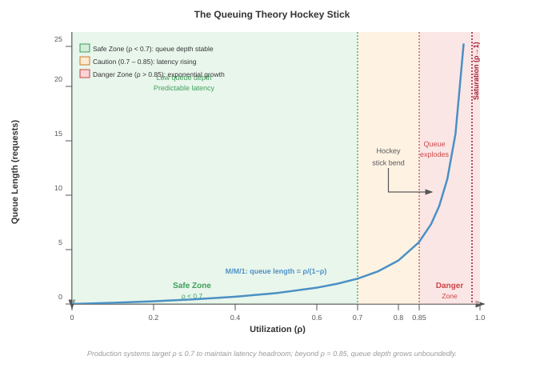
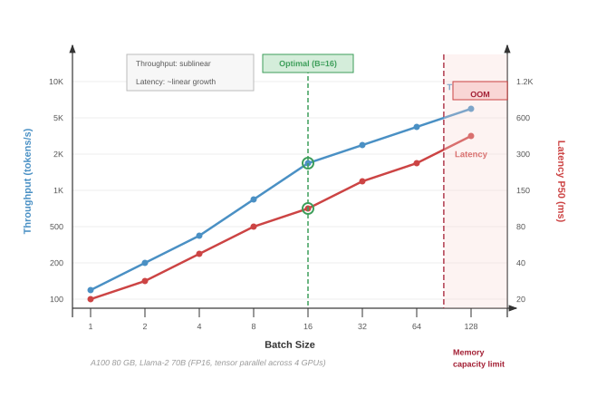

# Inference Foundations {#sec-appdx-appendix-inference}

Serving a model at scale is governed by the mathematics of waiting lines and the physics of the key-value cache. This appendix develops the analytical serving models that the book's inference and operations chapters draw on, establishing how queuing dynamics and attention-cache memory arithmetic combine into a single serving constraint under strict latency SLOs. In C³ terms, inference turns compute capacity, communication with memory and clients, and coordination across queues into one serving constraint.

## How to Use This Appendix {.unnumbered}

This appendix is a quantitative reference for serving systems. Use the queuing model to choose a batch size or predict tail latency under a given arrival rate; use the key-value cache arithmetic to size memory or determine when the cache, rather than compute, caps throughput.

Reach for it from the inference and operations chapters: when those chapters cite a serving result, the derivation lives here. Read it linearly for the full argument, or consult the worked GPT-3 example and the batch-size decision framework for templates directly applicable to production systems.

## Serving Performance Analysis {#sec-appdx-appendix-inference-serving}

Serving performance analysis has two coupled layers. The queue determines how requests wait, batch, and shed under stochastic arrivals; the key-value cache determines how much live state the accelerator can hold while meeting the latency budget. The subsections that follow derive the queueing model first, then connect that model to memory-capacity limits in the worked serving examples.

### Queuing theory for batched inference {#sec-appdx-inference-scale-queuing-theory-batched-inference-bbf0}

The batching efficiency curve provides intuition about throughput-latency trade-offs, but production systems require rigorous analysis to determine optimal batch sizes under stochastic arrival patterns. Queuing theory provides the mathematical framework to derive these optimal operating points and to understand why certain batch sizes outperform others under specific conditions.

#### The M/G/c/K queue model for GPU serving {#sec-appdx-inference-scale-mgck-queue-model-gpu-serving-c4c4}

GPU inference systems can be modeled as **M/G/c/K Queues**\index{M/G/c/K Queues}, a standard notation from queueing theory that captures the essential characteristics of production serving systems:

- **M (Markov arrivals)**: Requests arrive according to a Poisson process with rate $\lambda_{\text{arr}}$. This models the memoryless property of user requests, where arrival of one request does not predict the timing of the next.
- **G (General service distribution)**: Service times follow a general distribution, not restricted to exponential. GPU inference times depend on batch size and exhibit deterministic components (compute) mixed with stochastic variation (memory contention, kernel scheduling).
- **c (Number of servers)**: The system has $c$ parallel GPU workers, each capable of serving requests independently.
- **K (Queue capacity)**: The system maintains a finite queue of capacity $K$ requests. Requests arriving to a full queue are rejected (load shedding).

The notation comes from the same systems-performance lineage that sized telephone networks before it was applied to GPU clusters.

::: {#psp-inference-queuing-theory-performance .callout-perspective title="Queuing theory and performance"}

Queuing theory, developed by Agner Krarup Erlang in 1909 for telephone network analysis, remains foundational to systems performance engineering [@erlang1909telephone]. The same mathematical framework that sized telephone exchanges now determines GPU cluster capacity. The M/G/c/K model is standard in systems textbooks, appearing in Jain's *The Art of Computer Systems Performance Analysis* [@jain1991art] and Kleinrock's *Queueing Systems* [@kleinrock1975queueing].

:::

For a batched inference system with batch size $B$, service time becomes a function of batch size. Let $T_{\text{svc}}(B)$ denote the time to process a batch of $B$ requests. From the physics of batching (@sec-inference-scale-batching-strategies-scale-6733), @eq-service-time-batch models this as:

$$T_{\text{svc}}(B) = T_{\text{fixed}} + t_{\text{req}} \cdot B$$ {#eq-service-time-batch}

where $T_{\text{fixed}}$ represents fixed service overhead (kernel launch, weight loading from HBM) and $t_{\text{req}}$ represents marginal per-request computation time. This linear model captures the first-order behavior observed in production systems, though actual service times may exhibit slight sublinearity due to memory bandwidth saturation at large batch sizes.

The **Effective Service Rate**\index{Effective Service Rate} for batched processing is:

$$\mu_{\text{eff}}(B) = \frac{B}{T_{\text{svc}}(B)} = \frac{B}{T_{\text{fixed}} + t_{\text{req}} \cdot B}$$

The effective rate increases with batch size, approaching the asymptotic limit $1/t_{\text{req}}$ as $B \to \infty$.

#### Response time analysis {#sec-appdx-inference-scale-response-time-analysis-ffc3}

The total response time $T$ for a request consists of three components:

$$E[T] = E[W] + E[T_{\text{batch}}] + E[T_{\text{svc}}]$$

where:

- $E[W]$ is the expected waiting time in queue before joining a batch
- $E[T_{\text{batch}}]$ is the expected per-request batch-accumulation delay before dispatch
- $E[T_{\text{svc}}]$ is the expected inference time once the batch executes

For dynamic batching with maximum wait time $T_{\text{max}}$ and maximum batch size $B_{\text{max}}$, the first request triggers the batching window. Let $N \sim \operatorname{Poisson}(\lambda_{\text{arr}}T_{\text{max}})$ count subsequent arrivals during that window and let $k=B_{\text{max}}-1$. For $B_{\text{max}}>1$, the realized batch size is $B=\min(B_{\text{max}},1+N)$, including the trigger request, so:

$$E[B] = \sum_{n=0}^{k-1}(n+1)\Pr(N=n) + B_{\text{max}}\Pr(N\geq k)$$

Let $\tau_k$ be the Erlang-distributed time of the $k$th subsequent arrival. A full batch closes when $\tau_k \leq T_{\text{max}}$, while a timeout batch closes at $T_{\text{max}}$ with $N=n<k$. The mean per-request accumulation delay within each realized batch is:

$$E[T_{\text{batch}} \mid \text{full}] = \frac{1}{2}E[\tau_k \mid \tau_k \leq T_{\text{max}}]$$

$$E[T_{\text{batch}} \mid N=n,\ \text{timeout}] = \frac{T_{\text{max}}}{2}\left(1+\frac{1}{n+1}\right), \qquad 0 \leq n < k$$

Weighting each batch outcome by its realized request count gives the mean delay of a randomly selected request:

$$E[T_{\text{batch}}] = \frac{B_{\text{max}}\Pr(N\geq k)E[\tau_k/2 \mid \tau_k\leq T_{\text{max}}] + \sum_{n=0}^{k-1}(n+1)\Pr(N=n)E[T_{\text{batch}} \mid N=n,\ \text{timeout}]}{E[B]}$$

When batches reliably fill before timeout, this expression approaches $E[\tau_k]/2=(B_{\text{max}}-1)/(2\lambda_{\text{arr}})$. For $B_{\text{max}}=1$, the batch contains only its trigger request and accumulation delay is zero.

#### Optimal batch size derivation {#sec-appdx-inference-scale-optimal-batch-size-derivation-3a3c}

The optimal batch size $B$ minimizes expected response time subject to throughput requirements:

$$B = \operatorname{arg\,min}_{B} E[T(B)] \quad \text{subject to} \quad \mu_{\text{eff}}(B) \geq \lambda_{\text{arr}}$$

The constraint ensures system stability (service rate exceeds arrival rate).

For a high-traffic regime in which batches of size $B$ reliably fill before timeout, substituting the response time components gives:

$$E[T(B)] = E[W(B)] + \frac{B-1}{2\lambda_{\text{arr}}} + T_{\text{svc}}(B)$$

For a tractable waiting-time estimate, use an M/G/1 surrogate that treats batches as Poisson "super-requests." If the request arrival rate is $\lambda_{\text{arr}}$ and the average batch size is $B$, this surrogate uses batch arrival rate $\lambda_{\text{batch}}=\lambda_{\text{arr}}/B$. This is not the exact process produced by grouping Poisson request arrivals, because fixed-size grouping yields Erlang inter-batch times; finite $K$ or $c>1$ requires a bulk-service model or simulation. Within the explicit surrogate, the Pollaczek-Khinchine formula gives:

$$E[W] = \frac{\lambda_{\text{batch}} \cdot E[T_{\text{svc}}^2]}{2(1 - \rho_{\text{serv}})}$$

where $\rho_{\text{serv}} = \lambda_{\text{batch}} \cdot E[T_{\text{svc}}] = \lambda_{\text{arr}} \cdot E[T_{\text{svc}}] / B$ is the server utilization. The second moment $E[T_{\text{svc}}^2]$ captures service time variability.

For the linear service time model with deterministic service in this surrogate:

$$E[W(B)] = \frac{\lambda_{\text{arr}} \cdot T_{\text{svc}}(B)^2}{2B(1 - \lambda_{\text{arr}} \cdot T_{\text{svc}}(B)/B)}$$

For production sizing, teams often first enforce a utilization headroom target rather than solving the full latency minimization problem. With $T_{\text{svc}}(B)=T_{\text{fixed}}+t_{\text{req}} B$, the constraint $\rho_{\text{serv}}=\lambda_{\text{arr}} T_{\text{svc}}(B)/B \leq \rho_{\text{target}}$ yields the target-utilization batch bound (@eq-optimal-batch-approx):

$$B_{\min}(\rho_{\text{target}}) = \frac{\lambda_{\text{arr}} T_{\text{fixed}}}{\rho_{\text{target}} - \lambda_{\text{arr}} t_{\text{req}}}$$ {#eq-optimal-batch-approx}

where $\rho_{\text{target}}$ is the target utilization (typically 0.7--0.8 for production systems to maintain latency headroom) and $\rho_{\text{target}} > \lambda_{\text{arr}} t_{\text{req}}$.

::: {#psp-appendix-inference-target-utilization-batch-sizing .callout-perspective title="Target-utilization batch sizing"}

The target-utilization batch bound (@eq-optimal-batch-approx) reveals a fundamental insight: *minimum stable batch size grows with fixed overhead and arrival rate*. This means:

1. **Higher traffic** $(\lambda_{\text{arr}})$: Required batch size increases.
2. **Higher fixed overhead** $(T_{\text{fixed}})$: Required batch size increases to amortize overhead.
3. **Higher target utilization** $(\rho_{\text{target}})$: Required batch size decreases, but with less latency headroom.

This utilization-constrained sizing explains why LLMs (high $T_{\text{fixed}}$ from weight loading) benefit from larger batches than vision models (low $T_{\text{fixed}}$), even at the same arrival rate.

:::

#### Worked example: GPT-3 serving at 100 QPS {#sec-appdx-inference-scale-worked-example-gpt3-serving-100-qps-edcf}

```{python}
#| echo: false
#| label: gpt3-scenario
# ┌─────────────────────────────────────────────────────────────────────────────
# │ GPT-3 PARAMETERS (LEGO)
# ├─────────────────────────────────────────────────────────────────────────────
# │ Context: @sec-appdx-inference-scale-worked-example-gpt3-serving-100-qps-edcf
# │
# │ Goal: Provide GPT-3 parameter count for the worked example.
# │ Show: "175"B parameters.
# │ How: pulling Models.Language.GPT3.parameters from mlsysim.core.units.
# │
# └─────────────────────────────────────────────────────────────────────────────
from mlsysim import Models
from mlsysim.core.units import param, BILLION
from mlsysim.fmt import fmt_int, fmt, fmt_params

class Gpt3Scenario:
    """GPT-3 parameter reference."""

    # ┌── 1. LOAD (Constants) ──────────────────────────────────────────────
    params = Models.Language.GPT3.parameters

    # ┌── 2. EXECUTE (The Compute) ────────────────────────────────────────
    params_b = params.to(param).magnitude / BILLION

    # ┌── 3. GUARD (Invariants) ──────────────────────────────────────────
    from mlsysim.fmt import fmt_int, check

    check(params_b == 175, "GPT-3 should have 175B parameters")

    # ┌── 4. OUTPUT (Formatting) ──────────────────────────────────────────────
    gpt3_params_b_str = fmt_params(params, scale="B", precision=0, commas=False)
```

Consider serving a GPT-3 class model (`{python} Gpt3Scenario.gpt3_params_b_str` parameters) under the following system parameters:

- Arrival rate: $\lambda_{\text{arr}} = 100$ requests/second
- Hardware: 8$\times$ A100 GPUs with tensor parallelism
- Weight loading overhead: $T_{\text{fixed}} = 50$ ms (time to load attention matrices per forward pass)
- Per-token compute: $t_{\text{req}} = 0.5$ ms per request (amortized across batch)
- Average output length: 100 tokens per request
- Target utilization: $\rho_{\text{target}} = 0.75$

For the prefill phase (processing input prompt), service time follows @eq-service-time-batch:

$$T_{\text{svc}}(B) = 50 + 0.5 \cdot B \text{ ms}$$

Applying @eq-optimal-batch-approx to compute the minimum batch size that meets the 75 percent target utilization (leaving 25 percent headroom):

$$B_{\min} \approx \frac{100 \times 0.05}{0.75 - 100 \times 0.0005} = \frac{5}{0.70} \approx 7.14$$

Rounding up gives $B=8$ as the smallest batch size that meets the target utilization headroom. Evaluating the surrogate response-time expression under the full-batch assumption then shows how larger batches reduce utilization but add batch-accumulation delay:

Evaluating GPT-3 serving performance across batch sizes (@tbl-batch-size-comparison) exposes the trade-off between queuing delay and server utilization:

| **Size $B$** | **$T_{\text{svc}}(B)$ (ms)** | **req/s** | **$\rho_{\text{serv}}$** | **E[W] (ms)** | **$(B-1)/(2\lambda_{\text{arr}})$ (ms)** | **E[T] (ms)** |
|:-------------|:----------------------------:|:---------:|:------------------------:|:-------------:|:----------------------------------------:|:-------------:|
| **1**        |             50.5             |    19.8   |     505% (unstable)      |    $\infty$   |                   0.0                    |    $\infty$   |
| **4**        |             52.0             |    76.9   |     130% (unstable)      |    $\infty$   |                   15.0                   |    $\infty$   |
| **8**        |             54.0             |   148.1   |          67.5%           |      56.1     |                   35.0                   |     145.1     |
| **16**       |             58.0             |   275.9   |          36.3%           |      16.5     |                   75.0                   |     149.5     |
| **32**       |             66.0             |   484.8   |          20.6%           |      8.6      |                  155.0                   |     229.6     |

: **Batch Size Impact on GPT-3 Serving Performance**: Batch sizes below 8 cannot sustain 100 QPS (utilization exceeds 100 percent). After including batch-accumulation delay, the latency minimum in this simple model occurs near $B=8$; $B=16$ has nearly the same mean latency with lower utilization, while $B=32$ leaves more headroom but pays a large accumulation-delay penalty. {#tbl-batch-size-comparison}

```{python}
#| echo: false
#| label: littles-law-verify
# ┌─────────────────────────────────────────────────────────────────────────────
# │ GPT-3 SERVING RESULTS AND LITTLE'S LAW VERIFICATION
# ├─────────────────────────────────────────────────────────────────────────────
# │ Context: §GPT-3 Serving at 100 QPS Analysis and Little's Law verification
# │
# │ Goal: Summarize serving performance and verify consistency via Little's Law.
# │ Show: Throughput, utilization, and queue lengths for various batch sizes.
# │ How: Load precomputed results into GPT3ServingResults class;
# │      apply Little's Law to verify requests in system.
# │
# └─────────────────────────────────────────────────────────────────────────────
from mlsysim.fmt import fmt_int, check, fmt, fmt_percent, fmt_time

class GPT3ServingResults:
    # Batch 8 results
    b8_service_ms = 54.0
    b8_util_pct = 67.5
    b8_wait_ms = 56.1
    b8_accum_ms = 35.0
    b8_total_ms = 145.1

    # Batch 16 results
    b16_service_ms = 58.0
    b16_util_pct = 36.3
    b16_wait_ms = 16.5
    b16_accum_ms = 75.0
    b16_total_ms = 149.5

    # Batch 32 results
    b32_service_ms = 66.0
    b32_util_pct = 20.6
    b32_wait_ms = 8.6
    b32_accum_ms = 155.0
    b32_total_ms = 229.6

    # Prose-facing canonical strings (preserve raw floats for arithmetic above)
    b8_service_ms_str = fmt_time(b8_service_ms, 'millisecond', precision=0, commas=False)
    b8_util_pct_str = fmt_percent(b8_util_pct / 100, precision=1, commas=False, style='prose')
    b8_wait_ms_str = fmt_time(b8_wait_ms, 'millisecond', precision=1, commas=False)
    b16_service_ms_str = fmt_time(b16_service_ms, 'millisecond', precision=0, commas=False)
    b16_util_pct_str = fmt_percent(b16_util_pct / 100, precision=1, commas=False, style='prose')
    b16_wait_ms_str = fmt_time(b16_wait_ms, 'millisecond', precision=1, commas=False)
```

Four operational regimes emerge across these batch sizes:

1. **Unstable regime (batch sizes 1--4)**\index{Batching!stability threshold}: Utilization exceeds 100 percent, meaning the system cannot keep up with arrivals. Queues grow unboundedly.
2. **Stability threshold (batch size 8)**\index{Batching!utilization headroom}: At `{python} GPT3ServingResults.b8_util_pct_str` utilization, the system is stable but queuing delays contribute significantly to latency (`{python} GPT3ServingResults.b8_wait_ms_str`), causing queuing latency to explode near saturation (@fig-queuing-hockey-stick).

::: {#fig-queuing-hockey-stick fig-env="figure" fig-pos="htb" fig-cap="**The Queuing Hockey Stick**: Relationship between system utilization $\rho_{\text{serv}}$ and queue length (M/M/1 queue length $\rho_{\text{serv}}/(1-\rho_{\text{serv}})$). Three zones are shaded: a Safe Zone ($\rho_{\text{serv}} < 0.7$), a Caution band (0.7--0.85), and a Danger Zone ($\rho_{\text{serv}} > 0.85$) where queue depth grows unboundedly. Production systems typically target $\rho_{\text{serv}} \leq 0.7$ to maintain latency headroom." fig-alt="Plot of queue length in requests versus serving utilization rho_serv from 0 to 1. The curve is flat until rho_serv around 0.7, bends upward through a caution band from 0.7 to 0.85, then rises sharply in a danger zone toward saturation at rho_serv equals 1."}

:::

3. **Latency knee (batch sizes 8--16)**\index{Batching!latency knee}: Batch size 8 gives the lowest mean latency in this model. Batch size 16 trades a few milliseconds of additional total latency for lower utilization and queue wait time (`{python} GPT3ServingResults.b16_wait_ms_str` vs. `{python} GPT3ServingResults.b8_wait_ms_str`), while $B=32$ leaves still more utilization headroom but pays too much batch-accumulation delay.
4. **Diminishing returns (batch sizes beyond 32)**\index{Batching!diminishing returns}: Further batch size increases would reduce utilization, but memory constraints prevent exploration.

Applying Little's Law provides an internal consistency check for these results.

```{python}
#| echo: false
#| label: littles-law-verify-2
# ┌─────────────────────────────────────────────────────────────────────────────
# │ LITTLE'S LAW VERIFICATION (B=16)
# ├─────────────────────────────────────────────────────────────────────────────
# │ Context: "Applying Little's Law to verify" callout notebook.
# │
# │ Goal: Verify GPT-3 serving queue math via Little's Law at batch size 16.
# └─────────────────────────────────────────────────────────────────────────────
from mlsysim.core.units import ms, second
from mlsysim.fmt import fmt_int, check, fmt, fmt_ratio, fmt_time

class LittlesLawVerify:
    # ┌── 1. LOAD ──────────────────────────────────────────
    arrival_rate = 100 / second  # scenario assumption: request arrival rate
    batch_size = 16
    batch16_total_ms = 149.5  # scenario result from the batch-size table above
    expected_total_latency = batch16_total_ms * ms
    utilization = 36.3 / 100
    # ┌── 2. EXECUTE ───────────────────────────────────────
    n_req = (arrival_rate * expected_total_latency).to("").magnitude
    in_service = batch_size * utilization
    in_queue = n_req - in_service
    # ┌── 3. GUARD ─────────────────────────────────────────
    check(14 < n_req < 15, f"Q_req should be ~15.0, got {n_req:.2f}")
    # ┌── 4. OUTPUT ────────────────────────────────────────
    batch_size_str = fmt_int(batch_size, commas=False)
    expected_total_ms_str = fmt_time(expected_total_latency, 'millisecond', precision=1, commas=False)
    expected_total_s_str = fmt_time(expected_total_latency, unit=second, precision=4, commas=False)
    utilization_str = fmt_ratio(utilization, precision=3, commas=False)
    n_req_str = fmt(n_req, precision=2, commas=False)
    in_service_str = fmt(in_service, precision=1, commas=False)
    in_queue_str = fmt(in_queue, precision=2, commas=False)
```

::: {#nbk-inference-applying-littles-law-verify .callout-notebook title="Applying Little's Law to verify"}

**Verification**: By Little's Law\index{Little's Law} [@little1961], $Q_{\text{req}} = \lambda_{\text{arr}} \cdot T_{\text{lat}}$:

At $B=16$ with $\lambda_{\text{arr}} = 100$ req/s and $E[T] =$ `{python} LittlesLawVerify.expected_total_ms_str`:

$Q_{\text{req}} = 100 \times$ `{python} LittlesLawVerify.expected_total_s_str` = `{python} LittlesLawVerify.n_req_str` requests in system

With batch size `{python} LittlesLawVerify.batch_size_str` and utilization `{python} GPT3ServingResults.b16_util_pct_str`:

- Expected requests in service: `{python} LittlesLawVerify.batch_size_str` $\times$ `{python} LittlesLawVerify.utilization_str` = `{python} LittlesLawVerify.in_service_str`
- Expected requests in queue: `{python} LittlesLawVerify.n_req_str` - `{python} LittlesLawVerify.in_service_str` = `{python} LittlesLawVerify.in_queue_str`

This matches the response-time decomposition: roughly 6 requests are in service and roughly 9 are waiting or accumulating into batches on average.

:::

#### Decision framework: Batch size selection given SLA {#sec-appdx-inference-scale-decision-framework-batch-size-selection-given-sla-8e4e}

Production systems must select batch size to meet Service Level Objectives (SLOs), typically specified as latency percentiles (for example, P99 latency < 200 ms). The following framework systematizes this decision:

##### Step 1: Characterize service time {.unnumbered}

Measure $T_{\text{fixed}}$ and $t_{\text{req}}$ empirically by profiling inference at batch sizes 1, 8, and 32. Fit the linear model $T_{\text{svc}}(B) = T_{\text{fixed}} + t_{\text{req}} B$.

##### Step 2: Compute stability threshold {.unnumbered}

Find minimum batch size $B_{\text{min}}$ such that $\mu_{\text{eff}}(B_{\text{min}}) > \lambda_{\text{arr}}$:

$$B_{\text{min}} = \frac{T_{\text{fixed}} \lambda_{\text{arr}}}{1 - t_{\text{req}} \lambda_{\text{arr}}}$$

Any batch size below $B_{\text{min}}$ results in an unstable system.

##### Step 3: Compute latency at candidate batch sizes {.unnumbered}

Under the same Poisson-super-request surrogate and full-batch assumption, for each candidate $B \in \{B_{\text{min}}, 2B_{\text{min}}, ..., B_{\text{max}}\}$, compute:

$$E[T(B)] = \frac{\lambda_{\text{arr}} \cdot T_{\text{svc}}(B)^2}{2B(1 - \lambda_{\text{arr}} T_{\text{svc}}(B)/B)} + \frac{B-1}{2\lambda_{\text{arr}}} + T_{\text{svc}}(B)$$

##### Step 4: Account for tail latency {.unnumbered}

If measured response times are approximately Gaussian, their P99 can be estimated as:

$$T_{\text{P99}} \approx E[T] + 2.33 \cdot \sigma_T$$

where $\sigma_T$ is the standard deviation of response time. This Gaussian rule is not a general heavy-traffic approximation because queueing response times are commonly skewed. For exponential response times, P99 is $-\ln(0.01)E[T] \approx 4.6 \cdot E[T]$; use measured percentiles for production sizing.

##### Step 5: Select optimal batch size {.unnumbered}

Choose the largest $B$ such that $T_{\text{P99}}(B) \leq \text{SLO}$:

$$B = \max\{B : T_{\text{P99}}(B) \leq \text{SLO}\}$$

Operating rules for batch size selection (@tbl-batch-decision-framework) balance stability, latency SLOs, and cost efficiency:

| **Condition**                 | **Recommended Action**                  |       **Rationale**       |
|:------------------------------|:----------------------------------------|:-------------------------:|
| $B < B_{\min}$                | Increase batch size or add replicas     |     System is unstable    |
| $T_{\text{P99}} > \text{SLO}$ | Reduce batch size or add replicas       |   Latency exceeds target  |
| $\rho_{\text{serv}} < 0.5$    | Consider reducing replicas to save cost | System is overprovisioned |
| $\rho_{\text{serv}} > 0.85$   | Add replicas for headroom               |  Approaching instability  |

: **Batch Size Decision Framework**: Systematic approach to selecting batch size based on stability, latency SLO, and utilization targets. {#tbl-batch-decision-framework}

Applying these operating rules ensures that the serving deployment remains responsive under load while maintaining cost efficiency during low-traffic windows.

#### Trade-off curves: Visualizing the operating region {#sec-appdx-inference-scale-tradeoff-curves-visualizing-operating-region-9f95}

Throughput and latency trade-off curves (@fig-batch-tradeoff-curves) define the viable operating envelope:

::: {#fig-batch-tradeoff-curves fig-env="figure" fig-pos="htb" fig-cap="**Batch Size Trade-Off Curves**: As batch size grows on the x-axis, throughput (left y-axis, blue) grows sublinearly while latency P50 (right y-axis, red) grows near-linearly. An optimal point is marked at B=16; a shaded OOM/memory-capacity region flags batch sizes that exceed device memory. Benchmark: Llama-2 70B in FP16 tensor-parallel across four A100 80 GB GPUs." fig-alt="Chart with Batch Size on the x-axis (1 to 128). Left y-axis Throughput in tokens/s (blue, sublinear); right y-axis Latency P50 in ms (red, near-linear). Green dashed Optimal B=16 marker; shaded OOM region on the right."}



:::

The trade-off curve demonstrates several key insights:

1. **Pareto Frontier**\index{Pareto Frontier}: An operating point is Pareto efficient when no other candidate provides at least as much throughput and no more latency, with a strict improvement in at least one objective. The frontier is the set of these nondominated points.
2. **Knee of the Curve**\index{Knee of the Curve}: The optimal batch size often lies at the "knee" where throughput gains diminish while latency continues to increase linearly.
3. **SLO-Constrained Optimum**\index{SLO!constrained optimum}: When an SLO bounds maximum latency, the optimal point is where the curve intersects the SLO boundary.
4. **Diminishing Returns**\index{Diminishing Returns}: Beyond the knee, doubling batch size may increase throughput by only 10--20 percent while doubling latency.

The queuing-theoretic framework provides the mathematical foundation for the batching strategies introduced in @sec-inference-scale-batching-strategies-scale-6733. Where intuition might suggest "larger batches are better for throughput," stability constraints, latency targets, and diminishing returns create a well-defined optimal operating region that varies by model type and deployment requirements.

### KV cache fundamentals {#sec-appdx-inference-scale-kv-cache-fundamentals-2ccd}

The formal definition of the KV cache appears in the main inference memory-management section (as introduced in @sec-inference-scale-framework-selection-criteria-6c20). This appendix expands the sizing math behind that definition: why the cache reduces per-token compute, why its memory grows with sequence length and batch size, and why unmanaged allocation can fragment HBM [@kwon2023].

Autoregressive generation without caching requires $\mathcal{O}(t^2)$ computation per token because each transformer layer must recompute attention keys and values for all previous tokens. The KV cache stores these computed key and value vectors, reducing generation to $\mathcal{O}(t)$ per token. For serving at scale, this compute saving creates a critical memory-management challenge since KV cache memory can exceed model weights for long contexts.

The cache size grows with context as calculated by @eq-kv-cache-size:

$$M_{\text{KV}} = 2 \times N_L \times d \times S \times B \times s_{\text{elem}}$$ {#eq-kv-cache-size}

where $N_L$ is the number of layers, $d$ is the hidden dimension, $S$ is sequence length, $B$ is batch size, $s_{\text{elem}}$ is storage size per element in bytes, and the factor of 2 accounts for both keys and values.

```{python}
#| echo: false
#| label: appdx-kv-cache-sizing
# ┌─────────────────────────────────────────────────────────────────────────────
# │ KV CACHE SIZING (LEGO)
# ├─────────────────────────────────────────────────────────────────────────────
# │ Context: @sec-appdx-inference-scale-kv-cache-fundamentals-2ccd
# │
# │ Goal: Compute per-request KV cache memory footprint and maximum batch size.
# │ Show: ~9.66 GB/request and max batch size of 30 requests.
# │ How: 2 * N_L * d * S * s_elem for GPT-3 (96 layers, 12288 dim) on 8x A100 GPUs.
# │
# └─────────────────────────────────────────────────────────────────────────────
from mlsysim import GB, Models, byte
from mlsysim.fmt import check

class AppdxKVCacheSizing:
    # ┌── 1. LOAD (Constants) ──────────────────────────────────────────────
    n_layers = Models.Language.GPT3.layers  # 96
    hidden_dim = Models.Language.GPT3.hidden_dim  # 12288
    seq_len = 2048
    s_elem = 2  # FP16 (2 bytes)

    # ┌── 2. EXECUTE (The Compute) ────────────────────────────────────────
    kv_bytes_per_req = 2 * n_layers * hidden_dim * seq_len * s_elem
    kv_gb_per_req = (kv_bytes_per_req * byte).to(GB).magnitude

    num_gpus = 8
    gpu_mem = 80  # GB
    total_hbm = num_gpus * gpu_mem  # 640 GB
    weights_mem = 350  # GB for FP16 175B
    remaining_mem = total_hbm - weights_mem  # 290 GB
    max_batch_size = int(remaining_mem / kv_gb_per_req)  # 30

    # ┌── 3. GUARD (Invariants) ──────────────────────────────────────────
    check(abs(kv_gb_per_req - 9.66) < 0.05, f"KV cache per req should be ~9.66 GB, got {kv_gb_per_req:.2f}")
    check(max_batch_size == 30, f"Max batch size should be 30, got {max_batch_size}")

    # ┌── 4. OUTPUT (Formatting) ──────────────────────────────────────────────
    from mlsysim.fmt import fmt, fmt_display_math, fmt_int

    kv_gb_per_req_str = fmt(kv_gb_per_req, precision=2)
    kv_per_req_display_math = fmt_display_math(
        f" M_{{\\text{{KV/req}}}} = 2 \\times 96 \\times 12288 \\times 2048 \\times 2 \\text{{ B}}"
        f" \\approx {kv_gb_per_req_str} \\text{{ GB/request}} "
    )
    max_batch_size_str = fmt_int(max_batch_size)
    remaining_mem_str = fmt_int(remaining_mem)
    total_hbm_str = fmt_int(total_hbm)
    weights_mem_str = fmt_int(weights_mem)
    num_gpus_str = fmt_int(num_gpus)
```

For the 175B GPT-3 model ($N_L=96$, $d=12288$, FP16 $s_{\text{elem}}=2$ bytes) at sequence length $S=2048$, each request requires:

`{python} AppdxKVCacheSizing.kv_per_req_display_math`

Across `{python} AppdxKVCacheSizing.num_gpus_str`$\times$ A100 80-GB GPUs (`{python} AppdxKVCacheSizing.total_hbm_str` GB total HBM), storing model weights in FP16 consumes `{python} AppdxKVCacheSizing.weights_mem_str` GB, leaving `{python} AppdxKVCacheSizing.remaining_mem_str` GB for activation and KV cache memory. Unmanaged contiguous allocation limits the maximum concurrent batch size to $B_{\text{max}} \le 290/9.66 \approx$ `{python} AppdxKVCacheSizing.max_batch_size_str` requests before running out of memory (OOM), demonstrating how KV cache capacity bounds serving throughput.

## Summary {.unnumbered}

Serving production inference requires balancing queueing dynamics against hardware memory capacity. The quantitative relationships derived in this appendix govern batch size selection, latency budgets, and accelerator memory bounds across serving deployments:

::: {.callout-takeaways title="Serving performance is bounded by queues and memory"}

* **Utilization has a hard ceiling**: As utilization $\rho_{\text{serv}}$ approaches 1, queue depth and latency grow without bound. Production serving targets $\rho_{\text{serv}} \leq 0.7$ to preserve latency headroom; the remaining 30 percent is not waste but the buffer that keeps tail latency finite.
* **Batch size has an optimum, not a maximum**: Larger batches raise throughput but add batch-accumulation delay, producing a latency knee rather than monotonic improvement. Beyond the knee, doubling the batch can buy only 10--20 percent more throughput at the cost of doubled latency.
* **Little's Law ties the system together**: $Q_{\text{req}} = \lambda_{\text{arr}} T_{\text{lat}}$ relates the number of in-flight requests to the arrival rate and time-in-system, giving a one-line consistency check on any serving measurement.
* **The KV cache is the binding constraint**: Cache memory scales linearly with sequence length and batch size and routinely exceeds the model weights, capping concurrent capacity (the autoregressive bottleneck, principle \ref{pri-autoregressive-bottleneck}). Naive allocation wastes 60--80 percent to fragmentation, which is why production systems manage it with a virtual-memory scheme.

:::
