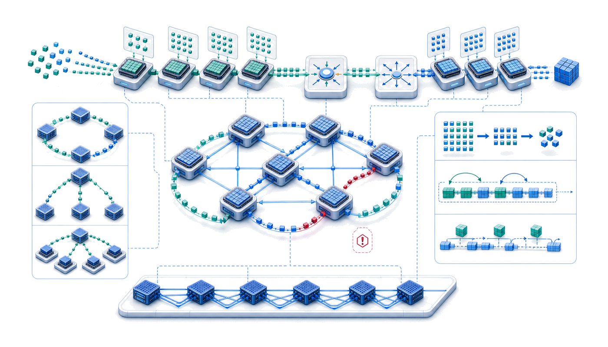
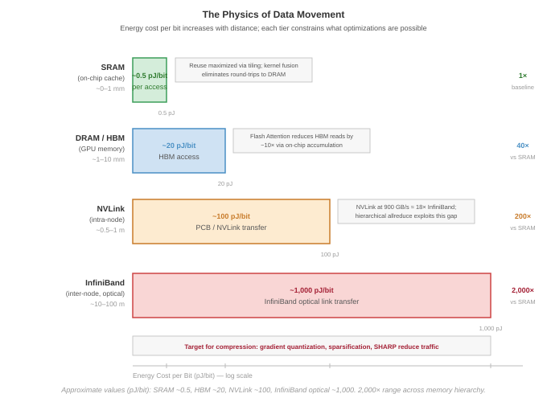
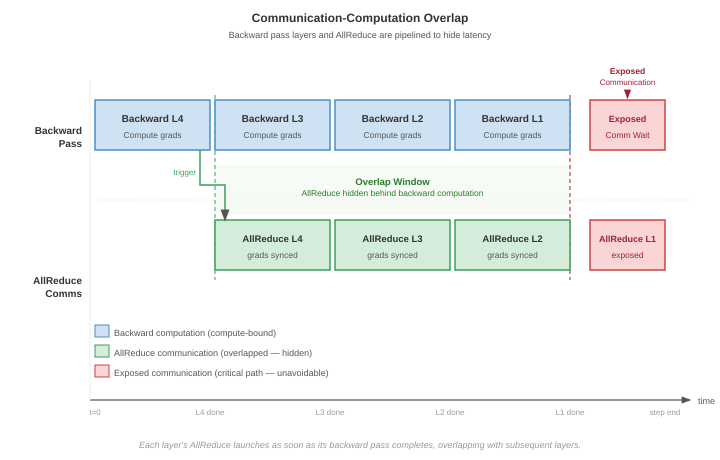
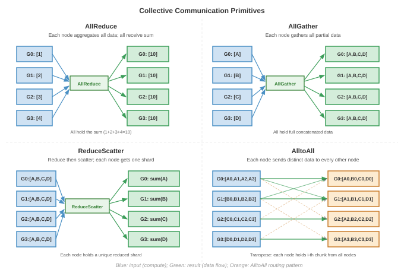
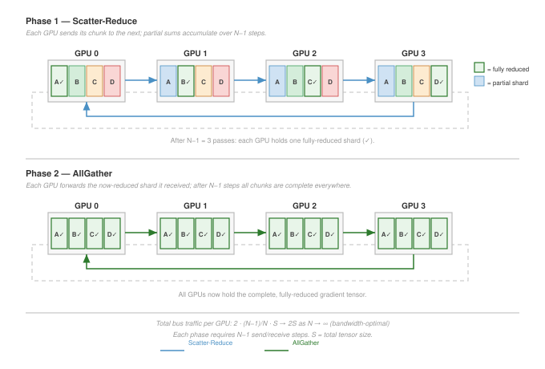
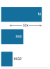
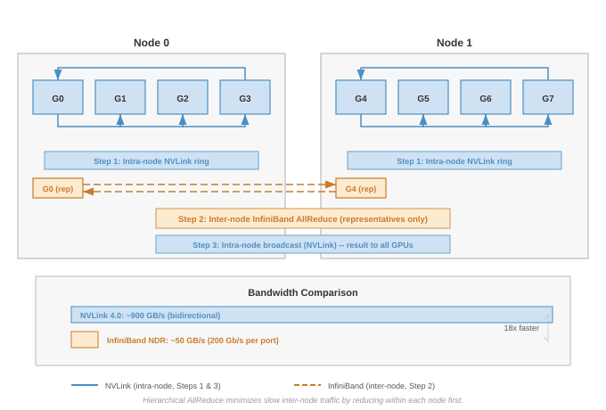
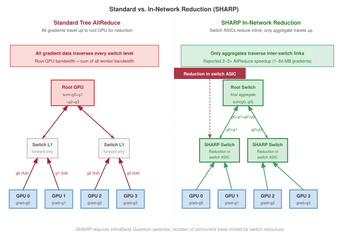
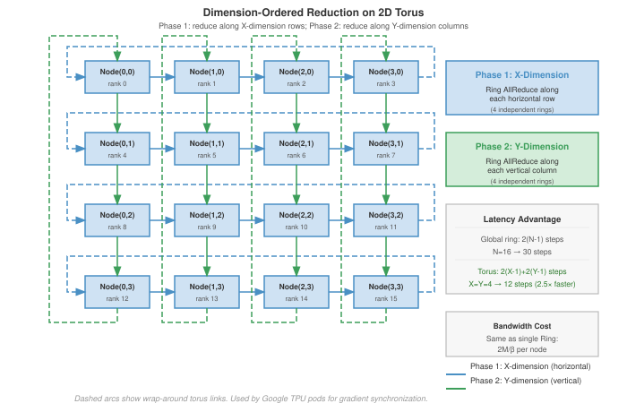
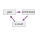

# Collective Communication {#sec-collective-communication}

::: {layout-narrow}
::: {.column-margin}

\chapterminitoc

:::

\noindent
{fig-alt="Collective communication topology map where gradient fragments circulate through ring and tree reduction paths before broadcasting synchronized state."}

:::

## Purpose {.unnumbered .unlisted}

\begin{marginfigure}
\mlfleetstack{20}{55}{100}{30}{10}{0}{0}{0}
\end{marginfigure}

_Why does communication between machines become the fundamental constraint that governs large-scale machine learning systems?_

Computation scales by adding processors; communication scales by moving data between them. These scale differently: adding a processor increases aggregate compute linearly, but coordinating that processor with all others moves more total data and, for the most general synchronization patterns, multiplies the logical connections among workers quadratically. At sufficient scale, the time spent exchanging gradients, activations, and parameters exceeds the time spent computing them. This crossover point is not a bug to be fixed but a fundamental property of distributed systems that determines which parallelization strategies work, which model sizes are trainable, and which organizations can operate at the largest scales. The physics of light-speed delays, bandwidth limits, and energy costs of data movement constrains communication as firmly as transistor physics constrains computation, yet communication is far less intuitive to reason about, making it the hidden bottleneck that undermines systems designed by those who understand only the compute side. In C³ terms, collective communication forms the instruction set of the fleet: the physical operations that govern how compute is penalized by communication.

::: {.content-visible when-format="pdf"}

\newpage

:::

::: {.callout-learning-objectives}

- Apply communication cost models to bound collective latency, bandwidth, and message-size crossover points
- Match collective communication primitives to parallelism strategies and model archetypes
- Compare ring, tree, butterfly, double-tree, and hierarchical reduction algorithms using scale-dependent cost models
- Analyze communication-library reality gaps by comparing theoretical costs with measured latency, bandwidth, and topology mapping
- Design topology-aware collective schedules for NVLink, InfiniBand, rail-optimized, torus, and in-network reduction fabrics
- Evaluate compression, sparsification, and error feedback by balancing communication savings against convergence risk
- Implement overlap strategies with bucket fusion, asynchronous operations, and layer-by-layer gradient scheduling

:::

## From Parallelism to Communication Patterns {#sec-communication-collective-operations-collective-operations-communication-fundamentals-44eb}

When 10,000 GPUs need to apply one weight update, the splits created by data, tensor, pipeline, and expert parallelism have to be made consistent again. The workers are not sending arbitrary messages; they are executing choreographed collective operations. In the fleet stack shown in @fig-fleet-stack, those operations sit in the Distribution Layer, where logical parallelism becomes physical traffic.

The 3D Parallelism Cube assumes that replicas, shards, stages, and experts can exchange gradients, activations, parameters, and tokens quickly enough for the optimizer to see one coherent training run. That assumption is the handoff from parallelism to communication: every way of splitting the model relocates work onto the network.

The gap between that assumption and the wire reveals a fundamental asymmetry in *how* computation and communication scale. Computation is local: each GPU works on its own data, so aggregate compute grows with the number of GPUs. Communication is global: keeping the fleet synchronized requires information to cross physical links with finite latency, bandwidth, topology, and energy. The central case is gradient synchronization; from there the mechanics become concrete through alpha-beta cost models, collective primitives, AllReduce schedules, topology-aware routing, compression, and overlap.

```{python}
#| echo: false
#| label: gradient-sync-significance-calc
# ┌─────────────────────────────────────────────────────────────────────────────
# │ GRADIENT-SYNC SIGNIFICANCE—70B BF16 RING ALLREDUCE NAPKIN MATH
# ├─────────────────────────────────────────────────────────────────────────────
# │ Context: @dfn-collective-communication-gradient-synchronization Significance
# │          bullet, plus the "140 GB of gradients" body sentence below it.
# │
# │ Goal: Pin the 70B BF16 gradient size (140 GB), the per-link bandwidth
# │       (50 GB/s = registry NDR), and the bandwidth-only ring AllReduce time
# │       (2M/beta ~ 5.6 s) so the definition's headline numbers trace to the
# │       registry instead of being hand-typed.
# │ Show: 140 GB; 50 GB/s; ~5.6 s; the "2 x 140 / 50" operand span.
# │ How: gradient = P x 2 bytes/param; ring bandwidth term = 2M/beta.
# │
# └─────────────────────────────────────────────────────────────────────────────
from mlsysim import Models, Systems
from mlsysim.core.units import GB, byte, param, second
from mlsysim.fmt import check, fmt_count, fmt_math, fmt_qty, fmt_time

class GradSyncSignificance:
    # ┌── 1. LOAD ──────────────────────────────────────────
    m = Models.Language.Llama2_70B
    beta = Systems.Fabrics.InfiniBand_NDR.bandwidth  # 50 GB/s per link (registry NDR)
    # Illustrative cluster size (scenario assumption; the bandwidth-only estimate
    # is per-worker and independent of this count, which only frames the example).
    cluster_size = 1000

    # ┌── 2. EXECUTE ───────────────────────────────────────
    gradient = (m.parameters * (2 * byte / param)).to(GB)
    # Bandwidth-only ring AllReduce estimate: T ~ 2M / beta.
    ring_time = (2 * gradient / beta).to(second)

    # ┌── 3. GUARD ─────────────────────────────────────────
    check(abs(gradient.to(GB).magnitude - 140) < 1, "70B BF16 gradient should be ~140 GB")
    check(abs(ring_time.to(second).magnitude - 5.6) < 0.1, "Ring AllReduce time should be ~5.6 s")

    # ┌── 4. OUTPUT ────────────────────────────────────────
    gradient_gb_str = fmt_qty(gradient, GB, precision=0, commas=False)
    beta_gb_per_s_str = fmt_qty(beta, GB / second, precision=0, commas=False)
    ring_time_s_str = fmt_time(ring_time, second, precision=1, commas=False)
    n_gpus_str = fmt_count(cluster_size, commas=True, label="GPU")
    # "2 x 140 / 50" operand span for the bandwidth-only ring estimate.
    _grad_gb = int(gradient.to(GB).magnitude)
    _beta_gbs = int(beta.to(GB / second).magnitude)
    ring_operands_math = fmt_math(rf"2 \times {_grad_gb}/{_beta_gbs}")
```

::: {#dfn-collective-communication-gradient-synchronization .callout-definition title="Gradient synchronization"}

***Gradient Synchronization***\index{Gradient Synchronization!definition} is the collective communication step in synchronous data-parallel training in which every worker contributes its locally computed gradient tensor to an aggregate reduction, then receives the same reduced result so all model replicas apply an identical update.

1.  **Significance (quantitative)**: A 70B-parameter model in BF16 generates `{python} GradSyncSignificance.gradient_gb_str` of gradient data per worker per step. Synchronizing across `{python} GradSyncSignificance.n_gpus_str` via ring AllReduce at `{python} GradSyncSignificance.beta_gb_per_s_str` per link requires approximately `{python} GradSyncSignificance.ring_operands_math` $\approx$ `{python} GradSyncSignificance.ring_time_s_str` of communication per step, dominating the bandwidth (data-movement) term in the iron law and consuming 40--70 percent of total training time before overlap techniques are applied.
2.  **Distinction**: Unlike parameter-server approaches (where all workers send gradients to a centralized aggregator whose bandwidth scales as $\mathcal{O}(N)$), ring AllReduce distributes the communication across all workers so that each worker's per-step communication cost stays constant at $2 \times (N-1)/N \times M$ regardless of cluster size.
3.  **Common pitfall**: A frequent misconception is that ring AllReduce behaves like an all-to-all exchange. In ring AllReduce, each worker communicates with neighbors according to a schedule, and the per-node communication volume is approximately constant as the cluster grows. The scaling pressure comes from latency steps, topology, and the gradient volume per step, not from every worker opening a distinct stream to every other worker.

:::

For standard synchronous data-parallel SGD, gradient synchronization is not a design convenience; it is the mechanism that preserves one shared optimization trajectory. If different GPUs apply different gradient updates to their local copies of the model, the copies diverge. After enough steps, the models on different GPUs represent entirely different functions, and the training process no longer approximates stochastic gradient descent on the global loss. Synchronization ensures that all copies remain identical (within floating-point precision) at every step, preserving the theoretical convergence guarantees of the optimization algorithm via the AllReduce[^fn-allreduce-etymology] primitive.[^fn-ps-bottleneck]

[^fn-ps-bottleneck]: **Parameter Server (PS)**\index{Parameter Server!bottleneck}: Google's DistBelief (2012) used a star topology where all workers sent gradients to a central server whose bandwidth had to match the aggregate bandwidth of all workers. As clusters scaled from 10 to 1,000 nodes, the central server's NIC saturated, making per-step communication cost grow as $\mathcal{O}(N)$ and forcing the transition to peer-to-peer collectives where per-node cost is constant.

The volume of data that must be synchronized is proportional to the model size. A model with $P$ parameters stored in BF16 (2 bytes per parameter) generates $2P$ bytes of gradient data per training step per GPU. For a 70 billion parameter model, this is `{python} GradSyncSignificance.gradient_gb_str` of gradients that every GPU must send and receive.[^fn-ring-allreduce-origin]

[^fn-ring-allreduce-origin]: **Ring AllReduce**\index{Ring AllReduce!origin}: The algorithm dates to the 1990s HPC community (Patarasuk and Yuan formalized it in 2009), but Baidu's Andrew Gibiansky popularized it for ML in February 2017, demonstrating 31$\times$ speedup scaling to 40 GPUs. Uber's Horovod library (2017) and NVIDIA's NCCL helped make it a common distributed-training primitive, because its $\mathcal{O}(1)$-per-node bandwidth cost broke the $\mathcal{O}(N)$ bottleneck of parameter servers.

At large scale (hundreds of billions of parameters across thousands of GPUs), gradient synchronization can dominate training step time, consuming 30--70 percent of wall-clock time unless aggressive optimization techniques are applied. The next step is to model that data movement as physics rather than as an API call.

### The physics of data movement {#sec-communication-collective-operations-physics-data-movement}

Before designing algorithms, we must understand the physical constraints governing data movement. @Sec-network-fabrics-wire-link establishes the wire-level physics behind these algorithms: the speed of light sets a latency floor[^fn-speed-of-light-latency] (roughly 5 $\mu\text{s}$ per kilometer in fiber), the bandwidth-distance product limits how far a fast link can reach before it needs optics (PAM4 signaling and copper-vs-optics reach are developed in @sec-network-fabrics-pam4), and kernel-bypass transports such as RDMA and GPUDirect RDMA strip the per-message software tax down to a few microseconds (@sec-network-fabrics-rdma). Collective communication adds the energy cost of moving a bit, which the algorithms must respect as firmly as latency and bandwidth.

Moving data costs energy that scales with distance, as @fig-data-movement-hierarchy illustrates. Concrete reference values are: local SRAM at roughly 0.5 pJ/bit, NVLink (on-package PCB) at the tens of pJ/bit, and inter-node InfiniBand at the hundreds-to-thousand-plus pJ/bit. The figure uses the higher published estimates that include link-, switch-, and transceiver-side power; chapter prose elsewhere uses the lower bound of each range. Both views agree on the central point: the energy cost climbs by two-to-three orders of magnitude between SRAM and inter-node fabric.

::: {#fig-data-movement-hierarchy fig-env="figure" fig-pos="htb" fig-cap="**The Data Movement Energy Hierarchy**: The energy cost of moving a single bit climbs by orders of magnitude across the system hierarchy — from SRAM through HBM to intra-node NVLink to inter-node InfiniBand. The figure plots higher-bound published estimates (NVLink in the tens of pJ/bit, InfiniBand near 1{,}000 pJ/bit) that include switch and transceiver overheads. The chapter prose elsewhere uses the lower-bound estimates for back-of-the-envelope calculations. Either way, the gradient makes data locality the primary driver of sustainable and efficient distributed ML system design." fig-alt="Horizontal bar chart showing increasing energy cost (pJ per bit) on a logarithmic scale from local SRAM through HBM, NVLink, and InfiniBand to remote data center nodes."}

:::

At the exascale (tens of thousands of GPUs), the power budget for communication rivals the power budget for computation itself. A 10,000-GPU cluster exchanging 1 GB of gradients per step at 30 pJ/bit consumes approximately 4.8 kJ per AllReduce (accounting for the factor of 2 in data movement), a nontrivial fraction of the total per-step energy budget.

These three constraints interact multiplicatively. Latency sets the floor for every message regardless of size. Bandwidth caps the throughput for large transfers. Protocol overhead adds a per-message tax that penalizes fine-grained communication, which is why the kernel-bypass transports recalled above[^fn-zerocopy-rdma] matter for collective performance. A quick AllReduce estimate makes their combined cost concrete for a realistic training scenario.

```{python}
#| echo: false
from mlsysim import *
from mlsysim.core.units import *

# ┌─────────────────────────────────────────────────────────────────────────────
# │ ALLREDUCE COST—70B MODEL NAPKIN MATH
# ├─────────────────────────────────────────────────────────────────────────────
# │ Context: "AllReduce Cost for a 70B Model" .callout-notebook
# │
# │ Goal: Compute Ring AllReduce latency for a 70B-parameter model across 64
# │       GPUs on 400 Gbps InfiniBand NDR to show that gradient sync dominates
# │       step time at scale.
# │ Show: ring_total_ms ≈ 5,513 ms—inline inside notebook callout steps.
# │ How: Use the alpha-beta ring AllReduce model with bare arithmetic (no pint)
# │      because this is a step-by-step pedagogical trace.
# │
# └─────────────────────────────────────────────────────────────────────────────
from mlsysim.fmt import check, fmt, fmt_count, fmt_params, fmt_qty, fmt_ratio, fmt_time
from mlsysim.core.units import GB, byte, microsecond, ms, param, second

# ┌── LEGO ───────────────────────────────────────────────
class AllReduceCost:
    """
    Namespace for AllReduce communication cost calculation for Llama-class model.
    Scenario: 64 GPUs connected by 400 Gbps NDR InfiniBand.
    """

    # ┌── 1. LOAD (Constants) ───────────────────────────────────────────────
    from mlsysim.physics import (
        calc_ring_allreduce_time,
        calc_ring_allreduce_data_factor,
        calc_ring_allreduce_latency_time,
        calc_ring_allreduce_latency_steps,
    )
    from mlsysim import Models, Hardware, Systems

    m = Models.Language.Llama2_70B
    ib_ndr = Systems.Fabrics.InfiniBand_NDR
    n_gpus = 64
    ib_bw = Systems.Fabrics.InfiniBand_NDR
    alpha = Systems.SwitchFabric.AlphaNdr

    # ┌── 2. EXECUTE (The Compute) ─────────────────────────────────────────
    # Gradient size (BF16 = 2 bytes/param)
    bf16_bytes_per_param = 2
    gradient_qty = m.parameters * (bf16_bytes_per_param * byte / param)

    # Use shared library formula for Ring AllReduce time
    # Note: calc_ring_allreduce_time handles both bandwidth and latency (alpha).
    ring_total = calc_ring_allreduce_time(message_bytes=gradient_qty, n_gpus=n_gpus, bandwidth_bytes_s=ib_ndr.bandwidth, latency_s=alpha).to(ms)

    # Break out terms for pedagogical display
    ring_bw_factor = calc_ring_allreduce_data_factor(n_gpus)
    ring_bw_time = calc_ring_allreduce_time(message_bytes=gradient_qty, n_gpus=n_gpus, bandwidth_bytes_s=ib_bw.bandwidth, latency_s=0 * second).to(ms)
    ring_lat_time = calc_ring_allreduce_latency_time(n_gpus, alpha).to(ms)

    # ┌── 3. GUARD (Invariants) ───────────────────────────────────────────
    check(ring_total > 5000 * ms, f"AllReduce ({ring_total.to(ms).magnitude:.0f}ms) should be significant (>5s) for 70B BF16 model.")

    # ┌── 4. OUTPUT (Formatting) ──────────────────────────────────────────────
    gradient_size_gb_str = fmt_qty(gradient_qty, GB, precision=0, commas=False)
    ring_bw_time_ms_str = fmt_time(ring_bw_time, ms, precision=1, commas=True)
    ring_lat_time_ms_str = fmt_time(ring_lat_time, ms, precision=1, commas=False)
    ring_total_ms_str = fmt_time(ring_total, ms, precision=1, commas=True)
    n_gpus_napkin_str = fmt_count(n_gpus, commas=False, label="GPU")
    ring_bw_factor_value_str = fmt_ratio(ring_bw_factor, precision=5, commas=False)
    ib_bw_gb_per_s_str = fmt_qty(ib_bw.bandwidth, GB / second, precision=0, commas=False)
    alpha_us_str = fmt_time(alpha, microsecond, precision=1, commas=False)
    lat_steps_str = fmt(calc_ring_allreduce_latency_steps(n_gpus), precision=0, commas=False)
    params_b_str = fmt_params(m.parameters, scale="B", precision=0, commas=False)
    # Gradient-size operand span: P x 10^9 params x 2 bytes/param.
    from mlsysim.fmt import fmt_math, sci_latex

    gradient_operands_math = fmt_math(rf"{sci_latex(m.parameters.magnitude, precision=0)} \times {bf16_bytes_per_param}\ \text{{bytes}}")
```

::: {#nbk-collective-communication-allreduce-cost-70b-model .callout-notebook title="AllReduce cost for a 70B model"}

**Problem**: A `{python} AllReduceCost.params_b_str` parameter model trains with data parallelism across `{python} AllReduceCost.n_gpus_napkin_str` connected by InfiniBand NDR (`{python} AllReduceCost.ib_bw_gb_per_s_str` per port). Each GPU computes gradients in BF16 (2 bytes per parameter, common for Llama-class training). How long does one AllReduce take?

**Step 1**: Size the gradient payload.
Each GPU produces a full gradient tensor: `{python} AllReduceCost.gradient_operands_math` $=$ `{python} AllReduceCost.gradient_size_gb_str`.

**Step 2**: Apply the Ring AllReduce bandwidth formula.
$$T_{\text{bandwidth}} = 2 \cdot \frac{N-1}{N} \cdot \frac{n}{\beta}$$

Substituting: $T_{\text{bandwidth}}$ = `{python} AllReduceCost.ring_bw_factor_value_str` $\times$ `{python} AllReduceCost.gradient_size_gb_str` / `{python} AllReduceCost.ib_bw_gb_per_s_str` $\approx$ `{python} AllReduceCost.ring_bw_time_ms_str`.

**Step 3**: Add the latency term.
$$T_{\text{latency}} = 2(N-1) \cdot \alpha$$

Substituting: $T_{\text{latency}} =$ `{python} AllReduceCost.lat_steps_str` $\times$ `{python} AllReduceCost.alpha_us_str` = `{python} AllReduceCost.ring_lat_time_ms_str`.

**Step 4**: Total communication time.
Total: $T_{\text{AllReduce}} \approx$ `{python} AllReduceCost.ring_bw_time_ms_str` + `{python} AllReduceCost.ring_lat_time_ms_str` $\approx$ `{python} AllReduceCost.ring_total_ms_str`.

**Systems insight**: The gradient AllReduce alone takes over five seconds. This is pure communication overhead added to every training step. At this scale, communication dominates the step time unless overlapped with backward pass computation. This is why large-scale training systems pipeline AllReduce with the backward pass, launching communication for early layers while later layers are still computing.

:::

::: {.column-margin}
```{=latex}
\vspace*{-6mm}
```
{width="100%" fig-alt="Two horizontal bars comparing the step's iron-law terms at large scale. The communication bar is wide and shaded violet, dominating; the compute bar is a narrow gray sliver."}

*Gradient synchronization devours 30 to 70 percent of each step at scale.*
:::

The calculation reveals why data movement, not computation, becomes the governing constraint at scale. A single AllReduce on a 70B model's gradients consumes seconds of wall-clock time, during which all GPUs would otherwise sit idle. This asymmetry between local computation (which parallelizes perfectly) and global coordination (which requires physical data movement) motivates every collective algorithm that follows. Halving that multi-second AllReduce would save thousands of GPU-hours over a typical training campaign, translating directly to reduced cost and faster time to deployment.

The cost analysis also explains why the choice of collective algorithm matters far more than most practitioners realize. Using a suboptimal algorithm that achieves only 60 percent of theoretical bandwidth (a common outcome with poor topology mapping) would inflate the five-second AllReduce to over nine seconds, adding several seconds of pure waste to every training step. Because this waste propagates through the entire fleet, communication algorithms occupy the Distribution Layer of the fleet stack: the Infrastructure Layer below provides raw bandwidth through NVLink, InfiniBand, and network topologies (covered in @sec-network-fabrics), while the Serving Layer above depends on efficient gradient synchronization to complete training runs that produce deployable models. When communication algorithms fail to saturate the available bandwidth, training takes longer, serving models are delivered later, and the entire fleet operates below its economic potential.

@Fig-compute-comm-timeline quantifies how this communication overhead compounds as the fleet grows. At 8 GPUs within a single NVLink-connected node, communication consumes roughly 25 percent of each training step because the 900 GB/s interconnect bandwidth keeps pace with gradient volume. As the cluster expands to 64 GPUs across 8 nodes, the transition to InfiniBand (50 GB/s per port) shifts the balance: communication dominates at approximately 50 percent of step time, with an additional 5 percent lost to synchronization barriers. At a 4,096-GPU scale, communication and synchronization overhead together consume 80 percent of the training step, leaving only 20 percent for useful computation. This progression explains why collective algorithms matter: without hierarchical collectives, gradient compression, and communication-computation overlap, large-scale training would spend the vast majority of its multi-million-dollar compute budget waiting for data to arrive.

::: {#fig-compute-comm-timeline fig-env="figure" fig-pos="htb" fig-cap="**The Compute-Communication Timeline**: As training scales from 8 GPUs (one node) to 4,096 GPUs, communication grows from approximately 25 percent to over 65 percent of each training step. This shift from NVLink-dominated to InfiniBand-limited communication drives the design of all collective optimization strategies. Proportions derived from H100 cluster measurements with a 70B parameter model using data parallelism with Ring AllReduce." fig-alt="Stacked horizontal bar chart showing compute, communication, and sync fractions at 8, 64, 512, and 4096 GPUs with communication growing from 25 to 65 percent."}

```{python}
#| echo: false
# ┌─────────────────────────────────────────────────────────────────────────────
# │ COMPUTE-COMM TIMELINE (FIGURE)
# ├─────────────────────────────────────────────────────────────────────────────
# │ Context: @fig-compute-comm-timeline—communication overhead at scale
# │
# │ Goal: Stacked barh of compute/comm/sync at 8/64/512/4096 GPUs; show
# │       comm growing 25%→65%; NVLink vs InfiniBand domains.
# │ Show: Four horizontal stacks; percentage labels; annotations.
# │ How: compute_pct, comm_pct, sync_pct; barh; book_style.setup_plot().
# │
# └─────────────────────────────────────────────────────────────────────────────
# ┌── 1. CANVAS ────────────────────────────────────────────────────────────────
# │ Stacked barh of compute/comm/sync at 8/64/512/4096 GPUs; show
import numpy as np
import matplotlib.pyplot as plt
from book.tools.figures import style as book_style

fig, ax, COLORS, plt = book_style.setup_plot(figsize=(8, 4.5))

# ┌── 2. COMPUTE FRACTIONS ─────────────────────────────────────────────────────
# Illustrative compute / communication / sync split across cluster scale for a
# 70B model under data parallelism with Ring AllReduce, derived from the H100
# cluster measurements the caption cites. Communication grows from ~25% at a
# single NVLink node to ~65% at 4,096 GPUs as the fabric shifts from NVLink to
# InfiniBand, while sync overhead rises with log(N). Pinned proportions: an
# earlier Engine.solve model held per-GPU compute fixed while comm grew, driving
# the rendered compute fraction toward 0% (the inverse of the narrative). The
# 512-GPU point is interpolated between the narrated 64- and 4,096-GPU anchors.
gpu_counts_num = [8, 64, 512, 4096]

compute_pct = [75, 45, 32, 20]
comm_pct = [25, 50, 58, 65]
sync_pct = [0, 5, 10, 15]

gpu_counts_labels = ['8 GPUs\n(1 node)', '64 GPUs\n(8 nodes)', '512 GPUs\n(64 nodes)', '4,096 GPUs\n(512 nodes)']
y_pos = np.arange(len(gpu_counts_num))
bar_height = 0.5

# Stacked horizontal bars
bars_compute = ax.barh(y_pos, compute_pct, height=bar_height, color=COLORS['OrangeLine'], label='Compute', edgecolor='white', linewidth=0.5)
bars_comm = ax.barh(
    y_pos, comm_pct, height=bar_height, left=compute_pct, color=COLORS['VioletLine'], label='Communication', edgecolor='white', linewidth=0.5
)
bars_sync = ax.barh(
    y_pos,
    sync_pct,
    height=bar_height,
    left=[c + m for c, m in zip(compute_pct, comm_pct)],
    color=COLORS['RedLine'],
    label='Sync/Idle',
    edgecolor='white',
    linewidth=0.5,
)

# Label each segment with percentage

# ┌── 3. RENDER ────────────────────────────────────────────────────────────────
for i in range(len(gpu_counts_labels)):
    # Compute label
    if compute_pct[i] > 10:
        ax.text(compute_pct[i] / 2, i, f'{compute_pct[i]}%', ha='center', va='center', fontsize=9, fontweight='bold', color='white')
    # Communication label
    ax.text(compute_pct[i] + comm_pct[i] / 2, i, f'{comm_pct[i]}%', ha='center', va='center', fontsize=9, fontweight='bold', color='white')
    # Sync label (only if nonzero)
    if sync_pct[i] > 0:
        ax.text(
            compute_pct[i] + comm_pct[i] + sync_pct[i] / 2,
            i,
            f'{sync_pct[i]}%',
            ha='center',
            va='center',
            fontsize=8,
            fontweight='bold',
            color='white',
        )

# Annotations

# ┌── 4. DECORATE ──────────────────────────────────────────────────────────────
ax.annotate('NVLink domain\n(900 GB/s)', xy=(88, 0), xytext=(88, 0.5), fontsize=7, ha='center', color=COLORS['GreenLine'], fontweight='bold')
ax.annotate(
    'InfiniBand-limited\n(50 GB/s per port)', xy=(88, 2.5), xytext=(88, 2.0), fontsize=7, ha='center', color=COLORS['RedLine'], fontweight='bold'
)

ax.set_yticks(y_pos)
ax.set_yticklabels(gpu_counts_labels, fontsize=9)
ax.set_xlabel('Fraction of Training Step (%)')
ax.set_xlim(0, 105)
ax.invert_yaxis()
ax.set_ylim(len(gpu_counts_labels) - 0.5, -0.7)  # <-- space above top bar
ax.legend(loc='upper right', fontsize=8, ncol=3)

plt.tight_layout()
plt.show()
plt.close()
```

:::

### The gradient's travel manifest {#sec-communication-parallelism-patterns}

The journey begins at the moment the backward pass completes. On a single machine, that was the end of the story: the weights were updated, and the neuron learned. At production scale, however, the gradient is born into isolation. It exists on one GPU, while the "truth" of the model is distributed across thousands. To achieve global convergence, the gradient must find its peers.

The specific "travel manifest" for this journey is dictated by the parallelism strategy chosen in @sec-distributed-training-systems. The choice of *how the math is split* determines *how the data moves*. For our Lighthouse Archetypes (@sec-vol2-introduction-archetypes), these manifests differ fundamentally:

*   Archetype A (GPT-4/Llama-3): Our gradient is part of a massive, dense tensor. It needs to meet every other gradient in the fleet to compute a global average. Its primary vehicle is the AllReduce.
*   Archetype B (DLRM at Scale)—the Deep Learning Recommendation Model (DLRM) workload[^fn-dlrm-embedding]: Our gradient (or activation) is sparse and targeted. It does not need to meet everyone; it needs to find the specific GPU that holds its embedding shard. Mixture-of-experts (MoE) routing creates the same targeted pattern, sending each token to the GPU that hosts its assigned expert. Both vehicles are the AllToAll.

Understanding this mapping is essential: the *what* of parallelism directly determines the *how* of communication. At large scale, these strategies are not mutually exclusive. A single training run for a large language model typically employs 3D parallelism (combining data parallelism\index{Data Parallelism}, tensor parallelism\index{Tensor Parallelism}, and pipeline parallelism\index{Pipeline Parallelism} simultaneously), which means multiple collective primitives execute concurrently on overlapping subsets of GPUs. Tensor parallelism drives AllReduce operations within each node (over NVLink), pipeline parallelism drives point-to-point sends between pipeline stages (often between nodes), and data parallelism drives AllReduce operations across groups of nodes (over InfiniBand).

Each primitive operates on a different **process group**\index{Process Group}, a subset of the total GPU population that participates in that particular collective. Classical MPI uses a communicator as the object that names such a participating set; its communicator size is the number of ranks in that set. MPI libraries already selected collective algorithms based on communicator size and message size [@thakur2005]. GPU communication libraries inherit that algorithm-selection problem and add the further challenge of coordinating overlapping process groups without creating contention between concurrent collectives.

@Tbl-parallelism-communication-mapping previews the mapping from parallelism strategy to collective primitive. The primitive names are introduced formally in the next section; for now, read the table as a traffic map that says who must exchange data with whom.

| **Parallelism Strategy**     | **The Gradient's Goal**               |   **Primary Primitive**    |       **Primary Constraint**      |
|:-----------------------------|:--------------------------------------|:--------------------------:|:---------------------------------:|
| **Data Parallelism**         | Meet everyone, compute global average |         AllReduce          |     Bandwidth (Large payloads)    |
| **FSDP/ZeRO**                | Find shards, reconstruct the whole    | AllGather + ReduceScatter  |     Bandwidth (High frequency)    |
| **Tensor Parallelism**       | Quick handshake within the node       |         AllReduce          |      Latency (Speed is life)      |
| **Pipeline Parallelism**     | Handoff to the next neighbor          | Point-to-Point (Send/Recv) | Latency (Sequential dependencies) |
| **Expert Parallelism (MoE)** | Targeted routing to a specialist      |          AllToAll          |        Latency + Contention       |

: **The Travel Manifest**: How the high-level math of @sec-distributed-training-systems manifests as low-level traffic patterns. {#tbl-parallelism-communication-mapping}

In this table, Expert Parallelism refers to the mixture-of-experts (MoE)[^fn-moe-sparsity] architecture pattern. The mapping shows that different parallelism strategies impose fundamentally different communication patterns. Data parallelism and FSDP generate large, bandwidth-bound messages that benefit from ring-based algorithms and hierarchical decomposition. Tensor and pipeline parallelism generate small, latency-bound messages that benefit from tree-based algorithms and low-overhead software stacks. Expert parallelism generates all-to-all traffic patterns that stress the network's bisection bandwidth. To reason quantitatively about these differences, we need a model of network performance.

## Mapping the Terrain: Network Performance Modeling {#sec-communication-collective-operations-collective-operations-network-performance-modeling-0d8e}

A data center engineer cannot predict how long it takes to send ten megabytes across a cluster without knowing two distinct variables: the fixed startup tax and the per-byte transit fee. As the gradient begins its journey, it immediately encounters the physical reality of the data center network.

### The alpha-beta cost model: Startup tax and transit fee {#sec-communication-collective-operations-collective-operations-alphabeta-model-f9b4}

Every message our gradient sends obeys the linear cost model $T(n) = \alpha + n/\beta$—a fixed startup tax plus a per-byte transit fee. Those two terms decide every algorithm choice in this chapter.

::: {#dfn-collective-communication-model-hockney-model .callout-definition title="α-β model (Hockney model)"}

***α-β Model (Hockney Model)***\index{Alpha-Beta Model!definition} is the linear communication cost model $T(n) = \alpha + n/\beta$ that decomposes message transfer time into a fixed startup latency ($\alpha$, the per-message overhead) and a message-size-dependent bandwidth term ($n/\beta$, proportional to bytes transferred), enabling algorithm designers to predict when message fusion or gradient compression will improve throughput [@hockney1994].

1.  **Significance (quantitative)**: For InfiniBand NDR at $\alpha \approx 2\,\mu\text{s}$ and $\beta \approx 50\,\text{GB/s}$, the crossover size $n^* = \alpha \cdot \beta \approx 100\,\text{KB}$. A 4 KB routing message is far below $n^*$, so the startup tax dominates; fusing 100 such messages into one 400 KB message reduces communication cost from $100\alpha = 200\,\mu\text{s}$ to one $\alpha + n/\beta \approx 10\,\mu\text{s}$, a 20$\times$ improvement. A 140 GB gradient tensor is far above $n^*$, so bandwidth dominates and reducing payload bytes is the effective lever.
2.  **Distinction**: Unlike idealized throughput models that treat bandwidth as the sole communication cost, the α-β model reveals that $N$ small messages of size $n/N$ cost up to $N\times$ more than one large message of size $n$ when $n/N \ll n^*$, explaining why NCCL fuses small AllReduce calls and why MoE routing algorithms buffer tokens before launching collectives.
3.  **Common pitfall**: A frequent misconception is that gradient compression always helps. If the compressed gradient size remains well above $n^*$, compression reduces the bandwidth term but leaves the latency term unchanged. Even shrinking a 70B model's gradient payload from 140 GB to 1.4 GB leaves the message firmly bandwidth-bound; it does not turn the operation into a low-latency exchange.

:::

The two parameters have distinct physical meanings:

*   **Latency ($\alpha$)**: The fixed start-up cost to send a message, regardless of size. This includes software overhead (kernel launch, NCCL initialization), PCIe traversal, and network switching time.
*   **Bandwidth ($\beta$)**: The sustained data transfer rate (bytes per second).

The **critical message size**\index{Critical Message Size} $n^* = \alpha \cdot \beta$ marks the crossover point: messages smaller than $n^*$ are latency-bound; messages larger are bandwidth-bound. @Sec-appdx-comm-foundations-alpha-beta works this model through concrete message-size regimes and roofline analysis, so a reader who wants the full derivation behind the crossover can follow it there; here we establish the parameters and apply them directly.

@Tbl-interconnect-parameters shows typical values for data center interconnects, and the critical-size column carries the load-bearing pattern: intra-node NVLink stays latency-bound up to several hundred kilobytes, whereas the inter-node fabrics cross over near 100 KB, so a message large enough to be bandwidth-bound inside a node can still be latency-bound once it travels between nodes.

```{python}
#| echo: false
#| label: collective-communication-interconnect-parameters

# ┌─────────────────────────────────────────────────────────────────────────────
# │ INTERCONNECT ALPHA-BETA PARAMETERS
# ├─────────────────────────────────────────────────────────────────────────────
# │ Context: @tbl-interconnect-parameters and the crossover discussion above it.
# │
# │ Goal: Make the alpha-beta table internally consistent: beta comes from the
# │       registry, and the critical-size column is COMPUTED from this table's
# │       own alpha midpoints via calc_alpha_beta_crossover instead of being a
# │       second set of hand-typed numbers that drifted from the rows.
# │ Show: Effective collective-launch alpha ranges, registry bandwidths, and
# │       the computed latency/bandwidth crossover size per interconnect.
# │ How: Alpha ranges are EFFECTIVE collective-launch values (software stack
# │      included) — pedagogical assumptions consistent with the chapter's
# │      wire-vs-effective discussion; the registry holds wire latencies
# │      (Tech.Interconnect, Fabrics) and two effective anchors
# │      (SwitchFabric.AlphaNdr/AlphaRoce). A single alpha canon is a pending
# │      registry ruling (2026-06 audit); until then the ranges live here as
# │      documented LOAD assumptions.
# │
# └─────────────────────────────────────────────────────────────────────────────
from mlsysim.physics import calc_alpha_beta_crossover
from mlsysim.fmt import fmt_qty, fmt_qty_range, fmt_bandwidth, check

class InterconnectAlphaBeta:
    # ┌── 1. LOAD (Constants) ──────────────────────────────────────────────
    # Effective collective-launch alpha ranges (scenario assumptions; see How)
    nvlink_alpha_lo, nvlink_alpha_hi = 1 * microsecond, 2 * microsecond
    ndr_alpha_lo, ndr_alpha_hi = 1 * microsecond, 3 * microsecond
    hdr_alpha_lo, hdr_alpha_hi = 2 * microsecond, 5 * microsecond
    pcie_alpha_lo, pcie_alpha_hi = 2 * microsecond, 5 * microsecond
    roce_alpha_lo, roce_alpha_hi = 5 * microsecond, 10 * microsecond
    # Registry bandwidths, all PER-DIRECTION deliverable rates (the beta in
    # T(n) = alpha + n/beta). NVLink's datasheet 900 GB/s is the bidirectional
    # total, so the alpha-beta beta is the 450 GB/s one-way rate — consistent
    # with the per-port IB/PCIe/Ethernet figures in the other rows.
    nvlink_bw = Hardware.Cloud.H100.nvlink.bandwidth_per_direction
    ndr_bw = Systems.Fabrics.InfiniBand_NDR.bandwidth
    hdr_bw = Systems.Fabrics.InfiniBand_HDR.bandwidth
    pcie_bw = Hardware.Cloud.H100.interconnect.bandwidth
    roce_bw = Systems.Fabrics.Ethernet_100G.bandwidth

    # ┌── 2. EXECUTE (The Compute) ────────────────────────────────────────
    # Crossover at the alpha midpoint of each range: n* = alpha * beta
    nvlink_nstar = calc_alpha_beta_crossover((nvlink_alpha_lo + nvlink_alpha_hi) / 2, nvlink_bw)
    ndr_nstar = calc_alpha_beta_crossover((ndr_alpha_lo + ndr_alpha_hi) / 2, ndr_bw)
    hdr_nstar = calc_alpha_beta_crossover((hdr_alpha_lo + hdr_alpha_hi) / 2, hdr_bw)
    pcie_nstar = calc_alpha_beta_crossover((pcie_alpha_lo + pcie_alpha_hi) / 2, pcie_bw)
    roce_nstar = calc_alpha_beta_crossover((roce_alpha_lo + roce_alpha_hi) / 2, roce_bw)

    # ┌── 3. GUARD (Invariants) ───────────────────────────────────────────
    check(nvlink_nstar > 500 * KB, "NVLink crossover should be several hundred KB — intra-node stays latency-bound up to large messages")
    check(ndr_nstar < 200 * KB, "Inter-node fabrics should cross over near 100 KB")

    # ┌── 4. OUTPUT (Formatting) ──────────────────────────────────────────
    nvlink_alpha_range_str = fmt_qty_range(nvlink_alpha_lo, nvlink_alpha_hi, microsecond, precision=0, commas=False)
    ndr_alpha_range_str = fmt_qty_range(ndr_alpha_lo, ndr_alpha_hi, microsecond, precision=0, commas=False)
    hdr_alpha_range_str = fmt_qty_range(hdr_alpha_lo, hdr_alpha_hi, microsecond, precision=0, commas=False)
    pcie_alpha_range_str = fmt_qty_range(pcie_alpha_lo, pcie_alpha_hi, microsecond, precision=0, commas=False)
    roce_alpha_range_str = fmt_qty_range(roce_alpha_lo, roce_alpha_hi, microsecond, precision=0, commas=False)
    nvlink_bw_str = fmt_bandwidth(nvlink_bw, unit=GB / second, precision=0, commas=False)
    ndr_bw_str = fmt_bandwidth(ndr_bw, unit=GB / second, precision=0, commas=False)
    hdr_bw_str = fmt_bandwidth(hdr_bw, unit=GB / second, precision=0, commas=False)
    pcie_bw_str = fmt_bandwidth(pcie_bw, unit=GB / second, precision=0, commas=False)
    roce_bw_str = fmt_bandwidth(roce_bw, unit=GB / second, precision=1, commas=False)
    nvlink_nstar_str = fmt_qty(nvlink_nstar, MB, precision=1, commas=False, approx=True)
    ndr_nstar_str = fmt_qty(ndr_nstar, KB, precision=0, commas=False, approx=True)
    hdr_nstar_str = fmt_qty(hdr_nstar, KB, precision=1, commas=False, approx=True)
    pcie_nstar_str = fmt_qty(pcie_nstar, KB, precision=0, commas=False, approx=True)
    roce_nstar_str = fmt_qty(roce_nstar, KB, precision=1, commas=False, approx=True)
```

| **Interconnect**             |                  **Latency ($\alpha$)**                 |                **Bandwidth ($\beta$)**                 |             **Critical Size ($n^*$)**             |
|:-----------------------------|:-------------------------------------------------------:|:------------------------------------------------------:|:-------------------------------------------------:|
| **NVLink 4.0 (intra-node)**  | `{python} InterconnectAlphaBeta.nvlink_alpha_range_str` |     `{python} InterconnectAlphaBeta.nvlink_bw_str`     | `{python} InterconnectAlphaBeta.nvlink_nstar_str` |
| **InfiniBand NDR 400 Gbps**  |   `{python} InterconnectAlphaBeta.ndr_alpha_range_str`  | `{python} InterconnectAlphaBeta.ndr_bw_str` (per port) |   `{python} InterconnectAlphaBeta.ndr_nstar_str`  |
| **InfiniBand HDR 200 Gbps**  |   `{python} InterconnectAlphaBeta.hdr_alpha_range_str`  |      `{python} InterconnectAlphaBeta.hdr_bw_str`       |   `{python} InterconnectAlphaBeta.hdr_nstar_str`  |
| **PCIe Gen5 (GPU↔CPU)**      |  `{python} InterconnectAlphaBeta.pcie_alpha_range_str`  |      `{python} InterconnectAlphaBeta.pcie_bw_str`      |  `{python} InterconnectAlphaBeta.pcie_nstar_str`  |
| **Ethernet 100 Gbps (RoCE)** |  `{python} InterconnectAlphaBeta.roce_alpha_range_str`  |      `{python} InterconnectAlphaBeta.roce_bw_str`      |  `{python} InterconnectAlphaBeta.roce_nstar_str`  |

: **Interconnect Performance Parameters**: Effective per-message launch latency ($\alpha$, including the software stack), per-direction link bandwidth ($\beta$, the one-way deliverable rate that enters $T(n) = \alpha + n/\beta$; NVLink's datasheet 900 GB/s is the bidirectional total, so its $\beta$ is the 450 GB/s one-way rate), and the computed crossover size $n^* = \alpha \cdot \beta$ at each row's $\alpha$ midpoint, where communication transitions from latency-bound to bandwidth-bound. {#tbl-interconnect-parameters}

Applying the critical message size formula to a concrete workload reveals which optimization strategy matters most:

```{python}
#| echo: false
#| label: critical-msg-size-calc
from mlsysim.fmt import check, fmt_math, fmt_qty, fmt_time, sci_latex
from mlsysim.core.units import GB, KB, microsecond, second
from mlsysim import Systems

class CriticalMsgSize:
    # ┌── 1. LOAD ──────────────────────────────────────────
    # IB NDR bandwidth from the registry (400 Gbps = 50 GB/s); alpha is the
    # effective collective-launch latency (scenario assumption).
    beta = Systems.Fabrics.InfiniBand_NDR.bandwidth
    alpha = 2 * microsecond
    # ┌── 2. EXECUTE ───────────────────────────────────────
    n_star = (alpha * beta).to(KB)
    n_star_kb = round(n_star.to(KB).magnitude)
    # ┌── 3. GUARD ─────────────────────────────────────────
    check(n_star_kb == 100, f"n* = {n_star_kb} KB, expected 100")
    # ┌── 4. OUTPUT ────────────────────────────────────────
    alpha_us_str = fmt_time(alpha, microsecond, precision=0, commas=False)
    beta_gb_per_s_str = fmt_qty(beta, GB / second, precision=0, commas=False)
    n_star_kb_str = fmt_qty(n_star, KB, precision=0, commas=False)
    # Operands of n* = alpha . beta as scientific-notation math spans: alpha in
    # seconds, beta in bytes/s (so the derivation reads off the LOAD values).
    alpha_s_sci_math = fmt_math(sci_latex(alpha.to(second).magnitude, precision=0))
    beta_bytes_s_sci_math = fmt_math(sci_latex(beta.to("byte/s").magnitude, precision=0))
```

::: {#nbk-collective-communication-critical-message-size .callout-notebook title="The critical message size"}

**Problem**: Consider a cluster using InfiniBand NDR 400 Gbps with $\alpha =$ `{python} CriticalMsgSize.alpha_us_str` and $\beta =$ `{python} CriticalMsgSize.beta_gb_per_s_str`. At what message size does optimizing for bandwidth start to matter more than optimizing for latency?

**Math**:

$n^* = \alpha \cdot \beta =$ `{python} CriticalMsgSize.alpha_s_sci_math` s $\times$ `{python} CriticalMsgSize.beta_bytes_s_sci_math` B/s $=$ `{python} CriticalMsgSize.n_star_kb_str`

**Systems insight**: Messages under `{python} CriticalMsgSize.n_star_kb_str` (like MoE tokens, pipeline activations) are **latency-bound**\index{Latency!bound}: buy lower-latency switches and reduce software overhead. Messages over `{python} CriticalMsgSize.n_star_kb_str`, such as large language model (LLM) gradients, are **bandwidth-bound**\index{Bandwidth!bound}: buy more bandwidth and compress the data. Applying the wrong optimization wastes money without improving performance.

:::

::: {.column-margin}
{width="100%" fig-alt="Two horizontal bars. Top (large message): a wide blue bandwidth segment labeled n over beta, plus a thin gray latency sliver. Bottom (small message): a wide violet latency segment labeled alpha, plus a thin gray sliver. The dominant term flips."}

*Small messages are latency-bound, large ones bandwidth-bound; the cost reverses.*
:::

The critical message size separates two distinct operating regimes:

1.  **Latency-bound** $(n < n^*)$: For small messages (for example, MoE routing tokens, scalar reductions), time is dominated by $\alpha$. Optimization focuses on fusion (batching small messages), topology (reducing hop count), and software stack tuning (kernel bypass via RDMA).
2.  **Bandwidth-bound** $(n \gg n^*)$: For large messages (for example, LLM gradients, optimizer states), time is dominated by $n/\beta$. Optimization focuses on compression\index{Gradient Compression} (lower precision or sparsity), algorithm choice (Ring vs. Tree), and link aggregation\index{Link Aggregation} (multi-rail NICs).

The distinction between latency-bound and bandwidth-bound communication is the diagnostic skill to practice.

::: {#chk-collective-communication-alpha-beta-diagnostics .callout-checkpoint title="Alpha-beta diagnostics"}

Verify your understanding of network performance regimes:

- [ ] **Bound regime**: Classify a 10 KB message sent over a link with $\alpha=2\ \mu\text{s}$ and $\beta=10\ \text{GB/s}$ as latency-bound or bandwidth-bound.
- [ ] **Software overhead**: Determine which type of parallelism benefits more when "Software Overhead" ($\alpha$) is reduced by half: Data Parallelism or Tensor Parallelism.
- [ ] **Critical message size**: Describe how the critical message size ($n^* = \alpha \beta$) changes when networking upgrades from 100 Gbps to 400 Gbps while software latency stays constant.
- [ ] **NIC scaling**: Assess the True or False claim that, in the bandwidth-bound regime, doubling the number of NICs per node effectively doubles the transmission speed for large tensors.

:::

### The LogP model {#sec-communication-collective-operations-collective-operations-logp-model-e45d}

The α-β model assumes the processor is idle during communication. For pipelined systems where we overlap communication with computation, this assumption fails. The **LogP model**\index{LogP Model!definition} [@culler1993] extends α-β with four parameters:

*   **$L_{\text{lat}}$ (Latency)**: The time for a message to traverse the network (similar to $\alpha$).
*   **$o$ (Overhead)**\index{LogP Model!processor overhead}: The CPU/GPU time spent initiating or receiving a transfer. During this time, the processor cannot compute, making this the nonoverlappable cost. In a distributed training context, $o$ is the aggregate of PyTorch or JAX dispatch overhead, CUDA kernel launch time, tensor memory registration with the RDMA stack, and occasionally Python Global Interpreter Lock (GIL) contention when the communication thread competes with the training loop. These software layers account for why measured NCCL overhead is 25--50 $\mu\text{s}$ per collective even when the wire-level $\alpha$ is only 1--3 $\mu\text{s}$ (as shown in @tbl-nccl-vs-theory).
*   **$g$ (Gap)**: The minimum time interval between consecutive message injections (inverse of message rate). This models link contention\index{Link Contention}.
*   **$N_{\text{rank}}$ (Rank count)**: The number of ranks in the communication group.

LogP distinguishes network latency ($L_{\text{lat}}$, which can be hidden) from processor overhead ($o$, which *cannot*). A system can overlap communication with computation only if the compute kernel runs longer than the overhead. A small overlap calculation makes this distinction concrete:

```{python}
#| echo: false
#| label: logp-overlap-calc
# ┌── LEGO ───────────────────────────────────────────────
from mlsysim.fmt import check, fmt_time
from mlsysim.core.units import microsecond

class LogPOverlap:
    # ┌── 1. LOAD ──────────────────────────────────────────
    L = 100 * microsecond  # scenario assumption: network latency
    o = 50 * microsecond  # scenario assumption: per-side processor overhead
    compute = 500 * microsecond  # scenario assumption: overlapped compute window
    # ┌── 2. EXECUTE ───────────────────────────────────────
    two_o = 2 * o
    effective = two_o + max(compute, L)
    # ┌── 3. GUARD ─────────────────────────────────────────
    check(two_o == 100 * microsecond, f"2o = {two_o.to(microsecond).magnitude}, expected 100 us")
    check(effective == 600 * microsecond, f"Effective = {effective.to(microsecond).magnitude}, expected 600 us")
    # ┌── 4. OUTPUT ────────────────────────────────────────
    L_us_str = fmt_time(L, microsecond, precision=0, commas=False)
    o_us_str = fmt_time(o, microsecond, precision=0, commas=False)
    two_o_us_str = fmt_time(two_o, microsecond, precision=0, commas=False)
    compute_us_str = fmt_time(compute, microsecond, precision=0, commas=False)
    effective_us_str = fmt_time(effective, microsecond, precision=0, commas=False)
```

::: {#nbk-collective-communication-hiding-communication-behind-computation .callout-notebook title="Hiding communication behind computation"}

**Problem**: A training pipeline attempts to overlap gradient AllReduce with the next layer's backward pass. The backward pass takes `{python} LogPOverlap.compute_us_str`. The AllReduce has network latency `{python} LogPOverlap.L_us_str` but processor overhead $o =$ `{python} LogPOverlap.o_us_str` to initiate and $o =$ `{python} LogPOverlap.o_us_str` to receive. Can the communication be hidden?

**Math**:

1.  **Overlappable portion**\index{LogP Model!overlappable latency}: Network latency $L_{\text{lat}}$ = `{python} LogPOverlap.L_us_str` (data in flight while GPU computes).
2.  **Non-overlappable portion**\index{LogP Model!nonoverlappable overhead}: $2o$ = `{python} LogPOverlap.two_o_us_str` (GPU busy initiating/receiving).
3.  **Compute available**: `{python} LogPOverlap.compute_us_str`.
4.  **Hidden**: All `{python} LogPOverlap.L_us_str` of $L_{\text{lat}}$ can overlap with compute.
5.  **Exposed**: The `{python} LogPOverlap.two_o_us_str` of $2o$ overhead cannot overlap.

**Result**: Effective time is `{python} LogPOverlap.two_o_us_str` + max(`{python} LogPOverlap.compute_us_str`, `{python} LogPOverlap.L_us_str`) = `{python} LogPOverlap.effective_us_str`. The network latency is hidden, but the processor overhead remains exposed. @Fig-comm-compute-overlap shows this overlap visually.

**Systems insight**: The α-β model captures the total communication time. The LogP model reveals *how much of it can be hidden*. When designing pipelined training, optimize for low $o$ (kernel bypass, GPUDirect) rather than high $\beta$ alone.

:::

::: {#fig-comm-compute-overlap fig-env="figure" fig-pos="htb" fig-cap="**Communication-Computation Overlap**: By pipelining collective operations with the backward pass, systems can hide network latency behind arithmetic execution. Overlap is successful only when the nonoverlappable overhead ($o$) is minimized, allowing the bulk transfer term to proceed while the GPU computes the next layer's gradients." fig-alt="Timeline diagram showing overlapping Compute and Communication bars. Computation for layer N overlaps with Communication for layer N-1."}

:::

The choice between models depends on the analysis context:

*   **$\alpha$-$\beta$ Model**: Use for back-of-envelope calculations, algorithm selection (Ring vs. Tree), and when communication is *blocking* (synchronous barriers). The model's strength is its simplicity: two parameters ($\alpha$, $\beta$) that can be measured directly with a point-to-point bandwidth test and a zero-byte message latency test. Its weakness is that it assumes the processor is idle during communication, making it overly pessimistic when overlap is possible.
*   **LogP Model**: Use when analyzing **pipelined execution**\index{Pipelined Execution}, compute-communication overlap, or when debugging why a theoretically-fast algorithm underperforms (often high $o$). The LogP model's distinction between network latency $L_{\text{lat}}$ (which can be hidden) and processor overhead $o$ (which cannot) is essential for determining whether a given overlap strategy will hide communication. Its weakness is that measuring $o$ accurately requires profiling tools like NVIDIA Nsight Systems, since $o$ depends on the specific communication library and GPU driver stack.

In practice, most engineering calculations start with the $\alpha$-$\beta$ model for initial sizing and algorithm selection, then refine with LogP analysis when communication-computation overlap is the target optimization. Both models share a common limitation: they assume a single flow on a single link. Real communication patterns involve multiple simultaneous flows competing for shared bandwidth, which can cause congestion that neither model captures. For congestion-sensitive workloads (particularly AllToAll for MoE), empirical benchmarking on the target cluster remains the necessary validation step.

### Putting the model to work: Llama 70B communication budget {#sec-communication-llama-budget}

The alpha-beta model becomes most valuable when applied to real training configurations. Consider a concrete scenario: training a Llama-class 70B parameter model using data parallelism across 128 GPUs spanning 16 nodes of 8 GPUs each. The gradient tensor is 140 GB in BF16 (70 billion parameters at 2 bytes each, common for Llama-class training). During each training step, this entire gradient must be synchronized across all workers.

The calculation uses the bandwidth hierarchy before the chapter formalizes it: reduce as much data as possible over the fast NVLink tier inside each node, send only the reduced shard over the slower InfiniBand tier, then reconstruct the result locally. The primitive names become precise in the hierarchy section; the engineering idea is already visible in the bandwidth budget.

```{python}
#| echo: false
#| label: llama-budget-calc
# ┌─────────────────────────────────────────────────────────────────────────────
# │ LLAMA 70B COMMUNICATION BUDGET
# ├─────────────────────────────────────────────────────────────────────────────
# │ Context: §Putting the Model to Work: Llama 70B Communication Budget
# │          (@sec-communication-llama-budget) prose paragraphs
# │
# │ Goal: Quantify the headline gap between flat Ring AllReduce and
# │       hierarchical AllReduce for a 70B model across 128 GPUs
# │       (16 nodes × 8 GPUs). The per-phase derivation is deferred to
# │       §Hierarchical AllReduce; here only the totals are surfaced.
# │ Show: hier_total_llama_ms ≈ 929 ms vs flat_total_ms ≈ 5,557 ms—inline.
# │ How: α-β model applied per tier (NVLink ReduceScatter → IB Ring → NVLink
# │      AllGather) to compute the hierarchical total, compared to a flat ring.
# │
# └─────────────────────────────────────────────────────────────────────────────
from mlsysim import Hardware, Models, Systems
from mlsysim.core.units import GB, byte, microsecond, ms, param, second
from mlsysim.fmt import check, fmt_int, fmt_qty, fmt_time
from mlsysim.physics import (
    calc_ring_allreduce_time,
    calc_ring_collective_data_factor,
)

class LlamaBudgetCalc:
    """Hierarchical vs. flat Ring AllReduce timing budget for a 70B model on 128 GPUs."""

    # ┌── 1. LOAD (Constants) ──────────────────────────────────────────────
    n_gpus_llama = 128
    gpus_per_node_llama = Systems.Nodes.DGX_H100.accelerators_per_node
    n_nodes_llama = n_gpus_llama // gpus_per_node_llama
    param_count = Models.Language.Llama2_70B.parameters
    gradient_bf16 = param_count * (2 * byte / param)  # 140 GB in BF16

    nvlink_bw = Hardware.Cloud.H100.nvlink.bandwidth_per_direction  # one-way beta for ring math (datasheet 900 is bidirectional)
    ib_bw = Systems.Fabrics.InfiniBand_NDR.bandwidth  # NDR 400 Gbps per port
    ib_alpha = 3 * microsecond  # scenario assumption: alpha-beta base latency

    # ┌── 2. EXECUTE (The Compute) ────────────────────────────────────────
    # Hierarchical AllReduce—Step 1: Intra-node ReduceScatter
    intra_payload = gradient_bf16 * calc_ring_collective_data_factor(gpus_per_node_llama)
    intra_rs_time = (intra_payload / nvlink_bw).to(ms)

    # Step 2: Inter-node AllReduce (reduced payload)
    inter_payload = gradient_bf16 / gpus_per_node_llama
    inter_ring_total = calc_ring_allreduce_time(message_bytes=inter_payload, n_gpus=n_nodes_llama, bandwidth_bytes_s=ib_bw, latency_s=ib_alpha).to(ms)
    inter_ring_bw_time = calc_ring_allreduce_time(
        message_bytes=inter_payload, n_gpus=n_nodes_llama, bandwidth_bytes_s=ib_bw, latency_s=0 * second
    ).to(ms)
    inter_ring_lat_time = (inter_ring_total - inter_ring_bw_time).to(ms)

    # Step 3: Intra-node AllGather (symmetric)
    intra_ag_time = intra_rs_time

    hier_total_llama = intra_rs_time + inter_ring_bw_time + inter_ring_lat_time + intra_ag_time

    # Flat Ring AllReduce (BF16)
    flat_ring_total = calc_ring_allreduce_time(message_bytes=gradient_bf16, n_gpus=n_gpus_llama, bandwidth_bytes_s=ib_bw, latency_s=ib_alpha).to(ms)
    flat_total = flat_ring_total

    # ┌── 3. GUARD (Invariants) ──────────────────────────────────────────
    check(flat_total > hier_total_llama, "Flat AllReduce should be much slower than Hierarchical")

    # ┌── 4. OUTPUT (Formatting) ─────────────────────────────────────────────
    gradient_bf16_gb_str = fmt_qty(gradient_bf16, GB, precision=0, commas=False)
    hier_total_llama_ms_str = fmt_time(hier_total_llama, ms, precision=1, commas=False)
    flat_total_ms_str = fmt_time(flat_total, ms, precision=None, commas=True)
```

Using BF16 gradients (a common practice that halves communication volume to `{python} LlamaBudgetCalc.gradient_bf16_gb_str`), the contrast is stark. Routing the full gradient over the slow inter-node fabric, as a flat Ring AllReduce does, costs roughly `{python} LlamaBudgetCalc.flat_total_ms_str`. Confining most of the traffic to NVLink and sending only the reduced shard over InfiniBand cuts that to approximately `{python} LlamaBudgetCalc.hier_total_llama_ms_str`. The difference is not marginal; it determines whether communication can be hidden behind computation or whether it becomes the critical path.

The per-phase breakdown behind these numbers (the intra-node reduction, the reduced inter-node exchange, and the intra-node redistribution) requires the collective primitives this section has not yet introduced. @Sec-communication-collective-operations-collective-operations-hierarchical-allreduce-1338 names those primitives and works the full three-phase derivation; the budget here establishes only that the bandwidth hierarchy is worth respecting, and by how much.

### Theory vs. practice: The NCCL reality gap {#sec-communication-nccl-reality}

The bandwidth-latency trade-off (principle \ref{pri-alpha-beta-model}) provides useful first-order predictions, but real communication libraries introduce overheads that the idealized $\alpha$-$\beta$ model does not capture. NCCL, a widely used GPU communication library, adds protocol negotiation, memory registration, and internal pipelining that modify the effective $\alpha$ and $\beta$ values. @Tbl-nccl-vs-theory compares one-message $\alpha$-$\beta$ payload predictions against measured NCCL performance for common message sizes on an 8-node DGX H100 cluster (64 GPUs, InfiniBand NDR 400G).

```{python}
#| echo: false
#| label: nccl-vs-theory-calc
# ┌─────────────────────────────────────────────────────────────────────────────
# │ NCCL REALITY GAP—ALPHA-BETA PREDICTION VS MEASURED (TABLE)
# ├─────────────────────────────────────────────────────────────────────────────
# │ Context: @tbl-nccl-vs-theory—one-message alpha-beta payload model vs.
# │          illustrative measured NCCL timings on an 8-node DGX H100 cluster.
# │
# │ Goal: Compute each row's alpha-beta PREDICTION (alpha + n/beta) from the
# │       effective NCCL-launch alpha and the registry NDR bandwidth, then the
# │       measured/predicted RATIO. Measured timings are illustrative reference
# │       values (no closed form), so they stay as documented LOAD constants.
# │ Show: Prediction, measured, ratio per message size—pinned in the table.
# │ How: alpha = effective collective-launch latency (scenario); beta = registry
# │      InfiniBand NDR bandwidth; ratio = measured / prediction.
# │
# └─────────────────────────────────────────────────────────────────────────────
from mlsysim.core.units import KB, MB, GB, microsecond, ms, second
from mlsysim import Systems
from mlsysim.fmt import check, fmt_int, fmt_multiple, fmt_qty, fmt_time

class NcclRealityGap:
    # ┌── 1. LOAD ──────────────────────────────────────────
    # Effective NCCL collective-launch latency (scenario assumption; the
    # software-stack-inclusive alpha that reproduces the small-message column).
    alpha = 3.08 * microsecond
    beta = Systems.Fabrics.InfiniBand_NDR.bandwidth  # registry NDR (50 GB/s)
    # Illustrative measured NCCL timings (no closed form; documented LOAD values).
    sizes = [1 * KB, 64 * KB, 1 * MB, 64 * MB, 1 * GB, 10 * GB]
    measured = [25 * microsecond, 30 * microsecond, 40 * microsecond, 1.6 * ms, 23 * ms, 215 * ms]

    # ┌── 2. EXECUTE ───────────────────────────────────────
    # Plain loops (not comprehensions): a class-body comprehension cannot see
    # class-level names like alpha/beta in its body.
    predicted = []
    for n in sizes:
        predicted.append(alpha + n / beta)
    ratios = []
    for m, p in zip(measured, predicted):
        ratios.append((m / p).to_base_units().magnitude)

    # ┌── 3. GUARD ─────────────────────────────────────────
    check(abs(predicted[0].to(microsecond).magnitude - 3.1) < 0.1, "1 KB prediction should be ~3.1 us")
    check(abs(predicted[5].to(ms).magnitude - 200) < 1, "10 GB prediction should be ~200 ms")
    check(ratios[0] > ratios[5], "Small-message ratio should exceed large-message ratio")

    # ┌── 4. OUTPUT ────────────────────────────────────────
    # Predictions/measured: us for the first three rows, ms for the last three.
    # Scenario measurements are exact integer display values; computed
    # predictions keep one decimal when fractional. Ratios carry the
    # approximate marker.
    pred_1kb_str = fmt_time(predicted[0], microsecond, precision=None, commas=False, approx=True)
    pred_64kb_str = fmt_time(predicted[1], microsecond, precision=None, commas=False, approx=True)
    pred_1mb_str = fmt_time(predicted[2], microsecond, precision=None, commas=False, approx=True)
    pred_64mb_str = fmt_time(predicted[3], ms, precision=None, commas=False, approx=True)
    pred_1gb_str = fmt_time(predicted[4], ms, precision=None, commas=False, approx=True)
    pred_10gb_str = fmt_time(predicted[5], ms, precision=None, commas=False, approx=True)
    meas_1kb_str = fmt_time(measured[0], microsecond, precision=0, commas=False, approx=True)
    meas_64kb_str = fmt_time(measured[1], microsecond, precision=0, commas=False, approx=True)
    meas_1mb_str = fmt_time(measured[2], microsecond, precision=0, commas=False, approx=True)
    meas_64mb_str = fmt_time(measured[3], ms, precision=1, commas=False, approx=True)
    meas_1gb_str = fmt_time(measured[4], ms, precision=0, commas=False, approx=True)
    meas_10gb_str = fmt_time(measured[5], ms, precision=0, commas=False, approx=True)
    ratio_1kb_mult_str = fmt_multiple(ratios[0], precision=1, approx=True)
    ratio_64kb_mult_str = fmt_multiple(ratios[1], precision=1, approx=True)
    ratio_1mb_mult_str = fmt_multiple(ratios[2], precision=1, approx=True)
    ratio_64mb_mult_str = fmt_multiple(ratios[3], precision=1, approx=True)
    ratio_1gb_mult_str = fmt_multiple(ratios[4], precision=2, approx=True)
    ratio_10gb_mult_str = fmt_multiple(ratios[5], precision=2, approx=True)
```

| **Message Size** |     **$\alpha$-$\beta$ Prediction**     |            **Measured NCCL**            |         **Ratio (Measured/Predicted)**        | **Explanation**                         |
|:-----------------|:---------------------------------------:|:---------------------------------------:|:---------------------------------------------:|:----------------------------------------|
| 1 KB             |  `{python} NcclRealityGap.pred_1kb_str` |  `{python} NcclRealityGap.meas_1kb_str` |  `{python} NcclRealityGap.ratio_1kb_mult_str` | NCCL protocol setup dominates           |
| 64 KB            | `{python} NcclRealityGap.pred_64kb_str` | `{python} NcclRealityGap.meas_64kb_str` | `{python} NcclRealityGap.ratio_64kb_mult_str` | Still latency-bound; NCCL overhead      |
| 1 MB             |  `{python} NcclRealityGap.pred_1mb_str` |  `{python} NcclRealityGap.meas_1mb_str` |  `{python} NcclRealityGap.ratio_1mb_mult_str` | Transitioning to bandwidth-bound        |
| 64 MB            | `{python} NcclRealityGap.pred_64mb_str` | `{python} NcclRealityGap.meas_64mb_str` | `{python} NcclRealityGap.ratio_64mb_mult_str` | NCCL approaches theoretical bandwidth   |
| 1 GB             |  `{python} NcclRealityGap.pred_1gb_str` |  `{python} NcclRealityGap.meas_1gb_str` |  `{python} NcclRealityGap.ratio_1gb_mult_str` | Bandwidth-dominant; NCCL nearly optimal |
| 10 GB            | `{python} NcclRealityGap.pred_10gb_str` | `{python} NcclRealityGap.meas_10gb_str` | `{python} NcclRealityGap.ratio_10gb_mult_str` | Large payloads saturate the wire        |

: **$\alpha$-$\beta$ Predictions vs. Measured NCCL Performance**: For small messages, NCCL's protocol overhead (memory registration, channel setup, kernel launch) inflates the effective latency by 7--8$\times$ over the bare-wire $\alpha$. For large messages, NCCL achieves within 8--15 percent of theoretical bandwidth, validating the one-message payload model in the bandwidth-bound regime. Values are illustrative reference numbers for an effective NCCL payload-transfer model on 8-node DGX H100 clusters with InfiniBand NDR 400G; actual collective timings vary with algorithm, topology, NCCL version, and tuning. {#tbl-nccl-vs-theory}

The table reveals two critical lessons. First, the $\alpha$-$\beta$ model underestimates small-message latency by 7--8$\times$ because it accounts only for wire-level propagation, not the software stack overhead. For latency-sensitive operations (tensor parallelism AllReduce, MoE token routing), the effective $\alpha$ is 5--10$\times$ higher than the physical wire latency. Second, for large messages the model is accurate to within 8--15 percent, confirming that bandwidth is the binding constraint and that NCCL's internal optimizations (channel pipelining, kernel fusion) successfully saturate the available links.

This reality gap has practical consequences for algorithm selection. The crossover point between Ring and Tree AllReduce shifts upward in practice because the effective $\alpha$ is larger than the wire-level value. Engineers who use textbook $\alpha$ values will underestimate latency costs and may choose Ring when Tree would perform better. A robust practice is to measure the effective $\alpha$ on the specific cluster by benchmarking small-message AllReduce latency, then use that measured value in all subsequent calculations.

## Choosing the Vehicle: Collective Operation Primitives {#sec-communication-collective-operations-collective-operations-collective-operation-vocabulary-fdc7}

If a GPU simply opens a socket and sends a massive gradient to another GPU, the entire cluster will rapidly collapse into an unmanageable web of deadlocks and congestion. With the terrain mapped, the gradient must now choose its vehicle: strictly choreographed group exchanges known as collective operations. @Fig-collective-primitives-overview illustrates four of the central primitives in this vocabulary: AllReduce, AllGather, ReduceScatter, and AllToAll. Two further primitives, Broadcast (rank 0 sends to all) and Reduce (all aggregate to rank 0), are foundational building blocks defined in the prose below and used implicitly in the figure's compound patterns. @Sec-appdx-comm-foundations-collective-complexity formalizes the semantics and latency and bandwidth complexity of each primitive; the prose here introduces them through their workload use cases, and the reader who wants the formal complexity bounds before proceeding can establish them there first.

::: {#dfn-collective-communication-collective-operation .callout-definition title="Collective operation"}

***Collective Operation***\index{Collective Operation!definition} is a distributed communication pattern in which all processes in a group participate simultaneously to aggregate, broadcast, or redistribute data, with the correctness guarantee that each participant receives the result prescribed by the collective's semantics regardless of message ordering or arrival time.

1.  **Significance (quantitative)**: The right collective algorithm determines whether communication scales with cluster size or remains constant. Ring AllReduce achieves bandwidth-optimal $2(N-1)/N \times M / \beta$ per node (constant in $N$), while a naive reduce-then-broadcast approach costs $\mathcal{O}(N \times M / \beta)$, making it 500$\times$ worse for $N=1024$. Algorithm selection thus directly determines whether the $\text{BW}$ term in the iron law is the training bottleneck.
2.  **Distinction**: Unlike point-to-point communication (where one sender and one receiver exchange data independently), a collective operation coordinates the entire process group—every participant must invoke the collective before any can complete it, and the library guarantees a consistent result even when different processes contribute different data.
3.  **Common pitfall**: A frequent misconception is that one collective algorithm suits all message sizes. Ring AllReduce achieves near-optimal bandwidth for large gradient tensors but has $\mathcal{O}(N)$ latency—for small messages like MoE routing decisions (~4 KB), a tree-based algorithm reduces latency to $\mathcal{O}(\log N)$ steps at the cost of suboptimal bandwidth utilization (the bandwidth-optimal recursive halving-doubling alternative is covered in @sec-communication-butterfly), requiring workload-specific algorithm selection rather than a single default.

:::

::: {#fig-collective-primitives-overview fig-env="figure" fig-pos="htb" fig-cap="**Four Central Collective Primitives**: Standardized patterns for group communication in distributed systems. (1) AllReduce: all aggregate and all receive the result. (2) AllGather: all send to all and concatenate. (3) ReduceScatter: all aggregate and results are distributed in shards. (4) AllToAll: every process sends unique data to every other process. The two foundational primitives Broadcast (rank 0 sends to all) and Reduce (all aggregate to rank 0) compose the patterns shown here and are defined in the surrounding prose." fig-alt="Grid of 4 diagrams illustrating AllReduce, AllGather, ReduceScatter, and AllToAll communication patterns across a process group."}

:::

The primitive choice is the first scaling decision because it fixes which ranks must coordinate, which data must move, and which communication term will dominate. Different model architectures stress different operations, and selecting the wrong primitive for a workload creates unnecessary bottlenecks.

### The six core primitives {#sec-collective-communication-six-core-primitives-8a66}

The six primitives below form a decision ladder: use the narrowest operation that preserves the model's mathematics, because every broader pattern adds participants, barriers, or contention.

1.  **Broadcast**\index{Broadcast}: One sender transmits data to all receivers.
    *   Use case: Distributing initial model weights from rank 0 to all workers at startup. Used across all parallelism strategies during initialization.
    *   Complexity: $\mathcal{O}(\log N)$ latency with tree algorithms; bandwidth cost $\mathcal{O}(M)$ as data traverses tree levels.

2.  **Reduce**\index{Reduce}: Data from all workers is aggregated (sum, min, max) to a single root worker.
    *   Use case: Aggregating validation metrics (loss, accuracy) to a logging process. Common in monitoring and checkpointing across all training strategies.
    *   Complexity: $\mathcal{O}(\log N)$ latency with tree algorithms; bandwidth cost $\mathcal{O}(M)$ total.

3.  **AllReduce**\index{AllReduce}: Data from all workers is aggregated, and the result is distributed to all workers.
    *   Use case: Data Parallelism. In the data-parallel training strategy from @sec-distributed-training-systems-systems-data-parallelism-6132, AllReduce synchronizes gradients so every GPU computes the same weight update.
    *   Semantics: $y_i = \sum_{j=0}^{N-1} x_j$ for all $i$.
    *   Complexity: Ring achieves bandwidth-optimal $2\frac{N-1}{N}\frac{M}{\beta}$ but $\mathcal{O}(N)$ latency; Tree achieves $\mathcal{O}(\log N)$ latency but suboptimal bandwidth. @Sec-appdx-comm-foundations-allreduce develops the formal definition and a worked example comparing Ring and tree complexity, so a reader who wants that derivation can take the full treatment there before the chapter applies these costs to algorithm selection.

4.  **AllGather**\index{AllGather}: Every worker sends its data to every other worker. The result is a concatenation of all inputs.
    *   Use case: Sharded Data Parallelism (FSDP[^fn-fsdp-memory]/ZeRO). Collecting sharded parameters before a forward/backward pass.
    *   Semantics: Worker $i$ starts with $x_i$, ends with $[x_0, x_1, \dots, x_{N-1}]$.
    *   Complexity: Ring achieves $\frac{N-1}{N}\frac{M}{\beta}$ bandwidth cost when $M$ is the full gathered tensor; each worker's resident data grows from a local $M/N$ shard to the full $M$.

5.  **ReduceScatter**\index{ReduceScatter}: Data is reduced (summed), but the result is scattered such that each worker receives only a distinct chunk of the result.
    *   Use case: Sharded Data Parallelism. Reducing gradients but keeping them sharded to save memory.
    *   Semantics: Worker $i$ receives the $i$-th block of $\sum x_j$.
    *   Complexity: Ring achieves $\frac{N-1}{N}\frac{M}{\beta}$; functionally the inverse of AllGather.

6.  **AllToAll**\index{AllToAll}: The most general pattern. Worker $i$ sends a distinct chunk of data to worker $j$. This is effectively a matrix transpose of distributed data.
    *   Use case: Mixture of Experts (MoE) routing tokens to experts; DLRM[^fn-dlrm-embedding] exchanging embedding lookups across workers.
    *   Semantics: Worker $i$ sends $x_{i \to j}$ to worker $j$ and receives $x_{j \to i}$ from worker $j$, for all $j$.
    *   Complexity: $\mathcal{O}(N^2)$ logical connections create potential for network congestion; bandwidth cost is $\frac{N-1}{N}M$ per worker, but contention makes this the hardest primitive to scale.

A key insight is that AllReduce can be decomposed into ReduceScatter followed by AllGather. This is not merely a mathematical equivalence; it is precisely how Ring AllReduce works internally (the Scatter-Reduce phase is a ReduceScatter, the AllGather phase is an AllGather). FSDP exploits this decomposition by AllGathering parameter shards before a module needs them and ReduceScattering gradients after backward so each rank retains only its shard for the optimizer step. This shards parameters, gradients, and optimizer state across workers, reducing persistent model-state memory roughly by $N \times$, while temporary full-parameter buffers and prefetching determine peak memory.

The same AllGather/ReduceScatter pair also appears in sequence parallelism: an AllGather reconstructs the activation view needed for a local operation, and a later ReduceScatter redistributes the result along the sequence dimension. That example will matter later because it shows that a primitive's semantics stay fixed even when the tensor dimension being sharded changes.

This ladder matters because the primitive determines the synchronization shape before any algorithmic optimization begins. AllReduce creates global agreement, AllGather and ReduceScatter trade memory for repeated shard movement, and AllToAll replaces a bandwidth problem with fan-out and contention.

[^fn-fsdp-memory]: **FSDP (Fully Sharded Data Parallel)**\index{FSDP!memory trade-off}: PyTorch's implementation of ZeRO-3 (Zero Redundancy Optimizer), which shards parameters, gradients, and optimizer states across $N$ accelerators, reducing per-GPU memory from $16P$ bytes under FP32 Adaptive Moment Estimation (Adam) to $16P/N$ bytes. The trade-off is communication frequency: FSDP issues $2N_L$ collective operations per step (AllGather + ReduceScatter per layer) instead of data parallelism's single AllReduce, making it more sensitive to the $\alpha$ overhead.

[^fn-dlrm-embedding]: **DLRM (Deep Learning Recommendation Model)**\index{DLRM!AllToAll}: Meta's 2019 architecture for click-through rate prediction, where embedding tables can exceed 100 GB and must be sharded across workers. Each forward pass triggers AllToAll to exchange sparse embedding lookups, creating a communication pattern where message sizes are small (hundreds of KB) but fan-out is $\mathcal{O}(N)$, making DLRM one of the most latency-sensitive distributed workloads in production.

The contrast between AllToAll and AllReduce highlights a fundamental difference in how collective operations scale with cluster size.

:::: {#psp-collective-communication-alltoall-vs-allreduce-why-scale-differs .callout-perspective title="AllToAll vs. AllReduce: Why scale differs"}

While AllReduce scales efficiently because it can be pipelined in a ring (where each node only talks to its neighbor), AllToAll is fundamentally harder to scale.

In an AllToAll, every process has a unique piece of data for every other process. This creates $\mathcal{O}(N^2)$ logical connections. At the hardware level, this leads to **network contention**\index{Network Contention}: if 1024 GPUs all try to send data to different targets simultaneously, the "Fat-Tree" or "Spine" switches in the data center become the bottleneck.

::: {.column-margin}
{width="100%" fig-alt="All-to-All quadratic connection growth versus the AllReduce curve."}

*All-to-All traffic scales worse than AllReduce.*
:::

This is why Expert Parallelism (MoE) and large-scale recommendation systems\index{Recommendation System} often hit a "communication wall" much earlier than standard data-parallel models. The algorithm choice (AllReduce vs. AllToAll) determines the scaling ceiling.

::::

To make the AllToAll pattern concrete, consider a Mixture of Experts model with 64 experts distributed across 8 GPUs (8 experts per GPU). During each forward pass, a gating network assigns each input token to one or more experts. The tokens assigned to experts on remote GPUs must be physically moved to those GPUs before computation can proceed, and the results must be moved back afterward.

```{python}
#| echo: false
#| label: moe-alltoall-calc
from mlsysim.core.units import BYTES_FP16, GB, KB, MB, microsecond, second
from mlsysim.fmt import check, fmt, fmt_qty, fmt_time
from mlsysim import Systems

class MoeAllToAll:
    # ┌── 1. LOAD ──────────────────────────────────────────
    total_tokens = 4096
    n_gpus = 8
    hidden_dim = 2048
    bytes_per_elem = BYTES_FP16
    n_experts = 64
    # IB NDR bandwidth from the registry (400 Gbps = 50 GB/s); alpha is the
    # effective collective-launch latency (scenario assumption, high end of the
    # 1-3 us NDR range the interconnect table documents).
    beta = Systems.Fabrics.InfiniBand_NDR.bandwidth
    alpha = 3 * microsecond
    # ┌── 2. EXECUTE ───────────────────────────────────────
    tokens_per_gpu = total_tokens // n_gpus
    experts_per_gpu = n_experts // n_gpus
    bytes_per_token = hidden_dim * bytes_per_elem
    kb_per_token = bytes_per_token.to(KB)
    tokens_per_expert = total_tokens // n_experts
    tokens_per_transfer = tokens_per_gpu // n_gpus
    remote_gpus = n_gpus - 1
    data_per_transfer = tokens_per_transfer * bytes_per_token
    total_sent = remote_gpus * data_per_transfer
    # Bandwidth term rounded to whole microseconds: the worked trace presents it
    # as the clean "≈ 5 μs" approximation the callout math line displays, so the
    # downstream per-transfer and serialized totals stay on integer-microsecond
    # arithmetic (3 + 5 = 8; 7 × 8 = 56).
    bw_time = round((data_per_transfer / beta).to(microsecond).magnitude) * microsecond
    per_transfer = alpha + bw_time
    serialized = remote_gpus * per_transfer
    parallel = per_transfer
    # ┌── 3. GUARD ─────────────────────────────────────────
    check(tokens_per_gpu == 512, f"tokens/GPU = {tokens_per_gpu}")
    check(abs(kb_per_token.to(KB).magnitude - 4.096) < 1e-9, f"KB/token = {kb_per_token.to(KB).magnitude}")
    check(tokens_per_expert == 64, f"tokens/expert = {tokens_per_expert}")
    check(abs(data_per_transfer.to(KB).magnitude - 262.144) < 1e-9, f"data/transfer = {data_per_transfer.to(KB).magnitude} KB")
    check(per_transfer == 8 * microsecond, f"T/transfer = {per_transfer.to(microsecond).magnitude} μs")
    # ┌── 4. OUTPUT ────────────────────────────────────────
    alpha_us_str = fmt_time(alpha, microsecond, precision=0, commas=False)
    beta_gb_per_s_str = fmt_qty(beta, GB / second, precision=0, commas=False)
    tokens_per_gpu_str = fmt_count(tokens_per_gpu, label="token", commas=False)
    tokens_per_transfer_str = fmt_count(tokens_per_transfer, label="token", commas=False)
    kb_per_token_str = fmt_qty(kb_per_token, KB, precision=3, commas=False)
    tokens_per_expert_str = fmt_count(tokens_per_expert, label="token", commas=False)
    data_per_transfer_kb_str = fmt_qty(data_per_transfer, KB, precision=3, commas=False)
    total_sent_mb_str = fmt_qty(total_sent, MB, precision=2, commas=False)
    bw_time_approx_us_str = fmt_time(bw_time, microsecond, precision=0, commas=False)
    per_transfer_us_str = fmt_time(per_transfer, unit=microsecond, precision=0, commas=False)
    serialized_us_str = fmt_time(serialized, unit=microsecond, precision=0, commas=False)
    parallel_us_str = fmt_time(parallel, unit=microsecond, precision=0, commas=False)
    total_tokens_str = fmt_count(total_tokens, label="token", commas=False)
    n_gpus_str = fmt(n_gpus, precision=0, commas=False)
    hidden_dim_str = fmt(hidden_dim, precision=0, commas=False)
    n_experts_str = fmt(n_experts, precision=0, commas=False)
    experts_per_gpu_str = fmt(experts_per_gpu, precision=0, commas=False)
    remote_gpus_str = fmt(remote_gpus, precision=0, commas=False)
```

::: {#nbk-collective-communication-alltoall-moe-token-routing .callout-notebook title="AllToAll for MoE token routing"}

**Problem**: A MoE model processes a batch of `{python} MoeAllToAll.total_tokens_str` across `{python} MoeAllToAll.n_gpus_str` GPUs (`{python} MoeAllToAll.tokens_per_gpu_str` per GPU). Each token is a `{python} MoeAllToAll.hidden_dim_str`-dimensional hidden state in BF16 (`{python} MoeAllToAll.kb_per_token_str` per token). The gating network assigns each token to exactly 1 of `{python} MoeAllToAll.n_experts_str` experts (`{python} MoeAllToAll.experts_per_gpu_str` experts per GPU). Assuming uniform routing (each expert receives `{python} MoeAllToAll.tokens_per_expert_str`), how much data does each GPU send and receive?

**Math**:

Each GPU holds `{python} MoeAllToAll.tokens_per_gpu_str` that need to reach `{python} MoeAllToAll.n_experts_str` different experts across `{python} MoeAllToAll.n_gpus_str` GPUs. With uniform routing, each GPU sends `{python} MoeAllToAll.tokens_per_transfer_str` to each of the other `{python} MoeAllToAll.remote_gpus_str` GPUs (keeping `{python} MoeAllToAll.tokens_per_transfer_str` local).

*   Data per GPU-to-GPU transfer: `{python} MoeAllToAll.tokens_per_transfer_str` $\times$ `{python} MoeAllToAll.kb_per_token_str`/token = `{python} MoeAllToAll.data_per_transfer_kb_str`
*   Total data sent per GPU: `{python} MoeAllToAll.remote_gpus_str` $\times$ `{python} MoeAllToAll.data_per_transfer_kb_str` = `{python} MoeAllToAll.total_sent_mb_str`
*   Total data received per GPU: `{python} MoeAllToAll.total_sent_mb_str` (symmetric)

**Latency Analysis** (InfiniBand NDR, $\alpha =$ `{python} MoeAllToAll.alpha_us_str`, $\beta =$ `{python} MoeAllToAll.beta_gb_per_s_str`):

Each of the `{python} MoeAllToAll.remote_gpus_str` transfers is a `{python} MoeAllToAll.data_per_transfer_kb_str` message. From the $\alpha$-$\beta$ model: $T_{\text{transfer}}$ = `{python} MoeAllToAll.alpha_us_str` + `{python} MoeAllToAll.bw_time_approx_us_str` = `{python} MoeAllToAll.per_transfer_us_str` per transfer.

If serialized: `{python} MoeAllToAll.remote_gpus_str` $\times$ `{python} MoeAllToAll.per_transfer_us_str` = `{python} MoeAllToAll.serialized_us_str`. If all `{python} MoeAllToAll.remote_gpus_str` transfers run in parallel (full-duplex, non-blocking): $\approx$ `{python} MoeAllToAll.parallel_us_str`.

**Systems insight**: The per-transfer sizes in this MoE example sit near the critical-message-size boundary, so startup overhead remains comparable to serialization time. This is why MoE scaling is often constrained by $\alpha$ (latency), fan-out, and contention rather than raw $\beta$ (bandwidth) alone, and why MoE systems benefit from low-latency switches, RDMA, message fusion, and topology-aware routing. The AllToAll also runs twice per layer (once for token dispatch, once for result collection), doubling the startup tax.

:::

In practice, MoE routing is rarely perfectly uniform. Popular experts receive more tokens than unpopular ones, creating load imbalance that translates to communication imbalance. If one expert receives 3$\times$ more tokens than average, the GPU hosting that expert receives 3$\times$ more incoming data, creating a hotspot that can stall the entire collective (since AllToAll is a barrier operation). Large MoE systems address this through auxiliary load-balancing losses that penalize the gating network for routing too many tokens to any single expert, and through capacity factors that cap the maximum number of tokens an expert can accept (dropping overflow tokens). These techniques trade a small amount of model quality for communication balance, which is the right trade-off at scale.

@Tbl-collective-selection maps these primitives to the parallelism strategies introduced in @sec-distributed-training-systems and the Lighthouse architectures defined in the Introduction.

| **Training Strategy**    |   **Primary Collective**   | **Bottleneck Characteristic**         |
|:-------------------------|:--------------------------:|:--------------------------------------|
| **Data Parallelism**     |         AllReduce          | Bandwidth-bound (large gradients)     |
| **FSDP/ZeRO-3**          |  AllGather, ReduceScatter  | Bandwidth-bound, high frequency       |
| **Tensor Parallelism**   |    AllReduce, AllGather    | Latency-bound (requires NVLink)       |
| **Pipeline Parallelism** | Point-to-Point (Send/Recv) | Latency-bound (microbatch handoffs)   |
| **Sequence Parallelism** |  AllGather, ReduceScatter  | Bandwidth-bound (activation exchange) |
| **MoE (Experts)**        |          AllToAll          | Latency-sensitive + contention        |
| **DLRM (RecSys)**        |          AllToAll          | Latency & Bandwidth (sparse lookups)  |

: **Collective Operation Selection Guide**: Matching training strategies to their primary collective operations enables efficient distributed communication design. MoE and DLRM serve as canonical "lighthouse" workloads throughout this book, representing sparse expert architectures and recommendation systems respectively. Pipeline Parallelism uniquely relies on point-to-point rather than collective communication. {#tbl-collective-selection}

### FSDP communication patterns {#sec-communication-fsdp-patterns}

::: {.column-margin}
{width="100%" fig-alt="Two symbolic formula rows: data parallelism uses one collective per step, while FSDP uses two N sub L collectives per step."}

*FSDP trades one step-level collective for two per-layer collectives.*
:::

The FSDP/ZeRO strategy deserves special attention because its communication pattern differs fundamentally from standard data parallelism. In standard data parallelism, each GPU holds a complete copy of the model, computes gradients locally, and synchronizes via a single AllReduce at the end of the backward pass. FSDP eliminates this redundancy by sharding the model parameters across GPUs, so each GPU holds only $1/N$ of the model.

Because each GPU now holds only $1/N$ of the parameters, it must reconstruct the full tensor before it can use a layer, and that reconstruction is what transforms the communication pattern. Before each layer's forward pass, the GPU calls AllGather to collect the shards from all other GPUs. After the backward pass, the gradients are reduced and redistributed via ReduceScatter, so each GPU holds gradients only for its own parameter shard. The sharded parameters can then be discarded (freed from memory) until the next forward pass needs them.

The consequence is a displacement of overhead: sharding relieves the memory bottleneck but raises communication frequency. Standard data parallelism communicates once per training step (a single AllReduce of the full gradient). FSDP communicates twice per layer per step (AllGather in forward, ReduceScatter in backward), but each communication is smaller (only that layer's parameters, sharded across ranks). For a model with $N_L$ layers, FSDP issues $2N_L$ collective operations per step instead of 1; across all those operations, the total communication volume can be comparable to the single full-gradient AllReduce, but it is spread across many smaller operations.

The higher operation count makes FSDP more sensitive to latency ($\alpha$) than standard data parallelism. If each of the $2N_L$ collectives pays the full NCCL startup overhead (25--50 $\mu\text{s}$ per operation from @tbl-nccl-vs-theory), the aggregate overhead for a 100-layer model is 5--10 ms, which can represent a meaningful fraction of step time. FSDP implementations mitigate this through prefetching\index{Prefetching} (launching the next layer's AllGather while the current layer is computing) and communication stream pipelining (using dedicated CUDA streams for communication that overlap with compute streams).

Selecting the right collective algorithm at each invocation requires understanding these asymmetric patterns. The AllGather operations in FSDP are medium-sized (one layer's parameters, typically 10--100 MB for transformer models) and latency-sensitive (because computation blocks until the full parameters are available). The ReduceScatter operations are of similar size but can overlap with the next layer's backward computation. This asymmetry means the AllGather operations benefit more from low-latency algorithms (Tree or hybrid) while the ReduceScatter operations can use bandwidth-optimal algorithms (Ring) because their latency is hidden behind computation.

The collective primitives catalog above defines *what* must be communicated; the question now becomes *how* to execute these primitives efficiently on real networks. The most performance-critical primitive, AllReduce, admits multiple algorithmic implementations whose latency and bandwidth characteristics differ by orders of magnitude. The choice of algorithm can change AllReduce time by an order of magnitude, making this the single most consequential implementation decision in distributed training.

## Engineering the Flow: AllReduce Algorithms {#sec-communication-collective-operations-collective-operations-allreduce-algorithms-7545}

A correct AllReduce must give all 1,000 GPUs the exact sum of all 1,000 one-gigabyte gradients, and the algorithm that delivers it sets the cluster's scaling ceiling. The naive answer—every GPU sends to one central server, whose network card instantly saturates—fails first, which makes it the right place to start.

### Naive approaches vs. the bandwidth bottleneck {#sec-communication-collective-operations-naive-vs-optimal}

Consider a naive implementation using a Parameter Server (Star topology). All $N$ workers send their gradients to rank 0; rank 0 sums them and sends the result back. The constraint is rank 0's bandwidth: it must receive $N \times M$ bytes and send $N \times M$ bytes, so the time grows as $T \propto N \times M / \beta$. At 1,000 GPUs, this makes the central rank the scaling bottleneck rather than the arithmetic.

This naive approach was historically common in early distributed ML frameworks, where a dedicated parameter server process received all gradients, performed the aggregation, and broadcast the result. For small clusters (4--8 GPUs), the bottleneck at rank 0 was tolerable. At moderate scale (32--64 GPUs), practitioners mitigated the bottleneck by sharding parameters across multiple parameter servers, so that each server handled only a subset of the gradient tensor. This sharded parameter server approach reduces the per-server traffic from $N \times M$ to $N \times M/K_{\text{srv}}$ (where $K_{\text{srv}}$ is the number of servers), but it still scales linearly with $N$ on each shard and introduces additional complexity in parameter partitioning and consistency management.

The fundamental limitation is that any star-topology approach concentrates traffic at a central point. Regardless of how many servers participate, the aggregate traffic through the central tier scales as $\mathcal{O}(N \times M)$. To achieve true scalability, we need algorithms where the communication volume per node is constant regardless of $N$. This property, known as **bandwidth optimality**\index{Bandwidth!optimality}, is the design target for scalable collective algorithms.

::: {#ws-collective-communication-horovod-ring-allreduce .callout-war-story title="When the parameter server became the bottleneck"}

**Context**: In 2017, Alexander Sergeev and Mike Del Balso's team at Uber open-sourced Horovod as part of Uber's Michelangelo ML platform, where TensorFlow training jobs needed to scale across many GPUs without forcing every model author to rewrite large portions of training code [@sergeev2018horovod].

**Failure mode**: TensorFlow's stock distributed training relied on a parameter-server pattern that concentrated gradient traffic through a central tier and imposed non-negligible communication overhead. Scaling beyond a single node required heavy code modification, and the star-topology aggregation degraded as worker counts grew.

**Consequence**: Horovod adopted Baidu's draft ring-allreduce implementation and wrapped efficient ring reduction behind a small API surface---just a few lines added to existing TensorFlow code. The bandwidth bottleneck moved off the central server and onto bandwidth-optimal collective communication, and distributed training became practical for teams without distributed-systems expertise.

**Systems lesson**: A collective algorithm is also a developer interface. Scaling improves when the communication primitive is both bandwidth efficient and easy enough that teams actually use it correctly.

:::

### The bandwidth-optimal lower bound {#sec-communication-bandwidth-lower-bound}

Before examining specific algorithms, it is useful to establish a theoretical lower bound. In any correct AllReduce, every GPU starts with $M$ bytes of local data and ends with $M$ bytes of globally reduced data. Each byte of the final result incorporates information from all $N$ GPUs, which means every GPU must receive at least $M \cdot (N-1)/N$ bytes of "new" information (the contributions from all other GPUs). Symmetrically, each GPU must send at least $M \cdot (N-1)/N$ bytes (its own contribution to the other GPUs' results).

The minimum total transfer per GPU is therefore $2 \cdot M \cdot (N-1)/N$ bytes (send plus receive). Dividing by the link bandwidth $\beta$ gives the **bandwidth lower bound**\index{Bandwidth!lower bound}:

$$T_{\text{bandwidth}}^{\text{min}} = \frac{2(N-1)}{N} \cdot \frac{M}{\beta}$$

As $N$ grows large, this approaches $2M/\beta$, which is independent of $N$. An algorithm that achieves this bound is bandwidth-optimal. Ring AllReduce achieves this bound exactly. Tree AllReduce does not. This distinction has practical consequences: on a 64-GPU cluster synchronizing a 1 GB gradient, the bandwidth difference between an optimal and a merely logarithmic algorithm amounts to several milliseconds per step, which accumulates to hours over a multi-day training run.

### Ring AllReduce {#sec-communication-collective-operations-collective-operations-ring-allreduce-ffce}

Ring AllReduce[^fn-ring-bandwidth-optimal] arranges nodes in a logical ring ($0 \to 1 \to \dots \to N-1 \to 0$). It achieves bandwidth optimality by pipelining: every node sends and receives simultaneously on every link.

[^fn-ring-bandwidth-optimal]: **Bandwidth-Optimal**\index{Ring AllReduce!bandwidth optimality}: Ring AllReduce achieves the information-theoretic lower bound of $2(N-1)/N \cdot M/\beta$ bytes per node, meaning no correct AllReduce algorithm can move fewer bytes per node regardless of topology or strategy. This optimality holds because every GPU must receive $M(N-1)/N$ bytes of "new" information from other GPUs and contribute the same amount, and Ring saturates every link in every step.

The algorithm splits the vector of size $M$ into $N$ chunks and then alternates communication and local reduction in two named phases: Scatter-Reduce\index{Ring AllReduce!scatter-reduce phase} followed by AllGather\index{Ring AllReduce!AllGather phase}. @Algo-ring-allreduce states the mechanics before the figure and trace make the same dataflow concrete.

```pseudocode
#| label: algo-ring-allreduce
#| pdf-line-number: true
#| pdf-right-comment: false
#| html-comment-delimiter: "▷"
\begin{algorithm}
\caption{Ring AllReduce}
\begin{algorithmic}
\Require $N$ ranks in a logical ring; each rank $i$ starts with tensor $G_i$ of $M$ bytes, split into $N$ chunks
\Ensure every rank holds $G = \sum_{i=0}^{N-1} G_i$
\State assign the ring order $0\to 1\to\dots\to N{-}1\to 0$
\For{$N-1$ scatter-reduce steps}
    \State each rank sends one chunk (or partial sum) right, receives one from the left, and adds it into the matching local sum
\EndFor
\State each rank now owns one fully reduced chunk of $G$
\For{$N-1$ all-gather steps}
    \State each rank forwards a reduced chunk around the ring and stores the chunks it receives
\EndFor
\State \Return the complete reduced tensor $G$, held on every rank
\end{algorithmic}
\end{algorithm}
```

Across the $2(N-1)$ send/receive rounds each rank moves $M/N$ bytes per round, for $2(N-1)M/N$ bytes sent and the same received: the bandwidth term reaches the information-theoretic lower bound, while the latency term grows as $2(N-1)\alpha$. The data flow during the Scatter-Reduce phase is illustrated in @fig-ring-allreduce.

::: {#fig-ring-allreduce fig-env="figure" fig-pos="htb" fig-cap="**Ring AllReduce Data Flow**: Nodes arranged in a logical ring exchange chunks in two phases: a Scatter-Reduce phase (each node accumulates one chunk's partial sum) followed by an AllGather phase (complete sums circulate to all nodes). The figure shows the ring laid out horizontally with a wrap-around bus closing the loop; every link is used simultaneously, achieving bandwidth optimality." fig-alt="Horizontal linear layout of N GPUs forming a logical ring, with an orthogonal wrap-around bus closing the loop. Arrows show data flow along the ring; color-coded chunks at each GPU represent partial gradient sums."}



:::

The key property visible in @fig-ring-allreduce is that every link carries data simultaneously in every step, leaving no link idle. This uniform link utilization is what makes Ring AllReduce bandwidth-optimal: each node sends exactly $2(N-1)/N \cdot M$ bytes total across both phases, matching the information-theoretic lower bound. @Sec-appdx-comm-foundations-ring-vs-tree works through side-by-side examples that compare Ring, tree, and recursive halving-doubling and show how the best algorithm shifts with message size, giving the reader concrete crossover numbers to weigh against the per-algorithm derivations developed here.

To make the ring algorithm concrete, consider a step-by-step trace with 4 GPUs reducing a vector of 4 elements by summation. Each GPU $i$ starts with a local gradient vector $g_i = [a_i, b_i, c_i, d_i]$. The vector is split into 4 chunks (one per GPU), and the algorithm proceeds through two phases.

```{python}
#| echo: false
#| label: ring-trace-calc
from mlsysim.fmt import check, fmt

class RingTrace:
    # ┌── 1. LOAD ──────────────────────────────────────────
    N = 4
    M = 4
    # ┌── 2. EXECUTE ───────────────────────────────────────
    total_steps = 2 * (N - 1)
    elem_per_step = M // N
    total_per_gpu = total_steps * elem_per_step
    # ┌── 3. GUARD ─────────────────────────────────────────
    check(total_steps == 6, f"steps = {total_steps}, expected 6")
    check(elem_per_step == 1, f"elem/step = {elem_per_step}, expected 1")
    # ┌── 4. OUTPUT ────────────────────────────────────────
    steps_str = fmt(total_steps, precision=0, commas=False)
    elem_str = fmt(elem_per_step, precision=0, commas=False)
    total_str = fmt(total_per_gpu, precision=0, commas=False)
    n_gpus_str = fmt(N, precision=0, commas=False)
    vec_len_str = fmt(M, precision=0, commas=False)
```

::: {#nbk-collective-communication-ring-allreduce-step-by-step-trace-4-gpus .callout-notebook title="Ring AllReduce: Step-by-step trace (4 GPUs)"}

**Setup**: `{python} RingTrace.n_gpus_str` GPUs in a ring $(0 \to 1 \to 2 \to 3 \to 0)$. Each GPU holds a vector of `{python} RingTrace.vec_len_str` values. We use concrete numbers for clarity:

- GPU 0: $[1, 5, 3, 7]$
- GPU 1: $[2, 6, 4, 8]$
- GPU 2: $[3, 7, 5, 9]$
- GPU 3: $[4, 8, 6, 10]$

**Expected result** (element-wise sum): $[10, 26, 18, 34]$.

Each GPU "owns" one chunk: GPU 0 owns chunk A (element 0), GPU 1 owns chunk B (element 1), and so on.

**Phase 1: Scatter-Reduce (3 steps)**

Each GPU sends one chunk or partial sum to its right neighbor, which adds the received value to its local copy. @Tbl-collective-communication-ring-scatter-reduce-trace traces the three sequential steps across all four GPUs:

| **Step** |     **GPU 0 sends**      |     **GPU 1 sends**      |     **GPU 2 sends**      |     **GPU 3 sends**      | **After receive and add**:                                                                     |
|:---------|:------------------------:|:------------------------:|:------------------------:|:------------------------:|:-----------------------------------------------------------------------------------------------|
| 1        | chunk A $(1) \to$ GPU 1  | chunk B $(6) \to$ GPU 2  | chunk C $(5) \to$ GPU 3  | chunk D $(10) \to$ GPU 0 | GPU 0: D=$17$, GPU 1: A=$3$, GPU 2: B=$13$, GPU 3: C=$11$                                      |
| 2        | chunk D $(17) \to$ GPU 1 | chunk A $(3) \to$ GPU 2  | chunk B $(13) \to$ GPU 3 | chunk C $(11) \to$ GPU 0 | GPU 0: C=$14$, GPU 1: D=$25$, GPU 2: A=$6$, GPU 3: B=$21$                                      |
| 3        | chunk C $(14) \to$ GPU 1 | chunk D $(25) \to$ GPU 2 | chunk A $(6) \to$ GPU 3  | chunk B $(21) \to$ GPU 0 | GPU 0: B=$\mathbf{26}$, GPU 1: C=$\mathbf{18}$, GPU 2: D=$\mathbf{34}$, GPU 3: A=$\mathbf{10}$ |
: **Ring AllReduce Scatter-Reduce trace**: Three sequential steps across 4 GPUs. {#tbl-collective-communication-ring-scatter-reduce-trace}

After Phase 1, each GPU holds the *complete sum* for exactly one chunk: GPU 0 has the global sum for element B (26), GPU 1 for C (18), GPU 2 for D (34), GPU 3 for A (10).

**Phase 2: AllGather (3 steps)**

Each GPU sends its fully reduced chunk around the ring so all GPUs receive all results. @Tbl-collective-communication-ring-allgather-trace shows the three forwarding steps that complete the collective:

| **Step** | **Action**                                      | **Result**                           |
|:---------|:------------------------------------------------|:-------------------------------------|
| 4        | Each sends its complete chunk to right neighbor | Each GPU now has 2 of 4 final chunks |
| 5        | Continue forwarding                             | Each GPU now has 3 of 4 final chunks |
| 6        | Final forwarding                                | All GPUs hold $[10, 26, 18, 34]$     |
: **Ring AllReduce AllGather trace**: Three sequential steps in which each GPU forwards its fully-reduced chunk around the ring. {#tbl-collective-communication-ring-allgather-trace}

The total data movement per GPU\index{Ring AllReduce!data movement per GPU} is fixed by the ring schedule: in each of the $2(N-1)$ = `{python} RingTrace.steps_str` steps, each GPU sends exactly $M/N$ = `{python} RingTrace.elem_str` element. Total per GPU: `{python} RingTrace.steps_str` $\times$ `{python} RingTrace.elem_str` = `{python} RingTrace.total_str` elements sent, `{python} RingTrace.total_str` received.

:::

The trace leaves two mechanics to verify before moving on: the $2(N-1)$ step count, and that every rank sends and receives in each step.

::: {.column-margin}
{width="100%" fig-alt="Two trend strokes from a shared origin. A steep red stroke (Ring, latency growing linearly with node count) pulls away above a near-flat blue stroke (Tree, latency growing logarithmically) as the cluster grows."}

*Ring latency grows with N; tree stays logarithmic.*
:::

::: {#chk-collective-communication-ring-allreduce-mechanics .callout-checkpoint title="Ring AllReduce mechanics"}

Verify your understanding of bandwidth-optimal reduction:

- [ ] **Step count**: Calculate the number of **sequential steps**\index{Ring AllReduce!sequential steps} required for a ring of $N$ GPUs to complete the full AllReduce.
- [ ] **Bandwidth optimality**: Explain why Ring AllReduce is bandwidth-optimal, including how many times each byte of the total message $M$ traverses the network per GPU.
- [ ] **Straggler impact**: Determine the impact on total collective completion time when one GPU in the ring is 50 percent slower than the others.
- [ ] **Send/receive duality**: Assess the True or False claim that every GPU is both a sender and a receiver in every step of Ring AllReduce.

:::

The trace above illustrates the key property of Ring AllReduce: at every step, every link in the ring is active, with data flowing in the same direction. No GPU ever sits idle, and no link is underutilized. This uniform link utilization is what makes Ring bandwidth-optimal.

The performance follows directly from the algorithm structure. Each node sends and receives $\frac{M}{N}$ bytes in each of the $2(N-1)$ steps.
$$
T_{\text{ring}} = \underbrace{2(N-1)\alpha}_{\text{Latency Term}} + \underbrace{2\frac{N-1}{N} \frac{M}{\beta}}_{\text{Bandwidth Term}}
$$

*   **Bandwidth**: As $N \to \infty$, the term approaches $2M/\beta$. This is theoretically optimal (each byte must be sent once and received once).
*   **Latency**: The latency scales linearly with $N$. For 10,000 nodes, 20,000 sequential hops creates massive latency. This is why Ring is bad for small messages.

### Tree AllReduce {#sec-communication-collective-operations-tree-allreduce}

Ring AllReduce pays a high price in latency for its bandwidth optimality. When a cluster grows to thousands of GPUs and the message size is moderate (a few megabytes), the $2(N-1)\alpha$ latency term dwarfs the bandwidth term, and the algorithm spends most of its time in sequential hops rather than in useful data transfer. To address this linear latency, Tree AllReduce\index{Tree AllReduce} uses a binary tree structure.

1.  **Reduce Phase**\index{Tree AllReduce!reduce phase}: Leaves send to parents, parents sum and send up. Reaches root in $\log_2 N$ steps.
2.  **Broadcast Phase**\index{Tree AllReduce!broadcast phase}: Root sends result down to leaves in another $\log_2 N$ steps.

Tree AllReduce has worse bandwidth efficiency because of link underutilization. In Ring AllReduce, every node sends and receives simultaneously, so all $N$ links are active at every step. In Tree AllReduce, only a fraction of links are active at any time:

- At level 0 (leaves): $N/2$ nodes send to $N/2$ parents. Half the nodes are idle receivers.
- At level 1: $N/4$ nodes send to $N/4$ parents. Three-quarters are idle.
- At the root: Only 2 nodes communicate. $(N-2)$ nodes sit idle.

The result: while Ring achieves near-100 percent link utilization for large messages on a balanced ring, a simple tree can leave many links idle and concentrate traffic near the root or interior links.

The resulting time complexity depends on the specific tree variant. A simple reduce-then-broadcast tree has logarithmic latency but nonuniform traffic and root/interior bottlenecks; recursive-doubling-style variants can incur $\mathcal{O}(\log N)$ full-message bandwidth per rank. The simplified model below captures the latency advantage and the potential bandwidth penalty of tree-like collectives:
$$ T_{\text{tree-like}} \approx \underbrace{2\log_2 N \cdot \alpha}_{\text{Latency}} + \underbrace{2 \log_2 N \frac{M}{\beta}}_{\text{Bandwidth penalty in full-message exchange variants}} $$

*   **Latency**: Logarithmic ($\mathcal{O}(\log N)$). For 1024 nodes, Ring needs 2046 steps while Tree needs only 20. This 100$\times$ reduction in steps makes Tree the preferred algorithm for latency-sensitive collectives such as tensor parallelism's per-layer AllReduce, where message sizes are small but frequency is high.
*   **Bandwidth**: Tree-like algorithms can underutilize links or concentrate traffic on interior links, and recursive-doubling-style full-message exchanges add a $\log_2 N$ bandwidth factor. These penalties make naive tree variants a poor choice for data parallelism's large gradient AllReduce, where bandwidth efficiency determines whether the network is saturated or partially idle.

This bandwidth penalty is catastrophic for large-scale data parallelism when the implementation repeatedly exchanges full messages or creates root/interior bottlenecks. For a 70B-parameter model's 140 GB gradient AllReduce across 1,000 GPUs, a bandwidth-inefficient tree-like variant can erase the latency advantage that motivated it. Optimized double-tree algorithms exist precisely to keep logarithmic latency without imposing that naive bandwidth penalty.

Tree AllReduce is, however, the correct choice when latency is the primary bottleneck, typically for smaller collectives with small message sizes. The canonical use case is a latency-sensitive AllReduce required by tensor parallelism, which operates on activations or weight gradients within a single layer. For an 8-GPU group inside a node communicating a small 1 MB tensor, the latency drops from Ring's $2(8-1)\alpha = 14\alpha$ to Tree's $2\log_2(8)\alpha = 6\alpha$. The bandwidth penalty is modest at that size, so reducing sequential startup steps can win.

### Recursive halving-doubling (butterfly) {#sec-communication-butterfly}

Ring and Tree represent two extremes of the latency-bandwidth trade-off: Ring is *bandwidth-optimal but latency-poor*, while Tree is *latency-optimal but bandwidth-poor*. A third approach combines the logarithmic latency of Tree with better bandwidth utilization. The **Recursive Halving-Doubling**\index{Recursive Halving-Doubling} algorithm (sometimes called the Butterfly algorithm\index{Butterfly Algorithm}) operates in $\log_2 N$ rounds. In each round $k$, every GPU exchanges data with a partner at distance $2^k$ in the logical numbering, and the message size halves (in the ReduceScatter phase) or doubles (in the AllGather phase).

In the ReduceScatter phase (first $\log_2 N$ rounds), GPU $i$ partners with GPU $i \oplus 2^k$ (XOR of indices), and they exchange half of their current data. After receiving, each GPU sums its half with the received half, then discards the other half. After $\log_2 N$ rounds, each GPU holds $M/N$ bytes of the fully reduced result. The AllGather phase reverses the process: in each round, partners exchange their reduced chunks, doubling the data each GPU holds until all GPUs have the complete result.

The performance of Recursive Halving-Doubling is:
$$ T_{\text{butterfly}} = 2\log_2 N \cdot \alpha + 2\frac{N-1}{N} \cdot \frac{M}{\beta} $$

This achieves the best of both worlds: logarithmic latency ($\mathcal{O}(\log N)$, like Tree) and bandwidth-optimal data movement ($2(N-1)/N \cdot M/\beta$, like Ring). The catch is that it requires nonneighbor communication (GPU $i$ must communicate with GPU $i \oplus 2^k$, which may be physically distant), and it requires $N$ to be a power of two. For clusters where $N$ is not a power of two, additional complexity is needed to handle the irregular cases.

Recursive halving-doubling is used in MPI-style collective implementations and is useful as a theoretical point in the latency-bandwidth trade-off. NCCL's implementation families include ring, tree-derived, hierarchical, NVLink/NVSwitch-aware, and pattern-aware choices, with exact names and availability changing by version and topology [@jeaugey2017nccl]. The durable point is not the label on a particular release: practical communication libraries select algorithms through a topology-aware cost model because nonlocal communication patterns can create contention on shared network links that erodes theoretical advantages.

Sequence parallelism and Mixture of Experts routing expose the topology sensitivity of recursive halving-doubling most sharply. In sequence parallelism, AllGather reconstructs activation shards and ReduceScatter redistributes them along the sequence dimension—the inter-rank exchange schedule follows the same distance-doubling logic as the butterfly algorithm. In MoE routing, each token must reach any of $N$ expert GPUs, creating the same fan-out pattern: a butterfly-style schedule produces cross-boundary pairings in the final round because token dispatch must traverse the full cluster diameter. The following eight-GPU ReduceScatter trace shows exactly how those long-distance crossings emerge.

To make this concrete, consider the ReduceScatter phase for 8 GPUs, which proceeds in $\log_2(8) = 3$ rounds. In round $k=0$, each GPU $i$ partners with GPU $i \oplus 1$, pairing neighbors: (0,1), (2,3), (4,5), (6,7). They exchange half their data and reduce. In round $k=1$, the distance doubles: GPU $i$ partners with GPU $i \oplus 2$, creating pairs (0,2), (1,3), (4,6), (5,7). In round $k=2$, the distance doubles again: GPU $i$ partners with GPU $i \oplus 4$, creating pairs (0,4), (1,5), (2,6), (3,7).

The problem with this pattern becomes clear on real hardware. The round $k=2$ pairings force communication across physical boundaries. If GPUs 0--3 are on one node and 4--7 are on another, this final round creates cross-node traffic between the two nodes. For our 1,000-GPU cluster (approximated as 1,024 for the algorithm), the final round pairs GPU $i$ with GPU $i \oplus 512$, forcing GPUs in the first half of the cluster to communicate with partners in the second half and potentially flooding the high-level network fabric that connects server racks. This topology-oblivious communication pattern is why Butterfly's theoretical optimality does not translate to practical superiority on large hierarchical clusters.

### Double binary tree {#sec-communication-double-tree}

NCCL can use a **Double Binary Tree**\index{Double Binary Tree} for many message sizes and topologies, which addresses the bandwidth inefficiency of a standard binary tree without requiring the nonlocal communication of Butterfly. The idea is to construct two independent binary trees that together cover all links, then run both trees simultaneously, each carrying half the data.

In a standard binary tree, at each level only half the links are active (the other half are idle because those nodes are receiving, not sending). By constructing a second, complementary tree (rooted at a different node, with edges that cover the links unused by the first tree), both trees can operate in parallel. Each tree carries $M/2$ bytes, and since their link utilization is complementary, the aggregate link utilization approaches 100 percent, matching Ring's bandwidth efficiency while retaining Tree's $\mathcal{O}(\log N)$ latency.

The combined performance is approximately:
$$ T_{\text{double-tree}} \approx 2\log_2 N \cdot \alpha + \frac{2M}{\beta} $$

In practice, the bandwidth term approaches $2M/\beta$ (optimal) while maintaining logarithmic latency. This makes Double Binary Tree a strong choice across a wide range of message sizes and cluster counts, which is why communication libraries select it in many configurations. The algorithm requires careful construction of the two complementary trees to ensure they do not create link contention, a problem that NCCL's topology-aware graph search addresses during initialization.

The double binary tree's broad competitiveness across message sizes explains why PyTorch DDP and FSDP bucket sizes (typically 25--100 MB) frequently fall into exactly the crossover territory where neither Ring nor pure Tree is clearly optimal. A bucket at 25 MB sits near the Ring-Tree crossover for medium-scale clusters, and a bucket at 100 MB begins to favor Ring on slow networks. Double binary tree handles this middle ground well, which is one reason NCCL dynamically selects it for many DDP/FSDP gradient synchronization calls rather than committing unconditionally to Ring.

@Tbl-allreduce-comparison summarizes the AllReduce algorithm comparison\index{AllReduce!algorithm comparison} and the performance characteristics of the four algorithms. As @fig-allreduce-crossover illustrates, the choice between algorithms depends on message size: Tree dominates for small messages while Ring wins for large ones.

| **Algorithm**   |         **Latency**         |            **Bandwidth**             | **Bandwidth Optimal?** |          **Constraint**         |
|:----------------|:---------------------------:|:------------------------------------:|:----------------------:|:-------------------------------:|
| **Ring**        |    $\mathcal{O}(N)\alpha$   |   $2\frac{N-1}{N}\frac{M}{\beta}$    |          Yes           |               None              |
| **Tree**        | $\mathcal{O}(\log N)\alpha$ | $\mathcal{O}(\log N)\frac{M}{\beta}$ |           No           |               None              |
| **Butterfly**   | $\mathcal{O}(\log N)\alpha$ |   $2\frac{N-1}{N}\frac{M}{\beta}$    |          Yes           |            $N = 2^k$            |
| **Double Tree** | $\mathcal{O}(\log N)\alpha$ |      $\approx\frac{2M}{\beta}$       |      Near-optimal      | Complementary tree construction |

: **AllReduce Algorithm Comparison**: Each algorithm occupies a different point in the latency-bandwidth trade-off space. Ring and Butterfly achieve bandwidth optimality with different latency characteristics, while Double Binary Tree provides the best practical compromise. {#tbl-allreduce-comparison}

::: {#fig-allreduce-crossover fig-env="figure" fig-pos="htb" fig-cap="**Algorithm Crossover in Collective Communication**: Performance analysis of Ring, Tree, and Double Binary Tree AllReduce algorithms across message sizes (1 KB to 10 GB) for a 256-GPU cluster with 200 Gbps interconnect." fig-alt="Log-log plot of AllReduce time vs. message size for Ring, Tree, and Double Binary Tree algorithms showing latency-dominated and bandwidth-dominated crossover regions."}

```{python}
#| echo: false
# ┌─────────────────────────────────────────────────────────────────────────────
# │ ALLREDUCE CROSSOVER (FIGURE)
# ├─────────────────────────────────────────────────────────────────────────────
# │ Context: @fig-allreduce-crossover—Ring vs Tree vs DBT
# │
# │ Goal: Log-log plot of AllReduce time vs message size for Ring, Tree, DBT;
# │       show latency-dominated (Tree wins) vs bandwidth-dominated (Ring wins).
# │ Show: Three curves; crossover regions; N=256, 200 Gbps.
# │ How: t_ring, t_tree, t_dbt from alpha-beta model; matplotlib.
# │
# └─────────────────────────────────────────────────────────────────────────────
# ┌── 1. CANVAS ────────────────────────────────────────────────────────────────
# │ Log-log plot of AllReduce time vs message size for Ring, Tree, DBT;
import matplotlib.pyplot as plt
import numpy as np
from mlsysim.physics import (
    calc_ring_allreduce_time,
    calc_tree_allreduce_time,
    calc_double_binary_tree_allreduce_time,
)

plt.style.use('seaborn-v0_8-whitegrid')

# ┌── 2. ARRAYS ────────────────────────────────────────────────────────────────
N = 256
bandwidth_gbps = 200
bandwidth_bytes_sec = bandwidth_gbps * BILLION / 8
latency = 1e-6 * second

message_sizes = np.logspace(3, 10, 100)

t_ring = np.array(
    [calc_ring_allreduce_time(size * byte, N, bandwidth_bytes_sec * byte / second, latency).to(second).magnitude for size in message_sizes]
)
t_tree = np.array(
    [calc_tree_allreduce_time(size * byte, N, bandwidth_bytes_sec * byte / second, latency).to(second).magnitude for size in message_sizes]
)
t_dbt = np.array(
    [
        calc_double_binary_tree_allreduce_time(
            size * byte,
            N,
            bandwidth_bytes_sec * byte / second,
            latency,
            latency_factor=1.2,
            bandwidth_factor=1.05,
        )
        .to(second)
        .magnitude
        for size in message_sizes
    ]
)

t_ring_ms = t_ring * THOUSAND
t_tree_ms = t_tree * THOUSAND
t_dbt_ms = t_dbt * THOUSAND

fig, ax = plt.subplots(figsize=(10, 6))

# ┌── 3. RENDER ────────────────────────────────────────────────────────────────
ax.loglog(message_sizes, t_ring_ms, label='Ring (Bandwidth Optimal)', color='#e74c3c', linewidth=2.5)
ax.loglog(message_sizes, t_tree_ms, label='Tree (Latency Optimal)', color='#2ecc71', linewidth=2.5, linestyle='--')
ax.loglog(message_sizes, t_dbt_ms, label='Double Binary Tree (Hybrid)', color='#3498db', linewidth=2.5, linestyle='-.')

ax.text(
    8e3,
    1.6e-1,
    'Latency Dominated\n(Tree wins)',
    fontsize=10,
    color='#555555',
    ha='center',
    bbox=dict(facecolor='white', alpha=0.7, edgecolor='none'),
)
ax.text(
    3e7, 2e2, 'Bandwidth Dominated\n(Ring wins)', fontsize=10, color='#555555', bbox=dict(facecolor='white', alpha=0.7, edgecolor='none'), ha='center'
)

ax.set_xlabel('Message Size (Bytes)', fontsize=12)
ax.set_ylabel('AllReduce Time (ms)', fontsize=12)
ax.set_title('AllReduce Algorithm Performance Crossover (N=256)', fontsize=14, pad=15)
ax.legend(loc='upper left', fontsize=8, facecolor='white', frameon=True)
ax.grid(True, which="both", ls="-", alpha=0.3)

ax.set_xticks([1e3, 1e6, 1e9])
ax.set_xticklabels(['1 KB', '1 MB', '1 GB'])

fig = plt.gcf()

# ┌── 4. DECORATE ──────────────────────────────────────────────────────────────
```

:::

### The algorithm crossover point {#sec-communication-collective-operations-algorithm-crossover}

The crossover point in @fig-allreduce-crossover, where Ring overtakes Tree, follows from setting $T_{\text{ring}} = T_{\text{tree}}$ and solving for $M$. The full time equations make the trade-off explicit:

$$ T_{\text{ring}} = 2(N-1)\alpha + 2\frac{N-1}{N}\frac{M}{\beta} $$
$$ T_{\text{tree}} = 2\log_2 N \cdot \alpha + 2\log_2 N \cdot \frac{M}{\beta} $$

For large $N$, $(N-1) \approx N$ and $\frac{N-1}{N} \approx 1$, so the ring pays a latency term proportional to $N$ while moving each byte close to the bandwidth limit:

$$ T_{\text{ring}} \approx 2N\alpha + \frac{2M}{\beta}, \quad T_{\text{tree}} \approx 2\log_2 N \cdot \alpha + \frac{2\log_2 N \cdot M}{\beta} $$

The tree has the opposite shape: logarithmic startup cost, but each message byte moves through more stages. Setting the estimates equal isolates the message size where the cheaper latency path stops compensating for the extra bandwidth work:

$$ 2N\alpha + \frac{2M}{\beta} = 2\log_2 N \cdot \alpha + \frac{2\log_2 N \cdot M}{\beta} $$
$$ \frac{2M}{\beta} - \frac{2\log_2 N \cdot M}{\beta} = 2\log_2 N \cdot \alpha - 2N\alpha $$
$$ \frac{2M}{\beta}(1 - \log_2 N) = 2\alpha(\log_2 N - N) $$

Since $N \gg \log_2 N$ for large clusters, $(\log_2 N - N) \approx -N$ and $(1 - \log_2 N) \approx -\log_2 N$, yielding:

$$ \frac{2M}{\beta}(-\log_2 N) \approx 2\alpha(-N) $$
$$ M_{\text{crossover}} \approx \frac{N \cdot \alpha \cdot \beta}{\log_2 N} $$

For a rough upper-scale mental model, engineers sometimes drop the logarithmic factor:
$$ \boxed{M_{\text{crossover}} \approx N \cdot \alpha \cdot \beta} $$

The log-aware crossover formula yields a useful intuition, not a hard selection rule. Above the crossover, message size dominates and Ring's bandwidth efficiency wins; below it, startup latency dominates and Tree's logarithmic depth wins.

For a cluster with $\alpha=5\ \mu\text{s}$, $\beta=50\ \text{GB/s}$, and $N=100$, the direct approximation gives:
$$M_{\text{crossover}} \approx \frac{100 \times 5\cdot 10^{-6} \times 50\cdot 10^9}{\log_2 100} \approx 3.8 \text{ MB}$$

In practice, NCCL's algorithm selection is more nuanced than a simple two-way split. The Double Binary Tree algorithm offers logarithmic latency with near-optimal bandwidth, making it competitive with both Ring and Tree across a broad range of message sizes. NCCL also considers the number of channels (parallel communication streams), the network topology, and whether inter-node or intra-node links are being used. The effective selection logic resembles a multi-way decision tree indexed by (message size, GPU count, topology type) rather than a single crossover point.

Nevertheless, the crossover formula remains the essential mental model for understanding *why* libraries make the choices they do. When a library selects an unexpected algorithm, the crossover analysis provides the reasoning framework to evaluate whether the choice is correct or whether manual override is warranted. A concrete buffer-size calculation applies this framework to a realistic decision:

```{python}
#| echo: false
#| label: ring-vs-tree-calc
import math
from mlsysim.fmt import check, fmt, fmt_count, fmt_percent, fmt_qty, fmt_qty_range, fmt_time
from mlsysim.core.units import BYTES_FP16, GB, MB, microsecond, param, second
from mlsysim.physics import (
    calc_ring_allreduce_time,
    calc_ring_allreduce_latency_steps,
    calc_tree_allreduce_time,
    calc_ring_tree_crossover_size,
)

class RingVsTree:
    # ┌── 1. LOAD ──────────────────────────────────────────
    M_mb = 1
    N = 64
    alpha_us = 10
    beta_gbs = 10
    M = M_mb * MB
    alpha = alpha_us * microsecond
    beta = beta_gbs * GB / second
    ddp_bucket = 10 * MB  # scenario assumption: mid-size DDP bucket
    fused_bucket_low = 50 * MB  # scenario assumption: lower bound for fused multi-layer bucket
    fused_bucket_high = 300 * MB  # scenario assumption: representative upper range for fused buckets
    llama_70b = Models.Language.Llama2_70B
    # ┌── 2. EXECUTE ───────────────────────────────────────
    log2N = int(math.log2(N))
    # Latency terms come from exact closed forms (the guards pin them exactly);
    # deriving them by subtraction or via a seconds round-trip leaves FP residue.
    ring_total = calc_ring_allreduce_time(M, N, beta, alpha).to(microsecond)
    ring_bw = calc_ring_allreduce_time(M, N, beta, 0 * second).to(microsecond)
    ring_lat = (calc_ring_allreduce_latency_steps(N) * alpha).to(microsecond)
    tree_total = calc_tree_allreduce_time(M, N, beta, alpha).to(microsecond)
    tree_bw = calc_tree_allreduce_time(M, N, beta, 0 * second).to(microsecond)
    tree_lat = (2 * log2N * alpha).to(microsecond)
    crossover = calc_ring_tree_crossover_size(N, alpha, beta)
    full_bf16_gradient = llama_70b.parameters.to(param).magnitude * BYTES_FP16 * GB / 1e9
    tree_win_margin_pct = ((ring_total - tree_total) / ring_total).to_base_units().magnitude * 100
    # ┌── 3. GUARD ─────────────────────────────────────────
    check(ring_lat == 1260 * microsecond, f"Ring lat = {ring_lat.to(microsecond).magnitude}")
    check(tree_lat == 120 * microsecond, f"Tree lat = {tree_lat.to(microsecond).magnitude}")
    check(abs(ring_bw.to(microsecond).magnitude - 200) < 5, f"Ring bw = {ring_bw.to(microsecond).magnitude}")
    check(abs(tree_bw.to(microsecond).magnitude - 1200) < 1, f"Tree bw = {tree_bw.to(microsecond).magnitude}")
    check(abs(crossover.to(MB).magnitude - 1.1) < 0.05, f"Crossover = {crossover.to(MB).magnitude}")
    # ┌── 4. OUTPUT ────────────────────────────────────────
    alpha_us_str = fmt_time(alpha, microsecond, precision=0, commas=False)
    beta_gb_per_s_str = fmt_qty(beta, GB / second, precision=0, commas=False)
    ring_lat_us_str = fmt_time(ring_lat, unit=microsecond, precision=0)
    tree_lat_us_str = fmt_time(tree_lat, unit=microsecond, precision=0, commas=False)
    ring_bw_us_str = fmt_time(ring_bw, unit=microsecond, precision=1, commas=False)
    tree_bw_us_str = fmt_time(tree_bw, unit=microsecond, precision=0)
    ring_total_us_str = fmt_time(ring_total, unit=microsecond, precision=1)
    tree_total_us_str = fmt_time(tree_total, unit=microsecond, precision=0)
    crossover_mb_str = fmt_qty(crossover, MB, precision=1, commas=False)
    M_mb_str = fmt_qty(M, MB, precision=0, commas=False)
    ddp_bucket_mb_str = fmt_qty(ddp_bucket, MB, precision=0, commas=False)
    fused_bucket_range_str = fmt_qty_range(fused_bucket_low, fused_bucket_high, MB, precision=0, commas=False)
    full_bf16_gradient_gb_str = fmt_qty(full_bf16_gradient, GB, precision=0, commas=False)
    llama_70b_param_str = fmt_count(llama_70b.parameters.to(param).magnitude, scale="B", precision=0, commas=False, label="parameter")
    N_str = fmt(N, precision=0, commas=False)
    tree_win_margin_pct_str = fmt_percent(round(tree_win_margin_pct) / 100, precision=0, commas=False, style='prose')
    # Formula-substitution math spans: the operands (N-1, log2N, 2.log2N, M, beta,
    # alpha) come straight from the LOAD/EXECUTE values so the worked lines cannot
    # drift from the cell.
    from mlsysim.fmt import fmt_math

    _alpha_us = int(alpha.to(microsecond).magnitude)
    _m_mb = int(M.to(MB).magnitude)
    _beta_gbs = int(beta.to(GB / second).magnitude)
    ring_lat_sub_math = fmt_math(rf"2 \times {N - 1} \times {_alpha_us}\ \mu\text{{s}}")
    tree_lat_sub_math = fmt_math(rf"2 \times {log2N} \times {_alpha_us}\ \mu\text{{s}}")
    ring_bw_sub_math = fmt_math(rf"2 \times \frac{{{_m_mb}\text{{ MB}}}}{{{_beta_gbs}\text{{ GB/s}}}}")
    tree_bw_sub_math = fmt_math(rf"{2 * log2N} \times \frac{{{_m_mb}\text{{ MB}}}}{{{_beta_gbs}\text{{ GB/s}}}}")
```

::: {#nbk-collective-communication-ring-vs-tree-crossover .callout-notebook title="The ring vs. tree crossover"}

**Problem**: A cluster synchronizes a `{python} RingVsTree.M_mb_str` buffer across `{python} RingVsTree.N_str` GPUs. The network has latency $\alpha =$ `{python} RingVsTree.alpha_us_str` and bandwidth $\beta =$ `{python} RingVsTree.beta_gb_per_s_str`. Which algorithm performs better: Ring or Tree?

**Math**:

**Latency**:

1.  **Ring Latency**\index{Ring AllReduce!latency}: $2(N-1)\alpha =$ `{python} RingVsTree.ring_lat_sub_math` = `{python} RingVsTree.ring_lat_us_str`.
2.  **Tree Latency**\index{Tree AllReduce!latency}: $2(\log_2 N)\alpha =$ `{python} RingVsTree.tree_lat_sub_math` = `{python} RingVsTree.tree_lat_us_str`.

**Bandwidth** (note the difference):

3.  **Ring Bandwidth**\index{Ring AllReduce!bandwidth}: $2\frac{N-1}{N}\frac{M}{\beta} \approx$ `{python} RingVsTree.ring_bw_sub_math` = `{python} RingVsTree.ring_bw_us_str` (optimal: each byte sent once).
4.  **Tree Bandwidth**\index{Tree AllReduce!bandwidth}: $2\log_2 N \cdot \frac{M}{\beta} =$ `{python} RingVsTree.tree_bw_sub_math` = `{python} RingVsTree.tree_bw_us_str` (each level sends full message).

@Tbl-collective-communication-ring-vs-tree-1mb-64gpu sums the latency and bandwidth contributions into a head-to-head comparison:

| **Algorithm** |              **Latency**              |            **Bandwidth**             |                **Total**                |
|:--------------|:-------------------------------------:|:------------------------------------:|:---------------------------------------:|
| **Ring**      | `{python} RingVsTree.ring_lat_us_str` | `{python} RingVsTree.ring_bw_us_str` | `{python} RingVsTree.ring_total_us_str` |
| **Tree**      | `{python} RingVsTree.tree_lat_us_str` | `{python} RingVsTree.tree_bw_us_str` | `{python} RingVsTree.tree_total_us_str` |
: **Ring vs. tree AllReduce timing for a 1 MB buffer on 64 GPUs**: Latency, bandwidth, and total-time terms with $\alpha = 10\ \mu\text{s}$ and $\beta = 10\ \text{GB/s}$. {#tbl-collective-communication-ring-vs-tree-1mb-64gpu}

Tree wins, but only by `{python} RingVsTree.tree_win_margin_pct_str`. For this `{python} RingVsTree.M_mb_str` message, we are near the crossover point.

**Systems insight**: Ring's latency penalty (10$\times$ worse than Tree) nearly balances Tree's bandwidth penalty (6$\times$ worse than Ring). The log-aware crossover estimate predicts $M_{\text{crossover}} \approx N \alpha \beta / \log_2 N = 64 \times 10\ \mu\text{s} \times 10\ \text{GB/s} / 6 \approx$ `{python} RingVsTree.crossover_mb_str`. At 1 MB, we are just below crossover, so Tree wins. At 10 MB, Ring would dominate.

The crossover point sits inside the range that DDP and FSDP workloads traverse during normal training. A `{python} RingVsTree.M_mb_str` message corresponds to gradients from a single feed-forward layer in a smaller transformer, or an MoE token-routing payload—Tree territory. A `{python} RingVsTree.ddp_bucket_mb_str` DDP gradient bucket from a mid-size transformer layer sits near the crossover. A fused DDP bucket covering multiple layers reaches `{python} RingVsTree.fused_bucket_range_str`; a full BF16 gradient tensor for a `{python} RingVsTree.llama_70b_param_str` model reaches `{python} RingVsTree.full_bf16_gradient_gb_str`—both firmly in Ring territory. Most real training workloads sweep through this entire range as bucket sizes are tuned, and the crossover analysis sets the algorithmic boundary that separates bucket-level Tree operations from full-model Ring synchronizations.

:::

The crossover analysis demonstrates that algorithm selection is not a static choice but depends on the specific combination of message size, cluster scale, and network parameters. In practice, communication libraries like NCCL maintain internal lookup tables that map message size, GPU count, topology, and protocol settings to selected algorithms such as Ring, Tree, or hybrid approaches. Understanding the underlying crossover math allows engineers to predict when the library's built-in choices may be suboptimal and to override them when necessary.

::: {#chk-collective-communication-allreduce-algorithm-selection .callout-checkpoint title="AllReduce algorithm selection"}

Verify your understanding of Ring vs. Tree AllReduce trade-offs:

- [ ] **Ring vs. Tree**: Explain why Ring AllReduce achieves bandwidth-optimal communication (approaching $2M/\beta$) while Tree AllReduce incurs $\mathcal{O}(\log N)$ bandwidth overhead.
- [ ] **Crossover point**: Calculate $M_{\text{crossover}}$ for a 256-GPU cluster with $\alpha = 5\ \mu\text{s}$ and $\beta = 50\ \text{GB/s}$, then determine whether a 10 MB gradient buffer should use Ring or Tree.
- [ ] **Scatter-reduce trace**: Trace through the Scatter-Reduce phase of Ring AllReduce for 3 GPUs with a 3-element vector and verify that each GPU ends with the correct partial sum.
- [ ] **Latency limit**: Explain why Ring AllReduce's $\mathcal{O}(N)$ latency makes it impractical for tensor parallelism, where message sizes are small and latency dominates.

:::

[^fn-moe-sparsity]: **Mixture-of-Experts (MoE)**\index{MoE!communication}: An architecture where each token activates only a subset of specialized subnetworks (experts), reducing per-token FLOPs while maintaining total model capacity. The systems trade-off is stark: MoE replaces the bandwidth-bound AllReduce of dense models with latency-bound AllToAll, shifting the communication bottleneck from $\beta$ to $\alpha$ and creating $\mathcal{O}(N^2)$ contention that limits practical cluster size.

## Hierarchical Communication {#sec-communication-collective-operations-collective-operations-mapping-collectives-topology-3214}

The algorithms above assume a flat network where every link has the same bandwidth. Real data centers violate this assumption by an order of magnitude or more. Not all wires are created equal.

Hierarchical communication is the response to that inequality. Intra-node links are abundant and fast, inter-node links are scarce and expensive, and the algorithm must shrink payloads before they cross the scarce tier whenever possible. This is why the same AllReduce can be implemented as a local ReduceScatter, a cross-node reduction, and a local AllGather rather than as one flat exchange across every rank.

```{python}
#| echo: false
#| label: comm-infra-scenario
# ┌─────────────────────────────────────────────────────────────────────────────
# │ COMMUNICATION INFRASTRUCTURE SPECS (LEGO)
# ├─────────────────────────────────────────────────────────────────────────────
# │ Context: @sec-communication-collective-operations-collective-operations-mapping-collectives-topology-3214
# │
# │ Goal: Provide NVLink and InfiniBand bandwidth statistics.
# │ Show: ~900 GB/s NVLink; ~50 GB/s InfiniBand NDR.
# │ How: pulling constants from mlsysim.core.units.
# │
# └─────────────────────────────────────────────────────────────────────────────
from mlsysim.core.units import GB, second

class CommInfraScenario:
    """Communication infrastructure bandwidth reference."""

    # ┌── 1. LOAD (Constants) ──────────────────────────────────────────────
    nvlink_raw = Hardware.Cloud.H100.nvlink.bandwidth
    ib_ndr_raw = Systems.Fabrics.InfiniBand_NDR.bandwidth

    # ┌── 2. EXECUTE (The Compute) ────────────────────────────────────────
    # Per-direction basis (NVLink 450 GB/s one-way vs IB 50 GB/s per port = 9x);
    # nvlink_raw stays the 900 GB/s bidirectional datasheet total for display.
    bandwidth_ratio = (Hardware.Cloud.H100.nvlink.bandwidth_per_direction / ib_ndr_raw).to_base_units().magnitude

    # ┌── 3. GUARD (Invariants) ──────────────────────────────────────────
    from mlsysim.fmt import check, fmt_multiple, fmt_qty

    check(bandwidth_ratio > 1, "NVLink bandwidth should exceed InfiniBand bandwidth")

    # ┌── 4. OUTPUT (Formatting) ──────────────────────────────────────────────
    nvlink_h100_bw_gb_per_s_str = fmt_qty(nvlink_raw, GB / second, precision=0, commas=False)
    ib_ndr_bw_gb_per_s_str = fmt_qty(ib_ndr_raw, GB / second, precision=0, commas=False)
    # Approx-prefixed forms + the intra/inter ratio for @tbl-bandwidth-hierarchy.
    nvlink_bw_approx_str = fmt_qty(nvlink_raw, GB / second, precision=0, commas=False, approx=True)
    ib_ndr_bw_approx_str = fmt_qty(ib_ndr_raw, GB / second, precision=0, commas=False, approx=True)
    bandwidth_ratio_mult_str = fmt_multiple(bandwidth_ratio, precision=0, commas=False)
```

A GPU node delivers an order of magnitude more intra-node bandwidth (NVLink at `{python} CommInfraScenario.nvlink_h100_bw_gb_per_s_str`) than inter-node bandwidth (InfiniBand at `{python} CommInfraScenario.ib_ndr_bw_gb_per_s_str`).

### Hierarchical AllReduce {#sec-communication-collective-operations-collective-operations-hierarchical-allreduce-1338}

The algorithms above (Ring, Tree, Butterfly, Double Binary Tree) all assume a flat network\index{Flat Network} where every link has the same bandwidth. This assumption holds within a single node (where all GPUs are connected by NVLink at equal bandwidth) but fails by `{python} CommInfraScenario.bandwidth_ratio_mult_str` in multi-node clusters. Real clusters are hierarchical networks\index{Hierarchical Network}, with fundamentally different bandwidths at each tier, as @tbl-bandwidth-hierarchy quantifies.

| **Tier**       |   **Interconnect**  |                   **Bandwidth**                   |                      **Relative Speed**                      |
|:---------------|:-------------------:|:-------------------------------------------------:|:------------------------------------------------------------:|
| **Intra-Node** |      NVLink 4.0     | `{python} CommInfraScenario.nvlink_bw_approx_str` | `{python} CommInfraScenario.bandwidth_ratio_mult_str` faster |
| **Inter-Node** | InfiniBand NDR 400G | `{python} CommInfraScenario.ib_ndr_bw_approx_str` |                     1$\times$ (baseline)                     |

: **The Bandwidth Hierarchy**: Modern GPU clusters exhibit an order-of-magnitude bandwidth gap between intra-node and inter-node communication. Hierarchical algorithms exploit this gap. Relative speed compares per-direction rates (NVLink's 450 GB/s one-way against InfiniBand's 50 GB/s per port); the bandwidth column shows NVLink's bidirectional datasheet total. {#tbl-bandwidth-hierarchy}

A naive flat Ring AllReduce ignores this structure, potentially routing data across InfiniBand when NVLink would suffice and wasting the scarce inter-node bandwidth. **Hierarchical AllReduce**\index{Hierarchical AllReduce} decomposes the global operation into three phases that respect the bandwidth hierarchy, as shown in @fig-hierarchical-allreduce.

::: {.column-margin}
```{=latex}
\vspace*{-54mm}
```
{width="100%" fig-alt="Three-rung payload ladder showing M, M over 8, and M over 32, with 32x marked as an annotation."}

*Hierarchical collectives shrink payload before it crosses slow tiers.*
:::

::: {#fig-hierarchical-allreduce fig-env="figure" fig-pos="htb" fig-cap="**Hierarchical AllReduce**: Three-phase decomposition that exploits the intra-node/inter-node bandwidth gap. Phase 1 performs intra-node aggregation over NVLink (an NVLink ring acting as a ReduceScatter that leaves each GPU holding a node-shard partial sum), reducing inter-node traffic by a factor of $G$ (GPUs per node). Phase 2 runs an AllReduce across corresponding GPUs using InfiniBand. Phase 3 completes intra-node distribution over NVLink (the AllGather that returns each GPU to the full result). The figure labels these phases by their NVLink/IB mechanics; the prose below names the corresponding collective primitives." fig-alt="Two-node diagram with multiple GPUs per node. Intra-node NVLink arrows show Phase 1 (ring/ReduceScatter) and Phase 3 (ring/AllGather). Inter-node InfiniBand arrows show Phase 2 (cross-node AllReduce on the node shards)."}



:::

The three-phase decomposition in @fig-hierarchical-allreduce confines the expensive inter-node traffic to Phase 2, where each GPU transmits only $M/G$ bytes instead of $M$. With $G = 8$ GPUs per node (a typical DGX configuration), this reduces inter-node traffic by 8$\times$, effectively multiplying the scarce InfiniBand bandwidth by the number of GPUs per node.

The phases form one causal chain. **Step 1: intra-node ReduceScatter over NVLink** performs a local reduction among the $G$ GPUs in each node, leaving each GPU with $1/G$ of the partially reduced data while using only abundant intra-node bandwidth. **Step 2: inter-node AllReduce over InfiniBand** sends those node shards across corresponding GPU positions, so each GPU transmits $M/G$ bytes instead of $M$. **Step 3: intra-node AllGather over NVLink** redistributes the final shards inside each node, completing the result without consuming additional inter-node bandwidth.

A simple 8-node budget makes this bandwidth multiplication concrete:

```{python}
#| echo: false
#| label: hierarchical-allreduce-calc
# ┌─────────────────────────────────────────────────────────────────────────────
# │ HIERARCHICAL ALLREDUCE—8-NODE CLUSTER ANALYSIS
# ├─────────────────────────────────────────────────────────────────────────────
# │ Context: "The Hierarchical Bandwidth Multiplier" .callout-notebook
# │
# │ Goal: Compare flat Ring AllReduce vs. 3-step hierarchical AllReduce for a
# │       1 GB gradient on 8 nodes × 8 GPUs to quantify the speedup from
# │       exploiting NVLink vs. InfiniBand bandwidth hierarchy.
# │ Show: speedup_mult_str quantifies the hierarchical-vs-flat gain inline.
# │ How: Flat: T = 2M/β_IB; Hierarchical: T = T_rs + T_inter + T_ag with
# │      NVLink for intra-node phases and IB for inter-node phase.
# │
# └─────────────────────────────────────────────────────────────────────────────
from mlsysim.core.units import GB, MB, microsecond, ms, second
from mlsysim import Hardware, Systems
from mlsysim.fmt import check, fmt, fmt_count, fmt_int, fmt_multiple, fmt_qty, fmt_time
from mlsysim.physics import (
    calc_ring_allreduce_time,
    calc_ring_allreduce_latency_time,
    calc_ring_collective_data_factor,
)

class HierarchicalAllreduceCalc:
    """Flat vs. 3-step hierarchical AllReduce timing for a 1 GB gradient on 64 GPUs."""

    # ┌── 1. LOAD (Constants) ──────────────────────────────────────────────
    n_nodes_har = 8
    gpus_per_node = Systems.Nodes.DGX_H100.accelerators_per_node
    gradient = 1 * GB  # scenario assumption: 1 GB gradient buffer
    ib_bw = Systems.Fabrics.InfiniBand_NDR.bandwidth  # InfiniBand NDR 400 Gbps per port
    nvlink_bw = Hardware.Cloud.H100.nvlink.bandwidth  # NVLink 4.0 (H100), datasheet bidirectional (for display)
    nvlink_bw_beta = Hardware.Cloud.H100.nvlink.bandwidth_per_direction  # one-way rate for ring math
    ib_alpha = 3 * microsecond  # scenario assumption: alpha-beta base latency

    # ┌── 2. EXECUTE (The Compute) ────────────────────────────────────────
    # Flat ring uses the deliberate ~2x simplification the prose math shows
    # (T = 2M/beta); the exact 2(N-1)/N factor appears in the inter-node step.
    flat_data = 2 * gradient  # bandwidth-optimal Ring sends ~2×
    flat_time = (flat_data / ib_bw).to(ms)

    intra_data = (gradient * calc_ring_collective_data_factor(gpus_per_node)).to(MB)  # ~875 MB
    intra_rs = (intra_data / nvlink_bw_beta).to(ms)

    inter_data = (gradient / gpus_per_node).to(MB)  # 125 MB
    inter_bw = calc_ring_allreduce_time(
        message_bytes=inter_data,
        n_gpus=n_nodes_har,
        bandwidth_bytes_s=ib_bw,
        latency_s=0 * second,
    ).to(ms)
    inter_lat = calc_ring_allreduce_latency_time(n_nodes_har, ib_alpha).to(ms)
    inter_time = inter_bw + inter_lat

    intra_ag = intra_rs  # symmetric

    hier_total = intra_rs + inter_time + intra_ag
    speedup = (flat_time / hier_total).to_base_units().magnitude

    # ┌── 3. GUARD (Invariants) ──────────────────────────────────────────
    check(speedup > 1.0, "Hierarchical should be faster than Flat AllReduce")
    check(abs(inter_time.to(ms).magnitude - 4.4) < 0.1, f"Inter-node time = {inter_time.to(ms).magnitude:.1f} ms, expected ~4.4")

    # ┌── 4. OUTPUT (Formatting) ─────────────────────────────────────────────
    flat_time_ms_str = fmt_time(flat_time, ms, precision=0, commas=False)
    intra_data_mb_str = fmt_qty(intra_data, MB, precision=0, commas=False)
    intra_rs_ms_str = fmt_time(intra_rs, ms, precision=2, commas=False)
    inter_data_mb_str = fmt_qty(inter_data, MB, precision=0, commas=False)
    inter_time_ms_str = fmt_time(inter_time, ms, precision=2, commas=False)
    intra_ag_ms_str = fmt_time(intra_ag, ms, precision=2, commas=False)
    hier_total_ms_str = fmt_time(hier_total, ms, precision=1, commas=False)
    ib_bw_gb_per_s_str = fmt_qty(ib_bw, GB / second, precision=0, commas=False)
    # per-direction rate (the beta that produced intra_rs); matches the
    # "sends X at <rate> -> time" worked lines below
    nvlink_bw_gb_per_s_str = fmt_qty(nvlink_bw_beta, GB / second, precision=0, commas=False)
    speedup_mult_str = fmt_multiple(speedup, precision=1, commas=False)
    n_nodes_str = fmt_count(n_nodes_har, commas=False, label="node")
    gpus_per_node_str = fmt_count(gpus_per_node, commas=False, label="GPU")
    n_gpus_total_str = fmt(n_nodes_har * gpus_per_node, precision=0, commas=False)
    gradient_gb_str = fmt_qty(gradient, GB, precision=0, commas=False)
    flat_send_gb_str = fmt_qty(flat_data, GB, precision=0, commas=False)
    # Worked-line operand spans for the flat-ring time and the inter-node shard:
    # 2 . M / beta_IB, and M / G (GPUs per node).
    from mlsysim.fmt import fmt_math

    _grad_gb = int(gradient.to(GB).magnitude)
    _ib_gbs = int(ib_bw.to(GB / second).magnitude)
    flat_time_sub_math = fmt_math(rf"2 \times {_grad_gb}\ \text{{GB}} / {_ib_gbs}\ \text{{GB/s}}")
    inter_data_sub_math = fmt_math(rf"{_grad_gb}\ \text{{GB}}/{gpus_per_node}")
```

::: {#nbk-collective-communication-hierarchical-bandwidth-multiplier .callout-notebook title="The hierarchical bandwidth multiplier"}

**Problem**: A cluster has `{python} HierarchicalAllreduceCalc.n_nodes_str`, each with `{python} HierarchicalAllreduceCalc.gpus_per_node_str` (`{python} HierarchicalAllreduceCalc.n_gpus_total_str` total). The system must AllReduce a `{python} HierarchicalAllreduceCalc.gradient_gb_str` gradient buffer. Compare flat Ring AllReduce vs. Hierarchical AllReduce.

**Flat ring AllReduce (ignoring hierarchy)**:

- Each GPU sends ~`{python} HierarchicalAllreduceCalc.flat_send_gb_str` total (the bandwidth-optimal Ring AllReduce formula).
- The ring crosses node boundaries multiple times.
- **Effective bandwidth**\index{Bandwidth!effective}: Limited by the slowest link = `{python} HierarchicalAllreduceCalc.ib_bw_gb_per_s_str` (InfiniBand).
- **Time**: $\approx$ `{python} HierarchicalAllreduceCalc.flat_time_sub_math` = `{python} HierarchicalAllreduceCalc.flat_time_ms_str` (bandwidth term dominates).

**Hierarchical AllReduce (3-step decomposition)**:

1. **Intra-node ReduceScatter**: Each GPU sends `{python} HierarchicalAllreduceCalc.intra_data_mb_str` at `{python} HierarchicalAllreduceCalc.nvlink_bw_gb_per_s_str` per direction → ~`{python} HierarchicalAllreduceCalc.intra_rs_ms_str`
2. **Inter-Node AllReduce**\index{AllReduce!inter-node}: Each GPU AllReduces a `{python} HierarchicalAllreduceCalc.inter_data_sub_math` = `{python} HierarchicalAllreduceCalc.inter_data_mb_str` shard over InfiniBand; Ring moves roughly $2(N-1)/N$ times that payload, and after adding the small latency term the phase takes ~`{python} HierarchicalAllreduceCalc.inter_time_ms_str` at `{python} HierarchicalAllreduceCalc.ib_bw_gb_per_s_str`

   (Only 1/8 of the data crosses InfiniBand!)

3. **Intra-node AllGather**: Each GPU receives `{python} HierarchicalAllreduceCalc.intra_data_mb_str` at `{python} HierarchicalAllreduceCalc.nvlink_bw_gb_per_s_str` per direction → ~`{python} HierarchicalAllreduceCalc.intra_ag_ms_str`
4. **Total time**: $\approx$ `{python} HierarchicalAllreduceCalc.intra_rs_ms_str` + `{python} HierarchicalAllreduceCalc.inter_time_ms_str` + `{python} HierarchicalAllreduceCalc.intra_ag_ms_str` = `{python} HierarchicalAllreduceCalc.hier_total_ms_str`

**Systems insight**: Hierarchical AllReduce achieves a `{python} HierarchicalAllreduceCalc.speedup_mult_str` speedup by reducing the inter-node payload from 1 GB to `{python} HierarchicalAllreduceCalc.inter_data_mb_str` per GPU before the Ring traffic multiplier. With 8 GPUs per node, we effectively get 8$\times$ the apparent inter-node bandwidth. This is why NVIDIA's NCCL and similar libraries often select hierarchical algorithms on multi-node clusters when the topology supports them.

:::

These three phases confine most traffic within each node before crossing the slower inter-node fabric, and the same idea generalizes beyond two levels. Large clusters with multiple racks connected through spine switches introduce a third bandwidth tier (rack-to-rack at reduced bisection bandwidth). At 128 GPUs arranged as 4 racks of 4 nodes of 8 GPUs with 2:1 cross-rack oversubscription, applying the same decomposition at each tier shrinks the cross-rack payload per GPU by 32$\times$ compared to the original gradient—roughly 15 ms total versus 160 ms for flat AllReduce. The hierarchical decomposition concentrates traffic where bandwidth is abundant and minimizes traffic where bandwidth is scarce.

### In-network reduction: SHARP and beyond {#sec-communication-sharp}

The contrast in @fig-sharp-innetwork shows the next step: move the reduction work from endpoint GPUs into the switch ASIC so packets are aggregated while they traverse the fabric.

::: {#fig-sharp-innetwork fig-env="figure" fig-pos="htb" fig-cap="**In-Network Reduction (SHARP)**: Side-by-side comparison split by a vertical divider. The left side shows a traditional tree AllReduce performing reduction at intermediate GPUs, incurring multiple store-and-forward delays. The right side shows SHARP offloading the reduction to the network switch ASIC, allowing partial sums to be aggregated at line rate as packets traverse the switch. This eliminates GPU memory traffic and store-and-forward latency, significantly accelerating small-to-medium message collectives." fig-alt="Left/right side-by-side comparison split by a vertical divider. Left side: Software Tree AllReduce with data flowing through GPUs. Right side: In-Network SHARP with data aggregated inside the switch."}
{width=100%}
:::

Hierarchical AllReduce reduces the volume of cross-node traffic, but the aggregation still requires multiple network round-trips. NVIDIA's **Scalable Hierarchical Aggregation and Reduction Protocol (SHARP)**\index{SHARP!in-network reduction}[^fn-sharp-innetwork] implements this idea: instead of gradients traveling to a destination GPU for summation, the InfiniBand switch aggregates partial sums as data packets pass through it.

[^fn-sharp-innetwork]: **SHARP (Scalable Hierarchical Aggregation and Reduction Protocol)**\index{SHARP!in-network reduction}: In-network computing on Quantum InfiniBand switches that performs reduction operations (such as sum, min, and max) as packets traverse an aggregation tree [@graham2020]. Graham et al. report substantially higher reduction bandwidth than host-based algorithms and describe switch-resource limits on outstanding aggregation groups and trees, which can create contention when many collectives compete for the same in-network resources.

The benefit is twofold. First, SHARP reduces endpoint memory traffic and can reduce pressure on upper-level links by aggregating packets before they leave a switch tier. In a software-based tree reduction, data arrives at a GPU, is written to memory, summed with local data, and then transmitted to the next level. With SHARP, the switch combines incoming packets in flight and forwards the aggregate for the reduction tree. Second, SHARP eliminates the store-and-forward path through intermediate GPUs. Each software hop adds the full $\alpha$-$\beta$ cost; with in-switch aggregation, the reduction happens inside the switch ASIC rather than in endpoint memory.

The practical impact is most pronounced for message sizes where aggregation latency contributes meaningfully to total AllReduce time. For very large messages, bandwidth dominates regardless of algorithm, and SHARP's latency reduction becomes proportionally smaller. For very small messages, fixed switch-processing overhead can limit the benefit. @graham2020 report multi-fold reduction-bandwidth improvements and smaller application-level gains for PyTorch workloads when SHARP Streaming-Aggregation is enabled on HDR/Quantum InfiniBand switches.

Strong scaling campaigns—training a fixed model across more accelerators without proportionally growing batch size—are precisely the workloads where SHARP's latency reduction translates into step-time reduction. As the per-accelerator batch shrinks, each gradient tensor stays large (proportional to model size) but the backward pass per accelerator shortens, so communication dominates an increasing fraction of step time and the latency term $\alpha$ in the ring formula hits the bottleneck. In-switch aggregation cuts directly into that latency cost. Switch ASIC vendors have explicitly extended InfiniBand ASICs to support ML-native datatypes, including FP16 and BF16, confirming that SHARP is co-evolving with ML workload requirements rather than serving only the legacy HPC floating-point operations that motivated its original design. An ML system team choosing SHARP infrastructure for a scaling campaign should verify FP16/BF16 aggregation support in the specific switch generation, since earlier ASICs supported only FP32 and INT32.

SHARP does impose constraints. The switch must support the specific reduction operation (typically limited to sum, min, and max on floating-point and integer types). The number of concurrent SHARP aggregation trees is limited by switch resources, so large clusters with many simultaneous training jobs may exhaust SHARP capacity. Additionally, SHARP requires InfiniBand infrastructure; it is not available on Ethernet-based fabrics.

### Topology-aware routing {#sec-communication-collective-operations-collective-operations-topology-detection-selection-2dc7}

Hierarchical AllReduce reduces inter-node traffic, and SHARP eliminates some of it entirely, but neither technique addresses a subtler problem: how the logical communication pattern maps to the physical network topology. A Ring AllReduce among 64 GPUs creates a logical ring, but which physical links carry each hop determines whether the ring achieves peak bandwidth or creates congestion. Two runs of the same training job on the same hardware can differ by 2$\times$ in communication throughput depending on how ranks are assigned to GPUs and how the resulting traffic pattern interacts with the network's physical structure.

Communication libraries like NCCL perform **topology detection**\index{Topology Detection} at initialization, running graph search algorithms to discover the physical network structure and find high-bandwidth communication paths. The library must determine, for each pair of ranks, whether the peer sits on a local NVLink switch or 100 meters away across an InfiniBand fabric, because the same collective algorithm can differ by 2$\times$ or more in throughput depending on how logical ranks map to physical hardware.

The topology detection process begins with hardware enumeration. NCCL queries the PCIe bus to discover GPU placement, NVLink connectivity between GPUs, and NIC-to-PCIe-switch affinity. From this information, it constructs an internal graph where nodes represent GPUs and edges represent physical links with annotated bandwidth and latency. A graph search algorithm then finds communication paths that maximize aggregate bandwidth while minimizing the number of cross-domain hops (transitions between NVLink, PCIe, and InfiniBand domains). This topology-aware path selection is what allows NCCL to approach theoretical peak bandwidth on well-configured systems, while topology-unaware implementations can leave a large fraction of bandwidth unused.

#### Torus topology (TPU pods) {#sec-collective-communication-torus-topology-tpu-pods-68b2}

The dimension-ordered reduction in @fig-torus-reduction shows why torus fabrics use the physical mesh directly instead of pretending the pod is a flat all-to-all network.

::: {#fig-torus-reduction fig-env="figure" fig-pos="htb" fig-cap="**Dimension-Ordered Reduction on Torus Topology**: In a 2D torus mesh (a simplified representation of 3D TPU pods), AllReduce is decomposed into two sequential steps along the X and Y dimensions. By reducing along one dimension at a time, the system minimizes network diameter and avoids link contention, ensuring that each direct neighbor link operates at full bandwidth." fig-alt="2D grid diagram of nodes in a torus topology. Arrows show sequential reduction along X-axis rings, then Y-axis rings."}
{width=100%}
:::

Google's Tensor Processing Unit (TPU) pods use a 3D torus topology\index{Torus Topology} where each TPU connects directly to 6 neighbors $(\pm X, \pm Y, \pm Z)$; @fig-torus-reduction depicts the same dimension-ordered idea as a 2D simplification. Unlike the hierarchical fat-tree topology of InfiniBand clusters, the torus provides uniform, direct connectivity: every TPU chip has the same number of links (6) and the same per-link bandwidth, regardless of its position in the mesh. The optimal AllReduce strategy for this topology is **dimension-ordered reduction**\index{Dimension-Ordered Reduction}:

1. Reduce along X for each fixed $(Y,Z)$ line, producing partial sums over the X dimension
2. Reduce those partials along Y for each fixed $(X,Z)$ line, producing partial sums over the $X \times Y$ plane
3. Reduce those partials along Z for each fixed $(X,Y)$ line to complete the global result

Each dimension-ordered reduction is itself a Ring AllReduce along one axis-aligned torus ring. For a pod with $X{\times}Y{\times}Z$ TPUs, the first step runs independent X-dimension rings, one for each fixed $(Y,Z)$ coordinate, so each participant receives a partial sum over that X line. The second step runs Y-dimension rings to combine those X partials across Y, and the third step runs Z-dimension rings to complete the global reduction. This cascading reduction achieves total bandwidth cost $2M/\beta$ (same as a single Ring) but with latency proportional to $2(X + Y + Z)$ rather than $2(X \times Y \times Z)$, because each dimension's ring is shorter than a global ring.

Dimension-ordered reduction minimizes network diameter and ensures each link carries traffic in only one direction at a time, avoiding congestion. The torus topology also provides natural fault tolerance through alternate routing paths: if one link in the X-dimension fails, traffic can detour through the Y or Z dimensions (at the cost of increased latency). Google's Accelerated Linear Algebra (XLA) compiler generates dimension-ordered collectives automatically when targeting TPU pods, abstracting the topology details from the user.

#### Rail-optimized routing (NVIDIA DGX) {#sec-collective-communication-railoptimized-routing-nvidia-dgx-7081}

In NVIDIA DGX systems, each GPU has its own dedicated NIC (network interface card). Rail-optimized routing exploits this by ensuring that GPUs at the same position within their respective nodes communicate only with each other:

- GPU 0 on Node A talks only to GPU 0 on Node B, Node C, and so on.
- GPU 1 on Node A talks only to GPU 1 on other nodes.
- And so on for GPUs 2–7.

This creates 8 independent "rails" of communication that operate in parallel without contention, as @tbl-rail-optimized illustrates.

| **Rail**   | **Participants**                           | **Traffic** |
|:-----------|:-------------------------------------------|:-----------:|
| **Rail 0** | Node0-GPU0 ↔ Node1-GPU0 ↔ Node2-GPU0 ↔ ... |  $M/8$ each |
| **Rail 1** | Node0-GPU1 ↔ Node1-GPU1 ↔ Node2-GPU1 ↔ ... |  $M/8$ each |
| **...**    | ...                                        |     ...     |
| **Rail 7** | Node0-GPU7 ↔ Node1-GPU7 ↔ Node2-GPU7 ↔ ... |  $M/8$ each |

: **Rail-Optimized Traffic Distribution**: Each rail carries 1/8 of the total traffic independently. {#tbl-rail-optimized}

Rail alignment is critical because without it, all 8 GPUs on a node might try to send to the same remote GPU simultaneously, creating 8$\times$ contention on a single NIC. Rail-aligned routing ensures each NIC handles exactly 1/8 of the traffic, achieving full bisection bandwidth utilization.

Rail-optimized routing and hierarchical AllReduce reinforce each other. In the hierarchical decomposition described earlier, Step 2 (inter-node AllReduce) naturally aligns with rail topology. GPU $i$ on each node communicates only with GPU $i$ on other nodes, which is precisely the rail pattern. This alignment is not coincidental; NVIDIA designed the DGX hardware with rail-optimized communication in mind, and NCCL's hierarchical algorithms can exploit this structure when the topology is detected and ranks are mapped correctly. When the logical communication pattern matches the physical topology, each NIC carries its intended share of traffic and the cluster can approach its theoretical peak bisection bandwidth.

Misalignment between logical and physical topology is a common source of performance degradation that is difficult to diagnose without careful profiling. If process ranks are assigned arbitrarily (for example, by the job scheduler without topology awareness), the hierarchical AllReduce may route cross-node traffic through the wrong NICs, creating hotspots that reduce effective bandwidth by 2--4$\times$. Large deployments use topology-aware rank assignment (configured through NCCL's `CUDA_VISIBLE_DEVICES` and the scheduler's GPU binding policies) to ensure alignment.

The hierarchical approach, combined with topology-aware routing, represents the culmination of the algorithms explored in this section: the $\alpha$-$\beta$ model identifies the bottleneck (inter-node bandwidth), hierarchical decomposition reduces traffic across that bottleneck, and rail optimization ensures the reduced traffic flows without contention. Together, these techniques close the gap between theoretical peak bandwidth and achieved bandwidth on well-configured clusters.

## Gradient Compression Under Bandwidth Scarcity {#sec-communication-collective-operations-collective-operations-gradient-compression-7a5c}

Even after topology tuning and algorithm selection, a system may remain bandwidth-bound because the physical fabric cannot move gradient payloads fast enough. In that regime, sending fewer bits becomes a deliberate design choice rather than a universal last resort. The previous section attacked the communication bottleneck from the scheduling and topology side; payload compression attacks the same bottleneck by changing what crosses the fabric.

The bandwidth wall arises most acutely in two scenarios: training across data centers connected by wide-area networks (where bandwidth is 10--100$\times$ lower than InfiniBand), and training on cloud instances with commodity Ethernet networking where RDMA is unavailable or constrained. In these bandwidth-constrained settings, gradient compression techniques can reduce communication volume by 4--1000$\times$, at the cost of introducing noise into the optimization process. The central tension is between bandwidth reduction and the noise tolerance of the optimization process—how much compression the optimizer can absorb before convergence is compromised.

### Quantization: Reducing precision {#sec-communication-collective-operations-collective-operations-quantization-reducing-precision-815b}

Quantization is the least disruptive compression lever when bandwidth is binding because it keeps every gradient element but reduces the bits used to represent it. Most gradients are computed in FP32 (32-bit floating point) or BF16 (16-bit brain float), so reducing bit-width directly reduces communication volume. The useful question is how much gradient fidelity the optimizer can absorb, and the progression from mild to aggressive quantization illustrates the trade-off between compression ratio and gradient fidelity:

1. **FP16 (16-bit)**: A common baseline for accelerator training. Half the bits of FP32, with minimal impact on convergence for many models. Provides 2$\times$ compression over FP32.

2. **INT8 (8-bit)**: Quantize each gradient vector to 256 discrete levels. This requires computing a scaling factor per tensor: $g_{\text{int8}} = \text{round}(g/s)$ where $s = \max(|g|) / 127$. The receiver reconstructs $\hat{g} = g_{\text{int8}} \times s$. Provides 4$\times$ compression over FP32 but introduces quantization noise proportional to the gradient magnitude.

3. **1-bit SGD**\index{1-bit SGD}: The extreme case: transmit only the sign of each gradient element (+1 or -1). The receiver reconstructs using a learned or adaptive scaling factor. This achieves 32$\times$ compression over FP32 but introduces substantial noise that typically degrades convergence without additional mechanisms.

#### Block quantization for gradient communication {#sec-collective-communication-block-quantization-gradient-communication-c883}

The quantization progression above uses a single scaling factor per entire tensor, which implicitly assumes the gradient distribution is uniform across the tensor. In practice, gradient distributions are highly nonuniform: attention layers produce gradients with heavy tails, embedding layers produce extremely sparse gradients, and normalization layers produce gradients concentrated near zero. A single scaling factor per tensor is suboptimal when gradient distributions vary across the tensor. Regions with small gradients lose most of their information when quantized with a scaling factor dominated by the tensor's maximum value. **Block quantization**\index{Block Quantization} addresses this by dividing the gradient tensor into blocks of $b_{\text{block}}$ elements (typically $b_{\text{block}} = 64$ or $128$) and computing an independent scaling factor per block. Each block's scaling factor adapts to the local gradient distribution, reducing quantization error at the cost of transmitting $d_{\text{grad}}/b_{\text{block}}$ additional scaling factors.

For a gradient vector of dimension $d_{\text{grad}}$ quantized to INT8 with block size $b_{\text{block}}$:

*   **Message size**: $d_{\text{grad}} \times 1\ \text{byte}$ (quantized values) + $(d_{\text{grad}}/b_{\text{block}}) \times 4\ \text{bytes}$ (FP32 scaling factors) = $d_{\text{grad}} + 4d_{\text{grad}}/b_{\text{block}}$ bytes.
*   **Effective compression**: $4d_{\text{grad}} / (d_{\text{grad}} + 4d_{\text{grad}}/b_{\text{block}}) = 4b_{\text{block}} / (b_{\text{block}} + 4)$. For $b_{\text{block}} = 128$: 3.88$\times$, close to the theoretical 4$\times$.
*   **Quality improvement**: Block quantization reduces the maximum quantization error from $s \cdot 0.5$ (where $s$ is the global scaling factor) to $s_b \cdot 0.5$ (where $s_b$ is the block-local scaling factor). For gradient tensors with heavy-tailed distributions (common in attention layers), this can reduce quantization error by 2--5$\times$ compared to per-tensor quantization.

Interfaces that fuse quantize-reduce operations make block quantization practical in communication compression, but each reduction in bit-width introduces quantization noise. This noise acts as a biased perturbation to the true gradient direction. For aggressive quantization (INT8 and especially 1-bit), the systematic bias can prevent convergence unless the system carries an error-feedback correction across steps. Quantization should therefore move only as far down the precision ladder as the convergence budget permits.

### Sparsification: Transmitting only important gradients {#sec-communication-collective-operations-collective-operations-sparsification-transmitting-important-gradients-2cd2}

Quantization attacks communication volume by reducing the number of bits per gradient element while transmitting every element. An orthogonal approach, **sparsification**\index{Sparsification}, attacks the problem from the other direction: keep full precision but transmit only a subset of gradient elements, setting the rest to zero.

#### Top-k sparsification {#sec-collective-communication-topk-sparsification-40fc}

The most common method is **Top-k compression**\index{Top-k Sparsification}: for a gradient vector $g \in \mathbb{R}^{d_{\text{grad}}}$, transmit only the $K_{\text{top}}$ elements with the largest absolute magnitude, setting the rest to zero:

$$\text{TopK}(g) = g \odot \mathbf{1}_{|g| \geq |g|_{(K_{\text{top}})}}$$

where $|g|_{(K_{\text{top}})}$ is the $K_{\text{top}}$-th largest element by magnitude. With $K_{\text{top}} = 0.001 \times d_{\text{grad}}$ (keeping only 0.1 percent of elements), this achieves 1000$\times$ compression.

The compression headline must be discounted by the cost of encoding the sparse representation. Transmitting a sparse gradient requires sending both the nonzero values and their indices. For a gradient vector of dimension $d_{\text{grad}}$ with $K_{\text{top}}$ nonzero elements, the encoded message contains $K_{\text{top}}$ values (each in FP32 or FP16) plus $K_{\text{top}}$ indices (typically INT32). The total message size is $K_{\text{top}} \times (4 + 4) = 8 K_{\text{top}}$ bytes for FP32 values with INT32 indices. The effective compression ratio is therefore $4d_{\text{grad}} / (8 K_{\text{top}}) = d_{\text{grad}} / (2 K_{\text{top}})$.

For $K_{\text{top}} = 0.001 d_{\text{grad}}$, the encoded message yields a compression ratio of 500$\times$, not the 1000$\times$ suggested by the kept-element fraction alone, because the index overhead is significant. Reducing the index size to INT16 (for $d_{\text{grad}} < 65536$) or using run-length encoding for structured sparsity patterns can improve the effective ratio.

Top-k is not the only sparsification rule. **Random-k sparsification**\index{Random-k Sparsification} selects $K_{\text{rand}}$ elements uniformly at random and scales them by $d_{\text{grad}}/K_{\text{rand}}$ to maintain an unbiased gradient estimate. Random-k has the advantage of being an unbiased compressor even without error feedback, because $\mathbb{E}[\text{RandomK}(g)] = g$. However, it introduces higher variance than Top-k because it discards large gradients with the same probability as small ones. In practice, Top-k with error feedback converges faster than Random-k for the same compression ratio, because Top-k preserves the most informative gradient components at each step.

#### The convergence problem {#sec-collective-communication-convergence-problem-43f6}

Naively discarding small gradients creates a systematic bias. If a parameter consistently receives small gradients (e.g., 0.01 per step), it will not be updated because 0.01 is always below the Top-k threshold. Over thousands of steps, these "lost" gradients accumulate to a significant error that prevents the model from converging to the true optimum.

The problem is not merely practical; it is a fundamental mathematical obstacle. Without correction, sparsified SGD is a *biased estimator* of the true gradient, and biased gradient descent can converge to arbitrarily wrong solutions. The same problem afflicts aggressive quantization: rounding gradients to INT8 or 1-bit introduces a systematic rounding error that accumulates across training steps. Error feedback addresses this accumulation for quantized gradients [@seide2014] and for sparsified gradients [@stich2018sparsified; @karimireddy2019error].

### Error feedback: The memory of the journey {#sec-communication-collective-operations-error-feedback}

We solve the conflict between compression and convergence with error feedback. The system applies the compressor immediately to recover bandwidth, then stores the discarded residual in a local accumulator and re-injects it into the next gradient. *The error is deferred, not destroyed.* We maintain a local error accumulator $e_t$ that stores the compression residual.

::: {.column-margin}
{width="100%" fig-alt="Error-feedback loop with residual carried into next step."}

*Error feedback carries the residual into the next compressed step.*
:::

::: {#dfn-collective-communication-error-feedback-mechanism .callout-definition title="Error feedback mechanism"}

***Error Feedback***\index{Error Feedback!definition} is a distributed-training technique for gradient compression that maintains a per-worker residual accumulator $e_t$, re-injecting the compression error back into the next gradient update so that information deferred by the compressor is never permanently discarded.

1.  **Significance (quantitative)**: Top-k sparsification at 1 percent keeps only the largest 1 percent of gradient values by magnitude, reducing AllReduce data volume from 140 GB to 1.4 GB for a 70B model—a 100$\times$ bandwidth reduction. Without error feedback, the discarded 99 percent of gradient values are lost, causing training loss to plateau 2–5 percent above the dense baseline. With error feedback, the residual accumulates until small components cross the Top-k threshold in subsequent steps, recovering convergence at the same asymptotic rate as uncompressed SGD.
2.  **Distinction**: Unlike lossy compression (which permanently discards sub-threshold gradient components), error feedback is a delayed transmission strategy: the residual $e_t$ telescopes across steps so that $\frac{1}{K}\sum_{t=1}^{K} v_t \to \frac{1}{K}\sum_{t=1}^{K} g_t$ as $K \to \infty$, making the long-run average of transmitted gradients equal to the true gradient average.
3.  **Common pitfall**: A frequent misconception is that error feedback is built into standard gradient compressors. PyTorch's built-in DDP gradient compression does not implement error feedback by default; without it, Top-k and 1-bit quantization introduce systematic bias that accumulates across steps, typically degrading final model accuracy by 1–3 percent on benchmark tasks compared to the feedback-corrected version.

:::

Error feedback makes compression an *unbiased estimator over time*. Consider what happens over $K$ steps:

$$\sum_{t=1}^{K} v_t = \sum_{t=1}^{K} \left[(g_t + e_t) - e_{t+1}\right] = \sum_{t=1}^{K} g_t + e_1 - e_{K+1}$$

If the error accumulator remains bounded (which it does for reasonable compression schemes), then as $K \to \infty$:

$$\frac{1}{K}\sum_{t=1}^{K} v_t \to \frac{1}{K}\sum_{t=1}^{K} g_t$$

The long-run average of transmitted gradients equals the long-run average of true gradients. No gradient information is permanently lost; it is merely delayed. Small gradients that are repeatedly dropped eventually accumulate in $e_t$ until they exceed the compression threshold and get transmitted.

The telescoping property of compression error across time is why error feedback transforms a biased, nonconvergent method into an unbiased, convergent one. Theoretical analysis shows that with error feedback, compressed SGD converges at the same asymptotic rate as uncompressed SGD, with only constant-factor slowdowns [@stich2018sparsified; @karimireddy2019error]. A short trace shows how error feedback preserves gradient information that naive compression would lose:

```{python}
#| echo: false
#| label: error-feedback-calc
from mlsysim.fmt import check, fmt, fmt_percent, MarkdownStr

def _ef_dec(x):
    """One-decimal trace value with a Unicode minus sign (matches the table)."""
    if abs(x - round(x)) <= 1e-9:
        return MarkdownStr(str(int(round(x))))
    return MarkdownStr(f"{x:.1f}".replace("-", "−"))

def _ef_int(x):
    """Integer trace value (transmitted v_t and cumulative columns)."""
    return MarkdownStr(str(int(round(x))))

class ErrorFeedbackTrace:
    # ┌── 1. LOAD ──────────────────────────────────────────
    gradients = [0.4, 0.3, 0.2, 0.4, 0.3]
    # ┌── 2. EXECUTE (5-step trace) ────────────────────────
    # Error-feedback recurrence: e starts at 0; each step adds the carried error
    # to the gradient, transmits the rounded (1-bit) value, and stores the
    # residual as the next error.
    errors = [0.0]  # e_1 .. e_6 (errors[t] is the error entering step t+1)
    g_plus_e = []  # g_t + e_t
    transmitted = []  # v_t
    for t, g in enumerate(gradients):
        s = g + errors[t]
        v = round(s)
        g_plus_e.append(s)
        transmitted.append(v)
        errors.append(s - v)
    # Cumulative-true running sum (naive table's last column) and cumulative-v.
    cum_true_running = []
    _acc = 0.0
    for g in gradients:
        _acc += g
        cum_true_running.append(_acc)
    cum_v_running = []
    _acc = 0
    for v in transmitted:
        _acc += v
        cum_v_running.append(_acc)

    cum_transmitted = int(sum(transmitted))
    final_error = round(errors[-1], 4)
    true_cumulative = sum(gradients)
    naive_transmitted = 0
    conservation = cum_transmitted + final_error
    # ┌── 3. GUARD ─────────────────────────────────────────
    check(cum_transmitted == 2, f"Cum transmitted = {cum_transmitted}, expected 2")
    check(abs(final_error - (-0.4)) < 1e-9, f"Final error = {final_error}, expected -0.4")
    check(abs(true_cumulative - 1.6) < 1e-9, f"True cum = {true_cumulative}, expected 1.6")
    check(abs(conservation - true_cumulative) < 1e-9, "Conservation violated")
    # ┌── 4. OUTPUT ────────────────────────────────────────
    cum_str = fmt(cum_transmitted, precision=0, commas=False)
    error_str = MarkdownStr(_ef_dec(final_error))
    true_str = fmt(true_cumulative, precision=1, commas=False)
    naive_str = fmt(naive_transmitted, precision=0, commas=False)
    conservation_str = MarkdownStr(f"{cum_transmitted} + ({final_error:.1f})".replace("-", "−"))
    naive_loss_pct_str = fmt_percent(100 / 100, precision=0, commas=False, style='prose')
    # Per-cell trace exports (scalar, step-indexed) for @tbl-error-feedback-naive
    # and @tbl-error-feedback; the validator requires *_str names, not subscripts.
    naive_v_str = MarkdownStr(_ef_int(naive_transmitted))  # always-zero transmitted (naive)
    naive_cum_str = MarkdownStr(_ef_int(0))  # naive cumulative transmitted (always zero)
    # g_t (both tables)
    g1_str, g2_str, g3_str, g4_str, g5_str = [_ef_dec(g) for g in gradients]
    # cumulative true (naive table)
    ct1_str, ct2_str, ct3_str, ct4_str, ct5_str = [_ef_dec(c) for c in cum_true_running]
    # e_t entering step t (error-feedback table); errors[:5] = e_1..e_5
    e1_str, e2_str, e3_str, e4_str, e5_str = [_ef_dec(e) for e in errors[:5]]
    # g_t + e_t (error-feedback table)
    gpe1_str, gpe2_str, gpe3_str, gpe4_str, gpe5_str = [_ef_dec(s) for s in g_plus_e]
    # v_t transmitted (error-feedback table)
    v1_str, v2_str, v3_str, v4_str, v5_str = [_ef_int(v) for v in transmitted]
    # e_{t+1} residual (error-feedback table); errors[1:6] = e_2..e_6
    en1_str, en2_str, en3_str, en4_str, en5_str = [_ef_dec(e) for e in errors[1:6]]
    # cumulative v (error-feedback table)
    cv1_str, cv2_str, cv3_str, cv4_str, cv5_str = [_ef_int(c) for c in cum_v_running]
```

::: {#nbk-collective-communication-error-feedback-mechanism .callout-notebook title="Error feedback mechanism"}

**Problem**: A single parameter receives small gradients (all below 0.5) over five training steps. A greedy compressor transmits only values $\geq 0.5$ (rounding to nearest integer: values in $[0, 0.5) \to 0$, values in $[0.5, 1.5) \to 1$, etc.). After five steps, how much gradient information does naive compression lose, and how does an error-feedback accumulator recover it?

**Without Error Feedback** (Naive Compression, @tbl-error-feedback-naive):

| **Step** |       **True Gradient $g_t$**        |           **Transmitted $v_t$**           |          **Cumulative Transmitted**         |          **Cumulative True**          |
|:---------|:------------------------------------:|:-----------------------------------------:|:-------------------------------------------:|:-------------------------------------:|
| 1        | `{python} ErrorFeedbackTrace.g1_str` | `{python} ErrorFeedbackTrace.naive_v_str` | `{python} ErrorFeedbackTrace.naive_cum_str` | `{python} ErrorFeedbackTrace.ct1_str` |
| 2        | `{python} ErrorFeedbackTrace.g2_str` | `{python} ErrorFeedbackTrace.naive_v_str` | `{python} ErrorFeedbackTrace.naive_cum_str` | `{python} ErrorFeedbackTrace.ct2_str` |
| 3        | `{python} ErrorFeedbackTrace.g3_str` | `{python} ErrorFeedbackTrace.naive_v_str` | `{python} ErrorFeedbackTrace.naive_cum_str` | `{python} ErrorFeedbackTrace.ct3_str` |
| 4        | `{python} ErrorFeedbackTrace.g4_str` | `{python} ErrorFeedbackTrace.naive_v_str` | `{python} ErrorFeedbackTrace.naive_cum_str` | `{python} ErrorFeedbackTrace.ct4_str` |
| 5        | `{python} ErrorFeedbackTrace.g5_str` | `{python} ErrorFeedbackTrace.naive_v_str` | `{python} ErrorFeedbackTrace.naive_cum_str` | `{python} ErrorFeedbackTrace.ct5_str` |

: **Naive compression trace (no error feedback)**: Five-step worked trace showing how a greedy 1-bit quantizer transmits zero whenever individual gradients fall below the threshold. {#tbl-error-feedback-naive}

**Naive compression outcome**: After 5 steps, the system has transmitted `{python} ErrorFeedbackTrace.naive_str` but the true cumulative gradient is `{python} ErrorFeedbackTrace.true_str`. The parameter never updates, and `{python} ErrorFeedbackTrace.naive_loss_pct_str` of gradient information is lost.

**With Error Feedback** (@tbl-error-feedback):

| **Step** |              **$g_t$**               |              **$e_t$**               |            **$g_t + e_t$**             |              **$v_t$**               |   **$e_{t+1} = (g_t + e_t) - v_t$**   |           **Cumulative $v$**          |
|:---------|:------------------------------------:|:------------------------------------:|:--------------------------------------:|:------------------------------------:|:-------------------------------------:|:-------------------------------------:|
| 1        | `{python} ErrorFeedbackTrace.g1_str` | `{python} ErrorFeedbackTrace.e1_str` | `{python} ErrorFeedbackTrace.gpe1_str` | `{python} ErrorFeedbackTrace.v1_str` | `{python} ErrorFeedbackTrace.en1_str` | `{python} ErrorFeedbackTrace.cv1_str` |
| 2        | `{python} ErrorFeedbackTrace.g2_str` | `{python} ErrorFeedbackTrace.e2_str` | `{python} ErrorFeedbackTrace.gpe2_str` | `{python} ErrorFeedbackTrace.v2_str` | `{python} ErrorFeedbackTrace.en2_str` | `{python} ErrorFeedbackTrace.cv2_str` |
| 3        | `{python} ErrorFeedbackTrace.g3_str` | `{python} ErrorFeedbackTrace.e3_str` | `{python} ErrorFeedbackTrace.gpe3_str` | `{python} ErrorFeedbackTrace.v3_str` | `{python} ErrorFeedbackTrace.en3_str` | `{python} ErrorFeedbackTrace.cv3_str` |
| 4        | `{python} ErrorFeedbackTrace.g4_str` | `{python} ErrorFeedbackTrace.e4_str` | `{python} ErrorFeedbackTrace.gpe4_str` | `{python} ErrorFeedbackTrace.v4_str` | `{python} ErrorFeedbackTrace.en4_str` | `{python} ErrorFeedbackTrace.cv4_str` |
| 5        | `{python} ErrorFeedbackTrace.g5_str` | `{python} ErrorFeedbackTrace.e5_str` | `{python} ErrorFeedbackTrace.gpe5_str` | `{python} ErrorFeedbackTrace.v5_str` | `{python} ErrorFeedbackTrace.en5_str` | `{python} ErrorFeedbackTrace.cv5_str` |

: **Error-feedback compression trace**: Same five-step sequence under error-feedback compression. {#tbl-error-feedback}

**Result**: After 5 steps, the system has transmitted `{python} ErrorFeedbackTrace.cum_str` with a remaining error of `{python} ErrorFeedbackTrace.error_str`. The true cumulative is `{python} ErrorFeedbackTrace.true_str`, so transmitted $+$ error = `{python} ErrorFeedbackTrace.conservation_str` = `{python} ErrorFeedbackTrace.true_str` ✓

**Systems insight**:

1. **No information is lost**: The sum (transmitted + error buffer) always equals the cumulative true gradient.
2. **Small gradients accumulate**: Individual gradients of 0.3–0.4 were too small to transmit alone, but they accumulated until crossing the threshold.
3. **Error oscillates around zero**: The error buffer $e_t$ does not grow unboundedly; it oscillates as gradients are "paid back" through transmission.
4. **Convergence preserved**: Over time, the model receives approximately the correct total gradient, with some delay.

:::

### 1-bit Adam: Compression-aware optimization {#sec-communication-1bit-adam}

Error feedback restores convergence guarantees for any compression scheme, but it treats the optimizer as a black box. The gradient is compressed, transmitted, decompressed, and then fed to the optimizer as if nothing happened. This separation leaves performance on the table: the optimizer maintains internal state (momentum, variance estimates) that contains information about the gradient distribution, yet compression ignores this state entirely. The decision is whether compression should operate on raw gradients or on the optimizer state that already summarizes them.

A more integrated approach, pioneered by Microsoft's DeepSpeed team, compresses the *optimizer's communication* rather than the *raw gradients*. **1-bit Adam**\index{1-bit Adam} [@tang20211bit] observes that the Adam optimizer\index{Adam Optimizer} maintains two momentum states ($m_t$ and $v_t$) that change slowly between steps. Rather than communicating the full gradient and reconstructing Adam states independently on each worker, 1-bit Adam communicates only the sign of the momentum (1 bit per parameter) plus a per-tensor scaling factor.

The algorithm proceeds in two phases. During a *warmup phase* (typically 15--20 percent of training), standard Adam runs with full-precision communication to establish stable momentum estimates. Once the momentum variance stabilizes (indicated by the ratio $\text{Var}(m_t) / \text{E}[|m_t|]^2$ falling below a threshold), the algorithm switches to *compressed mode*. In compressed mode, each worker computes its local Adam update, extracts the sign of the momentum difference since the last communication, and transmits 1 bit per parameter plus a single FP32 scaling factor per tensor.

The theoretical justification rests on the observation that Adam's adaptive learning rates concentrate gradient information into the magnitude of the momentum terms. Once these magnitudes stabilize, the *direction* (sign) carries most of the information, while the *magnitude* can be approximated by a single scaling factor. Error feedback is applied to the sign compression to ensure no directional information is permanently lost.

Microsoft reported that 1-bit Adam achieves 3.5$\times$ communication volume reduction compared to BF16 training while matching the convergence trajectory of standard Adam on BERT and GPT-2 pretraining. The practical speedup on bandwidth-constrained clusters (Ethernet-connected cloud instances) was 2--4$\times$ end-to-end, since the compression overhead (sign extraction and scaling) is minimal compared to the bandwidth savings.

The success of 1-bit Adam illustrates a broader principle: compression is most effective when it is co-designed with the optimization algorithm. Compressing raw gradients discards information indiscriminately. Compressing optimizer states exploits the structure of the optimization trajectory, achieving higher compression ratios with less convergence impact.

```{python}
#| echo: false
#| label: compression-payback-notebook
# ┌─────────────────────────────────────────────────────────────────────────────
# │ COMPRESSION PAYBACK (NOTEBOOK)
# ├─────────────────────────────────────────────────────────────────────────────
# │ Context: "The Payback of Compression" .callout-notebook
# │
# │ Goal: Quantify the speedup of gradient compression (quantization).
# │ Show: speedup as computed from T_compute, T_comm, and compression ratio
# │       (current model produces ~5.7-fold; inline value drives prose).
# │ How: T = T_compute + T_comm/Ratio.
# │
# └─────────────────────────────────────────────────────────────────────────────
from mlsysim.fmt import check, fmt_multiple, fmt_ratio, fmt_time
from mlsysim.core.units import ms

class CompressionPayback:
    # ┌── 1. LOAD ──────────────────────────────────────────
    t_comm = 40 * ms  # scenario assumption: original FP32 AllReduce time
    ratio = 8  # 1-bit quantization (32\times compression, but with protocol overhead)
    t_overhead = 2 * ms  # scenario assumption: compute time to quantize/dequantize
    # ┌── 2. EXECUTE ───────────────────────────────────────
    t_compressed_comm = t_comm / ratio
    t_total_new = t_compressed_comm + t_overhead
    speedup = (t_comm / t_total_new).to_base_units().magnitude
    # ┌── 3. GUARD ─────────────────────────────────────────
    check(5 < speedup < 6, f"Speedup {speedup:.1f}x unexpected")
    # ┌── 4. OUTPUT ────────────────────────────────────────
    cp_comm_time_ms_str = fmt_time(t_comm, ms, precision=0, commas=False)
    cp_throughput_factor_mult_str = fmt_multiple(ratio, precision=0, commas=False)
    cp_ratio_str = fmt_ratio(ratio, precision=0, commas=False)
    cp_overhead_ms_str = fmt_time(t_overhead, ms, precision=0, commas=False)
    cp_compressed_comm_ms_str = fmt_time(t_compressed_comm, ms, precision=0, commas=False)
    cp_total_new_ms_str = fmt_time(t_total_new, ms, precision=0, commas=False)
    cp_speedup_mult_str = fmt_multiple(speedup, precision=1, commas=False)
```

::: {#nbk-collective-communication-payback-compression .callout-notebook title="The payback of compression"}

**Problem**: A training job takes `{python} CompressionPayback.cp_comm_time_ms_str` to synchronize a gradient buffer. The system implements 1-bit Adam, which reduces communication volume by 32$\times$ but adds `{python} CompressionPayback.cp_overhead_ms_str` of CPU/GPU overhead for the compression logic. Scaling factors, optimizer-state coordination, and protocol overhead reduce the realized network gain to `{python} CompressionPayback.cp_throughput_factor_mult_str` effective throughput. What is the actual communication speedup?

**Math**:

1. **Compressed communication time**: `{python} CompressionPayback.cp_comm_time_ms_str` divided by `{python} CompressionPayback.cp_ratio_str` = `{python} CompressionPayback.cp_compressed_comm_ms_str`.
2. **Total new time**: `{python} CompressionPayback.cp_compressed_comm_ms_str` (comm) + `{python} CompressionPayback.cp_overhead_ms_str` (overhead) = `{python} CompressionPayback.cp_total_new_ms_str`.
3. **Effective speedup**: `{python} CompressionPayback.cp_comm_time_ms_str` divided by `{python} CompressionPayback.cp_total_new_ms_str` $\approx$ `{python} CompressionPayback.cp_speedup_mult_str`.

**Systems insight**: Compression is a trade of *compute for bandwidth*. It pays off only when $T_{\text{overhead}} < T_{\text{comm}}(N) \times (1 - 1/\text{Ratio})$. In this case, spending 2 ms to save 35 ms of network time is an exceptional trade. However, on a high-speed NVLink network where $T_{\text{comm}}(N)$ is only 1 ms, this same compression logic would slow down training. Always profile the network before adding compression.

:::

The payoff calculation makes compression a conditional optimization: it must save enough communication time to cover both encoding overhead and convergence risk.

::: {#chk-collective-communication-gradient-compression-decisions .callout-checkpoint title="Gradient compression decisions"}

Verify your understanding of when and how to apply gradient compression:

- [ ] **Error feedback**: Explain why 1-bit SGD without error feedback causes divergence while 1-bit Adam with warmup converges, comparing how each method handles information loss.
- [ ] **Compression payoff**: Determine whether applying 4$\times$ gradient compression improves total step time when the backward pass takes 800 ms and AllReduce takes either 200 ms or 2000 ms.
- [ ] **Error accumulator**: Derive the steady-state behavior of the error accumulator $e_t$ when the true gradient is constant at $g = 0.3$ and the compression threshold is 0.5.
- [ ] **Top-k vs. quantization**: Choose between Top-k sparsification and quantization for a workload, accounting for compression ratio and sparse-index encoding overhead.

:::

### Compression trade-offs: Bandwidth vs. convergence {#sec-communication-collective-operations-compression-tradeoffs}

Gradient compression is not free; it trades reduced communication for increased variance in the optimization process. @Tbl-gradient-compression-methods summarizes the trade-off across the canonical compressors.

| **Method**                | **Compression Ratio** | **Convergence Impact**          | **Best Use Case**              |
|:--------------------------|:---------------------:|:--------------------------------|:-------------------------------|
| **FP16**                  |       2$\times$       | Negligible                      | Common accelerator baseline    |
| **INT8 + Error FB**       |       4$\times$       | Minor slowdown (~5--10%)        | Bandwidth-constrained clusters |
| **Top-k (1%) + Error FB** |      100$\times$      | Moderate slowdown (~10--20%)    | Cross-data center training     |
| **1-bit + Error FB**      |       32$\times$      | Significant slowdown (~20--30%) | Extreme bandwidth constraints  |

: **Gradient Compression Methods**: Compression-ratio versus convergence-impact trade-off for the four canonical gradient compressors. The right choice depends on whether bandwidth or convergence speed is the binding constraint; aggressive compressors only pay off once communication dominates iteration time. {#tbl-gradient-compression-methods}

#### When to use compression {#sec-collective-communication-use-compression-8519}

The decision rule is not the compression ratio alone. Compression is worthwhile only when the wall-clock time saved per step exceeds the encoding overhead and the extra steps caused by slower convergence.

- **Use aggressive compression** when communication time dominates compute time (high $T_{\text{comm}}(N)/(T_{\text{compute}}/N)$ ratio). This typically occurs with smaller models on large clusters.
- **Avoid aggressive compression** when compute time dominates. The convergence slowdown is not worth the communication savings when the system is not bottlenecked on communication.
- **Use error feedback** with any lossy compression beyond FP16 unless the optimizer analysis and convergence tests justify omitting it. Without correction, convergence can fail.

The $\alpha$-$\beta$ analysis from @sec-communication-collective-operations-collective-operations-network-performance-modeling-0d8e helps determine when compression pays off: if the gradients are large enough to be bandwidth-bound ($M > n^*$), compression directly reduces wall-clock time. If they are latency-bound ($M < n^*$), compression will not help because the latency term dominates regardless of message size.

The decision of whether compression is worthwhile requires comparing the communication time savings against the convergence penalty. Consider a concrete scenario: a training run requires 100,000 steps to converge without compression, with each step taking 500 ms (300 ms compute, 200 ms communication). The total training time is 50,000 seconds. Applying INT8 compression with error feedback reduces communication time by 4$\times$ (from 200 ms to 50 ms per step) but increases the required steps by 10 percent (from 100,000 to 110,000). The new total time is $110{,}000 \times 0.35 = 38{,}500$ seconds, a 23 percent improvement. The compression is worthwhile because the per-step communication savings (150 ms) outweigh the additional steps required.

Now consider the same model on a faster network where communication takes only 30 ms per step. Compression reduces this to 7.5 ms (saving 22.5 ms per step) but still adds 10 percent more steps. The new total time is $110{,}000 \times 0.3075 = 33{,}825$ seconds vs. $100{,}000 \times 0.33 = 33{,}000$ seconds without compression. The compression increases total training time by 2.5 percent, because the per-step savings (22.5 ms) are too small relative to the convergence penalty (10,000 extra steps at 307.5 ms each). This example illustrates why compression should only be applied when the communication-to-computation ratio ($T_{\text{comm}}(N)/(T_{\text{compute}}/N)$) exceeds a threshold that depends on the specific convergence penalty of the chosen method.

## The Communication Library Landscape {#sec-communication-collective-operations-collective-operations-communication-libraries-nccl-5307}

Writing a highly optimized, topology-aware, hierarchical Ring AllReduce from scratch in C++ would take a dedicated team of engineers months of effort. The engineering decision is which library preserves the chapter's model, topology, and overlap assumptions on the target hardware. The preceding sections developed three complementary strategies for taming communication cost; production libraries realize those strategies through four decision axes: the device memory path, topology awareness, portability, and observability.

### NCCL: Why it is central to NVIDIA GPU workloads {#sec-communication-nccl}

NVIDIA Collective Communications Library (NCCL)[^fn-nccl-dominance] is central to many NVIDIA multi-GPU training deployments because it turns the collective algorithms above into GPU-resident data movement. Its adoption stems from three GPU-specific optimizations that MPI and Gloo cannot replicate without hardware vendor support:

*   **Kernel Fusion**: NCCL fuses the reduction operator (sum, average) directly into the memory copy kernel. Rather than copying data to a buffer, reducing, then copying results back, NCCL performs the reduction during the transfer. This eliminates intermediate memory traffic and maximizes HBM bandwidth utilization.
*   **Channel Pipelining**\index{Channel Pipelining}: NCCL opens multiple parallel communication channels to saturate all available network interfaces simultaneously. A DGX node with 8 NICs can achieve 8$\times$ the bandwidth of a single-channel implementation by spreading the collective across all links.
*   **GPUDirect RDMA**: The network card reads directly from GPU memory via PCIe, bypassing the CPU entirely. Without GPUDirect, data must traverse GPU → CPU memory → NIC → network, adding microseconds of latency and consuming CPU cycles. GPUDirect eliminates this overhead.

These optimizations explain why NCCL achieves 2--5$\times$ better performance than generic MPI implementations on GPU clusters.

Beyond raw performance, NCCL's topology auto-discovery is a critical differentiator. The topology-detection phase from @sec-communication-collective-operations-collective-operations-topology-detection-selection-2dc7 is, in NCCL, driven by NVIDIA Management Library (NVML) queries and PCI bus enumeration of NVLink connectivity and NIC placement. The library-specific payoff is hardware-aware algorithm selection: on a DGX H100 with NVSwitch, NCCL recognizes that all 8 GPUs are fully connected and selects NVSwitch-based algorithms that differ from the ring algorithms used on systems with point-to-point NVLink connections.

NCCL also implements automatic algorithm selection based on message size and GPU count. Internally, it maintains a tuning table (populated by NVIDIA's benchmarking across hardware configurations) that maps (message size, GPU count, topology) triples to a selected algorithm (Ring, Tree, or hybrid). Users can override these built-in choices through environment variables (`NCCL_ALGO`, `NCCL_PROTO`) when benchmarking reveals suboptimal choices for specific workloads. The `NCCL_DEBUG=INFO` flag exposes the algorithm and protocol selected for each collective, providing essential visibility for performance debugging.

A newer NCCL capability is limited support for user-defined reduction operators, such as the documented premultiplied-sum reduction for a communicator and datatype. This support is narrower than MPI-style arbitrary reductions and custom datatypes, so application-specific aggregation such as outlier clipping usually still requires separate kernels or framework-level logic.

Despite its adoption, NCCL is not without limitations. It is open source but tightly coupled to NVIDIA GPUs and networking, and cannot be used as the native collective library on AMD or Intel accelerators. For organizations building multi-vendor infrastructure or requiring full control over the communication stack, these limitations motivate the use of alternative libraries.

[^fn-nccl-dominance]: **NCCL (NVIDIA Collective Communications Library)**\index{NCCL!performance}: First released in 2015, NCCL can approach theoretical peak bandwidth on well-configured NVIDIA clusters by combining kernel fusion, GPUDirect RDMA, and topology-aware path selection. Its NVIDIA-specific design creates a vendor lock-in trade-off: organizations can gain substantially better collective performance than generic MPI on NVIDIA GPU fabrics but lose portability to AMD (RCCL) or Intel (oneCCL) hardware.

### MPI: The HPC foundation {#sec-communication-mpi}

The Message Passing Interface (MPI)[^fn-mpi-legacy] standardized collective operations decades before deep learning existed. MPI's specification, first published in 1994, defines a vendor-neutral API for point-to-point messaging [@mpiforum1993], collective operations, and process management that has become the lingua franca of high-performance computing. MPI remains relevant for ML systems when portability, CPU-side coordination, or HPC integration is the binding requirement.

For CPU-based distributed computing, MPI implementations (OpenMPI, MPICH, Intel MPI) are mature and well-optimized, with decades of performance tuning across diverse network fabrics. HPC facilities that predate the GPU training era often have MPI deeply integrated into their job schedulers and resource managers, making MPI the path of least resistance for deploying ML workloads on these systems.

MPI's specification includes features that NCCL lacks, most notably **persistent collectives**\index{Persistent Collective} and **non-blocking collective operations**\index{Non-Blocking Collective} with fine-grained completion semantics. Persistent collectives (introduced in MPI 4.0) allow applications to "preregister" a collective operation, amortizing the setup overhead across thousands of invocations. This is valuable for training loops where the same AllReduce shape repeats at every step. Non-blocking collectives (`MPI_Iallreduce`) provide explicit request handles that can be tested for completion, enabling more flexible overlap patterns than NCCL's asynchronous operations.

MPI also provides **one-sided communication**\index{One-Sided Communication} (MPI_Put, MPI_Get, MPI_Accumulate) that maps naturally to RDMA hardware. These operations allow a process to read from or write to another process's memory without the remote process explicitly participating, enabling communication patterns that are difficult to express with collective operations alone. Parameter server architectures and certain asynchronous training algorithms benefit from one-sided semantics.

The primary limitation for ML practitioners is GPU-awareness. Standard MPI implementations assume host memory buffers. Calling `MPI_Allreduce` on GPU memory typically requires explicit device-to-host copies, which negate the performance advantage of keeping data on the GPU. CUDA-aware MPI extensions (available in OpenMPI and MVAPICH2) can accept GPU pointers directly, but their internal implementations rarely match NCCL's kernel fusion and channel pipelining optimizations. The practical guidance is hardware-specific: use NCCL for NVIDIA GPU-to-GPU collective operations when the hardware stack supports it, and use MPI for CPU collective operations, process management (`mpirun`, `mpiexec`), or cross-platform portability across non-NVIDIA hardware.

[^fn-mpi-legacy]: **MPI (Message Passing Interface)**\index{MPI!legacy}: Standardized in June 1994 after a three-year community effort, MPI defined the collective operations (AllReduce, Broadcast, Scatter) that ML frameworks later adopted wholesale. For GPU training, standard MPI requires explicit device-to-host copies that negate GPUDirect benefits, which is why NCCL displaced it for GPU collectives while MPI persists for job launch (`mpirun`) and CPU-side coordination.

### Gloo: Cross-platform flexibility {#sec-communication-gloo}

Gloo is Meta's open-source collective communication library, integrated into PyTorch as a backend option alongside NCCL. While NCCL is often the primary choice for performance-critical NVIDIA GPU training, Gloo fills a complementary role in the PyTorch ecosystem: it preserves distributed semantics when portability matters more than saturating GPU interconnects.

Gloo's primary strength is its portability. It supports Linux, macOS, and Windows without requiring CUDA or any vendor-specific runtime. This makes Gloo the natural choice for development and debugging workflows where engineers prototype distributed training logic on laptops or CI servers before deploying to GPU clusters. Gloo's TCP/IP transport works over any network stack, including the loopback interface for single-machine multi-process testing, eliminating the infrastructure requirements that NCCL imposes.

For CPU-only training (data preprocessing pipelines, feature engineering, CPU-based model architectures), Gloo's implementations are competitive with MPI for small-to-medium cluster sizes. Gloo optimizes for the common case in PyTorch distributed training: process groups that perform AllReduce and Broadcast on tensors stored in CPU memory. Its shared-memory transport enables high-bandwidth intra-node communication without network overhead, achieving near-memcpy throughput for local process groups.

Gloo also serves as a fallback backend in PyTorch's `torch.distributed` module. When NCCL is unavailable or inappropriate (non-NVIDIA hardware, missing drivers, unsupported platforms), PyTorch configurations can use Gloo for collective operations. This fallback behavior is valuable for mixed-vendor environments and for ensuring that distributed training code remains portable across hardware configurations.

The primary limitation is performance on GPU clusters. Gloo\index{Gloo} lacks kernel fusion, GPUDirect RDMA, and NVLink-aware routing, so GPU tensor collectives require explicit device-to-host copies. On NVIDIA GPU clusters, Gloo can achieve far less bandwidth than NCCL for large-message AllReduce operations. For latency-sensitive small-message operations, the gap widens further because Gloo cannot bypass the OS kernel for GPU memory access. The guidance for practitioners is straightforward: use Gloo for development, CPU workloads, and portability; switch to a hardware-optimized backend for performance-critical GPU training.

### Library selection guide {#sec-communication-library-selection}

The selection matrix in @tbl-library-selection summarizes those axes. The point is not to memorize library names; it is to choose the backend whose memory path, topology model, portability constraints, and debugging visibility match the job.

| **Scenario**                      | **Recommended Library** | **Rationale**                                |
|:----------------------------------|:-----------------------:|:---------------------------------------------|
| **Multi-GPU training (NVIDIA)**   |           NCCL          | GPUDirect, kernel fusion, NVLink-aware       |
| **CPU-only distributed training** |       Gloo or MPI       | Mature CPU optimizations                     |
| **Development/debugging**         |           Gloo          | Cross-platform, no CUDA dependency           |
| **Mixed vendor GPUs**             |     Gloo (fallback)     | NCCL is NVIDIA-specific                      |
| **HPC integration**               |        MPI + NCCL       | MPI for job launch, NCCL for GPU collectives |

: **Communication Library Selection**: Choose based on hardware and workload requirements. Many NVIDIA GPU training deployments use NCCL; Gloo serves as a portable fallback. {#tbl-library-selection}

The table follows directly from the chapter's cost model. A backend is not faster in the abstract; it is faster when its memory path avoids host copies, its topology model matches the fabric, and its failure signals expose the part of $\alpha$, $\beta$, or processor overhead that limits the job.

### Vendor-specific libraries {#sec-communication-vendor-libs}

The three libraries above do not exhaust the communication landscape because the same collective algorithm has different effective $\alpha$, $\beta$, and topology constraints on different accelerator platforms. The pattern is consistent: use the backend that understands the device memory path and interconnect on the hardware actually running the job. AMD's **RCCL (ROCm Communication Collectives Library)**\index{RCCL} mirrors NCCL's API for AMD GPUs and optimizes collectives for the ROCm stack and Infinity Fabric, but benchmarked RCCL deployments may achieve only 70--85 percent of comparable NCCL bandwidth when intra-node fabric maturity or software tuning lags the NVIDIA stack. Intel's **oneCCL (oneAPI Collective Communications Library)**\index{oneCCL} targets Intel accelerator and CPU deployments with its own topology-aware collectives.

The broader pattern is a standardized front-end API with hardware-specific backends underneath it. PyTorch's `torch.distributed` module routes collective calls to NCCL, RCCL, oneCCL, or Gloo based on the configured process group and available backend. In practice, teams often mix backends rather than choosing one globally: a GPU process group may use NCCL for gradient AllReduce while a CPU-side coordination group uses Gloo for barriers, scalar broadcasts, or sampler state. The chapter's algorithms remain universal, but the efficient execution plan is hardware-specific. When that plan underperforms, the communication backend also becomes the diagnostic starting point.

::: {#psp-collective-communication-debugging-communication-bottlenecks .callout-perspective title="Debugging communication bottlenecks"}

When a distributed training job runs slower than expected, the communication library provides the first diagnostic signals because it exposes the selected algorithm, measured bandwidth, rank mapping, and overlap behavior. A systematic workflow isolates whether the bottleneck is in computation, communication, or their interaction:

1. **Profile with NCCL debug logging**: Set `NCCL_DEBUG=INFO` to see which algorithm (Ring, Tree) and protocol (Simple for bulk bandwidth, LL/LL128 as lower-latency protocols for small messages) NCCL selects for each collective. Unexpected algorithm choices often indicate topology mis-detection.

2. **Measure bare collective performance**: Run NCCL's built-in benchmarks (`nccl-tests`) with the cluster's exact topology to establish the achievable bandwidth baseline. If `nccl-tests` achieves 90 percent of theoretical bandwidth but the training job achieves only 50 percent, the bottleneck is in how the training framework invokes collectives, not in the communication library itself.

3. **Check for stragglers**: Use `torch.cuda.synchronize()` before and after each collective to measure per-operation time. A collective that takes 2$\times$ longer than expected often indicates one GPU is delayed (thermal throttling, ECC error recovery, or unbalanced data loading), which stalls the entire barrier.

4. **Verify overlap effectiveness**: Use NVIDIA Nsight Systems to visualize the timeline of compute kernels and communication operations on the same axis. Effective overlap shows communication operations running in parallel with backward pass kernels. Poor overlap shows gaps where the GPU is idle during communication.

5. **Isolate network vs. host overhead**: If `nccl-tests` shows low bandwidth, the issue is network-level (bad cables, congestion, misconfigured routing). If `nccl-tests` shows full bandwidth but training is slow, the issue is host-level (insufficient overlap, small bucket sizes, CPU bottlenecks in data loading).

:::

Once the backend is correctly matched to the hardware and measured against a bare collective baseline, the remaining exposed communication time must be hidden behind computation.

## Communication-Computation Overlap {#sec-communication-overlap}

A 20-millisecond network delay can effectively disappear—not by upgrading the physical network, but by hiding the communication behind arithmetic. The preceding sections reduced communication cost through algorithm choice, topology awareness, and payload compression. Overlap attacks the residual by changing when communication happens.

### Layer-by-layer overlap {#sec-communication-layer-overlap}

Gradient computation during the backward pass proceeds layer by layer, from the output layer back to the input layer. The gradient for layer $\ell$ is available as soon as that layer's backward pass completes, even while layers $\ell-1, \ell-2, \ldots$ are still computing. This creates an opportunity: begin communicating the gradient for layer $\ell$ immediately, while the GPU computes the gradient for layer $\ell-1$.

In PyTorch's `DistributedDataParallel`\index{DistributedDataParallel} (DDP), this overlap is implemented through **gradient hooks**\index{Gradient Hook}. Each parameter registers a hook that fires when its gradient is ready. The hook triggers an asynchronous AllReduce for that parameter's gradient bucket. Meanwhile, the backward pass continues computing gradients for earlier layers. If the backward computation for the remaining layers takes longer than the AllReduce (the common case for large models), the communication is completely hidden.

The effectiveness of this overlap depends on the relative sizes of computation and communication at each layer. For transformer models, the largest gradient tensors belong to the attention and feed-forward weight matrices, which are also the most computationally expensive layers. This favorable correlation means that the layers with the most data to communicate are also the layers with the most computation behind which to hide that communication.

The overlap strategy interacts with the algorithm choice from the previous sections. Ring AllReduce, with its higher latency but optimal bandwidth, benefits more from overlap than Tree AllReduce, because Ring's latency penalty (which would otherwise dominate for medium-sized messages) can be hidden behind computation. This is one reason why NCCL may select Ring even below the theoretical crossover point when it detects that the framework supports asynchronous operation: the latency disadvantage of Ring is neutralized by overlap, while its bandwidth advantage remains.

A critical synchronization barrier limits this overlap: the optimizer step *cannot* begin until all gradients are reduced. The gradients for the final layers processed (closest to the input) expose their communication latency because no subsequent backward computation remains to mask them.

### Bucket fusion {#sec-communication-bucket-fusion}

The layer-by-layer overlap described earlier assumes that each layer's gradient is communicated as a single message. In reality, a transformer layer contains dozens of individual parameter tensors (query, key, value projection matrices, output projection, layer norm parameters, feed-forward weights, and biases). Launching a separate AllReduce for every individual parameter would create thousands of small-message collectives, each paying the full $\alpha$ overhead. To avoid this, DDP uses **bucket fusion**\index{Bucket Fusion} to group parameters into buckets (often configured around tens of megabytes, with 25 MB a common PyTorch reference point) and launches one AllReduce per bucket. The bucket size represents a trade-off: larger buckets amortize $\alpha$ overhead but delay the start of communication (because the bucket cannot be sent until all its parameters have computed gradients). Smaller buckets start communication earlier but pay more $\alpha$ overhead.

The optimal bucket size depends on the model architecture and network characteristics. For models with many small layers (such as deep residual networks), smaller buckets (5--10 MB) improve overlap by starting communication sooner. For models with a few large layers (such as large language models with multi-gigabyte embedding tables), larger buckets (50--100 MB) are preferable because the large layers dominate both computation and communication time. PyTorch's `bucket_cap_mb` parameter in DDP allows tuning this trade-off.

The order in which parameters are added to buckets determines overlap effectiveness. DDP assigns parameters to buckets in reverse order of their use in the forward pass, which corresponds to the order in which gradients become available during the backward pass. This reverse-order assignment ensures that the first bucket to fill (and thus the first AllReduce to launch) contains the parameters from the last layers of the forward pass, which are the first layers of the backward pass. This ordering maximizes the overlap window: the earliest buckets have the most subsequent computation behind which to hide their communication.

### Overlap limits: When hiding fails {#sec-communication-overlap-limits}

Communication-computation overlap has fundamental limits. The LogP model's overhead parameter $o$ represents the irreducible GPU time consumed by initiating and completing transfers. Even with perfect overlap, the GPU must spend at least $2o$ per AllReduce operation on initiation and completion. If the model has many layers but each layer's backward pass is short (less than $o$), the GPU spends more time on communication overhead than on computation, and overlap provides no benefit.

Additionally, the first and last layers of the backward pass cannot overlap. The first layer to complete (the output layer) has no prior communication to overlap with. The last layer to communicate (the input layer) has no subsequent computation to overlap with. For shallow models (2--3 layers), these boundary effects consume a significant fraction of the total time, limiting the achievable overlap to 50--60 percent. For deep models (dozens of layers or more), the boundary effects are negligible, and overlap can hide 90--95 percent of communication time.

A third limitation arises from memory pressure. Overlapping communication with computation requires maintaining additional GPU memory buffers: the gradient being communicated must remain in memory while the backward pass continues producing new gradients for earlier layers. For FSDP workloads, where memory optimization is the primary motivation, this additional buffer requirement can conflict with the memory savings that FSDP provides. The engineering challenge is to find the sweet spot where overlap is aggressive enough to hide communication but not so aggressive that it pushes the GPU into out-of-memory territory. PyTorch FSDP settings such as `limit_all_gathers`, `backward_prefetch`, `forward_prefetch`, and resharding or prefetch choices provide knobs for this trade-off.

A realistic training configuration shows how much communication remains exposed after overlap.

```{python}
#| echo: false
#| label: overlap-budget-calc
from mlsysim.core.units import BILLION, MB, ms

# ┌─────────────────────────────────────────────────────────────────────────────
# │ COMMUNICATION-COMPUTATION OVERLAP BUDGET—7B TRANSFORMER
# ├─────────────────────────────────────────────────────────────────────────────
# │ Context: "Overlap Budget for a 7B Transformer" .callout-notebook
# │
# │ Goal: Quantify step time savings from layer-by-layer AllReduce overlap for
# │       a 32-layer, 7B transformer on 64 GPUs, showing the exposed-latency
# │       residual when AllReduce exceeds per-layer backward time.
# │ Show: overlap_savings_pct_str ≈ 35 percent—inline in callout insight sentence.
# │ How: Sequential: T_no_overlap = T_backward + N_L * T_comm; pipelined:
# │      T_overlap = T_backward + T_first_comm + (N_L - 1) * max(0, T_comm - T_backward_per_layer).
# │
# └─────────────────────────────────────────────────────────────────────────────

class OverlapBudgetCalc:
    """Step-time savings from layer-by-layer AllReduce overlap for a 32-layer 7B transformer."""

    # ┌── 1. LOAD (Constants) ──────────────────────────────────────────────
    n_layers_overlap = 32  # transformer layers
    backward_per_layer = 15 * ms  # scenario assumption: per-layer backward pass
    gradient_per_layer = 880 * MB  # scenario assumption: per layer (7B model, FP32)
    bucket_size = 100 * MB  # scenario assumption: per AllReduce bucket
    allreduce_per_bucket = 3 * ms  # scenario assumption: per bucket (hierarchical on IB NDR)
    n_gpus_overlap = 64
    params_b_overlap = 7

    # ┌── 2. EXECUTE (The Compute) ────────────────────────────────────────
    total_backward = n_layers_overlap * backward_per_layer
    buckets_per_layer = (gradient_per_layer / bucket_size).to_base_units().magnitude
    allreduce_per_layer = buckets_per_layer * allreduce_per_bucket

    # Sequential (no overlap)
    no_overlap = total_backward + n_layers_overlap * allreduce_per_layer

    # Pipelined (with overlap)
    exposed_per_layer = max(0 * ms, allreduce_per_layer - backward_per_layer)
    with_overlap = total_backward + allreduce_per_layer + (n_layers_overlap - 1) * exposed_per_layer
    overlap_savings_pct = (1 - (with_overlap / no_overlap).to_base_units().magnitude) * 100

    # ┌── 3. GUARD (Invariants) ──────────────────────────────────────────
    from mlsysim.fmt import check, fmt, fmt_count, fmt_params, fmt_percent, fmt_time, fmt_qty

    check(no_overlap > with_overlap, "No overlap should take longer than with overlap")

    # ┌── 4. OUTPUT (Formatting) ─────────────────────────────────────────────
    total_backward_ms_str = fmt_time(total_backward, ms, precision=0, commas=False)
    allreduce_per_layer_ms_str = fmt_time(allreduce_per_layer, ms, precision=1, commas=False)
    no_overlap_ms_str = fmt_time(no_overlap, ms, precision=1, commas=False)
    with_overlap_ms_str = fmt_time(with_overlap, ms, precision=1, commas=False)
    overlap_savings_pct_str = fmt_percent(overlap_savings_pct / 100, precision=1, commas=False, style='prose')
    exposed_per_layer_ms_str = fmt_time(exposed_per_layer, ms, precision=1, commas=False)
    n_layers_str = fmt(n_layers_overlap, precision=0, commas=False)
    backward_per_layer_ms_str = fmt_time(backward_per_layer, ms, precision=0, commas=False)
    n_gpus_overlap_str = fmt_count(n_gpus_overlap, commas=False, label="GPU")
    gradient_per_layer_mb_str = fmt_qty(gradient_per_layer, MB, precision=0, commas=False)
    bucket_size_mb_str = fmt_qty(bucket_size, MB, precision=0, commas=False)
    params_b_overlap_str = fmt_params(params_b_overlap * BILLION, scale="B", precision=0, commas=False)
```

::: {#nbk-collective-communication-overlap-budget-7b-transformer .callout-notebook title="Overlap budget for a 7B transformer"}

**Problem**: A `{python} OverlapBudgetCalc.n_layers_str`-layer transformer model (`{python} OverlapBudgetCalc.params_b_overlap_str` parameters) is trained on `{python} OverlapBudgetCalc.n_gpus_overlap_str`. Each layer's backward pass takes `{python} OverlapBudgetCalc.backward_per_layer_ms_str`. For this overlap budget, the communication bucket uses conservative FP32-gradient accounting, so the hierarchical AllReduce for each layer's gradients (~`{python} OverlapBudgetCalc.gradient_per_layer_mb_str` per layer) takes `{python} OverlapBudgetCalc.allreduce_per_layer_ms_str` using `{python} OverlapBudgetCalc.bucket_size_mb_str` buckets. What is the step time with and without overlap?

**Without overlap (sequential)**:

$T_{\text{sequential}} = T_{\text{backward}} + T_{\text{comm}}(N)$ = `{python} OverlapBudgetCalc.total_backward_ms_str` + `{python} OverlapBudgetCalc.n_layers_str` $\times$ `{python} OverlapBudgetCalc.allreduce_per_layer_ms_str` = `{python} OverlapBudgetCalc.no_overlap_ms_str`.

**With overlap (pipelined)**:

Each layer's AllReduce (`{python} OverlapBudgetCalc.allreduce_per_layer_ms_str`) runs in parallel with the next layer's backward pass (`{python} OverlapBudgetCalc.backward_per_layer_ms_str`). Since `{python} OverlapBudgetCalc.allreduce_per_layer_ms_str` > `{python} OverlapBudgetCalc.backward_per_layer_ms_str`, there is `{python} OverlapBudgetCalc.exposed_per_layer_ms_str` of exposed communication per layer that cannot be hidden.

$T_{\text{pipelined}} = T_{\text{backward}} + T_{\text{first layer comm}} + (N_L - 1) \times T_{\text{exposed}}$ = `{python} OverlapBudgetCalc.with_overlap_ms_str`.

**Systems insight**: Overlap reduces total step time by `{python} OverlapBudgetCalc.overlap_savings_pct_str`. The remaining exposed communication comes from the AllReduce being slower than the per-layer backward pass. To eliminate this residual, either increase the backward pass computation (larger batch size) or reduce AllReduce time (more aggressive compression, better topology). The overlap is most effective when $T_{\text{backward per layer}} > T_{\text{AllReduce per layer}}$.

:::

The combination of hierarchical AllReduce (reducing the volume of data to communicate), rail-optimized routing (maximizing the throughput of each communication operation), and layer-by-layer overlap (hiding the remaining communication behind computation) forms a common communication optimization stack for distributed training. Each technique addresses a different term in the performance equation: hierarchical algorithms reduce $M$, topology-aware routing maximizes effective $\beta$, and overlap amortizes $\alpha$ by running communication concurrently with computation. When all three are applied together, the communication overhead for a well-configured system can fall to 5--15 percent of total step time, down from the 50--80 percent that a naive flat, synchronous approach would impose.

Even the intra-node base case shows this stack succeeding before any of the multi-node machinery is needed: a 70B-parameter model on a single node of 8 NVLink-connected GPUs must AllReduce 140 GB of FP16 gradients per step, which Ring AllReduce on NVLink completes in roughly 0.3 seconds against a 2.1-second per-step compute budget, comfortably overlapped at about 15 percent of compute time. That quantitative success sets up the pitfalls below, because each one begins by optimizing the wrong term, choosing the wrong primitive, or trusting a topology assumption that no longer matches the workload.

## Fallacies and Pitfalls {#sec-communication-collective-operations-collective-operations-fallacies-pitfalls-9cd0}

Communication optimization attracts persistent misconceptions because the interaction between latency, bandwidth, topology, and compression creates nonobvious failure modes that simple mental models miss.

**Fallacy**: *Bandwidth is the only metric that matters.*

For small messages (pipeline parallelism activations, MoE tokens), latency ($\alpha$) dominates. Buying 400G networking will not help if the message takes 5 μs to serialize in software. The critical message size $n^* = \alpha \cdot \beta$ determines which metric to optimize: below $n^*$, reduce latency; above it, increase bandwidth.

**Pitfall**: *Assuming AllReduce works for everything.*

AllReduce creates a global barrier and assumes all participants contribute identical data shapes. In Expert Parallelism (MoE) and Recommendation Systems, where each worker needs to send distinct data to every other worker, AllReduce is fundamentally wrong. These workloads require AllToAll, which has $\mathcal{O}(N^2)$ logical connections and hits network contention limits at much smaller cluster sizes.

**Fallacy**: *Pipeline parallelism eliminates communication overhead.*

Pipeline parallelism replaces AllReduce with point-to-point activation transfers between adjacent stages, and the per-message cost is genuinely cheaper. Pipeline introduces a different overhead: bubble idleness. With $p$ pipeline stages, at least $(p-1)/(p-1+m)$ of GPU-time is idle while the pipeline fills and drains, where $m$ is the number of microbatches. For deep pipelines ($p \geq 8$), this requires $m \geq 32$ microbatches to keep the bubble below 20 percent, which constrains batch size, activation memory, and convergence. The choice between data parallelism and pipeline parallelism is not "communication vs. no communication" but a trade between bandwidth-bound AllReduce and time-bound bubble overhead.

**Pitfall**: *Using Ring AllReduce by default without checking message size and topology.*

Ring achieves bandwidth-optimal $2\frac{N-1}{N}\frac{M}{\beta}$ but pays $\mathcal{O}(N)$ latency. For a 1 MB gradient across 64 GPUs with $\alpha = 10\ \mu\text{s}$, Tree AllReduce wins because Ring's 1,260 μs latency penalty exceeds Tree's 1,000 μs bandwidth penalty. The log-aware crossover estimate $M_{\text{crossover}} \approx N \alpha \beta / \log_2 N$ determines when to switch algorithms; $N\alpha\beta$ is only a coarse upper-scale heuristic.

**Fallacy**: *Gradient compression is safe without error feedback.*

Top-k sparsification can achieve 99 percent compression, but naively discarding small gradients causes divergence. Without error feedback ($e_{t+1} = (g_t + e_t) - v_t$), gradients below the threshold are lost forever, accumulating systematic bias that eventually destabilizes training.

**Pitfall**: *Evaluating gradient compression by communication speedup alone.*

A compression scheme that achieves 100$\times$ communication speedup is worthless if it degrades model quality enough to require 2$\times$ more training iterations to reach the target accuracy. The right metric is *time-to-accuracy*, not *time-per-iteration*. Communication microbenchmarks measure the former while the engineering decision depends on the latter, and the two diverge whenever compression introduces gradient bias or variance that slows convergence. Validate compression on the target convergence benchmark with the deployment training schedule, not on a synthetic AllReduce microbenchmark alone.

**Fallacy**: *Async collectives always hide latency.*

Python's `dist.all_reduce(..., async_op=True)` only returns control to the CPU. The LogP model distinguishes network latency $L_{\text{lat}}$ (overlappable) from processor overhead $o$ (nonoverlappable). If the GPU compute kernel is shorter than the communication overhead, the GPU still stalls. Communication can only be hidden when $T_{\text{compute}} > o$.

**Pitfall**: *Silent data corruption in the network.*

Networks are not perfect. A bad cable, faulty NIC, or firmware bug can corrupt data below the level where the training framework sees an explicit error. At 10,000 nodes running 24/7, even very rare bit errors can appear often enough to matter. The communication-specific lesson is that bandwidth tuning is incomplete without end-to-end validation: checksums, collective result checks, gradient-norm sanity tests, and fault-tolerance mechanisms must catch corrupted gradients before they become model updates.

```{python}
#| echo: false
# ┌── LEGO ───────────────────────────────────────────────
# │ Context: Fallacies — flat AllReduce ignores bandwidth hierarchy.
# │ Goal: Recap NVLink vs InfiniBand NDR bandwidth and the worked hierarchy gain locally.
from mlsysim import Hardware, Systems
from mlsysim.core.units import GB, MB, microsecond, ms, second
from mlsysim.physics import calc_ring_allreduce_latency_time, calc_ring_allreduce_time, calc_ring_collective_data_factor

class CommInfraRecap:
    n_nodes_har = 8
    gpus_per_node = Systems.Nodes.DGX_H100.accelerators_per_node
    gradient = 1 * GB
    nvlink_bw = Hardware.Cloud.H100.nvlink.bandwidth
    nvlink_bw_beta = Hardware.Cloud.H100.nvlink.bandwidth_per_direction
    ib_bw = Systems.Fabrics.InfiniBand_NDR.bandwidth
    ib_alpha = 3 * microsecond

    flat_time = (2 * gradient / ib_bw).to(ms)
    intra_data = (gradient * calc_ring_collective_data_factor(gpus_per_node)).to(MB)
    intra_rs = (intra_data / nvlink_bw_beta).to(ms)
    inter_data = (gradient / gpus_per_node).to(MB)
    inter_bw = calc_ring_allreduce_time(
        message_bytes=inter_data,
        n_gpus=n_nodes_har,
        bandwidth_bytes_s=ib_bw,
        latency_s=0 * second,
    ).to(ms)
    inter_lat = calc_ring_allreduce_latency_time(n_nodes_har, ib_alpha).to(ms)
    hier_total = intra_rs + inter_bw + inter_lat + intra_rs
    speedup = (flat_time / hier_total).to_base_units().magnitude

    from mlsysim.fmt import check, fmt_multiple, fmt_qty

    check(speedup > 4, "Hierarchical recap speedup should remain material")

    # ┌── 4. OUTPUT (Formatting) ─────────────────────────────────────────────
    nvlink_h100_bw_gb_per_s_str = fmt_qty(nvlink_bw, GB / second, precision=0, commas=False)
    ib_ndr_bw_gb_per_s_str = fmt_qty(ib_bw, GB / second, precision=0, commas=False)
    speedup_mult_str = fmt_multiple(speedup, precision=1, commas=False)
```

**Fallacy**: *Flat AllReduce is good enough for multi-node training.*

A flat Ring AllReduce treats all links as equal, routing data across `{python} CommInfraRecap.ib_ndr_bw_gb_per_s_str` InfiniBand when `{python} CommInfraRecap.nvlink_h100_bw_gb_per_s_str` NVLink is available within the node. For an 8-node cluster with 8 GPUs per node, hierarchical AllReduce reduces inter-node traffic by 8$\times$ compared to flat Ring, achieving about `{python} CommInfraRecap.speedup_mult_str` in the worked example above. Ignoring the bandwidth hierarchy leaves the majority of intra-node bandwidth unused while overloading the scarce inter-node bandwidth.

**Pitfall**: *Using the ring AllReduce formula for intra-node communication.*

The ring AllReduce cost model assumes a logical ring topology, which matches the inter-node communication pattern across InfiniBand. It does not match intra-node communication. Within a DGX-class node, GPUs talk through NVLink and NVSwitch, which provides all-to-all connectivity rather than a ring. The actual intra-node AllReduce often uses a single-step reduce through the NVSwitch crossbar, with latency closer to a single hop than to the $\mathcal{O}(N)$ ring cost. Capacity planning that applies the ring formula uniformly overstates intra-node communication time by an order of magnitude and pushes the parallelism boundary outward unnecessarily. Use the crossbar model inside the node, the ring or tree model across nodes, and the hierarchical sum for global AllReduce.

**Fallacy**: *Rank-to-GPU mapping does not affect collective performance.*

If the job scheduler assigns ranks to GPUs without considering the physical topology, hierarchical AllReduce and rail-optimized routing may route traffic suboptimally. A common symptom is that `nccl-tests` achieves full bandwidth on the cluster, but the actual training job achieves only 50--60 percent because ranks are assigned across nodes in a way that prevents rail alignment. Verify that rank assignment matches the expected topology (e.g., ranks 0--7 on Node 0, ranks 8--15 on Node 1) before benchmarking communication performance.

**Pitfall**: *Benchmarking collectives without recording placement context.*

A collective benchmark is not reusable evidence unless it records rank order, NIC rail binding, NCCL topology configuration, and node allocation. Without that context, teams compare results from different physical layouts and mistake placement differences for library or hardware regressions.

## Summary {#sec-communication-collective-operations-summary}

Communication is the friction of scale. Computation is local, but learning is global, and the $\alpha$-$\beta$ and LogP models transform communication bottleneck analysis from guesswork into quantitative engineering. The critical message size $n^* = \alpha \cdot \beta$ separates latency-bound from bandwidth-bound regimes, and the gap between theoretical predictions and measured NCCL performance reveals that software stack overhead inflates small-message latency by 5--10$\times$, shifting algorithm crossover points in practice.

The Collective Primitives (AllReduce, AllGather/ReduceScatter, AllToAll) map directly to parallelism strategies, and each primitive determines a distinct scaling ceiling. AllReduce workloads are bandwidth-bound and scale gracefully, while AllToAll workloads are contention-bound and hit practical limits at smaller cluster sizes.

The Ring and Tree AllReduce algorithms occupy opposite ends of the latency-bandwidth trade-off, with the log-aware crossover estimate $M_{\text{crossover}} \approx N \alpha \beta / \log_2 N$ determining which is optimal for a given configuration. Hierarchical AllReduce and Rail-Optimized Routing exploit the bandwidth hierarchy of GPU clusters to multiply effective inter-node bandwidth, while in-network reduction (SHARP) reduces host-visible communication by performing part of the aggregation inside network switches.

When even the fastest wires are not enough, gradient compression provides the final squeeze. Quantization, sparsification, and compression-aware optimizers like 1-bit Adam reduce communication volume by 4--1000$\times$. Error feedback ensures that while the journey may be compressed or delayed, no vital information is permanently lost, preserving the mathematical truth of the model's convergence. Finally, communication-computation overlap through layer-by-layer pipelining and bucket fusion hides the remaining communication time behind useful computation, reducing the effective communication overhead to 5--15 percent of total step time in well-configured systems.

The communication traffic patterns differ fundamentally across the Lighthouse Archetypes.

::: {#lhs-collective-communication-communication-archetype-patterns .callout-lighthouse title="Communication archetype patterns"}

The "Travel Manifest" for a gradient depends on the system's objective function and constraint regime. Each lighthouse archetype faces a distinct communication challenge, and the techniques developed in this chapter map to those challenges differently, as @tbl-archetype-collective-mapping summarizes.

| **Archetype**                         | **Primary Collective** |      **Dominant Friction**      | **Optimization Strategy**                    |
|:--------------------------------------|:----------------------:|:-------------------------------:|:---------------------------------------------|
| **Archetype A (GPT-4/Llama-3)**       |       AllReduce        |       Bandwidth ($\beta$)       | Hierarchical AllReduce; Rail-optimization    |
| **Archetype B (DLRM at Scale)**       |        AllToAll        | Latency ($\alpha$) & Contention | Topology-aware routing; token load-balancing |
| **Archetype C (Federated MobileNet)** |       P2P/Async        |      Connectivity & Latency     | Aggressive quantization; Error Feedback      |

: **Archetype-to-collective mapping**: Each lighthouse archetype's communication pattern is determined by its dominant bottleneck. {#tbl-archetype-collective-mapping}

The key insight is that the archetypes face different communication bottlenecks even when they all train neural networks. Archetype A (GPT-4/Llama-3) is bandwidth-bound and benefits from hierarchical AllReduce combined with communication-computation overlap. Archetype B (DLRM at Scale) is latency-bound and benefits from low-latency switches and topology-aware AllToAll routing. Archetype C (Federated MobileNet) is constrained by intermittent connectivity and small devices, so aggressive quantization and error feedback matter more than data-center topology. Applying the wrong optimization to the wrong archetype wastes engineering effort without improving performance.

:::

The compression and error-feedback mechanisms developed in this chapter also matter outside data centers: for Archetype C and similar intermittent or bandwidth-poor settings, the dominant cost may be the ability to send any useful update at all rather than saturating a high-speed fabric.

The communication patterns established in this chapter reveal that distributed training is fundamentally a network engineering problem disguised as a machine learning problem. The $\alpha$-$\beta$ model provides the analytical framework for reasoning about this problem: every communication design decision, from algorithm selection to compression to overlap, can be evaluated in terms of its effect on the latency and bandwidth terms. Understanding these models and techniques transforms practitioners from users of distributed frameworks into engineers who can diagnose bottlenecks, optimize topology configurations, and achieve the scaling efficiency that determines whether trillion-parameter training runs complete in weeks or months.

::: {.callout-takeaways title="Every byte has a travel cost"}

* **The $\alpha$-$\beta$ model reveals the bottleneck**: The critical message size $n^* = \alpha \cdot \beta$ determines whether to optimize software latency (small messages) or hardware bandwidth (large payloads). In practice, NCCL's effective $\alpha$ is 5--10$\times$ higher than wire-level latency.
* **Algorithm choice is scale-dependent**: Ring AllReduce is bandwidth-optimal but pays $\mathcal{O}(N)$ latency; Tree AllReduce is latency-optimal ($\mathcal{O}(\log N)$) but bandwidth-inefficient. Use the log-aware crossover estimate $M_{\text{crossover}} \approx N \alpha \beta / \log_2 N$ to reason about the switch point, and treat $N\alpha\beta$ only as a coarse upper-scale heuristic.
* **Hierarchical algorithms multiply bandwidth**: By performing local reductions over fast NVLink before crossing the slow InfiniBand bridge, hierarchical collectives effectively multiply inter-node bandwidth by the number of GPUs per node.
* **AllToAll is the contention king**: Unlike AllReduce, AllToAll creates $\mathcal{O}(N^2)$ logical connections. This makes Expert Parallelism (MoE) and Recommendation Systems fundamentally harder to scale than dense LLMs.
* **Error feedback makes lossy compression safe**: Sparsification can discard 99 percent of gradients, provided the "error" is accumulated locally and added to the next step. This turns biased estimators into unbiased ones over time.
* **Overlap is the final multiplier**: Communication-computation pipelining through gradient hooks and bucket fusion can hide 90--95 percent of communication time behind backward pass computation for deep models.
* **Topology discovery is not optional**: High-performance libraries like NCCL dynamically map logical rings to physical wires to avoid "hot spots" and maximize bisection bandwidth. Misaligned rank-to-GPU mapping can degrade performance by 2--4$\times$.

:::

If parallelism decides what must be communicated, this chapter is about what that communication actually costs. Every collective (AllReduce, AllGather, AllToAll) is an instruction in the fleet's real instruction set, and its price is set by the α-β model: a fixed latency to begin and a per-byte bandwidth to finish. The engineering is in lowering both, choosing a ring where bandwidth binds and a tree where latency does, collapsing the slow inter-node hop into a fast local one, and above all overlapping the transfer with computation so the fleet pays for it in time it would have spent anyway. Communication is the penalty compute pays to act as one machine, and this chapter is how that penalty is kept small enough to be worth paying.

::: {.callout-chapter-connection title="From logic to resilience"}

The fleet now has its *logic* (Parallelism) and its *traffic patterns* (Communication). The map is drawn and the vehicles are built. In production, however, hardware fails as a statistical certainty: GPUs overheat, networks drop packets, and nodes fail mid-calculation. In fault tolerance (@sec-fault-tolerance-reliability), we examine how to maintain the illusion of a perfect supercomputer on imperfect hardware. We move from the logic of movement to the mechanics of survival, exploring checkpointing, recovery, and elastic training.

:::

[^fn-allreduce-etymology]: **AllReduce**\index{AllReduce!etymology}: A compound term from MPI (Message Passing Interface) indicating a Reduce operation (summing data from all nodes to one) followed by a Broadcast (sending the sum to all nodes). Ring-based AllReduce optimizes this by performing both phases simultaneously in $2(N-1)$ steps, ensuring that every GPU ends with the global sum without any single node becoming a bottleneck.

[^fn-zerocopy-rdma]: **Zero-Copy Communication**\index{Zero-Copy Communication!RDMA}: RDMA (Remote Direct Memory Access) allows the NIC to transfer data directly from the application's memory on one node to the application's memory on another, bypassing the operating system's kernel buffers. For a 140 GB gradient exchange, zero-copy avoids moving 280 GB of data between the CPU and main memory, reclaiming significant memory bandwidth ($\text{BW}$).

[^fn-speed-of-light-latency]: **The Speed of Light Constraint**\index{Speed of Light!latency bound}: Light travels through optical fiber at approximately 200,000 km/s, or 200 meters per microsecond. In a massive data center where cables between racks span 100 meters, the "wire delay" alone contributes 500 ns to every message—a physical limit that no amount of better networking hardware can reduce.

::: { .quiz-end }
:::
