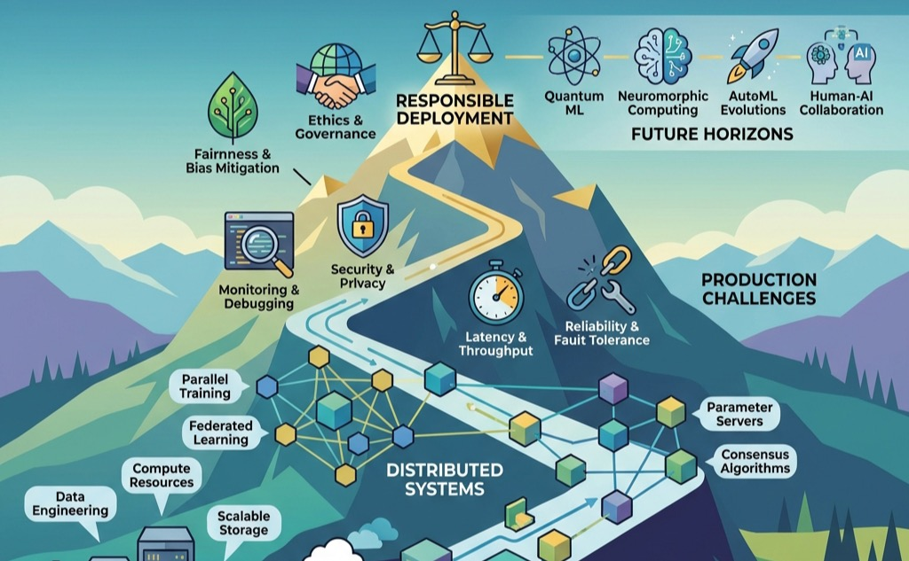

# Conclusion {#sec-conclusion}

::: {layout-narrow}
::: {.column-margin}

\chapterminitoc

:::

\noindent
{fig-alt="Mountain path ascending through four zones: infrastructure at base, distributed systems mid-elevation, production challenges higher, responsible deployment at summit with future horizons view." width=100%}

:::

\begin{marginfigure}
\mlfleetstack{40}{40}{40}{40}
\end{marginfigure}

::: {.callout-tip title="Learning Objectives"}

- Synthesize the **six principles** of distributed ML systems engineering that emerged from this textbook: **communication dominance**, **routine failure**, **infrastructure determination**, **responsible engineering**, **sustainability constraints**, and **qualitative scale effects**
- Evaluate the interconnections between infrastructure (@sec-compute-infrastructure), distributed training (@sec-distributed-training-systems), fault tolerance (@sec-fault-tolerance-reliability), and production operations (@sec-ops-scale) as components of an integrated system
- Apply **systems thinking** to design ML systems that scale horizontally, fail gracefully, and operate sustainably within resource and governance constraints
- Formulate professional strategies for engineering systems that serve humanity responsibly, integrating technical excellence with ethical commitment and environmental sustainability

:::

The *Fleet Stack* provides the organizing framework for what follows: six principles, developed across every layer of the stack, integrate into a unified discipline for engineering intelligence at scale.

::: {.callout-perspective title="Connection: The Fleet Stack"}

The preceding chapters built the Fleet Stack layer by layer: from **Infrastructure** (Part I: The Fleet) to **Distribution** (Part II: Distributed ML), **Serving** (Part III: Deployment at Scale), and **Governance** (Part IV: The Responsible Fleet). The conclusion steps back to see the whole structure, integrating every principle into a single, cohesive discipline for engineering intelligence at global scale.

:::

## Synthesizing Distributed ML Systems {#sec-conclusion-synthesizing-distributed-ml-systems-bac9}

Machine learning systems that operate beyond single machines face engineering challenges qualitatively different from those on a single node. The transition from single-node development to distributed production demands a fundamental shift in engineering methodology, and six principles define that shift.

Foundational ML engineering focuses on a single artifact: the weights of a neural network, optimized through training algorithms and architecture design on individual systems. Distributed ML engineering focuses on the infrastructure that enables that artifact to exist at scale: the datacenters, distributed protocols, and governance frameworks that transform a static model file into a living global service.

Assumptions that hold for individual systems break down at scale. New constraints emerge as dominant concerns, and the insights developed across these chapters converge into a unified understanding of ML systems engineering at production scale.

The textbook followed a deliberate structure reflecting the Fleet Stack. The Fleet chapters (@sec-vol2-introduction, @sec-compute-infrastructure, @sec-network-fabrics, @sec-data-storage) built the physical substrate: the silicon, the wires, and the storage that make distributed ML possible. The Distributed ML chapters (@sec-distributed-training-systems, @sec-collective-communication, @sec-fault-tolerance-reliability, @sec-fleet-orchestration) established the logic of distribution: how to partition workloads, synchronize gradients, tolerate failures, and orchestrate resources across thousands of devices. The Deployment at Scale chapters (@sec-inference-scale, @sec-performance-engineering, @sec-edge-intelligence, @sec-ops-scale) carried the trained model from the cluster to the world. The Responsible Fleet chapters (@sec-security-privacy, @sec-robust-ai, @sec-sustainable-ai, @sec-responsible-ai) ensured that technical capability remains resilient, efficient, and aligned with human welfare.

The complete stack equips engineers to make informed decisions at every level, from algorithm selection through infrastructure design to governance frameworks.

## Six Principles of Distributed ML Systems {#sec-conclusion-six-principles-distributed-ml-systems-746a}

@tbl-vol2-principles synthesizes the six principles that emerged from this textbook, each capturing a distinctive characteristic of distributed ML systems engineering.

These principles form a layered architecture that mirrors the Fleet Stack introduced in Part I, synthesized in @fig-fleet-stack-conclusion. At the physical foundation, infrastructure determines capability[^fn-silicon-contract-v2] because hardware physics sets the hard limits. In the operational reality of the middle layers, communication dominates and failure is routine: these are the day-to-day dynamics of running distributed systems. At the governance layer, responsible engineering and sustainability provide normative constraints on what we should build, overriding what is merely possible. Emerging from this stack is the sixth principle: scale creates qualitative change.

::: {#fig-fleet-stack-conclusion fig-env="figure" fig-pos="htb" fig-cap="**The Fleet Stack.** This diagram synthesizes the core themes of this book. The physical foundation (The Fleet) determines capability, while the distribution layer (Distributed ML) and serving layer (Deployment) define the engineering environment. These are constrained by governance requirements (The Responsible Fleet), with the emergent property of Scale creating qualitative changes that unify the discipline." fig-alt="A stack of four layers. From bottom to top: The Fleet (Infrastructure, Network, Data), Distributed ML (Parallelism, Communication, Fault Tolerance), Deployment (Inference, Performance, Edge), and The Responsible Fleet (Security, Robustness, Sustainability). A vertical arrow labeled Scale runs alongside."}

```{.tikz}
\begin{tikzpicture}[font=\small\usefont{T1}{phv}{m}{n}]
  \definecolor{TopColor}{RGB}{220,255,220} % Responsible
  \definecolor{UpMidColor}{RGB}{255,240,210} % Deployment
  \definecolor{LoMidColor}{RGB}{220,220,255} % Distributed
  \definecolor{BotColor}{RGB}{255,220,220} % Fleet

  \tikzset{
    layer/.style={draw=black!70, thick, rounded corners=2pt, minimum width=6cm, minimum height=1.2cm, align=center}
  }

  % The Layers
  \node[layer, fill=TopColor] (Top) at (0, 4.5) {\textbf{IV. The Responsible Fleet}\\Security | Robustness | Sustainability};
  \node[layer, fill=UpMidColor] (UpMid) at (0, 3) {\textbf{III. Deployment at Scale}\\Inference | Performance | Edge | Ops};
  \node[layer, fill=LoMidColor] (LoMid) at (0, 1.5) {\textbf{II. Distributed ML}\\Parallelism | Communication | Fault Tolerance};
  \node[layer, fill=BotColor] (Bot) at (0, 0) {\textbf{I. The Fleet}\\Compute | Network | Data};

  % Scale wrap
  \draw[ultra thick, gray!40, ->] (3.5, -0.5) to[bend right=45] node[right, text=black, align=center, font=\footnotesize] {Scale Creates\\Qualitative\\Change} (3.5, 5);

  % Annotations
  \node[left=0.5cm of Top, font=\tiny, text=green!60!black] {Governance};
  \node[left=0.5cm of UpMid, font=\tiny, text=orange!60!black] {Serving};
  \node[left=0.5cm of LoMid, font=\tiny, text=blue!60!black] {Distribution};
  \node[left=0.5cm of Bot, font=\tiny, text=red!60!black] {Infrastructure};

\end{tikzpicture}
```

:::

@tbl-vol2-principles summarizes all six principles, their governing questions, and the chapters that develop each one.

| **Principle**                     | **Core Question**       | **Key Metric**                 | **Chapter Reference**             |
|:----------------------------------|:------------------------|:-------------------------------|:----------------------------------|
| **1. Communication Dominates**    | What is the bottleneck? | Network bandwidth utilization  | @sec-collective-communication     |
| **2. Failure is Routine**         | How do we recover?      | MTBF, checkpoint overhead      | @sec-fault-tolerance-reliability  |
| **3. Infrastructure Determines**  | What is possible?       | FLOPS, memory bandwidth        | @sec-compute-infrastructure       |
| **4. Responsible Engineering**    | Who is affected?        | Fairness metrics, audit trails | @sec-responsible-ai               |
| **5. Sustainability Constraints** | What is the cost?       | kWh/training, carbon footprint | @sec-sustainable-ai               |
| **6. Scale Creates Change**       | What breaks at 1000x?   | Scaling efficiency             | @sec-distributed-training-systems |

: **Six Principles of Distributed ML Systems Engineering**: These principles capture the qualitative shifts that occur when ML systems move from single machines to distributed production. Each principle connects to specific metrics and chapters where the concept is developed in depth. {#tbl-vol2-principles}

The first principle is the most fundamental: communication, not computation, dominates at scale [@dean2012large]. Training a large model across hundreds of GPUs spends more time synchronizing gradients than computing them. Production inference systems become latency-bound by tail effects,[^fn-tail-effects] where the slowest worker determines response time regardless of how fast others complete.

[^fn-tail-effects]: @sec-inference-scale analyzes tail latency effects that dominate distributed inference: at the 99th percentile, a request touching 100 servers has a 63 percent chance of hitting at least one slow server.

@sec-distributed-training-systems and @sec-collective-communication develop this principle in detail, showing how Ring AllReduce,[^fn-ring-allreduce] gradient compression,[^fn-gradient-compression] and overlapping computation with communication all address communication bottlenecks [@sergeev2018horovod]. Standard datacenter networking proves insufficient for ML workloads, which is why purpose-built network architectures exist. Recognizing communication as the dominant constraint clarifies when algorithmic optimizations will help and when they merely shift work between equally constrained resources.

[^fn-ring-allreduce]: Ring AllReduce, detailed in @sec-collective-communication, achieves $2(n-1)/n$ bandwidth utilization for $n$ workers, enabling efficient gradient synchronization across large clusters.

[^fn-gradient-compression]: @sec-collective-communication explores gradient compression techniques that reduce communication volume 10–100$\times$ through sparsification, quantization, and error feedback, enabling bandwidth-limited distributed and federated training.

Communication systems, however, are only as valuable as they are reliable. Network failures, node crashes, and synchronization breakdowns introduce a second fundamental constraint that shapes distributed ML engineering.

The second principle follows directly: at distributed scale, component failures occur not occasionally but continuously. Meta's experience training Llama 3 on 16,384 GPUs documented 419 unexpected failures over 54 days, averaging one failure every three hours [@dubey2024llama]. Hardware failures, network partitions, and service disruptions are routine occurrences that systems must handle without human intervention.

@sec-fault-tolerance-reliability establishes that architects must embed failure handling from the beginning. Checkpointing strategies balance recovery granularity against overhead. Elastic training[^fn-elastic-training] dynamically adjusts to changing cluster membership, and graceful degradation maintains service quality as capacity diminishes. Systems that treat failure as exceptional do not survive production deployment.

[^fn-elastic-training]: @sec-fault-tolerance-reliability describes elastic training, which enables dynamic worker membership: jobs continue with remaining workers after failures and seamlessly incorporate new resources when available.

Communication and failure together constitute the operational reality of distributed systems, the middle layer of the Fleet Stack. Both, however, ultimately depend on the physical foundation beneath them.

The third principle addresses the physical foundation. @sec-compute-infrastructure demonstrates that infrastructure determines which workloads are possible, not just how fast they run. Organizations cannot access frontier capabilities without mastering the physical systems that make large-scale computation possible.

The **Memory Wall** makes this principle concrete: while compute (TFLOPS) is plentiful, memory bandwidth (GB/s) remains the gating constraint for the modern **Decode Bottleneck**. @sec-inference-scale and @sec-sustainable-ai quantify how the inability to move data fast enough from HBM to the processor makes autoregressive generation inherently inefficient. Mastering the fleet requires understanding these physical limits, from chip-level thermal density to cluster-wide bisection bandwidth.

Moving up the Fleet Stack from physical foundation to societal constraints, the fourth principle shifts from what we *can* build to what we *should* build. @sec-responsible-ai transforms abstract ethical principles into concrete engineering constraints [@amodei2016concrete]. Fairness, transparency, accountability, privacy, and safety are first-class requirements that shape system architecture throughout the ML lifecycle.

Bias baked into training data propagates through systems regardless of algorithmic sophistication. Engineers must design for fairness from inception, with monitoring infrastructure detecting degradation across demographic groups. The engineering methods for responsible AI, from bias detection to explainability mechanisms, carry the same weight as performance optimization.

Ethical considerations extend to environmental responsibility, the fifth principle. @sec-sustainable-ai reveals how the environmental impact of large-scale ML elevates resource efficiency to a primary engineering constraint [@strubell2019energy; @patterson2021carbon]. Training frontier models consumes electricity equivalent to powering thousands of homes, and computational demands grow exponentially faster than hardware efficiency improvements.

Sustainability thus transforms from environmental concern to engineering discipline. Energy costs can exceed model development budgets, thermal limits restrict hardware density, and power infrastructure requirements limit deployment locations. Carbon-aware scheduling, lifecycle assessment,[^fn-lifecycle-assessment] and efficiency optimization become essential engineering competencies alongside traditional performance metrics.

[^fn-lifecycle-assessment]: @sec-sustainable-ai introduces lifecycle assessment, which evaluates environmental impact across a system's entire lifespan, including embodied carbon in hardware manufacturing (often 20--50 percent of total impact).

The first five principles, from communication dominance through sustainability constraints, capture specific challenges of distributed ML. They converge, however, on a final insight that unifies them: scale transforms these challenges qualitatively rather than merely amplifying them.

The sixth principle captures this insight directly: systems that work at modest scale exhibit fundamentally different behaviors at production scale. A training job running on 8 GPUs may encounter communication bottlenecks, load imbalance, or synchronization overhead when scaled to 8,000 GPUs that did not manifest at smaller scale. With 100,000 concurrent user sessions, edge cases that occur one in a million times happen hundreds of times daily.

Scale is why distributed ML requires fundamentally different engineering approaches. The techniques that optimize single-machine performance, while necessary, prove insufficient. New phenomena emerge: stragglers[^fn-stragglers] that bottleneck clusters, network partitions that split training, and heterogeneity across hardware generations that complicates load balancing.

[^fn-stragglers]: Stragglers, examined in @sec-fault-tolerance-reliability, are workers completing tasks slower than peers that bottleneck synchronous training: a single straggler at 80 percent speed reduces cluster throughput by 20 percent.

## The Complete Production System {#sec-conclusion-complete-production-system-3885}

In production, no principle exists in isolation. The Fleet Stack introduced earlier reveals itself as a stack of interdependencies: physical foundations constrain operational possibilities, which in turn must satisfy governance requirements.

The chapters of this textbook collectively describe a production ML system as an integrated whole. Each principle creates requirements and constraints that ripple through the entire stack, and these principles sometimes conflict. Communication optimization may require synchronization patterns that increase failure exposure. Sustainability constraints may limit infrastructure choices that would maximize raw performance. Responsible AI requirements may add latency that strains communication budgets. Navigating these tensions defines the art of distributed ML engineering: the engineer must find designs that balance all six principles within acceptable trade-offs.

@sec-compute-infrastructure provides the foundation: carefully designed power, cooling, and networking systems aggregate computational resources into accelerator clusters connected by high-bandwidth, low-latency networks. Without appropriate infrastructure, the distributed techniques explored throughout this textbook cannot achieve their potential.

Storage and communication jointly enable distribution. @sec-data-storage addresses the capacity and bandwidth requirements for serving training data at rates matching accelerator throughput, while @sec-collective-communication connects distributed workers through collective operations that synchronize computation. These subsystems must be co-designed: storage bandwidth that exceeds communication capacity wastes resources, and communication paths that exceed storage throughput leave accelerators idle.

@sec-distributed-training-systems converts clusters into systems capable of training models that exceed single-device capabilities, combining data parallelism, model parallelism, and pipeline parallelism to address different constraints. Hybrid strategies assemble these approaches for large language models and recommendation systems.

Models create value only when they serve predictions. @sec-inference-scale addresses the transition from training to production serving, @sec-performance-engineering optimizes training and inference efficiency, and @sec-ops-scale enables systems to evolve as distributions shift and requirements change. @sec-security-privacy protects against threats unique to ML systems, @sec-edge-intelligence addresses the distributed trust challenges of federated deployments, and @sec-responsible-ai and @sec-sustainable-ai ensure that capability serves human welfare.

## Competencies Mastered {#sec-conclusion-mastered-da67}

The journey through this textbook builds a complete engineering skill set, from training a model on a single machine to governing a global-scale service.

The first competency is distributed systems. An engineer who has mastered this material can orchestrate training at scales that exceed any single machine's memory or compute, analyze communication patterns (recognizing that ring AllReduce achieves $2(n-1)/n$ bandwidth utilization as cluster size grows), select network architectures appropriate to workload requirements, and design for routine failure by expecting component failures every few hours rather than every few months.

The second competency is production operations. The serving tax, the nuances of continuous batching, and the critical importance of monitoring for both performance and semantic drift are all within scope.

The third competency spans governance and ethics at the highest level of the Fleet Stack. Fairness, privacy, and sustainability are primary engineering constraints, and the ability to implement differential privacy, audit for bias, and schedule workloads for carbon efficiency distinguishes a systems engineer from a model developer.

## The Path Forward {#sec-conclusion-path-forward-caa2}

These competencies address today's challenges. Mastery of current systems, however, is only valuable when paired with the ability to adapt as the landscape shifts. We stand at the end of the **Era of Scaling**, where progress came from making models bigger, and at the beginning of the **Era of Composition**. This transition gives rise to what we term the *compound capability law*.

::: {.callout-perspective title="Compound Capability Law"}

**The Observation:** Moore's Law (transistor density) provided the first wave of exponential growth. Neural scaling laws (data/compute) provided the second. Both are now flattening against physical power limits. Where does the next 100$\times$ improvement come from?

**The Principle:**
> *When individual model scaling saturates, system capability scales with the **complexity of orchestration**.*

**The Implication:**
The future belongs to **Compound AI Systems**: architectures that combine multiple specialized models, retrieval systems, and reasoning agents into a coherent whole. The "unit of compute" is no longer a FLOP; it is a **Reasoning Chain**.
$$ \text{Capability} \propto \text{Model}_{IQ} \times (\text{Tools} + \text{Context} + \text{Planning})^N $$
The next breakthrough will not be a larger GPU; it will be a smarter **System Architecture**.

:::

```{python}
#| label: fleet-evolution-notebook
#| echo: false
# ┌─────────────────────────────────────────────────────────────────────────────
# │ FLEET EVOLUTION CALCULATOR (NOTEBOOK)
# ├─────────────────────────────────────────────────────────────────────────────
# │ Context: "Projecting the 100x Fleet" .callout-notebook
# │
# │ Goal: Quantify where the next 100x efficiency gain must come from.
# │ Show: orchestration_gain ≈ 10x, hw_gain ≈ 4x, algorithm_gain ≈ 2.5x.
# │ How: Target_Gain = HW * Algo * Orchestration.
# │
# │ Imports: mlsysim.book (check)
# │ Exports: fe_target_gain_str, fe_hw_gain_str, fe_algo_gain_str, fe_orch_gain_str
# └─────────────────────────────────────────────────────────────────────────────
from mlsysim.fmt import check

class FleetEvolution:
    # ┌── 1. LOAD ──────────────────────────────────────────
    target_gain = 100
    hw_gen_gain = 4.0 # B200 vs H100 (approx effective)
    algo_pruning_gain = 2.5 # structured sparsity + distillation
    # ┌── 2. EXECUTE ───────────────────────────────────────
    # Solve for required orchestration gain:
    orch_required = target_gain / (hw_gen_gain * algo_pruning_gain)
    # ┌── 3. GUARD ─────────────────────────────────────────
    check(orch_required == 10.0, f"Orch gain {orch_required} unexpected")
    # ┌── 4. OUTPUT ────────────────────────────────────────
    fe_target_gain_str = f"{target_gain}x"
    fe_hw_gain_str = f"{hw_gen_gain}x"
    fe_algo_gain_str = f"{algo_pruning_gain}x"
    fe_orch_gain_str = f"{orch_required:.0f}x"

```

::: {.callout-notebook title="Projecting the 100x Fleet"}

**Problem**: To reach the next generation of intelligence, we need a **`{python} FleetEvolution.fe_target_gain_str` efficiency improvement** over today's GPT-4 clusters. If hardware improvements provide `{python} FleetEvolution.fe_hw_gain_str` and algorithmic compression provides `{python} FleetEvolution.fe_algo_gain_str`, where must the remaining gain come from?

**The Math**:
Total system gain is the product of improvements across the Fleet Stack.

1. **Hardware (Physics)**: `{python} FleetEvolution.fe_hw_gain_str` (Moore's Law tail-end).
2. **Algorithm (Math)**: `{python} FleetEvolution.fe_algo_gain_str` (Sparsity & Distillation).
3. **Orchestration (Systems)**: `{python} FleetEvolution.fe_target_gain_str` / (4.0 $\times$ 2.5) = **`{python} FleetEvolution.fe_orch_gain_str`**.

**The Systems Insight**: Because silicon and math are hitting diminishing returns, the bulk of future scaling (**`{python} FleetEvolution.fe_orch_gain_str`**) must come from **System Orchestration**. This means moving from monolithic models to **Compound AI Systems** that use reasoning loops, tool-use, and dynamic retrieval to achieve 10$\times$ more utility from the same number of FLOPS. The future of AI is not in the model weights; it is in the **Fleet Logic**.

:::

The era of the **Compound AI System** is already here. Intelligence emerges from the orchestration of specialized agents (reasoning, retrieval, and action) coordinated through the MLOps pipelines established in @sec-ops-scale. The **Orchestration Layer** becomes the new "CPU," scheduling cognitive tasks across a fleet of specialized models just as an OS schedules threads across cores, precisely the kind of fleet orchestration studied in @sec-fleet-orchestration.

As silicon approaches its atomic limits, the next decade points toward **Post-Silicon Frontiers**. Technologies such as High Bandwidth Flash (HBF), 3D logic-stacking, and novel computing substrates will redefine the physics of the fleet. The principles developed in this textbook (bandwidth optimization, fault tolerance, and responsible governance) will remain the enduring requirements for these new substrates.

```{python}
#| label: post-silicon-notebook
#| echo: false
# ┌─────────────────────────────────────────────────────────────────────────────
# │ POST-SILICON EFFICIENCY FRONTIER (NOTEBOOK)
# ├─────────────────────────────────────────────────────────────────────────────
# │ Context: "The Physics of the Next 1000x" .callout-notebook
# │
# │ Goal: Quantify the energy gap between current silicon and photonics/optical.
# │ Show: energy_gain ≈ 1000x — inline in notebook result.
# │ How: Ratio = E_electrical / E_optical.
# │
# │ Imports: mlsysim.book (check)
# │ Exports: ps_elec_pj_str, ps_opt_pj_str, ps_efficiency_gain_str
# └─────────────────────────────────────────────────────────────────────────────
from mlsysim.fmt import check

class PostSilicon:
    # ┌── 1. LOAD ──────────────────────────────────────────
    e_elec_pj = 10.0 # Energy per bit for standard electrical interconnect
    e_opt_pj = 0.01  # Target for co-packaged optical / photonic interconnect
    # ┌── 2. EXECUTE ───────────────────────────────────────
    efficiency_gain = e_elec_pj / e_opt_pj
    # ┌── 3. GUARD ─────────────────────────────────────────
    check(efficiency_gain == 1000.0, f"Gain {efficiency_gain} unexpected")
    # ┌── 4. OUTPUT ────────────────────────────────────────
    ps_elec_pj_str = f"{e_elec_pj}"
    ps_opt_pj_str = f"{e_opt_pj}"
    ps_efficiency_gain_str = f"{efficiency_gain:,.0f}"

```

::: {.callout-notebook title="The Physics of the Next 1000x"}

**Problem**: Modern GPU clusters are hitting the **Energy Wall**. To scale to 1 million GPUs, we must reduce the energy cost of moving a bit across the fabric from `{python} PostSilicon.ps_elec_pj_str` pJ to `{python} PostSilicon.ps_opt_pj_str` pJ using **Co-Packaged Optics (CPO)**. What is the efficiency dividend of this shift?

**The Math**:
The next leap in scale requires moving from electrical to optical signaling.

1. **Electrical Cost**: `{python} PostSilicon.ps_elec_pj_str` pJ/bit.
2. **Optical Target**: `{python} PostSilicon.ps_opt_pj_str` pJ/bit.
3. **Efficiency Gain**: **`{python} PostSilicon.ps_efficiency_gain_str`$\times$**.

**The Systems Insight**: We cannot scale further by doing "more of the same." To break the Energy Wall, we must change the **Physics of Communication**. A 1,000$\times$ reduction in data movement energy is the only way to support models that are 1,000$\times$ larger without consuming the entire output of the global power grid. In the Machine Learning Fleet, the principles of **Data Locality** and **Interconnect Efficiency** are thermodynamic requirements for the next era of intelligence, not optional optimizations.

:::

As ML systems grow in capability and consequence, the distance between technical decisions and human outcomes shrinks to zero. The ultimate "System-Data Duality" holds: we build the system, and the system builds us.

## Engineering Intelligence at Scale {#sec-conclusion-engineering-intelligence-scale-eb8a}

The scale of modern ML infrastructure invites comparison with the most efficient computing system we know: the human brain. The following exercise provides a *Fermi estimate* of how our largest clusters compare.

```{python}
#| label: fermi-estimate-calc
#| echo: false
# ┌─────────────────────────────────────────────────────────────────────────────
# │ THE FERMI ESTIMATE OF INTELLIGENCE (LEGO)
# ├─────────────────────────────────────────────────────────────────────────────
# │ Context: @sec-conclusion-engineering-intelligence-scale-eb8a
# │
# │ Goal: Compare GPT-4 scale cluster throughput/power to the human brain.
# │ Show: Machine is 1000x faster but 1,000,000,000x less efficient.
# │ How: Machine_ops = n_gpus * tflops; Brain_ops = synapses * firing_rate.
# │
# │ Imports: mlsysim.book (fmt, check)
# │ Exports: machine_ops_str, machine_power_mw_str, brain_ops_str,
# │          throughput_ratio_str, efficiency_gap_str
# └─────────────────────────────────────────────────────────────────────────────
from mlsysim.fmt import check
from mlsysim.core.constants import (
    H100_FLOPS_FP16_TENSOR, TFLOPs, second, H100_TDP, watt,
)

# ┌── LEGO ───────────────────────────────────────────────
class FermiEstimate:
    """Compare large-scale machine throughput to human brain efficiency."""

    # ┌── 1. LOAD (Constants) ──────────────────────────────────────────────
    n_gpus = 25000
    tflops_per_gpu = H100_FLOPS_FP16_TENSOR.m_as(TFLOPs / second)
    w_per_gpu = H100_TDP.m_as(watt)

    brain_synapses = 1e14
    brain_firing_hz = 100
    brain_power_w = 20

    # ┌── 2. EXECUTE (The Compute) ────────────────────────────────────────
    machine_ops = n_gpus * tflops_per_gpu * 1e12
    machine_power_mw = (n_gpus * w_per_gpu) / 1e6

    brain_ops = brain_synapses * brain_firing_hz

    throughput_ratio = machine_ops / brain_ops

    machine_eff = machine_ops / (machine_power_mw * 1e6)
    brain_eff = brain_ops / brain_power_w
    efficiency_gap = brain_eff / machine_eff

    # ┌── 3. GUARD (Invariants) ──────────────────────────────────────────
    check(throughput_ratio > 100, "Machine should be faster than brain at raw ops")

    # ┌── 4. OUTPUT (Formatting) ──────────────────────────────────────────────
    _machine_exp = int(f"{machine_ops:.0e}".split("e+")[1])
    _machine_coeff = machine_ops / 10**_machine_exp
    machine_ops_sci = f"{_machine_coeff:.1f} \\times 10^{{{_machine_exp}}}"
    machine_power_mw_str = f"{machine_power_mw:.1f}"
    brain_ops_sci = f"10^{{16}}"
    throughput_ratio_str = f"{throughput_ratio:,.0f}"
    efficiency_gap_str = f"{efficiency_gap:,.0f}"
```

::: {.callout-notebook title="The Fermi Estimate of Intelligence"}

**Problem**: How does our largest machine compare to the human brain in terms of raw operation rate?

**The Machine (GPT-4 Scale Cluster)**:

*   **Cluster**: 25,000 H100 GPUs.
*   **Ops/sec**: $25,000 \times 1,000 \text{ TFLOPS} =$ **`{python} FermiEstimate.machine_ops_sci` FLOPs**.
*   **Power**: $25,000 \times 700\text{W} \approx$ **`{python} FermiEstimate.machine_power_mw_str` MW**.

**The Brain**:

*   **Synapses**: $10^{14}$ synapses (connections).
*   **Firing Rate**: $\approx 100 \text{ Hz}$ (average spike rate).
*   **Ops/sec**: $10^{14} \times 100 =$ **`{python} FermiEstimate.brain_ops_sci` Synaptic Ops/sec**.

**The Systems Conclusion**:

*   **Raw Throughput**: The machine is now **`{python} FermiEstimate.throughput_ratio_str`$\times$ faster** (`{python} FermiEstimate.machine_ops_sci` vs `{python} FermiEstimate.brain_ops_sci`) at raw math.
*   **Efficiency**: The brain is **`{python} FermiEstimate.efficiency_gap_str`$\times$ more efficient** ($20\text{W}$ vs `{python} FermiEstimate.machine_power_mw_str` MW).

We have conquered **Scale**. The challenge for the next generation is **Efficiency**.

:::

The Fleet Stack is now a professional framework. It spans the **Infrastructure** that powers the fleet (Part I), the **Distribution** of work across thousands of devices (Part II), the global **Service** that delivers intelligence to the world (Part III), and the **Governance** mandates that ensure the fleet serves humanity well (Part IV).

The intelligent systems that will define this century need engineers who understand these principles and can apply them at scale.

Build systems that scale. Build systems that endure. Build systems that serve humanity well.

*Prof. Vijay Janapa Reddi, Harvard University*

The essential insights from this textbook are:

::: {.callout-takeaways}

* Six principles define distributed ML systems engineering: communication dominance, routine failure, infrastructure determination, responsible engineering, sustainability constraints, and qualitative scale effects.
* The transition from single-machine to distributed systems is qualitative rather than quantitative. New phenomena emerge at scale that require distinct engineering approaches.
* Production ML systems integrate infrastructure, distributed training, fault tolerance, operations, security, and governance as an interconnected whole where no component operates in isolation.
* The engineering decisions made in building ML systems carry ethical weight extending far beyond technical metrics, affecting billions of lives through recommendation systems, medical AI, climate models, and accessibility tools.

:::

[^fn-silicon-contract-v2]: **The Silicon Contract**: The implicit agreement between hardware and software: if the software provides a specific computation pattern (e.g., matrix-heavy, high arithmetic intensity), the hardware guarantees a specific performance level ($R_{\text{peak}}$). At fleet scale, this contract expands to include the **Network Contract** (bisection bandwidth) and the **Power Contract** (TDP), making systems engineering the art of honoring these physical agreements. \index{Silicon Contract!fleet scale}

::: { .quiz-end }
:::

```{=latex}
\part{key:backmatter}
```
