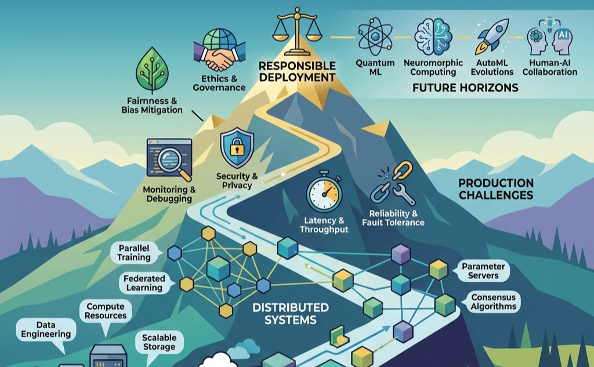

# Conclusion {#sec-conclusion}

::: {layout-narrow}
::: {.column-margin}

\chapterminitoc

:::

\noindent
{fig-alt="Mountain path ascending through four zones: infrastructure at base, distributed systems mid-elevation, production challenges higher, responsible deployment at summit with future horizons view."}

:::

\begin{marginfigure}
\mlfleetstack{40}{40}{40}{40}
\end{marginfigure}

## Purpose {.unnumbered}

The fleet stack provides the organizing framework for what follows. After the layer-by-layer build of Volume 2, the conclusion treats the six principles as one structure: a unified discipline for engineering intelligence at global scale.

::: {.callout-learning-objectives}

- Synthesize the six principles of distributed ML systems engineering
- Evaluate how infrastructure, distributed training, fault tolerance, and operations integrate as one system
- Apply systems thinking to design systems that scale horizontally, fail gracefully, and operate sustainably
- Connect technical excellence with responsible engineering and environmental sustainability
- Formulate professional strategies for engineering ML systems that serve humanity responsibly

:::

## Synthesizing Distributed ML Systems {#sec-conclusion-synthesizing-distributed-ml-systems-bac9}

Machine learning systems that operate beyond single machines face engineering challenges qualitatively different from those on a single node. The transition from *single-node development* to *distributed production* demands a fundamental shift in engineering methodology, and six principles define that shift.

Foundational ML engineering focuses on a single artifact: the weights of a neural network, optimized through training algorithms and architecture design on individual systems. Distributed ML engineering focuses on the infrastructure that enables that artifact to exist at scale: the data centers, distributed protocols, and governance frameworks that transform a static model file into a living global service.

Volume 2 followed the fleet stack deliberately. The opening layer built the physical substrate: the silicon, wires, and storage that make distributed ML possible. That substrate matters because every higher-level decision inherits its limits. A training strategy that ignores accelerator topology, a storage plan that ignores data-loading throughput, or a scheduling policy that ignores network contention will eventually collide with the physics underneath it.

The distribution layer then showed how those physical limits become system protocols. Partitioning work, synchronizing gradients, tolerating failure, and orchestrating resources are not separate concerns; they are the mechanisms that turn many machines into one useful training or serving system. The deployment layer carried the same logic outward, where inference, performance engineering, edge deployment, and operations convert a trained model into a service with latency, availability, and cost obligations. The responsible-fleet layer added the final constraint: technical capability must remain secure, robust, sustainable, and accountable. Together, these layers equip engineers to make informed decisions at every level, from algorithm selection through infrastructure design to governance frameworks.

## Six Principles of Distributed ML Systems {#sec-conclusion-six-principles-distributed-ml-systems-746a}

The complete-stack view becomes useful only when it gives engineers a way to reason about design choices. The six principles in @tbl-vol2-principles provide that working grammar: each principle names a constraint, a governing question, and a metric that determines whether a distributed ML system can scale.

The single-node foundation is governed by strict mathematical constraints like the iron law, where performance is a matter of quantitative physics. Volume 2 shifts that foundation into the probabilistic and operational realities of fleet-scale systems. The bridge between these domains is the Fleet Law ($T_{\text{step}}(N) = \frac{T_{\text{compute}}}{N} + T_{\text{comm}}(N) + T_{\text{sync}}(N) - T_{\text{overlap}}$), originally detailed in the appendix (@sec-appdx-c3-taxonomy-fleet-law) and woven throughout the text. The fleet law acts as the distributed counterpart to the iron law, translating single-machine execution into the mechanics of networked collectives and driving the operational behaviors we see at scale.

These principles form a layered architecture that mirrors the fleet stack introduced in Part I, synthesized in @fig-fleet-stack-conclusion. At the physical foundation, infrastructure determines capability[^fn-silicon-contract-v2] because hardware physics sets the hard limits. In the operational reality of the middle layers, communication dominates and failure is routine: these are the day-to-day dynamics of running distributed systems, driven directly by the fleet law's network and synchronization terms. At the governance layer, responsible engineering and sustainability provide normative constraints on what we should build, overriding what is merely possible. Emerging from this stack is the sixth principle: scale creates qualitative change.

::: {#fig-fleet-stack-conclusion fig-env="figure" fig-pos="htb" fig-cap="**The Fleet Stack**: This diagram synthesizes the core themes of Volume 2. The physical foundation (The Fleet) determines capability, while the distribution layer (Distributed ML) and serving layer (Deployment) define the engineering environment. These are constrained by governance requirements (The Responsible Fleet), with the emergent property of Scale creating qualitative changes that unify the discipline." fig-alt="A 4-layer stack: The Fleet (Compute, Network, Data), Distributed ML, Deployment (Inference, Performance, Edge, Ops), and The Responsible Fleet. A vertical arrow labeled Scale Creates Qualitative Change runs alongside."}

```{.tikz}
\begin{tikzpicture}[font=\small\usefont{T1}{phv}{m}{n}]
  \definecolor{TopColor}{RGB}{220,255,220} % Responsible
  \definecolor{UpMidColor}{RGB}{255,240,210} % Deployment
  \definecolor{LoMidColor}{RGB}{220,220,255} % Distributed
  \definecolor{BotColor}{RGB}{255,220,220} % Fleet

  \tikzset{
    layer/.style={draw=black!70, thick, rounded corners=2pt, minimum width=6cm, minimum height=1.2cm, align=center}
  }

  % The Layers
  \node[layer, fill=TopColor] (Top) at (0, 4.5) {\textbf{IV. The Responsible Fleet}\\Security | Robustness\\Responsible AI | Sustainability};
  \node[layer, fill=UpMidColor] (UpMid) at (0, 3) {\textbf{III. Deployment at Scale}\\Inference | Performance | Edge | Ops};
  \node[layer, fill=LoMidColor] (LoMid) at (0, 1.5) {\textbf{II. Distributed ML}\\Parallelism | Communication | Fault Tolerance};
  \node[layer, fill=BotColor] (Bot) at (0, 0) {\textbf{I. The Fleet}\\Compute | Network | Data};

  % Scale wrap
  \draw[ultra thick, gray!40, ->] (3.5, -0.5) to[bend right=45] node[right, text=black, align=center, font=\footnotesize\usefont{T1}{phv}{m}{n}] {Scale Creates\\Qualitative\\Change} (3.5, 5);

  % Annotations
  \node[left=0.5cm of Top, font=\tiny\usefont{T1}{phv}{m}{n}, text=green!60!black] {Governance};
  \node[left=0.5cm of UpMid, font=\tiny\usefont{T1}{phv}{m}{n}, text=orange!60!black] {Serving};
  \node[left=0.5cm of LoMid, font=\tiny\usefont{T1}{phv}{m}{n}, text=blue!60!black] {Distribution};
  \node[left=0.5cm of Bot, font=\tiny\usefont{T1}{phv}{m}{n}, text=red!60!black] {Infrastructure};

\end{tikzpicture}
```

:::

@Tbl-vol2-principles is therefore a decision map rather than a glossary: it links each principle to the question, metric, and development context an engineer uses when diagnosing a fleet-scale design.

| **Principle**                  |      **Core Question**       | **Key Metric**                                         | **Chapter Reference**             |
|:-------------------------------|:----------------------------:|:-------------------------------------------------------|:----------------------------------|
| **Communication dominates**    |   What is the bottleneck?    | Network bandwidth utilization                          | @sec-collective-communication     |
| **Failure is routine**         |      How do we recover?      | Mean time between failures (MTBF), checkpoint overhead | @sec-fault-tolerance-reliability  |
| **Infrastructure determines**  |      What is possible?       | FLOP/s, memory bandwidth                               | @sec-compute-infrastructure       |
| **Responsible engineering**    |       Who is affected?       | Fairness metrics, audit trails                         | @sec-responsible-ai               |
| **Sustainability constraints** |      What is the cost?       | kWh/training, carbon footprint                         | @sec-sustainable-ai               |
| **Scale creates change**       | What breaks at 1000$\times$? | Scaling efficiency                                     | @sec-distributed-training-systems |

: **Six Principles of Distributed ML Systems Engineering**\index{Six Principles of Distributed ML Systems Engineering}: These principles capture the qualitative shifts that occur when ML systems move from single machines to distributed production. Each principle connects to specific metrics and chapters where the concept is developed in depth. {#tbl-vol2-principles}

```{python}
#| echo: false
from mlsysim import *
from mlsysim.core.constants import *
#| label: conclusion-scale-facts
# ┌─────────────────────────────────────────────────────────────────────────────
# │ CONCLUSION SCALE FACTS (LEGO)
# ├─────────────────────────────────────────────────────────────────────────────
# │ Context: Six principles of distributed ML systems.
# │
# │ Goal: Keep local numerical claims tied to executable calculations.
# │ Show: p99 fan-out tail probability, Llama 3 failure cadence, straggler drop.
# │ How: Direct probability and rate calculations from the stated assumptions.
# │
# │ Imports: mlsysim.book (check)
# │ Exports: tail_servers_str, tail_percentile_str, tail_hit_pct_str,
# │          llama_failures_str, llama_days_str, llama_hours_per_failure_str,
# │          straggler_speed_pct_str, straggler_drop_pct_str
# └─────────────────────────────────────────────────────────────────────────────
from mlsysim.fmt import fmt_int, check, fmt, fmt_count, fmt_time

class ConclusionScaleFacts:
    # ┌── 1. LOAD ──────────────────────────────────────────
    tail_servers = 100
    tail_percentile = 0.99
    llama_failures = 419
    llama_days = 54
    hours_per_day = 24
    straggler_speed = 0.80
    # ┌── 2. EXECUTE ───────────────────────────────────────
    tail_hit_probability = 1 - tail_percentile**tail_servers
    llama_hours_per_failure = llama_days * hours_per_day / llama_failures
    straggler_drop = 1 - straggler_speed
    # ┌── 3. GUARD ─────────────────────────────────────────
    check(round(tail_hit_probability * 100) == 63, "Tail probability changed")
    check(3.0 < llama_hours_per_failure < 3.2, "Failure cadence changed")
    check(round(straggler_drop * 100) == 20, "Straggler throughput drop changed")
    # ┌── 4. OUTPUT ────────────────────────────────────────
    tail_servers_str = fmt_count(tail_servers, commas=False, label="server")
    tail_percentile_str = fmt_int(tail_percentile * 100, commas=False)
    tail_hit_pct_str = fmt_percent(tail_hit_probability, precision=1, commas=False, style='prose')
    llama_failures_str = fmt_count(llama_failures, commas=False, label="failure")
    llama_days_str = fmt_time(llama_days, "day", precision=0, commas=False, style="word")
    llama_hours_per_failure_str = fmt_time(llama_hours_per_failure, 'hour', precision=1, commas=False, style='word')
    straggler_speed_pct_str = fmt_percent(straggler_speed, precision=0, commas=False, style='prose')
    straggler_drop_pct_str = fmt_percent(straggler_drop, precision=0, commas=False, style='prose')
```

The first principle is that *communication* can become the binding term at scale [@dean2012large]. In many synchronous training regimes, gradient synchronization and tail latency dominate unless topology, overlap, and batching are designed around them. Production inference systems can become latency-bound by tail effects,[^fn-tail-effects] where the slowest worker determines response time regardless of how fast others complete.

[^fn-tail-effects]: **Tail Latency**: @sec-inference-scale analyzes tail latency effects in distributed inference: at the `{python} ConclusionScaleFacts.tail_percentile_str`th percentile, a request touching `{python} ConclusionScaleFacts.tail_servers_str` has a `{python} ConclusionScaleFacts.tail_hit_pct_str` chance of hitting at least one slow server.

::: {.content-visible when-format="pdf"}

\newpage

:::

@Sec-distributed-training-systems and @sec-collective-communication develop this principle in detail, showing how Horovod-style Ring AllReduce [@sergeev2018horovod],[^fn-ring-allreduce] gradient compression,[^fn-gradient-compression] and overlapping computation with communication all address communication bottlenecks. For dense collective workloads, conventional oversubscribed fabrics often bottleneck, motivating high-bisection fabrics and transport choices matched to ML communication patterns. Recognizing when communication is the active constraint clarifies when algorithmic optimizations will help and when they merely shift work between equally constrained resources.

[^fn-ring-allreduce]: **Ring AllReduce**: A collective that moves $2(N-1)M/N$ bytes per worker for message size $M$, giving $T_{\text{allreduce}} \approx 2(N-1)\alpha + \frac{2(N-1)}{N}\frac{M}{\beta}$ under the $\alpha$-$\beta$ communication model. The coefficient approaches 2$\times$ message volume per worker as $N$ grows, while remaining bandwidth-optimal for large messages. Detailed in @sec-collective-communication.

[^fn-gradient-compression]: **Gradient Compression**: @sec-collective-communication explores gradient compression\index{Gradient Compression} techniques that reduce communication volume 10--100$\times$ through sparsification, quantization, and error feedback, enabling bandwidth-limited distributed and federated training.

Communication systems, however, are only as valuable as they are reliable. Network failures, node crashes, and synchronization breakdowns introduce a second fundamental constraint that shapes distributed ML engineering.

The second principle follows directly: at distributed scale, component failures occur not *occasionally* but *continuously*. Meta's experience training Llama 3 on 16,384 GPUs documented `{python} ConclusionScaleFacts.llama_failures_str` over `{python} ConclusionScaleFacts.llama_days_str`, averaging one failure every `{python} ConclusionScaleFacts.llama_hours_per_failure_str` [@dubey2024llama]. Hardware failures, network partitions, and service disruptions are routine occurrences that systems must handle without human intervention.

@Sec-fault-tolerance-reliability establishes that architects must embed failure handling from the beginning. Checkpointing strategies balance recovery granularity against overhead. Elastic training[^fn-elastic-training] dynamically adjusts to changing cluster membership, and graceful degradation maintains service quality as capacity diminishes. Systems that treat failure as exceptional do not survive production deployment.

[^fn-elastic-training]: **Elastic Training**: @sec-fault-tolerance-reliability describes elastic training, which enables dynamic worker membership: jobs continue with remaining workers after failures and seamlessly incorporate new resources when available.

Communication and failure together constitute the operational reality of distributed systems, the middle layer of the fleet stack. Both, however, ultimately depend on the physical foundation beneath them.

The third principle addresses the physical foundation. @Sec-compute-infrastructure demonstrates that infrastructure determines which workloads are possible, not just how fast they run. Organizations cannot access the largest-scale capabilities without mastering the physical systems that make large-scale computation possible.

The memory wall\index{Memory Wall} makes this principle concrete: while compute (TFLOP/s) can be abundant, memory bandwidth (GB/s) remains the gating constraint for autoregressive decode\index{Decode Bottleneck}. @Sec-inference-scale and @sec-sustainable-ai quantify how the inability to move data fast enough from HBM to the processor makes autoregressive generation inherently inefficient. Mastering the fleet requires understanding these physical limits, from chip-level thermal density to cluster-wide bisection bandwidth.

Moving up the fleet stack from physical foundation to societal constraints, the fourth principle shifts from what we can build to what we should build. @Sec-responsible-ai transforms abstract ethical principles into concrete engineering constraints [@amodei2016concrete]. Fairness, transparency, accountability, privacy, and safety are first-class requirements that shape system architecture throughout the ML lifecycle.

Bias baked into training data propagates through systems regardless of algorithmic sophistication. Engineers must design for fairness from inception, with monitoring infrastructure detecting degradation across demographic groups. The engineering methods for responsible AI, from bias detection to explainability mechanisms, carry the same weight as performance optimization.

Ethical considerations extend to environmental responsibility, the fifth principle. @Sec-sustainable-ai reveals how the environmental impact of large-scale ML elevates resource efficiency to a primary engineering constraint [@strubell2019; @patterson2021carbon]. In reported large-training examples from the late 2010s and early 2020s, training energy grew enough that hardware efficiency gains alone did not eliminate power and carbon costs.

Sustainability thus transforms from environmental concern to engineering discipline. Energy costs can exceed model development budgets, thermal limits restrict hardware density, and power infrastructure requirements limit deployment locations. Carbon-aware scheduling, lifecycle assessment,[^fn-lifecycle-assessment] and efficiency optimization become essential engineering competencies alongside traditional performance metrics.

[^fn-lifecycle-assessment]: **Lifecycle Assessment**: @sec-sustainable-ai introduces lifecycle assessment\index{Lifecycle Assessment}, which evaluates environmental impact across a system's entire lifespan, including embodied carbon in hardware manufacturing (often 20--50 percent of total impact).

The first five principles, from communication dominance through sustainability constraints, capture specific challenges of distributed ML. They converge, however, on a final insight that unifies them: scale transforms these challenges qualitatively rather than merely amplifying them.

The sixth principle captures this insight directly: systems that work at modest scale exhibit fundamentally different behaviors at production scale. A training job running on 8 GPUs may encounter communication bottlenecks, load imbalance, or synchronization overhead when scaled to 8,000 GPUs that did not manifest at smaller scale. A service with 100,000 concurrent user sessions can easily generate millions of daily request opportunities, so edge cases that occur one in a million times can still surface every day at production traffic volumes.

Scale is why distributed ML requires fundamentally different engineering approaches. The techniques that optimize single-machine performance, while necessary, prove insufficient. New phenomena emerge: stragglers[^fn-stragglers] that bottleneck clusters, network partitions that split training, and heterogeneity across hardware generations that complicates load balancing.

[^fn-stragglers]: **Stragglers**: Workers completing tasks slower than peers that bottleneck synchronous training: a single straggler at `{python} ConclusionScaleFacts.straggler_speed_pct_str` speed reduces cluster throughput by `{python} ConclusionScaleFacts.straggler_drop_pct_str`. Examined in @sec-fault-tolerance-reliability.

## The Complete Production System {#sec-conclusion-complete-production-system-3885}

Consider a 10,000-GPU training run that feeds checkpoints into a global serving fleet. The model first creates a storage problem: checkpoint bursts must land without starving the data loaders. Storage and network pressure then shape the training loop, because collective communication must finish before the next optimizer step idles the cluster. At that scale, failures are expected rather than exceptional, so checkpoint cadence must match the observed failure rate. Once the model ships, serving SLOs must leave headroom for rollback and fallback, and governance controls must decide which data, models, and outputs are allowed to reach users. These are not separate checklists. They are coupled rates, budgets, failure exposures, and policy constraints.

In production, no principle exists in isolation. The fleet stack introduced earlier reveals itself as a stack of interdependencies: physical foundations constrain operational possibilities, which in turn must satisfy governance requirements. The chapters of Volume 2 collectively describe a production ML system as an integrated whole. Each principle creates requirements and constraints that ripple through the entire stack, and these principles sometimes conflict. Communication optimization may require synchronization patterns that increase failure exposure. Sustainability constraints may limit infrastructure choices that would maximize raw performance. Responsible AI requirements may add latency or compute overhead that strains serving SLOs and capacity budgets. Navigating these tensions defines the art of distributed ML engineering: the engineer must find designs that balance all six principles within acceptable trade-offs.

::: {.column-margin}
{width="100%" fig-alt="Decode dot on memory slope below compute ceiling."}

*Decode sits memory-bound, left of the roofline ridge.*
:::

The production system begins with physical capacity, but capacity matters only when the rates line up. @Sec-compute-infrastructure supplies accelerators, power, cooling, and fabric; @sec-data-storage determines whether data can arrive fast enough; and @sec-collective-communication determines whether workers can synchronize without turning the network into the bottleneck. These subsystems must be co-designed: storage bandwidth that exceeds communication capacity wastes resources, and communication paths that exceed storage throughput leave accelerators idle.

::: {.column-margin}
{width="100%" fig-alt="Two matched horizontal bands, one for communication capacity and one for storage bandwidth, with a small label indicating that the rates must be matched."}

*Storage and communication must be co-designed around matching rates.*
:::

@Sec-distributed-training-systems then chooses a parallelization strategy that fits those physical rates and the expected failure pattern. Data parallelism, model parallelism, and pipeline parallelism are not interchangeable templates; each changes memory pressure, communication volume, checkpointing behavior, and scheduler complexity. Hybrid strategies become useful only when the surrounding storage, fabric, and recovery design can support the shape of the partition.

Serving turns the same stack outward. @Sec-inference-scale and @sec-performance-engineering convert model capability into latency, throughput, and cost targets, while @sec-ops-scale keeps those targets meaningful as traffic and distributions shift. @Sec-security-privacy, @sec-edge-intelligence, @sec-responsible-ai, and @sec-sustainable-ai add constraints that cannot be postponed: lowering latency cannot make the attack surface invisible, reducing energy cannot erase fairness observability, and increasing throughput cannot make recovery impossible. Together, these layers define the professional competencies required by the fleet stack: coordinating scale, operating live services, and governing consequences without treating any layer as independent.

## Competencies Mastered {#sec-conclusion-mastered-da67}

The integrated production system just assembled defines competence as engineering judgment under constraint, not as a checklist of technologies. Mastery means recognizing which layer binds, which failure mode a design invites, and which trade-off must remain visible as the system scales.

At the distributed-systems layer, the governing question is how to make a workload larger than any single machine behave as one coordinated system. An engineer who has mastered this material can orchestrate training at scales that exceed any single machine's memory or compute, analyze communication patterns (recognizing that, for a gradient of size $M$, Ring AllReduce moves about $2M$ bytes per worker in the bandwidth term as cluster size grows), select network architectures appropriate to workload requirements, and derive expected failure cadence from component MTBF and fleet size. At Llama-3-class cluster sizes, the reported cadence was every few hours rather than every few months; the general lesson is to design for routine failure. The failure mode is treating scale as aggregate capacity alone; the trade-off is between parallel speedup, communication cost, and recovery overhead.

At the production-operations layer, the governing question is how a trained model keeps serving value under live traffic and shifting distributions. The serving tax, continuous batching, and monitoring for both performance and semantic drift matter because they prevent a working model from becoming an inefficient or semantically stale service.

At the governance layer, the governing question is who bears the costs and risks of the system's decisions. Fairness, privacy, and sustainability are primary engineering constraints, and the ability to implement differential privacy, audit for bias, and schedule workloads for carbon efficiency distinguishes a systems engineer from a model developer because it treats social and environmental consequences as design requirements.

## The Path Forward {#sec-conclusion-path-forward-caa2}

These competencies matter because the binding constraint will keep moving. Mastery of a particular system generation is not enough; engineers must recognize when a new scaling regime changes the unit of design. Volume 1 introduced compound AI systems as compositions of models, tools, retrieval, and control logic. Volume 2 showed the systems limits around that single-model path: network fabrics constrain synchronization, memory systems constrain state residency, energy infrastructure constrains fleet growth, and governance constrains what may be deployed. This volume closes at the boundary between scaling a single model and composing systems of models, tools, retrieval, and verification. This transition gives rise to what we term the compound capability heuristic\index{Compound Capability Heuristic}.

::: {#psp-conclusion-compound-capability-heuristic .callout-perspective title="Compound capability heuristic"}

**Observation**: Moore's Law (transistor density) provided one wave of exponential growth, and neural scaling laws (data/compute) provided another. By the mid-2020s, transistor-density scaling and single-model data/compute scaling faced power, memory, and data limits, leaving an open question about where further order-of-magnitude improvements might come from.

**Principle**: When individual model scaling saturates, system capability increasingly depends on the quality of orchestration.

**Implication**: The systems argument points toward **compound AI systems**\index{Compound AI Systems}: architectures that combine multiple specialized models, retrieval systems, and reasoning agents into a coherent whole. In that framing, the unit of useful work is no longer only a FLOP; it is a **reasoning chain**\index{Reasoning Chain}. Unlike the Fleet Law, the expression below is not a derived constraint; it is a qualitative heuristic whose terms are proxies for model competence, tool quality, context quality, planning quality, and sustainable reasoning depth:

$$ \text{Capability} \;\sim\; \text{Model}_{\text{IQ}} \times \bigl(\text{Tools} + \text{Context} + \text{Planning}\bigr)^{N_{\text{hops}}} $$ {#eq-compound-capability}

@Eq-compound-capability is illustrative rather than derived: there are no agreed units for Model IQ or Planning depth, and $N_{\text{hops}}$ stands in for the number of reasoning hops a system can sustain before its tools, context window, or planner saturate. The intuition is qualitative: in this regime, capability gains come less from enlarging a single accelerator than from architectures that compound these factors.

:::

The following scenario turns that qualitative heuristic into a simple fleet-stack accounting problem: if hardware and algorithms supply only part of a target efficiency gain, orchestration must supply the rest.

```{python}
#| echo: false
#| label: fleet-evolution-notebook
# ┌─────────────────────────────────────────────────────────────────────────────
# │ FLEET EVOLUTION CALCULATOR (NOTEBOOK)
# ├─────────────────────────────────────────────────────────────────────────────
# │ Context: "Projecting the 100x Fleet" .callout-notebook
# │
# │ Goal: Quantify where the next 100x efficiency gain must come from.
# │ Show: orchestration_gain ≈ 10x, hw_gain ≈ 4x, algorithm_gain ≈ 2.5x.
# │ How: Target_Gain = HW * Algo * Orchestration.
# │
# │ Imports: mlsysim.book (check)
# │ Exports: fe_target_gain_mult_str, fe_hw_gain_mult_str, fe_algo_gain_mult_str, fe_orch_gain_mult_str
# └─────────────────────────────────────────────────────────────────────────────
from mlsysim.fmt import check, fmt

class FleetEvolution:
    # ┌── 1. LOAD ──────────────────────────────────────────
    target_gain = 100
    hw_gen_gain = 4.0 # illustrative workload-dependent hardware gain
    algo_pruning_gain = 2.5 # illustrative compression/distillation gain
    # ┌── 2. EXECUTE ───────────────────────────────────────
    # Solve for required orchestration gain:
    orch_required = target_gain / (hw_gen_gain * algo_pruning_gain)
    # ┌── 3. GUARD ─────────────────────────────────────────
    check(orch_required == 10.0, f"Orch gain {orch_required} unexpected")
    # ┌── 4. OUTPUT ────────────────────────────────────────
    fe_target_gain_mult_str = fmt_multiple(target_gain, precision=0, commas=True)
    fe_hw_gain_mult_str = fmt_multiple(hw_gen_gain, precision=0, commas=True)
    fe_algo_gain_mult_str = fmt_multiple(algo_pruning_gain, precision=1, commas=True)
    fe_orch_gain_mult_str = fmt_multiple(orch_required, precision=0, commas=True)
```

The calculation below assumes a target 100$\times$ efficiency gain, then assigns part of that gain to hardware and algorithmic compression. The residual term is the orchestration improvement the fleet must supply.

:::: {#nbk-conclusion-projecting-100-fleet .callout-notebook title="Projecting the 100× fleet"}

**Problem**: Suppose a future workload needs a `{python} FleetEvolution.fe_target_gain_mult_str` efficiency improvement over a large-cluster baseline. If a particular workload saw `{python} FleetEvolution.fe_hw_gain_mult_str` from hardware and `{python} FleetEvolution.fe_algo_gain_mult_str` from algorithmic compression, where would the remaining gain have to come from?

**Math**:
Total system gain is the product of improvements across the fleet stack.

1. **Hardware (physics)**: `{python} FleetEvolution.fe_hw_gain_mult_str` in this scenario.
2. **Algorithm (math)**: `{python} FleetEvolution.fe_algo_gain_mult_str` from workload-compatible sparsity or distillation.
3. **Orchestration (systems)**: `{python} FleetEvolution.fe_target_gain_mult_str` / $(4.0 \times 2.5)$ = `{python} FleetEvolution.fe_orch_gain_mult_str`.

**Systems insight**: Because silicon and math can hit diminishing returns, an aggressive 100$\times$ target cannot rely on one layer alone. In this illustrative scenario, the remaining `{python} FleetEvolution.fe_orch_gain_mult_str` comes from system orchestration: moving from monolithic models to compound AI systems that use reasoning loops, tool-use, and dynamic retrieval to extract more utility from the same number of FLOP/s. Capability is not only in the model weights; it is also in the fleet logic.

::: {.column-margin}
{width="100%" fig-alt="Three-rung gain ladder showing orchestration at 10 times, hardware at 4 times, and algorithmic compression at 2.5 times as multiplicative contributors toward a 100 times fleet-efficiency target."}

*Future efficiency needs hardware, algorithm, and orchestration gains together.*
:::

::::

In the compound-system frame, intelligence emerges from the orchestration of specialized agents (reasoning, retrieval, and action) coordinated through the machine learning operations (MLOps) pipelines established in @sec-ops-scale. The **orchestration layer**\index{Orchestration!layer} acts as a control plane that schedules model calls, retrieval, tool execution, and verification under latency, cost, and failure budgets, echoing the fleet orchestration studied in @sec-fleet-orchestration.

Those orchestration gains still run on a physical fabric. Once software has reduced wasted model calls, duplicate retrieval, and avoidable coordination, the remaining frontier is the substrate that moves tokens, activations, and power through the fleet.

The fleet-stack lens also applies to 2020s research and deployment candidates beyond conventional transistor scaling. Technologies such as optical I/O, co-packaged optics, 3D integration, and novel computing substrates may change the physics of the fleet. The principles developed in Volume 2 (bandwidth optimization, fault tolerance, and responsible governance) remain the enduring requirements for these new substrates.

```{python}
#| echo: false
#| label: post-silicon-notebook
# ┌─────────────────────────────────────────────────────────────────────────────
# │ POST-SILICON EFFICIENCY FRONTIER (NOTEBOOK)
# ├─────────────────────────────────────────────────────────────────────────────
# │ Context: "The Physics of Better Fabrics" .callout-notebook
# │
# │ Goal: Quantify the energy gap between electrical and optical fabric scenarios.
# │ Show: energy_gain ≈ 2x for public optical I/O figures.
# │ How: Ratio = E_electrical/E_optical.
# │
# │ Imports: mlsysim.book (check)
# │ Exports: ps_elec_pj_per_bit_str, ps_opt_pj_per_bit_str, ps_efficiency_gain_mult_str
# └─────────────────────────────────────────────────────────────────────────────
from mlsysim.core.units import bit, pJ
from mlsysim.fmt import check, fmt, fmt_energy_per_bit

class PostSilicon:
    # ┌── 1. LOAD ──────────────────────────────────────────
    e_elec_pj_per_bit = 10.0 * pJ / bit  # scenario: standard electrical interconnect
    e_opt_pj_per_bit = 5.0 * pJ / bit    # scenario: public optical I/O target
    # ┌── 2. EXECUTE ───────────────────────────────────────
    efficiency_gain = (e_elec_pj_per_bit / e_opt_pj_per_bit).to_base_units().magnitude
    # ┌── 3. GUARD ─────────────────────────────────────────
    check(efficiency_gain == 2.0, f"Gain {efficiency_gain} unexpected")
    # ┌── 4. OUTPUT ────────────────────────────────────────
    ps_elec_pj_per_bit_str = fmt_energy_per_bit(e_elec_pj_per_bit, precision=0, commas=False)
    ps_opt_pj_per_bit_str = fmt_energy_per_bit(e_opt_pj_per_bit, precision=0, commas=False)
    ps_efficiency_gain_mult_str = fmt_multiple(efficiency_gain, precision=0, commas=True)
```

A fabric-level estimate shows why communication physics becomes central as scaling pressure moves beyond silicon.

::: {#nbk-conclusion-physics-better-fabrics .callout-notebook title="The physics of better fabrics"}

**Problem**: Large GPU clusters can hit the energy wall\index{Energy Wall}. Using a public optical-I/O target scenario, compare roughly 6--10 pJ/bit long-reach electrical signaling with a below-5 pJ/bit optical target. If we use `{python} PostSilicon.ps_elec_pj_per_bit_str` and `{python} PostSilicon.ps_opt_pj_per_bit_str` as a simple scenario, what is the efficiency dividend?

**Math**:
One communication-efficiency leap is moving part of the fabric from electrical to optical signaling.

1. **Electrical cost**\index{Electrical Cost}: `{python} PostSilicon.ps_elec_pj_per_bit_str`.
2. **Optical I/O scenario**\index{Optical Interconnect!energy per bit}: `{python} PostSilicon.ps_opt_pj_per_bit_str`.
3. **Efficiency gain**\index{Efficiency Gain}: `{python} PostSilicon.ps_efficiency_gain_mult_str`.

**Systems insight**: Scaling further by doing "more of the same" eventually runs into the energy wall. Breaking that wall requires changing the physics of communication. Optical I/O is a meaningful fabric-efficiency lever, but the public co-packaged optics (CPO) and optical-I/O figures used in this scenario support single-digit energy improvements rather than orders-of-magnitude fabric-wide reductions. In the machine learning fleet, the principles of **data locality**\index{Data Locality} and **interconnect efficiency**\index{Efficiency!interconnect} are thermodynamic requirements, not optional optimizations.

:::

These fabric-level limits set the stage for the deepest efficiency comparison of all: the machine fleet measured against the human brain.

## Engineering Intelligence at Scale {#sec-conclusion-engineering-intelligence-scale-eb8a}

The scale of large ML infrastructure invites comparison with a highly energy-efficient biological baseline: the human brain. A rough Fermi estimate\index{Fermi Estimate} frames that comparison without treating machine FLOP/s and synaptic activity as equivalent.

```{python}
#| echo: false
#| label: fermi-estimate-calc
# ┌─────────────────────────────────────────────────────────────────────────────
# │ THE FERMI ESTIMATE OF INTELLIGENCE (LEGO)
# ├─────────────────────────────────────────────────────────────────────────────
# │ Context: @sec-conclusion-engineering-intelligence-scale-eb8a
# │
# │ Goal: Compare a hypothetical large cluster to rough brain estimates.
# │ Show: Raw math and synaptic activity are only a loose analogy.
# │ How: Machine_ops = n_gpus * tflops; Brain_ops = synapses * firing_rate.
# │
# │ Imports: mlsysim (Hardware.Cloud.H100), mlsysim.fmt (fmt, check)
# │ Exports: machine_ops_math, machine_power_mw_str, brain_ops_math,
# │          throughput_ratio_mult_str, n_gpus_str, per_gpu_tflop_per_s_str,
# │          power_calc_math
# └─────────────────────────────────────────────────────────────────────────────
from mlsysim import Systems
from mlsysim.fmt import fmt_int, check, fmt, fmt_math, fmt_qty
from mlsysim.core.units import TFLOP, flop, second, watt, MW

# ┌── LEGO ───────────────────────────────────────────────
class FermiEstimate:
    """Compare large-scale machine throughput to human brain efficiency."""

    # ┌── 1. LOAD (Constants) ──────────────────────────────────────────────
    fleet = Systems.Clusters.Reference_25K_H100
    n_gpus = fleet.total_accelerators
    gpu_peak_flops = fleet.node.accelerator.compute.peak_flops
    gpu_tdp = fleet.node.accelerator.tdp

    brain_synapses = 1e14
    brain_firing_rate = 1.0 / second  # scenario assumption: illustrative mean spike rate
    brain_power = 20 * watt  # scenario assumption: rough human brain power

    # ┌── 2. EXECUTE (The Compute) ────────────────────────────────────────
    machine_ops_rate = (n_gpus * gpu_peak_flops).to(flop / second)
    machine_power = n_gpus * gpu_tdp

    brain_ops_rate = (brain_synapses * brain_firing_rate * flop).to(flop / second)

    throughput_ratio = (machine_ops_rate / brain_ops_rate).to("").magnitude

    machine_eff = (machine_ops_rate / machine_power).to(flop / second / watt).magnitude
    brain_eff = (brain_ops_rate / brain_power).to(flop / second / watt).magnitude
    efficiency_gap = brain_eff/machine_eff

    # ┌── 3. GUARD (Invariants) ──────────────────────────────────────────
    check(throughput_ratio > 100, "Machine should be faster than brain at raw ops")
    check(round(machine_power.to(MW).magnitude, 1) == 17.5, "Machine power should match H100 TDP scenario")
    check(200_000 < throughput_ratio < 300_000, "Throughput ratio should match Fermi scenario")

    # ┌── 4. OUTPUT (Formatting) ──────────────────────────────────────────────
    machine_ops = machine_ops_rate.to(flop / second).magnitude
    _machine_exp = int(f"{machine_ops:.0e}".split("e+")[1])
    _machine_coeff = machine_ops / 10**_machine_exp
    machine_ops_math = fmt_math(f"{_machine_coeff:.2f} \\times 10^{{{_machine_exp}}}")
    machine_power_mw_str = fmt_qty(machine_power, MW, precision=1)
    brain_ops = brain_ops_rate.to(flop / second).magnitude
    _brain_exp = int(f"{brain_ops:.0e}".split("e+")[1])
    _brain_coeff = brain_ops / 10**_brain_exp
    brain_ops_math = fmt_math(f"{_brain_coeff:.1f} \\times 10^{{{_brain_exp}}}")
    throughput_ratio_mult_str = fmt_multiple(throughput_ratio, precision=0, commas=True)
    n_gpus_str = fmt(n_gpus, precision=0, commas=True)
    per_gpu_tflop_per_s_str = fmt_qty(gpu_peak_flops, TFLOP/second, precision=0)
    power_calc_math = fmt_math(
        f"{n_gpus:,} \\times {int(gpu_tdp.to(watt).magnitude)} \\text{{ W}}"
    )
```

::: {#nbk-conclusion-fermi-estimate-intelligence .callout-notebook title="The Fermi estimate of intelligence"}

**Problem**: A hypothetical large cluster is compared against rough estimates of human brain synaptic activity. This Fermi-style sanity check is not a like-for-like operation metric; what is the order-of-magnitude relationship between the two?

**The machine (hypothetical large cluster)**:

*   **Cluster**\index{Cluster}: `{python} FermiEstimate.n_gpus_str` H100 GPUs. GPT-4's actual hardware was not disclosed.
*   **FLOP/s**\index{FLOP/s}: $25{,}000 \times \text{H100 FP16 tensor peak} \approx$ `{python} FermiEstimate.machine_ops_math` FLOP/s (rounded; H100 FP16 tensor peak is `{python} FermiEstimate.per_gpu_tflop_per_s_str`).
*   **Power**\index{Power}: `{python} FermiEstimate.power_calc_math` $\approx$ `{python} FermiEstimate.machine_power_mw_str`.

**Brain**:

*   **Synapses**\index{Synapses}: $10^{14}$ synapses (connections).
*   **Firing Rate**\index{Firing Rate}: illustrative average spike rate $\approx 1 \text{ Hz}$; estimates vary by neuron type and brain region, and average cortical firing is far below the 100 Hz peak rates often used in casual comparisons.
*   **Synaptic operation rate**: $10^{14} \times 1 =$ `{python} FermiEstimate.brain_ops_math` synaptic ops/s.

**Systems insight**:

*   **Raw Throughput**\index{Throughput!raw}: The machine has `{python} FermiEstimate.throughput_ratio_mult_str` higher raw peak floating-point operation rate than this rough synaptic-activity estimate (`{python} FermiEstimate.machine_ops_math` vs. `{python} FermiEstimate.brain_ops_math`), but these operations are not semantically equivalent.
*   **Efficiency**\index{Efficiency!brain vs. cluster}: The brain operates around $20 \text{ W}$, while the cluster draws `{python} FermiEstimate.machine_power_mw_str`; any numeric efficiency comparison depends on the operation model used for the brain.

This volume has established the engineering principles for scale\index{Scale!qualitative effects}. The continuing challenge is efficiency: applying those principles within the energy, carbon, and economic envelopes that constrain further growth.

:::

::: {.column-margin}
{width="100%" fig-alt="Cluster power versus brain power."}

*A datacenter draws megawatts; the brain runs on ~20 watts.*
:::

The fleet stack provides the professional framework developed across this volume. It spans the infrastructure that powers the fleet (Part I), the distribution of work across thousands of devices (Part II), the global service that delivers intelligence to the world (Part III), and the governance mandates that ensure the fleet serves humanity well (Part IV).

Large-scale intelligent systems need engineers who understand these principles and can apply them under constraint. The agenda is therefore threefold: systems that scale, systems that endure, and systems that serve humanity well.

::: {.callout-takeaways title="Systems that scale, endure, and serve"}

* **Distributed ML has six governing principles**: Communication dominance, routine failure, infrastructure determination, responsible engineering, sustainability constraints, and qualitative scale effects define distributed ML systems engineering.
* **Scale changes systems qualitatively**: The transition from single-machine systems to distributed systems is qualitative rather than quantitative. New phenomena emerge at scale that require distinct engineering approaches.
* **Production ML is an integrated system**: Production ML systems integrate infrastructure, distributed training, fault tolerance, operations, security, and governance as an interconnected whole where no component operates in isolation.
* **Compound orchestration changes the scaling unit**: As single-model scaling encounters network, energy, and governance limits, capability increasingly comes from orchestrating models, tools, retrieval, and verification efficiently rather than only adding raw FLOP/s.
* **Engineering decisions carry ethical weight**: The engineering decisions made in building ML systems carry ethical weight extending far beyond technical metrics, affecting large populations through recommendation systems, medical AI, climate models, and accessibility tools.

:::

Prof. Vijay Janapa Reddi, Harvard University

[^fn-silicon-contract-v2]: **The Silicon Contract**: The implicit agreement between hardware and software: if the software provides a specific computation pattern (for example, matrix-heavy, high arithmetic intensity), the hardware guarantees a specific performance level $(R_{\text{peak}})$. At fleet scale, this contract expands to include the **Network Contract**\index{Network Contract} (bisection bandwidth) and the **Power Contract**\index{Power Contract} (thermal design power, TDP), making systems engineering the art of honoring these physical agreements. \index{Silicon Contract!fleet scale}

::: { .quiz-end }
:::

```{=latex}
\part{key:backmatter}
```
