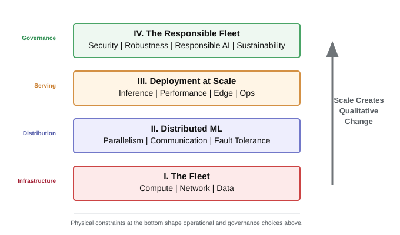

# Conclusion {#sec-conclusion}

::: {layout-narrow}
::: {.column-margin}

\chapterminitoc

:::

\noindent
{fig-alt="Complete fleet-scale ML systems atlas connecting infrastructure, fabric, storage, distributed training, serving, operations, security, sustainability, and governance."}

:::

## Purpose {.unnumbered .unlisted}

\begin{marginfigure}
\mlfleetstack{40}{40}{40}{40}{40}{40}{40}{40}
\end{marginfigure}

_What does it mean to engineer intelligence when the unit of design is no longer a model, but a fleet?_

The fleet stack is not only a sequence of topics; it is a working discipline. Physical infrastructure establishes the rates and limits; distributed protocols turn those limits into coordination costs; deployment systems convert trained models into services with latency, availability, and cost obligations; and governance constraints determine whether those services can remain secure, robust, sustainable, and accountable. The six principles form one structure so an engineer can reason across the whole fleet when the best local choice for one layer creates a constraint in another. In C³ terms, the professional habit is to identify whether compute, communication, or coordination is binding, then follow that constraint across layers until the fleet, not just the model, is the object being engineered.

::: {.content-visible when-format="pdf"}

\newpage

:::

::: {.callout-learning-objectives}

- Synthesize the six principles into a constraint map for distributed ML systems
- Evaluate fleet designs using C³ terms, failure rates, serving obligations, and governance constraints
- Analyze how infrastructure, distributed training, inference, operations, and governance interact across the fleet stack
- Translate security, fairness, privacy, carbon, and reliability obligations into measurable design constraints
- Construct an engineering judgment that balances scale, sustainability, responsibility, and operational discipline

:::

## Synthesizing Distributed ML Systems {#sec-conclusion-synthesizing-distributed-ml-systems-bac9}

A frontier model becomes a production system only when thousands of accelerators, fabric links, storage tiers, schedulers, serving replicas, security controls, and governance checks act as one machine. Any one layer can bind the whole system: a slow checkpoint can waste a training window, a congested fabric can erase scaling gains, an underprovisioned serving pool can turn model quality into user-visible latency, and an unmeasured responsibility constraint can block deployment after the technical system works.

That integrated constraint is what separates foundational ML engineering from distributed ML engineering. Foundational ML engineering focuses on a single artifact: the weights of a neural network, optimized through training algorithms and architecture design on individual systems. Distributed ML engineering focuses on the infrastructure that enables that artifact to exist at scale: the data centers, distributed protocols, and governance frameworks that transform a static model file into a living global service. Six principles define that shift.

The fleet stack is deliberate. The opening layer built the physical substrate: the silicon, wires, and storage that make distributed ML possible. That substrate matters because every higher-level decision inherits its limits. A training strategy that ignores accelerator topology, a storage plan that ignores data-loading throughput, or a scheduling policy that ignores network contention will eventually collide with the physics underneath it.

The distribution layer then showed how those physical limits become system protocols. Partitioning work, synchronizing gradients, tolerating failure, and orchestrating resources are not separate concerns; they are the mechanisms that turn many machines into one useful training or serving system. The deployment layer carried the same logic outward, where inference, performance engineering, edge deployment, and operations convert a trained model into a service with latency, availability, and cost obligations. The responsible-fleet layer added the final constraint: technical capability must remain secure, robust, sustainable, and accountable. Together, these layers equip engineers to make informed decisions at every level, from algorithm selection through infrastructure design to governance frameworks.

## Six Principles of Distributed ML Systems {#sec-conclusion-six-principles-distributed-ml-systems-746a}

The engineering practices that opened this volume—instrument first, design for headroom, co-design hardware with algorithms—become useful only when they name the constraint they are trying to move. The six principles below are those durable realities: each names a constraint, a governing question, and a metric that determines whether a distributed ML system can scale.

The single-node foundation is governed by strict mathematical constraints like the iron law, where performance is a matter of quantitative physics. Fleet-scale engineering shifts that foundation into probabilistic and operational realities: links contend, workers fail, schedulers make stale decisions, and policy constraints change what a technically feasible design may do. The bridge between these domains is the fleet law ($T_{\text{step}}(N) = \frac{T_{\text{compute}}}{N} + T_{\text{comm}}(N) + T_{\text{sync}}(N) - T_{\text{overlap}}$), derived in full in @sec-appdx-c3-taxonomy-fleet-law and woven throughout the text. The fleet law acts as the distributed counterpart to the iron law, translating single-machine execution into the mechanics of networked collectives and driving the operational behaviors observed at scale. Its three terms map directly onto the C$^3$ taxonomy that organizes this volume: $T_{\text{compute}}/N$ is Compute, $T_{\text{comm}}(N)$ is Communication, and $T_{\text{sync}}(N)$ is Coordination.

These principles form a layered architecture that mirrors the fleet stack synthesized in @fig-fleet-stack-conclusion. At the physical foundation, infrastructure determines capability[^fn-silicon-contract-v2] because hardware physics sets the hard limits. In the operational reality of the middle layers, communication dominates and failure is routine: these are the day-to-day dynamics of running distributed systems, driven directly by the fleet law's network and synchronization terms. At the governance layer, two principles act as normative constraints on what may be built rather than what is merely possible: responsibility constrains design, and sustainability is a first-order cost. Emerging from this stack is the sixth principle: scale creates qualitative change.

::: {#fig-fleet-stack-conclusion fig-env="figure" fig-pos="htb" fig-cap="**The Fleet Stack**: The physical foundation (The Fleet) determines capability, while the distribution layer (Distributed ML) and serving layer (Deployment) define the engineering environment. These are constrained by governance requirements (The Responsible Fleet), with the emergent property of Scale creating qualitative changes that unify the discipline." fig-alt="A 4-layer stack: The Fleet (Compute, Network, Data), Distributed ML, Deployment (Inference, Performance, Edge, Ops), and The Responsible Fleet. A vertical arrow labeled Scale Creates Qualitative Change runs alongside."}

{width="100%"}

:::

@Tbl-vol2-principles is therefore a decision map rather than a glossary: the six principles of distributed ML systems\index{Six Principles of Distributed ML Systems} link each principle to the question, metric, and development context an engineer uses when diagnosing a fleet-scale design.

| **Principle**                            |      **Core Question**       | **Key Metric**                                         | **Chapter Reference**             |
|:-----------------------------------------|:----------------------------:|:-------------------------------------------------------|:----------------------------------|
| **Communication dominates**              |   What is the bottleneck?    | Network bandwidth utilization                          | @sec-collective-communication     |
| **Failure is routine**                   |      How do we recover?      | Mean time between failures (MTBF), checkpoint overhead | @sec-fault-tolerance-reliability  |
| **Infrastructure determines capability** |      What is possible?       | FLOP/s, memory bandwidth                               | @sec-compute-infrastructure       |
| **Responsibility constrains design**     |       Who is affected?       | Fairness metrics, audit trails                         | @sec-responsible-ai               |
| **Sustainability is a first-order cost** |      What is the cost?       | kWh/training, carbon footprint                         | @sec-sustainable-ai               |
| **Scale creates change**                 | What breaks at 1000$\times$? | Scaling efficiency                                     | @sec-distributed-training-systems |

: **Six Principles of Distributed ML Systems**: These principles capture the qualitative shifts that occur when ML systems move from single machines to distributed production. Each principle connects to specific metrics and chapters where the concept is developed in depth. {#tbl-vol2-principles}

```{python}
#| echo: false
#| label: conclusion-scale-facts
# ┌─────────────────────────────────────────────────────────────────────────────
# │ CONCLUSION SCALE FACTS (LEGO)
# ├─────────────────────────────────────────────────────────────────────────────
# │ Context: Six principles of distributed ML systems.
# │
# │ Goal: Keep local numerical claims tied to executable calculations.
# │ Scope: chapter-anchor — six-principles prose and chapter summary share scale facts.
# │ Show: p99 fan-out tail probability, Llama 3 failure cadence, straggler drop.
# │ How: Direct probability and rate calculations from the stated assumptions.
# │
# └─────────────────────────────────────────────────────────────────────────────
from mlsysim.fmt import check, fmt_count, fmt_int, fmt_multiple, fmt_percent, fmt_time

class ConclusionScaleFacts:
    # ┌── 1. LOAD ──────────────────────────────────────────
    tail_servers = 100
    tail_percentile = 0.99
    llama_failures = 419
    llama_days = 54
    hours_per_day = 24
    straggler_speed = 0.80
    # ┌── 2. EXECUTE ───────────────────────────────────────
    tail_hit_probability = 1 - tail_percentile**tail_servers
    llama_hours_per_failure = llama_days * hours_per_day / llama_failures
    straggler_drop = 1 - straggler_speed
    # ┌── 3. GUARD ─────────────────────────────────────────
    check(round(tail_hit_probability * 100) == 63, "Tail probability changed")
    check(3.0 < llama_hours_per_failure < 3.2, "Failure cadence changed")
    check(round(straggler_drop * 100) == 20, "Straggler throughput drop changed")
    # ┌── 4. OUTPUT ────────────────────────────────────────
    tail_servers_str = fmt_count(tail_servers, commas=False, label="server")
    tail_percentile_str = fmt_int(tail_percentile * 100, commas=False)
    tail_hit_pct_str = fmt_percent(tail_hit_probability, precision=1, commas=False, style='prose')
    llama_failures_str = fmt_count(llama_failures, commas=False, label="unexpected interruption")
    llama_days_str = fmt_time(llama_days, "day", precision=0, commas=False, style="word")
    llama_hours_per_failure_str = fmt_time(llama_hours_per_failure, 'hour', precision=1, commas=False, style='word')
    straggler_speed_pct_str = fmt_percent(straggler_speed, precision=0, commas=False, style='prose')
    straggler_drop_pct_str = fmt_percent(straggler_drop, precision=0, commas=False, style='prose')
```

The first principle is that communication can become the binding term at scale [@jiang2024megascale; @narayanan2021]. In many synchronous training regimes, gradient synchronization and straggler effects dominate unless topology, overlap, and batching are designed around them. Production inference systems can also become latency-bound by tail effects [@dean2013],[^fn-tail-effects] where the slowest worker determines response time regardless of how fast others complete.

[^fn-tail-effects]: **Tail Latency**: A standard fan-out estimate of the tail effects @sec-inference-scale analyzes: at the `{python} ConclusionScaleFacts.tail_percentile_str`th percentile, a request touching `{python} ConclusionScaleFacts.tail_servers_str` has a `{python} ConclusionScaleFacts.tail_hit_pct_str` chance of hitting at least one slow server.

@Sec-distributed-training-systems and @sec-collective-communication develop this principle in detail, showing how Horovod-style Ring AllReduce [@sergeev2018horovod],[^fn-ring-allreduce] gradient compression,[^fn-gradient-compression] and overlapping computation with communication all address communication bottlenecks. For dense collective workloads, conventional oversubscribed fabrics often bottleneck, motivating high-bisection fabrics and transport choices matched to ML communication patterns. Recognizing when communication is the active constraint clarifies when algorithmic optimizations will help and when they merely shift work between equally constrained resources. The same communication fabric also exposes the second principle: a distributed system has many more components that can fail, and a single blocked rank or slow worker can stall the whole job.

[^fn-ring-allreduce]: **Ring AllReduce**: A collective that moves $2(N-1)M/N$ bytes per worker for message size $M$, giving $T_{\text{allreduce}} \approx 2(N-1)\alpha + \frac{2(N-1)}{N}\frac{M}{\beta}$ under the $\alpha$-$\beta$ communication model. The coefficient approaches 2$\times$ message volume per worker as $N$ grows, while remaining bandwidth-optimal for large messages. Detailed in @sec-collective-communication.

[^fn-gradient-compression]: **Gradient Compression**\index{Gradient Compression}: @sec-collective-communication explores techniques that reduce communication volume 10--100$\times$ through sparsification, quantization, and error feedback, enabling bandwidth-limited distributed and federated training.

The second principle follows directly: at distributed scale, component failures occur not *occasionally* but *continuously*. Meta's experience training Llama 3 on 16,384 GPUs documented `{python} ConclusionScaleFacts.llama_failures_str` over `{python} ConclusionScaleFacts.llama_days_str`, averaging one interruption every `{python} ConclusionScaleFacts.llama_hours_per_failure_str` [@dubey2024llama]. Hardware failures, network partitions, and service disruptions are routine occurrences that systems must handle without human intervention. The synchronous nature of large-scale ML training amplifies the cost of each failure: a single failed rank stalls every other rank in the collective, forcing the entire fleet to roll back to the last checkpoint. The computational loss from one event therefore scales linearly with cluster size, which is precisely why checkpoint cadence and recovery architecture are not afterthoughts but first-order design dimensions.

@Sec-fault-tolerance-reliability establishes that architects must embed failure handling from the beginning. Checkpointing strategies balance recovery granularity against overhead. Elastic training[^fn-elastic-training] dynamically adjusts to changing cluster membership, and graceful degradation maintains service quality as capacity diminishes. Systems that treat failure as exceptional do not survive production deployment.

[^fn-elastic-training]: **Elastic Training**: @sec-fault-tolerance-reliability describes elastic training, which enables dynamic worker membership: jobs continue with remaining workers after failures and seamlessly incorporate new resources when available.

Communication and failure together constitute the operational reality of distributed systems, the middle layer of the fleet stack. Both depend on the physical foundation beneath them, which makes infrastructure the third principle. @Sec-compute-infrastructure demonstrates that infrastructure determines which workloads are possible, not just how fast they run. Cluster-wide bisection bandwidth and chip-level power density set hard ceilings on the model and batch sizes a fleet can train at all, independent of how the training algorithm is tuned.

The memory wall\index{Memory Wall} makes this principle concrete: while compute (TFLOP/s) can be abundant, memory bandwidth (GB/s) remains the gating constraint for autoregressive decode\index{Decode Bottleneck}. @Sec-inference-scale and @sec-sustainable-ai quantify how the inability to move data fast enough from HBM to the processor makes autoregressive generation inherently inefficient. Mastering the fleet requires understanding these physical limits, from chip-level thermal density to cluster-wide bisection bandwidth. Once infrastructure determines what the system can do, governance determines what the system is allowed to do.

::: {.column-margin}
{width="100%" fig-alt="Decode dot on memory slope below compute ceiling."}

*Decode sits memory-bound, left of the roofline ridge.*
:::

The fourth principle is responsible engineering. @Sec-responsible-ai translates AI risk-management frameworks into engineering constraints [@nist2023airmf]. Safety-specific risks such as reward hacking, distribution shift, and scalable oversight show why those constraints need implementation mechanisms [@amodei2016concrete]. Fairness, transparency, accountability, privacy, and safety are first-class requirements that shape system architecture throughout the ML lifecycle.

The fairness impossibility law (@sec-responsible-ai) shows why this is a systems constraint and not a tuning problem: when base rates differ across groups, no model can simultaneously satisfy calibration and error-rate balance [@kleinberg2016inherent; @chouldechova2017], so engineers must choose which criterion to prioritize and build the monitoring to hold it. Engineers must design for fairness from inception, with monitoring infrastructure detecting degradation across demographic groups. The engineering methods for responsible AI, from bias detection to explainability mechanisms, carry the same weight as performance optimization. Environmental responsibility extends that governance layer into the physical resource budget.

The fifth principle is sustainability. @Sec-sustainable-ai reveals how the environmental impact of large-scale ML elevates resource efficiency to a primary engineering constraint [@strubell2019; @patterson2021carbon]. The Jevons Paradox of AI adapts Jevons's resource-efficiency argument to explain why hardware efficiency gains alone do not eliminate power and carbon costs: cheaper computation expands deployment, so per-query savings are absorbed by usage growth unless absolute carbon budgets govern the fleet [@jevons1865coal].

Sustainability thus transforms from environmental concern to engineering discipline. Energy costs can exceed model development budgets, thermal limits restrict hardware density, and power infrastructure requirements limit deployment locations. Carbon-aware scheduling, lifecycle assessment,[^fn-lifecycle-assessment] and efficiency optimization become essential engineering competencies alongside traditional performance metrics. These first five principles converge on the final insight: scale changes the behavior of the system itself.

[^fn-lifecycle-assessment]: **Lifecycle Assessment**\index{Lifecycle Assessment}: @sec-sustainable-ai introduces a method for evaluating environmental impact across a system's entire lifespan, including embodied carbon in hardware manufacturing (often 20--50 percent of total impact).

The sixth principle captures this insight directly: systems that work at modest scale exhibit fundamentally different behaviors at production scale. A training job running on 8 GPUs may encounter communication bottlenecks, load imbalance, or synchronization overhead when scaled to 8,000 GPUs that did not manifest at smaller scale. A service with 100,000 concurrent user sessions can easily generate millions of daily request opportunities, so edge cases that occur one in a million times can still surface every day at production traffic volumes.

Scale is why distributed ML requires fundamentally different engineering approaches. The techniques that optimize single-machine performance, while necessary, prove insufficient. New phenomena emerge: stragglers[^fn-stragglers] that bottleneck clusters, network partitions that split training, and heterogeneity across hardware generations that complicates load balancing.

[^fn-stragglers]: **Stragglers**: Workers completing tasks slower than peers that bottleneck synchronous training: a single straggler at `{python} ConclusionScaleFacts.straggler_speed_pct_str` speed reduces cluster throughput by `{python} ConclusionScaleFacts.straggler_drop_pct_str`. Examined in @sec-fault-tolerance-reliability.

## The Complete Production System {#sec-conclusion-complete-production-system-3885}

Consider Archetype A, a frontier language model such as a GPT-4-class or Llama 3-class system, trained across thousands of accelerators and then shipped into a global serving fleet. The model first creates a storage problem: checkpoint bursts must land without starving the data loaders. Storage and network pressure then shape the training loop, because collective communication must finish before the next optimizer step idles the cluster. At that scale, failures are expected rather than exceptional, so checkpoint cadence must follow the Young-Daly checkpoint law from the observed failure rate [@young1974; @daly2006]. Once the model ships, serving SLOs must leave headroom for rollback and fallback, and governance controls must decide which data, models, and outputs are allowed to reach users. These are not separate checklists. They are coupled rates, budgets, failure exposures, and policy constraints.

In production, no principle exists in isolation. The fleet stack reveals itself as a stack of interdependencies: physical foundations constrain operational possibilities, which in turn must satisfy governance requirements. Each principle creates requirements and constraints that ripple through the entire stack, and these principles sometimes conflict. Communication optimization may require synchronization patterns that increase failure exposure. Sustainability constraints may limit infrastructure choices that would maximize raw performance. Responsible AI requirements may add latency or compute overhead that strains serving SLOs and capacity budgets. The displacement of overhead guarantees these tensions cannot be eliminated, only relocated: the art of distributed ML engineering is to find designs that balance all six principles within acceptable trade-offs rather than to make the cost disappear.

The production system begins with physical capacity, but capacity matters only when the rates line up. @Sec-compute-infrastructure supplies accelerators, power, cooling, and fabric; @sec-data-storage determines whether data can arrive fast enough; and @sec-collective-communication determines whether workers can synchronize without turning the network into the bottleneck. These subsystems must be co-designed: storage bandwidth that exceeds communication capacity wastes resources, and communication paths that exceed storage throughput leave accelerators idle.

::: {.column-margin}
{width="100%" fig-alt="Two matched horizontal bands, one for communication capacity and one for storage bandwidth, with a small label indicating that the rates must be matched."}

*Storage and communication must be co-designed around matching rates.*
:::

@Sec-distributed-training-systems then chooses a parallelization strategy that fits those physical rates and the expected failure pattern. Data parallelism, model parallelism, and pipeline parallelism are not interchangeable templates; each changes memory pressure, communication volume, checkpointing behavior, and scheduler complexity. Hybrid strategies become useful only when the surrounding storage, fabric, and recovery design can support the shape of the partition.

Serving turns the same stack outward. @Sec-inference-scale and @sec-performance-engineering convert model capability into latency, throughput, and cost targets, while @sec-ops-scale keeps those targets meaningful as traffic and distributions shift. @Sec-security-privacy, @sec-edge-intelligence, @sec-robust-ai, @sec-responsible-ai, and @sec-sustainable-ai add constraints that cannot be postponed: lowering latency cannot make the attack surface invisible, reducing energy cannot erase fairness observability, and increasing throughput cannot make recovery impossible. Together, these layers define the professional competencies required by the fleet stack: coordinating scale, operating live services, and governing consequences without treating any layer as independent.

The three workloads traced through the volume (@sec-vol2-introduction-archetypes) make the point that no single corner of the C$^3$ taxonomy dominates. Archetype A, the frontier language model (GPT-4-class or Llama 3-class), stresses communication: partitioning hundreds of billions of parameters across thousands of accelerators makes gradient synchronization and activation transfer consume more wall-clock time than the arithmetic itself. Archetype B, recommendation at scale (DLRM), stresses coordination: sharding multi-terabyte embedding tables across hundreds of nodes makes sparse feature routing, shard placement, and request scheduling decide whether the all-to-all traffic meets tail-latency budgets. Archetype C, federated MobileNet on edge devices, stresses computation under a milliwatt power envelope, where each local training step is bound by the device's silicon rather than by fleet-level bandwidth. The same fleet law and the same six principles apply to all three; what changes is which term binds first, and the engineer's job is to read that term off the workload rather than assume it.

The closing diagnostic is therefore procedural. Start with the observed symptom, attach the metric that makes it measurable, map it to the binding C$^3$ term, locate the fleet-stack layer that owns the intervention, state the displaced cost, and preserve the governance evidence needed to justify the decision. Low MFU may point to communication or coordination rather than insufficient computation. A fairness alert may point to missing labels, insufficient review capacity, or a serving-path threshold policy rather than model weights alone. A security incident may point to artifact provenance, tool permissions, or rollback evidence rather than network perimeter failure. The discipline is to follow the constraint until the responsible layer and trade-off are visible.

## Competencies Mastered {#sec-conclusion-mastered-da67}

The integrated production system just assembled defines competence as engineering judgment under constraint, not as a checklist of technologies. Mastery means recognizing which layer binds, which failure mode a design invites, and which trade-off must remain visible as the system scales.

At the distributed-systems layer, the governing question is how to make a workload larger than any single machine behave as one coordinated system. An engineer who has mastered this material can orchestrate training beyond single-machine memory or compute, analyze communication patterns (recognizing that, for a gradient of size $M$, Ring AllReduce moves about $2M$ bytes per worker in the bandwidth term as cluster size grows), and select network architectures appropriate to the workload.

That same engineer must also derive expected failure cadence from component MTBF and fleet size. At Llama 3-class cluster sizes, Meta reported unexpected interruptions every few hours rather than every few months [@dubey2024llama]; the general lesson is to design for routine failure. The failure mode is treating scale as aggregate capacity alone; the trade-off is between parallel speedup, communication cost, and recovery overhead.

At the production-operations layer, the governing question is how a trained model keeps serving value under live traffic and shifting distributions. The serving tax, continuous batching, and monitoring for both performance and semantic drift matter because they prevent a working model from becoming an inefficient or semantically stale service.

At the governance layer, the governing question is who bears the costs and risks of the system's decisions. Fairness, privacy, and sustainability are primary engineering constraints, and the ability to implement differential privacy, audit for bias, and schedule workloads for carbon efficiency distinguishes a systems engineer from a model developer because it treats social and environmental consequences as design requirements.

## The Fleet Stack as Discipline {#sec-conclusion-path-forward-caa2}

These competencies matter because the binding constraint will keep moving. Mastery of a particular system generation is not enough; engineers must recognize when a new scaling regime changes the unit of design. Larger models run into systems limits: network fabrics constrain synchronization, memory systems constrain state residency, energy infrastructure constrains fleet growth, and governance constrains what may be deployed. Composition is one natural pressure point, because systems of models, tools, retrieval, and verification coordinate many specialized capabilities rather than only enlarging one model. The systems lesson is not a new law of capability; it is the same fleet-stack discipline applied at a new boundary. When useful work spans multiple components, the engineer must measure orchestration overhead, state movement, failure propagation, latency budgets, and governance evidence as part of the system itself.

```{python}
#| echo: false
#| label: fleet-evolution-notebook
# ┌─────────────────────────────────────────────────────────────────────────────
# │ FLEET EVOLUTION CALCULATOR (NOTEBOOK)
# ├─────────────────────────────────────────────────────────────────────────────
# │ Context: "Fleet-stack efficiency accounting" .callout-notebook
# │
# │ Goal: Quantify where the next 100x efficiency gain must come from.
# │ Scope: chapter-anchor — notebook problem and summary bullets share fleet-stack gains.
# │ Show: orchestration_gain ≈ 10x, hw_gain ≈ 4x, algorithm_gain ≈ 2.5x.
# │ How: Load ReferenceStats.FleetEvolution and solve Target = HW * Algorithm * Orchestration.
# │
# └─────────────────────────────────────────────────────────────────────────────
from mlsysim import ReferenceStats
from mlsysim.fmt import check, fmt_multiple, fmt_math

class FleetEvolution:
    # ┌── 1. LOAD ──────────────────────────────────────────
    profile = ReferenceStats.FleetEvolution
    target_gain = profile.TargetGain
    hw_gen_gain = profile.HardwareGain
    algo_pruning_gain = profile.AlgorithmGain
    # ┌── 2. EXECUTE ───────────────────────────────────────
    # Solve for required orchestration gain:
    orch_required = target_gain / (hw_gen_gain * algo_pruning_gain)
    # ┌── 3. GUARD ─────────────────────────────────────────
    check(orch_required == 10.0, f"Orch gain {orch_required} unexpected")
    # ┌── 4. OUTPUT ────────────────────────────────────────
    fe_target_gain_mult_str = fmt_multiple(target_gain, precision=0, commas=True)
    fe_hw_gain_mult_str = fmt_multiple(hw_gen_gain, precision=0, commas=True)
    fe_algo_gain_mult_str = fmt_multiple(algo_pruning_gain, precision=1, commas=True)
    fe_orch_gain_mult_str = fmt_multiple(orch_required, precision=0, commas=True)
    fe_known_gains_product_math = fmt_math(rf"({hw_gen_gain:.1f} \times {algo_pruning_gain:.1f})")
```

The same point can be stated as a simple fleet-stack accounting problem. The calculation assumes a target `{python} FleetEvolution.fe_target_gain_mult_str` efficiency gain, then assigns part of that gain to hardware and algorithmic compression. The residual term is the orchestration improvement the fleet must supply.

:::: {#nbk-conclusion-projecting-100-fleet .callout-notebook title="Fleet-stack efficiency accounting"}

**Problem**: Suppose a workload needs a `{python} FleetEvolution.fe_target_gain_mult_str` efficiency improvement over a large-cluster baseline. If a particular workload saw `{python} FleetEvolution.fe_hw_gain_mult_str` from hardware and `{python} FleetEvolution.fe_algo_gain_mult_str` from algorithmic compression, where would the remaining gain have to come from?

**Math**:
Total system gain is the product of improvements across the fleet stack.

1. **Hardware (physics)**: `{python} FleetEvolution.fe_hw_gain_mult_str` in this scenario.
2. **Algorithm (math)**: `{python} FleetEvolution.fe_algo_gain_mult_str` from workload-compatible sparsity or distillation.
3. **Orchestration (systems)**: `{python} FleetEvolution.fe_target_gain_mult_str` / `{python} FleetEvolution.fe_known_gains_product_math` = `{python} FleetEvolution.fe_orch_gain_mult_str`.

**Systems insight**: Because silicon and math can hit diminishing returns, an aggressive `{python} FleetEvolution.fe_target_gain_mult_str` efficiency target cannot rely on one layer alone. Here, efficiency means useful task progress per fleet resource budget, not raw FLOP/s alone. In this illustrative scenario, the remaining `{python} FleetEvolution.fe_orch_gain_mult_str` comes from system orchestration: reducing duplicate work, routing requests to appropriate components, reusing cached state, overlapping communication with computation, and validating outputs without exhausting the latency budget. Capability is not only in the model weights; it is also in the fleet logic.

::: {.column-margin}
{width="100%" fig-alt="Three-rung gain ladder showing orchestration at 10 times, hardware at 4 times, and algorithmic compression at 2.5 times as multiplicative contributors toward a 100 times fleet-efficiency target."}

*Fleet efficiency needs hardware, algorithm, and orchestration gains together.*
:::

::::

In the fleet-stack frame, capability emerges from specialized components coordinated through the machine learning operations (MLOps) pipelines established in @sec-ops-scale. The orchestration layer\index{Orchestration!layer} acts as a control plane that schedules model calls, retrieval, tool execution, and verification under latency, cost, and failure budgets, echoing the fleet orchestration studied in @sec-fleet-orchestration.

Those orchestration gains still run on a physical fabric. Once software has reduced wasted model calls, duplicate retrieval, and avoidable coordination, the remaining frontier is the substrate that moves tokens, activations, and power through the fleet. The fleet-stack lens therefore also applies to research and deployment candidates beyond conventional transistor scaling. Technologies such as optical I/O, co-packaged optics, 3D integration, and novel computing substrates may change the physics of the fleet by reducing energy per bit, shortening communication paths, increasing bandwidth density, or moving memory closer to compute. The conclusion is not that any one substrate wins. The durable requirements remain the same: bandwidth optimization, fault tolerance, and responsible governance must hold even when the substrate changes.

```{python}
#| echo: false
#| label: post-silicon-notebook
# ┌─────────────────────────────────────────────────────────────────────────────
# │ POST-SILICON EFFICIENCY FRONTIER (NOTEBOOK)
# ├─────────────────────────────────────────────────────────────────────────────
# │ Context: "The Physics of Better Fabrics" .callout-notebook
# │
# │ Goal: Quantify the energy gap between electrical and optical fabric scenarios.
# │ Show: energy_gain ≈ 2x for public optical I/O figures.
# │ How: Ratio = E_electrical/E_optical.
# │
# └─────────────────────────────────────────────────────────────────────────────
from mlsysim.core.units import bit, pJ
from mlsysim.fmt import check, fmt_energy_per_bit, fmt_multiple

class PostSilicon:
    # ┌── 1. LOAD ──────────────────────────────────────────
    e_elec_pj_per_bit = 10.0 * pJ / bit  # scenario: standard electrical interconnect
    e_opt_pj_per_bit = 5.0 * pJ / bit  # scenario: public optical I/O target
    # ┌── 2. EXECUTE ───────────────────────────────────────
    efficiency_gain = (e_elec_pj_per_bit / e_opt_pj_per_bit).to_base_units().magnitude
    # ┌── 3. GUARD ─────────────────────────────────────────
    check(efficiency_gain == 2.0, f"Gain {efficiency_gain} unexpected")
    # ┌── 4. OUTPUT ────────────────────────────────────────
    ps_elec_pj_per_bit_str = fmt_energy_per_bit(e_elec_pj_per_bit, precision=0, commas=False)
    ps_opt_pj_per_bit_str = fmt_energy_per_bit(e_opt_pj_per_bit, precision=0, commas=False)
    ps_efficiency_gain_mult_str = fmt_multiple(efficiency_gain, precision=0, commas=True)
```

Transformer models partitioned across thousands of accelerators create communication pressure through several mechanisms. Tensor parallelism uses frequent collectives across partitioned tensors, while mixture-of-experts routing uses all-to-all dispatch at MoE layers. At that scale, the energy cost of driving data electrically across data center-class distances can become comparable to the cost of useful arithmetic, which is why optical interconnects are a plausible fabric-efficiency lever. The scaling pressure is not generic; it originates directly from the collective communication patterns.

::: {#nbk-conclusion-physics-better-fabrics .callout-notebook title="The physics of better fabrics"}

**Problem**: Large ML clusters running tensor parallelism and mixture-of-experts routing can hit the energy wall\index{Energy Wall} because collective traffic at scale makes interconnect energy a first-order cost. Using an illustrative optical-I/O target scenario, compare rough long-reach electrical signaling\index{Electrical Interconnect!energy per bit} with a lower optical-I/O target\index{Optical Interconnect!energy per bit}. If we use `{python} PostSilicon.ps_elec_pj_per_bit_str` and `{python} PostSilicon.ps_opt_pj_per_bit_str` as a simple scenario, what is the efficiency dividend for the collective communication that dominates these ML workloads?

**Math**:
One communication-efficiency leap is moving part of the fabric from electrical to optical signaling.

1. **Electrical cost**: `{python} PostSilicon.ps_elec_pj_per_bit_str`.
2. **Optical I/O scenario**: `{python} PostSilicon.ps_opt_pj_per_bit_str`.
3. **Efficiency gain**: `{python} PostSilicon.ps_efficiency_gain_mult_str`.

**Systems insight**: Scaling further by doing "more of the same" eventually runs into the energy wall. The wall is driven by the volume and frequency of collective operations: AllReduce for gradient synchronization and all-to-all dispatch for MoE layers grow with model and cluster size. Breaking that wall requires changing the physics of communication. Optical I/O is a meaningful fabric-efficiency lever, but this scenario illustrates single-digit energy improvements rather than orders-of-magnitude fabric-wide reductions. In the machine learning fleet, the principles of data locality\index{Data Locality} and interconnect efficiency\index{Efficiency!interconnect} are thermodynamic requirements, not optional optimizations.

:::

These fabric-level limits motivate one final efficiency sanity check: the machine fleet measured against the human brain.

## Engineering Intelligence at Scale {#sec-conclusion-engineering-intelligence-scale-eb8a}

The scale of large ML infrastructure invites comparison with a highly energy-efficient biological baseline: the human brain. A rough Fermi estimate\index{Fermi Estimate} frames that comparison without treating machine FLOP/s and synaptic activity as equivalent.

```{python}
#| echo: false
#| label: fermi-estimate-calc
# ┌─────────────────────────────────────────────────────────────────────────────
# │ THE FERMI ESTIMATE OF INTELLIGENCE (LEGO)
# ├─────────────────────────────────────────────────────────────────────────────
# │ Context: @sec-conclusion-engineering-intelligence-scale-eb8a
# │
# │ Goal: Compare a hypothetical large cluster to rough brain estimates.
# │ Show: Raw math and synaptic activity are only a loose analogy.
# │ How: Machine_ops = n_gpus * tflops; Brain_ops = synapses * firing_rate.
# │
# └─────────────────────────────────────────────────────────────────────────────
from mlsysim import Systems
from mlsysim.fmt import fmt_int, check, fmt, fmt_math, fmt_multiple, fmt_qty
from mlsysim.core.units import TFLOP, flop, second, watt, MW

# ┌── LEGO ───────────────────────────────────────────────
class FermiEstimate:
    """Compare large-scale machine throughput to human brain efficiency."""

    # ┌── 1. LOAD (Constants) ──────────────────────────────────────────────
    fleet = Systems.Clusters.Reference_25K_H100
    n_gpus = fleet.total_accelerators
    gpu_peak_flops = fleet.node.accelerator.compute.peak_flops
    gpu_tdp = fleet.node.accelerator.tdp

    brain_synapses = 1e14
    brain_firing_rate = 1.0 / second  # scenario assumption: illustrative mean spike rate
    brain_power = 20 * watt  # scenario assumption: rough human brain power

    # ┌── 2. EXECUTE (The Compute) ────────────────────────────────────────
    machine_ops_rate = (n_gpus * gpu_peak_flops).to(flop / second)
    machine_power = n_gpus * gpu_tdp

    brain_ops_rate = (brain_synapses * brain_firing_rate * flop).to(flop / second)

    throughput_ratio = (machine_ops_rate / brain_ops_rate).to("").magnitude

    machine_eff = (machine_ops_rate / machine_power).to(flop / second / watt).magnitude
    brain_eff = (brain_ops_rate / brain_power).to(flop / second / watt).magnitude
    efficiency_gap = brain_eff / machine_eff

    # ┌── 3. GUARD (Invariants) ──────────────────────────────────────────
    check(throughput_ratio > 100, "Machine should be faster than brain at raw ops")
    check(round(machine_power.to(MW).magnitude, 1) == 17.5, "Machine power should match H100 TDP scenario")
    check(200_000 < throughput_ratio < 300_000, "Throughput ratio should match Fermi scenario")

    # ┌── 4. OUTPUT (Formatting) ──────────────────────────────────────────────
    machine_ops = machine_ops_rate.to(flop / second).magnitude
    _machine_exp = int(f"{machine_ops:.0e}".split("e+")[1])
    _machine_coeff = machine_ops / 10**_machine_exp
    machine_ops_math = fmt_math(f"{_machine_coeff:.2f} \\times 10^{{{_machine_exp}}}")
    machine_power_mw_str = fmt_qty(machine_power, MW, precision=1)
    brain_ops = brain_ops_rate.to(flop / second).magnitude
    _brain_exp = int(f"{brain_ops:.0e}".split("e+")[1])
    _brain_coeff = brain_ops / 10**_brain_exp
    brain_ops_math = fmt_math(f"{_brain_coeff:.1f} \\times 10^{{{_brain_exp}}}")
    throughput_ratio_mult_str = fmt_multiple(throughput_ratio, precision=0, commas=True)
    n_gpus_str = fmt(n_gpus, precision=0, commas=True)
    per_gpu_tflop_per_s_str = fmt_qty(gpu_peak_flops, TFLOP / second, precision=0)
    power_calc_math = fmt_math(f"{n_gpus:,} \\times {int(gpu_tdp.to(watt).magnitude)} \\text{{ W}}")
```

::: {#nbk-conclusion-fermi-estimate-intelligence .callout-notebook title="The Fermi estimate of intelligence"}

**Problem**: A hypothetical large cluster is compared against rough estimates of human brain synaptic activity. This Fermi-style sanity check is not a like-for-like operation metric; what is the order-of-magnitude relationship between the two?

**Variables**:

*   **Machine cluster**: `{python} FermiEstimate.n_gpus_str` H100 GPUs in a reference large-cluster scenario.
*   **Machine FLOP/s**: $25{,}000 \times \text{H100 FP16 tensor peak} \approx$ `{python} FermiEstimate.machine_ops_math` FLOP/s (rounded; H100 FP16 tensor peak is `{python} FermiEstimate.per_gpu_tflop_per_s_str`).
*   **Machine power**: `{python} FermiEstimate.power_calc_math` $\approx$ `{python} FermiEstimate.machine_power_mw_str`.
*   **Brain synapses**: $10^{14}$ synapses (connections).
*   **Brain firing rate**: illustrative average spike rate $\approx 1 \text{ Hz}$; estimates vary by neuron type and brain region, and average cortical firing is far below the 100 Hz peak rates often used in casual comparisons.
*   **Brain synaptic operation rate**: $10^{14} \times 1 =$ `{python} FermiEstimate.brain_ops_math` synaptic ops/s.

**Systems insight**:

*   **Raw throughput**: The machine has `{python} FermiEstimate.throughput_ratio_mult_str` higher raw peak floating-point operation rate than this rough synaptic-activity estimate (`{python} FermiEstimate.machine_ops_math` vs. `{python} FermiEstimate.brain_ops_math`), but these operations are not semantically equivalent. The machine FLOP/s are overwhelmingly dense matrix multiplications (GEMMs) mandated by Transformer architectures—structurally rigid, synchronous operations tightly orchestrated across thousands of accelerators. Biological synaptic operations are sparse, event-driven, and massively decentralized, with no equivalent of a global barrier or gradient step. The throughput ratio measures raw arithmetic volume, not intelligence, and the architectural gap between the two operation types is as significant as the numerical gap.
*   **Efficiency**\index{Efficiency!brain vs. cluster}: The brain operates around $20 \text{ W}$, while the cluster draws `{python} FermiEstimate.machine_power_mw_str`; any numeric efficiency comparison depends on the operation model used for the brain.

:::

The Fermi estimate is useful precisely because it refuses a simplistic equivalence between FLOP/s and intelligence. The fleet-stack framework has established the engineering principles for scale\index{Scale!qualitative effects}; the continuing challenge is efficiency, applying those principles within the energy, carbon, and economic envelopes that constrain further growth.

::: {.column-margin}
```{=latex}
\vspace*{-34mm}
```
{width="100%" fig-alt="Two orange bars on a log scale comparing Cluster 17.5 MW with Brain 20 W; the cluster bar is far longer."}

*A data center draws megawatts; the brain runs on ~20 watts.*
:::

The fleet stack provides the professional framework for engineering intelligence as a system: infrastructure powers the fleet, distributed protocols coordinate work across thousands of devices, serving systems deliver intelligence to users, and governance mandates keep the fleet aligned with security, sustainability, accountability, and explicit human-impact constraints.

Large-scale intelligent systems need engineers who understand these principles and can apply them under constraint. The agenda is therefore threefold: systems that scale, systems that endure, and systems whose social and environmental obligations are engineered into the operating path.

## Fallacies and Pitfalls {#sec-conclusion-fallacies-pitfalls}

The closing mistakes all come from optimizing the wrong unit of design. A model can improve while the fleet becomes slower, less reliable, more expensive, or harder to govern.

**Fallacy**: *A faster model is automatically a better system.*

Raw model speed matters, but it is only one term in the fleet equation. A design that reduces kernel time while increasing checkpoint pressure, network contention, serving variance, or governance risk can make the total system worse. The systems question is whether the change improves useful throughput under the actual constraints: data movement, synchronization, failure recovery, power, latency, and accountability.

**Pitfall**: *Optimizing one layer while hiding the constraint it creates in another.*

A local improvement becomes dangerous when it moves cost to a layer that no one is measuring. Larger batches may raise accelerator utilization while worsening tail latency. Aggressive compression may reduce communication while increasing accuracy risk. Carbon-aware scheduling may lower emissions while requiring more slack in the service budget. Good engineering respects the displacement of overhead, keeping the transferred constraint visible so the system can choose deliberately rather than inheriting a hidden bottleneck.

**Fallacy**: *Fleet-scale lessons are tied to today's hardware and software stack.*

Specific processors, frameworks, and serving engines will change, but the durable relationships remain. Data must reach compute at the required rate. Workers must communicate before synchronization stalls the job. Failures must be expected at large component counts. Serving systems must meet tail-latency budgets, and governance constraints must be engineered into the operating path. The technology names are examples; the rate, failure, and accountability relationships are the lesson.

**Pitfall**: *Treating governance and sustainability as external reviews rather than system constraints.*

Security, fairness, privacy, and carbon accounting are often postponed because they look less immediate than throughput or accuracy. At fleet scale, that postponement creates architectural debt. Retrofitting audit trails, demographic monitoring, access controls, deletion workflows, or carbon-aware placement after deployment is more expensive than budgeting for them when the serving path, data pipeline, and scheduler are designed.

::: {.callout-takeaways title="Systems that scale, endure, and serve"}

* **The fleet is the object**: The volume's six principles reduce to one habit: follow the binding constraint across infrastructure, communication, coordination, serving, and governance. A faster component is not a better system if it hides cost in another layer.
* **Scale changes the probability model**: At the `{python} ConclusionScaleFacts.tail_percentile_str`th percentile, touching `{python} ConclusionScaleFacts.tail_servers_str` gives a `{python} ConclusionScaleFacts.tail_hit_pct_str` chance of a slow server, and Llama 3 saw `{python} ConclusionScaleFacts.llama_failures_str` in `{python} ConclusionScaleFacts.llama_days_str`. Fleet behavior is not single-node behavior repeated.
* **Orchestration becomes capability**: The illustrative `{python} FleetEvolution.fe_target_gain_mult_str` efficiency target cannot come from silicon or algorithms alone; after `{python} FleetEvolution.fe_hw_gain_mult_str` hardware and `{python} FleetEvolution.fe_algo_gain_mult_str` algorithm gains, the residual `{python} FleetEvolution.fe_orch_gain_mult_str` must come from routing, reuse, overlap, and verification.
* **Obligations belong in the path**: Security, privacy, fairness, carbon, accessibility, and auditability are production constraints, not external reviews. The discipline is to design them into data pipelines, schedulers, serving paths, and operating procedures before scale makes the trade-off irreversible.

:::

::: {.callout-chapter-connection title="The discipline of ML systems"}

The throughline is that intelligence at scale is an emergent property of co-design, engineered through relationships rather than isolated artifacts. Models, accelerators, fabrics, data systems, schedulers, serving paths, monitors, and governance controls form one coupled system. The durable professional skill is to follow the active constraint across that system and make the trade-off explicit before production scale makes it irreversible.

:::

*Prof. Vijay Janapa Reddi, Harvard University*

[^fn-silicon-contract-v2]: **Hardware Capability Ceiling**: At fleet scale, the hardware sets the hard ceilings the software cannot argue with. Peak compute $(R_{\text{peak}})$, bisection bandwidth, and thermal design power are physical limits, not tuning knobs, so a workload that exceeds any one of them cannot run at all until the infrastructure changes. Systems engineering is the art of fitting the workload inside these physical limits rather than wishing them away.

::: { .quiz-end }
:::

```{=latex}
\part{key:backmatter}
```
