# Fault Tolerance and Reliability {#sec-fault-tolerance-reliability}

::: {layout-narrow}
::: {.column-margin}

\chapterminitoc

:::

\noindent
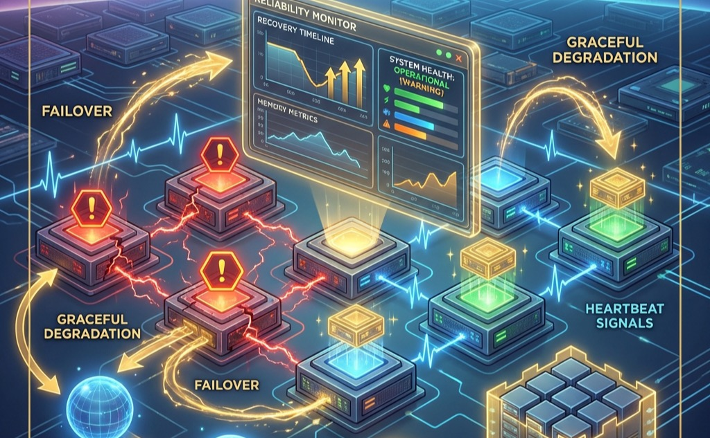{fig-alt="Fault tolerance, checkpointing, and recovery in distributed training."}

:::

## Purpose {.unnumbered}

\begin{marginfigure}
\mlfleetstack{25}{100}{25}{10}
\end{marginfigure}

_Why does scale transform hardware failure from rare exception to routine condition that systems must absorb continuously?_

A single GPU can run for years between hardware failures. A thousand GPUs turn that same component risk into failures every couple of days. A ten-thousand-GPU cluster sees failures every few hours once host, power, and network domains are included. This arithmetic is inescapable: individual component reliability does not change, but aggregate system reliability degrades multiplicatively as components are added. At large fleet scale, the question is not whether failures occur during a training run but how many, and systems that cannot absorb failures without losing progress cannot operate at all. The same logic applies to serving: a globally distributed inference system experiences regional outages, network partitions, and capacity fluctuations as continuous background conditions rather than exceptional events. Fault tolerance at scale is not about preventing failures, because prevention is impossible. It is about designing systems where failures are expected, detected, isolated, and recovered from automatically, allowing useful work to continue despite the constant churn of components entering and leaving operational status. Fault tolerance is the coordination tax made explicit: Compute and Communication are deliberately spent on preserving state, because at fleet scale component failure is a statistical certainty, not an anomaly.

::: {.content-visible when-format="pdf"}

\newpage

:::
::: {.callout-learning-objectives}

- Calculate system-level MTBF from component failure rates and derive optimal checkpoint intervals using the Young-Daly formula to minimize wasted work
- Design distributed checkpoint and recovery strategies that coordinate state across thousands of GPUs while managing multi-terabyte checkpoint sizes
- Implement serving redundancy, replication, and failover mechanisms that maintain availability within millisecond latency requirements under partial failures
- Apply graceful degradation (model fallback, feature fallback, load shedding) to maintain partial service when full capability is unavailable
- Construct observability infrastructure using metrics, logs, and distributed traces to diagnose nondeterministic failures and silent accuracy degradation
- Evaluate fault tolerance trade-offs across training and serving workloads by analyzing their distinct latency tolerances, state requirements, and recovery strategies

:::

```{python}
#| echo: false
from mlsysim import *
from mlsysim.core.units import *

# ┌─────────────────────────────────────────────────────────────────────────────
# │ CHAPTER START
# ├─────────────────────────────────────────────────────────────────────────────
# │ Context: Chapter initialization and global imports
# │
# │ Why: Registers this chapter with the mlsys registry and provides shared
# │      imports for all subsequent calculation cells.
# │
# │ Imports: mlsysim.registry, mlsysim.constants, mlsysim.book
# │ Exports: (none)
# └─────────────────────────────────────────────────────────────────────────────
from mlsysim.physics import memory_from_params
from mlsysim.fmt import fmt, check
```

```{python}
#| echo: false
#| label: fault-tolerance-reliability-rates
# ┌─────────────────────────────────────────────────────────────────────────────
# │ FLEET RELIABILITY RATES — PERSISTENT (single source of truth)
# ├─────────────────────────────────────────────────────────────────────────────
# │ Context: PERSISTENT. Per-GPU and fleet failure rates derived from canonical
# │          MTTF/fleet constants. Consumed by the failure-rate footnote
# │          [^fn-failure-rate-fits] and the Fallacies and Pitfalls section
# │          (@sec-fault-tolerance-reliability-reliability-fallacies-pitfalls-74b8).
# │
# │ Goal: Derive lambda, FIT, and fleet failure cadence from one constant set so
# │       every quoted reliability number is traceable and cannot drift.
# │ Show: GPU FIT, lambda_hour, fleet FIT total, fleet failure rate, hours between.
# │ How:  lambda = 1/MTTF; FIT = 10^9/MTTF; fleet rate = N/MTTF; interval = 1/rate.
# │
# │ Imports: mlsysim.constants (Systems, BILLION), mlsysim.fmt (fmt, fmt_math,
# │          sci_latex, check)
# │ Exports: gpu_mttf_str, fit_eq_math, lambda_eq_math, fleet_gpus_str,
# │          fleet_fit_str, fleet_rate_eq_math, hours_between_str
# └─────────────────────────────────────────────────────────────────────────────
from mlsysim.fmt import fmt, fmt_count, fmt_math, fmt_time, sci_latex, check

class FleetReliabilityRates:
    # ┌── 1. LOAD (Constants) ──────────────────────
    gpu_mttf_h = float(Systems.Reliability.Gpu.mttf_hours)
    fleet_gpus = Systems.Clusters.Training_10K.total_accelerators

    # ┌── 2. EXECUTE (The Compute) ─────────────────
    lambda_gpu = 1 / gpu_mttf_h  # per-GPU failure rate (per hour)
    gpu_fit = BILLION / gpu_mttf_h  # failures per 10^9 device-hours
    fleet_fit_total = fleet_gpus * gpu_fit  # aggregate FITs across the fleet
    fleet_rate_per_h = fleet_gpus / gpu_mttf_h  # fleet failures per hour
    hours_between = 1 / fleet_rate_per_h  # mean hours between fleet failures

    # ┌── 3. GUARD (Invariants) ────────────────────
    check(abs(gpu_fit * gpu_mttf_h - BILLION) < 1, "FIT definition: FIT x MTTF must equal 10^9")
    check(abs(hours_between * fleet_rate_per_h - 1) < 1e-9, "interval must be reciprocal of fleet rate")
    check(0 < fleet_rate_per_h < fleet_gpus, "fleet failure rate must be positive and below the GPU count")

    # ┌── 4. OUTPUT (Formatting) ───────────────────
    _fleet_tex = fmt(fleet_gpus, precision=0).replace(",", "{,}")
    _mttf_tex = fmt(gpu_mttf_h, precision=0).replace(",", "{,}")
    _fit_tex = fmt(gpu_fit, precision=0).replace(",", "{,}")
    gpu_mttf_str = fmt_time(gpu_mttf_h, "hour", precision=0, style="word")
    fleet_gpus_str = fmt_count(fleet_gpus, label="GPU")
    fleet_fit_str = fmt(fleet_fit_total, precision=0)
    hours_between_str = fmt_time(hours_between, "hour", precision=0, commas=False, style="word")
    fit_eq_math = fmt_math(rf"\text{{FIT}} = {_fit_tex}")
    lambda_eq_math = fmt_math(rf"\lambda_{{\text{{hour}}}} = {sci_latex(lambda_gpu, precision=1)}")
    fleet_rate_eq_math = fmt_math(f"{_fleet_tex}/{_mttf_tex} = {fmt(fleet_rate_per_h, precision=1, commas=False)}")
```

## Failure Analysis at Scale {#sec-fault-tolerance-reliability-reliability-failure-analysis-scale-6b4b}

Imagine a 10,000-GPU cluster midway through a three-month training run for a new foundation model. Statistically, a GPU will fail every few hours. If the system is not designed to absorb these continuous physical failures, the training process will halt entirely, wasting millions of dollars in compute time. In the fleet stack shown in @fig-fleet-stack, Fault Tolerance acts as the resilience layer for distributed execution. The challenges span the full failure spectrum, from transient bit flips through intermittent aging-related errors to permanent component failures, as @fig-fault-tolerance-failure-spectrum illustrates. Beyond these temporal categories, gray failures and silent data corruption (SDC) introduce a second axis of difficulty (low detection rate, high blast radius) that the rest of the chapter develops.

::: {#fig-fault-tolerance-failure-spectrum fig-env="figure" fig-pos="htb" fig-cap="**The ML Failure Spectrum**: Reliability challenges at scale span a temporal taxonomy from transient errors (bit flips, single-event upsets) through intermittent errors (aging, marginal components) to permanent errors (stuck-at faults, dead components). Each category demands different detection latency and recovery strategy, and fault tolerance engineering must address all three to maintain fleet-scale throughput." fig-alt="Continuum diagram showing failure characteristics across three categories: Transient, Intermittent, and Permanent. Each category labeled with characteristic frequency and detection profile."}
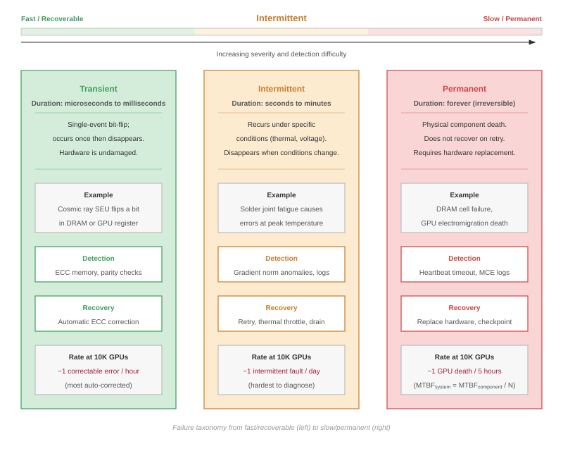
:::

The distributed training systems examined in @sec-distributed-training-systems achieve massive throughput by coordinating thousands of devices, and the collective communication patterns from @sec-collective-communication (AllReduce, AllGather, AllToAll) sustain that coordination through rigidly synchronized exchanges. However, this tight synchronization creates fragility: a failure in any single device can stall the entire fleet. This chapter builds the resilience layer that keeps that fleet running: a taxonomy of how hardware and software fail at scale, the detection methods that catch even silent data corruption, and the checkpointing, recovery, and elastic-training mechanisms that turn a failure from a catastrophe into a pause.

The transition from small-scale experimentation to large-scale production changes the relationship between systems and failures. A researcher training a model on a single GPU can go years without a hardware failure. That same workload on a 1,000-GPU cluster sees GPU-only failures every couple of days, and a production cluster fails more often once PCIe, power, storage, and network domains enter the failure budget. This shift from *rare exception* to *routine occurrence* demands different engineering approaches. The mathematical analysis that follows makes this transition precise and quantitative.

::: {.column-margin}
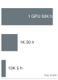{width="100%" fig-alt="Time ladder showing system mean time between failures collapsing as fleet size grows: 1 GPU at 50,000 hours, 1,000 GPUs at 50 hours, 10,000 GPUs at 5 hours."}

*System MTBF collapses as the fleet grows: 50,000 h to 5 h.*
:::

Because failures *cannot* be eliminated at this scale, the engineering challenge is not to prevent them but to keep making progress despite them: fault-tolerant systems verify completion rather than assume it, treat failure as a normal code path, exercise recovery continuously rather than occasionally, and account for partial failures that leave the system in states naive error handling never anticipates. The techniques that achieve this draw on decades of distributed systems research, but ML workloads change the economics. Training exhibits properties that enable fault tolerance strategies unavailable to general distributed systems: the mathematical properties of stochastic gradient descent tolerate certain errors that would corrupt other computations, checkpoint sizes are large but predictable, and recovery targets need only be *approximate* rather than *exact*. Exploiting these properties makes ML-specific fault tolerance cheaper than the general-purpose approaches it descends from.

### The mathematics of inevitable failure {#sec-fault-tolerance-reliability-reliability-mathematics-inevitable-failure-93ef}

System reliability engineering provides the foundational framework for understanding failure at scale [@birolini2017]. Individual components exhibit failure rates characterized by the failure rate parameter $\lambda$,[^fn-failure-rate-fits] measured in failures per unit time. For a single component with constant failure rate $\lambda$, the probability of surviving without failure until time $t$ follows an exponential distribution[^fn-poisson-failure]:

[^fn-poisson-failure]: **Poisson Process**\index{Poisson Process!failure modeling}: A statistical model for events occurring independently at a constant average rate. Reliability models assume hardware failures follow a Poisson distribution, leading to the exponential survival function $R(t) = e^{-\lambda t}$. This assumption simplifies fleet planning: the probability of at least one failure in a 10,000-component cluster is $1 - e^{-N \lambda t}$, making failure risk scale linearly with $N$ but exponentially with $t$.

[^fn-failure-rate-fits]: **Failure Rate ($\lambda$)**\index{Failure Rate!FITs}: Expressed in FITs (Failures In Time), where 1 FIT equals one failure per billion device-hours. A data center GPU with `{python} FleetReliabilityRates.gpu_mttf_str` MTBF has `{python} FleetReliabilityRates.fit_eq_math`, corresponding to `{python} FleetReliabilityRates.lambda_eq_math` failures/hour. That seems negligible for one device but becomes dominant at fleet scale: a cluster with `{python} FleetReliabilityRates.fleet_gpus_str` accumulates `{python} FleetReliabilityRates.fleet_fit_str` FITs from GPUs alone, translating to an expected GPU failure every `{python} FleetReliabilityRates.hours_between_str`.

$$ R_{\text{single}}(t) = e^{-\lambda t} $$ {#eq-single-component-reliability}

The mean time between failures (MTBF) for this component equals $1/\lambda$. By the book's convention, mean time to failure (MTTF) names a single component's expected time to its first failure while MTBF names the repairable system's expected time between successive failures; under the constant-rate exponential model used here the two coincide numerically, and the chapter uses MTTF for per-component constants and MTBF for composed system rates. Data center GPUs often have specified MTBF values in the tens of thousands of hours, with field behavior depending on operating conditions, cooling effectiveness, manufacturing variation, and workload stress.[^fn-gpu-mtbf-field] @sec-appdx-reliability-foundations-component-rates catalogs the canonical per-component MTTF values (H100, A100, TPU, PCIe, power, network) that anchor these $\lambda$ and FIT figures, so a reader can substitute the constant for any device and reproduce the rates used throughout this chapter.

[^fn-gpu-mtbf-field]: **GPU MTBF Variation**\index{GPU!MTBF variation}\index{MTBF!GPU field variation}: NVIDIA specifies A100 MTBF at approximately 50,000 hours under controlled conditions, while published fleet studies from Google (Tensor Processing Unit (TPU) pods) and Meta (GPUs) report field failure rates above manufacturer specifications in their environments. The gap arises from thermal stress, power fluctuations, and memory-intensive ML workloads that push components beyond the steady-state assumptions in reliability models.

When multiple independent components operate in a system where any single failure causes system failure, @eq-system-reliability-product formalizes how system reliability becomes the product of individual component reliabilities:

$$ R_{\text{system}}(t) = \prod_{i=1}^{N} R_i(t) = \prod_{i=1}^{N} e^{-\lambda_i t} $$ {#eq-system-reliability-product}

For $N$ identical components with individual failure rate $\lambda$, this simplifies to:

$$ R_{\text{system}}(t) = e^{-N\lambda t} $$ {#eq-system-reliability-n-components}

The system failure rate becomes $N\lambda$, and @eq-system-mtbf expresses how the system MTBF scales inversely with component count. This inverse scaling reveals the counterintuitive reality of the 9s of reliability at cluster scale:

$$ \text{MTBF}_{\text{system}} = \frac{1}{N\lambda} = \frac{\text{MTBF}_{\text{component}}}{N} $$ {#eq-system-mtbf}

@Fig-reliability-gap visualizes the fundamental tension: as clusters grow, the expected time between failures shrinks below common training durations, making fault tolerance *not optional* but *physically necessary*.

::: {#fig-reliability-gap fig-env="figure" fig-pos="htb" fig-cap="**The Reliability Gap**: As GPU count increases, cluster MTBF drops below common training durations. A 10,000-GPU cluster with server-grade components experiences a failure roughly every 10 hours, making a 3-month training run impossible without fault tolerance mechanisms." fig-alt="Semilog plot of cluster MTBF vs. GPU count with reference lines for 1-day, 1-week, and 3-month training durations. Shaded region where MTBF falls below 3-month training."}

```{python}
#| echo: false
# ┌─────────────────────────────────────────────────────────────────────────────
# │ RELIABILITY GAP (FIGURE)
# ├─────────────────────────────────────────────────────────────────────────────
# │ Context: @fig-reliability-gap—cluster MTBF vs training duration
# │
# │ Goal: Plot cluster MTBF from component MTBF and GPU count; show crossover
# │       with 1-day, 1-week, 3-month training reference lines.
# │ Show: Semilogx; shaded region where MTBF is below 3-month training.
# │ How: cluster_mtbf = 100000/N; axhline references; book_style.set_book_style().
# │
# │ Imports: numpy (np), matplotlib.pyplot (plt), book.tools.figures.style (book_style)
# │ Exports: (figure only, no prose variables)
# └─────────────────────────────────────────────────────────────────────────────
# ┌── 1. CANVAS ────────────────────────────────────────────────────────────────
# │ Plot cluster MTBF from component MTBF and GPU count; show crossover
import numpy as np
import matplotlib.pyplot as plt
from book.tools.figures import style as book_style

plt.style.use('seaborn-v0_8-whitegrid')

# ┌── 2. ARRAYS ────────────────────────────────────────────────────────────────
book_style.set_book_style()
COLORS = book_style.COLORS

# Parameters: per-GPU MTBF 100,000 hours (server-grade)
# 10,000 GPUs -> cluster MTBF is about 10 hours
mtbf_component = 100_000  # hours
gpu_counts = np.array([8, 64, 512, 1000, 4000, 10000, 25000])
cluster_mtbf = mtbf_component / gpu_counts

# Training duration reference lines (hours)
train_1day = 24
train_1week = 24 * 7
train_1month = 24 * 30
train_3month = 24 * 90

fig, ax = plt.subplots(figsize=(8, 5))
ax.semilogx(gpu_counts, cluster_mtbf, color=COLORS['RedLine'], linewidth=2.5, marker='o', markersize=6)

# ┌── 3. RENDER ────────────────────────────────────────────────────────────────
ax.axhline(train_1day, color=COLORS['BlueLine'], linestyle='--', alpha=0.7, label='1 day training')
ax.axhline(train_1week, color=COLORS['GreenLine'], linestyle='--', alpha=0.7, label='1 week training')
ax.axhline(train_3month, color=COLORS['OrangeLine'], linestyle='--', alpha=0.7, label='3 month training')

ax.fill_between(gpu_counts, 0.1, cluster_mtbf, where=(cluster_mtbf < train_3month), alpha=0.2, color=COLORS['RedL'])

# ┌── 4. DECORATE ──────────────────────────────────────────────────────────────
ax.set_xlabel('Cluster Size (GPUs)')
ax.set_ylabel('Cluster MTBF (hours)')
ax.set_ylim(0.5, 1e5)
ax.set_xlim(5, 5e4)
ax.legend(loc='upper right', fontsize=8, frameon=True, facecolor='white', framealpha=0.95, edgecolor='gray', fancybox=True, borderpad=0.6)
ax.grid(True, alpha=0.3)
plt.show()
plt.close()
```

:::

### The Young-Daly law: Optimal checkpointing {#sec-fault-tolerance-young-daly}

*When* failure is inevitable, the key engineering decision is how often to save progress. Checkpointing too frequently wastes time on I/O; checkpointing too rarely wastes time re-computing work after a failure. The **Young-Daly formula**\index{Young-Daly Formula}[^fn-young-daly-history] (Principle \ref{pri-young-daly}) resolves that tension with a single square-root law:

$$ \tau_{\text{opt}} = \sqrt{2 \cdot T_{\text{write}} \cdot \text{MTBF}_{\text{system}}} $$

$T_{\text{write}}$ in distributed ML training is not the time to flush a small process state—it is the time required to transfer hundreds of gigabytes of FP32 optimizer state (momentum and variance tensors for every trainable parameter) plus model weights to durable storage. For a 70B-parameter model with full Adam state, a single checkpoint can reach several hundred gigabytes; for the 175B-parameter running example used later in this chapter, that figure exceeds a terabyte. Compressing $T_{\text{write}}$ therefore requires purpose-built high-bandwidth storage, and $T_{\text{write}}$ itself is the central constraint that determines how tightly the checkpoint interval can be set before I/O overhead displaces productive training compute.

The optimal interval balances the cost of writing checkpoints against the expected cost of reworking lost progress, the U-shaped trade-off @fig-young-daly plots. Its scaling consequence is the one to carry forward: as clusters grow, system MTBF drops, so the optimal interval shrinks, demanding higher-bandwidth storage (@sec-data-storage) to keep $T_{\text{write}}$ small before the "checkpoint tax" consumes the cluster's compute capacity. Because the relationship is a square root, halving MTBF tightens the interval by only $\sqrt{2}\approx 1.4\times$, so doubling cluster size does not demand doubling checkpoint I/O bandwidth. @Sec-appdx-reliability-foundations-young-daly carries out the full derivation and the tighter second-order bounds; the Checkpointing section later in this chapter (@sec-fault-tolerance-reliability-reliability-checkpoint-interval-failure-analysis-c28d) applies the formula to the chapter's own cluster once its system MTBF is in hand.

[^fn-young-daly-history]: **Young-Daly Formula**\index{Young-Daly Formula!history}: J. W. Young derived the first-order optimal checkpoint interval in a 1974 *Communications of the ACM* paper; John Daly independently refined it in 2006 with tighter second-order bounds. The formula's square-root relationship $(\tau_{\text{opt}} = \sqrt{2 \cdot T_{\text{write}} \cdot \text{MTBF}_{\text{system}}})$ means that halving system MTBF only increases optimal checkpoint frequency by $\sqrt{2}\approx 1.4\times$, explaining why doubling cluster size does not demand doubling checkpoint I/O bandwidth.

::: {#fig-young-daly fig-env="figure" fig-pos="htb" fig-cap="**The Young-Daly Optimal Checkpoint**: Total wasted work is the sum of *checkpointing overhead* (which decreases with interval $\tau_{\text{ckpt}}$) and *rework cost* (which increases with $\tau_{\text{ckpt}}$). The minimum point defines the optimal interval $\tau_{\text{opt}} = \sqrt{2 \cdot T_{\text{write}} \cdot \text{MTBF}_{\text{system}}}$. For a cluster with five-hour system MTBF and 15-minute write time, the optimal interval is approximately 1.6 hours." fig-alt="Plot of Overhead vs. Checkpoint Interval. A red curve for Rework Cost increases linearly. A blue curve for Checkpoint Overhead decreases hyperbolically. Their sum (green curve) shows a clear minimum point labeled Optimal Interval."}
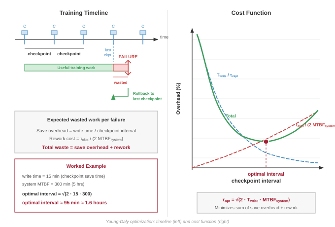
:::

@Fig-checkpoint-tax decomposes that same U-curve into its two competing components, the view the Checkpointing section uses when it works the formula through on a concrete cluster.

::: {#fig-checkpoint-tax fig-env="figure" fig-pos="htb" fig-cap="**The Checkpoint Tax Decomposition**: Time overhead as a function of checkpoint interval, separated into its two components: *save overhead* (blue) falls hyperbolically as intervals grow, while *expected rework* (red) rises linearly with failure probability. Their sum (green, *total overhead*) exhibits the U-shape whose minimum the Young-Daly formula locates. The total-overhead curve is the 'Checkpoint Tax' on compute capacity at any given interval; shorter-MTBF clusters shift this curve upward and push the optimum leftward." fig-alt="Plot of Time Overhead in percent vs. Checkpoint Interval in minutes, x-axis 0 to 80 and y-axis 0 to 35. A blue hyperbolic save-overhead curve decreases with interval. A red linear expected-rework curve increases with interval. A green total-overhead curve sums the two and shows a U-shape with a minimum."}
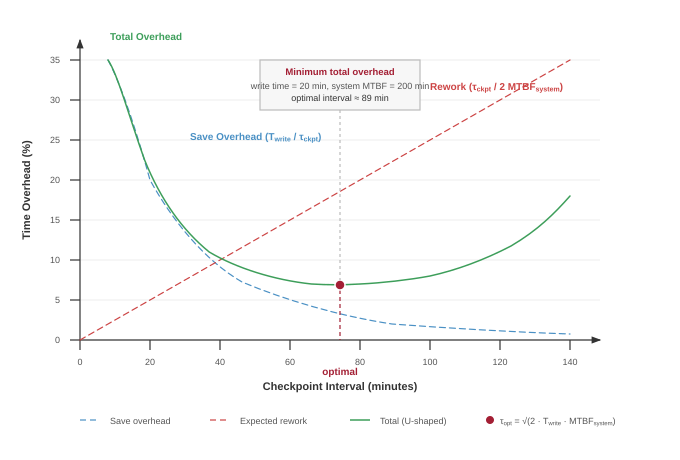
:::

A quick availability calculation shows the same scaling pressure from another angle.

```{python}
#| echo: false
#| label: lego-nines-reliability
from mlsysim.fmt import fmt_int, fmt, check, fmt_percent, fmt_time

class NinesReliability:
    # ┌── 1. LOAD ──────────────────────────────────────────
    n_gpus = Systems.Clusters.Training_10K.total_accelerators
    availability_pct = 99.99
    single_gpu_success = availability_pct / 100

    # ┌── 2. EXECUTE ───────────────────────────────────────
    downtime_min_year = (1 - single_gpu_success) * HOURS_PER_YEAR * MINUTES_PER_HOUR
    cluster_prob = single_gpu_success**n_gpus

    # ┌── 3. GUARD ─────────────────────────────────────────
    check(0 < cluster_prob < 1, "Probability must be in (0,1)")
    check(cluster_prob < 0.5, "Cluster survival must be low at scale")

    # ┌── 4. OUTPUT ────────────────────────────────────────
    n_gpus_str = fmt(n_gpus, precision=0)
    availability_str = fmt_percent(availability_pct / 100, precision=2, commas=False, style='prose')
    downtime_min_str = fmt_time(downtime_min_year, 'minute', precision=1, commas=False, style='word')
    survival_str = fmt(single_gpu_success, precision=4, commas=False)
    cluster_prob_str = fmt(cluster_prob, precision=2, commas=False)
    cluster_pct_str = fmt_percent(round(cluster_prob * 100) / 100, precision=0, commas=False, style='prose')
```

::: {#nbk-fault-tolerance-9s-reliability .callout-notebook title="The 9s of reliability"}

**Problem**: A cluster of `{python} NinesReliability.n_gpus_str` GPUs runs with each GPU at `{python} NinesReliability.availability_str` availability (only `{python} NinesReliability.downtime_min_str` of downtime per year). What is the probability that the *entire cluster* is up at the same instant?

**Math**:

1.  **Single GPU availability probability** $(R_{\text{GPU}})$: A GPU with `{python} NinesReliability.availability_str` availability has an all-up probability $R_{\text{GPU}} =$ `{python} NinesReliability.survival_str` at a randomly chosen instant.
2.  **Cluster availability probability** $(R_{\text{cluster}})$: $R_{\text{cluster}} = (R_{\text{GPU}})^{N}$.
3.  **Result**: $(R_{\text{GPU}})^{N} \approx$ `{python} NinesReliability.cluster_prob_str`.

**Systems insight**: Even with `{python} NinesReliability.availability_str` reliable hardware, a `{python} NinesReliability.n_gpus_str`-GPU cluster has only a `{python} NinesReliability.cluster_pct_str` chance that every GPU is simultaneously available. Hardware reliability alone is insufficient; software must handle failures automatically.

:::

The linear relationship between component count and failure rate has a direct implication: adding GPUs turns rare component failures into a continuous system condition.

::: {#psp-fault-tolerance-scale-transforms-failure .callout-perspective title="Scale transforms failure"}

A single GPU with MTBF of 50,000 hours (5.7 years) fails rarely enough that manual intervention suffices. A 10,000-GPU cluster with the same per-GPU reliability has GPU-only system MTBF of 5 hours. Failures occur continuously, multiple times per day. Systems must be designed expecting failure, not hoping to avoid it.

:::

### Quantitative reliability analysis {#sec-fault-tolerance-reliability-quantitative-analysis}

The GPU-only calculation in the opening reliability example supplies the scale intuition; a real training system then composes GPUs, HBM, links, power supplies, storage paths, and redundancy into one failure budget. With MTBF and the FIT rate already defined ($\text{FIT} = 10^9/\text{MTBF}$, so a 50,000-hour GPU contributes 20,000 FIT), the new question is how component rates *compose*. The composition rule depends on the redundancy structure. For **series systems**\index{Series Systems} (for example, a node where all 8 GPUs must work), failure of any component fails the whole, so reliabilities multiply and rates add:
$$R_{\text{system}}(t) = \prod_{i=1}^{N} R_i(t), \qquad \text{MTBF}_{\text{system}} = \frac{1}{\sum \lambda_i}$$
which is why adding components reduces system MTBF linearly. For **parallel systems**\index{Parallel Systems} providing redundancy (for example, active-active model replicas), failure occurs only when all redundant components fail simultaneously:
$$R_{\text{system}}(t) = 1 - \prod_{i=1}^{N} (1 - R_i(t))$$

Composition also exposes which subsystem dominates the budget, and memory is the consequential case. Consider training an Archetype A (GPT-4/Llama-3) 70B model (@sec-vol2-introduction-archetypes) on 1,024 A100 GPUs. Unprotected HBM is the binding term: at roughly 250 FIT per megabit, the cluster's $1,024 \times 80 \text{ GB}$ of memory accumulates so many failure sites that uncorrected corruption would strike every few tens of seconds, making large-scale training impossible. Error-correcting-code (ECC) memory protection is therefore not optional. ECC detects and corrects common single-bit errors, cutting the effective soft-error rate by roughly two orders of magnitude and pushing memory back below the logic and interconnect terms in the budget, though residual multi-bit or escaped corruptions remain (the silent-data-corruption problem developed later in this chapter).

These per-component FIT figures describe the silicon's intrinsic soft-error budget, which is why they differ from the 50,000-hour whole-device MTTF used in the worked cascade that follows: the device MTTF folds in every field failure mode (thermal stress, power events, mechanical wear), not just the logic and memory soft-error rates isolated here. The cascade composes those whole-device rates into the cluster figure that actually sets the checkpoint interval; this estimate only establishes why memory protection is the precondition for everything that follows.

### Worked example: Cluster MTBF calculation {#sec-fault-tolerance-reliability-reliability-worked-example-cluster-mtbf-calculation-9255}

```{python}
#| echo: false
#| label: fault-tolerance-mtbf-cascade
# ┌─────────────────────────────────────────────────────────────────────────────
# │ CLUSTER MTBF CASCADE — WORKED EXAMPLE (LEGO)
# ├─────────────────────────────────────────────────────────────────────────────
# │ Context: @sec-fault-tolerance-reliability-reliability-worked-example-cluster-
# │          mtbf-calculation-9255. Drives the Steps 1-3 display equations and the
# │          closing narrative (every 3.7 h, 6.5/day, ~45/week).
# │
# │ Goal: Reproduce the worked MTBF cascade from canonical MTTF/fleet constants so
# │       every quoted rate is traceable and cannot drift.
# │ Show: lambda per subsystem, total, system rate, cluster MTBF, failure cadence.
# │ How:  lambda = 1/MTTF; power/network shared across the node's GPUs; system = N*total.
# │       Narrative cadence follows the displayed rate (0.2708) for self-consistency.
# │
# │ Imports: mlsysim.constants (Systems), mlsysim.fmt (fmt, MarkdownStr, check)
# │ Exports: setup strs (fleet_gpus_str, {gpu,pcie,psu,nic}_mttf_hours_str, gpus_per_node_str);
# │          7 *_eq_math display equations; mtbf_hours_str, failures_per_day_str, weekly_failures_str
# └─────────────────────────────────────────────────────────────────────────────
from mlsysim.fmt import fmt, fmt_count, fmt_rate, fmt_time, MarkdownStr, check

class FailureCascadeExample:
    # ┌── 1. LOAD (Constants) ──────────────────────
    fleet_gpus = Systems.Clusters.Training_10K.total_accelerators
    gpu_mttf = float(Systems.Reliability.Gpu.mttf_hours)
    pcie_mttf = float(Systems.Reliability.PcieSwitch.mttf_hours)
    psu_mttf = float(Systems.Reliability.Psu.mttf_hours)
    nic_mttf = float(Systems.Reliability.Nic.mttf_hours)
    gpus_per_node = Systems.Nodes.DGX_H100.accelerators_per_node

    # ┌── 2. EXECUTE (The Compute) ─────────────────
    l_gpu = 1 / gpu_mttf
    l_pcie = 1 / pcie_mttf
    l_power = (1 / gpus_per_node) / psu_mttf
    l_net = (1 / gpus_per_node) / nic_mttf
    l_total = l_gpu + l_pcie + l_power + l_net
    l_system = fleet_gpus * l_total
    l_system_disp = round(l_system, 4)  # rate as displayed (0.2708)
    mtbf_h = 1 / l_system_disp  # narrative follows the displayed rate
    per_day = 24 * l_system_disp
    per_week = 24 * 7 * l_system_disp
    weekly_failures = round(per_week)

    # ┌── 3. GUARD (Invariants) ────────────────────
    check(0 < l_gpu < 1, "per-GPU failure rate must be a small positive value")
    check(2.0 < mtbf_h < 5.0, "10k-GPU cluster MTBF should be a few hours")
    check(per_week > per_day > 1, "weekly failures must exceed daily, both above one")

    # ┌── 4. OUTPUT (Formatting) ───────────────────
    fleet_gpus_str = fmt(fleet_gpus, precision=0)
    gpu_mttf_hours_str = fmt_time(gpu_mttf, "hour", precision=0, commas=True, style="word")
    pcie_mttf_hours_str = fmt_time(pcie_mttf, "hour", precision=0, commas=True, style="word")
    psu_mttf_hours_str = fmt_time(psu_mttf, "hour", precision=0, commas=True, style="word")
    nic_mttf_hours_str = fmt_time(nic_mttf, "hour", precision=0, commas=True, style="word")
    gpus_per_node_str = fmt(gpus_per_node, precision=0)
    _gpu_d = fmt(gpu_mttf, precision=0).replace(",", "{,}")
    _pcie_d = fmt(pcie_mttf, precision=0).replace(",", "{,}")
    _psu_d = fmt(psu_mttf, precision=0).replace(",", "{,}")
    _nic_d = fmt(nic_mttf, precision=0).replace(",", "{,}")
    _fleet_d = fleet_gpus_str.replace(",", "{,}")
    _npn = gpus_per_node_str
    lambda_gpu_eq_math = MarkdownStr(
        rf"$$ \lambda_{{\text{{GPU}}}} = \frac{{1}}{{{_gpu_d}}} = {l_gpu*1e5:.1f} \times 10^{{-5}} \text{{ failures/hour}} $$"
    )
    lambda_pcie_eq_math = MarkdownStr(
        rf"$$ \lambda_{{\text{{PCIe}}}} = \frac{{1}}{{{_pcie_d}}} = {l_pcie*1e5:.1f} \times 10^{{-5}} \text{{ failures/hour}} $$"
    )
    lambda_power_eq_math = MarkdownStr(
        rf"$$ \lambda_{{\text{{power/GPU}}}} = \frac{{1}}{{{_npn}}} \times \frac{{1}}{{{_psu_d}}} = {l_power*1e5:.3f} \times 10^{{-5}} \text{{ failures/hour}} $$"
    )
    lambda_net_eq_math = MarkdownStr(
        rf"$$ \lambda_{{\text{{network/GPU}}}} = \frac{{1}}{{{_npn}}} \times \frac{{1}}{{{_nic_d}}} = {l_net*1e5:.3f} \times 10^{{-5}} \text{{ failures/hour}} $$"
    )
    lambda_total_eq_math = MarkdownStr(
        rf"$$ \lambda_{{\text{{total/GPU}}}} = ({l_gpu*1e5:.1f} + {l_pcie*1e5:.1f} + {l_power*1e5:.3f} + {l_net*1e5:.3f}) \times 10^{{-5}} = {l_total*1e5:.3f} \times 10^{{-5}} \text{{ failures/hour}} $$"
    )
    lambda_system_eq_math = MarkdownStr(
        rf"$$ \lambda_{{\text{{system}}}} = {_fleet_d} \times {l_total*1e5:.3f} \times 10^{{-5}} = {l_system:.4f} \text{{ failures/hour}} $$"
    )
    mtbf_eq_math = MarkdownStr(rf"$$ \text{{MTBF}}_{{\text{{system}}}} = \frac{{1}}{{{l_system_disp:.4f}}} = {mtbf_h:.2f} \text{{ hours}} $$")
    mtbf_hours_str = fmt_time(mtbf_h, "hour", precision=1, commas=False, style="word")
    failures_per_day_str = fmt_rate(per_day, "failures/day", precision=1, commas=False)
    weekly_failures_str = fmt_count(weekly_failures, precision=0, label="failure")
```

Consider a training cluster designed for large language model development with the following specifications:

- `{python} FailureCascadeExample.fleet_gpus_str` NVIDIA H100 GPUs
- Individual GPU MTBF: `{python} FailureCascadeExample.gpu_mttf_hours_str`
- Each GPU connected to host via PCIe (MTBF: `{python} FailureCascadeExample.pcie_mttf_hours_str`)
- Each node contains `{python} FailureCascadeExample.gpus_per_node_str` GPUs with shared power supply (MTBF: `{python} FailureCascadeExample.psu_mttf_hours_str`)
- Network infrastructure per node (NIC, cables): MTBF `{python} FailureCascadeExample.nic_mttf_hours_str`

#### Step 1: Calculate failure rate per GPU subsystem {.unnumbered}

Each GPU operates within a failure domain that includes the GPU itself, its PCIe connection, and proportional shares of the power supply and network infrastructure.

`{python} FailureCascadeExample.lambda_gpu_eq_math`

`{python} FailureCascadeExample.lambda_pcie_eq_math`

`{python} FailureCascadeExample.lambda_power_eq_math`

`{python} FailureCascadeExample.lambda_net_eq_math`

#### Step 2: Calculate total per-GPU failure rate {.unnumbered}

`{python} FailureCascadeExample.lambda_total_eq_math`

#### Step 3: Calculate system failure rate and MTBF {.unnumbered}

`{python} FailureCascadeExample.lambda_system_eq_math`

`{python} FailureCascadeExample.mtbf_eq_math`

This result means the cluster experiences a failure approximately every `{python} FailureCascadeExample.mtbf_hours_str` on average. The expected failure cadence is `{python} FailureCascadeExample.failures_per_day_str`; a training run lasting one week will experience approximately `{python} FailureCascadeExample.weekly_failures_str`. Any training system operating at this scale must treat failure as a continuous condition, not an exceptional event. @Sec-appdx-reliability-foundations-mtbf-cascade works this same cascade through step by step, composing per-component rates into a fleet-wide system MTBF, so a reader can rerun the calculation for a different node design or cluster size.

The cluster MTBF scaling\index{Cluster!MTBF scaling} in @tbl-cluster-mtbf-scaling isolates the GPU-only baseline across cluster sizes. The full-system calculation is lower once PCIe, power, and network failure domains are included.

| **Cluster Size (GPUs)** | **Individual GPU MTBF** |   **Cluster MTBF**   | **Expected Failures per Day** |
|:------------------------|:-----------------------:|:--------------------:|:-----------------------------:|
| 8                       |        50,000 hrs       | 6,250 hrs (260 days) |             0.004             |
| 64                      |        50,000 hrs       |  781 hrs (32 days)   |              0.03             |
| 512                     |        50,000 hrs       |   98 hrs (4 days)    |              0.24             |
| 1,000                   |        50,000 hrs       |   50 hrs (2 days)    |              0.48             |
| 4,000                   |        50,000 hrs       |       12.5 hrs       |              1.9              |
| 10,000                  |        50,000 hrs       |        5 hrs         |              4.8              |
| 25,000                  |        50,000 hrs       |        2 hrs         |              12.0             |

: **Cluster MTBF Scaling**: GPU-only mean time between failures decreases linearly with cluster size, transforming failures from rare events to continuous operating conditions at scale. Additional host, power, storage, and network failure domains reduce system-level MTBF further. {#tbl-cluster-mtbf-scaling}

The theoretical $1/N$ scaling in @tbl-cluster-mtbf-scaling is not merely a textbook exercise. @Fig-published-failure-rates overlays published measurements and fitted projections from Meta's production clusters against the theoretical curve. The @kokolis2025 study of Meta's Research SuperCluster reported measured MTTF values for observed RSC job sizes and projected a 1.8-hour MTTF for 16,384-GPU jobs; Meta's Llama 3 training report independently documented 419 failures across 54 days on 16,384 H100 GPUs, an observed MTTF of about 3.1 hours. Together, the measured Llama run and Kokolis projection put 16,384-GPU training on a 2-to-3-hour failure cadence. This evidence transforms the theoretical argument from an abstract scaling law into an engineering constraint that determines checkpoint frequency, recovery architecture, and infrastructure investment.

::: {#fig-published-failure-rates fig-env="figure" fig-pos="htb" fig-cap="**Published Failure Rates from Production Clusters**: Measured MTTF values and fitted projections from Meta's RSC clusters [@kokolis2025] plotted with Llama 3 training measurements [@dubey2024llama] against the theoretical 1/N curve. At 16,384 GPUs, the Kokolis projection and Llama 3 empirical measurement both fall in the 2-to-3-hour failure range, confirming that fault tolerance is a mathematical necessity, not an edge case. Data sources: Kokolis et al., arXiv:2410.21680; Meta, arXiv:2407.21783." fig-alt="Log-log scatter plot of MTTF in hours vs. GPU count with theoretical 1 over N curve and labeled measured and projected data points from Meta RSC and Llama 3 training."}

```{python}
#| echo: false
# ┌─────────────────────────────────────────────────────────────────────────────
# │ PUBLISHED FAILURE RATES (FIGURE)
# ├─────────────────────────────────────────────────────────────────────────────
# │ Context: @fig-published-failure-rates—measurements/projections vs 1/N scaling
# │
# │ Goal: Overlay Kokolis et al. measured/projected MTTF and Llama 3 measured
# │       MTTF on the theoretical 1/N curve.
# │ Show: Log-log plot; theoretical dashed line; scatter with annotations.
# │ How: Systems.Reliability.Gpu.mttf_hours/N; Kokolis/Llama data; book_style.setup_plot().
# │
# │ Imports: numpy (np), matplotlib.pyplot (plt), book.tools.figures.style (book_style),
# │          mlsysim.constants (Systems.Reliability.Gpu.mttf_hours)
# │ Exports: (figure only, no prose variables)
# └─────────────────────────────────────────────────────────────────────────────
# ┌── 1. CANVAS ────────────────────────────────────────────────────────────────
# │ Overlay Kokolis et al. and Llama 3 MTTF data on theoretical 1/N
import numpy as np
import matplotlib.pyplot as plt
from book.tools.figures import style as book_style

fig, ax, COLORS, plt = book_style.setup_plot(figsize=(8, 5.5))

# Theoretical curve: cluster MTBF = GPU_MTTF/N

# ┌── 2. ARRAYS ────────────────────────────────────────────────────────────────
n_theoretical = np.logspace(0.5, 5.3, 200)
mtbf_theoretical = Systems.Reliability.Gpu.mttf_hours / n_theoretical

# ┌── 3. RENDER ────────────────────────────────────────────────────────────────
ax.plot(
    n_theoretical,
    mtbf_theoretical,
    color=COLORS['grid'],
    linestyle='--',
    linewidth=1.5,
    label=f'Theoretical: {Systems.Reliability.Gpu.mttf_hours:,}h/N',
    zorder=1,
)

# MEASURED AND PROJECTED DATA: Kokolis et al. (arXiv:2410.21680, HPCA 2025)
kokolis_gpus = [8, 1024, 16384, 131072]
kokolis_mttf = [1144.8, 7.9, 1.8, 0.23]  # hours
kokolis_labels = ['8 GPUs\n(47.7 days)', '1,024 GPUs\n(7.9 hrs)', '16,384 GPUs\n(projected, 1.8 hrs)', '131K GPUs\n(projected, 14 min)']

ax.scatter(
    kokolis_gpus,
    kokolis_mttf,
    color=COLORS['BlueLine'],
    s=80,
    zorder=3,
    marker='o',
    edgecolors='white',
    linewidth=0.8,
    label='Meta RSC (Kokolis et al. 2025)',
)
# Label Kokolis points
label_pos = {0: (40, -42, 'center'), 1: (-60, 10, 'center'), 2: (-65, 5, 'center'), 3: (-65, 10, 'center')}

for i, (x, y, lbl) in enumerate(zip(kokolis_gpus, kokolis_mttf, kokolis_labels)):
    dx, dy, ha = label_pos[i]

    ax.annotate(
        lbl,
        xy=(x, y),
        xytext=(dx, dy),
        textcoords='offset points',
        fontsize=7,
        ha=ha,
        color=COLORS['BlueLine'],
        arrowprops=dict(arrowstyle='->', color=COLORS['BlueLine'], shrinkA=0, shrinkB=5, lw=0.8),
    )

# VERIFIED DATA: Meta Llama 3 (arXiv:2407.21783)
# 419 failures in 54 days = MTTF ~3.1 hours
llama_gpus = [16384]
llama_mttf = [3.1]

ax.scatter(
    llama_gpus, llama_mttf, color=COLORS['RedLine'], s=120, zorder=4, marker='*', edgecolors='white', linewidth=0.8, label='Llama 3 (Meta 2024)'
)

# ┌── 4. DECORATE ──────────────────────────────────────────────────────────────
ax.annotate(
    'Llama 3 (16K H100s,\n419 failures in 54 days)',
    xy=(16384, 3.2),
    xytext=(40000, 8),
    fontsize=7,
    ha='center',
    fontweight='bold',
    color=COLORS['RedLine'],
    arrowprops=dict(arrowstyle='->', color=COLORS['RedLine'], lw=0.75),
)

# Training duration reference lines
durations = [(24, '1 day'), (168, '1 week'), (2160, '3 months')]
for hrs, lbl in durations:
    ax.axhline(y=hrs, color=COLORS['GreenLine'], linestyle=':', linewidth=0.8, alpha=0.5)
    ax.text(4, hrs * 1.15, lbl, fontsize=7, color=COLORS['GreenLine'], alpha=0.7)

# Key annotation
ax.annotate(
    'At 16K GPUs: one failure\n every ~2--3 hours',
    xy=(15870, 1.7),
    xytext=(1200, 0.4),
    fontsize=7,
    ha='center',
    fontweight='bold',
    color='crimson',
    bbox=dict(facecolor="#f2c9d0", edgecolor='none', alpha=0.15, pad=3),
    arrowprops=dict(arrowstyle='->', color='crimson', lw=0.75),
)

ax.set_xscale('log')
ax.set_yscale('log')
ax.set_xlabel('GPU Count (N)')
ax.set_ylabel('Mean Time to Failure (hours)')
ax.set_xlim(3, 300000)
ax.set_ylim(0.1, 5000)
ax.legend(loc='upper right', fontsize=8, frameon=True, facecolor='white', framealpha=0.95, edgecolor='gray', fancybox=True, borderpad=0.6)

plt.tight_layout()
plt.show()
plt.close()
```

:::

### Failure taxonomy {#sec-fault-tolerance-reliability-reliability-failure-taxonomy-e78c}

The MTBF calculations in the reliability analysis quantify *how often* failures occur, which is critical for setting checkpoint intervals and sizing recovery infrastructure. Designing effective fault tolerance also requires understanding *what kind* of failures occur. Use the vocabulary carefully: a fault is the underlying defect or event, an error is the corrupted state it produces, and a failure is the externally visible behavior the training system must handle. A network partition that resolves in seconds demands different handling than a permanent GPU failure. A silent memory corruption that produces incorrect gradients requires different detection mechanisms than a node crash that stops responding entirely. Failure characteristics guide the selection of appropriate recovery mechanisms. The taxonomy presented here classifies failures along two primary dimensions: temporal behavior (transient vs. persistent) and failure manifestation (fail-stop vs. Byzantine).

#### Transient failures {#sec-fault-tolerance-reliability-reliability-transient-failures-57b4}

Transient failures occur temporarily and resolve without intervention, so the recovery question is whether the system can retry or validate the affected work before corrupted state propagates. Momentary **network packet loss**\index{Network Packet Loss} may drop packets while retransmission succeeds; **memory bit flips**\index{Memory!bit flips} from cosmic ray induced single-event upsets[^fn-seu-rate] can corrupt individual bits; **thermal throttling**\index{Thermal Throttling} can temporarily reduce performance during temperature spikes; and **software timeouts**\index{Software Timeouts} can arise from temporary resource contention.

[^fn-seu-rate]: **Single-Event Upset (SEU)**\index{SEU!error rate}: From particle physics, where "upset" denotes a nondestructive state change. Cosmic rays and alpha particles from chip packaging flip approximately one bit per gigabyte of RAM per month at sea level. ECC memory corrects single-bit errors but cannot handle multi-bit upsets in the same word, leaving a residual silent corruption rate that compounds across the terabytes of state in large-scale ML training.

Transient failures are particularly insidious in ML training because they may not trigger explicit errors. A transient memory bit flip during gradient computation produces incorrect gradients that propagate through subsequent training steps. The model continues training but produces subtly degraded results. Large-scale SDC and DRAM field studies show that hardware errors can escape ordinary error reporting in production fleets [@dixit2021silent; @schroeder2009]. In ML training, that same undetected-corruption pattern can surface as degraded gradients, anomalous loss curves, or rollback-worthy checkpoints rather than an explicit crash[^fn-silent-corruption-training].

[^fn-silent-corruption-training]: **Silent Data Corruption (SDC)**\index{Silent Data Corruption!training detection}: At fleet scale, SDC can bypass normal exception paths: infrastructure studies have documented defective hardware producing valid-looking but wrong results, while DRAM field studies show memory errors are common enough that fleet-level monitoring matters. For ML training, the practical debugging consequence is that the absence of an error message does not imply correct computation; systems need statistical checks on loss, gradients, and model state.

The appropriate response to transient failures depends on detection capability. Errors that trigger explicit exceptions can be handled through retry logic. Silent corruption requires validation mechanisms such as gradient checksums, periodic model evaluation, and statistical monitoring of training dynamics.

#### Fail-stop failures {#sec-fault-tolerance-reliability-reliability-failstop-failures-5cdd}

Fail-stop failures cause components to cease operation entirely and detectably. The failed component stops responding to requests and can be identified through timeout mechanisms: a **GPU hardware failure**\index{GPU!hardware failure} can make a device unresponsive, a **node crash**\index{Node!crash} can terminate all processes on a machine, a **network partition** can isolate the node from the cluster, and a **storage failure**\index{Storage!failure} can prevent checkpoint reads or writes.

In synchronous distributed training, fail-stop failures carry a particularly severe consequence: they stall the entire job. AllReduce collectives require every participating rank to contribute its gradient shard before the reduction can complete. A single GPU that goes silent—whether from a hardware fault, a process crash, or a network partition—blocks every other GPU in the ring until the timeout expires. On a 10,000-GPU job, that means 9,999 accelerators sitting idle, accumulating billable hours against a run that has made zero forward progress, until the coordinator finally declares the missing rank failed and triggers recovery.

Fail-stop failures are the easiest class to handle because detection is straightforward: the component stops responding. Recovery involves replacing the failed component and restoring state from the most recent checkpoint. The primary challenge is minimizing detection time and recovery latency.

Detection time $T_{\text{detect}}$ typically involves heartbeat mechanisms where each GPU rank periodically signals liveness to a coordinator. If no heartbeat arrives within the timeout period $T_{\text{timeout}}$, the coordinator declares failure. Setting $T_{\text{timeout}}$ requires balancing false positive rate against detection latency. False positives declare healthy workers failed due to transient delays, while slow detection wastes compute during the detection window—a cost that scales linearly with the number of GPUs blocked in the collective.

For a heartbeat interval of $H$ seconds and expected network delay variance $\sigma_d$, @eq-timeout-calculation defines the timeout heuristic:

$$ T_{\text{timeout}} = H + k\sigma_d $$ {#eq-timeout-calculation}

where $k$ typically ranges from three to five to achieve low false positive rates while maintaining reasonable detection speed. ML training clusters built on dedicated high-bandwidth fabrics (InfiniBand, NVLink) exhibit very low baseline jitter, so $\sigma_d$ is functionally small under normal conditions. The practical difficulty is distinguishing a genuinely dead rank from one that is temporarily slow—for example, a GPU lagging because it is writing a large checkpoint to attached storage while the collective is already waiting. Tuning $T_{\text{timeout}}$ too tightly causes checkpoint writes to trigger false failure declarations; tuning it too loosely extends the window during which every other rank in the AllReduce collective is blocked idle.

#### Byzantine failures {#sec-fault-tolerance-reliability-reliability-byzantine-failures-8a24}

Where a fail-stop component simply goes silent and is detected and replaced, a far more insidious class keeps running but produces incorrect results. A GPU that returns wrong gradients without throwing errors, a network that delivers corrupted packets that pass CRC checks, or a worker that computes different results for identical inputs all exemplify **Byzantine failures**\index{Byzantine Failures}, the most challenging class in distributed systems. In ML systems, this category includes silent data corruption\index{Silent Data Corruption!mechanism}, numerical instability\index{Numerical Instability}, determinism violations\index{Determinism Violations}, and adversarial corruption; the common property is that the worker still participates while the value it contributes can poison shared state.

##### The physics of silent corruption {#sec-fault-tolerance-reliability-physics-silent-corruption-5d5d}

At the nanometer scale of advanced transistors, hardware is not *deterministic*; it is *probabilistic*. Two primary mechanisms drive silent data corruption (SDC):

1.  **single-event upsets (SEUs)**: High-energy particles (cosmic rays at sea level, alpha particles from packaging materials) strike memory cells or logic gates, flipping a bit from 0 to 1. At 10,000+ GPUs, this is a statistical certainty.
2.  **Manufacturing Variances**\index{Manufacturing Variances}: "Marginal" chips that pass initial QA may exhibit bit flips only under specific voltage/temperature conditions (for example, during the intense $di/dt$ swings of a backward pass).

Facebook documented a pervasive SDC issue where a hardware fault caused a valid file to be reported as "size zero" during decompression [@dixit2021silent]. As @fig-sdc-example illustrates, the system "worked" (no crash), but data was silently deleted. In ML, this manifests as valid-looking but numerically corrupted gradients.

::: {.content-visible when-format="pdf"}
\newpage
:::

::: {#fig-sdc-example fig-env="figure" fig-pos="htb" fig-cap="**Silent Data Corruption Propagation**: Unexpected faults can return incorrect file sizes, leading to data loss during decompression and propagating errors through distributed querying systems. This example from Facebook emphasizes how silent errors bypass standard exception handlers. Source: [@dixit2021silent]." fig-alt="System diagram showing data flow from compressed storage through defective CPU to database. Arrows indicate processing stages where file size calculation returns zero, causing missing rows in output."}
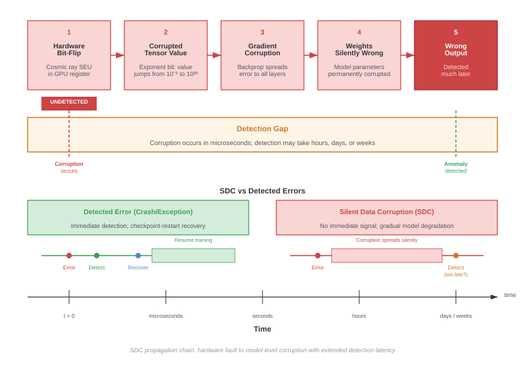
:::

Real-world evidence of SDC in production systems confirms these risks. @Fig-sdc-jeffdean shows corrupted data blocks accumulating in a shuffle and merge database at Google, where even a small fraction of corrupted blocks can cascade into significant data quality degradation.

::: {#fig-sdc-jeffdean fig-env="figure" fig-pos="htb" fig-cap="**Silent Data Corruption in Spark**: AI systems that use large-scale data processing frameworks such as Spark are vulnerable to silent data corruption (SDC) accumulating during data transfer and storage. SDC manifests in a shuffle and merge database, highlighting corrupted data blocks (red) amidst healthy data (blue/gray). Source: Jeff Dean at MLSys 2024, Keynote." fig-alt="Database visualization with grid of data blocks. Red blocks indicate corrupted entries scattered among blue and gray healthy blocks in a shuffle and merge database structure."}


:::

Google reported that SDC in TPU pods often manifests as sudden, inexplicable spikes in gradient norm (@fig-sdc-training-fault). A single bit flip in an exponent can turn a $10^{-5}$ gradient into $10^{20}$, destroying weeks of training.

::: {#fig-sdc-training-fault fig-env="figure" fig-pos="htb" fig-cap="**Gradient Norm Deviation**: Transient hardware faults, such as silent data corruption (SDC), disrupt optimization by causing abrupt changes in gradient norms. Real-world data from Google's production fleet confirms that SDC anomalies manifest as visible spikes in gradient norm, indicating a disruption to the expected parameter update process. Source: Jeff Dean, MLSys 2024 Keynote." fig-alt="Line graph of gradient norm over training time showing smooth baseline with sudden spike anomaly caused by silent data corruption event."}


:::

Google addresses this by maintaining "hot spares": running the same computation on two distinct chips or having a standby ready to take over. If a "sanity checker" (monitoring loss/gradients) detects an anomaly, the workload is instantly migrated to the hot spare, and the suspect chip is drained for diagnostics (@fig-sdc-controller). This moves reliability from the *component* (which we cannot trust) to the *system* (which verifies the result).

::: {#fig-sdc-controller fig-env="figure" fig-pos="htb" fig-cap="**Hot Spare Redundancy**: Google's data centers use hot spare cores to maintain uninterrupted ML training despite hardware failures, seamlessly transitioning workloads from defective machines to backup resources. This approach contrasts with parallel redundancy techniques like DMR/TMR by providing a reactive fault tolerance mechanism that minimizes downtime and preserves data integrity during ML training. Source: Jeff Dean, MLSys 2024 Keynote." fig-alt="Four-panel sequence: normal training grid, defective machine marked red, SDC checker detecting fault, workload transferred to hot spare while defective unit sent for repair."}
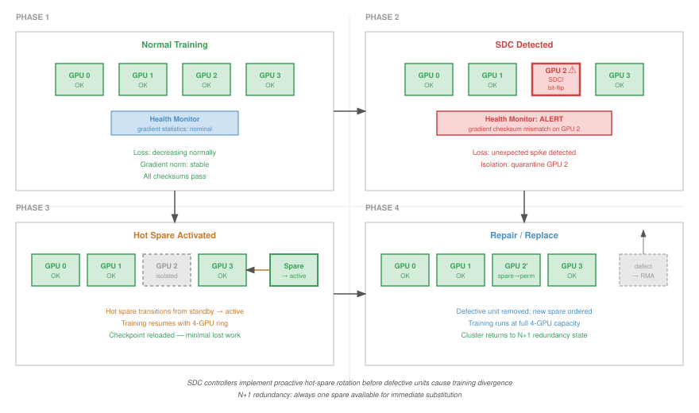
:::

The hot spare pattern in @fig-sdc-controller illustrates one approach to SDC mitigation, but recognizing silent corruption in the first place requires understanding what distinguishes it from benign training noise.

::: {#chk-fault-tolerance-detecting-silent-corruption .callout-checkpoint title="Detecting silent corruption"}

Verify your understanding of nonstop failures and SDC:

- [ ] **SDC danger**: Why is silent data corruption (SDC) more dangerous for ML training than a simple node crash?
- [ ] **Hot spare vs. restart**: How does a **hot spare** redundancy strategy differ from a traditional **checkpoint-restart** approach in terms of recovery latency?
- [ ] **Sanity checker**: In the Google case study, which metric was used as a "sanity checker" to identify potential hardware faults: GPU Temperature or Gradient Norm?
- [ ] **Byzantine scope**: True or False: Byzantine failures only occur when a malicious actor intentionally sabotages the training cluster.

:::

Silent-corruption detection is the first defense, but the same logic extends to any Byzantine worker whose output remains syntactically valid. These failures are particularly dangerous in distributed training because the standard assumption that workers compute identical gradients for identical data no longer holds. A single Byzantine worker can corrupt the averaged gradient, potentially causing training to diverge or converge to a poor solution. @Fig-failure-types contrasts the straightforward detection of fail-stop failures\index{Fail-Stop Failure} with the insidious nature of Byzantine corruption.

::: {#fig-failure-types fig-env="figure" fig-pos="htb" fig-cap="**Fail-Stop vs. Byzantine Failures**: In the fail-stop model (left), a failed worker simply ceases to send messages, which is easily detected by timeouts. In the Byzantine model (right), a failed worker continues to participate but sends incorrect data (for example, corrupted gradients reported as valid), which can poison the global model state if not detected by redundant validation." fig-alt="Side-by-side diagrams. Left: fail-stop failure with worker 2 silent, dashed timeout arrow to coordinator. Right: Byzantine failure with worker 2 sending incorrect gradient 9.9 while worker 1 sends valid 0.5, resulting in poisoned update warning."}

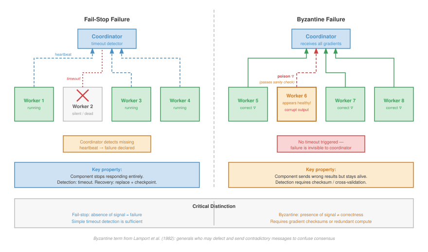

:::

Detection of Byzantine failures requires redundant computation. Multiple workers computing gradients for the same data enable comparison of results. Statistical outlier detection can identify workers consistently producing anomalous gradients. These detection mechanisms add computational overhead and may not catch subtle corruption.

Byzantine-resilient distributed training algorithms exist but impose significant overhead. Algorithms such as Krum [@blanchard2017machine] and coordinate-wise trimmed mean [@yin2018byzantine] compute aggregates that are robust to a bounded number of Byzantine workers, but they require more communication and computation than simple averaging. The systems consequence is visible here: corrupted gradients can push the optimizer toward an unreliable model state while the training job appears healthy. Reliability therefore has to protect semantic correctness, not only process liveness.[^fn-byzantine-ml-overhead]

[^fn-byzantine-ml-overhead]: **Byzantine-Resilient ML**\index{Byzantine-Resilient ML}\index{Byzantine Fault Tolerance!ML overhead}: Named after Lamport's 1982 "Byzantine Generals Problem," these algorithms (Krum\index{Krum}, trimmed mean\index{Trimmed Mean}, signSGD) tolerate a bounded fraction of corrupted workers, typically fewer than 50 percent. The trade-off is concrete: for $N$ workers, Krum requires $\mathcal{O}(N^2)$ pairwise gradient comparisons per step, adding 10--30 percent communication overhead in clusters exceeding 100 workers, which directly competes with the throughput gains of data parallelism.

#### Correlated failures {#sec-fault-tolerance-reliability-reliability-correlated-failures-95e8}

The reliability calculations in @sec-fault-tolerance-reliability-reliability-mathematics-inevitable-failure-93ef assume independent failures. Real systems exhibit correlated failures when shared dependencies fail many components at once: a **power supply failure**\index{Power Supply Failure} can take down every GPU in a node, a **network switch failure**\index{Network Switch Failure} can isolate all attached nodes, a **cooling system failure**\index{Cooling!system failure} can force thermal shutdown across racks, a **software bug**\index{Software Bugs} in a CUDA driver can crash every process using that version, and **operator error**\index{Operator Error} can misconfigure an entire cluster.

Correlated failures violate the independence assumption underlying @eq-system-reliability-n-components. When failures are correlated, the actual system reliability is lower than the formula predicts. Correlated failures can also defeat redundancy strategies. Three replicas of a model provide no availability benefit if all three run on the same power domain and a power failure takes out all three simultaneously.

::: {.column-margin}
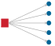{width="100%" fig-alt="A single red fault source on the left with arrows fanning out to five blue nodes on the right, showing one shared dependency taking down all the components that depend on it."}

*One shared dependency fails and takes every node with it.*
:::

Defending against correlated failures\index{Correlated Failure} requires understanding failure domains\index{Failure Domain!ML infrastructure} and ensuring redundancy spans independent failure domains. @Tbl-failure-domains catalogs common failure domains in ML infrastructure, from single GPUs to entire data center regions, each requiring distinct mitigation strategies. @Fig-failure-domains illustrates how these domains nest hierarchically, with failures propagating downward through the containment structure.

| **Failure Domain**     |     **Impact Scope**     | **Typical Recovery Time** |   **Mitigation Strategy**    |
|:-----------------------|:------------------------:|:-------------------------:|:----------------------------:|
| **Single GPU**         |          1 GPU           |      Seconds (spare)      | Hot spare, elastic training  |
| **Node (power/OS)**    |          8 GPUs          |          Minutes          | Checkpoint, node replacement |
| **Rack (ToR switch)**  |        32–64 GPUs        |      Minutes to hours     |    Cross-rack redundancy     |
| **Power domain**       |       100–500 GPUs       |           Hours           |     Multiple power feeds     |
| **Data Center region** |         All GPUs         |       Hours to days       |   Geographic distribution    |
| **Software version**   | All GPUs running version |     Minutes (rollback)    |       Staged rollouts        |

: **Failure Domains in ML Infrastructure**: Understanding failure domain boundaries enables placement of redundant components across independent domains, preventing correlated failures from defeating redundancy strategies. {#tbl-failure-domains}

The nesting of failure domains in @tbl-failure-domains has direct consequences for redundancy placement: placing replicas within the same domain provides zero protection against that domain's failure mode.

::: {#chk-fault-tolerance-mapping-failure-domains .callout-checkpoint title="Mapping failure domains"}

Verify your understanding of how failure domains nest and their operational impact:

- [ ] **Blast radius**: If a rack switch fails, how many 8-GPU nodes are typically affected in a standard data center configuration?
- [ ] **Zone correlation**: Why does placing all 3 model replicas in the same Zone (for example, `us-east-1a`) fail to provide protection against a regional power outage?
- [ ] **Staged rollouts**: Which failure domain is uniquely addressed by **Staged Rollouts** rather than hardware redundancy?
- [ ] **Nested domains**: Can you explain the concept of **Hierarchical Containment**? If a Zone fails, does the corresponding Rack failure domain still matter for that event?

:::

::: {#fig-failure-domains fig-env="figure" fig-pos="htb" fig-cap="**Hierarchy of Failure Domains**: Failure domains are often nested or overlapping. A GPU failure affects one device. A node failure affects 8 GPUs. A rack switch failure affects 32-64 GPUs. A power distribution unit (PDU) failure may affect multiple racks. Effective fault tolerance requires placing replicas across independent domains (for example, different racks or rows) to survive correlated failures." fig-alt="Nested rectangles showing failure domain hierarchy. Region contains Zone A and Zone B. Each zone contains a rack with switch and PDU. Each rack contains a node with OS and PCIe. Each node contains multiple GPUs. Annotation explains containment."}

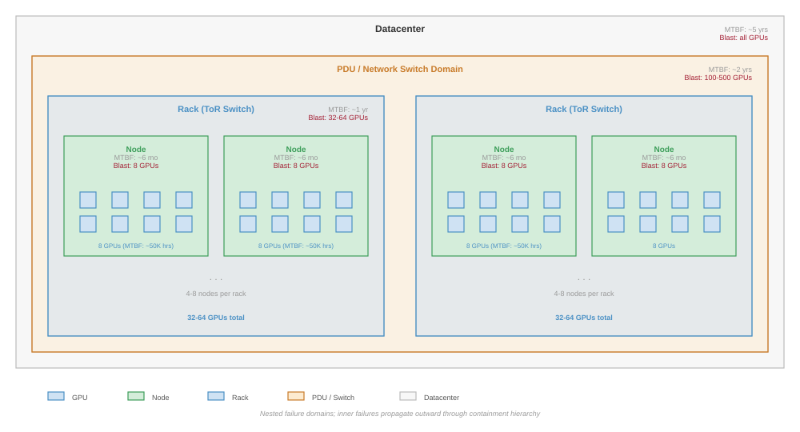

:::

The key insight from @fig-failure-domains is that redundancy is effective only when replicas span independent failure domains: placing three model replicas on the same rack provides no protection against the rack switch or PDU that all three share.

::: {#ws-fault-tolerance-google-tpuv4-routing .callout-war-story title="The supercomputer that rerouted around faults (2024)"}

**Context**: Google's TPUv4 machine-learning supercomputer used 4,096 TPU chips connected by a custom 3D torus Inter-Chip Interconnect (ICI) fabric, and Google engineers published their operating experience with automatic fault resiliency and hardware recovery [@zu2024tpuv4].

**Failure mode**: At that scale, a failed machine, chip, ICI cable, or optical circuit switch was not merely a lost component. It could disrupt the topology that synchronous training jobs relied on for collective communication.

**Consequence**: Google built a control plane that detected faults, reconfigured the ICI fabric, and routed jobs around failures or onto spare healthy cubes. The paper reports 99.98 percent system availability while gracefully handling hardware outages experienced by about 1 percent of training jobs.

**Systems lesson**: Fault tolerance is a topology-management problem. In tightly coupled accelerator fleets, recovery must preserve the communication graph, not merely replace an individual component; otherwise one local hardware fault can become a cluster-wide training interruption.

:::

### The bathtub curve and hardware lifecycle {#sec-fault-tolerance-reliability-reliability-bathtub-curve-hardware-lifecycle-7d8a}

The failure taxonomy classifies failure types and domains, answering what kind of failures occur. Equally important for designing fault tolerance is understanding when in a component's lifetime failures are most likely to occur. Hardware failure rates are not constant over component lifetime. @Fig-bathtub-curve illustrates the bathtub curve\index{Bathtub Curve}, a well-established model in reliability engineering that describes how failure rates vary across three distinct phases:

The first phase, infant mortality\index{Infant Mortality}, exhibits elevated failure rates from manufacturing defects, improper installation, and early-life wear-out of marginal components. This phase typically lasts days to weeks for electronic components. Burn-in testing[^fn-burn-in-screening] operates components under stress conditions before deployment to precipitate infant mortality failures before production use.

[^fn-burn-in-screening]: **Burn-in Testing**\index{Burn-in Testing!reliability screening}: Components operate at elevated temperature (85--125 degrees C) and voltage for 24--168 hours to precipitate infant mortality failures before production. Large operators may burn in accelerators before deployment, reducing the infant-mortality failures that fresh bare-metal hardware can otherwise expose to early jobs.

After surviving infant mortality, components enter the useful life\index{Useful Life} phase, where they exhibit relatively constant failure rates [@pinheiro2007failure; @klutke2003]. This phase represents the longest portion of component lifetime and is the period where the exponential reliability model in @eq-single-component-reliability applies most accurately. For data center GPUs, the useful life phase typically spans 3--5 years.

As components age, they enter the wear-out\index{Wear-Out} phase, where failure rates increase due to accumulated wear. For GPUs, wear mechanisms include electromigration[^fn-electromigration-wearout] in circuits, thermal cycling stress on solder joints, and degradation of thermal interface materials. The onset of wear-out depends heavily on operating conditions; components operated at high temperatures or with frequent thermal cycling enter wear-out earlier.

[^fn-electromigration-wearout]: **Electromigration**\index{Electromigration!wear-out mechanism}: Gradual displacement of metal atoms in conductors by electron momentum transfer, first characterized by Huntington and Grone in 1961. Mean time to failure follows Black's equation, decreasing roughly inversely with current density squared and exponentially with increasing temperature. For ML accelerators running sustained high-power workloads at nanometer-scale wire widths, electromigration can become a leading wear-out mechanism, making thermal management a direct determinant of fleet lifespan.

The practical implication for ML systems is that fleet-wide failure rates depend on age distribution. A cluster populated entirely with new GPUs will experience elevated failure rates during the first few weeks, followed by a stable period, then increasing failures as the fleet ages. Mixed-age fleets exhibit more consistent aggregate failure rates because different cohorts are in different lifecycle phases.

::: {#fig-bathtub-curve fig-env="figure" fig-pos="htb" fig-cap="**The Bathtub Curve**: Hardware failure rates $\lambda(t)$ vary over time. (1) Infant Mortality: high failure rate initially due to manufacturing defects. (2) Useful Life: constant, low failure rate where random failures dominate. (3) Wear-Out: increasing failure rate as components age. Burn-in testing aims to filter out infant mortality failures before deployment." fig-alt="Line graph of failure rate vs. component age showing bathtub shape. Three phases: infant mortality with high decreasing rate, useful life with constant low rate, and wear-out with increasing rate. Vertical dashed line marks burn-in period."}

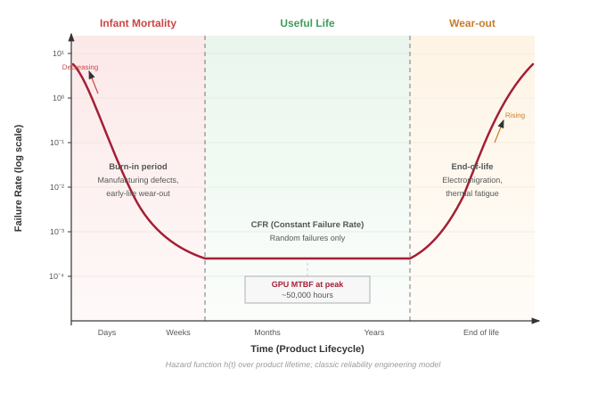

:::

The three phases in @fig-bathtub-curve have direct operational consequences: burn-in testing filters infant mortality before deployment, while predictive analytics using GPU telemetry (temperature trends, error counts, performance degradation) targets the wear-out phase, enabling scheduled component replacement during maintenance windows rather than unplanned outages during training runs.

ML infrastructure teams apply this model directly to cluster scheduling and fleet admission. New accelerator pods are not placed directly into production training queues after provisioning. Instead, operators run intensive synthetic workloads—sustained matrix-multiply loops at peak TFLOPS utilization—for 24 to 72 hours to force any infant-mortality defects to surface. A GPU that fails during this burn-in phase is repaired or replaced before it ever touches a high-value training run; a GPU that survives enters the useful-life period where the constant-rate exponential model applies. This discipline matters because the cost asymmetry is stark: catching an infant-mortality failure during a burn-in session costs a few hours of idle accelerator time, while the same failure during a multi-week foundation model pretraining run can invalidate days of gradient accumulation and force a checkpoint rollback. Scheduling policy reflects this asymmetry: fresh or recently-repaired nodes are typically assigned to short exploratory jobs or inference serving first, not to months-long pretraining jobs, until they have accumulated enough operating hours to leave the infant-mortality risk window.

### Model-type diversity in failure impact {#sec-fault-tolerance-reliability-reliability-modeltype-diversity-failure-impact-8ec0}

While the mathematics of failure rates apply universally, the failure impact by model type\index{Failure!model-type impact} differs dramatically. The impact of losing an hour of training depends on what that training costs, how much state must be recovered, and how long recovery takes. @Tbl-failure-impact-by-model quantifies these factors across model architectures, revealing orders-of-magnitude variation from LLMs incurring millions of dollars in wasted compute to vision models losing modest amounts of progress.

| **Model Type**                        | **Typical Training Duration** | **Checkpoint Size** |      **State Sensitivity**      |       **Failure Cost**       |
|:--------------------------------------|:-----------------------------:|:-------------------:|:-------------------------------:|:----------------------------:|
| **Archetype A (70B-class dense LLM)** |           2–4 weeks           |      350–700 GB     |  High (position in curriculum)  | \$2–5M compute per 24hr loss |
| **Vision (ViT-Large)**                |            1–3 days           |        1–2 GB       |   Medium (augmentation state)   |    \$10–50K per day loss     |
| **Archetype B (DLRM at Scale)**       |           Continuous          | 2–4 TB (embeddings) | Very High (embedding freshness) |   Revenue impact per hour    |
| **Speech (Whisper-scale)**            |            3–7 days           |       5–10 GB       |              Medium             |    \$50–200K per day loss    |
| **Scientific (AlphaFold)**            |         Days to weeks         |       10–50 GB      |     High (exploration state)    |        Research delay        |

: **Failure Impact by Model Type**: The cost of training failures varies dramatically by model type, driven by training duration, checkpoint overhead, and the value of accumulated training state. These differences demand model-specific fault tolerance strategies. {#tbl-failure-impact-by-model}

```{python}
#| echo: false
# ┌── LEGO ───────────────────────────────────────────────
# │ Context: LLM failure-impact prose below (@tbl-failure-impact-by-model).
# │ Goal: Format GPT-3 checkpoint size for the 175B running example.
# │ Exports: FaultToleranceIntroRecap.gpt3_ckpt_tb_str
from mlsysim.solvers import TrainingMemoryModel
from mlsysim import Models, Hardware
from mlsysim.fmt import fmt, check, fmt_qty

class FaultToleranceIntroRecap:
    m = Models.Language.GPT3
    mem_res = TrainingMemoryModel().solve(m, Hardware.Cloud.A100, batch_size=1, precision="fp32")
    gpt3_ckpt_bytes = mem_res.total_memory
    check(gpt3_ckpt_bytes > mem_res.optimizer_state, "Full checkpoint must exceed optimizer-only size")
    # ┌── 4. OUTPUT (Formatting) ─────────────────────────────────────────────
    gpt3_ckpt_tb_str = fmt_qty(gpt3_ckpt_bytes, TB, precision=1, commas=False)
```

Large Language Models experience the highest absolute failure costs due to their extended training durations and the computational expense of each training hour. For example, a large training run consuming 25,000 GPUs at approximately \$2 per GPU-hour incurs \$1.2M in compute costs per day. A failure that loses 24 hours of training progress costs \$1.2M in wasted compute plus schedule delay. The checkpoint overhead spans a wide range: 70B-class dense LLM checkpoints can reach hundreds of gigabytes, and the 175B-parameter running example used later in this chapter reaches `{python} FaultToleranceIntroRecap.gpt3_ckpt_tb_str` once FP32 Adam optimizer state is included.

Recommendation Systems present unique challenges because their training is often continuous rather than episodic. The value of a RecSys model derives partly from its freshness. Embeddings that capture recent user behavior outperform stale embeddings. A failure that loses hours of embedding updates may degrade recommendation quality in ways that directly impact revenue. Meta has documented that recommendation model freshness directly correlates with engagement metrics, making recovery time a business-critical metric.[^fn-recsys-freshness-cost]

[^fn-recsys-freshness-cost]: **RecSys Freshness**\index{RecSys Freshness}\index{Recommendation System!freshness fault tolerance}: Meta's Deep Learning Recommendation Model (DLRM) infrastructure documents that embedding staleness measured in hours produces measurable degradation in recommendation relevance and engagement metrics. This inverts the typical fault tolerance priority: for recommendation systems, minimizing recovery time matters more than minimizing checkpoint overhead, because stale embeddings directly reduce revenue.

Vision Models occupy a middle ground with moderate training durations and manageable checkpoint sizes. The relatively small checkpoints enable frequent checkpointing with minimal overhead. A ViT-Large checkpoint in the 1–2 GB range imposes little overhead compared with large language or embedding-heavy recommendation workloads. Data augmentation state represents the primary state beyond model weights that must be preserved for reproducible recovery. The augmentation parameters and data shuffling seed must be captured.

Scientific Models such as those used in protein structure prediction or climate simulation often have unique state requirements beyond model parameters. AlphaFold-style training may maintain exploration state tracking which protein families have been sampled, preventing repetition during recovery. Drug discovery models may track which molecular configurations have been evaluated. This domain-specific state complicates checkpoint and recovery design.

### Economic framework for fault tolerance investment {#sec-fault-tolerance-reliability-reliability-economic-framework-fault-tolerance-investment-e032}

Fault tolerance mechanisms consume resources: storage for checkpoints, bandwidth for checkpoint writes, compute cycles for redundant calculations, and engineering time for implementation and maintenance. Rational investment in fault tolerance requires quantifying both the cost of failures and the cost of prevention.

Failure costs include wasted compute, schedule delay, opportunity cost, and engineering time. Wasted compute measures GPU-hours expended on training steps that must be repeated. Schedule delay captures how extended time to a trained model impacts business timelines. Opportunity cost recognizes that compute consumed by recovery cannot be used for other training. Engineering cost accounts for time spent debugging failures and manually recovering.

Prevention costs include storage, throughput overhead, recovery infrastructure, and complexity. Storage cost scales with model size and checkpoint frequency. Checkpoint writes consume memory bandwidth and may stall training. Recovery infrastructure requires spare capacity and automated recovery systems. Fault tolerant systems are harder to develop and debug.

Optimal investment in fault tolerance balances these costs. For small-scale training on a few GPUs where failures are rare, minimal fault tolerance may be cost-optimal. Infrequent checkpoints and manual recovery suffice. For large-scale training on thousands of GPUs where failures occur multiple times daily, extensive fault tolerance provides positive return on investment. Frequent checkpoints, automatic recovery, and elastic training become essential. @Fig-young-daly visualizes how the trade-off between checkpoint overhead and recovery cost reaches an optimum that depends on both system MTBF and checkpoint write time.

@Eq-ft-total-cost presents a simplified economic model for expected cost per training run:

$$ C_{\text{total}} = C_{\text{compute}} + E[N_{\text{failures}}] \times C_{\text{per-failure}} + C_{\text{ft}} $$ {#eq-ft-total-cost}

where $C_{\text{compute}}$ is the base compute cost, $E[N_{\text{failures}}]$ is the expected number of failures during training, $C_{\text{per-failure}}$ is the cost per failure, and $C_{\text{ft}}$ is the cost of fault tolerance mechanisms. The cost per failure includes wasted compute plus overhead.

@Eq-ft-investment-criterion formalizes when fault tolerance investment is justified:

$$ \frac{\partial C_{\text{ft}}}{\partial x} < \frac{\partial (E[N_{\text{failures}}] \times C_{\text{per-failure}})}{\partial x} $$ {#eq-ft-investment-criterion}

where $x$ represents investment in fault tolerance mechanisms. In practice, this means investing in fault tolerance until the marginal cost of additional protection exceeds the marginal reduction in failure costs.

Three foundational principles guide every design decision in this domain.

::: {#psp-fault-tolerance-three-rules-failure-at-scale .callout-perspective title="Three rules of failure at scale"}

1. **At scale, failures are continuous, not exceptional.** A 10,000-GPU cluster experiences failures every few hours. Systems must be designed expecting failure as normal operation.
2. **Checkpoint intervals have an optimum.** The Young-Daly formula, $\tau_{\text{opt}} = \sqrt{2 \times T_{\text{write}} \times \text{MTBF}_{\text{system}}}$, provides quantitative guidance for checkpoint frequency. This formula is derived in @sec-fault-tolerance-young-daly.
3. **Training and serving have fundamentally different fault tolerance requirements.** Training tolerates minutes of recovery time; serving requires milliseconds. This difference demands entirely different approaches.

:::

Rule 3—the training/serving divergence—structures the rest of this chapter: training recovery comes first, serving resilience later. Before either, the physical realities of what breaks must be understood, starting with the hardware faults that trigger these failures.

## Hardware Fault Taxonomy {#sec-fault-tolerance-hardware-fault-taxonomy}

Consider what happens when a cosmic ray flips a single bit in a GPU's High Bandwidth Memory, or when thermal expansion causes a microscopic fracture in an NVLink connector. These physical events cascade into software errors that can corrupt a multi-week training run, but the recovery system does not observe "cosmic ray" or "fracture" directly. It observes symptoms: a gradient spike with no process crash, a rank that disappears from the collective, or a node that fails only when it heats under sustained load. Hardware taxonomy is useful only when it turns those symptoms into a recovery decision.

### Hardware fault impact on ML systems {#sec-ft-hardware-fault-impact-ml-systems-b5f7}

ML systems amplify the consequences of hardware faults beyond what traditional applications experience. Computational intensity creates millions of opportunities per second for faults to corrupt results. Training runs lasting days or weeks increase the probability of encountering faults. Small corruptions in model weights can cause large changes in output predictions, and distributed dependencies mean that a single-point failure can disrupt entire workflows.

A single bit-flip in a weight matrix illustrates the severity. If a critical weight in a ResNet-50 model flips from `0.5` to `-0.5` due to a transient fault affecting the sign bit in the IEEE 754[^fn-ieee754-vulnerability] floating-point representation, the sign of a feature map reverses, causing a cascade of errors through subsequent layers. Fault-injection studies show that DNN resilience depends sharply on model, layer, structure, and bit position, so a small number of faults in vulnerable locations can cause disproportionate accuracy loss [@reagen2018]. Unlike traditional software where a single bit error might cause a crash, in neural networks it can silently corrupt the learned representations that determine system behavior.

[^fn-ieee754-vulnerability]: **IEEE 754 (1985)**\index{IEEE 754!bit-flip vulnerability}: Standardized by William Kahan at Berkeley, this format uses 1 sign bit, 8 exponent bits, and 23 mantissa bits for FP32. The bit layout creates an asymmetric vulnerability for ML: a sign-bit flip inverts a weight entirely ($0.5 \to -0.5$), while an exponent-bit flip can shift magnitude by orders of magnitude, so resilience mechanisms often prioritize the most sensitive bit positions rather than treating all bits as equally important.

Reliability remains a design pressure as accelerator devices scale. Smaller geometries and lower operating voltages can reduce the charge needed to disturb a stored value, increasing sensitivity to some soft-error mechanisms [@baumann2005], while large ML fleets expose rare hardware faults often enough that software-level detection and recovery become part of the training system design [@he2023]. ML system architects must treat hardware as an **unreliable substrate**\index{Unreliable Substrate}, where algorithmic fault tolerance (gradient checksums, weight replication, periodic production consistency checks) is a mandatory requirement rather than an HPC specialty.

The temporal signature of a hardware fault determines that response. A one-time corruption asks for detection and rollback, a persistent defect asks for quarantine and replacement, and a recurring load-sensitive defect asks for evidence collection before the node poisons more jobs. @Fig-fault-temporal-categories summarizes the three categories that matter operationally.

::: {#fig-fault-temporal-categories fig-env="figure" fig-pos="htb" fig-cap="**Temporal Taxonomy of Hardware Faults**: Four panels show how the three temporal categories manifest in practice. Transient panels (bit flip and timing glitch) show temporary disruptions that do not cause permanent damage. The Intermittent panel shows sporadic errors driven by unstable conditions or aging. The Permanent panel (stuck-at-0/1) shows irreversible physical damage that requires replacement." fig-alt="Four-panel diagram showing Transient (bit-flip), Permanent (stuck-at), Transient (timing glitch), and Intermittent fault patterns over time, illustrating the three temporal categories."}
::: {layout-ncol=2}
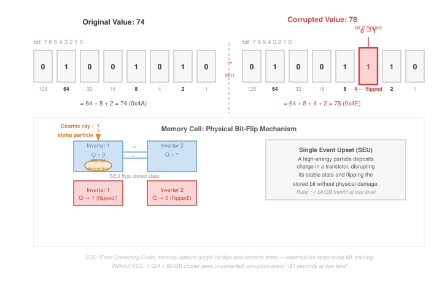

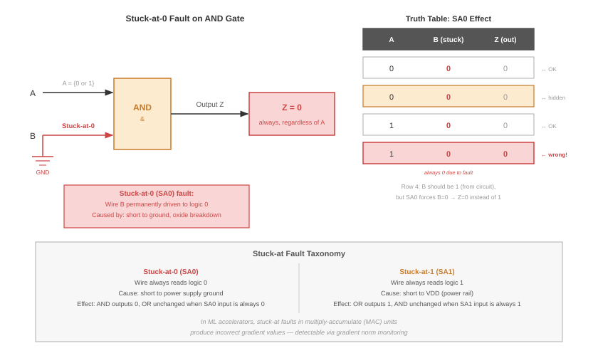

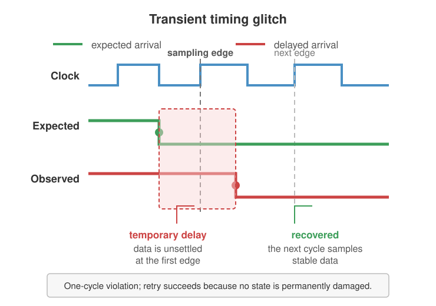

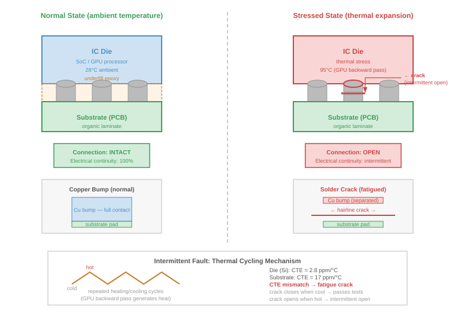
:::
:::

The three categories differ by what the recovery system should infer:

*   Transient faults\index{Transient Fault} are temporary disruptions caused by external factors such as cosmic rays or electromagnetic interference [@ziegler1996]. Their danger is silent corruption: a rank may keep participating while sending a wrong gradient or activation.
*   Permanent faults\index{Permanent Fault} represent irreversible damage from physical defects or component wear-out, such as stuck-at faults or device failures that require hardware replacement. Their danger is repeatability: retrying the same device reproduces the same bad computation or hard failure.
*   Intermittent faults\index{Intermittent Fault} appear and disappear sporadically due to unstable conditions like loose connections, aging components, or thermal stress. Their danger is ambiguity: the job may pass validation during one run and fail under a slightly different load.

### Transient faults {#sec-ft-transient-faults-1455}

The failure taxonomy classified transients by recovery posture, asking whether the system could retry or validate the affected work. This pass asks a different question: the physical mechanism that produces them and the detection it demands. Transient faults are the most common category, and @fig-bit-flip illustrates the basic mechanism: a bit-flip error\index{Bit-Flip Error} occurs when a single bit in memory unexpectedly changes state, potentially altering critical data or computations in ways that cascade through neural network layers.

::: {#fig-bit-flip fig-env="figure" fig-pos="htb" fig-cap="**Bit-Flip Error**: Transient faults can alter individual bits in memory, corrupting data or program instructions and potentially causing system malfunctions. These single-bit errors exemplify the vulnerability of hardware to transient faults like those induced by radiation or electromagnetic interference." fig-alt="Two 8-bit binary sequences showing bit flip: top row displays original value, bottom row shows corrupted value with one bit changed from 0 to 1 highlighted in red."}

```{.tikz}
\scalebox{0.8}{%
\begin{tikzpicture}[line join=round,font=\usefont{T1}{phv}{m}{n}\small]
\tikzset{%
helvetica/.style={align=flush center,font=\small\usefont{T1}{phv}{m}{n}},
cell/.style={draw=BrownLine,line width=0.5pt, minimum size=\cellsize,
    minimum height=\cellheight}
}
\def\columns{6}
\def\rows{1}
\def\cellsize{9mm}
\def\cellheight{9mm}
\colorlet{BrownL}{BrownL!30}

\begin{scope}[local bounding box=M1,shift={(0,0)}]
\foreach \x in {1,...,\columns}{
    \foreach \y in {1,...,\rows}{
        %
        \def\br{MG}
\node[draw=BrownLine, fill=BrownL, minimum width=\cellsize,
                    minimum height=\cellheight,
                    line width=0.5pt] (cell-\x-\y\br) at (\x*\cellsize,-\y*\cellheight) {1};
    }
}
\end{scope}

\begin{scope}[local bounding box=M2,shift={(0,-2)}]
\foreach \x in {1,...,\columns}{
    \foreach \y in {1,...,\rows}{
        %
        \def\br{MD}
\node[draw=BrownLine, fill=BrownL, minimum width=\cellsize,
                    minimum height=\cellheight,
                    line width=0.5pt] (cell-\x-\y\br) at (\x*\cellsize,-\y*\cellheight) {1};
    }
}
\end{scope}
\foreach \x in {2,3,6}{,
\node[cell,fill=BrownL]at(cell-\x-1MG){0};
}
\foreach \x in {2,6}{,
\node[cell,fill=BrownL]at(cell-\x-1MD){0};
}

\node[cell,fill=BrownL,line width=2pt](BF)at(cell-3-1MD){1};
\node[above=3pt of BF]{\textbf{Bit-Flip}};
\node[right=0.3 of cell-6-1MD,font=\usefont{T1}{phv}{m}{n}\tiny](DT){$\bullet$ $\bullet$ $\bullet$};
\node[right=0.3 of cell-6-1MG,font=\usefont{T1}{phv}{m}{n}\tiny](GT){$\bullet$ $\bullet$ $\bullet$};
\node[right=0.3 of GT]{Memory before};
\node[right=0.3 of DT]{Memory after};
\end{tikzpicture}}
```

:::

Transient faults matter because they can leave no damaged component to find after the incident. A Single Event Upset from radiation, a voltage fluctuation from an unstable power path [@reddi2013], electromagnetic interference, electrostatic discharge, crosstalk, ground bounce, a timing violation, or a soft error in combinational logic [@mukherjee2005] can all collapse to the same ML symptom: one tensor, packet, or instruction differs from what the collective expected. The recovery design therefore emphasizes online detection, correction where possible, and rollback from a known-good state rather than manual hardware replacement.

#### Quantitative fault rates {#sec-ft-fault-analysis-performance-impact-fa37}

Advanced semiconductor processes can increase soft-error sensitivity as node capacitance, supply voltage, and stored charge shrink [@baumann2005]. For GPUs[^fn-gpu-fault-rates-training], the practical risk is amplified by massive parallelism: thousands of execution lanes and high-bandwidth memories create many sites where transient faults can affect weights, activations, or gradients. Operational MTBF[^fn-mtbf-checkpoint] values are therefore workload-, component-, and environment-dependent rather than universal. For the checkpointing analysis below, the important systems rule is compounding: a cluster of 1,000 accelerators with an illustrative per-accelerator MTBF of 50,000 hours experiences an expected failure every 50 hours, necessitating robust checkpointing.

[^fn-mtbf-checkpoint]: **MTBF (Mean Time Between Failures)**\index{MTBF!checkpoint frequency}: Formalized by the U.S. military in MIL-HDBK-217 (1965), MTBF assumes exponential failure distributions during the useful-life period. For ML training, MTBF feeds directly into the Young-Daly formula: a cluster with 50,000-hour per-device MTBF and 1,000 devices has a system MTBF of 50 hours, demanding checkpoints every 1--2 hours to keep wasted compute below 1 percent of total training time.

[^fn-gpu-fault-rates-training]: **GPU Fault Rates**\index{GPU!fault rates}\index{GPU!fault rate}: GPUs concentrate thousands of execution lanes and high-bandwidth memory stacks in a single package. ML accelerators also run sustained high-power kernels with large volumes of weight, activation, and gradient data in flight, so transient faults can affect both computation and communication state.

Memory subsystems are the most vulnerability-prone components, and fault tolerance mechanisms impose a direct bandwidth tax. @Tbl-memory-bandwidth-protection quantifies this cost across memory technologies:

```{python}
#| echo: false
#| label: mem-bandwidth-protection-calc
# ┌─────────────────────────────────────────────────────────────────────────────
# │ MEMORY BANDWIDTH PROTECTION ANALYSIS (LEGO)
# ├─────────────────────────────────────────────────────────────────────────────
# │ Context: @tbl-memory-bandwidth-protection — effective BW after ECC overhead.
# │
# │ Goal: Compute effective bandwidth = base BW × (1 - ECC overhead) for each
# │   memory technology.
# │ Show: DDR4 44.8, HBM2 787.5, HBM3 1,400, GDDR6X 760 GB/s in table.
# │ How: Load memory-interface bandwidth tiers and protection overheads from
# │   MLSysIM, then multiply base bandwidth by (1 - overhead fraction).
# │
# │ Imports: mlsysim public API (Hardware, Ops, units, formatters, checks)
# │ Exports: base/effective *_gb_per_s_str values, ecc_overhead_pct_str,
# │   no_ecc_overhead_str
# └─────────────────────────────────────────────────────────────────────────────
from mlsysim import *

class MemBandwidthProtection:
    """Compute effective memory bandwidth after ECC overhead."""

    # ┌── 1. LOAD (Constants) ──────────────────────────────────────────────
    ddr4_base_bw = Hardware.Tech.Memory.DDR4_3200.bandwidth
    hbm2_base_bw = Hardware.Tech.Memory.HBM2.bandwidth
    hbm3_base_bw = Hardware.Tech.Memory.HBM3.bandwidth
    gddr6x_base_bw = Hardware.Tech.Memory.GDDR6X.bandwidth
    ecc_overhead = Ops.MemoryProtection.EccParityOverhead
    no_ecc_overhead = Ops.MemoryProtection.NoEccOverhead

    # ┌── 2. EXECUTE (The Compute) ─────────────────────────────────────────
    ddr4_eff_bw = ddr4_base_bw * (1 - float(ecc_overhead))
    hbm2_eff_bw = hbm2_base_bw * (1 - float(ecc_overhead))
    hbm3_eff_bw = hbm3_base_bw * (1 - float(ecc_overhead))
    gddr6x_eff_bw = gddr6x_base_bw * (1 - float(no_ecc_overhead))

    # ┌── 3. GUARD (Invariants) ────────────────────────────────────────────
    check(abs(ddr4_eff_bw.to(GB / second).magnitude - 44.8) < 0.01, f"DDR4 effective BW mismatch: {ddr4_eff_bw}")
    check(abs(hbm2_eff_bw.to(GB / second).magnitude - 787.5) < 0.01, f"HBM2 effective BW mismatch: {hbm2_eff_bw}")
    check(abs(hbm3_eff_bw.to(GB / second).magnitude - 1400) < 0.01, f"HBM3 effective BW mismatch: {hbm3_eff_bw}")
    check(abs(gddr6x_eff_bw.to(GB / second).magnitude - 760) < 0.01, f"GDDR6X effective BW mismatch: {gddr6x_eff_bw}")

    # ┌── 4. OUTPUT (Formatting) ───────────────────────────────────────────
    ddr4_base_gb_per_s_str = fmt_bandwidth(ddr4_base_bw, unit=GB / second, precision=1, commas=False)
    hbm2_base_gb_per_s_str = fmt_bandwidth(hbm2_base_bw, unit=GB / second, precision=0, commas=False)
    hbm3_base_gb_per_s_str = fmt_bandwidth(hbm3_base_bw, unit=GB / second, precision=0)
    gddr6x_base_gb_per_s_str = fmt_bandwidth(gddr6x_base_bw, unit=GB / second, precision=0, commas=False)
    ecc_overhead_pct_str = fmt_percent(ecc_overhead, precision=1, commas=False, style="prose")
    no_ecc_overhead_str = MarkdownStr("Typically none")
    ddr4_eff_gb_per_s_str = fmt_bandwidth(ddr4_eff_bw, unit=GB / second, precision=1, commas=False)
    hbm2_eff_gb_per_s_str = fmt_bandwidth(hbm2_eff_bw, unit=GB / second, precision=1, commas=False)
    hbm3_eff_gb_per_s_str = fmt_bandwidth(hbm3_eff_bw, unit=GB / second, precision=0)
    gddr6x_eff_gb_per_s_str = fmt_bandwidth(gddr6x_eff_bw, unit=GB / second, precision=0, commas=False)
```

The memory bandwidth protection analysis\index{Memory Bandwidth!protection analysis} shows the throughput tax that error protection can impose on different memory technologies.

| **Memory Technology** |                     **Base Bandwidth**                     |                    **ECC Overhead**                    |                  **Effective Bandwidth**                  |
|:----------------------|:----------------------------------------------------------:|:------------------------------------------------------:|:---------------------------------------------------------:|
| **DDR4-3200**         |  `{python} MemBandwidthProtection.ddr4_base_gb_per_s_str`  | `{python} MemBandwidthProtection.ecc_overhead_pct_str` |  `{python} MemBandwidthProtection.ddr4_eff_gb_per_s_str`  |
| **HBM2**              |  `{python} MemBandwidthProtection.hbm2_base_gb_per_s_str`  | `{python} MemBandwidthProtection.ecc_overhead_pct_str` |  `{python} MemBandwidthProtection.hbm2_eff_gb_per_s_str`  |
| **HBM3**              |  `{python} MemBandwidthProtection.hbm3_base_gb_per_s_str`  | `{python} MemBandwidthProtection.ecc_overhead_pct_str` |  `{python} MemBandwidthProtection.hbm3_eff_gb_per_s_str`  |
| **GDDR6X**            | `{python} MemBandwidthProtection.gddr6x_base_gb_per_s_str` | `{python} MemBandwidthProtection.no_ecc_overhead_str`  | `{python} MemBandwidthProtection.gddr6x_eff_gb_per_s_str` |

: **Memory Bandwidth Protection Analysis**: Impact of ECC protection on effective memory bandwidth across different memory technologies used in ML accelerators. The bandwidth overhead directly affects training throughput for memory-bound workloads. {#tbl-memory-bandwidth-protection}

HBM exhibits 10$\times$ higher error rates than standard DRAM due to 3D stacking effects and thermal density, requiring advanced ECC for reliable operation. GDDR, optimized for bandwidth over reliability, typically has 2--3$\times$ higher error rates than standard DRAM but often omits ECC entirely. Background memory scrubbing (periodic reads and rewrites to detect accumulating soft errors) consumes a negligible fraction of total bandwidth over a typical 24-hour scan cycle (well under 0.01 percent of an HBM2 interface).

#### Transient fault impact on ML {#sec-ft-transient-fault-effects-ml-a01d}

@Fig-transient-fault shows the same charge-disturbance mechanism the failure taxonomy introduced (@sec-fault-tolerance-reliability-physics-silent-corruption-5d5d), now at the device level: a cosmic ray strikes a memory cell or transistor and the induced charge alters stored or transmitted data.\index{Transient Fault!mechanism} What this pass adds is the downstream effect on the model rather than the physics.

::: {#fig-transient-fault fig-env="figure" fig-pos="htb" fig-cap="**Transient Fault Mechanism**: Cosmic rays and electromagnetic interference induce bit flips within hardware by altering electrical charges in memory cells and transistors, potentially corrupting data and causing system errors. Understanding these fault sources is critical for building robust AI systems that can tolerate unpredictable hardware behavior. Source: [NTT](HTTPS://group.ntt/en/newsrelease/2018/11/22/181122a.HTML)." fig-alt="Diagram showing cosmic ray particle striking a memory cell transistor. Electrical charge disruption causes bit value to flip from 0 to 1, illustrated with circuit schematic."}

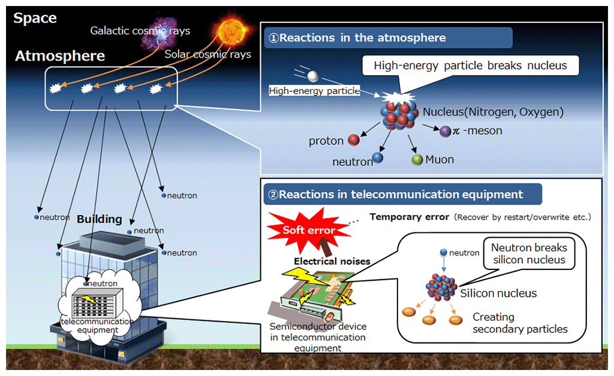

:::

During training, transient faults in the memory storing model weights or gradients lead to incorrect updates that compromise convergence and accuracy [@he2023; @wan2021]. During inference, a bit flip in the activation values of a neural network can alter the final classification or regression output [@mahmoud2020]. In safety-critical applications, these faults can result in incorrect decisions that compromise safety [@li2017; @jha2019]. Resource-constrained environments amplify these vulnerabilities: Binarized Neural Networks (BNNs) [@courbariaux2016binarized], which represent weights in single-bit precision, suffer performance degradation from 98 percent to 70 percent test accuracy when random bit-flipping soft errors are inserted with 10 percent probability [@aygun2021]. In distributed training, network partitions[^fn-network-partition-training][^fn-ib-sm] affect 1--10 percent of nodes daily, and in synchronous training, even a single partitioned rank blocks the entire AllReduce collective.

[^fn-ib-sm]: **InfiniBand Subnet Manager (SM)**\index{Subnet Manager!reliability}: A centralized software entity that discovers all nodes and switches, assigns Local Identifiers (LIDs), and calculates routing tables. In a network partition, the SM's role is critical: it must re-discover the new topology and update routing within milliseconds. If the SM itself is partitioned, the fabric can enter a "zombie" state where nodes are physically connected but cannot route messages, a common cause of $T_{\text{detect}}$ delays in large training runs.

[^fn-network-partition-training]: **Network Partition**\index{Network Partition!distributed training}: From Lamport's 1978 formalization of distributed system failure modes. Large-scale training clusters report partition events affecting 1--10 percent of nodes daily; in synchronous training, even a single partitioned rank blocks the entire AllReduce collective, making partition tolerance a prerequisite for training jobs exceeding a few hours.

### Permanent faults {#sec-ft-permanent-faults-7dfb}

Permanent faults are irreversible hardware defects that persist until the faulty component is repaired or replaced. The operational clue is repeatability: the same accelerator, memory cell, link, or storage device fails again after retry, often at the same address, path, or workload phase. Manufacturing defects (improper etching, incorrect doping, contamination) and wear-out mechanisms (electromigration[^fn-electromigration-wearout], oxide breakdown[^fn-oxide-breakdown-scaling], thermal stress[^fn-thermal-stress-throttling]) can all produce this signature. The most common abstract model is the stuck-at fault [@seong2010], where a signal or memory cell becomes permanently fixed at 0 or 1 regardless of input.

[^fn-oxide-breakdown-scaling]: **Oxide Breakdown**\index{Oxide Breakdown!scaling reliability}: Irreversible gate oxide failure creating conductive paths through the transistor insulator. Gate oxide thickness shrank from roughly 100 nm in 1980s processes to nanometer-scale dimensions in FinFET-era devices, increasing susceptibility. Time-dependent dielectric breakdown (TDDB) constrains chip reliability projections, making oxide integrity a fleet-planning concern for ML accelerator deployments spanning 3--5 year hardware refresh cycles.

[^fn-thermal-stress-throttling]: **Thermal Stress**\index{Thermal Stress!training throughput}: Degradation from repeated temperature cycling that cracks solder joints and degrades thermal interface materials. ML accelerators under sustained training loads can experience thermal throttling as clock speeds drop to prevent damage. The trade-off is direct: aggressive cooling (liquid, immersion) extends component lifespan and maintains training throughput but increases data center infrastructure cost, so cooling must be evaluated against both reliability and facility cost.

The most consequential permanent faults in ML accelerators are those that corrupt arithmetic silently and repeatably. A stuck-at fault in a Tensor Core's multiply-accumulate datapath, or a defective cell in an HBM bank that stores weight shards, produces the same wrong value every time the same computation runs. In training, this means every forward pass through the affected matrix produces a deterministically biased result, and every backward pass accumulates a skewed gradient. Because the error is reproducible but numerically small, training loss may decline normally for hundreds of steps before the accumulated bias manifests as gradient divergence or unexpectedly poor validation accuracy. In inference, the same defect deterministically skews specific output logits—a safety-critical property in medical or autonomous-driving deployments, where the fault does not crash the system but systematically tilts every decision involving the affected weight tile.

The Intel Pentium FDIV bug\index{Pentium FDIV Bug!error regions}, discovered in 1994, provides the canonical illustration of this failure mode in a general-purpose processor. An error in the lookup table used by the Pentium processor's division unit caused incorrect results for specific operations (@fig-permanent-fault). The error was small—a mistake in the fifth digit—but it compounded across operations, corrupting precision-critical applications. The ML accelerator case differs in geometry but not in principle: where the FDIV bug corrupted scalar divisions, a stuck-at fault in a Tensor Core corrupts specific rows or columns of every matrix-multiply output that routes through the defective lane, affecting all feature maps or gradient shards that touch that partition of the computation. In safety-sensitive applications, the persistent arithmetic error becomes a safety hazard because every downstream decision inherits the biased computation.

::: {#fig-permanent-fault fig-env="figure" fig-pos="htb" fig-cap="**FDIV Error Regions**: The triangular areas indicate where the Pentium processor's faulty division unit produced incorrect results when calculating 4195835/3145727. Ideally, all values should round to 1.3338, but the bug caused a slight inaccuracy in the fifth digit. Source: *Byte Magazine*." fig-alt="2D plot with triangular regions marking error zones in Intel Pentium FDIV bug. Shaded areas show where division calculations produced incorrect fifth-digit results."}

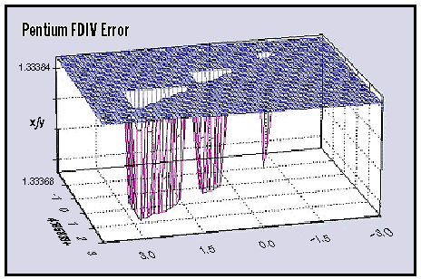

:::

@Fig-stuck-fault visualizes how stuck-at faults propagate through logic gates and interconnects, causing incorrect computations or persistent data corruption that affects downstream model behavior.\index{Stuck-at Fault Model}

::: {#fig-stuck-fault fig-env="figure" fig-pos="htb" fig-cap="**Stuck-at Fault Model**: Digital circuits can experience permanent faults where a signal line becomes fixed at a logical 0 or 1, regardless of input; this figure represents a simplified depiction of a stuck-at-0 fault, where a signal is persistently low, potentially leading to incorrect computations or system failures. Source: [accendo reliability](HTTPS://accendoreliability.com/digital-circuits-stuck-fault-model/)." fig-alt="Logic gate circuit diagram showing signal propagation through inverters and AND gates. One input line marked stuck-at-0 with X symbol, causing incorrect output regardless of input."}

```{.tikz}
\begin{tikzpicture}[line join=round,font=\usefont{T1}{phv}{m}{n}\small]
\useasboundingbox(-2,2.5) rectangle (15.7,-4.7);
\tikzset{%
helvetica/.style={align=flush center,font=\small\usefont{T1}{phv}{m}{n}},
Line/.style={line width=1.0pt,black!50,text=black},
DLine/.style={draw=OrangeLine!40, line width=1mm, -{Triangle[length=3mm, bend]},
shorten >=1.1mm, shorten <=1.15mm},
}
\colorlet{VioletL}{GreenL!60}
\begin{scope}[scale=1.75, every node/.append style={transform shape},
local bounding box=D1,shift={(0,0)}]
\def\di{D1}
\draw[line width=1pt,fill=VioletL](0,0)--(0,0.76)to[out=357,in=3,distance=25]cycle;
\fill[draw=black,fill=white,line width=1.5pt](0.72,0.38)circle(2pt);
\coordinate(G\di)at(0,0.58);
\coordinate(D\di)at(0,0.18);
\coordinate(IZ\di)at(0.8,0.38);
\end{scope}
\begin{scope}[scale=1.75, every node/.append style={transform shape},
local bounding box=D2,shift={(0,-2)}]
\def\di{D2}
\draw[line width=1pt,fill=VioletL](0,0)--(0,0.76)to[out=357,in=3,distance=25](0,0);
\fill[draw=black,fill=white,line width=1.5pt](0.72,0.38)circle(2pt);
\coordinate(G\di)at(0,0.58);
\coordinate(D\di)at(0,0.18);
\coordinate(IZ\di)at(0.8,0.38);
\end{scope}

\begin{scope}[scale=1.75, every node/.append style={transform shape},
local bounding box=D3,shift={(4,-1)}]
\def\di{D3}
\draw[line width=1pt,fill=VioletL](0,0)--(0,0.76)to[out=357,in=3,distance=25](0,0);
\fill[draw=black,fill=white,line width=1.5pt](0.72,0.38)circle(2pt);
\coordinate(G\di)at(0,0.58);
\coordinate(D\di)at(0,0.18);
\coordinate(IZ\di)at(0.8,0.38);
\end{scope}
\begin{scope}[scale=1.75, every node/.append style={transform shape},
local bounding box=D4,shift={(7,-2)}]
\def\di{D4}
\draw[line width=1pt,fill=VioletL](0,0)--(0,0.76)to[out=357,in=3,distance=25](0,0);
\fill[draw=black,fill=white,line width=1.5pt](0.72,0.38)circle(2pt);
\coordinate(G\di)at(0,0.58);
\coordinate(D\di)at(0,0.18);
\coordinate(IZ\di)at(0.8,0.38);
\end{scope}
%lines
\draw[Line](IZD2)--node[above,pos=0.3](IIZD2){SA0 \textcolor{black}{SA1}}++(0:3)|-
node[below,pos=0.91](ULDD4){SA0 \textcolor{red}{SA1}}(DD4);
\draw[Line](IZD1)--node[above,pos=0.5](IIZD1){SA0 \textcolor{red}{SA1}}++(0:2)|-(GD3);
\draw[Line](IZD3)--node[above,pos=0.9](IIZD3){SA0 \textcolor{red}{SA1}}++(0:1)|-(GD4);
\draw[Line](DD3)--node[above,pos=0.3](ULDD3){SA0 \textcolor{red}{SA1}}++(180:3.6)|-(IZD2);
\draw[Line](GD1)--node[above,pos=0.5](ULGD1){SA0 \textcolor{red}{SA1}}++(180:2);
\draw[Line](DD1)--node[above,pos=0.5](ULDD1){SA0 \textcolor{red}{SA1}}++(180:2);
\draw[Line](GD2)--node[above,pos=0.5](ULGD2){SA0 \textcolor{red}{SA1}}++(180:2);
\draw[Line](DD2)--node[above,pos=0.5](ULDD2){SA0 \textcolor{red}{SA1}}++(180:2);
\draw[Line](IZD4)--node[above,pos=0.5](IIZD4){SA0 \textcolor{black}{SA1}}++(0:2);
%
\draw[DLine,distance=40](ULGD1)to[out=50,in=120](IIZD1);
\draw[DLine,distance=44](ULDD1)to[out=-50,in=-110](IIZD1);
\draw[DLine,distance=40](ULGD2)to[out=50,in=120](IIZD2);
\draw[DLine,distance=44](ULDD2)to[out=-50,in=-110](IIZD2);
\draw[DLine,distance=50](ULDD3)to[out=-50,in=-120](IIZD3);
\draw[DLine,distance=50](ULDD4)to[out=-50,in=-100](IIZD4);
\draw[DLine,distance=63](IIZD3)to[out=50,in=90](IIZD4);
\draw[DLine,distance=80](IIZD1)to[out=50,in=90](IIZD3);
\end{tikzpicture}
```

:::

For ML systems, the recovery decision is to stop trusting the component. A permanent accelerator datapath fault can keep producing bad gradients until the device is drained from the cluster [@he2023; @zhang2018], while a permanent storage fault can compromise both the training dataset and the checkpoints needed for recovery. Checksum validation, replicated storage, hardware redundancy, error-correcting codes [@kim2015], and checkpoint-restart recovery[^fn-checkpoint-restart-training] [@egwutuoha2013] work together because each mechanism helps identify the durable copy that can still be trusted. The Young-Daly formula introduced in @sec-fault-tolerance-young-daly then gives the economic boundary. Hardware hardening increases MTBF, but the square-root relationship means reliability investment must be balanced against faster checkpointing and restart infrastructure.

[^fn-checkpoint-restart-training]: **Checkpoint-Restart**\index{Checkpoint-Restart!training completion}: Originated in 1960s mainframe batch processing, where restarting multi-hour jobs from scratch was prohibitively expensive. Large distributed training jobs can checkpoint 100+ GB model states every 10--30 minutes; Google's TPUv4 resiliency study reports coordinated checkpointing and reconfiguration that kept wasted computation from node failures below 1 percent of total training time.

### Intermittent faults {#sec-ft-intermittent-faults-35e9}

Intermittent faults are the hardest category because they create evidence, then disappear. A node may pass a reboot test, rejoin the fleet, and fail again only when the next training job drives the package into the same thermal, voltage, or communication regime. Physical degradation (cracks in solder joints, aging ball grid arrays, residue-induced electrical connections) creates those load-dependent conditions (@fig-intermittent-fault). Intermittent delay faults [@zhang2018thundervolt] cause signal propagation times to fluctuate, resulting in synchronization issues and incorrect computations that are difficult to reproduce.\index{Intermittent Fault!mechanism}

::: {#fig-intermittent-fault fig-env="figure" fig-pos="htb" fig-cap="**Intermittent Fault Mechanism**: Increased resistance from cracks between copper bumps and package solder represents a common source of intermittent faults, disrupting signal transmission and potentially causing unpredictable system behavior. Microscopic material defects like these highlight the vulnerability of hardware to latent failures that are difficult to detect during testing but can manifest during operation. Source: [constantinescu](HTTPS://ieeexplore.ieee.org/document/4925824)." fig-alt="Cross-section diagram of chip package showing crack between copper bump and solder joint. Arrows indicate increased resistance path causing intermittent signal failures."}


:::

@Fig-intermittent-fault-dram reveals how residue-induced intermittent faults in DRAM chips create unreliable electrical connections that lead to sporadic failures.\index{DRAM!residue fault}

::: {#fig-intermittent-fault-dram fig-env="figure" fig-pos="htb" fig-cap="**DRAM Residue Fault**: Intermittent failures in DRAM chips commonly arise from microscopic residue accumulation and create unreliable electrical connections. Physical defects can induce sporadic errors and highlight the need for fault-tolerant system design and hardware testing. Source: [Constantinescu](HTTPS://ieeexplore.ieee.org/document/4925824)." fig-alt="Microscope image of DRAM chip showing particle residue accumulation between memory cell contacts. Magnified view reveals contamination causing intermittent electrical connection failures."}

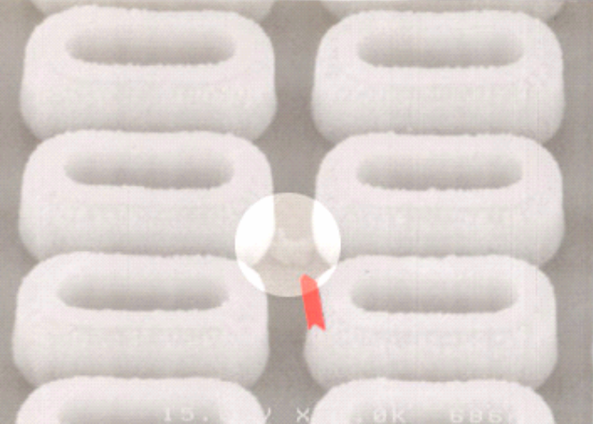

:::

For ML systems, intermittent faults should be treated as suspect until enough evidence proves otherwise. Sporadic processing or memory errors can accumulate across iterations, degrading convergence without triggering explicit failures [@he2023; @rashid2015]. Runtime monitoring and anomaly detection provide the first hint, environmental controls reduce thermal and voltage triggers, and adaptive resource management can drain, downclock, or avoid a suspect component while preserving job progress [@rashid2012]. The goal is not merely to keep the node alive; it is to prevent a nondeterministic component from making validation and recovery untrustworthy.

### Hardware fault detection and mitigation {#sec-ft-hardware-fault-detection-mitigation-8f7f}

Hardware fault mitigation works only when the detection mechanism matches the fault signature. Permanent defects are best exposed before deployment, transient bit flips need online correction, and intermittent or silent errors require runtime evidence. At the hardware level, two foundational mechanisms protect against the fault classes described earlier.

Built-in self-test (BIST) [@bushnell2002] incorporates additional circuitry for self-testing using scan chains[^fn-scan-chains-testing] that apply predefined test patterns to internal logic during system startup. BIST catches manufacturing defects and permanent faults before they corrupt production workloads.

[^fn-scan-chains-testing]: **Scan Chains**\index{Scan Chain!manufacturing test}: Test infrastructure linking internal flip-flops into shift registers, developed in the 1970s for IC design-for-testability. The trade-off is concrete: 5--15 percent silicon area overhead buys 95 percent+ manufacturing fault coverage. For ML accelerators with billions of transistors in matrix-multiply units, scan-based testing during burn-in catches the stuck-at faults that would otherwise silently corrupt weight and gradient computations in production.

Error detection and correction codes[^fn-hamming-ecc-origin] [@hamming1950] add redundant bits to detect and correct bit errors. @Fig-parity illustrates the simplest form: parity checks append an extra bit to each data word, enabling immediate detection when a bit flip occurs. More advanced codes such as cyclic redundancy checks (CRC)[^fn-crc-gradient-validation] compute checksums that detect over 99.9 percent of transmission errors, a capability critical for validating gradient payloads during the distributed AllReduce operations covered in @sec-collective-communication.\index{Parity Bit Error Detection}

::: {#fig-parity fig-env="figure" fig-pos="htb" fig-cap="**Parity Bit Error Detection**: This figure provides a simple error detection scheme where an extra bit (the parity bit) ensures the total number of 1s in a data sequence is either even or odd. The second sequence includes a flipped bit, triggering the parity check and indicating a data corruption event during transmission or storage. Source: computer hope." fig-alt="Two 7-bit data sequences with an eighth even-parity bit. The top sequence is valid. The bottom shows a bit flip that causes a parity mismatch, detecting the error."}

```{.tikz}
\scalebox{0.8}{%
\begin{tikzpicture}[line join=round,font=\usefont{T1}{phv}{m}{n}\large]
\tikzset{%
helvetica/.style={align=flush center,font=\small\usefont{T1}{phv}{m}{n}},
cell/.style={draw=none,line width=0.5pt, minimum width=8,inner xsep=0pt,
    align=center,node distance=0,minimum height=22}
}
\definecolor{bluegraph}{RGB}{0,102,204}
\begin{scope}[local bounding box=M1,shift={(0,0)}]
\def\ma{M1}
\node[cell](B1\ma){0};
\node[cell,right=of B1\ma](B2\ma){1};
\node[cell,right=of B2\ma](B3\ma){0};
\node[cell,right=of B3\ma](B4\ma){0};
\node[cell,right=of B4\ma](B5\ma){0};
\node[cell,right=of B5\ma](B6\ma){1};
\node[cell,right=of B6\ma](B7\ma){0};
\end{scope}
\begin{scope}[local bounding box=M2,shift={(2.6,0)}]
\def\ma{M2}
\node[cell](B1\ma){0};
\node[cell,right=of B1\ma](B2\ma){1};
\node[cell,right=of B2\ma](B3\ma){0};
\node[cell,right=of B3\ma](B4\ma){0};
\node[cell,right=of B4\ma](B5\ma){0};
\node[cell,right=of B5\ma](B6\ma){1};
\node[cell,right=of B6\ma](B7\ma){0};
\node[cell,right=of B7\ma,fill=red](B8\ma){\textcolor{white}{0}};
\end{scope}
\begin{scope}[local bounding box=M3,shift={(5.5,0)}]
\def\ma{M3}
\node[cell](B1\ma){0};
\node[cell,right=of B1\ma](B2\ma){1};
\node[cell,right=of B2\ma](B3\ma){0};
\node[cell,right=of B3\ma](B4\ma){0};
\node[cell,right=of B4\ma](B5\ma){0};
\node[cell,right=of B5\ma](B6\ma){1};
\node[cell,right=of B6\ma](B7\ma){0};
\node[cell,right=of B7\ma,fill=red](B8\ma){\textcolor{white}{1}};
\end{scope}
%%%below
\begin{scope}[local bounding box=M4,shift={(0,-1)}]
\def\ma{M4}
\node[cell](B1\ma){1};
\node[cell,right=of B1\ma](B2\ma){0};
\node[cell,right=of B2\ma](B3\ma){0};
\node[cell,right=of B3\ma](B4\ma){0};
\node[cell,right=of B4\ma](B5\ma){0};
\node[cell,right=of B5\ma](B6\ma){0};
\node[cell,right=of B6\ma](B7\ma){0};
\end{scope}
\begin{scope}[local bounding box=M5,shift={(2.6,-1)}]
\def\ma{M5}
\node[cell](B1\ma){1};
\node[cell,right=of B1\ma](B2\ma){0};
\node[cell,right=of B2\ma](B3\ma){0};
\node[cell,right=of B3\ma](B4\ma){0};
\node[cell,right=of B4\ma](B5\ma){0};
\node[cell,right=of B5\ma](B6\ma){0};
\node[cell,right=of B6\ma](B7\ma){0};
\node[cell,right=of B7\ma,fill=red](B8\ma){\textcolor{white}{1}};
\end{scope}
\begin{scope}[local bounding box=M6,shift={(5.5,-1)}]
\def\ma{M6}
\node[cell](B1\ma){1};
\node[cell,right=of B1\ma](B2\ma){0};
\node[cell,right=of B2\ma](B3\ma){0};
\node[cell,right=of B3\ma](B4\ma){0};
\node[cell,right=of B4\ma](B5\ma){0};
\node[cell,right=of B5\ma](B6\ma){1};
\node[cell,right=of B6\ma](B7\ma){0};
\node[cell,right=of B7\ma,fill=red](B8\ma){\textcolor{white}{0}};
\end{scope}
\node[above=0.5 of $(B1M1)!0.5!(B7M1)$,align=center,text depth=0.7,
font=\usefont{T1}{phv}{m}{n}\small](SS){sequence of\\ seven bits};
\node[above=0.5 of $(B1M2)!0.5!(B8M2)$,align=center,text depth=0.7,
font=\usefont{T1}{phv}{m}{n}\small](WE){with eighth\\ even parity bit};
\node[above=0.5 of $(B1M3)!0.5!(B8M3)$,align=center,text depth=0.7,
font=\usefont{T1}{phv}{m}{n}\small](WO){with eighth\\ odd parity bit};
\node[above=0.6 of $(SS)!0.5!(WO)$,align=center,text depth=0.7,
font=\usefont{T1}{phv}{m}{n}\small,bluegraph](PBE){Parity bit examples};
%
\draw[thick,shorten >=-15,shorten <=-15]($(B1M1)!0.5!(B1M4)$)coordinate(X0)--
($(B8M3)!0.5!(B8M6)$)coordinate(X1);
\draw[thick,shorten >=-15,shorten <=-15]([yshift=2pt]B1M1.north west)--
([yshift=2pt]B8M3.north east);
%
\draw[thick,shorten >=-15,shorten <=-10]($(B7M4)!0.5!(B1M5)$)--++(90:1.8);
\draw[thick,shorten >=-15,shorten <=-10]($(B8M5)!0.5!(B1M6)$)--++(90:1.8);
%fitting
\scoped[on background layer]
\node[draw=BackLine,inner xsep=25,inner ysep=27,yshift=-8mm,
           fill=BackColor!20,fit=(PBE)(X0)(X1),line width=0.75pt](BB1){};
\node[above=2pt of  BB1.south east,anchor=south east,
            font=\usefont{T1}{phv}{m}{n}\footnotesize,black!30]{ComputerHope.com};
%
\end{tikzpicture}}
```

:::

[^fn-hamming-ecc-origin]: **Hamming Codes (1950)**\index{Hamming Code!ECC origin}: Richard Hamming invented error-correcting codes at Bell Labs after repeated frustration with relay computer failures corrupting weekend batch jobs. His SECDED (single-error-correcting, double-error-detecting) scheme uses parity bits at power-of-2 positions to locate errors with $\mathcal{O}(\log n)$ overhead. ECC memory modules descend from this design, protecting the terabytes of model weights and optimizer state in ML training from the soft errors that would otherwise accumulate silently.

[^fn-crc-gradient-validation]: **CRC (Cyclic Redundancy Check)**\index{CRC!gradient validation}: Polynomial checksum algorithm developed by @peterson1961, detecting over 99.9 percent of transmission errors with negligible computational overhead. In distributed ML training, CRC-32 validates gradient payloads exchanged during AllReduce across thousands of nodes; without this check, a single corrupted gradient packet would silently poison the parameter update for every worker in the collective.

Hardware redundancy uses component duplication and voting to detect and mask faults [@sheaffer2007]. Double modular redundancy (DMR)[^fn-dmr-detection] duplicates computation and compares outputs at 100 percent silicon overhead; triple modular redundancy (TMR)[^fn-tmr-correction] performs computation three times and takes a majority vote at 200 percent overhead, enabling automatic single-fault correction [@arifeen2020]. @Fig-error-masking shows how a TMR voter circuit masks a single faulty unit by selecting the majority output. Tesla's Full Self-Driving computer uses DMR across two independent system on chip (SoC) units (@fig-tesla-dmr), while the Boeing 777 uses TMR in its primary flight computer for safety-critical aviation control [@yeh1996; @bannon2019].

[^fn-dmr-detection]: **DMR (Double Modular Redundancy)**\index{DMR!detection trade-off}: Duplicates computation and compares outputs to detect (but not correct) errors, at 100 percent silicon overhead vs. TMR's 200 percent. DMR detects 99.99 percent of transient faults in critical paths. Tesla's Full Self-Driving computer uses DMR across two independent SoCs, reflecting the design trade-off: DMR halves the hardware cost of TMR while requiring a safe fallback policy when outputs disagree.

[^fn-tmr-correction]: **TMR (Triple Modular Redundancy)**\index{TMR!majority voting}: Performs computation three times and takes a majority vote, enabling automatic single-fault correction at 200 percent hardware overhead. First applied in early fault-tolerant mainframes in the 1950s, TMR remains a longstanding pattern for radiation-exposed and safety-critical inference where single-fault correction matters more than hardware efficiency.

::: {#fig-tesla-dmr fig-env="figure" fig-pos="htb" fig-cap="**Dual Modular Redundancy (DMR)**: Tesla's full self-driving computer employs a DMR architecture, replicating critical computations across two independent system-on-chips (SoCs). A hardware comparator unit validates that both chips produce matching outputs before allowing a control command to reach the vehicle's actuators, ensuring that a single-chip hardware failure or bit flip cannot trigger dangerous driving behavior." fig-alt="Block diagram of Tesla self-driving computer with two identical SoCs processing sensor inputs in parallel. Comparator unit validates matching outputs before sending control commands."}
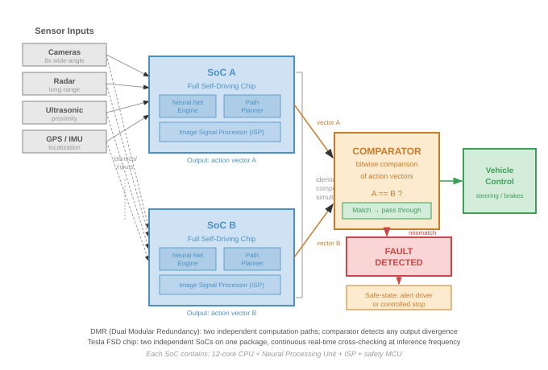
:::

::: {#fig-error-masking fig-env="figure" fig-pos="htb" fig-cap="**Error Masking via Voting**: In triple modular redundancy (TMR), the same computation runs on three independent units. A voter circuit takes a majority vote of the results. Even if one unit suffers a fault (for example, bit flip), the system 'masks' the error by selecting the matching outputs from the other two units, allowing continuous operation without interruption." fig-alt="Diagram showing three functional units feeding into a single voter unit. One unit is marked with a red X (fault), but the final output matches the two healthy units."}
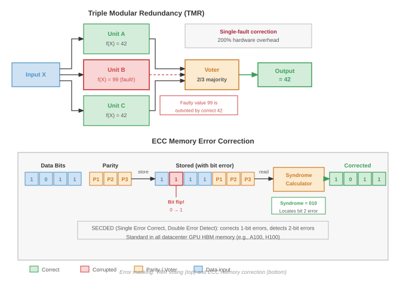
:::

At the software level, the same decision tree continues, with each fault signature routed to the one evidence stream that exposes it most cheaply. A silent statistical drift, gradients, losses, activations, or latencies that no longer match the expected distribution, is caught by runtime monitoring and anomaly detection (statistical outlier tests, One-Class SVM) [@francalanza2017; @mahmoud2021; @chandola2009], the cheapest layer because it rides on metrics the training loop already emits. A corrupted-but-live state or checkpoint is caught by data-consistency checks that confirm it still corresponds to trusted data [@lindholm2019]. A fail-stop node is separated from a merely slow one by heartbeat mechanisms [@kawazoe_aguilera1997], and a task that stalls without crashing is caught by watchdog timers [@pont2002using] that trigger recovery on lost progress. Only when none of these passive signals suffice, because the computation itself may be wrong with no statistical tell, does the system pay for software-implemented redundancy (SWIFT-style instruction duplication, N-version programming, Reed-Solomon reconstruction) [@reis2005swift; @plank1997; @reed1960], whose duplicated or reconstructed computation is the most expensive layer and so is reserved for the highest-value state.

These mechanisms reduce the unreliable substrate risk, but they do not protect against faults introduced by the software stack itself. The next layer must reason about bugs that look like valid computation while corrupting the ML pipeline.

::: {#chk-fault-tolerance-classifying-hardware-faults .callout-checkpoint title="Classifying a hardware fault"}

Verify your understanding of the transient, permanent, and intermittent fault categories and the fault, error, failure progression:

- [ ] **Transient fault**: A GPU produces a wrong result once after a cosmic-ray strike and then computes correctly for the rest of the run. Which of the three fault categories does this match, and why does it call for error correction codes rather than node replacement?
- [ ] **Intermittent vs. permanent**: How would you distinguish an **intermittent** fault from a **permanent** one when both can produce a stuck-at value, and which diagnostic signal separates them?
- [ ] **Fault-error-failure chain**: Can you trace a single bit flip through the fault, error, failure chain, and explain at which stage error correction codes versus checkpoint-restart each intervene?
- [ ] **Silent corruption**: Why does silent corruption sit apart from the other manifestations in @tbl-fault_types even when its underlying fault is an ordinary transient bit flip?

:::

## Software Faults {#sec-ft-software-faults}

A team spends three months testing an LLM against complex prompt-level failure cases, only to realize that its preprocessing script accidentally truncated all inputs at 512 tokens, silently discarding the system prompt entirely. In the pursuit of complex algorithmic robustness, engineers often overlook a common source of ML failure: mundane software bugs. In ML systems, a logic error in a data loader does not crash the pipeline; it subtly degrades the gradient, making software faults uniquely damaging.

Software faults require a different recovery lens from hardware failures. Hardware faults enter from silicon, electrons, and physical wear; software faults enter through design choices, dependency versions, and pipeline glue. The fault-tolerance problem shifts from replacing a failed component to identifying which valid-looking transformation corrupted data, gradients, or predictions.

The practical challenge is that software faults interact with every other system threat. A bug in data preprocessing can create distribution shifts, an implementation error in numerical computation can corrupt model behavior while preserving valid tensor shapes, and a race condition in distributed training can make different workers update from inconsistent state. These interactions arise because AI software stacks span frameworks, libraries, runtime environments, distributed systems, and deployment infrastructure. Each layer boundary creates an opportunity for faults to emerge and propagate, making software-level mitigation essential for production-scale reliability.

### Software fault properties and propagation {#sec-ft-software-fault-properties}

Software faults in ML frameworks range from syntactic and logical errors to memory leaks,[^fn-memory-leak-gpu] concurrency bugs, and integration failures. They propagate across system boundaries: an error in a tensor allocation routine can cascade to disrupt training, inference, or evaluation in seemingly unrelated modules. Some faults are intermittent, manifesting only under specific conditions such as high system load, particular hardware configurations, or rare data inputs.

[^fn-memory-leak-gpu]: **Memory Leak**\index{Memory!leak, gpu training}: A programming error where allocated memory is never released. In ML systems, GPU memory leaks are uniquely destructive because accelerator memory is scarce (40--80 GB per device) and shared across the entire training pipeline. A single leaked tensor per batch---perhaps from a debugging hook left in production---can exhaust GPU memory within hours, causing silent OOM failures that kill long-running training jobs without checkpointing.

Resource mismanagement is a prominent failure class. GPU memory allocations accumulate across training iterations as intermediate activations, optimizer states, and gradient buffers are allocated but not released, until the allocator exhausts available capacity and raises an out-of-memory error mid-batch. A 70B parameter model in BF16 with AdamW optimizer states requires roughly 840 GB of GPU memory across a node, leaving virtually no headroom for unexpected buffer growth. Memory pressure builds gradually over hundreds of iterations, making root-cause attribution difficult without per-layer memory profiling.

::: {.content-visible when-format="pdf"}
\newpage
:::

Concurrency and synchronization errors constitute another recurring fault class. In distributed or multi-threaded environments, incorrect coordination among parallel processes leads to race conditions,[^fn-race-condition-training-ft] or inconsistent states.

[^fn-race-condition-training-ft]: **Race Condition**\index{Race Condition!distributed training}: A timing bug where system behavior depends on the uncontrolled sequence of concurrent events. In asynchronous distributed training, if multiple workers update the same parameter weight simultaneously without proper locking or versioning, updates can be lost or overwritten, leading to divergence or "ghost" weights that ruin convergence without triggering an error.

::: {.content-visible when-format="pdf"}
\newpage
:::

Deadlocks[^fn-deadlock-ml-pipeline-ft] create a related synchronization failure, where workers wait indefinitely on resources or messages that never arrive. A bug in a high-level library might only manifest when paired with a specific version of a low-level numerical library such as cuDNN or MKL, requiring a holistic view of the system to identify root causes.

[^fn-deadlock-ml-pipeline-ft]: **Deadlock**\index{Deadlock!pipeline parallelism}: A state where two or more processes are permanently blocked, each waiting for the other to release a resource. In pipelined training, a deadlock can occur if Stage 1 is waiting for a free buffer to send activations to Stage 2, while Stage 2 is waiting for Stage 1 to receive backward gradients, halting the entire fleet.

### Software fault detection and prevention {#sec-ft-software-fault-detection-prevention}

Because many software faults leave the pipeline running while corrupting gradients, software fault mitigation strategies\index{Software Fault!mitigation strategies} must assign each lifecycle phase a detection job. The prompt-truncation bug from the opening example should not survive until production monitoring: a unit test should catch the tokenizer boundary, an integration test should catch the batch shape and metadata path, a regression test should protect representative prompts, and runtime monitoring should detect any unexpected truncation distribution that escapes development. @Tbl-software-faults-summary-ft organizes these gates by the kind of corruption they are designed to catch.

| **Category**                     | **Technique**                                                            | **Corruption caught**                                              | **When to Apply**                    |
|:---------------------------------|:-------------------------------------------------------------------------|:-------------------------------------------------------------------|:-------------------------------------|
| **Testing and Validation**       | Unit testing, integration testing, regression testing                    | Tokenizer boundaries, batch shapes, golden-example regressions     | During development                   |
| **Static Analysis and Linting**  | Static analyzers, linters, code reviews                                  | Unsafe slicing, implicit casts, unguarded shape assumptions        | Before integration                   |
| **Runtime Monitoring & Logging** | Metric collection, error logging, profiling                              | Length-distribution shifts, NaN gradients, memory-growth anomalies | During training and deployment       |
| **Fault-Tolerant Design**        | Exception handling, modular architecture, checkpointing                  | Bad batches fail closed and recovery resumes from known-good state | Design and implementation phase      |
| **Update Management**            | Dependency auditing, test staging, version tracking                      | Tokenizer, data-collator, framework, and CUDA compatibility drift  | Before system upgrades or deployment |
| **Environment Isolation**        | Containerization (for example, Docker, Kubernetes), virtual environments | Environment-specific behavior and irreproducible dependency stacks | Development, testing, deployment     |
| **CI/CD and Automation**         | Automated test pipelines, monitoring hooks, deployment gates             | Untested model, data, or preprocessing changes reaching production | Continuously throughout development  |

: **Fault Mitigation Strategies**: Software faults in ML systems require layered gates that catch different corruption modes: tokenizer boundary errors, batch-shape drift, unsafe slicing, dependency incompatibility, and runtime anomalies. {#tbl-software-faults-summary-ft}

These safeguards matter only when each gate targets a concrete corruption path. A unit test that checks only whether the tokenizer runs is too weak; it must assert that system prompts, labels, masks, and sequence-length metadata survive preprocessing with the intended semantics. Integration tests then follow one batch through loading, sharding, collation, and model input construction, while regression tests preserve representative prompts and edge cases before they enter distributed execution (@fig-regression-testing-ft). The CI/CD structure in @fig-CI-CD-procedure-ft is useful only when the release pipeline treats model, data, and preprocessing changes as ML artifacts that can corrupt the training objective; otherwise, it is just a generic software-delivery diagram. Automated gates make those checks release requirements instead of optional habits.\index{Pipeline!ci/cd}\index{Regression Test Automation}

::: {#fig-regression-testing-ft fig-env="figure" fig-pos="htb" fig-cap="**Regression Tests for ML Pipeline Boundaries**: Regression tests preserve tokenizer behavior, feature semantics, batch construction, and representative prompts across code changes. Source: [UTOR](HTTPS://u-tor.com/topic/regression-vs.-integration)." fig-alt="Flowchart showing code commit triggering automated test suite. Tests run against existing functionality with pass/fail indicators before deployment approval."}

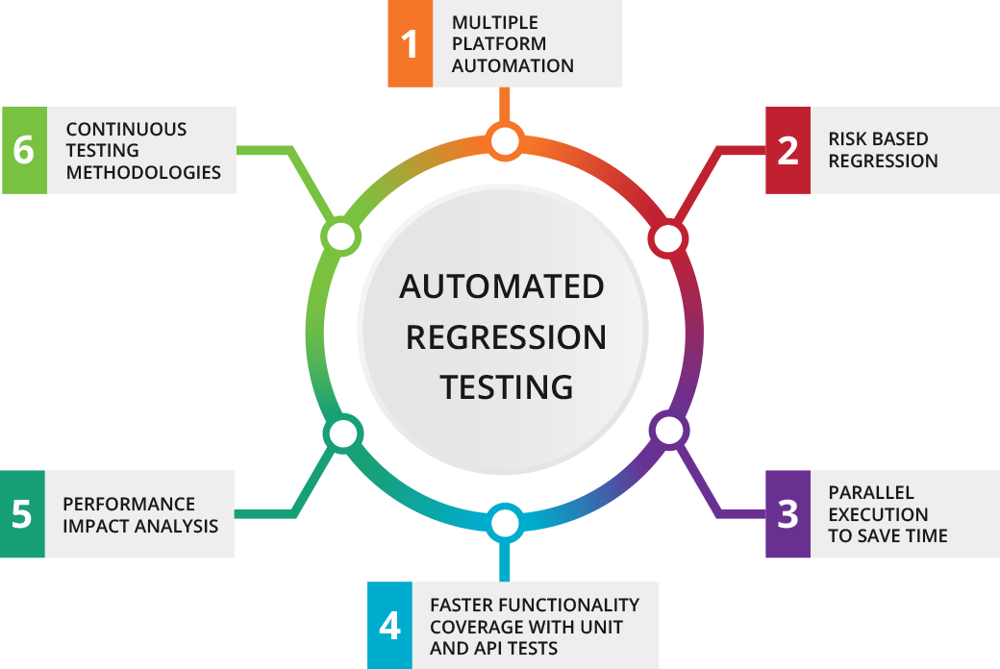

:::

::: {#fig-CI-CD-procedure-ft fig-env="figure" fig-pos="htb" fig-cap="**ML Fault-Aware CI/CD Pipeline**: Automated delivery is fault-tolerant for ML only when build, test, release, and monitoring stages gate model artifacts, data contracts, dependency versions, and preprocessing semantics before production exposure. Source: [geeksforgeeks](HTTPS://www.geeksforgeeks.org/ci-cd-continuous-integration-and-continuous-delivery/)." fig-alt="Pipeline flowchart: developer commits code, triggering build and test stages in CI, then deploy and monitor stages in CD. Arrows show automated progression between stages."}

```{.tikz}
\begin{tikzpicture}[line join=round,font=\usefont{T1}{phv}{m}{n}\large]
\tikzset{
LineA/.style={black!50, line width=1.1pt,{-{Triangle[width=0.9*6pt,length=1.2*6pt]}}},
ALine/.style={black!50, line width=1.1pt,{{Triangle[width=0.9*6pt,length=1.2*6pt]}-}},
Larrow/.style={fill=orange, single arrow,  inner sep=2pt, single arrow head extend=3pt,
            single arrow head indent=0pt,minimum height=6mm, minimum width=3pt}
}
%Gear style
% #1 number of teeth
% #2 radius intern
% #3 radius extern
% #4 angle from start to end of the first arc
% #5 angle to decale the second arc from the first
% #6 inner radius to cut off
\newcommand{\gear}[6]{%
  (0:#2)
  \foreach \i [evaluate=\i as \n using {(\i-1)*360/#1}] in {1,...,#1}{%
    arc (\n:\n+#4:#2) {[rounded corners=1.5pt] -- (\n+#4+#5:#3)
    arc (\n+#4+#5:\n+360/#1-#5:#3)} --  (\n+360/#1:#2)
  }%
  (0,0) circle[radius=#6];
}

 %person style
 \tikzset{
 pics/man/.style = {
        code = {
        \pgfkeys{/man/.cd, #1}
\begin{scope}[local bounding box=PERSON,scale=\scalefac, every node/.append style={transform shape}]
     % tie
    \draw[draw=\tiecolor,fill=\tiecolor] (0.0,-1.1)--(0.16,-0.87)--(0.09,-0.46)--(0.13,-0.37)--(0.0,-0.28)
                   --(-0.13,-0.37)--(-0.09,-0.46)--(-0.16,-0.87)--cycle;
    % ears
    \draw[fill=black] (0.74,0.95) to[out=20,in=80](0.86,0.80) to[out=250,in=330](0.65,0.65) to[out=70,in=260] cycle;
    \draw[fill=black] (-0.76,0.96) to[out=170,in=110](-0.85,0.80) to[out=290,in=190](-0.65,0.65) to[out=110,in=290] cycle;

    % head
    \draw[fill=black] (0,0) to[out=180,in=290](-0.72,0.84) to[out=110,in=190](-0.56,1.67)
                      to[out=70,in=110](0.68,1.58) to[out=320,in=80](0.72,0.84) to[out=250,in=0] cycle;
    % face
    \draw[fill=white] (0,0.11) to[out=175,in=290](-0.53,0.65) to[out=110,in=265](-0.61,1.22)
                      to[out=80,in=235](-0.50,1.45) to[out=340,in=215](0.50,1.47)
                      to[out=310,in=85](0.60,0.92) to[out=260,in=2] cycle;
    \draw[fill=black] (-0.50,1.45) to[out=315,in=195](0.40,1.25) to[out=340,in=10](0.37,1.32)
                      to[out=190,in=310](-0.40,1.49) -- cycle;
    % neck
    \draw[line width=1.0pt] (-0.62,-0.2) to[out=50,in=290] (-0.5,0.42);
    \draw[line width=1.0pt] (0.62,-0.2) to[out=130,in=250] (0.5,0.42);
    % body
    \draw[draw=\bodycolor,fill=\bodycolor,line width=\Linewidth] (0.0,-1.0) to[out=150,in=290](-0.48,-0.14) to[out=200,in=50](-1.28,-0.44)
                   to[out=240,in=80](-1.55,-2.06) -- (1.55,-2.06)
                   to[out=100,in=300](1.28,-0.44) to[out=130,in=340](0.49,-0.14)
                   to[out=245,in=30] cycle;
    % right stet
    \draw[line width=3pt,\stetcolor] (0.8,-0.21) to[bend left=7](0.78,-0.64)
         to[out=350,in=80](0.98,-1.35) to[out=250,in=330](0.72,-1.60);
    \draw[line width=3pt,\stetcolor] (0.43,-1.53) to[out=180,in=240](0.3,-1.15)
         to[out=60,in=170](0.78,-0.64);
    % left stet
    \draw[line width=3pt,\stetcolor] (-0.75,-0.21) to[bend right=20](-0.65,-1.45);
    \node[fill=\stetcolor,circle,minimum size=5pt] at (-0.65,-1.45) {};
    % eyes
    \node[circle,fill=black,inner sep=2pt] at (0.28,0.94) {};
    \node[circle,fill=black,inner sep=2pt] at (-0.28,0.94) {};
     % mouth
    \draw[line width=1.1pt] (-0.25,0.5) to[bend right=40](0.25,0.5);
 \end{scope}
     }
  }
}
\pgfkeys{
  /man/.cd,
  Linewidth/.store in=\Linewidth,
  scalefac/.store in=\scalefac,
  tiecolor/.store in=\tiecolor,
  bodycolor/.store in=\bodycolor,
  stetcolor/.store in=\stetcolor,
  tiecolor=red,      % derfault tie color
  bodycolor=blue!30,  % derfault body color
  stetcolor=green,  % derfault stet color
  scalefac=1,
  Linewidth=2.5pt,
}

%data style
\tikzset{mycylinder/.style={cylinder, shape border rotate=90, aspect=1.3, draw, fill=white,
minimum width=25mm,minimum height=11mm,line width=\Linewidth,node distance=-0.15},
pics/data/.style = {
        code = {
        \pgfkeys{/channel/.cd, #1}
\begin{scope}[local bounding box=STREAMING,scale=\scalefac, every node/.append style={transform shape}]
\node[mycylinder,fill=\filllcolor!50] (A) {};
\node[mycylinder, above=of A,fill=\filllcolor!30] (B) {};
\node[mycylinder, above=of B,fill=\filllcolor!10] (C) {};
 \end{scope}
     }
  }
}
%package style
\tikzset{
pics/package/.style = {
        code = {
        \pgfkeys{/channel/.cd, #1}
\begin{scope}[local bounding box=PACKAGE,scale=\scalefac,every node/.append style={transform shape}]
% Right Face
\draw[fill=\filllcolor!70,line width=\Linewidth]
(\Depth,0,0)coordinate(\picname-ZDD)--(\Depth,\Width,0)--(\Depth,\Width,\Height)--(\Depth,0,\Height)--cycle;
% Front Face
\draw[fill=\filllcolor!40,line width=\Linewidth]
(0,0,\Height)coordinate(\picname-DL)--(0,\Width,\Height)coordinate(\picname-GL)--
(\Depth,\Width,\Height)coordinate(\picname-GD)--(\Depth,0,\Height)coordinate(\picname-DD)--(0,0,\Height);
% Top Face
\draw[fill=\filllcolor!20,line width=\Linewidth]
(0,\Width,0)coordinate(\picname-ZGL)--(0,\Width,\Height)--
(\Depth,\Width,\Height)--(\Depth,\Width,0)coordinate(\picname-ZGD)--cycle;
%
\path[fill=white]($(\picname-ZGL)!0.35!(\picname-ZGD)$)coordinate(\picname-A)--
($(\picname-GL)!0.35!(\picname-GD)$)coordinate(\picname-B)--++(0,-0.22)coordinate(\picname-C)--++(0.33,0)coordinate(\picname-D)--
($(\picname-GL)!0.6!(\picname-GD)$)coordinate(\picname-E)--($(\picname-ZGL)!0.6!(\picname-ZGD)$)coordinate(\picname-F)--
++(0,0.02)coordinate(\picname-G)-|cycle;
\draw[fill=white](\picname-A)--(\picname-B)--(\picname-C)--(\picname-D)--(\picname-E)--(\picname-F);
\draw[](\picname-A)--++(0,-0.22)coordinate(\picname-Y)--(\picname-C);
\draw[](\picname-Y)--++(0.11,0);
\end{scope}
    }
  }
}
%display style
\tikzset{
pics/display/.style = {
        code = {
        \pgfkeys{/channel/.cd, #1}
\begin{scope}[scale=\scalefac,every node/.append style={transform shape}]
\newcommand{\tikzxmark}{%
\tikz[scale=0.18] {
    \draw[line width=0.7,line cap=round,GreenLine] (0,0) to [bend left=6] (1,1);
    \draw[line width=0.7,line cap=round,GreenLine] (0.2,0.95) to [bend right=3] (0.8,0.05);
}}
\newcommand{\tikzxcheck}{%
\tikz[scale=0.16] {
    \draw[line width=0.7,line cap=round,GreenLine] (0.5,0.75)--(0.85,-0.1) to [bend left=16] (1.5,1.55);

}}
 \node[draw, minimum width  =15mm, minimum height = 10mm, inner sep=0pt, rounded corners,
       draw = BlueLine, fill=cyan!10,line width=2.0pt](COM){};
\draw[draw = BlueLine,line width=1.0pt] ($(COM.north west)!0.85!(COM.south west)$)-- ($(COM.north east)!0.85!(COM.south east)$);
\draw[draw=\drawcolor,line width=\Linewidth]($(COM.south west)!0.4!(COM.south east)$)--++(270:0.2)coordinate(DL);
\draw[draw=\drawcolor,line width=\Linewidth]($(COM.south west)!0.6!(COM.south east)$)--++(270:0.2)coordinate(DD);
\draw[draw=\drawcolor,line width=3*\Linewidth,shorten <=-3mm,shorten >=-3mm](DL)--(DD);
\node[draw=GreenLine,inner sep=3.85pt,fill=white](CB1) at ($(COM.north west)!0.25!(COM.south west)+(0.3,0)$){};
\node[xshift=0pt]at(CB1){\tikzxcheck};
\node[draw=GreenLine,inner sep=3.85pt,fill=white](CB2) at ($(COM.north west)!0.6!(COM.south west)+(0.3,0)$){};
\node[xshift=0pt]at(CB2){\tikzxmark};
 \draw[GreenLine,decoration={zigzag,segment length=4pt, amplitude=0.5pt},decorate]($(CB1)+(0.3,0.05)$)--++(0:0.8);
\draw[GreenLine,decoration={zigzag,segment length=4pt, amplitude=0.5pt},decorate]($(CB1)+(0.3,-0.12)$)--++(0:0.5);
\draw[GreenLine,decoration={zigzag,segment length=4pt, amplitude=0.5pt},decorate]($(CB2)+(0.3,0.05)$)--++(0:0.8);
\draw[GreenLine,decoration={zigzag,segment length=4pt, amplitude=0.5pt},decorate]($(CB2)+(0.3,-0.12)$)--++(0:0.5);
\end{scope}
    }
  }
}
%empty display style
\tikzset{
pics/displayE/.style = {
        code = {
        \pgfkeys{/channel/.cd, #1}
\begin{scope}[scale=\scalefac,every node/.append style={transform shape}]
\node[draw, minimum width  =12mm, minimum height = 10mm, inner sep=0pt, rounded corners, draw=\drawcolor, fill=\filllcolor!10,line width=2.0pt](COM){};
\draw[draw = \drawcolor,line width=1.0pt]($(COM.north west)!0.85!(COM.south west)$)-- ($(COM.north east)!0.85!(COM.south east)$);
\draw[draw=\drawcolor,line width=\Linewidth]($(COM.south west)!0.4!(COM.south east)$)--++(270:0.2)coordinate(DL);
\draw[draw=\drawcolor,line width=\Linewidth]($(COM.south west)!0.6!(COM.south east)$)--++(270:0.2)coordinate(DD);
\draw[draw=\drawcolor,line width=3*\Linewidth,shorten <=-3mm,shorten >=-3mm](DL)--(DD);
\end{scope}
    }
  }
}
%AUTO text style
\tikzset{
pics/autotext/.style = {
        code = {
        \pgfkeys{/channel/.cd, #1}
\begin{scope}[scale=\scalefac,every node/.append style={transform shape}]
 \node[draw, minimum width  =12mm, minimum height = 5mm, inner sep=0pt,
       draw = \drawcolor, fill=\filllcolor!10,line width=\Linewidth](AT\picname){\small AUTO};
\end{scope}
    }
  }
}
%server style
\tikzset {
  pics/server/.style = {
    code = {
        \pgfkeys{/channel/.cd, #1}
\begin{scope}[local bounding box=SERVER1,scale=\scalefac,every node/.append style={transform shape}]
 \draw[draw = \drawcolor, fill=\filllcolor!10,line width=\Linewidth](-0.55,-0.5) rectangle (0.55,0.5);
\foreach \i in {-0.25,0,0.25} {
       \draw[cyan,line width=1.25pt]( -0.55,\i) -- (0.55, \i);
}
        \foreach \i in {-0.375, -0.125, 0.125, 0.375} {
          \draw[cyan!50!black!90,line width=1.25pt](-0.45,\i)--(0,\i);
          \fill[cyan!50!black!90](0.35,\i) circle (1.5pt);
        }

        \draw[draw = \drawcolor,line width=1.75pt](0,-0.53) |- (-0.55,-0.7);
        \draw[draw = \drawcolor,line width=1.75pt](0,-0.53) |- (0.55,-0.7);
      \end{scope}
    }
  }
}
%testing
\tikzset{
pics/testing/.style = {
        code = {
        \pgfkeys{/channel/.cd, #1}
\begin{scope}[local bounding box=TESTING1,shift={($(0,0)+(0,0)$)},scale=\scalefac,every node/.append style={transform shape}]
\newcommand{\tikzxmark}{%
\tikz[scale=0.18] {
    \draw[line width=0.7,line cap=round,GreenLine] (0,0) to [bend left=6] (1,1);
    \draw[line width=0.7,line cap=round,GreenLine] (0.2,0.95) to [bend right=3] (0.8,0.05);
}}
\newcommand{\tikzxcheck}{%
\tikz[scale=0.16] {
    \draw[line width=0.7,line cap=round,GreenLine] (0.5,0.75)--(0.85,-0.1) to [bend left=16] (1.5,1.55);

}}
 \node[draw, minimum width  =15mm, minimum height = 20mm, inner sep = 0pt,
        rounded corners,draw = \drawcolor, fill=\filllcolor!10, line width=\Linewidth](COM){};
\node[draw=GreenLine,inner sep=4pt,fill=white](CB1) at ($(COM.north west)!0.25!(COM.south west)+(0.3,0)$){};
\node[xshift=0pt]at(CB1){\tikzxcheck};
\node[draw=GreenLine,inner sep=4pt,fill=white](CB2) at ($(COM.north west)!0.5!(COM.south west)+(0.3,0)$){};
\node[xshift=0pt]at(CB2){\tikzxmark};
\node[draw=GreenLine,inner sep=4pt,fill=white](CB3) at ($(COM.north west)!0.75!(COM.south west)+(0.3,0)$){};
\node[xshift=0pt]at(CB3){\tikzxmark};
\draw[GreenLine,decoration={zigzag,segment length=4pt, amplitude=0.5pt},decorate]($(CB1)+(0.3,0.05)$)--++(0:0.8);
\draw[GreenLine,decoration={zigzag,segment length=4pt, amplitude=0.5pt},decorate]($(CB1)+(0.3,-0.12)$)--++(0:0.7);
\draw[GreenLine,decoration={zigzag,segment length=4pt, amplitude=0.5pt},decorate]($(CB2)+(0.3,0.05)$)--++(0:0.8);
\draw[GreenLine,decoration={zigzag,segment length=4pt, amplitude=0.5pt},decorate]($(CB2)+(0.3,-0.12)$)--++(0:0.6);
\draw[GreenLine,decoration={zigzag,segment length=4pt, amplitude=0.5pt},decorate]($(CB3)+(0.3,0.05)$)--++(0:0.8);
\draw[GreenLine,decoration={zigzag,segment length=4pt, amplitude=0.5pt},decorate]($(CB3)+(0.3,-0.12)$)--++(0:0.6);
\end{scope}
    }
  }
}
%pencil
\tikzset{
pics/pencil/.style = {
        code = {
        \pgfkeys{/channel/.cd, #1}
\begin{scope}[local bounding box=TESTING1,shift={($(0,0)+(0,0)$)},scale=\scalefac,every node/.append style={transform shape},rotate=340]
            \fill[fill=\filllcolor!70] (0,4) -- (0.4,4) -- (0.4,0) --(0.3,-0.15) -- (0.2,0) -- (0.1,-0.14) -- (0,0) -- cycle;
            \draw[color=white,thick] (0.2,4) -- (0.2,0);
            \fill[black] (0,3.5) -- (0.2,3.47) -- (0.4,3.5) -- (0.4,4) arc(30:150:0.23cm);
            \fill[fill=\filllcolor!40] (0,0) -- (0.2,-0.8)node[coordinate,pos=0.75](a){} -- (0.4,0)node[coordinate,pos=0.25](b){} -- (0.3,-0.15) -- (0.2,0) -- (0.1,-0.14) -- cycle;
            \fill[fill=\filllcolor] (a) -- (0.2,-0.8) -- (b) -- cycle;

\end{scope}
    }
  }
}
%cube
\tikzset{
pics/square/.style = {
        code = {
        \pgfkeys{/channel/.cd, #1}
\begin{scope}[local bounding box=SQUARE,scale=\scalefac,every node/.append style={transform shape}]
% Right Face
\draw[fill=\filllcolor!70,line width=\Linewidth]
(\Depth,0,0)coordinate(\picname-ZDD)--(\Depth,\Width,0)--(\Depth,\Width,\Height)--(\Depth,0,\Height)--cycle;
% Front Face
\draw[fill=\filllcolor!40,line width=\Linewidth]
(0,0,\Height)coordinate(\picname-DL)--(0,\Width,\Height)coordinate(\picname-GL)--
(\Depth,\Width,\Height)coordinate(\picname-GD)--(\Depth,0,\Height)coordinate(\picname-DD)--(0,0,\Height);
% Top Face
\draw[fill=\filllcolor!20,line width=\Linewidth]
(0,\Width,0)coordinate(\picname-ZGL)--(0,\Width,\Height)coordinate(\picname-ZGL)--
(\Depth,\Width,\Height)--(\Depth,\Width,0)coordinate(\picname-ZGD)--cycle;
\end{scope}
    }
  }
}
%globe
\tikzset{
pics/globe/.style = {
        code = {
        \pgfkeys{/channel/.cd, #1}
\begin{scope}[shift={($(0,0)+(0,0)$)},scale=\scalefac,every node/.append style={transform shape}]
\node[circle,minimum size=25mm,draw=\drawcolor, fill=\filllcolor!70,line width=\Linewidth](C\picname) at (0,0){};
\draw[draw=\drawcolor,line width=\Linewidth](C\picname.north)to[bend left=65](C\picname.south);
\draw[draw=\drawcolor,line width=\Linewidth](C\picname.north)to[bend right=65](C\picname.south);
\draw[draw=\drawcolor,line width=\Linewidth](C\picname.north)to(C\picname.south);
\draw[draw=\drawcolor,line width=\Linewidth](C\picname.west)--(C\picname.east);
%
\draw[draw=\drawcolor,line width=\Linewidth](C\picname.130)to[bend right=35](C\picname.50);
\draw[draw=\drawcolor,line width=\Linewidth](C\picname.230)to[bend left=35](C\picname.310);
\end{scope}
    }
  }
}

\pgfkeys{
  /channel/.cd,
  Depth/.store in=\Depth,
  Height/.store in=\Height,
  Width/.store in=\Width,
  filllcirclecolor/.store in=\filllcirclecolor,
  filllcolor/.store in=\filllcolor,
  drawcolor/.store in=\drawcolor,
  drawcircle/.store in=\drawcircle,
  scalefac/.store in=\scalefac,
  Linewidth/.store in=\Linewidth,
  picname/.store in=\picname,
  filllcolor=BrownLine,
  filllcirclecolor=violet!20,
  drawcolor=black,
  drawcircle=violet,
  scalefac=1,
  Linewidth=0.5pt,
  Depth=1.3,
  Height=0.8,
  Width=1.1,
  picname=C
}
 %persons 1
\begin{scope}[local bounding box=PERSON1,shift={($(0,0)+(0,0)$)},scale=1, every node/.append style={transform shape}]
\pic at (0,0) {man={scalefac=0.35,tiecolor=green, bodycolor=RedLine,stetcolor=VioletLine, Linewidth=1.0pt}};
\pic at (1.5,0) {man={scalefac=0.35,tiecolor=green, bodycolor=RedLine,stetcolor=VioletLine, Linewidth=1.0pt}};
\pic at (0.75,0.16) {man={scalefac=0.43,tiecolor=orange, bodycolor=BlueLine,stetcolor=BlueLine, Linewidth=1.0pt}};
\end{scope}
%data 1
\begin{scope}[local bounding box=DATA1,shift={($(0,0)+(3.75,0)$)},scale=1, every node/.append style={transform shape}]
\pic[shift={(0,-0.5)}] at  (0,0){data={scalefac=0.6,picname=1,filllcolor=BlueLine, Linewidth=1.0pt}};
\end{scope}
%Gears
\begin{scope}[local bounding box=GEAR1,shift={($(DATA1)+(2.5,-0.3)$)},scale=1.5, every node/.append style={transform shape}]
\fill[draw=none,fill=BrownLine,even odd rule,xshift=-2mm]coordinate(D)\gear{12}{0.4}{0.33}{10}{2}{0.1};
\fill[draw=none,fill=BrownLine,even odd rule,xshift=3.8mm,yshift=2mm]\gear{11}{0.25}{0.21}{10}{1}{0.07};
\fill[draw=none,fill=BrownLine,even odd rule,xshift=0.6mm,yshift=5.8mm]coordinate(F)\gear{11}{0.25}{0.21}{10}{1}{0.07};
\end{scope}
%package 1
\begin{scope}[local bounding box=PACKAGE1,shift={($(GEAR1)+(2.1,-0.4)$)},scale=1,every node/.append style={transform shape}]
\pic[shift={(0,0)}] at  (0,0){package={scalefac=1,picname=1,filllcolor=red, Linewidth=0.5pt}};
 \end{scope}
%display 1
 \begin{scope}[local bounding box=DISPLAY1,shift={($(PACKAGE1)+(2.3,0.6)$)},scale=1, every node/.append style={transform shape}]
\pic[shift={(0,-0.5)}] at  (0,0){display={scalefac=1,picname=1,filllcolor=BlueLine, Linewidth=1.0pt}};
\end{scope}
 %auto text 1
 \begin{scope}[local bounding box=AUTOTEXT1,shift={($(DISPLAY1)+(0,1.1)$)},scale=1, every node/.append style={transform shape}]
\pic[shift={(0,0)}] at  (0,0){autotext={scalefac=1,picname=1,drawcolor=green!70!black,filllcolor=green!70!black, Linewidth=1.0pt}};
\end{scope}
 %server
 \begin{scope}[local bounding box=SERVER1,shift={($(DISPLAY1)+(2.3,0)$)},scale=1, every node/.append style={transform shape}]
\pic[shift={(0,0)}] at  (0,0){server={scalefac=1.1,picname=1,drawcolor=BrownLine,filllcolor=BrownLine, Linewidth=1.0pt}};
\fill[draw=none,fill=BlueD,even odd rule,xshift=2.5mm,yshift=-2.8mm]\gear{11}{0.4}{0.34}{10}{1}{0.07};
\end{scope}
 %auto text 2
 \begin{scope}[local bounding box=AUTOTEXT2,shift={($(SERVER1)+(0,1.1)$)},scale=1, every node/.append style={transform shape}]
\pic[shift={(0,0)}] at  (0,0){autotext={scalefac=1,picname=1,drawcolor=green!70!black,filllcolor=green!70!black, Linewidth=1.0pt}};
\end{scope}
%%%%%%%%%%%%%%%%%%%
%package 2
\begin{scope}[local bounding box=PACKAGE2,shift={($(SERVER1)+(2.7,-0.2)$)},scale=1,every node/.append style={transform shape}]
\pic[shift={(0,0)}] at  (0,0){package={scalefac=1,picname=2,filllcolor=green!70!black, Linewidth=0.5pt}};
 \end{scope}
%testing 1
\begin{scope}[local bounding box=TESTING1,shift={($(SERVER1)+(2.1,0.85)$)},scale=1, every node/.append style={transform shape}]
\pic[shift={(0,-0.5)}] at  (0,0){testing={scalefac=0.75,picname=1,drawcolor=OrangeLine,filllcolor=OrangeLine, Linewidth=1.0pt}};
\end{scope}
 %persons 2
\begin{scope}[local bounding box=PERSON2,shift={($(PACKAGE2)+(2.0,-0.27)$)},scale=1, every node/.append style={transform shape}]
\pic at (0,0) {man={scalefac=0.35,tiecolor=red, bodycolor=BrownLine,stetcolor=BrownLine, Linewidth=1.0pt}};
\pic at (1.5,0) {man={scalefac=0.35,tiecolor=red, bodycolor=BrownLine,stetcolor=BrownLine, Linewidth=1.0pt}};
\pic at (0.75,0.16) {man={scalefac=0.43,tiecolor=GreenD, bodycolor=red!80!black,stetcolor=red!80!black, Linewidth=1.0pt}};
\end{scope}
%data 2
\begin{scope}[local bounding box=DATA2,shift={($(PERSON2)+(2.75,0)$)},scale=1, every node/.append style={transform shape}]
\pic[shift={(0,-0.5)}] at  (0,0){data={scalefac=0.6,picname=1,filllcolor=RedLine, Linewidth=1.0pt}};
\pic[shift={(1,0)}] at  (0,0){testing={scalefac=0.8,picname=2,drawcolor=BlueLine,filllcolor=BlueLine, Linewidth=1.0pt}};
\end{scope}
 %auto text 3
 \begin{scope}[local bounding box=AUTOTEXT3,shift={($(DATA2)+(0,0.8)$)},scale=1, every node/.append style={transform shape}]
\pic[shift={(0,0)}] at  (0,0){autotext={scalefac=1,picname=1,drawcolor=green!70!black,filllcolor=green!70!black, Linewidth=1.0pt}};
\end{scope}
%display 2
 \begin{scope}[local bounding box=DISPLAY2,shift={($(DATA2)+(2.8,0.6)$)},scale=1, every node/.append style={transform shape}]
\pic[shift={(0,-0.5)}] at  (0,0){displayE={scalefac=1.3,picname=1,drawcolor=BrownLine,filllcolor=BrownLine, Linewidth=1.0pt}};
\pic[shift={(-0.15,-0.7)},rotate=20] at  (0,0){square={scalefac=0.46,picname=1,filllcolor=RedLine, Linewidth=0.5pt}};
\end{scope}
%testing 2
\begin{scope}[local bounding box=TESTING2,shift={($(DISPLAY2)+(2.3,0.55)$)},scale=1, every node/.append style={transform shape}]
\pic[shift={(0,-0.5)}] at  (0,0){testing={scalefac=0.85,picname=1,drawcolor=OrangeLine,filllcolor=OrangeLine, Linewidth=1.0pt}};
\pic[shift={(0,-1.0)},rotate=-15] at  (0,0){pencil={scalefac=0.35,picname=1,filllcolor=RedLine, Linewidth=1.0pt}};
\end{scope}
%display3
 \begin{scope}[local bounding box=DISPLAY3,shift={($(TESTING2)+(2.3,0.6)$)},scale=1, every node/.append style={transform shape}]
\pic[shift={(0,-0.5)}] at  (0,0){displayE={scalefac=1.3,picname=1,drawcolor=RedLine,filllcolor=red, Linewidth=1.0pt}};
\pic[shift={(0,-0.45)}] at  (0,0){globe={scalefac=0.38,picname=1,filllcolor=green!30!, Linewidth=1.2pt}};
\end{scope}
 %arrows
\coordinate(SR1)at($(PERSON1.east)!0.4!(DATA1.west)$);
\node[Larrow]at(SR1){};
\coordinate(SR2)at($(DATA1.east)!0.55!(GEAR1.west)$);
\node[Larrow]at(SR2){};
\coordinate(SR3)at($(GEAR1.east)!0.45!(PACKAGE1.west)$);
\node[Larrow]at(SR3){};
\coordinate(SR4)at($(PACKAGE1.east)!0.45!(DISPLAY1.west)$);
\node[Larrow]at(SR4){};
\coordinate(SR5)at($(DISPLAY1.east)!0.45!(SERVER1.west)$);
\node[Larrow]at(SR5){};
\coordinate(SR6)at($(SERVER1.east)!0.25!(PACKAGE2.west)$);
\node[Larrow]at(SR6){};
\coordinate(SR7)at($(PACKAGE2.east)!0.55!(PERSON2.west)$);
\node[Larrow]at(SR7){};
\coordinate(SR8)at($(PERSON2.east)!0.3!(DATA2.west)$);
\node[Larrow]at(SR8){};
\coordinate(SR9)at($(DATA2.east)!0.5!(DISPLAY2.west)$);
\node[Larrow]at(SR9){};
\coordinate(SR10)at($(DISPLAY2.east)!0.45!(TESTING2.west)$);
\node[Larrow]at(SR10){};
\coordinate(SR11)at($(TESTING2.east)!0.45!(DISPLAY3.west)$);
\node[Larrow]at(SR11){};
%Text
\path[red](PERSON1.south)--++(0,-2mm)coordinate(TP1)-|coordinate(TD1)(DATA1);
\node[align=center,anchor=north]at(TP1){Developers};
\node[align=center,anchor=north]at(TD1){Version\\ Control (Master)};
\path[red](PERSON1.south)--++(0,-2mm)-|coordinate(TG1)(GEAR1);
\node[align=center,anchor=north]at(TG1){Compile};
\path[red](PERSON1.south)--++(0,-2mm)-|coordinate(TP1)(PACKAGE1);
\node[align=center,anchor=north]at(TP1){Package};
\path[red](PERSON1.south)--++(0,-2mm)-|coordinate(TD1)(DISPLAY1);
\node[align=center,anchor=north]at(TD1){Auto Unit\\Testing};
\path[red](PERSON1.south)--++(0,-2mm)-|coordinate(TS1)(SERVER1);
\node[align=center,anchor=north]at(TS1){Auto UI\\Testing};
%
\path[red](PERSON1.south)--++(0,-2mm)-|coordinate(TP2)(PACKAGE2.250);
\node[align=center,anchor=north]at(TP2){Package with\\ Instructions};
\path[red](PERSON1.south)--++(0,-2mm)-|coordinate(TP2)(PERSON2);
\node[align=center,anchor=north]at(TP2){Operations\\Team};
\path[red](PERSON1.south)--++(0,-2mm)-|coordinate(TD2)(DATA2);
\node[align=center,anchor=north]at(TD2){Auto\\ Scripts};
\path[red](PERSON1.south)--++(0,-2mm)-|coordinate(TD2)(DISPLAY2);
\node[align=center,anchor=north]at(TD2){Test\\Environment};
\path[red](PERSON1.south)--++(0,-2mm)-|coordinate(TT2)(TESTING2);
\node[align=center,anchor=north]at(TT2){Testing};
\path[red](PERSON1.south)--++(0,-2mm)-|coordinate(TD3)(DISPLAY3);
\node[align=center,anchor=north]at(TD3){Public/\\General\\ Availability};
%fitting
\scoped[on background layer]
\node[draw=none,inner xsep=3mm,inner ysep=16mm,
yshift=-6mm,fill=BackColor!60,fit=(PERSON1)(SERVER1),line width=0.75pt](BB1){};
\node[below=4pt of  BB1.north,inner sep=0pt, anchor=north,GreenD]{\textbf{Build Pipeline}};
\node[above=4pt of  BB1.south,inner sep=0pt, anchor=south,GreenD]{\textbf{Continuous Integration}};
\scoped[on background layer]
\node[draw=none,inner xsep=3mm,inner ysep=16mm,
yshift=-6mm,fill=cyan!10,fit=(PERSON2)(DISPLAY3),line width=0.75pt](BB2){};
\node[below=4pt of  BB2.north,inner sep=0pt, anchor=north,GreenD]{\textbf{Release Pipeline}};
\node[above=4pt of  BB2.south,inner sep=0pt, anchor=south,GreenD]{\textbf{Continuous Delivery}};
\end{tikzpicture}
```

:::

These software practices catch implementation faults that surface through tests or deployment gates. Silent corruption is harder because the system may continue running while producing wrong values, so the next layer is explicit verification.

::: {.content-visible when-format="pdf"}
\newpage
:::

## Check-and-Verify: Defending Against Silent Data Corruption {#sec-ft-sdc-verification}

::: {.column-margin}
{width="100%" fig-alt="Cumulative silent-data-corruption risk over training steps."}

*Silent data corruption accumulates until it becomes routine.*
:::

As clusters scale to 100,000+ GPUs, the probability of a "Silent Data Corruption" (SDC) event (in which an ALU or HBM bit flip occurs without triggering ECC or hardware alerts) approaches certainty during large collective operations. Standard AllReduce algorithms assume that if a node is *alive*, its data is *correct*. In the machine learning fleet, we must transition to a Byzantine fault tolerance mindset: "Trust, but verify."

Check-and-verify methods turn that mindset into a data-path invariant. The system computes a checksum, hash, or redundant reduction over each gradient shard or reduced buffer, compares the result across ranks or against an independently computed digest, and blocks the optimizer step when the verification disagrees. A quick estimate makes the exposure concrete.

```{python}
#| echo: false
#| label: sdc-prob-calc
from mlsysim.fmt import check, fmt, fmt_percent, fmt_time

class SDCCollective:
    """The risk of silent corruption in global collectives."""

    # ┌── 1. LOAD ──────────────────────────────────────────
    n_gpus = 100000
    p_sdc_per_gpu_hr = Systems.Reliability.SdcRatePerGpuHr  # 1 in a million chance per hour
    training_step_s = 2
    # ┌── 2. EXECUTE ───────────────────────────────────────
    p_step_sdc = 1 - (1 - p_sdc_per_gpu_hr) ** (n_gpus * (training_step_s / SEC_PER_HOUR))
    # ┌── 3. GUARD ─────────────────────────────────────────
    check(p_step_sdc > 0.00005, f"Prob {p_step_sdc:.6f} unexpected")
    # ┌── 4. OUTPUT ────────────────────────────────────────
    prob_str = fmt_percent(p_step_sdc, precision=4, commas=False, style='symbol')
    n_gpus_str = fmt(n_gpus, precision=0, commas=True)
    training_step_s_str = fmt_time(training_step_s, unit="second", precision=0, commas=False)
```

::: {#nbk-fault-tolerance-napkin-math-sdc-certainty .callout-notebook title="The SDC certainty"}

**Problem**: Calculate the probability that at least one GPU in a `{python} SDCCollective.n_gpus_str`-GPU fleet experiences a silent ALU error during a single `{python} SDCCollective.training_step_s_str` training step.

1. **Fleet size**: `{python} SDCCollective.n_gpus_str` accelerators.
2. **Individual risk**: $10^{-6}$ per hour (a conservative estimate for SDC).
3. **The exposure**: In a 2-second window, the fleet has $100,000 \times (2/3600) \approx 55$ "GPU-hours" of exposure.
4. **The probability**: $\Pr(\text{at least one SDC}) \approx$ `{python} SDCCollective.prob_str`.

**Systems insight**: In a 100k-GPU fleet, a silent error occurs every 18,000 steps (roughly every 10 hours). Check-and-verify methods compute a CRC or hash for each gradient shard or reduced buffer, compare the digest across ranks or against a redundant reduction, and block the optimizer step when the digest disagrees. Without checksummed collectives or hash-and-verify gradients on the AllReduce path, model parameters silently accumulate corrupted contributions and drift within half a day. Robustness moves from being a *restart* problem to a *verification* problem: the fleet must perform redundant reductions or use parity-protected gradients to catch silent parameter corruption.

:::

The calculation makes check-and-verify mandatory, but verification only earns trust when tested against realistic failures. The next step is therefore to inject faults deliberately and confirm that the same checks catch the corruption before it reaches model state.

## Fault Injection Tools and Frameworks {#sec-ft-fault-injection-tools-frameworks}

Verification only has value when the injected failure resembles the production failure the system must survive. A multi-node training cluster that claims to tolerate network partitions should have that connection severed in a staging environment so engineers can observe what the orchestration layer does. **Fault injection**\index{Fault Injection} is the engineering discipline of deliberately breaking a system (flipping memory bits, dropping network packets, and corrupting API responses) to empirically verify that robustness mechanisms work before production traffic discovers the gap [@chen2020; @tsai2021; @grafe2023].

### Fault and error models {#sec-ft-fault-error-models}

That resemblance is a modeling decision, not an implementation detail. A transient bit flip, a permanent accelerator defect, and a corrupted gradient require different detection logic, so the experiment must specify duration, location, granularity, and propagation path before it begins.

These choices define the **fault model**\index{Fault Model}: how a hardware fault manifests in the system. The corresponding **error model**\index{Error Model} represents how that fault propagates and affects the system's behavior.

The first modeling choice fixes the physical signature of the fault. Duration determines whether recovery should expect a transient event, a permanent defect, or an intermittent condition that is hard to reproduce. Location determines whether the injected fault enters through memory cells, functional units, or interconnects. Granularity determines whether the experiment studies a single bit, such as a bit flip, or a multi-bit burst error.

The error model carries that physical signature into the ML system. It describes how an initial hardware-level disturbance becomes corrupted weights, miscomputed activations, or higher-level logical errors in an ML framework. The abstraction level matters because each level exposes different propagation paths and masks different effects.

The choice of fault or error model is central to robustness evaluation. For example, a system built to study single-bit transient faults [@sangchoolie2017] will not offer meaningful insight into the effects of permanent multi-bit faults, since its design and assumptions are grounded in a different fault model entirely.

The implementation context of an error model also matters. A single-bit flip at the architectural register level, modeled using simulators like gem5 [@binkert2011], differs meaningfully from a similar bit flip in a PyTorch model’s weight tensor. While both simulate value-level perturbations, the lower-level model captures microarchitectural effects that are often abstracted away in software frameworks.

Certain fault behavior patterns remain consistent regardless of abstraction level. For example, research has consistently demonstrated that single-bit faults cause more disruption than multi-bit faults, whether examining hardware-level effects or software-visible impacts [@sangchoolie2017; @papadimitriou2021]. However, other important behaviors like error masking [@mohanram2003] may only be observable at lower abstraction levels. This masking phenomenon can cause faults to be filtered out before they propagate to higher levels (@fig-error-masking-ft) [@ko2021], meaning software-based tools may miss these effects entirely.\index{Error Masking}

::: {#fig-error-masking-ft fig-env="figure" fig-pos="htb" fig-cap="**Error Masking**: Microarchitectural redundancy can absorb single-bit faults before they propagate to observable system errors, highlighting a discrepancy between hardware-level and software-level fault models. This figure details how fault masking occurs within microarchitectural components, demonstrating that software-based error detection tools may underestimate the true resilience of a system to transient errors." fig-alt="Decision flowchart tracing a soft error. Paths lead to outcomes including logically masked, microarchitecturally masked, silent data corruption (SDC), or a detected unrecoverable error (DUE)."}

```{.tikz}
\begin{tikzpicture}[font=\small\usefont{T1}{phv}{m}{n}]
\tikzset{%
Line/.style={line width=1.0pt,black!50,text=black},
Box/.style={inner xsep=2pt,
    node distance=0.6,
    draw=VioletLine,
    line width=0.75pt,
    fill=VioletL!40,
    align=flush center,
    minimum width=25mm, minimum height=9mm
  },
Box2/.style={inner xsep=2pt,
    node distance=1.4,
    draw=BlueLine,
    line width=0.75pt,
    fill=BlueL!40,
    align=flush center,
    minimum width=29mm, minimum height=9mm
  },
Box3/.style={inner xsep=2pt,
    node distance=1.1,
    draw=BrownLine,
    line width=0.75pt,
    fill=BrownL!40,
    align=flush left,
    minimum width=55mm, minimum height=9mm
  },
   decision/.style={diamond, minimum width=50mm,node distance=0.6,inner sep=-1ex,
     minimum height=25mm, align=flush center, draw=GreenLine, fill=green!30}
}
\node[Box,rounded corners=9pt](B1){Soft error};
\node[Box,decision,below=of B1](B2){Corrupted  data \\are read?};
\node[Box,decision,below=of B2](B3){Incorrect  output \\ or  system crash?};
\node[Box2,right=of B2](B4){\textbf{Masked} \\ (microarchitecture)};
\node[Box2,right=of B3](B5){\textbf{Masked} \\ (software)};
\node[Box,below=of B3](B6){Failure};
%%
\node[Box3,right=of B4](MLA){\textbf{Microarchitecture-level analysis}
\\[0.5ex]
$\bullet$ Errors on unused components
\\[0.5ex]
$\bullet$ Overwritten by write operations
\\[0.5ex]
$\bullet$ Errors on speculative instructions};
\node[Box3,right=of B5](SLA){\textbf{Software-level analysis}
\\[0.5ex]
$\bullet$ Dynamically dead instructions
\\[0.5ex]
$\bullet$ Logical, compare instructions
\\[0.5ex]
$\bullet$ Uninfluential branch instructions};
%%
\draw[Line,-latex](B1)--(B2);
\draw[Line,-latex](B2)--
node[right,font=\footnotesize\usefont{T1}{phv}{m}{n}]{Yes}(B3);
\draw[Line,-latex](B3)--
node[right,font=\footnotesize\usefont{T1}{phv}{m}{n}]{Yes}(B6);
\draw[Line,-latex](B2)--
node[above,pos=0.3,font=\footnotesize\usefont{T1}{phv}{m}{n}]{No}(B4);
\draw[Line,-latex](B3)--
node[above,pos=0.3,font=\footnotesize\usefont{T1}{phv}{m}{n}]{No}(B5);
%fitting
\scoped[on background layer]
\node[draw=BackLine,inner xsep=4mm,inner ysep=5mm,
yshift=2.5mm,fill=BackColor!50,fit=(B4)(SLA)(MLA),line width=0.75pt](BB2){};
\node[below=4pt of  BB2.north,inner sep=0pt,
anchor=north]{\textbf{System-level masking effect analysis}};
\end{tikzpicture}
```

:::

### Fault injection methods {#sec-ft-fault-injection-methods}

Fault injection methods trade realism against experimental scale. Hardware-based injection is the calibration point: it introduces faults into physical systems so software-level assumptions can be checked against real hardware behavior. Software-based injection is the scalable counterpart: it covers many model states quickly but must be calibrated against hardware behavior before its conclusions become production reliability claims.

#### Hardware-based fault injection {#sec-ft-hardwarebased-fault-injection}

The method choice depends on whether the experiment needs bit-level targeting or physical radiation realism.

FPGA-based fault injection uses field-programmable gate arrays (FPGAs)[^fn-fpga-fault-injection-ft], reconfigurable integrated circuits that can be programmed to implement various hardware designs. By modifying the FPGA configuration, faults can be introduced at specific locations and times during the execution of an ML model.

[^fn-fpga-fault-injection-ft]: **FPGA (Field-Programmable Gate Array)**\index{FPGA!fault injection}: Reconfigurable hardware containing millions of programmable logic blocks. For fault injection, FPGAs provide bit-level targeting precision that software-based tools cannot match.

Radiation or beam testing [@velazco2010] exposes hardware running ML models to high-energy particles like protons or neutrons. Specialized test facilities enable controlled radiation exposure to induce bitflips and other hardware-level faults, providing highly realistic fault scenarios that mirror conditions in radiation-rich environments.

#### Software-based fault injection {#sec-ft-softwarebased-fault-injection}

Software-based fault injection\index{Software-Based Fault Injection} trades physical realism for experimental scale. These tools simulate the effects of hardware faults by modifying a model’s underlying computational graph, tensor values, or intermediate computations. They integrate directly with ML development pipelines, require no specialized hardware, and allow researchers to conduct large-scale fault injection experiments quickly and cost-effectively.

PyTorchFI\index{PyTorchFI} [@mahmoud2020], a dedicated fault injection library for PyTorch developed in collaboration with Nvidia Research, is useful when the question is how tensor-visible perturbations affect model behavior. It injects faults into weights, activations, and gradients, showing that even simple bit-level faults can cause severe visual and classification errors, including the appearance of "phantom" objects where none exist.

#### Bridging hardware-software gap {#sec-ft-bridging-hardwaresoftware-gap}

The abstraction choice is the central risk in software-based fault injection. These tools offer speed and flexibility, but they do not always capture the full range of effects that hardware faults can impose on a system. The **abstraction gap**\index{Abstraction Gap} arises because software-based tools operate at a higher level and may overlook low-level hardware interactions or nuanced error propagation mechanisms.

Tools like **Fidelity**\index{Fidelity} [@he2020] address this gap by mapping low-level hardware error behavior to software-visible effects. By studying how faults originating in hardware move through architectural registers, memory hierarchies, and numerical operations, Fidelity makes software-injected faults resemble the way faults would manifest in a physical system.

::: {#exmp-fault-tolerance-software-fault-injection-limits .callout-example title="Software fault injection limits"}

**Scenario**: A team validates a training system with software fault injection and concludes that a particular tensor bit flip always corrupts model output.

**Mechanism**: Physical beam testing can produce a different result because hardware includes **masking effects**\index{Masking Effect} below the software abstraction. A bit flip in a hardware register might be corrected by ECC memory or masked by logical gates before it ever reaches the variable that software tools mutate directly.

**Systems lesson**: Software fault injection is useful for fast coverage of model-visible states, but it can overstate vulnerability when it bypasses circuit-level defenses. Production resilience claims therefore need a hardware-calibrated fault model, not software injection alone.

:::

While hardware and software faults represent distinct failure mechanisms, they ultimately manifest as system-level events that must be managed by the reliability logic established earlier in this chapter.

### Hardware fault summary {#sec-ft-hardware-fault-summary-b40c}

The fault characteristics\index{Fault Characteristics} in @tbl-fault_types close the loop from fault model to recovery choice. The table compares transient, permanent, and intermittent faults across duration, persistence, causes, and ML system impact so the detection and mitigation strategy matches the fault category being tested.

| **Dimension**            | **Transient Faults**                                                        | **Permanent Faults**                                                      | **Intermittent Faults**                                                              |
|:-------------------------|:----------------------------------------------------------------------------|:--------------------------------------------------------------------------|:-------------------------------------------------------------------------------------|
| **Duration**             | Short-lived, temporary                                                      | Persistent, remains until repair or replacement                           | Sporadic, appears and disappears intermittently                                      |
| **Persistence**          | Disappears after the fault condition passes                                 | Consistently present until addressed                                      | Recurs irregularly, not always present                                               |
| **Causes**               | External factors (for example, electromagnetic interference or cosmic rays) | Hardware defects, physical damage, wear-out                               | Unstable hardware conditions, loose connections, aging components                    |
| **Manifestation**        | Bit flips, glitches, temporary data corruption                              | Stuck-at faults, broken components, complete device failures              | Occasional bit flips, intermittent signal issues, sporadic malfunctions              |
| **Impact on ML systems** | Introduces temporary errors or noise in computations                        | Causes consistent errors or failures, affecting reliability               | Leads to sporadic and unpredictable errors, challenging to diagnose and mitigate     |
| **Detection**            | Error detection codes, comparison with expected values                      | Built-in self-tests, error detection codes, consistency checks            | Monitoring for anomalies, analyzing error patterns and correlations                  |
| **Mitigation**           | Error correction codes, redundancy, checkpoint and restart                  | Hardware repair or replacement, component redundancy, failover mechanisms | Robust design, environmental control, runtime  monitoring, fault-tolerant techniques |

: **Fault Characteristics**: Transient, permanent, and intermittent faults differ by duration, persistence, and recurrence, impacting system reliability and requiring distinct mitigation strategies for robust AI deployments [@constantinescu2008]. Understanding these distinctions guides the design of fault-tolerant systems capable of handling diverse hardware failures during operation. {#tbl-fault_types}

The practical question is how distributed training systems detect these faults and recover from them without losing days of computation.

## Checkpointing: Preserving Progress {#sec-fault-tolerance-reliability-reliability-checkpoint-restart-fundamentals-0ac2}

When a top-of-rack switch dies two weeks into a 175-billion parameter model training run, the cluster loses 64 GPUs instantly. The system cannot simply restart from scratch; the sunk cost is too high. The failure analysis in @sec-fault-tolerance-reliability-reliability-failure-analysis-scale-6b4b established that large-scale training systems will experience such failures frequently, requiring robust mechanisms to preserve and resume progress.

Training fault tolerance has three obligations: preserve state, detect and classify failures, and resume or resize the job. Checkpointing supplies the first obligation. The sections that follow then build the rest of the recovery model: failure detection decides what happened, recovery procedures restore a consistent process group, and elastic recovery decides whether the job can continue with a changed worker set.

::: {#dfn-fault-tolerance-checkpointing .callout-definition title="Checkpointing"}

***Checkpointing***\index{Checkpointing!definition} is the periodic serialization of the complete training state (parameters, optimizer state, and data loader position) to persistent storage.

1.  **Significance (quantitative)**: It minimizes the Lost Work after a system failure by trading checkpoint I/O against rework. Writing too often wastes accelerator time on storage traffic; writing too rarely risks replaying many completed steps after a failure. The Young-Daly Formula $(\tau_{\text{opt}} = \sqrt{2 \cdot T_{\text{write}} \cdot \text{MTBF}_{\text{system}}})$ captures that local trade-off by choosing the interval that balances write cost against expected lost work.
2.  **Observation**: Unlike Incremental Backups\index{Incremental Backups}, Checkpointing must capture the Exact Execution Context (including random seeds and learning rate schedules) to ensure deterministic resumption of the optimization loop.
3.  **Pitfall**: A frequent misconception is that Checkpointing is "just writing to disk." In reality, for large models, it is a Storage System Stress Test\index{Storage!system stress test}: the simultaneous write from thousands of GPUs can trigger a checkpoint storm\index{Checkpoint Storm} that saturates the entire network fabric $(\text{BW})$.

:::

A training cluster that loses power without state preservation loses millions of dollars worth of gradient updates computed over the preceding weeks. The defense is to periodically write the model state to durable storage. Checkpointing captures sufficient state to resume training from a recorded point: model parameters, optimizer state,[^fn-adam-state-memory] training progress indicators, and random state for reproducibility.

::: {.column-margin}
{width="100%" fig-alt="Stacked checkpoint payload bar where weights occupy one quarter and Adam optimizer state occupies about three quarters."}

*Optimizer state, not weights, dominates checkpoint size.*
:::

```{python}
#| echo: false
# ┌── LEGO ───────────────────────────────────────────────
# │ Context: Checkpointing section — Adam state and shard sizing.
# │ Exports: FaultToleranceCheckpointRecap.*
from mlsysim.solvers import TrainingMemoryModel
from mlsysim import *

class FaultToleranceCheckpointRecap:
    m = Models.Language.GPT3
    mem_res = TrainingMemoryModel().solve(m, Hardware.Cloud.A100, batch_size=1, precision="fp32")
    gpt3_ckpt_bytes = mem_res.total_memory
    gpt3_adam_bytes = mem_res.optimizer_state
    n_workers = Systems.Clusters.Training_1K.total_accelerators
    aggregate_ckpt_bw = float(Systems.Reliability.Recovery.checkpoint_write_bw_gbs) * (GB / second)
    ckpt_write = (gpt3_ckpt_bytes / aggregate_ckpt_bw).to(second)
    check(34 < ckpt_write.to(second).magnitude < 38, f"GPT-3 checkpoint write should be ~36 s, got {ckpt_write.to(second).magnitude:.1f}")
    # ┌── 4. OUTPUT (Formatting) ─────────────────────────────────────────────
    gpt3_params_b_str = fmt_params(m.parameters, scale="B", precision=0, commas=False)
    gpt3_ckpt_tb_str = fmt_qty(gpt3_ckpt_bytes, TB, precision=1, commas=False)
    gpt3_adam_tb_str = fmt_qty(gpt3_adam_bytes, TB, precision=1, commas=False)
    gpt3_shard_gb_str = fmt_qty(gpt3_ckpt_bytes / n_workers, GB, precision=1, commas=False)
    ckpt_write_s_str = fmt_time(ckpt_write, second, precision=1, commas=False)
    aggregate_read_gb_per_s_str = fmt_qty(aggregate_ckpt_bw, GB / second, precision=0, commas=False)
```

[^fn-adam-state-memory]: **Adam Optimizer State**\index{Adam Optimizer!state}\index{Adam Optimizer!checkpoint memory}: Adaptive Moment Estimation (Adam) maintains per-parameter first-moment ($m$) and second-moment ($v$) estimates, tripling memory requirements compared to vanilla SGD (3$\times$: parameters + two state vectors). For a `{python} FaultToleranceCheckpointRecap.gpt3_params_b_str` parameter model, optimizer state alone reaches `{python} FaultToleranceCheckpointRecap.gpt3_adam_tb_str`, which typically dominates checkpoint size and recovery time, making optimizer state the primary bottleneck in checkpoint I/O design.

### Checkpoint interval from failure analysis {#sec-fault-tolerance-reliability-reliability-checkpoint-interval-failure-analysis-c28d}

The Young-Daly formula stated in @sec-fault-tolerance-young-daly gives the optimal checkpoint interval, $\tau_{\text{opt}} = \sqrt{2 \times T_{\text{write}} \times \text{MTBF}_{\text{system}}}$, but it cannot be applied until both inputs are known. The failure analysis earlier in this chapter supplies the system MTBF term, and the checkpoint payload established above supplies $T_{\text{write}}$. With both in hand, the formula stops being an abstract law and becomes a concrete schedule for the chapter's own cluster.

@Fig-checkpoint-tradeoff plots that trade-off for a 175B-parameter model: save overhead falls as intervals lengthen while expected rework rises, and the Young-Daly interval sits at the minimum of their sum.

::: {#fig-checkpoint-tradeoff fig-env="figure" fig-pos="htb" fig-cap="**The Checkpoint Trade-Off**: Checkpoint save overhead decreases with longer intervals, but wasted computation from failures increases. The Young-Daly optimal interval minimizes total overhead. For a 175B model with ~2.5-minute checkpoint writes on a cluster with 2-hour MTBF, the optimal interval is approximately 24 minutes." fig-alt="Three curves: checkpoint overhead decreasing with interval, rework cost increasing, and total wasted work with minimum at optimal interval around 24 minutes."}

```{python}
#| echo: false
# ┌─────────────────────────────────────────────────────────────────────────────
# │ CHECKPOINT TAX (FIGURE)
# ├─────────────────────────────────────────────────────────────────────────────
# │ Context: @fig-checkpoint-tradeoff—Young-Daly applied to 175B model
# │
# │ Goal: Plot checkpoint overhead, rework cost, total waste vs checkpoint interval tau_ckpt;
# │       show tau_opt ≈ 24 min for 2.5-min write, 2-hr MTBF.
# │ Show: Three curves; optimal point annotation.
# │ How: tau_opt = sqrt(2*T_write*MTBF_system); book_style.set_book_style().
# │
# │ Imports: numpy (np), matplotlib.pyplot (plt), book.tools.figures.style (book_style)
# │ Exports: (figure only, no prose variables)
# └─────────────────────────────────────────────────────────────────────────────
# ┌── 1. CANVAS ────────────────────────────────────────────────────────────────
# │ Plot checkpoint overhead, rework cost, total waste vs checkpoint interval tau_ckpt;
import numpy as np
import matplotlib.pyplot as plt
from book.tools.figures import style as book_style

plt.style.use('seaborn-v0_8-whitegrid')

# ┌── 2. ARRAYS ────────────────────────────────────────────────────────────────
book_style.set_book_style()
COLORS = book_style.COLORS

# Parameters: 175B model, ~2.5-min checkpoint write, 2-hour cluster MTBF
# tau_opt = sqrt(2*T_write*MTBF_system) ≈ 24 min
mtbf = 2.0  # hours
t_write = 2.5 / 60.0  # hours (~2.5 min)

tau = np.linspace(0.05, 1.5, 100)
over_ckpt = t_write / tau
over_rework = tau / (2 * mtbf)
total_waste = over_ckpt + over_rework

tau_opt = np.sqrt(2 * t_write * mtbf)

fig, ax = plt.subplots(figsize=(8, 5))

# ┌── 3. RENDER ────────────────────────────────────────────────────────────────
ax.plot(tau * 60, over_ckpt, label='Checkpoint Overhead ($T_{\\text{write}}/\\tau_{\\text{ckpt}}$)', color=COLORS['BlueLine'], linestyle='--')

ax.plot(
    tau * 60,
    over_rework,
    label='Expected Rework ($\\tau_{\\text{ckpt}}/(2\\,\\text{MTBF}_{\\text{system}})$)',
    color=COLORS['RedLine'],
    linestyle='--',
)

ax.plot(tau * 60, total_waste, label='Total Wasted Work', color=COLORS['GreenLine'], linewidth=2.5)

# —Optimal point ---
ax.scatter([tau_opt * 60], [np.sqrt(2 * t_write / mtbf)], color='black', zorder=5)

# —Annotation ---
ax.annotate(
    f'$\\tau_{{\\text{{opt}}}} \\approx {tau_opt*60:.0f}$ min',
    xy=(tau_opt * 60, np.sqrt(2 * t_write / mtbf)),
    xytext=(tau_opt * 60 + 0, 0.4),
    ha='center',
    arrowprops=dict(arrowstyle='->', color='black', shrinkB=4, lw=0.75),
)

ax.set_xlabel('Checkpoint Interval $\\tau_{\\text{ckpt}}$ (minutes)')
ax.set_ylabel('Fraction of Total Time Wasted')
ax.set_ylim(0, 1.0)

ax.legend(loc='upper right', frameon=True, fontsize=8, facecolor='white', framealpha=0.95, fancybox=True)

ax.grid(True, alpha=0.3)

plt.tight_layout()
plt.show()
plt.close()
```

:::

The chapter's own 10,000-GPU cluster supplies both inputs. The worked cascade (@sec-fault-tolerance-reliability-reliability-worked-example-cluster-mtbf-calculation-9255) put system MTBF at 3.69 hours, and the checkpoint payload above writes in `{python} FaultToleranceCheckpointRecap.ckpt_write_s_str` (a `{python} FaultToleranceCheckpointRecap.gpt3_ckpt_tb_str` checkpoint at `{python} FaultToleranceCheckpointRecap.aggregate_read_gb_per_s_str`). Substituting these into the Young-Daly formula gives the canonical interval for this cluster.

```{python}
#| echo: false
#| label: young-daly-optimal-interval
# ┌─────────────────────────────────────────────────────────────────────────────
# │ YOUNG-DALY OPTIMAL INTERVAL (NOTEBOOK)
# ├─────────────────────────────────────────────────────────────────────────────
# │ Context: "The Young-Daly Optimal Interval" .callout-notebook
# │
# │ Goal: Quantify the optimal checkpoint interval for a 10K-GPU cluster
# │       to minimize wasted work using the square-root law.
# │ Show: tau_opt_min_str ≈ 16 min, inline in notebook steps;
# │   mtbf_s_str and tau_opt_s_str support the arithmetic.
# │ How: tau_opt = sqrt(2 * T_write * MTBF_system); bare arithmetic for clarity.
# │
# │ Imports: mlsysim public API (Models, Hardware, Systems, units, fmt helpers)
# │ Exports: t_write_s_str, mtbf_h_str, mtbf_s_str,
# │   tau_opt_s_str, tau_opt_min_str, overhead_pct_str, hourly_overhead_pct_str
# └─────────────────────────────────────────────────────────────────────────────
from mlsysim import *
from mlsysim.solvers import TrainingMemoryModel
from mlsysim.physics import calc_young_daly_interval

class YoungDalyOptimal:
    # ┌── 1. LOAD ──────────────────────────────────────────
    _mem = TrainingMemoryModel().solve(Models.Language.GPT3, Hardware.Cloud.A100, batch_size=1, precision="fp32")
    mtbf = 3.69 * hour  # scenario assumption
    aggregate_ckpt_bw = float(Systems.Reliability.Recovery.checkpoint_write_bw_gbs) * (GB / second)
    # ┌── 2. EXECUTE ───────────────────────────────────────
    t_write = (_mem.total_memory / aggregate_ckpt_bw).to(second)
    tau_opt = calc_young_daly_interval(t_write, mtbf)
    overhead_pct = ((t_write / tau_opt) + (tau_opt / (2 * mtbf))).to("").magnitude * 100
    hourly_interval = 1 * hour
    hourly_overhead_pct = ((t_write / hourly_interval) + (hourly_interval / (2 * mtbf))).to("").magnitude * 100
    # ┌── 3. GUARD ─────────────────────────────────────────
    check(14 < tau_opt.to(minute).magnitude < 18, f"Interval {tau_opt.to(minute).magnitude:.1f}m outside expected range")
    check(hourly_overhead_pct > overhead_pct, "Hourly checkpointing should waste more than optimal")
    # ┌── 4. OUTPUT ────────────────────────────────────────
    t_write_s_str = fmt_time(t_write, second, precision=1, commas=False)
    mtbf_h_str = fmt_time(mtbf, hour, precision=2, commas=False, style='word')
    mtbf_s_str = fmt_time(mtbf, second, precision=0, commas=False)
    tau_opt_s_str = fmt_time(tau_opt, second, precision=1, commas=False)
    tau_opt_min_str = fmt_time(tau_opt, minute, precision=1, commas=False)
    overhead_pct_str = fmt_percent(overhead_pct / 100, precision=1, commas=False, style='prose')
    hourly_overhead_pct_str = fmt_percent(hourly_overhead_pct / 100, precision=1, commas=False, style='prose')
    seconds_per_hour_str = fmt_time(SEC_PER_HOUR, "second", precision=0, commas=False, per="hour")
    n_gpus_str = fmt(10_000, precision=0, commas=True)
```

::: {#nbk-fault-tolerance-young-daly-optimal-interval .callout-notebook title="The Young-Daly optimal interval"}

**Problem**: A `{python} YoungDalyOptimal.n_gpus_str`-GPU cluster has an MTBF of `{python} YoungDalyOptimal.mtbf_h_str`. A full model checkpoint takes `{python} YoungDalyOptimal.t_write_s_str` to write. What is the optimal checkpoint frequency?

**Math**:
Apply the Young-Daly formula: $\tau_{\text{opt}} = \sqrt{2 \cdot T_{\text{write}} \cdot \text{MTBF}_{\text{system}}}$

1. **Convert to common units**: $\text{MTBF}_{\text{system}} =$ `{python} YoungDalyOptimal.mtbf_h_str` $\times$ `{python} YoungDalyOptimal.seconds_per_hour_str` = `{python} YoungDalyOptimal.mtbf_s_str`.
2. **Substitute and solve**: With $T_{\text{write}} =$ `{python} YoungDalyOptimal.t_write_s_str` and $\text{MTBF} =$ `{python} YoungDalyOptimal.mtbf_s_str`, the formula gives $\tau_{\text{opt}} \approx$ `{python} YoungDalyOptimal.tau_opt_s_str`, or about `{python} YoungDalyOptimal.tau_opt_min_str`.

**Systems insight**: At this interval, the "checkpoint tax" (time spent saving + time spent re-computing) is minimized to approximately `{python} YoungDalyOptimal.overhead_pct_str`. Checkpointing every hour instead would increase failure risk, wasting about `{python} YoungDalyOptimal.hourly_overhead_pct_str` of the cluster's capacity. As clusters scale, the optimal interval must shrink to keep up with the falling MTBF.

:::

This result demonstrates why failure analysis matters: without knowing the system MTBF, we cannot set checkpoint intervals rationally. With this interval, checkpoint overhead consumes approximately `{python} YoungDalyOptimal.overhead_pct_str` of training time, but the estimate depends on assumptions that often fail in production.

::: {#psp-fault-tolerance-young-daly-formula-assumptions .callout-perspective title="Young-Daly formula assumptions"}

The Young-Daly formula provides valuable intuition but rests on assumptions that may not hold in practice:

1. **Exponentially distributed failures**\index{Exponentially Distributed Failures}: Assumes constant failure rate. Real systems exhibit "bathtub curve" behavior with higher rates during burn-in and wear-out phases.
2. **Deterministic checkpoint time**\index{Deterministic Checkpoint Time}: Assumes $T_{\text{write}}$ is constant. In practice, checkpoint time varies 2--3$\times$ due to storage contention, network congestion, and memory pressure.
3. **Recovery time equals checkpoint time**\index{Recovery Time Equals Checkpoint Time}: Assumes recovery reads same data written during checkpoint. Often recovery takes 3--5$\times$ longer due to job scheduling delays, topology reconstruction, and warmup.
4. **Single failure mode**\index{Single Failure Mode}: Assumes one failure at a time. Correlated failures (power, cooling, shared switch) violate this assumption.
5. **Infinite timeline**\index{Infinite Timeline}: Optimal for long training runs. Short runs (where total time is comparable to MTBF) require different analysis.

When assumptions are violated, the optimal interval may shift significantly, but restart overhead should not be treated as if it were paid at every checkpoint. In the first-order lost-time model, restart time adds a per-failure recovery term to total expected waste; it does not replace $T_{\text{write}}$ inside $\sqrt{2 \cdot T_{\text{write}} \cdot \text{MTBF}_{\text{system}}}$ unless a recovery-aware Daly-style model is explicitly derived and calibrated.

:::

@Fig-checkpoint-recovery-timeline makes the temporal cost of failures concrete by showing the sequence of events during a training run: productive computation, periodic checkpoints, a failure event, and the recovery process with its associated wasted work.

::: {#fig-checkpoint-recovery-timeline fig-env="figure" fig-pos="htb" fig-cap="**Checkpoint-Recovery Timeline**: A training run proceeds through alternating phases of computation (green) and checkpoint writes (blue). When a failure occurs (red lightning bolt), all work since the last completed checkpoint is lost (hatched gray). Recovery involves job restart overhead, checkpoint loading, and pipeline warmup before productive training resumes. The total cost of a failure includes both the lost work and the recovery latency." fig-alt="Horizontal Gantt chart showing training phases in green, checkpoint writes in blue, a failure point with red marker, gray hatched lost work region, and orange recovery phase before training resumes."}

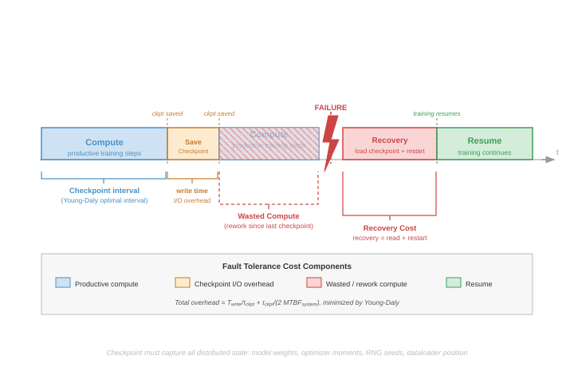

:::

The timeline in @fig-checkpoint-recovery-timeline reveals why $T_{\text{restart}}$ matters as much as $T_{\text{write}}$: the total failure cost is the sum of lost work (bounded by $\tau_{\text{opt}}$) and recovery time, which includes job scheduling, checkpoint loading, and pipeline warmup. Production systems where $T_{\text{restart}}$ exceeds $T_{\text{write}}$ by 3--5$\times$ should include recovery time in their total-waste and SLO budgets, and should use a cited recovery-aware checkpoint model rather than folding restart time into the per-checkpoint write term.

#### Checkpoint overhead analysis {#sec-fault-tolerance-reliability-reliability-checkpoint-overhead-analysis-f5df}

Beyond the time consumed by checkpoint writes, checkpointing imposes additional overhead through memory consumption and training disruption.

Checkpoint serialization requires memory buffers for gathering distributed state and preparing data for write. For synchronous checkpointing, all workers must hold their checkpoint data in memory until the checkpoint completes. This potentially requires significant additional memory allocation.

Synchronous checkpointing pauses training while the checkpoint writes. Even with fast storage, the pause disrupts the training pipeline and may cause GPU idle time. Data loading and forward passes cannot proceed during checkpoint operations.

@Eq-checkpoint-overhead quantifies the wasted time due to checkpointing:

$$ f_{\text{ckpt}} = \frac{T_{\text{write}}}{\tau_{\text{ckpt}}} + \frac{T_{\text{pause}}}{\tau_{\text{ckpt}}} $$ {#eq-checkpoint-overhead}

where $T_{\text{pause}}$ represents any training pause beyond the checkpoint write time. This includes memory allocation, coordination, and serialization.

#### The "stop-the-world" cost {#sec-fault-tolerance-reliability-stoptheworld-cost-beaa}

The financial impact of synchronous checkpointing at scale is severe. When a 10,000-GPU cluster pauses for the 2 minutes a multi-TB checkpoint typically takes on shared storage, it burns $10,000 \times \frac{2}{60} \approx 333$ idle GPU-hours\index{Idle Resource}, which at roughly \$3 per GPU-hour costs about \$1,000 in wasted compute\index{Wasted Compute} for a single checkpoint. If checkpoints occur hourly, that idle time compounds to \$24,000 per day\index{Financial Loss} spent waiting for storage I/O. This economic reality drives the aggressive adoption of asynchronous checkpointing strategies that move data movement off the critical path. @Tbl-checkpoint-overhead-by-model reveals how checkpoint characteristics vary dramatically by model architecture: larger models require longer write times but also benefit from correspondingly longer optimal intervals.

```{python}
#| echo: false
#| label: checkpoint-overhead-by-model-calc
# ┌─────────────────────────────────────────────────────────────────────────────
# │ CHECKPOINT OVERHEAD BY MODEL TYPE (LEGO)
# ├─────────────────────────────────────────────────────────────────────────────
# │ Context: @tbl-checkpoint-overhead-by-model immediately below this cell.
# │
# │ Goal: Compute write time, optimal checkpoint interval, and save overhead
# │       for six model archetypes using the Young-Daly square-root formula.
# │ Show: All numeric cells in the checkpoint overhead comparison table.
# │ How: Load named model sizes, reusable checkpoint archetype sizes, reliability
# │      bandwidth/MTBF anchors; then compute write_time, tau_opt, and overhead.
# │
# │ Imports: mlsysim public API (Models, Systems, ReferenceStats, units, fmt helpers),
# │          mlsysim.physics (calc_young_daly_interval)
# │ Exports: CheckpointOverheadCalc.{archA,dense20b,bert,archB,resnet,vision_transformer}_*_str,
# │          CheckpointOverheadCalc.archA_fp32_tb_str,
# │          CheckpointOverheadCalc.write_bw_gb_per_s_str, mtbf_hr_str
# └─────────────────────────────────────────────────────────────────────────────
from mlsysim import *
from mlsysim.physics import calc_checkpoint_size
from mlsysim.physics import calc_young_daly_interval
from mlsysim.solvers import TrainingMemoryModel

class CheckpointOverheadCalc:
    # ┌── 1. LOAD (Constants) ──────────────────────────────────────────────────
    # Checkpoint sizes for each model archetype.
    checkpoint_archetypes = ReferenceStats.CheckpointArchetypes
    checkpoint_bytes_per_param = checkpoint_archetypes.MixedPrecisionOptimizerBytesPerParameter
    archA_size = calc_checkpoint_size(
        Models.Language.GPT3.parameters,
        bytes_per_param=checkpoint_bytes_per_param,
    )
    archA_fp32_bytes = (
        TrainingMemoryModel()
        .solve(
            Models.Language.GPT3,
            Hardware.Cloud.A100,
            batch_size=1,
            precision="fp32",
        )
        .total_memory
    )
    check(archA_fp32_bytes > archA_size, "Mixed-precision checkpoint must be smaller than FP32 total")
    dense20b_size = checkpoint_archetypes.Dense20BTransformerCheckpointSize
    bert_size = Models.Language.BERT_Large.size_in_bytes(BYTES_FP32)
    archB_size = checkpoint_archetypes.EmbeddingHeavyRecommenderCheckpointSize
    resnet_size = Models.Vision.ResNet50.size_in_bytes(BYTES_FP32)
    vision_transformer_size = checkpoint_archetypes.MediumVisionTransformerCheckpointSize

    write_bw = float(Systems.Reliability.Recovery.checkpoint_write_bw_gbs) * (GB / second)
    mtbf = (float(Systems.Reliability.Gpu.mttf_hours) / Systems.Clusters.Training_10K.total_accelerators) * hour

    # ┌── 2. EXECUTE (The Compute) ─────────────────────────────────────────────
    # Write time = checkpoint_size / write_bandwidth
    archA_write = (archA_size / write_bw).to(second)
    dense20b_write = (dense20b_size / write_bw).to(second)
    bert_write = (bert_size / write_bw).to(second)
    archB_write = (archB_size / write_bw).to(second)
    resnet_write = (resnet_size / write_bw).to(second)
    vision_transformer_write = (vision_transformer_size / write_bw).to(second)

    # Optimal interval = sqrt(2 * write_time * MTBF) [Young-Daly formula]
    # Bind the class-level MTBF at call time to avoid any upstream namespace collision
    # with later tutorial cells that define bare `mtbf` scalars.
    archA_interval = calc_young_daly_interval(archA_write, mtbf)
    dense20b_interval = calc_young_daly_interval(dense20b_write, mtbf)
    bert_interval = calc_young_daly_interval(bert_write, mtbf)
    archB_interval = calc_young_daly_interval(archB_write, mtbf)
    resnet_interval = calc_young_daly_interval(resnet_write, mtbf)
    vision_transformer_interval = calc_young_daly_interval(vision_transformer_write, mtbf)

    # Save overhead = write_time / optimal_interval * 100
    archA_overhead_ratio = (archA_write / archA_interval).to_base_units().magnitude
    dense20b_overhead_ratio = (dense20b_write / dense20b_interval).to_base_units().magnitude
    bert_overhead_ratio = (bert_write / bert_interval).to_base_units().magnitude
    archB_overhead_ratio = (archB_write / archB_interval).to_base_units().magnitude
    resnet_overhead_ratio = (resnet_write / resnet_interval).to_base_units().magnitude
    vision_transformer_overhead_ratio = (vision_transformer_write / vision_transformer_interval).to_base_units().magnitude

    # ┌── 3. GUARD (Invariants) ────────────────────────────────────────────────
    check(archA_interval > 0 * second, "Archetype A interval must be positive")
    check(dense20b_interval > 0 * second, "20B dense transformer interval must be positive")
    check(bert_interval > 0 * second, "BERT interval must be positive")
    check(archB_interval > 0 * second, "Archetype B interval must be positive")
    check(resnet_interval > 0 * second, "ResNet-50 interval must be positive")
    check(vision_transformer_interval > 0 * second, "Vision transformer interval must be positive")
    check(archA_overhead_ratio < 0.10, "Archetype A overhead must be < 10%")
    check(dense20b_overhead_ratio < 0.10, "20B dense transformer overhead must be < 10%")
    check(bert_overhead_ratio < 0.10, "BERT overhead must be < 10%")
    check(archB_overhead_ratio < 0.10, "Archetype B overhead must be < 10%")
    check(resnet_overhead_ratio < 0.10, "ResNet-50 overhead must be < 10%")
    check(vision_transformer_overhead_ratio < 0.10, "Vision transformer overhead must be < 10%")

    # ┌── 4. OUTPUT (Formatting) ───────────────────────────────────────────────
    # -- Checkpoint sizes
    archA_ckpt_tb_str = fmt_memory(archA_size, unit=TB, precision=1, commas=False)
    archA_fp32_tb_str = fmt_qty(archA_fp32_bytes, TB, precision=1, commas=False)
    dense20b_ckpt_gb_str = fmt_memory(dense20b_size, unit=GB, precision=0, commas=False)
    bert_ckpt_gb_str = fmt_memory(bert_size, unit=GB, precision=1, commas=False)
    archB_ckpt_tb_str = fmt_memory(archB_size, unit=TB, precision=0, commas=False)
    resnet_ckpt_mb_str = fmt_memory(resnet_size, unit=MB, precision=1, commas=False)
    vision_transformer_ckpt_gb_str = fmt_memory(vision_transformer_size, unit=GB, precision=1, commas=False)

    write_bw_gb_per_s_str = fmt_bandwidth(write_bw, unit=GB / second, precision=0, commas=False)
    mtbf_hr_str = fmt_time(mtbf, unit=hour, precision=0, commas=False)

    # -- Write times
    archA_write_s_str = fmt_time(archA_write, unit=second, precision=0, commas=False)
    dense20b_write_s_str = fmt_time(dense20b_write, unit=second, precision=1, commas=False)
    bert_write_s_str = fmt_time(bert_write, unit=second, precision=3, commas=False)
    archB_write_s_str = fmt_time(archB_write, unit=second, precision=0, commas=False)
    resnet_write_s_str = fmt_time(resnet_write, unit=second, precision=3, commas=False)
    vision_transformer_write_s_str = fmt_time(vision_transformer_write, unit=second, precision=3, commas=False)

    # -- Optimal intervals (min for >= 60s, s for < 60s)
    archA_interval_min_str = fmt_time(archA_interval, unit=minute, precision=1, commas=False)
    dense20b_interval_min_str = fmt_time(dense20b_interval, unit=minute, precision=1, commas=False)
    bert_interval_s_str = fmt_time(round(bert_interval.to(second).magnitude), unit=second, precision=0, commas=False)
    archB_interval_min_str = fmt_time(archB_interval, unit=minute, precision=0, commas=False)
    resnet_interval_s_str = fmt_time(round(resnet_interval.to(second).magnitude), unit=second, precision=0, commas=False)
    vision_transformer_interval_s_str = fmt_time(round(vision_transformer_interval.to(second).magnitude), unit=second, precision=0, commas=False)

    # -- Save overhead percentages
    archA_overhead_pct_str = fmt_percent(archA_overhead_ratio, precision=1, commas=False, style='prose')
    dense20b_overhead_pct_str = fmt_percent(dense20b_overhead_ratio, precision=1, commas=False, style='prose')
    bert_overhead_pct_str = fmt_percent(bert_overhead_ratio, precision=2, commas=False, style='prose')
    archB_overhead_pct_str = fmt_percent(archB_overhead_ratio, precision=1, commas=False, style='prose')
    resnet_overhead_pct_str = fmt_percent(resnet_overhead_ratio, precision=2, commas=False, style='prose')
    vision_transformer_overhead_pct_str = fmt_percent(vision_transformer_overhead_ratio, precision=2, commas=False, style='prose')

    archA_workers = 1000  # scenario assumption: checkpoint-storm walkthrough worker count
    archA_shard = archA_size / archA_workers
    archA_workers_str = fmt_count(archA_workers, commas=True, label="worker")
    archA_shard_gb_str = fmt_qty(archA_shard, GB, precision=1, commas=False)
```

The Archetype A row below uses the mixed-precision optimizer footprint (`{python} CheckpointOverheadCalc.archA_ckpt_tb_str`), not the full FP32 training-state total (`{python} CheckpointOverheadCalc.archA_fp32_tb_str`) cited in the introduction.

| **Model Type**                   |               **Mixed-Precision Checkpoint Size**                | **Write Time (`{python} CheckpointOverheadCalc.write_bw_gb_per_s_str`)** | **Optimal Interval (`{python} CheckpointOverheadCalc.mtbf_hr_str` GPU-only MTBF)** |                           **Save Overhead**                           |
|:---------------------------------|:----------------------------------------------------------------:|:------------------------------------------------------------------------:|:----------------------------------------------------------------------------------:|:---------------------------------------------------------------------:|
| **Archetype A (175B dense LLM)** |       `{python} CheckpointOverheadCalc.archA_ckpt_tb_str`        |           `{python} CheckpointOverheadCalc.archA_write_s_str`            |              `{python} CheckpointOverheadCalc.archA_interval_min_str`              |        `{python} CheckpointOverheadCalc.archA_overhead_pct_str`       |
| **20B dense transformer class**  |      `{python} CheckpointOverheadCalc.dense20b_ckpt_gb_str`      |          `{python} CheckpointOverheadCalc.dense20b_write_s_str`          |            `{python} CheckpointOverheadCalc.dense20b_interval_min_str`             |      `{python} CheckpointOverheadCalc.dense20b_overhead_pct_str`      |
| **BERT-Large**                   |        `{python} CheckpointOverheadCalc.bert_ckpt_gb_str`        |            `{python} CheckpointOverheadCalc.bert_write_s_str`            |               `{python} CheckpointOverheadCalc.bert_interval_s_str`                |        `{python} CheckpointOverheadCalc.bert_overhead_pct_str`        |
| **Archetype B (DLRM at Scale)**  |       `{python} CheckpointOverheadCalc.archB_ckpt_tb_str`        |           `{python} CheckpointOverheadCalc.archB_write_s_str`            |              `{python} CheckpointOverheadCalc.archB_interval_min_str`              |        `{python} CheckpointOverheadCalc.archB_overhead_pct_str`       |
| **ResNet-50**                    |       `{python} CheckpointOverheadCalc.resnet_ckpt_mb_str`       |           `{python} CheckpointOverheadCalc.resnet_write_s_str`           |              `{python} CheckpointOverheadCalc.resnet_interval_s_str`               |       `{python} CheckpointOverheadCalc.resnet_overhead_pct_str`       |
| **Vision transformer class**     | `{python} CheckpointOverheadCalc.vision_transformer_ckpt_gb_str` |     `{python} CheckpointOverheadCalc.vision_transformer_write_s_str`     |        `{python} CheckpointOverheadCalc.vision_transformer_interval_s_str`         | `{python} CheckpointOverheadCalc.vision_transformer_overhead_pct_str` |

: **Checkpoint Overhead by Model Type**: Checkpoint sizes use the mixed-precision optimizer footprint for large LLMs (see Archetype A note above), not the `{python} CheckpointOverheadCalc.archA_fp32_tb_str` full FP32 training-state total from the introduction. Larger models require longer save times but also benefit from longer optimal checkpoint intervals. The percentage column reports save-only checkpoint write tax, not total Young-Daly waste; at the optimum, expected rework adds a comparable term. {#tbl-checkpoint-overhead-by-model}

While the theoretical overhead of checkpointing appears manageable for individual models, writing these massive state files introduces a new bottleneck. When thousands of GPUs simultaneously attempt to write gigabytes of data to a shared file system, the resulting I/O congestion threatens to bring the entire cluster to a halt. The scale of that I/O burst is easiest to see by expanding the example from one model to thousands of simultaneous writers.

::: {#exmp-fault-tolerance-checkpoint-storm .callout-example title="The checkpoint storm"}

**Scenario**: A training job saves a distributed checkpoint from thousands of accelerators at the same instant.

**Mechanism**: For the `{python} CheckpointOverheadCalc.archA_ckpt_tb_str` mixed-precision optimizer footprint in the Archetype A row above—not the `{python} CheckpointOverheadCalc.archA_fp32_tb_str` full FP32 total—`{python} CheckpointOverheadCalc.archA_workers_str` would each write roughly `{python} CheckpointOverheadCalc.archA_shard_gb_str` of state. The same mechanism becomes catastrophic in embedding-heavy recommendation or trillion-parameter mixture-of-experts jobs: 10,000 GPUs, each holding a 10 GB shard of model or embedding state, can flood the network fabric with 100 TB of simultaneous writes.

**Systems lesson**: A checkpoint storm occurs when massive parallel writes overwhelm the cluster's I/O infrastructure, causing switch buffers to overflow and storage controllers to lock up.

:::

While @tbl-checkpoint-overhead-by-model suggests modest overhead percentages, real deployments often encounter checkpoint times far exceeding these theoretical estimates. Diagnosing such discrepancies requires examining the full system stack.

```{python}
#| echo: false
from mlsysim.fmt import fmt_int, fmt_count, fmt_time, fmt_qty, fmt_qty_int, fmt_params, fmt_usd

# ┌─────────────────────────────────────────────────────────────────────────────
# │ CHECKPOINT DEBUG CALCULATION (LEGO)
# ├─────────────────────────────────────────────────────────────────────────────
# │ Context: "Debugging Checkpoint Overhead" callout in §Checkpoint Overhead.
# │
# │ Goal: Diagnose why a 70B model checkpoint takes 10 minutes instead of
# │   2 minutes on an NFS-backed cluster, by computing theoretical bandwidth
# │   limits and contention-induced effective throughput per node.
# │ Show: total_ckpt_gb_str="700" GB, nfs_gb_per_s_str="1.25" GB/s,
# │   min_write_min_str="9.3" min, per_node_mb_per_s_str="20" MB/s,
# │   per_node_shard_gb_str="10.9" GB—inline in the fleet stack diagnosis.
# │ How: Compute weights + optimizer state size in GB; derive NFS bandwidth in
# │   GB/s (10 Gbps / 8); calculate min write time and per-node bandwidth
# │   under contention from 64 concurrent nodes.
# │
# │ Imports: mlsysim.core.units (Models.Language.Llama2_70B.parameters, Bparam, BYTES_FP16, byte)
# │ Exports: weights_gb_str, optimizer_gb_str, total_ckpt_gb_str, nfs_gb_per_s_str,
# │   min_write_s_str, min_write_min_str, per_node_mb_per_s_str,
# │   per_node_shard_gb_str, per_node_write_min_str, extended_weeks_str,
# │   extra_cost_k_str
# └─────────────────────────────────────────────────────────────────────────────

# ┌── LEGO ───────────────────────────────────────────────
class CheckpointDebug:
    """
    Namespace for 70B checkpoint overhead diagnosis.
    Scenario: 64-node cluster with 10 Gbps shared storage.
    """

    # ┌── 1. LOAD (Constants) ──────────────────────────────────────────────

    from mlsysim import Models, Hardware, Systems

    m = Models.Language.Llama2_70B
    nfs_bw = 10 * Gbps
    pcie_bw = Hardware.Cloud.A100.interconnect.bandwidth
    nvme_bw = Systems.Storage.LocalNvmeGen3.bandwidth
    n_nodes = 64
    n_gpus_ckpt = 512
    observed_write_min = 10
    target_write_min = 2
    overhead_pct = 30
    residual_overhead_pct = 1
    base_weeks = 2
    extra_cost_k = 500

    # ┌── 2. EXECUTE (The Compute) ────────────────────────────────────────
    # 10 bytes/param = 2 (BF16 weights) + 8 (Adam FP32)
    bytes_per_param = 10
    params_count = m.parameters.to(param).magnitude
    total_ckpt_qty = memory_from_params(params_count * param, bytes_per_param * byte / param)
    total_ckpt_gb_val = total_ckpt_qty.to(GB).magnitude

    # Use library formula for transfer time
    t_write = total_ckpt_qty / nfs_bw
    per_node_shard_qty = total_ckpt_qty / n_nodes

    # Staging over PCIe
    t_stage = per_node_shard_qty / pcie_bw
    t_stage_single = total_ckpt_qty / pcie_bw

    # ┌── 3. GUARD (Invariants) ──────────────────────────────────────────
    check(total_ckpt_gb_val == 700, f"Expected 700 GB checkpoint, got {total_ckpt_gb_val}")

    # ┌── 4. OUTPUT (Formatting) ──────────────────────────────────────────────
    weights_gb_str = fmt_qty(params_count * 2 * byte, GB, precision=0, commas=False)
    optimizer_gb_str = fmt_qty(params_count * 8 * byte, GB, precision=0, commas=False)
    total_ckpt_gb_str = fmt_qty(total_ckpt_qty, GB, precision=0, commas=False)
    nfs_gb_per_s_str = fmt_qty(nfs_bw, GB / second, precision=2, commas=False)
    min_write_s_str = fmt_time(t_write, second, precision=0, commas=False)
    min_write_min_str = fmt_time(t_write, minute, precision=1, commas=False)
    per_node_mb_per_s_str = fmt_qty_int(nfs_bw / n_nodes, MB / second, commas=False)
    per_node_shard_gb_str = fmt_qty(per_node_shard_qty, GB, precision=1, commas=False)
    per_node_write_min_str = fmt_time(t_write, minute, precision=1, commas=False)  # Aggregated BW bottleneck
    gpu_cpu_parallel_s_str = fmt_time(t_stage, second, precision=2, commas=False)
    gpu_cpu_single_path_s_str = fmt_time(t_stage_single, second, precision=1, commas=False)
    extended_weeks_str = fmt_time(base_weeks * (1 + overhead_pct / 100), 'week', precision=1, commas=False, style='word')
    extra_cost_k_str = fmt_usd(extra_cost_k * 1000, scale="K", precision=0, commas=False)
    params_b_str = fmt_params(m.parameters, precision=0)
    bytes_per_param_weights_value_str = fmt(2, precision=0, commas=False)
    n_gpus_str = fmt_count(n_gpus_ckpt, commas=False, label="GPU")
    n_nodes_str = fmt_count(n_nodes, commas=False, label="node")
    observed_write_min_str = fmt_time(observed_write_min, 'minute', precision=0, commas=False, style='word')
    target_write_min_str = fmt_time(target_write_min, minute, precision=0, commas=False, style='word')
    overhead_pct_str = fmt_percent(overhead_pct / 100, precision=0, commas=False, style='prose')
    sla_weeks_str = fmt_time(base_weeks, 'week', precision=0, commas=False, style='word')
    nvme_bw_gb_per_s_str = fmt_qty(nvme_bw, GB / second, precision=1, commas=False)
    pcie_gb_per_s_str = fmt_qty(pcie_bw, GB / second, precision=0, commas=False)
    residual_overhead_pct_str = fmt_percent(residual_overhead_pct / 100, precision=0, commas=False, style='prose')
```

::: {#exmp-fault-tolerance-debugging-checkpoint-overhead .callout-example title="Debugging checkpoint overhead"}

**Problem**: A team training a `{python} CheckpointDebug.params_b_str` parameter model observes that checkpointing takes `{python} CheckpointDebug.observed_write_min_str` per checkpoint, far exceeding their expected `{python} CheckpointDebug.target_write_min_str` target. Training throughput has dropped `{python} CheckpointDebug.overhead_pct_str` because the cluster sits idle during checkpoints. Diagnose the bottleneck and identify the recovery path.

**Diagnosis**: The fleet stack exposes where the checkpoint overhead comes from.

The fleet stack framework in @fig-fleet-stack structures our investigation across three layers:

**Analysis**: The infrastructure layer reveals the hardware constraints.

The diagnosis begins at the bottom of the stack:

- **Model state size**\index{Model State Size}: `{python} CheckpointDebug.params_b_str` parameters $\times$ `{python} CheckpointDebug.bytes_per_param_weights_value_str` bytes (BF16) = `{python} CheckpointDebug.weights_gb_str` for weights, plus `{python} CheckpointDebug.optimizer_gb_str` for FP32 Adam optimizer states (first and second moments), totaling approximately `{python} CheckpointDebug.total_ckpt_gb_str` per checkpoint before gradients, master weights, metadata, or framework overhead
- **Storage system**\index{Storage!system}: Shared NFS filer with 10 Gbps network attachment
- **Theoretical bandwidth**\index{Bandwidth!theoretical}: 10 Gbps = `{python} CheckpointDebug.nfs_gb_per_s_str` maximum throughput
- **Minimum write time**\index{Minimum Write Time}: `{python} CheckpointDebug.total_ckpt_gb_str` / `{python} CheckpointDebug.nfs_gb_per_s_str` = `{python} CheckpointDebug.min_write_s_str` (`{python} CheckpointDebug.min_write_min_str`)

The infrastructure layer reveals our first insight: even with perfect efficiency, the NFS bandwidth cannot achieve a 2-minute checkpoint for this model size.

**Analysis**: The distribution layer shifts the diagnosis from raw bandwidth to checkpoint coordination.

- **Checkpoint mode**: Synchronous, all `{python} CheckpointDebug.n_gpus_str` pause and wait
- **Write pattern**\index{Write Pattern}: All `{python} CheckpointDebug.n_nodes_str` writing simultaneously to shared NFS
- **Observed behavior**\index{Observed Behavior}: writes that take `{python} CheckpointDebug.observed_write_min_str` instead of the `{python} CheckpointDebug.min_write_min_str` theoretical minimum

The Distribution Layer reveals the shared-storage bottleneck. With `{python} CheckpointDebug.n_nodes_str` competing for 10 Gbps, each node effectively receives only `{python} CheckpointDebug.per_node_mb_per_s_str` (10 Gbps / `{python} CheckpointDebug.n_nodes_str`). If the checkpoint is sharded evenly, each node writes about `{python} CheckpointDebug.per_node_shard_gb_str`, so the write still lands near `{python} CheckpointDebug.per_node_write_min_str`. The observed `{python} CheckpointDebug.observed_write_min_str` is therefore close to the bandwidth floor, not something more simultaneous NFS writers can solve.

**Analysis**: The governance layer connects the bottleneck to the completion target.

- **SLA requirement**\index{SLA!requirement}: Training must complete within `{python} CheckpointDebug.sla_weeks_str`
- **Current trajectory**: `{python} CheckpointDebug.overhead_pct_str` overhead extends training to `{python} CheckpointDebug.extended_weeks_str`
- **Budget impact**: Extended training incurs additional `{python} CheckpointDebug.extra_cost_k_str` in compute costs

**Fix**: A layer-aware checkpoint path removes the critical-path storage bottleneck.

1. **infrastructure layer**\index{Infrastructure Layer}: Install local Non-Volatile Memory Express (NVMe) staging drives (`{python} CheckpointDebug.nvme_bw_gb_per_s_str` per node)
2. **Distribution Layer**\index{Distribution Layer}: Implement asynchronous checkpointing:
   - Phase 1: GPU $\rightarrow$ CPU memory copy (fast, `{python} CheckpointDebug.pcie_gb_per_s_str` PCIe)
   - Phase 2: CPU $\rightarrow$ local NVMe (`{python} CheckpointDebug.nvme_bw_gb_per_s_str`, training resumes)
   - Phase 3: Background NVMe $\rightarrow$ NFS copy (overlapped with training)
3. **Validation**\index{Validation}: The critical-path data copy drops to approximately `{python} CheckpointDebug.gpu_cpu_parallel_s_str` if GPU-to-CPU staging proceeds in parallel across `{python} CheckpointDebug.n_nodes_str` (or `{python} CheckpointDebug.gpu_cpu_single_path_s_str` if serialized through one `{python} CheckpointDebug.pcie_gb_per_s_str` path), reducing training impact from `{python} CheckpointDebug.overhead_pct_str` to under `{python} CheckpointDebug.residual_overhead_pct_str` once background NVMe and NFS copies are overlapped

**Systems lesson**: Diagnosing distributed systems failures requires examining all layers. A purely algorithmic fix (Distribution Layer) would fail because the physical bandwidth was insufficient. A purely hardware fix (infrastructure layer) would be wasteful without understanding the coordination pattern. The solution required changes at multiple layers working in concert.

:::

The interval calculation chooses *when* the system should preserve state. The next implementation question is *how* that state is written and recovered without turning the checkpoint itself into the critical path.

#### Synchronous vs. asynchronous checkpointing {#sec-fault-tolerance-reliability-reliability-synchronous-vs-asynchronous-checkpointing-ecc1}

The synchronous and asynchronous checkpointing approaches create different failure recovery trade-offs. **Synchronous checkpointing**\index{Synchronous Checkpointing} guarantees a globally consistent state, with all workers at the same training step, simplifying recovery logic. All workers coordinate to reach a consistent state, write their portions, and resume training only after all writes complete.

Asynchronous checkpointing reduces training disruption but requires tracking which workers have completed which checkpoints, adding complexity to recovery coordination. Workers snapshot their state to CPU memory or staging storage, then continue training while a background process writes the snapshot to persistent storage.[^fn-async-checkpoint-pipeline]

[^fn-async-checkpoint-pipeline]: **Asynchronous Checkpointing**\index{Checkpointing!asynchronous, pipeline overhead}: Pipelines the checkpoint write behind training computation by staging GPU state to CPU memory via CUDA streams, then writing to storage on a background thread. Implementations such as DeepSpeed can approach very low checkpoint overhead when sufficient CPU staging memory is available, decoupling the checkpoint I/O latency from the training critical path at the cost of higher peak host memory consumption.

#### Checkpoint storage and recovery {#sec-fault-tolerance-reliability-reliability-checkpoint-storage-recovery-6634}

The tiered checkpoint storage architecture described in @sec-storage-checkpointing, with local NVMe for speed, distributed filesystem for durability, and object storage for long-term retention, provides the storage foundation on which recovery mechanisms operate. The fault-tolerance question is how recovery mechanisms use that infrastructure rather than how the storage hierarchy is designed.

For fault tolerance, the critical concern is not where checkpoints are stored but how quickly they can be read during recovery. Recovery time depends on storage tier bandwidth: local NVMe enables fastest recovery (5–10 GB/s per node), distributed filesystems provide moderate speed with durability (50–200 GB/s aggregate), while object storage offers slowest recovery but highest durability for disaster recovery scenarios.

### Checkpoint coordination patterns {#sec-fault-tolerance-reliability-checkpoint-coordination-patterns-f670}

Recovery from distributed checkpoints for sharded models requires understanding the coordination protocols that ensure checkpoint consistency. When training spans multiple workers, two primary approaches exist: centralized checkpointing\index{Centralized Checkpointing} where a coordinator gathers all state and writes a single checkpoint, and distributed checkpointing\index{Distributed Checkpointing} where each worker writes its own portion of the checkpoint.

#### Centralized checkpointing {#sec-fault-tolerance-reliability-reliability-centralized-checkpointing-83a7}

In centralized checkpointing, workers send their state to a coordinator process that assembles and writes the complete checkpoint. This approach simplifies checkpoint management and produces self-contained checkpoint files, but every benefit is paid for at the coordinator: all state crosses the coordinator's network links, the coordinator needs memory for the entire checkpoint, and coordinator failure loses the checkpoint operation. The pattern works acceptably for tens of workers, where the management simplicity may outweigh the bottleneck, but it becomes impractical for hundreds or thousands of workers because the coordinator becomes both the throughput limiter and the single point of failure.

The decision boundary is the size of the state and the number of writers. Centralized checkpointing is attractive when operational simplicity matters more than aggregate bandwidth, but distributed and sharded approaches become necessary once the checkpoint itself is a fleet-scale object.

#### Distributed checkpointing {#sec-fault-tolerance-reliability-reliability-distributed-checkpointing-5dcc}

In distributed checkpointing, each worker writes its portion of the checkpoint to a shared filesystem or object storage, as @fig-distributed-checkpoint-architecture contrasts with the centralized approach. A coordinator signals when to checkpoint and confirms completion, but state flows directly from workers to storage without aggregation.

::: {#fig-distributed-checkpoint-architecture fig-env="figure" fig-pos="htb" fig-cap="**Distributed Checkpoint Architecture**: Comparison of centralized vs. distributed patterns. (Top) Centralized aggregation creates bottlenecks at the coordinator. (Bottom) Distributed sharding enables every worker to write directly to the Parallel File System (PFS) in parallel, aggregating bandwidth across the storage fabric and minimizing the training pause." fig-alt="Two-panel comparison. Top: Many workers sending data to a single coordinator, which writes to storage. Bottom: Many workers each writing directly to a shared storage cloud in parallel."}
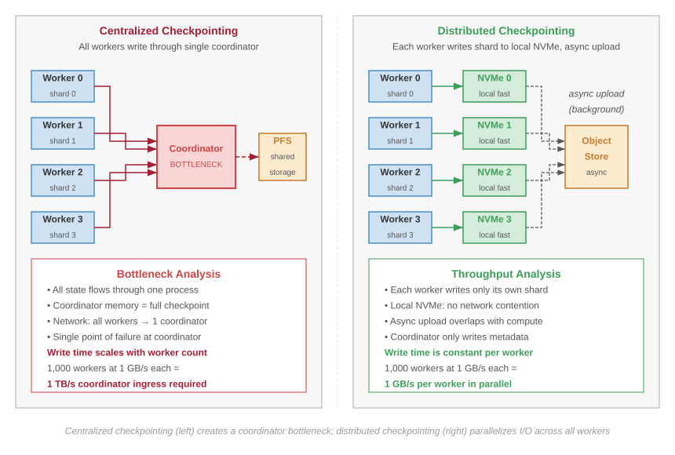
:::

The coordination protocol proceeds in six steps:

1. Coordinator broadcasts checkpoint request with checkpoint ID
2. Each worker reaches a consistent state (barrier synchronization)
3. Each worker writes its shard to `checkpoint_<id>/worker_<rank>.pt`
4. Each worker confirms write completion to coordinator
5. Coordinator writes checkpoint metadata after all confirmations
6. Coordinator broadcasts checkpoint complete, training resumes

This protocol ensures that either all workers complete their writes or the checkpoint is incomplete. Valid checkpoints have complete metadata. Incomplete checkpoints have missing metadata and can be detected. Partial checkpoints can be garbage collected. In practice, that strictness determines whether the system can claim strict, bounded-asynchronous, or eventual consistency.

::: {#psp-fault-tolerance-checkpoint-consistency-models .callout-perspective title="Checkpoint consistency models"}

The idealized protocol assumes step 2 completes quickly. At scale, this barrier synchronization becomes the dominant checkpoint cost because there is almost always at least one slow worker in a 10,000+ GPU cluster.

**Strict Synchronous**\index{Strict Synchronous}: All workers checkpoint at exactly the same training step. Provides strongest consistency but highest overhead from barrier synchronization.

**Bounded Asynchronous**\index{Checkpointing!bounded asynchronous}: Workers may be within $k$ steps of each other (typically $1 \le k \le 3$). The checkpoint manager tracks the "checkpoint wavefront" across workers. Recovery uses the earliest consistent cut across all shards. This trades perfect consistency for dramatically reduced synchronization overhead and is what production systems actually use.

**Eventual Consistency**\index{Eventual Consistency}: Workers checkpoint when convenient, reconcile during recovery. Lowest overhead but requires complex recovery logic to reconstruct consistent state.

:::

The basic protocol has a subtle correctness bug: if the coordinator crashes after some workers confirm but before writing metadata, those workers believe the checkpoint succeeded while the system has no valid checkpoint. Production systems use two-phase commit[^fn-two-phase-commit-checkpoint], a classic distributed systems protocol [@gray1978], to make the checkpoint decision atomic:

[^fn-two-phase-commit-checkpoint]: **Two-Phase Commit (2PC)**\index{Two-Phase Commit!checkpoint atomicity}: Formalized by @gray1978, 2PC ensures all participants either commit or abort atomically. The protocol's known weakness is blocking: if the coordinator fails between prepare and commit, participants wait indefinitely. For distributed checkpointing this blocking is acceptable because a stuck checkpoint can be timed out and retried, whereas the alternative (partial checkpoint writes) would leave the system with an unrecoverable inconsistent state.

In the prepare phase, workers write to a staging location and report success to the coordinator. In the commit phase, the coordinator atomically renames or commits all shards together, moving files from `staging/` to `checkpoints/`, for example. If the coordinator fails between phases, workers detect the failure during the next heartbeat\index{Heartbeat} and roll back staged writes, so either all shards commit together or none do. Consistency remains a separate requirement: synchronous gradient updates naturally create step boundaries where all workers have applied the same updates, but asynchronous training and pipeline parallelism require more careful coordination to define a consistent cut.

#### Sharded checkpointing {#sec-fault-tolerance-reliability-reliability-sharded-checkpointing-58d0}

Modern distributed training frameworks partition model state across workers using techniques like ZeRO (Zero Redundancy Optimizer) and FSDP (Fully Sharded Data Parallel). In these configurations, no single worker holds complete model state. Each worker holds only its assigned parameter shard plus corresponding optimizer state.

**Sharded checkpointing**\index{Sharded Checkpointing}[^fn-sharded-ckpt-io] [@rajbhandari2020] uses this distribution: each worker writes only its shard, dramatically reducing per-worker write volume. Recovery loads shards and redistributes state to workers based on the recovery configuration.

```{python}
#| echo: false
# ┌── LEGO ───────────────────────────────────────────────
# │ Context: Sharded checkpointing prose and footnote below.
# │ Exports: FaultToleranceShardRecap.*
from mlsysim.solvers import TrainingMemoryModel
from mlsysim import Models, Hardware
from mlsysim.fmt import fmt

class FaultToleranceShardRecap:
    m = Models.Language.GPT3
    mem_res = TrainingMemoryModel().solve(m, Hardware.Cloud.A100, batch_size=1, precision="fp32")
    gpt3_ckpt_bytes = mem_res.total_memory
    n_workers = Systems.Clusters.Training_1K.total_accelerators
    from mlsysim.fmt import fmt, fmt_qty

    # ┌── 4. OUTPUT (Formatting) ──────────────────────────────────────────────
    gpt3_params_b_str = fmt_params(m.parameters, scale="B", precision=0, commas=False)
    gpt3_ckpt_tb_str = fmt_qty(gpt3_ckpt_bytes, TB, precision=1, commas=False)
    gpt3_shard_gb_str = fmt_qty(gpt3_ckpt_bytes / n_workers, GB, precision=1, commas=False)
    n_workers_str = fmt(n_workers, precision=0, commas=True)
```

[^fn-sharded-ckpt-io]: **Sharded Checkpointing**\index{Sharded Checkpointing!I/O parallelism}: Each worker saves only its local partition rather than gathering state to a single writer. For ZeRO-3 or FSDP with `{python} FaultToleranceShardRecap.n_workers_str` workers training a `{python} FaultToleranceShardRecap.gpt3_params_b_str` model, each worker writes approximately `{python} FaultToleranceShardRecap.gpt3_shard_gb_str` instead of one writer handling `{python} FaultToleranceShardRecap.gpt3_ckpt_tb_str`, parallelizing I/O across all nodes. The trade-off: recovery requires all shards to be present and consistent, making the checkpoint protocol more complex and the failure of any single shard's storage fatal to the entire checkpoint.

This approach enables efficient checkpointing even for massive models. A `{python} FaultToleranceShardRecap.gpt3_params_b_str` parameter model with a `{python} FaultToleranceShardRecap.gpt3_ckpt_tb_str` checkpoint distributed across `{python} FaultToleranceShardRecap.n_workers_str` workers requires each worker to write only `{python} FaultToleranceShardRecap.gpt3_shard_gb_str`, achievable in seconds with local NVMe storage.

When recovering with a different number of workers than the checkpoint, shard redistribution must remap state to the new worker configuration. This occurs due to elastic scaling or hardware changes. Framework support for flexible resharding enables recovery even when the worker count changes. However, possessing a valid checkpoint is not sufficient on its own. Sharded checkpointing mitigates the I/O storm, but the system must still identify the failure, trigger restoration, and coordinate the distributed shards before training can resume. The speed of detection and recovery determines the true cost of the interruption.

::: {#chk-fault-tolerance-checkpoint-cost .callout-checkpoint title="Reasoning about the checkpoint tax"}

Verify your understanding of how failure rate and checkpoint cost set the optimal checkpoint interval:

- [ ] **Young-Daly shift**: Using the Young-Daly formula, estimate roughly how the optimal interval $\tau_{\text{opt}}$ shifts when a cluster doubles in size and its system MTBF therefore halves, with $T_{\text{write}}$ held fixed. Does the interval lengthen or shorten, and by about what factor?
- [ ] **Two-sided tax**: Why does writing checkpoints too frequently and writing them too rarely both raise the **checkpoint tax**, and which two costs is $\tau_{\text{opt}}$ balancing?
- [ ] **Faster writes**: If sharded checkpointing cuts $T_{\text{write}}$ by an order of magnitude, can you explain the direction in which the optimal interval moves and what that does to expected lost work per failure?
- [ ] **Square-root scaling**: Why does the Young-Daly interval depend on the square root of MTBF rather than scaling linearly with it?

:::

## Failure Detection and Recovery {#sec-fault-tolerance-reliability-reliability-failure-detection-recovery-0f54}

A GPU silently hangs, dropping its utilization to zero while its peer GPUs wait indefinitely at an AllReduce barrier. Every minute the system takes to notice this straggler and reboot the node costs thousands of dollars in idle cluster time. Checkpoints preserve state, but the recovery process itself determines how much compute a failure wastes.

@Eq-recovery-time decomposes recovery time into four primary components:

$$ T_{\text{recovery}} = T_{\text{detect}} + T_{\text{restart}} + T_{\text{load}} + T_{\text{warmup}} $$ {#eq-recovery-time}

where:

- $T_{\text{detect}}$: Time between the actual hardware fault and the system classifying it as a failure
- $T_{\text{restart}}$: Time for the job scheduler to allocate new resources and launch replacement processes
- $T_{\text{load}}$: I/O time to read checkpoint state from distributed storage into GPU memory
- $T_{\text{warmup}}$: Time for the system to refill the data pipeline, compile just-in-time (JIT) kernels, and stabilize throughput

Each component presents distinct optimization opportunities, and the dominant term varies by cluster configuration. Understanding this decomposition enables targeted investment in the bottleneck rather than uniform improvement across all components.

### Failure detection mechanisms {#sec-fault-tolerance-reliability-reliability-failure-detection-mechanisms-efed}

::: {.column-margin}
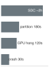{width="100%" fig-alt="A staircase ladder of detection latency on a log scale, ordered by how hard a failure is to see: a process crash at about 30 seconds, a GPU hang at 120 seconds, a network partition at 180 seconds, and silent data corruption at roughly two hours. The span climbs across two to three orders of magnitude."}

*Detection latency climbs from seconds (crash) to hours (silent corruption).*
:::

Detection is the first line of defense, governed by a fundamental trade-off between speed and false positive rate. A timeout that is *too aggressive* mistakes temporary network jitter for a node failure, triggering an unnecessary and expensive restart. A timeout that is *too conservative* allows the entire cluster to sit idle while a dead node holds up synchronization.

Heartbeat monitoring is the standard mechanism: each worker periodically sends "I am alive" signals to a central coordinator or monitoring service. Missing heartbeats trigger failure classification. The heartbeat interval $H$ and timeout $T_{\text{timeout}}$ control the trade-off. In high-scale clusters, heartbeat arrival times often follow a heavy-tailed distribution due to network congestion, necessitating adaptive timeouts rather than static thresholds. Production systems typically use $T_{\text{timeout}} = H + k\sigma_d$ where $k$ ranges from 3 to 5 and $\sigma_d$ is the observed network delay variance.

Collective communication timeouts provide a second detection layer. During synchronous training, collective operations (AllReduce, Broadcast) are blocking: if a single rank fails silently (a frozen GPU driver, for instance) every other rank in the communicator hangs indefinitely waiting for data that will never arrive. NCCL[^fn-nccl-timeout-tradeoff] provides configurable transport and RAS timeout parameters for this purpose, while higher-level frameworks may impose process-group operation timeouts. These settings are often set conservatively to avoid crashing jobs during legitimate periods of slow communication, which unfortunately extends $T_{\text{detect}}$.

[^fn-nccl-timeout-tradeoff]: **NCCL Timeout**\index{NCCL!timeout}\index{NCCL!timeout trade-off}: NVIDIA's collective communication library exposes transport and RAS timeout controls such as `NCCL_IB_TIMEOUT` and `NCCL_RAS_TIMEOUT_FACTOR`; higher-level frameworks such as PyTorch Distributed may also configure process-group operation timeouts. Aggressive timeout settings accelerate failure detection but risk false positives during legitimate long collective operations on large models, forcing a trade-off between detection latency and training stability that has no universal optimum.

Container orchestration health checks provide a third layer. Kubernetes and SLURM offer liveness probes\index{Liveness Probe} (verifying that processes are running) and readiness probes\index{Readiness Probe} (verifying that processes are ready to handle requests). These operate independently of the training framework, catching failures that application-level heartbeats might miss—such as a process that is alive but deadlocked.

Loss spike\index{Loss Spike} detection catches the most insidious failure mode: silent data corruption. Hardware errors that do not crash the process but corrupt the mathematical result (bit flips in ALU logic, for instance) manifest as sudden, catastrophic spikes in the loss function. The loss jumps 10--100$\times$ or collapses to NaN instantly. Unlike gradient explosions caused by high learning rates, these spikes occur without hyperparameter changes. Robust systems instrument the training loop to pause immediately upon detecting such anomalies, pinpoint the rank with the corrupted gradient via checksums or replay, and drain that node before restarting from the last healthy checkpoint.

Training dynamics monitoring extends detection beyond explicit errors. Monitoring loss values, gradient norms, and activation statistics can detect Byzantine failures that produce incorrect results without triggering exceptions. Sudden loss spikes, gradient explosions, or statistical anomalies in per-rank gradient distributions may indicate silent corruption that would otherwise go undetected for hours.

In practice, the gap between theoretical heartbeat timeouts and actual detection latencies is substantial, because distinguishing genuine failures from temporary stragglers remains an inherently difficult problem.

::: {#psp-fault-tolerance-realistic-detection-latencies .callout-perspective title="Realistic failure detection latencies"}

Production experience shows that failure detection takes significantly longer than theoretical heartbeat timeouts suggest. The core challenge is distinguishing failures from stragglers, as @tbl-fault-tolerance-detection-latencies records. These latencies exist because aggressive timeouts cause false positives (killing healthy-but-slow workers), while conservative timeouts delay real failure detection. Production systems typically use multi-stage detection: fast initial timeout triggers investigation, slower confirmation timeout triggers recovery.

:::

| **Failure Type**           | **Typical Detection Time** | **Why**                                        |
|:---------------------------|:--------------------------:|:-----------------------------------------------|
| **Process crash**          |        5–30 seconds        | Heartbeat timeout + verification retries       |
| **GPU hang**               |       30–120 seconds       | Must distinguish from legitimately slow kernel |
| **Network partition**      |       60–180 seconds       | Must distinguish from temporary congestion     |
| **Silent data corruption** |      Minutes to hours      | Requires statistical anomaly detection         |

: **Production Failure Detection Latencies**: Realistic detection times for process crashes, GPU hangs, network partitions, and silent data corruption, with the dominant cause of latency for each category, showing why static heartbeat timeouts alone are insufficient. {#tbl-fault-tolerance-detection-latencies}

### Recovery procedures {#sec-fault-tolerance-reliability-reliability-recovery-procedures-002d}

Once a failure is classified, the recovery procedure executes a rigid sequence to restore consistency:

1. **Job termination**\index{Job Termination}: A `SIGTERM` is broadcast to all surviving workers. In synchronous distributed data parallel (DDP) training, the loss of one worker invalidates the global communicator, forcing a full tear-down.

2. **Resource reclamation**\index{Resource Reclamation}: The scheduler marks the failed node as "draining" to prevent immediate rescheduling and requests a replacement from the spare pool.

3. **Job restart**\index{Job Restart}: New containers are launched (from cache if available), and the training binary is re-initialized on all nodes.

4. **Checkpoint loading**: Each worker reads its state shard from the distributed filesystem. For sharded checkpoints, each worker loads only its partition.

5. **State synchronization**\index{State Synchronization}: Ranks handshake to establish a new communicator (for example, `ncclCommInitRank`), and workers verify they are all at the same training step.

6. **Training resumption**\index{Training!resumption}: The data loader fast-forwards to the correct batch index, and the training loop resumes from the checkpoint step.

Automatic recovery systems perform these steps without human intervention. Modern training frameworks integrate with cluster managers to automate the entire sequence. DeepSpeed's `deepspeed.launch` can be configured for automatic restart on failure. PyTorch's `torchrun` (elastic launch) provides similar capabilities through its rendezvous mechanism, the coordinator-backed protocol by which surviving workers agree on membership and ranks after a restart.[^fn-rendezvous-elastic]

Recovery validation is the final and often overlooked step. After loading a checkpoint, validation confirms successful recovery by verifying model parameters match expected shapes and dtypes, running a few training steps and checking that the loss is consistent with prefailure values, and confirming gradient computations produce expected statistics. If the loss diverges immediately after recovery, the checkpoint itself may be corrupted, requiring fallback to an earlier snapshot.

```{python}
#| echo: false
#| label: lego-recovery-budget
from mlsysim import *
from mlsysim.solvers import TrainingMemoryModel
from mlsysim.physics import calc_mtbf_cluster

class RecoveryBudget:
    # ┌── 1. LOAD ──────────────────────────────────────────
    _mem = TrainingMemoryModel().solve(Models.Language.GPT3, Hardware.Cloud.A100, batch_size=1, precision="fp32")
    recovery = Systems.Reliability.Recovery
    t_detect = float(recovery.detection_time_s) * second
    t_restart = float(recovery.restart_time_s) * second
    aggregate_ckpt_bw = float(recovery.checkpoint_write_bw_gbs) * (GB / second)
    t_load = (_mem.total_memory / aggregate_ckpt_bw).to(second)
    t_warmup = float(recovery.warmup_time_s) * second
    shard_read_bw = Systems.Storage.LocalNvmeTrainingTypical.bandwidth
    n_gpus_1k = Systems.Clusters.Training_1K.total_accelerators
    n_gpus_10k = Systems.Clusters.Training_10K.total_accelerators
    mtbf_1k = calc_mtbf_cluster(Systems.Reliability.Gpu.mttf_hours, n_gpus_1k)
    mtbf_10k = calc_mtbf_cluster(Systems.Reliability.Gpu.mttf_hours, n_gpus_10k)
    failures_per_day_1k = (24 * hour / mtbf_1k).to("").magnitude
    failures_per_day_10k = (24 * hour / mtbf_10k).to("").magnitude

    # ┌── 2. EXECUTE ───────────────────────────────────────
    t_total = t_detect + t_restart + t_load + t_warmup
    daily_loss_1k = failures_per_day_1k * t_total
    daily_loss_10k = failures_per_day_10k * t_total
    overhead_pct_1k = (daily_loss_1k / (24 * hour)).to("").magnitude * 100
    overhead_pct_10k = (daily_loss_10k / (24 * hour)).to("").magnitude * 100
    waste_gpu_hours_10k = daily_loss_10k.to(hour).magnitude * n_gpus_10k

    # ┌── 3. GUARD ─────────────────────────────────────────
    check(t_total > 0 * minute, "Recovery time must be positive")
    check(t_total < 30 * minute, "Recovery time should be under 30 min")
    check(abs(daily_loss_1k.to(minute).magnitude - 3.0) < 0.5, f"1k daily loss ({daily_loss_1k.to(minute).magnitude:.1f} min)")
    check(34 < t_load.to(second).magnitude < 38, f"Aggregate checkpoint load should be ~36 s, got {t_load.to(second).magnitude:.1f}")
    check(abs(daily_loss_10k.to(minute).magnitude - 31.0) < 2.0, f"10k daily loss ({daily_loss_10k.to(minute).magnitude:.1f} min)")

    # ┌── 4. OUTPUT ────────────────────────────────────────
    t_total_min_str = fmt_time(t_total, unit=minute, precision=1, commas=False)
    t_detect_s_str = fmt_time(t_detect, second, precision=0, commas=False)
    t_restart_min_str = fmt_time(t_restart, minute, precision=0, commas=False)
    t_load_s_str = fmt_time(t_load, second, precision=1, commas=False)
    t_warmup_min_str = fmt_time(t_warmup, minute, precision=0, commas=False)
    aggregate_read_gb_per_s_str = fmt_qty(aggregate_ckpt_bw, GB / second, precision=0, commas=False)
    shard_read_gb_per_s_str = fmt_qty(shard_read_bw, GB / second, precision=0, commas=False)
    n_gpus_1k_str = fmt(n_gpus_1k, precision=0, commas=True)
    n_gpus_10k_str = fmt(n_gpus_10k, precision=0, commas=True)
    mtbf_1k_hrs_str = fmt_time(round(mtbf_1k.to(hour).magnitude), hour, precision=0, commas=False, style='word')
    mtbf_10k_hrs_str = fmt_time(round(mtbf_10k.to(hour).magnitude), hour, precision=0, commas=False, style='word')
    failures_per_day_1k_str = fmt_rate(failures_per_day_1k, "failures/day", precision=2, commas=False)
    failures_per_day_10k_str = fmt_rate(failures_per_day_10k, "failures/day", precision=1, commas=False)
    daily_loss_min_1k_str = fmt_time(round(daily_loss_1k.to(minute).magnitude), minute, precision=0, commas=False, style='word')
    daily_loss_min_10k_str = fmt_time(round(daily_loss_10k.to(minute).magnitude), minute, precision=0, commas=False, style='word')
    overhead_pct_1k_str = fmt_percent(overhead_pct_1k / 100, precision=1, commas=False, style='prose')
    overhead_pct_10k_str = fmt_percent(overhead_pct_10k / 100, precision=1, commas=False, style='prose')
    waste_gpu_hours_10k_str = fmt_count(round(waste_gpu_hours_10k), label="GPU-hour", plural_label="GPU-hours")
```

::: {#nbk-fault-tolerance-recovery-time-budget .callout-notebook title="The recovery time budget"}

```{python}
#| echo: false
# ┌── LEGO ───────────────────────────────────────────────
# │ Context: Recovery time budget notebook below.
# │ Exports: FaultToleranceRecoveryRecap.gpt3_ckpt_tb_str, gpt3_shard_gb_str
from mlsysim.solvers import TrainingMemoryModel
from mlsysim import *

class FaultToleranceRecoveryRecap:
    m = Models.Language.GPT3
    mem_res = TrainingMemoryModel().solve(m, Hardware.Cloud.A100, batch_size=1, precision="fp32")
    gpt3_ckpt_bytes = mem_res.total_memory
    n_workers = Systems.Clusters.Training_1K.total_accelerators
    # ┌── 4. OUTPUT (Formatting) ─────────────────────────────────────────────
    params_b_str = fmt_params(m.parameters, scale="B", precision=0, commas=False)
    gpt3_ckpt_tb_str = fmt_qty(gpt3_ckpt_bytes, TB, precision=1, commas=False)
    gpt3_shard_gb_str = fmt_qty(gpt3_ckpt_bytes / n_workers, GB, precision=1, commas=False)
    n_workers_str = fmt_count(n_workers, commas=True, label="GPU")
```

**Problem**: Consider our `{python} FaultToleranceRecoveryRecap.params_b_str` parameter model training on `{python} FaultToleranceRecoveryRecap.n_workers_str`. The checkpoint size is approximately `{python} FaultToleranceRecoveryRecap.gpt3_ckpt_tb_str` (weights + Adam optimizer state). Estimate the cost of a single failure event.

**Setup**: The recovery budget $T_{\text{recovery}}$ has four terms.

1. **$T_{\text{detect}}$**: `{python} RecoveryBudget.t_detect_s_str` (conservative heartbeat timeout with verification retries)
2. **$T_{\text{restart}}$**: `{python} RecoveryBudget.t_restart_min_str` (scheduler queue time + container launch + Python import overhead + NCCL initialization)
3. **$T_{\text{load}}$**: `{python} RecoveryBudget.t_load_s_str` (this is the aggregate-shared-storage read of the full `{python} FaultToleranceRecoveryRecap.gpt3_ckpt_tb_str` checkpoint at `{python} RecoveryBudget.aggregate_read_gb_per_s_str` aggregate; with sharded local-NVMe reads at `{python} RecoveryBudget.shard_read_gb_per_s_str`, each `{python} FaultToleranceRecoveryRecap.gpt3_shard_gb_str` shard loads in well under one second)
4. **$T_{\text{warmup}}$**: `{python} RecoveryBudget.t_warmup_min_str` (JIT kernel compilation, data pipeline buffer fill, TCP connection re-establishment)

**Total**: $T_{\text{recovery}} = T_{\text{detect}} + T_{\text{restart}} + T_{\text{load}} + T_{\text{warmup}} \approx$ `{python} RecoveryBudget.t_total_min_str` per failure event.

**Impact**: Recovery time\index{Recovery Time!scale impact} optimization matters more as clusters grow. With the GPU-only baseline from @tbl-cluster-mtbf-scaling, a `{python} RecoveryBudget.n_gpus_1k_str`-GPU cluster has MTBF of `{python} RecoveryBudget.mtbf_1k_hrs_str` and experiences about `{python} RecoveryBudget.failures_per_day_1k_str`, losing about `{python} RecoveryBudget.daily_loss_min_1k_str` daily, a modest `{python} RecoveryBudget.overhead_pct_1k_str` overhead. However, a `{python} RecoveryBudget.n_gpus_10k_str`-GPU cluster has GPU-only MTBF of `{python} RecoveryBudget.mtbf_10k_hrs_str` and experiences about `{python} RecoveryBudget.failures_per_day_10k_str`, losing about `{python} RecoveryBudget.daily_loss_min_10k_str` daily—a `{python} RecoveryBudget.overhead_pct_10k_str` overhead equivalent to wasting roughly `{python} RecoveryBudget.waste_gpu_hours_10k_str` every day (`{python} RecoveryBudget.daily_loss_min_10k_str` $\times$ `{python} RecoveryBudget.n_gpus_10k_str` ÷ 60).

:::

### Warm restart vs. cold restart {#sec-fault-tolerance-reliability-warm-vs-cold-restart}

The standard recovery procedure described earlier is a **cold restart**\index{Cold Restart}: every process in the cluster is killed, and the entire state is reloaded from persistent storage. Cold restart is robust and simple (it makes no assumptions about the validity of in-memory state) but it is wasteful. When a single GPU fails in a 1,000-GPU cluster, a cold restart discards the valid memory state of 999 healthy workers, forcing them all to reload from disk.

A **warm restart**\index{Warm Restart} preserves the state of surviving workers. When a rank fails, surviving ranks detect the failure but do not exit. They enter a waiting state, preserving loaded model weights and optimizer states in GPU memory. The scheduler replaces only the failed node. The new node joins, loads its partition of the state from disk (or receives it via broadcast from a peer), and the communicator is rebuilt. Training resumes with minimal disruption.

Warm restarts can reduce $T_{\text{load}}$ and $T_{\text{warmup}}$ to near-zero for 99.9 percent of the cluster, cutting total recovery time from minutes to seconds. For the `{python} FaultToleranceRecoveryRecap.n_workers_str` example, a warm restart avoids reloading `{python} FaultToleranceRecoveryRecap.gpt3_ckpt_tb_str` from storage, saving the `{python} RecoveryBudget.t_load_s_str` $T_{\text{load}}$ and 2-minute $T_{\text{warmup}}$ for all but the replacement node.

The trade-off is software complexity. Warm restarts require the application to handle dynamic membership changes without leaking CUDA memory, corrupting shared state, or deadlocking during communicator reconstruction. Frameworks like TorchElastic and DeepSpeed provide this capability, but the failure modes during warm restart itself (a crash during communicator rebuild, for instance) must be handled by falling back to cold restart. A mature deployment can use warm restart as the fast path with cold restart as the safety net. @Tbl-cold-vs-warm-restart contrasts the two strategies:

| **Aspect**                  | **Cold Restart**                 | **Warm Restart**                       |
|:----------------------------|:---------------------------------|:---------------------------------------|
| **Recovery time**           | 4–10 minutes (full reload)       | 30–90 seconds (single node reload)     |
| **State guarantee**         | Clean: all state from checkpoint | Assumes surviving state is valid       |
| **Implementation**          | Simple: kill all, reload all     | Complex: dynamic membership management |
| **Failure during recovery** | Retry cold restart               | Fall back to cold restart              |
| **Best for**                | Correlated failures, SDC events  | Single-node failures, GPU errors       |

: **Cold vs. Warm Restart Trade-Offs**: Cold restart kills every process and reloads from disk; warm restart preserves surviving workers and replaces only the failed node. Warm restart cuts recovery from minutes to seconds for the typical single-node failure but introduces software complexity around dynamic membership management. Mature deployments can run warm restart as the fast path and cold restart as the safety net. {#tbl-cold-vs-warm-restart}

### Recovery automation pipeline {#sec-fault-tolerance-reliability-recovery-automation-pipeline}

At the scale of 10,000+ GPUs, human intervention for every failure is impossible—failures occur multiple times per day. Recovery must be an autonomous control loop managed by the cluster's control plane. Published large-scale systems from Meta, Google, and Microsoft illustrate multi-stage automation pipelines that classify failures and select the minimum viable remediation.

The pipeline operates in four stages. First, a **health monitoring daemon**\index{Health Monitoring Daemon} (often a sidecar container) continuously scrapes GPU telemetry (ECC error counters, temperature, fan speed, NVLink status) alongside application metrics like training loss and step throughput. Second, a **failure classifier**\index{Failure Classifier} determines whether a signal indicates a fatal error (for example, NVIDIA Xid error 48: double-bit ECC error), a transient stall (for example, temporary network congestion), or a performance degradation (for example, thermal throttling). Third, an **action selector**\index{Action Selector} chooses the appropriate response: a process hang triggers a container restart (fast, local); a GPU hardware error triggers node drain and replacement (slower, requires spare capacity); a network partition triggers a pause-and-wait strategy (preserving in-memory state). Fourth, a **validation stage**\index{Validation Stage} runs a "canary batch" after recovery to confirm the loss matches prefailure values. If the loss diverges immediately, the checkpoint may be corrupted, triggering automatic fallback to an earlier snapshot.

This automation reduces Mean Time To Recovery (MTTR) from the 30–60 minutes typical of manual intervention to under 10 minutes for most failure types. The classification stage is critical: treating every failure as a cold restart wastes compute on transient issues, while treating a hardware failure as transient allows corrupted computation to continue.

### Distinguishing stragglers from failures {#sec-fault-tolerance-reliability-reliability-distinguishing-stragglers-failures-285d}

::: {#dfn-fault-tolerance-straggler .callout-definition title="Straggler"}

***Straggler***\index{Straggler!definition} is a worker in a distributed training job that processes tasks significantly slower than its peers, creating a synchronization bottleneck.

1.  **Significance (quantitative)**: In a synchronous system (BSP), cluster throughput is bounded by the speed of the Slowest Rank. A single 10 percent performance drop on one node can reduce the effective compute capacity of thousands of nodes by 10 percent.
2.  **Observation**: Unlike a Hardware Failure (where the node stops), a Straggler continues to produce correct results but violates the Temporal Consistency required for efficient parallel execution.
3.  **Pitfall**: A frequent misconception is that stragglers are caused only by "bad hardware." In reality, they are often caused by System Jitter\index{System Jitter}: background OS processes, network congestion, or thermal throttling that varies across the data center floor.

:::

A straggler is a worker that remains functionally correct but performs significantly slower than its peers. In synchronous training, stragglers are performance poison: the speed of the entire cluster is determined by its slowest component, because AllReduce cannot complete until every rank has submitted its gradients.

For the simplified no-overlap straggler model, the step time becomes:
$$ T_{\text{step,straggler}}(N) = \max(T_{\text{rank}_0}, T_{\text{rank}_1}, \dots, T_{\text{rank}_{N-1}}) + T_{\text{comm}}(N) $$

Stragglers arise from "gray failures\index{Gray Failure}" that do not trigger explicit errors: thermal throttling reduces clock speed, degrading interconnect cables increase communication latency, OS background processes (memory scrubbing, log rotation) consume CPU cycles, and data loading from a congested network filesystem introduces variable I/O delays. Unlike hard failures, stragglers do not trigger timeouts, allowing them to silently drag down global efficiency for hours.

The challenge is distinguishing stragglers from failures. Stragglers should trigger *mitigation* (redistribute work, replace the slow node). Failures should trigger *recovery* (checkpoint-restart). Aggressive timeouts treat stragglers as failures, causing unnecessary job restarts that waste more compute than the straggler itself. Conservative timeouts waste compute waiting for stragglers that will never speed up.

Straggler mitigation strategies span a spectrum of aggressiveness. **Backup workers**\index{Backup Worker} replicate work assigned to slow workers and use the first result, trading compute for latency. **Bounded staleness**\index{Bounded Staleness} allows training to proceed with stale gradients from slow workers, accepting a small convergence penalty. **Dynamic load balancing**\index{Dynamic Load Balancing} redistributes data shards away from slow workers, reducing their per-step workload. **Proactive replacement**\index{Proactive Replacement} uses GPU telemetry trends (rising temperature, increasing ECC error counts) to detect degrading workers and replace them before they become stragglers.

A simple cost calculation shows why a severe straggler may be cheaper to replace than tolerate.

```{python}
#| echo: false
#| label: lego-straggler-tax
from mlsysim.fmt import fmt_int, fmt, check, fmt_percent, fmt_usd

class StragglerTax:
    # ┌── 1. LOAD ──────────────────────────────────────────
    n_gpus = Systems.Clusters.Training_1K.total_accelerators
    normal_step_s = 1.0
    throttle_factor = 0.50  # straggler runs at 50% speed
    gpu_cost_per_hour = Infrastructure.Pricing.Cloud.GpuTrainingUtilityScenarioPerHour.rate.to(USD / hour).magnitude

    # ┌── 2. EXECUTE ───────────────────────────────────────
    straggler_step_s = normal_step_s / throttle_factor
    healthy_gpus = n_gpus - 1
    effective_speed = 1 / straggler_step_s
    straggler_frac_pct = 1 / n_gpus * 100
    throughput_loss_pct = (1 - normal_step_s / straggler_step_s) * 100
    wasted_cost_per_hour = n_gpus * gpu_cost_per_hour * (1 - normal_step_s / straggler_step_s)

    # ┌── 3. GUARD ─────────────────────────────────────────
    check(straggler_step_s > normal_step_s, "Straggler must be slower")
    check(throughput_loss_pct > 0, "Must show throughput loss")
    check(wasted_cost_per_hour > 0, "Must show wasted cost")

    # ┌── 4. OUTPUT ────────────────────────────────────────
    n_gpus_str = fmt(n_gpus, precision=0)
    normal_step_str = fmt(normal_step_s, precision=0, commas=False)
    throttle_pct_str = fmt_percent(round(throttle_factor * 100) / 100, precision=0, commas=False, style='prose')
    straggler_step_str = fmt(straggler_step_s, precision=0, commas=False)
    healthy_gpus_str = fmt(healthy_gpus, precision=0)
    effective_speed_str = fmt(effective_speed, precision=1, commas=False)
    straggler_frac_str = fmt_percent(straggler_frac_pct / 100, precision=1, commas=False, style='prose')
    throughput_loss_str = fmt_int(throughput_loss_pct, commas=False)
    gpu_cost_str = fmt_usd(gpu_cost_per_hour, precision=0, commas=False, per="GPU-hour")
    wasted_cost_str = fmt_usd(wasted_cost_per_hour, precision=0, per="hour")
```

:::: {#nbk-fault-tolerance-straggler-tax .callout-notebook title="The straggler tax"}

Consider our `{python} StragglerTax.n_gpus_str`-GPU cluster where a normal training iteration takes `{python} StragglerTax.normal_step_str` second. A single GPU enters a thermally throttled state, clocking down to `{python} StragglerTax.throttle_pct_str` speed, and now takes `{python} StragglerTax.straggler_step_str` seconds to complete its computation.

::: {.column-margin}
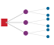{width="100%" fig-alt="One slow rank blocking healthy ranks at synchronization barrier."}

*A single straggler idles every healthy accelerator.*
:::

Because AllReduce cannot complete until every rank has submitted its gradients, the other `{python} StragglerTax.healthy_gpus_str` healthy GPUs sit idle waiting for the straggler.

**Impact**:

- **Normal step time**: `{python} StragglerTax.normal_step_str` second
- **Straggler step time**\index{Straggler!step time}: `{python} StragglerTax.straggler_step_str` seconds
- **Effective cluster speed**: 1 step/`{python} StragglerTax.straggler_step_str`s = `{python} StragglerTax.effective_speed_str` steps/sec

A single failing device (`{python} StragglerTax.straggler_frac_str` of the hardware) has reduced the throughput of the entire cluster by `{python} StragglerTax.throughput_loss_str` percent. At `{python} StragglerTax.gpu_cost_str`, this straggler wastes `{python} StragglerTax.wasted_cost_str` in idle compute.

**Systems insight**: It is mathematically optimal to treat a severe straggler as a hard failure. Detecting and killing a slow node to force a restart onto healthy hardware yields higher long-term throughput than tolerating the degradation. The break-even point: if a straggler slows the cluster by more than $T_{\text{recovery}}/\text{MTBF}_{\text{system}}$ (the fraction of time spent recovering from failures), replacing it immediately is cheaper than waiting.

::::

However, killing a slow node and restarting the job implies waiting for a replacement to maintain the original GPU count. The checkpoint-restart recovery model assumes restoring the *same* resource allocation: checkpoint, wait for a replacement, restart. Elastic recovery breaks that assumption by allowing the job to continue with *fewer* workers rather than idling the entire cluster until the original count is restored.

::: {#chk-fault-tolerance-detection-vs-recovery .callout-checkpoint title="Tuning detection and recovery"}

Verify your understanding of how detection latency and recovery strategy trade against one another:

- [ ] **Timeout tuning**: Given the heartbeat timeout rule $T_{\text{timeout}} = H + k\sigma_d$, explain what failure mode you trade away when you lower $k$ from 5 to 3, and which one you make worse.
- [ ] **Warm vs. cold restart**: A single GPU fails in a 1,000-GPU job with surviving state intact. Would you choose a **warm restart** or a **cold restart**, and which two conditions would push you back toward the cold path?
- [ ] **Hot spare cost**: Why does a **hot spare** cut recovery latency relative to detect-then-restart, and what standing cost does the cluster pay to keep that spare available?
- [ ] **Straggler decision**: When a node has slowed to a fraction of normal speed rather than crashing, what governs whether you wait it out or kill it and recover onto healthy hardware?

:::

## Elastic Recovery {#sec-fault-tolerance-reliability-reliability-elastic-training-4f87}

Suppose a 1,024-GPU training job loses an 8-GPU node to a hardware fault, but the cluster has no spare nodes available. Under checkpoint-restart recovery, the remaining 1,016 GPUs sit idle for hours waiting for a repair. Elastic recovery instead allows the job to dynamically resize and continue with slightly less compute, breaking the rigid assumption of a fixed worker count.

::: {#dfn-fault-tolerance-elastic-training .callout-definition title="Elastic training"}

***Elastic Training***\index{Elastic Training!definition}\index{Training!elastic} is the capability of a distributed training job to dynamically adjust its worker count during execution without requiring a full restart.

1.  **Significance (quantitative)**: It converts hard failures into throughput degradations rather than full stops. A 1,024-GPU job that loses 8 GPUs continues at 99.2 percent capacity instead of dropping to zero. It requires learning rate recalibration and gradient accumulation adjustment to maintain mathematical consistency as the global batch size changes.
2.  **Observation**: Unlike checkpoint-restart recovery (which halts the job, waits for replacement hardware, and reloads state), elastic recovery is always-live: the optimization loop never stops, it only changes its parallel width.
3.  **Pitfall**: A frequent misconception is that elasticity is "automatic." In reality, recovery requires coordinated adaptation: the training framework, the data loader, and the orchestrator must all synchronize their state to ensure that no data samples are lost or double-counted during the resize.

:::

@Fig-elastic-flow traces the recovery sequence: detect the failure, pause, rescale across the surviving workers, and resume.

::: {#fig-elastic-flow fig-env="figure" fig-pos="htb" fig-cap="**Elastic Training Recovery**: Unlike static training which aborts on failure, elastic training adapts. When a worker fails, the job pauses, redistributes the dataset and model shards across the remaining $N-1$ workers, and resumes training from the last consistent state. This capability transforms hard failures into temporary throughput degradations." fig-alt="Flowchart with 5 steps and decision diamond. Training on N workers flows to monitor alert diamond. On failure: pause training, rescale batch and learning rate to N-1 workers, resume training. Loop returns to monitoring. Annotation highlights key step."}

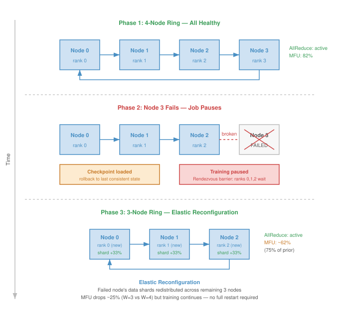

:::

As @fig-elastic-flow illustrates, elastic recovery converts what would otherwise be hard failures into graceful capacity adjustments: a lost worker reduces the active count rather than aborting the job, the running step adapts to the smaller resource allocation, and the cluster resumes productive work within seconds rather than waiting minutes to hours for replacement hardware.

### Recovery adaptation mechanisms {#sec-fault-tolerance-reliability-reliability-elastic-training-mechanisms-49b1}

When a failure reduces the worker count, the surviving workers must adapt several training components before they can resume. Each adaptation addresses a specific consistency requirement that, if violated, would corrupt the model or waste computation.

Batch size adjustment is the first concern: with fewer workers, each worker must process more samples to maintain the global batch size, or the global batch size must be reduced. Reducing global batch size during recovery may require learning rate adjustment to preserve convergence properties.

The relationship between batch size and optimal learning rate determines how aggressively the job can resize without destabilizing training. @goyal2017accurate demonstrated that a linear scaling rule works well in practice: when scaling the batch size by factor $k$, scale the learning rate also by factor $k$. @Eq-lr-scaling expresses an alternative square root scaling law that provides more conservative adjustment during recovery:

$$ \eta_{\text{new}} = \eta_{\text{base}} \times \sqrt{\frac{N_{\text{new}}}{N_{\text{base}}}} $$ {#eq-lr-scaling}

where $N$ represents the number of workers (and thus the global batch size). The linear rule [@goyal2017accurate] is often preferred for large batch training with warmup, while square root scaling provides a more conservative alternative when recovery stability is the priority over throughput.

Gradient accumulation offers an alternative to learning rate adjustment: to maintain the original effective batch size with fewer workers, each surviving worker can accumulate gradients over multiple micro-batches before synchronization. If worker count drops by half, doubling the accumulation steps preserves the same effective batch size and avoids any learning rate change, at the cost of doubling per-step wall time.

Data loader redistribution is a coordination requirement that recovery must handle atomically. When workers are lost, the data loader must redistribute data shard assignments to ensure all training data is still processed and no samples are duplicated or dropped. A failed redistribution silently corrupts the training distribution.

State resharding adds further complexity when using sharded model parallelism (ZeRO/FSDP), because the loss of a worker means one shard of the model state is no longer locally resident. Recovery can proceed online (migrating the orphaned shard to a surviving worker) or through checkpoint reload (resharding from the last durable checkpoint).

#### Spot instance preemption as a failure class {#sec-fault-tolerance-reliability-reliability-spot-instance-arbitrage-68ad}

Hardware faults are not the only event that removes workers from a running job. Cloud providers often price preemptible ("spot") instances below on-demand capacity, with the caveat that they can be reclaimed with little warning. From the training framework's perspective, a spot reclamation is indistinguishable from a hardware failure: workers vanish, and the job must decide whether to halt or adapt.

Traditional static jobs cannot survive spot preemption because a single lost node kills the entire run. Elastic recovery handles preemption identically to hardware faults:

1.  The job detects the node loss (the mechanism is the same timeout or heartbeat failure).
2.  It pauses briefly to redistribute the workload among surviving nodes.
3.  Training resumes at reduced scale.

This recovery capability can unlock a significant cost advantage. Organizations can train on cheaper, preemptible hardware because elastic recovery converts each preemption into a temporary throughput reduction rather than a fatal error. In a scenario where spot capacity costs \$0.60/hour instead of \$3.00/hour, the savings can outweigh the efficiency loss from occasional resizing pauses.

#### Framework support for elastic recovery {#sec-fault-tolerance-reliability-reliability-framework-support-elastic-training-8b75}

The framework question is which resize invariants it can enforce automatically: group membership, shard ownership, data coverage, and batch math. The recovery adaptation mechanisms above (batch size adjustment, learning rate recalibration, data loader redistribution, state resharding) must be implemented by the training framework, and frameworks differ in how much of this recovery logic they automate after a failure.

PyTorch Elastic (TorchElastic) detects worker failures through a rendezvous mechanism[^fn-rendezvous-elastic] that re-executes whenever the worker group changes. Surviving workers re-form the communication group and continue training. TorchElastic handles rank reassignment and communication group reconstruction automatically, but leaves batch size and learning rate adjustment to user code. It integrates with Kubernetes for node-level failure detection.

[^fn-rendezvous-elastic]: **Rendezvous**\index{Rendezvous!elastic training}: From French "rendez-vous" (present yourselves), this coordination protocol requires all surviving workers to discover each other and agree on the new group membership before training can resume. The protocol's cost is a synchronization barrier that blocks all workers until the slowest one arrives, creating a recovery latency proportional to cluster heterogeneity.

DeepSpeed [@rasley2020] provides ZeRO-based distributed training and checkpointing building blocks for large models. Its recovery model is checkpoint-based: after a failure, the job reloads from the last checkpoint with a potentially different worker count. The elastic behavior depends on the surrounding launcher and resource manager rather than being built into the framework.

Ray Train, built on Ray's actor model, provides a highly automated recovery path. Workers are Ray actors that can be dynamically added or removed, and Ray's distributed object store facilitates state redistribution to surviving workers without a full checkpoint reload.

Horovod Elastic extends Horovod's [@sergeev2018horovod] data parallel training with failure-aware capabilities. When a worker is lost, Horovod automatically reassigns ranks and adjusts gradient accumulation, reconstructing the AllReduce ring around the surviving workers.

The elastic training framework support\index{Elastic Training!framework support} summarized in @tbl-elastic-training-comparison compares the recovery automation and state management approaches across these frameworks.

| **Framework**       | **Failure Detection** | **Automatic Recovery** | **State Resharding** | **Cluster Integration** |
|:--------------------|:---------------------:|:----------------------:|:--------------------:|:-----------------------:|
| **PyTorch Elastic** |   Rendezvous timeout  |          Yes           |        Manual        |        Kubernetes       |
| **DeepSpeed**       |        External       |    Checkpoint-based    | Deployment-dependent |   External schedulers   |
| **Ray Train**       |   Actor supervision   |          Yes           |      Automatic       |       Ray Cluster       |
| **Horovod Elastic** |    Driver heartbeat   |          Yes           |        Manual        |    SLURM, Kubernetes    |

: **Elastic Recovery Framework Comparison**: Frameworks differ in how they detect worker failures and how much of the recovery sequence (group reconstruction, state redistribution, batch size adjustment) they automate. {#tbl-elastic-training-comparison}

### Model-specific training fault tolerance {#sec-fault-tolerance-reliability-reliability-modelspecific-training-fault-tolerance-4b70}

The checkpoint and recovery strategies developed above require adaptation because workloads lose different kinds of state when they fail. The design question is therefore not simply how often to checkpoint, but which state variable would make a restart mathematically or economically wrong. For recommendation workloads, incremental checkpointing\index{Checkpointing!incremental}, tiered checkpointing\index{Checkpointing!tiered}, and embedding versioning\index{Embedding!versioning} protect freshness when full-state exactness is too expensive. @Tbl-training-recovery-state-invariants turns that question into a compact recovery map.

| **Workload**   | **State at Risk**                                                                                  | **Checkpoint Implication**                                                                                                                                                                                                 |
|:---------------|:---------------------------------------------------------------------------------------------------|:---------------------------------------------------------------------------------------------------------------------------------------------------------------------------------------------------------------------------|
| LLM training   | Optimizer state, curriculum position, document position, long-context schedule                     | Preserve the FP32 optimizer state where precision matters, shard writes with ZeRO/FSDP, move serialization off the critical path, and include the data-schedule position so the optimization trajectory resumes correctly. |
| Recommendation | Embedding freshness, feature-store version                                                         | Favor freshness over full-state exactness with incremental checkpointing, tiered checkpointing, and embedding versioning.                                                                                                  |
| Vision         | Augmentation seeds, shuffling order, batch-normalization statistics, progressive-resizing schedule | Capture the stochastic and normalization state that controls the input stream; weights alone are not enough to reproduce the training trajectory.                                                                          |
| Scientific ML  | Simulator state, search frontier, explored configurations, validation seeds                        | Treat the model, simulator, search process, and random state as one consistency unit so recovery does not duplicate exploration or invalidate comparisons.                                                                 |

: **Training Recovery State Invariants**: Workloads require different checkpoint contents because they make different state variables quality-bearing. The correct recovery policy starts from the state that would make a restart wrong, then chooses sharding, incrementality, or domain-state capture accordingly. {#tbl-training-recovery-state-invariants}

The common pattern is that recovery correctness is broader than weight restoration. LLMs can reload weights but resume with the wrong curriculum position; recommendation models can reload dense parameters but serve stale embeddings; vision models can reload weights but alter augmentation or normalization state; and scientific models can reload a neural network while losing the simulator state that made the data meaningful.

Elasticity and checkpointing provide the necessary resilience for long-running batch training jobs, but the operational calculus changes completely once the model is deployed to users. The challenge shifts from protecting *weeks of batch computation* to protecting *milliseconds of real-time latency*.

## Serving Fault Tolerance {#sec-fault-tolerance-reliability-reliability-serving-fault-tolerance-5375}

When a user asks a voice assistant to turn off the lights, they will not tolerate a five-minute pause while the inference server reloads from a checkpoint. Serving models presents a fundamentally different challenge: users expect millisecond-level responsiveness even when backend GPUs crash.

Serving systems rely on replicas, routing, readiness checks, load balancing, KV cache, and graceful degradation as building blocks. Serving fault tolerance asks how those mechanisms behave when replicas, GPUs, or state stores fail under live latency budgets. The focus here is narrower than a complete serving architecture: each mechanism is treated as a reliability boundary for real-time inference.

### Stateless vs. stateful serving {#sec-fault-tolerance-reliability-reliability-stateless-vs-stateful-serving-0a60}

The first serving decision is where request state lives, because that choice determines whether failover is a retry or a state-reconstruction problem.

In stateless serving, each request is independent. The serving system maintains no per-session state; all information needed to process a request is contained in the request itself plus the static model weights.

The stateless pattern appears when the input itself carries all context: an image classifier processes one image, an object detector processes one frame, a single-turn text classifier processes one snippet, and an embedding service maps one input to one vector. Fault tolerance can then focus on replica health and request routing. **Redundant replicas**\index{Redundant Replicas} serve requests in parallel, **load balancing**\index{Load Balancing} sends traffic only to healthy replicas, **health checks**\index{Health Check} remove failed replicas from rotation, and automatic replacement starts a new replica when capacity falls. When a replica fails, in-flight requests to that replica can be retried elsewhere, because no quality-bearing session state has been lost.

The simplicity of stateless serving makes it the simpler architecture when the application permits it. However, many ML applications inherently require state across requests. Consider a chatbot: a single-turn question-answering system can operate statelessly, processing each question independently. A conversational assistant that remembers previous exchanges, however, must maintain conversation history, transforming fault tolerance from simple retry to state preservation.

Stateful serving appears wherever the current request depends on earlier requests. LLM conversations accumulate KV cache (the cached key and value projections for all prior tokens, whose management @sec-inference-scale develops in full) across turns, streaming speech recognition maintains context from previous audio, recommendation sessions accumulate user context, and interactive editing maintains document state across edits. The fault-tolerance consequence is that failure loses quality-bearing state, not just serving capacity. KV cache loss requires reprocessing previous turns, session context loss forces users to repeat previous interactions, and accumulated user state loss degrades quality when context is unavailable. The mitigation choice follows the size, update rate, and quality value of that state: session affinity routes a session to the same replica, state checkpointing periodically saves session state, state replication maintains a standby copy, and graceful degradation keeps the service available at reduced quality if state cannot be recovered.

@Tbl-stateless-stateful-comparison contrasts stateless and stateful serving fault tolerance\index{Fault Tolerance!stateless vs. stateful serving}, showing how the fundamental difference manifests in every aspect of design, from request routing to recovery complexity.

| **Aspect**              |    **Stateless Serving**     |        **Stateful Serving**        |
|:------------------------|:----------------------------:|:----------------------------------:|
| **Request routing**     |         Any replica          |       Session-affine replica       |
| **Failure impact**      |   Retry on another replica   |        Potential state loss        |
| **Recovery complexity** |   Restart and load weights   | Reload state + reconstruct context |
| **Redundancy approach** |    Active-active replicas    |     Replicated state + standby     |
| **Failover latency**    | Milliseconds (load balancer) |      Seconds (state transfer)      |

: **Stateless vs. Stateful Serving Fault Tolerance**: Stateful serving introduces significant complexity in fault tolerance due to the need to preserve accumulated session state. {#tbl-stateless-stateful-comparison}

### Redundancy and replication {#sec-fault-tolerance-reliability-reliability-redundancy-replication-2239}

Redundancy buys availability only when replica placement and spare capacity match the failure domain being defended against. Multiple copies of serving capability let the system continue operating when individual replicas fail.

#### Availability calculations {#sec-fault-tolerance-reliability-reliability-availability-calculations-ef0a}

For a single replica with availability $A_{\text{single}}$ (probability of being operational at any given time), @eq-availability-redundancy quantifies how multiple independent replicas achieve higher system availability:

$$ A_{\text{system}} = 1 - (1 - A_{\text{single}})^k $$ {#eq-availability-redundancy}

where $k$ is the number of replicas. For a service whose single replica is available 99 percent of the time, redundancy compounds as follows.

For a single replica, $A_{\text{single}} = 99\%$ corresponds to 3.65 days of downtime per year. Adding independent replicas changes the tail of the failure distribution quickly: two replicas give $A = 1 - (0.01)^2 = 99.99\%$, or 52.6 minutes of downtime per year, and three replicas give $A = 1 - (0.01)^3 = 99.9999\%$, or 31.5 seconds. The math is powerful, but it rests on the independence assumption; shared power, shared networking, and shared software bugs reduce actual availability below these theoretical values.

::: {.column-margin}
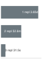{width="100%" fig-alt="Time ladder showing annual downtime dropping from 3.65 days with one replica to 52.6 minutes with two and 31.5 seconds with three."}

*Redundancy turns days of downtime into seconds.*
:::

#### Replication strategies {#sec-fault-tolerance-reliability-reliability-replication-strategies-aaa2}

The availability equation says how much redundancy can help; the replication strategy determines what that redundancy costs during normal operation and failover. In **active-active replication**\index{Replication!active-active replication} (@fig-serving-redundancy, left), all replicas actively serve requests, so capacity is used efficiently but a failed replica immediately increases load on the survivors. In **active-passive replication**\index{Replication!active-passive replication} (@fig-serving-redundancy, right), a primary serves traffic while standby replicas remain idle but ready, simplifying failover at the cost of unused resources during normal operation.

::: {#fig-serving-redundancy fig-env="figure" fig-pos="htb" fig-cap="**Serving Redundancy Strategies**: Comparison of Active-Active vs. Active-Passive replication. Active-Active (left) distributes load across three active replicas, each receiving roughly one-third of traffic, maximizing utilization but requiring capacity headroom to absorb failures. Active-Passive (right) keeps standby replicas idle and synchronized via heartbeat, simplifying failover logic at the cost of idle resource utilization." fig-alt="Two diagrams comparing replication strategies. Left: active-active with load balancer sending roughly 33 percent to each of three green replicas. Right: active-passive with load balancer sending 100 percent to primary while dashed standby replicas receive heartbeat sync."}

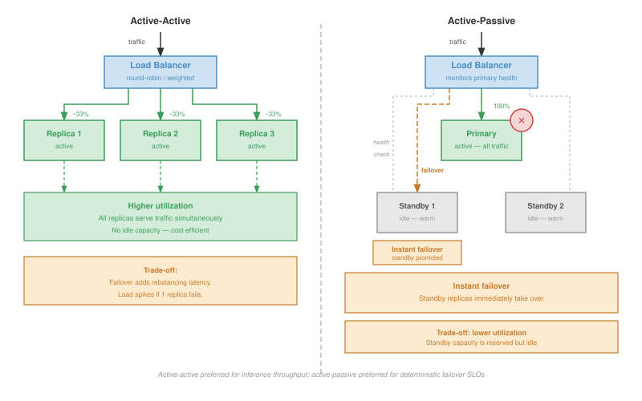

:::

Geographic replication extends the same choice across regions. It protects against data-center or regional network failures, but requests routed to distant regions pay additional latency. Multi-tier designs combine several replication policies at once: edge caches replicate for latency, regional serving clusters replicate for availability, and a global primary or coordination layer preserves consistency and freshness.

#### Replica placement and failure domains {#sec-fault-tolerance-reliability-reliability-replica-placement-failure-domains-73a7}

Effective redundancy requires placing replicas in independent failure domains. Different machines tolerate individual machine failures; different racks tolerate rack-level failures from power or top-of-rack switch issues; different availability zones tolerate data-center-section failures; and different regions tolerate entire data-center failures. The independence level should match the availability requirement and cost constraint: regional replication is expensive because it duplicates compute and network capacity, but it is necessary when regional failure must not become user-visible downtime.

Placement only creates the possibility of recovery. The serving system still needs a control loop that notices the failure, removes the affected replica from traffic, and preserves enough state that the user-visible service continues with bounded degradation.

### Failover mechanisms {#sec-fault-tolerance-reliability-reliability-failover-mechanisms-5ddd}

When a replica fails, traffic must be redirected to healthy replicas. The speed and reliability of this failover determines the impact of failures on users. The mechanism decomposes into three questions: how the system detects health, how the routing layer acts on that signal, and what happens to stateful sessions already attached to the failed replica.

#### Health checking {#sec-fault-tolerance-reliability-reliability-health-checking-a604}

Health checks decide when traffic should move, so they must test not only liveness but readiness and inference correctness:

Liveness checks verify that the process is running and responsive, often through a simple HTTP endpoint that returns 200 and triggers restart when it fails. Readiness checks go further: for ML serving, a replica is not ready until model weights are loaded, the GPU is initialized and responsive, warmup has completed, and dependencies such as feature stores and caches are available. Inference health checks add a correctness probe by running a known input through the model and verifying the expected output, catching silent failures where the process is healthy but the model response is wrong.

Health check parameters set the false-positive/latency trade-off. A check interval such as 5 s controls sampling frequency, a 2 s timeout controls patience, a failure threshold of 3 missed probes marks a replica unhealthy, and a success threshold of 2 clean probes returns it to service.

#### Load balancer integration {#sec-fault-tolerance-reliability-reliability-load-balancer-integration-2acd}

Load-balancer design sets how much request context the routing tier can use during failover. L4 load balancing routes based on IP and port, offering simple and fast operation. L7 load balancing routes based on HTTP and gRPC content, enabling more specific routing. Service mesh adds traffic management, observability, and security around those routing decisions.

Load-balancer failover latency depends on health check frequency and failure detection logic. Aggressive settings enable fast failover but increase false positives, marking healthy replicas as unhealthy during transient issues.

#### Session affinity and stateful failover {#sec-fault-tolerance-reliability-reliability-session-affinity-stateful-failover-27b2}

For stateful serving, session affinity\index{Session Affinity} routes all requests within a session to the same replica. Load balancers maintain session-to-replica mapping through sticky sessions implemented with cookies, headers, or IP hashing. State failover choices then trade recovery speed against consistency and operational complexity: state loss accepts degraded quality by regenerating state from scratch, checkpointing periodically saves session state for recovery, replication copies state to a standby replica, and distributed state stores move session state into external systems such as Redis or Memcached.

The choice depends on state size, update frequency, and the quality impact of state loss; @tbl-stateful-failover summarizes the trade-offs across the four common approaches:

| **Approach**                | **Recovery Latency** | **Consistency** | **Operational Complexity** |
|:----------------------------|:--------------------:|:---------------:|:--------------------------:|
| **State loss**              |         Fast         |       None      |            Low             |
| **Checkpointing**           |        Medium        |     Eventual    |           Medium           |
| **Synchronous replication** |         Fast         |      Strong     |            High            |
| **Distributed state**       |         Fast         |   Configurable  |           Medium           |

: **Stateful Failover Approaches**: Four strategies for handling session state when a serving replica fails. State loss is fastest and simplest but discards quality on failover; checkpointing trades recovery latency for eventual consistency; synchronous replication offers strong consistency at the cost of operational complexity; distributed state stores split state management into a separate tier with configurable consistency. {#tbl-stateful-failover}

::: {.content-visible when-format="pdf"}

:::

### Model-specific serving fault tolerance {#sec-fault-tolerance-reliability-reliability-modelspecific-serving-fault-tolerance-3245}

Model-specific serving differences follow from what state is expensive to lose and how quickly the user needs a response. The policy question is therefore a state-loss budget: which state can be rebuilt, which state must be replicated, and which state may be degraded temporarily without violating the product contract. @Tbl-serving-recovery-state-invariants maps that question across the three common regimes.

| **Serving workload** | **State expensive to lose**                    | **Fault-tolerance policy**                                                                                  | **Degradation path**                                                   |
|:---------------------|:-----------------------------------------------|:------------------------------------------------------------------------------------------------------------|:-----------------------------------------------------------------------|
| LLM conversation     | KV cache, conversation context, prefix state   | Replicate or checkpoint high-value session state; regenerate only when the latency budget allows.           | Rebuild from transcript, reuse cached prefixes, or ask for retry.      |
| Recommendation       | Fresh user features, item features, embeddings | Replicate feature stores, cache hot features, and monitor freshness as a reliability signal.                | Serve stale or default features with measured quality loss.            |
| Vision service       | Preprocessing state, device health, edge input | Retry stateless requests on healthy replicas and fail closed on preprocessing or accelerator-health faults. | Use a smaller local model, defer prediction, or return low confidence. |

: **Serving Recovery State Invariants**: Serving fault tolerance starts from the state whose loss changes user-visible quality. LLMs protect live context, recommendation systems protect feature freshness, and vision services protect preprocessing and device correctness. {#tbl-serving-recovery-state-invariants}

The KV cache[^fn-kv-cache-serving-ft] can be substantial (gigabytes for long contexts across attention layers). Losing the KV cache requires regenerating all previous turns, which can take seconds to minutes.

[^fn-kv-cache-serving-ft]: [offset=-34mm] **KV Cache**\index{KV Cache!serving fault tolerance}: Stores key and value projections for all previous tokens across all attention layers, scaling as $2 \times N_L \times H_{\text{KV}} \times S \times d_{\text{head}} \times \text{bytes}$. For a Llama-family 70B model with 80 layers, 8 key-value heads, 128K context, 128-dimension heads, and BF16 storage, the KV cache is about 43 GB per conversation; using 64 independent key-value heads would be about 344 GB. Losing this state on failure forces regeneration of all prior tokens, converting a sub-second failover into a minutes-long re-computation that violates serving latency SLAs.

::: {.column-margin}
{width="100%" fig-alt="Memory ladder comparing a 64-head KV cache at 344 GB with a grouped-query KV cache at 43 GB, with the 8x gap marked as a ratio annotation."}

*A long conversation carries tens of GB of live state.*
:::

LLM serving choices trade KV-cache recovery latency against memory and storage overhead. The simplest strategy is to accept regeneration cost by rebuilding KV cache from conversation history after failure, but this can turn a long conversation into a multi-second or multi-minute restart. KV-cache checkpointing saves live state periodically and bounds the amount of regeneration, while KV-cache replication keeps a standby copy for fast failover at the cost of extra memory. **Prefix caching**\index{Prefix Caching} narrows the state that must be recovered by storing common system prompts and shared context separately, so only session-specific state requires regeneration. Productized as prompt caching\index{Prompt Caching} services like those offered by cloud providers, this approach stores and reuses KV cache for common prefixes, reducing both cost and recovery time for failures.

Recommendation serving protects freshness rather than conversational continuity. Recommendations depend on user and item features from feature stores, so feature-store unavailability can either degrade ranking quality or block recommendations entirely. The serving decision is the staleness budget: replicated feature stores keep recent features available across zones, local caches cover hot features, fallback to stale features accepts measured quality loss, and default features let the service return a lower-quality result when lookup fails. Real-time features such as recent user actions make freshness monitoring part of fault tolerance, because a pipeline that keeps serving old features is available operationally but wrong semantically. Large embedding tables may also sit behind dedicated embedding services, which need their own replication and failover plan.

Vision serving is usually closer to the stateless end of the spectrum because each image or frame can be retried on another replica. That simplicity does not eliminate fault tolerance work; it changes where the checks belong. GPU health monitoring must remove replicas with thermal throttling or memory errors before they return corrupted results, and preprocessing must fail closed when resize, crop, color conversion, or normalization stages malfunction. For edge vision, the main failure mode may be disconnection rather than a data-center replica crash, so the system often degrades by using a smaller local model, delaying nonurgent predictions, or returning a lower-confidence result until cloud connectivity returns.

When full redundancy fails (such as when an edge device loses connectivity, or a massive traffic spike overwhelms the available data center replicas), the system cannot simply crash. Instead, it must actively trade output quality for continued availability, a strategy known as graceful degradation.

## Graceful Degradation {#sec-fault-tolerance-reliability-reliability-graceful-degradation-9122}

During a major regional network outage, an e-commerce site suddenly loses access to its heavy, GPU-accelerated recommendation cluster. Rather than showing users empty pages or crashing, the site instantly switches to serving precomputed, generic popular items. The serving fault tolerance mechanisms developed above aim to maintain full service, but graceful degradation dictates what happens when those defenses are overwhelmed.

::: {#dfn-fault-tolerance-graceful-degradation .callout-definition title="Graceful degradation"}

***Graceful Degradation***\index{Graceful Degradation!definition} is a fault tolerance strategy in which a system responds to resource exhaustion or component failure by deliberately reducing service quality (falling back to a smaller model, serving cached results, or returning partial outputs) rather than failing completely, maintaining measurable availability at reduced capability.

1.  **Significance (quantitative)**: Graceful degradation converts total outage risk into a controlled quality reduction. A recommendation system that falls back from a 7B-parameter ranker to a collaborative-filtering model on GPU failure may reduce click-through rate by 8–15 percent but maintains request availability instead of turning every affected request into an error. The engineering calculation changes from total outage duration to measured quality loss during fallback.
2.  **Observation**: Unlike complete system failure (where the service returns errors to all requests), graceful degradation provides a managed transition through a predefined capability hierarchy—each fallback level has known accuracy, latency, and resource characteristics that allow the system to continue satisfying SLOs at reduced quality.
3.  **Pitfall**: A frequent misconception is that degradation is automatic in well-designed systems. Graceful degradation requires explicit preengineering: fallback models must be preloaded or precomputed, switchover logic must detect the failure condition and trigger the transition without human intervention, and each degradation level must have been validated to actually satisfy its reduced SLO before it is needed in production.

:::

### Degradation dimensions {#sec-fault-tolerance-reliability-reliability-degradation-dimensions-4b25}

A degradation plan must name which service property will be sacrificed before an incident begins. @Tbl-graceful-degradation-dimensions summarizes the main levers. The table is a pre-incident design checklist, not an outage-time brainstorming aid: each sacrificed property needs a measured quality budget, an activation condition, and a recovery path before the failure occurs.

| **Dimension**        | **What the System Sacrifices**    | **Typical Fallback**                                                                           |
|:---------------------|:----------------------------------|:-----------------------------------------------------------------------------------------------|
| Quality              | Model accuracy or ranking quality | Use a simpler model, such as a collaborative-filtering fallback for a multi-tower recommender. |
| Latency              | Response speed                    | Batch more requests together to preserve throughput and model quality under high load.         |
| Coverage             | Result completeness               | Return top-10 search results instead of top-100.                                               |
| Freshness            | Recency of computed results       | Serve cached or stale candidates, such as hour-old news recommendations during an outage.      |
| Feature completeness | Input richness                    | Use content features when user history or real-time context is unavailable.                    |

: **Graceful Degradation Dimensions**: Degradation plans choose which service property can be reduced while still returning a useful answer. Naming the dimension in advance prevents the system from treating every failure as a binary serve-or-crash decision. {#tbl-graceful-degradation-dimensions}

These dimensions are not interchangeable. A search product may sacrifice coverage by returning fewer results while keeping freshness intact; a recommender may sacrifice freshness by serving cached candidates while preserving latency; and an interactive assistant may sacrifice quality by using a smaller model while keeping the session alive. The correct fallback is therefore workload-specific: it follows the property whose temporary loss least harms the application and whose recovery path can be validated before the incident.

### Graceful degradation strategies {#sec-fault-tolerance-reliability-reliability-graceful-degradation-strategies-e85e}

The dimensions in @tbl-graceful-degradation-dimensions become operational only when the service binds each sacrificed property to a specific fallback mechanism. The strategy ladder starts with model fallback when the primary inference path is too expensive or unavailable, then moves to feature fallback when input quality degrades, and finally to load shedding when demand exceeds capacity and the system must preserve the highest-value requests first.

#### Model fallback {#sec-fault-tolerance-reliability-reliability-model-fallback-bc6e}

Model fallback turns quality into an explicit availability lever by maintaining multiple model versions with different resource requirements. The primary model\index{Primary Model} provides full capability at the highest resource cost, a secondary model\index{Secondary Model} reduces capability and resource demand, a tertiary model\index{Tertiary Model} preserves minimal capability, and a static fallback\index{Static Fallback} serves precomputed defaults with no inference at all. When the primary path is unavailable or overloaded, the policy descends only as far as resource pressure requires, then returns upward after the primary path is healthy again.

An image classification cascade makes the trade-off concrete. The primary path might run a ViT-Large model with 307 million parameters and 88 percent ImageNet top-1 accuracy, fall back\index{Fallback} to EfficientNet-B4 with 19 million parameters and 83 percent accuracy under pressure, then fall back again to MobileNet-V3-Large with 5.4 million parameters and 75 percent accuracy when only minimal classification remains affordable. If even that path cannot meet the SLO, the service can return cached labels, a coarse category, or "classification unavailable" rather than blocking the request indefinitely. For that ladder to be real rather than aspirational, the production system must keep multiple models deployed, route requests to the appropriate level, monitor fallback frequency, and measure the quality impact of each level.

Recommendation and ranking systems use the same pattern when a complex deep learning model falls back to a top-n popularity list, a linear ranker, or a cached response during primary serving failures. Complex models often fight for the last mile of accuracy while simple heuristics provide the bulk of the utility, so the fallback path must be monitored as a first-class quality signal rather than treated as a silent failover. Otherwise the product appears healthy while quality is silently traded for availability.

#### Feature fallback {#sec-fault-tolerance-reliability-reliability-feature-fallback-0730}

Feature fallback controls how much input quality the model may lose before the request must be blocked. When feature retrieval fails, precomputed population-level defaults can substitute for missing user or item features: a recommender might use the average user embedding, genre-level item defaults, or the most recent cached value for a real-time signal. When defaults are too weak, the system can compute approximate features from available data, such as demographic similarity for missing user history, text embeddings for missing item attributes, or time-based defaults for missing context.

The key design step is prioritizing features by their contribution to prediction quality. @Tbl-feature-degradation-tiers summarizes a four-level policy in which critical features block the request, important features use defaults, useful features use cached values, and optional features can be omitted with bounded quality impact:

| **Tier**      |      **Example Features**     | **Missing Action** |      **Quality Impact**     |
|:--------------|:-----------------------------:|:------------------:|:---------------------------:|
| **Critical**  |        User ID, Item ID       |   Block request    |         Cannot serve        |
| **Important** | User history, Item attributes |    Use defaults    |  5–10 percent quality loss  |
| **Useful**    |       Real-time context       |     Use cached     |   2–5 percent quality loss  |
| **Optional**  |       Secondary signals       |        Omit        | &lt; 2 percent quality loss |

: **Graceful Feature Degradation Tiers**: Features classified by importance to prediction quality, with the corresponding response when each tier is unavailable. Critical features block the request entirely; lower tiers allow the system to fall back to defaults, cached values, or omission with bounded quality impact. The tiers convert a binary "feature available or not" question into a four-step degradation ladder. {#tbl-feature-degradation-tiers}

#### Load shedding {#sec-fault-tolerance-reliability-reliability-load-shedding-8476}

Load shedding protects the system by sacrificing selected requests before overload spreads to every request. Random shedding is the simplest policy: drop a fraction of incoming requests and preserve enough capacity for the rest. Its weakness is that it treats all requests as equally valuable. Priority-based shedding turns quality-of-service degradation into an explicit policy by serving premium users before free users, revenue-generating requests before analytics requests, and interactive traffic before background batch work. The system is still degrading, but it is degrading according to a predeclared service contract rather than whichever queue happens to fill first.

Admission control\index{Admission Control} applies the same idea at system entry points. It rejects requests that would exceed capacity rather than accepting work that will degrade every request already in the system. Circuit breakers[^fn-circuit-breaker-ml-ft] protect downstream dependencies by failing fast when a model replica, feature store, or supporting service is unhealthy.

[^fn-circuit-breaker-ml-ft]: **Circuit Breaker**\index{Circuit Breaker!serving resilience}: Named after the electrical safety device that cuts power during overload. In software (popularized by Michael Nygard's 2007 *Release It!*), the pattern wraps service calls and "trips open" after a failure threshold, failing fast instead of waiting on a dead dependency. For ML serving, this prevents a single failing model replica or feature store from exhausting connection pools and cascading failures across the entire inference fleet.

Circuit breakers operate in three states: closed (normal operation), open (failing fast to prevent resource exhaustion), and half-open (probing for recovery). @Fig-circuit-breaker shows how these state transitions both shield the system from cascading failures and automatically test whether conditions have improved.\index{Circuit Breaker!open state}\index{Circuit Breaker!half-open state}

::: {#fig-circuit-breaker fig-env="figure" fig-pos="htb" fig-cap="**Circuit Breaker States**: The circuit breaker protects the system from cascading failure. Closed: normal operation. Open: error threshold exceeded; all requests fail fast to prevent resource exhaustion. Half-Open: after a timeout, a limited number of requests are allowed through to probe the dependency's health. Success resets to Closed; failure returns to Open." fig-alt="State diagram with three circular nodes. Green Closed state transitions to red Open state on errors exceeding threshold. Open transitions to yellow Half-Open on timeout. Half-Open returns to Closed on success or back to Open on failure."}

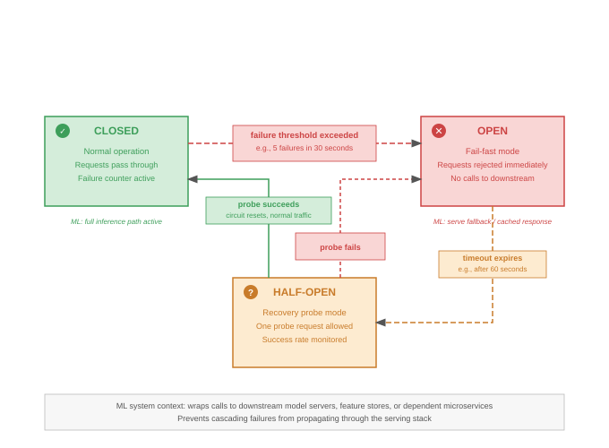

:::

The three-state cycle prevents a single failing dependency from consuming the entire system's connection pool: the open state fails fast, and the half-open state probes for recovery before restoring full traffic.

#### Graceful degradation implementation {#sec-fault-tolerance-reliability-reliability-graceful-degradation-implementation-1aa5}

Implementation begins by turning the degradation ladder into a control loop. Tail-latency percentiles show when users experience delay, error rates show which dependency is failing, CPU/GPU/memory utilization shows whether the system is saturated, and queue depth shows whether the service is accepting work faster than it can finish it. These health signals choose when to enter and leave each degradation level.

Degradation triggers\index{Graceful Degradation!triggers} define conditions that activate degradation. @Lst-degradation-triggers illustrates three common trigger conditions that progressively activate fallback mechanisms based on latency, error rate, and feature store health.

::: {#lst-degradation-triggers lst-cap="**Progressive Degradation Triggers**: Conditions that activate graceful degradation based on tail latency, error rate, and feature store health. Each trigger activates a different fallback mechanism appropriate to the detected problem."}

```{.python}
# Monitor tail latency for user-facing impact
if p99_latency > threshold:
    activate_model_fallback()  # Switch to faster, simpler model

# Track error rates to detect downstream failures
if error_rate > threshold:
    activate_circuit_breaker()  # Fail fast, prevent cascade

# Feature store slowdowns degrade recommendation quality
if feature_store_latency > threshold:
    activate_feature_fallback()  # Use cached/default features
```

:::

Degradation should increase progressively as conditions worsen rather than switch at one cliff. The system can raise the fallback percentage gradually as load increases, then require sustained improvement before traffic returns to higher-capability paths. Hysteresis prevents oscillation between primary and fallback modes when the service hovers near a threshold.

### Degradation monitoring and alerting {#sec-fault-tolerance-reliability-reliability-degradation-monitoring-alerting-87c2}

Because graceful degradation trades quality for availability, monitoring must make that trade visible rather than letting the system appear healthy while serving lower-fidelity results.

The monitoring surface must expose how much service quality has been traded away. @Tbl-degradation-monitoring-action-map turns that surface into an action map: fallback share reveals how often model quality was reduced, default-feature share reveals input-quality loss, drop rate reveals capacity protection, and the primary-vs-fallback quality gap reveals whether the degraded path remains acceptable.

| **Signal**                      | **Quality trade exposed**                       | **Escalation rule**                                                              | **Postincident question**                              |
|:--------------------------------|:------------------------------------------------|:---------------------------------------------------------------------------------|:-------------------------------------------------------|
| Fallback-model request share    | Model capability reduced to preserve serving    | Sustained activation beyond 5 minutes becomes a warning.                         | Did the fallback preserve enough user value?           |
| Default-feature request share   | Input richness reduced because dependencies lag | Severe degradation affecting over 50 percent of requests becomes critical.       | Which feature dependency needs replication or caching? |
| Load-shed request rate          | Coverage reduced to protect the service         | Any growth after the circuit breaker opens triggers capacity investigation.      | Was admission control early enough to prevent cascade? |
| Primary-vs-fallback quality gap | Product quality lost during the incident        | Degradation beyond 1 hour escalates even when availability metrics look healthy. | Is the fallback path still a valid product experience? |

: **Degradation Monitoring Action Map**: Graceful degradation is safe only when the quality trade is observable. Each signal ties a degraded serving mode to the escalation and postincident question that prevent silent quality loss. {#tbl-degradation-monitoring-action-map}

After the event, postincident analysis should identify the root cause, evaluate fallback effectiveness, measure user and business impact, and define improvements that prevent recurrence.

Implementing these fallback mechanisms safely requires deep visibility into the system's runtime state. When a complex recommendation pipeline begins degrading, operators must rapidly determine which microservice is failing, and that diagnosis depends on distributed debugging and observability.

## Distributed Debugging and Observability {#sec-fault-tolerance-reliability-reliability-distributed-debugging-observability-1a7f}

At 2:00 AM, latency on the flagship generative API spikes from 200 ms to 5 seconds, but CPU, memory, and network metrics all look perfectly normal. Deciding whether to shed load, restart replicas, or degrade gracefully requires knowing exactly where the request is stalling across hundreds of microservices. Distributed debugging and observability provide the diagnostic capability required to locate these invisible bottlenecks.

### Why distributed ML systems are hard to debug {#sec-fault-tolerance-reliability-reliability-distributed-ml-systems-hard-debug-8d8a}

Distributed ML debugging is hard because the evidence needed for recovery is split across timing, state, scale, and model behavior.

Distributed systems exhibit nondeterministic behavior[^fn-heisenbug-ml] from multiple sources. Network timing variations change execution order, thread scheduling differences alter race conditions, GPU kernel execution order varies across runs, and floating-point operation ordering changes results. A bug that manifests on one execution may not reproduce on subsequent executions. These "Heisenbugs" appear to disappear when observed.

[^fn-heisenbug-ml]: **Heisenbug**\index{Heisenbug!distributed debugging}: Coined in hacker culture circa 1983, formalized by Jim Gray in his 1985 analysis of computer failures, as a pun on Heisenberg's uncertainty principle. The bug disappears under observation because adding instrumentation changes timing. In distributed ML training, this is especially pernicious: inserting gradient logging alters NCCL collective timing, masking the very race condition that caused the silent corruption.

Partial failures turn that nondeterminism into a recovery problem. Unlike single-machine systems where failures are typically total, distributed systems experience partial failures where some components fail while others continue, and the interaction between working and failed components produces complex failure modes. Scale then removes manual inspection as a viable debugging method: with thousands of components, automated tools must filter massive telemetry streams and identify the few signals that explain the incident. ML systems add model behavior to the same diagnostic problem because silent accuracy degradation produces wrong results without errors, numerical issues like NaN and infinity propagate through computation, data-dependent bugs manifest only for specific inputs, and learning causes expected behavior changes that can resemble bugs.

### Observability pillars {#sec-fault-tolerance-reliability-reliability-observability-pillars-0e45}

Observability is useful only when it connects a symptom to an action: shed load, restart a replica, roll back a checkpoint, or degrade gracefully. Suppose a recommendation service suddenly violates its latency SLO while the model replicas still report healthy GPU utilization. Metrics establish the timing and scope of the symptom, traces show which service span is consuming the request budget, and logs explain what happened inside that service at the moment the cascade began. @Fig-observability-three-pillars summarizes those three evidence types, but the operating rule is correlation: no signal is sufficient unless it can be joined to the same request, model version, feature version, and deployment event.

::: {#fig-observability-three-pillars fig-env="figure" fig-pos="htb" fig-cap="**The Three Pillars of Observability**: Diagnosis of fleet failures requires correlating three signal types. Metrics reveal *when* and *where* a problem occurs (for example, GPU utilization drops). Logs provide the *what* through event context (for example, Out-of-Memory exception). Traces provide the *why* by linking events across the distributed lifecycle (for example, identifying the specific request that triggered the memory spike)." fig-alt="Venn diagram with three overlapping circles: Metrics, Logs, and Traces."}
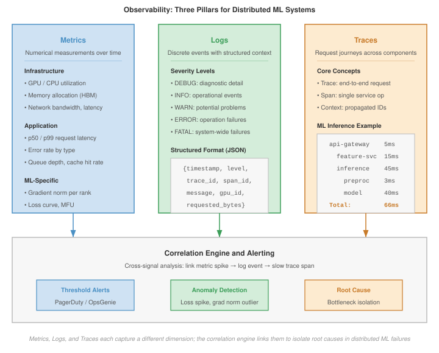
:::

Metrics are the first evidence because they compress fleet behavior into time series that can trigger action. In ML fleets, useful metrics span infrastructure signals such as CPU and GPU utilization, memory allocation, network bandwidth, and storage I/O; application signals such as request rate, latency percentiles, error counts, queue depths, and cache hit rates; and ML-specific signals such as inference latency by model, batch utilization, feature retrieval latency, feature freshness, and prediction distributions for drift detection. A metric stream becomes fault-tolerance infrastructure only when an alert maps to a recovery decision. High p99 latency may trigger load shedding, a falling cache hit rate may trigger fallback features, and a sudden prediction-distribution shift may block a rollout before it corrupts user-facing decisions.

Logs provide the event context that a metric intentionally discards. Structured logging\index{Structured Logging!JSON log entry} uses formats such as JavaScript Object Notation (JSON) with consistent fields, so incident tooling can search by service, request, model version, GPU, feature store, or trace identifier. @Lst-structured-log-entry shows a GPU memory allocation failure that records both the local failure context and the trace identifiers needed to connect the event to distributed metrics and spans.

::: {#lst-structured-log-entry lst-cap="**Structured JSON Log Entry**: A structured log entry for a GPU memory allocation failure, including trace and span identifiers for correlation with distributed traces and resource metrics for diagnosis."}

```{.json}
{
  "timestamp": "2024-01-15T10:23:45.123Z",
  "level": "ERROR",
  "service": "inference-server",
  "trace_id": "abc123",
  "span_id": "def456",
  "message": "GPU memory allocation failed",
  "gpu_id": 3,
  "requested_bytes": 4294967296,
  "available_bytes": 2147483648
}
```

:::

For fault tolerance, the important logging property is consistent correlation rather than the particular backend. Log levels should map incidents to escalation consistently across components, but the recovery system depends more on whether operators can query events by the same request, trace, model version, feature version, and deployment identifiers that appear in metrics and spans. Log aggregation is therefore useful because it preserves the join between local failure context and fleet-wide symptoms.

Traces show where latency or failure propagated across distributed components. A **trace**\index{Trace} is the end-to-end journey of a request, a **span**\index{Span} is one operation within that journey, and **context propagation**\index{Context Propagation} carries the trace identity across service boundaries. A trace through an ML inference pipeline illustrates how these spans compose:

```text
Trace: user-request-12345
├── Span: api-gateway (5 ms)
│   └── Span: auth-service (2 ms)
├── Span: feature-service (15 ms)
│   ├── Span: user-feature-lookup (8 ms)
│   └── Span: item-feature-lookup (12 ms)
├── Span: inference-service (45 ms)
│   ├── Span: preprocessing (3 ms)
│   ├── Span: model-inference (40 ms)
│   └── Span: postprocessing (2 ms)
└── Span: response-formatting (1 ms)
Total: 66 ms
```

OpenTelemetry provides a standard API for distributed tracing\index{Distributed Tracing}. Backend systems like Jaeger, Zipkin, or cloud tracing services store and visualize traces. The durable requirement is not the particular tracing backend; it is preserving enough context to answer whether the fault lives in request routing, feature retrieval, model execution, postprocessing, or a dependency outside the model service.

### ML-specific debugging {#sec-fault-tolerance-reliability-reliability-mlspecific-debugging-27d5}

Operational signals are not enough when a computation is numerically valid but wrong for the model. ML systems also require specialized debugging capabilities:

#### Numerical debugging {#sec-fault-tolerance-reliability-reliability-numerical-debugging-ee2a}

Numerical debugging targets failures where tensors remain valid objects but contain invalid values:

NaN detection\index{NaN Detection}[^fn-nan-propagation-training] is essential because NaN values propagate silently through all downstream computations. @Lst-nan-detection shows a minimal check that catches corruption before it reaches users.

[^fn-nan-propagation-training]: **NaN Propagation**\index{NaN Propagation!training corruption}: IEEE 754 specifies that any arithmetic operation involving NaN produces NaN, meaning a single NaN in one gradient computation silently corrupts every downstream parameter update. Common triggers in ML training include division by zero in normalization layers (batch norm with zero variance), log of nonpositive values, and FP16 overflow to infinity. Without per-step NaN detection, an entire training run can produce a model full of NaN weights before any monitoring alarm fires.

::: {#lst-nan-detection lst-cap="**NaN Detection**: Checking model outputs for NaN values prevents silent corruption from propagating to downstream consumers. Logging the input hash enables reproducibility during diagnosis."}

```{.python}
# Check tensor for NaN values
# (propagate from any corrupted computation)
if torch.isnan(output).any():
    log.error("NaN detected in output", input_hash=hash(input))
    # Log input hash for reproducibility, then fallback or fail fast
```

:::

During training, gradient statistics make numerical faults visible before they corrupt the whole run. Gradient norm detects explosion or vanishing, gradient distribution detects anomalies, and layer-wise gradients identify problematic layers.

Mixed-precision training[^fn-mixed-precision-ft] can introduce numerical issues. Monitor for loss scale adjustments indicating underflow, gradient overflow exceeding FP16 range, and inconsistency between FP16 and FP32 results.

[^fn-mixed-precision-ft]: **Mixed-Precision Numerical Issues**\index{Mixed-Precision!numerical issues}\index{Mixed-Precision!numerical fault tolerance}: FP16's dynamic range spans only $6 \times 10^{-8}$ to 65,504, compared to FP32's $1.2 \times 10^{-38}$ to $3.4 \times 10^{38}$. Loss scaling (multiplying loss by 1,024 before backpropagation, then dividing gradients) prevents underflow, but overflow still triggers automatic step-skipping that wastes computation. BF16 mitigates this by matching FP32's exponent range at the cost of reduced mantissa precision, trading numerical resolution for training stability.

#### Data debugging and validation {#sec-fault-tolerance-data-debugging-validation}

Data bugs surface as valid-looking but wrong inputs, so the debugging target is not just numerical validity but semantic correctness at each pipeline boundary. Validation checks expected format, shape, value ranges, required fields, and encoding before data reaches the model, catching malformed examples while the failure is still local to the input path.

Once the input passes those static checks, the system needs evidence about behavior over time. Distribution monitors track feature drift, null-rate changes, and outliers as they emerge, while transformation instrumentation logs intermediate shapes and statistics so teams can compare each stage against known-good data. Together, these signals separate a corrupted input path from a numerical failure inside the model.

#### Straggler detection and analysis {#sec-fault-tolerance-reliability-reliability-straggler-detection-analysis-6925}

Straggler diagnosis asks which component is slow enough to become a failure-equivalent bottleneck. The same request may succeed on every replica, but the slowest replica still determines tail latency and can force retries that look like failure under load. Operation-level timing\index{Operation-Level Timing} instrumentation measures time for each operation, enabling latency attribution across pipeline stages. @Lst-timing-instrumentation wraps operations in context managers that emit per-span timing metrics, making it straightforward to compare performance across replicas.

::: {#lst-timing-instrumentation lst-cap="**Operation-Level Timing**: Context manager instrumentation attributes latency to individual pipeline stages, enabling straggler detection by comparing the same span across replicas."}

```{.python}
# Wrap operations in timing context managers for latency attribution
with timer("feature_lookup"):
    features = feature_store.lookup(
        ids
    )  # Often the latency bottleneck
with timer("model_inference"):
    predictions = model(features)  # GPU time, compare across replicas
```

:::

Compare component timing across replicas using percentile analysis. p50 shows typical performance, while p99 shows tail latency. Comparing p99 across replicas identifies workers whose slow path has become a fleet-wide bottleneck.

The diagnosis must then separate the root causes that produce the same slow-worker symptom. Hardware issues include thermal throttling and memory errors, data skew means some inputs are slower to process, resource contention occurs when other processes consume resources, and network issues create slow connections to data stores.

### Common failure patterns {#sec-fault-tolerance-reliability-reliability-common-failure-patterns-3306}

The observability pillars enable detection of recurring failure patterns that experience with large-scale ML systems has identified. @Fig-training-failure-signatures catalogs the most common training loss signatures, each requiring a different diagnostic and recovery response.

#### Training failures {#sec-fault-tolerance-reliability-reliability-training-failures-bc3a}

A training-loss signature is useful because it maps a curve to a recovery decision. @Fig-training-failure-signatures shows the curves first; @tbl-training-failure-response-map then makes the operational mapping explicit, treating the curve as evidence for a specific recovery action.

::: {#fig-training-failure-signatures fig-env="figure" fig-pos="htb" fig-cap="**Training Failure Signatures**: Common patterns of model loss over time that indicate underlying system or algorithmic failures. (A) Normal Training. (B) Gradient Explosion. (C) Loss Plateau. (D) NaN Divergence. Identifying these signatures automatically is essential for rapid recovery in autonomous training pipelines." fig-alt="Plot showing four loss curves: (A) Normal Training with smooth descent, (B) Gradient Explosion with a sudden spike, (C) Loss Plateau where learning stalls, and (D) NaN Divergence with erratic oscillation collapsing to NaN."}
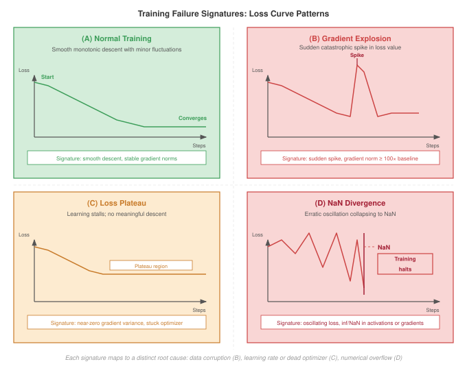
:::

| **Signature**              | **Likely Interpretation**                                                         | **Recovery Response**                                                                          |
|:---------------------------|:----------------------------------------------------------------------------------|:-----------------------------------------------------------------------------------------------|
| Spike followed by recovery | Transient data issue or numerical instability                                     | Continue training, but investigate the incident to rule out a systematic input problem.        |
| Spike followed by plateau  | Learning rate too high, corrupted checkpoint, or data bug                         | Roll back to an earlier checkpoint and validate the data path before resuming.                 |
| Gradual divergence         | Silent data corruption, hardware error, or distributed-training desynchronization | Isolate the failing rank, validate checkpoint integrity, and compare telemetry across workers. |
| Hang without an error      | Collective deadlock or crashed worker blocking synchronization                    | Use timeout detection and restart or reconstruct the worker group.                             |

: **Training Failure Response Map**: Training-loss curves are operational evidence only when they lead to different recovery actions. The response map ties each signature to the failure class most likely to explain it and to the first action operators should take. {#tbl-training-failure-response-map}

#### Serving failures {#sec-fault-tolerance-reliability-reliability-serving-failures-3322}

Serving failures require the same symptom-to-action mapping under much tighter latency constraints. @Tbl-serving-failure-response-map separates the common symptoms by what they reveal and what the serving system must do first.

| **Symptom**                | **Likely Interpretation**                                                               | **Immediate Response**                                                                         |
|:---------------------------|:----------------------------------------------------------------------------------------|:-----------------------------------------------------------------------------------------------|
| Latency spikes             | Resource contention, garbage collection, cold caches, or model reloads                  | Check placement and capacity; repeated spikes usually mean the problem is no longer transient. |
| Rising error rates         | Dependency failure, data-format change, or model bug                                    | Investigate immediately because errors compound across dependent services.                     |
| Silent quality degradation | Model drift, feature degradation, or data-pipeline fault                                | Use quality monitoring beyond standard operational metrics.                                    |
| Cascade failure            | Timeout exhaustion, resource depletion, or error propagation from one failing component | Trip circuit breakers and preserve isolation boundaries before the failure spreads.            |

: **Serving Failure Response Map**: Serving incidents must be classified quickly because every diagnosis competes with a user-facing latency budget. The table ties each symptom to the first operational response rather than treating all serving failures as generic errors. {#tbl-serving-failure-response-map}

Cascade failures are particularly insidious because the root cause is obscured by the symptoms it generates. A concrete diagnosis shows how the three observability pillars work together to trace a cascade back to its origin.

::: {#exmp-fault-tolerance-diagnosing-cascade-failure .callout-example title="Diagnosing a cascade failure"}

**Scenario**: A recommendation system experiences sudden latency spikes.

**Diagnosis**: The three observability pillars work together to diagnose the root cause. **Metrics**\index{Metric!observability} reveal the symptom: p99 latency jumped from 45 ms to 800 ms at 14:32, with error rate increasing from 0.1 percent to 15 percent. **Traces**\index{Trace!observability} isolate the bottleneck: the feature-service span consumes 700 ms instead of the normal 12 ms, while the model-inference span remains normal at 40 ms. **Logs**\index{Logs!observability} identify the root cause: feature-service logs show repeated connection timeouts to the user embedding cache at 14:31, followed by cache miss storms as requests bypass the failed cache and hit the embedding database directly.

**Systems lesson**: The cache node failure caused a cache-miss avalanche, overwhelming the embedding database and propagating latency to all requests. The fix is a circuit breaker on cache access, falling back to default embeddings when cache is unavailable.

:::

The production examples that follow show how failure detection, state preservation, and observability are orchestrated together at scale.

## Case Studies {#sec-fault-tolerance-reliability-reliability-case-studies-927f}

Published production systems make the chapter's scale lesson concrete: the same failure arithmetic appears as checkpoint tax, topology reconfiguration, chaos testing, and elastic recovery. These examples draw on published Meta OPT-175B training logbooks, Google's TPUv4 resiliency paper, Netflix's published chaos-engineering literature, and Microsoft DeepSpeed documentation. Specific operational numbers (failure counts, MFU achieved, availability percentages, and overhead percentages) reflect what those public sources have reported; treat them as representative magnitudes for the engineering pattern rather than precision benchmarks reproducible from this prose alone. Meta's OPT-175B training run on a 992-GPU cluster provides a well-documented study in handling dozens of hardware failures over the run without aborting training.

### Large-scale LLM training at Meta {#sec-fault-tolerance-reliability-reliability-largescale-llm-training-fault-tolerance-f4aa}

The training of the Open Pre-trained Transformer (OPT-175B) at Meta provides a well-documented study in the physics of failure for large deep-learning jobs [@zhang2022opt]. Using a cluster of 992 NVIDIA A100 GPUs continuously for two months, the engineering team faced a statistical certainty: hardware components would fail, and they would fail often. Over the course of the training run, the team logged approximately 90 manual restarts driven by hardware failures (ECC memory errors, NCCL/InfiniBand network issues, lost GPUs) and training-stability incidents, alongside the cycling of more than 100 hosts [@opt2022logbook]. In a synchronous data-parallel regime, a single GPU failure halts the entire cluster, making the mean time between failures (MTBF) of the aggregate system a fraction of any individual component's reliability. For OPT-175B, roughly two machines went down per day, dropping the effective system-wide MTBF to a fraction of a day and necessitating a fault tolerance strategy that treated interruption as the norm rather than the exception.

The primary detection mechanism relied on a heartbeat protocol with a strict 5-minute timeout. If a rank failed to report progress within this window, the orchestration layer assumed a hardware hang or silent data corruption and initiated a restart. However, detection was only half the battle; the critical engineering challenge was minimizing the "restart tax"---the time lost reloading the model and optimizer states from persistent storage. Early in the project, synchronous checkpointing to a remote distributed file system consumed nearly 12 percent of the total effective training time, a prohibitive overhead that extended the project timeline by weeks. To combat this, the team implemented asynchronous checkpointing, offloading the serialization of the 350 GB model state to CPU memory first, then streaming it to disk in the background while computation for the next batch resumed immediately. This optimization reduced checkpoint overhead to less than 3 percent, reclaiming hundreds of GPU-hours.

Recovery procedures also had to account for nonhardware failures, specifically "loss spikes" caused by numerical instabilities. Unlike a hardware crash where the last checkpoint is valid, a loss spike implies the model weight trajectory has become corrupted. The recovery strategy combined a "last good checkpoint" rollback with intervention in the optimizer: when gradient overflows or loss-scale floors were observed, the team reverted to an earlier checkpoint and resumed training with a lowered learning rate (ultimately running at roughly two-thirds of the rate OpenAI used for GPT-3) to stabilize the trajectory [@opt2022logbook]. This dual-layer resilience---handling both physical silicon failures and mathematical divergence---allowed Meta to sustain approximately 147 TFLOP/s per A100 (near 50 percent of FP16 peak) despite daily interruptions [@zhang2022opt]. The enduring lesson from OPT-175B is that at scale, the trade-off between checkpoint frequency and training throughput is a central variable in determining the feasibility of a model; checkpointing too often wastes compute, while checkpointing too rarely risks losing days of progress to a single bit flip.

### Google TPU pod resilience {#sec-fault-tolerance-reliability-reliability-google-tpu-pod-resilience}

Google's TPUv4 supercomputer takes a fundamentally different architectural approach to fault tolerance, driven by a custom Inter-Chip Interconnect (ICI) fabric and a network of Optical Circuit Switches (OCS) that dynamically reconfigure the topology. A TPUv4 pod contains 4,096 chips organized as 64 "cubes" of 64 chips each, with each cube arranged in a $4\times4\times4$ 3D mesh [@zu2024tpuv4]. In this architecture, the network effectively is the computer: a single chip or optical link failure does not merely reduce capacity by $1/4096$th---it creates a hole in the communication topology that would deadlock the synchronous mesh required for collective operations such as AllReduce.

Consequently, Google's strategy focuses on slice abstraction rather than in-place repair. The OCS network combines multiple healthy cubes into logical "slices" sized to the training job's needs. When a fault is detected---via two software components, `libtpunet` and `healthd`, that monitor link integrity and machine health---the orchestration system does not attempt to route around the failure within the active slice. Instead, the control plane preempts the job and reconfigures the OCS fabric to attach the workload to spare healthy cubes elsewhere in the pod. This treats hardware as immutable infrastructure during a job's execution: rather than repairing the running topology, the system reconstitutes one with identical shape from surviving healthy components.

The quantitative success of this approach is measured in system availability. Across Google's production TPUv4 fleet, the dynamic reconfiguration strategy achieves 99.98 percent system availability while gracefully handling hardware outages experienced by approximately 1 percent of training jobs [@zu2024tpuv4]. Daily component failure rates are low in relative terms---0.08 percent of TPU machines, 0.005 percent of ICI cables, and 0.04 percent of OCS units---but at fleet scale they aggregate to a steady stream of reconfiguration events that the control plane must absorb without disrupting training throughput. The key lesson from the TPU experience is that for tightly coupled, high-bandwidth systems, attempting to repair a running topology is often futile; it is more efficient to treat the cube as the atomic unit of failure and reconfigure the optical fabric to assemble a fresh slice around the surviving healthy components.

### Netflix chaos engineering for serving dependencies {#sec-fault-tolerance-reliability-reliability-netflix-chaos-engineering}

While training resilience focuses on long-running batch jobs, Netflix's published work on Chaos Engineering\index{Chaos Engineering} [@basiri2016] provides the serving-side contrast. The premise is simple but operationally demanding: because production systems have many interacting dependencies, teams should validate steady-state behavior by deliberately injecting failures instead of waiting for real incidents to discover whether fallbacks work.

For ML serving, the same discipline applies to feature stores, model-serving dependencies, caches, and fallback paths. A model endpoint can be healthy while a feature service is slow, stale, or unavailable; if the system lacks a tested fallback, a local dependency problem can become user-visible latency or degraded recommendations. Chaos tests make those assumptions executable by injecting latency, terminating dependencies, or forcing fallback paths in controlled conditions.

The recovery procedure for these injected faults centers on fallback hierarchies. If the primary deep learning model fails or times out, the serving system can switch to a lighter model, cached response, or simple popularity-based default. The systems lesson is that resilience in ML serving is not a static property but a continuous practice of active verification: a fallback path that is never exercised is just documentation, not fault tolerance.

### Microsoft DeepSpeed fault tolerance {#sec-fault-tolerance-reliability-reliability-deepspeed-fault-tolerance}

Microsoft's DeepSpeed library illustrates how fault tolerance must be architected into the training framework itself, specifically for the regime of "elastic training" [@rasley2020]. In traditional data-parallel training, the batch size and learning rate are often coupled to the number of GPUs. If a node fails, simply removing it changes the global batch size, potentially altering convergence math. DeepSpeed addresses this by decoupling the training state from the compute resources. With the Zero Redundancy Optimizer (ZeRO), the model parameters, gradients, and optimizer states are sharded across all available GPUs rather than replicated [@rajbhandari2020]. A single node failure therefore means the loss of $1/N$ of the total model state, a catastrophic event for standard frameworks.

Rather than treating node failures as fatal, DeepSpeed combines ZeRO sharding with persistent state offload to CPU memory and NVMe storage. Because each rank holds only its $1/N$ partition of the optimizer state, the framework can checkpoint and restore state without serializing the entire model on any single device. When a node failure is detected, the framework pauses rather than aborting and triggers an elastic resizing event. The system queries the resource manager for a replacement node; if one is found, the missing state shards are reconstructed from the persistent offload buffer. If no replacement is available, the framework redistributes the state shards among the remaining $N-1$ nodes and adjusts the gradient accumulation steps to maintain the original effective global batch size, preserving mathematical consistency.

This elasticity is automated and transparent to the data scientist. By keeping the fault tolerance machinery resident in the training framework rather than the user's application code, DeepSpeed makes it practical to run large-model training jobs on low-priority instances where preemption is possible. A job running on 100 GPUs can lose 10 GPUs and continue training on 90 GPUs with only a momentary pause for state redistribution rather than a full crash-and-restart cycle. Building elasticity into the memory-management layer shifts resilience from the user's application code into the framework layer, reducing the need for bespoke recovery engineering when infrastructure availability is imperfect.

These case studies reveal three universal principles. First, detection speed determines recovery cost\index{Fault Tolerance!detection speed}: Meta's 5-minute timeout, Google's automated ICI reconfiguration, and Netflix's chaos experiments all demonstrate that faster detection means less state lost. Second, the atomic unit of failure matters\index{Atomic Unit of Failure}: Google reroutes the communication fabric, DeepSpeed redistributes shards, and Netflix validates service-level fallbacks---each organization chose the granularity that matches its architecture's coupling. Third, fault tolerance is a spectrum, not a binary\index{Fault Tolerance!spectrum}: from Meta's checkpoint-rollback to Netflix's graceful degradation hierarchy, systems implement multiple layers of defense, each trading fidelity for speed. Despite these patterns, engineering teams frequently stumble over common misconceptions when designing resilient ML systems.

## Fallacies and Pitfalls {#sec-fault-tolerance-reliability-reliability-fallacies-pitfalls-74b8}

An infrastructure team might spend weeks hardening their storage layer against disk failures, only to have their entire training run destroyed by a subtle software bug in their PyTorch distributed backend. Fault tolerance for distributed ML systems involves counterintuitive mathematics and subtle trade-offs where conventional data center wisdom often fails.

**Fallacy**: *Hardware failures are the main concern.*

This intuition comes from traditional systems where disk failures, power outages, and network partitions dominate. In ML systems, hardware failures are only one part of a broader incident mix.

Industry experience from large-scale ML systems points to a broader failure mix because ML jobs are long-lived, stateful, and sensitive to small control-plane mistakes. Hardware failures still matter, but software bugs, configuration errors, resource exhaustion, and cross-layer causes often dominate the incident count: a malformed checkpoint path can make recovery impossible, a mismatched collective library can hang all ranks, an undersized shared-memory limit can crash data loaders, and a stale feature schema can silently corrupt training. These failures are not less serious because they are "software"; they can destroy the same multi-day job that hardware redundancy was meant to protect.

Investing heavily in hardware redundancy while neglecting software robustness (input validation, gradual rollouts, configuration management) leaves many important failure modes unaddressed. The most reliable ML systems treat software bugs as inevitable and design defensively.

**Pitfall**: *Setting checkpoint interval by intuition.*

Organizations commonly set checkpoint intervals based on "feels right": "every hour seems reasonable" or "every 1000 steps." The Young-Daly formula reveals these intuitions are often wrong. For a 1000-GPU cluster with MTBF of 4 hours and checkpoint time of 5 minutes:

$$\tau_{\text{opt}} = \sqrt{2 \times 5 \times 240} = \sqrt{2400} \approx 49 \text{ minutes}$$

The intuitive "every hour" is close but suboptimal. More critically, if checkpoint time increases to 15 minutes (larger model, slower storage), the optimal interval becomes 85 minutes, not the "every 15 minutes" that some teams adopt to "stay safe." Too-frequent checkpointing wastes more compute than it saves. The quantitative approach reveals that intuition-based intervals often deviate 2--3$\times$ from optimal in either direction.

**Fallacy**: *If each GPU is 99.99 percent reliable, a 10,000-GPU cluster is also 99.99 percent reliable.*

Reliability does not compose by averaging---it compounds by multiplication. For $N$ serial components each with availability $A$, and assuming their failures are independent, the aggregate availability is $A^N$. With $A = 0.9999$ and $N = 10{,}000$, the cluster availability is $0.9999^{10{,}000} \approx 0.37$: the cluster is *down* 63 percent of the time. Individual component reliability is necessary but nowhere near sufficient at fleet scale. System-level fault tolerance (checkpointing, elastic recovery, redundancy across failure domains) must be designed explicitly, not assumed to emerge from per-component MTTF.

**Pitfall**: *Using MTBF calculations as if failures were independent.*

The reliability equation $\text{MTBF}_{\text{system}} = \text{MTBF}_{\text{component}}/N$ assumes component failures are statistically independent. In production, failures correlate:

- **Shared power domain**\index{Correlated Failure!shared power domain}: UPS failure takes down entire rack
- **Shared switch**\index{Correlated Failure!shared switch}: Top-of-rack switch failure partitions all connected GPUs
- **Shared software**\index{Correlated Failure!shared software}: Bug triggered by specific input fails all replicas simultaneously
- **Thermal correlation**\index{Correlated Failure!thermal correlation}: Cooling failure causes clustered GPU throttling

Correlated failures change two quantities that the simple MTBF equation hides: incident frequency and blast radius. A cluster with 1000 independent GPUs each with 50,000-hour MTBF has a first-GPU-failure MTBF of 50 hours. If a shared power, cooling, or software hazard adds an incident rate 10 times larger than that independent first-failure rate, the effective incident MTBF drops to about 5 hours. Separately, a correlated incident may take out 10 GPUs at once, increasing recovery cost even if the independent GPU failure rate itself has not changed.

Reliability engineering must identify and mitigate correlation through diversity: different power feeds, different network paths, different software versions in canary deployments.

**Fallacy**: *Component MTTF values predict individual failure timing.*

```{python}
#| echo: false
# ┌── LEGO ───────────────────────────────────────────────
# │ Context: Fallacy — component MTTF values predict individual failure timing.
# │ Exports: FleetReliabilityFallacyRates.gpu_mttf_str,
# │          FleetReliabilityFallacyRates.fleet_gpus_str,
# │          FleetReliabilityFallacyRates.fleet_rate_eq_math,
# │          FleetReliabilityFallacyRates.hours_between_str
from mlsysim import Systems
from mlsysim.fmt import fmt, fmt_count, fmt_math, fmt_time, check

class FleetReliabilityFallacyRates:
    gpu_mttf_h = float(Systems.Reliability.Gpu.mttf_hours)
    fleet_gpus = Systems.Clusters.Training_10K.total_accelerators
    fleet_rate_per_h = fleet_gpus / gpu_mttf_h
    hours_between = 1 / fleet_rate_per_h

    check(abs(hours_between * fleet_rate_per_h - 1) < 1e-9, "interval must be reciprocal of fleet rate")

    _fleet_tex = fmt(fleet_gpus, precision=0).replace(",", "{,}")
    _mttf_tex = fmt(gpu_mttf_h, precision=0).replace(",", "{,}")
    # ┌── 4. OUTPUT (Formatting) ─────────────────────────────────────────────
    gpu_mttf_str = fmt_time(gpu_mttf_h, "hour", precision=0, style="word")
    fleet_gpus_str = fmt_count(fleet_gpus, label="GPU")
    fleet_rate_eq_math = fmt_math(f"{_fleet_tex}/{_mttf_tex} = {fmt(fleet_rate_per_h, precision=1, commas=False)}")
    hours_between_str = fmt_time(hours_between, "hour", precision=0, commas=False, style="word")
```

Engineers read a GPU MTTF of `{python} FleetReliabilityFallacyRates.gpu_mttf_str` and plan around a five-year replacement cadence per device. MTTF is a statistical property of a population, not a prediction for any single component. A GPU with MTTF `{python} FleetReliabilityFallacyRates.gpu_mttf_str` might fail at 200 hours or last 100,000 hours; the distribution is broad. What MTTF reliably predicts is the aggregate failure rate: in a fleet of `{python} FleetReliabilityFallacyRates.fleet_gpus_str`, the steady-state failure rate is approximately `{python} FleetReliabilityFallacyRates.fleet_rate_eq_math` failures per hour, or roughly one failure every `{python} FleetReliabilityFallacyRates.hours_between_str`. Fleet-scale reliability engineering relies on this statistical regularity to size automated recovery, spare-pool depth, and on-call rotations. Trying to predict which individual GPU will fail next is a category error and a waste of monitoring effort.

**Pitfall**: *Ignoring restart overhead in checkpoint planning.*

The Young-Daly formula accounts for checkpoint save time, but practitioners often forget restart overhead:

1. **Job scheduling delay**\index{Job Scheduling Delay}: Acquiring replacement GPUs takes minutes in shared clusters

2. **Checkpoint loading**: Reading distributed checkpoint from storage

3. **Warmup time**\index{Warmup!time}: Learning rate warmup, batch normalization statistics recalculation

4. **Communication re-establishment**: NCCL ring topology reconstruction

Total restart time can be 3--5$\times$ checkpoint save time. A 5-minute checkpoint save followed by a 20-minute restart means each failure costs 25 minutes before accounting for lost work since the last checkpoint. That recovery term should be included in the expected waste and recovery-SLO budget; it should not be added to $T_{\text{write}}$ as though it were paid at every checkpoint unless a specific recovery-aware checkpoint model derives that dependency.

**Fallacy**: *Every failure should be handled as a full restart.*

Engineers often treat all failures as "node crashed, restart from checkpoint," but different failure modes require different responses. Transient failures (network congestion, thermal throttling) should trigger retry/pause, not restart, since state remains in memory. Permanent failures (GPU death, node crash) require checkpoint-restart with migration to new hardware. Silent corruption (bit flips, ECC errors) demands rollback to a previous checkpoint, not just the latest one, requiring checkpoint history retention. Resource exhaustion (OOM, memory fragmentation) needs reconfiguration before restart; otherwise the job crashes again immediately. As @sec-fault-tolerance-reliability-reliability-failure-taxonomy-e78c details, misdiagnosing failure type wastes compute: treating transient network blips as permanent failures wastes hours re-initializing, while ignoring silent corruption poisons model weights undetected.

**Pitfall**: *Assuming checkpoints are consistent without validating state.*

Modern frameworks checkpoint transparently, creating the illusion of automatic consistency. In practice, distributed checkpoints require coordination that can fail subtly:

1. **Rank desynchronization**\index{Checkpoint Consistency!rank desynchronization}: If rank 0 checkpoints iteration 1000 while rank 1 checkpoints iteration 1001, the checkpoint is inconsistent

2. **Partial writes**\index{Checkpoint Consistency!partial writes}: Storage failure mid-checkpoint leaves incomplete shards

3. **Optimizer state lag**\index{Optimizer!state lag}: Sharded optimizer state may not match model weights if captured at different times

4. **In-flight gradients**\index{Checkpoint Consistency!in-flight gradients}: AllReduce in progress during checkpoint may or may not be included

Production systems must implement checkpoint validation: verify all shards exist, verify iteration numbers match, verify optimizer state matches model state. Organizations that discover corrupted checkpoints during recovery from a failure have no recourse except restarting from an earlier (potentially much earlier) checkpoint.

**Fallacy**: *Fault tolerance can be tested only when failures happen.*

Fault tolerance mechanisms are code paths that execute rarely in normal operation. Like backup systems never tested until disaster strikes, fault tolerance code paths accumulate bugs:

- Checkpoint restoration logic untested because training never crashed
- Fallback model never loaded because primary never failed
- Circuit breaker thresholds tuned for old traffic patterns

Chaos engineering (intentionally injecting failures) transforms fault tolerance from "we think it works" to "we know it works." Organizations that regularly kill random GPUs during training, inject network partitions, and fail primary models discover bugs before they matter.

The cost of regular fault injection (some failed experiments, some minor outages) is far less than the cost of discovering broken fault tolerance during an actual failure.

**Pitfall**: *Using elastic training as a substitute for checkpointing.*

Elastic training adjusts parallelism degree when workers fail, continuing with reduced capacity, which appears to eliminate checkpoint-restart overhead. However, state consistency challenges remain: reducing the active worker count requires redistributing model shards, optimizer states, and data assignments consistently. Below some minimum viable size, training becomes infeasible (model does not fit, batch size too small), requiring checkpoint-restart regardless. Each removed worker reduces throughput; accumulated failures progressively degrade training speed until checkpoint-restart becomes preferable to continued degradation. If a failure was caused by a software bug triggered by specific data, the bug persists in remaining workers. Elastic training is complementary to checkpointing, not a replacement; the reduced checkpoint frequency still requires occasional checkpoints for catastrophic failures and training completion.

**Fallacy**: *Overhead budgets are fixed fractions of training time.*

Reference tables that show "pipeline bubble: 10 percent, checkpoint overhead: 5 percent, failure recovery: 3 percent" are easy to read as physical laws and pass through as line items in capacity plans. They are engineering targets, not constants. Pipeline bubble overhead depends on the number of microbatches and the interleaved schedule; failure-recovery overhead drops dramatically with elastic training that avoids full restarts; checkpoint overhead is a function of model size, storage bandwidth, and whether checkpointing is synchronous or asynchronous. Treating these numbers as fixed percentages leads to passive acceptance of avoidable inefficiency. The Young-Daly formula already shows that checkpoint cadence is a decision; the same is true of every other overhead listed in the reference tables.

**Pitfall**: *Adding GPUs without accounting for communication and recovery overhead.*

Capacity plans typically account for Amdahl's Law and AllReduce overhead but treat reliability as a fixed background condition. At extreme scale, each additional GPU increases the aggregate failure rate, which inflates the expected recovery and replay time per job. There exists a cluster size beyond which the time lost to failures and recovery exceeds the time saved by additional parallelism, and wall-clock training time increases rather than decreasing with $N$. This is the reliability version of diminishing returns and it applies on top of the Amdahl ceiling. The two effects must be modeled together: useful goodput equals MFU $\times$ scaling efficiency $\times$ (1 - failure overhead), and the failure-overhead term grows with $N$.

**Fallacy**: *Silent data corruption is negligible because hardware has ECC.*

GPUs and memory systems include extensive error correction (ECC, CRC, parity), creating the intuition that silent data corruption is negligible. Large-scale CPU SDC and memory-error studies reveal otherwise: silent corruptions and memory faults still occur at fleet scale and can escape ordinary error reporting [@dixit2021silent; @sridharan2015]. For a 10,000-GPU cluster, even rare per-device corruption events become operationally relevant because the system continuously executes enormous volumes of memory and arithmetic operations. Silent corruption causes mysterious training anomalies: loss spikes attributed to "bad batches" may be hardware errors, gradient NaNs blamed on learning rates may be bit flips, and models failing to converge despite correct hyperparameters may have corrupted weights. Detection strategies include redundant computation (computing batches on multiple workers and comparing), gradient checksums (verifying AllReduce consistency), and statistical monitoring of gradient/activation distributions. Unlike detectable failures, silent corruption does not trigger errors; training "succeeds" but produces subtly broken models, requiring detection mechanisms as discussed in @sec-fault-tolerance-reliability-reliability-mlspecific-debugging-27d5.

**Pitfall**: *Relying only on hardware ECC instead of end-to-end validation.*

ECC is a necessary layer, but it is not an end-to-end correctness proof for a training run. The pipeline also needs checksums on data shards, validation of checkpoint shards, gradient and activation anomaly detection, and replayable tests that can distinguish a bad batch from corrupted state. End-to-end validation makes the silent-corruption problem observable at the ML-system boundary, where the damage would otherwise appear only as unexplained training behavior.

Recognizing these fallacies prevents engineers from optimizing for the wrong failure modes. The core principles required to build resilient machine learning fleets follow from the quantitative reasoning developed throughout this chapter.

## Summary {#sec-fault-tolerance-reliability-reliability-summary-48b0}

Fault tolerance transforms the statistical certainty of hardware failure from a project-ending catastrophe into a manageable operational routine. The mathematics are unforgiving: individual component reliability compounds multiplicatively across thousands of devices, driving system-level MTBF from years down to hours. At large fleet scale, failure is not an exceptional event to be debugged but a continuous background condition that systems must absorb without losing forward progress. The engineering challenge, therefore, is not to prevent failures but to build systems where recovery is automatic, fast, and invisible to the training or serving workload.

Checkpointing provides the foundational mechanism for preserving training progress across failures. Synchronous checkpointing offers simplicity but imposes I/O overhead that scales with model size, while asynchronous approaches overlap checkpoint writes with computation at the cost of additional consistency complexity. The Young-Daly formula, $\tau_{\text{opt}} = \sqrt{2 \times T_{\text{write}} \times \text{MTBF}_{\text{system}}}$, gives engineers a principled way to balance checkpoint frequency against overhead; depending on checkpoint size and cluster MTBF, the optimum can range from seconds for small models to tens of minutes for large jobs. Beyond basic checkpointing, elastic training breaks the rigid assumption that worker count must remain fixed: when nodes fail, the system redistributes data and model shards across the surviving workers, adjusts batch size and learning rate, and resumes training with reduced throughput rather than halting entirely.

Serving fault tolerance presents a fundamentally different challenge from training. Training tolerates minutes of recovery latency and benefits from SGD's mathematical tolerance of approximate restarts, while serving demands millisecond-level responsiveness and must preserve per-session state such as KV caches and conversation histories. Stateless serving achieves fault tolerance through straightforward replica redundancy and load balancing, but stateful serving for LLMs requires active state replication, session-affine routing, and graceful degradation hierarchies that fall back to lighter models when primary systems are unavailable. The case studies examined in this chapter, from Meta's OPT-175B training through roughly 90 restarts driven by hardware failures and training-stability incidents to Netflix's chaos engineering for ML serving, demonstrate that these principles are not theoretical but operational necessities at production scale.

Engineers who internalize these principles gain a diagnostic framework for reasoning about resilience at any scale. When a training run stalls, they can immediately assess whether the bottleneck is checkpoint I/O overhead, insufficient detection speed, or a failure mode that elastic training cannot absorb. When a serving system drops requests, they can trace the fault through the redundancy hierarchy to determine whether the root cause is replica health, state replication lag, or an inadequate fallback strategy. This systematic reasoning distinguishes organizations that treat fault tolerance as an afterthought from those that engineer it as a first-class system property. As ML systems scale, the cost of unplanned downtime grows proportionally: a 10,000-GPU cluster idled for an hour represents tens of thousands of dollars in wasted compute, making the techniques developed in this chapter economic necessities rather than optional refinements.

::: {.callout-takeaways title="Failure is normal operation"}

* **Scale makes failure routine**: A 10,000-GPU cluster\index{Failure!inevitability at scale} encounters hardware failures every few hours under the chapter's component-rate assumptions; software must treat failure as a normal state.
* **Checkpointing is the baseline**: Synchronous checkpointing is simple but incurs high overhead; asynchronous approaches hide I/O latency at the cost of consistency complexity.
* **The Young-Daly formula governs checkpoint intervals**: The optimal checkpoint interval $\tau_{\text{opt}} = \sqrt{2 \times T_{\text{write}} \times \text{MTBF}_{\text{system}}}$ balances the cost of saving state against the cost of lost work, often landing in the tens-of-minutes range for large training jobs while remaining much shorter for small checkpoints.
* **Elasticity enables persistence**: Designing training jobs to be "elastic"\index{Elastic Training!persistence} (reconfiguring around lost nodes, as @fig-elastic-flow illustrates) is superior to simple restart-from-scratch strategies.
* **Stateful serving exposes the serving-side state problem**: For LLMs, the KV cache\index{Stateful Serving!KV cache migration} represents a massive serving state that must be replicated or migrated to prevent high-latency session restarts, with strategy trade-offs summarized in @tbl-stateful-failover.
* **Training and serving require different strategies**: Training fault tolerance is checkpoint-centric and tolerates minutes of recovery, while serving fault tolerance is state-migration-centric and demands sub-second failover.
* **Production scale validates the theory**: Meta's OPT-175B\index{Fault Tolerance!production evidence} logged approximately 90 manual restarts and cycled more than 100 hosts during training, Google's TPUv4 supercomputer reached 99.98 percent availability by rerouting around hardware failures, and Netflix's chaos engineering exposed resilience gaps, confirming that fault tolerance must be continuously exercised rather than assumed [@opt2022logbook; @zu2024tpuv4; @basiri2016].

:::

::: {.callout-chapter-connection title="From resilience to resource management"}

Keeping the fleet running despite inevitable hardware failures requires three layers: checkpointing preserves progress, elasticity absorbs node losses, and redundancy protects stateful serving sessions. A fault-tolerant cluster still needs orchestration, however, to decide which jobs run where, when to preempt, and how to share resources fairly among competing workloads. @Sec-fleet-orchestration examines the orchestration layer, from Slurm and Kubernetes scheduling to gang scheduling, multi-tenancy, and capacity planning, that transforms a collection of fault-tolerant nodes into a managed production system.

:::

<!-- This is here to make sure that quizzes are inserted properly before a part begins. -->

::: { .quiz-end }
:::
