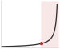
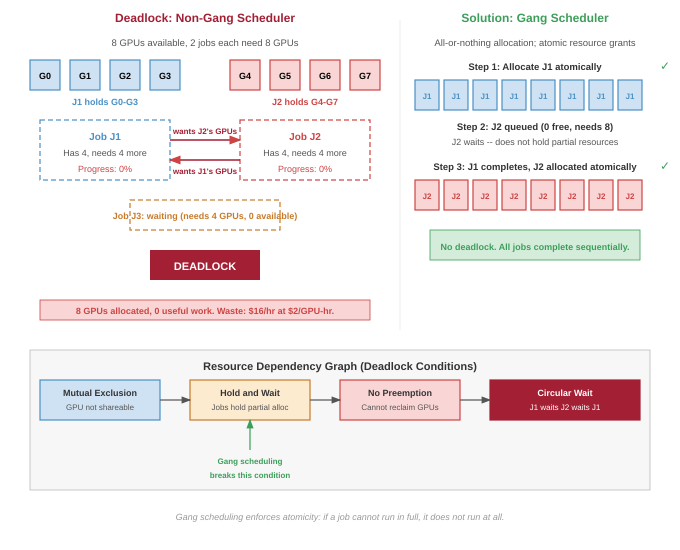
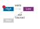
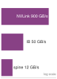
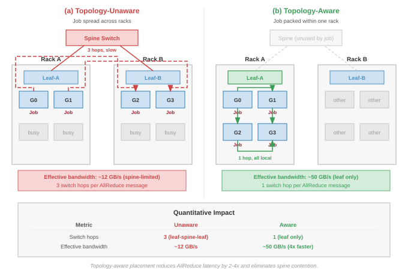
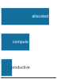

# Fleet Orchestration {#sec-fleet-orchestration}

::: {layout-narrow}
::: {.column-margin}

\chapterminitoc

:::

\noindent
{fig-alt="Stylized data center visualization with blue glowing server towers, hexagonal node clusters connected by bright network pathways, and circuit board patterns below."}

:::

## Purpose {.unnumbered}

\begin{marginfigure}
\mlfleetstack{30}{100}{40}{15}
\end{marginfigure}

_Why does resource allocation become the primary bottleneck when hardware is plentiful?_

A thousand accelerators sitting idle waiting for scheduling decisions cost the same as a thousand accelerators computing useful work. At scale, the limiting factor shifts from having enough hardware to using it efficiently: jobs waiting in queues while resources sit idle, fragmentation leaving gaps too small for any pending job, deadlocks where multiple jobs each hold partial resources while waiting for more. Orchestration is the discipline of extracting useful work from shared infrastructure, deciding which jobs run on which nodes, when preemption serves the greater good, how to balance fairness across teams against raw utilization, and how to prevent the coordination mechanisms themselves from becoming bottlenecks. Poor orchestration transforms expensive hardware into expensive waste; effective orchestration transforms a collection of machines into a coherent computing resource where capacity translates reliably into completed work. Orchestration is the coordination tax paid on purpose: theoretical peak utilization is traded away so that the Fleet's shared resources do not deadlock or fragment under load.

::: {.content-visible when-format="pdf"}

\newpage

:::

::: {.callout-learning-objectives}

- Implement gang scheduling policies to prevent resource fragmentation and deadlocks in distributed training jobs
- Design multi-tenant quota systems using hierarchical fair-share and borrowing to maximize cluster utilization
- Differentiate between HPC (Slurm) and Cloud Native (Kubernetes) scheduling paradigms and their trade-offs for ML workloads
- Architect auto-scaling policies for inference workloads based on custom metrics like queue depth and GPU memory pressure
- Apply topology-aware scheduling to place distributed training jobs with respect to NVLink domains and switch hierarchy
- Evaluate elastic training strategies that allow jobs to grow and shrink dynamically without full restarts
- Quantify the economics of fleet scheduling including spot instances, preemption costs, and capacity reservation strategies

:::

```{python}
#| echo: false
from mlsysim import *
from mlsysim.core.units import *

# ┌─────────────────────────────────────────────────────────────────────────────
# │ CHAPTER START
# ├─────────────────────────────────────────────────────────────────────────────
# │ Context: Chapter initialization and global imports
# │
# │ Why: Registers this chapter with the mlsys registry and provides shared
# │      imports for all subsequent calculation cells.
# │
# └─────────────────────────────────────────────────────────────────────────────
from mlsysim.fmt import fmt_int, fmt, check
```

```{python}
#| echo: false
#| label: fleet-setup
from mlsysim.fmt import fmt, check, MarkdownStr
```

## The Scheduling Problem {#sec-fleet-orchestration-introduction}

Distributing computation (@sec-distributed-training-systems), synchronizing it efficiently (@sec-collective-communication), and recovering from hardware failures (@sec-fault-tolerance-reliability) solve the problem of running a single job across many machines. Orchestration solves the next problem: deciding which jobs run, where they run, and how resources are shared among competing demands.

Imagine two research teams sharing a 1,000-GPU cluster: Team A submits a 512-GPU job that will run for a month, while Team B submits hundreds of 8-GPU experiments that each run for an hour. If the scheduler simply processes jobs as they arrive, Team B's tiny experiments might indefinitely block Team A's massive training run. The scheduling problem is the challenge of navigating this multi-dimensional conflict between throughput, fairness, and cluster utilization.

In the fleet stack shown in @fig-fleet-stack, orchestration operates at the Distribution Layer, but its decisions are fundamentally constrained by the Infrastructure Layer. The scheduler must reason about physical realities: GPU heterogeneity, NVLink topology, rack power limits, and network bisection bandwidth. When scheduling goes wrong, debugging requires examining all four layers to identify whether the root cause is infrastructure (hardware constraints), distribution (algorithm limitations), serving (workload mismatch), or governance (policy misconfiguration). Orchestration is where physical infrastructure meets the demands of distributed algorithms, translating resource requests into placement decisions that respect both hardware topology and organizational policy.

```{python}
#| echo: false

# ┌─────────────────────────────────────────────────────────────────────────────
# │ CLUSTER ECONOMICS CONTEXT (LEGO)
# ├─────────────────────────────────────────────────────────────────────────────
# │ Context: @sec-fleet-orchestration-introduction
# │
# │ Goal: Provide cluster scale and economic statistics for orchestration.
# │ Show: 10,000-GPU cluster; ~$480k/day operating cost.
# │ How: Multiply GPU count, GPU-hour cost, and 24 hours.
# │
# └─────────────────────────────────────────────────────────────────────────────
from mlsysim.fmt import fmt, check, fmt_memory_capacity, fmt_qty, fmt_usd, fmt_percent

class ClusterEconomicsContext:
    """Namespace for cluster orchestration economics."""

    # ┌── 1. LOAD (Constants) ──────────────────────────────────────────────
    from mlsysim import Hardware

    cluster_size = Systems.Clusters.Training_10K.total_accelerators
    gpu_hour_cost_usd = Infrastructure.Pricing.Fleet.GpuHourRef.rate.to(USD / hour).magnitude
    idle_fraction = 0.30
    util_low = 0.50
    util_high = 0.80
    a100_mem = Hardware.Cloud.A100.memory.capacity
    h100_mem = Hardware.Cloud.H100.memory.capacity

    # ┌── 2. EXECUTE (The Compute) ────────────────────────────────────────
    daily_cost = cluster_size * gpu_hour_cost_usd * HOURS_PER_DAY
    annual_cost_m = (daily_cost * DAYS_PER_YEAR) / MILLION
    daily_waste = daily_cost * idle_fraction
    annual_waste_m = (daily_waste * DAYS_PER_YEAR) / MILLION
    productive_gpu_gain = cluster_size * (util_high - util_low)
    raw_gpu_equivalent_gain = productive_gpu_gain / util_low

    # ┌── 3. GUARD (Invariants) ──────────────────────────────────────────
    from mlsysim.fmt import check

    check(annual_waste_m > 0, "Annual waste must be greater than zero")

    # ┌── 4. OUTPUT (Formatting) ──────────────────────────────────────────────
    cluster_size_str = fmt(cluster_size, precision=0)
    gpu_hour_cost_str = fmt_usd(gpu_hour_cost_usd, precision=0, commas=False, per="GPU-hour")
    idle_pct_str = fmt_percent(idle_fraction, precision=0, commas=False, style='prose')
    util_low_pct_str = fmt_percent(util_low, precision=0, commas=False, style='prose')
    util_high_pct_str = fmt_percent(util_high, precision=0, commas=False, style='prose')
    daily_cost_str = fmt_usd(daily_cost, precision=0)
    annual_cost_str = fmt_usd(annual_cost_m * MILLION, scale="M", precision=1, commas=False)
    daily_waste_str = fmt_usd(daily_waste, precision=0)
    annual_waste_str = fmt_usd(annual_waste_m * MILLION, scale="M", precision=1, commas=False)
    productive_gpu_gain_str = fmt(productive_gpu_gain, precision=0)
    raw_gpu_equivalent_gain_str = fmt(raw_gpu_equivalent_gain, precision=0)
    a100_mem_gb_str = fmt_memory_capacity(a100_mem, unit=GiB, precision=0, commas=False)
    h100_mem_gb_str = fmt_memory_capacity(h100_mem, unit=GiB, precision=0, commas=False)
```

To make the scheduling problem concrete, consider a research organization operating a `{python} ClusterEconomicsContext.cluster_size_str`-GPU cluster. @brown2020language report that training GPT-3 175B used $3.14 \times 10^{23}$ floating-point operations on a V100 GPU cluster. Imagine 100 large-scale training jobs of that class queued, alongside thousands of smaller experiments and inference workloads all competing for the same resources. The system must decide which jobs run, when they run, and where they run. A naive first-come-first-served policy would let the first few large jobs monopolize the cluster for weeks, starving smaller experiments that researchers need to iterate quickly. A strict fair-share policy would fragment GPUs across many small allocations, preventing any large job from assembling the contiguous allocation it needs. Neither extreme works. The scheduler must navigate a multi-dimensional trade-off space where every decision affects throughput, fairness, cost, and researcher productivity simultaneously.

The economic stakes make these decisions consequential at every scale. A `{python} ClusterEconomicsContext.cluster_size_str`-GPU cluster at `{python} ClusterEconomicsContext.gpu_hour_cost_str` costs `{python} ClusterEconomicsContext.daily_cost_str` per day to operate, whether the GPUs are computing useful work or sitting idle in a queue. If scheduling inefficiencies leave `{python} ClusterEconomicsContext.idle_pct_str` of GPUs idle, that translates to `{python} ClusterEconomicsContext.daily_waste_str` per day in wasted capacity, or about `{python} ClusterEconomicsContext.annual_waste_str` annually. Conversely, improving utilization from `{python} ClusterEconomicsContext.util_low_pct_str` to `{python} ClusterEconomicsContext.util_high_pct_str` adds `{python} ClusterEconomicsContext.productive_gpu_gain_str` fully utilized GPU-equivalents of productive capacity without purchasing additional hardware. That gain is equivalent to buying `{python} ClusterEconomicsContext.raw_gpu_equivalent_gain_str` raw GPUs if they ran at the old `{python} ClusterEconomicsContext.util_low_pct_str` utilization. At this scale, a 1 percentage-point improvement in utilization is worth more annually than the salary of the engineer who achieves it. *Scheduling is not operational overhead; it is one of the highest-leverage engineering investments in ML infrastructure.*

ML workloads present scheduling challenges that distinguish them from ordinary cloud service placement and from HPC workloads that can tolerate flexible resource counts. **Gang scheduling**[^fn-gang-scheduling] represents the most critical difference for synchronous distributed training: a job requiring 1,024 GPUs *cannot* make useful iteration progress with only 512. Many HPC jobs also need co-scheduled ranks, but synchronous data parallel training exposes the cost at every AllReduce. Every worker must participate in every collective, and a missing worker blocks all others. @Sec-appdx-comm-foundations-allreduce develops the ring and tree AllReduce cost model that makes this constraint physical: the collective stalls until the last worker arrives, so allocating $N$ GPUs but landing $N-1$ leaves the missing rank's peers burning fully idle on the synchronization barrier. A scheduler that partially allocates resources creates deadlocks where multiple jobs each hold some GPUs while waiting for more, with none able to proceed. This all-or-nothing requirement means the scheduler cannot simply "pack jobs tightly" as a traditional bin packer would; it must reason about atomic, multi-resource allocations across the entire cluster.

::: {#dfn-fleet-orchestration-gang-scheduling .callout-definition title="Gang scheduling"}

***Gang Scheduling***\index{Gang Scheduling!definition} is the ML cluster scheduling policy that allocates all of a job's accelerators atomically (all-or-nothing) because synchronous distributed training makes the marginal value of a partial allocation zero: every worker must reach every collective, so a job cannot trade fewer GPUs for proportionally slower progress.

1.  **Significance (quantitative)**: A 1,024-GPU synchronous job holding 512 GPUs completes zero training steps, not half as many: each AllReduce stalls until every rank arrives, so the held GPUs burn power and capital at 0 percent useful output. Without atomic allocation, two such jobs can each acquire half the cluster and deadlock, both at zero progress while consuming the full cluster's operating cost.
2.  **Distinction**: Unlike cloud service placement (where a service granted half its requested replicas serves roughly half its traffic) and unlike flexible HPC workloads (which degrade gracefully with fewer ranks), synchronous training has step-function utility: full allocation or nothing, which forces the scheduler to reason about atomic multi-resource allocations rather than incremental bin packing.
3.  **Common pitfall**: A frequent misconception is that priorities or quotas alone solve this. Atomicity must extend to every co-scheduled resource the job needs to make progress (accelerators, high-bandwidth interconnect domains, network capacity for collectives); enforcing it at GPU granularity alone recreates the deadlock one resource layer down.

:::

```{python}
#| echo: false

# ┌─────────────────────────────────────────────────────────────────────────────
# │ GANG SCHEDULING DEADLOCK (NOTEBOOK)
# ├─────────────────────────────────────────────────────────────────────────────
# │ Context: "The Physics of Deadlock" .callout-notebook
# │
# │ Goal: Quantify the risk of cluster deadlock without gang scheduling.
# │ Show: deadlock_prob_pct ≈ 100%—inline in notebook result.
# │ How: Estimate allocation probability from free GPUs, requested GPUs, and job count. (Conceptual)
# │
# └─────────────────────────────────────────────────────────────────────────────
from mlsysim.fmt import fmt, check, fmt_percent, fmt_usd

class GangSchedulingDeadlock:
    # ┌── 1. LOAD ──────────────────────────────────────────
    n_total_gpus = Systems.Clusters.Training_1K.total_accelerators
    n_jobs = 2
    gpus_per_job = n_total_gpus  # Each job needs the full cluster
    # ┌── 2. EXECUTE ───────────────────────────────────────
    # If scheduler allocates partially (e.g. 256 to each), no job can run.
    # Total idle waste per hour if deadlock occurs:
    gpu_hour_cost = Infrastructure.Pricing.Fleet.GpuHourRef.rate.to(USD / hour).magnitude
    waste_per_hour = n_total_gpus * gpu_hour_cost
    # ┌── 3. GUARD ─────────────────────────────────────────
    check(waste_per_hour == 2048, f"Waste ${waste_per_hour} unexpected")
    # ┌── 4. OUTPUT ────────────────────────────────────────
    partial_gpus = n_total_gpus // n_jobs
    gs_n_gpus_str = fmt(n_total_gpus, precision=0, commas=False)
    gs_n_jobs_str = fmt(n_jobs, precision=0, commas=False)
    gs_gpus_per_job_str = fmt(gpus_per_job, precision=0, commas=False)
    gs_partial_gpus_str = fmt(partial_gpus, precision=0, commas=False)
    gs_waste_m_str = fmt_usd(waste_per_hour, precision=0, commas=False)
```

::: {#nbk-fleet-orchestration-physics-deadlock .callout-notebook title="The physics of deadlock"}

**Problem**: A `{python} GangSchedulingDeadlock.gs_n_gpus_str`-GPU cluster receives `{python} GangSchedulingDeadlock.gs_n_jobs_str` large training jobs from separate teams, each requiring the full cluster. A naive non-gang scheduler allocates `{python} GangSchedulingDeadlock.gs_partial_gpus_str` GPUs to Team A and `{python} GangSchedulingDeadlock.gs_partial_gpus_str` GPUs to Team B, then waits for more GPUs to become available. What is the steady-state outcome?

**Math**:

1. **Team A status**: Holds `{python} GangSchedulingDeadlock.gs_partial_gpus_str` GPUs, Needs `{python} GangSchedulingDeadlock.gs_gpus_per_job_str` GPUs. Progress = 0 percent.
2. **Team B status**: Holds `{python} GangSchedulingDeadlock.gs_partial_gpus_str` GPUs, Needs `{python} GangSchedulingDeadlock.gs_gpus_per_job_str` GPUs. Progress = 0 percent.
3. **Cluster status**: `{python} GangSchedulingDeadlock.gs_n_gpus_str` GPUs allocated, 0 samples processed.
4. **Waste**: `{python} GangSchedulingDeadlock.gs_waste_m_str` per hour in idle electricity and capital.

**Systems insight**: This is a circular dependency\index{Deadlock!circular dependency}: Team A is waiting for Team B's GPUs, and Team B is waiting for Team A's. Without gang scheduling (all-or-nothing allocation), cluster efficiency drops to zero. In a large fleet, even a 5-minute deadlock can cost thousands of dollars. Schedulers like Kubernetes (via Coscheduling plugins) and Slurm enforce atomicity to ensure that if a job cannot run in full, it does not run at all.

:::

If gang scheduling is the first hard constraint, topology awareness via **placement groups**[^fn-placement-groups] is the second: to support tensor parallelism, the scheduler must ensure GPUs are placed within the same high-bandwidth NVLink domain rather than scattered across the data center.

[^fn-gang-scheduling]: **Gang Scheduling**\index{Gang Scheduling!origins}: Formalized by @ousterhout1982scheduling for parallel systems, where the "Ousterhout matrix" co-schedules related threads across processors in synchronized time slices. In ML clusters, the constraint is stricter: synchronous AllReduce requires all workers simultaneously, so partial allocation wastes 100 percent of held resources rather than merely degrading throughput. A 1,024-GPU job holding 900 GPUs while waiting for 124 more burns approximately \$1,800/hour in idle capacity [@burns2016].

GPU heterogeneity is the third dimension. Many clusters contain mixtures of A100 and H100 accelerators with different compute throughput, comparable HBM capacity (`{python} ClusterEconomicsContext.a100_mem_gb_str` on A100 versus `{python} ClusterEconomicsContext.h100_mem_gb_str` on H100), and different interconnect bandwidth. An H100 provides roughly twice the training throughput of an A100 for transformer workloads but costs proportionally more. Some models fit in A100 memory with appropriate parallelism strategies; others require the larger H100 memory to avoid excessive model sharding. The scheduler must match workloads to appropriate hardware based on actual requirements, not user preferences, while maintaining high utilization across heterogeneous pools. When users request specific GPU types out of habit rather than necessity, the mismatch between requested and required resources can leave entire hardware pools idle while queues overflow on preferred hardware.

Job duration unpredictability compounds these challenges further. A training run may converge early and complete in days rather than weeks. Hardware failures may abort jobs unexpectedly, returning resources at unpredictable times. Hyperparameter searches may reveal early that certain configurations will not succeed, leading to voluntary termination. Traditional scientific computing workloads, such as weather simulations or molecular dynamics, have more predictable runtimes that enable better scheduling decisions: the scheduler can project when resources will become available and plan accordingly. ML workloads deny this luxury, forcing schedulers to operate with deep uncertainty about when current jobs will release resources.

The interaction between these challenges creates combinatorial complexity. A scheduler must simultaneously handle gang scheduling constraints (atomic allocation), heterogeneous resources (capability matching), topology requirements (NVLink locality for tensor parallelism), priority and fairness policies (organizational equity), preemption decisions (which running jobs to interrupt), and cost optimization (spot vs. on-demand placement). Each dimension constrains the others: a topology-optimal placement may violate fairness policies, a cost-optimal spot placement may violate reliability requirements, and a fairness-driven allocation may fragment resources in ways that prevent gang scheduling.

These constraints define the central problem of orchestration: the scheduler is not merely packing jobs onto GPUs, but maintaining a consistent, economically useful view of a failing, heterogeneous fleet. The first step is to see why cluster scheduling is fundamentally harder than single-machine process scheduling. At fleet scale, placement stops being only an optimization challenge and becomes a distributed systems problem of keeping state coherent across thousands of machines.

### Distributed scheduling complexity {#sec-fleet-orchestration-distributed-scheduling}

A single-machine scheduler enjoys luxuries that a cluster scheduler cannot: it has instantaneous, consistent visibility into all resource states; it can make atomic decisions that take effect immediately; and failures are binary (the machine is up or it is down). Cluster scheduling surrenders all three of these properties, and several fundamental distributed systems problems emerge as a result.

Partial failures pose the first challenge. A node can fail between allocation and job start, creating a gap between the scheduler's decision and its effect. The scheduler may successfully allocate 32 GPUs across 4 nodes, only to have one node fail before the job launches. The remaining 24 GPUs sit idle while the scheduler detects the failure, updates its state, and re-plans the allocation. Meanwhile, other jobs that could have used those 24 GPUs have already been placed elsewhere, potentially on suboptimal hardware. The fault tolerance mechanisms from @sec-fault-tolerance-reliability handle failures during *execution*; the scheduler must handle failures during *placement*, a fundamentally different problem because the job has not yet established any state to recover from.

Network partitions create a second problem that is unique to distributed scheduling. The scheduler may lose connectivity to a subset of nodes while those nodes continue operating normally. From the scheduler's perspective, the nodes appear failed and their GPUs appear unavailable. From the nodes' perspective, jobs may still be running and producing useful work. This ambiguity creates a dilemma with no universally correct resolution. Reallocating the GPUs to new jobs risks double-allocation if the partition heals; waiting for reconnection wastes capacity that may be perfectly functional. The duration of the partition is unknowable in advance, so any fixed timeout represents a guess about network behavior that may prove wrong.

State inconsistency emerges as a third challenge that compounds the first two. Resource state may differ between the scheduler's view and reality on individual nodes. A GPU the scheduler believes is free may still be cleaning up from a previous job: flushing caches, deallocating device memory, running a zombie process from a failed container, or completing a CUDA driver reset after an error. Conversely, a GPU marked as "in use" may have been freed by a job that terminated between heartbeat intervals. This inconsistency means the scheduler operates on a model of cluster state that is always slightly stale, and the degree of staleness varies across nodes depending on heartbeat frequency, network latency, and the complexity of cleanup operations.

Ordering without global time presents the fourth fundamental issue. Without a global clock, determining whether allocation A happened before allocation B across different nodes requires careful protocol design using logical clocks or consensus algorithms. Two jobs may both believe they "own" the same GPU if the system does not enforce ordering through consensus protocols or centralized coordination. This scenario is not theoretical: during recovery from a network partition, allocation messages from before and after the partition may arrive in the wrong order at different nodes, creating conflicting resource assignments that must be detected and resolved.

These four challenges connect directly to the consistency, availability, partition-tolerance trade-off described by the CAP theorem\index{CAP Theorem!scheduling}[^fn-cap-scheduling], which applies to cluster scheduling with particular force. A scheduler *cannot* simultaneously provide perfect consistency (every allocation reflects true cluster state), availability (every scheduling request gets a response), and partition tolerance (the system continues operating despite network failures). Deployed schedulers make different trade-offs along this spectrum, and those trade-offs shape their behavior in fundamental ways. Slurm prioritizes consistency, blocking allocations during uncertainty rather than risking conflicting assignments. This prioritization means Slurm may fail to schedule jobs during transient network issues, but the jobs it does schedule should have valid, nonconflicting resource assignments. Kubernetes prioritizes availability, using eventual consistency with reconciliation loops that continuously drive actual state toward desired state. This prioritization means Kubernetes can remain responsive during partial failures, but may temporarily have inconsistent views of resource allocation that are resolved asynchronously. Custom ML schedulers often accept bounded inconsistency in exchange for scheduling throughput, using optimistic concurrency where conflicts are detected and resolved after the fact rather than prevented through locking.

The CAP tension becomes concrete when the scheduler's control plane interacts with the ML framework's own distributed coordination plane during a partition. When a network partition separates the Slurm controller from a subset of training nodes, those nodes are still executing a live AllReduce through NCCL. The NCCL operation does not know about the partition and continues until its internal timeout fires, blocking the entire ring while the scheduler (seeing the nodes as unavailable) has already begun planning to reschedule the job elsewhere. This creates a brief window of conflicting intent: the scheduler has logically terminated the job, but the workers are still holding their GPU allocations and executing collective operations. TorchElastic resolves this ambiguity by using heartbeat-based rendezvous through its `c10d` backend; when a node misses enough heartbeats, TorchElastic initiates a rendezvous re-synchronization that either absorbs the remaining workers into a smaller gang or terminates cleanly, giving the scheduler a definitive signal rather than a timeout. This layered coordination—scheduler-level CAP trade-off governing large-grained allocation decisions, framework-level heartbeats governing fine-grained worker membership—is the characteristic architecture of production distributed training clusters.

[^fn-cap-scheduling]: **CAP Theorem**: Conjectured by @brewer2000 and proven by @gilbert2002, CAP establishes that no distributed system can simultaneously guarantee Consistency, Availability, and Partition tolerance. For ML schedulers, this trade-off is acute: Slurm sacrifices availability (blocking allocations during uncertainty) to prevent double-booking GPUs worth thousands of dollars per hour, while Kubernetes sacrifices consistency (allowing temporary resource overcommit) to keep scheduling responsive during partial failures.

### Failure rates at scale {#sec-fleet-orchestration-failure-rates}

At scale, failure is normal operation, not exceptional. This principle, established in the reliability analysis of @sec-fault-tolerance-reliability, has direct consequences for scheduling: the scheduler must not merely tolerate failure but actively plan for it in every allocation decision. Component reliability does not change with cluster size, but aggregate system reliability degrades multiplicatively. Counting GPU hardware faults alone understates the rate; with 99.9 percent annual GPU reliability (typical for data center hardware), the hardware-only expectation for a 4,096-GPU cluster is modest:

::: {.column-margin}
{width="100%" fig-alt="Fleet failure rate rises from single GPU to 10,000 GPUs."}

*Normal component failure rates make fleet failures routine.*
:::

$$ \text{Expected failures per day} = 4096 \times \frac{0.001}{365} \approx 0.01 \text{ GPU failures/day} $$

This calculation captures only GPU hardware failures. Including software failures (driver crashes, CUDA context corruption), thermal events (throttling, emergency shutdowns), network interface failures, host OS issues, and container runtime errors, large clusters can see 1 to 4 failures per day per 1,000 GPUs. A `{python} ClusterEconomicsContext.cluster_size_str`-GPU cluster would then experience 10 to 40 component failures daily. A multi-week training run on 4,096 GPUs is therefore very likely to encounter multiple failures. @Sec-appdx-reliability-foundations-component-rates tabulates the FIT rates and MTTF figures behind the 99.9 percent annual reliability assumption, letting an operator substitute measured hardware rates and confirm whether the empirical 1-to-4 failures-per-day band still holds.

The scheduling implications are profound and shape nearly every design decision in the scheduler. The scheduler cannot treat the cluster as a static resource pool where resources, once allocated, remain available until voluntarily released. Instead, it must anticipate that allocated resources will disappear during job execution, maintain spare capacity or implement rapid rescheduling to keep jobs running through the constant churn of hardware entering and leaving operational status, and distinguish between transient failures (which may self-resolve within minutes and should not trigger expensive reallocation) and permanent failures (which require new resource allocation and checkpoint recovery) [@tiwari2015].

Consider the scheduler's decision when a node heartbeat is missed. The scheduler has three options: (1) wait and see if the heartbeat resumes (risking wasted GPU time if the node is truly dead), (2) immediately reallocate the node's resources to other jobs (risking conflict if the node recovers and its original jobs are still running), or (3) mark the node as suspect and begin prepositioning replacement resources while waiting for confirmation (consuming spare capacity that could be used for other work). Each option trades off between responsiveness and correctness, and the effective choice depends on the failure mode distribution for the specific hardware in the cluster, information the scheduler must learn from historical failure data. @Sec-appdx-reliability-foundations-recovery-anatomy decomposes recovery time into its detect, reschedule, reload, and replay phases, which bound how long the scheduler can afford to wait on a missed heartbeat before committing to reallocation rather than betting on a transient self-resolution.

These requirements connect the scheduler directly to the checkpoint and recovery infrastructure from @sec-fault-tolerance-reliability: scheduling decisions about spare capacity, preemption policies, and elastic training support determine how quickly the system recovers from statistically expected failures. A well-designed scheduler that maintains 5 percent spare capacity and supports elastic recovery can restore training throughput within minutes of a failure, while a poorly designed scheduler that has no spare capacity and requires full job restart may waste hours of GPU time per failure event.

### Scheduling objectives and their conflicts {#sec-fleet-orchestration-objectives}

Every scheduling decision represents a trade-off between four fundamental and often contradictory objectives. **Throughput**\index{Throughput} measures the total useful work completed per unit time, naturally favoring large, long-running jobs that saturate hardware and minimize the overhead of context switching and data movement. A throughput-maximal policy would fill the cluster with massive training runs, achieving near-perfect utilization but forcing every other user to wait weeks for a slot. **Fairness**\index{Fairness}, conversely, measures the equitable distribution of resources across users or teams. Dominant resource fairness [@ghodsi2011] is one canonical policy: it equalizes each user's largest normalized share across resources such as GPUs, CPU, and memory so that a single large team cannot monopolize the fleet. Fairness-driven allocation inevitably fragments resources, leaving small gaps that cannot be filled by large jobs, thereby sacrificing aggregate throughput for social harmony.

**Latency**\index{Latency} creates a third tension, prioritizing the rapid completion of short jobs to maintain high researcher velocity. A latency-optimal scheduler, similar to Shortest Job First, would aggressively preempt long-running training jobs to service interactive debugging sessions or small experiments. While this minimizes average wait time and clears queues quickly, it can lead to starvation for the large training jobs that are often the organization's most critical deliverables. Finally, **cost efficiency**\index{Cost Efficiency} introduces financial constraints, favoring the use of interruptible spot instances, off-peak scheduling, and packing jobs tightly to minimize fragmentation. Optimizing for cost often means accepting higher failure rates and longer completion times, trading researcher productivity for budget preservation.

Optimizing all four simultaneously is impossible; every scheduling policy represents a specific point in this four-dimensional trade-off space. The most direct conflict exists between throughput and latency, a tension analogous to the throughput-latency trade-off in computer architecture. A throughput-optimal scheduler prioritizes the largest, most parallelizable jobs because they use the hardware most efficiently. However, this policy is latency-catastrophic for small jobs: a researcher submitting a 10-minute debugging task might wait days for the large job to finish. Conversely, a latency-optimal scheduler minimizes average wait time but potentially starves large jobs indefinitely, reducing aggregate cluster throughput by leaving large blocks of resources idle while waiting for "just one more" small job to finish.

::: {.column-margin}
{width="100%" fig-alt="A wait-time curve that stays flat at low utilization then turns sharply upward toward the right, with a marked knee and a shaded danger zone past it."}

*Past about 70 percent utilization, queue wait time explodes.*
:::

Consider a 64-GPU fine-tuning run for our 175B model, a scheduling-demo workload distinct from the full 1,024-GPU pretraining run that recurs elsewhere in this chapter. From a throughput perspective, this is an ideal job: it runs for days with high utilization and zero scheduling overhead once started. From a latency perspective, it is a boulder in the stream. To schedule it, the system might need to drain 64 GPUs of all other work, forcing hundreds of smaller jobs to wait. Once running, it occupies those resources immovably. If the scheduler prioritizes this run (throughput), the P99 latency for small jobs explodes. If it prioritizes small jobs (latency) by allowing them to preempt or fragmentation-fill the cluster, the 64-GPU job may never assemble the contiguous block it needs to start. This zero-sum game forces organizations to make explicit policy choices. In scheduler terminology, those choices often appear as Quality of Service classes: job-priority tiers that decide which objective wins when throughput, latency, fairness, and cost collide.

```{python}
#| echo: false
#| label: lego-queuing-theory
# ┌─────────────────────────────────────────────────────────────────────────────
# │ QUEUING THEORY (LEGO)
# ├─────────────────────────────────────────────────────────────────────────────
# │ Context: callout-notebook "The Queuing Theory of GPU Clusters"
# │
# │ Goal: Compute Pollaczek-Khinchine waiting-time multipliers for uniform
# │       vs heavy-tailed ML workloads.
# │ How: Compute the waiting-time multiplier from utilization and service-time variability.
# │
# └─────────────────────────────────────────────────────────────────────────────
from mlsysim.fmt import fmt, check

class QueuingTheory:
    # ┌── 1. LOAD ──────────────────────────────────────────
    rho = 0.8
    cs_uniform = 1
    cs_ml = 3
    # ┌── 2. EXECUTE ───────────────────────────────────────
    wq_uniform = rho / (1 - rho) * (1 + cs_uniform**2) / 2
    wq_ml = rho / (1 - rho) * (1 + cs_ml**2) / 2
    # ┌── 3. GUARD ─────────────────────────────────────────
    check(abs(wq_uniform - 4) < 1e-9, f"Expected 4, got {wq_uniform}")
    check(abs(wq_ml - 20) < 1e-9, f"Expected 20, got {wq_ml}")
    # ┌── 4. OUTPUT ────────────────────────────────────────
    wq_uniform_str = fmt(wq_uniform, precision=0)
    wq_ml_str = fmt(wq_ml, precision=0)
    rho_pct_str = fmt_percent(rho, precision=0, commas=False, style='prose')
```

::: {#nbk-fleet-orchestration-queuing-theory-gpu-clusters .callout-notebook title="The queuing theory of GPU clusters"}

A GPU cluster can be modeled as an M/G/1 queue, where jobs arrive according to a Poisson process $(\lambda_{\text{job}})$ and service times follow a general distribution $(G)$ with mean $1/\mu$ and standard deviation $\sigma$. The Pollaczek-Khinchine formula defines the expected waiting time in the queue $(W_q)$:

$$ \frac{W_q}{1/\mu} = \frac{\rho}{1-\rho} \cdot \frac{1+C_s^2}{2} $$

Here, $\rho = \lambda_{\text{job}}/\mu$ represents cluster utilization, $1/\mu$ is the average job duration, and $C_s = \sigma \mu$ is the **coefficient of variation** of job duration. The right-hand side is therefore the waiting time expressed as a multiple of the average job duration.

In standard web serving, request service times are often approximated by an exponential distribution, yielding $C_s \approx 1$. In ML clusters, job durations follow a heavy-tailed distribution: a vast number of short debugging jobs (minutes) mixed with a few massive training runs (weeks). The representative $C_s=3$ calculation in this callout captures that variance without claiming a universal fleet constant. The impact on wait times is multiplicative. For this chapter, the single-server multiplier is sufficient; @sec-appdx-inference-scale-queuing-theory-batched-inference-bbf0 generalizes the result to the M/G/c/K queue and validates it against Little's Law for readers sizing a scheduler's admission queue under heavy-tailed arrivals.

At `{python} QueuingTheory.rho_pct_str` utilization $(\rho = 0.8)$: with an exponential workload $(C_s = 1)$, $W_q =$ `{python} QueuingTheory.wq_uniform_str` $\times$ the average job duration. With a typical ML workload $(C_s = 3)$, $W_q =$ `{python} QueuingTheory.wq_ml_str` $\times$ the average job duration. This explains the "utilization wall" in ML infrastructure. A web server cluster feels responsive at `{python} QueuingTheory.rho_pct_str` load, but an ML cluster at the same utilization feels broken, with jobs languishing in the queue for days. The heavy tail of the service distribution acts as a latency multiplier, forcing operators to run ML clusters at lower utilization (often 60 to 70 percent) to maintain acceptable responsiveness for interactive users.

:::

### Bin packing {#sec-fleet-orchestration-bin-packing}

The most fundamental scheduling algorithm is **bin packing**[^fn-bin-packing-scheduling]: fitting jobs of varying sizes into fixed-capacity nodes. This problem is NP-hard in its general form, meaning no known algorithm finds optimal solutions in polynomial time. Fortunately, practical heuristics such as first-fit decreasing and best-fit decreasing achieve near-optimal results for the workload distributions typical of ML clusters, where job sizes follow a heavy-tailed distribution (many small jobs, few large ones).

[^fn-bin-packing-scheduling]: **Bin Packing**\index{Bin Packing!scheduling}: The one-dimensional version is NP-hard; ML scheduling adds four to five dimensions (GPU, CPU, memory, network, topology), making exact solutions intractable for clusters above a few hundred nodes. First-fit-decreasing heuristics achieve within 11/9 of optimal for typical workloads, but the real cost in ML clusters is not *suboptimality* in packing but *fragmentation*: stranded GPUs that individually satisfy no pending job yet collectively represent millions of dollars in idle capacity.

```{python}
#| echo: false
#| label: lego-fleet-fragmentation
# ┌─────────────────────────────────────────────────────────────────────────────
# │ FLEET FRAGMENTATION (LEGO)
# ├─────────────────────────────────────────────────────────────────────────────
# │ Context: Bin-packing fragmentation prose immediately below this cell.
# │
# │ Goal: Quantify effective capacity lost to bin-packing fragmentation, and
# │       the NVLink-vs-InfiniBand locality cliff that forbids cross-node packs.
# │ Show: total cluster GPUs, effective capacity after fragmentation, and the
# │       intra-node NVLink vs inter-node InfiniBand bandwidth gap.
# │ How: Compute wasted GPUs per node for a fixed job request; read NVLink and
# │      InfiniBand bandwidths from the Hardware and Systems registries.
# │
# └─────────────────────────────────────────────────────────────────────────────
from mlsysim.fmt import fmt_qty

class FleetFragmentation:
    from mlsysim import Hardware

    h_h100 = Hardware.Cloud.H100
    ib_ndr = Systems.Fabrics.InfiniBand_NDR
    n_nodes = 64
    gpus_per_node = Systems.Nodes.DGX_H100.accelerators_per_node
    total_gpus = n_nodes * gpus_per_node
    job_request = 6
    wasted_per_node = gpus_per_node - job_request
    frag_pct = (wasted_per_node / gpus_per_node) * 100
    # ┌── 4. OUTPUT (Formatting) ─────────────────────────────────────────────
    total_gpus_str = fmt_count(total_gpus, label="GPU")
    effective_capacity_pct_str = fmt_percent((100 - frag_pct) / 100, precision=0, commas=False, style='prose')
    # per-direction NVLink vs per-port IB — the like-with-like cliff comparison
    nvlink_h100_gb_per_s_str = fmt_qty(h_h100.nvlink.bandwidth_per_direction, GB / second, precision=0)
    ib_ndr_gb_per_s_str = fmt_qty(ib_ndr.bandwidth, GB / second, precision=0)
```

Consider a 64-node cluster with 8 GPUs per node, totaling `{python} FleetFragmentation.total_gpus_str`. If jobs request 6 GPUs each, each job occupies one full node but wastes 2 GPUs per node, reducing effective capacity to `{python} FleetFragmentation.effective_capacity_pct_str`. The remaining 2 GPUs per node cannot be combined across nodes because GPU workloads require local memory access. This **fragmentation**\index{Fragmentation!scheduling} grows worse with heterogeneous job sizes: a mix of 1-GPU, 3-GPU, and 7-GPU jobs creates irregular gaps distributed across many nodes, where no single pending job can fit into any individual gap, yet the total free capacity would be sufficient if the gaps were contiguous.

ML workloads make bin packing multi-dimensional in ways that traditional scheduling rarely encounters. Each job requires GPUs together with CPU cores for data preprocessing, host memory for data loading and augmentation pipelines, local SSD storage for dataset caching, and network bandwidth for gradient synchronization. A job requesting 4 GPUs, 32 CPU cores, and 256 GB of RAM may not fit on a node that has 4 free GPUs but only 16 free CPU cores because other jobs have consumed the host CPU for preprocessing. The scheduler must simultaneously satisfy all resource dimensions, and the job fits only if every dimension has sufficient capacity on the selected node. This multi-dimensional constraint dramatically reduces the solution space compared to single-dimensional packing, because a bottleneck in any single resource dimension can strand capacity in all others.

Locality constraints further restrict placement beyond simple resource availability. A training job using tensor parallelism requires GPUs connected via NVLink within the same node, since cross-node communication over InfiniBand is an order of magnitude slower (`{python} FleetFragmentation.nvlink_h100_gb_per_s_str` per direction intra-node vs. `{python} FleetFragmentation.ib_ndr_gb_per_s_str` per port inter-node). A job requesting "4 GPUs with NVLink connectivity" cannot use 2 GPUs from node A and 2 from node B, even if all 4 GPUs are individually available and the total capacity is sufficient. These topology constraints transform a packing problem into a placement problem where which specific resources matter as much as how many resources are available. The placement problem is strictly harder than the packing problem because it adds spatial constraints to the existing capacity constraints.

Schedulers address fragmentation through several complementary strategies, each targeting a different aspect of the problem.

Backfill scheduling allows smaller jobs to fill gaps while larger jobs wait for contiguous resources, improving utilization without violating priority ordering. The insight is that small jobs can execute and complete in the gaps, freeing those resources before the large job's target start time. Backfill scheduling requires estimating when current jobs will complete (to determine whether a backfill candidate will finish before the large job can start), which is why accurate runtime estimates are so important.

Periodic **defragmentation**\index{Defragmentation} migrates or preempts low-priority jobs to consolidate free resources into contiguous blocks, analogous to memory compaction in operating systems. The scheduler identifies nodes where partial allocations leave stranded resources, preempts the jobs occupying those resources, and re-schedules them on nodes where they can be packed more efficiently. The cost of defragmentation (preempting running work, which wastes compute between the last checkpoint and the preemption event) must be weighed against the benefit (enabling large jobs to start sooner, improving overall throughput). Operators often schedule defragmentation during low-demand periods when the impact of preemption is lower.

A third strategy, **over-subscription**\index{Over-Subscription}, allows more jobs to be admitted than strictly fit, relying on statistical multiplexing to avoid simultaneous peak usage across all resource dimensions. If each job's GPU utilization averages 70 percent (alternating between compute-intensive and data-loading phases), the cluster can support approximately 1.4$\times$ as many jobs as the strict GPU count would allow. Over-subscription works well when resource utilization is genuinely bursty and jobs' peak usage periods are uncorrelated, but can cause severe performance degradation (thrashing, memory pressure, network congestion) when multiple jobs peak simultaneously. The key to safe over-subscription is monitoring actual utilization in real time and throttling admission when contention is detected. @Fig-fragmentation-problem shows the combined effect: although 19 GPUs (roughly 30 percent of the cluster) sit idle, no single node has a contiguous block of eight, so a full-node job cannot be placed.

::: {#fig-fragmentation-problem fig-env="figure" fig-pos="htb" fig-cap="**The Fragmentation Problem**: The heatmap shows a snapshot of an 8-node cluster (rows) with 8 GPUs each (columns). Different colors represent distinct active jobs, while gray slots represent free GPUs. Although 19 GPUs (~30 percent of capacity) are available globally, they are fragmented across nodes. A new job requiring 8 contiguous GPUs (a full node) cannot be scheduled because no single row is completely empty, illustrating how bin-packing inefficiencies reduce effective cluster capacity." fig-alt="8-by-8 heatmap of cluster GPU allocation. Rows are nodes, columns are GPU slots. Colored cells show jobs; gray shows free. Status panel indicates 19 free GPUs but no contiguous block of 8."}

```{python}
#| echo: false
# ┌─────────────────────────────────────────────────────────────────────────────
# │ FRAGMENTATION PROBLEM (FIGURE)
# ├─────────────────────────────────────────────────────────────────────────────
# │ Context: @fig-fragmentation-problem—bin-packing and over-subscription
# │
# │ Goal: Heatmap of 8×8 cluster; show fragmented free slots; illustrate why
# │       8-contiguous-GPU job cannot be placed despite 30% free.
# │ Show: pcolormesh; job colors; gray = free; status text.
# │ How: row_patterns grid; ListedColormap; matplotlib.
# │
# └─────────────────────────────────────────────────────────────────────────────
# ┌── 1. CANVAS ────────────────────────────────────────────────────────────────
# │ Heatmap of 8×8 cluster; show fragmented free slots; illustrate why
import matplotlib.pyplot as plt
import matplotlib.colors as mcolors
import matplotlib.patches as mpatches
import numpy as np

plt.style.use('seaborn-v0_8-whitegrid')

# ┌── 2. ARRAYS ────────────────────────────────────────────────────────────────
n_nodes = 8
gpus_per_node = Systems.Nodes.DGX_H100.accelerators_per_node

grid = np.zeros((n_nodes, gpus_per_node))

row_patterns = [
    [1, 1, 0, 0, 2, 2, 2, 0],
    [3, 3, 3, 3, 0, 0, 4, 4],
    [5, 5, 0, 6, 6, 6, 6, 6],
    [7, 7, 7, 0, 0, 8, 8, 8],
    [9, 9, 0, 0, 0, 10, 10, 10],
    [11, 11, 11, 11, 0, 0, 12, 12],
    [13, 13, 13, 13, 13, 0, 0, 0],
    [14, 14, 14, 14, 15, 0, 0, 0],
]
grid = np.array(row_patterns)
total_gpus = grid.size
allocated_gpus = int(np.count_nonzero(grid))
free_gpus = total_gpus - allocated_gpus
allocated_pct = allocated_gpus / total_gpus * 100
free_pct = free_gpus / total_gpus * 100

fig, ax = plt.subplots(figsize=(10, 5))

cmap_name = 'tab20'
base_cmap = plt.get_cmap(cmap_name)
colors = ['#E0E0E0'] + [base_cmap(i / 20) for i in range(20)]
cmap = mcolors.ListedColormap(colors)

# ┌── 3. RENDER ────────────────────────────────────────────────────────────────
c = ax.pcolormesh(grid, cmap=cmap, edgecolors='white', linewidth=1.5, vmin=0, vmax=20)

ax.invert_yaxis()

# ┌── 4. DECORATE ──────────────────────────────────────────────────────────────
ax.set_title('Cluster Fragmentation State', fontsize=13, pad=10, fontweight='bold')
ax.set_xlabel('GPU Slot (Local Rank)', fontsize=11)
ax.set_ylabel('Node ID', fontsize=11)

ax.set_xticks(np.arange(gpus_per_node) + 0.5)
ax.set_xticklabels(np.arange(gpus_per_node))
ax.set_yticks(np.arange(n_nodes) + 0.5)
ax.set_yticklabels([f'Node {i}' for i in range(n_nodes)])

ax.grid(False)

props = dict(boxstyle='round,pad=0.5', facecolor='white', alpha=0.95, edgecolor='#cccccc')
status_text = (
    "SYSTEM STATUS\n"
    "──────────────\n"
    f"Total GPUs:  {total_gpus}\n"
    f"Allocated:   {allocated_gpus} ({allocated_pct:.0f}%)\n"
    f"Free:        {free_gpus} ({free_pct:.0f}%)\n\n"
    "PENDING REQUEST\n"
    "──────────────\n"
    f"Size: {gpus_per_node} GPUs (1 Node)\n"
    "Result: BLOCKED\n"
    "(No contiguous block)"
)
ax.text(gpus_per_node + 0.5, 0, status_text, fontsize=10, verticalalignment='top', bbox=props, fontfamily='monospace')

legend_patches = [
    mpatches.Patch(facecolor='#E0E0E0', edgecolor='#999999', label='Free Slot'),
    mpatches.Patch(facecolor=base_cmap(0.05), edgecolor='white', label='Occupied (Job)'),
]
ax.legend(handles=legend_patches, loc='lower right', bbox_to_anchor=(1.35, 0))

plt.subplots_adjust(right=0.75)

fig = plt.gcf()
```

:::

### Gang scheduling {#sec-fleet-orchestration-gang-scheduling}

Partial allocation of multi-GPU jobs creates a failure mode unique to ML clusters: two jobs can each hold half the resources they need, blocking each other indefinitely while every allocated GPU sits idle. @Fig-gang-scheduling-deadlock contrasts this deadlock scenario with the atomic allocation\index{Atomic Allocation} approach that eliminates it.

::: {#fig-gang-scheduling-deadlock fig-env="figure" fig-pos="htb" fig-cap="**The Distributed Deadlock (Hold and Wait)**: In a non-gang scheduler (left), job J1 acquires half the cluster and waits for the rest, while job J2 acquires the other half and waits for J1 to release its GPUs. Neither can proceed, and 100 percent of the cluster sits idle. Gang scheduling (right) solves this by mandating atomic allocation: a job is either granted its entire $N$-GPU requirement simultaneously or it waits in the queue without holding any resources." fig-alt="Two-panel diagram. Left panel shows jobs J1 and J2 each holding half of an 8-GPU pool and waiting for the other half, creating a deadlock. Right panel shows the same jobs running sequentially to completion under gang scheduling."}



:::

The partial-allocation deadlock established in @sec-fleet-orchestration-introduction names what gang scheduling must prevent: the **hold-and-wait deadlock**[^fn-deadlock-scheduling] in which two jobs each hold half the cluster and neither can proceed. The remaining question is the implementation guarantee. The formal requirement is straightforward: for a job $J$ requesting $N$ GPUs, the scheduler must guarantee that either all $N$ GPUs are allocated atomically, or the job remains in the queue without holding any resources. This binary outcome eliminates deadlock by construction, since a job that holds no resources cannot block other jobs. Implementing this guarantee efficiently, however, is the challenge that defines much of cluster scheduling algorithm design.

[^fn-deadlock-scheduling]: **Hold-and-Wait Deadlock**\index{Deadlock!hold-and-wait}: One of the four classical conditions jointly sufficient for deadlock in resource-allocation systems. In GPU clusters, this condition is uniquely expensive: two jobs each holding 500 GPUs while waiting for 200 more strand 1,000 GPUs indefinitely, burning approximately \$2,000/hour. Gang scheduling eliminates hold-and-wait by construction, requiring atomic all-or-nothing allocation at the cost of reduced packing flexibility.

Naive gang scheduling is wasteful in predictable ways. If the cluster has 900 free GPUs and a job requests 1,024, the 900 GPUs sit idle until 124 more become available, potentially wasting thousands of GPU-hours. **Backfill scheduling**\index{Backfill Scheduling} addresses this by identifying jobs in the queue that can fit within the 900 available GPUs without delaying the large job's expected start time. A 128-GPU job with estimated runtime of 2 hours can safely backfill if the 124 additional GPUs needed by the large job will become available within 2 hours anyway (from other completing jobs). The backfilled job uses resources that would otherwise be idle, improving utilization without violating the large job's scheduling guarantee.

The accuracy of runtime estimates determines backfill effectiveness, and this creates a game-theoretic challenge. If users consistently overestimate runtimes, backfill slots are artificially narrow and fewer jobs fit, reducing utilization. If users underestimate, backfilled jobs may still be running when the large job's resources become available, forcing preemption that wastes the backfilled job's progress. In practice, users have strong incentives to overestimate (to avoid being killed before completion) and weak incentives to estimate accurately, leading to systematic inflation that degrades backfill performance. Research schedulers like Tiresias [@gu2019tiresias] address this fundamental problem by eliminating the requirement for runtime estimates entirely, instead using observed resource consumption to dynamically adjust priority. This approach, discussed in detail in @sec-fleet-orchestration-tiresias, turns the runtime estimation problem from a user-facing burden into a system-level observation.

A quick cost estimate shows why even modest improvements in this balance justify engineering effort.

```{python}
#| echo: false
#| label: lego-cluster-economics-idle-recap
# ┌─────────────────────────────────────────────────────────────────────────────
# │ CLUSTER ECONOMICS — IDLE-GPU RECAP (LEGO)
# ├─────────────────────────────────────────────────────────────────────────────
# │ Context: Economics-of-idle-GPUs prose immediately below this cell.
# │
# │ Goal: Estimate the daily and annual cost of idle capacity on a fleet-scale
# │       cluster, and the savings from raising utilization from 60% to 80%.
# │ Show: cluster size, daily/annual operating cost, idle counts, and the daily
# │       and annual dollar savings from the utilization improvement.
# │ How: Read cluster size from Systems.Clusters and the GPU-hour rate from
# │      Infrastructure.Pricing; multiply through to daily and annual figures.
# │
# └─────────────────────────────────────────────────────────────────────────────
from mlsysim.fmt import fmt_usd

class ClusterEconomicsIdleRecap:
    cluster_size = Systems.Clusters.Training_10K.total_accelerators
    gpu_hour_cost_usd = Infrastructure.Pricing.Fleet.GpuHourRef.rate.to(USD / hour).magnitude
    daily_cost = cluster_size * gpu_hour_cost_usd * HOURS_PER_DAY
    annual_cost_m = (daily_cost * DAYS_PER_YEAR) / MILLION
    util_low = 0.60
    util_high = 0.80
    productive_low = int(cluster_size * util_low)
    idle_low = cluster_size - productive_low
    waste_low = idle_low * gpu_hour_cost_usd * HOURS_PER_DAY
    productive_high = int(cluster_size * util_high)
    idle_high = cluster_size - productive_high
    waste_high = idle_high * gpu_hour_cost_usd * HOURS_PER_DAY
    savings_daily = waste_low - waste_high
    savings_annual_m = (savings_daily * DAYS_PER_YEAR) / MILLION
    # ┌── 4. OUTPUT (Formatting) ──────────────────────────────────────────────
    cluster_size_str = fmt(cluster_size, precision=0)
    daily_cost_str = fmt_usd(daily_cost, precision=0)
    annual_cost_str = fmt_usd(annual_cost_m * MILLION, scale="M", precision=1, commas=False)
    util_low_pct_str = fmt_percent(util_low, precision=0, commas=False, style='prose')
    util_high_pct_str = fmt_percent(util_high, precision=0, commas=False, style='prose')
    productive_low_str = fmt(productive_low, precision=0)
    idle_low_str = fmt(idle_low, precision=0)
    waste_low_str = fmt_usd(waste_low, precision=0)
    productive_high_str = fmt(productive_high, precision=0)
    idle_high_str = fmt(idle_high, precision=0)
    waste_high_str = fmt_usd(waste_high, precision=0)
    savings_daily_str = fmt_usd(savings_daily, precision=0)
    savings_annual_m_str = fmt_usd(savings_annual_m * MILLION, scale="M", precision=1, commas=False)
```

::: {#psp-fleet-orchestration-economics-idle-gpus .callout-perspective title="The economics of idle GPUs"}

The cluster economics introduced in @sec-fleet-orchestration-introduction set the stake; the gang-scheduling decision is where a scheduler first earns or burns it. Taking the same `{python} ClusterEconomicsIdleRecap.cluster_size_str`-GPU cluster:

- **Operating cost**: `{python} ClusterEconomicsIdleRecap.daily_cost_str`/day (`{python} ClusterEconomicsIdleRecap.annual_cost_str`/year)
- **Lower utilization** (`{python} ClusterEconomicsIdleRecap.util_low_pct_str`): `{python} ClusterEconomicsIdleRecap.productive_low_str` productive, `{python} ClusterEconomicsIdleRecap.idle_low_str` idle = `{python} ClusterEconomicsIdleRecap.waste_low_str`/day wasted
- **Higher utilization** (`{python} ClusterEconomicsIdleRecap.util_high_pct_str`): `{python} ClusterEconomicsIdleRecap.productive_high_str` productive, `{python} ClusterEconomicsIdleRecap.idle_high_str` idle = `{python} ClusterEconomicsIdleRecap.waste_high_str`/day wasted
- **Improvement value**: Moving from `{python} ClusterEconomicsIdleRecap.util_low_pct_str` to `{python} ClusterEconomicsIdleRecap.util_high_pct_str` saves `{python} ClusterEconomicsIdleRecap.savings_daily_str`/day, or about `{python} ClusterEconomicsIdleRecap.savings_annual_m_str`/year

The increment gang scheduling owns is the deadlock it prevents: a single hold-and-wait deadlock can strand the whole cluster, erasing more than a full day of this utilization gain in one event.

:::

These scheduling strategies improve utilization, but they do not eliminate all failure modes: a single deadlock can strand thousands of GPUs for hours, erasing an entire day's utilization gain.

::: {.column-margin}
{width="100%" fig-alt="Priority inversion wait-for sketch: a high-priority job waits on a low-priority job holding GPUs, while medium-priority jobs starve the low-priority job's checkpoint exit path."}

*Priority inversion is a wait-for chain, not a root-failure tree.*
:::

### Deadlock prevention and detection {#sec-fleet-orchestration-deadlock}

Gang scheduling eliminates the hold-and-wait condition, one of the four formal Coffman conditions for deadlock, but it does not immunize the cluster against all forms of resource contention. Deadlocks can still emerge from the interaction of priority rules, preemption policies, and auxiliary resource dependencies. In a cluster with thousands of GPUs and petabytes of state, these edge cases transition from theoretical curiosities to daily operational incidents.

The most pernicious of these is priority inversion, a scenario borrowed from real-time systems where a high-priority job is indefinitely blocked by a low-priority job. Consider a 175B parameter training run (high priority) requesting a gang of 64 GPUs. The scheduler has reserved 60 available GPUs, but the remaining 4 are held by a low-priority data processing job. Normally, the scheduler would preempt the low-priority job to satisfy the high-priority request. However, if a stream of medium-priority development jobs saturates the cluster's CPU or network bandwidth, starving the low-priority job of the resources it needs to checkpoint and exit, the low-priority job stalls. It cannot release the GPUs because it cannot complete its exit sequence. The high-priority job waits for the low-priority job, which is effectively blocked by the medium-priority jobs. The result is a 60-GPU idle block that persists until an operator manually intervenes.

::: {#dfn-fleet-orchestration-priority-inversion .callout-definition title="Priority inversion"}

***Priority Inversion***\index{Priority Inversion!definition} is an ML cluster scheduling pathology in which a high-priority task is forced to wait for a lower-priority task to release a shared resource.

1.  **Significance (quantitative)**: It reduces the progress rate of the entire fleet to that of the lowest-priority job. In ML clusters, this typically occurs when a low-priority job holding GPUs is starved of auxiliary resources (for example, $\text{BW}$ for checkpointing), preventing it from finishing and releasing the accelerators needed by high-priority workloads.
2.  **Distinction**: Unlike Standard Queuing (where tasks wait their turn), Priority Inversion involves an Active Blockage\index{Priority Inversion!active blockage}: the high-priority task is ready to run but is transitively dependent on a task that the scheduler does not prioritize.
3.  **Common pitfall**: A frequent misconception is that strict priority levels solve this. In reality, without Holistic Preemption (reserving all resources needed for a task to exit), increasing priority levels can actually increase the likelihood of inversion by creating more complex dependency chains.

:::

Solving this requires a choice between prevention and detection. Prevention mechanisms, like strict gang scheduling and aggressive timeouts, eliminate deadlock states by construction but often sacrifice utilization. Detection mechanisms allow the system to enter potentially unsafe states to maximize throughput, relying on monitoring to identify and resolve deadlocks when they occur.

For large-scale fleets, exact deadlock detection is computationally nontrivial. A cluster with 10,000 GPUs and 500 pending jobs has a state space exceeding $10^{15}$ possible allocations, so constructing and traversing a global wait-for graph in real time is often intractable. Large-scale schedulers therefore approximate liveness rather than prove it. A **lease-based resource**\index{Lease-Based Resource} gives every allocation a time-to-live (TTL), allowing the scheduler to reclaim GPUs when a job stops renewing its claim. **Progress monitoring**\index{Progress Monitoring} then checks whether the job is actually advancing, using signals such as GPU utilization, step counters, or heartbeat timestamps to identify zombie allocations. When the scheduler must preempt a lower-priority job, **holistic preemption**\index{Holistic Preemption} reserves the CPU, network, and storage bandwidth needed for that job to checkpoint and exit cleanly; otherwise, the victim can be too starved to release the accelerators. These strategies accept a nonzero rate of false positives to preserve cluster liveness.

### Heterogeneous gang scheduling {#sec-fleet-orchestration-heterogeneous-gang}

The traditional gang scheduling model assumes a homogeneous Bulk Synchronous Parallel (BSP) workload: $N$ identical workers executing the exact same compute graph. Some training workflows break this assumption because one logical job contains several roles with different resource profiles. In preference-training pipelines such as reinforcement learning from human feedback (RLHF), for example, one component may update the policy while another scores outputs or supplies reference behavior. The scheduler still sees one job, but the gang contains trainers, evaluators, and inference-style workers that need different GPU counts, memory footprints, and lifetimes.

::: {#psp-fleet-orchestration-routing-over-synchrony .callout-perspective title="Routing over synchrony"}

This necessitates **Heterogeneous Gang Scheduling**\index{Heterogeneous Gang Scheduling}. The scheduler must atomically allocate a diverse constellation of resources—high-HBM nodes optimized for memory-bound inference generation, alongside high-compute nodes for compute-bound backpropagation. The orchestration challenge shifts from static topological bin-packing to dynamic data routing. Activations and gradients are no longer just reduced within a homogeneous ring; instead, data must stream continuously between inference nodes generating rollouts and training nodes computing policy updates. If the heterogeneous gang allocation is not perfectly balanced across these distinct workload profiles, the entire cluster falls out of sync, leaving expensive accelerators starved for data.

:::

Heterogeneous RLHF gangs are the exception; for common homogeneous training jobs, the recurring tension is gang scheduling's safety against backfill's utilization. Gang scheduling prevents deadlock but wastes resources; backfill improves utilization but requires runtime estimates that users cannot accurately provide. Two common orchestration paradigms resolve this tension through fundamentally different architectural philosophies.

## Orchestration Paradigms {#sec-fleet-orchestration-paradigms}

The gang-scheduling/backfill tension does not have a tool-neutral answer: the orchestration paradigm determines which guarantee the platform protects first. Slurm, shaped by HPC batch systems, favors explicit resource requests and predictable allocation. Kubernetes, shaped by cloud-native service management, favors declared desired state and continuous reconciliation. The choice is therefore not Slurm vs. Kubernetes as products; it is which control model best matches the workload mix, failure behavior, and operational culture of the fleet.

The fundamental distinction is between *imperative* and *declarative* resource management. In an imperative system, users specify exactly what resources they need and the system allocates them directly. In a declarative system, users specify what they want running and the system converges toward that state. This distinction, familiar from programming language design, determines how ML workloads are scheduled, monitored, and recovered from failure.

### Slurm: The HPC heritage {#sec-fleet-orchestration-slurm}

**Slurm Workload Manager**[^fn-slurm-hpc] originated at Lawrence Livermore National Laboratory as a scalable, fault-tolerant resource manager for Linux clusters [@yoo2003]. Its batch-oriented design fits the distinctive requirements of scientific computing: long-running jobs, expensive shared hardware, and users who can specify resource needs in advance. In ML infrastructure, the same model maps to GPU training through partitions for heterogeneous accelerator pools and predictable allocations for long-running distributed jobs.

[^fn-slurm-hpc]: **Slurm Workload Manager**\index{Slurm!scheduling}: Originally "SLURM," an acronym for Simple Linux Utility for Resource Management, the project dropped the acronym capitalization in 2012. Developed at Lawrence Livermore National Laboratory beginning in 2002, Slurm's centralized controller (`slurmctld`) provides strong consistency guarantees by maintaining a single authoritative view of all resource allocations. This architecture scales to approximately 10,000 nodes before scheduling throughput becomes a bottleneck, which is why the largest ML training clusters (10,000+ GPUs) often partition into multiple Slurm federations.

Slurm uses an **imperative scheduling model**\index{Slurm!imperative model}: users submit job scripts specifying exact resource requirements, and the scheduler places jobs into partitions based on priority, fairness, and resource availability. This directness makes reasoning about allocation guarantees straightforward. When a user submits `sbatch --gres=gpu:8 --nodes=4`, Slurm guarantees that if the job starts, it will have exactly 32 GPUs across 4 nodes. The user knows precisely what they are getting, and the scheduler knows precisely what it must provide. The cost of this directness is that users must understand their resource needs precisely; requesting more than needed wastes resources, while requesting less causes out-of-memory errors or reduced performance.

Slurm's architecture consists of a central controller daemon (`slurmctld`) that maintains the global view of cluster state and makes all scheduling decisions, and per-node daemons (`slurmd`) that manage local resources and execute jobs. This centralized architecture provides the strong consistency guarantees discussed in @sec-fleet-orchestration-distributed-scheduling: the controller has authoritative knowledge of every resource allocation, preventing the double-allocation problems that plague eventually-consistent systems. The cost is a potential single point of failure (addressed through active-passive failover) and a scheduling throughput limit (the controller must evaluate every scheduling decision sequentially). For clusters up to approximately 10,000 nodes, this centralized throughput is sufficient; beyond that, scheduling latency becomes measurable and organizations may need to partition the cluster into multiple Slurm federations.

A typical ML cluster configuration defines Slurm partition configuration\index{Slurm!partition configuration} by accelerator type and interconnect, as @tbl-fleet-orchestration-slurm-partitions shows:

| **Partition** | **GPUs/Node**  | **Interconnect** |  **Typical Use**   |
|:--------------|:--------------:|:----------------:|:------------------:|
| **dgx-a100**  | 8$\times$ A100 | NVLink + IB NDR  | Large LLM training |
| **a100-pcie** | 4$\times$ A100 |  PCIe + IB HDR   |  Medium training   |
| **inference** | 2$\times$ A10G |     Ethernet     |   Model serving    |
| **debug**     | 1$\times$ V100 |     Ethernet     |    Development     |

: **Slurm Partition Configuration**: Partitions organize heterogeneous accelerators into logical pools matched to workload characteristics. NVLink-connected partitions support tensor parallelism, while PCIe partitions serve workloads that rely primarily on data parallelism. Separating inference and debug partitions prevents experimental workloads from impacting production serving. {#tbl-fleet-orchestration-slurm-partitions}

As @tbl-fleet-orchestration-slurm-partitions shows, GPU allocation strategies significantly impact utilization, and Slurm provides several mechanisms for controlling GPU placement. The `--gres=gpu:N` flag requests `N` GPUs per node, while `--gpus=N` requests a total GPU count for the job. Naive allocation can fragment nodes: if jobs request 6 GPUs on 8-GPU nodes, each job wastes 2 GPUs per node, reducing effective capacity to 75 percent. Slurm's `select/cons_tres` plugin enables GPU-aware consumable-resource scheduling, tracking individual GPUs rather than treating nodes as indivisible units. The `--gpus-per-node` flag requests a fixed GPU count on each allocated node when NVLink communication patterns make partial-node allocation counterproductive, while `--gpus-per-task` distributes GPUs evenly across tasks for data-parallel workloads.

The interaction between GPU allocation and node selection creates subtleties that affect both performance and utilization. A job requesting `--gpus=16 --gpus-per-node=8` will always receive exactly 2 complete nodes, ensuring all 8 GPUs within each node communicate via NVLink. The same job requesting `--gpus=16` without the per-node constraint might receive GPUs spread across 3 or 4 partially occupied nodes, degrading intra-node communication performance. For training jobs using tensor parallelism, the per-node constraint is essential; for data-parallel jobs that communicate only through AllReduce, the flexibility of unconstrained placement improves the scheduler's ability to find valid allocations and reduces fragmentation.

The **fair-share scheduling**\index{Fair-Share Scheduling} mechanism prevents any single user or project from monopolizing resources over time. The core insight is that past usage should affect future priority: heavy users should yield to lighter users when the cluster is contended. @Eq-fleet-orchestration-fair-share captures this heuristic as an effective priority:

$$\text{Priority}_{\text{effective}} = \text{Priority}_{\text{base}} \times \frac{F_{\text{target}}}{F_{\text{actual}} + \epsilon}$$ {#eq-fleet-orchestration-fair-share}

where $F_{\text{target}}$ represents the user's allocated share (determined by organizational policy), $F_{\text{actual}}$ their recent resource consumption (measured in GPU-hours over a configurable time window), and $\epsilon$ is a small constant preventing division by zero for new users. This formula naturally deprioritizes heavy users while allowing burst access when resources are idle. A researcher who has consumed twice their fair share sees their priority halved, pushing new submissions behind colleagues who have used less. Conversely, a researcher who has used no resources recently receives maximum priority, allowing rapid access when they return to active work.

The time decay of usage history determines how quickly the system "forgives" past heavy usage. A half-life of one week means that a researcher's heavy usage from two weeks ago contributes only 25 percent to their current usage calculation. Short half-lives create rapid rebalancing but can lead to oscillatory behavior where users alternate between starving and gorging on resources. Long half-lives create stable priority ordering but may penalize researchers who completed a legitimate large project and now want resources for a smaller one. Most production clusters configure half-lives between 3 and 14 days, balancing responsiveness against stability.

Preemption policies enable high-priority jobs to reclaim resources from running workloads, and for ML training, this requires careful coordination with the checkpoint infrastructure. Slurm can notify selected jobs with `SIGTERM` and use `GraceTime` to delay final termination, typically giving 60 to 300 seconds for a checkpoint before the eventual `SIGKILL`. `PreemptMode=REQUEUE` requeues eligible batch jobs (for example, jobs submitted with `--requeue` or clusters with `JobRequeue=1`), and the job's startup path must resume from the latest checkpoint. The checkpoint and recovery infrastructure developed in @sec-fault-tolerance-reliability makes this preemption practical; without reliable checkpointing, preemption would lose all progress since the last manually triggered save, making preemption economically ruinous for long-running training jobs.

Preemption introduces a scheduling paradox: it improves the scheduler's ability to serve high-priority work but can degrade overall cluster throughput. Every preemption wastes the compute between the last checkpoint and the preemption event, plus the time to restart and reload from checkpoint. If checkpoint intervals are long (for example, hourly) and preemptions are frequent, the wasted compute can be substantial. Production systems balance preemption frequency against checkpoint overhead, often configuring preemption cooldown periods that prevent the same job from being preempted more than once within a configurable interval.

Slurm's strengths for ML training are clear: predictable allocation guarantees, mature fair-share policies, straightforward integration with MPI-based distributed training frameworks, and decades of operational experience in managing large-scale scientific computing. Its weaknesses emerge for inference workloads and mixed training-serving clusters, where the batch-oriented model struggles with the dynamic, latency-sensitive nature of serving traffic. Slurm has no native concept of "a service that should always be running," making it awkward for inference endpoints that must respond to requests continuously. Adding or removing inference replicas requires submitting or canceling Slurm jobs, a much heavier operation than scaling a Kubernetes deployment.

### Advanced Slurm configuration for ML {#sec-fleet-orchestration-slurm-advanced}

Once Slurm owns batch training, the remaining question is how much ML semantics the batch system can see. Standard partitions and fair-share policies schedule ordinary jobs; large-scale deep learning needs configuration that exposes sweep structure, asymmetric pipeline resources, hardware health at job boundaries, and the economic weight of different accelerator types.

Job arrays transform the chaotic submission of thousands of experimental hyperparameter sweep trials into a coherent, schedulable unit. Instead of flooding the controller with individual `sbatch` requests, a user submits a single array job: `#SBATCH --array=0-99`. Slurm treats this as a single object for parsing and queuing overhead but schedules each element as an independent task, allowing the scheduler to backfill small holes in the cluster with individual trials. Each task receives a unique `SLURM_ARRAY_TASK_ID` environment variable, which the training script uses to index into a hyperparameter configuration file (for example, selecting learning rate $\eta = 10^{-4}$ for task 0 and $\eta = 3 \times 10^{-4}$ for task 1). This mechanism is common for large-scale ablation studies, enabling researchers to launch 1,000 experiments with a single command while preserving scheduler throughput.

Heterogeneous jobs address the preprocessing bottleneck where expensive GPUs sit idle while CPUs prepare data. Traditional jobs allocate symmetric resources to every node, forcing users to reserve GPU nodes for the entire pipeline. Slurm heterogeneous job support lets a single submission span disparate resource types by separating components with `:` on the command line or `#SBATCH hetjob` inside a script. The 64-GPU fine-tuning run for our 175B model (the scheduling-demo workload, not the full 1,024-GPU pretraining run) uses this pattern: it requests a heterogeneous allocation of 8 GPU nodes (64 A100s) for the model and 2 CPU-only nodes for on-the-fly data tokenization. The `srun --het-group=0` command launches the training process on the GPUs, while `srun --het-group=1` launches the data workers, allowing the expensive accelerators to focus purely on gradient computation while cheaper CPU nodes feed them data.

Prolog and epilog scripts serve as the cluster's immune system, running administrative code before a job starts and after it finishes. In ML clusters, a typical prolog script performs a preflight check on allocated hardware: it validates NVLink topology (using `nvidia-smi topo -m`), checks ECC error counters, and verifies InfiniBand link width. If a node fails these checks, the prolog returns a nonzero exit code, causing Slurm to drain the node and requeue the job elsewhere, preventing a silent hardware fault from corrupting a week-long training run. The epilog script ensures hygiene by killing orphaned Python processes, clearing shared memory segments (`/dev/shm`), and logging final GPU utilization metrics to the accounting database. For the 64-GPU fine-tuning run, the prolog script specifically validates that all 8 GPUs on each node have full P2P bandwidth access, preventing a single degraded NVLink lane from bottlenecking the entire tensor parallel group.

Finally, **Trackable Resources (TRES)**\index{Trackable Resource}\index{TRES} extend Slurm's accounting beyond simple CPU/memory tracking to assets like GPU-hours, license tokens, or power budget. The capability that matters is economic-weight accounting per accelerator class: each tracked resource carries a billing weight, so fair-share can be driven by actual economic cost rather than raw core counts. This ensures that a team using 100 older GPUs does not deplete its budget as fast as a team using 100 flagship H100s, and it lets organizations implement project billing for expensive resources directly inside the scheduler's fairness calculation.

These extensions make Slurm more ML-aware while preserving its batch-scheduler model. Kubernetes starts from a different contract: users declare the desired state of services and jobs, and controllers continuously reconcile the cluster toward that state.

### Kubernetes: Declarative orchestration {#sec-fleet-orchestration-kubernetes}

Kubernetes is a common platform for ML infrastructure, particularly for organizations requiring unified management of training and serving workloads. Where Slurm's model is imperative ("run this job on these resources"), Kubernetes uses a **declarative model**\index{Declarative Model} ("ensure this state exists"), using control loops that continuously reconcile desired state with actual state. This fundamental difference shapes every aspect of ML workload management, from job submission to failure recovery.

The declarative model's power lies in its approach to failure handling. Slurm's recovery is configuration-dependent and batch-oriented: slurmctld can detect node failures through slurmd heartbeats and requeue jobs when `Requeue=1` is set, but the recovery semantics require explicit configuration to behave like a continuously-reconciling control loop. In Kubernetes, the control loop continuously reconciles desired state ("4 replicas of this serving worker should be running" for a Deployment, or the configured retry policy for a Job) against actual state, automatically creating a replacement pod on a healthy node when divergence is detected. For distributed training specifically, replica-replacement semantics typically come from a higher-level operator such as Kubeflow's PyTorchJob or MPIJob rather than core Kubernetes primitives. This self-healing behavior reduces operational burden but introduces complexity: the system's actions are emergent from control loop interactions rather than explicitly commanded, making debugging more challenging when things go wrong.

Kubernetes' control loop architecture is built on the **controller pattern**[^fn-controller-k8s]: a controller watches the cluster's actual state (stored in etcd, Kubernetes' distributed key-value store for API state), compares it to desired state (specified by users through API objects like Deployments, Jobs, and StatefulSets), and takes corrective action to close the gap. This pattern repeats at every level: the Deployment controller ensures the right number of pods exist, the scheduler assigns pods to nodes, the kubelet on each node ensures containers are running, and the node controller detects node failures. Each controller operates independently, communicating only through shared state in etcd, which makes the system resilient to individual controller failures but can create emergent behaviors when multiple controllers interact.

[^fn-controller-k8s]: **Controller Pattern (Reconciliation Loop)**\index{Controller Pattern!Kubernetes}: A "level-triggered" design where the controller continuously compares desired state to actual state, as opposed to "edge-triggered" systems that react to individual events. The distinction matters for ML clusters: if a controller crashes and restarts, it re-reads current state and self-heals without needing an event log. The trade-off is that emergent interactions between multiple independent controllers can create unexpected scheduling behaviors that are difficult to debug sequentially.

Native Kubernetes\index{Kubernetes!gpu allocation} lacks ML-aware scheduling, but extensions address this gap. GPU scheduling relies on **device plugins**\index{Device Plugin} that expose accelerators as schedulable extended resources. The NVIDIA device plugin registers GPUs with the kubelet (the node-level agent), enabling pod specifications that request GPU resources declaratively through the standard Kubernetes resource model. @Lst-fleet-orchestration-k8s-gpu shows the resulting pod fragment.

::: {#lst-fleet-orchestration-k8s-gpu lst-cap="**Kubernetes GPU Allocation**: Pod resource specification requesting GPUs through the NVIDIA device plugin. The `nvidia.com/gpu` resource name follows Kubernetes extended resource conventions, where the domain prefix identifies the device plugin vendor. This declarative syntax enables portable GPU workload definitions across any Kubernetes cluster with the NVIDIA device plugin installed."}

```{.yaml}
# Kubernetes pod resource specification for GPU allocation
resources:
  limits:
    nvidia.com/gpu: 4  # Request exactly 4 GPUs for this pod
  requests:
    cpu: "32"
    memory: "256Gi"
```

:::

This binary allocation model creates a significant inefficiency for inference workloads. A small model serving occasional requests might need only a fraction of a GPU's compute and memory capacity, yet Kubernetes allocates an entire GPU, wasting the remaining capacity. For training workloads that saturate GPU compute, full-device allocation is appropriate. For inference workloads with variable and often modest resource needs, it creates the same kind of fragmentation that partial-node allocation creates in Slurm.

```{python}
#| echo: false
#| label: lego-cluster-economics-mig-recap
# ┌─────────────────────────────────────────────────────────────────────────────
# │ CLUSTER ECONOMICS — MIG MEMORY RECAP (LEGO)
# ├─────────────────────────────────────────────────────────────────────────────
# │ Context: MIG-partitioning prose immediately below this cell.
# │
# │ Goal: Surface the A100 and H100 HBM capacities that MIG partitions divide.
# │ Show: A100 and H100 branded memory capacity, inline in the MIG prose.
# │ How: Read each device's memory capacity from the Hardware registry and
# │      render the branded capacity label.
# │
# └─────────────────────────────────────────────────────────────────────────────
from mlsysim.core.units import GiB, GB
from mlsysim.fmt import fmt, fmt_memory_capacity, fmt_qty

class ClusterEconomicsMigRecap:
    from mlsysim import Hardware

    # ┌── 1. LOAD ──────────────────────────────────────────────────────────────
    _mig = {p.name: p for p in Hardware.Cloud.A100.mig_profiles}

    # ┌── 4. OUTPUT (Formatting) ──────────────────────────────────────────────
    a100_mem_gb_str = fmt_memory_capacity(Hardware.Cloud.A100.memory.capacity, unit=GiB, precision=0, commas=False)
    h100_mem_gb_str = fmt_memory_capacity(Hardware.Cloud.H100.memory.capacity, unit=GiB, precision=0, commas=False)
    # @tbl-fleet-orchestration-mig-profiles cells (GPU memory + SM count per profile)
    mig_1g_mem_str = fmt_qty(_mig["1g.10gb"].gpu_memory, GB, precision=0, commas=False)
    mig_1g_sm_str = fmt(_mig["1g.10gb"].sm_count, precision=0, commas=False)
    mig_2g_mem_str = fmt_qty(_mig["2g.20gb"].gpu_memory, GB, precision=0, commas=False)
    mig_2g_sm_str = fmt(_mig["2g.20gb"].sm_count, precision=0, commas=False)
    mig_3g_mem_str = fmt_qty(_mig["3g.40gb"].gpu_memory, GB, precision=0, commas=False)
    mig_3g_sm_str = fmt(_mig["3g.40gb"].sm_count, precision=0, commas=False)
    mig_7g_mem_str = fmt_qty(_mig["7g.80gb"].gpu_memory, GB, precision=0, commas=False)
    mig_7g_sm_str = fmt(_mig["7g.80gb"].sm_count, precision=0, commas=False)
```

**Multi-Instance GPU (MIG)**[^fn-mig-isolation] technology addresses this inefficiency by partitioning A100 (`{python} ClusterEconomicsMigRecap.a100_mem_gb_str`) and H100 (`{python} ClusterEconomicsMigRecap.h100_mem_gb_str`) GPUs into hardware-isolated instances. Unlike software-based GPU sharing, MIG dedicates memory, cache, and compute resources to each instance, preventing one workload from interfering with another and eliminating the noisy neighbor[^fn-noisy-neighbor-etymology] effect. The A100 MIG profiles\index{MIG!A100 profiles} in @tbl-fleet-orchestration-mig-profiles show the scheduling consequence: a single physical A100 becomes several fixed-size resources that the device plugin can expose as independently schedulable accelerators.

[^fn-mig-isolation]: **Multi-Instance GPU (MIG)**\index{MIG!GPU isolation}: Introduced with the A100 (2020), MIG partitions a single GPU into up to 7 hardware-isolated instances with dedicated memory controllers, L2 cache slices, and compute units. The isolation is enforced at the hardware level, not by time-slicing, eliminating the noisy-neighbor interference that degrades P99 latency by 10 to 20 percent under software sharing. The trade-off is rigidity: partition profiles cannot change without draining all workloads, making MIG poorly suited for clusters with rapidly shifting workload mixes.

| **MIG Profile** |                   **GPU Memory**                   |                      **SM Count**                     | **Typical Workload** |
|:----------------|:--------------------------------------------------:|:-----------------------------------------------------:|:--------------------:|
| **1g.10gb**     | `{python} ClusterEconomicsMigRecap.mig_1g_mem_str` | `{python} ClusterEconomicsMigRecap.mig_1g_sm_str` SMs |   Small inference    |
| **2g.20gb**     | `{python} ClusterEconomicsMigRecap.mig_2g_mem_str` | `{python} ClusterEconomicsMigRecap.mig_2g_sm_str` SMs |   Medium inference   |
| **3g.40gb**     | `{python} ClusterEconomicsMigRecap.mig_3g_mem_str` | `{python} ClusterEconomicsMigRecap.mig_3g_sm_str` SMs |   Large inference    |
| **7g.80gb**     | `{python} ClusterEconomicsMigRecap.mig_7g_mem_str` | `{python} ClusterEconomicsMigRecap.mig_7g_sm_str` SMs |       Training       |

: **A100 MIG Profiles**: Multi-Instance GPU configurations trade GPU memory and compute resources for increased sharing density. Each profile provides hardware-isolated resources, making MIG suitable for multi-tenant inference clusters where workloads from different teams or customers must not interfere. The SM (Streaming Multiprocessor) count determines compute throughput within each instance. {#tbl-fleet-orchestration-mig-profiles}

As @sec-fleet-orchestration-gang-scheduling explains, default Kubernetes pod scheduling is independent, so ML platforms add admission or gang semantics when all-or-nothing startup matters. The default scheduler evaluates pods one at a time, placing each on the best available node. For a distributed training job with 64 pods, this means 64 independent scheduling decisions, with no guarantee that all 64 will succeed. If the cluster has resources for 60 pods but not 64, the default scheduler may place 60 pods and leave the remaining 4 pending, creating exactly the partial-allocation waste that gang scheduling prevents. PodGroup-style abstractions, whether implemented by scheduler plugins or higher-level batch controllers, give the platform a unit of admission that matches the training job rather than the individual pod.

The **Volcano**[^fn-volcano-k8s] batch scheduler and **Coscheduling**\index{Coscheduling!Kubernetes scheduling} scheduler plugin address this gap by implementing gang semantics through **PodGroup**\index{PodGroup} abstractions. A PodGroup declares that a set of pods must be scheduled together, specifying a minimum member count that must be satisfiable before any pod in the group starts. The scheduler evaluates the entire group atomically: either all minimum members can be placed, and they are placed simultaneously, or none are placed and the group waits in the queue. This transforms Kubernetes' pod-level scheduling into job-level scheduling that respects the all-or-nothing requirements of distributed training.

[^fn-volcano-k8s]: **Volcano**\index{Volcano!Kubernetes scheduling}: Open-sourced by Huawei and now a CNCF incubating project, Volcano replaces the Kubernetes default scheduler entirely to add gang scheduling via its PodGroup CRD. The replacement approach provides strong atomicity guarantees for multi-pod ML training jobs but carries operational risk: a bug in Volcano affects all scheduling decisions on the cluster, not just batch workloads.

Priority classes control preemption behavior in Kubernetes, establishing a hierarchy that determines which workloads yield resources to which others. A typical production configuration assigns inference workloads high priority (ensuring serving SLOs are met), training workloads medium priority, and development jobs low priority. The default PriorityClass behavior, `preemptionPolicy: PreemptLowerPriority`, allows a higher-priority pending pod to evict lower-priority pods when that would make room for it. A PriorityClass with `preemptionPolicy: Never` is non-preempting: its pods can sit ahead of lower-priority pods in the scheduling queue, but they do not evict running pods and can still be preempted by still-higher-priority pods. Organizations must carefully balance the priority hierarchy: overly aggressive inference preemption can thrash training jobs (repeatedly preempting and restarting them), while overly permissive training priorities can starve inference during demand spikes. The Kubernetes priority and preemption system integrates with the checkpoint-aware preemption patterns established in @sec-fault-tolerance-reliability, where preempted training jobs save state before yielding resources, minimizing wasted computation.

**Kueue**[^fn-kueue-k8s], a newer Kubernetes-native job queueing system, represents an emerging approach that separates *admission control* from *scheduling*. Rather than replacing the Kubernetes scheduler entirely (as Volcano does), Kueue manages when jobs enter the cluster, while the default scheduler (or any compatible scheduler) handles where pods are placed. This separation of concerns has practical advantages: Kueue can be deployed alongside existing Kubernetes infrastructure without disrupting running workloads, and it integrates naturally with the ecosystem of scheduler plugins for topology-aware placement and other features.

Kueue provides fair-share scheduling through ClusterQueues that represent organizational teams or projects. Each queue has resource quotas, borrowing policies that allow queues to use idle capacity from other queues, and preemption policies that reclaim borrowed resources when the owning queue needs them. A research team queue might borrow idle capacity from a production team queue during off-peak hours, automatically returning resources through preemption when the production team submits urgent work. This borrowing mechanism mirrors the hierarchical fair-share approaches in Slurm but expressed through Kubernetes' declarative model rather than Slurm's imperative configuration.

[^fn-kueue-k8s]: **Kueue**\index{Kueue!Kubernetes scheduling}: Developed by Google, Kueue separates *admission control* (when jobs enter the cluster) from *scheduling* (where pods are placed), unlike Volcano which replaces the scheduler entirely. This less-invasive design can be deployed alongside existing Kubernetes infrastructure without disrupting running workloads, but it lacks Volcano's strong gang scheduling guarantees, forcing teams to choose between deployment safety and scheduling atomicity.

### Kubernetes ecosystem for ML training {#sec-fleet-orchestration-k8s-ecosystem}

Kubernetes provides the orchestration primitives, but a specialized ecosystem of operators and plugins is required to bridge the gap between microservice orchestration and high-performance training. Each extension makes one hidden operational constraint visible to the platform: job atomicity, network bypass, checkpoint storage, or telemetry. This ecosystem augments Kubernetes with the batch processing, hardware acceleration, and observability capabilities found in HPC environments.

The **Training Operator ecosystem**\index{Training Operator Ecosystem} simplifies distributed training by extending Kubernetes with job-specific Custom Resource Definitions (CRDs). The Kubeflow Training Operator provides controllers for `PyTorchJob`, `TFJob`, and `MPIJob` resources, automating the complex lifecycle of distributed workloads. A `PyTorchJob` specification defines the number of workers, the container image, and resource requirements; the operator then creates the necessary pods, configures the distributed environment variables (`MASTER_ADDR`, `MASTER_PORT`, `WORLD_SIZE`, `RANK`), and manages fault tolerance. This declarative approach replaces brittle manual scripting with a reconciled state model: if a worker pod fails, the operator detects the deviation and restarts the replica to restore the desired job state.

Achieving high network performance in Kubernetes requires bypassing the virtualization layers standard for microservices. The default Container Network Interface (CNI) introduces 1 to 5 percent latency overhead and CPU switching costs that degrade gradient synchronization performance. For bandwidth-sensitive training, **host networking**\index{Host Networking} (`hostNetwork: true`) allows pods to bypass the CNI entirely, granting direct access to the host's network namespace and RDMA devices. The NVIDIA Network Operator automates the low-level plumbing required for this performance, managing RDMA device plugins, SR-IOV virtual function assignment, and GPUDirect RDMA configuration. This bypass capability allows containerized workloads to achieve near-bare-metal interconnect performance.

Storage integration addresses the "checkpoint storm" problem where thousands of GPUs simultaneously write terabytes of state. Kubernetes PersistentVolumeClaims (PVCs) abstract the underlying storage fabric, which may be a parallel file system like Lustre or GPFS, or high-performance object storage via CSI drivers. The critical architectural challenge is preventing these synchronized writes from saturating the storage backend. Storage classes with Quality of Service (QoS) policies and client-side throttling are essential to ensure that a 1,024-GPU training job writing a 2 TB checkpoint does not starve other workloads or crash the storage metadata server.

The **observability stack**\index{Observability Stack} for training clusters combines general-purpose cluster monitoring with specialized hardware telemetry. Prometheus and Grafana provide the collection and visualization layer, while the DCGM (Data Center GPU Manager) exporter exposes granular GPU metrics: utilization, memory bandwidth, temperature, and ECC errors. This stack enables the utilization dashboards essential for multi-tenant efficiency, allowing operators to distinguish between true compute saturation and I/O-bound idleness.

The 1,024-GPU pretraining run for our 175B model uses this full Kubernetes stack. The workload is defined as a `PyTorchJob` with 128 worker pods, each requesting 8 GPUs. Host networking is enabled to allow direct InfiniBand access for the NVLink-connected nodes. A PVC backed by a high-throughput Lustre file system provides access to the 100 TB training dataset and absorbs periodic checkpoints. DCGM metrics stream to Prometheus, triggering alerts if any GPU reports uncorrectable ECC errors or if NVLink bandwidth drops below the expected baseline.

### Choosing between paradigms {#sec-fleet-orchestration-paradigm-choice}

The choice between Slurm and Kubernetes is rarely binary; it depends on workload composition, organizational context, and the relative importance of different system qualities. Understanding where each paradigm excels guides the architectural decision.

Slurm excels for pure training clusters where predictability and bare-metal performance matter most. Its direct resource management avoids the container overhead that Kubernetes introduces (container networking adds microseconds of latency and reduces effective network bandwidth by 1 to 5 percent), and its batch scheduling model aligns naturally with long-running training jobs that require guaranteed, uninterrupted access to specific hardware. Slurm's centralized scheduler has global visibility into cluster state, enabling sophisticated multi-factor priority decisions that account for fair-share, job size, queue depth, and resource availability simultaneously. National laboratories, university research clusters, and dedicated training infrastructure typically favor Slurm because these environments prioritize maximum hardware utilization and minimal overhead for a relatively homogeneous set of batch workloads.

Kubernetes excels for mixed training-serving clusters where unified management, rolling updates, and service mesh integration reduce operational complexity. Organizations running both training pipelines and production inference endpoints benefit from a single control plane that manages both workload types through a consistent API. Kubernetes' declarative model simplifies operational workflows: deploying a new model version means updating a Deployment specification, and Kubernetes handles rolling updates, health checks, and rollback automatically. Cloud-native organizations, teams deploying ML as microservices, and organizations with existing Kubernetes expertise typically favor Kubernetes because the marginal cost of adding ML workloads to an existing platform is lower than operating a separate scheduling system.

Many production environments recognize that neither paradigm alone satisfies all requirements, and they deploy both systems in complementary roles. A common architecture uses Slurm for dedicated training clusters where raw performance and scheduling sophistication matter, and Kubernetes for inference serving, pipeline orchestration, and lighter training workloads (fine-tuning, small-scale experimentation). The emerging pattern is to use Kubernetes as the outer orchestration layer, submitting Slurm jobs for large training runs through Kubernetes operators. This hybrid architecture achieves unified management and observability without sacrificing Slurm's batch scheduling capabilities for the workloads that need them most.

The Slurm vs. Kubernetes trade-off\index{Slurm!vs. Kubernetes} organizes around the dimensions most relevant to ML workloads in @tbl-fleet-orchestration-paradigm-comparison:

| **Dimension**                    | **Slurm**                                                                                                   | **Kubernetes**                                                                                                                  |
|:---------------------------------|:------------------------------------------------------------------------------------------------------------|:--------------------------------------------------------------------------------------------------------------------------------|
| **Scheduling model**             | Imperative: user specifies exact resources and scheduler allocates them                                     | Declarative: user specifies desired state, system reconciles continuously                                                       |
| **Failure handling**             | Configuration-dependent requeue and checkpoint workflows                                                    | Self-healing through control loops                                                                                              |
| **Gang/atomic multi-node start** | Atomic job allocation plus backfill; Slurm "gang scheduling" specifically refers to time-slicing/preemption | Production clusters commonly use PodGroup-based support such as Volcano, Coscheduling, Kueue, or upstream alpha gang scheduling |
| **Fair-share**                   | Mature multi-factor priority with configurable decay                                                        | Kueue provides basic fair-share with ClusterQueue borrowing                                                                     |
| **Container overhead**           | None (bare-metal execution)                                                                                 | 1 to 5% network overhead, container startup time                                                                                |
| **Service management**           | No native support for long-running services                                                                 | Native Deployment, rolling updates, health checks                                                                               |
| **Ecosystem**                    | MPI, OpenMP, scientific computing libraries                                                                 | Cloud-native, microservices mesh, observability stack                                                                           |

: **Slurm vs. Kubernetes for ML Workloads**: The two paradigms reflect different design philosophies optimized for different workload characteristics. Most production ML platforms use elements of both, with Slurm managing dedicated training clusters and Kubernetes managing inference serving and pipeline orchestration. {#tbl-fleet-orchestration-paradigm-comparison}

As @tbl-fleet-orchestration-paradigm-comparison illustrates, the choice also reflects organizational trajectory. Teams starting with HPC-focused training infrastructure may begin with Slurm and add Kubernetes for serving. Teams starting from cloud-native application infrastructure may begin with Kubernetes and add HPC-oriented extensions (Volcano, Kueue) for training. Either path can reach a functional hybrid architecture, but the starting point determines which capabilities are strongest and which require the most investment to develop.

### Hybrid architectures in practice {#sec-fleet-orchestration-hybrid-architectures}

While the choice between Slurm and Kubernetes often appears binary, sophisticated engineering organizations increasingly deploy **hybrid architectures**\index{Hybrid Architecture} that use the strengths of both systems. These architectures acknowledge a fundamental reality: training workloads behave like HPC applications (batch, synchronous, monolithic), while serving workloads behave like microservices (continuous, asynchronous, elastic). Forcing both into a single paradigm often results in a "lowest common denominator" system that serves neither well.

The **Kubernetes-over-Slurm**\index{Kubernetes-over-Slurm} pattern wraps the HPC scheduler within a cloud-native control plane. In this architecture, Kubernetes acts as the outer orchestration layer, managing the lifecycle of training jobs through custom operators while delegating the actual pod placement to Slurm. A developer submits a `TrainingJob` Custom Resource Definition (CRD) to Kubernetes, which the operator translates into a Slurm `sbatch` script. The operator then monitors the job status via Slurm's REST API, streaming logs and metrics back to the Kubernetes control plane. This approach provides the best of both worlds: the unified observability, CI/CD integration, and access control of Kubernetes, combined with the gang scheduling sophistication, topology awareness, and bare-metal performance of Slurm.

The **Slurm-alongside-Kubernetes**\index{Slurm-alongside-Kubernetes} pattern takes a coarser-grained approach, maintaining separate clusters for training and serving that draw from a shared pool of physical nodes. A meta-scheduler or capacity broker acts as an arbitrator, dynamically reassigning nodes between the Slurm partition and the Kubernetes cluster based on demand signals. During intensive training campaigns, nodes are drained from Kubernetes and joined to Slurm; during product launches or traffic spikes, the flow reverses. The primary challenge is the mode-switching cost: draining a Kubernetes node, re-imaging or reconfiguring it, and joining it to Slurm (or vice versa) typically requires 5 to 15 minutes. This latency limits the granularity of sharing: the system can adapt to diurnal patterns or weekly cycles but cannot use Slurm capacity to absorb second-by-second inference bursts.

Emerging unified platforms like Ray attempt to eliminate the dichotomy entirely by providing a single runtime for both training and serving. Ray implements its own distributed scheduler that handles actor placement, task scheduling, and resource management natively. This eliminates the impedance mismatch between training (stateful actors) and serving (stateless replicas), allowing a single Python script to define a training loop that seamlessly transitions into a deployment pipeline. The trade-off is maturity: while Ray excels at orchestration flexibility, its scheduling logic lacks the decades of hardening found in Slurm and the massive ecosystem support of Kubernetes, effectively requiring the platform team to assume more responsibility for reliability and isolation.

Threading these patterns together, consider the lifecycle of our 175B parameter model. The training phase runs on Slurm to maximize NVLink topology efficiency and gang scheduling reliability for the multi-month run. Once trained, the model artifacts are handed off to Kubernetes for serving, where rolling updates and autoscaling ensure high availability for end users. The bridge between them is a Kubernetes operator that monitors training progress; when validation loss stabilizes, it automatically triggers a quantization pipeline and deploys the resulting model to the inference cluster.

The operational impact of these choices is quantifiable. A pure Slurm-only environment minimizes scheduling latency (microseconds) and maximizes utilization (greater than 90 percent) but requires higher engineering headcount to build custom serving infrastructure. A Kubernetes-only environment minimizes headcount (using standard DevOps tools) but often struggles to exceed 75 percent training utilization due to scheduling fragmentation. The hybrid approach targets the efficient frontier: preserving 90 percent training utilization and low operational overhead, at the cost of increased architectural complexity.

::: {#psp-fleet-orchestration-convergence-hpc-cloud .callout-perspective title="The convergence of HPC and cloud"}

The sharp distinction between HPC and cloud-native scheduling is rapidly blurring as both communities adopt features from the other. Kubernetes is evolving batch capabilities through the Volcano and Kueue projects, introducing concepts like queues, priorities, and gang scheduling that were previously unique to HPC. Conversely, Slurm is adopting cloud features like REST APIs, container runtime support, and elasticity. The industry is converging toward a unified fleet operating system: a system that offers the declarative API and fault tolerance of the cloud with the strict placement guarantees and performance of the supercomputer.

:::

This convergence turns the paradigm choice into a workload-specific design decision: teams must decide which scheduling guarantees matter before layering on topology constraints.

::: {#chk-fleet-orchestration-scheduling-paradigm-trade-offs .callout-checkpoint title="Scheduling paradigm trade-offs"}

Before the chapter turns to topology-aware scheduling, review the core trade-offs:

- [ ] **Gang scheduling**: Explain why gang scheduling is essential for distributed training but not for inference workloads, including the property of synchronous data parallelism that creates the all-or-nothing requirement.
- [ ] **Slurm vs. Kubernetes**: Identify the CAP theorem trade-off Slurm makes differently from Kubernetes, and describe how this difference appears during a network partition between the scheduler and a subset of nodes.
- [ ] **MIG partitioning**: Determine when MIG partitioning improves cluster utilization through concurrent inference workloads on fewer GPUs and when it reduces utilization for training jobs that need full GPU memory.
- [ ] **Backfill incentives**: Explain why backfill scheduling depends on accurate job runtime estimates and why users have game-theoretic incentives to provide inaccurate estimates.

:::

The orchestration paradigms treat GPUs as interchangeable units within a partition, but physical location matters as much as count: the same 64 GPUs run far slower scattered across racks than packed into one. Topology-aware scheduling exploits that structure.

## Topology-Aware Scheduling {#sec-fleet-orchestration-topology-aware}

Randomly assigning 64 GPUs across a massive data center cripples a synchronous training job, causing it to run 15 to 30 percent slower than if those same 64 GPUs were packed into a single rack. The scheduling algorithms discussed so far treat GPUs as interchangeable units, but topology-aware scheduling recognizes that physical proximity in the network fabric is as critical as raw compute.

### The topology hierarchy {#sec-fleet-orchestration-topology-hierarchy}

```{python}
#| echo: false
#| label: lego-fleet-topology-interconnect
# ┌─────────────────────────────────────────────────────────────────────────────
# │ FLEET TOPOLOGY INTERCONNECT (LEGO)
# ├─────────────────────────────────────────────────────────────────────────────
# │ Context: Communication-hierarchy prose below this cell and the
# │          callout-perspective "Topology placement impact".
# │
# │ Goal: Quantify the intra-node NVLink vs inter-node InfiniBand bandwidth gap
# │       and the resulting activation-transfer slowdown.
# │ Scope: chapter-anchor — communication hierarchy prose and topology
# │ placement callout share the same interconnect scenario.
# │ Show: NVLink (A100/H100) and InfiniBand NDR bandwidths, the activation
# │       transfer times over each, and the NVLink-to-InfiniBand slowdown.
# │ How: Read NVLink and InfiniBand bandwidths from the Hardware and Systems
# │      registries; divide a fixed activation size by each rate.
# │
# └─────────────────────────────────────────────────────────────────────────────
from mlsysim.fmt import fmt, check, fmt_bandwidth, fmt_time, fmt_qty

class FleetTopologyInterconnect:
    from mlsysim import Hardware

    h_h100 = Hardware.Cloud.H100
    h_a100 = Hardware.Cloud.A100
    ib_ndr = Systems.Fabrics.InfiniBand_NDR
    activation = 1 * GB  # scenario assumption
    # ┌── 2. EXECUTE ───────────────────────────────────────
    # One-way deliverable NVLink rate (per-direction) for the transfer-time
    # comparison; the datasheet 900 GB/s is the bidirectional total.
    nvlink_xfer = (activation / h_h100.nvlink.bandwidth_per_direction).to(ms)
    ib_xfer = (activation / ib_ndr.bandwidth).to(ms)
    xfer_slowdown = (ib_xfer / nvlink_xfer).to("").magnitude
    # ┌── 3. GUARD ─────────────────────────────────────────
    check(abs((nvlink_xfer - ib_xfer).to(ms).magnitude) > 0, "IB transfer should differ from NVLink")
    check(xfer_slowdown > 1, f"Expected IB slowdown > 1, got {xfer_slowdown}")
    # ┌── 4. OUTPUT (Formatting) ──────────────────────────────────────────────
    nvlink_h100_gb_per_s_str = fmt_qty(h_h100.nvlink.bandwidth, GB / second, precision=0)  # datasheet spec (per-GPU aggregate)
    nvlink_h100_perdir_gb_per_s_str = fmt_qty(h_h100.nvlink.bandwidth_per_direction, GB / second, precision=0)  # one-way rate behind nvlink_xfer
    nvlink_a100_gb_per_s_str = fmt_qty(h_a100.nvlink.bandwidth, GB / second, precision=0)
    ib_ndr_gbit_per_s_str = fmt_bandwidth(ib_ndr.bandwidth, unit=Gbps, precision=0)
    ib_ndr_gb_per_s_str = fmt_qty(ib_ndr.bandwidth, GB / second, precision=0)
    activation_gb_str = fmt_qty(activation, GB, precision=0, commas=False)
    nvlink_xfer_ms_str = fmt_time(nvlink_xfer, ms, precision=1, commas=False)
    ib_xfer_ms_str = fmt_time(ib_xfer, ms, precision=0, commas=False)
    xfer_slowdown_mult_str = fmt_multiple(xfer_slowdown, precision=0, commas=False)
```

Modern GPU clusters exhibit a multi-level communication hierarchy, where bandwidth decreases and latency increases at each level. This hierarchy is not an implementation detail that the scheduler can ignore; it is a physical constraint that directly determines training throughput for communication-intensive workloads. Understanding the hierarchy is essential for making placement decisions that translate allocated resources into useful work.

::: {.column-margin}
{width="100%" fig-alt="A staircase ladder of interconnect bandwidth on a log scale, in violet: NVLink at 900 GB/s within a node, InfiniBand at 50 GB/s within a rack, and the spine at about 12 GB/s across racks. Each boundary is an order-of-magnitude bandwidth cliff."}

*Bandwidth cliffs from NVLink to spine across the fabric.*
:::

Within a single node, GPUs communicate via **NVLink**\index{NVLink}, providing `{python} FleetTopologyInterconnect.nvlink_a100_gb_per_s_str` per GPU on A100 systems and `{python} FleetTopologyInterconnect.nvlink_h100_gb_per_s_str` on H100 systems. This high-bandwidth, low-latency interconnect enables efficient tensor parallelism, where matrix operations are split across GPUs that must exchange intermediate results (activations and gradients) at every transformer layer. The NVLink bandwidth is sufficient to overlap communication with computation for most model architectures, meaning tensor parallel operations can proceed at near-ideal throughput when confined to a single node.

Between nodes within the same rack or **leaf switch domain**\index{Leaf Switch Domain}, communication traverses InfiniBand or RoCE at `{python} FleetTopologyInterconnect.ib_ndr_gbit_per_s_str` (NDR InfiniBand), roughly `{python} FleetTopologyInterconnect.ib_ndr_gb_per_s_str` per link. This represents an order of magnitude reduction from NVLink bandwidth. Data parallelism, which requires AllReduce of gradients after each training step, operates efficiently at this level because the gradient synchronization pattern allows overlap between communication and the next iteration's forward pass. The latency penalty is modest (microseconds vs. nanoseconds), and the aggregate bandwidth is sufficient for gradient tensors that are typically smaller than the activation tensors exchanged in tensor parallelism.

Between racks connected through **spine switches**\index{Spine Switch}, communication crosses additional switch hops, introducing both higher latency and potentially reduced effective bandwidth due to network congestion. The fat-tree topologies analyzed in @sec-network-fabrics-fat-tree provide full bisection bandwidth in theory, but in practice, congestion from concurrent flows, routing inefficiencies, and switch buffer limitations reduce effective cross-rack bandwidth by 10 to 30 percent compared to intra-rack communication. Cross-rack communication also adds tail latency variability: while median latency may be only slightly higher, P99 latency can spike during congestion events, creating straggler effects in synchronous training where the slowest communicator determines the pace for all workers.

This hierarchy means that a 64-GPU job allocated entirely within a single rack (8 nodes, all under one leaf switch) will outperform the same job spread across 8 racks (1 node per rack, crossing spine switches for every AllReduce). The performance difference stems directly from the communication analysis in @sec-collective-communication: ring AllReduce latency scales with the slowest link in the ring, and cross-rack hops introduce both higher latency and increased contention risk. For synchronous training, every iteration waits for the slowest worker to complete its AllReduce, so even occasional cross-rack congestion events create persistent throughput degradation.

The scheduler must therefore model the cluster not as a flat list of compute slots, but as a hierarchical graph with distinct bandwidth cliffs at each level (GPU, Node, Rack, and Pod) corresponding to NVLink, InfiniBand, and spine-switch boundaries. Each boundary crossing introduces an order-of-magnitude bandwidth reduction, and at the rack and pod levels, network oversubscription (often 2:1 or 4:1 at the spine switches) further restricts bisection bandwidth beyond what the raw link speed suggests. A topology-aware scheduler explicitly optimizes for these constraints, treating "locality" as a first-class resource. For a distributed training job requiring 1,024 GPUs, a fragmented placement that scatters workers across random racks can degrade end-to-end training throughput by 15 to 30 percent compared to a compact placement within a single pod.

@Fig-topology-placement-paths contrasts optimal and scattered placement for a 4-GPU tensor parallel group, showing how the communication path determines whether GPUs use a single leaf switch or must traverse slower leaf-spine-leaf hops.

::: {#fig-topology-placement-paths fig-env="figure" fig-pos="htb" fig-cap="**Topology-Unaware vs. Topology-Aware Placement**: A 4-GPU job placed across two racks (left, topology-unaware) must traverse leaf-spine-leaf hops: 3 switch hops per AllReduce message at about 12 GB/s effective bandwidth. The same 4-GPU job packed within one rack (right, topology-aware) uses a single leaf switch: 1 hop at about 50 GB/s, roughly 4$\times$ faster. A quantitative summary beneath the figure reports switch-hop counts and effective bandwidth." fig-alt="Two panels. Left (Topology-Unaware): 4-GPU job split across Rack A and Rack B via a Spine Switch with red dashed paths (3 hops, ~12 GB/s). Right (Topology-Aware): same job packed in one rack under Leaf-A (1 hop, ~50 GB/s)."}



:::

The bandwidth gap shown in @fig-topology-placement-paths is the key constraint: the roughly 4$\times$ reduction from intra-rack leaf paths to cross-rack leaf-spine-leaf paths means that scattered placement forces tensor parallel groups to spend more time communicating than computing, a penalty that compounds at every transformer layer in the model.

### Placement algorithms {#sec-fleet-orchestration-placement-algorithms}

Topology-aware placement algorithms assign jobs to nodes that minimize communication cost, transforming the abstract bin packing problem into a graph optimization problem on the cluster's physical topology. The simplest approach uses a **locality score**\index{Locality Score}, defined in @eq-fleet-orchestration-locality-score, that penalizes allocations spanning multiple topology domains:

$$ S_{\text{locality}} = \sum_{i < j} w(d(g_i, g_j)) $$ {#eq-fleet-orchestration-locality-score}

where $g_i$ and $g_j$ are GPUs assigned to the job, $d(g_i, g_j)$ is their topological distance (0 for same node, 1 for same rack, 2 for different racks), and $w(\cdot)$ is a weighting function that increases with distance. The scheduler minimizes this score when selecting an allocation from the set of feasible placements. The weighting function encodes the performance impact of each topology level: $w(0) = 0$ (same node, NVLink, no penalty), $w(1) = 1$ (same rack, one switch hop), $w(2) = 10$ (different racks, multiple switch hops). The tenfold weight difference between same-rack and cross-rack placements reflects the disproportionate performance impact of crossing spine switches.

More sophisticated algorithms distinguish between parallelism strategies, recognizing that different communication patterns have different bandwidth and latency requirements. Tensor parallelism requires the highest bandwidth and lowest latency because it exchanges activation tensors at every layer; it should be confined to NVLink domains within a single node. Pipeline parallelism tolerates moderate latency because it sends activations between stages less frequently (once per microbatch per stage boundary rather than at every layer); it can span nodes within a rack where InfiniBand provides sufficient bandwidth. Data parallelism, with its bulk gradient synchronization that can overlap with computation, operates efficiently across racks because the communication is less latency-sensitive and can use the available bandwidth effectively.

@Algo-topology-aware-placement combines these pieces into a single decision: the all-or-nothing gang constraint of @sec-fleet-orchestration-gang-scheduling, the locality score of @eq-fleet-orchestration-locality-score, and the parallelism-to-topology mapping just described. The scheduler enumerates the allocations that fit, scores each by communication cost, and takes the cheapest, leaving the job queued rather than stranding accelerators when none does.

```pseudocode
#| label: algo-topology-aware-placement
#| pdf-line-number: true
#| pdf-right-comment: false
#| html-comment-delimiter: "▷"
\begin{algorithm}
\caption{Topology-aware placement}
\begin{algorithmic}
\Require job requesting $N$ accelerators with tensor-, pipeline-, and data-parallel groups; cluster topology with per-level link costs $w(\cdot)$
\Ensure an all-or-nothing placement of least communication cost, or the job stays queued
\State enumerate the feasible slots: sets of $N$ free accelerators that satisfy every resource dimension \Comment{gang: all or nothing}
\If{no feasible slot exists}
    \State leave the job queued without holding any accelerators \Comment{prevents hold-and-wait deadlock}
\EndIf
\For{each feasible slot}
    \State map tensor-parallel ranks within an NVLink domain, pipeline stages within a rack, data-parallel replicas across racks
    \State score the slot by $S_{\text{locality}} = \sum_{i < j} w(d(g_i, g_j))$
\EndFor
\State \Return the feasible slot of least $S_{\text{locality}}$ \Comment{topology-optimal, atomic}
\end{algorithmic}
\end{algorithm}
```

Scattered placement runs AllReduce 4.8$\times$ slower than a topology-aware slot, a gap @fig-topology-placement breaks out across four placement strategies from random to topology-optimal.

::: {#fig-topology-placement fig-env="figure" fig-pos="htb" fig-cap="**Topology Placement Impact**: Reducing AllReduce latency by 4.8$\times$ through topology-aware scheduling (rack/rail optimization) compared to random placement for a 1 GB gradient sync on 64 GPUs." fig-alt="Bar chart comparing AllReduce latency for Random, Rack-Aware, Rail-Optimized, and Topology-Optimal placement. 4.8× speedup from Random to Topology-Optimal."}

```{python}
#| echo: false
# ┌─────────────────────────────────────────────────────────────────────────────
# │ TOPOLOGY PLACEMENT (FIGURE)
# ├─────────────────────────────────────────────────────────────────────────────
# │ Context: @fig-topology-placement—AllReduce latency vs placement strategy
# │
# │ Goal: Bar chart comparing Random, Rack-Aware, Rail-Optimized, Topology-
# │       Optimal; show 4.8× speedup for 1 GB gradient sync on 64 GPUs.
# │ Show: Four bars with latency (ms) and effective bandwidth labels.
# │ How: strategies/times; ax.bar; matplotlib.
# │
# └─────────────────────────────────────────────────────────────────────────────
# ┌── 1. CANVAS ────────────────────────────────────────────────────────────────
# │ Bar chart comparing Random, Rack-Aware, Rail-Optimized, Topology-
import matplotlib.pyplot as plt
import numpy as np

plt.style.use('seaborn-v0_8-whitegrid')

# ┌── 2. ARRAYS ────────────────────────────────────────────────────────────────
strategies = ['Random', 'Rack-Aware', 'Rail-Optimized', 'Topology-Optimal']
times = [120, 85, 40, 25]
bandwidths = [1.0 / (t * ms).to(second).magnitude for t in times]

colors = ['#d62728', '#ff7f0e', '#bcbd22', '#2ca02c']

fig, ax = plt.subplots(figsize=(10, 6))

# ┌── 3. RENDER ────────────────────────────────────────────────────────────────
bars = ax.bar(strategies, times, color=colors, alpha=0.85, width=0.6, edgecolor='black', linewidth=1)

# ┌── 4. DECORATE ──────────────────────────────────────────────────────────────
ax.set_ylabel('AllReduce Latency (ms)\n(Lower is Better)', fontsize=12, fontweight='bold')
ax.set_xlabel('Placement Strategy', fontsize=12, fontweight='bold')
ax.set_title('Impact of Topology-Aware Job Placement\n(64 GPUs, 1 GB Gradient Sync)', fontsize=14, pad=15)
ax.set_ylim(0, 150)

for bar, time, bw in zip(bars, times, bandwidths):
    height = bar.get_height()
    ax.text(
        bar.get_x() + bar.get_width() / 2.0,
        height + 3,
        f'{time} ms\n({bw:.1f} GB/s)',
        ha='center',
        va='bottom',
        fontsize=11,
        fontweight='bold',
        color='#333333',
    )

ax.annotate(
    '4.8× Speedup',
    xy=(2.75, 25),
    xycoords='data',
    xytext=(2.5, 50),
    textcoords='data',
    arrowprops=dict(arrowstyle="->", connectionstyle="arc3,rad=0.2", color='#2ca02c', lw=1.0),
    fontsize=11,
    fontweight='normal',
    color='#2ca02c',
    bbox=dict(boxstyle="round,pad=0.6", fc="white", ec="#2ca02c", alpha=0.9),
)

plt.tight_layout()
fig = plt.gcf()
```

:::

A **hierarchical placement**\index{Hierarchical Placement} algorithm assigns resources in layers that match this parallelism hierarchy. First, it assigns tensor parallel groups to individual nodes, ensuring that all GPUs in a tensor parallel group share NVLink connectivity. Second, it groups those nodes into pipeline stages within racks, placing consecutive pipeline stages on nodes connected through the same leaf switch. Third, it distributes data parallel replicas across racks, ensuring that each data parallel group has access to the cluster's full bisection bandwidth for AllReduce operations. This three-level placement mirrors the three-level topology and the three-level parallelism strategy, creating a natural alignment between logical and physical structure.

```{python}
#| echo: false
#| label: lego-topology-placement
# ┌─────────────────────────────────────────────────────────────────────────────
# │ TOPOLOGY PLACEMENT (LEGO)
# ├─────────────────────────────────────────────────────────────────────────────
# │ Context: callout-notebook "Napkin Math: The Topology Placement Impact"
# │
# │ Goal: Compute speedup from topology-aware placement.
# │ How: speedup = worst_latency/best_latency
# │
# └─────────────────────────────────────────────────────────────────────────────
from mlsysim.core.units import ms
from mlsysim.fmt import check, fmt, fmt_multiple, fmt_time

class TopologyPlacement:
    # ┌── 1. LOAD ──────────────────────────────────────────
    n_gpus = 64  # scenario assumption: AllReduce job size for the placement comparison
    lat_random = 120 * ms
    lat_rack = 85 * ms
    lat_rail = 40 * ms
    lat_optimal = 25 * ms
    # ┌── 2. EXECUTE ───────────────────────────────────────
    speedup = (lat_random / lat_optimal).to("").magnitude
    # ┌── 3. GUARD ─────────────────────────────────────────
    check(speedup == 4.8, f"Expected 4.8, got {speedup}")
    # ┌── 4. OUTPUT ────────────────────────────────────────
    random_placement_latency_ms_str = fmt_time(lat_random, ms, precision=0, commas=False)
    rack_aware_latency_ms_str = fmt_time(lat_rack, ms, precision=0, commas=False)
    rail_optimized_latency_ms_str = fmt_time(lat_rail, ms, precision=0, commas=False)
    optimal_latency_ms_str = fmt_time(lat_optimal, ms, precision=0, commas=False)
    speedup_mult_str = fmt_multiple(speedup, precision=1, commas=False)
    n_gpus_str = fmt(n_gpus, precision=0, commas=False)
```

::: {#nbk-fleet-orchestration-topology-placement-impact .callout-notebook title="The topology placement impact"}

The physical location of GPUs on the network switch fabric dramatically impacts collective performance. Consider an AllReduce operation across `{python} TopologyPlacement.n_gpus_str` GPUs:

*   **Random placement**: Spread across many racks $\rightarrow$ Traffic traverses core switches $\rightarrow$ `{python} TopologyPlacement.random_placement_latency_ms_str` latency.
*   **Rack-aware**: Confined to a single rack (Top-of-Rack switch) $\rightarrow$ `{python} TopologyPlacement.rack_aware_latency_ms_str`.
*   **Rail-optimized**: Aligned to specialized "rails" (dedicated standard IB switches) $\rightarrow$ `{python} TopologyPlacement.rail_optimized_latency_ms_str`.
*   **Topology-optimal**: All GPUs on the same leaf switch $\rightarrow$ `{python} TopologyPlacement.optimal_latency_ms_str`.
Proper scheduling yields a `{python} TopologyPlacement.speedup_mult_str` speedup purely by respecting the network topology, with zero changes to the model code.

:::

The computational cost of topology-aware placement is nontrivial. Evaluating all possible placements for a 256-GPU job across a 10,000-GPU cluster is combinatorially intractable. Production schedulers use heuristic approaches: greedy algorithms that build placements bottom-up (first fill NVLink domains, then fill racks, then spread across racks), tree-search algorithms with pruning that explore the most promising placements first, or scoring-based approaches that evaluate a sample of feasible placements and select the best. The scheduling latency introduced by topology-aware algorithms (milliseconds to seconds, depending on cluster size and algorithm complexity) is negligible compared to job runtimes of hours to weeks, making the throughput improvement worth the scheduling overhead.

::: {#psp-fleet-orchestration-topology-placement-impact .callout-perspective title="Topology placement impact"}

Consider a 256-GPU training job using 3D parallelism: 8-way tensor parallel, 4-way pipeline parallel, 8-way data parallel.

**Good placement** (topology-aware):

- Tensor parallel groups: 32 groups of 8 GPUs, each confined to one 8-GPU node (NVLink: `{python} FleetTopologyInterconnect.nvlink_h100_gb_per_s_str`)
- Pipeline stages: 4 consecutive nodes within the same rack (1 switch hop, InfiniBand: `{python} FleetTopologyInterconnect.ib_ndr_gb_per_s_str`)
- Data parallel replicas: 8 racks (2 switch hops for cross-rack AllReduce)

**Bad placement** (topology-unaware):

- Tensor parallel groups split across 2 nodes (InfiniBand instead of NVLink)
- Pipeline stages scattered across racks (2 switch hops instead of 1)
- Data parallel replicas randomly distributed

The tensor parallel communication alone illustrates the impact. With NVLink delivering `{python} FleetTopologyInterconnect.nvlink_h100_perdir_gb_per_s_str` per direction, a `{python} FleetTopologyInterconnect.activation_gb_str` activation transfer takes approximately `{python} FleetTopologyInterconnect.nvlink_xfer_ms_str`. Over InfiniBand at `{python} FleetTopologyInterconnect.ib_ndr_gb_per_s_str`, the same transfer takes approximately `{python} FleetTopologyInterconnect.ib_xfer_ms_str`, a `{python} FleetTopologyInterconnect.xfer_slowdown_mult_str` slowdown. The `{python} TopologyPlacement.speedup_mult_str` AllReduce-latency gap in @fig-topology-placement is a communication-only measurement; it does not become a `{python} TopologyPlacement.speedup_mult_str` end-to-end penalty because synchronous training overlaps much of that communication with the next iteration's compute. Since tensor parallelism communicates at every transformer layer (typically 80+ layers for large models), the residual exposed communication compounds to 15 to 30 percent total training throughput degradation, the figure to carry forward for 3D-parallel jobs.

:::

### Rail-optimized scheduling {#sec-fleet-orchestration-rail-optimized}

Large GPU clusters increasingly use **rail-optimized topologies**\index{Rail-Optimized Topology} where each GPU in a node connects to a different network switch, creating parallel "rails" through the network fabric. This design, analyzed in @sec-network-fabrics-rail-optimized, provides balanced bandwidth across all GPUs by distributing traffic across independent switch hierarchies. However, it also creates a scheduling constraint: AllReduce operations are most efficient when communicating GPUs are on the same rail (connected to the same switch chain), because same-rail communication avoids cross-rail traffic that could create congestion at shared switch ports.

Rail-aware scheduling assigns data parallel replicas such that corresponding GPUs across nodes share the same rail. For an 8-GPU-per-node cluster with 8 rails, GPU 0 on every node connects to rail 0, GPU 1 to rail 1, and so on. The scheduler places data parallel rank $r$ on GPU $r \bmod 8$ across selected nodes, ensuring that AllReduce for each data parallel group traverses only a single rail switch hierarchy rather than crossing between rails. This alignment means that AllReduce traffic is confined to independent switch trees, eliminating contention between data parallel groups and providing each group with the full bandwidth of its dedicated rail.

The interaction between rail-aware scheduling and topology-aware placement creates a multi-dimensional optimization problem. The scheduler must simultaneously optimize for intra-node NVLink locality (tensor parallelism requires GPUs on the same node), intra-rack switch locality (pipeline parallelism benefits from minimal switch hops between stages), and rail alignment (data parallelism benefits from same-rail communication). These three objectives are partially conflicting: constraining data parallel replicas to specific GPU positions within each node (for rail alignment) reduces the scheduler's flexibility to choose nodes based on rack locality, and requiring full-node allocations for NVLink locality prevents sharing nodes between jobs that could improve packing efficiency.

Production schedulers resolve these conflicts using weighted scoring functions that prioritize constraints based on workload characteristics. For large training jobs using 3D parallelism, tensor parallel locality receives the highest weight (because NVLink-to-InfiniBand performance degradation is the largest), followed by rail alignment (because it eliminates congestion for the most frequent communication pattern), followed by rack locality (because the performance benefit is smaller and can be partially compensated by compute-communication overlap). For pure data parallel jobs, rail alignment receives the highest weight. For single-node jobs, topology constraints are irrelevant and the scheduler optimizes purely for packing efficiency.

### Topology discovery and dynamic adaptation {#sec-fleet-orchestration-topology-discovery}

Static configuration files like Slurm's `topology.conf` or Kubernetes node labels provide a baseline map of the cluster, but they represent the *intended* state, not the *effective* state. True **topology discovery**\index{Topology Discovery} requires runtime introspection to validate that the physical hardware matches the architectural diagram. Libraries like NCCL bypass static configurations entirely, parsing the Linux virtual filesystem at `/sys/class/infiniband` to map the PCIe bus hierarchy, enumerate NVLink connections, and verify NIC proximity. This creates a ground-truth graph where edges represent verified, operational links rather than theoretical cables.

Cluster topology is an operating state, not a fixed schematic. Hardware failures, maintenance windows, and thermal throttling constantly reshape the effective topology available to the scheduler. A single spine switch failure in a Clos network does not sever connectivity entirely, but it drastically reduces the bisection bandwidth available to jobs spanning the affected racks. If a spine switch serving our 175B parameter model's data-parallel AllReduce group fails, cross-rack bandwidth might drop by 50 percent. The scheduler faces a critical optimization decision: continue training at reduced throughput, effectively wasting 25 percent of the expensive GPU cycles waiting for straggling gradients, or initiate a topology-aware migration.

Migration is not free; it requires a coordinated checkpoint, a job kill, a rescheduling event on healthy nodes, and a warmup phase. This process typically consumes 5 to 15 minutes of idle time. However, for a multi-week training run, the math often favors migration. If the network degradation creates a 20 percent throughput penalty, the break-even point for a 10-minute migration is less than an hour of training. Sophisticated orchestrators continuously monitor effective bandwidth metrics reported by the collective communication library. When the delta between the assigned topology score and the realized throughput exceeds a threshold, the scheduler triggers a drain-and-migrate workflow, treating network degradation with the same severity as a GPU hardware fault.

::: {#exmp-fleet-orchestration-limping-switch .callout-example title="The limping switch"}

**Scenario**: A foundation-model training job shows a large throughput regression. The GPUs are healthy, the code is unchanged, and the static topology map says the job has full bisection bandwidth.

**Failure mode**: A single switch or transceiver can remain technically "up" while producing high CRC error rates, packet drops, or retransmissions. Binary health checks report green; collective communication performance reports red.

**Consequence**: If the scheduler relies on a static topology map, it continues to schedule communication-intensive jobs onto a degraded rack, assuming full bandwidth that no longer exists.

**Systems insight**: Binary health checks (up/down) are insufficient. Schedulers need performance-aware topology monitoring\index{Performance-Aware Topology Monitoring} that incorporates switch counters, retransmission rates, and collective bandwidth tests. Nodes connected to a "limping" switch should be dynamically marked ineligible for communication-intensive jobs until the hardware is repaired.

:::

The general scheduling idea is quarantine: when runtime evidence says a node, rack, or link is degraded, the scheduler should stop placing sensitive work there even if the nominal resource count still looks available. Kubernetes implements this pattern through **taints and tolerations**[^fn-taints-tolerations], while Slurm clusters commonly use drain states, node features, or partition rules. The complementary problem is how jobs adapt when available resources change dynamically. Rather than treating resource allocation as fixed for a job's lifetime, elastic training allows jobs to grow, shrink, and recover without full restarts.

## Elastic Scheduling {#sec-fleet-orchestration-elastic-training}

When cluster demand fluctuates, rigid allocation creates two categories of waste. During off-peak hours, a job running on 256 GPUs cannot absorb idle resources to speed up training. During peak demand, the same job cannot release excess resources to accommodate higher-priority work without being fully preempted. The scheduler's only options are "let it keep all its resources" or "kill it entirely," with nothing in between.

Elastic scheduling eliminates this binary choice. The recovery mechanics of elastic training developed in @sec-fault-tolerance-reliability-reliability-elastic-training-4f87 show how a distributed job can adjust its worker count, recalibrate batch size and learning rate, and reconstruct its communication group after a failure. From the scheduler's perspective, the same capability solves a resource-allocation problem under fluctuating demand. A training job might start with 128 GPUs (the minimum needed for reasonable throughput), scale up to 256 when resources become available, and scale back to 192 when higher-priority work arrives, all while maintaining continuous training progress. This flexibility transforms the scheduler's action space from a *binary* {continue, preempt} to a *continuous* spectrum of resource allocation levels.

### The scheduler-framework contract {#sec-fleet-orchestration-elastic-contract}

Elastic scheduling requires a well-defined contract between the scheduler and the training framework. The scheduler guarantees that resource changes are communicated through defined signals, with sufficient advance notice for graceful adaptation. The framework guarantees that it can handle resource changes without corrupting model state, using the batch size adjustment, learning rate recalibration, and communication group reconstruction mechanisms developed in @sec-fault-tolerance-reliability-reliability-elastic-training-mechanisms-49b1.

From the scheduler's side, the contract has three parameters. First, the **elastic range**\index{Elastic Scheduling!elastic range} $[N_{\text{min}}, N_{\text{max}}]$ specifies the worker counts between which the job can operate. Second, the **transition cost**\index{Elastic Scheduling!transition cost} (typically 10 to 60 seconds for a rendezvous cycle) determines how frequently the scheduler can resize without the overhead negating the throughput gain. Third, the **scaling efficiency curve**\index{Scaling Efficiency!elastic scheduling} tells the scheduler how much additional throughput each added worker delivers, which determines whether assigning idle GPUs to this job is more productive than holding them for a pending gang-scheduled job.

The scheduler must also account for the constraint that elastic scaling changes the effective batch size ($B_{\text{effective}} = B_{\text{per-worker}} \times N$). The two strategies for handling this (constant global batch size vs. adaptive learning rate) impose different limits on how aggressively the scheduler can resize: constant global batch size preserves convergence but may violate per-GPU memory limits at low worker counts, while adaptive learning rate simplifies worker management but introduces convergence risk during rapid scaling.

The scheduler interface to frameworks like TorchElastic exposes these parameters directly, as @lst-fleet-orchestration-torchelastic illustrates.

::: {#lst-fleet-orchestration-torchelastic lst-cap="**TorchElastic Launch Configuration**: The `--nnodes=4:16` range tells the scheduler that this job can operate with 32 to 128 GPUs. The scheduler places the job at any point within this range based on current cluster load and resizes it as demand changes."}

```{.bash}
# Launch elastic training with min 32 to max 128 workers
torchrun \
  --nnodes=4:16 \
  --nproc_per_node=8 \
  --rdzv_backend=c10d \
  --rdzv_endpoint=head-node:29500 \
  --max_restarts=3 \
  train.py
```

:::

The `--nnodes=4:16` specification declares that the job can operate with anywhere from 4 to 16 nodes (32 to 128 GPUs with 8 GPUs per node). This range is the scheduler's action space: it can place the job at any point within this range based on current cluster load, and resize it as demand changes.

::: {#psp-fleet-orchestration-elastic-vs-rigid-scheduling .callout-perspective title="Elastic vs. rigid scheduling"}

Consider a congested cluster where a 128-GPU job waits 8 hours for a full gang allocation.

**Rigid scheduling**\index{Rigid Scheduling}: Wait 8 hours, then train for 24 hours at full throughput. Total wall-clock: 32 hours.

**Elastic scheduling**\index{Elastic Scheduling} (min 32, max 128):

- Start immediately with 32 GPUs (throughput = 25 percent of full)
- After 2 hours, scale to 64 (throughput = 50 percent)
- After 4 hours, scale to 128 (throughput = 100 percent)
- Training progresses during the entire wait period

Approximate work completed during the 8-hour "queue wait":

- Hours 0 to 2: 25 percent throughput $\times$ 2 hours = 0.5 hours equivalent
- Hours 2 to 4: 50 percent throughput $\times$ 2 hours = 1.0 hours equivalent
- Hours 4 to 8: 100 percent throughput $\times$ 4 hours = 4.0 hours equivalent
- Total: 5.5 hours of equivalent full-scale work

The elastic job completes in approximately 26.5 hours (8 hours of scaled-up training plus 18.5 hours at full scale), saving 5.5 hours compared to rigid scheduling. This 17 percent improvement comes entirely from using resources productively during what would otherwise be idle queue time.

:::

The scheduler cannot treat every job as elastic. The most significant constraint is incompatibility with model parallelism. Elastic scaling is fundamentally a data-parallel operation: the scheduler adds or removes replicas of the model, changing the global batch size but keeping the model architecture constant. For a 175B-parameter job that relies on 8-way tensor parallelism within each node, elasticity operates strictly at the *node* level. The job can scale from 128 nodes (1,024 GPUs) to 120 nodes (960 GPUs), changing the data-parallel degree. It *cannot* elastically remove a single GPU from a tensor-parallel group; doing so would require re-sharding the model weights, equivalent to a full checkpoint-and-restart cycle. Pipeline parallelism permits limited elasticity in principle, but adding or removing stages forces a recalculation of the pipeline schedule that often negates the benefit.

The transition cost also constrains the scheduler's resize frequency. Each scaling event incurs 10 to 60 seconds of reduced throughput while the framework reconstructs its communication group. The scheduler must amortize this cost over the subsequent run duration, so small resize increments are only worthwhile if the job will run at the new scale for significantly longer than the transition window; @sec-fleet-orchestration-elastic-policies works through the thrashing regime this rule rules out.

### Scheduler integration {#sec-fleet-orchestration-elastic-scheduler-integration}

Elastic training's value depends critically on scheduler integration. Without scheduler awareness, elastic training is merely a *fault tolerance mechanism* (replacing failed workers). With scheduler integration, it becomes a *scheduling optimization* that fundamentally changes the economics of cluster utilization. The scheduler must understand that elastic jobs can operate within a range of resource allocations, specified as $[N_{\text{min}}, N_{\text{max}}]$ workers, enabling three key scheduling optimizations.

The most immediately valuable benefit is faster job start. An elastic job requesting 32 to 128 GPUs can start as soon as 32 GPUs are available, rather than waiting in the gang scheduling queue for 128 contiguous GPUs. In congested clusters where large-job queue times can be hours to days, starting immediately at reduced scale often completes the job sooner than waiting for full-scale allocation, a trade-off the elastic scaling decision below works through quantitatively. The scheduler can compute it dynamically, choosing the start time and initial scale that minimizes expected total time (wait time plus execution time).

Opportunistic scaling enables the scheduler to use elastic jobs as flexible capacity absorbers. When resources become available (other jobs complete, spot instances are provisioned, preempted jobs release resources), the scheduler can expand running elastic jobs to improve their throughput. When resources are needed (higher-priority job arrives, reserved capacity is reclaimed), the scheduler can shrink elastic jobs without preempting them entirely. This bidirectional flexibility converts elastic jobs into a buffer that absorbs utilization variance, smoothing the gap between allocated and productive capacity.

Graceful preemption transforms the scheduler's response to resource pressure. Instead of killing a training job outright to reclaim resources, the scheduler can request a scale-down, reducing the job's resource allocation to release capacity for higher-priority work. The job continues with fewer workers, maintaining progress at reduced throughput rather than losing all progress since the last checkpoint and incurring restart overhead. This provides the scheduler with a continuous spectrum between "full resources" and "fully preempted," rather than the binary choice of traditional scheduling. Graceful preemption composes well with checkpoint-based preemption: if the scheduler needs to reclaim all resources, it first scales the job down to its minimum size, then initiates a checkpoint-and-preempt sequence, minimizing the amount of lost work.

The trade-off for all of these benefits is complexity. Elastic training requires framework support (not all training frameworks support it), introduces potential convergence concerns from batch size changes (requiring validation that elastic scaling does not degrade model quality), and complicates performance modeling (a job's throughput is no longer constant, making capacity planning harder). Not all workloads benefit equally from elastic scaling: jobs with high communication-to-computation ratios see diminishing returns from additional workers (because communication overhead grows with worker count) and thus benefit less from scale-up, while compute-bound jobs with low communication overhead scale more linearly and benefit more from opportunistic scaling. The scheduler must model these scaling characteristics per-job to make optimal elastic scaling decisions.

### Elastic scaling policies {#sec-fleet-orchestration-elastic-policies}

Adding resources to a running job does not always accelerate time-to-convergence. The naive assumption that throughput scales linearly with worker count collapses under the weight of communication overhead, requiring the scheduler to enforce elastic scaling policies based on empirical efficiency curves rather than resource availability alone. A job's scaling efficiency\index{Scaling Efficiency} $\eta_{\text{scaling}}(k)$, defined as the ratio of observed throughput at $k$ workers to the ideal linear speedup, typically exhibits three distinct phases: a linear phase where compute dominates communication, a sublinear phase where gradient synchronization latency begins to mask compute, and a saturation phase where the AllReduce ring becomes the bottleneck. A scheduler that blindly assigns available GPUs to a job in the saturation phase wastes cluster capacity that could have cleared the queue; conversely, running a job below its **minimum viable scale**\index{Minimum Viable Scale} forces it to hold onto memory and network leases for disproportionately low progress.

::: {.column-margin}
{width="100%" fig-alt="Elastic scaling curve with linear, sublinear, and saturation phases."}

*Elastic scaling's benefit flattens into saturation.*
:::

The decision to scale is therefore a function of marginal utility, not vacancy alone. For our 175B parameter model, the efficiency curve is derived from profiling: it scales linearly from 64 to 512 GPUs, becomes sublinear between 512 and 1,024, and hits diminishing returns beyond 1,024. Consequently, the scheduler enforces an elastic range of $[256, 1024]$. If the cluster has free resources but the job is already at 1,024 GPUs, the scheduler withholds the extra nodes, predicting that the 5 percent marginal throughput gain does not justify the re-sharding overhead or the opportunity cost of starving a pending job. Similarly, if only 128 GPUs are available, the scheduler may choose to queue the job rather than run it, as the training intensity per GPU would be too low to hide the communication latency.

This logic extends to the temporal dimension, where the scheduler must weigh the immediate progress of a smaller allocation against the deferred gratification of waiting for a larger one. If a 512-GPU job can start immediately with 128 GPUs, or wait two hours for the full request, the optimal choice depends on the integration of throughput over time. The preemption overhead (the cost of stopping, checkpointing, and restarting to resize) must be amortized over the subsequent run duration. A policy of "opportunistic scaling" that resizes a job every time a single node becomes free often yields net negative progress due to the constant thrashing of the distributed process group.

```{python}
#| echo: false
#| label: lego-elastic-scaling
# ┌─────────────────────────────────────────────────────────────────────────────
# │ ELASTIC SCALING DECISION (LEGO)
# ├─────────────────────────────────────────────────────────────────────────────
# │ Context: callout-notebook "The Elastic Scaling Decision"
# │
# │ Goal: Compare three elastic scaling strategies over a 24-hour window.
# │ How: total_work = run_hours × throughput_at_scale
# │
# └─────────────────────────────────────────────────────────────────────────────
from mlsysim.fmt import fmt, fmt_math, check, fmt_time

class ElasticScaling:
    # ┌── 1. LOAD ──────────────────────────────────────────
    window_h = 24
    wait_h = 4
    rescale_min = 10
    rescale_h = rescale_min / 60
    tp_128 = 1.0
    tp_256 = 1.8
    tp_512 = 3.2
    # ┌── 2. EXECUTE ───────────────────────────────────────
    s1_work = window_h * tp_128
    s2_run_h = window_h - wait_h
    s2_work = s2_run_h * tp_512
    s3_phase1 = wait_h * tp_128
    s3_phase2_h = window_h - wait_h - rescale_h
    s3_phase2 = s3_phase2_h * tp_256
    s3_work = s3_phase1 + s3_phase2
    elastic_trails_wait_pct = (s2_work - s3_work) / s2_work * 100
    elastic_trails_wait_pct_r = round(elastic_trails_wait_pct)
    elastic_vs_immediate = s3_work / s1_work
    # ┌── 3. GUARD ─────────────────────────────────────────
    check(s1_work == 24.0, f"S1: expected 24.0, got {s1_work}")
    check(s2_work == 64.0, f"S2: expected 64.0, got {s2_work}")
    check(abs(s3_phase2 - 35.7) < 0.2, f"S3 phase 2: expected ~35.7, got {s3_phase2}")
    check(abs(s3_work - 39.7) < 0.2, f"S3 total: expected ~39.7, got {s3_work}")
    check(elastic_trails_wait_pct_r == 38, f"trail: expected 38%, got {elastic_trails_wait_pct_r}")
    # ┌── 4. OUTPUT ────────────────────────────────────────
    es_s3p1_str = fmt(s3_phase1, precision=0, commas=False)
    es_s3p2_str = fmt(s3_phase2, precision=1, commas=False)
    es_s3_str = fmt(s3_work, precision=1, commas=False)
    es_rescale_hours_str = fmt_time(rescale_h, 'hour', precision=2, commas=False, style='word')
    es_rescale_min_str = fmt_time(rescale_min, 'minute', precision=0, commas=False, style='word')
    es_rescale_break_even_h_str = fmt_time(2, 'hour', precision=0, commas=False, style='word')
    # Pre-compute the full Phase 2 math expression to avoid the
    # `\(...\)` + inline-`{python}` interaction anti-pattern that drops
    # the middle of the expression in rendered HTML (math.md §2).
    es_s3p2_math = fmt_math(rf"(24 - 4 - {rescale_h:.2f}) \times 1.8 \approx {s3_phase2:.1f}")
    # Pre-compute the worked-math products so prose carries no hand-typed
    # operands (lego-prose-literals Tier 1): every number in the equation
    # traces to the LOAD constants above.
    es_s1_math = fmt_math(rf"{window_h:.0f} \times {tp_128:.1f} = {s1_work:.0f}")
    es_s2_math = fmt_math(rf"{s2_run_h:.0f} \times {tp_512:.1f} = {s2_work:.0f}")
    es_s3p1_math = fmt_math(rf"{wait_h:.0f} \times {tp_128:.1f} = {s3_phase1:.0f}")
    s1_gpus = 128
    s2_gpus = 512
    s3_gpus = 256
    es_s1_gpus_str = fmt_count(s1_gpus, commas=False, label="GPU")
    es_window_h_str = fmt_time(window_h, 'hour', precision=0, commas=False, style='word')
    es_wait_h_str = fmt_time(wait_h, 'hour', precision=0, commas=False, style='word')
    es_s2_gpus_str = fmt_count(s2_gpus, commas=False, label="GPU")
    es_s2_run_h_str = fmt_time(s2_run_h, 'hour', precision=0, commas=False, style='word')
    es_peak_gpus_str = fmt(s2_gpus, precision=0, commas=False)
    es_gpus_128_str = fmt_count(s1_gpus, commas=False, label="GPU")
    es_gpus_256_str = fmt_count(s3_gpus, commas=False, label="GPU")
    es_tp_128_str = fmt(tp_128, precision=0, commas=False)
    es_tp_256_str = fmt(tp_256, precision=1, commas=False)
    es_tp_512_str = fmt(tp_512, precision=1, commas=False)
    es_eff_256_pct_str = fmt_percent(tp_256 / (2 * tp_128), precision=0, commas=False, style='prose')
    es_eff_512_pct_str = fmt_percent(tp_512 / (4 * tp_128), precision=0, commas=False, style='prose')
    es_trails_wait_pct_str = fmt_percent(elastic_trails_wait_pct_r / 100, precision=0, commas=False, style='prose')
    es_vs_imm_factor_mult_str = fmt_multiple(elastic_vs_immediate, precision=1, commas=False)
```

::: {#nbk-fleet-orchestration-elastic-scaling-decision .callout-notebook title="The elastic scaling decision"}

Consider a large language model training job with a target batch size that requires `{python} ElasticScaling.es_peak_gpus_str` A100s for peak efficiency. Three scheduling strategies are evaluated over a window of `{python} ElasticScaling.es_window_h_str`.

**Given**: Throughput at `{python} ElasticScaling.es_gpus_128_str` is `{python} ElasticScaling.es_tp_128_str` epoch/hour (baseline). Throughput at `{python} ElasticScaling.es_gpus_256_str` is `{python} ElasticScaling.es_tp_256_str` epochs/hour (`{python} ElasticScaling.es_eff_256_pct_str` scaling efficiency). Throughput at `{python} ElasticScaling.es_s2_gpus_str` is `{python} ElasticScaling.es_tp_512_str` epochs/hour (`{python} ElasticScaling.es_eff_512_pct_str` scaling efficiency). Re-scaling cost is `{python} ElasticScaling.es_rescale_min_str` (`{python} ElasticScaling.es_rescale_hours_str`) to checkpoint, re-shard, and restart.

**Strategy 1 -- immediate start (no scaling)**: The job starts immediately with `{python} ElasticScaling.es_s1_gpus_str` and runs for the full `{python} ElasticScaling.es_window_h_str`. Total work: `{python} ElasticScaling.es_s1_math` epochs.

**Strategy 2 -- wait for capacity (gang scheduling)**: The job waits in the queue for `{python} ElasticScaling.es_wait_h_str` until `{python} ElasticScaling.es_s2_gpus_str` become available, then runs for `{python} ElasticScaling.es_s2_run_h_str`. Total work: `{python} ElasticScaling.es_s2_math` epochs.

**Strategy 3 -- elastic scaling (step-up)**: The job starts immediately with `{python} ElasticScaling.es_gpus_128_str`. After `{python} ElasticScaling.es_wait_h_str`, `{python} ElasticScaling.es_gpus_256_str` become available. The job pauses, scales up, and resumes. Phase 1: `{python} ElasticScaling.es_s3p1_math` epochs. Phase 2: `{python} ElasticScaling.es_s3p2_math` epochs. Total work: `{python} ElasticScaling.es_s3p1_str` + `{python} ElasticScaling.es_s3p2_str` = `{python} ElasticScaling.es_s3_str` epochs.

The elastic strategy completes nearly `{python} ElasticScaling.es_vs_imm_factor_mult_str` the epoch-equivalent work of the immediate small-scale run, but still trails gang scheduling by about `{python} ElasticScaling.es_trails_wait_pct_str`. That gap shrinks when queue waits grow or peak capacity stays scarce; re-scaling overhead is only `{python} ElasticScaling.es_rescale_min_str`, and if that tax exceeded `{python} ElasticScaling.es_rescale_break_even_h_str` (due to slow checkpoint transfer or compilation), Strategy 3 would fall further behind Strategy 2.

:::

The placement and elasticity mechanisms discussed so far address individual job efficiency, optimizing how each job uses its allocated resources. Fleet economics shifts the objective to the collective level: an allocation policy must maximize useful work across all jobs when every placement, preemption, and reservation creates opportunity cost.

## Cost Optimization {#sec-fleet-orchestration-cost-optimization}

The utilization-to-dollars relationship established in @sec-fleet-orchestration-introduction now becomes the orchestrator's objective function. A 10,000-GPU cluster represents a capital investment of roughly \$300 million and consumes millions more in monthly power and cooling. If poor scheduling leaves 20 percent of those GPUs idling in fragmentation gaps or waiting for data, roughly \$60 million in deployed capital sits unused, and at cloud-equivalent rates the same idleness burns approximately \$35 million per year in operating cost. Cost optimization forces the fleet orchestrator to treat the cluster as a massive financial asset whose ROI must be maximized.

@Fig-cost-idle-gpus makes this waste concrete by plotting annual wasted cost as a function of cluster size and utilization level. At 10,000 GPUs with 50 percent utilization, the annual waste exceeds \$87 million. Published measurements from production clusters suggest this is not hypothetical: Microsoft's Philly cluster study [@jeon2019analysis] measured mean GPU utilization of approximately 52 percent, and @li2023 found that 50 percent of jobs on NERSC's Perlmutter supercomputer used less than 25 percent of allocated GPU memory. The gap between 30 percent and 70 percent utilization, shaded in the figure, represents the operational reality for most organizations. Moving from 50 percent to 70 percent utilization on a 10,000-GPU cluster saves over \$35 million annually without purchasing a single additional GPU.

::: {#fig-cost-idle-gpus fig-env="figure" fig-pos="htb" fig-cap="**The Cost of Idle GPUs**: Annual wasted cost as a function of cluster size for different GPU utilization levels, assuming \$2/GPU-hour (cloud equivalent). The shaded region between 30 percent and 70 percent utilization represents the typical operating range for production clusters. At 10,000 GPUs with 50 percent utilization, organizations waste \$87.6M annually. The Microsoft Philly data point marks the published mean GPU utilization of 52 percent. Data sources: [@jeon2019analysis; @li2023]." fig-alt="Line chart of annual wasted cost in millions vs. cluster size with four utilization curves at 30, 50, 70, and 90 percent and shaded typical range."}

```{python}
#| echo: false

# ┌─────────────────────────────────────────────────────────────────────────────
# │ COST OF IDLE GPUS (FIGURE)
# ├─────────────────────────────────────────────────────────────────────────────
# │ Context: @fig-cost-idle-gpus—utilization and waste economics
# │
# │ Goal: Plot annual wasted cost vs cluster size for 30/50/70/90% utilization;
# │       show $87.6M at 10K GPUs/50%; Microsoft Philly data point.
# │ Show: Four curves; shaded 30–70% typical range; annotations.
# │ How: Convert idle GPU capacity into annual wasted cost; book_style.setup_plot().
# │
# └─────────────────────────────────────────────────────────────────────────────
# ┌── 1. CANVAS ────────────────────────────────────────────────────────────────
# │ Plot annual wasted cost vs cluster size for 30/50/70/90% utilization;
import numpy as np
import matplotlib.pyplot as plt
from book.tools.figures import style as book_style

fig, ax, COLORS, plt = book_style.setup_plot(figsize=(8, 5))

# Parameters

# ┌── 2. ARRAYS ────────────────────────────────────────────────────────────────
gpu_cost_per_hour = Infrastructure.Pricing.Fleet.GpuHourRef.rate.to(USD / hour).magnitude
cluster_sizes = np.linspace(1000, 100000, 200)

# Utilization levels and their colors
util_configs = [
    (0.30, COLORS['RedLine'], '30% utilization'),
    (0.50, COLORS['OrangeLine'], '50% utilization'),
    (0.70, COLORS['GreenLine'], '70% utilization'),
    (0.90, COLORS['BlueLine'], '90% utilization'),
]

# Plot lines

# ┌── 3. RENDER ────────────────────────────────────────────────────────────────
for util, color, label in util_configs:
    annual_waste = cluster_sizes * (1 - util) * gpu_cost_per_hour * HOURS_PER_YEAR / MILLION
    ax.plot(cluster_sizes / THOUSAND, annual_waste, color=color, linewidth=2, label=label)

# Shade typical range (30% to 70%)
waste_30 = cluster_sizes * (1 - 0.30) * gpu_cost_per_hour * HOURS_PER_YEAR / MILLION
waste_70 = cluster_sizes * (1 - 0.70) * gpu_cost_per_hour * HOURS_PER_YEAR / MILLION
ax.fill_between(cluster_sizes / THOUSAND, waste_70, waste_30, alpha=0.12, color=COLORS['OrangeLine'], label='Typical range')

# Microsoft Philly data point: ~52% utilization
# Place on appropriate line (interpolate between 50% and 70%)
philly_cluster = 4  # ~4K GPUs (representative Philly-scale cluster)
philly_waste = philly_cluster * THOUSAND * (1 - 0.52) * gpu_cost_per_hour * HOURS_PER_YEAR / MILLION
ax.scatter([philly_cluster], [philly_waste], color=COLORS['OrangeLine'], s=100, zorder=5, marker='D', edgecolors='white', linewidth=1.0)

# ┌── 4. DECORATE ──────────────────────────────────────────────────────────────
ax.annotate(
    'Microsoft Philly\n(52% mean util.)',
    xy=(philly_cluster - 0.5, philly_waste),
    xytext=(9, philly_waste + 350),
    fontsize=8,
    ha='center',
    fontweight='normal',
    color=COLORS['OrangeLine'],
    arrowprops=dict(arrowstyle='->', shrinkB=7, color=COLORS['OrangeLine'], lw=0.75),
)

waste_10k_50 = Systems.Clusters.Training_10K.total_accelerators * (1 - 0.50) * gpu_cost_per_hour * HOURS_PER_YEAR / MILLION

ax.scatter([10], [waste_10k_50], color='crimson', s=45, zorder=6, edgecolors='white', linewidth=0.8)

# Key annotation: waste at 10K GPUs, 50% utilization

ax.annotate(
    f'At 10K GPUs, 50% util.\n= ${waste_10k_50:.1f}M wasted/year',
    xy=(10, waste_10k_50),
    xytext=(15, waste_10k_50 + 500),
    fontsize=8,
    fontweight='normal',
    color='crimson',
    bbox=dict(facecolor="#f1e3e5", edgecolor='none', alpha=0.8, pad=3),
    arrowprops=dict(arrowstyle='->', shrinkB=3, color='crimson', lw=0.75),
)

ax.set_xlabel('Cluster Size (thousands of GPUs)')
ax.set_ylabel('Annual Wasted Cost ($M)')
ax.legend(loc='upper left', fontsize=8, frameon=True, facecolor='white', framealpha=0.95, edgecolor='gray', fancybox=True, borderpad=0.6)
ax.set_xlim(0, 100)
ax.set_ylim(0, max(waste_30) * 1.05)

plt.tight_layout()
plt.show()
plt.close()
```

:::

The idle-capacity figure establishes the economic target; the remaining cost controls explain how the scheduler moves toward it. Interruptible capacity lowers the price of tolerant work, reservation and quota policy decide which jobs deserve scarce guaranteed capacity, and accountability mechanisms make idle GPUs visible to the teams that create demand.

### Spot instances and preemptible VMs {#sec-fleet-orchestration-spot-instances}

```{python}
#| echo: false
#| label: lego-fleet-spot-pricing
# ┌─────────────────────────────────────────────────────────────────────────────
# │ FLEET SPOT PRICING (LEGO)
# ├─────────────────────────────────────────────────────────────────────────────
# │ Context: Spot-instance economics prose immediately below this cell.
# │
# │ Goal: Contrast the spot and on-demand GPU-hour rates that set spot savings.
# │ Show: spot and on-demand GPU-hour rates, inline in the prose.
# │ How: Read both rates from Infrastructure.Pricing and render them as rates.
# │
# └─────────────────────────────────────────────────────────────────────────────
from mlsysim.fmt import fmt_usd

class FleetSpotPricing:
    hourly_rate = Infrastructure.Pricing.Fleet.GpuHourRef.rate.to(USD / hour).magnitude
    spot_rate = Infrastructure.Pricing.Fleet.SpotGpuHourRef.rate.to(USD / hour).magnitude
    # ┌── 4. OUTPUT (Formatting) ─────────────────────────────────────────────
    spot_price_str = fmt_usd(spot_rate, precision=2, commas=False, per="GPU-hour")
    on_demand_price_str = fmt_usd(hourly_rate, precision=0, commas=False, per="GPU-hour")
```

Cloud providers offer **spot instances**[^fn-spot-instances-cloud] (AWS) or **preemptible VMs**\index{Preemptible VMs} (GCP) at 60 to 90 percent discounts compared to on-demand pricing, with the caveat that instances can be reclaimed with as little as 30 seconds to 2 minutes notice when the provider needs the capacity for on-demand customers. At `{python} FleetSpotPricing.spot_price_str` instead of `{python} FleetSpotPricing.on_demand_price_str`, spot instances transform the economics of large-scale training, potentially reducing the cost of a multi-week pretraining run from hundreds of thousands of dollars to under one hundred thousand.

[^fn-spot-instances-cloud]: **Spot Instances**\index{Spot Instances!cost optimization}: Named after commodity trading's "spot price" (the current market price for immediate delivery), spot instances sell spare cloud capacity at 60 to 90 percent discounts with the provider retaining reclamation rights. The critical asymmetry for ML training is the interruption notice window: AWS provides 2 minutes, GCP provides 30 seconds. A 175B-parameter model requires 3 to 5 minutes to checkpoint, so GCP's 30-second notice forces either continuous checkpointing overhead or acceptance of lost work on every interruption.

The viability of spot instances for ML training depends on two factors that determine whether the discount translates into actual savings: the cost of each interruption (checkpoint overhead plus restart time plus lost work since the last checkpoint) and the frequency of interruption (which varies by instance type, region, time of day, and overall cloud demand). @Eq-fleet-orchestration-spot-cost gives the **effective cost** of spot training:

$$ C_{\text{effective}} = C_{\text{spot}} \times \frac{T_{\text{total}}}{T_{\text{productive}}} $$ {#eq-fleet-orchestration-spot-cost}

where $T_{\text{total}}$ includes productive training time plus checkpoint overhead plus restart overhead after interruptions, and $T_{\text{productive}}$ is the time spent advancing training. If interruptions are rare (less than once per day) and checkpointing is efficient (less than 5 percent overhead), effective cost remains close to the spot price and the savings are nearly the full discount. If interruptions are frequent (every few hours) and restarts are expensive (large model, slow checkpoint loading, cold GPU cache), effective cost can approach or even exceed on-demand pricing, turning the apparent discount into a hidden premium.

The relationship between spot savings and fault tolerance infrastructure is circular in an important way. The fault tolerance mechanisms from @sec-fault-tolerance-reliability (frequent asynchronous checkpointing, fast checkpoint loading, elastic recovery) directly enable spot instance usage by minimizing the cost of each interruption. Elastic training allows jobs to continue with reduced worker count when some spot instances are reclaimed, avoiding full restart entirely. Organizations that invested in fault tolerance for reliability reasons discover that the same infrastructure unlocks significant cost savings through spot instance utilization, providing a return on their fault tolerance investment that goes far beyond avoiding lost work from hardware failures.

The strategic insight is that fault tolerance infrastructure has a double return: it both protects against involuntary losses (hardware failure) and enables voluntary cost savings (spot instances). This double return often justifies fault tolerance investments that would be hard to justify on reliability grounds alone, because the cost savings from spot utilization are concrete and measurable while the cost avoidance from hardware failure protection is statistical and harder to quantify.

### Spot instance strategies for ML training {#sec-fleet-orchestration-spot-strategies}

To maximize spot instance utility while minimizing disruption, sophisticated schedulers employ diversification and predictive strategies that go beyond simple "retry on failure" logic.

Availability zone diversification reduces the probability of simultaneous fleet-wide reclamation. Cloud providers typically manage spot pools independently per availability zone (AZ). If a training job requires 1,024 GPUs, allocating them as a single block in one zone exposes the job to a complete stop if that specific zone's spot pool is reclaimed. Spreading the job across multiple AZs ensures that a reclamation event in one zone affects only a fraction of the fleet. The scheduler still must model correlation carefully: independent per-instance interruptions make large simultaneous losses unlikely, but pool-level or AZ-level reclamations can remove hundreds of GPUs at once and must be treated as elastic-shrink or failover events rather than ordinary isolated failures.

Instance type diversification exploits independent spot markets across GPU SKUs. A job that strictly requests one instance type competes in a single, crowded market. A job that accepts multiple equivalent instance types dramatically increases its scheduling probability. The scheduler should maintain a priority-ordered list of acceptable instance types, falling back to larger-memory instances when the primary type is unavailable. While this mix requires careful peer-to-peer bandwidth management, it effectively uses the "upgrade" to maintain progress at a blended cost still far below on-demand rates.

Spot interruption prediction uses the data that cloud providers expose about reclamation likelihood, such as the AWS Spot Placement Score or GCP preemptibility data. Advanced schedulers ingest this feed to estimate the expected interruptions per day for a given instance type and region. If the expected interruption rate rises above a threshold where the overhead of restarts exceeds the cost savings (typically more than 4 interruptions per day for large models), the scheduler should automatically migrate the job to on-demand capacity or a different region, preventing thrashing where a job spends more time recovering than training.

Checkpoint frequency optimization for spot instances differs from the standard reliability logic. The Young-Daly formula developed in @sec-fault-tolerance-young-daly optimizes for unpredicted hardware failures. Spot interruptions, however, come with a warning: 2 minutes on AWS, 30 seconds on GCP. The optimal strategy is a **two-tier checkpointing**\index{Two-Tier Checkpointing} approach: a periodic checkpoint at the Young-Daly interval to protect against hard crashes, combined with an immediate checkpoint triggered by the termination notice. This "panic checkpoint" captures the exact state of training seconds before the node vanishes, reducing lost work to near zero and transforming preemption from a rollback event into a pause-and-resume event.

The same need for contingency planning becomes acute when spot interruptions are correlated rather than isolated.

::: {#psp-fleet-orchestration-correlated-spot-risk .callout-perspective title="Correlated spot risk"}

**Context**: Spot capacity is cheap because it is reclaimable. That risk is not independent across instances: cloud regions, instance types, product launches, and deadline cycles can create correlated demand.

**Failure mode**: A fleet that concentrates all interruptible training in one region and one instance type can lose a large fraction of workers at once, even if each individual worker appears restartable.

**Consequence**: Checkpointing handles isolated interruptions; it does not solve fleet-wide preemption when every retry targets the same exhausted pool.

**Systems insight**: A robust scheduler must diversify across regions and instance types, monitor interruption risk, and maintain a "break glass" path to on-demand capacity when the spot market becomes toxic.

:::

### Capacity reservation strategies {#sec-fleet-orchestration-capacity-reservation}

Organizations that rely on cloud infrastructure (or that think about on-premise infrastructure in economic terms) balance three tiers of compute capacity, each offering a different trade-off between cost, availability, and commitment.

Reserved capacity (one- to three-year commitments) provides guaranteed availability at 30--60 percent discounts compared to on-demand pricing. The discount reflects the provider's reduced risk: guaranteed revenue enables long-term capacity planning and hardware procurement. Reserved capacity forms the baseline for predictable, continuous workloads: production inference serving that must be available 24/7, regularly scheduled training runs that happen weekly or monthly, continuous integration and regression testing pipelines, and any workload where interruption would violate service level agreements. The drawback is commitment: reserved capacity costs money whether used or not, so over-reservation wastes budget while under-reservation forces reliance on more expensive tiers during peak demand.

On-demand capacity provides immediate availability at full price, serving as the safety valve for workloads that cannot tolerate queuing or interruption. Typical uses include urgent training runs triggered by production incidents (for example, retraining a model after discovering data quality issues), debugging sessions where researchers need interactive GPU access, and workloads that are too short-lived to justify the complexity of spot instance management. The cost premium (30 to 60 percent more than reserved, 200 to 300 percent more than spot) limits on-demand to genuinely time-sensitive work.

Spot capacity provides the lowest cost for workloads that can tolerate interruption and restart, which includes a large fraction of ML compute. Hyperparameter sweeps (individual trials are independent and can be restarted), ablation studies (same independence property), pretraining runs with robust checkpointing (the fault tolerance investment pays for itself), and exploratory research experiments all fit this category. The discount is substantial (60 to 90 percent depending on market conditions), but the availability is not guaranteed and varies with cloud demand patterns.

The optimal mix depends on workload characteristics and organizational priorities. An organization with 60 percent steady-state utilization and 40 percent burst demand might reserve capacity for 60 percent of peak need, use on-demand for latency-sensitive bursts that require immediate provisioning, and use spot for the remainder. The scheduling system must understand these capacity tiers and route workloads accordingly: inference workloads to reserved capacity for guaranteed availability, large training jobs to a mix of reserved (for the base allocation) and spot (for additional workers via elastic scaling), and exploratory work to spot exclusively where the cost savings are maximized and the interruption tolerance is highest.

```{python}
#| echo: false

# ┌─────────────────────────────────────────────────────────────────────────────
# │ SPOT TRAINING ECONOMICS (LEGO)
# ├─────────────────────────────────────────────────────────────────────────────
# │ Context: callout-perspective "Spot vs. on-demand training"
# │
# │ Goal: Compare on-demand and spot costs for a 512-GPU, 14-day run.
# │ How: Compare GPU-hours at on-demand and spot GPU-hour rates.
# │
# └─────────────────────────────────────────────────────────────────────────────
from mlsysim import *

class SpotTrainingEconomics:
    # ┌── 1. LOAD ──────────────────────────────────────────
    fleet = Systems.Clusters.Training_512_H100
    gpus = fleet.total_accelerators
    run_hours = 14 * HOURS_PER_DAY
    on_demand_rate = Infrastructure.Pricing.Fleet.GpuHourRef.rate.to(USD / hour).magnitude
    spot_rate = Infrastructure.Pricing.Fleet.SpotGpuHourRef.rate.to(USD / hour).magnitude
    checkpoint_overhead_fraction = 0.05
    interruptions_per_day = 14
    restart_hours = 0.5
    # ┌── 2. EXECUTE ───────────────────────────────────────
    on_demand_cost = gpus * run_hours * on_demand_rate
    spot_base_cost = gpus * run_hours * spot_rate
    checkpoint_extra_hours = checkpoint_overhead_fraction * run_hours
    run_days = run_hours // HOURS_PER_DAY
    restart_interruptions = interruptions_per_day * run_days
    restart_total_hours = restart_interruptions * restart_hours
    spot_total_hours = run_hours + checkpoint_extra_hours + restart_total_hours
    spot_total_cost = gpus * spot_total_hours * spot_rate
    savings = on_demand_cost - spot_total_cost
    savings_pct = savings / on_demand_cost * 100
    longer_pct = (spot_total_hours / run_hours - 1) * 100
    # ┌── 3. GUARD ─────────────────────────────────────────
    check(on_demand_cost == 344064, f"Expected on-demand cost 344064, got {on_demand_cost}")
    check(abs(spot_total_hours - 450.8) < 1e-9, f"Expected 450.8 hours, got {spot_total_hours}")
    check(abs(spot_total_cost - 161566.72) < 1e-2, f"Expected spot cost 161566.72, got {spot_total_cost}")
    # ┌── 4. OUTPUT ────────────────────────────────────────
    on_demand_rate_str = fmt_usd(on_demand_rate, precision=0, commas=False, per="GPU-hour")
    spot_rate_str = fmt_usd(spot_rate, precision=2, commas=False, per="GPU-hour")
    on_demand_cost_str = fmt_usd(on_demand_cost, precision=0)
    spot_base_cost_str = fmt_usd(spot_base_cost, precision=0)
    checkpoint_extra_hours_str = fmt_time(checkpoint_extra_hours, 'hour', precision=1, commas=False, style='word')
    restart_total_hours_str = fmt_time(restart_total_hours, 'hour', precision=0, commas=False, style='word')
    spot_total_hours_str = fmt_time(spot_total_hours, 'hour', precision=1, commas=False, style='word')
    spot_total_cost_str = fmt_usd(spot_total_cost, precision=0)
    savings_str = fmt_usd(savings, precision=0)
    savings_pct_str = fmt_percent(savings_pct / 100, precision=1, commas=False, style='prose')
    longer_pct_str = fmt_percent(longer_pct / 100, precision=1, commas=False, style='prose')
    spot_gpus_str = fmt_count(gpus, commas=False, label="GPU")
    spot_run_hours_str = fmt_time(run_hours, 'hour', precision=0, commas=False, style='word')
    checkpoint_overhead_pct_str = fmt_percent(checkpoint_overhead_fraction, precision=0, commas=False, style='prose')
    restart_interruptions_str = fmt_count(restart_interruptions, commas=False, label="interruption")
    interruptions_per_day_str = fmt_count(interruptions_per_day, commas=False, label="interruption")
    restart_hours_each_str = fmt_time(restart_hours, 'hour', precision=1, commas=False, style='word')
    restart_min_str = fmt_time(restart_hours * 60, 'minute', precision=0, commas=False, style='word')
    model_params_b_str = fmt_params(Models.Language.Llama2_70B.parameters, precision=0, commas=False)
    spot_run_days_str = fmt_time(run_hours // HOURS_PER_DAY, 'day', precision=0, commas=False, style='word')
    spot_discount_pct_str = fmt_percent(1 - spot_rate / on_demand_rate, precision=0, commas=False, style='prose')
```

::: {#psp-fleet-orchestration-spot-vs-demand-training .callout-perspective title="Spot vs. on-demand training"}

Consider training a `{python} SpotTrainingEconomics.model_params_b_str` parameter model requiring `{python} SpotTrainingEconomics.spot_gpus_str` for `{python} SpotTrainingEconomics.spot_run_days_str`.

**On-demand**\index{On-Demand Capacity}: `{python} SpotTrainingEconomics.spot_gpus_str` $\times$ `{python} SpotTrainingEconomics.spot_run_hours_str` $\times$ `{python} SpotTrainingEconomics.on_demand_rate_str` = `{python} SpotTrainingEconomics.on_demand_cost_str`

**Spot** (`{python} SpotTrainingEconomics.spot_discount_pct_str` discount, `{python} SpotTrainingEconomics.checkpoint_overhead_pct_str` checkpoint overhead, `{python} SpotTrainingEconomics.interruptions_per_day_str`/day with `{python} SpotTrainingEconomics.restart_min_str` restart):

- Base cost: `{python} SpotTrainingEconomics.spot_gpus_str` $\times$ `{python} SpotTrainingEconomics.spot_run_hours_str` $\times$ `{python} SpotTrainingEconomics.spot_rate_str` = `{python} SpotTrainingEconomics.spot_base_cost_str`
- Checkpoint overhead: `{python} SpotTrainingEconomics.checkpoint_overhead_pct_str` $\times$ `{python} SpotTrainingEconomics.spot_run_hours_str` = `{python} SpotTrainingEconomics.checkpoint_extra_hours_str`
- Restart overhead: `{python} SpotTrainingEconomics.restart_interruptions_str` $\times$ `{python} SpotTrainingEconomics.restart_hours_each_str` = `{python} SpotTrainingEconomics.restart_total_hours_str`
- Total time: `{python} SpotTrainingEconomics.spot_run_hours_str` + `{python} SpotTrainingEconomics.checkpoint_extra_hours_str` + `{python} SpotTrainingEconomics.restart_total_hours_str` = `{python} SpotTrainingEconomics.spot_total_hours_str`
- Total cost: `{python} SpotTrainingEconomics.spot_gpus_str` $\times$ `{python} SpotTrainingEconomics.spot_total_hours_str` $\times$ `{python} SpotTrainingEconomics.spot_rate_str` = `{python} SpotTrainingEconomics.spot_total_cost_str`

**Savings**: `{python} SpotTrainingEconomics.savings_str` (`{python} SpotTrainingEconomics.savings_pct_str`), at the cost of approximately `{python} SpotTrainingEconomics.longer_pct_str` longer wall-clock time.

The economics are compelling when fault tolerance infrastructure is already in place. Without checkpointing, a single interruption forces restart from scratch, potentially wasting days of compute and negating all savings.

:::

### Scheduling for cost efficiency {#sec-fleet-orchestration-cost-scheduling}

Cost-aware scheduling extends the scheduler's optimization objective beyond utilization and fairness to include financial efficiency. Traditional schedulers minimize a single objective (for example, average job completion time or maximum wait time), but cost-aware schedulers must navigate multi-objective trade-offs where time, money, and reliability are all decision variables. The scheduler must routinely choose among decisions such as running a job on reserved A100s now vs. waiting 2 hours for spot H100s that would complete the job 3$\times$ faster at half the cost; preempting a low-priority hyperparameter sweep to make room for a high-priority training run on reserved capacity, vs. placing the training run on more expensive on-demand instances; and, when spot capacity is reclaimed, migrating the job to on-demand (maintaining throughput at higher cost) or scaling down elastically (reducing throughput but maintaining low cost).

These decisions require the scheduler to model both the time-value of computation (the organizational cost of a 2-hour delay in researcher productivity, product launch schedules, or competitive position) and the financial cost of different resource allocations. The time-value varies enormously by workload type: delaying a production model retrain by 2 hours might violate a service level agreement (SLA) and cost thousands in penalty fees, while delaying an exploratory experiment by 2 hours costs nothing but researcher patience.

Production systems typically define **cost policies**\index{Cost Policy} per workload class that encode these trade-offs as configuration rather than requiring per-decision human judgment. Inference workloads are pinned to reserved capacity for guaranteed availability and predictable latency, since the cost of an inference outage (lost revenue, degraded user experience) far exceeds the premium of reserved pricing. Large training runs use a mix of reserved capacity (for the minimum viable allocation) and spot capacity (for elastic expansion), with automatic fallback to on-demand if spot is reclaimed and the job is within a configurable deadline. Exploratory workloads are restricted to spot to minimize cost, with the understanding that they may be interrupted and must tolerate variable completion times.

Technical optimization must be paired with financial accountability through **ML FinOps**\index{ML FinOps}. In many organizations, GPU costs are pooled into a generic "infrastructure" bucket, creating a tragedy of the commons where teams lack visibility into their resource consumption and have no incentive to optimize. Effective governance requires granular tagging to implement **showback**\index{Showback} (reporting costs to teams) or **chargeback**\index{Chargeback} (billing teams' budgets). Metrics must evolve from "GPU hours" to business-aligned units: "Cost per Model Version," "Cost per Experiment," and "Cost per 1M Predictions." This shift transforms cost from an opaque infrastructure expense into a measurable input to product decisions, enabling teams to make informed trade-offs between model quality, training speed, and infrastructure cost.

### The total cost of ownership {#sec-fleet-orchestration-tco}

Optimizing for spot instance availability or scheduling density addresses only the visible tip of the infrastructure iceberg. The Total Cost of Ownership (TCO) for a machine learning fleet extends far beyond simple GPU-hours. In high-performance clusters, the compute silicon typically accounts for only 40 to 60 percent of the total system cost. The remainder is consumed by the supporting infrastructure required to keep that silicon fed and cool: high-bandwidth networking (InfiniBand switches, optics, and cabling), parallel file systems for checkpointing, and specialized power and cooling delivery. A single rack of H100 nodes can draw upwards of 40 kW, ten times the density of a standard web server rack, forcing facilities to deploy liquid cooling or rear-door heat exchangers that radically alter the facility's capital requirements.

For an organization deciding between building a private cluster or renting cloud capacity, the decision hinges on the **amortization equation**\index{Amortization Equation}. @Eq-fleet-orchestration-tco expresses the TCO of an on-premise cluster over a typical three-year hardware lifecycle as the sum of Capital Expenditure $(C_{\text{cap}})$, Operational Expenditure $(C_{\text{ops}})$, and the often-overlooked Opportunity Cost $(C_{\text{opp}})$ of tying up capital in depreciating assets:

$$ \text{TCO}_{3\text{yr}} = C_{\text{cap}} + 3 \times C_{\text{ops}} + C_{\text{opp}} $$ {#eq-fleet-orchestration-tco}

$C_{\text{cap}}$ is substantial: a cluster of 1,024 H100 GPUs requires approximately \$40M in servers and another \$10M in networking and storage fabric. $C_{\text{ops}}$ scales with utilization but includes a high fixed baseline for data center space, power availability guarantees, and the Site Reliability Engineering teams required to manage the complex software stack.

The break-even point between cloud and on-premise is strictly a function of utilization. Cloud pricing models charge a premium for elasticity: the ability to scale to zero. Owning hardware eliminates the premium but introduces the risk of idle silicon. If a cluster runs at 80 percent utilization, the effective hourly cost of on-premise hardware drops to nearly half that of on-demand cloud instances, typically reaching break-even within 12 to 18 months. However, if utilization falters below 40 percent due to poor scheduling or fragmentation, the fixed amortization costs of owned hardware make it significantly more expensive than the cloud, where costs scale with actual consumption.

Consider our 175B parameter model. Training requires approximately 34 days on 1,024 V100 GPUs (the GPT-3 reference run). On a cloud provider using reserved instances at approximately \$4 per GPU-hour, a single training run costs roughly \$3.3 million. Building the cluster requires a \$50M upfront investment. To justify this capital outlay, the organization must run this training workload (or equivalent jobs) at least 15 times over the hardware's life just to match the raw cloud cost, before factoring in electricity (\$0.10/kWh $\times$ 1.5 MW $\approx$ \$100K per run) and engineering salaries. If the team only trains one large model every quarter, the on-premise cluster becomes a financial liability; if they are training continuously, the owned infrastructure eventually yields effectively free compute after the break-even date.

::: {#chk-fleet-orchestration-cost-aware-scheduling-trade-offs .callout-checkpoint title="Cost-aware scheduling trade-offs"}

Before moving to ML-specific schedulers, review how the cost-optimization mechanisms interact:

- [ ] **Spot break-even**: Determine the checkpoint frequency under which spot training becomes more expensive than on-demand for a 512-GPU, 14-day training job with a 65 percent spot discount, 1 interruption per day, and 30-minute restart overhead.
- [ ] **Double return**: Explain why fault tolerance infrastructure has a "double return" for reliability and cost savings, and identify the minimum fault tolerance investment needed to make spot instances viable.
- [ ] **Reservation sizing**: Determine whether increasing reserved capacity from 40 percent to 60 percent would save or waste money for an organization.

:::

Spot pricing and reservation strategy squeeze the cost of running a job, but they leave a second source of efficiency untouched: the learning dynamics inside the training loop. The cost models so far optimize time-to-completion, yet the metric that matters to a research organization is time-to-accuracy, the wall-clock time until a run reaches a target validation metric. A scheduler blind to convergence cannot tell whether a run is in its steep early phase or its diminishing-returns tail, so it cannot redirect resources to where they buy the most progress. Closing that gap is the job of the ML-aware schedulers examined next.

## Custom ML Schedulers {#sec-fleet-orchestration-custom-schedulers}

General-purpose schedulers treat training jobs as opaque boxes, so they cannot tell whether a model is in the steep early phase of learning or the final diminishing-returns phase. Custom ML schedulers trade implementation complexity for that visibility: they peer inside the training loop to optimize time-to-accuracy rather than only time-to-completion. The selection question is which internal signal addresses the fleet's binding bottleneck, and the four systems differ less by scheduler sophistication than by the signal they ask the platform to trust: consumed service, iteration boundaries, completion value, or measured goodput.

### Tiresias: Duration-agnostic scheduling {#sec-fleet-orchestration-tiresias}

**Tiresias**\index{Tiresias} [@gu2019tiresias] addresses the fundamental problem identified in @sec-fleet-orchestration-gang-scheduling: ML job durations are unpredictable, and scheduling policies that rely on exact duration estimates can make poor decisions when those estimates are unavailable or unreliable.

Rather than fighting this information asymmetry, Tiresias eliminates the requirement for duration estimates entirely. It uses a **two-dimensional attained service**[^fn-attained-service-scheduling] scheduler that makes priority decisions based on what a job has *already consumed*, not what it *claims it will consume*. Jobs accumulate "service" based on GPU-time consumed, with priority decreasing as service increases. The two dimensions are time (how long the job has been running) and resources (how many GPUs the job uses), capturing both elapsed duration and resource intensity.

[^fn-attained-service-scheduling]: **Attained Service Scheduling**\index{Attained Service Scheduling}: A discipline from OS queuing theory where priority decreases with cumulative resource consumption, approximating the theoretically optimal Shortest Remaining Processing Time (SRPT) policy without requiring the future knowledge that SRPT demands. In ML clusters, this approximation is particularly effective because job durations are heavy-tailed: the majority of submitted jobs are short experiments, so deprioritizing high-service jobs correctly identifies the long-running outliers without requiring users to provide runtime estimates they cannot accurately compute.

A discretized version groups jobs into service bins (for example, less than 1 GPU-hour, 1 to 10 GPU-hours, 10 to 100 GPU-hours, greater than 100 GPU-hours), promoting jobs in lower bins to the front of the queue. This bin structure means that all short jobs (the majority of submitted work) receive high priority and run quickly, while the few long jobs that consume most cluster resources gradually lose priority and are deprioritized relative to new arrivals. The key insight is that this behavior approximates the theoretically optimal Shortest Remaining Processing Time (SRPT) policy without requiring the future knowledge that SRPT demands: jobs that have consumed little service are statistically likely to be short jobs, so prioritizing them is a good heuristic for minimizing average completion time.

Experiments on production cluster traces from Microsoft and Alibaba show 40 to 60 percent reduction in average job completion time compared to FIFO scheduling, with the largest improvements for short jobs that previously waited behind long-running training runs. The improvement is not free: long-running training jobs experience increased completion times because they are systematically deprioritized. However, the aggregate benefit is positive because there are many more short jobs than long ones, and the short-job improvement exceeds the long-job penalty in total.

### Gandiva: Iteration-aware scheduling {#sec-fleet-orchestration-gandiva}

**Gandiva**\index{Gandiva} [@xiao2018gandiva] exploits a characteristic that general-purpose schedulers completely ignore: the iterative nature of deep learning training. Each training iteration follows a predictable, repeating pattern: a GPU-intensive forward pass, a GPU-intensive backward pass, a communication-intensive gradient synchronization, and then a CPU-intensive data loading and preprocessing phase before the next iteration. During the data loading phase, the GPU sits partially idle, computing at less than full utilization while waiting for the next batch of data to be prepared.

Gandiva uses **iteration-boundary time slicing**\index{Gandiva!iteration-boundary time slicing}, enabling higher utilization through controlled oversubscription. A cluster with 100 GPUs might support 120 concurrent jobs if each spends 20 percent of its iteration time waiting for data, because the scheduler can interleave data loading from one job with GPU computation from another on the same device. The critical insight that makes this practical is that iteration boundaries provide natural preemption points where GPU state is minimal. Between iterations, only model weights and optimizer state reside on the GPU; the intermediate activations from forward and backward passes have been freed. This minimal state makes context switching cheap (seconds rather than minutes), unlike preempting mid-iteration when the full activation memory is in use.

Gandiva also implements **grow-shrink elasticity**\index{Grow-Shrink Elasticity} at a finer granularity than the framework-level elastic training discussed in @sec-fleet-orchestration-elastic-training. Gandiva automatically adjusts data parallelism degree based on real-time resource availability, using profiled iteration times to predict the throughput impact of adding or removing workers. When a high-priority job arrives, Gandiva shrinks lower-priority jobs by reducing their worker count rather than killing them entirely, preserving their progress while freeing resources. When resources become available again, it grows jobs back to their preferred parallelism degree. This fine-grained elasticity, informed by actual iteration-level profiling data, enables scheduling decisions that general-purpose systems cannot make because they lack visibility into job internals.

### Themis: Finish-time fairness {#sec-fleet-orchestration-themis}

Traditional fair-share scheduling treats all GPU-seconds equally: a job consuming 100 GPU-hours is treated the same whether those hours represent the first 10 percent of a long training run or the last 10 percent of a nearly complete one. From a resource accounting perspective, 100 GPU-hours is 100 GPU-hours regardless of context. **Themis**\index{Themis} [@mahajan2020themis] argues this resource-centric view is fundamentally unfair because it ignores the sunk cost of work already performed.

Themis defines a **finish-time fairness**\index{Finish-Time Fairness} metric that allocates resources to minimize the maximum slowdown any job experiences relative to exclusive access (the hypothetical scenario where the job has the entire cluster to itself). Under this metric, a job that is 90 percent complete and needs only 10 more GPU-hours to finish receives higher priority than a job that is 10 percent complete and needs 90 more GPU-hours. The reasoning is economic: delaying the nearly-complete job by an hour wastes the 900 GPU-hours already invested (because those hours only produce value when the job completes), while delaying the early-stage job by an hour has a proportionally smaller impact on the total investment's return.

This approach benefits shorter jobs and nearly-complete jobs without excessive penalty to longer ones, and it aligns scheduling decisions with the economic value of completing work rather than the simple accounting of resource consumption. Themis implements this metric through an auction mechanism where jobs bid for resources based on their current marginal value (how much their completion time improves per GPU-hour allocated), creating a market-like dynamic that naturally directs resources to their highest-value use.

### Pollux: Adaptive resource allocation {#sec-fleet-orchestration-pollux}

**Pollux**\index{Pollux} [@qiao2021pollux] takes the most aggressive approach of the four research schedulers by jointly optimizing resource allocation and training hyperparameters. Where Tiresias, Gandiva, and Themis make scheduling decisions *about* jobs (when to run, how to share), Pollux makes decisions *within* jobs (how many GPUs and what batch size). The key observation is that the optimal number of GPUs for a training job depends on the current batch size, learning rate, and gradient noise level, all of which change during training as the model moves through different phases of convergence.

Pollux dynamically adjusts each job's GPU allocation and batch size to maximize **cluster-wide goodput**\index{Goodput!cluster-wide}, defined as the rate of useful training progress across all jobs simultaneously. The goodput metric folds both sides of the trade-off into one number: statistical efficiency (how much each gradient step advances convergence, which depends on batch size) and system throughput (how many gradient steps per second, which depends on GPU count and communication overhead). A job experiencing diminishing returns from its current GPU count (because communication overhead is growing superlinearly) may have GPUs reassigned to a job that would benefit more (because it is in a phase of training where larger batches improve statistical efficiency).

This co-optimization of scheduling and hyperparameters achieves 37 to 50 percent improvement in average job completion time compared to scheduling with fixed resource allocations. The improvement comes from two sources: better resource allocation (GPUs go to jobs where they produce the most progress) and better batch size tuning (each job runs at a batch size that balances statistical and computational efficiency for its current training phase). The combined effect is greater than either optimization alone.

### Scheduler comparison framework {#sec-fleet-orchestration-scheduler-comparison}

Custom ML schedulers represent a progressive trade-off between implementation complexity and scheduling precision, so the comparison in @tbl-fleet-orchestration-scheduler-comparison matters as a deployment filter rather than a ranking. While general-purpose schedulers treat jobs as opaque boxes, these research systems open the box to exploit specific characteristics of deep learning workloads: their iterative nature, their malleability (elasticity), and their predictability.

| **Scheduler** | **Key Insight**                            | **Scheduling Signal** | **Optimization Target**  |         **Overhead**        |   **Production Readiness**  |
|:--------------|:-------------------------------------------|:---------------------:|:------------------------:|:---------------------------:|:---------------------------:|
| **Tiresias**  | Attained service predicts remaining time   |   GPU-hours consumed  |     Minimize avg JCT     |      Low (no profiling)     |            Medium           |
| **Gandiva**   | Iteration boundaries are preemption points |    Iteration timing   |   Maximize utilization   |      Medium (profiling)     |            Medium           |
| **Themis**    | Sunk cost matters for fairness             | Completion percentage |  Minimize max slowdown   |      Low (job metadata)     |   Low (auction complexity)  |
| **Pollux**    | Batch size and allocation are coupled      |  Goodput (stat + sys) | Maximize cluster goodput | High (continuous profiling) | Low (framework integration) |

: **Custom ML Scheduler Comparison**: A taxonomy of research schedulers based on the specific workload characteristic they exploit. Tiresias and Themis optimize for queuing metrics (JCT, fairness) using external signals, while Gandiva and Pollux optimize for efficiency using internal profiling data. {#tbl-fleet-orchestration-scheduler-comparison}

As @tbl-fleet-orchestration-scheduler-comparison summarizes, this design space reveals a fundamental tension: scheduler complexity vs. scheduling quality. Tiresias operates with the least information, essentially guessing that "young" jobs will finish soon, yet achieves significant gains simply by preventing large jobs from blocking small ones. It is robust because it requires no cooperation from the user or the training framework. At the other extreme, Pollux requires deep bidirectional integration: the scheduler must know the job's scaling curve and gradient noise scale, and the job must accept commands to change its batch size and learning rate on the fly. When this integration works, it produces the highest cluster-wide throughput; when the assumptions are violated (for example, a model with unstable convergence dynamics that cannot tolerate batch size changes), the optimization collapses.

Failure modes generally track this complexity gradient. Tiresias fails gracefully: if its assumption (that past usage predicts future usage) is wrong, it simply degrades to a standard fair-share policy. Gandiva's failure mode is performance jitter: if the profiling phase misestimates iteration variance, it may pack incompatible jobs onto the same node, causing interference. Pollux has the most brittle failure mode because it modifies the training semantics themselves; an incorrect goodput model could theoretically harm model convergence, a risk that most production teams are unwilling to take for a 15 percent efficiency gain.

For our 175B parameter model, these trade-offs dictate a hybrid lifecycle. Pollux offers the highest potential improvement during the early, unstable phase of training where batch sizes are small and the job is elastic; it could dynamically resize the job to fit available holes in the cluster. However, effectively using Pollux requires modifying the training loop to be elasticity-aware. Tiresias offers the simplest deployment path: it would treat the 175B model as a "heavy" job and deprioritize it relative to small experiments, ensuring the cluster remains responsive to researchers without requiring any changes to the 175B model's code. In practice, most infrastructure teams start with Tiresias-like policies to solve the "blocked queue" problem before attempting the deep integration required by Pollux.

The consistent theme across all four systems is that exploiting domain-specific knowledge about ML workloads (predictable iteration times, diminishing returns from parallel scaling, and inherent checkpoint-restart capability) enables dramatically better scheduling outcomes than treating jobs as opaque boxes with static resource requirements. A generic scheduler sees a job requesting 64 GPUs for 3 days; an ML-aware scheduler sees a stochastic gradient descent process that converges nonlinearly, releases resources if performance plateaus, and can be preempted with minimal loss. The decision framework for selecting among these schedulers depends on the primary bottleneck: for exploratory clusters with high churn, Gandiva's time-slicing minimizes queuing delay; for production training where job completion time is the primary SLA, Tiresias's age-based prioritization prevents starvation; for large-scale training where resource efficiency is paramount, Pollux's adaptive scaling reclaims the "elasticity gap" that static allocation leaves on the table.

The challenge for production systems is incorporating these insights while maintaining the operational reliability, policy flexibility, and organizational governance that production environments require. Production platforms usually adopt scheduler ideas selectively because reliability, governance, heterogeneous hardware, and user policy constrain pure research designs.

### From research to production {#sec-fleet-orchestration-research-to-production}

Research schedulers become useful in production only when their core signal survives contact with a heterogeneous data center. In research, the cluster is often assumed to be a homogeneous pool of accelerators with uniform interconnect topology, and jobs are well-behaved entities that declare their resource needs accurately. In production, the "cluster" is a geological formation of hardware generations: V100s alongside A100s and H100s, connected by a patchwork of InfiniBand and Ethernet, running jobs that frequently crash, hang, or misrepresent their memory requirements. Consequently, no major hyperscaler simply "installs" a research scheduler; instead, they selectively transplant specific algorithms into standard orchestrators via Kubernetes operators or Slurm plugins.

Consider our 175B-parameter model training run. A pure implementation of Pollux might aggressively resize the job based on global cluster load, scaling the number of GPUs up and down to maximize goodput. However, changing the worker count for a synchronous training job requires a checkpoint-restart cycle, which for a model of this size involves writing terabytes of optimizer state to persistent storage. If the re-scaling interval is too short, the I/O overhead of checkpointing negates the throughput gains. In practice, production teams adopt a hybrid approach: they use Pollux-style adaptive allocation primarily during the volatile early phase of training or for hyperparameter sweeps, but lock the 175B model into a static, topology-aware allocation once the learning rate warmup completes and the job enters its months-long steady state.

The build-vs.-buy decision for a custom scheduler is a substantial capital investment. Developing a robust, fault-tolerant scheduler that outperforms the default bin-packing behavior of Kubernetes requires a specialized team of 3 to 5 systems engineers working for 6 to 12 months. The ROI math is what justifies the effort: if the team can improve overall cluster utilization by 10 percent on a fleet of 10,000 H100 GPUs (approximately \$25,000 per hour in capital depreciation and power), the savings amount to roughly \$22 million per year. This stark return on investment drives the development of internal scheduling platforms at every major AI lab, transforming the scheduler from a mere utility into a primary lever for operational efficiency.

The risk is not only implementation cost; scheduler behavior can also fail to match the execution semantics of distributed training.

::: {#ws-fleet-orchestration-openai-gang-scheduling .callout-war-story title="OpenAI's gang-scheduling deadlock (2021)"}

**Context**: OpenAI scaled Kubernetes clusters to 7,500 nodes for workloads including GPT-3, CLIP, and DALL-E. Their large training jobs used MPI-style execution, where all workers in a group had to be scheduled simultaneously before training could make progress [@sigler2021openai_kubernetes].

**Failure mode**: Default Kubernetes scheduling did not guarantee that all of one job's workers would be placed before scheduling started filling another job. If two experiments each requested the whole cluster, Kubernetes could schedule half of each job instead of all of one job, leaving both jobs unable to run.

**Consequence**: The cluster could appear busy while no experiment made useful training progress: a classic gang-scheduling deadlock caused by partial allocation.

**Systems lesson**: Distributed ML scheduling must encode the job's execution semantics. For MPI-style training, "some pods scheduled" is not partial progress; it is wasted allocation. Production schedulers need gang scheduling, quota controls, and workload-aware policies rather than generic pod placement alone.

:::

A scheduler designed for general-purpose pod placement will mishandle workloads that require gang semantics, and adding gang awareness alone does not resolve priority conflicts among competing training jobs. Each of the four research schedulers examined above addresses one facet of this problem (runtime estimation, iteration-boundary preemption, fairness across finish times, or joint resource-hyperparameter tuning), but none addresses all facets simultaneously. The design space is therefore a set of explicit trade-offs rather than a single optimal policy.

::: {#chk-fleet-orchestration-custom-scheduler-design-space .callout-checkpoint title="Custom scheduler design space"}

Consider the trade-offs between the four research schedulers:

- [ ] **Estimate-free scheduling**: Identify the information Tiresias sacrifices by eliminating runtime estimates, and describe when that sacrifice hurts scheduling quality.
- [ ] **Time-slicing limits**: Identify workloads for which Gandiva's iteration-boundary time-slicing fails, and explain why.
- [ ] **Job starvation**: Assess whether Themis's preference for nearly complete jobs can starve long-running pretraining jobs indefinitely.
- [ ] **Goodput-model risk**: Describe the failure mode when Pollux's goodput model is wrong.

:::

Custom schedulers maximize throughput for long-running training jobs, but the operational reality changes drastically when models are deployed for inference. The objective function flips from maximizing cluster utilization to guaranteeing millisecond-level responsiveness. Serving resource management must handle bursty, unpredictable traffic patterns while adhering to strict Service Level Objectives.

## Serving Resource Management {#sec-fleet-orchestration-serving}

Training jobs are predictable, batch-oriented workloads that run for weeks; serving workloads are volatile, user-facing services that must respond in milliseconds to unpredictable traffic spikes. When an e-commerce platform launches a major sale, the serving fleet must instantly autoscale to handle thousands of requests per second. Serving resource management forces the orchestrator to balance these aggressive latency constraints against raw hardware utilization.

For orchestration, the important serving fact is that inference capacity is a live envelope around user traffic rather than a batch allocation around a training job. The fleet orchestrator manages that envelope by scaling replica counts up and down with demand, isolating serving workloads from interference, and balancing inference resource needs against training's claims on the same shared infrastructure.

### Autoscaling for inference {#sec-fleet-orchestration-autoscaling}

Kubernetes **Horizontal Pod Autoscaling (HPA)**\index{Horizontal Pod Autoscaling}\index{HPA} adjusts replica counts based on observed metrics, adding instances when load increases and removing them when load decreases. The default autoscaling metric for general cloud workloads is CPU utilization, with targets of 50 to 70 percent. This default poorly reflects GPU inference workloads for two reasons. First, GPU utilization\index{GPU Utilization} is a noisy metric that can be high even when the system is not processing user requests (background maintenance, model warmup). Second, the relationship between GPU utilization and inference latency is highly nonlinear: latency can spike dramatically when utilization crosses a threshold (typically 70 to 80 percent for GPU inference), making utilization-based scaling reactive rather than predictive. The metric choice is therefore the first scheduling decision for serving: @tbl-fleet-orchestration-autoscaling-metrics lists custom inference metrics that predict user-facing degradation before it occurs.

| **Metric**              |  **Target Range** | **Considerations**                                              |
|:------------------------|:-----------------:|:----------------------------------------------------------------|
| **GPU utilization**     |     60 to 80%     | Varies by model batch efficiency                                |
| **Request queue depth** | 10 to 50 requests | Prevents latency spikes before they manifest in P99 metrics     |
| **P99 latency**         |  Below SLO target | Reactive metric that lags demand changes by seconds to minutes  |
| **Pending tokens**      |   Model-specific  | Tokens queued or currently being decoded across active requests |

: **Inference Autoscaling Metrics**: Custom metrics for GPU inference workloads capture the relationship between load and user-facing performance more accurately than default CPU utilization. Queue depth provides a leading indicator of latency degradation, while pending tokens captures outstanding autoregressive decode work; KV-cache residency and context-length distribution then determine whether that work is also memory-pressure risk. {#tbl-fleet-orchestration-autoscaling-metrics}

Beyond the HPA-oriented metrics in @tbl-fleet-orchestration-autoscaling-metrics, **Vertical Pod Autoscaling (VPA)**\index{Vertical Pod Autoscaling}\index{VPA} operates on a different axis, adjusting resource requests and limits for individual pods. Where HPA changes how many instances run, VPA changes how much resource each instance receives. For inference, VPA can right-size memory allocations based on observed usage patterns, preventing over-provisioning of CPU memory and host resources that reduces the number of inference pods that fit on each node. GPU resources cannot be vertically scaled without pod restart (the CUDA context must be reinitialized), limiting VPA's utility for accelerated workloads where model loading takes minutes. However, VPA is valuable for the CPU components of inference pipelines, such as preprocessing, postprocessing, and tokenization, where resource requirements may differ significantly from initial estimates and can be adjusted with a brief pod restart.

Large language model (LLM) inference requires specialized scaling considerations that neither HPA nor VPA fully address, due to the **key-value (KV) cache**[^fn-kv-cache-serving-fleet] memory growth pattern. A 70B parameter model serving long-context requests may require more than 80 GB of GPU memory for KV cache alone, even when the serving engine stores that cache in paged, noncontiguous blocks. The GPU memory bottleneck for LLM serving is therefore not the model weights (which are fixed) but the KV cache (which grows with request count and context length). Scaling decisions must account for both request rate and context length distribution, not just computational load. A sudden increase in requests with long contexts (for example, a shift from short chatbot queries to document summarization workloads) can exhaust GPU memory even at moderate request rates, requiring scale-out despite low GPU compute utilization. Conversely, a burst of many short-context requests may stress compute without threatening memory limits.

[^fn-kv-cache-serving-fleet]: **Key-Value (KV) Cache**\index{KV Cache!serving}: Stores precomputed attention key and value tensors to avoid recomputing attention over the entire sequence for each new token. KV cache grows linearly with sequence length and batch size; for a 70B model with 128K context, the cache can exceed the model weights in memory consumption. This growth pattern creates a scheduling failure mode invisible to compute-based autoscalers: GPU memory exhaustion at low compute utilization, causing requests to stall even when the GPU appears idle.

This dual resource dimension (compute and memory) suggests that effective LLM autoscaling should monitor both GPU compute utilization and GPU memory pressure, scaling out when either approaches critical thresholds. Some production systems define a composite scaling metric that combines these dimensions, triggering scale-out when the maximum of normalized compute utilization and normalized memory pressure exceeds a threshold. This composite approach prevents the system from being surprised by either type of resource exhaustion.

Autoscaling for inference must also handle **cold start latency**\index{Cold Start Latency}, which creates a tension between cost efficiency and responsiveness that has no simple resolution. The cold-start problem in serving is quantitatively more severe than in standard web services due to the sheer mass of model weights. A 70B-parameter model in FP16 occupies approximately 140 GB, and all of it must reach GPU memory before the first request can be served, a transfer bound by PCIe or NVLink bandwidth. Even at the per-direction PCIe Gen4 x16 speed of 32 GB/s, the raw transfer takes over 4 seconds, and in practice model initialization, graph compilation, and safety checks extend this to 60–120 seconds. Loading from Non-Volatile Memory Express (NVMe) SSDs at 7 GB/s read bandwidth takes roughly 20 seconds; from network storage, it can exceed 2 minutes.

Aggressive scale-down policies that terminate replicas during brief traffic lulls create painful cold starts when traffic returns minutes later, producing latency spikes that violate SLOs and degrade user experience. The fundamental problem is that inference traffic exhibits burstiness at multiple timescales (seconds, minutes, hours), and short-term lulls do not reliably predict sustained low demand. A five-minute quiet period might be followed by a traffic spike, and the cost of a cold start during that spike (degraded latency for all requests while the model loads) can exceed the cost savings from the few minutes of freed GPU capacity.

Production systems address cold start through several complementary strategies. Maintaining a **minimum replica count**\index{Minimum Replica Count} above zero ensures at least one warm replica is always available, eliminating cold starts for the first burst of traffic but incurring a baseline cost even during truly idle periods. **Predictive scaling**\index{Predictive Scaling} based on historical traffic patterns (diurnal cycles, day-of-week patterns, known events) scales up before expected peak hours rather than reacting to load, avoiding the cold-start window entirely for predictable traffic patterns. **Prewarming**\index{Prewarming} model replicas on standby GPUs loads the model into GPU memory without actively serving traffic, reducing the cost of activation from minutes (model loading) to seconds (process initialization). The trade-off is that standby replicas consume GPU memory that cannot be used for other workloads. Organizations with multiple models competing for the same GPU pool must carefully balance the prewarming overhead against the cold-start penalty, choosing which models to keep warm based on their traffic patterns and latency requirements.

### Predictive autoscaling and SLO management {#sec-fleet-orchestration-predictive-autoscaling}

Reactive autoscaling (like Kubernetes HPA) is inherently backward-looking: it observes a metric breach (for example, GPU utilization exceeding 80 percent), waits for a stabilization window, and then triggers a scale-up event. For a container that starts in milliseconds, this lag is negligible. For a 175B parameter model that takes 3 minutes to load weights from disk to GPU memory, this lag is fatal to SLOs. If traffic doubles in 30 seconds, a realistic scenario during a product launch or viral event, the reactive scaler will provision new replicas only *after* the surge has already saturated the existing fleet, causing a 3-minute window of degraded latency and dropped requests.

During this cold-start gap, **continuous batching**\index{Continuous Batching} (also called in-flight batching) functions as a shock absorber. Serving engines that implement continuous batching, such as vLLM or TensorRT-LLM, do not wait for a fixed batch to fill before beginning generation; instead, they interleave new incoming requests into ongoing decode steps whenever a sequence slot becomes free. When load spikes and new replicas are still loading, the engine responds by increasing the live batch size toward the KV-cache memory limit, accepting more concurrent sequences per iteration. This absorbs additional requests without rejecting them, sustaining acceptable latency at the cost of higher per-request memory pressure. The relief is bounded: once the KV cache is fully saturated—meaning active sequences occupy every available memory page—the engine must begin queuing or shedding load regardless of batch elasticity. The scheduler therefore has a narrow window, typically from the moment the autoscaler fires until KV-cache saturation, in which continuous batching buys time. Tuning minimum replica counts and scale-up thresholds to keep that window open is the principal lever for preventing SLO violations during traffic ramps that exceed cold-start duration.

::: {.column-margin}
{width="100%" fig-alt="Demand exceeds capacity until delayed scale-up closes the gap."}

*Reactive autoscaling opens an SLO gap during cold start.*
:::

Predictive autoscaling decouples scaling actions from current load. By analyzing historical traffic patterns (diurnal cycles, day-of-week seasonality) and incorporating real-time leading indicators (for example, a surge in login requests often precedes a surge in inference queries), the scheduler can preprovision capacity *before* the demand arrives. Serving our 175B model with a 500 ms P99 SLO requires this anticipation. If the model takes 3 minutes to become ready, the predictive scaler must issue the scale-up command at least 4 minutes before the expected traffic ramp. This transforms the scaling problem from a *control theory problem* (reacting to error) to a *forecasting problem* (predicting the future).

Effective scaling policies must be **SLO-driven**\index{SLO-Driven Scaling} rather than utilization-driven. Targeting a fixed utilization (for example, "keep GPU at 70 percent") is a proxy that often fails: a model might hit its latency SLO at 60 percent utilization due to memory bandwidth contention, or it might safely run at 90 percent utilization if the requests are compute-bound and uniform. An SLO-driven policy explicitly targets the metric that matters: "Scale up when P99 latency exceeds 400 ms (80 percent of the 500 ms target)." This approach automatically adapts to changes in workload characteristics. If a new model version is less efficient, the latency metric will rise faster, and the scaler will provision more replicas to maintain the SLO, without requiring manual tuning of utilization thresholds.

To prevent **oscillation**\index{Oscillation}, where the scaler rapidly adds and removes replicas during noisy traffic, production systems implement **hysteresis**\index{Hysteresis} and **cooldown periods**\index{Cooldown Period}. A typical policy scales up aggressively (no stabilization window) to protect the SLO, but scales down conservatively (15-minute cooldown) to avoid thrashing. This asymmetry acknowledges that the cost of an unnecessary scale-up (wasted compute for 15 minutes) is far lower than the cost of a missed scale-up (SLO violation and user churn).

```{python}
#| echo: false
#| label: lego-autoscaling-lag
# ┌─────────────────────────────────────────────────────────────────────────────
# │ AUTOSCALING LAG (LEGO)
# ├─────────────────────────────────────────────────────────────────────────────
# │ Context: callout-notebook "The Autoscaling Lag"
# │
# │ Goal: Compare reactive vs predictive autoscaling for inference serving.
# │ How: Detection time from linear ramp; ready_time = detect + load_time;
# │      SLO violations from excess QPS × duration.
# │
# └─────────────────────────────────────────────────────────────────────────────
from mlsysim.fmt import fmt, check, fmt_rate, fmt_time

class AutoscalingLag:
    # ┌── 1. LOAD ──────────────────────────────────────────
    replicas = 10
    qps_per_replica = 5
    traffic_start = 40
    traffic_end = 80
    ramp_sec = 60
    load_time_sec = 180
    slo_ms = 500
    # ┌── 2. EXECUTE ───────────────────────────────────────
    capacity = replicas * qps_per_replica
    detect_sec = int(ramp_sec * (capacity - traffic_start) / (traffic_end - traffic_start))
    ready_sec = detect_sec + load_time_sec
    excess_at_peak = traffic_end - capacity
    ramp_overload_sec = ramp_sec - detect_sec
    ramp_excess_requests = 0.5 * ramp_overload_sec * excess_at_peak
    flat_excess_requests = max(0, ready_sec - ramp_sec) * excess_at_peak
    slo_violations = int(ramp_excess_requests + flat_excess_requests)
    pred_trigger_sec = -load_time_sec
    pred_capacity = (replicas + replicas) * qps_per_replica
    # ┌── 3. GUARD ─────────────────────────────────────────
    check(capacity == 50, f"Capacity: expected 50, got {capacity}")
    check(detect_sec == 15, f"Detection: expected 15s, got {detect_sec}")
    check(ready_sec == 195, f"Ready: expected 195s, got {ready_sec}")
    check(slo_violations == 4725, f"Violations: expected 4725, got {slo_violations}")
    check(pred_capacity == 100, f"Pred capacity: expected 100, got {pred_capacity}")
    # ┌── 4. OUTPUT ────────────────────────────────────────
    as_capacity_qps_str = fmt_rate(capacity, "QPS")
    as_detect_str = fmt(detect_sec, precision=0)
    as_ready_str = fmt(ready_sec, precision=0)
    as_excess_qps_str = fmt_rate(excess_at_peak, "QPS")
    as_violations_str = fmt(slo_violations, precision=0)
    as_pred_trigger_str = fmt(pred_trigger_sec, precision=0)
    as_pred_capacity_qps_str = fmt_rate(pred_capacity, "QPS")
    as_load_time_s_str = fmt_time(load_time_sec, 'second', precision=0, commas=False, style='word')
    as_traffic_end_qps_str = fmt_rate(traffic_end, "QPS", commas=False)
    as_new_replicas_str = fmt(replicas, precision=0, commas=False)
    as_replicas_str = fmt(replicas, precision=0, commas=False)
    as_qps_per_replica_str = fmt_rate(qps_per_replica, "QPS", precision=0, commas=False)
    as_traffic_start_qps_str = fmt_rate(traffic_start, "QPS", commas=False)
    as_ramp_sec_str = fmt_time(ramp_sec, 'second', precision=0, commas=False, style='word')
    as_slo_ms_str = fmt_time(slo_ms, 'millisecond', precision=0, commas=False)
    as_load_time_min_str = fmt_time(load_time_sec / 60, 'minute', precision=0, commas=False, style='word')
```

::: {#nbk-fleet-orchestration-autoscaling-lag .callout-notebook title="The autoscaling lag"}

Consider a serving fleet with `{python} AutoscalingLag.as_replicas_str` replicas, each capable of `{python} AutoscalingLag.as_qps_per_replica_str` while meeting the `{python} AutoscalingLag.as_slo_ms_str` SLO. Total capacity: `{python} AutoscalingLag.as_capacity_qps_str`.

**Scenario**: Traffic ramps from `{python} AutoscalingLag.as_traffic_start_qps_str` to `{python} AutoscalingLag.as_traffic_end_qps_str` linearly over `{python} AutoscalingLag.as_ramp_sec_str`. Model load time: `{python} AutoscalingLag.as_load_time_min_str` (`{python} AutoscalingLag.as_load_time_s_str`).

**Reactive scaling**\index{Reactive Scaling}: HPA detects overload at $t =$ `{python} AutoscalingLag.as_detect_str` s (when traffic hits `{python} AutoscalingLag.as_capacity_qps_str`). It requests `{python} AutoscalingLag.as_new_replicas_str` new replicas. These replicas become ready at $t =$ `{python} AutoscalingLag.as_ready_str` s (`{python} AutoscalingLag.as_detect_str` + `{python} AutoscalingLag.as_load_time_s_str`). From $t =$ `{python} AutoscalingLag.as_detect_str` s to $t =$ `{python} AutoscalingLag.as_ready_str` s, demand exceeds capacity. During the ramp, excess demand grows linearly from 0 to `{python} AutoscalingLag.as_excess_qps_str`; after the ramp reaches `{python} AutoscalingLag.as_traffic_end_qps_str`, the full `{python} AutoscalingLag.as_excess_qps_str` overload persists until the new replicas are ready. The area above capacity is approximately `{python} AutoscalingLag.as_violations_str` requests, all of which are queued or dropped and violate the SLO.

**Predictive scaling**: The scaler forecasts the ramp and triggers scale-up at $t =$ `{python} AutoscalingLag.as_pred_trigger_str` s. The `{python} AutoscalingLag.as_new_replicas_str` new replicas come online at $t = 0$ s, pushing capacity to `{python} AutoscalingLag.as_pred_capacity_qps_str` just as the ramp begins. Zero SLO violations.

:::

### Resource isolation {#sec-fleet-orchestration-resource-isolation}

When multiple inference workloads share the same physical hardware, noisy neighbor problems arise when one workload's resource consumption degrades another's performance. On GPUs, interference manifests through several shared resource channels: memory bandwidth (one workload's data movement saturates the HBM interface), L2 cache contention (one workload's working set evicts another's cached data), PCIe bottlenecks (concurrent host-device transfers compete for bus bandwidth), and even thermal effects (one workload's heat generation causes thermal throttling that affects all workloads on the same GPU). For latency-sensitive inference, even minor interference can push P99 latency above SLO thresholds, turning a seemingly well-provisioned system into an SLO-violating one.

MIG sits at the strong-isolation end of this design space. @Tbl-fleet-orchestration-mig-profiles already showed the fixed profiles; the operational implication is that hardware isolation removes most cross-tenant interference but turns partition choice into a placement constraint. MIG is available only on A100 and later GPUs, profiles cannot change without draining all workloads from the GPU, and fixed partition sizes may not match workload requirements. A workload that needs 15 GB of GPU memory wastes 5 GB on a 20 GB MIG instance or cannot fit on a 10 GB instance.

Software approaches to isolation provide more flexibility at the cost of weaker guarantees. Efficiently sharing GPUs for inference requires navigating a hierarchy of isolation mechanisms, each trading performance for security. At the simplest level, **CUDA time-slicing**\index{CUDA Time-Slicing} allows multiple processes to share a GPU by context-switching the compute resources. While flexible, this incurs high latency penalties (often 10--20 ms) and offers no memory isolation. NVIDIA's **Multi-Process Service (MPS)**[^fn-mps-gpu-sharing] improves this by allowing kernels from different processes to run concurrently on the same GPU, improving throughput for small batch inference while providing weaker isolation than MIG (Volta and newer give each client a separate GPU address space, but compute and memory bandwidth remain shared).

GPU memory isolation prevents one model from consuming memory needed by another through explicit memory limits enforced by the container runtime. Without such limits, a memory leak, an unexpectedly large batch (triggered by a request with unusually long context), or a misbehaving custom kernel can consume all available GPU memory and crash colocated workloads. MPS improves utilization for small workloads by eliminating the context-switching overhead of time-slicing, but it adds latency overhead of approximately 5 to 10 microseconds per kernel launch and provides limited protection against memory bandwidth interference.

Furthermore, long-running serving instances suffer from dynamic memory fragmentation. The key culprit is the KV cache in transformer inference, which grows and shrinks with request sequence length. Standard allocators struggle with these highly variable lifetimes, leaving holes in GPU memory too small for new requests but collectively wasting gigabytes. Serving engines increasingly use paged memory management to allocate KV cache in noncontiguous blocks, reducing fragmentation-induced out-of-memory failures; @sec-inference-scale develops the paged-allocation mechanism in full.

[^fn-mps-gpu-sharing]: **CUDA MPS (Multi-Process Service)**\index{MPS!GPU sharing}: Enables concurrent kernel execution from multiple processes on a single GPU, eliminating the 10 to 20 ms context-switch penalty of time-slicing. MPS adds approximately 5 to 10 microseconds of overhead per kernel launch but provides no memory isolation: a process that exhausts GPU memory crashes all colocated workloads. This makes MPS suitable for trusted, same-team inference workloads but dangerous for multi-tenant environments where a single misbehaving model can take down its neighbors.

At the CPU level, core pinning assigns specific CPU cores to inference pods, preventing the Linux scheduler from migrating processes between cores in ways that invalidate processor caches. For latency-sensitive workloads, isolating cores using `isolcpus` kernel parameters and `taskset` affinity removes OS scheduling jitter that manifests as random latency spikes. Combined with **NUMA-aware**[^fn-numa-inference] placement that ensures inference pods access memory through the nearest memory controller (avoiding remote NUMA access that adds 50 to 100 ns per access), this reduces P99 latency by 10 to 30 percent for sub-millisecond inference tasks. The principle is straightforward: inference latency is dominated by memory access patterns, and any source of memory access unpredictability, whether cache eviction from core migration, remote NUMA access, or TLB misses from address space switching, directly degrades tail latency.

[^fn-numa-inference]: **NUMA (Non-Uniform Memory Access)**\index{NUMA!inference latency}: Local memory access takes approximately 100 ns vs. 150 to 200 ns for remote-socket access, a 50 to 100 percent penalty. For ML inference preprocessing, placing CPU cores on the wrong NUMA domain relative to the GPU's PCIe connection adds this penalty to every host-device transfer, inflating P99 latency by 10 to 30 percent for sub-millisecond inference tasks. The fix is straightforward (CPU pinning and NUMA-aware pod scheduling) but often overlooked in Kubernetes deployments where the default scheduler ignores NUMA topology entirely.

The isolation techniques discussed here represent a spectrum from strong (MIG, hardware isolation) to flexible (MPS, software sharing), and the choice depends on the trust boundary between colocated workloads. Multi-tenant inference platforms serving different external customers typically require MIG for security isolation. Single-tenant platforms serving different internal models on the same GPU can use MPS or time-slicing where the isolation requirements are weaker.

### GPU sharing economics {#sec-fleet-orchestration-gpu-sharing}

The decision to co-locate multiple models on a single GPU defines the efficiency frontier of an inference fleet. This choice operates on a spectrum: at one end, **exclusive access**\index{Exclusive Access} guarantees isolation but strands capacity; at the other, **aggressive sharing**\index{Aggressive Sharing} (via MPS or time-slicing) maximizes utilization but risks latency interference. The physics of this trade-off are dictated by memory fragmentation and compute contention.

::: {.column-margin}
{width="100%" fig-alt="Two stacked bars of an 80 GB GPU's memory. Exclusive hosting: a 26 GB blue used segment and a wide gray dark segment. Shared hosting: a 52 GB blue used segment and a narrow gray dark segment. Sharing reclaims the dark capacity."}

*Sharing packs two tenants, cutting wasted memory from 67 percent to 35 percent.*
:::

Consider an 80 GB A100 GPU serving a 7B parameter model. The model weights in FP16 consume approximately 14 GB. With a typical KV cache and activation overhead, the total runtime footprint is roughly 26 GB. Under an exclusive access policy, this single model leaves 54 GB (67 percent) of the GPU's high-bandwidth memory dark, a waste of silicon capital. Partitioning the GPU with MIG (for example, a `3g.40gb` profile) tightens the container, reducing the waste to roughly 35 percent within the partition, but still leaves the remainder of the GPU strictly segmented. Enabling MPS to pack two such models onto the same 80 GB device consumes 52 GB, dropping the aggregate memory waste to just 35 percent. For fleets running hundreds of small models, shifting from exclusive to shared hosting can reduce the required GPU count by a factor of 2--3$\times$.

This density comes at the cost of **interference**\index{Interference!GPU sharing}. When two workloads share a GPU via MPS, they compete for Streaming Multiprocessors (SMs) and memory bandwidth. The degradation is workload-dependent: two compute-bound models (for example, large batch processing) fighting for ALUs often see 15 to 20 percent throughput degradation each. However, a compute-bound model co-located with a memory-bound model (for example, decoding-heavy generation) often coexist peacefully, seeing only 5 percent degradation because they bottleneck on different hardware resources. The scheduler's job thus becomes a multi-dimensional bin packing problem: finding complementary workloads that maximize density while respecting latency SLOs.

For a heterogeneous fleet, this logic dictates a bifurcated strategy. Our 175B parameter model requires about 350 GB just for FP16 weights; on 80 GB A100s that means at least five GPUs before KV cache, activation buffers, runtime workspace, and tensor-parallel granularity are included. In practice, an 8-GPU tensor-parallel replica is the cleaner scheduling unit and is a candidate for exclusive access. Conversely, the dozens of 1B to 7B parameter support models, such as toxicity classifiers, query embedding encoders, and auxiliary generation models, are prime candidates for sharing. By packing these smaller models onto shared "utility nodes," the orchestrator liberates high-performance clusters for the heavy lifting of foundation model inference.

```{python}
#| echo: false

# ┌─────────────────────────────────────────────────────────────────────────────
# │ GPU SHARING ROI (LEGO)
# ├─────────────────────────────────────────────────────────────────────────────
# │ Context: callout-notebook "GPU Sharing ROI"
# │
# │ Goal: Compare exclusive vs shared GPU hosting for inference fleets.
# │ How: Pack 2 small models per GPU; compute savings in GPUs and dollars.
# │
# └─────────────────────────────────────────────────────────────────────────────
from mlsysim.fmt import fmt_int, fmt_memory_capacity, fmt_qty, fmt_qty_int, fmt, check, fmt_count, fmt_params, fmt_usd

class GpuSharingRoi:
    # ┌── 1. LOAD ──────────────────────────────────────────
    n_small = 100
    small_footprint = 26 * GiB  # scenario assumption
    n_large = 10
    large_footprint = Models.Language.GPT3.parameters * BYTES_FP16  # 175B FP16
    a100_mem = Hardware.Cloud.A100.memory.capacity
    gpus_per_large = 8
    models_per_gpu_shared = 2
    gpu_rate = Infrastructure.Pricing.Fleet.GpuHourRef.rate.to(USD / hour).magnitude
    # ┌── 2. EXECUTE ───────────────────────────────────────
    excl_small_gpus = n_small
    excl_total_mem = excl_small_gpus * a100_mem
    excl_used_mem = n_small * small_footprint
    excl_util_pct = (excl_used_mem / excl_total_mem).to("").magnitude * 100
    excl_large_gpus = n_large * gpus_per_large
    excl_total = excl_small_gpus + excl_large_gpus
    shared_small_gpus = n_small // models_per_gpu_shared
    shared_mem_per_gpu_q = models_per_gpu_shared * small_footprint
    shared_util_pct = (shared_mem_per_gpu_q / a100_mem).to("").magnitude * 100
    shared_total = shared_small_gpus + excl_large_gpus
    saved_gpus = excl_total - shared_total
    saved_pct = saved_gpus / excl_total * 100
    annual_savings = saved_gpus * gpu_rate * HOURS_PER_YEAR
    # ┌── 3. GUARD ─────────────────────────────────────────
    check(excl_total == 180, f"Excl total: expected 180, got {excl_total}")
    check(shared_total == 130, f"Shared total: expected 130, got {shared_total}")
    check(abs(shared_util_pct - 65) < 1, f"Shared util: expected 65%, got {shared_util_pct}")
    check(abs(annual_savings - 876000) < 1000, f"Savings: expected ~876K, got {annual_savings}")
    # ┌── 4. OUTPUT ────────────────────────────────────────
    gs_excl_util_str = fmt_percent(excl_util_pct / 100, precision=1, style='prose')
    gs_excl_total_mem_gb_str = fmt_memory_capacity(excl_total_mem, unit=GiB, precision=0)
    gs_excl_large_str = fmt_count(excl_large_gpus, label="GPU")
    gs_excl_total_str = fmt_count(excl_total, label="GPU")
    gs_shared_gpus_str = fmt_count(shared_small_gpus, label="GPU")
    gs_shared_mem_gb_str = fmt_memory_capacity(shared_mem_per_gpu_q, unit=GiB, precision=0)
    gs_shared_util_str = fmt_percent(shared_util_pct / 100, precision=0, commas=False, style='prose')
    gs_shared_total_str = fmt_count(shared_total, label="GPU")
    gs_saved_gpus_str = fmt(saved_gpus, precision=0)
    gs_saved_pct_str = fmt_percent(saved_pct / 100, precision=1, style='prose')
    gs_annual_usd_str = fmt_usd(annual_savings, precision=0)
    gs_small_model_b_str = fmt_params(Models.Language.Llama2_7B.parameters, precision=0, commas=False)
    gs_large_model_b_str = fmt_params(Models.Language.GPT3.parameters, precision=0, commas=False)
    gs_n_small_str = fmt(n_small, precision=0, commas=False)
    gs_a100_mem_gb_str = fmt_memory_capacity(a100_mem, unit=GiB, precision=0, commas=False)
    gs_small_footprint_gb_str = fmt_memory_capacity(small_footprint, unit=GiB, precision=0, commas=False)
    gs_models_per_gpu_str = fmt(models_per_gpu_shared, precision=0, commas=False)
    gs_n_large_str = fmt(n_large, precision=0, commas=False)
    gs_gpus_per_large_str = fmt_count(gpus_per_large, commas=False, label="GPU")
    gs_large_footprint_gb_str = fmt_qty(large_footprint, GB, precision=0, commas=False)
    gs_gpu_hour_rate_str = fmt_usd(gpu_rate, precision=0, commas=False, per="GPU-hour")
```

::: {#nbk-fleet-orchestration-gpu-sharing-roi .callout-notebook title="GPU sharing ROI"}

Consider a fleet serving `{python} GpuSharingRoi.gs_n_small_str` distinct `{python} GpuSharingRoi.gs_small_model_b_str` models (`{python} GpuSharingRoi.gs_small_footprint_gb_str` footprint each) and `{python} GpuSharingRoi.gs_n_large_str` distinct `{python} GpuSharingRoi.gs_large_model_b_str` models (`{python} GpuSharingRoi.gs_large_footprint_gb_str` footprint each).

**Strategy A -- exclusive access (one model per GPU)**: The `{python} GpuSharingRoi.gs_small_model_b_str` models require `{python} GpuSharingRoi.gs_n_small_str` A100 GPUs (`{python} GpuSharingRoi.gs_a100_mem_gb_str` each), achieving only `{python} GpuSharingRoi.gs_excl_util_str` memory utilization (`{python} GpuSharingRoi.gs_n_small_str` $\times$ `{python} GpuSharingRoi.gs_small_footprint_gb_str` used out of `{python} GpuSharingRoi.gs_excl_total_mem_gb_str` total). The `{python} GpuSharingRoi.gs_large_model_b_str` models require `{python} GpuSharingRoi.gs_excl_large_str` (`{python} GpuSharingRoi.gs_n_large_str` models $\times$ `{python} GpuSharingRoi.gs_gpus_per_large_str` each for tensor parallelism). Total fleet: `{python} GpuSharingRoi.gs_excl_total_str`.

**Strategy B -- mixed sharing (MPS for small, exclusive for large)**: Pack `{python} GpuSharingRoi.gs_models_per_gpu_str` models per A100 for the `{python} GpuSharingRoi.gs_small_model_b_str` models (`{python} GpuSharingRoi.gs_models_per_gpu_str` $\times$ `{python} GpuSharingRoi.gs_small_footprint_gb_str` = `{python} GpuSharingRoi.gs_shared_mem_gb_str`, well within `{python} GpuSharingRoi.gs_a100_mem_gb_str`), requiring only `{python} GpuSharingRoi.gs_shared_gpus_str` at `{python} GpuSharingRoi.gs_shared_util_str` memory utilization. The `{python} GpuSharingRoi.gs_large_model_b_str` models remain unchanged at `{python} GpuSharingRoi.gs_excl_large_str`. Total fleet: `{python} GpuSharingRoi.gs_shared_total_str`.

Sharing reduces the fleet size by `{python} GpuSharingRoi.gs_saved_pct_str` (`{python} GpuSharingRoi.gs_saved_gpus_str` fewer GPUs). At `{python} GpuSharingRoi.gs_gpu_hour_rate_str`, this saves approximately `{python} GpuSharingRoi.gs_annual_usd_str` annually in compute costs, purely through scheduling policy.

:::

### Model routing and traffic management {#sec-fleet-orchestration-model-routing}

Once resources are isolated, the orchestrator faces the challenge of directing inference queries to the correct model replicas. For a monolithic web service, simple round-robin load balancing suffices. For a 175B parameter language model served across thousands of GPUs, routing becomes a complex distributed systems problem where the "unit of serving" is no longer a single container but a **tensor parallel group**\index{Tensor Parallelism!parallel group}, a collection of 8 GPUs that must function as a single logical entity. The load balancer cannot simply route a request to "GPU 12"; it must route to "TP Group 3," ensuring the request arrives at the exact moment the group is ready to process it.

Request routing strategies determine cluster-wide throughput. Naive **round-robin**\index{Round-Robin Routing} distribution fails for generative workloads because request processing times vary by orders of magnitude based on output token length. A round-robin scheduler inevitably sends new requests to replicas backed up with long-generation tasks, causing tail latency to spike. **Least-outstanding-requests**\index{Routing!least-outstanding-requests} (LOR) routing improves this by directing traffic to the idlest replicas. However, for large language models, **memory-aware routing**\index{Routing!memory-aware} is superior. By tracking the KV cache occupancy of each replica, the router can send long-context requests to replicas with ample free memory and short requests to those near capacity, preventing fragmentation-induced out-of-memory errors and increasing effective batch sizes by 30 to 40 percent compared to blind routing.

Traffic shifting mechanisms like canary deployments and A/B testing are essential for safe model updates. When deploying Model v2, the orchestrator does not simply replace Model v1. Instead, it spins up v2 replicas alongside v1, creating a shadow fleet. The traffic manager routes 1 percent of live requests to v2 (often in "shadow mode," where the response is computed but discarded) to validate latency and error rates against v1. Only after statistical verification does the orchestrator gradually shift weights (5 percent, 25 percent, 100 percent), draining v1 replicas only as v2 proves stable.

Multi-model serving complicates this further. A single cluster often hosts diverse models: a product recommendation model (10 ms P99 SLO, high throughput) alongside a coding assistant model (2,000 ms P99 SLO, bursty usage). Placing these on the same node invites interference; placing them on separate clusters strands capacity. The optimal strategy uses **latency-aware bin packing**\index{Bin Packing!latency-aware}: the orchestrator co-locates latency-critical models with batch-processing jobs (like embedding generation) that can be throttled instantly, ensuring high utilization without violating strict SLOs.

### The training-serving resource boundary {#sec-fleet-orchestration-boundary}

The deepest utilization divide in the ML fleet is the wall between training and serving. Most organizations manage these as separate fiefdoms: a "Production Serving" cluster that must handle peak traffic (and sits 50 percent idle at night) and a "Research Training" cluster that is perpetually backlogged. This **static partitioning**\index{Static Partitioning} is safe but economically inefficient. **Dynamic sharing**\index{Dynamic Sharing} unifies these pools, but it introduces a fundamental friction: the mode-switching cost.

Repurposing a GPU from training to serving is not instantaneous. The orchestrator must checkpoint the training job (1 to 5 minutes), kill the container, launch the inference server, load the model weights from storage (2 to 10 minutes), and run warmup queries (1 to 5 minutes) to populate compilation caches. This 5-to-20-minute switching latency means GPUs cannot react to second-by-second traffic bursts. Instead, they must follow diurnal patterns.

Inference traffic typically follows a "human curve": low at 3 AM, ramping up at 8 AM, peaking at 2 PM, and tapering off at 10 PM. A smart orchestrator forecasts this curve 30 minutes in advance. At 7:30 AM, it preempts low-priority training jobs (like hyperparameter sweeps) to warm up inference replicas. At 10:30 PM, as traffic drops, it drains inference replicas and releases GPUs back to the training scheduler.

```{python}
#| echo: false

# ┌─────────────────────────────────────────────────────────────────────────────
# │ DIURNAL GPU SHIFT (LEGO)
# ├─────────────────────────────────────────────────────────────────────────────
# │ Context: callout-notebook "The Diurnal GPU Shift"
# │
# │ Goal: Compare static partitioning vs dynamic sharing for training/serving.
# │ How: Compare active GPUs to fleet size and convert recovered capacity into annual value.
# │
# └─────────────────────────────────────────────────────────────────────────────
from mlsysim.fmt import fmt, fmt_count, fmt_int, fmt_percent, fmt_usd, check

class DiurnalGpuShift:
    # ┌── 1. LOAD ──────────────────────────────────────────
    fleet = Systems.Clusters.Training_1K.total_accelerators
    serving_peak = 400
    serving_avg = 150
    training_fixed = 618
    reclaimed = 133
    safety_buffer = 117
    gpu_rate = Infrastructure.Pricing.Fleet.GpuHourRef.rate.to(USD / hour).magnitude
    # ┌── 2. EXECUTE ───────────────────────────────────────
    serving_reclaimable = serving_peak - serving_avg
    static_active = serving_avg + training_fixed
    static_util_pct = static_active / fleet * 100
    dynamic_active = serving_avg + training_fixed + reclaimed
    dynamic_util_pct = dynamic_active / fleet * 100
    annual_value = reclaimed * gpu_rate * HOURS_PER_YEAR * USD
    # ┌── 3. GUARD ─────────────────────────────────────────
    check(static_active == 768, f"Static: expected 768, got {static_active}")
    check(static_util_pct == 75, f"Static util: expected 75%, got {static_util_pct}")
    check(dynamic_active == 901, f"Dynamic: expected 901, got {dynamic_active}")
    check(round(dynamic_util_pct) == 88, f"Dynamic util: expected 88%, got {dynamic_util_pct}")
    check(serving_reclaimable - safety_buffer == reclaimed, f"Reclaimed mismatch: {serving_reclaimable - safety_buffer}")
    # ┌── 4. OUTPUT ────────────────────────────────────────
    ds_static_active_str = fmt(static_active, precision=0)
    ds_static_util_str = fmt_percent(static_util_pct / 100, precision=0, style='prose')
    ds_dynamic_active_str = fmt(dynamic_active, precision=0)
    ds_dynamic_util_str = fmt_percent(round(dynamic_util_pct) / 100, precision=0, commas=True, style='prose')
    ds_reclaimed_str = fmt_count(reclaimed, label="GPU")
    ds_annual_usd_str = fmt_usd(annual_value, scale="M", precision=1, commas=False)
    ds_serving_peak_str = fmt_count(serving_peak, commas=False, label="GPU")
    ds_serving_avg_str = fmt_count(serving_avg, commas=False, label="GPU")
    ds_training_fixed_str = fmt_count(training_fixed, commas=False, label="GPU")
    ds_fleet_gpus_str = fmt_count(fleet, commas=True, label="GPU")
    ds_gpu_hour_rate_str = fmt_usd(gpu_rate, precision=0, commas=False, per="GPU-hour")
    ds_serving_peak_util_str = fmt_percent(serving_avg / serving_peak, precision=1, commas=False, style='prose')
    ds_safety_buffer_str = fmt(safety_buffer, precision=0, commas=False)
    ds_serving_reclaimable_str = fmt_count(serving_reclaimable, commas=False, label="GPU")
    ds_training_full_util_str = fmt_percent(1.0, precision=0, style='prose')
```

::: {#nbk-fleet-orchestration-diurnal-gpu-shift .callout-notebook title="The diurnal GPU shift"}

Consider a fleet of `{python} DiurnalGpuShift.ds_fleet_gpus_str` managed under two regimes:

**Scenario A -- static partitioning**: The serving pool reserves `{python} DiurnalGpuShift.ds_serving_peak_str` to handle peak demand, but average usage is only `{python} DiurnalGpuShift.ds_serving_avg_str` (`{python} DiurnalGpuShift.ds_serving_peak_util_str` utilization). The training pool reserves `{python} DiurnalGpuShift.ds_training_fixed_str`, and backlog ensures `{python} DiurnalGpuShift.ds_training_full_util_str` utilization. Result: `{python} DiurnalGpuShift.ds_serving_avg_str` + `{python} DiurnalGpuShift.ds_training_fixed_str` = `{python} DiurnalGpuShift.ds_static_active_str` active GPUs. Fleet utilization: `{python} DiurnalGpuShift.ds_static_util_str`.

**Scenario B -- dynamic sharing**: Serving claims GPUs strictly as needed (average `{python} DiurnalGpuShift.ds_serving_avg_str`). Training reclaims unused serving GPUs (average `{python} DiurnalGpuShift.ds_serving_reclaimable_str`), minus a `{python} DiurnalGpuShift.ds_safety_buffer_str`-GPU safety buffer. The orchestrator shifts approximately `{python} DiurnalGpuShift.ds_reclaimed_str` between roles twice daily based on diurnal forecasts. Result: serving (`{python} DiurnalGpuShift.ds_serving_avg_str`) + training (`{python} DiurnalGpuShift.ds_training_fixed_str` + `{python} DiurnalGpuShift.ds_reclaimed_str`) = `{python} DiurnalGpuShift.ds_dynamic_active_str` active GPUs (the second training term is reclaimed serving capacity). Fleet utilization: `{python} DiurnalGpuShift.ds_dynamic_util_str`.

Dynamic sharing recovers `{python} DiurnalGpuShift.ds_reclaimed_str` of effective capacity. At `{python} DiurnalGpuShift.ds_gpu_hour_rate_str`, this creates approximately `{python} DiurnalGpuShift.ds_annual_usd_str` per year in value without purchasing a single additional accelerator.

:::

Optimizing isolation for a single deployment is straightforward, but maintaining strict guarantees becomes volatile when thousands of training and serving workloads coexist on the same infrastructure. The collision of high-priority inference SLAs with resource-hungry training jobs creates a noisy neighbor problem that simple containerization cannot solve. Multi-tenancy and quotas become the governance layer that arbitrates fair access and prevents tragedy-of-the-commons scenarios in shared fleets.

## Multi-Tenancy and Quotas {#sec-fleet-orchestration-multi-tenancy}

When the computer vision team hoards 500 GPUs for a week while the NLP team sits blocked trying to push a critical bug fix to production, shared clusters devolve into a tragedy of the commons. Teams with the most aggressive job submission rates, the largest jobs, or the most persistent resubmission scripts consume disproportionate resources, while teams with more modest or intermittent needs find the cluster perpetually occupied. This creates organizational friction, political escalation to management, and underinvestment in slower-moving but potentially higher-value projects whose teams lack the engineering effort to compete for resources.

Multi-tenancy and quotas provide the organizational and technical firewalls needed to prevent this degradation. The quota systems discussed in this section establish formal policies for resource allocation, borrowing, and reclamation, so fair access and high overall utilization become enforceable scheduler properties rather than managerial negotiation.

### Hierarchical fair-share {#sec-fleet-orchestration-fair-share-multi}

GPU quota allocation typically operates at the namespace or project level, defining how much of the cluster each team is entitled to use. The simplest approach allocates fixed GPU counts per team: Team A gets 500 GPUs, Team B gets 300 GPUs, Team C gets 200 GPUs. This approach is easy to understand and implement but leads to systematic underutilization when teams have variable workloads. If Team A's 500-GPU allocation sits 50 percent idle during a quiet period while Team B's queue overflows with urgent work, the cluster wastes 250 GPUs of capacity that rigid quotas forbid Team B from using. The alternative, allocating less quota to each team, creates a different problem: teams are blocked from running legitimate work during peak periods even when the cluster has overall spare capacity.

Hierarchical quotas resolve this tension by enabling departmental limits with sub-team flexibility and cross-team borrowing. @Eq-fleet-orchestration-quota bounds the effective quota for any team by both its own allocation and the remaining capacity within its parent organization:

$$ Q_{\text{effective}} = \min\left(Q_{\text{team}},\ Q_{\text{department}} - \sum_{\text{other teams}} U_{\text{allocated}}\right) $$ {#eq-fleet-orchestration-quota}

When aggregate demand exceeds capacity, each team receives resources proportional to its share allocation, ensuring that no team is systematically disadvantaged. Unused capacity borrows down the hierarchy: if Team A uses only 60 percent of its 500-GPU allocation, the remaining 200 GPUs become available to other teams within the same department. These borrowed resources carry lower preemption priority than owned resources: when Team A later submits jobs that need its full allocation, the scheduler reclaims borrowed capacity by preempting jobs running on those resources, returning capacity to its rightful owner.

This borrowing mechanism is essential for achieving high utilization in multi-tenant clusters. Without borrowing, organizations face a painful choice between allocating enough quota to handle each team's peak demand (guaranteeing low utilization when demand is uneven, since peaks rarely coincide across all teams) or allocating less (guaranteeing that some team is always quota-blocked during their peak periods). Borrowing resolves this dilemma by allowing peak-level allocations as *guarantees* while permitting idle capacity to *flow* to where it is needed. A team that is guaranteed 500 GPUs can always get 500 GPUs when needed (through preemption of borrowed jobs), but it does not waste the cluster's capacity when its actual demand is lower.

The preemption dynamics of borrowing require careful integration with the checkpoint infrastructure from @sec-fault-tolerance-reliability. Jobs running on borrowed capacity must checkpoint frequently enough that preemption (when the owning team reclaims resources) does not waste significant work. Shared clusters often distinguish between "guaranteed" and "opportunistic" scheduling tiers: guaranteed jobs run on the team's owned quota and face preemption only from higher-priority work, while opportunistic jobs run on borrowed capacity and accept that they may be preempted when the owning team needs its resources back. Training frameworks that support elastic scaling can respond to borrowed-capacity reclamation by shrinking rather than terminating, further reducing the cost of the borrowing mechanism.

### Burst capacity and over-subscription {#sec-fleet-orchestration-burst-capacity}

In a shared GPU cluster, static quotas inevitably lead to the "burst capacity" paradox: Team A has a quota of 64 GPUs but needs 256 for a weekend-long training run, while Team B's allocated 64 GPUs sit idle. The solution requires decoupling "guaranteed quota" from "limit quota." A team is guaranteed 64 GPUs, which they can access instantly, but can burst up to 512 GPUs if the cluster has slack capacity. This "over-subscription" model relies on preemption: if Team B wakes up and reclaims their guaranteed share, the scheduler must immediately terminate Team A's burst jobs.

Burst capacity handling enables teams to temporarily exceed their quotas when cluster-wide resources are available, providing a more aggressive sharing mechanism than quota borrowing. Where borrowing reassigns idle capacity from one team to another, burst capacity allows teams to exceed the total allocated capacity by exploiting the gap between *requested* resources and *actual* utilization. Over-commitment ratios such as 1.2--1.5$\times$ are plausible when admission controllers track actual vs. requested resources and intervene when contention materializes. When contention occurs, jobs using burst capacity face preemption first, protecting guaranteed allocations within each team's owned quota.

To manage this safely, clusters must implement strict priority classes. **Production Serving**\index{Production Serving} (Priority 0) is nonpreemptible. **Production Training**\index{Production Training} (Priority 1) handles core model updates and is only preemptible by serving outages. **Interactive/Debug**\index{Interactive/Debug} (Priority 2) gets high scheduling precedence but short time limits. **Batch/Research**\index{Batch/Research} (Priority 3) is fully preemptible and fault-tolerant. This hierarchy ensures that a massive hyperparameter sweep fills the cluster's cracks but evaporates instantly when a critical retraining job arrives.

The appropriate over-commitment ratio depends on workload characteristics and requires careful observation of actual resource utilization patterns. If most jobs request 100 percent GPU utilization but actually achieve 70 percent (due to data loading phases, communication overhead, memory allocation gaps, or suboptimal kernel scheduling), a 1.3$\times$ over-commitment ratio improves cluster-wide utilization without significant contention because the total actual demand (70 percent $\times$ 1.3 = 91 percent) remains below physical capacity. If jobs are genuinely compute-bound and sustain near-100 percent GPU utilization, over-commitment leads to resource contention and performance degradation for all colocated workloads. The over-commitment ratio should therefore be calibrated empirically based on cluster-wide utilization telemetry, not set based on theoretical assumptions about workload behavior.

### Resource accounting and observability {#sec-fleet-orchestration-resource-accounting}

The 64 GPUs that sat idle for a weekend because a researcher forgot to cancel a reservation represent invisible waste in a multi-tenant cloud fleet. In a dedicated cluster, such waste is at least visible: the lights are on, but the fans are quiet. In a shared environment, the cost is hidden and compounds across thousands of jobs. Effective governance requires moving beyond simple "allocation" metrics to a tiered accounting model that distinguishes between what was requested, what was used, and what was useful.

Three tiers of measurement expose this gap. Allocated capacity measures what the scheduler has reserved for a job: the resources that are unavailable to others. Compute utilization measures the percentage of time the GPU kernels are active. Productive utilization measures the fraction of time the GPU is advancing the model state, excluding data loading pauses, communication overhead, and checkpointing. The distinction is financial, not merely technical. A team might be "allocated" 500 GPUs but only using 350 (70 percent compute utilization) and only "productively using" 280 (56 percent of allocation). If the organization pays for allocation but measures success by training progress, this 44 percent gap represents pure burn.

::: {.column-margin}
{width="100%" fig-alt="Three horizontal orange utilization bars labeled allocated 500, active 350, and productive 280, decreasing from top to bottom."}

*Allocated, active, and productive utilization drift far apart.*
:::

Attribution in a shared fleet presents a forensic challenge. A single "training" job might be a shared experiment between three teams, or a platform test run by an SRE. Without granular tagging at the job level, costs default to the "infrastructure" bucket, creating a tragedy of the commons where no one owns the bill. Kubernetes labels and Slurm accounts provide the mechanism for attribution, but the organizational discipline to apply them consistently is the harder problem. Mature organizations enforce "no tag, no schedule" policies, rejecting untagged jobs at the admission controller level.

```{python}
#| echo: false

# ┌─────────────────────────────────────────────────────────────────────────────
# │ CHARGEBACK EXAMPLE (LEGO)
# ├─────────────────────────────────────────────────────────────────────────────
# │ Context: @sec-fleet-orchestration-resource-accounting
# │
# │ Goal: Quantify the visible chargeback cost of a 64-GPU, 34-day run.
# │ How: Multiply GPU count, wall-clock hours, and internal GPU-hour rate.
# │
# └─────────────────────────────────────────────────────────────────────────────
from mlsysim import Systems
from mlsysim.fmt import check, fmt_time, fmt_usd

class ChargebackExample:
    # ┌── 1. LOAD ──────────────────────────────────────────
    fleet = Systems.Clusters.Lab_64_H100
    gpus = fleet.total_accelerators
    days = 34
    duration = days * day
    gpu_hour_rate = Infrastructure.Pricing.Fleet.InternalChargebackPerHour.rate.to(USD / hour).magnitude
    # ┌── 2. EXECUTE ───────────────────────────────────────
    hours = duration.to(hour).magnitude
    cost = gpus * hours * gpu_hour_rate
    # ┌── 3. GUARD ─────────────────────────────────────────
    check(duration.check("[time]"), f"Expected a time quantity, got {duration}")
    check(hours == 816, f"Expected 816 hours, got {hours}")
    check(cost == 130560, f"Expected 130560, got {cost}")
    # ┌── 4. OUTPUT ────────────────────────────────────────
    chargeback_hours_h_str = fmt_time(duration, hour, precision=0, commas=False)
    chargeback_cost_str = fmt_usd(cost, precision=0)
```

This data feeds the utilization dashboard, the cluster operator's primary instrument for fleet health. This view must synthesize per-team utilization against quotas, queue depth by priority class, and the **fragmentation index**\index{Fragmentation Index}, a measure of free GPUs that cannot be allocated due to topology constraints. Crucially, it must track the "cost of chaos": preemption rates, spot instance interruption frequencies, and the recovery overhead they induce. When these metrics are visible, they drive behavior. A 64-GPU fine-tuning run for our 175B model held for `{python} ChargebackExample.chargeback_hours_h_str` consumes about `{python} ChargebackExample.chargeback_cost_str` of capacity (64 GPUs $\times$ `{python} ChargebackExample.chargeback_hours_h_str` $\times$ \$2.50/GPU-hour). Without proper accounting, this cost is invisible to the team that requested it. With chargeback, the team must justify this expenditure against the model's expected business value.

Automated anomaly detection turns these metrics into actionable signals. A sudden spike in a team's consumption to 3$\times$ their historical norm might indicate a runaway script spawning infinite jobs. A queue that grows faster than it drains signals a capacity shortfall that auto-scaling must address. Conversely, a sudden drop in cluster-wide power consumption typically precedes a mass job failure event, often due to a shared dependency like a storage outage. These alerts allow operators to intervene before the budget is drained or the queue becomes unmanageable.

::: {#psp-fleet-orchestration-three-utilization-metrics .callout-perspective title="The three utilization metrics"}

To debug cluster efficiency, measure utilization at three distinct layers. **Allocated utilization**\index{Utilization!allocated} is the percentage of physical GPUs reserved by the scheduler; low values indicate a lack of demand or overly restrictive quotas. **Compute utilization**\index{Utilization!compute} is the percentage of time allocated GPUs are executing kernels (reported by `nvidia-smi`); low values indicate inefficient code, I/O bottlenecks, or communication stalls. **Productive utilization**\index{Utilization!productive} is the percentage of allocated time spent effectively training (excluding overhead); low values indicate poor distributed scaling, excessive checkpointing, or frequent restarts.

:::

### Security and namespace isolation {#sec-fleet-orchestration-security-isolation}

Multi-tenancy requires not only fair resource allocation but also security isolation that prevents teams from interfering with or observing each other's workloads. The stakes are real: ML models represent significant intellectual property, training data may contain sensitive information subject to privacy regulations, and the models themselves may encode proprietary business logic. Without proper isolation, a compromised or misconfigured workload in one team's namespace could access another team's model weights, training data, or inference traffic.

In Kubernetes environments, namespace separation provides the fundamental isolation boundary. Each team operates within dedicated namespaces with role-based access control (RBAC) limiting visibility to their own resources. RBAC policies control who can submit jobs, view logs, access model artifacts, and modify scheduling policies within each namespace, providing organizational governance over cluster usage.

Network policies extend isolation to the network layer, preventing cross-namespace communication except through explicitly permitted services. Network policies for ML workloads must balance isolation against the communication requirements of distributed training. A practical policy might allow unrestricted all-to-all communication within a namespace (necessary for ring AllReduce as analyzed in @sec-collective-communication, where every worker must communicate with every other worker) while blocking all ingress from other namespaces (preventing external workloads from intercepting gradient traffic or model updates). Egress policies can prevent training jobs from accessing external networks, reducing data exfiltration risk from compromised training code or poisoned dependencies.

GPU virtualization options represent a spectrum of isolation strength vs. resource efficiency. Time-slicing (software-based GPU sharing) provides low isolation but high flexibility, suitable for trusted workloads from the same team that need to share a GPU for cost efficiency. MIG (hardware-partitioned GPU sharing) provides strong isolation with fixed partitions, suitable for multi-tenant inference where different customers' workloads share the same physical GPU. Full device passthrough provides complete isolation (each workload gets exclusive access to one or more complete GPUs) at the cost of the lowest packing efficiency, suitable for training workloads that saturate GPU resources and cannot tolerate any interference. The choice depends on the trust boundary between colocated workloads and the performance sensitivity of each workload type.

Security in multi-tenant environments extends beyond simple resource fairness. Side-channel attacks on shared GPUs are a documented vulnerability; by monitoring contention on shared caches or memory controllers, a malicious tenant can infer the architecture or even data properties of a co-resident model. In highly sensitive environments, hardware isolation mechanisms like MIG or strictly dedicating entire GPU nodes to single tenants become mandatory requirements.

### Priority preemption cascades {#sec-fleet-orchestration-preemption-cascades}

::: {.column-margin}
```{=latex}
\vspace*{-10mm}
```
{width="100%" fig-alt="One red source node on the left with arrows fanning out to five separate downstream nodes on the right, showing one event displacing many."}

*One eviction ripples to many: the preemption cascade.*
:::

When a high-priority job enters a saturated cluster, the scheduler must decide which running workloads to terminate to free up resources. This decision is rarely isolated. In tightly packed clusters, evicting a medium-priority job to accommodate a high-priority request often triggers a **preemption cascade**\index{Preemption Cascade}, where the evicted job immediately attempts to reschedule itself by displacing lower-priority workloads. Without dampening controls, a single urgent inference service deployment can ripple through the queue, destabilizing dozens of training jobs and forcing a storm of checkpoint reloads that saturate storage bandwidth.

The engineering cost of preemption extends far beyond the scheduling latency. The **preemption tax**\index{Preemption Tax} is the sum of lost computation since the last checkpoint, the overhead of persisting state, and the cold-start penalty upon resumption. For large-scale distributed training, this tax is nonlinear. Consider the 64-GPU fine-tuning run for our 175B parameter model. If preempted, the job loses the work performed since the last snapshot (average 15 minutes). Upon restarting, it requires 20 minutes to reload the massive optimizer state from distributed storage and another 10 minutes of warmup time as data pipelines refill prefetch buffers, just-in-time (JIT) compilers re-optimize kernels, and GPU caches re-populate.

A further hidden cost compounds this tax: reconstructing the state of the distributed data pipeline. Preempting a large-scale training job does not merely interrupt gradient computation—it discards the deterministic state of the data loader, including the random seed used for shuffling, the shuffle order applied to the epoch, and the byte offset into the dataset shards that records exactly which samples have been consumed. Without restoring this state precisely, the restarted job either re-reads samples already processed (poisoning gradient statistics by amplifying certain examples) or uses a different shuffle order (disrupting the statistical independence between epochs). Restoring a petabyte-scale distributed data pipeline to its pre-preemption state typically requires replaying metadata logs across all data loader workers, a process that can extend the effective warmup window well beyond the time consumed by optimizer state reloading alone. Frameworks that store a compact data loader checkpoint—recording the seed, the sampled permutation index, and the current shard offset—reduce this cost significantly, but the majority of production training pipelines require a manual warmup period to approximate the original data ordering before gradient quality returns to baseline.

```{python}
#| echo: false

# ┌─────────────────────────────────────────────────────────────────────────────
# │ PREEMPTION TAX (LEGO)
# ├─────────────────────────────────────────────────────────────────────────────
# │ Context: @sec-fleet-orchestration-preemption-cascades
# │
# │ Goal: Quantify wasted cost and GPU-hours from repeated preemptions.
# │ How: Convert recovery time across all GPUs into wasted GPU-hour cost.
# │
# └─────────────────────────────────────────────────────────────────────────────
from mlsysim import Systems
from mlsysim.fmt import check, fmt_count, fmt_time, fmt_usd

class PreemptionTax:
    # ┌── 1. LOAD ──────────────────────────────────────────
    fleet = Systems.Clusters.Lab_64_H100
    gpus = fleet.total_accelerators
    lost_duration = 15 * minute
    reload_duration = 20 * minute
    warmup_duration = 10 * minute
    gpu_hour_rate = Infrastructure.Pricing.Fleet.GpuHourRef.rate.to(USD / hour).magnitude
    preemptions_per_day = 12
    # ┌── 2. EXECUTE ───────────────────────────────────────
    recovery_duration = lost_duration + reload_duration + warmup_duration
    recovery_minutes = recovery_duration.to(minute).magnitude
    recovery_hours = recovery_duration.to(hour).magnitude
    cost_per_event = gpus * recovery_hours * gpu_hour_rate
    wasted_duration_per_day = preemptions_per_day * recovery_duration
    wasted_hours_per_day = wasted_duration_per_day.to(hour).magnitude
    wasted_gpu_hours_per_day = gpus * wasted_hours_per_day
    # ┌── 3. GUARD ─────────────────────────────────────────
    check(recovery_duration.check("[time]"), f"Expected recovery duration, got {recovery_duration}")
    check(wasted_duration_per_day.check("[time]"), f"Expected wasted duration, got {wasted_duration_per_day}")
    check(recovery_minutes == 45, f"Expected 45 minutes, got {recovery_minutes}")
    check(cost_per_event == 96, f"Expected $96, got {cost_per_event}")
    check(wasted_gpu_hours_per_day == 576, f"Expected 576 GPU-hours, got {wasted_gpu_hours_per_day}")
    # ┌── 4. OUTPUT ────────────────────────────────────────
    recovery_duration_min_attr_str = fmt_time(recovery_duration, minute, precision=0, commas=False, style="word", attributive=True)
    gpu_hour_rate_str = fmt_usd(gpu_hour_rate, precision=0, commas=False, per="GPU-hour")
    cost_per_event_str = fmt_usd(cost_per_event, precision=0)
    wasted_duration_per_day_h_str = fmt_time(wasted_duration_per_day, hour, precision=0, commas=False, style="word")
    wasted_gpu_hours_per_day_str = fmt_count(wasted_gpu_hours_per_day, label="GPU-hour", plural_label="GPU-hours")
```

During this `{python} PreemptionTax.recovery_duration_min_attr_str` recovery window, the GPUs are active but effectively unproductive. At `{python} PreemptionTax.gpu_hour_rate_str`, a single preemption event costs `{python} PreemptionTax.cost_per_event_str` in wasted compute capital. If the scheduler allows unlimited preemption, 12 preemptions per day waste `{python} PreemptionTax.wasted_duration_per_day_h_str` per day of that job's allocation, or `{python} PreemptionTax.wasted_gpu_hours_per_day_str` per day for this 64-GPU run. To mitigate this, schedulers enforce **preemption budgets**\index{Preemption Budgets}. These rate limits constrain disruption frequency, such as preventing a job from being preempted more than once per hour or capping total cluster preemption churn to 5 percent of capacity in any 10-minute window. This forces the scheduler to wait for natural job completions rather than triggering a cascade, trading slightly higher pending times for significantly higher aggregate throughput.

### Quota governance and organizational dynamics {#sec-fleet-orchestration-quota-governance}

Schedulers manage the second-by-second allocation of silicon, but **quota governance**\index{Quota Governance} manages the month-by-month allocation of organizational intent. Quotas are the interface between engineering constraints and business priorities. In mature ML organizations, these are rarely static; they are adjusted through periodic **quota review cycles**\index{Quota Review Cycle} where allocations are recalibrated based on realized utilization rather than forecasted demand. A team that consistently uses only 40 percent of their 128-GPU allocation is effectively blocking other teams from launching experiments, creating a phantom scarcity that drives up queue times despite ample physical capacity.

The central tension in quota management is the **hoarding problem**\index{Hoarding Problem}. Engineering teams, rational in their desire to minimize wait times, often request maximum capacity "just in case" a project accelerates. This leads to low average utilization and high burst demand. Two ML-specific patterns amplify this behavior beyond generic resource anxiety. The first is the reinforcement learning from human feedback (RLHF) evaluation phase, in which the GPU nodes allocated to the policy model sit largely idle while the team awaits scores from human annotators. The team retains the reservation to avoid queuing again once annotation batches arrive, but the actual GPU occupancy during the annotation window can fall below 10 percent. The second pattern occurs when a team reserves a GPU block for a training run whose preprocessing pipeline has not yet completed. CPU-heavy data tokenization and vocabulary normalization for large corpora routinely takes longer than the team estimated; the GPUs sit reserved and idle while the tokenizer processes the dataset, because releasing the reservation risks losing it to a competing team. Both scenarios are rational from the team's perspective but represent systematic waste at the cluster level. To counter this, platform teams implement **utilization-based reclamation**\index{Utilization!based reclamation}: if a quota pool remains underutilized for a set period, the system automatically reduces the allocation, returning resources to the general pool. This technical enforcement shifts the burden of proof back to the team to justify their reservation.

Financial accountability further aligns incentives. Organizations typically begin with showback, a reporting mechanism that exposes the dollar cost of GPU usage to engineering managers without directly impacting their budgets. This fosters awareness but lacks teeth. As spending scales, organizations transition to chargeback, where compute costs are deducted from team budgets. Chargeback creates immediate pressure to optimize code and release unused quota, though it risks discouraging speculative research if the internal pricing model is too aggressive.

```{python}
#| echo: false

# ┌─────────────────────────────────────────────────────────────────────────────
# │ QUOTA HOARDING COST (LEGO)
# ├─────────────────────────────────────────────────────────────────────────────
# │ Context: callout-example "Quota hoarding"
# │
# │ Goal: Quantify idle reservation cost for 500 GPUs over three weeks.
# │ How: Convert idle reserved GPUs and idle duration into GPU-hour cost.
# │
# └─────────────────────────────────────────────────────────────────────────────
from mlsysim.fmt import fmt, check, fmt_usd

class QuotaHoardingCost:
    # ┌── 1. LOAD ──────────────────────────────────────────
    gpus = 500
    weeks = 3
    hours_per_week = 7 * HOURS_PER_DAY
    gpu_hour_rate = Infrastructure.Pricing.Fleet.GpuHourRef.rate.to(USD / hour).magnitude
    # ┌── 2. EXECUTE ───────────────────────────────────────
    idle_hours = weeks * hours_per_week
    cost = gpus * idle_hours * gpu_hour_rate
    # ┌── 3. GUARD ─────────────────────────────────────────
    check(idle_hours == 504, f"Expected 504 hours, got {idle_hours}")
    check(cost == 504000, f"Expected 504000, got {cost}")
    # ┌── 4. OUTPUT ────────────────────────────────────────
    hoarding_cost_str = fmt_usd(cost, precision=0)
    hoarding_gpus_str = fmt(gpus, precision=0, commas=False)
```

A concrete quota scenario shows how quickly idle reservations become expensive.

::: {#exmp-fleet-orchestration-quota-hoarding .callout-example title="Quota hoarding"}

**Scenario**: A team reserves a block of `{python} QuotaHoardingCost.hoarding_gpus_str` GPUs for a "critical" urgent model refresh.

**Failure mode**: Upstream data delays postpone the training jobs, but the team retains the reservation to ensure availability "when the data arrives."

**Consequence**: The GPUs sit idle for three weeks, a capital waste of roughly `{python} QuotaHoardingCost.hoarding_cost_str`, while other teams' queues grow.

**Systems insight**: The infrastructure team implemented a "use it or lose it" policy. Any reserved quota group operating below 20 percent utilization for 72 consecutive hours is automatically reclaimed and converted to spot capacity for the general pool. Reclaiming the quota requires VP-level approval, effectively eliminating "parking" on idle hardware.

:::

The "use it or lose it" reclamation policy addresses the most visible symptom of quota hoarding, but it raises a second-order question: when idle capacity is lent to another team, the system must distinguish borrowed capacity (preemptible on short notice) from guaranteed reservations (protected by SLOs). Defining borrowing, preemption, and guaranteed tiers as first-class policy primitives is the core multi-tenancy design decision.

::: {#chk-fleet-orchestration-multi-tenancy-design-decisions .callout-checkpoint title="Multi-tenancy design decisions"}

Consider a 2,000-GPU cluster shared between a research team (60 percent allocation) and a production team (40 percent allocation):

- [ ] **Idle reclamation**: Decide whether the production team can use the idle 30 percent of the cluster, and describe the preemption behavior when the research team submits a large job.
- [ ] **Priority classes**: Configure priority classes for a production inference workload that needs 100 GPUs with guaranteed latency SLOs and a research training job that can tolerate preemption.
- [ ] **Over-commitment ratio**: Determine the appropriate over-commitment ratio when research jobs average 65 percent GPU utilization and production jobs average 85 percent.

:::

Even with sophisticated multi-tenancy and quota policies in place, the cluster can still fall victim to complex, systemic bottlenecks that defy simple monitoring. When utilization drops inexplicably despite full queues, operators must move from dashboards to systematic utilization debugging.

## Debugging Cluster Utilization {#sec-fleet-orchestration-debugging}

A cluster dashboard shows average GPU utilization stuck at 60 percent, yet developers complain about three-day queue times for small debugging jobs. Hundreds of GPUs sit idle, but no jobs are starting. Bridging this gap between theoretical capacity and production reality requires methodical forensic analysis to untangle the interactions between hardware topology, scheduler policies, and user behavior. As @fig-utilization-paradox illustrates, the relationship between utilization and wait time is highly nonlinear: operating above 80 percent causes wait times to explode.

::: {#fig-utilization-paradox fig-env="figure" fig-pos="htb" fig-cap="**The Utilization Paradox**: As cluster utilization approaches saturation (100 percent), job wait times increase hyperbolically and diverge near saturation, not linearly. Operating above 80 percent utilization (the Danger Zone) causes unpredictable scheduling delays, especially for large jobs, illustrating why 100 percent utilization is an anti-pattern for interactive research clusters. A dashed line shows target utilization at 75 percent." fig-alt="Semi-log plot of job wait time vs. cluster utilization. Three curves for small, mixed, and large jobs. Wait times explode near 100 percent. Danger Zone shaded above 80 percent. A dashed line shows target utilization at 75 percent."}

```{python}
#| echo: false
# ┌─────────────────────────────────────────────────────────────────────────────
# │ UTILIZATION PARADOX (FIGURE)
# ├─────────────────────────────────────────────────────────────────────────────
# │ Context: @fig-utilization-paradox—wait time vs utilization
# │
# │ Goal: Plot job wait time vs cluster utilization; show M/M/1-style explosion
# │       near 100%; Danger Zone >80%; Target 75%.
# │ Show: Three curves (small/mixed/large jobs); log-scale y; shaded zone.
# │ How: Convert utilization into M/M/1-style waiting-time curves; matplotlib.
# │
# └─────────────────────────────────────────────────────────────────────────────
# ┌── 1. CANVAS ────────────────────────────────────────────────────────────────
# │ Plot job wait time vs cluster utilization; show M/M/1-style explosion
import numpy as np
import matplotlib.pyplot as plt

plt.style.use('seaborn-v0_8-whitegrid')

# ┌── 2. ARRAYS ────────────────────────────────────────────────────────────────
utilization = np.linspace(0, 0.98, 500)
rho = utilization

wait_small = (rho / (1 - rho)) * 1.0
wait_mixed = (rho / (1 - rho)) * 4.0
wait_large = (rho / (1 - rho)) * 12.0

fig, ax = plt.subplots(figsize=(10, 6))

# ┌── 3. RENDER ────────────────────────────────────────────────────────────────
ax.plot(utilization * 100, wait_small, label='Small Jobs (Avg 1h)', linewidth=2, color='#2ca02c')
ax.plot(utilization * 100, wait_mixed, label='Mixed Workload (Avg 4h)', linewidth=2, color='#1f77b4')
ax.plot(utilization * 100, wait_large, label='Large Jobs (Avg 12h)', linewidth=2, color='#d62728')

target_util = 75
ax.axvline(x=target_util, color='gray', linestyle='--', alpha=0.7, label='Target Utilization (75%)')

ax.axvspan(80, 100, alpha=0.15, color='red', label='Danger Zone (>80%)')

# ┌── 4. DECORATE ──────────────────────────────────────────────────────────────
ax.text(82, 350, 'Danger Zone:\nWait times\nexplode', color='#8B0000', fontweight='bold')

ax.text(73, 0.25, 'Target Zone', color='gray', ha='right', va='bottom', rotation=90)

ax.set_yscale('log')
ax.set_xlim(0, 100)
ax.set_ylim(0.1, 1000)
ax.set_xlabel('Cluster Utilization (%)', fontsize=12)
ax.set_ylabel('Average Job Wait Time (Hours, Log Scale)', fontsize=12)
ax.set_title('The Utilization Paradox: Efficiency vs. Latency', fontsize=14, pad=15)
ax.legend(loc='upper left', fontsize=8, frameon=True, facecolor='white', framealpha=0.95, edgecolor='gray', fancybox=True, borderpad=0.6)
ax.grid(True, which="both", ls="-", alpha=0.2)
ax.minorticks_on()

fig = plt.gcf()
```

:::

```{python}
#| echo: false

# ┌─────────────────────────────────────────────────────────────────────────────
# │ DEBUGGING EXAMPLE: UTILIZATION RECOVERY (LEGO)
# ├─────────────────────────────────────────────────────────────────────────────
# │ Context: @sec-fleet-orchestration-debugging worked example (callout)
# │
# │ Goal: Quantify the annual dollar value recovered by fixing a 1,000-GPU
# │       cluster from 60% to 84% effective utilization via policy changes.
# │ Show: 240 fully utilized GPU-equivalents; ~400 equivalent raw GPUs
# │       recovered at the old utilization; ~$7M/year in equivalent capacity value.
# │ How: Compute productive GPU-equivalent gain from the utilization improvement;
# │      convert it to recovered raw-GPU capacity at the old utilization;
# │      convert recovered GPU-equivalent capacity into annual dollar value.
# │
# └─────────────────────────────────────────────────────────────────────────────
from mlsysim import *
from mlsysim.core.units import GiB
from mlsysim.fmt import fmt, fmt_count, fmt_int, fmt_memory, fmt_memory_capacity, fmt_percent, fmt_pp, fmt_qty, fmt_usd

# ┌── LEGO ───────────────────────────────────────────────
class DebugValueCalc:
    """Annual dollar value recovered by raising a Training_1K cluster from 60% to 84% utilization."""

    # ┌── 1. LOAD (Constants) ──────────────────────────────────────────────
    debug_cluster = Systems.Clusters.Training_1K.total_accelerators
    debug_util_before = 0.60
    debug_util_after = 0.84
    debug_target_util = 0.80
    a100_80_count = 400
    a100_40_count = 424
    v100_count = 200
    a100_80_memory = Hardware.Cloud.A100.memory.capacity
    # scenario assumption: the A100-40 GB SKU has no MLSysIM registry entry
    # (only the 80 GB A100 is registered as Hardware.Cloud.A100); pin once
    # an A100_40GB SKU lands in the Hardware registry.
    a100_40_memory = 40 * GB
    v100_memory = Hardware.Cloud.V100.memory.capacity
    a100_gpus_per_node = Systems.Nodes.DGX_A100.accelerators_per_node
    v100_gpus_per_node = 4
    pending_jobs = 50  # scenario assumption: queue depth for the diagnostic example
    large_job_count = 15
    large_job_min_gpus = 64
    large_job_avg_gpus = 80
    medium_job_count = 8
    medium_job_gpus = 32
    v100_job_count = 0
    idle_a100_40_count = 300
    large_job_peak_memory = 35 * GB
    a100_80_alloc_before = 0.95
    a100_80_eff_before = 0.72
    a100_80_alloc_after = 0.89
    a100_80_eff_after = 0.94
    a100_40_alloc_before = 0.64
    a100_40_alloc_after = 0.88
    v100_alloc_before = 0.0
    v100_alloc_after = 0.71
    _gpu_rate = Infrastructure.Pricing.Fleet.GpuHourRef.rate.to(USD / hour).magnitude

    # ┌── 2. EXECUTE (The Compute) ────────────────────────────────────────
    debug_improvement = debug_util_after - debug_util_before
    debug_productive_gain = debug_cluster * debug_improvement
    debug_recovered = debug_productive_gain / debug_util_before
    debug_annual = debug_recovered * _gpu_rate * HOURS_PER_YEAR
    a100_80_nodes = a100_80_count // a100_gpus_per_node
    a100_40_nodes = a100_40_count // a100_gpus_per_node
    v100_nodes = v100_count // v100_gpus_per_node
    large_job_total_gpus = large_job_count * large_job_avg_gpus
    medium_job_total_gpus = medium_job_count * medium_job_gpus
    a100_80_eff_change_pp = (a100_80_eff_after - a100_80_eff_before) * 100
    a100_40_alloc_change_pp = (a100_40_alloc_after - a100_40_alloc_before) * 100
    v100_alloc_change_pp = (v100_alloc_after - v100_alloc_before) * 100
    cluster_change_pp = debug_improvement * 100

    # ┌── 3. GUARD (Invariants) ──────────────────────────────────────────
    check(debug_improvement > 0, "Utilization should improve in this scenario")
    check(abs(debug_productive_gain - 245.76) < 0.01, f"Expected ~246 productive GPUs, got {debug_productive_gain}")
    check(abs(debug_recovered - 409.6) < 0.01, f"Expected ~410 recovered GPUs, got {debug_recovered}")
    check(large_job_total_gpus == 1200, "Large-job demand should match scenario")
    check(medium_job_total_gpus == 256, "Medium-job demand should match scenario")
    check(a100_80_nodes == 50 and a100_40_nodes == 53 and v100_nodes == 50, "Inventory should map to node pools totaling 1,024 GPUs")

    # ┌── 4. OUTPUT (Formatting) ─────────────────────────────────────────────
    debug_productive_gain_str = fmt_int(debug_productive_gain, commas=False)
    debug_recovered_str = fmt_int(debug_recovered, commas=False)
    debug_annual_usd_str = fmt_usd(debug_annual, scale="M", precision=0, commas=False)
    debug_gpu_hour_rate_str = fmt_usd(_gpu_rate, precision=0, commas=False, per="GPU-hour")
    debug_cluster_comma_str = fmt(debug_cluster, precision=0, commas=True)
    debug_util_before_pct_str = fmt_percent(debug_util_before, precision=0, commas=False, style='prose')
    debug_target_util_pct_str = fmt_percent(debug_target_util, precision=0, commas=False, style='prose')
    a100_80_count_str = fmt_count(a100_80_count, commas=False, label="GPU")
    a100_40_count_str = fmt_count(a100_40_count, commas=False, label="GPU")
    v100_count_str = fmt_count(v100_count, commas=False, label="GPU")
    a100_80_memory_str = fmt_memory_capacity(a100_80_memory, unit=GiB, precision=0, commas=False)
    a100_40_memory_str = fmt_memory(a100_40_memory, unit=GB, precision=0, commas=False)
    v100_memory_str = fmt_memory_capacity(v100_memory, unit=GiB, precision=0, commas=False)
    a100_80_nodes_str = fmt_count(a100_80_nodes, commas=False, label="node")
    a100_40_nodes_str = fmt_count(a100_40_nodes, commas=False, label="node")
    v100_nodes_str = fmt_count(v100_nodes, commas=False, label="node")
    a100_gpus_per_node_str = fmt_count(a100_gpus_per_node, commas=False, label="GPU")
    v100_gpus_per_node_str = fmt_count(v100_gpus_per_node, commas=False, label="GPU")
    nvlink_a100_gb_per_s_str = fmt_qty(Hardware.Cloud.A100.nvlink.bandwidth, GB / second, precision=0)
    pcie_v100_gb_per_s_str = fmt_qty(Hardware.Cloud.V100.interconnect.bandwidth, GB / second, precision=1)
    pending_jobs_str = fmt(pending_jobs, precision=0, commas=False)
    large_job_count_str = fmt(large_job_count, precision=0, commas=False)
    large_job_min_gpus_str = fmt_count(large_job_min_gpus, commas=False, label="GPU")
    large_job_total_gpus_str = fmt_count(large_job_total_gpus, commas=True, label="GPU")
    medium_job_count_str = fmt(medium_job_count, precision=0, commas=False)
    medium_job_gpus_str = fmt_count(medium_job_gpus, commas=False, label="GPU")
    medium_job_total_gpus_str = fmt_count(medium_job_total_gpus, commas=False, label="GPU")
    v100_job_count_str = fmt(v100_job_count, precision=0, commas=False)
    idle_a100_40_count_str = fmt_count(idle_a100_40_count, commas=False, label="GPU")
    large_job_peak_memory_str = fmt_memory(large_job_peak_memory, unit=GB, precision=0, commas=False)
    a100_80_alloc_before_str = fmt_percent(a100_80_alloc_before, precision=0, commas=False, style='prose')
    a100_80_eff_before_str = fmt_percent(a100_80_eff_before, precision=0, commas=False, style='prose')
    a100_80_alloc_after_str = fmt_percent(a100_80_alloc_after, precision=0, commas=False, style='prose')
    a100_80_eff_after_str = fmt_percent(a100_80_eff_after, precision=0, commas=False, style='prose')
    a100_80_eff_change_pp_str = fmt_pp(a100_80_eff_change_pp, precision=0, commas=False, style="prose")
    a100_40_alloc_before_str = fmt_percent(a100_40_alloc_before, precision=0, commas=False, style='prose')
    a100_40_alloc_after_str = fmt_percent(a100_40_alloc_after, precision=0, commas=False, style='prose')
    a100_40_alloc_change_pp_str = fmt_pp(a100_40_alloc_change_pp, precision=0, commas=False, style="prose")
    v100_alloc_before_str = fmt_percent(v100_alloc_before, precision=0, commas=False, style='prose')
    v100_alloc_after_str = fmt_percent(v100_alloc_after, precision=0, commas=False, style='prose')
    v100_alloc_change_pp_str = fmt_pp(v100_alloc_change_pp, precision=0, commas=False, style="prose")
    debug_util_after_pct_str = fmt_percent(debug_util_after, precision=0, commas=False, style='prose')
    cluster_change_pp_str = fmt_pp(cluster_change_pp, precision=0, commas=False, style="prose")
```

The debugging method is to compare scheduler state with physical capability, inspect job requests against the actual hardware pools, and then test for a policy-infrastructure mismatch. A full queue and idle accelerators can coexist when the scheduler is honoring constraints that the dashboard has aggregated away.

::: {#exmp-fleet-orchestration-debugging-low-gpu-utilization .callout-example title="Debugging low GPU utilization"}

**Problem**: A `{python} DebugValueCalc.debug_cluster_comma_str`-GPU cluster reports `{python} DebugValueCalc.debug_util_before_pct_str` average utilization, below the `{python} DebugValueCalc.debug_target_util_pct_str` operating target, despite a full queue with over `{python} DebugValueCalc.pending_jobs_str` pending jobs. Dashboards show idle GPUs, but users still wait. Identify the binding constraint and the diagnostic path.

The fleet stack framework in @fig-fleet-stack structures the diagnosis: inspect hardware capability first, then scheduling policy, then the mismatch between them.

**Infrastructure Layer Analysis**\index{Infrastructure Layer!analysis}: @Tbl-fleet-orchestration-debug-inventory shows the cluster's heterogeneous hardware across three procurement cycles:

| **GPU Type**   |                  **Count**                  |                     **Memory**                     |                       **Interconnect**                       |                                               **Nodes**                                               |
|:---------------|:-------------------------------------------:|:--------------------------------------------------:|:------------------------------------------------------------:|:-----------------------------------------------------------------------------------------------------:|
| **A100-80 GB** | `{python} DebugValueCalc.a100_80_count_str` | `{python} DebugValueCalc.a100_80_memory_str` HBM2e | NVLink (`{python} DebugValueCalc.nvlink_a100_gb_per_s_str`)  | `{python} DebugValueCalc.a100_80_nodes_str` $\times$ `{python} DebugValueCalc.a100_gpus_per_node_str` |
| **A100-40 GB** | `{python} DebugValueCalc.a100_40_count_str` | `{python} DebugValueCalc.a100_40_memory_str` HBM2e | NVLink (`{python} DebugValueCalc.nvlink_a100_gb_per_s_str`)  | `{python} DebugValueCalc.a100_40_nodes_str` $\times$ `{python} DebugValueCalc.a100_gpus_per_node_str` |
| **V100-32 GB** |   `{python} DebugValueCalc.v100_count_str`  |   `{python} DebugValueCalc.v100_memory_str` HBM2   | PCIe Gen3 (`{python} DebugValueCalc.pcie_v100_gb_per_s_str`) |   `{python} DebugValueCalc.v100_nodes_str` $\times$ `{python} DebugValueCalc.v100_gpus_per_node_str`  |

: **Cluster hardware inventory**: Three procurement generations create distinct resource pools with different capabilities. A100 nodes support tensor parallelism via NVLink, while V100 nodes are limited to data parallelism. {#tbl-fleet-orchestration-debug-inventory}

The inventory in @tbl-fleet-orchestration-debug-inventory separates physical capability before the scheduler policy is examined.

**Distribution Layer Analysis**\index{Distribution Layer!analysis}: The Slurm scheduler implements gang scheduling with strict resource type matching. Examining the job specifications reveals the demand pattern:

- `{python} DebugValueCalc.large_job_count_str` large training jobs requesting at least `{python} DebugValueCalc.large_job_min_gpus_str` of A100-80 GB capacity, with aggregate demand of `{python} DebugValueCalc.large_job_total_gpus_str`.
- `{python} DebugValueCalc.medium_job_count_str` medium jobs requesting `{python} DebugValueCalc.medium_job_gpus_str` of A100-40 GB capacity, with aggregate demand of `{python} DebugValueCalc.medium_job_total_gpus_str`.
- `{python} DebugValueCalc.v100_job_count_str` jobs explicitly request V100 resources.

The scheduler's allocation log shows A100-80 GB GPUs nearly saturated by a few running jobs, while the remaining large jobs stay pending because no full `{python} DebugValueCalc.large_job_min_gpus_str` A100-80 GB allocation can be formed. The result is not a standard Slurm partial-allocation deadlock; it is a policy-induced utilization gap where strict resource requests leave A100-40 GB and V100 pools idle while A100-80 GB jobs wait.

**Diagnosis**: Multiple pathologies compound to create low utilization:

1. **Over-specification**\index{Over-Specification}: Model memory analysis reveals that most large jobs actually require only `{python} DebugValueCalc.large_job_peak_memory_str` peak memory per GPU, well within A100-40 GB capacity. Users copied job templates specifying A100-80 GB without recalculating requirements.
2. **Pool fragmentation**\index{Pool Fragmentation}: The strict homogeneity requirement means a `{python} DebugValueCalc.large_job_min_gpus_str` job requesting "A100-80 GB" cannot use any A100-40 GB GPUs, even when `{python} DebugValueCalc.idle_a100_40_count_str` sit idle.
3. **Stranded resources**\index{Stranded Resources}: No jobs target V100 hardware because researchers perceive it as "legacy." The `{python} DebugValueCalc.v100_count_str` contribute zero productive work despite consuming power and cooling.
4. **Atomic-allocation starvation**\index{Gang Scheduling!starvation}: Large jobs remain pending until a full compatible allocation appears, while other resource pools sit idle because policy prevents compatible substitutions or backfill.

**Root cause (policy-infrastructure mismatch)**: Job templates and organizational practices evolved for a homogeneous A100-80 GB cluster. When infrastructure expanded with heterogeneous hardware, the Distribution Layer policies were never updated. The scheduler correctly implements its configured policy; the policy itself creates the utilization gap.

**Solution**: Implement tiered resource matching with topology awareness. The policy changes are durable: express capability requirements instead of exact GPU SKUs, reserve NVLink-connected nodes for jobs that need tensor parallelism, backfill compatible smaller jobs into otherwise idle pools, seed appropriate workloads onto older accelerators with lower cost accounting, and make the correct resource request easier than the over-specified template.

**Quantified impact**: @Tbl-fleet-orchestration-debug-results reports the two-week validation result after implementing tiered matching and backfill scheduling:

| **Pool**         |                                                        **Before**                                                        |                                                       **After**                                                        |                       **Change**                       |
|:-----------------|:------------------------------------------------------------------------------------------------------------------------:|:----------------------------------------------------------------------------------------------------------------------:|:------------------------------------------------------:|
| **A100-80 GB**   | `{python} DebugValueCalc.a100_80_alloc_before_str` allocated, `{python} DebugValueCalc.a100_80_eff_before_str` effective | `{python} DebugValueCalc.a100_80_alloc_after_str` allocated, `{python} DebugValueCalc.a100_80_eff_after_str` effective |  +`{python} DebugValueCalc.a100_80_eff_change_pp_str`  |
| **A100-40 GB**   |                               `{python} DebugValueCalc.a100_40_alloc_before_str` allocated                               |                              `{python} DebugValueCalc.a100_40_alloc_after_str` allocated                               | +`{python} DebugValueCalc.a100_40_alloc_change_pp_str` |
| **V100**         |                                `{python} DebugValueCalc.v100_alloc_before_str` allocated                                 |                                `{python} DebugValueCalc.v100_alloc_after_str` allocated                                |  +`{python} DebugValueCalc.v100_alloc_change_pp_str`   |
| **Cluster-wide** |                                 **`{python} DebugValueCalc.debug_util_before_pct_str`**                                  |                                 **`{python} DebugValueCalc.debug_util_after_pct_str`**                                 |  **+`{python} DebugValueCalc.cluster_change_pp_str`**  |

: **Utilization recovery results**: The distinction between "allocated" and "effective" utilization captures the policy-induced utilization gap: before the fix, A100-80 GB GPUs showed high allocation in Slurm but lower actual compute utilization, while strict job templates stranded other capable hardware pools. {#tbl-fleet-orchestration-debug-results}

As @tbl-fleet-orchestration-debug-results shows, this utilization gain adds approximately `{python} DebugValueCalc.debug_productive_gain_str` fully utilized GPUs of productive work. That is equivalent to buying `{python} DebugValueCalc.debug_recovered_str` additional raw GPUs if those GPUs ran at the old `{python} DebugValueCalc.debug_util_before_pct_str` utilization. At `{python} DebugValueCalc.debug_gpu_hour_rate_str`, the equivalent raw capacity represents approximately `{python} DebugValueCalc.debug_annual_usd_str` in annual recovered value, achieved through policy changes requiring zero additional hardware investment.

**Systems lesson**: Surface-level diagnosis suggested a scheduling algorithm problem. Deeper analysis showed a policy-infrastructure mismatch: the scheduler correctly implemented policies written for a homogeneous A100-80 GB cluster, but the infrastructure had become heterogeneous. Many utilization problems have this shape. The fix is not always a new scheduler; often it is updating the operational policy so it matches the fleet that actually exists.

:::

### Common utilization anti-patterns {#sec-fleet-orchestration-anti-patterns}

High-level metrics often mask deep inefficiencies. A cluster dashboard may report 85 percent allocation, but productive utilization, the share of cycles actually advancing model state, can be significantly lower. Debugging these gaps requires identifying specific signatures in the GPU telemetry that reveal the underlying bottleneck.

The zombie job represents the most egregious waste: a training process that has crashed or deadlocked but continues to hold GPU resources. In a distributed run training a 175B parameter model, a single rank failure can leave 128 GPUs allocated but idling if the process cleanup fails. The signature is high memory allocation (greater than 300 GB) paired with near-zero SM utilization (less than 5 percent) persisting for longer than a heartbeat timeout (typically 10 minutes). This state often results from CUDA context corruption or a driver-level deadlock that prevents the container runtime from successfully reaping the process, requiring forceful node-level remediation to reclaim the device.

The data starvation pattern manifests as a high-frequency sawtooth wave in GPU utilization, where the device oscillates between 100 percent load (forward/backward pass) and 0 percent load (waiting for the next batch). While the average utilization might appear acceptable at 60 to 70 percent, the GPU is effectively idling for a third of its life. This occurs when the CPU-bound data pipeline cannot sustain the throughput required by the GPU, a common scenario in computer vision where JPEG decoding and augmentation saturate host CPUs. A utilization variance exceeding 30 percent standard deviation is the primary diagnostic indicator, signaling the need for active prefetching, increased loader parallelism, or local NVMe caching to saturate the accelerator.

The communication bottleneck reveals itself through periodic, synchronized drops in SM utilization across all ranks in a distributed group. For the 175B model, synchronizing gradients for 350 GB of parameters requires massive bandwidth; if the network is undersized or congested, the GPUs spend more time waiting for AllReduce to complete than performing computation. The diagnostic metric is the step time ratio: if the total iteration time exceeds 1.5$\times$ the compute-only time (forward plus backward passes in isolation), the network has become the dominant constraint. Remediation requires topology-aware placement to keep traffic on high-bandwidth switch tiers or algorithmic changes like gradient accumulation to increase the compute-to-communication ratio.

The memory fragmentation trap is an insidious failure mode in long-running inference servers. A 175B model serving diverse request lengths can end up with 80 percent of its HBM allocated to the KV cache, yet be unable to accept a new request because the free memory is scattered in small, noncontiguous blocks. The GPU appears full to the scheduler but underutilized in terms of throughput. This resembles the classic heap fragmentation problem but with higher stakes: a single restart to defragment dumps hundreds of gigabytes of state. Monitoring the ratio of requested token slots to allocated memory bytes often exposes this gap, which paged cache allocators address by decoupling logical sequence contiguity from physical memory layout, recovering usable memory and boosting serving throughput by 2--4$\times$ without adding hardware.

The debugging example illustrates a broader principle that applies to every system discussed in this chapter: scheduling systems are only as effective as the policies they implement, and policies must evolve alongside infrastructure. When infrastructure changes (new hardware generations are added, network topologies are upgraded, workload mixes shift from training-dominant to serving-dominant), the policies encoded in scheduler configuration, job templates, and organizational practices must be re-evaluated and updated. The most expensive scheduling bug is often not a software defect but a policy that was correct for the old infrastructure and was never updated for the new one.

This principle connects scheduling mechanics to fleet governance. Technical policies (GPU type matching, gang scheduling timeouts, preemption grace periods) interact with organizational policies (team quotas, priority hierarchies, cost allocation) and human behavior (job template reuse, resource request habits, queue submission patterns). Effective fleet orchestration requires attending to all three layers simultaneously.

Those policy-infrastructure mismatches recur as a small set of misconceptions that can make an apparently healthy scheduler waste expensive fleet capacity.

## Fallacies and Pitfalls {#sec-fleet-orchestration-fallacies}

It is tempting to look at a cluster running at 98 percent utilization and declare victory, only to discover that researchers have stopped submitting jobs entirely because wait times have stretched into weeks. Cluster orchestration is riddled with counterintuitive traps like this, where optimizing a single metric destroys overall system value.

**Fallacy**: *More sophisticated scheduling algorithms always improve utilization.*

Engineers facing low utilization often reach for more advanced schedulers, assuming the algorithm is the bottleneck. As the debugging example in @sec-fleet-orchestration-debugging demonstrates, the root cause is frequently policy misconfiguration, not algorithmic limitation. A simple FIFO scheduler with correct policies (capability-based matching, backfill with timeouts, appropriate gang scheduling constraints) often outperforms a sophisticated scheduler with incorrect policies. Before upgrading the scheduler, audit the policies: confirm that users are not requesting resources they do not need, that heterogeneous resources are properly exposed, and that gang-scheduling timeouts are configured.

**Pitfall**: *Treating all GPU-hours as equal when measuring utilization.*

Cluster dashboards commonly report "GPU utilization" as a single percentage, averaging across all GPUs and all workloads. This metric hides critical information. A cluster might report 80 percent utilization where 60 percent is productive training, 15 percent is idle GPUs allocated to jobs waiting for gang completion, and 5 percent is GPUs running data loading with no active computation. Effective monitoring distinguishes between allocated utilization (GPUs assigned to jobs), compute utilization (GPUs executing kernels), and productive utilization (GPUs advancing useful training or serving requests). Only the last metric correlates with actual value delivered.

**Fallacy**: *Gang scheduling is always necessary for distributed training.*

Gang scheduling prevents deadlock for synchronous training, but not all distributed training is synchronous. Asynchronous training methods tolerate worker arrivals and departures, and elastic training frameworks handle variable worker counts. For workloads that can operate asynchronously or elastically, relaxing the gang scheduling requirement dramatically improves scheduling flexibility and reduces queue wait times. The trade-off is potential convergence degradation from stale gradients or batch size variability, but for many practical workloads (hyperparameter sweeps, fine-tuning, pretraining with adaptive batch size), this trade-off is favorable.

**Pitfall**: *Setting static quotas based on peak demand.*

Organizations commonly set team quotas to handle worst-case demand, reasoning that teams need guaranteed access during crunch periods. If Team A's peak demand is 500 GPUs and Team B's is 300 GPUs, the cluster needs 800 GPUs with static quotas. In practice, peaks rarely coincide. Hierarchical fair-share with borrowing can serve both teams' peak demands with a 600-GPU cluster, because when Team A peaks, Team B is typically at moderate demand and can yield borrowed capacity. Static quotas at peak levels waste 25 to 40 percent of cluster capacity on guaranteed-but-unused allocations.

**Fallacy**: *Spot instances are always cheaper for training.*

The 60 to 90 percent discount on spot instances creates the impression of automatic savings. The effective cost depends on interruption frequency, checkpoint overhead, and restart time. For a large model with 15-minute checkpoint times and 30-minute restart times, a spot interruption costs 45 minutes of productive time. If interruptions occur every 2 hours, the effective cost rises enough that the nominal 65 percent discount shrinks to about 52 percent savings. For 100B+ parameter models with slow checkpointing on clusters with frequent spot interruptions, on-demand instances can actually be cheaper when accounting for all overhead. The decision requires quantitative analysis of the specific workload and spot market conditions, not blanket assumptions about cost savings.

**Pitfall**: *Ignoring topology when scheduling distributed training.*

Schedulers that treat GPUs as interchangeable units create allocations where tensor parallel groups span nodes (forcing NVLink-speed operations over InfiniBand) or AllReduce groups cross spine switches (adding latency and congestion). The 15 to 30 percent throughput penalty from poor topology placement accumulates over multi-week training runs, potentially wasting more resources than would be lost by waiting for a topology-aware allocation. Topology-aware scheduling increases scheduling complexity and may reduce packing efficiency, but for large distributed training jobs, the throughput improvement often justifies the trade-off.

**Fallacy**: *GPU utilization alone is a sufficient autoscaling signal.*

GPU utilization is a poor proxy for inference health. A GPU can be 90 percent utilized but still violating latency SLOs because the utilization comes from processing a backlog of queued requests. Conversely, a GPU at 40 percent utilization might be perfectly healthy if it is serving low-latency requests with headroom for bursts. The right metrics are queue depth, P99 latency relative to SLO, and KV cache memory pressure for LLM workloads. Relying on utilization creates a lagging indicator that only triggers scaling *after* performance has already degraded, whereas queue depth and SLO margin provide leading indicators that allow the fleet to scale *before* the user experience suffers. Furthermore, for LLMs, memory exhaustion from KV cache growth can occur at low compute utilization, causing requests to stall or fail. An autoscaler watching only compute utilization will miss this failure mode entirely, leaving the service degraded despite apparent capacity.

**Pitfall**: *Using elastic training to avoid gang-scheduling decisions.*

Elastic training complements but does not replace gang scheduling. While it allows jobs to resize, the resizing steps themselves often have atomic requirements. Elastic training works for data parallelism but not tensor parallelism (which requires a fixed number of GPUs per group). A 175B model using 8-way tensor parallelism needs exactly 8 GPUs per tensor-parallel group to function; this is a gang constraint that elastic training cannot relax. Elastic training adjusts the number of data-parallel replicas, not the intra-replica parallelism configuration, meaning the scheduler must still enforce gang constraints for the base unit of the model. If a scheduler naively places these 8 GPUs across different racks or fails to allocate them atomically, the tensor parallel group will either fail to initialize or suffer catastrophic performance degradation.

**Fallacy**: *The scheduler needs no workload-specific validation.*

Scheduler configuration requires continuous tuning as workloads evolve. Default configurations in Slurm or Kubernetes are optimized for generic workloads, often prioritizing simple fairness over throughput. ML-specific tuning (gang scheduling timeouts, topology-aware placement weights, preemption grace periods, and fair-share decay rates) can improve utilization by 15 to 25 percent. Organizations that deploy a scheduler and never revisit its configuration leave significant value on the table. A default preemption grace period might be too short for a large model to checkpoint, causing wasted work, while an untuned topology weight might fragment the cluster unnecessarily. As the cluster grows and the workload mix shifts (for example, from training-heavy to inference-heavy), the effective scheduling parameters shift with it. Treating the scheduler as a set-and-forget appliance lets the fleet drift into inefficiency.

**Pitfall**: *Treating high utilization as proof of cluster health.*

A cluster running at 95 percent utilization sounds efficient but may indicate a problem: insufficient capacity that is choking experimentation velocity. When utilization consistently exceeds 85 to 90 percent, queue times grow rapidly following the well-known M/M/1 queuing result from stochastic process theory. In this model, average wait time is proportional to $\rho/(1-\rho)$ where $\rho$ is utilization; at 90 percent utilization, average wait is 9$\times$ the service time, and at 95 percent, it is 19$\times$. Researchers waiting hours or days for resources conduct fewer experiments, test fewer hypotheses, and iterate more slowly on model designs. This reduced experimentation velocity has real costs that are harder to quantify than GPU-hours but may be larger in aggregate. The effective utilization target balances resource efficiency against researcher productivity, often landing between 70 and 85 percent for training clusters where queue responsiveness directly affects research output. Inference clusters, where requests are served immediately or not at all, often target even lower utilization (50 to 70 percent) to maintain latency headroom for traffic spikes.

Recognizing these fallacies prevents platform teams from chasing false optimizations that look good on dashboards but degrade developer velocity. The core orchestration principles that successfully navigate these trade-offs share a common thread: they treat scheduling as an engineering discipline, not an administrative function.

## Summary {#sec-fleet-orchestration-summary}

Fleet orchestration transforms raw data center capacity into productive ML infrastructure. The scheduling algorithms, placement strategies, and resource management policies examined in this chapter determine whether thousands of isolated GPUs function as one coherent computing platform or as a fragmented collection of expensive servers. The difference between those outcomes is not hardware capability alone, but the scheduler's ability to maintain useful state under partial failures, network partitions, stale resource views, and competing consistency and availability requirements. Slurm and Kubernetes embody different trade-offs along that spectrum, and large fleets may use both because batch training and self-healing service deployment stress the scheduler in different ways.

The chapter's central technical lesson is that placement is performance. Topology-aware scheduling exploits the communication hierarchy of GPU clusters, improving training throughput by 15 to 30 percent when tensor-parallel, pipeline-parallel, and data-parallel groups are placed on the fabric tiers that match their traffic. Elastic training, preemption-aware checkpointing, and spot-instance policies add economic flexibility, but only when the job can survive changing worker counts or interruptions. Research schedulers such as Tiresias, Gandiva, Themis, and Pollux make the same point algorithmically: ML jobs have observable structure, including iterative progress, heavy-tailed durations, sunk-cost economics, and convergence-dependent scaling, so schedulers that exploit that structure can improve average completion time by 40 to 60 percent over generic policies.

The objective function changes again at serving time. Training clusters can trade queue wait against utilization, but inference fleets must protect tail latency under bursty demand. Autoscaling therefore needs queue depth, P99 latency, and KV-cache pressure rather than GPU utilization alone; multi-tenancy needs MIG, MPS, temporal slicing, quotas, borrowing, and chargeback policies that balance isolation against fleet-wide efficiency. The same scheduler that looks efficient on a utilization dashboard can still be mismanaging the fleet if researchers wait days for experiments, inference SLOs degrade under burst load, or fragmented GPUs cannot form the gang allocations that training jobs require.

Mastery of fleet orchestration is therefore diagnostic and economic as much as algorithmic. Zombie jobs, data starvation, topology mismatch, and resource fragmentation are symptoms of scheduler policy failing to match infrastructure reality; adding more nodes often hides the symptom without fixing the cause. With compute nodes defined, networks connected, storage configured, fault tolerance in place, and schedulers running, the infrastructure layers of the fleet stack now form a coherent platform rather than a rack of independent machines.

::: {.callout-takeaways title="Scheduling is systems engineering"}

* **Distributed scheduling is fundamentally hard**: Cluster scheduling\index{Distributed Scheduling!challenges} faces challenges (partial failures, network partitions, state inconsistency) that single-machine schedulers never encounter. The CAP theorem forces trade-offs between consistency and availability that shape every scheduling system's design.
* **Gang scheduling prevents deadlock but reduces flexibility**: Gang scheduling\index{Gang Scheduling!deadlock prevention} gives distributed training atomic resource allocation to prevent hold-and-wait deadlocks, but rigid gang scheduling wastes resources when combined with backfill timeouts and elastic training alternatives.
* **Topology determines performance**: Where GPUs are placed within the cluster hierarchy\index{Scheduling!topology awareness} matters as much as how many GPUs a job receives. NVLink vs. InfiniBand placement decisions can create 15 to 30 percent throughput differences for the same job on the same hardware.
* **ML-specific scheduling outperforms generic approaches**: Exploiting workload characteristics\index{Scheduling!ML-specific policies} (predictable resource needs, iterative computation, diminishing returns) enables 40 to 60 percent improvements in job completion time compared to general-purpose FIFO or fair-share policies.
* **Utilization is a first-order economic driver**: Improving cluster utilization from 50 percent to 80 percent on a large cluster effectively adds thousands of GPUs worth of capacity. Closing this gap through policy and algorithm work pays back faster than buying additional accelerators.
* **Policies must evolve with infrastructure**: Scheduling algorithms\index{Scheduling Policy!infrastructure coupling} are only as effective as the policies they implement. When infrastructure changes (heterogeneous hardware additions, topology upgrades, workload mix shifts), policies must be re-evaluated and updated.

:::

The fleet now has every physical part it needs: Compute, Communication, storage, and the resilience to keep them running. None of it produces anything until something decides what runs where, and that decision is pure Coordination. A scheduler that chases peak utilization will deadlock the first time two large jobs need the same nodes, so a scheduler that guarantees progress must leave some capacity deliberately unused. That gap, between the throughput a fleet could reach and the throughput it can safely sustain, is the price of Coordination, and orchestration is the discipline of spending it where it buys the most finished work. At fleet scale the binding constraint moves up the stack again, from the speed of the hardware to the quality of the policy that hands it out.

::: {.callout-chapter-connection title="From orchestration to optimization"}

We have organized the operational layer of the Machine Learning Fleet, the "who gets what, when, and where" of resource management. Yet the fleet's purpose is not to run training jobs; it is to produce models that serve users. The next challenge is extracting maximum throughput from the hardware once it has been orchestrated. @Sec-performance-engineering examines the techniques that do so: operator fusion, precision engineering, graph compilation, and execution scheduling. These optimizations determine whether the fleet's expensive silicon delivers its theoretical potential or wastes cycles on inefficient execution. The orchestration layer ensures the right resources are allocated; performance engineering ensures those resources are used effectively.

:::

<!-- This is here to make sure that quizzes are inserted properly before a part begins. -->

::: { .quiz-end }
:::

```{=latex}
\part{key:vol2_deployment}
```

[^fn-noisy-neighbor-etymology]: **Noisy Neighbor**\index{Noisy Neighbor!isolation}: A metaphor from multi-tenant housing where one resident's activity (loud music) disturbs another's peace. In GPU clusters, this occurs when one job's bursty network traffic or memory bus utilization slows down a co-located job on the same node. For distributed training, noisy neighbors are fatal to efficiency because the slowest flow dictates the global AllReduce time.

[^fn-taints-tolerations]: **Taints and Tolerations**\index{Taints and Tolerations!GPU isolation}: Kubernetes primitives for restricting pod placement. A **Taint** on a node repels all pods that do not explicitly **Tolerate** it. For ML fleets, this is the primary mechanism for isolating specialized hardware: by tainting A100 nodes, the orchestrator prevents general-purpose web services from "stealing" expensive GPU capacity, ensuring those nodes are reserved for training jobs that tolerate the taint.

[^fn-placement-groups]: **Placement Group**\index{Placement Group!topology}: A cloud-native abstraction (AWS, GCP) that requests instances be placed within a single high-bandwidth, low-latency network domain. For the ML Fleet, placement groups act as the topology contract that guarantees the bisection bandwidth $(\text{BW}_{\text{bisect}})$ required for AllReduce, preventing the "topology lottery" where nodes are scattered across different data center racks.
