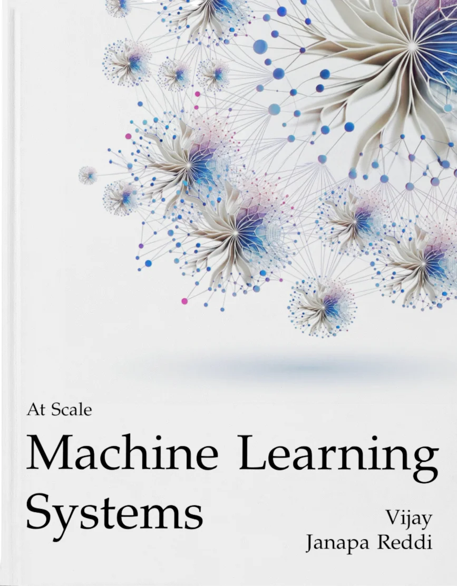

---
format:
  html:
    title-block-style: default
    title: "Machine Learning Systems at Scale"
    date: today
    date-format: long
    doi: "v0.2.0"
    doi-title: "Version"
    author:
      name: Vijay Janapa Reddi
      email: vj@eecs.harvard.edu
      url: https://vijay.seas.harvard.edu
      affiliation: Harvard University
---

::: {.content-visible when-format="html:js"}

```{=html}
<p id="welcome" class="unnumbered" style="font-size: 2rem; font-weight: 600; line-height: 1.2; margin: 1.1rem 0 1rem;">Welcome</p>

<div class="abstract-section">
  <div class="abstract-content">
    <p>Modern machine learning operates at scales that fundamentally change engineering requirements—models too large for single GPUs, services spanning continents, deployments carrying societal responsibilities. At this scale, AI capability is bounded as much by the physics of distribution as by the model itself: every system in this book is engineered under both the computational laws of distributed infrastructure and the statistical laws of learning. This book addresses AI engineering at scale. The treatment follows the lifecycle of a massive-scale system: defining the distributed architecture, building the physical infrastructure fleet, ensuring operational reliability, deploying to global users, and hardening the system for safety and responsibility.</p>
  </div>

  <a href="assets/downloads/Machine-Learning-Systems-Vol2.pdf" target="_blank" class="book-card-link" title="Download PDF">
    <div class="book-card">
      
      <p class="book-title">Machine Learning Systems at Scale</p>
      <p class="book-subtitle">Publisher: The MIT Press (2027)</p>
      <p style="font-size: 0.8em; color: #6c757d; margin-top: 6px; margin-bottom: 0;">📖 Download PDF</p>
    </div>
  </a>
</div>
```

<p id="what-you-will-learn" class="unnumbered" style="font-size: 1.45rem; font-weight: 600; line-height: 1.25; margin: 1.5rem 0 0.75rem;">What You Will Learn</p>

This book extends the foundations into production-scale systems through four parts that follow the fleet stack from bottom to top:

- **Part I: The Fleet**: Build the physical computer. Architect the data-center infrastructure, high-bandwidth network fabrics, and scalable data storage that form the foundation of every distributed ML deployment.
- **Part II: Distributed ML**: Master the algorithms of scale. Learn how to coordinate computation across thousands of devices using parallelism strategies, collective communication primitives, fault tolerance mechanisms, and fleet orchestration.
- **Part III: Deployment at Scale**: Serve the world. Navigate the shift from training to inference, optimize performance across the serving stack, push intelligence to the edge, and manage the operational lifecycle of production fleets.
- **Part IV: The Responsible Fleet**: Harden and govern the system. Address security, robustness, environmental sustainability, and responsible engineering in large-scale operations.

<p id="prerequisites" class="unnumbered" style="font-size: 1.45rem; font-weight: 600; line-height: 1.25; margin: 1.5rem 0 0.75rem;">Prerequisites</p>

This book assumes:

- **Foundational background** in single-machine ML systems, or equivalent experience
- **Programming proficiency** in Python with familiarity in NumPy
- **Mathematics foundations** in linear algebra, calculus, and probability
- Familiarity with distributed systems concepts (networking, parallelism) is helpful for advanced topics

<p id="support-our-mission" class="unnumbered" style="font-size: 1.45rem; font-weight: 600; line-height: 1.25; margin: 1.5rem 0 0.75rem;">Support Our Mission</p>

```{=html}
<div class="support-mission">
  <p><strong>2026 Goal:</strong> Help 100,000 students learn ML Systems. Sponsors like the <a href="https://edgeaifoundation.org/" target="_blank" rel="noopener noreferrer">EDGE AI Foundation</a> match every star with funding that supports learning.</p>

  <div class="support-actions">
    <span class="star-count" id="star-count">Loading...</span>
    <a href="https://github.com/harvard-edge/cs249r_book" target="_blank" rel="noopener" class="github-star-btn">⭐ Star on GitHub</a>
  </div>

  <p class="support-note">
    <a href="https://opencollective.com/mlsysbook" target="_blank" rel="noopener">Support us on Open Collective →</a>
  </p>
</div>
```

```{=html}
<script>
async function fetchGitHubStars() {
  const starElement = document.getElementById('star-count');

  try {
    const response = await fetch('https://api.github.com/repos/harvard-edge/cs249r_book');
    const data = await response.json();
    const starCount = data.stargazers_count;
    const formattedCount = starCount.toLocaleString();
    starElement.textContent = formattedCount;
    starElement.style.opacity = '1';
  } catch (error) {
    console.error('Failed to fetch GitHub stars:', error);
    starElement.textContent = 'Loading...';
    starElement.style.opacity = '1';
  }
}

document.addEventListener('DOMContentLoaded', fetchGitHubStars);
</script>
```

<p id="listen-to-the-ai-podcast" class="unnumbered" style="font-size: 1.45rem; font-weight: 600; line-height: 1.25; margin: 1.5rem 0 0.75rem;">Listen to the AI Podcast</p>

```{=html}
<div class="podcast-section">
  <p>
    This short podcast, created with Google's Notebook LM and inspired by insights from our <a href="https://web.eng.fiu.edu/gaquan/Papers/ESWEEK24Papers/CPS-Proceedings/pdfs/CODES-ISSS/563900a043/563900a043.pdf" target="_blank" rel="noopener">IEEE education viewpoint paper</a>, offers an accessible overview of the book's key ideas and themes.
  </p>
  <audio controls="controls">
    <source src="../../assets/media/notebooklm_podcast_mlsysbookai.mp3" type="audio/mpeg" />
    Your browser does not support the audio element.
  </audio>
</div>
```

<p id="want-to-help-out" class="unnumbered" style="font-size: 1.45rem; font-weight: 600; line-height: 1.25; margin: 1.5rem 0 0.75rem;">Want to Help Out?</p>

::: {.content-visible when-format="html"}
This is a collaborative project, and your input matters. If you would like to contribute, check out our [contribution guidelines](https://github.com/harvard-edge/cs249r_book/blob/main/book/docs/CONTRIBUTING.md). Feedback, corrections, and new ideas are welcome. Simply file a GitHub [issue](https://github.com/harvard-edge/cs249r_book/issues).
:::

::: {.content-visible when-format="pdf"}
This is a collaborative project, and your input matters. Contributions follow the project contribution guidelines; feedback, corrections, and new ideas are welcome through the GitHub issue tracker at the book's repository (`harvard-edge/cs249r_book`).
:::

:::
