# Inference at Scale {#sec-inference-scale}

::: {layout-narrow}
::: {.column-margin}

\chapterminitoc

:::

\noindent
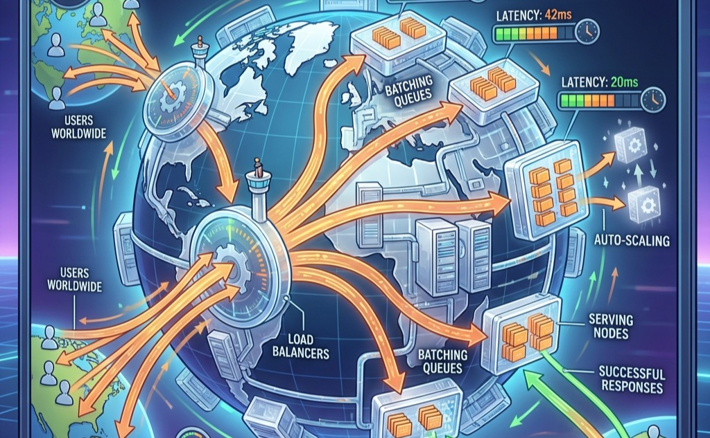{fig-alt="Distributed inference and model serving at scale."}

:::

## Purpose {.unnumbered}

\begin{marginfigure}
\mlfleetstack{25}{35}{100}{10}
\end{marginfigure}

_Why does inference cost eventually dwarf training cost, and what does this mean for system design?_

Training a model is a one-time expense; serving it is perpetual. A model trained once for millions of dollars may serve billions of requests over its lifetime, and every request consumes compute, memory, network, and energy budget. The serving cost dominance law\index{Serving Cost Dominance Law} (Principle \ref{pri-serving-cost-dominance}) captures this economic reality: for a successful production model, ongoing inference operating expense (OpEx) can exceed the one-time training capital expenditure (CapEx) by orders of magnitude. That cost structure changes the architecture: optimizations that shave milliseconds from inference latency or percentage points from GPU utilization compound across billions of requests into substantial savings or costs. Performance engineering supplied the local toolkit -- fusion, precision, compilation, and algorithmic changes such as speculative decoding -- and this chapter applies those tools at serving scale, where batching, sharding, routing, autoscaling, and isolation must preserve strict latency budgets under live traffic. Reliability requirements intensify as well, because downtime during serving means lost revenue and broken user experiences, not merely delayed experiments. Inference at scale is where ML systems succeed or fail economically.

::: {.content-visible when-format="pdf"}

\newpage

:::

::: {.callout-learning-objectives}

- Quantify why serving cost dominates training cost over a model's lifetime using the total cost of serving equation
- Design batching strategies for each model class: static batching for vision, continuous batching for LLMs, feature-parallel batching for recommenders
- Apply the serving hierarchy framework (request, replica, service, platform) to systematically identify and resolve inference bottlenecks at each level
- Compare model sharding strategies (tensor parallelism, pipeline parallelism, expert parallelism, embedding sharding) by their communication patterns and latency-memory tradeoffs
- Analyze load balancing algorithms using queuing theory to explain why power-of-two-choices achieves exponentially better performance than random assignment
- Identify KV-cache memory challenges in LLM serving and explain how continuous batching and memory management sustain high GPU utilization
- Design autoscaling policies that account for GPU cold start latency and balance cost optimization with SLO guarantees

:::

```{python}
#| echo: false
from mlsysim import *
from mlsysim.core.constants import *
#| label: chapter-start
# ┌─────────────────────────────────────────────────────────────────────────────
# │ CHAPTER START
# ├─────────────────────────────────────────────────────────────────────────────
# │ Context: Chapter initialization and global imports
# │
# │ Why: Registers this chapter with the mlsys registry and provides shared
# │      imports for all subsequent calculation cells.
# │
# │ Imports: mlsysim.registry, mlsysim.constants, mlsysim.book
# │ Exports: (none)
# └─────────────────────────────────────────────────────────────────────────────
from mlsysim.fmt import fmt, check
```

```{python}
#| echo: false
#| label: inference-setup
# ┌─────────────────────────────────────────────────────────────────────────────
# │ INFERENCE CHAPTER SETUP (LEGO)
# ├─────────────────────────────────────────────────────────────────────────────
# │ Context: @sec-inference-scale—initial hardware reference values
# │
# │ Goal: Establish H100 and A100 memory/bandwidth for the 'Memory Exhaustion'
# │       section and initial footnotes.
# │ Show: "80" GB, "3.35" TB/s, etc.
# │ How: pulling constants from mlsysim.core.constants.
# │
# │ Imports: mlsysim.core.constants (Hardware.Cloud.H100.memory.capacity, Hardware.Cloud.H100.memory.bandwidth, Hardware.Cloud.A100.memory.bandwidth,
# │          Hardware.Cloud.H100.nvlink.bandwidth, GiB, GB, TB, second)
# │ Exports: InferenceSetup.h100_mem_gb_str, InferenceSetup.h100_mem_bw_tb_per_s_str,
# │          InferenceSetup.a100_mem_bw_tb_per_s_str, InferenceSetup.nvlink_h100_gb_per_s_str
# └─────────────────────────────────────────────────────────────────────────────
from mlsysim.fmt import check, fmt_bandwidth, fmt_memory_capacity, fmt_qty_int

class InferenceSetup:
    """Namespace for localized inference hardware reference values."""

    # ┌── 1. LOAD (Constants) ──────────────────────────────────────────────
    mem_h_h100 = Hardware.Cloud.H100.memory.capacity
    bw_h_h100 = Hardware.Cloud.H100.memory.bandwidth
    bw_a100 = Hardware.Cloud.A100.memory.bandwidth
    nvlink = Hardware.Cloud.H100.nvlink.bandwidth

    # ┌── 2. EXECUTE (The Compute) ────────────────────────────────────────
    h100_mem = mem_h_h100
    h100_bw = bw_h_h100
    a100_bw = bw_a100

    # ┌── 3. GUARD (Invariants) ──────────────────────────────────────────
    check(h100_bw > a100_bw, "H100 bandwidth should exceed A100 bandwidth")

    # ┌── 4. OUTPUT (Formatting) ──────────────────────────────────────────────
    h100_mem_gb_str = fmt_memory_capacity(h100_mem, unit=GiB, precision=0, commas=False)
    h100_mem_bw_tb_per_s_str = fmt_bandwidth(h100_bw, unit=TB / second, precision=2, commas=False)
    a100_mem_bw_tb_per_s_str = fmt_bandwidth(a100_bw, unit=TB / second, precision=1, commas=False)
    nvlink_h100_gb_per_s_str = fmt_bandwidth(nvlink, unit=GB / second, precision=0, commas=False)
```

## The Economics and Architecture of Inference {#sec-inference-scale-scaling-inference-beyond-single-machines-54e6}

Imagine a language model that costs \$5 million to train over two months. Once deployed to a global user base serving thousands of queries per second, that same model burns through \$5 million in inference compute every single week. The economics of inference force a radical architectural shift: we are no longer optimizing a temporary batch job; we are operating a perpetual, latency-sensitive factory.

@Sec-performance-engineering established how to maximize throughput on individual forward passes through operator fusion, precision engineering, and graph compilation. The next challenge emerges when a single optimized model must serve thousands of concurrent users across a globally distributed fleet. Single-machine inference optimization, including batching, caching, model optimization, and hardware acceleration, provides the building blocks. Distributed approaches become necessary when those techniques reach their limits.

Distributed inference systems must solve problems that do not exist at single-machine scale. Load balancing[^fn-load-balancing-inference] becomes critical when requests must be distributed across hundreds of GPU instances while maintaining latency guarantees. Request routing must account for model-specific characteristics: recommendation systems with trillion-parameter embedding tables require different placement strategies than large language models that generate responses token by token. Autoscaling must anticipate demand fluctuations that can change request volume by orders of magnitude within minutes while maintaining latency bounds users expect.

[^fn-load-balancing-inference]: **Load Balancing (Inference)**: GPU inference requests range from 10 ms to 30+ seconds with high variance, unlike web requests that complete in uniform milliseconds. This variance invalidates round-robin and random assignment, forcing queue-depth-aware routing strategies that add monitoring overhead but prevent tail-latency blowups across heterogeneous GPU fleets. \index{Load Balancing!inference}

The economics of inference at scale differ fundamentally from training economics. Training costs are dominated by compute time and can be amortized over the lifetime of the resulting model. Inference costs are directly tied to user traffic and revenue. An e-commerce recommendation system might serve millions of requests per second during peak shopping periods, with each request contributing directly to potential revenue. The cost of overprovisioning during quiet periods or underprovisioning during peaks translates immediately to business impact. Inference efficiency becomes a first-order concern in ways that training efficiency rarely achieves.

The remainder of this chapter develops the principles and techniques for building inference systems that operate efficiently, reliably, and economically at scale: when distributed inference becomes necessary, how to architect systems that maintain latency bounds under varying load, and how to optimize resource utilization so that serving cost does not erode the value the model creates.

### When single-machine serving is insufficient {#sec-inference-scale-singlemachine-serving-insufficient-3f13}

Three distinct signals indicate when distributed inference becomes necessary rather than merely optional. @Tbl-distribution-triggers categorizes these triggers by constraint type and corresponding strategy.

The first signal is memory exhaustion, which occurs when model parameters, key-value caches, or embedding tables exceed single-device capacity. A single NVIDIA H100 GPU provides `{python} InferenceSetup.h100_mem_gb_str` of HBM3[^fn-hbm3-bandwidth] memory; @sec-appdx-fleet-assumption-provenance records the provenance of this capacity figure and the other canonical hardware constants used throughout the analysis that follows. GPT-4 class models with hundreds of billions of parameters require 200–400 GB just for weights in FP16 precision, forcing distribution across multiple GPUs regardless of throughput requirements. Recommendation systems with trillion-parameter embedding tables face similar constraints: Meta's Deep Learning Recommendation Model (DLRM)[^fn-dlrm-scale] model stores embedding tables that require multiple terabytes of memory.

[^fn-hbm3-bandwidth]: **HBM3 (High Bandwidth Memory 3)**: 3D-stacked DRAM delivering `{python} InferenceSetup.h100_mem_bw_tb_per_s_str` on the H100 vs. `{python} InferenceSetup.a100_mem_bw_tb_per_s_str` for HBM2e on the A100. Because large language model (LLM) decode is memory-bandwidth-bound, this improvement translates directly into higher tokens-per-second and larger feasible batch sizes, making HBM generation the single most consequential variable in inference cost-per-token. \index{HBM3!bandwidth}

[^fn-dlrm-scale]: **DLRM (Deep Learning Recommendation Model)**: Meta's 2019 reference architecture separates dense features—GPU-bound multilayer perceptrons (MLPs)—from sparse features (CPU-bound embedding lookups), creating a hybrid serving topology. Embedding tables can exceed 100 TB, making DLRM memory-capacity-bound rather than compute-bound and forcing distribution strategies fundamentally different from LLM model parallelism. \index{DLRM!scale}

Beyond memory constraints, throughput limitations emerge when request volume exceeds single-machine capacity even with optimal batching. Consider a recommendation system serving 100,000 queries per second with a 10 ms latency budget. If single-machine throughput peaks at 10,000 QPS, no amount of optimization on that machine can satisfy demand. Horizontal scaling across multiple replicas becomes mandatory.

Finally, strict latency requirements drive distribution when model execution time exceeds latency budgets even at batch size one. Large language models generating responses token by token face this constraint acutely. A 70-billion parameter model requires approximately 140 GB of memory in FP16, exceeding a single 80 GB H100-class GPU before KV cache is considered. Even when quantization or larger-memory hardware makes a single-replica configuration possible, decode throughput is often limited by memory bandwidth. Sharding the model across multiple GPUs enables parallel computation that reduces time-to-first-token below acceptable thresholds.

| **Constraint**                                                    | **Single-Machine Limit** | **Example Workload** |  **Distribution Strategy**  |
|:------------------------------------------------------------------|:------------------------:|:--------------------:|:---------------------------:|
| **Memory**                                                        |       80 GB (H100)       |   GPT-4 (400 GB+)    | Tensor/pipeline parallelism |
| **Throughput**\index{Distributed Inference!throughput constraint} |    ~10K QPS (vision)     |   100K QPS RecSys    |    Horizontal replication   |
| **Latency**\index{Distributed Inference!latency constraint}       |   Model execution time   |   500 ms LLM TTFT    |        Model sharding       |

: **Triggers for Distributed Inference**: Each constraint type indicates different distribution strategies. Memory constraints require model sharding; throughput constraints require replication; latency constraints may require either depending on whether the bottleneck is compute or memory bandwidth. {#tbl-distribution-triggers}

The perceived responsiveness of interactive systems depends on both **Time to First Token (TTFT)**\index{Time to First Token}\index{TTFT}[^fn-ttft-tpot] and **Time Per Output Token (TPOT)**\index{Time Per Output Token}\index{TPOT}.

[^fn-ttft-tpot]: **TTFT vs. TPOT**\index{TTFT!vs. tpot}: **Time to First Token** (prefill) determines the perceived responsiveness; **Time Per Output Token** (decode) determines the perceived reading speed. Humans read at roughly 5--10 tokens/sec; TPOT above roughly 100--200 ms can begin to feel slower than natural reading, while many products target lower TPOT for smooth streaming. This dual service level agreement (SLA) requirement forces schedulers to prioritize decode tokens over new prefill prompts. \index{TTFT!responsiveness}\index{TPOT!reading speed}

::: {#chk-inference-distribution-strategy-selection .callout-checkpoint title="Distribution strategy selection"}

Verify your understanding of when to move from single-machine to distributed inference:

- [ ] A 13B model (26 GB weights) fits on a single A100. If the throughput requirements double, should you use model sharding or horizontal replication?
- [ ] For a real-time speech-to-text service, the primary bottleneck is **inter-token latency**. Does adding more GPUs through data-parallel replication reduce this latency?
- [ ] Why is **Model Sharding** mandatory for a 175B model on 80 GB GPUs, regardless of the request volume?
- [ ] Identify the trade-off: what distribution overheads might make sharding across machines worse than staying within a single node?

:::

### The fundamental inversion: Training vs. inference {#sec-inference-scale-fundamental-inversion-training-vs-inference-8834}

The contrast between training and inference optimization extends beyond the basic throughput-vs.-latency distinction. Training optimizes for samples processed per hour and tolerates latency variations. Inference optimizes for response time and must meet strict latency bounds. At scale, this inversion manifests in system architecture, resource allocation, and operational priorities. @Tbl-training-inference-inversion details six key system aspects where these differences emerge.

| **Aspect**              |    **Distributed Training**   |  **Distributed Inference**   |
|:------------------------|:-----------------------------:|:----------------------------:|
| **Primary metric**      |   Throughput (samples/hour)   |       Latency (P99 ms)       |
| **Acceptable variance** |             Hours             |         Milliseconds         |
| **State management**    |     Checkpoints (periodic)    |  Session state (continuous)  |
| **Batch formation**     |       Large, controlled       |   Request-driven, variable   |
| **Failure tolerance**   |    Restart from checkpoint    | Redirect without user impact |
| **Cost structure**      | Fixed duration, variable rate | Variable duration, fixed SLO |

: **Training vs. Inference System Requirements**: The fundamental inversion from throughput to latency optimization ripples through every aspect of system design. {#tbl-training-inference-inversion}

Training tolerates substantial latency variance because the optimization target is aggregate progress over hours or days. A training iteration that takes 2 seconds instead of the usual 1 second represents acceptable variation. An inference request that takes 2 seconds instead of 100 milliseconds represents catastrophic failure, potentially causing user abandonment or cascading timeouts in dependent services.

State management differs fundamentally. Training maintains model state (parameters, optimizer states) that evolves gradually and can be captured in periodic checkpoints. Inference often maintains session state (conversation history, key-value caches, user context) that must be preserved across requests and cannot tolerate the staleness that checkpoint-based recovery would introduce.

Failure handling diverges correspondingly. Training failures trigger checkpoint restoration and continuation, with minutes of lost progress being acceptable. Inference failures must be invisible to users. Requests redirect to healthy replicas, degraded results substitute for unavailable models, and SLOs must be maintained despite infrastructure instability.

### The serving tax: Overhead of distribution {#sec-inference-scale-serving-tax-overhead-distribution-5ef3}

Distributing inference across multiple machines introduces overhead absent from single-machine serving. This "serving tax"\index{Inference!distribution tax} must be understood and budgeted within latency constraints.

Network communication adds latency for every cross-machine interaction. Within a data center, network round-trip times range from 50–500 microseconds depending on topology and congestion. For model sharding that requires synchronization between GPUs on different machines, each synchronization point adds this overhead. A model sharded across 8 machines with 4 synchronization points per inference adds 200 microseconds to 2 milliseconds of network latency. @Sec-appdx-comm-foundations-alpha-beta develops the $\alpha$-$\beta$ model that decomposes each such transfer into a fixed startup latency plus a bandwidth-dependent term, giving the quantitative framework for budgeting these synchronization costs against a latency SLO.

Serialization overhead compounds the problem by converting in-memory tensors to network-transmittable formats. Traditional serializers like Protocol Buffers, JSON, and Python's `pickle` perform a parse-allocate-copy cycle on every transfer, and a 1 GB activation tensor takes approximately 100 milliseconds to serialize and deserialize through such formats. Zero-copy alternatives like FlatBuffers and Cap'n Proto[^fn-serialization-zerocopy] sidestep most of this cost by accessing wire-format data in place, but they impose stricter schema layout requirements that not every production stack adopts.

[^fn-serialization-zerocopy]: **Zero-Copy Serialization**\index{Zero-Copy!serialization}: FlatBuffers and Cap'n Proto access wire-format data in place, eliminating the parse-allocate-copy cycle of Protocol Buffers or JavaScript Object Notation (JSON). For distributed inference with large activation tensors, this drops per-hop serialization overhead from milliseconds to microseconds, reclaiming latency budget that would otherwise consume 5--10 percent of a tight SLO. \index{Serialization!zero-copy}

Load balancer latency adds another layer. Requests must be routed to appropriate replicas, which requires examining request metadata, consulting routing tables, and forwarding to selected backends. Well-optimized load balancers add 100–500 microseconds; poorly configured ones can add milliseconds.

Coordination overhead emerges when requests require fan-out to multiple services. A recommendation system that queries a user model, item model, and ranking model in parallel must coordinate these queries and aggregate results. The coordination logic itself consumes CPU cycles and introduces latency variation.

The total serving tax often consumes 10–30 percent of the latency budget in distributed systems, as @eq-serving-tax shows:

$$T_{\text{total}} = T_{\text{compute}} + T_{\text{network}} + T_{\text{serialization}} + T_{\text{coordination}} + T_{\text{queuing}}$$ {#eq-serving-tax}

Minimizing this tax requires co-locating communicating components, using high-bandwidth interconnects, and designing communication patterns that minimize round trips.

### Serving cost dominates training cost {#sec-inference-scale-serving-cost-dominates-training-cost-576a}

::: {.column-margin}
{width="100%" fig-alt="Two horizontal bars comparing lifetime cost terms. The serving OpEx bar is wide and shaded orange, dominating; the training CapEx bar is a narrow gray sliver."}

*Lifetime serving cost dwarfs one-time training.*
:::

The serving tax quantified above consumes a fraction of the latency budget per request. The true economic impact of inference emerges when we consider cost over a model's entire operational lifetime. Serving cost typically dominates training cost by orders of magnitude because training is a *one-time capital expenditure* (CapEx) while serving is a *continuous operational expenditure* (OpEx) that scales with user growth. A quick cost calculation makes the multiplier concrete.

```{python}
#| echo: false
#| label: serving-cost-multiplier-simple
from mlsysim.fmt import fmt_int, fmt_usd, check, fmt, fmt_percent

class ServingCostSimple:
    # ┌── 1. LOAD ──────────────────────────────────────────
    training_cost = 2_000_000
    dau = 1_000_000
    reqs_per_day = 50
    days_per_year = DAYS_PER_YEAR
    cost_per_request = 0.001
    efficiency_gain = 0.10
    # ┌── 2. EXECUTE ───────────────────────────────────────
    annual_reqs = dau * reqs_per_day * days_per_year
    annual_reqs_b = annual_reqs / BILLION
    annual_serving_cost = annual_reqs * cost_per_request
    serving_training_ratio = annual_serving_cost / training_cost
    efficiency_savings = annual_serving_cost * efficiency_gain
    # ┌── 3. GUARD ─────────────────────────────────────────
    check(annual_reqs > 10e9, "Should be >10B annual requests")
    check(round(serving_training_ratio) == 9, "Serving/training ratio should round to 9x")
    # ┌── 4. OUTPUT ────────────────────────────────────────
    annual_reqs_b_str = fmt(annual_reqs_b, precision=2, commas=False)
    annual_serving_cost_str = fmt_usd(annual_serving_cost)
    serving_training_ratio_mult_str = fmt_multiple(serving_training_ratio, precision=1, commas=False)
    efficiency_savings_str = fmt_usd(efficiency_savings, precision=1, commas=False, scale="M")
    training_cost_str = fmt_usd(training_cost)
    dau_str = fmt_int(dau)
    reqs_per_day_str = fmt_int(reqs_per_day, commas=False)
    cost_per_request_usd_str = fmt_usd(
        cost_per_request,
        precision=3,
        commas=False,
        per="request",
    )
    efficiency_gain_pct_str = fmt_percent(round(efficiency_gain * 100)/100, precision=0, commas=False, style='prose')
```

::: {#nbk-inference-serving-cost-multiplier .callout-notebook title="The serving cost multiplier"}

**Problem**: A team has spent `{python} ServingCostSimple.training_cost_str` training a 70B parameter model and now serves it to `{python} ServingCostSimple.dau_str` daily active users (DAU), each making `{python} ServingCostSimple.reqs_per_day_str` requests/day. Is training or serving the dominant cost over 1 year?

**Math**:

1.  **Training Cost**\index{Training Cost}: `{python} ServingCostSimple.training_cost_str` (One-time).
2.  **Inference Volume**\index{Inference!volume}: $10^6 \text{ users} \times 50 \text{ reqs} \times 365 \text{ days} \approx$ `{python} ServingCostSimple.annual_reqs_b_str` Billion requests/year.
3.  **Cost per Request**\index{Serving Cost!cost per request}: Assume a 70B model on H100 costs $\approx$ `{python} ServingCostSimple.cost_per_request_usd_str` (input + output).
4.  **Annual Serving Cost**\index{Serving Cost!annual serving cost}: `{python} ServingCostSimple.annual_reqs_b_str` billion requests $\times$ `{python} ServingCostSimple.cost_per_request_usd_str` = `{python} ServingCostSimple.annual_serving_cost_str`.

**Systems insight**: Serving costs `{python} ServingCostSimple.serving_training_ratio_mult_str` more than training in just the first year. A `{python} ServingCostSimple.efficiency_gain_pct_str` serving-cost or latency-linked efficiency improvement saves about `{python} ServingCostSimple.efficiency_savings_str` in the first year, nearly paying for the original training run.

:::

The total cost of operating a model comprises training cost (a one-time expense) and serving cost (an ongoing expense), as @eq-total-cost shows:

$$C_{\text{total}} = C_{\text{training}} + C_{\text{serving}} \times T_{\text{deployment}} \times Q_{\text{rate}}$$ {#eq-total-cost}

where $C_{\text{training}}$ is the one-time cost to train the model, $C_{\text{serving}}$ is the cost per query served, $T_{\text{deployment}}$ is the deployment duration in appropriate time units, and $Q_{\text{rate}}$ is the query rate.

```{python}
#| echo: false
#| label: inference-economics-refactor
# ┌─────────────────────────────────────────────────────────────────────────────
# │ INFERENCE ECONOMICS AND TCO (LEGO)
# ├─────────────────────────────────────────────────────────────────────────────
# │ Context: @sec-inference-scale-serving-cost-dominates-training-cost-576a—training vs serving costs
# │
# │ Goal: Quantify the dominance of serving cost over training cost.
# │ Show: ~500x leverage for serving optimization in high-traffic RecSys.
# │ How: Lifetime_cost = Traffic * Duration * Cost_per_query.
# │
# │ Imports: mlsysim.core.constants (BILLION, SEC_PER_DAY, SEC_PER_YEAR, THOUSAND, MILLION)
# │ Exports: InferenceEconomics.lifetime_queries_latex_math,
# │          InferenceEconomics.serving_cost_total_str,
# │          InferenceEconomics.training_cost_total_str,
# │          InferenceEconomics.leverage_ratio_mult_str,
# │          InferenceEconomics.qps_str,
# │          InferenceEconomics.serve_duration_days_str,
# │          InferenceEconomics.cost_per_million_queries_usd_str
# └─────────────────────────────────────────────────────────────────────────────
import math
from mlsysim import Infrastructure
from mlsysim.fmt import fmt_int, fmt_usd, fmt, fmt_count, fmt_rate, check, fmt_math, MarkdownStr
from mlsysim.core.units import USD, hour

# ┌── LEGO ───────────────────────────────────────────────
class InferenceEconomics:
    """Namespace for inference vs training cost analysis."""

    # ┌── 1. LOAD (Constants) ──────────────────────────────────────────────
    # Training
    n_gpu_hours = 1000
    cost_per_gpu_hour = Infrastructure.Pricing.Cloud.GpuTrainingUtilityScenarioPerHour.rate.to(USD / hour).magnitude
    engineering_multiplier = 3.0

    # Serving
    qps = 10000
    serve_duration_days = 730 # 2 years
    cost_per_query = 1e-5 # $10 per million

    # ┌── 2. EXECUTE (The Compute) ────────────────────────────────────────
    training_hardware_cost = n_gpu_hours * cost_per_gpu_hour
    training_total_cost = training_hardware_cost * (1 + engineering_multiplier)

    lifetime_queries_val = qps * SEC_PER_DAY * serve_duration_days
    serving_total_cost_val = lifetime_queries_val * cost_per_query

    leverage_ratio = serving_total_cost_val/training_total_cost

    # ┌── 3. GUARD (Invariants) ──────────────────────────────────────────
    check(leverage_ratio > 100, f"Leverage ratio ({leverage_ratio:.1f}) should be > 100x")

    # ┌── 4. OUTPUT (Formatting) ─────────────────────────────────────────────
    # LaTeX-safe form: "6.31e+11" breaks as 6\.31e\+11; use \times 10^{11}.
    # Wrap in fmt_math() so Quarto re-parses the inline {python} substitution
    # through the markdown pipeline; otherwise the literal "$...$" bypasses
    # Pandoc's math parser and renders as raw text.
    if lifetime_queries_val >= 1e9:
        exp = int(math.floor(math.log10(lifetime_queries_val)))
        mantissa = lifetime_queries_val / 10**exp
        lifetime_queries_latex_math = fmt_math(
            f"{mantissa:.2f} \\times 10^{{{exp}}}"
        )
    else:
        lifetime_queries_latex_math = fmt_math(f"{lifetime_queries_val:,.0f}")
    serving_cost_total_str = fmt_usd(serving_total_cost_val)
    training_cost_total_str = fmt_usd(training_total_cost)
    leverage_ratio_mult_str = fmt_multiple(leverage_ratio, precision=1, commas=False)
    qps_str = fmt_rate(qps, "QPS")
    serve_duration_days_str = fmt_int(serve_duration_days, commas=False)
    cost_per_million_queries_usd_str = fmt_usd(
        cost_per_query * MILLION,
        commas=False,
        per="million queries",
    )
    n_gpu_hours_str = fmt_count(n_gpu_hours, label="GPU-hour", plural_label="GPU-hours")
    cost_per_gpu_hour_usd_str = fmt_usd(
        cost_per_gpu_hour,
        commas=False,
        per="GPU-hour",
    )
    engineering_mult_str = fmt_multiple(engineering_multiplier, commas=False, precision=0)
```

The same leverage holds across application categories with different cost structures. A recommendation model (DLRM) trained for `{python} InferenceEconomics.training_cost_total_str` (`{python} InferenceEconomics.n_gpu_hours_str` of hardware at `{python} InferenceEconomics.cost_per_gpu_hour_usd_str`, amplified by a `{python} InferenceEconomics.engineering_mult_str` engineering overhead for data and experimentation) and served at `{python} InferenceEconomics.qps_str` for `{python} InferenceEconomics.serve_duration_days_str` days accumulates `{python} InferenceEconomics.lifetime_queries_latex_math` lifetime queries, which at `{python} InferenceEconomics.cost_per_million_queries_usd_str` costs `{python} InferenceEconomics.serving_cost_total_str` to serve—a `{python} InferenceEconomics.leverage_ratio_mult_str` leverage on serving optimization over training optimization. The cost dominance ratio varies by application. @Tbl-cost-ratios quantifies this disparity:

| **Application**               | **Training Cost** | **Annual Serving Cost** |     **Ratio**     |
|:------------------------------|:-----------------:|:-----------------------:|:-----------------:|
| **Recommendation (high QPS)** |   \$10K--\$100K   |       \$1M--\$10M       | 100--1000$\times$ |
| **Search ranking**            |    \$100K--\$1M   |      \$10M--\$100M      | 100--1000$\times$ |
| **LLM API**                   |    \$1M--\$100M   |       \$10M--\$1B       |  10--100$\times$  |
| **Internal analytics**        |    \$1K--\$10K    |      \$10K--\$100K      |  10--100$\times$  |

: **Training vs. Serving Cost Ratios**: High-QPS applications like recommendation systems show the most extreme cost dominance of serving over training. {#tbl-cost-ratios}

The cost structure motivates the optimization techniques throughout this chapter: every percentage point of serving efficiency improvement yields ongoing cost reduction over the model's operational lifetime. @Fig-serving-cost-curve illustrates why optimization matters by showing how the gap between naive and optimized serving determines whether an inference service is profitable or hemorrhaging money.

::: {#fig-serving-cost-curve fig-env="figure" fig-pos="htb" fig-cap="**The Serving Cost Curve**: Cost per 1000 tokens decreases with scale and optimization. Single-GPU serving reaches break-even only at very high volume. Multi-GPU batching breaks even at moderate volume. Fully optimized serving (INT4, continuous batching, speculative decoding) achieves profitability at much lower volumes, fundamentally changing the economics of inference." fig-alt="Log-log plot of cost per 1000 tokens vs. daily volume for single-GPU, multi-GPU, and optimized serving with break-even line."}

```{python}
#| echo: false
# ┌─────────────────────────────────────────────────────────────────────────────
# │ SERVING COST CURVE (FIGURE)
# ├─────────────────────────────────────────────────────────────────────────────
# │ Context: @fig-serving-cost-curve—inference economics
# │
# │ Goal: Plot cost per 1000 tokens vs daily volume for single-GPU, multi-GPU,
# │       optimized; show break-even vs typical pricing.
# │ Show: Log-log; three curves; break-even line; shaded regions.
# │ How: Power-law cost models; matplotlib.
# │
# │ Imports: matplotlib.pyplot (plt), numpy (np)
# │ Exports: (figure only, no prose variables)
# └─────────────────────────────────────────────────────────────────────────────
# ┌── 1. CANVAS ────────────────────────────────────────────────────────────────
# │ Plot cost per 1000 tokens vs daily volume for single-GPU, multi-GPU,
import matplotlib.pyplot as plt
import numpy as np

plt.style.use('seaborn-v0_8-whitegrid')
fig, ax = plt.subplots(figsize=(9, 5))

# ┌── 2. ARRAYS ────────────────────────────────────────────────────────────────
volume = np.logspace(3, 8, 200)
typical_pricing = 0.05

cost_single_gpu = 0.15 * (1e6 / volume)**0.3
cost_multi_gpu = 0.08 * (1e6 / volume)**0.45
cost_optimized = 0.02 * (1e6 / volume)**0.55

# ┌── 3. RENDER ────────────────────────────────────────────────────────────────
ax.plot(volume, cost_single_gpu, color='#CB202D', linewidth=2.5, label='Single-GPU (naive)')
ax.plot(volume, cost_multi_gpu, color='#E67817', linewidth=2.5, label='Multi-GPU batching')
ax.plot(volume, cost_optimized, color='#008F45', linewidth=2.5, label='Fully optimized (INT4, continuous batching)')

ax.axhline(y=typical_pricing, color='#333333', linestyle='--', linewidth=1.5, alpha=0.8)

# ┌── 4. DECORATE ──────────────────────────────────────────────────────────────
ax.text(
    2e3, typical_pricing * 1.14,
    "Typical pricing (break-even)",
    fontsize=9,
    ha='left',
    va='bottom',
    bbox=dict(facecolor='white', alpha=0.7, edgecolor='none')
)
ax.fill_between(volume, 0, typical_pricing, where=(cost_single_gpu > typical_pricing), alpha=0.1, color='#CB202D')
ax.fill_between(volume, 0, typical_pricing, where=(cost_optimized < typical_pricing), alpha=0.1, color='#008F45')

ax.set_xscale('log')
ax.set_yscale('log')
ax.set_xlabel('Daily Request Volume', fontsize=11, fontweight='bold')
ax.set_ylabel('Cost per 1000 Tokens ($)', fontsize=11, fontweight='bold')
ax.set_xlim(1e3, 1e8)
ax.legend(
    loc='upper right',
    fontsize=8,
    frameon=True,
    facecolor='white',
    framealpha=0.95,
    edgecolor='gray',
    fancybox=True,
    borderpad=0.6
)
ax.grid(True, which='both', alpha=0.3)
plt.tight_layout()
plt.show()
```

:::

The cost ratios in @tbl-cost-ratios tell a *static* story, but the *dynamics* of cost accumulation reveal an even more striking pattern. @Fig-serving-cost-crossover plots cumulative total deployment cost over a 36-month window for three representative scenarios: a small model with low traffic, a 70B LLM serving one million daily active users, and a recommendation system serving 100 million users. The vertical crossover markers show when cumulative serving spend equals the original training cost; because the plotted curves include both training and serving, the total-cost curve is at roughly twice the training baseline at that marker. For recommendation systems, serving dominates within days; for high-traffic LLMs, within roughly six weeks. Only small models with expensive training and low traffic see training cost dominate for extended periods. This temporal view reinforces why inference optimization deserves early engineering attention at production scale. For generative LLM services, serving-specific designs can translate directly into throughput, cost, and power gains [@patel2024].

::: {#fig-serving-cost-crossover fig-env="figure" fig-pos="htb" fig-cap="**The Serving Cost Crossover**: Cumulative total deployment cost (initial training plus ongoing serving) for three scenarios. Vertical markers indicate when the serving portion equals the one-time training cost. For high-traffic LLMs, serving cost matches training cost within weeks. For recommendation systems at 100M daily active users, serving dominates within days. Only low-traffic, expensive-to-train models see training cost dominate for extended periods." fig-alt="Area chart showing cumulative total deployment cost over 36 months for three scenarios with crossover points marked"}

```{python}
#| echo: false
# ┌─────────────────────────────────────────────────────────────────────────────
# │ SERVING COST CROSSOVER (FIGURE)
# ├─────────────────────────────────────────────────────────────────────────────
# │ Context: @fig-serving-cost-crossover—training vs serving cost dynamics
# │
# │ Goal: Plot cumulative cost over 36 months for three scenarios; show
# │       crossover where serving overtakes training.
# │ Show: Three lines; fill_between; crossover markers.
# │ How: total_cost = train + serve_per_month*months; vertical markers show
# │      where the serving portion equals the one-time training cost.
# │
# │ Imports: numpy (np), matplotlib.pyplot (plt), book.tools.figures.style (book_style)
# │ Exports: (figure only, no prose variables)
# └─────────────────────────────────────────────────────────────────────────────
# ┌── 1. CANVAS ────────────────────────────────────────────────────────────────
# │ Plot cumulative cost over 36 months for three scenarios; show
import numpy as np
import matplotlib.pyplot as plt
from book.tools.figures import style as book_style
fig, ax, COLORS, plt = book_style.setup_plot(figsize=(9, 6))

# ┌── 2. ARRAYS ────────────────────────────────────────────────────────────────
months = np.linspace(0, 36, 500)

# Scenario A: Small model, low traffic
train_a = 0.05  # $50K = $0.05M
serve_per_month_a = 0.005  # $5K/month = $0.005M
cum_a_train = np.full_like(months, train_a)
cum_a_serve = train_a + serve_per_month_a * months
crossover_a = train_a/serve_per_month_a  # 10 months

# Scenario B: 70B LLM, 1M DAU
train_b = 2.0  # $2M
serve_per_month_b = 1.5  # $1.5M/month
cum_b_train = np.full_like(months, train_b)
cum_b_serve = train_b + serve_per_month_b * months
crossover_b = train_b/serve_per_month_b  # ~1.33 months

# Scenario C: RecSys, 100M DAU
train_c = 0.012  # $12K = $0.012M
serve_per_month_c = 0.250  # $250K/month = $0.250M
cum_c_train = np.full_like(months, train_c)
cum_c_serve = train_c + serve_per_month_c * months
crossover_c = train_c/serve_per_month_c  # ~0.048 months

# Plot cumulative total cost (training + serving) for each scenario

# ┌── 3. RENDER ────────────────────────────────────────────────────────────────
ax.plot(months, cum_a_serve, color=COLORS["BlueLine"], linewidth=2.5,
        label="A: Small model, low traffic ($50K train, $5K/mo serve)")
ax.plot(months, cum_b_serve, color=COLORS["OrangeLine"], linewidth=2.5,
        label="B: 70B LLM, 1M DAU ($2M train, $1.5M/mo serve)")
ax.plot(months, cum_c_serve, color=COLORS["RedLine"], linewidth=2.5,
        label="C: RecSys, 100M DAU ($12K train, $250K/mo serve)")

# Plot training cost baselines (flat lines)
ax.axhline(y=train_a, color=COLORS["BlueLine"], linestyle=":", linewidth=1.0, alpha=0.5)
ax.axhline(y=train_b, color=COLORS["OrangeLine"], linestyle=":", linewidth=1.0, alpha=0.5)

# Fill regions between training baseline and total cost to show serving portion
ax.fill_between(months, train_a, cum_a_serve, alpha=0.10, color=COLORS["BlueLine"])
ax.fill_between(months, train_b, cum_b_serve, alpha=0.10, color=COLORS["OrangeLine"])
ax.fill_between(months, train_c, cum_c_serve, alpha=0.10, color=COLORS["RedLine"])

# Mark crossover points with vertical dashed lines
ax.axvline(x=crossover_a, color=COLORS["BlueLine"], linestyle="--", linewidth=1.0, alpha=0.6)
ax.axvline(x=crossover_b, color=COLORS["OrangeLine"], linestyle="--", linewidth=1.0, alpha=0.6)

# Annotations

# ┌── 4. DECORATE ──────────────────────────────────────────────────────────────
ax.annotate("Crossover: month 10",
            xy=(crossover_a+3, train_a + 0.07), fontsize=8,
            color=COLORS["BlueLine"], fontweight="bold",
            ha="center", va="bottom",
            xytext=(16, 0.25),
            arrowprops=dict(arrowstyle="->",
                            color=COLORS["BlueLine"],
                            lw=0.75))

ax.annotate("LLM: serving exceeds\ntraining in ~6 weeks",
            xy=(5.1, train_b * 5.0), fontsize=8,
            color=COLORS["OrangeLine"], fontweight="bold",
            ha="center", va="top",
            xytext=(6,5),
            arrowprops=dict(arrowstyle="->",
                            color=COLORS["OrangeLine"],
                            lw=0.75))

ax.annotate("RecSys: serving\ndominates within days",
            xy=(5.1, cum_c_serve[71]), fontsize=8,
            color=COLORS["RedLine"], fontweight="bold",
            ha="center", va="bottom",
            xytext=(6, 0.35),
            arrowprops=dict(arrowstyle="->",
                            color=COLORS["RedLine"],
                            lw=0.75))

ax.set_yscale("log")
ax.set_xlabel("Months Since Deployment")
ax.set_ylabel("Cumulative Cost ($M)")
ax.set_xlim(0, 36)
ax.set_ylim(0.005, 100)
plt.legend(
    loc='upper left',
    fontsize=8,
    frameon=True,
    facecolor='white',
    framealpha=0.95,
    edgecolor='gray',
    fancybox=True,
    borderpad=0.6
)
ax.set_title("")

plt.tight_layout()
plt.show()
```

:::

### The inference landscape: Beyond LLMs {#sec-inference-scale-inference-landscape-beyond-llms-9560}

A common misconception frames inference at scale as synonymous with LLM serving. Large language models present distinctive challenges and attract attention, but they represent a small fraction of production inference volume. Appropriate technique selection requires understanding the full inference landscape. By request count at major technology companies, recommendation and ranking workloads\index{Recommendation Systems!request volume} account for 80–90 percent of production inference, vision and image processing\index{Vision Models!request volume} for 5–10 percent, NLP and LLM workloads\index{LLM!request volume} for 1–5 percent (but growing rapidly), and the remainder is divided among fraud detection, ads, and other classification tasks. @Tbl-inference-landscape breaks down these model types, request volumes, and optimization challenges.

Recommendation systems dominate because they serve predictions for every user interaction. Every page load, scroll, or click triggers inference. A user browsing an e-commerce site might generate 100 recommendation requests in a single session. In contrast, LLM queries typically require explicit user action and occur less frequently.

The distribution has direct implications for technique selection. Recommendation systems have driven most production inference innovation: dynamic batching, embedding sharding, feature store architectures, and low-latency serving were all developed primarily for recommendation workloads. LLM-specific techniques like continuous batching and KV cache management address a narrower slice of production inference.

| **Model Type**                   |     **Request Volume**    | **Latency Target** | **Key Challenge** |
|:---------------------------------|:-------------------------:|:------------------:|:-----------------:|
| **Recommendation**               | Very high (80–90 percent) |   &lt;10 ms P99    |  Embedding lookup |
| **Vision (CNN)**                 |  Moderate (5–10 percent)  |     20–100 ms      |  Batch efficiency |
| **LLM**\index{LLM}               |    Lower (1–5 percent)    |     100 ms–10s     |  Memory bandwidth |
| **Speech/Audio**                 |           Lower           |     Real-time      | Sequential decode |
| **Multimodal [@ramesh2021zero]** |          Growing          |       Varies       |  Cross-modal sync |

: **Production Inference Landscape**: Different model types have different volume, latency requirements, and optimization challenges. Technique selection must match the specific workload. {#tbl-inference-landscape}

### The serving hierarchy {#sec-inference-scale-serving-hierarchy-fe8c}

The optimization techniques in this chapter organize into a **serving hierarchy**\index{Serving!hierarchy}, analogous to the memory hierarchy in computer architecture. Each level owns a different bottleneck, so an optimization that helps one level can leave another unchanged. The request level follows one request through preprocessing, batching, caching, and model execution, where the target is the latency a user sees. The replica level looks inside one model instance, where GPU utilization, memory management, kernel efficiency, and model optimization determine how much useful throughput that replica can deliver before it saturates. The service level then works across many replicas of the same model, using load balancing, request routing, and autoscaling to turn individual replicas into aggregate capacity. The platform level works across services and tenants, where resource allocation, multi-tenancy, scheduling, and placement decide whether a shared serving fleet remains efficient without allowing one workload to degrade another.

The hierarchy matters because each level changes a different metric and fails at a different boundary. A related deployment stack appears in @fig-serving-hierarchy, showing how requests pass through edge, routing, and model-serving infrastructure in production.

::: {#fig-serving-hierarchy fig-env="figure" fig-pos="htb" fig-cap="**Serving Deployment Stack**: A three-tier serving stack with cumulative latency budget from top to bottom. Tier 1 (CDN/Edge Cache) handles geographic distribution and cached static responses (SLA <10 ms). Tier 2 (Gateway/Router) handles request routing, rate limiting, and authentication (SLA <50 ms). Tier 3 (Model Serving Cluster) runs GPU workers with autoscaling and continuous batching (SLA <2 s)." fig-alt="Three stacked tiers: Tier 1 CDN/Edge Cache with Edge PoPs (SLA <10 ms); Tier 2 Gateway/Router with Rate Limiter, Auth, and Router (SLA <50 ms); Tier 3 Model Serving Cluster with GPU workers and autoscaler (SLA <2 s)."}
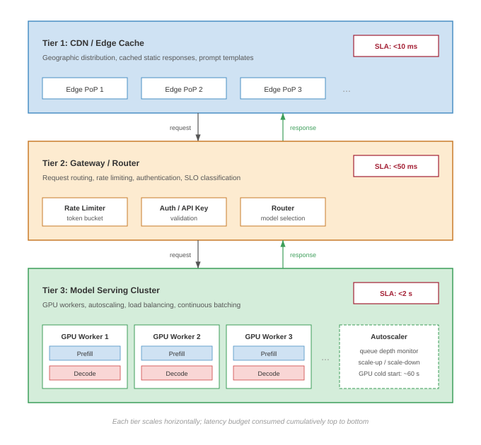
:::

Each level has distinct optimization levers. @Tbl-serving-hierarchy maps these levels to their primary targets and techniques:

| **Level**                                | **Optimization Target** | **Key Techniques**                     |
|:-----------------------------------------|:-----------------------:|:---------------------------------------|
| **Request**                              |   Per-request latency   | Dynamic batching, caching, prefetching |
| **Replica**\index{Serving!replica level} | Throughput, utilization | Memory optimization, kernel fusion     |
| **Service**                              |    Aggregate capacity   | Load balancing, routing, autoscaling   |
| **Platform**                             |   Resource efficiency   | Multi-tenancy, scheduling, placement   |

: **Serving Hierarchy Optimization Targets**: Each level of the hierarchy addresses different metrics with different techniques. {#tbl-serving-hierarchy}

::: {#chk-inference-serving-hierarchy .callout-checkpoint title="The serving hierarchy"}

Verify your understanding of where specific optimizations sit within the serving hierarchy:

- [ ] Which level of the hierarchy is responsible for managing GPU memory waste to increase concurrent request capacity?
- [ ] If you implement **Speculative Decoding** to reduce token latency for a single request, at which level are you operating?
- [ ] **Load Balancing** algorithms (like Power-of-Two-Choices) operate at the Service level. What is their primary optimization target?
- [ ] True or False: Multi-tenancy and resource isolation are primarily Request-level concerns.

:::

The remainder of this chapter progresses through these levels: batching and caching (request level), model sharding (replica level), load balancing and autoscaling (service level), and multi-tenancy (platform level).

## Serving Architecture Dimensions {#sec-inference-scale-serving-framework-selection-45d3}

A recommendation system that processes 100,000 embedding lookups per second across a sharded feature store requires a fundamentally different serving architecture than a 70-billion parameter language model generating tokens one at a time. The difference is not merely one of framework choice; it reflects distinct constraints in batching strategy, memory management, scheduling policy, and deployment topology. Rather than catalog specific tools, this section identifies the architectural dimensions that distinguish serving systems and the constraints that drive each design decision. Specific frameworks serve as examples of these principles, not as the subject of study.

### Batching strategy: The throughput-latency trade-off {#sec-inference-scale-framework-categories-172a}

The most consequential architectural decision in a serving system is how it forms batches from incoming requests. This choice determines the fundamental throughput-latency operating point.

**Static batching**\index{Static Batching} collects a fixed number of requests before dispatching them to the accelerator. For vision models processing fixed-size inputs, this approach maximizes GPU utilization because all requests in the batch execute identical computation graphs with predictable memory access patterns. A ResNet-50 inference server can batch 32 or 64 images with near-linear throughput scaling because weight sharing across the batch amortizes model loading cost.

Autoregressive language models break this assumption. Each request generates a different number of output tokens, so static batching forces all requests to wait for the longest generation in the batch and can leave accelerator capacity idle after shorter requests finish. Continuous batching[^fn-vllm-etymology] solves this by allowing requests to enter and exit the batch at each decoding step, an iteration-level scheduling approach introduced by Orca [@yu2022orca]. When one request finishes generation, a new request immediately fills its slot. Systems like vLLM combine this scheduling style with PagedAttention-based KV-cache management, achieving 2--4$\times$ throughput gains over prior LLM serving systems by reducing memory waste [@kwon2023].

[^fn-vllm-etymology]: **vLLM (Virtual LLM)**: The name signals its core design: applying OS-style virtual memory to KV cache management, decoupling logical sequence addresses from physical GPU memory. Developed at UC Berkeley (2023), vLLM achieved 2--4$\times$ throughput over FasterTransformer and up to 24$\times$ over HuggingFace Transformers by eliminating the 60--80 percent memory fragmentation that capped batch sizes in prior serving systems. \index{vLLM!etymology}

Recommendation systems introduce a third pattern: **feature-parallel batching**\index{Feature-Parallel Batching}. Because the bottleneck is distributed embedding lookup rather than dense matrix multiplication, these systems batch requests by feature type and shard the batch across embedding servers. The dense MLP computation that follows can then operate on prefetched, prebatched feature vectors. The batching strategies section (@sec-inference-scale-batching-strategies-scale-6733) develops these approaches in full quantitative detail.

### Memory management: From preallocation to paging {#sec-inference-scale-framework-selection-criteria-6c20}

Serving systems differ fundamentally in how they manage accelerator memory, and this difference determines the maximum concurrent request capacity.

::: {#dfn-inference-kv-cache .callout-definition title="KV cache"}

***KV Cache***\index{KV Cache!definition} is a per-request LLM inference memory buffer that stores the Key and Value attention tensors of all previously generated tokens so the next token can be produced without recomputing the full attention over the prefix.

1.  **Significance (quantitative)**: It reduces per-token attention compute from $O(n^2)$ to $O(n)$ in the sequence length, but its footprint grows linearly with both context length and batch size, often consuming more HBM than the model weights themselves and becoming the binding constraint on serving capacity. The fundamental sizing math is derived in @sec-appdx-inference-scale-kv-cache-fundamentals-2ccd.
2.  **Distinction (durable)**: Unlike model weights (which are shared across all requests and statically allocated), the KV cache is request-private and dynamically sized; each concurrent user pays a separate, sequence-length-proportional memory tax that the scheduler must budget for.
3.  **Common pitfall**: A frequent misconception is that reducing model size proportionally reduces serving memory. In practice, the KV cache dominates HBM at long contexts, so a quantized 70B model can still be capacity-bound at batch sizes the weights alone would easily admit.

:::

**Preallocated memory management**\index{Preallocated Memory Management} reserves a fixed memory budget per request at admission time based on the maximum possible output length. For a model supporting 4,096-token outputs, every request reserves memory for 4,096 tokens regardless of whether it generates 50 or 4,000. This approach is simple and predictable but wastes memory proportional to the gap between maximum and actual output lengths. In practice, 60--80 percent of reserved KV cache memory goes unused.

**Paged memory management**\index{Paged Memory Management}, inspired by operating system virtual memory, allocates memory in fixed-size blocks (pages) and maps logical sequence positions to physical memory locations through a block table. As a request generates tokens, new physical blocks are allocated on demand. When generation completes, blocks return to the free pool immediately. This approach, exemplified by PagedAttention (covered in @sec-inference-scale-pagedattention-3c94), achieves near-100 percent memory utilization by eliminating both internal fragmentation (partially filled preallocations) and external fragmentation (unusable gaps between allocations).

The memory management strategy directly determines batch capacity: paged systems can serve 2--4$\times$ more concurrent requests than preallocated systems on the same hardware, because they reclaim memory that preallocation wastes. For a service with a fixed GPU budget, this translates directly to 2--4$\times$ lower cost per request.

### Scheduling policy: FCFS, preemptive, and priority-aware {#sec-inference-scale-vllm-architecture-9b84}

The scheduling policy determines which requests receive GPU time and in what order. This decision becomes critical when request mix is heterogeneous, with some requests requiring 50 tokens of output and others requiring 4,000. **First-come-first-served (FCFS) scheduling**\index{First-Come-First-Served Scheduling} processes requests in arrival order. FCFS is fair and simple but suffers from head-of-line blocking: a single long-generation request delays all subsequent requests. For workloads with high output-length variance, FCFS produces poor tail latency.

**Preemptive scheduling**\index{Preemptive Scheduling} allows the system to pause a long-running request and swap its KV cache to CPU memory (or discard it for later recomputation) to make room for shorter, higher-priority requests. The cost of preemption is the swap overhead (transferring KV cache between GPU and CPU memory) or the recomputation cost (re-running the prefill phase when the preempted request resumes). Production systems typically preempt when a request has consumed more than 2$\times$ the median generation length.

**Priority-aware scheduling**\index{Priority-Aware Scheduling} assigns different service classes to requests and guarantees that high-priority requests receive GPU slots before lower-priority ones. A production API might classify revenue-generating customer requests as critical, internal batch processing as standard, and free-tier traffic as best-effort. The scheduling policy then ensures that critical requests never wait behind best-effort traffic, even during load spikes.

### Deployment topology: Single-GPU to disaggregated {#sec-inference-scale-tensorrtllm-architecture-2794}

The deployment topology determines how model computation maps to physical hardware, and this mapping is driven by the ratio of model size to single-device memory capacity. Single-GPU deployment is the simplest topology: the entire model fits in one device's memory, and all inference computation occurs locally. For models under 15--20 billion parameters (30--40 GB in FP16), this topology provides the lowest latency because it eliminates all inter-device communication.

```{python}
#| echo: false
# ┌── LEGO ───────────────────────────────────────────────
# │ Context: Deployment topology — tensor-parallel NVLink bandwidth.
# │ Exports: InferenceTopologyRecap.nvlink_h100_gb_per_s_str
class InferenceTopologyRecap:
    nvlink_bw = Hardware.Cloud.H100.nvlink.bandwidth
    from mlsysim.fmt import fmt_bandwidth
    # ┌── 4. OUTPUT (Formatting) ──────────────────────────────────────────────
    nvlink_h100_gb_per_s_str = fmt_bandwidth(nvlink_bw, unit=GB / second, precision=0, commas=False)
```

Multi-GPU tensor parallelism shards each layer's weight matrices across multiple GPUs connected by high-bandwidth interconnect (NVLink at `{python} InferenceTopologyRecap.nvlink_h100_gb_per_s_str` on H100). Each GPU computes a partial result for every layer, and an all-reduce operation synchronizes the partial results before the next layer. This topology is necessary when model weights exceed single-device memory and provides latency reduction proportional to the parallelism degree, at the cost of communication overhead per layer. The model sharding section (@sec-inference-scale-model-sharding-inference-82b3) analyzes the communication overhead quantitatively.

Disaggregated serving separates the prefill phase (processing the input prompt, which is compute-bound) from the decode phase (generating tokens one at a time, which is memory-bandwidth-bound) onto different hardware pools optimized for each workload profile. Prefill nodes use high-FLOP/s accelerators; decode nodes use high-bandwidth-memory configurations. This separation allows each phase to operate at its hardware's optimal operating point rather than compromising between the two regimes on shared hardware. The disaggregated serving section (@sec-inference-scale-disaggregated-serving-splitting-workload-b8f9) develops this architecture in detail.

### Stateful vs. stateless: The scaling divide {#sec-inference-scale-triton-inference-server-f0ba}

A serving system's statefulness determines whether horizontal scaling is trivial or requires careful engineering.

Vision models and embedding lookups are typically stateless: any replica can serve any request because no per-session state persists between requests. Horizontal scaling is straightforward -- add replicas behind a load balancer -- and failure recovery is instant because the load balancer simply routes to a healthy replica.

LLM serving\index{Inference!stateful serving} with KV cache is inherently stateful: the cache accumulated during a conversation creates replica-specific state that cannot be reconstructed without re-running the entire conversation history through prefill. This statefulness has cascading implications for system design. Load balancing requires sticky routing to direct subsequent requests in a conversation to the same replica. Autoscaling down requires draining active sessions, which can take minutes for long conversations. Failure recovery is expensive: when a stateful replica crashes, users either experience the latency of regenerating context (seconds) or lose conversation state entirely.

The choice between stateless and stateful serving is *not a framework feature* but *a consequence of the model architecture*. Systems that serve autoregressive models must engineer for statefulness; systems that serve fixed-computation models can treat scaling as a simpler capacity-planning exercise.

### Architectural comparison {#sec-inference-scale-framework-selection-decision-tree-734b}

@Tbl-serving-architecture-dimensions summarizes how these five dimensions interact across the major workload types. The table reveals that no single serving architecture is optimal for all workloads; the constraint profile of each workload type determines the appropriate design point along each dimension.

| **Dimension**                |       **Vision/Embedding**      |    **LLM (Autoregressive)**   | **Recommendation**                    |
|:-----------------------------|:-------------------------------:|:-----------------------------:|:--------------------------------------|
| **Batching**\index{Batching} | Static/dynamic (uniform inputs) | Continuous (variable outputs) | Feature-parallel (sharded embeddings) |
| **Memory**                   |    Preallocated (predictable)   |   Paged (variable KV cache)   | Distributed (embedding tables)        |
| **Scheduling**               |       FCFS (uniform cost)       |   Preemptive (high variance)  | Priority-aware (SLO tiers)            |
| **Topology**                 |       Single-GPU replicas       |    Tensor/pipeline parallel   | Hybrid CPU-GPU sharding               |
| **State**                    |            Stateless            |      Stateful (KV cache)      | Stateless (feature store)             |

: **Serving Architecture Dimensions by Workload Type**: Each workload's constraint profile determines the optimal design point along five architectural dimensions. Selecting a serving system amounts to choosing the combination that matches the workload's constraints. {#tbl-serving-architecture-dimensions}

::: {#chk-inference-serving-dimensions .callout-checkpoint title="Serving dimensions"}

Verify your understanding of how workload constraints drive architectural choices:

- [ ] Why is **preemptive scheduling** more critical for LLMs than for vision models?
- [ ] For which workload type is **stateful serving** (requiring sticky routing) a fundamental requirement?
- [ ] Explain why **feature-parallel batching** is the standard for recommendation systems but not for LLMs.
- [ ] Which dimension (batching, memory, scheduling, topology, state) is primarily affected by the **outlier features** problem in quantization?

:::

The architectural dimensions determine which serving system to select for a given workload. Rather than comparing frameworks feature by feature, an engineer identifies the workload's position along each dimension (batching pattern, memory profile, scheduling requirements, deployment topology, and statefulness) and selects the system that matches. The techniques developed in the remainder of this chapter operate within this architectural framework, each addressing optimization at a specific dimension.

## Batching Strategies at Scale {#sec-inference-scale-batching-strategies-scale-6733}

A stream of hundreds of disparate chat requests arrives at an inference server every second. Processing them one by one leaves the GPU 95 percent idle, starved for work. Waiting to gather a large static batch forces the first request in line to endure unacceptable latency. Batching strategies at scale demand dynamic algorithms that fuse requests on the fly without violating strict tail-latency deadlines.

Processing multiple requests together amortizes fixed costs (model loading, kernel launch overhead, and memory transfer latency) across more useful work, trading higher per-request latency for dramatically improved throughput. Single-machine serving applies this insight through **dynamic batching**\index{Dynamic Batching}, which collects requests within a time window before processing them together.

At scale, batching becomes more complex because different model architectures have distinct batching requirements. A strategy optimal for vision models may be catastrophic for LLMs, and techniques developed for recommendation systems may not apply to either.

In production, recommendation systems constitute 80–90 percent of inference requests at major technology companies, with vision models handling most of the remainder, and LLMs currently representing 1–5 percent of request volume (though growing rapidly). Despite this distribution, we present batching strategies in order of conceptual complexity: vision (straightforward batching), LLMs (continuous batching with KV cache), and recommendation (feature-parallel batching with distributed embedding). This pedagogical ordering builds understanding progressively, even though practitioners will most frequently encounter recommendation workloads first.

The taxonomy that follows matches batching strategies to model characteristics, providing quantitative analysis of when each approach applies and what performance to expect.

### Why batching differs across model types {#sec-inference-scale-batching-differs-across-model-types-2026}

Batching efficiency depends on how computation scales with batch size relative to how memory and communication scale. Different model architectures exhibit different scaling relationships, requiring different batching strategies, as @fig-batching-strategies summarizes.

::: {#fig-batching-strategies fig-env="figure" fig-pos="htb" fig-cap="**Batching Strategies Compared**: Three timelines show how batching policies trade wait time for GPU utilization. (a) No batching: requests processed sequentially, GPU idle between them (around 40 percent utilization). (b) Static batching: requests wait until a full batch is assembled before dispatch, with padding for short requests (around 70 percent utilization). (c) Dynamic batching: assembles a batch within a short time window with adaptive size, reducing wait and lifting utilization (around 85 percent)." fig-alt="Three stacked timelines labeled (a) No Batching, (b) Static Batching, (c) Dynamic Batching. Each shows four requests R1-R4 and the corresponding GPU utilization bar (approximately 40, 70, and 85 percent respectively)."}
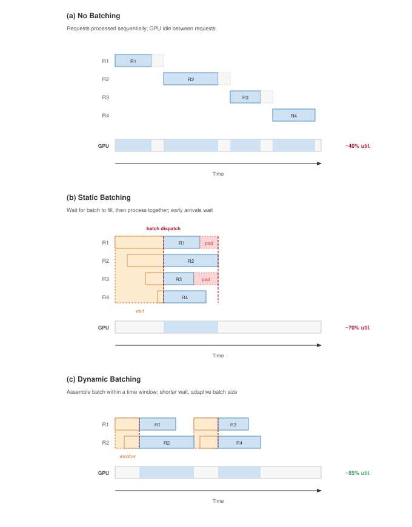
:::

For **vision models**\index{Vision Models}, including convolutional neural networks (CNNs) and vision transformers (ViTs) processing fixed-size images, computation scales linearly with batch size while memory scales sub-linearly due to weight sharing. Larger batches improve GPU utilization with minimal overhead, making static or dynamic batching with large batch sizes optimal.

For **LLMs in the decode phase**\index{LLM!decode phase}, computation per token is small relative to memory bandwidth requirements for loading model weights. The bottleneck is *memory bandwidth*, not *compute*. Larger batches amortize weight loading across more tokens, dramatically improving throughput but with diminishing returns as batch size grows.

For recommendation systems\index{Recommendation Systems}, the bottleneck is often embedding lookup rather than dense computation. Batching strategies must optimize for parallel embedding access patterns rather than matrix multiplication throughput.

### The physics of batching: The efficiency curve {#sec-inference-scale-physics-batching-efficiency-curve-021c}

Batching is not merely a heuristic; it is a trade-off governed by the physics of hardware utilization. We can model the relationship between batch size $(B)$, request latency $(T_{\text{lat}})$, and throughput $(X)$ to identify the optimal operating point for any inference system.

Here $T_{\text{lat}}$ follows standard queuing notation for request time in system. Elsewhere in the book, $L_{\text{lat}}$ denotes fixed latency overheads or latency components; this section keeps $T_{\text{lat}}$ for the end-to-end request-time variable used in Little's Law and batching equations.

The latency equation decomposes per-request latency into fixed overheads (kernel launch, memory loading) and variable costs (compute per sample):

$$T_{\text{lat}}(B) = T_{\text{fixed}} + B \times T_{\text{variable}}$$

*   $T_{\text{fixed}}$: Costs paid once per batch (for example, loading weights from HBM, kernel launch latency).
*   $T_{\text{variable}}$: Marginal cost of adding one request (for example, compute time for that sample).

The throughput equation describes the system's capacity:

$$X(B) = \frac{B}{T_{\text{lat}}(B)} = \frac{B}{T_{\text{fixed}} + B \times T_{\text{variable}}}$$

The resulting curve is the **Batching Efficiency Curve**\index{Batching!efficiency curve}:

1.  **Small $B$**: Throughput is dominated by $T_{\text{fixed}}$. The system is latency-bound (or overhead-bound). Increasing $B$ yields super-linear throughput gains.
2.  **Large $B$**: As $B \to \infty$, the $T_{\text{fixed}}$ term becomes negligible. Throughput asymptotically approaches the hardware limit $1/T_{\text{variable}}$. The system becomes compute-bound\index{Compute-Bound} (or bandwidth-bound for LLMs).
3.  **The knee**: The optimal batch size is the point where throughput gains diminish while latency continues to grow linearly.

::: {.column-margin}
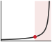{width="100%" fig-alt="A throughput curve that rises steeply then plateaus, with a knee dot marking the optimal batch size. A red wash shades the region past the knee, where larger batches add latency without gaining throughput."}

*Throughput saturates at the batch size where latency hits the SLO.*
:::

The engineering goal is to find the maximum $B$ such that $T_{\text{lat}}(B) \le \text{SLO}$. This formulation explains why vision models (high $T_{\text{variable}}$) saturate at smaller batches than LLMs (high $T_{\text{fixed}}$ due to weight loading), requiring different tuning strategies.

```{python}
#| echo: false
#| label: batching-efficiency-notebook
# ┌─────────────────────────────────────────────────────────────────────────────
# │ BATCHING EFFICIENCY CURVE (NOTEBOOK)
# ├─────────────────────────────────────────────────────────────────────────────
# │ Context: "Batching Efficiency Curve" .callout-notebook
# │
# │ Goal: Quantify throughput-latency trade-offs for vision vs LLM batching.
# │ Show: LLM knee at B=80; Vision knee at B=2.
# │ How: X(B) = B / (T_fixed + B * T_var).
# │
# │ Imports: mlsysim.book (check)
# │ Exports: bec_llm_knee_str, bec_vision_knee_str
# └─────────────────────────────────────────────────────────────────────────────
from mlsysim.fmt import fmt_int, check, fmt

class BatchingEfficiency:
    # ┌── 1. LOAD ──────────────────────────────────────────
    # LLM (Weights limited)
    t_fixed_llm = 40 # ms
    t_var_llm = 0.5 # ms
    # Vision (Compute limited)
    t_fixed_vis = 2 # ms
    t_var_vis = 1.0 # ms
    # ┌── 2. EXECUTE ───────────────────────────────────────
    def get_x(b, tf, tv): return b / (tf + b * tv) * THOUSAND # req/s

    # Knee occurs where marginal throughput gain slows significantly
    # Approximate: B where B*T_var ≈ T_fixed
    b_knee_llm = int(t_fixed_llm/t_var_llm)
    b_knee_vis = int(t_fixed_vis/t_var_vis)

    x_knee_llm = get_x(b_knee_llm, t_fixed_llm, t_var_llm)
    x_knee_vis = get_x(b_knee_vis, t_fixed_vis, t_var_vis)
    # ┌── 3. GUARD ─────────────────────────────────────────
    check(b_knee_llm == 80, f"LLM knee mismatch: {b_knee_llm}")
    check(b_knee_vis == 2, f"Vision knee mismatch: {b_knee_vis}")
    # ┌── 4. OUTPUT ────────────────────────────────────────
    bec_llm_knee_str = fmt_int(b_knee_llm, commas=False)
    bec_vision_knee_str = fmt_int(b_knee_vis, commas=False)
```

::: {#nbk-inference-batching-efficiency-curve .callout-notebook title="The batching efficiency curve"}

**Problem**: An engineer optimizes two services: a Vision model (ResNet) and an LLM (70B). At what batch size does each hit the "Knee" of its efficiency curve?

**Math**:
The knee occurs where the variable compute cost $(B \times T_{\text{var}})$ starts to exceed the fixed overhead $(T_{\text{fixed}})$.

1. **Vision Model** $(T_{\text{fixed}} = 2\text{ ms}, T_{\text{var}} = 1\text{ ms})$:
   - Knee: $B \approx 2 ms/1 ms =$ `{python} BatchingEfficiency.bec_vision_knee_str`.
   - **Result**: This simplified latency model reaches its first overhead-amortization knee at a very small batch. Production CNNs often continue gaining throughput until batches of 32--64+ before hardware saturation.

2. **LLM Decode** $(T_{\text{fixed}} = 40\text{ ms}, T_{\text{var}} = 0.5\text{ ms})$:
   - Knee: $B \approx 40 ms/0.5 ms =$ `{python} BatchingEfficiency.bec_llm_knee_str`.
   - **Result**: LLMs require massive batches to amortize the expensive weight-loading overhead.

**Systems insight**: Because the LLM's "Fixed Overhead" (loading 140 GB of weights from HBM) is so large, the system has not reached the efficiency knee until batch size `{python} BatchingEfficiency.bec_llm_knee_str`. LLM serving therefore requires continuous batching and paged memory\index{Memory!paged}: the system must pack hundreds of concurrent users into a single batch just to overcome the memory bandwidth bottleneck.

:::

Translating these batch-level equations into system-wide capacity planning requires a classical result from queuing theory: **Little's Law**[^fn-littles-law], which relates concurrency, throughput, and latency in any stable system. @Tbl-batching-by-model summarizes how these batching characteristics vary across model architectures.

[^fn-littles-law]: **Little's Law**: From queuing theory $(Q_{\text{req}} = \lambda_{\text{arr}} T_{\text{lat}})$: Concurrency = Arrival Rate $\times$ Latency. For a serving fleet, this defines the **Capacity Envelope**: if a GPU can handle 32 concurrent requests and each takes 100 ms, the maximum arrival rate is 320 req/s. Beyond this, queues grow rapidly as utilization approaches 1, and tail latency $(L_{\text{lat}})$ explodes. \index{Little's Law!capacity planning}

| **Model Type**    | **Batching Strategy** | **Typical Batch Size** | **Key Constraint** | **Throughput Scaling** |
|:------------------|:---------------------:|:----------------------:|:------------------:|:----------------------:|
| **Vision (CNN)**  |     Static/Dynamic    |         32–256         |    GPU compute     |   Near-linear to 64+   |
| **LLM (prefill)** |        Dynamic        |          1–64          |  Memory capacity   |       Sub-linear       |
| **LLM (decode)**  |       Continuous      |       100–1000s        |  Memory bandwidth  |       Log-linear       |
| **RecSys**        |    Feature-parallel   |      1000–10000s       |  Embedding lookup  |  Depends on sharding   |
| **Speech**        |       Streaming       |           1            |     Real-time      |  N/A (latency-bound)   |

: **Batching Strategy by Model Type**: Each model type has characteristic batching behavior determined by its computational bottleneck. {#tbl-batching-by-model}

```{python}
#| echo: false
#| label: littles-law-example
from mlsysim.fmt import fmt_int, check, fmt_time

class LittlesLawExample:
    # ┌── 1. LOAD ──────────────────────────────────────────
    target_throughput = 1000
    latency_slo_s = 0.1
    batch_size = 8
    replica_latency_s = 0.08
    # ┌── 2. EXECUTE ───────────────────────────────────────
    required_concurrency = int(target_throughput * latency_slo_s)
    replica_throughput = int(batch_size/replica_latency_s)
    replicas_needed = int(target_throughput/replica_throughput)
    total_concurrency = replicas_needed * batch_size
    # ┌── 3. GUARD ─────────────────────────────────────────
    check(required_concurrency == 100, "required concurrency should be 100")
    check(replicas_needed == 10, "Should need 10 replicas")
    # ┌── 4. OUTPUT ────────────────────────────────────────
    required_concurrency_str = fmt_int(required_concurrency, commas=False)
    replica_throughput_str = fmt_int(replica_throughput, commas=False)
    replicas_needed_str = fmt_int(replicas_needed, commas=False)
    total_concurrency_str = fmt_int(total_concurrency, commas=False)
    target_throughput_str = fmt_int(target_throughput)
    latency_slo_ms_str = fmt_time(round(latency_slo_s * THOUSAND), 'millisecond', precision=0, commas=False)
    batch_size_str = fmt_int(batch_size, commas=False)
    replica_latency_ms_str = fmt_int(replica_latency_s * THOUSAND, commas=False)
```

::: {#thrm-inference-littles-law-inference .callout-theorem title="Little's Law for inference"}

**Concept**: In any stable queuing system, the average number of requests in the system $(Q_{\text{req}})$ equals the arrival rate $(\lambda_{\text{arr}})$ multiplied by the average time a request spends in the system $(T_{\text{lat}})$.

$$ Q_{\text{req}} = \lambda_{\text{arr}} \cdot T_{\text{lat}} $$

**Application: Concurrency Planning**

- **Target Throughput** $(\lambda_{\text{arr}})$: `{python} LittlesLawExample.target_throughput_str` requests/sec
- **Latency SLO** $(T_{\text{lat}})$: `{python} LittlesLawExample.latency_slo_ms_str` (0.1 s)

**Required Concurrency** $(Q_{\text{req}})$: $Q_{\text{req}} = 1000 \times 0.1 =$ `{python} LittlesLawExample.required_concurrency_str` concurrent requests

**Capacity Planning**\index{Capacity Planning}:
If a single GPU replica handles batch size 8 with 80 ms latency:

1. Replica Throughput $= 8/0.08 =$ `{python} LittlesLawExample.replica_throughput_str` req/s
2. Replicas Needed = 1000 divided by `{python} LittlesLawExample.replica_throughput_str` = `{python} LittlesLawExample.replicas_needed_str` replicas

**Verification**:
Total system concurrency $=$ `{python} LittlesLawExample.replicas_needed_str` replicas $\times$ 8 batch $=$ `{python} LittlesLawExample.total_concurrency_str`, short of the `{python} LittlesLawExample.required_concurrency_str` required. The shortfall is the queue: with `{python} LittlesLawExample.replicas_needed_str` replicas actively processing `{python} LittlesLawExample.total_concurrency_str` requests, the remaining 20 wait in queues, and that queue wait must fit inside the SLO.

:::

The 20-request queue depth and the unresolved question of whether queue wait time fits inside the SLO are exactly what queuing theory formalizes.

### Review: Single-node queuing dynamics {#sec-inference-scale-queuing-review-callout}

::: {#psp-inference-queuing-theory-review .callout-perspective title="Queuing theory as serving foundation"}

At the single-node level, inference behaves like a single-server queue: requests arrive, wait if the replica is busy, and then receive service from the accelerator. The shorthand M/D/1 denotes random arrivals with deterministic service time on one server; M/M/1 denotes random arrivals with exponentially distributed service time. Little's Law ($L = \lambda W$) dictates that the number of requests in the system equals the arrival rate times the processing time. @Sec-appdx-inference-scale-queuing-theory-batched-inference-bbf0 derives the M/D/1 wait-time distribution that determines whether queue delay fits inside a serving SLO.

:::

### Static and dynamic batching for vision models {#sec-inference-scale-static-dynamic-batching-vision-models-4623}

Vision models represent the simplest batching case because inputs have uniform size (after preprocessing) and computation follows a predictable pattern. Single-machine batching principles apply directly, with scale introducing considerations of batch formation across multiple replicas.

Static batching collects exactly $B$ requests before processing. This maximizes GPU utilization when request arrival is predictable but causes unbounded latency during low-traffic periods.

Dynamic batching collects requests for a maximum time window $T_{\text{window}}$ or until reaching maximum batch size $B_{\text{max}}$, whichever occurs first. The expected latency under Poisson arrivals with rate $\lambda_{\text{arr}}$ follows @eq-dynamic-batch-latency:

$$E[T_{\text{total}}] = E[T_{\text{queue}}] + T_{\text{batch}} + T_{\text{inference}}(B)$$ {#eq-dynamic-batch-latency}

where $E[T_{\text{queue}}]$ is the expected queuing delay, $T_{\text{batch}}$ is the batch formation delay (up to $T_{\text{window}}$), and $T_{\text{inference}}(B)$ is the inference time for batch size $B$. Example \ref{exmp-dynamic-batching-resnet50} illustrates how these components interact in practice.

::: {#exmp-dynamic-batching-resnet50 .callout-example title="Dynamic batching for ResNet-50"}

Consider a vision classification service with the following requirements:

- **Arrival rate**: 5,000 QPS
- **Latency SLO**: 50 ms P99
- **Per-image inference time**: 5 ms at batch=1, 25 ms at batch=32
- **Number of replicas**: 10 (each handling 500 QPS)

For a single replica with Poisson arrivals at $\lambda_{\text{arr}} = 500$ QPS:

**Option A: No batching (batch=1)**

- Service time: 5 ms per request
- Utilization: $\rho = \lambda_{\text{arr}} \times T_{\text{svc}} = 500 \times 0.005 = 2.5$ (impossible, system is overloaded)

This configuration *cannot* meet demand. Batching is required.

**Option B: Dynamic batching** with $B_{\text{max}}=16$, $T_{\text{window}}=10 ms$

Expected requests per window: $E[B] = \lambda_{\text{arr}} \times T_{\text{window}} = 500 \times 0.01 = 5$

With 5 requests per batch:

- Inference time: approximately 8 ms (interpolating between batch=1 and batch=32)
- Per-request compute: 8 ms/5 = 1.6 ms
- Maximum batch delay: 10 ms
- Expected total latency: ~15 ms mean, ~30 ms P99

Utilization: $\rho = 500 \times 0.0016 = 0.8$ (sustainable)

**Option C: Dynamic batching** with $B_{\text{max}}=32$, $T_{\text{window}}=20 ms$

Expected requests per window: $E[B] = 500 \times 0.02 = 10$

With 10 requests per batch:

- Inference time: approximately 12 ms
- Per-request compute: 12 ms/10 = 1.2 ms
- Maximum batch delay: 20 ms
- Expected total latency: ~22 ms mean, ~42 ms P99

Utilization: $\rho = 500 \times 0.0012 = 0.6$ (comfortable)

**Trade-off**: Option C achieves about 33 percent higher per-replica capacity, or 25 percent lower utilization, at the cost of higher average latency (22 ms vs. 15 ms). Both meet the 50 ms P99 SLO.

**Systems insight**: Dynamic batching is useful only when the latency budget has slack. The serving policy converts unused latency headroom into higher throughput, but the same window would violate an already tight SLO.

:::

At scale with multiple replicas, batch formation can occur either at individual replicas or at a centralized batching layer. Replica-local batching has each replica independently form batches from its assigned traffic. This approach is simpler to implement but may result in uneven batch sizes across replicas when load is imbalanced. Centralized batching uses a batching service to collect requests and dispatch formed batches to replicas. This achieves more uniform batch sizes but adds a centralization bottleneck and additional network hop.

Production systems typically use replica-local batching with load balancing that ensures roughly equal traffic distribution, achieving the benefits of centralized batching without the complexity.

### Continuous batching for LLM inference {#sec-inference-scale-continuous-batching-llm-inference-f8e6}

The autoregressive bottleneck (Principle \ref{pri-autoregressive-bottleneck}) governs this regime: in generative models, the decode phase is strictly memory-bandwidth bound because the entire model weight set must be loaded for every single token generated. Throughput scales with batch size, sharing weight loads across multiple requests, not compute power.

::: {#dfn-inference-continuous-batching .callout-definition title="Continuous batching"}

***Continuous Batching***\index{Continuous Batching!definition} is a serving strategy that decouples batch membership from iteration boundaries, allowing new requests to enter and completed ones to exit at every decode step.

1.  **Significance (quantitative)**: It maximizes system throughput $(X)$ by eliminating the padding waste and head-of-line blocking inherent in static batching. It ensures the GPU remains saturated even when requests have widely varying sequence lengths.
2.  **Distinction (durable)**: Unlike static or dynamic batching (which group requests at the request level), continuous batching operates at the Iteration Level\index{Continuous Batching!iteration-level scheduling}, dynamically reshaping the compute tensor at each clock cycle.
3.  **Common pitfall**: A frequent misconception is that continuous batching is "purely a scheduler change." In reality, it requires a Dynamic Memory Manager (like PagedAttention) because the KV caches for different requests grow and shrink at different rates, preventing static memory preallocation.

:::

The same idea is easier to see as slot reuse over time.

::: {#psp-inference-analogy-restaurant-kitchen .callout-perspective title="Analogy: The restaurant kitchen"}

Imagine a restaurant where a waiter seats a table of four (a batch of 4 requests). In static batching, if three diners finish their meals in 20 minutes, but the fourth takes an hour, the waiter refuses to seat anyone else at those three empty chairs until the entire table is clear. The kitchen (the GPU) sits mostly idle while the last diner eats.

In continuous batching, the restaurant operates like a sushi bar. The moment one diner finishes and leaves, the host immediately seats a new customer in that empty stool. The kitchen is constantly preparing food at maximum capacity, regardless of how long any individual diner takes to eat.

:::

Autoregressive language models present a unique batching challenge that static and dynamic approaches handle poorly. The key insight comes from the Orca system[^fn-orca-scheduling] [@yu2022orca]: traditional batching forces all sequences in a batch to complete before any new sequences can join, wasting compute when sequences finish at different times.

[^fn-orca-scheduling]: **Orca (Iteration-Level Scheduling)**: Introduced by @yu2022orca, Orca demonstrated that scheduling at iteration granularity rather than request granularity allows sequences to enter and exit batches at each decode step. This eliminated the head-of-line blocking that wasted 50 percent+ of GPU compute in static batching, establishing the scheduling paradigm that vLLM and all modern LLM serving systems now adopt. \index{Orca!iteration-level scheduling}

Consider a batch of 8 sequences. If one sequence completes after 10 tokens while others require 100 tokens, the completed sequence's GPU resources sit idle for 90 iterations. With traditional batching:

$$\text{Wasted compute} = \frac{(100 - 10) \times 1}{100 \times 8} = 11.25\%$$

For realistic output length distributions with high variance, wasted compute can exceed 50 percent.

Continuous batching (also called iteration-level batching) decouples batch membership from iteration boundaries. [algorithm @alg-continuous-batching-decode-scheduler] states the scheduler as a decode loop: completed requests release KV-cache pages, waiting requests enter freed slots, and the next batched kernel runs over the reorganized active set. This technique is central to the throughput-latency trade-off that defines large-scale LLM serving---Archetype A workloads (GPT-4/Llama-3, @sec-vol2-introduction-archetypes) would be economically unviable without it, because their memory-bandwidth-bound decode phase leaves compute cores idle waiting for weights to load, and only by interleaving unrelated requests can the bandwidth be saturated.

::: {#alg-continuous-batching-decode-scheduler name="Continuous batching decode scheduler"}

**Require:** Waiting queue $Q$; active sequence set $A$; GPU KV-cache page allocator; maximum active-token budget $B_{\max}$; model replica with a batched decode kernel.

**Output:** Generated tokens for completed requests and a continually refreshed active batch.

1. Admit requests from $Q$ while batch capacity and free KV-cache pages remain; allocate their prompt and KV-cache state and append them to $A$.
2. Run one batched decode kernel over all sequences in $A$.
3. Append each sampled token to its sequence and extend the corresponding KV-cache pages.
4. Remove completed or length-limited sequences from $A$ and return their KV-cache pages to the allocator.
5. If HBM pressure exceeds the serving policy's threshold, preempt lower-priority sequences by moving their KV-cache pages to CPU DRAM and marking those sequences paused.
6. Fill newly freed capacity from $Q$ or resume paused sequences whose KV-cache pages now fit, then repeat the decode loop.

**Systems cost:** The scheduler pays an admission, completion, and memory-accounting step at every decode iteration, and preemption adds HBM-to-CPU-DRAM transfer latency when memory pressure spikes. The payoff is immediate slot reuse: a Llama-2 70B service on 8$\times$ A100 GPUs can keep batch slots occupied instead of idling behind the longest sequence.

:::

Unlike static or dynamic batching, which group requests at the *request* level, continuous batching operates at the *iteration* level, dynamically reshaping the compute tensor at each clock cycle. As @fig-continuous-batching-comparison illustrates, static batching leaves the GPU idle while waiting for the longest request, whereas continuous batching keeps it saturated.

::: {#fig-continuous-batching-comparison fig-env="figure" fig-pos="htb" fig-cap="**Static vs. Continuous Batching**: In static batching (A), all requests in a batch must wait for the longest request to complete before the GPU can begin the next batch, leading to significant idle compute time (shaded gray). Continuous batching (B) allows new requests to enter the batch as soon as any request finishes, keeping the GPU saturated and dramatically improving throughput." fig-alt="Two-panel timeline comparison. Left: Static batching shows requests of different lengths with large white space representing idle time. Right: Continuous batching shows requests filling the gaps as soon as one ends."}

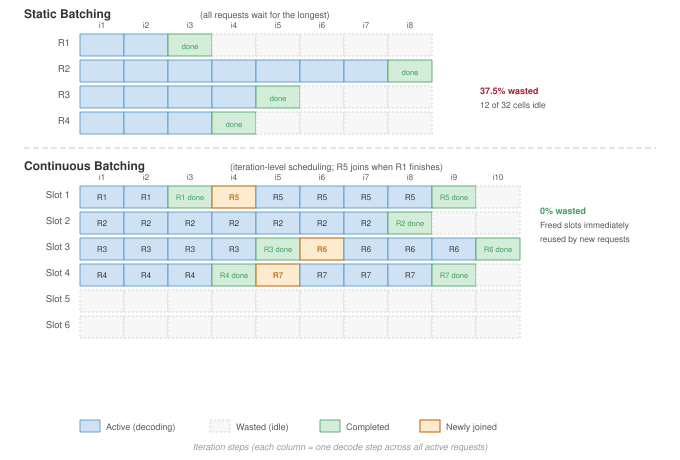

:::

The contrast in @fig-continuous-batching-comparison is stark: static batching leaves GPUs idle for the duration of the longest sequence in each batch, while continuous batching eliminates these idle gaps by inserting new requests at every iteration boundary.

### Continuous batching throughput analysis {#sec-inference-scale-continuous-batching-throughput-analysis-ecd2}

Continuous batching's dynamic batch management maintains high GPU utilization regardless of sequence length variance. The throughput improvement depends on sequence length distribution. For a distribution with coefficient of variation $\text{CV} = \sigma / \mu$, the gain is approximately @eq-continuous-batching-gain:

$$\text{Throughput gain} \approx 1 + \frac{\text{CV}^2}{2}$$ {#eq-continuous-batching-gain}

With typical LLM output lengths having $\text{CV} \approx 1.0$, continuous batching achieves approximately 1.5$\times$ throughput improvement. For highly variable outputs (conversational vs. code generation), gains can reach 2--4$\times$.

The analytical gains translate directly into production systems. The following implementation study examines how vLLM realizes continuous batching through iteration-level scheduling, paged memory management, and preemption.

::: {#exmp-inference-continuous-batching-vllm .callout-example title="Continuous batching in vLLM"}

vLLM implements continuous batching with several key mechanisms. Iteration-level scheduling evaluates at each decode step which sequences have generated end-of-sequence tokens (remove from batch), which waiting sequences can fit in available KV cache slots (add to batch), and which sequences should be preempted if memory pressure exists (swap to CPU). Memory management uses PagedAttention (detailed in @sec-inference-scale-kv-cache-management-04ed), which enables dynamic allocation without fragmentation. When a sequence completes, its KV cache pages are immediately available for new sequences. The batched decode kernel processes all active sequences in a single batched operation despite dynamic batch composition. Sequences at different generation lengths are padded to a common shape within the kernel.

**Preemption and swapping**\index{Preemption and Swapping}. A critical challenge in continuous batching is memory contention. As sequences grow during generation, they consume more KV cache pages. If the GPU memory fills up, the system cannot simply crash; it must preempt running requests.

vLLM implements a virtual memory mechanism similar to an operating system's swap. When memory is exhausted, the scheduler identifies low-priority requests (for example, those most recently started) and swaps their KV cache blocks from GPU HBM to CPU DRAM. These requests are paused until memory becomes available, at which point they are swapped back in and resumed. This mechanism ensures system stability under heavy load at the cost of increased latency for preempted requests.

**Typical performance** (Llama-2 70B on 8$\times$ A100):

| **Batching Strategy**       | **Throughput (tokens/s)** | **GPU Utilization**\index{GPU Utilization} |
|:----------------------------|:-------------------------:|:------------------------------------------:|
| **Static (batch=8)**        |            400            |                 45 percent                 |
| **Dynamic (timeout=50 ms)** |            580            |                 65 percent                 |
| **Continuous**              |           1,200           |                 92 percent                 |

: **Continuous batching throughput on Llama-2 70B (8$\times$ A100)**: Tokens-per-second and GPU utilization for static, dynamic, and continuous batching of a Llama-2 70B serving workload on an 8$\times$ A100 node. {#tbl-inference-continuous-batching-throughput}

**Systems insight**: As @tbl-inference-continuous-batching-throughput shows, the 3$\times$ throughput improvement from continuous batching comes from eliminating idle GPU cycles during sequence length variation.

:::

Continuous batching removes waste caused by variable output length, but it does not make every request equally cheap. Reasoning-heavy inference pushes the same problem further: a prompt may demand test-time work proportional to task difficulty, forcing schedulers to budget compute per request instead of only filling decode slots.

::: {.column-margin}
{width="100%" fig-alt="A two-rung magnitude ladder on a log scale, in slate. The reasoning response rung is about 12.8 seconds; the fast pattern-match rung is about 0.1 seconds. The gap is roughly 128 times."}

*Reasoning expands latency about 128 times over fast pattern-matching.*
:::

## The Logic Wall: Test-Time Compute Scaling {#sec-inference-logic-wall}

Large-model capability work describes emergent behaviors [@wei2022emergent], while later analysis cautions that some apparent emergence can be an artifact of metric choice [@schaeffer2023mirage]. From a serving-systems perspective, the serving-relevant shift is the work issued per request. Models that move from "fast thinking" (instant pattern matching) to "slow thinking" (deliberative reasoning) push pressure from HBM bandwidth toward **Test-Time Compute**\index{Test-Time Compute}: the scheduler must decide how many search steps or chain-of-thought (CoT) tokens a request may consume. The **Logic Wall**\index{Logic Wall} is the resulting serving constraint: for complex problems, compute per request grows with task difficulty, and a fleet optimized for tokens per second now needs a policy for allocating thinking time.

```{python}
#| echo: false
#| label: logic-scaling-calc
from mlsysim.fmt import fmt_int, check, fmt, fmt_time

class LogicScaling:
    """The latency tax of test-time reasoning."""
    # ┌── 1. LOAD ──────────────────────────────────────────
    LOGIC_WALL_REASONING_STEPS_EXAMPLE = 128     # pedagogical reasoning-steps example
    t_std = 100 * ms # pedagogical standard 1-token decode
    reasoning_steps = LOGIC_WALL_REASONING_STEPS_EXAMPLE # tokens of 'thought' before the answer
    # ┌── 2. EXECUTE ───────────────────────────────────────
    t_reasoning = (t_std * reasoning_steps).to(second)
    latency_expansion = reasoning_steps
    # ┌── 3. GUARD ─────────────────────────────────────────
    check(latency_expansion == 128, f"Exp {latency_expansion} unexpected")
    # ┌── 4. OUTPUT ────────────────────────────────────────
    steps_str = fmt_int(reasoning_steps, commas=False)
    time_s_str = fmt_time(t_reasoning, second, precision=1, commas=False, style='word')

    @classmethod
    def plot(cls):
        """Visualizes the Logic Wall latency expansion."""
        from book.tools.figures import style as book_style
        return book_style.bar_compare(
            labels=["Fast (Pattern)", "Slow (Reasoning)"],
            values=[cls.t_std.to(second).magnitude, cls.t_reasoning.to(second).magnitude],
            title="Inference Scaling: Reasoning Depth",
            ylabel="Latency (Seconds)"
        )
```

::: {#nbk-inference-napkin-math-scaling-reasoning-depth .callout-notebook title="Scaling reasoning depth"}

**Problem**: Calculate the latency impact of a model that uses `{python} LogicScaling.steps_str` "Thinking Tokens" to solve a complex math proof vs. a standard answer.

1. **Standard response**: 1 token answer = 100 ms.
2. **Reasoning response**: `{python} LogicScaling.steps_str` of internal search/CoT before the answer.
3. **The latency**: `{python} LogicScaling.steps_str` $\times$ 100 ms = `{python} LogicScaling.time_s_str`.

**Systems insight**: Test-time scaling transforms the serving architecture from a throughput factory to a search engine. While standard serving optimizes for tokens per second, reasoning-heavy models are constrained by steps per second. This creates a new "Reasoning SLO": users will wait 12 seconds for a correct proof, but not for a simple greeting. In the Machine Learning Fleet, we are moving toward **Dynamic Compute Allocation**\index{Dynamic Compute Allocation}, where the scheduler grants more "Thinking Time" to harder prompts.

:::

The batching analysis that follows treats the logic wall as a scheduling problem. Once requests can vary from a short pattern match to a long reasoning trace, the waste created by grouping unequal work becomes the baseline cost that any test-time compute policy must control.

### Quantitative analysis: Traditional vs. continuous batching {#sec-inference-scale-quantitative-analysis-traditional-vs-continuous-batching-ca70}

The first baseline is traditional LLM batching, where unequal output lengths turn request heterogeneity into wasted decode cycles. The mathematics of batching waste reveals exactly how much throughput is lost and under what conditions continuous batching delivers the greatest improvement.

#### The waste function for traditional batching {#sec-inference-scale-waste-function-traditional-batching-1fb8}

Traditional batching (also called static batching) processes all requests in a batch through all decode iterations until the longest sequence completes. For batch size $B$ with output lengths $\{S_1, S_2, ..., S_B\}$, the total compute performed is:

$$C_{\text{traditional}} = B \times S_{\text{max}} \times c_{\text{decode}}$$

where $S_{\text{max}} = \max_i(S_i)$ and $c_{\text{decode}}$ is the compute cost per decode iteration per sequence. However, the useful compute is only:

$$C_{\text{useful}} = \sum_{i=1}^{B} S_i \times c_{\text{decode}}$$

The **waste ratio**\index{Waste Ratio} quantifies the inefficiency:

$$W = 1 - \frac{C_{\text{useful}}}{C_{\text{traditional}}} = 1 - \frac{\sum_{i=1}^{B} S_i}{B \times S_{\text{max}}} = 1 - \frac{\bar{S}}{S_{\text{max}}}$$ {#eq-waste-ratio}

where $\bar{S}$ is the mean output sequence length. This reveals that waste depends entirely on the ratio of mean to maximum output length within the batch. For uniform output lengths $(\bar{S} = S_{\text{max}})$, waste is zero. For highly variable lengths, waste can exceed 50 percent.

#### Worked example: LLM serving with variable-length outputs {#sec-inference-scale-worked-example-llm-serving-variablelength-outputs-5e38}

Consider a GPT-class model serving four concurrent requests with the generation lengths shown in @tbl-batching-request-lengths (in tokens):

```{python}
#| echo: false
#| label: batching-request-totals
# ┌─────────────────────────────────────────────────────────────────────────────
# │ BATCHING REQUEST TOTAL TOKENS (LEGO)
# ├─────────────────────────────────────────────────────────────────────────────
# │ Context: @tbl-batching-request-lengths — Total Tokens column.
# │
# │ Goal: Compute Total Tokens = Prompt Length + Output Length for each request.
# │ Show: R1=150, R2=280, R3=220, R4=240 in table.
# │ How: Simple addition per row.
# │
# │ Imports: mlsysim.fmt (fmt_int, check)
# │ Exports: BatchingRequestTotals.r1_total_str, .r2_total_str,
# │   .r3_total_str, .r4_total_str
# └─────────────────────────────────────────────────────────────────────────────
from mlsysim.fmt import fmt_int, check


class BatchingRequestTotals:
    """Compute total tokens per request (prompt + output)."""

    # ┌── 1. LOAD (Constants) ──────────────────────────────────────────────
    prompt_lengths = [100, 80, 120, 90]
    output_lengths = [50, 200, 100, 150]

    # ┌── 2. EXECUTE (The Compute) ─────────────────────────────────────────
    totals = [p + o for p, o in zip(prompt_lengths, output_lengths)]

    # ┌── 3. GUARD (Invariants) ────────────────────────────────────────────
    check(totals == [150, 280, 220, 240], f"Total tokens mismatch: {totals}")

    # ┌── 4. OUTPUT (Formatting) ───────────────────────────────────────────
    r1_total_str = fmt_int(totals[0])
    r2_total_str = fmt_int(totals[1])
    r3_total_str = fmt_int(totals[2])
    r4_total_str = fmt_int(totals[3])
```

| **Request** | **Prompt Length** | **Output Length** |                **Total Tokens**               |
|:------------|:-----------------:|:-----------------:|:---------------------------------------------:|
| **R1**      |        100        |         50        | `{python} BatchingRequestTotals.r1_total_str` |
| **R2**      |         80        |        200        | `{python} BatchingRequestTotals.r2_total_str` |
| **R3**      |        120        |        100        | `{python} BatchingRequestTotals.r3_total_str` |
| **R4**      |         90        |        150        | `{python} BatchingRequestTotals.r4_total_str` |

: **Concurrent Request Generation Lengths**: Four concurrent requests on a GPT-class model with varying prompt and output lengths. The 4$\times$ spread in output length (50 to 200 tokens) drives the batching waste analyzed in this section: a static batch of four pads every request to the longest, wasting compute on the three shorter requests until the longest finishes generating. {#tbl-batching-request-lengths}

```{python}
#| echo: false
#| label: batching-worked-example
# ┌─────────────────────────────────────────────────────────────────────────────
# │ BATCHING WORKED EXAMPLE (LEGO)
# ├─────────────────────────────────────────────────────────────────────────────
# │ Context: "Traditional vs. Continuous Batching" worked example in
# │   §Continuous Batching for LLMs.
# │
# │ Goal: Quantify latency difference between traditional and continuous batching
# │   for 4 LLM requests with variable output lengths (50, 200, 100, 150 tokens),
# │   showing the latency reduction percentage and per-request improvement factors.
# │ Show: trad_lat_ms_str="4,000" ms, cont_avg_lat_str="2,500" ms,
# │   latency_red_str="37.5"%—inline in worked-example prose.
# │ How: Compute max-output iteration count for traditional; per-output iteration
# │   count for continuous; derive reduction % and per-request improvement ratios.
# │
# │ Imports: mlsysim.fmt
# │ Exports: BatchingWorkedExample.mean_output_str,
# │   BatchingWorkedExample.total_batch_time_ms_str,
# │   BatchingWorkedExample.total_seq_iters_str,
# │   BatchingWorkedExample.useful_seq_iters_str,
# │   BatchingWorkedExample.r1_lat_ms_str, BatchingWorkedExample.r2_lat_str,
# │   BatchingWorkedExample.r3_lat_str, BatchingWorkedExample.r4_lat_str,
# │   BatchingWorkedExample.trad_lat_ms_str, BatchingWorkedExample.cont_avg_lat_str,
# │   BatchingWorkedExample.latency_red_str, BatchingWorkedExample.r1_imp_mult_str,
# │   BatchingWorkedExample.r3_imp_mult_str, BatchingWorkedExample.r4_imp_mult_str
# └─────────────────────────────────────────────────────────────────────────────
from mlsysim.fmt import fmt_int, fmt, fmt_percent, MarkdownStr, fmt_time

# ┌── LEGO ───────────────────────────────────────────────
class BatchingWorkedExample:
    """Quantify latency difference between traditional and continuous batching."""

    # ┌── 1. LOAD (Constants) ──────────────────────────────────────────────
    output_lengths = [50, 200, 100, 150]  # R1, R2, R3, R4 output tokens
    n_requests = len(output_lengths)
    decode_time_ms = 20  # ms per iteration for batch of 4

    # ┌── 2. EXECUTE (The Compute) ────────────────────────────────────────
    mean_output = sum(output_lengths) / n_requests
    max_output = max(output_lengths)

    total_iterations = max_output
    total_batch_time_ms = total_iterations * decode_time_ms
    total_seq_iters = n_requests * max_output
    useful_seq_iters = sum(output_lengths)

    # Step 1: Continuous batching latencies
    r1_latency_ms = output_lengths[0] * decode_time_ms
    r2_latency_ms = output_lengths[1] * decode_time_ms
    r3_latency_ms = output_lengths[2] * decode_time_ms
    r4_latency_ms = output_lengths[3] * decode_time_ms

    # Step 2: Traditional: all requests wait for max
    trad_latency_ms = max_output * decode_time_ms

    # Step 3: Continuous: average of individual latencies
    cont_avg_latency_ms = (r1_latency_ms + r3_latency_ms + r4_latency_ms + r2_latency_ms) / n_requests
    latency_reduction_pct = (1 - cont_avg_latency_ms/trad_latency_ms) * 100

    # Step 4: Improvement factors
    r1_improvement = trad_latency_ms/r1_latency_ms
    r3_improvement = trad_latency_ms/r3_latency_ms
    r4_improvement = trad_latency_ms/r4_latency_ms

    # ┌── 3. GUARD (Invariants) ──────────────────────────────────────────
    check(latency_reduction_pct == 37.5, f"Expected 37.5% reduction, got {latency_reduction_pct}")

    # ┌── 4. OUTPUT (Formatting) ──────────────────────────────────────────────
    mean_output_str = fmt_count(mean_output, commas=False, label="token")
    total_batch_time_ms_str = fmt_time(round(total_batch_time_ms), 'millisecond', precision=0, commas=True)
    total_seq_iters_str = fmt_int(total_seq_iters)
    useful_seq_iters_str = fmt_int(useful_seq_iters)
    r1_lat_ms_str = fmt_time(round(r1_latency_ms), 'millisecond', precision=0, commas=True)
    r2_lat_str = fmt_int(r2_latency_ms)
    r3_lat_str = fmt_int(r3_latency_ms)
    r4_lat_str = fmt_int(r4_latency_ms)
    trad_lat_ms_str = fmt_time(round(trad_latency_ms), 'millisecond', precision=0, commas=True)
    # Float with bare `:,` format preserves Python's default float repr;
    # canonical `fmt(x, precision=1)` would also produce "2,500.0" here,
    # but use the MarkdownStr escape-hatch to preserve render byte-for-byte
    # against any future drift.
    cont_avg_lat_str = fmt_int(cont_avg_latency_ms)
    latency_red_str = fmt_percent(latency_reduction_pct / 100, precision=1, commas=False, style='prose')
    r1_imp_mult_str = fmt_multiple(r1_improvement, precision=0, commas=False)
    r3_imp_mult_str = fmt_multiple(r3_improvement, precision=0, commas=False)
    r4_imp_mult_str = fmt_multiple(r4_improvement, precision=2, commas=False)
```

The calculation starts from three system parameters:

- Decode time per iteration (batch of 4): 20 ms
- Maximum output length in batch: 200 tokens (R2)
- Mean output length: (50 + 200 + 100 + 150) / 4 = `{python} BatchingWorkedExample.mean_output_str`

#### Traditional batching analysis {#sec-inference-scale-traditional-batching-analysis-372e}

With traditional batching, all four requests must wait for R2 to complete its 200 tokens:

- Total decode iterations: 200
- Total batch time: $200 \times 20$ ms = `{python} BatchingWorkedExample.total_batch_time_ms_str`
- Request completion times:
  - R1 completes useful work at iteration 50, but waits until iteration 200 → latency = `{python} BatchingWorkedExample.trad_lat_ms_str`
  - R2 completes at iteration 200 → latency = `{python} BatchingWorkedExample.trad_lat_ms_str`
  - R3 completes useful work at iteration 100, but waits until iteration 200 → latency = `{python} BatchingWorkedExample.trad_lat_ms_str`
  - R4 completes useful work at iteration 150, but waits until iteration 200 → latency = `{python} BatchingWorkedExample.trad_lat_ms_str`

Waste calculation using @eq-waste-ratio:

$$W = 1 - \frac{125}{200} = 1 - 0.625 = 37.5\%$$

The GPU performs $4 \times 200$ = `{python} BatchingWorkedExample.total_seq_iters_str` "sequence-iterations" but only `{python} BatchingWorkedExample.useful_seq_iters_str` are useful.

#### Continuous batching analysis {#sec-inference-scale-continuous-batching-analysis-2846}

With continuous batching, sequences depart the batch upon completion, and new requests can join:

- Iteration 50: R1 completes → slot freed, new request R5 can join
- Iteration 100: R3 completes → slot freed, new request R6 can join
- Iteration 150: R4 completes → slot freed, new request R7 can join
- Iteration 200: R2 completes

Request latencies with continuous batching (assuming no queuing delay):

- R1: $50 \times 20$ ms = `{python} BatchingWorkedExample.r1_lat_ms_str` (`{python} BatchingWorkedExample.r1_imp_mult_str` improvement over traditional)
- R3: $100 \times 20$ ms = `{python} BatchingWorkedExample.r3_lat_str` (`{python} BatchingWorkedExample.r3_imp_mult_str` improvement)
- R4: $150 \times 20$ ms = `{python} BatchingWorkedExample.r4_lat_str` (`{python} BatchingWorkedExample.r4_imp_mult_str` improvement)
- R2: $200 \times 20$ ms = `{python} BatchingWorkedExample.r2_lat_str` (no improvement for longest request)

Average latency comparison

- Traditional: `{python} BatchingWorkedExample.trad_lat_ms_str` (all requests)
- Continuous: (`{python} BatchingWorkedExample.r1_lat_ms_str` + `{python} BatchingWorkedExample.r3_lat_str` + `{python} BatchingWorkedExample.r4_lat_str` + `{python} BatchingWorkedExample.r2_lat_str`) / 4 = `{python} BatchingWorkedExample.cont_avg_lat_str`

The result, depicted in @fig-continuous-batching, is a `{python} BatchingWorkedExample.latency_red_str` reduction in average latency, exactly matching the waste ratio.

::: {#fig-continuous-batching fig-env="figure" fig-pos="htb" fig-cap="**Traditional vs. Continuous Batching**: Top: Traditional batching wastes 37.5 percent of GPU cycles as completed requests (R1, R3, R4) wait idle for the longest request (R2). Bottom: Continuous batching immediately frees slots upon completion, allowing new requests (R5, R6, R7) to join. This eliminates waste and increases effective throughput." fig-alt="Two timeline diagrams: traditional batching with idle slots vs. continuous batching with immediate slot reuse."}

:::

#### When continuous batching provides maximum benefit {#sec-inference-scale-continuous-batching-provides-maximum-benefit-a406}

The continuous-batching analysis reveals that benefit scales with output length variance. A useful upper-bound intuition comes from comparing the longest sequence in a traditional batch with the average sequence length. Let $\text{CV} = \sigma / \mu$ be the coefficient of variation of output lengths. If the longest request in a batch is roughly $k$ standard deviations above the mean, then:

$$\text{Improvement} \approx \frac{S_{\text{max}}}{\bar{S}} = \frac{\mu + k\sigma}{\mu} = 1 + k \cdot \text{CV}$$

where $k$ is the number of standard deviations the maximum output exceeds the mean. Real systems realize less than this upper bound because scheduler overhead, KV-cache pressure, and refill gaps consume part of the theoretical gain. The table therefore reports effective waste and speedup, where $\text{speedup} \approx 1/(1 - W_{\text{effective}})$.

@Tbl-continuous-batching-benefit quantifies this relationship across different workload types, including Retrieval-Augmented Generation (RAG) [@lewis2020retrieval]:

```{python}
#| echo: false
#| label: continuous-batching-benefit
# ┌─────────────────────────────────────────────────────────────────────────────
# │ CONTINUOUS BATCHING BENEFIT TABLE (LEGO)
# ├─────────────────────────────────────────────────────────────────────────────
# │ Context: @tbl-continuous-batching-benefit in §Continuous batching.
# │
# │ Goal: Keep the table's effective waste and speedup values synchronized.
# │ Show: conservative effective speedups bounded by 1 + k * CV.
# │ How: Treat 1 + k * CV as a theoretical ceiling; compute effective waste from
# │      the assumed realized speedup via W = 1 - 1 / speedup.
# │
# │ Imports: mlsysim.fmt (fmt_int, check, fmt)
# │ Exports: ContinuousBatchingBenefit.*_cv_str, *_k_str,
# │          *_waste_pct_str, *_speedup_str
# └─────────────────────────────────────────────────────────────────────────────
from mlsysim.fmt import fmt_int, check, fmt, fmt_percent

class ContinuousBatchingBenefit:
    """Conservative realized-speedup table for continuous batching."""

    # ┌── 1. LOAD (Constants) ──────────────────────────────────────────────
    code_cv = 0.3
    code_k = 2.5
    code_speedup = 1.2

    chat_cv = 0.6
    chat_k = 2.0
    chat_speedup = 1.5

    text_cv = 1.0
    text_k = 2.5
    text_speedup = 2.0

    creative_cv = 1.5
    creative_k = 3.0
    creative_speedup = 2.8

    rag_cv = 2.0
    rag_k = 2.5
    rag_speedup = 3.5

    # ┌── 2. EXECUTE (The Compute) ────────────────────────────────────────
    code_upper = 1 + code_k * code_cv
    chat_upper = 1 + chat_k * chat_cv
    text_upper = 1 + text_k * text_cv
    creative_upper = 1 + creative_k * creative_cv
    rag_upper = 1 + rag_k * rag_cv

    code_waste_pct = (1 - 1 / code_speedup) * 100
    chat_waste_pct = (1 - 1 / chat_speedup) * 100
    text_waste_pct = (1 - 1 / text_speedup) * 100
    creative_waste_pct = (1 - 1 / creative_speedup) * 100
    rag_waste_pct = (1 - 1 / rag_speedup) * 100

    # ┌── 3. GUARD (Invariants) ──────────────────────────────────────────
    check(code_speedup <= code_upper, "Code speedup should not exceed upper bound")
    check(chat_speedup <= chat_upper, "Chat speedup should not exceed upper bound")
    check(text_speedup <= text_upper, "Text speedup should not exceed upper bound")
    check(creative_speedup <= creative_upper, "Creative-writing speedup should not exceed upper bound")
    check(rag_speedup <= rag_upper, "RAG speedup should not exceed upper bound")
    check(round(text_waste_pct) == 50, "2x speedup should imply 50 percent waste")

    # ┌── 4. OUTPUT (Formatting) ─────────────────────────────────────────────
    code_cv_str = fmt(code_cv, precision=1, commas=False)
    code_k_str = fmt(code_k, precision=1, commas=False)
    code_waste_pct_str = fmt_percent(code_waste_pct/100, precision=1, commas=False, style='prose')
    code_speedup_mult_str = fmt_multiple(code_speedup, precision=1, commas=False)

    chat_cv_str = fmt(chat_cv, precision=1, commas=False)
    chat_k_str = fmt_int(chat_k, commas=False)
    chat_waste_pct_str = fmt_percent(chat_waste_pct/100, precision=1, commas=False, style='prose')
    chat_speedup_mult_str = fmt_multiple(chat_speedup, precision=1, commas=False)

    text_cv_str = fmt_int(text_cv, commas=False)
    text_k_str = fmt(text_k, precision=1, commas=False)
    text_waste_pct_str = fmt_percent(round(text_waste_pct)/100, precision=0, commas=False, style='prose')
    text_speedup_mult_str = fmt_multiple(text_speedup, commas=False, precision=0)

    creative_cv_str = fmt(creative_cv, precision=1, commas=False)
    creative_k_str = fmt_int(creative_k, commas=False)
    creative_waste_pct_str = fmt_percent(creative_waste_pct/100, precision=1, commas=False, style='prose')
    creative_speedup_mult_str = fmt_multiple(creative_speedup, precision=1, commas=False)

    rag_cv_str = fmt_int(rag_cv, commas=False)
    rag_k_str = fmt(rag_k, precision=1, commas=False)
    rag_waste_pct_str = fmt_percent(rag_waste_pct/100, precision=1, commas=False, style='prose')
    rag_speedup_mult_str = fmt_multiple(rag_speedup, precision=1, commas=False)
```

| **Workload Type**           |                        **CV**                        |                        **k**                        |                      **Waste (Trad.)**                      |                    **Speedup (Continuous)**                    |
|:----------------------------|:----------------------------------------------------:|:---------------------------------------------------:|:-----------------------------------------------------------:|:--------------------------------------------------------------:|
| **Code completion**         |   `{python} ContinuousBatchingBenefit.code_cv_str`   |   `{python} ContinuousBatchingBenefit.code_k_str`   |   `{python} ContinuousBatchingBenefit.code_waste_pct_str`   |   `{python} ContinuousBatchingBenefit.code_speedup_mult_str`   |
| **Chat (short responses)**  |   `{python} ContinuousBatchingBenefit.chat_cv_str`   |   `{python} ContinuousBatchingBenefit.chat_k_str`   |   `{python} ContinuousBatchingBenefit.chat_waste_pct_str`   |   `{python} ContinuousBatchingBenefit.chat_speedup_mult_str`   |
| **General text generation** |   `{python} ContinuousBatchingBenefit.text_cv_str`   |   `{python} ContinuousBatchingBenefit.text_k_str`   |   `{python} ContinuousBatchingBenefit.text_waste_pct_str`   |   `{python} ContinuousBatchingBenefit.text_speedup_mult_str`   |
| **Creative writing**        | `{python} ContinuousBatchingBenefit.creative_cv_str` | `{python} ContinuousBatchingBenefit.creative_k_str` | `{python} ContinuousBatchingBenefit.creative_waste_pct_str` | `{python} ContinuousBatchingBenefit.creative_speedup_mult_str` |
| **RAG with variable docs**  |   `{python} ContinuousBatchingBenefit.rag_cv_str`    |    `{python} ContinuousBatchingBenefit.rag_k_str`   |    `{python} ContinuousBatchingBenefit.rag_waste_pct_str`   |   `{python} ContinuousBatchingBenefit.rag_speedup_mult_str`    |

: **Continuous Batching Benefit by Workload Type**: Higher output length variance (CV) yields greater improvement from continuous batching. Workloads with predictable output lengths (code completion) see modest gains, while highly variable workloads (RAG with documents of varying length) see dramatic improvement. {#tbl-continuous-batching-benefit}

The systems pattern is straightforward: continuous batching is most valuable when:

1. **Output lengths are unpredictable**\index{Output Lengths Are Unpredictable}: User queries that may elicit responses from 10 to 1,000 tokens

2. **Mixed workload types**\index{Mixed Workload Types}: Combining summarization (short) with generation (long) on the same cluster

3. **High request volume**\index{High Request Volume}: More opportunities to fill vacated slots with waiting requests

4. **Tight latency SLOs**\index{Tight Latency SLOs}: Short requests benefit most from early completion

Conversely, continuous batching provides minimal benefit when:

1. **Output lengths are uniform**\index{Output Lengths Are Uniform}: Fixed-length tasks like classification or embedding generation

2. **Batch sizes are small**\index{Batching!batch, sizes are small}: Few opportunities for slot reuse within a batch

3. **Request volume is low**\index{Request Volume Is Low}: Vacated slots sit empty waiting for new requests

#### Implementation complexity trade-offs {#sec-inference-scale-implementation-complexity-tradeoffs-e055}

The same variability that makes continuous batching valuable also makes it harder to operate. Its performance benefits come with implementation complexity that systems engineers must weigh:

Memory management complexity increases substantially. Traditional batching allocates a fixed KV cache region per sequence at batch formation, deallocating only when the entire batch completes. Continuous batching requires dynamic allocation as sequences grow and immediate deallocation upon completion, necessitating sophisticated memory management akin to operating system virtual memory.

Scheduler complexity rises correspondingly. Traditional batching uses simple FIFO scheduling: collect requests until the batch is full or the timeout expires, then execute. Continuous batching requires per-iteration decision-making about which sequences to admit, which to preempt if memory pressure exists, and how to handle priority classes. This increases scheduler overhead from $\mathcal{O}(1)$ per batch to $\mathcal{O}(B)$ per iteration.

Kernel design must also adapt. Batched GPU kernels traditionally assume fixed batch composition. Continuous batching requires kernels that handle variable-length sequences efficiently, often through techniques like packing multiple short sequences into shared attention masks or using specialized memory layouts that support dynamic batch membership.

@Tbl-batching-tradeoffs summarizes these trade-offs:

| **Dimension**             |  **Traditional Batching** | **Continuous Batching**          |
|:--------------------------|:-------------------------:|:---------------------------------|
| **Implementation effort** | Low (standard frameworks) | High (custom scheduler, kernels) |
| **Memory overhead**       |      Fixed allocation     | Dynamic + fragmentation mgmt     |
| **Scheduler latency**     |     ~0.1 ms per batch     | ~0.5-1 ms per iteration          |
| **Debugging complexity**  |   Deterministic behavior  | State-dependent, harder to trace |
| **Throughput (variable)** |          Baseline         | 1.5--3.5$\times$ improvement     |
| **Throughput (uniform)**  |          Baseline         | ~1.0$\times$ (no improvement)    |

: **Traditional vs. Continuous Batching Trade-Offs**: Continuous batching provides significant throughput gains for variable-length workloads at the cost of implementation complexity. For uniform-length workloads, the complexity overhead may not justify adoption. {#tbl-batching-tradeoffs}

For new LLM serving deployments, continuous batching frameworks like vLLM, TensorRT-LLM, or TGI provide the implementation complexity as a solved problem. The decision becomes whether to adopt these frameworks vs. building custom serving infrastructure. For organizations with existing traditional batching systems, the migration cost must be weighed against the workload's output length variance using @tbl-continuous-batching-benefit.

Even with modern frameworks, diagnosing tail latency anomalies requires systematic investigation across the system stack. A real-world P99 latency regression shows how the fleet stack methodology applies across infrastructure, execution, and serving layers.

```{python}
#| echo: false
#| label: a100-hardware-scenario
# ┌─────────────────────────────────────────────────────────────────────────────
# │ A100 HARDWARE SPECS (LEGO)
# ├─────────────────────────────────────────────────────────────────────────────
# │ Context: @sec-inference-scale—multi-GPU hardware comparison
# │
# │ Goal: Provide A100 memory, bandwidth, and interconnect specs.
# │ Show: "80" GB, "2" TB/s, "600" GB/s NVLink, "32" GB/s PCIe Gen4.
# │ How: pulling constants from mlsysim.core.constants.
# │
# │ Imports: mlsysim.core.constants (Hardware.Cloud.A100.memory.capacity, Hardware.Cloud.A100.memory.bandwidth, Hardware.Cloud.A100.nvlink.bandwidth,
# │          Hardware.Cloud.A100.interconnect.bandwidth, GB, GiB, TB, second)
# │ Exports: A100HardwareScenario.a100_mem_gb_str,
# │          A100HardwareScenario.a100_mem_bw_tb_per_s_str,
# │          A100HardwareScenario.nvlink_a100_gb_per_s_str,
# │          A100HardwareScenario.pcie_gen4_gb_per_s_str
# └─────────────────────────────────────────────────────────────────────────────
from mlsysim.fmt import check, fmt_bandwidth, fmt_memory, fmt_memory_capacity, fmt_time, fmt_qty_int

class A100HardwareScenario:
    """A100 hardware reference."""

    # ┌── 1. LOAD (Constants) ──────────────────────────────────────────────
    mem = Hardware.Cloud.A100.memory.capacity
    bw = Hardware.Cloud.A100.memory.bandwidth
    nvlink = Hardware.Cloud.A100.nvlink.bandwidth
    pcie = Hardware.Cloud.A100.interconnect.bandwidth
    activation_transfer = 100 * MB  # scenario payload

    # ┌── 2. EXECUTE (The Compute) ────────────────────────────────────────
    pcie_transfer = (activation_transfer / pcie).to(millisecond)
    nvlink_transfer = (activation_transfer / nvlink).to(millisecond)

    # ┌── 3. GUARD (Invariants) ──────────────────────────────────────────
    check(nvlink > pcie, "NVLink should be faster than PCIe")
    check(pcie_transfer > nvlink_transfer, "PCIe transfer should be slower than NVLink")

    # ┌── 4. OUTPUT (Formatting) ──────────────────────────────────────────────
    a100_mem_gb_str = fmt_memory_capacity(mem, unit=GiB, precision=0, commas=False)
    a100_mem_bw_tb_per_s_str = fmt_bandwidth(bw, unit=TB / second, precision=1, commas=False)
    nvlink_a100_gb_per_s_str = fmt_bandwidth(nvlink, unit=GB / second, precision=0, commas=False)
    pcie_gen4_gb_per_s_str = fmt_bandwidth(pcie, unit=GB / second, precision=0, commas=False)
    activation_transfer_mb_str = fmt_memory(activation_transfer, unit=MB, precision=0, commas=False)
    pcie_transfer_ms_str = fmt_time(pcie_transfer, millisecond, precision=1, commas=False)
    nvlink_transfer_ms_str = fmt_time(nvlink_transfer, millisecond, precision=2, commas=False)
```

::: {#exmp-inference-debugging-high-p99-latency .callout-example title="Debugging high P99 latency"}

**Scenario**: An LLM serving system exhibits unexpectedly high tail latency. P50 latency is 100 ms and P95 is 180 ms, both within SLO, but P99 spikes to 500 ms against a 200 ms target. GPU utilization appears healthy at 85 percent.

**System**: The system runs on 4 A100-`{python} A100HardwareScenario.a100_mem_gb_str` connected via PCIe Gen4 (`{python} A100HardwareScenario.pcie_gen4_gb_per_s_str` per GPU) rather than NVLink. Memory bandwidth per GPU is `{python} A100HardwareScenario.a100_mem_bw_tb_per_s_str` (HBM2e), adequate for decode operations, but PCIe limits tensor-parallel communication. For a batch requiring `{python} A100HardwareScenario.activation_transfer_mb_str` activation transfers between GPUs, raw bandwidth math gives approximately `{python} A100HardwareScenario.pcie_transfer_ms_str` per synchronization point over PCIe versus `{python} A100HardwareScenario.nvlink_transfer_ms_str` over NVLink. The distribution layer is the real problem: dynamic request-level batching uses max batch size 32 and timeout 50 ms, and the largest 5 percent of batches experience head-of-line blocking because FIFO batching holds short requests behind long-sequence requests.

**Systems lesson**: The root cause is not the hardware layer but the scheduling policy. Implement priority-aware scheduling with separate batch size limits by request type:

1. **Request classification**\index{Request Classification}: Tag requests by expected output length (short: under 50 tokens, medium: 50 to 200 tokens, long: over 200 tokens) based on prompt patterns or user-provided hints
2. **Differentiated batching**\index{Batching!differentiated}: Limit short-request batches to 8, medium to 16, long to 32
3. **Priority preemption**\index{Priority Preemption}: Allow short requests to preempt long-running sequences when P99 approaches SLO

After implementing these changes, P99 dropped to 185 ms. High average GPU utilization can mask head-of-line blocking that affects only a small percentage of requests but drives P99; @fig-fleet-stack gives the full isolation framework.

:::

The batching strategies examined so far divide along a fundamental constraint boundary. Vision workloads are compute-bound with fixed-shape tensors: every image in a batch undergoes identical arithmetic, so the batch formation problem reduces to packing a GPU's compute pipeline as tightly as possible. LLM workloads are memory-bound with variable-length sequences: the KV cache grows per-request and per-token, so the batch formation problem shifts to memory accounting, eviction policies, and iteration-level scheduling that continuous batching provides. Each regime produced a different dominant strategy because the scarce resource differs: compute throughput for vision, memory capacity for language.

Recommendation systems present a third constraint regime that resembles neither. *Sparse embedding lookups*, not *dense matrix multiplications*, dominate both compute time and memory traffic. A single recommendation request may touch millions of embedding table entries scattered across shards, while the dense ranking head that follows is comparatively small. This access pattern demands a batching strategy organized around feature types and embedding locality rather than around request shape or sequence length.

### Feature-parallel batching for recommendation systems {#sec-inference-scale-featureparallel-batching-recommendation-systems-2a3f}

::: {#fig-feature-parallel-pipeline fig-env="figure" fig-pos="htb" fig-cap="**Feature-Parallel Batching Pipeline**: Requests are batched by feature type (Users, Items, Context) and dispatched to specialized embedding servers in parallel. The retrieved embeddings are then concatenated and processed by the dense ranking head. This architecture enables scaling to trillions of parameters by decoupling embedding storage from dense compute." fig-alt="Flow diagram showing a request entering a feature extraction layer. The request is split into User, Item, and Context parallel paths, each hitting sharded embedding servers. Outputs converge into a dense MLP ranking head."}
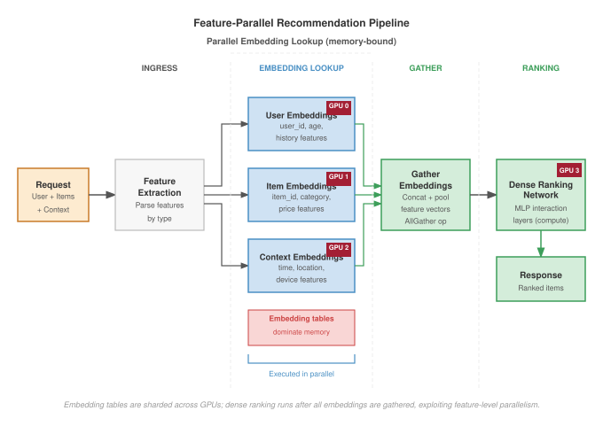
:::

Recommendation systems expose the same scheduling principle under a different bottleneck. As @fig-feature-parallel-pipeline shows, their computation pattern involves:

1. **Sparse feature lookup**\index{Sparse Feature Lookup}: Retrieve embeddings for user, item, and context features

2. **Dense feature processing**: Transform and normalize dense features

3. **Feature interaction**\index{Feature Interaction}: Compute interactions between features (often via attention or factorization)

4. **Ranking head**\index{Ranking Head}: Produce final scores

The sparse embedding lookup often dominates latency and determines batching strategy.

Feature-parallel batching processes different feature types in parallel rather than batching entire requests:

```
Request 1: [user_id_1, item_ids_1, context_1]
Request 2: [user_id_2, item_ids_2, context_2]
Request 3: [user_id_3, item_ids_3, context_3]

Feature-parallel view:
User embeddings:  [lookup(user_1), lookup(user_2), lookup(user_3)]  → parallel
Item embeddings:  [lookup(items_1), lookup(items_2), lookup(items_3)]  → parallel
Context features: [process(ctx_1), process(ctx_2), process(ctx_3)]  → parallel

Then: Combine features per request for ranking
```

Feature-parallel batching is natural when embeddings are sharded across servers: each embedding server handles lookups for its shard across all requests in the batch. At Meta-scale request volumes, this turns feature sharding into a serving strategy rather than a storage detail.

```{python}
#| echo: false
#| label: recsys-latency-breakdown-calc
# ┌─────────────────────────────────────────────────────────────────────────────
# │ RECSYS LATENCY BREAKDOWN (LEGO)
# ├─────────────────────────────────────────────────────────────────────────────
# │ Context: @tbl-inference-recsys-latency-breakdown — Total row.
# │
# │ Goal: Compute total latency as sum of individual phase durations.
# │ Show: Total = 5.2 ms in the table.
# │ How: Sum phase durations: 0.2 + 0.5 + 2 + 1 + 1.5.
# │
# │ Imports: mlsysim.fmt (fmt, check)
# │ Exports: RecsysLatencyBreakdown.total_ms_str
# └─────────────────────────────────────────────────────────────────────────────
from mlsysim.fmt import check, fmt_time


class RecsysLatencyBreakdown:
    """Compute total latency from phase durations."""

    # ┌── 1. LOAD (Constants) ──────────────────────────────────────────────
    routing = 0.2 * ms  # scenario table row
    accumulation = 0.5 * ms  # scenario table row
    embedding = 2.0 * ms  # scenario table row
    feature = 1.0 * ms  # scenario table row
    ranking = 1.5 * ms  # scenario table row

    # ┌── 2. EXECUTE (The Compute) ─────────────────────────────────────────
    total = (
        routing
        + accumulation
        + embedding
        + feature
        + ranking
    )

    # ┌── 3. GUARD (Invariants) ────────────────────────────────────────────
    check(abs(total.to(ms).magnitude - 5.2) < 1e-9, f"Total latency mismatch: {total.to(ms).magnitude}")

    # ┌── 4. OUTPUT (Formatting) ───────────────────────────────────────────
    total_ms_str = fmt_time(total, millisecond, precision=1, commas=False)
```

::: {#exmp-inference-recsys-batching-at-meta-scale .callout-example title="RecSys batching at Meta scale"}

Consider Meta's recommendation infrastructure serving 10 million QPS across the platform:

**Request characteristics**:

- Each request queries ~100 items (candidate ranking)
- Each item requires 50 embedding lookups (user features, item features, cross features)
- Total embedding lookups: 5,000 per request
- Embedding table size: 100 TB across 1,000 shards

**Batching strategy**:

With 10M QPS and 1,000 embedding shards, each shard receives:

$$\text{Lookups per shard} = \frac{10 \times 10^6 \times 5000}{1000} = 50 \text{ million lookups/sec}$$

Single-threaded processing cannot sustain that rate. Instead:

**Batch accumulation window**\index{Batching!batch, accumulation window}: 1 ms
**Requests per batch**: 10,000 (at 10M QPS)
**Lookups per shard per batch**: 50K

Each embedding shard processes about 50K lookups in a batched operation, achieving high memory bandwidth utilization through sequential memory access patterns.

As @tbl-inference-recsys-latency-breakdown shows, the per-phase latency\index{Latency!breakdown} composition is:

| **Phase**                                    |                    **Duration**                    |          **Notes**          |
|:---------------------------------------------|:--------------------------------------------------:|:---------------------------:|
| **Request routing**                          |                       0.2 ms                       | Consistent hashing to shard |
| **Batch accumulation**                       |                    0.5 ms (avg)                    |         1 ms window         |
| **Embedding lookup**\index{Embedding Lookup} |                        2 ms                        |     Batched, SSD-backed     |
| **Feature processing**                       |                        1 ms                        |      Dense computation      |
| **Ranking model**                            |                       1.5 ms                       |        Final scoring        |
| **Total**                                    | **`{python} RecsysLatencyBreakdown.total_ms_str`** |       Within 10 ms SLO      |

: **Latency breakdown for a 10M-QPS recommender request**: Per-phase contribution to end-to-end latency for a single recommender request at 10M QPS with 1,000 embedding shards. {#tbl-inference-recsys-latency-breakdown}

**Systems insight**: Recommendation batching is organized around sparse feature access, not around identical request tensors. The system wins by batching embedding lookups at the shard where memory bandwidth is consumed.

:::

### Streaming inference for real-time applications {#sec-inference-scale-streaming-inference-realtime-applications-906c}

Streaming workloads define the boundary where batching itself becomes the wrong response. Real-time speech recognition, video analysis, and robotics require processing inputs as they arrive with minimal latency.

Streaming inference processes inputs incrementally without waiting for batch formation:

- **Speech**: Process audio frames (10--20 ms chunks) as they arrive from the microphone
- **Video**\index{Video}: Process frames at capture rate (30–60 FPS) without buffering
- **Robotics**\index{Robotics}: Process sensor readings at control loop frequency (100--1000 Hz)

For streaming applications, the relevant metric is not throughput but time to process each input:

$$T_{\text{streaming}} = T_{\text{capture}} + T_{\text{transfer}} + T_{\text{inference}} + T_{\text{action}}$$

where all components must complete within the inter-frame interval. A streaming speech-to-text pipeline shows how these latency components compose under tight real-time constraints.

::: {#exmp-inference-streaming-speech-recognition-pipeline .callout-example title="Streaming speech recognition pipeline"}

Consider a streaming speech-to-text system with 20 ms audio frames:

**Latency budget**\index{Latency Budget}: 100 ms end-to-end (5 frames of delay)

@Tbl-inference-streaming-speech-pipeline traces the per-stage latency\index{Pipeline!stages} the pipeline must hit to stay within the 100 ms budget:

| **Stage**                                        |    **Duration**   |          **Notes**          |
|:-------------------------------------------------|:-----------------:|:---------------------------:|
| **Audio capture**                                | 0 ms (continuous) |      Microphone buffer      |
| **Network to server**                            |       20 ms       |   Including jitter buffer   |
| **Feature extraction**\index{Feature Extraction} |        5 ms       |       MFCC computation      |
| **Encoder inference**                            |       30 ms       |     Streaming Conformer     |
| **Decoder step**                                 |       15 ms       |  CTC or transducer decoding |
| **Text formatting**                              |        5 ms       | Capitalization, punctuation |
| **Network to client**                            |       15 ms       |    Response transmission    |
| **Total**                                        |     **90 ms**     |     Within 100 ms budget    |

: **Streaming speech recognition pipeline latency**: Per-stage latency for a streaming speech-to-text pipeline operating on 20 ms audio frames against a 100 ms end-to-end budget. {#tbl-inference-streaming-speech-pipeline}

**Key constraints**:

- No batching: Each frame processes individually
- Stateful model: Encoder maintains context across frames
- Pipeline parallelism: While frame N is in decoder, frame N+1 is in encoder

GPU utilization is typically 30--50 percent for streaming workloads, traded for latency guarantee.

**Systems insight**: Streaming inference deliberately sacrifices accelerator utilization to preserve end-to-end latency. The binding constraint is the inter-frame deadline, not average throughput.

:::

### Adaptive batching strategies {#sec-inference-scale-adaptive-batching-strategies-4fc1}

Once batching is workload-specific, fixed parameters become fragile. Production systems adapt batching behavior based on current conditions:

Traffic-adaptive batching adjusts the batch window based on arrival rate:

$$T_{\text{window}} = \min\left(T_{\text{max}}, \frac{B_{\text{target}}}{\lambda_{\text{current}}}\right)$$

When traffic is high, the window shrinks because the target batch size fills quickly. When traffic is low, the window extends but is capped to bound maximum latency.

SLO-adaptive batching takes a complementary approach, monitoring latency percentiles and adjusting parameters aggressively:

```
if P99_latency > 0.9 * SLO:
    reduce B_max by 20%
    reduce T_window by 20%
elif P99_latency < 0.5 * SLO:
    increase B_max by 10%
    increase T_window by 10%
```

The feedback loop maintains latency headroom while maximizing throughput during normal operation. Request-aware batching adds a third dimension by considering request characteristics when forming batches. For LLMs:

- Group requests by expected output length (inferred from prompt type)
- Group requests by prompt length to minimize padding
- Prioritize latency-sensitive requests in smaller batches

Production serving infrastructure embodies these adaptive principles. The NVIDIA Triton Inference Server implements a configurable adaptive batching system that illustrates how SLO-aware and request-aware strategies operate in practice. Triton exposes three knobs: **max_batch_size**\index{Batching!max batch size} (the upper bound on batch size), **batching_timeout_ms**\index{Batching!timeout parameter} (the maximum time to wait for batch formation), and **preferred_batch_size**\index{Batching!preferred batch size} (target batch sizes that align with kernel efficiency). Internally, the scheduler maintains separate queues for each preferred batch size and routes requests to minimize total latency:

$$\text{Queue selection} = \operatorname{arg\,min}_{q} \left( \text{wait}_q + \text{exec}(|q| + 1) \right)$$

This optimization weighs both the current queue length and the kernel-efficiency of the resulting batch size. @Tbl-inference-triton-adaptive-batching shows the result for ResNet-50 on V100: the scheduler automatically increases batch size to maintain throughput as traffic grows, with measured throughput tracking offered load until saturation near 2,000 QPS.

| **Traffic Level** | **Avg Batch Size** | **Avg Latency** | **Throughput** |
|:------------------|:------------------:|:---------------:|:--------------:|
| **100 QPS**       |        2.1         |       8 ms      |    100 QPS     |
| **500 QPS**       |        6.3         |      12 ms      |    500 QPS     |
| **1000 QPS**      |        12.4        |      18 ms      |    1000 QPS    |
| **2000 QPS**      |        24.1        |      28 ms      |    1980 QPS    |

: **Triton Adaptive Batching: ResNet-50 on V100**: Observed batch size, average latency, and sustained throughput for the Triton inference server's adaptive batcher under increasing traffic on ResNet-50 (V100). {#tbl-inference-triton-adaptive-batching}

### Quantitative summary: Batching strategy selection {#sec-inference-scale-quantitative-summary-batching-strategy-selection-d5af}

The final selection problem is to match the batching mechanism to model shape, traffic variance, and latency budget. @Fig-inference-lifecycle visualizes the end-to-end request path, highlighting latency sources at each stage.

::: {#chk-inference-batching-strategy-trade-offs .callout-checkpoint title="Batching strategy trade-offs"}

Verify your understanding of different batching mechanics:

- [ ] A vision service has highly uniform input sizes and predictable traffic. Which is more appropriate: **static batching** or **continuous batching**?
- [ ] For an LLM serving chat requests, why does the "Waste Ratio" ($1 - \bar{S}/S_{\text{max}}$) collapse to zero when moving from static to continuous batching?
- [ ] Explain why **adaptive batching** (shrinking the window when traffic is high) reduces P99 latency without sacrificing throughput.
- [ ] In **feature-parallel batching** for RecSys, which component of the fleet stack acts as the primary bottleneck: the GPU's Tensor Cores or the distributed Embedding Store's memory bandwidth?

:::

Before selecting a batching strategy, it is essential to understand where latency accumulates across the full request lifecycle. @Fig-inference-request-flow maps each stage from client to response, revealing the "serving tax" that serialization, routing, and coordination impose outside of GPU compute.

::: {#fig-inference-request-flow fig-env="figure" fig-pos="htb" fig-cap="**Inference Request Lifecycle**: A sequence diagram showing how a user request traverses the serving stack. The 'Serving Tax' is the time spent in the Router, Queue, and Scheduler before the GPU begins mathematical execution." fig-alt="Sequence diagram with five participants (User, Router, KV Cache Manager, Iteration Scheduler, GPU) showing a chat completion request flow: the Router reserves KV cache slots, enqueues the request with the Scheduler, and an iteration loop dispatches prefill and decode batches to the GPU until the response streams back to the user."}

```{text}
sequenceDiagram
    participant User
    participant Router
    participant KV_Cache as KV Cache Manager
    participant Scheduler as Iteration Scheduler
    participant GPU

    User->>Router: POST /v1/chat/completions
    Router->>KV_Cache: Check capacity/Reserve slots
    KV_Cache-->>Router: Slot handle
    Router->>Scheduler: Add to Wait Queue

    loop Every Iteration
        Scheduler->>GPU: Execute Batch (Prefill/Decode)
        GPU-->>Scheduler: Logits/Next Tokens
        Scheduler->>KV_Cache: Update block status
    end

    Scheduler->>User: Stream Result
```

:::

::: {#fig-inference-lifecycle fig-env="figure" fig-pos="htb" fig-cap="**End-to-End Inference Pipeline**: A detailed view of the request lifecycle: client requests arrive at a load balancer, then undergo preprocessing (tokenization) on the CPU. The data moves to the GPU for the compute-bound prefill stage and the memory-bound decode stage, which uses the KV cache. Finally, the response is postprocessed on the CPU (detokenization) and sent back. This visualization highlights the critical \"Serving Tax\" components (serialization, routing, coordination) that consume latency budget outside of the actual GPU compute time." fig-alt="Flowchart showing a request moving from CPU (Preprocessing) to GPU (Prefill Stage, Decode Stage) and back to CPU (Postprocessing). Red annotations below highlight latency sources such as routing, TTFT, and per-token decode time."}

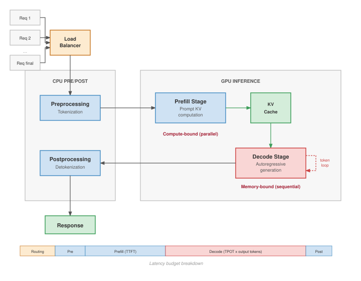

:::

As @fig-inference-lifecycle shows, noncompute stages (serialization, queuing, routing) can consume a substantial fraction of the latency budget, meaning batching strategy selection must account for the full pipeline, not GPU execution time alone. The following decision framework guides strategy selection:

```
Is it autoregressive text generation?
├─ Yes → Continuous batching with chunked prefill
└─ No → Is it real-time streaming speech/video/robotics?
        ├─ Yes → Streaming pipeline with minimal or no batching
        └─ No → Do embedding lookups dominate latency?
                ├─ Yes → Feature-parallel batching (RecSys)
                └─ No → Dynamic batching with adaptive parameters
```

@Tbl-batching-parameters summarizes the key tuning parameters for each strategy:

| **Strategy**         |   **Key Parameters**  | **Tuning Goal**                  |
|:---------------------|:---------------------:|:---------------------------------|
| **Static**           |       Batch size      | Maximize throughput              |
| **Dynamic**          |   Window, max batch   | Balance latency vs. throughput   |
| **Continuous**       | Chunk size, max batch | Minimize decode latency variance |
| **Feature-parallel** |  Accumulation window  | Match embedding shard capacity   |
| **Streaming**        |     Pipeline depth    | Meet real-time deadline          |

: **Batching Strategy Parameters**: Each strategy has distinct parameters requiring tuning for the specific deployment. {#tbl-batching-parameters}

Even a well-tuned continuous batching strategy cannot eliminate a deeper, architecture-specific bottleneck for large language models. The context window of every active request must be stored in GPU memory, making KV cache management the next binding constraint on serving throughput.

## KV Cache Management {#sec-inference-scale-kv-cache-management-04ed}

As an LLM generates a 2,000-word essay, it must constantly recall every word it has previously written. It does this by storing intermediate attention states in a rapidly expanding memory buffer known as the KV Cache. Unmanaged, this cache will aggressively fragment GPU memory, causing out-of-memory crashes even when 40 percent of the VRAM is technically free.

The memory management techniques that enable efficient LLM serving at scale include PagedAttention for fragmentation-free allocation, prefix caching for common prompt sharing, and speculative decoding for latency reduction.

### The KV cache wall: Memory-bound capacity {#sec-inference-scale-kv-cache-wall}

Increasing the batch size to maximize throughput in LLM serving is bounded by the KV cache wall. As @fig-kv-cache-wall shows, model weights represent a fixed "static tax" on GPU memory, while the KV cache grows linearly with both batch size and sequence length.

::: {.column-margin}
{width="100%" fig-alt="Memory ladder on a log scale: a single token uses 0.33 MB, a 128K request uses 43 GB, and the available KV budget is 480 GB."}

*The KV cache fills HBM, capping concurrent requests.*
:::

::: {#fig-kv-cache-wall fig-env="figure" fig-pos="htb" fig-cap="**The KV Cache Wall**: Total GPU memory usage for a 4-bit quantized 70B model (35 GB weights) on an 80 GB H100. While the model fits easily at small context lengths, the KV cache (sloped lines) eventually consumes all remaining HBM. At 128K context, a batch size of 2 is physically impossible on a single GPU (35 GB + 84 GB > 80 GB), forcing the system to either reduce batch size (killing throughput) or shard the model." fig-alt="Memory usage plot. Horizontal dashed line at 80 GB shows capacity. Solid blue region at bottom is 35 GB weights. Sloped lines for Batch 1, 2, 4, and 8 show memory rising with sequence length. Batch 8 hits the 80 GB line very early (~16K tokens)."}

```{python}
#| echo: false
# ┌─────────────────────────────────────────────────────────────────────────────
# │ KV CACHE WALL (FIGURE)
# ├─────────────────────────────────────────────────────────────────────────────
# │ Context: @fig-kv-cache-wall—KV cache memory bottleneck
# │
# │ Goal: Plot total GPU memory (weights + KV cache) vs sequence length for
# │       batch 1/2/4/8; show 80 GB HBM limit; OOM zone.
# │ Show: fill_between weights; sloped KV lines; capacity dashed line.
# │ How: KV = 2*80*8*128*2 bytes/token; gb_per_1k_tokens; book_style.set_book_style().
# │
# │ Imports: numpy (np), matplotlib.pyplot (plt), book.tools.figures.style (book_style)
# │ Exports: (figure only, no prose variables)
# └─────────────────────────────────────────────────────────────────────────────
# ┌── 1. CANVAS ────────────────────────────────────────────────────────────────
# │ Plot total GPU memory (weights + KV cache) vs sequence length for
import numpy as np
import matplotlib.pyplot as plt
from book.tools.figures import style as book_style
# ┌── 2. ARRAYS ────────────────────────────────────────────────────────────────
book_style.set_book_style()
COLORS = book_style.COLORS

# Parameters for Llama-70B GQA
weights_gb = 35.0 # 4-bit
hbm_cap_gb = 80.0
# KV cache: 2 * layers * kv_heads * head_dim * precision
# 2 * 80 * 8 * 128 * 2 bytes = 327,680 bytes/token
#   = 0.32768 MB/token
#   = 327.68 MB per 1,000 tokens = 0.32768 GB per 1,000 tokens
gb_per_1k_tokens = 0.32768 # GB per 1k tokens (seq_len_k is in 1k-token units)

seq_len_k = np.linspace(0, 128, 100) # up to 128k tokens

fig, ax = plt.subplots(figsize=(8, 5))

# Plot base weights

# ┌── 3. RENDER ────────────────────────────────────────────────────────────────
ax.fill_between(seq_len_k, 0, weights_gb, color=COLORS['BlueLine'], alpha=0.3, label='Weights (4-bit 70B)')
ax.axhline(y=weights_gb, color=COLORS['BlueLine'], linestyle='-', linewidth=1)

# Plot Batch Sizes
for b in [1, 2, 4, 8]:
    total_mem = weights_gb + (b * seq_len_k * gb_per_1k_tokens)
    # Only plot where it fits
    # mask = total_mem <= hbm_cap_gb * 1.1
    ax.plot(seq_len_k, total_mem, label=f'Batch {b}')

# HBM Limit
ax.axhline(y=hbm_cap_gb, color=COLORS['RedLine'], linestyle='--', linewidth=2)

# ┌── 4. DECORATE ──────────────────────────────────────────────────────────────
ax.text(5, hbm_cap_gb + 2, 'HBM Capacity (80 GB)',
 color=COLORS['RedLine'],
 fontsize=9,
 fontweight='bold')

ax.set_xlabel('Sequence Length (1,000s of Tokens)')
ax.set_ylabel('Total GPU Memory (GB)')
ax.set_ylim(0, 110)
ax.set_xlim(0, 128)
plt.legend(
    loc='upper right',
    fontsize=8,
    frameon=True,
    facecolor='white',
    framealpha=0.95,
    edgecolor='gray',
    fancybox=True,
    borderpad=0.6
)
ax.grid(True, alpha=0.2)

plt.show()
```

:::

The visualization reveals why the Distribution Layer must sometimes shard models that would otherwise fit on a single GPU. Sharding provides the memory headroom needed to maintain high batch sizes for long-context requests. Without sharding, a 128K context request effectively "evicts" all other users from the GPU.

The same formula can be turned into an explicit batch-size limit for production hardware.

```{python}
#| echo: false
#| label: kv-cache-capacity-estimator
# ┌─────────────────────────────────────────────────────────────────────────────
# │ KV CACHE CAPACITY ESTIMATOR (LEGO)
# ├─────────────────────────────────────────────────────────────────────────────
# │ Context: "KV-cache capacity estimator" callout in §KV cache fundamentals.
# │
# │ Goal: Compute per-token KV bytes, per-request KV GB, and max batch size for
# │       a Llama-3-70B-style GQA model at 128K context on an 8xH100 node.
# │ Show: 327,680 bytes/token, ~43 GB/request, max batch 11.
# │ How: 2 * layers * KV_heads * head_dim * bytes_per_elem * context_tokens.
# │
# │ Imports: mlsysim.fmt (check, fmt, MarkdownStr)
# │ Exports: KVCacheCapacityEstimator.kv_bytes_per_token_str,
# │          KVCacheCapacityEstimator.kv_mb_per_token_str,
# │          KVCacheCapacityEstimator.context_tokens_str,
# │          KVCacheCapacityEstimator.kv_gb_per_request_str,
# │          KVCacheCapacityEstimator.available_kv_gb_str,
# │          KVCacheCapacityEstimator.max_batch_str,
# │          KVCacheCapacityEstimator.step1_kv_per_token_math
# └─────────────────────────────────────────────────────────────────────────────
from mlsysim.fmt import fmt_int, check, fmt_memory, fmt_memory_capacity, fmt_qty_int, MarkdownStr

class KVCacheCapacityEstimator:
    """KV-cache capacity estimator for a long-context 70B GQA deployment."""

    # ┌── 1. LOAD (Constants) ──────────────────────────────────────────────
    _model = Models.Language.Llama3_70B
    n_layers = _model.layers
    n_kv_heads = _model.kv_heads or _model.heads
    d_head = _model.hidden_dim // _model.heads
    bytes_per_elem = 2
    context_tokens = 131_072
    node_gpus = Systems.Nodes.DGX_H100.accelerators_per_node
    h100_vendor_capacity = ReferenceStats.ServingProfiles.H100VendorMemoryBudget
    total_hbm = node_gpus * h100_vendor_capacity
    weight = _model.size_in_bytes(BYTES_FP16)
    system_reserved = 20 * GB  # scenario reserve

    # ┌── 2. EXECUTE (The Compute) ────────────────────────────────────────
    from mlsysim.physics import calc_kv_cache_size
    # Use library formula for per-token KV bytes
    kv_cache_one_token = calc_kv_cache_size(n_layers, n_kv_heads, d_head, 1, 1, bytes_per_elem)
    kv_bytes_per_token = int(kv_cache_one_token.to(byte).magnitude)

    kv_cache_full = calc_kv_cache_size(n_layers, n_kv_heads, d_head, context_tokens, 1, bytes_per_elem)

    available_kv = total_hbm - weight - system_reserved
    max_batch = int((available_kv / kv_cache_full).to("").magnitude)

    # ┌── 3. GUARD (Invariants) ──────────────────────────────────────────
    check(kv_bytes_per_token == 327_680, "KV bytes/token should match GQA formula")
    check(max_batch == 11, f"Expected max batch 11, got {max_batch}")

    # ┌── 4. OUTPUT (Formatting) ─────────────────────────────────────────────
    kv_mb_per_token_display = kv_cache_one_token.to(MB).magnitude
    kv_gb_per_request_display = kv_cache_full.to(GB).magnitude
    available_kv_display = available_kv.to(GB).magnitude
    kv_bytes_per_token_str = fmt_int(kv_bytes_per_token)
    kv_mb_per_token_str = fmt_memory(kv_cache_one_token, unit=MB, precision=2, commas=False)
    context_tokens_str = fmt_int(context_tokens)
    kv_gb_per_request_str = fmt_memory(kv_cache_full, unit=GB, precision=1, commas=False)
    available_kv_gb_str = fmt_memory(available_kv, unit=GB, precision=1, commas=False)
    max_batch_str = fmt_int(max_batch, commas=False)
    weight_gb_str = fmt_memory(weight, unit=GB, precision=1, commas=False)
    total_hbm_gb_str = fmt_memory(total_hbm, unit=GB, precision=0, commas=False)
    system_gb_str = fmt_memory(system_reserved, unit=GB, precision=0, commas=False)
    node_gpus_str = fmt_int(node_gpus, commas=False)
    h100_mem_gb_str = fmt_memory_capacity(h100_vendor_capacity, unit=GB, precision=0, commas=False)

    # Display-math expressions for the three step equations (pre-compute LaTeX
    # in Python to avoid `{python}` refs inside $$..$$ — §7 anti-pattern).
    step1_kv_per_token_math = MarkdownStr(
        f"$$ M_{{\\text{{KV}}}} = 2 \\times {n_layers} \\times {n_kv_heads} \\times {d_head} \\times {bytes_per_elem} "
        f"= {kv_bytes_per_token:,} \\text{{ bytes}} \\approx "
        f"\\mathbf{{{kv_mb_per_token_display:.2f} \\text{{ MB/token}}}} $$"
    )
    step2_cache_per_request_math = MarkdownStr(
        f"$$ {context_tokens:,} \\text{{ tokens}} \\times {kv_mb_per_token_display:.2f} \\text{{ MB/token}} \\approx "
        f"\\mathbf{{{kv_gb_per_request_display:.1f} \\text{{ GB/request}}}} $$"
    )
    step3_max_batch_math = MarkdownStr(
        f"$$ \\text{{Max Batch}} = \\left\\lfloor \\frac{{{available_kv_display:.1f}}}{{{kv_gb_per_request_display:.1f}}} \\right\\rfloor "
        f"= \\mathbf{{{max_batch}}} $$"
    )
```

::: {#exmp-inference-kv-cache-capacity-estimator .callout-example title="KV-cache capacity estimator"}

**Problem**: A deployment serves Llama-3-70B (FP16 weights $\approx$ `{python} KVCacheCapacityEstimator.weight_gb_str`) on an `{python} KVCacheCapacityEstimator.node_gpus_str`$\times$ H100 node (`{python} KVCacheCapacityEstimator.total_hbm_gb_str` total HBM). The goal is to determine the maximum batch size for a context length of 128K tokens.

**Formula**\index{Formula}:
$$ M_{\text{KV}} = 2 \times N_{\text{layers}} \times N_{\text{KV heads}} \times d_{\text{head}} \times s_{\text{elem}} $$
$$ \text{Total Memory} = M_{\text{weights}} + (\text{Batch} \times \text{Context} \times M_{\text{KV}}) $$

**Parameters**\index{Parameter}:

*   $N_{\text{layers}} = 80$, $N_{\text{KV heads}} = 8$ for Llama-3-70B GQA, $d_{\text{head}} = 128$.
*   $s_{\text{elem}} = 2$ bytes (FP16).
*   Context $= 131,072$ tokens.

**Step 1**: Calculate memory per token.
`{python} KVCacheCapacityEstimator.step1_kv_per_token_math`

**Step 2**: Calculate cache per request.
`{python} KVCacheCapacityEstimator.step2_cache_per_request_math`

**Step 3**: Determine max batch size.
Available Memory for KV = `{python} KVCacheCapacityEstimator.total_hbm_gb_str` (Total) - `{python} KVCacheCapacityEstimator.weight_gb_str` (Weights) - `{python} KVCacheCapacityEstimator.system_gb_str` (System) = `{python} KVCacheCapacityEstimator.available_kv_gb_str`.
`{python} KVCacheCapacityEstimator.step3_max_batch_math`

**Systems insight**: Even with GQA, 128K-context requests consume tens of gigabytes of KV cache, so the system serves only a small number of concurrent long-context requests before memory becomes the binding constraint. Addressing this requires PagedAttention (to reduce fragmentation) and KV-cache quantization or sharding.

:::

### The fragmentation problem {#sec-inference-scale-fragmentation-problem-28be}

Traditional memory allocation for KV cache preallocates contiguous memory for each sequence based on maximum expected length. This creates two forms of waste:

Internal fragmentation wastes memory within each allocation. Sequences shorter than the maximum allocation leave the unused portion idle. If maximum length is 4,096 but average output is 100 tokens, 97.5 percent of allocated memory is wasted.

External fragmentation compounds this problem across allocations. As sequences complete and new ones start, memory becomes fragmented into noncontiguous free blocks. Even with sufficient total free memory, no single block may be large enough for a new maximum-length allocation.

Consider a simplified example with 8 memory slots and maximum sequence length of 4. Fixed-size reservations first create internal fragmentation:

```
Time 0: Allocate Seq A (slots 0-3), Seq B (slots 4-7)
        [A][A][a][a][B][B][B][b]
        lowercase = reserved but unused
```

External fragmentation appears after sequences complete and new sequences start:

```
Time 1: Active Seq C and Seq D leave two 2-slot gaps
        [ ][ ][C][C][ ][ ][D][D]

Time 2: Try to allocate Seq E (needs 4 contiguous slots)
        [ ][ ][C][C][ ][ ][D][D]  <- Total free slots = 4, largest block = 2

Result: enough total free capacity exists, but no contiguous block is large enough.
```

Production systems report 60--80 percent memory waste from fragmentation under realistic workloads, severely limiting batch sizes and throughput.

### PagedAttention {#sec-inference-scale-pagedattention-3c94}

::: {#dfn-inference-pagedattention .callout-definition title="PagedAttention"}

***PagedAttention***\index{PagedAttention!definition}\index{PagedAttention!block table} is an LLM serving memory management technique that applies virtual memory principles to KV Cache allocation, storing attention states in noncontiguous, fixed-size physical blocks.

1.  **Significance (quantitative)**: It eliminates Internal and External Fragmentation\index{Internal and External Fragmentation}, which can waste up to 80 percent of GPU memory. By allowing sequences to grow dynamically, it enables 2--4$\times$ higher Concurrent Throughput $(X)$ on the same hardware.
2.  **Distinction (durable)**: Unlike Contiguous Allocation (which requires prereserving the maximum context length), PagedAttention uses a Block Table to map logical sequence indices to physical memory pages, allocating only what is currently used.
3.  **Common pitfall**: A frequent misconception is that PagedAttention speeds up *individual token math*. In reality, it is a Capacity Optimization\index{Optimization!capacity}: it improves *system-level efficiency* by allowing larger batch sizes, though it adds a small Indirection Overhead $(L_{\text{lat}})$ for the pointer lookups.

:::

The virtual-memory shift changes the allocation problem: capacity no longer has to be reserved as one contiguous block before the request starts.

::: {#psp-inference-analogy-inefficient-hotel .callout-perspective title="Analogy: The inefficient hotel"}

Imagine a hotel where every guest might stay anywhere from 1 to 10 days, but they do not know in advance.

Under contiguous allocation, the hotel manager blocks out a 10-day suite for every guest just in case. A 100-room hotel becomes "fully booked" with only 10 guests, wasting 90 percent of its capacity (Internal Fragmentation).

Under PagedAttention (Virtual Memory), the manager assigns a guest just 1 room. If the guest stays another day, they are given whatever room is available next, even if it is on a different floor. The front desk maintains a "Block Table" to keep track of which rooms belong to which guest. The hotel can now accommodate 100 guests simultaneously, recovering the 90 percent wasted capacity.

:::

PagedAttention [@kwon2023], introduced in vLLM, applies virtual memory concepts to KV cache management. Instead of contiguous allocation, the KV cache is divided into fixed-size pages (typically 16--256 tokens), and sequences are allocated pages on demand.

@Fig-paged-attention illustrates the key concepts including page tables that map logical sequence positions to physical memory pages, block size that defines the number of tokens per page (typically 16 tokens), and physical blocks that provide fixed-size memory allocations\index{Memory Allocation!contiguous} assignable to any sequence.

::: {#fig-paged-attention fig-env="figure" fig-pos="htb" fig-cap="**KV Cache Fragmentation and the PagedAttention Solution**: Top left: internal fragmentation wastes memory by preallocating for the maximum sequence length. Top right: external fragmentation leaves unusable memory gaps. Bottom: PagedAttention solves this by mapping contiguous logical pages of a sequence to noncontiguous physical memory blocks via a block table, allowing the system to fill fragmentation gaps with small blocks from any sequence." fig-alt="A three-part diagram on memory fragmentation. Top panels show internal and external fragmentation. The bottom panel shows the PagedAttention solution using a block table to map logical pages to scattered physical blocks, eliminating waste."}
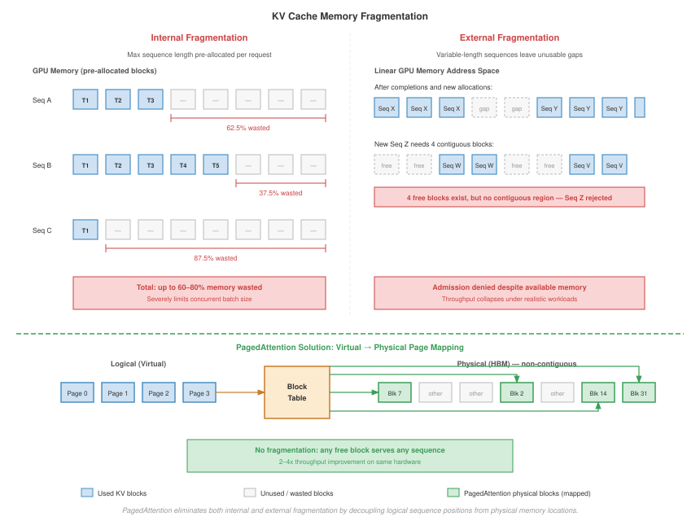
:::

PagedAttention provides several benefits. It eliminates internal fragmentation by allocating only the pages needed for actual tokens. It eliminates external fragmentation because any free page can be used by any sequence. It enables dynamic growth so sequences can grow without preallocation. It supports memory sharing so common prefixes can share physical pages.

::: {#exmp-inference-pagedattention-implementation-details .callout-example title="PagedAttention implementation details"}

**Memory layout**\index{Memory Layout}:

```
Physical blocks (16 tokens by hidden_dim by 2 by precision):
Block 0:  [K₀...K₁₅, V₀...V₁₅]
Block 1:  [K₀...K₁₅, V₀...V₁₅]
...
Block N:  [K₀...K₁₅, V₀...V₁₅]
```

**Page table per sequence**\index{Page Table Per Sequence}:

```{.python}
class PageTable:
    def __init__(self, max_blocks):
        self.block_map = {}  # logical_block -> physical_block

    def allocate_block(self, logical_idx, physical_block):
        self.block_map[logical_idx] = physical_block

    def get_physical(self, logical_idx):
        return self.block_map[logical_idx]
```

**Attention kernel modification**:

Standard attention: `output = softmax(Q @ K.T/sqrt(d)) @ V`

PagedAttention:
```{.python}
def paged_attention(Q, page_table, physical_blocks, block_size):
    # Gather K, V from noncontiguous physical blocks
    for logical_idx in range(num_logical_blocks):
        physical_idx = page_table[logical_idx]
        K_block = physical_blocks[physical_idx].K
        V_block = physical_blocks[physical_idx].V
        # Compute attention for this block
        attention_scores = Q @ K_block.T / sqrt(d)
        output += softmax(attention_scores) @ V_block
    return output
```

**Systems insight**: \index{Performance Impact} The gather operations add overhead, but it is minimal compared to the memory savings; @tbl-inference-pagedattention-throughput shows the 2.5--4$\times$ throughput improvement coming from fitting more concurrent sequences in the same memory.

:::

| **Approach**       | **KV Cache Pool Utilization** | **Throughput (relative)** |
|:-------------------|:-----------------------------:|:-------------------------:|
| **Contiguous**     |         30-40 percent         |   1.0$\times$ (baseline)  |
| **PagedAttention** |          95 percent+          |       2.5--4$\times$      |

: **PagedAttention vs. Contiguous KV Cache**: KV cache pool utilization and relative serving throughput for contiguous allocation against PagedAttention. {#tbl-inference-pagedattention-throughput}

### Prefix caching {#sec-inference-scale-prefix-caching-8e8b}

Many LLM workloads share common prefixes across requests. System prompts like "You are a helpful assistant..." are prepended to every request. Few-shot examples use the same examples for many queries. Document context involves multiple questions about the same document. Recomputing these shared prefixes wastes both compute (prefill) and memory (duplicate KV cache entries).

Prefix caching shares KV cache entries across requests with common prefixes. @Fig-prefix-caching demonstrates how shared system prompts avoid redundant computation:

::: {#fig-prefix-caching fig-env="figure" fig-pos="htb" fig-cap="**Prefix Caching via Block Sharing**: PagedAttention enables efficient prefix caching by allowing multiple sequences' block tables to point to the same physical blocks for shared content. In this example, the System Prompt is stored in blocks 0-5. Request A and Request B maps their first 6 logical pages to these same physical blocks, storing only their unique suffixes in new blocks. This dramatically reduces memory usage and prefill computation for workloads with shared context." fig-alt="Block diagram showing two requests sharing physical memory. Top row: 6 green shared blocks (B0-B5) for system prompt. Request A and Request B page tables both point to shared blocks, with unique suffix blocks in blue and pink respectively."}

```{.tikz}
\begin{tikzpicture}[font=\small\usefont{T1}{phv}{m}{n}, scale=0.9, transform shape]
  \definecolor{SharedColor}{HTML}{D4EFDF}
  \definecolor{UniqueColorA}{HTML}{D1E6F3}
  \definecolor{UniqueColorB}{HTML}{F5D2D5}
  \definecolor{BlockColor}{HTML}{F5F5F5}

  \tikzset{
    block/.style={draw=black!60, fill=BlockColor, minimum width=0.8cm, minimum height=0.6cm, font=\scriptsize\usefont{T1}{phv}{m}{n}, inner sep=0pt},
    ptr/.style={->, >=stealth, thick}
  }

  % Physical Memory Blocks (Central)
  \node[anchor=north] (phys_title) at (4, 4) {\textbf{Physical Blocks (GPU)}};

  % Shared Blocks 0-5
  \node[block, fill=SharedColor, below=0.2cm of phys_title.south west, anchor=north west, xshift=-1cm] (pb0) {B0};
  \node[block, fill=SharedColor, right=0.1cm of pb0] (pb1) {B1};
  \node[block, fill=SharedColor, right=0.1cm of pb1] (pb2) {B2};
  \node[block, fill=SharedColor, right=0.1cm of pb2] (pb3) {B3};
  \node[block, fill=SharedColor, right=0.1cm of pb3] (pb4) {B4};
  \node[block, fill=SharedColor, right=0.1cm of pb4] (pb5) {B5};

  \node[right=0.2cm of pb5, font=\scriptsize\usefont{T1}{phv}{m}{n}] {(System Prompt)};

  % Unique Blocks for A
  \node[block, fill=UniqueColorA, below=0.4cm of pb0] (pb10) {B10};
  \node[block, fill=UniqueColorA, right=0.1cm of pb10] (pb11) {B11};

  % Unique Blocks for B
  \node[block, fill=UniqueColorB, below=0.4cm of pb3] (pb12) {B12};
  \node[block, fill=UniqueColorB, right=0.1cm of pb12] (pb13) {B13};
  \node[block, fill=UniqueColorB, right=0.1cm of pb13] (pb14) {B14};

  % Logical View - Request A
  \node[anchor=east] (reqA_title) at (-1, 1) {\textbf{Request A}};
  \node[block, fill=SharedColor, right=0.2cm of reqA_title] (la0) {P0};
  \node[block, fill=SharedColor, right=0.1cm of la0] (la1) {P1};
  \node[font=\scriptsize\usefont{T1}{phv}{m}{n}, right=0.1cm of la1] (la_dots) {...};
  \node[block, fill=UniqueColorA, right=0.1cm of la_dots] (la6) {P6};

  \draw[ptr, SharedColor!70!black] (la0) -- (pb0);
  \draw[ptr, SharedColor!70!black] (la1) -- (pb1);
  \draw[ptr, UniqueColorA!70!black] (la6) -- (pb10);

  % Logical View - Request B
  \node[anchor=east, below=0.5cm of reqA_title.east] (reqB_title) {\textbf{Request B}};
  \node[block, fill=SharedColor, right=0.2cm of reqB_title] (lb0) {P0};
  \node[block, fill=SharedColor, right=0.1cm of lb0] (lb1) {P1};
  \node[font=\scriptsize\usefont{T1}{phv}{m}{n}, right=0.1cm of lb1] (lb_dots) {...};
  \node[block, fill=UniqueColorB, right=0.1cm of lb_dots] (lb6) {P6};

  \draw[ptr, SharedColor!70!black] (lb0) to[in=220, out=45] (pb0);
  \draw[ptr, SharedColor!70!black] (lb1) to[in=220, out=45] (pb1);
  \draw[ptr, UniqueColorB!70!black] (lb6) -- (pb12);

  % Annotations
  \node[align=left, font=\scriptsize\usefont{T1}{phv}{m}{n}, anchor=west, right=2cm of la6] {Both requests point\\to same physical blocks\\for blocks 0-5};

\end{tikzpicture}
```

:::

**Implementation with PagedAttention.**

Prefix caching integrates naturally with PagedAttention through copy-on-write semantics:

```
System prompt → Physical blocks [0, 1, 2, 3, 4, 5]

Request A page table: [0, 1, 2, 3, 4, 5, 10, 11]  <- shares prefix blocks
Request B page table: [0, 1, 2, 3, 4, 5, 12, 13, 14]  <- shares prefix blocks
Request C page table: [0, 1, 2, 3, 4, 5, 15]  <- shares prefix blocks
```

All three requests reference the same physical blocks for the system prompt. Only when generating unique tokens do they allocate new blocks. The savings can be substantial when many concurrent requests share the same system prompt; the following example quantifies them for a typical chatbot deployment.

```{python}
#| echo: false
#| label: prefix-caching-calc
# ┌─────────────────────────────────────────────────────────────────────────────
# │ PREFIX CACHING CALCULATION (LEGO)
# ├─────────────────────────────────────────────────────────────────────────────
# │ Context: "Prefix Caching at Scale" callout in §Prefix Caching.
# │
# │ Goal: Quantify KV cache memory savings from prefix caching for a 70B-class
# │   LLM chatbot with 2000-token system prompt and 1000 concurrent users,
# │   motivating why prefix caching enables order-of-magnitude concurrency gains.
# │ Show: kv_tb_no_cache_str="~6.6" TB (without), kv_tb_cached_str="~1.3" TB
# │   (with), memory_reduction_pct_str="80"%, concurrent_mult_str="5"—
# │   inline in the "Prefix Caching at Scale" callout.
# │ How: Multiply token count × KV pairs × Llama-70B layers × hidden_dim × bytes/element,
# │   divide by 1e12 for TB; compare shared-prefix vs per-user-token totals.
# │
# │ Imports: (none)
# │ Exports: PrefixCachingAnalysis.tokens_per_user_str,
# │   PrefixCachingAnalysis.kv_tb_no_cache_str,
# │   PrefixCachingAnalysis.total_tokens_cached_str,
# │   PrefixCachingAnalysis.kv_tb_cached_str,
# │   PrefixCachingAnalysis.memory_reduction_pct_str,
# │   PrefixCachingAnalysis.concurrent_mult_str
# └─────────────────────────────────────────────────────────────────────────────
from mlsysim.fmt import check, fmt_count, fmt_int, fmt_memory, fmt_percent

# ┌── LEGO ───────────────────────────────────────────────
class PrefixCachingAnalysis:
    """Quantify KV cache memory savings from prefix caching for a 70B-class LLM chatbot."""

    # ┌── 1. LOAD (Constants) ──────────────────────────────────────────────
    system_prompt_tokens = 2000
    concurrent_users = 1000
    avg_response_tokens = 500
    _model = Models.Language.Llama2_70B
    n_kv_pairs = 2      # key + value
    n_layers = _model.layers
    hidden_dim = _model.hidden_dim
    bytes_per_element = 2  # FP16

    # ┌── 2. EXECUTE (The Compute) ────────────────────────────────────────
    # Step 1: Without prefix caching: every user stores full system_prompt + response tokens
    tokens_per_user = system_prompt_tokens + avg_response_tokens  # 2500
    total_tokens_no_cache = tokens_per_user * concurrent_users
    kv_bytes_no_cache = total_tokens_no_cache * n_kv_pairs * n_layers * hidden_dim * bytes_per_element
    kv_no_cache = kv_bytes_no_cache * byte

    # Step 2: With prefix caching: system prompt stored once; only response tokens per user
    shared_tokens = system_prompt_tokens  # stored once
    unique_tokens = avg_response_tokens * concurrent_users
    total_tokens_cached = shared_tokens + unique_tokens
    kv_bytes_cached = total_tokens_cached * n_kv_pairs * n_layers * hidden_dim * bytes_per_element
    kv_cached = kv_bytes_cached * byte

    # Step 3: Savings
    memory_reduction_pct_val = (1 - (kv_cached / kv_no_cache).to("").magnitude) * 100
    concurrent_multiplier_val = (kv_no_cache / kv_cached).to("").magnitude

    # ┌── 3. GUARD (Invariants) ──────────────────────────────────────────
    check(kv_cached < kv_no_cache, "Cached must be smaller than uncached")
    check(memory_reduction_pct_val > 70, "Prefix caching should give substantial savings (>70%)")

    # ┌── 4. OUTPUT (Formatting) ─────────────────────────────────────────────
    tokens_per_user_str = fmt_count(tokens_per_user, label="token")
    kv_tb_no_cache_str = fmt_memory(kv_no_cache, unit=TB, precision=1, commas=False)
    total_tokens_cached_str = fmt_int(total_tokens_cached)
    kv_tb_cached_str = fmt_memory(kv_cached, unit=TB, precision=1, commas=False)
    memory_reduction_pct_str = fmt_percent(memory_reduction_pct_val/100, precision=1, commas=False, style='prose')
    concurrent_mult_str = fmt_multiple(round(concurrent_multiplier_val), commas=False, precision=0)
```

::: {#exmp-inference-prefix-caching-at-scale .callout-example title="Prefix caching at scale"}

**Scenario**: A chatbot service uses a 2000-token system prompt and serves 1000 concurrent users.

**Without prefix caching**: \index{Without Prefix Caching}

- KV cache per user: 2000 + 500 (avg response) = `{python} PrefixCachingAnalysis.tokens_per_user_str`
- Total KV cache: `{python} PrefixCachingAnalysis.tokens_per_user_str` $\times$ 1000 $\times$ 2 $\times$ 80 $\times$ $8192 \times 2$ = `{python} PrefixCachingAnalysis.kv_tb_no_cache_str`

**With prefix caching**: \index{With Prefix Caching}

- Shared prefix: 2000 tokens (once)
- Unique per user: 500 tokens
- Total: $(2000 \times 1) + (500 \times 1000)$ = `{python} PrefixCachingAnalysis.total_tokens_cached_str`
- Memory: `{python} PrefixCachingAnalysis.total_tokens_cached_str` $\times$ 2 $\times$ 80 $\times$ $8192 \times 2$ = `{python} PrefixCachingAnalysis.kv_tb_cached_str`

**Result**: \index{Savings} Prefix caching yields a `{python} PrefixCachingAnalysis.memory_reduction_pct_str` reduction in KV cache memory, enabling `{python} PrefixCachingAnalysis.concurrent_mult_str` more concurrent users.

**Systems insight**: \index{Prefix Hit Rate} Prefix caching pays off when many requests share a long prefix. @Tbl-inference-prefix-caching-workloads contrasts hit rates and memory savings across workloads, showing where the technique changes serving capacity and where it does not.

:::

| **Workload**                     | **Prefix Hit Rate** | **Memory Savings** |
|:---------------------------------|:-------------------:|:------------------:|
| **Chatbot (same system prompt)** |     95 percent+     |   70-80 percent    |
| **Document QA (same doc)**       |    80-90 percent    |   50-70 percent    |
| **General API (diverse)**        |    20--40 percent   |   10--30 percent   |

: **Prefix Caching Effectiveness by Workload**: Typical prefix hit rates and resulting KV-cache memory savings for chatbot, document-QA, and general API workloads, showing where prefix caching pays off and where it does not. {#tbl-inference-prefix-caching-workloads}

### KV cache compression and architectural optimization {#sec-inference-scale-kv-cache-compression-943a}

During autoregressive generation, the Key-Value (KV) cache stores the key and value projections for all previously generated tokens. This cache grows linearly with sequence length and batch size, often becoming the dominant memory consumer in LLM serving. For a 70B parameter model with 80 layers, 64 heads, head dimension 128, and sequence length 4096 in FP16, the KV cache requires:

```{python}
#| echo: false
#| label: kv-cache-calc-inf
# ┌─────────────────────────────────────────────────────────────────────────────
# │ KV CACHE MEMORY CALCULATION
# ├─────────────────────────────────────────────────────────────────────────────
# │ Context: @sec-inference-scale-kv-cache-compression-943a KV cache compression prose
# │
# │ Goal: Compute FP16 and INT4 KV cache footprint for a 70B MHA baseline (80 layers,
# │       64 KV heads, head_dim=128, seq_len=4096) to quantify memory pressure.
# │       NOTE: 64 KV heads is the MHA baseline used to motivate GQA later in this
# │       section; do not "correct" to Llama-3's 8 GQA heads — that breaks the
# │       pedagogical 8x MHA→GQA comparison in the prose below.
# │ Show: ~10.7 GB FP16 vs ~2.7 GB INT4 → 4x precision compression (FP16→INT4).
# │       A separate 8x reduction comes later from MHA→GQA head count (64→8).
# │ How: 2 * layers * heads * head_dim * seq_len * bytes_per_elem.
# │
# │ Imports: mlsysim.book (check)
# │ Exports: KVCacheCalc.kv_fp16_gb_str, KVCacheCalc.kv_int4_gb_str,
# │          KVCacheCalc.kv_savings_gb_str, KVCacheCalc.kv_compression_mult_str,
# │          KVCacheCalc.batch8_kv_fp16_gb_str, KVCacheCalc.gqa_kv_fp16_gb_str
# └─────────────────────────────────────────────────────────────────────────────

# ┌── LEGO ───────────────────────────────────────────────
class KVCacheCalc:
    """KV cache memory footprint: FP16 vs INT4 for a 70B MHA model."""

    # ┌── 1. LOAD (Constants) ──────────────────────────────────────────────
    _model = Models.Language.Llama2_70B
    kv_layers = _model.layers
    kv_heads = _model.heads  # MHA baseline; GQA heads are introduced as the reduction below
    kv_head_dim = _model.hidden_dim // _model.heads
    kv_seq_len = 4096
    h100_mem = Hardware.Cloud.H100.memory.capacity

    # ┌── 2. EXECUTE (The Compute) ────────────────────────────────────────
    kv_fp16 = 2 * kv_layers * kv_heads * kv_head_dim * kv_seq_len * BYTES_FP16
    kv_int4 = 2 * kv_layers * kv_heads * kv_head_dim * kv_seq_len * BYTES_INT4
    kv_savings = kv_fp16 - kv_int4
    kv_compression = (kv_fp16 / kv_int4).to("").magnitude
    batch8_kv_fp16 = kv_fp16 * 8
    gqa_kv_fp16 = kv_fp16 * (8 / kv_heads)

    # ┌── 3. GUARD (Invariants) ──────────────────────────────────────────
    from mlsysim.fmt import fmt_int, check, MarkdownStr, fmt_memory, fmt_memory_capacity, fmt_qty
    check(kv_fp16 > 5 * GB, f"KV cache should be substantial, got {kv_fp16.to(GB).magnitude:.1f} GB")
    check(abs((gqa_kv_fp16 / (kv_fp16 / 8)).to("").magnitude - 1) < 1e-6, "GQA cache should be 8x smaller than MHA baseline")

    # ┌── 4. OUTPUT (Formatting) ─────────────────────────────────────────────
    # MarkdownStr wraps the values so Quarto inserts them verbatim inside the
    # $$..$$ display math below — a bare f-string here lands as 10\.7 instead
    # of 10.7 (\. is a LaTeX dot accent, not a literal period).
    kv_fp16_gb_str = fmt_memory(kv_fp16, unit=GB, precision=1, commas=False)
    kv_int4_gb_str = fmt_memory(kv_int4, unit=GB, precision=1, commas=False)
    kv_savings_gb_str = fmt_memory(kv_savings, unit=GB, precision=1, commas=False)
    kv_compression_mult_str = fmt_multiple(kv_compression, precision=0, commas=False)
    h100_mem_gb_str = fmt_memory_capacity(h100_mem, unit=GiB, precision=0, commas=False)
    batch8_kv_fp16_gb_str = fmt_memory(batch8_kv_fp16, unit=GB, precision=1, commas=False)
    gqa_kv_fp16_gb_str = fmt_memory(gqa_kv_fp16, unit=GB, precision=1, commas=False)
    gqa_kv_heads = 8
    kv_fp16_formula_math = MarkdownStr(
        rf"2 \times {kv_layers} \times {kv_heads} \times {kv_head_dim} \times {kv_seq_len} \times 2 "
        rf"\approx {kv_fp16.to(GB).magnitude:.1f}"
    )
    gqa_kv_fp16_formula_math = MarkdownStr(
        rf"2 \times {kv_layers} \times {gqa_kv_heads} \times {kv_head_dim} \times {kv_seq_len} \times 2 "
        rf"\approx {gqa_kv_fp16.to(GB).magnitude:.1f}"
    )
```

$$
\text{KV cache} = `{python} KVCacheCalc.kv_fp16_formula_math` \text{ GB (FP16)}
$$

A single request's KV cache alone consumes a substantial fraction of the H100's `{python} KVCacheCalc.h100_mem_gb_str` of HBM. For a batch of 8 concurrent requests, the KV cache would require `{python} KVCacheCalc.batch8_kv_fp16_gb_str`, exceeding single-GPU capacity. Reducing this footprint requires two complementary strategies: quantization and architectural optimization.

#### KV cache quantization {#sec-inference-scale-kv-quantization}

Reducing the size of cached values through lower precision provides direct memory savings.

Weight-only quantization (GPTQ, AWQ) reduces weight precision while keeping activations in high precision. While effective for storage, this does not reduce the KV cache. **KV cache quantization**\index{KV Cache!quantization} explicitly targets the activations, storing cached keys and values in INT8, FP8, or even INT4.

Compressing the KV cache to INT4 reduces it to approximately `{python} KVCacheCalc.kv_int4_gb_str` per request, a `{python} KVCacheCalc.kv_compression_mult_str` reduction. This freed memory directly translates into larger batch sizes and higher serving throughput. KV cache values exhibit different distributions than model weights: KIVI observes channel-wise outliers in keys and uses per-channel key quantization, while values lack the same channel-wise pattern and are quantized per-token.

#### Grouped query attention (GQA) {#sec-inference-scale-gqa}

An architectural complement to quantization is **Grouped Query Attention (GQA)**\index{Grouped Query Attention} [@ainslie2023]. In standard Multi-Head Attention (MHA), every attention head has its own key and value projections. In GQA, multiple query heads share a single key-value head. A model with 32 query heads and 8 KV heads uses a group size of 4: every 4 query heads share one K and one V projection.

The impact on KV cache size is proportional to the KV head reduction. For our earlier 70B model, switching from MHA (64 KV heads) to GQA with 8 KV heads shrinks the KV cache by 8$\times$:

$$
\text{KV cache (GQA)} = `{python} KVCacheCalc.gqa_kv_fp16_formula_math` \text{ GB (FP16)}
$$

At `{python} KVCacheCalc.gqa_kv_fp16_gb_str`, the GQA cache is dramatically more manageable than the `{python} KVCacheCalc.kv_fp16_gb_str` required by MHA. Combining GQA with INT8 KV cache quantization yields sub-gigabyte per-request cache sizes, often enabling substantially larger batches on a single GPU. GQA has become a common architectural choice for inference-optimized LLMs because it reduces KV-cache bandwidth and capacity pressure with comparatively small quality impact in many deployments.

```{python}
#| echo: false
#| label: precision-dividend
from mlsysim.fmt import fmt_int, check, fmt_memory

class PrecisionDividend:
    # ┌── 1. LOAD ──────────────────────────────────────────
    int4_bits = BYTES_INT4.to(byte).magnitude * 8
    fp16_bits = BYTES_FP16.to(byte).magnitude * 8
    tensor_parallel_degree = 4
    h100_mem = ReferenceStats.ServingProfiles.H100VendorMemoryBudget
    fp16_weight_total = Models.Language.Llama2_70B.size_in_bytes(BYTES_FP16)
    fp16_weight_per_gpu = fp16_weight_total / tensor_parallel_degree
    # ┌── 2. EXECUTE ───────────────────────────────────────
    avail_kv_fp16 = h100_mem - fp16_weight_per_gpu
    int4_weight_per_gpu = fp16_weight_per_gpu * (int4_bits/fp16_bits)
    avail_kv_int4 = h100_mem - int4_weight_per_gpu
    kv_layers = 80
    kv_heads = 64
    kv_head_dim = 128
    kv_seq_len = 4096
    kv_fp16 = 2 * kv_layers * kv_heads * kv_head_dim * kv_seq_len * BYTES_FP16
    kv_fp16_per_gpu = kv_fp16 / tensor_parallel_degree
    kv_int8_total = kv_fp16 / 2
    kv_int8_per_gpu = kv_int8_total / tensor_parallel_degree
    max_batch_fp16 = int((avail_kv_fp16 / kv_fp16_per_gpu).to("").magnitude)
    max_batch_int8 = int((avail_kv_int4 / kv_int8_per_gpu).to("").magnitude)
    # ┌── 3. GUARD ─────────────────────────────────────────
    check(abs((avail_kv_fp16 - 45 * GB).to(GB).magnitude) < 1e-9, f"Expected 45 GB, got {avail_kv_fp16.to(GB).magnitude:.1f} GB")
    check(abs((int4_weight_per_gpu - 8.75 * GB).to(GB).magnitude) < 0.01, f"Expected 8.75 GB, got {int4_weight_per_gpu.to(GB).magnitude:.2f} GB")
    check(max_batch_int8 > max_batch_fp16, "INT4 weights plus INT8 KV should increase max batch")
    # ┌── 4. OUTPUT ────────────────────────────────────────
    h100_mem_gb_str = fmt_memory(h100_mem, unit=GB, precision=0, commas=False)
    fp16_weight_per_gpu_gb_str = fmt_memory(fp16_weight_per_gpu, unit=GB, precision=0, commas=False)
    avail_kv_fp16_gb_str = fmt_memory(avail_kv_fp16, unit=GB, precision=0, commas=False)
    int4_weight_per_gpu_gb_str = fmt_memory(int4_weight_per_gpu, unit=GB, precision=2, commas=False)
    avail_kv_int4_gb_str = fmt_memory(avail_kv_int4, unit=GB, precision=2, commas=False)
    kv_fp16_per_gpu_gb_str = fmt_memory(kv_fp16_per_gpu, unit=GB, precision=1, commas=False)
    kv_int8_total_gb_str = fmt_memory(kv_int8_total, unit=GB, precision=1, commas=False)
    kv_int8_per_gpu_gb_str = fmt_memory(kv_int8_per_gpu, unit=GB, precision=1, commas=False)
    max_batch_fp16_str = fmt_int(max_batch_fp16, commas=False)
    max_batch_int8_str = fmt_int(max_batch_int8, commas=False)
    fp16_weight_total_gb_str = fmt_memory(fp16_weight_total, unit=GB, precision=0, commas=False)
    tensor_parallel_degree_str = fmt_count(tensor_parallel_degree, precision=0, commas=False)
```

::: {#nbk-inference-precision-dividend .callout-notebook title="The precision dividend"}

**Problem**: A team serves a 70B model on `{python} PrecisionDividend.tensor_parallel_degree_str`$\times$ H100 GPUs. Weights in FP16 consume `{python} PrecisionDividend.fp16_weight_total_gb_str` (`{python} PrecisionDividend.fp16_weight_per_gpu_gb_str`/GPU). KV cache at FP16 consumes `{python} KVCacheCalc.kv_fp16_gb_str` per request. How does quantizing weights to INT4 and KV cache to INT8 change the maximum batch size?

**Before optimization** (all FP16):

- Weights: `{python} PrecisionDividend.fp16_weight_per_gpu_gb_str`/GPU
- Available for KV cache: `{python} PrecisionDividend.h100_mem_gb_str` $-$ `{python} PrecisionDividend.fp16_weight_per_gpu_gb_str` = `{python} PrecisionDividend.avail_kv_fp16_gb_str`/GPU
- KV cache per request: `{python} KVCacheCalc.kv_fp16_gb_str` $\div$ `{python} PrecisionDividend.tensor_parallel_degree_str` $\approx$ `{python} PrecisionDividend.kv_fp16_per_gpu_gb_str`/GPU
- Maximum batch size: $\lfloor$ `{python} PrecisionDividend.avail_kv_fp16_gb_str` divided by `{python} PrecisionDividend.kv_fp16_per_gpu_gb_str` $\rfloor$ $\approx$ `{python} PrecisionDividend.max_batch_fp16_str` requests

**After optimization** (INT4 weights, INT8 KV cache):

- Weights: `{python} PrecisionDividend.fp16_weight_per_gpu_gb_str` $\times (4/16) =$ `{python} PrecisionDividend.int4_weight_per_gpu_gb_str`/GPU (INT4)
- Available for KV cache: `{python} PrecisionDividend.h100_mem_gb_str` $-$ `{python} PrecisionDividend.int4_weight_per_gpu_gb_str` = `{python} PrecisionDividend.avail_kv_int4_gb_str`/GPU
- KV cache per request (INT8): `{python} PrecisionDividend.kv_int8_total_gb_str` $\div$ `{python} PrecisionDividend.tensor_parallel_degree_str` $\approx$ `{python} PrecisionDividend.kv_int8_per_gpu_gb_str`/GPU
- Maximum batch size: $\lfloor$ `{python} PrecisionDividend.avail_kv_int4_gb_str` divided by `{python} PrecisionDividend.kv_int8_per_gpu_gb_str` $\rfloor$ $\approx$ `{python} PrecisionDividend.max_batch_int8_str` requests

**Systems insight**: Precision engineering fundamentally changes serving economics by enabling larger batch sizes. Larger batches amortize the fixed cost of weight loading, shifting operations from memory-bound toward compute-bound.

:::

::: {.content-visible when-format="pdf"}

\newpage

:::

### Speculative decoding {#sec-inference-scale-speculative-decoding-c438}

The previous optimization improved capacity by shrinking state; speculative decoding attacks latency by letting the large model verify several proposed tokens in one pass.

::: {.column-margin}
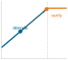{width="100%" fig-alt="A roofline silhouette: a blue memory-bound slope rising to a dashed ridge line, then an orange compute-bound ceiling. A workload dot sits deep on the memory-bound slope, the regime batch-1 decode occupies before parallel verification raises its arithmetic intensity toward the ridge."}

*Decode is memory-bound; parallel verification moves work toward the ridge.*
:::

::: {#dfn-inference-speculative-decoding .callout-definition title="Speculative decoding"}

***Speculative Decoding***\index{Speculative Decoding!definition}\index{Speculative Decoding!target model} is a latency optimization that uses a smaller Draft Model to predict multiple future tokens, which are then verified in parallel by the full Target Model in a single forward pass.

1.  **Significance (quantitative)**: It breaks the sequential bottleneck of autoregressive generation, reducing wall-clock latency $(L_{\text{lat}})$ by a factor of 2--3$\times$ depending on the acceptance rate of the draft tokens. It trades extra compute $(O)$ for reduced time.
2.  **Distinction (durable)**: Unlike standard autoregressive decoding (one token at a time), speculative decoding enables batch-of-tokens verification, increasing the arithmetic intensity of the target model's forward pass.
3.  **Common pitfall**: A frequent misconception is that speculative decoding "always speeds up" inference. In reality, it is a probabilistic bet\index{Speculative Decoding!probabilistic tradeoff}: if the draft model is too inaccurate (low acceptance rate), the extra compute and overhead of verification can actually make the system slower than sequential decoding.

:::

The same draft-verify structure has a familiar division of labor.

::: {#psp-inference-analogy-executive-assistant .callout-perspective title="Analogy: The executive and the assistant"}

Imagine an executive (the large Target Model) writing an important letter. Normally, the executive types it out one word at a time, looking up complex information for every word (Autoregressive Decoding). This is slow.

In speculative decoding\index{Speculative Decoding!acceptance rate}\index{Speculative Decoding!rejection sampling}\index{Speculative Decoding!speculation tax}, a junior assistant (the small Draft Model) quickly types up a draft of the next 5 words. The executive reads the draft and verifies it instantly (Parallel Verification). If the first 3 words are perfect, the executive accepts them. If the 4th word is wrong, the executive crosses it out, writes the correct word, discards the 5th word, and asks the assistant for a new draft starting from there. The executive still produces a perfect letter, but much faster because reading and verifying is computationally cheaper than composing from scratch.

:::

Autoregressive generation is inherently sequential: each token depends on previous tokens. Speculative decoding[^fn-speculative-cpu-analogy] [@leviathan2023speculative; @chen2023accelerating] breaks this bottleneck by having a small, fast model guess the next several tokens, allowing the massive main model to verify them all in a single parallel step.

[^fn-speculative-cpu-analogy]: **Speculative Execution (CPU to LLM)**: Borrows from CPU branch prediction, where processors execute instructions ahead of confirmation and roll back on misprediction. The critical difference: CPU speculation is invisible to software, while LLM speculation requires explicit draft-verify logic and adds a second model's memory footprint to the serving budget. The trade-off is extra compute and memory for 2--3$\times$ latency reduction, but only when draft acceptance rates exceed roughly 70 percent. \index{Speculative Decoding!CPU analogy}

Speculative decoding has three operational phases: a Draft phase\index{Speculative Decoding!draft phase}, a Verification phase\index{Speculative Decoding!verification phase}, and an Acceptance phase\index{Speculative Decoding!acceptance phase}. [algorithm @alg-speculative-decoding] states the exact sampling contract behind those phases. A small draft model generates $K$ candidate tokens autoregressively, the target model verifies those tokens in one parallel forward pass, and rejection sampling ensures that the emitted tokens still follow the target model's distribution. @Fig-speculative-decoding-inf illustrates this draft-verify-accept flow.

::: {#alg-speculative-decoding name="Speculative decoding"}

**Require:** Target model distribution $p_\theta$; draft model distribution $q_\phi$; current prefix $y_{1:t}$; draft length $K$.

**Output:** One or more new tokens sampled from the target distribution $p_\theta$.

1. Use the draft model to sample candidate tokens $\hat{y}_{t+1:t+K}$ autoregressively from $q_\phi(\cdot \mid y_{1:t}, \hat{y}_{t+1:i-1})$.
2. Run the target model once on the prefix plus all $K$ drafted tokens to compute $p_\theta(\cdot \mid y_{1:t}, \hat{y}_{t+1:i-1})$ for each drafted position.
3. For $i=1,\ldots,K$, accept the drafted token $\hat{y}_{t+i}$ with probability $\min(1, p_\theta(\hat{y}_{t+i}) / q_\phi(\hat{y}_{t+i}))$.
4. If a drafted token is rejected, sample a corrected token from the normalized positive residual distribution $(p_\theta - q_\phi)_+$ at that position, append it to the prefix, discard the remaining draft, and start a new round.
5. If all $K$ drafted tokens are accepted, append them and sample one additional token from the target model's final-position distribution.

**Systems cost:** Each round adds $K$ cheap draft decode steps and a second model's memory footprint, but replaces up to $K+1$ sequential target-model decode steps with one parallel verification pass. The method speeds serving only when the acceptance rate is high enough that the saved target-model HBM traffic exceeds the draft and verification overhead.

:::

::: {#fig-speculative-decoding-inf fig-env="figure" fig-pos="htb" fig-cap="**Speculative Decoding Process**: Instead of generating tokens sequentially with the large target model, a small draft model proposes a sequence of $K$ tokens. The target model verifies all $K$ tokens in a single parallel forward pass. Drafted tokens that pass the acceptance test are emitted together; the first rejected token triggers a corrected sample and discards the remaining draft." fig-alt="Timeline comparison of two decoding methods. Top: standard decoding with 4 sequential generation steps. Bottom: speculative decoding with fast draft, parallel verify, then 3 accepted tokens (green) and 1 rejected (pink). Braces show time savings."}

```{.tikz}
\begin{tikzpicture}[font=\small\usefont{T1}{phv}{m}{n}, scale=0.9, transform shape]
  \definecolor{DraftColor}{HTML}{FCE4CC}
  \definecolor{VerifyColor}{HTML}{D1E6F3}
  \definecolor{AcceptColor}{HTML}{D4EFDF}
  \definecolor{RejectColor}{HTML}{F5D2D5}

  \tikzset{
     stepbox/.style={draw=black!50, rounded corners=2pt, minimum height=0.7cm, font=\scriptsize\usefont{T1}{phv}{m}{n}, align=center}
  }

  % Baseline
  \node[anchor=west] (std_title) at (0, 4) {\textbf{Standard Decoding} (Sequential)};
  \draw[->] (0, 3.5) -- (8, 3.5) node[right] {Time};

  \node[stepbox, fill=VerifyColor, minimum width=1.5cm] (gen1) at (1, 3.7) {Gen T1};
  \node[stepbox, fill=VerifyColor, minimum width=1.5cm, right=0.1cm of gen1] (gen2) {Gen T2};
  \node[stepbox, fill=VerifyColor, minimum width=1.5cm, right=0.1cm of gen2] (gen3) {Gen T3};
  \node[stepbox, fill=VerifyColor, minimum width=1.5cm, right=0.1cm of gen3] (gen4) {Gen T4};

  % Speculative
  \node[anchor=west] (spec_title) at (0, 2) {\textbf{Speculative Decoding}};
  \draw[->] (0, 1.5) -- (8, 1.5) node[right] {Time};

  % Draft Step
  \node[stepbox, fill=DraftColor, minimum width=2.0cm] (draft) at (1.2, 1.0) {Draft Model\\Gen [T1..T4]};
  \node[below, font=\tiny\usefont{T1}{phv}{m}{n}] at (draft.south) {Fast, Low latency};

  % Verify Step
  \node[stepbox, fill=VerifyColor, minimum width=2.0cm, right=0.3cm of draft] (verify) {Target Model\\Verify [T1..T4]};
  \node[below, font=\tiny\usefont{T1}{phv}{m}{n}] at (verify.south) {Parallel Forward Pass};

  % Outcome
  \node[stepbox, fill=AcceptColor, minimum width=0.5cm] (t1) at (5.0, 1.8) {T1};
  \node[stepbox, fill=AcceptColor, minimum width=0.5cm, right=0.1cm of t1] (t2) {T2};
  \node[stepbox, fill=AcceptColor, minimum width=0.5cm, right=0.1cm of t2] (t3) {T3};
  \node[stepbox, fill=RejectColor, minimum width=0.5cm, right=0.1cm of t3] (t4) {T4};

  \draw[->, thick, black!50] (draft) -- (verify);
  \draw[->, thick, black!50] (verify) -- (t1.west |- verify.east);

  \node[right=0.2cm of t4, font=\scriptsize\usefont{T1}{phv}{m}{n}, align=left] {Accept 3\\Reject 1};

  % Speedup annotation
  \draw[decorate, decoration={brace, amplitude=5pt}] (0.2, 3.2) -- (6.6, 3.2) node[midway, below=0.2cm, font=\scriptsize\usefont{T1}{phv}{m}{n}] {Standard Time};
  \draw[decorate, decoration={brace, amplitude=5pt}] (0.2, 0.5) -- (4.8, 0.5) node[midway, below=0.2cm, font=\scriptsize\usefont{T1}{phv}{m}{n}] {Speculative Time};

\end{tikzpicture}
```

:::

The mathematical guarantee is crucial: speculative decoding is *provably lossless*\index{Speculative Decoding!lossless guarantee}. By using rejection sampling, the accepted tokens follow exactly the target model's distribution. The draft model only determines the speed of generation, not the quality. A terrible draft model simply produces no speedup (all tokens are rejected), but the output remains identical to standard autoregressive generation.

#### Speedup analysis {#sec-inference-scale-speculative-speedup}

The speedup depends on the **acceptance rate** $\alpha_{\text{acc}}$ (probability that the draft token matches the target model's distribution) and the **draft length** $K$. The expected number of emitted tokens per round, including the target model's correction token, is approximately $\sum_{i=0}^{K} \alpha_{\text{acc}}^i = \frac{1 - \alpha_{\text{acc}}^{K+1}}{1 - \alpha_{\text{acc}}}$.

::: {.column-margin}
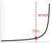{width="100%" fig-alt="Speculative decoding speedup threshold around 70 percent acceptance."}

*Speculative decoding's speedup hinges on the acceptance rate.*
:::

```{python}
#| echo: false
#| label: speculative-speedup-analysis
# ┌─────────────────────────────────────────────────────────────────────────────
# │ SPECULATIVE DECODING SPEEDUP ANALYSIS
# ├─────────────────────────────────────────────────────────────────────────────
# │ Context: @sec-inference-scale-speculative-speedup speedup analysis prose
# │
# │ Goal: Compute expected latency speedup from speculative decoding at K=5 draft
# │       tokens with a 20x-faster draft model, across three acceptance rates
# │       (alpha_acc=0.9 high, 0.7 medium, 0.5 low), to show acceptance sensitivity.
# │ Show: ~3.5x (alpha_acc=0.9), ~2.2x (alpha_acc=0.7), ~1.4x (alpha_acc=0.5).
# │ How: E[accepted tokens] = sum alpha_acc^i for i in 0..K; speedup =
# │       (E[tokens] * t_target) / (t_draft_total + t_target).
# │
# │ Imports: mlsysim.book (check)
# │ Exports: SpeculativeSpeedupAnalysis.sp_high_mult_str,
# │          SpeculativeSpeedupAnalysis.sp_med_mult_str,
# │          SpeculativeSpeedupAnalysis.sp_low_mult_str,
# │          SpeculativeSpeedupAnalysis.et_high_str,
# │          SpeculativeSpeedupAnalysis.et_med_str,
# │          SpeculativeSpeedupAnalysis.et_low_str
# └─────────────────────────────────────────────────────────────────────────────

# ┌── LEGO ───────────────────────────────────────────────
class SpeculativeSpeedup:
    """Speculative decoding latency speedup across acceptance rates."""

    # ┌── 1. LOAD (Constants) ──────────────────────────────────────────────
    from mlsysim.solvers import ServingModel
    from mlsysim import Models, Hardware

    alpha_high = 0.9    # acceptance rate for "easy" text
    alpha_med = 0.7     # medium-difficulty text
    alpha_low = 0.5     # "hard" text
    K = 5               # draft length

    # ┌── 2. EXECUTE (The Compute) ────────────────────────────────────────
    # Use ServingModel to calculate speedup (logic from library)
    def _speedup(alpha, k):
        et = sum(alpha**i for i in range(k + 1))
        # Logic consistent with ServingModel: T = (T_draft*K + T_target) / (E[tokens] * T_target)
        # Here we use normalized units for simplicity as in original block
        t_target = 1.0
        t_draft = 0.05
        time_per_round = t_draft * k + t_target
        baseline_time = et * t_target
        return baseline_time / time_per_round

    sp_high = _speedup(alpha_high, K)
    sp_med = _speedup(alpha_med, K)
    sp_low = _speedup(alpha_low, K)

    et_high = (1 - alpha_high**(K+1)) / (1 - alpha_high)
    et_med = (1 - alpha_med**(K+1)) / (1 - alpha_med)
    et_low = (1 - alpha_low**(K+1)) / (1 - alpha_low)

    # ┌── 3. GUARD (Invariants) ──────────────────────────────────────────
    from mlsysim.fmt import check, fmt
    check(sp_high > 2.0, f"High acceptance speedup should be >2x, got {sp_high:.1f}x")

    # ┌── 4. OUTPUT (Formatting) ─────────────────────────────────────────────
    sp_high_mult_str = fmt_multiple(sp_high, precision=1, commas=False)
    sp_med_mult_str = fmt_multiple(sp_med, precision=1, commas=False)
    sp_low_mult_str = fmt_multiple(sp_low, precision=1, commas=False)
    et_high_str = fmt_count(et_high, precision=1, commas=False, label="token", allow_fractional=True)
    et_med_str = fmt_count(et_med, precision=1, commas=False, label="token", allow_fractional=True)
    et_low_str = fmt_count(et_low, precision=1, commas=False, label="token", allow_fractional=True)
```

For $K = 5$ draft tokens and a draft model that is 20$\times$ faster than the target:

- **High acceptance** $(\alpha_{\text{acc}} = 0.9)$: Expected `{python} SpeculativeSpeedup.et_high_str` per round, speedup of `{python} SpeculativeSpeedup.sp_high_mult_str`.
- **Medium acceptance** $(\alpha_{\text{acc}} = 0.7)$: Expected `{python} SpeculativeSpeedup.et_med_str` per round, speedup of `{python} SpeculativeSpeedup.sp_med_mult_str`.
- **Low acceptance** $(\alpha_{\text{acc}} = 0.5)$: Expected `{python} SpeculativeSpeedup.et_low_str` per round, speedup of `{python} SpeculativeSpeedup.sp_low_mult_str`.

The acceptance rate varies dramatically by context. Predictable text achieves $\alpha_{\text{acc}} > 0.9$, while creative reasoning or code generation may see $\alpha_{\text{acc}} < 0.5$. In practice, well-aligned model pairs (sharing training data and architecture) commonly achieve average acceptance rates of 0.6--0.8, yielding 1.5--3$\times$ latency improvements.

#### System design and hardware cost {#sec-inference-scale-speculative-hardware}

Deploying speculative decoding requires solving several system-level challenges. Draft model selection balances speed against acceptance rate. **Self-speculative decoding**\index{Self-Speculative Decoding} uses early exit from the target model itself as the draft, avoiding the need for a separate model at the cost of lower alignment. Advanced variants like **Medusa**\index{Medusa} [@cai2024medusa] add lightweight prediction heads to the target model backbone, while **Lookahead decoding**\index{Lookahead Decoding} uses Jacobi iteration to avoid draft models entirely.

The resource implications are significant. The draft model requires its own GPU memory allocation for weights, KV cache, and activations. Introducing a 7B parameter draft model to support a 70B target model consumes an additional 14 GB of weights plus reserving its own per-request KV cache. This *speculation tax* reduces the memory budget available for concurrent requests, creating a fundamental tension between *latency* (improving time-per-token for individuals) and *throughput* (reducing the maximum batch size for the node). Operators often disable speculation for high-traffic, throughput-bound endpoints, reserving it for latency-sensitive real-time interaction.

### KV cache in distributed settings {#sec-inference-scale-kv-cache-distributed-settings-712e}

The tensor and pipeline parallelism strategies from @sec-inference-scale-model-sharding-inference-82b3 introduce additional KV cache management complexity:

Under tensor parallelism, the KV cache is sharded across devices along with attention heads. Each device stores cache for its subset of heads.

```
8-way tensor parallelism:
Device 0: KV cache for heads 0-7
Device 1: KV cache for heads 8-15
...
Device 7: KV cache for heads 56-63
```

Cross-device sharing adds a constraint: prefix caching across tensor-parallel devices requires cache to be sharded identically on all devices. This is automatic when prefixes are processed with the same tensor-parallel configuration.

KV cache migration presents a further challenge. When consistent hashing routes a conversation to a different replica (due to failure or rebalancing), the KV cache must be migrated:

```
Migration options:
1. Rebuild: Re-run prefill on new replica (500 ms+ for long context)
2. Transfer: Send KV cache over network (100 MB at 100Gbps = 8 ms)
3. Hybrid: Transfer if small, rebuild if large

Decision threshold:
if cache_size_bytes/network_bandwidth < prefill_time:
    transfer()
else:
    rebuild()
```

For Llama-70B GQA with 4K context, KV cache is about 1.3 GB total per sequence, or about 168 MB per device under 8-way tensor parallelism. At 100 Gbps (12.5 GB/s), transferring one shard takes roughly 13 ms, while transferring the full cache would take about 100 ms. Both are often preferable to a ~500 ms prefill rebuild, so transfer remains the better default when bandwidth is available.

### Memory management best practices {#sec-inference-scale-memory-management-best-practices-67e2}

Effective KV cache management combines multiple techniques:

**Sizing the KV cache pool.**

```
Available GPU memory = Total - Weights - Activations - Overhead
KV pool size = 0.9 * Available  # Leave 10% headroom

Max concurrent sequences = KV pool size / (avg_seq_length * per_token_cache)
```

When cache is full, systems use several eviction policies. LRU (Least Recently Used) evicts sequences with oldest last access. Size-based eviction removes longest sequences first to free most memory. Priority-based eviction protects high-priority or paid-tier requests.

Preemption for continuous batching:

When a new high-priority request cannot fit, the system follows a sequence of steps. It selects victim sequences using the eviction policy. It swaps the victim's KV cache to CPU memory. It allocates GPU memory to the new request. When the victim is resumed, it swaps back from CPU.

::: {#nbk-inference-kv-cache-memory-hierarchy .callout-notebook title="KV cache memory hierarchy"}

Production systems manage KV-cache memory pressure across the three-tier hierarchy in @tbl-inference-kv-cache-memory-hierarchy, paging from GPU HBM down to CPU DRAM and NVMe SSD as the active working set exceeds each tier's capacity:

| **Tier**     | **Capacity** | **Latency** | **Use Case**      |
|:-------------|:------------:|:-----------:|:------------------|
| **GPU HBM**  |    80 GB     |     0 ms    | Active sequences  |
| **CPU DRAM** |     1 TB     |    1–5 ms   | Swapped sequences |
| **NVMe SSD** |    10 TB     |   10–50 ms  | Long-term cache   |

: **KV cache memory hierarchy**: Capacity, swap-in latency, and intended use case for the three tiers production inference servers use to manage KV-cache memory pressure. {#tbl-inference-kv-cache-memory-hierarchy tbl-colwidths="[20,20,16,44]"}

**Swap implementation**\index{Swap Implementation}:

```{.python}
async def swap_to_cpu(sequence_id):
    kv_cache = gpu_cache[sequence_id]
    cpu_cache[sequence_id] = kv_cache.cpu()  # Async transfer
    gpu_cache.free(sequence_id)


async def swap_to_gpu(sequence_id):
    cpu_kv = cpu_cache[sequence_id]
    gpu_cache[sequence_id] = cpu_kv.cuda()  # Async transfer
    cpu_cache.free(sequence_id)
```

**Observed performance**\index{Observed Performance}:

- GPU-only (no swapping): 50 concurrent sequences
- GPU+CPU swapping: 500 concurrent sequences (10$\times$)
- Average swap latency: 3 ms (acceptable for nonurgent requests)

:::

Swapping expands capacity by an order of magnitude, but the underlying problem remains: a single GPU must handle both the compute-heavy prompt processing and the bandwidth-heavy token generation. Separating those phases onto different hardware pools eliminates this mismatch entirely.

### Disaggregated serving: Splitting the workload {#sec-inference-scale-disaggregated-serving-splitting-workload-b8f9}

LLM inference consists of two distinct phases with different computational characteristics, requiring different batching strategies within the same request. @Fig-disaggregated-serving illustrates how this architectural split separates the two phases onto dedicated hardware pools, and @tbl-prefill-decode contrasts their resource profiles.

::: {#fig-disaggregated-serving fig-env="figure" fig-pos="htb" fig-cap="**Disaggregated Serving Architecture**: Separating the Compute-Bound Prefill Phase from the Bandwidth-Bound Decode Phase. Requests enter the Prefill Pool for prompt processing, and the resulting KV cache is migrated to the Decode Pool for token generation. This allows each phase to run on hardware optimized for its specific bottleneck, improving overall fleet efficiency." fig-alt="System diagram showing Request entering a Prefill Pool of high-compute GPUs. Red dashed arrow labeled KV Cache Transfer points to a Decode Pool of high-memory-bandwidth GPUs. Response exits from the Decode Pool."}
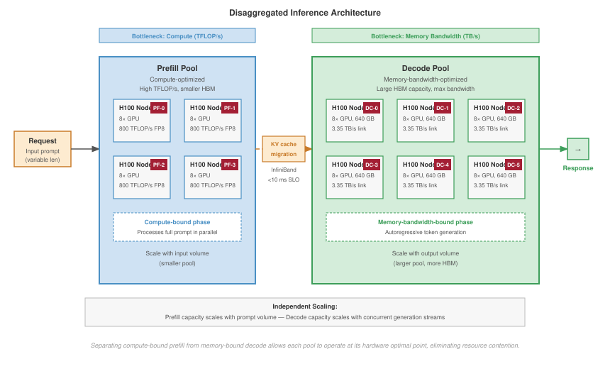
:::

::: {#dfn-inference-prefill-decode-phases .callout-definition title="Prefill and decode phases"}

***Prefill and Decode Phases***\index{Prefill and Decode!definition}\index{Inference!prefill vs. decode} are the two distinct computational regimes of transformer-based LLM inference.

1.  **Significance (quantitative)**: The Prefill Phase\index{Prefill Phase} (processing the prompt) is Compute-Bound $(R_{\text{peak}})$ with high arithmetic intensity, while the Decode Phase\index{Decode Phase} (generating tokens) is Bandwidth-Bound $(\text{BW})$\index{Bandwidth-Bound} with extremely low arithmetic intensity. This mismatch means a single request's efficiency $(\eta_{\text{hw}})$ varies wildly during its lifecycle.
2.  **Distinction (durable)**: Unlike Single-Pass Inference (for example, ImageNet), where the resource bottleneck is constant, LLM inference switches between these regimes at every request, requiring Iteration-Level Scheduling to maintain utilization.
3.  **Common pitfall**: A frequent misconception is that both phases should be batched together naively. In reality, because they have opposing hardware requirements, mixing them in the same batch without Chunked Prefill or similar techniques can lead to significant queuing delays $(L_{\text{lat}})$ for decoding tokens.

:::

The prefill phase processes the entire input prompt in parallel. Computation scales with prompt length, and the memory access pattern is compute-bound with high arithmetic intensity[^fn-arithmetic-intensity-serving].

[^fn-arithmetic-intensity-serving]: **Arithmetic Intensity (Prefill vs. Decode)**: Measured in FLOP/byte of memory accessed, this ratio determines whether a workload is compute-bound or bandwidth-bound. Prefill achieves 100+ FLOP/byte (compute-bound); decode achieves 1--10 FLOP/byte (bandwidth-bound). This 10--100$\times$ gap is why mixing the two phases in a single batch wastes either compute or bandwidth, motivating disaggregated serving architectures. \index{Arithmetic Intensity!serving}

The decode phase, by contrast, generates output tokens one at a time. Each token requires loading the entire model weights, making the memory access pattern bandwidth-bound with low arithmetic intensity. @Sec-appdx-fleet-foundations-roofline places these two phases on the roofline: decode sits far below the ridge point of @eq-fleet-ridge-point, where throughput is set by HBM bandwidth rather than peak FLOP/s, while prefill's high arithmetic intensity (@eq-fleet-arithmetic-intensity) pushes it past the ridge into the compute-bound regime.

| **Phase**   | **Computation**                                                                                                | **Memory Access**\index{Memory Access} | **Bottleneck** | **Optimal Batch**                         |
|:------------|:---------------------------------------------------------------------------------------------------------------|:---------------------------------------|:--------------:|:------------------------------------------|
| **Prefill** | $\mathcal{O}(\text{prompt length}^2)$                                                                          | Activation and attention tiles         |    Compute     | Moderate request batches or large chunks  |
| **Decode**  | $\mathcal{O}(1)$ dense weight work plus $\mathcal{O}(\text{context length})$ attention over KV cache per token | Weight and KV-cache reads              |   Bandwidth    | Large continuous batches of active tokens |

: **Prefill vs. Decode Characteristics**: The two phases have opposite optimization requirements. {#tbl-prefill-decode}

Because decode is bandwidth-bound, hardware that shrinks the bytes moved per token attacks that phase's binding constraint directly.

::: {#lhs-inference-blackwell-fp4-inference-frontier .callout-lighthouse title="Blackwell: The FP4 inference frontier"}

The **Blackwell (B200)** architecture introduces native **FP4 support**\index{FP4 Support}, making 4-bit inference a first-class hardware target rather than a framework-specific workaround. Because decode is often bandwidth-bound, shrinking weights and cache entries can raise token throughput and concurrent sequence capacity without increasing clock speed. The exact cost-per-token gain depends on model architecture, kernel maturity, batch shape, and the fraction of time spent in prefill versus decode, so production systems should validate FP4 with workload-specific benchmarks rather than assuming a fixed multiplier.

:::

The dichotomy creates a scheduling challenge: prefill operations are long-running and compute-intensive, while decode operations are short and bandwidth-limited. Mixing them in the same batch can cause interference. The GPU remains powered and allocated even when decode steps expose little useful compute, so low-utilization decode traffic can dominate energy cost unless the scheduler keeps the hardware busy with compatible work.

**Chunked prefill**[^fn-chunked-prefill-latency] addresses this by breaking long prompts into fixed-size chunks that interleave with decode operations:

[^fn-chunked-prefill-latency]: **Chunked Prefill**: Without chunking, a 32K-token prompt blocks decode for 5--30 seconds while prefill completes, violating inter-token latency SLOs for all concurrent users. Chunking divides the prompt into 256--1024 token segments processed between decode iterations, bounding worst-case decode stall at the cost of slightly longer total prefill time. The trade-off is a classic latency-vs.-throughput decision: interactive applications favor small chunks; batch workloads favor large ones. \index{Chunked Prefill!latency}

$$\text{Chunk latency} = \frac{\text{Chunk size}}{\text{Prefill throughput}}$$

With chunk size chosen to match decode iteration time, prefill and decode can share GPU resources without decode latency spikes.

Prefill-decode disaggregation takes this separation further by running prefill and decode on separate GPU pools:

- **Prefill pool**\index{Prefill Pool}: Optimized for compute intensity (for example, H100 nodes with high TFLOP/s) using moderate request batches or large token chunks to maximize throughput without blocking decode.
- **Decode pool**\index{Disaggregated Serving!decode pool}: Optimized for memory bandwidth (for example, nodes with maximum HBM capacity, the Tier 0 storage resource discussed in @sec-storage-tier0-hbm) to handle thousands of concurrent autoregressive streams.

Independent scaling follows directly: prefill capacity scales with input volume while decode capacity scales with output volume. Crucially, this architecture relies on the high-speed, RDMA-enabled networking fabric established in @sec-network-fabrics. When a prefill finishes, the resulting KV cache (often megabytes of data) must be migrated to a decode node within the inter-token latency budget, typically under 10 ms. InfiniBand's low-microsecond latency and high bisection bandwidth are the physical enablers of this logical disaggregation.

The Sarathi system formalizes chunked prefill into a practical scheduling algorithm that bounds decode latency regardless of incoming prompt length.

::: {#exmp-inference-sarathi-chunked-prefill-implementation .callout-example title="Sarathi: Chunked prefill implementation"}

The Sarathi system [@agrawal2025] implements chunked prefill with the following design:

**Chunk sizing**\index{Chunked Prefill!chunk sizing}: Chunks are sized to complete in approximately the same time as one decode iteration (typically 10–50 ms). For a prefill throughput of 10,000 tokens/second, a 20 ms chunk processes 200 tokens.

**Interleaving schedule**\index{Chunked Prefill!interleaving schedule}: Each GPU iteration processes either:

- One prefill chunk for a new request, OR
- One decode step for all active sequences

The schedule ensures decode latency remains bounded regardless of incoming prompt lengths.

**KV cache transfer**\index{KV Cache!transfer}: When prefill completes, the generated KV cache transfers to decode slots. With NVLink, this transfer adds <1 ms for typical prompt lengths.

**Performance impact**:

- Without chunking: Long prompts cause decode latency spikes of 100 ms+
- With chunking: Decode latency bounded to 30 ms P99 regardless of prompt length

**Systems insight**: Chunked prefill turns a long prompt from one blocking request into bounded work units that can coexist with decode traffic.

:::

KV Cache management enables a single GPU to handle many concurrent requests without crashing.

### Dynamic memory swapping and multi-tenancy {#sec-inference-scale-lora-multi-tenancy}

As serving platforms scale to support thousands of concurrent users on a single foundation model, personalization introduces a new memory bottleneck. Low-Rank Adaptation (LoRA) stores a small set of user- or task-specific adapter weights that modify a shared base model without copying the full model. When 10,000 users each have a unique LoRA adapter applied to the same 140 GB base model, replicating the base weights for each user is physically impossible. Instead, the base model remains pinned in HBM, while user-specific adapters are brought into the fast on-chip working set as needed.

::: {#psp-inference-context-switch-machine-learning .callout-perspective title="The context switch of machine learning"}

This multi-tenant serving pattern shifts the fundamental performance constraint from compute throughput to adapter locality. As the continuous batching scheduler interleaves requests from different users, adapter weights may have to move repeatedly from HBM into SRAM or registers before each generation step. The effect is similar to an operating-system context switch: the accelerator has work to do, but it first waits for the state belonging to the next tenant. If the adapter swap latency exceeds the compute time of the generation step, the GPU compute cores stall. Efficient multi-tenancy therefore batches requests by active adapter when possible and coordinates adapter placement with KV-cache paging so personalization does not erase the benefit of sharing the base model.

:::

When the model itself exceeds single-GPU capacity, as a 175-billion parameter foundation model does, fitting even the weights requires splitting the workload across multiple devices through model sharding for inference.

## Model Sharding for Inference {#sec-inference-scale-model-sharding-inference-82b3}

```{python}
#| echo: false
#| label: hardware-setup-sharding
# ┌─────────────────────────────────────────────────────────────────────────────
# │ HARDWARE SETUP: SHARDING (LEGO)
# ├─────────────────────────────────────────────────────────────────────────────
# │ Context: @sec-inference-scale-model-sharding-inference-82b3
# │
# │ Goal: Provide H100 memory capacity for sharding calculations.
# │ Show: "80" GB.
# │ How: pulling Hardware.Cloud.H100.memory.capacity from mlsysim.core.constants.
# │
# │ Imports: mlsysim.core.constants (Hardware.Cloud.H100.memory.capacity, GiB)
# │ Exports: HardwareSetupSharding.h100_mem_gb_str
# └─────────────────────────────────────────────────────────────────────────────
from mlsysim.fmt import fmt_int, fmt, fmt_memory_capacity, fmt_qty

class HardwareSetupSharding:
    """Localized hardware reference for sharding."""

    # ┌── 1. LOAD (Constants) ──────────────────────────────────────────────
    h100_mem = Hardware.Cloud.H100.memory.capacity

    # ┌── 4. OUTPUT (Formatting) ──────────────────────────────────────────────
    h100_mem_gb_str = fmt_memory_capacity(h100_mem, unit=GiB, precision=0, commas=False)
```

A 70-billion parameter model requires over 140 GB of VRAM just to hold its weights in 16-bit precision, making it physically impossible to load onto a standard 80 GB A100 GPU. To serve this model, we must slice its architecture across multiple GPUs that act together as a single logical replica. Adapting distributed training parallelism techniques, specifically tensor and pipeline parallelism, for low-latency inference introduces a distinct set of constraints.

### When sharding becomes necessary {#sec-inference-scale-sharding-becomes-necessary-81d4}

Model sharding for inference is driven by two distinct requirements. @Tbl-sharding-triggers identifies the memory and latency constraints that necessitate sharding:

The first driver is memory capacity. A model that cannot fit in single-GPU memory must be sharded regardless of performance considerations. For a model with $P$ parameters at precision $b$ bits, the weight memory is calculated by @eq-weight-memory:

$$\text{Memory}_{\text{weights}} = P \times \frac{b}{8} \text{ bytes}$$ {#eq-weight-memory}

A 70-billion parameter model in FP16 (16 bits) requires:

$$\text{Memory} = 70 \times 10^9 \times \frac{16}{8} = 140 \text{ GB}$$

The result exceeds the `{python} HardwareSetupSharding.h100_mem_gb_str` capacity of an H100 GPU, requiring at minimum 2-way sharding.

The second driver is latency. Even when a model fits in memory, sharding can reduce latency by parallelizing computation. @Eq-parallel-time formalizes the potential speedup as a function of parallelization efficiency:

$$T_{\text{parallel}} = \frac{T_{\text{sequential}}}{N} + T_{\text{comm}}(N) + T_{\text{sync}}(N) - T_{\text{overlap}}$$ {#eq-parallel-time}

where $N$ is the number of devices in the sharding group, $T_{\text{comm}}(N)$ is the communication overhead, $T_{\text{sync}}(N)$ is synchronization overhead, and $T_{\text{overlap}}$ is communication hidden behind useful compute. In the common no-overlap simplification with negligible extra synchronization, this reduces to $T_{\text{sequential}}/N + T_{\text{comm}}(N)$. Sharding provides latency benefit only when the nonoverlapped overhead is smaller than the time saved through parallelization.

| **Sharding Trigger**    |  **Model Examples**  | **Minimum Sharding** |    **Strategy**    |
|:------------------------|:--------------------:|:--------------------:|:------------------:|
| **Memory (weights)**    |  Llama-70B (140 GB)  |        2-way         | Tensor or pipeline |
| **Memory (KV cache)**   | GPT-4 (long context) |       4–8 way        | Tensor (for cache) |
| **Memory (embeddings)** |    DLRM (100 TB)     |      1000+ way       | Embedding sharding |
| **Latency**             |   Any large model    |        Varies        | Tensor parallelism |

: **Sharding Triggers**: Different constraints lead to different sharding requirements and strategies. {#tbl-sharding-triggers}

### Tensor parallelism {#sec-inference-scale-tensor-parallelism-b29f}

Tensor parallelism [@shoeybi2019megatron] distributes individual layers across multiple devices, enabling parallel computation within each layer. The column-row partitioning scheme introduced for training in @sec-distributed-training-systems applies here: splitting the first linear layer by columns and the second by rows requires only one AllReduce per transformer block. For transformer models, the primary target is the attention mechanism and feed-forward layers, which contain the majority of computation.

The multi-head attention computation naturally partitions across attention heads. For a model with $N_{\text{heads}}$ attention heads distributed across tensor-parallel degree $t$, each device computes $N_{\text{heads}}/t$ heads:

$$\text{Attention}_i = \text{softmax}\left(\frac{Q_i K_i^T}{\sqrt{d_k}}\right) V_i \text{ for heads } i \in \{1, ..., N_{\text{heads}}/t\}$$

After computing local attention, an AllReduce operation (covered in @sec-collective-communication) combines results across devices, adding communication overhead proportional to the activation size divided by the interconnect bandwidth.

The feed-forward layer (typically two linear transformations with activation) partitions along the hidden dimension. For the first linear layer, columns are distributed; for the second, rows are distributed. This column-row partitioning requires only one all-reduce per feed-forward block.

The communication pattern for tensor-parallel inference follows a two-phase synchronization per layer. @Fig-tensor-parallel-flow illustrates this flow:

::: {#fig-tensor-parallel-flow fig-env="figure" fig-pos="htb" fig-cap="**Tensor Parallelism for Inference**: Computation is distributed across devices by splitting tensor operations. Attention heads are partitioned across GPUs, requiring an AllReduce operation to synchronize results. Feed-forward networks use a column-row splitting strategy that requires only one AllReduce synchronization per block. This approach reduces latency for large models but introduces communication overhead that demands high-bandwidth interconnects like NVLink." fig-alt="Two-column diagram for GPU 0 and GPU 1. Top: Attention layer with heads split across GPUs feeding into AllReduce. Bottom: Feed-forward layer showing column-row split pattern with final AllReduce synchronization."}

```{.tikz}
\begin{tikzpicture}[font=\small\usefont{T1}{phv}{m}{n}, scale=0.9, transform shape]
  \definecolor{GPUColor}{HTML}{E6D4E5}
  \definecolor{OpColor}{HTML}{D1E6F3}
  \definecolor{SyncColor}{HTML}{F5D2D5}

  \tikzset{
    gpu_bg/.style={fill=GPUColor, draw=none, minimum width=3.5cm, minimum height=6.5cm, anchor=south},
    opbox/.style={draw=black!70, fill=OpColor, minimum width=2.5cm, minimum height=0.6cm, align=center},
    syncbox/.style={draw=black!70, fill=SyncColor, rounded corners, minimum width=6cm, minimum height=0.6cm, align=center}
  }

  % GPU Columns
  \node[gpu_bg] (gpu0_bg) at (-0.25, -0.5) {};
  \node[above, font=\bfseries\usefont{T1}{phv}{b}{n}] at (gpu0_bg.north) {GPU 0};

  \node[gpu_bg] (gpu1_bg) at (4.25, -0.5) {};
  \node[above, font=\bfseries\usefont{T1}{phv}{b}{n}] at (gpu1_bg.north) {GPU 1};

  % Attention Block
  \node[anchor=center] (att_title) at (2, 5.5) {\textbf{Attention Layer}};

  \node[opbox] (att0) at (-0.25, 4.5) {Heads 1..H/2};
  \node[opbox] (att1) at (4.25, 4.5) {Heads H/2..H};

  \node[syncbox] (allreduce1) at (2, 3.5) {\textbf{AllReduce} (Combine Heads)};

  \draw[->, thick] (att0) -- (allreduce1.north -| att0);
  \draw[->, thick] (att1) -- (allreduce1.north -| att1);

  % MLP Block
  \node[anchor=center] (mlp_title) at (2, 2.5) {\textbf{Feed-Forward (MLP)}};

  % Col Split
  \node[opbox, minimum width=1.2cm] (mlp1a) at (-0.9, 1.5) {Col};
  \node[opbox, minimum width=1.2cm] (mlp1b) at (0.4, 1.5) {Col};
  \node at (-0.25, 1.5) {...}; % Visualizing big matrix split

  \node[opbox, minimum width=1.2cm] (mlp2a) at (3.6, 1.5) {Col};
  \node[opbox, minimum width=1.2cm] (mlp2b) at (4.9, 1.5) {Col};
  \node at (4.25, 1.5) {...};

  % Row Split
  \node[opbox] (mlp1_out) at (-0.25, 0.5) {Row Split};
  \node[opbox] (mlp2_out) at (4.25, 0.5) {Row Split};

  \draw[->, thick] (allreduce1.south -| att0) -- (mlp1a.north); % Simplified connection
  \draw[->, thick] (allreduce1.south -| att1) -- (mlp2a.north);

  \draw[->] (mlp1a.south) -- (mlp1_out.north);
  \draw[->] (mlp2a.south) -- (mlp2_out.north);

  \node[syncbox] (allreduce2) at (2, -0.5) {\textbf{AllReduce} (Sum Outputs)};

  \draw[->, thick] (mlp1_out.south) -- (allreduce2.north -| mlp1_out);
  \draw[->, thick] (mlp2_out.south) -- (allreduce2.north -| mlp2_out);

\end{tikzpicture}
```

:::

The inference time with tensor parallelism follows @eq-tensor-parallel-time:

$$T_{\text{inference}} = \frac{T_{\text{compute}}}{t} + 2 \times T_{\text{allreduce}}\left(\frac{A}{t}\right)$$ {#eq-tensor-parallel-time}

where $T_{\text{compute}}$ is the sequential compute time, $t$ is the tensor-parallel degree, and $A$ is the activation size being reduced. The factor of 2 accounts for the two all-reduce operations per transformer layer (attention and feed-forward).

```{python}
#| echo: false
#| label: tp-speedup-calc
# ┌─────────────────────────────────────────────────────────────────────────────
# │ TENSOR PARALLELISM SPEEDUP CALCULATION
# ├─────────────────────────────────────────────────────────────────────────────
# │ Context: "Tensor Parallelism for Llama-70B" callout in
# │   §Tensor Parallelism for Inference.
# │
# │ Goal: Compute realized speedup (6.9×) vs theoretical (8×) for 8-way tensor
# │   parallelism on 8×H100, quantifying the communication overhead cost of
# │   AllReduce ops vs linear scaling.
# │ Show: tp_speedup_mult_str="6.9"×, seq_total_ms_str="2,400" ms,
# │   tp8_total_ms_str="348" ms—inline in the callout prose.
# │ How: Divide per-layer prefill-pass compute times; multiply by n_layers
# │   for full-model timing. This is not decode TPOT.
# │
# │ Imports: (none—pure Python arithmetic, no pint quantities)
# │ Exports: TpSpeedupCalc.tp_speedup_mult_str, TpSpeedupCalc.tp_theoretical_mult_str,
# │   TpSpeedupCalc.n_layers_str, TpSpeedupCalc.seq_total_ms_str,
# │   TpSpeedupCalc.tp8_total_ms_str, TpSpeedupCalc.nvlink_h100_gb_per_s_str
# └─────────────────────────────────────────────────────────────────────────────

class TpSpeedupCalc:
    """Compute realized speedup vs theoretical for 8-way tensor parallelism on 8xH100."""

    # ┌── 1. LOAD (Constants) ──────────────────────────────────────────────
    _model = Models.Language.Llama2_70B
    seq_per_layer_ms = 30.0    # sequential compute per layer (attention + FF, 1 GPU)
    tp8_per_layer_ms = 4.35    # 8-way TP per layer (compute sharded + AllReduce overhead)
    tp_theoretical = 8         # linear scaling limit
    n_layers = _model.layers
    hidden_dim = _model.hidden_dim
    attention_heads = _model.heads
    parameters_b = _model.parameters.to(Bparam).magnitude
    weight_fp16 = _model.size_in_bytes(BYTES_FP16)
    activation = 8 * MB  # scenario payload
    nvlink_bw = Hardware.Cloud.H100.nvlink.bandwidth

    # ┌── 2. EXECUTE (The Compute) ────────────────────────────────────────
    tp_speedup = seq_per_layer_ms/tp8_per_layer_ms

    # Step 1: Full-model prefill-pass timing
    seq_total_ms = seq_per_layer_ms * n_layers
    tp8_total_ms = tp8_per_layer_ms * n_layers

    # ┌── 3. GUARD (Invariants) ──────────────────────────────────────────
    from mlsysim.fmt import fmt_int, check, fmt, fmt_bandwidth, fmt_memory, fmt_time
    check(tp_speedup < tp_theoretical, f"Realized speedup ({tp_speedup:.2f}) must be less than theoretical ({tp_theoretical})")

    # ┌── 4. OUTPUT (Formatting) ─────────────────────────────────────────────
    tp_speedup_mult_str = fmt_multiple(tp_speedup, precision=1, commas=False)
    seq_total_ms_str = fmt_time(round(seq_total_ms), 'millisecond', precision=0, commas=True)
    tp8_total_ms_str = fmt_time(round(tp8_total_ms), 'millisecond', precision=0, commas=True)
    tp_theoretical_mult_str = fmt_multiple(tp_theoretical, precision=0, commas=False)
    n_layers_str = fmt_int(n_layers, commas=False)
    nvlink_h100_gb_per_s_str = fmt_bandwidth(nvlink_bw, unit=GB / second, precision=0, commas=False)
    parameters_b_str = fmt_int(parameters_b, commas=False)
    attention_heads_str = fmt_int(attention_heads, commas=False)
    hidden_dim_str = fmt_int(hidden_dim)
    weight_fp16_gb_str = fmt_memory(weight_fp16, unit=GB, precision=0, commas=False)
    activation_mb_str = fmt_memory(activation, unit=MB, precision=0, commas=False)
```

::: {#exmp-inference-tensor-parallelism-llama-70b .callout-example title="Tensor parallelism for Llama-70B"}

Consider serving Llama-70B with the following configuration: [@touvron2023llama2]

**Model specifications**:

- Parameters: `{python} TpSpeedupCalc.parameters_b_str` billion
- Hidden dimension: `{python} TpSpeedupCalc.hidden_dim_str`
- Attention heads: `{python} TpSpeedupCalc.attention_heads_str`
- Layers: `{python} TpSpeedupCalc.n_layers_str`

**Memory per GPU** (weight only, FP16):

$$\text{Memory}_{\text{70B}} = 70 \times 10^9 \times 2 = 140\text{ GB}$$

**Minimum sharding**: 2-way (`{python} TpSpeedupCalc.weight_fp16_gb_str`/`{python} HardwareSetupSharding.h100_mem_gb_str` per H100)

**Recommended sharding**: 8-way for optimal latency

@Tbl-inference-tp8-layer-breakdown decomposes the per-layer cost of 8-way tensor parallelism on 8$\times$ H100 (NVLink interconnect) into compute and AllReduce phases, exposing the realized 6.9$\times$ speedup as compute scaling minus a small communication tax.

**Layer-stack estimate** (`{python} TpSpeedupCalc.n_layers_str` layers on the same prefill workload):

- Sequential: `{python} TpSpeedupCalc.seq_total_ms_str` for the full prefill pass
- 8-way TP: `{python} TpSpeedupCalc.tp8_total_ms_str` for the full prefill pass

The `{python} TpSpeedupCalc.tp_speedup_mult_str` speedup (vs. theoretical `{python} TpSpeedupCalc.tp_theoretical_mult_str`) reflects communication overhead. At `{python} TpSpeedupCalc.nvlink_h100_gb_per_s_str`, moving a `{python} TpSpeedupCalc.activation_mb_str` activation payload would take only about 0.01 ms by raw bandwidth math; the 0.3 ms budget shown here includes collective launch, synchronization, ring protocol, and framework overheads.

**Time-to-first-token** (1024-token prompt):

- Prefill compute: ~`{python} TpSpeedupCalc.tp8_total_ms_str` on 8-way TP (compute-bound, near-linear scaling minus communication overhead)
- Total TTFT: ~400 ms with preprocessing and serving overhead

**Systems insight**: Tensor parallelism buys latency by spending communication. It works for Llama-70B only because the interconnect keeps the collective tax small relative to the compute saved by sharding.

:::

| **Component**                              | **Sequential (1 GPU)** | **8-way TP** |   **Speedup**   |
|:-------------------------------------------|:----------------------:|:------------:|:---------------:|
| **Attention compute**                      |         12 ms          |    1.5 ms    |    8$\times$    |
| **AllReduce (attention)**\index{AllReduce} |          0 ms          |    0.3 ms    |       N/A       |
| **Feed-forward compute**                   |         18 ms          |   2.25 ms    |    8$\times$    |
| **AllReduce (FF)**                         |          0 ms          |    0.3 ms    |       N/A       |
| **Total per layer**                        |       **30 ms**        | **4.35 ms**  | **6.9$\times$** |

: **8-Way Tensor Parallelism Per-Layer Breakdown**: Sequential vs. 8-way tensor-parallel timings for attention, feed-forward, and AllReduce phases of one Llama-70B transformer layer, decomposing the realized 6.9$\times$ speedup into compute scaling and communication tax. {#tbl-inference-tp8-layer-breakdown}

### Pipeline parallelism for inference {#sec-inference-scale-pipeline-parallelism-inference-7ee3}

Pipeline parallelism distributes layers across devices sequentially, with each device handling a subset of layers. Unlike tensor parallelism, there is no synchronization within a layer, only between pipeline stages.

For inference, pipeline parallelism creates bubbles differently than in training. @Fig-pipeline-bubbles contrasts single-request latency (bubble-dominated) with pipelined throughput (bubble-amortized):

::: {#fig-pipeline-bubbles fig-env="figure" fig-pos="htb" fig-cap="**Pipeline Parallelism Bubbles**: For a single inference request (top), pipeline parallelism offers no latency benefit as the request must traverse all four stages sequentially. When processing multiple concurrent requests (bottom), the pipeline fills and throughput scales with the number of stages. This makes pipeline parallelism ideal for high-throughput batch processing but less suitable for latency-critical interactive serving." fig-alt="Two timeline diagrams. Top: a single request traverses four GPUs sequentially. Bottom: four requests pipelined across the same four GPUs, each offset by one stage, showing a filled pipeline at steady state."}
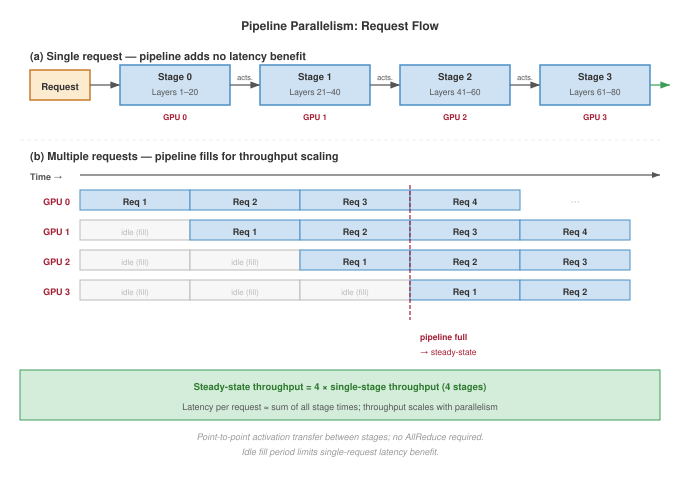
:::

For a single request, pipeline parallelism provides no latency benefit: the request must traverse all stages sequentially. The pipeline fill time equals the sequential execution time.

However, pipeline parallelism enables throughput scaling through pipelining multiple requests:

```
Time →
Device 0: [Req1] [Req2] [Req3] [Req4] ...
Device 1:        [Req1] [Req2] [Req3] [Req4] ...
Device 2:               [Req1] [Req2] [Req3] [Req4] ...
Device 3:                      [Req1] [Req2] [Req3] [Req4] ...
```

Once the pipeline is full, throughput equals $p$ times single-stage throughput, where $p$ is the number of pipeline stages. The steady-state latency remains approximately the single-device latency (sum of all stage times), but throughput scales with parallelism.

**When to use pipeline parallelism for inference.**

- When memory constraints require sharding but latency requirements are relaxed
- When throughput is more important than individual request latency
- When network bandwidth between devices is limited (only point-to-point communication)

@Tbl-pipeline-tensor-comparison captures the tradeoffs between these two sharding approaches:

| **Aspect**                 |      **Tensor Parallelism**      |      **Pipeline Parallelism**      |
|:---------------------------|:--------------------------------:|:----------------------------------:|
| **Single-request latency** |      Reduced by ~$t\times$       |           No improvement           |
| **Throughput**             |            $t\times$             |     $p\times$ (when pipelined)     |
| **Communication pattern**  | AllReduce (bandwidth-intensive)  | Point-to-point (latency-sensitive) |
| **Memory efficiency**      |      Activations replicated      |      Activations passed along      |
| **Complexity**             | Higher (requires custom kernels) |  Lower (layer-level partitioning)  |

: **Pipeline vs. Tensor Parallelism**: Each strategy has distinct tradeoffs in latency, throughput, and implementation complexity. {#tbl-pipeline-tensor-comparison}

### Expert parallelism for MoE models {#sec-inference-scale-expert-parallelism-moe-models-55f6}

Mixture-of-experts (MoE) models, such as DeepSeek-V3 or Mixtral, introduce unique serving challenges beyond those of dense models. In an MoE transformer layer, the feed-forward network (FFN) is replaced by multiple parallel "expert" sub-networks and a lightweight router that selects a subset of experts for each token.

The MoE architecture enables scaling the total parameter count while keeping the per-token compute constant. However, serving such models at scale requires expert parallelism (EP)\index{Expert Parallelism}\index{EP}, where different experts are hosted on different GPUs.

#### MoE economics and capacity planning {#sec-inference-scale-moe-economics}

The economics of MoE serving create a paradox: *total parameter count* determines the minimum hardware count (for memory), while *active parameter count* determines the compute cost per token. This makes MoE models efficient in compute but expensive in terms of VRAM "rent."

```{python}
#| echo: false
#| label: moe-economics-calc-inf
# ┌─────────────────────────────────────────────────────────────────────────────
# │ MOE ECONOMICS: SPARSE VS DENSE
# ├─────────────────────────────────────────────────────────────────────────────
# │ Context: @sec-inference-scale-moe-economics MoE capacity planning prose
# │
# │ Goal: Compare memory and bandwidth requirements for a 400B dense model vs.
# │       a 671B MoE model (37B active) to quantify the sparse advantage.
# │ Show: ~800 GB (Dense) vs ~1342 GB (MoE) weight memory; ~74 GB (MoE active)
# │       vs ~800 GB (Dense active) bandwidth per token.
# │ How: Memory = params * 2 bytes (FP16). Active BW = active_params * 2 bytes.
# │
# │ Imports: mlsysim.book (check)
# │ Exports: MoEEconomics.dense_mem_gb_str, MoEEconomics.moe_mem_gb_str,
# │          MoEEconomics.compute_ratio_mult_str, MoEEconomics.bw_ratio_mult_str
# └─────────────────────────────────────────────────────────────────────────────

# ┌── LEGO ───────────────────────────────────────────────
class MoEEconomics:
    """Memory and bandwidth comparison: Dense vs MoE."""

    # ┌── 1. LOAD (Constants) ──────────────────────────────────────────────
    from mlsysim.physics import memory_from_params
    _moe = Models.Language.DeepSeek_V3
    dense_params = 400 * Bparam  # illustrative dense baseline
    moe_active_params = _moe.active_parameters

    # ┌── 2. EXECUTE (The Compute) ────────────────────────────────────────
    dense_mem_fp16 = memory_from_params(dense_params, BYTES_FP16)  # 800 GB
    moe_mem_fp16 = _moe.size_in_bytes(BYTES_FP16)  # 1342 GB

    compute_ratio = (dense_params / moe_active_params).to("").magnitude  # ~10.8x

    dense_decode_bytes = dense_mem_fp16
    moe_decode_bytes = memory_from_params(moe_active_params, BYTES_FP16)  # 74 GB
    bw_ratio = (dense_decode_bytes / moe_decode_bytes).to("").magnitude

    # ┌── 3. GUARD (Invariants) ──────────────────────────────────────────
    from mlsysim.fmt import check, fmt, fmt_memory
    check(compute_ratio > 5, f"MoE should give >5x compute reduction, got {compute_ratio:.1f}x")

    # ┌── 4. OUTPUT (Formatting) ─────────────────────────────────────────────
    dense_mem_gb_str = fmt_memory(dense_mem_fp16, unit=GB, precision=0, commas=False)
    moe_mem_gb_str = fmt_memory(moe_mem_fp16, unit=GB, precision=0, commas=False)
    compute_ratio_mult_str = fmt_multiple(compute_ratio, precision=1, commas=False)
    bw_ratio_mult_str = fmt_multiple(bw_ratio, precision=1, commas=False)
```

The performance advantages are striking. During autoregressive decode at batch size 1, the dominant cost is reading weights from HBM. A dense 400B model in FP16 reads `{python} MoEEconomics.dense_mem_gb_str` per step. DeepSeek-V3, despite having more total parameters, reads only the 37B active parameters per step (approximately 74 GB in FP16), a `{python} MoEEconomics.bw_ratio_mult_str` reduction in per-token bandwidth. The compute savings are proportional: `{python} MoEEconomics.compute_ratio_mult_str` fewer FLOPs per token.

::: {.column-margin}
{width="100%" fig-alt="Memory ladder comparing MoE resident weights at 1342 GB, dense resident weights at 800 GB, and MoE active read at 74 GB."}

*MoE keeps every expert resident but activates few per token.*
:::

The trade-off is memory capacity: all experts must reside in memory even though only a fraction are active at any time. DeepSeek-V3's full model in FP16 requires approximately `{python} MoEEconomics.moe_mem_gb_str`, necessitating distribution across many GPUs.

```{python}
#| echo: false
#| label: moe-capacity-planning
from math import ceil
from mlsysim.fmt import check, fmt_bandwidth, fmt_count, fmt_int, fmt_memory, fmt_params, fmt_rate, fmt_time
from mlsysim.physics import memory_from_params

class MoECapacityPlan:
    # ┌── 1. LOAD ──────────────────────────────────────────
    _moe = Models.Language.DeepSeek_V3
    moe_total_params = _moe.parameters
    moe_active_params = _moe.active_parameters
    bytes_fp8 = BYTES_INT8  # FP8 = 1 byte
    node_gpus = Systems.Nodes.DGX_H100.accelerators_per_node
    h100_mem = ReferenceStats.ServingProfiles.H100VendorMemoryBudget
    n_gpus = 16
    alltoall_overhead = 0.3 * millisecond  # scenario routing overhead
    h100_bw = Hardware.Cloud.H100.memory.bandwidth
    # ┌── 2. EXECUTE ───────────────────────────────────────
    total_weight = _moe.size_in_bytes(bytes_fp8)
    node_capacity = node_gpus * h100_mem
    nodes_needed = ceil((total_weight / node_capacity).to("").magnitude)
    cluster_capacity = nodes_needed * node_capacity
    active_mem = memory_from_params(moe_active_params, bytes_fp8)
    read_per_gpu = active_mem / n_gpus
    t_read = (read_per_gpu / h100_bw).to(millisecond)
    total_decode = t_read + alltoall_overhead
    decode_rate = (count / total_decode).to(count / second)
    tokens_per_sec = round(decode_rate.magnitude, -2)
    # ┌── 3. GUARD ─────────────────────────────────────────
    check(nodes_needed == 2, f"Expected two nodes, got {nodes_needed}")
    check(0.5 * millisecond < total_decode < 2.0 * millisecond, f"Expected ~1ms, got {total_decode.to(millisecond).magnitude:.2f} ms")
    # ┌── 4. OUTPUT ────────────────────────────────────────
    read_per_gpu_gb_str = fmt_memory(read_per_gpu, unit=GB, precision=1, commas=False)
    t_read_ms_str = fmt_time(t_read, millisecond, precision=2, commas=False)
    total_decode_ms_str = fmt_time(total_decode, millisecond, precision=1, commas=False)
    tokens_per_s_str = fmt_rate(tokens_per_sec, "tokens/s", precision=0, commas=True)
    total_weight_gb_str = fmt_memory(total_weight, unit=GB, precision=0, commas=False)
    node_capacity_gb_str = fmt_memory(node_capacity, unit=GB, precision=0, commas=False)
    nodes_needed_str = fmt_int(nodes_needed, commas=False)
    cluster_capacity_gb_str = fmt_memory(cluster_capacity, unit=GB, precision=0, commas=True)
    active_mem_gb_str = fmt_memory(active_mem, unit=GB, precision=0, commas=False)
    moe_active_params_b_str = fmt_params(moe_active_params, scale="B", precision=0, commas=False)
    n_gpus_str = fmt_count(n_gpus, commas=False, label="GPU")
    alltoall_overhead_ms_str = fmt_time(alltoall_overhead, millisecond, precision=1, commas=False)
    h100_bw_tb_per_s_str = fmt_bandwidth(h100_bw, unit=TB / second, precision=2, commas=False)
    h100_mem_gb_str = fmt_memory(h100_mem, unit=GB, precision=0, commas=False)
    moe_total_params_b_str = fmt_params(moe_total_params, scale="B", precision=0, commas=False)
    node_gpus_str = fmt_int(node_gpus, commas=False)
```

::: {#nbk-inference-moe-capacity-planning .callout-notebook title="MoE capacity planning"}

**Problem**: A team deploys DeepSeek-V3\index{DeepSeek-V3} (`{python} MoECapacityPlan.moe_total_params_b_str` total parameters, `{python} MoECapacityPlan.moe_active_params_b_str` active per token) for a chatbot application. The model uses FP8 weights (1 byte per parameter). The cluster has `{python} MoECapacityPlan.node_gpus_str`-GPU nodes, each with `{python} MoECapacityPlan.node_gpus_str`$\times$ H100 GPUs (`{python} MoECapacityPlan.h100_mem_gb_str` HBM per GPU, `{python} MoECapacityPlan.node_capacity_gb_str` per node). How many nodes are needed, and what is the per-token decode latency?

**Math**:

1.  **Memory**: Total weight memory = `{python} MoECapacityPlan.total_weight_gb_str`. A single node (`{python} MoECapacityPlan.node_capacity_gb_str`) is insufficient. `{python} MoECapacityPlan.nodes_needed_str` provide `{python} MoECapacityPlan.cluster_capacity_gb_str`, leaving enough room for KV caches.
2.  **Latency**: Each decode step reads `{python} MoECapacityPlan.moe_active_params_b_str` active parameters (`{python} MoECapacityPlan.active_mem_gb_str`). Distributed across `{python} MoECapacityPlan.n_gpus_str`, each reads about `{python} MoECapacityPlan.read_per_gpu_gb_str`. At `{python} MoECapacityPlan.h100_bw_tb_per_s_str` HBM bandwidth, $t_{\text{read}} \approx$ `{python} MoECapacityPlan.t_read_ms_str`. AllToAll routing adds about `{python} MoECapacityPlan.alltoall_overhead_ms_str`.
3.  **Floor**: Estimated decode latency $\approx$ `{python} MoECapacityPlan.total_decode_ms_str`/token, or `{python} MoECapacityPlan.tokens_per_s_str` at batch size 1.

**Systems insight**: MoE allows a 671B model to approach the per-token bandwidth cost of a much smaller dense model, but capacity planning is still driven by the full parameter set that must remain resident.

:::

#### Expert parallelism and load balancing {#sec-inference-scale-moe-parallelism}

Distributing MoE models across GPUs introduces expert parallelism: each GPU holds a subset of experts, and tokens are routed to the GPU holding their assigned expert. This creates a distinctive AllToAll communication pattern, where each GPU sends different data to every other GPU.

The AllToAll pattern creates a critical system challenge: load balancing. If the router consistently sends more tokens to certain experts than others, those experts' GPUs become bottlenecks while other GPUs sit idle. Three mechanisms address load imbalance:

1.  **Auxiliary loss**\index{Auxiliary Loss}: An additional term in the training loss penalizes uneven expert utilization by rewarding uniform routing probabilities.
2.  Capacity factor\index{Capacity Factor}: Each expert has a maximum number of tokens it will accept per batch (typically 1.25$\times$ the fair share). Tokens exceeding this are dropped or rerouted.
3.  **Expert buffering**\index{Expert Buffering}: Tokens are buffered and processed in subsequent iterations if experts are at capacity, smoothing out load spikes at the cost of latency variance.

#### Routing failure modes {#sec-inference-scale-moe-routing-failures}

The router behavior directly impacts both system performance and model quality. Performance engineers must monitor for several failure modes:

-   **Expert collapse**\index{Expert Collapse}: The router converges to a small subset of experts, leaving others undertrained. The model effectively degrades to a small dense model with a massive memory footprint.
-   **Routing instability**\index{Routing Instability}: Assignments oscillate during training, preventing experts from specialized learning.
-   **Distribution shift**\index{Distribution Shift}: A router trained on formal text may overload specific "grammar experts" when served colloquial chat data, creating hotspots.
-   **Token dropping**\index{Token Dropping}: At high load, capacity-limited experts drop tokens, skipping their computation and relying solely on the residual connection, which degrades output quality.

These failure modes follow from the basic MoE serving trade-off[^fn-moe-serving]: computation is dynamically routed to different experts based on input, so the routing pattern becomes a systems workload rather than only a model-internal choice. Popular models like Mixtral [@jiang2024mixtral] use MoE to achieve high capacity with lower inference cost.

[^fn-moe-serving]: **MoE (Mixture-of-Experts) Serving Trade-Off**: Only a subset of experts activate per token (typically 2 of 8--16), keeping per-token FLOPs low while total parameter count reaches hundreds of billions. The serving constraint: all expert weights must reside in memory even though most are idle on any given token, inflating memory footprint 4--8$\times$ relative to the active compute. This forces expert parallelism across devices with AllToAll communication at every MoE layer. \index{MoE!serving}

In an MoE layer, a gating network selects $k$ experts (out of $E$ total) for each token:

$$\text{Output} = \sum_{i \in \text{top-}k} g_i \cdot \text{Expert}_i(\text{input})$$

Expert parallelism distributes experts across devices, with each device hosting $E/N$ experts, where $N$ is the number of expert-parallel devices. @Fig-moe-routing traces the routing, dispatch, and gather operations:

::: {#fig-moe-routing fig-env="figure" fig-pos="htb" fig-cap="**Mixture-of-Experts (MoE) Routing**: Expert parallelism distributes \"experts\" across different devices. For each token, a gating mechanism selects the top-$k$ experts. An AllToAll communication step dispatches tokens to the devices hosting their selected experts (1). Experts process the tokens in parallel (2). A second AllToAll step gathers the results back to the original device (3). This pattern enables massive model capacity but introduces all-to-all communication overhead." fig-alt="Diagram of MoE token routing. Gating selects top-2 experts. Dashed arrows show All-to-All dispatch to Expert A and B devices. Third device idle. Results gather via All-to-All to weighted sum output."}

```{.tikz}
\begin{tikzpicture}[font=\small\usefont{T1}{phv}{m}{n}, scale=0.9, transform shape]
  \definecolor{GateColor}{HTML}{FCE4CC}
  \definecolor{ExpColor}{HTML}{D4EFDF}
  \definecolor{CommColor}{HTML}{F5D2D5}

  \tikzset{
    box/.style={draw=black!70, fill=white, minimum height=0.8cm, minimum width=2cm, align=center},
    expbox/.style={draw=black!70, fill=ExpColor, minimum height=0.8cm, minimum width=2cm, align=center},
    idlebox/.style={draw=black!70, fill=black!20, minimum height=0.8cm, minimum width=2cm, align=center},
    gatebox/.style={draw=black!70, fill=GateColor!30, minimum height=1cm, minimum width=2cm, align=center},
    comm_arrow/.style={->, dashed, thick, CommColor}
  }

  % Host Device
  \node[gatebox] (gating) at (0, 1.5) {Gating\\(Top-2)};

  % Input Token
  \node[box, above=0.5cm of gating] (token) {Input Token};
  \draw[->, thick] (token) -- (gating);

  % Expert Devices
  \node[idlebox, right=3cm of gating] (exp3) {Device X\\Expert C (Idle)};
  \node[expbox, above=0.5cm of exp3] (exp1) {Device 1\\Expert A};
  \node[expbox, below=0.5cm of exp3] (exp2) {Device 2\\Expert B};

  % Interconnect
  \node[text=CommColor!80!black, font=\bfseries\usefont{T1}{phv}{b}{n}] at (2.5, 1.5) {All-to-All Dispatch};
  \draw[comm_arrow] (gating.east) -- (exp1.west);
  \draw[comm_arrow] (gating.east) -- (exp2.west);

  % Gather
  \node[box, rounded corners, right=1.5cm of exp3] (agg) {Weighted\\Sum};

  \node[text=CommColor!80!black, font=\bfseries\usefont{T1}{phv}{b}{n}] at (6.5, 2.5) {All-to-All Gather};
  \draw[comm_arrow] (exp1.east) -- (agg.north west);
  \draw[comm_arrow] (exp2.east) -- (agg.south west);

  % Output
  \node[right=0.5cm of agg] (out) {Output};
  \draw[->, thick] (agg) -- (out);

\end{tikzpicture}
```

:::

The communication pattern differs from tensor parallelism: instead of all-reduce (*same data to all devices*), expert parallelism uses all-to-all (*different data to different devices* based on routing).

Load balancing challenge: If gating decisions cluster on certain experts, devices hosting popular experts become bottlenecks while others sit idle. MoE training includes auxiliary losses to encourage balanced routing, but inference still exhibits routing imbalance.

```{python}
#| echo: false
#| label: mixtral-8x7b-registry-spec
from mlsysim import Bparam, Models
from mlsysim.fmt import fmt_int, fmt_params

class Mixtral8x7BSpec:
    """Book-facing Mixtral fields sourced from the model registry."""

    _model = Models.Language.Mixtral_8x7B
    total_params_b_str = fmt_params(_model.parameters, scale="B", precision=1, commas=False)
    active_params_b_str = fmt_params(_model.active_parameters, scale="B", precision=1, commas=False)
    experts_str = fmt_int(_model.experts, commas=False)
    active_experts_str = fmt_int(_model.active_experts_per_token, commas=False)
```

::: {#exmp-inference-expert-parallelism-mixtral-8x7b .callout-example title="Expert parallelism for Mixtral-8x7B"}

Mixtral-8x7B uses `{python} Mixtral8x7BSpec.experts_str` experts per MoE layer with top-`{python} Mixtral8x7BSpec.active_experts_str` routing:

**Model characteristics**:

- Total parameters: `{python} Mixtral8x7BSpec.total_params_b_str` (but only ~`{python} Mixtral8x7BSpec.active_params_b_str` active per token)
- Experts per layer: `{python} Mixtral8x7BSpec.experts_str`
- Active experts per token: `{python} Mixtral8x7BSpec.active_experts_str` (top-$k$ = `{python} Mixtral8x7BSpec.active_experts_str`)
- MoE layers: Every feed-forward layer (each FFN replaced by a `{python} Mixtral8x7BSpec.experts_str`-expert MoE block)

**Sharding strategy** (4-way expert parallelism):

- Experts 0-1 on Device 0
- Experts 2-3 on Device 1
- Experts 4-5 on Device 2
- Experts 6-7 on Device 3

**Communication pattern per token**:

1. Gating: Determine which 2 experts to use (~0.1 ms)
2. AllToAll dispatch: Send token to devices hosting selected experts (~0.2 ms)
3. Expert compute: Process token through selected experts (~1 ms each, parallel)
4. AllToAll gather: Collect results back (~0.2 ms)

**Total MoE layer time**: ~1.5 ms (vs. ~4 ms for equivalent dense layer)

**Systems insight**: Routing imbalance directly erodes GPU utilization and throughput across the eight experts; @tbl-inference-moe-load-balancing quantifies the degradation\index{Load Balancing!metrics}. Production systems monitor routing statistics and may retrain or fine-tune gating to improve balance.

:::

| **Routing Distribution**            | **GPU Utilization** | **Throughput Impact** |
|:------------------------------------|:-------------------:|:---------------------:|
| **Perfectly balanced**              |     100 percent     |        Baseline       |
| **Moderate imbalance (20 percent)** |      83 percent     |      -17 percent      |
| **Severe imbalance (50 percent)**   |      67 percent     |      -33 percent      |

: **MoE Routing Load Balance vs. Throughput**: GPU utilization and throughput impact as routing imbalance grows across the eight experts of a Mixtral-8x7B MoE layer with 4-way expert parallelism. {#tbl-inference-moe-load-balancing}

Expert parallelism represents the peak of model sharding complexity, requiring tight integration between the model architecture, the routing algorithm, and the physical interconnect topology. The next section examines how recommendation systems use similar sharding techniques for massive embedding tables.

### Embedding sharding for recommendation systems {#sec-inference-scale-embedding-sharding-recommendation-systems-afde}

Recommendation systems typically contain embedding tables that dwarf dense model weights in size. Meta's DLRM reference architecture uses model parallelism over embedding tables to mitigate memory constraints while scaling dense layers separately [@naumov2019deep]. At production scale, this embedding-heavy structure requires sharding strategies distinct from tensor or pipeline parallelism.

Row-wise sharding partitions embedding tables by row (entity ID):

$$\text{Shard}_i = \{e_j : \text{hash}(j) \bmod N_{\text{shards}} = i\}$$

Each shard contains approximately $N_{\text{entities}}/N_{\text{shards}}$ embeddings, where $N_{\text{entities}}$ is the total number of entities and $N_{\text{shards}}$ is the shard count.

Column-wise sharding partitions each embedding vector across devices:

$$e_j = [e_j^{(0)}, e_j^{(1)}, ..., e_j^{(N_{\text{shards}}-1)}]$$

Each device stores a slice of every embedding. Hybrid sharding combines both approaches: frequently accessed embeddings are column-sharded for faster access, while the long tail uses row sharding. The choice of embedding sharding strategy depends on lookup patterns and communication overhead. @Tbl-embedding-sharding compares row-wise, column-wise, and hybrid approaches:

| **Sharding Strategy** |    **Lookup Pattern**    | **Communication** |       **Best For**      |
|:----------------------|:------------------------:|:-----------------:|:-----------------------:|
| **Row-wise**          | Single device per lookup |  AllToAll gather  | Uniform access patterns |
| **Column-wise**       |  All devices per lookup  |     AllGather     |      Hot embeddings     |
| **Hybrid**            |   Varies by embedding    |       Mixed       |    Production RecSys    |

: **Embedding Sharding Strategies**: Different strategies trade off lookup locality against load balance. {#tbl-embedding-sharding}

@Fig-embedding-sharding visualizes how each strategy distributes embedding lookups across devices:

::: {#fig-embedding-sharding fig-env="figure" fig-pos="htb" fig-cap="**Embedding Sharding Strategies**: Row-wise sharding places complete embedding vectors on specific servers based on entity ID, requiring a network gather for lookup. Column-wise sharding splits each vector across all servers, allowing parallel local lookups followed by an AllGather, which is efficient for popular \"hot\" embeddings. Hybrid sharding combines these approaches, using column sharding for hot items and row sharding for the \"cold\" long tail to balance load and memory." fig-alt="Three-panel diagram. A: Row-wise sharding splits users across servers by ID. B: Column-wise sharding splits embedding dimensions across servers. C: Hybrid combines both, with hot items column-sharded and cold items row-sharded."}

```{.tikz}
\begin{tikzpicture}[font=\small\usefont{T1}{phv}{m}{n}, scale=0.85, transform shape]
  \definecolor{TableColor}{HTML}{D1E6F3}
  \definecolor{ShardColor}{HTML}{E6D4E5}

  % A. Row-Wise
  \node[anchor=west, font=\bfseries\usefont{T1}{phv}{b}{n}] at (0, 4.5) {A. Row-Wise Sharding};

  \draw[fill=TableColor] (0, 2.5) rectangle (1, 4);
  \node[rotate=90] at (-0.3, 3.25) {Users 0..U};

  \draw[->, thick] (1.2, 3.25) -- (2.2, 3.25);

  % Server 1
  \draw[fill=ShardColor] (2.5, 3.5) rectangle (3.5, 4.0);
  \node[right, font=\scriptsize\usefont{T1}{phv}{m}{n}] at (3.5, 3.75) {Svr 1: Users 0..K};

  % Server 2
  \draw[fill=ShardColor] (2.5, 2.5) rectangle (3.5, 3.0);
  \node[right, font=\scriptsize\usefont{T1}{phv}{m}{n}] at (3.5, 2.75) {Svr 2: Users K..U};

  \node[font=\scriptsize\usefont{T1}{phv}{m}{n}, align=center] at (1.7, 2.0) {Partition by ID\\(Network Gather)};

  % B. Column-Wise
  \node[anchor=west, font=\bfseries\usefont{T1}{phv}{b}{n}] at (6, 4.5) {B. Column-Wise Sharding};

  \draw[fill=TableColor] (6, 2.5) rectangle (7, 4);
  \node[rotate=90] at (5.7, 3.25) {Dims 0..d};

  \draw[->, thick] (7.2, 3.25) -- (8.2, 3.25);

  % Server 1 (Col split)
  \draw[fill=ShardColor] (8.5, 2.5) rectangle (9.0, 4.0);
  \node[above, font=\scriptsize\usefont{T1}{phv}{m}{n}] at (8.75, 4.0) {Svr 1};

  % Server 2
  \draw[fill=ShardColor] (9.1, 2.5) rectangle (9.6, 4.0);
  \node[above, font=\scriptsize\usefont{T1}{phv}{m}{n}] at (9.35, 4.0) {Svr 2};

  \node[font=\scriptsize\usefont{T1}{phv}{m}{n}, align=center] at (7.7, 2.0) {Partition Vector\\(AllGather)};

  % C. Hybrid
  \node[anchor=west, font=\bfseries\usefont{T1}{phv}{b}{n}] at (0, 0.5) {C. Hybrid Sharding};

  \draw[fill=RedL] (0, -1.0) rectangle (1.5, 0);
  \node[font=\scriptsize\usefont{T1}{phv}{m}{n}] at (0.75, -0.5) {Hot (Top 1\%)};

  \draw[fill=BlueL] (0, -2.5) rectangle (1.5, -1.1);
  \node[font=\scriptsize\usefont{T1}{phv}{m}{n}] at (0.75, -1.8) {Cold (Tail)};

  \draw[->, thick] (1.7, -1.25) -- (2.7, -1.25);

  \node[draw, fill=RedL, font=\scriptsize\usefont{T1}{phv}{m}{n}] at (4, -0.5) {Replicated/Col-wise};
  \node[draw, fill=BlueL, font=\scriptsize\usefont{T1}{phv}{m}{n}] at (4, -1.8) {Row-wise Sharded};

\end{tikzpicture}
```

:::

All three sharding strategies operate at massive scale in production. Meta's recommendation infrastructure provides a concrete example of how row-wise, column-wise, and hybrid approaches combine to serve trillion-entity embedding tables.

::: {#lhs-inference-embedding-sharding-at-meta .callout-lighthouse title="Embedding sharding at Meta"}

```{python}
#| echo: false
#| label: meta-embedding-scale-check
# ┌─────────────────────────────────────────────────────────────────────────────
# │ META EMBEDDING SCALE CHECK (LEGO)
# ├─────────────────────────────────────────────────────────────────────────────
# │ Context: "Embedding sharding at Meta" lighthouse callout.
# │
# │ Goal: Prevent the scale bullets from implying one dense resident table that
# │       simultaneously has 10T entities, 128d vectors, and only 100 TB total.
# │ Show: 10T * 128 INT8 dimensions would be 1,280 TB; 100 TB averages 10 B/entity.
# │ How: Dense lower-bound storage = entities * dimensions * bytes per dimension.
# │
# │ Imports: mlsysim.core.constants (BYTES_INT8, byte), mlsysim.fmt (check, fmt)
# │ Exports: MetaEmbeddingScaleCheck.storage_tb_str,
# │          MetaEmbeddingScaleCheck.entity_count_t_str,
# │          MetaEmbeddingScaleCheck.min_dimension_str,
# │          MetaEmbeddingScaleCheck.dense_int8_tb_str,
# │          MetaEmbeddingScaleCheck.effective_bytes_per_entity_str
# └─────────────────────────────────────────────────────────────────────────────
from mlsysim.fmt import fmt_int, check, fmt, fmt_memory, fmt_percent

class MetaEmbeddingScaleCheck:
    """Dense lower-bound check for the Meta embedding scale bullets."""

    # ┌── 1. LOAD (Constants) ──────────────────────────────────────────────
    storage = 100 * TB  # scenario storage total
    entity_count_t = 10
    min_dimension = 128
    bytes_per_dimension_int8 = BYTES_INT8

    # ┌── 2. EXECUTE (The Compute) ────────────────────────────────────────
    entity_count = entity_count_t * TRILLION * count
    dense_int8 = entity_count * min_dimension * bytes_per_dimension_int8
    effective_bytes_per_entity = (storage / entity_count).to(byte / count).magnitude

    # ┌── 3. GUARD (Invariants) ──────────────────────────────────────────
    check(dense_int8 > storage, "Dense INT8 lower bound should exceed the stated storage total")
    check(effective_bytes_per_entity < min_dimension, "100 TB over 10T entities cannot hold a dense 128d INT8 vector per entity")

    # ┌── 4. OUTPUT (Formatting) ─────────────────────────────────────────────
    storage_tb_str = fmt_memory(storage, unit=TB, precision=0, commas=False)
    entity_count_t_str = fmt_int(entity_count_t, commas=False)
    min_dimension_str = fmt_int(min_dimension, commas=False)
    dense_int8_tb_str = fmt_memory(dense_int8, unit=TB, precision=0, commas=True)
    effective_bytes_per_entity_str = fmt_int(effective_bytes_per_entity, commas=False)
    n_shards_str = fmt_int(1_000)
    warm_pct_str = fmt_percent(round(10)/100, precision=0, commas=False, style='prose')
    cold_pct_str = fmt_percent(round(89)/100, precision=0, commas=False, style='prose')
    lookups_per_request_str = fmt_int(5_000)
    tp_parallelism_str = fmt_int(8, commas=False)
```

Meta's recommendation infrastructure demonstrates embedding sharding at extreme scale:

**Scale**:

- Embedding tables: 100+ TB total
- Unique entities: 10+ trillion
- Embedding dimension: 128–256
- Shards: `{python} MetaEmbeddingScaleCheck.n_shards_str`+ servers

These scale bullets describe infrastructure-level totals, not one dense resident table in which every unique entity has a 128--256-dimensional vector. A dense INT8 table with `{python} MetaEmbeddingScaleCheck.entity_count_t_str` trillion entities and `{python} MetaEmbeddingScaleCheck.min_dimension_str` dimensions would require at least `{python} MetaEmbeddingScaleCheck.dense_int8_tb_str`, while `{python} MetaEmbeddingScaleCheck.storage_tb_str` across the same entity count averages only `{python} MetaEmbeddingScaleCheck.effective_bytes_per_entity_str` bytes per entity. The production system therefore relies on compression, tiering, cold storage, and uneven entity coverage rather than a single fully materialized dense matrix.

**Sharding strategy**:

- **Hot embeddings** (top 1 percent by access frequency): Replicated across all shards
- **Warm embeddings** (next `{python} MetaEmbeddingScaleCheck.warm_pct_str`): Column-sharded with `{python} MetaEmbeddingScaleCheck.tp_parallelism_str`-way parallelism
- **Cold embeddings** (remaining `{python} MetaEmbeddingScaleCheck.cold_pct_str`): Row-sharded with consistent hashing

Each inference request requires approximately `{python} MetaEmbeddingScaleCheck.lookups_per_request_str` embedding lookups. Without optimization, this would require `{python} MetaEmbeddingScaleCheck.lookups_per_request_str` network round trips. Instead, the system applies several optimizations. Batch accumulation collects lookups for 1 ms. Lookup deduplication removes duplicate entities across requests. Shard-aware batching groups lookups by destination shard. Parallel dispatch sends batched requests to all shards simultaneously. Streaming assembly reconstructs embeddings as responses arrive.

The order-of-magnitude effect of these optimizations on round-trip count, lookup latency, and bandwidth appears in @tbl-inference-meta-embedding-perf:

| **Metric**              | **Without Optimization** | **With Optimization** |
|:------------------------|:------------------------:|:---------------------:|
| **Network round trips** |          5,000           |      1 (batched)      |
| **Lookup latency**      |          50 ms           |          2 ms         |
| **Network bandwidth**   |         10 Gbps          |    40 Gbps (burst)    |

: **Meta embedding sharding lookup performance**: Network round-trip, lookup-latency, and bandwidth measurements for the recommendation lookup path before and after batching plus shard-aware dispatch, showing the order-of-magnitude effect of these optimizations. {#tbl-inference-meta-embedding-perf}

:::

### Hybrid sharding strategies {#sec-inference-scale-hybrid-sharding-strategies-e605}

Production systems often combine multiple sharding strategies to handle different model components optimally:

Tensor and pipeline parallelism combine when models require both memory distribution and latency reduction:

```
8 GPUs organized as 2 by 4 (pipeline stages by tensor parallel):

Stage 0 (Layers 1-40):  TP across GPUs 0,1,2,3
Stage 1 (Layers 41-80): TP across GPUs 4,5,6,7
```

The combination achieves 4$\times$ latency reduction (from TP) while handling models requiring 8-way sharding for memory.

Expert and tensor parallelism combine for MoE models where individual experts are large:

```
Mixtral with large experts:

- Expert parallelism: Distribute 8 experts across 8 GPU groups
- Tensor parallelism: Each expert spread across 2 GPUs
- Total GPUs: 16
```

Embedding and dense parallelism serve recommendation models with both large embeddings and large dense components:

```
DLRM-scale model:

- Embedding sharding: 1,000 shards across CPU servers
- Dense model: 8-way tensor parallel across GPUs
- Communication: Embeddings gathered to GPU, processed, returned
```

### Communication overhead analysis {#sec-inference-scale-communication-overhead-analysis-c1cf}

The practical speedup from sharding depends critically on communication efficiency. Each sharding strategy has characteristic communication patterns with different bandwidth and latency requirements.

@Eq-allreduce-time quantifies AllReduce communication time for tensor parallelism, where data is combined from all devices with the result available on all devices.

$$T_{\text{allreduce}} \approx 2(N-1)\alpha + \frac{2(N-1)}{N} \times \frac{M}{\beta}$$ {#eq-allreduce-time}

where $N$ is the number of devices, $M$ is the collective payload size, $\alpha$ is startup latency, and $\beta$ is the interconnect bandwidth. The factor of 2 accounts for the reduce-scatter and all-gather phases. @Sec-appdx-comm-foundations-allreduce derives this ring-AllReduce cost and its bandwidth-optimal $2(N-1)/N$ scaling, establishing why the per-layer communication tax stays bounded as the tensor-parallel degree grows.

@Eq-p2p-time expresses the simpler point-to-point communication for pipeline parallelism, where data flows from one device to the next.

$$T_{\text{p2p}}(n) = \alpha + \frac{n}{\beta}$$ {#eq-p2p-time}

where $n$ is the point-to-point payload size, $\alpha$ is the network latency, and $n/\beta$ is the transfer time. @Eq-alltoall-time captures the more complex AllToAll communication\index{AllToAll!communication} for expert parallelism, where each device exchanges distinct data with every other device.

$$T_{\text{alltoall}} = (N-1) \times \left(\alpha + \frac{M/N}{\beta}\right)$$ {#eq-alltoall-time}

Both equations make clear that the achievable bandwidth $\beta$ and latency $\alpha$ of the underlying interconnect determine real-world sharding performance. Production hardware differs enough on both axes that the interconnect choice can determine whether a sharding plan is viable.

```{python}
#| echo: false
#| label: allreduce-interconnect-calc
# ┌─────────────────────────────────────────────────────────────────────────────
# │ ALLREDUCE INTERCONNECT CALCULATION (LEGO)
# ├─────────────────────────────────────────────────────────────────────────────
# │ Context: @tbl-inference-allreduce-interconnect
# │
# │ Goal: Compute raw AllReduce time for an 8 MB activation across common
# │       interconnects and express it as a fraction of a 30 ms layer budget.
# │ Show: ~0.02 ms NVLink, ~0.56 ms InfiniBand HDR, ~1.12 ms 100G Ethernet.
# │ How: Use the alpha-beta AllReduce estimate for N=8 devices.
# │
# │ Imports: mlsysim.core.constants (Systems.Nodes.DGX_H100.accelerators_per_node,
# │          Systems.Fabrics.Ethernet_100G.bandwidth, Systems.Fabrics.InfiniBand_HDR.bandwidth),
# │          mlsysim.fmt (check, fmt)
# │ Exports: AllReduceInterconnect.nvlink_ms_str,
# │          AllReduceInterconnect.ib_ms_str,
# │          AllReduceInterconnect.eth_ms_str,
# │          AllReduceInterconnect.nvlink_bw_gb_per_s_str,
# │          AllReduceInterconnect.nvlink_pct_str,
# │          AllReduceInterconnect.ib_pct_str,
# │          AllReduceInterconnect.eth_pct_str
# └─────────────────────────────────────────────────────────────────────────────
from mlsysim.fmt import check, fmt_bandwidth, fmt_int, fmt_memory, fmt_percent, fmt_time

class AllReduceInterconnect:
    """Raw AllReduce timing for an 8 MB activation payload."""

    # ┌── 1. LOAD (Constants) ──────────────────────────────────────────────
    NETWORK_100G_BW = Systems.Fabrics.Ethernet_100G.bandwidth
    n_devices = Systems.Nodes.DGX_H100.accelerators_per_node
    message = 8 * MB  # scenario payload
    layer_budget = 30 * millisecond  # scenario layer budget
    nvlink_bw = Hardware.Cloud.H100.nvlink.bandwidth
    ib_hdr_bw = Systems.Fabrics.InfiniBand_HDR.bandwidth
    eth_100g_bw = NETWORK_100G_BW

    # ┌── 2. EXECUTE (The Compute) ────────────────────────────────────────
    allreduce_factor = 2 * (n_devices - 1) / n_devices

    nvlink_time = (allreduce_factor * message / nvlink_bw).to(millisecond)
    ib_time = (allreduce_factor * message / ib_hdr_bw).to(millisecond)
    eth_time = (allreduce_factor * message / eth_100g_bw).to(millisecond)

    nvlink_pct = (nvlink_time / layer_budget).to("").magnitude * 100
    ib_pct = (ib_time / layer_budget).to("").magnitude * 100
    eth_pct = (eth_time / layer_budget).to("").magnitude * 100

    # ┌── 3. GUARD (Invariants) ──────────────────────────────────────────
    check(nvlink_time < ib_time < eth_time, "Interconnect timing should follow bandwidth order")
    check(eth_pct < 5, f"Raw 100G Ethernet share should remain under 5%, got {eth_pct:.1f}%")

    # ┌── 4. OUTPUT (Formatting) ─────────────────────────────────────────────
    nvlink_bw_gb_per_s_str = fmt_bandwidth(nvlink_bw, unit=GB / second, precision=0, commas=False)
    nvlink_ms_str = fmt_time(nvlink_time, millisecond, precision=2, commas=False)
    ib_ms_str = fmt_time(ib_time, millisecond, precision=2, commas=False)
    eth_ms_str = fmt_time(eth_time, millisecond, precision=2, commas=False)
    nvlink_pct_str = fmt_percent(nvlink_pct / 100, precision=2, commas=False, style="symbol")
    ib_pct_str = fmt_percent(ib_pct / 100, precision=1, commas=False, style="symbol")
    eth_pct_str = fmt_percent(eth_pct / 100, precision=1, commas=False, style="symbol")
    message_mb_str = fmt_memory(message, unit=MB, precision=0, commas=False)
    hidden_dim_str = fmt_int(8192)
```

::: {#nbk-inference-interconnect-technology-comparison .callout-notebook title="Interconnect technology comparison"}

Communication overhead depends heavily on the interconnect technology. @Tbl-inference-interconnect-specs records the physical bandwidth, latency, and intended scope of each candidate interconnect:

| **Interconnect**   | **Bandwidth**\index{Interconnect!bandwidth} | **Latency**\index{Interconnect!latency} |      **Use Case**      |
|:-------------------|:-------------------------------------------:|:---------------------------------------:|:----------------------:|
| **NVLink (H100)**  |                   900 GB/s                  |                   1μs                   |     Intra-node TP      |
| **PCIe Gen5**      |                   64 GB/s                   |                   5μs                   | Intra-node (no NVLink) |
| **InfiniBand HDR** |              200 Gb/s (25 GB/s)             |                  2--5μs                 |       Inter-node       |
| **Ethernet 100G**  |             100 Gb/s (12.5 GB/s)            |                   10μs                  | Inter-node (commodity) |

: **Datacenter interconnect specs**: Bandwidth, latency, and intended scope for NVLink, PCIe Gen5, InfiniBand HDR, and 100G Ethernet, establishing the physical limits that bound achievable sharding speedups. {#tbl-inference-interconnect-specs}

@Tbl-inference-allreduce-interconnect translates those bandwidths into AllReduce time for an 8-way tensor-parallel layer (activation `{python} AllReduceInterconnect.message_mb_str` per all-reduce; batch=1, hidden=`{python} AllReduceInterconnect.hidden_dim_str`) as a fraction of a 30 ms transformer-layer budget:

| **Interconnect**                 |               **AllReduce Time**               |             **Share of 30 ms Layer**            |
|:---------------------------------|:----------------------------------------------:|:-----------------------------------------------:|
| **NVLink**                       | `{python} AllReduceInterconnect.nvlink_ms_str` | `{python} AllReduceInterconnect.nvlink_pct_str` |
| **InfiniBand**\index{InfiniBand} |   `{python} AllReduceInterconnect.ib_ms_str`   |   `{python} AllReduceInterconnect.ib_pct_str`   |
| **100G Ethernet**                |  `{python} AllReduceInterconnect.eth_ms_str`   |   `{python} AllReduceInterconnect.eth_pct_str`  |

: **AllReduce cost by interconnect**: AllReduce time for an 8 MB activation across NVLink, InfiniBand, and 100G Ethernet, with each as a fraction of a 30 ms transformer-layer budget, showing why intra-node TP requires NVLink-class bandwidth. {#tbl-inference-allreduce-interconnect}

**Systems insight**: NVLink enables efficient tensor parallelism within a node; cross-node tensor parallelism requires InfiniBand for acceptable overhead.

:::

NVLink bandwidth has evolved significantly over GPU generations.[^fn-nvlink-bandwidth-inf]

```{python}
#| echo: false
# ┌── LEGO ───────────────────────────────────────────────
# │ Context: NVLink bandwidth evolution footnote below.
# │ Exports: TpNvlinkRecap.nvlink_h100_gb_per_s_str
class TpNvlinkRecap:
    nvlink_bw = Hardware.Cloud.H100.nvlink.bandwidth
    from mlsysim.fmt import fmt_bandwidth
    # ┌── 4. OUTPUT (Formatting) ──────────────────────────────────────────────
    nvlink_h100_gb_per_s_str = fmt_bandwidth(nvlink_bw, unit=GB / second, precision=0, commas=False)
```

[^fn-nvlink-bandwidth-inf]: **NVLink Bandwidth Evolution**: From 160 GB/s bidirectional on early NVLink implementations to `{python} TpNvlinkRecap.nvlink_h100_gb_per_s_str` on Hopper-class GPUs to 1.8 TB/s on Blackwell-class GPUs---roughly a 10$\times$ improvement across three hardware generations. This bandwidth growth is what made intra-node tensor parallelism across 8 GPUs practical with less than 5 percent communication overhead, directly determining the maximum model size servable without crossing the slower cross-node interconnect.

### Sharding strategy selection {#sec-inference-scale-sharding-strategy-selection-f69c}

The choice of sharding strategy depends on model architecture and deployment priorities. @Tbl-sharding-selection evaluates each approach across four critical factors:

| **Factor**                | **Tensor Parallel** | **Pipeline Parallel** | **Expert Parallel** | **Embedding Shard** |
|:--------------------------|:-------------------:|:---------------------:|:-------------------:|:-------------------:|
| **Latency priority**      |         Best        |         Worst         |       Moderate      |         N/A         |
| **Throughput priority**   |         Good        |    Best (pipelined)   |         Good        |         Best        |
| **Interconnect limited**  |       Poor fit      |        Good fit       |       Moderate      |       Good fit      |
| **Implementation effort** |         High        |          Low          |       Moderate      |         High        |

: **Sharding Strategy Selection Guide**: Match strategy to deployment priorities and constraints. {#tbl-sharding-selection}

Once we have constructed these massively sharded, multi-GPU replicas, we inevitably need dozens of them running in parallel to handle global traffic. The challenge now shifts from the internal mechanics of a single replica to the traffic control layer: how do we efficiently route millions of user queries across this vast fleet?

## Load Balancing and Request Routing {#sec-inference-scale-load-balancing-request-routing-4997}

If ten model replicas are actively serving traffic, and a new request arrives asking for a 5,000-word document summarization, sending it to a replica that is already overloaded will trigger a massive latency spike for every user assigned to that node. Simple round-robin load balancing fails catastrophically for generative ML. We must employ intelligent request routing that understands the internal memory and queue states of every replica in the fleet.

::: {#lhs-inference-archetype-b-dlrm-at-scale-tail-at-scale .callout-lighthouse title="Archetype B (DLRM at Scale): The tail at scale"}

Archetype B (DLRM at Scale) is the canonical victim of tail latency. Processing 10 million QPS means that a 1-in-10,000 latency spike happens 1,000 times every second. For Archetype B (DLRM at Scale), sophisticated load balancing (like Power-of-Two-Choices) is mandatory to suppress these outliers; simple Round-Robin would allow queues to build up, causing the 99th percentile latency to collapse into unacceptable slowness.

:::

### Load balancing principles {#sec-inference-scale-load-balancing-principles-63ec}

::: {.column-margin}
{width="100%" fig-alt="Margin illustration showing Random-assignment tail curve versus two-choices curve."}

*Two-choice routing flattens the tail imbalance of random placement.*
:::

Load balancing serves two primary goals that sometimes conflict: latency minimization and utilization maximization. Latency minimization routes requests to the replicas that can serve them fastest, considering current queue depth and processing time; utilization maximization spreads load evenly to avoid both idle replicas and overloaded replicas. The tension arises because latency-optimal routing may concentrate load on fast replicas, reducing their performance and leaving other replicas underutilized.

Evaluation therefore needs both tail-latency and balance signals. Maximum queue length determines worst-case latency, load variance measures how evenly work is distributed, utilization spread shows whether some replicas are idle while others are saturated, and decision overhead captures the cost of making the routing choice. A policy that optimizes only one of these signals can look healthy in aggregate while sending unlucky requests into the tail.

### Round-robin and random assignment {#sec-inference-scale-roundrobin-random-assignment-f374}

The simplest load-balancing strategies assign requests without considering server state. Round-robin sends request 1 to server 1, request 2 to server 2, and so on, which gives perfect distribution only when servers are homogeneous and request processing times are identical. Random assignment selects a server uniformly at random for each request; with many requests it converges to an even mean distribution, but its variance is higher than round-robin. Both strategies are reasonable baselines for identical servers, yet production serving rarely satisfies that assumption. Heterogeneous GPU generations, different memory configurations, variable request sizes, warmup behavior, and replicas nearing memory limits all make the state of the server fleet matter.

Under these realistic conditions, uninformed strategies perform poorly because unlucky assignments accumulate in the tail. The maximum queue length under random assignment follows @eq-random-max-queue:

$$E[\text{max queue}] = \Theta\left(\frac{\log R}{\log \log R}\right)$$ {#eq-random-max-queue}

where $R$ is the number of servers or replicas. For 1,000 servers, this is approximately 4--5 requests. This seems small, but the unlucky requests in long queues experience significantly higher latency. The power of two choices (Principle \ref{pri-power-two-choices}) provides the theoretical response: one extra queue-length probe changes the tail behavior from $\mathcal{O}(\log R / \log \log R)$ to $\mathcal{O}(\log \log R)$.

### The power of two choices {#sec-inference-scale-power-two-choices-ffdd}

A foundational result in load balancing theory [@mitzenmacher2001] shows that querying just two random servers before making a routing decision provides exponentially better load distribution than random assignment.[^fn-balls-bins-routing]

[^fn-balls-bins-routing]: **Balls-into-Bins (Power of Two Choices)**: With random placement, maximum bin load is $\Theta(\log R / \log \log R)$; with two random choices and greedy selection, it drops to $\Theta(\log \log R)$. For a 1,000-server inference fleet, this reduces worst-case queue depth from roughly 5 to roughly 2, cutting P99 tail latency by nearly half while adding only the overhead of a single extra queue-length probe per request. \index{Power of Two Choices!routing}

The procedure is deliberately small, but the load signal must match the serving workload. For a homogeneous vision fleet, current queue length may be enough. For an LLM fleet, active tokens, estimated remaining decode work, and KV-cache pressure better approximate the work a replica has already accepted. [algorithm @alg-power-two-choices-routing] states the routing loop in the form used by production serving systems: probe two replicas, compare normalized work, and route without polling the whole fleet. @Eq-two-choices-max-queue formalizes why this small change matters, reducing maximum queue length from $\mathcal{O}(\log R / \log \log R)$ to $\mathcal{O}(\log \log R)$:

::: {#alg-power-two-choices-routing name="Power-of-two choices request routing"}

**Require:** Replica set $\mathcal{S}$; incoming request $r$; capacity weight $w_s$ for each replica $s$; per-replica load signal $L_s$ such as queue length, active-token count, predicted remaining work, or KV-cache occupancy.

**Output:** A selected replica for request $r$.

1. Sample two candidate replicas $s_a,s_b$ from $\mathcal{S}$; use uniform sampling for homogeneous fleets and capacity-weighted sampling for heterogeneous fleets.
2. Query both replicas or their local load-balancer state for $L_{s_a}$ and $L_{s_b}$.
3. Estimate the incremental work $\hat{c}(r)$ imposed by the request, such as expected output tokens or required KV-cache pages.
4. Compute normalized post-admission load $u_s=(L_s+\hat{c}(r))/w_s$ for each candidate.
5. Route $r$ to the candidate with lower $u_s$, breaking ties with locality, cache affinity, or recent error signals.
6. Update the chosen replica's local admission state so the next routing decision observes the new work.

**Systems cost:** Routing pays two probes and one state update per request, which is $\mathcal{O}(1)$ coordination rather than an all-replica scan. The benefit depends on measuring the right load: in LLM serving, request count alone can hide a 10-token request behind a 500-token request, while active-token and KV-cache signals expose the tail-latency risk.

:::

$$E[\text{max queue}]_{\text{two choices}} = \Theta(\log \log R)$$ {#eq-two-choices-max-queue}

For 1,000 servers, random assignment produces a maximum queue of roughly 4--5 requests, while two choices reduces the maximum to roughly 2. The improvement is exponential: two choices with 1,000 servers achieves better balance than random assignment with just 10 servers.

::: {#thrm-inference-power-of-two-choices .callout-theorem title="Power-of-two choices load-balancing bound"}

For $R$ servers receiving independent requests, random assignment produces a maximum queue length of $\mathcal{O}(\log R / \log \log R)$ with high probability, while routing each request to the shorter of two randomly sampled queues reduces the maximum queue length to $\mathcal{O}(\log \log R)$.

The practical implication is that near-optimal load balancing does not require polling the whole fleet. Two probes avoid the $R$-probe cost of exact least-loaded routing, the improvement grows with system size, and the method remains simple enough to implement inside ordinary load balancers. Production systems at Google, Meta, and AWS all use variants of power-of-two-choices.

:::

The mechanism is intuitive: random assignment occasionally makes poor choices by routing to an already-busy server, and these mistakes compound. With two choices, the algorithm almost never makes the worst choice, avoiding the tail behavior that creates long queues. Mathematically, when $m$ servers have queue length $k$, random assignment grows queue length $k+1$ with probability proportional to $m/R$. With two choices, that probability drops to $(m/R)^2$, creating a super-exponential decay in queue length distribution.

### Weighted and adaptive load balancing {#sec-inference-scale-weighted-adaptive-load-balancing-1c03}

When servers have different capacities, naive load balancing creates imbalance. A mix of A100 GPUs and lower-capacity T4 GPUs receiving equal request rates will overload the T4 servers while leaving A100 capacity idle. Weighted round-robin corrects the mean assignment rate by routing requests proportional to server capacity:

$$\Pr(\text{route to server } i) = \frac{w_i}{\sum_j w_j}$$

where $w_i$ is the weight, or capacity, of server $i$. Weighted two-choices applies the same idea to tail control: sample two servers with probability proportional to their weights, compare current load relative to capacity, and route to the lower relative load. The weighted-routing example below shows how this policy handles mixed GPU hardware in practice.

```{python}
#| echo: false
#| label: heterogeneous-gpu-cluster
# ┌─────────────────────────────────────────────────────────────────────────────
# │ HETEROGENEOUS GPU CLUSTER WEIGHTED ROUTING
# ├─────────────────────────────────────────────────────────────────────────────
# │ Context: "Heterogeneous GPU Cluster" callout in §Weighted Load Balancing.
# │
# │ Goal: Demonstrate that capacity-proportional weighting equalizes utilization
# │   across H100 (1,000 QPS) and A100 (600 QPS) servers at 15,000 QPS target,
# │   versus equal-share routing that reduces A100 latency headroom.
# │ Show: total_cap_qps_str="22,000 QPS",
# │   h100_util_pct_str="68.2 percent",
# │   a100_util_pct_str="68.2 percent",
# │   a100_util_equal_pct_str="83.3 percent"
# │   (reduced headroom)—inline in the callout.
# │ How: Weight each server type by capacity/total_cap; compute per-type load
# │   and utilization; compare with naive equal-share routing.
# │
# │ Imports: MLSysIM public API (Hardware, ReferenceStats, formatters, checks)
# │ Exports: HeterogeneousGpuCluster.total_cap_qps_str,
# │   HeterogeneousGpuCluster.h100_weight_pct_str,
# │   HeterogeneousGpuCluster.a100_weight_pct_str,
# │   HeterogeneousGpuCluster.h100_load_qps_str,
# │   HeterogeneousGpuCluster.a100_load_qps_str,
# │   HeterogeneousGpuCluster.h100_util_pct_str,
# │   HeterogeneousGpuCluster.a100_util_pct_str,
# │   HeterogeneousGpuCluster.equal_load_qps_str,
# │   HeterogeneousGpuCluster.h100_util_equal_pct_str,
# │   HeterogeneousGpuCluster.a100_util_equal_pct_str,
# │   HeterogeneousGpuCluster.h100_name_str,
# │   HeterogeneousGpuCluster.a100_name_str
# └─────────────────────────────────────────────────────────────────────────────
from mlsysim import *


class HeterogeneousGpuCluster:
    """Demonstrate capacity-proportional weighting equalizes utilization across H100 and A100 servers."""

    # ┌── 1. LOAD (Constants) ──────────────────────────────────────────────
    h100 = Hardware.Cloud.H100
    a100 = Hardware.Cloud.A100
    profile = ReferenceStats.ServingProfiles
    n_h100 = int(profile.HeterogeneousRoutingH100Servers)
    n_a100 = int(profile.HeterogeneousRoutingA100Servers)
    h100_cap_qps = int(profile.HeterogeneousRoutingH100CapacityQps)
    a100_cap_qps = int(profile.HeterogeneousRoutingA100CapacityQps)
    target_qps = int(profile.HeterogeneousRoutingTargetQps)

    # ┌── 2. EXECUTE (The Compute) ────────────────────────────────────────
    total_cap = n_h100 * h100_cap_qps + n_a100 * a100_cap_qps
    total_servers = n_h100 + n_a100

    # Step 1: Capacity-proportional weights
    h100_weight = h100_cap_qps/total_cap
    a100_weight = a100_cap_qps/total_cap

    # Step 2: Weighted routing: each server receives weight × total_qps
    h100_load = target_qps * h100_weight
    a100_load = target_qps * a100_weight
    h100_util = h100_load/h100_cap_qps * 100
    a100_util = a100_load/a100_cap_qps * 100

    # Step 3: Equal routing: each server receives target_qps/total_servers
    equal_load = target_qps/total_servers
    h100_util_equal = equal_load/h100_cap_qps * 100
    a100_util_equal = equal_load/a100_cap_qps * 100

    # ┌── 3. GUARD (Invariants) ──────────────────────────────────────────
    check(target_qps <= total_cap, "Target QPS must not exceed total cluster capacity")
    check(abs(h100_util - a100_util) < 1.0, "Weighted routing must equalize utilization")

    # ┌── 4. OUTPUT (Formatting) ─────────────────────────────────────────────
    h100_name_str = MarkdownStr(h100.name)
    a100_name_str = MarkdownStr(a100.name)
    total_cap_qps_str = fmt_rate(total_cap, "QPS")
    h100_weight_pct_str = fmt_percent(h100_weight, precision=1, commas=False, style='prose')
    a100_weight_pct_str = fmt_percent(a100_weight, precision=1, commas=False, style='prose')
    h100_load_qps_str = fmt_rate(h100_load, "QPS", precision=1, commas=False)
    a100_load_qps_str = fmt_rate(a100_load, "QPS", precision=1, commas=False)
    h100_util_pct_str = fmt_percent(h100_util/100, precision=1, commas=False, style='prose')
    a100_util_pct_str = fmt_percent(a100_util/100, precision=1, commas=False, style='prose')
    equal_load_qps_str = fmt_rate(equal_load, "QPS", precision=0, commas=False)
    h100_util_equal_pct_str = fmt_percent(h100_util_equal / 100, precision=0, commas=False, style='prose')
    a100_util_equal_pct_str = fmt_percent(a100_util_equal / 100, precision=1, commas=False, style='prose')
    n_h100_str = fmt_int(n_h100, commas=False)
    n_a100_str = fmt_int(n_a100, commas=False)
    h100_cap_qps_str = fmt_rate(h100_cap_qps, "QPS", commas=False)
    a100_cap_qps_str = fmt_rate(a100_cap_qps, "QPS", commas=False)
    target_qps_str = fmt_rate(target_qps, "QPS")
```

::: {#exmp-inference-heterogeneous-gpu-cluster .callout-example title="Heterogeneous GPU cluster"}

**Scenario**: A serving cluster mixes two GPU tiers and must route requests without overloading the slower tier.

**Given**:

- `{python} HeterogeneousGpuCluster.n_h100_str` `{python} HeterogeneousGpuCluster.h100_name_str` GPUs at `{python} HeterogeneousGpuCluster.h100_cap_qps_str` each.
- `{python} HeterogeneousGpuCluster.n_a100_str` `{python} HeterogeneousGpuCluster.a100_name_str` GPUs at `{python} HeterogeneousGpuCluster.a100_cap_qps_str` each.
- Total capacity is `{python} HeterogeneousGpuCluster.total_cap_qps_str`; target traffic is `{python} HeterogeneousGpuCluster.target_qps_str`.\index{Target Traffic}

**Weighted assignment**: At target traffic of `{python} HeterogeneousGpuCluster.target_qps_str`, weighted assignment gives each H100 a weight of `{python} HeterogeneousGpuCluster.h100_weight_pct_str` and each A100 a weight of `{python} HeterogeneousGpuCluster.a100_weight_pct_str`. The expected per-server load becomes `{python} HeterogeneousGpuCluster.h100_load_qps_str` for H100s and `{python} HeterogeneousGpuCluster.a100_load_qps_str` for A100s, leaving the two server types at `{python} HeterogeneousGpuCluster.h100_util_pct_str` and `{python} HeterogeneousGpuCluster.a100_util_pct_str` utilization.\index{Weighted Assignment}\index{Expected Load Per Server}

**Without weighting**: Equal distribution would send `{python} HeterogeneousGpuCluster.equal_load_qps_str` to every server, leaving H100s underutilized at `{python} HeterogeneousGpuCluster.h100_util_equal_pct_str` and A100s with reduced latency headroom at `{python} HeterogeneousGpuCluster.a100_util_equal_pct_str`.

**Systems insight**: Heterogeneous clusters need capacity-weighted routing. Equal request counts are not equal load when each hardware tier has a different service rate.

:::

Static weights handle known capacity differences, but production replicas also change over time. Adaptive load balancing adjusts weights dynamically based on observed performance:

```
For each server i:
    latency[i] = exponential_moving_average(observed_latency)
    weight[i] = 1 / latency[i]  # Inverse latency weighting
```

Inverse latency weighting lowers the probability of routing to servers whose observed latency has risen, whether the cause is memory pressure, thermal throttling, request mix, or background work consuming resources.

### Least-connections load balancing {#sec-inference-scale-leastconnections-load-balancing-3f21}

An alternative to random selection is routing to the server with the fewest active connections or shortest queue. Least-connections maintains an active-request count for each server, routes a new request to the minimum count, increments on dispatch, and decrements on completion. For long-running requests, common in LLM serving, this outperforms round-robin because it accounts for work still in progress rather than only historical assignment order.

The challenge is maintaining accurate connection counts in a distributed system. A centralized counter gives a single source of truth but can become a bottleneck. Distributed counters with gossip\index{Distributed Counters with Gossip} scale better but may route using stale information. Sampled least-connections\index{Sampled Least-Connections} combines the idea with two choices by probing only a subset of servers and choosing the minimum.

::: {#exmp-inference-least-connections-llm-serving .callout-example title="Least-connections for LLM serving"}

LLM inference has highly variable request durations because output length changes service time. A short 10-token response might take 500 ms, while a 500-token response might take 25 seconds, a 50$\times$ difference. With round-robin at 100 QPS across 10 servers, each server receives 10 requests per second regardless of whether it is already handling long responses. A server that receives several long requests falls behind while other servers sit idle. Least-connections routes new work away from those busy servers, so replicas that finish short requests receive new work immediately and load balances around actual work remaining.

@Tbl-inference-llm-routing-comparison reports the observed improvement in production LLM serving across routing algorithms:

| **Algorithm**         | **P99 Latency** | **Load Variance** |
|:----------------------|:---------------:|:-----------------:|
| **Round-robin**       |       45s       |    3.2 requests   |
| **Least-connections** |       28s       |    0.8 requests   |
| **Two-choices + LC**  |       26s       |    0.5 requests   |

: **LLM routing algorithm comparison**: Observed p99 latency and load variance under round-robin, least-connections, and least-connections-plus-two-choices routing for highly variable LLM workloads, quantifying how routing choices reshape tail latency. {#tbl-inference-llm-routing-comparison tbl-colwidths="[42,25,33]"}

**Systems insight**: Least-connections reduces P99 by 38 percent; combining with two-choices provides additional improvement because routing follows current work rather than request count alone.

:::

### Consistent hashing for stateful routing {#sec-inference-scale-consistent-hashing-stateful-routing-ae5b}

Many inference workloads maintain state that benefits from routing affinity. LLM conversations reuse KV cache from previous turns, recommendation sessions carry user context and recent interactions, and streaming inference may depend on model state from previous frames.\index{LLM!conversations}\index{Recommendation Sessions}\index{Inference!streaming} For these workloads, routing the same user or session to the same server improves performance by avoiding cache misses and state reconstruction.

**Consistent hashing**[^fn-consistent-hashing-kv] [@karger1997] maps requests to servers based on a hash of the routing key (user ID, session ID):

[^fn-consistent-hashing-kv]: **Consistent Hashing**: A ring-based load distribution algorithm originally deployed at Akamai for CDN routing. Servers are mapped onto a virtual ring so that adding or removing a node remaps only $K/N_{\text{servers}}$ keys on average. For LLM serving, this minimal-disruption property preserves KV cache locality during autoscaling events: without it, every scale-up would invalidate cached conversation state across the fleet, forcing expensive recomputation. \index{Consistent Hashing!KV cache}

$$\text{server}(request) = \operatorname{arg\,min}_{s \in \mathcal{S}_{\text{srv}}} \text{distance}(\text{hash}(key), \text{hash}(s))$$

where $\mathcal{S}_{\text{srv}}$ is the set of servers mapped onto the ring, and each request routes to the nearest server clockwise.

The important properties are determinism, minimal disruption, and balance. The same key always routes to the same server, adding or removing servers remaps only $K/N_{\text{servers}}$ keys on average, and virtual nodes distribute load evenly enough to prevent one physical server from owning a disproportionate key range.\index{Deterministic}\index{Minimal Disruption} For LLM serving, the most direct payoff is avoiding unnecessary KV-cache rebuilds across conversation turns.

::: {#exmp-inference-consistent-hashing-kv-cache-affinity .callout-example title="Consistent hashing for KV cache affinity"}

**Scenario**: An LLM serving system maintains user-specific KV cache state across conversation turns.

**Without affinity**: \index{Without Affinity}

- User sends message, routed to Server A, KV cache built
- Next message routes to Server B (random)
- KV cache rebuilt from scratch, 500 ms penalty
- Average conversation: 10 turns, 4.5 seconds wasted on cache rebuilds

**With consistent hashing**: \index{With Consistent Hashing}

- User ID hashed to Server A
- All messages from this user route to Server A
- KV cache reused across turns
- Rebuild only on server changes or cache eviction

**Implementation with virtual nodes**: \index{Implementation with Virtual Nodes}

Each physical server has 100 virtual nodes on the hash ring, ensuring even distribution despite server heterogeneity.

```
Hash ring positions:
Server A: [0.01, 0.03, 0.07, 0.12, ...]  (100 positions)
Server B: [0.02, 0.05, 0.09, 0.15, ...]  (100 positions)
...

Request for user "alice":
hash("alice") = 0.0834
Nearest server clockwise: Server A (at 0.09)
```

**Handling server failures**: \index{Handling Server Failures} When Server A fails, its 100 virtual nodes drop from the ring and the affected requests reroute to the next server clockwise, so only $\sim 1/N_{\text{servers}}$ of all requests are touched.

**Systems insight**: Stateful serving turns load balancing into a cache-locality problem. The routing layer must preserve affinity without making failure recovery disruptive.

:::

The same stateful routing machinery becomes a correctness boundary when cached state is user-specific.

::: {#ws-inference-openai-redis-client-bug .callout-war-story title="When cache state crossed users"}

**Context**: ChatGPT used Redis Cluster through the redis-py client to cache user information and reduce database lookups in a high-volume serving system [@openai2023chatgptoutage].

**Failure**: Under a specific Asyncio connection-reuse bug, a request could receive cached data associated with another active user because a connection was recycled with unexpected response state.

**Consequence**: On March 20, 2023, OpenAI took ChatGPT offline while fixing the issue, and reported that some users could see another user's conversation title data and limited payment-related information.

**Systems lesson**: Stateful inference infrastructure needs isolation guarantees around caches, connection pools, and routing keys. A cache is part of the serving correctness boundary, not merely an optimization.

:::

### Request routing for sharded models {#sec-inference-scale-request-routing-sharded-models-6432}

The sharding strategies examined in @sec-inference-scale-model-sharding-inference-82b3 introduce routing complexity: a single inference request may require computation on multiple devices, necessitating coordination. The routing pattern depends on the sharding strategy.

Under tensor parallelism, each request is broadcast to all devices in the shard group. Each device processes its portion of each layer, and results are synchronized via AllReduce. @Fig-tensor-parallel-routing shows this fan-out, compute, and gather pattern.

::: {#fig-tensor-parallel-routing fig-env="figure" fig-pos="htb" fig-cap="**Tensor Parallelism Request Routing**: A request is broadcast from the load balancer to all devices in the shard group. Each GPU computes its assigned attention head partition, then a single AllReduce synchronizes results before the response is returned. Interconnect bandwidth—not model size—determines latency." fig-alt="Flow diagram: Request box to Load Balancer to Shard Group containing three GPU boxes labeled by head ranges, all feeding into AllReduce box, then Response. Annotations show NVLink vs. PCIe bandwidth requirements."}

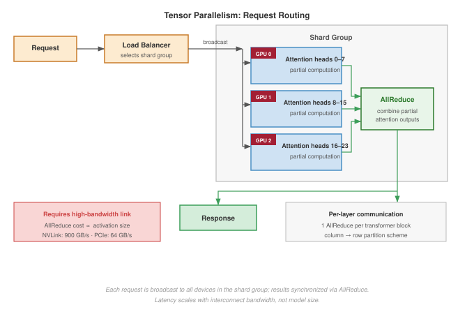

:::

The key constraint visible in @fig-tensor-parallel-routing is that every request requires an AllReduce synchronization across all devices in the shard group, making interconnect bandwidth the latency-determining factor rather than model size.

Under pipeline parallelism, each request traverses stages sequentially, with each stage forwarding activations to the next. @Fig-pipeline-parallel-routing illustrates how pipelining multiple requests achieves throughput scaling even though single-request latency equals the sum of all stage times.

::: {#fig-pipeline-parallel-routing fig-env="figure" fig-pos="htb" fig-cap="**Pipeline Parallelism Request Flow**: (a) A single request flows sequentially through four stages—no latency benefit from parallelism. (b) Multiple requests fill the pipeline: once steady state is reached, throughput scales with the number of pipeline stages, while per-request latency remains approximately constant." fig-alt="Two-part diagram. Top: single request through four stage boxes labeled by layer ranges with GPU labels below. Bottom: Gantt-style grid showing four GPU rows with requests offset by one stage, illustrating pipeline fill and steady-state throughput."}


:::

The critical insight from @fig-pipeline-parallel-routing is that pipeline parallelism offers no single-request latency benefit: one request still traverses all stages sequentially. Throughput scales only when multiple concurrent requests fill the pipeline, reaching steady-state throughput proportional to the number of stages.

Under expert parallelism, each request is dispatched to the devices hosting its selected experts based on the gating decision. Two AllToAll communication steps bookend the expert compute, as shown in @fig-expert-parallel-routing. Load imbalance is the critical challenge: when the gating function routes disproportionately to some experts, communication overhead becomes a bottleneck.

::: {#fig-expert-parallel-routing fig-env="figure" fig-pos="htb" fig-cap="**Expert Parallelism (MoE) Request Flow**: Gating selects the top-$k$ experts; an AllToAll dispatch sends tokens to the GPUs hosting those experts; experts compute in parallel; a second AllToAll gathers results. The lower panel contrasts unbalanced routing (one expert bottlenecks) against balanced routing (uniform utilization via auxiliary loss)." fig-alt="Five-stage horizontal pipeline: Request, Gating, AllToAll dispatch (dashed orange), Expert Compute (three GPU boxes), AllToAll gather (dashed orange), Response. Lower panel shows two sets of three capacity bars: unbalanced with one overloaded, balanced with equal tokens."}

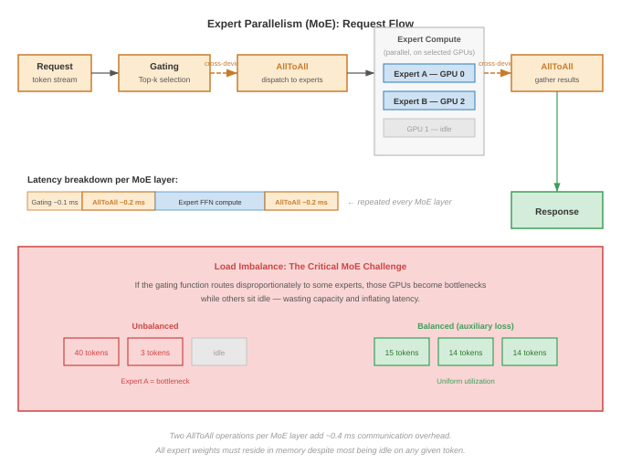

:::

As @fig-expert-parallel-routing illustrates, the two AllToAll communication steps make expert parallelism uniquely sensitive to load imbalance: if the gating function concentrates tokens on a few experts, those devices become bottlenecks while others sit idle.

When multiple shard groups provide horizontal scaling, the load balancer routes to groups rather than individual devices. @Fig-shard-group-scaling shows this two-level hierarchy: standard load-balancing algorithms (round-robin, two-choices, consistent hashing) operate at the group level, while each group handles its own internal AllReduce locally.

::: {#fig-shard-group-scaling fig-env="figure" fig-pos="htb" fig-cap="**Horizontal Scaling with Shard Groups**: The load balancer treats each shard group as a single logical inference server. Within each group, 8 GPUs coordinate via tensor parallelism. Adding groups scales throughput linearly; adding GPUs per group reduces per-request latency." fig-alt="Hub-and-spoke diagram: incoming request boxes converge to a Load Balancer, which fans out to three Shard Group boxes each containing an 8-GPU grid and a summary label. Green annotation below states the logical server abstraction."}

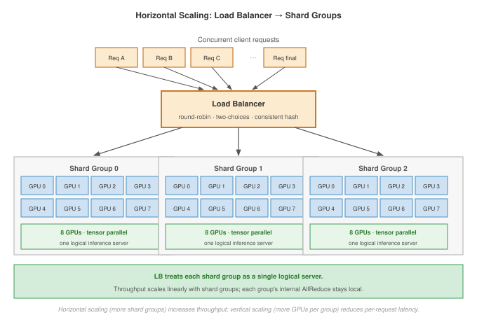

:::

The two-level hierarchy in @fig-shard-group-scaling separates concerns: the load balancer treats each shard group as a single logical server using standard algorithms, while internal AllReduce coordination remains local to each group. Adding shard groups scales throughput linearly; adding GPUs per group reduces per-request latency.

### Health checking and failover {#sec-inference-scale-health-checking-failover-070e}

Load balancers must detect unhealthy servers and route around them. Health checking mechanisms include:

Liveness probes verify that the server process is running:

```
GET /health/live
Response: 200 OK (process alive) or timeout (process dead)
```

Readiness probes go further, verifying the server can handle requests (model loaded, GPU initialized):

```
GET /health/ready
Response: 200 OK (ready to serve) or 503 (not ready)
```

Deep health checks verify that actual inference works by running a test request:

```
POST /health/inference
Body: {"prompt": "test"}
Response: 200 OK with valid output, or error
```

Standard health checks are necessary but insufficient for GPU-accelerated servers, which face hardware-specific failure modes.

::: {#exmp-inference-health-checks-gpu-inference .callout-example title="Health checks for GPU inference"}

**Scenario**: GPU inference servers can pass ordinary process health checks while still being unable to serve real requests.

**GPU memory pressure**: \index{GPU Memory!pressure} Server may be alive but unable to allocate memory for new requests.

```{.python}
def readiness_check():
    free_memory = (
        torch.cuda.memory_reserved() - torch.cuda.memory_allocated()
    )
    if free_memory < MIN_REQUEST_MEMORY:
        return {
            "status": "not_ready",
            "reason": "insufficient GPU memory",
        }
    return {"status": "ready"}
```

**Model warm-up**: \index{Model Warm-Up} First inference after load is slower. Mark ready only after warm-up.

```{.python}
async def startup():
    model = load_model()
    # Warm up with dummy requests
    for _ in range(10):
        model.generate(dummy_input)
    # Now mark as ready
    global ready
    ready = True
```

The three probe tiers each balance fast outage detection against GPU-resident probing cost; @tbl-inference-health-check-cadences fixes interval, timeout, and failure-threshold values for liveness, readiness, and deep-health probes\index{Health Check!timeout configuration}. Deep health checks run least often because they consume GPU resources.

**Systems lesson**: A serving process being alive is not the same as a model replica being ready. GPU memory, warm-up state, and model-output validity must be part of the health contract.

:::

| **Check Type**  | **Interval** | **Timeout** | **Failure Threshold** |
|:----------------|:------------:|:-----------:|:---------------------:|
| **Liveness**    |     10s      |      5s     |       3 failures      |
| **Readiness**   |      5s      |      3s     |       2 failures      |
| **Deep health** |     30s      |     10s     |       1 failure       |

: **GPU Inference Health-Check Cadences**: Liveness, readiness, and deep-health probe intervals, timeouts, and failure thresholds for GPU inference servers, balancing fast outage detection against the cost of GPU-resident probes. {#tbl-inference-health-check-cadences tbl-colwidths="[30,18,18,34]"}

### Quantitative analysis: Load balancing impact {#sec-inference-scale-quantitative-analysis-load-balancing-impact-34d1}

The choice of load balancing algorithm has quantitative impact on system performance. Consider a system with 100 servers, 10,000 QPS, and variable request sizes (CV = 0.5). @Tbl-lb-comparison quantifies the latency and overhead tradeoffs:

| **Algorithm**         | **Max Queue** | **P99 Latency** | **CPU Overhead** |
|:----------------------|:-------------:|:---------------:|:----------------:|
| **Random**            |  4.2 requests |      45 ms      |     Minimal      |
| **Round-robin**       |  2.8 requests |      32 ms      |     Minimal      |
| **Two-choices**       |  1.9 requests |      24 ms      | 2 probes/request |
| **Least-connections** |  1.4 requests |      19 ms      |   Global state   |
| **Two-choices + LC**  |  1.2 requests |      17 ms      | 2 probes + state |

: **Load Balancing Algorithm Comparison**: More sophisticated algorithms reduce queue lengths and latency at the cost of increased overhead. {#tbl-lb-comparison}

The progression shows clear tradeoffs:

- Random/round-robin: Zero overhead but higher latency variance
- Two-choices: Minimal overhead (2 probes), 47 percent latency improvement
- Least-connections: State maintenance overhead, 58 percent latency improvement
- Combined: Best performance, highest complexity

For most production systems, two-choices provides the best trade-off between performance improvement and implementation complexity. Least-connections adds value for workloads with high request size variance (LLM serving, recommendation ranking).

### Circuit breakers and backpressure {#sec-inference-scale-circuit-breakers-backpressure-e61c}

When a GPU inference server slows down, routing more requests to it can turn a local slowdown into a fleet-wide failure. Thermal throttling is a typical trigger: a replica that normally serves a request in 50 ms begins taking 500 ms, queues fill behind it, client timeouts generate retries, and those retries push load onto neighboring replicas. The load balancer needs a way to stop treating that replica as merely slow and start treating it as unavailable.

The **circuit breaker pattern**\index{Circuit Breaker!circuit breaker pattern}[^fn-circuit-breaker-serving] [@nygard2007releaseit] provides that control. In the closed state, the server receives normal traffic. When error rate, timeout rate, or latency exceeds a threshold, the breaker opens and requests fail fast or route elsewhere instead of waiting behind a saturated queue. After a recovery interval, the breaker becomes half-open: it admits a small number of probe requests, closes if they succeed, and reopens if they fail. The important systems property is bounded blast radius. The failed replica loses traffic quickly enough that its queue cannot export overload to the rest of the fleet.

[^fn-circuit-breaker-serving]: **Circuit Breaker**: Named after the electrical safety device that cuts current before wires overheat. In inference serving, the three-state machine (closed, open, half-open) prevents a single overloaded GPU replica from cascading failure to the entire fleet: once error rate exceeds threshold, the breaker opens and fails requests fast (microseconds) rather than waiting for timeout (seconds), protecting upstream callers and preserving capacity for healthy replicas. \index{Circuit Breaker!serving}

Backpressure propagation complements the breaker by making overload visible upstream. When queue depth crosses a threshold, the server returns a signal such as `503 Service Unavailable`; the load balancer marks the replica as degraded and routes fewer requests to it. If all replicas become degraded, the system shifts from routing control to admission control, rejecting some requests at the edge rather than accepting work it cannot serve within the latency SLO. Circuit breakers isolate unhealthy replicas; backpressure tells the rest of the system to slow down before retries amplify the failure.

```{python}
#| echo: false
from mlsysim.fmt import fmt_count, fmt_multiple, fmt_percent, fmt_time

# ┌── LEGO ───────────────────────────────────────────────
# │ Exports: CircuitBreakerServingProfile.error_threshold_pct_str,
# │          CircuitBreakerServingProfile.latency_threshold_mult_str,
# │          CircuitBreakerServingProfile.open_duration_s_str,
# │          CircuitBreakerServingProfile.half_open_requests_count_str
class CircuitBreakerServingProfile:
    # ┌── 1. LOAD (Source of truth) ───────────────────────────────────────────
    profile = ReferenceStats.ServingProfiles

    error_threshold = profile.CircuitBreakerErrorThreshold
    latency_threshold_multiple = profile.CircuitBreakerLatencyThresholdMultiple
    open_duration = profile.CircuitBreakerOpenDuration
    half_open_requests = profile.CircuitBreakerHalfOpenRequests

    # ┌── 3. GUARD (Invariants) ──────────────────────────────────────────────
    check(error_threshold == 0.50, "Circuit breaker example should open at 50 percent errors")
    check(open_duration == 30 * second, "Circuit breaker example should probe after 30 seconds")

    # ┌── 4. OUTPUT (Formatting) ──────────────────────────────────────────────
    error_threshold_pct_str = fmt_percent(error_threshold, precision=0, commas=False, style="prose")
    latency_threshold_mult_str = fmt_multiple(latency_threshold_multiple, precision=0, commas=False)
    open_duration_s_str = fmt_time(open_duration, unit=second, precision=0, commas=False)
    half_open_requests_count_str = fmt_count(half_open_requests, label="request", commas=False)
```

::: {#exmp-inference-cascading-failure-prevention .callout-example title="Cascading failure prevention"}

Consider a scenario where one server becomes slow (thermal throttling):

**Without circuit breaker**:

1. Server A slows down (processing 500 ms instead of 50 ms)
2. Load balancer continues routing to Server A
3. Requests queue on Server A, timeouts begin
4. Retry logic sends failed requests to other servers
5. Other servers overload from retry traffic
6. System-wide failure

**With circuit breaker**:

1. Server A slows down
2. Error rate on Server A rises above `{python} CircuitBreakerServingProfile.error_threshold_pct_str`
3. Circuit breaker opens for Server A
4. All requests route to Servers B, C, D
5. System operates at reduced capacity but remains stable
6. After `{python} CircuitBreakerServingProfile.open_duration_s_str`, the breaker admits probe requests and closes if they succeed

**Systems lesson**: For GPU inference\index{Inference!configuration for gpu}, the canonical thresholds and recovery settings appear in @tbl-inference-circuit-breaker-gpu. Circuit breakers preserve partial capacity by stopping retries from amplifying one slow replica into a system-wide overload.

:::

| **Parameter**\index{Parameter} |                                  **Value**                                  | **Rationale**                         |
|:-------------------------------|:---------------------------------------------------------------------------:|:--------------------------------------|
| **Error threshold**            |       `{python} CircuitBreakerServingProfile.error_threshold_pct_str`       | GPU OOM failures are serious          |
| **Latency threshold**          | `{python} CircuitBreakerServingProfile.latency_threshold_mult_str` baseline | Detect throttling early               |
| **Open duration**              |         `{python} CircuitBreakerServingProfile.open_duration_s_str`         | Probe only after the queue drains     |
| **Half-open requests**         |     `{python} CircuitBreakerServingProfile.half_open_requests_count_str`    | Careful testing before full reopening |

: **Circuit-Breaker Settings for GPU Inference**: Error and latency thresholds, open duration, and half-open probe count chosen so that a single throttling GPU is isolated quickly without prematurely failing healthy nodes. {#tbl-inference-circuit-breaker-gpu}

Efficient routing assumes that our inference servers own the underlying hardware. In enterprise environments, however, our critical production models are often running on the exact same physical clusters as experimental models and developer endpoints. To prevent a rogue developer query from crashing our flagship service, we must enforce strict multi-tenancy and resource isolation.

## Multi-Tenancy and Isolation {#sec-inference-scale-multitenancy-isolation-688c}

Consider a critical customer-support chatbot running on the same GPU server as an experimental computer vision script. If the experimental workload accidentally monopolizes the PCIe bus or memory bandwidth, the customer-facing chatbot begins timing out, violating SLAs. Multi-tenancy and isolation ensure that co-located workloads save money without sacrificing the predictability of flagship services.

### The multi-tenancy challenge {#sec-inference-scale-multitenancy-challenge-8dca}

Multi-tenancy saves cost through cost efficiency\index{Multi-Tenancy!cost efficiency}, operational simplicity\index{Operational Simplicity}, and statistical multiplexing\index{Statistical Multiplexing}. Sharing infrastructure raises utilization, reduces the number of clusters to manage, and makes aggregate traffic more predictable than any one tenant's traffic.

::: {.column-margin}
{width="100%" fig-alt="Margin illustration showing One bursting tenant propagates SLO impact through a shared pool."}

*Bursts starve shared KV cache.*
:::

The same sharing creates the isolation problem that @tbl-tenancy-comparison frames: noisy neighbors\index{Noisy Neighbor} can make one tenant's burst degrade others, resource contention\index{Resource Contention} spans GPU memory, network bandwidth, and CPU cycles, security boundaries\index{Security!boundaries} must protect tenant data, and SLO complexity\index{SLO!complexity} increases when tenants have different requirements.

| **Aspect**                                           |   **Single-Tenant**    |    **Multi-Tenant**    |
|:-----------------------------------------------------|:----------------------:|:----------------------:|
| **Resource utilization**\index{Resource Utilization} |     30--50 percent     |     70-90 percent      |
| **Cost per request**                                 |         Higher         |         Lower          |
| **SLO guarantees**                                   |         Simple         |        Complex         |
| **Isolation**                                        |        Complete        |  Requires engineering  |
| **Operational overhead**                             | Higher (many clusters) | Lower (fewer clusters) |

: **Single vs. Multi-Tenant Tradeoffs**\index{Multi-Tenancy!tradeoffs}: Multi-tenancy reduces cost but requires careful isolation engineering. {#tbl-tenancy-comparison}

### Noisy neighbor problems {#sec-inference-scale-noisy-neighbor-problems-1b87}

The noisy neighbor problem occurs when one tenant's workload degrades performance for others sharing the same infrastructure. The interference manifests across three resource dimensions simultaneously.

GPU memory contention is the most severe: a tenant with unexpectedly long sequences can consume a disproportionate share of the KV cache pool. Consider three tenants sharing a 60 GB KV cache pool with equal 20 GB allocations. When one tenant begins issuing long-context requests, its allocation can swell to 45 GB, forcing evictions that reduce the other tenants from 200 concurrent sequences each to 75 -- a 62 percent batch size reduction that directly degrades their throughput. Network bandwidth saturation compounds this effect when a tenant streaming many large responses consumes the available egress capacity. GPU time-sharing between tenants introduces context-switching overhead and unpredictable latency variance. Measuring noisy-neighbor impact requires capturing all three interference dimensions simultaneously.

::: {#nbk-inference-quantifying-noisy-neighbor-impact .callout-notebook title="Quantifying noisy neighbor impact"}

```{python}
#| echo: false
#| label: noisy-neighbor-quota-scenario
# ┌─────────────────────────────────────────────────────────────────────────────
# │ NOISY NEIGHBOR QUOTA SCENARIO (LEGO)
# ├─────────────────────────────────────────────────────────────────────────────
# │ Context: Noisy-neighbor tables in §Multi-tenancy and isolation.
# │
# │ Goal: Keep SLO status labels aligned with the latency threshold.
# │ Show: 10 ms SLO; protected tenants at 10 ms meet it; bursting tenant violates.
# │ How: Status is "Met" iff p99 latency <= SLO.
# │
# │ Imports: mlsysim.fmt (check, fmt, MarkdownStr)
# │ Exports: NoisyNeighborQuotaScenario.*_str
# └─────────────────────────────────────────────────────────────────────────────
from mlsysim.fmt import fmt_int, check, fmt, MarkdownStr, fmt_percent, fmt_rate, fmt_time

class NoisyNeighborQuotaScenario:
    """Resource-quota scenario with computed SLO statuses."""

    # ┌── 1. LOAD (Constants) ──────────────────────────────────────────────
    slo_ms = 10
    tenant_base_qps = 100
    tenant_burst_qps = 500
    tenant_throttled_qps = 120
    protected_p99_ms = 10
    burst_p99_ms = 50

    # ┌── 2. EXECUTE (The Compute) ────────────────────────────────────────
    protected_status = "Met" if protected_p99_ms <= slo_ms else "Violated"
    burst_status = "Violated" if burst_p99_ms > slo_ms else "Met"

    # ┌── 3. GUARD (Invariants) ──────────────────────────────────────────
    check(protected_status == "Met", "Protected tenants should meet the SLO")
    check(burst_status == "Violated", "Bursting tenant should violate the SLO")

    # ┌── 4. OUTPUT (Formatting) ─────────────────────────────────────────────
    slo_ms_str = fmt_time(round(slo_ms), 'millisecond', precision=0, commas=False)
    tenant_base_qps_str = fmt_rate(tenant_base_qps, "QPS", commas=False)
    tenant_burst_qps_str = fmt_rate(tenant_burst_qps, "QPS", commas=False)
    tenant_throttled_qps_str = fmt_rate(tenant_throttled_qps, "QPS", commas=False)
    protected_p99_ms_str = fmt_int(protected_p99_ms, commas=False)
    burst_p99_ms_str = fmt_int(burst_p99_ms, commas=False)
    protected_status_str = MarkdownStr(protected_status)
    burst_status_str = MarkdownStr(burst_status)
    gpu_util_pct_str = fmt_percent(round(70)/100, precision=0, commas=False, style='prose')
```

Consider an inference platform serving 10 tenants on shared H100 GPUs:

**Baseline (even load)**:

- Each tenant: `{python} NoisyNeighborQuotaScenario.tenant_base_qps_str`, `{python} NoisyNeighborQuotaScenario.slo_ms_str` P99 latency
- GPU utilization: `{python} NoisyNeighborQuotaScenario.gpu_util_pct_str`
- All SLOs met

Tenant 3 bursts (5$\times$ baseline). Without isolation, @tbl-inference-noisy-neighbor-no-isolation records how the burst cascades into SLO violations for all ten tenants on the shared pool:

| **Tenant**       | **QPS**  | **P99 Latency** | **SLO Status** |
|:-----------------|:--------:|:---------------:|:--------------:|
| **Tenant 1**     |   100    |      25 ms      |    Violated    |
| **Tenant 2**     |   100    |      28 ms      |    Violated    |
| **Tenant 3**     |   500    |      45 ms      |    Violated    |
| **Tenants 4-10** | 100 each |     22-30 ms    |    Violated    |

: **Noisy neighbor without isolation**: Per-tenant QPS, p99 latency, and SLO status when tenant 3 bursts to `{python} NoisyNeighborQuotaScenario.tenant_burst_qps_str` on a shared GPU pool with no resource quotas. {#tbl-inference-noisy-neighbor-no-isolation tbl-colwidths="[26,20,24,30]"}

**With per-tenant quotas** (@tbl-inference-noisy-neighbor-quotas): impact contained to the offending tenant alone.

| **Tenant**       |                              **QPS (actual)**                              |                      **P99 Latency**                       |                             **SLO Status**                             |
|:-----------------|:--------------------------------------------------------------------------:|:----------------------------------------------------------:|:----------------------------------------------------------------------:|
| **Tenant 1**     |                                    100                                     | `{python} NoisyNeighborQuotaScenario.protected_p99_ms_str` |       `{python} NoisyNeighborQuotaScenario.protected_status_str`       |
| **Tenant 2**     |                                    100                                     | `{python} NoisyNeighborQuotaScenario.protected_p99_ms_str` |       `{python} NoisyNeighborQuotaScenario.protected_status_str`       |
| **Tenant 3**     | `{python} NoisyNeighborQuotaScenario.tenant_throttled_qps_str` (throttled) |   `{python} NoisyNeighborQuotaScenario.burst_p99_ms_str`   | `{python} NoisyNeighborQuotaScenario.burst_status_str` (only for them) |
| **Tenants 4-10** |                                  100 each                                  | `{python} NoisyNeighborQuotaScenario.protected_p99_ms_str` |       `{python} NoisyNeighborQuotaScenario.protected_status_str`       |

: **Noisy neighbor with per-tenant quotas**: Per-tenant QPS, p99 latency, and SLO status after enabling per-tenant resource quotas in the same workload. {#tbl-inference-noisy-neighbor-quotas}

:::

### Resource quotas and fair sharing {#sec-inference-scale-resource-quotas-fair-sharing-006c}

Resource quotas limit what each tenant can consume, preventing any single tenant from monopolizing shared resources.

Hard quotas enforce strict limits, as shown in @lst-resource-quotas.\index{Resource Quotas}

::: {#lst-resource-quotas lst-cap="**Resource Quotas**: Admission control that enforces per-tenant limits on concurrency, KV cache memory, and request rate."}

```{.python}
class TenantQuota:
    max_concurrent_requests: int  # e.g., 100
    max_kv_cache_mb: int  # e.g., 20,000
    max_qps: int  # e.g., 1,000
    max_batch_tokens: int  # e.g., 50,000


def admit_request(tenant_id, request):
    quota = get_quota(tenant_id)
    usage = get_usage(tenant_id)

    if usage.concurrent >= quota.max_concurrent:
        return RateLimitError("concurrent request limit")
    if usage.kv_cache_mb >= quota.max_kv_cache_mb:
        return RateLimitError("memory limit")
    if usage.qps >= quota.max_qps:
        return RateLimitError("rate limit")

    return admit(request)
```

:::

Soft quotas with fair sharing provide a more flexible alternative. Each tenant has a nominal quota (for example, 100 QPS), but when the cluster is underutilized (50 percent capacity), tenants can burst to 2$\times$ their quota. When the cluster saturates (90 percent capacity), quotas are enforced. This approach maximizes utilization during low-traffic periods while protecting tenants during contention.

When total demand exceeds capacity, max-min fairness allocates resources to maximize the minimum allocation across tenants. The algorithm first gives each tenant an equal share, then redistributes unused capacity from tenants whose demand falls below their equal share. For three tenants with demands of 300, 200, and 800 QPS competing for 1,000 QPS of capacity, max-min fairness yields allocations of 300, 200, and 500 -- each tenant receives up to its demand or its fair share, whichever is less, with excess capacity redistributed proportionally.

### Priority scheduling {#sec-inference-scale-priority-scheduling-3e37}

When tenants have different SLO requirements, priority scheduling ensures that high-priority requests receive resources first. @Tbl-priority-scheduling-classes organizes the hierarchy into three priority classes:

| **Class**       |    **Use Case**    |      **Preemption**     | **Resource Guarantee** |
|:----------------|:------------------:|:-----------------------:|:----------------------:|
| **Critical**    | Revenue-generating |    Can preempt lower    |  100 percent reserved  |
| **Standard**    |  General traffic   | Can preempt best-effort |     Weighted share     |
| **Best-effort** | Background, batch  |      Cannot preempt     |      No guarantee      |

: **Priority Scheduling Classes**: Three-tier priority hierarchy for multi-tenant inference. Critical traffic gets 100 percent reserved capacity and can preempt any lower class; standard traffic shares capacity proportionally and can preempt best-effort; best-effort runs on leftover capacity with no guarantees. {#tbl-priority-scheduling-classes}

The scheduler sorts incoming requests by priority class, then by arrival time within each class. When a new critical request arrives, it jumps ahead of all standard and best-effort requests in the queue, ensuring that revenue-generating traffic never waits behind background batch jobs.

Preemption extends this principle to requests already in flight. When a critical request arrives and all GPU slots are occupied by lower-priority work, the scheduler selects a victim from the lowest priority class, saves its KV cache state to CPU memory, and yields the GPU slot. Once the critical request completes, the preempted request resumes from its saved state rather than restarting from scratch. This checkpoint-and-resume mechanism makes preemption practical for autoregressive generation, where discarding partial output would waste all tokens generated so far.

### Bulkhead pattern {#sec-inference-scale-bulkhead-pattern-1c3a}

The bulkhead pattern[^fn-bulkhead-isolation] [@nygard2007releaseit] physically isolates tenant workloads, preventing failures from propagating across tenants. The pattern is named after ship compartments that contain flooding to isolated sections.

[^fn-bulkhead-isolation]: [offset=-30mm] **Bulkhead Pattern**: Named after ship compartments that contain flooding to isolated sections. The Titanic's bulkheads failed because they did not extend to the top of the hull, allowing water to cascade over as the ship tilted. The lesson for multi-tenant inference: shared GPU pools with soft quotas provide only partial isolation, and a single tenant's burst can exhaust memory or saturate bandwidth for all others. Effective bulkheads require dedicated hardware resources per critical tenant. \index{Bulkhead Pattern!isolation}

The strongest form of bulkhead dedicates entire replicas to specific tenants or tenant groups. @Fig-bulkhead-patterns illustrates this deployment-level isolation between gold and standard tiers:

::: {.content-visible when-format="pdf"}
\newpage
:::

::: {#fig-bulkhead-patterns fig-env="figure" fig-pos="htb" fig-cap="**Bulkhead Isolation Patterns**: To prevent cascading failures in multi-tenant systems, bulkheads isolate resources. Deployment-level bulkheads (shown) assign dedicated physical replicas to high-priority tenants, ensuring complete isolation. Request-level bulkheads enforce strict concurrency limits within shared processes. Like ship compartments, these boundaries ensure that a failure or resource exhaustion in one segment cannot sink the entire platform." fig-alt="Two-tier system diagram. Gold tier at top with dedicated load balancer and 2 replicas. Standard tier below with shared load balancer and 3 replicas, one showing failure. Dashed line marks complete isolation boundary between tiers."}

```{.tikz}
\begin{tikzpicture}[font=\small\usefont{T1}{phv}{m}{n}, scale=0.9, transform shape]
  \definecolor{GoldColor}{HTML}{FCE4CC}
  \definecolor{StdColor}{HTML}{F5F5F5}
  \definecolor{FailColor}{HTML}{F5D2D5}

  \tikzset{
    lb/.style={draw=black!70, fill=white, rounded corners, minimum height=0.8cm, minimum width=1.5cm, align=center},
    replica/.style={draw=black!70, minimum height=0.6cm, minimum width=2cm, align=center}
  }

  % Gold Tier System
  \node[anchor=west] (gold_title) at (0, 4) {\textbf{Gold Tier} (Dedicated)};
  \node[lb, below=0.2cm of gold_title.south west, anchor=north west, xshift=1cm] (gold_lb) {Gold LB};

  \node[replica, fill=GoldColor!30, right=1.5cm of gold_lb, yshift=0.5cm] (r1) {Replica 1};
  \node[replica, fill=GoldColor!30, right=1.5cm of gold_lb, yshift=-0.5cm] (r2) {Replica 2};

  \draw[->, thick] (gold_lb.east) -- (r1.west);
  \draw[->, thick] (gold_lb.east) -- (r2.west);

  % Standard Tier System
  \node[anchor=west, below=2cm of gold_title.west] (std_title) {\textbf{Standard Tier} (Shared)};
  \node[lb, below=0.2cm of std_title.south west, anchor=north west, xshift=1cm] (std_lb) {Std LB};

  \node[replica, fill=StdColor, right=1.5cm of std_lb, yshift=1cm] (r3) {Replica 3};
  \node[replica, fill=FailColor, right=1.5cm of std_lb] (r4) {Replica 4\\(Failure)};
  \node[replica, fill=StdColor, right=1.5cm of std_lb, yshift=-1cm] (r5) {Replica 5};

  \draw[->, thick] (std_lb.east) -- (r3.west);
  \draw[->, thick] (std_lb.east) -- (r4.west);
  \draw[->, thick] (std_lb.east) -- (r5.west);

  % Isolation Barrier
  \draw[dashed, ultra thick, black!50] (-0.5, 1.8) -- (5.5, 1.8);
  \node[fill=white, inner sep=2pt, font=\scriptsize\usefont{T1}{phv}{m}{n}, align=center] at (8.0, 1.8) {\textbf{Complete Isolation}\\No Shared Resources};

  % Impact Annotation
  \node[align=left, font=\scriptsize\usefont{T1}{phv}{m}{n}, color=FailColor!80!black, right=0.5cm of r4] {Failure constrained\\to Shared Pool};
  \node[align=left, font=\scriptsize\usefont{T1}{phv}{m}{n}, color=GoldColor!50!black, right=0.5cm of r1, yshift=-0.5cm] {Gold Tier\\unaffected};

\end{tikzpicture}
```

:::

Deployment-level bulkheads provide complete isolation for premium tenants, ensuring that their performance is never affected by other workloads. The trade-off is lower overall resource utilization and increased operational overhead from managing dedicated infrastructure.

Request-level bulkheads complement this physical separation by limiting what any single request can consume within a shared process. Capping input length (for example, 8,000 tokens), output length (2,000 tokens), and execution time (30 seconds) prevents a single pathological request from monopolizing a GPU for minutes while other requests queue behind it.

Failure isolation follows naturally from bulkhead boundaries. When a tenant submits malformed input that triggers a model error, the bulkhead confines the failure to that tenant's request; other tenants continue processing normally rather than sharing a crashed inference worker. In multi-tenant deployments, these boundaries typically align with service tiers, each with distinct resource guarantees.

::: {#exmp-inference-bulkhead-configuration-api-tiers .callout-example title="Bulkhead configuration for API tiers"}

**Scenario**: A typical LLM API has enterprise, professional, and free service tiers.

**System**: The enterprise tier runs on a dedicated GPU pool with hardware isolation and a 99.9 percent availability SLO -- no other tenant's traffic can affect it. The professional tier shares a GPU pool but receives 70 percent of that pool's capacity through resource quotas and can preempt the free tier when contention arises. The free tier receives the remaining 30 percent on a best-effort basis with rate limiting (for example, 10 QPS) and no SLO guarantee.

**Systems lesson**: Bulkheads concentrate isolation cost where the business requirement justifies it while still allowing shared infrastructure to run at high utilization.

:::

### Model isolation {#sec-inference-scale-model-isolation-ef31}

When multiple models run on shared infrastructure, isolation must span memory, compute, and model loading. Memory isolation partitions GPU memory so that one model's allocation cannot encroach on another's. On an 80 GB H100, for example, reserving 40 GB for one model and 30 GB for a second leaves a 10 GB shared pool for transient needs -- each model's KV cache growth is bounded regardless of the other's request pattern.

Compute isolation addresses the latency variance that GPU time-sharing introduces. MIG (Multi-Instance GPU)[^fn-mig-partitioning] provides the strongest guarantee by spatially partitioning the GPU into hardware-isolated instances, each with dedicated SMs, memory bandwidth, and L2 cache. Time-slicing offers a softer alternative with higher overhead, while dedicating entire GPUs per model trades utilization for complete isolation.

[^fn-mig-partitioning]: **MIG (Multi-Instance GPU)**: Introduced with NVIDIA's A100 [@NVIDIA2020], MIG spatially partitions a single GPU into up to 7 isolated instances, each with dedicated compute SMs, memory bandwidth, and L2 cache. Unlike time-slicing, which shares resources and introduces latency variance of 2--5$\times$, MIG provides hardware-enforced isolation with predictable performance, making it the preferred mechanism for serving multiple small models on a single expensive data center GPU. \index{MIG!partitioning}

Model loading presents a subtler isolation challenge: loading a new model should not evict a running model from GPU memory. @Lst-model-loading-isolation demonstrates priority-aware eviction logic that enforces this constraint.\index{Model Loading!isolation}

::: {#lst-model-loading-isolation lst-cap="**Model Loading Isolation**: Priority-aware memory management that prevents model eviction from violating tenant isolation constraints."}

```{.python}
class ModelManager:
    def load_model(self, model_id, priority):
        required_memory = get_model_size(model_id)
        available = get_free_gpu_memory()

        if required_memory > available:
            # Check if eviction would violate isolation
            evictable = get_evictable_memory(priority)
            if required_memory > evictable:
                raise InsufficientMemoryError(
                    "Cannot load without violating isolation constraints"
                )
            evict_lower_priority_models(priority, required_memory)

        load_to_gpu(model_id)
```

:::

### Observability for multi-tenancy {#sec-inference-scale-observability-multitenancy-8637}

Effective multi-tenancy requires per-tenant visibility into resource consumption and performance. The essential metrics span four dimensions: request volume and latency distribution (P50, P95, P99), GPU memory and KV cache utilization, throttling and preemption event counts, and error rates broken down by error type. Together, these metrics reveal whether each tenant is receiving its contracted quality of service.

Three alerting thresholds transform these metrics into actionable signals. An SLO violation alert fires when a tenant's P99 latency exceeds its target by more than 10 percent for five consecutive minutes. A quota exhaustion alert triggers when usage reaches 90 percent of the tenant's allocation, providing advance warning before hard limits cause request rejection. A noisy neighbor detection alert identifies tenants consuming more than twice their fair share for five minutes, flagging interference before it cascades to other tenants.

Chargeback and attribution close the operational loop by mapping resource consumption -- GPU-seconds, KV cache GB-hours, network egress -- to individual tenants for billing and capacity planning. Without per-tenant attribution, organizations cannot distinguish between tenants that need more capacity and tenants that are simply inefficient, making informed provisioning decisions impossible.

Proper isolation allows us to securely pack workloads onto a fixed set of servers. Traffic on the internet, however, is rarely fixed. To handle viral product launches or deep nocturnal lulls without burning cash, our isolated inference services must dynamically grow and shrink across global data centers through intelligent autoscaling.

## Autoscaling and Global Infrastructure {#sec-inference-scale-autoscaling-168d}

A viral social media post drives a 10$\times$ spike in traffic to a generative AI application in under five minutes. If the infrastructure team relies on manual scaling or slow, CPU-based metrics to spin up new GPU instances, the service collapses before new replicas even finish downloading the model weights. Autoscaling for ML inference requires predictive, custom-metric strategies to handle these massive load dynamics.

### Scaling dimensions {#sec-inference-scale-scaling-dimensions-befc}

Inference systems can scale along three dimensions, each with distinct cost, latency, and speed characteristics. @Tbl-scaling-dimensions contrasts these approaches.

The most common approach is horizontal scaling: adding or removing model replicas to adjust aggregate throughput. Total capacity scales linearly as $\text{Capacity} = \text{Replicas} \times \text{Per-replica throughput}$, but each new replica requires provisioning time measured in minutes.

When replica count is fixed, vertical scaling replaces existing GPUs with more powerful ones to increase per-replica throughput. Cost efficiency is $\text{Throughput} / \text{GPU cost}$, but vertical scaling requires redeployment and is the slowest scaling response.

The fastest response comes from batch size scaling, which adjusts how many requests the system processes simultaneously. Increasing batch size trades higher per-request latency for greater throughput, with no provisioning delay. This makes batch size the first knob to turn during a traffic spike, buying time for horizontal scaling to take effect.

| **Scaling Type**\index{Scaling!horizontal} | **Latency** |  **Cost** |        **Speed**         |
|:-------------------------------------------|:-----------:|:---------:|:------------------------:|
| **Horizontal (add replicas)**              |  Unchanged  |   Linear  |      Slow (minutes)      |
| **Batch size**\index{Scaling!batch size}   |  Increases  | Unchanged |         Instant          |
| **Vertical (better GPU)**                  |  Unchanged  | Nonlinear | Very slow (redeployment) |

: **Scaling Dimension Tradeoffs**\index{Scaling!dimension tradeoffs}: Each scaling approach has different characteristics. {#tbl-scaling-dimensions}

### The cold start problem {#sec-inference-scale-cold-start-problem-ecf9}

Cold start latency represents a significant challenge for serverless inference, with model loading often dominating the total startup time.

Unlike stateless web services that start in seconds, inference services have significant startup latency as defined in @eq-cold-start-time:

$$T_{\text{cold start}} = T_{\text{provision}} + T_{\text{load}} + T_{\text{warmup}}$$ {#eq-cold-start-time}

The provisioning phase ($T_{\text{provision}}$) acquires a GPU instance, which takes 30 seconds to several minutes depending on cloud provider and GPU type.[^fn-cold-start-gpu] This delay alone exceeds the total cold start time of a stateless web service.

[^fn-cold-start-gpu]: **Cold Start (GPU vs. Serverless)**: Serverless functions cold-start in 100 ms--1 s; GPU inference cold-starts in 1--10 minutes due to GPU allocation, model weight transfer, and CUDA context initialization. This 100$\times$ gap means reactive autoscaling alone cannot absorb traffic spikes, making predictive scaling and warm pools essential design requirements for any GPU serving fleet with latency SLOs. \index{Cold Start!GPU inference}

Once the instance is available, model loading ($T_{\text{load}}$) transfers weights from storage to GPU memory. Loading time scales with model size and depends heavily on storage tier, as @tbl-model-load-time shows:

| **Model Size**\index{Model Size} | **Load Time (SSD)** | **Load Time (S3)** |
|:---------------------------------|:-------------------:|:------------------:|
| **7B (14 GB)**                   |          5s         |        30s         |
| **70B (140 GB)**                 |         25s         |        5min        |
| **175B (350 GB)**                |         1min        |       12min        |

: **Model Load Time by Storage Tier**: Local SSD loads weights at roughly 6 GB/s; remote object storage (S3) loads at roughly 0.5 GB/s before additional validation and runtime overhead. The 12$\times$ gap matters most for the largest models: a 175B model takes about 1 minute from SSD (350 GB at 6 GB/s) vs. 12 minutes from S3, dominating the cold-start budget for any serving deployment that has to pull weights from object storage on each scale-up. {#tbl-model-load-time}

Even after weights reside in GPU memory, the first inference runs slower than steady state because just-in-time (JIT) kernel compilation, CUDA context initialization, memory pool allocation, and cache population must complete. This warmup phase ($T_{\text{warmup}}$) typically requires 10--30 dummy inferences, adding 5--30 seconds. The phase-by-phase timeline for Llama-70B shows how these delays accumulate in practice.

::: {#nbk-inference-cold-start-timeline-llama-70b .callout-notebook title="Cold start timeline for Llama-70B"}

@Tbl-inference-cold-start-timeline-llama70b traces the per-phase and cumulative duration of bringing up a new replica for Llama-70B on H100:

| **Phase**                     | **Duration** | **Cumulative** |
|:------------------------------|:------------:|:--------------:|
| **Cloud API request**         |      5s      |       5s       |
| **GPU instance provisioning** |     60s      |      65s       |
| **Container startup**         |     10s      |      75s       |
| **Model download (S3)**       |     300s     |      375s      |
| **Model load to GPU**         |     25s      |      400s      |
| **CUDA warmup**               |     15s      |      415s      |
| **Readiness probe pass**      |      5s      |      420s      |
| **Total cold start**          |  **7 min**   |                |

: **Cold-start timeline for a Llama-70B replica (H100)**: Per-phase and cumulative duration for bringing up a fresh Llama-70B serving replica on an H100 instance. {#tbl-inference-cold-start-timeline-llama70b tbl-colwidths="[52,20,28]"}

**Systems insight**: Scaling decisions must anticipate demand several minutes in advance. Reactive scaling alone cannot handle sudden traffic spikes.

@Fig-cold-start-breakdown visualizes the cumulative timeline:

:::

::: {#fig-cold-start-breakdown fig-env="figure" fig-pos="htb" fig-cap="**Anatomy of a Cold Start**: Bringing up a new GPU inference replica is a multi-step process taking minutes. While container startup is fast, provisioning the specialized instance and downloading massive model weights (100 GB+) dominate the timeline. CUDA context initialization and \"warmup\" inference passes add further delay. This roughly 7-minute lag makes purely reactive scaling dangerous for handling sudden traffic spikes." fig-alt="Horizontal stacked bar timeline from 0 to 7 minutes. Four segments: Provision (0-1.25m), Model Download (1.25-6.25m, largest), Load (6.25-6.7m), Warmup (6.7-7m). Brace above shows total cold start is about 7 minutes."}

```{.tikz}
\begin{tikzpicture}[font=\small\usefont{T1}{phv}{m}{n}, xscale=0.02, yscale=0.8]
  % xscale: 1cm = 50 seconds. Total 420s = 8.4cm
  \definecolor{ProvColor}{HTML}{FCE4CC}
  \definecolor{DownColor}{HTML}{D1E6F3}
  \definecolor{LoadColor}{HTML}{D4EFDF}
  \definecolor{WarmColor}{HTML}{F5D2D5}

  \tikzset{
    bar/.style={draw=black!70, minimum height=0.8cm, font=\tiny\usefont{T1}{phv}{m}{n}, inner sep=0pt, anchor=west}
  }

  % Axis
  \draw[->] (0, 0) -- (430, 0) node[right] {Seconds};
  \foreach \x/\label in {0/0s, 60/1m, 120/2m, 180/3m, 240/4m, 300/5m, 360/6m, 420/7m} {
      \draw (\x, 0.1) -- (\x, -0.1) node[below, font=\scriptsize\usefont{T1}{phv}{m}{n}] {\label};
  }

  % Bar Stack
  \node[bar, fill=ProvColor, minimum width=1.5cm] (prov) at (0, 1.5) {Provision};
  \node[bar, fill=DownColor, minimum width=6.0cm, right=0cm of prov] (down) {Model Download (Big!)};
  \node[bar, fill=LoadColor, minimum width=0.5cm, right=0cm of down] (load) {Load};
  \node[bar, fill=WarmColor, minimum width=0.4cm, right=0cm of load] (warm) {Warm};

  % Connect total
  \draw[decorate, decoration={brace, amplitude=5pt, raise=5pt}] (prov.south west |- 0, 2) -- (warm.south east |- 0, 2) node[midway, above=10pt, font=\bfseries\usefont{T1}{phv}{b}{n}] {Total Cold Start: ~7 Minutes};

  % Legend
  \node[anchor=west, font=\scriptsize\usefont{T1}{phv}{m}{n}] at (0, 3.5) {\textbf{Breakdown for 70B Model}};

\end{tikzpicture}
```

:::

### Reactive scaling {#sec-inference-scale-reactive-scaling-9fc1}

Reactive scaling adjusts capacity based on observed metrics:

@Lst-metric-based-scaling shows a typical metric-based scaling configuration.\index{Scaling!metric-based}

::: {#lst-metric-based-scaling lst-cap="**Metric-Based Scaling**: Autoscaling policy driven by utilization thresholds with a cooldown period to prevent oscillation."}

```{.yaml}
autoscaling:
  metric: cpu_utilization  # or gpu_utilization, queue_depth
  target_value: 70%
  scale_up_threshold: 80%
  scale_down_threshold: 50%
  cooldown_period: 300s
```

:::

A more responsive alternative scales on queue depth rather than utilization, targeting a maximum queue length per replica:

$$\text{Desired replicas} = \left\lceil \frac{\text{Queue depth}}{\text{Queue target}} \times \text{Current replicas} \right\rceil$$

When the primary concern is SLO compliance rather than utilization, latency-based scaling adjusts replicas to maintain a target P99 latency:

$$\text{Desired replicas} = \left\lceil \frac{\text{P99}_{\text{observed}}}{\text{P99}_{\text{target}}} \times \text{Current replicas} \right\rceil$$

All reactive approaches share three fundamental limitations. Cold start time prevents rapid response to sudden spikes. Metric-based triggers can create oscillation between scale-up and scale-down cycles. The system must over-provision during the cold start window to absorb load that new replicas cannot yet handle.

These limits show up most sharply during a traffic spike, where replicas must exist before cold-started capacity becomes usable.

::: {#nbk-inference-reactive-scaling-response-analysis .callout-notebook title="Reactive scaling response analysis"}

Consider traffic spike from 1000 to 3000 QPS:

**Current state**: 10 replicas, 100 QPS each, 70 percent utilization

**Target state**\index{Target State}: 30 replicas for 3000 QPS

**Without prewarming**\index{Scaling!prewarming}:

- T=0: Spike detected, scale-up triggered
- T=0 to T=5min: Cold start for 20 new replicas
- T=0 to T=5min: Existing 10 replicas handle 3000 QPS (300 QPS each)
- Utilization: 210 percent (overloaded)
- P99 latency: 500 ms+ (SLO violated)

**With sufficient warm spares (20 replicas)**:

- T=0: Spike detected, warm spares activated immediately
- T=0: 30 replicas handle 3000 QPS (100 QPS each)
- T=0 to T=5min: Replenish 20 warm spares in the background
- Utilization: 70 percent (headroom preserved)
- P99 latency: 80 ms (SLO maintained)

Warm spares provide buffer during cold start period.

:::

At internet-launch scale, the same cold-start window turns from a capacity-planning nuisance into an infrastructure survival problem.

::: {#exmp-inference-chatgpt-traffic-spike .callout-example title="The ChatGPT traffic spike"}

**Context**: When ChatGPT scaled from zero to 100 million users in two months, the engineering challenge shifted from model quality to survival.

**System**: The service faced an unprecedented cold-start problem: provisioning thousands of GPUs while managing a KV cache memory footprint that grew linearly with context length and request concurrency. Early serving infrastructure had to evolve rapidly toward optimized serving layers, aggressive batching and quantization, and geographic load balancing to keep per-token latency acceptable despite the deluge.

**Systems lesson**: Successful model launch can create an infrastructure failure mode. At serving scale, demand growth, state memory, and provisioning latency become part of the product architecture.

:::

### Predictive scaling {#sec-inference-scale-predictive-scaling-ee73}

Predictive scaling anticipates demand before it occurs, initiating scaling ahead of traffic changes. The simplest and most effective approach uses time-series forecasting on historical traffic patterns. @Lst-predictive-scaling shows a simplified forecasting function combining daily and weekly seasonality with trend estimation.\index{Predictive Scaling}

::: {#lst-predictive-scaling lst-cap="**Predictive Scaling**: Time-series demand forecasting combining daily seasonality, weekly seasonality, and trend estimation."}

```{.python}
def predict_demand(current_time, history):
    # Seasonal decomposition
    daily_pattern = extract_daily_seasonality(history)
    weekly_pattern = extract_weekly_seasonality(history)

    # Trend estimation
    trend = estimate_trend(history)

    # Forecast
    predicted = (
        daily_pattern[current_time.hour]
        * weekly_pattern[current_time.weekday()]
        * trend
    )
    return predicted
```

:::

Event-driven scaling scales proactively for known events, as shown in @lst-event-driven-scaling.\index{Scaling!event-driven}

::: {#lst-event-driven-scaling lst-cap="**Event-Driven Scaling**: Scheduled scaling rules that preprovision capacity for product launches and recurring traffic spikes."}

```{.yaml}
scheduled_scaling:
  - event: "product_launch"
    time: "2024-03-15 09:00 UTC"
    target_replicas: 50  # 5x normal
    ramp_up: 30min  # Start scaling 30min before

  - event: "weekly_newsletter"
    cron: "0 10 * * 1"  # Every Monday 10am
    target_replicas: 20  # 2x normal
    duration: 2h
```

:::

In practice, neither forecasting nor event schedules alone suffice. Production systems combine a predictive baseline with reactive adjustment to handle both anticipated patterns and unexpected deviations:

$$\text{Target replicas} = \max(\text{Predicted}, \text{Reactive}) + \text{Buffer}$$

Daily patterns make the proactive side of this rule concrete.

::: {#exmp-inference-predictive-scaling-traffic .callout-example title="Predictive scaling for traffic"}

@Tbl-inference-chatbot-daily-traffic shows a chatbot service's predictable diurnal traffic:

| **Time (UTC)** | **Typical QPS** | **Replicas Needed** |
|:---------------|:---------------:|:-------------------:|
| 00:00-06:00    |       500       |          5          |
| 06:00-09:00    |       1500      |     15 (ramp up)    |
| 09:00-17:00    |       3000      |      30 (peak)      |
| 17:00-20:00    |       2000      |    20 (ramp down)   |
| 20:00-00:00    |       1000      |          10         |

: **Daily traffic pattern for a chatbot service**: Hourly QPS bands and the number of replicas required to absorb each band for a chatbot with predictable diurnal traffic. {#tbl-inference-chatbot-daily-traffic tbl-colwidths="[34,28,38]"}

A predictive autoscaler converts that demand curve into a schedule that warms replicas before each ramp (@tbl-inference-chatbot-predictive-schedule):

| **Time** |  **Action**  | **Replicas Active** | **Replicas Starting** |
|:---------|:------------:|:-------------------:|:---------------------:|
| 05:30    |   Scale up   |          5          |      +10 warming      |
| 06:00    | Traffic ramp |          15         |           -           |
| 08:30    |   Scale up   |          15         |      +15 warming      |
| 09:00    | Peak traffic |          30         |           -           |
| 17:00    |  Scale down  |          20         |    -10 terminating    |
| 20:00    |  Scale down  |          10         |    -10 terminating    |
| 00:00    |  Scale down  |          5          |     -5 terminating    |

: **Predictive scaling schedule**: Per-time-bucket scaling actions, active replicas, and replicas in cold-start warming for the same chatbot service. {#tbl-inference-chatbot-predictive-schedule}

**Systems insight**: A reactive-only autoscaler must over-provision during each ramp (about 45 replicas at peak) because it cannot anticipate the curve. Predictive scaling sizes the fleet to the actual peak (30 replicas), recovering roughly 33 percent of GPU spend without sacrificing latency headroom.

:::

The cost savings above depend on anticipating traffic before it arrives. As @fig-predictive-reactive-scaling shows, proactive provisioning avoids the SLO violations that reactive-only systems suffer during ramp-up periods.

::: {#fig-predictive-reactive-scaling fig-env="figure" fig-pos="htb" fig-cap="**Predictive vs. Reactive Scaling**: Reactive scaling (red line) responds to traffic spikes after they occur, leading to periods of under-provisioning where SLOs are violated due to cold start latency. Predictive scaling (blue line) anticipates traffic and begins provisioning capacity before the spike arrives, ensuring consistent performance." fig-alt="Time-series plot with traffic curve, reactive capacity lagging behind the spike, and predictive capacity scaling ahead of it."}

```{.tikz}
\begin{tikzpicture}[font=\small\usefont{T1}{phv}{m}{n}, scale=0.8]
  \definecolor{BlueLine}{HTML}{006395}
  \definecolor{BlueL}{HTML}{D1E6F3}
  \definecolor{GreenLine}{HTML}{008F45}
  \definecolor{GreenL}{HTML}{D4EFDF}
  \definecolor{OrangeLine}{HTML}{E67817}
  \definecolor{OrangeL}{HTML}{FCE4CC}
  \definecolor{RedLine}{HTML}{CB202D}
  \definecolor{RedL}{HTML}{F5D2D5}
  \definecolor{VioletLine}{HTML}{7E317B}
  \definecolor{VioletL}{HTML}{E6D4E5}
  \definecolor{BrownLine}{HTML}{8B4513}
  \definecolor{BrownL}{HTML}{F5DEB3}
  % Axes
  \draw[->, thick] (0,0) -- (10,0) node[right] {Time};
  \draw[->, thick] (0,0) -- (0,5) node[above] {Load/Capacity};

  % Traffic Curve (Sine-like spike)
  \draw[black!50, ultra thick, dashed, domain=0:9, samples=100] plot (\x, {1 + 3*exp(-(\x-5)^2/2)});
  \node[black!50, anchor=west] at (6, 4.2) {Actual Traffic};

  % Reactive Capacity (Lagging)
  \draw[RedLine, thick] (0,1.2) -- (5.2,1.2) -- (5.2,4.2) -- (9,4.2);
  \node[RedLine, anchor=west] at (5.5, 1.5) {Reactive (Late)};

  % Predictive Capacity (Early)
  \draw[BlueLine, thick] (0,1.2) -- (3.5,1.2) -- (4.5,4.2) -- (9,4.2);
  \node[BlueLine, anchor=west] at (2, 4.5) {Predictive (On Time)};

  % Deficit Area
  \fill[RedL, opacity=0.5] (5, 1.2) -- (5.2, 1.2) -- (5.2, 4.2) -- (5, 4.2) -- cycle;
  \node[RedLine, font=\tiny\usefont{T1}{phv}{m}{n}, rotate=90] at (5.1, 2.7) {SLO VIOLATION};

\end{tikzpicture}
```

:::

### Warm pool management {#sec-inference-scale-warm-pool-management-a360}

Maintaining a pool of prewarmed replicas reduces effective cold start time:

**Warm pool sizing.**

$$\text{Warm pool size} = \frac{\text{Max expected spike}}{\text{Per-replica throughput}} \times \text{Headroom factor}$$

For example, if max spike is 2$\times$ normal and headroom factor is 1.5:

$$\text{Warm pool} = 2 \times 1.5 = 3 \times \text{minimum pool capacity}$$

The cost of maintaining warm replicas is $\text{Pool size} \times \text{GPU cost/hour} \times \text{Idle fraction}$, creating a direct trade-off between response speed and idle-capacity expense. Tiered warm pools, summarized in @tbl-warm-pool-tiers, resolve this trade-off by maintaining replicas at different readiness levels, each with different activation latency and cost:

| **Tier** |          **State**          | **Response Time** | **Cost (relative)** |
|:---------|:---------------------------:|:-----------------:|:-------------------:|
| **Hot**  |     GPU loaded, running     |      Instant      |     100 percent     |
| **Warm** | GPU allocated, model loaded |        30s        |      60 percent     |
| **Cold** |      GPU not allocated      |       5+ min      |      0 percent      |

: **Tiered Warm Pool Readiness Levels**: Three readiness tiers trade activation latency against idle-capacity cost. Hot replicas absorb bursts instantly at full cost; warm replicas activate in 30 seconds at 60 percent cost; cold replicas cost nothing but take five minutes to come online. Production deployments combine a small hot pool, a larger warm pool, and unlimited cold capacity. {#tbl-warm-pool-tiers}

When a traffic spike hits, the scaling sequence activates hot replicas immediately, promotes warm replicas within 30 seconds, and cold-starts new instances only if demand persists beyond the warm pool's capacity. A typical configuration maintains 2 hot replicas for instant burst absorption and 5 warm replicas for sustained spikes, with unlimited cold capacity available from the cloud provider.

### Scaling response time analysis {#sec-inference-scale-scaling-response-time-analysis-0dbf}

The total time to respond to a scaling event is given by @eq-scaling-response:

$$T_{\text{response}} = T_{\text{detect}} + T_{\text{decide}} + T_{\text{provision}} + T_{\text{warmup}}$$ {#eq-scaling-response}

@Tbl-scaling-response-components decomposes each term and identifies its primary optimization path:

| **Component**                       | **Duration** |     **Optimization**    |
|:------------------------------------|:------------:|:-----------------------:|
| **Detection**                       |   10--60s    | Reduce metrics interval |
| **Decision**                        |    1--5s     |    Faster autoscaler    |
| **Provisioning**                    |  30s--5min   |        Warm pools       |
| **Warmup**\index{Cold Start!warmup} |    5--30s    |      Precompilation     |

: **Scaling Response Time Components**: The four phases of a scaling event with typical durations and their primary optimization lever. Provisioning dominates the budget by an order of magnitude, which is why warm pools are the highest-leverage optimization for any latency-sensitive serving fleet. {#tbl-scaling-response-components}

Each component offers distinct optimization opportunities. Detection speed improves by collecting metrics at 1-second intervals rather than 60-second intervals, at the cost of noisier signals and higher metric volume. Decision speed improves by precomputing scaling plans for predicted scenarios so that when a trigger fires, the system executes a precomputed plan rather than computing one from scratch. Provisioning speed improves most dramatically through warm pools, which eliminate the provisioning phase entirely for anticipated demand. Warmup speed improves through precompiled inference engines that skip JIT compilation, reducing the final phase from 30 seconds to under 5 seconds.

### Spot and preemptible instances {#sec-inference-scale-spot-preemptible-instances-c969}

Cloud providers offer discounted GPU instances[^fn-spot-inference] that can be reclaimed with short notice:

[^fn-spot-inference]: **Spot Instance Economics**\index{Spot Instance Economics}: Cloud providers sell unused GPU capacity at 60--90 percent discounts with 30-second to 2-minute termination notice. For inference, termination destroys in-flight requests and KV cache state, requiring graceful drain logic and rapid request re-routing. The 60--90 percent savings justify this complexity for burst and best-effort traffic tiers but are unsuitable for SLO-critical paths where termination would violate latency guarantees. \index{Spot Instances!inference}

@Tbl-gpu-instance-types lays out the three GPU instance classes and the workloads each suits best:

| **Instance Type**    |  **Discount**  | **Interruption Notice** |   **Use Case**  |
|:---------------------|:--------------:|:-----------------------:|:---------------:|
| **On-demand**        |   0 percent    |          Never          |   SLO-critical  |
| **Reserved**         | 30-60 percent  |          Never          | Steady baseline |
| **Spot/Preemptible** | 60--90 percent |        30s--2min        |  Burst capacity |

: **GPU Instance Types by Pricing and Reliability**: Three GPU instance classes trade discount against interruption risk. On-demand is the reference price with no interruption; reserved instances trade upfront commitment for moderate discount; spot instances trade preemption risk for 60--90 percent savings. Production fleets typically run a baseline of reserved + on-demand instances and burst into spot capacity for best-effort traffic. {#tbl-gpu-instance-types}

@Lst-spot-termination illustrates graceful handling of spot termination within the two-minute warning window.\index{Spot Termination Handling}

::: {#lst-spot-termination lst-cap="**Spot Termination Handling**: Graceful shutdown sequence that drains in-flight requests, persists KV cache state, and deregisters from the load balancer."}

```{.python}
def handle_spot_termination():
    # Received 2-minute warning
    # 1. Stop accepting new requests
    stop_accepting_requests()

    # 2. Complete in-flight requests (if possible)
    await complete_inflight(timeout=90)

    # 3. Save state for resumption elsewhere
    save_kv_cache_to_storage()

    # 4. Signal load balancer to redirect traffic
    deregister_from_loadbalancer()

    # 5. Terminate gracefully
    shutdown()
```

:::

A spot-aware architecture splits traffic between on-demand and spot replicas by SLO class, as shown in @fig-spot-aware-routing. SLO-critical requests always route to on-demand capacity, while best-effort requests absorb the cost savings and interruption risk of spot instances.

::: {#fig-spot-aware-routing fig-env="figure" fig-pos="htb" fig-cap="**Spot-Aware Traffic Distribution**: The load balancer routes 70 percent of traffic to on-demand replicas (guaranteed availability) and 30 percent to spot replicas (cost savings, preemption risk). SLO-critical requests always use on-demand; best-effort requests tolerate occasional retries on eviction. With typical 60--90 percent spot discounts, the mixed fleet achieves roughly 18--27 percent cost reduction vs. 100 percent on-demand." fig-alt="Load Balancer box with two fan-out arrows: a solid green arrow labeled 70 percent to On-Demand Replicas box containing three active GPU workers, and a dashed orange arrow labeled 30 percent to Spot Replicas box containing two spot workers and one preempted worker."}

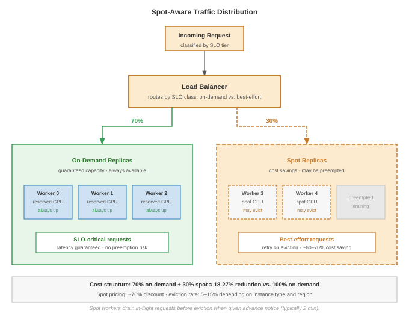

:::

The split architecture in @fig-spot-aware-routing achieves approximately 18--27 percent cost reduction compared to a fully on-demand fleet when spot instances are 60--90 percent cheaper than on-demand capacity, while absorbing preemption risk only for best-effort traffic and keeping SLO-critical requests on guaranteed capacity.

### Global inference infrastructure {#sec-inference-scale-global-inference-infrastructure-df52}

Global serving becomes necessary when distance, failure domains, or data-residency constraints exceed what one region can hide. A user in Tokyo expects low-latency responses regardless of where models were trained or where the company headquarters is located; the engineering choice is whether to replicate computation, cache repeated work, or centralize the model and pay the network penalty. The architectural patterns are useful only when tied to that choice.

#### Why multi-region matters {#sec-inference-scale-multiregion-matters-d7d3}

Single-region deployment creates three fundamental limitations. The most immediate is the latency floor imposed by network round-trip time (RTT) to distant users, quantified in @tbl-rtt-by-user-location:

| **User Location** | **RTT to US-East** | **RTT to Local Region** |
|:------------------|:------------------:|:-----------------------:|
| **New York**      |       10 ms        |          10 ms          |
| **London**        |       75 ms        |          10 ms          |
| **Tokyo**         |       150 ms       |          10 ms          |
| **Sydney**        |       200 ms       |          10 ms          |

: **Network RTT by User Location**: A single US-East deployment imposes a 75 to 200 ms RTT on European, Asian, and Australian users—an order of magnitude above the local-region floor. For interactive workloads where each request makes several model calls, this latency floor compounds quickly, motivating multi-region deployment for any globally distributed user base. {#tbl-rtt-by-user-location tbl-colwidths="[34,33,33]"}

For interactive applications (chatbots, autocomplete), these delays compound across multiple model calls per request. Beyond latency, single-region deployment creates a single point of failure: cloud region outages, while rare, affect all users simultaneously. Regulatory constraints add a third dimension, as data residency requirements (the General Data Protection Regulation (GDPR) and data sovereignty laws) may require processing user data within specific geographic boundaries. The resulting patterns form a decision ladder: regional replicas pay the highest deployment cost but minimize RTT and isolate regional failures; edge caching pays operational complexity only when queries repeat; and cross-region sharding is a last resort for capacity shortages because inter-region latency overwhelms per-stage compute.

#### Pattern 1: Global load balancing with regional replicas {#sec-inference-scale-pattern-1-global-load-balancing-regional-replicas-b7ac}

Each region runs independent inference replicas with identical models. A global load balancer routes each user to the nearest region based on measured round-trip latency, as shown in @fig-global-inference-multiregion. A shared model registry synchronizes weights across regions during rollouts.

::: {.content-visible when-format="pdf"}
\newpage
:::

::: {#fig-global-inference-multiregion fig-env="figure" fig-pos="htb" fig-cap="**Multi-Region Inference: Global Load Balancing**: A global load balancer routes requests to three independent regional deployments (US-East, EU-West, Asia-Pacific) based on latency. Each region operates independently; a shared model registry synchronizes weights. During regional failure, the LB reroutes to the next nearest healthy region." fig-alt="Diagram with Global Load Balancer box at top fanning out to three region boxes each containing two replica boxes. Lines connect all regions to a shared Model Registry at the bottom. RTT annotations and failover note shown."}

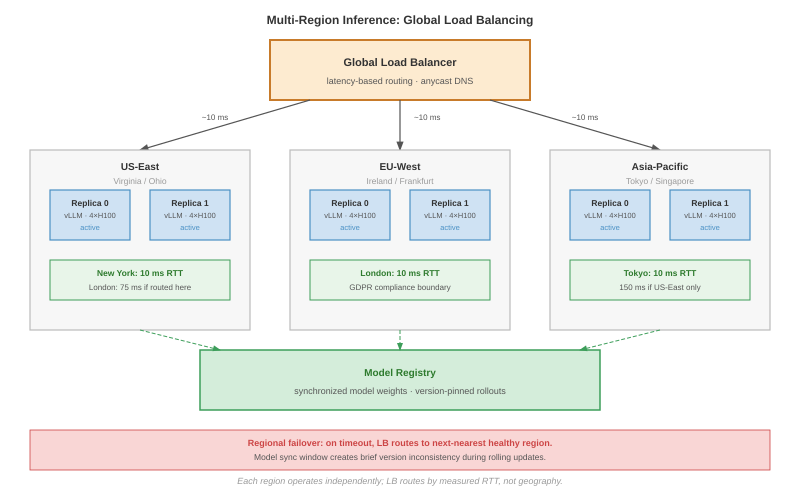

:::

As @fig-global-inference-multiregion shows, independent regional replicas reduce RTT from 150--200 ms to under 10 ms for distant users, while the shared model registry ensures consistency across deployments. Several key considerations govern this architecture:

- **Model synchronization**\index{Model Synchronization}: Model updates must propagate to all regions. Options include:
  - Push-based: Central registry pushes to all regions (simple, potential inconsistency window)
  - Pull-based: Regions poll for updates (higher latency, guaranteed consistency)
  - Hybrid: Push notification + pull verification

- **Version consistency**\index{Version Consistency}: During model rollouts, different regions may briefly serve different versions. For most applications this is acceptable; for applications requiring strict consistency, implement version pinning in request routing.

#### Pattern 2: Edge caching with central inference {#sec-inference-scale-pattern-2-edge-caching-central-inference-f08e}

For models too large to replicate globally, caching responses at the edge eliminates redundant inference for repeated queries. @Fig-edge-cache-routing shows the two paths: a cache hit returns in under 10 ms from the nearest edge node; a cache miss traverses the full backend and populates the cache on return.

::: {#fig-edge-cache-routing fig-env="figure" fig-pos="htb" fig-cap="**Edge Caching: Cache Hit vs. Cache Miss Paths**: A cache hit returns immediately from the CDN edge node (\<10 ms). A cache miss flows through to central inference and populates the cache on return. Hit rate determines the effective cost saving; open-ended generative workloads have low repeatability and benefit little from this pattern." fig-alt="Left column shows User, Edge Cache, Regional Proxy, Central Inference stacked vertically. Right shows two annotated paths: green Cache Hit box returning early, and red Cache Miss box traversing to the backend. A hit-rate table by workload type is shown on the right."}

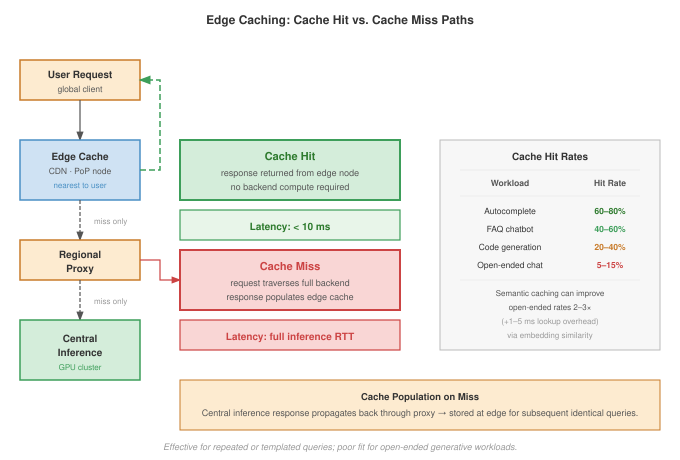

:::

The two paths in @fig-edge-cache-routing highlight the order-of-magnitude latency difference: cache hits return in under 10 ms, while cache misses incur the full backend round-trip. Effectiveness depends on request repeatability, as @tbl-edge-cache-hit-rates quantifies:

| **Workload**                               | **Cache Hit Rate** | **Suitability** |
|:-------------------------------------------|:------------------:|:---------------:|
| **Autocomplete**                           |   60--80 percent   |    Excellent    |
| **FAQ chatbot**                            |   40-60 percent    |       Good      |
| **Open-ended chat**                        |    5-15 percent    |       Poor      |
| **Code generation**\index{Code Generation} |   20--40 percent   |     Moderate    |

: **Edge Cache Hit Rates by Workload**: Cache effectiveness depends almost entirely on request repeatability. Autocomplete and FAQ workloads have high prefix overlap and benefit dramatically; open-ended chat has near-unique inputs and barely benefits. The hit-rate range determines whether edge caching is worth the operational complexity for a given workload. {#tbl-edge-cache-hit-rates}

Semantic caching[^fn-semantic-cache-tradeoff] (caching based on embedding similarity rather than exact match) can improve hit rates for open-ended workloads.

[^fn-semantic-cache-tradeoff]: **Semantic Caching**: Returns cached responses for queries that are embedding-similar rather than string-identical, requiring a vector database lookup per request. The trade-off: higher hit rates (potentially 2--3$\times$ for open-ended workloads) at the cost of added lookup latency (1--5 ms) and the risk of incorrect cache hits when semantically similar queries require different answers. Setting the similarity threshold is a precision-recall trade-off with direct impact on response correctness. \index{Semantic Caching!trade-off}

#### Pattern 3: Cross-region model sharding {#sec-inference-scale-pattern-3-federated-inference-model-sharding-6c44}

For the largest models, pipeline parallelism can theoretically span regions: a router assigns early layers to one region and later layers to another. This pattern is rarely practical because inter-region network latency (75–150 ms) dominates compute time per stage (1–5 ms), making cross-region pipeline parallelism 10--100$\times$ slower than co-located deployment. It applies only when no single region has sufficient GPU capacity for the full model.

#### Cross-region failover {#sec-inference-scale-crossregion-failover-0d67}

When a region becomes unavailable, traffic must reroute to healthy regions:

@Lst-active-failover shows the active-active failover routing logic.\index{Failover!active-active}

::: {.content-visible when-format="pdf"}
\newpage
:::

::: {#lst-active-failover lst-cap="**Active-Active Failover**: Global routing that falls back to the second-nearest healthy region on timeout or unavailability."}

```{.python}
# Simplified global routing logic
def route_request(user_region, request):
    primary = get_nearest_healthy_region(user_region)
    secondary = get_second_nearest_healthy_region(user_region)

    try:
        return call_region(primary, request, timeout=2.0)
    except (Timeout, RegionUnavailable):
        # Failover with increased latency
        return call_region(secondary, request, timeout=5.0)
```

:::

Failover considerations for stateful LLM serving

- **Session affinity loss**\index{Session Affinity!loss}: Users mid-conversation lose KV cache state. The fallback region must regenerate context from conversation history.
- **Capacity spike**: The receiving region sees sudden traffic increase. Preprovision headroom (typically 30--50 percent over steady-state) or accept degraded latency during failover.
- **Gradual recovery**\index{Failover!gradual recovery}: When the failed region recovers, gradually shift traffic back to avoid oscillation.

#### Global model deployment {#sec-inference-scale-global-model-deployment-11b3}

Deploying model updates across regions requires careful coordination. A phased rollout begins with a canary deployment to a single region (typically 1 percent of traffic), monitors for 1--4 hours, then progressively expands to additional regions. Each expansion point is a gate: if error rates exceed 0.1 percent or P99 latency exceeds the target, the rollout halts. Rollback switches the affected region back to the previous model version while preserving the new version for debugging. The key invariant is that no region proceeds to a new version until the prior region has demonstrated healthy metrics for a sufficient monitoring window.

Global deployment health requires monitoring four metrics both per-region and globally, as @tbl-global-deployment-health-metrics specifies:

| **Metric**        |  **Per-Region**  |          **Global**          |
|:------------------|:----------------:|:----------------------------:|
| **Error rate**    | &lt; 0.1 percent |       &lt; 0.1 percent       |
| **P99 latency**   |   &lt; target    | &lt; 2$\times$ single-region |
| **Throughput**    |      Stable      |            Stable            |
| **Model quality** |  Within bounds   |  Consistent across regions   |

: **Global Deployment Health Metrics**: Four metrics monitored at both per-region and global granularity during phased rollouts. Per-region thresholds catch localized regressions; global thresholds catch cross-region effects (such as a P99 inflation greater than 2$\times$ the single-region target) that no per-region check would surface. {#tbl-global-deployment-health-metrics tbl-colwidths="[32,30,38]"}

#### Cost optimization across regions {#sec-inference-scale-cost-optimization-across-regions-c1c2}

GPU pricing varies by region. @Tbl-gpu-region-pricing shows representative H100 prices so placement can balance cost against latency requirements:

| **Region**  | **H100 Spot Price** | **On-Demand** | **Latency to US Users** |
|:------------|:-------------------:|:-------------:|:-----------------------:|
| **US-East** |      \$2.50/hr      |   \$4.00/hr   |        10--50 ms        |
| **US-West** |      \$2.30/hr      |   \$3.80/hr   |        30--70 ms        |
| **EU-West** |      \$2.80/hr      |   \$4.20/hr   |        75--100 ms       |

: **H100 Pricing and Latency by Region**: Representative spot and on-demand H100 prices alongside RTT to US users. The 20 percent price spread across regions is modest compared to the latency spread, so cost-aware routing typically sends only latency-tolerant workloads (batch inference, background processing) to the cheapest region while keeping interactive traffic local. {#tbl-gpu-region-pricing}

Cost-aware routing directs latency-tolerant workloads (batch inference, background processing) to the cheapest available region, as shown in @lst-cost-aware-routing.\index{Cost-Aware Routing}

::: {#lst-cost-aware-routing lst-cap="**Cost-Aware Routing**: Priority-based routing that sends low-priority batch requests to the cheapest region while keeping interactive traffic local."}

```{.python}
def route_batch_request(request):
    if request.priority == "low":
        # Route to cheapest region with capacity
        return get_cheapest_region_with_capacity()
    else:
        # Route to nearest region
        return get_nearest_region(request.user_location)
```

:::

Time-of-day routing can reduce costs by 20--40 percent for batch workloads while maintaining SLOs for interactive traffic.

Scaling global infrastructure aggressively is highly effective, but it is also exceptionally expensive. To further bend the cost curve of our deployments, we must look inward again at the model itself, altering its fundamental mathematical representation to run faster and cheaper through weight quantization.

## Weight Quantization for Serving {#sec-inference-scale-weight-quantization-serving-097b}

::: {.column-margin}
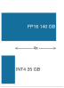{width="100%" fig-alt="Memory ladder comparing a 140 GB FP16 70B model with a 35 GB INT4 70B model, with the 4x capacity reduction marked as a ratio annotation."}

*INT4 turns a two-GPU model into a one-GPU candidate.*
:::

Weight quantization for serving is a bottleneck-selection decision: reducing weights from 16-bit floats to 8-bit or 4-bit integers can turn a 140 GB FP16 language model that requires two A100 GPUs into a 35 GB INT4 representation that fits on a single GPU. The trade-off is a small accuracy loss in exchange for a 4$\times$ reduction in memory bandwidth and capacity demand.

::: {#psp-inference-quantization-serving-constraint .callout-perspective title="Quantization as a serving constraint"}

In serving systems, quantization is not merely a model-compression technique; it changes the binding resource. Post-training quantization (PTQ) can shrink a deployed model without retraining, while quantization-aware training (QAT)\index{Quantization!quantization-aware training} spends training effort to preserve accuracy at lower precision. The systems question is which constraint the lower-precision representation relaxes: GPU memory capacity, HBM bandwidth during decode, accelerator instruction support, or cost per served token. The precision foundations appear in @sec-performance-engineering-precision and @sec-performance-engineering-ptq-qat.

:::

Quantization reduces numerical precision of model weights and activations, decreasing memory footprint by 2--4$\times$ while increasing decode throughput, which is *memory-bandwidth limited* rather than *compute limited*. The serving decision is which quantity should shrink: resident weights for fit, bytes moved per decode step for bandwidth, activations for prefill throughput, or the precision path supported by target hardware. Serving at scale also introduces distinct challenges: models must be quantized after training without access to training data, quality must be preserved across diverse inputs, and hardware deployment targets vary from data center GPUs to edge accelerators. Production inference therefore needs a decision model, not a method roster. The decision model in @tbl-serving-quantization-decision-model keeps the method choice tied to the serving constraint that actually binds the system.

| **Binding serving constraint** | **Representation change**                       | **Method family**       | **Risk to test before rollout**             |
|:-------------------------------|:------------------------------------------------|:------------------------|:--------------------------------------------|
| Model does not fit in memory   | Quantize weights only                           | GPTQ, AWQ               | Calibration mismatch and quality regression |
| Decode is bandwidth-bound      | Reduce bytes read per token                     | W4A16 weight-only paths | Kernel support and KV-cache headroom        |
| Prefill is compute-bound       | Quantize weights and activations                | SmoothQuant W8A8        | Activation outliers and INT8 hardware path  |
| Outliers block low precision   | Change the coordinate basis before quantization | Rotation-based methods  | Transform overhead and limited runtime path |

: **Serving Quantization Decision Model**: Quantization methods are useful only when they relax the resource that actually binds the serving system. The method family follows from the bottleneck: fit, bandwidth, prefill compute, or outlier robustness. {#tbl-serving-quantization-decision-model tbl-colwidths="[24,28,22,26]"}

### LLM-specific quantization challenges {#sec-inference-scale-llmspecific-quantization-challenges-b7a2}

Large language models present unique quantization challenges distinct from vision or recommendation models. The outlier activation problem occurs because certain attention heads produce activation magnitudes orders of magnitude larger than typical values. Naive quantization clips these outliers, causing significant quality degradation.

Consider a large language-model layer where most activation values are modest but specific channels produce much larger outliers [@xiao2023smoothquant]. Symmetric INT8 quantization with range [-127, 127] must choose:

- **Wide range**: Most typical values collapse into a small number of bins, losing information
- **Narrow range**: Outliers clip, causing large errors

The outlier distribution explains why the specialized methods that follow differ: each one protects a different part of the serving contract.

### GPTQ: Layer-by-layer weight quantization {#sec-inference-scale-gptq-layerbylayer-weight-quantization-9284}

GPTQ [@frantar2023gptq] is the weight-only choice when deployment needs 4-bit compression after training and can afford calibration data. Its serving value is that the model gets smaller without a full retraining run. The risk is that rounding one weight changes the layer output in a way later weights must absorb. GPTQ addresses that risk by using calibration activations to estimate which weight errors matter most,[^fn-hessian-quantization] then compensating the remaining unquantized weights as each column is rounded.

[^fn-hessian-quantization]: **Hessian Matrix in Quantization**\index{Quantization!Hessian matrix}: The Hessian $H = X^T X$ captures second-order sensitivity: weights with large diagonal entries have outsized impact on model outputs. GPTQ exploits this to quantize insensitive weights aggressively while preserving sensitive ones, achieving 3--4-bit quantization with less than 1 percent perplexity degradation. Without Hessian guidance, naive uniform quantization below 8-bit typically destroys model quality. \index{Hessian!quantization}

The algorithm processes the model layer by layer. For each layer, it first runs a small calibration dataset (typically 128--256 samples) to collect the activations that determine local sensitivity. It then quantizes weights in an order informed by that sensitivity and updates the remaining weights so the layer's output changes as little as possible. The Hessian matrix $H = X^T X$ is the compact representation of this sensitivity information; GPTQ uses an efficient inverse-Hessian update rather than treating every rounded weight as an independent error.

#### Column-wise processing algorithm {#sec-inference-gptq-column-wise-processing-c01a}

GPTQ processes each weight matrix column by column, using Cholesky decomposition of $H^{-1}$ for efficiency:

```
For each layer's weight matrix W:
  1. Compute Hessian: H = X^T X from calibration activations
  2. Apply Cholesky factorization to H^{-1}
  3. For each column q = 1 to d_col:
     a. Quantize column: w_q = round(W[:,q] / Δ) * Δ
     b. Compute quantization error: δ = W[:,q] - w_q
     c. Update remaining columns to compensate:
        W[:,q+1:] += δ * [H^{-1}][:,q+1:] / [H^{-1}]_{qq}
```

The compensation step propagates quantization error to unquantized columns, where the Hessian-weighted update minimizes output deviation. This achieves $\mathcal{O}(d_{\text{row}} \cdot d_{\text{col}}^2)$ complexity vs. $\mathcal{O}(d_{\text{row}} \cdot d_{\text{col}}^3)$ for a naive full inverse-Hessian update.

The quantization formula is:

$$w_q = \text{round}\left(\frac{w}{\Delta}\right) \cdot \Delta$$

where $\Delta$ is the quantization step size. GPTQ uses per-group quantization with group sizes of 128 weights, enabling finer-grained scaling that reduces quantization error for outlier channels.

@Tbl-gptq-performance summarizes GPTQ performance across Llama model sizes:

| **Model**     | **Bits** | **Perplexity Increase** | **Memory Reduction** | **Quantization Time** |
|:--------------|:--------:|:-----------------------:|:--------------------:|:---------------------:|
| **Llama-7B**  |    4     |           +0.3          |      4$\times$       |         15 min        |
| **Llama-13B** |    4     |           +0.2          |      4$\times$       |         30 min        |
| **Llama-70B** |    4     |          +0.15          |      4$\times$       |        3 hours        |

: **GPTQ Performance Across Llama Sizes**: Quantization quality holds remarkably steady as model size scales: the 70B model loses less perplexity than the 7B model despite the same 4-bit target. Memory reduction is uniformly 4$\times$. Quantization time scales near-linearly with model size, dominated by the per-layer second-order updates. {#tbl-gptq-performance}

GPTQ's strengths include fast quantization without retraining, minimal quality loss for 4-bit weights, and broad hardware compatibility. Its limitations include requiring calibration data, sensitivity to calibration set selection, and per-layer processing that cannot use cross-layer information.

### AWQ: Activation-aware weight quantization {#sec-inference-scale-awq-activationaware-weight-quantization-abec}

AWQ [@lin2025] attacks the same weight-only serving goal from the activation side. Weights connected to channels with large activation magnitudes have disproportionate impact on outputs, so AWQ protects weights based on the magnitude of activations they produce rather than on weight magnitude alone.

The AWQ algorithm proceeds in four steps:

1. Run calibration samples to measure per-channel activation magnitudes
2. Identify "salient" channels with large activations
3. Scale weights for salient channels up before quantization
4. Scale outputs down correspondingly (fused into subsequent layer)

For weight matrix $W$ and activation statistics $s$ (per-channel activation magnitudes), the scaling rule is:

$$W' = W \cdot \text{diag}(s^{\alpha_{\text{awq}}})$$

where $\alpha_{\text{awq}} \in [0.5, 1.0]$ controls scaling aggressiveness. This preserves salient channels while allowing aggressive quantization of less important weights.

@Tbl-awq-vs-gptq summarizes how AWQ compares to GPTQ across error compensation, calibration cost, quality, speed, and hardware compatibility.

| **Aspect**                 |    **GPTQ**\index{GPTQ}   |    **AWQ**\index{AWQ}   |
|:---------------------------|:-------------------------:|:-----------------------:|
| **Error compensation**     | Adjusts remaining weights | Scales salient channels |
| **Calibration data**       |      128--256 samples     |       128 samples       |
| **Quality (4-bit)**        |         Very good         |        Excellent        |
| **Speed**                  |           Faster          |     Slightly slower     |
| **Hardware compatibility** |           Broad           |          Broad          |

: **AWQ vs. GPTQ**: AWQ scales salient channels rather than compensating residual error, achieves higher 4-bit quality at marginally slower calibration speed, and matches GPTQ on hardware compatibility. {#tbl-awq-vs-gptq}

AWQ typically achieves 0.5-1 percent lower perplexity degradation than GPTQ at the same bit-width, making it preferred for production deployments where quality is paramount.

### SmoothQuant: Migrating quantization difficulty {#sec-inference-scale-smoothquant-migrating-quantization-difficulty-f37f}

SmoothQuant [@xiao2023smoothquant] is the serving path for W8A8 deployments where activation quantization matters, especially compute-bound prefill. It addresses the activation outlier problem by migrating quantization difficulty from activations to weights. Weights have predictable distributions; activations have unpredictable outliers. SmoothQuant transfers the outlier problem to weights where it can be handled with per-channel scaling.

The core technique inserts smoothing operations that divide activations by per-channel scales while multiplying weights by the same scales:

$$Y = X W = (X \cdot \text{diag}(s)^{-1}) \cdot (\text{diag}(s) \cdot W) = \hat{X} \hat{W}$$

The transformation is mathematically equivalent but produces smoother activation distributions.

Migration strength $\alpha_{\text{sq}}$ controls the trade-off:

$$s_j = \max(|X_j|)^{\alpha_{\text{sq}}} / \max(|W_j|)^{1-\alpha_{\text{sq}}}$$

- $\alpha_{\text{sq}} = 0$: No migration, activations remain difficult
- $\alpha_{\text{sq}} = 1$: Full migration, weights absorb all difficulty
- $\alpha_{\text{sq}} = 0.5$: Balanced (typical setting)

In the W8A8 deployment regime, SmoothQuant enables INT8 quantization for both weights and activations. @Tbl-smoothquant-w8a8 shows how W8A8 compares to FP16 baseline and weight-only quantization:

| **Configuration**        | **Memory** | **Prefill Speedup** | **Decode Speedup** |     **Quality**      |
|:-------------------------|:----------:|:-------------------:|:------------------:|:--------------------:|
| **FP16 (baseline)**      | 1$\times$  |      1$\times$      |     1$\times$      |       Baseline       |
| **W8A16 (weights only)** | 2$\times$  |     1.3$\times$     |    1.8$\times$     | &lt;0.5 percent loss |
| **W8A8 (SmoothQuant)**   | 2$\times$  |    1.8--2$\times$   |  1.3--1.5$\times$  |  &lt;1 percent loss  |

: **W8A8 SmoothQuant vs. Weight-Only Quantization**: W8A8 quantizes both weights and activations to INT8, doubling memory savings and unlocking compute-bound prefill speedup, but its decode speedup is lower than W8A16's because decode is memory-bound and W8A8's smaller weights are already captured by the simpler weight-only scheme. {#tbl-smoothquant-w8a8}

The critical distinction is that W8A8 provides near 2$\times$ speedup for compute-bound prefill (large batch processing initial prompt) but only 1.3--1.5$\times$ speedup for memory-bound decode (generating tokens one at a time). LLM serving is typically decode-heavy, so real-world throughput improvements from W8A8 are often 1.3--1.7$\times$ rather than the theoretical 2$\times$ compute throughput of INT8 Tensor Cores.

### Rotation-based quantization {#sec-inference-scale-rotationbased-quantization-8bee}

Traditional quantization methods (GPTQ, AWQ, SmoothQuant) address outliers through compensation or migration. **Rotation-based quantization**\index{Quantization!rotation-based} [@ashkboos2024quarot] is the aggressive path when activation outliers block lower precision: it mathematically transforms the weight and activation space to eliminate outliers entirely.

The crucial realization is that outliers are artifacts of the coordinate basis representation. Rotating to a different basis spreads extreme values uniformly, making all values quantization-friendly.

#### QuaRot (quantization with rotation) {#sec-inference-quarot-rotation-quantization-7a02}

QuaRot applies orthogonal Hadamard transforms to weights and activations:

$$X' = X \cdot H, \quad W' = H^T \cdot W$$

where $H$ is a Hadamard matrix (orthogonal, efficiently computable without storage).

The Hadamard transform works because for a vector with one extreme outlier, it distributes that outlier's magnitude across all dimensions:

```
Original:  [1000, 1, 1, 1]     # One large outlier
Hadamard:  [502, 500, 500, 500] # Uniform distribution
```

After transformation, no single value dominates, enabling uniform quantization.

@Tbl-quarot-vs-smoothquant contrasts QuaRot's rotation-based approach with SmoothQuant's migration:

| **Aspect**            | **SmoothQuant**\index{SmoothQuant} |     **QuaRot**\index{QuaRot}     |
|:----------------------|:----------------------------------:|:--------------------------------:|
| **Calibration data**  |              Required              |     Not required (data-free)     |
| **Minimum precision** |                W8A8                |               W4A4               |
| **Runtime overhead**  |             ~0 percent             | ~3 percent (Hadamard transforms) |
| **Outlier handling**  |             Migration              |           Elimination            |

: **QuaRot vs. SmoothQuant**: SmoothQuant migrates outliers from activations into weights and runs at zero runtime overhead but requires calibration data and stops at W8A8. QuaRot eliminates outliers through Hadamard rotation, runs data-free, reaches W4A4, and pays a ~3 percent runtime cost for the inline transforms. {#tbl-quarot-vs-smoothquant}

@Tbl-quarot-perplexity compares perplexity across quantization methods on LLaMA-2-70B:

| **Method**      | **Precision**\index{Precision} | **LLaMA-2-70B Perplexity** | **vs. Baseline** |
|:----------------|:------------------------------:|:--------------------------:|:----------------:|
| **FP16**        |             W16A16             |            3.12            |     Baseline     |
| **SmoothQuant** |              W8A8              |            3.18            |      +0.06       |
| **GPTQ**        |             W4A16              |            3.24            |      +0.12       |
| **QuaRot**      |              W4A4              |            3.31            |      +0.19       |

: **Quantization Perplexity on LLaMA-2-70B**: Perplexity degradation across four quantization methods on a 70B model. QuaRot's W4A4 lands within 0.2 perplexity of FP16 baseline while delivering roughly 4$\times$ memory reduction for quantized tensors, demonstrating that rotation-based methods make 4-bit activation quantization viable for production inference. {#tbl-quarot-perplexity}

QuaRot achieves 4-bit weights *and* 4-bit activations with quality competitive to GPTQ's 4-bit weights only. This enables approximately 4$\times$ memory reduction vs. FP16 for quantized weights and activations.

SpinQuant is an extension of QuaRot that learns optimal rotation matrices during a short fine-tuning phase, improving quality at the cost of training compute.

### Hardware-deployment co-design {#sec-inference-scale-hardwaredeployment-codesign-617f}

The quantization method only pays off when the deployment hardware accelerates the chosen precision. Different accelerators support different precisions with varying performance multipliers.

@Tbl-tensor-core-precision-support summarizes NVIDIA Tensor Core precision support across Ampere and Hopper:

| **Format**           |            **Ampere (A100)**            | **Hopper (H100)**                                                       | **Speedup vs. FP16** |
|:---------------------|:---------------------------------------:|:------------------------------------------------------------------------|:--------------------:|
| **FP16**             |                   Yes                   | Yes                                                                     |      1$\times$       |
| **BF16**\index{BF16} |                   Yes                   | Yes                                                                     |      1$\times$       |
| **INT8**\index{INT8} |                   Yes                   | Yes                                                                     |      2$\times$       |
| **FP8 (E4M3)**       |                    No                   | Yes                                                                     |      2$\times$       |
| **INT4**\index{INT4} | Software/CUTLASS or framework-dependent | Software/framework-dependent on H100; native FP4 is a Blackwell feature |  workload-dependent  |

: **Tensor Core Precision Support and Speedup**: Native precision support across NVIDIA Ampere and Hopper Tensor Cores. The 2$\times$ speedup at INT8 and FP8 reflects the doubled throughput of those native paths; INT4 remains framework-dependent on Ampere and Hopper, with native FP4 first appearing in Blackwell. {#tbl-tensor-core-precision-support}

Memory bandwidth dominates autoregressive LLM decode throughput because each token reads the entire model:

$$\text{Decode throughput} \propto \frac{\text{Memory bandwidth}}{\text{Model size in bytes}}$$

4-bit quantization delivers 4$\times$ throughput improvement for memory-bound decode, making it highly valuable despite modest compute gains.

@Tbl-quantization-deployment-configurations summarizes how the major quantization configurations map to deployment targets and framework support:

| **Quantization**\index{Quantization} | **Best For**                       |     **Framework Support**     |
|:-------------------------------------|:-----------------------------------|:-----------------------------:|
| **W4A16 (GPTQ/AWQ)**                 | Consumer GPUs, memory-constrained  | vLLM, TensorRT-LLM, llama.cpp |
| **W8A8 (SmoothQuant)**               | INT8 accelerators, high throughput |   TensorRT-LLM, ONNX Runtime  |
| **FP8**                              | H100/H200 deployments              |          TensorRT-LLM         |
| **W4A4**                             | Research, extreme compression      |            Limited            |

: **Quantization Deployment Configurations**: Mapping from quantization scheme to deployment target and supporting frameworks. W4A16 dominates consumer and memory-constrained deployments; W8A8 unlocks INT8 Tensor Core throughput; FP8 is the H100/H200 native path; W4A4 remains research territory with limited framework support. {#tbl-quantization-deployment-configurations}

### Runtime contract for quantized serving {#sec-inference-scale-framework-integration-945c}

Production serving frameworks matter because quantized weights reduce cost only when the runtime preserves the theoretical savings. The durable contract is framework-independent: the serving stack must load the quantized artifact without silently dequantizing it, choose kernels that execute the intended low-precision path, allocate KV cache around the smaller weight footprint, and expose enough telemetry to detect quality or latency regressions. The runtime responsibilities in @tbl-quantized-serving-runtime-contract are the minimum contract a framework must satisfy before quantization becomes a production-serving win.

| **Runtime responsibility**              | **Why it matters**                                                                |
|:----------------------------------------|:----------------------------------------------------------------------------------|
| Preserve the quantized artifact         | Silent dequantization restores the FP16 memory and bandwidth cost.                |
| Select compatible low-precision kernels | Unsupported operators fall back to slower or higher-precision execution.          |
| Plan memory around weights and KV cache | The capacity gain matters only if the freed memory becomes useful batch headroom. |
| Validate quality and latency together   | A lower-bit path that meets latency but fails task quality is not a serving win.  |

: **Quantized Serving Runtime Contract**: Framework-specific APIs differ, but every production path has to preserve representation, choose supported kernels, plan memory, and validate quality under the deployed traffic mix. {#tbl-quantized-serving-runtime-contract tbl-colwidths="[34,66]"}

Quantized models combine with PagedAttention for maximum memory efficiency:

$$\text{Max batch} = \frac{\text{GPU Memory} - \text{Quantized Weights}}{\text{KV Cache per Sequence}}$$

```{python}
#| echo: false
#| label: quantized-serving-capacity
# ┌─────────────────────────────────────────────────────────────────────────────
# │ QUANTIZED SERVING CAPACITY (LEGO)
# ├─────────────────────────────────────────────────────────────────────────────
# │ Context: "Quantization + PagedAttention" prose in §Framework integration.
# │
# │ Goal: Compute A100 KV headroom after 4-bit weight quantization and estimate
# │       the number of 1K-token MHA-baseline sequences it can hold.
# │ Show: 80 GB A100, 35 GB weights, 45 GB KV headroom, ~2.6 GB per 1K sequence.
# │ How: 70B * 0.5 bytes for INT4 weights; KV from KVCacheCalc normalized to 1K.
# │
# │ Imports: mlsysim.core.constants (Hardware.Cloud.A100.memory.capacity, BYTES_INT4,
# │          Models.Language.Llama2_70B.parameters, Bparam, GiB, byte), mlsysim.fmt (check, fmt)
# │ Exports: QuantizedServingCapacity.a100_mem_gb_str,
# │          QuantizedServingCapacity.weight_int4_gb_str,
# │          QuantizedServingCapacity.kv_headroom_gb_str,
# │          QuantizedServingCapacity.kv_per_1k_sequence_gb_str,
# │          QuantizedServingCapacity.max_1k_sequences_str
# └─────────────────────────────────────────────────────────────────────────────
from mlsysim.fmt import fmt_int, check, fmt, fmt_memory, fmt_memory_capacity, fmt_qty_int

class QuantizedServingCapacity:
    """Estimate single-A100 batch capacity after 4-bit weight quantization."""

    # ┌── 1. LOAD (Constants) ──────────────────────────────────────────────
    a100_mem = Hardware.Cloud.A100.memory.capacity
    a100_kv_budget = 80 * GB  # scenario capacity budget
    llama70b = Models.Language.Llama2_70B

    # ┌── 2. EXECUTE (The Compute) ────────────────────────────────────────
    weight_int4 = llama70b.size_in_bytes(BYTES_INT4)
    kv_headroom = a100_kv_budget - weight_int4
    kv_layers = 80
    kv_heads = 64
    kv_head_dim = 128
    kv_seq_len = 4096
    kv_fp16 = 2 * kv_layers * kv_heads * kv_head_dim * kv_seq_len * BYTES_FP16
    kv_per_1k_sequence = kv_fp16 / (kv_seq_len / THOUSAND)
    max_1k_sequences = int((kv_headroom / kv_per_1k_sequence).to("").magnitude)

    # ┌── 3. GUARD (Invariants) ──────────────────────────────────────────
    check(abs((weight_int4 - 35 * GB).to(GB).magnitude) < 1e-9, "70B INT4 weights should be 35 GB")
    check(max_1k_sequences > 10, "Quantized model should leave room for multiple 1K sequences")

    # ┌── 4. OUTPUT (Formatting) ─────────────────────────────────────────────
    a100_mem_gb_str = fmt_memory_capacity(a100_mem, unit=GiB, precision=0, commas=False)
    weight_int4_gb_str = fmt_memory(weight_int4, unit=GB, precision=0, commas=False)
    kv_headroom_gb_str = fmt_memory(kv_headroom, unit=GB, precision=0, commas=False)
    kv_per_1k_sequence_gb_str = fmt_memory(kv_per_1k_sequence, unit=GB, precision=1, commas=False)
    max_1k_sequences_str = fmt_int(max_1k_sequences, commas=False)
```

A 70B model with 4-bit weights requires approximately `{python} QuantizedServingCapacity.weight_int4_gb_str`, leaving `{python} QuantizedServingCapacity.kv_headroom_gb_str` on an `{python} QuantizedServingCapacity.a100_mem_gb_str` A100 for KV cache. With FP16 KV cache at about `{python} QuantizedServingCapacity.kv_per_1k_sequence_gb_str` per 1K-token sequence for the MHA baseline, this supports about `{python} QuantizedServingCapacity.max_1k_sequences_str` concurrent 1K-token sequences before other runtime overheads. With FP16 weights, the same 70B model would *not* fit on one A100 at all, so weight-only quantization changes both feasibility and batch capacity.

### Quantization selection guidelines {#sec-inference-scale-quantization-selection-guidelines-24fb}

The final selection matches the method to the binding constraint. Deployment constraints determine the appropriate quantization method through a short decision sequence:

1. **Primary goal**: Latency-sensitive paths should prefer FP16 or BF16 when quantization overhead would dominate. Throughput-oriented paths are more likely to benefit from quantization.
2. **Available hardware**: H100 and H200 deployments can consider FP8 because the hardware provides native support with minimal quality loss. A100 and A10G deployments usually choose between W8A8 and W4A16 depending on the workload, while consumer GPUs often require W4A16 simply to fit the model.
3. **Quality budget**: If less than 0.5 percent degradation is acceptable, AWQ 4-bit is a plausible target. If less than 1 percent degradation is acceptable, GPTQ 4-bit or SmoothQuant W8A8 may be viable. If no degradation is acceptable, FP16 or BF16 remains the safest choice.
4. **Binding resource**: Compute-bound prefill favors W8A8 because it can provide a 2$\times$ speedup. Memory-bound decode favors W4A16 because it can provide a 4$\times$ effective bandwidth increase.

@Tbl-quantization-serving-cost shows how quantization reshapes serving cost per million tokens:

| **Configuration**               | **Cost per 1M tokens (estimated)** |
|:--------------------------------|:----------------------------------:|
| **FP16 on 8$\times$ A100**      |               \$2.40               |
| **AWQ 4-bit on 4$\times$ A100** |               \$1.20               |
| **AWQ 4-bit on 2$\times$ A100** |               \$0.60               |

: **Quantization Impact on Serving Cost**: Estimated cost per million tokens at three configurations. Halving the GPU count via 4-bit quantization halves the cost; halving it again brings the per-million-token cost to one quarter of the FP16 baseline. The cost savings come almost entirely from fewer GPUs rather than from per-GPU throughput gains. {#tbl-quantization-serving-cost tbl-colwidths="[58,42]"}

Quantization can reduce serving costs by 2--4$\times$ while maintaining acceptable quality, making it essential for cost-effective LLM deployment.

These serving optimizations span continuous batching, PagedAttention, global load balancing, and extreme quantization. The case studies that follow show how production systems at global scale combine these techniques to meet specific cost and latency targets.

## Case Studies {#sec-inference-scale-case-studies-9689}

Production-scale serving systems force the chapter's techniques to meet real workload variance, latency budgets, and operational constraints. The cases bind on different constraints: embedding scale, variable-length generation, cascade cost, or multimodal freshness. The examples show how systems combine batching, sharding, caching, routing, and quantization to meet specific cost and latency targets. The sequence begins with iteration-level scheduling popularized by vLLM in 2022, which transformed LLM serving from a coarse-grained batch process into a fluid, high-utilization stream, and extends through global request routing and embedding-server topologies.

### Meta recommendation serving {#sec-inference-scale-meta-recommendation-serving-bede}

Meta's recommendation infrastructure binds on embedding scale rather than dense forward-pass compute. It serves predictions for feeds, ads, and content ranking across Facebook, Instagram, WhatsApp, and Messenger, making it one of the largest production inference deployments in the world.

The scale numbers explain why embedding locality dominates the design:

- Request volume: Billions of requests per day
- Latency target: <10 ms P99
- Model diversity: Hundreds of model variants
- Feature cardinality: Trillions of unique entities

The serving stack separates sparse lookup from dense ranking:

```
User request → Feature collection → Embedding lookup → Model inference → Response

                    │                     │                  │
                    ▼                     ▼                  ▼
             Feature Store        Embedding Servers      GPU Inference
             (CPU, DRAM)         (CPU + SSD, 1000s)     (GPU, 100s)
```

In Meta's architecture, the binding design constraint is embedding scale: tables total over 100 TB, requiring 1,000+ shards. Meta uses a hybrid sharding strategy:

- Hot embeddings (top 1 percent): Replicated across memory on all inference servers
- Warm embeddings (next 10 percent): Column-sharded with 8-way parallelism
- Cold embeddings (remaining 89 percent): Row-sharded with consistent hashing, SSD-backed

Hybrid sharding reduces embedding lookup latency from 50 ms (naive) to 2 ms through batching and locality optimization.

Instead of batching entire requests, Meta batches at the feature level. Each inference request triggers 5,000+ embedding lookups, but these lookups are batched across requests within a 1 ms window. This achieves 90 percent+ memory bandwidth utilization on embedding servers.

The resulting GPU-CPU hybrid architecture runs dense model computation (ranking towers) on GPUs, while sparse embedding lookups run on CPU servers with large memory and SSD storage. @Tbl-meta-dlrm-hybrid-hardware matches hardware to workload characteristics:

| **Component**          | **Hardware** | **Latency** | **Throughput** |
|:-----------------------|:------------:|:-----------:|:--------------:|
| **Embedding lookup**   |  CPU + SSD   |     2 ms    | 50M lookups/s  |
| **Feature processing** |     CPU      |     1 ms    |   10M ops/s    |
| **Dense ranking**      |     GPU      |    1.5 ms   |  100K infs/s   |

: **Meta DLRM Hybrid CPU/GPU Architecture**: Hardware-workload mapping for Meta's recommendation serving stack. CPU + SSD handles the bandwidth-bound sparse path; CPU handles low-arithmetic-intensity feature processing; GPU handles the compute-dense ranking forward pass. The three latency budgets sum to ~5 ms, well within typical recommendation SLOs. {#tbl-meta-dlrm-hybrid-hardware tbl-colwidths="[32,22,16,30]"}

The design produces three serving lessons:

1. Embedding lookup, not model inference, often dominates latency for recommendation systems
2. Feature-parallel batching achieves higher efficiency than request-level batching
3. Hybrid CPU-GPU architectures match hardware to workload characteristics

### OpenAI API infrastructure {#sec-inference-scale-openai-api-infrastructure-a65e}

OpenAI-style API infrastructure binds on request variance: short prompts, long-context requests, and different model sizes share capacity while users expect predictable TTFT. The infrastructure serves GPT-class models to large developer and application workloads while maintaining quality of service across diverse workloads.

The scale numbers explain why continuous batching and admission control dominate:

- Request volume: Millions of requests per hour
- Latency target: Time-to-first-token (TTFT) <2s, throughput varies by model
- Model sizes: Billions to hundreds of billions of parameters
- Context lengths: Up to 128K tokens

The serving stack separates routing, scheduling, cache management, and shard groups:

```
API Gateway → Rate Limiting → Request Router → Model Cluster → Response Streaming

                                     │
                                     ▼
                              ┌─────────────┐
                              │ Model Pool  │
                              │ ┌─────────┐ │
                              │ │ Large   │ │
                              │ │ 8×H100  │ │
                              │ └─────────┘ │
                              │ ┌─────────┐ │
                              │ │ Smaller │ │
                              │ │ 4×A100  │ │
                              │ └─────────┘ │
                              └─────────────┘
```

The main design decision is to prevent long prompts from blocking decode service for everyone else.

OpenAI was an early adopter of continuous batching (Orca-style) to maintain high GPU utilization despite variable output lengths. Chunked prefill bounds decode latency by processing long prompts in chunks that interleave with ongoing generation. @Tbl-batching-strategies-comparison contrasts the three approaches:

| **Batching Strategy**    | **GPU Utilization** | **128K Prompt Behavior**                  |
|:-------------------------|:-------------------:|:------------------------------------------|
| **Static batching**      |      45 percent     | 30s TTFT; decode blocked                  |
| **Continuous batching**  |      75 percent     | 30s TTFT; decode still blocked by prefill |
| **Continuous + chunked** |      85 percent     | 30s TTFT; decode stalls bounded to ~3s    |

: **Batching Strategy Comparison**: Three batching approaches with the resulting GPU utilization and 128K-prompt behavior. Static batching lets the longest request idle the whole batch; continuous batching lifts utilization to 75 percent but still stalls decode behind long prefills; chunked prefill interleaves prefill chunks with decode, capping decode stalls at a few seconds while reaching 85 percent utilization. {#tbl-batching-strategies-comparison}

Large GPT-class models often require 8-way or greater tensor parallelism for memory capacity and latency:

- 8$\times$ H100 per large-model shard group
- NVLink for intra-node communication
- Consistent hashing for session affinity (KV cache reuse)

OpenAI implements rate limiting at multiple levels to prevent noisy neighbors:

- Per-API-key request rate limits
- Per-API-key token-per-minute limits
- Organization-level capacity quotas
- Global model capacity limits

During peak demand, OpenAI shifts capacity between models based on queue depth:

```
if large_model_queue_depth > threshold:
    # Migrate some smaller-model capacity to the larger model
    reallocate_cluster_capacity(from="smaller-model", to="large-model", fraction=0.2)
```

The design produces three serving lessons:

1. Continuous batching is essential for LLM serving at scale
2. Prefix caching provides 2--3$\times$ efficiency for conversational workloads
3. Multi-tier rate limiting prevents cascade failures from traffic spikes

### Google search ranking {#sec-inference-scale-google-search-ranking-aab2}

Google Search binds on cascade cost: each query coordinates many smaller models under one end-to-end latency budget rather than serving one large model. The ensemble combines specialized models for query understanding, document relevance, and result ranking.

The scale numbers explain why a cascade is mandatory:

- Request volume: Billions of searches per day
- Latency target: <200 ms end-to-end
- Model count: Dozens of models per query
- Result processing: Thousands of documents per query

To meet this latency budget while evaluating thousands of documents, the system employs a ranking cascade (@fig-ranking-cascade) that progressively narrows the candidate set through increasingly expensive models.

::: {#fig-ranking-cascade fig-env="figure" fig-pos="htb" fig-cap="**Ranking Cascade Architecture**: To optimize latency and cost, search and recommendation systems use a cascade of increasingly complex models. Early stages (Retrieval) filter millions of candidates down to thousands using fast, cheap heuristics. Later stages use expensive, high-precision models only on the most promising candidates." fig-alt="Funnel diagram with four stages narrowing from retrieval of one million items to final ranking of ten items."}

```{.tikz}
\begin{tikzpicture}[font=\small\usefont{T1}{phv}{m}{n}]
  \definecolor{L0Color}{HTML}{F5F5F5}
  \definecolor{L1Color}{HTML}{EBEBEB}
  \definecolor{L2Color}{HTML}{E0E0E0}
  \definecolor{L3Color}{HTML}{D6D6D6}

  \tikzset{
    stage/.style={draw=black!70, thick, align=center, minimum height=0.8cm}
  }

  % The Funnel
  \node[stage, fill=L0Color, minimum width=6cm] (L0) {\textbf{Retrieval}\\1,000,000 → 10,000 items\\Cheap: Embeddings, BM25};
  \node[stage, fill=L1Color, minimum width=4.5cm, below=0.3cm of L0] (L1) {\textbf{L1 Ranking}\\10,000 → 1,000 items\\Fast: Linear Models, Decision Trees};
  \node[stage, fill=L2Color, minimum width=3cm, below=0.3cm of L1] (L2) {\textbf{L2 Ranking}\\1,000 → 100 items\\Moderate: Small Neural Nets};
  \node[stage, fill=L3Color, minimum width=1.5cm, below=0.3cm of L2] (L3) {\textbf{Final Rank}\\100 → 10 items\\Expensive: Large Transformers};

  % Down arrows
  \draw[->, ultra thick, black!60] (L0) -- (L1);
  \draw[->, ultra thick, black!60] (L1) -- (L2);
  \draw[->, ultra thick, black!60] (L2) -- (L3);

  \node[anchor=west, font=\scriptsize\usefont{T1}{phv}{m}{n}, text=red!80, right=0.2cm of L0] {Low Precision, High Recall};
  \node[anchor=west, font=\scriptsize\usefont{T1}{phv}{m}{n}, text=green!60!black, right=0.2cm of L3] {High Precision, Low Recall};

\end{tikzpicture}
```

:::

The central design decision is progressive refinement.

Rather than running one expensive model on all candidates, Google uses a ranking cascade summarized in @tbl-google-ranking-cascade:

```{python}
#| echo: false
#| label: ranking-cascade-cost
# ┌─────────────────────────────────────────────────────────────────────────────
# │ RANKING CASCADE COST (LEGO)
# ├─────────────────────────────────────────────────────────────────────────────
# │ Context: Google ranking cascade case study.
# │
# │ Goal: Make the L3-evaluation reduction and simplified cascade-cost ratio
# │       reproducible from the table assumptions.
# │ Show: 10,000x fewer final L3 evaluations; about 5,600x less model work.
# │ How: Treat latency budgets as request-level stage costs. Derive the L3
# │      per-candidate budget from 100 ms over 100 candidates, then compare
# │      applying L3 to all 1M candidates with the four-stage cascade budget.
# │
# │ Imports: mlsysim.fmt (check, fmt)
# │ Exports: RankingCascadeCost.final_eval_reduction_mult_str,
# │          RankingCascadeCost.l3_per_candidate_ms_str,
# │          RankingCascadeCost.l3_all_s_str,
# │          RankingCascadeCost.cascade_budget_ms_str,
# │          RankingCascadeCost.cost_reduction_rounded_mult_str
# └─────────────────────────────────────────────────────────────────────────────
from mlsysim.fmt import fmt_int, check, fmt, fmt_time

class RankingCascadeCost:
    """Simplified model-work comparison for a ranking cascade."""

    # ┌── 1. LOAD (Constants) ──────────────────────────────────────────────
    initial_candidates = 1_000_000
    l3_candidates = 100
    l0_budget_ms = 10
    l1_budget_ms = 20
    l2_budget_ms = 50
    l3_budget_ms = 100

    # ┌── 2. EXECUTE (The Compute) ────────────────────────────────────────
    final_eval_reduction = initial_candidates / l3_candidates
    cascade_budget_ms = l0_budget_ms + l1_budget_ms + l2_budget_ms + l3_budget_ms
    l3_per_candidate_ms = l3_budget_ms / l3_candidates
    l3_all_ms = initial_candidates * l3_per_candidate_ms
    l3_all_s = l3_all_ms / 1000
    cost_reduction = l3_all_ms / cascade_budget_ms
    cost_reduction_rounded = round(cost_reduction / 100) * 100

    # ┌── 3. GUARD (Invariants) ──────────────────────────────────────────
    check(final_eval_reduction == 10_000, "Final L3 evaluation reduction should be 10,000x")
    check(5_500 <= cost_reduction_rounded <= 5_600, "Rounded cascade cost reduction should be about 5,600x")

    # ┌── 4. OUTPUT (Formatting) ─────────────────────────────────────────────
    final_eval_reduction_mult_str = fmt_multiple(final_eval_reduction, precision=0, commas=True)
    l3_per_candidate_ms_str = fmt_time(round(l3_per_candidate_ms), 'millisecond', precision=0, commas=False)
    l3_all_s_str = fmt_int(l3_all_s)
    cascade_budget_ms_str = fmt_time(round(cascade_budget_ms), 'millisecond', precision=0, commas=False)
    cost_reduction_rounded_mult_str = fmt_multiple(cost_reduction_rounded, precision=0, commas=True)
```

| **Stage**            | **Model Complexity** |   **Candidates**   | **Latency Budget** |
|:---------------------|:--------------------:|:------------------:|:------------------:|
| **L0 (Retrieval)**   |   Embedding lookup   | 1,000,000 → 10,000 |       10 ms        |
| **L1 (First pass)**  |     Linear model     |   10,000 → 1,000   |       20 ms        |
| **L2 (Second pass)** |  Small transformer   |    1,000 → 100     |       50 ms        |
| **L3 (Final rank)**  |    Large ensemble    |      100 → 10      |       100 ms       |

: **Google Ranking Cascade**: Four-stage cascade that filters a million candidates down to ten while spending compute proportional to depth. Each stage uses a more expensive model on fewer candidates, so total cost is dominated by the cheap early stages rather than the expensive final ensemble. {#tbl-google-ranking-cascade}

The cascade reduces final L3 evaluations by `{python} RankingCascadeCost.final_eval_reduction_mult_str` compared to running L3 on all candidates. Under this simplified request-budget model, the L3 stage costs `{python} RankingCascadeCost.l3_per_candidate_ms_str` per candidate. Applying L3 to the full million-candidate set would therefore consume about `{python} RankingCascadeCost.l3_all_s_str` of model work, while the cascade budget sums to `{python} RankingCascadeCost.cascade_budget_ms_str`. The resulting model-work reduction is roughly `{python} RankingCascadeCost.cost_reduction_rounded_mult_str`.

Given tight latency budgets, Google uses speculative execution for model ensembles:

```
# Instead of sequential:
#   q1 = model1(query)
#   q2 = model2(query)
#   q3 = model3(query, q1, q2)

# Speculative parallel:
async_q1 = async model1(query)
async_q2 = async model2(query)
async_q3 = async model3(query, predicted_q1, predicted_q2)

# Use actual results if they arrive in time, otherwise use speculative
```

Google runs ranking models on Tensor Processing Units (TPUs)[^fn-tpu-inference] optimized for transformer inference. TPU pods provide:

[^fn-tpu-inference]: **TPU for Inference**\index{TPU!inference}: Google's search infrastructure runs ranking models on TPUs rather than GPUs because the systolic array architecture provides deterministic, low-variance latency. GPUs show 2--5$\times$ latency variance depending on batch composition, while TPUs deliver consistent per-request timing critical for meeting strict search SLOs where P99 latency directly impacts revenue.

- 2D mesh topology for efficient AllReduce
- High memory bandwidth for attention operations
- Custom quantization for serving efficiency

Each sub-request carries a deadline, and workers prioritize by deadline proximity:

```
Worker queue: [Doc1: 50 ms left] [Doc2: 30 ms left] [Doc3: 80 ms left]
                                      ↑ Process first

If deadline will be missed:
  Return cached/default result rather than timing out
```

The design produces three serving lessons:

1. Ranking cascades provide dramatic cost reduction for large candidate sets
2. Deadline propagation and priority scheduling are essential for ensemble serving
3. Custom hardware (TPU) enables efficiency that commodity GPUs cannot match

### TikTok multimodal recommendation {#sec-inference-scale-tiktok-multimodal-recommendation-91e9}

TikTok's recommendation system binds on freshness under a tight ranking SLO: video understanding is expensive, new content arrives continuously, and user modeling remains online. It combines video understanding (vision) with user modeling (recommendation) for personalized content ranking, creating a multimodal inference challenge where different model types must coordinate.

The scale numbers explain why online/offline separation matters:

- Request volume: Millions of video rankings per second
- Latency target: <50 ms P99
- Content volume: Millions of new videos daily
- Modalities: Video, audio, text, user signals

The serving stack separates content and user paths:

```
User request → User embedding → Candidate videos → Video understanding → Ranking

                    │                  │                    │
                    ▼                  ▼                    ▼
             User Tower          Video Cache          Vision Models
           (Transformer)        (Pre-computed)        (On-demand)
```

TikTok's architecture separates user understanding (online) from content understanding (offline) through a two-tower architecture with caching[^fn-two-tower-serving]. @Tbl-tiktok-two-tower-updates contrasts the online and offline tower update cadences:

[^fn-two-tower-serving]: **Two-Tower Architecture**: Encodes user features and item features through separate neural networks ("towers") into embeddings, then scores via dot product. The serving advantage: item embeddings can be precomputed offline and cached, reducing online inference to the user tower forward pass plus a sub-millisecond vector similarity lookup. The trade-off is reduced model expressiveness from late interaction, since the towers cannot attend to each other's features during encoding. \index{Two-Tower Architecture!serving}

| **Tower**       | **Update Frequency** | **Latency** | **Compute**  |
|:----------------|:--------------------:|:-----------:|:------------:|
| **User tower**  |      Real-time       |     5 ms    | GPU (online) |
| **Video tower** |        Hourly        |     N/A     | GPU (batch)  |

: **TikTok Two-Tower Update Cadence**: User and video towers run on different cadences: user features change second-to-second and must run inference online; video features change much more slowly and are precomputed in hourly batches. This asymmetric scheduling is the design that takes vision inference out of the critical path for almost every request. {#tbl-tiktok-two-tower-updates tbl-colwidths="[28,32,16,24]"}

Video embeddings are precomputed and cached, eliminating vision inference from the critical path for most requests. Only new videos (uploaded within the hour) require online vision inference.

Like Meta, TikTok uses CPU for embedding operations and GPU for dense model computation:

```
User features → CPU preprocessing (1 ms)
             → Embedding lookup (2 ms, CPU+DRAM)
             → Dense ranking (10 ms, GPU)
             → Response formatting (1 ms)
```

New video content is processed with different priorities, as @tbl-tiktok-video-priorities shows:

| **Priority**   | **SLA** | **Use Case**                 |
|:---------------|:-------:|:-----------------------------|
| **Critical**   |  5 min  | Creator with large following |
| **Standard**   |  30 min | Normal uploads               |
| **Background** | 2 hours | Bulk/imported content        |

: **TikTok Video Ingestion Priority Tiers**: Three-tier SLA for video ingestion. High-follower-count creators get a five-minute SLA to maximize content freshness for their audience; standard uploads get 30 minutes; bulk imports get two hours of slack so the system can absorb them during quiet periods. {#tbl-tiktok-video-priorities tbl-colwidths="[30,20,50]"}

The priority scheme ensures popular creators' content reaches recommendations quickly while managing compute costs.

TikTok combines multiple understanding modalities through late fusion:

```
Video embedding (512d) ─┐
Audio embedding (256d) ─┼─ Concat → Fusion MLP → Final embedding (256d)
Text embedding (256d)  ─┘
```

Late fusion allows independent updates to each modality's model without retraining the full system.

The design produces three serving lessons:

1. Separating online and offline components enables aggressive caching
2. Two-tower architectures scale better than joint models for user-item systems
3. Priority-based processing balances freshness against compute cost

### Cross-cutting observations {#sec-inference-scale-crosscutting-observations-742e}

Across these cases, the common pattern is specialization instead of a universal serving stack. Systems separate embedding and retrieval from ranking and generation, use hybrid CPU-GPU architectures to match hardware to workload characteristics, cache at multiple levels while accepting staleness, progressively refine candidate sets to avoid expensive work on unlikely items, and propagate deadlines so quality/latency trade-offs stay explicit under pressure. @Tbl-case-studies-summary identifies the primary technique and key innovation from each system:

| **System** | **Primary Technique** | **Key Innovation**        |
|:-----------|:----------------------|:--------------------------|
| **Meta**   | Embedding sharding    | Feature-parallel batching |
| **OpenAI** | Continuous batching   | Chunked prefill           |
| **Google** | Ranking cascade       | Speculative execution     |
| **TikTok** | Two-tower caching     | Multimodal fusion         |

: **Case Study Summary**: Each system innovates on a core technique matched to its workload characteristics. {#tbl-case-studies-summary tbl-colwidths="[24,38,38]"}

The case studies reveal how deeply custom engineering is required to serve ML at scale. Engineers attempting to replicate these architectures often fall victim to conventional wisdom that does not translate to GPU-bound workloads, leading us to the field's most common fallacies and pitfalls.

## Fallacies and Pitfalls {#sec-inference-scale-fallacies-pitfalls-55f9}

A DevOps team applies their standard web-server load balancing rules to a new fleet of GPU inference nodes, only to watch tail latency explode because they ignored the extreme variance of autoregressive token generation. Inference at scale breaks the rules of traditional microservices, creating dangerous fallacies for engineers transitioning from standard web development to machine learning systems.

**Fallacy**: *Inference at scale is synonymous with LLM serving.*

The misconception, reinforced by current discourse, leads to over-focus on LLM-specific techniques while ignoring the broader inference landscape. By request volume, recommendation systems constitute 80–90 percent of production inference at major technology companies, with vision and other models comprising most of the remainder. LLMs currently represent 1--5 percent of requests, though this is growing. A practitioner who only understands continuous batching and KV cache management will be unprepared for the feature-parallel batching and embedding sharding that dominate production inference. Technique selection must match the actual workload.

**Pitfall**: *Using training infrastructure for production serving.*

Training and serving have different requirements. Training optimizes for aggregate throughput over hours or days; serving optimizes for per-request latency under strict SLOs. Training tolerates batch sizes of thousands; serving often requires batch sizes in single digits. Training accepts checkpoint-based recovery; serving requires graceful failover without user impact. Teams that deploy training clusters for serving often discover unacceptable latency variance, poor resource utilization, and difficulty meeting SLOs. Purpose-built serving infrastructure with appropriate batching, load balancing, and autoscaling is essential.

**Fallacy**: *Continuous batching solves the whole LLM serving problem.*

Continuous batching dramatically improves GPU utilization for LLM serving, but it addresses only one dimension of the problem. Prefill remains a bottleneck for long contexts, as the quadratic attention computation cannot be avoided regardless of how subsequent decode iterations are batched. As discussed in @sec-inference-scale-kv-cache-management-04ed, KV cache memory, not compute, often limits batch size. Network bandwidth between sharded model components can dominate latency for large models. Continuous batching is necessary but not sufficient for efficient LLM serving.

**Pitfall**: *Sizing the fleet by average throughput.*

Queuing theory establishes that systems provisioned for average load violate SLOs during traffic peaks. At 80 percent average utilization, a modest 25 percent traffic spike pushes utilization above 100 percent, causing unbounded queue growth. As discussed in @sec-inference-scale-autoscaling-168d, the cold start problem exacerbates this: by the time new capacity is available, which can take multiple minutes for GPU instances, SLO violations have already occurred. Capacity planning must account for peak load plus headroom, not average load.

**Fallacy**: *Load balancing does not matter much for inference.*

Simple load balancing strategies like round-robin seem adequate until examined quantitatively. As shown in @sec-inference-scale-load-balancing-request-routing-4997, random assignment produces maximum queue lengths of $\mathcal{O}(\log R / \log \log R)$ across $R$ servers. Power-of-two-choices reduces this to $\mathcal{O}(\log \log R)$, an exponential improvement. For a 1,000-server cluster, this translates from ~4-5 requests maximum queue to ~2 requests. At the tail latencies that determine SLO compliance, this difference is substantial. The choice of load balancing algorithm has first-order impact on system performance.

**Pitfall**: *Ignoring the serving tax.*

Distributed inference introduces overhead absent from single-machine serving: network round-trips, serialization, load balancer decisions, and coordination for sharded models. This "serving tax" often consumes 10--30 percent of the latency budget. A team that achieves 70 ms model inference on a single GPU may be surprised when end-to-end latency reaches 100 ms in production due to these overheads. Latency budgets must explicitly account for distribution overhead, not just compute time.

**Fallacy**: *More GPU memory always means larger batch size and higher throughput.*

Larger GPU memory enables larger batches only for models whose throughput is capacity-bound. The binding constraint in LLM decode is *memory bandwidth*, not *capacity*: once HBM bandwidth saturates, adding memory does not increase tokens per second. The bottleneck hierarchy makes the mistake visible.

```{python}
#| echo: false
#| label: final-summary-hardware
# ┌─────────────────────────────────────────────────────────────────────────────
# │ FINAL SUMMARY HARDWARE (LEGO)
# ├─────────────────────────────────────────────────────────────────────────────
# │ Context: final bottleneck-hierarchy prose in Fallacies and Pitfalls.
# │
# │ Goal: Provide H100 memory and bandwidth for the final summary.
# │ Show: "80" GB, "3.35" TB/s.
# │ How: pulling constants from mlsysim.core.constants.
# │
# │ Imports: mlsysim.core.constants (Hardware.Cloud.H100.memory.capacity, Hardware.Cloud.H100.memory.bandwidth, GiB, TB, second)
# │ Exports: FinalSummaryHardware.h100_mem_gb_str, FinalSummaryHardware.h100_mem_bw_tb_per_s_str
# └─────────────────────────────────────────────────────────────────────────────

class FinalSummaryHardware:
    """Hardware reference for the final summary."""

    # ┌── 1. LOAD (Constants) ──────────────────────────────────────────────
    h100_mem = Hardware.Cloud.H100.memory.capacity
    h100_bw = Hardware.Cloud.H100.memory.bandwidth

    # ┌── 3. GUARD (Invariants) ──────────────────────────────────────────
    from mlsysim.fmt import check, fmt_bandwidth, fmt_memory_capacity, fmt_qty_int
    check(h100_mem == 80 * GiB, "H100 memory capacity should be 80 GiB")

    # ┌── 4. OUTPUT (Formatting) ──────────────────────────────────────────────
    h100_mem_gb_str = fmt_memory_capacity(h100_mem, unit=GiB, precision=0, commas=False)
    h100_mem_bw_tb_per_s_str = fmt_bandwidth(h100_bw, unit=TB / second, precision=2, commas=False)
```

While larger GPU memory enables larger batches for models that fit in memory, the bottleneck often shifts before memory is exhausted. Memory bandwidth limits throughput for bandwidth-bound operations (LLM decode). Compute limits throughput for compute-bound operations (prefill, vision inference). A bandwidth-bound decode workload on an H100 with `{python} FinalSummaryHardware.h100_mem_gb_str` memory eventually plateaus when HBM3 bandwidth (`{python} FinalSummaryHardware.h100_mem_bw_tb_per_s_str`) saturates; adding memory alone does not raise token throughput once that point is reached. Understanding whether the workload is compute-bound, memory-bandwidth-bound, or capacity-bound guides appropriate resource allocation.

**Pitfall**: *Neglecting multi-tenancy isolation until production.*

In development and staging, single-tenant deployments work well. In production, noisy neighbors cause sudden, unpredictable performance degradation that is difficult to diagnose and resolve. A tenant bursting to 5$\times$ normal traffic can degrade latency for all other tenants on shared infrastructure. As emphasized in @sec-inference-scale-multitenancy-isolation-688c, resource quotas, priority scheduling, and bulkhead isolation must be designed into the system from the start, not retrofitted after production incidents.

Avoiding these pitfalls keeps serving infrastructure resilient to traffic variance, cost-efficient under fixed SLOs, and consistently responsive across tenants. The remainder of this chapter consolidates the core architectural principles required to deploy and serve machine learning at scale.

## Summary {#sec-inference-scale-summary-bb6a}

Inference at scale is the final realization of the Machine Learning Fleet. Part I established the physical resources of the fleet, and Part II developed the distributed machinery that trains and coordinates large models. This chapter developed the service layer that turns those resources into low-latency global predictions.

The serving hierarchy organizes the optimization problem from request-level batching and caching to replica-level GPU memory management, service-level load balancing, and platform-level multi-tenancy. The inversion from training to inference changes the dominant metric: aggregate throughput remains important, but P99 latency determines whether the service feels usable and whether downstream systems can depend on it.

Different model architectures require different batching strategies. Vision models benefit from static or dynamic batches because inputs have predictable shapes. Recommendation systems batch and shard sparse features because embedding lookup dominates. LLMs need continuous batching and KV-cache management because every active request carries private sequence state. Model sharding techniques such as tensor and expert parallelism reduce latency for frontier models only when the networking fabric discussed in @sec-collective-communication can sustain the synchronization overhead.

Understanding inference at scale matters because serving cost, not training cost, dominates the total economics of machine learning in production. A frontier model may require tens of millions of dollars and several months to train, but that investment is amortized once. Serving that same model to millions of users over its operational lifetime can exceed the original training expenditure by 100$\times$ or more. This asymmetry means that every optimization discussed in this chapter, from continuous batching to PagedAttention to power-of-two-choices load balancing, translates directly into sustained cost savings that compound over the model's deployment period.

The engineer who internalizes the prefill/decode split, who understands why wasted KV-cache memory destroys throughput, and who can reason about the interaction between batching strategy and tail latency can reduce serving costs by orders of magnitude. These are not incremental improvements. Choosing continuous batching over static batching can double GPU utilization; implementing PagedAttention can recover 60--80 percent of wasted memory; and disaggregating prefill from decode across specialized hardware pools can cut per-token cost in half. In aggregate, the techniques presented in this chapter represent the difference between inference infrastructure that scales economically and one that collapses under the weight of its own serving bill.

::: {.callout-takeaways title="Serving inverts every assumption"}

* **The inference wall**: Serving cost often dominates training cost by 100$\times$ or more over a model's lifetime, making inference efficiency the primary driver of ML economics.
* **Prefill vs. decode**: LLM serving is split into two regimes: compute-bound prefill (input processing) and memory-bandwidth-bound decode (token generation). Optimizing decode requires high-bandwidth memory, careful KV-cache placement, and scheduling policies that keep bandwidth useful without violating inter-token latency.
* **Batching is not universal**: There is no "optimal" batch size for all models. Vision models scale with batch size; recommendation models scale with feature-parallel shards; LLMs scale via continuous, iteration-level management.
* **Power of two choices**: Simple, randomized load balancing achieves exponentially better queue balance ($\mathcal{O}(\log \log R)$) with minimal overhead, a must-have for any large-scale deployment.
* **Statefulness is the challenge**: Unlike stateless vision models, LLM serving\index{Inference!stateful serving} is inherently stateful due to the KV cache. This requires sticky routing, prefix caching, and sophisticated memory paging (PagedAttention) to prevent fragmentation.
* **Distribution is a tax**: Every step of distribution\index{Inference!distribution tax} (network round-trips, serialization, and coordination) adds a "serving tax" that must be explicitly budgeted within the milliseconds allowed for a user response.

:::

::: {.callout-chapter-connection title="From data center to edge"}

The architectural foundations for inference at scale developed here, continuous batching, PagedAttention, model sharding, and load balancing, all assume data center-grade hardware: H100 GPUs, NVLink interconnects, terabytes of HBM. Many applications, however, require inference closer to the user: on smartphones, IoT devices, or local gateways where power budgets are measured in milliwatts, memory in megabytes, and connectivity is intermittent. @Sec-edge-intelligence examines how serving principles change when intelligence moves to the edge and every data center assumption is inverted.

:::

<!-- This is here to make sure that quizzes are inserted properly before a part begins. -->

::: { .quiz-end }
:::
