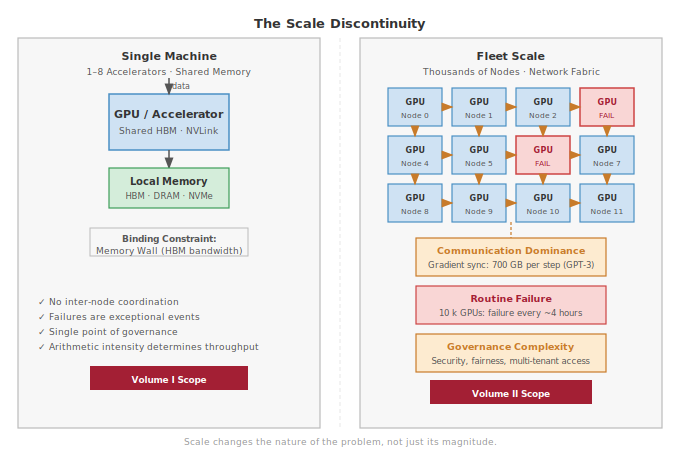
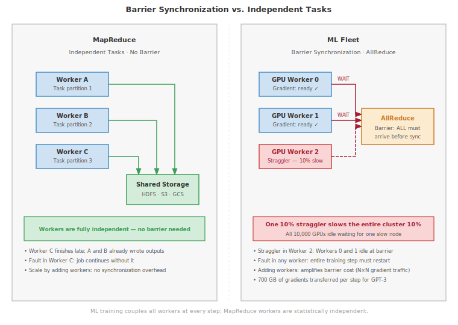
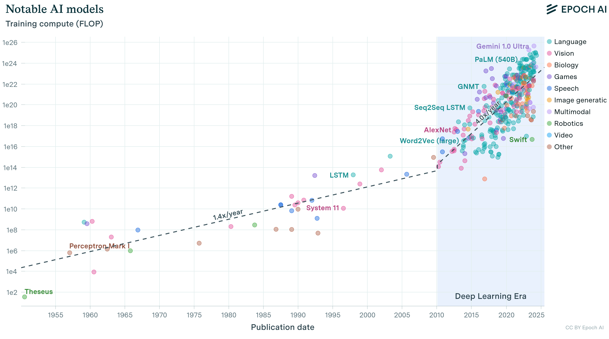
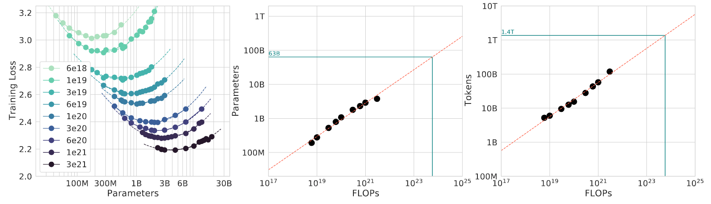
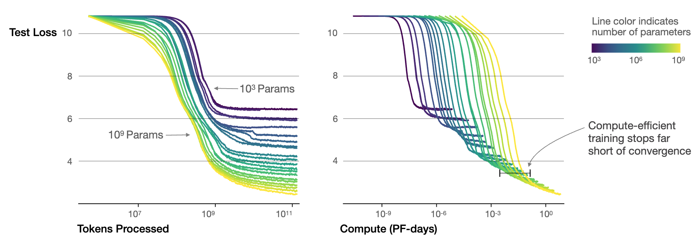
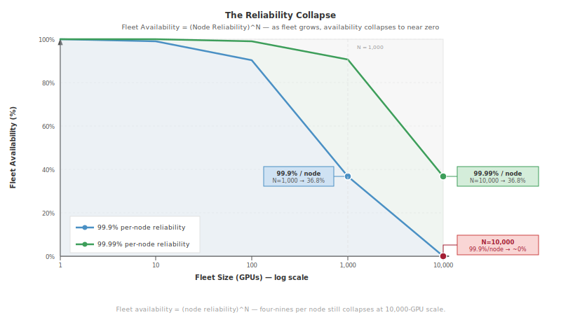
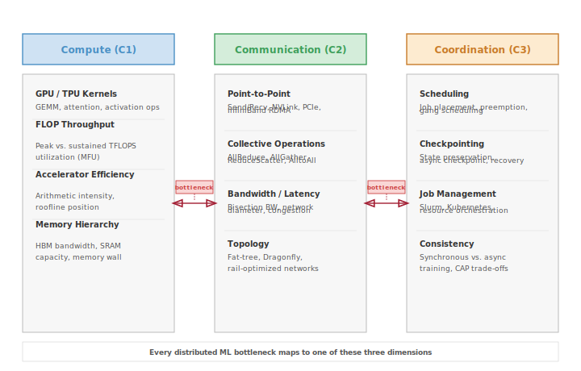

# Introduction {#sec-vol2-introduction}

::: {layout-narrow}
::: {.column-margin}

\chapterminitoc

:::

\noindent
{fig-alt="Abstract geometric composition with interconnected polygons, flowing lines, and node clusters in blue and gold gradients against a dark background."}

:::

## Purpose {.unnumbered}

\begin{marginfigure}
\mlfleetstack{30}{30}{30}{30}
\end{marginfigure}

_Why do the engineering principles that work on single machines break down at production scale?_

Machine learning at scale has a **physics of its own**. In a single node, performance is governed by the memory wall; in a distributed cluster, it is governed by the **Bisection Bandwidth Wall**. Data must move not just through local hierarchies, but across optical fabrics governed by the speed of light between racks. Hardware failures transition from rare exceptions to routine statistical certainties. *When* a single-GPU training job fails, it is an inconvenience; *when* one node in a 10,000-GPU cluster fails, it can stall the entire "Machine Learning Fleet." This discontinuity explains *why* mastery of single-machine ML is no longer sufficient for production. Scale is not more of the same—it is fundamentally different engineering terrain requiring different principles, different architectures, and different ways of thinking about *what* makes systems work. At the same time, large-scale systems have a societal property that small models do not: their impact is amplified by the billions of users they serve. *When* a local model exhibits bias, the harm is contained; *when* a foundation model exhibits bias, it propagates that harm through the fabric of digital life. *What* is needed is a discipline grounded in the **physics of distribution**\index{Physics of Distribution}, where decisions at the algorithmic level must account for network topology, fault tolerance, and the security of the global "Control Plane."

::: {.content-visible when-format="pdf"}

\newpage

:::

::: {.callout-learning-objectives}

- Explain the **Three Fundamental Walls** (Memory, Network, Energy) and apply them to diagnose scaling bottlenecks
- Analyze the **Law of Distributed Efficiency** to quantify the "Coordination Tax" in multi-node clusters
- Differentiate between **Compute-bound**\index{Compute-Bound}, **Memory-bound**\index{Memory-Bound}, and **Communication-bound** scaling regimes
- Apply the **Fleet Stack** framework to organize the Physical, Operational, and Societal layers of the Machine Learning Fleet
- Analyze *why* routine hardware failures require **Fault Tolerance**\index{Fault Tolerance} as a first-class design principle at scale
- Apply the **Six Systems Engineering Principles** to design, scale, and govern production ML systems

:::

```{python}
#| label: vol2-intro-setup
#| echo: false
# ┌─────────────────────────────────────────────────────────────────────────────
# │ INTRODUCTION: SCALE AND DISTRIBUTION CONSTANTS
# ├─────────────────────────────────────────────────────────────────────────────
# │ Context: @sec-vol2-introduction-scale-moment and the Fleet Stack overview;
# │          inline values used throughout the Scale Moment and
# │          Law of Distributed Efficiency sections.
# │
# │ Goal: Provide scale constants (cluster sizes, communication volumes) for
# │       this introduction to anchor the "why distributed?" argument
# │       quantitatively—computing GPT-3 gradient transfer size
# │       (GPT3_PARAMS × 4 bytes), cluster MTBF for 25 k A100s at 8% annual
# │       failure rate, and accelerator peak throughput (A100_FLOPS_FP16_TENSOR,
# │       H100_FLOPS_FP8_TENSOR, TPUV4_FLOPS_BF16) to show scale forces
# │       distribution.
# │ Show: "312" TFLOPs A100, "2,039" GB/s memory bandwidth, "700" GB gradient
# │       per GPT-3 step, "~2" hours MTBF at 25 k GPUs—inline in the Scale
# │       Moment narrative paragraphs and GPT-4 failure rate callout.
# │ How: .m_as() for all unit extractions; scalar arithmetic for cluster stats.
# │
# │ Imports: mlsysim.core.constants (A100_FLOPS_FP16_TENSOR, A100_MEM_BW,
# │           H100_FLOPS_FP8_TENSOR, V100_MEM_BW, TPUV4_FLOPS_BF16,
# │           NVLINK_H100_BW, INFINIBAND_HDR_BW, INFINIBAND_NDR_BW,
# │           GPT3_PARAMS, GPT3_TRAINING_OPS,
# │           TFLOPs, second, GB, TB, Gbps, param, BILLION, BITS_PER_BYTE)
# │ Exports: a100_fp16_tflops, a100_mem_bw_gbs, a100_mem_bw_tbs,
# │          h100_fp8_tflops, v100_mem_bw_gbs, tpuv4_bf16_tflops,
# │          nvlink_h100_gbs, ib_hdr_gbps, ib_ndr_gbps, ib_hdr_gbs, ib_ndr_gbs,
# │          gpt3_params_b, gpt3_training_ops_sci, gpt3_gradient_gb,
# │          gpt4_gpus_str, gpt4_days_str, cluster_fail_day_str, mtbf_hours_str
# └─────────────────────────────────────────────────────────────────────────────
from mlsysim.core.constants import (
    A100_FLOPS_FP16_TENSOR, A100_MEM_BW, H100_FLOPS_FP8_TENSOR,
    V100_MEM_BW, TPUV4_FLOPS_BF16, NVLINK_H100_BW,
    INFINIBAND_HDR_BW, INFINIBAND_NDR_BW,
    GPT3_PARAMS, GPT3_TRAINING_OPS,
    TFLOPs, second, GB, TB, Gbps, param,
    BILLION, BITS_PER_BYTE
)
from mlsysim.fmt import fmt, sci, check
```

## The Scale Moment {#sec-vol2-introduction-scale-moment}

Machine learning on a single accelerator is governed by local memory hierarchy and arithmetic intensity: the physics of silicon. As models transition from research prototypes to global services, however, they encounter a qualitative phase transition that changes the very nature of the engineering problem: the **Scale Moment**\index{Scale Moment}.

The Scale Moment is the physical and operational transformation that occurs *when* models cross the **Three Fundamental Walls**. As we move from a single GPU to a **Machine Learning Fleet**\index{Machine Learning Fleet} comprising thousands of nodes, the binding constraints shift:

1.  **From Processor to Network**\index{From Processor to Network}: The **Network Wall** (bisection bandwidth and speed of light) replaces the local memory wall as the primary performance bottleneck.
2.  **From Exception to Certainty**\index{From Exception to Certainty}: The **Reliability Gap** makes hardware failure a routine event rather than a rare exception.
3.  **From Output to Impact**\index{From Output to Impact}: Serving billions of users hits the **Energy Wall**\index{Energy Wall}, making thermodynamic efficiency a first-order engineering requirement.

This volume is dedicated to the engineering of this fleet: mastering the physics, logic, and governance of machine learning at the limits of modern infrastructure.

Between 2012 and 2024, the compute required to train a frontier model increased from $10^{18}$ FLOPS (AlexNet) to $10^{26}$ FLOPS (estimated for GPT-5 class models). The difference is qualitative, not merely quantitative.

```{python}
#| label: gpt4-training-scenario
#| echo: false
# ┌─────────────────────────────────────────────────────────────────────────────
# │ GPT-4 TRAINING AND RELIABILITY (LEGO)
# ├─────────────────────────────────────────────────────────────────────────────
# │ Context: @sec-vol2-introduction-scale-moment
# │
# │ Goal: Quantify GPT-4 training scale and failure frequency.
# │ Show: ~25k GPUs for 90 days; ~1 failure every 4.4 hours.
# │ How: GPU_Count * Fail_Rate_Annual / 365 = Fails_Per_Day.
# │
# │ Imports: mlsysim.book (fmt, check)
# │ Exports: Gpt4TrainingScenario.gpt4_gpus_str,
# │          Gpt4TrainingScenario.gpt4_days_str,
# │          Gpt4TrainingScenario.cluster_fail_day_str,
# │          Gpt4TrainingScenario.mtbf_hours_str
# └─────────────────────────────────────────────────────────────────────────────
from mlsysim import Models, Applications, Systems
from mlsysim.core.constants import GPU_MTTF_HOURS, hour, day
from mlsysim.fmt import fmt, check

class Gpt4TrainingScenario:
    """Namespace for GPT-4 cluster reliability statistics."""

    # ┌── 1. LOAD (Constants) ──────────────────────────────────────────────
    mission = Applications.Frontier
    num_gpus = 25000 # Specific fleet size for this mission
    gpu_days = 100   # Standard training window

    # Calculate MTBF from component MTTF (Physics Engine)
    # MTBF_cluster = MTTF_gpu/N
    node_mttf = GPU_MTTF_HOURS

    # ┌── 2. EXECUTE (The Compute) ────────────────────────────────────────
    cluster_mtbf_hours = node_mttf/num_gpus
    cluster_failures_per_day = 24 / cluster_mtbf_hours

    # ┌── 3. GUARD (Invariants) ──────────────────────────────────────────
    check(cluster_mtbf_hours < 5, f"MTBF should be < 5 hours for 25k GPUs, got {cluster_mtbf_hours:.1f}")

    # ┌── 4. OUTPUT (Formatting) ──────────────────────────────────────────────
    gpt4_gpus_str = fmt(num_gpus, precision=0)
    gpt4_days_str = fmt(gpu_days, precision=0)
    cluster_fail_day_str = fmt(cluster_failures_per_day, precision=1)
    mtbf_hours_str = fmt(cluster_mtbf_hours, precision=1)
    hw_name = "A100"  # GPT-4 trained on A100s (historical fact per @openai2023gpt4)
```

Consider the training of GPT-4. It reportedly required approximately **`{python} Gpt4TrainingScenario.gpt4_gpus_str` `{python} Gpt4TrainingScenario.hw_name` GPUs** running for **`{python} Gpt4TrainingScenario.gpt4_days_str` days** [@openai2023gpt4]. In a cluster of this size, the probability of failure ($P_{\text{fail}}$) becomes the dominant constraint.

::: {.callout-notebook title="Scale and Reliability"}

**Problem**: A training run for a GPT-4 class model uses `{python} Gpt4TrainingScenario.gpt4_gpus_str` GPUs. If each individual GPU has an annual failure rate of 8 percent, *how* often will the training job be interrupted by hardware failure?

**The Math**:

1. **Total annual failures**\index{Total Annual Failures}: `{python} Gpt4TrainingScenario.gpt4_gpus_str` $\times 0.08 = 2,000$ failures per year.
2. **Daily failure rate**\index{Daily Failure Rate}: $2,000/365 \approx$ **`{python} Gpt4TrainingScenario.cluster_fail_day_str` failures per day**.
3. **Mean Time Between Failures (MTBF)**: $24 \text{ hours} /$ `{python} Gpt4TrainingScenario.cluster_fail_day_str` $\approx$ **`{python} Gpt4TrainingScenario.mtbf_hours_str` hours**.

**The Systems Insight**: In this regime, the system is always in a state of partial failure. Traditional software recovery (manual restart) collapses; the system must be architected for **Fault Tolerance** as a first-class citizen. Hardware can no longer be treated as a reliable abstraction; it is a probabilistic resource that requires constant, automated state preservation (checkpointing).

:::

The history of machine learning is defined by scale. Each major capability leap has emerged from the ability to apply computation at previously impossible scales, making systems engineering central to AI advancement. Three qualitative changes emerge at production scale: communication dominance, routine failure, and governance requirements that accompany societal impact.

Compute requirements have grown exponentially. AlexNet (2012) trained on two GTX 580 GPUs for approximately 5--6 days [@krizhevsky2012imagenet]. BERT (2018) required 64 Tensor Processing Unit (TPU)[^fn-tpu-systolic] chips for 4 days, roughly 6,144 chip hours [@devlin2018bert].

[^fn-tpu-systolic]: **Tensor Processing Unit (TPU)**: Google's custom ASIC, built around a $256 \times 256$ systolic array that trades GPU flexibility for 15--30$\times$ better performance-per-watt on matrix-heavy ML workloads. The fleet-scale consequence is *what* matters here: TPU v4 pods reach 1.1 exaFLOPS aggregate, but their dedicated ICI interconnect (4,800 Gb/s per chip) is *what* makes them a single distributed computer rather than a collection of fast chips. Without that interconnect, BERT's 64-chip training would have been communication-bound long before it was compute-bound. \index{TPU!systolic array}

```{python}
#| label: gpt3-training-scenario
#| echo: false
# ┌─────────────────────────────────────────────────────────────────────────────
# │ GPT-3 TRAINING STATS (LEGO)
# ├─────────────────────────────────────────────────────────────────────────────
# │ Context: @sec-vol2-introduction-scale-moment
# │
# │ Goal: Provide GPT-3 training compute and model size statistics.
# │ Show: ~175B parameters; ~3.14e23 FLOPs.
# │ How: pulling constants from mlsysim.core.constants.
# │
# │ Imports: mlsysim.core.constants (GPT3_PARAMS, GPT3_TRAINING_OPS, param, BILLION),
# │          mlsysim.book (sci, check)
# │ Exports: gpt3_params_b, gpt3_training_ops_sci, gpt3_gradient_gb
# └─────────────────────────────────────────────────────────────────────────────
from mlsysim.core.constants import GPT3_PARAMS, GPT3_TRAINING_OPS, param, BILLION
from mlsysim.fmt import sci, check

class Gpt3TrainingScenario:
    """GPT-3 training and model statistics."""

    # ┌── 1. LOAD (Constants) ──────────────────────────────────────────────
    params = GPT3_PARAMS.m_as(param)
    ops = GPT3_TRAINING_OPS.m_as(GPT3_TRAINING_OPS.units)

    # ┌── 2. EXECUTE (The Compute) ────────────────────────────────────────
    params_b = params/BILLION
    gradient_gb = (params * 4) / BILLION # FP32 gradients

    # ┌── 3. GUARD (Invariants) ──────────────────────────────────────────
    check(params_b == 175, f"GPT-3 should be 175B params, got {params_b}")

    # ┌── 4. OUTPUT (Formatting) ──────────────────────────────────────────────
    gpt3_params_b = f"{params_b:.0f}"
    gpt3_training_ops_sci = sci(ops)
    gpt3_gradient_gb = f"{gradient_gb:.0f}"
```

GPT-3 (2020) consumed an estimated `{python} Gpt3TrainingScenario.gpt3_training_ops_sci` FLOPS during training, requiring thousands of V100 GPUs running for weeks [@brown2020language]. PaLM (2022) trained on 6,144 TPU v4 chips for roughly 60 days, consuming approximately $10^{24}$ FLOPS [@chowdhery2022palm]. GPT-4 (2023) reportedly trained on approximately 25,000 A100 GPUs over 90--100 days [@openai2023gpt4]. This progression represents approximately a 10--million-fold increase in training compute over a single decade, from roughly $10^{18}$ FLOPS for AlexNet to $10^{25}$ FLOPS for GPT-4 [@sevilla2022compute; @amodei2018ai].

::: {.callout-example title="Training Compute Evolution"}

| **Model**                  | **Year** | **GPUs/TPUs** | **Training Time** | **Estimated FLOPS** |
|:---------------------------|---------:|--------------:|------------------:|--------------------:|
| **AlexNet**\index{AlexNet} |     2012 |        2 GPUs |         5--6 days |          ~$10^{18}$ |
| **BERT-Large**             |     2018 |       64 TPUs |            4 days |          ~$10^{20}$ |
| **GPT-3**\index{GPT-3}     |     2020 |    ~1000 GPUs |          ~30 days |          ~$10^{23}$ |
| **PaLM**                   |     2022 |     6144 TPUs |          ~60 days |          ~$10^{24}$ |
| **GPT-4**                  |     2023 |   ~25000 GPUs |         ~100 days |          ~$10^{25}$ |

: **Training Compute Evolution**\index{Training!compute evolution}: Growth in hardware scale and training duration across landmark models, illustrating *how* compute requirements have increased by seven orders of magnitude in a single decade. {#tbl-training-compute-evolution}

:::

@tbl-training-compute-evolution captures the growth in training compute, but an equally important dimension is the growth in *cluster size* itself. @fig-cluster-size-explosion traces this trajectory by plotting the number of accelerators used to train landmark models over the past decade.

::: {#fig-cluster-size-explosion fig-env="figure" fig-pos="htb" fig-cap="**The Cluster Size Explosion**. Number of accelerators used to train landmark models, 2012--2024. Verified counts from published papers are shown as filled circles; the GPT-3 estimate (hollow marker) reflects approximate cluster size from Microsoft infrastructure announcements rather than a precise published count. The dashed trend line indicates approximately 4$\\times$ annual growth in cluster size, a rate that outpaces Moore's Law and drives every infrastructure challenge in this volume." fig-alt="Scatter plot with log-scale y-axis showing accelerator count vs. year from 2012 to 2025. Points rise from 2 GPUs for AlexNet in 2012 to 16384 for Llama 3 in 2024."}

```{python}
#| echo: false
# ┌─────────────────────────────────────────────────────────────────────────────
# │ CLUSTER SIZE EXPLOSION (FIGURE)
# ├─────────────────────────────────────────────────────────────────────────────
# │ Context: @fig-cluster-size-explosion—accelerator count growth
# │
# │ Goal: Scatter accelerator count vs year for AlexNet→Llama 3; show ~4×
# │       annual growth; verified vs estimated markers.
# │ Show: Log-scale y; scatter; trend line; model annotations.
# │ How: Verified models/years/gpus; polyfit log-linear; viz.setup_plot().
# │
# │ Imports: numpy (np), mlsysim.core.viz (viz)
# │ Exports: (figure only, no prose variables)
# └─────────────────────────────────────────────────────────────────────────────
# ┌── 1. CANVAS ────────────────────────────────────────────────────────────────
# │ Scatter accelerator count vs year for AlexNet→Llama 3; show ~4×
import numpy as np
from mlsysim import viz

fig, ax, COLORS, plt = viz.setup_plot(figsize=(8, 5))

# --- Verified data points ---

# ┌── 2. ARRAYS ────────────────────────────────────────────────────────────────
models    = ["AlexNet", "ResNet",  "Megatron-LM", "GPT-3",   "PaLM",   "LLaMA 1",   "DeepSeek-V3", "Llama 3"]
years     = [2012,       2015,      2019,           2020,       2022,     2023,         2024,           2024     ]
gpus      = [2,          8,         512,            10000,      6144,     2048,         2048,           16384    ]
estimated = [False,      False,     False,          True,       False,    False,        False,          False    ]

years_arr = np.array(years, dtype=float)
gpus_arr  = np.array(gpus, dtype=float)

# --- Separate verified vs estimated ---
v_idx = [i for i, e in enumerate(estimated) if not e]
e_idx = [i for i, e in enumerate(estimated) if e]


# ┌── 3. RENDER ────────────────────────────────────────────────────────────────
ax.scatter([years[i] for i in v_idx], [gpus[i] for i in v_idx],
           color=COLORS["BlueLine"], s=70, zorder=5, label="Verified")
ax.scatter([years[i] for i in e_idx], [gpus[i] for i in e_idx],
           facecolors="none", edgecolors=COLORS["OrangeLine"], s=70,
           linewidths=2, zorder=5, label="Estimated")

# --- Exponential trend line (log-linear fit on verified points) ---
v_years = np.array([years[i] for i in v_idx], dtype=float)
v_gpus  = np.array([gpus[i] for i in v_idx], dtype=float)
coeffs  = np.polyfit(v_years, np.log10(v_gpus), 1)
trend_x = np.linspace(2011, 2025.5, 200)
trend_y = 10 ** np.polyval(coeffs, trend_x)
ax.plot(trend_x, trend_y, "--", color=COLORS["RedLine"], alpha=0.5, linewidth=1.5, label="Trend")

# --- Annotate each model ---
offsets = {
    "AlexNet":     (8, -18),
    "ResNet":      (8, 10),
    "Megatron-LM": (-75, 12),
    "GPT-3":       (8, -18),
    "PaLM":        (8, 10),
    "LLaMA 1":     (-70, -18),
    "DeepSeek-V3": (-90, 10),
    "Llama 3":     (-55, 12),
}
for i, m in enumerate(models):
    color = COLORS["OrangeLine"] if estimated[i] else COLORS["BlueLine"]
    ax.annotate(m, (years[i], gpus[i]), textcoords="offset points",
                xytext=offsets[m], fontsize=8, color=color,
                arrowprops=dict(arrowstyle="-", color=color, lw=0.5) if abs(offsets[m][0]) > 30 else None)

# --- Growth rate annotation ---
growth_factor = 10 ** (coeffs[0])  # per year

# ┌── 4. DECORATE ──────────────────────────────────────────────────────────────
ax.text(0.03, 0.92, f"~{growth_factor:.0f}$\\times$ per year",
        transform=ax.transAxes, fontsize=10, color=COLORS["RedLine"],
        fontstyle="italic", bbox=dict(boxstyle="round,pad=0.3", fc="white", ec=COLORS["RedLine"], alpha=0.7))

ax.set_yscale("log")
ax.set_ylim(1, 100_000)
ax.set_xlim(2011, 2025.5)
ax.set_xlabel("Year")
ax.set_ylabel("Accelerators Used for Training")
ax.legend(loc="lower right", frameon=True, fancybox=True, framealpha=0.9)
ax.set_title("")
plt.show()
plt.close()
```

:::

@fig-cluster-size-explosion reveals that cluster sizes have grown by roughly four orders of magnitude in just over a decade, from two GPUs for AlexNet to over 16,000 H100s for Llama 3. This exponential trajectory is the empirical foundation of the Scale Moment: each generation of frontier models demands exponentially larger *fleets* of accelerators.

Recurring *lighthouse archetypes* ground these abstract principles in concrete, quantifiable workloads throughout the volume.

::: {.callout-lighthouse title="Lighthouse Archetypes at Scale"}

**Lighthouse Archetypes** are canonical workloads that we track throughout the volume, examining their behavior when distributed across thousands of devices:

*   **Archetype A (GPT-4/Llama-3)**: The evolution of single-GPU language models to fleet scale. We move from memory bounds on one device to multi-node **Model Parallelism**\index{Model Parallelism} and **Pipeline Parallelism**\index{Pipeline Parallelism}.
*   **Archetype B (DLRM at Scale)**—the Deep Learning Recommendation Model (DLRM) workload: We move from fitting embedding tables in memory to **Embedding Sharding** across hundreds of nodes, creating massive all-to-all communication bottlenecks.
*   **Archetype C (Federated MobileNet)**: We move from single-device inference to **Federated Learning** across billions of devices, introducing privacy and straggler challenges.

**Systems Perspectives** continue to appear as sidebars, now focusing on the physics of data centers, network topology, and distributed consistency (consistency, availability, partition-tolerance (CAP theorem)).

:::

This exponential growth, combined with the rise of **Federated Learning**[^fn-federated-forward], has transformed ML from a discipline where algorithms dominate to one where systems engineering determines success. A sophisticated algorithm that cannot scale often provides less practical value than a simpler algorithm deployed efficiently across scalable infrastructure.

The transition from single-machine to distributed training introduces qualitative changes in system behavior. @fig-scale-moment-discontinuity contrasts the two regimes: the single-machine world governed by the memory wall vs. the fleet-scale world governed by communication dominance, routine failure, and governance complexity.

::: {#fig-scale-moment-discontinuity fig-env="figure" fig-pos="htb" fig-cap="**The Scale Discontinuity**: Single-machine systems (left) are governed by local memory bandwidth and operate with no inter-node coordination, exceptional failures, and a single point of governance. Fleet-scale systems (right) introduce communication dominance, routine hardware failure, and governance complexity as first-order engineering constraints." fig-alt="Side-by-side comparison of single-machine system with one GPU and local memory vs. fleet-scale system with twelve GPU nodes, two marked as failed, and three challenge labels."}



:::

The discontinuity captured in @fig-scale-moment-discontinuity is qualitative, not merely quantitative: at fleet scale, the binding constraint shifts from silicon to the network fabric, and the engineering discipline shifts from optimization to resilience. The unit of compute is no longer a single server but a **Machine Learning Fleet**: a massive, interconnected distributed system that must act as a single coherent engine.

::: {.callout-definition title="Machine Learning Fleet"}

***Machine Learning Fleet***\index{Machine Learning Fleet!definition} is a distributed system of thousands of interconnected accelerators, storage arrays, and network fabrics designed to operate as a single coherent computer.

1.  **Significance (Quantitative):** It coordinates synchronous state across all nodes, where the total time $T$ is governed by the **Slowest Worker** (Straggler). It requires **Bisection Bandwidth** ($\text{BW}_{\text{bisect}}$) that scales with the aggregate compute capacity ($R_{\text{peak}}$) of the fleet.
2.  **Distinction (Durable):** Unlike **Traditional Clusters** (for example, Spark, MapReduce) that manage independent, asynchronous jobs, an ML Fleet operates under **Synchronous Tight Coupling**\index{Synchronous Tight Coupling}, requiring near-perfect reliability to maintain throughput.
3.  **Common Pitfall:** A frequent misconception is that an ML Fleet is "just more servers." In reality, it is a **Warehouse-Scale Computer (WSC)** where the network is the system bus and the orchestrator is the operating system.

:::

As systems scale beyond a single node, a fundamental physical constraint emerges: the *bisection bandwidth wall*[^fn-bisection-bandwidth-etymology], which limits how fast data can cross the network midpoint. At fleet scale, networking often determines model throughput more than compute does.

[^fn-bisection-bandwidth-etymology]: **Bisection Bandwidth** (from graph theory): The minimum aggregate bandwidth of all links that, if cut, would partition the network into two equal-sized sets of nodes. In distributed ML, this "worst-case" cut determines the cluster's synchronization bottleneck: an AllReduce synchronization can move no faster than the bisection bandwidth, regardless of how many GPUs are added. \index{Bisection Bandwidth!etymology}

On a single GPU, training proceeds deterministically: the same code, data, and random seed produce identical results. At the scale of thousands of GPUs, new phenomena emerge. Network partitions can split clusters into groups that train independently, causing model divergence. Stragglers (workers that process data slower than peers due to hardware variation or thermal throttling) can bottleneck entire training runs. Hardware failures that occur once per machine-year become daily events *when* operating 10,000 machines[^fn-failure-rates-fleet]. Systems must checkpoint frequently enough that losing a day's progress becomes acceptable rather than catastrophic.

[^fn-failure-rates-fleet]: **Hardware Failure Rates at Scale**\index{Hardware Failure Rates at Scale}: Individual GPUs fail at 1--2 percent annually under typical conditions, but rates exceed 9 percent under intensive training workloads. Multiply by fleet size and failure becomes routine: Meta reported 419 unexpected interruptions during Llama 3's 54-day training on 16,384 H100s, roughly one every three hours, with GPU and HBM3 faults causing over half. Automated checkpointing and recovery maintained over 90 percent effective training time, illustrating that at fleet scale the engineering challenge shifts from preventing failure to minimizing recovery latency. \index{Failure Rate!fleet scale}

```{python}
#| label: infiniband-scenario
#| echo: false
# ┌─────────────────────────────────────────────────────────────────────────────
# │ INFINIBAND NETWORKING SPECS (LEGO)
# ├─────────────────────────────────────────────────────────────────────────────
# │ Context: @sec-vol2-introduction-scale-moment
# │
# │ Goal: Provide InfiniBand HDR and NDR bandwidth statistics.
# │ Show: ~200 Gbps HDR; ~400 Gbps NDR.
# │ How: pulling constants from mlsysim.core.constants.
# │
# │ Imports: mlsysim.core.constants (INFINIBAND_HDR_BW, INFINIBAND_NDR_BW,
# │          Gbps, BITS_PER_BYTE)
# │ Exports: ib_hdr_gbps, ib_ndr_gbps, ib_hdr_gbs, ib_ndr_gbs
# └─────────────────────────────────────────────────────────────────────────────
from mlsysim.core.constants import INFINIBAND_HDR_BW, INFINIBAND_NDR_BW, Gbps, BITS_PER_BYTE

class InfiniBandScenario:
    """InfiniBand networking bandwidth reference."""

    # ┌── 1. LOAD (Constants) ──────────────────────────────────────────────
    hdr = INFINIBAND_HDR_BW
    ndr = INFINIBAND_NDR_BW

    # ┌── 2. EXECUTE (The Compute) ────────────────────────────────────────
    hdr_gbps = hdr.m_as(Gbps)
    ndr_gbps = ndr.m_as(Gbps)
    hdr_gbs = hdr_gbps/BITS_PER_BYTE
    ndr_gbs = ndr_gbps/BITS_PER_BYTE

    # ┌── 3. GUARD (Invariants) ──────────────────────────────────────────
    from mlsysim.fmt import check
    check(ndr_gbps > hdr_gbps, "NDR bandwidth must be greater than HDR bandwidth")

    # ┌── 4. OUTPUT (Formatting) ──────────────────────────────────────────────
    ib_hdr_gbps = f"{hdr_gbps:.0f}"
    ib_ndr_gbps = f"{ndr_gbps:.0f}"
    ib_hdr_gbs = f"{hdr_gbs:.0f}"
    ib_ndr_gbs = f"{ndr_gbs:.0f}"
```

These scale-induced challenges drive infrastructure investment by the largest AI organizations. Meta's Research SuperCluster (RSC) contains 16,000 NVIDIA A100 GPUs connected by `{python} InfiniBandScenario.ib_hdr_gbps` Gb/s InfiniBand[^fn-infiniband-rdma-v2] networking [@meta2022rsc]. Google's TPU v4 pods contain 4,096 chips with 1.1 exaFLOPS of aggregate compute capacity. Microsoft's Azure AI infrastructure spans multiple datacenters with tens of thousands of GPUs dedicated to AI workloads. The scale of the models dictates the scale of the infrastructure.

[^fn-infiniband-rdma-v2]: **InfiniBand (IB)**: Born in 1999 from the merger of Intel's NGIO and the Compaq/IBM Future I/O initiatives, InfiniBand was originally designed to replace the PCI bus. Its defining feature for ML is RDMA (Remote Direct Memory Access), which bypasses the OS kernel to transfer data directly between application memory on different machines at sub-microsecond latency. HDR IB delivers `{python} InfiniBandScenario.ib_hdr_gbs` GB/s usable bandwidth per link; NDR reaches `{python} InfiniBandScenario.ib_ndr_gbs` GB/s. This bandwidth gap vs. standard Ethernet (12--50 GB/s) determines whether large-model training is compute-bound or communication-bound. \index{InfiniBand!RDMA}

The Scale Moment establishes the *why*: exponential growth in compute demand forces ML systems beyond any single machine, creating communication dominance, routine failure, and governance obligations. The next question is *how* to organize the engineering response. Distributed systems frameworks designed for independent tasks cannot satisfy the tight coupling that ML training demands; a different architectural hierarchy is needed.

## The Engineering Crux: A Hierarchy of Architecture {#sec-vol2-introduction-engineering-crux}

::: {#sec-vol2-introduction-breed-apart}
:::

\index{Engineering Crux!hierarchy of scale}
Apache Spark processes independent data partitions; a web microservice handles isolated requests. The Machine Learning Fleet does neither. Its workload requires synchronous state updates across thousands of accelerators every few hundred milliseconds, a coupling intensity that existing distributed frameworks were never designed to sustain. The workload characteristics of ML systems differ fundamentally from traditional distributed systems, even though the underlying hardware (network, compute, storage) is identical. To reason about these differences systematically, we formalize a four-layer stack throughout Volume II: the **Engineering Crux**, which transforms raw cluster resources into global-scale AI applications.

@fig-vol2-system-scaling-regimes visualizes the transition from single-node to fleet. Volume I covered the left side of this diagram: 1–8 accelerators connected by shared memory, where the binding constraint is the **memory wall**\index{Memory Wall}. This volume crosses the scaling arrow into the **Distributed Fleet** regime, where thousands of nodes coordinate across a high-speed switch fabric and the bottleneck shifts to the **Bisection Bandwidth Wall**\index{Bisection Bandwidth!wall}: network congestion and message-passing latency dominate.

::: {#fig-vol2-system-scaling-regimes fig-env="figure" fig-pos="htb" fig-cap="**The Scaling Regimes of ML Systems**: Machine learning engineering is partitioned into two distinct physical regimes. Single-node systems are limited by local memory bandwidth (**memory wall**), while distributed fleets are limited by network communication (**Bisection Bandwidth Wall**). Mastery of intra-node data movement is the prerequisite for distributed scaling." fig-alt="Diagram comparing Single-Node Stack (Application, ML Framework, System Software, Hardware) to Distributed Fleet Stack (Governance, Serving/Ops, Distribution, Infrastructure), separated by a scaling arrow."}

```{.tikz}
\begin{tikzpicture}[font=\usefont{T1}{phv}{m}{n}\small]
\tikzset{
Box/.style={align=center, inner xsep=2pt,draw=GreenLine, line width=0.5pt,
node distance=8.5mm,fill=none, minimum width=27mm, minimum height=20mm},
Box1/.style={Box,draw=OrangeLine,fill=none},
Box2/.style={align=center, inner sep=0pt,draw=GreenLine, line width=0.5pt,
anchor=south east,fill=none, minimum width=29mm, minimum height=6mm},
BoxD/.style={Box,font=\small\usefont{T1}{phv}{b}{n},anchor=north,
draw=red,dashed,text=black,fill=none, line width=1pt,
minimum width=59mm,minimum height=9mm},
BoxD1/.style={Box,font=\small\usefont{T1}{phv}{b}{n},align=center,
draw=none,text=black,fill=black!007, line width=1pt,
minimum width=59mm,minimum height=12mm},
Circle1/.style={circle,  minimum size=33mm, draw=none, fill=BrownLine!20},
LineD/.style={BrownLine!60!black!20,line width=4.0pt,dashed,dash pattern=on 5pt off 2pt,
{-{Triangle[width=1.5*6pt,length=2.0*5pt]}},shorten <=5pt,shorten >=1pt},
LineA/.style={GreenLine!90,line width=7.0pt,font=\usefont{T1}{phv}{b}{n}\small,
{-{Triangle[width=1.5*8pt,length=2.0*5pt]}},shorten <=7pt,shorten >=8pt},
ALineA/.style={black!60,{Circle[line width=1.0pt,fill=white,round,length=5pt,width=5pt]}-,
line width=1.0pt,shorten <=-3pt,shorten >=-1pt},
Text1/.style={font=\usefont{T1}{phv}{m}{n}\footnotesize,text=black!70}
}

%CPU
\tikzset{%
 pics/cpu/.style = {
        code = {
        \pgfkeys{/channel/.cd, #1}
\begin{scope}[local bounding box=FUNNEL,scale=\scalefac, every node/.append style={transform shape}]
\node[fill=\filllcolor,minimum width=66, minimum height=66,
            rounded corners=2,outer sep=2pt] (C1) {};
\node[fill=white,minimum width=54, minimum height=54] (C2) {};
\node[fill=\filllcolor!40,minimum width=44, minimum height=44] (C3) {\large GPU};

\foreach \x/\y in {0.11/1,0.26/2,0.41/3,0.56/4,0.71/5,0.85/6}{
\node[fill=\filllcolor,minimum width=3, minimum height=15,
           inner sep=0pt,anchor=south](GO\y)at($(C1.north west)!\x!(C1.north east)$){};
}
\foreach \x/\y in {0.11/1,0.26/2,0.41/3,0.56/4,0.71/5,0.85/6}{
\node[fill=\filllcolor,minimum width=3, minimum height=15,
           inner sep=0pt,anchor=north](DO\y)at($(C1.south west)!\x!(C1.south east)$){};
}
\foreach \x/\y in {0.11/1,0.26/2,0.41/3,0.56/4,0.71/5,0.85/6}{
\node[fill=\filllcolor,minimum width=15, minimum height=3,
           inner sep=0pt,anchor=east](LE\y)at($(C1.north west)!\x!(C1.south west)$){};
}
\foreach \x/\y in {0.11/1,0.26/2,0.41/3,0.56/4,0.71/5,0.85/6}{
\node[fill=\filllcolor,minimum width=15, minimum height=3,
           inner sep=0pt,anchor=west](DE\y)at($(C1.north east)!\x!(C1.south east)$){};
}
 \end{scope}
     }
  }
}

%Token style
\tikzset{
pics/token/.style = {
        code = {
        \pgfkeys{/channel/.cd, #1}
\begin{scope}[shift={($(0,0)+(0,0)$)},scale=\scalefac,every node/.append style={transform shape}]
\node[draw=\drawcolor,fill=\filllcirclecolor,circle,minimum size=40mm,
line width=\Linewidth](T-\picname){};
\node[draw=white,fill=none,circle,minimum size=0.925*40mm,line width=0.6*\Linewidth]{};
\clip[] circle (0.925*20mm);
\draw[step=5mm,draw=white] (-2,-2) grid (2,2);
\foreach \x/\y[count=\a] in {0/0,1.3/0,1/1,-0.5/1.5,-1.5/0.5,-1.0/-0.9,0.5/-1.3,2.0/0}{
\fill[fill=white,draw=none](\x,0.8*\y)circle(5pt)coordinate(C\a);
}
\draw[white,line width=\Linewidth,fill opacity=0.5,fill=\filllcolor!40](C2)--(C3)--(C4)--(C5)--(C6)--(C7)--cycle;
\foreach \x in {2,...,7}{
\draw[white,line width=\Linewidth](C1)--(C\x);
}
\foreach \x/\y\col[count=\a] in {0/0/red,1.3/0/green,1/1/blue,-0.5/1.5/violet,
-1.5/0.5/magenta,-1.0/-0.9/brown,0.5/-1.3/yellow}{
\fill[fill=\col,draw=none](\x,0.8*\y)circle(5pt)coordinate(C\a);
}
\end{scope}
    }
  }
}
%display
\tikzset{%
    comp/.style = {draw,
        minimum width  =18mm,
        minimum height = 15mm,
        inner sep      = 0pt,
        rounded corners,
       draw = \drawcolor,
       fill=\filllcolor!10,
       line width=2.0pt
    },
 pics/displayG/.style = {
        code = {
        \pgfkeys{/channel/.cd, #1}
\begin{scope}[shift={($(0,0)+(0,0)$)},scale=\scalefac,every node/.append style={transform shape}]
 \node[comp](\picname-COM){};
% \draw[draw = \drawcolor,line width=1.0pt]
% ($(\picname-COM.north west)!0.85!(\picname-COM.south west)$)-- ($(\picname-COM.north east)!0.85!(\picname-COM.south east)$);
\draw[draw = \drawcolor,line width=\Linewidth]($(\picname-COM.south west)!0.4!(\picname-COM.south east)$)--++(270:0.2)coordinate(DL);
\draw[draw = \drawcolor,line width=\Linewidth]($(\picname-COM.south west)!0.6!(\picname-COM.south east)$)--++(270:0.2)coordinate(DD);
\draw[draw = \drawcolor,line width=3*\Linewidth,shorten <=-3mm,shorten >=-3mm](DL)--(DD);
\end{scope}
   }
  }
}

%gear
% #1 number of teeths
% #2 radius intern
% #3 radius extern
% #4 angle from start to end of the first arc
% #5 angle to decale the second arc from the first
% #6 inner radius to cut off
\tikzset{
  pics/gear/.style args={#1/#2/#3/#4/#5/#6/#7}{
   code={
           \pgfkeys{/channel/.cd, #7}
\begin{scope}[shift={($(0,0)+(0,0)$)},scale=\scalefac,every node/.append style={transform shape}]
    \pgfmathtruncatemacro{\N}{#1}%
    \def\rin{#2}\def\rout{#3}\def\aA{#4}\def\aOff{#5}\def\rcut{#6}%
    \path[rounded corners=1.5pt,draw=\drawcolor,fill=\filllcolor]
      (0:\rin)
      \foreach \i [evaluate=\i as \n using (\i-1)*360/\N] in {1,...,\N}{%
        arc (\n:\n+\aA:\rin)
        -- (\n+\aA+\aOff:\rout)
        arc (\n+\aA+\aOff:\n+360/\N-\aOff:\rout)
        -- (\n+360/\N:\rin)
      } -- cycle;
      \draw[draw=none,fill=white](0,0) circle[radius=\rcut];
\end{scope}
  }}
}
%Infinity_loops
\tikzset{%
  radius=2, start angle=-90, line cap=round,
  arr node/.style={sloped, allow upside down, single arrow,
    single arrow head extend=+2mm, thick, minimum height=+9mm, fill=white},
  arr/.style ={  edge node={node[arr node, pos={#1}]{}}},
  arr'/.style={insert path={node[arr node, pos={#1}]{}}},
 pics/infinityL/.style = {
        code = {
        \pgfkeys{/channel/.cd, #1}
\begin{scope}[local bounding box=LOOPS,scale=\scalefac, every node/.append style={transform shape}]
\draw[line width=+2.5mm, sloped, text=white,draw=\drawcolor]
  (0, 2) edge[preaction={line cap=butt, line width=+5mm, draw=white, overlay},draw=\filllcirclecolor,
              out=0, in=180, arr=.2, arr=.8] (6, -2)
  (6, -2) arc[delta angle= 180]
    [arr'=.5,draw=\filllcolor] node[very near start]{} node[very near end]{}
  to[out=180, in=0, arr=.2, arr=.8] (0, -2) arc[delta angle=-180,]
    [arr'=.5,draw=\filllcolor] node[very near start]{} node[very near end]{};

 \end{scope}
     }
  }
}

%server
\tikzset {
  pics/server/.style = {
    code = {
     % \colorlet{red}{black}
\pgfkeys{/channel/.cd, #1}
      \begin{scope}[anchor=center, transform shape,scale=\scalefac, every node/.append style={transform shape}]
        \draw[draw=\drawcolor,line width=\Linewidth,fill=\filllcolor](-0.55,-0.5) rectangle (0.55,0.5);
\foreach \i in {-0.25,0,0.25} {
                \draw[line width=\Linewidth]( -0.55,\i) -- (0.55, \i);
}
        \foreach \i in {-0.375, -0.125, 0.125, 0.375} {
          \draw[line width=\Linewidth](-0.45,\i)--(0,\i);
          \fill[](0.35,\i) circle (1.5pt);
        }

        \draw[draw=\drawcolor,line width=1.5*\Linewidth](0,-0.53) |- (-0.55,-0.7);
        \draw[draw=\drawcolor,line width=1.5*\Linewidth](0,-0.53) |- (0.55,-0.7);
      \end{scope}
    }
  }
}
\tikzset{
pics/llm/.style = {
        code = {
        \pgfkeys{/channel/.cd, #1}
\begin{scope}[shift={($(0,0)+(0,0)$)},scale=\scalefac,every node/.append style={transform shape}]
\node[circle,minimum size=12mm,draw=\drawcolor, fill=\filllcolor!70,line width=0.5*\Linewidth](C\picname) at (0,0){};
\def\startangle{90}
\def\radius{1.15}
\def\radiusI{1.1}
\foreach \i [evaluate=\i as \j using \i+1] [count =\k] in {0,2,4,6,8} {
\pgfmathsetmacro{\angle}{\startangle - \i * (360/8)}
\draw[draw=black,-{Circle[black ,fill=\filllcirclecolor,length=5.5pt,line width=0.5*\Linewidth]},line width=1.5*\Linewidth](C\picname)--++(\startangle - \i*45:\radius) ;
\node[circle,draw=black,fill=\filllcirclecolor!80!red!50,inner sep=3pt,line width=0.5*\Linewidth](2C\k)at(\startangle - \j*45:\radiusI) {};
}
\draw[line width=1.5*\Linewidth](2C1)--++(-0.5,0)|-(2C2);
\draw[line width=1.5*\Linewidth](2C3)--++(0.5,0)|-(2C4);
\node[circle,,minimum size=12mm,draw=\drawcolor, fill=\filllcolor!70,line width=0.5*\Linewidth]at (0,0){};
\node[draw,rectangle,rounded corners=1pt,minimum width=7mm,minimum height=4mm,fill=orange!10](R1)at(0.1,0.1){};
\draw[BrownLine,shorten <=2pt,shorten >=2pt ]($(R1.north west)!0.35!(R1.south west)$)--($(R1.north east)!0.35!(R1.south east)$);
\draw[BrownLine,shorten <=2pt,shorten >=2pt ]($(R1.north west)!0.7!(R1.south west)$)--($(R1.north east)!0.7!(R1.south east)$);
\node[draw,rectangle,rounded corners=1pt,minimum width=6mm,minimum height=4mm,fill=orange!10](R2)at(-0.05,-0.15){};
\draw[BrownLine,shorten <=2pt,shorten >=2pt ]($(R2.north west)!0.35!(R2.south west)$)--($(R2.north east)!0.35!(R2.south east)$);
\draw[BrownLine,shorten <=2pt,shorten >=2pt ]($(R2.north west)!0.7!(R2.south west)$)--($(R2.north east)!0.7!(R2.south east)$);
\end{scope}
    }
  }
}
\def\inset{3.2pt} %
\def\myshape{%
  (0,1.34) to[out=220,in=0] (-1.20,1.03) --
  (-1.20,-0.23) to[out=280,in=160] (0,-1.53) to[out=20,in=260] (1.20,-0.23) --
  (1.20,1.03)  to[out=180,in=320] cycle
}
\tikzset{
pics/stitC/.style = {
        code = {
        \pgfkeys{/channel/.cd, #1}
\begin{scope}[shift={($(0,0)+(0,0)$)},scale=\scalefac,every node/.append style={transform shape}]
%\draw[draw=none,fill=\filllcolor!60](0,1.34)to[out=220,in=0](-1.20,1.03)to(-1.20,-0.23)
%to[out=280,in=160](0,-1.53)to[out=20,in=260](C1)to(1.20,1.03)to[out=180,in=320]cycle;
\fill[fill=\filllcolor!60] \myshape;
%
\begin{scope}
  \clip \myshape;
  \draw[draw=\filllcolor, line width=2*\Linewidth,fill=white] \myshape; % boja i debljina po želji
\end{scope}
%\fill[fill=\filllcolor!60](0,0)circle(0.4);
\draw[draw=\filllcirclecolor,line join=round,line cap=round,line width=1.85*\Linewidth](-0.65,-0.35)--++(320:0.5)--++(50:1.4);
\end{scope}
    }
  }
}
%code
\tikzset{
pics/interpreter/.style = {
        code = {
        \pgfkeys{/channel/.cd, #1}
\begin{scope}[shift={($(0,0)+(0,0)$)},scale=\scalefac,every node/.append style={transform shape}]
\node[black,font=\Large\bfseries]at(-0.75,0.65){\textless\,/\,\textgreater};
\draw[line cap=round,line join=round,green!99!black!90,line width=\Linewidth](-1.32,0.17)--(-1.05,0.17);
\draw[line cap=round,line join=round,red,line width=\Linewidth](-0.8,0.17)--(-0.1,0.17);
\draw[line cap=round,line join=round,green!99!black!90,line width=\Linewidth](-1.15,-0.15)--(-0.45,-0.15);
\draw[line cap=round,line join=round,green!99!black!90,line width=\Linewidth](-1.15,-0.47)--(-0.75,-0.47);
\draw[line cap=round,line join=round,red,line width=\Linewidth](-0.45,-0.47)--(0.45,-0.47);
\draw[line cap=round,line join=round,cyan,line width=\Linewidth](0.75,-0.47)--(1.1,-0.47);
\draw[line cap=round,line join=round,green!99!black!90,line width=\Linewidth](-1.15,-0.79)--(-1,-0.79);
\draw[line cap=round,line join=round,red,line width=\Linewidth](-0.65,-0.79)--(-0.10,-0.79);
\draw[line cap=round,line join=round,cyan,line width=\Linewidth](0.2,-0.79)--(1.1,-0.79);
\draw[line cap=round,line join=round,green!99!black!90,line width=\Linewidth](-1.15,-1.11)--(-0.4,-1.11);
\draw[line cap=round,line join=round,blue!99!black!90,line width=\Linewidth](-0.15,-1.11)--(1.1,-1.11);
\end{scope}
    }
  }
}
\pgfkeys{
  /channel/.cd,
   Depth/.store in=\Depth,
  Height/.store in=\Height,
  Width/.store in=\Width,
  filllcirclecolor/.store in=\filllcirclecolor,
  filllcolor/.store in=\filllcolor,
  drawcolor/.store in=\drawcolor,
  drawcircle/.store in=\drawcircle,
  scalefac/.store in=\scalefac,
  Linewidth/.store in=\Linewidth,
  picname/.store in=\picname,
  tiecolor/.store in=\tiecolor,
  bodycolor/.store in=\bodycolor,
  stetcolor/.store in=\stetcolor,
  tiecolor=red,      % derfault tie color
  bodycolor=blue!30,  % derfault body color
  stetcolor=green,  % derfault stet color
  filllcolor=BrownLine,
  filllcirclecolor=violet!20,
  drawcolor=black,
  drawcircle=violet,
  scalefac=1,
  Linewidth=0.5pt,
  Depth=0.2,
  Height=0.5,
  Width=0.25,
  picname=C
}


% Application
\node[Box1,draw=none](B1){};
\node[above=-1pt of B1.north,Text1]{Training Loop/inference};
\node[Box2,draw=OrangeLine](BB1)at($(B1.south west)+(-3mm,0)$){Application};
\draw[ALineA](B1.west)--(BB1.north);
\pic[shift={(0,0.08)}] at  (B1){displayG={scalefac=0.95,picname=DD,
filllcolor=brown!60!, drawcolor=BrownLine,Linewidth=0.7pt}};
%\pic[shift={(-0.20,0.23)}] at (D-COM) {gear={11/1.25/1.7/11/2.0/0.6/scalefac=0.26,drawcolor=black,filllcolor=OrangeLine!90}};
\pic[shift={(0.47,0.32)}] at (DD-COM) {gear={10/1.3/1.8/17/1/0.6/scalefac=0.18,drawcolor=RedLine,filllcolor=RedLine}};
\pic[shift={(0.05,0.05)}] at  (DD-COM){interpreter={scalefac=0.5,picname=1,filllcolor=cyan!30!, Linewidth=2.0pt,filllcirclecolor=orange}};
%ML Framework
\node[Box1,draw=none,below=of B1](B2){};
\node[above=-1pt of B2.north,Text1]{PyTorch/JAX/Kernels};
\node[Box2,draw=GreenLine](BB2)at($(B2.south west)+(-3mm,0)$){ML Framework};
\draw[ALineA](B2.west)--(BB2.north);
\pic[shift={(0,0)}] at  (B2){token={scalefac=0.43,picname=2,drawcolor=green!55!black,
filllcirclecolor=green!55!black!90,filllcolor=green!55!black,Linewidth=1.25pt}};
%System Software
\node[Box1,draw=none,below=of B2](B3){};
\node[above=-1pt of B3.north,Text1]{CUDA/PCIe DMA};
\node[Box2,draw=VioletLine](BB3)at($(B3.south west)+(-3mm,0)$){System Software};
\draw[ALineA](B3.west)--(BB3.north);
\pic[shift={(0,0.1)}] at  (B3){displayG={scalefac=0.98,picname=D,
filllcolor=BlueLine, drawcolor=BlueLine,Linewidth=0.7pt}};
\pic[shift={(-0.20,0.23)}] at (D-COM) {gear={11/1.25/1.7/11/2.0/0.6/
scalefac=0.26,drawcolor=black,filllcolor=OrangeLine!90}};
\pic[shift={(0.2,-0.3)}] at (D-COM) {gear={10/1.3/1.8/17/1/0.6/
scalefac=0.2,drawcolor=black,filllcolor=OrangeLine!60}};
%Hardware
\node[Box1,draw=none,below=of B3](B4){};
\node[above=-1pt of B4.north,Text1]{HBM/NVLink (900 GB/s)};
\node[Box2,draw=RedLine](BB4)at($(B4.south west)+(-3mm,0)$){Hardware};
\draw[ALineA](B4.west)--(BB4.north);
\pic[shift={(0,0)}] at  (B4){cpu={scalefac=0.49,picname=1,filllcolor=GreenLine, Linewidth=0.7pt}};
%%%%%%%%%%%%%%%
% Governance
%%%%%%%%%%%%%%%
\node[Box1,right=3.2 of B1,draw=none](B1B){};
\node[above=-1pt of B1B.north,Text1]{Responsible AI/Security};
\node[Box2,draw=OrangeLine,anchor=south west](BB1B)at($(B1B.south east)+(3mm,0)$){Governance};
\draw[ALineA](B1B.east)--(BB1B.north);
\pic[shift={(0,0.05)}] at  (B1B){stitC={scalefac=0.63,picname=1,drawcolor=orange,
filllcolor=purple,filllcirclecolor=GreenLine,Linewidth=3.1pt}};
%Serving/Ops
\node[Box1,draw=none,below=of B1B](B2B){};
\node[above=-1pt of B2B.north,Text1]{Orchestration/CI/CD};
\node[Box2,draw=GreenLine,anchor=south west](BB2B)at($(B2B.south east)+(3mm,0)$){Serving/Ops};
\draw[ALineA](B2B.east)--(BB2B.north);
\pic[shift={(-0.6,0)}] at  (B2B){infinityL={scalefac=0.2,picname=1,Linewidth=1.0pt,
 filllcolor=BlueLine,filllcirclecolor=red,drawcolor=GreenLine}};
%Distribution
\node[Box1,draw=none,below=of B2B](B3B){};
\node[above=-1pt of B3B.north,Text1]{NCCL/RDMA/Comms};
\node[Box2,draw=VioletLine,anchor=south west](BB3B)at($(B3B.south east)+(3mm,0)$){Distribution};
\draw[ALineA](B3B.east)--(BB3B.north);
\pic[shift={(0,0)}] at  (B3B){llm={scalefac=0.78,drawcolor=BlueLine,filllcolor=BlueLine!50!, Linewidth=1pt,filllcirclecolor=red}};
%Infrastructure
\node[Box1,draw=none,below=of B3B](B4B){};
\node[above=-1pt of B4B.north,Text1]{Fabric/RDMA (InfiniBand)};
\node[Box2,draw=RedLine,anchor=south west](BB4B)at($(B4B.south east)+(3mm,0)$){Infrastructure};
\draw[ALineA](B4B.east)--(BB4B.north);
\pic[shift={(0,0.1)}] at  (B4B){server={scalefac=1.2,picname=1,
drawcolor=black,filllcolor=cyan!15!,Linewidth=0.57pt,Linewidth=1pt}};
%fitting
\node[draw=none,fit=(B1)(B4)(BB4)](F1){};
\node[draw=none,fit=(B1B)(B4B)(BB4B)](F2){};
\draw[LineA](F1)--node[above]{Scaling}(F2);
%
\node[BoxD,below=10pt of F1]{Bottleneck: Memory Wall};
\node[BoxD,below=10pt of F2]{Bottleneck: Network Wall};
%
\node[BoxD1,above=20pt of F1]{Single-Node Stack \\
{\small\usefont{T1}{phv}{m}{n} 1--8 GPUs, Shared Memory}};
\node[BoxD1,above=20pt of F2]{Distributed Fleet Stack \\
{\small\usefont{T1}{phv}{m}{n} 1,000--100,000+ GPUs}};
\end{tikzpicture}
```

:::

The stack architecture in @fig-vol2-system-scaling-regimes does not change when we scale: every ML system still has Hardware, a System envelope, a Workload, and a Mission. *What* changes is the physics at each layer. Read the figure from bottom to top. At the bottom row, **Hardware** (HBM and NVLink at 900 GB/s within one node) becomes **Infrastructure** (InfiniBand RDMA fabric spanning racks at 400 Gb/s per link), and the bottleneck shifts from the memory wall to the Bisection Bandwidth Wall. One row up, **System Software** (a single CUDA runtime managing PCIe DMA) becomes **Distribution** (NCCL and RDMA libraries coordinating thousands of processes across the fabric).

The upper two layers undergo an equally profound transformation. **ML Framework**\index{ML Framework} (PyTorch or JAX executing a training loop on one node) becomes **Serving/Ops** (orchestration and CI/CD pipelines that schedule distributed jobs and manage rolling deployments). At the top, **Application** (a single training script or inference service) becomes **Governance** (responsible AI policy, security auditing, and multi-tenant access control), because fleet-scale deployment introduces organizational concerns absent from a single machine. The four layers of the Engineering Crux at fleet scale are:

1.  **Infrastructure** (Hardware—The Engine): The physical foundation. This layer defines the fleet's raw capabilities: per-node $R_{\text{peak}}$ and $\text{BW}$, interconnected by InfiniBand RDMA fabric. Our primary "Hardware Twins" are the **NVIDIA H100** and **B200**.
2.  **Distribution** (Systems—The Car): The communication substrate. This layer defines the cluster envelope: NCCL and RDMA collectives that coordinate thousands of accelerators, along with bisection bandwidth, power usage effectiveness (PUE), and failure rates (MTBF).
3.  **Serving/Ops** (Workloads—The Route): The orchestration layer. This layer manages the mathematical workload sharded across the cluster ($O$, $D_{\text{vol}}$, $CI$) through CI/CD pipelines and scheduling. We use **Lighthouse Workloads** like **GPT-4** and **DLRM**.
4.  **Governance** (Missions—The Destination): The mission context. This is the top of the stack, where responsible AI policy, security, and multi-tenant access control shape fleet-wide behavior. A **Mission** (such as **Frontier Model Training**) introduces high-level requirements (for example, "99.99 percent service availability") that dictate the configuration of every layer below.

This hierarchy ensures that every distributed engineering decision is grounded in its "Mission Context." For example, the **Frontier Training** mission inherits the **Cloud Archetype**\index{Archetype!cloud}, uses the **GPT-4** model, and operates on a cluster of **H100** hardware. By standardizing these protagonists, we ensure that the "Physics of Scale" remains traceable across every chapter.

### Traditional vs. ML fleet dynamics

Traditional systems (for example, a search engine or a banking database) optimize for **independent, asynchronous tasks**. A web server handles millions of requests, each isolated from the other. *When* one request fails, the others continue. This model, exemplified by systems like **MapReduce**\index{MapReduce} [@dean2004mapreduce], achieves scale by partitioning data into independent chunks that require minimal coordination.

The Machine Learning Fleet, by contrast, operates under **Synchronous Tight Coupling**. While the **Parameter Server** architecture [@li2014parameter] introduced ways to manage distributed state, modern frontier models often require even tighter synchronization to maintain performance.

1.  **Iterative Statefulness**\index{Iterative Statefulness}: Traditional data processing is often "one-and-done." ML training repeats the same math millions of times, updating a massive shared state (the model weights).
2.  **Barrier Synchronization**\index{Barrier Synchronization}: In a synchronous training step, 10,000 GPUs must wait for the slowest worker to finish before any can proceed. The fleet is therefore hypersensitive to stragglers: a 10 percent performance drop on one node can reduce the entire cluster's throughput by 10 percent.
3.  **Bisection Bandwidth Dominance**\index{Bisection Bandwidth!dominance}: A web service is often "Latent-Bound" (waiting for the user). An ML training job is "Bandwidth-Bound." It needs to move gigabytes of gradient data across the *entire* network every second. This requires non-blocking network topologies that traditional datacenters rarely implement.

@fig-traditional-vs-ml-fleet illustrates this contrast directly: in MapReduce, workers write independently to shared storage and a straggler delays only its own partition, whereas in the ML Fleet, every worker must arrive at an AllReduce barrier before the training step can proceed.

::: {#fig-traditional-vs-ml-fleet fig-env="figure" fig-pos="htb" fig-cap="**Barrier Synchronization vs. Independent Tasks**\index{Barrier Synchronization vs. Independent Tasks}: MapReduce workers (left) operate independently, writing results to shared storage without coordination. A straggler delays only its own output. ML Fleet workers (right) must synchronize gradients at an AllReduce barrier every training step, meaning a single 10\\% straggler slows the entire cluster by 10\\%." fig-alt="Left panel shows three MapReduce workers writing independently to shared storage. Right panel shows three GPU workers converging on an AllReduce barrier, with one straggler blocking all."}



:::

The barrier synchronization pattern in @fig-traditional-vs-ml-fleet explains *why* ML fleets cannot borrow fault-tolerance strategies from MapReduce: in a barrier-coupled system, every worker's progress depends on every other worker's health.

::: {.callout-checkpoint title="The Fleet Mindset"}

Verify your understanding of *how* ML fleets differ from traditional clusters:

- [ ] *Why* does a single slow worker (straggler) have a disproportionate impact on a synchronous ML training job compared to a MapReduce job?
- [ ] In which type of system—traditional web serving or ML training—is **Bisection Bandwidth** more likely to be the primary performance bottleneck?
- [ ] Can you explain the concept of **Synchronous Tight Coupling**? *How* does it relate to the global barrier at the end of each training step?
- [ ] True or False: Adding more GPUs to a training job always results in a linear speedup of the training process.

:::

### The shift to the warehouse-scale computer

The ML Fleet demands the **Warehouse-Scale Computer (WSC)**[^fn-wsc-barroso] perspective. In traditional computing, the datacenter is a building that *houses* many computers. In the ML Fleet, the datacenter *is* the computer.

*   The **Network Fabric**\index{Network Fabric} is the System Bus.
*   The **Distributed Storage**\index{Storage!distributed} is the Local Disk.
*   The **Fleet Orchestrator**\index{Fleet Orchestrator} is the Operating System.

Mastering this material requires making this mental shift: the engineer is no longer writing code for a CPU but writing logic for a 100-Megawatt computer spanning thousands of racks. While the warehouse-scale computer remains the dominant paradigm for frontier models, alternative architectures like **wafer-scale engines**\index{Wafer-Scale Engine} attempt to collapse this entire hierarchy back into a single piece of silicon, trading the modularity of a distributed cluster for the extreme bandwidth of on-chip communication.

[^fn-wsc-barroso]: **Warehouse-Scale Computer (WSC)**: Formalized by Barroso and Hölzle at Google in 2009, with a second edition adding Clidaras in 2013. Their key insight: at sufficient scale, the unit of computing shifts from the server to the entire facility, making power delivery, cooling topology, and optical network layout as performance-critical as chip microarchitecture. For ML fleets, this means a 100 MW datacenter's power ramp rate and bisection bandwidth constrain training throughput more than any single accelerator's TFLOPS. \index{Warehouse-Scale Computer!Barroso}

These workload characteristics produce two further consequences at scale: communication becomes the dominant cost, and failure becomes routine.

### Communication becomes dominant

At small scale, **computation dominates**. Training a model on a single GPU spends most of its time performing matrix multiplications. Communication overhead is a small fraction of total time.

```{python}
#| label: gpt3-communication-scenario
#| echo: false
# ┌─────────────────────────────────────────────────────────────────────────────
# │ GPT-3 COMMUNICATION STATS (LEGO)
# ├─────────────────────────────────────────────────────────────────────────────
# │ Context: @sec-vol2-introduction-breed-apart—communication dominance
# │
# │ Goal: Quantify GPT-3 gradient synchronization overhead.
# │ Show: ~175B parameters; ~700 GB gradient (FP32).
# │ How: pulling constants from mlsysim.core.constants.
# │
# │ Imports: mlsysim.core.constants (GPT3_PARAMS, param, BILLION)
# │ Exports: Gpt3TrainingScenario.gpt3_params_b, Gpt3TrainingScenario.gpt3_gradient_gb
# └─────────────────────────────────────────────────────────────────────────────
from mlsysim.core.constants import GPT3_PARAMS, param, BILLION

class Gpt3CommunicationScenario:
    """GPT-3 gradient sync statistics."""

    # ┌── 1. LOAD (Constants) ──────────────────────────────────────────────
    params = GPT3_PARAMS.m_as(param)

    # ┌── 2. EXECUTE (The Compute) ────────────────────────────────────────
    params_b = params/BILLION
    gradient_gb = (params * 4) / BILLION # FP32 gradients

    # ┌── 3. GUARD (Invariants) ──────────────────────────────────────────
    from mlsysim.fmt import check
    check(params_b == 175, f"GPT-3 should be 175B params, got {params_b}")
    check(gradient_gb == 700, f"GPT-3 gradient size should be 700 GB, got {gradient_gb}")

    # ┌── 4. OUTPUT (Formatting) ──────────────────────────────────────────────
    gpt3_params_b = f"{params_b:.0f}"
    gpt3_gradient_gb = f"{gradient_gb:.0f}"
```

At large scale, **communication dominates**. Distributed training requires synchronizing gradients across workers after each batch. For a model with `{python} Gpt3CommunicationScenario.gpt3_params_b` billion parameters, each synchronization must transfer `{python} Gpt3CommunicationScenario.gpt3_gradient_gb` GB of data. *When* using Ring All-Reduce across 1,000 workers on InfiniBand, communication can consume up to 40 percent of the total iteration time.

This ratio explains *why* distributed training systems optimize communication so aggressively. Frameworks like **Horovod**\index{Horovod} [@sergeev2018horovod], **Megatron-LM**\index{Megatron-LM} [@shoeybi2019megatron], and **ZeRO**\index{ZeRO} [@rajbhandari2020zero] introduce gradient compression, model parallelism, and memory optimization to overcome these bottlenecks. At fleet scale, these techniques are requirements for viability, not optional performance improvements.

### Failure becomes routine

At small scale, failure is **exceptional**. A well-maintained server might run for years without hardware issues. Administrators can manually investigate and remediate problems.

At large scale, failure is a **statistical certainty**. With 10,000 GPUs, hardware fails every few hours. *When* failures occur this frequently, manual intervention is impossible; the system must self-heal. This transition requires architectural changes from the beginning: frequent checkpointing, redundant workers, and automated recovery procedures that restore service without human intervention.

Communication dominance and routine failure are consequences of the Scale Moment, but they do not explain *what* drives the relentless growth in fleet size. The answer lies in a set of empirical relationships that connect model quality to resource investment, relationships that have made warehouse-scale infrastructure an economic necessity rather than an engineering luxury.

## AI Scaling Laws {#sec-vol2-intro-ai-scaling-laws-a043}

Training GPT-3 consumed roughly $3 \times 10^{23}$ floating-point operations. Training GPT-4 consumed roughly $10^{25}$. Each order-of-magnitude increase in compute delivered measurable improvements in model capability, and each demanded a corresponding expansion of the Machine Learning Fleet. This pattern is not coincidental: it follows from the Universal Scaling Law (Principle \ref{nte-universal-scaling}), which relates model performance to resource investment through predictable power-law relationships.

Rich Sutton's "bitter lesson" articulated the underlying principle: performance in machine learning is primarily driven by applying general methods at massive scale rather than encoding human knowledge into algorithms. Scaling laws formalize this observation quantitatively: model performance improves as a power-law function of compute, dataset size, and parameters, $L(X) \propto X^{-\alpha}$. Achieving a 10$\times$ improvement in performance typically demands a 100$\times$--1000$\times$ increase in resources. This exponential hunger drives the transition from single-server training to warehouse-scale clusters.

Each scaling dimension (parameters, data, and compute) interacts with infrastructure constraints differently, making multi-dimensional efficiency optimization essential at production scale.

### Empirical evidence for scaling laws {#sec-vol2-intro-empirical-evidence-scaling-laws-0105}

The rapid evolution in AI capabilities over the past decade exemplifies this scaling trajectory. GPT-1 (2018) contained 117 million parameters and performed basic sentence completion. GPT-2 (2019) scaled to 1.5 billion parameters and achieved coherent paragraph generation.

```{python}
#| label: gpt3-stats-scenario
#| echo: false
# ┌─────────────────────────────────────────────────────────────────────────────
# │ GPT-3 SCALE AND HARDWARE THROUGHPUT (LEGO)
# ├─────────────────────────────────────────────────────────────────────────────
# │ Context: @sec-vol2-intro-ai-scaling-laws-a043
# │
# │ Goal: Provide GPT-3 scale and hardware performance statistics.
# │ Show: ~175B parameters; ~3.14e23 FLOPs; ~312 TFLOPS (A100 FP16).
# │ How: pulling constants from mlsysim.core.constants.
# │
# │ Imports: mlsysim.core.constants (GPT3_PARAMS, GPT3_TRAINING_OPS, A100_FLOPS_FP16_TENSOR,
# │          param, BILLION, TFLOPs, second), mlsysim.book (sci, check)
# │ Exports: Gpt3StatsScenario.gpt3_params_b,
# │          Gpt3StatsScenario.gpt3_training_ops_sci,
# │          Gpt3StatsScenario.a100_fp16_tflops
# └─────────────────────────────────────────────────────────────────────────────
from mlsysim.core.constants import GPT3_PARAMS, GPT3_TRAINING_OPS, A100_FLOPS_FP16_TENSOR, param, BILLION, TFLOPs, second
from mlsysim.fmt import sci, check

class Gpt3StatsScenario:
    """GPT-3 scale and hardware reference."""

    # ┌── 1. LOAD (Constants) ──────────────────────────────────────────────
    params = GPT3_PARAMS.m_as(param)
    ops = GPT3_TRAINING_OPS.m_as(GPT3_TRAINING_OPS.units)
    a100_throughput = A100_FLOPS_FP16_TENSOR.m_as(TFLOPs/second)

    # ┌── 2. EXECUTE (The Compute) ────────────────────────────────────────
    params_b = params/BILLION

    # ┌── 3. GUARD (Invariants) ──────────────────────────────────────────
    check(params_b == 175, f"GPT-3 should be 175B params, got {params_b}")

    # ┌── 4. OUTPUT (Formatting) ──────────────────────────────────────────────
    gpt3_params_b = f"{params_b:.0f}"
    gpt3_training_ops_sci = sci(ops)
    a100_fp16_tflops = f"{a100_throughput:.0f}"
```

GPT-3 (2020) expanded to `{python} Gpt3StatsScenario.gpt3_params_b` billion parameters and achieved sophisticated text generation across diverse domains. Each increase in model size brought substantially improved capabilities at exponentially increasing costs.

The pattern extends beyond language models. In computer vision, doubling neural network size typically yields consistent accuracy gains when training data increases proportionally. AlexNet (2012) had 60 million parameters, VGG-16 (2014) scaled to 138 million, and large modern vision transformers exceed 600 million parameters. Each generation achieved better image recognition accuracy but required proportionally more computational resources and training data.

The scaling hypothesis underlies this progress: larger models capture more intricate data patterns, yielding improved accuracy and generalization. This trajectory, however, introduces critical resource constraints. Training GPT-3 required approximately $3.14 \times 10^{23}$ floating-point operations, equivalent to running a modern gaming PC continuously for hundreds of years, at substantial financial and environmental costs.

These resource demands reveal *why* scaling laws are necessary for efficient resource allocation. @fig-compute-trends traces *how* computational demands of training frontier models have escalated at an unsustainable rate, growing faster than Moore's Law improvements in hardware.

::: {#fig-compute-trends fig-env="figure" fig-pos="htb" fig-cap="**Model Training Compute Trends**\index{Model Training Compute Trends}: Training compute has grown exponentially, accelerating dramatically in the deep learning era. Between 2012 and 2019, compute requirements doubled approximately every 3.4 months, far exceeding Moore's Law (~2 years). This trajectory explains *why* efficiency has become a strategic imperative rather than an optional optimization." fig-alt="Scatter plot of training compute from 1950 to 2020 on log scale. Points show exponential growth accelerating after 2012, with compute doubling every 3.4 months vs. Moore's Law at 2 years."}



:::

The Universal Scaling Law (Principle \ref{nte-universal-scaling}) provides a quantitative framework for navigating these trade-offs. Model performance follows power-law relationships where improvements are consistent but exhibit diminishing returns. Optimal resource allocation therefore requires coordinating model size, dataset size, and computational budget rather than scaling any single dimension in isolation.

The computational characteristics that drive these workloads' resource demands determine *how* they stress distributed infrastructure.

::: {.callout-perspective title="Transformer Compute Refresher"}

Transformers process sequences using self-attention mechanisms that compute relationships between all token pairs. This architecture's computational cost scales quadratically with sequence length ($O(n^2)$ where $n$ is sequence length), making resource allocation particularly critical for language models. The term "FLOPs" (floating-point operations) quantifies total computational work, while "tokens" represent the individual text units (typically subwords) that models process during training.

:::

### Compute-optimal resource allocation {#sec-vol2-intro-computeoptimal-resource-allocation-541a}

Empirical studies of large language models (LLMs) reveal a key insight. For any fixed computational budget, there exists an optimal balance between model size and dataset size (measured in tokens[^fn-tokens-bpe]) that minimizes training loss.

[^fn-tokens-bpe]: **Tokens**: Subword units produced by algorithms like Byte-Pair Encoding (BPE), which iteratively merges the most frequent character pairs in a corpus. Token vocabulary size creates a direct systems trade-off: larger vocabularies shrink sequence length (reducing quadratic attention cost) but expand the embedding table (increasing memory). GPT-3 used a 50,257-token vocabulary; scaling to 100K+ tokens in newer models halves average sequence length but doubles embedding memory.

@fig-compute-optimal illustrates this principle through three related views. The left panel shows IsoFLOP curves where each curve corresponds to a constant number of floating-point operations (FLOPs[^fn-flops-work-vs.-rate]) during transformer training. The valleys in these curves identify the most efficient model size for each computational budget. The center and right panels reveal how the optimal number of parameters and tokens scales predictably as computational budgets increase, confirming that coordinated scaling maximizes resource utilization.

[^fn-flops-work-vs.-rate]: **FLOPs vs. FLOPS**\index{FLOPS vs. FLOPs}: A critical distinction: FLOPs (lowercase 's') measures total computational *work* (operations performed), while FLOPS (uppercase 'S') measures hardware *throughput* (operations per second). Confusing the two leads to incorrect cost estimates. GPT-3 required `{python} Gpt3StatsScenario.gpt3_training_ops_sci` FLOPs of work; an A100 delivers `{python} Gpt3StatsScenario.a100_fp16_tflops` TFLOPS of throughput. Dividing work by throughput gives wall-clock time, but only if multiplied by utilization ($\eta$), which rarely exceeds 0.5 in distributed settings. \index{FLOPS!work vs. throughput}

::: {#fig-compute-optimal fig-env="figure" fig-pos="htb" fig-cap="**Optimal Compute Allocation**\index{Optimal Compute Allocation}: For fixed computational budgets, language model performance depends on balancing model size and training data volume; the left panel maps training loss across parameter counts, identifying an efficiency sweet spot for each FLOP level. The center and right panels quantify how optimal parameter counts and token requirements scale predictably with increasing compute, demonstrating the need for coordinated scaling of both model and data to maximize resource utilization in large language models." fig-alt="Three-panel figure. Left: IsoFLOP curves with U-shaped valleys identifying optimal model sizes. Center: optimal parameters scaling with compute. Right: optimal tokens scaling with compute. Both follow power-law relationships."}



:::

@kaplan2020scaling demonstrated that transformer-based language models scale predictably with three factors: the number of model parameters, the volume of the training dataset (measured in tokens), and the total computational budget (measured in floating-point operations). Augmenting these factors proportionally yields consistent performance improvements without architectural modifications or task-specific tuning.

@fig-kaplan-scaling presents test loss curves for models spanning from $10^3$ to $10^9$ parameters, revealing two insights. Larger models achieve superior sample efficiency, reaching target performance levels with fewer training tokens. As computational resources increase, the optimal model size grows correspondingly, with loss decreasing predictably when compute is allocated efficiently.

::: {#fig-kaplan-scaling fig-env="figure" fig-pos="htb" fig-cap="**scaling laws & Compute Optimality**\index{Scaling Laws!compute optimality}: Larger models consistently achieve better performance with increased training data and compute, but diminishing returns necessitate careful resource allocation during training. Optimal model size and training duration depend on the available compute budget, as evidenced by the convergence of loss curves at different parameter scales and training token counts." fig-alt="Two log-scale plots. Left: test loss vs. tokens processed for models from 10^3 to 10^9 parameters, showing larger models achieve lower loss. Right: loss vs. compute, showing convergence at different parameter scales."}



:::

Optimal compute allocation follows from the scaling relationship $D \propto N^{0.74}$ [@hoffmann2022training], which shows that dataset size $D$ and model size $N$ must grow in coordinated proportions for a fixed budget. As model size increases, the dataset should grow at roughly three-quarters the rate to maintain compute-optimal efficiency.

These predictions assume perfect compute utilization, an assumption that breaks down in distributed training. Communication overhead scales unfavorably with system size, creating bandwidth bottlenecks that reduce effective utilization. Beyond 100 nodes, communication overhead can reduce expected performance gains by 20--40 percent depending on workload and interconnect [@narayanan2021efficient].

### Mathematical foundations and operational regimes {#sec-vol2-intro-mathematical-foundations-operational-regimes-9afe}

Power-law relationships express scaling behavior mathematically, though the intuition behind these patterns matters more for system design than precise formulation.

::: {.callout-theorem title="Formal Mathematical Formulation"}

For readers interested in the formal mathematical framework, scaling laws can be expressed as power-law relationships. The general formulation is:

$$
\mathcal{L}(N) = A N^{-\alpha} + B
$$

where loss $\mathcal{L}$ decreases as resource quantity $N$ increases, following a power-law decay with rate $\alpha$, plus a baseline constant $B$. Here, $\mathcal{L}(N)$ represents the loss achieved with resource quantity $N$, $A$ and $B$ are task-dependent constants, and $\alpha$ is the scaling exponent that characterizes the rate of performance improvement. A larger value of $\alpha$ signifies more efficient performance improvements with respect to scaling.

:::

These predictions find strong empirical support across multiple model configurations. @fig-loss-vs-n-d shows *how* early-stopped test loss varies predictably with both dataset size and model size, confirming that learning curves across configurations align through appropriate parameterization.

#### Resource-constrained scaling regimes {#sec-vol2-intro-resourceconstrained-scaling-regimes-062d}

Applying scaling laws in practice requires recognizing three distinct resource allocation regimes that emerge from trade-offs between compute budget, data availability, and model size.

In the **compute-limited regime**\index{Compute-Limited Regime}, available computational resources restrict scaling potential despite abundant training data. Academic institutions, startups, and teams with strict training time constraints operate here. The optimal strategy trains smaller models for longer periods, maximizing utilization through extended training schedules rather than larger architectures.

In the **data-limited regime**\index{Data!limited regime}, computational resources exceed what the available dataset can support. Organizations working with specialized domains, proprietary datasets, or privacy-constrained data encounter this regime frequently. The optimal strategy trains larger models for fewer optimization steps, using model capacity to extract maximum information from limited examples. Medical imaging and proprietary commercial datasets typify this scenario.

The **optimal regime** (Chinchilla Frontier) balances compute and data following compute-optimal scaling laws. DeepMind's Chinchilla model demonstrated the power of this approach by outperforming much larger models through proportional scaling of model size and training data [@hoffmann2022training]. Operating within this regime requires sophisticated resource planning but delivers superior performance per unit of computational investment.

Recognizing which regime governs a given project prevents common inefficiencies: over-parameterized models with insufficient training data, or under-parameterized models that waste available compute.

::: {#fig-loss-vs-n-d fig-env="figure" fig-pos="htb" fig-cap="**Loss vs. Dataset Size Across Model Scales**\index{Loss vs. Dataset Size Across Model Scales}: Test loss curves showing how models of different sizes (393K to 708M parameters) benefit from increased training data. Larger models achieve lower loss but all curves exhibit diminishing returns at high token counts." fig-alt="Log-scale scatter plot of loss vs. tokens in dataset. Six curves for model sizes from 393K to 708M parameters. Larger models achieve lower loss, and all curves plateau at high token counts."}

```{.tikz}
\scalebox{0.85}{
\begin{tikzpicture}[font=\small\usefont{T1}{phv}{m}{n}]
\pgfplotsset{
    LineD/.style={line width=1.0pt, dashed, dash pattern=on 3pt off 2pt},
    scatter mark/.style={mark=*, only marks, mark options={line width=0.6pt}, mark size=1.5pt},
}

\begin{axis}[
    width=13cm,
    height=7.5cm,
    xlabel={Tokens in Dataset},
    ylabel={Test Loss},
    xmode=log,
    xmin=1e7, xmax=4e10,
    ymin=2.2, ymax=4.8,
    grid=major,
    major grid style={black!15},
    xtick pos=left,
    ytick pos=left,
    major tick length=2mm,
    xlabel style={font=\small\usefont{T1}{phv}{m}{n}},
    ylabel style={font=\small\usefont{T1}{phv}{m}{n}},
    yticklabel style={/pgf/number format/.cd, fixed, fixed zerofill, precision=1},
    legend pos=north east,
    legend style={
        font=\footnotesize\usefont{T1}{phv}{m}{n},
        fill=white,
        draw=black!30,
        cells={anchor=west},
        row sep=1pt,
    },
    legend cell align=left,
    /pgf/number format/1000 sep={},
]

    % Scatter data
    \addplot+[BlueLine, scatter mark] coordinates {(3.05e7,4.645)(3.05e7,4.48)(5.9e7,4.415)(1.14e8,4.34)(8.3e8,4.29)(2.3e10,4.28)};
    \addlegendentry{393.2K}

    \addplot+[RedLine, scatter mark] coordinates {(3.05e7,4.25)(5.9e7,4.1)(1.14e8,3.93)(2.2e8,3.867)(4.3e8,3.837)(8.3e8,3.8)(2.3e10,3.77)};
    \addlegendentry{3M}

    \addplot+[BrownLine, scatter mark] coordinates {(3.05e7,4.25)(5.9e7,3.941)(1.14e8,3.735)(2.2e8,3.567)(4.3e8,3.415)(8.3e8,3.325)(2.3e10,3.27)};
    \addlegendentry{25M}

    \addplot+[GreenLine, scatter mark] coordinates {(3.05e7,4.21)(5.9e7,3.941)(1.14e8,3.69)(2.2e8,3.472)(4.3e8,3.31)(8.3e8,3.12)(1.61e9,3.04)(2.3e10,2.97)};
    \addlegendentry{85M}

    \addplot+[VioletLine, scatter mark] coordinates {(3.05e7,4.21)(5.9e7,3.941)(1.14e8,3.69)(2.2e8,3.46)(4.3e8,3.28)(8.3e8,3.01)(1.61e9,2.84)(2.3e10,2.62)};
    \addlegendentry{302M}

    \addplot+[OrangeLine, scatter mark] coordinates {(3.05e7,4.31)(5.9e7,3.941)(1.14e8,3.69)(2.2e8,3.46)(4.3e8,3.28)(8.3e8,3.05)(1.61e9,2.80)(2.3e10,2.42)};
    \addlegendentry{708M}

    % Trend lines
    \addplot+[BlueLine, LineD, smooth, no markers] coordinates {(1.5e7,4.595)(3.05e7,4.47)(5.9e7,4.395)(1.14e8,4.35)(8.3e8,4.3)(3e10,4.290)};
    \addplot+[RedLine, LineD, smooth, no markers] coordinates {(1.5e7,4.46)(3.05e7,4.25)(5.9e7,4.08)(1.14e8,3.96)(2.2e8,3.867)(4.3e8,3.814)(8.3e8,3.789)(3e10,3.756)};
    \addplot+[BrownLine, LineD, smooth, no markers] coordinates {(1.5e7,4.42)(3.05e7,4.17)(5.9e7,3.95)(1.14e8,3.75)(2.2e8,3.58)(4.3e8,3.444)(8.3e8,3.345)(3e9,3.253)(3e10,3.213)};
    \addplot+[GreenLine, LineD, smooth, no markers] coordinates {(1.5e7,4.42)(3.05e7,4.17)(5.9e7,3.93)(1.14e8,3.7)(2.2e8,3.499)(4.3e8,3.32)(8.3e8,3.17)(1.61e9,3.064)(5e9,2.955)(1e10,2.92)(3e10,2.913)};
    \addplot+[VioletLine, LineD, smooth, no markers] coordinates {(1.5e7,4.42)(3.05e7,4.17)(5.9e7,3.93)(1.14e8,3.7)(2.2e8,3.467)(4.3e8,3.25)(8.3e8,3.054)(1.61e9,2.89)(4e9,2.73)(1e10,2.64)(3e10,2.59)};
    \addplot+[OrangeLine, LineD, smooth, no markers] coordinates {(1.5e7,4.42)(3.05e7,4.17)(5.9e7,3.93)(1.14e8,3.7)(2.2e8,3.456)(4.3e8,3.223)(8.3e8,3.013)(1.61e9,2.82)(4e9,2.61)(1e10,2.47)(3e10,2.39)};

\end{axis}
\end{tikzpicture}}
```

:::

Performance improvements follow predictable patterns that change depending on resource availability and exhibit distinct behaviors across different dimensions. Two types of scaling regimes emerge: **data-driven regimes** that describe *how* performance changes with dataset size, and **temporal regimes** that describe *when* in the ML lifecycle we apply additional compute.

#### Data-limited scaling regimes {#sec-vol2-intro-datalimited-scaling-regimes-ba1d}

The relationship between generalization error and dataset size exhibits three distinct regimes. With limited examples, inadequate statistical estimates produce high generalization error. As data availability increases, generalization error decreases predictably following a power-law relationship that delivers the most practical benefit from data scaling. Eventually, performance saturates, approaching a floor determined by inherent data noise or model capacity, beyond which additional data yields negligible improvements. @fig-data-scaling-regimes maps these transitions.

::: {#fig-data-scaling-regimes fig-env="figure" fig-pos="htb" fig-cap="**Data Scaling Regimes**\index{Data!scaling regimes}: Generalization error as a function of dataset size exhibits three distinct phases. The Small Data regime shows high variance; the Power-Law regime demonstrates predictable error reduction; the Irreducible Error regime represents the fundamental noise floor." fig-alt="Log-scale plot of generalization error vs. dataset size with three shaded regions: Small Data, Power-Law, and Irreducible Error. Curve shows transition between regimes."}

```{.tikz}
\scalebox{0.7}{
\begin{tikzpicture}[line join=round,line cap=round,font=\small\usefont{T1}{phv}{m}{n}]
\tikzset{
  axis line/.style={line width=1.0pt},
  dashed line/.style={line width=1.0pt, dashed},
  region box/.style={draw=none, inner sep=0mm, fill=#1},
  region label/.style={above=1pt, anchor=south, align=center},
  best guess error/.style={smooth, BlueLine, line width=1.2pt},
  irreducible error/.style={below=2pt, align=center, text=black},
  node anchor/.style={anchor=south west},
  connecting line/.style={best guess error},
  vertical line/.style={axis line}
}

\def\hi{5.5}
\def\wi{11}
\def\hl{5/7*\hi}

% Axis
\node[axis line] (O) at (0,-1) {};
\node[axis line] (E) at (\wi,-1) {};
\draw (O) -- (E) node[below=3pt] {Training Data Set Size (Log-Scale)};
\draw (O) -- ++(0,\hi) node[above=3pt, midway, sloped] {Generalization Error (Log-Scale)};

% Dashed lines
\draw[dashed line, VioletLine] (0,0) -- (\wi,0);
\draw[dashed line, RedLine] (0,\hl) -- (\wi,\hl);

% Coordinates
\node[node anchor] (A) at (3,-0.7) {};
\node[node anchor] (A1) at (3,-1) {};
\node[node anchor] (B) at (8,-0.7) {};
\node (G1) at (0,\hl - 0.1) {};
\node (G2) at (\wi,0 + 0.1) {};
\node (GG1) at ($(G1)+(1.5,0)$) {};
\node (GG2) at ($(G2)+(-1.5,0)$) {};

% Vertical lines
\path[vertical line] (A) -- ++(90:\hi) coordinate(LG1);
\path[vertical line] (B) -- ++(90:\hi) coordinate(LG2);

% Connecting lines
\draw[connecting line] (G1) -- (GG1) node[above=2pt, align=center, text=black, pos=0.98] {Best Guess Error}
 to[out=360,in=180] (GG2) -- (G2) node[irreducible error, pos=0.1] {Irreducible Error};

% Background regions
\begin{scope}[on background layer]
  \node[region box=OrangeL, fit=(O)(LG1)] (BB) {};
  \node[region label] at (BB.north) {Small Data\\ Region};
\end{scope}

\begin{scope}[on background layer]
  \node[region box=GreenL, fit=(A1)(LG2)] (BB1) {};
  \node[region label] at (BB1.north) {Power-Law\\ Region};
\end{scope}

\begin{scope}[on background layer]
  \node[region box=BlueL, fit=(LG2)(E)] (BB2) {};
  \node[region label] at (BB2.north) {Irreducible Error\\ Region};
\end{scope}

\end{tikzpicture}}
```

:::

This three-regime pattern extends beyond data to compute and model capacity. Operating within the power-law region provides the most reliable return on resource investment, but reaching it requires minimum resource thresholds, and staying within it demands careful allocation to avoid premature saturation.

#### Temporal scaling regimes {#sec-vol2-intro-temporal-scaling-regimes-e118}

The data-driven regimes characterize performance across dataset sizes, revealing where scaling becomes inefficient. A complementary question is *when* during the ML lifecycle to invest computational resources. Rather than focusing on *how* much data, this temporal lens examines whether to invest in pretraining, post-training adaptation, or inference-time computation. Three distinct **temporal scaling regimes** reveal optimization opportunities beyond data scaling alone.

The first regime is pretraining scaling, which encompasses the traditional domain of scaling laws: *how* model performance improves with larger architectures, expanded datasets, and increased compute during initial training. Foundation model research has established clear power-law relationships between resources and capabilities.

Once a foundation model exists, a second regime emerges. Post-training scaling captures improvements achieved after initial training through fine-tuning, prompt engineering, and task-specific adaptation. With foundation models, adaptation rather than retraining frequently provides the most efficient path to enhanced performance under moderate resource budgets.

The third regime operates at inference time rather than training time. Test-time scaling captures performance improvements from additional compute allocation during inference without modifying model parameters. Ensemble prediction, chain-of-thought prompting, and iterative refinement enable models to allocate additional processing time per input.

@fig-scaling-regimes illustrates *how* these regimes differ: pretraining demands massive resources while providing broad capabilities, post-training offers targeted enhancements at moderate cost, and test-time scaling enables flexible performance-compute trade-offs adjustable per query.

::: {#fig-scaling-regimes fig-env="figure" fig-pos="htb" fig-cap="**The Three Scaling Phases**: Intelligence (capability) improves through successive scaling regimes. Pretraining scales with compute and data. Post-training (RLHF, instruction tuning) refines behavior. Test-time scaling (chain-of-thought, search) extracts additional capability at inference." fig-alt="Plot of intelligence vs. compute with ascending curve through three labeled phases: pretraining, post-training, and test-time scaling. Dashed lines extend beyond each phase."}

```{.tikz}
\scalebox{0.75}{
\begin{tikzpicture}[line join=round,line cap=round,font=\small\usefont{T1}{phv}{m}{n},yscale=0.8]
\tikzset{
  axis line/.style={line width=1.0pt},
  Line/.style={line width=1.0pt,RedLine},
  LineD/.style={Line,dashed}
}
\def\hi{7.5}
\def\wi{11}
\draw[axis line](0,0)coordinate(O)--node[below=3pt]{Compute}(\wi,0);
\draw[axis line](0,0)--node[above=3pt,midway,sloped]{Intelligence}(0,\hi)coordinate(Y);

\coordinate(O)at(0.03,0.03);
\coordinate(T1)at(2,0.88);
\coordinate(T2)at(4.2,3.0);
\coordinate(T3)at(6,5.2);
\coordinate(T4)at(7.7,6.35);
\draw[Line](O)
 to (T1)
 to [out=30,in=210](T2)
 to [out=55,in=220](T3)
 to [out=40,in=210](T4);
\draw[Line,-latex](O)--++(23:3.6)node[below right,text=black]{Pre-training scaling};
\draw[BlueLine,-latex,LineD](O)--++(23:7.0);
\draw[Line,-latex](T2)--++(27:1.6)node[below right,text=black]{Post-training scaling};
\draw[-latex,LineD](T2)--++(27:4.0);
\draw[Line,-latex](T3)to [out=40,in=210]($(T4)+(0.15,0.09)$)
 node[below right,text=black,align=center]{Test-time scaling\\ "long thinking"};
\draw[-latex,LineD](T4)--++(29:2.0);
\node[below right=of Y,align=center,font=\normalsize\usefont{T1}{phv}{m}{n}]{From one to three\\ scaling laws};
\end{tikzpicture}}
```

:::

Together, data-driven and temporal scaling regimes reveal multiple paths to performance improvement beyond scaling training resources alone. For resource-constrained deployments, post-training and test-time scaling often prove more practical than complete model retraining. Data-efficient techniques enable effective operation within the power-law regime using smaller datasets.

### Practical applications in system design {#sec-vol2-intro-practical-applications-system-design-5c97}

Scaling laws inform practical system design and resource planning directly. Within well-defined operational regimes, model performance depends predominantly on scale rather than idiosyncratic architectural innovations. Diminishing returns, however, mean that each additional improvement demands exponentially increased resources while delivering progressively smaller benefits.

```{python}
#| label: gpt3-optimal-scenario
#| echo: false
# ┌─────────────────────────────────────────────────────────────────────────────
# │ GPT-3 COMPUTE-OPTIMAL SCALE (LEGO)
# ├─────────────────────────────────────────────────────────────────────────────
# │ Context: @sec-vol2-intro-practical-applications-system-design-5c97
# │
# │ Goal: Provide GPT-3 scale statistics for compute-optimal discussion.
# │ Show: ~175B parameters.
# │ How: pulling GPT3_PARAMS from mlsysim.core.constants.
# │
# │ Imports: mlsysim.core.constants (GPT3_PARAMS, param, BILLION)
# │ Exports: Gpt3StatsScenario.gpt3_params_b
# └─────────────────────────────────────────────────────────────────────────────
from mlsysim.core.constants import GPT3_PARAMS, param, BILLION

class Gpt3OptimalScenario:
    """GPT-3 scale reference."""

    # ┌── 1. LOAD (Constants) ──────────────────────────────────────────────
    params = GPT3_PARAMS.m_as(param)

    # ┌── 2. EXECUTE (The Compute) ────────────────────────────────────────
    params_b = params/BILLION

    # ┌── 3. GUARD (Invariants) ──────────────────────────────────────────
    from mlsysim.fmt import check
    check(params_b == 175, f"GPT-3 should be 175B params, got {params_b}")

    # ┌── 4. OUTPUT (Formatting) ──────────────────────────────────────────────
    gpt3_params_b = f"{params_b:.0f}"
```

OpenAI's development of GPT-3 demonstrates this principle. Rather than conducting expensive architecture searches, the authors applied scaling laws derived from earlier experiments to determine optimal training dataset size and model parameter count [@brown2020language]. They scaled an established transformer architecture along the compute-optimal frontier to `{python} Gpt3OptimalScenario.gpt3_params_b` billion parameters and approximately 300 billion tokens, enabling advance prediction of model performance and resource requirements.

Scaling laws serve multiple practical functions. During resource budgeting, empirical scaling curves help estimate returns on investment across model size, dataset expansion, and training duration under fixed computational budgets. Scaling trends also reveal when architectural changes yield significant improvements relative to gains from scaling alone, reducing the need for exhaustive architecture search. *When* a model family exhibits favorable scaling behavior, scaling the existing architecture is often more effective than transitioning to unvalidated designs.

The same principles apply in reverse for resource-constrained settings. In edge and embedded environments, scaling laws enable designers to select smaller configurations that deliver acceptable accuracy within deployment constraints. By quantifying scale-performance trade-offs, these laws identify when brute-force scaling becomes inefficient and point toward model compression, knowledge transfer, and hardware-aware design.

Scaling laws also function as diagnostic instruments. A performance plateau despite increased resources may indicate dimensional saturation (inadequate data relative to model size) or inefficient compute utilization. This diagnostic capability makes scaling laws both predictive and prescriptive: they forecast what resources a target capability requires and reveal *why* a system underperforms its predicted trajectory.

### Sustainability and cost implications {#sec-vol2-intro-sustainability-cost-implications-0473}

Scaling laws reveal performance pathways while exposing rapidly escalating resource demands. As models expand, training and deployment costs grow disproportionately, creating tension between performance gains and system efficiency.

Training frontier models demands distributed infrastructures comprising hundreds or thousands of accelerators, consuming tens of thousands of GPU-days and millions of kilowatt-hours of electricity. @sec-distributed-training-systems examines how distributed training introduces additional complexity around communication overhead, synchronization, and scaling efficiency.

Large models also require extensive, high-quality datasets to reach their potential. As models approach saturation of available high-quality data, particularly in natural language processing, performance gains from data scaling become increasingly marginal. Data efficiency is therefore a necessary complement to brute-force scaling.

Financial and environmental costs compound these challenges. Training runs for large foundation models incur millions of dollars in computational expenses, and their carbon footprints[^fn-carbon-grid] have drawn increasing scrutiny. Published estimates suggest that training large language models emits $10^2$ to $10^3$ tons of CO$_2$ equivalent, though estimates vary widely with hardware, utilization, and electricity mix. These costs limit accessibility to frontier research and exacerbate disparities in access to advanced AI systems.

[^fn-carbon-grid]: **Carbon Intensity of Training**\index{Training!carbon intensity of}: The same training run can differ 10$\times$ in CO$_2$ emissions depending on grid location: Quebec (hydropower, ~20 g CO$_2$/kWh) vs. Poland (coal, ~800 g CO$_2$/kWh). GPT-3 training emitted an estimated 552 tons of CO$_2$. This makes datacenter siting and job scheduling (shifting workloads to low-carbon hours) first-order infrastructure decisions for fleet operators, not afterthoughts. \index{Carbon Emissions!grid intensity}

Scaling laws do not guarantee unbounded improvement. Each incremental performance gain must be weighed against its resource cost. As systems approach practical scaling limits, the emphasis shifts from scaling alone to *efficient* scaling: balancing performance, cost, energy consumption, and environmental impact.[^fn-scaling-saturation-qualifier]

[^fn-scaling-saturation-qualifier]: **Scaling Law Saturation**\index{Scaling!law saturation}: While power-law relationships suggest unbounded gain, empirical evidence identifies **Semantic Saturation** points where adding data or parameters yields negligible improvement in downstream utility. This "diminishing returns" regime forces systems engineers to pivot from brute-force scale to **Data Efficiency** and **Model Compression** to extract further value within fixed power budgets. \index{Scaling Laws!saturation}

### Scaling law breakdown conditions {#sec-vol2-intro-scaling-law-breakdown-conditions-1f8c}

Scaling laws hold within specific operational regimes but break down at their boundaries. As systems expand, they encounter conditions where the assumptions of smooth, predictable scaling cease to apply. These breakdown points expose inefficiencies that demand refined design approaches.

Scaling laws require coordinated growth across model size, dataset size, and computational budget. Over-investing in one dimension while holding others constant produces suboptimal outcomes: increasing model size without expanding training datasets induces overfitting, while increasing computational resources without model redesign leads to inefficient utilization [@hoffmann2022training].

Large-scale models also require carefully tuned training schedules and learning rates to exploit available resources fully. Premature stopping, batch size misalignment, or ineffective parallelism cause models to fall short of their performance potential despite significant infrastructure investment.

A more fundamental limit is data availability. In many domains, high-quality, human-annotated data is finite. As models consume increasingly large datasets, they reach points of diminishing marginal utility where additional data contributes minimal new information. Beyond this threshold, larger models may memorize rather than generalize.

Hardware constraints create a parallel ceiling. Growing models demand greater memory bandwidth, interconnect capacity, and I/O throughput. Distributing trillion-parameter models across clusters requires meticulous management of data parallelism, communication overhead, and fault tolerance, even with specialized accelerators.

At extreme scales, models may approach the limits of what their training distributions can teach. Benchmark performance may continue improving without reflecting meaningful gains in generalization. Models may become increasingly brittle, susceptible to adversarial examples, or prone to generating plausible but inaccurate outputs.

@tbl-scaling-breakdown categorizes the primary causes of scaling failure, mapping each breakdown type to its underlying cause and providing representative scenarios that guide practitioners in anticipating inefficiencies and designing balanced systems.

| **Dimension Scaled**             | **Type of Breakdown**   | **Underlying Cause**                           | **Example Scenario**                          |
|:---------------------------------|:------------------------|:-----------------------------------------------|:----------------------------------------------|
| **Model Size**\index{Model Size} | Overfitting             | Model capacity exceeds available data          | Billion-parameter model on limited dataset    |
| **Data Volume**                  | Diminishing Returns     | Saturation of new or diverse information       | Scaling web text beyond useful threshold      |
| **Compute Budget**               | Underutilized Resources | Insufficient training steps or inefficient use | Large model with truncated training duration  |
| **Imbalanced Scaling**           | Inefficiency            | Uncoordinated increase in model/data/compute   | Doubling model size without more data or time |
| **All Dimensions**               | Semantic Saturation     | Exhaustion of learnable patterns in the domain | No further gains despite scaling all inputs   |

: **Scaling Breakdown Types**\index{Scaling!breakdown types}: Unbalanced scaling across model size, data volume, and compute resources leads to specific failure modes, such as overfitting or diminishing returns, impacting system performance and efficiency. The table categorizes these breakdowns, identifies their root causes, and provides representative scenarios to guide more effective system design and resource allocation. {#tbl-scaling-breakdown}

::: {.callout-checkpoint title="Applying scaling laws"}

Verify your understanding of *how* scaling laws guide resource allocation:

- [ ] A team has a fixed compute budget but limited training data. According to the "Regimes" framework, should they train a large model for fewer steps or a small model for more steps?
- [ ] If you double the model parameters ($P$) but keep the dataset size ($D$) constant, which "Scaling Breakdown" are you most likely to encounter?
- [ ] *Why* is **Chinchilla Optimality** considered the "Gold Standard" for resource allocation? *What* is being minimized?
- [ ] True or False: Scaling laws predict that doubling compute always yields a doubling of model capability.

:::

These breakdown points demonstrate that scaling laws describe empirical regularities under specific conditions, conditions that become increasingly difficult to maintain at scale. Discerning *where* and *why* scaling ceases to be effective drives the development of strategies that enhance performance without relying solely on scale.

### Integrating efficiency with scaling {#sec-vol2-intro-integrating-efficiency-scaling-a513}

Scaling laws reveal the walls; efficiency engineering builds the paths around them. Data saturation, infrastructure bottlenecks, and diminishing returns set hard limits on what brute-force scaling can achieve. The same constraints, however, point toward solutions along three interconnected dimensions: algorithmic efficiency (extracting more capability per FLOP through techniques like sparsity and distillation), data efficiency (extracting more information per training example through curriculum learning and active selection), and systems efficiency (extracting more utilization per accelerator through communication hiding and pipeline overlap). Each of these dimensions addresses a different breakdown condition from @tbl-scaling-breakdown, and each receives detailed treatment in the chapters that follow.

Scaling laws and efficiency techniques determine *how much* computation frontier models require and *how well* the fleet uses it. They do not, however, address the physical and logical constraints that the fleet itself imposes. Hardware fails, bandwidth saturates, distributed systems face fundamental impossibility results, and societal impact at scale demands governance. These constraints cannot be optimized away; they must be engineered around.

## Constraints of Scale {#sec-vol2-introduction-constraints-scale}

The Machine Learning Fleet operates under three categories of irreducible constraint: physical (hardware reliability degrades with fleet size, network bandwidth saturates), logical (distributed systems face impossibility results like the CAP theorem), and societal (scale amplifies the impact of every technical decision). Understanding these constraints is a prerequisite for the diagnostic framework that follows.

### The reliability gap {#sec-vol2-introduction-reliability-gap}

\index{Reliability Gap}
Machine learning systems already face the **Verification Gap**\index{Verification Gap}: the impossibility of testing a high-dimensional model against every possible input. At fleet scale, a more physical challenge emerges: the **Reliability Gap**\index{Reliability Gap!definition}.

In traditional software, we treat hardware as a reliable abstraction. A single server typically has an **Availability** of "four nines" (99.99 percent), meaning it fails for only a few minutes a year. The Machine Learning Fleet, however, operates at a scale where this abstraction collapses. *When* a fleet coordinates 25,000 GPUs, the probability that the entire system is healthy ($P_{\text{fleet}}$) is the product of the individual probabilities:

$$ P_{\text{fleet}} = (P_{\text{node}})^N $$ {#eq-reliability-gap}

```{python}
#| echo: false
#| label: reliability-gap-calc
# ┌─────────────────────────────────────────────────────────────────────────────
# │ RELIABILITY GAP CALCULATION
# ├─────────────────────────────────────────────────────────────────────────────
# │ Context: "The Reliability Gap" section
# │
# │ Goal: Quantify why massive scale makes "perfect hardware" impossible.
# │ Show: That 99.9% reliability collapses to near-zero at fleet scale.
# │ How: Calculate (0.999)^N for N=1000 and N=10000.
# │
# │ Imports: mlsysim.book
# │ Exports: ReliabilityGap.prob_1k_str, ReliabilityGap.prob_10k_str
# └─────────────────────────────────────────────────────────────────────────────
from mlsysim.fmt import fmt, check

# ┌── LEGO ───────────────────────────────────────────────
class ReliabilityGap:
    """
    Calculates fleet-wide availability based on node-level reliability.
    """
    # ┌── 1. LOAD (Constants) ───────────────────────────────────────────────
    p_node = 0.999 # 99.9% uptime per node
    n_small = 1000
    n_large = 10000

    # ┌── 2. EXECUTE (The Compute) ─────────────────────────────────────────
    p_fleet_small = (p_node ** n_small) * 100
    p_fleet_large = (p_node ** n_large) * 100

    # ┌── 3. GUARD (Invariants) ───────────────────────────────────────────
    check(p_fleet_large < 1.0, f"Fleet reliability ({p_fleet_large:.2f}%) should be near zero.")

    # ┌── 4. OUTPUT (Formatting) ──────────────────────────────────────────────
    prob_1k_str = fmt(p_fleet_small, precision=1)
    prob_10k_str = fmt(p_fleet_large, precision=4)
```

If each node in a cluster is `{python} "99.9 percent"` reliable, a 1,000-node cluster is healthy only **`{python} ReliabilityGap.prob_1k_str` percent** of the time. Scale that to a 10,000-node fleet, and the probability of the entire system being healthy at any given second drops to **`{python} ReliabilityGap.prob_10k_str` percent**. @fig-reliability-gap-collapse traces this exponential decay for two per-node reliability levels across fleet sizes from 1 to 10,000 GPUs.

::: {#fig-reliability-gap-collapse fig-env="figure" fig-pos="htb" fig-cap="**The Reliability Collapse**: Fleet availability as a function of fleet size for two per-node reliability levels. At 99.9\\% per-node reliability (blue), a 1,000-GPU cluster retains only 36.8\\% fleet availability; at 10,000 GPUs, availability collapses to near zero. Even 99.99\\% per-node reliability (green) drops to 36.8\\% at 10,000-GPU scale." fig-alt="Line chart with log-scale x-axis showing fleet availability percentage vs. fleet size from 1 to 10000 GPUs. Two curves decline from 100 percent, with the 99.9 percent curve dropping steeply."}



:::

The exponential decay in @fig-reliability-gap-collapse makes the architectural consequence inescapable: no amount of per-node improvement can sustain fleet-wide availability at scale. The engineering lesson: **Failure is the common case.** At scale, we stop trying to prevent failure and start engineering for **Resilience**\index{Resilience}, trading *uptime* for *recovery speed*. The defining challenge of @sec-fault-tolerance-reliability is this shift in mindset: from "*How* do I keep it running?" to "*How* do I ensure it self-heals?"

### Communication intensity (the CI ratio) {#sec-vol2-introduction-ci-ratio}

\index{Communication Intensity}
If the **iron law**\index{Iron Law} governs *how* a system executes, the **Communication-Computation Ratio**\index{CI Ratio} governs *where* it stalls. On a single accelerator, the **Roofline Model**\index{Roofline Model} determines whether a kernel is compute-bound or memory-bound. At fleet scale, this analysis elevates to the network.

We define **Communication Intensity ($CI$)** as the ratio of data moved across the network to the operations performed locally:

$$ CI = \frac{\text{Bytes Transferred (Network)}}{\text{FLOPs Executed (Local)}} $$ {#eq-ci-ratio}

*   **Low CI (< 0.01)**: The workload is **Compute-Heavy**. The GPUs spend most of their time doing math. Scaling is easy.
*   **High CI (> 0.1)**: The workload is **Network-Bound**. The system is limited by bisection bandwidth. Adding more GPUs may *slow down* the training.

Every optimization in this volume, from **Gradient Sparsification** to **3D Parallelism**\index{3D Parallelism}, is an attempt to lower the CI ratio so that the Machine Learning Fleet acts as a single, massive computer rather than a collection of idling processors waiting for the wire.

::: {.callout-checkpoint title="The Scale Mandate"}

Before proceeding, verify your understanding of the "Scale Mindset":

- [ ] Can you explain *why* **Scaling Efficiency**\index{Scaling Efficiency} decreases as you add more nodes ($N$)?
- [ ] Do you understand the **Reliability Gap**: *why* a 10,000-GPU cluster is never "perfectly healthy"?
- [ ] Can you distinguish **Arithmetic Intensity**\index{Arithmetic Intensity} (local memory) from **Communication Intensity** (global network)?

:::

### *Why* distribution is hard {#sec-vol2-introduction-why-distribution-hard}

Scale forces distribution: no single machine provides the compute required for frontier models, and no centralized system can collect the data that global user bases generate. Coordinating computation across physically separated machines connected by finite-bandwidth networks, however, creates constraints that no engineering can eliminate.

#### The CAP theorem reality

The **CAP Theorem**[^fn-cap-theorem-ml]\index{CAP Theorem} establishes that distributed systems can provide at most two of three properties: **Consistency**\index{Consistency}, **Availability**, and **Partition Tolerance**. The ML fleet encounters all three constraints, forcing explicit trade-offs.

[^fn-cap-theorem-ml]: **CAP Theorem** (Brewer's Theorem): Formulated by Eric Brewer in 2000, the CAP theorem proves that in the face of a network partition (P), a system must choose between absolute Consistency (C) and high Availability (A). For the ML Fleet, this manifests as a choice between **Synchronous Training** (Consistency prioritized; the job stalls if a node fails) and **Asynchronous Training** (Availability prioritized; training continues but with stale gradients). \index{CAP Theorem!ML trade-off}

Distributed ML systems make different trade-offs depending on their requirements. Synchronous training chooses **Consistency**: all workers see the same model state, but training halts if any worker becomes unreachable. Asynchronous training chooses **Availability**: training continues even with stragglers, but workers may operate on stale model versions. Federated learning often chooses availability with **Eventual Consistency**\index{Eventual Consistency}, accepting temporary divergence for continuous operation on edge devices.

#### Edge distribution complexity

The coordination challenges discussed so far assume datacenter distribution, where machines run in managed facilities. At the network edge, these challenges intensify along every dimension.

Billions of smartphones and IoT devices operate in uncontrolled environments with unreliable connectivity and limited power. Privacy regulations prevent raw data from leaving the device, making federated learning mandatory. Intermittent connectivity forces the system to tolerate asynchronous updates spanning days. These constraints require architectural approaches (Differential Privacy, On-Device Inference, and Model Compression) that differ fundamentally from datacenter ML.

*When* ML systems operate at the scale of billions of users, their societal impact demands consideration beyond technical excellence. Governance becomes an engineering requirement.

### *Why* governance matters at scale {#sec-vol2-introduction-why-governance-matters}

Scale and distribution amplify impact beyond engineering. *When* a system serves billions of users, a technical bug becomes a societal risk. This amplification creates governance requirements that small-scale systems can safely ignore. We frame governance as the **Control Plane**\index{Control Plane} of the Machine Learning Fleet, not a set of external rules.

#### Security and the fleet threat

ML systems face unique security threats that intensify at production scale. **Model Extraction** attacks steal proprietary intellectual property through API queries. **Data Poisoning** injects backdoors into models that remain dormant until triggered by a specific input. At fleet scale, these threats become economically attractive targets for sophisticated attackers. Defending the fleet requires systematic approaches: access controls, **differential privacy**[^fn-dp-forward], and continuous behavioral monitoring that go far beyond traditional perimeter security.

#### The regulatory wall

Systems operating at scale inevitably attract regulatory attention. From the **EU AI Act**\index{EU AI Act} to local privacy laws, the Machine Learning Fleet must be architected for **Auditability**. Proving that a model trained on 10,000 GPUs did not ingest prohibited data requires end-to-end data lineage tracking. Generating a human-interpretable explanation for a sub-millisecond recommendation demands techniques designed into the serving architecture. Meeting these requirements calls for technical capabilities (audit trails, bias testing, and consent management) built into the infrastructure from day one.

#### Responsibility as an invariant

Beyond legal compliance, the Machine Learning Fleet carries ethical obligations. Recommendation algorithms shape public discourse; hiring algorithms affect livelihoods. These systems do not fail loudly with a crash log; they fail silently through bias and polarization. **Responsible AI**\index{Responsible AI!at scale} is the engineering practice of treating fairness, transparency, and accountability as **Invariants**\index{Invariants}: hard constraints that, if violated, should trigger a system-wide halt.

## The C$^3$ Taxonomy: Foundations of Scale {#sec-vol2-introduction-c-cube}

*When* a machine learning system grows from a single accelerator to a fleet of thousands, the engineering challenges change in kind. The **Single-Machine Foundation** for performance analysis begins with three interdependent components formalized as the **Data · Algorithm · Machine (D·A·M) taxonomy**\index{D·A·M Taxonomy} (see @sec-dam-taxonomy for the full diagnostic framework):

1.  **Data**\index{Data}: The information the system learns from. Performance is often **Data-bound** when the I/O pipeline cannot feed the processor fast enough.
2.  **Algorithm**: The mathematical logic being executed. Performance is **Compute-bound** when the processor's arithmetic units are the limiting factor.
3.  **Machine**\index{Machine}: The physical hardware substrate. Performance is **Memory-bound** when the memory bandwidth or capacity limits throughput.

Scaling from one machine to a fleet introduces three new fundamental resources that compete for wall-clock time. The **C$^3$ Taxonomy**\index{C-Cube Taxonomy} extends the D·A·M lens to the fleet, identifying the physical and logical boundaries of the Machine Learning Fleet. Every engineering decision in this volume revolves around balancing these three anchor points:

1.  **Computation ($C_1$ - The Math)**\index{C$^3$ Taxonomy!computation}: The local execution of matrix operations on individual accelerators. This is the domain of TFLOPS, memory bandwidth, and arithmetic intensity. At scale, the goal is to keep the math engine running at peak utilization.
2.  **Communication ($C_2$ - The Wire)**\index{C$^3$ Taxonomy!communication}: The movement of data across the network fabric. This is governed by bisection bandwidth and the speed of light. At scale, communication becomes the primary system bottleneck, often taking more time than the math itself.
3.  **Coordination ($C_3$ - The Logic)**\index{C$^3$ Taxonomy!coordination}: The synchronous management of state across thousands of nodes. This is the domain of collective algorithms (All-Reduce), fault tolerance, and distributed consensus. Coordination is the "Software Tax" that determines how efficiently $N$ independent nodes can act as a single computer.

These three dimensions form the **Triad of Distributed Efficiency**. If the fleet spends too much time on *Communication* or *Coordination*, the expensive *Computation* capacity sits idle. The central challenge is engineering the fleet to minimize the C$^3$ Gap: the difference between theoretical hardware peak and actual distributed throughput.

### The projection: From D·A·M to C$^3$ {#sec-vol2-introduction-projection}

The D·A·M taxonomy describes the *workload*: the nouns of our system (the Data we have, the Algorithm we want to run, the Machine we bought). The C$^3$ taxonomy describes the *execution tax*: the verbs of the fleet (Computing the math, Communicating the results, Coordinating the state).

Volume I focused on optimizing the D·A·M workload on a single node. Volume II is about **projecting** that D·A·M workload onto a distributed fleet. *When* we stretch the nouns across thousands of machines, we are forced to pay the verbs:

*   *When* we stretch an **Algorithm** across nodes, it creates **Communication** (for example, All-Reduce operations to synchronize gradients).
*   *When* we stretch **Data** across nodes, it requires **Coordination** (for example, distributed samplers and checkpointing).
*   *When* a **Machine** fails in a fleet, it requires **Coordination** (for example, fault tolerance and straggler mitigation).

The intersection of these two taxonomies defines the entire design space of fleet-scale ML systems engineering. We do not solve D·A·M or C$^3$ in isolation; we solve their cross-products.

### The fleet law {#sec-vol2-introduction-fleet-law}

The C$^3$ taxonomy yields a diagnostic equation for every distributed training step. On a single machine, execution time decomposes into data movement, computation, and overhead. At fleet scale, a parallel decomposition emerges. The **Fleet Law**\index{Fleet Law} decomposes distributed execution into its three irreducible components:

$$ T_{\text{step}} = T_{\text{Compute}} + T_{\text{Communication}} + T_{\text{Coordination}} $$ {#eq-fleet-law}

where $T_{\text{Compute}}$ is the time spent on useful arithmetic (forward and backward passes), $T_{\text{Communication}}$ is the time moving data across the network (gradient synchronization, parameter broadcasts), and $T_{\text{Coordination}}$ is time consumed by synchronization logic (barriers, scheduling decisions, fault recovery). The fleet's efficiency, defined as the fraction of wall-clock time spent on useful math, follows directly:

$$ \eta_{\text{fleet}} = \frac{T_{\text{Compute}}}{T_{\text{Compute}} + T_{\text{Communication}} + T_{\text{Coordination}}} $$ {#eq-fleet-efficiency}

This decomposition is a diagnostic instrument. When $\eta_{\text{fleet}}$ drops below 0.5, more than half the fleet's expensive silicon sits idle. The C$^3$ taxonomy identifies *where* the time goes: if $T_{\text{Communication}}$ dominates, upgrade interconnects or overlap communication with computation; if $T_{\text{Coordination}}$ dominates, consider asynchronous methods or reduce barrier frequency; if $T_{\text{Compute}}$ dominates, the fleet is doing its job. Crucially, the **Conservation of Overhead** dictates that overhead cannot be eliminated, only redistributed among the three C's. Asynchronous training eliminates coordination barriers but introduces gradient staleness; pipeline parallelism reduces communication volume but adds bubble time. There is no free lunch in distributed systems.

Google's **ML Productivity Goodput** metric provides the production-scale instantiation of this framework. Goodput decomposes end-to-end training productivity into three multiplicative factors: **Program Goodput** ($\eta_P$), measuring how efficiently code uses hardware (Compute); **Runtime Goodput** ($\eta_R$), capturing losses from communication stalls and failures (Communication); and **Scheduling Goodput** ($\eta_S$), capturing wasted time from preemptions and reconfigurations (Coordination). The C$^3$ taxonomy is the theoretical framework; Goodput is how production teams measure it.

@fig-c3-taxonomy visualizes the C$^3$ framework. The three vertices represent the fundamental resources of the fleet, the edges represent the trade-offs that arise *when* optimizing any one dimension, and the center embodies the Conservation of Overhead: the unavoidable consequence of distributing computation across independent machines.

::: {#fig-c3-taxonomy fig-env="figure" fig-pos="htb" fig-cap="**The C$^3$ Taxonomy**. Every distributed ML system partitions wall-clock time among three irreducible dimensions: Compute (the useful math), Communication (data movement across the network), and Coordination (synchronization logic). The edges identify the trade-off that emerges when optimizing between any two dimensions. The center principle—Conservation of Overhead—asserts that overhead cannot be eliminated, only redistributed. This triangle is the diagnostic lens for every performance analysis in this book." fig-alt="Triangle diagram with three rectangular nodes at vertices labeled Compute, Communication, and Coordination. Double-headed arrows connect all three. Center shows Conservation of Overhead in a dashed circle. Edge labels show trade-offs: Bandwidth Bound, Synchronization Cost, Pipeline Bubbles."}

```{.tikz}
\begin{tikzpicture}[scale=0.9, transform shape, font=\small\usefont{T1}{phv}{m}{n}]
\tikzset{
    main/.style={rectangle, rounded corners=10pt, draw, line width=0.75pt, minimum width=3cm, minimum height=1.4cm, align=center},
    edgelbl/.style={font=\scriptsize\usefont{T1}{phv}{m}{n}, align=center, fill=white, fill opacity=0.9, text opacity=1, inner sep=2pt},
    center node/.style={circle, draw=VioletLine, dashed, line width=0.75pt, align=center, inner sep=8pt, fill=VioletL2},
    arrow line/.style={<->, line width=1.0pt}
}

% C³ Vertices
\node[main, draw=BrownLine, fill=BrownL] (compute) {\normalsize\textbf{Compute} ($C_1$)\\[1pt]\scriptsize The Math};
\node[main, draw=BlueLine, fill=BlueL, below left=of compute] (comm) {\normalsize\textbf{Communication} ($C_2$)\\[1pt]\scriptsize The Wire};
\node[main, draw=GreenLine, fill=GreenL, below right=of compute] (coord) {\normalsize\textbf{Coordination} ($C_3$)\\[1pt]\scriptsize The Logic};

% Central meta-principle
\begin{scope}
    \path (compute) -- (comm) coordinate[midway] (mid_left);
    \path (compute) -- (coord) coordinate[midway] (mid_right);
    \path (comm) -- (coord) coordinate[midway] (mid_bottom);
    \node[center node] (center) at (barycentric cs:compute=1,comm=1,coord=1) {\small\textbf{Conservation}\\\small\textbf{of Overhead}};
\end{scope}

% Double-headed arrows with trade-off labels
\draw[arrow line, BrownLine] (compute) -- node[edgelbl, pos=0.4] {Bandwidth\\[-1pt]Bound} (comm);
\draw[arrow line, BlueLine] (comm) -- node[edgelbl, pos=0.5, below=2pt] {Synchronization\\[-1pt]Cost} (coord);
\draw[arrow line, GreenLine] (coord) -- node[edgelbl, pos=0.6] {Pipeline\\[-1pt]Bubbles} (compute);

\end{tikzpicture}
```

:::

To reason about performance at scale, we must distinguish between the efficiency of a single component and the efficiency of the entire system. On a single machine, execution time is often governed by the **iron law** of performance: $T \approx T_{\text{Data}} + T_{\text{Compute}} + T_{\text{Overhead}}$. At production scale, this law undergoes a transformation. We no longer care merely about the performance of a single machine; we care about the **Efficiency of the Fleet**\index{Efficiency!distributed} across two primary dimensions: **Time** and **Energy**\index{Energy}.

### The law of distributed efficiency

The **iron law of Scale**\index{Iron Law!of scale, equation} (also known as the Law of Distributed Efficiency) quantifies the time required for a single training step across $N$ devices:

$$ T_{\text{step}}(N) = \frac{T_{\text{compute}}}{N} + T_{\text{comm}}(N) - T_{\text{overlap}} $$ {#eq-iron-law-scale}

where:

1.  **Parallel Compute ($\frac{T_{\text{compute}}}{N}$)**: The ideal scaling of computation. As we add $N$ devices, the work per device should ideally shrink linearly.
2.  **Communication Overhead ($T_{\text{comm}}(N)$)**: The "Coordination Tax." As $N$ grows, the time spent synchronizing gradients or activations ($T_{\text{comm}}$) grows or stays constant, threatening to dominate the step time.
3.  **Communication Hiding ($T_{\text{overlap}}$)**: The "Efficiency Gain." Advanced systems overlap communication with the computation of the next layer to hide the coordination tax.

### The energy-scale invariant

While the iron law of Scale governs time, the **Energy-Scale Invariant** governs the sustainability and economic viability of the fleet. At scale, every training step is a thermodynamic event. We define the **Fleet Energy Efficiency** ($\eta_{p}$) as the ratio of useful work to total energy consumed:

$$ \eta_{p} = \frac{\text{Work (FLOPs)}}{E_{\text{Compute}} + E_{\text{Cooling}} + E_{\text{Network}}} $$ {#eq-energy-scale-invariant}

where $E_{\text{Network}}$ often becomes a non-negligible fraction of the total budget as we move terabytes across optical fabrics. Mastery of scale requires optimizing for the **Pareto Frontier**\index{Pareto Frontier} of both laws: minimizing $T_{\text{step}}$ while maximizing $\eta_{p}$.

The **Scaling Efficiency** ($\eta_{\text{scale}}$) of the fleet is the ratio of ideal parallel compute to the actual step time:
$$ \eta_{\text{scale}} = \frac{T_{\text{compute}}}{N \times T_{\text{step}}} $$

::: {.callout-perspective title="Amdahl's Distributed Pitfall"}

The iron law of Scale is a specialized form of **Amdahl's Law**\index{Amdahl's Law!distributed}. The maximum speedup of a distributed system is limited by its most tightly coupled component, usually the network synchronization. If a model spends 20 percent of its time waiting for the network ($T_{\text{comm}}$), no amount of faster GPUs can make it more than 5$\times$ faster, regardless of how many are added. Scale is limited by **coordination**, not **calculation** alone.

:::

The following notebook applies this law to a real-world cluster to calculate the "Coordination Tax" of a GPT-3 training run.

```{python}
#| echo: false
#| label: gpt3-sync-tax
# ┌─────────────────────────────────────────────────────────────────────────────
# │ GPT-3 SYNCHRONIZATION AND ENERGY TAX (LEGO)
# ├─────────────────────────────────────────────────────────────────────────────
# │ Context: @sec-vol2-introduction-scale-moment; worked example for
# │          the Iron Law of Scale and Energy-Scale Invariant.
# │
# │ Goal: Quantify the Coordination Tax (time) and Energy Tax (joules)
# │       for GPT-3 synchronization across IB HDR vs 100G Ethernet.
# │ Show: "~700" GB sync size, ">90%" IB efficiency, and "~50" MJ energy
# │       per training run sync.
# │ How: sync_size = 2 × params × 2 bytes; energy = sync_bits * Energy_per_bit.
# │
# │ Imports: mlsysim.core.constants (GPT3_PARAMS, INFINIBAND_HDR_BW, Gbps,
# │           BILLION, BITS_PER_BYTE)
# │ Exports: GPT3SyncTax.ib_efficiency_pct_str,
# │          GPT3SyncTax.eth_efficiency_pct_str,
# │          GPT3SyncTax.sync_size_gb_str,
# │          GPT3SyncTax.sync_energy_mj_str
# └─────────────────────────────────────────────────────────────────────────────
from mlsysim.core.constants import (
    GPT3_PARAMS, INFINIBAND_HDR_BW, Gbps, BILLION, BITS_PER_BYTE
)
from mlsysim.fmt import fmt, check

class GPT3SyncTax:
    """
    Namespace for the 'Coordination and Energy Tax' calculation.
    Scenario: Synchronizing 175B parameters (FP16) across a fleet.
    """

    # ┌── 1. LOAD (Constants) ───────────────────────────────────────────────
    params = GPT3_PARAMS.m_as('param')
    bw_ib = (200 * Gbps).m_as('byte/second') # HDR InfiniBand
    bw_eth = (100 * Gbps).m_as('byte/second') # 100G Ethernet
    t_compute_iter = 1.2 # seconds (typical T_compute/N)

    # Physics: Energy cost of data movement (pJ/bit)
    # Typical optical interconnect + switch power ~10-20 pJ/bit
    energy_per_bit_pj = 15.0

    # ┌── 2. EXECUTE (The Compute) ─────────────────────────────────────────
    # Ring All-Reduce transfers ~2 * Params.
    sync_size_bytes = 2 * params * 2
    sync_bits = sync_size_bytes * BITS_PER_BYTE

    # Time Tax
    t_comm_ib = sync_size_bytes/bw_ib
    t_comm_eth = sync_size_bytes/bw_eth

    # Efficiency = (T_compute/N) / (T_compute/N + T_comm)
    eff_ib = (t_compute_iter / (t_compute_iter + t_comm_ib)) * 100
    eff_eth = (t_compute_iter / (t_compute_iter + t_comm_eth)) * 100

    # Energy Tax (per step)
    # Total Energy = bits * (Joules/bit)
    # 1 pJ = 1e-12 J
    sync_energy_joules = sync_bits * (energy_per_bit_pj * 1e-12)

    # ┌── 3. GUARD (Invariants) ───────────────────────────────────────────
    check(eff_ib > eff_eth, "InfiniBand must be more efficient than Ethernet")
    check(sync_energy_joules > 0.1, "Sync energy should be significant (multi-joule)")

    # ┌── 4. OUTPUT (Formatting) ──────────────────────────────────────────────
    sync_size_gb_str = fmt(sync_size_bytes/BILLION, precision=0)
    ib_efficiency_pct_str = fmt(eff_ib, precision=0)
    eth_efficiency_pct_str = fmt(eff_eth, precision=0)
    # Formatting energy in Joules (J) for scale impact
    sync_energy_j_str = fmt(sync_energy_joules, precision=1)
```

::: {.callout-notebook title="The Coordination and Energy Tax"}

**Problem**: Calculate the scaling efficiency and energy cost of training GPT-3 (175B params) on a cluster connected by 100G Ethernet vs. 200G InfiniBand.

**1. The Physics**:
To synchronize 175B parameters (FP16), a Ring All-Reduce must move approximately **`{python} GPT3SyncTax.sync_size_gb_str` GB** of data across the network per iteration.

**2. The Comparison (iron law of Scale)**:

*   **InfiniBand (200 Gbps)**: High bandwidth and low latency yield a Scaling Efficiency of **`{python} GPT3SyncTax.ib_efficiency_pct_str` percent**. Most of the time is spent computing.
*   **Ethernet (100 Gbps)**: Lower bandwidth and higher overhead collapse the Scaling Efficiency to **`{python} GPT3SyncTax.eth_efficiency_pct_str` percent**. The fleet spends most of its time waiting for the network.

**3. The Thermodynamic Cost (Energy Wall)**:
Each gradient synchronization consumes approximately **`{python} GPT3SyncTax.sync_energy_j_str` Joules** of energy across the network fabric (at 15 pJ/bit). In a training run of 1 million steps, the network movement alone consumes gigajoules of energy.

**The Systems Insight**: Scale makes the network the primary "processor." If the network is inefficient, the GPUs sit idle, wasting millions of dollars in compute capacity. Furthermore, the thermodynamic cost of data movement (the Energy Wall) means that "more GPUs" is not a sustainable scaling strategy without communication-hiding and compression.

:::

## Foundational Concepts {#sec-vol2-introduction-foundational-concepts}

The preceding sections established a concrete engineering problem: training a 175-billion-parameter model across thousands of accelerators requires balancing computation, communication, and coordination while tolerating routine hardware failure and satisfying regulatory obligations. No single framework captures all of these concerns simultaneously, but @fig-vol2-c3-taxonomy introduces a diagnostic decomposition that addresses the most immediate one: *where* wall-clock time is actually spent.

::: {#fig-vol2-c3-taxonomy fig-env="figure" fig-pos="htb" fig-cap="**The C$^3$ Taxonomy**. A diagnostic framework for decomposing the wall-clock time of a distributed training step into its constituent components: **Computation** (forward/backward passes), **Communication** (gradient/activation exchange), and **Coordination** (synchronization barriers and collective overhead). Optimizing a distributed system requires identifying which 'C' dominates the step time." fig-alt="Triangle diagram with vertices labeled Compute, Communication, and Coordination. Arrows between vertices show trade-offs (Bandwidth Bound, Synchronization Cost, Pipeline Bubbles), with Conservation of Overhead labeled at the center."}

:::

The C$^3$ Taxonomy diagnoses *where* time is lost in a distributed training step. Scaling laws predict *how much* computation a target capability level demands. Governance constraints define *what* the fleet must never do. Reasoning about these interconnections requires organizing frameworks at different levels of analysis: the **AI Triad at Scale** reveals component interdependencies, the **Five-Pillar Framework** organizes the engineering discipline itself, and the **Fleet Stack** guides layered architectural decisions from silicon to society.

@fig-fleet-stack organizes the complexity of this book into **The Fleet Stack**\index{Fleet Stack!definition}, a four-layer framework where engineering decisions at the bottom constrain possibilities at the top.

::: {#fig-fleet-stack fig-env="figure" fig-pos="htb" fig-cap="**The Fleet Stack**. The organizing framework for this book. We build from the **Infrastructure Layer** (compute, network, data) up through the **Distribution Layer** (parallelism, communication, fault tolerance) and **Serving Layer** (inference, performance, edge, operations) to the **Governance Layer** (security, robustness, sustainability, responsible engineering). Engineering decisions at the bottom constrain possibilities at the top." fig-alt="Four-layer stack diagram. Bottom: The Fleet with compute, network, data. Lower-middle: Distributed ML with parallelism and communication. Upper-middle: Deployment at Scale with inference and operations. Top: The Responsible Fleet with security and sustainability. Arrows show constraints flowing upward."}

```{.tikz}
\begin{tikzpicture}[line join=round,font=\small\usefont{T1}{phv}{m}{n}, scale=0.9, transform shape]
  \tikzset{
    part/.style={draw, rounded corners=3pt, minimum width=7cm, minimum height=1.4cm, align=center, font=\bfseries, line width=0.75pt},
    arrow/.style={-{Triangle[width=18pt,length=8pt]}, line width=1.0pt, opacity=0.6, color=BlueLine!40},
    label/.style={font=\footnotesize, text=black, text width=4cm},
    node distance=0.2cm
  }

  % Nodes with ETH Zurich Blue intensity gradient
  \node[part, draw=BlueLine, fill=BlueL!25, text=BlueLine] (p1) {Part I: The Fleet\\ Compute, Network, Data};
  \node[part, draw=BlueLine, fill=BlueL!50, text=BlueLine, above=of p1] (p2) {Part II: Distributed ML\\ Training, Communication, Fault Tolerance, Orchestration};
  \node[part, draw=BlueLine, fill=BlueL!75, text=white, above=of p2] (p3) {Part III: Deployment at Scale\\ Inference, Performance, Edge, Operations};
  \node[part, draw=BlueLine, fill=BlueLine, text=white, above=of p3] (p4) {Part IV: The Responsible Fleet\\ Security, Robustness, Sustainability, Governance};

  % Background arrows showing constraint flow
  \begin{scope}[on background layer]
    \draw[arrow] (p1.north) -- (p2.south);
    \draw[arrow] (p2.north) -- (p3.south);
    \draw[arrow] (p3.north) -- (p4.south);
  \end{scope}

  % Annotations
  \node[label, right=0.3cm of p1] {Infrastructure\\ (Power, Bandwidth, Storage)};
  \node[label, right=0.3cm of p2] {Distribution\\ (Parallelism, Coordination)};
  \node[label, right=0.3cm of p3] {Serving\\ (Inference, Operations)};
  \node[label, right=0.3cm of p4] {Governance\\ (Security, Sustainability)};
\end{tikzpicture}
```

:::

This layered progression structures the textbook's four Parts, each corresponding to a different tier of the Fleet Stack, as @fig-vol2-roadmap illustrates.

::: {#fig-vol2-roadmap fig-env="figure" fig-pos="htb" fig-cap="**Roadmap**. The textbook structure follows a bottom-up architecture. **Part I: The Fleet** builds the physical substrate. **Part II: Distributed ML** establishes the logic of distribution. **Part III: Deployment at Scale** takes trained models to the world. **Part IV: The Responsible Fleet** ensures the fleet serves humanity well." fig-alt="Vertical flowchart with four stacked boxes: Part I The Fleet, Part II Distributed ML, Part III Deployment at Scale, Part IV The Responsible Fleet. Arrows connect parts sequentially."}

```{.tikz}
\begin{tikzpicture}[line join=round, font=\small\usefont{T1}{phv}{m}{n}, scale=0.9, transform shape]
  \tikzset{
    part/.style={draw, rounded corners=3pt, minimum width=6cm, minimum height=1cm, align=center, font=\bfseries, line width=0.75pt},
    arrow/.style={-latex, line width=1.0pt, black!60},
    bluePart/.style={draw=BlueLine, fill=BlueL!25, text=BlueLine},
    bluePart2/.style={draw=BlueLine, fill=BlueL!50, text=BlueLine},
    bluePart3/.style={draw=BlueLine, fill=BlueL!75, text=white},
    bluePart4/.style={draw=BlueLine, fill=BlueLine, text=white},
    node distance=0.8cm
  }

  % Nodes
  \node[part, bluePart] (p1) {Part I: The Fleet};
  \node[part, bluePart2, below=of p1] (p2) {Part II: Distributed ML};
  \node[part, bluePart3, below=of p2] (p3) {Part III: Deployment at Scale};
  \node[part, bluePart4, below=of p3] (p4) {Part IV: The Responsible Fleet};

  % Arrows
  \foreach \i/\j in {1/2, 2/3, 3/4} {
    \draw[arrow] (p\i) -- (p\j);
  }

\end{tikzpicture}
```

:::

The **AI Triad at Scale** provides the organizing framework for understanding the Fleet. Every machine learning system comprises three interdependent components: data that guides behavior, algorithms that learn patterns, and computational infrastructure that enables both training and inference. At production scale, these interdependencies intensify. The $10^{25}$ FLOPS required for GPT-4 training demanded infrastructure that enabled efficient gradient synchronization across 25,000 GPUs. The terabytes of training data required distributed storage systems with access patterns optimized for ML workloads.

@fig-vol2-ai-triad visualizes these dependencies between data, algorithms, and infrastructure, revealing the optimization landscape that ML systems engineers must address.

::: {#fig-vol2-ai-triad fig-env="figure" fig-pos="htb" fig-cap="**The AI Triad at Scale**: The three interdependent components of every ML system. At production scale, each component's requirements intensify: data pipelines must handle petabytes with consistent quality; algorithms demand $10^{25}$ FLOPS for frontier training; and infrastructure must coordinate thousands of accelerators while maintaining fault tolerance. Changes to any vertex cascade through the others, creating the multi-dimensional optimization challenge that defines ML systems engineering." fig-alt="Triangle diagram with three circles at vertices labeled Algorithm, Data, and Infrastructure. Double-headed purple arrows connect all three nodes, showing bidirectional dependencies with scale annotations."}

```{.tikz}
\scalebox{0.8}{
\begin{tikzpicture}[line join=round,font=\small\usefont{T1}{phv}{m}{n}]
\tikzset{
    Line/.style={line width=0.35pt,black!50,text=black},
    ALineA/.style={VioletLine,line width=1.0pt,shorten <=2pt,shorten >=2pt,
        {Triangle[width=1.1*6pt,length=0.8*6pt]}-{Triangle[width=1.1*6pt,length=0.8*6pt]}},
    LineD/.style={line width=0.75pt,black!50,text=black,dashed,dash pattern=on 5pt off 3pt},
    Circle/.style={inner xsep=2pt,
        circle,
        draw=BrownLine,
        line width=0.75pt,
        fill=BrownL,
        minimum size=20mm
    },
    scale annotation/.style={font=\fontsize{7pt}{7}\selectfont, text=black!70},
    circles/.style={
        circle,
        draw=\channelcolor,
        line width=\Linewidth,
        fill=\fillcolor,
        minimum size=2.5mm
    },
    db cylinder/.style={cylinder, draw=OrangeLine, fill=OrangeL, line width=0.5pt, shape border rotate=90, aspect=0.25},
    server rack/.style={draw=GreenLine, fill=GreenL, line width=0.5pt, rounded corners=1pt, minimum width=1.6cm, minimum height=1.6cm, inner sep=0pt},
    server blade/.style={draw=GreenLine, fill=white, line width=0.4pt, minimum width=1.2cm, minimum height=0.24cm, inner sep=0pt},
    blade light/.style={circle, fill=GreenLine, minimum size=0.12cm, inner sep=0pt}
}

\pgfkeys{
    /channel/.cd,
    channelcolor/.store in=\channelcolor,
    fillcolor/.store in=\fillcolor,
    drawchannelcolor/.store in=\drawchannelcolor,
    scalefac/.store in=\scalefac,
    Linewidth/.store in=\Linewidth,
    picname/.store in=\picname,
    channelcolor=BrownLine,
    fillcolor=BrownL,
    drawchannelcolor=BrownLine,
    scalefac=1,
    Linewidth=0.5pt,
    picname=C
}

% Main nodes - relative positioning
\node[Circle, draw=RedLine, fill=RedL] (AL) {};
\node[Circle, draw=GreenLine, fill=GreenL, below left=1.5cm and 2.5cm of AL] (IN) {};
\node[Circle, draw=OrangeLine, fill=OrangeL, below right=1.5cm and 2.5cm of AL] (DA) {};

% Bidirectional arrows
\draw[ALineA](AL)--(IN);
\draw[ALineA](AL)--(DA);
\draw[ALineA](DA)--(IN);

% Labels
\node[below=2pt of AL]{\textbf{Algorithm}};
\node[below=2pt of IN]{\textbf{Infrastructure}};
\node[below=2pt of DA]{\textbf{Data}};

% Scale annotations (positioned along arrows)
\node[scale annotation,rotate=30,above left=0.3 and 0.3 of AL,anchor=south east]{10$^{25}$ FLOPS};
\node[scale annotation,rotate=-30,above right=0.3 and 0.3 of AL,anchor=south west]{Petabytes};
\node[scale annotation,below=0.8 of $(IN)!0.5!(DA)$]{25,000 GPUs};

% Inner icons - neural network pattern for Algorithm
\begin{scope}[local bounding box=CIRCLE1,shift={($(AL)+(0.04,-0.24)$)},
scale=0.55, every node/.append style={transform shape}]
\foreach \j in {1,2,3} {
    \pgfmathsetmacro{\y}{(1.5-\j)*0.43 + 0.7}
    \node[circles={channelcolor=RedLine,fillcolor=RedL}] (1CD\j) at (-0.8,\y) {};
}
\foreach \i in {1,...,4} {
    \pgfmathsetmacro{\y}{(2-\i)*0.43+0.7}
    \node[circles={channelcolor=RedLine,fillcolor=RedL}] (2CD\i) at (0,\y) {};
}
\foreach \j in {1,2} {
    \pgfmathsetmacro{\y}{(1-\j)*0.43 + 0.7}
    \node[circles={channelcolor=RedLine,fillcolor=RedL}] (3CD\j) at (0.8,\y) {};
}
\foreach \i in {1,2,3} {
    \foreach \j in {1,2,3,4} {
        \draw[Line](1CD\i)--(2CD\j);
    }
}
\foreach \i in {1,2,3,4} {
    \foreach \j in {1,2} {
        \draw[Line](2CD\i)--(3CD\j);
    }
}
\end{scope}

% Inner icon for Infrastructure - server rack pattern
\begin{scope}[shift={($(IN)+(-0.15,-0.1)$)},scale=0.3, transform shape]
\node[server rack] (rack) at (0,0) {};
\foreach \y in {-0.4,0,0.4} {
    \node[server blade] at (0,\y) {};
    \node[blade light] at (-0.4,\y) {};
    \node[blade light] at (0.4,\y) {};
}
\end{scope}

% Inner icon for Data - cylinder/database pattern
\begin{scope}[shift={($(DA)+(0,-0.15)$)},scale=0.25, transform shape]
\node[db cylinder, minimum height=0.8cm, minimum width=1.4cm] (db1) at (0,0.4) {};
\node[db cylinder, minimum height=0.8cm, minimum width=1.4cm] (db2) at (0,-0.2) {};
\node[db cylinder, minimum height=0.6cm, minimum width=1.0cm] (db3) at (0,-0.8) {};
\end{scope}

\end{tikzpicture}}
```

:::

The **Five-Pillar Framework**\index{Five-Pillar Framework} structures the engineering discipline into interconnected domains:

1.  **Data Engineering**\index{Data Engineering}: Establishing pipelines for collecting, processing, and serving training and inference data at petabyte scale.
2.  **Model Development**\index{Model Development}: Designing architectures and training procedures that use distributed compute efficiently.
3.  **Optimization**: Techniques to compress and accelerate models for deployment on resource-constrained hardware.
4.  **Deployment Infrastructure**\index{Deployment!infrastructure}: Building the cloud platforms, network fabrics, and storage hierarchies that support the Machine Learning Fleet.
5.  **Operations (MLOps)**: Ensuring systems remain reliable, secure, and effective throughout their lifecycle in production.

Translating these pillars into production code requires navigating a fragmented ecosystem of distributed frameworks. @tbl-framework-rosetta-stone provides a cross-framework mapping of the core primitives discussed in this volume, serving as a "Rosetta Stone" for engineers moving between research and production environments.

\footnotesize

: **The Framework Rosetta Stone**. A mapping of abstract distributed ML primitives to their implementations across major frameworks. Primitives are covered in depth in Part VI (Distribution) and Part VII (Deployment). {#tbl-framework-rosetta-stone tbl-colwidths="[14,14,17,22,17,16]"}

| **Abstract Primitive** | **PyTorch (Native)**   | **DeepSpeed**      | **Megatron-LM**            | **JAX/XLA**             | **Ray**            |
|:-----------------------|:-----------------------|:-------------------|:---------------------------|:------------------------|:-------------------|
| **Data Parallel**      | `DDP`                  | `DeepSpeedEngine`  | `DistributedDataParallel`  | `pmap` / `jit(sharded)` | `Ray Train`        |
| **Sharded DP**         | `FSDP`                 | `ZeRO-1/2/3`       | `FullyShardedDataParallel` | `sharding.Mesh`         | `FSDP Strategy`    |
| **Tensor Parallel**    | `DTensor`              | `InferenceTP`      | `Column/RowParallel`       | `xmap` / `spmd`         | `Ray Train TP`     |
| **Pipeline Parallel**  | `PiPPy`                | `PipelineModule`   | `PipelineParallel`         | `GSPMD`                 | `Ray Train PP`     |
| **Grad Accumulation**  | `backward(accumulate)` | `grad_accum_steps` | `grad_acc_steps`           | `lax.scan`              | `Ray Train Config` |
| **Checkpointing**      | `torch.save` / `DCP`   | `save_checkpoint`  | `save_checkpoint`          | `orbax`                 | `ray.checkpoint`   |
| **Orchestration**      | `torchrun`             | `deepspeed` CLI    | `megatron_main.py`         | `jax.distributed`       | `Ray Core`         |

\normalsize

The **Six Systems Engineering Principles**\index{Six Systems Engineering Principles} provide the "Gold Standard" for individual design decisions:

1.  *Measure Everything*: At scale, measurement itself becomes a systems challenge requiring distributed monitoring infrastructure.
2.  *Design for 10$\times$ Scale*: Production deployment reveals whether 10$\times$ design was adequate or merely optimistic.
3.  *Optimize the Bottleneck*: Scale shifts bottlenecks from compute to communication to coordination.
4.  *Plan for Failure*: At scale, failure is not exceptional; it is routine.
5.  *Design Cost-Consciously*: Scale makes efficiency improvements worth millions of dollars.
6.  *Co-Design for Hardware*: Distributed hardware introduces network topology and storage hierarchy as primary co-design considerations.

All three frameworks assume familiarity with single-machine ML systems: *how* models are trained, optimized, and deployed on individual devices. This volume teaches engineers to **scale, distribute, and govern** them across the global Machine Learning Fleet.

### Three systems archetypes {#sec-vol2-introduction-archetypes}

Abstract frameworks become concrete through specific workloads. As Volume I employed Lighthouse Models to interrogate the iron law on a single machine, this volume traces three **Lighthouses at Scale**\index{Lighthouse Archetypes!at scale} through every chapter. Each archetype occupies a distinct corner of the C$^3$ taxonomy, stressing Communication, Coordination, or Compute in fundamentally different ways, ensuring that every principle is tested against the diversity of real-world fleet engineering.

#### Archetype A (GPT-4/Llama-3)

GPT-4 and Llama-3 are large language models (LLMs)—autoregressive Transformer architectures that generate text one token at a time. Volume I introduced GPT-2 as the canonical memory-bandwidth probe on a single accelerator. At the scale of hundreds of billions to trillions of parameters, these models define the **throughput-bound** regime: training demands ExaFLOPS of sustained compute distributed across tens of thousands of accelerators, while serving requires memory bandwidth sufficient to load billions of weights for every generated token. The fleet challenge is partitioning 100+ trillion parameters across 25,000 accelerators using 3D Parallelism (data, tensor, and pipeline) without the network fabric becoming the binding bottleneck. In the C$^3$ taxonomy, Archetype A is dominated by **Communication**—gradient synchronization and activation transfers across the cluster consume more wall-clock time than the arithmetic itself.

#### Archetype B (DLRM at scale)

DLRM (Deep Learning Recommendation Model)\index{DLRM} is Meta's production architecture for personalized content ranking. Unlike LLMs, which are dominated by dense matrix multiplications, recommendation models derive their capacity from massive embedding tables—sparse lookup structures that map billions of user and item features into dense vectors. A single production DLRM instance may contain 10 TB or more of embedding parameters, far exceeding any single accelerator's memory. The fleet challenge is sharding these embedding tables across hundreds of nodes while processing millions of queries per second with <100 ms tail latency, all while managing $O(N^2)$ all-to-all communication contention between embedding shards and dense layers. In the C$^3$ taxonomy, Archetype B stresses **Coordination**—the all-to-all communication pattern creates synchronization bottlenecks that scale quadratically with the number of shards.

#### Archetype C (federated MobileNet)

MobileNet is a family of efficient convolutional neural networks designed for on-device inference under tight power and memory budgets. In the federated learning setting, MobileNet instances train locally on millions of heterogeneous edge devices—smartphones, IoT sensors, medical wearables—without raw data ever leaving the device. The constraint regime is qualitatively different from the datacenter archetypes: compute budgets are measured in milliwatts rather than megawatts, and privacy regulations prohibit centralized data aggregation. The fleet challenge is coordinating model updates across millions of unreliable devices using Federated Averaging while maintaining convergence guarantees despite non-IID data distributions and intermittent connectivity. In the C$^3$ taxonomy, Archetype C is dominated by **Coordination** of a different kind—not barrier synchronization within a datacenter, but asynchronous aggregation across an unreliable, heterogeneous global network.

@tbl-vol2-lighthouse-archetypes is the canonical reference for this volume. Downstream chapters that use these archetypes cross-refer to this table or to @sec-vol2-introduction-archetypes.

: **Lighthouse Archetypes at Scale**\index{Lighthouse Archetypes at Scale}: The three canonical workloads tracked throughout this volume, with their dominant constraint and the fleet-scale challenge each raises. {#tbl-vol2-lighthouse-archetypes}

| **Archetype**\index{Archetype}        | **Constraint**   | **Fleet Challenge**                                                                                                                                      |
|:--------------------------------------|:-----------------|:---------------------------------------------------------------------------------------------------------------------------------------------------------|
| **Archetype A (GPT-4/Llama-3)**       | Throughput Bound | Partition 100T+ parameters across 25,000 GPUs using 3D Parallelism without the network becoming the bottleneck.                                          |
| **Archetype B (DLRM at Scale)**       | Volume & Latency | Shard 10 TB+ embedding tables across hundreds of nodes; process millions of QPS with <100 ms tail latency while managing $O(N^2)$ all-to-all contention. |
| **Archetype C (Federated MobileNet)** | Power & Privacy  | Coordinate learning across millions of unreliable, heterogeneous edge devices using Federated updates; raw data cannot leave the device.                 |

## The Structure of This Textbook {#sec-vol2-introduction-structure}

This textbook organizes around the **Fleet Stack**\index{Fleet Stack!textbook structure}, progressing from the physical substrate through the logic of distribution to societal governance. Each Part addresses a fundamental "Scale Impediment" that prevents a single-machine solution from working at production scale.

### Part I: The fleet (core infrastructure)
**The Impediment**: *Physical Limits*. No single server has enough memory, power, or cooling to train a frontier model.

*   **Compute Infrastructure (@sec-compute-infrastructure)**: Building the engine. Mastering the physics of high-density silicon, liquid cooling, and megawatt-scale power ramp rates.
*   **Network Fabrics (@sec-network-fabrics)**: The transmission. Connecting thousands of accelerators through a high-bandwidth "Gradient Bus" that acts as the cluster-scale system bus.
*   **Scalable Data Storage (@sec-data-storage)**: The fuel line. Architecting storage hierarchies that can feed terabytes of data to hungry accelerators without stalling the math.

### Part II: Distributed ML (the logic of scale)
**The Impediment**: *The Coordination Tax*. Splitting math across machines creates synchronization bottlenecks and frequent failures.

*   **Distributed Training (@sec-distributed-training-systems)**: Splitting the math. Strategies for partitioning 100--trillion-parameter models across thousands of GPUs.
*   **Collective Communication (@sec-collective-communication)**: The traffic control. Implementing the coordination algorithms (AllReduce, AllGather) that bind independent nodes into a coherent computer.
*   **Fault Tolerance (@sec-fault-tolerance-reliability)**: The immune system. Engineering for a regime where hardware fails every few hours, making recovery speed more important than uptime.
*   **Fleet Orchestration (@sec-fleet-orchestration)**: The resource negotiator. Managing multi-tenant clusters where "Gang Scheduling" is required to prevent deadlocks. Unified frameworks like **Ray**\index{Ray} [@moritz2018ray] enable flexible scaling of these distributed workloads across diverse hardware resources.

### Part III: Deployment at scale (the serving pipeline)
**The Impediment**: *Operational Economics*. Inference costs eventually dwarf training costs, requiring a fundamental shift from throughput to latency optimization.

*   **Inference at Scale (@sec-inference-scale)**: The interface. Serving models to millions of users simultaneously while managing the "KV Cache Wall."
*   **Performance Engineering (@sec-performance-engineering)**: The efficiency frontier. Closing the gap between hardware peak and actual throughput through kernel fusion and compilation. Innovations like **FlashAttention**\index{FlashAttention} [@dao2022flashattention] demonstrate how I/O-aware kernels can improve performance 2–4$\times$ on memory-bound workloads.
*   **Edge Intelligence (@sec-edge-intelligence)**: The frontier. Moving intelligence from the datacenter to the user's device, constrained by milliwatt power budgets.
*   **Operations at Scale (@sec-ops-scale)**: The control plane. Monitoring the fleet's health, drift, and performance across global deployments.

### Part IV: The responsible fleet (the governance layer)
**The Impediment**: *Societal Impact*. At global scale, technical bugs become societal hazards, requiring governance as a first-class engineering invariant.

*   **Security & Privacy (@sec-security-privacy)**: The armor. Defending the fleet against adversaries who seek to poison data or extract proprietary weights.
*   **Robustness (@sec-robust-ai)**: The resilience. Ensuring models survive the chaotic, non-I.I.D. reality of the open world.
*   **Sustainable AI (@sec-sustainable-ai)**: The endurance. Managing the "Energy Wall" and the lifecycle carbon footprint of industrial-scale AI.
*   **Responsible Engineering (@sec-responsible-ai)**: The conscience. Aligning technical marvels with human values like fairness, transparency, and accountability.

## Fallacies and Pitfalls {#sec-vol2-intro-fallacies-pitfalls-f804}

The following fallacies and pitfalls capture architectural mistakes that waste development resources, miss performance targets, or deploy systems critically mismatched to their operating constraints. Each represents a pattern we have seen repeatedly in the transition from single-machine ML to the Machine Learning Fleet.

**Fallacy:** ***Focusing on algorithmic efficiency while ignoring hardware-system alignment.***

Engineers often optimize FLOPs and parameter counts assuming these metrics predict deployment performance. Real efficiency depends on *how* well the math aligns with the underlying hardware. For example, unstructured pruning achieves 80 percent sparsity but delivers no speedup on dense hardware (like NVIDIA Tensor Cores), while structured pruning at 50 percent sparsity guarantees 2$\times$ speedup. A model reduced from 10B to 3B parameters ($70\%$ FLOPs reduction) might achieve only 20 percent latency improvement because memory bandwidth bottlenecks dominate and the pruning pattern lacks hardware-friendly structure.

**Fallacy:** ***Efficiency optimizations always improve system performance across all metrics.***

The **Universal Efficiency Fallacy** assumes that optimizations like quantization or distillation are "free wins." In production, each optimization introduces specific trade-offs. INT8 quantization achieves 4$\times$ memory reduction but typically incurs 1--2 percent accuracy loss. Knowledge distillation enables 2--4$\times$ compression but demands expensive teacher model training. The optimal architecture requires balancing accuracy, latency, and power, not merely minimizing resource consumption.

**Fallacy:** ***Edge deployment efficiency requirements are simply scaled-down versions of cloud requirements.***

This **"Cloud-Lite" Fallacy** treats edge systems as resource-constrained cloud systems. Edge devices face qualitatively different constraints. For example, autonomous vehicles at 120 km/h convert every 100 ms of processing delay into 3.33 meters of positional uncertainty. While cloud deployments scale to kilowatts, edge systems operate under 5--15 W power budgets. A cloud-optimized model with 95 percent accuracy and 50 ms latency might be unusable on an edge device where thermal throttling increases latency to 200 ms and drains the battery in under an hour.

**Pitfall:** ***Assuming scaling laws predict efficiency requirements linearly across all scales.***

The **Linear Scaling Fallacy** occurs when teams extrapolate resource requirements using power-law relationships without accounting for coordination overhead. $\mathcal{L}(N) = A N^{-\alpha} + B$ works within validated ranges but fails at the boundaries. A team training 100B-parameter models by extrapolating from 10B-parameter experiments might predict a 3$\times$ improvement but achieve only 1.3$\times$ because coordination and communication overhead consumes 40 percent of compute time at that scale. Production systems designed assuming linear scaling have experienced 2--3$\times$ cost overruns when empirical performance deviated from power-law predictions beyond validated thresholds.

## Summary {#sec-vol2-intro-summary-66bb}

This volume opened with a fundamental challenge: the principles that enable success on single machines become the obstacles that prevent success at scale. We have moved from the laboratory to the **Machine Learning Fleet**, where communication costs dominate computation, failures are a statistical certainty, and societal impact demands rigorous governance.

The transition from building systems that *work* to building systems that *scale* represents the next frontier of engineering. The core principles of machine learning systems (measure everything, optimize the bottleneck, design for failure) remain essential, but their application changes fundamentally when the system spans thousands of nodes. Network topology becomes as important as memory hierarchy, and distributed consensus replaces local synchronization.

::: {.callout-takeaways title="Scale Changes the Rules"}

* **Scale creates qualitative change**\index{Scale Creates Qualitative Change}: Techniques that work for 8 GPUs fail at 8,000 GPUs due to the **Bisection Bandwidth Wall** and the **Reliability Gap**.
* **Communication is the new bottleneck**\index{Communication Is the New Bottleneck}: As models scale, network bandwidth replaces FLOPs as the primary system constraint (High CI Ratio).
* **Failure is a design constraint**\index{Failure Is a Design Constraint}: In a 10,000-GPU cluster, hardware fails every few hours. Systems must be designed to absorb failures continuously.
* **The CAP Theorem limits distribution**: Distributed systems must choose between consistency and availability. Synchronous training is CP; asynchronous training is AP.
* **Efficiency is the new scaling law**: When brute-force scaling hits the power or data wall, success depends on multi-dimensional optimization.
* **Governance is the Control Plane**\index{Governance Is the Control Plane}: Security, Privacy, and Fairness are not appendices; they are invariants that govern the operation of the fleet.

:::

These principles collectively reshape *how* engineers reason about system design. When failure is routine rather than exceptional, and when communication cost eclipses computation, the diagnostic instincts developed on single machines must be recalibrated. The engineer who internalizes these constraints stops asking "*how* do I make this faster?" and starts asking "*where* is the coordination overhead, *what* fails when this node disappears, and which consistency guarantee can I relax?" That shift in questioning, from optimizing a component to governing a fleet, is *what* separates practitioners who can architect at scale from those who can only prototype on one machine.

::: {.callout-chapter-connection title="From Requirements to Silicon"}

The *requirements* of scale are now clear: we know *why* we must distribute, *what* physical costs arise, and which principles govern the Machine Learning Fleet. Requirements alone, however, do not compute gradients. The fleet needs a physical foundation (silicon, power, and cooling) capable of sustaining the workloads we have described. @sec-compute-infrastructure begins building that foundation, examining the accelerator architectures, memory hierarchies, and power delivery systems that form the Infrastructure Layer of the Fleet Stack.

:::

[^fn-federated-forward]: **Federated Learning**: A distributed learning paradigm where models are trained across millions of decentralized edge devices holding local data. @sec-edge-intelligence analyzes the privacy and coordination challenges of federated fleets. \index{Federated Learning!forward reference}

[^fn-dp-forward]: **Differential Privacy (DP)**: A mathematical framework for adding calibrated noise to computations to bound information leakage about individual data points. @sec-security-privacy examines how DP protects user privacy in large-scale ML systems. \index{Differential Privacy!forward reference}

::: { .quiz-end }
:::
