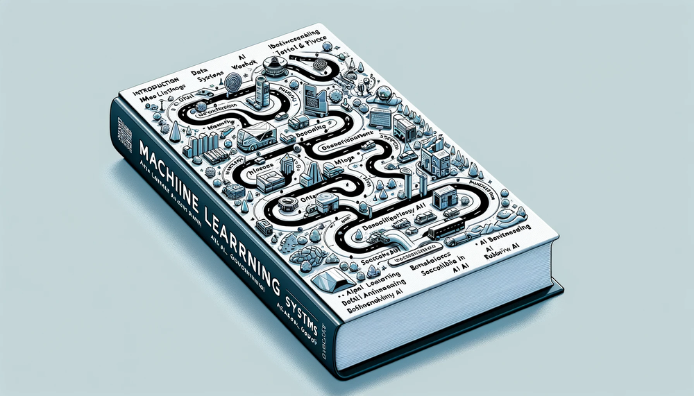
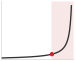
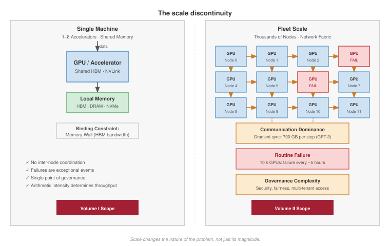
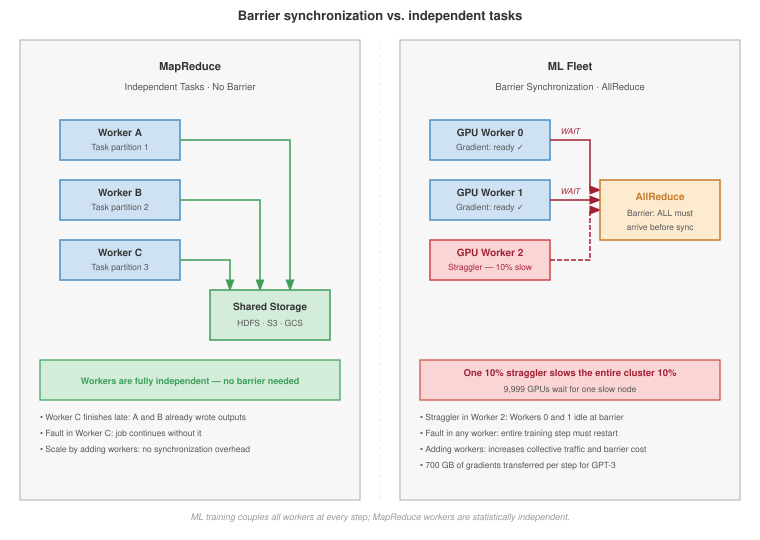
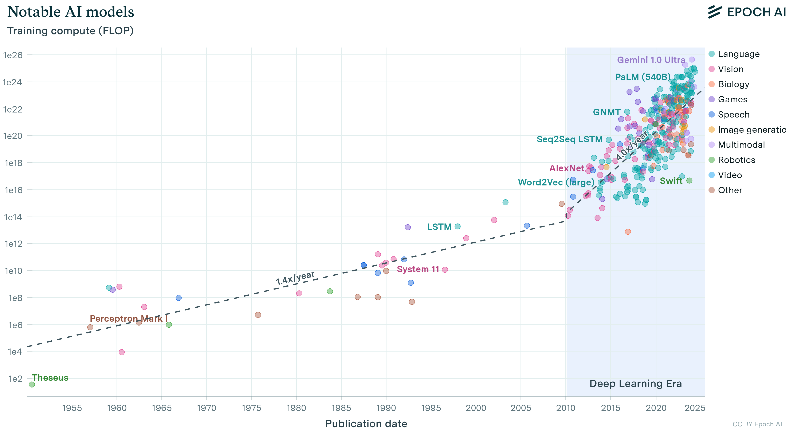
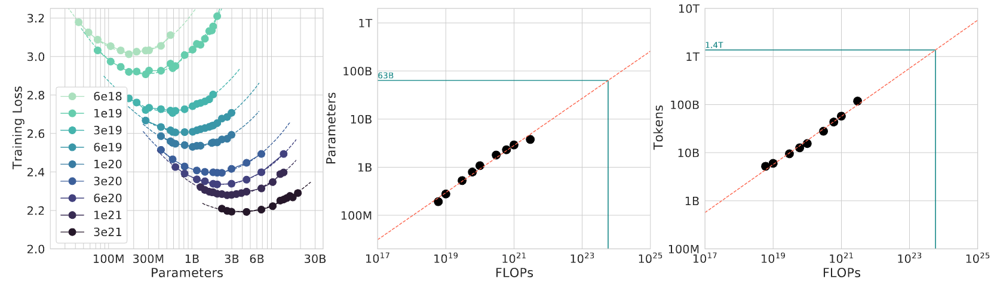
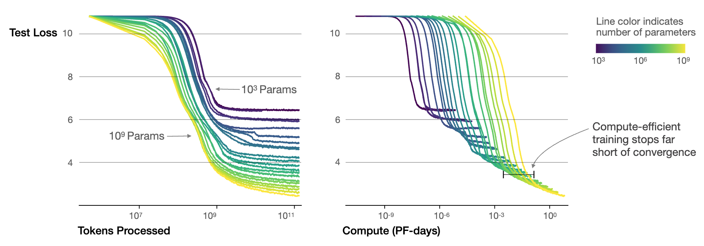
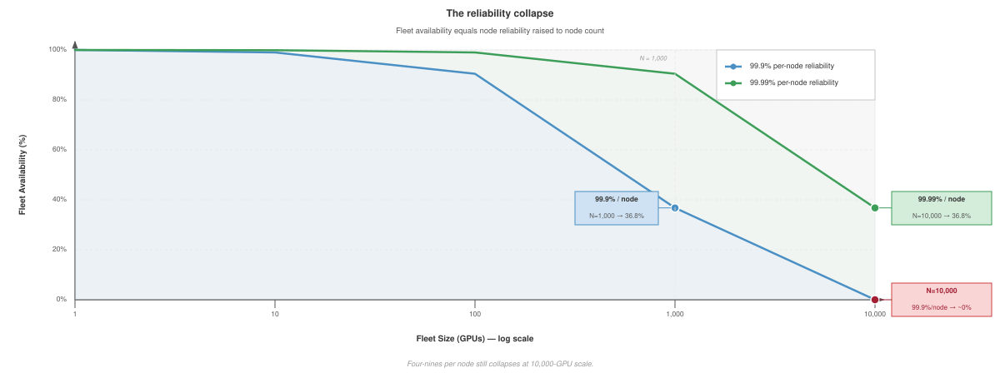
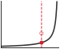
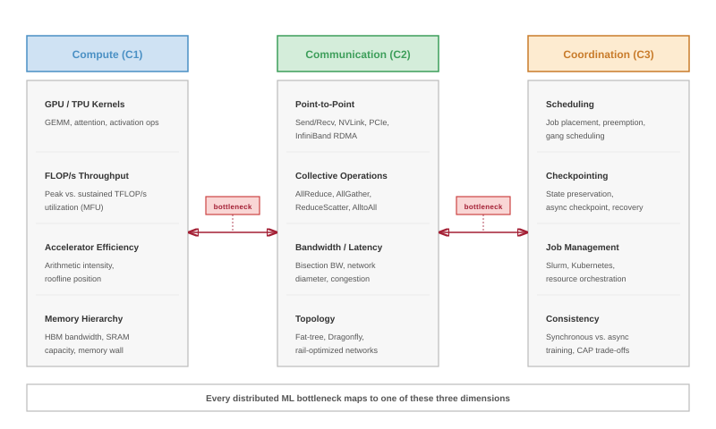

# Introduction {#sec-vol2-introduction}

::: {layout-narrow}
::: {.column-margin}

\chapterminitoc

:::

\noindent
{fig-alt="Abstract geometric composition with interconnected polygons, flowing lines, and node clusters in blue and gold gradients against a dark background."}

:::

## Purpose {.unnumbered}

\begin{marginfigure}
\mlfleetstack{30}{30}{30}{30}
\end{marginfigure}

_Why do the engineering principles that work on single machines break down at production scale?_

Machine learning at scale has a physics of its own. On one node, performance is governed by the memory wall: data must reach the accelerator fast enough to keep the math busy. In a distributed cluster, that same problem stretches across machines. Data must move through network links between racks, and the slowest shared crossing can limit the entire job. Hardware failures also change character. When a single-GPU training job fails, it is an inconvenience; when one node in a 10,000-GPU cluster fails, it can stall the entire Machine Learning Fleet this chapter defines. This discontinuity explains why mastery of single-machine ML is no longer sufficient: scale is not more of the same, but fundamentally different engineering terrain requiring different principles, different architectures, and different ways of thinking about what makes systems work. That terrain carries a societal dimension that small models do not, because its impact is amplified by the billions of users these systems serve: when a local model exhibits bias, the harm is contained; when a foundation model exhibits bias, it propagates through digital life. The discipline this book builds is the **physics of distribution**\index{Physics of Distribution}, where algorithmic choices must account for network topology, fault tolerance, security, and governance.

::: {.content-visible when-format="pdf"}

\newpage

:::

::: {.callout-learning-objectives}

- Explain the three fundamental walls (memory, network, energy) and apply them to diagnose scaling bottlenecks
- Analyze the law of distributed efficiency to quantify the coordination tax in multi-node clusters
- Differentiate between compute-bound, memory-bound, and communication-bound scaling regimes
- Apply the Fleet Stack framework to organize the physical, operational, and societal layers of the Machine Learning Fleet
- Analyze why routine hardware failures require fault tolerance as a first-class design principle at scale
- Apply the Six Systems Engineering Principles to design, scale, and govern production ML systems

:::

```{python}
#| echo: false
from mlsysim import *
from mlsysim.core.units import *
#| label: vol2-intro-setup
# ┌─────────────────────────────────────────────────────────────────────────────
# │ INTRODUCTION: SCALE AND DISTRIBUTION CONSTANTS
# ├─────────────────────────────────────────────────────────────────────────────
# │ Context: @sec-vol2-introduction-scale-moment and the Fleet Stack overview;
# │          inline values used throughout the Scale Moment and
# │          Law of Distributed Efficiency sections.
# │
# │ Goal: Provide scale constants (cluster sizes, communication volumes) for
# │       this introduction to anchor the "why distributed?" argument
# │       quantitatively—computing GPT-3 gradient transfer size
# │       (Models.Language.GPT3.parameters × 4 bytes), cluster MTBF for 25 k A100s at the canonical
# │       50,000-hour per-GPU MTBF (Systems.Reliability.Gpu.mttf_hours),
# │       and accelerator peak throughput (Hardware.Cloud.A100.compute.peak_flops,
# │       Hardware.Cloud.H100.compute.precision_flops["fp8"], Hardware.Cloud.TPUv4.compute.peak_flops) to show scale forces
# │       distribution.
# │ Show: "312" TFLOPs A100, "2,039" GB/s memory bandwidth, "700" GB gradient
# │       per GPT-3 step, "~2" hours MTBF at 25 k GPUs—inline in the Scale
# │       Moment narrative paragraphs and GPT-4 failure rate callout.
# │ How: .to(unit).magnitude for all unit extractions; scalar arithmetic for cluster stats.
# │
# │ Imports: mlsysim.core.units (Hardware.Cloud.A100.compute.peak_flops, Hardware.Cloud.A100.memory.bandwidth,
# │           Hardware.Cloud.H100.compute.precision_flops["fp8"], Hardware.Cloud.V100.memory.bandwidth, Hardware.Cloud.TPUv4.compute.peak_flops,
# │           Hardware.Cloud.H100.nvlink.bandwidth, Systems.Fabrics.InfiniBand_HDR.bandwidth, Systems.Fabrics.InfiniBand_NDR.bandwidth,
# │           Models.Language.GPT3.parameters, Models.Language.GPT3.training_ops,
# │           TFLOPs, second, GB, TB, Gbps, param, BILLION, BITS_PER_BYTE)
# │ Exports: a100_fp16_tflop_per_s_str, a100_mem_bw_gb_per_s_str, a100_mem_bw_tb_per_s_str,
# │          h100_fp8_tflop_per_s_str, v100_mem_bw_gb_per_s_str, tpuv4_bf16_tflop_per_s_str,
# │          nvlink_h100_gb_per_s_str, ib_hdr_gbit_per_s_str, ib_ndr_gbit_per_s_str,
# │          ib_hdr_gb_per_s_str, ib_ndr_gb_per_s_str,
# │          gpt3_params_b_str, gpt3_training_ops_str, gpt3_gradient_gb_str,
# │          gpt4_gpus_str, gpt4_days_str, cluster_fail_day_str, mtbf_hours_str
# └─────────────────────────────────────────────────────────────────────────────
from mlsysim.fmt import fmt, fmt_sci, check

```

## The Scale Moment {#sec-vol2-introduction-scale-moment}

Machine learning on a single accelerator is governed by local memory hierarchy and arithmetic intensity: the physics of silicon. As models transition from research prototypes to global services, however, they encounter a qualitative phase transition that changes the very nature of the engineering problem: the **Scale Moment**\index{Scale Moment}.

The scale moment is the physical and operational transformation that occurs *when* models cross the three fundamental walls. As we move from a single GPU to a Machine Learning Fleet\index{Machine Learning Fleet} comprising thousands of nodes, the binding constraints shift:

1.  **From processor to network**\index{Scale Moment!processor-to-network shift}: The **network wall**\index{Network Wall} replaces the local memory wall as the primary performance bottleneck; its hard limits are bisection bandwidth (the aggregate bandwidth across the narrowest cut that splits the fleet) and speed-of-light latency.
2.  **From exception to certainty**\index{Scale Moment!failure certainty}: The reliability gap makes hardware failure a routine event rather than a rare exception.
3.  **From output to impact**\index{Scale Moment!output-to-impact shift}: Serving billions of users hits the **energy wall**\index{Energy Wall}, making thermodynamic efficiency a first-order engineering requirement.

This book is dedicated to the engineering of this fleet: mastering the physics, logic, and governance of machine learning at the limits of large-scale infrastructure. Between 2012 and the mid-2020s, public and third-party estimates place training compute growth from roughly $10^{18}$ FLOPs for AlexNet to approaching $10^{25}$ FLOPs for leading large models, roughly seven orders of magnitude. The difference is qualitative, not merely quantitative.

```{python}
#| echo: false
#| label: gpt4-training-scenario
# ┌─────────────────────────────────────────────────────────────────────────────
# │ GPT-4 TRAINING AND RELIABILITY (LEGO)
# ├─────────────────────────────────────────────────────────────────────────────
# │ Context: @sec-vol2-introduction-scale-moment
# │
# │ Goal: Quantify GPT-4 training scale and failure frequency.
# │ Show: illustrative ~25k-GPU, 90-day scenario; ~1 failure every 2 hours.
# │ How: cluster_MTBF = GPU_MTBF / N_gpu; fails_per_day = 24 / cluster_MTBF.
# │
# │ Imports: mlsysim.book (fmt, check)
# │ Exports: Gpt4TrainingScenario.gpt4_gpus_str,
# │          Gpt4TrainingScenario.gpt4_days_str,
# │          Gpt4TrainingScenario.cluster_fail_day_str,
# │          Gpt4TrainingScenario.mtbf_hours_str,
# │          Gpt4TrainingScenario.gpu_mtbf_hours_str,
# │          Gpt4TrainingScenario.annual_fails_str,
# │          Gpt4TrainingScenario.hw_name_str
# └─────────────────────────────────────────────────────────────────────────────
from mlsysim import Models, Scenarios, Systems
from mlsysim.fmt import fmt, fmt_int, check, MarkdownStr, fmt_time

class Gpt4TrainingScenario:
    """Namespace for GPT-4 cluster reliability statistics."""

    # ┌── 1. LOAD (Constants) ──────────────────────────────────────────────
    mission = Scenarios.FrontierTraining
    num_gpus = Models.Language.GPT4.training_accelerators_ref.to(count).magnitude
    gpu_days = Models.Language.GPT4.training_days_ref.to(day).magnitude
    hours_per_year = HOURS_PER_YEAR

    # Systems.Reliability.Gpu.mttf_hours is the legacy constant name; use it as per-GPU MTBF here.
    gpu_mtbf_hours = Systems.Reliability.Gpu.mttf_hours

    # ┌── 2. EXECUTE (The Compute) ────────────────────────────────────────
    cluster_mtbf_hours = gpu_mtbf_hours / num_gpus
    cluster_failures_per_day = HOURS_PER_DAY / cluster_mtbf_hours
    annual_failures = num_gpus * (hours_per_year / gpu_mtbf_hours)

    # ┌── 3. GUARD (Invariants) ──────────────────────────────────────────
    check(cluster_mtbf_hours < 3, f"MTBF should be < 3 hours for 25k GPUs, got {cluster_mtbf_hours:.1f}")

    # ┌── 4. OUTPUT (Formatting) ──────────────────────────────────────────────
    gpt4_gpus_str = fmt_count(num_gpus, label="GPU")
    gpt4_days_str = fmt_time(gpu_days, 'day', precision=0, style='word')
    cluster_fail_day_str = fmt_int(cluster_failures_per_day)
    mtbf_hours_str = fmt_time(cluster_mtbf_hours, 'hour', precision=0, commas=True, style='word')
    gpu_mtbf_hours_str = fmt_time(gpu_mtbf_hours, 'hour', precision=0, commas=True, style='word')
    annual_fails_str = fmt_int(annual_failures, commas=True)
    hours_per_year_str = fmt_time(round(hours_per_year), 'hour', precision=0, commas=True, style='word')
    hw_name_str = MarkdownStr(Models.Language.GPT4.training_hardware_label)
```

::: {.column-margin}
{width="100%" fig-alt="A curve of system mean-time-between-failures against fleet size that stays flat then bends sharply downward at a knee, with the region past the knee shaded red, marking the regime where the fleet is almost always in partial failure."}

*Fleet reliability collapses as node count climbs.*
:::

Consider a GPT-4-class training scenario using a hypothetical `{python} Gpt4TrainingScenario.hw_name_str` cluster of `{python} Gpt4TrainingScenario.gpt4_gpus_str` running for `{python} Gpt4TrainingScenario.gpt4_days_str`. These values are illustrative rather than disclosed by OpenAI [@openai2023gpt4]. In a cluster of this size, the probability of at least one failure over an interval $t$, $\Pr(\text{failure before } t) = 1 - e^{-t/\text{MTBF}_{\text{system}}}$, becomes a binding constraint. The worked example below establishes the arithmetic for one cluster; @sec-appdx-reliability-foundations-mtbf-cascade formalizes the MTBF cascade that governs failure rates across multi-thousand-GPU fleets, so a reader can predict the interruption cadence for any fleet size.

::: {#nbk-introduction-scale-reliability .callout-notebook title="Scale and reliability"}

**Problem**: A training run for a GPT-4-class model uses `{python} Gpt4TrainingScenario.gpt4_gpus_str`. If each individual GPU has a mean time between failures (MTBF) of `{python} Gpt4TrainingScenario.gpu_mtbf_hours_str` (the canonical datacenter-grade figure used for fleet-scale reliability examples), how often will the training job be interrupted by hardware failure?

**Math**:

1. **System MTBF**\index{MTBF!system}: For $N$ independent GPUs, $\text{MTBF}_{\text{system}} = \text{MTBF}_{\text{component}} / N =$ `{python} Gpt4TrainingScenario.gpu_mtbf_hours_str` divided by `{python} Gpt4TrainingScenario.gpt4_gpus_str` $\approx$ `{python} Gpt4TrainingScenario.mtbf_hours_str`.
2. **Daily failure rate**\index{Failure Rate!daily}: $24 \text{ hours} /$ `{python} Gpt4TrainingScenario.mtbf_hours_str` $\approx$ `{python} Gpt4TrainingScenario.cluster_fail_day_str` failures per day.
3. **Total annual failures**\index{Failure Rate!annualized count}: `{python} Gpt4TrainingScenario.gpt4_gpus_str` $\times$ (`{python} Gpt4TrainingScenario.hours_per_year_str` divided by `{python} Gpt4TrainingScenario.gpu_mtbf_hours_str`) $\approx$ `{python} Gpt4TrainingScenario.annual_fails_str` failures per year.

**Systems insight**: In this regime, the system is always in a state of partial failure. Traditional software recovery (manual restart) collapses; the system must be architected for fault tolerance as a first-class citizen. Hardware can no longer be treated as a reliable abstraction; it is a probabilistic resource that requires constant, automated state preservation (checkpointing).

:::

Meta's published Llama 3 training run shows the same reliability arithmetic in a real large-scale system.

::: {#ws-vol2-introduction-llama3-failure-cadence .callout-war-story title="The training run that failed every few hours (2024)"}

**Context**: Meta trained Llama 3 405B on 16,384 H100 GPUs for a 54-day final training run [@dubey2024llama].

**Failure mode**: At that scale, failures were not rare disruptions. The run experienced 419 unexpected interruptions, averaging one interruption every few hours.

**Consequence**: Training at that scale became an exercise in continuous recovery: checkpointing, automated diagnosis, and restart workflows determined whether the cluster produced useful model progress or burned time waiting for humans.

**Systems lesson**: The scale moment turns reliability from a hardware specification into a distributed-systems design requirement. A fleet-scale model is trained by the recovery machinery as much as by the optimizer.

:::

The history of machine learning is defined by scale. Each major capability leap has emerged from the ability to apply computation at previously impossible scales, making systems engineering central to AI advancement. Three qualitative changes emerge at production scale: communication dominance, routine failure, and governance requirements that accompany societal impact.

Compute requirements have grown exponentially. AlexNet trained on two GTX 580 GPUs for approximately 5--6 days [@krizhevsky2012imagenet]. BERT required 64 Tensor Processing Unit (TPU)[^fn-tpu-systolic] chips for 4 days, roughly 6,144 chip hours [@devlin2018bert].

[^fn-tpu-systolic]: **Tensor Processing Unit (TPU)**: Google's custom ASIC, built around a $256{\times}256$ systolic array\index{TPU!systolic array} that trades GPU flexibility for 15--30$\times$ better performance-per-watt on matrix-heavy ML workloads. The fleet-scale consequence is *what* matters here: TPU v4 pods reach 1.1 exaFLOP/s aggregate, but their dedicated ICI interconnect (4,800 Gb/s per chip) is *what* makes them a single distributed computer rather than a collection of fast chips. Without that interconnect, BERT's 64-chip training would have been communication-bound long before it was compute-bound.

```{python}
#| echo: false
#| label: gpt3-training-scenario
# ┌─────────────────────────────────────────────────────────────────────────────
# │ GPT-3 TRAINING STATS (LEGO)
# ├─────────────────────────────────────────────────────────────────────────────
# │ Context: @sec-vol2-introduction-scale-moment
# │
# │ Goal: Provide GPT-3 training compute and model size statistics.
# │ Show: ~175B parameters; ~3.14e23 FLOPs.
# │ How: pulling constants from mlsysim.core.units.
# │
# │ Imports: mlsysim.core.units (Models.Language.GPT3.parameters, Models.Language.GPT3.training_ops, GB,
# │          param, BILLION, BYTES_FP32), mlsysim.book (sci, check)
# │ Exports: gpt3_params_b_str, gpt3_training_ops_str, gpt3_gradient_gb_str
# └─────────────────────────────────────────────────────────────────────────────
from mlsysim.fmt import fmt, fmt_sci_flops, check, fmt_memory, fmt_params

class Gpt3TrainingScenario:
    """GPT-3 training and model statistics."""

    # ┌── 1. LOAD (Constants) ──────────────────────────────────────────────
    params_q = Models.Language.GPT3.parameters
    params = params_q.to(param).magnitude
    ops = Models.Language.GPT3.training_ops.to(Models.Language.GPT3.training_ops.units).magnitude

    # ┌── 2. EXECUTE (The Compute) ────────────────────────────────────────
    params_b = params/BILLION
    gradient_q = params * BYTES_FP32 # FP32 gradients

    # ┌── 3. GUARD (Invariants) ──────────────────────────────────────────
    check(params_b == 175, f"GPT-3 should be 175B params, got {params_b}")

    # ┌── 4. OUTPUT (Formatting) ──────────────────────────────────────────────
    gpt3_params_b_str = fmt_params(params_q, scale="B", precision=0, commas=False)
    gpt3_training_ops_str = fmt_sci_flops(ops * flop)
    gpt3_gradient_gb_str = fmt_memory(gradient_q, unit=GB, precision=0, commas=False)
```

GPT-3 consumed an estimated `{python} Gpt3TrainingScenario.gpt3_training_ops_str` during training on V100 GPUs in a Microsoft high-bandwidth cluster [@brown2020language]. The surrounding Microsoft infrastructure for this era reached roughly 10,000 GPUs, which is the cluster-size anchor used in @fig-cluster-size-explosion [@patterson2021carbon]. PaLM trained on 6,144 TPU v4 chips for roughly 60 days, consuming approximately $10^{24}$ FLOPs [@chowdhery2022palm]. OpenAI's GPT-4 report did not disclose model size, training hardware, or training compute, so the GPT-4-class scenario in this section should be read as illustrative rather than a published configuration [@openai2023gpt4]. These examples sit within the rapid training-compute growth trend\index{Training!compute evolution} documented by earlier compute-trend studies [@amodei2018ai; @sevilla2022].

| **Model**                | **Year** |        **GPUs/TPUs**        |    **Training Time**    | **Estimated FLOPs** |
|:-------------------------|:--------:|:---------------------------:|:-----------------------:|:-------------------:|
| **AlexNet**              |   2012   |            2 GPUs           |        5--6 days        |      ~$10^{18}$     |
| **BERT-Large**           |   2018   |           64 TPUs           |          4 days         |      ~$10^{20}$     |
| **GPT-3**                |   2020   | ~1,024 V100 GPUs (run est.) |       ~30--34 days      |      ~$10^{23}$     |
| **PaLM**                 |   2022   |          6,144 TPUs         |         ~60 days        |      ~$10^{24}$     |
| **GPT-4-class scenario** |   2023   | ~25,000 GPUs (illustrative) | ~90 days (illustrative) | ~$10^{25}$ scenario |

: **Training Compute Evolution**: Growth in hardware scale and training duration across published landmarks and an illustrative GPT-4-class scenario, showing why distributed systems become central as training budgets move from $10^{18}$-scale to the largest training runs. {#tbl-training-compute-evolution}

@Tbl-training-compute-evolution captures the growth in training compute, but an equally important dimension is the growth in cluster size itself. @Fig-cluster-size-explosion traces this trajectory by plotting the number of accelerators used to train landmark models over the past decade.

::: {#fig-cluster-size-explosion fig-env="figure" fig-pos="htb" fig-cap="**The Cluster Size Explosion**: Number of accelerators used to train landmark models, 2012--2024. Verified counts from published papers are shown as filled circles; the GPT-3 estimate (hollow marker) reflects approximate cluster size from Microsoft infrastructure announcements rather than a precise published count. The dashed trend line indicates approximately 2$\times$ annual growth in cluster size, a rate that outpaces Moore's Law and motivates the infrastructure challenges developed throughout the book." fig-alt="Scatter plot with log-scale y-axis showing accelerator count vs. year from 2012 to 2024. Points rise from 2 GPUs for AlexNet in 2012 to 16384 for Llama 3 in 2024."}

```{python}
#| echo: false
# ┌─────────────────────────────────────────────────────────────────────────────
# │ CLUSTER SIZE EXPLOSION (FIGURE)
# ├─────────────────────────────────────────────────────────────────────────────
# │ Context: @fig-cluster-size-explosion—accelerator count growth
# │
# │ Goal: Scatter accelerator count vs year for AlexNet→Llama 3; show ~2×
# │       annual growth; verified vs estimated markers.
# │ Show: Log-scale y; scatter; trend line; model annotations.
# │ How: Verified models/years/gpus; polyfit log-linear; book_style.setup_plot().
# │
# │ Imports: numpy (np), book.tools.figures.style (book_style)
# │ Exports: (figure only, no prose variables)
# └─────────────────────────────────────────────────────────────────────────────
# ┌── 1. CANVAS ────────────────────────────────────────────────────────────────
# │ Scatter accelerator count vs year for AlexNet→Llama 3; show ~2×
import numpy as np
from book.tools.figures import style as book_style
fig, ax, COLORS, plt = book_style.setup_plot(figsize=(8, 5))

#—Verified data points ---

# ┌── 2. ARRAYS ────────────────────────────────────────────────────────────────
models    = ["AlexNet", "ResNet",  "Megatron-LM", "GPT-3",   "PaLM",   "LLaMA 1",   "DeepSeek-V3", "Llama 3"]
years     = [2012,       2015,      2019,           2020,       2022,     2023,         2024,           2024     ]
gpus      = [2,          8,         512,            10000,      6144,     2048,         2048,           16384    ]
estimated = [False,      False,     False,          True,       False,    False,        False,          False    ]

years_arr = np.array(years, dtype=float)
gpus_arr  = np.array(gpus, dtype=float)

#—Separate verified vs estimated ---
v_idx = [i for i, e in enumerate(estimated) if not e]
e_idx = [i for i, e in enumerate(estimated) if e]

# ┌── 3. RENDER ────────────────────────────────────────────────────────────────
ax.scatter([years[i] for i in v_idx], [gpus[i] for i in v_idx],
           color=COLORS["BlueLine"], s=70, zorder=5, label="Verified")
ax.scatter([years[i] for i in e_idx], [gpus[i] for i in e_idx],
           facecolors="none", edgecolors=COLORS["OrangeLine"], s=70,
           linewidths=2, zorder=5, label="Estimated")

#—Exponential trend line (log-linear fit on verified points) ---
v_years = np.array([years[i] for i in v_idx], dtype=float)
v_gpus  = np.array([gpus[i] for i in v_idx], dtype=float)
coeffs  = np.polyfit(v_years, np.log10(v_gpus), 1)
trend_x = np.linspace(2011, 2025.5, 200)
trend_y = 10 ** np.polyval(coeffs, trend_x)
ax.plot(trend_x, trend_y, "--", color=COLORS["RedLine"], alpha=0.5, linewidth=1.5, label="Trend")

#—Annotate each model ---
offsets = {
    "AlexNet":     (8, -18),
    "ResNet":      (8, 10),
    "Megatron-LM": (-75, 12),
    "GPT-3":       (8, -18),
    "PaLM":        (8, 10),
    "LLaMA 1":     (-70, -18),
    "DeepSeek-V3": (-90, 10),
    "Llama 3":     (-55, 12),
}
for i, m in enumerate(models):
    color = COLORS["OrangeLine"] if estimated[i] else COLORS["BlueLine"]
    ax.annotate(m, (years[i], gpus[i]), textcoords="offset points",
                xytext=offsets[m], fontsize=8, color=color,
                arrowprops=dict(arrowstyle="-", color=color, lw=0.5) if abs(offsets[m][0]) > 30 else None)

#—Growth rate annotation ---
growth_factor = 10 ** (coeffs[0])  # per year

# ┌── 4. DECORATE ──────────────────────────────────────────────────────────────
ax.text(0.03, 0.92, f"~{growth_factor:.0f}$\\times$ per year",
        transform=ax.transAxes, fontsize=10, color=COLORS["RedLine"],
        fontstyle="italic", bbox=dict(boxstyle="round,pad=0.3", fc="white", ec=COLORS["RedLine"], alpha=0.7))

ax.set_yscale("log")
ax.set_ylim(1, 100_000)
ax.set_xlim(2011, 2025.5)
ax.set_xlabel("Year")
ax.set_ylabel("Accelerators Used for Training")
ax.legend(loc="lower right", frameon=True, fancybox=True, framealpha=0.9)
ax.set_title("")
plt.show()
plt.close()
```

:::

@Fig-cluster-size-explosion reveals that cluster sizes have grown by roughly four orders of magnitude in just over a decade, from two GPUs for AlexNet to over 16,000 H100s for Llama 3. This empirical trajectory is the foundation of the scale moment: leading models have required far larger accelerator fleets than earlier deep-learning landmarks. The curve alone, however, does not explain *which* constraint breaks first. Large language-model training, recommendation serving, and federated mobile learning all encounter fleet scale, but each stresses a different part of the system.

::: {#lhs-introduction-lighthouse-archetypes-at-scale .callout-lighthouse title="Lighthouse archetypes at scale"}

**Lighthouse Archetypes**\index{Lighthouse Archetypes!fleet scale} are the canonical workloads that keep the scale moment concrete throughout this book. At this point, their role is to show that "more machines" is not one engineering problem: the dominant constraint depends on what must cross the fleet boundary. The full roster with the C$^3$ taxonomy mapping and binding-constraint analysis appears at @sec-vol2-introduction-archetypes.

*   **Archetype A (GPT-4/Llama-3)**: Very large language models move from memory bounds on one device to multi-node **Model Parallelism**\index{Model Parallelism} and **Pipeline Parallelism**\index{Pipeline Parallelism}, so communication becomes the bottleneck.
*   **Archetype B (DLRM at Scale)**: Deep Learning Recommendation Model (DLRM) workloads move from fitting embedding tables in local memory to **Embedding Sharding**\index{Embedding Sharding} across hundreds of nodes, so sparse all-to-all traffic becomes the bottleneck.
*   **Archetype C (Federated MobileNet)**: Mobile inference and on-device adaptation move from one device to federated learning across billions of devices, so unreliable clients, privacy constraints, and stragglers become the bottleneck.

:::

These archetypes turn the growth curve into an engineering question. The same increase in accelerator count can produce a network wall, an embedding-shard bottleneck, or a fleet of unreliable edge participants. Systems perspectives serve the same purpose for the substrate, focusing attention on data-center physics, network topology, and distributed consistency. Combined with the rise of federated learning[^fn-federated-forward], that diversity has transformed ML from a discipline where algorithms dominate to one where systems engineering determines success. A sophisticated algorithm that cannot scale often provides less practical value than a simpler algorithm deployed efficiently across scalable infrastructure.

The transition from single-machine to distributed training introduces qualitative changes in system behavior. @Fig-scale-moment-discontinuity contrasts the two regimes: the single-machine world governed by the memory wall vs. the fleet-scale world governed by communication dominance, routine failure, and governance complexity.

::: {#fig-scale-moment-discontinuity fig-env="figure" fig-pos="htb" fig-cap="**The Scale Discontinuity**: Single-machine systems (left) are governed by local memory bandwidth and operate with no inter-node coordination, exceptional failures, and a single point of governance. Fleet-scale systems (right) introduce communication dominance, routine hardware failure, and governance complexity as first-order engineering constraints." fig-alt="Side-by-side comparison of single-machine system with one GPU and local memory vs. fleet-scale system with twelve GPU nodes, two marked as failed, and three challenge labels."}



:::

The discontinuity captured in @fig-scale-moment-discontinuity is qualitative, not merely quantitative: at fleet scale, the binding constraint shifts from silicon to the network fabric, and the engineering discipline shifts from optimization to resilience. The unit of compute is no longer a single server but a Machine Learning Fleet: a massive, interconnected distributed system that must act as a single coherent engine.

::: {#dfn-introduction-machine-learning-fleet .callout-definition title="Machine learning fleet"}

***Machine Learning Fleet***\index{Machine Learning Fleet!definition} is a distributed system of thousands of interconnected accelerators, storage arrays, and network fabrics designed to operate as a single coherent computer.

1.  **Significance (quantitative)**: It coordinates synchronous state across all nodes, where the total time $T$ is governed by the Slowest Worker (Straggler)\index{Straggler}. It requires Bisection Bandwidth ($\text{BW}_{\text{bisect}}$) that scales with the aggregate compute capacity ($R_{\text{peak}}$) of the fleet.
2.  **Observation**: Unlike Traditional Clusters (for example, Spark, MapReduce) that manage independent, asynchronous jobs, an ML Fleet operates under Synchronous Tight Coupling\index{Synchronous Tight Coupling}: all workers must reach the training-step barrier before any can advance, so near-perfect reliability is required to maintain throughput.
3.  **Pitfall**: A frequent misconception is that an ML Fleet is "just more servers." In reality, it is a Warehouse-Scale Computer (WSC) where the network is the system bus and the orchestrator is the operating system.

:::

As systems scale beyond a single node, a fundamental physical constraint emerges: the *bisection bandwidth wall*[^fn-bisection-bandwidth-etymology], which limits how fast data can cross the network midpoint. At fleet scale, networking often determines model throughput more than compute does.

[^fn-bisection-bandwidth-etymology]: **Bisection Bandwidth**\index{Bisection Bandwidth!etymology} (from graph theory): The minimum aggregate bandwidth of all links that, if cut, would partition the network into two equal-sized sets of nodes. In distributed ML, this "worst-case" cut determines the cluster's synchronization bottleneck: an AllReduce synchronization can move no faster than the bisection bandwidth, regardless of how many GPUs are added.

On a single GPU, training proceeds deterministically: the same code, data, and random seed produce identical results. At the scale of thousands of GPUs, new phenomena emerge. Network partitions can split clusters into groups that train independently, causing model divergence. Stragglers (workers that process data slower than peers due to hardware variation or thermal throttling) can bottleneck entire training runs. Hardware failures that occur once per machine-year become daily events *when* operating 10,000 machines[^fn-failure-rates-fleet]. Systems must checkpoint frequently enough that losing a day's progress becomes acceptable rather than catastrophic.

[^fn-failure-rates-fleet]: **Hardware Failure Rates at Scale**\index{Failure Rate!fleet scale}: Individual GPUs fail at 1--2 percent annually under typical conditions, but rates exceed 9 percent under intensive training workloads. Multiply by fleet size and failure becomes routine: Meta reported 419 unexpected interruptions during Llama 3's 54-day training on 16,384 H100s, roughly one every three hours, with GPU and HBM3 faults causing over half. Automated checkpointing and recovery maintained over 90 percent effective training time, illustrating that at fleet scale the engineering challenge shifts from preventing failure to minimizing recovery latency.

```{python}
#| echo: false
#| label: infiniband-scenario
# ┌─────────────────────────────────────────────────────────────────────────────
# │ INFINIBAND NETWORKING SPECS (LEGO)
# ├─────────────────────────────────────────────────────────────────────────────
# │ Context: @sec-vol2-introduction-scale-moment
# │
# │ Goal: Provide InfiniBand HDR and NDR bandwidth statistics.
# │ Show: ~200 Gbps HDR; ~400 Gbps NDR.
# │ How: pulling constants from mlsysim.core.units.
# │
# │ Imports: mlsysim.core.units (Systems.Fabrics.InfiniBand_HDR.bandwidth, Systems.Fabrics.InfiniBand_NDR.bandwidth,
# │          Gbps, BITS_PER_BYTE)
# │ Exports: ib_hdr_gbit_per_s_str, ib_hdr_gb_per_s_str, ib_ndr_gb_per_s_str
# └─────────────────────────────────────────────────────────────────────────────

class InfiniBandScenario:
    """InfiniBand HDR/NDR bandwidth for the scale-moment prose below."""

    # ┌── 1. LOAD (Constants) ──────────────────────────────────────────────
    hdr = Systems.Fabrics.InfiniBand_HDR.bandwidth
    ndr = Systems.Fabrics.InfiniBand_NDR.bandwidth

    # ┌── 2. EXECUTE (The Compute) ────────────────────────────────────────
    hdr_gbps = hdr.to(Gbps).magnitude
    ndr_gbps = ndr.to(Gbps).magnitude
    hdr_gbs = hdr_gbps/BITS_PER_BYTE
    ndr_gbs = ndr_gbps/BITS_PER_BYTE

    # ┌── 3. GUARD (Invariants) ──────────────────────────────────────────
    from mlsysim.fmt import fmt_qty, check
    check(ndr_gbps > hdr_gbps, "NDR bandwidth must be greater than HDR bandwidth")

    # ┌── 4. OUTPUT (Formatting) ──────────────────────────────────────────────
    ib_hdr_gbit_per_s_str = fmt_qty(hdr, Gbps, precision=0, commas=False)
    ib_hdr_gb_per_s_str = fmt_qty(hdr, GB/second, precision=0, commas=False)
    ib_ndr_gb_per_s_str = fmt_qty(ndr, GB/second, precision=0, commas=False)
```

These scale-induced challenges have driven infrastructure investment by large AI organizations. Meta's Research SuperCluster (RSC), announced in 2022, contained 16,000 NVIDIA A100 GPUs connected by `{python} InfiniBandScenario.ib_hdr_gbit_per_s_str` InfiniBand[^fn-infiniband-rdma-v2] networking [@meta2022rsc]. Google's TPU v4 pods contain 4,096 chips with 1.1 exaFLOP/s of aggregate compute capacity. Microsoft's Azure AI infrastructure has spanned multiple data centers with tens of thousands of GPUs dedicated to AI workloads. The scale of the models dictates the scale of the infrastructure. @Sec-appdx-comm-foundations-alpha-beta catalogs these interconnect bandwidth constants and feeds them into the $\alpha$-$\beta$ communication model, which lets a reader turn a link's bandwidth and latency into a predicted transfer cost.

[^fn-infiniband-rdma-v2]: **InfiniBand (IB)**: Born in 1999 from the merger of Intel's NGIO and the Compaq/IBM Future I/O initiatives, InfiniBand was originally designed to replace the PCI bus. Its defining feature for ML is RDMA (Remote Direct Memory Access)\index{InfiniBand!RDMA}, which bypasses the OS kernel to transfer data directly between application memory on different machines at microsecond-scale latency. HDR IB provides about `{python} InfiniBandScenario.ib_hdr_gb_per_s_str` line-rate bandwidth per link; NDR reaches about `{python} InfiniBandScenario.ib_ndr_gb_per_s_str`. This bandwidth gap compared with common Ethernet links determines whether large-model training is compute-bound or communication-bound.

The scale moment establishes the *why*: exponential growth in compute demand forces ML systems beyond any single machine, creating communication dominance, routine failure, and governance obligations. The next question is *how* to organize the engineering response. Distributed systems frameworks designed for independent tasks cannot satisfy the tight coupling that ML training demands; a different architectural hierarchy is needed.

## The Engineering Crux: A Hierarchy of Architecture {#sec-vol2-introduction-engineering-crux}

::: {#sec-vol2-introduction-breed-apart}
:::

Apache Spark [@zaharia2016] processes independent data partitions; a web microservice handles isolated requests. The Machine Learning Fleet does neither. Its workload requires synchronous state updates across thousands of accelerators every few hundred milliseconds, a coupling intensity that existing distributed frameworks were never designed to sustain. The workload characteristics of ML systems differ fundamentally from traditional distributed systems, even though the underlying hardware (network, compute, storage) is identical. To reason about these differences systematically, this book formalizes a four-layer stack: the **Engineering Crux**\index{Engineering Crux!hierarchy of scale}, which transforms raw cluster resources into global-scale AI applications.

@Fig-vol2-system-scaling-regimes visualizes the transition from single-node to fleet. The left side of the diagram summarizes the single-node regime: 1–8 accelerators connected by shared memory, where the binding constraint is the memory wall\index{Memory Wall}. The scaling arrow crosses into the distributed fleet regime, where thousands of nodes coordinate across a high-speed switch fabric and the bottleneck shifts to the **bisection bandwidth wall**\index{Bisection Bandwidth!wall}: network congestion and message-passing latency dominate.

::: {#fig-vol2-system-scaling-regimes fig-env="figure" fig-pos="htb" fig-cap="**The Scaling Regimes of ML Systems**: Machine learning engineering is partitioned into two distinct physical regimes. Single-node systems are limited by local memory bandwidth (memory wall), while distributed fleets are limited by network communication (bisection bandwidth wall). Mastery of intra-node data movement is the prerequisite for distributed scaling." fig-alt="Diagram comparing Single-Node Stack (Application, ML Framework, System Software, Hardware) to Distributed fleet stack (Governance, Serving/Ops, Distribution, Infrastructure), separated by a scaling arrow."}

```{.tikz}
\begin{tikzpicture}[font=\usefont{T1}{phv}{m}{n}\small]
\tikzset{
Box/.style={align=center, inner xsep=2pt,draw=GreenLine, line width=0.5pt,
node distance=8.5mm,fill=none, minimum width=27mm, minimum height=20mm},
Box1/.style={Box,draw=OrangeLine,fill=none},
Box2/.style={align=center, inner sep=0pt,draw=GreenLine, line width=0.5pt,
anchor=south east,fill=none, minimum width=29mm, minimum height=6mm},
BoxD/.style={Box,font=\small\usefont{T1}{phv}{b}{n},anchor=north,
draw=red,dashed,text=black,fill=none, line width=1pt,
minimum width=59mm,minimum height=9mm},
BoxD1/.style={Box,font=\small\usefont{T1}{phv}{b}{n},align=center,
draw=none,text=black,fill=black!007, line width=1pt,
minimum width=59mm,minimum height=12mm},
Circle1/.style={circle,  minimum size=33mm, draw=none, fill=BrownLine!20},
LineD/.style={BrownLine!60!black!20,line width=4.0pt,dashed,dash pattern=on 5pt off 2pt,
{-{Triangle[width=1.5*6pt,length=2.0*5pt]}},shorten <=5pt,shorten >=1pt},
LineA/.style={GreenLine!90,line width=7.0pt,font=\usefont{T1}{phv}{b}{n}\small,
{-{Triangle[width=1.5*8pt,length=2.0*5pt]}},shorten <=7pt,shorten >=8pt},
ALineA/.style={black!60,{Circle[line width=1.0pt,fill=white,round,length=5pt,width=5pt]}-,
line width=1.0pt,shorten <=-3pt,shorten >=-1pt},
Text1/.style={font=\usefont{T1}{phv}{m}{n}\footnotesize,text=black!70}
}

%CPU
\tikzset{%
 pics/cpu/.style = {
        code = {
        \pgfkeys{/channel/.cd, #1}
\begin{scope}[local bounding box=FUNNEL,scale=\scalefac, every node/.append style={transform shape}]
\node[fill=\filllcolor,minimum width=66, minimum height=66,
            rounded corners=2,outer sep=2pt] (C1) {};
\node[fill=white,minimum width=54, minimum height=54] (C2) {};
\node[fill=\filllcolor!40,minimum width=44, minimum height=44] (C3) {\large GPU};

\foreach \x/\y in {0.11/1,0.26/2,0.41/3,0.56/4,0.71/5,0.85/6}{
\node[fill=\filllcolor,minimum width=3, minimum height=15,
           inner sep=0pt,anchor=south](GO\y)at($(C1.north west)!\x!(C1.north east)$){};
}
\foreach \x/\y in {0.11/1,0.26/2,0.41/3,0.56/4,0.71/5,0.85/6}{
\node[fill=\filllcolor,minimum width=3, minimum height=15,
           inner sep=0pt,anchor=north](DO\y)at($(C1.south west)!\x!(C1.south east)$){};
}
\foreach \x/\y in {0.11/1,0.26/2,0.41/3,0.56/4,0.71/5,0.85/6}{
\node[fill=\filllcolor,minimum width=15, minimum height=3,
           inner sep=0pt,anchor=east](LE\y)at($(C1.north west)!\x!(C1.south west)$){};
}
\foreach \x/\y in {0.11/1,0.26/2,0.41/3,0.56/4,0.71/5,0.85/6}{
\node[fill=\filllcolor,minimum width=15, minimum height=3,
           inner sep=0pt,anchor=west](DE\y)at($(C1.north east)!\x!(C1.south east)$){};
}
 \end{scope}
     }
  }
}

%Token style
\tikzset{
pics/token/.style = {
        code = {
        \pgfkeys{/channel/.cd, #1}
\begin{scope}[shift={($(0,0)+(0,0)$)},scale=\scalefac,every node/.append style={transform shape}]
\node[draw=\drawcolor,fill=\filllcirclecolor,circle,minimum size=40mm,
line width=\Linewidth](T-\picname){};
\node[draw=white,fill=none,circle,minimum size=0.925*40mm,line width=0.6*\Linewidth]{};
\clip[] circle (0.925*20mm);
\draw[step=5mm,draw=white] (-2,-2) grid (2,2);
\foreach \x/\y[count=\a] in {0/0,1.3/0,1/1,-0.5/1.5,-1.5/0.5,-1.0/-0.9,0.5/-1.3,2.0/0}{
\fill[fill=white,draw=none](\x,0.8*\y)circle(5pt)coordinate(C\a);
}
\draw[white,line width=\Linewidth,fill opacity=0.5,fill=\filllcolor!40](C2)--(C3)--(C4)--(C5)--(C6)--(C7)--cycle;
\foreach \x in {2,...,7}{
\draw[white,line width=\Linewidth](C1)--(C\x);
}
\foreach \x/\y\col[count=\a] in {0/0/red,1.3/0/green,1/1/blue,-0.5/1.5/violet,
-1.5/0.5/magenta,-1.0/-0.9/brown,0.5/-1.3/yellow}{
\fill[fill=\col,draw=none](\x,0.8*\y)circle(5pt)coordinate(C\a);
}
\end{scope}
    }
  }
}
%display
\tikzset{%
    comp/.style = {draw,
        minimum width  =18mm,
        minimum height = 15mm,
        inner sep      = 0pt,
        rounded corners,
       draw = \drawcolor,
       fill=\filllcolor!10,
       line width=2.0pt
    },
 pics/displayG/.style = {
        code = {
        \pgfkeys{/channel/.cd, #1}
\begin{scope}[shift={($(0,0)+(0,0)$)},scale=\scalefac,every node/.append style={transform shape}]
 \node[comp](\picname-COM){};
% \draw[draw = \drawcolor,line width=1.0pt]
% ($(\picname-COM.north west)!0.85!(\picname-COM.south west)$)-- ($(\picname-COM.north east)!0.85!(\picname-COM.south east)$);
\draw[draw = \drawcolor,line width=\Linewidth]($(\picname-COM.south west)!0.4!(\picname-COM.south east)$)--++(270:0.2)coordinate(DL);
\draw[draw = \drawcolor,line width=\Linewidth]($(\picname-COM.south west)!0.6!(\picname-COM.south east)$)--++(270:0.2)coordinate(DD);
\draw[draw = \drawcolor,line width=3*\Linewidth,shorten <=-3mm,shorten >=-3mm](DL)--(DD);
\end{scope}
   }
  }
}

%gear
% #1 number of teeths
% #2 radius intern
% #3 radius extern
% #4 angle from start to end of the first arc
% #5 angle to decale the second arc from the first
% #6 inner radius to cut off
\tikzset{
  pics/gear/.style args={#1/#2/#3/#4/#5/#6/#7}{
   code={
           \pgfkeys{/channel/.cd, #7}
\begin{scope}[shift={($(0,0)+(0,0)$)},scale=\scalefac,every node/.append style={transform shape}]
    \pgfmathtruncatemacro{\N}{#1}%
    \def\rin{#2}\def\rout{#3}\def\aA{#4}\def\aOff{#5}\def\rcut{#6}%
    \path[rounded corners=1.5pt,draw=\drawcolor,fill=\filllcolor]
      (0:\rin)
      \foreach \i [evaluate=\i as \n using (\i-1)*360/\N] in {1,...,\N}{%
        arc (\n:\n+\aA:\rin)
        -- (\n+\aA+\aOff:\rout)
        arc (\n+\aA+\aOff:\n+360/\N-\aOff:\rout)
        -- (\n+360/\N:\rin)
      } -- cycle;
      \draw[draw=none,fill=white](0,0) circle[radius=\rcut];
\end{scope}
  }}
}
%Infinity_loops
\tikzset{%
  radius=2, start angle=-90, line cap=round,
  arr node/.style={sloped, allow upside down, single arrow,
    single arrow head extend=+2mm, thick, minimum height=+9mm, fill=white},
  arr/.style ={  edge node={node[arr node, pos={#1}]{}}},
  arr'/.style={insert path={node[arr node, pos={#1}]{}}},
 pics/infinityL/.style = {
        code = {
        \pgfkeys{/channel/.cd, #1}
\begin{scope}[local bounding box=LOOPS,scale=\scalefac, every node/.append style={transform shape}]
\draw[line width=+2.5mm, sloped, text=white,draw=\drawcolor]
  (0, 2) edge[preaction={line cap=butt, line width=+5mm, draw=white, overlay},draw=\filllcirclecolor,
              out=0, in=180, arr=.2, arr=.8] (6, -2)
  (6, -2) arc[delta angle= 180]
    [arr'=.5,draw=\filllcolor] node[very near start]{} node[very near end]{}
  to[out=180, in=0, arr=.2, arr=.8] (0, -2) arc[delta angle=-180,]
    [arr'=.5,draw=\filllcolor] node[very near start]{} node[very near end]{};

 \end{scope}
     }
  }
}

%server
\tikzset {
  pics/server/.style = {
    code = {
     % \colorlet{red}{black}
\pgfkeys{/channel/.cd, #1}
      \begin{scope}[anchor=center, transform shape,scale=\scalefac, every node/.append style={transform shape}]
        \draw[draw=\drawcolor,line width=\Linewidth,fill=\filllcolor](-0.55,-0.5) rectangle (0.55,0.5);
\foreach \i in {-0.25,0,0.25} {
                \draw[line width=\Linewidth]( -0.55,\i) -- (0.55, \i);
}
        \foreach \i in {-0.375, -0.125, 0.125, 0.375} {
          \draw[line width=\Linewidth](-0.45,\i)--(0,\i);
          \fill[](0.35,\i) circle (1.5pt);
        }

        \draw[draw=\drawcolor,line width=1.5*\Linewidth](0,-0.53) |- (-0.55,-0.7);
        \draw[draw=\drawcolor,line width=1.5*\Linewidth](0,-0.53) |- (0.55,-0.7);
      \end{scope}
    }
  }
}
\tikzset{
pics/llm/.style = {
        code = {
        \pgfkeys{/channel/.cd, #1}
\begin{scope}[shift={($(0,0)+(0,0)$)},scale=\scalefac,every node/.append style={transform shape}]
\node[circle,minimum size=12mm,draw=\drawcolor, fill=\filllcolor!70,line width=0.5*\Linewidth](C\picname) at (0,0){};
\def\startangle{90}
\def\radius{1.15}
\def\radiusI{1.1}
\foreach \i [evaluate=\i as \j using \i+1] [count =\k] in {0,2,4,6,8} {
\pgfmathsetmacro{\angle}{\startangle - \i * (360/8)}
\draw[draw=black,-{Circle[black ,fill=\filllcirclecolor,length=5.5pt,line width=0.5*\Linewidth]},line width=1.5*\Linewidth](C\picname)--++(\startangle - \i*45:\radius) ;
\node[circle,draw=black,fill=\filllcirclecolor!80!red!50,inner sep=3pt,line width=0.5*\Linewidth](2C\k)at(\startangle - \j*45:\radiusI) {};
}
\draw[line width=1.5*\Linewidth](2C1)--++(-0.5,0)|-(2C2);
\draw[line width=1.5*\Linewidth](2C3)--++(0.5,0)|-(2C4);
\node[circle,,minimum size=12mm,draw=\drawcolor, fill=\filllcolor!70,line width=0.5*\Linewidth]at (0,0){};
\node[draw,rectangle,rounded corners=1pt,minimum width=7mm,minimum height=4mm,fill=orange!10](R1)at(0.1,0.1){};
\draw[BrownLine,shorten <=2pt,shorten >=2pt ]($(R1.north west)!0.35!(R1.south west)$)--($(R1.north east)!0.35!(R1.south east)$);
\draw[BrownLine,shorten <=2pt,shorten >=2pt ]($(R1.north west)!0.7!(R1.south west)$)--($(R1.north east)!0.7!(R1.south east)$);
\node[draw,rectangle,rounded corners=1pt,minimum width=6mm,minimum height=4mm,fill=orange!10](R2)at(-0.05,-0.15){};
\draw[BrownLine,shorten <=2pt,shorten >=2pt ]($(R2.north west)!0.35!(R2.south west)$)--($(R2.north east)!0.35!(R2.south east)$);
\draw[BrownLine,shorten <=2pt,shorten >=2pt ]($(R2.north west)!0.7!(R2.south west)$)--($(R2.north east)!0.7!(R2.south east)$);
\end{scope}
    }
  }
}
\def\inset{3.2pt} %
\def\myshape{%
  (0,1.34) to[out=220,in=0] (-1.20,1.03) --
  (-1.20,-0.23) to[out=280,in=160] (0,-1.53) to[out=20,in=260] (1.20,-0.23) --
  (1.20,1.03)  to[out=180,in=320] cycle
}
\tikzset{
pics/stitC/.style = {
        code = {
        \pgfkeys{/channel/.cd, #1}
\begin{scope}[shift={($(0,0)+(0,0)$)},scale=\scalefac,every node/.append style={transform shape}]
%\draw[draw=none,fill=\filllcolor!60](0,1.34)to[out=220,in=0](-1.20,1.03)to(-1.20,-0.23)
%to[out=280,in=160](0,-1.53)to[out=20,in=260](C1)to(1.20,1.03)to[out=180,in=320]cycle;
\fill[fill=\filllcolor!60] \myshape;
%
\begin{scope}
  \clip \myshape;
  \draw[draw=\filllcolor, line width=2*\Linewidth,fill=white] \myshape; % boja i debljina po želji
\end{scope}
%\fill[fill=\filllcolor!60](0,0)circle(0.4);
\draw[draw=\filllcirclecolor,line join=round,line cap=round,line width=1.85*\Linewidth](-0.65,-0.35)--++(320:0.5)--++(50:1.4);
\end{scope}
    }
  }
}
%code
\tikzset{
pics/interpreter/.style = {
        code = {
        \pgfkeys{/channel/.cd, #1}
\begin{scope}[shift={($(0,0)+(0,0)$)},scale=\scalefac,every node/.append style={transform shape}]
\node[black,font=\Large\bfseries]at(-0.75,0.65){\textless\,/\,\textgreater};
\draw[line cap=round,line join=round,green!99!black!90,line width=\Linewidth](-1.32,0.17)--(-1.05,0.17);
\draw[line cap=round,line join=round,red,line width=\Linewidth](-0.8,0.17)--(-0.1,0.17);
\draw[line cap=round,line join=round,green!99!black!90,line width=\Linewidth](-1.15,-0.15)--(-0.45,-0.15);
\draw[line cap=round,line join=round,green!99!black!90,line width=\Linewidth](-1.15,-0.47)--(-0.75,-0.47);
\draw[line cap=round,line join=round,red,line width=\Linewidth](-0.45,-0.47)--(0.45,-0.47);
\draw[line cap=round,line join=round,cyan,line width=\Linewidth](0.75,-0.47)--(1.1,-0.47);
\draw[line cap=round,line join=round,green!99!black!90,line width=\Linewidth](-1.15,-0.79)--(-1,-0.79);
\draw[line cap=round,line join=round,red,line width=\Linewidth](-0.65,-0.79)--(-0.10,-0.79);
\draw[line cap=round,line join=round,cyan,line width=\Linewidth](0.2,-0.79)--(1.1,-0.79);
\draw[line cap=round,line join=round,green!99!black!90,line width=\Linewidth](-1.15,-1.11)--(-0.4,-1.11);
\draw[line cap=round,line join=round,blue!99!black!90,line width=\Linewidth](-0.15,-1.11)--(1.1,-1.11);
\end{scope}
    }
  }
}
\pgfkeys{
  /channel/.cd,
   Depth/.store in=\Depth,
  Height/.store in=\Height,
  Width/.store in=\Width,
  filllcirclecolor/.store in=\filllcirclecolor,
  filllcolor/.store in=\filllcolor,
  drawcolor/.store in=\drawcolor,
  drawcircle/.store in=\drawcircle,
  scalefac/.store in=\scalefac,
  Linewidth/.store in=\Linewidth,
  picname/.store in=\picname,
  tiecolor/.store in=\tiecolor,
  bodycolor/.store in=\bodycolor,
  stetcolor/.store in=\stetcolor,
  tiecolor=red,      % derfault tie color
  bodycolor=blue!30,  % derfault body color
  stetcolor=green,  % derfault stet color
  filllcolor=BrownLine,
  filllcirclecolor=violet!20,
  drawcolor=black,
  drawcircle=violet,
  scalefac=1,
  Linewidth=0.5pt,
  Depth=0.2,
  Height=0.5,
  Width=0.25,
  picname=C
}

% Application
\node[Box1,draw=none](B1){};
\node[above=-1pt of B1.north,Text1]{Training Loop/Inference};
\node[Box2,draw=OrangeLine](BB1)at($(B1.south west)+(-3mm,0)$){Application};
\draw[ALineA](B1.west)--(BB1.north);
\pic[shift={(0,0.08)}] at  (B1){displayG={scalefac=0.95,picname=DD,
filllcolor=brown!60!, drawcolor=BrownLine,Linewidth=0.7pt}};
%\pic[shift={(-0.20,0.23)}] at (D-COM) {gear={11/1.25/1.7/11/2.0/0.6/scalefac=0.26,drawcolor=black,filllcolor=OrangeLine!90}};
\pic[shift={(0.47,0.32)}] at (DD-COM) {gear={10/1.3/1.8/17/1/0.6/scalefac=0.18,drawcolor=RedLine,filllcolor=RedLine}};
\pic[shift={(0.05,0.05)}] at  (DD-COM){interpreter={scalefac=0.5,picname=1,filllcolor=cyan!30!, Linewidth=2.0pt,filllcirclecolor=orange}};
%ML Framework
\node[Box1,draw=none,below=of B1](B2){};
\node[above=-1pt of B2.north,Text1]{PyTorch/JAX/Kernels};
\node[Box2,draw=GreenLine](BB2)at($(B2.south west)+(-3mm,0)$){ML Framework};
\draw[ALineA](B2.west)--(BB2.north);
\pic[shift={(0,0)}] at  (B2){token={scalefac=0.43,picname=2,drawcolor=green!55!black,
filllcirclecolor=green!55!black!90,filllcolor=green!55!black,Linewidth=1.25pt}};
%System Software
\node[Box1,draw=none,below=of B2](B3){};
\node[above=-1pt of B3.north,Text1]{CUDA/PCIe DMA};
\node[Box2,draw=VioletLine](BB3)at($(B3.south west)+(-3mm,0)$){System Software};
\draw[ALineA](B3.west)--(BB3.north);
\pic[shift={(0,0.1)}] at  (B3){displayG={scalefac=0.98,picname=D,
filllcolor=BlueLine, drawcolor=BlueLine,Linewidth=0.7pt}};
\pic[shift={(-0.20,0.23)}] at (D-COM) {gear={11/1.25/1.7/11/2.0/0.6/
scalefac=0.26,drawcolor=black,filllcolor=OrangeLine!90}};
\pic[shift={(0.2,-0.3)}] at (D-COM) {gear={10/1.3/1.8/17/1/0.6/
scalefac=0.2,drawcolor=black,filllcolor=OrangeLine!60}};
%Hardware
\node[Box1,draw=none,below=of B3](B4){};
\node[above=-1pt of B4.north,Text1]{NVLink (900 GB/s)};
\node[Box2,draw=RedLine](BB4)at($(B4.south west)+(-3mm,0)$){Hardware};
\draw[ALineA](B4.west)--(BB4.north);
\pic[shift={(0,0)}] at  (B4){cpu={scalefac=0.49,picname=1,filllcolor=GreenLine, Linewidth=0.7pt}};
%%%%%%%%%%%%%%%
% Governance
%%%%%%%%%%%%%%%
\node[Box1,right=3.2 of B1,draw=none](B1B){};
\node[above=-1pt of B1B.north,Text1]{Responsible AI/Security};
\node[Box2,draw=OrangeLine,anchor=south west](BB1B)at($(B1B.south east)+(3mm,0)$){Governance};
\draw[ALineA](B1B.east)--(BB1B.north);
\pic[shift={(0,0.05)}] at  (B1B){stitC={scalefac=0.63,picname=1,drawcolor=orange,
filllcolor=purple,filllcirclecolor=GreenLine,Linewidth=3.1pt}};
%Serving/Ops
\node[Box1,draw=none,below=of B1B](B2B){};
\node[above=-1pt of B2B.north,Text1]{Orchestration/CI/CD};
\node[Box2,draw=GreenLine,anchor=south west](BB2B)at($(B2B.south east)+(3mm,0)$){Serving/Ops};
\draw[ALineA](B2B.east)--(BB2B.north);
\pic[shift={(-0.6,0)}] at  (B2B){infinityL={scalefac=0.2,picname=1,Linewidth=1.0pt,
 filllcolor=BlueLine,filllcirclecolor=red,drawcolor=GreenLine}};
%Distribution
\node[Box1,draw=none,below=of B2B](B3B){};
\node[above=-1pt of B3B.north,Text1]{NCCL/RDMA/Comms};
\node[Box2,draw=VioletLine,anchor=south west](BB3B)at($(B3B.south east)+(3mm,0)$){Distribution};
\draw[ALineA](B3B.east)--(BB3B.north);
\pic[shift={(0,0)}] at  (B3B){llm={scalefac=0.78,drawcolor=BlueLine,filllcolor=BlueLine!50!, Linewidth=1pt,filllcirclecolor=red}};
%Infrastructure
\node[Box1,draw=none,below=of B3B](B4B){};
\node[above=-1pt of B4B.north,Text1]{Fabric/RDMA (InfiniBand)};
\node[Box2,draw=RedLine,anchor=south west](BB4B)at($(B4B.south east)+(3mm,0)$){Infrastructure};
\draw[ALineA](B4B.east)--(BB4B.north);
\pic[shift={(0,0.1)}] at  (B4B){server={scalefac=1.2,picname=1,
drawcolor=black,filllcolor=cyan!15!,Linewidth=0.57pt,Linewidth=1pt}};
%fitting
\node[draw=none,fit=(B1)(B4)(BB4)](F1){};
\node[draw=none,fit=(B1B)(B4B)(BB4B)](F2){};
\draw[LineA](F1)--node[above]{Scaling}(F2);
%
\node[BoxD,below=10pt of F1]{Bottleneck: Memory Wall};
\node[BoxD,below=10pt of F2]{Bottleneck: Network Wall};
%
\node[BoxD1,above=20pt of F1]{Single-Node Stack \\
{\small\usefont{T1}{phv}{m}{n} 1--8 GPUs, Shared Memory}};
\node[BoxD1,above=20pt of F2]{Distributed Fleet Stack \\
{\small\usefont{T1}{phv}{m}{n} 1,000--100,000+ GPUs}};
\end{tikzpicture}
```

:::

```{python}
#| echo: false
# ┌── LEGO ───────────────────────────────────────────────
# │ Context: @fig-vol2-system-scaling-regimes scaling-regimes prose.
# │ Goal: Recap NVLink vs InfiniBand NDR for the fleet-stack figure callout.
# │ Exports: InfiniBandStackRecap.nvlink_h100_gb_per_s_str, InfiniBandStackRecap.ib_ndr_gbit_per_s_str
class InfiniBandStackRecap:
    hdr = Systems.Fabrics.InfiniBand_HDR.bandwidth
    ndr = Systems.Fabrics.InfiniBand_NDR.bandwidth
    nvlink_h100 = Hardware.Cloud.H100.nvlink.bandwidth
    ndr_gbps = ndr.to(Gbps).magnitude
    nvlink_h100_gbs_val = nvlink_h100.to(GB/second).magnitude
    from mlsysim.fmt import fmt_qty
    # ┌── 4. OUTPUT (Formatting) ─────────────────────────────────────────────
    nvlink_h100_gb_per_s_str = fmt_qty(nvlink_h100, GB/second, precision=0, commas=False)
    ib_ndr_gbit_per_s_str = fmt_qty(ndr, Gbps, precision=0, commas=False)
```

The stack architecture in @fig-vol2-system-scaling-regimes does not change when we scale: every ML system still has hardware, a system envelope, a workload, and a mission. *What* changes is the physics at each layer. Read the figure from bottom to top. At the bottom row, Hardware (NVLink at `{python} InfiniBandStackRecap.nvlink_h100_gb_per_s_str` within one node) becomes Infrastructure (InfiniBand RDMA fabric spanning racks at `{python} InfiniBandStackRecap.ib_ndr_gbit_per_s_str` per link), and the bottleneck shifts from the memory wall to the bisection bandwidth wall. One row up, System Software (a single CUDA runtime managing PCIe DMA) becomes Distribution (NCCL and RDMA libraries coordinating thousands of processes across the fabric).

The upper two layers undergo an equally profound transformation. ML Framework\index{ML Framework} (PyTorch or JAX executing a training loop on one node) becomes Serving/Ops (orchestration and CI/CD pipelines that schedule distributed jobs and manage rolling deployments). At the top, Application (a single training script or inference service) becomes Governance (responsible AI policy, security auditing, and multi-tenant access control), because fleet-scale deployment introduces organizational concerns absent from a single machine. The four layers of the Engineering Crux at fleet scale are:

1.  **Infrastructure** (Hardware, the Engine): The physical foundation. This layer defines the fleet's raw capabilities: per-node $R_{\text{peak}}$ and $\text{BW}$, interconnected by InfiniBand RDMA fabric. The recurring hardware anchor for this introduction is the NVIDIA H100, which serves as a concrete reference accelerator rather than an abstract placeholder.
2.  **Distribution** (Systems, the Car): The communication substrate. This layer defines the cluster envelope: NCCL, the collective library that implements reductions and broadcasts on GPU fabrics; RDMA collectives that coordinate thousands of accelerators; bisection bandwidth; power usage effectiveness (PUE), the facility-energy overhead above IT load; and failure rates (MTBF).
3.  **Serving/Ops** (Workloads, the Route): The orchestration layer. This layer manages the mathematical workload sharded across the cluster $(O, D_{\text{vol}}, \text{CI})$ through deployment pipelines and scheduling, where $O$ is local operation count, $D_{\text{vol}}$ is data volume, and $\text{CI}$ previews the communication-intensity ratio: network bytes per local FLOP. We use Lighthouse Workloads like GPT-4 and DLRM.
4.  **Governance** (Missions, the Destination): The mission context. This is the top of the stack, where responsible AI policy, security, and multi-tenant access control shape fleet-wide behavior. A mission (such as Frontier Model Training) introduces high-level requirements (for example, "99.99 percent service availability") that dictate the configuration of every layer below.

This hierarchy ensures that every distributed engineering decision is grounded in its "Mission Context." For example, the Frontier Training mission instantiates Archetype A (GPT-4/Llama-3)\index{Archetype!A (GPT-4/Llama-3)} from the volume's canonical roster (@sec-vol2-introduction-archetypes), and operates on a cluster of H100 hardware. By standardizing these protagonists, we ensure that the "Physics of Scale" remains traceable across every chapter.

### Traditional vs. ML fleet dynamics {#sec-introduction-traditional-vs-ml-fleet-dynamics-c43e}

Traditional systems (for example, a search engine or a banking database) optimize for independent, asynchronous tasks. A web server handles millions of requests, each isolated from the other. *When* one request fails, the others continue. This model, exemplified by systems like **MapReduce**\index{MapReduce} [@dean2004mapreduce], achieves scale by partitioning data into independent chunks that require minimal coordination.

The Machine Learning Fleet, by contrast, operates under **Synchronous Tight Coupling**\index{Synchronous Tight Coupling}. While the parameter server architecture [@li2014] introduced ways to manage distributed state, large synchronous models often require even tighter synchronization to maintain performance.

1.  **Iterative Statefulness**\index{Iterative Statefulness}: Traditional data processing is often "one-and-done." ML training repeats the same math millions of times, updating a massive shared state (the model weights).
2.  **Barrier Synchronization**\index{Barrier Synchronization}: In a synchronous training step, 10,000 GPUs must wait for the slowest worker to finish before any can proceed. The fleet is therefore hypersensitive to stragglers: a 10 percent performance drop on one node can reduce the entire cluster's throughput by 10 percent.
3.  **Bisection Bandwidth Dominance**\index{Bisection Bandwidth!dominance}: A web service is often latency-bound (waiting for the user). An ML training job is bandwidth-bound. It needs to move gigabytes of gradient data across the entire network every second. This requires non-blocking network topologies that traditional data centers rarely implement.

@Fig-traditional-vs-ml-fleet illustrates this contrast directly: in MapReduce, workers write independently to shared storage and a straggler delays only its own partition, whereas in the ML Fleet, every worker must arrive at an AllReduce barrier\index{Barrier Synchronization!vs. independent tasks} before the training step can proceed.

::: {#fig-traditional-vs-ml-fleet fig-env="figure" fig-pos="htb" fig-cap="**Barrier Synchronization vs. Independent Tasks**: MapReduce workers (left) operate independently, writing results to shared storage without coordination. A straggler delays only its own output. ML Fleet workers (right) must synchronize gradients at an AllReduce barrier every training step, meaning a single 10\\% straggler slows the entire cluster by 10\\%." fig-alt="Left panel shows three MapReduce workers writing independently to shared storage. Right panel shows three GPU workers converging on an AllReduce barrier, with one straggler blocking all."}



:::

The barrier synchronization pattern in @fig-traditional-vs-ml-fleet explains *why* ML fleets cannot borrow fault-tolerance strategies from MapReduce: in a barrier-coupled system, every worker's progress depends on every other worker's health.

::: {#chk-introduction-fleet-mindset .callout-checkpoint title="The fleet mindset"}

Verify your understanding of how ML fleets differ from traditional clusters:

- [ ] Why does a single slow worker (straggler) have a disproportionate impact on a synchronous ML training job compared to a MapReduce job?
- [ ] In which type of system, traditional web serving or ML training, is bisection bandwidth more likely to be the primary performance bottleneck?
- [ ] Can you explain the concept of Synchronous Tight Coupling? How does it relate to the global barrier at the end of each training step?
- [ ] True or False: Adding more GPUs to a training job always results in a linear speedup of the training process.

:::

### The shift to the warehouse-scale computer {#sec-introduction-shift-warehousescale-computer-2ccd}

The ML Fleet demands the **Warehouse-Scale Computer (WSC)**[^fn-wsc-barroso] perspective. In traditional computing, the data center is a building that *houses* many computers. In the ML Fleet, the data center *is* the computer.

*   The **Network Fabric**\index{Network Fabric} is the System Bus.
*   The **Distributed Storage**\index{Storage!distributed} is the Local Disk.
*   The **Fleet Orchestrator**\index{Fleet Orchestrator} is the Operating System.

Mastering this material requires making this mental shift: the engineer is no longer writing code for a CPU but writing logic for a 100-Megawatt computer spanning thousands of racks. The warehouse-scale computer is a common paradigm for large models, while alternative architectures like **wafer-scale engines**\index{Wafer-Scale Engine} attempt to collapse this entire hierarchy back into a single piece of silicon, trading the modularity of a distributed cluster for the extreme bandwidth of on-chip communication.

[^fn-wsc-barroso]: **Warehouse-Scale Computer (WSC)**\index{Warehouse-Scale Computer!Barroso}: Formalized by Barroso and Hölzle at Google in 2009, with a second edition adding Clidaras in 2013. Their key insight: at sufficient scale, the unit of computing shifts from the server to the entire facility, making power delivery, cooling topology, and optical network layout as performance-critical as chip microarchitecture. For ML fleets, this means a 100 MW data center's power ramp rate and bisection bandwidth constrain training throughput more than any single accelerator's TFLOP/s.

::: {.column-margin}
{width="100%" fig-alt="GPT-3 weights, FP32 gradient payload, and ring all-reduce traffic."}

*Gradient synchronization becomes the defining cost of distributed training.*
:::

These workload characteristics produce two further consequences at scale: communication becomes the dominant cost, and failure becomes routine.

### Communication becomes dominant {#sec-introduction-communication-becomes-dominant-e1b6}

At small scale, *computation dominates*. Training a model on a single GPU spends most of its time performing matrix multiplications. Communication overhead is a small fraction of total time.

```{python}
#| echo: false
#| label: gpt3-communication-scenario
# ┌─────────────────────────────────────────────────────────────────────────────
# │ GPT-3 COMMUNICATION STATS (LEGO)
# ├─────────────────────────────────────────────────────────────────────────────
# │ Context: @sec-vol2-introduction-breed-apart—communication dominance
# │
# │ Goal: Quantify GPT-3 gradient synchronization overhead.
# │ Show: ~175B parameters; ~700 GB gradient (FP32).
# │ How: pulling constants from mlsysim.core.units.
# │
# │ Imports: mlsysim.core.units (Models.Language.GPT3.parameters, GB, param, BILLION, BYTES_FP32)
# │ Exports: Gpt3CommunicationScenario.gpt3_params_b_str,
# │          Gpt3CommunicationScenario.gpt3_gradient_gb_str
# └─────────────────────────────────────────────────────────────────────────────
from mlsysim.fmt import fmt, check, assert_qty_close, fmt_memory, fmt_params

class Gpt3CommunicationScenario:
    """GPT-3 gradient sync statistics."""

    # ┌── 1. LOAD (Constants) ──────────────────────────────────────────────
    params_q = Models.Language.GPT3.parameters
    params = params_q.to(param).magnitude

    # ┌── 2. EXECUTE (The Compute) ────────────────────────────────────────
    params_b = params/BILLION
    gradient_q = params * BYTES_FP32 # FP32 gradients

    # ┌── 3. GUARD (Invariants) ──────────────────────────────────────────
    check(params_b == 175, f"GPT-3 should be 175B params, got {params_b}")
    assert_qty_close(gradient_q, 700, GB, message="GPT-3 gradient size should be 700 GB")

    # ┌── 4. OUTPUT (Formatting) ──────────────────────────────────────────────
    gpt3_params_b_str = fmt_params(params_q, scale="B", precision=0, commas=False)
    gpt3_gradient_gb_str = fmt_memory(gradient_q, unit=GB, precision=0, commas=False)
```

At large scale, *communication dominates*. Distributed training requires synchronizing gradients across workers after each batch. For a model with `{python} Gpt3CommunicationScenario.gpt3_params_b_str` parameters, FP32 gradients occupy about `{python} Gpt3CommunicationScenario.gpt3_gradient_gb_str` before any collective algorithm is applied. In Ring All-Reduce, each worker sends and receives roughly $2(N-1)/N$ times the gradient tensor size, so network traffic depends on precision, worker count, and collective implementation. *When* using Ring All-Reduce across 1,000 workers on InfiniBand, communication can consume up to 40 percent of the total iteration time.

This ratio explains *why* distributed training systems optimize communication so aggressively. **Horovod**\index{Horovod} uses Ring All-Reduce, NCCL integration, and Tensor Fusion to improve collective communication [@sergeev2018horovod]; **Megatron-LM**\index{Megatron-LM} applies model parallelism [@shoeybi2019megatron]; and **ZeRO**\index{ZeRO} reduces memory redundancy [@rajbhandari2020]. For the present argument, the important mapping is role-based: Horovod represents the collective runtime, NCCL the GPU communication backend, Tensor Fusion the gradient-fusion path, Megatron-LM model partitioning, and ZeRO optimizer-state sharding. At fleet scale, these techniques are requirements for viability, not optional performance improvements.

### Failure becomes routine {#sec-introduction-failure-becomes-routine-f2b5}

At small scale, failure is *exceptional*. A well-maintained server might run for years without hardware issues. Administrators can manually investigate and remediate problems.

At large scale, failure is a *statistical certainty*. With 10,000 GPUs, hardware fails every few hours. *When* failures occur this frequently, manual intervention is impossible; the system must self-heal. This transition requires architectural changes from the beginning: frequent checkpointing, redundant workers, and automated recovery procedures that restore service without human intervention.

Communication dominance and routine failure are consequences of the scale moment, but they do not explain *what* drives the relentless growth in fleet size. The answer lies in a set of empirical relationships that connect model quality to resource investment, relationships that have made warehouse-scale infrastructure an economic necessity rather than an engineering luxury.

## AI Scaling Laws {#sec-vol2-intro-ai-scaling-laws-a043}

Training GPT-3 consumed roughly $3 \times 10^{23}$ floating-point operations [@brown2020language]. Public GPT-4-class training estimates are often on the order of $10^{25}$ FLOPs, although OpenAI did not disclose the actual training compute or hardware configuration [@openai2023gpt4; @semianalysisGPT4]. These estimates matter here because each order-of-magnitude increase in compute demanded a corresponding expansion of the Machine Learning Fleet.

This pattern is not coincidental. Rich Sutton's "bitter lesson" articulated the underlying principle: performance in machine learning is primarily driven by applying general methods at massive scale rather than encoding human knowledge into algorithms [@sutton2019bitter]. Scaling laws\index{Scaling Laws} formalize this observation quantitatively: model loss improves sublinearly as a power-law function of compute, dataset size, and parameters, $\mathcal{L}(X) \propto X^{-\alpha_{\text{scale}}}$ [@kaplan2020scaling; @hoffmann2022chinchilla]. Each equal-sized loss improvement therefore requires disproportionately more resources, the systems consequence formalized here as the universal scaling law\index{Universal Scaling Law} (Principle \ref{pri-universal-scaling}).

Each scaling dimension (parameters, data, and compute) interacts with infrastructure constraints differently, making multi-dimensional efficiency optimization essential at production scale.

### Empirical evidence for scaling laws {#sec-vol2-intro-empirical-evidence-scaling-laws-0105}

The rapid evolution in AI capabilities since the late 2010s exemplifies this scaling trajectory. GPT-1 (2018) contained 117 million parameters and performed basic sentence completion. GPT-2 (2019) scaled to 1.5 billion parameters and achieved coherent paragraph generation.

```{python}
#| echo: false
#| label: gpt3-stats-scenario
# ┌─────────────────────────────────────────────────────────────────────────────
# │ GPT-3 SCALE AND HARDWARE THROUGHPUT (LEGO)
# ├─────────────────────────────────────────────────────────────────────────────
# │ Context: @sec-vol2-intro-ai-scaling-laws-a043
# │
# │ Goal: Provide GPT-3 scale and hardware performance statistics.
# │ Show: ~175B parameters; ~3.14e23 FLOPs; ~312 TFLOP/s (A100 FP16).
# │ How: pulling constants from mlsysim.core.units.
# │
# │ Imports: mlsysim.core.units (Models.Language.GPT3.parameters, Models.Language.GPT3.training_ops, Hardware.Cloud.A100.compute.peak_flops,
# │          param, BILLION, TFLOPs, second), mlsysim.book (sci, check)
# │ Exports: Gpt3StatsScenario.gpt3_params_b_str,
# │          Gpt3StatsScenario.gpt3_training_ops_str,
# │          Gpt3StatsScenario.a100_fp16_tflop_per_s_str
# └─────────────────────────────────────────────────────────────────────────────
from mlsysim.fmt import fmt, fmt_flop_rate, fmt_sci_flops, check, fmt_qty, fmt_params

class Gpt3StatsScenario:
    """GPT-3 scale and hardware reference."""

    # ┌── 1. LOAD (Constants) ──────────────────────────────────────────────
    params = Models.Language.GPT3.parameters.to(param).magnitude
    ops = Models.Language.GPT3.training_ops.to(Models.Language.GPT3.training_ops.units).magnitude
    a100_throughput_q = Hardware.Cloud.A100.compute.peak_flops
    a100_throughput = a100_throughput_q.to(TFLOPs/second).magnitude

    # ┌── 2. EXECUTE (The Compute) ────────────────────────────────────────
    params_b = params/BILLION

    # ┌── 3. GUARD (Invariants) ──────────────────────────────────────────
    check(params_b == 175, f"GPT-3 should be 175B params, got {params_b}")

    # ┌── 4. OUTPUT (Formatting) ──────────────────────────────────────────────
    gpt3_params_b_str = fmt_params(Models.Language.GPT3.parameters, scale="B", precision=0, commas=False)
    gpt3_training_ops_str = fmt_sci_flops(ops * flop)
    a100_fp16_tflop_per_s_str = fmt_flop_rate(a100_throughput_q, unit=TFLOPs/second, precision=0, commas=False)
```

GPT-3 (2020) expanded to `{python} Gpt3StatsScenario.gpt3_params_b_str` parameters and achieved sophisticated text generation across diverse domains. Each increase in model size brought substantially improved capabilities at exponentially increasing costs.

The pattern extends beyond language models. In computer vision, doubling neural network size typically yields consistent accuracy gains when training data increases proportionally. AlexNet (2012) had 60 million parameters, VGG-16 (2014) scaled to 138 million, and large vision transformers can exceed 600 million parameters. Each generation achieved better image recognition accuracy but required proportionally more computational resources and training data.

The scaling hypothesis underlies this progress: larger models capture more intricate data patterns, yielding improved accuracy and generalization. This trajectory, however, introduces critical resource constraints. Training GPT-3 required approximately $3.14 \times 10^{23}$ floating-point operations, equivalent to running a consumer gaming PC continuously for hundreds of years, at substantial financial and environmental costs.

These resource demands reveal *why* scaling laws are necessary for efficient resource allocation. @Fig-compute-trends traces *how* computational demands of training large models\index{Training!compute trends} have escalated at an unsustainable rate, growing faster than Moore's Law improvements in hardware.

::: {#fig-compute-trends fig-env="figure" fig-pos="htb" fig-cap="**Model Training Compute Trends**: Training compute has grown exponentially, accelerating dramatically in the deep learning era. Between 2012 and 2019, compute requirements doubled approximately every 3.4 months, far exceeding Moore's Law (~2 years). This trajectory explains *why* efficiency has become a strategic imperative rather than an optional optimization." fig-alt="Scatter plot of training compute from 1950 to 2020 on log scale. Points show exponential growth accelerating after 2012, with compute doubling every 3.4 months vs. Moore's Law at 2 years."}



:::

The universal scaling law (Principle \ref{pri-universal-scaling}) provides a quantitative framework for navigating these trade-offs. Model performance follows power-law relationships where improvements are consistent but exhibit diminishing returns. Optimal resource allocation therefore requires coordinating model size, dataset size, and computational budget rather than scaling any single dimension in isolation.

The computational characteristics that drive these workloads' resource demands determine *how* they stress distributed infrastructure.

::: {#psp-introduction-transformer-compute-refresher .callout-perspective title="Transformer compute refresher"}

Transformers process sequences using self-attention mechanisms that compute relationships between all token pairs. This architecture's computational cost scales quadratically with sequence length ($\mathcal{O}(S^2)$ where $S$ is sequence length), making resource allocation particularly critical for language models. The term "FLOPs" (floating-point operations) quantifies total computational work, while "tokens" represent the individual text units (typically subwords) that models process during training.

:::

### Compute-optimal resource allocation {#sec-vol2-intro-computeoptimal-resource-allocation-541a}

Empirical studies of large language models (LLMs) reveal a key insight. For any fixed computational budget, there exists an optimal balance between model size and dataset size (measured in tokens[^fn-tokens-bpe]) that minimizes training loss.

[^fn-tokens-bpe]: **Tokens**\index{Token!vocabulary size trade-off}: Subword units produced by algorithms like Byte-Pair Encoding\index{Byte-Pair Encoding} (BPE), which iteratively merges the most frequent character pairs in a corpus. Token vocabulary size creates a direct systems trade-off: larger vocabularies can reduce sequence length for some languages and domains, but they expand the embedding table roughly in proportion to vocabulary size. GPT-3 used a 50,257-token vocabulary; moving to 100K+ tokens in newer models therefore trades tokenization efficiency against additional embedding memory.

@Fig-compute-optimal illustrates this principle through three related views. The left panel shows IsoFLOP curves\index{IsoFLOP Curve} where each curve corresponds to a constant number of floating-point operations (FLOPs[^fn-flops-work-vs.-rate]) during transformer training. The valleys in these curves identify the most efficient model size for each computational budget. The center and right panels reveal how the optimal number of parameters and tokens scales predictably as computational budgets increase, confirming that compute-optimal training\index{Compute-Optimal Training!resource allocation} requires coordinated scaling.

[^fn-flops-work-vs.-rate]: **FLOPs vs. FLOP/s**\index{FLOP/s vs. FLOPs}: A critical distinction: FLOPs denotes total computational *work* (operations performed), while FLOP/s denotes hardware *throughput* (operations per second)\index{FLOP/s!work vs. throughput}. Confusing the two leads to incorrect cost estimates. GPT-3 required `{python} Gpt3StatsScenario.gpt3_training_ops_str` of work; an A100 delivers `{python} Gpt3StatsScenario.a100_fp16_tflop_per_s_str` of throughput. Dividing work by peak throughput gives ideal wall-clock time; actual time is approximately $\text{work}/(\eta_{\text{hw}} R_{\text{peak}})$, so utilization below one multiplies ideal time by $1/\eta_{\text{hw}}$.

::: {#fig-compute-optimal fig-env="figure" fig-pos="htb" fig-cap="**Optimal Compute Allocation**: For fixed computational budgets, language model performance depends on balancing model size and training data size; the left panel maps training loss across parameter counts, identifying an efficiency sweet spot for each FLOP level. The center and right panels quantify how optimal parameter counts and token requirements scale predictably with increasing compute, demonstrating the need for coordinated scaling of both model and data to maximize resource utilization in large language models." fig-alt="Three-panel figure. Left: IsoFLOP curves with U-shaped valleys identifying optimal model sizes. Center: optimal parameters scaling with compute. Right: optimal tokens scaling with compute. Both follow power-law relationships."}



:::

@kaplan2020scaling demonstrated that transformer-based language models scale predictably with three factors: the number of model parameters, the size of the training dataset (measured in tokens), and the total computational budget (measured in floating-point operations). Augmenting these factors proportionally yields consistent performance improvements without architectural modifications or task-specific tuning.

@Fig-kaplan-scaling presents test loss curves for models spanning from $10^3$ to $10^9$ parameters, revealing two insights. Larger models achieve superior sample efficiency, reaching target performance levels with fewer training tokens. As computational resources increase, the optimal model size\index{Scaling Laws!compute optimality} grows correspondingly, with loss decreasing predictably when compute is allocated efficiently.

::: {#fig-kaplan-scaling fig-env="figure" fig-pos="htb" fig-cap="**Scaling Laws & Compute Optimality**: Larger models consistently achieve better performance with increased training data and compute, but diminishing returns necessitate careful resource allocation during training. Optimal model size and training duration depend on the available compute budget, as evidenced by the convergence of loss curves at different parameter scales and training token counts." fig-alt="Two log-scale plots. Left: test loss vs. tokens processed for models from 10^3 to 10^9 parameters, showing larger models achieve lower loss. Right: loss vs. compute, showing convergence at different parameter scales."}



:::

Optimal compute allocation follows the Chinchilla result that model size *and* training tokens should scale approximately proportionally for compute-optimal training, with a ratio on the order of 20 training tokens per parameter [@hoffmann2022chinchilla]. This corrected earlier guidance that favored making models larger while training them on comparatively fewer tokens.

These predictions assume perfect compute utilization, an assumption that breaks down in distributed training. Communication overhead scales unfavorably with system size, creating bandwidth bottlenecks that reduce effective utilization. At multi-thousand-GPU scale, utilization depends on partitioning and interconnect: @narayanan2021 report Megatron-LM runs on 3,072 A100 GPUs at 52 percent of peak device throughput and note that slower interconnects or communication-heavy partitions hinder scaling.

### Mathematical foundations and operational regimes {#sec-vol2-intro-mathematical-foundations-operational-regimes-9afe}

Power-law relationships express scaling behavior mathematically, though the intuition behind these patterns matters more for system design than precise formulation. The equations in this section explain why the same fleet can enter different operational regimes: a resource regime governed by compute and data allocation, a data regime governed by diminishing returns, and a temporal regime governed by how much computation a system spends before answering.

::: {#thrm-introduction-power-law-scaling-formulation .callout-theorem title="Power-law scaling formulation"}

For readers interested in the formal mathematical framework, scaling laws can be expressed as power-law relationships. The general formulation is:

$$
\mathcal{L}(X) = A_{\mathcal{L}} X^{-\alpha_{\text{scale}}} + C_{\mathcal{L}}
$$

where loss $\mathcal{L}$ decreases as resource quantity $X$ increases, following a power-law decay with rate $\alpha_{\text{scale}}$, plus a baseline constant $C_{\mathcal{L}}$. Here, $\mathcal{L}(X)$ represents the loss achieved with a resource quantity such as parameters, tokens, or compute; $A_{\mathcal{L}}$ and $C_{\mathcal{L}}$ are task-dependent constants; and $\alpha_{\text{scale}}$ is the scaling exponent that characterizes the rate of performance improvement. A larger value of $\alpha_{\text{scale}}$ signifies more efficient performance improvements with respect to scaling.

:::

These predictions find strong empirical support across multiple model configurations. @Fig-loss-vs-n-d shows *how* early-stopped test loss\index{Scaling Laws!loss curves} varies predictably with both dataset size and model size, confirming that learning curves across configurations align through appropriate parameterization.

#### Resource-constrained scaling regimes {#sec-vol2-intro-resourceconstrained-scaling-regimes-062d}

Applying scaling laws in practice is a scarcity diagnosis: the useful question is which resource prevents balanced growth first. Compute budget, data availability, and model size create three regimes with different optimal responses.

::: {.column-margin}
{width="100%" fig-alt="Classifier for compute-scarce, data-scarce, and balanced regimes."}

*Scaling regimes are compute-scarce, data-scarce, or balanced.*
:::

When compute is the scarce resource, the **compute-limited regime**\index{Compute-Limited Regime} restricts scaling potential despite abundant training data. Academic institutions, startups, and teams with strict training time constraints operate here. The optimal strategy trains smaller models for longer periods, maximizing utilization through extended training schedules rather than larger architectures.

When data is scarce, the **data-limited regime**\index{Data!limited regime} appears because computational resources exceed what the available dataset can support. Organizations working with specialized domains, proprietary datasets, or privacy-constrained data encounter this regime frequently. The optimal strategy trains larger models for fewer optimization steps, using model capacity to extract maximum information from limited examples. Medical imaging and proprietary commercial datasets typify this scenario.

When neither resource dominates, the **optimal regime**\index{Optimal Regime!Chinchilla frontier} (Chinchilla frontier) balances compute and data following compute-optimal scaling laws. DeepMind's Chinchilla model demonstrated the power of this approach by outperforming much larger models through proportional scaling of model size and training data [@hoffmann2022chinchilla]. Operating within this regime requires sophisticated resource planning but delivers superior performance per unit of computational investment.

Recognizing which regime governs a given project prevents common inefficiencies: over-parameterized models with insufficient training data, or under-parameterized models that waste available compute.

::: {#fig-loss-vs-n-d fig-env="figure" fig-pos="htb" fig-cap="**Loss vs. Dataset Size Across Model Scales**: Test loss curves showing how models of different sizes (393K to 708M parameters) benefit from increased training data. Larger models achieve lower loss but all curves exhibit diminishing returns at high token counts." fig-alt="Log-scale scatter plot of loss vs. tokens in dataset. Six curves for model sizes from 393K to 708M parameters. Larger models achieve lower loss, and all curves plateau at high token counts."}

```{.tikz}
\scalebox{0.85}{
\begin{tikzpicture}[font=\small\usefont{T1}{phv}{m}{n}]
\pgfplotsset{
    LineD/.style={line width=1.0pt, dashed, dash pattern=on 3pt off 2pt},
    scatter mark/.style={mark=*, only marks, mark options={line width=0.6pt}, mark size=1.5pt},
}

\begin{axis}[
    width=13cm,
    height=7.5cm,
    xlabel={Tokens in Dataset},
    ylabel={Test Loss},
    xmode=log,
    xmin=1e7, xmax=4e10,
    ymin=2.2, ymax=4.8,
    grid=major,
    major grid style={black!15},
    xtick pos=left,
    ytick pos=left,
    major tick length=2mm,
    xlabel style={font=\small\usefont{T1}{phv}{m}{n}},
    ylabel style={font=\small\usefont{T1}{phv}{m}{n}},
    yticklabel style={/pgf/number format/.cd, fixed, fixed zerofill, precision=1},
    legend pos=north east,
    legend style={
        font=\footnotesize\usefont{T1}{phv}{m}{n},
        fill=white,
        draw=black!30,
        cells={anchor=west},
        row sep=1pt,
    },
    legend cell align=left,
    /pgf/number format/1000 sep={},
]

    % Scatter data
    \addplot+[BlueLine, scatter mark] coordinates {(3.05e7,4.645)(3.05e7,4.48)(5.9e7,4.415)(1.14e8,4.34)(8.3e8,4.29)(2.3e10,4.28)};
    \addlegendentry{393.2K}

    \addplot+[RedLine, scatter mark] coordinates {(3.05e7,4.25)(5.9e7,4.1)(1.14e8,3.93)(2.2e8,3.867)(4.3e8,3.837)(8.3e8,3.8)(2.3e10,3.77)};
    \addlegendentry{3M}

    \addplot+[BrownLine, scatter mark] coordinates {(3.05e7,4.25)(5.9e7,3.941)(1.14e8,3.735)(2.2e8,3.567)(4.3e8,3.415)(8.3e8,3.325)(2.3e10,3.27)};
    \addlegendentry{25M}

    \addplot+[GreenLine, scatter mark] coordinates {(3.05e7,4.21)(5.9e7,3.941)(1.14e8,3.69)(2.2e8,3.472)(4.3e8,3.31)(8.3e8,3.12)(1.61e9,3.04)(2.3e10,2.97)};
    \addlegendentry{85M}

    \addplot+[VioletLine, scatter mark] coordinates {(3.05e7,4.21)(5.9e7,3.941)(1.14e8,3.69)(2.2e8,3.46)(4.3e8,3.28)(8.3e8,3.01)(1.61e9,2.84)(2.3e10,2.62)};
    \addlegendentry{302M}

    \addplot+[OrangeLine, scatter mark] coordinates {(3.05e7,4.31)(5.9e7,3.941)(1.14e8,3.69)(2.2e8,3.46)(4.3e8,3.28)(8.3e8,3.05)(1.61e9,2.80)(2.3e10,2.42)};
    \addlegendentry{708M}

    % Trend lines
    \addplot+[BlueLine, LineD, smooth, no markers] coordinates {(1.5e7,4.595)(3.05e7,4.47)(5.9e7,4.395)(1.14e8,4.35)(8.3e8,4.3)(3e10,4.290)};
    \addplot+[RedLine, LineD, smooth, no markers] coordinates {(1.5e7,4.46)(3.05e7,4.25)(5.9e7,4.08)(1.14e8,3.96)(2.2e8,3.867)(4.3e8,3.814)(8.3e8,3.789)(3e10,3.756)};
    \addplot+[BrownLine, LineD, smooth, no markers] coordinates {(1.5e7,4.42)(3.05e7,4.17)(5.9e7,3.95)(1.14e8,3.75)(2.2e8,3.58)(4.3e8,3.444)(8.3e8,3.345)(3e9,3.253)(3e10,3.213)};
    \addplot+[GreenLine, LineD, smooth, no markers] coordinates {(1.5e7,4.42)(3.05e7,4.17)(5.9e7,3.93)(1.14e8,3.7)(2.2e8,3.499)(4.3e8,3.32)(8.3e8,3.17)(1.61e9,3.064)(5e9,2.955)(1e10,2.92)(3e10,2.913)};
    \addplot+[VioletLine, LineD, smooth, no markers] coordinates {(1.5e7,4.42)(3.05e7,4.17)(5.9e7,3.93)(1.14e8,3.7)(2.2e8,3.467)(4.3e8,3.25)(8.3e8,3.054)(1.61e9,2.89)(4e9,2.73)(1e10,2.64)(3e10,2.59)};
    \addplot+[OrangeLine, LineD, smooth, no markers] coordinates {(1.5e7,4.42)(3.05e7,4.17)(5.9e7,3.93)(1.14e8,3.7)(2.2e8,3.456)(4.3e8,3.223)(8.3e8,3.013)(1.61e9,2.82)(4e9,2.61)(1e10,2.47)(3e10,2.39)};

\end{axis}
\end{tikzpicture}}
```

:::

Performance improvements follow predictable patterns, but the relevant design action changes with resource availability and with the point in the ML lifecycle where compute is spent. The next two regime families separate those decisions: *data-driven regimes* describe *how* performance changes with dataset size, and *temporal regimes* describe *when* in the ML lifecycle we apply additional compute.

#### Data scaling regimes {#sec-vol2-intro-datalimited-scaling-regimes-ba1d}

Data scaling\index{Data!scaling regimes} answers a narrower design decision: whether another example reduces uncertainty or merely pushes the model toward a noise floor. With limited examples, inadequate statistical estimates produce high generalization error. As data availability increases, generalization error decreases predictably following a power-law relationship, which is where data scaling delivers the most practical benefit. Eventually, performance saturates, approaching a floor determined by inherent data noise or model capacity, beyond which additional data yields negligible improvements. @Fig-data-scaling-regimes maps these transitions.

::: {#fig-data-scaling-regimes fig-env="figure" fig-pos="htb" fig-cap="**Data Scaling Regimes**: Generalization error as a function of dataset size exhibits three distinct phases. The Small Data regime shows high variance; the Power-Law regime demonstrates predictable error reduction; the Irreducible Error regime represents the fundamental noise floor." fig-alt="Log-scale plot of generalization error vs. dataset size with three shaded regions: Small Data, Power-Law, and Irreducible Error. Curve shows transition between regimes."}

```{.tikz}
\scalebox{0.7}{
\begin{tikzpicture}[line join=round,line cap=round,font=\small\usefont{T1}{phv}{m}{n}]
\tikzset{
  axis line/.style={line width=1.0pt},
  dashed line/.style={line width=1.0pt, dashed},
  region box/.style={draw=none, inner sep=0mm, fill=#1},
  region label/.style={above=1pt, anchor=south, align=center},
  best guess error/.style={smooth, BlueLine, line width=1.2pt},
  irreducible error/.style={below=2pt, align=center, text=black},
  node anchor/.style={anchor=south west},
  connecting line/.style={best guess error},
  vertical line/.style={axis line}
}

\def\hi{5.5}
\def\wi{11}
\def\hl{5/7*\hi}

% Axis
\node[axis line] (O) at (0,-1) {};
\node[axis line] (E) at (\wi,-1) {};
\draw (O) -- (E) node[below=3pt] {Training Data Set Size (Log-Scale)};
\draw (O) -- ++(0,\hi) node[above=3pt, midway, sloped] {Generalization Error (Log-Scale)};

% Dashed lines
\draw[dashed line, VioletLine] (0,0) -- (\wi,0);
\draw[dashed line, RedLine] (0,\hl) -- (\wi,\hl);

% Coordinates
\node[node anchor] (A) at (3,-0.7) {};
\node[node anchor] (A1) at (3,-1) {};
\node[node anchor] (B) at (8,-0.7) {};
\node (G1) at (0,\hl - 0.1) {};
\node (G2) at (\wi,0 + 0.1) {};
\node (GG1) at ($(G1)+(1.5,0)$) {};
\node (GG2) at ($(G2)+(-1.5,0)$) {};

% Vertical lines
\path[vertical line] (A) -- ++(90:\hi) coordinate(LG1);
\path[vertical line] (B) -- ++(90:\hi) coordinate(LG2);

% Connecting lines
\draw[connecting line] (G1) -- (GG1) node[above=2pt, align=center, text=black, pos=0.98] {Best Guess Error}
 to[out=360,in=180] (GG2) -- (G2) node[irreducible error, pos=0.1] {Irreducible Error};

% Background regions
\begin{scope}[on background layer]
  \node[region box=OrangeL, fit=(O)(LG1)] (BB) {};
  \node[region label] at (BB.north) {Small Data\\ Region};
\end{scope}

\begin{scope}[on background layer]
  \node[region box=GreenL, fit=(A1)(LG2)] (BB1) {};
  \node[region label] at (BB1.north) {Power-Law\\ Region};
\end{scope}

\begin{scope}[on background layer]
  \node[region box=BlueL, fit=(LG2)(E)] (BB2) {};
  \node[region label] at (BB2.north) {Irreducible Error\\ Region};
\end{scope}

\end{tikzpicture}}
```

:::

This three-regime pattern extends beyond data to compute and model capacity. Operating within the power-law region provides the most reliable return on resource investment, but reaching it requires minimum resource thresholds, and staying within it demands careful allocation to avoid premature saturation.

#### Temporal scaling regimes {#sec-vol2-intro-temporal-scaling-regimes-e118}

The data-driven regimes characterize performance across dataset sizes, revealing where scaling becomes inefficient. A complementary question is *when* during the ML lifecycle to invest computational resources. Rather than focusing on *how* much data, this temporal lens examines whether to invest in pretraining\index{Scaling!pretraining}, posttraining adaptation\index{Scaling!posttraining}, or inference-time computation\index{Scaling!test-time}. Three distinct temporal scaling regimes reveal optimization opportunities beyond data scaling alone.

The first regime is pretraining scaling, which encompasses the traditional domain of scaling laws: *how* model performance improves with larger architectures, expanded datasets, and increased compute during initial training. Foundation model research has established clear power-law relationships between resources and capabilities. The fleet consequence is a long-running, failure-sensitive training job whose checkpoint bandwidth, pod power, cooling envelope, and accelerator utilization determine whether the scaling law can be realized in wall-clock time.

Once a foundation model exists, a second regime emerges. Posttraining scaling captures improvements achieved after initial training through fine-tuning, prompt engineering, and task-specific adaptation. With foundation models, adaptation rather than retraining frequently provides the most efficient path to enhanced performance under moderate resource budgets. The systems pressure shifts from one massive run to many smaller but coordination-heavy jobs: preference data pipelines, reward or reference models, evaluation queues, model registry state, and shared accelerator scheduling all become part of the optimization problem.

The third regime operates at inference time rather than training time. Test-time scaling captures performance improvements from additional compute allocation during inference without modifying model parameters. Ensemble prediction, chain-of-thought prompting, and iterative refinement enable models to allocate additional processing time per input. Here the binding constraint is serving: extra reasoning steps consume latency budget, reduce throughput, expand KV-cache residency, and force the router to decide which queries deserve additional compute.

@Fig-scaling-regimes illustrates *how* these regimes differ: pretraining demands massive resources while providing broad capabilities, posttraining offers targeted enhancements at moderate cost, and test-time scaling enables flexible performance-compute trade-offs adjustable per query.

::: {#fig-scaling-regimes fig-env="figure" fig-pos="htb" fig-cap="**The Three Scaling Phases**: Intelligence (capability) improves through successive scaling regimes. Pretraining scales with compute and data. Posttraining (reinforcement learning from human feedback, instruction tuning) refines behavior. Test-time scaling (chain-of-thought, search) extracts additional capability at inference." fig-alt="Plot of intelligence vs. compute with ascending curve through three labeled phases: pretraining, posttraining, and test-time scaling. Dashed lines extend beyond each phase."}

```{.tikz}
\scalebox{0.75}{
\begin{tikzpicture}[line join=round,line cap=round,font=\small\usefont{T1}{phv}{m}{n},yscale=0.8]
\tikzset{
  axis line/.style={line width=1.0pt},
  Line/.style={line width=1.0pt,RedLine},
  LineD/.style={Line,dashed}
}
\def\hi{7.5}
\def\wi{11}
\draw[axis line](0,0)coordinate(O)--node[below=3pt]{Compute}(\wi,0);
\draw[axis line](0,0)--node[above=3pt,midway,sloped]{Intelligence}(0,\hi)coordinate(Y);

\coordinate(O)at(0.03,0.03);
\coordinate(T1)at(2,0.88);
\coordinate(T2)at(4.2,3.0);
\coordinate(T3)at(6,5.2);
\coordinate(T4)at(7.7,6.35);
\draw[Line](O)
 to (T1)
 to [out=30,in=210](T2)
 to [out=55,in=220](T3)
 to [out=40,in=210](T4);
\draw[Line,-latex](O)--++(23:3.6)node[below right,text=black]{Pretraining scaling};
\draw[BlueLine,-latex,LineD](O)--++(23:7.0);
\draw[Line,-latex](T2)--++(27:1.6)node[below right,text=black]{Posttraining scaling};
\draw[-latex,LineD](T2)--++(27:4.0);
\draw[Line,-latex](T3)to [out=40,in=210]($(T4)+(0.15,0.09)$)
 node[below right,text=black,align=center]{Test-time scaling\\ "long thinking"};
\draw[-latex,LineD](T4)--++(29:2.0);
\node[below right=of Y,align=center,font=\normalsize\usefont{T1}{phv}{m}{n}]{From one to three\\ scaling laws};
\end{tikzpicture}}
```

:::

Together, data-driven and temporal scaling regimes reveal multiple paths to performance improvement beyond scaling training resources alone. For resource-constrained deployments, posttraining and test-time scaling often prove more practical than complete model retraining. Data-efficient techniques enable effective operation within the power-law regime using smaller datasets.

### Practical applications in system design {#sec-vol2-intro-practical-applications-system-design-5c97}

Scaling laws inform practical system design and resource planning directly. Within well-defined operational regimes, model performance depends predominantly on scale rather than idiosyncratic architectural innovations. Diminishing returns, however, mean that each additional improvement demands exponentially increased resources while delivering progressively smaller benefits.

```{python}
#| echo: false
#| label: gpt3-optimal-scenario
# ┌─────────────────────────────────────────────────────────────────────────────
# │ GPT-3 COMPUTE-OPTIMAL SCALE (LEGO)
# ├─────────────────────────────────────────────────────────────────────────────
# │ Context: @sec-vol2-intro-practical-applications-system-design-5c97
# │
# │ Goal: Provide GPT-3 scale statistics for compute-optimal discussion.
# │ Show: ~175B parameters.
# │ How: pulling Models.Language.GPT3.parameters from mlsysim.core.units.
# │
# │ Imports: mlsysim.core.units (Models.Language.GPT3.parameters, param, BILLION)
# │ Exports: Gpt3OptimalScenario.gpt3_params_b_str
# └─────────────────────────────────────────────────────────────────────────────
from mlsysim.fmt import fmt, check, fmt_params

class Gpt3OptimalScenario:
    """GPT-3 scale reference."""

    # ┌── 1. LOAD (Constants) ──────────────────────────────────────────────
    params = Models.Language.GPT3.parameters.to(param).magnitude

    # ┌── 2. EXECUTE (The Compute) ────────────────────────────────────────
    params_b = params/BILLION

    # ┌── 3. GUARD (Invariants) ──────────────────────────────────────────
    check(params_b == 175, f"GPT-3 should be 175B params, got {params_b}")

    # ┌── 4. OUTPUT (Formatting) ──────────────────────────────────────────────
    gpt3_params_b_str = fmt_params(Models.Language.GPT3.parameters, scale="B", precision=0, commas=False)
```

OpenAI's development of GPT-3 demonstrates this principle. Rather than conducting expensive architecture searches, the authors applied scaling laws derived from earlier experiments to choose model size and training data under the scaling guidance available at the time [@brown2020language]. They scaled an established transformer architecture to `{python} Gpt3OptimalScenario.gpt3_params_b_str` parameters and approximately 300 billion tokens, enabling advance prediction of model performance and resource requirements; later Chinchilla results showed that this point was undertrained relative to compute-optimal token allocation.

Scaling laws serve multiple practical functions. During resource budgeting, empirical scaling curves help estimate returns on investment across model size, dataset expansion, and training duration under fixed computational budgets. Scaling trends also reveal when architectural changes yield significant improvements relative to gains from scaling alone, reducing the need for exhaustive architecture search. *When* a model family exhibits favorable scaling behavior, scaling the existing architecture is often more effective than transitioning to unvalidated designs.

The same principles apply in reverse for resource-constrained settings. In edge and embedded environments, scaling laws enable designers to select smaller configurations that deliver acceptable accuracy within deployment constraints. By quantifying scale-performance trade-offs, these laws identify when brute-force scaling becomes inefficient and point toward model compression, knowledge transfer, and hardware-aware design.

Scaling laws also function as diagnostic instruments. A performance plateau despite increased resources may indicate dimensional saturation (inadequate data relative to model size) or inefficient compute utilization. This diagnostic capability makes scaling laws both predictive and prescriptive: they forecast what resources a target capability requires and reveal *why* a system underperforms its predicted trajectory.

### Sustainability and cost implications {#sec-vol2-intro-sustainability-cost-implications-0473}

Scaling laws reveal performance pathways while exposing rapidly escalating resource demands. As models expand, training and deployment costs grow disproportionately, creating tension between performance gains and system efficiency. Training the largest models demands distributed infrastructures comprising hundreds or thousands of accelerators, consuming tens of thousands of GPU-days and millions of kilowatt-hours of electricity. @Sec-distributed-training-systems examines how distributed training introduces additional complexity around communication overhead, synchronization, and scaling efficiency.

Large models also require extensive, high-quality datasets to reach their potential. As models approach saturation of available high-quality data, particularly in natural language processing, performance gains from data scaling can become marginal. Data efficiency is therefore a necessary complement to brute-force scaling.

Financial and environmental costs compound these challenges. Training runs for large foundation models incur millions of dollars in computational expenses, and their carbon footprints[^fn-carbon-grid] have drawn scrutiny. Published estimates suggest that training large language models emits $10^2$ to $10^3$ tons of CO$_2$ equivalent, though estimates vary widely with hardware, utilization, and electricity mix. These costs limit accessibility to large-scale research and exacerbate disparities in access to advanced AI systems.

[^fn-carbon-grid]: **Carbon Intensity of Training**\index{Training!carbon intensity}: The same training run can differ by roughly 40$\times$ in CO$_2$ emissions depending on grid location\index{Carbon Emissions!grid intensity}: Quebec (hydropower, ~20 g CO$_2$/kWh) vs. Poland (coal, ~800 g CO$_2$/kWh). GPT-3 training emitted an estimated 552 tons of CO$_2$. This makes data-center siting and job scheduling (shifting workloads to low-carbon hours) first-order infrastructure decisions for fleet operators, not afterthoughts.

Scaling laws do not guarantee unbounded improvement. Each incremental performance gain must be weighed against its resource cost. As systems approach practical scaling limits, the emphasis shifts from *scaling alone* to *efficient scaling*: balancing performance, cost, energy consumption, and environmental impact.[^fn-scaling-saturation-qualifier]

[^fn-scaling-saturation-qualifier]: **Scaling Law Saturation**\index{Scaling Laws!saturation}: While power-law relationships\index{Power-Law Relationship} suggest unbounded gain, empirical evidence identifies **Semantic Saturation**\index{Semantic Saturation} points where adding data or parameters yields negligible improvement in downstream utility. This "diminishing returns" regime forces systems engineers to pivot from brute-force scale to data efficiency\index{Data Efficiency} and model compression to extract further value within fixed power budgets.

### Scaling law breakdown conditions {#sec-vol2-intro-scaling-law-breakdown-conditions-1f8c}

Scaling laws hold within specific operational regimes but break down at their boundaries. As systems expand, they encounter conditions where the assumptions of smooth, predictable scaling cease to apply. These breakdown points expose inefficiencies that demand refined design approaches.

Scaling laws require coordinated growth across model size, dataset size, and computational budget. Over-investing in one dimension while holding others constant produces suboptimal outcomes: @hoffmann2022chinchilla show that many large language models were undertrained because model size grew faster than training-token budgets, and that compute-optimal training requires scaling parameters and tokens together.

Large-scale models also require carefully tuned training schedules and learning rates to exploit available resources fully. Premature stopping, batch size misalignment, or ineffective parallelism cause models to fall short of their performance potential despite significant infrastructure investment.

A more fundamental limit is data availability. In many domains, high-quality, human-annotated data is finite. As models consume very large datasets, they reach points of diminishing marginal utility where additional data contributes minimal new information. Beyond this threshold, larger models may memorize rather than generalize.

Hardware constraints create a parallel ceiling. Growing models demand greater memory bandwidth, interconnect capacity, and I/O throughput. Distributing trillion-parameter models across clusters requires meticulous management of data parallelism, communication overhead, and fault tolerance, even with specialized accelerators.

At extreme scales, models may approach the limits of what their training distributions can teach. Benchmark performance may continue improving without reflecting meaningful gains in generalization. Models may become brittle, susceptible to adversarial examples, or prone to generating plausible but inaccurate outputs.

@Tbl-scaling-breakdown categorizes the primary causes of scaling failure, mapping each breakdown type\index{Scaling!breakdown types} to its underlying cause and providing representative scenarios that guide practitioners in anticipating inefficiencies and designing balanced systems.

| **Dimension Scaled**   |  **Type of Breakdown**  | **Underlying Cause**                           | **Example Scenario**                          |
|:-----------------------|:-----------------------:|:-----------------------------------------------|:----------------------------------------------|
| **Model Size**         |       Overfitting       | Model capacity exceeds available data          | Billion-parameter model on limited dataset    |
| **Training Data Size** |   Diminishing Returns   | Saturation of new or diverse information       | Scaling web text beyond useful threshold      |
| **Compute Budget**     | Underutilized Resources | Insufficient training steps or inefficient use | Large model with truncated training duration  |
| **Imbalanced Scaling** |       Inefficiency      | Uncoordinated increase in model/data/compute   | Doubling model size without more data or time |
| **All Dimensions**     |   Semantic Saturation   | Exhaustion of learnable patterns in the domain | No further gains despite scaling all inputs   |

: **Scaling Breakdown Types**: Unbalanced scaling across model size, training data size, and compute resources leads to specific failure modes, such as overfitting or diminishing returns, impacting system performance and efficiency. The table categorizes these breakdowns, identifies their root causes, and provides representative scenarios to guide more effective system design and resource allocation. {#tbl-scaling-breakdown}

::: {#chk-introduction-applying-scaling-laws .callout-checkpoint title="Applying scaling laws"}

Verify your understanding of how scaling laws guide resource allocation:

- [ ] A team has a fixed compute budget but limited training data. According to the "Regimes" framework, should they train a large model for fewer steps or a small model for more steps?
- [ ] If you double the model parameters ($P$) but keep the dataset size ($D$) constant, which "Scaling Breakdown" are you most likely to encounter?
- [ ] Why is Chinchilla optimality considered the "Gold Standard" for resource allocation? What is being minimized?
- [ ] True or False: Scaling laws predict that doubling compute always yields a doubling of model capability.

:::

These breakdown points demonstrate that scaling laws describe empirical regularities under specific conditions, conditions that become difficult to maintain at scale. Discerning *where* and *why* scaling ceases to be effective drives the development of strategies that enhance performance without relying solely on scale.

### Integrating efficiency with scaling {#sec-vol2-intro-integrating-efficiency-scaling-a513}

Scaling laws reveal the walls; efficiency engineering builds the paths around them. Data saturation, infrastructure bottlenecks, and diminishing returns set hard limits on what brute-force scaling can achieve. The same constraints, however, point toward solutions along three interconnected dimensions: algorithmic efficiency (extracting more capability per FLOP through techniques like sparsity and distillation), data efficiency (extracting more information per training example through curriculum learning and active selection), and systems efficiency (extracting more utilization per accelerator through communication hiding and pipeline overlap). Each of these dimensions addresses a different breakdown condition from @tbl-scaling-breakdown, and each receives detailed treatment in the chapters that follow.

Scaling laws and efficiency techniques determine *how much* computation large models require and *how well* the fleet uses it. They do not, however, address the physical and logical constraints that the fleet itself imposes. Hardware fails, bandwidth saturates, distributed systems face fundamental impossibility results, and societal impact at scale demands governance. These constraints *cannot* be optimized away; they must be engineered around.

## Constraints of Scale {#sec-vol2-introduction-constraints-scale}

The Machine Learning Fleet operates under three categories of irreducible constraint: physical (hardware reliability degrades with fleet size, network bandwidth saturates), logical (distributed systems face impossibility results like the CAP theorem), and societal (scale amplifies the impact of every technical decision). Understanding these constraints is a prerequisite for the diagnostic framework that follows.

### The reliability gap {#sec-vol2-introduction-reliability-gap}

Machine learning systems face the **Verification Invariant**\index{Verification Invariant}: testing a high-dimensional model against every possible input is impossible. That invariant limits model correctness. At fleet scale, a second limit appears in the hardware substrate itself: the **reliability gap**\index{Reliability Gap!definition}.

In traditional software, we treat hardware as a reliable abstraction. A single server typically has an availability of "four nines" (99.99 percent), meaning it fails for roughly 53 minutes a year. The Machine Learning Fleet, however, operates at a scale where this abstraction collapses. *When* a fleet coordinates 25,000 GPUs, @eq-reliability-gap multiplies the individual component probabilities to give the probability that the entire system is healthy ($R_{\text{system}}(t)$):

$$ R_{\text{system}}(t) = (R_{\text{component}}(t))^N = e^{-N\lambda t} $$ {#eq-reliability-gap}

```{python}
#| echo: false
from mlsysim.fmt import fmt_int
#| label: reliability-gap-calc
# ┌─────────────────────────────────────────────────────────────────────────────
# │ RELIABILITY GAP CALCULATION
# ├─────────────────────────────────────────────────────────────────────────────
# │ Context: "The Reliability Gap" section
# │
# │ Goal: Quantify why massive scale makes "perfect hardware" impossible.
# │ Show: That 99.9% reliability collapses to near-zero at fleet scale.
# │ How: Calculate (0.999)^N for N=1000 and N=10000.
# │
# │ Imports: mlsysim.book
# │ Exports: ReliabilityGap.prob_1k_str, ReliabilityGap.prob_10k_str
# └─────────────────────────────────────────────────────────────────────────────
from mlsysim.fmt import fmt, check

# ┌── LEGO ───────────────────────────────────────────────
class ReliabilityGap:
    """
    Calculates fleet-wide availability based on node-level reliability.
    """
    # ┌── 1. LOAD (Constants) ───────────────────────────────────────────────
    p_node = 0.999 # 99.9% uptime per node
    n_small = 1000
    n_large = 10000

    # ┌── 2. EXECUTE (The Compute) ─────────────────────────────────────────
    p_fleet_small = (p_node ** n_small) * 100
    p_fleet_large = (p_node ** n_large) * 100

    # ┌── 3. GUARD (Invariants) ───────────────────────────────────────────
    check(p_fleet_large < 1.0, f"Fleet reliability ({p_fleet_large:.2f}%) should be near zero.")

    # ┌── 4. OUTPUT (Formatting) ──────────────────────────────────────────────
    node_reliability_str = fmt_percent(p_node, precision=1, commas=False, style='prose')
    prob_1k_str = fmt_percent(p_fleet_small/100, precision=1, style='prose')
    prob_10k_str = fmt_percent(p_fleet_large/100, precision=4, style='prose')
```

If each node in a cluster is `{python} ReliabilityGap.node_reliability_str` reliable, a 1,000-node cluster is healthy only `{python} ReliabilityGap.prob_1k_str` of the time. Scale that to a 10,000-node fleet, and the probability of the entire system being healthy at any given second drops to `{python} ReliabilityGap.prob_10k_str`. @Fig-reliability-gap-collapse traces this exponential decay for two per-node reliability levels across fleet sizes from 1 to 10,000 GPUs.

::: {#fig-reliability-gap-collapse fig-env="figure" fig-pos="htb" fig-cap="**The Reliability Collapse**: Fleet availability as a function of fleet size for two per-node reliability levels. At 99.9\\% per-node reliability (blue), a 1,000-GPU cluster retains only 36.8\\% fleet availability; at 10,000 GPUs, availability collapses to near zero. Even 99.99\\% per-node reliability (green) drops to 36.8\\% at 10,000-GPU scale." fig-alt="Line chart with log-scale x-axis showing fleet availability percentage vs. fleet size from 1 to 10000 GPUs. Two curves decline from 100 percent, with the 99.9 percent curve dropping steeply."}



:::

The exponential decay in @fig-reliability-gap-collapse makes the architectural consequence inescapable: no amount of per-node improvement can sustain fleet-wide availability at scale. Here we establish the idea with a single per-node reliability figure; @sec-appdx-reliability-foundations-failure-probability derives the full failure-probability cascade and the fleet-wide availability formula a reader needs to size checkpoint intervals and redundancy. The engineering lesson is that *failure is the common case*. At scale, resilience\index{Resilience} replaces prevention as the governing objective: the system trades absolute uptime for recovery speed, checkpoint quality, and automated repair. The defining challenge of @sec-fault-tolerance-reliability is this shift from keeping every component running to ensuring that the fleet self-heals when components fail.

### Communication intensity (the CI ratio) {#sec-vol2-introduction-ci-ratio}

If the single-machine iron law\index{Iron Law} governs *how* a system executes, the **communication-computation ratio (CI ratio)**\index{Communication-Computation Ratio}\index{CI Ratio} governs *where* it stalls. On a single accelerator, the roofline model\index{Roofline Model} determines whether a kernel is compute-bound or memory-bound. At fleet scale, this analysis elevates to the network.

@Eq-ci-ratio defines **communication intensity**\index{Communication Intensity} $(\text{CI})$ as the ratio of data moved across the network to the operations performed locally:

$$\text{CI} = \frac{\text{Bytes Transferred (Network)}}{\text{FLOPs Executed (Local)}}$$ {#eq-ci-ratio}

::: {.column-margin}
{width="100%" fig-alt="A curve that stays flat at low communication intensity then bends sharply upward past a dashed red threshold line labeled CI, marking the bandwidth-saturation point where adding accelerators stops helping."}

*Past the communication-intensity cliff, adding GPUs stops helping.*
:::

*   **Low** $\text{CI}$ $(\text{CI} < 0.01)$: The workload is compute-heavy. The GPUs spend most of their time doing math. Scaling is easy.
*   **High** $\text{CI}$ $(\text{CI} > 0.1)$: The workload is network-bound. The system is limited by bisection bandwidth. Adding more GPUs may slow down the training.

Communication and scaling optimizations, from gradient sparsification (sending fewer gradient bytes) to 3D parallelism\index{3D Parallelism} (partitioning data, tensor, and pipeline dimensions across different fabric tiers), try to lower exposed communication intensity so that the Machine Learning Fleet acts as a single, massive computer rather than a collection of idling processors waiting for the wire. We define the ratio here and apply it qualitatively; @sec-appdx-fleet-foundations-comm-compute-ratio works the communication-computation ratio through concrete regimes and shows the bandwidth-saturation point at which adding accelerators stops helping.

::: {#chk-introduction-scale-mandate .callout-checkpoint title="The scale mandate"}

Before proceeding, verify your understanding of the "Scale Mindset":

- [ ] Can you explain why scaling efficiency decreases as you add more nodes ($N$)?
- [ ] Do you understand the reliability gap: why a 10,000-GPU cluster is never "perfectly healthy"?
- [ ] Can you distinguish arithmetic intensity\index{Arithmetic Intensity} (local memory) from communication intensity (global network)?

:::

### Why distribution is hard {#sec-vol2-introduction-why-distribution-hard}

Scale forces distribution: no single machine provides the compute required for the largest models, and no centralized system can collect every data source that global user bases generate. Coordinating computation across physically separated machines connected by finite-bandwidth networks, however, creates constraints that no engineering can eliminate.

The first stressor appears inside data centers, where synchronous training must choose how much consistency to preserve under partitions and failures. The second appears at the edge, where the devices themselves are unreliable, power-limited, and policy-constrained.

#### The CAP theorem reality {#sec-introduction-cap-theorem-reality-f3b0}

The **CAP Theorem**\index{CAP Theorem}[^fn-cap-theorem-ml] establishes that distributed systems can provide at most two of three properties: **Consistency**\index{CAP Theorem!consistency}, **Availability**\index{CAP Theorem!availability}, and **Partition Tolerance**\index{CAP Theorem!partition tolerance}. The ML fleet encounters all three constraints, forcing explicit trade-offs.

[^fn-cap-theorem-ml]: **CAP Theorem** (Brewer's Theorem): Formulated by @brewer2000, the CAP theorem proves that in the face of a network partition (P), a system must choose between absolute Consistency (C) and high Availability (A). For the ML Fleet, this manifests as a choice\index{CAP Theorem!ML trade-off} between **Synchronous Training** (Consistency prioritized; the job stalls if a node fails) and **Asynchronous Training** (Availability prioritized; training continues but with stale gradients).

Distributed ML systems make different trade-offs depending on their requirements. Synchronous training chooses consistency: all workers see the same model state, but training halts if any worker becomes unreachable. Asynchronous training chooses availability: training continues even with stragglers, but workers may operate on stale model versions. Federated learning often chooses availability with eventual consistency\index{Eventual Consistency}, accepting temporary divergence for continuous operation on edge devices.

#### Edge distribution complexity {#sec-introduction-edge-distribution-complexity-71e9}

The coordination challenges discussed so far assume data-center distribution, where machines run in managed facilities. At the network edge, these challenges intensify along every dimension.

Billions of smartphones and IoT devices operate in uncontrolled environments with unreliable connectivity and limited power. Privacy, consent, or policy constraints may prevent raw data from leaving the device, making federated learning a natural architecture. Intermittent connectivity forces the system to tolerate asynchronous updates spanning days. These constraints require architectural approaches (differential privacy, on-device inference, and model compression) that differ fundamentally from data-center ML.

*When* ML systems operate at the scale of billions of users, their societal impact demands consideration beyond technical excellence. Governance becomes an engineering requirement.

### Why governance matters at scale {#sec-vol2-introduction-why-governance-matters}

::: {.column-margin}
{width="100%" fig-alt="One technical bug fanning out to user or system nodes."}

*At fleet scale, a technical bug becomes societal risk.*
:::

Scale and distribution amplify impact beyond engineering. *When* a system serves billions of users, a technical bug becomes a societal risk. This amplification creates governance requirements that small-scale systems can safely ignore. We frame governance as the **Control Plane**\index{Control Plane} of the Machine Learning Fleet, not a set of external rules.

That control plane first has to defend the fleet. ML systems face unique security threats that intensify at production scale. **Model extraction**\index{Model Extraction} attacks steal proprietary intellectual property through API queries. **Data poisoning**\index{Data Poisoning} injects backdoors into models that remain dormant until triggered by a specific input. At fleet scale, these threats become economically attractive targets for sophisticated attackers. Defending the fleet requires systematic approaches: access controls, differential privacy[^fn-dp-forward], and continuous behavioral monitoring that go far beyond traditional perimeter security.

The same control plane must make the fleet auditable. Systems operating at scale attract regulatory attention. Regimes such as the **EU AI Act**\index{EU AI Act} and local privacy laws make **Auditability**\index{Auditability!fleet governance} an architectural requirement for many deployments. Proving that a model trained on 10,000 GPUs did not ingest prohibited data requires end-to-end data lineage tracking. Generating a human-interpretable explanation for a sub-millisecond recommendation demands techniques designed into the serving architecture. Meeting these requirements calls for technical capabilities (audit trails, bias testing, and consent management) built into the infrastructure from day one.

Beyond legal compliance, the Machine Learning Fleet carries ethical obligations. Recommendation algorithms shape public discourse; hiring algorithms affect livelihoods. These systems do not fail loudly with a crash log; they fail silently through bias and polarization. **Responsible AI**\index{Responsible AI!at scale} is the engineering practice of treating fairness, transparency, and accountability as **Invariants**\index{Invariant}: hard constraints that, if violated, should trigger a system-wide halt.

## The C$^3$ Taxonomy: Foundations of Scale {#sec-vol2-introduction-c-cube}

*When* a machine learning system grows from a single accelerator to a fleet of thousands, the engineering challenges change in kind. The single-machine foundation for performance analysis begins with three interdependent components formalized as the **Data · Algorithm · Machine (D·A·M) taxonomy**\index{D·A·M Taxonomy} (see @sec-appdx-dam-taxonomy for the full diagnostic framework):

1.  **Data**\index{D·A·M Taxonomy!data}: The information the system learns from. Performance is often data-bound when the I/O pipeline cannot feed the processor fast enough.
2.  **Algorithm**\index{D·A·M Taxonomy!algorithm}\index{Algorithm!D·A·M taxonomy}: The mathematical logic being executed. Performance is compute-bound when the processor's arithmetic units are the limiting factor.
3.  **Machine**\index{D·A·M Taxonomy!machine}: The physical hardware substrate. Performance is memory-bound when the memory bandwidth or capacity limits throughput.

Scaling from one machine to a fleet introduces three new fundamental resources that compete for wall-clock time. The **C$^3$ Taxonomy**\index{C³ Taxonomy} extends the D·A·M lens to the fleet, identifying the physical and logical boundaries of the Machine Learning Fleet. Every fleet-scale engineering decision revolves around balancing these three anchor points:

1.  **Computation ($C_1$ - The Math)**\index{C³ Taxonomy!computation}: The local execution of matrix operations on individual accelerators. This is the domain of TFLOP/s, memory bandwidth, and arithmetic intensity. At scale, the goal is to keep the math engine running at peak utilization.
2.  **Communication ($C_2$ - The Wire)**\index{C³ Taxonomy!communication}: The movement of data across the network fabric. This is governed by bisection bandwidth and the speed of light. At scale, communication becomes the primary system bottleneck, often taking more time than the math itself.
3.  **Coordination ($C_3$ - The Logic)**\index{C³ Taxonomy!coordination}: The synchronous management of state across thousands of nodes. This is the domain of collective algorithms (All-Reduce), fault tolerance, and distributed consensus. Coordination is the "Software Tax" that determines how efficiently $N$ independent nodes can act as a single computer.

These three dimensions form the **Triad of Distributed Efficiency**\index{Triad of Distributed Efficiency}. If the fleet spends too much time on *Communication* or *Coordination*, the expensive *Computation* capacity sits idle. The central challenge is engineering the fleet to minimize the C$^3$ Gap: the difference between theoretical hardware peak and actual distributed throughput. We introduce the three dimensions here as a framing device; @sec-appdx-c3-taxonomy develops the complete taxonomy and the diagnostic structure that lets a reader localize a bottleneck to one of the three C's.

### The projection: From D·A·M to C$^3$ {#sec-vol2-introduction-projection}

The D·A·M taxonomy describes the *workload*: the nouns of our system (the Data we have, the Algorithm we want to run, the Machine we bought). The C$^3$ taxonomy describes the *execution tax*: the verbs of the fleet (Computing the math, Communicating the results, Coordinating the state). @Sec-appdx-dam-taxonomy reviews the single-node D·A·M lens; the C$^3$ taxonomy projects that workload onto a distributed fleet. *When* we stretch the nouns across thousands of machines, we are forced to pay the verbs:

*   *When* we stretch an Algorithm across nodes, it creates Communication (for example, All-Reduce operations to synchronize gradients).
*   *When* we stretch Data across nodes, it requires Coordination (for example, distributed samplers and checkpointing).
*   *When* a Machine fails in a fleet, it requires Coordination (for example, fault tolerance and straggler mitigation).

The intersection of these two taxonomies defines the entire design space of fleet-scale ML systems engineering. We do not solve D·A·M or C$^3$ *in isolation*; we solve their *cross-products*.

### The fleet law {#sec-vol2-introduction-fleet-law}

The C$^3$ taxonomy yields a diagnostic equation for every distributed training step. On a single machine, execution time decomposes into data movement, computation, and overhead. At fleet scale, a parallel decomposition emerges. @Eq-fleet-law states the **Fleet Law**\index{Fleet Law}, also called the **Iron Law of Scale**\index{Iron Law!of scale, equation} or the law of distributed efficiency, which decomposes distributed execution into its canonical distributed-step components:

$$ T_{\text{step}}(N) = \frac{T_{\text{compute}}}{N} + T_{\text{comm}}(N) + T_{\text{sync}}(N) - T_{\text{overlap}} $$ {#eq-fleet-law}

where $T_{\text{compute}}/N$ is the idealized local arithmetic time after distributing work across $N$ devices, $T_{\text{comm}}(N)$ is the time moving data across the network (gradient synchronization, parameter broadcasts), $T_{\text{sync}}(N)$ is time consumed by synchronization logic (barriers, scheduling decisions, fault recovery), and $T_{\text{overlap}}$ is the communication hidden behind useful compute. @Eq-fleet-efficiency rewrites this decomposition as the compute-time fraction, defined as the fraction of wall-clock time spent on useful math:

$$ f_{\text{compute}} = \frac{T_{\text{compute}}/N}{T_{\text{step}}(N)} $$ {#eq-fleet-efficiency}

This decomposition is a diagnostic instrument. When $f_{\text{compute}}$ drops below 0.5, more than half the fleet's expensive silicon sits idle. The C$^3$ taxonomy identifies *where* the time goes: if $T_{\text{comm}}(N)$ dominates, upgrade interconnects or overlap communication with computation; if $T_{\text{sync}}(N)$ dominates, consider asynchronous methods or reduce barrier frequency; if $T_{\text{compute}}/N$ dominates, the fleet is doing its job. Crucially, the **Conservation of Overhead**\index{Conservation of Overhead} dictates that overhead *cannot* be eliminated, only redistributed among the three C's. Asynchronous training eliminates coordination barriers but introduces gradient staleness; pipeline parallelism reduces communication volume but adds bubble time. There is no free lunch in distributed systems.

Google's **ML Productivity Goodput**\index{ML Productivity Goodput} metric provides the production-scale instantiation of this framework. Goodput decomposes end-to-end training productivity into three multiplicative factors: **Program Goodput**\index{Goodput!program} ($\eta_{\text{program}}$), measuring how efficiently code uses hardware (Compute); **Runtime Goodput**\index{Goodput!runtime} ($\eta_{\text{runtime}}$), capturing losses from communication stalls and failures (Communication); and **Scheduling Goodput**\index{Goodput!scheduling} ($\eta_{\text{scheduling}}$), capturing wasted time from preemptions and reconfigurations (Coordination). The C$^3$ taxonomy is the theoretical framework; Goodput is how production teams measure it.

@Fig-c3-taxonomy visualizes the C$^3$ framework as a three-column layout, with Compute, Communication, and Coordination each occupying their own column of subtopics and the inter-column gaps highlighting the bottlenecks that arise where the dimensions meet. The same framework can be drawn as a triangle in which the vertices are the three resources, the edges are the trade-offs, and the center embodies the conservation of overhead—the unavoidable consequence of distributing computation across independent machines.

::: {#fig-c3-taxonomy fig-env="figure" fig-pos="htb" fig-cap="**The C$^3$ Taxonomy**: Every distributed ML system partitions wall-clock time among three irreducible dimensions: Compute (the useful math), Communication (data movement across the network), and Coordination (synchronization logic). The figure lays out each dimension as a column of subtopics, with the bottlenecks that arise between adjacent dimensions called out in the inter-column gaps. The framework's underlying claim—conservation of overhead—asserts that overhead cannot be eliminated, only redistributed; this is the diagnostic lens for every performance analysis in this book." fig-alt="Three-column layout with Compute, Communication, and Coordination as column headers; each column lists the subtopics it covers. Bottleneck labels sit in the gaps between adjacent columns."}

:::

To reason about performance at scale, we must distinguish between the efficiency of a single component and the efficiency of the entire system. On a single machine, execution time is often governed by the iron law of performance: $T \approx D_{\text{vol}}/\text{BW} + O/(R_{\text{peak}}\eta_{\text{hw}}) + L_{\text{lat}}$. At production scale, this law undergoes a transformation. We no longer care merely about the performance of a single machine; we care about the **Efficiency of the Fleet**\index{Efficiency!distributed} across time and energy\index{Energy}\index{Efficiency!energy dimension}. The Fleet Law becomes the time-side diagnostic: it asks how much of each distributed step remains useful compute after communication, synchronization, and overlap are accounted for. @Sec-appdx-c3-taxonomy-fleet-law develops the full derivation and attributes each term to a physical cause.

### The energy-scale invariant {#sec-introduction-energyscale-invariant-a0d6}

While the iron law of scale governs time, the **Energy-Scale Invariant**\index{Energy-Scale Invariant} governs the sustainability and economic viability of the fleet. At scale, every training step is a thermodynamic event. @Eq-energy-scale-invariant defines the **fleet energy productivity**\index{Fleet Energy Productivity} ($\rho_{\text{energy}}$), measured in FLOP/J, as the ratio of useful work to total energy consumed:

$$ \rho_{\text{energy}} = \frac{O_{\text{useful}}}{E_{\text{compute}} + E_{\text{cooling}} + E_{\text{network}}} $$ {#eq-energy-scale-invariant}

where $O_{\text{useful}}$ is useful work in FLOPs and $E_{\text{network}}$ often becomes a nonnegligible fraction of the total budget as we move terabytes across optical fabrics. Mastery of scale requires optimizing for the Pareto frontier\index{Pareto Frontier} of both laws: minimizing $T_{\text{step}}$ while maximizing $\rho_{\text{energy}}$. We introduce the invariant here; @sec-appdx-fleet-foundations-energy-hierarchy details the energy hierarchy at scale and the thermodynamic constraints that bound how far $\rho_{\text{energy}}$ can be pushed.

The energy-side metric is only half of the scaling diagnosis. A production team also needs a time-side efficiency scalar that says whether extra devices are shortening the training step or merely increasing coordination overhead.

The scaling efficiency\index{Scaling Efficiency} ($\eta_{\text{scaling}}$) of the fleet is the ratio of ideal parallel step time to actual step time:
$$ \eta_{\text{scaling}} = \frac{T_1}{N \times T_N} $$
where $T_1$ is the single-device time for the same work and $T_N = T_{\text{step}}(N)$ is the step time on $N$ devices. @Sec-appdx-c3-taxonomy-component-decomposition provides the component-decomposition technique and worked examples for splitting $T_{\text{step}}(N)$ into its terms, equipping a reader to compute $\eta_{\text{scaling}}$ numerically.

::: {#psp-introduction-amdahls-distributed-pitfall .callout-perspective title="Amdahl's distributed pitfall"}

The iron law of scale is a specialized form of Amdahl's Law\index{Amdahl's Law!distributed}. The maximum speedup of a distributed system is limited by its most tightly coupled component, usually the network synchronization. If a model spends 20 percent of its time waiting for the network ($T_{\text{comm}}(N)$), no amount of faster GPUs can make it more than 5$\times$ faster, regardless of how many are added. Scale is limited by coordination, not calculation alone.

:::

A concrete GPT-3 synchronization estimate makes the coordination tax visible by applying the law to a real-world cluster.

```{python}
#| echo: false
#| label: gpt3-sync-tax
# ┌─────────────────────────────────────────────────────────────────────────────
# │ GPT-3 SYNCHRONIZATION AND ENERGY TAX (LEGO)
# ├─────────────────────────────────────────────────────────────────────────────
# │ Context: @sec-vol2-introduction-scale-moment; worked example for
# │          the Iron Law of Scale and Energy-Scale Invariant.
# │
# │ Goal: Quantify the Coordination Tax (time) and Energy Tax (joules)
# │       for GPT-3 synchronization across IB HDR vs 100 Gb/s Ethernet.
# │ Show: "~700" GB per-endpoint sync size, "~4%" IB efficiency,
# │       "~2%" Ethernet efficiency, "~84" J per endpoint synchronization,
# │       and "~84" MJ for 1M endpoint synchronizations.
# │ How: sync_size = 2 × params × 2 bytes; energy = sync_bits * Energy_per_bit.
# │
# │ Imports: mlsysim.core.units (Models.Language.GPT3.parameters, Systems.Fabrics.InfiniBand_HDR.bandwidth, Gbps,
# │           GB, byte, BITS_PER_BYTE)
# │ Exports: GPT3SyncTax.ib_efficiency_pct_str,
# │          GPT3SyncTax.eth_efficiency_pct_str,
# │          GPT3SyncTax.sync_size_gb_str,
# │          GPT3SyncTax.model_params_b_str,
# │          GPT3SyncTax.ib_bw_gbit_per_s_str,
# │          GPT3SyncTax.eth_bw_gbit_per_s_str,
# │          GPT3SyncTax.energy_per_bit_pj_per_bit_str,
# │          GPT3SyncTax.sync_energy_j_str,
# │          GPT3SyncTax.million_steps_str,
# │          GPT3SyncTax.sync_energy_mj_str,
# │          GPT3SyncTax.productivity_window_s_str
# └─────────────────────────────────────────────────────────────────────────────
from mlsysim.fmt import fmt, check, fmt_bandwidth, fmt_energy, fmt_memory, fmt_params, fmt_percent, fmt_qty, fmt_time

class GPT3SyncTax:
    """
    Namespace for the 'Coordination and Energy Tax' calculation.
    Scenario: Synchronizing 175B parameters (FP16) across a fleet.
    """

    # ┌── 1. LOAD (Constants) ───────────────────────────────────────────────
    model_params = Models.Language.GPT3.parameters
    params = model_params.to(param).magnitude
    bw_ib = Systems.Fabrics.InfiniBand_HDR.bandwidth  # HDR InfiniBand
    bw_eth = Systems.Fabrics.Ethernet_100G.bandwidth
    t_compute_iter = 1.2 * second  # scenario assumption: typical T_compute/N
    productivity_window = 100 * second  # scenario assumption: easy comparison window
    million_steps = 1_000_000

    # Physics: Energy cost of data movement (pJ/bit)
    # Typical optical interconnect + switch power ~10-20 pJ/bit
    energy_per_bit = 15.0 * pJ / bit  # scenario assumption

    # ┌── 2. EXECUTE (The Compute) ─────────────────────────────────────────
    # Ring All-Reduce transfers ~2 * Params.
    sync_size = 2 * params * BYTES_FP16
    sync_bits = sync_size.to(bit)

    # Time Tax
    t_comm_ib = (sync_size / bw_ib).to(second)
    t_comm_eth = (sync_size / bw_eth).to(second)

    # Efficiency = (T_compute/N) / (T_compute/N + T_comm)
    eff_ib = (t_compute_iter / (t_compute_iter + t_comm_ib)).to("").magnitude * 100
    eff_eth = (t_compute_iter / (t_compute_iter + t_comm_eth)).to("").magnitude * 100

    # Energy Tax (per step)
    # Total Energy = bits * (Joules/bit)
    # 1 pJ = 1e-12 J
    sync_energy = (sync_bits * energy_per_bit).to(joule)
    sync_energy_total = sync_energy * million_steps
    sync_energy_expected = 84.0 * MJ
    sync_energy_delta = abs((sync_energy_total - sync_energy_expected).to(MJ))

    # ┌── 3. GUARD (Invariants) ───────────────────────────────────────────
    check(eff_ib > eff_eth, "InfiniBand must be more efficient than Ethernet")
    check(sync_energy > 0.1 * joule, "Sync energy should be significant (multi-joule)")
    check(sync_energy_delta < 0.5 * MJ, f"Expected about 84 MJ for 1M syncs, got {sync_energy_total.to(MJ).magnitude}")

    # ┌── 4. OUTPUT (Formatting) ──────────────────────────────────────────────
    sync_size_gb_str = fmt_memory(sync_size, unit=GB, precision=0, commas=True)
    model_params_b_str = fmt_params(model_params, scale="B", precision=0, commas=False)
    ib_bw_gbit_per_s_str = fmt_bandwidth(bw_ib, unit=Gbps, precision=0, commas=False)
    eth_bw_gbit_per_s_str = fmt_bandwidth(bw_eth, unit=Gbps, precision=0, commas=False)
    energy_per_bit_pj_per_bit_str = fmt_qty(energy_per_bit, pJ / bit, precision=0, commas=False)
    ib_efficiency_pct_str = fmt_percent(eff_ib/100, precision=1, style='prose')
    eth_efficiency_pct_str = fmt_percent(eff_eth/100, precision=1, style='prose')
    ib_productive_time_s_str = fmt_time(eff_ib / 100 * productivity_window, second, precision=1, commas=False, style='word')
    eth_productive_time_s_str = fmt_time(eff_eth / 100 * productivity_window, second, precision=1, commas=False, style='word')
    productivity_window_s_str = fmt_time(productivity_window, second, precision=0, commas=False, style='word')
    # Formatting energy in Joules (J) for scale impact
    sync_energy_j_str = fmt_energy(sync_energy, unit=joule, precision=0)
    million_steps_str = fmt(million_steps, precision=0)
    sync_energy_mj_str = fmt_energy(sync_energy_total, unit=MJ, precision=0)
```

:::: {#nbk-introduction-coordination-energy-tax .callout-notebook title="The coordination and energy tax"}

**Problem**: Calculate the scaling efficiency and energy cost of training GPT-3 (`{python} GPT3SyncTax.model_params_b_str` params) on a cluster connected by `{python} GPT3SyncTax.eth_bw_gbit_per_s_str` Ethernet vs. `{python} GPT3SyncTax.ib_bw_gbit_per_s_str` InfiniBand.

**Physics**:
To synchronize `{python} GPT3SyncTax.model_params_b_str` parameters (FP16), a Ring AllReduce\index{Ring AllReduce} must move approximately `{python} GPT3SyncTax.sync_size_gb_str` of data through each participating accelerator endpoint per iteration.

**Analysis**: The iron law of scale exposes the communication tax.

*   **InfiniBand** (`{python} GPT3SyncTax.ib_bw_gbit_per_s_str`): High bandwidth and low latency yield a scaling efficiency of only `{python} GPT3SyncTax.ib_efficiency_pct_str`, meaning the accelerators compute for just `{python} GPT3SyncTax.ib_productive_time_s_str` out of every `{python} GPT3SyncTax.productivity_window_s_str` while the rest is consumed by synchronization.
*   **Ethernet** (`{python} GPT3SyncTax.eth_bw_gbit_per_s_str`): Lower bandwidth and higher overhead collapse the scaling efficiency further to `{python} GPT3SyncTax.eth_efficiency_pct_str`, leaving the accelerators productive for roughly `{python} GPT3SyncTax.eth_productive_time_s_str` out of every `{python} GPT3SyncTax.productivity_window_s_str`.

::: {.column-margin}
{width="100%" fig-alt="A single horizontal bar of one training step almost entirely filled by a violet synchronization segment, with only a thin compute sliver at the left, showing that at fleet scale the network dominates the step and accelerators sit idle."}

*At scale only about 4 percent of step time is compute; sync dominates.*
:::

**Energy**: The energy wall is the thermodynamic cost of the same synchronization. Each endpoint's gradient synchronization consumes approximately `{python} GPT3SyncTax.sync_energy_j_str` across the network fabric (at `{python} GPT3SyncTax.energy_per_bit_pj_per_bit_str`). In a training run of `{python} GPT3SyncTax.million_steps_str` steps, the endpoint network movement alone accounts for about `{python} GPT3SyncTax.sync_energy_mj_str` of energy before multiplying by the number of participating accelerators.

**Systems insight**: Scale makes the network the primary "processor." If the network is inefficient, the GPUs sit idle, wasting millions of dollars in compute capacity. Furthermore, the thermodynamic cost of data movement (the energy wall) means that "more GPUs" is not a sustainable scaling strategy without communication-hiding and compression.

::::

## Foundational Concepts {#sec-vol2-introduction-foundational-concepts}

The Fleet Stack is the organizing spine for this book. The C$^3$ taxonomy introduced earlier (@fig-c3-taxonomy) gives the local diagnostic lens for one distributed step: *where* wall-clock time goes among compute, communication, and coordination. Scaling laws predict *how much* computation a target capability level demands, and governance constraints define *what* the fleet must never do. Those lenses support the stack rather than competing with it. When a chapter needs to trace how a change propagates, we will use the AI Triad at Scale; when it needs to assign ownership, we will use the Five-Pillar map. The dependency order comes from the Fleet Stack.

@Fig-fleet-stack organizes the complexity of this book into **The Fleet Stack**\index{Fleet Stack!definition}, a four-layer framework where engineering decisions at the bottom constrain possibilities at the top.

::: {#fig-fleet-stack fig-env="figure" fig-pos="htb" fig-cap="**The Fleet Stack**: The organizing framework for this book. We build from the Infrastructure Layer (compute, network, data) up through the Distribution Layer (parallelism, communication, fault tolerance) and Serving Layer (inference, performance, edge, operations) to the Governance Layer (security, robustness, sustainability, responsible engineering). Engineering decisions at the bottom constrain possibilities at the top." fig-alt="Four-layer stack diagram. Bottom: The Fleet with compute, network, data. Lower-middle: Distributed ML with parallelism and communication. Upper-middle: Deployment at Scale with inference and operations. Top: The Responsible Fleet with security and sustainability. Arrows show constraints flowing upward."}

```{.tikz}
\begin{tikzpicture}[line join=round,font=\small\usefont{T1}{phv}{m}{n}, scale=0.9, transform shape]
  \tikzset{
    part/.style={draw, rounded corners=3pt, minimum width=7cm, minimum height=1.4cm, align=center, font=\bfseries\usefont{T1}{phv}{b}{n}, line width=0.75pt},
    arrow/.style={-{Triangle[width=18pt,length=8pt]}, line width=1.0pt, opacity=0.6, color=BlueLine!40},
    label/.style={font=\footnotesize\usefont{T1}{phv}{m}{n}, text=black, text width=4cm},
    node distance=0.2cm
  }

  % Nodes with ETH Zurich Blue intensity gradient
  \node[part, draw=BlueLine, fill=BlueL!25, text=BlueLine] (p1) {Part I: The Fleet\\ Compute, Network, Data};
  \node[part, draw=BlueLine, fill=BlueL!50, text=BlueLine, above=of p1] (p2) {Part II: Distributed ML\\ Training, Communication, Fault Tolerance, Orchestration};
  \node[part, draw=BlueLine, fill=BlueL!75, text=BlueLine, above=of p2] (p3) {Part III: Deployment at Scale\\ Inference, Performance, Edge, Operations};
  \node[part, draw=BlueLine, fill=BlueLine, text=white, above=of p3] (p4) {Part IV: The Responsible Fleet\\ Security, Robustness, Sustainability, Governance};

  % Background arrows showing constraint flow
  \begin{scope}[on background layer]
    \draw[arrow] (p1.north) -- (p2.south);
    \draw[arrow] (p2.north) -- (p3.south);
    \draw[arrow] (p3.north) -- (p4.south);
  \end{scope}

  % Annotations
  \node[label, right=0.3cm of p1] {Infrastructure\\ (Power, Bandwidth, Storage)};
  \node[label, right=0.3cm of p2] {Distribution\\ (Parallelism, Coordination)};
  \node[label, right=0.3cm of p3] {Serving\\ (Inference, Operations)};
  \node[label, right=0.3cm of p4] {Governance\\ (Security, Sustainability)};
\end{tikzpicture}
```

:::

This layered progression structures the textbook's four parts: the physical substrate, the logic of distribution, deployment at scale, and the responsible fleet. The detailed chapter map appears in @sec-vol2-introduction-structure; here the stack establishes the dependency order.

The **AI Triad at Scale**\index{AI Triad} is the dependency reminder inside that stack. Every machine learning system comprises three interdependent components: data that guides behavior, algorithms that learn patterns, and computational infrastructure that enables both training and inference. At production scale, these interdependencies intensify. A GPT-4-class scenario at roughly $10^{25}$ FLOPs would demand infrastructure capable of efficient gradient synchronization across tens of thousands of GPUs. Training data at this scale requires distributed storage systems with access patterns optimized for ML workloads.

@Fig-vol2-ai-triad visualizes these dependencies between data, algorithms, and infrastructure, revealing the optimization landscape that ML systems engineers must address.

::: {#fig-vol2-ai-triad fig-env="figure" fig-pos="htb" fig-cap="**The AI Triad at Scale**: The three interdependent components of every ML system. At production scale, each component's requirements intensify: data pipelines must handle petabytes with consistent quality; algorithms can demand $10^{25}$ FLOPs for large-model training; and infrastructure must coordinate thousands of accelerators while maintaining fault tolerance. Changes to any vertex cascade through the others, creating the multi-dimensional optimization challenge that defines ML systems engineering." fig-alt="Triangle diagram with three circles at vertices labeled Algorithm, Data, and Infrastructure. Double-headed purple arrows connect all three nodes, showing bidirectional dependencies with scale annotations."}

```{.tikz}
\scalebox{0.8}{
\begin{tikzpicture}[line join=round,font=\small\usefont{T1}{phv}{m}{n}]
\tikzset{
    Line/.style={line width=0.35pt,black!50,text=black},
    ALineA/.style={VioletLine,line width=1.0pt,shorten <=2pt,shorten >=2pt,
        {Triangle[width=1.1*6pt,length=0.8*6pt]}-{Triangle[width=1.1*6pt,length=0.8*6pt]}},
    LineD/.style={line width=0.75pt,black!50,text=black,dashed,dash pattern=on 5pt off 3pt},
    Circle/.style={inner xsep=2pt,
        circle,
        draw=BrownLine,
        line width=0.75pt,
        fill=BrownL,
        minimum size=20mm
    },
    scale annotation/.style={font=\fontsize{7pt}{7}\selectfont, text=black!70},
    circles/.style={
        circle,
        draw=\channelcolor,
        line width=\Linewidth,
        fill=\fillcolor,
        minimum size=2.5mm
    },
    db cylinder/.style={cylinder, draw=OrangeLine, fill=OrangeL, line width=0.5pt, shape border rotate=90, aspect=0.25},
    server rack/.style={draw=GreenLine, fill=GreenL, line width=0.5pt, rounded corners=1pt, minimum width=1.6cm, minimum height=1.6cm, inner sep=0pt},
    server blade/.style={draw=GreenLine, fill=white, line width=0.4pt, minimum width=1.2cm, minimum height=0.24cm, inner sep=0pt},
    blade light/.style={circle, fill=GreenLine, minimum size=0.12cm, inner sep=0pt}
}

\pgfkeys{
    /channel/.cd,
    channelcolor/.store in=\channelcolor,
    fillcolor/.store in=\fillcolor,
    drawchannelcolor/.store in=\drawchannelcolor,
    scalefac/.store in=\scalefac,
    Linewidth/.store in=\Linewidth,
    picname/.store in=\picname,
    channelcolor=BrownLine,
    fillcolor=BrownL,
    drawchannelcolor=BrownLine,
    scalefac=1,
    Linewidth=0.5pt,
    picname=C
}

% Main nodes - relative positioning
\node[Circle, draw=RedLine, fill=RedL] (AL) {};
\node[Circle, draw=GreenLine, fill=GreenL, below left=1.5cm and 2.5cm of AL] (IN) {};
\node[Circle, draw=OrangeLine, fill=OrangeL, below right=1.5cm and 2.5cm of AL] (DA) {};

% Bidirectional arrows
\draw[ALineA](AL)--(IN);
\draw[ALineA](AL)--(DA);
\draw[ALineA](DA)--(IN);

% Labels
\node[below=2pt of AL]{\textbf{Algorithm}};
\node[below=2pt of IN]{\textbf{Infrastructure}};
\node[below=2pt of DA]{\textbf{Data}};

% Scale annotations (positioned along arrows)
\node[scale annotation,rotate=30,above left=0.3 and 0.3 of AL,anchor=south east]{10$^{25}$ FLOPs};
\node[scale annotation,rotate=-30,above right=0.3 and 0.3 of AL,anchor=south west]{Petabytes};
\node[scale annotation,below=0.8 of $(IN)!0.5!(DA)$]{25,000 GPUs};

% Inner icons - neural network pattern for Algorithm
\begin{scope}[local bounding box=CIRCLE1,shift={($(AL)+(0.04,-0.24)$)},
scale=0.55, every node/.append style={transform shape}]
\foreach \j in {1,2,3} {
    \pgfmathsetmacro{\y}{(1.5-\j)*0.43 + 0.7}
    \node[circles={channelcolor=RedLine,fillcolor=RedL}] (1CD\j) at (-0.8,\y) {};
}
\foreach \i in {1,...,4} {
    \pgfmathsetmacro{\y}{(2-\i)*0.43+0.7}
    \node[circles={channelcolor=RedLine,fillcolor=RedL}] (2CD\i) at (0,\y) {};
}
\foreach \j in {1,2} {
    \pgfmathsetmacro{\y}{(1-\j)*0.43 + 0.7}
    \node[circles={channelcolor=RedLine,fillcolor=RedL}] (3CD\j) at (0.8,\y) {};
}
\foreach \i in {1,2,3} {
    \foreach \j in {1,2,3,4} {
        \draw[Line](1CD\i)--(2CD\j);
    }
}
\foreach \i in {1,2,3,4} {
    \foreach \j in {1,2} {
        \draw[Line](2CD\i)--(3CD\j);
    }
}
\end{scope}

% Inner icon for Infrastructure - server rack pattern
\begin{scope}[shift={($(IN)+(-0.15,-0.1)$)},scale=0.3, transform shape]
\node[server rack] (rack) at (0,0) {};
\foreach \y in {-0.4,0,0.4} {
    \node[server blade] at (0,\y) {};
    \node[blade light] at (-0.4,\y) {};
    \node[blade light] at (0.4,\y) {};
}
\end{scope}

% Inner icon for Data - cylinder/database pattern
\begin{scope}[shift={($(DA)+(0,-0.15)$)},scale=0.25, transform shape]
\node[db cylinder, minimum height=0.8cm, minimum width=1.4cm] (db1) at (0,0.4) {};
\node[db cylinder, minimum height=0.8cm, minimum width=1.4cm] (db2) at (0,-0.2) {};
\node[db cylinder, minimum height=0.6cm, minimum width=1.0cm] (db3) at (0,-0.8) {};
\end{scope}

\end{tikzpicture}}
```

:::

The **Five-Pillar Framework**\index{Five-Pillar Framework} turns those layer-level constraints into ownership domains. Data engineering\index{Data Engineering} defines what the fleet must ingest, transform, and serve; model development\index{Model Development} defines the architectures and training procedures that consume that data at scale. Optimization then bridges the model to its deployment constraints, compressing or accelerating the workload when latency, memory, or power budgets become binding. Deployment infrastructure\index{Deployment!infrastructure} supplies the cloud platforms, network fabrics, and storage hierarchies that make the fleet runnable. Operations (MLOps) closes the loop by measuring whether the deployed system remains reliable, secure, and effective as production data and hardware conditions change.

Production frameworks matter because each implements the same abstract primitives with different names and ownership boundaries. @Tbl-framework-rosetta-stone provides a cross-framework mapping as a translation aid for the primitives developed across the fleet stack, not as a tool ranking.

| **Abstract Primitive** | **PyTorch (Native)** |  **DeepSpeed**   |     **Megatron-LM**      |    **JAX/XLA**    |     **Ray**      |
|:-----------------------|:--------------------:|:----------------:|:------------------------:|:-----------------:|:----------------:|
| **Data Parallel**      |         DDP          | DeepSpeedEngine  | DistributedDataParallel  | pmap/jit(sharded) |    Ray Train     |
| **Sharded DP**         |         FSDP         |    ZeRO-1/2/3    | FullyShardedDataParallel |   sharding.Mesh   |  FSDP Strategy   |
| **Tensor Parallel**    |       DTensor        |   InferenceTP    |    Column/RowParallel    |     xmap/spmd     |   Ray Train TP   |
| **Pipeline Parallel**  |        PiPPy         |  PipelineModule  |     PipelineParallel     |       GSPMD       |   Ray Train PP   |
| **Grad Accumulation**  | backward(accumulate) | grad_accum_steps |      grad_acc_steps      |      lax.scan     | Ray Train Config |
| **Checkpointing**      |    torch.save/DCP    | save_checkpoint  |     save_checkpoint      |       orbax       |  ray.checkpoint  |
| **Orchestration**      |       torchrun       |  deepspeed CLI   |     megatron_main.py     |  jax.distributed  |     Ray Core     |

: **The Framework Rosetta Stone**: A mapping of abstract distributed ML primitives to their implementations across major frameworks. The primitives are developed where they become binding constraints, including distributed training (@sec-distributed-training-systems), collective communication (@sec-collective-communication), inference (@sec-inference-scale), and operations (@sec-ops-scale). {#tbl-framework-rosetta-stone tbl-colwidths="[16,16,16,20,18,14]"}

These primitives recur throughout the book; the table is a reference to return to as each one is introduced, not a syllabus to memorize now.

The **Six Systems Engineering Principles**\index{Six Systems Engineering Principles} provide the standard for individual design decisions: instrument first, design for 10$\times$ headroom, expect bottlenecks to migrate, treat failure as steady state, compound small efficiency gains across the fleet, and co-design hardware with algorithms. At fleet scale, a claim about performance or reliability is only useful when it is instrumented, because the cause may sit in the model, the scheduler, the network, the storage tier, or the serving path. That measurement discipline supports 10$\times$ design: a prototype is not yet an architecture until it shows where headroom remains. As scale rises, bottlenecks move from local compute toward communication and coordination, hardware failures become routine, and small efficiency gains become material because they repeat across the fleet. Hardware co-design follows from the same logic, since network topology, storage hierarchy, and accelerator choice shape which algorithms remain practical.

Together, these frameworks assume familiarity with single-machine ML systems: *how* models are trained, optimized, and deployed on individual devices. This book teaches engineers to scale, distribute, and govern them across the global Machine Learning Fleet.

### Three systems archetypes {#sec-vol2-introduction-archetypes}

Abstract frameworks become concrete through specific workloads. This book traces three **Lighthouses at Scale**\index{Lighthouse Archetypes!at scale} through every chapter. Each archetype occupies a distinct corner of the C$^3$ taxonomy, stressing Communication, Coordination, or Compute in fundamentally different ways, ensuring that every principle is tested against the diversity of real-world fleet engineering.

#### Archetype A (GPT-4/Llama-3) {#sec-introduction-archetype-gpt4llama3-b02f}

GPT-4 and Llama-3 are large language models (LLMs): autoregressive transformer architectures that generate text one token at a time. At single-accelerator scale, autoregressive language models are memory-bandwidth probes; at the scale of hundreds of billions of parameters, and in some proprietary systems potentially more, these models define the *throughput-bound* regime: training demands ExaFLOP/s of sustained compute distributed across thousands to tens of thousands of accelerators, while serving requires memory bandwidth sufficient to load billions of weights for every generated token. The fleet challenge is partitioning very large models across accelerator fleets using 3D Parallelism (data, tensor, and pipeline) without the network fabric becoming the binding bottleneck. In the C$^3$ taxonomy, Archetype A is dominated by communication—gradient synchronization and activation transfers across the cluster consume more wall-clock time than the arithmetic itself.

#### Archetype B (DLRM at scale) {#sec-introduction-archetype-b-dlrm-scale-fa6d}

DLRM (Deep Learning Recommendation Model)\index{DLRM} is Meta's production architecture for personalized content ranking. Unlike LLMs, which are dominated by dense matrix multiplications, recommendation models derive their capacity from massive embedding tables—sparse lookup structures that map billions of user and item features into dense vectors. A single production DLRM instance may contain 10 TB or more of embedding parameters, far exceeding any single accelerator's memory. The fleet challenge is sharding these embedding tables across hundreds of nodes while processing millions of queries per second (QPS) with <100 ms tail latency, all while managing $\mathcal{O}(N^2)$ all-to-all communication contention between embedding shards and dense layers. In the C$^3$ taxonomy, Archetype B stresses coordination: sparse feature routing, shard placement, request scheduling, and embedding-update consistency determine whether the all-to-all traffic can be served within tail-latency limits.

#### Archetype C (federated MobileNet) {#sec-introduction-archetype-c-federated-mobilenet-65a3}

MobileNet is a family of efficient convolutional neural networks designed for on-device inference under tight power and memory budgets. In the **Federated Learning**\index{Federated Learning!introduction} setting, MobileNet instances train locally on millions of heterogeneous edge devices (smartphones, IoT sensors, medical wearables) without raw data ever leaving the device. The constraint regime is qualitatively different from the data-center archetypes: compute budgets are measured in *milliwatts* rather than *megawatts*, and privacy or policy constraints can prohibit centralized data aggregation. In the C$^3$ taxonomy, Archetype C is dominated by compute at the per-device level: each local training step is bound by the milliwatt-scale silicon envelope of the edge device, not by fleet-level network bandwidth or coordination protocols. The fleet challenge is coordinating model updates across millions of such compute-constrained, unreliable devices using Federated Averaging while maintaining convergence guarantees despite non-i.i.d. (not independent and identically distributed) data distributions and intermittent connectivity.

Read the three archetypes as constraint probes, not as a catalog of model families. The LLM case asks whether dense synchronization can keep thousands of accelerators useful, the DLRM case asks whether sparse feature routing can meet tail-latency budgets, and the federated MobileNet case asks whether local device constraints can be coordinated into a statistically coherent update.

@Tbl-vol2-lighthouse-archetypes summarizes the three canonical workloads tracked throughout this book.

| **Archetype**                                                               | **C$^3$ Dominant Constraint**        | **Fleet Challenge**                                                                                                                                                                                             |
|:----------------------------------------------------------------------------|:-------------------------------------|:----------------------------------------------------------------------------------------------------------------------------------------------------------------------------------------------------------------|
| **Archetype A (GPT-4/Llama-3)**\index{Llama-3!lighthouse archetype}         | Communication (fleet-wide)           | Partition hundreds of billions of parameters, and potentially larger proprietary models, across thousands to tens of thousands of GPUs using 3D Parallelism without the network becoming the bottleneck.        |
| **Archetype B (DLRM at Scale)**                                             | Coordination (routing and placement) | Shard 10 TB+ embedding tables across hundreds of nodes; process millions of QPS with <100 ms tail latency while managing sparse feature routing, shard placement, and $\mathcal{O}(N^2)$ all-to-all contention. |
| **Archetype C (Federated MobileNet)**\index{MobileNet!lighthouse archetype} | Compute (per-device envelope)        | Coordinate learning across millions of compute-constrained, unreliable edge devices using Federated updates; raw data cannot leave the device.                                                                  |

: **Lighthouse Archetypes at Scale**: The three canonical workloads tracked throughout this book, with their dominant constraint and the fleet-scale challenge each raises. {#tbl-vol2-lighthouse-archetypes}

## The Structure of This Textbook {#sec-vol2-introduction-structure}

This textbook organizes around the Fleet Stack\index{Fleet Stack!textbook structure}, progressing from the physical substrate through the logic of distribution to societal governance. The chapter sequence is a dependency map rather than a topic inventory: the physical constraints of silicon and cooling dictate how we wire the network; the network limits dictate how we partition training algorithms; partitioned algorithms dictate how we handle fault tolerance and orchestration; and fleet orchestration dictates how we operate, secure, and govern systems in production. Each part addresses a fundamental scale impediment that prevents a single-machine solution from working at production scale.

The infrastructure arc begins with the impediment no algorithm can ignore: no single server has enough memory, power, cooling, or I/O to train the largest models. @Sec-compute-infrastructure therefore starts with high-density silicon and facility physics, @sec-network-fabrics turns isolated machines into a cluster-scale "Gradient Bus," and @sec-data-storage completes the substrate by keeping accelerators fed without letting storage become the hidden bottleneck.

The distribution arc begins once the physical fleet exists and the coordination tax becomes unavoidable. Splitting math across machines creates two new problems: replicas must exchange state fast enough to behave like one optimizer, and failures become routine rather than exceptional. @Sec-distributed-training-systems develops partitioning strategies for models with hundreds of billions to trillions of parameters, @sec-collective-communication explains the communication primitives that bind independent nodes into a coherent computer, @sec-fault-tolerance-reliability treats recovery speed as more important than individual-node uptime, and @sec-fleet-orchestration manages the multi-tenant cluster where those jobs must be placed, isolated, and rescheduled.

The deployment arc shifts from training a model to serving it economically. Once a model reaches production, the binding question is no longer only time-to-train; it is whether latency, utilization, and lifetime serving cost stay inside the operating envelope. @Sec-performance-engineering closes the gap between hardware peak and actual throughput through kernel fusion and compilation, @sec-inference-scale turns those local optimizations into serving systems for millions of users, @sec-edge-intelligence moves intelligence toward devices with milliwatt power budgets, and @sec-ops-scale develops the control plane for monitoring health, drift, and performance across global deployments.

The governance arc treats responsibility as an engineering layer rather than an afterword. At global scale, technical bugs become societal hazards: adversaries can poison data or extract weights, open-world inputs can break brittle models, energy use becomes a fleet constraint, and governance failures can turn technical capability into social harm. @Sec-security-privacy, @sec-robust-ai, @sec-sustainable-ai, and @sec-responsible-ai develop those obligations as system properties that must be designed, measured, and operated.

## Fallacies and Pitfalls {#sec-vol2-intro-fallacies-pitfalls-f804}

The following fallacies and pitfalls capture architectural mistakes that waste development resources, miss performance targets, or deploy systems critically mismatched to their operating constraints. Each represents a pattern we have seen repeatedly in the transition from single-machine ML to the Machine Learning Fleet.

**Fallacy**: *Focusing on algorithmic efficiency while ignoring hardware-system alignment.*

Engineers often optimize FLOPs and parameter counts assuming these metrics predict deployment performance. Real efficiency depends on *how* well the math aligns with the underlying hardware. For example, unstructured pruning achieves 80 percent sparsity but delivers no speedup on dense hardware (like NVIDIA Tensor Cores), while structured pruning at 50 percent sparsity can enable up to 2$\times$ sparse-math throughput on supported hardware and kernels, but does not guarantee end-to-end speedup. A model reduced from 10B to 3B parameters (70 percent FLOPs reduction) might achieve only 20 percent latency improvement because memory bandwidth bottlenecks dominate and the pruning pattern lacks hardware-friendly structure.

::: {.column-margin}
{width="100%" fig-alt="Memory-bound roofline dot despite FLOP reduction."}

*Cutting FLOPs alone leaves latency memory-bound.*
:::

**Pitfall**: *Optimizing one metric without checking system-wide trade-offs.*

The **Universal Efficiency Fallacy**\index{Universal Efficiency Fallacy} assumes that optimizations like quantization or distillation are "free wins." In production, each optimization introduces specific trade-offs. INT8 quantization achieves 4$\times$ memory reduction but typically incurs 1--2 percent accuracy loss. Knowledge distillation enables 2--4$\times$ compression but demands expensive teacher model training. The optimal architecture requires balancing accuracy, latency, and power, not merely minimizing resource consumption.

**Fallacy**: *Edge deployment efficiency requirements are simply scaled-down versions of cloud requirements.*

```{python}
#| echo: false
#| label: edge-latency-distance
# ┌─────────────────────────────────────────────────────────────────────────────
# │ EDGE LATENCY DISTANCE (LEGO)
# ├─────────────────────────────────────────────────────────────────────────────
# │ Context: "Cloud-Lite" fallacy in edge deployment.
# │
# │ Goal: Convert autonomous-vehicle speed and inference delay into distance.
# │ Show: 120 km/h and 100 ms correspond to 3.33 meters.
# │ How: speed_m_s = km/h × 1000 / 3600; distance = speed_m_s × delay_s.
# │
# │ Imports: mlsysim.fmt (fmt, check)
# │ Exports: EdgeLatencyDistance.speed_kmh_str,
# │          EdgeLatencyDistance.delay_ms_str,
# │          EdgeLatencyDistance.distance_m_str
# └─────────────────────────────────────────────────────────────────────────────
from mlsysim.fmt import fmt, check, fmt_time

class EdgeLatencyDistance:
    """Distance traveled during an edge inference delay."""

    # ┌── 1. LOAD (Constants) ───────────────────────────────────────────────
    speed_kmh = 120
    delay_ms = 100
    meters_per_km = 1000
    seconds_per_hour = 3600
    ms_per_second = 1000

    # ┌── 2. EXECUTE (The Compute) ─────────────────────────────────────────
    speed_m_s = speed_kmh * meters_per_km / seconds_per_hour
    delay_s = delay_ms / ms_per_second
    distance_m = speed_m_s * delay_s

    # ┌── 3. GUARD (Invariants) ───────────────────────────────────────────
    check(abs(distance_m - 3.3333) < 0.01, f"Expected about 3.33 m, got {distance_m}")

    # ┌── 4. OUTPUT (Formatting) ──────────────────────────────────────────────
    speed_kmh_str = fmt(speed_kmh, precision=0)
    delay_ms_str = fmt_time(delay_ms, 'millisecond', precision=0, commas=True)
    distance_m_str = fmt(distance_m, precision=2)
```

This **"Cloud-Lite" Fallacy**\index{Cloud-Lite Fallacy} treats edge systems as resource-constrained cloud systems. Edge devices face qualitatively different constraints. For example, autonomous vehicles at `{python} EdgeLatencyDistance.speed_kmh_str` km/h convert every `{python} EdgeLatencyDistance.delay_ms_str` of processing delay into `{python} EdgeLatencyDistance.distance_m_str` meters of positional uncertainty. While cloud deployments scale to kilowatts, edge systems operate under 5--15 W power budgets. A cloud-optimized model with 95 percent accuracy and 50 ms latency might be unusable on an edge device where thermal throttling increases latency to 200 ms and drains the battery in under an hour.

**Pitfall**: *Assuming scaling laws predict efficiency requirements linearly across all scales.*

```{python}
#| echo: false
#| label: linear-scaling-fallacy-calc
# ┌─────────────────────────────────────────────────────────────────────────────
# │ LINEAR SCALING FALLACY CHECK (LEGO)
# ├─────────────────────────────────────────────────────────────────────────────
# │ Context: @sec-vol2-intro-pitfalls; worked example for coordination overhead.
# │ Goal: Keep the claimed realized speedup tied to the stated overhead fraction.
# │ How: realized_speedup = ideal_speedup × (1 - coordination_fraction).
# │ Exports: LinearScalingFallacy.ideal_speedup_mult_str,
# │          LinearScalingFallacy.coord_overhead_pct_str,
# │          LinearScalingFallacy.realized_speedup_mult_str
# └─────────────────────────────────────────────────────────────────────────────
from mlsysim.fmt import fmt, check

class LinearScalingFallacy:
    """Realized speedup under a coordination-overhead fraction."""

    # ┌── 1. LOAD (Scenario) ────────────────────────────────────────────────
    ideal_speedup = 3.0
    coord_overhead_fraction = 0.40

    # ┌── 2. EXECUTE (The Compute) ──────────────────────────────────────────
    realized_speedup = ideal_speedup * (1 - coord_overhead_fraction)

    # ┌── 3. GUARD (Invariants) ─────────────────────────────────────────────
    check(abs(realized_speedup - 1.8) < 1e-9, f"Expected 1.8x, got {realized_speedup}")
    check(0 < coord_overhead_fraction < 1, "Coordination overhead must be a fraction")

    # ┌── 4. OUTPUT (Formatting) ────────────────────────────────────────────
    ideal_speedup_mult_str = fmt_multiple(ideal_speedup, precision=0, commas=True)
    coord_overhead_pct_str = fmt_percent(coord_overhead_fraction, precision=0, style='prose')
    realized_speedup_mult_str = fmt_multiple(realized_speedup, precision=1, commas=True)
```

The **Linear Scaling Fallacy**\index{Linear Scaling Fallacy} occurs when teams extrapolate resource requirements using power-law relationships without accounting for coordination overhead. $\mathcal{L}(X) = A_{\mathcal{L}} X^{-\alpha_{\text{scale}}} + C_{\mathcal{L}}$ works within validated ranges but fails at the boundaries. A team training 100B-parameter models by extrapolating from 10B-parameter experiments might predict a `{python} LinearScalingFallacy.ideal_speedup_mult_str` improvement but achieve only `{python} LinearScalingFallacy.realized_speedup_mult_str` if coordination and communication overhead consumes `{python} LinearScalingFallacy.coord_overhead_pct_str` of the scaled step time. Production systems designed assuming linear scaling have experienced 2--3$\times$ cost overruns when empirical performance deviated from power-law predictions beyond validated thresholds.

## Summary {#sec-vol2-intro-summary-66bb}

This book opened with a fundamental challenge: the principles that enable success on single machines become the obstacles that prevent success at scale. We have moved from the laboratory to the Machine Learning Fleet, where communication costs dominate computation, failures are a statistical certainty, and societal impact demands rigorous governance.

The transition from building systems that *work* to building systems that *scale* represents the next regime of engineering. The core principles of machine learning systems (measure everything, optimize the bottleneck, design for failure) remain essential, but their application changes fundamentally when the system spans thousands of nodes. Network topology becomes as important as memory hierarchy, and fleet coordination replaces local synchronization: updates, failures, and shared state must be managed across many machines.

These principles collectively reshape *how* engineers reason about system design. When failure is routine rather than exceptional, and when communication cost eclipses computation, the diagnostic instincts developed on single machines must be recalibrated. The engineer who internalizes these constraints moves from local speedup questions to fleet-governance questions: where coordination overhead appears, what fails when a node disappears, and which consistency guarantee can be relaxed. That shift, from optimizing a component to governing a fleet, is what separates practitioners who can architect at scale from those who can only prototype on one machine.

::: {.callout-takeaways title="Scale changes the rules"}

* **Scale creates qualitative change**\index{Scale!qualitative effects}: Techniques that work for 8 GPUs fail at 8,000 GPUs due to the bisection bandwidth wall and the reliability gap.
* **Communication is the new bottleneck**: As models scale, network bandwidth\index{Communication!scaling bottleneck} replaces FLOPs as the primary system constraint (high communication intensity).
* **Failure is a design constraint**\index{Failure!design constraint}: In a 10,000-GPU cluster, hardware fails every few hours. Systems must be designed to absorb failures continuously.
* **The CAP theorem limits distribution**\index{CAP Theorem}: Distributed systems must choose between consistency and availability. Synchronous training is CP; asynchronous training is AP.
* **Efficiency is the new scaling law**: When brute-force scaling hits the power or data wall, success depends on multi-dimensional optimization.
* **Governance is the control plane**\index{Governance!control plane}: Security, privacy, and fairness are not appendices; they are invariants that govern the operation of the fleet.

:::

::: {.callout-chapter-connection title="From requirements to silicon"}

The requirements of scale are established: we know *why* we must distribute, *what* physical costs arise, and which principles govern the Machine Learning Fleet. Requirements alone, however, do not compute gradients. The fleet needs a physical foundation (silicon, power, and cooling) capable of sustaining the workloads we have described. @Sec-compute-infrastructure begins building that foundation, examining the accelerator architectures, memory hierarchies, and power delivery systems that form the Infrastructure Layer of the fleet stack.

:::

[^fn-federated-forward]: **Federated Learning**\index{Federated Learning!edge devices}: A distributed learning paradigm where models are trained across millions of decentralized edge devices holding local data. @Sec-edge-intelligence analyzes the privacy and coordination challenges of federated fleets.

[^fn-dp-forward]: **Differential Privacy (DP)**\index{Differential Privacy!privacy}: A mathematical framework for adding calibrated noise to computations to bound information leakage about individual data points. @Sec-security-privacy examines how DP protects user privacy in large-scale ML systems.

::: { .quiz-end }
:::
