# ML Operations at Scale {#sec-ops-scale}

::: {layout-narrow}
::: {.column-margin}

\chapterminitoc

:::

\noindent
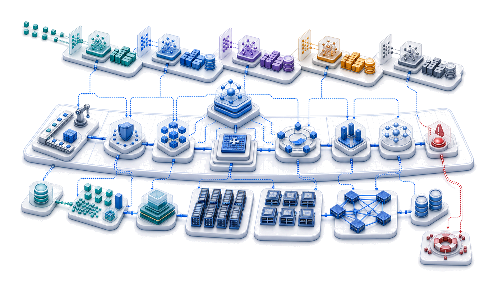{fig-alt="Fleet operations platform blueprint where many model-service lanes share observability, deployment, policy, and capacity control layers."}

:::

## Purpose {.unnumbered}

\begin{marginfigure}
\mlfleetstack{15}{25}{25}{35}{55}{100}{25}{35}
\end{marginfigure}

_Why do practices that work for managing one model collapse when organizations deploy hundreds?_

One model is a project. A hundred models is a system of systems, where interactions, dependencies, and failures cascade in ways that per-model practices cannot anticipate or contain. A data pipeline change affects twelve models built by four teams, but no single team owns the impact assessment. A deployment failure requires coordinating rollbacks across interconnected services. Monitoring dashboards multiply until alert fatigue makes them useless. The practices that let a single team manage a single model (manual deployment, ad-hoc monitoring, spreadsheet tracking) become organizational liabilities at scale. MLOps at scale is the recognition that model management must become infrastructure: shared platforms with consistent APIs, automated pipelines that enforce quality gates, monitoring systems that aggregate signals across the fleet, and governance frameworks that track dependencies between artifacts nobody remembers creating. Without this infrastructure, organizations drown in operational complexity while their ML investments depreciate. Operations at scale transforms human Coordination into automated Compute, standardizing how the Fleet is maintained and governed.

::: {.content-visible when-format="pdf"}

\newpage

:::

::: {.callout-learning-objectives}

- Calculate return on investment, utilization, and total cost for shared ML platforms across model portfolios
- Design registries and release gates that preserve lineage, dependency safety, and rollback confidence
- Quantify technical debt using deployment velocity, incident rates, toil, and response-time metrics
- Evaluate monitoring and alerting hierarchies using signal quality, aggregation, and incident-response needs
- Design feature-store operations that manage freshness, ownership, compatibility, and training-serving skew
- Compare centralized, embedded, and hybrid platform teams for operating large model portfolios
- Diagnose incidents by tracing failures across data, platform, serving, model-control, and governance layers

:::

```{python}
#| echo: false
from mlsysim import *
from mlsysim.core.units import *

# ┌─────────────────────────────────────────────────────────────────────────────
# │ CHAPTER START
# ├─────────────────────────────────────────────────────────────────────────────
# │ Context: Chapter initialization and global imports
# │
# │ Why: Registers this chapter with the mlsys registry and provides shared
# │      imports for all subsequent calculation cells.
# │
# └─────────────────────────────────────────────────────────────────────────────
from mlsysim import Systems
from mlsysim.core.units import (
    MILLION,
    BILLION,
    THOUSAND,
    HUNDRED,
    SEC_PER_HOUR,
    HOURS_PER_DAY,
)

from mlsysim.fmt import fmt, check, MarkdownStr
```

## From Single-Model to Platform Operations {#sec-ml-operations-scale-singlemodel-platform-operations-db8e}

The management layer is the fleet stack's control plane\index{Control Plane}: the dashboard, steering, and maintenance system that keeps physical infrastructure, training systems, serving paths, edge deployments, and governance rules from drifting apart. Once models span data centers, serving platforms, and heterogeneous edge fleets, reliability depends less on any single model and more on the operational machinery that keeps the whole fleet observable, coordinated, and recoverable.

Consider a team of five engineers maintaining a single recommendation model. When the model drifts, they manually retrain it. When the API latency spikes, they manually scale the instances. Now, scale that same team to support five hundred models across dozens of product surfaces. Manual intervention is no longer merely inefficient; it is mathematically impossible. The transition from single-model to platform operations replaces human-in-the-loop maintenance with automated, systemic governance.

Distributed serving architectures handle massive request volumes, while edge deployment pushes intelligence to smartphones, microcontrollers, and federated fleets spanning billions of heterogeneous devices. The question now is what happens when organizations must sustain not one but hundreds of such systems across this entire spectrum. Managing individual models and operating enterprise-scale ML platforms are fundamentally different problems, separated by a phase transition in operational complexity. Platform operations absorbs that complexity through fleet economics and total-cost models, multi-model management, CI/CD, monitoring systems, and feature-store foundations that let hundreds of models share one coherent operational substrate.

Single-model MLOps focuses on continuous integration, deployment pipelines, and monitoring for individual models, and every organization that scales discovers its limits through experience. The first few models can be managed with spreadsheets, manual deployments, and ad hoc monitoring, with each model team developing its own practices optimized for its specific requirements. The approach works initially because the models operate independently: what happens to the recommendation system does not affect the fraud detection model.

Independence vanishes as model count grows. Models begin sharing data sources, and changes to upstream data pipelines cascade through multiple consumers. Infrastructure becomes contested: deployment of one model delays deployment of another. Monitoring dashboards multiply until no single team can observe the complete system state. On-call rotations expand from single-model responsibility to cross-model coordination that requires understanding interactions between systems developed by different teams with different assumptions.

Infrastructure efficiency compounds these coordination challenges. Production ML workloads rarely achieve high accelerator utilization because training jobs run intermittently and inference loads fluctuate with user traffic. A single model team might accept 20 percent accelerator utilization because optimizing further is not worth the engineering investment. Multiply by one hundred models, and that underutilization represents millions of dollars in wasted infrastructure. Similarly, a single model's occasional production incident is manageable, but one hundred models with independent failure modes produce a constant stream of alerts that exhaust on-call engineers and mask genuine emergencies.

The organizational response is platform thinking. Rather than treating each model as an independent system with its own infrastructure, platforms provide shared services that amortize operational costs across the entire model portfolio. Feature stores[^fn-feature-store-skew] eliminate redundant feature computation. Unified deployment pipelines ensure consistent rollout practices. Centralized monitoring aggregates signals across models to detect system-wide issues and enable capacity planning. The challenge is designing, implementing, and operating these platforms so they scale with the portfolio rather than against it.

[^fn-feature-store-skew]: **Feature Store**\index{Feature Store!training-serving skew}: A centralized repository that manages the computation, storage, and serving of ML features. The core systems problem it solves is training-serving skew, developed with the platform invariant that contains it in @sec-ml-operations-scale-feature-store-operations-2a36.

### The N-models problem {#sec-ml-operations-scale-nmodels-problem-fcff}

A typical technology organization's journey with machine learning follows a predictable pattern. The first model might be a recommendation system for the homepage, followed by a search ranking model, then a fraud detection system, then content moderation. Each model team initially operates independently, developing bespoke pipelines for data processing, training, validation, and deployment. The absence of coordination overhead lets each team optimize for its specific requirements.

As the number of models grows, the problems that emerge are not *multiplicative* but *combinatorial*. One hundred models do not require 100 times the operational effort of one model; they introduce dependencies and interactions that create superlinear growth in operational complexity\index{Operational Complexity Growth at Scale}. @Tbl-ops-scale-complexity quantifies this growth across six operational dimensions, from deployment coordination that becomes critical path at scale to debugging complexity that demands distributed tracing across model boundaries.

| **Operational Aspect**         | **Single Model** |  **10 Models**   |        **100 Models**        |
|:-------------------------------|:----------------:|:----------------:|:----------------------------:|
| **Deployment coordination**    |       None       |      Ad hoc      |        Critical path         |
| **Shared data dependencies**   |       None       |   Some overlap   |         Dense graph          |
| **Monitoring dashboards**      |        1         |        10        |         Unmanageable         |
| **On-call rotation scope**     |   Single team    |  Multiple teams  |      Organization-wide       |
| **Infrastructure utilization** |    Often idle    | Moderate sharing |     Efficiency critical      |
| **Debugging complexity**       |      Local       |    Cross-team    | Distributed tracing required |

: **Operational Complexity Growth at Scale**: Six dimensions of operational complexity across 1, 10, and 100 models. Deployment coordination evolves from nonexistent to critical path, monitoring dashboards become unmanageable without aggregation, and debugging shifts from local investigation to organization-wide distributed tracing requirements. {#tbl-ops-scale-complexity}

```{python}
#| echo: false
#| label: multi-tenant-efficiency-notebook
# ┌─────────────────────────────────────────────────────────────────────────────
# │ MULTI-TENANT EFFICIENCY DIVIDEND (NOTEBOOK)
# ├─────────────────────────────────────────────────────────────────────────────
# │ Context: "The Sharing Dividend" .callout-notebook
# │
# │ Goal: Quantify the hardware savings from multi-tenant resource sharing.
# │ Show: cost_savings_pct ≈ 57 percent -- inline in notebook result.
# │ How: Estimate savings from reducing idle dedicated capacity.
# │
# └─────────────────────────────────────────────────────────────────────────────
from mlsysim.fmt import check, fmt, fmt_count, fmt_percent, fmt_usd

class MultiTenantEfficiency:
    # ┌── 1. LOAD ──────────────────────────────────────────
    avg_util_dedicated = 0.30  # 70% idle (typical for single-team clusters)
    avg_util_shared = 0.70  # 30% idle (sharing across training/inference)
    n_gpus_required = 100
    annual_budget_m = 1.75
    # ┌── 2. EXECUTE ───────────────────────────────────────
    # For a fixed workload of 30 "active" GPU-hours:
    # Dedicated needs: 30 / 0.30 = 100 GPUs
    # Shared needs: 30 / 0.70 = 43 GPUs
    savings_pct = (1 - (avg_util_dedicated / avg_util_shared)) * 100
    annual_savings = annual_budget_m * (savings_pct / 100) * MILLION
    # Active GPU-equivalents under each regime at the fixed hardware budget.
    active_dedicated = n_gpus_required * avg_util_dedicated  # 30
    active_shared = n_gpus_required * avg_util_shared  # 70
    # ┌── 3. GUARD ─────────────────────────────────────────
    check(55 < savings_pct < 60, f"Savings {savings_pct:.1f}% unexpected")
    check((active_dedicated, active_shared) == (30, 70), "Active GPU-equivalents drift")
    # ┌── 4. OUTPUT ────────────────────────────────────────
    # Idle fractions are derived from utilization assumptions above.
    mt_idle_dedicated_str = fmt_percent(1 - avg_util_dedicated, precision=0, commas=False, style='prose')
    mt_idle_shared_str = fmt_percent(1 - avg_util_shared, precision=0, commas=False, style='prose')
    mt_savings_pct_str = fmt_percent(savings_pct / 100, precision=1, commas=False, style='prose')
    mt_n_gpus_str = fmt_count(n_gpus_required, commas=False, label="GPU")
    mt_savings_pct_round_str = fmt_percent(round(savings_pct) / 100, precision=0, commas=False, style='prose')
    mt_annual_budget_m_str = fmt_usd(annual_budget_m * MILLION, scale="M", precision=2, commas=False)
    mt_annual_savings_str = fmt_usd(annual_savings, precision=0)
    mt_active_dedicated_str = fmt(active_dedicated, precision=0, commas=False)
    mt_active_shared_str = fmt(active_shared, precision=0, commas=False)
```

::: {#nbk-ops-scale-sharing-dividend .callout-notebook title="The sharing dividend"}

**Problem**: A platform team manages a fleet of `{python} MultiTenantEfficiency.mt_n_gpus_str`. Under dedicated per-team quotas, average idle time is `{python} MultiTenantEfficiency.mt_idle_dedicated_str`. Moving to a multi-tenant ML platform that shares resources across teams and uses idle training GPUs for inference reduces aggregate idle time to `{python} MultiTenantEfficiency.mt_idle_shared_str`. What hardware cost does the platform save?

**Math**:
For a fixed active workload, required hardware is inverse to utilization, while useful work per GPU is proportional to utilization.

1. **Efficiency Gain**: 0.70 (Shared) / 0.30 (Dedicated) = 2.33$\times$ more work per GPU.
2. **Hardware Reduction**: 1 - (0.30/0.70) = `{python} MultiTenantEfficiency.mt_savings_pct_str`.
3. **Annual Savings**\index{Savings!annual}: `{python} MultiTenantEfficiency.mt_savings_pct_round_str` of `{python} MultiTenantEfficiency.mt_annual_budget_m_str` budget $\approx$ `{python} MultiTenantEfficiency.mt_annual_savings_str`/year.

**Systems insight**: Multi-tenancy acts as an infrastructure multiplier. Breaking down resource silos reduces required hardware by `{python} MultiTenantEfficiency.mt_savings_pct_round_str` for the same workload; with the same hardware budget, it raises useful work from `{python} MultiTenantEfficiency.mt_active_dedicated_str` to `{python} MultiTenantEfficiency.mt_active_shared_str` active GPU-equivalents. In the machine learning fleet, *statistical multiplexing* (the principle that different teams' peak demands rarely coincide) is the mechanism that makes shared platforms economically sustainable. The platform team's primary role is to harvest this sharing dividend and reinvest it into future capacity growth.

:::

::: {.column-margin}
{width="100%" fig-alt="Blast-radius fan: one red embedding-update source on the left sends arrows to five downstream model nodes on the right, showing how a model dependency change can degrade many consumers."}

*One upstream embedding update can degrade every dependent model.*
:::

The fundamental insight is that per-model operational practices do not compose. When Model A depends on features computed by Pipeline B, which uses embeddings from Model C, changes to any component cascade unpredictably. A seemingly innocuous update to Model C's embedding layer might shift the feature distributions that Model A depends upon, degrading its performance even though Model A itself has not changed. This cascading interdependence turns scale into a qualitatively different management problem.

::: {#psp-ops-scale-complexity-explosion .callout-perspective title="The complexity explosion"}

Managing 100 models is not 100 times the work of managing 1 model. It is fundamentally different due to dependencies, interactions, and organizational complexity. As Jeff Dean observes, the challenge shifts from individual model optimization to system-level coordination where the interactions between models often matter more than the models themselves.

:::

@Fig-n-models-complexity visualizes this superlinear growth across three complexity dimensions. Monitoring alerts grow linearly with model count, but dependency conflicts grow quadratically as models share features, data sources, and infrastructure. The total operational load crosses team capacity around 50 models, the empirical threshold where organizations discover they need platform engineering.

::: {#fig-n-models-complexity fig-env="figure" fig-pos="htb" fig-cap="**The N-Models Complexity Explosion**: Monitoring alerts grow linearly with model count, deployment coordination grows as $\mathcal{O}(N_{\text{models}} \log N_{\text{models}})$, and dependency conflicts grow quadratically as models share features and data sources. The total operational load crosses team capacity around 50 models, marking the transition from artisanal model management to platform-required operations." fig-alt="Log-scale plot showing linear, model-count-log-model-count, and quadratic curves with total operational load crossing team capacity at 50 models, with Artisanal, Growing Pains, and Platform Required zones."}

```{python}
#| echo: false
# ┌─────────────────────────────────────────────────────────────────────────────
# │ N-MODELS COMPLEXITY (FIGURE)
# ├─────────────────────────────────────────────────────────────────────────────
# │ Context: @fig-n-models-complexity—operational complexity scaling
# │
# │ Goal: Plot linear, model-count-log-model-count, and quadratic curves; show total crossing capacity
# │       at ~50 models; Artisanal/Growing Pains/Platform Required zones.
# │ Show: Log-scale y; capacity threshold line; shaded regions.
# │ How: monitoring_alerts, deployment_coordination, dependency_conflicts;
# │      matplotlib.
# │
# └─────────────────────────────────────────────────────────────────────────────
# ┌── 1. CANVAS ────────────────────────────────────────────────────────────────
# │ Plot linear, model-count-log-model-count, and quadratic curves; show total crossing capacity
import matplotlib.pyplot as plt
import numpy as np

plt.style.use('seaborn-v0_8-whitegrid')
fig, ax = plt.subplots(figsize=(10, 6))

# ┌── 2. ARRAYS ────────────────────────────────────────────────────────────────
n_models_axis = np.arange(1, 501)
monitoring_alerts = 20 * n_models_axis
deployment_coordination = n_models_axis * np.log(n_models_axis)
deployment_coordination[0] = 0
dependency_conflicts = 0.5 * n_models_axis**2

total_operational_load = monitoring_alerts + deployment_coordination + dependency_conflicts

# ┌── 3. RENDER ────────────────────────────────────────────────────────────────
ax.plot(n_models_axis, monitoring_alerts, label='Monitoring Alerts—linear', linestyle=':')
ax.plot(n_models_axis, deployment_coordination, label='Deployment Coordination—model count log model count', linestyle='--')
ax.plot(n_models_axis, dependency_conflicts, label='Dependency Conflicts—quadratic', linestyle='-.')
ax.plot(n_models_axis, total_operational_load, label='Total Operational Load', color='black', linewidth=3)

capacity_threshold = 2500
ax.axhline(y=capacity_threshold, color='crimson', linestyle='--', linewidth=2, label='Team Capacity Without Platform')

# ┌── 4. DECORATE ──────────────────────────────────────────────────────────────
ax.text(400, capacity_threshold + 800, 'Capacity Limit', color='crimson', va='center', ha='left')

ax.set_yscale('log')

ymin, ymax = ax.get_ylim()
text_y_pos = ymax * 0.3

ax.axvspan(1, 10, alpha=0.15, color='#3498db', ec='none')
ax.text(6.5, 60000, 'Artisanal', ha='center', rotation=90, fontsize=10, style='italic', color='#2c3e50')

ax.axvspan(10, 50, alpha=0.15, color='#f39c12', ec='none')
ax.text(30, text_y_pos, 'Growing\n Pains', ha='center', fontsize=10, style='italic', color='#2c3e50')

ax.axvspan(50, 500, alpha=0.15, color='#e74c3c', ec='none')
ax.text(170, text_y_pos, 'Platform Required', ha='center', fontsize=10, style='italic', color='#2c3e50')

ax.set_title("The N-Models Complexity Explosion", fontsize=16, fontweight='bold')
ax.set_xlabel("Number of Models in Production", fontsize=12)
ax.set_ylabel("Operational Complexity (Log Scale)", fontsize=12)
ax.set_xlim(1, 500)
ax.set_ylim(bottom=10)

plt.legend(loc='lower right', fontsize=8, frameon=True, facecolor='white', framealpha=0.95, edgecolor='gray', fancybox=True, borderpad=0.6)

plt.tight_layout()
fig = plt.gcf()
```

:::

### Quantifying platform economics {#sec-ml-operations-scale-quantifying-platform-economics-2026}

The economic case for platform operations rests on understanding both the costs of fragmented approaches and the returns from shared infrastructure. @Eq-platform-roi formalizes platform return on investment as the ratio of engineering time savings across all models to total platform cost:

$$\text{ROI}_{\text{platform}} = \frac{N_{\text{models}} \times T_{\text{saved}} \times C_{\text{engineer}}}{C_{\text{platform}}}$$ {#eq-platform-roi}

where $N_{\text{models}}$ represents the number of models benefiting from the platform, $T_{\text{saved}}$ is the engineering time saved per model per period, $C_{\text{engineer}}$ is the fully-loaded cost per engineer hour, and $C_{\text{platform}}$ is the total platform cost including development, infrastructure, and maintenance.

The equation reveals why platform investments make sense only at sufficient scale. For a small organization with five models, the denominator might exceed the numerator even with significant per-model savings. As model count grows, the numerator scales linearly with $N_{\text{models}}$ while platform costs grow much more slowly, typically sublinearly due to infrastructure amortization.

```{python}
#| echo: false
#| label: platform-roi-notebook
# ┌─────────────────────────────────────────────────────────────────────────────
# │ PLATFORM ROI (NOTEBOOK)
# ├─────────────────────────────────────────────────────────────────────────────
# │ Context: "The Platform Dividend" .callout-notebook
# │
# │ Goal: Quantify the ROI of building a centralized ML platform.
# │ Show: roi_ratio ≈ 1.25x—inline in notebook result.
# │ How: Compute platform ROI from model count, saved engineering time, engineer rate, and platform cost.
# │
# └─────────────────────────────────────────────────────────────────────────────
from mlsysim.fmt import check, fmt, fmt_percent, fmt_ratio, fmt_time, fmt_usd

class PlatformRoi:
    # ┌── 1. LOAD ──────────────────────────────────────────
    n_models = 50
    savings_h_per_month = 20  # Engineering time saved per model
    engineer_rate = 150  # $/hr
    platform_cost_per_month = 120000  # Platform team + infra
    # ┌── 2. EXECUTE ───────────────────────────────────────
    total_savings = n_models * savings_h_per_month * engineer_rate
    roi_ratio = total_savings / platform_cost_per_month
    # ┌── 3. GUARD ─────────────────────────────────────────
    check(roi_ratio == 1.25, f"ROI {roi_ratio} unexpected")
    # Scaling-threshold scenario: a smaller fleet flips the sign of the return.
    n_models_low = 20
    return_pct_high = (roi_ratio - 1) * 100  # return above platform cost at n_models
    savings_low = n_models_low * savings_h_per_month * engineer_rate
    loss_pct_low = (platform_cost_per_month - savings_low) / platform_cost_per_month * 100
    check(return_pct_high == 25.0, f"Return {return_pct_high} unexpected")
    check(loss_pct_low == 50.0, f"Loss {loss_pct_low} unexpected")
    # ┌── 4. OUTPUT ────────────────────────────────────────
    pr_n_models_str = fmt(n_models, precision=0, commas=False)
    pr_savings_h_str = fmt_time(savings_h_per_month, 'hour', precision=0, commas=False, style='word')
    pr_roi_ratio_str = fmt_ratio(roi_ratio, precision=2, commas=False)
    pr_engineer_rate_str = fmt_usd(engineer_rate, precision=0, commas=False, per="hr")
    pr_platform_cost_str = fmt_usd(platform_cost_per_month, precision=0, per="month")
    pr_gross_savings_str = fmt_usd(total_savings, precision=0)
    pr_net_benefit_str = fmt_usd(total_savings - platform_cost_per_month, precision=0)
    pr_n_models_low_str = fmt(n_models_low, precision=0, commas=False)
    pr_return_pct_high_str = fmt_percent(return_pct_high / 100, precision=0, commas=False, style='prose')
    pr_savings_low_str = fmt_usd(savings_low, precision=0)
    pr_loss_pct_low_str = fmt_percent(loss_pct_low / 100, precision=0, commas=False, style='prose')
```

::: {#nbk-ops-scale-platform-dividend .callout-notebook title="The platform dividend"}

**Problem**: An organization manages `{python} PlatformRoi.pr_n_models_str` models. A centralized ML Platform team costs `{python} PlatformRoi.pr_platform_cost_str`. If the platform saves each model team `{python} PlatformRoi.pr_savings_h_str` of manual toil per month, is the platform investment profitable?

**Math**:

1. **Gross Monthly Savings**: `{python} PlatformRoi.pr_n_models_str` models $\times$ `{python} PlatformRoi.pr_savings_h_str`/model $\times$ `{python} PlatformRoi.pr_engineer_rate_str` = `{python} PlatformRoi.pr_gross_savings_str`.
2. **Net Monthly Benefit**: `{python} PlatformRoi.pr_gross_savings_str` (Savings) - `{python} PlatformRoi.pr_platform_cost_str` (Cost) = `{python} PlatformRoi.pr_net_benefit_str`.
3. **ROI Ratio**\index{ROI Ratio}: `{python} PlatformRoi.pr_gross_savings_str` / `{python} PlatformRoi.pr_platform_cost_str` = `{python} PlatformRoi.pr_roi_ratio_str`.

**Systems insight**: Platforms exhibit a scaling threshold. At `{python} PlatformRoi.pr_n_models_str` models, this platform earns a `{python} PlatformRoi.pr_return_pct_high_str` return on its cost. However, if the organization only had `{python} PlatformRoi.pr_n_models_low_str` models, the savings would be only `{python} PlatformRoi.pr_savings_low_str`—a `{python} PlatformRoi.pr_loss_pct_low_str` loss on the platform team's salary. In MLOps, platform engineering is a fixed cost that pays off through variable savings. The right time to build a platform is when the "manual toil tax" across the model fleet exceeds the "platform maintenance tax."

:::

#### From artisanal to industrial operations {#sec-ml-operations-scale-artisanal-to-industrial-operations-092d}

The platform-dividend calculation gives the general rule; this worked example turns it into an operating decision. The question is not whether shared tooling is aesthetically cleaner, but whether the fixed platform cost is smaller than the manual toil it removes across the model fleet.

```{python}
#| echo: false
#| label: platform-economics-lego
# │ PLATFORM ROI CALCULATION (LEGO)
# ├─────────────────────────────────────────────────────────────────────────────
# │ Context: @sec-ml-operations-scale-quantifying-platform-economics-2026
# │
# │ Goal: Estimate platform ROI for a 50-model ML fleet to show that shared
# │       infrastructure reduces annual operational engineering costs by >56%
# │       and pays for itself within the first year.
# │ Show: ~$2.03M annual savings (~56% reduction)—inline in the worked
# │       example paragraph following @eq-platform-roi.
# │ How: Compare before-platform cost (50 models × 40 hrs/month × $150/hr)
# │      against after-platform cost (10 hrs/model/month + $667K/yr amort)
# │      using the ROI formula from @eq-platform-roi.
# │
# └─────────────────────────────────────────────────────────────────────────────

# ┌── LEGO ───────────────────────────────────────────────
class PlatformEconomics:
    """
    Namespace for Platform ROI Calculation.
    Scenario: Comparing manual operations vs. shared platform costs.
    """

    # ┌── 1. LOAD (Constants) ───────────────────────────────────────────────
    from mlsysim.core.units import ureg, MILLION

    n_models = 50
    hours_per_model_month = 40
    months_per_year = 12
    engineer_cost_hr = 150
    platform_cost = 2 * MILLION
    amortization_years = 3
    hours_saved_per_model = 30

    # ┌── 2. EXECUTE (The Compute) ─────────────────────────────────────────
    # Step 1: Before platform
    annual_cost_before_val = n_models * hours_per_model_month * months_per_year * engineer_cost_hr

    # Step 2: After platform
    hours_after = hours_per_model_month - hours_saved_per_model  # 10 hrs/model/month
    annual_ops_after = n_models * hours_after * months_per_year * engineer_cost_hr
    annual_platform_amort = platform_cost / amortization_years
    annual_cost_after_val = annual_ops_after + annual_platform_amort

    # Step 3: Savings
    annual_savings = annual_cost_before_val - annual_cost_after_val
    savings_pct = (annual_savings / annual_cost_before_val) * 100

    # ┌── 3. GUARD (Invariants) ───────────────────────────────────────────
    from mlsysim.fmt import fmt_usd, check

    check(annual_savings > 0, "Platform must generate savings.")
    check(savings_pct > 50, f"Expected >50% savings, got {savings_pct:.1f}%")

    # ┌── 4. OUTPUT (Formatting) ──────────────────────────────────────────────
    from mlsysim.fmt import fmt, fmt_usd, fmt_math

    annual_cost_before_str = fmt_usd(annual_cost_before_val, precision=0)
    annual_cost_after_str = fmt_usd(annual_cost_after_val, precision=1)
    annual_savings_str = fmt_usd(annual_savings, precision=1)
    savings_pct_str = fmt_percent(savings_pct / 100, precision=1, commas=False, style='prose')

    # Worked-math LaTeX (operands sourced from LOAD constants above; currency via fmt_usd)
    annual_cost_before_eq_math = fmt_math(
        rf"C_{{\text{{current}}}} = {n_models} \times {hours_per_model_month} "
        rf"\times {months_per_year} \times {engineer_cost_hr} = {annual_cost_before_str}"
    )
    annual_cost_after_eq_math = fmt_math(
        rf"C_{{\text{{after}}}} = {n_models} \times {hours_after} \times {months_per_year} "
        rf"\times {engineer_cost_hr} + \frac{{{fmt(platform_cost, precision=0)}}}{{{amortization_years}}} "
        rf"= {fmt_usd(annual_ops_after, precision=0)} + {fmt_usd(annual_platform_amort, precision=0)} "
        rf"= {annual_cost_after_str}"
    )
```

Consider an organization evaluating whether to build a centralized ML platform. Five parameters define the current state:

- 50 production models across 8 teams
- Each model requires 40 engineer-hours monthly for operational tasks
- Engineers cost \$150 per hour fully loaded
- Platform development cost: \$2 million amortized over 3 years
- Expected time savings: 30 hours per model per month postplatform

Before platform (annual operational cost):

`{python} PlatformEconomics.annual_cost_before_eq_math`

After platform (annual operational cost plus amortized platform cost):

`{python} PlatformEconomics.annual_cost_after_eq_math`

Annual savings reach `{python} PlatformEconomics.annual_savings_str`, a `{python} PlatformEconomics.savings_pct_str` reduction in operational costs. The platform pays for itself within the first year.

The economic gap explains why large technology companies have invested heavily in ML platforms while smaller organizations often struggle to justify similar investments. The economic threshold typically falls between 20 and 50 models, depending on model complexity and organizational structure.

@Fig-platform-roi-threshold visualizes this threshold effect by plotting platform ROI as a function of model count for two platform cost levels. A \$2M/year platform breaks even at approximately 20 models, while a more expensive \$5M/year enterprise platform requires roughly 50 models to justify the investment. Beyond break-even, ROI grows linearly because each additional model contributes the same per-model savings to the numerator of @eq-platform-roi while platform costs remain essentially fixed. At 100 models, the \$2M platform delivers 5$\times$ return on investment. This linearity is both the economic argument for platform investment and the explanation for why organizations that defer platform building until they are "at scale" often find themselves paralyzed by accumulated operational debt: the break-even point arrives earlier than intuition suggests.

The break-even count is not a universal constant; it moves with the two inputs the reader controls. The platform-dividend notebook above (a \$120K/month platform team saving 20 hours per model) and the worked example (a \$2M build amortized over three years, saving 30 hours per model) reach break-even at different model counts than this figure precisely because they assume different platform cost bases and different per-model savings. The figure's curves fix the platform cost at a round annual figure and assume \$100K of savings per model per year to isolate the threshold's shape; the notebook and worked example trade that roundness for explicit operating assumptions. All three obey the same @eq-platform-roi: change the numerator (savings per model) or the denominator (platform cost) and the break-even point slides, but the linear post-break-even slope does not.

::: {#fig-platform-roi-threshold fig-env="figure" fig-pos="htb" fig-cap="**The Platform ROI Threshold**: Platform return on investment as a function of model count, for two platform cost levels. A \$2M/year platform breaks even at approximately 20 models, while a \$5M/year enterprise platform requires roughly 50 models. Beyond break-even, ROI grows linearly—at 100 models, the \$2M platform delivers 5$\times$ return." fig-alt="Line chart showing platform ROI vs. model count with break-even points for two cost levels"}

```{python}
#| echo: false
# ┌─────────────────────────────────────────────────────────────────────────────
# │ PLATFORM ROI THRESHOLD (FIGURE)
# ├─────────────────────────────────────────────────────────────────────────────
# │ Context: @fig-platform-roi-threshold—platform economics
# │
# │ Goal: Plot ROI = (model_count * savings) / platform_cost vs model_count; show break-even at
# │       ~20 models ($2M) and ~50 models ($5M).
# │ Show: Two ROI curves; break-even line; shaded investment/returns phases.
# │ How: Compute platform ROI across model counts; book_style.setup_plot().
# │
# └─────────────────────────────────────────────────────────────────────────────
# ┌── 1. CANVAS ────────────────────────────────────────────────────────────────
# │ Plot ROI = (model_count * savings) / platform_cost vs model_count; show break-even at
import numpy as np
import matplotlib.pyplot as plt
from book.tools.figures import style as book_style

fig, ax, COLORS, plt = book_style.setup_plot(figsize=(9, 5.5))

# ┌── 2. ARRAYS ────────────────────────────────────────────────────────────────
n_models = np.arange(1, 501)

# Per-model savings: 0.5 FTE * $200K/FTE = $100K/year per model
savings_per_model = 100_000  # $100K/year

# Platform A: $2M/year
platform_cost_a = 2_000_000
roi_a = (n_models * savings_per_model) / platform_cost_a
breakeven_a = platform_cost_a / savings_per_model  # 20 models

# Platform B: $5M/year (enterprise)
platform_cost_b = 5_000_000
roi_b = (n_models * savings_per_model) / platform_cost_b
breakeven_b = platform_cost_b / savings_per_model  # 50 models

# Plot ROI curves

# ┌── 3. RENDER ────────────────────────────────────────────────────────────────
ax.plot(n_models, roi_a, color=COLORS["BlueLine"], linewidth=2.5, label="$2M/year platform")
ax.plot(n_models, roi_b, color=COLORS["OrangeLine"], linewidth=2.5, label="$5M/year enterprise platform")

# Break-even line at ROI = 1
ax.axhline(y=1.0, color=COLORS["primary"], linestyle="--", linewidth=1.5, alpha=0.6)

# ┌── 4. DECORATE ──────────────────────────────────────────────────────────────
ax.text(480, 1.15, "Break-even (ROI = 1)", fontsize=8, color=COLORS["primary"], ha="right", va="bottom")

# Shade investment phase (below ROI=1) and returns phase (above)
ax.fill_between(n_models, 0, np.minimum(roi_a, 1.0), alpha=0.08, color=COLORS["RedLine"])
ax.fill_between(n_models, 1.0, np.maximum(roi_a, 1.0), alpha=0.08, color=COLORS["GreenLine"])

# Mark break-even points
ax.plot(breakeven_a, 1.0, "o", color=COLORS["BlueLine"], markersize=10, zorder=5)
ax.annotate(
    f"Break-even at\n~{int(breakeven_a)} models",
    xy=(breakeven_a, 1.0),
    fontsize=8,
    color=COLORS["BlueLine"],
    fontweight="bold",
    ha="left",
    va="bottom",
    xytext=(breakeven_a - 11, 3.8),
    arrowprops=dict(arrowstyle="->", color=COLORS["BlueLine"], lw=0.75, shrinkB=5),
)

ax.plot(breakeven_b, 1.0, "o", color=COLORS["OrangeLine"], markersize=10, zorder=5)
ax.annotate(
    f"Break-even at\n~{int(breakeven_b)} models",
    xy=(breakeven_b, 1.10),
    fontsize=8,
    color=COLORS["OrangeLine"],
    fontweight="bold",
    ha="left",
    va="bottom",
    xytext=(breakeven_b + 38, 3.0),
    arrowprops=dict(arrowstyle="->", color=COLORS["OrangeLine"], shrinkB=5, lw=0.75),
)

# Annotate the ROI at 100 models for platform A
roi_at_100 = (100 * savings_per_model) / platform_cost_a
ax.annotate(
    f"100 models: {roi_at_100:.0f}× ROI",
    xy=(100, roi_at_100),
    fontsize=8,
    color=COLORS["BlueLine"],
    fontweight="bold",
    ha="left",
    va="bottom",
    xytext=(70, roi_at_100 + 3.0),
    arrowprops=dict(arrowstyle="->", color=COLORS["BlueLine"], lw=1.0),
)

# Region labels
ax.text(310, 0.45, "Investment phase", fontsize=9, color=COLORS["RedLine"], fontweight="bold", ha="center", va="center", alpha=0.8)

ax.text(310, 12, "Returns phase", fontsize=9, color=COLORS["GreenLine"], fontweight="bold", ha="center", va="center", alpha=0.8)

ax.set_xlabel("Number of Production Models")
ax.set_ylabel("Platform ROI (ratio)")
ax.set_xlim(0, 500)
ax.set_ylim(0, 25)
plt.legend(loc='upper left', fontsize=8, frameon=True, facecolor='white', framealpha=0.95, edgecolor='gray', fancybox=True, borderpad=0.6)

plt.tight_layout()
plt.show()
plt.close()
```

:::

::: {#chk-ops-scale-platform-roi .callout-checkpoint title="Platform ROI break-even"}

@Eq-platform-roi expresses platform return on investment as $N_{\text{models}} \times T_{\text{saved}} \times C_{\text{engineer}} / C_{\text{platform}}$. @Fig-platform-roi-threshold shows two cost curves and the linear ROI growth past break-even. Apply the formula to two concrete decisions.

- [ ] **Platform ROI**: For an organization with 30 models, each saving 200 engineer-hours per year at \$150/hour, calculate the ROI of a \$2M/year platform and a \$5M/year enterprise platform.
- [ ] **Break-even count**: Using the same per-model savings (\$30K/year, which is 200 hours at \$150/hour), determine the model count where each platform breaks even, compare it to the rule-of-thumb 20 and 50 in @fig-platform-roi-threshold, and infer the figure's implicit per-model savings.
- [ ] **Build now vs. wait**: For an organization with 8 models debating whether to build a \$2M/year platform, use the linear ROI structure of @eq-platform-roi past break-even to state the strongest argument for building now and the future-growth assumption required for that argument.

:::

Platform ROI is one lever; the cost of individual training runs and the capacity decisions that follow are another. A single 2,048-GPU H100 run makes that capacity question concrete and connects it to fleet economics, where utilization, checkpointing, and carbon accounting become platform-level decisions rather than isolated experiment costs.

### Capacity planning and cost of training {#sec-ml-operations-scale-capacity-planning-cost-training}

```{python}
#| echo: false
#| label: training-capacity-cost-lego
# ┌─────────────────────────────────────────────────────────────────────────────
# │ TRAINING CAPACITY COST (LEGO)
# ├─────────────────────────────────────────────────────────────────────────────
# │ Context: @sec-ml-operations-scale-capacity-planning-cost-training
# │
# │ Goal: Compute the direct GPU-hour cost of an illustrative 30-day H100 run.
# │ Show: 2,048 GPUs and ~$2.95M direct GPU cost inline in the paragraph below.
# │ How: Multiply GPU count, training duration, and GPU-hour rate.
# │
# └─────────────────────────────────────────────────────────────────────────────

class TrainingCapacityCost:
    # ┌── 1. LOAD ───────────────────────────────────────────────────────────
    fleet = Systems.Clusters.Production_2K
    training_days = 30
    duration = training_days * day
    gpu_hour_rate = Infrastructure.Pricing.Fleet.GpuHourRef.rate.to(USD / hour).magnitude

    # ┌── 2. EXECUTE ───────────────────────────────────────────────────────
    n_gpus = fleet.total_accelerators
    training_hours = duration.to(hour).magnitude
    training_cost = n_gpus * training_hours * gpu_hour_rate

    # ┌── 3. GUARD ─────────────────────────────────────────────────────────
    check(duration.check("[time]"), f"Expected training duration, got {duration}")
    check(n_gpus == 2048, f"Expected 2,048 GPUs, got {n_gpus}")
    check(2.9 * MILLION < training_cost < 3.0 * MILLION, f"Unexpected training cost ${training_cost:,.0f}")

    n_nodes = fleet.count

    # ┌── 4. OUTPUT ────────────────────────────────────────────────────────
    n_gpus_str = fmt_count(n_gpus, label="GPU")
    gpu_hour_rate_str = fmt_usd(gpu_hour_rate, precision=0, commas=False, per="GPU-hour")
    training_cost_m_str = fmt_usd(training_cost, precision=2, commas=False, scale="M")
    n_nodes_str = fmt(n_nodes, precision=0, commas=False)
    training_days_str = fmt(training_days, precision=0, commas=False)
```

Capacity planning for large-scale ML is an exercise in optimizing the economics of the GPU-hour. Consider a concrete case: a `{python} TrainingCapacityCost.training_days_str`-day training run on a `{python} TrainingCapacityCost.n_nodes_str`-node H100 cluster (`{python} TrainingCapacityCost.n_gpus_str`) at an illustrative market rate of `{python} TrainingCapacityCost.gpu_hour_rate_str` represents a direct investment of roughly `{python} TrainingCapacityCost.training_cost_m_str`. At this scale, the cost per training run $(C_{\text{run}})$ becomes a primary design lever that dictates the sizing of the entire fleet. Faster time-to-market pushes the planner toward more GPUs, but larger jobs also suffer diminishing parallel efficiency and a higher probability of hardware interruption. Total cost is therefore not merely a function of compute time; it must account for data staging, checkpointing, and the cost of recovery from interruptions (@sec-fault-tolerance-reliability).

The drive for efficiency forces capacity to behave like a dynamic resource rather than a static allocation. Organizations must decide when to buy additional permanent capacity and when to recover the same effective throughput through better orchestration or model optimization. The decision also has an energy dimension: powering thousands of GPUs for months consumes enough electricity that financial cost and carbon cost move together. Capacity planning therefore becomes a strategic lever that balances performance, budget, energy use, and responsible engineering in the same decision.

Cost visibility also sharpens the case for paying down technical debt: the same metrics that reveal runaway training costs expose the hidden cost of unversioned data, brittle pipelines, and manual toil.

### Quantifying and managing ML technical debt {#sec-ml-operations-scale-quantifying-managing-ml-technical-debt-9055}

Technical debt at fleet scale is a prioritization problem: the platform must find which hidden dependency is slowing deployments, raising incident rates, or consuming the most engineering toil, and pay that down first. The four categories below (data, configuration, model, and infrastructure debt) locate where the drag originates, and quantifying each makes them comparable across the fleet so the worst offender can be addressed first.

```{python}
#| echo: false
#| label: maintenance-dividend-notebook
# ┌─────────────────────────────────────────────────────────────────────────────
# │ MAINTENANCE DIVIDEND (NOTEBOOK)
# ├─────────────────────────────────────────────────────────────────────────────
# │ Context: "The Maintenance Dividend" .callout-notebook
# │
# │ Goal: Quantify the long-term cost of technical debt vs proactive maintenance.
# │ Show: savings_ratio ≈ 3.2x—inline in notebook result.
# │ How: Compare years of toil cost against one-time setup plus lower ongoing toil.
# │
# └─────────────────────────────────────────────────────────────────────────────
from mlsysim.fmt import check, fmt, fmt_time, fmt_usd

class MaintenanceDividend:
    # ┌── 1. LOAD ──────────────────────────────────────────
    toil_h_per_month = 40  # manual monitoring, data cleaning, broken scripts
    low_toil_h_per_month = 8  # after platform automation
    maintenance_investment_h = 160  # engineering time to fix "plumbing"
    years = 3
    engineer_rate = 150  # $/hr
    # ┌── 2. EXECUTE ───────────────────────────────────────
    months = years * 12
    cost_toil = months * toil_h_per_month * engineer_rate
    cost_proactive = (maintenance_investment_h + (months * low_toil_h_per_month)) * engineer_rate
    savings = cost_toil - cost_proactive
    ratio = cost_toil / cost_proactive
    # ┌── 3. GUARD ─────────────────────────────────────────
    check(3 < ratio < 4, f"Ratio {ratio:.1f} unexpected")
    # ┌── 4. OUTPUT ────────────────────────────────────────
    md_toil_hours_str = fmt_time(toil_h_per_month, 'hour', precision=0, commas=False, style='word')
    md_low_toil_hours_str = fmt_time(low_toil_h_per_month, 'hour', precision=0, commas=False, style='word')
    md_savings_ratio_mult_str = fmt_multiple(ratio, precision=1, commas=False)
    md_maintenance_investment_hours_str = fmt_time(maintenance_investment_h, 'hour', precision=0, commas=False, style='word')
    md_years_str = fmt_time(years, 'year', precision=0, commas=False, style='word')
    md_months_str = fmt_time(months, 'month', precision=0, commas=False, style='word')
    md_engineer_rate_str = fmt_usd(engineer_rate, precision=0, commas=False, per="hr")
    md_cost_toil_str = fmt_usd(cost_toil, precision=0, commas=False)
    md_cost_proactive_str = fmt_usd(cost_proactive, precision=0, commas=False)
    md_net_savings_str = fmt_usd(savings, precision=0, commas=False)
```

::: {#nbk-ops-scale-maintenance-dividend .callout-notebook title="The maintenance dividend"}

**Problem**: A team spends `{python} MaintenanceDividend.md_toil_hours_str`/month manually fixing "broken plumbing" (stale data, failed scripts, manual monitoring). A one-month intensive cleanup (`{python} MaintenanceDividend.md_maintenance_investment_hours_str`) is projected to reduce this to `{python} MaintenanceDividend.md_low_toil_hours_str`/month. Is the cleanup worth it over `{python} MaintenanceDividend.md_years_str` of model lifecycle?

**Math**:

1. **Status quo** (`{python} MaintenanceDividend.md_years_str`): `{python} MaintenanceDividend.md_months_str` $\times$ `{python} MaintenanceDividend.md_toil_hours_str`/month $\times$ `{python} MaintenanceDividend.md_engineer_rate_str` = `{python} MaintenanceDividend.md_cost_toil_str`.
2. **Proactive Path**\index{Proactive Path}: (`{python} MaintenanceDividend.md_maintenance_investment_hours_str` investment + `{python} MaintenanceDividend.md_months_str` $\times$ `{python} MaintenanceDividend.md_low_toil_hours_str`/month) $\times$ `{python} MaintenanceDividend.md_engineer_rate_str` = `{python} MaintenanceDividend.md_cost_proactive_str`.
3. **Net Savings**\index{Savings!net}: `{python} MaintenanceDividend.md_cost_toil_str` - `{python} MaintenanceDividend.md_cost_proactive_str` = `{python} MaintenanceDividend.md_net_savings_str`.
4. **Dividend ratio**: `{python} MaintenanceDividend.md_savings_ratio_mult_str`.

**Systems insight**: Proactive maintenance reduces total cost by a factor of `{python} MaintenanceDividend.md_savings_ratio_mult_str` over the model lifecycle. In the ML Fleet, "Plumbing" is more important than "Pipes": an organization that ignores technical debt eventually spends its entire budget just keeping old models alive, leaving zero capacity for new development. The most successful teams treat refactoring as a high-yield investment, not a distraction.

:::

The maintenance dividend becomes actionable only when the platform can compare unlike debts on a common operational scale. Technical debt manifests in measurable symptoms that directly affect platform velocity and reliability.

#### Debt categories and measurement {#sec-ml-operations-scale-debt-categories-measurement-6b29}

The debt category matters because each failure mode leaves a different operational trace. @Tbl-ops-scale-debt-measurement-map turns the taxonomy into a measurement map: data debt appears as incidents and manual pipeline intervention, configuration debt as unvalidated release surface, model debt as glue-code drag, and infrastructure debt as toil that consumes platform capacity.

| **Debt type**       | **Operational symptom**                                    | **Measurement signal**                                       | **Warning threshold**                                       |
|:--------------------|:-----------------------------------------------------------|:-------------------------------------------------------------|:------------------------------------------------------------|
| Data debt           | Unstable dependencies, missing versioning, weak validation | Data incidents per month and manual pipeline intervention    | More than 10 data incidents/month or 30% manual runs.       |
| Configuration debt  | Ad-hoc files, duplicated parameters, absent validation     | Deployment failures, lines of config, unvalidated parameters | More than 500 lines of unvalidated configuration per model. |
| Model debt          | Glue code, undeclared consumers, tangled serving paths     | Coupling score, undocumented consumers, trace time           | More than 20% engineering time maintaining glue code.       |
| Infrastructure debt | Brittle pipelines, manual deployment, environment drift    | Toil hours, automation coverage, drift incidents             | More than 50% platform capacity spent on toil.              |

: **Technical Debt Measurement Map**: Different debt types require different observable signals. A shared scoring process can compare them only after each category has been tied to the symptom and threshold that make the debt operationally visible. {#tbl-ops-scale-debt-measurement-map}

#### Quantification metrics {#sec-ml-operations-scale-quantification-metrics-904f}

Four metrics turn technical debt from a complaint into a prioritization signal.

Deployment velocity measures time from code commit to production deployment, making friction visible where teams otherwise blame individual releases. Healthy baselines include less than one day for inference code changes and less than one week for training code changes. Deployment times exceeding two weeks indicate configuration complexity, brittle dependencies, or inadequate automation.

Incident rate connects debt to reliability rather than inconvenience. The healthy baseline is fewer than 5 incidents per 1000 deployments. Rates exceeding 20 incidents indicate technical debt in testing, validation, or deployment procedures.

Toil percentage exposes debt that consumes the capacity needed to pay debt down. The healthy baseline is less than 20 percent of capacity on toil. Exceeding 50 percent indicates automation debt that prevents the team from improving the platform.

Dependency staleness identifies when accumulated upgrade work has become a fleet risk. The healthy baseline is less than 10 percent stale dependencies. Exceeding 30 percent indicates accumulated upgrade debt that increases security risk and limits access to performance improvements.

#### Worked example: ML debt audit and prioritization {#sec-ml-operations-scale-worked-example-ml-debt-audit-prioritization-0e34}

An ML platform team supporting 40 production models with 15 engineers faces deployment velocity problems. New models require 6 weeks to reach production, frustrating both platform and model teams. The audit must rank the debts by how much platform capacity each one unlocks, not by which symptom is most visible.

The audit records the three debt categories in @tbl-ml-debt-audit-inputs before scoring them. Each row pairs an operational symptom with the impact measure that makes the debt comparable across teams.

```{python}
#| echo: false
# ┌── LEGO ───────────────────────────────────────────────
# │ Context: @tbl-ml-debt-audit-inputs—estimated annual cost column.
from mlsysim.fmt import fmt_int, fmt_text, fmt_usd, check

class DebtAuditInputs:
    # ┌── 1. LOAD ──────────────────────────────────────────
    config_hours_per_deploy = 12
    deploys_per_year = 80
    glue_hours_per_week = 12
    weeks_per_year = 52
    incident_cost_usd = 50_000
    incidents_per_year = 15
    # ┌── 2. EXECUTE ───────────────────────────────────────
    config_hours = config_hours_per_deploy * deploys_per_year
    glue_hours = glue_hours_per_week * weeks_per_year
    monitoring_cost = incident_cost_usd * incidents_per_year
    # ┌── 3. GUARD ─────────────────────────────────────────
    check((config_hours, glue_hours, monitoring_cost) == (960, 624, 750_000), "Debt-audit cost drift")
    # ┌── 4. OUTPUT ────────────────────────────────────────
    config_eq_str = fmt_text(
        fmt_int(config_hours_per_deploy, commas=False),
        " engineer-hours per deployment ",
        "$\\times$ ",
        fmt_int(deploys_per_year, commas=False),
        " deployments/year = ",
        fmt_int(config_hours, commas=False),
        " hours",
    )
    glue_eq_str = fmt_text(
        fmt_int(glue_hours_per_week, commas=False),
        " hours/week $\\times$ ",
        fmt_int(weeks_per_year, commas=False),
        " weeks = ",
        fmt_int(glue_hours, commas=False),
        " hours",
    )
    monitoring_eq_str = fmt_text(
        "Extended incident duration costs ",
        fmt_usd(incident_cost_usd, scale="K"),
        " per incident $\\times$ ",
        fmt_int(incidents_per_year, commas=False),
        " incidents/year = ",
        fmt_usd(monitoring_cost, scale="K"),
    )
```

| **Debt category**      | **Symptom**                                                                                                               | **Impact metric**                                       | **Technical measure**                                              | **Estimated annual cost**                    |
|:-----------------------|:--------------------------------------------------------------------------------------------------------------------------|:--------------------------------------------------------|:-------------------------------------------------------------------|:---------------------------------------------|
| **Configuration debt** | Each model has custom YAML (YAML Ain't Markup Language) configuration files averaging 847 lines with no validation schema | 35% of deployment delays result from late config errors | Manual config review required for every deployment                 | `{python} DebtAuditInputs.config_eq_str`     |
| **Pipeline glue code** | Data preprocessing uses 23 different scripts with 62% code duplication                                                    | 12 engineer-hours per week debugging pipeline breaks    | No shared preprocessing library; each team implements custom logic | `{python} DebtAuditInputs.glue_eq_str`       |
| **Monitoring debt**    | Each model uses ad-hoc monitoring, with no unified observability platform                                                 | Mean time to detect (MTTD) incidents is 4.2 hours       | 23 monitoring approaches across 40 models                          | `{python} DebtAuditInputs.monitoring_eq_str` |

: **ML Debt Audit Inputs**: Initial observations for configuration debt, pipeline glue code, and monitoring debt before priority scoring. The table preserves the symptom, impact metric, technical measure, and estimated annual cost for each debt category. {#tbl-ml-debt-audit-inputs}

The scoring approach uses three criteria: impact severity, frequency, and resolution cost, each scored 1 to 3. @Tbl-debt-prioritization-scoring ranks the three debt categories observed earlier. Higher impact and frequency raise priority; higher resolution cost lowers it.

```{python}
#| echo: false
#| label: debt-priority-lego
from mlsysim.fmt import fmt, fmt_count, fmt_percent, fmt_rate, fmt_time, fmt_usd, check

# ┌─────────────────────────────────────────────────────────────────────────────
# │ DEBT PRIORITY SCORING (LEGO)
# ├─────────────────────────────────────────────────────────────────────────────
# │ Context: @sec-ml-operations-scale-worked-example-ml-debt-audit-prioritization-0e34
# │
# │ Goal: Compute Impact x Frequency / Resolution-Cost scores for three debt
# │       categories in the worked prioritization table.
# │ Show: configuration = 4.5, monitoring = 3.0, pipeline glue = 1.3.
# │ How: Debt Score = Impact * Frequency / Resolution Cost, where higher
# │      resolution_cost means slower/more expensive remediation.
# │
# └─────────────────────────────────────────────────────────────────────────────

class DebtPriority:
    # ┌── 1. LOAD ───────────────────────────────────────────────────────────
    config_impact = 3
    config_frequency = 3
    config_resolution_cost = 2

    monitoring_impact = 3
    monitoring_frequency = 2
    monitoring_resolution_cost = 2

    pipeline_impact = 2
    pipeline_frequency = 2
    pipeline_resolution_cost = 3

    remediation_weeks = 6
    eliminated_delay_fraction = 0.35
    config_hours_per_deploy = 12
    deploys_per_year = 80
    hours_per_week = 40
    engineer_rate = 150

    # ┌── 2. EXECUTE ───────────────────────────────────────────────────────
    config_score = config_impact * config_frequency / config_resolution_cost
    monitoring_score = monitoring_impact * monitoring_frequency / monitoring_resolution_cost
    pipeline_score = pipeline_impact * pipeline_frequency / pipeline_resolution_cost

    annual_hours_saved = config_hours_per_deploy * deploys_per_year * eliminated_delay_fraction
    config_savings = annual_hours_saved * engineer_rate
    remediation_cost = remediation_weeks * hours_per_week * engineer_rate
    payback_months = remediation_cost / config_savings * 12

    # ┌── 3. GUARD ─────────────────────────────────────────────────────────
    check(config_score > monitoring_score > pipeline_score, "Debt priority ordering changed unexpectedly")
    check(abs(annual_hours_saved - 336) < 1e-9, f"Expected 336 hours saved, got {annual_hours_saved}")
    check(round(config_savings) == 50_400, f"Expected $50,400 annual savings, got {config_savings}")

    # ┌── 4. OUTPUT ────────────────────────────────────────────────────────
    config_score_str = fmt(config_score, precision=1, commas=False)
    monitoring_score_str = fmt(monitoring_score, precision=0, commas=False)
    pipeline_score_str = fmt(pipeline_score, precision=1, commas=False)
    annual_hours_saved_str = fmt_count(annual_hours_saved, precision=0, commas=False, label="engineer-hour")
    config_savings_str = fmt_usd(config_savings, scale='K', precision=0, commas=False)
    remediation_weeks_str = fmt_time(remediation_weeks, 'week', precision=0, commas=False, style='word')
    eliminated_delay_pct_str = fmt_percent(eliminated_delay_fraction, precision=0, commas=False, style='prose')
    config_hours_per_deploy_str = fmt_count(config_hours_per_deploy, precision=0, commas=False, label="engineer-hour")
    deploys_per_year_str = fmt_count(deploys_per_year, precision=0, commas=False, label="deployment")
    engineer_rate_str = fmt_usd(engineer_rate, precision=0, commas=False, per="hour")
    payback_months_str = fmt_time(payback_months, 'month', precision=1, commas=False, style='word')
```

| **Debt Category** | **Impact** | **Frequency** | **Resolution Cost** |               **Total Score**                | **Priority** |
|:------------------|:----------:|:-------------:|:-------------------:|:--------------------------------------------:|:------------:|
| **Configuration** |  3 (High)  |   3 (Daily)   | 2 (Medium: 6 weeks) |   `{python} DebtPriority.config_score_str`   |   **1st**    |
| **Monitoring**    |  3 (High)  |   2 (Weekly)  | 2 (Medium: 8 weeks) | `{python} DebtPriority.monitoring_score_str` |   **2nd**    |
| **Pipeline Glue** | 2 (Medium) |   2 (Weekly)  |  3 (High: 16 weeks) |  `{python} DebtPriority.pipeline_score_str`  |   **3rd**    |

: **Debt Prioritization Scoring**: Three-criterion scoring (impact severity, frequency, and resolution cost) applied to three observed debt categories. Scores use $\text{Impact} \times \text{Frequency} / \text{Resolution Cost}$, so slower or more expensive fixes are penalized. Configuration debt scores highest, justifying first-priority remediation. {#tbl-debt-prioritization-scoring}

The score makes configuration debt the first paydown target: build configuration schema validation and a templating system before addressing lower-scoring pipeline glue.

The investment requires `{python} DebtPriority.remediation_weeks_str` of engineering effort to build the configuration system. It removes `{python} DebtPriority.eliminated_delay_pct_str` of the recurring configuration-review toil: `{python} DebtPriority.config_hours_per_deploy_str` per deployment $\times$ `{python} DebtPriority.deploys_per_year_str` per year $\times$ `{python} DebtPriority.eliminated_delay_pct_str` = `{python} DebtPriority.annual_hours_saved_str` saved per year. At `{python} DebtPriority.engineer_rate_str`, that is `{python} DebtPriority.config_savings_str` in annual savings, so the investment pays back in about `{python} DebtPriority.payback_months_str`.

#### Decision framework {#sec-ml-operations-scale-decision-framework-b97b}

The general debt paydown decision extends the worked score with an explicit benefit estimate:

$$\text{Paydown Priority} = \frac{\text{Impact} \times \text{Frequency} \times \text{Benefit}}{\text{Resolution Cost}}$$

```{python}
#| echo: false
#| label: deployment-roi-notebook
# ┌─────────────────────────────────────────────────────────────────────────────
# │ DEPLOYMENT ROI (NOTEBOOK)
# ├─────────────────────────────────────────────────────────────────────────────
# │ Context: "ROI of Automation" .callout-notebook
# │
# │ Goal: Quantify the financial return of automating a manual deployment pipeline.
# │ Show: payback_weeks ≈ 4.2 weeks—inline in notebook result.
# │ How: Compare manual deployment labor cost with setup plus lower automated labor.
# │
# └─────────────────────────────────────────────────────────────────────────────
from mlsysim.fmt import check, fmt, fmt_rate, fmt_usd, MarkdownStr, fmt_time

class DeploymentRoi:
    # ┌── 1. LOAD ──────────────────────────────────────────
    engineer_rate = 150  # $/hour
    manual_hours_per_deploy = 10
    auto_hours_per_deploy = 0.5
    automation_setup_hours = 120
    deploys_per_week = 3
    # ┌── 2. EXECUTE ───────────────────────────────────────
    savings_per_deploy = (manual_hours_per_deploy - auto_hours_per_deploy) * engineer_rate
    weekly_savings = savings_per_deploy * deploys_per_week
    automation_cost = automation_setup_hours * engineer_rate
    payback_weeks = automation_cost / weekly_savings
    # ┌── 3. GUARD ─────────────────────────────────────────
    check(4 < payback_weeks < 5, f"Payback {payback_weeks:.1f} weeks unexpected")
    # ┌── 4. OUTPUT ────────────────────────────────────────
    roi_engineer_rate_str = fmt_usd(engineer_rate, precision=0, commas=False, per="hr")
    roi_manual_hours_str = fmt_time(manual_hours_per_deploy, 'hour', precision=0, commas=False, style='word')
    # auto_hours is 0.5 — canonical fmt(x, precision=1) renders "0.5" correctly
    roi_auto_hours_str = fmt_time(auto_hours_per_deploy, 'hour', precision=1, commas=False, style='word')
    roi_payback_weeks_str = fmt_time(payback_weeks, 'week', precision=1, commas=False, style='word')
    # Surface the suffix-bearing aliases used in prose (originals kept for arithmetic)
    automation_setup_hours_str = fmt_time(automation_setup_hours, 'hour', precision=0, commas=False, style='word')
    deploys_per_week_str = fmt_rate(deploys_per_week, "deploys/week", precision=0, commas=False)
    automation_cost_str = fmt_usd(automation_cost, precision=0, commas=False)
    weekly_savings_str = fmt_usd(weekly_savings, precision=0, commas=False, per="week")
    hours_saved_per_deploy_str = fmt_time(manual_hours_per_deploy - auto_hours_per_deploy, 'hour', precision=1, commas=False, style='word')
```

::: {#nbk-ops-scale-roi-automation .callout-notebook title="ROI of automation"}

**Problem**: A team spends `{python} DeploymentRoi.roi_manual_hours_str` of manual toil per model deployment. Investing `{python} DeploymentRoi.automation_setup_hours_str` in a CI/CD pipeline is projected to reduce deployment toil to `{python} DeploymentRoi.roi_auto_hours_str`. At `{python} DeploymentRoi.deploys_per_week_str`, how long until the automation pays for itself?

**Math**:

1. **Automation Cost**\index{Automation!automation cost}: `{python} DeploymentRoi.automation_setup_hours_str` $\times$ `{python} DeploymentRoi.roi_engineer_rate_str` = `{python} DeploymentRoi.automation_cost_str`.
2. **Weekly Savings**\index{Savings!weekly}: `{python} DeploymentRoi.hours_saved_per_deploy_str`/deploy $\times$ `{python} DeploymentRoi.deploys_per_week_str` $\times$ `{python} DeploymentRoi.roi_engineer_rate_str` = `{python} DeploymentRoi.weekly_savings_str`.
3. **Payback Period**\index{Payback Period}: `{python} DeploymentRoi.automation_cost_str` / `{python} DeploymentRoi.weekly_savings_str` $\approx$ `{python} DeploymentRoi.roi_payback_weeks_str`.

**Systems insight**: Automation is a high-yield capital investment. A payback period of `{python} DeploymentRoi.roi_payback_weeks_str` is an exceptional return on engineering time. In MLOps, "Toil" is the highest-interest technical debt an organization can carry: paying it down early yields massive dividends for the rest of the model's lifecycle.

:::

The decision rule is asymmetric. Pay debt when this ratio exceeds the expected value from feature development; the configuration debt above qualifies because it has high impact (blocks deployments), high frequency (every deployment), high benefit (eliminates 35 percent of delays), and moderate cost (6 weeks). Defer debt when it is localized to a single team, frequency is low (monthly or less), system sunset is planned within 12 months, or resolution cost exceeds 6 months of engineering effort.

The same prioritization logic must become organizational habit, or the measured debt will reaccumulate between audits. Quantified debt first becomes a backlog item with affected systems, estimated impact, resolution cost, and priority score. Quarterly review then updates that backlog as platform needs change, keeping the ranking tied to current deployment velocity, incident rates, and toil rather than stale complaints.

A debt budget turns that ranking into capacity. Allocating 20 to 30 percent of sprint capacity to paydown makes remediation compete explicitly with feature work, while teams spending less than 10 percent on debt usually see debt grow faster than they can address it. Prevention moves the same reasoning upstream into code and design review: every proposed change should ask whether it introduces configuration complexity, hard-to-maintain data dependencies, or manual operational procedures, because preventing debt creation costs less than paying it down later.

### How operations differ at scale {#sec-ml-operations-scale-operations-differ-scale-dacb}

The operational requirements for multi-model platforms differ qualitatively from single-model operations\index{Single-Model vs. Platform Operations}. @Tbl-ops-scale-differences contrasts these approaches across six dimensions, revealing that platform-scale deployment demands dependency-aware scheduling, monitoring must shift from *model-centric* to *system-centric* aggregation, and governance evolves from *team-specific* policies to *organization-wide* standards:

| **Aspect**              |   **Single-Model Operations**   | **Multi-Model Platform (100+)**                   |
|:------------------------|:-------------------------------:|:--------------------------------------------------|
| **Deployment**          | Simple rollout, team-controlled | Dependency-aware scheduling, platform-coordinated |
| **Monitoring**          |      Model-centric metrics      | System-centric with model aggregation             |
| **Debugging**           |     Local to model and data     | Distributed tracing across model boundaries       |
| **Resource Management** |       Dedicated allocation      | Shared pools with multi-tenant isolation          |
| **Governance**          |      Team-specific policies     | Organization-wide standards and automation        |
| **Organization**        |      Single team ownership      | Platform team plus consumer teams                 |

: **Single-Model vs. Platform Operations**: Six qualitative differences that emerge when scaling from one model to 100+. Deployment shifts from team-controlled rollouts to dependency-aware platform coordination, monitoring evolves from model-centric dashboards to system-level aggregation, and governance expands from team-specific policies to organization-wide automated enforcement. {#tbl-ops-scale-differences}

The qualitative gap is most visible in deployment operations. Single-model deployment is straightforward: validate the new version, deploy to a canary, monitor for regressions, and proceed to full rollout. Platform-scale deployment must consider dependency ordering, where models that consume features from other models cannot be updated independently. Rollback coordination becomes essential, as reverting one model may require reverting dependent models. Resource contention arises when multiple deployments compete for GPU memory or network bandwidth. Blast radius management limits the impact of any single deployment failure.

For recommendation systems, this complexity is particularly acute. A typical recommendation request might involve 10--50 models executing in sequence or parallel: candidate retrieval models, ranking models, diversity filters, and business rule layers. Updating any component requires understanding its interactions with all others.

Monitoring requirements evolve similarly. At single-model scale, monitoring focuses on model-specific metrics: prediction accuracy, inference latency, and data drift indicators. At platform scale, this approach becomes untenable. With 100 models, 100 independent dashboards create information overload that prevents effective incident response.

Platform monitoring must therefore aggregate across models while maintaining the ability to drill down into specifics. This requires hierarchical metrics. Business metrics capture overall system health through revenue, engagement, and user satisfaction. Portfolio metrics aggregate model performance by domain or business unit. Model metrics track individual model accuracy, latency, and drift. Infrastructure metrics monitor GPU utilization, memory pressure, and network throughput.

#### Telemetry collection at scale {#sec-ml-operations-scale-telemetry-collection-scale-a738}

The transition to platform-scale observability requires a fundamental shift in telemetry paradigms at scale\index{Telemetry!paradigms at scale}. When 10,000 edge nodes or hundreds of microservices generate logs simultaneously, the monitoring infrastructure itself can become a bottleneck, creating a "thundering herd" that overwhelms the network. Telemetry must be rigorously categorized and sampled to prevent the observability system from perturbing the production system. @Tbl-ops-scale-telemetry separates the telemetry types by volume growth and operational use so the platform can choose what to collect continuously and what to sample.

| **Telemetry Type** | **Definition**                                             |          **Volume**         | **Primary Use Case**                                     |
|:-------------------|:-----------------------------------------------------------|:---------------------------:|:---------------------------------------------------------|
| **Metrics**        | Aggregated numerical data (counters, gauges, histograms).  |     Low (constant size)     | Alerting, SLA tracking, and high-level dashboarding.     |
| **Logs**           | Discrete, timestamped text records of specific events.     | High (scales with requests) | Post-incident root cause analysis and auditing.          |
| **Traces**         | End-to-end request paths across distributed microservices. |          Very High          | Diagnosing latency bottlenecks and distributed failures. |

: **Telemetry Paradigms at Scale**: Because logs and traces grow linearly with request volume, they must be aggressively sampled or aggregated at the edge, whereas metrics can be continuously pushed or pulled without overwhelming the network. {#tbl-ops-scale-telemetry}

Notice in @tbl-ops-scale-telemetry that volume grows from constant (metrics) through linear (logs) to super-linear (traces) with request rate, which is why effective platforms present high-level metric dashboards by default and enable investigation into lower levels only when anomalies are detected.

### Model-type operations diversity {#sec-ml-operations-scale-modeltype-operations-diversity-3a36}

Beyond scale considerations, different model types require fundamentally different operational patterns. The practices appropriate for deploying a large language model are entirely inappropriate for a fraud detection system\index{Fraud Detection}, and vice versa. The archetype taxonomy in @sec-vol2-introduction-archetypes helps interpret the model-type operational requirements\index{Model-Type Operational Requirements} in @tbl-ops-scale-model-types: LLMs demand staged rollouts over days to weeks with hours-long rollback windows, while fraud detection requires hourly updates with seconds-fast rollback to address adversarial dynamics.

| **Model Type**                  | **Update Frequency** |    **Deployment Pattern**   |      **Primary Risk**      | **Rollback Speed** |
|:--------------------------------|:--------------------:|:---------------------------:|:--------------------------:|:------------------:|
| **Archetype A (GPT-4/Llama-3)** | Monthly to quarterly |       Staged, careful       | Quality regression, safety |   Hours to days    |
| **Archetype B (DLRM at Scale)** |   Daily to weekly    |     Shadow, interleaving    |      Engagement drop       |      Minutes       |
| **Fraud Detection**             |   Hourly to daily    | Rapid with instant rollback |      False negatives       |      Seconds       |
| **Vision (Classification)**     |  Weekly to monthly   |            Canary           |    Accuracy regression     |      Minutes       |
| **Search Ranking**              |        Daily         |       A/B with holdout      |   Relevance degradation    |      Minutes       |

: **Model-Type Operational Requirements**: Update frequency, deployment patterns, and rollback speeds vary by model type due to differing risk profiles. LLMs require monthly staged rollouts with hours-to-days rollback due to quality regression risks, while fraud detection demands hourly updates with seconds-fast rollback to counter adversarial dynamics. {#tbl-ops-scale-model-types}

The table is a risk-to-cadence map, not a model catalog. Large language models sit at the slow end because size, cost, and subtle quality regressions make every release a high-stakes event. A minor degradation in response quality might not appear in automated metrics but could erode user satisfaction measurably, so LLM updates typically involve extended shadow deployment, human evaluation alongside automated metrics, staged rollouts over days or weeks, and safety evaluation before any production exposure.

The cost of regression becomes concrete in the general-purpose LLM archetype:

::: {#lhs-ops-scale-archetype-gpt-4-llama-3-cost-regression .callout-lighthouse title="Archetype A (GPT-4/Llama-3): cost of regression"}

Archetype A (GPT-4/Llama-3) (@sec-vol2-introduction-archetypes) faces the "Generalist's Dilemma." Because the model serves millions of distinct use cases, a fine-tuning update to improve Python coding might silently degrade haiku writing. The release gate therefore combines broad capability benchmarks such as Massive Multitask Language Understanding (MMLU) and HumanEval with policy-based safety checks before any production rollout.

:::

The operational cadence for LLMs is measured in weeks to months, with each update treated as a significant event requiring cross-functional coordination.

Recommendation systems operate at the opposite end of the operational spectrum because freshness, not deployment fear, dominates the risk profile [@steck2021]. User preferences shift continuously, new content arrives constantly, and a recommendation system that cannot update for a month will show measurable engagement degradation.

In response to these dynamics, operational patterns for recommendation systems emphasize continuous training pipelines that produce daily or weekly model updates, interleaving experiments that compare multiple model variants on the same requests, rapid iteration cycles where changes can reach production within hours, and statistically rigorous A/B testing infrastructure. A key metric that captures this operational urgency is feature freshness latency, which measures how quickly user actions propagate into the model's predictions.

::: {.column-margin}
```{=latex}
\vspace*{-12mm}
```
{width="100%" fig-alt="Two gray horizontal bars on a log scale: a long 24 h batch freshness bar above a much shorter 5 s streaming freshness bar."}

*Streaming closes the freshness lag that batch leaves open.*
:::

::: {#exmp-ops-scale-feature-freshness-latency .callout-example title="Feature freshness latency"}

**Scenario**: A user clicks a "Basketball" video. The time required for their feed to show more basketball content is the feature freshness latency.

**Math**:
$$T_{\text{freshness}} = T_{\text{available}} - T_{\text{event}}$$

**Setup**:

* Batch Pipeline (Daily): Events are aggregated at midnight.
    *   $T_{\text{freshness}} \approx 12\text{--}24 \text{ hours}$.
    *   **Impact**: User leaves session before recommendations update.
* Streaming Pipeline (Real-time): Events flow through Kafka/Flink to Feature Store.
    *   $T_{\text{freshness}} \approx 1\text{--}5 \text{ seconds}$.
    *   **Impact**: Next page load reflects the interest.

**Systems insight**: For session-based recommendations, moving from Batch $(T_{\text{freshness}} \approx 24\text{ h})$ to Streaming $(T_{\text{freshness}} \approx 5\text{ s})$ often yields a 10--20 percent lift in engagement, justifying the increased infrastructure cost.

:::

The key insight is that recommendation operations are fundamentally about ensemble management. A single recommendation request might invoke ten to fifty distinct models, each requiring its own update cadence while maintaining coherent behavior as a system.

Fraud detection systems face a distinct set of operational challenges because their inputs are shaped by adaptive adversaries. Fraudsters actively probe systems to find exploits, then rapidly shift tactics once detected. A fraud model that cannot adapt within hours provides a window of vulnerability. These adversarial dynamics dictate operational requirements: hourly or more frequent model updates in response to emerging patterns, instant rollback capability when false positive rates spike, shadow scoring of all transactions for rapid model comparison, and feature velocity monitoring to detect sudden distribution shifts.

The risk profile is asymmetric. False negatives (missed fraud) cause direct financial losses, while false positives (legitimate transactions blocked) cause customer friction. Operations must balance these competing concerns in real time.

These diverse operational patterns reflect a single underlying principle: risk profile determines operational cadence. LLMs carry large deployment-risk surfaces, including bias, misuse, and environmental harms that motivate careful risk-benefit analysis before release [@bender2021]. Recommendation systems operate rapidly because stale models lose relevance faster than bad updates can cause damage. Fraud detection operates continuously because adversaries do not wait for scheduled deployments. Understanding this principle enables teams to design appropriate operational practices for new model types by analyzing their risk characteristics rather than copying patterns from superficially similar systems.

The rest of the chapter stays at the enterprise-fleet level: shared infrastructure for many interacting models, not the foundational move from ad-hoc notebooks to automated single-model pipelines. The question is when that shared layer becomes cheaper and safer than allowing each team to build its own operational stack.

### Platform team justification {#sec-ml-operations-scale-platform-team-justification-3017}

A dedicated ML platform team is justified when fragmentation costs more than the shared infrastructure needed to replace it. The decision therefore combines quantitative factors (cost savings, velocity improvements) with qualitative factors (consistency, governance, talent retention).

The ROI calculation presented earlier provides the primary quantitative argument, and the supporting metrics show where shared ownership converts into fleet-wide savings: infrastructure efficiency, time to production, and incident reduction. Infrastructure efficiency improves through shared GPU clusters, which achieve 70 to 80 percent utilization vs. 30 to 40 percent for dedicated per-team resources. For an organization with 100 GPUs at \$2 per GPU-hour, moving from 35 percent to 75 percent effective utilization saves approximately \$930,000 annually when the same 35 active GPU-equivalents can be served by fewer provisioned GPUs. Time to production decreases through platform abstractions that reduce the time from trained model to production deployment; if this acceleration enables one additional high-value model to reach production per quarter, the business value typically exceeds platform costs. Incident reduction follows from standardized deployments and monitoring, with mature platforms often reducing ML-related incidents by 60 to 80 percent and translating that reduction into both direct cost savings and improved user experience.

The qualitative case follows from the same fragmentation cost. Platform failures are coordination failures as much as infrastructure failures: consistency emerges from standardized practices that ensure all models meet baseline quality standards for monitoring, rollback capability, and documentation; knowledge sharing accumulates in centralized teams, where operational expertise benefits all model teams rather than remaining siloed; career development improves through platform roles that provide career paths for ML engineers interested in infrastructure; and governance readiness increases as regulatory requirements for AI grow, because platform-level controls provide the foundation for compliance.

The decision to establish a platform team typically occurs when organizations recognize that the alternative, allowing fragmentation to continue, imposes costs exceeding the platform investment. This recognition often follows a significant production incident that revealed cross-model dependencies or operational gaps. The resulting economics show why platform operations become more valuable as the model fleet grows.

::: {#psp-ops-scale-platform-superlinear-returns .callout-perspective title="Platform returns improve with every model added"}

Platform economics improve monotonically with fleet size. Because @eq-platform-roi scales the numerator linearly with $N_{\text{models}}$ while platform cost stays roughly fixed, the ROI ratio rises with every model the platform serves: the per-model savings are recovered against a denominator that barely moves. The benefit is not a faster-than-linear payoff but a ratio that keeps climbing past break-even, which is why organizations that delay platform investment accumulate operational debt that becomes progressively more expensive to address as the fleet grows.

:::

## Fleet Economics and Utilization {#sec-ops-scale-fleet-economics}

While operational tooling saves engineering hours, the financial ledger of a deployed model fleet is dominated by utilization. A GPU that is idle between bursts, reserved for failed rollouts, or stranded behind a scheduling bottleneck costs the same as a GPU serving useful predictions. Deployment practices therefore cannot scale economically until the platform can see where capacity is used, where it is reserved, and where it is wasted.

```{python}
#| echo: false
# ┌── LEGO ───────────────────────────────────────────────
# │ Context: fleet-economics opener—node CapEx for a 10,000-GPU cluster.
from mlsysim.fmt import fmt, fmt_usd, check

class FleetCapexRecap:
    # ┌── 1. LOAD ──────────────────────────────────────────
    _cluster = Systems.Clusters.Training_10K
    cluster_gpus = _cluster.total_accelerators
    cluster_nodes = _cluster.count
    node_price_usd = Infrastructure.Pricing.Capital.DgxH100NodeUsd.rate.to(USD).magnitude
    # ┌── 2. EXECUTE ───────────────────────────────────────
    hardware_capex_usd = cluster_nodes * node_price_usd
    # ┌── 3. GUARD ─────────────────────────────────────────
    check(abs(hardware_capex_usd - 437_500_000) < 1, "Cluster CapEx drift")
    # ┌── 4. OUTPUT ────────────────────────────────────────
    node_price_str = fmt_usd(node_price_usd, precision=0)
    cluster_gpus_str = fmt(cluster_gpus, precision=0, commas=True)
    hardware_capex_m_str = fmt_usd(hardware_capex_usd, scale="M", precision=1, commas=False)
```

Engineering constraints are ultimately economic constraints: every design decision trades cost against performance, and the "right" infrastructure is the one that maximizes useful computation per dollar over the system's lifetime. Using the `{python} FleetCapexRecap.node_price_str` per 8-GPU DGX H100 node assumption, a `{python} FleetCapexRecap.cluster_gpus_str`-GPU cluster represents about `{python} FleetCapexRecap.hardware_capex_m_str` in node hardware CapEx before networking, facility, staffing, and maintenance costs. The purchase price, however, is only the beginning. Over a typical three-year hardware lifecycle, power, cooling, facility, networking, staffing, and maintenance determine whether the fleet is an asset or an idle liability. Total cost of ownership (TCO)\index{Total Cost of Ownership!hardware}[^fn-tco-framework] matters here because it turns utilization into the central operating invariant behind the broader ML-lifecycle accounting developed in @sec-ml-operations-scale-ml-systems-tco-framework-b980.

The economics of ML infrastructure differ from traditional IT in three fundamental ways. Accelerators depreciate quickly, power is a first-order operating cost, and utilization sensitivity is extreme: the same fleet can be a brilliant investment at 80 percent utilization or a financial disaster at 20 percent utilization, with no change in hardware or facility costs. For operations at scale, this is the central lesson. The platform must keep expensive capacity doing useful work while still preserving enough headroom for failures, rollbacks, and traffic spikes.

[^fn-tco-framework]: **TCO (Total Cost of Ownership)**\index{TCO!financial framework}: A financial framework, formalized by Gartner in the 1980s for IT procurement, that sums CapEx (one-time acquisition) and OpEx (recurring operation) over a system's lifecycle. For ML clusters, TCO analysis is uniquely consequential because power, cooling, staffing, facility, and network costs materially change the three-year economics, and a 60-percentage-point swing in utilization (20 percent to 80 percent) can flip the build-vs.-buy decision entirely without changing any hardware specification.

### Cost centers as operating constraints {#sec-ml-operations-scale-tco-breakdown}

The total cost of an ML cluster decomposes into two broad categories. **Capital expenditure (CapEx)**\index{Capital Expenditure}\index{CapEx} covers the one-time costs of building the infrastructure: accelerators, servers, networking equipment, facility construction, and installation. **Operational expenditure (OpEx)**\index{Operational Expenditure}\index{OpEx} covers the recurring costs of running it: electricity, cooling, network bandwidth, staffing, maintenance, and software licenses. For a large on-premises cluster, the approximate breakdown is as follows.

```{python}
#| echo: false
# ┌── LEGO ───────────────────────────────────────────────
class InfraFrontierTcoClusterRecap:
    _cluster = Systems.Clusters.Training_1K
    cluster_gpus = _cluster.total_accelerators
    cluster_nodes = _cluster.count
    node_price_usd = Infrastructure.Pricing.Capital.DgxH100NodeUsd.rate.to(USD).magnitude
    hardware_capex_usd = cluster_nodes * node_price_usd

    # ┌── 4. OUTPUT (Formatting) ──────────────────────────────────────────────
    frontier_params_b_str = fmt_params(Models.Language.GPT3.parameters, scale="B", precision=0, commas=False)
    cluster_gpus_str = fmt(cluster_gpus, precision=0, commas=True)
    cluster_nodes_str = fmt(cluster_nodes, precision=0, commas=False)
    hardware_capex_m_str = fmt_usd(hardware_capex_usd, scale="M", precision=2, commas=False)
```

- **Accelerators and servers** (50--60 percent of CapEx): The GPUs or TPUs themselves, along with the host servers, baseboard management controllers, and local storage.
- **Networking** (10--15 percent of CapEx): InfiniBand switches, HCAs, cables, and optical transceivers. A fat-tree fabric for `{python} InfraFrontierTcoClusterRecap.cluster_gpus_str` GPUs can cost \$10--20 million.
- **Facility** (15--25 percent of CapEx): Building construction or retrofit, electrical infrastructure (transformers, UPS, PDUs), and cooling plant (chillers, piping, pumps). Liquid cooling infrastructure adds 10--15 percent to facility costs but reduces long-term OpEx.
- **Electricity** (60--70 percent of OpEx): At \$0.07/kWh, a `{python} InfraFrontierTcoClusterRecap.cluster_gpus_str`-GPU H100 cluster consuming 1 MW (including cooling at PUE 1.1) costs approximately \$615,000 per year in electricity alone.
- **Staffing and maintenance** (20--30 percent of OpEx): System administrators, hardware technicians, replacement parts, and software license fees.

Consider a `{python} InfraFrontierTcoClusterRecap.frontier_params_b_str`-parameter frontier model as the running cost example for this analysis. For this model, a minimum viable training cluster requires approximately `{python} InfraFrontierTcoClusterRecap.cluster_gpus_str` H100 GPUs spread across `{python} InfraFrontierTcoClusterRecap.cluster_nodes_str` nodes to complete a training run in 2--4 weeks. Evaluating the TCO over a three-year lifecycle reveals a stark utilization dependency. The hardware CapEx dominates at `{python} InfraFrontierTcoClusterRecap.hardware_capex_m_str` (\$350,000 per node), supported by a \$5 million investment in a two-tier InfiniBand fat-tree network and a proportional \$10 million facility allocation. Operational costs add approximately \$1.5 million annually for electricity (at \$0.07/kWh with a PUE of 1.1) and specialized staffing, bringing the three-year total to roughly \$64 million. If this dedicated cluster only trains six large models per year, the effective cost per run is \$3.5 million. Renting the same `{python} InfraFrontierTcoClusterRecap.cluster_gpus_str`-GPU allocation in the public cloud at \$4.00 per GPU-hour costs about \$1.3--2.7 million per run (`{python} InfraFrontierTcoClusterRecap.cluster_gpus_str` times 336--672 hours $\times$ \$4), or \$24--48 million over three years for six runs per year. The cloud is cheaper for this bursty cadence because the organization is not paying for idle weeks. The economic advantage of owning hardware only materializes at *continuous utilization*: if the cluster runs 24/7 (supporting training, inference, fine-tuning, and experimentation), the effective on-premises cost drops to approximately \$2.40 per GPU-hour, significantly undercutting the cloud rate. This utilization dependency is the central tension in every build-vs.-buy analysis.

### Utilization as the economic invariant {#sec-ml-operations-scale-build-vs-buy}

The most consequential economic question is whether the fleet can sustain enough useful load to amortize fixed capacity. Build-vs.-buy\index{Build vs. Buy} is one expression of that question, but the same invariant appears inside a deployed platform: reserved capacity, fallback pools, regional replicas, and canary headroom all become economical only when their reliability value justifies their idle cost. @Fig-tco-build-vs-buy makes the utilization dependency visible by plotting cumulative cost over time for owned and rented capacity.

```{python}
#| echo: false
#| label: build-vs-buy-figure-scenario
# ┌─────────────────────────────────────────────────────────────────────────────
# │ BUILD-VS-BUY FIGURE SCENARIO (LEGO)
# ├─────────────────────────────────────────────────────────────────────────────
# │ Context: @fig-tco-build-vs-buy
# │ Goal: Compute the numeric assumptions drawn in the build-vs-buy figure.
# │ How: upfront = nodes*node_price + network + facility; cloud monthly =
# │      GPUs * rate * utilization * hours/year / 12.
# └─────────────────────────────────────────────────────────────────────────────
from mlsysim.fmt import fmt, fmt_usd, check, fmt_time

class BuildVsBuyFigureScenario:
    """Cluster-level assumptions for the build-vs-buy figure."""

    # ┌── 1. LOAD ──────────────────────────────────────────────────────────
    gpus = Systems.Clusters.Training_1K.total_accelerators
    gpus_per_node = Systems.Nodes.DGX_H100.accelerators_per_node
    node_price_usd = Infrastructure.Pricing.Capital.DgxH100NodeUsd.rate.to(USD).magnitude
    network_capex_usd = 5_000_000
    facility_capex_usd = 10_000_000
    annual_opex_usd = 1_500_000
    cloud_gpu_hour_usd = Infrastructure.Pricing.Cloud.GpuTrainingPerHour.rate.to(USD / hour).magnitude
    utilization = 0.80
    horizon_months = 30

    # ┌── 2. EXECUTE ───────────────────────────────────────────────────────
    nodes = gpus // gpus_per_node
    upfront_capex_usd = nodes * node_price_usd + network_capex_usd + facility_capex_usd
    monthly_opex_usd = annual_opex_usd / 12
    cloud_monthly_usd = gpus * cloud_gpu_hour_usd * utilization * HOURS_PER_YEAR / 12
    cloud_horizon_usd = cloud_monthly_usd * horizon_months
    breakeven_month = upfront_capex_usd / (cloud_monthly_usd - monthly_opex_usd)

    # ┌── 3. GUARD ─────────────────────────────────────────────────────────
    check(nodes == Systems.Clusters.Training_1K.count, "Training_1K should require 128 nodes")
    check(26 <= breakeven_month <= 27, "Build-vs-buy break-even should be near month 27")

    # ┌── 4. OUTPUT ────────────────────────────────────────────────────────
    gpus_str = fmt(gpus, precision=0)
    nodes_str = fmt(nodes, precision=0, commas=False)
    util_pct_str = fmt_percent(utilization, precision=0, commas=False, style='prose')
    horizon_months_str = fmt_time(horizon_months, 'month', precision=0, commas=False, style='word')
    upfront_capex_str = fmt_usd(upfront_capex_usd, precision=2, scale="M")
    annual_opex_str = fmt_usd(annual_opex_usd, precision=1, scale="M")
    cloud_monthly_usd_str = fmt_usd(cloud_monthly_usd, precision=2, scale="M")
    cloud_horizon_usd_str = fmt_usd(cloud_horizon_usd, precision=1, scale="M")
    breakeven_month_str = fmt_time(breakeven_month, 'month', precision=1, commas=False, style='word')
```

::: {#fig-tco-build-vs-buy fig-env="figure" fig-pos="htb" fig-cap="**TCO: Build vs. Buy**: Cumulative cost over a 30-month horizon for a high-utilization H100 reference cluster. The plotted curves compare an upfront on-premises CapEx step plus monthly OpEx against linear cloud rental cost." fig-alt="Cumulative cost vs. months plot for an H100 reference cluster. The cloud line rises linearly with no upfront cost. The on-premises line starts with a large CapEx jump and has a shallow OpEx slope. The lines cross late in the 30-month horizon."}
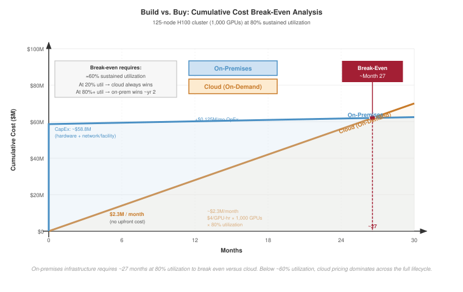
:::

The plotted reference uses `{python} BuildVsBuyFigureScenario.gpus_str` H100 GPUs across `{python} BuildVsBuyFigureScenario.nodes_str` nodes at `{python} BuildVsBuyFigureScenario.util_pct_str` sustained utilization. The on-premises curve starts at `{python} BuildVsBuyFigureScenario.upfront_capex_str` in upfront CapEx and adds about `{python} BuildVsBuyFigureScenario.annual_opex_str` per year, while cloud rental at \$4/GPU-hour grows by about `{python} BuildVsBuyFigureScenario.cloud_monthly_usd_str` per month. Over `{python} BuildVsBuyFigureScenario.horizon_months_str`, the cloud line reaches `{python} BuildVsBuyFigureScenario.cloud_horizon_usd_str`, and the on-premises line crosses it around `{python} BuildVsBuyFigureScenario.breakeven_month_str`.

```{python}
#| echo: false
#| label: tco-scenario
# ┌─────────────────────────────────────────────────────────────────────────────
# │ TCO AND BUILD-VS-BUY ANALYSIS (LEGO)
# ├─────────────────────────────────────────────────────────────────────────────
# │ Context: @sec-ops-scale-fleet-economics
# │
# │ Goal: Compare Cloud vs On-Premises TCO for an 8-GPU H100 node.
# │ Show: On-prem ~30-40% cheaper at 80% utilization.
# │ How: cloud_node_annual = hourly_rate * gpus * 8760 * util.
# │      onprem_node_annual = (price / 3) + annual_elec.
# │
# └─────────────────────────────────────────────────────────────────────────────
from mlsysim.fmt import fmt, fmt_qty, fmt_usd, check

class TcoScenario:
    """Namespace for build-vs-buy economics."""

    # ┌── 1. LOAD (Constants) ──────────────────────────────────────────────
    cloud_h100_hourly = Infrastructure.Pricing.Cloud.GpuTrainingPerHour.rate.to(USD / hour).magnitude
    gpus_per_node = Systems.Nodes.DGX_H100.accelerators_per_node
    dgx_h100_price = Infrastructure.Pricing.Capital.DgxH100NodeUsd.rate.to(USD).magnitude
    amortization_years = 3
    utilization = 0.80
    electricity_rate = Infrastructure.Pricing.OnPremises.ElectricityPerKwh.rate.to(USD / kWh).magnitude  # dollar/kWh
    pue = Infrastructure.FacilityCooling.StateOfArt.pue
    h100_tdp = Hardware.Cloud.H100.tdp

    # ┌── 2. EXECUTE (The Compute) ────────────────────────────────────────
    hours_per_year = HOURS_PER_YEAR
    cloud_node_annual = cloud_h100_hourly * gpus_per_node * hours_per_year * utilization

    # On-prem: CapEx + OpEx
    node_power = Systems.Racks.DGX_H100_4Node.total_power / Systems.Racks.DGX_H100_4Node.nodes_per_rack
    annual_energy = node_power.to(kW) * (hours_per_year * hour) * utilization * pue
    annual_elec = annual_energy.to(kWh).magnitude * electricity_rate
    onprem_node_annual = (dgx_h100_price / amortization_years) + annual_elec

    # Breakeven utilization (rough estimate)
    # cloud_rate * hours * util = (price/3) + facility energy * elec_rate
    # util * (cloud_rate * hours - power energy * elec_rate) = price/3
    numerator = dgx_h100_price / amortization_years
    denominator = (cloud_h100_hourly * gpus_per_node * hours_per_year) - (
        (node_power.to(kW) * (hours_per_year * hour) * pue).to(kWh).magnitude * electricity_rate
    )
    breakeven = (numerator / denominator) * 100

    # ┌── 3. GUARD (Invariants) ──────────────────────────────────────────
    check(onprem_node_annual < cloud_node_annual, "On-prem should be cheaper at 80% util")
    check(42.4 < breakeven < 42.6, f"Break-even utilization drifted to {breakeven:.1f}%")

    # ┌── 4. OUTPUT (Formatting) ──────────────────────────────────────────────
    cloud_cost_str = fmt_usd(cloud_node_annual, precision=0)
    annual_elec_usd_str = fmt_usd(annual_elec, precision=0)
    onprem_usd_str = fmt_usd(onprem_node_annual, precision=0)
    util_pct_str = fmt_percent(utilization, precision=0, commas=False, style='prose')
    breakeven_util_str = fmt_percent(breakeven / 100, precision=1, commas=False, style='prose')
```

Cloud providers charge by the GPU-hour. At approximately \$4.00 per H100-hour, a single 8-GPU node running at `{python} TcoScenario.util_pct_str` utilization costs `{python} TcoScenario.cloud_cost_str` per year. An on-premises DGX H100 node costs approximately \$350,000 to purchase. Amortized over three years and combined with electricity costs of `{python} TcoScenario.annual_elec_usd_str` per node per year, the total annual on-premises cost is approximately `{python} TcoScenario.onprem_usd_str` per node. Solving the break-even equation with electricity scaling at the same utilization, on-premises infrastructure becomes favorable when sustained utilization exceeds roughly `{python} TcoScenario.breakeven_util_str`.

The same calculation also explains why cloud pricing cannot be read as a simple price list. Reserved capacity lowers the per-hour rate by 40--60 percent, but it converts optionality into commitment. Spot or preemptible capacity can be 60--80 percent cheaper, but the discount arrives as interruption risk. Cheap capacity is therefore useful only when the training or serving system already has checkpointing, elasticity, and admission control that keep interruptions from becoming lost work or user-visible failures.

Owned capacity moves a different set of risks into the platform. Facility construction can add \$500--1,000 per kW of IT capacity, and networking, staffing, maintenance, and hardware obsolescence continue to accrue even when the GPUs are idle. A three-year-old GPU may be economically stranded if the next generation delivers 3$\times$ more performance per watt. The engineering question is therefore not whether one purchasing channel is universally cheaper; it is whether the workload mix can keep fixed capacity useful enough to compensate for its lifecycle and operating risks.

Hybrid designs follow from the same invariant. Owned infrastructure can carry predictable baseline work, while cloud allocations absorb peak demand, early hardware access, or bursty training campaigns. The hybrid split is not a compromise between two vendor categories; it is a scheduling policy over capital risk, utilization, and deadline risk.

```{python}
#| echo: false
# ┌── LEGO ───────────────────────────────────────────────
class InfraFrontierTcoBuildRecap:

    # ┌── 4. OUTPUT (Formatting) ──────────────────────────────────────────────
    frontier_params_b_str = fmt_params(Models.Language.GPT3.parameters, scale="B", precision=0, commas=False)
```

For the `{python} InfraFrontierTcoBuildRecap.frontier_params_b_str` model, cadence is the variable that determines the answer. A team that trains one large model per year and serves it for the remaining eleven months may use owned training hardware only 15--20 percent of the time. A team running back-to-back experiments, hyperparameter sweeps, fine-tuning jobs, and model variants can sustain 70--80 percent utilization on the same fleet. The hardware has not changed; the workload mix has changed the economics. In the middle regime, the platform owns enough capacity for the continuous baseline and bursts to the cloud for the large training runs that temporarily require 5--10$\times$ the baseline allocation.

#### Operational complexity {#sec-ml-operations-scale-operational-complexity-c325}

TCO also understates the operational complexity of owning the fleet. Hardware maintenance means diagnosing failed GPUs, NVLink cables, InfiniBand HCAs, and cooling components before a local fault becomes a cluster-wide slowdown. A 10,000-GPU cluster experiencing one GPU failure every five hours, as predicted by MTBF analysis at the canonical 50,000-hour per-GPU MTBF, needs replacement paths measured in hours rather than days. @Sec-appdx-reliability-foundations-component-rates supplies the per-component MTTF baselines and converts them into the fleet-level failure rate behind this five-hour figure, so the staffing argument traces back to a measured reliability budget rather than an assumed one.

The software side creates the same coupling. CUDA, GPU drivers, InfiniBand drivers, container runtimes, schedulers, monitoring systems, and training frameworks all participate in the achieved utilization number. A driver/toolkit incompatibility can silently degrade performance, while a scheduler or monitoring gap can strand accelerators behind failed jobs. Large training clusters commonly need 5--15 infrastructure engineers per 10,000 GPUs because performance optimization is continuous: as models, frameworks, and hardware configurations change, communication patterns, memory pressure, and parallelism strategies change with them. @Sec-appdx-c3-taxonomy-case-1 works the underutilized fleet through the computation, communication, and coordination axes, giving the performance engineer a framework to locate where the lost utilization actually goes rather than tuning blindly.

Cloud providers charge a margin above raw hardware and electricity partly because they absorb this operating burden. The point is not that cloud is simpler in every technical sense; it exposes a different interface. The platform either pays for internal expertise in GPU kernel behavior, InfiniBand operations, distributed-systems debugging, liquid cooling, and power infrastructure, or it pays a provider to hide some of that machinery behind a service contract. In both cases, the economics are still governed by useful work per dollar.

#### From TCO to total value of ownership {#sec-ml-operations-scale-tco-total-value-ownership-de10}

A more complete framework than TCO is Total Value of Ownership (TVO), which includes the value generated by infrastructure rather than only its cost. Two clusters with identical TCO may create different outcomes if one reaches a result two weeks earlier, sustains higher scaling efficiency, starts jobs faster, checkpoints more cheaply, or serves the resulting model at lower cost per token. The value terms are hard to price exactly, but they are not optional in systems reasoning: time-to-result affects product deadlines, scaling efficiency affects final model quality under a fixed training window, experimentation velocity affects the number of hypotheses the team can test, and inference efficiency can dominate training cost over a multi-year deployment.

This value-oriented perspective changes the infrastructure decision from cost minimization to constraint management. A cheaper cluster that slows the research cycle or produces a model with higher serving cost may be more expensive over the model lifecycle. Conversely, a more expensive training platform can pay for itself if it enables a smaller or more efficient deployed model.

```{python}
#| echo: false
# ┌── LEGO ───────────────────────────────────────────────
class InfraFrontierStragglerRecap20:

    # ┌── 4. OUTPUT (Formatting) ──────────────────────────────────────────────
    frontier_params_b_str = fmt_params(Models.Language.GPT3.parameters, scale="B", precision=0, commas=False)
```

The inference dimension of TVO deserves particular emphasis because it often dominates the total economic picture. Training the `{python} InfraFrontierStragglerRecap20.frontier_params_b_str` model is a one-time cost -- even at \$5 million per training run, it is a bounded expenditure. Serving the trained model, however, is an ongoing operational cost that accumulates indefinitely. A popular LLM serving 10 million queries per day, with each query generating an average of 500 tokens, processes 5 billion tokens daily. At an inference cost of \$2.00 per million tokens on H100 hardware, the daily serving cost is \$10,000, or approximately \$3.6 million per year. The cumulative inference cost exceeds a \$5 million training run after roughly 17 months, and exceeds it several times over during a multi-year deployment. This inversion means that infrastructure decisions optimized for training (maximizing TFLOP/s per dollar) may be suboptimal for the model's total lifecycle cost. An organization that spends an additional \$2 million on training infrastructure to produce a model that is 20 percent more efficient at inference (through better architecture search enabled by faster experimentation) can recover that investment over a three-year serving lifetime at this traffic level.

```{python}
#| echo: false
#| label: ten-k-gpu-cluster-tco
# ┌─────────────────────────────────────────────────────────────────────────────
# │ 10,000-GPU CLUSTER TCO (LEGO)
# ├─────────────────────────────────────────────────────────────────────────────
# │ Context: @nbk-ops-scale-10-000-gpu-cluster.
# │ Goal: Compute each TCO line item used in the 10,000-GPU notebook.
# │ How: Hardware + network + facility upfront; GPU-only electricity and
# │      staffing as annual OpEx; cloud at $4/GPU-hour and 80% utilization.
# └─────────────────────────────────────────────────────────────────────────────
from mlsysim.fmt import check, fmt, fmt_count, fmt_params, fmt_percent, fmt_qty, fmt_ratio, fmt_time, fmt_usd

class TenKGpuClusterTco:
    """TCO for the 10,000-GPU reference cluster."""

    # ┌── 1. LOAD ──────────────────────────────────────────────────────────
    gpus = Systems.Clusters.Training_10K.total_accelerators
    gpus_per_node = Systems.Nodes.DGX_H100.accelerators_per_node
    node_price_usd = Infrastructure.Pricing.Capital.DgxH100NodeUsd.rate.to(USD).magnitude
    network_capex_usd = 25_000_000
    facility_capex_usd = 75_000_000
    electricity_rate = Infrastructure.Pricing.OnPremises.ElectricityPerKwh.rate.to(USD / kWh).magnitude
    pue = Infrastructure.FacilityCooling.StateOfArt.pue
    annual_staffing_usd = 5_000_000
    cloud_gpu_hour_usd = Infrastructure.Pricing.Cloud.GpuTrainingPerHour.rate.to(USD / hour).magnitude
    utilization = 0.80
    lifecycle_years = 3
    gpu_tdp = Hardware.Cloud.H100.tdp

    # ┌── 2. EXECUTE ───────────────────────────────────────────────────────
    nodes = gpus // gpus_per_node
    hardware_capex_usd = nodes * node_price_usd
    upfront_capex_usd = hardware_capex_usd + network_capex_usd + facility_capex_usd
    annual_gpu_energy = (gpus * gpu_tdp).to(kW) * (HOURS_PER_YEAR * hour) * pue
    annual_electricity_usd = annual_gpu_energy.to(kWh).magnitude * electricity_rate
    annual_opex_usd = annual_electricity_usd + annual_staffing_usd
    three_year_total_usd = upfront_capex_usd + lifecycle_years * annual_opex_usd
    cloud_annual_usd = gpus * cloud_gpu_hour_usd * HOURS_PER_YEAR * utilization
    cloud_three_year_usd = cloud_annual_usd * lifecycle_years
    savings_usd = cloud_three_year_usd - three_year_total_usd
    breakeven_utilization = three_year_total_usd / (gpus * cloud_gpu_hour_usd * HOURS_PER_YEAR * lifecycle_years)

    # ┌── 3. GUARD ─────────────────────────────────────────────────────────
    check(nodes == 1250, f"Expected 1,250 nodes, got {nodes}")
    check(4.6e6 < annual_electricity_usd < 4.8e6, "GPU-only electricity should be about $4.7M/year")
    check(0.53 < breakeven_utilization < 0.55, "Break-even utilization should be about 54%")

    # ┌── 4. OUTPUT ────────────────────────────────────────────────────────
    nodes_str = fmt(nodes, precision=0, commas=True)
    hardware_capex_str = fmt_usd(hardware_capex_usd, precision=1, scale="M")
    network_capex_str = fmt_usd(network_capex_usd, precision=0, scale="M")
    facility_capex_str = fmt_usd(facility_capex_usd, precision=0, scale="M")
    annual_electricity_usd_str = fmt_usd(annual_electricity_usd, precision=1, scale="M")
    annual_staffing_usd_str = fmt_usd(annual_staffing_usd, precision=0, scale="M")
    upfront_capex_str = fmt_usd(upfront_capex_usd, precision=1, scale="M")
    annual_opex_str = fmt_usd(annual_opex_usd, precision=1, scale="M")
    three_year_total_usd_str = fmt_usd(three_year_total_usd, precision=1, scale="M")
    cloud_annual_usd_str = fmt_usd(cloud_annual_usd, precision=1, scale="M")
    cloud_three_year_usd_str = fmt_usd(cloud_three_year_usd, precision=1, scale="M")
    savings_str = fmt_usd(savings_usd, precision=1, scale="M")
    breakeven_util_str = fmt_percent(breakeven_utilization, precision=1, commas=False, style='prose')
    gpus_str = fmt_count(gpus, commas=True, label="GPU")
    node_price_str = fmt_usd(node_price_usd, precision=0, commas=True)
    gpu_tdp_w_str = fmt_qty(gpu_tdp, watt, precision=0, commas=False)
    pue_str = fmt(pue, precision=1, commas=False)
    hours_per_year_str = fmt_time(HOURS_PER_YEAR, "hour", precision=0, commas=True, per="year")
    electricity_rate_str = fmt_usd(electricity_rate, precision=2, commas=False, per="kWh")
    cloud_gpu_hour_usd_str = fmt_usd(
        cloud_gpu_hour_usd,
        precision=0,
        commas=False,
        per="GPU-hour",
    )
    utilization_factor_str = fmt_ratio(utilization, precision=2, commas=False)
    cloud_utilization_pct_str = fmt_percent(utilization, precision=0, commas=False, style='prose')
    lifecycle_years_str = fmt_time(lifecycle_years, "year", precision=0, commas=False, style="word")
```

::: {#nbk-ops-scale-10-000-gpu-cluster .callout-notebook title="The 10,000-GPU cluster"}

```{python}
#| echo: false
# ┌── LEGO ───────────────────────────────────────────────
class InfraFrontierTcoTenKRecap:

    # ┌── 4. OUTPUT (Formatting) ──────────────────────────────────────────────
    frontier_params_b_str = fmt_params(Models.Language.GPT3.parameters, scale="B", precision=0, commas=False)
```

Consider a cluster of `{python} TenKGpuClusterTco.nodes_str` DGX H100 nodes (`{python} TenKGpuClusterTco.gpus_str`) for training the `{python} InfraFrontierTcoTenKRecap.frontier_params_b_str` model.

**On-premises (3-year lifecycle)**:

- **Hardware CapEx**\index{CapEx!hardware}: `{python} TenKGpuClusterTco.nodes_str` $\times$ `{python} TenKGpuClusterTco.node_price_str` = `{python} TenKGpuClusterTco.hardware_capex_str`
- **Network CapEx**\index{CapEx!network}: ~`{python} TenKGpuClusterTco.network_capex_str` (InfiniBand fat-tree fabric)
- **Facility CapEx**\index{CapEx!facility capex}: ~`{python} TenKGpuClusterTco.facility_capex_str` (liquid-cooled data center hall)
- **Annual Electricity**\index{Electricity!annual electricity}: simplified GPU-only estimate: `{python} TenKGpuClusterTco.gpus_str` $\times$ `{python} TenKGpuClusterTco.gpu_tdp_w_str` $\times$ PUE `{python} TenKGpuClusterTco.pue_str` $\times$ `{python} TenKGpuClusterTco.hours_per_year_str` $\times$ `{python} TenKGpuClusterTco.electricity_rate_str` = `{python} TenKGpuClusterTco.annual_electricity_usd_str`/year
- **Annual Staffing**\index{Staffing!annual staffing}: ~`{python} TenKGpuClusterTco.annual_staffing_usd_str`/year
- **3-year total**: `{python} TenKGpuClusterTco.upfront_capex_str` + `{python} TenKGpuClusterTco.lifecycle_years_str` $\times$ `{python} TenKGpuClusterTco.annual_opex_str` = ~`{python} TenKGpuClusterTco.three_year_total_usd_str`

**Cloud rental** (3-year rental at `{python} TenKGpuClusterTco.cloud_utilization_pct_str` utilization):

- **Annual Cost**\index{Cost!annual cost}: `{python} TenKGpuClusterTco.gpus_str` $\times$ `{python} TenKGpuClusterTco.cloud_gpu_hour_usd_str` $\times$ `{python} TenKGpuClusterTco.hours_per_year_str` $\times$ `{python} TenKGpuClusterTco.utilization_factor_str` = `{python} TenKGpuClusterTco.cloud_annual_usd_str`/year
- **3-year total**: ~`{python} TenKGpuClusterTco.cloud_three_year_usd_str`

**Systems insight**: Utilization is the binding variable in fleet TCO. On-premises saves approximately `{python} TenKGpuClusterTco.savings_str` over three years at `{python} TenKGpuClusterTco.cloud_utilization_pct_str` utilization, but the savings disappear if utilization drops below roughly `{python} TenKGpuClusterTco.breakeven_util_str` because the on-premises hardware still incurs facility and staffing costs regardless of load.\index{Total Cost of Ownership!break-even}

:::

That utilization threshold explains why infrastructure scale can become a competitive advantage.

::: {#psp-ops-scale-infrastructure-moat .callout-perspective title="The infrastructure moat"}

The economics of ML infrastructure create a self-reinforcing advantage for organizations that can sustain high utilization. Building a 10,000-GPU cluster saves hundreds of millions over cloud rental, but only if the organization has enough workloads to keep it busy. Large technology companies with continuous training pipelines, frequent model refreshes, and massive inference workloads achieve 70--90 percent utilization, making on-premises infrastructure highly cost-effective. Smaller organizations with sporadic training needs may achieve only 20--30 percent utilization, making cloud rental cheaper despite the higher per-hour cost. This dynamic creates an infrastructure moat: organizations with scale can afford to build, and building makes scale cheaper, which enables more ambitious models, which require more infrastructure. The gap compounds over time, giving high-utilization organizations a structural advantage when training the largest models.

:::

### Depreciation and lifecycle {#sec-ml-operations-scale-depreciation}

ML accelerators depreciate\index{Depreciation} faster than any other category of IT equipment. Traditional servers have useful lifetimes of 5--7 years; network switches last even longer. ML accelerators become economically obsolete in 3--4 years because each new generation delivers more performance per watt. Under the low-precision efficiency basis in @tbl-power-efficiency, a V100-era fleet draws similar per-GPU power to an H100-class fleet but receives only about 1/6.8 the throughput per watt. The electricity cost per unit of useful computation is therefore about 6.8$\times$ higher than a team using the H100-class reference hardware.

The economic impact of this depreciation is significant. A V100 GPU that cost \$10,000--12,000 in 2018 could be purchased on the secondary market for \$2,000--3,000 in 2023, a depreciation of 70--80 percent in five years. An A100 GPU that cost \$15,000--20,000 in 2021 traded for \$8,000--12,000 in 2024, after just three years. These depreciation rates are far steeper than traditional IT equipment, reflecting the rapid pace of accelerator innovation.

Rapid depreciation turns refresh policy into a scheduling problem. Most organizations depreciate ML accelerators over three years for accounting purposes, even if the hardware physically functions longer. Replacing the entire fleet at once creates a large CapEx spike, while staggered refresh lowers peak expenditure but leaves the scheduler with mixed-generation hardware. Training frameworks must then handle different compute capabilities, memory capacities, and communication bandwidths inside one fleet, so the accounting choice becomes a software and placement constraint.

The same lifecycle logic determines where older accelerators remain useful. A GPU that is inefficient for the largest training runs may still serve smaller models, fine-tuning jobs, or memory-bound inference economically because memory bandwidth improves more slowly than peak arithmetic throughput. Resale, repurposing, and capacity-sharing arrangements are all attempts to preserve utilization while the hardware's market value falls. They work only when the platform can route work to the right generation without hiding performance cliffs from users.

Depreciation is most punitive for bursty workloads. If a team trains one large model per year, the GPUs lose value during the idle months even though they perform no useful computation. Cloud capacity amortizes the same depreciation across many customers, while owned capacity must amortize it across the owner's own workload mix. That is why the utilization invariant appears again: the hardware must either stay busy or be cheap enough to strand.

```{python}
#| echo: false
# ┌── LEGO ───────────────────────────────────────────────
class InfraFrontierTcoDeprecRecap:

    # ┌── 4. OUTPUT (Formatting) ──────────────────────────────────────────────
    frontier_params_b_str = fmt_params(Models.Language.GPT3.parameters, scale="B", precision=0, commas=False)
```

For the `{python} InfraFrontierTcoDeprecRecap.frontier_params_b_str` model, the depreciation calculus is stark. Under the \$350,000-per-8-GPU-node assumption, a 1,000-GPU H100 cluster costs \$43.75 million before network and facility costs. If that cluster has a resale value of approximately \$7--10 million after a three-year refresh window because newer accelerators deliver 3--4$\times$ the performance per watt, its net hardware depreciation is \$33.75--36.75 million. If the cluster trained only two large models during its lifetime, each model effectively cost \$16.9--18.4 million in depreciated hardware alone -- before accounting for electricity, staffing, or facility costs. If the same cluster ran continuously at 80 percent utilization for three years (training, fine-tuning, inference, and experimentation), the depreciated hardware cost per GPU-hour drops to approximately \$1.61--1.75 after resale, still well below the cloud rate. The depreciation math reinforces the central lesson of TCO analysis: utilization is the single most important variable in determining whether owned infrastructure is economically viable.

```{python}
#| echo: false
from mlsysim.fmt import fmt_compute_efficiency, fmt_flop_rate, fmt_power, fmt_multiple

# ┌── LEGO ───────────────────────────────────────────────
class GpuEfficiencyTableRecap:

    # ┌── 2. EXECUTE (relative efficiency vs. V100 baseline) ──────────────────
    _v100_eff = Hardware.Cloud.V100.compute.peak_flops / Hardware.Cloud.V100.tdp
    _a100_eff = Hardware.Cloud.A100.compute.peak_flops / Hardware.Cloud.A100.tdp
    _h100_eff = Hardware.Cloud.H100.compute.precision_flops['fp8'] / Hardware.Cloud.H100.tdp
    _b200_eff = Hardware.Cloud.B200.compute.precision_flops['fp8'] / Hardware.Cloud.B200.tdp
    # ┌── 4. OUTPUT (Formatting) ──────────────────────────────────────────────
    v100_efficiency_tflop_per_s_per_w_str = fmt_compute_efficiency(_v100_eff, unit=TFLOPs / second / watt, precision=2, commas=False)
    a100_efficiency_tflop_per_s_per_w_str = fmt_compute_efficiency(_a100_eff, unit=TFLOPs / second / watt, precision=2, commas=False)
    h100_efficiency_tflop_per_s_per_w_str = fmt_compute_efficiency(_h100_eff, unit=TFLOPs / second / watt, precision=2, commas=False)
    b200_efficiency_tflop_per_s_per_w_str = fmt_compute_efficiency(_b200_eff, unit=TFLOPs / second / watt, precision=2, commas=False)
    b200_fp8_tflop_per_s_str = fmt_flop_rate(Hardware.Cloud.B200.compute.precision_flops['fp8'], unit=TFLOP / second, precision=0, commas=False)
    b200_tdp_w_str = fmt_power(Hardware.Cloud.B200.tdp, unit=watt, precision=0, commas=False)
    v100_relative_mult_str = fmt_multiple((_v100_eff / _v100_eff).magnitude, precision=0, commas=False)
    a100_relative_mult_str = fmt_multiple((_a100_eff / _v100_eff).magnitude, precision=1, commas=False)
    h100_relative_mult_str = fmt_multiple((_h100_eff / _v100_eff).magnitude, precision=1, commas=False)
    b200_relative_mult_str = fmt_multiple((_b200_eff / _v100_eff).magnitude, precision=1, commas=False)
```

### Power efficiency trajectory {#sec-ml-operations-scale-power-efficiency}

The trajectory of power efficiency\index{Efficiency!power} across accelerator generations provides a quantitative framework for making cluster refresh decisions. Replacing an older cluster with a newer generation can pay for itself through electricity savings alone, particularly at scale.

```{python}
#| echo: false
from mlsysim.fmt import fmt_flop_rate

# ┌── LEGO ───────────────────────────────────────────────
class V100EfficiencyRecap:

    # ┌── 4. OUTPUT (Formatting) ──────────────────────────────────────────────
    flops_fp16_tflop_per_s_str = fmt_qty(Hardware.Cloud.V100.compute.peak_flops, TFLOP / second, precision=0, commas=False)
    tdp_w_str = fmt_qty(Hardware.Cloud.V100.tdp, watt, precision=0, commas=False)
```

```{python}
#| echo: false
from mlsysim.fmt import fmt_qty

# ┌── LEGO ───────────────────────────────────────────────
class A100EfficiencyRowRecap:
    flops_fp16_tflop_per_s_str = fmt_qty(Hardware.Cloud.A100.compute.peak_flops, TFLOP / second, precision=0, commas=False)
    tdp_w_str = fmt_qty(Hardware.Cloud.A100.tdp, watt, precision=0, commas=False)

    # ┌── 4. OUTPUT (Formatting) ──────────────────────────────────────────────
    flops_fp16_tflop_per_s_str = fmt_qty(Hardware.Cloud.A100.compute.peak_flops, TFLOP / second, precision=0, commas=False)
    tdp_w_str = fmt_qty(Hardware.Cloud.A100.tdp, watt, precision=0, commas=False)
```

```{python}
#| echo: false
from mlsysim.fmt import fmt_qty

# ┌── LEGO ───────────────────────────────────────────────
class H100TdpEfficiencyRecap:

    # ┌── 4. OUTPUT (Formatting) ──────────────────────────────────────────────
    tdp_w_str = fmt_qty(Hardware.Cloud.H100.tdp, watt, precision=0, commas=False)
```

```{python}
#| echo: false
# ┌── LEGO ───────────────────────────────────────────────
class TensorCoreEfficiencyRecap:

    # ┌── 4. OUTPUT (Formatting) ──────────────────────────────────────────────
    h100_fp8_tc_tflop_per_s_str = fmt_flop_rate(Hardware.Cloud.H100.compute.precision_flops['fp8'], unit=TFLOPs / second, precision=0, commas=True)
```

| **Generation**  |                   **Peak TFLOP/s (best precision)**                    |                    **TDP (W)**                    |                           **TFLOP/s per watt**                           |                  **Relative Efficiency**                  |
|:----------------|:----------------------------------------------------------------------:|:-------------------------------------------------:|:------------------------------------------------------------------------:|:---------------------------------------------------------:|
| **V100 (2017)** |    `{python} V100EfficiencyRecap.flops_fp16_tflop_per_s_str` (FP16)    |      `{python} V100EfficiencyRecap.tdp_w_str`     | `{python} GpuEfficiencyTableRecap.v100_efficiency_tflop_per_s_per_w_str` | `{python} GpuEfficiencyTableRecap.v100_relative_mult_str` |
| **A100 (2020)** |  `{python} A100EfficiencyRowRecap.flops_fp16_tflop_per_s_str` (FP16)   |    `{python} A100EfficiencyRowRecap.tdp_w_str`    | `{python} GpuEfficiencyTableRecap.a100_efficiency_tflop_per_s_per_w_str` | `{python} GpuEfficiencyTableRecap.a100_relative_mult_str` |
| **H100 (2022)** | `{python} TensorCoreEfficiencyRecap.h100_fp8_tc_tflop_per_s_str` (FP8) |    `{python} H100TdpEfficiencyRecap.tdp_w_str`    | `{python} GpuEfficiencyTableRecap.h100_efficiency_tflop_per_s_per_w_str` | `{python} GpuEfficiencyTableRecap.h100_relative_mult_str` |
| **B200 (2024)** |   `{python} GpuEfficiencyTableRecap.b200_fp8_tflop_per_s_str` (FP8)    | `{python} GpuEfficiencyTableRecap.b200_tdp_w_str` | `{python} GpuEfficiencyTableRecap.b200_efficiency_tflop_per_s_per_w_str` | `{python} GpuEfficiencyTableRecap.b200_relative_mult_str` |

: **Power Efficiency Across GPU Generations**: Each generation delivers substantially more computation per watt, meaning that for a fixed power budget, newer hardware provides multiplicatively more throughput. A facility that draws 10 MW can train models roughly 10$\times$ faster with B200s than with V100s, without any increase in electricity cost. {#tbl-power-efficiency}

As @tbl-power-efficiency shows, the implication is that hardware refresh cycles are about getting more work per dollar of electricity, not just more FLOP/s. At scale, the electricity savings from upgrading to a more efficient generation can amortize a significant fraction of the new hardware's purchase cost within the first year. This economic dynamic drives the rapid depreciation of ML accelerators: a three-year-old GPU is not just slower than a newer generation; it is more expensive to operate per unit of useful computation.

```{python}
#| echo: false
from mlsysim.fmt import fmt_qty

# ┌── LEGO ───────────────────────────────────────────────
class V100RefreshRecap:

    # ┌── 4. OUTPUT (Formatting) ──────────────────────────────────────────────
    tdp_w_str = fmt_qty(Hardware.Cloud.V100.tdp, watt, precision=0, commas=False)
```

Consider a concrete refresh scenario. An organization operating 1,000 V100 GPUs (`{python} V100RefreshRecap.tdp_w_str` each, `{python} GpuEfficiencyTableRecap.v100_efficiency_tflop_per_s_per_w_str`) consumes 300 kW of IT power for 125,000 TFLOP/s of aggregate throughput. Replacing them with 1,000 H100 GPUs (`{python} H100TdpEfficiencyRecap.tdp_w_str` each, `{python} GpuEfficiencyTableRecap.h100_efficiency_tflop_per_s_per_w_str`) increases power consumption to 700 kW but delivers 1,979,000 TFLOP/s, a 15.8$\times$ throughput increase for a 2.3$\times$ power increase.

Alternatively, the organization could match the V100 fleet's throughput with roughly 63 H100 GPUs, consuming only 44 kW and freeing 256 kW of power capacity for other workloads. The better strategy depends on whether the organization is throughput-constrained (wants to train larger models) or power-constrained (has a fixed electrical budget).

Both scenarios demonstrate that generational efficiency improvements reshape the economics of the fleet. The power-constrained case is particularly instructive: a data center with a fixed 300 kW power budget can deliver about 6.8$\times$ more computation by replacing V100s with H100s, even though it can only install 43 percent as many GPUs. The 15.8$\times$ throughput gain applies to a same-GPU-count refresh that raises power from 300 kW to 700 kW. Power, not procurement budget, is increasingly the binding constraint for fleet expansion.

The interplay between CapEx and OpEx also shapes procurement strategy. Cloud providers amortize their hardware over shorter periods (often 18--24 months) because they can sell older-generation instances at lower prices to price-sensitive customers, extracting residual value. On-premises operators typically amortize over 3--5 years, accepting that the hardware's relative performance declines over time.

Some organizations adopt a hybrid approach: running baseline workloads on owned infrastructure for cost efficiency and bursting to the cloud for peak demand or for access to newer hardware before committing to a large purchase. This hybrid model fits mid-sized AI companies that have a steady-state training workload, which justifies owned hardware, but periodically need 2--3$\times$ their base capacity for new model training campaigns.

```{python}
#| echo: false
# ┌── LEGO ───────────────────────────────────────────────
class InfraFrontierTcoPowerRecap:

    # ┌── 4. OUTPUT (Formatting) ──────────────────────────────────────────────
    frontier_params_b_str = fmt_params(Models.Language.GPT3.parameters, scale="B", precision=0, commas=False)
```

```{python}
#| echo: false
from mlsysim.fmt import fmt_qty

# ┌── LEGO ───────────────────────────────────────────────
class V100TcoPowerRecap:
    # ┌── 4. OUTPUT (Formatting) ──────────────────────────────────────────────
    tdp_w_str = fmt_qty(Hardware.Cloud.V100.tdp, watt, precision=0, commas=False)
```
The power efficiency trajectory has a direct implication for the `{python} InfraFrontierTcoPowerRecap.frontier_params_b_str` model's training economics, and a V100-versus-H100 comparison makes that implication concrete. Training on 1,000 V100 GPUs would require approximately `{python} V100TcoPowerRecap.tdp_w_str` each (300 kW IT power for 1,000 GPUs) and take roughly 8 months (given the V100's lower throughput). Training on 1,000 H100 GPUs requires `{python} H100TdpEfficiencyRecap.tdp_w_str` each (700 kW IT power for 1,000 GPUs) but completes in approximately 2--4 weeks. The H100 cluster consumes 2.3$\times$ more power per unit time but finishes 8--16$\times$ faster, resulting in a net energy reduction of 3.5--7$\times$ for the same training run. When electricity costs \$0.07/kWh, the V100 training run costs approximately \$120,000 in electricity while the H100 run costs approximately \$25,000. The newer hardware is simultaneously faster, cheaper to operate, and more energy-efficient -- a rare alignment that makes hardware refresh decisions straightforward for organizations with the capital to invest.

### Capacity lead time as operational risk {#sec-ml-operations-scale-procurement}

The economics of ML infrastructure are not purely about hardware specifications and electricity rates. Capacity lead time is itself an operational risk: a platform that cannot acquire, reserve, or free capacity quickly enough may miss model launches, delay rollback-safe migrations, or run without the headroom needed for incident response.

The GPU supply chain\index{GPU!procurement}\index{Supply Chain} is unusually concentrated. NVIDIA holds approximately 80--90 percent of the data center GPU market for ML workloads. TSMC manufactures essentially all high-end GPU dies. A small number of companies (SK Hynix, Samsung, and Micron) produce the HBM stacks. This concentration means that a disruption at any single point in the supply chain, whether a natural disaster at a fab, an equipment failure at an HBM manufacturer, or a geopolitical event affecting chip exports, can delay GPU deliveries across the entire industry.

The practical consequence of this concentration is that capacity changes slowly at large scale. Procurement timelines for large deployments (1,000+ GPUs) typically span 6--12 months from purchase decision to first usable capacity, and demand spikes can stretch that horizon further. For deployed fleets, that delay changes operations: the platform must forecast model growth, reserve refresh capacity, and maintain fallbacks before demand arrives rather than after dashboards turn red.

```{python}
#| echo: false
# ┌── LEGO ───────────────────────────────────────────────
class InfraFrontierTcoProcureRecap:

    # ┌── 4. OUTPUT (Formatting) ──────────────────────────────────────────────
    frontier_params_b_str = fmt_params(Models.Language.GPT3.parameters, scale="B", precision=0, commas=False)
```

For the `{python} InfraFrontierTcoProcureRecap.frontier_params_b_str` model, the planning lesson is that hardware access becomes part of the deployment schedule. A minimum viable 1,000-H100 allocation represents approximately \$44 million in node hardware under the \$350,000-per-8-GPU-node assumption used above, but the operational risk is not only the purchase price. If the allocation arrives a quarter late, the platform may lack capacity for fine-tuning, shadow traffic, canary expansion, or rollback-safe serving during the model launch window. Capacity planning is therefore a reliability control, not just a procurement function.

### Cloud capacity as an operations constraint {#sec-ml-operations-scale-cloud-options}

For organizations that choose the cloud path\index{Cloud Computing!ML infrastructure}, the provider absorbs hardware ownership but exposes capacity, topology, and interruption risk as operating constraints. The specific instance types and pricing change frequently, so the durable distinction is not vendor branding; it is how the cloud allocation affects communication, scheduling, and fault tolerance.

First, the interconnect fabric\index{Interconnect Fabric} determines whether distributed jobs and multi-node inference paths retain the scaling assumptions used in design. InfiniBand-like fabrics and Ethernet-based fabrics have different fixed-latency and per-byte costs; @sec-appdx-comm-foundations-alpha-beta separates those terms so the platform can decide whether the topology penalty matters for a given workload.

Second, provisioning granularity\index{Provisioning Granularity} determines how much topology the platform controls. Individual instances maximize flexibility but force the team to assemble placement, networking, and scheduling policy. Pod-level allocations provide a preconnected unit but reduce composition freedom.

Third, custom accelerator\index{Custom Accelerator} options apply the same generality-efficiency trade-off introduced at the silicon level: lower cost per operation for supported workloads, but reduced flexibility for nonstandard architectures. The choice mirrors the on-premises accelerator decision, except that the exit path is a cloud migration rather than a hardware refresh.

The pricing models across providers share a common risk structure. On-demand instances\index{On-Demand Instances} buy flexibility at the highest per-hour cost. Reserved instances\index{Reserved Instances} buy lower unit cost through commitment. Spot or preemptible instances\index{Spot Instances}\index{Preemptible Instances} buy the lowest unit cost by accepting interruption risk. The platform choice is therefore a fault-tolerance decision: cheap capacity is useful only when checkpointing, elasticity, and admission control keep interruptions from becoming user-visible failures.

```{python}
#| echo: false
# ┌── LEGO ───────────────────────────────────────────────
class InfraFrontierStragglerRecap21:

    # ┌── 4. OUTPUT (Formatting) ──────────────────────────────────────────────
    frontier_params_b_str = fmt_params(Models.Language.GPT3.parameters, scale="B", precision=0, commas=False)
```

The economics of spot instances deserve particular attention because they can dramatically reduce training costs for organizations with the engineering sophistication to exploit them. At a 70 percent discount, spot H100 instances cost approximately \$1.20 per GPU-hour instead of \$4.00. For the `{python} InfraFrontierStragglerRecap21.frontier_params_b_str` model, the 1,000-GPU, 2--4 week workload consumes approximately 336,000--672,000 allocated GPU-hours. The on-demand cost is therefore about \$1.3--2.7 million, while spot pricing would reduce the bill to roughly \$0.4--0.8 million before accounting for interruptions. However, the stochastic nature of preemption transforms training from a deterministic process into a fault-tolerance engineering problem. If the cloud provider reclaims 5 percent of the nodes mid-training, a standard training job crashes instantly. Capturing spot economics requires an elastic training framework (such as TorchElastic) that can dynamically rebalance the computation graph when nodes are added or removed. The economic viability hinges on the **checkpoint tax**\index{Checkpoint Tax}: if the system must checkpoint every 10 minutes to limit data loss from preemption, and each checkpoint takes 30 seconds, approximately 5 percent of the "cheap" compute is consumed by I/O overhead. There exists a break-even point where the frequency of preemption events combined with checkpoint overhead makes spot instances more expensive in wall-clock time than reserved instances, despite the lower hourly rate.

A critical consideration for cloud-based ML infrastructure is **networking between instances**\index{Networking Between Instances}. Unlike on-premises clusters where the network topology is custom-designed, cloud instances share the provider's network fabric with other tenants. Cloud providers may offer placement groups or dedicated networking fabrics that reserve InfiniBand-like or equivalent bandwidth between instances within the same group.

However, cross-group or cross-zone communication may traverse shared infrastructure with lower bandwidth and higher latency. Training frameworks that span multiple placement groups or availability zones must account for this heterogeneous bandwidth topology, a challenge that does not arise in dedicated on-premises clusters. The practical consequence is that cloud-based training jobs must be sized to fit within a single placement group whenever possible, as crossing group boundaries can reduce scaling efficiency by 20--40 percent.

```{python}
#| echo: false
# ┌── LEGO ───────────────────────────────────────────────
class InfraFrontierTcoCloudRecap:

    # ┌── 4. OUTPUT (Formatting) ──────────────────────────────────────────────
    frontier_params_b_str = fmt_params(Models.Language.GPT3.parameters, scale="B", precision=0, commas=False)
```

For the `{python} InfraFrontierTcoCloudRecap.frontier_params_b_str` model, the cloud path presents a specific challenge: securing 1,000+ GPUs in a single placement group for a multi-week training run. Cloud providers typically limit placement group sizes to 256--512 GPUs, meaning that a large training run must either negotiate a custom allocation, often requiring a substantial commitment, or accept the performance penalty of spanning multiple groups. The availability of large contiguous GPU allocations varies by region and time of day, and organizations can wait weeks for a sufficiently large allocation during periods of peak demand. This availability uncertainty is a hidden cost of the cloud path that does not appear in the per-GPU-hour pricing but can delay training timelines significantly.

```{python}
#| echo: false
# ┌── LEGO ───────────────────────────────────────────────
from mlsysim.fmt import fmt, fmt_count, fmt_rate, fmt_usd

class TcoDecisionExercise:
    models_per_year = 10
    gpu_hours_per_model = 1_000
    cluster_gpus = 8
    cloud_gpu_hour_usd = Infrastructure.Pricing.Cloud.GpuTrainingPerHour.rate.to(USD / hour).magnitude
    node_price_usd = Infrastructure.Pricing.Capital.DgxH100NodeUsd.rate.to(USD).magnitude
    electricity_rate = Infrastructure.Pricing.OnPremises.ElectricityPerKwh.rate.to(USD / kWh).magnitude
    pue = Infrastructure.FacilityCooling.StateOfArt.pue

    # ┌── 4. OUTPUT (Formatting) ──────────────────────────────────────────────
    models_per_year_str = fmt_rate(models_per_year, "models/year", precision=0, commas=False)
    gpu_hours_per_model_str = fmt_count(gpu_hours_per_model, precision=0, label="GPU-hour", plural_label="GPU-hours")
    cluster_gpus_str = fmt_count(cluster_gpus, label="GPU", commas=False)
    cloud_gpu_hour_usd_str = fmt_usd(
        cloud_gpu_hour_usd,
        precision=0,
        commas=False,
        per="GPU-hour",
    )
    node_price_str = fmt_usd(node_price_usd, precision=0)
    electricity_rate_str = fmt_usd(electricity_rate, precision=2, commas=False, per="kWh")
    pue_str = fmt(pue, precision=1, commas=False)
```

```{python}
#| echo: false
from mlsysim.fmt import fmt_qty

# ┌── LEGO ───────────────────────────────────────────────
class H100TdpExerciseRecap:

    # ┌── 4. OUTPUT (Formatting) ──────────────────────────────────────────────
    tdp_w_str = fmt_qty(Hardware.Cloud.H100.tdp, watt, precision=0, commas=False)
```

::: {#chk-ops-scale-tco-decision-framework .callout-checkpoint title="TCO decision framework"}

Your organization needs to train `{python} TcoDecisionExercise.models_per_year_str`, each requiring `{python} TcoDecisionExercise.gpu_hours_per_model_str` on H100s. You are evaluating whether to purchase an on-premises cluster with `{python} TcoDecisionExercise.cluster_gpus_str` or use cloud instances at `{python} TcoDecisionExercise.cloud_gpu_hour_usd_str`.

1.  Calculate the annual cloud cost.
2.  Calculate the annualized on-premises cost, assuming `{python} TcoDecisionExercise.node_price_str` per 8-GPU node, `{python} TcoDecisionExercise.electricity_rate_str` electricity at PUE `{python} TcoDecisionExercise.pue_str`, and `{python} H100TdpExerciseRecap.tdp_w_str` per GPU.
3.  Solve for the number of annual training runs at which on-premises becomes cheaper.

:::

### Infrastructure planning methodology {#sec-ml-operations-scale-planning}

Infrastructure planning\index{Infrastructure Planning} begins when a workload requirement becomes a facility requirement. A large training run does not merely ask for more GPUs: the model size fixes the memory pressure, the token budget fixes the compute budget, the desired calendar time fixes aggregate throughput, and the communication pattern fixes the fabric that can make the cluster useful. Once an accelerator is chosen, its TDP constrains cooling, rack density, pod layout, facility power, and ultimately total cost of ownership. Planning is therefore a causal chain, not a purchasing checklist.

The first step is workload characterization\index{Workload Characterization}. Target model size determines the minimum accelerator count and memory strategy. Dataset size, target throughput, and acceptable training time turn the training objective into a FLOP-hour requirement. Communication pattern then changes the network answer: dense models stress AllReduce, mixture-of-experts models stress AllToAll, and pipeline-parallel models introduce more point-to-point traffic. Inference requirements add another constraint because the hardware that trains a model efficiently may not be the hardware that serves it economically.

With those constraints explicit, bottom-up sizing\index{Bottom-Up Sizing} works from the accelerator outward. Roofline analysis distinguishes compute-bound training from memory-bound serving. Compute-bound training optimizes for sustained TFLOP/s per dollar, while memory-bound inference often optimizes for bandwidth per dollar and latency per watt.

```{python}
#| echo: false
# ┌── LEGO ───────────────────────────────────────────────
class InfraFrontierTcoNodeRecap:

    # ┌── 4. OUTPUT (Formatting) ──────────────────────────────────────────────
    frontier_params_b_str = fmt_params(Models.Language.GPT3.parameters, scale="B", precision=0, commas=False)
```

At that point, planning becomes a sequence of coupled design constraints rather than a shopping list. Node sizing decides how many accelerators share a host and which memory tier carries optimizer state, activations, and data staging. For the `{python} InfraFrontierTcoNodeRecap.frontier_params_b_str` model, that points toward eight GPUs per node with tensor parallelism and roughly 2 TB of host DRAM for optimizer-state offload. Cluster sizing then divides the total compute budget by sustained per-node throughput after MFU losses and adds 5--10 percent for a maintenance pool and spares.

Network design follows the primary collective and validates expected scaling with @eq-distributed-training-scaling-efficiency. The fabric is also a cost line, not just a performance one: @sec-network-fabrics-topology derives the leaf and spine switch counts a fat-tree requires, but each InfiniBand NDR switch costs \$15,000--30,000 and active optical cables add \$500--1,000 per link, so the network for a 1,024-GPU cluster runs \$5--15 million depending on oversubscription and optical mix. A RoCE (RDMA over Converged Ethernet) fabric lowers per-port cost but is lossy under the bursty, synchronized traffic of distributed training: even a 1 percent packet-retransmission rate can cut effective AllReduce throughput by 10--20 percent because every GPU waits for the slowest participant. When the GPU fleet is a \$35+ million investment, the InfiniBand premium can pay for itself by keeping the network from becoming the bottleneck.

Power and cooling translate IT load through PUE, then sanity-check rack density locally: a four-node DGX H100 rack is roughly a 30--40 kW design point once GPUs, host systems, networking, power conversion, and cooling overhead are included. Higher density changes the cooling architecture, not just the electric bill. TCO and schedule remain design variables because the cluster must arrive in time to matter, and GPU supply or electrical work often dominates lead time.

```{python}
#| echo: false
#| label: planning-throughput-scenario
# ┌─────────────────────────────────────────────────────────────────────────────
# │ INFRASTRUCTURE PLANNING THROUGHPUT (LEGO)
# ├─────────────────────────────────────────────────────────────────────────────
# │ Context: @sec-ops-scale-fleet-economics
# │ Goal: Compute the conservative BF16/FP16 throughput basis for the 175B plan.
# │ How: Compute total training FLOPs and sustained cluster throughput.
# └─────────────────────────────────────────────────────────────────────────────
from mlsysim.fmt import fmt_int, fmt_flop_rate, fmt, fmt_sci_flops, check, fmt_count, fmt_percent

class PlanningThroughputScenario:
    """Conservative BF16/FP16 planning basis for the 175B training run."""

    # ┌── 1. LOAD ──────────────────────────────────────────────────────────
    params = Models.Language.GPT3.parameters.to(param).magnitude
    tokens = Models.Language.GPT3.training_tokens.to(count).magnitude
    training_flops_per_token_param = Literature.Chinchilla.ComputeConstant
    mfu = Literature.Training.MfuHigh * 0.9
    fleet = Systems.Clusters.Training_1K
    gpus = fleet.total_accelerators
    h100_peak_flops = fleet.node.accelerator.compute.peak_flops

    # ┌── 2. EXECUTE ───────────────────────────────────────────────────────
    total_flops = training_flops_per_token_param * params * tokens
    per_gpu_sustained_flops = h100_peak_flops * mfu
    cluster_sustained_flops = per_gpu_sustained_flops * gpus
    cluster_sustained_pflops = cluster_sustained_flops.to(PFLOPs / second).magnitude
    ideal_seconds = total_flops / (cluster_sustained_pflops * (THOUSAND * TRILLION))
    ideal_days = ideal_seconds / SEC_PER_DAY

    # ┌── 3. GUARD ─────────────────────────────────────────────────────────
    check(3.14e23 < total_flops < 3.16e23, "175B x 300B x 6 should be 3.15e23 FLOPs")
    check(450 <= cluster_sustained_pflops <= 460, "Cluster sustained throughput should be about 456 PFLOP/s")
    check(7.5 <= ideal_days <= 8.5, "Ideal training time should be about 8 days")

    # ┌── 4. OUTPUT ────────────────────────────────────────────────────────
    total_flops_str = fmt_sci_flops(total_flops * flop, precision=2)
    mfu_pct_str = fmt_percent(mfu, precision=0, commas=False, style='prose')
    h100_peak_tflop_per_s_str = fmt_flop_rate(h100_peak_flops, unit=TFLOPs / second, precision=0, commas=False)
    per_gpu_sustained_tflop_per_s_str = fmt_flop_rate(per_gpu_sustained_flops, unit=TFLOPs / second, precision=1, commas=False)
    gpus_str = fmt_count(gpus, label="GPU")
    cluster_sustained_pflop_per_s_str = fmt_flop_rate(cluster_sustained_flops, unit=PFLOPs / second, precision=1, commas=False)
    ideal_days_str = fmt_int(round(ideal_days), commas=False)
```

```{python}
#| echo: false
# ┌── LEGO ───────────────────────────────────────────────
class InfraFrontierTcoPlanningRecap:

    # ┌── 4. OUTPUT (Formatting) ──────────────────────────────────────────────
    frontier_params_b_str = fmt_params(Models.Language.GPT3.parameters, scale="B", precision=0, commas=False)
```

```{python}
#| echo: false
# ┌── LEGO ───────────────────────────────────────────────
from mlsysim.fmt import fmt_power

class RackPowerPlanningRecap:
    # ┌── 1. LOAD ──────────────────────────────────────────
    rack = Systems.Racks.DGX_H100_4Node

    # ┌── 4. OUTPUT (Formatting) ──────────────────────────────────────────────
    rack_power_kw_str = fmt_power(rack.total_power, unit=kilowatt, precision=1, commas=False)
```

The same chain becomes concrete for the `{python} InfraFrontierTcoPlanningRecap.frontier_params_b_str` training plan. Large-batch training is compute bound, so the design optimizes for sustained TFLOP/s per dollar and selects H100s rather than a bandwidth-optimized inference accelerator. The 2.2 TB training state cannot live on one device, which forces tensor parallelism inside each node plus optimizer sharding, activation checkpointing, and offload across the wider data-parallel group. That memory constraint produces the DGX H100 node shape before the facility planner ever reaches the power spreadsheet.

Cluster size then follows from the compute budget. At 6 FLOPs per parameter-token over 175 billion parameters and 300 billion tokens, the run requires `{python} PlanningThroughputScenario.total_flops_str`. Using a conservative BF16/FP16 planning basis rather than the FP8 headline peak, each H100 delivers `{python} PlanningThroughputScenario.h100_peak_tflop_per_s_str` peak and `{python} PlanningThroughputScenario.per_gpu_sustained_tflop_per_s_str` sustained at `{python} PlanningThroughputScenario.mfu_pct_str` MFU. With `{python} PlanningThroughputScenario.gpus_str`, the cluster reaches roughly `{python} PlanningThroughputScenario.cluster_sustained_pflop_per_s_str` sustained and completes the run in about `{python} PlanningThroughputScenario.ideal_days_str` days of idealized compute time, or 2--4 weeks with operational overhead. The TP-8, PP-4, DP-32 configuration generates structured AllReduce traffic suited to a rail-optimized InfiniBand fabric.

The 128 nodes draw `{python} RackPowerPlanningRecap.rack_power_kw_str` per 4-node rack across 32 racks at approximately 1.1 MW of facility-relevant load, necessitating liquid cooling. The 3-year TCO comes to approximately \$63M on-premises; renting the six-runs-per-year workload in the cloud is roughly \$24--48M depending on whether each run lasts 2 or 4 weeks, while continuous cloud use is more expensive. The break-even depends on sustained utilization beyond the initial training run. GPU procurement (6--12 months) and facility preparation must begin immediately, with phased deployment targeting initial capacity within 3 months.

#### Site selection and physical constraints {#sec-ops-scale-site-selection}

The planning chain has so far assumed a facility exists, but for a fleet at this scale the site itself is a planning variable that fixes several constraints before any accelerator is purchased. Power availability is the first and usually most binding. A 10,000-GPU pod requires 10--15 MW of continuous power, equivalent to a medium-sized factory, and at megawatt scale the gap between a favorable and an unfavorable electricity rate can amount to tens of millions of dollars over a hardware lifecycle. Locations near hydroelectric dams (the Pacific Northwest, Scandinavia, Quebec) offer abundant low-carbon power but are often remote from talent pools and existing fiber, so the trade-off between cheap power and proximity to engineers becomes one of the most consequential siting decisions.

Cooling environment is the second constraint. Sites in temperate or cold climates achieve lower PUE through **free cooling**\index{Free cooling!site selection} (using outside air directly, without mechanical refrigeration) for much of the year; Meta's Lulea, Sweden facility, where the average annual temperature is 1 degree Celsius, approaches a PUE of 1.03 on year-round free cooling. Hot, arid regions face both higher cooling costs and water scarcity for evaporative towers. A 10 MW facility using standard evaporative cooling can consume well over 100 million liters of water annually, which in water-stressed regions places a data center in direct competition with municipal and agricultural demand and can trigger permitting limits; closed-loop liquid or dry-cooler systems cut water use to near zero but raise capital cost and, in hot climates, PUE. Network connectivity is the third constraint: training clusters that ingest geographically distributed data need WAN bandwidth, while serving clusters need proximity to internet exchange points for end-user latency, which is why some organizations separate training pods in power-rich remote sites from serving pods near population centers.

These constraints are frequently in tension, and regulatory boundaries can override all of them. Export controls act as a hard filter on which accelerator classes a given geography may host, and data-sovereignty mandates such as the European Union's General Data Protection Regulation (GDPR) can compel facilities into expensive, power-constrained regions to satisfy compliance rather than efficiency. The result is a **power alley**\index{Power alley!site selection} phenomenon that concentrates capacity in a few zones: Northern Virginia for connectivity, the Pacific Northwest for cheap hydroelectric power, the Nordics for free cooling. As those zones saturate, local grids face multi-year waits for new substation capacity, pushing operators toward unconventional "brownfield" sites (retired aluminum smelters, defunct coal plants) where high-voltage transmission exists but fiber and cooling must be built from scratch.

#### Construction and deployment timelines {#sec-ops-scale-construction-timelines}

Site choice feeds directly into schedule, and the timeline from decision to first computation is the planning constraint most organizations underestimate. Building a facility from scratch takes 18--30 months, with the electrical substation (18--24 months) and building shell (12--18 months) the longest-lead items; GPU lead times during high demand reach 6--12 months and run concurrently. The practical consequence is that infrastructure decisions must be made 18--30 months before the infrastructure is needed, often selecting a facility design for hardware that does not yet exist. To absorb that mismatch, experienced teams design for **headroom**\index{Headroom!facility design}: oversizing electrical infrastructure by 30--50 percent, designing the cooling plant for higher heat densities than the initial deployment requires, and specifying flexible rack layouts, at a typical premium of 10--20 percent of facility CapEx that buys the ability to upgrade compute without reconstructing the building.

The construction timeline is governed by a **critical path**\index{Critical Path} that must align two disparate workstreams: the facility track (site, power, shell, cooling) and the hardware track (silicon allocation, server assembly, network integration). GPU procurement captures headlines, but the true bottleneck is frequently the electrical substation, whose permitting and transformer delivery cannot be compressed by spending more. This creates a high-stakes synchronization problem: a 20,000-GPU allocation (\$500M+) secured before the facility is ready depreciates in a warehouse, while a \$200M shell completed before silicon arrives leaves capital assets idle. To hedge it, teams use **phased deployment**\index{Phased deployment!data centers}, commissioning the facility in waves rather than targeting a single go-live date, often bringing up an initial 10--20 percent of capacity (2,000 of 10,000 GPUs) while construction continues. The early phase lets the software team validate the distributed-training stack and tune collective-communication kernels on the real topology while simultaneously stress-testing power distribution and cooling, surfacing hotspots and cabling defects at small scale.

What justifies these contortions is the **time value of compute**\index{Time value of compute}. For large-model development, the cost of delay can exceed the interest on capital, because delayed compute postpones experiments, product launches, and downstream capabilities. A model projected to generate \$10 million per month in value loses \$30 million to a three-month construction delay, often exceeding the cost of the facility's electrical infrastructure entirely. That calculus can justify paying premiums for prefabricated modular data centers or leasing temporary colocation space to bridge the gap between silicon delivery and facility readiness, and it is why capacity planning is a reliability and product-velocity control, not only a procurement function.

```{python}
#| echo: false
from mlsysim.fmt import fmt, fmt_params, fmt_percent, fmt_power, fmt_time, fmt_tokens, fmt_usd

# ┌── LEGO ───────────────────────────────────────────────
class InfraPlanningExercise:
    _plan_model = Models.Language.Llama2_70B
    params_b = round(_plan_model.parameters.to(Bparam).magnitude)
    tokens_t = 1
    weeks = 4
    power = 2 * MW
    mfu_pct = round(Literature.Training.MfuHigh * 0.9 * 100)
    pue = Infrastructure.FacilityCooling.StateOfArt.pue
    non_gpu_overhead_pct = 50
    cloud_gpu_hour_usd = Infrastructure.Pricing.Cloud.GpuTrainingPerHour.rate.to(USD / hour).magnitude
    node_price_usd = Infrastructure.Pricing.Capital.DgxH100NodeUsd.rate.to(USD).magnitude

    # ┌── 4. OUTPUT (Formatting) ──────────────────────────────────────────────
    params_b_str = fmt_params(_plan_model.parameters, scale="B", precision=0, commas=False)
    tokens_t_str = fmt_tokens(tokens_t * TRILLION, scale="T", precision=0, commas=False)
    weeks_str = fmt_time(weeks, 'week', precision=0, commas=False, style='word')
    power_mw_str = fmt_power(power, unit=MW, precision=0, commas=False)
    mfu_pct_str = fmt_percent(mfu_pct / 100, precision=0, commas=False, style='prose')
    pue_str = fmt(pue, precision=1, commas=False)
    non_gpu_overhead_pct_str = fmt_percent(non_gpu_overhead_pct / 100, precision=0, commas=False, style='prose')
    cloud_gpu_hour_usd_str = fmt_usd(
        cloud_gpu_hour_usd,
        precision=0,
        commas=False,
        per="GPU-hour",
    )
    node_price_str = fmt_usd(node_price_usd, precision=0)
```

```{python}
#| echo: false
from mlsysim.fmt import fmt_qty

# ┌── LEGO ───────────────────────────────────────────────
class NodeCapacityScenarioSecComputeTcoRecap:

    # ┌── 4. OUTPUT (Formatting) ──────────────────────────────────────────────
    h100_fp8_tflop_per_s_str = fmt_qty(Hardware.Cloud.H100.compute.precision_flops['fp8'], TFLOP / second, precision=0, commas=False)
```

```{python}
#| echo: false
from mlsysim.fmt import fmt_qty

# ┌── LEGO ───────────────────────────────────────────────
class H100TdpExerciseRecap:

    # ┌── 4. OUTPUT (Formatting) ──────────────────────────────────────────────
    tdp_w_str = fmt_qty(Hardware.Cloud.H100.tdp, watt, precision=0, commas=False)
```

::: {#chk-ops-scale-infrastructure-planning-exercise .callout-checkpoint title="Infrastructure planning exercise"}

Your team needs to train a `{python} InfraPlanningExercise.params_b_str`-parameter model on `{python} InfraPlanningExercise.tokens_t_str` tokens within `{python} InfraPlanningExercise.weeks_str`. Using the following specifications:

- H100 GPU: `{python} NodeCapacityScenarioSecComputeTcoRecap.h100_fp8_tflop_per_s_str` FP8 peak, assume `{python} InfraPlanningExercise.mfu_pct_str` MFU
- Compute budget: $6 \times 70 \times 10^9 \times 10^{12} = 4.2 \times 10^{23}$ FLOPs
- Available power: `{python} InfraPlanningExercise.power_mw_str`
1.  Determine the minimum number of GPUs needed.
2.  Evaluate sufficiency of the `{python} InfraPlanningExercise.power_mw_str` power budget, assuming PUE `{python} InfraPlanningExercise.pue_str`, `{python} H100TdpExerciseRecap.tdp_w_str` per GPU, and `{python} InfraPlanningExercise.non_gpu_overhead_pct_str` overhead for non-GPU components.
3.  Estimate the training-run cost at `{python} InfraPlanningExercise.cloud_gpu_hour_usd_str` in the cloud and `{python} InfraPlanningExercise.node_price_str` per 8-GPU node on premises.

:::

While the economic justification for platform operations becomes clear at scale, the technical implementation begins with a deceptively difficult problem: preventing independent models from colliding. Multi-model management requires untangling the hidden dependencies that emerge when hundreds of models share the same data, infrastructure, and user experiences.

## Multi-Model Management {#sec-ml-operations-scale-multimodel-management-d8ac}

Imagine an e-commerce platform where the search ranking model uses outputs from a user embedding model. If the embedding team silently pushes an updated model with a different dimensionality or scale, the search model will immediately begin producing garbage predictions. The maturity progression from single to multi-model operations hinges on managing precisely this kind of invisible entanglement.

Managing multiple machine learning models in production introduces coordination challenges absent from single-model operations. When models share features, feed predictions into one another, or compete for shared infrastructure resources, their individual behaviors become interdependent. Effective portfolio management therefore starts with registries, dependency tracking, and ensemble-aware deployment practices that make those relationships explicit.

### Model registries at scale {#sec-ml-operations-scale-model-registries-scale-ccba}

Effective multi-model management begins by turning artifacts into governed interfaces. A model registry serves as the central catalog for all machine learning artifacts in an organization, but at enterprise scale the catalog must also expose the dependency graph that determines which downstream systems an update can break.

#### Core registry requirements {#sec-ml-operations-scale-core-registry-requirements-1a58}

The registry can enforce dependency control only if four ordinary catalog capabilities are reliable. @Tbl-core-registry-requirements summarizes the minimum interface: version identifiers let downstream consumers pin the exact artifact they validated; metadata exposes the training and deployment context needed for review; artifact storage turns registry entries into durable deployable assets; and access control keeps ownership boundaries explicit.

| **Requirement**    | **What it stores or enforces**                                                                                     | **Why it matters at scale**                                                               |
|:-------------------|:-------------------------------------------------------------------------------------------------------------------|:------------------------------------------------------------------------------------------|
| Version management | Unique artifact identifiers plus lineage for training data, hyperparameters, code commits, and evaluation metrics. | Downstream consumers can pin the exact artifact they validated.                           |
| Metadata storage   | Training configuration, evaluation results, hardware requirements, serving configuration, and ownership.           | Deployment and review decisions can be made without reverse-engineering the artifact.     |
| Artifact storage   | Durable model binaries with efficient retrieval and caching near serving locations.                                | Large models such as LLMs can exceed 100 GB and cannot rely on ad-hoc file distribution.  |
| Access control     | Read-write, administrative, and read-only permissions at team and dependency boundaries.                           | Model developers, platform operators, and dependent teams interact through governed APIs. |

: **Core Registry Requirements**: Enterprise model registries need versioning, metadata, artifact storage, and access control before dependency-aware validation can be reliable. These catalog capabilities make model artifacts behave like governed production interfaces rather than files on shared storage. {#tbl-core-registry-requirements tbl-colwidths="[22,43,35]"}

#### Dependency tracking {#sec-ml-operations-scale-dependency-tracking-1d7e}

Beyond these core requirements, the distinguishing feature of enterprise registries is explicit dependency tracking. @Fig-model-registry illustrates how updates to an upstream model (such as a user embedding model) automatically trigger alerts and validation for all downstream consumers, including ranking and retrieval models. When Model A consumes features computed by Model B, this relationship must be recorded and enforced.

::: {#fig-model-registry fig-env="figure" fig-pos="htb" fig-cap="**Dependency-Aware Model Registry**: Diagram showing a registry that tracks not just *artifacts* but the *graph* of dependencies between models. An update to the \"User Embedding Model\" triggers alerts or automated retraining for dependent \"Ranking\" and \"Retrieval\" models, preventing silent downstream failures." fig-alt="Dependency graph with User Embedding v3.2 at top connected by dashed arrows to three downstream models: Retrieval, Ranking, and Ensemble. Red alert box indicates update triggers auto-retrain."}

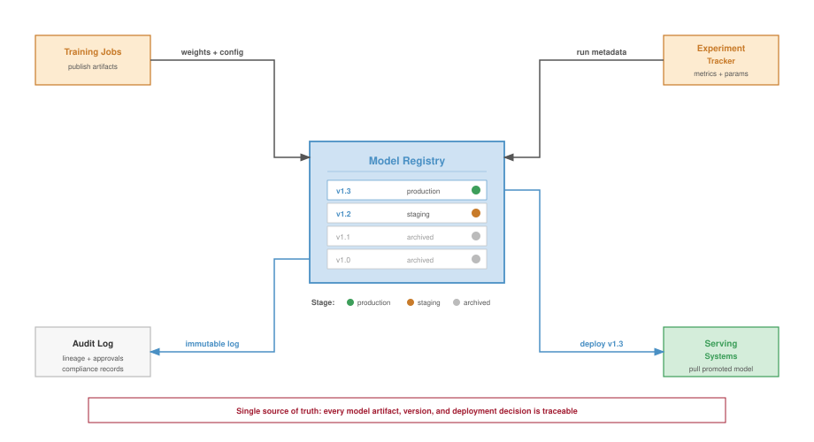

:::

The key takeaway from @fig-model-registry is that a single upstream update can silently invalidate every downstream consumer unless the registry enforces explicit dependency edges. The necessity of this tracking becomes clear when considering a recommendation system with four interdependent models:

- Embedding Model E produces user and item embeddings
- Retrieval Model R uses embeddings from E to generate candidates
- Ranking Models R1, R2, R3 score candidates using embeddings from E
- Ensemble Model M combines outputs from R1, R2, R3

The dependency graph must be explicit in the registry because the update approval process is graph traversal. When Embedding Model E is updated, the registry executes four graph-traversal steps:

1. Identify all dependent models (R, R1, R2, R3, M)
2. Trigger re-evaluation of dependent models with new embeddings
3. Block deployment of the new E until compatibility is verified
4. Coordinate deployment order if updates proceed

Without explicit dependency tracking, organizations discover dependencies through production failures when an upstream model change breaks downstream consumers.

@Lst-registry-schema illustrates how a single YAML entry captures artifact location, training provenance, and evaluation thresholds, giving the dependency tracker enough metadata to identify which downstream models must be re-evaluated when the upstream embedding changes.\index{Model Registry!schema}

::: {#lst-registry-schema lst-cap="**Model Registry Schema**: A YAML entry capturing model metadata, artifact location, training provenance, and evaluation results for dependency tracking and reproducibility."}

```{.yaml}
model:
  name: user_embedding_v3
  version: "3.2.1"
  type: embedding_model
  domain: recommendation

artifact:
  path: gs://models/user_embedding_v3/3.2.1/
  format: tensorflow_savedmodel
  size_bytes: 4294967296

training:
  data_version: user_interaction_2024_01
  code_commit: abc123def
  started_at: 2024-01-15T10:00:00Z
  duration_hours: 48
  hardware: 8xA100-80 GB

evaluation:
  metrics:
    recall_at_100: 0.342
    embedding_quality: 0.891
  evaluation_set: eval_2024_01

dependencies:
  upstream:
    - feature_store/user_features_v2
    - feature_store/interaction_features_v1
  downstream:
    - models/candidate_retrieval_v4
    - models/ranking_ensemble_v2

serving:
  min_replicas: 10
  max_replicas: 100
  latency_p99_target_ms: 5
  memory_gb: 16

ownership:
  team: recommendation-core
  oncall: recsys-oncall-team
```

:::

### Ensemble management {#sec-ml-operations-scale-ensemble-management-67f5}

Recommendation systems exemplify the multi-model management challenge because they operate as ensembles of 10--50 models per request. The platform must manage the ensemble as one production interface even when different teams own its components.

#### Why ensembles dominate recommendation {#sec-ml-operations-scale-ensembles-dominate-recommendation-d94b}

Modern recommendation systems use ensemble architectures because one model cannot simultaneously satisfy every latency, quality, and business constraint. Diverse objectives demand specialized models: engagement, diversity, freshness, inventory, and business constraints often pull in different directions, so separate models specialize in each objective and the ensemble combines their outputs. Staged filtering is the systems counterpart to that specialization. Processing billions of candidates with a single model is computationally infeasible, so multi-stage architectures[^fn-multi-stage-recsys-latency] progressively filter candidates [@covington2016; @liu2022]: retrieval narrows billions to thousands, coarse ranking reduces thousands to hundreds, fine ranking selects tens from hundreds, and re-ranking produces the final ordering.

[^fn-multi-stage-recsys-latency]: **Multi-Stage Recommendation Architecture**\index{Recommendation!architecture, multi-stage recommendation}\index{Recommendation!architecture, multi-stage, recommendation}: YouTube's 2016 deep-recommendation paper established this paradigm: a fast retrieval model narrows billions of candidates to thousands, then a compute-intensive ranking model scores the survivors. The trade-off is latency vs. accuracy at each stage---the retrieval model sacrifices precision for speed (sub-10 ms over the full corpus), while the ranker spends its budget on the reduced set. Updating any single stage without re-validating downstream stages is a primary source of ensemble regression at fleet scale.

The same decomposition improves experimentation velocity because teams can update individual components without retraining the entire recommendation stack, but that independence creates version-compatibility obligations for the platform. It also changes risk management. Other ensemble components can sometimes compensate when one model fails or produces poor results, yet the platform must detect when compensation hides a regression rather than resolving it.

#### Ensemble deployment patterns {#sec-ml-operations-scale-ensemble-deployment-patterns-c4eb}

Deploying ensemble updates requires coordination that single-model deployments do not. Consider updating the fine ranking model within a recommendation ensemble. @Tbl-ops-scale-ensemble-deploy breaks down the staged ensemble deployment pattern\index{Staged Ensemble Deployment Pattern} into four phases: shadow deployment (24--48 hours logging without serving), canary (1 percent traffic for 4--8 hours), staged rollout (5 percent to 100 percent over 24--72 hours), and soak (7--14 days monitoring for delayed effects).

| **Deployment Stage** | **Actions**                                                          | **Duration** | **Rollback Trigger**                   |
|:---------------------|:---------------------------------------------------------------------|:------------:|:---------------------------------------|
| **Shadow**           | New model scores alongside production, results logged but not served | 24--48 hours | Quality metrics below threshold        |
| **Canary**           | 1% traffic receives new model results                                |  4--8 hours  | Statistical significance of regression |
| **Staged Rollout**   | 5% → 25% → 50% → 100%                                                | 24--72 hours | Business metric degradation            |
| **Soak**             | Full traffic, extended monitoring                                    |  7--14 days  | Delayed effects emerge                 |

: **Staged Ensemble Deployment Pattern**: Four-phase rollout for updating recommendation ensemble components. Shadow deployment (24--48 hours) validates behavior without user impact, canary (1 percent traffic, 4--8 hours) enables statistical regression detection, staged rollout progressively increases exposure, and soak period (7--14 days) catches delayed interaction effects. {#tbl-ops-scale-ensemble-deploy}

The extended timeline reflects the difficulty of detecting regressions in ensemble systems. A component change that improves its local metrics might degrade system-level performance through subtle interactions with other components.

#### Interaction effects {#sec-ml-operations-scale-interaction-effects-9ae7}

Ensemble components interact in ways that make local validation insufficient. Three recurring patterns explain why the platform needs holdouts, intermediate logging, and long soak periods.

Compensation effects occur when the retrieval model starts returning lower-quality candidates and the ranking model learns to compensate by upweighting quality signals; once retrieval is fixed, ranking can over-compensate and degrade results. Distribution shift propagation follows the same pattern in the opposite direction: an upstream model improves locally but changes the input distribution seen by downstream models trained on the old representation. Feedback loops add a temporal dimension because ranking decisions affect which items users interact with, and those interactions become training data for future models over days to weeks.

Managing these interactions requires holdout groups that experience no changes and provide stable baselines, extensive logging of intermediate model outputs beyond final recommendations, long-term monitoring for feedback loop effects, and periodic ensemble reset experiments that retrain all components together.

### Model lifecycle management {#sec-ml-operations-scale-model-lifecycle-management-f112}

Lifecycle management exists to keep model dependencies from becoming permanent obligations: every promotion widens a model's blast radius, and every retirement must migrate its consumers before the platform can reclaim resources. The stages below trace that progression from development to archive, each defined by the gates it imposes rather than by a status label.

```text
Development → Staging → Canary → Production → Deprecation → Archive
```

In development, models exist as experimental artifacts. Operations requirements are intentionally light, but they are not optional: successful experiments must preserve results, version history, and enough reproducibility metadata to be challenged later. The operational concern is therefore transition readiness. A promising model should not move to staging until it has clear production-readiness criteria, automated evaluation against production-equivalent data, and documentation sufficient for review.

Staging turns that candidate into a deployable service without exposing users. A staged model should process production traffic in shadow mode, run against production feature pipelines, execute on production-equivalent hardware, and meet latency and throughput requirements. The promotion gate then combines automated checks, such as metric thresholds and latency requirements, with human review of model behavior and risk.

Production widens the blast radius from validation traffic to live traffic, so the model now requires continuous monitoring with alerting, capacity for traffic fluctuations, rollback procedures, and on-call support. Production is not a terminal state. Models still need retraining as data distributions shift, feature pipeline updates as upstream data changes, infrastructure updates as serving systems evolve, and periodic re-evaluation against newer baselines.

The lifecycle closes only when a model can be retired without breaking its consumers. Deprecation identifies dependent systems, provides migration paths and timelines, maintains the old model until migration completes, and archives artifacts for reproducibility and audit. Organizations often underinvest in this final stage, leading to accumulation of zombie models[^fn-zombie-models-waste] that consume resources but provide questionable value. Platform-level lifecycle enforcement helps address this pattern.

[^fn-zombie-models-waste]: **Zombie Models**\index{Zombie Models!deprecation}: Production models that continue serving despite being obsolete or superseded. Industry surveys estimate 20--40 percent of production models at mature organizations qualify as zombies, each consuming GPU memory, on-call attention, and monitoring budget while delivering negligible business value. The operational cost extends beyond wasted compute: zombie models inflate the dependency graph, making platform-wide upgrades and security patches slower and riskier.

### Deployment patterns by model count {#sec-ml-operations-scale-deployment-patterns-model-count-e071}

The appropriate deployment pattern depends on the number and interdependence of models being updated because each additional dependency widens the rollback unit. @Tbl-ops-scale-deploy-patterns categorizes deployment patterns by scale\index{Deployment!patterns by scale}: single model deployments (monthly updates for isolated vision classifiers), pipeline deployments (weekly updates for 3--5 sequential NLP models), ensemble deployments (daily updates for 10--50 recommendation components), and platform deployments (continuous updates across hundreds of enterprise models).

| **Pattern**      | **Model Count** | **Update Frequency** |       **Example**       |
|:-----------------|:---------------:|:--------------------:|:-----------------------:|
| **Single Model** |        1        |       Monthly        |    Vision classifier    |
| **Pipeline**     |       3-5       |        Weekly        | NLP processing pipeline |
| **Ensemble**     |      10-50      |        Daily         |  Recommendation system  |
| **Platform**     |       100s      |      Continuous      |  Enterprise ML platform |

: **Deployment Patterns by Scale**: Four patterns addressing different model counts and update frequencies. Single model deployments (1 model, monthly updates) use standard canary rollouts, while platform deployments (100+ models, continuous updates) require automated policy enforcement, cross-model impact analysis, and global rate limiting to prevent simultaneous high-risk deployments. {#tbl-ops-scale-deploy-patterns}

For isolated models with no dependencies, standard deployment patterns suffice. Canary deployments, blue-green switches[^fn-blue-green-deployment], and gradual rollouts all work effectively because rollback means returning one model artifact to its previous version.

[^fn-blue-green-deployment]: **Blue-Green Deployment**\index{Blue-Green Deployment!ML serving}: A release pattern that uses two identical production environments ("Blue" and "Green"). Only one environment is live at a time. This enables zero-downtime rollouts and near-instant rollback if the new model fails, at the cost of doubling the required serving infrastructure $(C_{\text{infer}})$.

Pipelines introduce ordering constraints because models execute in sequence and each model's output feeds the next. The deployment rule is compatibility before exposure: deploy upstream models before downstream consumers, validate each stage before proceeding, maintain version compatibility between stages, and roll back the pipeline as a unit if any stage fails.

Ensembles widen the coordination problem because multiple models may execute in parallel or in a graph. Different teams can update components on different schedules, partial updates may change only part of the ensemble, and the system behavior emerges from component interactions. Testing in isolation is therefore insufficient; integration testing becomes the deployment gate.

At platform scale, continuous deployment means some model is always being updated somewhere, so the platform must prevent individually safe changes from combining into an unsafe fleet state. Platform deployment requires automated rollout policies based on model risk classification, cross-model impact analysis before deployment approval, global rate limiting to prevent simultaneous high-risk deployments, and automated correlation of incidents with recent deployments.

### Cross-model dependencies in practice {#sec-ml-operations-scale-crossmodel-dependencies-practice-fc81}

The dependency-control argument becomes concrete in an e-commerce model graph, where a single embedding interface fans out into retrieval, ranking, and business logic.

#### Example: E-commerce model ecosystem {#sec-ml-operations-scale-example-ecommerce-model-ecosystem-e47f}

An e-commerce platform typically starts the graph with embedding models. A user embedding model\index{User Embedding Model} generates user representations from behavior history, while a product embedding model\index{Product Embedding Model} represents products from attributes and interactions. Those embeddings are not final predictions; they are shared interfaces consumed by downstream services.

The next layer turns shared representations into candidate sets and business signals. A candidate retrieval model uses the embeddings to find relevant products, and a price sensitivity model\index{Price Sensitivity Model} estimates how strongly a user will respond to price changes. A ranking model\index{Ranking Model} then scores the candidate products using both embedding features and auxiliary signals, while a business rules model applies promotional and inventory constraints before results reach the user.

@Fig-ecommerce-graph maps this dependency structure, showing how user and product embeddings flow through retrieval and price sensitivity models before converging in the ranking and business rules layers. This graph reveals critical operational implications.

::: {#fig-ecommerce-graph fig-env="figure" fig-pos="htb" fig-cap="**E-Commerce Model Ecosystem**: A complex dependency graph where upstream models (Embeddings) feed into mid-tier models (Retrieval, Price Sensitivity) which feed into final ranking and logic layers. Changes to identifying \"User Embedding\" require coordinated updates to all downstream consumers." fig-alt="Four-layer dependency graph. Top: User Behavior and Product Data sources. Layer 1: User and Product Embeddings. Layer 2: Candidate Retrieval and Price Sensitivity. Layer 3: Ranking Model. Layer 4: Business Rules. Arrows show data flow."}

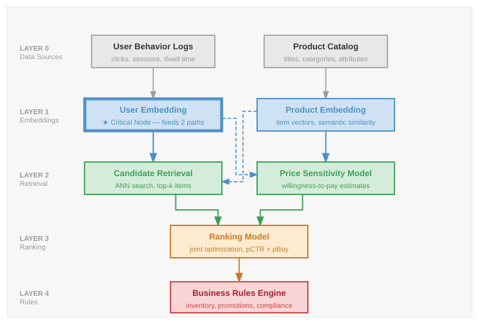

:::

As @fig-ecommerce-graph makes visible, a single change to the User Embedding model propagates through two direct consumers and four transitive downstream nodes, including the final business rules layer. Operational procedures must therefore address four coordination requirements:

1. Re-evaluate all downstream models with new embeddings before deployment
2. Consider simultaneous deployment of related components
3. Monitor both direct metrics (embedding quality) and downstream metrics (ranking performance)
4. Maintain embedding version compatibility or coordinate synchronized updates

The example illustrates why multi-model management requires explicit dependency tracking and coordinated deployment procedures. Dependency graphs and registries, however, are static artifacts. Moving entangled models from a repository into a live production environment without causing cascading failures requires automated, verifiable deployment pipelines.

## CI/CD for ML at Scale {#sec-ml-operations-scale-cicd-ml-scale-730a}

The dependency graphs and ensemble architectures examined in multi-model management do not deploy themselves. Each model update must navigate the dependency web: an embedding model update might require re-evaluation of four transitive downstream components, including the business rules layer, before any component can safely reach production. This coordination challenge transforms CI/CD from a per-model concern into a platform orchestration problem. Where software CI/CD validates code in isolation, ML CI/CD at scale must validate models within their operational context, ensuring upstream changes do not break downstream consumers and that deployment order respects the dependency graph.

@Sec-distributed-training-systems detailed how data, tensor, and pipeline parallelism enable training models too large for single machines, producing artifacts that require validation and deployment at scale. Continuous integration\index{Continuous Integration} and continuous deployment practices for machine learning differ from traditional software CI/CD along one axis: while software CI/CD focuses on code correctness and deployment reliability, ML CI/CD must additionally validate data, verify model performance, and manage the interactions between code, data, and learned parameters. At platform scale, these challenges multiply as pipelines must coordinate across hundreds of models with varying requirements.

### Training pipeline automation {#sec-ml-operations-scale-training-pipeline-automation-9da3}

CI/CD for machine learning begins by making training a reproducible producer of deployable artifacts, not an artisanal job run. A well-designed training pipeline executes reproducibly, handles failures gracefully, and produces artifacts suitable for deployment validation.

#### Pipeline stages {#sec-ml-operations-scale-pipeline-stages-06f5}

A complete training pipeline includes data validation, training execution, model evaluation, registry registration, and canary deployment, each separated by quality gates that prevent defective artifacts from advancing (@fig-ml-cicd). The sequence matters because each stage protects a different fleet invariant.

::: {#fig-ml-cicd fig-env="figure" fig-pos="htb" fig-cap="**ML CI/CD Pipeline**: The automated workflow transforming code and data into a deployed service. Stages include Data Validation (schema/drift checks), Training, Evaluation (metric gates), Artifact Registration, and Staged Deployment (canary rollout). Feedback loops automatically trigger retrains or alerts if gates fail." fig-alt="Pipeline diagram showing stages from data validation to deployment with gates and feedback loops."}
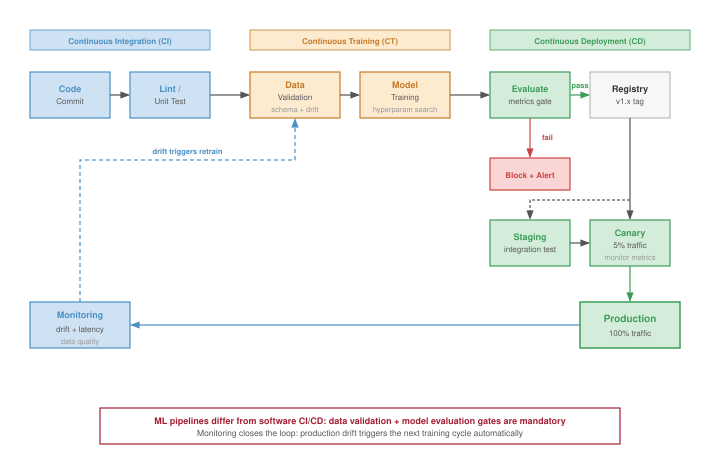
:::

1. Data validation\index{Data Validation} pins the data version and rejects schema, freshness, or distribution failures before they consume training capacity.

2. Feature engineering\index{Feature Engineering} preserves the feature contract between training and serving, so preprocessing changes do not become silent production regressions.

3. Training\index{Training} records code, data, hyperparameters, hardware envelope, and random seeds so a promising artifact can be reproduced or challenged later.

4. Evaluation\index{Evaluation} compares the candidate with baselines, slice metrics, latency budgets, and task-specific gates before any user traffic is exposed.

5. Artifact generation packages the model with its serving configuration, dependency versions, and rollback target.

6. Registration\index{Registration} records the artifact in the model registry with lineage, approvals, and deployment eligibility.

Each stage should be independently executable and idempotent. If the pipeline fails at evaluation, restarting should not re-execute data validation and feature engineering unless their inputs have changed.

#### Pipeline orchestration {#sec-ml-operations-scale-pipeline-orchestration-705a}

Training pipelines require orchestration systems that make dependency order, resource allocation, and failure recovery explicit. The orchestrator represents the workflow as a directed acyclic graph (DAG), tracks dependencies between stages, retries transient failures without rerunning unaffected work, schedules scarce resources such as GPUs and memory, caches intermediate results when inputs are unchanged, and records logs and artifacts for later debugging.

Common orchestration choices include Kubeflow Pipelines[^fn-kubeflow-orchestration] [@bisong2019], Airflow with ML extensions, and cloud-native solutions like Vertex AI Pipelines or SageMaker Pipelines. The choice depends on which dependency and resource contracts the platform must enforce, as well as existing infrastructure, team expertise, and scale requirements. Orchestration fixes the execution contract; parameterization fixes the variation contract, so the same graph can run against different data, models, and hardware envelopes without becoming a new program each time.

[^fn-kubeflow-orchestration]: **Kubeflow**\index{Kubeflow!orchestration}: An open-source ML platform released by Google in 2018 that couples pipeline orchestration to Kubernetes resource management. The key systems consequence: because Kubeflow DAGs express both computational dependencies and resource requests, the orchestrator can schedule GPU-intensive training steps only when accelerators are available, preventing the resource contention that makes manual scheduling of multi-model training fleets untenable.

#### Pipeline parameterization {#sec-ml-operations-scale-pipeline-parameterization-a5e4}

Effective pipelines separate configuration from code, as illustrated in @lst-pipeline-params.\index{Pipeline!parameterization}

::: {#lst-pipeline-params lst-cap="**Pipeline Parameterization**: A YAML configuration separating data paths, feature sets, training hyperparameters, and evaluation criteria from pipeline code."}

```{.yaml}
training_pipeline:
  model_type: transformer_ranking
  data:
    train_path: gs://data/train/2024-01-*
    eval_path: gs://data/eval/2024-01-15
    schema_version: v3.2
  features:
    user_features: [embedding, history, demographics]
    item_features: [embedding, attributes, popularity]
  training:
    epochs: 10
    batch_size: 4096
    learning_rate: 0.001
    optimizer: adam
    hardware: 4xA100
  evaluation:
    metrics: [ndcg_10, mrr, coverage]
    baseline_model: ranking_v2.1.0
```

:::

The separation enables configuration-driven training because the platform can vary data versions, hyperparameter sweeps, reproducibility records, and environment-specific resource overrides without rewriting the pipeline code.

A parameter file is also an audit artifact. When a candidate model later reaches a release gate, the platform can reconstruct exactly which data slice, feature set, hardware envelope, and threshold configuration produced it. That lineage turns validation from a one-time judgment into a reproducible contract.

### Validation gates {#sec-ml-operations-scale-validation-gates-89a2}

Validation gates determine whether a trained model should proceed toward production. Effective gates balance thoroughness against deployment velocity. A release gate is an evidence bundle rather than a single score: model performance, latency, policy and fairness constraints, data quality, and operational readiness each answer a different failure mode before the model can safely receive traffic.

#### Performance gates {#sec-ml-operations-scale-performance-gates-18e5}

Performance validation compares the candidate model against absolute thresholds where the model must exceed minimum acceptable performance, relative baselines where the model must match or exceed current production performance, and historical trends where the model should not regress from recent performance trajectory. @Lst-performance-gates demonstrates this multi-criteria evaluation.\index{Validation Gate!performance}

::: {#lst-performance-gates lst-cap="**Performance Gate Evaluation**: A validation function that checks absolute thresholds, relative improvement over the production model, and regression bounds on secondary metrics."}

```{.python}
def evaluate_performance_gate(
    candidate_metrics, production_metrics, thresholds
):
    """
    Evaluate whether candidate model passes performance gates.

    Returns tuple of (passed: bool, reasons: list)
    """
    reasons = []

    # Absolute threshold check
    if candidate_metrics["ndcg_10"] < thresholds["min_ndcg"]:
        reasons.append(
            f"NDCG_10 {candidate_metrics['ndcg_10']:.4f} below minimum {thresholds['min_ndcg']}"
        )

    # Relative improvement check
    relative_improvement = (
        candidate_metrics["ndcg_10"] - production_metrics["ndcg_10"]
    ) / production_metrics["ndcg_10"]
    if relative_improvement < thresholds["min_improvement"]:
        reasons.append(
            f"Improvement {relative_improvement:.2%} below minimum {thresholds['min_improvement']:.2%}"
        )

    # Regression check on secondary metrics
    for metric in ["mrr", "coverage"]:
        if candidate_metrics[metric] < production_metrics[metric] * (
            1 - thresholds["max_regression"]
        ):
            reasons.append(
                f"{metric} regression exceeds {thresholds['max_regression']:.2%} tolerance"
            )

    return (len(reasons) == 0, reasons)
```

:::

#### Latency gates {#sec-ml-operations-scale-latency-gates-bf9e}

Production models must meet latency requirements. Validation should measure inference latency on representative hardware, test at expected throughput levels, and account for batching effects if applicable. @Tbl-ops-scale-latency-gates specifies latency gate thresholds by model type\index{Latency!gate thresholds by model type}: fraud detection demands the strictest requirements (5 ms p50, 20 ms p99 with instant blocking on violation), while LLMs\index{LLM} accept broader bounds (500 ms p50, 2000 ms p99) reflecting their different operational constraints.

| **Model Type**      | **p50 Target** | **p99 Target** | **Gate Action if Exceeded**            |
|:--------------------|:--------------:|:--------------:|:---------------------------------------|
| **LLM**             |     500 ms     |    2000 ms     | Block deployment, require optimization |
| **Recommendation**  |     10 ms      |     50 ms      | Block deployment                       |
| **Fraud Detection** |      5 ms      |     20 ms      | Block deployment, high priority        |
| **Vision**          |     50 ms      |     200 ms     | Warning, conditional approval          |

: **Latency Gate Thresholds by Model Type**: Production latency requirements (p50 and p99) and gate actions when thresholds are exceeded. Fraud detection enforces the strictest requirements (5 ms p50, 20 ms p99) with high-priority blocking, reflecting the real-time nature of transaction processing. LLMs accept broader bounds (500 ms p50, 2000 ms p99) while requiring optimization before deployment approval. {#tbl-ops-scale-latency-gates}

Latency gates catch overt performance violations, but some regressions pass every gate and still degrade the product. The most dangerous failures are semantically silent: valid outputs built on corrupted inputs.

::: {#exmp-ops-scale-silent-model-regression .callout-example title="Silent model regression"}

**Scenario**: A product ranking model passes offline validation gates but causes a measurable business regression after deployment.

**Failure mode**: The culprit is a silent failure in an upstream feature pipeline. A schema change causes a key behavioral feature to return `null` for a small slice of users. The model serving infrastructure, designed for robustness, automatically imputes these nulls as `0.0`.

**Consequence**: Since `0.0` is a valid value in the feature space, no errors are logged. The model simply makes worse predictions for those users until a business metric monitor catches the regression.

**Systems insight**: Semantic silence is more dangerous than loud failure: syntactically valid feature values can hide production regressions until business metrics move.

:::

#### Fairness gates {#sec-ml-operations-scale-fairness-gates-145c}

Fairness concepts become operational at release time when policy choices are encoded as thresholds. For models affecting users, fairness validation[^fn-fairness-validation-tradeoff] turns a policy commitment into a release gate [@hardt2016equality]. The platform cannot simply ask whether "the model is fair" because different contexts encode fairness differently. In operations, those definitions first appear as executable thresholds. @Eq-demographic-parity expresses one operational choice: the probability of a positive prediction must differ by less than threshold $\epsilon$ between protected groups $a$ and $b$. @Eq-equalized-odds encodes a stricter choice: prediction behavior must be similar across groups after conditioning on the true outcome.

[^fn-fairness-validation-tradeoff]: **Fairness Validation in ML**\index{Fairness!validation in ml}\index{Fairness!validation, impossibility trade-off}: Multiple fairness definitions exist -- demographic parity, equalized odds, calibration -- and satisfying all simultaneously is mathematically impossible (the Chouldechova-Kleinberg impossibility result). This forces a systems design choice: automated validation gates must encode which fairness definition the organization prioritizes, making the gate configuration itself a policy decision that cannot be delegated to a generic threshold.

$$\text{Demographic Parity: } |\Pr(\hat{Y}=1 \mid A=a) - \Pr(\hat{Y}=1 \mid A=b)| < \epsilon$$ {#eq-demographic-parity}

$$\text{Equalized Odds: } |\Pr(\hat{Y}=1 \mid Y=y, A=a) - \Pr(\hat{Y}=1 \mid Y=y, A=b)| < \epsilon$$ {#eq-equalized-odds}

where $A$ represents the protected attribute, $\hat{Y}$ is the model prediction, and $Y$ is the true outcome. The operational point is not that every gate should enforce every definition. The gate must record which definition the organization chose, compare the measured value against historical baselines as well as absolute thresholds, and route borderline cases to human review because a near-threshold fairness result is also a governance decision.

#### Data quality gates {#sec-ml-operations-scale-data-quality-gates-4c04}

Before training or deployment, data quality validation ensures that data meets expected properties [@caveness2020]. Schema conformance verifies all required fields are present with correct types. Statistical properties ensure feature distributions remain within expected bounds. Freshness checks confirm data is not stale beyond acceptable thresholds. Completeness verification ensures missing data rates stay within tolerance.

These gates catch issues that would otherwise manifest as mysterious model degradation, completing the pre-release evidence bundle before deployment risk shifts from artifact validity to live-traffic exposure. The next control is no longer another offline score; it is the amount of production traffic allowed to test the artifact under real conditions.

### Staged rollout strategies {#sec-ml-operations-scale-staged-rollout-strategies-2d1f}

Staged rollout is the mechanism that turns deployment risk into a controllable exposure budget. Traffic increases only after the model earns each larger blast radius through continued acceptable performance.

```{python}
#| echo: false
#| label: deployment-safety-notebook
# ┌─────────────────────────────────────────────────────────────────────────────
# │ DEPLOYMENT SAFETY BUDGET (NOTEBOOK)
# ├─────────────────────────────────────────────────────────────────────────────
# │ Context: "The Safety of Staged Rollouts" .callout-notebook
# │
# │ Goal: Quantify the 'Risk Exposure' reduction from canary deployments.
# │ Show: risk_reduction ≈ 20x -- inline in notebook result.
# │ How: Exposure = traffic_pct * detection_time.
# │
# └─────────────────────────────────────────────────────────────────────────────
from mlsysim.fmt import check, fmt, fmt_math, fmt_multiple, fmt_percent

class DeploymentSafety:
    # ┌── 1. LOAD ──────────────────────────────────────────
    full_cutover_pct = 1.0  # 100% blue-green cutover
    canary_pct = 0.05  # 5% canary traffic
    detection_time_h = 2  # hours to detect a major crash/bug
    # ┌── 2. EXECUTE ───────────────────────────────────────
    # Risk exposure is the expected number of broken requests
    # Ratio of exposure: (100% * T) / (5% * T)
    risk_reduction = full_cutover_pct / canary_pct
    # ┌── 3. GUARD ─────────────────────────────────────────
    check(risk_reduction == 20.0, f"Risk reduction {risk_reduction} unexpected")
    # ┌── 4. OUTPUT ────────────────────────────────────────
    # Percent outputs are consumed in prose, so they use word style.
    ds_canary_pct_str = fmt_percent(canary_pct, precision=0, commas=False, style='prose')
    ds_risk_reduction_mult_str = fmt_multiple(risk_reduction, precision=0, commas=False)
    ds_full_cutover_pct_str = fmt_percent(full_cutover_pct, precision=0, commas=False, style='prose')
    ds_risk_reduction_eq_math = fmt_math(
        rf"{fmt(full_cutover_pct * 100, precision=0)} / {fmt(canary_pct * 100, precision=0)} " rf"= {fmt(risk_reduction, precision=0)}\times"
    )
```

::: {#nbk-ops-scale-safety-staged-rollouts .callout-notebook title="The safety of staged rollouts"}

**Problem**: A team is deploying a new ranking model. A "Blue-Green" deployment (`{python} DeploymentSafety.ds_full_cutover_pct_str` cutover) exposes all users to any potential bugs. A "Canary" deployment starts at `{python} DeploymentSafety.ds_canary_pct_str` traffic. By how much does the canary approach reduce the deployment's "Risk Exposure"?

**Math**:
Risk exposure is proportional to the traffic percentage affected during the detection window.

1. **Blue-Green Exposure**\index{Blue-Green Deployment!blue-green exposure}: `{python} DeploymentSafety.ds_full_cutover_pct_str` of users affected until rollback.
2. **Canary Exposure**\index{Canary Deployment!canary, exposure}: `{python} DeploymentSafety.ds_canary_pct_str` of users affected until rollback.
3. **Risk Mitigation**\index{Risk Mitigation}: `{python} DeploymentSafety.ds_risk_reduction_eq_math`.

**Systems insight**: Staged rollouts are an insurance policy for model quality. Limiting initial exposure to `{python} DeploymentSafety.ds_canary_pct_str` reduces the blast radius of a catastrophic failure by `{python} DeploymentSafety.ds_risk_reduction_mult_str`. In the Machine Learning Fleet, where model behavior is probabilistic and hard to unit-test, gradual exposure is the only reliable way to ensure that "SOTA on paper" does not become "Broken in Production."

:::

::: {.column-margin}
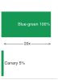{width="100%" fig-alt="Exposure ladder comparing blue-green deployment at 100 percent of users with a canary rollout at 5 percent of users, with the 20x risk-exposure reduction marked as a ratio annotation."}

*Canary rollout cuts initial exposure by 20x.*
:::

#### Blue-green deployment {#sec-ml-operations-scale-bluegreen-deployment-894e}

Blue-green deployment maintains two identical production environments. The current version (blue) serves traffic while the new version (green) is prepared. Once ready, traffic switches instantaneously to green.

The infrastructure cost of this duplication is qualitatively different for ML systems than for stateless web services. A recommendation or language model that requires multiple GPUs to hold its weights in VRAM cannot share that memory across environments: blue-green deployment for a large model means holding two complete copies of model weights across parallel accelerator allocations simultaneously. Loading model weights into GPU memory also takes measurable time (tens of seconds to minutes for multi-gigabyte checkpoints), so the "instant rollback" benefit assumes those weights remain warm in the standby environment throughout the deployment window. The effective cost is therefore not merely doubled serving infrastructure but doubled GPU memory reservation for the duration of the transition. Many organizations running large models treat blue-green deployment as a theoretical option and rely on canary or shadow deployment in practice because hardware capacity and cost make the duplicate allocation impractical.

Blue-green deployment offers a simple mental model and full testing in a production-equivalent environment before exposure. It also requires duplicate GPU and memory allocation during transition, provides no gradual exposure to detect subtle quality regressions, and relies on a binary switch that may miss issues emerging only at scale. The pattern fits low-risk changes to lightweight models where gradual rollout provides limited additional safety and the duplicate capacity cost is acceptable.

#### Canary deployment {#sec-ml-operations-scale-canary-deployment-3d8b}

Canary deployment[^fn-canary-deploy] routes a small percentage of traffic to the new version while monitoring for regressions. If metrics remain acceptable, traffic percentage increases until the new version serves all traffic.

[^fn-canary-deploy]: **Canary Deployment**\index{Canary Deployment!gradual rollout}: Named after the coal-mining practice of using canaries to detect toxic gases -- a small sacrifice that protects the whole. For ML systems, the analogy is precise: model regressions typically manifest as gradual accuracy degradation rather than crashes, making them invisible to health checks but detectable through statistical comparison of canary vs. control traffic. Without canary stages, a subtly degraded model can reach 100 percent traffic before anyone notices the loss.

A typical progression moves from 1 percent to 5 percent to 25 percent to 50 percent to 100 percent as evidence accumulates.

Determining the duration of each stage is critical. @Eq-canary-duration relates stage duration to sample requirements, request rate, and traffic percentage, enabling precise calculation of minimum canary durations for statistical validity:

$$T_{\text{stage}} = \frac{n_{\text{samples needed}}}{r_{\text{requests}} \times p_{\text{stage}}}$$ {#eq-canary-duration}

where $T_{\text{stage}}$ is the duration required at a given percentage, $n_{\text{samples needed}}$ is the number of observations needed for statistical significance, $r_{\text{requests}}$ is the request rate, and $p_{\text{stage}}$ is the traffic percentage.

#### Worked example: Canary duration calculation {#sec-ml-operations-scale-worked-example-canary-duration-calculation-9448}

A model serves 1 million requests per hour. To detect a 1 percent change in click-through rate with 95 percent confidence requires approximately 10,000 samples per variant.

```{python}
#| echo: false
# ┌── LEGO ───────────────────────────────────────────────
# │ Context: @eq-canary-duration worked example—stage durations.
from mlsysim.fmt import fmt, fmt_math, check

class CanaryDuration:
    # ┌── 1. LOAD ──────────────────────────────────────────
    samples_needed = 10_000  # per variant for 1% CTR change at 95% confidence
    request_rate_per_h = 1_000_000  # requests/hour
    p_1pct = 0.01
    p_5pct = 0.05
    # ┌── 2. EXECUTE ───────────────────────────────────────
    t_1pct_h = samples_needed / (request_rate_per_h * p_1pct)
    t_5pct_h = samples_needed / (request_rate_per_h * p_5pct)
    t_5pct_min = t_5pct_h * 60
    # ┌── 3. GUARD ─────────────────────────────────────────
    check(t_1pct_h == 1.0 and t_5pct_min == 12.0, "Canary durations drift")
    # ┌── 4. OUTPUT ────────────────────────────────────────
    t_1pct_eq_math = fmt_math(
        rf"T_{{1\%}} = \frac{{{fmt(samples_needed, precision=0)}}}"
        rf"{{{fmt(request_rate_per_h, precision=0)} \times {p_1pct}}} "
        rf"= {fmt(t_1pct_h, precision=0)}\text{{ hour}}"
    )
    t_5pct_eq_math = fmt_math(
        rf"T_{{5\%}} = \frac{{{fmt(samples_needed, precision=0)}}}"
        rf"{{{fmt(request_rate_per_h, precision=0)} \times {p_5pct}}} "
        rf"= {fmt(t_5pct_h, precision=1)}\text{{ hours}} = {fmt(t_5pct_min, precision=0)}\text{{ minutes}}"
    )
```

At 1 percent canary traffic: `{python} CanaryDuration.t_1pct_eq_math`.

At 5 percent canary traffic: `{python} CanaryDuration.t_5pct_eq_math`.

The organization might configure five rollout stages:

- 1 percent for 2 hours (2$\times$ minimum for buffer)
- 5 percent for 30 minutes
- 25 percent for 30 minutes
- 50 percent for 1 hour
- 100 percent deployment

Total rollout: approximately 4 hours for a confident deployment.

```{python}
#| echo: false
from mlsysim.fmt import fmt_int

# ┌─────────────────────────────────────────────────────────────────────────────
# │ SILENT FAILURE COST (NOTEBOOK)
# ├─────────────────────────────────────────────────────────────────────────────
# │ Context: "The Cost of a Delayed Alert" .callout-notebook
# │
# │ Goal: Quantify the financial loss from a silent model regression.
# │ Show: total_loss ≈ $1,080,000—inline in notebook result.
# │ How: Multiply request rate, detection delay, CTR drop, and click value.
# │
# └─────────────────────────────────────────────────────────────────────────────
from mlsysim.fmt import check, fmt, fmt_count, fmt_percent, fmt_pp, fmt_rate, fmt_time, fmt_usd, fmt_int
from mlsysim.core.units import SEC_PER_HOUR

class SilentFailure:
    # ┌── 1. LOAD ──────────────────────────────────────────
    qps = 5000
    t_detection_h = 24  # 1 day to detect and rollback
    ctr_baseline = 0.05
    ctr_new = 0.045  # 0.5 percentage-point absolute drop (10% relative)
    value_per_click = 0.50  # $0.50 per click
    # ┌── 2. EXECUTE ───────────────────────────────────────
    total_requests = qps * SEC_PER_HOUR * t_detection_h
    ctr_drop = ctr_baseline - ctr_new  # 0.005 absolute CTR drop
    lost_clicks = total_requests * ctr_drop
    lost_clicks_count = round(lost_clicks)
    total_loss = lost_clicks * value_per_click
    # ┌── 3. GUARD ─────────────────────────────────────────
    check(1000000 < total_loss < 1500000, f"Loss ${total_loss:,.0f} unexpected")
    # ┌── 4. OUTPUT ────────────────────────────────────────
    sf_qps_str = fmt_rate(qps, "requests/s")
    sf_detection_hours_str = fmt_time(t_detection_h, 'hour', precision=0, commas=False, style='word')
    sf_ctr_drop_pp_str = fmt_pp(ctr_drop * 100, precision=1)
    sf_ctr_drop_relative_str = fmt_percent(ctr_drop / ctr_baseline, precision=0, commas=False, style='prose')
    sf_value_per_click_str = fmt_usd(value_per_click, precision=2, commas=False, per="click")
    sf_total_loss_str = fmt_usd(total_loss, precision=0)
    sf_sec_per_day_str = fmt_time(SEC_PER_HOUR * 24, "second", precision=0, commas=True, per="day")
    sf_total_requests_str = fmt_count(total_requests, commas=True, label="request")
    sf_lost_clicks_str = fmt_count(lost_clicks_count, label="lost click")
    sf_ctr_drop_ratio_str = fmt(ctr_drop, precision=3, commas=False)
```

::: {#nbk-ops-scale-cost-delayed-alert .callout-notebook title="The cost of a delayed alert"}

**Problem**: A team deploys a recommendation model that has a silent bug: it reduces Click-Through Rate (CTR) by `{python} SilentFailure.sf_ctr_drop_pp_str` (`{python} SilentFailure.sf_ctr_drop_relative_str` relative), from 5 percent to 4.5 percent. If the service handles `{python} SilentFailure.sf_qps_str` and each click is worth `{python} SilentFailure.sf_value_per_click_str`, how much revenue is lost if detection and remediation take `{python} SilentFailure.sf_detection_hours_str`?

**Math**:

1. **Total Requests**: `{python} SilentFailure.sf_qps_str` $\times$ `{python} SilentFailure.sf_sec_per_day_str` = `{python} SilentFailure.sf_total_requests_str`.
2. **Lost Clicks**: `{python} SilentFailure.sf_total_requests_str` $\times$ `{python} SilentFailure.sf_ctr_drop_ratio_str` = `{python} SilentFailure.sf_lost_clicks_str`.
3. **Total Financial Loss**: `{python} SilentFailure.sf_lost_clicks_str` $\times$ `{python} SilentFailure.sf_value_per_click_str` = `{python} SilentFailure.sf_total_loss_str`.

**Systems insight**: A "minor" 0.5 percentage-point regression in a high-traffic model is a `{python} SilentFailure.sf_total_loss_str` daily disaster. MLOps is fundamentally economic risk management. Every hour shaved from "Time-to-Detection" via canary deployments and automated drift monitoring translates directly into saved revenue. In the fleet stack, monitoring is the "Insurance Policy" that protects model business value.

:::

### Multi-region deployment coordination {#sec-ml-operations-scale-multiregion-deployment-coordination-ab6a}

@Sec-fault-tolerance-reliability established checkpointing, elastic training, and recovery mechanisms for handling failures within distributed training jobs. Multi-region deployment extends these fault tolerance principles to the inference plane, where coordination across geographic regions introduces challenges absent from single-region operations. Model version consistency, traffic routing during transitions, and coordinated rollback require explicit protocol design to prevent mixed-version serving that can corrupt A/B test validity and user experience.

#### Coordination challenges {#sec-ml-operations-scale-coordination-challenges-085c}

Multi-region ML deployment introduces two coordination burdens absent from stateless service rollouts. First, model artifacts are large: a production recommendation system's ensemble of sparse and dense models may require tens to hundreds of gigabytes of checkpoint data, and a large language model serving inference may require hundreds of gigabytes per replica. Distributing those artifacts across wide-area networks before a region can serve traffic is a bandwidth-constrained scheduling problem, not a metadata-only configuration push. Second, most ML models do not carry their context in the request; they pull it from a feature store. If Region B has received the new model binary but its regional feature store has not yet synced the latest user embeddings, that region will serve degraded predictions despite a technically successful deployment. The readiness check for an ML region must therefore verify the model binary, feature-store consistency, and serving health as one coherent state.

Mixed-version serving is the failure mode that binds multi-region deployment. A rollout protocol must preserve a coherent version boundary even when clocks, traffic volume, routing, and rollback behavior differ by region.

Clock skew and timing coordination create ambiguity about canary phase boundaries. When a deployment starts at 2:00 PM UTC, Region A may begin its 1 percent canary while Region B, due to network delays or operational variation, still serves the old version. Defining deployment phases using wall-clock time leads to inconsistent user experiences as users crossing region boundaries encounter different model versions, so production systems need logical rollout states in addition to timestamps.

Regional traffic variation turns the same percentage into different statistical evidence. A 1 percent global canary might represent 5 percent of traffic in a low-volume region, enough for statistical significance, but only 0.3 percent in a high-volume region, potentially insufficient. Per-region sample sizes must be validated independently before the platform treats a canary as evidence.

Cross-region request routing then turns regional skew into user-visible inconsistency. Users may be routed to different regions based on latency, load balancing, or failover. A user whose requests span multiple regions during a deployment window may receive predictions from different model versions, violating the consistency assumptions underlying A/B test analysis.

Rollback is the final consistency test. Rolling back one region while others continue serving the new version creates the same mixed-version problem that careful deployment coordination was meant to prevent, so rollback must be part of the rollout protocol rather than an ad hoc emergency action.

#### Deployment strategies {#sec-ml-operations-scale-deployment-strategies-fc90}

Multi-region coordination chooses where to spend the rollout tax: longer deployment duration, stronger synchronization, or bounded regional skew. Three architectural approaches make different trade-offs.

Sequential regional rollout deploys to regions one at a time, completing the full canary progression in each region before proceeding to the next. This approach maximizes safety by limiting blast radius to a single region, but extends total deployment duration proportionally to region count.

Typical progression for 5 regions:

1. Canary region (lowest traffic): Full canary cycle, 24 to 48 hours
2. Early adopter regions (2 regions, 20 percent global traffic): Parallel deployment, 24 to 48 hours
3. Majority regions (2 regions, 70 percent global traffic): Parallel deployment, 24 to 48 hours
4. Final validation: Cross-region consistency check, 12 to 24 hours

Total deployment duration: 4 to 8 days for a conservative rollout.

Synchronized global rollout maintains identical deployment state across all regions simultaneously. A global coordination service ensures that all regions transition between canary phases at the same logical timestamp. This provides consistent user experience but means any region experiencing issues affects the global deployment decision.

Implementation requires a centralized deployment coordinator with global view, logical sequence numbers rather than wall-clock timestamps, two-phase transitions that announce phase change and wait for acknowledgment from all regions before executing, and global metrics aggregation for deployment decisions.

Hybrid approaches balance regional independence with global consistency. The deployment coordinator enforces minimum and maximum phase boundaries while allowing regions to progress independently within those bounds. Regions can accelerate through phases if local metrics are strong, or pause if issues emerge, while global constraints prevent excessive version skew.

#### Traffic management during transitions {#sec-ml-operations-scale-traffic-management-during-transitions-731d}

Maintaining request consistency during deployment transitions requires routing controls that keep the experiment and user experience coherent.

Sticky routing ensures that a user's requests consistently route to the same region throughout the deployment window. This is typically implemented through consistent hashing on user identifier, directing each user to a primary region. Users experience either the old version or new version consistently, never mixing within a session.

Version pinning allows clients to request specific model versions. The request includes a model version hash; the serving infrastructure routes to replicas serving that version. This supports gradual client migration independent of server-side deployment state.

Request isolation prevents cross-region traffic during critical deployment phases. Temporarily disabling cross-region failover during canary evaluation ensures that metrics reflect single-region behavior rather than mixed routing patterns.

#### Consistency models for deployment {#sec-ml-operations-scale-consistency-models-deployment-4995}

The choice of consistency model affects both deployment complexity and validity of deployment metrics. @Tbl-multi-region-consistency compares deployment consistency models for multi-region systems\index{Deployment!consistency models for multi-region}: strong consistency guarantees identical versions across regions (essential for financial predictions) but requires high coordination overhead, while eventual consistency allows independent progression suitable for content recommendations at the cost of temporary version divergence:

| **Model**             | **Guarantee**                             |              **Use Case**              | **Coordination Overhead**     |
|:----------------------|:------------------------------------------|:--------------------------------------:|:------------------------------|
| **Strong**            | All regions serve identical version       | Financial predictions, safety-critical | High (global synchronization) |
| **Eventual**          | Regions converge to same version          |        Content recommendations         | Low (independent progression) |
| **Bounded staleness** | Regions within $k$ versions of each other |           Real-time ranking            | Medium (version monitoring)   |

: **Consistency Models for Multi-Region Deployment**: Three consistency guarantees with their use cases and coordination overhead. Strong consistency (all regions serve identical versions) is essential for financial predictions but requires high synchronization overhead. Eventual consistency enables independent regional progression suitable for content recommendations but may produce temporary version divergence. {#tbl-multi-region-consistency}

For A/B testing validity, model serving typically requires strong consistency within treatment groups. If some users assigned to treatment receive old-version predictions due to deployment timing, the measured treatment effect is diluted. Eventual consistency across treatment groups is acceptable since each group is analyzed independently.

#### Rollback coordination {#sec-ml-operations-scale-rollback-coordination-b751}

Rolling back a multi-region deployment requires careful coordination to prevent oscillation and mixed-version serving. The rollback protocol has two phases:

Phase 1: Stop traffic to new version globally

- Deployment coordinator broadcasts rollback intent
- All regions acknowledge and stop routing new traffic to new version
- Continue serving in-flight requests to completion
- Timeout: regions that do not acknowledge within threshold are marked unhealthy

Phase 2: Restore old version globally

- Coordinator confirms all regions serving old version only
- Re-enable normal traffic routing
- Clear deployment state and prepare for re-attempt

The protocol ensures that at no point do some regions serve the new version while others have rolled back, which would create inconsistent user experiences.

Partial rollback allows rolling back individual regions while others continue. This is appropriate when issues are region-specific (infrastructure problems, regional traffic patterns) rather than model-inherent. The deployment coordinator tracks per-region state and prevents inconsistent global decisions based on partial information.

#### Worked example: Multi-region coordination overhead {#sec-ml-operations-scale-worked-example-multiregion-coordination-overhead-a78b}

A recommendation system deploys across 5 regions with average inter-region latency of 80 ms. The coordination protocol requires five steps:

1. Announce deployment intent (broadcast to all regions): 80 ms
2. Receive acknowledgments (wait for slowest region): 80 ms
3. Execute deployment phase (region-local): variable
4. Confirm completion (broadcast): 80 ms
5. Receive confirmations (wait for slowest region): 80 ms

Minimum coordination overhead per phase transition: 320 ms for the synchronization protocol itself. For a deployment with 5 canary phases, coordination adds 1.6 seconds to total deployment time, negligible compared to the hours spent in each phase.

However, the coordination service becomes a critical dependency. If the coordinator fails during a deployment, three behaviors are possible depending on the consistency model:

- With strong consistency: All regions freeze in current state until coordinator recovers
- With eventual consistency: Regions continue independent progression, potentially diverging
- With bounded staleness: Regions continue but coordinator failure triggers alerts if staleness exceeds bounds

Organizations deploying safety-critical models typically implement coordinator redundancy through consensus protocols (Raft, Paxos) that survive single-node failures while maintaining consistency guarantees.

### Production experiment validation {#sec-ml-operations-scale-production-experiment-validation}

Once rollout coordination preserves version boundaries, the next question is whether the candidate model is actually safe to expose. Shadow traffic, interleaving, A/B tests, and network-effect checks form an experiment ladder: each step buys stronger production evidence at higher operational cost.

#### Shadow deployment and traffic replay {#sec-ml-operations-scale-shadow-deployment-traffic-replay-ee4f}

Shadow deployment\index{Shadow Deployment} runs the new model in parallel with production, receiving the same inputs and logging outputs, but not affecting user-visible results (@fig-shadow-deployment). This provides the highest fidelity testing environment short of actual production exposure, enabling detection of issues that escape offline validation.

::: {#fig-shadow-deployment fig-env="figure" fig-pos="htb" fig-cap="**Shadow Deployment Architecture**: Production traffic is mirrored to the shadow model asynchronously. The router returns the production response to the user immediately, while both responses are logged for offline quality comparison and operational validation." fig-alt="Architecture diagram showing request router splitting traffic to production and shadow models with response logging."}
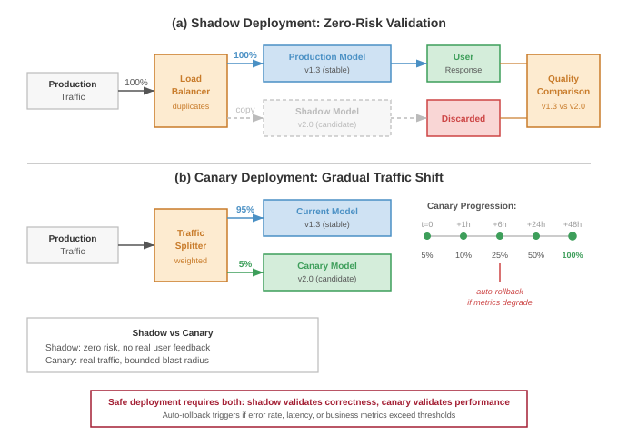
:::

Shadow deployment earns its duplicate infrastructure cost when it answers validation questions offline tests cannot. Operational load testing proves the new model can handle full production traffic volume without crashing, leaking memory, or violating latency service-level objectives (SLOs)[^fn-slo-three-nines]. A model that passes offline validation with small datasets may exhibit memory leaks, performance regressions, or resource contention when processing millions of requests per hour. Shadow deployment catches these operational issues before user impact.

[^fn-slo-three-nines]: **SLO (Service Level Objective)**\index{SLO!reliability target}: A target reliability level. For a model-serving API, "three nines" (99.9 percent) availability allows only 8.7 hours of downtime per year. For latency, a P99 SLO of 200 ms means 99 percent of requests must complete faster than 200 ms. Meeting these targets at scale requires automated scaling and circuit breaking to handle load spikes.

Once the shadow path is isolated, the validation signal comes from comparing behavior under real traffic. Output comparison reveals distribution shifts, outlier behavior, and edge cases that aggregate offline metrics hide; for classification models, this might expose systematic shifts in confidence scores, while for recommendation systems it might expose changes in diversity or category distribution. Behavioral validation catches failures on long-tail inputs that appear infrequently in validation sets but thousands of times daily in production traffic. Performance characterization measures actual latency, throughput, and resource consumption, validating capacity assumptions before the model receives user-visible traffic.

Shadow deployment requires capturing and replaying production traffic, and the replay choice determines the trade-off among fidelity, cost, and freshness. Three architectural patterns address different operational requirements.

Live mirroring duplicates every production request to the shadow model in real time. The production model serves the response while the shadow model processes the same input in parallel, providing immediate validation at full production scale but requiring shadow infrastructure capable of handling 100 percent traffic load. To keep this validation path from becoming a production dependency, the serving system must invoke shadow requests asynchronously, enforce timeouts, shed shadow load when it falls behind, and isolate resources so shadow work cannot affect production responses.

Sampled replay mirrors a configurable percentage of production traffic to shadow models. This reduces infrastructure costs while maintaining statistical power for validation: a shadow model receiving 10 percent of traffic still processes hundreds of thousands of requests daily at scale, sufficient for detecting most issues. The sampling policy determines which failures remain visible at lower cost. Random sampling is simple and unbiased, stratified sampling preserves representation across user segments and request types, and adaptive sampling increases the rate for patterns where shadow and production outputs diverge.

Batch replay captures production traffic logs and replays them asynchronously against shadow models. This decouples shadow validation from production latency constraints, supports faster-than-real-time regression tests against historical traffic, and allows off-peak cost optimization. The same decoupling weakens the signal for freshness-sensitive systems: validation is delayed by hours or days, requires persistent logging infrastructure, may replay time-dependent features with stale context, and cannot validate real-time operational characteristics.

Effective shadow deployment requires quantitative comparison metrics beyond simple accuracy because the decision is whether the candidate behaves like production under real load. Output divergence measures how shadow predictions differ from production predictions: classification systems track disagreement rates, probability shifts, and class-specific concentration, while regression systems compute root mean square error (RMSE) between shadow and production outputs. Performance metrics compare latency distributions, throughput capability, and resource consumption; a shadow model with equivalent accuracy but 50 percent higher p99 latency requires infrastructure capacity adjustments before deployment.

The metric set must also separate operational failures from genuine model changes. Error-mode metrics count timeouts, exceptions, malformed outputs, and null predictions. A shadow model that times out on 0.1 percent of requests encounters 1,000 failures per day at 1M requests/day scale, and the request patterns that trigger those failures guide remediation. Statistical validation then determines whether observed differences represent genuine model changes or random variation. For a shadow model processing 100K requests with 1 percent disagreement rate and production model at 1.5 percent disagreement, a two-proportion z-test determines statistical significance:

$$z = \frac{0.015 - 0.010}{\sqrt{0.0125 \times 0.9875 \times (2/100000)}} = \frac{0.005}{0.000497} \approx 10.1$$

With $z > 1.96$, this difference is statistically significant at $\alpha_{\text{sig}} = 0.05$, indicating a genuine shift rather than sampling noise.

#### Worked example: Shadow deployment workflow {#sec-ml-operations-scale-worked-example-shadow-deployment-workflow-216d}

A fraud detection model processes 5 million transactions daily. The team develops a new model architecture expected to improve precision while maintaining recall. The shadow deployment workflow proceeds:

Phase 1: Sampled shadow (10 percent traffic, 3 days)

- Shadow infrastructure handles 500K requests/day
- Observed metrics: Shadow recall 94.2 percent vs. production 94.5 percent (not statistically different), shadow precision 87.1 percent vs. production 82.3 percent (statistically significant improvement)
- Performance: Shadow p99 latency 45 ms vs. production 38 ms (acceptable given 50 ms SLO)
- Decision: Proceed to full shadow

Phase 2: Full shadow (100 percent traffic, 5 days)

- Shadow processes all 5M daily requests
- Confirm precision improvement holds at full scale
- Identify edge case: Shadow model flags 0.02 percent of transactions as errors due to unexpected feature distribution (1,000 transactions/day)
- Root cause: Shadow model more sensitive to outliers in transaction amount
- Fix: Adjust feature clipping thresholds, redeploy shadow
- Validation: Error rate drops to 0.001 percent (acceptable)
- Decision: Approve canary deployment

Phase 3: Postdeployment validation

- After production deployment, compare actual production metrics to shadow deployment predictions
- Confirm precision improvement materializes: 87.3 percent in production vs. 87.1 percent in shadow (within expected variation)
- Shadow deployment successfully predicted production behavior

#### Shadow deployment infrastructure {#sec-ml-operations-scale-shadow-deployment-infrastructure-78c9}

Operating shadow deployments at scale requires infrastructure that preserves the validation signal without perturbing production. The traffic mirroring layer intercepts production requests and duplicates them to shadow environments, handling routing logic, sampling decisions, timeout enforcement, and error isolation so shadow failures cannot affect production. Logging and comparison infrastructure captures outputs from both production and shadow models, computes divergence metrics, and stores results for analysis; high-throughput systems can generate terabytes of comparison data, so storage and query design become part of the validation architecture.

The operational surface completes the loop. Alerting and dashboards surface statistically significant divergences, performance regressions, and elevated error rates to deployment decision makers, while drill-down views expose the request patterns that explain divergence. Resource isolation keeps shadow workloads from stealing production capacity through separate compute pools, network bandwidth allocation, and database capacity. Cloud deployments often achieve that isolation with separate clusters; on-premises deployments require explicit resource partitioning.

#### When shadow deployment is essential {#sec-ml-operations-scale-shadow-deployment-essential-8087}

Shadow deployment is most valuable when the cost of duplicate infrastructure is smaller than the cost of an undetected production regression:

- New model architectures where offline validation may miss production-specific failure modes
- High-stakes models (financial, medical, safety-critical) where production issues have severe consequences
- Models with complex dependencies on real-time features where offline replay cannot fully validate behavior
- Performance-sensitive deployments where latency or throughput regressions must be detected before user impact
- Regulatory environments requiring preproduction validation evidence

It is less critical when the deployment risk is bounded and rollback is cheap:

- Minor model updates (retraining with same architecture) where production behavior is well-understood
- Low-risk models where rapid rollback is acceptable
- Resource-constrained environments where shadow infrastructure costs exceed validation benefits

#### Interleaving experiments {#sec-ml-operations-scale-interleaving-experiments-519c}

Recommendation systems use interleaving experiments[^fn-interleaving-efficiency] for more efficient comparison than traditional A/B testing [@chapelle2012]. Rather than splitting users between variants, interleaving presents items from both variants to each user, then measures which items users engage with.

[^fn-interleaving-efficiency]: **Interleaving Experiments**\index{Interleaving Experiments!sample efficiency}: Originally developed for search engine evaluation, interleaving merges results from two rankers into one list shown to each user, then credits clicks to the originating ranker. This requires 10--100$\times$ fewer samples than A/B testing because each user provides a direct within-subject comparison rather than a between-population signal. For fleet-scale recommendation systems iterating on dozens of model variants, this 10--100$\times$ sample reduction translates directly into faster experiment cycles and lower opportunity cost from suboptimal models in production.

The key insight is statistical efficiency. An interleaving experiment can require an order of magnitude fewer samples than A/B testing, and Netflix reports more than 100$\times$ fewer users for some ranking experiments [@chapelle2012; @netflix2017interleaving], because each user provides direct comparison signals rather than contributing to aggregate statistics.

Interleaving implementation:

1. Both model variants score all candidates
2. Results are interleaved using team draft or probabilistic interleaving
3. User interactions attribute credit to the originating variant
4. Statistical tests determine winning variant

Interleaving is essential for recommendation systems where detecting small engagement changes quickly enables rapid iteration, as @fig-interleaving-vs-ab contrasts with traditional A/B testing.

::: {#fig-interleaving-vs-ab fig-env="figure" fig-pos="htb" fig-cap="**Interleaving vs. A/B Testing**: In traditional A/B testing (left), users see only one variant. In interleaving (right), users see a blended list. Clicks on items are attributed to the source ranker, providing a higher-sensitivity signal that controls for user-specific variance." fig-alt="Side-by-side comparison: A/B testing splits users between models; interleaving blends both models results for each user."}

```{.tikz}
\begin{tikzpicture}[font=\small\usefont{T1}{phv}{m}{n}, node distance=0.5cm and 0.5cm]
  \definecolor{AColor}{HTML}{D1E6F3}
  \definecolor{BColor}{HTML}{FCE4CC}

  \tikzset{
    item/.style={draw=black!50, fill=white, minimum width=2cm, minimum height=0.5cm, line width=0.75pt, align=center},
    edge/.style={->, line width=1.0pt},
    title/.style={font=\bfseries\usefont{T1}{phv}{b}{n}, anchor=south},
    desc/.style={font=\scriptsize\usefont{T1}{phv}{m}{n}, text=black!60}
  }

  \begin{scope}[local bounding box=ab]
    % A/B Testing
    \node[title] (ABTitle) {A/B Testing};
    \node[below left=of ABTitle] (UserA) {User A};
    \node[below right=of ABTitle] (UserB) {User B};

    \node[item, fill=AColor, below=0.2cm of UserA] (ListA) {Model A List};
    \node[item, fill=BColor, below=0.2cm of UserB] (ListB) {Model B List};

    \node[desc, below=1cm of ABTitle] (ABDesc) {Split Traffic (Low Sensitivity)};
  \end{scope}

  \begin{scope}[local bounding box=interleave, xshift=7cm]
    % Interleaving
    \node[title] (IntTitle) {Interleaving};
    \node[below=0.5cm of IntTitle] (AnyUser) {Any User};

    \node[item, fill=AColor, below left=0.2cm and 0.1cm of AnyUser, minimum width=1.5cm] (A1) {A1};
    \node[item, fill=BColor, below right=0.2cm and 0.1cm of AnyUser, minimum width=1.5cm] (B1) {B1};

    \node[draw, fill=black!5, minimum width=2.2cm, minimum height=2cm, below=1.5cm of AnyUser, line width=0.75pt, anchor=north] (MixedBox) {Mixed List};

    \node[item, fill=AColor, minimum width=1.8cm, below=0.5cm of MixedBox.north] (MixA1) {A1};
    \node[item, fill=BColor, minimum width=1.8cm, below=0cm of MixA1] (MixB1) {B1};
    \node[item, fill=AColor, minimum width=1.8cm, below=0cm of MixB1] (MixA2) {A2};

    \draw[edge] (A1) -- (MixedBox);
    \draw[edge] (B1) -- (MixedBox);

    \node[desc, below=0.2cm of MixedBox] (IntDesc) {Blended (High Sensitivity)};
  \end{scope}

\end{tikzpicture}
```

:::

#### A/B testing statistical foundations {#sec-ml-operations-scale-ab-testing-statistical-foundations-b9bd}

The statistical challenges of experimentation multiply at platform scale. A/B testing provides rigorous frameworks for comparing model variants, but requires careful attention to statistical power[^fn-ab-testing-power], significance thresholds, and multiple testing correction.

[^fn-ab-testing-power]: **A/B Testing Power**\index{A/B Testing!power}\index{A/B Testing!statistical power}: The probability that an experiment correctly detects a true effect ($1-\beta_{\text{stat}}$, typically set to 0.8). At fleet scale, the systems challenge is Statistical Power: if the expected improvement is small (for example, 0.1 percent), the experiment may require millions of samples to reach statistical significance, consuming substantial serving resources $(C_{\text{infer}})$ for weeks.

Improper statistical practices lead to false positives that waste engineering resources or false negatives that miss genuine improvements.

#### Sample size calculation {#sec-ml-operations-scale-sample-size-calculation-fade}

The required sample size for detecting an effect depends on four parameters: significance level $(\alpha_{\text{sig}})$, statistical power $(1-\beta_{\text{stat}})$, baseline conversion rate $(p)$, and minimum detectable effect $(\delta)$. @Eq-ops-scale-ab-sample-size formalizes this relationship for comparing two proportions, showing that required samples scale inversely with the square of the minimum detectable effect:

::: {.column-margin}
```{=latex}
\vspace*{-10mm}
```
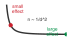{width="100%" fig-alt="Inverse-square curve showing required sample size rising sharply as the detectable effect gets smaller."}

*Detecting smaller effects explodes the required sample size.*
:::

$$n_{\text{sample}} = \frac{(Z_{\alpha_{\text{sig}}} + Z_{\beta_{\text{stat}}})^2 \times 2p(1-p)}{\delta^2}$$ {#eq-ops-scale-ab-sample-size}

where $Z_{\alpha_{\text{sig}}}$ is the critical value for significance level $\alpha_{\text{sig}}$ (typically 1.96 for $\alpha_{\text{sig}} = 0.05$), $Z_{\beta_{\text{stat}}}$ is the critical value for power (typically 0.84 for 80 percent power), $p$ is the baseline rate, and $\delta$ is the minimum detectable effect as an absolute difference.

#### Worked example: Sample size for recommendation model {#sec-ml-operations-scale-worked-example-sample-size-recommendation-model-5d42}

A recommendation system has baseline click-through rate (CTR) of 5 percent. The team wants to detect a 10 percent relative improvement (0.5 percentage points absolute) with 95 percent confidence and 80 percent power.

Parameters:

- $Z_{\alpha_{\text{sig}}} = 1.96$ (95 percent confidence, two-tailed)
- $Z_{\beta_{\text{stat}}} = 0.84$ (80 percent power)
- $p = 0.05$ (baseline CTR)
- $\delta = 0.005$ (0.5 percentage point improvement)

Calculation:

$$n_{\text{sample}} = \frac{(1.96 + 0.84)^2 \times 2 \times 0.05 \times 0.95}{0.005^2}$$

$$n_{\text{sample}} = \frac{7.84 \times 0.095}{0.000025} = \frac{0.7448}{0.000025} = 29,792$$

```{python}
#| echo: false
# ┌── LEGO ───────────────────────────────────────────────
# │ Context: @eq-ops-scale-ab-sample-size worked example—sample size, duration.
from mlsysim.fmt import fmt_count, fmt_time, check

class AbSampleSize:
    # ┌── 1. LOAD ──────────────────────────────────────────
    z_alpha = 1.96
    z_beta = 0.84
    p_baseline = 0.05
    delta = 0.005  # 0.5 percentage-point absolute effect
    requests_per_day = 1_000_000
    # ┌── 2. EXECUTE ───────────────────────────────────────
    n_exact = (z_alpha + z_beta) ** 2 * 2 * p_baseline * (1 - p_baseline) / delta**2
    n_per_variant = round(n_exact, -3)  # ≈ 30,000 (reader-facing rounding)
    n_total = 2 * n_per_variant
    duration_h = n_total / requests_per_day * 24
    # ┌── 3. GUARD ─────────────────────────────────────────
    check(n_per_variant == 30_000 and n_total == 60_000, "Sample-size drift")
    check(duration_h < 2, f"Duration {duration_h}h exceeds 2h")
    # ┌── 4. OUTPUT ────────────────────────────────────────
    per_variant_str = fmt_count(n_per_variant, commas=True, label="sample")
    total_str = fmt_count(n_total, commas=True, label="observation")
```

Each variant requires approximately `{python} AbSampleSize.per_variant_str`, totaling `{python} AbSampleSize.total_str`. At 1 million requests per day, this experiment requires less than 2 hours. However, for a model with 1 percent baseline CTR detecting a 5 percent relative improvement (0.05 percentage points), the calculation yields:

$$n_{\text{sample}} = \frac{7.84 \times 2 \times 0.01 \times 0.99}{0.0005^2} = \frac{0.1552}{0.00000025} = 620,800$$

Now each variant needs approximately 621K samples. At 1M total requests/day split evenly between the two variants, the experiment requires about 30 hours. The lower the baseline rate and smaller the effect, the longer the experiment must run.

#### Statistical significance testing {#sec-ml-operations-scale-statistical-significance-testing-0ea1}

Once data is collected, a two-proportion z-test determines if the observed difference is statistically significant. @Eq-ab-ztest computes the test statistic as the difference in observed rates normalized by the pooled standard error:

$$z = \frac{\hat{p}_B - \hat{p}_A}{\sqrt{\hat{p}(1-\hat{p})(\frac{1}{m_A} + \frac{1}{m_B})}}$$ {#eq-ab-ztest}

where $\hat{p}_A$ and $\hat{p}_B$ are the observed conversion rates for control and treatment, $m_A$ and $m_B$ are sample sizes, and $\hat{p} = \frac{m_A\hat{p}_A + m_B\hat{p}_B}{m_A + m_B}$ is the pooled proportion. If $|z| > Z_{\alpha_{\text{sig}}}$, reject the null hypothesis and conclude the variants differ significantly.

#### Multiple testing correction {#sec-ml-operations-scale-multiple-testing-correction-023f}

Running multiple A/B tests simultaneously or sequentially without correction inflates the familywise error rate. With 20 independent tests at $\alpha_{\text{sig}} = 0.05$, the probability of at least one false positive is:

$$\Pr(\text{at least one false positive}) = 1 - (1-\alpha_{\text{sig}})^k = 1 - 0.95^{20} = 0.642$$

The result is a 64 percent chance of falsely detecting an improvement. Three correction approaches address this problem.

Bonferroni correction adjusts the significance threshold to $\alpha_{\text{sig}}' = \frac{\alpha_{\text{sig}}}{k}$ for $k$ tests. This is conservative but simple. For 20 tests with $\alpha_{\text{sig}} = 0.05$, use $\alpha_{\text{sig}}' = 0.0025$ for each test. This controls the familywise error rate but reduces statistical power.

Šidák correction provides a less conservative adjustment. @Eq-sidak-correction computes the per-test threshold that maintains the desired familywise error rate exactly, yielding slightly more statistical power than Bonferroni:

$$\alpha_{\text{sig}}' = 1 - (1-\alpha_{\text{sig}})^{1/k}$$ {#eq-sidak-correction}

For 20 tests: $\alpha_{\text{sig}}' = 1 - 0.95^{1/20} = 0.00256$, slightly more lenient than Bonferroni.

False Discovery Rate (FDR) control using Benjamini-Hochberg procedure allows a specified proportion of false positives among all rejections. This is appropriate when some false positives are acceptable. Order p-values from smallest to largest: $p_{(1)} \leq p_{(2)} \leq \ldots \leq p_{(k)}$. Find the largest $i$ such that:

$$p_{(i)} \leq \frac{i}{k} \times \alpha_{\text{sig}}$$

Reject all hypotheses $H_{(1)}, \ldots, H_{(i)}$. This procedure yields higher statistical power than Bonferroni when running many tests.

#### Sequential testing and early stopping {#sec-ml-operations-scale-sequential-testing-early-stopping-5b04}

Traditional A/B tests fix sample size in advance and evaluate once. Sequential testing allows monitoring results during data collection with principled early stopping rules. This can reduce experiment duration by 50 percent or more while controlling error rates.

The sequential probability ratio test (SPRT) evaluates the likelihood ratio after each observation:

$$\Lambda_m = \frac{p(X_1, \ldots, X_m \mid H_1)}{p(X_1, \ldots, X_m \mid H_0)}$$

Stop and reject $H_0$ if $\Lambda_m \geq \frac{1-\beta_{\text{stat}}}{\alpha_{\text{sig}}}$, stop and accept $H_0$ if $\Lambda_m \leq \frac{\beta_{\text{stat}}}{1-\alpha_{\text{sig}}}$, otherwise continue collecting data.

For large-scale A/B testing, group sequential methods divide the experiment into planned analysis stages. At each stage, compare test statistic to adjusted thresholds (computed using methods such as O'Brien-Fleming or Pocock boundaries) that maintain overall $\alpha_{\text{sig}}$.

#### Practical implementation considerations {#sec-ml-operations-scale-practical-implementation-considerations-5684}

Real-world A/B testing faces complications beyond textbook statistics.

Carryover effects occur when users exposed to treatment retain behavior changes after returning to control. This violates independence assumptions, so mitigation requires sufficient washout periods or cookie-based consistent assignment.

Network effects occur when treating user A affects user B's behavior through interaction. This violates the stable unit treatment value assumption (SUTVA), so mitigation uses cluster randomization at network community level, though this reduces statistical power.

Novelty effects occur when new model variants show artificial improvement because users respond to novelty, not genuine superiority. Mitigation extends experiment duration (typically 2--4 weeks) to observe steady-state behavior.

Metric selection can mislead when surrogate metrics (clicks, engagement) do not align with long-term objectives (retention, revenue). Mitigation tracks both short-term surrogate metrics and long-term guardrail metrics, even if the latter require longer observation periods.

#### Worked example: Multiple testing scenario {#sec-ml-operations-scale-worked-example-multiple-testing-scenario-ce6c}

```{python}
#| echo: false
# ┌── LEGO ───────────────────────────────────────────────
# │ Context: multiple-testing worked example—false positives per quarter/year.
from mlsysim.fmt import fmt, fmt_math, fmt_count, check

class MultipleTestingFp:
    # ┌── 1. LOAD ──────────────────────────────────────────
    tests_per_quarter = 30
    alpha_sig = 0.05
    quarters_per_year = 4
    # ┌── 2. EXECUTE ───────────────────────────────────────
    fp_per_quarter = tests_per_quarter * alpha_sig
    fp_per_year = round(fp_per_quarter * quarters_per_year)
    # ┌── 3. GUARD ─────────────────────────────────────────
    check(fp_per_quarter == 1.5 and fp_per_year == 6, "False-positive drift")
    # ┌── 4. OUTPUT ────────────────────────────────────────
    tests_per_quarter_str = fmt(tests_per_quarter, precision=0, commas=False)
    per_quarter_eq_math = fmt_math(rf"{fmt(tests_per_quarter, precision=0)} \times {alpha_sig} = {fmt(fp_per_quarter, precision=1)}")
    per_year_str = fmt_count(fp_per_year, commas=False, label="model")
```

A platform team runs `{python} MultipleTestingFp.tests_per_quarter_str` A/B tests per quarter comparing candidate models. Using $\alpha_{\text{sig}} = 0.05$ without correction, expect `{python} MultipleTestingFp.per_quarter_eq_math` false positives per quarter. Over a year, expect approximately `{python} MultipleTestingFp.per_year_str` falsely identified as improvements, wasting engineering effort on deployments that provide no actual value.

Applying Bonferroni correction: $\alpha_{\text{sig}}' = \frac{0.05}{30} = 0.00167$ per test. This requires larger sample sizes. For the recommendation model example above (5 percent baseline, 0.5pp effect), original requirement was 30K samples per variant. With a two-sided Bonferroni threshold, the critical value rises to about 3.14, increasing the requirement to roughly 60K samples per variant.

Using FDR control at $q = 0.05$: Across repeated use, the Benjamini-Hochberg procedure controls the expected proportion of false discoveries among rejected hypotheses. If 10 of 30 tests are declared significant, the target is an expected false discovery proportion of 5 percent among those discoveries, not a hard maximum count in that single quarter. This provides better power than Bonferroni when running many tests.

The choice of correction method depends on consequences of false positives. For high-stakes decisions (financial models, safety-critical systems), use conservative Bonferroni correction. For exploratory analysis where missing true effects is costly, use FDR control.

::: {#chk-ops-scale-multiple-testing .callout-checkpoint title="Family-wise error rate under multiple testing"}

The correction methods are Bonferroni, Šidák, and Benjamini-Hochberg. Apply the family-wise reasoning to a smaller platform.

- [ ] **Family-wise error**: For 20 simultaneous A/B tests per quarter at $\alpha_{\text{sig}} = 0.05$ with no correction, calculate the expected number of false positives and the family-wise error rate under independence.
- [ ] **Bonferroni correction**: Apply Bonferroni correction, calculate the per-test threshold $\alpha_{\text{sig}}'$, compute the family-wise error rate after correction, and compare it to the uncorrected rate.
- [ ] **Bonferroni vs. FDR**: For 20 tests where the team expects most candidates to genuinely improve the metric, choose Bonferroni or Benjamini-Hochberg FDR control and justify the statistical-power trade-off.

:::

### SUTVA violations and network effects {#sec-ml-operations-scale-sutva-violations-network-effects-2252}

The statistical results above rest on a fundamental assumption: independence between users. A treatment assigned to one user must not change another user's outcome. If User A receives an improved recommendation algorithm, User B's behavior should remain unaffected because User B never saw the new algorithm. This independence assumption underpins all the sample size calculations and significance tests presented so far.

Social platforms systematically violate this assumption. When User A receives better content recommendations, they share that content with their network, including User B in the control group. User B's engagement changes despite never seeing the treatment. The control condition becomes contaminated, not through experimental error, but through the natural mechanics of networked products.

Formally, standard A/B testing relies on the Stable Unit Treatment Value Assumption (SUTVA): user $i$'s outcome $Y_i(w)$ depends only on their own treatment assignment $w$, not on the treatments assigned to other users. This assumption fails systematically in networked products and distributed ML systems, leading to biased effect estimates that can mislead deployment decisions.

#### Network effect categories {#sec-ml-operations-scale-network-effect-categories-d253}

Network effects manifest in three primary forms, each requiring different detection and mitigation strategies.

Direct network effects occur when user A's treatment directly influences user B's outcome through platform interactions. In a social feed ranking experiment, the treatment group receives algorithmically optimized content that they share with connections. Control group users now see content influenced by the treatment algorithm through their social graph, contaminating the control condition. This treatment leakage biases measured effects toward zero because control users partially receive the treatment through network propagation.

Indirect network effects operate through market-level mechanisms that affect all users regardless of their individual treatment assignment. A ride-sharing pricing experiment that increases driver compensation in the treatment group attracts more drivers to the platform overall. Control group users experience shorter wait times due to increased driver supply, an effect driven entirely by the treatment condition. The measured treatment effect underestimates the true benefit because the control group also improves.

Spillover effects create geographic or temporal contagion where treatment effects spread across boundaries. A local recommendation system experiment showing treatment users restaurants in a specific neighborhood influences foot traffic patterns. Control group users in adjacent neighborhoods experience changed recommendation quality because the underlying popularity signals shift. Geographic clustering of users means spatial spillover can systematically bias experiments.

#### Quantifying SUTVA violations {#sec-ml-operations-scale-quantifying-sutva-violations-e04e}

The severity of network effect bias depends on network structure and outcome correlation. For cluster-randomized experiments, @eq-sutva-vif gives a common design-effect approximation that quantifies how within-cluster correlation inflates the variance of treatment effect estimates, directly determining the sample size increase required for equivalent statistical power:

$$\text{DEFF} \approx 1 + (m - 1)\rho$$ {#eq-sutva-vif}

where $m$ is the average cluster size and $\rho$ is the intra-cluster correlation of outcomes (how similar outcomes are within connected user groups). This factor indicates how much larger sample sizes must be to achieve equivalent statistical power. Network interference can also bias the estimated treatment effect itself, so variance inflation is only part of the correction.

#### Worked example: Network effect bias in social recommendation {#sec-ml-operations-scale-worked-example-network-effect-bias-social-recommendation-3de0}

A social platform tests a new feed ranking algorithm. Individual user randomization assigns 50 percent of users to treatment.

Experimental setup:

- 10 million users, average 150 connections each
- Clustering coefficient $C = 0.4$ (typical for social networks)
- Outcome: daily engagement minutes

```{python}
#| echo: false
# ┌── LEGO ───────────────────────────────────────────────
# │ Context: SUTVA network-effect worked example—measured vs. corrected effect.
from mlsysim.fmt import fmt_time, fmt_percent, check

class NetworkEffectBias:
    # ┌── 1. LOAD ──────────────────────────────────────────
    treatment_min = 45.2
    control_min = 43.8
    adjusted_control_min = 42.3
    rho = 0.15
    cluster_size_m = 1.4
    # ┌── 2. EXECUTE ───────────────────────────────────────
    measured_effect = treatment_min - control_min
    measured_pct = measured_effect / control_min
    true_effect = treatment_min - adjusted_control_min
    true_pct = true_effect / adjusted_control_min
    inflation_min = control_min - adjusted_control_min
    deff = 1 + (cluster_size_m - 1) * rho
    deff_inflation_pct = deff - 1
    # ┌── 3. GUARD ─────────────────────────────────────────
    check(abs(measured_effect - 1.4) < 0.05 and abs(true_effect - 2.9) < 0.05, "Effect drift")
    check(abs(deff - 1.06) < 0.005, f"DEFF {deff} drift")
    # ┌── 4. OUTPUT ────────────────────────────────────────
    measured_min_str = fmt_time(measured_effect, 'minute', precision=1, commas=False, style='word')
    measured_pct_str = fmt_percent(measured_pct, precision=1, commas=False, style='prose')
    true_min_str = fmt_time(true_effect, 'minute', precision=1, commas=False, style='word')
    true_pct_str = fmt_percent(true_pct, precision=1, commas=False, style='prose')
    inflation_min_str = fmt_time(inflation_min, 'minute', precision=1, commas=False, style='word')
    deff_inflation_pct_str = fmt_percent(deff_inflation_pct, precision=0, commas=False, style='prose')
```

Naive analysis results:

- Treatment group: 45.2 minutes average
- Control group: 43.8 minutes average
- Measured effect: +`{python} NetworkEffectBias.measured_min_str` (+`{python} NetworkEffectBias.measured_pct_str`)

However, network analysis reveals that control group users have on average about half of their connections in treatment, as expected under independent individual randomization. These treatment connections share algorithmically-boosted content that control users see, inflating control group engagement.

Corrected analysis using inverse probability weighting for network exposure:

- Adjusted control baseline: 42.3 minutes (what control would show without spillover)
- True treatment effect: +`{python} NetworkEffectBias.true_min_str` (+`{python} NetworkEffectBias.true_pct_str`)
- SUTVA violation inflated control by `{python} NetworkEffectBias.inflation_min_str`, halving the measured effect

With intra-cluster correlation $\rho = 0.15$ and an average experiment cluster size of $m = 1.4$ effective users:
$$\text{DEFF} = 1 + (1.4 - 1) \times 0.15 = 1.06$$

This toy calculation gives `{python} NetworkEffectBias.deff_inflation_pct_str` variance inflation and would require `{python} NetworkEffectBias.deff_inflation_pct_str` larger sample sizes for equivalent power, but the bias correction is far more impactful than the variance adjustment.

#### Detection strategies {#sec-ml-operations-scale-detection-strategies-dc16}

Detecting SUTVA violations requires explicit measurement of network exposure.

Ego-network analysis measures each user's exposure to treatment through their connections. For control user $i$ with connection set $\mathcal{N}_i$, compute treatment exposure:

$$e_i = \frac{|\{j \in \mathcal{N}_i : W_j = 1\}|}{|\mathcal{N}_i|}$$

where $W_j$ indicates treatment assignment for user $j$. If control group outcomes correlate with $e_i$, network effects are present. Regression of control outcomes on exposure quantifies spillover magnitude.

Interference tests compare outcomes for control users with high vs. low treatment exposure. Under SUTVA, these groups should show identical outcomes. Significant differences indicate network contamination.

Temporal analysis examines whether treatment effects propagate over time. If day-over-day control group metrics trend toward treatment group metrics, spillover is accumulating through the network.

#### Mitigation approaches {#sec-ml-operations-scale-mitigation-approaches-dc04}

When SUTVA violations are detected, several experimental design modifications can recover valid causal estimates:

Graph cluster randomization assigns treatment at the community level rather than individual level. Using graph partitioning algorithms (Louvain, spectral clustering), divide the user graph into clusters with dense internal connections and sparse cross-cluster edges. Randomize clusters to treatment or control, ensuring users primarily interact with others in the same condition.

The trade-off is reduced statistical power. With $k$ clusters, effective sample size becomes $k$ rather than the total individual-user count. An experiment with 10 million users in 1,000 clusters has effective $n_{\text{sample}} = 1000$ for statistical calculations, requiring proportionally larger effects to detect.

Ego-exclusion designs exclude users whose network exposure exceeds a threshold from analysis. By analyzing only control users with minimal treatment connections (for example, $e_i < 0.05$), the control condition remains uncontaminated. This sacrifices sample size for validity.

Switchback experiments alternate all users between treatment and control over time periods (hours, days). Since all users receive both conditions, there is no cross-user contamination within periods. Analysis compares outcomes across time periods rather than across users. This design is particularly effective for supply-side effects in marketplace platforms.

Geo-based experiments use geographic boundaries as natural barriers to network effects. For location-dependent services, randomize at the city or region level. Users in different cities rarely interact directly, eliminating most spillover pathways.

#### Practical implementation {#sec-ml-operations-scale-practical-implementation-832c}

Implementing network-aware A/B testing requires infrastructure investment:

- Graph analysis pipelines that compute network statistics and cluster assignments
- Exposure calculation for every user based on their connections' treatment status
- Modified statistical tests that account for clustered randomization
- Monitoring dashboards showing spillover indicators

For recommendation systems at scale, the engineering cost is justified by the magnitude of bias that network effects introduce. A system measuring +3 percent improvement when the true effect is +6 percent may incorrectly reject valuable model changes or incorrectly prioritize inferior alternatives.

### Managing the edge fleet {#sec-ml-operations-scale-managing-edge-fleet-c591}

The operational challenges examined thus far assume a controlled data center environment. However, @sec-edge-intelligence demonstrated that federated learning and on-device ML extend the "Machine Learning Fleet" to millions of heterogeneous edge devices with constrained connectivity, power, and compute. Managing this distributed population introduces three distinct MLOps challenges.

The three constraints interact, so they should be handled as one operational design problem rather than as independent notes. @Tbl-ops-scale-edge-fleet-controls maps each constraint to the platform control it requires, including Hardware-in-the-Loop validation\index{Hardware-in-the-Loop} and Federated Analytics\index{Federated Analytics}.

| **Edge fleet constraint** | **Why it appears**                                                                                                                                                  | **Platform control**                                                                                                                              |
|:--------------------------|:--------------------------------------------------------------------------------------------------------------------------------------------------------------------|:--------------------------------------------------------------------------------------------------------------------------------------------------|
| Extreme version skew      | Rollouts can take weeks or months because devices are offline, on low battery, or on restricted networks. At any time, 50 model versions may remain active.         | Maintain backward-compatible data pipelines and serving contracts for models deployed months earlier.                                             |
| Device-aware validation   | Accuracy gates do not reveal whether a model exceeds a 1&nbsp;MB microcontroller memory budget or triggers thermal throttling on a smartphone system on chip (SoC). | Add Hardware-in-the-Loop (HIL) validation on physical or emulated target devices before promotion.                                                |
| Privacy-limited telemetry | Raw predictions cannot stream back continuously because privacy rules and bandwidth costs constrain observability.                                                  | Use Federated Analytics: devices compute local statistics such as error rates or drift, then transmit only aggregated, anonymized health signals. |

: **Edge Fleet Controls**: Edge operations couple rollout latency, device heterogeneity, and privacy-limited observability. The management layer must reconstruct global fleet health from partial signals while preserving compatibility with many active model versions. {#tbl-ops-scale-edge-fleet-controls}

### Rollout risk management {#sec-ml-operations-scale-rollout-risk-management-a3d0}

Not all deployments carry equal risk. Effective CI/CD systems classify and handle deployments based on their risk profile. @Tbl-ops-scale-risk-categories provides risk-based rollout strategy selection\index{Risk-Based Rollout Strategy Selection}, mapping four risk categories to appropriate rollout strategies: low-risk minor fixes proceed through fast canary, while critical core model changes require the full shadow deployment, human review, and staged rollout sequence.

#### Risk classification {#sec-ml-operations-scale-risk-classification-9023}

@Eq-rollout-risk formalizes deployment risk as the product of regression probability, impact severity, and exposure level, providing a quantitative foundation for risk-based rollout decisions:

$$R_{\text{rollout}} = p_{\text{regression}} \times I_{\text{regression}} \times E_{\text{exposure}}$$ {#eq-rollout-risk}

where $p_{\text{regression}}$ is the probability that the change causes a regression, $I_{\text{regression}}$ is the impact severity if regression occurs, and $E_{\text{exposure}}$ is the exposure level during the rollout period.

The rollout risk framework suggests three mitigation strategies:

- Reduce $p_{\text{regression}}$: More thorough testing before deployment
- Reduce $I_{\text{regression}}$: Architectural patterns that limit blast radius
- Reduce $E_{\text{exposure}}$: Slower rollouts with lower initial traffic percentages

#### Risk categories {#sec-ml-operations-scale-risk-categories-6247}

The risk equation becomes actionable only when the platform maps measured risk to a rollout policy. @Tbl-ops-scale-risk-categories turns probability, impact, and exposure into deployment posture: low-risk changes can move through a fast canary, while safety-critical changes need shadow validation, human review, and slower traffic expansion.

| **Category** | **$p_{\text{regression}}$** | **$I_{\text{regression}}$** |      **Rollout Strategy**      |
|:-------------|:---------------------------:|:---------------------------:|:------------------------------:|
| **Low**      |        Minor code fix       |     Limited user impact     |          Fast canary           |
| **Medium**   |       Retrained model       |      Engagement effects     |        Standard canary         |
| **High**     |       New architecture      |        Revenue impact       | Extended shadow + slow canary  |
| **Critical** |      Core model change      |     Safety implications     | Shadow + human review + staged |

: **Risk-Based Rollout Strategy Selection**: Four qualitative risk categories mapped to deployment strategies. Teams compute numeric rollout risk using the probability, impact, and exposure formula above, then choose the rollout pattern that matches the resulting risk profile. {#tbl-ops-scale-risk-categories}

#### Automated rollback triggers {#sec-ml-operations-scale-automated-rollback-triggers-ffa3}

Risk categories decide how cautiously traffic should expand, but rollback triggers decide when expansion must stop. The trigger configuration in @lst-rollback-triggers makes that stop condition executable by binding each monitored metric to a threshold, observation window, and minimum sample count.\index{Rollback!automated configuration}

::: {#lst-rollback-triggers lst-cap="**Automated Rollback Configuration**: Metric-specific thresholds, observation windows, and minimum sample sizes that balance sensitivity against false triggers."}

```{.python}
rollback_config = {
    "metrics": {
        "engagement_rate": {
            "threshold": -0.02,  # 2% relative decline triggers rollback
            "window_minutes": 15,
            "min_samples": 1000,
        },
        "error_rate": {
            "threshold": 0.01,  # 1% absolute increase triggers rollback
            "window_minutes": 5,
            "min_samples": 500,
        },
        "latency_p99": {
            "threshold": 1.5,  # 50% relative increase triggers rollback
            "window_minutes": 5,
            "min_samples": 100,
        },
    },
    "rollback_action": "immediate",  # or 'gradual' for less severe issues
    "notification": ["oncall", "model-owner"],
}
```

:::

Automated rollback must balance sensitivity against false triggers. The statistical significance requirements (minimum samples, window duration) prevent premature rollback from random fluctuation while enabling rapid response to genuine regressions.

### CI/CD patterns by model type {#sec-ml-operations-scale-cicd-patterns-model-type-b412}

Model type determines which CI/CD constraint binds: semantic quality, engagement power, adversarial urgency, or classification accuracy. @Tbl-ops-scale-cicd-patterns contrasts CI/CD patterns by model type\index{CI/CD Patterns by Model Type}: LLMs require quality-gated pipelines with human evaluation taking days to weeks, while fraud detection uses threshold-gated pipelines enabling hours-fast deployment with seconds-fast rollback to counter adversarial dynamics.

| **Pattern**          | **Model Type** |  **Validation Focus**  | **Rollout Speed** | **Rollback Speed** |
|:---------------------|:--------------:|:----------------------:|:-----------------:|:------------------:|
| **Quality-gated**    |      LLM       |   Human eval, safety   |   Days to weeks   |       Hours        |
| **Metric-driven**    | Recommendation |   Engagement metrics   |   Hours to days   |      Minutes       |
| **Threshold-gated**  |     Fraud      |    Precision/recall    |       Hours       |      Seconds       |
| **Accuracy-focused** |     Vision     | Classification metrics |        Days       |      Minutes       |

: **CI/CD Patterns by Model Type**: Validation focus, rollout speed, and rollback capabilities vary by model type. LLMs require quality-gated pipelines with human evaluation taking days to weeks for deployment, while fraud detection uses threshold-gated pipelines enabling hours-fast deployment with seconds-fast automated rollback to counter adversarial dynamics. {#tbl-ops-scale-cicd-patterns}

For LLMs, the binding constraint is semantic and safety quality, so the pipeline is deliberately slow. Automated benchmark evaluation on MMLU, HumanEval, and similar tasks narrows the candidate set; human evaluation checks sample outputs across capability categories; safety evaluation exercises red-teaming and toxicity cases; shadow deployment measures user-satisfaction signals; and a slow staged rollout gives the release an extended soak period. The full cycle may take 2--4 weeks from candidate model to full deployment because the main risk is a subtle regression that ordinary automated metrics miss.

Recommendation systems bind on freshness and engagement power, so the pipeline prioritizes rapid but statistically defensible comparison. Offline NDCG and recall screen candidate models, interleaving compares the candidate against the production baseline on the same requests, significance tests decide whether engagement moved, and a rapid canary promotes or rolls back automatically. Routine updates may complete in 24--48 hours because the cost of stale recommendations can exceed the cost of a carefully bounded experiment.

Fraud models bind on adversarial urgency. The pipeline still evaluates labeled fraud cases, validates the false-positive rate on legitimate traffic, and shadow-scores transactions to compare precision and recall, but it is designed around rapid deployment with instant rollback capability because attackers adapt while the rollout is still in progress. Routine updates may complete in 4--12 hours, and emergency updates may deploy in under 1 hour when new fraud patterns emerge.

A mature CI/CD pipeline ensures that only healthy, verified models reach production, completing the deployment cycle in hours rather than weeks. Deployment is not the *finish line*; it is the *starting line*. Once a model is safely deployed, the primary operational question is whether it continues to perform as expected under shifting conditions. Answering that question requires a monitoring architecture that scales alongside automated deployment.

## Monitoring at Scale {#sec-ml-operations-scale-monitoring-scale-73c5}

Application-layer drift detection depends on a healthy physical substrate. At fleet scale, a degraded NVLink connection or a thermally throttling GPU can masquerade as a software timeout. Monitoring therefore starts bottom-up with fleet telemetry, then climbs through alert aggregation, model-quality signals, dashboards, and cost observability so that operators can route a symptom to the layer that can actually repair it.

### Fleet telemetry and hardware observability {#sec-ops-scale-fleet-telemetry}

Because failure is routine at pod scale, fleet monitoring\index{Monitoring!fleet} and hardware observability\index{Observability} are not operational conveniences but prerequisites for productive training. A 10,000-GPU cluster experiences hardware failures roughly once every five hours, and the difference between a 10-minute recovery and a multi-hour disruption depends on whether the operations team can detect degradation before it becomes failure. The monitoring system is itself a distributed system, collecting telemetry from every GPU, switch, and cooling component in the fleet.

The telemetry spans three physical levels. At the GPU level, the most diagnostic signals are junction temperature (which reveals cooling degradation), ECC error counts in HBM and SRAM (where a rising rate of correctable errors often precedes a crash-inducing uncorrectable error), and SM utilization (which distinguishes hardware faults from software inefficiencies). At the network level, packet retry rates on individual ports reveal failing cables or switches. At the facility level, coolant temperature deviations trigger automated load shedding before thermal damage occurs. The challenge is not collecting these signals individually but correlating them across spatial and temporal dimensions.

The most operationally valuable monitoring capability is **correlation analysis**\index{Correlation Analysis} across these telemetry streams. A single GPU showing elevated temperature might indicate a failing fan or a coolant flow restriction. If 8 GPUs in the same node simultaneously show elevated temperatures, however, the cause is more likely a node-level cooling issue. If all GPUs in a rack show elevated temperatures, the cause is probably a rack-level CDU problem. If GPUs across multiple racks show coordinated temperature changes, the cause is likely a facility-level event such as a chiller failure. The monitoring system must detect and classify these patterns at the correct spatial scale to direct operators to the actual root cause, rather than generating hundreds of independent alerts for what is a single underlying problem.

The scale of this telemetry is nontrivial. A 10,000-GPU cluster generates approximately 1 TB of metric data per day -- junction temperatures sampled every second across 10,000 GPUs alone produce 864 million data points daily, before accounting for ECC counters, power readings, NVLink error rates, and network port statistics. Ingesting, indexing, and querying this firehose of time-series data with sub-second latency requires its own dedicated infrastructure. Organizations typically dedicate 1--2 percent of the cluster's total compute and storage capacity to the monitoring stack itself: time-series databases (Prometheus, InfluxDB, or custom solutions), alerting engines, and dashboard systems. This operational overhead is the cost of visibility at scale; without it, the fleet is flying blind.

Before a training job is allocated to a set of nodes, the scheduler employs automated preflight checks\index{Automated Pre-Flight Checks} to verify hardware health. The control plane runs a battery of short, intensive diagnostics: GEMM benchmarks to verify Tensor Core throughput, NCCL AllReduce tests to validate NVLink and InfiniBand bandwidth, and memory stress tests to catch weak HBM bit cells that might produce uncorrectable errors under sustained load. A node that underperforms on any diagnostic is automatically quarantined for repair, and a healthy replacement is substituted before the job launches. This validation process adds 5--10 minutes to job startup time, a negligible cost compared to the hours of wasted computation when a training run crashes mid-flight due to a degraded GPU that passed a simple power-on self-test but fails under sustained arithmetic load.

::: {.column-margin}
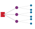{width="100%" fig-alt="One slow GPU at an all-reduce barrier delays peers."}

*One slow accelerator stalls every peer at the barrier.*
:::

The most insidious adversary in a large fleet is not the hard failure but the gray failure\index{Gray Failure}: a component that continues to function but at degraded performance. A single GPU with a partially failed HBM stack might operate at only 75 percent of its peak bandwidth. An NVLink with marginal signal integrity might force frequent link retraining, causing microsecond stalls that accumulate into seconds of lost time per training step. In a synchronous data-parallel workload, a single straggler slows the entire cluster, because every other GPU must wait for the slowest participant to complete its AllReduce contribution. These gray failures are invisible to simple "up/down" health checks and require continuous, fine-grained performance benchmarking to detect. The most effective approach is to run periodic micro-benchmarks on idle nodes (or during scheduled maintenance windows) and compare each node's performance against the fleet baseline. A node whose GEMM throughput drops below 90 percent of the fleet median, or whose NVLink bandwidth drops below 85 percent, is flagged for investigation even though it has not experienced any hard error.

::: {#psp-ops-scale-proactive-vs-reactive-maintenance .callout-perspective title="Proactive vs. reactive maintenance"}

Fleet operators have learned, often through costly experience, that proactive maintenance dramatically reduces the impact of hardware failures on training productivity. The three pillars of proactive maintenance are: predictive diagnostics\index{Predictive Diagnostics} (using models trained on historical telemetry to predict component failures 24--72 hours before they occur), scheduled burn-in testing\index{Scheduled Burn-In Testing} (running benchmark workloads on newly installed nodes before assigning production work), and rolling maintenance windows\index{Rolling Maintenance Window} (cycling 2--5 percent of nodes through health checks without reducing available capacity). Organizations that invest in proactive maintenance typically achieve 95--98 percent effective fleet utilization, compared to 80--90 percent for organizations that rely on reactive maintenance.

:::

```{python}
#| echo: false
# ┌── LEGO ───────────────────────────────────────────────
class InfraFrontierStragglerRecap15:

    # ┌── 4. OUTPUT (Formatting) ──────────────────────────────────────────────
    frontier_params_b_str = fmt_params(Models.Language.GPT3.parameters, scale="B", precision=0, commas=False)
```

In multi-tenant clusters where multiple training jobs share the same physical infrastructure, the noisy neighbor problem introduces a performance hazard that is invisible to individual job metrics. While containerization strictly limits CPU and memory usage, the network fabric is often a shared resource susceptible to interference. If Job A initiates a massive AllReduce operation across the spine switches just as Job B attempts to fetch training data from networked storage, the resulting micro-bursts of packet contention can throttle Job B's throughput by 30--40 percent. This interference is particularly pernicious in RDMA-enabled clusters where traffic bypasses the host CPU, rendering standard OS-level packet scheduling ineffective. Modern orchestration mitigates this via static rail alignment\index{Static Rail Alignment} -- physically dedicating specific InfiniBand subnets to specific jobs -- or by deploying congestion notification protocols that throttle aggressive flows at the switch hardware level. For organizations running the `{python} InfraFrontierStragglerRecap15.frontier_params_b_str` model training alongside smaller research experiments, the safest approach is to physically partition the cluster into isolated "islands" with dedicated network fabrics, accepting the utilization penalty of fragmentation in exchange for performance predictability.

Checkpoint cadence is the point where hardware telemetry becomes visible to ML operators rather than only to data-center technicians. A degraded node that forces frequent checkpoint recovery, or a storage path that lengthens checkpoint writes, turns directly into lost training throughput. @Sec-appdx-reliability-foundations-young-daly derives the checkpoint-compute trade-off and the Young/Daly interval, which @sec-fault-tolerance-young-daly applies to checkpointing strategies; the operations responsibility here is to expose the telemetry those formulas depend on: write time, failure rate, straggler behavior, and recovery duration. Without that visibility, a platform may report that a job is "running" while useful learning has quietly collapsed behind retries and slow checkpoints.

With the physical substrate accounted for, monitoring returns to the deployed model fleet. Models that pass validation gates and survive canary deployment enter a production environment where gradual degradation, data drift, and emergent interactions can erode performance over weeks or months. The staged rollout strategies and rollback triggers examined in CI/CD detect acute failures during deployment; monitoring systems must detect chronic degradation during operation. At platform scale, where hundreds of models operate simultaneously, the naive approach of applying single-model monitoring practices to each model independently leads to alert fatigue\index{Alert Fatigue}, missed correlations, and operational chaos. Monitoring strategies appropriate for enterprise-scale ML platforms require hierarchical aggregation and systemic governance.

### The alert fatigue problem {#sec-ml-operations-scale-alert-fatigue-problem-038c}

The mathematical reality of monitoring at scale exposes the limitations of per-model alerting. Consider the mathematics of monitoring 100 models with independent alerting. If each model has 10 monitored metrics, and each metric generates alerts at a 0.3 percent false positive rate (3-sigma thresholding), the expected number of false alerts is still substantial.

```{python}
#| echo: false
#| label: false-alarm-tax-calc
# ┌─────────────────────────────────────────────────────────────────────────────
# │ THE FALSE ALARM TAX (LEGO)
# ├─────────────────────────────────────────────────────────────────────────────
# │ Context: @sec-ml-operations-scale-alert-fatigue-problem-038c
# │
# │ Goal: Quantify the daily volume of false alerts in a large ML fleet.
# │ Show: ~864 alerts/day for 100 models with 10 metrics at 3--sigma thresholds.
# │ How: Daily alerts = n_models * n_metrics * (1 - specificity) * checks_per_day.
# │
# └─────────────────────────────────────────────────────────────────────────────

# ┌── LEGO ───────────────────────────────────────────────
class FalseAlarmTax:
    """Quantify the impact of scale on monitoring noise."""

    # ┌── 1. LOAD (Constants) ──────────────────────────────────────────────
    n_models = 100
    n_metrics = 10
    specificity = 0.997  # 3--sigma
    check_interval_min = 5

    # ┌── 2. EXECUTE (The Compute) ────────────────────────────────────────
    n_monitors = n_models * n_metrics
    fpr = 1 - specificity
    checks_per_day = (24 * 60) / check_interval_min
    daily_alerts = n_monitors * checks_per_day * fpr

    # ┌── 3. GUARD (Invariants) ──────────────────────────────────────────
    from mlsysim.fmt import fmt_int, check

    check(daily_alerts > 800, f"Expected high alert volume at scale, got {daily_alerts:.1f}")

    # ┌── 4. OUTPUT (Formatting) ──────────────────────────────────────────────
    from mlsysim.fmt import fmt_int, fmt, MarkdownStr, fmt_time

    n_monitors_str = fmt_int(n_monitors)
    checks_per_day_str = fmt_int(checks_per_day, commas=False)
    check_interval_min_str = fmt_time(check_interval_min, 'minute', precision=0, commas=False, style='word')
    daily_alerts_str = fmt(daily_alerts, precision=0, commas=False)
    specificity_val_str = fmt(specificity, precision=3, commas=False)
    fpr_str = fmt(fpr, precision=3, commas=False)
    fpr_pct_str = fmt_percent(fpr, precision=1, commas=False, style='prose')
    daily_alerts_expr_str = fmt_math(f"{int(n_monitors):,} \\times {int(checks_per_day)} \\times {fpr:.3f}")
    n_models_str = fmt(n_models, precision=0, commas=False)
    n_metrics_str = fmt(n_metrics, precision=0, commas=False)
    sigma_label_str = MarkdownStr("3-sigma")
    fpr_eqn_str = fmt_math(f"1 - {specificity_val_str} = {fpr_str}")
```

::: {.column-margin}
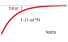{width="100%" fig-alt="Saturating curve for one minus one minus alpha to the N, approaching near certainty as the number of tests grows."}

*As tests multiply, false alerts become mathematically inevitable.*
:::

::: {#nbk-ops-scale-false-alarm-tax .callout-notebook title="The false alarm tax"}

**Problem**: Consider a system monitoring `{python} FalseAlarmTax.n_models_str` models. Each model has `{python} FalseAlarmTax.n_metrics_str` metrics (latency, accuracy, drift, and others). Alert thresholds are set at `{python} FalseAlarmTax.sigma_label_str` (99.7 percent specificity), and a control script re-evaluates every metric on a fixed interval. This configuration generates a massive volume of false alarms that the on-call engineer must address each day.

**Math**:

1.  **Total Monitors**: `{python} FalseAlarmTax.n_models_str` models $\times$ `{python} FalseAlarmTax.n_metrics_str` metrics = `{python} FalseAlarmTax.n_monitors_str` monitors.
2.  **False Positive Rate**\index{False Positive Rate}: `{python} FalseAlarmTax.fpr_eqn_str` (`{python} FalseAlarmTax.fpr_pct_str`).
3.  **Checks per day**: Assume checks every `{python} FalseAlarmTax.check_interval_min_str` (`{python} FalseAlarmTax.checks_per_day_str` checks/day).
4.  **Daily false alarms**: `{python} FalseAlarmTax.daily_alerts_expr_str` $\approx$ `{python} FalseAlarmTax.daily_alerts_str` alerts/day.

**Systems insight**: Even with high-specificity (3-sigma) alerts, scale becomes problematic. It is not feasible to alert on raw metrics. One must use *hierarchical aggregation* (for example, "Cluster Health" instead of "Node Health") to survive the false alarm tax.

:::

@Eq-false-alert-rate reveals the mathematical inevitability of alert fatigue at scale: for a single metric with false positive rate $\alpha_{\text{fp}}$, the probability of at least one false alert grows exponentially with the number of independent tests $N_{\text{tests}}$:

$$\Pr(\text{at least one false alert}) = 1 - (1 - \alpha_{\text{fp}})^{N_{\text{tests}}}$$ {#eq-false-alert-rate}

With $\alpha_{\text{fp}} = 0.05$ and $N_{\text{tests}} = 1000$ (100 models $\times$ 10 metrics):

$$\Pr(\text{false alert}) = 1 - (1 - 0.05)^{1000} = 1 - 0.95^{1000} \approx 1.0$$

The probability is essentially 100 percent. At this scale, the monitoring system will generate false alerts continuously. This creates a destructive dynamic: operators learn to ignore alerts because most are false, genuine issues get lost in the noise, and the monitoring system provides negative rather than positive value.

#### Worked example: Alert volume calculation {#sec-ml-operations-scale-worked-example-alert-volume-calculation-94aa}

The 3-sigma analysis above already strains a team; loosening to the more common 2-sigma threshold (a 5 percent false positive rate) makes the load untenable.

An ML platform monitors 100 models with the following configuration:

- 10 metrics per model (accuracy, latency p50, latency p99, throughput, error rate, data freshness, feature drift, memory usage, GPU utilization, request volume)
- Alert threshold at 2 standard deviations (approximately 5 percent false positive rate per metric)
- Metrics checked every 5 minutes

```{python}
#| echo: false
# ┌── LEGO ───────────────────────────────────────────────
# │ Context: 2-sigma alert-volume worked example.
# │ Scope: chapter-anchor — worked alert-volume example is recalled in the
# │ fallacy recap.
from mlsysim.fmt import fmt, fmt_math, fmt_count, check

class TwoSigmaAlerts:
    # ┌── 1. LOAD ──────────────────────────────────────────
    n_models = 100
    n_metrics = 10
    fpr = 0.05  # 2-sigma false positive rate
    check_interval_min = 5
    dedup_resolved = 0.99  # 99% auto-resolved
    # ┌── 2. EXECUTE ───────────────────────────────────────
    checks_per_day = (24 * 60) / check_interval_min
    daily_alerts = n_models * n_metrics * fpr * checks_per_day
    remaining = daily_alerts * (1 - dedup_resolved)
    # ┌── 3. GUARD ─────────────────────────────────────────
    check(daily_alerts == 14_400 and abs(remaining - 144) < 1e-6, "Alert-volume drift")
    # ┌── 4. OUTPUT ────────────────────────────────────────
    daily_eq_math = fmt_math(
        rf"\text{{Daily false alerts}} = {fmt(n_models, precision=0)} \times {fmt(n_metrics, precision=0)} "
        rf"\times {fpr} \times \frac{{24 \times 60}}{{{check_interval_min}}} = {fmt(daily_alerts, precision=0)}"
    )
    remaining_str = fmt_count(round(remaining), commas=False, label="alert")
    daily_alerts_str = fmt(daily_alerts, precision=0, commas=True)
```

Expected daily false alerts: `{python} TwoSigmaAlerts.daily_eq_math`.

Even if 99 percent of these are deduplicated or auto-resolved, the remaining `{python} TwoSigmaAlerts.remaining_str` daily overwhelm any on-call team. The monitoring system becomes useless despite (or rather, because of) comprehensive coverage.

### Hierarchical monitoring architecture {#sec-ml-operations-scale-hierarchical-monitoring-architecture-407d}

The alert fatigue problem demands a fundamentally different approach. The solution is hierarchical monitoring (@fig-monitoring-pyramid) that turns monitoring into an alert-routing system: broad signals decide whether the fleet is impaired, portfolio signals decide which model family or domain owns the incident, model signals support local diagnosis, and infrastructure signals route failures to the platform team. The hierarchy reduces alert volume while preserving the path from symptom to owner.

::: {#fig-monitoring-pyramid fig-env="figure" fig-pos="htb" fig-cap="**Hierarchical Monitoring Architecture**: To prevent alert fatigue, monitoring operates at four abstraction levels. High-level business metrics trigger alarms for broad issues, while lower-level metrics are used primarily for investigation and root cause analysis." fig-alt="Pyramid with four tiers from bottom to top: infrastructure metrics, model metrics, business metrics, and SLA/alerts."}
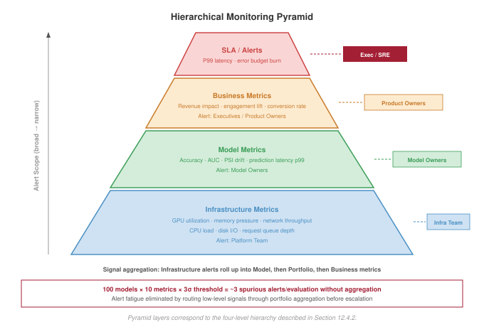
:::

The hierarchy works because each level answers a different routing question. @Tbl-hierarchical-monitoring-levels maps each level to its signal, owner, and operational role.

| **Level**      | **Representative signals**                                                                                                           | **Primary owner** | **Operational role**                                                                            |
|:---------------|:-------------------------------------------------------------------------------------------------------------------------------------|:------------------|:------------------------------------------------------------------------------------------------|
| Business       | Revenue or conversion attributed to recommendations, engagement indicators, automation rate, and human-review volume.                | Incident lead     | Few high-confidence alerts that indicate product or business impairment.                        |
| Portfolio      | Engagement lift and diversity for recommendation, fraud caught and false-positive rate, or violation detection and appeal rate.      | Domain team       | Routes investigation to the model family or product area that owns the shared objective.        |
| Model          | Task quality, latency distributions, throughput, error rates, resource utilization, serving saturation, and recent deployment state. | Model owner       | Supports local diagnosis after business or portfolio signals move.                              |
| Infrastructure | GPU cluster utilization and availability, feature store latency, training pipeline time, serving health, networking, and storage.    | Platform team     | Routes failures that require capacity, placement, networking, storage, or control-plane repair. |

: **Hierarchical Monitoring Levels**: Monitoring levels separate alerting from diagnosis. Higher levels decide whether and where to route an incident; lower levels preserve the evidence needed to identify whether the cause is model behavior, data drift, serving saturation, or infrastructure failure. {#tbl-hierarchical-monitoring-levels tbl-colwidths="[16,42,16,26]"}

### Anomaly detection across the fleet {#sec-ml-operations-scale-anomaly-detection-across-fleet-e38f}

Rather than alerting on individual metric thresholds, fleet-wide anomaly detection identifies unusual patterns across the model portfolio. The detection stack proceeds from local statistical process control, to correlation across model families, to drift scores that explain why a metric moved. That ordering keeps alert volume low while preserving enough evidence to route the incident to the right owner.

#### Statistical process control {#sec-ml-operations-scale-statistical-process-control-c95d}

Control charts[^fn-spc-ml] adapted for ML monitoring track whether metric distributions remain stable over time [@shewhart1931economic]. The core idea is distinguishing common cause variation (normal fluctuation) from special cause variation (genuine anomalies).

[^fn-spc-ml]: **Statistical Process Control (SPC)**\index{Statistical Process Control!ML monitoring}: @shewhart1931economic invented the Bell Labs control framework in 1924 for manufacturing quality control. The 3--sigma control limit produces false alarms only 0.27 percent of the time for a stable process. For ML fleet monitoring, this false-alarm rate compounds: 100 models with 10 metrics each generate roughly 3 spurious alerts per evaluation at 3--sigma, or hundreds per day when evaluated every few minutes, making alert-fatigue management an inherent constraint of applying SPC at platform scale.

For a metric $X$ with established mean $\mu$ and standard deviation $\sigma$:

- Upper Control Limit: $\text{UCL} = \mu + 3\sigma$
- Lower Control Limit: $\text{LCL} = \mu - 3\sigma$

Points outside control limits or systematic patterns (7 consecutive points above/below mean) trigger investigation.

#### Fleet-wide correlation {#sec-ml-operations-scale-fleetwide-correlation-d928}

When multiple models exhibit similar anomalies simultaneously, the root cause is likely shared infrastructure or data rather than individual model issues. Correlation analysis across models enables three operational efficiencies:

- Automatic attribution of anomalies to likely causes (deployment, data issue, infrastructure)
- Deduplication of alerts that have common causes
- Prioritization based on breadth of impact

@Lst-anomaly-attribution turns correlation into a triage rule.\index{Fleet Anomaly Attribution} When the fraction of anomalous models crosses the fleet threshold, the incident changes from many local debugging tasks into one shared-cause investigation.

::: {#lst-anomaly-attribution lst-cap="**Fleet Anomaly Attribution**: Detecting correlated anomalies across a model fleet and attributing them to shared infrastructure or data causes."}

```{.python}
def detect_fleet_anomaly(model_metrics, threshold=0.6):
    """
    Detect correlated anomalies across model fleet.

    Returns list of (timestamp, affected_models, likely_cause) tuples.
    """
    anomalies = []

    for timestamp in model_metrics.timestamps:
        # Identify models with anomalous metrics at this time
        anomalous_models = []
        for model in model_metrics.models:
            if is_anomalous(model_metrics[model][timestamp]):
                anomalous_models.append(model)

        # Check if anomaly fraction exceeds correlation threshold
        if (
            len(anomalous_models) / len(model_metrics.models)
            > threshold
        ):
            # Many models affected -> likely shared cause
            cause = attribute_to_shared_cause(
                timestamp, anomalous_models
            )
            anomalies.append((timestamp, anomalous_models, cause))

    return anomalies
```

:::

The threshold prevents the monitor from overreacting to isolated model noise while still catching platform-wide failures. Above the threshold, the right owner is usually the shared dependency, such as a deployment, feature pipeline, or infrastructure service, rather than each model team independently.

#### Drift detection {#sec-ml-operations-scale-drift-detection-793f}

Data drift represents gradual shifts in input distributions that degrade model performance over time. Detecting drift requires distinguishing between two fundamental types.

Covariate shift\index{Covariate Shift} occurs when the distribution of input features $p(x)$ changes, but the relationship between inputs and outputs $p(y \mid x)$ remains constant. This is detectable in real-time by monitoring input statistics such as mean, variance, and null rates without needing labels.

Concept drift\index{Concept Drift} occurs when the relationship $p(y \mid x)$ changes, such as when users change their definition of spam or relevant content. This requires ground truth labels to detect, which are often delayed by minutes, days, or weeks.

Because labels are often delayed, most real-time monitoring systems use covariate shift as a leading indicator of possible performance degradation. A cheap drift score is valuable even when it is not a complete theory of robustness because it tells the operator where to investigate before outcome labels arrive.

For continuous features, the Population Stability Index (PSI)[^fn-psi-drift] quantifies distribution shift [@yurdakul2020]. @Eq-psi-monitoring computes PSI as the sum of log-ratio weighted differences between actual and expected bucket proportions, yielding actionable thresholds: values below 0.1 indicate stability, while values at or above 0.25 demand immediate investigation. In this chapter, PSI plays a narrow operational role as an inexpensive alerting signal.

[^fn-psi-drift]: **Population Stability Index (PSI)**\index{Population Stability Index!drift detection}: Originally developed in credit scoring to detect shifts in loan-applicant populations, where regulators mandated quantitative drift monitoring. The standard thresholds ($\text{PSI} < 0.1$ stable, $\text{PSI} \geq 0.25$ action required) were established empirically in financial services. For ML fleet monitoring, PSI's advantage is computational cheapness -- a single pass over bucketed histograms -- making it feasible to track hundreds of features across hundreds of models without saturating the monitoring budget.

$$\text{PSI} = \sum_{i=1}^{K_{\text{bucket}}} (A_i - E_i) \times \ln\left(\frac{A_i}{E_i}\right)$$ {#eq-psi-monitoring}

where $A_i$ is the proportion in bucket $i$ of the actual (current) distribution, $E_i$ is the proportion in bucket $i$ of the expected (reference) distribution, and $K_{\text{bucket}}$ is the number of buckets.

The interpretation is deliberately coarse. PSI below 0.1 usually leaves the model in the normal monitoring path. Values between 0.1 and 0.25 create an investigation ticket. Values at or above 0.25 indicate enough shift that the platform should treat the model as potentially degraded even before labels confirm the outcome.

```{python}
#| echo: false
#| label: drift-latency-notebook
# ┌─────────────────────────────────────────────────────────────────────────────
# │ DRIFT DETECTION LATENCY (NOTEBOOK)
# ├─────────────────────────────────────────────────────────────────────────────
# │ Context: "Time-to-Detection: The Monitoring Lag" .callout-notebook
# │
# │ Goal: Quantify the number of samples required to detect a 2% accuracy drop.
# │ Show: n_samples ≈ 2,207—inline in notebook result.
# │ How: Compute the two-proportion sample size from the significance target,
# │      power target, baseline rate, and shifted rate.
# │
# └─────────────────────────────────────────────────────────────────────────────
from mlsysim.fmt import fmt_int, check, fmt_percent, fmt_rate, fmt_time
import math

class DriftLatency:
    # ┌── 1. LOAD ──────────────────────────────────────────
    p1 = 0.95  # baseline accuracy
    p2 = 0.93  # degraded accuracy (2% drop)
    alpha = 0.05  # 95% confidence
    power = 0.80  # 80% power
    dl_samples_per_hour = 1000
    # ┌── 2. EXECUTE ───────────────────────────────────────
    # Z-scores for alpha/power
    z_a = 1.96
    z_b = 0.84
    avg_p = (p1 + p2) / 2
    n = (z_a + z_b) ** 2 * (p1 * (1 - p1) + p2 * (1 - p2)) / (p1 - p2) ** 2
    dl_detection_hours = n / dl_samples_per_hour
    # ┌── 3. GUARD ─────────────────────────────────────────
    check(2000 < n < 3000, f"Samples {n:.0f} unexpected")
    # ┌── 4. OUTPUT ────────────────────────────────────────
    # Percent outputs are consumed in prose, so they use word style.
    dl_base_acc_str = fmt_percent(p1, precision=0, commas=False, style='prose')
    dl_drop_str = fmt_percent(p1 - p2, precision=0, commas=False, style='prose')
    dl_drop_prose_str = dl_drop_str
    dl_samples_needed_str = fmt_int(n)
    dl_samples_per_hour_str = fmt_rate(dl_samples_per_hour, "samples/hour", precision=0, commas=False)
    dl_detection_hours_str = fmt_time(dl_detection_hours, 'hour', precision=1, commas=False, style='word')
    dl_confidence_pct_str = fmt_percent(95 / 100, precision=0, commas=False, style='prose')
```

::: {#nbk-ops-scale-time-detection-monitoring-lag .callout-notebook title="Time-to-detection: The monitoring lag"}

**Problem**: A production model has a baseline accuracy of `{python} DriftLatency.dl_base_acc_str`. A data drift event causes accuracy to drop by `{python} DriftLatency.dl_drop_str`. If labeled outcomes arrive at `{python} DriftLatency.dl_samples_per_hour_str`, how long is needed to statistically prove the model has degraded?

**Math**:
Detection requires enough samples to distinguish the signal (the `{python} DriftLatency.dl_drop_str` drop) from the noise (random variance).

1. **Samples Required**\index{Samples Required}: Using a two-sample proportion test, detecting a `{python} DriftLatency.dl_drop_str` drop with `{python} DriftLatency.dl_confidence_pct_str` confidence requires `{python} DriftLatency.dl_samples_needed_str` samples.
2. **Detection Latency**\index{Latency!detection}: `{python} DriftLatency.dl_samples_needed_str` samples / `{python} DriftLatency.dl_samples_per_hour_str` $\approx$ `{python} DriftLatency.dl_detection_hours_str`.

**Systems insight**: Monitoring is not instantaneous. For a `{python} DriftLatency.dl_drop_prose_str` degradation, the model operates in a broken state for approximately `{python} DriftLatency.dl_detection_hours_str` before there is enough data to trigger an alert. This is the *monitoring lag*. Reducing this lag requires either increasing the volume of labeled data (expensive) or monitoring "proxy" metrics like PSI\index{Population Stability Index!proxy metric} (faster but noisier). In a high-stakes fleet, the alert triggers on *input drift* as a leading indicator rather than waiting for accuracy to drop.

:::

Fleet-wide drift monitoring extends that signal across the portfolio. A PSI spike in one noncritical feature may be a local investigation, but simultaneous drift across shared features or multiple dependent models points to a data pipeline failure with a larger blast radius.

### Model-type specific monitoring {#sec-ml-operations-scale-modeltype-specific-monitoring-b901}

Monitoring cadence follows failure cost. Compare the model-type monitoring parameters\index{Model-Type Monitoring Parameters} in @tbl-ops-scale-monitoring-types: recommendation systems demand real-time CTR monitoring with 5 percent degradation thresholds, while vision classifiers tolerate daily accuracy checks with dataset-specific thresholds reflecting their lower update frequency.

| **Model Type**      |      **Primary Metrics**       |  **Alert Thresholds** | **Monitoring Frequency** |
|:--------------------|:------------------------------:|:---------------------:|:------------------------:|
| **Recommendation**  |      CTR, engagement lift      |    5% relative drop   |        Real-time         |
| **Fraud Detection** | Precision, recall, fraud rate  |     1% degradation    |        Real-time         |
| **LLM**             | Quality scores, safety metrics | Per-model calibration |          Hourly          |
| **Vision**          |       Accuracy by class        |    Dataset-specific   |          Daily           |
| **Search Ranking**  |      NDCG, click position      |     2% degradation    |        Real-time         |

: **Model-Type Monitoring Parameters**: Primary metrics, alert thresholds, and monitoring frequencies tailored to model operational requirements. Recommendation systems demand real-time CTR monitoring with 5 percent degradation thresholds, while vision classifiers tolerate daily accuracy checks at dataset-specific thresholds reflecting their lower update frequency and more stable input distributions. {#tbl-ops-scale-monitoring-types}

Recommendation monitoring is real-time because the product consequence is real-time. Click-through rate, dwell time, and conversion rate should be compared against time-matched historical baselines, control traffic when available, and the previous model version after a release. Those fast engagement metrics are not sufficient by themselves: diversity, catalog coverage, and filter-bubble indicators protect the long-term user experience, while revenue attribution and promotional-inventory metrics connect recommendation quality to business outcomes.

Fraud monitoring binds on adversarial urgency. Missed fraud creates immediate financial loss, but excessive false positives create customer friction and manual-review load. The monitoring surface therefore has to pair detection rate, prevented dollar amount, and detection latency with false-positive rate, blocked-legitimate-transaction events, manual-review volume, and adversarial indicators such as probing patterns or sudden shifts in fraudulent behavior.

LLM monitoring binds on semantic quality, which is difficult to measure from service metrics alone. Latency, token generation rate, error rate, and safety-classifier scores establish operational health; user satisfaction signals such as thumbs-up/thumbs-down rates, regeneration rate, and task-completion proxies add delayed quality evidence. Safety metrics such as toxicity detections, refusal rate, and hallucination indicators remain partial, so they should trigger review rather than claim complete coverage.

Standard monitoring cannot detect semantic safety failures such as persuasive misinformation or skilled manipulation. Here, red teaming\index{Red Teaming} is a production monitoring channel rather than a full adversarial-evaluation program: human evaluators or automated probes attempt jailbreaks\index{Jailbreak} before deployment, and a smaller continuous probe set verifies that production safety filters remain active. Sampling outputs for delayed human review closes the loop for failures that automated metrics do not observe.

### Observability architecture {#sec-ml-operations-scale-observability-architecture-ba87}

Effective monitoring requires observability infrastructure that preserves enough context to route an alert from symptom to owner. Each evidence channel answers a different operational question. Metrics show that a service property moved outside its envelope, traces show where a request spent time, logs explain which component emitted the abnormal event, and prediction logs connect system health back to model behavior. In multi-model systems, a single user request may traverse multiple models, so distributed tracing[^fn-distributed-tracing-ml], pioneered by Google's Dapper system [@sigelman2010dapper], becomes the only reliable way to decompose end-to-end latency across inference services. @Tbl-ops-scale-observability-signals summarizes the architecture as an evidence map rather than as a set of disconnected telemetry tools.

[^fn-distributed-tracing-ml]: **Distributed Tracing**\index{Distributed Tracing!ML pipelines}: Google's 2010 Dapper paper established the pattern of propagating unique trace IDs across service boundaries. For multi-model ML pipelines, tracing is the only reliable way to attribute end-to-end latency to a specific model stage -- without it, a 50 ms tail-latency spike in a 10-model pipeline requires investigating all 10 models independently. Dapper achieved this with less than 0.3 percent CPU overhead per host, setting the performance bar that makes always-on tracing feasible at fleet scale.

| **Evidence Channel** | **Primary Question**                        | **What It Preserves**                                                  | **Typical Failure Revealed**                         |
|:---------------------|:--------------------------------------------|:-----------------------------------------------------------------------|:-----------------------------------------------------|
| Metrics              | Which service property moved out of bounds? | Real-time streams for alerting and aggregated time series for trends   | Drift, saturation, error-rate spikes, cost anomalies |
| Traces               | Where did this request spend time?          | Request IDs propagated across model invocations, timing, and resources | Cross-model latency, fan-out failures, hot stages    |
| Logs                 | Which component emitted the abnormal event? | Structured events with consistent schemas and searchable indexes       | New error classes, dependency failures, bad releases |
| Prediction logs      | Did system health preserve model behavior?  | Sampled inputs, outputs, features, and delayed labels                  | Accuracy regressions, bad cohorts, data gaps         |

: **Observability Signals by Operational Question**: Observability architecture is an evidence-routing system. Metrics trigger attention, traces localize the request path, logs explain component behavior, and prediction logs connect operational symptoms to model quality. {#tbl-ops-scale-observability-signals}

Prediction logging is the costliest evidence channel because it records model-facing data rather than compact service counters. Production systems therefore sample it deliberately, for example logging 1 percent of predictions or logging all predictions for specific users, so the fleet retains enough examples for offline accuracy assessment, training-data generation, and failure debugging without turning monitoring into a storage workload.

### Dashboard design {#sec-ml-operations-scale-dashboard-design-ffcc}

A dashboard is the human attention surface of the monitoring hierarchy. It should answer the same routing questions without forcing every reader into the same debugging console: executives need to know whether the business is impaired, domain owners need to know which portfolio is failing, model owners need the evidence for their model, and incident responders need the trace from symptom to root cause. @Tbl-ops-scale-dashboard-views shows that progression.

| **View**      | **Question Answered**                                   | **Signals to Surface**                                                                 |
|:--------------|:--------------------------------------------------------|:---------------------------------------------------------------------------------------|
| Executive     | Is the business impaired?                               | Platform health, business impact, active incidents, key trends                         |
| Portfolio     | Which domain or model family is driving the impairment? | Model inventory, portfolio metrics, recent deployments, resource utilization and cost  |
| Model         | What changed for the responsible model?                 | Current metrics vs. baselines, deployment history, drift indicators, cost attribution  |
| Investigation | Why did the change occur?                               | Cross-model correlations, time-series overlays, log search, request-level trace detail |

: **Dashboard Views by Operational Question**: Dashboard hierarchy should route attention from business impact to root cause. Each view reveals the amount of detail needed for the decision at that level, preventing executive views from becoming debugging consoles and investigation views from becoming portfolio summaries. {#tbl-ops-scale-dashboard-views}

### Cost monitoring and anomaly detection {#sec-ml-operations-scale-cost-monitoring-anomaly-detection-1976}

Three structural properties of ML infrastructure make cost anomaly detection qualitatively harder than for general web services. First, GPU autoscaling is lumpy: adding one inference replica for a large model means provisioning an entire multi-GPU node, so a small traffic spillover triggers a step-function cost increase rather than smooth linear scaling. Second, distributed training jobs can misfire catastrophically: a misconfigured hyperparameter sweep, a DAG that does not honor spot-instance preemption, or an unbounded retry loop on a failed checkpoint can consume an entire cluster's worth of GPU-hours before any alert fires. Third, zombie models (@sec-ml-operations-scale-cicd-ml-scale-730a) continue drawing GPU memory and serving capacity even when they carry negligible traffic, contributing a chronic baseline cost that compounds across the fleet. Cost anomalies in a model platform are therefore not usually caused by traffic spikes; they are caused by training job misconfigurations, autoscaling behavior on GPU-granularity boundaries, or model lifecycle failures. Effective anomaly detection must distinguish between these causes, not just flag that costs moved.

At scale, undetected cost anomalies can accumulate millions of dollars in unexpected charges before manual review catches them. A quantitative framework for cost anomaly detection balances sensitivity against false positive rates.

#### Cost anomaly detection metrics {#sec-ml-operations-scale-cost-anomaly-detection-metrics-366f}

The foundation of cost monitoring is statistical anomaly detection. For a cost time series with historical mean $\mu$ and standard deviation $\sigma$, the **Z-score**\index{Z-score} quantifies how unusual a current observation is:

$$Z = \frac{C_{\text{current}} - \mu}{\sigma}$$

where $C_{\text{current}}$ is the observed cost for the current period. A Z-score of 3 indicates the current cost is 3 standard deviations above the historical mean, an event expected less than 0.3 percent of the time under normal operations.

Complementing Z-score analysis, **percentage change**\index{Percentage Change} detection captures sudden shifts regardless of historical variance:

$$\Delta\% = \frac{C_{\text{current}} - C_{\text{previous}}}{C_{\text{previous}}} \times 100$$

Percentage change detection excels at catching step-function increases, such as when a misconfigured autoscaler doubles instance count overnight.

#### Alerting thresholds and false positive analysis {#sec-ml-operations-scale-alerting-thresholds-false-positive-analysis-7b48}

Effective alerting requires calibrating thresholds to balance detection sensitivity against operational burden. Two common threshold configurations address this balance:

- **Z-score threshold**\index{Z-Score Threshold}: Alert when $|Z| > 3$ (3--sigma rule)
- **Percentage change threshold**\index{Percentage Change Threshold}: Alert when $|\Delta\%| > 50\%$ day-over-day

The choice of thresholds determines false positive rates. For a normally distributed cost metric checked daily, a 3--sigma threshold produces:

$$\Pr(\text{false positive per day}) = 2 \times (1 - \Phi(3)) \approx 0.0027$$

Over a year of daily monitoring:

$$E[\text{false alerts per year}] = 365 \times 0.0027 \approx 1$$

This rate is operationally acceptable. Lowering the threshold to 2-sigma would increase annual false alerts to approximately 16, likely causing alert fatigue without meaningfully improving detection.

For percentage-based alerts, false positive rates depend on the underlying volatility of costs. Services with naturally variable demand may require higher thresholds (75 percent or 100 percent) to avoid excessive alerts, while stable baseline services can use tighter thresholds (25 percent or 30 percent).

#### Worked example: Detecting an inference cost spike {#sec-ml-operations-scale-worked-example-detecting-inference-cost-spike-9069}

A recommendation service typically costs \$100 per day for inference compute. The operations team receives an alert: today's cost has reached \$250 by end of day.

```{python}
#| echo: false
# ┌── LEGO ───────────────────────────────────────────────
# │ Context: cost-spike Z-score worked example.
from mlsysim.fmt import fmt, fmt_math, fmt_usd, check

class CostSpikeZScore:
    # ┌── 1. LOAD ──────────────────────────────────────────
    cost_current = 250  # $/day observed
    cost_mean = 100  # $/day historical mean (mu)
    cost_std = 15  # $/day historical std (sigma)
    # ┌── 2. EXECUTE ───────────────────────────────────────
    numerator = cost_current - cost_mean
    z_score = numerator / cost_std
    # ┌── 3. GUARD ─────────────────────────────────────────
    check(numerator == 150 and z_score == 10, "Z-score drift")
    # ┌── 4. OUTPUT ────────────────────────────────────────
    z_eq_math = fmt_math(
        rf"Z = \frac{{{fmt_usd(cost_current)} - {fmt_usd(cost_mean)}}}{{{fmt_usd(cost_std)}}} "
        rf"= \frac{{{fmt_usd(numerator)}}}{{{fmt_usd(cost_std)}}} = {fmt(z_score, precision=0)}"
    )
```

Historical data shows mean daily cost $\mu = \$100$ with standard deviation $\sigma = \$15$, so the first check is whether the alert is statistically plausible under normal operations: `{python} CostSpikeZScore.z_eq_math`.

A Z-score of 10 is extraordinarily unlikely under normal operations, but the team still confirms the billing data before treating the alert as real. After ruling out billing delays, double-counting, and pipeline errors, the investigation turns to the operating signal. Query volume is unchanged, so traffic did not cause the spike. P99 latency increased from 50 ms to 125 ms, which means each request now consumes roughly 2.5$\times$ the GPU-seconds. A new model version deployed at 2:00 AM used a larger ranking model and additional features for quality improvements, while GPU utilization stayed near 95 percent and throughput per GPU dropped 60 percent. The root cause was therefore the model update, which increased computational cost per prediction: with unchanged traffic and a 2.5$\times$ per-request cost, total cost rose from \$100/day to \$250/day. The platform decision is whether the quality improvement justifies the cost increase or whether optimization through quantization, smaller batches, or model distillation is required.

#### Root cause analysis framework {#sec-ml-operations-scale-root-cause-analysis-framework-cb82}

@Tbl-cost-anomaly-categories groups cost anomaly root-cause categories\index{Cost!anomaly root cause categories} into five classes, each with distinct investigation paths:

| **Category**              | **Indicators**                          | **Investigation Path**                                              |
|:--------------------------|:----------------------------------------|:--------------------------------------------------------------------|
| **Traffic increase**      | QPS proportional to cost                | Check upstream services, marketing campaigns, viral events          |
| **Efficiency regression** | Cost up, QPS unchanged, latency up      | Review recent deployments, model updates, infrastructure changes    |
| **Resource leak**         | Gradual cost growth, utilization stable | Check for orphaned resources, failed cleanup jobs, zombie processes |
| **Pricing change**        | Cost up, all metrics stable             | Verify cloud provider pricing, reserved instance expiration         |
| **Configuration error**   | Step-function cost increase             | Audit autoscaling rules, instance types, replica counts             |

: **Cost Anomaly Root Cause Categories**: Five primary categories of cost anomalies with their characteristic indicators and investigation approaches. Traffic increases show proportional QPS growth, while efficiency regressions exhibit rising latency with stable traffic. {#tbl-cost-anomaly-categories}

#### Cost attribution by service and team {#sec-ml-operations-scale-cost-attribution-service-team-59af}

Effective cost management requires attributing costs to organizational units. Tag-based allocation assigns costs based on resource metadata, as shown in @lst-cost-attribution.\index{Cost!attribution schema}

::: {#lst-cost-attribution lst-cap="**Cost Attribution Schema**: Resource tagging dimensions and shared-cost distribution policies for allocating ML infrastructure expenses to teams and services."}

```{.yaml}
# Resource tagging schema for cost attribution
cost_allocation:
  dimensions:
    - team: "recommendation"      # Organizational owner
    - service: "ranking-model"    # Specific service
    - environment: "production"   # prod/staging/dev
    - model_type: "inference"     # training/inference
    - cost_center: "CC-4521"      # Finance tracking

  shared_cost_distribution:
    # Platform infrastructure costs distributed by usage
    - resource: "shared-gpu-cluster"
      method: "proportional_gpu_hours"
    - resource: "feature-store"
      method: "proportional_query_volume"
    - resource: "monitoring-infrastructure"
      method: "equal_split"
```

:::

Shared infrastructure costs require allocation policies. Three common methods address this need:

- **Proportional allocation**\index{Proportional Allocation}: Distribute shared costs based on usage metrics (GPU-hours, storage bytes, API calls)
- **Equal split**\index{Equal Split}: Divide costs equally among consuming teams (appropriate for fixed infrastructure)
- **Marginal cost**\index{Marginal Cost}: Charge teams for the incremental cost their usage adds

#### Cost dashboards {#sec-ml-operations-scale-cost-dashboards-113a}

Effective cost monitoring dashboards use the same attention-routing hierarchy as reliability dashboards.

The executive view tracks total ML infrastructure cost, month-over-month trend, budget vs. actual, and cost efficiency metrics such as cost per prediction and cost per active user. The portfolio view then breaks cost down by domain and model type so the platform team can see whether recommendations, fraud, search, or another domain is driving the change. The service view exposes per-service cost, cost per inference, GPU utilization efficiency, and budget comparison. The investigation view adds deployment markers, operational metric correlations, and attribution detail so an anomaly can be tied to a specific change rather than treated as accounting noise.

Four key metrics govern ongoing cost monitoring:

- **Cost per inference**: The serving unit economic formalized as @eq-cost-per-inference in the FinOps treatment; track its trend here to detect efficiency regressions.
- **Cost per active user**\index{Cost!per active user}: Infrastructure cost normalized by user base. Enables comparison across services with different scales.
- **GPU utilization efficiency**\index{GPU Utilization!efficiency}: Revenue or value generated per GPU-hour. Connects infrastructure cost to business outcomes.
- **Budget burn rate**\index{Budget!burn rate}: Current spending velocity relative to allocated budget. Enables proactive intervention before overruns.

Integrating cost monitoring with the hierarchical monitoring architecture ensures that cost anomalies receive appropriate attention alongside performance and quality metrics. Yet building these CI/CD pipelines and hierarchical monitoring systems for every individual product team is prohibitively expensive. To make these capabilities universally available without duplicating effort, organizations must elevate them into a unified internal product, a discipline known as platform engineering.

## Platform Engineering {#sec-ml-operations-scale-platform-engineering-17be}

Organizations where every data science team independently provisions GPU clusters, configures model registries, and wires up alerting dashboards pay a massive duplication tax on undifferentiated infrastructure work. Platform engineering\index{Platform Engineering} solves this by treating the ML infrastructure itself as a product, providing paved roads that allow product teams to focus entirely on modeling rather than infrastructure plumbing.

Platform engineering for machine learning creates shared infrastructure that enables model teams to develop, deploy, and operate models without managing underlying complexity. Effective platforms balance self-service capabilities that accelerate development against governance requirements that ensure consistency and reliability.

### Abstraction levels {#sec-ml-operations-scale-abstraction-levels-6e15}

The abstraction-level decision\index{Level of Abstraction} is how much operational judgment the platform should centralize on behalf of model teams. Too little abstraction leaves every team paying the same infrastructure tax; too much hides the controls that unusual workloads need. The four levels in @tbl-ops-scale-platform-abstraction-levels sit on that flexibility-versus-convenience curve, distinguished by which concerns the platform owns and which it leaves to the model team.

| **Level** | **Platform owns**                                                                                                  | **Model team still owns**                                                       | **Best fit and risk**                                                                                                      |
|:----------|:-------------------------------------------------------------------------------------------------------------------|:--------------------------------------------------------------------------------|:---------------------------------------------------------------------------------------------------------------------------|
| Level 1   | GPU capacity, storage volumes, network connectivity, and basic orchestration such as Kubernetes namespaces         | Training code, serving stack, monitoring, and deployment path                   | Fits unusual workloads with strong infrastructure teams; becomes costly when many teams repeat the same operational work   |
| Level 2   | Standardized containers, ML-aware Kubernetes integration, persistent volumes, and basic service-mesh support       | Experiment structure, training jobs, serving releases, and monitoring workflows | Reduces packaging duplication; operational correctness still depends heavily on each team                                  |
| Level 3   | ML-specific control loops such as topology-aware scheduling, hyperparameter tuning, distributed training, serving  | Modeling judgment and workload-specific trade-offs                              | Absorbs failure modes that recur across teams; systems such as Kubeflow and Ray often sit near this level                  |
| Level 4   | Full lifecycle product: IDEs, feature stores, experiment tracking, registries, CI/CD, monitoring, cost, governance | Higher-level product and modeling intent, with less direct low-level control    | Maximizes speed and consistency; the platform team accepts responsibility for policy, reliability, and economic visibility |

: **Platform abstraction levels**: Platform engineering centralizes different parts of the ML lifecycle at each abstraction level. The right level depends on whether an organization values workload-specific control or shared operational invariants more. {#tbl-ops-scale-platform-abstraction-levels tbl-colwidths="[12,28,27,33]"}

Managed and lifecycle platforms such as Vertex AI, SageMaker, TFX[^fn-tfx-production] at Google [@baylor2017], and MLflow [@zaharia2018accelerating] represent the full-platform end of this spectrum. The trade-off is explicit: teams gain speed and consistency by giving up some low-level control, while the platform team accepts responsibility for policy, reliability, and economic visibility.

[^fn-tfx-production]: **TensorFlow Extended (TFX)**\index{TFX!data validation}: Google's production ML platform. TFX's key architectural insight is that data validation via TensorFlow Data Validation (TFDV) gates the pipeline before training begins, catching schema violations and distribution drift that would otherwise produce silently degraded models. This "fail before training" philosophy prevents the most expensive class of ML waste: GPU-hours spent training on corrupted data.

### Self-service model deployment {#sec-ml-operations-scale-selfservice-model-deployment-4753}

Self-service deployment works only when the platform can let model teams move quickly while keeping risky choices inside governed boundaries. The design question is therefore which deployment decisions should remain team-owned and which invariants the platform must enforce before a model receives production traffic.

#### Deployment API design {#sec-ml-operations-scale-deployment-api-design-e962}

A well-designed deployment API abstracts operational complexity by making the model team's intent declarative.\index{Deployment!declarative API} The platform lesson is not the shape of a particular YAML file; it is which invariants the platform must capture before it turns a model version into fleet traffic. The invariants in @tbl-self-service-deployment-invariants are the platform contract behind that declarative interface. Prometheus[^fn-prometheus-fleet] is one common operational sink for the telemetry side of that contract.

| **Declared intent**        | **Platform invariant**                                                                                                |
|:---------------------------|:----------------------------------------------------------------------------------------------------------------------|
| Model artifact and version | The serving system loads exactly the validated model from the registry.                                               |
| Resource envelope          | GPU, memory, and replica requests stay inside quota and scheduling constraints.                                       |
| Traffic policy             | Canary, shadow, and rollback controls bound blast radius before full promotion.                                       |
| Quality gates              | Error, latency, drift, and task-quality thresholds block unsafe promotion.                                            |
| Telemetry sink             | Operational metrics flow into operational monitoring, while model-quality signals flow into drift and slice monitors. |
| Approval boundary          | Sensitive data access, budget overruns, and high-risk release windows require review.                                 |

: **Self-Service Deployment Invariants**: A deployment API should encode the controls that keep local team autonomy from creating fleet-wide risk. The concrete syntax can vary, but the invariants must survive across platforms. {#tbl-self-service-deployment-invariants tbl-colwidths="[28,72]"}

[^fn-prometheus-fleet]: **Prometheus**\index{Prometheus!monitoring}: An open-source monitoring system now maintained under the CNCF umbrella, using a pull-based model to scrape metrics from exporters. For ML fleets, Prometheus is the standard for tracking operational health (CPU/GPU utilization, request rates), but its time-series model is poorly suited for tracking high-dimensional distribution drift, necessitating a two-tier monitoring architecture.

TensorFlow Serving provides model-serving lifecycle capabilities for loading, versioning, canarying, and rolling back models [@olston2017tensorflow]. A self-service platform adds the policy layer around those capabilities: model teams specify intent, and the platform translates it into scheduling, traffic routing, telemetry, and approval controls.

### Resource management {#sec-ml-operations-scale-resource-management-5550}

Efficient resource utilization is essential for platform economics because shared capacity pays off only when training and serving workloads receive different controls. Training can trade time for utilization; serving trades capacity for tail-latency protection, so a single scheduler policy cannot optimize both.

#### Training resource management {#sec-ml-operations-scale-training-resource-management-a972}

Training workloads are batch-oriented, so their flexibility can be converted into higher utilization. Jobs have defined start and end times, GPU memory requirements are often known in advance, and many runs can be preempted and restarted if checkpointing limits lost work. A training scheduler uses priority queues, fair sharing, and deadline-aware placement to decide which jobs should wait, which should move, and which low-priority jobs can be preempted[^fn-preemption-ml] for urgent work.

[^fn-preemption-ml]: **Job Preemption**\index{Job Preemption!checkpoint trade-off}: The ability to terminate lower-priority workloads to free resources for urgent work. Cloud providers offer 60--90 percent discounts on preemptible/spot instances, but the trade-off is that ML training must support checkpoint-and-resume: without periodic checkpointing, a preempted 72-hour training run restarts from scratch, converting a 70 percent cost savings into a net loss. Checkpoint frequency itself is a trade-off between I/O overhead and wasted-compute risk.

Spot/preemptible instances fit this control loop because automatic retry on preemption can preserve progress while reducing cost.

#### Serving resource management {#sec-ml-operations-scale-serving-resource-management-35b7}

Serving workloads bind on latency rather than batch flexibility. Demand fluctuates with time of day, events, and seasonality, but a live request cannot be preempted without user impact. The serving control loop therefore starts from the latency SLO and asks how much capacity must be online before requests arrive.

Autoscaling adds horizontal capacity from request-rate, latency, or model-specific queue metrics, but it must account for model load time and GPU memory granularity. Resource isolation prevents one model from consuming another model's budget, while cost optimization combines right-sized instances, reserved capacity for baseline demand, and spot instances only where overflow can tolerate interruption. The operational goal is not maximum utilization in isolation; it is the cheapest capacity plan that still protects tail latency.

#### Platform utilization metrics {#sec-ml-operations-scale-platform-utilization-metrics-ed31}

Once training and serving controls are separated, the shared platform still needs an aggregate measure of whether capacity is being converted into useful work. @Eq-platform-utilization defines platform efficiency as the capacity-weighted average utilization across all resources:

$$U_{\text{platform}} = \frac{\sum_{i} U_i \times \text{Cap}_i}{\sum_{i} \text{Cap}_i}$$ {#eq-platform-utilization}

where $U_i$ is the utilization of resource $i$ and $\text{Cap}_i$ is the capacity of resource $i$.

However, raw utilization is incomplete. Effective utilization must also consider utilization quality to determine whether GPUs are doing productive work or waiting on data, utilization fairness to assess whether utilization is distributed appropriately across teams, and utilization cost to evaluate efficiency in terms of cost per unit of ML output.

#### Worked example: GPU cluster efficiency {#sec-ml-operations-scale-worked-example-gpu-cluster-efficiency-87b0}

A platform operates a 100-GPU training cluster with average GPU utilization of 65 percent, memory utilization of 80 percent, four-hour average queue waits, and a cost of \$2.50 per GPU-hour. The high memory utilization suggests jobs are generally sized correctly, while the lower compute utilization points to I/O-bound training steps. Queue waits show that demand already exceeds supply, so the platform decision is not simply whether to buy more GPUs. Daily cluster spend is fixed by provisioned capacity at $100 \times 24 \times \$2.50 = \$6,000/day$, but only $100 \times 24 \times 0.65 \times \$2.50 = \$3,900/day$ is currently converted into useful GPU work. If data-loading optimization raises compute utilization to 80 percent, useful work rises to $100 \times 24 \times 0.80 \times \$2.50 = \$4,800/day$ before adding any capacity. The same measurements therefore support two different actions: remove the I/O bottleneck to recover stranded capacity, then use scheduling or expansion only for the remaining queue pressure.

::: {#chk-ops-scale-gpu-cluster-efficiency .callout-checkpoint title="The annual cost of GPU cluster underutilization"}

Use daily cluster spend (\$6,000/day) and productive GPU-hours (\$3,900/day at 65 percent utilization) to extend the analysis to annual scale and compare against the platform ROI argument.

- [ ] **Underutilization cost**: Calculate the annual cost of underutilization for the 100-GPU cluster at 65 percent utilization, the cost after optimization to 80 percent, and the annual savings from the data-loading optimization.
- [ ] **Queue dynamics**: Using Little's Law $L = \lambda W$, calculate the arrival rate for a 4-hour average wait with 100 jobs in queue and infer whether expansion or utilization optimization recovers more annual value.
- [ ] **Savings vs. platform**: Compare the annual savings from cluster optimization to the \$2M/year platform investment scenario and determine the fleet size where cluster-efficiency optimization alone justifies the platform investment, holding all other per-model savings constant.

:::

### Advanced fleet metrics: ML productivity goodput (MPG) {#sec-ml-operations-scale-advanced-fleet-metrics-ml-productivity-goodput-mpg-fabf}

While utilization metrics capture resource busyness, they often fail to reflect true engineering value. A GPU spinning at 100 percent utilization on a hyperparameter tuning job that eventually fails due to a configuration error is "efficient" in terms of hardware but "wasteful" in terms of productivity. To address this, ML Productivity Goodput (MPG)\index{ML Productivity Goodput} provides a comprehensive metric for fleet efficiency [@wongpanich2025fleet].

MPG extends the fleet law introduced in @sec-vol2-introduction-fleet-law into the **Iron Law of Machine Learning Fleet Efficiency**\index{Iron Law of Machine Learning Fleet Efficiency}. Just as the classic Iron Law of Processor Performance [@hennessy2011computer] decomposes CPU execution time, this formulation decomposes ML fleet efficiency into three orthogonal components:

$$\text{MPG} = \text{Scheduling Efficiency} \times \text{Runtime Efficiency} \times \text{Program Efficiency}$$

1.  **Scheduling Efficiency**\index{Efficiency!scheduling}: Measures the platform's ability to place jobs on available resources. It penalizes queuing delays and fragmentation where resources exist but cannot be assigned.
2.  **Runtime Efficiency**\index{Efficiency!runtime}: Captures the hardware utilization quality during execution. It penalizes "bad put" such as restart overheads from preemption, idle time due to data loading bottlenecks, and straggler effects in distributed training.
3.  **Program Efficiency**\index{Efficiency!program} (or Compiler Efficiency): Assesses whether the code running on the hardware is optimized. It penalizes suboptimal kernels, excessive precision (FP32 where BF16 suffices), and redundant computations.

By tracking the iron law components, platform teams move beyond simple "utilization" to measuring "goodput"—the rate at which valid, useful model training work is completed. This shift often reveals that high-utilization clusters may have low MPG due to frequent failures or inefficient code, guiding optimization efforts toward the highest-impact bottlenecks.

### Multi-tenancy and isolation {#sec-ml-operations-scale-multitenancy-isolation-c3ff}

Enterprise platforms earn their sharing dividend only if multiple teams can share infrastructure without sharing failures. Multi-tenancy is therefore an isolation problem before it is an efficiency problem: the platform must bound performance interference, data exposure, and cost spillover at the same time.

#### Isolation requirements {#sec-ml-operations-scale-isolation-requirements-19a2}

Tenants need isolation at every boundary where one team's workload, data, or cost can affect another team. Performance isolation is the first boundary: resource limits, scheduling fairness, and network quality of service prevent one workload from degrading another during training spikes or serving bursts.

Security isolation draws the second boundary. Access controls, network segmentation, and encryption keep teams with different sensitivity levels from sharing data paths accidentally. Cost isolation completes the model by making each team's usage attributable through metering and chargeback. Together, the three boundaries make shared infrastructure safe enough for teams to use without negotiating every deployment by hand.

#### Namespace architecture {#sec-ml-operations-scale-namespace-architecture-190c}

A typical multi-tenant architecture uses hierarchical namespaces:

```text
Platform
├── Team A
│   ├── Development
│   ├── Staging
│   └── Production
├── Team B
│   ├── Development
│   ├── Staging
│   └── Production
└── Shared
    ├── Feature Store
    ├── Model Registry
    └── Monitoring
```

Each team receives dedicated namespaces with resource quotas, while shared services operate in common namespaces with appropriate access controls. Without controls, one team's demanding workload can degrade performance for others, a failure mode known as the noisy neighbor problem[^fn-noisy-neighbor-ml]. Prevention requires controls at request, rate, priority, and budget boundaries.

[^fn-noisy-neighbor-ml]: **Noisy Neighbor Problem**\index{Noisy Neighbor Problem}\index{Noisy Neighbor!GPU multi-tenancy}: A multi-tenancy failure mode where one tenant's workload degrades performance for co-located tenants. ML workloads are particularly prone to this because training jobs allocate GPU memory greedily -- a single job requesting all available HBM on a shared node can starve co-located inference services, causing latency spikes that violate SLOs. Unlike CPU workloads, GPU memory cannot be overcommitted, making physical resource isolation the only reliable prevention.

Request limits cap the resources any single request can consume. Rate limiting bounds request rates per tenant so shared services are not overwhelmed. Priority classes ensure critical workloads receive resources even under contention. Burst budgets allow temporary resource overages while maintaining long-term fairness.

### FinOps for ML platforms {#sec-ml-operations-scale-finops-ml-platforms-ffd6}

ML workloads present unique cost management challenges that traditional IT FinOps practices do not address. GPU compute costs dominate ML budgets, with a single training run potentially costing tens of thousands of dollars. Serving infrastructure scales with traffic, creating variable costs that can swing by an order of magnitude between peak and trough. The experimental nature of ML development means many training runs produce no production value. Effective FinOps for ML requires specialized practices that account for these realities.

::: {#dfn-ops-scale-finops-ml .callout-definition title="FinOps for ML"}

***FinOps for ML***\index{FinOps!definition} is the practice of treating compute cost as a first-class engineering constraint (measured in real-time per experiment and model, and optimized jointly with model accuracy and latency) rather than accounting for it retrospectively through annual budget reconciliation.

1.  **Significance (quantitative)**: ML compute costs scale steeply with experimentation volume. A team running 1,000 GPU-hours/day at \$3/GPU-hour spends \$3,000/day (\$1.1M/year) on training alone. With per-experiment cost visibility, an engineer can identify that 30 percent of runs are terminated early due to divergence (recoverable with better hyperparameter selection) and that spot instances provide 60–70 percent cost reduction for fault-tolerant workloads, reducing effective spend by 40–50 percent without changing output quality.
2.  **Distinction**: Unlike traditional IT budgeting (which allocates fixed annual compute budgets across departments), FinOps for ML operates at the per-run and per-model level with real-time feedback—enabling decisions like early stopping a \$50K training run at step 1,000 when loss curves signal divergence, rather than discovering the waste after the full run completes.
3.  **Common pitfall**: A frequent misconception is that FinOps means minimizing compute spend. The goal is maximizing accuracy-per-dollar across the full lifecycle: a \$500K training run producing a model serving 10B inferences at \$0.0001/query may be far more cost-efficient than a \$50K run producing a model that requires 10$\times$ the inference compute to achieve the same accuracy at scale.

:::

#### Cost components {#sec-ml-operations-scale-cost-components-ce4e}

ML platform cost breakdown\index{ML Platform!cost breakdown} spans multiple categories with different optimization strategies. @Tbl-ops-scale-cost-breakdown reveals that training compute dominates (40--60 percent of costs), driven by GPU hours and experiment volume, with spot instances and early stopping as primary optimization levers:

| **Cost Category**     | **Typical Share** | **Primary Drivers**                | **Optimization Lever**             |
|:----------------------|:-----------------:|:-----------------------------------|:-----------------------------------|
| **Training compute**  |      40--60%      | GPU hours, experiment volume       | Spot instances, early stopping     |
| **Serving compute**   |      20--40%      | Traffic volume, latency SLOs       | Autoscaling, model optimization    |
| **Storage**           |      10--20%      | Dataset size, checkpoint frequency | Tiered storage, retention policies |
| **Network**           |       5--15%      | Multi-region, data transfer        | Caching, compression               |
| **Platform overhead** |       5--10%      | Team size, tooling                 | Automation, self-service           |

: **ML Platform Cost Breakdown**: Five cost categories with typical budget share and optimization levers. Training compute dominates (40--60 percent) driven by GPU hours and experiment volume; spot instances and early stopping provide primary savings. Serving compute (20--40 percent) scales with traffic; autoscaling and model optimization reduce costs while maintaining latency SLOs. {#tbl-ops-scale-cost-breakdown}

### Cost optimization strategies {#sec-ml-operations-scale-cost-optimization-strategies-d1c8}

Cost optimization is a risk-allocation decision, not a catalog of discounts. Interruptible compute pays off only when checkpointing bounds the work lost to preemption, serving autoscaling only within the latency budget, and instance right-sizing only against measured cost per step or per inference. Each lever below trades a specific risk for a specific saving.

#### Spot and preemptible instances {#sec-ml-operations-scale-spot-preemptible-instances-ad69}

Cloud providers offer significant discounts (60--90 percent) for interruptible compute capacity. ML training workloads are well suited for spot instances because checkpointing enables recovery from interruptions, training jobs tolerate delays better than serving, and large batch jobs amortize instance acquisition overhead.

Effective spot usage requires three practices:

1. **Checkpoint frequency tuning**\index{Checkpointing!frequency tuning}: Balance checkpoint overhead against potential lost work. For a job costing \$10/hour on spot instances, hourly checkpoints losing at most one hour of work (\$10) far outweigh checkpoint storage costs.

2. **Instance diversification**\index{Instance Diversification}: Request capacity across multiple instance types and availability zones to reduce interruption probability.

3. **Fallback strategies**\index{Fallback Strategies}: Automatically fall back to on-demand instances for time-sensitive jobs or when spot availability is low.

```text
Training Cost Comparison (100 GPU-hours):
├── On-demand:     100 × $3.00 = $300
├── Spot (70% discount): 100 × $0.90 = $90 (+ potential reruns)
├── Reserved (40% discount): 100 × $1.80 = $180 (requires commitment)
└── Actual spot with interruptions: ~$110 (accounting for 20% rerun overhead)
```

The serving side allocates risk differently. Serving costs scale with traffic, but ML serving cannot autoscale like a stateless web application. Large models may take seconds or minutes to load, so purely reactive scaling arrives after the latency spike; the platform needs predictive scale-up before anticipated demand.

The capacity steps are also lumpy. Accelerator memory makes serving scale in jumps of 0, 1, 2, or 4 accelerators rather than smooth CPU fractions, and batching adds another coupling because waiting for a larger batch improves utilization but consumes latency budget. An autoscaling policy must therefore choose the least expensive capacity step that still protects the p99 latency SLO.

Instance selection then starts from the binding constraint rather than the newest instance type. Memory-bound training with large embedding tables prioritizes GPU memory capacity and bandwidth. Compute-bound dense training maximizes sustained FLOP/s per dollar.

Serving splits the decision again. Latency-sensitive serving minimizes cold start and single-request latency, while throughput-oriented serving maximizes requests per dollar through batching. Instance selection should therefore be benchmark-driven: compare cost per training step or cost per inference across instance types instead of assuming larger hardware is automatically more economical.

### Cost visibility and attribution {#sec-ml-operations-scale-cost-visibility-attribution-3f3a}

Cost optimization requires granular visibility into spending because teams cannot optimize costs they cannot see or own.

Attribution policy is an incentive design problem, not only an accounting problem. Direct metering charges teams exactly for resources consumed; it is the most accurate model but can encourage under-provisioning when teams optimize their bill instead of service health. Allocation-based attribution charges based on reserved capacity rather than actual usage, making budgets predictable while potentially hiding waste. Hybrid attribution combines a base charge for allocation with a variable charge for excess usage, balancing predictability with efficiency incentives.

For serving workloads, cost per inference\index{Cost Per Inference} provides the key unit economic metric. @Eq-cost-per-inference expresses this as total serving cost divided by inference count, enabling direct comparison of model efficiency and capacity planning:

$$\text{Cost per inference} = \frac{\text{Total serving cost}}{\text{Total inferences served}}$$ {#eq-cost-per-inference}

Cost per inference then becomes the bridge from infrastructure telemetry to product decisions. Teams can compare model versions by asking whether an accuracy gain justifies a 2$\times$ inference cost, evaluate optimization work by measuring whether quantization reduced cost per inference by 40 percent, and forecast monthly serving cost under projected traffic. Tracking the metric by model, customer segment, and request type reveals which workload actually deserves optimization effort.

Effective chargeback closes the loop by making those costs actionable. It requires fine-grained resource metering, attribution rules that map resources to teams, dashboards that show cost by team, project, and model, forecasting tools that help teams plan budgets, and anomaly detection for unexpected cost increases.

### Budget-aware development {#sec-ml-operations-scale-budgetaware-development-5ab2}

FinOps extends beyond infrastructure optimization because cost feedback changes which experiments teams run and which models they ship. Unconstrained experimentation leads to runaway costs, but budget controls should make trade-offs visible before they block useful work: per-experiment limits cap individual training runs at a cost threshold, team budgets allocate monthly compute budgets with visibility into consumption, and approval workflows require review for experiments that exceed cost thresholds. These controls should inform rather than block. The goal is cost awareness, not prevention of valuable experiments.

#### Cost-quality trade-offs {#sec-ml-operations-scale-costquality-tradeoffs-67dc}

Model selection should explicitly consider cost alongside accuracy. @Tbl-ops-scale-cost-quality illustrates cost-quality trade-off analysis\index{Cost!quality trade-off analysis}: moving from small to medium model yields a 3 percentage-point accuracy gain for 10$\times$ training cost increase, while medium to large yields only 1 additional percentage point for another 10$\times$ cost, a pattern that should inform deployment decisions:

```{python}
#| echo: false
# ┌── LEGO ───────────────────────────────────────────────
# │ Context: @tbl-ops-scale-cost-quality—value-judgment column.
from mlsysim.fmt import fmt_pp, fmt_multiple, fmt_text, check

class CostQualityTradeoff:
    # ┌── 1. LOAD ──────────────────────────────────────────
    acc_small, acc_medium, acc_large = 92, 95, 96  # accuracy (percent)
    cost_small, cost_medium, cost_large = 500, 5_000, 50_000  # training cost (USD)
    # ┌── 2. EXECUTE ───────────────────────────────────────
    medium_gain_pp = acc_medium - acc_small
    large_gain_pp = acc_large - acc_medium
    medium_cost_mult = cost_medium / cost_small
    large_cost_mult = cost_large / cost_medium
    # ┌── 3. GUARD ─────────────────────────────────────────
    check((medium_gain_pp, large_gain_pp) == (3, 1), "Accuracy-gap drift")
    check((medium_cost_mult, large_cost_mult) == (10, 10), "Cost-multiple drift")
    # ┌── 4. OUTPUT ────────────────────────────────────────
    medium_judgment_str = fmt_text(
        fmt_pp(medium_gain_pp, style="prose"),
        " for ",
        fmt_multiple(medium_cost_mult, precision=0, commas=False),
        " cost",
    )
    large_judgment_str = fmt_text(
        "Additional ",
        fmt_pp(large_gain_pp, style="prose"),
        " for ",
        fmt_multiple(large_cost_mult, precision=0, commas=False),
        " more",
    )
```

| **Model**  | **Accuracy** | **Training Cost** | **Serving Cost/1K** | **Value Judgment**                                 |
|:-----------|:------------:|:-----------------:|:-------------------:|:---------------------------------------------------|
| **Small**  |     92%      |       \$500       |        \$0.10       | Baseline                                           |
| **Medium** |     95%      |      \$5,000      |        \$0.50       | `{python} CostQualityTradeoff.medium_judgment_str` |
| **Large**  |     96%      |      \$50,000     |        \$2.00       | `{python} CostQualityTradeoff.large_judgment_str`  |

: **Cost-Quality Tradeoff Analysis**: Diminishing returns in model scaling. Small-to-medium model transition yields a 3 percentage-point accuracy gain for 10$\times$ cost increase; medium-to-large yields only 1 additional percentage point for another 10$\times$ cost. This pattern demonstrates why explicit cost-quality analysis should inform model selection rather than defaulting to larger architectures. {#tbl-ops-scale-cost-quality}

For many applications, the marginal accuracy gain does not justify the cost increase. Making these trade-offs explicit prevents defaulting to the largest available model.

Efficiency metrics should be reviewed alongside model quality so the platform can identify waste that accuracy alone hides. @Tbl-ops-scale-efficiency-metric-actions connects each metric to the operational question it answers.

| **Metric**                       | **Waste Signal**                                      | **Typical Action**                                                    |
|:---------------------------------|:------------------------------------------------------|:----------------------------------------------------------------------|
| Cost per accuracy point          | Accuracy gains are bought with disproportionate spend | Revisit model size, feature set, or serving target before scaling up. |
| Experiments per production model | Many runs produce little deployable value             | Improve experiment design, stopping rules, and promotion criteria.    |
| GPU utilization                  | Capacity is reserved but not doing useful work        | Right-size instances, improve batching, or profile inefficient code.  |
| Spot utilization rate            | Eligible workloads use expensive on-demand capacity   | Move fault-tolerant jobs to spot instances with checkpoint support.   |

: **Efficiency Metric Action Map**: Efficiency metrics are useful only when they identify a decision. The platform reviews these signals alongside quality metrics to find waste that accuracy alone hides. {#tbl-ops-scale-efficiency-metric-actions}

Regular review of these metrics identifies systemic inefficiencies and guides platform improvements.

The same visibility must extend to the knowledge layer of modern ML applications. Retrieval, fine-tuning, and total lifecycle ownership all look like model-quality choices from a notebook, but at fleet scale they become cost-placement decisions.

### RAG vs. fine-tuning: The knowledge operations trade-off {#sec-ml-operations-scale-rag-vs-finetuning-knowledge-operations-tradeoff-77f3}

Domain knowledge can live in a retrievable index, in model weights, or in adapter weights, and each placement creates a different operating cost surface. Retrieval-augmented generation\index{Retrieval-Augmented Generation} (RAG) retrieves documents at inference time and places them in the prompt [@lewis2020retrieval]. Fine-tuning stores adaptation in model weights or adapter weights: supervised fine-tuning (SFT) trains on curated input-output examples, while Low-Rank Adaptation (LoRA) stores small adapter-weight deltas [@hu2021lora]. Both approaches can improve task behavior, but they move cost and failure risk to different places in the fleet.

RAG chooses freshness and attribution over lower-cost inference. Updating a document index can change the system's answers without retraining the model, and retrieved passages provide a concrete source trail for generated claims. The cost moves into the serving path: each query may carry a large payload of retrieved context, such as 10,000 extra tokens, increasing prefill attention work roughly quadratically with sequence length while growing the KV cache linearly with context length. FlashAttention reduces memory traffic and intermediate storage, but it does not remove the attention-compute or KV-cache footprint created by long context. Long contexts also introduce a quality risk because the model may underuse relevant evidence when the prompt contains too much retrieved material.

Fine-tuning chooses compact inference over fast knowledge updates. The platform pays for data curation, validation, training, and evaluation before deployment, but successful adaptation can shorten prompts and reduce per-query serving cost. Adapter-based fine-tuning changes the fleet problem rather than eliminating it: thousands of customer-specific LoRA adapters create a multi-tenant serving problem, while outdated or incorrect facts embedded in weights are harder to remove than documents in an index.

The decision boundary is where knowledge volatility, attribution requirements, latency budget, and adapter-management complexity cross. RAG fits volatile facts, strong attribution requirements, and moderate query volume because the index can change faster than a training pipeline. Fine-tuning fits specialized domain language, strict latency budgets, and stable behavior requirements because the model carries the adaptation without paying for 10,000 context tokens on every query. Many mature platforms use both: fine-tuning teaches the model how to use the organization's tools and document style, while RAG supplies the facts that must remain fresh.

### ML systems TCO framework {#sec-ml-operations-scale-ml-systems-tco-framework-b980}

While FinOps practices provide operational cost visibility, strategic ML investment decisions require a comprehensive **TCO framework**\index{TCO Framework} that captures the complete economic picture across the ML lifecycle. @Sec-ops-scale-fleet-economics established the hardware total cost of ownership: the CapEx and OpEx of the physical fleet. The hardware lens now widens to the full ML lifecycle, where hardware underlies the training and inference cost terms and data and iteration costs complete the four-component model. Unlike traditional software where infrastructure costs dominate, ML systems exhibit a distinctive four-component cost structure that evolves differently with scale.

::: {#dfn-ops-scale-ml-systems-tco .callout-definition title="ML systems TCO"}

***Total Cost of Ownership (TCO) for ML Systems***\index{Total Cost of Ownership!definition} is the complete economic accounting of developing, deploying, and operating machine learning capabilities across their full lifecycle.

1.  **Significance (quantitative)**: It captures the Cost Inversion of scale: while training costs are a one-time upfront operation, the cumulative Inference TCO grows linearly with user adoption and time, often exceeding development costs by 5$\times$ to 10$\times$ over a 3-year period.
2.  **Distinction**: Unlike traditional IT TCO (where hardware CapEx dominates), ML TCO is uniquely shaped by operating efficiency $(\eta_{\text{hw}})$, meaning the ability to serve predictions at the lowest possible energy and compute cost per query.
3.  **Common pitfall**: A frequent misconception is that the initial training bill is the primary financial risk. In reality, the Data Debt\index{Data Debt} and Maintenance Overhead\index{Maintenance Overhead} are the "silent interest rates" that can make an accurate model economically unsustainable in production.

:::

#### The TCO equation {#sec-ml-operations-scale-tco-equation-169d}

@Eq-tco-ml expresses the total cost of ownership as the sum of four distinct cost components, each with different scaling characteristics and optimization levers:

$$\text{TCO}_{\text{ML}} = C_{\text{train}} + C_{\text{infer}} + C_{\text{data}} + C_{\text{iter}}$$ {#eq-tco-ml}

Here, $C_{\text{train}}$ is the one-time training and evaluation cost, $C_{\text{infer}}$ is recurring serving cost, $C_{\text{data}}$ covers data acquisition, storage, cleaning, and governance, and $C_{\text{iter}}$ captures iteration costs such as retraining, validation, incident response, and maintenance.

As @fig-tco-iceberg illustrates, while GPU compute and storage are the visible costs, hidden operational costs often constitute fully half of the actual budget.

::: {#fig-tco-iceberg fig-env="figure" fig-pos="htb" fig-cap="**The TCO Iceberg**: Total Cost of Ownership analysis for ML systems. While GPU compute and storage are the visible costs, the hidden operational costs---including engineering labor, maintenance, and compliance---often constitute fully half of the actual budget." fig-alt="Horizontal bar chart showing cost categories from GPU compute to compliance, with waterline separating visible infrastructure from hidden operational costs."}

```{python}
#| echo: false
# ┌─────────────────────────────────────────────────────────────────────────────
# │ TCO ICEBERG (FIGURE)
# ├─────────────────────────────────────────────────────────────────────────────
# │ Context: @fig-tco-iceberg—TCO decomposition (@eq-tco-ml)
# │
# │ Goal: Horizontal bar chart of cost categories; show visible (GPU, storage)
# │       vs hidden (labor, maintenance, compliance) costs.
# │ Show: Barh; waterline annotation; percentage labels.
# │ How: categories/values; barh; matplotlib.
# │
# └─────────────────────────────────────────────────────────────────────────────
# ┌── 1. CANVAS ────────────────────────────────────────────────────────────────
# │ Horizontal bar chart of cost categories; show visible (GPU, storage)
import matplotlib.pyplot as plt
import numpy as np

plt.style.use('seaborn-v0_8-whitegrid')

# ┌── 2. ARRAYS ────────────────────────────────────────────────────────────────
categories = [
    'GPU Cloud Compute',
    'Object Storage',
    'Engineering Labor',
    'Data Pipeline Maint.',
    'Retraining Compute',
    'Monitoring & Obs.',
    'Incident Response',
    'Compliance & Gov.',
]
values = [40, 10, 20, 10, 5, 5, 5, 5]
colors = ['#3498db', '#5dade2'] + ['#2c3e50', '#34495e', '#566573', '#808b96', '#abb2b9', '#d5d8dc']

y_pos = np.arange(len(categories))

fig, ax = plt.subplots(figsize=(10, 7))

bars = ax.barh(y_pos, values, color=colors, edgecolor='white')

# ┌── 3. RENDER ────────────────────────────────────────────────────────────────
for bar in bars:
    width = bar.get_width()
    ax.text(width + 1, bar.get_y() + bar.get_height() / 2, f'{width}%', ha='left', va='center', fontsize=10)

ax.axhline(y=1.5, color='#e74c3c', linestyle='--', linewidth=2)

# ┌── 4. DECORATE ──────────────────────────────────────────────────────────────
ax.text(
    50,
    1.3,
    'Waterline: Visible Budget',
    color='#e74c3c',
    fontsize=10,
    fontweight='bold',
    ha='center',
    va='bottom',
    bbox=dict(boxstyle='round,pad=0.2', facecolor='white', edgecolor='none', alpha=0.8),
)
ax.text(
    50,
    1.7,
    'Hidden Operational Debt',
    color='#2c3e50',
    fontsize=10,
    fontweight='bold',
    ha='center',
    va='top',
    bbox=dict(boxstyle='round,pad=0.2', facecolor='white', edgecolor='none', alpha=0.8),
)

ax.set_yticks(y_pos)
ax.set_yticklabels(categories, fontsize=11)
ax.invert_yaxis()
ax.set_xlabel('Percentage of Total Cost of Ownership (TCO)', fontsize=12)
ax.set_title('The TCO Iceberg: Hidden Costs of ML Ops', fontsize=14, pad=15)
ax.set_xlim(0, 60)

from matplotlib.patches import Patch

legend_elements = [Patch(facecolor='#3498db', label='Visible Infrastructure Costs'), Patch(facecolor='#2c3e50', label='Hidden Operational Costs')]
ax.legend(
    handles=legend_elements,
    loc='lower right',
    fontsize=8,
    frameon=True,
    facecolor='white',
    framealpha=0.95,
    edgecolor='gray',
    fancybox=True,
    borderpad=0.6,
)

fig = plt.gcf()
```

:::

where $C_{\text{train}}$ represents training costs (one-time and retraining), $C_{\text{infer}}$ represents inference costs (ongoing serving), $C_{\text{data}}$ represents data costs (storage, transfer, processing), and $C_{\text{iter}}$ represents iteration costs (experimentation and development).

The decomposition reveals a critical insight: the dominant cost component shifts as organizations mature. Early-stage ML efforts are dominated by $C_{\text{iter}}$ (experimentation), growth-stage by $C_{\text{train}}$ (model development), and production-scale by $C_{\text{infer}}$ (serving at volume). Optimization strategies must match the current cost structure.

#### Training cost model {#sec-ml-operations-scale-training-cost-model-9e15}

Training costs encompass the compute required to develop and maintain models. @Eq-training-cost formalizes training cost as a function of GPU count, training duration, non-energy accelerator-hour rates, data center energy overhead, and failure overhead:

$$C_{\text{train}} = N_{\text{GPU}} \times T_{\text{hours}} \times \left(R_{\text{GPU/hr}} + P_{\text{GPU}} \times R_{\$/\text{kWh}} \times \text{PUE}\right) \times (1 + F_{\text{fail}})$$ {#eq-training-cost}

where:

- $N_{\text{GPU}}$ is the number of GPUs allocated
- $T_{\text{hours}}$ is the training duration in hours
- $R_{\text{GPU/hr}}$ is the non-energy accelerator-hour cost
- $P_{\text{GPU}}$ is per-GPU power draw in kW
- $R_{\$/\text{kWh}}$ is the electricity price
- $\text{PUE}$ is the Power Usage Effectiveness multiplier applied to the energy term
- $F_{\text{fail}}$ is the failure overhead factor (fraction of training lost to failures and restarts)

The PUE factor captures data center efficiency: a PUE of 1.2 means 20 percent additional power for cooling and infrastructure. It applies to energy consumption, not to the whole accelerator-hour rate. The failure overhead $F_{\text{fail}}$ accounts for checkpoint-and-restart costs; at scale, @sec-fault-tolerance-reliability establishes that failure rates of 1-5 percent per GPU-day require 10–25 percent overhead for fault tolerance.

#### Worked example: Training cost calculation {#sec-ml-operations-scale-worked-example-training-cost-calculation-6535}

```{python}
#| echo: false
# ┌── LEGO ───────────────────────────────────────────────
# │ Context: @eq-training-cost worked example—single-run and annual cost.
from mlsysim import day, Hardware, Infrastructure
from mlsysim.core.units import kW, kWh, USD, watt
from mlsysim.fmt import fmt, fmt_count, fmt_math, fmt_percent, fmt_qty, fmt_time, fmt_usd, check

class TrainingCostExample:
    # ┌── 1. LOAD ──────────────────────────────────────────
    n_gpus = 256
    days = 14
    gpu_hour_rate = 3.50  # scenario assumption: non-energy H100 accelerator-hour rate
    gpu_power = Hardware.Cloud.H100.tdp
    electricity_rate = Infrastructure.Pricing.OnPremises.ElectricityPerKwh.rate
    pue = 1.15
    fail_factor = 1.15  # 15% failure overhead
    retrains_per_year = 4
    # ┌── 2. EXECUTE ───────────────────────────────────────
    hours = days * 24
    facility_energy_rate = round(gpu_power.to(kW).magnitude * electricity_rate.to(USD / kWh).magnitude * pue, 2)
    effective_gpu_hour_rate = gpu_hour_rate + facility_energy_rate
    c_train = n_gpus * hours * effective_gpu_hour_rate * fail_factor
    annual_cost = c_train * retrains_per_year
    # ┌── 3. GUARD ─────────────────────────────────────────
    check(round(c_train) == 352_150, f"C_train {c_train} drift")
    # ┌── 4. OUTPUT ────────────────────────────────────────
    n_gpus_str = fmt_count(n_gpus, label="H100 GPU", plural_label="H100 GPUs")
    days_str = fmt_time(days * day, day, precision=0, commas=False, style="word")
    gpu_hour_rate_str = fmt_usd(gpu_hour_rate, precision=2, commas=False, per="GPU-hour")
    gpu_power_w_str = fmt_qty(gpu_power, watt, precision=0, commas=False)
    electricity_rate_str = fmt_usd(electricity_rate.to(USD / kWh).magnitude, precision=2, commas=False, per="kWh")
    facility_energy_rate_str = fmt_usd(facility_energy_rate, precision=2, commas=False, per="GPU-hour")
    effective_gpu_hour_rate_str = fmt_usd(effective_gpu_hour_rate, precision=2, commas=False, per="GPU-hour")
    pue_str = fmt(pue, precision=2, commas=False)
    fail_overhead_pct_str = fmt_percent(fail_factor - 1, precision=0, commas=False, style="prose")
    c_train_eq_math = fmt_math(
        rf"C_{{\text{{train}}}} = {fmt(n_gpus, precision=0)} \times ({days} \times 24) "
        rf"\times ({fmt_usd(gpu_hour_rate, precision=2, commas=False)} + {fmt_usd(facility_energy_rate, precision=2, commas=False)}) "
        rf"\times {fail_factor} "
        rf"\approx {fmt_usd(round(c_train))}"
    )
    annual_str = fmt_usd(annual_cost, scale="M", precision=1)
```

Consider training a large language model:

- Configuration: `{python} TrainingCostExample.n_gpus_str` for `{python} TrainingCostExample.days_str`
- Base accelerator-hour rate: `{python} TrainingCostExample.gpu_hour_rate_str`
- Energy adder: `{python} TrainingCostExample.gpu_power_w_str` at `{python} TrainingCostExample.electricity_rate_str` and PUE `{python} TrainingCostExample.pue_str` adds `{python} TrainingCostExample.facility_energy_rate_str`
- Effective rate: `{python} TrainingCostExample.effective_gpu_hour_rate_str`
- Failure overhead: `{python} TrainingCostExample.fail_overhead_pct_str` (typical for multi-node training)

`{python} TrainingCostExample.c_train_eq_math`

If this model requires quarterly retraining, annual training cost reaches approximately `{python} TrainingCostExample.annual_str`. However, training cost often represents a small fraction of total TCO for production systems serving millions of users.

#### Inference cost model {#sec-ml-operations-scale-inference-cost-model-63ed}

::: {.column-margin}
{width="100%" fig-alt="Stacked bar of the four TCO terms train, infer, data, iter; the infer segment is the widest and shaded orange, the others gray."}

*At production scale, serving (infer) dominates total cost of ownership.*
:::

Inference costs dominate TCO for production ML systems at scale. @Eq-ops-scale-inference-cost expresses serving cost as a function of query volume, latency requirements, and utilization efficiency:

$$C_{\text{infer}} = \frac{Q_{\text{daily}} \times T_{\text{infer,avg}}}{U_{\text{GPU}} \times B_{\text{eff}}} \times R_{\text{GPU/hr}} \times 365$$ {#eq-ops-scale-inference-cost}

where:

- $Q_{\text{daily}}$ is the daily query volume
- $T_{\text{infer,avg}}$ is the average latency per inference (in hours, so the numerator carries units of GPU-hours per day)
- $U_{\text{GPU}}$ is the effective GPU utilization (typically 0.4-0.8)
- $B_{\text{eff}}$ is the effective batch size (throughput multiplier from batching)
- $R_{\text{GPU/hr}}$ is the hourly GPU cost
- The $\times 365$ factor lifts daily GPU-hours into an annualized cost. The 24-hours-per-day factor is already absorbed into $Q_{\text{daily}} \times T_{\text{infer,avg}}$ and must not be applied a second time.

The key insight is that inference cost scales linearly with query volume but sublinearly with optimization: improving utilization from 40 percent to 80 percent halves infrastructure requirements, and effective batching $(B_{\text{eff}} > 1)$ further reduces per-query costs.

#### Alternative formulation {#sec-ml-operations-scale-alternative-formulation-fa12}

For capacity planning, express inference cost in terms of required GPU-seconds per query:

$$C_{\text{infer}} = Q_{\text{annual}} \times \frac{T_{\text{infer}}}{U_{\text{GPU}}} \times \frac{R_{\text{GPU/hr}}}{3600}$$

where $T_{\text{infer}}$ is the inference time in seconds. This formulation directly connects latency optimization to cost reduction.

#### Data cost model {#sec-ml-operations-scale-data-cost-model-c51a}

Data costs exhibit superlinear scaling with user base due to storage growth, transfer volume, and processing requirements. @Eq-data-cost decomposes data cost into three components:

$$C_{\text{data}} = C_{\text{storage}} + C_{\text{egress}} + C_{\text{process}}$$ {#eq-data-cost}

Each component scales differently.

Storage costs grow with data retention requirements:
$$C_{\text{storage}} = D_{\text{vol,data}} \times R_{\text{storage/GB}} \times T_{\text{retention}}$$

where $D_{\text{vol,data}}$ is data volume in GB, $R_{\text{storage/GB}}$ is the monthly storage rate, and $T_{\text{retention}}$ is retention period in months.

Egress costs scale with data transfer volume:
$$C_{\text{egress}} = D_{\text{vol,transfer}} \times R_{\text{egress/GB}}$$

Cloud egress pricing (\$0.08-0.12 per gigabyte) makes data transfer a significant cost driver for multi-region deployments and training data distribution.

Processing costs scale with compute requirements for extract, transform, load (ETL), feature engineering, and data validation:
$$C_{\text{process}} = D_{\text{vol,processed}} \times R_{\text{process/GB}}$$

Data processing costs often surprise organizations: a feature engineering pipeline processing 10 terabytes daily at \$0.02 per gigabyte costs \$73,000 annually.

#### Iteration cost model {#sec-ml-operations-scale-iteration-cost-model-50a9}

Development costs capture the engineering investment in experimentation and model improvement. @Eq-iteration-cost formalizes this as the product of experiment count, experiment duration, and combined engineering and compute costs:

$$C_{\text{iter}} = N_{\text{exp}} \times T_{\text{exp}} \times (C_{\text{engineer}} + C_{\text{compute}})$$ {#eq-iteration-cost}

where:

- $N_{\text{exp}}$ is the number of experiments conducted
- $T_{\text{exp}}$ is the average experiment duration
- $C_{\text{engineer}}$ is the engineering cost per experiment (time allocation)
- $C_{\text{compute}}$ is the compute cost per experiment

A critical but often overlooked factor: failed experiments have real cost. If 90 percent of experiments do not improve production metrics, the effective cost per successful experiment is 10$\times$ the nominal experiment cost. This motivates investment in experiment infrastructure that reduces $T_{\text{exp}}$ and improves experiment success rates.

#### Worked example: Startup vs. production company TCO {#sec-ml-operations-scale-worked-example-startup-vs-production-company-tco-a2cb}

@Tbl-ops-tco-comparison illustrates how cost structure evolves with scale by comparing two organizations. The startup operates 1 production model serving 100,000 daily users with monthly retraining, a 2-engineer team, and cloud-native infrastructure. The production company operates 50 models serving 10 million daily users with weekly retraining for high-velocity models, a dedicated 15-engineer ML platform team, and hybrid cloud/on-premise infrastructure.

```{python}
#| echo: false
#| label: ops-tco-comparison-calc
# ┌─────────────────────────────────────────────────────────────────────────────
# │ STARTUP VS. PRODUCTION COMPANY TCO COMPARISON
# ├─────────────────────────────────────────────────────────────────────────────
# │ Context: @tbl-ops-tco-comparison and surrounding prose (§TCO worked example).
# │
# │ Goal:    Compare cost structure across startup and production company.
# │ Show:    Total TCO, per-component scaling factors, dominant cost shift.
# │ How:     Sum components, derive ratios and percentages.
# │
# └─────────────────────────────────────────────────────────────────────────────
from mlsysim.fmt import fmt, fmt_int, fmt_usd, MarkdownStr, check

class TcoComparison:
    # ┌── 1. LOAD (Constants) ──────────────────────────────────────────────
    s_training = 5_000
    s_inference = 2_000
    s_data = 500
    s_iteration = 40_000

    p_training = 150_000
    p_inference = 400_000
    p_data = 80_000
    p_iteration = 350_000

    # ┌── 2. EXECUTE (The Compute) ─────────────────────────────────────────
    s_total = s_training + s_inference + s_data + s_iteration
    p_total = p_training + p_inference + p_data + p_iteration

    sc_training = p_training / s_training
    sc_inference = p_inference / s_inference
    sc_data = p_data / s_data
    sc_iteration = p_iteration / s_iteration
    sc_total = p_total / s_total

    s_dom_pct = round(s_iteration / s_total * 100)
    p_dom_pct = round(p_inference / p_total * 100)

    # ┌── 3. GUARD (Invariants) ───────────────────────────────────────────
    check(s_total == 47_500, f"Startup total ({s_total})")
    check(p_total == 980_000, f"Production total ({p_total})")
    check(abs(sc_total - 20.6) < 0.1, f"Total scaling ({sc_total:.1f})")
    check(s_dom_pct == 84, f"Startup dominant pct ({s_dom_pct})")
    check(p_dom_pct == 41, f"Production dominant pct ({p_dom_pct})")

    # ┌── 4. OUTPUT (Formatting) ──────────────────────────────────────────
    s_training_usd_str = fmt_usd(s_training, precision=0, per="month")
    s_inference_usd_str = fmt_usd(s_inference, precision=0, per="month")
    s_data_usd_str = fmt_usd(s_data, precision=0, per="month")
    s_iteration_usd_str = fmt_usd(s_iteration, precision=0, per="month")
    s_total_usd_str = fmt_usd(s_total, precision=0, per="month")

    p_training_usd_str = fmt_usd(p_training, precision=0, per="month")
    p_inference_usd_str = fmt_usd(p_inference, precision=0, per="month")
    p_data_usd_str = fmt_usd(p_data, precision=0, per="month")
    p_iteration_usd_str = fmt_usd(p_iteration, precision=0, per="month")
    p_total_usd_str = fmt_usd(p_total, precision=0, per="month")

    training_scale_factor_mult_str = fmt_multiple(sc_training, precision=0, commas=False)
    inference_scale_factor_mult_str = fmt_multiple(sc_inference, precision=0, commas=False)
    data_scale_factor_mult_str = fmt_multiple(sc_data, precision=0, commas=False)
    iteration_scale_factor_mult_str = fmt_multiple(sc_iteration, precision=2, commas=False)
    total_scale_factor_mult_str = fmt_multiple(sc_total, precision=1, commas=False)

    s_dom_str = fmt_percent(s_dom_pct / 100, precision=0, commas=False, style='prose')
    p_dom_str = fmt_percent(p_dom_pct / 100, precision=0, commas=False, style='prose')
```

| **Cost Component** |                  **Startup**                   |             **Production Company**             | **Scaling Factor**                                                                         |
|:-------------------|:----------------------------------------------:|:----------------------------------------------:|:-------------------------------------------------------------------------------------------|
| **Training**       |  `{python} TcoComparison.s_training_usd_str`   |  `{python} TcoComparison.p_training_usd_str`   | `{python} TcoComparison.training_scale_factor_mult_str` (more models, larger)              |
| **Inference**      |  `{python} TcoComparison.s_inference_usd_str`  |  `{python} TcoComparison.p_inference_usd_str`  | `{python} TcoComparison.inference_scale_factor_mult_str` (100$\times$ users, optimization) |
| **Data**           |    `{python} TcoComparison.s_data_usd_str`     |    `{python} TcoComparison.p_data_usd_str`     | `{python} TcoComparison.data_scale_factor_mult_str` (superlinear with users)               |
| **Iteration**      |  `{python} TcoComparison.s_iteration_usd_str`  |  `{python} TcoComparison.p_iteration_usd_str`  | `{python} TcoComparison.iteration_scale_factor_mult_str` (team size, experiments)          |
| **Total TCO**      |  **`{python} TcoComparison.s_total_usd_str`**  |  **`{python} TcoComparison.p_total_usd_str`**  | **`{python} TcoComparison.total_scale_factor_mult_str`**                                   |
| **Dominant Cost**  | Iteration (`{python} TcoComparison.s_dom_str`) | Inference (`{python} TcoComparison.p_dom_str`) |                                                                                            |

: **TCO Comparison: Startup vs. Production Company**: Cost structure shifts dramatically with scale. Startups are dominated by iteration costs (engineering salaries for experimentation), while production companies see inference costs dominate as serving volume grows. The 100$\times$ user increase yields only `{python} TcoComparison.total_scale_factor_mult_str` TCO increase due to optimization effects, but note the superlinear `{python} TcoComparison.data_scale_factor_mult_str` scaling in data costs. {#tbl-ops-tco-comparison}

The comparison reveals four key insights:

1. **Cost structure inversion**\index{Cost!structure inversion}: Startups spend `{python} TcoComparison.s_dom_str` on iteration (people), production companies spend `{python} TcoComparison.p_dom_str` on inference (infrastructure). This shift demands different optimization strategies.

2. **Sublinear TCO scaling**\index{Scaling!sublinear tco}: 100$\times$ users yields `{python} TcoComparison.total_scale_factor_mult_str` TCO due to economies of scale in inference (batching, utilization) and amortized training costs across larger user base.

3. **Data cost superlinearity**\index{Data!cost superlinearity}: Data costs scale `{python} TcoComparison.data_scale_factor_mult_str` for 100$\times$ users because storage requirements grow with user history, and processing costs increase with feature complexity.

4. **Iteration efficiency**\index{Efficiency!iteration}: Production company runs 10$\times$ more experiments but iteration cost only grows `{python} TcoComparison.iteration_scale_factor_mult_str` due to platform automation reducing per-experiment overhead.

#### TCO sensitivity analysis {#sec-ml-operations-scale-tco-sensitivity-analysis-01e8}

Understanding how TCO responds to key parameters enables strategic planning. @Tbl-tco-sensitivity shows the impact of 2$\times$ increases in key parameters on each cost component:

```{python}
#| echo: false
# ┌── LEGO ───────────────────────────────────────────────
# │ Context: @tbl-tco-sensitivity and the interpretation paragraph below it.
# │ Goal: Keep the TCO sensitivity matrix and highest/lowest conclusions in
# │       one executable source.
# │ How: LOAD contains elasticity assumptions for the illustrative sensitivity
# │      scenario; EXECUTE derives highest/lowest total-impact claims.
from mlsysim.fmt import MarkdownStr, check, fmt_multiple, fmt_percent

TCO_SENSITIVITY_ROWS = {
    "daily_users": {
        "label": "Daily users",
        "caption_label": "User growth",
        "training": None,
        "inference": 100,
        "data": 120,
        "total": 45,
    },
    "model_count": {
        "label": "Model count",
        "caption_label": "Model count",
        "training": 100,
        "inference": 100,
        "data": 50,
        "total": 85,
    },
    "queries_per_user": {
        "label": "Queries per user",
        "caption_label": "Queries per user",
        "training": None,
        "inference": 100,
        "data": 80,
        "total": 40,
    },
    "model_size": {
        "label": "Model size",
        "caption_label": "Model size",
        "training": 150,
        "inference": 120,
        "data": 30,
        "total": 55,
    },
    "retraining_frequency": {
        "label": "Retraining freq.",
        "caption_label": "retraining frequency",
        "training": 100,
        "inference": None,
        "data": 40,
        "total": 25,
    },
}

class TcoSensitivity:
    # ┌── 1. LOAD (Elasticity assumptions) ────────────────────────────────────
    change_factor = 2
    rows = TCO_SENSITIVITY_ROWS

    # ┌── 2. EXECUTE (The Compute) ────────────────────────────────────────────
    highest_key = max(TCO_SENSITIVITY_ROWS, key=lambda key: TCO_SENSITIVITY_ROWS[key]["total"])
    lowest_key = min(TCO_SENSITIVITY_ROWS, key=lambda key: TCO_SENSITIVITY_ROWS[key]["total"])

    # ┌── 3. GUARD (Invariants) ───────────────────────────────────────────────
    check(highest_key == "model_count", "Model count should be the largest TCO sensitivity")
    check(lowest_key == "retraining_frequency", "Retraining frequency should be the smallest TCO sensitivity")
    check(rows["daily_users"]["data"] > rows["daily_users"]["inference"], "User data sensitivity should be superlinear")

    # ┌── 4. OUTPUT (Formatting) ──────────────────────────────────────────────
    change_mult_str = fmt_multiple(change_factor, precision=0, commas=False)

    daily_users_training_pct_str = MarkdownStr("--")
    daily_users_inference_pct_str = fmt_percent(rows["daily_users"]["inference"] / 100, precision=0, commas=False, style="symbol", max_ratio=1.5)
    daily_users_data_pct_str = fmt_percent(rows["daily_users"]["data"] / 100, precision=0, commas=False, style="symbol", max_ratio=1.5)
    daily_users_data_prose_str = fmt_percent(rows["daily_users"]["data"] / 100, precision=0, commas=False, style="prose", max_ratio=1.5)
    daily_users_total_pct_str = fmt_percent(rows["daily_users"]["total"] / 100, precision=0, commas=False, style="symbol", max_ratio=1.5)

    model_count_training_pct_str = fmt_percent(rows["model_count"]["training"] / 100, precision=0, commas=False, style="symbol", max_ratio=1.5)
    model_count_inference_pct_str = fmt_percent(rows["model_count"]["inference"] / 100, precision=0, commas=False, style="symbol", max_ratio=1.5)
    model_count_data_pct_str = fmt_percent(rows["model_count"]["data"] / 100, precision=0, commas=False, style="symbol", max_ratio=1.5)
    model_count_total_pct_str = fmt_percent(rows["model_count"]["total"] / 100, precision=0, commas=False, style="symbol", max_ratio=1.5)

    queries_per_user_training_pct_str = MarkdownStr("--")
    queries_per_user_inference_pct_str = fmt_percent(
        rows["queries_per_user"]["inference"] / 100, precision=0, commas=False, style="symbol", max_ratio=1.5
    )
    queries_per_user_data_pct_str = fmt_percent(rows["queries_per_user"]["data"] / 100, precision=0, commas=False, style="symbol", max_ratio=1.5)
    queries_per_user_total_pct_str = fmt_percent(rows["queries_per_user"]["total"] / 100, precision=0, commas=False, style="symbol", max_ratio=1.5)

    model_size_training_pct_str = fmt_percent(rows["model_size"]["training"] / 100, precision=0, commas=False, style="symbol", max_ratio=1.5)
    model_size_training_prose_str = fmt_percent(rows["model_size"]["training"] / 100, precision=0, commas=False, style="prose", max_ratio=1.5)
    model_size_inference_pct_str = fmt_percent(rows["model_size"]["inference"] / 100, precision=0, commas=False, style="symbol", max_ratio=1.5)
    model_size_data_pct_str = fmt_percent(rows["model_size"]["data"] / 100, precision=0, commas=False, style="symbol", max_ratio=1.5)
    model_size_total_pct_str = fmt_percent(rows["model_size"]["total"] / 100, precision=0, commas=False, style="symbol", max_ratio=1.5)

    retraining_frequency_training_pct_str = fmt_percent(
        rows["retraining_frequency"]["training"] / 100, precision=0, commas=False, style="symbol", max_ratio=1.5
    )
    retraining_frequency_inference_pct_str = MarkdownStr("--")
    retraining_frequency_data_pct_str = fmt_percent(
        rows["retraining_frequency"]["data"] / 100, precision=0, commas=False, style="symbol", max_ratio=1.5
    )
    retraining_frequency_total_pct_str = fmt_percent(
        rows["retraining_frequency"]["total"] / 100, precision=0, commas=False, style="symbol", max_ratio=1.5
    )

    highest_param_str = MarkdownStr(rows[highest_key]["caption_label"])
    highest_total_pct_str = fmt_percent(rows[highest_key]["total"] / 100, precision=0, commas=False, style="prose", max_ratio=1.5)
    lowest_param_str = MarkdownStr(rows[lowest_key]["caption_label"])
    lowest_total_pct_str = fmt_percent(rows[lowest_key]["total"] / 100, precision=0, commas=False, style="prose", max_ratio=1.5)
```

| **Parameter**        |                 **Change**                |                           **Training**                          |                          **Inference**                           |                           **Data**                          |                       **Total Impact**                       |
|:---------------------|:-----------------------------------------:|:---------------------------------------------------------------:|:----------------------------------------------------------------:|:-----------------------------------------------------------:|:------------------------------------------------------------:|
| **Daily users**      | `{python} TcoSensitivity.change_mult_str` |      `{python} TcoSensitivity.daily_users_training_pct_str`     |     `{python} TcoSensitivity.daily_users_inference_pct_str`      |      `{python} TcoSensitivity.daily_users_data_pct_str`     |     `{python} TcoSensitivity.daily_users_total_pct_str`      |
| **Model count**      | `{python} TcoSensitivity.change_mult_str` |      `{python} TcoSensitivity.model_count_training_pct_str`     |     `{python} TcoSensitivity.model_count_inference_pct_str`      |      `{python} TcoSensitivity.model_count_data_pct_str`     |     `{python} TcoSensitivity.model_count_total_pct_str`      |
| **Queries per user** | `{python} TcoSensitivity.change_mult_str` |   `{python} TcoSensitivity.queries_per_user_training_pct_str`   |   `{python} TcoSensitivity.queries_per_user_inference_pct_str`   |   `{python} TcoSensitivity.queries_per_user_data_pct_str`   |   `{python} TcoSensitivity.queries_per_user_total_pct_str`   |
| **Model size**       | `{python} TcoSensitivity.change_mult_str` |      `{python} TcoSensitivity.model_size_training_pct_str`      |      `{python} TcoSensitivity.model_size_inference_pct_str`      |      `{python} TcoSensitivity.model_size_data_pct_str`      |      `{python} TcoSensitivity.model_size_total_pct_str`      |
| **Retraining freq.** | `{python} TcoSensitivity.change_mult_str` | `{python} TcoSensitivity.retraining_frequency_training_pct_str` | `{python} TcoSensitivity.retraining_frequency_inference_pct_str` | `{python} TcoSensitivity.retraining_frequency_data_pct_str` | `{python} TcoSensitivity.retraining_frequency_total_pct_str` |

: **TCO Sensitivity Analysis**: Impact of `{python} TcoSensitivity.change_mult_str` increase in key parameters on cost components. `{python} TcoSensitivity.highest_param_str` has the highest total impact (`{python} TcoSensitivity.highest_total_pct_str`) because it affects all components, while `{python} TcoSensitivity.lowest_param_str` has the lowest (`{python} TcoSensitivity.lowest_total_pct_str`) as it affects only training and associated data costs. User growth shows superlinear data cost impact (`{python} TcoSensitivity.daily_users_data_prose_str`) due to storage and processing requirements scaling faster than user count. {#tbl-tco-sensitivity}

The nonlinear effects explain why the total-impact column does not simply mirror the input change. User scaling\index{Scaling!user} makes data costs grow superlinearly (`{python} TcoSensitivity.daily_users_data_prose_str` for `{python} TcoSensitivity.change_mult_str` users) because user history accumulation and cross-user feature computation add state faster than headcount. Model size scaling\index{Model Size!scaling} pushes training cost up by `{python} TcoSensitivity.model_size_training_prose_str` for `{python} TcoSensitivity.change_mult_str` parameters because memory requirements can force multi-GPU configurations rather than a simple larger single-device run. Model count creates the broadest multiplicative effect because every additional model touches training, inference, data, monitoring, deployment, and governance at once, making portfolio growth the most expensive scaling dimension.

#### Decision framework: Speed vs. efficiency {#sec-ml-operations-scale-decision-framework-speed-vs-efficiency-baf4}

TCO analysis enables principled decisions about when to optimize for development speed vs. operational efficiency. @Eq-optimization-breakeven calculates the breakeven point for optimization investments:

$$T_{\text{breakeven}} = \frac{C_{\text{optimization}}}{C_{\text{save,monthly}}}$$ {#eq-optimization-breakeven}

where $C_{\text{optimization}}$ is the one-time cost of implementing an optimization and $C_{\text{save,monthly}}$ is the monthly savings it produces.

The breakeven equation becomes useful only after the dominant cost component is known. @Tbl-tco-cost-structure-decisions maps each cost structure to the optimization posture and payback threshold that should govern investment decisions.

| **Dominant cost structure**                                 | **Operating context** | **Optimization posture**                                                                                                                                                                                                                                | **Payback threshold**                           |
|:------------------------------------------------------------|:----------------------|:--------------------------------------------------------------------------------------------------------------------------------------------------------------------------------------------------------------------------------------------------------|:------------------------------------------------|
| Iteration costs dominate ($C_{\text{iter}} > 50\%$ of TCO)  | Early stage           | Optimize for development velocity, accept higher per-inference costs while experiments are still changing, and invest in experiment infrastructure that reduces $T_{\text{exp}}$. Defer infrastructure efficiency work until the cost structure shifts. | Defer unless it directly accelerates iteration. |
| Training costs dominate ($C_{\text{train}} > 40\%$ of TCO)  | Growth stage          | Invest in training efficiency through mixed precision, gradient checkpointing, spot instances with checkpoint-and-resume, and architecture changes that reduce training time.                                                                           | 3--6 month payback is acceptable.               |
| Inference costs dominate ($C_{\text{infer}} > 40\%$ of TCO) | Scale stage           | Prioritize serving optimization through quantization, batching, caching, and distillation because model optimization ROI is highest when every query repeats the savings.                                                                               | 1--3 month payback is required.                 |

: **Cost-Structure Decision Rules**: Optimization posture changes as TCO shifts from iteration-dominated to training-dominated to inference-dominated. {#tbl-tco-cost-structure-decisions}

#### Worked example: Optimization investment decision {#sec-ml-operations-scale-worked-example-optimization-investment-decision-cc81}

```{python}
#| echo: false
# ┌── LEGO ───────────────────────────────────────────────
# │ Context: @eq-optimization-breakeven worked examples (inference + training).
from mlsysim.fmt import fmt, fmt_math, fmt_text, fmt_usd, check

class OptimizationBreakeven:
    # ┌── 1. LOAD ──────────────────────────────────────────
    impl_cost = 80_000
    infer_monthly = 400_000
    infer_reduction = 0.40
    train_monthly = 150_000
    train_reduction = 0.30
    # ┌── 2. EXECUTE ───────────────────────────────────────
    infer_savings = infer_monthly * infer_reduction
    infer_breakeven_months = impl_cost / infer_savings
    train_savings = train_monthly * train_reduction
    train_breakeven_months = impl_cost / train_savings
    # ┌── 3. GUARD ─────────────────────────────────────────
    check(infer_savings == 160_000 and infer_breakeven_months == 0.5, "Inference breakeven drift")
    check(train_savings == 45_000 and abs(train_breakeven_months - 1.8) < 0.05, "Training breakeven drift")
    # ┌── 4. OUTPUT ────────────────────────────────────────
    infer_savings_eq_str = fmt_text(fmt_usd(infer_monthly), " $\\times$ ", fmt(infer_reduction, precision=2), " = ", fmt_usd(infer_savings))
    infer_breakeven_eq_math = fmt_math(
        rf"T_{{\text{{breakeven}}}} = \frac{{{fmt_usd(impl_cost)}}}{{{fmt_usd(infer_savings, per='month')}}} "
        rf"= {fmt(infer_breakeven_months, precision=1)} \text{{ months}}"
    )
    train_savings_eq_str = fmt_text(fmt_usd(train_monthly), " $\\times$ ", fmt(train_reduction, precision=2), " = ", fmt_usd(train_savings))
    train_breakeven_eq_math = fmt_math(
        rf"T_{{\text{{breakeven}}}} = \frac{{{fmt_usd(impl_cost)}}}{{{fmt_usd(train_savings, per='month')}}} "
        rf"= {fmt(train_breakeven_months, precision=1)} \text{{ months}}"
    )
```

A production company $(C_{\text{infer}} = \$400K/\text{month})$ evaluates INT8 quantization:

- Implementation cost: \$80,000 (engineering time + validation)
- Expected inference cost reduction: 40 percent
- Monthly savings: `{python} OptimizationBreakeven.infer_savings_eq_str`

`{python} OptimizationBreakeven.infer_breakeven_eq_math`

Breakeven in 2 weeks makes this investment highly attractive. However, if the same company $(C_{\text{train}} = \$150K/\text{month})$ evaluates a training optimization:

- Implementation cost: \$80,000
- Expected training cost reduction: 30 percent
- Monthly savings: `{python} OptimizationBreakeven.train_savings_eq_str`

`{python} OptimizationBreakeven.train_breakeven_eq_math`

Still attractive, but lower priority than inference optimization due to longer payback and smaller absolute savings.

That same payback logic generalizes into an optimization priority matrix. @Tbl-optimization-priority maps the dominant cost structure to the optimization work that should come first:

| **Dominant Cost**       |  **First Priority** |   **Second Priority**    |          **Avoid**          |
|:------------------------|:-------------------:|:------------------------:|:---------------------------:|
| **Iteration (&gt;50%)** | Experiment velocity |    Developer tooling     | Infrastructure optimization |
| **Training (&gt;40%)**  | Training efficiency | Spot/preemptible compute |   Over-engineering serving  |
| **Inference (&gt;40%)** |  Model optimization |  Serving infrastructure  |     Excessive retraining    |
| **Data (&gt;30%)**      |   Storage tiering   |     Egress reduction     | Premature feature expansion |

: **Optimization Priority Matrix**: Match optimization investments to current cost structure. When iteration dominates, invest in developer velocity, not infrastructure. When inference dominates, model optimization yields fastest payback. Data-dominated cost structures (unusual but possible with large feature stores) require storage and transfer optimization before model improvements. {#tbl-optimization-priority}

#### TCO-driven architecture decisions {#sec-ml-operations-scale-tcodriven-architecture-decisions-2fea}

TCO analysis should inform architectural choices alongside operational optimization:

1. **Build vs. buy**: The utilization-driven build-vs.-buy analysis in @sec-ml-operations-scale-build-vs-buy applies per model: usage-based platform services may have lower TCO than self-managed infrastructure when a workload cannot sustain the utilization that amortizes owned capacity, especially where iteration costs dominate.

2. **Model architecture selection**\index{Model Architecture Selection}: A model requiring 2$\times$ training cost but 0.5$\times$ inference cost may have lower TCO at scale where inference dominates.

3. **Retraining frequency**\index{Retraining!frequency}: More frequent retraining increases $C_{\text{train}}$ and $C_{\text{data}}$ but may reduce $C_{\text{iter}}$ by catching drift earlier and avoiding emergency interventions.

4. **Feature complexity**\index{Feature Complexity}: Additional features increase $C_{\text{data}}$ (storage, processing) and $C_{\text{train}}$ (longer training) but may reduce $C_{\text{iter}}$ by improving model performance faster.

The TCO framework transforms these architectural debates from opinion-based discussions into quantitative analyses with measurable outcomes. Among these investments, one particular component consistently emerges as both the most expensive to build and the most valuable to standardize. Because data represents the lifeblood of every model in the fleet, the platform must solve the persistent challenge of serving consistent features at scale.

## Feature Store Operations {#sec-ml-operations-scale-feature-store-operations-2a36}

Consider a fraud detection system that needs to know a user's transaction volume over the last ten minutes. In production, this requires a sub-millisecond database lookup. During training, however, evaluating a year's worth of historical data requires a massive distributed join across billions of rows. When the logic to compute "transaction volume" differs even slightly between the batch processing and the real-time lookup, the resulting training-serving skew will silently destroy the model's performance.

The first design decision is the dual-store architecture: online stores serve low-latency feature lookups, while offline stores generate reproducible training data. Operating these systems at scale presents unique challenges in freshness, consistency, and performance. The core problem feature stores solve is the **training-serving gap**\index{Training-Serving Gap}: features computed during training must be reproducible during serving, but the computational contexts differ fundamentally: *batch* vs. *real-time*, *hours* vs. *milliseconds*. That gap often manifests as training-serving skew\index{Training-Serving Skew}, a critical failure mode where subtle differences in feature processing logic between batch training and real-time inference pipelines cause silent accuracy degradation.

::: {#psp-ops-scale-training-serving-skew .callout-perspective title="Training-serving skew"}

At fleet scale, the concern shifts from detecting training-serving skew in a single model to controlling it as a platform-level property. A feature store reduces skew by making training and serving pipelines read from shared feature definitions and materialized feature values where possible, turning $f_{\text{train}}(x) \equiv f_{\text{serve}}(x)$ into an architectural invariant that can be tested and monitored rather than a manual convention repeated by every team.

:::

The guarantee has to hold across both computational contexts, which is why feature stores are an architectural boundary rather than a storage convenience. During training, features are computed in batch over historical data, where a pipeline can spend hours computing features over millions of examples and the priority is correctness and coverage. During serving, the same definitions must be available through low-latency lookups, where the priority is bounded tail latency for live requests.

### Feature store architecture {#sec-ml-operations-scale-feature-store-architecture-51da}

The dual-store pattern (@fig-feature-store-architecture) resolves this conflict by separating the offline analytical store from the online key-value store, connected through a shared materialization layer.

::: {#fig-feature-store-architecture fig-env="figure" fig-pos="htb" fig-cap="**Feature Store Architecture**: Resolving the conflict between training (high-throughput batch scans) and serving (low-latency point lookups) through a dual-store architecture. Features are materialized from batch and streaming sources into an offline store (for training) and an online store (for serving), ensuring consistency across the ML lifecycle." fig-alt="System diagram with Data Sources feeding into a Materialization layer. This layer writes to an Offline Store (Data Lake) and an Online Store (Key-Value). Training reads from Offline; Serving reads from Online."}
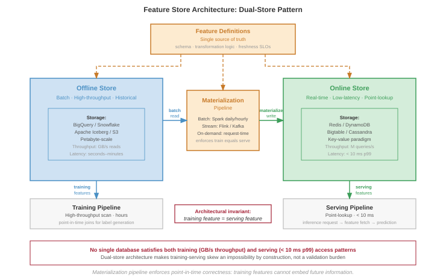
:::

A feature store is not merely a database; it is an architectural pattern designed to resolve the fundamental conflict between the data access patterns of model training and real-time serving. Training requires high-throughput analytical scans over massive historical datasets, while serving requires low-latency point lookups for individual prediction requests. No single database system can efficiently satisfy both constraints, forcing the adoption of a **dual-store architecture**\index{Dual-Store Architecture} composed of an offline store and an online store.

The **offline store**\index{Offline Store} is the system of record for all historical feature data, often holding petabytes of information. It is optimized for the massive sequential reads characteristic of training data generation, where a single query might scan terabytes of data to build a feature set for millions of examples. The key metric is throughput, not latency. Systems like BigQuery, Snowflake, or data lakes built on S3 with formats like Apache Iceberg are common choices, designed to parallelize these large-scale analytical queries.

The **online store**\index{Online Store} is purpose-built for speed at serving time. When a prediction request arrives, the model needs its features within a strict latency budget---often a p99 of less than 10 milliseconds. For a platform serving 10,000 models, this can translate to millions of queries per second. This requires a key-value paradigm, using systems like Redis, DynamoDB, or Bigtable that are optimized for retrieving a small number of values for a specific entity key.

Features are loaded into these stores through a process called **materialization**\index{Materialization}. Batch computation pipelines, often running on Spark, execute daily or hourly to generate features from historical data. Streaming computation pipelines using Flink or Spark Streaming generate features in near-real-time from event streams like Kafka. On-demand computation calculates features at request time when freshness requirements exceed batch frequency. The central architectural challenge is ensuring consistency between the two stores during materialization. If the offline store contains a feature value for training that was not identically available in the online store at the time of prediction, it introduces a subtle form of data leakage that can lead to silent degradation of model performance in production---the training-serving skew problem formalized above.

For a platform managing over 10,000 models, this centralized dual-store architecture is not optional. It provides a governable contract between data production and model consumption, preventing thousands of independent, unmaintainable feature pipelines and ensuring that all models are built from a consistent, high-quality source of truth.

### Freshness SLOs {#sec-ml-operations-scale-freshness-slos-6912}

Feature freshness represents the delay between real-world events and their reflection in feature values. @Tbl-ops-scale-feature-freshness maps four feature types to their freshness requirements: static features like user demographics tolerate day-scale staleness with batch computation, while real-time features capturing the last user action demand seconds-scale freshness through streaming or on-demand computation.

The freshness requirement is particularly acute for recommendation systems, where stale features become a direct tax on engagement.

::: {#lhs-ops-scale-archetype-b-dlrm-at-scale-staleness-tax .callout-lighthouse title="Archetype B (DLRM at Scale): The staleness tax"}

Archetype B (DLRM at Scale), the Deep Learning Recommendation Model (DLRM) workload, is uniquely sensitive to freshness. Unlike Archetype A (GPT-4/Llama-3) (where grammar rules do not change), Archetype B (DLRM at Scale)'s "ground truth" changes every second. If a user clicks a video about baking, and the feature store has a 10-minute lag, the next 100 recommendations will miss this new intent. This "staleness tax" directly degrades engagement, forcing Archetype B (DLRM at Scale) systems to adopt expensive streaming pipelines over cheaper batch ones.

:::

Feature freshness requirements by type\index{Feature Freshness Requirements by Type} set the SLOs that the monitoring and alerting system must enforce.

| **Feature Type**    |       **Example**       | **Freshness SLO** | **Computation Pattern** |
|:--------------------|:-----------------------:|:-----------------:|:-----------------------:|
| **Static**          |    User demographics    |        Days       |          Batch          |
| **Slowly changing** |     User preferences    |       Hours       |          Batch          |
| **Session-level**   | Current session context |      Minutes      |        Streaming        |
| **Real-time**       |       Last action       |      Seconds      |   Streaming/On-demand   |

: **Feature Freshness Requirements by Type**: Four feature categories with SLO thresholds and computation patterns. Static features (user demographics) tolerate day-scale staleness with batch computation; real-time features (last user action) demand seconds-scale freshness through streaming or on-demand computation, directly impacting recommendation quality and engagement. {#tbl-ops-scale-feature-freshness}

Freshness becomes operational only when the SLO turns into a measured quantity. @Eq-feature-staleness defines feature staleness as the difference between current time and the most recent feature update, enabling direct comparison against the thresholds in @tbl-ops-scale-feature-freshness:

$$\text{Staleness} = t_{\text{current}} - t_{\text{feature\_update}}$$ {#eq-feature-staleness}

The staleness scalar gives batch and streaming paths a shared alert rule. Streaming features should stay near zero except during pipeline disruption, while batch features increase predictably between scheduled updates; the monitoring system should therefore compare each feature against its own SLO rather than apply one global freshness threshold.

#### Worked example: Freshness impact on model quality {#sec-ml-operations-scale-worked-example-freshness-impact-model-quality-676b}

A recommendation system uses user interaction features with different freshness levels. Testing on historical data produces the engagement lift in @tbl-feature-freshness-engagement:

| **Feature Freshness**           | **Engagement Lift vs. Baseline** |
|:--------------------------------|:--------------------------------:|
| **Real-time (&lt; 1 min)**      |              +12.3%              |
| **Near real-time (&lt; 5 min)** |              +11.8%              |
| **Hourly**                      |              +10.2%              |
| **Daily**                       |              +8.1%               |

: **Engagement Lift by Feature Freshness**: Historical testing of a recommendation system. Real-time features (under one minute) deliver 4.2 percentage points of additional engagement lift over daily features. The 2.1-point gap between hourly and real-time features quantifies the value of investing in streaming feature infrastructure. {#tbl-feature-freshness-engagement tbl-colwidths="[45,55]"}

The engagement difference between hourly and real-time features is 2.1 percentage points. If this translates to \$10 million in annual engagement value, investing in real-time feature infrastructure may be justified if costs are below this value.

::: {#chk-ops-scale-freshness-revenue .callout-checkpoint title="Pricing the streaming and batch freshness decision"}

@Tbl-feature-freshness-engagement shows that hourly-to-real-time features add 2.1 percentage points of engagement lift. Treat that lift as \$10 million in annual engagement value and apply it to the choice between streaming and batch infrastructure.

- [ ] **Freshness break-even**: Determine the maximum annual cost of a real-time feature pipeline that still breaks even on the 2.1-point lift, holding the \$10 million engagement value constant, and state the cost threshold under which streaming is a clear win.
- [ ] **Lift per point**: Compare the daily-to-hourly, hourly-to-near-real-time, and near-real-time-to-real-time transitions by return per percentage point of latency reduction, and infer the right freshness target for a team that cannot afford full streaming.
- [ ] **Scaling to users**: If the \$10 million annual engagement value scales linearly with platform user count, determine the user count where a \$5 million per year streaming feature platform pays for itself, state the range where it does not, and choose the alternative architecture from @tbl-ops-scale-feature-freshness.

:::

### Point-in-time correctness {#sec-ml-operations-scale-pointintime-correctness-41f4}

Training data must use features as they existed at the time of each training example. @Fig-time-travel illustrates the "time travel" problem: a batch job computing `total_clicks_today` at midnight produces a value of 10, but using this to train a model predicting behavior at noon introduces leakage since the true value at noon was only 4. Using current feature values to label historical events creates data leakage[^fn-data-leakage-pitfall] that inflates offline metrics but fails in production.

[^fn-data-leakage-pitfall]: **Data Leakage**\index{Data Leakage!feature store risk}: An error where future information contaminates training data. The systems danger is that leakage produces models with spectacular offline metrics -- sometimes 99 percent+ accuracy -- that fail completely in production where future information is unavailable. At feature-store scale, leakage risk multiplies because batch-computed features may embed temporal information invisible to the model team but exploitable by the optimizer, making point-in-time correctness an infrastructure guarantee rather than a per-team responsibility.

::: {#fig-time-travel fig-env="figure" fig-pos="htb" fig-cap="**Point-in-Time Correctness**: Preventing data leakage by joining training events with feature values as they existed *at the event timestamp*, not the *current values*. This ensures the model learns from the information actually available at inference time." fig-alt="Timeline from midnight to midnight with inference event at noon. Blue segments show 4 clicks by noon, 10 total by end. Red curved arrow shows leakage path using future value of 10. Green label shows correct point-in-time value of 4."}

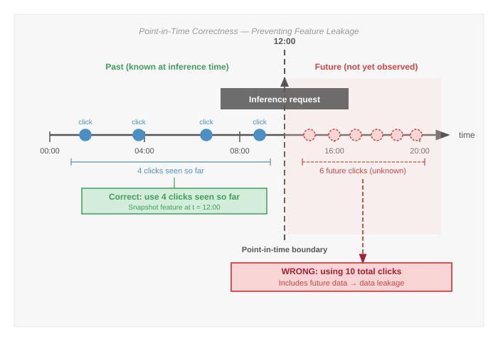

:::

The contrast in @fig-time-travel is stark: the correct point-in-time value at noon is 4 clicks, but a naive batch join would supply the midnight value of 10, inflating the training signal by 2.5 times and producing a model that cannot generalize to production. This "time travel"\index{Time Travel} failure is common because the feature value is valid in the database but invalid for the historical prediction moment: `total_clicks_today` really is 10 at midnight, but the noon prediction should only see the 4 clicks that existed by noon. Training on the midnight value leaks future information into the example, so the model learns to "cheat" with signals unavailable in production. The result can be spectacular offline metrics and catastrophic production failure when future data disappears.\index{Leakage}

Feature stores implement point-in-time joins that retrieve feature values as of specific timestamps, as shown in @lst-pit-joins.\index{Point-in-Time Join}

::: {#lst-pit-joins lst-cap="**Point-in-Time Join**: A SQL lateral join that retrieves the most recent feature values available before each event, preventing future data leakage into training examples."}

```{.sql}
SELECT
    e.user_id,
    e.event_timestamp,
    e.label,
    f.feature_1,
    f.feature_2
FROM events e
LEFT JOIN LATERAL (
    SELECT feature_1, feature_2
    FROM features f
    WHERE f.user_id = e.user_id
      AND f.feature_timestamp <= e.event_timestamp
    ORDER BY f.feature_timestamp DESC
    LIMIT 1
) f ON TRUE
```

:::

This query retrieves the most recent feature values that existed before each event, ensuring training data reflects production reality.

```{python}
#| echo: false
#| label: feature-store-storage-scenario
# ┌─────────────────────────────────────────────────────────────────────────────
# │ FEATURE STORE — STORAGE FOOTPRINT
# ├─────────────────────────────────────────────────────────────────────────────
# │ Context: point-in-time storage cost for the recommendation feature store.
# └─────────────────────────────────────────────────────────────────────────────
from mlsysim.core.units import MILLION, BILLION, PB, byte
from mlsysim.fmt import check, fmt, fmt_count, fmt_memory, fmt_time

class FeatureStoreStorage:
    """Feature-history storage footprint for a 100M-user recommendation store."""

    # ┌── 1. LOAD ──────────────────────────────────────────────────────────
    storage_users = 100 * MILLION
    storage_features = 1000
    storage_retention_years = 1
    storage_update_interval_hr = 1
    hours_per_year = 365 * 24
    storage_bytes_per_value = 100 * byte
    # ┌── 2. EXECUTE ───────────────────────────────────────────────────────
    storage_versions_per_feature = storage_retention_years * hours_per_year / storage_update_interval_hr
    storage_feature_values = storage_users * storage_features * storage_versions_per_feature
    storage_total_bytes = storage_feature_values * storage_bytes_per_value
    # ┌── 3. GUARD ─────────────────────────────────────────────────────────
    check(storage_feature_values == 876_000_000_000_000, "Feature-history count drifted.")
    check(87 < storage_total_bytes.to(PB).magnitude < 88, "Storage should remain about 87 PB.")
    # ┌── 4. OUTPUT ────────────────────────────────────────────────────────
    storage_users_str = fmt_count(storage_users, scale="million", precision=0, scale_style="word", label="user")
    storage_features_str = fmt_count(storage_features, commas=False, label="feature")
    storage_retention_years_str = fmt_time(storage_retention_years, "year", precision=0, commas=False, style="word")
    storage_update_interval_hr_str = fmt_time(storage_update_interval_hr, "hour", precision=0, commas=False, style="word")
    storage_feature_values_str = fmt_count(storage_feature_values, scale="trillion", precision=0, scale_style="word", label="feature value")
    storage_bytes_per_value_str = fmt_memory(storage_bytes_per_value, unit=byte, precision=0, commas=False)
    storage_total_pb_str = fmt_memory(storage_total_bytes, unit=PB, precision=1, commas=False)
```

Point-in-time correctness has a storage cost because the store must retain feature history rather than current values alone. The same guarantee that prevents leakage also multiplies retained state:

$$\text{Storage} = N_{\text{entities}} \times N_{\text{features}} \times \frac{T_{\text{retention}}}{T_{\text{update}}}$$

For `{python} FeatureStoreStorage.storage_users_str`, `{python} FeatureStoreStorage.storage_features_str`, `{python} FeatureStoreStorage.storage_retention_years_str` retention, and updates every `{python} FeatureStoreStorage.storage_update_interval_hr_str`, the history contains `{python} FeatureStoreStorage.storage_feature_values_str`. At `{python} FeatureStoreStorage.storage_bytes_per_value_str` per value, this represents approximately `{python} FeatureStoreStorage.storage_total_pb_str` before compression. Efficient feature stores use compression, columnar storage, and retention policies to manage this scale.

### Feature versioning and lineage {#sec-ml-operations-scale-feature-versioning-lineage-624c}

Feature definitions are production interfaces, so changing one without versioning can break every dependent model. Versioning and lineage make this evolution governable rather than implicit.

A representative `user_engagement_score` incident makes the mechanics concrete. A platform team changes the feature from a 30-day z-score to a 7-day min-max scale. The output may still be a floating-point number, so schema validation alone can pass while the feature's meaning changes completely. Versioning names the semantic change before it reaches production; lineage identifies every model trained or served with the old meaning; backfill recomputes historical values for the new meaning; and freshness and quality checks decide whether the rewritten history is safe to use. Without that chain, a feature migration becomes a silent multi-model regression.

A safe feature interface records both version dimensions and lineage fields. @Tbl-ops-scale-feature-version-lineage-components keeps those fields tied to their operational use.

| **Component**                         | **What It Records**                                     | **Operational Use**                                                            |
|:--------------------------------------|:--------------------------------------------------------|:-------------------------------------------------------------------------------|
| Definition version                    | Computation logic for the feature                       | Blocks silent semantic changes when the formula changes but the type does not. |
| Data version                          | Source snapshot or stream contract                      | Distinguishes model changes from upstream data changes.                        |
| Schema version                        | Output type, shape, units, and nullability              | Preserves API compatibility checks while still naming semantic shifts.         |
| Consumer declaration                  | Exact feature versions each model consumes              | Gives the platform a place to block unsafe updates before serving.             |
| Source lineage                        | Source tables, streams, and their versions              | Traces bad predictions back to the upstream data that produced them.           |
| Transformation and runtime provenance | Transformation code, timestamp, and environment         | Reproduces historical values for audit, debugging, and compliance.             |
| Quality and freshness metrics         | Validation results observed when the value was produced | Estimates blast radius and decides whether rewritten history is safe to use.   |

: **Feature Version and Lineage Components**: Feature versioning separates logic, data, and schema changes; lineage records the path needed to debug, audit, and reproduce feature values. Together, these fields turn a feature definition into a governed production interface. {#tbl-ops-scale-feature-version-lineage-components}

### Backfill procedures {#sec-ml-operations-scale-backfill-procedures-eb66}

A backfill is a production migration over history: changing a feature definition rewrites the training record for every model that depends on it, so the platform must bound the compute cost, validate that recomputed values match, and preserve a path back. Treating the backfill as a migration changes the operational question from whether the computation can run once to whether history can be rewritten without corrupting future training data.

At scale, historical data may have moved into cold storage, so recomputation first becomes a data-placement problem. The long historical window then competes with production workloads for compute. Even after the job finishes, the platform cannot simply trust the new values: it must compare overlapping periods against the original computation and coordinate with dependent pipelines so training jobs do not mix old and new semantics mid-run.\index{Backfill}

The practical pattern is incremental. Historical data is processed in date partitions, and each partition is validated before the next one starts. During a dual-write period, old and new computations run in parallel, which gives the platform overlapping values for comparison before cutover. Rollback remains possible because the previous feature version and its lineage stay available until dependent models have been retrained, evaluated, and redeployed.

### Scale challenges {#sec-ml-operations-scale-scale-challenges-b84b}

Feature stores at recommendation system scale face a coupled systems problem: request volume, latency budget, and storage history all bind at once.

```{python}
#| echo: false
#| label: feature-store-latency-scenario
# ┌─────────────────────────────────────────────────────────────────────────────
# │ FEATURE STORE — REQUEST VOLUME AND LATENCY BUDGET
# ├─────────────────────────────────────────────────────────────────────────────
# │ Context: recommendation-scale lookup rate and per-request latency budget.
# └─────────────────────────────────────────────────────────────────────────────
from mlsysim.core.units import BILLION
from mlsysim.fmt import check, fmt_count, fmt_multiple_range, fmt_rate, fmt_time, fmt_time_range

class FeatureStoreLatency:
    """Request volume and per-request latency budget for the recommendation store."""

    # ┌── 1. LOAD ──────────────────────────────────────────────────────────
    daily_recommendations = 1 * BILLION
    features_per_recommendation = 100
    seconds_per_day = 24 * 60 * 60
    peak_traffic_min = 5
    peak_traffic_max = 10
    recommendation_budget_ms = 50
    feature_budget_min_ms = 5
    feature_budget_max_ms = 10
    network_overhead_min_ms = 1
    network_overhead_max_ms = 2
    store_lookup_min_ms = 3
    store_lookup_max_ms = 8
    # ┌── 2. EXECUTE ───────────────────────────────────────────────────────
    lookups_per_day = daily_recommendations * features_per_recommendation
    avg_lookups_per_s = lookups_per_day / seconds_per_day
    # ┌── 3. GUARD ─────────────────────────────────────────────────────────
    check(1.1 * 10**6 < avg_lookups_per_s < 1.2 * 10**6, "Average lookup rate should be about 1.16M/s.")
    # ┌── 4. OUTPUT ────────────────────────────────────────────────────────
    daily_recommendations_str = fmt_count(daily_recommendations, scale="billion", precision=0, scale_style="word", label="daily recommendation")
    features_per_recommendation_str = fmt_count(features_per_recommendation, commas=False, label="feature")
    lookups_per_day_str = fmt_count(lookups_per_day, scale="billion", precision=0, scale_style="word", label="feature lookup")
    avg_lookup_rate_str = fmt_rate(avg_lookups_per_s, "requests/s", scale="M", precision=2, commas=False)
    peak_traffic_range_mult_str = fmt_multiple_range(peak_traffic_min, peak_traffic_max, precision=0, commas=False)
    recommendation_budget_ms_str = fmt_time(recommendation_budget_ms, "millisecond", precision=0, commas=False)
    feature_budget_range_ms_str = fmt_time_range(feature_budget_min_ms, feature_budget_max_ms, "millisecond", precision=0, commas=False)
    network_overhead_range_ms_str = fmt_time_range(network_overhead_min_ms, network_overhead_max_ms, "millisecond", precision=0, commas=False)
    store_lookup_range_ms_str = fmt_time_range(store_lookup_min_ms, store_lookup_max_ms, "millisecond", precision=0, commas=False)
```

The arithmetic behind a large recommender explains why feature stores become serving infrastructure rather than a metadata convenience. `{python} FeatureStoreLatency.daily_recommendations_str` with `{python} FeatureStoreLatency.features_per_recommendation_str` per recommendation produces `{python} FeatureStoreLatency.lookups_per_day_str` per day. That average load is roughly `{python} FeatureStoreLatency.avg_lookup_rate_str` before peak traffic, which commonly reaches `{python} FeatureStoreLatency.peak_traffic_range_mult_str` the mean.

Feature retrieval must fit inside the overall latency budget because every extra lookup millisecond steals time from ranking. If the recommendation budget is `{python} FeatureStoreLatency.recommendation_budget_ms_str`, the feature store may receive only `{python} FeatureStoreLatency.feature_budget_range_ms_str`. Network overhead can consume `{python} FeatureStoreLatency.network_overhead_range_ms_str` of that allocation, leaving roughly `{python} FeatureStoreLatency.store_lookup_range_ms_str` for the store lookup itself. Meeting this budget requires in-memory storage, careful batching, and geographic placement close enough to the serving fleet that network latency does not dominate.

Production feature stores also carry two time horizons at once. The online path keeps current values for billions of entities and thousands of features per entity, usually in the terabyte range before replication. The offline path keeps enough historical state to reconstruct training examples, which can push retained feature history into petabytes. Multi-region replication then serves both availability and latency, but it also makes freshness and consistency visible operational concerns.

### Data quality operations {#sec-ml-operations-scale-data-quality-operations-e77b}

Data quality\index{Data Quality} issues are a major source of production ML problems [@polyzotis2017]. While model monitoring detects symptoms, data quality monitoring prevents problems at their source. At scale, data quality operations become as critical as model quality operations, requiring systematic monitoring, validation, and incident response procedures.

```{python}
#| echo: false
#| label: feature-store-data-quality-scenario
# ┌─────────────────────────────────────────────────────────────────────────────
# │ FEATURE STORE — DATA QUALITY MEASUREMENT
# ├─────────────────────────────────────────────────────────────────────────────
# │ Context: completeness measurement and batch-rejection threshold.
# └─────────────────────────────────────────────────────────────────────────────
from mlsysim.core.units import MILLION
from mlsysim.fmt import check, fmt_count, fmt_percent

class FeatureStoreDataQuality:
    """Completeness measurement for a daily feature pipeline."""

    # ┌── 1. LOAD ──────────────────────────────────────────────────────────
    expected_events = 10 * MILLION
    delivered_events = 8.2 * MILLION
    validation_failure_threshold = 0.05
    # ┌── 2. EXECUTE ───────────────────────────────────────────────────────
    completeness = delivered_events / expected_events
    # ┌── 3. GUARD ─────────────────────────────────────────────────────────
    check(abs(completeness - 0.82) < 1e-9, "Completeness example should remain 82%.")
    # ┌── 4. OUTPUT ────────────────────────────────────────────────────────
    expected_events_str = fmt_count(expected_events, scale="million", precision=0, scale_style="word", label="user event")
    delivered_events_str = fmt_count(delivered_events, scale="million", precision=1, scale_style="word", label="user event", allow_fractional=True)
    completeness_pct_str = fmt_percent(completeness, precision=0, commas=False, style="prose")
    validation_failure_threshold_pct_str = fmt_percent(validation_failure_threshold, precision=0, commas=False, style="prose")
```

The first step is measurement: data quality must be quantified in dimensions that map directly to prevention gates. Completeness measures whether expected records and fields are present. A daily data pipeline expected to produce `{python} FeatureStoreDataQuality.expected_events_str` but delivering only `{python} FeatureStoreDataQuality.delivered_events_str` is `{python} FeatureStoreDataQuality.completeness_pct_str` complete, which usually indicates a pipeline failure or upstream data source issue rather than ordinary statistical variation. Consistency captures schema compliance and referential integrity: an age feature should fall between 0 and 120, while values such as 999 or -1 suggest sentinel leakage or data errors. Production systems often reject batches that fail more than `{python} FeatureStoreDataQuality.validation_failure_threshold_pct_str` of validation rules because allowing corrupt data through is more expensive than delaying a batch.

Timeliness measures freshness against the SLO of the consuming model. Fraud detection may need features less than 100 milliseconds old, while demographic features can tolerate staleness measured in days; the alert threshold should therefore be tied to the feature's use, not a global constant. Accuracy asks whether values remain correct within expected distributions. Sensor drift after calibration lapses, for example, can leave values well-typed but wrong. Statistical tests such as Kolmogorov-Smirnov for continuous features, chi-square for categorical features, and Maximum Mean Discrepancy for high-dimensional data turn those accuracy checks into recurring gates.

Validation then turns those measurements into a layered defense. Schema validation enforces expected column names, types, and constraints at ingestion; tools such as Great Expectations, TensorFlow Data Validation, and Pandera provide declarative schemas with automated checks. Distribution monitoring tracks feature distributions over time, catching drift that may not violate a type constraint but still indicates an upstream change likely to degrade model performance. Cross-field validation adds the business logic that neither schema nor marginal distributions can express: if `country="USA"`, the `zip_code` should match US postal formats; if `order_status="shipped"`, a `shipping_date` should exist; and age derived from birthdate should match any explicit age field.

#### Worked example: Debugging data quality incident {#sec-ml-operations-scale-worked-example-debugging-data-quality-incident-72cd}

```{python}
#| echo: false
#| label: data-quality-incident-scenario
# ┌─────────────────────────────────────────────────────────────────────────────
# │ DATA QUALITY INCIDENT — CTR REGRESSION
# ├─────────────────────────────────────────────────────────────────────────────
# │ Context: feature-computation-bug incident, revenue impact, alert reduction.
# └─────────────────────────────────────────────────────────────────────────────
from mlsysim.core.units import MILLION
from mlsysim.fmt import check, fmt, fmt_percent, fmt_time, fmt_usd

class DataQualityIncident:
    """A feature-computation bug that silently degrades CTR over five days."""

    # ┌── 1. LOAD ──────────────────────────────────────────────────────────
    ctr_drop = 0.08
    incident_days = 5
    ctr_before = 0.042
    ctr_after = 0.0387
    freshness_slo_hr = 1
    engagement_before = 0.42
    engagement_after = 0.31
    weekly_revenue = 15 * MILLION
    alert_detection_hr = 4
    feature_shift_threshold = 0.10
    # ┌── 2. EXECUTE ───────────────────────────────────────────────────────
    engagement_decline = (engagement_before - engagement_after) / engagement_before
    revenue_impact = ctr_drop * weekly_revenue * incident_days / 7
    impact_reduction = 1 - (alert_detection_hr / (incident_days * 24))
    engagement_decline_rounded = round(engagement_decline, 2)
    revenue_impact_rounded = round(revenue_impact / 1000) * 1000
    impact_reduction_rounded = round(impact_reduction, 2)
    # ┌── 3. GUARD ─────────────────────────────────────────────────────────
    check(850_000 < revenue_impact < 860_000, "Revenue-impact example should remain about $857K.")
    check(0.96 < impact_reduction < 0.98, "Alert reduction should remain about 97%.")
    # ┌── 4. OUTPUT ────────────────────────────────────────────────────────
    ctr_drop_pct_str = fmt_percent(ctr_drop, precision=0, commas=False, style="prose")
    incident_days_str = fmt_time(incident_days, "day", precision=0, commas=False, style="word")
    ctr_before_pct_str = fmt_percent(ctr_before, precision=1, commas=False, style="prose")
    ctr_after_pct_str = fmt_percent(ctr_after, precision=2, commas=False, style="prose")
    freshness_slo_hr_str = fmt_time(freshness_slo_hr, "hour", precision=0, commas=False, style="word", attributive=True)
    engagement_before_str = fmt(engagement_before, precision=2, commas=False)
    engagement_after_str = fmt(engagement_after, precision=2, commas=False)
    engagement_decline_pct_str = fmt_percent(engagement_decline_rounded, precision=0, commas=False, style="prose")
    weekly_revenue_usd_str = fmt_usd(weekly_revenue, scale="M", precision=0, commas=False)
    revenue_impact_usd_str = fmt_usd(revenue_impact_rounded, scale="K", precision=0, commas=False)
    alert_detection_hr_str = fmt_time(alert_detection_hr, "hour", precision=0, commas=False, style="word")
    impact_reduction_pct_str = fmt_percent(impact_reduction_rounded, precision=0, commas=False, style="prose")
    feature_shift_threshold_pct_str = fmt_percent(feature_shift_threshold, precision=0, commas=False, style="prose")
```

A recommendation model's click-through rate (CTR) drops `{python} DataQualityIncident.ctr_drop_pct_str` over `{python} DataQualityIncident.incident_days_str`. Initial hypothesis focuses on model drift, but data quality investigation reveals the root cause.

::: {.column-margin}
```{=latex}
\vspace*{-54mm}
```
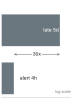{width="100%" fig-alt="Time ladder comparing a late five-day detection window with a four-hour automated alert window, marked as a 30x gap."}

*Every minute of delayed detection compounds the cost.*
:::

The investigation starts with the model symptom and then works backward through the data path. Model metrics\index{Model Metrics} confirm that CTR declined from `{python} DataQualityIncident.ctr_before_pct_str` to `{python} DataQualityIncident.ctr_after_pct_str`, but freshness checks\index{Data!data freshness} show that features still arrive within the `{python} DataQualityIncident.freshness_slo_hr_str` SLO. That rules out a stale pipeline and points to semantic change. Distribution analysis then shows the `user_engagement_score` mean shifting from `{python} DataQualityIncident.engagement_before_str` to `{python} DataQualityIncident.engagement_after_str`, a `{python} DataQualityIncident.engagement_decline_pct_str` decline, and lineage tracking\index{Lineage Tracking} ties the shift to an upstream pipeline version deployed `{python} DataQualityIncident.incident_days_str` earlier. The root cause is not model drift but a feature computation bug in the new pipeline version.

The quantitative impact is the relative CTR loss multiplied by weekly revenue and the fraction of the week exposed: `{python} DataQualityIncident.ctr_drop_pct_str` of `{python} DataQualityIncident.weekly_revenue_usd_str`/week over `{python} DataQualityIncident.incident_days_str` produces `{python} DataQualityIncident.revenue_impact_usd_str` in lost revenue. Distribution monitoring with automated alerts would detect the shift within `{python} DataQualityIncident.alert_detection_hr_str`, reducing impact by `{python} DataQualityIncident.impact_reduction_pct_str`.

The resolution is to roll back the pipeline to the previous version, redeploy models with correctly computed features, and add a distribution validation gate to prevent future pipeline deployments with feature shifts exceeding the `{python} DataQualityIncident.feature_shift_threshold_pct_str` threshold.

#### Operational integration {#sec-ml-operations-scale-operational-integration-a2de}

Data quality operations integrate into production systems by turning checks into enforceable contracts. Data contracts\index{Data Contract} establish formal agreements between data producers and consumers, specifying schema requirements, freshness SLOs, quality thresholds for completeness and accuracy, and escalation procedures for violations. When a data producer changes schema or computation logic, the contract forces explicit negotiation with consumers rather than allowing a silent interface change.

The contract becomes operational through continuous validation\index{Continuous Validation} and incident response\index{Incident Response}. Preingestion validation rejects bad source data before accepting it, posttransformation checks verify that computation logic still produces expected values, and final validation prevents corrupted features from reaching models. When quality degrades anyway, automated alerts page the on-call team with severity and affected systems, circuit breakers keep known-bad data out of serving, fallback paths use last-known-good data or cached features, and bad batches are quarantined for forensic analysis. Root-cause analysis then repairs the pipeline rather than only clearing the current alert.

At enterprise scale with thousands of features, monitoring must aggregate by likely shared failure mode. Individual feature monitoring creates alert fatigue, while hierarchical monitoring preserves signal by grouping features along operational boundaries. Source-system grouping catches shared upstream failures, such as a payment-processing outage that affects all payment-related features simultaneously. Computation-pipeline grouping catches errors in transformation code or dependencies. Update-frequency grouping separates streaming features from daily batch features because staleness thresholds and alert sensitivity vary by update pattern. Business-domain grouping then routes user demographic, product catalog, and interaction-feature alerts to the teams that understand the affected models.

```{python}
#| echo: false
#| label: freshness-monitoring-scenario
# ┌─────────────────────────────────────────────────────────────────────────────
# │ FRESHNESS MONITORING — SAMPLING AND AGGREGATION
# ├─────────────────────────────────────────────────────────────────────────────
# │ Context: monitoring-overhead reduction via sampling and pipeline aggregation.
# └─────────────────────────────────────────────────────────────────────────────
from mlsysim.fmt import fmt_count, fmt_percent

class FreshnessMonitoring:
    """Sampling and aggregation assumptions for fleet-scale freshness checks."""

    # ┌── 1. LOAD ──────────────────────────────────────────────────────────
    freshness_feature_count = 10_000
    freshness_sample = 0.01
    pipeline_feature_count = 500
    # ┌── 4. OUTPUT ────────────────────────────────────────────────────────
    freshness_feature_count_str = fmt_count(freshness_feature_count, commas=True, label="feature")
    freshness_sample_pct_str = fmt_percent(freshness_sample, precision=0, commas=False, style="prose")
    pipeline_feature_count_str = fmt_count(pipeline_feature_count, commas=False, label="feature")
```

Freshness monitoring applies the same aggregation rule to time. For `{python} FreshnessMonitoring.freshness_feature_count_str` updated at different frequencies, continuous freshness checking generates substantial overhead, so efficient implementations reduce the number of checks without losing systemic signal. Sampling `{python} FreshnessMonitoring.freshness_sample_pct_str` of representative entities rather than every feature value is usually enough to detect systemic freshness failures. Pipeline-level aggregation is even cheaper when one pipeline updates `{python} FreshnessMonitoring.pipeline_feature_count_str`, because the pipeline update timestamp captures the freshness state of the group. Threshold stratification reserves per-feature monitoring for revenue-critical features and uses aggregated monitoring for features whose staleness has lower immediate impact. The resulting overhead scales with the number of distinct features, not the volume of feature values, so efficient implementations maintain $\mathcal{O}(F)$ overhead even when feature values scale to billions of entities.

## Organizational Patterns {#sec-ml-operations-scale-organizational-patterns-e2e8}

Feature stores resolved who owns a shared feature; the broader question is who owns the shared platform itself. Technical infrastructure alone is insufficient for ML operations at scale: organizational structure determines whether platform capabilities become shared infrastructure or another bottleneck. The central question is where an organization places invariants. Deployment safety, observability, compliance, cost control, and feature consistency can either be enforced once by a platform team or rediscovered differently by every model team.

### Centralized platform team {#sec-ml-operations-scale-centralized-platform-team-16fc}

A centralized ML platform team maximizes consistency by building and maintaining shared infrastructure while model teams focus on model development. @Fig-ml-org-models places that pattern alongside embedded and hybrid alternatives, each trading off consistency against velocity.

::: {#fig-ml-org-models fig-env="figure" fig-pos="htb" fig-cap="**Organizational Patterns for ML**: (Left) Centralized model provides consistency but risks bottlenecks. (Center) Embedded model provides velocity but risks fragmentation. (Right) Hybrid usage of a core platform team with embedded specialists offers a balance of standardization and responsiveness." fig-alt="Three org chart diagrams: centralized platform team, embedded per-team platform engineers, and hybrid with shared core platform."}

```{.tikz}
\begin{tikzpicture}[font=\small\usefont{T1}{phv}{m}{n}, node distance=1cm and 0.5cm]
  \definecolor{PlatformColor}{HTML}{D1E6F3}
  \definecolor{ModelColor}{HTML}{FCE4CC}
  \definecolor{RedLine}{HTML}{FF0000}
  \definecolor{GreenLine}{HTML}{00FF00}

  \tikzset{
    box/.style={draw=black!70, line width=0.75pt, minimum width=1.5cm, minimum height=0.8cm, font=\tiny\usefont{T1}{phv}{m}{n}, align=center},
    edge/.style={->, line width=1.0pt},
    title/.style={font=\bfseries\usefont{T1}{phv}{b}{n}, anchor=south},
    risk/.style={font=\scriptsize\usefont{T1}{phv}{m}{n}, text=RedLine},
    balance/.style={font=\scriptsize\usefont{T1}{phv}{m}{n}, text=GreenLine}
  }

  \begin{scope}[local bounding box=central]
    % Centralized
    \node[title] (CentTitle) {Centralized};
    \node[box, fill=PlatformColor, minimum width=3cm, below=0.5cm of CentTitle] (P1) {Platform Team};

    \node[box, fill=ModelColor, below left=of P1] (M1a) {M1};
    \node[box, fill=ModelColor, right=of M1a] (M1b) {M2};
    \node[box, fill=ModelColor, right=of M1b] (M1c) {M3};

    \draw[edge] (M1a) -- (P1);
    \draw[edge] (M1b) -- (P1);
    \draw[edge] (M1c) -- (P1);

    \node[risk, below=0.5cm of M1b] {Risk: Bottleneck};
  \end{scope}

  \begin{scope}[local bounding box=embedded, xshift=6cm]
    % Embedded
    \node[title] (EmbTitle) {Embedded};

    \node[box, fill=ModelColor, below=0.5cm of EmbTitle, xshift=-1.5cm] (M2a) {M1};
    \node[box, fill=PlatformColor, minimum width=0.5cm, right=of M2a] (P2a) {P};

    \node[box, fill=ModelColor, below=1.5cm of EmbTitle] (M2b) {M2};
    \node[box, fill=PlatformColor, minimum width=0.5cm, right=of M2b] (P2b) {P};

    \node[box, fill=ModelColor, below=0.5cm of EmbTitle, xshift=1.5cm] (M2c) {M3};
    \node[box, fill=PlatformColor, minimum width=0.5cm, right=of M2c] (P2c) {P};

    \node[risk, below=0.5cm of M2b] {Risk: Fragmentation};
  \end{scope}

  \begin{scope}[local bounding box=hybrid, xshift=12cm]
    % Hybrid
    \node[title] (HybTitle) {Hybrid};
    \node[box, fill=PlatformColor, minimum width=3cm, below=0.5cm of HybTitle] (P3) {Core Platform};

    \node[box, fill=ModelColor, below left=of P3] (M3a) {M1};
    \node[box, fill=PlatformColor, minimum width=0.5cm, right=of M3a] (P3a) {P};

    \node[box, fill=ModelColor, below right=of P3] (M3b) {M2};
    \node[box, fill=PlatformColor, minimum width=0.5cm, right=of M3b] (P3b) {P};

    \draw[edge, dashed] (P3a) -- (P3);
    \draw[edge, dashed] (P3b) -- (P3);

    \node[balance, below=0.5cm of M3a, xshift=1cm] {Balanced};
  \end{scope}

\end{tikzpicture}
```

:::

Centralization works when the same operational mistakes would otherwise recur across the organization. A shared team can enforce consistent deployment, monitoring, and governance practices; invest once in training, serving, and observability infrastructure; and concentrate deep ML systems expertise that would be hard to replicate across many product teams. It also gives infrastructure engineers a visible career path rather than scattering them as one-person support functions.

The same structure can become a queue. If every platform request routes through one team, model teams wait on prioritization decisions they do not control. Distance from product context can also produce abstractions that are technically elegant but poorly matched to the consuming team's constraints. Centralization is therefore strongest when common invariants dominate local variation, and weakest when model teams need rapid domain-specific changes.

### Embedded ML engineers {#sec-ml-operations-scale-embedded-ml-engineers-35e2}

The embedded pattern chooses proximity over uniformity by placing ML infrastructure expertise inside model teams, with coordination through communities of practice rather than a single reporting line. The benefit is responsiveness: the infrastructure engineer sees the team's data, model behavior, release pressure, and incident history directly, so local changes do not wait for cross-team scheduling.

The cost appears later, when each team has solved deployment, monitoring, and feature management slightly differently. Fragmentation wastes engineering effort, complicates integration, and makes platform quality depend on the skill and bandwidth of whoever happens to be embedded with a given team. Embedded teams therefore work best when local speed matters more than cross-team consistency, and worst when every team is reimplementing the same platform substrate.

### Hybrid models {#sec-ml-operations-scale-hybrid-models-237b}

Most mature organizations adopt hybrid approaches because neither pure centralization nor pure embedding handles both shared infrastructure and domain-specific needs well. The core platform team owns compute, storage, networking, common training and serving systems, monitoring, security, compliance, and cost controls. Domain platform engineers then stay close to recommendation, language, vision, fraud, or search teams, where workload-specific requirements change faster than the shared substrate should.

A federated version of the same idea distributes implementation work without giving up architectural control. Major contributing teams help maintain platform components, but standards, ownership boundaries, and prioritization are coordinated explicitly. This works only when governance has real authority: otherwise federation degenerates into embedding with more meetings.

### Organizational pattern selection {#sec-ml-operations-scale-organizational-pattern-selection-56a9}

The appropriate organizational pattern depends on where standardization creates more value than local autonomy. @Tbl-ops-scale-org-factors summarizes the organizational pattern decision factors\index{Organizational Pattern Decision Factors}: higher model counts, stricter regulatory requirements, and immature infrastructure favor centralized platforms, while heterogeneous model portfolios and smaller organizations may benefit from distributed expertise:

| **Factor**                  | **Favors Centralized** | **Favors Distributed** |
|:----------------------------|:----------------------:|:----------------------:|
| **Model count**             |     Higher (100+)      |     Lower (10--20)     |
| **Model similarity**        |      Homogeneous       |     Heterogeneous      |
| **Organization size**       |         Larger         |        Smaller         |
| **Regulatory requirements** |        Stricter        |        Lighter         |
| **Infrastructure maturity** |     Earlier stage      |      Later stage       |

: **Organizational Pattern Decision Factors**: Five criteria for choosing between centralized and distributed ML platform teams. Higher model counts (100+), stricter regulatory requirements, and earlier infrastructure maturity favor centralized platforms; heterogeneous model portfolios and smaller organizations may benefit from distributed expertise with coordination through communities of practice. {#tbl-ops-scale-org-factors}

The selection logic becomes clearer in a concrete organization. A technology company with 50 ML engineers across 8 teams operates 80 production models across recommendation, fraud, search, and ads. Each team maintains its own deployment and monitoring, which has created duplicated infrastructure work and inconsistent integration practices. The model count is high enough that shared platform investment should pay off, but the domain diversity is real enough that a purely centralized team would struggle to understand every workload.

The resulting design is hybrid. A central platform team of roughly 12--15 engineers owns core infrastructure, while domain-specific platform leads remain embedded with the largest model teams. A community of practice coordinates standards and a shared contribution model lets domain teams upstream reusable components instead of maintaining permanent forks.

By establishing shared contribution models and domain-specific platform leads, organizations can standardize the shared control plane without turning every domain-specific request into a platform bottleneck. The same platform engineering, feature management, and governance trade-offs become more concrete in the hyper-scale systems built by large technology companies.

## Case Studies {#sec-ml-operations-scale-case-studies-8bfd}

The case studies matter because each mature platform embodies a durable operations trade-off: standardization vs. velocity, freshness vs. cost, abstraction vs. control, or latency vs. model richness. They also expose the control-plane failure modes that the following incident-response section formalizes.

### Uber Michelangelo {#sec-ml-operations-scale-uber-michelangelo-37ff}

Uber's Michelangelo platform shows why repeatability becomes the first platform requirement at company scale [@hermann2017michelangelo]. Before Michelangelo, Uber faced a "dual implementation" problem: data scientists developed models in Python, but engineering teams had to rewrite feature pipelines for production, creating delay and logic divergence. The platform combined model training, deployment, serving, workflow management, and feature management for use cases including ETA prediction, fraud detection, and recommendations. Its feature store centralized reusable features such as trip-distance aggregates, reducing duplicated feature engineering and addressing training-serving consistency.

The operational challenge at Uber was not just model count, but the need to make model development repeatable across many product teams. Michelangelo provided a "Golden Path" for common workflows: teams could train models, create offline training datasets, serve predictions online or in batch, and reuse platform-managed feature pipelines. This standardization improved automation across training, evaluation, deployment, and monitoring while still requiring product teams to own model behavior and business-specific validation.

A critical evolution in platforms like Michelangelo is the move from batch-centric training toward fresher online features and lower-latency serving. Early platform designs commonly pair offline stores for training data with online stores for serving precomputed or recently computed features. Real-time products such as food delivery and fraud detection then introduce consistency challenges: the same feature definition must produce compatible values for offline training sets and online inference requests. The lesson is durable even when implementation details vary: centralized ML platforms must provide shared abstractions for features, training, serving, experimentation, and monitoring without turning every model into bespoke infrastructure.

### Meta FBLearner Flow {#sec-ml-operations-scale-meta-ml-platform}

Meta's FBLearner Flow shows how democratizing ML infrastructure requires hiding resource management without hiding workflow structure [@facebook2016fblearner]. Facebook reported that more than 25 percent of its engineering organization used FBLearner Flow, that the system had trained more than one million models, and that its online prediction service made more than six million predictions per second. The primary operational challenge was the "N-models problem": many teams needed repeatable model workflows without hand-building infrastructure for every ranking, ads, recommendation, or integrity model. FBLearner addressed this by treating the training pipeline as a DAG that abstracts away the underlying infrastructure. An engineer defines the workflow in code, and the platform handles resource allocation, dependency management, and fault tolerance.

A defining characteristic of large social ML platforms is feature freshness. For products like feed ranking, the value of a feature (for example, "user just clicked 'like' on a similar video") can decay quickly. This pushes platforms toward stream processing, online feature computation, and monitoring that tracks data distributions as well as service health. Standard metrics like CPU usage are insufficient to detect silent failures in feature streams; production ML systems need checks for missing features, distribution shifts, and training-serving skew.

To manage deployment risk, platforms at this scale commonly use Shadow Mode (or dark launching\index{Dark Launching}), canary releases, and online evaluation before broad promotion. Candidate models can run alongside the current production model, receiving live traffic while their outputs are logged but not shown to users. This phase verifies operational integrity (latency, memory usage, error rates) and helps build comparison data before a model affects user experience.

### Netflix ML infrastructure {#sec-ml-operations-scale-netflix-ml-infrastructure}

Netflix's ML infrastructure shows how personalization platforms manage fan-out cost under a strict latency budget [@gomez-uribe2015]. Rather than one model making one decision, the recommendation system combines multiple ranking and personalization algorithms for tasks such as page generation, row selection, search, "continue watching," and artwork personalization. The operational challenge is **fan-out cost**\index{Fan-Out Cost}: every additional online ranker or feature dependency consumes latency budget. Production systems therefore separate candidate generation, offline model training, online ranking, and caching so the homepage can remain personalized without executing an unbounded number of expensive models per request.

A specific problem Netflix tackles aggressively is the **"Cold Start"**\index{Cold Start}---the inability to recommend content to a new user with no history, or to recommend a brand new show with no viewing data. Their infrastructure solves this using "online learning" bandits that dynamically balance exploration and exploitation. When a new show launches, the system allocates a small "budget" of impressions to test the title on different user cohorts, rapidly converging on an effective audience. This requires an infrastructure capable of updating serving policies, exploration budgets, and recommendation state in near real-time, rather than waiting for the traditional daily batch training cycle. The system must also handle the "feedback loop" latency, ensuring that a user's interaction with a new title is immediately reflected in their subsequent recommendations, a requirement that pushed Netflix to move key parts of their feature engineering into the serving layer itself.

To validate these complex interactions, Netflix moved beyond standard A/B testing [@netflix2017interleaving] to "Interleaving." In a traditional A/B test, Group A sees Ranking 1 and Group B sees Ranking 2. This requires huge sample sizes and long durations to detect small improvements. Interleaving mixes the results of Ranking 1 and Ranking 2 into a single list for the same user, tracking which source the user actually clicks. This method cancels out user-level variance and creates a direct head-to-head comparison. The infrastructure supports this by allowing the serving layer to merge ranked lists on the fly and log attribution data with high fidelity. While this increases the complexity of the logging and attribution pipelines, the quantitative outcome is substantial: Netflix can detect statistically significant improvements with 100$\times$ fewer users than traditional A/B testing, allowing them to iterate on ranking algorithms at a velocity that traditional testing frameworks could not support.

### Google Vertex AI {#sec-ml-operations-scale-google-vertex-ai}

Google Vertex AI illustrates the managed-platform abstraction problem: the platform must remove glue code while preserving enough control for custom workloads. Google aimed to solve the "glue code" problem---where 95 percent of ML code is infrastructure boilerplate---by providing a unified control plane that spans data labeling, training, and serving. A key architectural decision was the integration of **AutoML**\index{AutoML} as a first-class citizen alongside custom training. This allows the platform to perform neural architecture search\index{Neural Architecture Search} (NAS) to find an effective model structure for a given budget. The operational trade-off here is "compute for human time": rather than an engineer spending weeks tuning hyperparameters, the platform spins up hundreds of parallel trials. This requires a multi-tenant scheduler capable of managing "burst capacity," allowing high-priority production jobs to preempt experimental AutoML trials without losing state, effectively maximizing cluster utilization.

For the serving layer, Vertex AI addresses the "noisy neighbor" problem inherent in multi-tenant environments. When thousands of customers deploy models to the same underlying fleet of Tensor Processing Units (TPUs) and GPUs, resource contention can cause unpredictable latency spikes. Google solves this with a strict containerization strategy and a "prediction sidecar" architecture. Every model runs in an isolated container, but a shared sidecar proxy handles logging, monitoring, and request batching. This separation allows the platform to enforce strict resource quotas (CPU, RAM, Accelerator RAM) and provide auto-scaling that reacts to custom metrics like "request queue depth" alongside CPU load. The quantitative benefit is a more predictable latency tail; hard isolation boundaries reduce the chance that a heavy batch job from one tenant degrades the real-time inference performance of another.

Vertex also tackles the feature store problem with a focus on consistency and compliance. Managed feature serving and point-in-time retrieval let training pipelines request only the feature values that existed at the timestamp of each training example. A common operational failure in ML is temporal data leakage---using feature values that were not available at prediction time. Managed feature serving also controls the training-serving skew developed in @sec-ml-operations-scale-feature-store-operations-2a36 by standardizing feature definitions and serving paths across both contexts. These design decisions add storage and lineage overhead, but they eliminate entire classes of silent bugs. Combined with cost and utilization controls around training and serving, managed platforms can help teams manage total cost of ownership rather than just providing raw compute.

### Spotify ML platform {#sec-ml-operations-scale-spotify-ml-platform}

Spotify's ML platform shows how personalization infrastructure balances exploration against exploitation at the scale of 500 million users. The core operational challenge is that optimizing strictly for immediate clicks (exploitation) creates "filter bubbles\index{Filter Bubble}" that degrade long-term user retention. To counter this, the platform supports counterfactual evaluation and contextual bandit algorithms, methods for estimating outcomes and allocating exploration traffic under partial feedback, directly in the serving path. The architecture separates the "candidate generation" phase (retrieving 1,000 potential songs) from the "ranking" phase (ordering the top 10). The candidate generators are diverse---some are collaborative filtering models [@koren2009] updated daily, while others are "algotorial" heuristics updated in real-time. This decoupling allows the platform to mix-and-match retrieval strategies without rewriting the heavy ranking logic, facilitating rapid experimentation with new content types like podcasts and audiobooks.

A central component of their architecture is the **"Paved Road"**\index{Paved Road} for model orchestration [@spotify2019mlinfra]. Spotify uses a centralized Model Registry that enforces strict lineage tracking. Every model artifact in production is cryptographically linked to the specific dataset snapshot, code commit, and hyperparameter set used to create it. This rigorous tracking is essential for debugging "silent regressions." If a user complains about repetitive recommendations, an engineer can trace the exact lineage of the responsible model to find that a specific data pipeline upstream was delayed. This lineage system also enables automated "canary deployments." When a new model version is registered, the platform automatically deploys it to a small subset of users (for example, 1 percent) and compares business metrics (streams per session) against the control group. If the metrics drop, the rollback is automatic, preventing bad models from ever reaching the full user base.

Latency constraints at Spotify are nonnegotiable; playback must feel instantaneous. This forces a design trade-off where complex inference is often precomputed. For the "Discover Weekly" playlist, the platform runs massive batch inference jobs on weekends, storing the results in a low-latency key-value store. However, for the "Home" screen, which must react to the song just listened to, they employ a hybrid approach. User embeddings are updated in near real-time using a streaming pipeline, but the heavy item-item similarity matrices are computed offline. This split architecture allows them to achieve sub-100 ms latency for the Home screen while still incorporating the user's immediate history. The systems lesson is that latency constraints determine where personalization work runs: precompute what can be stale, stream what must be fresh, and reserve online inference for what the user must experience immediately.

Strict latency requirements explain why mature personalization platforms precompute as much work as possible, but precomputation does not remove operational risk. The same shared registries, feature stores, and orchestrators that make platforms efficient also create control planes whose failures require disciplined incident response.

## Production Debugging and Incident Response {#sec-ml-operations-scale-production-debugging-incident-response-9449}

At 3:00 AM, PagerDuty alerts the on-call engineer that revenue from the core recommendation system has dropped 15 percent in the last hour. The servers are healthy, the latency is normal, and there are no exception logs. In traditional software, a silent failure of this magnitude is rare; in machine learning systems, it is the expected reality. Debugging production ML systems requires fundamentally different investigative frameworks because the failures reside in data and mathematics as much as in code.

When production debugging consumes a large share of engineering attention, platform scale multiplies the complexity because failures may originate in data pipelines, model code, infrastructure, or emergent interactions between components that no single team owns end to end. Effective incident response therefore needs a diagnostic order: classify the incident, attribute the failure to the right dependency, mitigate the blast radius, and then convert the incident into a stronger platform control.

::: {#ws-ops-scale-meta-2021-outage .callout-war-story title="The control plane that disappeared"}

**Context**: Meta's global services depended on a backbone network that connected data centers and carried the internal control traffic needed to operate Facebook, Instagram, WhatsApp, and related systems [@meta2021outage].

**Failure mode**: On October 4, 2021, a command intended to assess backbone capacity unintentionally disconnected Facebook data centers from each other. The resulting routing withdrawal also broke access to the DNS and internal tools needed for remote recovery.

**Consequence**: Major services were unavailable globally for hours while teams restored connectivity through constrained operational paths.

**Systems lesson**: Platform-scale operations must treat the control plane as a dependency with its own blast radius. Runbooks, out-of-band access, and staged network changes matter because the tools used to fix an outage can depend on the system that is down. ML platforms expose the same trap at fleet scale: training schedulers, model registries, feature stores, and inference routers often share the auth, DNS, and network plane an incident takes down, so recovery requires explicit isolation between the control plane and the ML systems that depend on it.

:::

### Incident classification {#sec-ml-operations-scale-incident-classification-fb00}

Incident classification is the first routing decision in an outage: the category tells responders which telemetry to inspect first, which owner to page, and whether the likely control is a rollback, a data repair, or infrastructure isolation. The categories below are organized around that first diagnostic signal.

Data incidents involve problems with input data: pipeline failures that prevent fresh data from reaching models, schema changes that break downstream consumers, data quality degradation from missing values or distribution shifts, and feature staleness exceeding SLO thresholds. These incidents often manifest as accuracy degradation across multiple models that share data sources, making data pipeline health the first diagnostic checkpoint.

Model incidents involve problems with model behavior, including accuracy degradation beyond acceptable thresholds, latency spikes indicating computational issues, memory exhaustion from growing state (KV cache, buffers), and prediction bias shifts detected by fairness monitoring. Model incidents typically affect individual models. If multiple unrelated models degrade simultaneously, suspect a shared data or infrastructure issue rather than independent model problems.

Infrastructure incidents involve problems with the serving platform: GPU failures causing request errors, network partitions between model shards, load balancer misconfigurations routing traffic poorly, and container orchestration issues affecting deployments. These incidents tend to produce error rate spikes and timeout patterns rather than gradual accuracy degradation.

Business metric incidents involve unexpected changes to downstream KPIs, such as engagement drops without clear model or data cause, revenue anomalies during normal model operation, and user behavior shifts that affect model efficacy. These incidents are the hardest to attribute because they may stem from external factors (competition, seasonality, marketing campaigns) rather than ML system problems.

### Attribution analysis {#sec-ml-operations-scale-attribution-analysis-5c7b}

Attribution analysis protects diagnostic order: determine the root cause before implementing fixes. Temporal correlation analysis traces the degradation backward through recent changes:

```text
Symptom: Recommendation engagement dropped 5% in past hour

Step 1: Check recent deployments
        → No model deployments in past 4 hours
        → Eliminate model change as cause

Step 2: Check feature freshness SLOs
        → user_features: 3 hours stale (SLO: 1 hour)
        → Feature pipeline delayed

Step 3: Check feature pipeline status
        → Kafka consumer lag: 10M events (normal: 10K)
        → Data ingestion bottleneck

Step 4: Investigate Kafka cluster
        → Broker disk 95% full on partition 7
        → Root cause identified
```

When a model's accuracy drops, the critical distinction is whether the root cause lies in the *data* or the *model*. The attribution flow separates four failure classes:

- **Data drift**\index{Data Drift}: Input distribution shifted (new user demographics, seasonal patterns)
- **Feature staleness**\index{Feature Staleness}: Pipeline delays causing stale predictions
- **Model decay**\index{Model Decay}: Concept drift where true relationships changed
- **Upstream model change**\index{Upstream Model Change}: A model this model depends on was updated

The diagnostic sequence then tests the highest-probability shared causes before local model defects:

1. Compare current input distribution to training distribution
2. Check feature freshness across all input features
3. Examine performance on stable evaluation sets
4. Trace dependency graph for recent changes

::: {#exmp-ops-scale-feature-pipeline-cascade .callout-example title="Feature pipeline cascade"}

**Scenario**: A platform team updates the normalization logic for a shared "User Engagement Score" feature, switching from a 30-day z-score to a 7-day min-max scale to better capture trends. They update the feature store definition and backfill the data.

**Failure mode**: Multiple downstream models, owned by different teams, suffer significant accuracy degradation because they all consumed the feature as an implicit interface.

**Consequence**: Without explicit lineage tracking, each team debugs its own model architecture and recent deployments before noticing the shared feature change.

**Systems insight**: Shared features need immutable versions (for example, `engagement_score_v2`) because feature semantics are production interfaces, not implementation details.

:::

At platform scale, failures often span multiple models, so the affected set becomes a diagnostic signal. Cross-model correlation patterns reveal the likely root cause, as @tbl-cross-model-failure-patterns shows:

| **Pattern**                    | **Likely Cause**             |
|:-------------------------------|:-----------------------------|
| **All RecSys models degraded** | Feature store issue          |
| **All vision models degraded** | Image preprocessing pipeline |
| **Single model degraded**      | Model-specific issue         |
| **Geographic pattern**         | Regional infrastructure      |
| **Time-based pattern**         | Batch job scheduling         |

: **Cross-Model Failure Patterns**: At platform scale, the pattern of which models degrade simultaneously points directly at the shared infrastructure layer responsible. Correlated degradation across all recommender systems points at the feature store; an all-vision degradation points at the image preprocessing pipeline; a single-model degradation isolates the issue to that model. {#tbl-cross-model-failure-patterns tbl-colwidths="[45,55]"}

### Runbook development {#sec-ml-operations-scale-runbook-development-1946}

A runbook earns its place when it preserves diagnostic order under time pressure. For ML systems, the correct diagnostic order is the opposite of what infrastructure instincts suggest: ML systems fail silently. When a feature pipeline stalls, feature values become stale, and the model continues processing those stale features while returning HTTP 200 responses with normal latency—prediction quality degrades invisibly and infrastructure checks appear green. An ML runbook must therefore begin with data and semantic health: verifying feature freshness, confirming that input distributions are consistent with training data, and checking whether a model version changed recently. Only after confirming that data and model behavior are intact should the runbook descend to infrastructure checks. If latency and error rates are nominal but business KPIs have dropped, the runbook must immediately direct the responder to feature freshness and distribution drift before any infrastructure investigation. That ordering starts from the user-visible symptom, tests data and semantic dependencies before infrastructure, and names escalation thresholds before the incident begins, so a responder under stress always knows the next test to run rather than only the system to inspect.

The reusable structure is a diagnostic flow, not a document template. For a recommendation engagement drop, the responder should move through the same control loop every time. @Tbl-runbook-diagnostic-flow names the control questions that preserve that order under pressure.

| **Step**             | **Question**                                      | **Example evidence**                                   |
|:---------------------|:--------------------------------------------------|:-------------------------------------------------------|
| Detect user impact   | Which product or cohort is degraded?              | CTR, conversion, retention, revenue, or complaint rate |
| Localize dependency  | Did a shared service change for many models?      | Feature freshness, model registry, regional health     |
| Bound blast radius   | Can traffic be reduced, shadowed, or rolled back? | Canary metrics, rollback target, serving saturation    |
| Escalate by evidence | Which team owns the failed control?               | Data pipeline, platform, serving, or model owner       |
| Learn from the gap   | Which missing signal would have caught it sooner? | Freshness gate, slice alert, deployment guardrail      |

: **Runbook Diagnostic Flow**: ML runbooks should preserve the order of reasoning from symptom to dependency to mitigation. The concrete dashboard names can change without invalidating the diagnostic model. {#tbl-runbook-diagnostic-flow tbl-colwidths="[20,40,40]"}

Runbook anti-patterns break diagnostic order in three common ways. A too-specific instruction such as "If BERT model fails, restart container" encodes one historical fix rather than a reusable investigation. A vague instruction such as "Investigate the issue" transfers all judgment back to the responder at the worst possible time. An outdated runbook is worse than no runbook when it points responders toward deprecated systems, dead dashboards, or obsolete contacts.

### Post-incident reviews {#sec-ml-operations-scale-postincident-reviews-a8f5}

Post-incident reviews (PIRs) transform incidents into organizational learning only when they turn one failure into a stronger platform control. The incident record should connect duration and user impact to the timeline of detection, attribution, mitigation, and recovery. Root causes should identify the control that failed or did not exist, and corrective actions should name owners and deadlines so the review changes the platform rather than only documenting the outage.

The useful PIR fields are the ones that force a control decision. Duration and impact quantify severity; the timeline exposes detection and attribution latency; root causes name missing controls; and corrective actions assign ownership for the next platform change. In a feature-freshness incident, the most important observation is not that a disk filled up, but that no freshness gate caught the stalled feature pipeline before engagement metrics moved. The questions in @tbl-pir-control-questions turn that timeline into platform work.

| **PIR question**                  | **Control decision it should force**                                            |
|:----------------------------------|:--------------------------------------------------------------------------------|
| How long was user impact visible? | Whether detection latency or mitigation latency dominated the incident.         |
| Which dependency failed first?    | Whether the missing control belongs to data, platform, serving, or model code.  |
| Which signal arrived too late?    | Whether a new freshness, slice, saturation, or canary guard is needed.          |
| What would have bounded impact?   | Whether rollback, traffic shadowing, admission control, or fallback was absent. |
| Who owns the next control?        | Whether the review changes the platform rather than only recording blame.       |

: **PIR Control Questions**: A post-incident review is valuable when it converts an incident timeline into a stronger platform invariant. {#tbl-pir-control-questions tbl-colwidths="[34,66]"}

Effective PIRs require psychological safety and a systems frame rather than individual blame. The review should identify which systems allowed the incident, not which person caused it. It should ask which signal would have detected the failure earlier, not why an individual missed it. It should prevent the class of failure, not only the exact failure that occurred.

### Debugging distributed ML systems {#sec-ml-operations-scale-debugging-distributed-ml-systems-a2ea}

Distributed training and inference shift debugging from a single failing process to a coordinated set of ranks, devices, and network paths. Operator triage localizes the failing rank, collective, or resource so the right specialist can act; deep performance debugging then uses NCCL logs, per-rank memory traces, and profilers to explain the mechanism.

#### Distributed failure diagnostics {#sec-ml-operations-scale-communication-failures-19b4}

Communication is the first failure class to rule out because a single blocked rank can stall the whole distributed job. NCCL[^fn-nccl-debug] collective operations can fail silently or hang indefinitely, and @lst-nccl-debug shows how debug logging identifies blocked ranks.\index{NCCL!debug logging}

[^fn-nccl-debug]: **NVIDIA Collective Communications Library (NCCL)**\index{NCCL!debugging}: NCCL implements AllReduce, AllGather, and ReduceScatter with topology-aware algorithms that exploit NVLink, NVSwitch, and InfiniBand. Debugging NCCL failures is notoriously difficult because collective hangs are deadlocks by another name: one rank waits for data another never sent, producing no error message and no crash -- just silence. At fleet scale with thousands of GPUs, identifying the single blocked rank requires correlating logs across all participants.

::: {#lst-nccl-debug lst-cap="**NCCL Debug Logging**: Environment variables that enable verbose logging for diagnosing collective communication hangs and identifying blocked ranks."}

```{.bash}
# Enable NCCL debug logging
export NCCL_DEBUG=INFO
export NCCL_DEBUG_SUBSYS=ALL

# Identify slow/failed ranks
# Look for: "Waiting for" messages indicating a rank is blocking others
```

:::

When a collective hangs, the diagnostic sequence identifies the blocked rank before inspecting local causes:

1. Identify which ranks completed vs. blocked
2. Check network connectivity between problematic ranks
3. Examine GPU memory pressure on blocked ranks
4. Look for asymmetric workloads causing timing differences

Once communication has been checked, the same rank-aware discipline applies to model state and memory state. Training instabilities at scale often manifest as gradient issues, each with a distinct diagnostic path, as @tbl-gradient-instability-diagnostics summarizes:

| **Symptom**          |    **Likely Cause**    |         **Diagnostic**         |
|:---------------------|:----------------------:|:------------------------------:|
| **Loss NaN**         |   Gradient explosion   |       Log gradient norms       |
| **Loss stuck**       |  Vanishing gradients   |     Check per-layer norms      |
| **Slow convergence** | Learning rate mismatch | Compare to single-GPU baseline |
| **Rank divergence**  |     Nondeterminism     |  Compare rank-specific losses  |

: **Gradient Instability Diagnostics**: Training instabilities at scale manifest as gradient issues with distinct diagnostic signatures. Loss NaN points at gradient explosion (check gradient norms); loss stuck points at vanishing gradients (per-layer norms); slow convergence points at a learning rate mismatch (compare to a single-GPU baseline); rank divergence points at nondeterminism (compare rank-specific losses). {#tbl-gradient-instability-diagnostics}

OOM errors require the same per-rank view because aggregate memory usage hides the device that actually crossed the limit. @Lst-memory-debugging tracks memory across devices.\index{Per-Rank Memory Tracking}

::: {#lst-memory-debugging lst-cap="**Per-Rank Memory Tracking**: Reporting allocated, reserved, and peak memory on each GPU rank to diagnose OOM errors in distributed training."}

```{.python}
# Memory tracking per rank
for rank in range(world_size):
    if torch.distributed.get_rank() == rank:
        print(f"Rank {rank}:")
        print(
            f"  Allocated: {torch.cuda.memory_allocated() / BILLION:.2f} GB"
        )
        print(
            f"  Reserved: {torch.cuda.memory_reserved() / BILLION:.2f} GB"
        )
        print(
            f"  Max allocated: {torch.cuda.max_memory_allocated() / BILLION:.2f} GB"
        )
    torch.distributed.barrier()
```

:::

Memory leaks in distributed training usually trace to retained state that should have been released:

- Gradient accumulation buffers not freed
- Communication buffers retained across iterations
- Activation checkpointing not releasing properly

Profiling closes the loop by showing which rank limits throughput after communication and memory failures have been ruled out. @Lst-distributed-profiling records per-rank profiles with synchronization.\index{Profiling!distributed profiling}

::: {#lst-distributed-profiling lst-cap="**Distributed Profiling**: Per-rank profiling with synchronization to identify straggler ranks that limit overall training throughput."}

```{.python}
# Per-rank profiling with synchronization
with torch.profiler.profile() as prof:
    # Training iteration
    ...

# Gather profiles from all ranks
all_profiles = gather_profiles(prof)
# Identify slowest rank and operation
```

:::

The slowest rank determines overall throughput, so straggler diagnosis must inspect hardware, network, data, and degradation causes:

- Thermal throttling on specific GPUs
- Network congestion on particular switches
- Uneven data loading across ranks
- GPU hardware degradation

### On-call practices for ML teams {#sec-ml-operations-scale-oncall-practices-ml-teams-26e4}

ML systems require specialized on-call practices because prediction quality, data freshness, and dependency graphs join uptime as reliability concerns. The debugging sections above explain why an incident can begin as a business metric anomaly and end in a feature pipeline, a model registry, or an NCCL collective. On-call design has to make that diagnostic burden sustainable, building on established Site Reliability Engineering (SRE)[^fn-sre-ml] principles [@beyer2016sre].

[^fn-sre-ml]: **Site Reliability Engineering (SRE)**\index{Site Reliability Engineering!ML extension}: Founded by Ben Treynor Sloss at Google in 2003, SRE introduced error budgets and SLOs as quantitative reliability contracts. For ML systems, classical SRE must be extended: traditional services fail in binary (up/down), but models degrade probabilistically -- accuracy can drop 5 percent over weeks without triggering any health check. This demands drift-aware SLOs that treat prediction quality alongside uptime as a reliability metric.

A structural challenge specific to ML on-call is that the expertise required to resolve an incident is rarely concentrated in one engineer. A single ML production incident may require an ML platform engineer to diagnose the Kubernetes GPU scheduler, a data engineer to trace a stale feature pipeline, and a modeling scientist to interpret whether a distribution shift is a bug or an expected concept drift. Traditional single-role on-call rotations are poorly suited to this because the symptom (a degraded recommendation metric) is entirely decoupled from the root cause domain (an upstream Kafka topic schema change). Mature ML organizations address this by structuring on-call as a tiered or domain-matrixed system: a primary responder owns initial triage and escalation, with clear escalation paths to data engineering, model development, and platform infrastructure as domain specialists. The primary's role is to route the incident to the correct domain within the first 15 to 30 minutes, not to be capable of resolving every failure class in isolation.

Rotation design determines whether the team can sustain that diagnostic burden. @Tbl-oncall-rotation-design lists guidelines that reflect industry practice. The pattern is bounded continuity with redundancy: short rotations limit burnout, secondary coverage handles multi-domain incidents, and handoff overlap preserves context.

| **Aspect**              | **Recommendation**                                               |
|:------------------------|:-----------------------------------------------------------------|
| **Rotation length**     | 1 week (shorter causes context switching, longer causes burnout) |
| **Primary + secondary** | Always have backup; ML incidents often require multiple experts  |
| **Handoff overlap**     | 30 min overlap for incident context transfer                     |
| **Follow-the-sun**      | For global teams, hand off with timezone; 8-hour shifts maximum  |

: **On-Call Rotation Design**: Industry-practice guidelines for rotation length, primary/secondary coverage, handoff overlap, and follow-the-sun handoffs in ML on-call. The recommendations balance context-switching cost (shorter rotations) against burnout risk (longer rotations) while ensuring expertise overlap for complex ML incidents. {#tbl-oncall-rotation-design}

Alert fatigue poses a persistent risk to on-call effectiveness. Signs include on-call engineers ignoring alerts, assuming false positives, increasing time to acknowledge, and alerts auto-resolving without investigation. Mitigation must reduce pages that do not lead to ML-specific action:

1. Tune drift, freshness, latency, and business-metric thresholds quarterly based on false positive rate.
2. Deduplicate related model, feature-store, serving, and infrastructure alerts into one incident page.
3. Attach runbooks that identify the likely owner and the first diagnostic query for each alert.
4. Track alert-to-action ratio; aim for >80 percent.

Beyond general SRE skills, ML on-call requires interpreting model quality metrics, understanding data pipeline dependencies, distinguishing model bugs from data drift, and making rollback vs. investigate decisions under pressure. Toil reduction is equally critical because recurring manual tasks consume the capacity needed to improve the platform. Track time spent on recurring manual tasks, targeting less than 25 percent of on-call time on toil.

Common ML toil usually accumulates at the model-platform boundary:

- Manually restarting failed training jobs
- Manually approving routine deployments
- Investigating alerts that require no action
- Generating recurring reports

Automation is the durable response to recurring toil. Every hour of automation development that saves 10 minutes per incident per on-call pays back within a quarter. Despite these operational tools, common misconceptions consistently lead engineering teams astray when attempting to scale their ML operations.

## Fallacies and Pitfalls {#sec-ml-operations-scale-fallacies-pitfalls-fe00}

Operating machine learning systems at scale involves counterintuitive complexity growth that causes common misconceptions. Engineers often assume that operational practices scale linearly with model count, when in reality the interactions between models create combinatorial complexity that demands fundamentally different platform architectures. These fallacies and pitfalls capture errors that waste millions in operational costs, cause cascading production failures across model fleets, and prevent organizations from deploying machine learning effectively beyond initial prototypes.

**Fallacy**: *Operational complexity grows linearly with model count.*

In production, complexity grows superlinearly due to inter-model dependencies: 100 models introduce dense dependency graphs where Model A depends on features from Pipeline B using embeddings from Model C, making isolated updates impossible. The monitoring burden alone is telling: 100 models with 10 metrics each at 5 percent false positive rate generate `{python} TwoSigmaAlerts.daily_alerts_str` false alerts daily. A platform supporting 40 models with per-model operational practices requires 1,600 engineer-hours monthly (\$2.88M annually at \$150/hour). Per-model CI/CD, monitoring, and deployment patterns do not compose at scale.

**Pitfall**: *Applying independent alerts to every model and metric.*

Comprehensive per-model alerting guarantees alert fatigue. @Eq-false-alert-rate establishes that for $N_{\text{tests}}=1000$ independent tests (100 models $\times$ 10 metrics) at $\alpha_{\text{fp}}=0.05$, $\Pr(\text{at least one false alert}) = 1 - 0.95^{1000} \approx 1.0$. Operators learn to ignore the noise, and genuine incidents disappear. The solution is hierarchical monitoring: business metrics trigger executive attention, portfolio metrics aggregate across related models, and model-specific metrics serve investigation rather than primary alerting.

**Fallacy**: *Platform investment can wait until the organization reaches 100+ models.*

@Fig-platform-roi-threshold shows platform ROI becomes positive at 20–50 models, not 100+. Technical debt from fragmented practices compounds rapidly: 40 models maintaining 847-line YAML files with no validation schema cause 35 percent of deployment delays; 23 preprocessing scripts with 62 percent duplication require 12 engineer-hours weekly to debug. By the time organizations reach 100 models, migration cost exceeds the cost of building the platform initially by 3--5$\times$. With 50 models requiring 40 hours monthly operational work each, a \$2M platform investment pays for itself within 12 months.

**Pitfall**: *Treating all deployments with uniform procedures regardless of risk profile.*

Applying the same staged rollout to every model update either over-burdens low-risk changes or under-protects high-risk ones. @Tbl-ops-scale-model-types demonstrates that fraud detection requires hourly updates with seconds-fast rollback, while LLMs require monthly staged rollouts with hours-to-days rollback windows. A fraud model that cannot redeploy within one hour provides an exploitable window; an LLM deployed without multi-day shadow testing risks safety violations across millions of queries. Risk-based policies should match @sec-ml-operations-scale-cicd-ml-scale-730a patterns: instant rollback for adversarial models, canary deployments for recommendations, shadow deployments for LLMs.

**Fallacy**: *Per-model metrics, such as loss and accuracy, are sufficient at scale.*

In multi-model platforms, system-level metrics matter more than individual model performance. A recommendation ensemble invoking 10–50 models can experience 30 percent latency degradation when one upstream retrieval model slows by 20 ms, even though all accuracy metrics remain nominal. Upstream embedding drift can degrade 12 downstream models simultaneously, a failure mode invisible in per-model accuracy tracking. @Sec-ml-operations-scale-monitoring-scale-73c5 establishes that platform observability requires business metrics at the top, portfolio metrics for coordination, model metrics for investigation, and infrastructure metrics at the foundation.

**Pitfall**: *Defaulting to batch pipelines for all features to simplify architecture.*

Batch pipelines with daily feature updates ignore the quantitative impact of staleness. The freshness formula $T_{\text{freshness}} = T_{\text{available}} - T_{\text{event}}$ shows daily batch processing yields $T_{\text{freshness}} \approx 12\text{--}24 \text{ hours}$; streaming pipelines achieve $T_{\text{freshness}} \approx 1\text{--}5 \text{ seconds}$. The recommendation-system example in @tbl-feature-freshness-engagement quantifies the engagement lift from fresher features, and for fraud detection, day-old features give adversaries a 24-hour exploitation window. A recommendation platform generating \$15M weekly with 10 percent from ML that improves 15 percent with real-time features gains \$225K weekly, easily covering streaming infrastructure costs.

**Fallacy**: *Technical debt is inevitable at scale and should be addressed only when it blocks critical work.*

The premise misunderstands technical debt economics. @Sec-ml-operations-scale-quantification-metrics-904f establishes quantitative thresholds: deployment velocity exceeding 2 weeks (healthy: $<$1 day) indicates configuration complexity, incident rates exceeding 20 per 1,000 deployments (healthy: $<$5) indicate testing debt, and toil exceeding 50 percent of capacity (healthy: $<$20 percent) indicates automation debt. Monitoring debt alone, with mean-time-to-detect of 4.2 hours, costs \$50K per incident $\times$ 15 incidents yearly = \$750K annually. Organizations that treat debt as inevitable watch toil consume 70–80 percent of engineering capacity, creating a death spiral where teams can only maintain existing systems.

**Pitfall**: *Letting debt metrics remain qualitative until toil consumes the team.*

Teams that accept growing deployment times and expanding toil as the inevitable "cost of growth" miss the operational signal that the platform boundary has failed. Debt must be measured while it is still small enough to redirect: deployment lead time, incident frequency, alert noise, rollback delay, and toil share are all leading indicators. Recognizing these pitfalls completes the management layer of the AI fleet before the discussion moves to security.

## Summary {#sec-ml-operations-scale-summary-4d70}

ML operations at scale is the "nervous system" of the Machine Learning Fleet. The surrounding arc has moved from physical fleet foundations, to distributed training and serving mechanisms, to the operational and governance layers that keep global services reliable. This chapter developed the management layer required to sustain that architecture across hundreds of models and billions of devices.

The transition from managing a single model to operating an organizational platform represents a qualitative shift in complexity. Per-model operational practices do not compose; they create combinatorial debt that can only be resolved through platform abstractions like centralized registries, ensemble-aware CI/CD, and hierarchical monitoring.

Operational cadences must match model risk profiles, from the staged, weeks-long rollouts of LLMs to the seconds-fast rollbacks of adversarial fraud detection. The TCO framework $(\text{TCO}_{\text{ML}} = C_{\text{train}} + C_{\text{infer}} + C_{\text{data}} + C_{\text{iter}})$ provides quantitative foundations for strategic investment decisions, revealing how cost structure shifts from iteration-dominated (early stage) to inference-dominated (production scale) and how optimization priorities must evolve accordingly. Finally, the MLOps vision extends to the edge, addressing the "Fleet Version Skew" and "Hardware-in-the-Loop" validation requirements essential for managing intelligence on millions of heterogeneous devices.

The central lesson of this chapter is that managing one model differs qualitatively from managing hundreds. A single model can be operated through manual processes, ad hoc monitoring, and bespoke deployment scripts. At organizational scale, these practices collapse under combinatorial weight: 200 models with independent CI/CD pipelines, individual alert configurations, and separate cost tracking create thousands of operational surfaces that no team can maintain. Platform abstractions are the only viable response, transforming per-model toil into shared infrastructure where each additional model incurs marginal rather than linear operational cost.

The practitioner who internalizes this lesson gains a strategic advantage. Understanding TCO economics enables quantitative arguments for infrastructure investment, demonstrating why a \$2M platform investment can pay for itself within 12 months at 50 models by eliminating redundant pipelines and reducing incident response costs. Mastering hierarchical monitoring turns fleet-wide observability from an aspiration into an engineering discipline, surfacing cross-model failures that per-model dashboards cannot detect. Quantifying platform ROI in terms of deployment velocity, incident rates, and toil ratios provides the evidence that leadership requires before committing resources. Without these skills, operational debt accumulates silently until it paralyzes the organization, consuming engineering capacity in maintenance while competitors build the platforms that let them iterate faster.

::: {.callout-takeaways title="Platforms, not pipelines"}

* **One model is not the unit**: At portfolio scale, the operational object becomes the dependency graph of models, features, pipelines, alerts, and owners. Registries, lineage, and ensemble-aware CI/CD prevent a local update from silently breaking downstream consumers.
* **Platforms turn toil marginal**: The summary's 50-model, \$2M platform example shows why shared infrastructure pays back when repeated pipelines, incident response, and manual coordination are removed. The economic gain is not elegance; each added model costs less to deploy and maintain.
* **Ownership cost chooses the target**: The cost-of-ownership equation separates training, inference, data, and iteration costs, and the dominant term changes over a system's life. Early fleets should buy velocity; mature high-traffic fleets should buy serving efficiency, utilization, and cost attribution.
* **Monitoring must aggregate signal**: Per-model dashboards and alerts scale into noise when 100 models each emit independent failures. Hierarchical telemetry, fleet-wide anomaly detection, and feature-quality gates make common-cause incidents visible before alert fatigue hides them.
* **Operations reaches the edge**: Model fleets do not end at the data center. Weeks-long rollouts, hardware-in-the-loop validation, version skew, and heterogeneous device failures make edge deployment part of the same platform discipline that governs cloud CI/CD.

:::

The surprising claim of this chapter is that operations does not scale, at least not for free. The reason is combinatorial: a fleet's burden is driven less by any one model than by the interactions among all of them, so effort grows faster than the model count unless something breaks that coupling. A platform is that something. By making the fleet rather than the model the unit that is built, watched, and paid for, it turns each new model from a fixed tax into a marginal one. Without it, the toil compounds until maintenance consumes the very capacity that was meant to build the next thing, and an organization can be at the technical frontier while paralyzed operationally.

::: {.callout-chapter-connection title="From operations to security"}

The operational machinery for managing ML systems at scale now includes platform economics, fleet monitoring, edge deployment, and FinOps governance. The same globally distributed and autonomously adapting fleet also presents an expansive attack surface. @Sec-security-privacy addresses how to defend that fleet, examining adversarial threats unique to ML systems, including data poisoning, model extraction, and membership inference, alongside the differential privacy frameworks that govern how the data fueling the fleet can be handled safely.

:::

<!-- This is here to make sure that quizzes are inserted properly before a part begins. -->

::: { .quiz-end }
:::

```{=latex}
\part{key:vol2_responsible}
```
