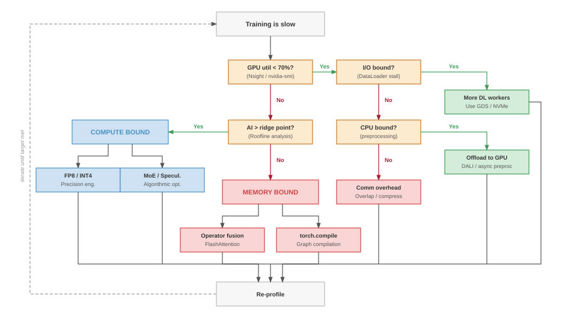
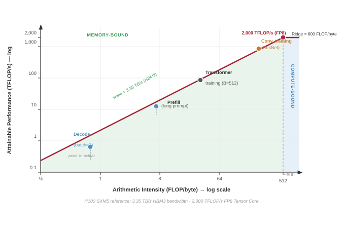
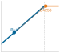
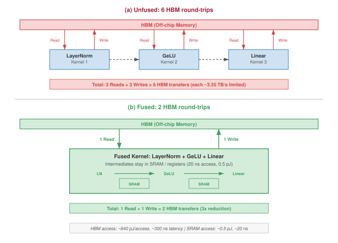
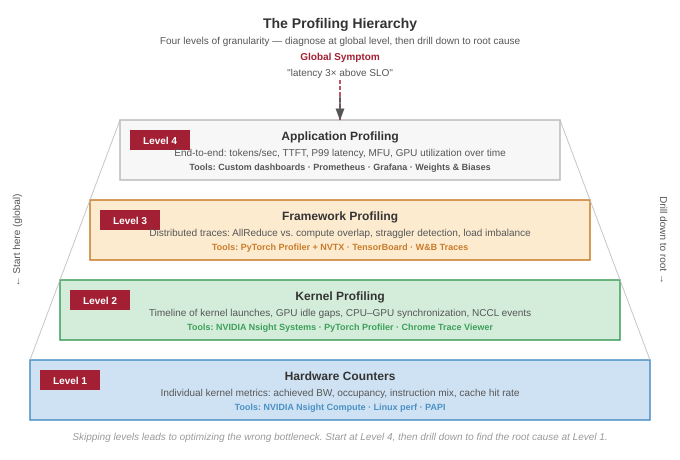

# Performance Engineering {#sec-performance-engineering}

::: {layout-narrow}
::: {.column-margin}

\chapterminitoc

:::

\noindent
{fig-alt="Performance engineering and optimization at scale."}

:::

## Purpose {.unnumbered}

\begin{marginfigure}
\mlfleetstack{35}{45}{100}{10}
\end{marginfigure}

_How do we make billion-parameter models run on millisecond timescales?_

Model compression reduces the size of what we compute. Performance engineering reshapes *how* we compute to match the physics of the hardware. The distinction matters: a quantized model loaded naively into a GPU kernel that reads every weight from off-chip memory wastes the very bandwidth savings that quantization was designed to provide. Real performance comes from understanding the full path a tensor travels, from registers through SRAM to HBM and back, and then engineering each step to eliminate wasted movement. This chapter develops the system-level optimization techniques that bridge the gap between a theoretically efficient model and a production artifact that saturates hardware. We examine operator fusion and tiling strategies that keep data in fast SRAM, precision formats that double effective bandwidth, compilation frameworks that automate kernel selection, and algorithmic innovations like speculative decoding[^fn-speculative-decoding-pe] and sparse expert routing that fundamentally change the performance equation. Together, these techniques transform a model that should be fast into one that is fast, often by an order of magnitude.

[^fn-speculative-decoding-pe]: **Speculative Decoding**\index{Speculative Decoding!bandwidth optimization}: A technique that uses a small, fast "draft" model to predict multiple tokens in parallel, which are then verified by the large "target" model in a single forward pass. This trades "wasted" compute (to process rejected tokens) for reduced memory bandwidth pressure: the target model's massive weights are loaded from HBM once to process $k$ tokens, effectively increasing the arithmetic intensity of the decode phase by $k\times$.

::: {.content-visible when-format="pdf"}

\newpage

:::

::: {.callout-learning-objectives}

- Apply the Roofline Model to diagnose whether an ML workload is compute-bound or memory-bound on a given accelerator
- Explain how Operator Fusion and Tiling (FlashAttention) overcome HBM bandwidth limitations by keeping intermediate data in on-chip SRAM
- Evaluate FP8 formats (E4M3, E5M2) and block-wise quantization (LLM.int8(), GPTQ, AWQ) as precision choices under bandwidth, compute, and quality constraints
- Apply Graph Compilation frameworks (torch.compile, Accelerated Linear Algebra (XLA), TensorRT) to automate operator fusion, memory planning, and kernel selection
- Explain how Speculative Decoding changes autoregressive decode arithmetic intensity and where acceptance-rate and batching constraints limit speedup
- Explain how Mixture of Experts (MoE) decouples model capacity from active compute while introducing routing, memory, and AllToAll bottlenecks
- Diagnose performance bottlenecks using System Profiling tools (Nsight Systems, PyTorch Profiler) and roofline plots

:::

```{python}
#| echo: false
from mlsysim import *
from mlsysim.core.constants import *
#| label: chapter-start
# ┌─────────────────────────────────────────────────────────────────────────────
# │ CHAPTER START
# ├─────────────────────────────────────────────────────────────────────────────
# │ Context: Chapter initialization and global imports
# │
# │ Why: Registers this chapter with the mlsys registry and provides shared
# │      imports for all subsequent calculation cells.
# │
# │ Imports: mlsysim.registry, mlsysim.constants, mlsysim.book
# │ Exports: (none)
# └─────────────────────────────────────────────────────────────────────────────
from mlsysim.fmt import fmt_int, fmt, check
from mlsysim.physics import calc_bottleneck, model_memory
```

Those objectives connect directly to fleet design: scheduling decides where a request runs, while performance engineering decides how efficiently the chosen accelerator executes it.

::: {#psp-performance-engineering-fleet-stack-connection .callout-perspective title="Fleet stack connection"}

Performance Engineering is the Optimization Layer of the fleet stack. Serving architecture and scheduling policy determine which node receives the work; performance engineering determines how efficiently that node executes it. In the fleet stack shown in @fig-fleet-stack, this chapter belongs to the Serving Layer while reaching downward into the Distribution and Infrastructure layers that determine how hardware actually executes work. Every technique here targets the same goal: closing the gap between theoretical hardware peak and achieved throughput, turning the iron law from a speed limit into a speedometer that reads closer to maximum.

:::

## The Memory Wall and the Efficiency Frontier {#sec-performance-engineering-memory-wall}

An H100 GPU capable of 989 teraFLOP/s can show single-digit compute utilization during small-batch language-model decode because the processor is starving for data rather than arithmetic. Performance engineering operates within a constrained optimization space defined by the memory wall, where the speed of moving bytes from memory to compute units fundamentally caps operational throughput.

Part II established the distributed logic of the fleet: partitioning workloads, synchronizing gradients, recovering from faults, and orchestrating scarce accelerator capacity. Those chapters ensured that workloads reach the right hardware and survive failures along the way. This chapter asks why expensive hardware still sits idle after the work arrives. The answer is usually data movement. Performance engineering therefore begins with the memory hierarchy, then follows the consequences through fusion, precision, compilation, and algorithmic changes that either move fewer bytes, launch less overhead, or do different work entirely.

### The iron law of ML performance {#sec-performance-engineering-efficiency-frontier}

The memory wall is one term in a larger budget. The iron law of ML system performance\index{Iron Law} decomposes execution time into three competing costs:

$$
T = \frac{D_{\text{vol}}}{\text{BW}} + \frac{O}{R_{\text{peak}} \cdot \eta_{\text{hw}}} + L_{\text{lat}}
$$ {#eq-iron-law-perf}

In overlapped execution, the roofline-style simplification replaces the sum of compute and data movement with the slower exposed term:

$$
T \approx \max\left( \frac{O}{R_{\text{peak}} \cdot \eta_{\text{hw}}}, \; \frac{D_{\text{vol}}}{\text{BW}} \right) + L_{\text{lat}}
$$

The inherited iron law decomposes execution time into three terms. The compute fraction represents the total floating-point operations divided by realized hardware throughput. The data fraction represents total bytes transferred divided by memory bandwidth. The roofline approximation then asks which exposed term dominates at a given operating point: increasing compute throughput for a memory-bound workload, for example, does not materially improve performance until the memory term is reduced. The overhead term captures everything else: kernel launch latency, synchronization, communication, and software stack inefficiency.

::: {.column-margin}
{width="100%" fig-alt="Iron-law bar split into three segments, Data, Compute, and Latency. The Data segment is the widest and shaded; Compute and Latency are narrow and gray."}

*Autoregressive transformer decode is often memory-bound: the data-movement term dominates the iron law.*
:::

Standard model compression (pruning, quantization, distillation) reduces the *numerators*, performing fewer operations on smaller data. System optimization, the focus of this chapter, attacks the *structure* of the equation itself:

Several levers map directly to those terms. When memory traffic dominates, operator fusion and tiling reduce the data-volume numerator by eliminating intermediate HBM round-trips. A fused sequence that keeps its intermediates in SRAM can shrink the exposed memory-access term dramatically, often by 10--30$\times$ for attention computation. Precision engineering attacks the same numerator from a different angle: FP8, INT4, and KV-cache compression represent each value in fewer bytes, so the same physical bandwidth carries more useful model state.

Other levers change the overhead or compute terms. Graph compilation, including torch.compile, XLA, and TensorRT, reduces overhead by eliminating kernel launch gaps, fusing operations, and optimizing memory allocation across the graph. Communication-computation overlap makes distributed communication concurrent with useful work, removing it from the critical path when $T_{\text{comm}}(N) - T_{\text{overlap}} \leq T_{\text{compute}}/N$ (that is, communication finishes before the next layer's computation completes). Algorithmic innovations such as speculative decoding and mixture-of-experts (MoE) change the compute term itself by making the model perform a different computation that preserves the output contract at lower exposed cost.

Each technique attacks a different term, and this taxonomy guides optimization strategy: diagnose which term dominates (using the roofline model from @sec-performance-engineering-roofline), then apply the technique targeting that term. Applying a technique that targets the nondominant term wastes engineering effort.

Before using this diagnostic process, check how each term in the iron law maps to a practical optimization lever.

::: {#chk-performance-engineering-iron-law-performance .callout-checkpoint title="The iron law of performance"}

Verify your understanding of system-level performance diagnosis:

- [ ] A workload is **Memory-Bound**\index{Memory-Bound}. Will upgrading the GPU's clock frequency (increasing FLOP/s) improve performance?
- [ ] If you apply **Quantization**\index{Quantization}\index{Quantization!weight-activation} (moving from FP16 to INT4), which term in @eq-iron-law-perf are you reducing?
- [ ] What is the "Overhead" term in the iron law, and why does **Graph Compilation** target it specifically?
- [ ] True or False: If a system is Compute-Bound, the memory bandwidth is irrelevant to its performance.

:::

The same diagnostic process can be codified as a decision flowchart, mapping each bottleneck to its corresponding optimization technique.

::: {#fig-iron-law-flowchart fig-env="figure" fig-pos="htb" fig-cap="**Iron Law Diagnostic Flowchart**: A training-slow-down troubleshooting flow that starts from observed symptoms (slow training, low GPU utilization), branches through I/O, CPU, and communication-overhead checks, and classifies the workload as compute-bound or memory-bound at the leaves. Compute-bound paths point to precision engineering and algorithmic change; memory-bound paths point to operator fusion and tiling. Overhead-bound symptoms (graph dispatch, communication) are surfaced earlier in the flow and addressed before the final compute/memory classification." fig-alt="Troubleshooting flowchart starting from 'Training is slow', branching through GPU-utilization, I/O, CPU, and communication checks, with two terminal labels: Compute Bound and Memory Bound."}



:::

The central lesson of @fig-iron-law-flowchart is that profiling must precede optimization: applying operator fusion to a compute-bound workload, or precision engineering to an overhead-bound one, yields zero improvement regardless of implementation quality. Misdiagnosis is not only wasted effort; a performance change shipped blind can become an outage.

::: {#ws-performance-engineering-cloudflare-regex-outage .callout-war-story title="The regex that saturated the edge"}

**Context**: Cloudflare's Web Application Firewall runs on edge machines that process HTTP and HTTPS traffic across the global network [@cloudflare2019outage].

**Failure**: On July 2, 2019, a newly deployed managed WAF rule caused excessive CPU consumption on every HTTP/HTTPS-handling core across Cloudflare's network.

**Consequence**: Cloudflare reported losing most of its traffic until the team identified the WAF as the cause and used a global disable mechanism to restore service.

**Systems lesson**: Performance engineering includes algorithmic complexity and rollout design. A small rule change can become a global outage when it is deployed everywhere before bounded-runtime checks, canaries, and kill switches catch the cost. ML deployments follow the same pattern: a new model, a recalibrated threshold, or a retrained feature can ship a worst-case latency cliff into production that no unit test catches, which is why canarying, request shadowing, and per-request kill switches are first-class ML serving infrastructure.

:::

That discipline of bounding the worst case before a global rollout is the operational complement to the throughput-vs-quality tuning the rest of this chapter pursues. The **efficiency frontier**\index{Efficiency Frontier!definition} is the Pareto-optimal curve of model quality vs. system throughput. A model on the frontier cannot improve throughput without sacrificing quality, or vice versa. @thompson2021 show why this frontier matters for deep learning: quality improvements have required rapidly increasing compute, making efficiency gains central to continued progress. The techniques in this chapter push the frontier outward by making each quality level achievable at higher throughput, or equivalently, by making each throughput level achievable at higher quality. An organization's goal is not merely to reach the frontier but to find the point on it that best matches their latency, throughput, cost, and quality requirements.

The multi-dimensional nature of this frontier makes optimization challenging. The relevant dimensions include:

- Throughput\index{Throughput} (tokens/second or requests/second): How much work the system completes per unit time.
- Latency\index{Latency} (time-to-first-token, inter-token latency): How quickly the system responds to individual requests.
- Cost (dollars per million tokens): The economic efficiency of the system.
- Quality (perplexity, benchmark accuracy, human preference): The accuracy and usefulness of model outputs.
- Memory (peak GPU memory): The resource constraint that limits batch size and sequence length.

These dimensions interact in nonobvious ways. Increasing batch size improves throughput and cost efficiency but degrades latency. Reducing precision improves throughput and memory but may degrade quality. Speculative decoding improves latency but may increase per-token cost. The performance engineer's task is to navigate these trade-offs guided by the application's specific requirements.

A real-time chatbot prioritizes latency (time-to-first-token under 200 ms, inter-token latency under 50 ms) and may tolerate higher per-token cost. A batch processing pipeline for document summarization prioritizes throughput and cost, tolerating seconds of latency. A medical diagnostic system prioritizes quality above all else, accepting lower throughput and higher cost. Each application maps to a different optimal point on the efficiency frontier, and the techniques in this chapter provide the tools to reach that point.

To make this concrete, consider two deployment configurations for the same 70B large language model (LLM):

Configuration A is latency-optimized: FP16 weights, batch size 1, speculative decoding enabled. The model replica produces approximately 50 tokens/second with 20 ms inter-token latency while occupying 8 H100 GPUs for a single user stream. Cost: approximately \$0.12 per 1,000 output tokens.

Configuration B is throughput-optimized: INT4 weights (AWQ), batch size 64, no speculation. Each H100 serves approximately 4,000 tokens/second aggregate throughput across all batched requests, with 120 ms inter-token latency per request. Cost: 4 GPUs serving 64 concurrent users, approximately \$0.002 per 1,000 output tokens.

Configuration B achieves 60$\times$ lower cost per token than Configuration A, but at 6$\times$ higher latency. Neither configuration is objectively "better"; they represent different points on the efficiency frontier, optimized for different applications. The performance engineering techniques in this chapter are the tools for navigating between these points.

### The memory wall {#sec-performance-engineering-memory-wall-physics}

The efficiency frontier establishes what we are optimizing toward. The physics of memory bandwidth determines where we start. Many accelerator-based ML performance problems begin with the same observation: memory bandwidth, not compute, is the bottleneck. Consider a single autoregressive decoding step in a large language model. The model reads its full weight matrix from High Bandwidth Memory (HBM)[^fn-hbm-perf] to generate a single token, performing only one or two multiply-accumulate operations per weight loaded.

[^fn-hbm-perf]: **HBM (High Bandwidth Memory)**\index{HBM!memory hierarchy}: Achieves its bandwidth by vertically stacking DRAM dies connected through thousands of through-silicon vias (TSVs), a 3D packaging technique first commercialized by SK Hynix in 2013. Despite the "high bandwidth" label, HBM's 3.35 TB/s on the H100 is still 200--600$\times$ slower than on-chip SRAM access, making the memory hierarchy gap the central constraint of every optimization technique in this chapter.

```{python}
#| echo: false
#| label: memory-wall-scenario
# ┌─────────────────────────────────────────────────────────────────────────────
# │ MEMORY WALL HARDWARE SPECS (LEGO)
# ├─────────────────────────────────────────────────────────────────────────────
# │ Context: @sec-performance-engineering-memory-wall-physics
# │
# │ Goal: Provide H100 hardware specs for memory wall discussion.
# │ Show: ~1,979 TFLOP/s FP8; ~3.35 TB/s BW; ~1280x energy ratio.
# │ How: pulling constants from mlsysim.core.constants.
# │
# │ Imports: mlsysim.core.constants (Hardware.Cloud.H100.compute.precision_flops["fp8"], Hardware.Cloud.H100.compute.sm_count,
# │          Hardware.Cloud.H100.memory.bandwidth, Hardware.Cloud.H100.memory.capacity, Hardware.Cloud.H100.memory.l2_cache,
# │          Hardware.Cloud.H100.memory.register_file_per_sm, Hardware.Cloud.H100.memory.shared_memory_per_sm,
# │          Hardware.Cloud.H100.tdp, Hardware.Tech.Memory.DRAM.energy_per_access, Hardware.Tech.Memory.L1.energy_per_access, Hardware.Tech.Memory.DRAM.latency,
# │          TFLOPs, TB, GiB, second, flop, byte, watt)
# │ Exports: MemoryWallScenario.h100_fp8_tflop_per_s_str, MemoryWallScenario.h100_hbm_bw_tb_per_s_str,
# │          MemoryWallScenario.h100_ridge_fp8_str, MemoryWallScenario.energy_ratio_mult_str,
# │          MemoryWallScenario.h100_mem_gb_str, MemoryWallScenario.h100_tdp_w_str,
# │          MemoryWallScenario.l2_cache_mb_str, MemoryWallScenario.hbm_latency_ns_str,
# │          MemoryWallScenario.hbm_energy_pj_str, MemoryWallScenario.register_total_mib_str,
# │          MemoryWallScenario.sm_count_str, MemoryWallScenario.reg_per_sm_kib_str,
# │          MemoryWallScenario.shared_mem_per_sm_kib_str
# └─────────────────────────────────────────────────────────────────────────────
from mlsysim.fmt import fmt, fmt_int

class MemoryWallScenario:
    """H100 specs for memory wall discussion."""

    # ┌── 1. LOAD (Constants) ──────────────────────────────────────────────
    flops_fp8 = Hardware.Cloud.H100.compute.precision_flops["fp8"]
    bw = Hardware.Cloud.H100.memory.bandwidth
    mem = Hardware.Cloud.H100.memory.capacity
    l2_cache = Hardware.Cloud.H100.memory.l2_cache
    sm_count = Hardware.Cloud.H100.compute.sm_count
    reg_per_sm = Hardware.Cloud.H100.memory.register_file_per_sm
    shared_per_sm = Hardware.Cloud.H100.memory.shared_memory_per_sm
    tdp = Hardware.Cloud.H100.tdp
    # Energy figures sourced from Hardware.Tech (taxonomy refactor; energy-as-property).
    energy_dram = Hardware.Tech.Memory.DRAM.energy_per_access
    energy_sram = Hardware.Tech.Memory.L1.energy_per_access
    hbm_latency = Hardware.Tech.Memory.DRAM.latency

    # ┌── 2. EXECUTE (The Compute) ────────────────────────────────────────
    ridge_fp8 = (flops_fp8 / bw).to(flop/byte)
    energy_ratio = energy_dram/energy_sram
    # Register file is quoted in binary (KiB/MiB) and labeled with decimal units
    # in prose, matching the branded-hardware-label convention (e.g. 80 GiB -> "80 GB").
    register_total = sm_count * reg_per_sm

    # ┌── 3. GUARD (Invariants) ──────────────────────────────────────────
    from mlsysim.fmt import check, fmt_memory_capacity, fmt_time, fmt_qty, fmt_qty_int, fmt_multiple
    check(energy_ratio > 100, "DRAM energy cost should be at least 100x SRAM cost")
    check(200 * KiB <= reg_per_sm <= 300 * KiB, "H100 register file/SM should be ~256 KiB")
    check(200 * KiB <= shared_per_sm <= 256 * KiB, "H100 shared memory/SM should be ~228 KiB")
    check(30 * MiB <= register_total <= 36 * MiB, "H100 register file total should be ~33 MiB")
    check(40 * MB <= l2_cache <= 60 * MB, "H100 L2 cache should be ~50 MB")
    check(250 * nanosecond <= hbm_latency <= 350 * nanosecond, "HBM3 access latency should be ~300 ns")
    check(600 * pJ <= energy_dram <= 700 * pJ, "HBM access energy should be ~640 pJ")

    # ┌── 4. OUTPUT (Formatting) ──────────────────────────────────────────────
    h100_fp8_tflop_per_s_str = fmt_qty_int(flops_fp8, TFLOP/second, commas=False)
    h100_hbm_bw_tb_per_s_str = fmt_qty(bw, TB/second, precision=2, commas=False)
    h100_ridge_fp8_str = fmt_arithmetic_intensity(ridge_fp8, unit=flop/byte, precision=1, commas=False)
    energy_ratio_mult_str = fmt_multiple(energy_ratio, precision=0, commas=False)
    h100_mem_gb_str = fmt_memory_capacity(mem, unit=GiB, precision=0, commas=False)
    h100_tdp_w_str = fmt_power(tdp, unit=watt, precision=0, commas=False)
    register_total_mib_str = fmt_memory_capacity(register_total, unit=MiB, precision=0, commas=False)
    l2_cache_mb_str = fmt_qty_int(l2_cache, MB, commas=False)
    hbm_latency_ns_str = fmt_time(hbm_latency, nanosecond, precision=0, commas=False)
    hbm_energy_pj_str = fmt_qty_int(energy_dram, pJ, commas=False)
    sm_count_str = fmt_int(sm_count, commas=False)
    reg_per_sm_kib_str = fmt_memory_capacity(reg_per_sm, unit=KiB, precision=0, commas=False)
    shared_mem_per_sm_kib_str = fmt_memory_capacity(shared_per_sm, unit=KiB, precision=0, commas=False)
```

An NVIDIA H100 delivers `{python} MemoryWallScenario.h100_fp8_tflop_per_s_str` of FP8 compute but only `{python} MemoryWallScenario.h100_hbm_bw_tb_per_s_str` of memory bandwidth. If every byte loaded from memory does fewer than `{python} MemoryWallScenario.h100_ridge_fp8_str` arithmetic operations, the compute units sit idle, starved for data. This gap between compute capability and memory delivery rate is the memory wall, and it defines the landscape within which all performance engineering operates.

The memory wall represents a fundamental physical constraint rather than a temporary engineering limitation. Moving data costs energy proportional to distance. Accessing a value from on-chip SRAM (L1 cache) costs approximately 0.5 pJ, while fetching the same value from off-chip HBM costs roughly 640 pJ, a ratio of `{python} MemoryWallScenario.energy_ratio_mult_str`. Manufacturing constraints limit the amount of SRAM that can sit close to the compute units. HBM provides capacity (the H100 offers `{python} MemoryWallScenario.h100_mem_gb_str`) but at physically greater distance, requiring the data to traverse longer wires. The fundamental tension is that models need gigabytes of parameters and state, but physics dictates that only kilobytes of data can be near the compute units at any given moment.

::: {.column-margin}
{width="100%" fig-alt="Orange energy ladder showing HBM at 640 pJ, SRAM at 0.5 pJ, and register access at 0.01 pJ."}

*Access energy climbs from registers out to HBM.*
:::

The capacity-bandwidth tension shapes every optimization technique in this chapter. Operator fusion reduces the number of trips to HBM by combining operations so that intermediate results stay in SRAM. Precision engineering reduces the number of bytes per trip by representing values in FP8 or INT4 instead of FP16. Tiling strategies restructure algorithms to maximize data reuse within SRAM. Graph compilers automate these transformations. Each technique attacks a different term in the same fundamental equation: minimize the ratio of bytes moved to operations performed.

### The GPU memory hierarchy {#sec-performance-engineering-memory-hierarchy}

To understand why the memory wall exists, consider the physical structure of a GPU memory system. The hierarchy spans four levels, each trading capacity for bandwidth and latency.

Registers are the fastest storage, located directly within each streaming multiprocessor (SM). The H100 provides `{python} MemoryWallScenario.reg_per_sm_kib_str` of register file\index{Register File} per SM across its `{python} MemoryWallScenario.sm_count_str` SMs, totaling approximately `{python} MemoryWallScenario.register_total_mib_str` of register space across the entire chip. Register access is essentially free in terms of latency (one clock cycle) and energy (~0.01 pJ per access). Registers are, however, private to individual threads and cannot be shared.

Shared memory (SRAM) occupies the next level, pooled within each SM. The H100 provides up to `{python} MemoryWallScenario.shared_mem_per_sm_kib_str` of configurable shared memory per SM. This memory is shared among all threads in a thread block, enabling cooperative data reuse. Access latency is approximately 20--30 clock cycles (~20 ns), and energy cost is roughly 0.5 pJ per access. Shared memory is the critical resource for operator fusion: if intermediate results fit in shared memory, they never need to traverse the slow HBM bus.

The L2 cache sits between the SMs and HBM, providing a `{python} MemoryWallScenario.l2_cache_mb_str` on-chip buffer on the H100. It captures reuse patterns automatically (when the same data is accessed by multiple SMs) but cannot be explicitly managed by kernel authors. Access latency is approximately 200 clock cycles (~130 ns). The L2 cache is particularly important for multi-head attention, where multiple attention heads may access the same KV cache entries. If the KV cache for a given sequence position fits in L2, subsequent heads accessing the same position benefit from cache hits rather than paying the full HBM access cost.

High Bandwidth Memory (HBM) is the main off-chip memory, providing `{python} MemoryWallScenario.h100_mem_gb_str` of capacity at `{python} MemoryWallScenario.h100_hbm_bw_tb_per_s_str` bandwidth. HBM access latency is approximately `{python} MemoryWallScenario.hbm_latency_ns_str`, and each access costs roughly `{python} MemoryWallScenario.hbm_energy_pj_str` of energy. Despite the "high bandwidth" designation, the bandwidth-to-capacity ratio means that reading the full `{python} MemoryWallScenario.h100_mem_gb_str` of HBM takes approximately 24 ms, far longer than the sub-millisecond latency targets of real-time inference.

The energy cost of data movement has a direct economic consequence at data center scale. Consider a training cluster of 1,000 H100 GPUs, each performing approximately $10^{12}$ memory accesses per second during a memory-bound workload. If each access reads from HBM at 640 pJ, the memory subsystem alone consumes approximately 640 W per GPU, a significant fraction of the H100's `{python} MemoryWallScenario.h100_tdp_w_str` TDP. If operator fusion moves half of those accesses from HBM to SRAM (at 0.5 pJ each), the per-GPU memory power drops by approximately 320 W. Across 1,000 GPUs, this saves 320 kW, equivalent to powering roughly 250 homes. This is not a secondary consideration; at cloud electricity prices, the annual cost difference is substantial, and it scales linearly with cluster size. The physics of data movement is not merely a performance constraint; it is an economic one.

The performance engineering challenge reduces to a data placement problem: keep the data that the compute units need in the fastest memory that can hold it. When a kernel reads a tensor from HBM, processes it, and writes the result back to HBM, the HBM round-trip dominates execution time for any operation with low arithmetic intensity. Every technique in this chapter shares the same goal: keeping data closer to compute for longer.

::: {#psp-performance-engineering-analogy-scholars-library .callout-perspective title="Analogy: The scholar's library"}

The GPU memory hierarchy parallels a scholar researching in a library:

*   **Registers** (`{python} MemoryWallScenario.register_total_mib_str`) are *working memory*: instant access, but capacity is small enough to hold only a few values at once.
*   **Shared Memory (SRAM)**\index{SRAM} is a *desk*: very fast to reach, but capacity fits only a few open references.
*   **L2 Cache** (`{python} MemoryWallScenario.l2_cache_mb_str`) is a *book cart* beside the desk: a small access cost, holding a moderate working set.
*   **HBM** (`{python} MemoryWallScenario.h100_mem_gb_str`) is the *library basement*: holds everything that could be needed, but each round trip costs hundreds of nanoseconds.

Performance engineering is the art of minimizing trips to the basement.

:::

### The widening gap {#sec-performance-engineering-widening-gap}

The memory wall is not static; in the accelerator generations compared here, compute throughput has grown faster than off-chip memory bandwidth. Memory bandwidth improves more slowly because the physics of off-chip signaling and the economics of HBM manufacturing limit how fast data can leave the chip.

| **GPU**  | **Year** | **Peak FP16 (TFLOP/s)** | **HBM BW (TB/s)** | **Ridge Point (FLOP/byte)** |
|:---------|:--------:|:-----------------------:|:-----------------:|:---------------------------:|
| **V100** |   2017   |           125           |        0.9        |             139             |
| **A100** |   2020   |           312           |        2.04       |             153             |
| **H100** |   2022   |           989           |        3.35       |             295             |
| **B200** |   2024   |          2,250          |        8.0        |             281             |

: **The Widening Memory Wall**: Compute throughput has increased 18$\times$ from V100 to B200 over seven years, while memory bandwidth has increased only 8.9$\times$. The ridge point has increased 2$\times$, meaning more workloads fall into the memory-bound regime with each generation. {#tbl-widening-gap}

@Tbl-widening-gap quantifies this trend. For the FP16/BF16 table as written, the ridge point increased from 139 FLOP/byte on the V100 to 281 FLOP/byte on the B200, about a 2$\times$ increase. An operation with arithmetic intensity of 200 FLOP/byte was compute-bound on the V100 and A100, but memory-bound on the H100 and B200. Performance engineering techniques targeting memory efficiency, fusion, precision, and tiling therefore become more important as the ridge point rises, not less. The durable lesson is not that one named kernel lasts forever, but that reducing exposed memory traffic becomes more valuable when compute grows faster than bandwidth.

### The roofline model {#sec-performance-engineering-roofline}

The Roofline Model[^fn-roofline-origin] provides a quantitative framework for diagnosing whether a workload is compute-bound or memory-bound on a specific piece of hardware. Introduced by @williams2009, the model plots achievable performance as a function of arithmetic intensity, defined as the ratio of floating-point operations to bytes transferred from memory. The intersection of these two regimes is known as the ridge point[^fn-roofline-ridge].

[^fn-roofline-ridge]: **Ridge Point**\index{Roofline Model!ridge point}: The intersection of the memory-bound and compute-bound lines on a Roofline plot. It represents the minimum arithmetic intensity required to reach peak hardware performance $(R_{\text{peak}})$. For an H100 GPU (FP16), the ridge point is roughly 295 FLOP/byte; if an operator's intensity is below this "ridge," it will never saturate the Tensor Cores, regardless of how much compute is available.

[^fn-roofline-origin]: **Roofline Model**\index{Roofline Model!origin}: The original framing targets multicore CPUs, but the same ceiling diagram applies to accelerators: two numbers (peak FLOP/s and peak bandwidth) define the entire performance envelope. This same simplicity informs GPU purchasing decisions for ML inference, where the ridge point determines whether a workload benefits from faster compute or faster memory.

::: {#dfn-performance-engineering-arithmetic-intensity .callout-definition title="Arithmetic intensity"}

***Arithmetic Intensity***\index{Arithmetic Intensity!definition} $(I)$ is the ML workload ratio of floating-point operations performed to the number of bytes transferred from memory (FLOP per byte).

1.  **Significance (quantitative)**: It characterizes the Computational Density of a workload. It is the independent variable in the Roofline Model, determining whether a system operates in the Bandwidth-Bound ($\text{BW}$) or Compute-Bound\index{Compute-Bound} ($R_{\text{peak}}$) regime.
2.  **Distinction (durable)**: Unlike peak throughput (a hardware property), arithmetic intensity is an algorithmic property that measures how effectively a workload reuses data once it is loaded into the processor.
3.  **Common pitfall**: A frequent misconception is that AI is fixed for a model. In reality, it varies by Implementation: techniques like operator fusion increase AI by keeping data in local registers, while increasing batch size increases AI for layers with high parameter reuse.

:::

For a given accelerator with peak compute $R_{\text{peak}}$ (in FLOP/s) and peak memory bandwidth $\text{BW}$ (in bytes/s), @eq-performance-roofline gives the achievable performance of a workload with arithmetic intensity $I$ (in FLOP/byte):

$$
\text{Achievable FLOP/s} = \min(R_{\text{peak}}, \; \text{BW} \times I)
$$ {#eq-performance-roofline}

@Eq-ridge-point locates the ridge point where these two limits intersect:

$$
I_{\text{ridge}} = \frac{R_{\text{peak}}}{\text{BW}}
$$ {#eq-ridge-point}

Workloads with $I < I_{\text{ridge}}$ are memory-bound\index{Memory-Bound}: their performance is limited by how fast data can be loaded, not how fast it can be processed. Workloads with $I > I_{\text{ridge}}$ are compute-bound: the arithmetic units are the bottleneck. @Fig-roofline-model illustrates this relationship graphically.

::: {#fig-roofline-model fig-env="figure" fig-pos="htb" fig-cap="**The Roofline Model**: Achievable performance (y-axis) as a function of arithmetic intensity (x-axis) on a log-log plot. The sloped line represents the memory bandwidth ceiling; the flat line represents the compute ceiling at the labeled precision (FP8 tensor-core throughput on H100, approximately 2,000 TFLOP/s); their intersection is the ridge point at roughly 600 FLOP/byte for FP8. Most transformer inference operations fall in the memory-bound region (left of the ridge point), while large batched GEMMs fall in the compute-bound region (right). The corresponding FP16 ridge point is roughly 295 FLOP/byte (989 TFLOP/s divided by 3.35 TB/s)." fig-alt="Log-log roofline plot with diagonal memory-bandwidth ceiling and horizontal compute ceiling labeled at FP8 throughput around 2,000 TFLOP/s. Ridge point around 600 FLOP/byte. Workload markers: LLM decode and element-wise ops on the left (memory-bound), large GEMM on the right (compute-bound)."}

:::

The ridge point of the NVIDIA H100 at FP16 precision is:

$$
I_{\text{ridge}}^{\text{H100, FP16}} = \frac{989 \text{ TFLOP/s}}{3.35 \text{ TB/s}} \approx 295 \text{ FLOP/byte}
$$

```{python}
#| echo: false
#| label: roofline-ridge-calc
# ┌─────────────────────────────────────────────────────────────────────────────
# │ ROOFLINE RIDGE POINT COMPARISON
# ├─────────────────────────────────────────────────────────────────────────────
# │ Context: @sec-performance-engineering-roofline—ridge point prose comparison
# │
# │ Goal: Verify and expose ridge-point values (FLOP/s divided by BW in FLOP/byte) for
# │       A100 FP16 (~153), H100 FP16 (~295), and H100 FP8 (~591) to explain why
# │       each new generation makes more workloads memory-bound.
# │ Show: ~153 FLOP/byte (A100), ~295 (H100 FP16), ~591 (H100 FP8)—inline prose.
# │ How: Extract precomputed ridge quantities from PerformanceSetup; keep them
# │       as FLOP/byte quantities through guards, then format scalar magnitudes.
# │
# │ Imports: (none—values from perf-eng-setup cell), mlsysim.book (check)
# │ Exports: a100_ridge_str, h100_fp16_ridge_str, h100_fp8_ridge_str
# └─────────────────────────────────────────────────────────────────────────────

# ┌── LEGO ───────────────────────────────────────────────
class RooflineRidgeCalc:
    """Ridge point comparison across A100/H100 FP16/FP8."""

    # ┌── 1. LOAD (Constants) ──────────────────────────────────────────────
    from mlsysim import Hardware
    h_a100 = Hardware.Cloud.A100
    h_h100 = Hardware.Cloud.H100

    # ┌── 2. EXECUTE (The Compute) ────────────────────────────────────────
    a100_ridge = h_a100.ridge_point().to(flop/byte)
    h100_ridge_fp16 = h_h100.ridge_point().to(flop/byte)
    h100_ridge_fp8 = h_h100.ridge_point("fp8").to(flop/byte)

    # ┌── 3. GUARD (Invariants) ──────────────────────────────────────────
    from mlsysim.fmt import check
    check(h100_ridge_fp16 > a100_ridge,
          "H100 FP16 ridge should exceed A100 FP16 ridge")
    check(h100_ridge_fp8 > h100_ridge_fp16,
          "H100 FP8 ridge should exceed H100 FP16 ridge")

    # ┌── 4. OUTPUT (Formatting) ─────────────────────────────────────────────
    from mlsysim.fmt import fmt, fmt_int, fmt_qty, fmt_qty_int
    a100_ridge_str = fmt_arithmetic_intensity(a100_ridge, unit=flop/byte, precision=1, commas=False)
    h100_fp16_ridge_str = fmt_arithmetic_intensity(h100_ridge_fp16, unit=flop/byte, precision=1, commas=False)
    h100_fp8_ridge_str = fmt_arithmetic_intensity(h100_ridge_fp8, unit=flop/byte, precision=1, commas=False)

    a100_fp16_tflop_per_s_str = fmt_qty_int(h_a100.compute.peak_flops, TFLOP/second, commas=False)
    a100_hbm_bw_tb_per_s_str = fmt_qty(h_a100.memory.bandwidth, TB/second, precision=1, commas=False)
    h100_fp8_tflop_per_s_str = fmt_qty_int(h_h100.compute.precision_flops["fp8"], TFLOP/second, commas=False)
    h100_hbm_bw_tb_per_s_str = fmt_qty(h_h100.memory.bandwidth, TB/second, precision=2, commas=False)
```

Any operation performing fewer than `{python} RooflineRidgeCalc.h100_fp16_ridge_str` floating-point operations per byte loaded is memory-bound on the H100 at FP16. At FP8 precision, where compute doubles to `{python} RooflineRidgeCalc.h100_fp8_tflop_per_s_str` and bandwidth remains `{python} RooflineRidgeCalc.h100_hbm_bw_tb_per_s_str`, the ridge point rises to approximately `{python} RooflineRidgeCalc.h100_fp8_ridge_str` FLOP/byte. The A100, with `{python} RooflineRidgeCalc.a100_fp16_tflop_per_s_str` and `{python} RooflineRidgeCalc.a100_hbm_bw_tb_per_s_str`, has a lower ridge point of approximately `{python} RooflineRidgeCalc.a100_ridge_str` FLOP/byte at FP16. Each hardware generation increases compute faster than bandwidth, pushing the ridge point higher and making more workloads memory-bound.

@Fig-shifting-roofline overlays the roofline models for four GPU generations on a single log-log plot, making the generational ridge-point shift tabulated earlier visible at a glance. An operation like naive self-attention, with an arithmetic intensity near 10 FLOP/byte, is memory-bound on every generation and falls progressively further below the ridge with each new chip. More critically, operations near 200 FLOP/byte, such as some matrix multiplications and fused blocks, can change regime as hardware changes. The same kernel can change performance regime across hardware generations, a fact that demands re-profiling whenever hardware is upgraded.

::: {#fig-shifting-roofline fig-env="figure" fig-pos="htb" fig-cap="**The Shifting Roofline Across GPU Generations**: Overlaid FP16/BF16 roofline models for V100 through B200 show the ridge point growing from 139 to 281 FLOP/byte. Operations near 200 FLOP/byte can change regime as the roofline shifts. The same kernel can change performance regime across hardware generations." fig-alt="Log-log roofline plot for V100, A100, H100, B200 with ridge points and example ML operations marked"}

```{python}
#| echo: false
# ┌─────────────────────────────────────────────────────────────────────────────
# │ SHIFTING ROOFLINE (FIGURE)
# ├─────────────────────────────────────────────────────────────────────────────
# │ Context: @fig-shifting-roofline—roofline across GPU generations
# │
# │ Goal: Overlay rooflines for V100–B200; show ridge point growth 139→281;
# │       mark ops moving from compute-bound to memory-bound.
# │ Show: Log-log; four rooflines; ridge points; example ops.
# │ How: Peak TFLOP/s, HBM BW; ridge = TFLOP/s/BW; book_style.setup_plot().
# │
# │ Imports: numpy (np), matplotlib.pyplot (plt), book.tools.figures.style (book_style),
# │          mlsysim.core.constants (GPU FP16 FLOP/s and HBM bandwidth)
# │ Exports: (figure only, no prose variables)
# └─────────────────────────────────────────────────────────────────────────────
# ┌── 1. CANVAS ────────────────────────────────────────────────────────────────
# │ Overlay rooflines for V100–B200; show ridge point growth 139→281;
import numpy as np
import matplotlib.pyplot as plt
from book.tools.figures import style as book_style
fig, ax, COLORS, plt = book_style.setup_plot(figsize=(9, 6))

# GPU specifications: (name, peak FP16 TFLOP/s, HBM BW TB/s, color)

# ┌── 2. ARRAYS ────────────────────────────────────────────────────────────────
gpus = [
    ("V100", Hardware.Cloud.V100.compute.peak_flops.to(TFLOPs/second).magnitude, Hardware.Cloud.V100.memory.bandwidth.to(TB/second).magnitude, COLORS["VioletLine"]),
    ("A100", Hardware.Cloud.A100.compute.peak_flops.to(TFLOPs/second).magnitude, Hardware.Cloud.A100.memory.bandwidth.to(TB/second).magnitude, COLORS["BlueLine"]),
    ("H100", Hardware.Cloud.H100.compute.peak_flops.to(TFLOPs/second).magnitude, Hardware.Cloud.H100.memory.bandwidth.to(TB/second).magnitude, COLORS["GreenLine"]),
    ("B200", Hardware.Cloud.B200.compute.peak_flops.to(TFLOPs/second).magnitude, Hardware.Cloud.B200.memory.bandwidth.to(TB/second).magnitude, COLORS["OrangeLine"]),
]

ai_range = np.logspace(0, 4, 500)  # 1 to 10000 FLOP/byte

# ┌── 3. RENDER ────────────────────────────────────────────────────────────────
label_pos = {
    "V100":  (10, -25, "left", "bottom"),
    "A100":  (13, -23, "left",   "bottom"),
    "H100":  (5, -25, "left", "bottom"),
    "B200":  (8, -7, "left", "top"),
}

for name, peak_tflops, bw_tbs, color in gpus:
    bw_bytes = bw_tbs * TRILLION
    peak_flops = peak_tflops * TRILLION
    ridge = peak_flops/bw_bytes

    attainable_tflops = np.minimum(peak_tflops, bw_tbs * ai_range)

    ax.plot(ai_range, attainable_tflops, color=color, linewidth=2.0, label=f"{name}")

    ax.plot(ridge, peak_tflops, "o", color=color, markersize=8, zorder=5)

    # 👉 individual control
    dx, dy, ha, va = label_pos[name]

    ax.annotate(
        f"{name} ridge\n{ridge:.0f} FLOP/byte",
        xy=(ridge, peak_tflops),
        xytext=(dx, dy),
        textcoords="offset points",
        fontsize=7.5,
        color=color,
        fontweight="bold",
        ha=ha,
        va=va,
    )

# Example ML operations as vertical dashed lines
ops = [
    ("LayerNorm\n(~5 FLOP/byte)", 5, "bottom"),
    ("Attention (naive)\n(~10 FLOP/byte)", 10, "bottom"),
    ("MatMul (large)\n(~200 FLOP/byte)", 200, "bottom"),
]

for label, ai_val, va_pos in ops:
    ax.axvline(x=ai_val, color=COLORS["primary"], linestyle=":", linewidth=1.0, alpha=0.5)
    ax.text(ai_val, 0.8, label, fontsize=7, color=COLORS["primary"],
            ha="center", va="bottom", rotation=0,
            bbox=dict(boxstyle="round,pad=0.2", facecolor="white", edgecolor="none", alpha=0.8))

# Arrow annotation for ridge shift

# ┌── 4. DECORATE ──────────────────────────────────────────────────────────────
ax.annotate("",
    xy=(281, 2250),
            xytext=(141, 140),
            arrowprops=dict(
                arrowstyle="->",
                color="crimson",
                lw=1.0,
                linestyle="-"
            )
)

ax.text(105, 600, "Ridge point shifted\n~2× in 7 years",
        fontsize=8, color="crimson", fontweight="bold",
        ha="center", va="center",
        bbox=dict(boxstyle="round,pad=0.5",
       facecolor="#fadadd", edgecolor="crimson", alpha=0.8))

ax.set_xscale("log")
ax.set_yscale("log")
ax.set_xlabel("Arithmetic Intensity (FLOP/byte)")
ax.set_ylabel("Attainable Performance (TFLOP/s)")
ax.set_xlim(1, 10000)
ax.set_ylim(0.5, 10000)
ax.legend(
    loc='lower right',
    fontsize=8,
    frameon=True,
    facecolor='white',
    framealpha=0.95,
    edgecolor='gray',
    fancybox=True,
    title="GPU Generation",
    borderpad=0.6
)

plt.tight_layout()
plt.show()
plt.close()
```

:::

### Where ML workloads fall {#sec-performance-engineering-workload-placement}

ML operations span three orders of magnitude in arithmetic intensity, and the position of each operation on the roofline determines which optimization strategies apply.

```{python}
#| echo: false
#| label: workload-intensity-calc
# ┌─────────────────────────────────────────────────────────────────────────────
# │ WORKLOAD ARITHMETIC INTENSITY
# ├─────────────────────────────────────────────────────────────────────────────
# │ Context: @sec-performance-engineering-workload-placement—classify ML ops
# │
# │ Goal: Compute arithmetic intensity (FLOP/byte) for a 4096×4096 FP16 GEMM,
# │       a GELU element-wise op, and single-request LLM decode on a 4096-wide model
# │       to show why inference is predominantly memory-bound.
# │ Show: ~1365 FLOP/byte (GEMM, compute-bound), ~1.25 (GELU, memory-bound),
# │       ~1 (single-request LLM decode, deeply memory-bound)—inline prose.
# │ How: Compare FLOPs to bytes moved for each case; GEMM counts matrix multiply
# │       work and operand traffic;
# │       element-wise uses ~5 FLOPs per element / (load + store) bytes.
# │
# │ Imports: mlsysim.core.constants (BYTES_FP16), mlsysim.book (check)
# │ Exports: WorkloadIntensityCalc.gemm_intensity_str,
# │          WorkloadIntensityCalc.elem_intensity_str,
# │          WorkloadIntensityCalc.decode_intensity_str
# └─────────────────────────────────────────────────────────────────────────────
from mlsysim.fmt import fmt, check

class WorkloadIntensityCalc:
    """Arithmetic intensity for GEMM, GELU, and LLM decode operations."""

    # ┌── 1. LOAD (Constants) ──────────────────────────────────────────────
    bytes_per_elem = BYTES_FP16
    # GEMM: C = A*B where A is M_dim x K_dim, B is K_dim x C_dim
    M_dim, K_dim, C_dim = 4096, 4096, 4096
    # Element-wise (e.g., GELU): ~5 ops per element
    elem_flops_per_val = 5
    elem_count = M_dim * K_dim
    # LLM decode: one request, 4096-wide hidden state
    decode_batch = 1
    decode_hidden = 4096

    # ┌── 2. EXECUTE (The Compute) ────────────────────────────────────────
    # GEMM: 2*M*C*K FLOPs, load A + B, then store C
    gemm_flops = 2 * M_dim * C_dim * K_dim * flop
    gemm_bytes = (M_dim * K_dim + K_dim * C_dim + M_dim * C_dim) * bytes_per_elem
    gemm_intensity = (gemm_flops/gemm_bytes).to(flop/byte).magnitude

    # Element-wise: load+store
    elem_flops = elem_flops_per_val * elem_count * flop
    elem_bytes = 2 * elem_count * bytes_per_elem  # load + store
    elem_intensity = (elem_flops/elem_bytes).to(flop/byte).magnitude

    # LLM decode step: one request times a square hidden-state weight matrix
    decode_flops_val = 2 * decode_batch * decode_hidden * decode_hidden * flop
    decode_bytes_val = (decode_hidden * decode_hidden + decode_batch * decode_hidden) * bytes_per_elem
    decode_intensity_val = (decode_flops_val/decode_bytes_val).to(flop/byte).magnitude

    # ┌── 3. GUARD (Invariants) ──────────────────────────────────────────
    check(gemm_intensity > 100, f"GEMM should have high AI, got {gemm_intensity:.1f}")
    check(elem_intensity < 5, f"Element-wise should have low AI, got {elem_intensity:.1f}")
    check(decode_intensity_val < 5, f"Decode should be memory-bound, got {decode_intensity_val:.1f}")

    # ┌── 4. OUTPUT (Formatting) ─────────────────────────────────────────────
    gemm_intensity_str = fmt(gemm_intensity, precision=1, commas=False)
    elem_intensity_str = fmt(elem_intensity, precision=1, commas=False)
    decode_intensity_str = fmt(decode_intensity_val, precision=1, commas=False)
```

Large general matrix multiply (GEMM) operations are the most compute-intensive operations in ML. A square matrix multiplication of dimension $4096{\times}4096$ in FP16 performs approximately 137 billion FLOPs while loading roughly 100 MB of data, yielding an arithmetic intensity of approximately `{python} WorkloadIntensityCalc.gemm_intensity_str` FLOP/byte. This sits well above the H100's ridge point, making large GEMMs firmly compute-bound.

Element-wise operations tell the opposite story. A Gaussian Error Linear Unit (GELU) activation applied to a $4096{\times}4096$ tensor performs roughly 5 operations per element but must load and store each element, yielding an arithmetic intensity of approximately `{python} WorkloadIntensityCalc.elem_intensity_str` FLOP/byte. The GPU spends almost all its time waiting for data transfers rather than computing, making these operations profoundly memory-bound.

Autoregressive LLM decoding at batch size one represents the extreme case. Each decoding step reads the entire weight matrix (gigabytes of data) to produce a single output token. With a hidden dimension of 4096 and batch size 1, the arithmetic intensity is approximately `{python} WorkloadIntensityCalc.decode_intensity_str` FLOP/byte, deep in the memory-bound regime. The arithmetic intensity explains why LLM token generation achieves a tiny fraction of peak FLOP/s: the GPU spends nearly all its time reading weights, not multiplying them.

| **Operation**                      | **Arithmetic Intensity** | **H100 FP16 Regime** | **Primary Bottleneck** |
|:-----------------------------------|:------------------------:|:--------------------:|:----------------------:|
| **GEMM ($4096{\times}4096$)**      |     ~1,365 FLOP/byte     |    Compute-bound     | Tensor core throughput |
| **Self-Attention (seq=2048)**      |    ~50--200 FLOP/byte    |     Memory-bound     |     HBM bandwidth      |
| **Element-wise (GELU, LayerNorm)** |     ~1--3 FLOP/byte      |     Memory-bound     |     HBM bandwidth      |
| **LLM Decode (batch=1)**           |     ~1--2 FLOP/byte      |     Memory-bound     |     HBM bandwidth      |

: **Arithmetic Intensity of Common ML Operations**: Many transformer inference operations, aside from large batched GEMMs, fall below the H100's ridge point and are therefore memory-bound. Performance engineering focuses on reducing the memory traffic of these operations. {#tbl-arithmetic-intensity}

@Tbl-arithmetic-intensity reveals the central insight: the majority of operations in a transformer inference pipeline are memory-bound. Training workloads with large batch sizes shift more operations into the compute-bound regime because GEMM dimensions scale with batch size. Inference, however, especially autoregressive generation, is dominated by memory-bound operations. The techniques in the rest of this chapter, including fusion, tiling, reduced precision, and algorithmic shortcuts, all target the same fundamental problem: reducing bytes moved per operation.

The memory-bound nature of inference also explains a common source of confusion: GPU benchmarks reporting peak TFLOP/s often fail to predict real inference performance. Two GPUs with different TFLOP/s but identical memory bandwidth will achieve virtually identical LLM decode throughput at batch size 1, because decode is entirely memory-bound. The correct metric for comparing GPUs for LLM inference is not FLOP/s but rather the combination of memory bandwidth and memory capacity. Bandwidth determines the token generation rate, and capacity determines the maximum batch size (and therefore throughput). Only at large batch sizes, where decode approaches the compute-bound regime, do the FLOP/s differences between GPUs translate into throughput differences.

### Batch size as the universal control knob {#sec-performance-engineering-batch-size}

For memory-bound LLM serving, batch size is often the first performance lever to test, and also one of the most constrained. Increasing the batch size transforms the arithmetic intensity of every operation. For an LLM decode step, the arithmetic intensity scales linearly with batch size:

$$
I_{\text{decode}}(B) = \frac{2PB}{P b_{\text{param}} + B d_{\text{model}} b_{\text{elem}}}
$$

Here, $P$ is parameter count, $B$ is batch size, $d_{\text{model}}$ is hidden width, $b_{\text{param}}$ is bytes per stored parameter, and $b_{\text{elem}}$ is bytes per activation element. At batch size 1, the denominator is dominated by the weight term $(P b_{\text{param}})$, and $I \approx 2/b_{\text{param}} \approx 1$ FLOP/byte for FP16. At batch size 256, the weight term still dominates, but the same weight bytes are amortized across more requests, so $I \approx 2 \times 256/b_{\text{param}} \approx 256$ FLOP/byte, approaching the compute-bound regime.

::: {.column-margin}
{width="100%" fig-alt="Roofline thumbnail with a B equals 1 point on the memory-bound slope and a B equals 256 point near the compute plateau."}

*Larger batches raise arithmetic intensity toward the ridge.*
:::

At large batch sizes, the GPU transitions from memory-bound to compute-bound, and utilization increases dramatically. A single H100 achieving 2 percent utilization at batch size 1 may achieve 60 percent utilization at batch size 256. The economic implication is stark: the cost per token decreases by 30$\times$ as batch size increases from 1 to 256.

The constraint is memory: each additional request in the batch requires its own KV cache, and the total KV cache across all requests must fit in GPU memory alongside the model weights. A 70B model with 140 GB of weights in FP16 must be sharded across multiple GPUs; on an 8-GPU node that leaves about 62.5 GB per GPU for KV cache before overhead. The precision engineering techniques covered later in this chapter address exactly this constraint: INT4 weight quantization reduces the per-GPU weight footprint to about 4.4 GB and frees roughly 13 GB per GPU for KV cache, enabling batch sizes that transform the economics of serving.

A serving scheduler can keep the effective batch full by adding new requests as older requests finish, but that policy only works when memory is available for the active requests. Performance engineering's role is to make that scheduler's job feasible by minimizing the per-request memory footprint, primarily through KV cache compression and weight quantization. The next chapter develops the full serving scheduler; the local point here is that memory optimization expands the batch sizes the scheduler can safely admit.

A critical enabler for large batch sizes is **paged KV cache management**[^fn-paged-attention-os], introduced by vLLM [@kwon2023]. Traditional KV cache implementations preallocate contiguous memory for each request's maximum possible sequence length.

[^fn-paged-attention-os]: **PagedAttention**\index{PagedAttention!memory management}: Named by direct analogy to OS virtual memory paging, where the OS maps noncontiguous physical pages to contiguous virtual addresses. The insight, presented at SOSP 2023, was that the same mechanism eliminates internal fragmentation in KV caches, recovering the 60--80 percent of GPU memory wasted by worst-case preallocation. This single abstraction transformed LLM serving economics by enabling 2--4$\times$ larger batch sizes without any change to model weights or precision.

If the maximum is 4,096 tokens but the average is 500, approximately 88 percent of the allocated memory is wasted. **PagedAttention**\index{PagedAttention} divides the KV cache into fixed-size blocks (pages), allocated on demand as the sequence grows. This eliminates memory fragmentation and enables near-100 percent utilization of the KV cache memory budget. The performance impact is indirect but substantial: by reducing memory waste, PagedAttention enables 2--4$\times$ larger effective batch sizes, which in turn improve throughput and GPU utilization through the batch size mechanism described earlier.

PagedAttention and KV cache quantization interact multiplicatively. PagedAttention reduces memory *waste* (from fragmentation), while quantization reduces memory *usage* (from precision). Together, they increase the effective batch size by 8--16$\times$ compared to a baseline system with preallocated FP16 KV caches, fundamentally changing the economics of LLM serving.

### The prefill-decode decomposition {#sec-performance-engineering-prefill-decode}

Modern LLM serving systems decompose each request into two distinct phases with fundamentally different performance characteristics. The distinction between these phases drives system architecture and optimization strategy.

The **prefill phase**\index{Prefill Phase} processes the entire input prompt in parallel. If the prompt contains $S$ tokens, the prefill phase executes a single forward pass over all $S$ tokens simultaneously. The GEMM operations have shape $[S,d_{\text{model}}]{\times}[d_{\text{model}},d_{\text{model}}]$, making the batch dimension equal to $S$. For a prompt of 1024 tokens, this is arithmetically intensive: the arithmetic intensity is approximately $2 \times 1024/2 = 1024$ FLOP/byte for FP16 weights, well into the compute-bound regime. Prefill is therefore limited by Tensor Core throughput, not memory bandwidth.

The **decode phase**\index{Decode Phase} generates output tokens one at a time, autoregressively. Each step has a batch dimension of 1 (for a single request) or the number of concurrent requests (for batched serving). At batch size 1, decode is deeply memory-bound as analyzed in @sec-performance-engineering-workload-placement.

The prefill-decode decomposition has direct implications for system design. A system optimized for prefill (maximizing FLOP/s utilization) would use large matrix sizes and high compute throughput. A system optimized for decode (maximizing bandwidth utilization) would use aggressive quantization and memory optimization. A real serving system must handle both phases, often simultaneously across different active requests.

Disaggregated serving addresses this mismatch by running prefill and decode on separate hardware pools. Here, disaggregation is evidence that prefill and decode have different bottlenecks; @sec-inference-scale develops the routing, admission-control, and serving-policy machinery. Prefill servers are optimized for compute (fewer, higher-FLOP/s GPUs), while decode servers are optimized for memory bandwidth and capacity (more memory per GPU, aggressive quantization). The KV cache computed during prefill is transferred to a decode server, which handles the subsequent autoregressive generation. This disaggregation allows each phase to use hardware and software configurations tuned for its specific bottleneck.

The performance characteristics of each phase determine which optimization techniques apply. FlashAttention provides its largest gains during prefill, where the quadratic attention computation dominates. KV cache quantization and speculative decoding apply exclusively to the decode phase. Precision engineering (FP8/INT4 weights) benefits both phases, but through different mechanisms: prefill benefits from doubled compute throughput (FP8 Tensor Cores), while decode benefits from doubled effective bandwidth (half the bytes per weight read).

```{python}
#| echo: false
#| label: roofline-diagnostic
from mlsysim.fmt import (
    fmt_arithmetic_intensity,
    fmt_count,
    fmt_memory,
    fmt_percent,
    fmt_rate,
    fmt_time,
    check,
)

class RooflineDiagnostic:
    """Roofline analysis for 70B LLM decode on 8× H100."""

    # ┌── 1. LOAD ──────────────────────────────────────────
    tensor_parallel_degree = 8
    params_per_gpu = Models.Language.Llama2_70B.parameters / tensor_parallel_degree
    h100_bw = Hardware.Cloud.H100.memory.bandwidth
    h100_fp16_peak = Hardware.Cloud.H100.compute.precision_flops["fp16"]

    # ┌── 2. EXECUTE ───────────────────────────────────────
    flops = 2 * params_per_gpu * (flop / param)
    weight_qty = params_per_gpu * (BYTES_FP16 / param)
    arith_intensity = (flops / weight_qty).to(flop/byte)
    decode_time = (weight_qty / h100_bw).to(ms)
    tokens_per_sec = (1 / decode_time).to(1 / second)
    achieved_flop_rate = (flops / decode_time).to(TFLOP / second)
    achieved_fp16_util = (achieved_flop_rate / h100_fp16_peak).to("").magnitude

    # ┌── 3. GUARD ─────────────────────────────────────────
    check(abs(arith_intensity - 1.0 * flop / byte) < 0.01 * flop / byte,
          f"AI should be 1.0 FLOP/byte, got {arith_intensity:~P}")
    check(5 * ms < decode_time < 6 * ms,
          f"Decode time should be ~5.2 ms, got {fmt_time(decode_time, millisecond, precision=1, commas=False)}")
    check(180 / second < tokens_per_sec < 200 / second,
          f"Token rate should be ~191 tokens/s, got {tokens_per_sec:~P}")
    check(achieved_fp16_util < 0.004,
          f"Decode should use less than 0.4 percent of H100 FP16 peak, got {achieved_fp16_util:.4f}")

    # ┌── 4. OUTPUT ────────────────────────────────────────
    flops_str = fmt_count(flops.to(flop).magnitude, scale="B", precision=1, commas=False, label="FLOP")
    weight_gb_str = fmt_memory(weight_qty, unit=GB, precision=1, commas=False)
    ai_str = fmt_arithmetic_intensity(arith_intensity, unit=flop/byte, commas=False)
    decode_ms_str = fmt_time(decode_time, millisecond, precision=1, commas=False)
    tps_tokens_per_s_str = fmt_rate(tokens_per_sec.to(1 / second).magnitude, "tokens/s", precision=1, commas=False)
    achieved_fp16_util_pct_str = fmt_percent(achieved_fp16_util, precision=1, commas=False, style="prose")
```

A quick decode calculation shows why the memory wall dominates even when the accelerator has abundant unused FLOP/s.

::: {#nbk-performance-engineering-roofline-diagnostic .callout-notebook title="The Roofline diagnostic"}

**Problem**: A 70B parameter LLM is deployed on 8$\times$ H100 GPUs with tensor parallelism. At batch size 1, each GPU holds approximately 8.75B parameters in FP16 (`{python} RooflineDiagnostic.weight_gb_str` of weights). Each decode step reads its weight shard to produce one token. What is the achieved arithmetic intensity, and what is the theoretical maximum token generation rate?

**Math**:

Step 1: Arithmetic intensity.
Each decode step per GPU: FLOPs $= 2 \times 8.75 \times 10^9 =$ `{python} RooflineDiagnostic.flops_str`. Bytes loaded $= 8.75 \times 10^9 \times 2$ bytes $=$ `{python} RooflineDiagnostic.weight_gb_str`.

$$
I = \frac{17.5 \times 10^9 \text{ FLOP}}{17.5 \times 10^9 \text{ bytes}} = 1.0 \text{ FLOP/byte}
$$

At `{python} RooflineDiagnostic.ai_str` FLOP/byte, the operation sits far below the H100 ridge point of ~295 FLOP/byte: deeply memory-bound.

Step 2: Token rate.
Since the operation is memory-bound, performance is limited by bandwidth, not compute:

$$
t_{\text{decode}} = \frac{17.5 \text{ GB}}{3.35 \text{ TB/s}} \approx 5.2 \text{ ms per token}
$$

This yields approximately `{python} RooflineDiagnostic.tps_tokens_per_s_str` per GPU, or about `{python} RooflineDiagnostic.tps_tokens_per_s_str` for the model (since tensor parallelism does not multiply throughput for memory-bound decode). In practice, overheads from KV cache reads and NVLink synchronization reduce this substantially below the ideal bandwidth-only limit.

**Systems insight**: At batch size 1, only about `{python} RooflineDiagnostic.achieved_fp16_util_pct_str` of the H100's FP16 FLOP/s are in use. The improvement paths all attack the same weight-streaming cost: larger batches amortize each weight read across more requests, quantization reduces the bytes read for each weight, and speculative decoding tries to obtain multiple accepted tokens from one target-model weight pass.

:::

The roofline model establishes the physics that constrains all subsequent optimization. The first and most impactful strategy for breaking through the memory wall is keeping data in SRAM instead of round-tripping through HBM.

## Operator Fusion and Kernel Engineering {#sec-performance-engineering-fusion}

Consider the simple sequence of operations $Y = \text{LayerNorm}(\text{GELU}(XW + b))$. In a naive implementation, the GPU writes the output of the matrix multiply back to main memory, reads it back for the GELU, writes it out again, and reads it one final time for the LayerNorm. This redundant data movement shatters performance. Operator fusion eliminates these intermediate round-trips by keeping results in ultra-fast registers, executing the entire sequence in a single trip to memory.

::: {#psp-performance-engineering-analogy-short-order-cook .callout-perspective title="Analogy: The short-order cook"}

Imagine a kitchen where one chef chops vegetables, puts them in the fridge (HBM), then another chef takes them out to boil them, puts them back in the fridge, and a third chef takes them out to plate them. This is an **unfused execution**\index{Unfused Execution}: the bottleneck is not the cooking but the constant walking to the fridge.

**Operator Fusion**\index{Operator Fusion!element-wise}\index{Operator Fusion!reduction}\index{Operator Fusion!operator-specific} assigns the recipe to a single chef who keeps the ingredients on their cutting board (SRAM/Registers) and performs all three steps consecutively without ever returning to the fridge until the final dish is ready.

:::

### The kernel launch problem {#sec-performance-engineering-kernel-launch}

Each GPU kernel launch involves overhead: the CPU must prepare launch parameters, dispatch to the GPU command queue, and the GPU must schedule thread blocks across its streaming multiprocessors (SMs). For a small element-wise operation on an accelerator such as an H100, this overhead can be 5--20 $\mu$s, a time during which a memory-bound kernel might have already completed its useful work. When a transformer layer comprises dozens of small operations (add, multiply, normalize, activate), the cumulative launch overhead becomes significant.

Each unfused kernel must also materialize its output in HBM. Consider a sequence of three operations: $Y = \text{LayerNorm}(\text{GELU}(XW + b))$. Without fusion, this requires:

1. **GEMM kernel**\index{GEMM!kernel}: Read $X$ and $W$ from HBM, compute $XW + b$, write result $Z_1$ to HBM.
2. **GELU kernel**\index{GELU!kernel}: Read $Z_1$ from HBM, compute $\text{GELU}(Z_1)$, write $Z_2$ to HBM.
3. **LayerNorm kernel**\index{LayerNorm!kernel}: Read $Z_2$ from HBM, compute $\text{LayerNorm}(Z_2)$, write $Y$ to HBM.

```{python}
#| echo: false
#| label: fusion-traffic-calc
# ┌─────────────────────────────────────────────────────────────────────────────
# │ FUSION INTERMEDIATE TRAFFIC (LEGO)
# ├─────────────────────────────────────────────────────────────────────────────
# │ Context: @sec-performance-engineering-kernel-launch unfused intermediate
# │          tensor traffic example.
# │
# │ Goal: Compute the per-layer HBM traffic caused by materializing two FP16
# │       intermediates for hidden width 4096 and batch size 2048.
# │ Show: 16 MB per tensor, 32 MB materialized, 64 MB write/read traffic.
# │ How: Compute tensor bytes from hidden width, batch size, and FP16 element size; each intermediate is written
# │      once and read once before the next kernel consumes it.
# │
# │ Imports: mlsysim.core.constants (BYTES_FP16, MB, GB, byte), mlsysim.fmt (check)
# │ Exports: FusionTrafficCalc.tensor_mb_str, FusionTrafficCalc.materialized_mb_str,
# │          FusionTrafficCalc.traffic_mb_str, FusionTrafficCalc.traffic_gb_str,
# │          FusionTrafficCalc.num_layers_str
# └─────────────────────────────────────────────────────────────────────────────
from mlsysim.fmt import check, fmt, fmt_int, fmt_qty

class FusionTrafficCalc:
    """HBM traffic from unfused intermediate tensors."""

    # ┌── 1. LOAD (Constants) ──────────────────────────────────────────────
    hidden_dim = 4096
    batch_size = 2048
    bytes_fp16 = BYTES_FP16
    intermediates = 2
    num_layers = 80

    # ┌── 2. EXECUTE (The Compute) ────────────────────────────────────────
    tensor_bytes = hidden_dim * batch_size * bytes_fp16
    materialized_bytes = intermediates * tensor_bytes
    traffic_bytes = 2 * materialized_bytes
    traffic_bytes_all_layers = traffic_bytes * num_layers

    # ┌── 3. GUARD (Invariants) ──────────────────────────────────────────
    check(15 * MB < tensor_bytes < 17 * MB,
          f"Expected ~16 MB tensor, got {tensor_bytes.to(MB).magnitude:.1f} MB")
    check(60 * MB < traffic_bytes < 70 * MB,
          f"Expected ~64 MB traffic, got {traffic_bytes.to(MB).magnitude:.1f} MB")

    # ┌── 4. OUTPUT (Formatting) ─────────────────────────────────────────────
    tensor_mb_str = fmt_qty(tensor_bytes, MB, precision=1, commas=False)
    materialized_mb_str = fmt_qty(materialized_bytes, MB, precision=1, commas=False)
    traffic_mb_str = fmt_qty(traffic_bytes, MB, precision=1, commas=False)
    traffic_gb_str = fmt_qty(traffic_bytes_all_layers, GB, precision=1, commas=False)
    num_layers_str = fmt_int(num_layers, commas=False)
```

Intermediate tensors $Z_1$ and $Z_2$ each occupy the same memory as the output $Y$. For a hidden dimension of 4096 and batch size of 2048 in FP16, each intermediate tensor is `{python} FusionTrafficCalc.tensor_mb_str`. The unfused execution materializes `{python} FusionTrafficCalc.materialized_mb_str` of intermediate tensors and performs `{python} FusionTrafficCalc.traffic_mb_str` of intermediate HBM traffic, writing and then rereading each tensor. A fused kernel avoids that traffic entirely by holding $Z_1$ and $Z_2$ in registers or shared memory (SRAM) within the SM.

@Fig-fusion-before-after contrasts these two execution paths, making the HBM traffic savings visible.

::: {#fig-fusion-before-after fig-env="figure" fig-pos="htb" fig-cap="**Operator Fusion: Before and After**: Top: three separate kernels each read from and write to HBM, materializing intermediates $Z_1$ and $Z_2$, with six HBM round-trips along the unfused path. Bottom: a single fused kernel reads inputs once, holds intermediates in SRAM, and writes only the final output, leaving just two HBM round-trips. The fused path delivers roughly a 3$\times$ reduction in HBM traffic per layer." fig-alt="Two stacked dataflow panels. Top unfused path: six HBM round-trip arrows. Bottom fused path: two HBM round-trip arrows, intermediates staying in SRAM. The fused path is labeled as a 3 times reduction."}



:::

As @fig-fusion-before-after makes concrete, fusion reduces HBM round-trips from six to two per layer, a roughly 3$\times$ reduction in off-chip memory traffic for this layer block.

In a naive implementation without operator fusion, executing one transformer layer requires roughly 50 separate kernel launches. If each launch incurs a 10-microsecond overhead, the system spends 500 microseconds purely on dispatch latency. If the actual arithmetic execution of the layer takes only 2 milliseconds, the launch overhead consumes 20 percent of the total wall-clock time, leaving the GPU compute units idle for one-fifth of the inference cycle. This "launch-bound" regime limits the benefits of faster hardware; doubling the GPU's FLOP/s does nothing to reduce the 500-microsecond fixed cost. Operator fusion addresses this by compiling these 50 discrete operations into a small handful of fused kernels, often reducing the count to 5--10 launches, thereby reclaiming the lost cycles and shifting the workload away from dispatch overhead and back toward the hardware limits captured by the roofline model.

### Fusion categories {#sec-performance-engineering-fusion-categories}

Fusion is profitable when the HBM traffic it removes is worth the kernel complexity it introduces. The three common categories differ by that trade-off: how much data movement they eliminate, how much synchronization they require, and how often a compiler can apply them automatically.

Element-wise fusion sits at the low-complexity end: consecutive element-wise operations (add, multiply, activation functions) combine into a single kernel. Because each output element depends on exactly one input element, this fusion is always legal and straightforward to implement. Deep learning frameworks commonly perform element-wise fusion automatically for supported patterns.

When the sequence includes a reduction, the fusion decision becomes more constrained. Reduction fusion combines an element-wise operation with a subsequent reduction (such as summing elements for a loss function, or computing mean and variance for layer normalization). Reductions require inter-thread communication within the kernel, using warp-level shuffle instructions or shared memory to aggregate partial results across threads. Despite this complexity, the memory savings are substantial: the intermediate tensor before the reduction never materializes in HBM. For layer normalization specifically, reduction fusion avoids writing the large prenormalization tensor to HBM and reading it back for the mean/variance computation.

The highest-payoff case is operator-specific fusion. These are custom kernels designed for a specific sequence of operations, such as fused attention or fused GEMM-bias-activation. The kernel architect must reason about data flow, shared memory allocation, and thread scheduling simultaneously. The payoff is substantial: FlashAttention, which we examine next, removes the quadratic attention workspace and keeps the online softmax state linear in sequence length.

To appreciate the quantitative impact, consider each category applied to a single transformer layer with hidden dimension 4096 and batch size 2048 in FP16. Element-wise fusion of a bias-GELU-dropout chain in this shape eliminates two intermediate tensors of `{python} FusionTrafficCalc.tensor_mb_str` each, saving `{python} FusionTrafficCalc.traffic_mb_str` of HBM traffic per layer. Across `{python} FusionTrafficCalc.num_layers_str` layers, this reclaims about `{python} FusionTrafficCalc.traffic_gb_str` of HBM traffic per forward pass. Reduction fusion of LayerNorm avoids materializing large prenormalization tensors and intermediate statistics. Operator-specific attention fusion (FlashAttention) provides the largest single gain by removing the quadratic score and probability matrices that dominate long-context attention. The cumulative effect of all three fusion categories can remove a large fraction of HBM traffic for a memory-bound transformer forward pass, but the end-to-end speedup must still be verified with profiling because the bottleneck may shift.

### CUDA graphs: Eliminating launch overhead {#sec-performance-engineering-cuda-graphs}

An orthogonal technique for reducing the overhead term in the iron law is **CUDA Graphs**[^fn-cuda-graphs-constraint]. While operator fusion combines multiple operations into fewer kernels, CUDA Graphs eliminate the CPU overhead of launching those kernels.

[^fn-cuda-graphs-constraint]: **CUDA Graphs**\index{CUDA!graphs, overhead reduction}: Introduced in CUDA 10 (2018), originally for graphics rendering pipelines that replay identical command sequences every frame. The strict determinism requirement -- identical operations, shapes, and memory addresses per replay -- directly conflicts with the dynamic shapes and variable batch sizes of LLM serving, restricting their use primarily to the decode phase where the computation pattern repeats per token.

In standard PyTorch execution, each kernel launch requires the CPU to push a command to the GPU's command queue. For a transformer decoder layer with 30+ kernels, this CPU-to-GPU roundtrip (typically 5--10 $\mu$s per launch) accumulates to 150--300 $\mu$s per layer. For a 70-layer model, kernel launch overhead alone contributes 10--20 ms per forward pass, a significant fraction of the total time for memory-bound inference.

CUDA Graphs address this by recording a sequence of GPU operations (kernel launches, memory copies) into a replayable graph. The recording happens once during a warmup phase. On subsequent iterations, replaying the graph requires only a single CPU-to-GPU command that dispatches the entire recorded sequence, reducing launch overhead to approximately 5--10 $\mu$s total regardless of the number of kernels.

The benefit is substantial: for a model with 30+ kernels per layer and 70+ layers, the baseline kernel launch overhead can exceed 15 ms per forward pass. CUDA Graphs reduce this to under 0.1 ms, reclaiming 15 ms that translates directly to higher token generation rates.

The constraint is that CUDA Graphs require deterministic execution: the sequence of operations, tensor shapes, and memory addresses must be identical across replays. This conflicts with dynamic inference patterns like variable-length sequences, changing batch sizes, and conditional computation (early exit, MoE routing). In practice, CUDA Graphs are most effective for the decode phase of LLM serving, where the computation pattern is repetitive (same operations per token), and less useful for the prefill phase, where input lengths vary.

The combination of operator fusion (reducing the number of kernels) and CUDA Graphs (reducing the per-kernel overhead) can together eliminate nearly all noncompute overhead from the forward pass. When profiling reveals that kernel launch gaps constitute more than 10 percent of execution time, CUDA Graphs should be the first intervention considered.

### FlashAttention: Tiled attention as a system primitive {#sec-performance-engineering-flashattention}

Standard self-attention computes $\text{Softmax}(QK^T / \sqrt{d_k})V$, where $Q$, $K$, and $V$ are matrices of shape $[\text{sequence length}{\times}\text{head dimension}]$. The na\"ive implementation materializes the full $S{\times}S$ attention matrix $A = QK^T$ in HBM, where $S$ is the sequence length. For $S = 8192$ and FP16 precision, this matrix alone consumes $8192 \times 8192 \times 2 \approx 134$ MB per attention head. At 32 heads, the score matrices alone require approximately 4.3 GB per layer. The worked accounting below uses a 64-head Llama-style layer and includes the score/probability traffic as well as persistent $Q$, $K$, $V$, and output tensors, so the larger number reflects a wider accounting boundary rather than a different scaling law.

```{python}
#| echo: false
#| label: flash-attention-savings-refactor
# ┌─────────────────────────────────────────────────────────────────────────────
# │ FLASHATTENTION MATERIALIZED-STATE SAVINGS (LEGO)
# ├─────────────────────────────────────────────────────────────────────────────
# │ Context: @sec-performance-engineering-flashattention FlashAttention prose
# │
# │ Goal: Quantify materialized attention-state reduction from tiling attention for a 64-head,
# │       8192-token sequence and 128-wide attention head, FP16 configuration.
# │ Show: ~65x reduction in materialized quadratic state by avoiding sequence-by-sequence tensors.
# │ How: Naive materializes score/probability matrices plus Q/K/V/output; Flash keeps only linear Q/K/V/output
# │      as persistent HBM-visible tensors. Kernel tile reload traffic is schedule
# │      dependent and is intentionally not counted here.
# │
# │ Imports: mlsysim.core.constants (BYTES_FP16, MB, byte)
# │ Exports: naive_mb_str, flash_mb_str, savings_mult_str,
# │          head_n_str, head_d_str,
# │          naive_head_traffic_mb_str, flash_head_traffic_mb_str,
# └─────────────────────────────────────────────────────────────────────────────
from mlsysim.fmt import fmt, check

# ┌── LEGO ───────────────────────────────────────────────
class FlashAttentionSavings:
    """Materialized-state analysis for tiled attention vs naive."""

    # ┌── 1. LOAD (Constants) ──────────────────────────────────────────────
    from mlsysim import Models
    m = Models.Language.Llama2_70B # Representative transformer
    seq_len = 8192
    head_dim = m.hidden_dim // m.heads
    num_heads = m.heads
    bytes_per_elem = BYTES_FP16

    # ┌── 2. EXECUTE (The Compute) ────────────────────────────────────────
    # Step 1: Naive attention materialized state per head:
    # Read Q, K, V once; write/read score and probability matrices; write output once.
    naive_attn_bytes_per_head = (
        4 * seq_len * seq_len * bytes_per_elem
        + 4 * seq_len * head_dim * bytes_per_elem
    )
    naive_attn_bytes_total = naive_attn_bytes_per_head * num_heads

    # FlashAttention persistent HBM-visible tensors per head:
    # Read Q, K, V once and write output once.
    flash_attn_bytes_per_head = (3 + 1) * seq_len * head_dim * bytes_per_elem
    flash_attn_bytes_total = flash_attn_bytes_per_head * num_heads

    # Step 4: Savings ratio
    savings_ratio = (naive_attn_bytes_per_head/flash_attn_bytes_per_head).to("").magnitude

    # ┌── 3. GUARD (Invariants) ──────────────────────────────────────────
    from mlsysim.fmt import check
    check(savings_ratio > 10,
          f"FlashAttention should save >10x materialized state, got {savings_ratio:.1f}x")

    # ┌── 4. OUTPUT (Formatting) ─────────────────────────────────────────────
    from mlsysim.fmt import fmt, fmt_int, fmt_qty
    naive_mb_str = fmt_qty(naive_attn_bytes_total, MB, precision=1, commas=False)
    flash_mb_str = fmt_qty(flash_attn_bytes_total, MB, precision=1, commas=False)
    savings_mult_str = fmt_multiple(round(savings_ratio), commas=False, precision=0)

    head_n_str = fmt_int(seq_len, commas=False)
    head_d_str = fmt_int(head_dim, commas=False)
    naive_head_traffic_mb_str = fmt_qty(naive_attn_bytes_per_head, MB, precision=1, commas=False)
    flash_head_traffic_mb_str = fmt_qty(flash_attn_bytes_per_head, MB, precision=1, commas=False)
```

FlashAttention\index{FlashAttention} [@dao2022] reformulates attention as a **tiled**\index{Tiling} computation. Instead of materializing the full $S{\times}S$ attention matrix, it processes $Q$, $K$, and $V$ in small blocks that fit in on-chip SRAM. The algorithm loads tiles of $Q$, $K$, and $V$, computes partial attention scores, and maintains running statistics (online softmax) to produce the exact result without ever storing the full attention matrix in HBM.

::: {.column-margin}
{width="100%" fig-alt="A two-rung magnitude ladder on a log scale, in blue. The naive attention rung is about 35 GB of materialized HBM state; the FlashAttention rung is about 537 MB. The gap is roughly 65 times."}

*FlashAttention shrinks attention memory about 65 times.*
:::

The reduction in materialized attention state is dramatic. For a sequence length of `{python} FlashAttentionSavings.head_n_str`, 64 heads, and head dimension `{python} FlashAttentionSavings.head_d_str` in FP16, the naive implementation materializes and revisits approximately `{python} FlashAttentionSavings.naive_mb_str` of HBM-resident tensors for the full layer, or `{python} FlashAttentionSavings.naive_head_traffic_mb_str` per head. FlashAttention avoids the quadratic score and probability tensors; its persistent HBM-visible tensors are dominated by $Q$, $K$, $V$, and output $Y$, totaling approximately `{python} FlashAttentionSavings.flash_mb_str` for the full layer, or `{python} FlashAttentionSavings.flash_head_traffic_mb_str` per head. This simplified accounting excludes schedule-dependent tile reloads inside a particular kernel, but it captures the important scaling result: a `{python} FlashAttentionSavings.savings_mult_str` reduction in HBM-visible attention state for this configuration.

The key insight behind FlashAttention is the **online softmax**[^fn-online-softmax-algo] trick, which makes tiling possible for an operation that appears to require global information. Standard softmax computes $\text{softmax}(s_i) = e^{s_i} / \sum_j e^{s_j}$, but for numerical stability it first subtracts the global maximum: $\text{softmax}(s_i) = e^{s_i - m} / \sum_j e^{s_j - m}$ where $m = \max_j s_j$. Finding this global maximum seems to require seeing all scores first, which would force materializing the full $S{\times}S$ matrix.

[^fn-online-softmax-algo]: **Online Softmax**\index{Online Softmax!FlashAttention}: *Online* here is an algorithmic term meaning the computation processes data incrementally in a single pass without storing the full input -- the same sense as in *online learning* or *online algorithms*. This property is what makes tiling possible: the algorithm never needs the complete $S{\times}S$ score matrix in memory simultaneously, reducing attention memory from $\mathcal{O}(S^2)$ to $\mathcal{O}(S)$ and making long-context inference feasible on fixed-size SRAM.

The online algorithm avoids this by maintaining running statistics that are updated incrementally as each tile is processed. When processing tile $t$, the algorithm:

1. Computes a local block of scores $A_t = Q_{\text{block}} K_t^T$.
2. Updates the running maximum: $m_{\text{new}} = \max(m_{\text{old}}, \max(A_t))$.
3. Rescales the previous running sum and output: multiply by $e^{m_{\text{old}} - m_{\text{new}}}$ to correct for the updated maximum.
4. Computes the local softmax contribution using $m_{\text{new}}$ and accumulates into the running output.

After processing all tiles, the running output contains the mathematically equivalent result to the standard algorithm up to the floating-point roundoff of the chosen precision. The rescaling step (step 3) is the critical innovation: it allows the algorithm to "fix up" previous partial results when a new tile reveals a larger maximum value. The algorithm is exact in the mathematical sense, but floating-point execution order can still change the last few bits relative to an unfused implementation.

The cost of this tiling is additional arithmetic: the rescaling operations in step 3 add FLOPs that the standard algorithm does not perform. Because the operation is profoundly memory-bound (the arithmetic intensity of standard attention is roughly 1--10 FLOP/byte for typical sequence lengths), the additional compute is "free" in the sense that the GPU's arithmetic units would otherwise be idle, waiting for HBM data transfers. *Trading extra compute for fewer memory accesses is profitable whenever the operation is memory-bound*, the central principle of this entire chapter.

A concrete numerical example clarifies the memory savings. Consider one attention head with sequence length $S = 8192$ and head dimension $d_{\text{head}} = 128$. The $Q$, $K$, $V$ matrices are each $8192{\times}128$ in FP16, occupying $8192 \times 128 \times 2 = 2$ MB each (6 MB total for one head). The output matrix $Y$ is the same size (2 MB). The total input/output data is therefore 8 MB per head.

The na\"ive algorithm computes $A = QK^T$, a matrix of shape $8192{\times}8192$. In FP16, this score matrix occupies $8192 \times 8192 \times 2 \approx 134$ MB per head. After applying softmax, the attention-probability matrix $A_{\text{prob}} = \text{softmax}(A)$ is also $134$ MB. Computing $A_{\text{prob}}V$ requires reading $A_{\text{prob}}$ again. In total, the na\"ive algorithm reads $Q$, $K$, $V$ from HBM (6 MB), writes $A$ (134 MB), reads $A$ for softmax (134 MB), writes $A_{\text{prob}}$ (134 MB), reads $A_{\text{prob}}$ for the final multiply (134 MB), and writes $Y$ (2 MB). The total HBM traffic is approximately 545 MB per head, dominated by the quadratic intermediates.

FlashAttention processes the computation in tiles of size $T_r{\times}T_c$ (typically $128{\times}128$ on H100). For one tile, the algorithm loads a block of $Q$ ($128 \times 128 \times 2 \approx 33$ KB), a block of $K$ ($128 \times 128 \times 2 \approx 33$ KB), and a block of $V$ (33 KB), totaling approximately 98 KB. This fits comfortably in the H100's 228 KB of shared memory per SM. The tile score $A_{\text{tile}} = Q_{\text{tile}} K_{\text{tile}}^T$ is computed and consumed entirely within SRAM; it is never written to HBM. The algorithm iterates over $8192/128 = 64$ column tiles for each of $64$ row tiles, reloading tiles as required by the kernel schedule. The important point is that the 134 MB score matrix and the 134 MB probability matrix per head are never materialized. The persistent per-head tensors are $Q$, $K$, $V$, $Y$, and $\mathcal{O}(S)$ softmax statistics, roughly 8 MB plus small state in this example, instead of hundreds of megabytes of quadratic intermediates.

FlashAttention-2 [@dao2023flashattention2] further optimizes the algorithm for GPU architectures with many streaming multiprocessors by restructuring the parallelism pattern. The original FlashAttention parallelizes over batch and head dimensions, meaning each thread block handles one (batch, head) pair and iterates over the full sequence. FlashAttention-2 additionally parallelizes over the sequence dimension of the query matrix, distributing work across thread blocks more efficiently and achieving better occupancy. It also reduces the number of non-GEMM FLOPs by restructuring the rescaling operations and exploiting the asymmetry between the Q loop (outer) and K/V loop (inner).

Newer FlashAttention-family kernels target Hopper-era hardware features such as FP8 Tensor Cores and the Tensor Memory Accelerator (TMA), a hardware path for asynchronous bulk tensor movement between HBM and shared memory. The systems principle is the same as the original algorithm: as the hardware exposes faster movement and lower-precision execution paths, the attention schedule must be rewritten to use those paths without materializing the quadratic workspace.

The original breakthrough was a change in how engineers understood the bottleneck: the constraint on attention was the memory hierarchy, not the matrix multiplication.

::: {#exmp-performance-engineering-flashattention-breakthrough .callout-example title="The FlashAttention breakthrough"}

**Context**: In 2022, Tri Dao and coauthors introduced FlashAttention [@dao2022], challenging the prevailing wisdom that the attention mechanism's $\mathcal{O}(S^2)$ complexity required better matrix multiplication kernels.

**System**: The bottleneck was memory hierarchy, not compute. Standard attention materialized the massive $S{\times}S$ attention score matrix in high-latency HBM. FlashAttention restructured the algorithm using tiling to keep running statistics in on-chip SRAM, computing the softmax without ever writing the full matrix to global memory. This reduced memory complexity to linear $\mathcal{O}(S)$ and wall-clock time by 2--4$\times$ on relevant attention workloads.

**Systems lesson**: FlashAttention matters because it changes where the attention state lives. The durable optimization is not "a faster kernel" but a data-movement reduction that keeps quadratic intermediates out of HBM.

:::

Before turning to the scaling plot, pause on the mechanism: FlashAttention trades a small amount of extra arithmetic for the elimination of quadratic HBM-resident state.

::: {#chk-performance-engineering-flashattention-mechanics .callout-checkpoint title="FlashAttention mechanics"}

Verify your understanding of memory-aware attention:

- [ ] Why does FlashAttention provide a larger speedup for *longer sequences* (for example, 32K) than for short sequences (for example, 512)?
- [ ] In the FlashAttention algorithm, where are the "online softmax" statistics stored: in HBM, L2 Cache, or SM SRAM?
- [ ] True or False: FlashAttention reduces the total number of floating-point operations (FLOPs) required for attention.
- [ ] How does reducing the attention memory from $\mathcal{O}(S^2)$ to $\mathcal{O}(S)$ enable larger batch sizes for serving?

:::

@Fig-flashattention-memory-savings quantifies how that workspace advantage grows with sequence length. This plot uses a narrower boundary than the full-layer HBM-visible accounting above: it compares only the quadratic score workspace against FlashAttention's linear running statistics. Standard-attention workspace grows quadratically while FlashAttention's running state grows linearly, so the savings ratio grows linearly: at a typical 8K context, the quadratic score workspace alone is 4,096$\times$ larger than FlashAttention's running statistics; at 64K long-context, the ratio reaches 32,768$\times$.

::: {#fig-flashattention-memory-savings fig-env="figure" fig-pos="htb" fig-cap="**FlashAttention Memory Savings**: $\mathcal{O}(S^2) \rightarrow \mathcal{O}(S)$. Standard attention allocates the full $S{\times}S$ score matrix in HBM, while FlashAttention maintains only $\mathcal{O}(S)$ running statistics. The shaded region represents memory freed for KV cache, activations, or larger batch sizes. At long-context lengths (64K+), the savings exceed four orders of magnitude." fig-alt="Log-log plot of attention memory vs. sequence length. Standard quadratic curve rises steeply; FlashAttention linear curve grows more slowly. Shaded region shows savings, with annotations at 8K and 65K."}

```{python}
#| echo: false
# ┌─────────────────────────────────────────────────────────────────────────────
# │ FLASHATTENTION MEMORY SAVINGS (FIGURE)
# ├─────────────────────────────────────────────────────────────────────────────
# │ Context: @fig-flashattention-memory-savings—quadratic vs linear memory
# │
# │ Goal: Plot standard attention (S²) vs FlashAttention (S) memory vs seq len;
# │       show 4+ orders magnitude savings at 64K+.
# │ Show: Two curves on log scale; shaded savings region.
# │ How: S_vals = logspace(512, 131072); bytes = 2*S^2 vs 2*S*...; matplotlib.
# │
# │ Imports: numpy (np), matplotlib.pyplot (plt), mlsysim.core.constants (BYTES_FP16, byte, GB)
# │ Exports: (figure only, no prose variables)
# └─────────────────────────────────────────────────────────────────────────────
# ┌── 1. CANVAS ────────────────────────────────────────────────────────────────
# │ Plot standard attention (S²) vs FlashAttention (S) memory vs seq len;
import numpy as np
import matplotlib.pyplot as plt
from mlsysim.fmt import check

plt.style.use('seaborn-v0_8-whitegrid')
plt.figure(figsize=(10, 6))

# ┌── 2. ARRAYS ────────────────────────────────────────────────────────────────
S_vals = np.logspace(np.log2(512), np.log2(131072), num=200, base=2.0)

bytes_per_element_fp16 = BYTES_FP16.to(byte).magnitude
num_heads = 32
batch_size = 1

mem_standard = (S_vals**2 * bytes_per_element_fp16 * num_heads * batch_size * byte).to(GB).magnitude
mem_flash = (S_vals * 4 * num_heads * batch_size * byte).to(GB).magnitude

plt.plot(S_vals, mem_standard, label=r'Standard Attention $\mathcal{O}(S^2)$', color='#CC5500', linewidth=2)
plt.plot(S_vals, mem_flash, label=r'FlashAttention $\mathcal{O}(S)$', color='#006395', linewidth=2)
plt.fill_between(S_vals, mem_flash, mem_standard, color='#D1E6F3', alpha=0.6, label='Memory Savings')

plt.xscale('log')
plt.yscale('log')

plt.xlabel('Sequence Length (S)')
plt.ylabel('Attention Memory (GB)')
plt.title(r'FlashAttention Memory Savings: $\mathcal{O}(S^2) \to \mathcal{O}(S)$', fontsize=14)

plt.axvline(x=8192, color='gray', linestyle='--', linewidth=1.5)
plt.text(8600, plt.ylim()[0]*1.5, ' Typical LLM context (8K)', rotation=90,
         verticalalignment='bottom', color='black',
             bbox=dict(
                facecolor='white',
                edgecolor='none',
                alpha=0.6
            )
         )

# ┌── 3. RENDER ────────────────────────────────────────────────────────────────

plt.axvline(x=65536, color='gray', linestyle='--', linewidth=1.5)
plt.text(69000, plt.ylim()[0]*1.5, ' Long context (65K)', rotation=90,
         verticalalignment='bottom', color='black',
            bbox=dict(
                facecolor='white',
                edgecolor='none',
                alpha=0.6
            )
    )

def annotate_ratio(n_val):
    ratio = n_val * bytes_per_element_fp16 / 4
    mem_val = (n_val**2 * bytes_per_element_fp16 * num_heads * byte).to(GB).magnitude
    plt.annotate(f'{int(ratio):,}x Savings',
                 xy=(n_val, mem_val),
                 xytext=(n_val, mem_val * 0.25),
                 arrowprops=dict(facecolor='black', shrink=0.05, width=1, headwidth=6),
                 ha='center', va='top', fontsize=9,
                 bbox=dict(boxstyle="round,pad=0.4", fc="white", ec="black", lw=0.5))

annotate_ratio(8192)
annotate_ratio(65536)

plt.legend(
    loc='upper left',
    fontsize=8,
    frameon=True,
    facecolor='white',
    framealpha=0.95,
    edgecolor='gray',
    fancybox=True,
    borderpad=0.6
)
plt.grid(True, which="both", ls="-", alpha=0.7)
plt.tight_layout()
fig = plt.gcf()

# ┌── 4. DECORATE ──────────────────────────────────────────────────────────────
```

:::

FlashAttention reduces the memory wall within a single GPU by tiling across the SRAM-HBM boundary. For sequence lengths that exceed the memory capacity of a single GPU, the same tiling principle extends across multiple GPUs via Ring Attention\index{Ring Attention}. By distributing the KV cache across a ring of accelerators and overlapping communication with computation, Ring Attention enables context windows that would be impractical on single-GPU configurations. @Sec-distributed-training-systems-systems-tensor-parallelism-d76e examines the distributed mechanics of Ring Attention within the broader tensor-parallelism discussion.

## Precision Engineering {#sec-performance-engineering-precision}

Fusion reduces the number of trips through HBM; precision engineering reduces the payload of each trip. Moving FP16 weights through HBM consumes twice as many bytes as FP8. For bandwidth-bound kernels, shrinking weights from 2 bytes to 1 byte can roughly halve weight-read traffic and increase effective memory bandwidth. The engineering decision is where numerical noise can be tolerated to reduce bandwidth pressure and where quality demands higher precision. While @sec-distributed-training-fp8 examines 8-bit floating point (FP8) as a training-time primitive, here we focus on the quantization techniques that enable efficient inference at scale.

### Block-wise quantization {#sec-performance-engineering-block-quant}

The first inference-side precision decision is how to shrink weights while protecting the channels that carry rare but essential signal. Post-training quantization to INT8 or INT4 delivers even greater bandwidth savings for inference, but LLMs present a unique challenge: **outlier features**[^fn-outlier-features]. @dettmers2022llmint8 discovered that large language models develop a small number of hidden dimensions (about 0.1 percent of features) with activation magnitudes roughly 3--20$\times$ larger than the rest.

[^fn-outlier-features]: **Outlier Features**\index{Outlier Features!quantization challenge}: Large-scale transformers develop emergent "outlier" dimensions with activation magnitudes up to about 20$\times$ larger than typical values. While these outliers constitute about 0.1 percent of all features, clipping them during INT8 quantization destroys the model's reasoning capabilities. This physical property of large models is the reason post-training quantization (PTQ) requires "outlier-aware" strategies like LLM.int8() or AWQ.

Applying uniform per-tensor INT8 quantization clips these outliers, destroying the information they carry, or expands the quantization range to accommodate them, wasting precision on the majority of near-zero values.

::: {#dfn-performance-engineering-block-wise-quantization .callout-definition title="Block-wise quantization"}

***Block-wise Quantization***\index{Block-wise quantization!definition}\index{Quantization!block-wise} is an ML quantization scheme that partitions a weight tensor into nonoverlapping groups of $G_{\text{block}}$ elements and computes a per-group scale $s_i = (x_{\max,i} - x_{\min,i}) / (2^b - 1)$, bounding worst-case quantization error within each group independently.

1.  **Significance (quantitative)**: With block size $G_{\text{block}} = 64$ and $b = 4$ bits, weights compress from 16 bits to 4 bits (a 4$\times$ memory reduction) while each FP16 scale adds $16/64 = 0.25$ bits per weight. This yields an effective bit-width of $4.25$ bits per weight: 6.25 percent overhead relative to the INT4 payload, or about 1.6 percent of the original FP16 weight size.
2.  **Distinction (durable)**: Unlike Per-Tensor Quantization\index{Quantization!per-tensor}, which applies a single scale across the entire weight matrix and forces that scale to accommodate outlier values at the cost of wasting precision on the majority of near-zero weights, Block-wise Quantization contains outlier damage within individual blocks, preventing a single extreme value from degrading quantization fidelity for the whole tensor.
3.  **Common pitfall**: A frequent misconception is that block size is a free hyperparameter. Smaller blocks ($G_{\text{block}} = 32$) reduce quantization error but double the metadata overhead vs. $G_{\text{block}} = 64$. At $G_{\text{block}} = 16$, the scale adds 1 bit per weight: 25 percent overhead relative to the INT4 payload, or 6.25 percent of the original FP16 weight size.

:::

The deployment choice is where to pay for outlier protection. Each widely used method protects the same sensitive information, but it moves the cost to a different place in the serving pipeline.

LLM.int8() keeps the outlier cost at runtime by decomposing each matrix multiplication into two parts: a small set of outlier dimensions processed in FP16, and the remaining dimensions processed in INT8. The system identifies outlier dimensions at runtime (those exceeding a magnitude threshold, typically 6.0), routes them to an FP16 GEMM, and routes the remaining dimensions to an INT8 GEMM. The results are combined to produce the final output. This achieves nearly lossless INT8 inference for models that would otherwise degrade substantially under uniform quantization.

GPTQ\index{GPTQ} [@frantar2023gptq] moves the cost into calibration through weight-only quantization using second-order information. Instead of quantizing each weight independently, GPTQ processes weights column by column, using the Hessian of the layer's loss surface to determine which quantization errors matter most and redistributing those errors across unquantized columns. This produces INT4 weight representations with minimal accuracy loss, even for models with severe outlier features. The key insight is that quantization error in one weight can be compensated by adjusting correlated weights.

AWQ [Activation-Aware Weight Quantization; @lin2025] reduces the calibration burden by observing that not all weights are equally important: weights connected to high-activation channels contribute disproportionately to model output. AWQ identifies these salient weights by analyzing activation magnitudes across a calibration dataset, then applies per-channel scaling to protect them before uniform group quantization. This achieves INT4 weight quantization with quality competitive with reconstruction-based PTQ methods while avoiding GPTQ-style Hessian reconstruction.

SmoothQuant\index{SmoothQuant} [@xiao2023smoothquant] shifts the outlier burden from activations to weights before inference. Rather than handling outliers at runtime (LLM.int8()) or through weight optimization (GPTQ, AWQ), SmoothQuant smooths the activation distribution before quantization by migrating the quantization difficulty from activations to weights. The key observation is that activation outliers are channel-specific: certain hidden dimensions consistently produce large values across all tokens. SmoothQuant applies a per-channel scaling transformation that divides the activation by a smoothing factor and multiplies the corresponding weight by the same factor. This mathematically equivalent transformation reduces activation outlier magnitudes at the cost of slightly increasing weight magnitudes, making both tensors more amenable to uniform INT8 quantization. The result is efficient W8A8 (weight-8-bit, activation-8-bit) quantization that exploits INT8 Tensor Cores for both bandwidth and compute benefits.

The practical choice depends on the binding resource and the quality budget. LLM.int8() handles outliers at runtime with mixed-precision decomposition but limits compression to INT8. GPTQ uses second-order information for aggressive INT4 weight compression but requires hours of calibration per model. AWQ reaches similar INT4 quality with minutes of calibration by focusing on activation-aware scaling. SmoothQuant enables W8A8 quantization by preprocessing the weight-activation pairs. For weight-only LLM serving, AWQ is often attractive when calibration time matters; for workloads that need activation quantization and INT8 Tensor Cores, SmoothQuant is the more relevant option.

The choice among these techniques also depends on the deployment target. For GPU inference with Tensor Core support, GPTQ and AWQ produce INT4 weight representations that are dequantized to FP16 during the GEMM computation, using the GPU's FP16 Tensor Cores. For CPU inference or edge deployment, INT8 representations (LLM.int8() or static per-channel INT8 quantization) can directly exploit integer arithmetic units without dequantization overhead.

The storage cost for block-wise quantization is minimal. Storing one FP32 scale (32 bits) for every block of 128 INT8 weights (1024 bits) increases total model size by only 3 percent. This small overhead allows block-wise quantization to isolate the destructive impact of outliers, preserving the effective dynamic range for the 99 percent of normal weights, without the bandwidth penalty of higher-precision formats. At the extreme end of the deployment spectrum, quantization moves from an optimization to a physical necessity. A mobile or federated deployment provides that limiting case: when the device has only kilobytes or megabytes of memory, precision is no longer a tuning knob after the model is chosen; it is part of the feasibility test.

::: {#lhs-performance-engineering-archetype-c-federated-mobilenet-tinyml-survival .callout-lighthouse title="Archetype C (Federated MobileNet): TinyML survival"}

For Archetype C (Federated MobileNet), quantization is *a prerequisite for survival*, not *an optimization*. On a microcontroller with only 512 KB of SRAM, an FP16 model is physically impossible to load. **Binary Neural Networks (BNN)**\index{Binary Neural Network} and **1-bit Quantization**\index{1-bit Quantization} push this to the extreme, representing weights as single bits (+1/-1). While this trades significant accuracy, it reduces the weight memory footprint by 16$\times$ relative to FP16 (32$\times$ relative to FP32) and the energy per operation by up to 100$\times$, enabling intelligence on devices that operate on harvested energy (microwatts).

:::

### Post-training vs. quantization-aware training {#sec-performance-engineering-ptq-qat}

When a post-training recipe misses the quality budget, the precision decision shifts from calibration to training cost. The trade-off between **Post-Training Quantization (PTQ)**\index{Post-Training Quantization} and **Quantization-Aware Training (QAT)**\index{Quantization-Aware Training} centers on the balance between engineering agility and model fidelity. For a model like Llama-2-70B, PTQ is a common first choice for immediate deployment. Techniques like GPTQ or AWQ process the model layer-by-layer using a small calibration dataset (typically 128--1024 samples) to minimize reconstruction error. This process is computationally cheap, often requiring hours rather than a distributed training run for a 70B model. While PTQ is usually robust at INT8, aggressive quantization to INT4 or INT3 can incur a visible penalty: perplexity may degrade, and reasoning benchmarks such as Massive Multitask Language Understanding (MMLU) can drop several percentage points if the quantization recipe does not protect sensitive layers and outlier channels.

When PTQ fails to meet quality thresholds, QAT provides the remedy by integrating quantization noise directly into the training loop. By simulating low-precision rounding during the forward pass and approximating gradients during the backward pass via the straight-through estimator[^fn-ste-quantization] (STE), the network learns to adjust its weights to be robust to quantization.

[^fn-ste-quantization]: **Straight-Through Estimator (STE)**\index{Straight-Through Estimator!quantization}: Discussed by @bengio2013estimating for hard stochastic neurons, the STE handles a fundamental calculus problem that also appears in quantization: the gradient of a rounding function is zero almost everywhere, making backpropagation through quantized layers impossible by standard rules. The STE simply passes the upstream gradient through the rounding step unchanged, pretending the rounding did not happen. This mathematically unjustified approximation works in practice because it preserves the gradient's direction even though it ignores the rounding noise, enabling QAT to converge.

The cost is substantial: QAT is effectively a full fine-tuning run, often requiring hundreds of GPU-hours and a distributed training cluster. For a 70B model, this can mean a multi-day multi-GPU job instead of an hours-scale PTQ calibration run. Adapter-based quantized fine-tuning narrows the gap by freezing the low-precision base model and updating only small low-rank adapter matrices rather than all model weights. This hybrid approach offers some of the quality recovery of QAT with a memory footprint small enough to run on much smaller hardware, but it is a task-adaptation remedy rather than a universal replacement for full quantization-aware retraining.

In many deployment environments, a practical workflow follows a two-stage approach: deploy with PTQ first when it meets quality requirements, then apply QAT or adapter-based quantized fine-tuning if the PTQ model fails at the target precision. This sequence minimizes engineering effort while preserving the option of higher quality when needed.

### Weight-only vs. weight-activation quantization {#sec-performance-engineering-quant-strategies}

The final precision choice is whether the optimization should stop at the weights or include activations as well. Weight-only quantization (GPTQ, AWQ) reduces weight precision to INT4 or INT3 while keeping activations in FP16. During a GEMM, the INT4 weights are dequantized to FP16 on-the-fly, and the computation proceeds using FP16 Tensor Cores. The benefit is reduced memory for weight storage and reduced HBM bandwidth for weight reads, but the GEMM itself still operates at FP16 precision. This approach is ideal for memory-bound inference (batch size 1 decode), where the bottleneck is reading weights from HBM.

Weight-activation quantization (SmoothQuant, FP8 training) reduces both weights and activations to lower precision, enabling the GEMM to execute using lower-precision arithmetic (INT8 Tensor Cores, FP8 Tensor Cores). This provides both bandwidth and compute benefits but is more challenging to implement without quality degradation, because activation distributions are more dynamic and harder to quantize than weight distributions.

The choice depends on the operational regime. For memory-bound inference (small batch sizes), weight-only INT4 quantization often provides the largest speedup per unit of quality degradation. For compute-bound inference (large batch sizes) or training, weight-activation FP8 quantization provides throughput gains that weight-only quantization cannot match. High-performance serving systems often use different quantization strategies for different operating points: INT4 weight-only at low batch sizes (for latency) and FP8 weight-activation at high batch sizes (for throughput).

The same precision problem extends to the key-value (KV) cache, which determines whether weight savings become larger batches. In decode, weights may be compressed aggressively while per-request cache state still grows with sequence length, so a precision change that leaves the cache untouched may fail to move the serving bottleneck. Numerical compression reduces the bytes stored per cached key or value, while grouped query attention (GQA) reduces how many key-value heads must be cached for each layer. Both mechanisms matter because the scheduler admits requests against the combined memory footprint of weights plus active cache state. The calculation below isolates the local capacity effect before the inference chapter returns to full serving policy.

```{python}
#| echo: false
#| label: kv-cache-size
# ┌─────────────────────────────────────────────────────────────────────────────
# │ KV CACHE MEMORY PER REQUEST (LEGO)
# ├─────────────────────────────────────────────────────────────────────────────
# │ Context: Precision Dividend callout—@sec-performance-engineering-quant-strategies
# │
# │ Goal: Compute KV cache memory per request for a 70B model (Llama-style GQA)
# │       at FP16, then derive max batch sizes before/after quantization.
# │ Show: total FP16 KV cache (~1.34 GB), sharded FP16 (~0.17 GB/GPU),
# │       sharded INT8 (~0.08 GB/GPU), and max batch FP16 vs INT8.
# │ How: Load the model, H100 memory budget, and serving-shape profile from
# │      MLSysIM; compute KV cache bytes from layers, KV heads, head width,
# │      sequence length, and element size.
# │
# │ Imports: mlsysim public API (Models, ReferenceStats, units, physics,
# │          formatters, checks)
# │ Exports: KV cache, weight-shard, available-memory, and batch-size *_str values
# └─────────────────────────────────────────────────────────────────────────────
from mlsysim import *


# ┌── LEGO ───────────────────────────────────────────────
class KVCacheAnalysis:
    """KV cache sizing and max batch capacity."""

    # ┌── 1. LOAD (Constants) ──────────────────────────────────────────────
    model = Models.Language.Llama2_70B
    profile = ReferenceStats.ServingProfiles
    seq_len = int(profile.PrecisionDividendContextLengthTokens)
    tensor_parallel_degree = int(profile.PrecisionDividendTensorParallelDegree)
    baseline_policy_batch = int(profile.PrecisionDividendBaselinePolicyBatchLimit)
    optimized_policy_batch = int(profile.PrecisionDividendOptimizedPolicyBatchLimit)
    speculation_policy_batch = int(profile.PrecisionDividendSpeculationBatchThreshold)
    gpu_total = profile.PrecisionDividendGpuMemoryBudget
    int4_bits = BYTES_INT4.to(byte).magnitude * 8
    fp16_bits = BYTES_FP16.to(byte).magnitude * 8

    # ┌── 2. EXECUTE (The Compute) ────────────────────────────────────────
    # Base size per request (full model)
    kv_cache_qty_f16 = calc_kv_cache_size(
        model.layers,
        model.kv_heads,
        model.hidden_dim // model.heads,
        seq_len,
        1,
        bytes_per_elem=BYTES_FP16,
    )

    kv_cache_qty_i8 = calc_kv_cache_size(
        model.layers,
        model.kv_heads,
        model.hidden_dim // model.heads,
        seq_len,
        1,
        bytes_per_elem=BYTES_INT8,
    )

    # Shard weights by the profile tensor-parallel degree.
    weight_fp16_shard = model.size_in_bytes(BYTES_FP16) / tensor_parallel_degree
    weight_int4_shard = model.size_in_bytes(BYTES_INT4) / tensor_parallel_degree

    # Max batch calculations
    avail_fp16 = gpu_total - weight_fp16_shard
    kv_fp16_per_gpu = kv_cache_qty_f16 / tensor_parallel_degree
    max_batch_fp16_val = int((avail_fp16 / kv_fp16_per_gpu).to("").magnitude)

    avail_int8 = gpu_total - weight_int4_shard
    kv_int8_per_gpu = kv_cache_qty_i8 / tensor_parallel_degree
    max_batch_int8_val = int((avail_int8 / kv_int8_per_gpu).to("").magnitude)

    batch_ratio = max_batch_int8_val / max_batch_fp16_val

    # ┌── 3. GUARD (Invariants) ──────────────────────────────────────────
    check(kv_cache_qty_f16 > 0.1 * GB,
          f"KV cache size too low, got {kv_cache_qty_f16.to(GB).magnitude:.2f}")
    check(max_batch_int8_val > max_batch_fp16_val, "INT8 should increase batch size")

    # ┌── 4. OUTPUT (Formatting) ──────────────────────────────────────────────
    kv_fp16_gb_str = fmt_memory(kv_cache_qty_f16, unit=GB, precision=2, commas=False)
    kv_fp16_per_gpu_gb_str = fmt_memory(kv_cache_qty_f16 / tensor_parallel_degree, unit=GB, precision=2, commas=False)
    kv_int8_total_gb_str = fmt_memory(kv_cache_qty_i8, unit=GB, precision=2, commas=False)
    kv_int8_per_gpu_gb_str = fmt_memory(kv_cache_qty_i8 / tensor_parallel_degree, unit=GB, precision=2, commas=False)
    max_batch_fp16_str = fmt_int(max_batch_fp16_val, commas=False)
    max_batch_int8_str = fmt_int(max_batch_int8_val, commas=False)
    batch_ratio_mult_str = fmt_multiple(batch_ratio, precision=1, commas=False)
    avail_fp16_gb_str = fmt_memory(avail_fp16, unit=GB, precision=1, commas=False)
    weight_int4_gb_str = fmt_memory(weight_int4_shard, unit=GB, precision=1, commas=False)
    avail_int8_gb_str = fmt_memory(avail_int8, unit=GB, precision=1, commas=False)
    weight_fp16_shard_gb_str = fmt_memory(weight_fp16_shard, unit=GB, precision=1, commas=False)
    weight_fp16_total_gb_str = fmt_memory(weight_fp16_shard * tensor_parallel_degree, unit=GB, precision=0, commas=False)
    tensor_parallel_degree_str = fmt_count(tensor_parallel_degree, commas=False)
    gpu_total_gb_str = fmt_memory(gpu_total, unit=GB, precision=0, commas=False)
    int4_scale_num_str = fmt_int(int4_bits, commas=False)
    int4_scale_den_str = fmt_int(fp16_bits, commas=False)
    context_len_tokens_str = fmt_int(seq_len, commas=False)
    baseline_policy_batch_size_str = fmt_int(baseline_policy_batch, commas=False)
    optimized_policy_batch_size_str = fmt_int(optimized_policy_batch, commas=False)
    speculation_policy_batch_size_str = fmt_int(speculation_policy_batch, commas=False)
```

A capacity calculation makes the serving impact of precision choices concrete.

::: {.column-margin}
{width="100%" fig-alt="Memory ladder comparing FP16 KV cache at 80 GB with INT4 KV cache at 20 GB, marked as a 4x reduction."}

*Lower precision frees memory, enlarging the feasible batch.*
:::

::: {#nbk-performance-engineering-precision-dividend .callout-notebook title="The precision dividend"}

**Problem**: A 70B parameter model is served on `{python} KVCacheAnalysis.tensor_parallel_degree_str`$\times$ H100 GPUs. The model weights in FP16 consume `{python} KVCacheAnalysis.weight_fp16_total_gb_str` (`{python} KVCacheAnalysis.weight_fp16_shard_gb_str` per GPU). KV cache at FP16 consumes `{python} KVCacheAnalysis.kv_fp16_gb_str` per request. How does quantizing weights to INT4 and KV cache to INT8 change the maximum batch size?

**Before optimization** (all FP16):

- Weights: `{python} KVCacheAnalysis.weight_fp16_shard_gb_str`/GPU
- Available for KV cache: `{python} KVCacheAnalysis.gpu_total_gb_str` - `{python} KVCacheAnalysis.weight_fp16_shard_gb_str` = `{python} KVCacheAnalysis.avail_fp16_gb_str`/GPU
- KV cache per request: `{python} KVCacheAnalysis.kv_fp16_gb_str` total, or approximately `{python} KVCacheAnalysis.kv_fp16_per_gpu_gb_str`/GPU
- Maximum batch size: approximately `{python} KVCacheAnalysis.max_batch_fp16_str` requests

**After optimization** (INT4 weights, INT8 KV cache):

- Weights: `{python} KVCacheAnalysis.weight_fp16_shard_gb_str` $\times$ (`{python} KVCacheAnalysis.int4_scale_num_str`/`{python} KVCacheAnalysis.int4_scale_den_str`) = `{python} KVCacheAnalysis.weight_int4_gb_str`/GPU (INT4)
- Available for KV cache: `{python} KVCacheAnalysis.gpu_total_gb_str` - `{python} KVCacheAnalysis.weight_int4_gb_str` = `{python} KVCacheAnalysis.avail_int8_gb_str`/GPU
- KV cache per request (INT8): approximately `{python} KVCacheAnalysis.kv_int8_total_gb_str` total, or `{python} KVCacheAnalysis.kv_int8_per_gpu_gb_str`/GPU
- Maximum batch size: approximately `{python} KVCacheAnalysis.max_batch_int8_str` requests

**Systems insight**: Precision engineering changes serving economics by enabling larger batch sizes. Larger batches amortize the fixed cost of weight loading, shifting operations from memory-bound toward compute-bound. This single optimization can increase throughput by `{python} KVCacheAnalysis.batch_ratio_mult_str` or more.

:::

Precision engineering reduces the bytes per memory transaction. Operator fusion reduces the number of transactions. Together, they attack the same fundamental bottleneck from complementary directions: when data must traverse a slow bus, *move less of it* (precision) and *move it fewer times* (fusion). The multiplicative interaction between these two techniques explains why high-performance serving stacks often deploy both simultaneously: FlashAttention removes the quadratic attention intermediates, and INT8 KV cache compression further halves the remaining KV-cache bytes. The combined effect exceeds what either technique achieves alone.

Graph compilers automate both of these optimizations, applying them systematically across an entire model.

## Graph Compilation {#sec-performance-engineering-compilation}

After precision and fusion expose repeatable optimization patterns, graph compilation asks whether those patterns are stable enough for the compiler to own. Manually writing fused CUDA kernels for every possible combination of layers in a massive neural network is a Sisyphean task for human engineers. A graph compiler analyzes the model's computational graph and generates optimized, hardware-aware machine instructions, transforming high-level PyTorch code into specialized kernels when shape stability and replay volume justify the compilation cost.

::: {#psp-performance-engineering-hardware-software-co-design .callout-perspective title="Hardware-software co-design"}

Graph compilation is the bridge between algorithmic intent and physical silicon constraints. A compiler like XLA or TensorRT does not merely "reduce math operations"—it fundamentally reshapes the Intermediate Representation (IR) of the computation to fit the memory hierarchy and systolic arrays of the target accelerator. Because compilation allows the software layer to adapt dynamically to the target hardware layout (for example, mapping operations to Tensor Cores vs. Vector ALUs), it is the primary enabler of heterogeneous execution at scale.

:::

### The compilation pipeline {#sec-performance-engineering-compilation-pipeline}

A graph compiler transforms a high-level model definition (Python code) into optimized hardware instructions through a multi-stage pipeline. To visualize this process, consider a standard transformer FFN block consisting of a projection, an activation, a second projection, and a layer normalization: `LayerNorm(Linear(GELU(Linear(x))))`. In standard PyTorch eager execution, this sequence triggers four separate kernel launches, each reading from and writing to HBM.

In the **graph capture**\index{Graph Capture} stage, the compiler traces the model's execution to construct a computational graph, a directed acyclic graph where nodes represent operations and edges represent tensor dependencies. For the FFN block, this results in a graph with four primary nodes plus their associated parameter tensors. Dynamic Python control flow (loops, conditionals) must be handled by either tracing through a representative execution path or by using compiler-specific annotations to mark dynamic dimensions.

During **graph-level optimization**\index{Graph Compilation!graph-level optimization}, the compiler applies algebraic simplifications and operation rewriting. It identifies that the bias addition in the first `Linear` layer can be folded into the matrix multiplication kernel. It also recognizes that the `GELU` activation is an element-wise operation that depends only on the output of the first `Linear`. These standard compiler optimizations can reduce graph size by 10--30 percent before any hardware-specific work begins.

The operator fusion pass is the most critical for performance. It identifies sequences of operations that can be combined into single kernels to reduce memory traffic. For the FFN block, the compiler fuses the `GELU` activation into the tail of the first `Linear` kernel (if supported as an epilogue) or fuses the `GELU` and the subsequent `LayerNorm` into a single kernel. Instead of writing the intermediate result of the first `Linear` to HBM and reading it back for `GELU`, the fused kernel keeps the data in the GPU's SRAM or registers. This typically reduces the number of HBM accesses by 30--50 percent, directly alleviating the memory bandwidth bottleneck.

The memory planning pass determines when to allocate and free tensors. Without optimization, a transformer might allocate separate buffers for every intermediate activation. The compiler analyzes tensor lifetimes, recognizing that the input to the first `Linear` is no longer needed after the second `Linear` computes its output, and reuses the same physical memory addresses. For inference and other forward-only workloads, this buffer reuse can turn peak temporary memory from the sum of many layer-local buffers into the maximum live working set. Training activations that must be saved for the backward pass require checkpointing or rematerialization; ordinary buffer reuse cannot make those saved tensors disappear. Memory planning also interacts with operator fusion: fusing two operations eliminates the intermediate tensor between them, which both removes the HBM traffic and removes the memory allocation. The compiler must reason about both effects jointly to make profitable decisions.

The kernel selection pass maps each fused operation to a specific machine code implementation. For the computationally heavy linear projections, the compiler selects a vendor-optimized cuBLAS or CUTLASS GEMM kernel. For the fused `GELU-LayerNorm` sequence, it generates a custom Triton kernel that keeps data in SRAM. The result for the FFN block is a reduction from 4 separate kernels to 2 highly optimized kernels, with a corresponding reduction in global memory traffic.

### torch.compile {#sec-performance-engineering-torch-compile}

For workloads already written in PyTorch, `torch.compile` is the least disruptive compiler intervention: it tries to capture enough static graph to fuse memory-bound regions while preserving PyTorch's dynamic Python execution model. It operates through three components: **TorchDynamo** for graph capture, **TorchInductor**\index{TorchInductor} for code generation, and **AOTAutograd** for ahead-of-time backward graph construction when training workloads need compiled backward passes.

TorchDynamo operates at the Python bytecode level[^fn-torchdynamo-bytecode], a design choice that distinguishes it from earlier tracing approaches.

[^fn-torchdynamo-bytecode]: **TorchDynamo Bytecode Interception**\index{TorchDynamo!bytecode tracing}: By hooking CPython's frame evaluation function (`PEP 523`, added in Python 3.6), TorchDynamo captures the computation graph at the lowest level of the Python interpreter, below any source-level abstractions. This is why it can trace through decorators, closures, and third-party libraries that defeated earlier tracing approaches. The trade-off is tight coupling to CPython internals: TorchDynamo must be updated for each new Python version, and it cannot run on alternative interpreters like PyPy.

Previous tracing methods (torch.jit.trace, torch.fx) operated at the Python source or abstract syntax tree (AST) level, requiring users to avoid unsupported Python constructs. TorchDynamo intercepts the bytecode interpreter itself, capturing a computational graph without requiring the user to modify their model code. When TorchDynamo encounters Python constructs it cannot trace (data-dependent control flow, unsupported operations), it inserts a *graph break*\index{Graph Break} that splits the trace into multiple subgraphs, each compiled independently. The goal is to capture as large a subgraph as possible while gracefully handling dynamic Python behavior.

TorchInductor generates optimized Triton kernels (for GPU) or C++/OpenMP code (for CPU) from the captured graph. Triton is a domain-specific language for writing GPU kernels in Python-like syntax, abstracting away thread block management and memory coalescing while still exposing tiling and fusion decisions. TorchInductor automatically fuses element-wise operations, reduces memory traffic by combining operations that share inputs, and selects tile sizes through autotuning.

A minimal example illustrates the usage:

```python
import torch


def transformer_block(x, w1, w2, ln_weight, ln_bias):
    """Unfused transformer FFN block."""
    h = x @ w1  # Linear projection
    h = torch.nn.functional.gelu(h)  # Activation
    h = h @ w2  # Output projection
    # Layer normalization
    mean = h.mean(dim=-1, keepdim=True)
    var = h.var(dim=-1, keepdim=True, unbiased=False)
    h = (h - mean) / torch.sqrt(var + 1e-5)
    h = h * ln_weight + ln_bias
    return h


# Compile the function—TorchDynamo traces, TorchInductor optimizes
compiled_block = torch.compile(transformer_block)

# First call triggers compilation; subsequent calls use compiled code
output = compiled_block(x, w1, w2, ln_weight, ln_bias)
```

In this example, `torch.compile` will fuse the GELU activation with surrounding operations, combine the layer normalization mean/variance/normalize steps into a single kernel, and potentially fuse the bias addition with the preceding GEMM. Model code remains standard PyTorch; the compiler handles the optimization.

### XLA and TPU optimization {#sec-performance-engineering-xla}

XLA (Accelerated Linear Algebra\index{XLA!Accelerated Linear Algebra}) pays for performance with static structure. Used as the backend for JAX and TensorFlow, it generates HLO (High-Level Operations) intermediate representation that targets multiple backends, including Google Tensor Processing Units (TPUs), NVIDIA GPUs, and CPUs. Unlike TorchInductor, which generates Triton code targeting NVIDIA GPUs while preserving more Python flexibility, XLA enforces **whole-program compilation**\index{Whole-Program Compilation}, tracing the entire computation as a single static graph and enabling global optimizations that span across layers and even across the forward and backward passes.

The global view enables XLA's most distinctive capability: the **GSPMD (General Partitioner for SPMD)**\index{GSPMD}, where SPMD denotes the single program, multiple data execution model in which every device runs the same program over a different shard of the data. In distributed training, GSPMD automatically partitions the computation graph across thousands of TPU cores based on a few high-level user annotations. While a PyTorch user must manually wrap models with `DistributedDataParallel` or `FullyShardedDataParallel`, an XLA user defines the computation for a single device and allows the compiler to infer the necessary communication primitives (AllReduce, AllGather) and insert them into the graph. This allows for complex hybrid sharding strategies that are difficult to implement manually.

For TPU hardware specifically, XLA performs layout optimizations unavailable on other platforms. It maps matrix multiplications onto the TPU's systolic array architecture, padding dimensions to align with the $128{\times}128$ hardware units and scheduling instructions to hide the latency of HBM fetches. The impact of these optimizations is visible in MFU metrics. On large-scale LLM training workloads, highly tuned JAX/XLA TPU runs have reported MFU in the 55--65 percent range, while less-tuned PyTorch/GPU setups can sit lower.

The trade-off for XLA's performance is compilation latency and rigidity. Because XLA must analyze the full static graph, initial compilation can take minutes for large models, compared to seconds for `torch.compile`. Any change in input shape triggers a full recompilation. This makes XLA excellent for steady-state production workloads where the graph is static and the model runs for days or weeks, but challenging for research environments involving dynamic shapes or rapid experimental iteration. The choice between `torch.compile` and XLA often follows the hardware and software stack: NVIDIA GPU workflows commonly start from PyTorch, while TPU workflows commonly use JAX or TensorFlow with XLA.

### TensorRT: Inference optimization {#sec-performance-engineering-tensorrt}

NVIDIA TensorRT is a specialized inference compiler that treats the model not as a *flexible program* but as a *rigid global optimization problem*. Because inference requires no backward pass and no gradient storage, TensorRT applies aggressive transformations that would be mathematically invalid or impractically slow for training. It performs a calibration pass where it runs the model on representative data to determine the numerical range of every activation tensor.

This calibration enables **mixed-precision quantization**\index{Mixed-Precision Quantization} at a granular level. Blindly quantizing all layers of a 70B parameter LLM to INT8 often degrades perplexity. TensorRT can calibrate INT8 ranges from representative data and can build mixed-precision inference engines when precisions are enabled or constrained; for LLMs, layer-wise fallback policies usually require explicit quantization analysis or user-specified precision constraints. TensorRT also eliminates training-only operations (dropout, batch normalization running statistics updates), optimizes for static shapes by generating kernels tuned for exact dimensions, and plans memory precisely since no gradient tensors are needed.

TensorRT performs **kernel autotuning**\index{Kernel Autotuning} far beyond simple heuristics. For every operation in the graph, it benchmarks dozens of candidate kernels, varying tile sizes, thread block configurations, and unrolling factors, on the actual target hardware. It selects the fastest implementation for that specific GPU and input shape. The performance gap between TensorRT and general-purpose compilers can be substantial, especially for stable inference workloads where the engine can specialize aggressively to a fixed shape range and GPU architecture.

The trade-off for TensorRT's aggressive optimization is reduced flexibility and high compilation cost. Compilation times are measured in minutes to hours (30--60 minutes for a 70B model), and the resulting engine is strictly tied to the specific GPU architecture and input shape range. Changing any of these requires recompilation. This makes TensorRT a common fit for stable, high-volume production deployments, while `torch.compile` is often a better fit for development and lower-volume services where rapid iteration matters more than extracting the last percentage of throughput.

### Compilation overhead and trade-offs {#sec-performance-engineering-compilation-overhead}

Graph compilation is not free. The compilation process itself takes time, ranging from seconds for small models with `torch.compile` to minutes or hours for large models with TensorRT's full optimization pipeline. This overhead must be amortized over the number of times the compiled model executes.

For training workloads that run for hours or days, compilation overhead is negligible. For inference workloads that serve millions of requests, the one-time compilation cost is similarly amortized. The problematic case is dynamic or infrequent workloads: a model that is compiled once but serves only a few hundred requests before being replaced by a new version may not recoup the compilation cost.

Graph breaks are a related challenge specific to `torch.compile`. When TorchDynamo encounters Python code it cannot trace (data-dependent control flow, calls to uncompiled libraries, dynamic tensor shapes that change between iterations), it inserts a graph break. Each break produces a separate compiled subgraph with its own compilation overhead and potential optimization boundaries. A model with 50 graph breaks produces 50+ small compiled regions, each potentially too small for meaningful fusion. Reducing graph breaks requires refactoring the model code to be more "compiler-friendly," replacing Python control flow with tensor operations and ensuring static shapes where possible.

Dynamic shapes present a fundamental tension between compilation and flexibility. A model compiled for input shape [batch=32, seq=512] will recompile when it encounters [batch=16, seq=1024]. TorchInductor supports "dynamic shapes" by generating kernels with symbolic dimensions, but this generality comes at the cost of reduced optimization compared to kernels specialized for exact shapes. TensorRT sidesteps this by requiring the user to specify a range of input shapes at compilation time, generating kernels that handle the specified range but nothing outside it.

Despite these limitations, graph compilation remains one of the most accessible optimization techniques: it requires no model modifications, no custom kernels, and minimal code changes. For many stable-shape PyTorch workloads with launch overhead or fusible element-wise regions, a single `torch.compile` call can provide 10--40 percent speedup, making it a natural early optimization to test before considering more specialized techniques.

Graph compilation has reshaped the performance engineering workflow. For workloads that match the compiler's assumptions, a single line of code can capture a significant fraction of the improvement that once required manual kernel optimization, freeing the engineer to focus on algorithmic and architectural optimizations such as speculative decoding, MoE, and precision engineering that compilers cannot automate. The compiler handles routine graph transformations; the engineer handles the workload-specific design choices. As compiler coverage improves, this division of labor makes the higher-level system design skills in this chapter more valuable relative to routine low-level kernel tuning.

### Compilation modes and backends {#sec-performance-engineering-compilation-modes}

`torch.compile` mode selection is an amortization decision: spend more compile time only when the workload will replay stable shapes enough times to recover that cost.

The `default` mode is the development baseline. It applies standard optimizations: element-wise fusion, memory planning, and kernel selection from the pretuned library. Compilation is fast (seconds to minutes) and suitable for development iteration.

The `reduce-overhead` mode is the launch-bound choice. It additionally wraps the compiled graph in CUDA Graphs (discussed in @sec-performance-engineering-cuda-graphs), eliminating kernel launch overhead. The benefit is greatest for small models where launch overhead constitutes a significant fraction of execution time.

The `max-autotune` mode is the production specialization choice. It triggers extensive kernel autotuning, benchmarking multiple kernel variants (different tile sizes, thread block configurations, memory access patterns) for each operation and selecting the fastest. This produces the highest-performance code but may take 10--30 minutes of compilation time, making it suitable for production deployment but impractical during development.

Backend choice follows the same constraint: the more stable and deployment-specific the workload, the more specialized the runtime can be. TorchInductor (the default) generates Triton kernels for GPU and C++ for CPU. For deployment-specific optimization, the model can be exported through `torch.export` to an intermediate representation that can be consumed by TensorRT, Open Neural Network Exchange (ONNX) Runtime, or other inference-specialized runtimes. Each backend applies its own optimization passes on top of the common graph-level transformations.

### The triton language {#sec-performance-engineering-triton}

Between hand-written CUDA and fully automated graph compilers sits **Triton**[^fn-triton-tiling], a Python-based language for writing GPU kernels. Triton occupies a middle ground: the programmer specifies the algorithm (tiling strategy, fusion pattern) while Triton handles low-level concerns (thread block scheduling, memory coalescing, shared memory management).

[^fn-triton-tiling]: **Triton**\index{Triton!kernel programming}: Created by Philippe Tillet at Harvard (2019), later developed at OpenAI. The key design decision was making the *tile* -- not the *thread* -- the fundamental programming abstraction. This choice directly mirrors the tiling strategy of FlashAttention: the programmer reasons about blocks of data that fit in SRAM, and the compiler maps those blocks to GPU threads and shared memory. This abstraction eliminates the most error-prone aspects of CUDA (warp divergence, bank conflicts, coalescing) while preserving control over the memory hierarchy decisions that determine ML kernel performance.

A Triton kernel for fused GELU activation illustrates the programming model:

```python
import triton
import triton.language as tl


@triton.jit
def fused_gelu_kernel(
    input_ptr,
    output_ptr,
    n_elements,
    BLOCK_SIZE: tl.constexpr,
):
    # Each program instance handles BLOCK_SIZE elements
    pid = tl.program_id(0)
    offsets = pid * BLOCK_SIZE + tl.arange(0, BLOCK_SIZE)
    mask = offsets < n_elements

    # Load input tile from HBM into registers
    x = tl.load(input_ptr + offsets, mask=mask)

    # Fused GELU computation (tanh approximation)
    # GELU(x) = 0.5 * x * (1 + tanh(sqrt(2/pi) * (x + 0.044715 *
    # x^3)))
    x_cubed = x * x * x
    inner = 0.7978845608 * (x + 0.044715 * x_cubed)
    gelu = 0.5 * x * (1.0 + tl.math.tanh(inner))

    # Store result back to HBM
    tl.store(output_ptr + offsets, gelu, mask=mask)
```

The programmer thinks in terms of tiles (`BLOCK_SIZE` elements), not individual threads. Triton compiles this to Parallel Thread Execution (PTX)/SASS instructions, handling thread-to-data mapping, memory coalescing, and register allocation automatically. This makes it feasible for ML engineers (rather than GPU specialists) to write custom fused kernels when the automatic compiler misses a fusion opportunity.

The real power of Triton emerges when fusing multiple operations. A Triton kernel that implements `y = LayerNorm(GELU(x))` loads `x` once from HBM, computes both GELU and LayerNorm in registers/shared memory, and writes `y` once to HBM. Without fusion, this sequence requires three HBM round-trips: read `x`, write `GELU(x)`, read `GELU(x)`, write `norm_input`, read `norm_input`, write `y`. The fused kernel reduces HBM traffic by 3$\times$, and for memory-bound operations, this translates directly to a 3$\times$ speedup.

The performance-engineering consequence is that Triton turns many custom fusion opportunities into compiler output. When `torch.compile` identifies a fusion opportunity that requires a custom kernel, TorchInductor automatically generates Triton code for the fused operation. Many of the fusion benefits described in this section therefore come through a single `torch.compile` call, without hand-written Triton code. For advanced cases where the compiler's heuristics miss the bottleneck, hand-written Triton kernels provide a middle ground between the accessibility of PyTorch and the performance of hand-tuned CUDA.

```{python}
#| echo: false
#| label: compilation-dividend
from mlsysim.fmt import fmt_int, fmt, check, fmt_percent, fmt_rate, fmt_time

class CompilationDividend:
    """torch.compile speedup analysis for 13B model."""

    # ┌── 1. LOAD ──────────────────────────────────────────
    base_tps = 120             # baseline tokens/second (eager mode)
    elementwise_share = 0.35   # fraction of time in element-wise kernels
    launch_share = 0.15        # fraction of time in launch overhead
    gemm_share = 0.50          # fraction of time in GEMM
    fusion_reduction = 0.70    # element-wise time reduction from fusion
    launch_reduction = 0.80    # launch overhead reduction from compilation

    # ┌── 2. EXECUTE ───────────────────────────────────────
    time_per_token_ms = 1000.0 / base_tps
    _tpt = round(time_per_token_ms, 2)     # 8.33—rounded for step-by-step display
    gemm_ms = _tpt * gemm_share
    elem_ms = _tpt * elementwise_share * (1 - fusion_reduction)
    launch_ms = _tpt * launch_share * (1 - launch_reduction)
    new_time_ms = gemm_ms + elem_ms + launch_ms
    new_tps = 1000.0 / new_time_ms
    new_tps_rounded = round(new_tps)
    speedup = new_tps/base_tps
    gemm_share_post = gemm_ms/new_time_ms * 100

    # ┌── 3. GUARD ─────────────────────────────────────────
    check(new_tps > base_tps, "Compilation should improve throughput")
    check(1.5 < speedup < 1.7, f"Speedup should be ~1.58, got {speedup:.2f}")

    # ┌── 4. OUTPUT ────────────────────────────────────────
    tpt_ms_str = fmt_time(_tpt, 'millisecond', precision=2, commas=False)
    gemm_ms_str = fmt_time(gemm_ms, 'millisecond', precision=2, commas=False)
    elem_ms_str = fmt_time(elem_ms, 'millisecond', precision=2, commas=False)
    launch_ms_str = fmt_time(launch_ms, 'millisecond', precision=2, commas=False)
    new_time_ms_str = fmt_time(new_time_ms, 'millisecond', precision=2, commas=False)
    new_tps_str = fmt_rate(new_tps_rounded, "tokens/s", precision=0, commas=False)
    speedup_mult_str = fmt_multiple(speedup, precision=2, commas=False)
    gemm_share_str = fmt_percent(round(gemm_share_post)/100, precision=0, commas=False, style='prose')
    base_tps_str = fmt_rate(base_tps, "tokens/s", commas=False)
    elementwise_share_pct_str = fmt_percent(round(elementwise_share * 100)/100, precision=0, commas=False, style='prose')
    launch_share_pct_str = fmt_percent(round(launch_share * 100)/100, precision=0, commas=False, style='prose')
    fusion_reduction_pct_str = fmt_percent(round(fusion_reduction * 100)/100, precision=0, commas=False, style='prose')
    launch_reduction_pct_str = fmt_percent(round(launch_reduction * 100)/100, precision=0, commas=False, style='prose')
    addressable_share_pct_str = fmt_percent(round((elementwise_share + launch_share) * 100)/100, precision=0, commas=False, style='prose')
```

A simple profile breakdown shows how compiler optimizations convert overhead into useful throughput.

::: {#nbk-performance-engineering-compilation-dividend .callout-notebook title="The compilation dividend"}

**Problem**: A 13B parameter model is deployed for inference. Without compilation, the PyTorch eager mode processes `{python} CompilationDividend.base_tps_str` on a single H100. The Nsight Systems trace reveals that `{python} CompilationDividend.elementwise_share_pct_str` of step time is spent in element-wise kernels (LayerNorm, GELU, residual additions) and `{python} CompilationDividend.launch_share_pct_str` is kernel launch overhead. Applying `torch.compile` with the `max-autotune` backend, estimate the new throughput.

**Math**:

Step 1: Identify the addressable overhead.
Element-wise kernels (`{python} CompilationDividend.elementwise_share_pct_str`) and launch overhead (`{python} CompilationDividend.launch_share_pct_str`) total `{python} CompilationDividend.addressable_share_pct_str` of execution time. torch.compile fuses element-wise operations (reducing their time by approximately `{python} CompilationDividend.fusion_reduction_pct_str` due to eliminated HBM round-trips) and reduces kernel launches (eliminating most launch overhead).

Step 2: Estimate postcompilation time.
Original time per token: $1/120 =$ `{python} CompilationDividend.tpt_ms_str`.

- GEMM time (unchanged): `{python} CompilationDividend.tpt_ms_str` $\times 0.50 =$ `{python} CompilationDividend.gemm_ms_str`
- Element-wise time (`{python} CompilationDividend.fusion_reduction_pct_str` reduction): `{python} CompilationDividend.tpt_ms_str` $\times 0.35 \times 0.30 =$ `{python} CompilationDividend.elem_ms_str`
- Launch overhead (`{python} CompilationDividend.launch_reduction_pct_str` reduction): `{python} CompilationDividend.tpt_ms_str` $\times 0.15 \times 0.20 =$ `{python} CompilationDividend.launch_ms_str`

New time per token: `{python} CompilationDividend.gemm_ms_str` + `{python} CompilationDividend.elem_ms_str` + `{python} CompilationDividend.launch_ms_str` = `{python} CompilationDividend.new_time_ms_str`, yielding approximately `{python} CompilationDividend.new_tps_str`.

**Systems insight**: torch.compile delivers a `{python} CompilationDividend.speedup_mult_str` speedup by fusing element-wise operations and reducing launch overhead, without touching the GEMM kernels. The remaining bottleneck is now the GEMM itself (`{python} CompilationDividend.gemm_share_str` of step time), indicating that further improvement requires either precision reduction or batching.

:::

Graph compilation automates what manual kernel engineering achieves for individual operations, applying it systematically across the entire model graph. It also exposes a boundary: compilers can reorganize known operations, but they cannot invent a different computation. The next section turns to optimizations that cross that boundary.

::: {.content-visible when-format="pdf"}

:::

## Algorithmic Performance Transformations {#sec-performance-engineering-algorithmic-transformations}

The preceding sections optimized the same dense computation by moving fewer bytes, using narrower formats, or letting compilers reorganize kernels. Algorithmic transformations change the work itself. Speculative decoding attacks the memory-bound decode loop by trying to accept multiple tokens per target-model pass, while MoE attacks dense-model cost by activating only the experts a token needs. Both techniques can improve the iron-law budget, but both can also create new bottlenecks if their extra control logic, communication, or imbalance exceeds the work they remove.

### Speculative decoding {#sec-performance-engineering-speculative}

::: {.column-margin}
{width="100%" fig-alt="A roofline silhouette: a blue memory-bound slope rising to a dashed ridge line, then an orange compute-bound ceiling. A workload dot sits on the memory-bound slope, shifted rightward toward the ridge."}

*Speculative decoding shifts decode toward the compute-bound ridge.*
:::

Speculative decoding is a latency optimization that breaks the sequential bottleneck of autoregressive generation by using a smaller draft model to predict multiple tokens, which are then verified in parallel by the target model. The performance-engineering relevance is arithmetic intensity: a single target-model forward pass can process $k$ candidate tokens for roughly the same weight-streaming cost as one token, shifting the decode operating point from the memory-bound slope toward the roofline ridge.

The transformation is useful only when the draft model is accurate enough and cheap enough. If too many draft tokens are rejected, the target model still loads its weights but accepts little useful work. If the draft model is too expensive, verification becomes compute-bound and erases the bandwidth benefit. Batching changes the calculation as well: at large batch sizes the decode phase is already closer to compute-bound, so the marginal benefit of speculation shrinks. This chapter uses speculative decoding to show how an algorithm can alter the performance equation; @sec-inference-scale-speculative-decoding-c438 treats it as a serving policy with admission control and SLA consequences.

### Mixture of experts {#sec-performance-engineering-moe}

A 1-trillion parameter dense model delivers superior reasoning capabilities, but its latency and compute costs are prohibitive for most serving budgets. The **Mixture of Experts (MoE)**\index{Mixture of Experts}\index{MoE} architecture resolves this tension by training a massive model but activating only a small, relevant fraction of it for any given token. By routing inputs to specialized sub-networks, MoE breaks the iron link between model size and inference cost.

For performance engineering, the local question is whether active-parameter savings exceed the costs of routing and communication. Sparse activation improves the iron law budget only when inactive experts stay off the critical path and the router avoids creating a new AllToAll or load-imbalance bottleneck.

A standard MoE transformer layer replaces the feed-forward network (FFN) with multiple parallel "expert" FFNs and a lightweight **router**\index{Router!Mixture of Experts} (also called a gating network) that selects which experts process each token. That architecture shifts the performance problem from dense matrix throughput to routing, memory residency, and load balance. When experts are distributed across GPUs, expert parallelism places different experts on different devices, and an AllToAll exchange moves each token's hidden state to its assigned expert before returning the result. The active-parameter savings are valuable only if that routing traffic and any expert imbalance remain smaller than the dense compute they replace.

## Communication-Computation Overlap {#sec-performance-engineering-overlap}

After changing the local work through fusion, precision, compilation, speculation, or sparse expert routing, the next exposed iron-law term is often communication. Overlap is the technique that removes communication from the critical path when enough useful compute remains to hide it.

```{python}
#| echo: false
#| label: nvlink-h_h100-bw
# ┌─────────────────────────────────────────────────────────────────────────────
# │ H100 NVLINK BANDWIDTH (LEGO)
# ├─────────────────────────────────────────────────────────────────────────────
# │ Context: @sec-performance-engineering-overlap—70B TP AllReduce example
# │
# │ Goal: Provide H100 NVLink 4.0 bandwidth for the AllReduce data-volume example.
# │ Show: ~900 GB/s NVLink bandwidth.
# │ How: pulling Hardware.Cloud.H100.nvlink.bandwidth from mlsysim.core.constants.
# │
# │ Imports: mlsysim.core.constants (Hardware.Cloud.H100.nvlink.bandwidth, GB, second)
# │ Exports: NvlinkH100.bw_gb_per_s_str
# └─────────────────────────────────────────────────────────────────────────────

class NvlinkH100:
    """H100 NVLink 4.0 bandwidth reference."""

    # ┌── 1. LOAD (Constants) ──────────────────────────────────────────────
    bw = Hardware.Cloud.H100.nvlink.bandwidth

    # ┌── 3. GUARD (Invariants) ──────────────────────────────────────────
    from mlsysim.fmt import fmt, fmt_qty_int, check
    check(bw > 500 * GB/second, "H100 NVLink bandwidth should exceed 500 GB/s")

    # ┌── 4. OUTPUT (Formatting) ──────────────────────────────────────────────
    bw_gb_per_s_str = fmt_qty_int(bw, GB/second, commas=False)
```

Consider a concrete example: a 70B model with tensor parallelism across 8 H100 GPUs. Each transformer layer requires two AllReduce\index{AllReduce} operations (one after attention, one after FFN). Each AllReduce transfers approximately $2 \times d_{\text{model}} \times B \times 2$ bytes at FP16 (where $d_{\text{model}} = 8192$ for a 70B model and $B$ is batch size). At batch size 1, the data volume is $2 \times 8192 \times 1 \times 2 = 32$ KB per AllReduce. At `{python} NvlinkH100.bw_gb_per_s_str` NVLink bandwidth, this transfer takes approximately 36 ns. However, the AllReduce launch overhead (approximately 5 $\mu$s) dominates the actual data transfer time by 100$\times$. At batch size 1, the AllReduce overhead is dominated by software launch latency, not bandwidth, and overlap provides limited benefit because there is insufficient compute to hide behind.

At batch size 64, the data volume per AllReduce grows to $2 \times 8192 \times 64 \times 2 = 2$ MB, taking approximately 2.2 $\mu$s at NVLink bandwidth. The compute path over a shard is now a bundle of kernels, not a single GEMM: the attention and FFN work together take on the order of 20 $\mu$s for this configuration, while the communication remains around 2.2 $\mu$s. Here, the compute time exceeds the communication time by about 9$\times$, and overlap becomes highly effective. This illustrates why batch size is the universal control knob: it simultaneously improves arithmetic intensity, GPU utilization, and communication overlap effectiveness.

### Quantifying the overlap opportunity {#sec-performance-engineering-overlap-quantify}

The potential benefit of communication-computation overlap depends on the relative magnitudes of communication and computation time, which vary dramatically across system configurations.

```{python}
#| echo: false
#| label: overlap-calc
# ┌─────────────────────────────────────────────────────────────────────────────
# │ COMMUNICATION-COMPUTATION OVERLAP ANALYSIS
# ├─────────────────────────────────────────────────────────────────────────────
# │ Context: @sec-performance-engineering-overlap-quantify overlap analysis prose
# │
# │ Goal: Quantify training step speedup from overlapping ring-AllReduce with
# │       backward pass for a 7B model on 8 H100 GPUs over NVLink (900 GB/s),
# │       at 40% MFU, to show when overlap fully hides communication overhead.
# │ Show: ~14 GB gradients; ~145 ms backward; ~27 ms AllReduce; step drops from
# │       ~245 ms (no overlap) to ~217 ms (with overlap) -> ~1.13x speedup—inline.
# │ How: AllReduce time = 2*(N-1)/N * gradient_bytes/nvlink_bw; backward time =
# │       backward_flops / (h100_tflop_per_s * MFU); overlap removes min(back, AR).
# │
# │ Imports: mlsysim.core.constants (Hardware.Cloud.H100.nvlink.bandwidth, Hardware.Cloud.H100.compute.peak_flops,
# │          BYTES_FP16, GB, second, flop), mlsysim.physics
# │          (calc_ring_allreduce_time), mlsysim.fmt (check)
# │ Exports: gradient_gb_str, allreduce_ms_str, backward_ms_str, forward_ms_str,
# │          step_no_overlap_ms_str, step_overlap_ms_str, overlap_speedup_mult_str,
# │          overlap_status_str
# └─────────────────────────────────────────────────────────────────────────────
from mlsysim.physics import calc_ring_allreduce_time
from mlsysim.fmt import fmt, MarkdownStr, check

# ┌── LEGO ───────────────────────────────────────────────
class OverlapCalc:
    """Communication-computation overlap speedup for 7B model on 8 H100s."""

    # ┌── 1. LOAD (Constants) ──────────────────────────────────────────────
    from mlsysim import Models, Hardware
    from mlsysim.physics import calc_ring_allreduce_time

    m = Models.Language.Llama3_8B # 7-8B scale
    h = Hardware.Cloud.H100
    num_gpus = 8
    nvlink_bw = h.nvlink.bandwidth

    # Backward pass compute: ~2 * forward FLOPs (gradient computation)
    # Forward FLOPs ≈ 2 * P * tokens_per_gpu, where tokens_per_gpu = S * B_per_gpu
    tokens_per_gpu = 2048        # sequence length * per-GPU batch
    forward_flops = 2 * m.parameters.to(param).magnitude * tokens_per_gpu * flop
    backward_flops = 2 * forward_flops  # backward is ~2x forward
    mfu = (Literature.Training.MfuLow + Literature.Training.MfuHigh) / 2

    # ┌── 2. EXECUTE (The Compute) ────────────────────────────────────────
    # Step 1: Gradient size (FP16)
    gradient_qty = m.parameters.to(param).magnitude * 2 * byte

    # Step 2: AllReduce time (ring)
    t_comm = calc_ring_allreduce_time(
        gradient_qty,
        num_gpus,
        nvlink_bw,
        0 * second,
    )
    allreduce_time = t_comm.to(second)
    ring_allreduce_factor = 2 * (num_gpus - 1) / num_gpus

    # Step 3: Backward pass compute time
    peak_flops = h.compute.precision_flops.get('fp16', h.compute.peak_flops)
    backward_time = (backward_flops / (peak_flops * mfu)).to(second)

    # Step 4: Forward pass compute time
    forward_time = (forward_flops / (peak_flops * mfu)).to(second)

    # Step time without overlap
    step_no_overlap = forward_time + backward_time + allreduce_time

    # Step time with overlap
    step_with_overlap = forward_time + max(backward_time, allreduce_time)

    # Step 5: Speedup
    overlap_speedup = (step_no_overlap/step_with_overlap).to("").magnitude

    # Step 6: Can we fully overlap?
    can_overlap = backward_time > allreduce_time

    # ┌── 3. GUARD (Invariants) ──────────────────────────────────────────
    from mlsysim.fmt import check
    check(overlap_speedup > 1.0, f"Overlap should provide speedup, got {overlap_speedup:.2f}x")

    # ┌── 4. OUTPUT (Formatting) ─────────────────────────────────────────────
    from mlsysim.fmt import fmt_int, fmt_multiple, MarkdownStr, fmt_time, fmt_qty, fmt_qty_int
    gradient_gb_str = fmt_qty(gradient_qty, GB, precision=1, commas=False)
    ring_allreduce_factor_mult_str = fmt_multiple(ring_allreduce_factor, precision=2, commas=False)
    allreduce_ms_str = fmt_time(allreduce_time, ms, precision=1, commas=False)
    backward_ms_str = fmt_time(backward_time, ms, precision=1, commas=False)
    step_no_overlap_ms_str = fmt_time(step_no_overlap, ms, precision=1, commas=False)
    step_overlap_ms_str = fmt_time(step_with_overlap, ms, precision=1, commas=False)
    overlap_speedup_mult_str = fmt_multiple(overlap_speedup, precision=2, commas=False)
    overlap_status_str = MarkdownStr("fully hidden" if can_overlap else "partially hidden")
    num_gpus_str = fmt_int(num_gpus, commas=False)
    nvlink_bw_gb_per_s_str = fmt_qty_int(nvlink_bw, GB/second, commas=False)
```

Consider a 7B parameter model trained on `{python} OverlapCalc.num_gpus_str` H100 GPUs within a single node connected by NVLink at `{python} OverlapCalc.nvlink_bw_gb_per_s_str`. The gradient tensor contains `{python} OverlapCalc.gradient_gb_str` of FP16 values. By the ring AllReduce analysis in @sec-communication-collective-operations-collective-operations-ring-allreduce-ffce, synchronization transfers $2 \times (N-1)/N =$ `{python} OverlapCalc.ring_allreduce_factor_mult_str` this volume, taking approximately `{python} OverlapCalc.allreduce_ms_str` at NVLink bandwidth. The backward pass computation, at 40 percent Model FLOPs Utilization, takes approximately `{python} OverlapCalc.backward_ms_str`.

Without overlap, the training step requires `{python} OverlapCalc.step_no_overlap_ms_str` (forward + backward + AllReduce). With overlap, the AllReduce is `{python} OverlapCalc.overlap_status_str` behind the backward pass, reducing the step time to `{python} OverlapCalc.step_overlap_ms_str`, a `{python} OverlapCalc.overlap_speedup_mult_str` improvement. This example illustrates a critical property: overlap is most effective when backward compute time exceeds AllReduce time. As @fig-overlap-budget shows, as cluster scale increases from 8 to 1024 GPUs, overlap efficiency degrades from ~90 percent to ~18 percent because communication overhead eventually exceeds the computation budget. For smaller models or slower interconnects (for example, PCIe at 64 GB/s instead of NVLink at 900 GB/s), the AllReduce would exceed the backward pass, and no amount of overlap can fully hide the communication.

::: {#fig-overlap-budget fig-env="figure" fig-pos="htb" fig-cap="**The Overlap Budget**: As cluster scale increases (8 to 1024 GPUs), the communication overhead grows, eventually exceeding the computation budget. The overlap efficiency (black line) represents the percentage of communication hidden behind computation, which degrades from ~90 percent to ~18 percent due to inter-node latency and bandwidth constraints on a 70B parameter model." fig-alt="Stacked bar chart of step time contribution vs. GPU count. Overlapped communication, pure computation, and exposed communication. Black line shows overlap efficiency degrading from about 90 percent to about 18 percent."}

```{python}
#| echo: false
# ┌─────────────────────────────────────────────────────────────────────────────
# │ OVERLAP BUDGET (FIGURE)
# ├─────────────────────────────────────────────────────────────────────────────
# │ Context: @fig-overlap-budget—communication-computation overlap
# │
# │ Goal: Plot compute budget, comm overhead, overlap efficiency vs GPU count;
# │       show degradation from ~90% to ~18% at scale.
# │ Show: Bar/line chart; 8–1024 GPUs; overlap % curve.
# │ How: comm_scale_factor; overlap = compute/(compute+comm); matplotlib.
# │
# │ Imports: matplotlib.pyplot (plt), numpy (np)
# │ Exports: (figure only, no prose variables)
# └─────────────────────────────────────────────────────────────────────────────
# ┌── 1. CANVAS ────────────────────────────────────────────────────────────────
# │ Plot compute budget, comm overhead, overlap efficiency vs GPU count;
import matplotlib.pyplot as plt
import numpy as np

plt.style.use('seaborn-v0_8-whitegrid')

# ┌── 2. ARRAYS ────────────────────────────────────────────────────────────────
gpus = np.array([8, 16, 32, 64, 128, 256, 512, 1024])
x = np.arange(len(gpus))
compute_budget = 100.0

comm_scale_factor = np.logspace(0, 1.2, len(gpus))
total_comm_cost = 35.0 * comm_scale_factor

target_efficiency = np.linspace(0.92, 0.38, len(gpus))

hidden_comm = total_comm_cost * target_efficiency
hidden_comm = np.minimum(hidden_comm, compute_budget)

realized_efficiency = hidden_comm/total_comm_cost
exposed_comm = total_comm_cost - hidden_comm

comp_overlapped = hidden_comm
comp_pure = compute_budget - comp_overlapped
comm_exposed = exposed_comm

fig, ax1 = plt.subplots(figsize=(10, 6))

c_pure = '#1f77b4'
c_overlap = '#2ca02c'
c_exposed = '#d62728'

# ┌── 3. RENDER ────────────────────────────────────────────────────────────────
p1 = ax1.bar(x, comp_overlapped, label='Overlapped Communication', color=c_overlap, alpha=0.8, edgecolor='white')
p2 = ax1.bar(x, comp_pure, bottom=comp_overlapped, label='Pure Computation', color=c_pure, alpha=0.7, edgecolor='white')
p3 = ax1.bar(x, comm_exposed, bottom=comp_overlapped + comp_pure, label='Exposed Communication', color=c_exposed, alpha=0.8, hatch='//', edgecolor='white')

ax2 = ax1.twinx()
line = ax2.plot(x, realized_efficiency * 100, color='black', marker='o', linewidth=2, linestyle='--', label='Overlap Efficiency')
ax2.set_ylabel('Overlap Efficiency (%)', color='black', fontsize=12, labelpad=10)
ax2.set_ylim(0, 110)
ax2.grid(False)

ax1.set_xlabel('Number of GPUs', fontsize=12)
ax1.set_ylabel('Step Time Contribution (Normalized)', fontsize=12)
ax1.set_xticks(x)
ax1.set_xticklabels(gpus)
ax1.set_title('The Overlap Budget: Distributed Training Scaling', fontsize=14, pad=15)

lines, labels = ax1.get_legend_handles_labels()
lines2, labels2 = ax2.get_legend_handles_labels()
ax1.legend(lines + lines2, labels + labels2,
    loc='upper left',
    fontsize=8,
    frameon=True,
    facecolor='white',
    framealpha=0.95,
    edgecolor='gray',
    fancybox=True,
    borderpad=0.6
)

ax1.text(0, compute_budget + 9, 'NVLink\nIntra-node',
 ha='center',
 fontsize=9,
 color='#555'
)
ax1.text(6.5, 300, 'InfiniBand\nInter-node',
ha='center',
fontsize=9,
bbox=dict(facecolor='white',boxstyle='round', alpha=0.9, edgecolor='none')
)

plt.tight_layout()
fig = plt.gcf()

# ┌── 4. DECORATE ──────────────────────────────────────────────────────────────
```

:::

### CUDA streams and asynchronous execution {#sec-performance-engineering-cuda-streams}

The mechanism enabling overlap on NVIDIA GPUs is **CUDA streams**\index{CUDA!streams}. A CUDA stream is an ordered sequence of GPU operations (kernel launches, memory copies, NCCL collectives) that execute sequentially within the stream but can execute concurrently with operations in other streams. The application maintains two distinct streams: a compute stream for matrix multiplications and element-wise kernels, and a communication stream for NCCL operations. The workflow proceeds by launching a compute kernel on the first stream and immediately triggering an asynchronous communication call on the second:

```python
compute_stream = torch.cuda.Stream()
comm_stream = torch.cuda.Stream()

with torch.cuda.stream(compute_stream):
    output = torch.matmul(A, B)  # Non-blocking compute

with torch.cuda.stream(comm_stream):
    dist.all_reduce(gradients, async_op=True)  # Non-blocking comm

torch.cuda.synchronize()  # Wait for both to complete
```

The GPU hardware scheduler interleaves execution units from both streams, running the GEMM on the SMs while the NVLink engine handles the AllReduce data transfer. However, while streams provide *logical* concurrency, they contend for *physical* resources. The SMs must manage the data movement instructions for the communication kernel. On an H100 with 132 SMs, a heavy NCCL operation might occupy 4--8 SMs solely for protocol processing and memory copying, leading to **SM partitioning**\index{SM Partitioning}: the available compute throughput is reduced by 3--6 percent during communication. If the compute kernel is dense enough to saturate 100 percent of the SMs, enabling overlap can paradoxically slow down execution due to this resource contention, a phenomenon known as interference. In practice, the 3--6 percent compute throughput reduction is far smaller than the communication time that would otherwise be exposed, making the trade-off overwhelmingly favorable.

In practice, achieving effective overlap requires attention to several details. The communication operation must be launched early enough to overlap with subsequent compute; in backward passes, DDP starts each bucket's AllReduce as soon as that bucket is ready so NCCL launch latency is hidden behind later gradient kernels. Synchronization points (where one stream waits for another) must be minimized, as each synchronization serializes execution.

PyTorch's Distributed Data Parallel (DDP) module implements gradient overlap by registering backward hooks on each parameter. When a parameter's gradient is computed during the backward pass, the hook triggers an asynchronous AllReduce on a separate NCCL stream. DDP synchronizes this communication stream with the main compute stream at the end of the backward pass, so every gradient reduction is guaranteed complete before the optimizer step reads the gradients. This design overlaps gradient communication with gradient computation automatically, without requiring user intervention.

The techniques covered so far -- fusion, precision, compilation, speculative decoding, MoE, and communication overlap -- address different aspects of the performance equation. Identifying which technique to apply in a given situation requires systematic measurement, and the profiling tools that make this diagnosis possible are the final piece of the optimization toolkit.

## System Profiling {#sec-performance-engineering-profiling}

An engineer spends two weeks rewriting a PyTorch module into a custom CUDA kernel to make it 5$\times$ faster, only to discover the overall model latency did not budge because the system was entirely I/O bound. Performance engineering without measurement is expensive guesswork. System profiling provides the surgical diagnostics required to identify exactly where the GPU is waiting, allowing us to apply our optimizations with precision.

::: {#psp-performance-engineering-physics-profiling-heisenberg-effect .callout-perspective title="The physics of profiling (the Heisenberg effect)"}

Observing a distributed ML system fundamentally alters its behavior. Gathering high-resolution telemetry (such as tracking every CUDA kernel launch or memory allocation) consumes PCIe bandwidth, CPU cycles, and memory capacity. In heavily optimized serving pipelines, the overhead of profiling can artificially induce the very latency spikes the engineer is trying to diagnose. This "Heisenberg Effect" requires a deliberate strategy: deploying low-overhead, sampling-based telemetry for continuous production monitoring, and only enabling high-fidelity, synchronous tracing in isolated diagnostic environments.

:::

### The profiling hierarchy {#sec-performance-engineering-profiling-hierarchy}

Profiling levels are useful only if they guide the drill-down from symptom to intervention. ML system profiling operates at four levels, each providing different granularity and targeting different bottleneck categories.

Operation-level profiling measures the execution time and resource utilization of individual GPU kernels. Tools like NVIDIA Nsight Compute\index{Nsight Compute} provide detailed metrics for a single kernel: achieved memory bandwidth, compute utilization, occupancy (fraction of available threads active), and instruction mix. This level diagnoses whether a specific GEMM achieves peak throughput and whether a kernel is memory-bound or compute-bound.

Trace-level profiling captures the timeline of all GPU kernels, CPU operations, and data transfers across the full execution of a training step or inference request. NVIDIA Nsight Systems and the PyTorch Profiler provide trace views showing exactly when each kernel executes, when data transfers occur, and where GPU idle gaps (bubbles) exist. This level reveals the overall structure of execution: sequential bottlenecks, launch gaps between kernels, and opportunities for overlap.

Distributed profiling extends the trace across multiple GPUs and nodes, showing communication patterns alongside computation. This reveals whether communication is overlapped with compute, which collective operations dominate step time, and whether load imbalance exists across GPUs.

Application-level profiling measures end-to-end metrics: tokens per second, time-to-first-token, P99 latency, and GPU utilization over time. This connects hardware-level observations to user-facing performance metrics and business KPIs.

Diagnosing performance requires a drill-down approach, moving from global symptoms to local causes. When profiling a 70B model serving pipeline, the application level might reveal "end-to-end latency is 150 ms/token, 3$\times$ above the SLO." Descending to the distributed level, traces might show one GPU consistently lagging in AllReduce operations, pointing to a straggler or network congestion. Zooming into the trace level on that specific GPU reveals the timeline of kernel execution, exposing gaps where the SMs are idle due to scheduling overhead. Finally, kernel-level profiling (using Nsight Compute) inspects the specific instruction mix of a single matrix multiplication, revealing cache misses or register pressure. Skipping levels often leads to optimizing the wrong bottleneck: optimizing a kernel is futile if the GPU is spending 40 percent of its time waiting on the network.

### Key performance metrics {#sec-performance-engineering-metrics}

Metrics are not interchangeable; each answers a different bottleneck question. MFU and MBU diagnose useful hardware work, TTFT and ITL diagnose serving latency, and throughput exposes capacity under batching. Understanding their relationships and trade-offs is essential for performance engineering.

Model FLOPs Utilization (MFU) measures what fraction of the hardware's theoretical peak is being productively used by the model's computation. MFU captures the combined effect of all inefficiencies: memory bandwidth limitations, kernel launch overhead, communication wait time, and software stack overhead. For large-scale LLM training, MFU of 40--60 percent is a common target range in well-tuned runs; values above 60 percent indicate excellent optimization.

Hardware FLOPs Utilization (HFU) is the simpler metric: total arithmetic operations executed (including overhead like activation recomputation) divided by peak FLOP/s. HFU is usually at least as high as MFU because it counts recomputed operations that do not directly advance the model's computation. The gap between HFU and MFU quantifies the "wasted" compute from techniques like activation checkpointing.

Time-to-first-token (TTFT)\index{Time to First Token} measures the latency from when a request arrives to when the first output token is generated. TTFT includes queue waiting time, prefill computation, and any initialization overhead. For interactive applications, TTFT below 500 ms is generally acceptable; below 200 ms feels responsive.

Inter-token latency (ITL)\index{Inter-Token Latency} measures the time between consecutive output tokens during the decode phase. ITL directly determines the perceived generation speed. For a comfortable reading experience, ITL should be below 50 ms (20 tokens/second); for real-time speech synthesis, ITL below 25 ms may be required.

Throughput (tokens/second for the system, or tokens/second/GPU for per-device efficiency) measures aggregate production capacity. Throughput is maximized by large batch sizes and high utilization, often at the expense of increased per-request latency. The fundamental trade-off between throughput and latency is captured by queuing theory, as explored in @sec-appdx-inference-scale-queuing-theory-batched-inference-bbf0.

While MFU is a common metric for training efficiency, it is often misleading for inference. Inference is predominantly memory-bound, meaning the Tensor Cores spend most cycles waiting for data. For these workloads, **Model Bandwidth Utilization (MBU)**\index{Model Bandwidth Utilization} is the more informative metric: the ratio of achieved memory bandwidth to the hardware's peak bandwidth. A decoding step on an H100 might show a dismal 2 percent MFU (using a fraction of the compute capability) but achieve 85 percent MBU (saturating the HBM3 memory bandwidth). In this context, 85 percent MBU indicates a highly optimized system; no amount of code optimization can squeeze more tokens per second without faster memory hardware. The choice of primary metric, MFU for *training* and MBU for *inference*, reflects the fundamental bottleneck shift between these two regimes.

### Using the roofline for diagnosis {#sec-performance-engineering-roofline-diagnosis}

The roofline model from @sec-performance-engineering-roofline becomes a diagnostic tool when combined with profiling data. The process is:

1. **Measure** the achieved FLOP/s and memory bandwidth for a kernel using Nsight Compute.
2. **Compute** the operational arithmetic intensity from the algorithm (FLOP/byte).
3. **Plot** the measured performance against the roofline ceiling.

A kernel that falls far below both the compute ceiling and the bandwidth ceiling has an implementation problem: launch overhead, poor memory access patterns, or low occupancy. A kernel that reaches the bandwidth ceiling but falls below the compute ceiling is memory-bound, and further optimization requires reducing memory traffic (fusion, precision) rather than improving compute efficiency. A kernel at the compute ceiling is compute-bound and can only be improved by algorithmic changes (reducing FLOPs) or faster hardware.

```{python}
#| echo: false
# ┌── LEGO ───────────────────────────────────────────────
# │ Context: Roofline diagnosis — LayerNorm profiling example.
# │ Exports: RooflineProfilingRecap.h100_fp16_ridge_str
class RooflineProfilingRecap:
    # ┌── 4. OUTPUT (Formatting) ──────────────────────────────────────────────
    h100_fp16_ridge_str = fmt_arithmetic_intensity(Hardware.Cloud.H100.ridge_point(), unit=flop/byte, precision=1, commas=False)
```

```{python}
#| echo: false
from mlsysim.fmt import fmt_flop_rate
# ┌── LEGO ───────────────────────────────────────────────
# │ Context: Roofline diagnosis — LayerNorm profiling example.
# │ Exports: MemoryWallProfilingRecap.h100_hbm_bw_tb_per_s_str
class MemoryWallProfilingRecap:
    # ┌── 4. OUTPUT (Formatting) ──────────────────────────────────────────────
    h100_hbm_bw_tb_per_s_str = fmt_qty(Hardware.Cloud.H100.memory.bandwidth, TB/second, precision=2, commas=False)
```

```{python}
#| echo: false
from mlsysim.fmt import fmt, fmt_qty, fmt_qty_int
# ┌── LEGO ───────────────────────────────────────────────
# │ Context: Roofline diagnosis — LayerNorm profiling example.
# │ Exports: LayerNormRoofline.achieved_tflop_per_s_str, achieved_tb_per_s_str, arithmetic_intensity_str
class LayerNormRoofline:
    # ┌── 1. LOAD (Constants) ──────────────────────────────────────────────
    achieved_flops = 15 * (TFLOPs / second)
    achieved_bw = 2.8 * (TB / second)

    # ┌── 2. EXECUTE (The Compute) ────────────────────────────────────────
    arithmetic_intensity = (achieved_flops / achieved_bw).to(flop/byte).magnitude

    # ┌── 4. OUTPUT (Formatting) ──────────────────────────────────────────────
    achieved_tflop_per_s_str = fmt_flop_rate(achieved_flops, unit=TFLOPs/second, precision=0, commas=False)
    achieved_tb_per_s_str = fmt_qty(achieved_bw, TB/second, precision=1, commas=False)
    arithmetic_intensity_str = fmt(arithmetic_intensity, precision=1, commas=False)
```
Consider a concrete example: a LayerNorm kernel profiled on an H100 reports `{python} LayerNormRoofline.achieved_tflop_per_s_str` of achieved compute and `{python} LayerNormRoofline.achieved_tb_per_s_str` of achieved memory bandwidth. Its arithmetic intensity is `{python} LayerNormRoofline.achieved_tflop_per_s_str` / `{python} LayerNormRoofline.achieved_tb_per_s_str` $\approx$ `{python} LayerNormRoofline.arithmetic_intensity_str` FLOP/byte. The H100's ridge point is approximately `{python} RooflineProfilingRecap.h100_fp16_ridge_str` FLOP/byte at FP16. Since `{python} LayerNormRoofline.arithmetic_intensity_str` is far below `{python} RooflineProfilingRecap.h100_fp16_ridge_str`, the kernel is strictly memory-bound. Its achieved `{python} LayerNormRoofline.achieved_tb_per_s_str` (84 percent of the H100's `{python} MemoryWallProfilingRecap.h100_hbm_bw_tb_per_s_str` peak bandwidth) confirms it is operating near the physical limit of the memory subsystem. The diagnosis is clear: further FLOP-level optimizations will yield little gain; performance can only be improved materially by reducing data movement, either through fusion (eliminating the HBM round-trip) or precision reduction (halving the bytes per element).

### PyTorch profiler workflow {#sec-performance-engineering-pytorch-profiler}

The PyTorch Profiler\index{PyTorch Profiler} is most useful when application metrics show a slowdown but the responsible layer is still unknown. Its role is to narrow a global symptom to a layer, kernel family, or synchronization point before a heavier tool is used. It integrates with the training loop to capture detailed traces with minimal code modification:

```python
import torch
from torch.profiler import (
    profile,
    schedule,
    tensorboard_trace_handler,
)

# Profile 2 warmup steps + 3 active steps
with profile(
    activities=[
        torch.profiler.ProfilerActivity.CPU,
        torch.profiler.ProfilerActivity.CUDA,
    ],
    schedule=schedule(wait=1, warmup=2, active=3, repeat=1),
    on_trace_ready=tensorboard_trace_handler("./profiler_logs"),
    record_shapes=True,
    profile_memory=True,
    with_stack=True,
) as prof:
    for step, batch in enumerate(dataloader):
        if step >= 6:  # 1 wait + 2 warmup + 3 active
            break
        output = model(batch)
        loss = criterion(output, labels)
        loss.backward()
        optimizer.step()
        optimizer.zero_grad()
        prof.step()
```

The `schedule` parameter defines a warmup period where the profiler runs but does not record, allowing CUDA caches and just-in-time (JIT) compilation to stabilize before measurement begins. Without warmup, the first few iterations include one-time costs (kernel compilation, memory allocation, CUDA context initialization) that inflate the measured times and misrepresent steady-state performance.

The resulting trace, viewable in TensorBoard or Chrome's trace viewer, matters only insofar as each view maps to an intervention:

- **Kernel timeline**\index{Kernel!timeline}: Which CUDA kernels execute and for how long. Look for gaps (GPU idle time) and unexpectedly long kernels.
- **Memory timeline**\index{Memory!timeline}: GPU memory allocation and deallocation over time. Spikes indicate inefficient memory management; gradual growth suggests memory leaks.
- **CPU-GPU synchronization**\index{CPU-GPU Synchronization}: Points where the CPU waits for the GPU (or vice versa). Excessive synchronization often indicates that the CPU is not launching kernels fast enough to keep the GPU busy.
- **Communication events**\index{Communication Events}: NCCL collective operations and their duration relative to compute kernels. Short compute between long communications indicates poor overlap.

The profiler is therefore a triage tool, not the final performance proof: it identifies whether the next experiment should target fusion, memory planning, CUDA Graphs, or overlap.

### Nsight systems: Reading the timeline {#sec-performance-engineering-nsight-systems}

NVIDIA Nsight Systems\index{Nsight Systems} answers the trace-level question raised by higher-level profiling: whether the GPU timeline is continuous, whether the CPU is feeding it fast enough, and whether communication overlaps compute. The tool captures every GPU kernel launch, CUDA memory operation, NCCL communication, and CPU thread activity onto a unified timeline.

Nsight Systems becomes useful when the question has shifted from which layer is slow to why the full timeline has gaps. A typical workflow begins with capturing a trace of a few training or inference iterations:

```bash
nsys profile --trace=cuda,nvtx,osrt,cudnn,cublas \
    --output=llm_profile \
    --force-overwrite=true \
    python3 inference_server.py --num-steps=5
```

The `--trace` flags control which activities are recorded. The `cuda` flag captures kernel launches and memory operations. The `nvtx` flag captures user-annotated regions (PyTorch automatically annotates module boundaries with NVTX markers). The `cublas` and `cudnn` flags capture library-level operations, which helps identify whether a GEMM is using cuBLAS or a custom kernel. The command is useful because these rows expose whether the bottleneck is launch overhead, communication serialization, or kernel implementation.

The resulting `.nsys-rep` file is opened in the Nsight Systems GUI, which presents a multi-row timeline. The most important diagnostic rows are:

The CUDA HW row shows the actual kernel execution on the GPU. Each colored bar represents a kernel, with width proportional to execution time. Gaps between bars indicate GPU idle time, which represents wasted potential. For a well-optimized inference pipeline, the CUDA HW row should show nearly continuous kernel execution with minimal gaps.

The CUDA API row shows CPU-side CUDA API calls (kernel launches, memory allocations, synchronization). If CUDA API bars are significantly wider than the corresponding CUDA HW bars, the CPU is the bottleneck: it cannot launch kernels fast enough to keep the GPU busy. CUDA Graphs and `torch.compile` address exactly this kernel launch overhead problem.

The NCCL row (for distributed workloads) shows collective communication operations. Comparing the NCCL row with the CUDA HW row reveals whether communication overlaps with computation. If NCCL bars appear during gaps in the CUDA HW row, communication is serialized. If NCCL bars overlap with CUDA HW bars, overlap is working correctly.

The NVTX row shows user-annotated regions, which PyTorch maps to module names (`Linear`, `LayerNorm`, `Attention`). This connects low-level kernel names (often cryptic strings like `volta_fp16_s1688gemm_fp16_256x128_ldg8_f2f_nn`) to the model-level operations that produced them.

The key patterns to look for in a Nsight Systems trace are:

1. The ratio of kernel execution to idle time, which measures GPU utilization.
2. The distribution of kernel durations, where many short kernels suggest fusion opportunities.
3. The alignment of NCCL and CUDA HW rows, which reveals overlap effectiveness.
4. Memory allocation spikes, which may indicate inefficient memory management or unnecessary tensor materializations.
5. The proportion of time in GEMM vs. non-GEMM kernels, which indicates how much of the execution is doing "useful" matrix arithmetic vs. overhead.

Experienced performance engineers develop pattern recognition for these traces, quickly identifying the dominant bottleneck from the visual structure of the timeline. A trace dominated by thin, closely packed kernel bars with minimal gaps indicates a well-optimized pipeline. A trace with large gaps between kernels, or with NCCL bars that do not overlap with CUDA HW bars, immediately reveals the primary optimization target.

### Common bottleneck patterns {#sec-performance-engineering-bottleneck-patterns}

Profiling is valuable because recurring trace patterns map directly to optimization choices. @Tbl-performance-engineering-bottleneck-patterns turns that pattern recognition into a diagnostic map: first identify the visual signature, then connect it to the likely cause and the intervention that changes the system.

| **Trace Pattern**               | **Likely Cause**                                   | **Primary Intervention**                                                       | **Trade-Off to Check**                                |
|:--------------------------------|:---------------------------------------------------|:-------------------------------------------------------------------------------|:------------------------------------------------------|
| Small gaps between many kernels | Kernel launch overhead dominates                   | Graph compilation with `torch.compile`, CUDA Graphs, or fusion                 | Compilation warmup and debugging complexity           |
| Large memory spikes             | Unfused operators materialize intermediate tensors | FlashAttention or custom Triton fusion                                         | Numerical validation and kernel maintenance           |
| Low FLOP/s with high bandwidth  | Memory-bound operations dominate                   | Precision reduction, batching, or algorithmic changes                          | Accuracy, cache pressure, and quality guardrails      |
| NCCL bars during GPU idle gaps  | Communication is serialized rather than overlapped | DDP gradient overlap or pipeline restructuring                                 | Bucket size, schedule complexity, and synchronization |
| Some GPUs wait for stragglers   | Uneven work distribution or MoE load imbalance     | MoE capacity tuning, auxiliary loss adjustment, or even tensor-parallel splits | Routing quality and utilization balance               |
| Repeated large allocations      | Buffers are recreated rather than reused           | Memory planning, preallocated buffer pools, or checkpointing                   | Recompute cost and allocator behavior                 |
| Periodic GPU utilization drops  | CPU preprocessing or tokenization is not pipelined | More data workers, preprocessing services, or pretokenized datasets            | Storage cost and data freshness                       |

: **Common Bottleneck Trace Patterns**: Diagnostic map from trace signature to likely cause, intervention, and trade-off. The table is most useful after the profiler has already localized the bottleneck to launch overhead, memory movement, communication, load balance, allocation behavior, or input preparation. {#tbl-performance-engineering-bottleneck-patterns}

A full decode trace shows how several of these smaller bottlenecks can combine into the dominant loss.

```{python}
#| echo: false
from mlsysim.fmt import fmt, fmt_int, fmt_percent, fmt_qty, fmt_rate
#| label: profiler-detective-calc
# ┌── LEGO ───────────────────────────────────────────────
# │ Goal: Profiler-detective decode bottleneck scenario for callout below.
# │ Exports: ProfilerDetective.*_str
class ProfilerDetective:
    observed_tps = 45
    ceiling_tps = 96
    decode_traffic = 35 * GB
    hidden_performance_pct = 53
    gemm_bandwidth = 2.8 * (TB / second)
    gemm_efficiency_pct = 84
    gemm_time_share_pct = 42
    attn_share_pct = 28
    layernorm_share_pct = 12
    softmax_share_pct = 8
    launch_gap_pct = 10
    kv_cache_bandwidth = 1.9 * (TB / second)
    kernels_per_layer = 120
    fused_kernels_per_layer = 30
    non_gemm_share_pct = 100 - gemm_time_share_pct

    # ┌── 4. OUTPUT (Formatting) ──────────────────────────────────────────
    observed_tps_tokens_per_s_str = fmt_rate(round(observed_tps), 'tokens/s', precision=0, commas=False)
    ceiling_tps_tokens_per_s_str = fmt_rate(round(ceiling_tps), 'tokens/s', precision=0, commas=False)
    decode_traffic_gb_str = fmt_qty_int(decode_traffic, GB, commas=False)
    hidden_performance_pct_str = fmt_percent(round(hidden_performance_pct)/100, precision=0, commas=False, style='prose')
    gemm_bandwidth_tb_per_s_str = fmt_qty(gemm_bandwidth, TB/second, precision=1, commas=False)
    gemm_efficiency_pct_str = fmt_percent(round(gemm_efficiency_pct)/100, precision=0, commas=False, style='prose')
    gemm_time_share_pct_str = fmt_percent(round(gemm_time_share_pct)/100, precision=0, commas=False, style='prose')
    attn_share_pct_str = fmt_percent(round(attn_share_pct)/100, precision=0, commas=False, style='prose')
    layernorm_share_pct_str = fmt_percent(round(layernorm_share_pct)/100, precision=0, commas=False, style='prose')
    softmax_share_pct_str = fmt_percent(round(softmax_share_pct)/100, precision=0, commas=False, style='prose')
    launch_gap_pct_str = fmt_percent(round(launch_gap_pct)/100, precision=0, commas=False, style='prose')
    kv_cache_bandwidth_tb_per_s_str = fmt_qty(kv_cache_bandwidth, TB/second, precision=1, commas=False)
    kernels_per_layer_str = fmt_int(kernels_per_layer, commas=False)
    fused_kernels_per_layer_str = fmt_int(fused_kernels_per_layer, commas=False)
    non_gemm_share_pct_str = fmt_percent(round(non_gemm_share_pct)/100, precision=0, commas=False, style='prose')
```

::: {#nbk-performance-engineering-profiler-detective .callout-notebook title="The profiler detective"}

**Problem**: A 7B parameter LLM runs on a single H100 and shows `{python} ProfilerDetective.observed_tps_tokens_per_s_str` during autoregressive generation at batch size 1. The pure FP16 weight-read roofline is higher, but after budgeting roughly `{python} ProfilerDetective.decode_traffic_gb_str` of total per-token traffic for weights, KV-cache reads, sampling, synchronization, and launch overhead, the bandwidth-limited full-decode ceiling is approximately `{python} ProfilerDetective.ceiling_tps_tokens_per_s_str`. Where is the remaining `{python} ProfilerDetective.hidden_performance_pct_str` of realizable decode-step performance hiding?

**Investigation**:

Step 1: Kernel-level analysis. Run Nsight Compute on the dominant GEMM kernel. Result: achieves `{python} ProfilerDetective.gemm_bandwidth_tb_per_s_str` effective bandwidth out of the H100's `{python} MemoryWallProfilingRecap.h100_hbm_bw_tb_per_s_str` peak. Efficiency: `{python} ProfilerDetective.gemm_efficiency_pct_str`. This kernel is performing well.

Step 2: Trace-level analysis. Run Nsight Systems on a full decode step. Result: `{python} ProfilerDetective.gemm_time_share_pct_str` of step time is spent in GEMM kernels. The remaining `{python} ProfilerDetective.non_gemm_share_pct_str` is split between:

- Attention kernels (including KV cache reads): `{python} ProfilerDetective.attn_share_pct_str`
- Layer normalization and activation kernels: `{python} ProfilerDetective.layernorm_share_pct_str`
- Softmax and top-$k$ sampling: `{python} ProfilerDetective.softmax_share_pct_str`
- Kernel launch gaps: `{python} ProfilerDetective.launch_gap_pct_str`

Step 3: Identify optimization targets.

- The KV cache attention kernel achieves only `{python} ProfilerDetective.kv_cache_bandwidth_tb_per_s_str` bandwidth because of irregular memory access patterns. Fix: Implement KV cache quantization (INT8) with better memory layout.
- Kernel launch gaps (`{python} ProfilerDetective.launch_gap_pct_str` of time) come from `{python} ProfilerDetective.kernels_per_layer_str`+ individual kernel launches per layer. Fix: Apply `torch.compile` to fuse element-wise operations, reducing to ~`{python} ProfilerDetective.fused_kernels_per_layer_str` kernels per layer.
- Layer normalization and activation kernels are unfused. Fix: Fused LayerNorm-GELU kernel via Triton.

**Systems insight**: The dominant GEMM is near-optimal, but secondary operations and launch overhead consume over half the execution time. Systematic profiling reveals that the bottleneck is not where intuition suggests (the largest kernel) but in the accumulated overhead of many small operations.

:::

### The profiling feedback loop {#sec-performance-engineering-profiling-loop}

Effective performance engineering follows an iterative cycle: *profile, diagnose, optimize, verify*. The verification step is critical and often skipped. After applying an optimization, reprofile to confirm that the targeted bottleneck was addressed and that no new bottleneck emerged. Performance optimization is a waterbed problem: fixing one bottleneck often exposes the next.

A common trap is optimizing based on microbenchmarks rather than end-to-end traces. A kernel that appears 2$\times$ faster in isolation may deliver only 5 percent improvement in end-to-end throughput if it was not the bottleneck, or if the surrounding code cannot take advantage of its speedup due to data dependencies. Always measure impact at the application level (tokens/second, step time, P99 latency) in addition to kernel-level metrics.

Another subtlety is that profiling itself can perturb the system being measured. The PyTorch profiler adds approximately 10--20 percent overhead when recording full traces with memory profiling enabled. Nsight Systems adds less overhead but still affects scheduling. Profile warmup steps before active measurement, and discount the first few profiled iterations where JIT compilation or CUDA context initialization may dominate.

### Profiling at scale {#sec-performance-engineering-profiling-scale}

Profiling a single GPU is straightforward; profiling a distributed system with hundreds or thousands of GPUs introduces unique challenges. The volume of trace data grows linearly with the number of GPUs: a 5-second Nsight Systems trace for one GPU is approximately 500 MB; the same trace for 1,000 GPUs would be 500 GB, impractical to store or analyze.

Production systems address this through **hierarchical profiling**\index{Hierarchical Profiling}. At the top level, application-level metrics (MFU, throughput, step time) are collected continuously from every GPU with negligible overhead. These aggregate metrics detect when performance degrades. When a degradation is detected, **targeted profiling**\index{Targeted Profiling} is triggered on a representative subset of GPUs (typically one GPU per pipeline stage, per data-parallel group) for a short window (a few training steps). The resulting traces are analyzed to identify the specific bottleneck.

Another approach is **statistical profiling**\index{Statistical Profiling}, where each GPU randomly samples a small fraction of its kernels for detailed timing. Over many training steps, the aggregated samples provide a statistically accurate picture of the kernel time distribution without the overhead of full tracing. The approach is analogous to the sampling profilers (like Linux `perf`) used in traditional systems engineering, adapted for the GPU context.

The most challenging profiling scenario is intermittent stragglers: GPUs that are occasionally slow due to thermal throttling, memory errors, or network congestion, but fast most of the time. These stragglers may not appear in a short profiling window but can reduce training throughput by 10--20 percent over hours. Detecting them requires continuous per-GPU step-time monitoring with statistical anomaly detection, a form of profiling infrastructure that operates at the monitoring layer rather than the kernel layer.

The profiling tools and techniques described in this section provide the measurement foundation for all optimization work. Without measurement, performance engineering degenerates into guesswork. With measurement, it becomes a systematic discipline guided by quantitative evidence.

## Measurement at Scale {#sec-performance-engineering-measurement-scale}

Optimizing a single node is a prerequisite, but the ultimate test of performance engineering is efficiency at fleet scale. When we move from 8 GPUs to 1,024 GPUs, new sources of overhead emerge that are invisible in local traces. Measurement at scale requires shifting from kernel-level micro-benchmarks to global efficiency metrics that capture the interaction of computation, communication, and hardware variability.

### The fleet efficiency metric {#sec-performance-engineering-fleet-efficiency-metric-dff4}

While Hardware Utilization reports how often GPUs are busy, it fails to distinguish between useful work and wasted cycles (such as activation recomputation or communication bubbles). Fleet measurement therefore needs a useful-work utilization metric. By focusing on the "useful" FLOPs required by the model architecture, this metric provides an invariant measure of system efficiency that remains comparable across different software stacks and parallelization strategies.

::: {#dfn-performance-engineering-model-flops-utilization-mfu .callout-definition title="Model FLOPs utilization (MFU)"}

***Model FLOPs Utilization (MFU)***\index{Model FLOPs Utilization!definition} is the fraction of the hardware's theoretical peak throughput ($R_{\text{peak}}$) consumed by FLOPs that directly advance model training or inference, excluding overhead from recomputation, padding, and synchronization. The formula and fleet-scale application are developed below in this section.

1.  **Significance (quantitative)**: At fleet scale, MFU aggregates across all nodes: communication overhead, load imbalance, and pipeline bubbles each compound the utilization loss, so fleet MFU is consistently below single-node MFU. It is the primary diagnostic for whether hardware investment is translating into model progress, and a 1 percent improvement in MFU across a 10,000-GPU cluster reduces cost by the equivalent of 100 GPUs.
2.  **Distinction (durable)**: Unlike Hardware Utilization\index{Hardware Utilization} (which reports how often the accelerator is "busy"), MFU reports how much of that activity contributes to Model Convergence or inference, excluding waste FLOPs from recomputation, padding, and gradient checkpointing overhead.
3.  **Common pitfall**: A frequent misconception is that high GPU utilization implies high efficiency. A system can show 90 percent hardware utilization while achieving 30 percent MFU if it is wasting cycles on communication bubbles or inefficient kernel implementations, making MFU the correct metric for optimization decisions, not raw utilization.

:::

```{python}
#| echo: false
#| label: fleet-efficiency-calc
# ┌─────────────────────────────────────────────────────────────────────────────
# │ FLEET EFFICIENCY ANALYSIS (LEGO)
# ├─────────────────────────────────────────────────────────────────────────────
# │ Context: @sec-performance-engineering-measurement-scale
# │
# │ Goal: Calculate MFU for a 70B model distributed across a 128-GPU cluster.
# │ Show: How the "Scaling Tax" reduces MFU from a 65% local peak to 48% fleet avg.
# │ How: Compute useful training FLOPs and divide by peak cluster FLOPs over wall time.
# │
# │ Imports: mlsysim.core.constants (TRILLION, Hardware.Cloud.H100.compute.peak_flops, Models.Language.Llama2_70B.parameters),
# │          mlsysim.physics (calc_transformer_training_flops)
# │ Exports: fleet_params_b_str, fleet_nodes_str, fleet_t_step_ms_str,
# │          fleet_local_mfu_str, fleet_global_mfu_str, fleet_scaling_tax_str
# └─────────────────────────────────────────────────────────────────────────────
from mlsysim.physics import calc_transformer_training_flops
from mlsysim.fmt import check, MarkdownStr, fmt_count, fmt_percent, fmt_time

class FleetEfficiencyCalc:
    """Calculates Fleet MFU and identifies the Scaling Tax."""

    # ┌── 1. LOAD (Constants) ──────────────────────────────────────────────
    n_gpus = 128
    r_peak_per_gpu = Hardware.Cloud.H100.compute.peak_flops
    local_tokens_per_step = 2204
    fleet_tokens_per_step = 35446

    # Observed times
    t_local_step = 180.0 * ms  # scenario assumption: 8-GPU node baseline
    t_fleet_step = 245.0 * ms  # scenario assumption: 128-GPU cluster observed

    # ┌── 2. EXECUTE (The Compute) ────────────────────────────────────────
    # Step 1: Useful FLOPs per step from parameters and tokens processed
    local_flops_per_step = calc_transformer_training_flops(
        Models.Language.Llama2_70B.parameters, local_tokens_per_step
    )
    fleet_flops_per_step = calc_transformer_training_flops(
        Models.Language.Llama2_70B.parameters, fleet_tokens_per_step
    )

    # Step 2: MFU is useful FLOPs divided by peak cluster FLOPs over wall time
    local_mfu = (local_flops_per_step / (8 * r_peak_per_gpu * t_local_step)).to("").magnitude
    global_mfu = (fleet_flops_per_step / (n_gpus * r_peak_per_gpu * t_fleet_step)).to("").magnitude

    scaling_tax = 1 - (global_mfu/local_mfu)

    # ┌── 3. GUARD (Invariants) ──────────────────────────────────────────
    check(global_mfu < local_mfu, "Fleet MFU must be lower than local node MFU due to scaling overhead.")

    # ┌── 4. OUTPUT (Formatting) ─────────────────────────────────────────────
    fleet_params_b_str = MarkdownStr("70B")
    fleet_nodes_str = fmt_count(n_gpus, commas=False, label="GPU")
    fleet_t_step_ms_str = fmt_time(t_fleet_step, millisecond, precision=0, commas=False)
    fleet_local_mfu_str = fmt_percent(round(local_mfu * 100)/100, precision=0, commas=False, style='prose')
    fleet_global_mfu_str = fmt_percent(round(global_mfu * 100)/100, precision=0, commas=False, style='prose')
    fleet_scaling_tax_str = fmt_percent(scaling_tax, precision=1, commas=False, style='prose')
```

With MFU defined as useful work rather than raw busyness, the next calculation shows how distributed overhead turns a strong single-node number into a weaker fleet-wide result.

:::: {#nbk-performance-engineering-scaling-tax .callout-notebook title="The scaling tax"}

**Problem**: A `{python} FleetEfficiencyCalc.fleet_params_b_str` parameter model achieves `{python} FleetEfficiencyCalc.fleet_local_mfu_str` MFU on a single 8-GPU node. When training scales to `{python} FleetEfficiencyCalc.fleet_nodes_str` H100 GPUs, how much MFU does inter-node communication overhead consume?

::: {.column-margin}
{width="100%" fig-alt="Two-point trend showing high kernel efficiency falling to lower fleet efficiency because of synchronization tax."}

*The communication tax erodes local MFU into fleet MFU.*
:::

*   **Local node baseline**\index{Model FLOPs Utilization!local node baseline}: A single 8-GPU node achieves `{python} FleetEfficiencyCalc.fleet_local_mfu_str` MFU.
*   **Fleet performance**\index{Model FLOPs Utilization!fleet performance}: At `{python} FleetEfficiencyCalc.fleet_nodes_str`, the step time increases to `{python} FleetEfficiencyCalc.fleet_t_step_ms_str`, dropping MFU to `{python} FleetEfficiencyCalc.fleet_global_mfu_str`.

**Systems insight**: The `{python} FleetEfficiencyCalc.fleet_scaling_tax_str` scaling tax represents the cost of inter-node communication (InfiniBand latency) and synchronization barriers. In a healthy fleet, this tax should remain stable; a sudden increase in the scaling tax signals a **Scaling Regression**\index{Scaling!regression}, typically caused by a misaligned parallelization strategy or a "gray failure" in the network fabric.

::::

### Detecting scaling regressions {#sec-performance-engineering-detecting-scaling-regressions-7c11}

At scale, the system is nonlinear. A code change that introduces a minor memory overhead on a single GPU can trigger a catastrophic performance collapse at 1,000 GPUs due to increased garbage collection pauses or exhausted InfiniBand credit buffers. Detecting these scaling regressions requires a tiered testing strategy:

1.  **Small-scale canaries**\index{Small-Scale Canaries}: Running the model on 8 and 64 GPUs to establish a scaling efficiency curve.
2.  **Fleet baseline comparison**\index{Fleet Baseline Comparison}: Continuously comparing every production run's MFU against the reference baseline for that model architecture.
3.  **Gray failure detection**\index{Gray Failure Detection}: Monitoring the distribution of step times across the fleet. A single "straggler" node that is 10 percent slower due to thermal throttling can reduce the entire cluster's MFU by 10 percent in a synchronous data-parallel workload.

Those same measurements also explain why benchmark numbers cannot be copied directly into production capacity plans.

::: {#psp-performance-engineering-hero-run-tax .callout-perspective title="Benchmark vs. reality: The hero run tax"}

Industry benchmarks like **MLPerf**\index{MLPerf} are often "hero runs"—highly tuned configurations where logging is disabled, safety checks are bypassed, and the hardware is freshly rebooted.

In production, achieved MFU typically sits 10--20 percent lower than these hero numbers. Essential operational overhead consumes the difference:

*   Observability: Metrics collection and logging.
*   Reliability: Checkpointing and health heartbeats.
*   Entropy: Thermal throttling, memory fragmentation, and multi-tenant network noise.

When planning capacity, engineers must budget for the reality tax. If a benchmark projects 30 days of training, the production plan should assume 35--40 days.

:::

Measurement without action is overhead. The optimization playbook translates node-level traces and fleet-wide MFU into a surgical sequence of interventions, each targeting the specific bottleneck that measurement identified.

## The Optimization Playbook: A 70B LLM Case Study {#sec-performance-engineering-playbook}

Consider a raw, unoptimized 70-billion parameter PyTorch model that must serve 1,000 tokens per second in production by next week. The optimization sequence begins with baseline measurement, followed by roofline classification to identify the dominant bottleneck. Applying optimization techniques indiscriminately is ineffective. The optimization playbook requires a systematic, prioritized attack: first unblocking the memory wall, then fusing operators, and finally applying algorithmic techniques like speculative decoding in a specific, compounding sequence.

### The diagnostic sequence {#sec-performance-engineering-diagnostic-sequence}

When approaching a new ML workload for optimization, follow this sequence:

1. **Baseline measurement**\index{Baseline Measurement}: Measure end-to-end throughput (tokens/second for LLMs, samples/second for training) and collect a Nsight Systems trace. Compute the Model FLOPs Utilization (MFU) as established in @sec-performance-engineering-measurement-scale. An MFU below 30 percent indicates substantial optimization opportunity; above 50 percent is good; above 60 percent is excellent for large models.

2. **Roofline classification**\index{Roofline Classification}: For the dominant kernels, compute the arithmetic intensity and plot on the roofline. This immediately identifies whether the workload is compute-bound or memory-bound, which determines the entire optimization strategy.

3. **Selecting the primary bottleneck**\index{Bottleneck!primary selection}: The primary bottleneck determines which remedy should be tried first. For memory-bound\index{Memory-Bound!optimization path}, compute-bound\index{Compute-Bound!optimization path}, and communication-bound\index{Communication-Bound!optimization path} workloads, @tbl-performance-engineering-bottleneck-paths turns that decision into a compact map: identify the binding resource, use the typical setting as a sanity check, and try the interventions in order until a reprofiled trace shows the bottleneck has moved.

| Primary bottleneck  | Typical setting                    | Optimization path                                                                                                                                                                                                                                                             |
|---------------------|------------------------------------|-------------------------------------------------------------------------------------------------------------------------------------------------------------------------------------------------------------------------------------------------------------------------------|
| Memory-bound        | Inference, especially token decode | Reduce precision to raise effective bandwidth; fuse operators to eliminate intermediate HBM traffic; compile the graph to catch remaining fusion opportunities; then consider algorithmic changes such as speculative decoding or MoE if the bottleneck remains.              |
| Compute-bound       | Large-batch training               | Ensure Tensor Cores are in use; apply graph compilation for kernel selection and memory planning; consider FP8 for 2$\times$ compute throughput; overlap communication so compute does not idle.                                                                              |
| Communication-bound | Distributed training at scale      | Overlap gradient communication with the backward pass; compress gradients or use reduced-precision communication; restructure pipeline schedules so stage-to-stage communication is hidden under useful compute; use topology-aware placement to minimize cross-node traffic. |

: **Optimization Paths by Primary Bottleneck**: Diagnostic map from bottleneck class to the ordered interventions that should be tried before the next profiling pass. {#tbl-performance-engineering-bottleneck-paths}

The fourth step is to apply and verify. Implement the highest-impact optimization, reprofile, and verify improvement. Then iterate from the roofline classification step with the new profile, as the bottleneck may have shifted.

### Combining techniques {#sec-performance-engineering-combining}

Production systems combine techniques because no single intervention covers every term in the iron law. A highly optimized LLM serving system might employ all of the following:

- FlashAttention-2 or later FlashAttention-family kernels for memory-efficient attention computation
- INT4 weight quantization (GPTQ or AWQ) with FP16 dequantization during GEMM
- INT8 KV cache compression with per-channel scaling
- torch.compile\index{torch.compile!kernel fusion} or TensorRT\index{TensorRT!kernel selection} for element-wise fusion and kernel selection
- Speculative decoding for latency reduction at low batch sizes
- Continuous batching\index{Continuous Batching} with dynamic sequence grouping for high throughput
- Tensor parallelism\index{Tensor Parallelism} across GPUs with overlapped AllReduce

The speedups from these techniques are not additive; they interact in ways that demand careful sequencing. For instance, INT4 weight quantization reduces per-token HBM traffic by 4$\times$, which might shift the bottleneck from memory-bound to compute-bound. Once compute-bound, further bandwidth optimizations (KV cache compression) yield diminishing returns, and compute optimizations (FP8 Tensor Cores) become the priority. This is why the iterative profile-optimize-verify loop is essential: the optimal combination depends on the specific model, hardware, and workload characteristics.

The interaction between optimizations creates a dependency graph that the performance engineer must navigate. Some combinations are synergistic: FlashAttention removes attention intermediates, and INT8 KV cache compression reduces KV cache memory, together freeing enough memory for larger batch sizes that transform the economics of serving. Other combinations are redundant: applying both CUDA Graphs and the `reduce-overhead` mode of `torch.compile` achieves the same result, since `reduce-overhead` internally uses CUDA Graphs. Still other combinations conflict: speculative decoding benefits most at small batch sizes (where decode is memory-bound), while many throughput optimizations work by increasing batch size. At large batch sizes, speculation adds overhead without proportional benefit.

A practical heuristic for sequencing optimizations is to apply the cheapest bottleneck-moving intervention before adding new algorithmic machinery. The first step depends on the measured bottleneck. Compiler-first is a common starting point for stable-shape workloads when memory is not obviously the binding constraint. For batch-1 70B decode, precision comes first because weight bandwidth and KV capacity dominate before graph overhead does.

1. Primary bottleneck fix: apply `torch.compile` when the trace shows launch overhead and stable shapes, or apply weight/KV precision first when the profile is memory-capacity or bandwidth bound.
2. FlashAttention (library swap, 2--32$\times$ for attention): Apply when attention materialization or attention HBM traffic remains visible in the profile.
3. Weight quantization (INT4/FP8, hours of calibration, 2--4$\times$ throughput): Apply early for memory-bound serving, but validate quality before treating the speedup as usable.
4. KV cache compression (INT8, library support, 2$\times$ cache reduction): Apply fourth. Enables larger batches.
5. Speculative decoding (requires draft model, engineering effort): Apply last, only if latency target not met. Most complex to deploy.

This ordering reflects the principle that passive optimizations (compiler, library swaps) should precede active ones (algorithmic changes, new model components). Each step is validated by reprofiling before proceeding to the next.

::: {#chk-performance-engineering-optimization-strategy .callout-checkpoint title="Optimization strategy"}

Test your ability to design an optimization plan:

- [ ] Given an LLM serving workload at batch size 1 that achieves 25 percent of peak bandwidth, can you identify the three most impactful optimizations and their expected interaction?
- [ ] Can you explain why applying FP8 quantization to a workload that is already communication-bound provides no speedup?
- [ ] Can you describe the iterative profiling workflow and explain why verifying each optimization is as important as applying it?
- [ ] Can you identify a scenario where applying `torch.compile` would degrade performance (hint: consider compilation overhead and graph breaks)?

:::

### Case study: Optimizing a 70B LLM serving pipeline {#sec-performance-engineering-case-study}

To illustrate how the diagnostic sequence and combining principles work in practice, consider the task of optimizing a 70B parameter LLM for production serving. The target is a real-time chatbot application requiring time-to-first-token (TTFT) under 500 ms, inter-token latency (ITL) under 50 ms, and throughput of at least 1,000 tokens/second across the cluster. The model is deployed on a node of 8 H100 GPUs connected by NVLink.

#### Baseline measurement {#sec-performance-engineering-case-baseline}

The initial deployment uses FP16 weights, standard PyTorch eager execution, and tensor parallelism across `{python} KVCacheAnalysis.tensor_parallel_degree_str` GPUs. The 70B model in FP16 requires `{python} KVCacheAnalysis.weight_fp16_total_gb_str` of weight storage, distributed as approximately `{python} KVCacheAnalysis.weight_fp16_shard_gb_str` per GPU. The baseline performance metrics are:

- **TTFT**: 1,200 ms (well above the 500 ms target)
- **ITL**: 85 ms (above the 50 ms target)
- **Throughput**: 280 tokens/second (below the 1,000 token/second target)
- **Maximum batch size**\index{Batch Size!maximum}: `{python} KVCacheAnalysis.baseline_policy_batch_size_str` (limited by KV cache memory)

A Nsight Systems trace reveals the following time breakdown for a single decode step at batch size 1:

- GEMM kernels: 38 percent of step time
- Attention (including KV cache reads): 24 percent of step time
- Element-wise operations (LayerNorm, GELU, residual): 14 percent of step time
- AllReduce communication (tensor parallelism): 12 percent of step time
- Kernel launch gaps and overhead: 12 percent of step time

The roofline analysis confirms that decode is deeply memory-bound, with arithmetic intensity approximately 1 FLOP/byte at batch size 1. The GPU achieves 2.7 TB/s effective bandwidth (80 percent of peak), indicating reasonable kernel-level efficiency but a fundamental algorithmic limitation.

#### Optimization round 1: Precision engineering {#sec-performance-engineering-case-round1}

The first optimization targets the largest opportunity: reducing the bytes per weight read from HBM. Applying AWQ INT4 weight quantization reduces the per-GPU weight footprint from `{python} KVCacheAnalysis.weight_fp16_shard_gb_str` to about `{python} KVCacheAnalysis.weight_int4_gb_str` on an `{python} KVCacheAnalysis.tensor_parallel_degree_str`-GPU node. The raw weight-read traffic drops by 4$\times$, and the effective bandwidth for weight reads roughly doubles once on-the-fly dequantization to FP16 is included.

Simultaneously, applying INT8 quantization to the KV cache reduces per-request cache size by 2$\times$. The combined effect on memory budget is dramatic: each GPU now has approximately `{python} KVCacheAnalysis.avail_int8_gb_str` available for KV cache, up from `{python} KVCacheAnalysis.avail_fp16_gb_str`. Under the `{python} KVCacheAnalysis.context_len_tokens_str`-token GQA cache calculation from @sec-performance-engineering-quant-strategies, this would permit much larger batches; in this deployment, the serving policy reserves memory for longer contexts, fragmentation headroom, and tail-latency protection. With that policy cap, the maximum admitted batch size increases from `{python} KVCacheAnalysis.baseline_policy_batch_size_str` to approximately `{python} KVCacheAnalysis.optimized_policy_batch_size_str`.

Postoptimization metrics at batch size 1:

- **ITL**: 48 ms (meets the 50 ms target)
- **Throughput at batch size 32**: 720 tokens/second (still below target)

The Nsight Systems trace shows that GEMM time decreased by approximately 45 percent due to reduced weight reads, but attention and element-wise operations remain unchanged. The bottleneck has partially shifted.

#### Optimization round 2: Operator fusion {#sec-performance-engineering-case-round2}

The second round targets the 14 percent of step time consumed by element-wise operations and the 24 percent consumed by attention. Applying `torch.compile` with the `max-autotune` backend fuses element-wise operations (GELU, LayerNorm, residual additions), reducing their contribution from 14 percent to approximately 4 percent of step time. Simultaneously, enabling FlashAttention-2 replaces the standard attention implementation, reducing attention HBM traffic by approximately 16$\times$ for the prefill phase.

For the decode phase, FlashAttention's impact is more modest because decode attention is dominated by KV cache reads rather than the $S{\times}S$ score matrix. However, the combination of INT8 KV cache compression and FlashAttention's efficient PagedAttention kernel reduces attention decode time by approximately 30 percent.

The `reduce-overhead` mode in `torch.compile` wraps the decode step in a CUDA Graph, eliminating the 12 percent kernel launch overhead almost entirely.

Postoptimization metrics:

- **TTFT**: 380 ms (meets the 500 ms target)
- **ITL**: 32 ms at batch size 1 (well below the 50 ms target)
- **Throughput at batch size 32**: 1,050 tokens/second (meets the target)

#### Optimization round 3: Speculative decoding {#sec-performance-engineering-case-round3}

With the throughput target met, the team focuses on further reducing ITL for the best user experience. Speculative decoding with a 1.5B draft model (AWQ INT4 quantized to 0.75 GB) is deployed on the same GPUs. The draft model generates 5 candidate tokens in 4 ms (benefiting from the INT4 quantization applied in Round 1). The target model verifies the candidate block in approximately 32 ms, comparable to one optimized autoregressive decode step.

At an average acceptance rate of 0.78, the expected tokens per round is approximately 3.5. The effective ITL becomes:

$$
\text{ITL}_{\text{effective}} = \frac{4 + 32}{3.5} \approx 10.3 \text{ ms per token}
$$

The result is a 3.1$\times$ improvement over the Round 2 ITL of 32 ms.

However, speculative decoding interacts with batching. At batch size `{python} KVCacheAnalysis.optimized_policy_batch_size_str`, the verification step is no longer "free" because the GPU is closer to compute saturation. The system therefore applies speculation only when the current batch size is below `{python} KVCacheAnalysis.speculation_policy_batch_size_str`, falling back to standard autoregressive decoding at higher loads. This adaptive policy maintains both the latency benefit at low load and the throughput benefit at high load.

#### Lessons from the case study {#sec-performance-engineering-case-lessons}

This optimization journey illustrates several principles:

The order of optimizations matters. Precision engineering (Round 1) was applied first because it yields the largest single improvement and enables subsequent optimizations by freeing memory for larger batch sizes. Fusion (Round 2) addressed the new bottleneck exposed by precision engineering. Speculative decoding (Round 3) provided latency improvement once the throughput target was met.

Each optimization changed the bottleneck. Before Round 1, the system was purely memory-bandwidth-bound. After INT4 quantization and batching, the system was partially compute-bound at large batch sizes. After fusion, kernel launch overhead was negligible, making the remaining bottleneck the fundamental memory-bandwidth limit for decode. Each optimization was validated by reprofiling to confirm the bottleneck shift.

The final system combines five distinct techniques: INT4 weight quantization, INT8 KV cache compression, FlashAttention-2, torch.compile with CUDA Graphs, and adaptive speculative decoding. These techniques are not independent; they interact. INT4 quantization enables larger batch sizes, which changes whether speculative decoding is profitable. FlashAttention's benefit depends on sequence length, which grows during generation. The performance engineer must reason about these interactions holistically, guided by profiling data at each stage.

The case study demonstrates how disparate optimizations compound sequentially, transforming an unusable prototype into a production-grade deployment. The path to these speedups, however, is lined with conventional wisdom that often proves disastrous at scale.

## Fallacies and Pitfalls {#sec-performance-engineering-fallacies}

A team upgrades their inference cluster from A100s to H100s, expecting a 3$\times$ latency reduction based on the spec sheet's teraFLOP/s rating, only to find their generative model barely runs 15 percent faster. The trap is pervasive: assuming that raw compute capacity dictates inference speed when the workload is entirely bound by memory bandwidth.

**Fallacy**: *More FLOP/s means faster inference.*

The roofline model demonstrates that most inference operations are memory-bound, not compute-bound. A GPU with 2$\times$ the peak FLOP/s but the same memory bandwidth will not generate tokens any faster for batch-1 LLM decode. The correct metric for memory-bound workloads is bandwidth, not FLOP/s. This fallacy leads organizations to purchase the most expensive compute hardware when a mid-range GPU with equivalent HBM bandwidth would deliver identical inference throughput.

**Pitfall**: *Planning FP8 adoption as an automatic training-time halving.*

FP8 doubles the peak TFLOP/s and doubles the effective memory bandwidth, but these gains are realized only for operations that are bottlenecked by compute or bandwidth at FP16. Element-wise operations like activation functions are already limited by kernel launch overhead, not by precision. Communication-bound distributed training steps gain nothing from reduced arithmetic precision if the communication volume (gradient sizes) is not also reduced. The actual speedup depends on the fraction of execution time spent in precision-sensitive operations.

**Fallacy**: *The largest kernel is the whole performance problem.*

The profiling case study above illustrates this pitfall. Engineers naturally focus on the single largest kernel, which is often the GEMM in a transformer layer. When the GEMM is already near-optimal, however, the remaining performance budget is distributed across dozens of smaller operations: normalization, activation, attention scoring, KV cache management, and kernel launch overhead. Collectively, these "small" operations can consume more than half of total execution time. Graph compilation and systematic fusion address this long tail more effectively than further GEMM optimization.

**Pitfall**: *Applying speculative decoding without considering batch dynamics.*

Speculative decoding excels at batch size 1, where decode is deeply memory-bound and the verification step is essentially "free" (the GPU has ample spare compute). At large batch sizes, decode approaches the compute-bound regime, and the verification step adds meaningful compute cost. Furthermore, the variable number of accepted tokens per request complicates continuous batching schedulers. In high-throughput serving scenarios with large batches, the overhead of speculation may outweigh its latency benefits.

**Fallacy**: *MoE expert count is a free scaling knob.*

Increasing the number of experts in an MoE model increases total parameters (capacity) without proportionally increasing per-token compute, which seems like a free lunch. Each additional expert, however, increases: (1) total memory requirements, requiring more GPUs; (2) AllToAll communication volume for expert routing; (3) load balancing difficulty, since the router must distribute tokens across more experts; and (4) training instability, as more experts compete for activation. Beyond approximately 64--256 experts, the system-level costs often outweigh the capacity benefits.

**Pitfall**: *Using graph compilers as a substitute for kernel analysis.*

Graph compilers have improved dramatically, but they remain limited by their cost models and fusion heuristics. FlashAttention required human insight to recognize that attention could be reformulated as a tiled algorithm with online softmax, an algorithmic insight beyond the scope of ordinary compiler rewrite rules. Similarly, speculative decoding and MoE routing require algorithmic innovation that compilers cannot discover. Compilers automate known optimizations; human engineers discover new ones.

**Fallacy**: *The lowest supported precision is always the best precision.*

Aggressive quantization (INT4 weights, INT4 KV cache, FP8 activations) can degrade model quality in ways that are difficult to detect with standard benchmarks but visible to users. Perplexity on a held-out dataset may change by less than 1 percent, but the model may produce subtly worse responses for edge cases, rare languages, or complex reasoning tasks. The correct approach is targeted quantization: apply the most aggressive precision to the least sensitive components (KV cache, intermediate activations) and preserve higher precision for the most sensitive (first and last layers, attention logits). Calibration on a representative dataset, followed by evaluation on diverse quality benchmarks, is essential before deploying any quantized model to production.

**Pitfall**: *Measuring throughput without measuring quality.*

A model serving system that generates 200 tokens/second is not twice as good as one generating 100 tokens/second if the first system achieves that throughput by using INT4 quantization that degrades answer quality by 15 percent. Performance metrics must always be reported alongside quality metrics. The correct optimization target is the Pareto frontier of throughput vs. quality, not throughput alone.

**Fallacy**: *A single profiling run is sufficient to characterize performance.*

ML system performance is nonstationary. GPU thermal throttling reduces clock speeds (and therefore FLOP/s) after sustained workloads, sometimes by 10--15 percent. Memory fragmentation accumulates over hours of serving, gradually reducing effective batch size. Network congestion varies with cluster-wide traffic patterns. A profiling run during a cold start may show different bottleneck patterns than one after hours of production serving. Reliable performance characterization requires profiling under realistic, sustained conditions, ideally sampling multiple times across a production run.

**Pitfall**: *Optimizing for average case while ignoring tail latency.*

A serving system may achieve excellent average inter-token latency (30 ms) while exhibiting P99 latency of 500 ms due to garbage collection pauses in the Python runtime, CUDA memory allocation stalls, or occasional AllReduce delays from network congestion. For interactive applications, the user experience is dominated by the worst case, not the average. Performance engineering for production systems must profile and optimize tail latency specifically, often through techniques orthogonal to the throughput optimizations in this chapter: preallocated memory pools, CUDA graph replay (which eliminates allocation variance), and priority scheduling for latency-sensitive requests.

Recognizing these pitfalls saves teams from wasting months optimizing the wrong layer of the stack.

## Summary {#sec-performance-engineering-summary}

```{python}
#| echo: false
# ┌── LEGO ───────────────────────────────────────────────
# │ Context: Chapter summary — roofline and FlashAttention recap.
# │ Exports: RooflineSummaryRecap.h100_fp16_ridge_str
class RooflineSummaryRecap:
    # ┌── 4. OUTPUT (Formatting) ──────────────────────────────────────────────
    h100_fp16_ridge = Hardware.Cloud.H100.ridge_point().to(flop/byte)
    h100_fp16_ridge_str = fmt_arithmetic_intensity(h100_fp16_ridge, unit=flop/byte, precision=1, commas=False)
```
Performance engineering transforms a model that should be efficient into one that is, by attacking a fundamental bottleneck of accelerator-based ML systems: the memory wall. @Fig-optimization-hierarchy illustrates the profiling hierarchy, providing four levels of diagnostic granularity from application-level global metrics down to hardware counters.

::: {#fig-optimization-hierarchy fig-env="figure" fig-pos="htb" fig-cap="**The Profiling Hierarchy**: Four levels of profiling granularity. Start at Level 4 (Application Profiling) for global symptoms, and drill down through Framework and Kernel profiling to find the root cause at Level 1 (Hardware Counters)." fig-alt="Pyramid diagram showing four levels of profiling: Hardware Counters at the base, Kernel Profiling, Framework Profiling, and Application Profiling at the top, with an arrow indicating drill-down from top to bottom."}

:::

The Roofline Model provides the diagnostic framework, classifying operations as compute-bound or memory-bound based on their arithmetic intensity relative to the hardware's ridge point. For the NVIDIA H100, this ridge point is approximately `{python} RooflineSummaryRecap.h100_fp16_ridge_str` FLOP/byte at FP16, meaning most transformer operations fall in the memory-bound regime.

```{python}
#| echo: false
# ┌── LEGO ───────────────────────────────────────────────
# │ Context: Chapter summary — FlashAttention recap.
# │ Exports: FlashAttentionSummaryRecap.savings_mult_str
class FlashAttentionSummaryRecap:
    from mlsysim import Models
    m = Models.Language.Llama2_70B
    seq_len = 8192
    head_dim = m.hidden_dim // m.heads
    bytes_per_elem = BYTES_FP16
    naive_attn_bytes_per_head = (
        4 * seq_len * seq_len * bytes_per_elem
        + 4 * seq_len * head_dim * bytes_per_elem
    )
    flash_attn_bytes_per_head = (3 + 1) * seq_len * head_dim * bytes_per_elem
    savings_ratio = (naive_attn_bytes_per_head / flash_attn_bytes_per_head).to("").magnitude
    # ┌── 4. OUTPUT (Formatting) ──────────────────────────────────────────────
    savings_mult_str = fmt_multiple(savings_ratio, commas=False, precision=0)
```
The chapter's techniques form an optimization stack rather than a menu. Operator fusion eliminates redundant HBM round-trips by combining sequences of operations into single kernels. FlashAttention is the canonical example, avoiding the quadratic attention intermediates that dominate long sequences through tiling and online softmax; in the 8K example above, this is a `{python} FlashAttentionSummaryRecap.savings_mult_str` reduction in materialized attention state. Precision engineering then reduces the bytes in the trips that remain: FP8 formats improve effective bandwidth on H100 hardware, block-wise quantization protects the outlier features that defeat uniform quantization, and KV cache compression directly increases the batch sizes a serving node can admit.

Graph compilation moves those local transformations from hand-written kernels into the model graph. torch.compile/TorchInductor generates optimized Triton kernels from standard PyTorch code, XLA provides whole-program optimization for JAX/TPU workloads, and TensorRT specializes stable inference graphs. Communication-computation overlap applies the same bottleneck logic at the distributed boundary, hiding network latency when communication can run under useful compute. Speculative decoding and MoE go one level higher: instead of optimizing the same dense computation, they restructure the computation itself by obtaining more accepted tokens per target-model pass or by activating only the experts a token needs. System profiling closes the loop by showing which term dominates after each change, so the next intervention follows the new bottleneck rather than the old intuition.

The case study in @sec-performance-engineering-case-study demonstrated how these techniques compound in practice: INT4 quantization freed memory for larger batches, which changed the arithmetic intensity, which determined whether further bandwidth or compute optimizations were profitable. Each optimization shifted the bottleneck, requiring reprofiling and a new optimization decision. This iterative, measurement-driven process is the discipline of performance engineering.

The unifying principle is that performance engineering is not about making hardware faster; it is about making software match the physics of the hardware it runs on. The memory wall is a physical constraint that grows wider with each hardware generation. The techniques in this chapter are the engineer's response: not fighting the physics but working within it, keeping data close to compute, reducing precision to the minimum that preserves quality, and restructuring algorithms to avoid unnecessary work. As models grow larger and hardware grows faster but not more bandwidth-rich, these skills become essential.

The central lesson of performance engineering is that it is an iterative, measurement-driven discipline, not a one-shot transformation. Every optimization shifts the bottleneck: fusing attention kernels may move the constraint from HBM bandwidth to compute throughput, and reducing precision may free enough memory to increase batch size, which in turn changes the arithmetic intensity and demands a different optimization entirely. The practitioner who masters this profile-optimize-reprofile loop can extract 2 to 10 times more throughput from the same hardware than one who applies optimizations blindly. *Profiling is not merely the first step; it is every step.*

This iterative mindset also determines which skills endure as hardware evolves. Individual techniques may change as accelerator generations shift the ridge point of the Roofline Model and as architectures alter the dominant computational patterns. The fundamental discipline endures: measure the system, identify the binding constraint, apply the optimization that addresses that specific constraint, and then measure again. Engineers who internalize this cycle treat performance engineering as a continuous practice rather than a checklist, and that practice is what separates systems that merely run from systems that run efficiently at scale.

::: {.callout-takeaways title="Match the software to the silicon"}

* **The memory wall defines performance engineering**: Most transformer operations are memory-bound, with arithmetic intensity far below the hardware ridge point. Performance engineering is primarily about reducing bytes moved, not operations computed.
* **Operator fusion and tiling**: FlashAttention eliminates redundant HBM traffic by keeping intermediate results in on-chip SRAM and avoiding the quadratic attention intermediates that dominate long-context memory use.
* **Precision engineering**: Reducing numerical representation (FP8, INT4) doubles effective bandwidth, but requires careful handling of outlier features (LLM.int8(), GPTQ, AWQ) and dynamic scaling for training stability.
* **Graph compilation**\index{Graph Compilation!graph capture}\index{Graph Compilation!memory planning}\index{Graph Compilation!kernel selection}: Graph compilers (torch.compile, XLA, TensorRT) automate known optimizations across the entire model graph, but cannot discover algorithmic innovations like FlashAttention or speculative decoding.
* **Speculative decoding**: Trading abundant compute for scarce bandwidth, parallel verification of draft tokens reduces latency for memory-bound decode without changing precision or batch size.
* **Mixture of experts**: Enables parameter scaling without proportional compute scaling, but introduces AllToAll communication patterns and load balancing challenges that require careful system engineering.
* **Always profile before optimizing**: The dominant bottleneck is often not where intuition suggests, and applying the wrong optimization wastes engineering effort while leaving the actual bottleneck untouched.

:::

::: {.callout-chapter-connection title="From optimization to serving"}

Operator fusion, precision reduction, graph compilation, and algorithmic innovations like speculative decoding and MoE extract maximum computational efficiency from a single model executing on bare metal. Optimizing an isolated forward pass, however, is merely the precursor to deployment. In production, the same model must handle bursts of concurrent requests, share accelerators with other work, and preserve latency budgets while request lengths and arrival rates change. @Sec-inference-scale transitions from local execution mechanics to the architecture of robust serving systems. The low-level optimizations developed here become the primitives that make high-availability serving possible: they reduce per-request memory, increase useful batch size, and give the scheduler more room to protect tail latency.

:::

<!-- This is here to make sure that quizzes are inserted properly before a part begins. -->

::: { .quiz-end }
:::
