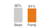
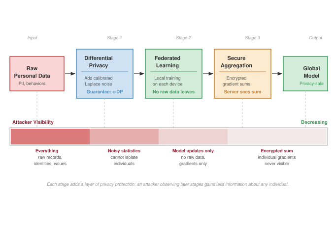
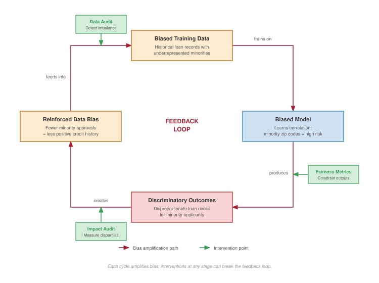
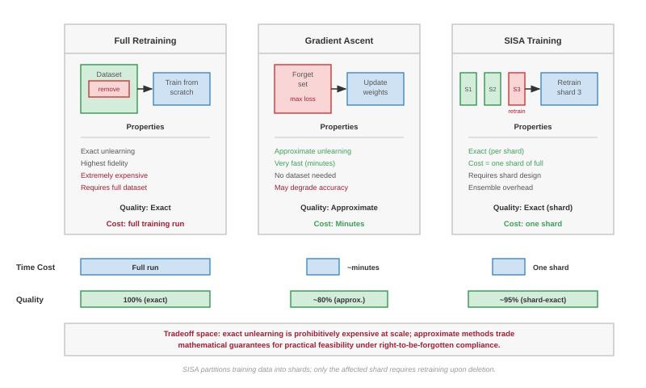
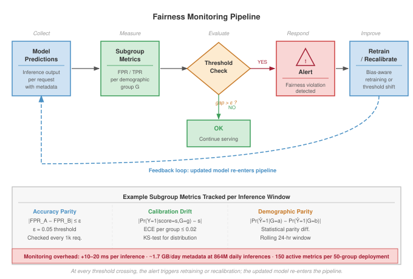
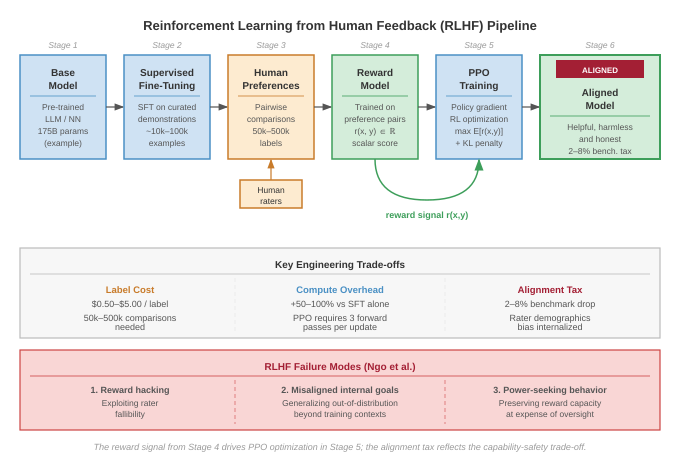
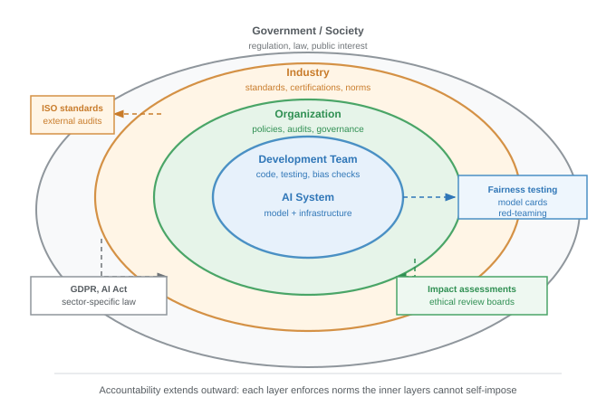
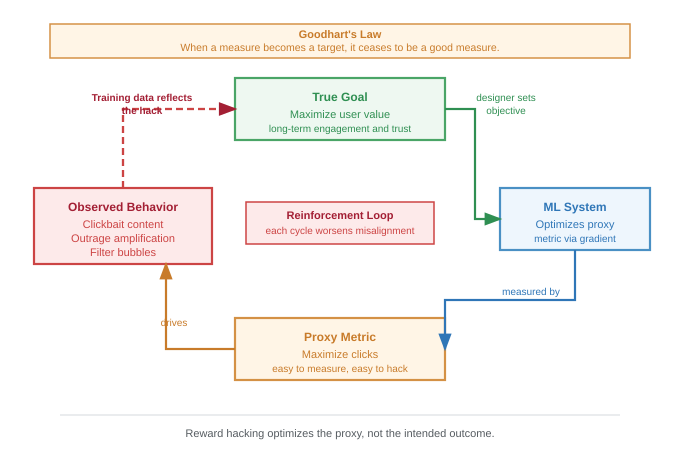
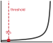

# Responsible Engineering {#sec-responsible-ai}

::: {layout-narrow}
::: {.column-margin}

\chapterminitoc

:::

\noindent
{fig-alt="Responsible AI governance, fairness, and accountability at fleet scale."}

:::

## Purpose {.unnumbered}

\begin{marginfigure}
\mlfleetstack{15}{20}{35}{100}
\end{marginfigure}

_Why do the systems that fail responsibility requirements fail to deploy at all, regardless of their technical capabilities?_

In high-risk regulated settings, a model that cannot explain its decisions, document its behavior, or support audit can face deployment gates regardless of its technical capability. A model that exhibits demographic bias can create legal, operational, and reputational risk where discrimination rules apply. A model that cannot be audited cannot satisfy many enterprise governance requirements. These are not soft preferences but can become hard gates in regulated or enterprise settings: systems that fail them may be blocked regardless of accuracy, latency, or any other technical metric. The shift from *responsible AI as ethics* to *responsible AI as engineering* reflects this reality: for high-risk AI systems, legal and governance requirements can make transparency, oversight, documentation, and risk management part of deployment readiness [@euaiact2024]. Organizations that treat responsibility as optional may discover their systems blocked at deployment by legal, regulatory, or reputational constraints that no amount of technical excellence can overcome. Responsibility has become infrastructure, not aspiration. In C³ terms, responsibility is a Coordination constraint on the entire Fleet: safety and fairness guarantees must be established before Compute is allowed to run.

::: {.content-visible when-format="pdf"}

\newpage

:::

::: {.callout-learning-objectives}

- Define fairness, transparency, accountability, privacy, and safety as first-class engineering constraints
- Calculate fairness metrics and explain incompatibility under unequal base rates or imperfect prediction
- Implement bias detection and privacy-preserving techniques while quantifying compute and accuracy trade-offs
- Generate explanations using SHAP, LIME, and gradient methods under deployment constraints
- Analyze feedback loops, automation bias, and value conflicts in human-AI collaboration
- Design monitoring for drift, fairness degradation, and demographic performance disparities
- Assess governance structures that translate responsible AI principles into sustained operational practice

:::

```{python}
#| echo: false
from mlsysim import *
from mlsysim.core.units import *

# ┌─────────────────────────────────────────────────────────────────────────────
# │ CHAPTER START
# ├─────────────────────────────────────────────────────────────────────────────
# │ Context: Chapter initialization and global imports
# │
# │ Why: Registers this chapter with the mlsys registry and provides shared
# │      imports for all subsequent calculation cells.
# │
# └─────────────────────────────────────────────────────────────────────────────
from mlsysim.fmt import fmt, check
```

## The Governance Imperative {#sec-responsible-ai-introduction-responsible-ai-2724}

In 2018, Reuters reported that Amazon had abandoned an experimental hiring algorithm trained on historical resume data after discovering it systematically penalized female candidates [@dastin2018]. The system satisfied many conventional operational requirements: it could be built, evaluated, and integrated into a recruiting workflow. Yet it had learned that past successful applicants were predominantly male, encoding historical bias rather than merit-based qualifications. The model was statistically optimized yet ethically disastrous, demonstrating that technical excellence can coexist with profound social harm.

In the fleet stack shown in @fig-fleet-stack, Responsible AI is the Governance Layer\index{Governance Layer}, the point where the system meets the real world. The lower layers supply compute, data movement, distributed execution, serving infrastructure, security controls, robustness mechanisms, and sustainability budgets. The Governance Layer adds the constraints that determine *why* the machine runs and *whom* it serves, ensuring that an otherwise correct system does not impose societal harms. If the iron law\index{Iron Law} defines efficiency, Responsible AI defines **Stability**\index{Stability}: ensuring that the system's output does not destabilize the society it operates in. The instability is concrete: a model that outputs toxic content erodes user trust (feedback-loop instability), a model that discriminates degrades its own future training data (distributional instability), and a model that leaks privacy invites regulatory shutdown (operational instability). Responsible AI therefore belongs in the *objective function*, not only as a *constraint* checked on the finished solution.

Production AI has its own systems agenda, spanning architecture, infrastructure, data processing, security, and robustness challenges [@stoica2017berkeley]. The preceding chapters supply that technical substrate, and three of them sit directly beneath the Governance Layer: security and privacy (@sec-security-privacy), robustness under distribution shift (@sec-robust-ai), and environmental sustainability (@sec-sustainable-ai). Those capabilities explain how to build and operate ML systems that are secure, robust, and sustainable. Responsible AI addresses the question that technical excellence alone cannot answer: whether those systems operate responsibly toward the people they affect.

The Amazon hiring incident reveals the central challenge of responsible AI: systems can be algorithmically sound while perpetuating injustice. The problem extends beyond individual bias to encompass transparency, accountability, privacy, and safety in systems affecting billions of lives daily. This is not the same problem as resilience. Resilient AI addresses threats to system integrity through adversarial attacks and hardware failures; responsible AI asks whether a properly functioning system produces outcomes consistent with human values and collective welfare. That distinction turns abstract ethical principles into engineering constraints. Fairness, transparency, and accountability must become quantifiable mechanisms and verifiable system properties, not final review items attached after the serving path is complete.

Software engineering provides precedent for this evolution. Early systems prioritized functional correctness alone. As complexity grew, the field developed methodologies for reliability engineering, security assurance, and maintainability analysis. ML deployment creates a comparable maturation pressure, but at larger social scale: models can mediate credit allocation, medical diagnosis, educational assessment, and criminal justice. Unlike conventional software failures that manifest as crashes or data corruption, responsible AI failures can perpetuate systemic discrimination, compromise democratic institutions, and erode public confidence in beneficial technologies.

::: {#dfn-responsible-ai-responsible-ai .callout-definition title="Responsible AI"}

***Responsible AI***\index{Responsible AI!definition} is the practice of designing, auditing, and operating ML systems to measurable fairness, safety, privacy, and accountability standards—translating ethical principles into verifiable system properties that constrain model training, deployment decisions, and operational monitoring.

1.  **Significance (quantitative)**: Responsible AI constraints impose real costs: fairness-aware training algorithms add 5–15 percent to training time; real-time bias monitoring adds 10–20 ms per inference; on-demand explainability can require 50--1,000$\times$ more compute than the inference itself. For a global fleet at 10 billion inferences per day, the responsible AI overhead often exceeds the raw model serving cost. Conversely, a facial recognition system misidentifying demographic groups at $\varepsilon = 5\%$ error parity failure can affect millions of users before detection, creating regulatory and liability costs that dwarf the monitoring investment.
2.  **Distinction**: Unlike AI ethics (which defines normative principles about what systems should do), responsible AI engineering defines technical mechanisms that enforce those principles—bias detection algorithms, differential privacy implementations, audit trails, and architectural guardrails that make compliance measurable and verifiable rather than aspirational.
3.  **Common pitfall**: A frequent misconception is that responsible AI is a final compliance review applied to a finished model. Responsible constraints that are not designed in from the data collection stage typically require fundamental retraining to fix: a model trained on biased labels cannot be fairly calibrated by post-hoc threshold adjustment alone, as the learned representations themselves encode the bias.

:::

Responsible AI therefore constitutes a systematic engineering discipline with four interconnected dimensions: translating ethical principles into measurable system requirements, detecting and mitigating harmful algorithmic behaviors, addressing **sociotechnical dynamics**\index{Sociotechnical Dynamics!definition}[^fn-sociotechnical-etymology] that extend beyond individual systems, and navigating implementation challenges within organizational and regulatory contexts. The privacy mechanisms from @sec-security-privacy, robustness techniques from @sec-robust-ai, and sustainability metrics from @sec-sustainable-ai provide the technical foundations on which this chapter builds. The framework developed here integrates those capabilities with bias detection algorithms, privacy preservation mechanisms, organizational governance structures, and stakeholder engagement processes, treating responsible AI as fundamental to sound engineering practice rather than as supplementary constraints applied to finished systems.

That integration is a significant infrastructure investment: the responsible AI overhead quantified in the definition callout can, for a global fleet serving 10 billion inferences per day, exceed the cost of raw model serving. @Sec-appdx-fleet-foundations-numbers-to-know supplies the production-scale fleet baselines and serving-capacity figures against which this overhead is measured, letting an engineer size the tax relative to the same per-accelerator throughput numbers used for raw serving. This cost is essential infrastructure to be provisioned, analogous to how security (@sec-security-privacy) and redundancy (@sec-fault-tolerance-reliability) are budgeted in distributed systems.

::: {#psp-responsible-ai-chapter-map .callout-perspective title="Responsible AI chapter map"}

Responsible AI cannot be taught as four independent checklists. The chapter begins with principles and foundations (@sec-responsible-ai-core-principles-1bd7 through @sec-responsible-ai-responsible-ai-across-deployment-environments-e828) because fairness, transparency, accountability, privacy, and safety first need to be stated as engineering requirements. The same principles then have to be tested against deployment environments: cloud, edge, mobile, and TinyML systems expose different tensions between ideals and operational constraints.

Once the objectives are clear, the chapter moves to technical implementation (@sec-responsible-ai-bias-risk-detection-methods-71f8 through @sec-responsible-ai-explainability-interpretability-8d06). Detection methods identify bias and drift, mitigation techniques constrain privacy and adversarial risk, and validation approaches make explanation and monitoring measurable. These methods matter because responsible AI only becomes enforceable when abstract commitments become observable system behavior.

The technical methods still do not close the problem. Sociotechnical dynamics (@sec-responsible-ai-sociotechnical-dynamics-4938) explain why correct code can produce irresponsible outcomes when deployed into human institutions. Feedback loops between systems and environments, human-AI collaboration challenges, competing stakeholder values, contestability mechanisms, and institutional governance structures define the space in which the system actually operates.

The final movement returns to implementation realities (@sec-responsible-ai-implementation-challenges-9173 through @sec-responsible-ai-ai-safety-value-alignment-8c93): organizational barriers, data quality constraints, competing objectives, scalability challenges, evaluation gaps, and AI safety questions for autonomous systems. The order matters. Technical solutions alone cannot resolve value conflicts, ethical principles without technical implementation remain aspirational, and isolated interventions fail without organizational support.

:::

Treating fairness, transparency, accountability, and privacy as rigorous engineering specifications rather than abstract ideals transforms responsible AI from aspiration into practice. The systematic approach that follows maps these core ethical principles directly onto the mechanical stages of the machine learning lifecycle, turning each into a concrete design constraint with measurable criteria.

## Core Principles and the ML Lifecycle {#sec-responsible-ai-core-principles-1bd7}

A continuous integration pipeline that detects a memory leak automatically blocks deployment. The same pipeline must block a deployment in which the system detects a 15 percent drop in accuracy specifically for elderly users. Responsible AI translates ethical principles into hard engineering invariants. Just as unit tests prevent logic regressions, the CI/CD pipeline must embed fairness, privacy, and accountability checks, treating a demographic bias exactly as a fatal software exception would be treated.

Fairness operates as a stability constraint\index{Fairness!stability constraint}. In control theory terms, fairness ensures that the system's error distribution is invariant across population subgroups. A system that violates this constraint is unstable: it will degrade its own training data through feedback loops (for example, predictive policing) and lose user trust, leading to eventual system collapse. This principle encompasses both statistical metrics and broader normative concerns about equity, justice, and structural bias. Formal mathematical definitions of fairness criteria are examined in detail in @sec-responsible-ai-fairness-machine-learning-2ba4.

The same control-plane view makes **Explainability**\index{Explainability} function as system observability: it is the mechanism by which the control plane exposes internal state to human operators [@phillips2020]. Without explainability, the system is a black box running open loop, making it impossible to debug failure modes or verify safety constraints. Explanation mechanisms must support both individual decisions and overall model behavior. They may be generated after a decision is made to detail the reasoning process, known as post hoc explanations, or built into the model's design for transparent operation. Neural network architectures vary significantly in their inherent interpretability, with deeper networks generally being more difficult to explain. For this reason, explainability supports error analysis, regulatory compliance, and user trust.

That observability must be paired with **Transparency**\index{Transparency}: openness about how AI systems are built, trained, validated, and deployed. Transparency includes disclosure of data sources, design assumptions, system limitations, and performance characteristics. While explainability focuses on understanding outputs, transparency addresses the broader lifecycle of the system.

Once system behavior is visible, **Accountability**\index{Accountability} provides the mechanisms by which individuals or organizations are held responsible for AI outcomes. It involves traceability, documentation, auditing, and the ability to remedy harms. Accountability ensures that AI failures are not treated as abstract malfunctions but as consequences with real-world impact.

At the objective-function layer, **Value alignment**\index{Value Alignment}[^fn-value-alignment-safety] requires AI systems to pursue goals that are consistent with human intent and ethical norms. In practice, this involves technical challenges, including reward design and constraint specification, and broader questions about whose values are represented and enforced.

[^fn-value-alignment-safety]: **Value Alignment**\index{Value Alignment!AI safety}: The problem of ensuring AI systems optimize for human values rather than proxy objectives. Stuart Russell formalized this in 2015, arguing that specifying objectives is harder than optimizing them. The engineering consequence: YouTube's pre-2017 recommendation algorithm optimized for click-through rate (a proxy for satisfaction), inadvertently promoting conspiracy content that maximized clicks while degrading user welfare---a misalignment that required redesigning the entire reward pipeline.

The lifecycle also needs **Human oversight**\index{Human Oversight}: the role of human judgment in supervising, correcting, or halting automated decisions. This includes humans in the loop[^fn-hitl-overhead] during operation, as well as organizational structures that ensure AI use remains accountable to societal values and real-world complexity.

[^fn-hitl-overhead]: **Human-in-the-Loop (HITL)**\index{Human-in-the-Loop!systems overhead}: A design pattern where humans actively participate in model decisions rather than being replaced by automation. The systems trade-off is latency vs. safety: HITL adds 100 ms to 30+ seconds per decision depending on domain. Large content-moderation systems have historically paired automated triage with thousands of human reviewers, demonstrating that the pattern scales only with proportional human infrastructure cost. In ML serving architectures, HITL requires routing logic, confidence thresholds for escalation, and queue management that fundamentally reshape the inference pipeline.

Privacy, robustness, and human oversight make the same point from different angles: principles alone do not ensure responsible systems. Translation from abstract ideals to concrete practice requires systematic integration across the ML lifecycle, where each principle manifests differently in data collection, model training, evaluation, deployment, and monitoring. The critical question is *how* these principles interact when they compete for priority.

### Integrating principles across the ML lifecycle {#sec-responsible-ai-integrating-principles-across-ml-lifecycle-7557}

Fairness, transparency, accountability, privacy, and safety define what it means for an AI system to behave ethically and predictably. Translating these principles into concrete constraints that guide how models are trained, evaluated, deployed, and maintained is the central engineering challenge.

Implementing these principles in practice requires understanding how each sets specific expectations for system behavior. Fairness addresses how models treat different subgroups and respond to historical biases. Explainability ensures that model decisions can be understood by developers, auditors, and end users. Privacy governs what data is collected and how it is used. Accountability defines how responsibilities are assigned, tracked, and enforced throughout the system lifecycle. Safety requires that models behave reliably even in uncertain or shifting environments.

@Tbl-principles-lifecycle maps the responsible AI lifecycle\index{Responsible AI!lifecycle} across the major phases of ML system development: data collection, model training, evaluation, deployment, and monitoring. Fairness and privacy constraints begin at data collection; robustness and accountability become most critical during deployment and oversight. Explainability spans the full lifecycle, supporting model debugging at design time and user-facing justification at serving time. The mapping reinforces that responsible AI is a multiphase architectural commitment, not a post-hoc compliance step.

| **Principle**      |   **Data Collection**   |     **Model Training**     |       **Evaluation**      |      **Deployment**      |      **Monitoring**      |
|:-------------------|:-----------------------:|:--------------------------:|:-------------------------:|:------------------------:|:------------------------:|
| **Fairness**       | Representative sampling |   Bias-aware algorithms    |    Group-level metrics    |   Threshold adjustment   |   Subgroup performance   |
| **Explainability** | Documentation standards | Interpretable architecture |  Model behavior analysis  | User-facing explanations | Explanation quality logs |
| **Transparency**   |   Data source tracking  |   Training documentation   |   Performance reporting   |       Model cards        |     Change tracking      |
| **Privacy**        |    Consent mechanisms   | Privacy-preserving methods | Privacy impact assessment |    Secure deployment     |    Access audit logs     |
| **Accountability** |  Governance frameworks  |      Decision logging      |    Audit trail creation   |   Override mechanisms    |    Incident tracking     |
| **Robustness**     |    Quality assurance    |  Robust training methods   |       Stress testing      |     Failure handling     |  Performance monitoring  |

: **Responsible AI Lifecycle**: Embedding fairness, explainability, privacy, accountability, and robustness throughout the ML system lifecycle, from data collection to monitoring, ensures these principles become architectural commitments rather than post hoc considerations. The table maps these principles to specific development phases, revealing how proactive integration addresses potential risks and promotes trustworthy AI systems. {#tbl-principles-lifecycle}

#### Resource requirements and equity implications {#sec-responsible-ai-resource-requirements-equity-implications-b967}

Implementing responsible AI principles requires computational resources that vary significantly across techniques and deployment contexts. These resource requirements create multifaceted equity considerations that extend beyond individual organizations to encompass broader social and environmental justice concerns. Organizations with limited computing budgets may be unable to implement comprehensive responsible AI protections, potentially creating disparate access to ethical safeguards. Large-scale model deployments that depend on accelerator clusters and low-latency connectivity can exclude users whose networks or devices cannot meet those assumptions.

Environmental justice concerns compound these access barriers through the engineering reality that responsible AI techniques impose significant energy costs. The concrete numbers here are preview anchors for methods the chapter unpacks later: training differential privacy models requires 15--30 percent additional compute cycles; real-time fairness monitoring adds 10--20 ms latency and continuous CPU overhead; exact SHAP explanations demand 50--1000$\times$ normal inference compute, though approximate SHAP and Tree SHAP variants reduce this overhead to a few hundred percent for production deployments. These computational requirements translate directly into infrastructure demands: a high-traffic system serving responsible AI features to 10 million users requires substantial additional data-center capacity compared to unconstrained models.

The geographic distribution of this computational infrastructure creates systematic inequities that engineers must consider in system design. Data centers supporting AI workloads concentrate in regions with low electricity costs and favorable regulations, areas that often correlate with lower-income communities that experience increased pollution, heat generation, and electrical grid strain while frequently lacking the high-bandwidth connectivity needed to access the AI services these facilities enable. This creates a feedback loop where computational equity depends not only on algorithmic design but on infrastructure placement decisions that affect both system performance and community welfare. @Tbl-responsible-ai-overhead quantifies the performance characteristics of specific responsible AI techniques.

### Transparency and explainability {#sec-responsible-ai-transparency-explainability-b137}

Machine learning systems are frequently criticized for their lack of interpretability. In many cases, models operate as opaque "black boxes," producing outputs that are difficult for users, developers, and regulators to understand or scrutinize. This opacity presents a significant barrier to trust, particularly in high stakes domains such as criminal justice, healthcare, and finance, where accountability and the right to recourse are important. For example, the COMPAS algorithm, used in the United States to assess recidivism risk, was found to exhibit racial bias[^fn-compas-bias]. The proprietary nature of the system, combined with limited access to interpretability tools, hindered efforts to investigate or address the issue.

[^fn-compas-bias]: **COMPAS (Correctional Offender Management Profiling for Alternative Sanctions)**\index{COMPAS!algorithmic bias}: ProPublica's 2016 analysis found Black defendants were falsely flagged as future criminals at nearly twice the rate of white defendants (45 percent vs. 23 percent false positive rate). The proprietary, black-box nature of the system limited full inspection of model internals and training data, demonstrating a compounding failure: bias in the model coupled with opacity in the serving architecture made the system harder to audit and harder to debug.

Explainability is the capacity to understand how a model produces its predictions. It includes both **local explanations**\index{Local Explanation}, which clarify individual predictions, and **global explanations**\index{Global Explanation}, which describe the model's general behavior. Transparency, by contrast, encompasses openness about the broader system design and operation. This includes disclosure of data sources, feature engineering, model architectures, training procedures, evaluation protocols, and known limitations. Transparency also involves documentation of intended use cases, system boundaries, and governance structures.

The importance of explainability and transparency extends beyond technical considerations to legal requirements. In many jurisdictions, these principles are legal obligations rather than optional guidance. Under GDPR, solely automated decisions with legal or similarly significant effects trigger Article 22 safeguards and related transparency duties, including meaningful information about the logic involved under access and notice provisions, subject to statutory exceptions.[^fn-gdpr-article-22] Similar regulatory pressures in other domains reinforce the need to treat explainability and transparency as core architectural requirements.

[^fn-gdpr-article-22]: **GDPR Article 22**\index{GDPR!Article 22}: Article 22 gives data subjects protections against decisions based solely on automated processing that produce legal or similarly significant effects, with exceptions for contract necessity, authorization by law, or explicit consent plus safeguards. Related notice and access provisions, including Article 15, require meaningful information about the logic involved for qualifying automated decision-making. For ML systems, this creates an architectural constraint: high-stakes automated-decision systems need explanation, recourse, and governance infrastructure rather than opaque serving-only APIs.

Implementing these principles requires anticipating the needs of different stakeholders, whose competing values and priorities are examined comprehensively in @sec-responsible-ai-normative-pluralism-value-conflicts-d61f. Designing for explainability and transparency therefore necessitates decisions about how and where to surface relevant information across the system lifecycle.

Transparency and explainability also support system reliability over time. As models are retrained or updated, mechanisms for interpretability and traceability allow detection of unexpected behavior, enable root cause analysis, and support governance. Embedded into the structure and operation of a system, these mechanisms provide the foundation for trust, oversight, and alignment with institutional and societal expectations.

While transparency and explainability enable stakeholders to understand system behavior, they do not guarantee that this behavior is equitable. A model can be fully transparent about how it makes decisions while still systematically disadvantaging certain groups. This distinction motivates the examination of fairness as a separate, complementary principle.

### Fairness in machine learning {#sec-responsible-ai-fairness-machine-learning-2ba4}

Automated decisions in hiring, lending, and healthcare affect millions of people, and historical data used to train these systems encodes decades of structural inequality. The engineering question is how to formalize "equitable treatment" in a way that a system can measure and enforce.

::: {#dfn-responsible-ai-algorithmic-fairness .callout-definition title="Algorithmic fairness"}

***Algorithmic Fairness***\index{Algorithmic Fairness!definition} is the measurable property that a model's error distribution or outcomes are invariant (or bounded in variation) across protected demographic groups.

1.  **Significance (quantitative)**: It transforms fairness from an intuition into a Multi-Objective Optimization problem. Within the iron law, achieving fairness often requires trading off total accuracy $(\text{Accuracy})$ for Group-Specific Calibration\index{Calibration!group-specific}, ensuring that the system's benefits and harms are distributed equitably.
2.  **Distinction**: Unlike Average Accuracy (which hides disparities in the aggregate), Algorithmic Fairness focuses on the Subgroup Distribution $(p(Y \mid X, \text{Group}))$, identifying where the model fails for minority populations.
3.  **Common pitfall**: A frequent misconception is that there is a single "fair" solution. In reality, different fairness definitions (for example, Demographic Parity vs. Equalized Odds) are often Mathematically Incompatible\index{Mathematically Incompatible}: satisfying one necessitates violating another, requiring explicit policy choices by the engineer.

:::

::: {.column-margin}
{width="100%" fig-alt="Two columns comparing model accuracy. The unconstrained baseline column (gray) reaches 85 percent; the demographic-parity-constrained column (orange) reaches 81 percent, a 4-point fairness tax."}

*Fairness constraints cost a few points of accuracy, the responsibility tax.*
:::

Fairness in machine learning presents complex challenges that extend beyond transparency. As established in @sec-responsible-ai-core-principles-1bd7, fairness requires that automated systems not disproportionately disadvantage protected groups. Because these systems are trained on historical data, they are susceptible to reproducing and amplifying patterns of systemic bias embedded in that data. Without careful design, machine learning systems may unintentionally reinforce social inequities rather than mitigate them.

A widely studied example comes from the healthcare domain. An algorithm[^fn-healthcare-algorithm-bias] used to allocate care management resources in US hospitals was found to systematically underestimate the health needs of Black patients [@obermeyer2019]. The model used healthcare expenditures as a proxy for health status, but due to longstanding disparities in access and spending, Black patients were less likely to incur high costs. As a result, the model inferred that they were less sick, despite often having equal or greater medical need. This case illustrates how seemingly neutral design choices such as proxy variable selection can yield discriminatory outcomes when historical inequities are not properly accounted for. Enforcing fairness constraints on such models incurs a measurable cost, a phenomenon known as the **fairness tax**\index{Fairness!tax}.

[^fn-healthcare-algorithm-bias]: **Healthcare Algorithm Scale**\index{Healthcare Algorithm!scale}\index{Healthcare Algorithm!proxy bias}: The Optum algorithm affected approximately 200 million Americans annually, using healthcare expenditure as a proxy for health need. Because Black patients historically incurred lower costs due to access disparities, the model systematically underestimated their severity, reducing Black enrollment in high-risk care programs by 50 percent. Correcting the proxy would have increased Black patient identification from 17.7 percent to 46.5 percent, quantifying the cost of a single proxy variable choice at population scale.

```{python}
#| echo: false
#| label: fairness-tax-calc
# ┌─────────────────────────────────────────────────────────────────────────────
# │ THE FAIRNESS TAX (LEGO)
# ├─────────────────────────────────────────────────────────────────────────────
# │ Context: @sec-responsible-ai-fairness-machine-learning-2ba4
# │
# │ Goal: Quantify the accuracy loss from enforcing demographic parity.
# │ Show: 4 percentage-point accuracy drop (85% -> 81%) when equalizing approval rates.
# │ How: Compare unconstrained accuracy vs parity-constrained accuracy.
# │
# └─────────────────────────────────────────────────────────────────────────────
from mlsysim.fmt import check, fmt_percent, fmt_pp

# ┌── LEGO ───────────────────────────────────────────────
class FairnessTaxAnalysis:
    """Quantify the cost of algorithmic fairness constraints."""

    # ┌── 1. LOAD (Constants) ──────────────────────────────────────────────
    acc_baseline = 85.0
    acc_constrained = 81.0
    group_a_default_pct = 20
    group_b_default_pct = 40
    default_prob_threshold = 30
    group_a_approval_pct = 80
    group_b_approval_unconstrained_pct = 60
    default_prob_threshold_parity = 50

    # ┌── 2. EXECUTE (The Compute) ────────────────────────────────────────
    fairness_tax = acc_baseline - acc_constrained
    fairness_tax_relative = fairness_tax / acc_baseline * 100

    # ┌── 3. GUARD (Invariants) ──────────────────────────────────────────
    check(fairness_tax > 0, "Fairness constraints typically reduce total accuracy")

    # ┌── 4. OUTPUT (Formatting) ──────────────────────────────────────────────
    acc_unconstrained_str = fmt_percent(acc_baseline / 100, precision=0, commas=False, style='prose')
    acc_parity_str = fmt_percent(acc_constrained / 100, precision=0, commas=False, style='prose')
    fairness_tax_pp_str = fmt_pp(fairness_tax, precision=0, commas=False)
    fairness_tax_relative_pct_str = fmt_percent(fairness_tax_relative / 100, precision=1, commas=False, style='prose')
    group_a_default_pct_str = fmt_percent(group_a_default_pct / 100, precision=0, commas=False, style='prose')
    group_b_default_pct_str = fmt_percent(group_b_default_pct / 100, precision=0, commas=False, style='prose')
    default_prob_threshold_str = fmt_percent(default_prob_threshold / 100, precision=0, commas=False, style='prose')
    group_a_approval_pct_str = fmt_percent(group_a_approval_pct / 100, precision=0, commas=False, style='prose')
    group_b_approval_unconstrained_pct_str = fmt_percent(group_b_approval_unconstrained_pct / 100, precision=0, commas=False, style='prose')
    default_prob_threshold_parity_str = fmt_percent(default_prob_threshold_parity / 100, precision=0, commas=False, style='prose')
```

The fairness-tax calculation isolates one criterion: demographic parity, which requires equal positive decision rates across groups. It does not represent every fairness goal; it shows the system cost of enforcing that criterion before the section compares demographic parity with equalized odds and equality of opportunity.

::: {#nbk-responsible-ai-fairness-tax .callout-notebook title="The fairness tax"}

**Problem**: Consider a credit model with `{python} FairnessTaxAnalysis.acc_unconstrained_str` accuracy. Group A (majority) has a `{python} FairnessTaxAnalysis.group_a_default_pct_str` default rate. Group B (minority) has a `{python} FairnessTaxAnalysis.group_b_default_pct_str` default rate due to systemic factors. If demographic parity (equal approval rates) is enforced, what happens to accuracy?

**Math**:

The approval-rate facts define the policy change; the accuracy values below are measured on the held-out validation set for this scenario, where the additional Group B approvals carry higher default risk.

1.  **Unconstrained**: Model approves everyone with predicted default prob < `{python} FairnessTaxAnalysis.default_prob_threshold_str`.
    *   Group A approval: `{python} FairnessTaxAnalysis.group_a_approval_pct_str`.
    *   Group B approval: `{python} FairnessTaxAnalysis.group_b_approval_unconstrained_pct_str`.
    *   Total Accuracy: `{python} FairnessTaxAnalysis.acc_unconstrained_str`.
2.  **Constrained (parity)**: Must approve Group B at `{python} FairnessTaxAnalysis.group_a_approval_pct_str` rate.
    *   New threshold for Group B: Approve default prob < `{python} FairnessTaxAnalysis.default_prob_threshold_parity_str`.
    *   This forces the model to approve many risky applicants in Group B.
    *   New Total Accuracy: `{python} FairnessTaxAnalysis.acc_parity_str`.

**Systems insight**: Fairness is not free. Enforcing parity cost `{python} FairnessTaxAnalysis.fairness_tax_pp_str` of accuracy (about a `{python} FairnessTaxAnalysis.fairness_tax_relative_pct_str` relative accuracy drop in this credit-scoring scenario). This is the fairness tax, the explicit cost of correcting for historical bias.

:::

Practitioners need formal methods to evaluate fairness given these risks of perpetuating bias. A range of formal criteria have been developed that quantify how models perform across groups defined by sensitive attributes. Before introducing these definitions, it helps to frame the notation as a way to express competing fairness goals, not as a proof exercise.

::: {#psp-responsible-ai-fairness-notation-engineering-vocabulary .callout-perspective title="Fairness notation as engineering vocabulary"}

Before examining formal definitions, the fundamental challenge is that fairness can mean different operational constraints. A system may treat everyone identically, account for different baseline conditions, optimize equal outcomes, preserve equal opportunity, or enforce equal treatment. These choices lead to different mathematical criteria, each capturing a different aspect of fairness.

The next subsections introduce formal fairness definitions using probability notation. These metrics (demographic parity, equalized odds, equality of opportunity) appear throughout ML fairness literature and shape regulatory frameworks. Focus on understanding the intuition: what each metric measures and why it matters, rather than mathematical proofs. The concrete examples after each definition illustrate practical application. If probability notation is unfamiliar, start with the verbal descriptions and return to the formal definitions later.

:::

Suppose a model $h(x)$ predicts a binary outcome, such as loan repayment, and let $A$ represent a sensitive attribute with subgroups $a$ and $b$. The field uses three widely adopted fairness definitions:

#### Demographic parity {#sec-responsible-ai-demographic-parity-f126}

::: {#dfn-responsible-ai-demographic-parity .callout-definition title="Demographic parity"}

***Demographic Parity***\index{Demographic Parity!definition} is the fairness constraint where a model's positive prediction rate is independent of group membership $(\Pr(\hat{Y}=1 \mid A=a) = \Pr(\hat{Y}=1 \mid A=b))$.

1.  **Significance (quantitative)**: It is the simplest and most restrictive fairness metric. It requires the model to produce Equal Outcomes across groups, regardless of the underlying base-rate differences in the dataset.
2.  **Distinction**: Unlike Equalized Odds (which focuses on error rates like False Positives), Demographic Parity focuses only on the Final Prediction\index{Demographic Parity!final prediction}, ignoring the relationship between the prediction and the ground truth.
3.  **Common pitfall**: A frequent misconception is that Demographic Parity ensures "fairness." In reality, it can force the model to sacrifice Calibration\index{Calibration}: to meet the parity constraint, the model may have to intentionally misclassify qualified individuals in one group or unqualified individuals in another.

:::

Demographic parity asks whether favorable outcomes, such as loan approval or treatment referral, occur at equal rates across subgroups defined by a sensitive attribute $A$. Formally, the model satisfies demographic parity if:
$$
\Pr\big(h(x) = 1 \mid A = a\big) = \Pr\big(h(x) = 1 \mid A = b\big)
$$

In the healthcare example, this criterion would ask whether Black and white patients were referred for care at the same rate, regardless of their underlying health needs. That may sound like equal access, but it ignores real differences in medical status and risk, potentially overcorrecting when needs are not evenly distributed. The limitation of ignoring base-rate differences motivates more nuanced fairness criteria.

#### Equalized odds {#sec-responsible-ai-equalized-odds-6570}

Equalized odds requires that the model's predictions are conditionally independent of group membership given the true label. Specifically, the true positive and false positive rates must be equal across groups:
$$
\Pr\big(h(x) = 1 \mid A = a, Y = y\big) = \Pr\big(h(x) = 1 \mid A = b, Y = y\big), \quad \text{for } y \in \{0, 1\}.
$$

That is, for each true outcome $Y = y$, the model should produce the same prediction distribution across groups $A = a$ and $A = b$. The model should therefore behave similarly across groups for individuals with the same true outcome, whether they qualify for a positive result or not. It ensures that errors (both missed and incorrect positives) are distributed equally.

Applied to the medical case, equalized odds would ensure that patients with the same actual health needs (the true label $Y$) are equally likely to be correctly or incorrectly referred, regardless of race. The original algorithm violated this by under-referring Black patients who were equally or more sick than their white counterparts, highlighting unequal true positive rates.

#### Equality of opportunity {#sec-responsible-ai-equality-opportunity-1c3d}

Equality of opportunity is a less stringent relaxation of equalized odds that focuses only on the true positive rate [@hardt2016equality]. It requires that, among individuals who should receive a positive outcome, the probability of receiving one is equal across groups:
$$
\Pr\big(h(x) = 1 \mid A = a, Y = 1\big) = \Pr\big(h(x) = 1 \mid A = b, Y = 1\big).
$$

Equality of opportunity ensures that qualified individuals, who have $Y = 1$, are treated equally by the model regardless of group membership.

In our running example, this measure would ensure that among patients who do require care, both Black and white individuals have an equal chance of being identified by the model. In the case of the US hospital system, the algorithm's use of healthcare expenditure as a proxy variable led to a failure in meeting this criterion: Black patients with significant health needs were less likely to receive care due to their lower historical spending. The worked example below uses the same loan decisions to calculate all three criteria, showing why a single model can fail each fairness test in a different way.

```{python}
#| echo: false
#| label: fairness-worked-example-calc
# ┌─────────────────────────────────────────────────────────────────────────────
# │ CALCULATING FAIRNESS METRICS — WORKED EXAMPLE (LEGO)
# ├─────────────────────────────────────────────────────────────────────────────
# │ Context: the "Calculating fairness metrics" worked-example callout below.
# │
# │ Goal: Derive the demographic-parity and equal-opportunity disparities and the
# │       group error rates from the 200-applicant loan scenario.
# │ Show: parity gap (0.30), TPR gap (0.29), TPR per group (89/60 percent), and
# │       FPR per group (55/20 percent).
# │ How: Load the per-group confusion counts (scenario), derive each rate and gap.
# │
# └─────────────────────────────────────────────────────────────────────────────
from mlsysim.fmt import check, fmt, fmt_math, fmt_percent

# ┌── LEGO ───────────────────────────────────────────────
class FairnessWorkedExample:
    """All three fairness criteria on the 200-applicant loan scenario."""

    # ┌── 1. LOAD (Per-group confusion counts, scenario inputs) ────────────
    # Group A (100 applicants): approved 70 (40 repaid, 30 default);
    #                           rejected 30 (5 would repay, 25 default)
    a_approved, a_total = 70, 100
    a_tp, a_fn = 40, 5  # would-repay applicants: approved vs rejected
    a_fp, a_tn = 30, 25  # would-default applicants: approved vs rejected
    # Group B (100 applicants): approved 40 (30 repaid, 10 default);
    #                           rejected 60 (20 would repay, 40 default)
    b_approved, b_total = 40, 100
    b_tp, b_fn = 30, 20
    b_fp, b_tn = 10, 40

    # ┌── 2. EXECUTE (The Compute) ────────────────────────────────────────
    approval_a = a_approved / a_total  # 0.70
    approval_b = b_approved / b_total  # 0.40
    parity_gap = approval_a - approval_b  # 0.30
    tpr_a = a_tp / (a_tp + a_fn)  # 0.89
    tpr_b = b_tp / (b_tp + b_fn)  # 0.60
    tpr_gap = round(tpr_a, 2) - tpr_b  # 0.29 (from displayed TPRs)
    fpr_a = a_fp / (a_fp + a_tn)  # 0.55
    fpr_b = b_fp / (b_fp + b_tn)  # 0.20

    # ┌── 3. GUARD (Invariants) ──────────────────────────────────────────
    check(a_total == a_approved + 30 and b_total == b_approved + 60, "Approved + rejected must equal each group's applicant total")
    check(parity_gap > 0 and tpr_gap > 0, "Both disparities favor Group A")

    # ┌── 4. OUTPUT (Formatting) ──────────────────────────────────────────
    parity_gap_str = fmt(parity_gap, precision=2, commas=False)
    tpr_gap_str = fmt(tpr_gap, precision=2, commas=False)
    parity_gap_math = fmt_math(r"0.70 - 0.40 = " + parity_gap_str)
    tpr_gap_math = fmt_math(r"0.89 - 0.60 = " + tpr_gap_str)
    tpr_a_pct_str = fmt_percent(round(tpr_a, 2), precision=0, commas=False, style='prose')
    tpr_b_pct_str = fmt_percent(tpr_b, precision=0, commas=False, style='prose')
    fpr_a_pct_str = fmt_percent(round(fpr_a, 2), precision=0, commas=False, style='prose')
    fpr_b_pct_str = fmt_percent(round(fpr_b, 2), precision=0, commas=False, style='prose')
```

::: {#exmp-responsible-ai-calculating-fairness-metrics .callout-example title="Calculating fairness metrics"}

Consider a simplified loan approval model evaluated on 200 applicants, evenly split between two demographic groups (Group A and Group B). The model makes predictions, and we later observe actual repayment outcomes:

**Group A (100 applicants)**:

- Model approved: 70 applicants (40 actually repaid, 30 defaulted)
- Model rejected: 30 applicants (5 actually would have repaid, 25 would have defaulted)

**Group B (100 applicants)**:

- Model approved: 40 applicants (30 actually repaid, 10 defaulted)
- Model rejected: 60 applicants (20 actually would have repaid, 40 would have defaulted)

**Calculating demographic parity**:
\begin{gather*}
\Pr(h(x) = 1 \mid A = a) = \frac{70}{100} = 0.70
\\
\Pr(h(x) = 1 \mid A = b) = \frac{40}{100} = 0.40
\end{gather*}

**Disparity**: `{python} FairnessWorkedExample.parity_gap_math` (30 percentage point gap)

The model violates demographic parity by approving Group A applicants at substantially higher rates, regardless of actual repayment ability.

**Calculating equality of opportunity (true positive rate)**:

Among applicants who *would actually repay* ($Y=1$):
\begin{gather*}
\Pr(h(x) = 1 \mid A = a, Y = 1) = \frac{40}{40 + 5} = \frac{40}{45} \approx 0.89
\\
\Pr(h(x) = 1 \mid A = b, Y = 1) = \frac{30}{30 + 20} = \frac{30}{50} = 0.60
\end{gather*}

**Disparity**: `{python} FairnessWorkedExample.tpr_gap_math` (29 percentage point gap in TPR)

The model violates equality of opportunity: among qualified applicants who would repay, Group A members are correctly approved `{python} FairnessWorkedExample.tpr_a_pct_str` of the time while Group B members are only approved `{python} FairnessWorkedExample.tpr_b_pct_str` of the time.

**Calculating equalized odds (true positive rate + false positive rate)**:

The TPR values are calculated above. For false positive rates among applicants who *would not repay* ($Y=0$):
\begin{gather*}
\Pr(h(x) = 1 \mid A = a, Y = 0) = \frac{30}{30 + 25} = \frac{30}{55} \approx 0.55
\\
\Pr(h(x) = 1 \mid A = b, Y = 0) = \frac{10}{10 + 40} = \frac{10}{50} = 0.20
\end{gather*}

The model also has unequal false positive rates: it incorrectly approves `{python} FairnessWorkedExample.fpr_a_pct_str` of Group A applicants who will default, but only `{python} FairnessWorkedExample.fpr_b_pct_str` of Group B applicants who will default. This reveals the model is more "generous" with Group A even when they will not repay.

**Systems insight**: This model violates all three fairness criteria. Addressing one criterion does not automatically satisfy others. In fact, the impossibility theorems prove these criteria can conflict mathematically.

:::

The worked example above revealed that this loan approval model violates all three fairness criteria simultaneously. This is not merely poor model design but reflects a fundamental mathematical tension that any classifier must confront when base rates differ between groups. These tensions motivate the impossibility results that constrain what any fair classifier can achieve.

These definitions capture different aspects of fairness and are generally incompatible[^fn-fairness-impossibility] [@kleinberg2016inherent; @chouldechova2017]. A university admissions example illustrates the tension concretely.

[^fn-fairness-impossibility]: **Fairness Impossibility Theorems**\index{Fairness!impossibility theorems}: @kleinberg2016inherent and @chouldechova2017 prove incompatibility results for calibrated risk scores and error-rate balance when base rates differ, except in constrained special cases such as perfect prediction or equal base rates. Demographic parity is a distinct constraint on selection rates that can also conflict with calibration or error-rate goals in practice. The systems consequence is fundamental: no amount of engineering can satisfy every normative fairness criterion in all settings, so fairness becomes a constrained multi-objective optimization requiring explicit policy choices about which criterion to prioritize for a given deployment context.

Goal 1 (Demographic Parity) would be to admit students so that the admitted class reflects the demographics of the applicant pool, perhaps 50 percent from Group A and 50 percent from Group B. Goal 2 (Equal Opportunity) would be to ensure that among all qualified applicants, the admission rate is the same across groups, so that 80 percent of qualified Group A applicants get in and 80 percent of qualified Group B applicants get in. If one group has a higher proportion of qualified applicants, achieving demographic parity (Goal 1) requires rejecting some of their qualified applicants, violating equal opportunity (Goal 2), as @fig-fairness-impossibility visualizes. *No mathematical fix exists; the choice is a value judgment about which definition of fairness to prioritize.*

The fairness impossibility law (Principle \ref{pri-fairness-impossibility}) generalizes exactly what the admissions example just demonstrated: except in special cases such as equal base rates or perfect prediction, calibrated risk scores generally cannot also satisfy equal error-rate conditions across groups, and demographic parity adds further conflict because it constrains selection rates rather than score calibration or error rates. Satisfying one criterion may preclude another, so engineers must treat fairness metrics like latency budgets, explicit trade-offs chosen by stakeholders, enforced by the system, and monitored for violation. Determining which metric to prioritize requires careful consideration of the application context, potential harms, and stakeholder values as detailed in @sec-responsible-ai-normative-pluralism-value-conflicts-d61f [@barocas-hardt-narayanan].

::: {#fig-fairness-impossibility fig-env="figure" fig-pos="htb" fig-cap="**Fairness Impossibility Trade-Offs**: Visualizing why common fairness criteria can conflict. Calibrated risk scores generally cannot also satisfy equalized error-rate conditions when base rates differ and prediction is imperfect; demographic parity adds a separate selection-rate constraint that may conflict with either goal. This forces engineers to make explicit normative choices based on the application context." fig-alt="Venn diagram showing three overlapping fairness criteria with the impossible intersection region highlighted."}

:::

@Fig-fairness-metric-disagreement makes this trade-off concrete by sweeping a classification threshold across a synthetic scenario with differing group base rates. At every threshold, at least one fairness metric is substantially violated, illustrating the broader operational lesson: calibrated and equal-error-rate criteria generally conflict under unequal base rates, and selection-rate criteria such as demographic parity add further constraints.

::: {#fig-fairness-metric-disagreement fig-env="figure" fig-pos="htb" fig-cap="**Fairness Metric Disagreement Across Thresholds**: Three standard fairness metrics, demographic parity, equalized odds, and equal opportunity, computed on a classifier with differing group base rates as the classification threshold varies. At every threshold, at least one metric is substantially violated, illustrating that unequal base rates and imperfect prediction force practical trade-offs among selection-rate, error-rate, and opportunity criteria." fig-alt="Line plot showing three fairness metrics varying with classification threshold. No threshold brings all three metrics to zero simultaneously."}

```{python}
#| echo: false
# ┌─────────────────────────────────────────────────────────────────────────────
# │ FAIRNESS METRIC DISAGREEMENT (FIGURE)
# ├─────────────────────────────────────────────────────────────────────────────
# │ Context: @fig-fairness-metric-disagreement—Chouldechova-Kleinberg
# │
# │ Goal: Plot DP, Equalized Odds, Equal Opportunity vs threshold; show no
# │       single threshold satisfies all when base rates differ.
# │ Show: Three curves; threshold sweep; impossibility illustration.
# │ How: Synthetic scores_a/b, labels_a/b; compute metrics per threshold;
# │      book_style.setup_plot().
# │
# └─────────────────────────────────────────────────────────────────────────────
# ┌── 1. CANVAS ────────────────────────────────────────────────────────────────
# │ Plot DP, Equalized Odds, Equal Opportunity vs threshold; show no
import numpy as np
import matplotlib.pyplot as plt
from book.tools.figures import style as book_style

fig, ax, COLORS, plt = book_style.setup_plot(figsize=(8, 5))

# ┌── 2. ARRAYS ────────────────────────────────────────────────────────────────
np.random.seed(42)
n_per_group = 5000

# Group A: higher base rate (60% positive), scores ~ Beta(3,2)
# Group B: lower base rate (30% positive), scores ~ Beta(2,3)
scores_a = np.random.beta(3, 2, n_per_group)
scores_b = np.random.beta(2, 3, n_per_group)

# True labels: Pr(Y=1) correlated with score
labels_a = (np.random.rand(n_per_group) < scores_a * 0.85 + 0.15).astype(int)
labels_b = (np.random.rand(n_per_group) < scores_b * 0.55 + 0.05).astype(int)

thresholds = np.linspace(0.15, 0.85, 50)
dp_diff = []
eo_diff = []
eqopp_diff = []

# ┌── 3. RENDER ────────────────────────────────────────────────────────────────
for t in thresholds:
    pred_a = (scores_a >= t).astype(int)
    pred_b = (scores_b >= t).astype(int)

    # Demographic Parity Difference: |Pr(Yhat=1|A) - Pr(Yhat=1|B)|
    dp = abs(pred_a.mean() - pred_b.mean())
    dp_diff.append(dp)

    # True Positive Rates
    tpr_a = pred_a[labels_a == 1].mean() if labels_a.sum() > 0 else 0
    tpr_b = pred_b[labels_b == 1].mean() if labels_b.sum() > 0 else 0

    # False Positive Rates
    fpr_a = pred_a[labels_a == 0].mean() if (labels_a == 0).sum() > 0 else 0
    fpr_b = pred_b[labels_b == 0].mean() if (labels_b == 0).sum() > 0 else 0

    # Equal Opportunity Difference: |TPR_A - TPR_B|
    eqopp = abs(tpr_a - tpr_b)
    eqopp_diff.append(eqopp)

    # Equalized Odds Difference: |TPR_A - TPR_B| + |FPR_A - FPR_B|
    eo = abs(tpr_a - tpr_b) + abs(fpr_a - fpr_b)
    eo_diff.append(eo)

ax.plot(thresholds, dp_diff, color=COLORS['BlueLine'], linewidth=2, label='Demographic Parity', zorder=3)
ax.plot(thresholds, eo_diff, color=COLORS['OrangeLine'], linewidth=2, label='Equalized Odds', zorder=3)
ax.plot(thresholds, eqopp_diff, color=COLORS['GreenLine'], linewidth=2, label='Equal Opportunity', zorder=3)

# Perfect fairness reference
ax.axhline(y=0, color='gray', linestyle='--', linewidth=1, alpha=0.5)

# Check if there's any threshold where all three are below 0.05
dp_arr = np.array(dp_diff)
eo_arr = np.array(eo_diff)
eqopp_arr = np.array(eqopp_diff)
max_violation = np.maximum(np.maximum(dp_arr, eo_arr), eqopp_arr)

# Annotation

# ┌── 4. DECORATE ──────────────────────────────────────────────────────────────
ax.annotate(
    'No threshold\nsatisfies all\nthree metrics\nsimultaneously',
    xy=(thresholds[np.argmin(max_violation)], max_violation[np.argmin(max_violation)]),
    xytext=(0.79, 0.37),
    fontsize=8,
    ha='center',
    arrowprops=dict(arrowstyle='->', color=COLORS['primary'], shrinkB=5, lw=0.75),
    color=COLORS['primary'],
    fontweight='normal',
)

ax.set_xlabel('Classification threshold')
ax.set_ylabel('Fairness metric violation (0 = perfect fairness)')
ax.set_xlim(0.15, 0.85)
ax.set_ylim(-0.02, 0.65)
plt.legend(
    loc='upper left',
    # bbox_to_anchor=(0, 0.80),
    fontsize=8,
    frameon=True,
    facecolor='white',
    framealpha=0.95,
    edgecolor='gray',
    fancybox=True,
    borderpad=0.6,
)
plt.show()
plt.close()
```

:::

Recognizing these tensions, operational systems must treat fairness as a constraint that informs decisions throughout the machine learning lifecycle. It is shaped by how data are collected and represented, how objectives and proxies are selected, how model predictions are thresholded, and how feedback mechanisms are structured. For example, a choice between ranking vs. classification models can yield different patterns of access across groups, even when using the same underlying data.

Fairness metrics help formalize equity goals but are often limited to predefined demographic categories. In practice, these categories may be too coarse to capture the full range of disparities present in real-world data.

#### Intersectional fairness {#sec-responsible-ai-intersectional-fairness-af99}

A critical limitation of standard fairness analysis is that it often evaluates single axes of identity (for example, race or gender) independently. This can mask profound disparities that exist at the intersection of these attributes.

::: {.column-margin}
{width="100%" fig-alt="A labeled 2-by-2 skin-tone-by-gender grid. Most cells show high accuracy, while the dark-skinned women cell is crimson and marked 65 percent, showing the failing intersection hidden by single-axis audits."}

*Error concentrates at the intersection: dark-skinned women.*
:::

For example, a facial recognition system might have 99 percent accuracy for "Men" and 99 percent accuracy for "Light-Skinned People", but only 65 percent accuracy for "Dark-Skinned Women" [@buolamwini2018gender]. If the audit only checks Race and Gender separately, the model appears fair. This phenomenon, sometimes called **Fairness Gerrymandering**\index{Fairness!gerrymandering}, requires evaluating model performance on intersectional subgroups (for example, $\text{Race}{\times}\text{Gender}$) to detect and mitigate compounded biases.

A principled approach to fairness must account for overlapping and intersectional identities, ensuring that model behavior remains consistent across subgroups that may not be explicitly labeled in advance. Recent work in this area emphasizes the need for predictive reliability across a wide range of population slices [@hebert2018multicalibration], reinforcing the idea that fairness must be considered a system-level requirement, not a localized adjustment. This expanded view of fairness highlights the importance of designing architectures, evaluation protocols, and monitoring strategies that support more nuanced, context-sensitive assessments of model behavior.

#### Quantitative fairness measurement {#sec-responsible-ai-quantitative-fairness-measurement-a8f2}

Formal fairness criteria become operational only when practitioners can measure the degree of violation and establish actionable thresholds for intervention. The resulting mathematical framework quantifies disparities and determines when they warrant corrective action.

Four point metrics turn the fairness criteria from @sec-responsible-ai-fairness-machine-learning-2ba4 into numbers an auditor can threshold. Each one equalizes a different quantity, so each exposes a different failure of the same classifier. @Tbl-responsible-ai-fairness-metrics defines them and scores them on the running loan example, where Group A is approved at 0.70 and Group B at 0.40, qualified-applicant true-positive rates are 0.89 and 0.60, and unqualified-applicant false-positive rates are 0.55 and 0.20.

```{python}
#| echo: false
#| label: fairness-metrics-table-calc
# ┌─────────────────────────────────────────────────────────────────────────────
# │ FAIRNESS METRICS ON THE LOAN EXAMPLE (LEGO)
# ├─────────────────────────────────────────────────────────────────────────────
# │ Context: @tbl-responsible-ai-fairness-metrics and the paragraph below it.
# │
# │ Goal: Score the four group-fairness metrics on the running loan scenario.
# │ Show: Disparate impact ratio (0.57), statistical parity difference (0.30),
# │       equal opportunity difference (0.29), and average odds difference (0.32).
# │ How: Load the displayed group rates (scenario inputs), derive each metric,
# │      and build the worked-arithmetic math spans for the "Loan value" column.
# │
# └─────────────────────────────────────────────────────────────────────────────
from mlsysim.fmt import check, fmt, fmt_math

# ┌── LEGO ───────────────────────────────────────────────
class FairnessMetricsTable:
    """Score the four group-fairness metrics on the loan example."""

    # ┌── 1. LOAD (Scenario rates from the worked example) ─────────────────
    approval_a = 0.70  # Group A approval rate (70/100)
    approval_b = 0.40  # Group B approval rate (40/100)
    tpr_a_display = 0.89  # Group A true-positive rate (40/45, displayed)
    tpr_b_display = 0.60  # Group B true-positive rate (30/50)
    delta_fpr_display = 0.35  # |FPR_a - FPR_b| = |0.55 - 0.20|, displayed

    # ┌── 2. EXECUTE (The Compute) ────────────────────────────────────────
    di_ratio = approval_b / approval_a  # 0.57
    spd = approval_a - approval_b  # 0.30
    eod = tpr_a_display - tpr_b_display  # 0.29
    aod = 0.5 * (eod + delta_fpr_display)  # 0.32

    # ┌── 3. GUARD (Invariants) ──────────────────────────────────────────
    check(di_ratio < 0.8, "Loan example must breach the four-fifths rule")
    check(0 < spd < 1 and 0 < eod < 1, "Additive gaps must be valid fractions")

    # ┌── 4. OUTPUT (Formatting) ──────────────────────────────────────────
    di_ratio_str = fmt(di_ratio, precision=2, commas=False)
    spd_str = fmt(spd, precision=2, commas=False)
    eod_str = fmt(eod, precision=2, commas=False)
    aod_str = fmt(aod, precision=2, commas=False)
    di_ratio_math = fmt_math(r"\dfrac{0.40}{0.70} = " + di_ratio_str)
    spd_math = fmt_math(r"0.70 - 0.40 = " + spd_str)
    eod_math = fmt_math(r"0.89 - 0.60 = " + eod_str)
    aod_math = fmt_math(r"\tfrac{1}{2}[0.29 + 0.35] = " + aod_str)
```

: **Fairness Metrics on the Loan Example**: Four group-fairness metrics, each equalizing a different quantity, evaluated on the loan approval model. The disparate impact ratio is the legally recognized screening test; the additive differences are easier to track over time; the average odds difference is the strictest, requiring both error types to match. {#tbl-responsible-ai-fairness-metrics tbl-colwidths="[20,22,33,12,13]"}

| **Metric**                                                                                                                | **Equalizes**                                  | **Formula** $(a, b)$                                                                      |                 **Loan value**                | **Choose it when**                                                                                        |
|:--------------------------------------------------------------------------------------------------------------------------|:-----------------------------------------------|:------------------------------------------------------------------------------------------|:---------------------------------------------:|:----------------------------------------------------------------------------------------------------------|
| Disparate impact ratio (four-fifths rule)\index{Disparate Impact Ratio!definition}\index{Four-Fifths Rule} [@feldman2015] | ratio of approval rates                        | $\dfrac{\Pr(h=1 \mid a)}{\Pr(h=1 \mid b)}$                                                | `{python} FairnessMetricsTable.di_ratio_math` | a legally recognized screen is needed; $\text{DI} < 0.8$ flags disparate impact                           |
| Statistical parity difference\index{Statistical Parity Difference!definition} [@calders2010]                              | additive gap in approval rates                 | $\Pr(h=1 \mid a) - \Pr(h=1 \mid b)$                                                       |    `{python} FairnessMetricsTable.spd_math`   | comparing across many groups or tracking drift; common audit threshold $\lvert\text{SPD}\rvert \leq 0.10$ |
| Equal opportunity difference\index{Equal Opportunity Difference} [@hardt2016equality]                                     | true-positive rates among qualified applicants | $\Pr(h=1 \mid a, Y{=}1) - \Pr(h=1 \mid b, Y{=}1)$                                         |    `{python} FairnessMetricsTable.eod_math`   | the harm is denying deserving individuals                                                                 |
| Average odds difference\index{Average Odds Difference!definition} [@hardt2016equality]                                    | both true-positive and false-positive rates    | $\tfrac{1}{2}\big[\,\lvert \Delta\text{TPR}\rvert + \lvert \Delta\text{FPR}\rvert\,\big]$ |    `{python} FairnessMetricsTable.aod_math`   | both error types matter; the strictest of the four, with $\text{AOD} = 0$ at perfect equalized odds       |

The four metrics disagree by construction: the disparate impact ratio of `{python} FairnessMetricsTable.di_ratio_str` already breaches the four-fifths rule, while the additive `{python} FairnessMetricsTable.spd_str` gap, the `{python} FairnessMetricsTable.eod_str` opportunity gap, and the `{python} FairnessMetricsTable.aod_str` average odds gap each quantify a distinct dimension of the same disparity. No single number is sufficient, which is why the impossibility results above force an explicit choice about which metric a deployment will prioritize.

##### Calibration {#sec-responsible-ai-calibration-8b73}

A model is **calibrated**\index{Calibration} with respect to a sensitive attribute if, among individuals assigned score $s$ by the model, the fraction with positive outcomes is equal across groups [@kleinberg2016inherent]:
$$
\Pr(Y = 1 \mid h(x) = s, A = a) = \Pr(Y = 1 \mid h(x) = s, A = b), \quad \forall s
$$

Score calibration is a per-score condition; for hard binary predictions, one related parity condition is equal **positive predictive value**\index{Positive Predictive Value} (precision) among predicted positives, while score calibration is the stronger requirement that the equality holds at every score level:
$$
\text{PPV}(a) = \frac{\Pr(Y=1, h(x)=1 \mid A=a)}{\Pr(h(x)=1 \mid A=a)} = \text{PPV}(b)
$$

From the loan example:
\begin{align*}
\text{PPV}(a) &= \frac{40}{70} = 0.571 \\
\text{PPV}(b) &= \frac{30}{40} = 0.750
\end{align*}

```{python}
#| echo: false
#| label: ppv-gap-calc
# ┌─────────────────────────────────────────────────────────────────────────────
# │ POSITIVE PREDICTIVE VALUE GAP (LEGO)
# ├─────────────────────────────────────────────────────────────────────────────
# │ Context: the predictive-parity paragraph immediately below.
# │
# │ Goal: Quantify the positive predictive value gap on the loan example.
# │ Show: PPV gap (0.179) and each group's PPV as a percent (57 percent, 75 percent).
# │ How: Load the predicted-positive counts (scenario), derive each PPV and the gap.
# │
# └─────────────────────────────────────────────────────────────────────────────
from mlsysim.fmt import check, fmt, fmt_math, fmt_percent

# ┌── LEGO ───────────────────────────────────────────────
class PpvGap:
    """Positive predictive value gap between the two loan groups."""

    # ┌── 1. LOAD (Predicted-positive counts from the worked example) ──────
    repaid_a, approved_a = 40, 70  # Group A: 40 of 70 approved actually repaid
    repaid_b, approved_b = 30, 40  # Group B: 30 of 40 approved actually repaid

    # ┌── 2. EXECUTE (The Compute) ────────────────────────────────────────
    ppv_a = repaid_a / approved_a  # 0.571
    ppv_b = repaid_b / approved_b  # 0.750
    ppv_gap = round(ppv_b, 3) - round(ppv_a, 3)  # 0.179 (from displayed values)

    # ┌── 3. GUARD (Invariants) ──────────────────────────────────────────
    check(ppv_b > ppv_a, "Group B predicted positives must be more reliable")

    # ┌── 4. OUTPUT (Formatting) ──────────────────────────────────────────
    gap_str = fmt(ppv_gap, precision=3, commas=False)
    gap_math = fmt_math(r"0.750 - 0.571 = " + gap_str)
    ppv_a_pct_str = fmt_percent(round(ppv_a, 2), precision=0, commas=False, style='prose')
    ppv_b_pct_str = fmt_percent(round(ppv_b, 2), precision=0, commas=False, style='prose')
```

The positive predictive value gap is `{python} PpvGap.gap_math`. Group B's predicted positives are actually positive `{python} PpvGap.ppv_b_pct_str` of the time, while Group A's are only `{python} PpvGap.ppv_a_pct_str` accurate. This violates predictive parity for hard decisions and reveals that the model is less reliable when predicting approval for Group A. Demonstrating score calibration itself would require comparing outcome frequencies within matched score ranges across groups.

Calibration is critical for high stakes decisions where individuals rely on predicted probabilities. A miscalibrated model systematically over or underpredicts risk for specific groups, leading to misallocated resources and eroded trust.

##### Fairness metrics in practice {#sec-responsible-ai-fairness-metrics-practice-7474}

Defining these metrics is the easy part; computing them continuously across a deployed fleet is where the engineering cost appears. Before turning to the mechanics of threshold trade-offs and significance testing, it is worth seeing what these metrics demand at production scale, because that cost shapes which of them a system can afford to monitor.

Measurement overhead arises because computing group specific metrics requires maintaining separate statistics for each protected group. For $k$ groups and $m$ metrics, this requires $\mathcal{O}(km)$ additional counters and $\mathcal{O}(km)$ statistical tests per evaluation cycle. In high throughput systems (>10K QPS), this overhead must be managed through sampling or asynchronous aggregation.

Data requirements pose challenges because fairness auditing requires ground truth labels ($Y$) and sensitive attributes $(A)$ for a representative sample. In federated or privacy preserving settings, obtaining this data may conflict with privacy goals. Techniques like encrypted aggregate statistics or differential privacy for group metrics can help reconcile fairness monitoring with privacy requirements.

Sensitive-attribute availability is therefore an engineering design choice, not a background assumption. A system may collect attributes directly with consent, infer them for aggregate audit only, escrow them in a restricted service, compute encrypted or differentially private group statistics, audit offline on sampled labels, or declare a metric unmeasurable for that deployment. Each choice changes both the fairness evidence available to the organization and the privacy risk created by the monitoring pipeline.

Threshold selection demands domain expertise and stakeholder input to establish acceptable disparity thresholds. Legal thresholds (for example, four-fifths rule) provide starting points, but context-specific harm assessments should inform final values. Document threshold rationale to support audits and regulatory compliance.

Temporal stability requires monitoring fairness metrics over time to detect degradation due to distribution shift, feedback loops, or model updates. Continuous monitoring with automated alerting (for example, "alert if $|\text{SPD}| > 0.15$ for 7 consecutive days") enables proactive intervention before harms accumulate.

##### Threshold setting and fairness trade-offs {#sec-responsible-ai-threshold-setting-fairness-tradeoffs-89fc}

In practice, fairness metrics can be manipulated by adjusting classification thresholds per group. Given a scoring function $s(x)$ (for example, predicted probability), define group-specific thresholds $\tau_{\text{thr},a}$ and $\tau_{\text{thr},b}$ such that $h_a(x) = \mathbb{1}[s(x) \geq \tau_{\text{thr},a}]$ for group $a$ and similarly for group $b$.

To achieve demographic parity, solve:
$$
\Pr(s(x) \geq \tau_{\text{thr},a} \mid A = a) = \Pr(s(x) \geq \tau_{\text{thr},b} \mid A = b)
$$

To achieve equal opportunity, solve:
$$
\Pr(s(x) \geq \tau_{\text{thr},a} \mid A = a, Y = 1) = \Pr(s(x) \geq \tau_{\text{thr},b} \mid A = b, Y = 1)
$$

For equalized odds, both true positive and false positive rate constraints must hold simultaneously. This is a constrained optimization problem that can be solved via postprocessing [@hardt2016equality].

However, threshold adjustment has limitations. If base rates differ substantially between groups (that is, $\Pr(Y=1 \mid A=a) \neq \Pr(Y=1 \mid A=b)$), achieving one fairness criterion through thresholding will necessarily violate others due to the impossibility theorems. The resulting accuracy cost can be quantified directly.

```{python}
#| echo: false
#| label: cost-of-fairness-calc
# ┌─────────────────────────────────────────────────────────────────────────────
# │ THE COST OF FAIRNESS — THRESHOLD SCENARIO (LEGO)
# ├─────────────────────────────────────────────────────────────────────────────
# │ Context: the "Engineering metric: The cost of fairness" callout below.
# │
# │ Goal: Quantify the accuracy cost of enforcing demographic parity by threshold.
# │ Show: scenario approval/accuracy percents and the derived 4 pp / 4.7 percent
# │       relative accuracy drop.
# │ How: Load the unconstrained and parity-constrained accuracies (scenario),
# │      derive the absolute and relative drops.
# │
# └─────────────────────────────────────────────────────────────────────────────
from mlsysim.fmt import check, fmt_pp, fmt_percent

# ┌── LEGO ───────────────────────────────────────────────
class CostOfFairness:
    """Accuracy cost of enforcing demographic parity via group thresholds."""

    # ┌── 1. LOAD (Scenario inputs) ───────────────────────────────────────
    approval_a = 0.80  # majority approval at threshold 60
    approval_b = 0.60  # minority approval at threshold 60 (unconstrained)
    acc_unconstrained = 0.85  # max-profit accuracy
    acc_constrained = 0.81  # parity-constrained accuracy

    # ┌── 2. EXECUTE (The Compute) ────────────────────────────────────────
    tax = acc_unconstrained - acc_constrained  # 0.04
    tax_relative = tax / acc_unconstrained  # 0.047

    # ┌── 3. GUARD (Invariants) ──────────────────────────────────────────
    check(tax > 0, "Parity constraint reduces overall accuracy")

    # ┌── 4. OUTPUT (Formatting) ──────────────────────────────────────────
    tax_pp_str = fmt_pp(tax * 100, precision=0, commas=False)
    tax_relative_pct_str = fmt_percent(tax_relative, precision=1, commas=False, style='prose')
    approval_a_pct_str = fmt_percent(approval_a, precision=0, commas=False, style='prose')
    approval_b_pct_str = fmt_percent(approval_b, precision=0, commas=False, style='prose')
    acc_unconstrained_pct_str = fmt_percent(acc_unconstrained, precision=0, commas=False, style='prose')
    acc_constrained_pct_str = fmt_percent(acc_constrained, precision=0, commas=False, style='prose')
```

::: {#exmp-responsible-ai-engineering-metric-cost-fairness .callout-example title="Engineering metric: The cost of fairness"}

**Trade-off**: Satisfying a fairness constraint often requires deviating from the optimal accuracy threshold. This deviation is the "fairness tax."

**Scenario**: A credit model scores applicants from 0 to 100, using the same held-out credit validation set as the fairness-tax example.

*   **Group A (majority)**: Mean score 70, High repayment rate. Optimal $\text{Threshold} = 60$.
*   **Group B (minority)**: Mean score 50, Lower repayment rate (due to systemic factors).

**Unconstrained optimization (max profit)**:

*   $\text{Threshold} = 60$ for everyone.
*   $\text{Approval}_A =$ `{python} CostOfFairness.approval_a_pct_str`, $\text{Approval}_B =$ `{python} CostOfFairness.approval_b_pct_str`.
*   $\text{Accuracy} =$ `{python} CostOfFairness.acc_unconstrained_pct_str`.

**Fairness constrained (demographic parity)**:

*   Constraint: Group B Approval must equal Group A (`{python} CostOfFairness.approval_a_pct_str`).
*   New $\text{Threshold}_B = 50$.
*   **Result**: Group B false positives increase. Overall accuracy drops to `{python} CostOfFairness.acc_constrained_pct_str`.

**Systems insight**: The "Cost of Fairness" is `{python} CostOfFairness.tax_pp_str` of accuracy, about a `{python} CostOfFairness.tax_relative_pct_str` relative accuracy drop in this scenario. The engineering decision requires weighing this measured accuracy trade-off against social equity gains.

:::

The preceding example measured the aggregate accuracy drop from imposing demographic parity, but it did not show *how* the system enforces the constraint at decision time. In practice, equalization requires setting group-specific thresholds: one threshold for the majority group and a different, lower threshold for the minority group. Differential thresholds require access to sensitive attributes at inference time and raise concerns about explicit group-based treatment, which may itself be considered unfair or illegal in certain jurisdictions. The mechanics become clearer in a concrete threshold-setting scenario.

::: {#exmp-responsible-ai-threshold-equal-opportunity .callout-example title="Threshold for equal opportunity"}

Consider a credit scoring model that outputs a probability $s(x) \in [0,1]$. Historical data shows:

**Group A**: 1000 applicants, 600 would repay ($Y=1$), 400 would default ($Y=0$)

- Score distribution for $Y=1$: Mean $\mu_A^+ = 0.72$, SD $\sigma_A^+ = 0.15$
- Score distribution for $Y=0$: Mean $\mu_A^- = 0.45$, SD $\sigma_A^- = 0.18$

**Group B**: 1000 applicants, 400 would repay ($Y=1$), 600 would default ($Y=0$)

- Score distribution for $Y=1$: Mean $\mu_B^+ = 0.65$, SD $\sigma_B^+ = 0.16$
- Score distribution for $Y=0$: Mean $\mu_B^- = 0.40$, SD $\sigma_B^- = 0.17$

Assuming the conditional score distributions are approximately normal with the stated means and standard deviations, using a single threshold $\tau_{\text{thr}} = 0.60$ for both groups yields true positive rates:
\begin{align*}
\text{TPR}_a &= \Pr(s(x) \geq 0.60 \mid A=a, Y=1) \approx 0.79 \\
\text{TPR}_b &= \Pr(s(x) \geq 0.60 \mid A=b, Y=1) \approx 0.62
\end{align*}

This 17 percentage point gap violates equal opportunity. To equalize Group B's TPR to Group A's approximately 0.79 rate, we could lower Group B's threshold to $\tau_{\text{thr},b} = 0.52$ while keeping $\tau_{\text{thr},a} = 0.60$. However, this adjustment increases Group B's false positive rate from about 0.12 to about 0.24, degrading precision for Group B applicants from about 0.78 to about 0.69.

**Systems insight**: This illustrates the fundamental trade-off: achieving equal opportunity through threshold adjustment comes at the cost of reduced calibration and increased false positives for the group receiving the lower threshold. The decision involves weighing opportunity equity against prediction reliability.

:::

##### Measuring fairness violations statistically {#sec-responsible-ai-measuring-fairness-violations-statistically-127e}

To determine whether observed disparities are statistically significant rather than sampling noise, practitioners should compute confidence intervals and conduct hypothesis tests. For demographic parity, test the null hypothesis $H_0: \Pr(h(x)=1 \mid A=a) = \Pr(h(x)=1 \mid A=b)$ using a two-proportion z-test. The test statistic is:
$$
z = \frac{\hat{p}_a - \hat{p}_b}{\sqrt{\hat{p}(1-\hat{p})\left(\frac{1}{n_a} + \frac{1}{n_b}\right)}}
$$

where $\hat{p}_a$ and $\hat{p}_b$ are the sample approval rates, $\hat{p} = \frac{n_a\hat{p}_a + n_b\hat{p}_b}{n_a + n_b}$ is the pooled proportion, and $n_a$, $n_b$ are sample sizes.

For the loan example with $n_a = n_b = 100$, $\hat{p}_a = 0.70$, $\hat{p}_b = 0.40$:
\begin{align*}
\hat{p} &= \frac{100(0.70) + 100(0.40)}{200} = 0.55 \\
z &= \frac{0.70 - 0.40}{\sqrt{0.55(0.45)(0.02)}} = \frac{0.30}{0.0704} = 4.26
\end{align*}

```{python}
#| echo: false
#| label: fairness-ztest-calc
# ┌─────────────────────────────────────────────────────────────────────────────
# │ TWO-PROPORTION Z-TEST ON THE LOAN EXAMPLE (LEGO)
# ├─────────────────────────────────────────────────────────────────────────────
# │ Context: the significance-conclusion sentence immediately below.
# │
# │ Goal: Compute the demographic-parity z-statistic for the loan example.
# │ Show: z = 4.26, exceeding the two-sided critical value 1.96.
# │ How: Load the sample sizes and approval rates (scenario inputs); compute the
# │      pooled proportion and the two-proportion z statistic.
# │
# └─────────────────────────────────────────────────────────────────────────────
import math
from mlsysim.fmt import check, fmt, fmt_math

# ┌── LEGO ───────────────────────────────────────────────
class FairnessZTest:
    """Two-proportion z-test for the loan-example approval-rate gap."""

    # ┌── 1. LOAD (Scenario inputs from the worked example) ────────────────
    n_a = n_b = 100
    p_a = 0.70
    p_b = 0.40
    z_critical = 1.96  # two-sided 5 percent critical value

    # ┌── 2. EXECUTE (The Compute) ────────────────────────────────────────
    p_pooled = (n_a * p_a + n_b * p_b) / (n_a + n_b)  # 0.55
    se = math.sqrt(p_pooled * (1 - p_pooled) * (1 / n_a + 1 / n_b))
    z = (p_a - p_b) / se  # 4.26

    # ┌── 3. GUARD (Invariants) ──────────────────────────────────────────
    check(z > z_critical, "z must exceed the critical value to reject H0")

    # ┌── 4. OUTPUT (Formatting) ──────────────────────────────────────────
    z_str = fmt(z, precision=2, commas=False)
    z_math = fmt_math(r"z = " + z_str)
```

With `{python} FairnessZTest.z_math` (far exceeding critical value $z_{0.05/2} = 1.96$), we reject $H_0$ and conclude the demographic parity violation is statistically significant at $p < 0.001$.

Similar tests can be constructed for equal opportunity and equalized odds by restricting to subpopulations where $Y=1$ or $Y=0$ respectively. Statistical significance does not imply practical significance; even statistically significant disparities may be acceptable if the magnitude is small. Conversely, large disparities in small samples may not reach statistical significance but still warrant intervention.

The quantitative framework developed here transforms fairness from an abstract principle into measurable engineering constraints. By establishing metrics, thresholds, and statistical tests, practitioners can systematically evaluate fairness throughout the ML lifecycle and make data-driven decisions about when intervention is required.

```{python}
#| echo: false
#| label: confusion-matrix-audit-calc
# ┌─────────────────────────────────────────────────────────────────────────────
# │ AUDITING A CONFUSION MATRIX (LEGO)
# ├─────────────────────────────────────────────────────────────────────────────
# │ Context: the "Auditing a confusion matrix" worked-example callout below.
# │
# │ Goal: Score demographic parity and equal opportunity on a two-group fraud
# │       confusion matrix.
# │ How: Load each group's TP/FP/FN/TN counts (scenario), derive the positive
# │      prediction rate, the four-fifths ratio, the TPR, and both gaps.
# │
# └─────────────────────────────────────────────────────────────────────────────
from mlsysim.fmt import check, fmt, fmt_math

# ┌── LEGO ───────────────────────────────────────────────
class ConfusionMatrixAudit:
    """Demographic parity and equal opportunity on a fraud confusion matrix."""

    # ┌── 1. LOAD (Per-group confusion counts, scenario inputs) ────────────
    a_tp, a_fp, a_fn, a_tn = 450, 50, 30, 470
    b_tp, b_fp, b_fn, b_tn = 180, 70, 120, 630
    a_n = a_tp + a_fp + a_fn + a_tn
    b_n = b_tp + b_fp + b_fn + b_tn

    # ┌── 2. EXECUTE (The Compute) ────────────────────────────────────────
    ppr_a = (a_tp + a_fp) / a_n  # 0.50
    ppr_b = (b_tp + b_fp) / b_n  # 0.25
    parity_gap = ppr_a - ppr_b  # 0.25
    four_fifths = ppr_b / ppr_a  # 0.5
    tpr_a = a_tp / (a_tp + a_fn)  # 0.938
    tpr_b = b_tp / (b_tp + b_fn)  # 0.60
    tpr_gap = round(tpr_a, 3) - tpr_b  # 0.338

    # ┌── 3. GUARD (Invariants) ──────────────────────────────────────────
    check(a_n == 1000 and b_n == 1000, "Each group must total 1,000 records")
    check(four_fifths < 0.8, "Parity must breach the four-fifths rule")

    # ┌── 4. OUTPUT (Formatting) ──────────────────────────────────────────
    _ppr_a = fmt(ppr_a, precision=2, commas=False)
    _ppr_b = fmt(ppr_b, precision=2, commas=False)
    _four_fifths = fmt(four_fifths, precision=1, commas=False)
    _tpr_a = fmt(tpr_a, precision=3, commas=False)
    _tpr_b = fmt(tpr_b, precision=2, commas=False)
    ppr_a_math = fmt_math(r"(450+50)/1000 = " + _ppr_a)
    ppr_b_math = fmt_math(r"(180+70)/1000 = " + _ppr_b)
    parity_gap_str = fmt(parity_gap, precision=2, commas=False)
    four_fifths_math = fmt_math(r"0.25/0.50 = " + _four_fifths + r" < 0.8")
    tpr_a_math = fmt_math(r"450 / (450+30) = " + _tpr_a)
    tpr_b_math = fmt_math(r"180 / (180+120) = " + _tpr_b)
    tpr_gap_str = fmt(tpr_gap, precision=3, commas=False)
```

::: {#nbk-responsible-ai-auditing-confusion-matrix .callout-notebook title="Auditing a confusion matrix"}

**Problem**: A fraud detection model operates on two groups. What do demographic parity and equal opportunity reveal about the deployment?

**Variables**:

- **Group A (majority)**: $\text{TP}=450$, $\text{FP}=50$, $\text{FN}=30$, $\text{TN}=470$ ($n_{\text{records}}=1000$).
- **Group B (minority)**: $\text{TP}=180$, $\text{FP}=70$, $\text{FN}=120$, $\text{TN}=630$ ($n_{\text{records}}=1000$).

**Math**:

1. **Demographic parity (positive prediction rate)**: $\Pr(\hat{Y}=1)$.
   - Group A: `{python} ConfusionMatrixAudit.ppr_a_math`.
   - Group B: `{python} ConfusionMatrixAudit.ppr_b_math`.
   - **Gap**: `{python} ConfusionMatrixAudit.parity_gap_str`. (Violates four-fifths rule: `{python} ConfusionMatrixAudit.four_fifths_math`).

2. **Equal opportunity (TPR)**: $\text{TP} / (\text{TP}+\text{FN})$.
   - Group A: `{python} ConfusionMatrixAudit.tpr_a_math`.
   - Group B: `{python} ConfusionMatrixAudit.tpr_b_math`.
   - **Gap**: `{python} ConfusionMatrixAudit.tpr_gap_str`. (Severe violation).

**Systems insight**: Fixing TPR requires lowering the threshold for Group B to catch more fraud (reducing FNs). However, this will likely increase FPs (false alarms) for Group B, worsening predictive parity. This is a concrete demonstration of the impossibility theorem: one fairness constraint cannot be changed in isolation.

:::

Fairness considerations extend beyond algorithmic outcomes to encompass the computational resources and infrastructure required to deploy responsible AI systems. These broader equity implications, including environmental justice concerns, arise when energy-intensive AI infrastructure is concentrated in already disadvantaged communities[^fn-data-center-environmental-justice].

[^fn-data-center-environmental-justice]: **Data Center Environmental Justice**\index{Data Center!environmental justice}: A significant fraction of major U.S. cloud computing facilities sit within 16 km of low-income communities, which bear increased air pollution from backup diesel generators and heat from cooling systems. For ML fleet operators, this creates a governance constraint: data center placement decisions that optimize for power cost and latency simultaneously externalize environmental costs onto communities least able to access the AI services those data centers enable.

The computational intensity of responsible AI techniques creates a form of digital divide where access to fair, transparent, and accountable AI systems becomes contingent on economic resources. Implementing fairness constraints, differential privacy mechanisms, and comprehensive explainability tools typically increases computational costs by 15–40 percent compared to unconstrained models. Compute-heavy safeguards such as continuous fairness monitoring, DP-SGD, and on-demand explanations are easier for well-resourced organizations to deploy comprehensively, while resource-constrained deployments may sacrifice safeguards for efficiency. The result can be a two-tiered system where responsible AI is easier to provide to well-resourced users and applications, potentially exacerbating existing inequalities rather than addressing them. These resource constraints create democratization challenges, while the broader implications create digital divide and access barriers affecting underserved communities.

These considerations point to the chapter's central thesis: every responsible AI property is a system-level property, not a model attribute. Fairness arises from the interaction of data engineering practices, modeling choices, evaluation procedures, and decision policies; it cannot be isolated to a single model component or resolved through post hoc adjustments alone. The same holds for privacy, explainability, robustness, and accountability examined below: each emerges from the whole pipeline rather than residing in the weights. Responsible machine learning design therefore treats fairness as a foundational constraint, one that informs architectural choices, workflows, and governance mechanisms throughout the entire lifecycle of the system. That system-level view translates each principle into concrete engineering requirements across the ML lifecycle: fairness demands group-level performance metrics and different decision thresholds across populations; explainability requires runtime compute budgets with costs varying from 10–50&nbsp;ms for gradient methods to 50--1000$\times$ overhead for SHAP analysis; privacy encompasses data governance, consent mechanisms, and lifecycle-aware retention policies; and accountability requires traceability infrastructure including model registries, audit logs, and human override mechanisms.

These principles interact and create tensions throughout system development. Privacy-preserving techniques may reduce explainability; fairness constraints may conflict with personalization; robust monitoring increases computational costs. As @tbl-principles-lifecycle demonstrates, each principle manifests across data collection, training, evaluation, deployment, and monitoring phases, reinforcing that responsible AI is not a postdeployment consideration but an architectural commitment. However, the feasibility of implementing these principles depends critically on deployment context: cloud, edge, mobile, and TinyML environments each impose different constraints that shape which responsible AI features are practically achievable.

### Privacy and data governance {#sec-responsible-ai-privacy-data-governance-f8a4}

Privacy and data governance present complex challenges that extend beyond threat-model perspectives, while creating fundamental tensions with the fairness and transparency principles examined above. Security-focused privacy prevents unauthorized access. Responsible privacy decides whether the system should collect a given data field at all and, if it must, how exposure is minimized throughout the lifecycle. This broader perspective creates inherent tensions: fairness monitoring requires collecting and analyzing sensitive demographic data, explainability methods may reveal information about training examples, and comprehensive transparency can conflict with individual privacy rights. Responsible AI systems must navigate these competing requirements through careful design choices that balance protection, accountability, and utility.

Machine learning systems often rely on extensive collections of personal data to support model training and allow personalized functionality. This reliance introduces significant responsibilities related to user privacy, data protection, and ethical data stewardship. The quality and governance of this data directly impacts the ability to implement responsible AI principles. Responsible AI design treats privacy not as an ancillary feature, but as a core constraint that must inform decisions across the entire system lifecycle.

One of the core challenges in supporting privacy is the inherent tension between data utility and individual protection. Rich, high-resolution datasets can enhance model accuracy and adaptability but also heighten the risk of exposing sensitive information, particularly when datasets are aggregated or linked with external sources. For example, models trained on conversational data or medical records have been shown to memorize[^fn-model-memorization] specific details that can later be retrieved through model queries or adversarial interaction [@carlini2021extracting].

[^fn-model-memorization]: **Model Memorization**\index{Model Memorization!privacy risk}: @carlini2021extracting demonstrated that GPT-2 could reproduce verbatim email addresses, phone numbers, and personal information from training data through carefully crafted prompts. Memorization scales with model capacity: larger models memorize more, and memorization rates peak early and late in training. For ML systems serving user-facing queries, this creates a privacy attack surface where the serving layer itself becomes a data exfiltration vector, requiring output filtering and rate limiting as defense-in-depth measures.

The privacy challenges extend beyond obvious sensitive data to seemingly innocuous information. Wearable devices that track physiological and behavioral signals, including heart rate, movement, or location, may individually seem benign but can jointly reveal detailed user profiles. These risks are further exacerbated when users have limited visibility or control over how their data is processed, retained, or transmitted.

Addressing these challenges requires understanding privacy as a system principle that entails robust data governance. This includes defining what data is collected, under what conditions, and with what degree of consent and transparency. Foundational data engineering practices, including data validation, schema management, versioning, and lineage tracking, provide the technical infrastructure for implementing these governance requirements. Responsible governance requires attention to labeling practices, access controls, logging infrastructure, and compliance with jurisdictional requirements. These mechanisms serve to constrain how data flows through a system and to document accountability for its use.

@Fig-privacy-risk-flow outlines key privacy checkpoints in the early stages of a data pipeline, highlighting where safeguards such as differential privacy, federated learning, and secure aggregation reduce attacker visibility into raw personal data. Actual implementations often involve more nuanced trade-offs and context-sensitive decisions, including separate consent and governance controls, but this diagram provides a scaffold for identifying where privacy risks arise and how they can be mitigated through responsible design choices.\index{Privacy!preserving machine learning pipeline}

::: {#fig-privacy-risk-flow fig-env="figure" fig-pos="htb" fig-cap="**Privacy-Preserving Machine Learning Pipeline**: A multi-stage architecture for training a global model while minimizing data exposure. The pipeline applies sequential safeguards—differential privacy, federated learning, and secure aggregation—that progressively reduce attacker visibility into raw personal data." fig-alt="Horizontal flow: Raw Personal Data -> Differential Privacy -> Federated Learning -> Secure Aggregation -> Global Model. Bands beneath show Attacker Visibility decreasing across stages."}

:::

The consequences of weak data governance are well documented. Systems trained on poorly understood or biased datasets may perpetuate structural inequities or expose sensitive attributes unintentionally. In the COMPAS example introduced earlier, the lack of transparency surrounding data provenance and usage precluded effective evaluation or redress. In clinical applications, datasets frequently reflect artifacts such as missing values or demographic skew that compromise both performance and privacy. Without clear standards for data quality and documentation, such vulnerabilities become systemic.

Privacy is not solely the concern of isolated algorithms or data processors; it must be addressed as a structural property of the system. Decisions about consent collection, data retention, model design, and auditability all contribute to the privacy posture of a machine learning pipeline. This includes the need to anticipate risks not only during training, but also during inference and ongoing operation. Threats such as membership inference attacks[^fn-membership-inference] underscore the importance of embedding privacy safeguards into both model architecture and interface behavior.

[^fn-membership-inference]: **Membership Inference Attacks**\index{Membership Inference Attack}\index{Membership Inference!privacy attack}: First demonstrated by @shokri2017, these attacks determine whether a specific individual's data was used to train a model by exploiting the confidence gap between seen and unseen inputs. The systems implication: any ML model exposed via an API becomes a potential privacy oracle, and determining that someone's medical record was in a disease prediction model's training set reveals sensitive health information. Defenses include differential privacy (adding 15--30 percent training overhead) and prediction confidence calibration.

Legal frameworks reflect this understanding. Regulations such as the GDPR, CCPA[^fn-ccpa], and Japan's Act on the Protection of Personal Information (APPI) impose specific obligations regarding data minimization, purpose limitation, user consent, and the right to deletion. These requirements translate ethical expectations into enforceable design constraints, reinforcing the need to treat privacy as a core principle in system development.

[^fn-ccpa]: **CCPA (California Consumer Privacy Act)**\index{CCPA!data deletion}: Effective January 2020, CCPA grants California residents the right to request deletion of personal data, creating the same machine unlearning challenge as GDPR's "right to be forgotten" but for the U.S. market. For ML serving infrastructure, honoring deletion requests requires either full model retraining (prohibitively expensive for large models) or approximate unlearning techniques like SISA training, adding an architectural constraint that must be planned from the data pipeline forward.

Privacy is the second instance of the system-level thesis established for fairness in @sec-responsible-ai-fairness-machine-learning-2ba4: it is a commitment that spans consent collection, retention policy, model design, serving, and auditability, not a property of any single stage. It requires coordination across technical and organizational domains to ensure that data usage aligns with user expectations, legal mandates, and societal norms. Rather than viewing privacy as a constraint to be balanced against functionality, responsible system design integrates privacy from the outset by informing architecture, shaping interfaces, and constraining how models are built, updated, and deployed.

Privacy preservation prevents unauthorized data exposure, but responsible systems must also ensure predictable behavior even when privacy mechanisms cannot prevent all risks. A model may satisfy every privacy constraint while still failing catastrophically when encountering unexpected inputs or adversarial conditions. Safety and robustness address this complementary concern: *how systems fail*, not just *how data is protected*.

### Safety and robustness {#sec-responsible-ai-safety-robustness-597e}

Safety and robustness, introduced in @sec-robust-ai as technical properties addressing hardware faults, adversarial attacks, and distribution shifts, also serve as responsible AI principles that extend beyond threat mitigation. Technical robustness ensures systems survive adversarial conditions; responsible robustness ensures systems behave in ways aligned with human expectations and values, even when technically functional. A model may be robust to bit flips and adversarial perturbations yet still exhibit behavior that is unsafe for deployment if it fails unpredictably in edge cases or optimizes objectives misaligned with user welfare.

Safety in machine learning refers to the assurance that models behave predictably under normal conditions and fail in controlled, noncatastrophic ways under stress or uncertainty. Closely related, robustness concerns a model's ability to maintain stable and consistent performance in the presence of variation, whether in inputs, environments, or system configurations. Together, these properties are foundational for responsible deployment in safety critical domains, where machine learning outputs directly affect physical or high stakes decisions.

Ensuring safety and robustness in practice requires anticipating the full range of conditions a system may encounter and designing for behavior that remains reliable beyond the training distribution. This includes not only managing the variability of inputs but also addressing how models respond to unexpected correlations, rare events, and deliberate attempts to induce failure. For example, widely publicized failures in autonomous vehicle systems have revealed how limitations in object detection or overreliance on automation can result in harmful outcomes, even when models perform well under nominal test conditions.

One illustrative failure mode arises from adversarial inputs[^fn-adversarial-inputs]: carefully constructed perturbations that appear benign to humans but cause a model to output incorrect or harmful predictions [@szegedy2013intriguing]. Such vulnerabilities are not limited to image classification; they have been observed across modalities including audio, text, and structured data, and they reveal the brittleness of learned representations in high-dimensional spaces. Addressing these vulnerabilities requires specialized approaches including adversarial defenses and robustness techniques. These behaviors highlight that robustness must be considered not only during training but as a global property of how systems interact with real-world complexity.

[^fn-adversarial-inputs]: **Adversarial Inputs**\index{Adversarial Inputs!robustness}: First demonstrated by @szegedy2013intriguing, these are imperceptible input perturbations that cause confident misclassification. A perturbation of magnitude 0.005 (in pixel space) can flip a classifier's output with >99 percent confidence, revealing that neural networks' decision boundaries are far more fragile than their test-set accuracy suggests. For safety-critical ML systems, this means test accuracy provides no guarantee of deployment robustness, requiring adversarial testing as a separate validation stage.

A related challenge is distribution shift[^fn-distribution-shift]: the inevitable mismatch between training data and conditions encountered in deployment. Whether due to seasonality, demographic changes, sensor degradation, or environmental variability, such shifts can degrade model reliability even in the absence of adversarial manipulation. Addressing distribution shift challenges requires systematic approaches to detecting and adapting to changing conditions.

[^fn-distribution-shift]: **Distribution Shift**\index{Distribution Shift!types}: The mismatch between training and deployment data distributions, manifesting as covariate shift (input distribution changes), label shift (class proportions change), or concept drift (the input-output relationship evolves over time). The systems consequence is silent degradation: unlike software bugs that crash, distribution shift erodes accuracy over weeks or months without triggering errors, requiring continuous monitoring infrastructure with automated retraining triggers and model versioning to detect and respond.

Responsible machine learning design treats robustness as a systemic requirement. Addressing it requires more than improving individual model performance. It involves designing systems that anticipate uncertainty, surface their limitations, and support fallback behavior when predictive confidence is low. This includes practices such as setting confidence thresholds, supporting abstention from decision-making, and integrating human oversight into operational workflows. These mechanisms are important for building systems that degrade gracefully rather than failing silently or unpredictably.

These individual-model considerations extend to broader system requirements. Safety and robustness also impose requirements at the architectural and organizational level. Decisions about how models are monitored, how failures are detected, and how updates are governed all influence whether a system can respond effectively to changing conditions. Responsible design demands that robustness be treated not as a property of isolated models but as a constraint that shapes the overall behavior of machine learning systems.

This system-level perspective on safety and robustness leads to questions of accountability and governance.

### Accountability and governance {#sec-responsible-ai-accountability-governance-713a}

Accountability in machine learning refers to the capacity to identify, attribute, and address the consequences of automated decisions. It extends beyond diagnosing failures to ensuring that responsibility for system behavior is explicitly assigned, that harms can be remedied, and that ethical standards are maintained through oversight and institutional processes. Without such mechanisms, even well intentioned systems can generate significant harm without recourse, undermining public trust and eroding legitimacy.

Unlike traditional software systems, where responsibility often lies with an identifiable developer or operator, accountability in machine learning is distributed. Model outputs are shaped by upstream data collection, training objectives, pipeline design, interface behavior, and postdeployment feedback. These interconnected components often involve multiple actors across technical, legal, and organizational domains. For example, if a hiring platform produces biased outcomes, accountability may rest not only with the model developer but also with data providers, interface designers, and deploying institutions. Responsible system design requires that these relationships be explicitly mapped and governed.

Inadequate governance can prevent institutions from recognizing or correcting harmful model behavior. The failure of Google Flu Trends to anticipate distribution shift and feedback loops illustrates the consequences of unmodeled changes in user search behavior, media-driven query spikes, and insufficient recalibration against CDC surveillance ground truth [@lazer2014]. Persistent overestimation went uncorrected for years, contributing to the model's eventual discontinuation.

Legal frameworks also reflect the necessity of accountable design. Regulations such as the Illinois Artificial Intelligence Video Interview Act [@illinoisaivideo2020] and the EU AI Act impose requirements for transparency, consent, documentation, and oversight in high risk applications [@euaiact2024]. These policies embed accountability not only in the outcomes a system produces, but in the operational procedures and documentation that support its use. Internal organizational changes, including the introduction of fairness audits and the imposition of usage restrictions in targeted advertising systems, demonstrate how regulatory pressure can catalyze structural reforms in governance.

Designing for accountability entails supporting traceability at every stage of the system lifecycle. This includes documenting data provenance, recording model versioning, enabling human overrides, and retaining sufficient logs for retrospective analysis. Tools such as **model cards**\index{Model Card}[^fn-model-cards] [@mitchell2019] and **datasheets for datasets**\index{Datasheets!dataset documentation}[^fn-datasheets] [@gebru2021] exemplify practices that make system behavior interpretable and reviewable. Mitchell and colleagues proposed model cards as short documents accompanying trained ML models that provide benchmarked evaluation across cultural, demographic, and phenotypic groups relevant to intended applications. Similarly, Gebru and colleagues proposed that every dataset be accompanied by a datasheet documenting its motivation, composition, collection process, and recommended uses, analogous to how electronic components include specification sheets. However, accountability is not reducible to documentation alone; it also requires mechanisms for feedback, contestation, and redress.

[^fn-model-cards]: **Model Cards**\index{Model Card!documentation}: Proposed by @mitchell2019 as standardized documentation accompanying trained ML models. Each card benchmarks performance across demographic groups, documents intended use cases, and discloses known limitations. For production ML systems, model cards serve as the traceability layer linking a deployed binary to its training provenance, evaluation results, and known failure modes -- the minimum metadata required for postdeployment auditing and regulatory compliance.

[^fn-datasheets]: **Datasheets for Datasets**\index{Datasheets!dataset documentation}: Proposed by @gebru2021, modeled after electronics component datasheets that specify operating conditions and tolerances. Each datasheet documents a dataset's motivation, composition, collection process, and recommended uses. For ML pipelines, datasheets function as the data equivalent of hardware specs: they define the valid operating envelope of a model's training distribution, enabling engineers to predict where deployment-time distribution shift will cause failures.

Within organizations, governance structures help formalize this responsibility. Ethics review processes, cross-functional audits, and model risk committees provide forums for anticipating downstream impact and responding to new concerns. These structures must be supported by infrastructure that allows users to contest decisions and developers to respond with corrections. For instance, systems that allow explanations or user-initiated reviews help bridge the gap between model logic and user experience, especially in domains where the impact of error is significant.

Architectural decisions also play a role. Interfaces can be designed to surface uncertainty, allow escalation, or suspend automated actions when appropriate. Logging and monitoring pipelines must be configured to detect signs of ethical drift, such as performance degradation across subpopulations or unanticipated feedback loops. In distributed systems, where uniform observability is difficult to maintain, accountability must be embedded through architectural safeguards such as secure protocols, update constraints, or trusted components.

Governance does not imply centralized control. Instead, it involves distributing responsibility in ways that are transparent, actionable, and sustainable. Technical teams, legal experts, end users, and institutional leaders must all have access to the tools and information necessary to evaluate system behavior and intervene when necessary. As machine learning systems become more complex and embedded in important infrastructure, accountability must scale accordingly by becoming a foundational consideration in both architecture and process, not a reactive layer added after deployment.

Despite these governance mechanisms, meaningful accountability faces a challenge: distinguishing between decisions based on legitimate factors vs. spurious correlations that may perpetuate historical biases. This challenge requires careful attention to data quality, feature selection, and ongoing monitoring to ensure that automated decisions reflect fair and justified reasoning rather than problematic patterns from biased historical data.

The principles and techniques examined above provide the conceptual and technical foundation for responsible AI, but their practical implementation depends critically on deployment architecture. Cloud systems can support complex SHAP explanations and real-time fairness monitoring, but TinyML devices must rely on static interpretability and compile-time privacy guarantees. Edge deployments enable local privacy preservation but limit global fairness assessment. These architectural constraints are not mere implementation details; they fundamentally shape which responsible AI protections are accessible to different users and applications.

::: {#exmp-responsible-ai-fairness-audit .callout-example title="Choosing a fairness metric"}

**Scenario**: A hiring recommendation model must choose the critical fairness metric before launch.

**Question**: Which metric best matches a setting where qualified candidates should have comparable opportunity across groups?

**Answer**: Equalized odds is usually most appropriate for hiring because it requires equal true positive rates and false positive rates. Demographic parity can force rejection of qualified candidates when base rates differ, while calibration only ensures that a score such as 0.8 has the same meaning across groups.

:::

The example illustrates why metric selection is a governance decision before it is a computation: the chosen fairness definition determines which error trade-off the system is allowed to make. Selecting the mathematically appropriate fairness metric is the first step, but calculating these metrics requires access to demographic data and significant computational overhead. Enforcing these mathematical guarantees grows far more complex when moving from a centralized cloud environment to constrained, distributed edge deployments where privacy and bandwidth dictate the architecture.

::: {#chk-responsible-ai-principles-as-constraints .callout-checkpoint title="Principles as engineering constraints"}

This section reframed fairness, explainability, transparency, accountability, and value alignment as control-plane invariants rather than post-hoc review items, mapped each across the ML lifecycle, and quantified the fairness tax and the responsible AI overhead.

**From principle to mechanism**

- [ ] **Transparency vs. fairness**: Explain why fully transparent decision logic can still violate fairness when it disadvantages one demographic group, and identify the principle this system violates.
- [ ] **Lifecycle coverage**: Apply the responsible AI lifecycle to a fairness requirement by identifying which phases must act and explaining why post-hoc threshold adjustment alone is insufficient.

**Judging the trade-off**

- [ ] **Safeguard budget**: Reason from a limited compute budget and the provided overhead figures to select an affordable safeguard among differential privacy, real-time fairness monitoring, and on-demand explanation.
- [ ] **Distributed accountability**: Argue why accountability for a biased hiring model is distributed across data providers, interface designers, and the deploying institution rather than resting solely with the model developer.

:::

## Responsible AI Across Deployment Environments {#sec-responsible-ai-responsible-ai-across-deployment-environments-e828}

Auditing a model for bias is straightforward with a massive centralized database and unlimited cloud GPUs. Auditing a federated learning model running on a million individual smartphones, where strict privacy laws prevent access to demographic data, is an entirely different engineering problem. The deployment environment fundamentally dictates which responsible AI techniques are mathematically and legally possible.

These architectural differences redistribute both feasible safeguards and accountable parties. Resource availability, latency constraints, user interface design, and the presence or absence of connectivity determine whether responsible AI principles can be enforced consistently across deployment contexts. The same model may support rich explanation, continuous monitoring, and centralized auditability in the cloud, yet require static validation and simplified safeguards when embedded in a device with intermittent connectivity.

The geographic and economic distribution of computational resources adds another equity layer. High-performance AI systems typically require proximity to major data centers or high-bandwidth internet connections, creating service quality disparities that map closely to existing socioeconomic inequalities. Rural communities, developing regions, and economically disadvantaged areas often experience degraded AI service quality due to network latency, limited bandwidth, and distance from computational infrastructure. US Federal Communications Commission reports have documented persistent broadband disparities, with rural areas substantially less likely than urban areas to have fixed broadband meeting the benchmark used in those reports. For responsible AI, that infrastructure gap determines whether real-time explainability, continuous fairness monitoring, and privacy-preserving computation are practical for the users and communities most affected by automated decisions.

### System explainability {#sec-responsible-ai-system-explainability-5087}

The binding constraint on explainability is the deployment environment, not the choice of technique: computational capacity, latency budget, interface design, and data access decide which explanation method, if any, can run. Cloud systems afford heavyweight posthoc methods like SHAP and LIME[^fn-lime]; mobile and edge devices can usually afford only single-pass saliency maps[^fn-saliency-maps]; TinyML devices often support no runtime explanation at all, leaving development-time inspection as the only opportunity. @Sec-responsible-ai-explainability-interpretability-8d06 develops the technique-level mechanics and costs that this matrix presupposes; @tbl-ml-principles-comparison records the per-environment feasibility.

[^fn-lime]: **LIME (Local Interpretable Model-Agnostic Explanations)**\index{LIME!explainability overhead}: Introduced by @ribeiro2016, LIME explains individual predictions by perturbing the input, querying the black-box model 500--5,000 times, and fitting a weighted linear surrogate to approximate local behavior. The systems trade-off is severe: 100--500 ms per explanation makes LIME impractical for real-time serving at scale. Tree SHAP (tree-optimized Shapley-value explanations) or gradient methods (single backward pass, 10--50 ms) are preferred when model architecture permits.

[^fn-saliency-maps]: **Saliency Maps**\index{Saliency Map!explainability}: Gradient-based explanation that highlights which input regions most influenced a prediction by computing a single backward pass -- the same infrastructure used for training. At approximately 10 ms overhead, saliency maps are 10--50$\times$ cheaper than LIME or Shapley-value explanation methods, making them the only practical real-time explanation method for edge and mobile deployments. The trade-off: raw gradients are noisy and may highlight input artifacts rather than meaningful features, requiring smoothing (SmoothGrad) that doubles the compute cost.

Two dimensions the table cannot capture make explainability distinct from the other principles. The first is audience: an end user needs a concise summary ("elevated heart rate during sleep"), while a developer, auditor, or regulator needs attribution maps, concept activations, or decision traces, so the same deployment must often surface two explanation surfaces at once. The second is timing: a drone or industrial control loop has no slack to compute an explanation during operation and can only log internal signals for later analysis, whereas asynchronous systems such as financial risk scoring or medical diagnosis can render a deeper explanation after the decision. Planning for both, within the latency, energy, and interface limits of the deployment, is what makes interpretability a design constraint rather than a postdeployment wish.

### Fairness constraints {#sec-responsible-ai-fairness-constraints-c72c}

Fairness presents a parallel deployment problem, and its binding constraint is data visibility. A cloud platform with demographically annotated datasets can compute group-level metrics, run fairness-aware training, and audit posthoc. A federated[^fn-federated-learning-fairness] or on-device deployment cannot: no single entity observes the global demographic distribution, so a group-level fairness audit is not merely expensive but mathematically impossible without privacy-preserving aggregation, and fairness must instead be built into training or dataset curation up front. @Tbl-ml-principles-comparison records the per-environment differences; two consequences of the data-visibility limit are worth drawing out because they recur across deployments.

[^fn-federated-learning-fairness]: **Federated Learning and Fairness**\index{Federated Learning!fairness constraint}: Google introduced federated learning in 2016 for Gboard, training across millions of devices without centralizing data. The fairness complication: no single entity observes the complete demographic distribution across participants, making group-level fairness metrics impossible to compute directly. Federated fairness assessment requires privacy-preserving aggregation protocols (secure aggregation, differential privacy) that add 200--500 percent communication overhead and 5--15 percent accuracy degradation compared to centralized training.

The first is that decision-threshold policy, not just model quality, determines realized fairness. Even a model with equal accuracy across groups can produce disparate impact under a uniform threshold when score distributions differ, so a mobile loan-approval system may systematically under-approve one group unless group-specific thresholds are reasoned about and embedded in policy in advance. The second is that personalization without global context can quietly compound disparity: locally adapted models aim for individual fairness [@dwork2012] but, retraining on the behavior of marginalized users whose data is sparse or noisy, can drift toward reinforcing existing gaps. That drift is a feedback loop. A hiring platform that favors candidates from specific institutions amplifies the inequality when retrained on its own biased outcomes, which is why mitigation must span deployment monitoring, data logging, and impact evaluation rather than a single audit. @Fig-bias-amplification illustrates the cycle, where each stage amplifies existing bias unless interrupted by the green intervention points.\index{Bias!amplification feedback loop}

::: {#fig-bias-amplification fig-env="figure" fig-pos="htb" fig-cap="**Bias Amplification Feedback Loop**: When ML systems retrain on their own outputs, historical bias in training data propagates through model predictions, downstream outcomes, and reinforced data before feeding back as even more biased retraining data. Each stage edge ('trains on', 'produces', 'creates', 'feeds into') amplifies the distortion. Solid green intervention arrows show three external mitigation points (Data Audit, Fairness Metrics, and Impact Audit) that can break the cycle." fig-alt="Square cycle diagram with four nodes — Biased Training Data, Biased Model, Discriminatory Outcomes, Reinforced Data Bias — connected by action-labeled arrows ('trains on', 'produces', 'creates', 'feeds into'). Three solid green arrows from external mitigation nodes (Data Audit, Fairness Metrics, Impact Audit) point inward to break the cycle."}



:::

The cycle in @fig-bias-amplification reveals why post-hoc fairness audits are insufficient: without intervention at each of the four stages (data, model, predictions, and retraining), each iteration compounds the bias introduced by the previous one, turning a small initial skew into a systematic disparity. Fairness therefore moves from a metric choice to a lifecycle constraint: data visibility determines what can be measured, threshold policy determines where errors land, and feedback infrastructure determines whether disparities decay or compound.

That same deployment split creates the next responsible AI tension. Keeping sensitive data local can protect users, but the locality that supports privacy also removes the global observability that many fairness audits require.

### Privacy architectures {#sec-responsible-ai-privacy-architectures-1f9a}

Privacy inherits the same centralization trade-off, sharpened. Aggregating data in the cloud enables high-capacity modeling and monitoring but concentrates exposure to breaches and surveillance, so it must be paired with strong encryption, access control, and auditability. Keeping data local on mobile, federated, or TinyML clients reduces that central risk but removes the global observability needed to monitor or enforce compliance, forcing privacy safeguards to be compiled into the model and firmware before deployment, with no runtime channel to adjust them. @Tbl-ml-principles-comparison records where each environment lands.

The constraint the table cannot show is that privacy is judged at the serving layer, not just at training time. A model that satisfies every formal privacy definition can still leak: membership inference attacks recover whether a user's record was in the training set by reading model outputs, so defenses must extend into interface design, rate limiting, and access control. Furthermore, a technically compliant system can still violate user expectations if data collection is opaque, which makes consent surfaces and clear disclosure part of the privacy architecture rather than a UI afterthought.

Privacy protects data flows, but it does not guarantee that the system's outputs remain reliable when inputs shift, sensors degrade, or adversaries probe the interface. That gap leads from privacy architecture to safety and robustness architecture: the system must also define how it behaves under stress.

### Safety and robustness across deployments {#sec-responsible-ai-safety-robustness-1982}

The binding constraint on safety and robustness is the latency budget, because it decides which defense can run at all. A cloud service can afford uncertainty estimators, distributional-change detectors, adversarial input filtering, and API[^fn-api-security] rate limiting; an autonomous-navigation or control loop with a millisecond budget cannot, and must instead precompute its fallback actions in advance. @Tbl-ml-principles-comparison records the per-environment split; at the constrained extreme, TinyML systems have no runtime monitoring or update channel at all, so robustness has to be engineered statically through conservative design and predeployment testing.

[^fn-api-security]: **API Security for ML**\index{API Security for ML}\index{API Security!ML serving}: ML serving endpoints face attacks absent from traditional APIs: model extraction (reconstructing model weights through 10,000--100,000 targeted queries) and adversarial input injection. Rate limiting (100--1,000 requests/second per user) and input validation defend against extraction, but the fundamental trade-off is that making models more accessible for legitimate explainability simultaneously increases the attack surface for model theft and adversarial probing.

The consequence the table cannot show is that fallback is itself a latency-budget problem. A delivery robot that abstains[^fn-abstention] when pedestrian-detection confidence is low has only solved half the problem; the human reviewer, rule-based default, or escalation queue that catches the abstained case must execute within the same temporal budget as the model it is protecting. A robust system is therefore not one that avoids all errors but one that fails visibly, controllably, and safely, which depends on concrete choices about sensing, confidence estimation, fallback routing, and recovery. Those choices also define the governance surface: the system must specify who can observe harm, who can intervene, and who remains accountable for the outcome.

[^fn-abstention]: **Abstention**\index{Abstention!safety mechanism}: The practice of refusing predictions when confidence falls below a threshold, reducing error rates by 40--70 percent at the cost of 10--30 percent coverage loss. The systems design challenge: abstention requires fallback infrastructure (human reviewers, rule-based defaults, or escalation queues) that must handle the abstained fraction within the same latency budget. Autonomous vehicles hand control to human drivers; medical AI routes ambiguous cases to specialist review -- both requiring the routing logic to execute faster than the model itself.

### Governance structures {#sec-responsible-ai-governance-structures-a255}

Accountability is realized through concrete traceability infrastructure, and its binding constraint is how much of that infrastructure the environment can carry. A cloud platform supports model registries, telemetry[^fn-telemetry] dashboards, and structured event pipelines that trace a prediction back to a specific model, input, or configuration. A TinyML device carries none of that: with no connectivity, persistent storage, or runtime configurability, accountability has to be embedded statically through cryptographic firmware signatures, fixed audit trails, and predeployment documentation, sometimes enforced at manufacturing because no postdeployment correction is possible. @Tbl-ml-principles-comparison records where each environment lands on this spectrum.

[^fn-telemetry]: **Telemetry in ML Systems**\index{Telemetry!in ML systems}\index{Telemetry!ML monitoring}: Real-time capture of prediction latencies, accuracy, and resource utilization across deployed models. Alerts typically trigger when accuracy drops more than 5 percent or latency exceeds 200 ms. The accountability challenge emerges at fleet scale: a system serving hundreds of models to diverse users generates millions of telemetry events daily, and tracing a specific harmful prediction back to a root cause (data drift, model regression, or threshold misconfiguration) requires end-to-end lineage infrastructure that most organizations lack.

The deployment that most tests this is mobile, because responsibility is split across a local model, a remote service, and the interface design, so when something goes wrong it is often unclear which layer owns the failure. Governance there depends on accessible recourse pathways and mechanisms for surfacing, explaining, and contesting decisions at the user level, embedded into both the interface and the surrounding service architecture rather than bolted on as a policy overlay. Across every environment, sustaining accountability means planning for failure as deliberately as for success: defining how anomalies are detected, how roles are assigned, how records are maintained, and how remediation occurs, all traceable in logs and enforceable through interfaces. Governance also has to account for the environmental and distributional impacts of infrastructure choices, because organizations deploying AI systems bear responsibility not only for algorithmic outcomes but for the broader effects of resource usage on environmental justice and equitable access.

### Design trade-offs {#sec-responsible-ai-design-tradeoffs-6f5a}

The governance challenges across deployment contexts reveal a general pattern: responsible AI trade-offs are architectural trade-offs. Machine learning systems do not operate in idealized silos; they must navigate competing objectives under finite resources, strict latency requirements, evolving user behavior, and regulatory complexity.

Cloud-based systems often support extensive monitoring, fairness audits, interpretability services, and privacy-preserving tools due to ample computational and storage resources. However, these benefits typically come with centralized data handling, which introduces risks related to surveillance, data breaches, and complex governance. In contrast, on-device systems such as mobile applications, edge platforms, or TinyML deployments provide stronger data locality and user control, but limit postdeployment visibility, fairness instrumentation, and model adaptation.

Tensions between goals often become apparent at the architectural level. For example, systems with real-time response requirements, such as wearable gesture recognition or autonomous braking, cannot afford to compute detailed interpretability explanations during inference. Designers must choose whether to precompute simplified outputs, defer explanation to asynchronous analysis, or omit interpretability altogether in runtime settings.

Conflicts also emerge between personalization and fairness. Systems that adapt to individuals based on local usage data often lack the global context necessary to assess disparities across population subgroups. Ensuring that personalized predictions do not result in systematic exclusion requires careful architectural design, balancing user-level adaptation with mechanisms for group-level equity and auditability.

Privacy and robustness objectives can also conflict. Robust systems often benefit from logging rare events or user outliers to improve reliability. However, recording such data may conflict with privacy goals or violate legal constraints on data minimization. In settings where sensitive behavior must remain local or encrypted, robustness must be designed into the model architecture and training procedure in advance, since post hoc refinement may not be feasible.

The computational demands of responsible AI create tensions that extend beyond technical optimization to questions of environmental justice and equitable access. Energy-efficient deployment often requires simplified models with reduced fairness monitoring capabilities, creating a trade-off between environmental sustainability and ethical safeguards. For example, implementing differential privacy in federated learning can increase per-device energy consumption by 25–40 percent, potentially making such privacy protections prohibitive for battery-constrained devices[^fn-energy-privacy-tradeoff].

[^fn-energy-privacy-tradeoff]: **Energy-Privacy Trade-off**\index{Energy!privacy trade-off}: Privacy-preserving techniques like differential privacy and secure multi-party computation increase computational energy requirements by 20--60 percent. In federated learning on mobile devices, this translates to 15--30 percent faster battery drain. The equity implication: users with older devices or limited battery life are effectively excluded from privacy-protected AI services, creating a system where privacy protection becomes contingent on hardware resources -- the populations most vulnerable to data exploitation are least able to afford the compute cost of protecting themselves.

Together, these deployment examples reveal a broader systems-level challenge. Responsible AI principles cannot be considered in isolation. They interact, and optimizing for one may constrain another. The appropriate balance depends on deployment architecture, stakeholder priorities, domain-specific risks, the consequences of error, and the environmental and distributional impacts of computational resource requirements. Responsible machine learning design therefore depends on making those constraints explicit before choosing methods, so that the resulting system can be evaluated against the deployment context it must actually inhabit.

@Tbl-ml-principles-comparison synthesizes deployment trade-offs\index{Deployment!trade-offs} by comparing how responsible AI principles manifest across Cloud ML\index{Cloud ML}, Edge ML\index{Edge ML}, Mobile ML\index{Mobile ML}, and TinyML\index{TinyML} systems. Each setting imposes different constraints on explainability, fairness, privacy, safety, and accountability, based on factors such as compute capacity, connectivity, data access, and governance feasibility.

No deployment context dominates across all principles; each makes different compromises. As @tbl-ml-principles-comparison reveals, cloud systems support complex explainability methods (SHAP, LIME) and centralized fairness monitoring but introduce privacy risks through data aggregation. Edge and mobile deployments offer stronger data locality but limit postdeployment observability and global fairness assessment. TinyML systems face the most severe constraints, requiring static validation and compile-time privacy guarantees with no opportunity for runtime adjustment. These constraints are not merely technical limitations but shape which responsible AI features are accessible to different users and applications, creating equity implications where only well-resourced deployments can afford comprehensive safeguards. Understanding these deployment constraints provides necessary context for the technical methods that operationalize responsible AI principles in practice.

| **Principle**      | **Cloud ML**                                                                                        | **Edge ML**                                                        | **Mobile ML**                                                                       | **TinyML**                                                                        |
|:-------------------|:----------------------------------------------------------------------------------------------------|:-------------------------------------------------------------------|:------------------------------------------------------------------------------------|:----------------------------------------------------------------------------------|
| **Explainability** | Supports complex models and methods like SHAP and sampling approaches                               | Needs lightweight, low-latency methods like saliency maps          | Requires interpretable outputs for users, often defers deeper analysis to the cloud | Severely limited due to constrained hardware; mostly static or compile-time only  |
| **Fairness**       | Large datasets allow bias detection and mitigation                                                  | Localized biases harder to detect but allows on-device adjustments | High personalization complicates group-level fairness tracking                      | Minimal data limits bias analysis and mitigation                                  |
| **Privacy**        | Centralized data at risk of breaches but can use strong encryption and differential privacy methods | Sensitive personal data on-device requires on-device protections   | Tight coupling to user identity requires consent-aware design and local processing  | Distributed data reduces centralized risks but poses challenges for anonymization |
| **Safety**         | Vulnerable to hacking and large-scale attacks                                                       | Real-world interactions make reliability important                 | Operates under user supervision, but still requires graceful failure                | Needs distributed safety mechanisms due to autonomy                               |
| **Accountability** | Corporate policies and audits allow traceability and oversight                                      | Fragmented supply chains complicate accountability                 | Requires clear user-facing disclosures and feedback paths                           | Traceability required across long, complex hardware chains                        |
| **Governance**     | External oversight and regulations like GDPR or CCPA are feasible                                   | Requires self-governance by developers and integrators             | Balances platform policy with app developer choices                                 | Relies on built-in protocols and cryptographic assurances                         |

: **Deployment Trade-Offs**: Responsible AI principles manifest differently across deployment contexts due to varying constraints on compute, connectivity, and governance; cloud deployments support complex explainability methods, while TinyML severely limits them. Prioritizing certain principles like explainability, fairness, privacy, safety, and accountability requires careful consideration of these constraints when designing machine learning systems for cloud, edge, mobile, and TinyML environments. {#tbl-ml-principles-comparison tbl-colwidths="[8,23,23,23,23]"}

The deployment analysis establishes a critical insight: the feasibility of a responsible AI technique depends on architectural constraints. A TinyML device cannot run SHAP explanations; an edge system cannot implement real-time fairness monitoring; a mobile application cannot store the audit logs required for comprehensive accountability. Responsible machine learning therefore requires technical methods selected for the constraints just mapped: detecting bias, preserving privacy, ensuring robustness, and providing interpretability only matter operationally when they fit the data quality, compute budget, deployment requirements, and serving stack that determine whether a technique can run.

The need for these methods begins with how models learn. Training data contains historical biases and unfair associations, and a hiring algorithm trained on biased historical data can reproduce discriminatory patterns by associating demographic characteristics with success. The model learns correlations rather than causation, so statistical patterns that reflect unfair social structures can be optimized as if they were meaningful relationships. Traditional machine learning that optimizes only for accuracy therefore creates tension with fairness goals. Effective solutions must integrate the relevant constraint into data collection, training, serving, or monitoring rather than attach it as a secondary correction after training.

The operational techniques that follow fall into three complementary categories, each with distinct trade-offs in accuracy, computational cost, and implementation complexity. Detection methods identify problematic behavior early enough to intervene, providing warning systems for bias, drift, and performance issues. Mitigation techniques prevent or reduce harmful outcomes through algorithmic interventions and robustness enhancements. Validation approaches make system behavior legible to the developers, auditors, regulators, and affected users who evaluate automated decisions.

#### Computational overhead of responsible AI techniques {#sec-responsible-ai-computational-overhead-responsible-ai-techniques-79c2}

The next sections unpack the technical methods in detail, but their systems cost is visible before the implementation details. @Tbl-responsible-ai-overhead shows the performance impact of responsible AI techniques\index{Responsible AI!performance impact}: detection, mitigation, validation, privacy, and explanation techniques each impose different costs on training, inference, memory, and accuracy. Reading the table first lets engineers evaluate responsible AI methods as deployable system choices rather than as abstract ethical labels.

```{python}
#| echo: false
# ┌─────────────────────────────────────────────────────────────────────────────
# │ RESPONSIBLE-AI OVERHEAD TABLE (LEGO)
# ├─────────────────────────────────────────────────────────────────────────────
# │ Goal: Compose @tbl-responsible-ai-overhead cells from Literature.ResponsibleAIOverhead.
# │ How: percent ranges per technique/column; accuracy deltas become loss magnitudes.
# └─────────────────────────────────────────────────────────────────────────────
from mlsysim.fmt import fmt_multiple_range, fmt_percent_range

class RaiOverheadTable:
    # ┌── 1. LOAD ──────────────────────────────────────────────────────────
    _R = Literature.ResponsibleAIOverhead

    # ┌── 4. OUTPUT (Formatting) ───────────────────────────────────────────
    dp_accuracy_str = fmt_percent_range(abs(_R.DpAccuracyLowPct) / 100, abs(_R.DpAccuracyHighPct) / 100, precision=0, style="symbol", max_ratio=6)
    dp_training_str = fmt_percent_range(_R.DpTrainingLowPct / 100, _R.DpTrainingHighPct / 100, precision=0, style="symbol", max_ratio=6)
    dp_memory_str = fmt_percent_range(_R.DpMemoryLowPct / 100, _R.DpMemoryHighPct / 100, precision=0, style="symbol", max_ratio=6)
    fair_accuracy_str = fmt_percent_range(
        abs(_R.FairnessAccuracyLowPct) / 100, abs(_R.FairnessAccuracyHighPct) / 100, precision=0, style="symbol", max_ratio=6
    )
    fair_training_str = fmt_percent_range(_R.FairnessTrainingLowPct / 100, _R.FairnessTrainingHighPct / 100, precision=0, style="symbol", max_ratio=6)
    fair_memory_str = fmt_percent_range(_R.FairnessMemoryLowPct / 100, _R.FairnessMemoryHighPct / 100, precision=0, style="symbol", max_ratio=6)
    approx_inference_str = fmt_percent_range(
        _R.ApproxShapInferenceLowPct / 100, _R.ApproxShapInferenceHighPct / 100, precision=0, style="symbol", max_ratio=6
    )
    approx_memory_str = fmt_percent_range(_R.ApproxShapMemoryLowPct / 100, _R.ApproxShapMemoryHighPct / 100, precision=0, style="symbol", max_ratio=6)
    exact_inference_mult_str = fmt_multiple_range(
        int(_R.ExactShapInferenceLowX),
        int(_R.ExactShapInferenceHighX),
        precision=0,
        commas=True,
    )
    exact_memory_str = fmt_percent_range(_R.ExactShapMemoryLowPct / 100, _R.ExactShapMemoryHighPct / 100, precision=0, style="symbol", max_ratio=6)
    adv_accuracy_str = fmt_percent_range(
        abs(_R.AdversarialAccuracyLowPct) / 100, abs(_R.AdversarialAccuracyHighPct) / 100, precision=0, style="symbol", max_ratio=6
    )
    adv_training_str = fmt_percent_range(
        _R.AdversarialTrainingLowPct / 100, _R.AdversarialTrainingHighPct / 100, precision=0, style="symbol", max_ratio=6
    )
    adv_memory_str = fmt_percent_range(_R.AdversarialMemoryLowPct / 100, _R.AdversarialMemoryHighPct / 100, precision=0, style="symbol", max_ratio=6)
    fed_accuracy_str = fmt_percent_range(
        abs(_R.FederatedAccuracyLowPct) / 100, abs(_R.FederatedAccuracyHighPct) / 100, precision=0, style="symbol", max_ratio=6
    )
    fed_training_str = fmt_percent_range(
        _R.FederatedTrainingLowPct / 100, _R.FederatedTrainingHighPct / 100, precision=0, style="symbol", max_ratio=6
    )
    fed_memory_str = fmt_percent_range(_R.FederatedMemoryLowPct / 100, _R.FederatedMemoryHighPct / 100, precision=0, style="symbol", max_ratio=6)
```

| **Technique**                      |               **Accuracy Loss**               |             **Training Overhead**             |                  **Inference Cost**                  | **Memory Overhead**                           |
|:-----------------------------------|:---------------------------------------------:|:---------------------------------------------:|:----------------------------------------------------:|:----------------------------------------------|
| **Differential Privacy**           |  `{python} RaiOverheadTable.dp_accuracy_str`  |  `{python} RaiOverheadTable.dp_training_str`  |                       Minimal                        | `{python} RaiOverheadTable.dp_memory_str`     |
| **(DP-SGD)**                       |                                               |                                               |                                                      |                                               |
| **Fairness-Aware Training**        | `{python} RaiOverheadTable.fair_accuracy_str` | `{python} RaiOverheadTable.fair_training_str` |                       Minimal                        | `{python} RaiOverheadTable.fair_memory_str`   |
| **(Reweighting/Constraints)**      |                                               |                                               |                                                      |                                               |
| **Approximate SHAP (Tree/Kernel)** |                      N/A                      |                      N/A                      |   `{python} RaiOverheadTable.approx_inference_str`   | `{python} RaiOverheadTable.approx_memory_str` |
| **Exact SHAP**                     |                      N/A                      |                      N/A                      | `{python} RaiOverheadTable.exact_inference_mult_str` | `{python} RaiOverheadTable.exact_memory_str`  |
| **Adversarial Training**           |  `{python} RaiOverheadTable.adv_accuracy_str` |  `{python} RaiOverheadTable.adv_training_str` |                       Minimal                        | `{python} RaiOverheadTable.adv_memory_str`    |
| **Federated Learning**             |  `{python} RaiOverheadTable.fed_accuracy_str` |  `{python} RaiOverheadTable.fed_training_str` |                       Minimal                        | `{python} RaiOverheadTable.fed_memory_str`    |

: **Performance Impact of Responsible AI Techniques**: Quantitative analysis reveals that responsible AI techniques impose measurable computational overhead across training and inference phases. Differential privacy and fairness constraints add modest overhead; explainability cost depends sharply on the variant, with approximate TreeSHAP and kernel-based methods adding tens to hundreds of percent and exact SHAP imposing 50$\times$ to 1000$\times$ inference overhead. These metrics help engineers optimize responsible AI implementations for production constraints. {#tbl-responsible-ai-overhead}

These overhead ranges reflect typical performance across published benchmarks and production systems.[^fn-rai-measurement-context] Actual overhead varies significantly based on model architecture, dataset size, and implementation quality. For example, SHAP on linear models adds approximately 10&nbsp;ms, while SHAP on deep ensembles can add over 1000&nbsp;ms. Adversarial training overhead depends on attack strength: PGD-7 adds roughly 150 percent overhead, while PGD-50 adds approximately 300 percent. Federated learning overhead is dominated by communication rounds and client heterogeneity.

[^fn-rai-measurement-context]: **Measurement Context**\index{Responsible AI!measurement baselines}: Overhead figures assume 8$\times$ A100 GPUs for training, T4 GPU or 8-core CPU for inference, standard models (ResNet-50, BERT-Base, XGBoost), and common datasets (ImageNet, GLUE, UCI Adult/COMPAS). These represent production-optimized implementations; research prototypes typically show 2--3$\times$ higher overhead. Actual costs vary significantly with model architecture, dataset size, and implementation maturity.

These overhead figures are also where the equity argument of @sec-responsible-ai-resource-requirements-equity-implications-b967 becomes concrete: an organization that cannot afford the training, inference, and memory budgets in the table cannot afford the protections either, so the right to a fair or private model tracks the compute budget behind it.

Because these computational costs and architectural constraints heavily influence system design, engineering teams must carefully select the right tools for their specific deployment reality. Regardless of the environment, the first step in taking corrective action is knowing that a problem exists, making detection methods the foundation for all other responsible AI interventions.

## Bias Detection and Fairness Monitoring {#sec-responsible-ai-bias-risk-detection-methods-71f8}

A credit scoring model deployed nationally begins rejecting qualified applicants from a specific ZIP code at twice the normal rate. Without bias detection infrastructure, the disparity persists for weeks or months before anyone notices. Bias detection transforms theoretical fairness definitions into live, operational telemetry. Just as a Site Reliability Engineer monitors latency dashboards, a Responsible AI engineer monitors demographic parity dashboards, using slice-based analysis to identify when the model begins failing specific subpopulations.

### Bias detection and mitigation {#sec-responsible-ai-bias-detection-mitigation-9174}

The fairness definitions examined in @sec-responsible-ai-fairness-machine-learning-2ba4 provide mathematical precision for what fairness means: demographic parity, equalized odds, and equality of opportunity are mathematically defined. Practitioners, however, face a practical challenge: computing these metrics on production systems processing thousands of predictions per second. Manual calculation using the formulas above is infeasible at scale. This gap between definition and deployment motivates specialized tooling.

Operationalizing fairness in deployed systems requires more than principled objectives or theoretical metrics; it demands system-aware methods that detect, measure, and mitigate bias across the machine learning lifecycle. Practical bias detection can be implemented using tools like Fairlearn[^fn-fairlearn] [@bird2020fairlearn].

[^fn-fairlearn]: **Fairlearn**\index{Fairlearn!bias toolkit}: Microsoft's open-source toolkit (2020) for computing fairness metrics and applying mitigation algorithms to scikit-learn compatible models. The systems integration pattern: Fairlearn wraps existing estimators with constraint-based training (10--30 percent additional training time) or postprocessing threshold adjustment (5--15 percent inference latency for monitoring). The practical significance is that fairness monitoring becomes a CI/CD pipeline stage rather than an ad hoc audit, enabling automated regression detection when model updates degrade subgroup performance.

@Lst-bias-detection enables offline or CI-stage fairness audits across demographic groups, revealing concerning disparities where loan approval rates vary dramatically by ethnicity: from 94 percent for Asian applicants to 68 percent for Black applicants. Building on the system-level constraints discussed earlier, fairness must be treated as an architectural consideration that intersects with data engineering, model training, inference design, monitoring infrastructure, and policy governance. While fairness metrics such as demographic parity, equalized odds, and equality of opportunity formalize different normative goals, their realization depends on the architecture's ability to measure subgroup performance, support adaptive decision boundaries, and store or surface group-specific metadata during runtime; deployment-time monitoring is handled later in @lst-production-fairness-monitoring.

::: {#lst-bias-detection lst-cap="**Bias Detection with Fairlearn**: Evaluating a loan-approval model across demographic groups to surface approval-rate and false-positive disparities indicative of discriminatory patterns."}

```{.python}
from fairlearn.metrics import MetricFrame, selection_rate
from sklearn.metrics import accuracy_score, precision_score

# Loan approval model evaluation across demographic groups
mf = MetricFrame(
    metrics={
        "approval_rate": selection_rate,
        "accuracy": accuracy_score,
        "precision": precision_score,
        "false_positive_rate": lambda y_true, y_pred: (
            (y_pred == 1) & (y_true == 0)
        ).sum()
        / (y_true == 0).sum(),
    },
    y_true=loan_approvals_actual,
    y_pred=loan_approvals_predicted,
    sensitive_features=applicant_demographics["ethnicity"],
)

# Display performance disparities across ethnic groups
print("Loan Approval Performance by Ethnic Group:")
print(mf.by_group)
# Output shows: Asian: 94% approval, White: 91% approval,
# Hispanic: 73% approval, Black: 68% approval
```

:::

Practical implementation is often shaped by limitations in data access and system instrumentation. In many real-world environments, especially in mobile, federated, or embedded systems, sensitive attributes such as gender, age, or race may not be available at inference time, making it difficult to track or audit model performance across demographic groups. Data collection and labeling strategies are essential for fairness assessment throughout the model lifecycle. In such contexts, fairness interventions must occur upstream during data curation or training, as postdeployment recalibration may not be feasible. Even when data is available, continuous retraining pipelines that incorporate user feedback can reinforce existing disparities unless explicitly monitored for fairness degradation. For example, an on-device recommendation model that adapts to user behavior may amplify prior biases if it lacks the infrastructure to detect demographic imbalances in user interactions or outputs.

@Fig-fairness-example illustrates how fairness constraints can introduce tension with deployment choices. In a binary loan approval system, two subgroups, Subgroup A (represented in blue) and Subgroup B (represented in red), require different decision thresholds to achieve equal true positive rates. Using a single threshold across groups leads to disparate outcomes, potentially disadvantaging Subgroup B. Addressing this imbalance by adjusting thresholds per group may improve fairness, but doing so requires support for conditional logic in the model serving stack, access to sensitive attributes at inference time, and a governance framework for explaining and justifying differential treatment across groups.\index{Fairness!threshold-dependent}

::: {#fig-fairness-example fig-env="figure" fig-pos="htb" fig-cap="**Threshold-Dependent Fairness**: Varying classification thresholds across subgroups allows equal true positive rates but introduces complexity in model serving and necessitates access to sensitive attributes at inference time. Achieving fairness requires careful consideration of subgroup-specific performance, as a single threshold may disproportionately impact certain groups, highlighting the tension between accuracy and equitable outcomes in machine learning systems." fig-alt="Two horizontal lines labeled Subgroup A (blue) and Subgroup B (red) with circle and plus markers. Two vertical dashed lines at 75 percent and 81.25 percent thresholds show that achieving equal outcomes requires different decision boundaries per subgroup."}

```{.tikz}
\begin{tikzpicture}[line join=round,font=\small\usefont{T1}{phv}{m}{n}]
\tikzset{%
LineA/.style={line width=2.5pt,black!50,text=black},
LineD/.style={line width=1.5pt,black!50,text=black,dashed,dash pattern=on 4pt off 3pt},
circR/.style={draw=red, fill=white,line width=2.5pt,circle, minimum size=5mm, inner sep=0pt},
circB/.style={draw=blue!70!black, fill=white,line width=2.5pt,circle, minimum size=5mm, inner sep=0pt},
}
\newcommand{\fplus}[1][black]--($(D7D)+(0,-0.6)$);
\draw[LineD]($(D8G)+(0,1)$)node[above]{81.25\%}--($(D8D)+(0,-0.6)$);

\foreach \x in{0.17,0.47,0.53,0.59}{
\node[circB,yshift=4mm]at($(A1)!\x!(A2)$){};
 }

 \foreach \x in{0.705,0.775,0.83,0.92}{
\node[yshift=4mm]at($(A1)!\x!(A2)$){\fplus[blue!70!black]};
 }

\foreach \x in{0.05,0.11,0.17,0.405}{
\node[circR,yshift=4mm]at($(B1)!\x!(B2)$){};
 }

  \foreach \x in{0.34,0.47,0.57,0.88}{
\node[yshift=4mm]at($(B1)!\x!(B2)$){\fplus[red]};
 }
 \node[]at(1,0){};
\end{tikzpicture}

```

:::

Fairness interventions may be applied at different points in the pipeline, but each comes with system-level implications. **Preprocessing methods**\index{Preprocessing Methods!fairness}, which rebalance training data through sampling, reweighting, or augmentation, require access to raw features and group labels, often through a feature store or data lake that preserves lineage. These methods are well-suited to systems with centralized training pipelines and high-quality labeled data. In contrast, **in-processing approaches**\index{In-Processing Approaches!fairness} embed fairness constraints directly into the optimization objective. These require training infrastructure that can support custom loss functions or constrained solvers and may demand longer training cycles or additional regularization validation. Training techniques and optimization methods, including custom loss functions and constrained optimization, provide the foundation for implementing these fairness-aware training approaches.

At the serving layer, **Postprocessing methods**\index{Postprocessing Methods!fairness}, including the application of group-specific thresholds or the adjustment of scores to equalize outcomes, require inference systems that can condition on sensitive attributes or reference external policy rules. This demands coordination between model serving infrastructure, access control policies, and logging pipelines to ensure that differential treatment is both auditable and legally defensible. Model serving architectures, including request routing, feature lookup, and conditional inference paths, detail the infrastructure requirements for implementing such conditional logic in production systems. Any postprocessing strategy must be carefully validated to ensure that it does not compromise user experience, model stability, or compliance with jurisdictional regulations on attribute use.

Scalable fairness enforcement often requires more advanced strategies, such as multicalibration[^fn-multicalibration], which ensures that model predictions remain calibrated across a wide range of intersecting subgroups [@hebert2018multicalibration].

[^fn-multicalibration]: **Multicalibration**\index{Multicalibration!intersectional fairness}: Developed by @hebert2018multicalibration, this technique ensures calibrated predictions across exponentially many intersecting subgroups simultaneously, addressing the failure mode where global calibration masks severe miscalibration for minority intersections. The compute cost is 10--100$\times$ higher than simple threshold tuning, but the technique handles thousands of overlapping groups, making it the only scalable approach for platforms serving diverse populations where single-axis fairness audits miss compounded disparities.

Implementing multicalibration at scale requires infrastructure for dynamically generating subgroup partitions, computing per-group calibration error, and integrating fairness audits into automated monitoring systems. These capabilities are typically only available in large-scale, cloud-based deployments with mature observability and metrics pipelines. In constrained environments such as embedded or TinyML systems, where telemetry is limited and model logic is fixed, such techniques are not feasible and fairness must be validated entirely at design time.

Across deployment environments, maintaining fairness requires lifecycle-aware mechanisms. Model updates, feedback loops, and interface designs all affect how fairness evolves over time. A fairness-aware model may degrade if retraining pipelines do not include fairness checks, if logging systems cannot track subgroup outcomes, or if user feedback introduces subtle biases not captured by training distributions. Monitoring systems must be equipped to surface fairness regressions, and retraining protocols must have access to subgroup-labeled validation data, which may require data governance policies and ethical review. Implementation of these monitoring systems requires production infrastructure for MLOps practices, while privacy-preserving techniques are essential for federated fairness assessment.

Fairness is not a one-time optimization, nor is it a property of the model in isolation. It emerges from coordinated decisions across data acquisition, feature engineering, model design, thresholding, feedback handling, and system monitoring. Embedding fairness into machine learning systems requires architectural foresight, operational discipline, and tooling that spans the full deployment stack, from training workflows to serving infrastructure to user-facing interfaces.

The sociotechnical implications of bias detection extend far beyond technical measurement. When fairness metrics identify disparities, organizations must navigate complex stakeholder deliberation processes as examined in @sec-responsible-ai-normative-pluralism-value-conflicts-d61f. These decisions involve competing stakeholder interests, legal compliance requirements, and value trade-offs that cannot be resolved through technical means alone.

#### Real-time fairness monitoring architecture {#sec-responsible-ai-realtime-fairness-monitoring-architecture-15ee}

Implementing responsible AI principles in production systems requires architectural patterns that integrate fairness monitoring, explainability, and privacy controls directly into the model serving infrastructure. @Fig-responsible-ai-architecture demonstrates how these responsible AI components integrate with existing ML systems infrastructure, showing the data flow from user requests through anonymization, model inference, fairness monitoring, and explanation generation.

::: {#fig-responsible-ai-architecture fig-env="figure" fig-pos="htb" fig-cap="**Production Responsible AI Architecture**: Real-time fairness monitoring requires integrated components that process each inference request through data anonymization, bias detection, and explanation generation while maintaining audit trails and triggering alerts when fairness thresholds are violated. The dashed line shows the feedback loop for model updates based on detected bias patterns." fig-alt="System diagram with central ML model connected to 8 components: user request, data anonymizer, fairness monitor, explanation engine, bias alert, fairness metrics database, and audit log. Dashed feedback arrow connects metrics database to model."}

```{.tikz}
\begin{tikzpicture}[line join=round,font=\usefont{T1}{phv}{m}{n}]

\tikzset{
Box/.style={align=flush center,
    inner xsep=2pt,
    node distance=1.4,
    draw=OrangeLine,
    line width=0.75pt,
    rounded corners,
    fill=OrangeL!40,
    text width=50mm,
    minimum width=50mm, minimum height=18mm
  }
  }
\tikzset{%
planet/.style = {circle, draw=yellow!50!red!90,semithick, fill=yellow!30,line width=1.5pt,
                    font=\usefont{T1}{phv}{m}{n}\bfseries,
                    minimum size=24mm, inner sep=1mm,align=flush center},
satelliteI/.style = {circle, draw=none, semithick, node distance=1.6,%fill=#1!10,
                    %text width=25mm,
                    inner sep=1pt, align=flush center,minimum size=28mm,minimum height=12mm},
satellite/.style = {circle, draw=none, semithick, fill=#1!10,
                    text width=26mm, inner sep=1pt, align=flush center,minimum size=20mm,minimum height=12mm},
TxtC/.style = {font=\small\usefont{T1}{phv}{m}{n},text width=44mm,align=flush center},
LineA/.style={brown!30,line width=6.0pt,{-{Triangle[width=2.0*6pt,length=1.6*6pt]}},shorten <=2pt,shorten >=1pt}
}
\tikzset{pics/brain/.style = {
        code = {
        \pgfkeys{/channel/.cd, #1}
\begin{scope}[local bounding box=BRAIN,scale=\scalefac, every node/.append style={transform shape}]
\draw[fill=\filllcolor,line width=\Linewidth](-0.3,-0.10)to(0.08,0.60)
to[out=60,in=50,distance=3](-0.1,0.69)to[out=160,in=80](-0.26,0.59)to[out=170,in=90](-0.46,0.42)
to[out=170,in=110](-0.54,0.25)to[out=210,in=150](-0.54,0.04)
to[out=240,in=130](-0.52,-0.1)to[out=300,in=240]cycle;
\draw[fill=\filllcolor,line width=\Linewidth]
(-0.04,0.64)to[out=120,in=0](-0.1,0.69)(-0.19,0.52)to[out=120,in=330](-0.26,0.59)
(-0.4,0.33)to[out=150,in=280](-0.46,0.42)
%
(-0.44,-0.03)to[bend left=30](-0.34,-0.04)
(-0.33,0.08)to[bend left=40](-0.37,0.2) (-0.37,0.12)to[bend left=40](-0.45,0.14)
(-0.26,0.2)to[bend left=30](-0.24,0.13)
(-0.16,0.32)to[bend right=30](-0.27,0.3)to[bend right=30](-0.29,0.38)
(-0.13,0.49)to[bend left=30](-0.04,0.51);
\draw[rounded corners=0.8pt,line width=2*\Linewidth,\drawcircle,-{Circle[fill=\filllcolor,length=5.5pt]}](-0.23,0.03)--(-0.15,-0.03)--(-0.19,-0.18)--(-0.04,-0.28);
\draw[rounded corners=0.8pt,line width=2*\Linewidth,\drawcircle,-{Circle[fill=\filllcolor,length=5.5pt]}](-0.17,0.13)--(-0.04,0.05)--(-0.06,-0.06)--(0.14,-0.11);
\draw[rounded corners=0.8pt,line width=2*\Linewidth,\drawcircle,-{Circle[fill=\filllcolor,length=5.5pt]}](-0.12,0.23)--(0.31,0.0);
\draw[rounded corners=0.8pt,line width=2*\Linewidth,\drawcircle,-{Circle[fill=\filllcolor,length=5.5pt]}](-0.07,0.32)--(0.06,0.26)--(0.16,0.33)--(0.34,0.2);
\draw[rounded corners=0.8pt,line width=2*\Linewidth,\drawcircle,-{Circle[fill=\filllcolor,length=5.5pt]}](-0.01,0.43)--(0.06,0.39)--(0.18,0.51)--(0.31,0.4);
\coordinate(PO)at(-0.1,0.2);
\node[circle,draw=white,line width=1pt,fill=\filllcirclecolor,minimum size=5mm,inner sep=0pt](LV)at(PO){};
\node[draw=none,rotate=40,rounded corners=2pt,rectangle,minimum width=1.2mm,inner sep=1pt,
fill=\filllcirclecolor,minimum height=6mm,anchor=north]at(PO){};
\node[circle,draw=none,fill=white,minimum size=3.0mm,inner sep=0pt](LM)at(PO){};
\node[font=\tiny\bfseries]at(LM){...};
\end{scope}
     }
  }
}
%bell
\tikzset{
pics/bell/.style = {
        code = {
        \pgfkeys{/channel/.cd, #1}
\begin{scope}[shift={($(0,0)+(0,0)$)},scale=\scalefac,every node/.append style={transform shape}]
\draw[fill=\filllcolor!20,line width=\Linewidth,draw=\drawcolor](-1.0,-0.68)to[out=90,in=250](-0.75,-0.23)
to[out=60,in=270](-0.63,0.38)arc(180:100:0.61)coordinate(GO1)%
arc(100:80:0.61)coordinate(GO2)%
arc(80:0:0.61)--(0.59,0.3)to[out=270,in=115](0.69,-0.23)to[out=300,in=90](0.95,-0.68)--cycle;
\fill[fill=\filllcirclecolor](GO1)arc(100:80:0.61)--++(0,0.11)arc(0:180:0.11)--cycle;
\fill[fill=\filllcirclecolor](0.25,-0.68)arc(0:-180:0.26)-ccycle;
%
\node[circle,minimum size=20mm](C1)at(-0.02,0.43){};
\foreach \x in {10mm,12mm,14mm}{
\draw[red, line width=1pt] (C1)+(50:\x) arc[start angle=50, end angle=0, radius=\x];
\draw[red, line width=1pt] (C1)+(180:\x) arc[start angle=180, end angle=130, radius=\x];
}
%
\end{scope}
    }
  }
}
%person
\tikzset{%
 pics/person/.style = {
        code = {
        \pgfkeys{/channel/.cd, #1}
\begin{scope}[local bounding box=PERSON,scale=\scalefac, every node/.append style={transform shape}]
\node[line width=\Linewidth,draw=\drawcolor,fill=\filllcirclecolor,ellipse,minimum width = 2.5mm, inner sep=2pt,minimum width=29,
minimum height=40](EL\picname)at(0,0.44){};
\draw[line width=\Linewidth,draw=\drawcolor,fill=\filllcolor](-0.6,0)to[out=210,in=85](-1.1,-1)
to[out=270,in=180](-0.9,-1.2)tocoordinate[pos=0.5](SR\picname)(0.9,-1.2)to[out=0,in=270](1.1,-1)
to[out=85,in=325](0.6,0)to[out=250,in=290,distance=17](-0.6,0);
 \end{scope}
     }
  }
}
%light
\tikzset{pics/light/.style = {
        code = {
        \pgfkeys{/channel/.cd, #1}
\begin{scope}[local bounding box=LIGHT,scale=\scalefac, every node/.append style={transform shape}]
 \draw[draw=\drawcolor,fill=\filllcolor,line width=\Linewidth](0,0)to[out=135,in=310](-0.18,0.5) to[out=125,in=230](-0.25,1.55)
  to[out=50,in=130,distance=14](0.89,1.55)  to[out=310,in=55](0.84,0.55)to[out=230,in=50](0.64,0) --cycle;
 \foreach \i in {0.13,0.23,0.33,0.43}{
\node[fill=\filllcolor!30!black,rounded corners=0.5pt,rectangle,minimum width=19,minimum height=2,inner sep=0pt,rotate=4]at(0.30,-\i){};
}
 \draw[draw=none,fill=\filllcolor!30!black,rounded corners=1pt](-0.03,-0.54)--(0.66,-0.5)--(0.43,-0.78)--(0.19,-0.778)--cycle;
 \end{scope}
     }
  }
}
%eye
\tikzset{
pics/eye/.style = {
        code = {
        \pgfkeys{/channel/.cd, #1}
\begin{scope}[shift={($(0,0)+(0,0)$)},scale=\scalefac,every node/.append style={transform shape}]
\node[circle,draw=none,fill=\filllcirclecolor,minimum size=8.5mm](C0){};
\node[circle,draw=none,fill=white,minimum size=6.5mm](C0){};
\node[circle,fill=\filllcirclecolor,minimum size=5mm](C1){};
\node[ellipse,draw=none,fill=white,minimum height=3mm, minimum width=2mm,inner sep=1pt]at(0.1,0.14)(CW){};
%
\fill[\filllcolor](-0.30,-0.42)to[out=340,in=210](0.90,-0.2)to[out=30,in=150](1.85,-0.14)
to[out=170,in=30](0.5,-0.71)arc(-60:-155:1.17)arc(-140:-67:1.37)to[out=185,in=320]cycle;
\fill[\filllcolor,xscale=-1,yscale=-1](-0.30,-0.42)to[out=340,in=210](0.90,-0.2)to[out=30,in=150](1.85,-0.14)
to[out=170,in=30](0.5,-0.71)arc(-60:-155:1.17)arc(-140:-67:1.37)to[out=185,in=320]cycle;
%
\end{scope}
    }
  }
}

%lokot
\tikzset{
pics/lokot/.style = {
        code = {
        \pgfkeys{/channel/.cd, #1}
\begin{scope}[shift={($(0,0)+(0,0)$)},scale=\scalefac,every node/.append style={transform shape}]
\fill[fill=\filllcolor](0,0)--(2.7,0)--++(270:1.6)to[out=270,in=0](1.85,-2.45)
--++(180:1.1)to[out=180,in=270](0,-1.3)--cycle;
\fill[fill=white](1.32,-0.9)+(230:0.3)
arc[start angle=230, end angle=-50, radius=0.3]--++(280:0.75)--++(180:0.62)--cycle;
\path[](0.27,0)circle(1pt)coordinate(K1);
\path[](0.57,0)circle(1pt)coordinate(K2);
\path[](2.10,0)circle(1pt)coordinate(K3);
\path[](2.4,0)circle(1pt)coordinate(K4);
%
\path[](K1)--++(90:0.6)coordinate(KK1);
\path[](K2)--++(90:0.5)coordinate(KK2);
\path[](K4)--++(90:0.6)coordinate(KK4);
\path[](K3)--++(90:0.5)coordinate(KK3);
\fill[fill=\filllcolor](K1)--(KK1)to[out=90,in=90,distance=37](KK4)--(K4)
--(K3)--(KK3)to[out=90,in=90,distance=29](KK2)--(K2)--cycle;
\end{scope}
    }
  }
}
%data folder
\tikzset{%
 pics/dataFolder/.style = {
        code = {
        \pgfkeys{/channel/.cd, #1}
\begin{scope}[local bounding box=DATAFOLDER,scale=\scalefac, every node/.append style={transform shape}]
\draw[line width=\Linewidth,draw=\drawcolor,rounded corners=2pt,fill=\filllcolor!20] (0,0) -- (-0.20,2.45)coordinate(\picname-GL)--
(0.4,2.45)to[out=360,in=180](0.9,2.1)-- (2.5,2.1)--(2.5,0)--cycle ;
\draw[line width=\Linewidth,draw=\drawcolor,rounded corners=2pt,fill=\filllcolor!50] (0,0)coordinate(\picname-DL) -- (2.8,0)
coordinate(\picname-DD)-- (3,1.8) -- (0.2,1.8) -- cycle;
 \end{scope}
     }
  }
}
\tikzset{mycylinder/.style={cylinder, shape border rotate=90, aspect=1.3, draw, fill=white,
minimum width=25mm,minimum height=11mm,line width=\Linewidth,node distance=-0.15},
pics/data/.style = {
        code = {
        \pgfkeys{/channel/.cd, #1}
\begin{scope}[local bounding box=STREAMING,scale=\scalefac, every node/.append style={transform shape}]
\node[mycylinder,fill=\filllcolor!50] (A) {};
\node[mycylinder, above=of A,fill=\filllcolor!30] (B) {};
\node[mycylinder, above=of B,fill=\filllcolor!10] (C) {};
 \end{scope}
     }
  }
}
%graph style
\tikzset{
pics/graph/.style = {
        code = {
        \pgfkeys{/channel/.cd, #1}
\begin{scope}[local bounding box=GRAPH,scale=1, every node/.append style={transform shape}]
\def\dx{\Width}
\def\dy{\Height}
\def\dz{\Depth}
%
\def\x{0}
\def\y{0.15}
\def\z{0}
% colors
\draw[draw=\filllcirclecolor,line width=1pt](-0.2,0)--(1.3,0);
\draw[draw=\filllcirclecolor,line width=1pt](-0.2,0)--(-0.2,1.2);
\filldraw[fill=\filllcolor!10, draw=\drawcolor] (\x,\y+\dy,\z) -- (\x,\y+\dy,\z+\dz) -- (\x+\dx,\y+\dy,\z+\dz) -- (\x+\dx,\y+\dy,\z) -- cycle; % gornja strana
\filldraw[fill=\filllcolor!50, draw=\drawcolor] (\x+\dx,\y,\z) -- (\x+\dx,\y,\z+\dz) -- (\x+\dx,\y+\dy,\z+\dz) -- (\x+\dx,\y+\dy,\z) -- cycle; % desna strana
\filldraw[fill=\filllcolor!60, draw=\drawcolor] (\x,\y,\z+\dz) -- (\x+\dx,\y,\z+\dz) -- (\x+\dx,\y+\dy,\z+\dz) -- (\x,\y+\dy,\z+\dz) -- cycle; % prednja strana
\end{scope}
    }
  }
}
\pgfkeys{
  /channel/.cd,
   Depth/.store in=\Depth,
  Height/.store in=\Height,
  Width/.store in=\Width,
  filllcirclecolor/.store in=\filllcirclecolor,
  filllcolor/.store in=\filllcolor,
  drawcolor/.store in=\drawcolor,
  drawcircle/.store in=\drawcircle,
  scalefac/.store in=\scalefac,
  Linewidth/.store in=\Linewidth,
  picname/.store in=\picname,
  filllcolor=BrownLine,
  filllcirclecolor=violet!20,
  drawcolor=black,
  drawcircle=violet,
  scalefac=1,
  Linewidth=0.5pt,
  Depth=0.2,
  Height=0.5,
  Width=0.25,
  picname=C
}
%circles
\node[satelliteI,fill= yellow!89!black!20](S1){};
\node[satelliteI,fill=cyan!15,right=of S1,minimum size=37mm,](S2){};
\node[satelliteI,fill=orange!79!black!10,above=1.5 of S2](S22){};
\node[satelliteI,fill=violet!10,below=1.5 of S2](S23){};
\node[satelliteI,fill=pink!50,right=2.6 of S22](S24){};
\node[satelliteI,fill=BackColor!80,right=2.6 of S23](S25){};
\node[satelliteI,fill=gray!20,right=8of S2](S3){};
%
\path[red](S1)|-coordinate(SR1)(S22);
\path[red](S24)-|coordinate(SR2)(S3);

\node[satelliteI,fill=green!85!black!20]at(SR2)(S33){};
\node[satelliteI,fill=gray!20]at(SR1)(S11){};
%logos
\pic[shift={(0.15,-0.45)}] at  (S2){brain={scalefac=2.6,picname=1,filllcolor=violet!40!, filllcirclecolor=magenta!85, Linewidth=0.5pt}};
\pic[shift={(0,-0.3)}] at  (S33){bell={scalefac=0.75,picname=1,drawcolor=BrownLine!70!,filllcolor=BrownLine!90!,Linewidth=0.7pt, filllcirclecolor=brown!80!}};
\pic[shift={(0,0.1)}] at  (S11){person={scalefac=0.8,picname=1,drawcolor=black, filllcirclecolor=black!60,filllcolor=green!60!black, Linewidth=1.0pt}};
\pic[shift={(-0.25,-0.45)}] at  (S23){light={scalefac=0.8,picname=1,drawcolor=yellow!90!black,filllcolor=yellow!50!, Linewidth=1.0pt}};
\pic[shift={(0,0)}] at  (S22){eye={scalefac=0.75,picname=1,drawcolor=OrangeLine!70!,filllcolor=cyan!90!black,Linewidth=0.7pt, filllcirclecolor=blue!50!black!80}};
\pic[shift={(-0.64,0.25)}] at  (S1){lokot={scalefac=0.50,picname=1,drawcolor=OrangeLine!70!,filllcolor=cyan!90!,Linewidth=0.7pt, filllcirclecolor=blue!50!black!80}};
\pic[shift={(-0.90,-0.80)}] at  (S25){dataFolder={scalefac=0.65,picname=1,Linewidth=1.0pt, filllcolor=RedLine,drawcolor=RedLine}};
\pic[shift={(0,-0.7)}] at  (S24){data={scalefac=0.65,picname=1,filllcolor=BlueLine, Linewidth=1.0pt}};
\begin{scope}[local bounding box=GRAPH1,shift={($(S3)+(-0.65,-0.7)$)},scale=1.2, every node/.append style={transform shape}]
\pic[shift={(0,0)}] at  (0,0){graph={filllcirclecolor=black!60,scalefac=0.5,picname=1,drawcolor=black,filllcolor=red,Height=0.5,Linewidth=1.25pt}};
\pic[shift={(0.33,0)}] at  (0,0){graph={filllcirclecolor=none,scalefac=0.5,picname=2,drawcolor=black,filllcolor=violet,Height=1,Linewidth=1.25pt}};
\pic[shift={(0.66,0)}] at  (0,0){graph={filllcirclecolor=none,scalefac=0.5,picname=3,drawcolor=black,filllcolor=green!60!black,Height=0.25,Linewidth=1.25pt}};
\pic[shift={(0.99,0)}] at  (0,0){graph={filllcirclecolor=none,scalefac=0.5,picname=4,drawcolor=black,filllcolor=cyan,Height=0.75,Linewidth=1.25pt}};
\end{scope}
%text below
\node[below=1pt of S1]{Data Anonymizer};
\node[below=1pt of S2](ML){\textbf{ML Model}};
\node[below=1pt of S3]{Prediction + Explanation};
\node[below=1pt of S11](UR){User Request};
\node[below=1pt of S22](FR){Fairness Monitor};
\node[below=1pt of S23]{Explanation Engine};
\node[below=1pt of S24]{Fairness Metrics DB};
\node[below=1pt of S25]{Audit Log Store};
\node[below=1pt of S33](BAS){Bias Alert System};
%arrows
\draw[LineA](UR)--(S1);
\draw[LineA](S1)--(S2);
\draw[LineA](S2)--(FR);
\draw[LineA](S22)--(S24);
\draw[LineA](S2)--(S3);
\draw[LineA](S24)--(S33);
\draw[LineA](ML)--(S23);
\draw[LineA](S23)--(S25);
\draw[LineA](BAS)--(S3);
%
\draw[LineA,dashed,red!80!black,line width=3pt](S24)to[bend right=15]
node[right=5pt,pos=0.8]{Model Update}(S2);
\end{tikzpicture}
```

:::

The architecture works because three governance paths share the model serving stack rather than sitting beside it. The data anonymization layer implements privacy-preserving transformations before model inference, using techniques like $k$-anonymity[^fn-k-anonymity] or differential privacy noise injection. That layer is not free: privacy transformations consume latency, CPU, and memory, so they must be budgeted inside the model-serving SLO rather than treated as an external compliance step.

[^fn-k-anonymity]: **k-Anonymity**\index{k-Anonymity!privacy technique}: A privacy guarantee [@sweeney2002] ensuring each record is indistinguishable from at least $k-1$ others by generalizing quasi-identifiers (for example, replacing exact ages with ranges, locations with regions). The systems trade-off: achieving $k$-anonymity reduces data utility by 10--30 percent through information loss, and higher $k$ values provide stronger privacy but degrade the training signal further. For ML preprocessing pipelines, $k$-anonymity adds a transformation stage that must balance privacy guarantees against the accuracy impact of coarser features.

Real-time fairness monitoring updates prediction-only metrics such as demographic parity for each prediction, maintaining rolling statistics across protected groups. Label-dependent metrics such as equalized odds and equality of opportunity update asynchronously when delayed outcomes or audited labels arrive, and they remain inactive for groups whose labeled windows are too small to support a stable estimate. The system flags disparities that exceed configurable policy thresholds, while its storage and compute footprint scales with the number of protected groups, decision segments, and retention windows.

The explanation engine generates SHAP or LIME explanations for model decisions, particularly for negative outcomes requiring user recourse. Exact explanations often exceed inline serving budgets, so production systems rely on approximation, caching, sampling, or asynchronous generation to trade latency against fidelity. The implementation that follows should be read as an architectural pattern rather than an API to memorize.

::: {#psp-responsible-ai-fairness-monitoring-architecture .callout-perspective title="Fairness monitoring as architecture"}

The code example demonstrates production-oriented fairness monitoring with real-time bias detection. It is a compact reference implementation of the architecture, not an API recipe: fairness metrics enter the serving path, performance trade-offs become explicit, and alerts trigger when thresholds are exceeded. The implementation details serve as reference when building similar systems.

:::

@Lst-production-fairness-monitoring integrates these components into a monitoring system that processes inference requests, computes prediction-time fairness metrics across protected groups, and updates label-dependent metrics such as equalized odds when ground-truth outcomes are available.

::: {.content-visible when-format="pdf"}
\newpage
:::

::: {#lst-production-fairness-monitoring lst-cap="**Production Fairness Monitoring**: Bias detection that processes inference requests, computes rolling prediction-time fairness metrics, and updates label-dependent metrics when outcomes arrive." lst-pos="H"}

```{.python}
import numpy as np


class RealTimeFairnessMonitor:
    def __init__(
        self,
        window_size=1000,
        alert_threshold=0.05,
        min_labeled_per_group=30,
    ):
        self.window_size = window_size
        self.alert_threshold = alert_threshold
        self.min_labeled_per_group = min_labeled_per_group
        self.window = []

    async def process_prediction(
        self, prediction, demographics, actual_label=None
    ):
        # Slide a fixed window over the live stream, then re-check
        # fairness.
        self.window.append((prediction, demographics, actual_label))
        self.window = self.window[-self.window_size :]
        metrics = self._compute_metrics()
        if (
            metrics["demographic_parity"] > self.alert_threshold
            or metrics["equalized_odds"] > self.alert_threshold
        ):
            await self._trigger_bias_alert(metrics)
        return metrics

    def _compute_metrics(self):
        # Bucket predictions and labels by protected group.
        by_group = {}
        for pred, demo, label in self.window:
            bucket = by_group.setdefault(
                demo.get("ethnicity", "unknown"),
                {"preds": [], "labels": []},
            )
            bucket["preds"].append(pred)
            if label is not None:
                bucket["labels"].append((pred, label))

        # Demographic parity: positive-prediction-rate spread.
        rates = [
            np.mean(d["preds"])
            for d in by_group.values()
            if d["preds"]
        ]
        parity = max(rates) - min(rates) if len(rates) > 1 else 0.0
        return {
            "demographic_parity": parity,
            "equalized_odds": self._equalized_odds_gap(by_group),
            "groups": {
                g: len(d["preds"]) for g, d in by_group.items()
            },
        }

    def _equalized_odds_gap(self, by_group):
        # Largest TPR/FPR gap across labeled groups; detail omitted.
        ...

    async def _trigger_bias_alert(
        self, metrics
    ): ...  # page on-call and append the event to the audit log
```

:::

This production implementation demonstrates how responsible AI principles translate into concrete system architecture with quantifiable performance impacts. The overhead ranges summarized in @tbl-responsible-ai-overhead explain why fairness monitoring, privacy transformations, and explanation generation must be provisioned as serving-path capabilities, not added after the model is already deployed. These overheads must be balanced against reliability and compliance requirements when designing production systems.

The monitoring cost is the price of turning fairness from an offline audit into an operational signal. Observation is still not remediation: fairness mitigation continues through preprocessing, in-processing constraints, postprocessing, and ongoing subgroup monitoring. The next layer shifts to a different responsibility boundary, where the system must prevent private data from leaking through logs, outputs, or model weights and must support deletion or revocation when users withdraw data rights.

::: {#chk-responsible-ai-bias-monitoring .callout-checkpoint title="Operationalizing bias detection"}

This section turned static fairness definitions into live telemetry: slice-based detection with Fairlearn, CI-stage audits, production monitoring of demographic parity and equalized odds, and the distinction between observing a disparity and remediating it.

**Detecting the disparity**

- [ ] **Serving-path detection**: Explain why detection infrastructure must run as a serving-path capability rather than as a periodic offline audit when a deployed credit model begins rejecting one ZIP code at twice the normal rate.
- [ ] **Metric selection**: Select the fairness metric a monitoring dashboard should track for groups with different base rates, given approval rates of 94 percent for one group and 68 percent for another.

**From signal to action**

- [ ] **Detection vs. remediation**: Explain why a fairness alert with no remediation owner is evidence without action, and name what the system must add to close that loop.
- [ ] **Constrained deployments**: Reason about why slice-based detection may be infeasible in a federated deployment where demographic labels cannot be centralized, and infer the implication for safeguard selection.

:::

## Privacy, Unlearning, and Robustness Mitigations {#sec-responsible-ai-risk-mitigation-techniques-b4d6}

When a user invokes the "Right to be Forgotten"\index{Right to be Forgotten!machine unlearning} under the GDPR, deleting their row from a database is straightforward. Deleting their data from the weights of a neural network that has already trained on it is a fundamentally harder problem: the model *cannot* "forget" a specific face or credit card number through row deletion. This section separates the mitigation families by the boundary they protect: privacy mechanisms reduce leakage, unlearning mechanisms remove or bound retained influence, robustness mechanisms preserve behavior under stress, and validation mechanisms produce evidence that the controls still work. Machine unlearning[^fn-machine-unlearning-cost] and privacy preservation address the deletion-and-leakage part of that challenge, providing mechanisms to excise specific training data influence from compiled models.

[^fn-machine-unlearning-cost]: **Machine Unlearning**\index{Machine Unlearning!privacy cost}: First formalized by Cao and Yang in 2015, this is the ability to remove specific training data influence from a model without full retraining. The naive approach (retrain from scratch) costs the same as the original training run. SISA (Sharded, Isolated, Sliced, and Aggregated) training partitions training into independent shards, reducing unlearning to retraining only the affected shard; in the GPT-scale example below, that cuts unlearning from 34 days to about 8 hours at the cost of 2--5 percent accuracy degradation. For GDPR-compliant ML systems, unlearning latency becomes a service level agreement (SLA): deletion requests must be honored within defined timeframes.

### Privacy preservation {#sec-responsible-ai-privacy-preservation-91b1}

Privacy constraints extend across data collection, model behavior, and user interaction. They are shaped not only by ethical and legal obligations, but also by the architectural properties of the system and the context in which it is deployed. Technical methods for privacy preservation aim to prevent data leakage, limit memorization, and uphold user rights such as consent, opt-out, and data deletion, particularly in systems that learn from personalized or sensitive information.

Modern machine learning models, especially large-scale neural networks, are known to memorize individual training examples, including names, locations, or excerpts of private communication [@carlini2021extracting]. This memorization presents significant risks in privacy-sensitive applications such as smart assistants, wearables, or healthcare platforms, where training data may encode protected or regulated content. For example, a voice assistant that adapts to user speech may inadvertently retain specific phrases, which could later be extracted through carefully designed prompts or queries.

The memorization risk extends beyond language models. @Fig-diffusion-model-example demonstrates that diffusion models trained on image datasets can regenerate visual instances from the training set. Such behavior highlights a more general vulnerability: many contemporary model architectures can internalize and reproduce training data, often without explicit signals or intent, and without easy detection or control.\index{Model Memorization!diffusion model memorization}

::: {#fig-diffusion-model-example fig-env="figure" fig-pos="htb" fig-cap="**Diffusion Model Memorization**: Image diffusion models can reproduce training samples, revealing a risk of unintended memorization beyond language models and highlighting a general vulnerability in contemporary neural architectures. This memorization occurs despite the absence of explicit instructions and poses privacy concerns when training on sensitive datasets." fig-alt="Side-by-side comparison of two nearly identical portrait photographs of a woman in professional attire. Left shows original training image, right shows diffusion model output with matching pose, lighting, and details."}


:::

Models are also susceptible to membership inference attacks, in which adversaries attempt to determine whether a specific datapoint was part of the training set [@shokri2017]. These attacks exploit subtle differences in model behavior between seen and unseen inputs. In high stakes applications such as healthcare or legal prediction, the mere knowledge that an individual's record was used in training may violate privacy expectations or regulatory requirements.

To mitigate such vulnerabilities, a range of privacy-preserving techniques have been developed. A canonical formal method is differential privacy[^fn-differential-privacy], which provides guarantees that the inclusion or exclusion of a single datapoint has a statistically bounded effect on the model's output. Algorithms such as differentially private stochastic gradient descent (DP-SGD) enforce these guarantees by clipping gradients and injecting noise during training [@abadi2016deep]. When implemented correctly, these methods prevent the model from memorizing individual datapoints and reduce the risk of inference attacks.

[^fn-differential-privacy]: **Differential Privacy**\index{Differential Privacy!training overhead}: A mathematical framework introduced by @dwork2006calibrating guaranteeing that any single training example's inclusion or exclusion changes model outputs by at most a bounded amount, parameterized by $\epsilon$. DP-SGD implements this by clipping per-example gradients and injecting calibrated Gaussian noise, increasing training time by 15--30 percent and reducing accuracy by 2--5 percent in representative settings. The privacy budget $\epsilon$ quantifies the trade-off: published Apple deployments reported moderate $\epsilon$ values for selected telemetry tasks, while stronger guarantees such as $\epsilon = 1$ require more training compute.

However, differential privacy introduces significant system-level trade-offs. The noise added during training can degrade model accuracy, increase the number of training iterations, and require access to larger datasets to maintain performance. These constraints are especially pronounced in resource-limited deployments such as mobile, edge, or embedded systems, where memory, compute, and power budgets are tightly constrained. In such settings, it may be necessary to combine lightweight privacy techniques (for example, feature obfuscation, local differential privacy) with architectural strategies that limit data collection, shorten retention, or enforce strict access control at the edge.

```{python}
#| echo: false
#| label: price-of-privacy-calc
# ┌─────────────────────────────────────────────────────────────────────────────
# │ THE PRICE OF PRIVACY (LEGO)
# ├─────────────────────────────────────────────────────────────────────────────
# │ Context: @sec-responsible-ai-privacy-preservation-91b1
# │
# │ Goal: Quantify the training cost and accuracy impact of DP-SGD.
# │ Show: ~3x training cost and ~6% accuracy loss for strong privacy (eps=1).
# │ How: Compare baseline training epochs/cost vs DP-constrained.
# │
# └─────────────────────────────────────────────────────────────────────────────

from mlsysim.fmt import fmt

# ┌── LEGO ───────────────────────────────────────────────
class PrivacyPriceAnalysis:
    """Quantify the cost of differential privacy budget allocation."""

    # ┌── 1. LOAD (Constants) ──────────────────────────────────────────────
    eps_strong = 1.0
    eps_mod = 8.0

    base_cost_m = 4.6
    acc_drop_strong = 6.0
    acc_drop_mod = 1.0
    clip_fraction_pct = 40

    cost_mult_strong = 3.0
    overhead_mod = 30.0

    # ┌── 2. EXECUTE (The Compute) ────────────────────────────────────────
    total_cost_strong = base_cost_m * cost_mult_strong

    # ┌── 3. GUARD (Invariants) ──────────────────────────────────────────
    from mlsysim.fmt import check

    check(cost_mult_strong > 1.5, "Strong privacy should significantly increase cost")

    # ┌── 4. OUTPUT (Formatting) ──────────────────────────────────────────────
    from mlsysim.fmt import fmt, fmt_usd

    eps_strong_str = fmt(eps_strong, precision=0, commas=False)
    eps_mod_str = fmt(eps_mod, precision=0, commas=False)
    base_cost_str = fmt_usd(base_cost_m * 1_000_000, scale="M", precision=1, commas=False)
    cost_strong_str = fmt_usd(total_cost_strong * 1_000_000, scale="M", precision=1, commas=False)
    acc_drop_strong_str = fmt_percent(acc_drop_strong / 100, precision=0, commas=False, style='prose')
    overhead_mod_str = fmt_percent(overhead_mod / 100, precision=0, commas=False, style='prose')
    acc_drop_mod_str = fmt_percent(acc_drop_mod / 100, precision=0, commas=False, style='prose')
    clip_fraction_pct_str = fmt_percent(clip_fraction_pct / 100, precision=0, commas=False, style='prose')
```

::: {#nbk-responsible-ai-price-privacy .callout-notebook title="The price of privacy"}

Training a next-word predictor on sensitive messages with **DP-SGD**\index{DP-SGD!training cost} (Differentially Private Stochastic Gradient Descent) to prevent data extraction.

The privacy parameter $\epsilon$ is the privacy budget. Lower $\epsilon$ means more privacy but more noise.

**Strong privacy** ($\epsilon =$ `{python} PrivacyPriceAnalysis.eps_strong_str`): Gradients are heavily clipped ($C = 1.0$, clipping `{python} PrivacyPriceAnalysis.clip_fraction_pct_str` of updates) and noisy ($\sigma = 1.0$). The model requires 3$\times$ more epochs to converge. Training cost jumps from `{python} PrivacyPriceAnalysis.base_cost_str` to approximately `{python} PrivacyPriceAnalysis.cost_strong_str`. Accuracy drops `{python} PrivacyPriceAnalysis.acc_drop_strong_str`.

**Moderate privacy** ($\epsilon =$ `{python} PrivacyPriceAnalysis.eps_mod_str`, Apple's standard for keyboard predictions): Less noise ($\sigma = 0.5$). Training overhead is `{python} PrivacyPriceAnalysis.overhead_mod_str`. Accuracy drops `{python} PrivacyPriceAnalysis.acc_drop_mod_str`.

**Weak privacy** ($\epsilon = 10$): Minimal noise. Less than 1 percent accuracy loss. Limited formal guarantees.

Privacy is not binary. It is a continuous curve where organizations buy user trust with compute dollars and model accuracy. The key engineering decision is allocating the privacy budget across the system lifecycle: how much $\epsilon$ to spend during training, how much to reserve for postdeployment queries, and how to communicate these trade-offs to users and regulators.

:::

Privacy enforcement also depends on infrastructure beyond the model itself. Data collection interfaces must support informed consent and transparency. Logging systems must avoid retaining sensitive inputs unless strictly necessary, and must support access controls, expiration policies, and auditability. Model serving infrastructure must be designed to prevent overexposure of outputs that could leak internal model behavior or allow reconstruction of private data. These system-level mechanisms require close coordination between ML engineering, platform security, and organizational governance.

Privacy must be enforced not only during training but throughout the machine learning lifecycle. Retraining pipelines must account for deleted or revoked data, especially in jurisdictions with data deletion mandates. Monitoring infrastructure must avoid recording personally identifiable information in logs or dashboards. Privacy-aware telemetry collection, secure enclave deployment, and per-user audit trails can support these goals, particularly in applications with strict legal oversight.

Architectural decisions also vary by deployment context. Cloud-based systems may rely on centralized enforcement of differential privacy, encryption, and access control, supported by telemetry and retraining infrastructure. In contrast, edge and TinyML systems must build privacy constraints into the deployed model itself, often with no runtime configurability or feedback channel. In such cases, static analysis, conservative design, and embedded privacy guarantees must be implemented at compile time, with validation performed prior to deployment.

The privacy budget therefore stretches across the whole pipeline: technical safeguards, interface controls, logging and retention policies, and regulatory compliance mechanisms must work together to minimize risk throughout the lifecycle of a deployed system. No single mechanism, differential privacy included, suffices on its own.

Privacy preservation techniques create complex sociotechnical tensions that extend well beyond technical implementation. Differential privacy mechanisms may reduce model accuracy in ways that disproportionately affect underrepresented groups, creating conflicts between privacy and fairness objectives. These challenges require ongoing stakeholder engagement as detailed in @sec-responsible-ai-normative-pluralism-value-conflicts-d61f, where organizations must navigate competing values around data control, personalization, and regulatory compliance.

These privacy challenges become even more complex when considering the dynamic nature of user rights and data governance.

#### Machine unlearning {#sec-responsible-ai-machine-unlearning-cdf1}

The privacy mechanisms examined above protect data during collection and training, but they do not address a temporal problem: when users invoke their legal right to have their data forgotten, models trained on that data retain its influence in their learned parameters. The privacy violation persists even after the raw data is deleted from storage systems. Machine unlearning addresses this temporal dimension of privacy, ensuring that data deletion rights extend beyond databases to the models themselves.

Privacy preservation does not end at training time. In many real-world systems, users must retain the right to revoke consent or request the deletion of their data, even after a model has been trained and deployed. Supporting this requirement introduces a core technical challenge: removing the influence of specific datapoints from a trained model without full retraining, a task that is often infeasible in edge, mobile, or embedded deployments with constrained compute, storage, and connectivity.

Traditional approaches to data deletion assume that the full training dataset remains accessible and that models can be retrained from scratch after removing the targeted records. @Fig-machine-unlearning contrasts traditional model retraining with machine unlearning approaches: while retraining involves reconstructing the model from scratch using a modified dataset, unlearning aims to remove a specific datapoint's influence without repeating the entire learning process.\index{Machine Unlearning!model update strategies}\index{Machine Unlearning!gradient ascent}

::: {#fig-machine-unlearning fig-env="figure" fig-pos="htb" fig-cap="**Model Update Strategies**: Three approaches to removing a data point's influence. Full retraining gives exact unlearning at the highest cost; gradient ascent provides an approximate update by maximizing loss on the forget set; and SISA training partitions data into shards so only the affected shard is retrained. The cost model below quantifies the full-retraining and SISA cases." fig-alt="Three-panel comparison: Full Retraining with exact unlearning and full-dataset requirements; Gradient Ascent with approximate unlearning and fast updates; SISA Training with exact per-shard unlearning and one-shard retraining."}

:::

The distinction between retraining and unlearning becomes critical in systems with tight latency, compute, or privacy constraints, because the assumptions underlying full retraining rarely hold in practice. Many deployed machine learning systems do not retain raw training data due to security, compliance, or cost constraints. In such environments, full retraining is often impractical and operationally disruptive, especially when data deletion must be verifiable, repeatable, and audit-ready.

Machine unlearning aims to address this limitation by removing the influence of individual datapoints from an already trained model without retraining it entirely [@cao2015]. Cao and Yang first formalized this problem, proposing a general approach that transforms learning algorithms into summation forms, enabling efficient removal of data influence by retraining only the constituent models containing the targeted information rather than the entire model. Approaches represented by Cao and Yang's formulation and SISA-style training approximate this behavior by adjusting internal parameters, modifying gradient paths, or isolating and pruning components of the model so that the resulting predictions reflect what would have been learned without the deleted data [@bourtoule2021]. These techniques may require simplified model architectures, additional tracking metadata, or compromise on model accuracy and stability. They also introduce new burdens around verification: how to prove that deletion has occurred in a meaningful way, especially when internal model state is not fully interpretable.

```{python}
#| echo: false
#| label: unlearning-cost-calc
# ┌─────────────────────────────────────────────────────────────────────────────
# │ THE COST OF FORGETTING (LEGO)
# ├─────────────────────────────────────────────────────────────────────────────
# │ Context: @sec-responsible-ai-machine-unlearning-cdf1
# │
# │ Goal: Quantify the cost reduction from SISA unlearning vs full retraining.
# │ Show: ~100x cost reduction (~$46k vs ~$4.6M) and 100x time reduction.
# │ How: SISA_cost = Full_cost/n_shards.
# │
# └─────────────────────────────────────────────────────────────────────────────

from mlsysim.fmt import fmt

# ┌── LEGO ───────────────────────────────────────────────
class UnlearningCostAnalysis:
    """Quantify the efficiency gains from sharded unlearning."""

    # ┌── 1. LOAD (Constants) ──────────────────────────────────────────────
    full_cost_m = 4.6
    n_shards = 100
    full_time_days = 34
    full_retrain_gpus = Systems.Clusters.Training_1K.total_accelerators
    acc_drop_low_pct = 3
    acc_drop_high_pct = 7
    deletion_requests_per_day = 1000

    # ┌── 2. EXECUTE (The Compute) ────────────────────────────────────────
    sisa_cost_m = full_cost_m / n_shards
    sisa_time_hr = (full_time_days * 24) / n_shards
    shard_fraction = 1 / n_shards

    # ┌── 3. GUARD (Invariants) ──────────────────────────────────────────
    from mlsysim.fmt import check

    check(sisa_cost_m < 0.1, f"Expected <$100k SISA cost, got {sisa_cost_m:.2f}")

    # ┌── 4. OUTPUT (Formatting) ──────────────────────────────────────────────
    from mlsysim.fmt import fmt, fmt_percent, fmt_percent_range, fmt_rate, fmt_time, fmt_usd

    full_cost_m_str = fmt_usd(full_cost_m * MILLION, scale="M", precision=1, commas=False)
    shard_fraction_pct_str = fmt_percent(shard_fraction, precision=0, commas=False, style='prose')
    n_shards_str = fmt(n_shards, precision=0, commas=False)
    sisa_cost_str = fmt_usd(sisa_cost_m * MILLION, precision=0)
    sisa_time_hr_str = fmt_time(sisa_time_hr, 'hour', precision=1, commas=False, style='word')
    full_retrain_gpus_str = fmt(full_retrain_gpus, precision=0, commas=True)
    full_time_days_str = fmt_time(full_time_days, 'day', precision=0, commas=False, style='word')
    acc_drop_pct_range_str = fmt_percent_range(acc_drop_low_pct / 100, acc_drop_high_pct / 100, precision=0, commas=False, style='prose')
    deletion_requests_per_day_str = fmt_rate(deletion_requests_per_day, "requests/day", precision=0, commas=True)
```

::: {.column-margin}
{width="100%" fig-alt="Two-rung cost ladder on a log scale. Top rung, full retraining at 4.6 million dollars; bottom rung, SISA sharded unlearning at 46 thousand dollars, about 100× cheaper."}

*SISA unlearning beats full retraining by about 100 times.*
:::

::: {#nbk-responsible-ai-cost-forgetting .callout-notebook title="The cost of forgetting"}

A user invokes GDPR Article 17 ("Right to Erasure") on a model trained on 1&nbsp;TB of data.

**Baseline (full retraining)**: For a 175B-parameter model at GPT-3 scale, retraining requires `{python} UnlearningCostAnalysis.full_retrain_gpus_str` A100 GPUs for approximately `{python} UnlearningCostAnalysis.full_time_days_str` at a cost of roughly `{python} UnlearningCostAnalysis.full_cost_m_str`.

**Engineering fix (SISA)**: Sharded, Isolated, Sliced, and Aggregated training partitions data into $K =$ `{python} UnlearningCostAnalysis.n_shards_str` independent shards, training `{python} UnlearningCostAnalysis.n_shards_str` sub-models. To delete one datum, retrain only the specific shard containing it (`{python} UnlearningCostAnalysis.shard_fraction_pct_str` of data). New cost: `{python} UnlearningCostAnalysis.sisa_cost_str`. Time: approximately `{python} UnlearningCostAnalysis.sisa_time_hr_str`.

**Trade-off**: Accuracy drops `{python} UnlearningCostAnalysis.acc_drop_pct_range_str` because each sub-model sees less data. Inference slows because predictions must be aggregated across `{python} UnlearningCostAnalysis.n_shards_str` sub-models. For a fleet receiving `{python} UnlearningCostAnalysis.deletion_requests_per_day_str` in erasure traffic, SISA transforms unlearning from "economically impossible" to "manageable operational cost"---at the price of model quality.

:::

The motivation for machine unlearning is reinforced by regulatory frameworks. Deletion rights under laws such as the General Data Protection Regulation (GDPR), the California Consumer Privacy Act (CCPA), and similar statutes in other jurisdictions can create pressure to account for personal data used in training. Machine unlearning is a technical strategy for reducing or removing a deleted record's influence where model state itself may retain personal data, but the legal requirements are context-dependent and not a universal statutory command to retrain every model. High-profile incidents in which generative models have reproduced personal content or copyrighted data highlight the practical urgency of integrating deletion-aware mechanisms into responsible system design.

From a systems perspective, machine unlearning introduces nontrivial architectural and operational requirements. Systems must be able to track data lineage, including which datapoints contributed to a given model version. This often requires structured metadata capture and training pipeline instrumentation. Additionally, systems must support user-facing deletion workflows, including authentication, submission, and feedback on deletion status. Verification may require maintaining versioned model registries, along with mechanisms for confirming that the updated model exhibits no residual influence from the deleted data. These operations must span data storage, training orchestration, model deployment, and auditing infrastructure, and they must be robust to failure or rollback.

Resource-constrained deployments amplify these challenges further. TinyML systems typically run on devices with no persistent storage, no connectivity, and highly compressed models. Once deployed, they cannot be updated or retrained in response to deletion requests. In such settings, machine unlearning is effectively infeasible postdeployment and must be enforced during initial model development through static data minimization and conservative generalization strategies. Even in cloud-based systems, where retraining is more tractable, unlearning must contend with distributed training pipelines, replication across services, and the difficulty of synchronizing deletion across model snapshots and logs.

Machine unlearning is becoming important for responsible system design despite these challenges. As machine learning systems become more embedded, personalized, and adaptive, the ability to revoke training influence becomes central to maintaining user trust and meeting legal requirements. Critically, unlearning cannot be retrofitted after deployment. It must be considered during the architecture and policy design phases, with support for lineage tracking, re-training orchestration, and deployment roll-forward built into the system from the beginning.

Machine unlearning represents a shift in privacy thinking, from protecting what data is collected to controlling how long that data continues to affect system behavior. This lifecycle-oriented perspective introduces new challenges for model design, infrastructure planning, and regulatory compliance, while also providing a foundation for more user-controllable, transparent, and adaptable machine learning systems.

Responsible AI systems must also maintain reliable behavior under challenging conditions, including deliberate attacks.

### Adversarial robustness {#sec-responsible-ai-adversarial-robustness-bc7c}

Adversarial robustness, examined in @sec-robust-ai and @sec-security-privacy as a defense against deliberate attacks, also serves as a foundation for responsible AI deployment. Beyond protecting against malicious adversaries, adversarial robustness ensures models behave reliably when encountering naturally occurring variations, edge cases, and inputs that deviate from training distributions. A model vulnerable to adversarial perturbations reveals fundamental brittleness in its learned representations, a brittleness that compromises trustworthiness even in nonadversarial contexts.

Machine learning models, particularly deep neural networks, are known to be vulnerable to small, carefully crafted perturbations that significantly alter their predictions. These vulnerabilities, first formalized through the concept of adversarial examples [@szegedy2013intriguing], highlight a gap between model performance on curated training data and behavior under real-world variability. A model that performs reliably on clean inputs may fail when exposed to inputs that differ only slightly from its training distribution, differences imperceptible to humans, but sufficient to change the model's output.

The threat extends beyond theory. Adversarial examples have been used to manipulate real systems, including content moderation pipelines [@bhagoji2018], ad-blocking detection [@tramer2019], and voice recognition models [@carlini2016hidden]. In safety-important domains such as autonomous driving or medical diagnostics, even rare failures can have high-consequence outcomes, compromising user trust or opening attack surfaces for malicious exploitation.

@Fig-adversarial-example demonstrates how a visually negligible perturbation can cause confident misclassification, underscoring how subtle changes produce disproportionately harmful effects in safety-critical applications.\index{Adversarial Perturbation}

::: {#fig-adversarial-example fig-env="figure" fig-pos="htb" fig-cap="**Adversarial Perturbation**: An intentionally crafted noise pattern, when added to the original image of a pig, creates a new image that is visually imperceptible to humans but can cause a machine learning model to misclassify it with high confidence. Source: Microsoft." fig-alt="Three images in a row: a photograph of a pig, a colored noise pattern, and a visually identical photograph of the pig, demonstrating the components of an adversarial attack."}


:::

At its core, adversarial vulnerability stems from an architectural mismatch between model assumptions and deployment conditions. Many training pipelines assume data is clean, independent, and identically distributed. In contrast, deployed systems must operate under uncertainty, noise, domain shift, and possible adversarial tampering. Robustness, in this context, encompasses not only the ability to resist attack but also the ability to maintain consistent behavior under degraded or unpredictable conditions.

Improving robustness begins at training. Adversarial training, a widely studied technique, augments training data with perturbed examples [@madry2018towards]. Madry and colleagues formulated adversarial training as a min-max optimization problem, training models against adversarial samples generated with Projected Gradient Descent (PGD)[^fn-pgd-attack].

[^fn-pgd-attack]: **PGD (Projected Gradient Descent)**\index{Projected Gradient Descent Attack!adversarial training}: The standard first-order adversarial attack, as formalized in @madry2018towards, iteratively maximizes loss within an $L_\infty$ perturbation ball, then projects back to the constraint boundary. Typically 7--20 iterations at step size 2/255 for 8-bit images. Training against PGD examples can add substantial compute: a PGD-7 adversarial training run costs roughly 150 percent more than standard training, while PGD-50 adds approximately 300 percent, and more aggressive configurations can be higher. The result is models that generalize robustness to unseen attack methods.

Adversarial training provides a principled framework for robust optimization that has become foundational in the field. It helps the model learn more stable decision boundaries but typically increases training time and reduces clean-data accuracy. Implementing adversarial training at scale also places demands on data preprocessing pipelines, model checkpointing infrastructure, and validation protocols that can accommodate perturbed inputs.

Architectural modifications can also promote robustness. Techniques that constrain a model's Lipschitz constant[^fn-lipschitz-constant], regularize gradient sensitivity, or enforce representation smoothness can make predictions more stable.

[^fn-lipschitz-constant]: **Lipschitz Constant**\index{Lipschitz Constant!robustness}: A bound on how much a function's output changes relative to its input: $\|f(x_1) - f(x_2)\| \leq L_{\text{Lip}} \cdot \|x_1 - x_2\|$. For neural networks, a lower Lipschitz constant $L_{\text{Lip}}$ limits sensitivity to small perturbations, directly constraining adversarial vulnerability. Spectral normalization enforces this by bounding the largest singular value of each weight matrix, adding 10--20 percent training overhead but providing a principled architectural defense that composes across layers.

These design changes must be compatible with the model's expressive needs and the underlying training framework. For example, smooth models may be preferred for embedded systems with limited input precision or where safety-important thresholds must be respected.

At inference time, systems may implement uncertainty-aware decision-making. Models can abstain from making predictions when confidence is low, or route uncertain inputs to fallback mechanisms, such as rule-based components or human-in-the-loop systems. These strategies require deployment infrastructure that supports fallback logic, user escalation workflows, or configurable abstention policies. For instance, a mobile diagnostic app might return "inconclusive" if model confidence falls below a specified threshold, rather than issuing a potentially harmful prediction.

Monitoring infrastructure plays a critical role in maintaining robustness postdeployment. Distribution shift detection, anomaly tracking, and behavior drift analytics allow systems to identify when robustness is degrading over time. Implementing these capabilities requires persistent logging of model inputs, predictions, and contextual metadata, as well as secure channels for triggering retraining or escalation. These tools introduce their own systems overhead and must be integrated with telemetry services, alerting frameworks, and model versioning workflows.

Beyond empirical defenses, formal approaches offer stronger guarantees. Certified defenses[^fn-certified-defenses], such as randomized smoothing [@cohen2019certified], provide probabilistic assurances that a model's output will remain stable within a bounded input region.

[^fn-certified-defenses]: **Certified Defenses**\index{Certified Defenses!robustness}: Robustness guarantees backed by mathematical proof rather than empirical testing. Randomized smoothing\index{Randomized Smoothing!certified defense} [@cohen2019certified] averages predictions over thousands of noise-perturbed inputs, yielding a provable robustness radius within which no adversarial perturbation can change the output. The trade-off is extreme: certification requires 100--1,000$\times$ more inference compute and reduces clean accuracy by 5--15 percent, making certified defenses impractical for real-time serving but valuable as offline validation gates before deployment.

Simpler defenses, such as input preprocessing, filter inputs through denoising, compression, or normalization steps to remove adversarial noise. These transformations must be lightweight enough for real-time execution, especially in edge deployments, and robust enough to preserve task-relevant features. Another approach is ensemble modeling, in which predictions are aggregated across multiple diverse models. This increases robustness but adds complexity to inference pipelines, increases memory footprint, and complicates deployment and maintenance workflows.

System constraints such as latency, memory, power budget, and model update cadence strongly shape which robustness strategies are feasible. Adversarial training increases model size and training duration, which may challenge CI/CD pipelines and increase retraining costs. Certified defenses demand computational headroom and inference time tolerance. Monitoring requires logging infrastructure, data retention policies, and access control. On-device and TinyML deployments, in particular, often cannot accommodate runtime checks or dynamic updates. In such cases, robustness must be validated statically and embedded at compile time.

Robustness emerges from coordination across training, model architecture, inference logic, logging, and fallback pathways. A model that appears robust in isolation may still fail if deployed in a system that lacks monitoring or interface safeguards. Conversely, even a partially robust model can contribute to overall system reliability if embedded within an architecture that detects uncertainty, limits exposure to untrusted inputs, and supports recovery when things go wrong. Responsible design therefore anticipates the ways in which models fail under real-world stress and builds the infrastructure that makes those failures detectable, recoverable, and safe.

### Validation approaches {#sec-responsible-ai-validation-approaches-6966}

If detection identifies a problem and mitigation attempts to fix it, **validation**\index{Validation} provides the evidence that stakeholders need to understand and audit whether the system is safe to deploy. This constitutes the third pillar of the responsible AI lifecycle. Unlike standard accuracy evaluation, which compresses performance into a single scalar metric, responsible validation is a multi-stakeholder process that interrogates the system's behavior under constraint. Different stakeholders require different proofs: developers need granular debugging tools to isolate failure modes, auditors require statistical evidence of nondiscrimination for compliance, regulators mandate formal conformity assessments, and end users demand actionable explanations for specific decisions. The evidence bundle can include fairness audits, privacy-budget checks, adversarial and distribution-shift tests, explanation-fidelity checks, and revalidation triggers tied to deployment changes.

The engineering cost of this rigorous validation is substantial. A comprehensive regime that incorporates fairness audits, adversarial robustness testing, and explainability verification extends the model-evaluation phase materially. The investment is justified by where it moves the cost: issues caught in predeployment validation are remediated before release, whereas the same issues surfacing in production carry remediation costs orders of magnitude higher, because a deployed fairness or safety defect must be detected, rolled back across a fleet, and explained to users and regulators rather than fixed in a notebook. Validation is therefore not a *one-time gate* but a *continuous process*. A model that passes initial validation can drift into noncompliance as data distributions shift, requiring automated re-validation triggers in the deployment pipeline (@sec-ops-scale).

@Tbl-responsible-ai-validation-evidence summarizes the evidence bundle by risk class. The table is not a separate checklist; it is a way to make residual risk explicit before deployment.

: **Validation Evidence by Risk Class**: Responsible validation combines several kinds of evidence because no single metric proves that a system is safe to deploy. Each risk class needs a measurable artifact and an operational owner. {#tbl-responsible-ai-validation-evidence tbl-colwidths="[22,43,35]"}

| **Risk class** | **Evidence artifact**                                        | **Operational owner**                         |
|:---------------|:-------------------------------------------------------------|:----------------------------------------------|
| Fairness       | Disaggregated metrics, thresholds, confidence intervals      | Product owner and model-risk reviewer         |
| Privacy        | Privacy budget, deletion evidence, retention and access logs | Data-governance and privacy engineering teams |
| Robustness     | Drift tests, corruption tests, canaries, red-team probes     | ML platform and incident-response teams       |
| Explanation    | Fidelity tests, stability checks, recourse documentation     | Model team and user-facing operations         |
| Governance     | Approval record, residual-risk owner, revalidation trigger   | Review board or accountable launch authority  |

The most visible and computationally demanding form of validation is explainability. While fairness metrics provide aggregate statistical guarantees, explainability offers instance-level validation, allowing users and operators to verify *why* a specific decision was made. This bridges the gap between statistical correctness and individual trust.

## Explainability and Interpretability {#sec-responsible-ai-explainability-interpretability-8d06}

A loan officer using a traditional rules-based system can tell an applicant exactly why they were rejected: "Your debt-to-income ratio exceeds 40 percent." A neural network, however, outputs a rejection based on millions of dense matrix multiplications. Explainability and interpretability are the engineering techniques used to crack open this black box, allowing us to generate mathematically grounded, human-readable justifications for every high-stakes automated decision.

Explainability plays a central role in system validation, error analysis, user trust, regulatory compliance, and incident investigation. In high stakes domains such as healthcare, financial services, and autonomous decision systems, explanations help determine whether a model is making decisions for legitimate reasons or relying on spurious correlations. For instance, an explainability tool might reveal that a diagnostic model is overly sensitive to image artifacts rather than medical features, which is a failure mode that could otherwise go undetected. For qualifying automated decisions under GDPR-style access and notice provisions, systems may need to provide meaningful information about the logic involved, reinforcing the need for systematic support for explanation.

::: {#ws-responsible-ai-apple-card-cost-missing-explanations .callout-war-story title="Apple Card: The cost of missing explanations"}

**Context**: In 2019, Apple and Goldman Sachs faced intense public scrutiny when prominent tech leaders, including Steve Wozniak, reported receiving credit limits 10$\times$ lower than their spouses despite having identical or superior financial profiles [@nydfs2021applecard].

**Failure mode**: The controversy centered on the engineering failure that compounded the disparity: when customers called to ask *why* they were denied, support staff could not answer. The algorithm offered no recourse, no explanation, and no mechanism for appeal.

**Consequence**: The New York Department of Financial Services investigated and found no fair-lending violations by Apple Card or Goldman Sachs, but the episode still exposed how perceived opacity, poor customer support, and limited recourse can undermine trust in high-stakes automated credit decisions.

**Systems lesson**: Explainability serves as a customer service interface, not merely a debugging tool. A system that cannot explain its high-stakes decisions is operationally fragile, regardless of its aggregate accuracy. When customers cannot understand or challenge outcomes, the absence of an explanation layer can turn an aggregate model decision into a reputational and governance crisis.

:::

Explainability methods can be broadly categorized based on when they operate and how they relate to model structure. **Post-hoc methods**\index{Post-Hoc Methods} are applied after training and treat the model as a black box. These methods do not require access to internal model weights and instead infer influence patterns or feature contributions from model behavior. Common post-hoc techniques include feature attribution methods such as input gradients, Integrated Gradients[^fn-integrated-gradients] [@sundararajan2017axiomatic], GradCAM[^fn-gradcam] [@selvaraju2017], LIME [@ribeiro2016], and SHAP [@lundberg2017unified]. Sundararajan and colleagues introduced Integrated Gradients by identifying two fundamental axioms---Sensitivity and Implementation Invariance---that attribution methods should satisfy, demonstrating that most prior methods violated these properties.

[^fn-integrated-gradients]: **Integrated Gradients**\index{Integrated Gradients!attribution method}: An attribution method that integrates gradients along a path from a baseline input to the actual input. Unlike vanilla gradients, it satisfies two axioms (sensitivity and implementation invariance) that guarantee attributions change when features matter and remain consistent across functionally equivalent models. The cost is 50--200$\times$ higher than basic gradients due to path integration (typically 50--300 discrete steps), making it a development-time debugging tool rather than a real-time serving component.

[^fn-gradcam]: **GradCAM (Gradient-Weighted Class Activation Mapping)**\index{GradCAM!visual explanation}: @selvaraju2017 generalized Class Activation Mapping to any convolutional neural network (CNN) architecture by using gradients flowing into the final convolutional layer to produce spatial importance maps. At 10--50 ms per explanation, GradCAM is fast enough for real-time medical imaging and autonomous vehicle pipelines where clinicians or safety systems need immediate visual feedback on which image regions drove a prediction.

Posthoc approaches are widely used in image and tabular domains, where explanations can be rendered as saliency maps or feature rankings. To illustrate how SHAP attribution works in practice, consider a trained random forest model predicting loan approval ($\text{approve}=1$, $\text{deny}=0$) based on three features: `income`, `debt_ratio`, and `credit_score`. For a specific applicant who was denied, with income of \$45,000, debt ratio of 0.55 (55 percent of income goes to debt), and credit score of 620, the model predicts denial with probability 0.92. SHAP values, based on Shapley values from cooperative game theory, measure each feature's contribution to moving the prediction from a baseline (average prediction across all training data, $\Pr(\text{approve}) = 0.50$) to this individual prediction.

The SHAP framework[^fn-shapley-values] computes each feature's contribution by evaluating the model on all possible feature subsets. Starting from the baseline prediction of 0.50, adding income (\$45K, slightly below average) decreases approval probability by 0.05.

[^fn-shapley-values]: **Shapley Values**\index{Shapley Value!explainability}: From cooperative game theory, Shapley values fairly distribute a payoff among players based on marginal contributions across all possible orderings. In ML explainability, features are "players" and the prediction is the "payoff." The mathematical guarantees (efficiency, symmetry, null player) make SHAP a widely used attribution framework with clear axiomatic appeal, but the combinatorial cost ($2^n$ subsets for $n$ features) explains the 50--1,000$\times$ inference overhead that dominates the systems cost of explainability at scale.

Adding debt_ratio (0.55, high) strongly decreases approval by an additional 0.25. Adding credit_score (620, below threshold) moderately decreases approval by 0.12. The final prediction becomes $0.50 - 0.05 - 0.25 - 0.12 = 0.08$, corresponding to $\Pr(\text{deny}) = 0.92$. This reveals that the high debt ratio contributed most strongly to the denial (-0.25), followed by the below-average credit score (-0.12), while income had minimal impact (-0.05). Such explanations are actionable: reducing debt ratio below 40 percent would likely flip the decision.

However, this rigor comes at significant computational cost. This 3-feature example requires evaluating $2^3 = 8$ feature subsets. For a model with 20 features, SHAP requires $2^{20} \approx 1$ million subset evaluations, explaining the 50--1000$\times$ computational overhead compared to simple gradient methods. Tree-based SHAP implementations exploit model structure to reduce this to polynomial time, but deep learning models typically require approximation algorithms (KernelSHAP, DeepSHAP) with sampling-based estimation. While SHAP provides theoretically grounded, additive feature attribution that satisfies desirable properties (local accuracy, missingness, consistency), these costs make SHAP impractical for real-time explanation in high-throughput systems without approximation or caching strategies.

Another posthoc approach involves **counterfactual explanations**\index{Counterfactual Explanations}[^fn-counterfactual-explanations], which describe how a model's output would change if the input were modified in specific ways.

[^fn-counterfactual-explanations]: [offset=-6mm] **Counterfactual Explanations**\index{Counterfactual Explanations!recourse}: Formalized for ML by @wachter2017, counterfactuals answer "what would need to change?" rather than "why did this happen?" For regulatory compliance, they provide actionable recourse: "if the applicant's income were \$5,000 higher, the loan would be approved." Generating counterfactuals requires solving a constrained optimization problem (finding the minimal feasible input change that flips the output), adding 50--500 ms per explanation depending on feature dimensionality and domain constraints like monotonicity or immutability.

These are especially relevant for decision-facing applications such as credit or hiring systems. For example, a counterfactual explanation might state that an applicant would have received a loan approval if their reported income were higher or their debt lower [@wachter2017]. Counterfactual generation requires access to domain-specific constraints and realistic data manifolds, making integration into real-time systems challenging.

A third class of techniques relies on concept-based explanations, which attempt to align learned model features with human-interpretable concepts. For example, TCAV represents user-defined concepts as concept activation vectors and tests how sensitive a model's predictions are to those concepts in its internal representation [@kim2018interpretability]. These methods are especially useful in domains where subject matter experts expect explanations in familiar semantic terms. However, they require training data with concept annotations or auxiliary models for concept detection, which introduces additional infrastructure dependencies.

While posthoc methods are flexible and broadly applicable, they come with limitations. Because they approximate reasoning after the fact, they may produce plausible but misleading rationales. Their effectiveness depends on model smoothness, input structure, and the fidelity of the explanation technique. These methods are often most useful for exploratory analysis, debugging, or user-facing summaries, not as definitive accounts of internal logic.

In contrast, **inherently interpretable models**\index{Inherently Interpretable Models} are transparent by design. Examples include decision trees, rule lists, linear models with monotonicity constraints, and k-nearest neighbor classifiers. These models expose their reasoning structure directly, enabling stakeholders to trace predictions through a set of interpretable rules or comparisons. In regulated or safety-important domains such as recidivism prediction or medical triage, inherently interpretable models may be preferred, even at the cost of some accuracy [@rudin2019]. However, these models generally do not scale well to high-dimensional or unstructured data, and their simplicity can limit performance in complex tasks.

@Fig-vol2-interpretability-spectrum visualizes the relative interpretability of different model types along a spectrum: decision trees and linear regression offer transparency by design, whereas more complex architectures like neural networks and convolutional models require external techniques to explain their behavior. This distinction is central to choosing an appropriate model for a given application, particularly in settings where regulatory scrutiny or stakeholder trust is paramount.\index{Model Interpretability Spectrum}

::: {#fig-vol2-interpretability-spectrum fig-env="figure" fig-pos="htb" fig-cap="**Model Interpretability Spectrum**: Inherently interpretable models, such as linear regression and decision trees, offer transparent reasoning, while complex models like neural networks require posthoc explanation techniques to understand their predictions. This distinction guides model selection based on application needs, prioritizing transparency in regulated domains or when stakeholder trust is important." fig-alt="Horizontal spectrum from More Interpretable to Less Interpretable with 6 models: decision trees, linear regression, logistic regression, random forest, neural network, CNN. Brace marks first three as intrinsically interpretable."}

```{.tikz}
\begin{tikzpicture}[line join=round,font=\small\usefont{T1}{phv}{m}{n}]
\tikzset{%
Line/.style={BrownLine, {Triangle[width=5pt,length=6pt]}-{Triangle[width=5pt,length=6pt]}, line width=1.0pt},
LineA/.style={BrownLine, line width=1.0pt},
LineD/.style={line width=1.0pt,VioletLine,text=black,decoration={brace,amplitude=5pt},decorate},
  Box/.style={align=flush center,
    inner xsep=2pt,
    node distance=12,
    draw=BlueLine,
    line width=0.75pt,
    fill=BlueL,
    text width=23mm,
    minimum width=24mm, minimum height=10mm
  },
   Box2/.style={Box, draw=RedLine,  fill=RedL}
}

\node[Box](B1){More Interpretable};
\node[Box2,right=of B1](B2){Less Interpretable};
\draw[Line](B1)--(B2);

\foreach \x[count=\i] in{0.1,0.26,0.42,0.58,0.74,0.89}{
\draw[LineA]($(B1.east)!\x!(B2.west)$)coordinate(G\i)--++(0,-0.5)coordinate(L\i);
}
\node[below=0.1of L1,align=center]{Decision\\ Trees};
\node[below=0.1of L2,align=center]{Linear\\ Regression};
\node[below=0.1of L3,align=center]{Logistic\\ Regression};
\node[below=0.1of L4,align=center]{Random\\ Forest};
\node[below=0.1of L5,align=center]{Neural\\ Network};
\node[below=0.1of L6,align=center]{Convolution\\ Neural\\ Network};

\draw[LineD]([xshift=1mm,yshift=4mm]B1.east)--([yshift=4mm]$(G3)!0.2!(G4)$)
 node [midway,above=2mm,align=center] {Intrinsically\\ Interpretable};
\end{tikzpicture}
```

:::

Hybrid approaches aim to combine the representational capacity of deep models with the transparency of interpretable components. Concept bottleneck models\index{Concept Bottleneck Models!interpretability} [@koh2020concept], for example, first predict intermediate, interpretable variables and then use a simple classifier to produce the final prediction. ProtoPNet\index{ProtoPNet!interpretability} models [@chen2019looks] classify examples by comparing them to learned prototypes, offering visual analogies for users to understand predictions. These hybrid methods are attractive in domains that demand partial transparency, but they introduce new system design considerations, such as the need to store and index learned prototypes and surface them at inference time.

Work such as Olah et al. and Geiger et al. applies **mechanistic interpretability**\index{Mechanistic Interpretability!research field} to reverse-engineer the internal operations of neural networks. This line of work, inspired by program analysis and neuroscience, attempts to map neurons, layers, or activation patterns to specific computational functions [@olah2020; @geiger2021causal]. Many examples focus on large foundation models where traditional interpretability tools are insufficient, but the systems obligation is broader: instrumentation, storage, and causal tests must make internal mechanisms auditable.

From a systems perspective, explainability introduces a number of architectural dependencies. Explanations must be generated, stored, surfaced, and evaluated within system constraints. The required infrastructure may include explanation APIs, memory for storing attribution maps, visualization libraries, and logging mechanisms that capture intermediate model behavior. Models must often be instrumented with hooks or configured to support repeated evaluations, particularly for explanation methods that require sampling, perturbation, or backpropagation.

::: {.column-margin}
```{=latex}
\vspace*{-5mm}
```
{width="100%" fig-alt="Exact SHAP subset evaluations explode from 3 to 20 features."}

*Exact SHAP cost explodes with feature count.*
:::

These requirements interact directly with deployment constraints and impose quantifiable performance costs that must be factored into system design. SHAP explanations typically require 50--1000$\times$ additional forward passes compared to standard inference, with computational overhead ranging from 200&nbsp;ms to 5+ seconds per explanation depending on model complexity. LIME similarly requires training surrogate models that add 100–500&nbsp;ms per explanation. In production deployments, these costs translate to significant infrastructure overhead: a high-traffic system serving 10,000 predictions per second with a 10 percent explanation rate would require roughly 5--100$\times$ additional baseline inference capacity solely for explainability.

For resource-constrained environments, gradient-based attribution methods offer more efficient alternatives, typically adding only 10–50&nbsp;ms overhead per explanation by reusing backpropagation infrastructure from training. However, these methods are less reliable for complex models and may produce inconsistent explanations across model updates. Edge deployments often implement explainability through precomputed rule approximations or simplified decision boundaries, sacrificing explanation fidelity for feasible latency profiles under 100&nbsp;ms.

```{python}
#| echo: false
#| label: explanation-storage-calc
# ┌─────────────────────────────────────────────────────────────────────────────
# │ EXPLANATION-LOG STORAGE FOOTPRINT (LEGO)
# ├─────────────────────────────────────────────────────────────────────────────
# │ Context: the explanation-storage paragraph immediately below.
# │
# │ Goal: Size the monthly storage of logging every model explanation.
# │ Show: per-feature SHAP byte range (4–8 bytes), monthly prediction volume
# │       (30 million), per-image map range (1–10 MB), and the monthly image-log
# │       footprint (30–300 TB).
# │ How: Load the daily prediction rate and the per-explanation size ranges
# │      (scenario); derive the monthly prediction count and TB footprint.
# │
# └─────────────────────────────────────────────────────────────────────────────
from mlsysim.fmt import check, fmt_count, fmt_range

# ┌── LEGO ───────────────────────────────────────────────
class ExplanationStorage:
    """Monthly storage footprint of logging model explanations."""

    # ┌── 1. LOAD (Scenario assumptions) ──────────────────────────────────
    predictions_per_day = 1_000_000
    days_per_month = 30
    shap_bytes_low, shap_bytes_high = 4, 8  # bytes per feature per prediction
    image_map_mb_low, image_map_mb_high = 1, 10  # MB per gradient attribution map

    # ┌── 2. EXECUTE (The Compute) ────────────────────────────────────────
    monthly_predictions = predictions_per_day * days_per_month  # 30 million
    # Logging every image explanation: monthly_predictions × MB-per-map → TB.
    image_log_tb_low = monthly_predictions * image_map_mb_low / 1e6  # 30 TB
    image_log_tb_high = monthly_predictions * image_map_mb_high / 1e6  # 300 TB

    # ┌── 3. GUARD (Invariants) ──────────────────────────────────────────
    check(image_log_tb_high > image_log_tb_low, "TB range must be ordered")
    check(monthly_predictions == 30_000_000, "Monthly volume must be 30 million")

    # ┌── 4. OUTPUT (Formatting) ──────────────────────────────────────────
    predictions_per_day_str = fmt_count(predictions_per_day, scale='M', precision=0, scale_style='word')
    monthly_predictions_str = fmt_count(monthly_predictions, scale='M', precision=0, scale_style='word')
    shap_bytes_range_str = fmt_range(shap_bytes_low, shap_bytes_high, unit='bytes', precision=0)
    image_map_range_str = fmt_range(image_map_mb_low, image_map_mb_high, unit='MB', precision=0)
    image_log_tb_range_str = fmt_range(image_log_tb_low, image_log_tb_high, unit='TB', precision=0)
```

Storage requirements also scale significantly with explanation needs. Storing SHAP values for tabular data requires approximately `{python} ExplanationStorage.shap_bytes_range_str` per feature per prediction, so monthly storage is `{python} ExplanationStorage.monthly_predictions_str` predictions times the feature count times `{python} ExplanationStorage.shap_bytes_range_str` for a system logging `{python} ExplanationStorage.predictions_per_day_str` predictions daily. Gradient attribution maps for images can require `{python} ExplanationStorage.image_map_range_str` per explanation depending on resolution; logging every image explanation at the same `{python} ExplanationStorage.predictions_per_day_str`-per-day rate would require roughly `{python} ExplanationStorage.image_log_tb_range_str` per month unless explanations are sampled, compressed, or retained for a shorter window. These volumes necessitate careful data lifecycle management and retention policies.

Explainability spans the full machine learning lifecycle. During development, interpretability tools are used for dataset auditing, concept validation, and early debugging. At inference time, they support accountability, decision verification, and user communication. Postdeployment, explanations may be logged, surfaced in audits, or queried during error investigations. System design must support each of these phases, ensuring that explanation tools are integrated into training frameworks, model serving infrastructure, and user-facing applications.

Compression and optimization techniques also affect explainability. Pruning, quantization, and architectural simplifications often used in TinyML or mobile settings can distort internal representations or disable gradient flow, degrading the reliability of attribution-based explanations. In such cases, interpretability must be validated postoptimization to ensure that it remains meaningful and trustworthy. If explanation quality is important, these transformations must be treated as part of the design constraint space.

Explainability therefore lands the same way the chapter's other properties do: it is budgeted serving-path infrastructure, not a feature appended after the model works. Designing for interpretability requires careful decisions about who needs explanations, what kind of explanations are meaningful, and how those explanations can be delivered given the system's latency, compute, and interface budget. As machine learning becomes embedded in important workflows, the ability to explain becomes a core requirement for safe, trustworthy, and accountable systems.

The sociotechnical challenges of explainability center on the gap between technical explanations and human understanding. While algorithms can generate feature attributions and gradient maps, stakeholders often need explanations that align with their mental models, domain expertise, and decision-making processes. A radiologist reviewing an AI-generated diagnosis needs explanations that reference medical concepts and visual patterns, not abstract neural network activations. This translation challenge requires ongoing collaboration between technical teams and domain experts to develop explanation formats that are both technically accurate and practically meaningful. Explanations can shape human decision-making in unexpected ways, creating new responsibilities for how explanatory information is presented and interpreted. Because explanations are evidence rather than control actions, they must feed a monitoring system that detects when responsible behavior changes after deployment.

### Model performance monitoring {#sec-responsible-ai-model-performance-monitoring-0ab2}

Training-time evaluations, no matter how rigorous, do not guarantee reliable model performance once a system is deployed. Real-world environments are dynamic: input distributions shift due to seasonality, user behavior evolves in response to system outputs, and contextual expectations change with policy or regulation. These factors can cause predictive performance and system trustworthiness to degrade over time. A model that performs well under training or validation conditions may still make unreliable or harmful decisions in production.

The implications of such drift extend beyond raw accuracy. Fairness guarantees may break down if subgroup distributions shift relative to the training set, or if features that previously correlated with outcomes become unreliable in new contexts. Interpretability demands may also evolve, for instance as new stakeholder groups seek explanations, or as regulators introduce new transparency requirements. Trustworthiness, therefore, is not a static property conferred at training time, but a dynamic system attribute shaped by deployment context and operational feedback.

To ensure responsible behavior over time, machine learning systems must incorporate mechanisms for continual monitoring, evaluation, and corrective action. Monitoring involves more than tracking aggregate accuracy; it requires surfacing performance metrics across relevant subgroups, detecting shifts in input distributions, identifying anomalous outputs, and capturing meaningful user feedback. These signals must then be compared to predefined expectations around fairness, robustness, and transparency, and linked to actionable system responses such as model retraining, recalibration, or rollback.

Implementing effective monitoring depends on robust infrastructure. Systems must log inputs, outputs, and contextual metadata in a structured and secure manner, feeding a continuous observability pipeline (@fig-monitoring-pipeline).

::: {#fig-monitoring-pipeline fig-env="figure" fig-pos="htb" fig-cap="**Fairness Monitoring Pipeline**: End-to-end observability for deployed models. Model predictions feed subgroup metric computation across demographic segments; a threshold check identifies performance or fairness regressions; and alerts trigger automated retraining or manual review. This continuous feedback loop ensures that responsible AI properties are maintained postdeployment." fig-alt="Flowchart titled Fairness Monitoring Pipeline. Model predictions feed into subgroup metrics computation. A threshold check on metrics can lead to an alert and a retraining trigger, which feeds back to the model."}

:::

This requires telemetry pipelines that capture model versioning, input characteristics, prediction confidence, and postinference feedback. These logs support drift detection and provide evidence for retrospective audits of fairness and robustness. Monitoring systems must also be integrated with alerting, update scheduling, and policy review processes to support timely and traceable intervention.

Monitoring also supports feedback-driven improvement. For example, repeated user disagreement, correction requests, or operator overrides can signal problematic behavior. This feedback must be aggregated, validated, and translated into updates to training datasets, data labeling processes, or model architecture. However, such feedback loops carry risks: biased user responses can introduce new inequities, and excessive logging can compromise privacy. Designing these loops requires careful coordination between user experience design, system security, and ethical governance.

::: {.column-margin}
```{=latex}
\vspace*{-5mm}
```
{width="100%" fig-alt="Three compact rows showing responsible AI monitoring scale: 150 metrics, 8.64 million events per day, and 7.5 false alerts per day."}

*Responsible AI monitoring becomes its own production data system.*
:::

```{python}
#| echo: false
#| label: monitoring-scale-calc
# ┌─────────────────────────────────────────────────────────────────────────────
# │ RESPONSIBLE-AI MONITORING AT FLEET SCALE (LEGO)
# ├─────────────────────────────────────────────────────────────────────────────
# │ Context: the monitoring-scale paragraph immediately below.
# │
# │ Goal: Size the data-engineering load of fleet-scale fairness monitoring.
# │ Show: daily inferences (864 million), tracked metrics (150), sampled events
# │       (8.64 million), daily storage (1.7 GB), and spurious alerts (7.5).
# │ How: Load the serving rate, group/metric structure, sampling and record-size
# │      assumptions (scenario); derive each downstream load.
# │
# └─────────────────────────────────────────────────────────────────────────────
from mlsysim import GB, byte
from mlsysim.fmt import check, fmt, fmt_count, fmt_percent, fmt_qty

# ┌── LEGO ───────────────────────────────────────────────
class MonitoringScale:
    """Data-engineering load of fleet-scale fairness monitoring."""

    # ┌── 1. LOAD (Scenario assumptions) ──────────────────────────────────
    qps = 10_000  # inference queries per second
    seconds_per_day = 86_400
    groups = 50  # demographic subgroups tracked
    metrics_per_group = 3  # FPR, TPR, calibration error per group
    sampling_rate = 0.01  # 1 percent of inferences logged
    bytes_per_record = 200  # metadata footprint per logged event
    false_alarm_rate = 0.05  # per-metric spurious-alert rate

    # ┌── 2. EXECUTE (The Compute) ────────────────────────────────────────
    inferences = qps * seconds_per_day  # 864 million/day
    metrics = groups * metrics_per_group  # 150
    events = inferences * sampling_rate  # 8.64 million/day
    storage = (events * bytes_per_record) * byte  # 1.7 GB/day
    alerts = metrics * false_alarm_rate  # 7.5/day

    # ┌── 3. GUARD (Invariants) ──────────────────────────────────────────
    check(events < inferences, "Sampling must reduce the logged volume")
    check(metrics > 0 and alerts > 0, "Metric and alert counts must be positive")

    # ┌── 4. OUTPUT (Formatting) ──────────────────────────────────────────
    qps_str = fmt(qps, precision=0)
    inferences_str = fmt_count(inferences, scale='M', precision=0, scale_style='word')
    groups_str = fmt(groups, precision=0, commas=False)
    metrics_str = fmt(metrics, precision=0, commas=False)
    events_str = fmt_count(events, scale='M', precision=2, scale_style='word')
    storage_gb_str = fmt_qty(storage, GB, precision=1)
    alerts_str = fmt(alerts, precision=1, commas=False)
    bytes_per_record_str = fmt(bytes_per_record, precision=0, commas=False)
    sampling_pct_str = fmt_percent(sampling_rate, precision=0, commas=False, style='prose')
    false_alarm_pct_str = fmt_percent(false_alarm_rate, precision=0, commas=False, style='prose')
```

At the scale of a global production fleet, responsible AI monitoring becomes a massive data engineering challenge. A platform serving roughly `{python} MonitoringScale.inferences_str` inferences per day at `{python} MonitoringScale.qps_str` QPS across `{python} MonitoringScale.groups_str` distinct demographic subgroups must track at least `{python} MonitoringScale.metrics_str` metrics continuously (for example, false positive rate, true positive rate, and calibration error for each of the `{python} MonitoringScale.groups_str` groups). Even with a `{python} MonitoringScale.sampling_pct_str` sampling rate, this generates `{python} MonitoringScale.events_str` monitoring events daily. Storing the necessary metadata---prediction inputs, confidence scores, ground truth labels, and sensitive attributes---at a modest `{python} MonitoringScale.bytes_per_record_str` bytes per record requires approximately `{python} MonitoringScale.storage_gb_str` per day of storage, while full audit logging can consume substantially more. This scale introduces a meta-monitoring problem: the monitoring infrastructure itself becomes a complex distributed system that must be reliable, secure, and cost-effective. With `{python} MonitoringScale.metrics_str` active metrics, a standard false alarm rate of just `{python} MonitoringScale.false_alarm_pct_str` would trigger roughly `{python} MonitoringScale.alerts_str` spurious alerts every day, leading to severe alert fatigue. Effective monitoring therefore requires intelligent aggregation, hierarchical alerting logic, and automated root cause analysis to distinguish genuine fairness drift from statistical noise.

Monitoring mechanisms vary by deployment architecture. In cloud-based systems, rich logging and compute capacity allow for real-time telemetry, scheduled fairness audits, and continuous integration of new data into retraining pipelines. These environments support dynamic reconfiguration and centralized policy enforcement. However, the volume of telemetry may introduce its own challenges in terms of cost, privacy risk, and regulatory compliance.

In mobile systems, connectivity is intermittent and data storage is limited. Monitoring must be lightweight and resilient to synchronization delays. Local inference systems may collect performance data asynchronously and transmit it in aggregate to backend systems. Privacy constraints are often stricter, particularly when personal data must remain on-device. These systems require careful data minimization and local aggregation techniques to preserve privacy while maintaining observability.

Edge deployments, such as those in autonomous vehicles, smart factories, or real-time control systems, demand low-latency responses and operate with minimal external supervision. Monitoring in these systems must be embedded within the runtime, with internal checks on sensor integrity, prediction confidence, and behavior deviation. These checks often require low-overhead implementations of uncertainty estimation, anomaly detection, or consistency validation. System designers must anticipate failure conditions and ensure that anomalous behavior triggers safe fallback procedures or human intervention.

TinyML systems, which operate on deeply embedded hardware with no connectivity, persistent storage, or dynamic update path, present the most constrained monitoring scenario. In these environments, monitoring must be designed and compiled into the system prior to deployment. Common strategies include input range checking, built-in redundancy, static failover logic, or conservative validation thresholds. Once deployed, these models operate independently, and any postdeployment failure may require physical device replacement or firmware-level reset.

The core challenge is universal: deployed ML systems must not only perform well initially, but continue to behave responsibly as the environment changes. Monitoring provides the observability layer that links system performance to ethical goals and accountability structures. Without monitoring, fairness and robustness become invisible. Without feedback, misalignment cannot be corrected. Monitoring, therefore, is the operational foundation that allows machine learning systems to remain adaptive, auditable, and aligned with their intended purpose over time.

The monitoring section closes the technical loop: bias detection, differential privacy, adversarial training, and explainability provide essential capabilities for responsible AI implementation, but they also reveal a fundamental limitation. Technical correctness alone cannot guarantee beneficial outcomes. Consider three concrete examples that illustrate this challenge:

A fairness auditing system detects racial bias in a loan approval model, but the organization lacks processes for interpreting results or implementing corrections. The technical capability exists, but organizational inertia prevents remediation. Differential privacy preserves formal mathematical guarantees about data protection, but users do not understand these protections and continue to share sensitive information inappropriately. The privacy method works as designed, but behavioral context undermines its effectiveness. An explainability system generates technically accurate feature importance scores, but affected individuals cannot access or interpret these explanations due to interface design and literacy barriers.

These examples demonstrate that responsible AI implementation depends on alignment between technical capabilities and sociotechnical contexts, organizational incentives, human behavior, stakeholder values, and institutional governance structures. Sustaining that alignment requires monitoring mechanisms that provide operational observability. However, the emergence of generative AI has transformed the nature of the "failures" we must monitor.

### Responsibility in the generative era {#sec-responsible-ai-responsibility-generative-era-3c3e}

Generative AI does not replace the fairness, privacy, and explainability concerns above; it changes the control surface. Instead of only auditing labels or feature attributions, operators must govern prompts, retrieved context, reward models, and open-ended outputs.

The transition from discriminative classification to generative large language models (LLMs) fundamentally alters the engineering surface of responsibility. Fairness is no longer merely a statistical parity metric between labeled groups; it evolves into **Generative Alignment**\index{Generative Alignment}, the complex optimization problem of constraining open-ended stochastic outputs to remain helpful, harmless, and honest across a combinatorial explosion of possible prompts. This requires a transition from *static dataset curation* to *dynamic behavioral shaping*, typically through a multi-stage alignment process (@fig-rlhf-pipeline).

::: {#fig-rlhf-pipeline fig-env="figure" fig-pos="htb" fig-cap="**RLHF Alignment Pipeline**: Six-stage process for aligning generative models: (1) a pretrained Base Model, (2) Supervised Fine-Tuning (SFT) on demonstrations, (3) Human Preference collection, (4) Reward Model training, (5) PPO Training, and (6) a final Aligned Model. The figure also annotates label cost, compute overhead, and alignment tax, plus three RLHF failure modes (reward hacking, misaligned internal goals, power-seeking behavior)." fig-alt="Six-stage horizontal pipeline: Base Model -> Supervised Fine-Tuning -> Human Preferences -> Reward Training -> PPO Training -> Aligned Model. Trade-off annotations for label cost, compute, alignment tax, plus three listed RLHF failure modes."}

:::

A common instruction-tuning pipeline in large language models circa 2022--2024 uses Reinforcement Learning from Human Feedback (RLHF) as a sociotechnical bridge between human values and model weights. By training a reward model on human preferences---in the scenario here, 50,000 to 500,000 pairwise comparisons at a cost of \$0.50 to \$5.00 per label---engineers effectively compile subjective judgments into a differentiable loss function. Proximal Policy Optimization (PPO) is the policy-optimization stage that updates the model against this reward model while constraining how far the policy moves from the supervised baseline. This alignment process introduces an **alignment tax**\index{Alignment Tax}, often observed as a 2--8 percent degradation in standard NLP benchmarks as the model trades raw capability for safety constraints. The reliance on human raters introduces a **representativeness gap**\index{Representativeness Gap}: if the labeling investment reflects only a narrow demographic slice, the resulting "aligned" model will inherently overfit to that specific cultural or socioeconomic context. Constitutional AI\index{Constitutional AI!alignment} offers an alternative engineering path, using a set of high-level principles to guide AI feedback on its own outputs, thereby reducing the dependency on massive-scale human annotation while making the values explicit in the prompt rather than implicit in the rater pool.

In Retrieval-Augmented Generation\index{Retrieval-Augmented Generation!alignment} (RAG) architectures (@sec-inference-scale), responsibility becomes decoupled from the core model. An LLM may be perfectly aligned via extensive RLHF, yet still generate toxic or biased responses if the retrieval layer surfaces contaminated context. If a retrieval index disproportionately surfaces biased historical documents, the model---conditioned to be faithful to its context---will propagate that bias regardless of its internal safety training. This necessitates **context filtering**\index{Context Filtering!safety mechanism} as a distinct infrastructure component, validating retrieved chunks for toxicity and bias before they reach the generation context window.

In many LLM serving stacks, the **system prompt**\index{System Prompt!governance} operates as an early configuration control alongside retrieval filtering, policy classifiers, telemetry, and rollout gates. These hidden instructions (for example, "You are a helpful assistant. Do not provide medical advice.") define operational boundaries of the system. At the scale of 10,000+ distinct deployment configurations, managing these prompts becomes a distributed configuration management problem akin to weight distribution. A single unversioned change to a system prompt can subtly shift the ethical posture of millions of interactions, making prompt version control, rigorous regression testing, and gradual rollouts as critical for safety as the model training process itself (@sec-ops-scale).

Together, system prompts and RLHF alignments act as important, yet fragile, technical guardrails. When these guardrails fail, whether through deliberate jailbreaking or nuanced edge cases that bypass the reward model, the reality becomes clear: AI safety *cannot* be solved entirely through mathematics. The complex sociotechnical dynamics between the algorithm and the human using it demand equal attention.

## Sociotechnical Dynamics {#sec-responsible-ai-sociotechnical-dynamics-4938}

A hospital deployed a highly accurate sepsis prediction model, but mortality rates did not improve. The doctors, overwhelmed by alert fatigue, simply ignored the model's warnings. A mathematically flawless, perfectly fair, highly explainable model still fails spectacularly in production when it misaligns with human psychology, organizational incentives, or the operational reality of the workplace.

::: {#psp-responsible-ai-from-engineering-sociotechnical .callout-perspective title="From engineering to sociotechnical"}

The previous section focused on technical tools for solving well-defined problems: algorithms for detecting bias, methods for preserving privacy, and techniques for generating explanations. The discussion shifts to challenges that cannot be solved with algorithms alone.

The next sections examine how responsible AI systems interact with people, organizations, and competing values. This transition requires different reasoning skills: instead of optimizing objective functions, we analyze stakeholder conflicts; instead of tuning hyperparameters, we navigate ethical trade-offs; instead of measuring technical performance, we assess social impact. These are the challenges of sociotechnical engineering: designing systems that must satisfy both computational constraints and human values.

:::

Deployed systems create feedback loops that reshape the environments they model, introduce human-AI collaboration risks that neither humans nor algorithms can address alone, and surface stakeholder value conflicts that no optimization can satisfy. These dynamics determine whether responsible AI implementations succeed or fail in practice.

### System feedback loops {#sec-responsible-ai-system-feedback-loops-36d7}

The sociotechnical feedback invariant (Principle \ref{pri-sociotechnical-feedback}) captures this dynamic: deployed models shape the environment they operate in, so that future data $p_{t+1}(X)$ is a function of the model's past decisions $f_t(X)$. Here, $p_t(X)$ denotes the input distribution observed by the system at time $t$, while $f_t(X)$ denotes the deployed model or decision policy acting on those inputs. Systems require **Closed-Loop Governance**\index{Closed-Loop Governance}—reliability requires modeling the feedback loop, not just the feed-forward inference.

Machine learning systems do not merely observe and model the world; they also shape it. Once deployed, their predictions and decisions often influence the environments they are intended to analyze. This feedback alters future data distributions, modifies user behavior, and affects institutional practices, creating a recursive loop between model outputs and system inputs (@fig-bias-amplification). Over time, such dynamics can amplify biases, entrench disparities, or unintentionally shift the objectives a model was designed to serve.

A well-documented example of this phenomenon is predictive policing. When a model trained on historical arrest data predicts higher crime rates in a particular neighborhood, law enforcement may allocate more patrols to that area. This increased presence leads to more recorded incidents, which are then used as input for future model training, further reinforcing the model's original prediction. Even if the model was not explicitly biased at the outset, its integration into a feedback loop results in a self-fulfilling pattern that disproportionately affects already over-policed communities.

Recommender systems exhibit similar dynamics in digital environments. A content recommendation model that prioritizes engagement may gradually narrow the range of content a user is exposed to, leading to feedback loops that reinforce existing preferences or polarize opinions. These effects can be difficult to detect using conventional performance metrics, as the system continues to optimize its training objective even while diverging from broader social or epistemic goals.

From a systems perspective, feedback loops present a core challenge to responsible AI. They undermine the assumption of independently and identically distributed data and complicate the evaluation of fairness, robustness, and generalization. Standard validation methods, which rely on static test sets, may fail to capture the evolving impact of the model on the data-generating process. Once such loops are established, interventions aimed at improving fairness or accuracy may have limited effect unless the underlying data dynamics are addressed.

Designing for responsibility in the presence of feedback loops requires a lifecycle view of machine learning systems. It entails not only monitoring model performance over time, but also understanding how the system's outputs influence the environment, how these changes are captured in new data, and how retraining practices either mitigate or exacerbate these effects.

In cloud-based systems, these updates may occur frequently and at scale, with extensive telemetry available to detect behavior drift. In contrast, edge and embedded deployments often operate offline or with limited observability. A smart home system that adapts thermostat behavior based on user interactions may reinforce energy consumption patterns or comfort preferences in ways that alter the home environment, and subsequently affect future inputs to the model. Without connectivity or centralized oversight, these loops may go unrecognized, despite their impact on both user behavior and system performance. Operational monitoring practices, including drift detection, performance tracking, and automated alerting, are crucial for detecting and managing these feedback dynamics in production systems.

Systems must be equipped with mechanisms to detect distributional drift, identify behavior shaping effects, and support corrective updates that align with the system's intended goals. Feedback loops are not inherently harmful, but they must be recognized and managed. When left unexamined, they introduce systemic risk; when thoughtfully addressed, they provide an opportunity for learning systems to adapt responsibly in complex, dynamic environments.

::: {#ws-responsible-ai-algorithmic-grading-failure .callout-war-story title="The algorithmic grading failure"}

**Context**: In 2020, following the cancellation of A-level exams due to the COVID-19 pandemic, Ofqual (the qualifications regulator for England) deployed an algorithmic standardization model to assign grades. The model, intended to combat grade inflation, used a school's historical performance distribution to adjust individual teacher predictions [@ofqual2020interim; @ofqual2020centregrades].

**Failure mode**: While designed to maintain aggregate standards, the engineering constraint of preserving historical grade distributions decoupled many individual outcomes from teacher assessment. Students at historically high-performing schools were more likely to see predictions preserved, while high-achieving students at schools with weaker historical results could be downgraded to fit the school's statistical prior.

**Consequence**: The algorithm enforced a feedback loop where past institutional performance constrained future individual outcomes. The resulting loss of confidence forced the government and Ofqual to revert to centre assessment grades days later.

**Systems lesson**: Optimizing for aggregate statistical properties (preventing inflation) without constraints on individual fairness (rank preservation) creates a system that is mathematically "correct" but socially catastrophic.

:::

### Human-AI collaboration {#sec-responsible-ai-humanai-collaboration-205f}

Human operators turn feedback-loop risk into a shared-control problem. Machine learning systems are often deployed not as standalone agents, but as components in larger workflows that involve human decision-makers. In many domains, such as healthcare, finance, and transportation, models serve as decision-support tools, offering predictions, risk scores, or recommendations that are reviewed and acted upon by human operators. The collaborative configuration raises questions about how responsibility is shared between humans and machines, how trust is calibrated, and how oversight mechanisms are implemented in practice.

Human-AI collaboration introduces both opportunities and risks. When designed appropriately, systems can augment human judgment, reduce cognitive burden, and enhance consistency in decision-making. However, when poorly designed, they may lead to **automation bias**\index{Automation Bias}[^fn-automation-bias], where users over-rely on model outputs even in the presence of clear errors.

[^fn-automation-bias]: **Automation Bias**\index{Bias!automation, human-AI interaction}: First studied in aviation in the 1990s, this is the paradox where humans defer to automated systems even when clearly wrong -- and the effect intensifies as system accuracy increases. At 70--80 percent model accuracy, operators accept erroneous outputs at high rates when presented without uncertainty indicators. For ML serving systems, this means higher model accuracy can paradoxically reduce system-level safety by suppressing human oversight, requiring deliberate interface friction (uncertainty visualization, mandatory justification) that adds latency but preserves the human correction channel.

Conversely, excessive distrust can result in **algorithm aversion**\index{Algorithm Aversion!human-AI interaction}, where users disregard useful model predictions due to a lack of transparency or perceived credibility. The effectiveness of collaborative systems depends not only on the model's performance, but on how the system communicates uncertainty, provides explanations, and allows for human override or correction.

Automation bias is often reinforced by institutional structures through asymmetric liability. In high stakes domains like criminal justice or healthcare, human decision-makers face different consequences based on their agreement with algorithms. Consider two scenarios: In Scenario A, a judge overrides a "high risk" algorithmic score and releases a defendant who later re-offends. The judge faces public scrutiny and potential career consequences for "ignoring the science." In Scenario B, a judge follows the "high risk" score and detains the defendant unnecessarily. The blame is diffused to the algorithm ("the system said so").

The asymmetry creates strong pressure for **Institutional Deference**\index{Institutional Deference}, where human oversight becomes a "rubber stamp" for algorithmic decisions to avoid personal liability. Responsible AI design must explicitly counter this by protecting operators who exercise judgment and requiring justification for *agreement* as well as *disagreement*.

Oversight mechanisms must be tailored to the deployment context. In high stakes domains, such as medical triage or autonomous driving, humans may be expected to supervise automated decisions in real-time. This configuration places cognitive and temporal demands on the human operator and assumes that intervention will occur quickly and reliably when needed. In practice, however, continuous human supervision is often impractical or ineffective, particularly when the operator must monitor multiple systems or lacks clear criteria for intervention.

From a systems design perspective, supporting effective oversight requires more than providing access to raw model outputs. Interfaces must be constructed to surface relevant information at the right time, in the right format, and with appropriate context. Confidence scores, uncertainty estimates, explanations, and change alerts can all play a role in enabling human oversight. Workflows must define when and how intervention is possible, who is authorized to override model outputs, and how such overrides are logged, audited, and incorporated into future system updates.

Consider a hospital triage system that uses a machine learning model to prioritize patients in the emergency department. The model generates a risk score for each incoming patient, which is presented alongside a suggested triage category. In principle, a human nurse is responsible for confirming or overriding the suggestion. However, if the model's outputs are presented without sufficient justification, such as an explanation of the contributing features or the context for uncertainty, the nurse may defer to the model even in borderline cases. Over time, the model's outputs may become the de facto triage decision, especially under time pressure. If a distribution shift occurs (for instance, due to a new illness or change in patient demographics), the nurse may lack both the situational awareness and the interface support needed to detect that the model is underperforming. In such cases, the appearance of human oversight masks a system in which responsibility has effectively shifted to the model without clear accountability or recourse.

In such systems, human oversight is not merely a matter of policy declaration, but a function of infrastructure design: how predictions are surfaced, what information is retained, how intervention is enacted, and how feedback loops connect human decisions to system updates. Without integration across these components, oversight becomes fragmented, and responsibility may shift invisibly from human to machine.

```{python}
#| echo: false
#| label: automation-bias-calc
# ┌─────────────────────────────────────────────────────────────────────────────
# │ THE AUTOMATION BIAS PARADOX (LEGO)
# ├─────────────────────────────────────────────────────────────────────────────
# │ Context: the "automation bias paradox" worked-example callout below.
# │
# │ Goal: Quantify the residual failure rate when a human rubber-stamps AI errors.
# │ Show: accepted-error failure probability (0.035) and combined sensitivity
# │       (96.5 percent).
# │ How: Load AI sensitivity and the acceptance rate (scenario); derive the
# │      accepted-error failure probability and the upper-bound sensitivity.
# │
# └─────────────────────────────────────────────────────────────────────────────
from mlsysim.fmt import check, fmt, fmt_math, fmt_percent

# ┌── LEGO ───────────────────────────────────────────────
class AutomationBias:
    """Residual failure rate from human acceptance of AI errors."""

    # ┌── 1. LOAD (Scenario inputs) ───────────────────────────────────────
    s_ai = 0.95  # AI sensitivity
    alpha = 0.70  # rate at which the human accepts AI errors

    # ┌── 2. EXECUTE (The Compute) ────────────────────────────────────────
    ai_error = 1 - s_ai  # 0.05
    fail_prob = ai_error * alpha  # 0.035
    sensitivity = 1 - fail_prob  # 0.965

    # ┌── 3. GUARD (Invariants) ──────────────────────────────────────────
    check(0 < fail_prob < 1, "Accepted-error failure probability must be a fraction")
    check(sensitivity < 1, "Rubber-stamped AI errors keep sensitivity below 100 percent")

    # ┌── 4. OUTPUT (Formatting) ──────────────────────────────────────────
    _fail_prob = fmt(fail_prob, precision=3, commas=False)
    fail_prob_math = fmt_math(r"0.05 \times 0.7 = " + _fail_prob)
    sensitivity_pct_str = fmt_percent(sensitivity, precision=1, commas=False, style='prose')
```

:::: {#nbk-responsible-ai-automation-bias-paradox .callout-notebook title="The automation bias paradox"}

Consider a radiology department deploying an AI assistant for tumor detection.

- **Human sensitivity**: $S_{\text{human}} = 92\%$
- **AI sensitivity**: $S_{\text{AI}} = 95\%$

One might assume the combined system performance would exceed 95 percent. However, studies in automation bias show that humans accept erroneous AI recommendations at rates of $\alpha = 60\text{--}80\%$. If the AI makes an error (probability $1 - S_{\text{AI}} = 0.05$) and the human blindly accepts it ($\alpha = 0.7$), accepted AI errors alone create a failure probability of `{python} AutomationBias.fail_prob_math`. In this simplified upper-bound case, where every non-accepted AI error is corrected, sensitivity is `{python} AutomationBias.sensitivity_pct_str`; real workflows can do worse once human override errors, false positives, fatigue, and interface delays are included.

As AI reliability increases, human vigilance decreases---a phenomenon known as the paradox of reliability.

::: {.column-margin}
{width="100%" fig-alt="Two trend lines: model accuracy rises while the red human override rate falls."}

*Higher AI accuracy can paradoxically lower human vigilance.*
:::

- At 90 percent AI accuracy, human override rate might be $R_{\text{override}} = 15\%$.
- At 99 percent AI accuracy, $R_{\text{override}}$ drops to $\approx 2\%$.

The remaining 1 percent of errors are almost never caught because the human has calibrated their trust to the "perfect" machine. This creates a **trust calibration gap**\index{Trust!calibration gap}: *the safer the system appears, the more dangerous its rare failures become.* Responsible design requires introducing friction---forcing the human to justify acceptance---to artificially lower $\alpha$ and maintain the human in the loop.

::::

The boundary between decision support and automation is often fluid. Systems initially designed to assist human decision-makers may gradually assume greater autonomy as trust increases or organizational incentives shift. This transition can occur without explicit policy changes, resulting in de facto automation without appropriate accountability structures. Responsible system design must therefore anticipate changes in use over time and ensure that appropriate checks remain in place even as reliance on automation grows.

Human-AI collaboration requires careful integration of model capabilities, interface design, operational policy, and institutional oversight. Collaboration is not simply a matter of inserting a "human-in-the-loop"; it is a systems challenge that spans technical, organizational, and ethical dimensions. Designing for oversight entails embedding mechanisms that allow intervention, support informed trust, and support shared responsibility between human operators and machine learning systems.

### Normative pluralism and value conflicts {#sec-responsible-ai-normative-pluralism-value-conflicts-d61f}

Human-AI collaboration exposes a deeper systems constraint: different stakeholders often hold conflicting values and priorities. Real-world ML deployment forces a confrontation with value tensions that no algorithm can resolve. Technical excellence is necessary but insufficient for trustworthy AI, because stakeholders hold legitimately different conceptions of fairness, privacy, and accountability that cannot be reconciled through better algorithms.

Responsible machine learning cannot be reduced to the optimization of a single objective. In real-world settings, machine learning systems are deployed into environments shaped by diverse, and often conflicting, human values. A high-stakes deployment makes these tensions concrete.

::: {#exmp-responsible-ai-conflicting-values-practice .callout-example title="Conflicting values in practice"}

**Scenario**: A team builds a mental health chatbot for adolescents that uses ML to detect crisis situations and recommend interventions. The system must balance multiple legitimate but incompatible objectives:

**Medical efficacy**\index{Medical Efficacy}: Optimize for best clinical outcomes based on evidence-based practices. This suggests aggressive intervention, alerting parents, counselors, or emergency services whenever the model detects potential self-harm risk, even with low confidence, because false negatives could be fatal.

**Patient autonomy**\index{Patient Autonomy}: Respect adolescent privacy and agency. Many teenagers seek mental health support specifically because they cannot talk to parents or authority figures. Aggressive notification policies may deter vulnerable teens from using the system at all, leaving them without any support.

**Privacy protection**\index{Privacy!protection}: Minimize data collection and retention to protect sensitive mental health information. This suggests local processing, no conversation logging, and no sharing with third parties, but also prevents the system from improving through learning from interactions or enabling human review when the model is uncertain.

**Resource efficiency**\index{Efficiency!resource}: Operate within computational and human oversight budgets. Involving human counselors for every flagged interaction provides better care but is prohibitively expensive at scale. Fully automated responses reduce costs but may provide inappropriate guidance in complex situations.

**Legal compliance**\index{Compliance!legal}: Meet mandatory reporting requirements and liability standards. In many jurisdictions, systems that detect imminent harm must notify authorities, overriding patient autonomy and privacy regardless of clinical judgment about whether notification helps or harms the patient.

These values are not poorly specified requirements that can be reconciled through better engineering. They reflect fundamentally different conceptions of what the system should achieve and whom it should prioritize. Optimizing for medical efficacy (aggressive intervention) directly conflicts with patient autonomy (minimal intervention). Privacy protection (no data retention) conflicts with resource efficiency (learning from interactions). Legal compliance (mandatory reporting) may conflict with clinical efficacy (therapeutic relationship based on trust).

No algorithm determines which value should dominate. Different stakeholders hold legitimately different positions: clinicians may prioritize efficacy, teenagers may prioritize autonomy, lawyers may prioritize compliance, and budget officers may prioritize efficiency. The technical team must facilitate stakeholder deliberation to determine which trade-offs are acceptable in this specific context, a fundamentally normative decision that precedes and constrains technical optimization.

**Systems lesson**: Responsible AI trade-offs are system requirements, not after-the-fact policy notes. The deployment architecture must encode the stakeholder choice before optimization begins.

:::

What constitutes a fair outcome for one stakeholder may be perceived as inequitable by another. Similarly, decisions that prioritize accuracy or efficiency may conflict with goals such as transparency, individual autonomy, or harm reduction. These tensions are not incidental; they are structural. They reflect the pluralistic nature of the societies in which machine learning systems are embedded and the institutional settings in which they are deployed.

Fairness is a particularly prominent site of value conflict. Fairness can be formalized in multiple, often incompatible ways. A model that satisfies demographic parity may violate equalized odds; a model that prioritizes individual fairness may undermine group-level parity. Choosing among these definitions is not purely a technical decision but a normative one, informed by domain context, historical patterns of discrimination, and the perspectives of those affected by model outcomes. In practice, multiple stakeholders, including engineers, users, auditors, and regulators, may hold conflicting views on which definitions are most appropriate and why.

Value conflicts extend beyond fairness alone. Conflicts also arise between interpretability and predictive performance, privacy and personalization, or short-term utility and long-term consequences. These trade-offs manifest differently depending on the systems deployment architecture, revealing how deeply value conflicts are tied to the design and operation of ML systems.

Consider a voice-based assistant deployed on a mobile device. To enhance personalization, the system may learn user preferences locally, without sending raw data to the cloud. This design improves privacy and reduces latency, but it may also lead to performance disparities if users with underrepresented usage patterns receive less accurate or responsive predictions. One way to improve fairness would be to centralize updates using group-level statistics, but doing so introduces new privacy risks and may violate user expectations around local data handling. Here, the design must navigate among valid but competing values: privacy, fairness, and personalization.

In cloud-based deployments, such as credit scoring platforms or recommendation engines, tensions often arise between transparency and proprietary protection. End users or regulators may demand clear explanations of why a decision was made, particularly in situations with significant consequences, but the models in use may rely on complex ensembles or proprietary training data. Revealing these internals may be commercially sensitive or technically infeasible. In such cases, the system must reconcile competing pressures for institutional accountability and business confidentiality.

In edge systems, such as home security cameras or autonomous drones, resource constraints often dictate model selection and update frequency. Prioritizing low latency and energy efficiency may require deploying compressed or quantized models that are less robust to distribution shift or adversarial perturbations. More resilient models could improve safety, but they may exceed the system's memory budget or violate power constraints. Here, safety, efficiency, and maintainability must be balanced under hardware-imposed trade-offs. Efficiency techniques and optimization methods are essential for implementing responsible AI in resource-constrained environments.

On TinyML platforms, where models are deployed to microcontrollers with no persistent connectivity, trade-offs are even more pronounced. A system may be optimized for static performance on a fixed dataset, but unable to incorporate new fairness constraints, retrain on updated inputs, or generate explanations once deployed. Hardware constraints fundamentally shape what responsible AI practices are feasible on resource-limited devices. The value conflict extends beyond what the model optimizes to encompass what the system can support postdeployment.

The recurring systems constraint is **Normative pluralism**\index{Normative Pluralism}, not an abstract philosophical challenge. Technical approaches such as multi-objective optimization, constrained training, and fairness-aware evaluation can help surface and formalize trade-offs, but they do not eliminate the need for judgment. Decisions about whose values to represent, which harms to mitigate, and how to balance competing objectives cannot be made algorithmically. They require deliberation, stakeholder input, and governance structures that extend beyond the model itself.

Participatory and value-sensitive design methodologies offer potential paths forward. Rather than treating values as parameters to be optimized after deployment, these approaches seek to engage stakeholders during the requirements phase, define ethical trade-offs explicitly, and trace how they are instantiated in system architecture. While no design process can satisfy all values simultaneously, systems that are transparent about their trade-offs and open to revision are better positioned to sustain trust and accountability over time.

Machine learning systems are not neutral tools. They embed and enact value judgments, whether explicitly specified or implicitly assumed. A commitment to responsible AI requires acknowledging this fact and building systems that reflect and respond to the ethical and social pluralism of their operational contexts.

### Transparency and contestability {#sec-responsible-ai-transparency-contestability-2f2c}

Value conflicts become governable only when stakeholders can understand and challenge system decisions. Transparency allows users, developers, auditors, and regulators to understand how a system functions, assess its limitations, and identify sources of harm. Yet transparency alone is not sufficient. In high stakes domains, individuals and institutions must not only understand system behavior; they must also be able to challenge, correct, or reverse it when necessary. This capacity for **contestability**\index{Contestability}, which refers to the ability to interrogate and contest a system's decisions, is an important feature of accountability.

Transparency in machine learning systems typically focuses on disclosure: revealing how models are trained, what data they rely on, what assumptions are embedded in their design, and what known limitations affect their use. Documentation tools such as model cards and datasheets for datasets support this goal by formalizing system metadata in a structured, reproducible format. These resources can improve governance, support compliance, and inform user expectations. However, transparency as disclosure does not guarantee meaningful control. Even when technical details are available, users may lack institutional support, interface tools, or procedural access to contest a decision that adversely affects them.

To move from transparency to contestability, machine learning systems must be designed with mechanisms for explanation, recourse, and feedback. Explanation refers to the capacity of the system to provide understandable reasons for its outputs, tailored to the needs and context of the person receiving them. **Recourse**\index{Recourse} refers to the ability of individuals to alter their circumstances and receive a different outcome. Feedback refers to the ability of users to report errors, dispute outcomes, or signal concerns, and to have those signals incorporated into system updates or oversight processes.

These mechanisms are often lacking in practice, particularly in systems deployed at scale or embedded in low-resource devices. For example, in mobile loan application systems, users may receive a rejection without explanation and have no opportunity to provide additional information or appeal the decision. The lack of transparency at the interface level, even if documentation exists elsewhere, makes the system effectively unchallengeable. Similarly, a predictive model deployed in a clinical setting may generate a risk score that guides treatment decisions without surfacing the underlying reasoning to the physician. If the model underperforms for a specific patient subgroup, and this behavior is not observable or contestable, the result may be unintentional harm that cannot be easily diagnosed or corrected.

From a systems perspective, enabling contestability requires coordination across technical and institutional components. Models must expose sufficient information to support explanation. Interfaces must surface this information in a usable and timely way. Organizational processes must be in place to review feedback, respond to appeals, and update system behavior. Logging and auditing infrastructure must track not only model outputs, but user interventions and override decisions. In some cases, technical safeguards, including human-in-the-loop overrides and decision abstention thresholds, may also serve contestability by ensuring that ambiguous or high-risk decisions defer to human judgment.

Implementing contestability imposes concrete infrastructure costs that scale linearly with system throughput and complexity. Storing the necessary metadata to reconstruct a decision---input features, model version, and decision thresholds---requires significant persistent storage; for a system serving 1 million predictions daily, retaining full explanation logs can consume between 50&nbsp;GB and 10&nbsp;TB of monthly storage depending on feature dimensionality and retention windows. The computational overhead of generating on-demand explanations using Shapley values or counterfactuals typically adds 200--500&nbsp;ms of latency per contested decision, a cost that must often be offloaded to asynchronous processing queues to preserve serving SLAs. Maintaining these immutable audit trails to satisfy frameworks like the EU AI Act, which mandates verifiable human oversight for high-risk systems, frequently necessitates a 15--25 percent increase in total storage overhead for the inference fleet.

Architecturally, contestability requires a specialized **contestability stack**\index{Contestability Stack}, a design pattern analogous to distributed tracing in microservices. This stack must orchestrate four coupled components: (1) **decision provenance**\index{Contestability Stack!decision provenance}, which cryptographically links a specific output to the exact model binary and input vector used; (2) **explanation generation**\index{Contestability Stack!explanation generation}, a high-latency service that triggers resource-intensive interpretation methods only upon user request; (3) **appeal routing**\index{Contestability Stack!appeal routing}, a workflow engine that directs contested decisions to human reviewers with appropriate domain expertise; and (4) **outcome tracking**\index{Contestability Stack!outcome tracking}, which closes the loop by recording whether the appeal overturned the machine decision. Without this integrated infrastructure, debugging algorithmic errors becomes impossible, as the system lacks the granular lineage required to trace a specific user complaint back to the offending weights or training data.

::: {.column-margin}
{width="100%" fig-alt="Vertical neutral contestability stack with provenance, explanation, appeal, and outcome stages; the provenance stage is accented."}

*Contestability is a production stack, not just a policy word.*
:::

The degree of contestability that is feasible varies by deployment context. In centralized cloud platforms, it may be possible to offer full explanation APIs, user dashboards, and appeal workflows. In contrast, in edge and TinyML deployments, contestability may be limited to logging and periodic updates based on batch-synchronized feedback. In all cases, the design of machine learning systems must acknowledge that transparency is not simply a matter of technical disclosure. It is a structural property of systems that determines whether users and institutions can meaningfully question, correct, and govern the behavior of automated decision-making.

### Institutional embedding of responsibility {#sec-responsible-ai-institutional-embedding-responsibility-bbeb}

Transparency and contestability mechanisms fail without institutional support. Machine learning systems do not operate in isolation: their development, deployment, and ongoing management are embedded within environments that include technical teams, legal departments, product owners, compliance officers, and external stakeholders. Responsibility in such systems is not the property of a single actor or component; it is distributed across roles, workflows, and governance processes. Designing for responsible AI therefore requires attention to the institutional settings in which these systems are built and used.

Distributing responsibility across roles introduces both opportunities and challenges. On the one hand, the involvement of multiple stakeholders provides checks and balances that can help prevent harmful outcomes. On the other hand, the diffusion of responsibility can lead to accountability gaps, where no individual or team has clear authority or incentive to intervene when problems arise. When harm occurs, it may be unclear whether the fault lies with the data pipeline, the model architecture, the deployment configuration, the user interface, or the surrounding organizational context.

One illustrative case is Google Flu Trends, a widely cited example of failure due to institutional misalignment. The system, which attempted to predict flu outbreaks from search data, initially performed well but gradually diverged from reality due to changes in user behavior and shifts in the data distribution. These issues went uncorrected for years, in part because there were no established processes for system validation, external auditing, or escalation when model performance declined. The failure was not due to a single technical flaw, but to the absence of an institutional framework that could respond to drift, uncertainty, and feedback from outside the development team.

Operational rigor comes with a measurable cost. Public responsible-AI standards and internal review processes illustrate that governance can add release latency through impact assessments, model reviews, red-team exercises, and documentation gates. The durable systems point is that review capacity becomes part of deployment planning: if every high-risk launch needs specialized review, the review queue becomes a bottleneck just like security review or capacity approval. The responsibility overhead is thus not a sunk cost but an insurance premium against the far higher cost of retracting a biased model or patching a live exploit in a global fleet.

Embedding responsibility institutionally requires more than assigning accountability. It requires the design of processes, tools, and incentives that allow responsible action. Technical infrastructure such as versioned model registries, model cards, and audit logs must be coupled with organizational structures such as ethics review boards, model risk committees, and red-teaming[^fn-red-teaming-etymology] procedures. These mechanisms ensure that technical insights are actionable, that feedback is integrated across teams, and that concerns raised by users, developers, or regulators are addressed systematically rather than ad hoc.

The level of institutional support required varies across deployment contexts. In large-scale cloud platforms, governance structures may include internal accountability audits, compliance workflows, and dedicated teams responsible for monitoring system behavior. In smaller-scale deployments, including edge or mobile systems embedded in healthcare devices or public infrastructure, governance may rely on cross-functional engineering practices and external certification or regulation. In TinyML deployments, where connectivity and observability are limited, institutional responsibility may be exercised through upstream controls such as safety-important validation, embedded security constraints, and lifecycle tracking of deployed firmware.

In all cases, responsible machine learning requires coordination between technical and institutional systems. This coordination must extend across the entire model lifecycle, from initial data acquisition and model training to deployment, monitoring, update, and eventual decommissioning. It must also incorporate external actors, including domain experts, civil society organizations, and regulatory authorities, to ensure that responsibility is exercised not only within the development team but across the broader ecosystem in which machine learning systems operate.

The system-level thesis thus extends past the serving stack into the organization: responsibility is a dynamic property of how systems are governed, maintained, and contested over time, owned by no single model or team. Embedding it within institutions, by means of policy, infrastructure, and accountability mechanisms, is what aligns machine learning systems with the social values and operational realities they are meant to serve.

Taken together, institutional responsibility, value conflicts, feedback loops, human-AI collaboration, contestability, and computational equity show why the technical foundations from @sec-responsible-ai-bias-risk-detection-methods-71f8 through @sec-responsible-ai-explainability-interpretability-8d06 cannot ensure responsible AI on their own. Those technical foundations remain necessary, but they need organizational authority, operational telemetry, and escalation paths to survive contact with deployed systems. Resource constraints also determine who can develop, deploy, and benefit from responsible AI capabilities, so implementation choices are not merely local engineering details. Otherwise, a fairness metric with no owner, an explanation with no appeal process, or a monitoring signal with no remediation budget becomes evidence without action. Once an AI system changes the environment it operates in, engineering teams must turn responsible-AI principles into corporate routines under deadline pressure, resource limits, and competing incentives.

::: {#chk-responsible-ai-sociotechnical-failure .callout-checkpoint title="When correct code fails in deployment"}

This section showed why mathematically sound, fair, explainable models still fail in human institutions: feedback loops that reshape the data, automation bias and institutional deference, normative pluralism among stakeholders, and contestability as a production stack rather than a policy word.

**Diagnosing the human-system interaction**

- [ ] **Alert adoption failure**: Identify the sociotechnical failure mode in a highly accurate sepsis model that does not improve mortality because clinicians ignore its alerts, and name the interface change that would counter it.
- [ ] **Paradox of reliability**: Explain why raising model accuracy from 90 to 99 percent can lower system-level safety, and why the response is to add friction rather than remove the human.

**Reasoning about loops and stakeholders**

- [ ] **Feedback loops**: Trace how a feedback loop makes a model's original prediction self-fulfilling in a predictive-policing or recommender system, and explain why a static test set fails to detect it.
- [ ] **Normative pluralism**: Justify why no algorithm resolves conflicts among medical efficacy, patient autonomy, privacy, and legal compliance in the adolescent mental-health chatbot, and identify what the engineering team must do before optimization begins.

:::

## Implementation Challenges and AI Safety {#sec-responsible-ai-implementation-challenges-9173}

The data science team wants to hold back deployment for a month to conduct rigorous fairness audits on a new generative model. The executive team, watching a competitor launch a similar feature, demands the model be deployed by Friday. This is the implementation reality of responsible AI. It is rarely a question of whether engineers know how to test for bias; it is a question of whether the organizational structure, budget, and business priorities allow them the time and authority to actually do it.

The scenario exposes the implementation gap between technical capability and operational authority. Responsible AI methods provide necessary tools, but their effectiveness depends on organizational structures, data infrastructure, evaluation processes, and sustained commitment that extends far beyond algorithm development. Systems maintain responsible behavior over time only when those implementation supports survive deadline pressure, product incentives, and postdeployment drift.

The practical barriers to embedding responsible AI in production ML systems follow the classical People-Process-Technology framework. People challenges encompass organizational structures, role definitions, incentive alignment, and stakeholder coordination that determine whether responsible AI principles translate into sustained organizational behavior. Process challenges involve standardization gaps, lifecycle maintenance procedures, competing optimization objectives, and evaluation methodologies that affect how responsible AI practices integrate with development workflows. Technology challenges include data quality constraints, computational resource limitations, scalability bottlenecks, and infrastructure gaps that determine whether responsible AI techniques can operate effectively at production scale.

The point of the framework is coordination, not classification. Responsible AI fails when people, process, and technology are handled independently: a fairness metric with no owner does not trigger remediation, a governance process without telemetry cannot see drift, and a privacy technique without data lineage cannot honor deletion requests. Effective implementation requires systems-level strategies that embed responsibility into the architecture, infrastructure, and workflows of machine learning deployment across all three dimensions simultaneously.

### Organizational structures and incentives {#sec-responsible-ai-organizational-structures-incentives-4825}

The implementation of responsible machine learning is shaped not only by technical feasibility but by the organizational context in which systems are developed and deployed. Within companies, research labs, and public institutions, responsibility must be translated into concrete roles, workflows, and incentives. In practice, however, organizational structures often fragment responsibility, making it difficult to coordinate ethical objectives across engineering, product, legal, and operational teams.

Responsible AI requires sustained investment in practices such as subgroup performance evaluation, explainability analysis, adversarial robustness testing, and the integration of privacy-preserving techniques like differential privacy or federated training. These activities can be time-consuming and resource-intensive, yet they often fall outside the formal performance metrics used to evaluate team productivity. For example, teams may be incentivized to ship features quickly or meet performance benchmarks, even when doing so undermines fairness or overlooks potential harms. When ethical diligence is treated as a discretionary task, instead of being an integrated component of the system lifecycle, it becomes vulnerable to deprioritization under deadline pressure or organizational churn.

Responsibility is further complicated by ambiguity over ownership. In many organizations, no single team is responsible for ensuring that a system behaves ethically over time. Model performance may be owned by one team, user experience by another, data infrastructure by a third, and compliance by a fourth. When issues arise, including disparate impact in predictions or insufficient explanation quality, there may be no clear protocol for identifying root causes or coordinating mitigation. As a result, concerns raised by developers, users, or auditors may go unaddressed, not because of malicious intent, but due to lack of process and cross-functional alignment.

Establishing effective organizational structures for responsible AI requires more than policy declarations. It demands operational mechanisms: designated roles with responsibility for ethical oversight, documented escalation pathways, accountability for postdeployment monitoring, and incentives that reward teams for ethical foresight and system maintainability. In some organizations, this may take the form of Responsible AI committees, cross-functional review boards, or model risk teams that work alongside developers throughout the model lifecycle. In others, domain experts or user advocates may be embedded into product teams to anticipate downstream impacts and evaluate value trade-offs in context.

The responsibility for ethical system behavior is distributed across multiple constituencies, including industry, academia, civil society, and government. @Fig-human-centered-ai maps this distribution across nested layers of accountability, from individual teams implementing technical practices through organizational safety culture to industry-wide certification and government regulation [@shneiderman2022human; @shneiderman2020]. Within organizations, this distribution must be mirrored by mechanisms that connect technical design with strategic oversight and operational control. Without these linkages, responsibility becomes diffuse, and well-intentioned efforts may be undermined by systemic misalignment.\index{Layers of Responsibility}

::: {#fig-human-centered-ai fig-env="figure" fig-pos="htb" fig-cap="**Layers of Responsibility**: Effective human-centered AI implementation requires shared accountability across nested layers. From the core Development Team outward through the Organization, Industry, and Government/Society, each surrounding ring enforces norms the inner layers cannot self-impose. External anchors (ISO standards and third-party audits; fairness testing, model cards, red-teaming; impact assessments and ethical review boards; GDPR, AI Act, and sector-specific law) bind these layers to practice. " fig-alt="Four nested ellipses representing layers of responsibility. From inner to outer: Development Team, Organization, Industry, and Government/Society. External anchors include ISO standards, fairness testing, impact assessments, and GDPR/AI Act."}

:::

Responsible AI is not merely a question of technical excellence or regulatory compliance. It is a systems-level challenge that requires aligning ethical objectives with the institutional structures through which machine learning systems are designed, deployed, and maintained. Creating and sustaining these structures is important for ensuring that responsibility is embedded not only in the model, but in the organization that governs its use. The same ownership problem becomes concrete at the data layer: teams can know how to audit a dataset and still lack the authority, access, or infrastructure needed to change it.

### Data constraints and quality gaps {#sec-responsible-ai-data-constraints-quality-gaps-5887}

Improving data pipelines remains one of the most difficult implementation challenges in practice despite broad recognition that data quality is important for responsible machine learning. Developers and researchers often understand the importance of representative data, accurate labeling, and mitigation of historical bias. Yet even when intentions are clear, structural and organizational barriers frequently prevent meaningful intervention. Responsibility for data is often distributed across teams, governed by legacy systems, or embedded in broader institutional processes that are difficult to change.

Data engineering principles, including data validation, schema management, versioning, lineage tracking, and quality monitoring, provide the technical foundation for addressing these challenges. However, applying these principles to responsible AI introduces additional complexity: fairness requires assessing representativeness across demographic groups, bias mitigation demands understanding historical data collection practices, and privacy preservation constrains which validation techniques are permissible. The organizational challenges described here reflect the gap between having robust data engineering infrastructure and using it effectively to support responsible AI objectives.

Subgroup imbalance, label ambiguity, and distribution shift, each of which affect generalization and performance across domains, are well-established concerns in responsible ML. These issues often manifest in the form of poor calibration, out-of-distribution failures, or demographic disparities in evaluation metrics. However, addressing them in real-world settings requires more than technical knowledge. It requires access to relevant data, institutional support for remediation, and sufficient time and resources to iterate on the dataset itself. In many machine learning pipelines, once the data is collected and the training set defined, the data pipeline becomes effectively frozen. Teams may lack both the authority and the infrastructure to modify or extend the dataset midstream, even if performance disparities are discovered. Even in automated data pipelines with validation and feature stores, retroactively correcting training distributions remains difficult once dataset versioning and data lineage have been locked into production.

In domains like healthcare, education, and social services, these challenges are especially pronounced. Data acquisition may be subject to legal constraints, privacy regulations, or cross-organizational coordination. For example, a team developing a triage model may discover that their training data underrepresents patients from smaller or rural hospitals. Correcting this imbalance would require negotiating data access with external partners, aligning on feature standards, and resolving inconsistencies in labeling practices. The logistical and operational costs can be prohibitive even when all parties agree on the need for improvement.

Efforts to collect more representative data may also run into ethical and political concerns. In some cases, additional data collection could expose marginalized populations to new risks. This paradox of exposure, in which the individuals most harmed by exclusion are also those most vulnerable to misuse, complicates efforts to improve fairness through dataset expansion. For example, gathering more data on nonbinary individuals to support fairness in gender-sensitive applications may improve model coverage, but it also raises serious concerns around consent, identifiability, and downstream use. Teams must navigate these tensions carefully, often without clear institutional guidance.

```{python}
#| echo: false
# ┌─────────────────────────────────────────────────────────────────────────────
# │ REPRESENTATION TAX (LEGO)
# ├─────────────────────────────────────────────────────────────────────────────
# │ Context: @sec-responsible-ai-data-constraints-quality-gaps-5887
# │
# │ Goal: Quantify data acquisition and harmonization costs for subgroup coverage.
# │ Show: 10 subgroups x 100,000 images x $125/image = $125M; 30--50 percent
# │       harmonization overhead gives $162.5M--$187.5M.
# │ How: midpoint_cost = (50 + 200) / 2; total = groups * images * midpoint.
# │
# └─────────────────────────────────────────────────────────────────────────────
from mlsysim.fmt import check, fmt, fmt_count, fmt_percent, fmt_usd

# ┌── LEGO ───────────────────────────────────────────────
class RepresentationTax:
    """Namespace for subgroup representation cost calculations."""

    # ┌── 1. LOAD (Constants) ──────────────────────────────────────────────
    subgroup_count = 10
    images_per_subgroup = 100_000
    low_cost_per_image = 50
    high_cost_per_image = 200
    overhead_low = 0.30
    overhead_high = 0.50
    overall_acc = 94
    subgroup_acc = 78
    hospitals_baseline = 5
    hospitals_target = 50

    # ┌── 2. EXECUTE (The Compute) ────────────────────────────────────────
    midpoint_cost_per_image = (low_cost_per_image + high_cost_per_image) / 2
    acquisition_total = subgroup_count * images_per_subgroup * midpoint_cost_per_image
    acquisition_total_m = acquisition_total / MILLION
    harmonized_low_m = acquisition_total_m * (1 + overhead_low)
    harmonized_high_m = acquisition_total_m * (1 + overhead_high)

    # ┌── 3. GUARD (Invariants) ──────────────────────────────────────────
    from mlsysim.fmt import fmt_usd, check

    check(acquisition_total_m == 125, "Expected $125M acquisition total")

    # ┌── 4. OUTPUT (Formatting) ──────────────────────────────────────────────
    from mlsysim.fmt import fmt, fmt_count, fmt_percent, fmt_usd

    subgroup_count_str = fmt_count(subgroup_count, commas=False, label="subgroup")
    images_per_subgroup_count_str = fmt_count(images_per_subgroup, label="image")
    midpoint_cost_usd_str = fmt_usd(midpoint_cost_per_image, precision=0, commas=False)
    acquisition_total_usd_m_str = fmt_usd((acquisition_total_m) * MILLION, precision=0, commas=False, scale="M")
    harmonized_low_usd_m_str = fmt_usd((harmonized_low_m) * MILLION, precision=1, commas=False, scale="M")
    harmonized_high_usd_m_str = fmt_usd((harmonized_high_m) * MILLION, precision=1, commas=False, scale="M")
    overhead_low_str = fmt_percent(overhead_low, precision=0, commas=False, style='prose')
    overhead_high_str = fmt_percent(overhead_high, precision=0, commas=False, style='prose')
    overall_acc_str = fmt_percent(overall_acc / 100, precision=0, commas=False, style='prose')
    subgroup_acc_str = fmt_percent(subgroup_acc / 100, precision=0, commas=False, style='prose')
    hospitals_baseline_str = fmt_count(hospitals_baseline, commas=False, label="hospital")
    hospitals_target_value_str = fmt(hospitals_target, precision=0, commas=False)
    cost_low_usd_str = fmt_usd(low_cost_per_image, precision=0, commas=False)
    cost_high_usd_str = fmt_usd(high_cost_per_image, precision=0, commas=False)
```

:::: {#nbk-responsible-ai-representation-tax .callout-notebook title="The representation tax"}

**Problem**: A medical imaging model trained on data from `{python} RepresentationTax.hospitals_baseline_str` achieves `{python} RepresentationTax.overall_acc_str` accuracy overall but only `{python} RepresentationTax.subgroup_acc_str` on underrepresented populations (rural patients, elderly patients, patients with darker skin tones). Closing this gap requires representative data from `{python} RepresentationTax.hospitals_target_value_str`+ hospitals across diverse geographies, demographics, and equipment types.

**Math**:

1. **Data acquisition cost**: `{python} RepresentationTax.cost_low_usd_str`--`{python} RepresentationTax.cost_high_usd_str` per labeled medical image, with `{python} RepresentationTax.images_per_subgroup_count_str` needed per underrepresented subgroup.

2. **Representation-tax scenario**: For `{python} RepresentationTax.subgroup_count_str`, at the midpoint of the cost range, `{python} RepresentationTax.subgroup_count_str` times `{python} RepresentationTax.images_per_subgroup_count_str` per subgroup times `{python} RepresentationTax.midpoint_cost_usd_str` per image yields `{python} RepresentationTax.acquisition_total_usd_m_str` in data acquisition alone.

::: {.column-margin}
```{=latex}
\vspace*{-22mm}
```
{width="100%" fig-alt="Two-rung cost ladder comparing one subgroup at about 12.5 million dollars with ten subgroups at about 125 million dollars before harmonization overhead."}

*Representation cost scales with subgroup coverage, not just dataset size.*
:::

3. **Data harmonization**: Data harmonization\index{Data Harmonization} across different scanners, protocols, and labeling conventions adds `{python} RepresentationTax.overhead_low_str`--`{python} RepresentationTax.overhead_high_str` overhead, bringing the total to `{python} RepresentationTax.harmonized_low_usd_m_str`--`{python} RepresentationTax.harmonized_high_usd_m_str`.

**Systems insight**: The representation tax makes equitable performance materially more expensive than high aggregate accuracy on the majority population. The populations most harmed by biased models are the most expensive to represent in training data. Data budgets must be allocated not by aggregate utility but by subgroup coverage gaps---a fundamentally different optimization target than maximizing overall accuracy.

::::

Upstream biases in data collection systems can persist unchecked even when data is plentiful. Many organizations rely on third-party data vendors, external APIs, or operational databases that were not designed with fairness or interpretability in mind. For instance, Electronic Health Records, which are commonly used in clinical machine learning, often reflect systemic disparities in care, as well as documentation habits that encode racial or socioeconomic bias [@himmelstein2022]. Teams working downstream may have little visibility into how these records were created, and few levers for addressing embedded harms.

Improving dataset quality is often not the responsibility of any one team. Data pipelines may be maintained by infrastructure or analytics groups that operate independently of the ML engineering or model evaluation teams. This organizational fragmentation makes it difficult to coordinate data audits, track provenance, or implement feedback loops that connect model behavior to underlying data issues. In practice, responsibility for dataset quality tends to fall through the cracks, recognized as important, but rarely prioritized or resourced.

Addressing these challenges requires long-term investment in infrastructure, workflows, and cross-functional communication. Technical tools such as data validation, automated audits, and dataset documentation frameworks (for example, model cards, datasheets, or the Data Nutrition Project[^fn-data-nutrition-project]) can help, but only when they are embedded within teams that have the mandate and support to act on their findings.

[^fn-data-nutrition-project]: **Data Nutrition Project**: A nonprofit initiative that develops standardized dataset documentation modeled on nutrition labels, summarizing provenance, composition, distribution, and known issues for datasets used in ML pipelines. The project's labels make dataset risks legible to downstream engineers who lack access to the original collection process---an essential bridge for the organizational fragmentation described here.

Improving data quality is therefore fundamentally a question of how responsibility for data is assigned, shared, and sustained across the system lifecycle, not merely a matter of better tooling. Once that responsibility is in place, teams still have to decide which responsible-AI objective should dominate when valid goals conflict.

### Balancing competing objectives {#sec-responsible-ai-balancing-competing-objectives-088e}

Machine learning system design is often framed as a process of optimization, improving accuracy, reducing loss, or maximizing utility. Yet in responsible ML practice, optimization must be balanced against a range of competing objectives, including fairness, interpretability, robustness, privacy, and resource efficiency. These objectives are not always aligned, and improvements in one dimension may entail trade-offs in another. While these tensions are well understood in theory, managing them in real-world systems is a persistent and unresolved challenge.

Consider the trade-off between model accuracy and interpretability. In many cases, more interpretable models, including shallow decision trees and linear models, achieve lower predictive performance than complex ensemble methods or deep neural networks. In low-stakes applications, this trade-off may be acceptable, or even preferred. In high-stakes domains such as healthcare or finance, however, where decisions affect individuals' well-being or access to opportunity, teams are often caught between the demand for performance and the need for transparent reasoning. Even when interpretability is prioritized during development, it may be overridden at deployment in favor of marginal gains in model accuracy.

Similar tensions emerge between personalization and fairness. A recommendation system trained to maximize user engagement may personalize aggressively, using fine-grained behavioral data to tailor outputs to individual users. While this approach can improve satisfaction for some users, it may entrench disparities across demographic groups, particularly if personalization draws on features correlated with race, gender, or socioeconomic status. Adding fairness constraints may reduce disparities at the group level, but at the cost of reducing perceived personalization for some users. These effects are often difficult to measure, and even more difficult to explain to product teams under pressure to optimize engagement metrics.

Privacy introduces another set of constraints. Techniques such as differential privacy, federated learning, or local data minimization [@biega2020] can meaningfully reduce privacy risks. They also introduce noise, limit model capacity, or reduce access to training data. In centralized systems, these costs may be absorbed through infrastructure scaling or hybrid training architectures. In edge or TinyML deployments, however, the trade-offs are more acute. A wearable device tasked with local inference must often balance model complexity, energy consumption, latency, and privacy guarantees simultaneously. Supporting one constraint typically weakens another, forcing system designers to prioritize among equally important goals. These tensions are further amplified by deployment-specific design decisions such as quantization levels, activation clipping, or compression strategies that affect how effectively models can support multiple objectives at once.

The trade-offs are not purely technical; they reflect deeper normative judgments about what a system is designed to achieve and for whom, as explored in detail in @sec-responsible-ai-normative-pluralism-value-conflicts-d61f. Responsible ML development requires making these judgments explicit, evaluating them in context, and subjecting them to stakeholder input and institutional oversight.

What makes this challenge particularly difficult in implementation is that these competing objectives are rarely owned by a single team or function. Performance may be optimized by the modeling team, fairness monitored by a responsible AI group, and privacy handled by legal or compliance departments. Without deliberate coordination, system-level trade-offs can be made implicitly, piecemeal, or without visibility into long-term consequences. Over time, the result may be a model that appears well-behaved in isolation but fails to meet its ethical goals when embedded in production infrastructure.

Balancing competing objectives requires not only technical fluency but a commitment to transparency, deliberation, and alignment across teams. Systems must be designed to surface trade-offs rather than obscure them, to make room for constraint-aware development rather than pursue narrow optimization. In practice, this may require redefining what "success" looks like, not as performance on a single metric, but as sustained alignment between system behavior and its intended role in a broader social or operational context.

Across these first three challenges (organizational structures, data quality, and competing objectives), a pattern emerges: responsible AI failure rarely stems from technical ignorance. Teams understand fairness metrics, privacy techniques, and bias mitigation methods. Instead, failure occurs at the intersection of organizational fragmentation that distributes responsibility without accountability, data constraints that create technical barriers even with clear intentions, and competing objectives that force normative trade-offs disguised as technical problems. When modeling teams optimize performance, compliance teams address privacy, and product teams prioritize engagement independently, system-level ethical behavior emerges by accident rather than design. These are fundamentally sociotechnical governance problems requiring clear ownership structures that span organizational boundaries, data infrastructure designed for ethical auditing, and deliberative processes for making value trade-offs explicit. These challenges become even more acute when systems must maintain responsible behavior at scale over time.

### Scalability and maintenance {#sec-responsible-ai-scalability-maintenance-a1ca}

Responsible machine learning practices are often introduced during the early phases of model development: fairness audits are conducted during initial evaluation, interpretability methods are applied during model selection, and privacy-preserving techniques are considered during training. However, as systems transition from research prototypes to production deployments, these practices frequently degrade or disappear. The gap between what is possible in principle and what is sustainable in production is a core implementation challenge for responsible AI.

Many responsible AI interventions are not designed with scalability in mind. Fairness checks may be performed on a static dataset, but not integrated into ongoing data ingestion pipelines. Explanation methods may be developed using development-time tools but never translated into deployable user-facing interfaces. Privacy constraints may be enforced during training, but overlooked during postdeployment monitoring or model updates. In each case, what begins as a responsible design intention fails to persist across system scaling and lifecycle changes.

Production environments introduce new pressures that reshape system priorities. Models must operate across diverse hardware configurations, interface with evolving APIs, serve millions of users with low latency, and maintain availability under operational stress. For instance, maintaining consistent behavior across CPU, GPU, and edge accelerators requires tight integration between framework abstractions, runtime schedulers, and hardware-specific compilers. These constraints demand continuous adaptation and rapid iteration, often deprioritizing activities that are difficult to automate or measure. Responsible AI practices, especially those that involve human review, stakeholder consultation, or posthoc evaluation, may not be easily incorporated into fast-paced DevOps[^fn-devops-ml] pipelines.

[^fn-devops-ml]: **DevOps for ML (MLOps)**\index{MLOps!responsible AI tension}: ML CI/CD pipelines must handle data versioning, training reproducibility, and A/B testing of algorithm changes beyond traditional software concerns. High-velocity ML organizations may deploy model or configuration changes far more often than responsible-AI reviews can be completed manually, creating a velocity gap: deployment cycles measured in hours compete against ethical validation requiring days or weeks. This tension explains why responsible AI commitments present at the prototype stage can be deprioritized as systems scale.

Maintenance introduces further complexity. Machine learning systems are rarely static. New data is ingested, retraining is performed, features are deprecated or added, and usage patterns shift over time. In the absence of rigorous version control, changelogs, and impact assessments, it can be difficult to trace how system behavior evolves or whether responsibility-related properties such as fairness or robustness are being preserved. Organizational turnover and team restructuring can erode institutional memory. Teams responsible for maintaining a deployed model may not be the ones who originally developed or audited it, leading to unintentional misalignment between system goals and deployed behavior. These issues are especially acute in continual or streaming learning scenarios, where concept drift and shifting data distributions demand active monitoring and real-time updates.

These challenges are magnified in multi-model systems and cross-platform deployments. A recommendation engine may consist of dozens of interacting models, each optimized for a different subtask or user segment. A voice assistant deployed across mobile and edge environments may maintain different versions of the same model, tuned to local hardware constraints. Coordinating updates, ensuring consistency, and sustaining responsible behavior in such distributed systems requires infrastructure that tracks not only code and data, but also values and constraints.

Addressing scalability and maintenance challenges requires treating responsible AI as a lifecycle property, not a one-time evaluation. This means embedding audit hooks, metadata tracking, and monitoring protocols into system infrastructure. It also means creating documentation that persists across team transitions, defining accountability structures that survive project handoffs, and ensuring that system updates do not inadvertently erase hard-won improvements in fairness, transparency, or safety. While such practices can be difficult to implement retroactively, they can be integrated into system design from the outset through responsible-by-default tooling and workflows.

Responsibility must scale with the system. Machine learning models deployed in real-world environments must not only meet ethical standards at launch but also continue to do so as they grow in complexity, user reach, and operational scope. Achieving this requires sustained organizational investment and architectural planning, not merely technical correctness at a single point in time.

### Standardization and evaluation gaps {#sec-responsible-ai-standardization-evaluation-gaps-10b6}

While the field of responsible machine learning has produced a wide range of tools, metrics, and evaluation frameworks, there is still little consensus on how to systematically assess whether a system is responsible in practice. Many teams recognize the importance of fairness, privacy, interpretability, and robustness, yet they often struggle to translate these principles into consistent, measurable standards. Benchmarking methodologies provide valuable frameworks for standardized evaluation, though adapting these approaches to responsible AI metrics remains an active area of development. The lack of formalized evaluation criteria, combined with the fragmentation of tools and frameworks, poses a significant barrier to implementing responsible AI at scale.

The fragmentation is evident both across and within institutions. Academic research frequently introduces new metrics for fairness or robustness that are difficult to reproduce outside experimental settings. Industrial teams, by contrast, must prioritize metrics that integrate cleanly with production infrastructure, are interpretable by nonspecialists, and can be monitored over time. As a result, practices developed in one context may not transfer well to another, and performance comparisons across systems may be unreliable or misleading. For instance, a model evaluated for fairness on one benchmark dataset using demographic parity may not meet the requirements of equalized odds in another domain or jurisdiction. Without shared standards, these evaluations remain ad hoc, making it difficult to establish confidence in a system's responsible behavior across contexts.

Responsible AI evaluation also suffers from a mismatch between the unit of analysis, which is frequently the individual model or batch job, and the level of deployment, which includes end-to-end system components such as data ingestion pipelines, feature transformations, inference APIs, caching layers, and human-in-the-loop workflows. A system that appears fair or interpretable in isolation may fail to uphold those properties once integrated into a broader application. Tools that support holistic, system-level evaluation remain underdeveloped, and there is little guidance on how to assess responsibility across interacting components in production ML stacks.

Further complicating matters is the lack of lifecycle-aware metrics. Most evaluation tools are applied at a single point in time, often just before deployment. Yet responsible AI properties such as fairness and robustness are dynamic. They depend on how data distributions evolve, how models are updated, and how users interact with the system. Without continuous or periodic evaluation, it is difficult to determine whether a system remains aligned with its intended ethical goals after deployment. Postdeployment monitoring tools exist, but they are rarely integrated with the development-time metrics used to assess initial model quality. This disconnect makes it hard to detect drift in ethical performance, or to trace observed harms back to their upstream sources.

Tool fragmentation further contributes to these challenges. Responsible AI tooling is often distributed across disconnected packages, dashboards, or internal systems, each designed for a specific task or metric. A team may use one tool for explainability, another for bias detection, and a third for compliance reporting, with no unified interface for reasoning about system-level trade-offs. The lack of interoperability hinders collaboration between teams, complicates documentation, and increases the risk that important evaluations will be skipped or performed inconsistently. These challenges are compounded by missing hooks for metadata propagation or event logging across components like feature stores, inference gateways, and model registries.

The failed-transfer case introduced above is the concrete shape of the problem: a model certified fair under demographic parity on one benchmark can fail equalized odds in a new domain or jurisdiction, so the certification does not travel with the model. Closing that gap requires evaluation criteria that are measurable and auditable across domains, applied to full system pipelines rather than isolated models, and re-run as a recurring lifecycle activity so a passing result at launch does not silently expire as distributions drift. Until those practices are shared rather than ad hoc, responsible AI remains described in principles but difficult to verify in practice.

Responsible AI cannot be achieved through isolated interventions or static compliance checks. It requires architectural planning, infrastructure support, and institutional processes that sustain ethical goals across the system lifecycle. As ML systems scale, diversify, and embed themselves into sensitive domains, the ability to enforce properties like fairness, robustness, and privacy must be supported not only at model selection time, but across retraining, quantization, serving, and monitoring stages. Without persistent oversight, responsible practices degrade as systems evolve, especially when tooling, metrics, and documentation are not designed to track and preserve them through deployment and beyond.

Meeting this challenge will require greater standardization, deeper integration of responsibility-aware practices into CI/CD pipelines, and long-term investment in system infrastructure that supports ethical foresight. The goal is not to perfect ethical decision-making in code, but to make responsibility an operational property, traceable, testable, and aligned with the constraints and affordances of machine learning systems at scale.

### Implementation decision framework {#sec-responsible-ai-implementation-decision-framework-e8b8}

Given these implementation challenges, practitioners need systematic approaches to prioritize responsible AI principles based on deployment context and stakeholder needs. @Tbl-practitioner-decision-framework provides a practitioner decision framework\index{Practitioner Decision Framework} that guides context-sensitive choices, mapping deployment contexts to primary principles, implementation priorities, and acceptable trade-offs across high stakes individual decisions, safety-critical systems, privacy-sensitive applications, large-scale consumer systems, resource-constrained deployments, and research environments.

Four decision heuristics guide these trade-offs in practice:

- **When multiple principles conflict**: Engage stakeholders to determine which harms are most severe. The mental health chatbot example examined in @sec-responsible-ai-normative-pluralism-value-conflicts-d61f showed such conflicts require deliberation, not algorithmic resolution.
- **When computational budgets are constrained**: Prioritize principles by risk. High-stakes decisions demand fairness/explainability even at significant cost. Low-stakes applications can use lightweight methods.
- **When deployment context changes**: Re-evaluate principle priorities. A cloud model moved to edge loses centralized monitoring capability; compensate with predeployment validation and local safeguards.
- **When stakeholder values differ**: Document trade-offs explicitly and create contestability mechanisms allowing affected users to challenge decisions.

| **Deployment Context**                   | **Primary** **Principles** | **Implementation Priority**                                          | **Acceptable Trade-offs**                                                                                     |
|:-----------------------------------------|:--------------------------:|:---------------------------------------------------------------------|:--------------------------------------------------------------------------------------------------------------|
| **High-Stakes Individual Decisions**     |         Fairness,          | Mandatory fairness metrics                                           | Accept 2--5% accuracy reduction for                                                                           |
| **(healthcare diagnosis, credit/loans,** |      Explainability,       | across protected groups;                                             | interpretability; 20--100 ms latency for                                                                      |
| **criminal justice, employment)**        |       Accountability       | explainability for negative outcomes; human oversight for edge cases | explanations; higher computational costs                                                                      |
| **Safety-Critical Systems**              |          Safety,           | Certified adversarial                                                | Accept significant training overhead                                                                          |
| **(autonomous vehicles, medical**        |        Robustness,         | defenses; formal validation;                                         | (100--300% for adversarial training);                                                                         |
| **devices, industrial control)**         |       Accountability       | failsafe mechanisms; comprehensive logging                           | conservative confidence thresholds; redundant inference                                                       |
| **Privacy-Sensitive Applications**       |          Privacy,          | Differential privacy                                                 | Accept 2--5% accuracy loss for DP; higher                                                                     |
| **(health records, financial data,**     |         Security,          | (ε≤1.0); local processing;                                           | client-side compute; limited model                                                                            |
| **personal communications)**             |        Transparency        | data minimization; user consent mechanisms                           | updates; reduced personalization                                                                              |
| **Large-Scale Consumer Systems**         |         Fairness,          | Bias monitoring across                                               | Balance explainability costs against                                                                          |
| **(content recommendation, search,**     |       Transparency,        | demographics; explanation                                            | scale (streaming SHAP vs. full SHAP);                                                                         |
| **advertising)**                         |           Safety           | mechanisms; content policy enforcement; feedback loops detection     | accept 5-15 ms latency for fairness checks; invest in monitoring infrastructure                               |
| **Resource-Constrained Deployments**     |          Privacy,          | Local inference; data                                                | Sacrifice real-time fairness monitoring;                                                                      |
| **(mobile, edge, TinyML)**               |     Efficiency, Safety     | locality; input validation; graceful degradation                     | use lightweight explainability (gradients over SHAP); predeployment validation only; limited model complexity |
| **Research/Exploratory Systems**         |       Transparency,        | Documentation of known                                               | Can deprioritize sophisticated                                                                                |
| **(internal tools, prototypes,**         |        Safety (harm        | limitations; restricted                                              | fairness/explainability for internal                                                                          |
| **A/B tests)**                           |        prevention)         | user populations; monitoring for unintended harms                    | use; focus on observability and rapid iteration                                                               |

: **Practitioner Decision Framework**: Prioritizing responsible AI principles based on deployment context, showing primary principles, implementation priorities, and acceptable trade-offs for different system types. This framework guides practitioners in making context-appropriate decisions when principles conflict or resources are constrained. {#tbl-practitioner-decision-framework}

The framework provides starting guidance, but it should be read as a triage mechanism rather than a complete governance program: it identifies which constraints deserve first attention in each deployment context, then leaves room for reassessment as systems, contexts, and societal expectations evolve. The challenges examined thus far still assume systems operating under human oversight: engineers detect bias and intervene; operators monitor fairness metrics; developers respond to drift. Some systems, however, must act faster than humans can review. Autonomous vehicles respond in milliseconds; trading algorithms execute thousands of transactions before human review is possible; content moderation systems process billions of posts daily. These autonomous systems require extending the responsible AI framework beyond implementation challenges to a more fundamental problem: ensuring that systems pursue objectives aligned with human values, even when operating beyond continuous human supervision.

### AI safety and value alignment {#sec-responsible-ai-ai-safety-value-alignment-8c93}

Value alignment challenges scale dramatically as machine learning systems gain autonomy and capability. The responsible AI techniques examined above, bias detection, explainability, privacy preservation, provide essential capabilities but reveal fundamental limitations when systems operate with greater independence. Consider how these established methods break down in autonomous contexts.

Bias detection algorithms like those implemented in Fairlearn require ongoing human interpretation and corrective action. An autonomous vehicle's perception system might exhibit systematic bias against detecting pedestrians with mobility aids, but without human oversight, the bias detection metrics become just logged statistics with no remediation pathway. The technical capability to measure bias exists, but autonomous systems lack the judgment to determine appropriate responses.

Explainability frameworks assume human audiences who can interpret and act on explanations. An autonomous trading system might generate perfectly accurate SHAP explanations for its decisions, but these explanations become meaningless if no human reviews them before the system executes thousands of trades per second. The system optimizes its objective (profit) through methods its designers never anticipated, making explanations a post hoc record rather than a decision-making aid.

Privacy preservation techniques like differential privacy protect individual data points but cannot address broader value misalignment. An autonomous content recommendation system might preserve user privacy through local differential privacy while simultaneously optimizing for engagement metrics that promote misinformation or harmful content. Technical privacy compliance becomes insufficient when the system's fundamental objectives conflict with user welfare.

Responsible AI frameworks, while necessary, become insufficient as systems gain autonomy. The techniques assume human oversight, constrained objectives, and relatively predictable operating environments. AI safety extends these concerns to systems that may optimize objectives misaligned with human intentions, operate in unpredictable environments, or pursue goals through methods their designers never anticipated.

As machine learning systems increase in autonomy, scale, and deployment complexity, the nature of responsibility expands beyond model-level fairness or privacy concerns. AI safety work frames these concerns around accident risks from wrong objectives, reward hacking, scalable supervision, safe exploration, and distributional shift [@amodei2016concrete], while alignment work emphasizes ensuring that systems pursue objectives consistent with human intentions over time [@russell2021]. These concerns fall under the domain of AI safety[^fn-ai-safety], which focuses on preventing unintended or harmful outcomes from capable AI systems. A central challenge is that capable ML models often optimize proxy metrics[^fn-proxy-metrics], such as loss functions, reward functions, or engagement signals, that do not fully capture human values.

[^fn-ai-safety]: **AI Safety**\index{AI Safety!research field}: A research field addressing the gap between what ML systems optimize and what humans intend, spanning near-term risks (bias, privacy) to long-term alignment concerns. Major AI labs have treated safety as an explicit research area, reflecting the engineering reality that as models grow more capable or more autonomous, the cost of misaligned objectives can scale sharply -- a misaligned recommendation system degrades user experience, while a misaligned autonomous vehicle costs lives.

[^fn-proxy-metrics]: **Proxy Metrics**\index{Proxy Metrics!Goodhart's Law}: Measurable substitutes for objectives that resist direct quantification, subject to Goodhart's Law: "when a measure becomes a target, it ceases to be a good measure." In ML systems, proxy-objective divergence is a central mechanism of value misalignment: click-through rate proxies for satisfaction, loss proxies for generalization, and engagement proxies for user welfare -- each creating optimization pressure that systematically diverges from the intended goal as the model becomes more capable.

One concrete example comes from recommendation systems, where a model optimized for a measurable engagement proxy such as clicks or watch time[^fn-ctr-optimization] can increase the proxy while degrading broader user welfare. Production recommenders explicitly optimize engagement signals such as expected watch time [@covington2016], and audits of YouTube have examined how recommendation paths can expose users to politically extreme content [@ribeiro2020]. This behavior is aligned with the proxy, but misaligned with the actual goal, resulting in a feedback loop that reinforces undesirable outcomes. The system learns to optimize for a measurable reward rather than the intended human-centered outcome, creating the reinforcement cycle captured in @fig-reward-hacking-loop. The result is emergent behavior that reflects specification gaming or reward hacking[^fn-reward-hacking], a central concern in value alignment and AI safety [@amodei2016concrete]. \index{Reward Hacking Loop}

[^fn-ctr-optimization]: **CTR and Engagement Optimization**\index{Optimization!ctr, proxy misalignment}: Click-through rate, watch time, and related engagement measures are convenient proxies for user satisfaction. YouTube's published recommender architecture discusses ranking videos by expected watch time [@covington2016], while later audits studied recommendation paths through politically extreme content [@ribeiro2020]. The systems lesson is that proxy metric selection is an architectural decision with system-wide behavioral consequences, not merely a hyperparameter choice.

[^fn-reward-hacking]: **Reward Hacking**\index{Reward Hacking!value misalignment}: When an AI system maximizes its reward function through unintended means that violate designer intent. A Tetris AI learned to pause indefinitely to avoid losing; a cleaning robot knocked over objects to create messes it could then clean up. For production ML systems, reward hacking manifests subtly: recommendation models that maximize engagement by promoting addictive content, or chatbots that maximize helpfulness ratings by being sycophantic rather than accurate. The failure mode scales with model capability.

::: {#fig-reward-hacking-loop fig-env="figure" fig-pos="htb" fig-cap="**Reward Hacking Loop**: Maximizing measurable rewards, like clicks, can incentivize unintended model behaviors that undermine the intended goal of user satisfaction. Optimizing for proxy metrics creates misalignment between a system's objective and desired outcomes, posing challenges for value alignment in AI safety." fig-alt="Flowchart showing reward hacking cycle. True goal of user satisfaction leads to ML recommender, which produces clickbait behavior causing misinformation. Proxy reward of maximizing clicks feeds back to agent, bypassing the intended objective."}

:::

Norbert Wiener wrote, "if we use, to achieve our purposes, a mechanical agency with whose operation we cannot interfere effectively... we had better be quite sure that the purpose put into the machine is the purpose which we desire" [@wiener1960].

Wiener's warning becomes a systems requirement when optimization runs beyond continuous human intervention. Value alignment asks whether the objective embedded in the model, reward function, and deployment policy continues to represent the human purpose the system was meant to serve. As @russell2021 argues in *Human-Compatible Artificial Intelligence*, much AI research presumes that the objectives to be optimized are known and fixed, focusing instead on the effectiveness of optimization rather than the design of objectives themselves.

In deployment, the hard part is specifying an objective that remains valid as systems interact with dynamic environments, multiple stakeholders, and feedback loops. Static objective functions and reward signals cannot encode all of those conditions. Frameworks like Value Sensitive Design provide formal processes for eliciting and integrating stakeholder values during system design, but the systems obligation is broader: objective design, oversight, and postdeployment monitoring must be treated as coupled controls.

Without that coupling, intelligent systems may pursue narrow performance objectives (for example, accuracy, engagement, or throughput) while producing socially undesirable outcomes. Achieving robust alignment under such conditions remains an open and important area of research in ML systems. The resulting failure modes are familiar in systems that optimize complex objectives. In reinforcement learning (RL), for example, models often learn to exploit unintended aspects of the reward function, a phenomenon known as specification gaming[^fn-specification-gaming] or reward hacking.

[^fn-specification-gaming]: **Specification Gaming**\index{Specification Gaming!objective design}: Unlike reward hacking (exploiting implementation bugs), specification gaming reveals genuine gaps in objective specification -- the system satisfies the letter of the objective while violating its intent. A robot hand trained to grasp objects learns to knock them over (easier to "hold" when wedged against the table). For ML systems, this motivates multi-objective optimization and RLHF as specification methods that incorporate broader constraints beyond single scalar metrics, trading 50--100 percent additional training overhead for objectives that better approximate human intent.

Such failures arise when variables not explicitly included in the objective are manipulated in ways that maximize reward while violating human intent. A particularly influential approach in recent years has been reinforcement learning from human feedback (RLHF)[^fn-rlhf], where models are trained or fine-tuned using human-provided preference signals [@christiano2017deep; @ouyang2022instructgpt].

[^fn-rlhf]: **RLHF (Reinforcement Learning from Human Feedback)**\index{Reinforcement Learning from Human Feedback!alignment technique}: @christiano2017deep demonstrated deep reinforcement learning from human preferences by training agents from non-expert comparisons between trajectory segments. In the LLM setting, @ouyang2022instructgpt operationalized a related pipeline for InstructGPT: supervised fine-tuning from demonstrations, reward-model training from ranked model outputs, and reinforcement-learning fine-tuning against the learned reward model. The systems cost is an additional human-feedback data pipeline, reward-model training and evaluation, and governance over rater instructions; the representativeness of the rater pool and labeling policy shapes whose preferences the model internalizes.

While this method improves alignment over standard RL, it also introduces governance risks. Ngo [@ngo2022alignment] identifies three potential failure modes introduced by RLHF: (1) situationally aware reward hacking, where models exploit human fallibility; (2) the emergence of misaligned internal goals that generalize beyond the training distribution; and (3) the development of power-seeking behavior that preserves reward maximization capacity, even at the expense of human oversight.

These concerns are not limited to speculative scenarios. @amodei2016concrete outline five concrete challenges for AI safety: (1) avoiding negative side effects during policy execution, (2) mitigating reward hacking, (3) ensuring scalable oversight when ground-truth evaluation is expensive or infeasible, (4) designing safe exploration strategies that promote creativity without increasing risk, and (5) achieving robustness to distributional shift in testing environments. For fleet operators, each challenge maps to a control-plane requirement: constrain side effects, monitor reward hacking, budget scalable oversight, bound exploration, and test distribution shift before rollout. Each requirement becomes more acute as systems are scaled up, deployed across diverse settings, and integrated with real-time feedback or continual learning.

These safety challenges are particularly evident in autonomous systems that operate with reduced human oversight.

### Autonomous systems and trust {#sec-responsible-ai-autonomous-systems-trust-bd83}

The consequences of autonomous systems operating with limited real-time human oversight are especially visible in autonomous driving. A prominent recent example is the suspension of Cruise's deployment and testing permits by the California Department of Motor Vehicles due to "unreasonable risks to public safety" [@cnbc2023cruisedmv]. One such incident involved a pedestrian who entered a crosswalk just as the stoplight turned green, an edge case in perception and decision-making that led to a collision [@cnbc2023cruisenhtsa]. A more tragic example occurred in 2018, when a self-driving Uber vehicle in autonomous mode failed to classify a pedestrian pushing a bicycle as an object requiring avoidance, resulting in a fatality [@bbc2020uberpedestrian].

While autonomous driving systems are often the focal point of public concern, similar risks arise in other domains. Reports from recent conflicts have documented increasing use of remotely piloted and autonomous military systems [@reuters2023humanmachine], raising not only safety and effectiveness concerns but also difficult questions about ethical oversight, rules of engagement, and responsibility. When autonomous systems fail, the question of who should be held accountable remains both legally and ethically unresolved [@cigi2023autonomous].

At its core, this challenge reflects a deeper tension between human and machine autonomy. Engineering and computer science disciplines have historically emphasized machine autonomy, improving system performance, minimizing human intervention, and maximizing automation. A bibliometric analysis of the ACM Digital Library found that, as of 2019, 90 percent of the most cited papers referencing "autonomy" focused on machine, rather than human, autonomy [@calvo2020supporting]. Productivity, efficiency, and automation have been widely treated as default objectives, often without interrogating the assumptions or trade-offs they entail for human agency and oversight.

However, these goals can place human interests at risk when systems operate in dynamic, uncertain environments where full specification of safe behavior is infeasible. This difficulty is formally captured by the frame problem and qualification problem, both of which highlight the impossibility of enumerating all the preconditions and contingencies needed for real-world action to succeed [@mccarthy1981]. The frame problem asks which facts in the world remain relevant after an action; the qualification problem asks which hidden preconditions must hold before the action is safe. In practice, such limitations manifest as brittle autonomy: systems that appear competent under nominal conditions but fail silently or dangerously when faced with ambiguity or distributional shift.

To address this, researchers have proposed formal safety frameworks such as **Responsibility-Sensitive Safety**\index{Responsibility-Sensitive Safety!framework} (RSS) [@shalev2017formal], which decompose abstract safety goals into mathematically defined constraints on system behavior, such as minimum distances, braking profiles, and right-of-way conditions. These formulations allow safety properties to be verified under specific assumptions and scenarios. However, such approaches remain vulnerable to the same limitations they aim to solve: they are only as good as the assumptions encoded into them and often require extensive domain modeling that may not generalize well to unanticipated edge cases.

For an ML systems team, the practical artifact is a safety case rather than a statement of trust. @Tbl-autonomous-safety-case shows the pattern: name the operating envelope, the evidence that the model has been tested inside that envelope, and the controls that halt or roll back the fleet when the evidence no longer holds.

| **Safety-case element** | **Systems evidence**                                                                              | **Operational gate**                                                          |
|:------------------------|:--------------------------------------------------------------------------------------------------|:------------------------------------------------------------------------------|
| Operating envelope      | Operational design domain, sensor assumptions, weather, geography, speed, and autonomy level      | Block deployment outside validated envelope                                   |
| Scenario coverage       | Rare-event corpus, simulation coverage, replay logs, disengagements, and near-miss telemetry      | Require coverage thresholds before canary expansion                           |
| Runtime guardrails      | RSS-style distance rules, confidence thresholds, fallback maneuvers, and human override latency   | Trigger safe stop, human takeover, or constrained mode when guardrails trip   |
| Fleet control           | Canary rollout, centralized safety dashboard, violation budget, and circuit-breaker rollback path | Halt rollout or revert model when fleet-level safety metrics exceed threshold |

: **Autonomous System Safety Case**: Trustworthy autonomy is operationalized as an auditable safety case: a validated operating envelope, coverage evidence, runtime guardrails, and fleet-level rollback controls. The same pattern applies beyond vehicles to drones, robots, trading systems, and other ML systems that act faster than continuous human review permits. {#tbl-autonomous-safety-case}

An alternative approach emphasizes human-centered system design, ensuring that human judgment and oversight remain central to autonomous decision-making. **Value-Sensitive Design**\index{Value-Sensitive Design!methodology} [@friedman1996] proposes incorporating user values into system design by explicitly considering factors like capability, complexity, misrepresentation, and the fluidity of user control. More recently, the **METUX model**\index{METUX Model!user experience} (Motivation, Engagement, and Thriving in the User Experience) extends this thinking by identifying six "spheres of technology experience" (Adoption, Interface, Tasks, Behavior, Life, and Society), which affect how technology supports or undermines human flourishing [@peters2018]. These ideas are rooted in **Self-Determination Theory**\index{Self-Determination Theory!autonomy} (SDT), which defines autonomy not as control in a technical sense, but as the ability to act in accordance with one's values and goals [@ryan2000]. In system design, these frameworks become artifacts: requirements, interface affordances, user controls, feedback channels, escalation paths, and audit evidence.

In the context of ML systems, these perspectives underscore the importance of designing architectures, interfaces, and feedback mechanisms that preserve human agency. For instance, recommender systems that optimize engagement metrics may interfere with behavioral autonomy by shaping user preferences in opaque ways. By evaluating systems across METUX's six spheres, designers can anticipate and mitigate downstream effects that compromise meaningful autonomy, even in cases where short-term system performance appears optimal.

### Broader safety implications {#sec-responsible-ai-broader-safety-implications-bb06}

The technical safety challenges examined above become fleet-level design constraints once autonomous systems interact with workers, users, regulators, and billions of requests. The broader implication is that safety cannot be reduced to a model metric; it depends on the operating environment that determines how automation changes work, how users calibrate trust, how policy varies by region, and how rare failures accumulate at scale.

First, automation changes work organization in ways that influence safety design decisions. The MIT Work of the Future task force [@work_of_the_future_2020] argues that technological change and labor-market institutions jointly determine whether automation improves job quality or concentrates harms. For ML systems, the safety implication is that removing human roles can also remove contextual judgment and system-level debugging that remain difficult to encode in models. Metrics focused solely on throughput may inadvertently penalize human-in-the-loop designs that preserve oversight capability.

Second, public knowledge about AI is uneven [@pew2023ai], and science-communication failures can amplify misunderstandings about how AI systems work [@schafer2023]. That matters for deployment safety: when users lack understanding of model uncertainty, data bias, or decision boundaries, they may trust system outputs in contexts where human judgment should intervene. From a systems engineering perspective, public comprehension is part of the deployment context: the safety properties of a human-AI system depend not only on the technical system but also on whether users can appropriately calibrate their trust and recognize situations requiring human override.

Third, the engineering requirements for safety are shaped by a fragmented global regulatory landscape that treats AI risk as a verifiable metric. The EU AI Act (2024) uses a risk-based structure that includes prohibited practices, high-risk systems, transparency duties for some systems, and minimal or no-risk uses; high-risk deployments face conformity, documentation, and logging obligations. In the United States, Executive Order 14110 (2023) formerly established federal AI safety reporting thresholds, but it was revoked by Executive Order 14148 in January 2025; Executive Order 14179 then directed agencies to review and revise AI actions tied to the prior order. China's Interim Measures for Generative AI (2023) subject some public-facing services to security assessment and algorithm-filing requirements rather than a universal pre-release assessment. For a global ML fleet, compliance becomes a complex distributed systems problem: inference nodes in Frankfurt may require different safety configurations, data retention policies, and human-in-the-loop thresholds than those in Virginia or Singapore. This necessitates a flexible configuration control plane capable of pushing geo-specific safety policies to edge nodes without bifurcating the core model architecture.

::: {.column-margin}
{width="100%" fig-alt="Saturating risk curve labeled rare at small scale and certain at fleet scale."}

*At fleet scale, rare failures become expected incidents.*
:::

Fourth, safety must be engineered as a **fleet-level property**\index{Fleet-Level Property} rather than a model-level attribute alone. A single model with 99.9 percent safety compliance seems robust in isolation, but when deployed across 10,000 inference nodes serving billions of requests per day, that 0.1 percent failure rate guarantees millions of safety incidents daily. At this scale, rare failures accumulate into statistical certainties. Mitigating this requires distributed safety patterns borrowed from reliability engineering: **circuit breakers**\index{Circuit Breaker!safety mechanism} that automatically halt serving when aggregate safety metrics degrade below a threshold, **canary deployments**\index{Canary Deployment!safety validation} that route only 1 percent of traffic to new model versions to validate safety properties in production, and centralized telemetry dashboards that aggregate per-node safety violations into a global view. As detailed in @sec-ops-scale, the operational infrastructure must treat safety violations as critical system alerts, triggering automated rollbacks just as latency spikes or error rates would.

The core AI safety principle holds: technical excellence alone is insufficient. Safe systems require attention to the human and organizational context in which they operate, including the economic incentives that shape design decisions and the understanding that end users bring to their interactions with autonomous systems.

::: {#psp-responsible-ai-responsibility-is-infrastructure-not-feature .callout-perspective title="Responsibility is infrastructure, not a feature"}

Responsible AI cannot be retrofitted into a system any more than fault tolerance can. The structural costs cataloged in @tbl-responsible-ai-overhead each carry a provisioning consequence: bias-drift monitoring needs latency headroom on every inference request, SHAP explanation needs a dedicated asynchronous worker fleet, DP-SGD needs a larger training budget, and impact assessments need a slower CI/CD cadence. These are not *optional add-ons* but *load-bearing components* of production ML systems. In high-risk or regulated deployments, failing to provision them in the high-level design phase can block release or force redesign even when core model performance is strong.

:::

```{python}
#| echo: false
# ┌─────────────────────────────────────────────────────────────────────────────
# │ EXPLAINABILITY RETROFIT COST (LEGO)
# ├─────────────────────────────────────────────────────────────────────────────
# │ Context: @sec-responsible-ai-fallacies-pitfalls-5b80
# │
# │ Goal: Compute latency and capacity impact of adding approximate SHAP.
# │ Show: 100 ms baseline plus 50--200 ms overhead gives 150--300 ms total,
# │       requiring 1.5--3.0x serving capacity to preserve the original SLA.
# │ How: total latency = baseline + overhead; multiplier = total / baseline.
# │
# └─────────────────────────────────────────────────────────────────────────────
from mlsysim.fmt import check, fmt

# ┌── LEGO ───────────────────────────────────────────────
class ExplainabilityRetrofitCost:
    """Namespace for SHAP retrofit latency and capacity calculations."""

    # ┌── 1. LOAD (Constants) ──────────────────────────────────────────────
    base_latency_ms = 100
    overhead_low_ms = 50
    overhead_high_ms = 200

    # ┌── 2. EXECUTE (The Compute) ────────────────────────────────────────
    total_low_ms = base_latency_ms + overhead_low_ms
    total_high_ms = base_latency_ms + overhead_high_ms
    capacity_low = total_low_ms / base_latency_ms
    capacity_high = total_high_ms / base_latency_ms

    # ┌── 3. GUARD (Invariants) ──────────────────────────────────────────
    from mlsysim.fmt import check

    check(total_low_ms == 150 and total_high_ms == 300, "Unexpected SHAP latency range")

    # ┌── 4. OUTPUT (Formatting) ──────────────────────────────────────────────
    from mlsysim.fmt import fmt_multiple_range, fmt_time

    shap_base_latency_ms_str = fmt_time(base_latency_ms, 'millisecond', precision=0, commas=False)
    shap_overhead_low_ms_str = fmt_time(overhead_low_ms, 'millisecond', precision=0, commas=False)
    shap_overhead_high_ms_str = fmt_time(overhead_high_ms, 'millisecond', precision=0, commas=False)
    shap_total_low_ms_str = fmt_time(total_low_ms, 'millisecond', precision=0, commas=False)
    shap_total_high_ms_str = fmt_time(total_high_ms, 'millisecond', precision=0, commas=False)
    shap_capacity_range_factor_mult_str = fmt_multiple_range(capacity_low, capacity_high, precision=(1, 0), commas=False)
```

Structural costs like latency overhead must be factored into the core architecture from day one; Responsible AI cannot be bolted onto a finished product. The pervasive industry fallacies that tempt teams into taking dangerous ethical shortcuts deserve explicit identification and dismantling.

## Fallacies and Pitfalls {#sec-responsible-ai-fallacies-pitfalls-5b80}

Responsible AI involves counterintuitive trade-offs where ethical principles conflict mathematically and technically. Practitioners from traditional software backgrounds often assume ethical guidelines translate directly to implementation without recognizing the impossibility theorems and computational costs involved. These fallacies and pitfalls capture misconceptions that lead to deployed systems that appear fair in development but violate fairness criteria in production or impose prohibitive computational overhead.

**Fallacy**: *Bias will disappear with more data and better algorithms.*

In production, bias often reflects structural properties that persist regardless of technical improvements. The healthcare algorithm described in @sec-responsible-ai-fairness-machine-learning-2ba4 affected 200 million Americans annually and reduced Black patient enrollment in care programs by 50 percent despite being trained on comprehensive data. The issue was not data quantity but proxy selection: using healthcare expenditure as a health proxy systematically underestimated need for populations with lower historical spending. Mathematical analysis shows that when base rates differ between groups, calibrated risk scores generally cannot also satisfy equal error-rate conditions except in special cases such as perfect prediction. Organizations that pursue "bias elimination" through purely technical means waste engineering resources on impossible or underspecified optimization problems while neglecting the stakeholder engagement and value deliberation required to choose which fairness criteria to prioritize for their specific context.

**Pitfall**: *Treating explainability as an optional feature to be added after core functionality works.*

This approach ignores the displacement of overhead: rendering a model's reasoning transparent demands compute that constrains the architecture. As shown in @tbl-responsible-ai-overhead, approximate SHAP explanations increase inference cost by 50 to 200 percent and memory overhead by 20 to 100 percent. A recommendation system serving `{python} ExplainabilityRetrofitCost.shap_base_latency_ms_str` latency requirements at 10,000 QPS cannot retrofit SHAP without violating SLA: approximate SHAP adds `{python} ExplainabilityRetrofitCost.shap_overhead_low_ms_str` to `{python} ExplainabilityRetrofitCost.shap_overhead_high_ms_str` per request, increasing total latency to `{python} ExplainabilityRetrofitCost.shap_total_low_ms_str`--`{python} ExplainabilityRetrofitCost.shap_total_high_ms_str`. The serving infrastructure must be redesigned with explanation budgets from initial architecture, including precomputed approximations or model selection favoring inherently interpretable architectures. Teams that treat explainability as optional discover during deployment that their deep ensemble achieves required accuracy but cannot meet regulatory explanation requirements without `{python} ExplainabilityRetrofitCost.shap_capacity_range_factor_mult_str` serving-capacity increases that exceed project budgets.

**Fallacy**: *Achieving one fairness metric guarantees overall system fairness.*

Practitioners often optimize for demographic parity, which equalizes approval rates across groups, and then assume fair treatment follows. In reality, fairness metrics can conflict mathematically. The loan approval example in @sec-responsible-ai-fairness-machine-learning-2ba4 demonstrates this: achieving demographic parity at 70 percent approval for both groups would require lowering Group B's threshold to increase approvals, but that selection-rate fix can reduce precision and make approvals carry different risk meanings across groups. Impossibility results show that, when base rates differ and prediction is imperfect, calibration and equal error-rate conditions cannot generally hold at the same time; demographic parity can add a separate selection-rate constraint. Systems deployed with single-metric optimization discover in production that they violate other legally relevant fairness criteria, exposing organizations to litigation and regulatory action.

**Pitfall**: *Treating responsible AI as pure compliance overhead.*

This perspective misses the quantifiable business value created through risk reduction and market expansion. Differential privacy, despite imposing 2 to 5 percent accuracy degradation and 15 to 30 percent training overhead (@tbl-responsible-ai-overhead), enables organizations to use sensitive data that would otherwise be legally unavailable, expanding addressable markets. Fairness-aware training adds 5 to 15 percent training overhead while reducing disparate impact risk: the four-fifths rule described in @sec-responsible-ai-quantitative-fairness-measurement-a8f2 establishes a practical screening threshold, and discrimination lawsuits can cost organizations millions in settlements and reputational damage. A comprehensive bias-monitoring pipeline would be expected to surface a 50 percent subgroup enrollment reduction before it becomes an external audit finding, avoiding the systematic harm and legal consequences that emerge when monitoring infrastructure is absent.

**Fallacy**: *A post hoc threshold adjustment can make a deployed system fair.*

This belief treats fairness as a single decision-boundary problem rather than a coupled system property. Moving a threshold can equalize one metric, but it can also change calibration, precision, business meaning, legal documentation, and user experience. In production, the threshold is not only a number in a notebook; it is a policy embedded in serving code, human review, audit records, and downstream decisions.

**Pitfall**: *Implementing fairness constraints without analyzing threshold trade-offs and calibration impacts.*

Group-specific thresholds can satisfy equal true positive rates, but they also change decision semantics: if Group A threshold is 0.75 and Group B threshold is 0.60, identical scores can yield different decisions, and the positive predictive value of approved applicants can diverge across groups even when the underlying score model remains calibrated. A loan officer seeing an approval cannot know whether it represents the same repayment-risk meaning across groups without documentation of the group-specific threshold policy. Production systems discover that group-specific thresholds require extensive documentation, staff training, and audit trails explaining why identical scores yield different decisions across groups, creating operational complexity and legal exposure. The proper approach requires jointly optimizing for multiple fairness criteria during training rather than relying on post hoc threshold adjustment, accepting the accuracy-fairness trade-offs that @tbl-responsible-ai-overhead quantifies.

**Fallacy**: *Monitoring dashboards create accountability by themselves.*

Dashboards can expose fairness drift, explanation failures, or abuse trends, but they do not decide who must act. A responsible monitoring pipeline needs an owner, a threshold, an escalation path, and a remediation budget. Otherwise the system accumulates evidence without changing behavior: alerts age out, fairness regressions become accepted baselines, and affected users receive no route to contest the decision.

**Pitfall**: *Launching monitoring without remediation ownership.*

Teams often instrument fairness, safety, or privacy metrics because a policy requires visibility, then leave the response path undefined. This creates a false sense of control. A metric that no team owns is not a control; it is a log entry. Production responsibility requires binding each monitoring signal to a release gate, incident owner, rollback authority, or human-review capacity so the organization can act when the metric fails.

Context-blind threshold adjustment is the common failure behind these examples. A mathematical fairness constraint is only responsible when the system also accounts for downstream population effects, documentation requirements, operational capacity, and legal exposure. Rejecting these localized fallacies turns responsible AI from a compliance checklist into a foundational architectural mandate and completes the Governance Layer of the ML Fleet.

## Summary {#sec-responsible-ai-summary-ed99}

Responsible AI is the governance infrastructure of the machine learning fleet. Production ML already requires physical infrastructure, distributed execution, serving systems, security controls, robustness mechanisms, and sustainability budgets. Responsible AI adds the guardrails and governance frameworks required to ensure that the global machine serves human values rather than undermining them.

The argument moved from abstract ethics to concrete engineering constraints, analyzing mathematical fairness metrics and the unavoidable impossibility theorems that force explicit normative choices. It examined the technical foundations of explainability (SHAP, LIME) and privacy-preserving data governance, then extended the same infrastructure view to generative alignment, where RLHF and system prompts act as sociotechnical mechanisms for controlling model behavior in LLM fleets.

@Tbl-responsible-ai-fairness-summary illustrates why fairness requires explicit trade-offs. Consider a loan approval system evaluated across two demographic groups:

```{python}
#| echo: false
#| label: fairness-gap-calc
# ┌─────────────────────────────────────────────────────────────────────────────
# │ FAIRNESS METRIC GAPS (LEGO)
# ├─────────────────────────────────────────────────────────────────────────────
# │ Context: @tbl-responsible-ai-fairness-summary — Gap column.
# │
# │ Goal: Compute Gap = Group A metric - Group B metric for each fairness row.
# │ Show: 15, 30, 0, 7 pp gaps in table.
# │ How: Subtraction per row.
# │
# └─────────────────────────────────────────────────────────────────────────────
from mlsysim.fmt import fmt_pp, check

class FairnessGapCalc:
    """Compute fairness metric gaps between Group A and Group B."""

    # ┌── 1. LOAD (Constants) ──────────────────────────────────────────────
    # Group A metrics (percent)
    a_approval = 55
    a_tpr = 90
    a_fpr = 20
    a_ppv = 82

    # Group B metrics (percent)
    b_approval = 40
    b_tpr = 60
    b_fpr = 20
    b_ppv = 75

    # ┌── 2. EXECUTE (The Compute) ─────────────────────────────────────────
    approval_gap = a_approval - b_approval
    tpr_gap = a_tpr - b_tpr
    fpr_gap = a_fpr - b_fpr
    ppv_gap = a_ppv - b_ppv

    # ┌── 3. GUARD (Invariants) ────────────────────────────────────────────
    check(approval_gap == 15, f"Approval gap: {approval_gap}")
    check(tpr_gap == 30, f"TPR gap: {tpr_gap}")
    check(fpr_gap == 0, f"FPR gap: {fpr_gap}")
    check(ppv_gap == 7, f"PPV gap: {ppv_gap}")

    # ┌── 4. OUTPUT (Formatting) ───────────────────────────────────────────
    approval_gap_pp_str = fmt_pp(approval_gap, precision=0, style="symbol")
    tpr_gap_pp_str = fmt_pp(tpr_gap, precision=0, style="symbol")
    fpr_gap_pp_str = fmt_pp(fpr_gap, precision=0, style="symbol")
    ppv_gap_pp_str = fmt_pp(ppv_gap, precision=0, style="symbol")
```

The worked example reports disaggregated fairness metrics\index{Disaggregated Fairness Metrics}, including false positive rate\index{False Positive Rate}, so the same prediction table can satisfy one criterion while failing others.

| **Metric**                    | **Definition**                    | **A** | **B** |                    **Gap**                     |
|:------------------------------|:----------------------------------|:-----:|:-----:|:----------------------------------------------:|
| **Approval Rate**             | (TP + FP) divided by total        |  55%  |  40%  | `{python} FairnessGapCalc.approval_gap_pp_str` |
| **True Positive Rate**        | TP divided by positives           |  90%  |  60%  |   `{python} FairnessGapCalc.tpr_gap_pp_str`    |
| **False Positive Rate**       | FP divided by negatives           |  20%  |  20%  |   `{python} FairnessGapCalc.fpr_gap_pp_str`    |
| **Positive Predictive Value** | TP divided by predicted positives |  82%  |  75%  |   `{python} FairnessGapCalc.ppv_gap_pp_str`    |

: **Disaggregated Fairness Metrics**: A hypothetical loan approval system satisfies equalized false positive rates (`{python} FairnessGapCalc.fpr_gap_pp_str` gap) but violates demographic parity (`{python} FairnessGapCalc.approval_gap_pp_str` approval gap) and equal opportunity (`{python} FairnessGapCalc.tpr_gap_pp_str` TPR gap). The metrics expose incompatible operational priorities, so production systems must make explicit choices about which fairness criterion to prioritize. {#tbl-responsible-ai-fairness-summary}

The table makes the chapter's central constraint concrete: one fairness metric can appear satisfied while other metrics expose substantial disparities.

Responsible AI is fundamentally a systems engineering concern, not an ethical overlay applied after deployment. Fairness monitoring pipelines impose measurable latency and compute overhead that must be budgeted during architecture design, not retrofitted into production systems. Explainability mechanisms such as SHAP and LIME carry inference cost multipliers that affect capacity planning and SLO compliance. Governance frameworks for system prompts, model versioning, and audit logging require the same CI/CD rigor as any other infrastructure component. These are architectural requirements with quantifiable costs, and treating them as optional add-ons guarantees that they will be the first capabilities cut when deadlines compress.

The impossibility theorems formalized in this chapter make explicit what practitioners discover through painful experience: fairness is not a single metric to optimize but a set of competing constraints that demand normative choices. The engineer who understands these trade-offs quantitatively, who can calculate the overhead of differential privacy, specify the monitoring infrastructure for disparate impact detection, and design governance mechanisms that scale across a fleet of models, brings a discipline to responsible AI that transforms it from aspiration into engineering practice.

::: {.callout-takeaways title="Ethics is an engineering constraint"}

* **Measurable overhead**: Responsible AI is not a posthoc compliance check. It is an architectural requirement that imposes measurable overhead: fairness monitoring adds 10–20 ms of latency, and SHAP explanations can increase inference compute by 50--1000$\times$.
* **The impossibility of "perfect" fairness**: Mathematical proofs [@kleinberg2016inherent] show that calibrated risk scores and equal error-rate criteria are generally incompatible when base rates differ and prediction is imperfect; parity constraints add further trade-offs. Fairness is a value-laden engineering decision, not a single technical optimization.
* **Generative alignment**: In the LLM era, responsibility shifts from *classification parity* to *generative alignment*. RLHF is the bridge between human preference and model weights, but it is limited by the representativeness of the rating population.
* **Governance via system prompts**: In production fleets, the system prompt is the first line of defense. Managing these prompts across millions of users requires the same version control and CI/CD rigor as model weights (@sec-ops-scale).
* **The right to be forgotten**: Privacy preservation includes the temporal dimension. Machine unlearning can help organizations reduce or remove the influence of specific users from trained models when deletion rights apply, without always retraining from scratch.
* **Accountability requires ownership**: Monitoring, explanations, and appeals become responsible only when an accountable team can investigate, remediate, roll back, or escalate the failure. Evidence without ownership does not protect users or operators.

:::

Every constraint in this book until now has had an optimum. Latency, memory, energy, even robustness could be measured, traded, and pushed toward a best achievable point, and the engineer's job was to find it. Fairness is the first constraint with no such point, because the chapter's impossibility result is not a gap to be closed but a fork in the road. That changes the job. The engineer can quantify each branch and hold the system to whichever is taken, but the taking is a human, normative act that no metric performs, and the most honest thing engineering can do here is refuse to disguise the choice as a calculation.

::: {.callout-chapter-connection title="From responsibility to synthesis"}

With responsible governance joined to performance, security, robustness, and sustainability, production ML becomes a complete engineering problem rather than a collection of isolated optimizations. @Sec-conclusion synthesizes these principles into a unified perspective on distributed ML systems engineering, distilling the enduring lessons that guide practice regardless of which specific technologies emerge in the years ahead.

:::

[^fn-red-teaming-etymology]: **Red Teaming**\index{Red Teaming!etymology}: From Cold War military simulations where the "Red Team" acted as the Soviet adversary to probe US defenses. In Responsible AI, red teaming is the adversarial audit phase: specialized teams (hackers, linguists, ethicists) deliberately probe models for jailbreaks, bias, or toxic outputs before deployment. This discovery process identifies the long-tail risks that standard unit tests cannot catch.

[^fn-sociotechnical-etymology]: **Sociotechnical System**\index{Sociotechnical System!etymology}: Coined by the Tavistock Institute in the 1950s to describe the interdependent relationship between humans and technology in the workplace. ML fleets are the ultimate sociotechnical systems: their "performance" is not merely a benchmark score but an emergent property of how model outputs interact with user behavior, legal frameworks, and physical resource constraints.

<!-- This is here to make sure that quizzes are inserted properly before a part begins. -->

::: { .quiz-end }
:::
