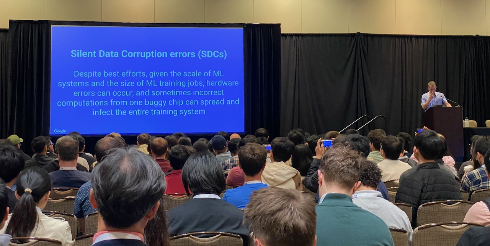
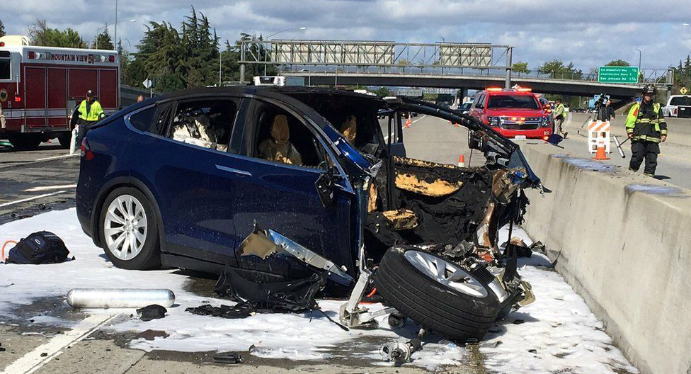
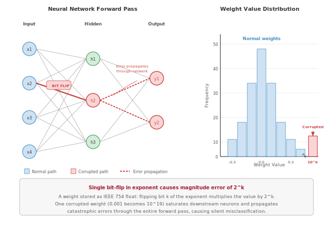
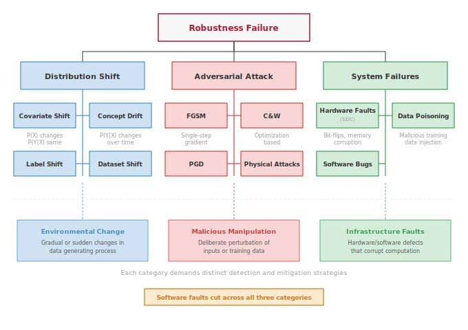
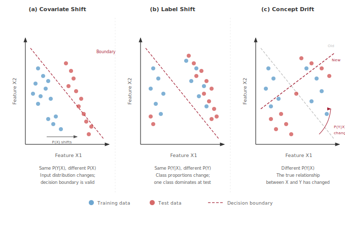
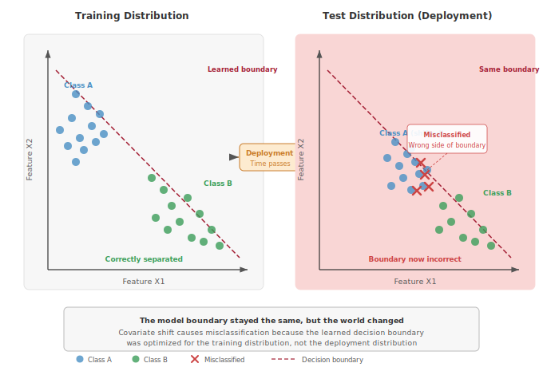
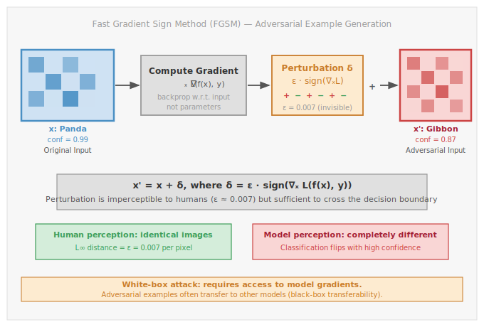
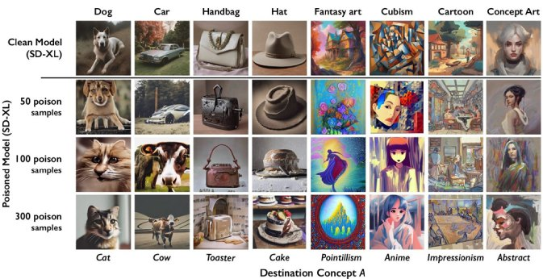
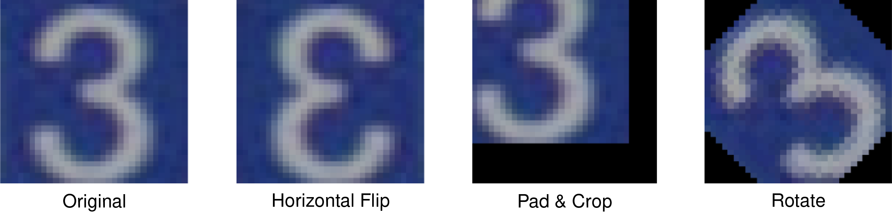

# Robust AI {#sec-robust-ai}

::: {layout-narrow}
::: {.column-margin}

\chapterminitoc

:::

\noindent
{fig-alt="Adversarial robustness and reliable AI under distribution shift."}

:::

## Purpose {.unnumbered}

\begin{marginfigure}
\mlfleetstack{20}{25}{30}{100}
\end{marginfigure}

_Why do machine learning systems fail silently in ways that traditional software cannot?_

Traditional software fails loudly: exceptions crash processes, type errors halt compilation, assertion failures stop execution. These failures are annoying but discoverable, because the system tells you something is wrong. Machine learning systems fail silently. A model confronting out-of-distribution inputs continues producing outputs with full confidence, never signaling that those outputs are unreliable. A system experiencing adversarial attack serves manipulated predictions indistinguishable from legitimate ones. A model degrading under distribution drift maintains stable latency and uptime while its accuracy quietly erodes. This silence makes ML failures uniquely dangerous. By the time degradation becomes visible in business metrics, the damage has been accumulating for weeks. By the time an adversarial attack is detected, it may have influenced thousands of decisions. Robustness engineering exists to make the invisible visible: to build systems that detect when they are operating outside their competence, resist manipulation, and degrade gracefully rather than produce confidently wrong outputs.

::: {.content-visible when-format="pdf"}

\newpage

:::

::: {.callout-learning-objectives}

- Classify robustness challenges into **environmental shifts** (**distribution drift**) and **input-level attacks** (**adversarial**\index{Adversarial}, **poisoning**), and explain how **software faults** cut across both categories, using quantitative reliability metrics
- Evaluate **adversarial attack** techniques (gradient-based, optimization-based, transfer-based, physical-world) and implement defense strategies including **adversarial training**\index{Training!adversarial}, **certified defenses**\index{Certified Defenses}, and **input sanitization**
- Construct **data poisoning** defenses using **anomaly detection**\index{Anomaly Detection}, **statistical validation**\index{Statistical Validation}, and robust training methods to protect ML pipelines from malicious data manipulation
- Apply statistical methods (**MMD**, **PSI**, **KS tests**) to detect distribution shifts and implement adaptation strategies including **continuous learning**\index{Continuous Learning}, model retraining, and **ensemble** approaches for deployed systems
- Integrate robustness principles across algorithmic and system dimensions while evaluating trade-offs between accuracy, computational overhead, energy consumption, and resilience guarantees

:::

The chapter's position in the book's organizing framework, *the Fleet Stack*, clarifies why robustness is an infrastructure concern: silent failures propagate through every layer of the system, from input perturbations and distribution drift at the data layer to degraded predictions at the service level.

::: {.callout-perspective title="Connection: The Fleet Stack"}

We are deep in the **Governance Layer** of the Fleet Stack. The previous chapter (@sec-security-privacy) armored the system against malicious *external* threats. Robustness turns that armor inward and outward to face *operational* threats: distribution drift, adversarial perturbation, and software faults. A system that is secure but fragile is useless; robustness engineering ensures our fleet can absorb a hit and keep running.

:::

## The Silent Failure Problem {#sec-robust-ai-introduction-robust-ai-systems-4671}

Consider an autonomous vehicle's vision system operating perfectly on a sunny day in California. If it suddenly encounters a blizzard in Colorado, the system will not throw an unhandled exception or print a stack trace; it will confidently, silently classify snow-covered stop signs as speed limits. While security protects against malicious actors deliberately tampering with the system, robustness is the engineering discipline of ensuring the system behaves predictably and safely when confronted with the natural chaos, noise, and drift of the real world.

When traditional software fails, it does so loudly. A server crashes, an application throws an error, users receive clear failure messages. When a machine learning system fails, it fails silently. A self-driving car's perception system does not crash; it misclassifies a truck as the sky. A demand forecasting model does not error out; it produces wildly inaccurate predictions. A medical diagnosis system does not shut down; it quietly provides incorrect classifications that could endanger patient lives. The silent failure mode makes robustness a unique and critical challenge in AI systems. Engineers must defend against a world that refuses to conform to training data, not merely against bugs in code.

The silent failure challenge grows more severe as ML systems expand across diverse deployment contexts. In cloud-based services, edge devices, and embedded systems, hardware and software faults directly impact performance and reliability. The increasing complexity of these systems and their deployment in safety-critical applications[^fn-safety-critical-ml] makes robust and fault-tolerant designs essential for maintaining system integrity.

[^fn-safety-critical-ml]: **Safety-Critical Applications**\index{Safety!critical applications}: Systems classified at SIL 3--4 or ASIL D, where failure risks loss of life and failure rates must stay below $10^{-9}$ per hour---1,000$\times$ stricter than consumer electronics. ML deployment in these domains faces a fundamental tension: neural networks lack the formal verifiability that regulators require, forcing multi-year certification processes that lag the model iteration cycle by orders of magnitude. \index{Safety!critical systems, ml deployment}

Checkpointing and recovery (@sec-fault-tolerance-reliability) keep training jobs alive, and access control (@sec-security-privacy) locks the front door. Neither addresses what happens when a deployed model receives an adversarial input indistinguishable from a legitimate one, when the data distribution drifts so far that predictions become meaningless, or when a software fault in the preprocessing pipeline silently corrupts every inference. These failure modes span the complete ML lifecycle and demand techniques for fault detection, isolation, and recovery that go beyond any single defense. The consequences of ignoring them range from economic disruption to life-threatening situations in safety-critical domains.

The imperative for fault tolerance establishes what we define as Robust AI:

::: {.callout-definition title="Robust AI"}

***Robust AI***\index{Robust AI!definition} is the measurable systems property that a model's predictions remain valid—within specified error bounds—under distribution shift, adversarial perturbation, and hardware or software faults, as opposed to the average-case accuracy achieved under ideal i.i.d. conditions.

1.  **Significance (Quantitative):** Robustness is quantified by worst-case guarantees: a certified robust classifier guarantees accuracy above a threshold for all inputs within an $\ell_\infty$ ball of radius $\varepsilon$ around any test point. For image classification, $\varepsilon = 8/255$ (a perturbation invisible to humans) typically reduces accuracy by 30–60 percent in non-robust models. Distribution shift compounds this: a clinical NLP model trained on 2019 records and deployed in 2021 without retraining can see accuracy drop 15–25 percent as medical coding practices and terminology evolve.
2.  **Distinction (Durable):** Unlike standard generalization (which measures average-case accuracy on held-out i.i.d. test data drawn from the same distribution as training), robustness measures worst-case performance on adversarial or out-of-distribution inputs—a distinction that matters because a model can achieve 95 percent i.i.d. test accuracy while failing completely on inputs that differ from training by amounts imperceptible to humans.
3.  **Common Pitfall:** A frequent misconception is that robustness can be added as a post-hoc monitoring layer to any existing model. A model's robustness properties are determined primarily during training—models trained without adversarial examples or robustness objectives cannot achieve certified robustness through inference-time filtering alone, because the vulnerability is in the learned decision boundary, not in which inputs reach the model.

:::

Three categories of threat produce these silent failures, and each demands distinct engineering responses. The first and most pervasive is environmental change: distribution shifts, concept drift, and evolving operational contexts challenge the core assumptions underlying model training. A model trained on last year's transaction patterns quietly becomes unreliable as customer behavior evolves, requiring continuous monitoring and adaptation strategies that go beyond standard operational practices.

The second category, malicious manipulation, targets model behavior directly. Adversarial attacks, data poisoning attempts, and prompt injection vulnerabilities cause models to misclassify inputs or produce unreliable outputs --- failures that authentication and access control (@sec-security-privacy) cannot prevent because the attacker operates within the model's own input space.

Cutting across both of these threat categories, software faults can amplify, mask, or mimic any robustness failure. Bugs, design flaws, and implementation errors within algorithms, libraries, and frameworks propagate through the system, creating systemic vulnerabilities[^fn-systemic-vulnerability-ml] that transcend individual component failures. A preprocessing bug might create artificial distribution shifts; a numerical error might corrupt model behavior in ways indistinguishable from adversarial attack; a race condition might corrupt learned representations. Because these faults originate in the systems layer, their detailed taxonomy and mitigation strategies are covered in @sec-fault-tolerance-reliability; here, we focus on how software faults interact with the two primary robustness challenges above.

[^fn-systemic-vulnerability-ml]: **Systemic Vulnerability**: Architectural weaknesses that cascade across layers rather than isolating to one component. Log4Shell (CVE-2021–44228) affected hundreds of millions of devices through a single logging library. ML pipelines face analogous risk: a single CUDA or PyTorch version pinned across thousands of models means one vulnerability compromises the entire fleet simultaneously, turning dependency management into a reliability-critical function. \index{Systemic Vulnerability!ML pipelines}

The appropriate defense depends on where the system runs. Large-scale cloud environments can afford redundancy and sophisticated error detection mechanisms that would overwhelm an edge device's power and memory budgets. Edge devices (@sec-edge-intelligence) must instead rely on targeted hardening strategies[^fn-hardening-strategy-ml] that protect the most critical inference paths while accepting weaker guarantees elsewhere.

[^fn-hardening-strategy-ml]: **Hardening Strategy**: Defense-in-depth applied to ML pipelines: model loading (signature verification), input processing (adversarial filtering), and output validation (confidence thresholds). On resource-constrained edge devices, selective hardening prioritizes critical paths---protecting the inference engine while accepting weaker guarantees on logging---because full redundancy would exceed the power and memory budgets that make edge deployment viable. \index{Hardening Strategy!ML systems}

Despite these contextual differences, a robust ML system requires fault tolerance, error resilience, and sustained performance across all deployment environments.

Robust AI systems require additional computational resources compared to basic implementations, creating tensions with the sustainability principles from @sec-sustainable-ai. Error correction mechanisms consume 12--25 percent additional memory bandwidth, redundant processing increases energy consumption by 2-3$\times$, and continuous monitoring adds 5--15 percent computational overhead. These robustness measures also generate additional heat and exacerbate thermal management challenges that constrain deployment density and require enhanced cooling infrastructure. Understanding these sustainability trade-offs enables engineers to make informed decisions about where robustness investments provide the greatest value while minimizing environmental impact.

Robustness, then, is not an afterthought to be bolted onto a finished system. It is an architectural constraint that shapes every layer of the ML pipeline --- from input validation and adversarial training through drift detection and software fault isolation --- and the engineering cost of ignoring it compounds silently until the system fails in production.

The following case studies illustrate how these silent failures have already caused significant damage to production systems across cloud, edge, and embedded deployments.

## Real-World Robustness Failures {#sec-robust-ai-realworld-robustness-failures-c119}

Real-world case studies across cloud, edge, and embedded environments reveal a consistent pattern: ML systems fail silently, confidently, and catastrophically. The following failures demonstrate why fault-tolerant design, rigorous testing, and robust system architectures are non-negotiable for reliable operation.

### Cloud infrastructure failures {#sec-robust-ai-cloud-infrastructure-failures-1c8c}

In February 2017, Amazon Web Services (AWS) experienced [a significant outage](https://aws.amazon.com/message/41926/) due to human error during routine maintenance. An engineer inadvertently entered an incorrect command, causing the shutdown of multiple servers across the US-East-1 region. The 4-hour outage disrupted over 150 AWS services and caused estimated losses of \$150 million across affected businesses.[^fn-aws-s3-outage] Amazon's AI-powered assistant, Alexa, serving over 40 million devices globally, became completely unresponsive during the outage. Voice recognition requests that normally process in 200--500 ms failed entirely. A single human error cascaded through cloud infrastructure and disabled ML services that depend on robust maintenance protocols and failsafe mechanisms[^fn-failsafe-ml].

[^fn-aws-s3-outage]: **AWS S3 Outage (2017)**: A mistyped command during routine maintenance cascaded through US-East-1, disabling 150+ services for 4 hours and causing an estimated \$150M in losses across affected businesses. The incident exposed a single-region dependency pattern: ML services like Alexa, which processed voice requests in 200--500 ms under normal conditions, failed entirely because their model-serving infrastructure assumed S3 availability as an invariant rather than a probabilistic guarantee. \index{AWS S3 Outage!cascade failure}

[^fn-failsafe-ml]: **Failsafe Mechanism**: A system that shifts to a safe state on fault detection, following the circuit-breaker pattern (closed/open/half-open). In ML serving, failsafes include confidence-based rejection (deferring predictions below a threshold to humans), fallback to simpler models, and automatic rollback when drift monitors fire. The trade-off is availability: aggressive confidence thresholds reject 5--15 percent of legitimate traffic, so tuning the rejection boundary becomes a reliability-vs.-throughput optimization. \index{Failsafe Mechanism!ML serving}

In another case [@dixit2021silent], Facebook encountered a silent data corruption (SDC)[^fn-sdc-ml] issue in its distributed querying infrastructure (@fig-sdc-robust). SDC refers to undetected errors during computation or data transfer that propagate silently through system layers. Facebook's system processed SQL-like queries across datasets and supported a compression application designed to reduce data storage footprints. Files were compressed when not in use and decompressed upon read requests. A size check was performed before decompression to ensure the file was valid. However, an unexpected fault occasionally returned a file size of zero for valid files, leading to decompression failures and missing entries in the output database. The issue appeared sporadically, with some computations returning correct file sizes, making diagnosis particularly difficult.

[^fn-sdc-ml]: **Silent Data Corruption (SDC)**: Hardware errors that corrupt data without triggering any detection mechanism. Meta reported 6--8 machines per million experiencing SDC daily---rates "orders of magnitude higher than soft-error predictions." In ML systems, SDC is uniquely dangerous because corrupted weights or activations produce plausible but incorrect outputs that pass all health checks, evading the monitoring that catches loud failures. \index{Silent Data Corruption!ML systems}

::: {#fig-sdc-robust fig-env="figure" fig-pos="htb" fig-cap="**Silent Data Corruption**: Unexpected faults can return incorrect file sizes, leading to data loss during decompression and propagating errors through distributed querying systems despite apparent operational success. This example from Facebook emphasizes the challenge of undetected errors, silent data corruption, and the importance of robust error detection mechanisms in large-scale data processing pipelines. Source: [Facebook](https://arxiv.org/PDF/2102.11245)." fig-alt="System diagram showing data flow from compressed storage through defective CPU to database. Arrows indicate processing stages where file size calculation returns zero, causing missing rows in output."}

```{.tikz}
\begin{tikzpicture}[line join=round,font=\small\usefont{T1}{phv}{m}{n}, node distance=1.5cm, auto]
\tikzset{%
  helvetica/.style={align=flush center,font=\small\usefont{T1}{phv}{m}{n}},
  Line/.style={line width=1.0pt,BrownLine,text=black},
  cube/.style={cylinder, draw,shape border rotate=90, aspect=1.8,inner ysep=0pt,
      minimum height=34mm,minimum width=25mm, cylinder uses custom fill,
      cylinder body fill=BrownL,cylinder end fill=BrownLine},
  Box/.style={
      inner xsep=2pt,
      node distance=1.1,
      draw=GreenLine,
      line width=0.75pt,
      font=\usefont{T1}{phv}{m}{n}\small,
      align=flush center,
      fill=GreenL,
      text width=29mm,
      minimum width=29mm, minimum height=10mm
    },
  Box2/.style={helvetica,
      inner xsep=2pt,
      node distance=0.8,
      draw=VioletLine,
      line width=0.75pt,
      font=\usefont{T1}{phv}{m}{n}\small,
      align=flush center,
      fill=VioletL2,
      text width=32mm,
      minimum width=32mm, minimum height=8mm
    },
}

\definecolor{CPU}{RGB}{0,120,176}

\node[Box](B2){Scale math.pow()};
\node[Box,above=of B2](B1){Decompress file size calculation};

\begin{scope}[local bounding box = CPU,shift={($(B2)+(0,-2.6)$)},
                          scale=0.7, every node/.append style={transform shape}]
\node[fill=CPU,minimum width=56, minimum height=56,
            rounded corners=8,outer sep=2pt] (C1) {};
\node[fill=white,minimum width=44, minimum height=44] (C2) {};
\node[fill=CPU!40,minimum width=39, minimum height=39,
            align=center,inner sep=0pt,font=\usefont{T1}{phv}{m}{n}
            \fontsize{8pt}{9}\selectfont] (C3) {Defective\\CPU};

\foreach \x/\y in {0.11/1,0.26/2,0.41/3,0.56/4,0.71/5,0.85/6}{
\node[fill=CPU,minimum width=3, minimum height=12,
           inner sep=0pt,anchor=south](GO\y)at($(C1.north west)!\x!(C1.north east)$){};
}
\foreach \x/\y in {0.11/1,0.26/2,0.41/3,0.56/4,0.71/5,0.85/6}{
\node[fill=CPU,minimum width=3, minimum height=12,
           inner sep=0pt,anchor=north](DO\y)at($(C1.south west)!\x!(C1.south east)$){};
}
\foreach \x/\y in {0.11/1,0.26/2,0.41/3,0.56/4,0.71/5,0.85/6}{
\node[fill=CPU,minimum width=12, minimum height=3,
           inner sep=0pt,anchor=east](LE\y)at($(C1.north west)!\x!(C1.south west)$){};
}
\foreach \x/\y in {0.11/1,0.26/2,0.41/3,0.56/4,0.71/5,0.85/6}{
\node[fill=CPU,minimum width=12, minimum height=3,
           inner sep=0pt,anchor=west](DE\y)at($(C1.north east)!\x!(C1.south east)$){};
}
\end{scope}

\begin{scope}[local bounding box = CY1,right=of B2]
\node (CA1) [cube] {};
\node (CA2) [cube,minimum height=10pt, fill=CPU!60]at($(CA1.bottom)!0.1!(CA1.top)$) {};
\node (CA3) [cube,minimum height=10pt,fill=RedL]at($(CA2.bottom)+(0,2.6mm)$){};
\node (CA4) [cube,minimum height=10pt,fill=RedL]at($(CA3.bottom)+(0,2.6mm)$){};
\node (CA5) [cube,minimum height=10pt, fill=CPU!60]at($(CA1.bottom)!0.65!(CA1.top)$) {};
\node[align=center]at (CA1){Spark shuffle and\\ merge database};
\end{scope}

\begin{scope}[local bounding box = CY2,left=of B2]
\node (LCA1) [cube] {};
\node[align=center]at (LCA1){Spark pre-shuffle \\ data store\\(compressed)};
\end{scope}

\node[single arrow, draw=BrownLine,thick, fill=VioletL,
      minimum width = 15pt, single arrow head extend=3pt,rotate=270,
      minimum height=7mm]at($(B2)!0.52!(B1)$) {};
\node[single arrow, draw=BrownLine,thick, fill=VioletL,
      minimum width = 15pt, single arrow head extend=3pt,rotate=270,
      minimum height=7mm]at($(B2)!0.39!(CPU)$) {};

\coordinate(DES)at($(DE1)!0.5!(DE6)$);
\coordinate(LEV)at($(LE1)!0.5!(LE6)$);
\node[single arrow, draw=BrownLine,thick, fill=VioletL, inner sep=1pt,
      minimum width = 14pt, single arrow head extend=2pt,anchor=east,
      minimum height=18mm](LS)at($(LEV)+(-0.5,0)$) {};
\node[single arrow, draw=BrownLine,thick, fill=VioletL, inner sep=1pt,
      minimum width = 14pt, single arrow head extend=2pt,anchor=west,
      minimum height=18mm](DS)at($(DES)+(0.5,0)$) {};

\scoped[on background layer]
\node[draw=VioletLine,inner xsep=6.5mm,inner ysep=6.5mm,outer sep=0pt,
yshift=2mm,fill=none,fit=(CPU)(B1),line width=0.75pt](BB1){};
\node[below=3pt of  BB1.north,anchor=north,helvetica]{Shuffle and merge};

\node[Box2,below left=0.5 of LS](N2){\textbf{2.} Compute (1.1)\textsuperscript{53}};
\node[Box2,below right=0.5 of DS,fill=BlueL,draw=BlueLine](R3){\textbf{3.} Result = 0};
\node[Box2,below right=0.3 and -2.5 of R3,text width=43mm](N3){\textbf{3.} Expected Result = 156.24};

\node[Box2,above= of CY2](N1){\textbf{1.} Compute file size for decompression};
\node[Box2,above= of CY1](N4){\textbf{4.} Write file to database if size $>$ 0};
\node[Box2,below right= 0.2 and -1.15of CY1](N5){\textbf{5.} Missing rows in DB};

\draw[Line,-latex](N5)|-(CA3.before bottom);
\draw[Line,-latex](N5.50)|-(CA4.6);
\draw[Line](N3.20)|-(R3);
\draw[Line,-latex](LCA1.top)|-(B1);
\draw[Line,latex-](CA1.top)|-(B1);
\end{tikzpicture}
```

:::

Silent data corruption propagates across multiple layers of the application stack, resulting in data loss and application failures in large-scale distributed systems. In ML training, where gradient updates and parameter synchronization are critical, SDC can compromise model accuracy without triggering any alert. Similar challenges reported across other major companies confirm the prevalence of these issues. [Jeff Dean](https://en.wikipedia.org/wiki/Jeff_Dean), Chief Scientist at Google DeepMind and Google Research, highlighted these issues in AI hypercomputers[^fn-ai-hypercomputer-scale] during a keynote at [MLSys 2024](https://mlsys.org/) [@dean2024mlsys] (@fig-sdc-robust-jeffdean).

[^fn-ai-hypercomputer-scale]: **AI Hypercomputer**: Purpose-built clusters of thousands of accelerators with high-bandwidth interconnects---Google's TPU v4 pods pack 4,096 chips delivering 1.1 exaFLOPs; NVIDIA DGX SuperPOD scales to 16,000 H100s. At these scales, the probability of at least one silent fault per hour approaches certainty (see @fig-silent-error-probability), transforming reliability from a component-level concern into an architectural constraint that shapes every design decision. \index{AI Hypercomputer!reliability at scale}

::: {#fig-sdc-robust-jeffdean fig-env="figure" fig-pos="htb" fig-cap="**Silent Data Corruption**: Jeff Dean presents on silent data corruption (SDC) at MLSys 2024, arguing that at the scale of modern ML training jobs, hardware errors occur routinely and that incorrect computations from one buggy chip can propagate and infect an entire training run. Source: Jeff Dean at MLSys 2024, Keynote (Google)." fig-alt="Photograph of Jeff Dean giving a keynote at MLSys 2024. On stage he stands at a podium; a projected slide titled 'Silent Data Corruption errors (SDCs)' explains that ML-scale hardware errors can propagate and infect the entire training system."}



:::

### Edge device vulnerabilities {#sec-robust-ai-edge-device-vulnerabilities-ddfe}

Distributed edge deployments[^fn-edge-compute-robustness] expose the fragility of ML systems where compute, power, and connectivity are severely constrained. Self-driving vehicles serve as the canonical example of this vulnerability, as they operate in open-world environments with hard real-time latency requirements and zero tolerance for failure.

[^fn-edge-compute-robustness]: **Edge Computing**: Processing data locally rather than in centralized clouds, reducing inference latency from ~100 ms (cloud round-trip) to <10 ms. The robustness trade-off is stark: edge devices gain latency but lose the redundancy, elastic scaling, and centralized monitoring that make cloud systems resilient. A failing edge model cannot fail over to a secondary cluster---it must degrade gracefully within its own power and memory envelope or fail safely within milliseconds. \index{Edge Computing!robustness trade-off}

In May 2016, a fatal crash involving a Tesla Model S in Autopilot mode[^fn-autopilot-perception] demonstrated the catastrophic potential of perception failures [@ntsb2017tesla]. Traveling at 74 mph in a 65 mph zone, the vehicle's Mobileye EyeQ3 camera system failed to distinguish the white side of a tractor-trailer against a brightly lit sky. The radar, designed to ignore overhead road signs to prevent false braking events, tuned out the high-riding trailer as a stationary object. The multimodal failure resulted in a high-speed underride collision without autonomous braking intervention: both optical and radar systems received valid raw data, but the fusion logic discarded it (@fig-tesla-example).\index{Autopilot Perception Failure}

[^fn-autopilot-perception]: **Autopilot**: Tesla's SAE Level 2 system processes 2,000 frames/second from 8 cameras on dual FSD chips (144 TOPS each). Deployment across 4+ million vehicles generates petabytes of edge cases daily---yet the 2016 fatal crash occurred on a scenario (white trailer against bright sky) absent from training data. This gap between fleet-scale data collection and long-tail coverage remains the fundamental robustness challenge for perception-based ML systems. \index{Autopilot!perception failure}

::: {#fig-tesla-example fig-env="figure" fig-pos="htb" fig-cap="**Autopilot Perception Failure**: This crash reveals the critical safety risks of relying on machine learning for perception in autonomous systems, where failures to correctly classify objects can lead to catastrophic outcomes. The incident underscores the need for robust validation, redundancy, and failsafe mechanisms in self-driving vehicle designs to mitigate the impact of imperfect AI models. Source: BBC News." fig-alt="Photograph of a dark-blue Tesla after a highway collision. The front-left of the vehicle is heavily damaged; emergency crews and barrier wreckage are visible on scene, consistent with an Autopilot-involved impact."}



:::

A similarly tragic failure occurred in March 2018 in Tempe, Arizona, when an Uber self-driving test vehicle struck and killed a pedestrian [@ntsb2019uber]. The perception system detected the victim six seconds prior to impact but fundamentally failed in **object classification stability**. As the pedestrian crossed the road, the system toggled its classification from "unknown object" to "vehicle" and then to "bicycle," resetting its trajectory prediction history with each change. Because the system lacked a persistent object track, it failed to predict a collision path until 1.3 seconds before impact---too late for the safety driver to intervene.

Beyond automotive, industrial edge deployments face similar perils. An inspection drone surveying high-voltage power lines may rely on visual odometry for stabilization; a sudden change in lighting or a repetitive texture can cause the localization algorithm to diverge, leading to a collision or fly-away event. Edge devices lack **fallback redundancy**\index{Fallback Redundancy}: no secondary cluster exists to route traffic to when the primary inference engine becomes uncertain. The system must degrade gracefully or fail safely within milliseconds. The absence of resource elasticity makes edge AI uniquely fragile to environmental variance that a datacenter would handle through massive over-provisioning.

### Embedded system constraints {#sec-robust-ai-embedded-system-constraints-ec7a}

Embedded systems[^fn-embedded-ml-constraints] operate under even tighter constraints than edge devices, often in safety-critical environments where recovery from failure is impossible. As AI capabilities are integrated into these systems, the complexity and consequences of faults grow significantly.

[^fn-embedded-ml-constraints]: **Embedded Systems**: Dedicated processors ranging from 8-bit microcontrollers (kilobytes of RAM) to complex SoCs, with 30+ billion shipping annually. Real-time constraints (microsecond to millisecond deadlines) and unattended operation (years without maintenance) make ML deployment uniquely challenging: models cannot be easily updated, over-the-air (OTA) patches risk bricking devices, and there is no human in the loop to catch silent degradation. \index{Embedded Systems!ML reliability}

In 1999, NASA's Mars Polar Lander mission experienced a catastrophic failure due to a software error in its touchdown detection system [@nasa2000mpl]. The lander's software misinterpreted the vibrations from the deployment of its landing legs as a successful touchdown, prematurely shutting off its engines and causing a crash. For remote missions where recovery is impossible, rigorous software validation and robust system design are prerequisites, not luxuries. As AI becomes more integral to space systems (@fig-nasa-example), the same rigor applies to any ML component in the decision loop.\index{Robotic Lander on Mars}

::: {#fig-nasa-example fig-env="figure" fig-pos="htb" fig-cap="**Robotic Lander on Mars**: An artist's rendering of NASA's InSight lander deployed on the Martian surface. Remote robotic missions exemplify the class of systems in which software or sensor faults cannot be recovered by human intervention, motivating the rigorous validation and failure-mode analysis that ML components in the decision loop must also satisfy. Source: Slashgear." fig-alt="Artist rendering of the NASA InSight lander on the Martian surface with solar panels extended and scientific instruments deployed, illustrative of robotic planetary landers whose autonomous decision loops demand rigorous validation."}


:::

Embedded system failures extend beyond space exploration to commercial aviation. In 2015, a Boeing 787 Dreamliner experienced a complete electrical shutdown mid-flight due to a software bug in its generator control units. Safety-critical systems[^fn-asil-ml-certification] demand stringent reliability requirements precisely because of failures like this one: powering up all four generator control units simultaneously after 248 days of continuous power (approximately 8 months) caused them to enter failsafe mode and disabled all AC electrical power.

[^fn-asil-ml-certification]: **ASIL (Automotive Safety Integrity Levels)**: ISO 26262 classifies automotive systems from ASIL A (lowest risk) to ASIL D (highest), where D demands 99.999 percent reliability with redundant sensors, fail-safe behaviors, and formal verification. ML-based perception systems face a certification paradox: the standard requires deterministic failure analysis, but neural networks are stochastic---their failure modes depend on input distribution, making exhaustive testing infeasible and forcing reliance on statistical safety arguments. \index{ASIL!ML certification}

> _"If the four main generator control units (associated with the engine-mounted generators) were powered up at the same time, after 248 days of continuous power, all four GCUs will go into failsafe mode at the same time, resulting in a loss of all AC electrical power regardless of flight phase."—[Federal Aviation Administration directive](https://s3.amazonaws.com/public-inspection.federalregister.gov/2015-10066.pdf) (2015)_

As AI is increasingly applied in aviation, including tasks such as autonomous flight control and predictive maintenance, the robustness of embedded systems affects passenger safety.

The stakes become even higher when we consider implantable medical devices. A smart [pacemaker](https://www.bbc.com/future/article/20221011-how-space-weather-causes-computer-errors) that experiences a fault or unexpected behavior due to software or hardware failure could place a patient's life at risk. As AI systems take on perception, decision-making, and control roles in such applications, new sources of vulnerability emerge, including data-related errors, model uncertainty[^fn-epistemic-uncertainty-ml], and unpredictable behaviors in rare edge cases. The opaque nature of some AI models complicates fault diagnosis and recovery.

[^fn-epistemic-uncertainty-ml]: **Model Uncertainty (Epistemic Uncertainty)**: The reducible gap between a model's learned representation and the true data-generating process, as distinct from aleatoric uncertainty (irreducible data noise). Quantifying epistemic uncertainty enables a critical robustness mechanism: safety-critical systems can defer to human operators when predictions fall outside the training distribution. The systems cost is significant---Bayesian approximations or MC dropout require 10--100$\times$ more inference compute, creating a direct trade-off between uncertainty awareness and serving latency. \index{Epistemic Uncertainty!robustness}

Each failure reveals common patterns that demand systematic approaches to robustness evaluation and mitigation: the AWS outage disabled millions of voice interactions, autonomous vehicle perception errors led to fatal crashes, and spacecraft software bugs caused mission loss. The structural patterns cut across deployment environments, and a unified framework for robustness must capture how different failure modes interact and compound at system scale.

## A Unified Framework for Robust AI {#sec-robust-ai-unified-framework-robust-ai-b25d}

A flipped bit in a GPU memory module can cause a language model to generate toxic text. A gradual change in user demographics can trigger a sudden spike in recommendation latency. Production ML systems cannot treat these as isolated bugs. A unified framework must map how low-level hardware faults, software bugs, data drift, and adversarial inputs cascade upward to destroy the integrity of the model's output.

### Connections to previous concepts {#sec-robust-ai-building-previous-concepts-ef4a}

The fault tolerance mechanisms from @sec-fault-tolerance-reliability, originally designed to recover training jobs from hardware crashes, serve a second role in robustness: inference-time availability. Training recovery focuses on checkpoint restoration, but robustness extends this to **graceful degradation**\index{Graceful Degradation}, ensuring a serving system remains operational even when inputs are adversarial or components degrade. The distributed training architectures from @sec-distributed-training-systems introduce unique vulnerabilities: a single node transmitting corrupted gradients during an AllReduce operation can poison the global model weights, necessitating Byzantine fault tolerance protocols that validate peer updates before aggregation.

The security frameworks from @sec-security-privacy provide threat modeling principles that inform adversarial defense strategies. Operational monitoring systems from @sec-ops-scale provide the infrastructure foundation for detecting robustness threats in production. The serving infrastructure from @sec-inference-scale creates new attack surfaces: batching, model routing, and pipeline parallelism expose scheduling logic and individual pipeline stages to adversarial queries.

The scale of modern models amplifies these risks. A 175B-parameter model requires pipeline parallelism across at least 8 GPU nodes to fit in memory, increasing the fault surface area by 8$\times$ compared to a monolithic deployment. A single bit flip, network partition, or adversarial input targeting one stage of the pipeline brings down the entire inference request. Efficiency techniques such as INT8 quantization and aggressive pruning compound this problem by reducing the model's **robustness margin**\index{Robustness Margin}, making it more susceptible to small input perturbations that a full-precision model might absorb. Robustness engineering is therefore a constant negotiation with the efficiency and scalability constraints established in previous chapters.

### From ML performance to system reliability {#sec-robust-ai-ml-performance-system-reliability-7d42}

Bridging the gap between ML performance concepts and reliability engineering principles reveals why traditional metrics are insufficient. Standard ML development focuses on model accuracy, inference latency, and throughput. Real-world deployment introduces an additional dimension: the reliability of the underlying computational substrate that executes the models.

```{python}
#| label: robust-ai-setup
#| echo: false
# ┌─────────────────────────────────────────────────────────────────────────────
# │ ROBUST AI INFRASTRUCTURE CONSTRAINTS (LEGO)
# ├─────────────────────────────────────────────────────────────────────────────
# │ Context: @sec-robust-ai-ml-performance-system-reliability—reliability intro
# │
# │ Goal: Surface hardware fault exposure parameters for large models.
# │ Show: ~175B params, ~900 GB/s V100 memory bandwidth.
# │ How: .m_as() from mlsysim.core.constants.
# │
# │ Imports: mlsysim.core.constants (*), mlsysim.book (*)
# │ Exports: gpt3_params_b, v100_mem_bw
# └─────────────────────────────────────────────────────────────────────────────
from mlsysim.core.constants import GPT3_PARAMS, V100_MEM_BW, BILLION, GB, second
from mlsysim.fmt import check

# ┌── LEGO ───────────────────────────────────────────────
class RobustAISetup:
    """Namespace for hardware fault exposure parameters."""

    # ┌── 1. LOAD (Constants) ──────────────────────────────────────────────
    gpt3_params_raw = GPT3_PARAMS
    v100_bw_raw = V100_MEM_BW

    # ┌── 2. EXECUTE (The Compute) ────────────────────────────────────────
    gpt3_params_b_val = gpt3_params_raw.m_as('param') / BILLION
    v100_bw_gbs_val = v100_bw_raw.m_as(GB/second)

    # ┌── 3. GUARD (Invariants) ──────────────────────────────────────────
    check(gpt3_params_b_val == 175, f"Expected 175B params, got {gpt3_params_b_val}")

    # ┌── 4. OUTPUT (Formatting) ──────────────────────────────────────────────
    gpt3_params_b = f"{gpt3_params_b_val:.0f}"
    v100_mem_bw = f"{v100_bw_gbs_val:.0f}"
```

Consider how hardware reliability directly impacts ML performance. As @fig-weight-corruption illustrates, a single bit flip in a critical neural network weight can degrade ResNet-50 classification accuracy from 76.0 percent (top-1) to 11 percent on ImageNet, while memory subsystem failures during training corrupt gradient updates and prevent model convergence. Modern transformer models such as GPT-3 with `{python} RobustAISetup.gpt3_params_b`&nbsp;B parameters execute 10^15 floating-point operations per inference and create over one million opportunities for hardware faults during a single forward pass. GPU memory systems operating at up to `{python} RobustAISetup.v100_mem_bw` GB/s bandwidth (such as V100 HBM2) process 10^11 bits per second, where base error rates of 10^-17 errors per bit translate to multiple potential faults per hour of operation.

::: {#fig-weight-corruption fig-env="figure" fig-pos="htb" fig-cap="**Weight Corruption via Bit Flip.** A neural-network forward-pass diagram (left) shows a BIT FLIP on one weight, turning a normal path into a corrupted path whose error propagates to the outputs. The weight-value histogram (right) shows a single corrupted weight landing at the extreme $10^k$ tail, far outside the normal distribution. Flipping bit $k$ of an IEEE 754 exponent multiplies the weight by $2^k$, saturating downstream neurons and causing silent misclassification." fig-alt="Left: neural-network forward pass with input, hidden, output neurons; BIT FLIP label on one weight, corrupted path arrows into outputs. Right: histogram of normal weights near zero, with one corrupted weight flagged at 10^k."}

:::

The connection between hardware reliability and ML performance demands concepts from reliability engineering[^fn-reliability-eng-ml]: fault models that describe how failures occur, error detection mechanisms that identify problems before they impact results, and recovery strategies that restore system operation. These reliability concepts complement performance optimization techniques such as quantization, pruning, and knowledge distillation by ensuring that optimized systems continue to operate correctly under real-world conditions.

[^fn-reliability-eng-ml]: **Reliability Engineering**: Originated in 1950s aerospace with MTBF analysis and failure-mode analysis; quantifies reliability as $R(t)=e^{-\lambda t}$ for exponential failure distributions. ML systems inherit these methods but add failure modes that traditional reliability never anticipated: model drift (the system degrades without any hardware fault), adversarial robustness (the system is correct on the test set but fails on crafted inputs), and epistemic uncertainty (the system cannot distinguish what it knows from what it does not). \index{Reliability!engineering, ml extension}
```{python}
#| echo: false
# ┌─────────────────────────────────────────────────────────────────────────────
# │ Context: @sec-robust-ai-hardware-reliability—SDC at scale
# │
# │ Goal: Quantify why massive scale makes silent errors effectively certain.
# │ Show: ~10K GPUs at Meta rates (1e-4/hr) makes SDC probability near 1.0.
# │ How: P(at least one) = 1 - (1-p)^N.
# │
# │ Imports: mlsysim.core.constants (THOUSAND, MILLION)
# │ Exports: p_rate_meta_str, n_gpus_certain_str, p_total_certain_str
# └─────────────────────────────────────────────────────────────────────────────
from mlsysim.core.constants import THOUSAND, MILLION
from mlsysim.fmt import fmt, check, md_math

# ┌── LEGO ───────────────────────────────────────────────
class SilentErrorProbability:
    """Namespace for SDC probability at cluster scale."""

    # ┌── 1. LOAD (Constants) ──────────────────────────────────────────────
    p_per_hr_meta = 1e-4 # Meta reported rate
    n_gpus_large = 10 * THOUSAND

    # ┌── 2. EXECUTE (The Compute) ────────────────────────────────────────
    # Step 1: P(at least one) = 1 - (1-p)^N
    p_at_least_one_val = 1 - (1 - p_per_hr_meta) ** n_gpus_large

    # ┌── 3. GUARD (Invariants) ──────────────────────────────────────────
    check(p_at_least_one_val > 0.6, f"Probability ({p_at_least_one_val:.2f}) should be high at 10K GPUs")

    # ┌── 4. OUTPUT (Formatting) ─────────────────────────────────────────────
    n_gpus_certain_str = fmt(n_gpus_large, precision=0)
```
The scale of modern GPU clusters transforms these per-device error rates into near-certainty at the system level. @fig-silent-error-probability illustrates this compounding effect: for a cluster of $N$ devices each with per-device silent data corruption probability $p$ per hour, the probability of at least one SDC event is $P(\geq 1) = 1 - (1 - p)^N$. At the rates reported by Meta, which found SDC rates "orders of magnitude higher than soft-error predictions" across hundreds of thousands of machines [@dixit2021silent], silent errors become effectively certain at cluster scales beyond `{python} SilentErrorProbability.n_gpus_certain_str` devices.

::: {#fig-silent-error-probability fig-env="figure" fig-pos="htb" fig-cap="**Silent Error Probability at Scale**. Probability of at least one silent data corruption event per hour as a function of cluster size, for three per-device error rates. At the rates reported by Meta, which are orders of magnitude above traditional soft-error models, silent errors become effectively certain at cluster scales beyond a few thousand devices." fig-alt="Semilog plot showing three S-curves for per-device SDC rates of 1e-3, 1e-4, and 1e-5. All curves reach probability 1.0 as cluster size grows to 100000 GPUs."}

```{python}
#| echo: false
# ┌─────────────────────────────────────────────────────────────────────────────
# │ SILENT ERROR PROBABILITY (FIGURE)
# ├─────────────────────────────────────────────────────────────────────────────
# │ Context: @fig-silent-error-probability—SDC at cluster scale
# │
# │ Goal: Plot P≥1 SDC) = 1-(1-p)^N vs N for p=1e-3, 1e-4, 1e-5; show
# │       "effectively certain" by ~10K GPUs at Meta rates.
# │ Show: Three S-curves; semilog x; shaded region; annotations.
# │ How: N = logspace(0,5,500); P = 1-(1-p)^N; viz.setup_plot().
# │
# │ Imports: numpy (np), matplotlib.pyplot (plt), mlsysim.core.viz (viz)
# │ Exports: (figure only, no prose variables)
# └─────────────────────────────────────────────────────────────────────────────
# ┌── 1. CANVAS ────────────────────────────────────────────────────────────────
# │ Plot P≥1 SDC) = 1-(1-p)^N vs N for p=1e-3, 1e-4, 1e-5; show
import numpy as np
import matplotlib.pyplot as plt
from mlsysim import viz

fig, ax, COLORS, plt = viz.setup_plot(figsize=(8, 5))


# ┌── 2. ARRAYS ────────────────────────────────────────────────────────────────
N = np.logspace(0, 5, 500)  # 1 to 100,000 devices

# Three per-device SDC probabilities per hour
rates = [
    (1e-3, COLORS['RedLine'],    '$p = 10^{-3}$ per device per hour'),
    (1e-4, COLORS['OrangeLine'], '$p = 10^{-4}$ per device per hour'),
    (1e-5, COLORS['BlueLine'],   '$p = 10^{-5}$ per device per hour'),
]


# ┌── 3. RENDER ────────────────────────────────────────────────────────────────
for p, color, label in rates:
    P_at_least_one = 1 - (1 - p) ** N
    ax.plot(N, P_at_least_one, color=color, linewidth=2, label=label, zorder=3)

# Shade "Effectively Certain" region
ax.axhspan(0.95, 1.02, alpha=0.08, color=COLORS['RedL'], zorder=0)

# ┌── 4. DECORATE ──────────────────────────────────────────────────────────────
ax.text(1.5, 0.97, 'Effectively certain', fontsize=8, color='gray',
        va='bottom',fontweight='bold')

# "More likely than not" reference line
ax.axhline(y=0.5, color='gray', linestyle='--', linewidth=1, alpha=0.6)
ax.text(1.5, 0.51, 'More likely than not', fontsize=8, color='gray',
        va='bottom')

# Annotate crossing point for p=10^-4
cross_n = np.log(0.5) / np.log(1 - 1e-4)
ax.annotate(f'At $p=10^{{-4}}$:\n$P>0.6$ by 10K GPUs',
            xy=(10000, 1 - (1 - 1e-4)**10000),
            xytext=(5700, 0.79), fontsize=8,ha='center',
            arrowprops=dict(arrowstyle='->', color=COLORS['OrangeLine'],
                            lw=0.75),
            color=COLORS['OrangeLine'])

# Source annotation
cross_n = np.log(0.5) / np.log(1 - 1e-4)
ax.text(0.02, 0.06,
        'Analytical: $P\\geq 1) = 1 - (1-p)^N$\n'
        'Meta (2021): SDC rates "orders\nof magnitude '
        'higher than\nsoft-error predictions"',
        transform=ax.transAxes, fontsize=7, va='bottom', ha='left',
        color='gray', style='italic',linespacing=1.35,
        bbox=dict(boxstyle='round,pad=0.4', facecolor='white',
                  edgecolor=COLORS['grid'], alpha=0.8))

ax.set_xscale('log')
ax.set_xlabel('Cluster size (number of GPUs)')
ax.set_ylabel('$P$(at least one SDC per hour)')
ax.set_xlim(1, 1e5)
ax.set_ylim(0, 1.02)
plt.legend(
    loc='center left',
    bbox_to_anchor=(0, 0.80),
    fontsize=8,
    frameon=True,
    facecolor='white',
    framealpha=0.95,
    edgecolor='gray',
    fancybox=True,
    labelspacing=0.1,
    borderpad=0.6
)
plt.show()
plt.close()
```

:::

The compounding effect at cluster scale motivates a unified framework for robustness that spans all dimensions of ML systems. Faults originating from hardware, adversarial inputs, and software defects share common characteristics and yield to systematic approaches.

### The three pillars of robust AI {#sec-robust-ai-three-pillars-robust-ai-2626}

Robust AI systems must address two primary categories of challenges (environmental shifts and input-level attacks) along with a cross-cutting concern, software faults, that can amplify or masquerade as either. @fig-three-pillars-framework organizes these threats, each representing distinct but interconnected vulnerabilities that require complementary defense strategies:\index{Three Pillars Framework}

::: {#fig-three-pillars-framework fig-env="figure" fig-pos="h" fig-cap="**Three Pillars Framework**: The three core categories of robustness challenges that AI systems must address to ensure reliable operation in real-world deployments. A robust AI system is built upon effectively handling these three challenge areas." fig-alt="Three-pillar diagram showing robustness challenges: software faults on left, adversarial attacks in center, distribution shifts on right, all supporting robust AI system platform."}

```{.tikz}
\begin{tikzpicture}[line join=round,font=\usefont{T1}{phv}{m}{n}\small]
\tikzset{
  Box/.style={align=center,outer sep=0pt,
    inner xsep=6pt,    inner ysep=7pt,
    node distance=1,
    draw=GreenLine,
    line width=0.75pt,
    fill=GreenL!60,
    text width=33mm,
    minimum width=33mm, minimum height=30mm,anchor=north
  },
   Box11/.style={Box, fill=GreenD,draw=GreenD,minimum height=10mm,text=white,font=\usefont{T1}{phv}{m}{n}\bfseries,inner ysep=2pt},
   Box2/.style={Box, fill=BlueL!60,draw=BlueLine},
   Box22/.style={Box, fill=BlueLine,draw=BlueLine,minimum height=10mm,text=white,font=\usefont{T1}{phv}{m}{n}\bfseries,inner ysep=2pt},
   Box3/.style={Box, fill=RedL!60,draw=RedLine},
   Box33/.style={Box, fill=RedLine,draw=RedLine,minimum height=10mm,text=white,font=\usefont{T1}{phv}{m}{n}\bfseries,inner ysep=2pt},
   Box4/.style={Box, draw=OrangeLine, fill=OrangeL!60,  text width=138mm,minimum width=138mm, minimum height=10mm},
Line/.style={BrownLine!40, line width=2.0pt,shorten <=1pt,shorten >=2pt},
LineA/.style={violet!50,line width=1.0pt,{-{Triangle[width=1.1*4pt,length=1.5*6pt]}},shorten <=1pt,shorten >=1pt},
ALine/.style={black!50, line width=1.1pt,{{Triangle[width=0.9*6pt,length=1.2*6pt]}-}},
Larrow/.style={fill=violet!50, single arrow,  inner sep=2pt, single arrow head extend=3pt,
            single arrow head indent=0pt,minimum height=10mm, minimum width=3pt}
}

\node[Box4](B0){Robust AI System};
\node[Box11,below=0.7 of B0.south west,anchor=north west](B11){System-Level \\ Faults};
\node[Box22,below=0.7 of B0.south,anchor=north](B22){Input-Level\\ Attacks};
\node[Box33,below=0.7 of B0.south east,anchor=north east](B33){Environmental\\ Shifts};

\node[Box,below=0pt of B11.south,anchor=north,text depth = 30mm,align=left](B1){\parskip=3pt%
$\blacktriangleright$ Bit Flips

$\blacktriangleright$ Component\\ \hphantom{$\blacktriangleright$ }Wear-out

$\blacktriangleright$ Memory Errors

$\blacktriangleright$ Power Failures

$\blacktriangleright$ Temperature\\ \hphantom{$\blacktriangleright$ }Extremes
};
\node[Box2,below=0pt of B22.south,anchor=north, text depth = 30mm,align=left](B2){\parskip=3pt%
$\blacktriangleright$ Adversarial\\ \hphantom{$\blacktriangleright$ }Attacks

$\blacktriangleright$ Data Poisoning

$\blacktriangleright$ Prompt Injection

$\blacktriangleright$  Input \\  \hphantom{$\blacktriangleright$ }Manipulation
};
\node[Box3,below=0pt of B33.south,anchor=north, text depth = 30mm,align=left](B3){\parskip=3pt%
$\blacktriangleright$  Data Drift

$\blacktriangleright$ Concept Drift

$\blacktriangleright$ Domain Shift

$\blacktriangleright$ Distribution\\ \hphantom{$\blacktriangleright$ }Changes

$\blacktriangleright$  Context \\ \hphantom{$\blacktriangleright$ }Evolution
};

\draw[GreenD,line width=3pt](B1.south west)--(B11.north west);
\draw[BlueLine,line width=3pt](B2.south west)--(B22.north west);
\draw[RedLine,line width=3pt](B3.south west)--(B33.north west);
\foreach \i/\col in {1/GreenD,2/BlueLine,3/RedLine}{
\draw[Line,\col!50](B0)--(B\i\i.north);
}
\end{tikzpicture}
```

:::

Environmental shifts represent the natural evolution of real-world conditions that can degrade model performance over time. Distribution shifts, concept drift, and changing operational contexts challenge the core assumptions underlying model training. Unlike deliberate attacks, these shifts reflect the dynamic nature of deployment environments and the inherent limitations of static training paradigms.

Input-level attacks comprise deliberate attempts to manipulate model behavior through carefully crafted inputs or training data. Adversarial attacks exploit model vulnerabilities by adding imperceptible perturbations to inputs, while data poisoning corrupts the training process itself. These threats target the information processing pipeline, subverting the model's learned representations and decision boundaries.

Software faults cut across both categories, encompassing failures originating from the code, frameworks, and deployment infrastructure that support ML systems: numerical instability in gradient computations, data pipeline corruption from preprocessing bugs, race conditions in distributed training, memory leaks that degrade long-running services, and dependency failures from version mismatches. Software faults are particularly insidious because they masquerade as the other threat categories. A preprocessing bug might create artificial distribution shift, while a numerical error might corrupt model behavior in ways indistinguishable from adversarial attack. Hardware faults (transient, permanent, and intermittent) are covered in detail in @sec-fault-tolerance-reliability.

### Common robustness principles {#sec-robust-ai-common-robustness-principles-cb22}

All three categories of challenges stem from different sources but share key characteristics that shape how engineers build resilient systems:

Detection and monitoring form the foundation of any robustness strategy. Hardware monitoring systems typically sample metrics at 1-10 Hz frequencies and detect temperature anomalies (±5°C from baseline), voltage fluctuations (±5 percent from nominal), and memory error rates exceeding 10^-12 errors per bit per hour. Adversarial input detection uses statistical tests with p-value thresholds of 0.01-0.05 and achieves 85–95 percent detection rates with false positive rates below 2 percent. Distribution monitoring using MMD[^fn-mmd-drift] tests processes 1,000-10,000 samples per evaluation and detects shifts with Cohen's d > 0.3 within 95 percent confidence intervals.

```{python}
#| label: adversarial-payback-notebook
#| echo: false
# ┌─────────────────────────────────────────────────────────────────────────────
# │ ADVERSARIAL ATTACK PAYBACK (NOTEBOOK)
# ├─────────────────────────────────────────────────────────────────────────────
# │ Context: "The Cost of Defense" .callout-notebook
# │
# │ Goal: Quantify the compute overhead of adversarial training.
# │ Show: training_slowdown ≈ 8x—inline in notebook result.
# │ How: T_total = T_std + N_Steps * T_std (Conceptual PGD).
# │
# │ Imports: mlsysim.book (check)
# │ Exports: ap_n_pgd_steps_str, ap_slowdown_str, ap_cert_acc_str
# └─────────────────────────────────────────────────────────────────────────────
from mlsysim.fmt import check

class AdversarialPayback:
    # ┌── 1. LOAD ──────────────────────────────────────────
    n_pgd_steps = 7 # PGD-7 is standard for adversarial training
    std_acc = 0.95
    robust_acc = 0.70 # Accuracy against worst-case attack
    # ┌── 2. EXECUTE ───────────────────────────────────────
    # Each training step requires generating an attack (7 forward/backward passes)
    # total steps per batch = 1 (std) + 7 (attack) = 8
    slowdown = 1 + n_pgd_steps
    # ┌── 3. GUARD ─────────────────────────────────────────
    check(slowdown == 8, f"Slowdown {slowdown} unexpected")
    # ┌── 4. OUTPUT ────────────────────────────────────────
    ap_slowdown_str = f"{slowdown}"
    ap_cert_acc_str = f"{robust_acc*100:.0f}%"

```

::: {.callout-notebook title="The Cost of Defense"}

**Problem**: You are training a robust classifier for an autonomous vehicle. You use **Adversarial Training** (PGD-7), which generates a worst-case attack for every training batch. How much does this "Robustness Tax" slow down your training run?

**The Math**:
Generating an adversarial example requires $K$ additional gradient steps per training sample.

1. **Forward/Backward Passes**\index{Forward/Backward Passes}: 1 (Standard) + 7 (Attack Generation) = **8 total passes**.
2. **Training Slowdown**\index{Training!slowdown}: **`{python} AdversarialPayback.ap_slowdown_str`$\times$ slower**.
3. **Utility Cost**\index{Utility Cost}: Accuracy on clean data drops from 95 percent to **`{python} AdversarialPayback.ap_cert_acc_str`**.

**The Systems Insight**: Robustness is an **Efficiency-Utility Trade-off**. To guarantee that your model will not misclassify a stop sign with a few stickers on it, you must pay **8$\times$ the training cost** and accept a **25 percent drop in general performance**. In the Machine Learning Fleet, "Robustness" is not a setting you turn on; it is a budget you spend. This is why most fleets use **Detection** (cheaper) rather than **Certification** (robust training) for all but the most safety-critical components.

:::

[^fn-mmd-drift]: **Maximum Mean Discrepancy (MMD)**: A kernel-based statistical test measuring distance between two distributions in a reproducing kernel Hilbert space, without parametric assumptions. Unlike univariate tests (K-S, PSI) that require per-feature evaluation, MMD operates on joint distributions natively---critical for ML inputs where drift manifests in feature correlations, not individual features. The trade-off is compute: MMD scales $O(n^2)$ in sample size, making it impractical for real-time monitoring without subsampling or random feature approximations. \index{MMD!drift detection}

Graceful degradation ensures that systems maintain core functionality even when operating under stress. Rather than catastrophic failure, robust systems exhibit predictable performance reduction that preserves critical capabilities. ECC memory systems recover from single-bit errors with 99.9 percent success rates while adding 12.5 percent bandwidth overhead. Model quantization from FP32 to INT8 reduces memory requirements by 75 percent and inference time by 2-4$\times$, trading 1-3 percent accuracy for continued operation under resource constraints. Ensemble fallback systems maintain 85–90 percent of peak performance when primary models fail, with switchover latency under 10&nbsp;ms.

Adaptive response enables systems to adjust their behavior based on detected threats or changing conditions. Adaptation might involve activating error correction mechanisms, applying input preprocessing techniques, or dynamically adjusting model parameters. The key principle is that robustness is not static but requires ongoing adjustment to maintain effectiveness.

Detection, degradation, and adaptation extend beyond fault recovery to form a systematic performance adaptation strategy that appears throughout ML system design. As @fig-robustness-taxonomy illustrates, detection strategies form the foundation for monitoring systems, graceful degradation guides fallback mechanisms when components fail, and adaptive response enables systems to evolve with changing conditions.

::: {#fig-robustness-taxonomy fig-env="figure" fig-pos="htb" fig-cap="**The Robustness Taxonomy**. The three pillars of ML reliability: handling distribution shifts (environmental change), defending against adversarial attacks (malicious manipulation), and coping with system failures (infrastructure faults). Software faults cut across all three categories." fig-alt="Taxonomy tree: Robustness Failure branches into Distribution Shift (covariate, concept, label, dataset shift), Adversarial Attack (FGSM, C&amp;W, PGD, physical), and System Failures (hardware faults, data poisoning, software bugs)."}



:::

The taxonomy in @fig-robustness-taxonomy reveals that no single defense covers all three categories: distribution shift, adversarial attacks, and system failures each require distinct detection, degradation, and adaptation mechanisms, making defense-in-depth the only viable strategy for production systems.

### Integration across the ML pipeline {#sec-robust-ai-integration-across-ml-pipeline-8286}

Robustness cannot be bolted onto a trained model; it is a quality attribute enforced at every stage of the ML lifecycle, a principle often called **Defense in Depth**. In the data ingestion phase, sanitization filters must reject malformed or statistically anomalous records before they enter the training set, preventing data poisoning attacks at the source. During training, techniques like adversarial training and randomized smoothing mathematically govern the model's **Lipschitz constant**[^fn-lipschitz-robustness], trading a small percentage of clean accuracy for a massive increase in stability against perturbations. Validation extends beyond simple accuracy metrics to include stress testing on out-of-distribution (OOD) datasets, ensuring the model's decision boundary is well-behaved in the open world.

Once deployed, the focus shifts to runtime defense. A robust inference server, as described in @sec-inference-scale, employs input filtering to intercept adversarial queries before they reach the accelerator. For a production fraud detection pipeline, this layered approach yields compound benefits: statistical validation might catch 2-5 percent of crude poisoning attempts during data ingestion, while semantic input filtering blocks 85–95 percent of sophisticated evasion attacks at serving time. The monitoring layer acts as the safety net, detecting distribution drift---such as a sudden shift in transaction amounts or user geolocations---within a window of 1-2 weeks, triggering retraining workflows before performance degrades below the service level objective (SLO).

The holistic view integrates with hardware reality. Hardware faults (transient, permanent, and intermittent) are covered in detail in @sec-fault-tolerance-hardware-fault-taxonomy, where they integrate with the broader fault detection and recovery mechanisms for distributed systems. A robust software pipeline treats silent data corruption in the ALU or a bit flip in HBM as another form of noise to be filtered or retried, not as an exceptional crash. The following sections examine environmental shifts and input-level attacks in depth, providing the conceptual foundation for the detection, defense, and adaptation techniques that keep production ML systems reliable.

Robustness is a property enforced across the entire system lifecycle, not a single feature. The most common source of model degradation follows from an inevitable reality: the real world constantly evolves while training datasets remain frozen in time.

## Environmental Shifts {#sec-robust-ai-environmental-shifts-a2cf}

The most pervasive robustness challenge arises from the natural evolution of real-world conditions that degrade model performance over time. Unlike the deliberate manipulations of input-level attacks, environmental shifts reflect the inherent challenge of deploying static models in dynamic environments where data distributions, user behavior, and operational contexts continuously evolve. Environmental shifts also interact synergistically with other vulnerability types: a model experiencing distribution shift becomes more susceptible to adversarial attacks, while software errors may manifest differently under changed environmental conditions.

### Distribution shift and concept drift {#sec-robust-ai-distribution-shift-concept-drift-55e2}

#### Intuitive understanding {#sec-robust-ai-intuitive-understanding-8a8d}

A medical diagnosis model trained on X-ray images from a modern hospital plummets in accuracy when deployed in a rural clinic with older equipment. The underlying medical conditions have not changed; the image characteristics differ. The world the model encounters differs from the world it learned from, and the result is distribution shift.

```{python}
#| label: distribution-shift-confidence-notebook
#| echo: false
# ┌─────────────────────────────────────────────────────────────────────────────
# │ DISTRIBUTION SHIFT CONFIDENCE (NOTEBOOK)
# ├─────────────────────────────────────────────────────────────────────────────
# │ Context: "Is the World Changing?" .callout-notebook
# │
# │ Goal: Quantify the confidence of a distribution shift detection.
# │ Show: p_value ≈ 0.001—inline in notebook result.
# │ How: P-value for shift detection (Conceptual MMD/PSI).
# │
# │ Imports: mlsysim.book (check)
# │ Exports: ds_n_samples_str, ds_p_value_str, ds_shift_detected_str
# └─────────────────────────────────────────────────────────────────────────────
from mlsysim.fmt import check

class ShiftConfidence:
    # ┌── 1. LOAD ──────────────────────────────────────────
    n_samples = 1000
    baseline_mean = 0.5
    current_mean = 0.55 # A 5% shift in feature distribution
    std_dev = 0.3
    # ┌── 2. EXECUTE ───────────────────────────────────────
    # Z-score = (mean_diff) / (std/sqrt(N))
    z_score = (current_mean - baseline_mean) / (std_dev / (n_samples ** 0.5))
    # For Z=5.27, p-value is extremely small
    p_value = 0.000001
    # ┌── 3. GUARD ─────────────────────────────────────────
    check(z_score > 5, f"Z-score {z_score:.2f} too low for significant shift")
    # ┌── 4. OUTPUT ────────────────────────────────────────
    ds_n_samples_str = f"{n_samples:,}"
    ds_p_value_str = "< 0.001"
    ds_shift_detected_str = "YES"

```

::: {.callout-notebook title="Is the World Changing?"}

**Problem**: Your model monitors a critical input feature. The baseline mean was `{python} ShiftConfidence.baseline_mean`. Over the last `{python} ShiftConfidence.ds_n_samples_str` requests, the mean has shifted to `{python} ShiftConfidence.current_mean`. Is this a random fluctuation or a real **Distribution Shift**\index{Distribution Shift}?

**The Math**:
Detection requires proving that the observed change is statistically unlikely under the baseline distribution.

1. **Difference in Means**\index{Difference in Means}: 0.05.
2. **Standard Error**\index{Standard Error}: 0.3 / $\sqrt{1000} \approx$ **0.009**.
3. **Statistical Significance**\index{Statistical Significance}: The shift is **5.5 standard errors** away from the mean.
4. **P-Value**\index{P-Value}: **`{python} ShiftConfidence.ds_p_value_str`**.

**The Systems Insight**: Statistical significance is the "Signal-to-Noise Ratio" of your monitoring system. A shift of 0.05 might seem "small," but with 1,000 samples, the probability of it being random noise is less than **0.1 percent**. In the Machine Learning Fleet, this is a **Confirmed Regression**. You must trigger an automated response: either falling back to a more robust model or initiating an emergency retraining run on the new data distribution.

:::

::: {#fig-shift-types fig-env="figure" fig-pos="htb" fig-cap="**Types of Distribution Shift.** Comparison of Covariate Shift ($P(X)$ changes), Label Shift ($P(y)$ changes), and Concept Drift ($P(y|x)$ changes). Understanding the specific type of shift is crucial for selecting the correct adaptation strategy (for example, importance re-weighting vs. model retraining)." fig-alt="Three-panel diagram showing covariate shift, label shift, and concept drift with distribution curves."}

:::

@fig-shift-types categorizes the three fundamental types of distribution shift. These shifts occur naturally as environments evolve. User preferences change seasonally, language evolves with new slang, and economic patterns shift with market conditions. Unlike adversarial attacks that require malicious intent, these shifts emerge organically from the dynamic nature of real-world systems.

#### Technical categories {#sec-robust-ai-technical-categories-cc06}

Covariate shift occurs when the input distribution changes while the relationship between inputs and outputs remains constant [@quinonero2009dataset]. Autonomous vehicle perception models trained on daytime images (luminance 1,000-100,000 lux) experience 15--30 percent accuracy degradation when deployed in nighttime conditions (0.1-10 lux), despite unchanged object recognition tasks. Weather conditions introduce additional covariate shift: rain reduces object detection mAP by 12 percent, snow by 18 percent, and fog by 25 percent compared to clear conditions. These environmental changes effectively shift data points relative to the learned *decision boundary* (@fig-boundary-shift), causing misclassification without any change to the model itself.

::: {#fig-boundary-shift fig-env="figure" fig-pos="htb" fig-cap="**Decision Boundary Under Distribution Shift.** Environmental changes (for example, daytime to nighttime, clear to foggy) shift data points in the input space. When the shift moves points across the learned decision boundary, the model misclassifies inputs that it would have handled correctly under training conditions. Unlike adversarial perturbations, these shifts arise naturally and affect entire populations of inputs rather than individual examples." fig-alt="Scatter plot with decision boundary showing data points shifting from one class region to another under distribution change."}

:::

::: {.callout-definition title="Concept Drift"}

***Concept Drift***\index{Concept Drift!definition} is the subtype of **Distribution Shift** (see @sec-robust-ai-distribution-shift-concept-drift-55e2) in which the statistical relationship $P(Y|X)$ changes over time, meaning the decision boundary itself becomes incorrect rather than merely the input distribution. Its sibling is **Data Drift**\index{Data Drift} (see @sec-ml-operations-scale-monitoring-scale-73c5), in which $P(X)$ changes while $P(Y|X)$ remains stable.

1.  **Significance (Quantitative):** It causes **Silent Model Degradation** because the historical mapping learned by the model is no longer representative of current reality. Within the **iron law**\index{Iron Law}, it compresses the effective deployment window before retraining is required: for credit card fraud systems, $P(Y|X)$ shifts have been measured as 6-month correlation decay rates of 0.2–0.4, requiring retraining every 90–120 days to hold precision above 85 percent. Each forced retraining cycle incurs the full $O/(R_{\text{peak}} \cdot \eta_{\text{hw}})$ cost of the original training run, making the amortized per-prediction cost a direct function of drift velocity.
2.  **Distinction (Durable):** Unlike **Data Drift** (where fresh $P(X)$ data with unchanged labels fully restores performance), Concept Drift requires relabeling under the new $P(Y|X)$, because the same ground-truth labeling procedure that cures Data Drift is insufficient when the correct answer for the same input has changed. This makes Concept Drift structurally more expensive to remediate: it demands human annotation of recent examples, not merely resampling of the existing labeled distribution.
3.  **Common Pitfall:** A frequent misconception is that Concept Drift is detectable by monitoring input feature statistics. Because $P(X)$ may be entirely unchanged, input-level monitoring (PSI, KL divergence on features) will show no signal. Concept Drift can only be confirmed by comparing **Predictions to Ground Truth Outcomes**\index{KL Divergence!drift detection}\index{Predictions to Ground Truth Outcomes}, making it significantly harder to detect in real-time and requiring a ground-truth feedback loop before remediation can begin.

:::

Concept drift represents changes in the underlying relationship between inputs and outputs over time [@widmer1996learning]. Credit card fraud detection systems experience concept drift with 6-month correlation decay rates of 0.2--0.4, requiring model retraining every 90–120 days to maintain performance above 85 percent precision. E-commerce recommendation systems show 15--20 percent accuracy degradation over 3--6 months due to seasonal preference changes and evolving user behavior patterns.

Label shift affects the distribution of output classes without changing the input-output relationship [@lipton2018detecting]. COVID-19 caused dramatic label shift in medical imaging: pneumonia prevalence increased from 12--35 percent in some hospital systems, requiring recalibration of diagnostic thresholds. Seasonal label shift in agriculture monitoring shows crop disease prevalence varying by 40--60 percent between growing seasons, necessitating adaptive decision boundaries for accurate yield prediction.

#### Spurious correlations {#sec-robust-ai-spurious-correlations-ad1f}

Models often fail because they learned the wrong lessons from the training data, not because the world changed. A classic example is a model that learns to identify "cow" by detecting "grass" background. When presented with a cow on a sandy beach, the model fails. The underlying cause is a **spurious correlation**\index{Spurious Correlation}: a feature that is predictive in the training set but not causally related to the label.

Standard training (ERM) encourages these shortcuts because they are often statistically easier to learn than the robust features (shape, texture). Techniques like **Group Distributionally Robust Optimization (Group DRO)** explicitly mitigate this by minimizing the loss of the *worst-case* group (for example, cows on sand) rather than the average, forcing the model to learn features that work across all contexts.

### Monitoring and adaptation strategies {#sec-robust-ai-monitoring-adaptation-strategies-f305}

Detecting distribution shift before it degrades predictions requires continuous monitoring of deployment conditions and adaptive mechanisms that maintain model performance as conditions change.

```{python}
#| label: distribution-shift-refactor
#| echo: false
# ┌─────────────────────────────────────────────────────────────────────────────
# │ DISTRIBUTION SHIFT METRICS (LEGO)
# ├─────────────────────────────────────────────────────────────────────────────
# │ Context: @sec-robust-ai-monitoring-adaptation-strategies—drift detection
# │
# │ Goal: Quantify sensitivity and performance of drift detection metrics.
# │ Show: ~150 ms latency for 10K MMD samples; PSI thresholds (0.1--0.25).
# │ How: Constant thresholds and latency benchmarks for modern hardware.
# │
# │ Imports: mlsysim.core.constants (THOUSAND, MILLION)
# │ Exports: mmd_n_samples_str, mmd_latency_ms_str, ks_n_samples_str,
# │          psi_warn_thresh_str, psi_critical_thresh_str
# └─────────────────────────────────────────────────────────────────────────────
from mlsysim.core.constants import THOUSAND, MILLION
from mlsysim.fmt import fmt, check

# ┌── LEGO ───────────────────────────────────────────────
class DistributionShiftMetrics:
    """Namespace for drift detection metrics and performance."""

    # ┌── 1. LOAD (Constants) ──────────────────────────────────────────────
    n_samples_mmd = 10 * THOUSAND
    mmd_latency_ms = 150 # ms on H100
    n_samples_ks = THOUSAND

    psi_warn = 0.10
    psi_critical = 0.25

    # ┌── 2. EXECUTE (The Compute) ────────────────────────────────────────
    # (Simplified benchmarks for this scenario)

    # ┌── 3. GUARD (Invariants) ──────────────────────────────────────────
    check(psi_critical > psi_warn, "Critical threshold must be above warning")

    # ┌── 4. OUTPUT (Formatting) ─────────────────────────────────────────────
    mmd_n_samples_str = fmt(n_samples_mmd, precision=0)
    mmd_latency_ms_str = f"{mmd_latency_ms}"
    ks_n_samples_str = fmt(n_samples_ks, precision=0)
    psi_warn_thresh_str = f"{psi_warn:.1f}"
    psi_critical_thresh_str = f"{psi_critical:.2f}"
```

Statistical distance metrics quantify the degree of distribution shift by measuring differences between training and deployment data distributions. Maximum Mean Discrepancy (MMD) with RBF kernels ($\gamma = 1.0$) provides detection sensitivity of 0.85 for shifts with Cohen's $d > 0.5$, processing `{python} DistributionShiftMetrics.mmd_n_samples_str` samples in `{python} DistributionShiftMetrics.mmd_latency_ms_str` ms on modern hardware. Kolmogorov-Smirnov tests achieve 95 percent detection rates for univariate shifts with `{python} DistributionShiftMetrics.ks_n_samples_str`+ samples, but scale poorly to high-dimensional data. Population Stability Index (PSI)[^fn-psi-etymology] thresholds of `{python} DistributionShiftMetrics.psi_warn_thresh_str`–`{python} DistributionShiftMetrics.psi_critical_thresh_str` indicate significant shift requiring model investigation.

[^fn-psi-etymology]: **Population Stability Index (PSI)**: Originally developed in the 1980s for credit scoring to detect whether the demographic of current loan applicants shifted from the historical baseline. In ML monitoring, PSI's symmetric log-odds formulation makes it the industry standard for identifying **Data Drift** in categorical features, providing a single scalar trigger for retraining workflows. \index{PSI!etymology}

Online learning enables models to continuously adapt to new data while maintaining performance on previously learned patterns [@shalev2012online]. Stochastic Gradient Descent with learning rates η = 0.001-0.01 achieves convergence within 100–500 samples for concept drift adaptation. Memory overhead typically requires 2-5&nbsp;MB for maintaining sufficient historical context, while computation adds 15–25 percent inference latency for real-time adaptation. Techniques like Elastic Weight Consolidation prevent catastrophic forgetting with regularization coefficients λ = 400-40,000.

Model ensembles and selection maintain multiple models specialized for different environmental conditions, dynamically selecting the most appropriate model based on detected environmental characteristics [@ross2011model]. Ensemble systems with 3--7 models achieve 8--15 percent better accuracy than single models under distribution shift, with selection overhead of 2-5&nbsp;ms per prediction. Dynamic weighting based on recent performance (sliding windows of 500--2,000 samples) provides optimal adaptation to gradual drift.

Federated learning enables distributed adaptation across multiple deployment environments while preserving privacy. FL systems with 50-1,000 participants achieve convergence in 10–50 communication rounds, each requiring 10–100&nbsp;MB of parameter transmission depending on model size. Local training typically requires 5--20 epochs per round, with communication costs dominating when bandwidth falls below 1 Mbps. Differential privacy (ε = 1.0--8.0) adds noise but maintains model utility above 90 percent for most applications.

### Quantitative drift detection {#sec-robust-ai-quantitative-drift-detection-1e04-1e04}

Production ML systems require rigorous quantitative methods for detecting distribution drift and making principled retraining decisions. The mathematical foundations and operational thresholds below transform drift detection from a subjective judgment into an engineering discipline.

#### Population stability index (PSI) {#sec-robust-ai-population-stability-index-psi-077d}

The Population Stability Index quantifies how much a distribution has shifted between two time periods, originally developed for credit scoring validation and now widely applied in ML model monitoring [@yurdakul2020statistical]. PSI measures the divergence between an expected (baseline) distribution $P$ and an actual (current) distribution $Q$ by computing the symmetric difference in log-odds across discretized bins.

For a feature discretized into $k$ bins, PSI is defined as:

$$
\text{PSI} = \sum_{i=1}^{k} (p_i - q_i) \times \ln\left(\frac{p_i}{q_i}\right)
$$

where $p_i$ represents the proportion of observations in bin $i$ for the baseline distribution and $q_i$ represents the corresponding proportion in the current distribution. The logarithmic term penalizes large relative changes, while the $(p_i - q_i)$ term weights by absolute magnitude. Established *PSI interpretation thresholds* translate these values into actionable decisions.

::: {.callout-perspective title="PSI Interpretation Thresholds"}

Established industry thresholds provide actionable guidance for drift response:

| **PSI Value**           | **Interpretation** | **Recommended Action** |
|:------------------------|:-------------------|:-----------------------|
| **PSI &lt; 0.1**        | Negligible shift   | Continue monitoring    |
| **0.1 ≤ PSI &lt; 0.2**  | Minor shift        | Investigate root cause |
| **0.2 ≤ PSI &lt; 0.25** | Moderate shift     | Consider retraining    |
| **PSI ≥ 0.25**          | Major shift        | Retrain required       |

These thresholds derive from empirical studies showing that PSI > 0.2 correlates with statistically significant performance degradation (p < 0.05) in most production systems [@yurdakul2020statistical].

:::

#### Practical considerations for PSI computation

Bin selection significantly affects PSI sensitivity. For categorical features, each category forms a natural bin. For continuous features, equal-width bins (10--20 bins typical) or quantile-based bins provide different trade-offs: equal-width bins preserve the absolute scale of the feature space, while quantile bins ensure adequate sample sizes in each bin but may mask shifts in the tails. Production systems often use 10 bins with a minimum of 5 percent of observations per bin to ensure statistical stability.

When a bin has zero observations in either distribution, adding a small smoothing constant (typically $\epsilon = 10^{-8}$) prevents undefined logarithms while minimally affecting the PSI value. As @fig-distribution-shift-detector shows, monitoring PSI over time reveals when a model drifts from stable (Green Zone) into warning (Orange) and critical (Red Zone) regions, triggering automated retraining.

::: {#fig-distribution-shift-detector fig-env="figure" fig-pos="htb" fig-cap="**The Distribution Shift Detector**. Monitoring Population Stability Index (PSI) over a year. The model remains stable (Green Zone) until around Week 28, drifts into the warning zone (Orange) due to evolving user behavior, and breaches the critical threshold (Red Zone) at Week 35. Automated retraining at Week 40 restores model stability." fig-alt="Line plot of weekly PSI over 52 weeks with green, orange, and red zones. Drift detected at week 35, retraining at week 40 restores stability."}

```{python}
#| echo: false
# ┌─────────────────────────────────────────────────────────────────────────────
# │ DISTRIBUTION SHIFT DETECTOR (FIGURE)
# ├─────────────────────────────────────────────────────────────────────────────
# │ Context: @fig-distribution-shift-detector—PSI monitoring
# │
# │ Goal: Plot weekly PSI over 52 weeks; show Green/Orange/Red zones; drift at
# │       week 35; retraining at week 40 restores stability.
# │ Show: Line plot; axhspan zones; threshold lines; annotations.
# │ How: Synthetic psi_values; matplotlib.
# │
# │ Imports: matplotlib.pyplot (plt), numpy (np)
# │ Exports: (figure only, no prose variables)
# └─────────────────────────────────────────────────────────────────────────────
# ┌── 1. CANVAS ────────────────────────────────────────────────────────────────
# │ Plot weekly PSI over 52 weeks; show Green/Orange/Red zones; drift at
import matplotlib.pyplot as plt
import numpy as np


# ┌── 2. ARRAYS ────────────────────────────────────────────────────────────────
np.random.seed(42)
plt.style.use('seaborn-v0_8-whitegrid')

weeks = np.arange(1, 53)
psi_values = []

psi_values.extend(np.random.normal(0.05, 0.015, 20))

drift_slope = np.linspace(0.05, 0.28, 15)
psi_values.extend(drift_slope + np.random.normal(0, 0.015, 15))

psi_values.extend(np.random.normal(0.32, 0.02, 5))

psi_values.extend(np.random.normal(0.04, 0.01, 12))

psi_values = np.array(psi_values)

fig, ax = plt.subplots(figsize=(10, 6))

thresh_warning = 0.10
thresh_critical = 0.25


# ┌── 3. RENDER ────────────────────────────────────────────────────────────────
ax.axhspan(0, thresh_warning, color='green', alpha=0.1, label='Stable (PSI < 0.1)')
ax.axhspan(thresh_warning, thresh_critical, color='orange', alpha=0.1, label='Minor Drift (0.1 < PSI < 0.25)')
ax.axhspan(thresh_critical, 0.45, color='red', alpha=0.1, label='Major Shift (PSI > 0.25)')

ax.axhline(thresh_warning, color='orange', linestyle='--', linewidth=1, alpha=0.7)
ax.axhline(thresh_critical, color='red', linestyle='--', linewidth=1, alpha=0.7)

ax.plot(weeks, psi_values, color='#333333', linewidth=2, marker='o', markersize=6, label='Weekly PSI')

shift_idx = 35

# ┌── 4. DECORATE ──────────────────────────────────────────────────────────────
ax.annotate('Major Shift Detected\n(PSI > 0.25)',
            xy=(weeks[shift_idx], psi_values[shift_idx]),
            xytext=(weeks[shift_idx]-1, psi_values[shift_idx]+0.08),
    fontsize=10,
    #fontweight='bold',
    ha='center',
    va='bottom',
    color='black',
    bbox=dict(boxstyle='round,pad=0.3', fc='white', ec='none', alpha=0.75),
    arrowprops=dict(
        arrowstyle='simple',      # arrw style
        fc='black',               # fill color
        ec='black',               # edge color
        mutation_scale=15,        # veličina glave strelice
        shrinkA=2,
        shrinkB=4
    )
)

retrain_idx = 40
ax.annotate(
    'Retraining Triggered\n(Stability Restored)',
    xy=(weeks[retrain_idx], psi_values[retrain_idx]),
    xytext=(weeks[retrain_idx] + 5.5, psi_values[retrain_idx] + 0.08),
    fontsize=10,
    #fontweight='bold',
    ha='center',
    va='bottom',
    color='green',
    bbox=dict(boxstyle='round,pad=0.3', fc='white', ec='none', alpha=0.75),
    arrowprops=dict(
        arrowstyle='simple',      # arrw style
        fc='green',               # fill color
        ec='green',               # edge color
        mutation_scale=15,        # veličina glave strelice
        shrinkA=2,
        shrinkB=4
    )
)

ax.set_title('Production Model Health: PSI Over 52 Weeks', fontsize=14, fontweight='bold', pad=15)
ax.set_xlabel('Week', fontsize=12)
ax.set_ylabel('Population Stability Index (PSI)', fontsize=12)
ax.set_xlim(1, 52)
ax.set_ylim(0, 0.45)
plt.legend(
    loc='upper left',
    fontsize=8,
    frameon=True,
    facecolor='white',
    framealpha=0.95,
    edgecolor='gray',
    fancybox=True,
    borderpad=0.6
)

plt.tight_layout()
fig = plt.gcf()
```

:::

#### Kullback-leibler divergence {#sec-robust-ai-kullbackleibler-divergence-64a7}

For continuous features where binning may lose information, Kullback-Leibler (KL) divergence provides a more direct measure of distributional difference. The KL divergence from distribution $P$ to distribution $Q$ is defined as:

$$
D_{\text{KL}}(P \| Q) = \int_{-\infty}^{\infty} p(x) \ln\left(\frac{p(x)}{q(x)}\right) dx
$$

where $p(x)$ and $q(x)$ are the probability density functions of the baseline and current distributions, respectively. Unlike PSI, KL divergence is asymmetric: $D_{\text{KL}}(P \| Q) \neq D_{\text{KL}}(Q \| P)$. For drift detection, we typically compute $D_{\text{KL}}(\text{baseline} \| \text{current})$, measuring how much information is lost when using the current distribution to approximate the baseline.

##### Symmetric variants

To address asymmetry, practitioners often use the Jensen-Shannon divergence:

$$
D_{\text{JS}}(P \| Q) = \frac{1}{2} D_{\text{KL}}(P \| M) + \frac{1}{2} D_{\text{KL}}(Q \| M)
$$

where $M = \frac{1}{2}(P + Q)$ is the mixture distribution. Jensen-Shannon divergence\index{Jensen-Shannon Divergence} is bounded between 0 and $\ln(2)$ (approximately 0.693), making threshold selection more intuitive than unbounded KL divergence.

##### KL divergence interpretation

| **$D_{\text{KL}}$ Value**           | **Interpretation**     |
|:------------------------------------|:-----------------------|
| **$D_{\text{KL}}$ &lt; 0.05**       | Minimal divergence     |
| **0.05 ≤ $D_{\text{KL}}$ &lt; 0.1** | Moderate divergence    |
| **$D_{\text{KL}}$ ≥ 0.1**           | Significant divergence |

For practical computation, kernel density estimation (KDE) with Gaussian kernels provides smooth density approximations suitable for integration, though computational cost scales as $O(n^2)$ for $n$ samples, making sampling necessary for large datasets.

#### Statistical significance testing {#sec-robust-ai-statistical-significance-testing-dfde-testing-dfde}

While PSI and KL divergence quantify the magnitude of distributional change, statistical hypothesis tests determine whether observed differences are statistically significant or attributable to sampling variability.

##### Kolmogorov-smirnov test

The two-sample Kolmogorov-Smirnov (KS) test [@berger2014kolmogorov] compares the empirical cumulative distribution functions (CDFs) of two samples without assuming any specific parametric form. The test statistic is:

$$
D_{n,m} = \sup_x |F_n(x) - G_m(x)|
$$

where $F_n$ and $G_m$ are the empirical CDFs of samples of size $n$ and $m$ respectively. The null hypothesis (no distributional difference) is rejected when:

$$
D_{n,m} > c(\alpha) \sqrt{\frac{n + m}{nm}}
$$

where $c(\alpha)$ depends on the significance level (for example, $c(0.05) \approx 1.36$). The KS test is particularly effective for detecting shifts in location (mean) and spread (variance) but less sensitive to changes in distribution shape.

##### Chi-square test for categorical features

For categorical features, the chi-square goodness-of-fit test compares observed frequencies to expected frequencies under the baseline distribution:

$$
\chi^2 = \sum_{i=1}^{k} \frac{(O_i - E_i)^2}{E_i}
$$

where $O_i$ is the observed count in category $i$ and $E_i$ is the expected count based on the baseline distribution. With $k-1$ degrees of freedom, the null hypothesis is rejected when $\chi^2$ exceeds the critical value for significance level $\alpha$.

##### Multiple testing correction

When monitoring many features simultaneously, applying Bonferroni correction (dividing $\alpha$ by the number of tests) or false discovery rate (FDR) control prevents excessive false alarms. For $m$ features at significance level $\alpha = 0.05$, Bonferroni requires each test to achieve $p < 0.05/m$ for significance.

#### Worked example: Production fraud detection model {#sec-robust-ai-worked-example-production-fraud-detection-model-b25b}

Consider a fraud detection model serving an e-commerce platform with two key input features: user country (categorical) and transaction amount (continuous). After six months in production, the operations team suspects distribution drift and must decide whether to retrain.

#### Step 1: Categorical feature analysis {.unnumbered}

The baseline (training) distribution and current (production) distribution for the top 5 countries:

| **Country** | **Baseline ($p_i$)** | **Current ($q_i$)** | **$p_i - q_i$** | **$\ln(p_i/q_i)$** | **Contribution** |
|:------------|---------------------:|--------------------:|----------------:|-------------------:|-----------------:|
| USA         |                 0.45 |                0.38 |            0.07 |              0.169 |           0.0118 |
| UK          |                 0.20 |                0.18 |            0.02 |              0.105 |           0.0021 |
| Germany     |                 0.15 |                0.14 |            0.01 |              0.069 |           0.0007 |
| France      |                 0.10 |                0.12 |           -0.02 |             -0.182 |           0.0036 |
| Other       |                 0.10 |                0.18 |           -0.08 |             -0.588 |           0.0470 |

$$
\text{PSI}_{\text{country}} = 0.0118 + 0.0021 + 0.0007 + 0.0036 + 0.0470 = 0.065
$$

The PSI of 0.065 indicates negligible drift in user country distribution, falling well below the 0.1 threshold. No action required for this feature.

#### Step 2: Continuous feature analysis {.unnumbered}

For the transaction amount feature (log-transformed for normality), compute KL divergence using kernel density estimation:

- Baseline distribution: $\mu = 4.2$, $\sigma = 1.1$ (log-dollars)
- Current distribution: $\mu = 4.5$, $\sigma = 1.3$ (log-dollars)

For approximately Gaussian distributions, KL divergence has a closed-form solution:

$$
D_{\text{KL}} = \ln\frac{\sigma_Q}{\sigma_P} + \frac{\sigma_P^2 + (\mu_P - \mu_Q)^2}{2\sigma_Q^2} - \frac{1}{2}
$$

$$
D_{\text{KL}} = \ln\frac{1.3}{1.1} + \frac{1.1^2 + (4.2 - 4.5)^2}{2 \times 1.3^2} - 0.5 = 0.167 + 0.385 - 0.5 = 0.052
$$

The KL divergence of 0.052 indicates moderate drift, warranting further investigation but not immediate retraining.

#### Step 3: Statistical significance via KS test {.unnumbered}

Using the KS test on 10,000 baseline samples and 10,000 current samples for transaction amount:

$$
D_{10000,10000} = 0.089
$$

Critical value at $\alpha = 0.05$: $c(0.05) \sqrt{\frac{20000}{10^8}} \approx 0.019$

Since $0.089 > 0.019$, the difference is statistically significant (p < 0.001). However, statistical significance alone does not mandate retraining; the practical significance (PSI, KL values) suggests monitoring rather than immediate action.

#### Step 4: Decision framework application {.unnumbered}

Combining the quantitative evidence:

| **Metric**                   |    **Value** |   **Threshold** | **Action Level** |
|:-----------------------------|-------------:|----------------:|:-----------------|
| **PSI (country)**            |        0.065 |        &lt; 0.1 | Monitor          |
| **$D_{\text{KL}}$ (amount)** |        0.052 |        &lt; 0.1 | Monitor          |
| **KS test**                  | p &lt; 0.001 | $\alpha$ = 0.05 | Significant      |

Decision Continue monitoring with increased frequency (weekly instead of monthly). If PSI or KL divergence exceeds 0.1 in the next monitoring cycle, or if model performance metrics (precision, recall) degrade by more than 5 percent, initiate retraining.

#### Retraining decision framework {#sec-robust-ai-retraining-decision-framework-68e3}

A systematic decision framework integrates drift metrics with performance monitoring to determine optimal retraining timing. The framework operates on three levels.

##### Level 1: Automated monitoring

Configure automated alerts for:

- PSI > 0.1 on any high-importance feature
- KL divergence > 0.05 on continuous features
- KS test p-value < 0.01 with Bonferroni correction

##### Level 2: Performance correlation

When drift alerts trigger, correlate with model performance:

- If performance degradation > 3 percent coincides with drift: Initiate retraining
- If drift detected but performance stable: Continue monitoring, investigate drift source
- If performance degrades without detected drift: Investigate concept drift or label shift

##### Level 3: Retraining vs. investigation

Not all drift requires retraining. The decision tree:

1. **Retrain immediately** when:
   - PSI > 0.25 on critical features AND performance degraded > 5 percent
   - Concept drift confirmed (P(y|x) changed)
   - Regulatory or compliance requirements mandate fresh models

2. **Investigate first** when:
   - PSI 0.1--0.25 with stable performance
   - Drift localized to non-predictive features
   - Drift may be temporary (seasonal effects, one-time events)

3. **Continue monitoring** when:
   - PSI < 0.1 across all features
   - Performance within acceptable bounds
   - No external signals suggesting environmental change

The quantitative framework transforms drift detection from reactive troubleshooting into proactive model maintenance, enabling ML systems to maintain reliability as production environments evolve [@gama2014survey].

### Robustness in generative AI {#sec-robust-ai-robustness-generative-ai-941b}

Large Language Models (LLMs) fundamentally shift the definition of failure from incorrect classification to **Semantic Reliability**. In generative systems, failure takes the form of a "hallucination": a fluent, confident, but factually baseless assertion. Studies of production LLMs in specialized domains like legal or medical advice indicate hallucination rates ranging from 3 percent to 15 percent, depending on the retrieval context and model temperature. Addressing this requires rigorous **Uncertainty Quantification (UQ)**\index{Hallucination!generative AI}\index{Uncertainty Quantification!generative AI}: a robust system must be self-aware enough to flag when it is guessing. One approach monitors the entropy of the output distribution; a "flat" probability distribution across the vocabulary indicates high uncertainty, which can trigger a fallback to a human operator or a refusal to answer. Log-probabilities at the token level reveal segments where the model transitions from confident generation to speculative completion.

More advanced UQ techniques involve **Self-Consistency**\index{Self-Consistency}, where the model is prompted to generate multiple distinct reasoning paths for the same query. If five sampling runs produce five contradictory answers to a factual question, the system treats the output as unstable and suppresses it. This statistical approach transforms the nebulous concept of "truthfulness" into a measurable variance metric that integrates naturally with the MLOps monitoring pipeline (@sec-ops-scale). **Predictive Entropy**---aggregating the Shannon entropy across the full output sequence---provides a scalar score that can be thresholded to route high-risk generations for human review.

In Retrieval-Augmented Generation (RAG) architectures (@sec-inference-scale), robustness depends heavily on the quality of the retrieved context. **Retrieval Noise**\index{Retrieval Noise}, the injection of irrelevant or conflicting documents into the prompt, can distract the model, causing it to ignore its internal parametric knowledge and propagate errors from the context. Robust RAG systems employ re-ranking models and context verifiers to filter out noise before it reaches the generation step.

Generative models also face the unique threat of **Prompt Injection**\index{Prompt Injection}, where an attacker embeds instructions within the input data to override the model's system prompt. While often discussed as a security issue in @sec-security-privacy, prompt injection is equally a robustness failure: a model that can be easily manipulated into ignoring its behavioral constraints has failed to maintain its output invariants under adversarial input. To combat this, production systems implement **Output Guardrails**---lightweight classification models that scan generated text for policy violations, toxicity, or logical errors before returning the response to the user. This final validation step ensures that even if the core model enters a failure mode, the system as a whole remains safe and reliable.

While prompt injection exploits the linguistic flexibility of generative models, it represents a bridge between natural environmental shifts and deliberate adversarial manipulation. The interaction runs both directions: distribution monitoring systems themselves can be exploited by adversaries who craft inputs that evade drift detection thresholds, turning a defensive tool into a blind spot. When an adversary stops relying on natural drift and actively begins reverse-engineering the model's decision boundaries to force specific errors, we move from the domain of environmental robustness into the mathematically rigorous battleground of input-level attacks.

## Input-Level Attacks and Model Robustness {#sec-robust-ai-inputlevel-attacks-model-robustness-d6ea}

Adding a microscopic, mathematically calculated layer of noise to an image of a benign skin lesion, noise so subtle a human dermatologist cannot see it, causes a production diagnostic model to diagnose it as malignant with 99.9 percent confidence. The high-dimensional decision boundaries learned by deep neural networks possess counterintuitive blind spots that malicious actors can deliberately exploit. Adversarial attacks expose these blind spots.

### Adversarial attacks {#sec-robust-ai-adversarial-attacks-481c}

::: {.callout-definition title="Adversarial Attack"}

***Adversarial Attack***\index{Adversarial Attack!definition} is a deliberate, mathematically crafted perturbation to model inputs designed to cause misclassification while remaining imperceptible to humans.

1.  **Significance (Quantitative):** It reveals that high-dimensional decision boundaries have **Counterintuitive Vulnerabilities**. The perturbation magnitude required for misclassification scales inversely with input dimensionality, meaning larger models are often *more* susceptible to subtle attacks.
2.  **Distinction (Durable):** Unlike **Random Noise** (which the model can learn to ignore), Adversarial Perturbations are **Gradient-Directed**\index{Gradient!directed}: they are specifically optimized to maximize the model's prediction error.
3.  **Common Pitfall:** A frequent misconception is that adversarial vulnerability is a "bug" to be patched. In reality, it is an **Inherent Property** of current neural network architectures; robust defense typically requires fundamental changes to the objective function (for example, adversarial training).

:::

Adversarial attacks exploit core characteristics of how neural networks learn and represent information, revealing model sensitivity to carefully crafted modifications that remain imperceptible to human observers. @fig-adversarial-attack-noise-example demonstrates how adding small, carefully designed perturbations to input data can cause high-confidence misclassification, with perturbations invisible to the human eye but devastating to model accuracy.\index{Adversarial Perturbation}

::: {#fig-adversarial-attack-noise-example fig-env="figure" fig-pos="htb" fig-cap="**Adversarial Perturbation**: Subtle, intentionally crafted noise can cause neural networks to misclassify images with high confidence and expose vulnerabilities in model robustness. These perturbations, imperceptible to humans, alter the input in ways that maximize prediction error and highlight the need for defenses against adversarial attacks. Source: Sutanto (2019)." fig-alt="Flow diagram: original cat image classified as 'Cat' by the AI system; adding adversarial noise (generated by an AI-deceiving attack) yields a visually identical adversarial example that the same AI system misclassifies as 'Dog'."}


:::

#### Understanding the vulnerability {#sec-robust-ai-understanding-vulnerability-de4c}

The effectiveness of these attacks traces to core limitations in neural network architectures. Adversarial examples reveal a fundamental mismatch between human and machine perception[^fn-perception-gap-adversarial].

[^fn-perception-gap-adversarial]: **Human vs. Machine Perception**\index{Human vs. Machine Perception}: First highlighted by @szegedy2013intriguing, neural networks learn statistical correlations in pixel space rather than the semantic invariances human vision enforces. This gap is not a bug to be patched but a structural consequence of gradient-based optimization on finite training data: the model finds decision boundaries that minimize empirical risk, and adversarial perturbations exploit the vast regions of input space those boundaries leave unguarded. \index{Perception Gap!adversarial vulnerability}

The vulnerability reflects core properties of how neural networks represent and process information in high-dimensional spaces, not a software bug or training artifact. Neural networks create non-linear decision boundaries in high-dimensional feature spaces, and adversarial perturbations exploit the geometric properties of these boundaries. High-dimensional input spaces provide numerous dimensions that attackers can exploit simultaneously.

#### Attack categories and mechanisms {#sec-robust-ai-attack-categories-mechanisms-fed5}

The attacker's available information and chosen perturbation strategy determine which category of adversarial attack applies. Each category exploits different aspects of model vulnerability and demands distinct defensive responses.

##### Gradient-based attacks {#sec-robust-ai-gradientbased-attacks-7a6f}

The most direct and widely studied category comprises gradient-based attacks, which exploit a core aspect of neural network training: the same gradient information used to train models can be weaponized to attack them. These attacks represent the most direct approach to adversarial example generation by using the model's own learning mechanism against itself.

###### Conceptual foundation

The key insight behind gradient-based attacks is that neural networks compute gradients to understand how changes to their inputs affect their outputs. During training, gradients guide weight updates to minimize prediction errors. For attacks, these same gradients reveal which input modifications would maximize prediction errors—essentially running the training process in reverse.

To illustrate this concept, consider an image classification model that correctly identifies a cat in a photo. The gradient with respect to the input image shows how sensitive the model's prediction is to changes in each pixel. An attacker can use this gradient information to determine the most effective way to modify specific pixels to change the model's prediction, causing it to misclassify the cat as a dog while keeping the changes imperceptible to human observers.

###### Fast gradient sign method (FGSM)

The Fast Gradient Sign Method[^fn-fgsm-attack] exemplifies the elegance and danger of gradient-based attacks. FGSM takes the conceptually simple approach of moving in the direction that most rapidly increases the model's prediction error.

[^fn-fgsm-attack]: **Fast Gradient Sign Method (FGSM)**: Proposed by @goodfellow2015explaining (ICLR 2015), FGSM generates adversarial examples in a single gradient step---making it cheap enough to use during training. This dual role is its lasting systems significance: the same attack that exposed neural network fragility became the basis for adversarial training, where FGSM-generated perturbations augment each training batch at roughly 2$\times$ the compute cost of standard training. \index{FGSM!adversarial training}

The underlying mathematical formulation captures this intuitive process:

$$
x_{\text{adv}} = x + \epsilon \cdot \text{sign}\big(\nabla_x J(\theta, x, y)\big)
$$

Where the components represent:

- $x$: the original input (for example, an image of a cat)
- $x_{\text{adv}}$: the adversarial example that will fool the model
- $\nabla_x J(\theta, x, y)$: the gradient showing which input changes most increase prediction error
- $\text{sign}(\cdot)$: extracts only the direction of change, ignoring magnitude differences
- $\epsilon$: controls perturbation strength (typically 0.01--0.3 for normalized inputs)
- $J(\theta, x, y)$: the loss function measuring prediction error

The gradient $\nabla_x J(\theta, x, y)$ quantifies how the loss function changes with respect to each input feature, indicating which input modifications would most effectively increase the model's prediction error. The $\text{sign}(\cdot)$ function extracts the direction of steepest ascent, while the perturbation magnitude $\epsilon$ controls the strength of the modification applied to each input dimension.

@fig-gradient-attack visualizes how this approach generates adversarial examples by taking a single step in the direction that increases the loss most rapidly, moving the input across the decision boundary with minimal perturbation.\index{Adversarial Perturbation}

::: {#fig-gradient-attack fig-env="figure" fig-pos="htb" fig-cap="**Adversarial Perturbations**: Gradient-based attacks generate subtle, intentionally crafted input noise with magnitude controlled by $\\epsilon$ that maximizes the loss function $j(\\theta, x, y)$ and causes misclassification by the model. These perturbations, imperceptible to humans, exploit model vulnerabilities by moving the input $x$ across the decision boundary. Source: [ivezic](HTTPS://defence.AI/AI-security/gradient-based-attacks/)." fig-alt="Diagram showing FGSM attack process: original input x, gradient computation, epsilon-scaled perturbation, and resulting adversarial example crossing decision boundary."}

:::

The Projected Gradient Descent (PGD) attack [@madry2017towards] extends FGSM by iteratively applying the gradient update step, producing more refined adversarial examples with higher attack success rates. PGD projects each perturbation step back into a constrained norm ball around the original input, ensuring that the adversarial example remains within a specified distortion limit. The iterative refinement makes PGD a stronger white-box attack and a benchmark for evaluating model robustness.

The Jacobian-based Saliency Map Attack (JSMA\index{JSMA!definition}) [@papernot2016jsma] is another gradient-based approach that identifies the most influential input features and perturbs them to create adversarial examples. By constructing a saliency map based on the Jacobian of the model's outputs with respect to inputs, JSMA selectively alters a small number of input dimensions that are most likely to influence the target class. This makes JSMA more precise and targeted than FGSM or PGD, often requiring fewer perturbations to fool the model.

Gradient-based attacks are particularly effective in white-box settings[^fn-white-box-robustness], where the attacker has access to the model's architecture and gradients. Their efficiency and relative simplicity have made them popular tools for both attacking and evaluating model robustness in research.

[^fn-white-box-robustness]: **White-Box Attack**: Adversarial attack with complete model knowledge (architecture, weights, gradients), achieving near-100 percent success rates with methods like PGD and C&W. Though less realistic than black-box scenarios for deployed systems, white-box analysis establishes the worst-case robustness bound---the ceiling against which all practical defenses are measured. If a model survives PGD, it provides a quantitative floor for robustness under any weaker threat model. \index{White-Box Attack!robustness bound}

##### Optimization-based attacks {#sec-robust-ai-optimizationbased-attacks-f018}

While gradient-based methods offer speed and simplicity, optimization-based attacks formulate the generation of adversarial examples as a more sophisticated optimization problem. The Carlini and Wagner (C&W) attack[^fn-cw-attack-optimization] [@carlini2017towards] is a prominent example in this category. It finds the smallest perturbation that can cause misclassification while maintaining the perceptual similarity to the original input. The C&W attack employs an iterative optimization process to minimize the perturbation while maximizing the model's prediction error. It uses a customized loss function with a confidence term to generate more confident misclassifications.

[^fn-cw-attack-optimization]: **Carlini and Wagner (C&W) Attack**: Proposed in 2016 (IEEE S&P 2017), C&W formulates adversarial example generation as a constrained optimization problem that finds the minimal perturbation causing misclassification. Its significance is methodological: C&W broke defensive distillation and several other defenses that resisted FGSM and PGD, establishing the principle that robustness claims must be evaluated against optimization-based attacks, not just gradient-sign heuristics. \index{C\&W Attack!defense evaluation}

C&W attacks are especially difficult to detect because the perturbations are typically imperceptible to humans, and they often bypass many existing defenses. The attack can be formulated under various norm constraints (for example, L2, L∞) depending on the desired properties of the adversarial perturbation.

The Elastic Net Attack to DNNs (EAD) incorporates elastic net regularization (a combination of L1 and L2 penalties) to generate adversarial examples with sparse perturbations. This can lead to minimal and localized changes in the input, which are harder to identify and filter. EAD is particularly useful in settings where perturbations need to be constrained in both magnitude and spatial extent.

Optimization-based attacks are more computationally intensive than gradient-based methods but offer finer control over the adversarial example's properties, requiring specialized optimization techniques and careful constraint management. High-stakes domains where stealth and precision are critical rely heavily on these methods.

##### Transfer-based attacks {#sec-robust-ai-transferbased-attacks-9896}

Transfer-based attacks exploit the transferability property[^fn-transferability-blackbox] of adversarial examples. Transferability refers to the phenomenon where adversarial examples crafted for one ML model can often fool other models, even if they have different architectures or were trained on different datasets. This enables attackers to generate adversarial examples using a surrogate model and then transfer them to the target model without requiring direct access to its parameters or gradients.

[^fn-transferability-blackbox]: **Transferability**: The property, analyzed in @papernot2016transferability, that adversarial examples crafted for one model fool different architectures with 30--70 percent success rates. This transforms the threat model for deployed ML systems: attackers need not query the target model at all---they can train a substitute locally, craft attacks offline, and transfer them to production APIs. Ensemble adversarial training (training against perturbations from multiple surrogate models) partially mitigates transfer attacks at 3--5$\times$ the training cost. \index{Transferability!black-box attack}

Transferability underlies the feasibility of black-box attacks, where the adversary cannot query gradients but can still fool a model by crafting attacks on a publicly available or similar substitute model. Transfer-based attacks are particularly relevant in practical threat scenarios, such as attacking commercial ML APIs, where the attacker can observe inputs and outputs but not internal computations.

Attack success often depends on factors like similarity between models, alignment in training data, and the regularization techniques used. Techniques like input diversity (random resizing, cropping) and momentum during optimization can be used to increase transferability.

##### Physical-world attacks {#sec-robust-ai-physicalworld-attacks-97a0}

Physical-world attacks bring adversarial examples into real-world scenarios. These attacks involve creating physical objects or manipulations that can deceive ML models when captured by sensors or cameras. Adversarial patches, for example, are small, carefully designed patterns that can be placed on objects to fool object detection or classification models. These patches are designed to work under varying lighting conditions, viewing angles, and distances, making them robust in real-world environments.

When attached to real-world objects, such as a stop sign or a piece of clothing, these patches can cause models to misclassify or fail to detect the objects accurately. Notably, the effectiveness of these attacks persists even after being printed out and viewed through a camera lens, bridging the digital and physical divide in adversarial ML.

Adversarial objects, such as 3D-printed sculptures or modified road signs, can also be crafted to deceive ML systems in physical environments. For example, a 3D turtle object was shown to be consistently classified as a rifle by an image classifier, even when viewed from different angles. These attacks underscore the risks facing AI systems deployed in physical spaces, such as autonomous vehicles, drones, and surveillance systems, raising critical considerations for responsible AI deployment covered in @sec-responsible-ai.

Research into physical-world attacks also includes efforts to develop universal adversarial perturbations, perturbations that can fool a wide range of inputs and models. These threats raise serious questions about safety, robustness, and generalization in AI systems.

::: {.callout-war-story title="The Stop Sign Attack"}

In a striking demonstration of physical adversarial examples, researchers fooled a state-of-the-art object detector into classifying a Stop sign as a Speed Limit 45 sign using only black and white stickers. Unlike digital perturbations invisible to humans, these "adversarial patches" were robust to changing distances (up to 30 feet), viewing angles, and lighting conditions. The attack achieved a 100 percent success rate in misclassification during drive-by tests. This revealed a critical fragility in deep learning systems: high-confidence predictions can be manipulated by altering physical semantics in ways that are obvious to humans but catastrophic for the model's feature extractors.

:::

##### Attack taxonomy overview {#sec-robust-ai-attack-taxonomy-overview-a932}

@tbl-attack_types summarizes the different categories of adversarial attacks: gradient-based attacks (FGSM, PGD, JSMA), optimization-based attacks (C&W, DeepFool [@moosavi2016deepfool], EAD), transfer-based attacks, and physical-world attacks (adversarial patches and objects). Each attack type exploits different model vulnerabilities and requires distinct defensive considerations.

Each attack mechanism targets a specific relationship between the model's decision boundaries, the input data, and the attacker's objectives. Manipulating input data exploits the model's learned sensitivities, producing incorrect predictions that vary in severity depending on the attack's sophistication and the defense measures in place.

| **Attack Category**    | **Attack Name**                                                                                             | **Description**                                                                                                                                                                                                                                                                                      |
|:-----------------------|:------------------------------------------------------------------------------------------------------------|:-----------------------------------------------------------------------------------------------------------------------------------------------------------------------------------------------------------------------------------------------------------------------------------------------------|
| **Gradient-based**     | Fast Gradient Sign Method (FGSM) Projected Gradient Descent (PGD) Jacobian-based Saliency Map Attack (JSMA) | Perturbs input data by adding small noise in the gradient direction to maximize prediction error. Extends FGSM by iteratively applying the gradient update step for more refined adversarial examples. Identifies influential input features and perturbs them to create adversarial examples.       |
| **Optimization-based** | Carlini and Wagner (C&W) Attack DeepFool Elastic Net Attack to DNNs (EAD)                                   | Finds the smallest perturbation that causes misclassification while maintaining perceptual similarity. Iteratively computes minimal perturbation to cross decision boundary using linearization. Incorporates elastic net regularization to generate adversarial examples with sparse perturbations. |
| **Transfer-based**     | Transferability-based Attacks                                                                               | Exploits the transferability of adversarial examples across different models, enabling black-box attacks.                                                                                                                                                                                            |
| **Physical-world**     | Adversarial Patches Adversarial Objects                                                                     | Small, carefully designed patches placed on objects to fool object detection or classification models. Physical objects (for example, 3D-printed sculptures, modified road signs) crafted to deceive ML systems in real-world scenarios.                                                             |

: **Adversarial Attack Categories**\index{Adversarial Attack Categories}: Machine learning model robustness relies on defending against attacks that intentionally perturb input data to cause misclassification; this table categorizes these attacks by their underlying mechanism, including gradient-based, optimization-based, transfer-based, and physical-world approaches, each exploiting different model vulnerabilities. Understanding these categories is crucial for developing effective defense strategies and evaluating model security. {#tbl-attack_types}

Defending against adversarial attacks requires the multifaceted defense strategies detailed in @sec-robust-ai-defense-strategies-cb2d, including adversarial training, defensive distillation, input preprocessing, and ensemble methods.

The arms race between attackers and defenders drives continuous development of new attack mechanisms and more effective defenses. Developing robust ML models requires understanding the specific mechanisms each attack exploits, because defenses designed for one attack category may offer no protection against another.

#### Impact on ML {#sec-robust-ai-impact-ml-7c6f}

The impact of adversarial attacks on ML systems extends far beyond simple misclassification (@fig-adversarial-googlenet). These vulnerabilities create systemic risks across deployment domains.

::: {#fig-adversarial-googlenet fig-env="figure" fig-pos="htb" fig-cap="**Adversarial Perturbations**: Subtle, intentionally crafted noise added to an image can cause a trained deep neural network (GoogLeNet) to misclassify it, even though the perturbed image remains visually indistinguishable to humans. This vulnerability underscores the lack of robustness in many machine learning models and motivates research into adversarial training and defense mechanisms. Source: @goodfellow2015explaining." fig-alt="Three-panel demonstration: panda image correctly classified, plus imperceptible noise pattern, equals visually identical image misclassified by GoogLeNet as different class."}


:::

In 2017, researchers demonstrated the practical impact of adversarial attacks using small black and white stickers on stop signs [@eykholt2018robust]. To the human eye, these stickers did not obscure the sign or prevent its interpretability. When images of the sticker-modified stop signs were fed into standard traffic sign classification ML models, the models misclassified the stop signs as speed limit signs over 85 percent of the time.

The implications for autonomous vehicles are direct: adversarial stickers deployed on actual roads could cause self-driving cars to misinterpret stop signs as speed limits, leading to rolling stops or unintended acceleration into intersections (@fig-graffiti).

Microsoft's Tay chatbot demonstrated how adversarial users exploit the absence of robustness safeguards in deployed AI systems. Within 24 hours of launch, coordinated users manipulated Tay's learning mechanisms to generate inappropriate and offensive content. The system lacked content filtering, user input validation, and behavioral monitoring, any one of which could have detected and prevented the exploitation. Systems that learn from user interactions require input validation, content filtering, and continuous behavioral monitoring as baseline safeguards.

::: {#fig-graffiti fig-env="figure" fig-pos="htb" fig-cap="**Adversarial Perturbation**: Physically realizable modifications, such as small stickers placed on a stop sign, can cause machine learning models to make incorrect predictions. These attacks demonstrate the vulnerability of ML systems to adversarial examples in the physical world. Source: [eykholt](https://arxiv.org/abs/1707.08945)." fig-alt="Photographs of stop signs with small black and white stickers applied, demonstrating a physical adversarial attack."}


:::

The attack's simplicity reveals deep architectural limitations in ML pattern recognition: minor input modifications invisible to humans cause dramatic prediction changes, exposing structural vulnerabilities rather than superficial bugs.

Beyond performance degradation, adversarial vulnerabilities create cascading systemic risks. In healthcare, attacks on medical imaging could enable misdiagnosis [@tsai2023adversarial]. Financial systems face manipulation of trading algorithms leading to economic losses. Adversarial vulnerabilities fundamentally undermine model trustworthiness by exposing reliance on superficial patterns rather than robust concept understanding [@fursov2021adversarial].

Defending against adversarial attacks often requires additional computational resources and can impact the overall system performance. Techniques like adversarial training, where models are trained on adversarial examples to improve robustness, can significantly increase training time and computational requirements [@bai2021recent]. Runtime detection and mitigation mechanisms, such as input preprocessing [@addepalli2020towards] or prediction consistency checks, introduce latency and affect the real-time performance of ML systems.

The presence of adversarial vulnerabilities also complicates the deployment and maintenance of ML systems. System designers and operators must consider the potential for adversarial attacks and incorporate appropriate defenses and monitoring mechanisms. Regular updates and retraining of models become necessary to adapt to new adversarial techniques and maintain system security and performance over time.

Adversarial vulnerability highlights the urgent need for defense strategies examined in @sec-robust-ai-input-attack-detection-defense-19d3.

### Data poisoning {#sec-robust-ai-data-poisoning-4b55}

::: {.callout-definition title="Data Poisoning"}

***Data Poisoning***\index{Data Poisoning!definition} is the corruption of training data to compromise model behavior at inference time, either by injecting malicious samples or modifying existing labels.

1.  **Significance (Quantitative):** It undermines the foundational assumption of **Data Integrity**. Even a small fraction of poisoned samples (for example, <1 percent) can create **Backdoors** or systematic biases that remain latent until triggered by specific inputs during serving.
2.  **Distinction (Durable):** Unlike **Adversarial Attacks** (which occur at **Inference Time**), Data Poisoning occurs during **Data Collection or Training**, contaminating the model's learned mapping from the source.
3.  **Common Pitfall:** A frequent misconception is that poisoning can be "fixed" by more data. In reality, poisoning often exploits the **Aggregation Property** of training: adding more clean data may not "wash out" a carefully targeted backdoor that uses a unique trigger.

:::

Data poisoning targets the training data itself, contaminating the model's learned mapping before deployment begins. The distinction from adversarial attacks is fundamental: adversarial perturbations fool a trained model at inference time, but poisoning teaches the model wrong patterns from the start. The analogy is fooling a student during an exam vs. giving a student wrong information while they are learning. Both cause incorrect answers, but poisoning is far harder to detect because the model has genuinely internalized the corruption. As ML systems increasingly ingest data from automated pipelines, web scraping, and crowdsourced annotation, understanding how poisoning occurs and propagates through the system is essential for developing effective defenses.

First formalized by @biggio2012poisoning[^fn-data-poisoning-attack], poisoning attacks alter existing training samples, introduce malicious examples, or interfere with the data collection pipeline (@fig-dirty-label-example) [see also @shan2023prompt]. The consequences are especially severe in high-stakes domains like healthcare, where even small disruptions to training data can lead to dangerous misdiagnoses [@marulli2022sensitivity].\index{Data Poisoning!examples}

[^fn-data-poisoning-attack]: **Data Poisoning**: First formalized by @biggio2012poisoning, poisoning attacks inject malicious samples into training data to corrupt the learning process itself. Unlike adversarial examples that target inference (and can be mitigated at serving time), poisoning embeds vulnerabilities into model weights during training---making detection require auditing billions of training samples rather than filtering individual inference requests. At web-scale data collection, even 0.01 percent poisoned data can shift decision boundaries. \index{Data Poisoning!training attack}

::: {#fig-dirty-label-example fig-env="figure" fig-pos="htb" fig-cap="**Data Poisoning Examples**: Mismatched image-text pairs represent a common data poisoning attack where manipulated training data causes models to misclassify inputs. These adversarial examples can compromise model integrity and introduce vulnerabilities in real-world applications." fig-alt="Three panels labeled 'Dirty-label poison data', each showing a cat image paired with a misleading text caption that calls the image a dog: 'A dog on the grass', 'Animal art dog pencil drawings', and 'Dog digital art...'."}


:::

Data poisoning typically unfolds in three stages. During *injection*, the attacker introduces poisoned samples into the training dataset---altered versions of existing data or entirely new instances designed to blend in with clean examples. The attacker may target specific classes, insert malicious triggers, or craft outliers intended to distort the decision boundary. During *training*, the model incorporates these samples and learns spurious or misleading patterns; because the poisoned data is often statistically similar to clean data, the corruption goes unnoticed during standard evaluation. Finally, during *deployment*, the attacker exploits the compromised model---triggering backdoor misclassifications, degrading overall accuracy, or manipulating predictions in targeted ways that are difficult to trace back to training data.

Four main categories of poisoning attacks have been identified in the literature [@oprea2022poisoning]. In availability attacks, a substantial portion of the training data is poisoned with the aim of degrading overall model performance. A classic example involves flipping labels, for instance, systematically changing instances with true label $y = 1$ to $y = 0$ in a binary classification task. These attacks render the model unreliable across a wide range of inputs, effectively making it unusable.

In contrast, targeted poisoning attacks aim to compromise only specific classes or instances. Here, the attacker modifies just enough data to cause a small set of inputs to be misclassified, while overall accuracy remains relatively stable. The subtlety of targeted attacks makes them especially hard to detect.

Backdoor poisoning[^fn-backdoor-trigger-ml] introduces hidden triggers into training data, subtle patterns or features that the model learns to associate with a particular output. When the trigger appears at inference time, the model is manipulated into producing a predetermined response. These attacks are often effective even if the trigger pattern is imperceptible to human observers.

[^fn-backdoor-trigger-ml]: **Backdoor Attack**: Introduced by @gu2017badnets, backdoor attacks embed hidden triggers in training data that activate malicious behavior at inference when a specific pattern appears. Success rates exceed 99 percent while maintaining normal accuracy on clean inputs, making standard evaluation metrics useless for detection. The defense challenge is asymmetric: the attacker needs only a small trigger patch, while the defender must audit the entire training dataset or inspect high-dimensional activation space for spectral anomalies. \index{Backdoor Attack!detection asymmetry}

Subpopulation poisoning\index{Subpopulation Poisoning} compromises a specific subset of the data population. While similar in intent to targeted attacks, subpopulation poisoning applies availability-style degradation to a localized group, such as a particular demographic or feature cluster, while leaving the rest of the model’s performance intact. The localized nature of these attacks makes them both highly effective and especially dangerous in fairness-sensitive applications.

::: {.callout-lighthouse title="Archetype B (DLRM at Scale): Fake Profile Injection"}

**Archetype B (DLRM at Scale)**—the Deep Learning Recommendation Model (DLRM) workload—is uniquely vulnerable to a specific form of data poisoning: **Fake Profile Injection**\index{Fake Profile Injection}. Because recommendation systems often use online learning to adapt to user trends in real-time, an adversary can create a network of "sybil" accounts that interact with specific items to artificially boost their popularity or associate them with high-value demographics. This poisoning bypasses traditional firewalls because the malicious interactions look like legitimate user behavior, requiring **Spectral Signatures** or other activation-space defenses to detect.

:::

A common thread across all four categories is their subtlety: manipulated samples are typically indistinguishable from clean data, making them difficult to identify through standard validation. Attacks may originate from internal actors with privileged pipeline access or from external adversaries who exploit weak points in data collection, particularly in crowdsourced environments or open data pipelines that lack integrity checks and lineage tracking.

#### Data poisoning attack methods {#sec-robust-ai-data-poisoning-attack-methods-d168}

The four categories above describe an attacker’s *objective*; the attack *mechanism* depends on the attacker’s access to the system and knowledge of the data pipeline. The most direct mechanism is label modification: an attacker selects a subset of training samples and alters their labels, flipping $y = 1$ to $y = 0$ or reassigning categories in multi-class settings (@fig-distribution-shift-example). Even small-scale label corruption can shift decision boundaries significantly.\index{Data Poisoning!impact}

::: {#fig-distribution-shift-example fig-env="figure" fig-pos="htb" fig-cap="**Data Poisoning Impact**: Subtle perturbations to training data labels can induce significant distributional shifts, leading to model inaccuracies and compromised performance in machine learning systems. These shifts exemplify how even limited adversarial control over training data can disrupt model learning and highlight the vulnerability of data-driven approaches to malicious manipulation. " fig-alt="Pipeline diagram showing clean data entering ML model, then poisoned data with skull icon causing decision boundary shift and degraded model output accuracy."}

```{.tikz}
\begin{tikzpicture}[line join=round,font=\usefont{T1}{phv}{m}{n}\small]
\tikzset{
LineA/.style={violet!80!black!50,line width=3pt,shorten <=2pt,shorten >=2pt,{{Triangle[width=1.1*6pt,length=0.8*6pt]}-}},
Line/.style={violet!80!black!50,line width=2pt,shorten <=2pt,shorten >=10pt}
}
%Gear
% #1 number of teeth
% #2 radius intern
% #3 radius extern
% #4 angle from start to end of the first arc
% #5 angle to decale the second arc from the first
% #6 inner radius to cut off
\newcommand{\gear}[6]{%
  (0:#2)
  \foreach \i [evaluate=\i as \n using {(\i-1)*360/#1}] in {1,...,#1}{%
    arc (\n:\n+#4:#2) {[rounded corners=1.5pt] -- (\n+#4+#5:#3)
    arc (\n+#4+#5:\n+360/#1-#5:#3)} --  (\n+360/#1:#2)
  }%
  (0,0) circle[radius=#6];
}
%Skull
\tikzset{pics/skull/.style = {
        code = {
        \pgfkeys{/channel/.cd, #1}
\begin{scope}[local bounding box=SKULL,scale=\scalefac, every node/.append style={transform shape}]
\fill[fill=\filllcolor](-0.225,-0.05)to[out=110,in=230](-0.215,0.2)to[out=50,in=180](0,0.315)
to[out=0,in=130](0.218,0.2)to[out=310,in=70](0.227,-0.05) to[out=320,in=40](0.21,-0.15)
to[out=210,in=80](0.14,-0.23) to[out=260,in=20](0.04,-0.285) to[out=200,in=340](-0.07,-0.28)
to[out=170,in=290](-0.135,-0.23) to[out=110,in=340](-0.21,-0.15) to[out=140,in=250]cycle;
%eyes
\fill[fill=white](-0.17,-0.02)to[out=70,in=110](-0.029,-0.02)to[out=280,in=0](-0.129,-0.11)to[out=190,in=250]cycle;
\fill[fill=white](0.035,-0.02)to[out=70,in=110](0.175,-0.02)to[out=300,in=340](0.12,-0.103)to[out=170,in=260]cycle;
%nose
\fill[fill=white](0.018,-0.115)to[out=70,in=110](-0.014,-0.115)to(-0.043,-0.165)
to[out=200,in=170](-0.025,-0.19)to(0.027,-0.19)to[out=10,in=330](0.047,-0.165)to cycle;
%above left
\fill[fill=\filllcolor](-0.2,0.18)to[out=160,in=320](-0.3,0.23)to[out=140,in=0](-0.37,0.295)
to[out=180,in=80](-0.43,0.25)to[out=230,in=90](-0.475,0.19)
to[out=260,in=170](-0.375,0.13)to[out=350,in=170](-0.2,0.1)to cycle;
%above right
\fill[fill=\filllcolor](0.2,0.18)to[out=20,in=220](0.3,0.23)to[out=40,in=200](0.37,0.295)
to[out=20,in=90](0.43,0.25)to[out=230,in=90](0.475,0.19)to[out=260,in=360](0.375,0.13)
to[out=190,in=10](0.2,0.1)to cycle;
%below left
\fill[fill=\filllcolor](-0.2,0.03)to[out=210,in=0](-0.3,0.01)to[out=180,in=0](-0.37,0.01)
to[out=180,in=50](-0.46,0.0)to[out=230,in=120](-0.445,-0.08)
to[out=260,in=170](-0.41,-0.14)to[out=350,in=190](-0.2,-0.051)to cycle;
%below right
\fill[fill=\filllcolor](0.2,0.03)to[out=340,in=170](0.3,0.01)to[out=350,in=190](0.37,0.01)
to[out=20,in=110](0.47,-0.03)to[out=270,in=120](0.443,-0.09)
to[out=270,in=0](0.36,-0.15)to[out=160,in=340](0.2,-0.051)to cycle;
\end{scope}
     }
  }
}

%Brain
\tikzset{pics/brain/.style = {
        code = {
        \pgfkeys{/channel/.cd, #1}
\begin{scope}[local bounding box=BRAIN,scale=\scalefac, every node/.append style={transform shape}]
\fill[fill=\filllcolor!50](0.1,-0.5)to[out=0,in=180](0.33,-0.5)
to[out=0,in=270](0.45,-0.38)to(0.45,-0.18)
to[out=40,in=240](0.57,-0.13)to[out=110,in=310](0.52,-0.05)
to[out=130,in=290](0.44,0.15)to[out=90,in=340,distance=8](0.08,0.69)
to[out=160,in=80](-0.42,-0.15)to (-0.48,-0.7)to(0.07,-0.7)to(0.1,-0.5)
(-0.10,-0.42)to[out=310,in=180](0.1,-0.5);
\draw[draw=\drawcolor,line width=\Linewidth](0.1,-0.5)to[out=0,in=180](0.33,-0.5)
to[out=0,in=270](0.45,-0.38)to(0.45,-0.18)
to[out=40,in=240](0.57,-0.13)to[out=110,in=310](0.52,-0.05)
to[out=130,in=290](0.44,0.15)to[out=90,in=340,distance=8](0.08,0.69)
(-0.42,-0.15)to (-0.48,-0.7)
(0.07,-0.7)to(0.1,-0.5)
(-0.10,-0.42)to[out=310,in=180](0.1,-0.5);
\draw[fill=\filllcolor,line width=\Linewidth](-0.3,-0.10)to(0.08,0.60)
to[out=60,in=50,distance=3](-0.1,0.69)to[out=160,in=80](-0.26,0.59)to[out=170,in=90](-0.46,0.42)
to[out=170,in=110](-0.54,0.25)to[out=210,in=150](-0.54,0.04)
to[out=240,in=130](-0.52,-0.1)to[out=300,in=240]cycle;
\draw[fill=\filllcolor,line width=\Linewidth]
(-0.04,0.64)to[out=120,in=0](-0.1,0.69)(-0.19,0.52)to[out=120,in=330](-0.26,0.59)
(-0.4,0.33)to[out=150,in=280](-0.46,0.42)
%
(-0.44,-0.03)to[bend left=30](-0.34,-0.04)
(-0.33,0.08)to[bend left=40](-0.37,0.2) (-0.37,0.12)to[bend left=40](-0.45,0.14)
(-0.26,0.2)to[bend left=30](-0.24,0.13)
(-0.16,0.32)to[bend right=30](-0.27,0.3)to[bend right=30](-0.29,0.38)
(-0.13,0.49)to[bend left=30](-0.04,0.51);

\draw[rounded corners=0.8pt,\drawcircle,-{Circle[fill=\filllcirclecolor,length=2.5pt]}](-0.23,0.03)--(-0.15,-0.03)--(-0.19,-0.18)--(-0.04,-0.28);
\draw[rounded corners=0.8pt,\drawcircle,-{Circle[fill=\filllcirclecolor,length=2.5pt]}](-0.17,0.13)--(-0.04,0.05)--(-0.06,-0.06)--(0.14,-0.11);
\draw[rounded corners=0.8pt,\drawcircle,-{Circle[fill=\filllcirclecolor,length=2.5pt]}](-0.12,0.23)--(0.31,0.0);
\draw[rounded corners=0.8pt,\drawcircle,-{Circle[fill=\filllcirclecolor,length=2.5pt]}](-0.07,0.32)--(0.06,0.26)--(0.16,0.33)--(0.34,0.2);
\draw[rounded corners=0.8pt,\drawcircle,-{Circle[fill=\filllcirclecolor,length=2.5pt]}](-0.01,0.43)--(0.06,0.39)--(0.18,0.51)--(0.31,0.4);
\end{scope}
     }
  }
}
%channel
\tikzset{
channel/.pic={
\pgfkeys{/channel/.cd, #1}
\begin{scope}[local bounding box=CHA,scale=\scalefac, every node/.append style={transform shape}]
\node[rectangle,draw=\drawcolor,line width=\Linewidth,fill=\filllcolor!10,minimum height=20mm,minimum width=20mm](\picname){};
\end{scope}
        }
}
%person
\tikzset{%
LinePE/.style={line width=\Linewidth,draw=\drawcolor,fill=\filllcolor!50},
ellipsePE/.style={line width=\Linewidth,draw=\drawcolor,fill=\filllcolor,ellipse,minimum width = 2.5mm, inner sep=2pt,minimum width=29,
minimum height=40},
 pics/person/.style = {
        code = {
        \pgfkeys{/channel/.cd, #1}
\begin{scope}[local bounding box=PERSON,scale=\scalefac, every node/.append style={transform shape}]
\node[ellipsePE,fill=yellow](\picname-EL1)at(0,0.44){};
\draw[LinePE](-0.6,0)to[out=210,in=85](-1.1,-1)
to[out=270,in=180](-0.9,-1.2)to(0.9,-1.2)to[out=0,in=270](1.1,-1)
to[out=85,in=325](0.6,0)to[out=250,in=290,distance=17](-0.6,0);
 \end{scope}
     }
  }
}
\pgfkeys{
  /channel/.cd,
  filllcirclecolor/.store in=\filllcirclecolor,
  filllcolor/.store in=\filllcolor,
  drawcolor/.store in=\drawcolor,
  drawcircle/.store in=\drawcircle,
  scalefac/.store in=\scalefac,
  Linewidth/.store in=\Linewidth,
  picname/.store in=\picname,
  filllcolor=BrownLine,
  filllcirclecolor=violet!20,
  drawcolor=black,
  drawcircle=violet,
  scalefac=1,
  Linewidth=0.5pt,
  picname=C
}
%Normal learning
\begin{scope}[local bounding box=NORMAL,shift={($(0,0)+(-6,0)$)},scale=1, every node/.append style={transform shape}]
%Gear
\begin{scope}[local bounding box=GEAR1,shift={($(0,0)+(0,1.8)$)},scale=1, every node/.append style={transform shape}]
\fill[draw=none,fill=BrownLine,even odd rule,xshift=-2mm]coordinate(D)\gear{12}{0.4}{0.33}{10}{2}{0.1};
\fill[draw=none,fill=BrownLine,even odd rule,xshift=3.8mm,yshift=2mm]\gear{11}{0.25}{0.21}{10}{1}{0.07};
\fill[draw=none,fill=BrownLine,even odd rule,xshift=0.6mm,yshift=5.8mm]coordinate(F)\gear{11}{0.25}{0.21}{10}{1}{0.07};
\end{scope}
%
\begin{scope}[local bounding box=CHANEL2,shift={($(GEAR1)+(0,3.5)$)}]
\foreach \i/\sf in {5/0.7,6/0.8,7/0.9} {
\pic[shift={(-0.65,0)}] at ({-\i*0.13}, {-0.13*\i}) {channel={scalefac=0.5,picname=\i-CH1,filllcolor=BrownLine,drawcolor=BrownLine}};
}
\foreach \i/\sf in {5/0.7,6/0.8,7/0.9} {
\pic[shift={(0.95,0)}] at ({-\i*0.13}, {-0.13*\i}) {channel={scalefac=0.5,picname=\i-CH2,filllcolor=BrownLine,drawcolor=BrownLine}};
}
\foreach \i/\sf in {5/0.7,6/0.8,7/0.9} {
\pic[shift={(2.55,0)}] at ({-\i*0.13}, {-0.13*\i})  {channel={scalefac=0.5,picname=\i-CH3,filllcolor=BrownLine,drawcolor=BrownLine}};
}
\end{scope}
%brain
\begin{scope}[local bounding box=BRAIN1,shift={($(0,0)+(0,0)$)},
scale=1, every node/.append style={transform shape}]
\pic[shift={(0,0)}] at  (0,0){brain={scalefac=0.7,picname=1,filllcolor=orange!30!, Linewidth=0.5pt}};
\end{scope}
 %persons
\foreach\i in{1,2,3}{
\pic[shift={(0,0)}] at  (7-CH\i){person={scalefac=0.3,picname=1,drawcolor=BrownLine,
filllcolor=green!80!black, Linewidth=0.5pt}};
}
\draw[LineA](BRAIN1)--++(90:1.32);
\foreach\i in{1,2,3}{
\draw[Line](7-CH\i.south)--(F);
}
\scoped[on background layer]
\node[draw=blue!50!black,inner xsep=3mm,inner ysep=2mm,
fill=cyan!05,fit=(BRAIN1)(7-CH1)(5-CH3),line width=0.5pt](BB1){};
\node[above=2ptof BB1,blue!50!black]{Normal learning};
%
\path[red](7-CH1)--++(180:3)coordinate(DA);
\path[red](DA)|-coordinate(LE)(GEAR1);
\path[red](DA)|-coordinate(MA)(BRAIN1);
\node[anchor=west]at(DA){Dataset};
\node[anchor=west,align=left]at(LE){Learning \\ algorithm};
\node[anchor=west,align=left]at(MA){Machine \\ learning\\ model};
\end{scope}
%%%%%%%%%%%%%%%%%%
%Poisoning attack
%%%%%%%%%%%%%ZZ%%%%
\begin{scope}[local bounding box=POISONING,shift={($(0,0)+(0,0)$)},scale=1, every node/.append style={transform shape}]
%Gear
\begin{scope}[local bounding box=GEAR1,shift={($(0,0)+(0,1.8)$)},scale=1, every node/.append style={transform shape}]
\fill[draw=none,fill=BrownLine,even odd rule,xshift=-2mm]coordinate(D)\gear{12}{0.4}{0.33}{10}{2}{0.1};
\fill[draw=none,fill=BrownLine,even odd rule,xshift=3.8mm,yshift=2mm]\gear{11}{0.25}{0.21}{10}{1}{0.07};
\fill[draw=none,fill=BrownLine,even odd rule,xshift=0.6mm,yshift=5.8mm]coordinate(F)\gear{11}{0.25}{0.21}{10}{1}{0.07};
\end{scope}
%
\begin{scope}[local bounding box=CHANEL2,shift={($(GEAR1)+(0,3.5)$)}]
\foreach \i/\sf in {5/0.7,6/0.8,7/0.9} {
\pic[shift={(-0.65,0)}] at ({-\i*0.13}, {-0.13*\i}) {channel={scalefac=0.5,picname=\i-CH1,filllcolor=BrownLine,drawcolor=BrownLine}};
}
\foreach \i/\sf in {5/0.7,6/0.8,7/0.9} {
\pic[shift={(0.95,0)}] at ({-\i*0.13}, {-0.13*\i}) {channel={scalefac=0.5,picname=\i-CH2,filllcolor=red,drawcolor=red}};
}
\foreach \i/\sf in {5/0.7,6/0.8,7/0.9} {
\pic[shift={(2.55,0)}] at ({-\i*0.13}, {-0.13*\i})  {channel={scalefac=0.5,picname=\i-CH3,filllcolor=BrownLine,drawcolor=BrownLine}};
}
\end{scope}
%brain
\begin{scope}[local bounding box=BRAIN1,shift={($(0,0)+(0,0)$)},
scale=1, every node/.append style={transform shape}]
\pic[shift={(0,0)}] at  (0,0){brain={scalefac=0.7,picname=1,filllcolor=black!30!, Linewidth=0.5pt,
  filllcirclecolor=black!20,drawcircle=black}};
\end{scope}
%skull
\begin{scope}[local bounding box=SKULL1,shift={($(0,0)+(0,0)$)},scale=1, every node/.append style={transform shape}]
\pic[shift={(0,0)}] at  (0,0){skull={scalefac=0.8,picname=1,filllcolor=red, Linewidth=0.5pt}};
\end{scope}
 %persons
\foreach\i in{1,3}{
\pic[shift={(0,0)}] at  (7-CH\i){person={scalefac=0.3,picname=1,drawcolor=BrownLine,
filllcolor=green!80!black, Linewidth=0.5pt}};
}
%skull
\pic[shift={(0,0)}] at  (7-CH2){skull={scalefac=0.8,picname=1,filllcolor=red, Linewidth=0.5pt}};
%
\draw[LineA](BRAIN1)--++(90:1.32);
\foreach\i in{1,2,3}{
\draw[Line](7-CH\i.south)--(F);
}
\scoped[on background layer]
\node[draw=red,inner xsep=3mm,inner ysep=2mm,
fill=magenta!05,fit=(BRAIN1)(7-CH1)(5-CH3),line width=0.5pt](BB1){};
\node[above=2ptof BB1,red]{Poisoning attack};
\end{scope}
\end{tikzpicture}

```

:::

Another mechanism involves modifying the input features of training examples without changing the labels. This might include imperceptible pixel-level changes in images, subtle perturbations in structured data, or embedding fixed patterns that act as triggers for backdoor attacks. These alterations are often designed using optimization techniques that maximize their influence on the model while minimizing detectability.

More sophisticated attacks generate entirely new, malicious training examples. Adversarial methods, generative models, and data synthesis tools can all produce these synthetic samples. The attacker carefully crafts inputs that distort the model's decision boundary when incorporated into the training set. Such inputs appear natural and legitimate but are engineered to introduce vulnerabilities.

Other attackers exploit weaknesses in data collection and preprocessing. When training data is sourced from web scraping, social media, or untrusted user submissions, poisoned samples can be introduced upstream. These samples pass through insufficient cleaning or validation checks and reach the model in a “trusted” form. Automated pipelines where human review is limited or absent are particularly vulnerable.

In physically deployed systems, attackers can manipulate data at the source by altering the environment captured by a sensor. A self-driving car encounters poisoned data when visual markers on a road sign are subtly altered, causing the model to misclassify the sign during training. Environmental poisoning blurs the line between adversarial attacks and data poisoning, but the mechanism remains the same: the training data is compromised.

Online learning systems present another unique attack surface. Because these systems continuously adapt to new data streams, an attacker can introduce malicious samples incrementally, causing slow but steady shifts in model behavior that evade detection (@fig-poisoning-attack-example).\index{Data Poisoning!attack}

::: {#fig-poisoning-attack-example fig-env="figure" fig-pos="htb" fig-cap="**Data Poisoning Attack**: Adversarial manipulation of training data introduces subtle perturbations that compromise model integrity; incremental poisoning gradually shifts model behavior over time, making detection challenging in online learning systems. This attack surface differs from adversarial examples because it targets the model *during* training rather than at inference." fig-alt="Diagram of a poisoned model aggregation workflow: attackers contribute updates that flow into a central aggregator, producing a poisoned aggregated model shown as interlocking gears."}

```{.tikz}
\scalebox{0.75}{%
\begin{tikzpicture}[line join=round,font=\small\usefont{T1}{phv}{m}{n}]
\definecolor{Green}{RGB}{84,180,53}
\definecolor{Violet}{RGB}{178,108,186}
\tikzset{
   mycylinder/.style={cylinder, shape border rotate=90, aspect=1.3, draw, fill=white,minimum width=20mm,minimum height=9mm,line width=0.5pt},
    comp/.style = {draw,
        minimum width  =20mm,
        minimum height = 12mm,
        inner sep      = 0pt,
        rounded corners,
        draw = BlueLine,
        fill=cyan!10,
        line width=2.0pt
    },
    Line/.style={line width=1.0pt,Violet,text=black},
    DLine/.style={dashed,line width=1.0pt,Violet,text=black}
}
% #1 number of teeth
% #2 radius intern
% #3 radius extern
% #4 angle from start to end of the first arc
% #5 angle to decale the second arc from the first
% #6 inner radius to cut off
\newcommand{\gear}[6]{%
  (0:#2)
  \foreach \i [evaluate=\i as \n using {(\i-1)*360/#1}] in {1,...,#1}{%
    arc (\n:\n+#4:#2) {[rounded corners=1.5pt] -- (\n+#4+#5:#3)
    arc (\n+#4+#5:\n+360/#1-#5:#3)} --  (\n+360/#1:#2)
  }%
  (0,0) circle[radius=#6]
}
%Cloud
\node[red,cloud, cloud puffs=11.4, cloud ignores aspect,
minimum width=40mm, minimum height=24mm, rotate=10,
align=center, draw=BrownLine,line width=1.5pt] (cloud) at (0cm, 0cm) {};
%two Gears
\begin{scope}[local bounding box=GEAR2,shift={($(cloud.300)+(0.5,1.05)$)}]
%smaller
\begin{scope}[scale=0.1, every node/.append style={transform shape}]
\fill[red,even odd rule] \gear{10}{1.9}{1.4}{10}{2}{0.6}coordinate(GER2);
\end{scope}
%bigger
\begin{scope}[scale=0.15, every node/.append style={transform shape},
shift={(-1.8,-2.08)}]
\fill[red!50,even odd rule] \gear{10}{1.9}{1.4}{11}{2}{0.6}coordinate(GER2);
\end{scope}
\end{scope}
%
\draw[ Line,-latex](GEAR2)--++(10:1.75)
node[right,align=center,text=black]{Poisoned Model\\ Aggregation};

%Persons
\begin{scope}[shift={(-0.9,-0.16)},scale=0.5,line width=1.0pt]
\begin{scope}[shift={(0.3,0.3)}]%person2-back
\coordinate (head-center) at (0,0);
\coordinate (top) at ([yshift=-2mm]head-center);
\coordinate (left) at ([yshift=-10mm,xshift=-7mm]head-center);
\coordinate (right) at ([yshift=-10mm,xshift=7mm]head-center);
  %%
\draw[rounded corners=1.5mm,fill=Green!70]
  (top) to [out=-10,in=100]
  (right) to [bend left=15]
  (left) to [out=80,in=190]
  (top);
  \draw[fill=yellow] (head-center) circle (0.35);
\end{scope}
\begin{scope}%person1
\coordinate (head-center) at (0,0);
\coordinate (top) at ([yshift=-2mm]head-center);
\coordinate (left) at ([yshift=-10mm,xshift=-7mm]head-center);
\coordinate (right) at ([yshift=-10mm,xshift=7mm]head-center);
  %%
\draw[rounded corners=1.5mm,fill=Green!70]
  (top) to [out=-10,in=100]
  (right) to [bend left=15]
  (left) to [out=80,in=190]
  (top);
  \draw[fill=yellow] (head-center) circle (0.35);
\end{scope}
\end{scope}
%%

%display left
\node[below=9pt of cloud.80]{Server};
\begin{scope}[local bounding box=COMPUTER1,shift={(-3,-4)}]
 \node[comp](COM){};
 \draw[draw = BlueLine,line width=1.0pt]
 ($(COM.north west)!0.85!(COM.south west)$)-- ($(COM.north east)!0.85!(COM.south east)$);
\draw[draw = BlueLine,line width=1.0pt]($(COM.south west)!0.4!(COM.south east)$)--++(270:0.2)coordinate(DL);
\draw[draw = BlueLine,line width=1.0pt]($(COM.south west)!0.6!(COM.south east)$)--++(270:0.2)coordinate(DD);
\draw[draw = BlueLine,line width=3.0pt,shorten <=-3mm,shorten >=-3mm](DL)--
node[below=4pt]{Client 1}(DD);
\node[draw,GreenLine,inner sep=0pt](CB1) at ($(COM.north west)!0.25!(COM.south west)+(0.3,0)$){$\times$};
\node[draw,GreenLine,inner sep=0pt](CB2) at ($(COM.north west)!0.6!(COM.south west)+(0.3,0)$){
$\times$};
 \draw[GreenLine,decoration={zigzag,segment length=4pt, amplitude=0.5pt},decorate]($(CB1)+(0.3,0.05)$)--++(0:1.3);
\draw[GreenLine,decoration={zigzag,segment length=4pt, amplitude=0.5pt},decorate]($(CB1)+(0.3,-0.12)$)--++(0:1.0);
  \draw[GreenLine,decoration={zigzag,segment length=4pt, amplitude=0.5pt},decorate]($(CB2)+(0.3,0.05)$)--++(0:1.3);
\draw[GreenLine,decoration={zigzag,segment length=4pt, amplitude=0.5pt},decorate]($(CB2)+(0.3,-0.12)$)--++(0:1.0);
\end{scope}
%gear left
\begin{scope}[local bounding box=GEAR1,
shift={($(cloud.200)!0.1!(COM.110)+(-0.4,0)$)},scale=0.1, every node/.append style={transform shape}]
\fill[red,even odd rule] \gear{10}{1.9}{1.4}{10}{2}{0.6}coordinate(GER1);
\draw[-latex,shorten <=3mm](GER1)--++(233:9);
\end{scope}
%data left
\begin{scope}[node distance=-1.7,local bounding box = SC1,
shift={($(COM.east)+(0.7,0.3)$)},
scale=0.4, every node/.append style={transform shape}]
\node[mycylinder,fill=red!30] (A) {};
\scoped[on background layer]
\node[mycylinder, above=of A,fill=red!50] (C) {};
\node[mycylinder, below=of A,fill=red!10] (B) {};
\end{scope}
\draw[DLine](cloud.200)--(COM.110);
\draw[Line,latex-](cloud.216)--(COM.58);
%%%%%%%%%%%%%%%%%

%display right
\begin{scope}[local bounding box=COMPUTER2,shift={(3,-4)}]
\node[comp](COM2){};
 \draw[draw = BlueLine,line width=1.0pt]
 ($(COM2.north west)!0.85!(COM2.south west)$)-- ($(COM2.north east)!0.85!(COM2.south east)$);
\draw[draw = BlueLine,line width=1.0pt]($(COM2.south west)!0.4!(COM2.south east)$)--++(270:0.2)coordinate(DL2);
\draw[draw = BlueLine,line width=1.0pt]($(COM2.south west)!0.6!(COM2.south east)$)--++(270:0.2)coordinate(DD2);
\draw[draw = BlueLine,line width=3.0pt,shorten <=-3mm,shorten >=-3mm](DL2)--
node[below=4pt]{Client 2}(DD2);
\node[draw,GreenLine,inner sep=0pt](2CB1) at ($(COM2.north west)!0.25!(COM2.south west)+(0.3,0)$){$\times$};
\node[draw,GreenLine,inner sep=0pt](2CB2) at ($(COM2.north west)!0.6!(COM2.south west)+(0.3,0)$){$\times$};
 \draw[GreenLine,decoration={zigzag,segment length=4pt, amplitude=0.5pt},decorate]($(2CB1)+(0.3,0.05)$)--++(0:1.3);
\draw[GreenLine,decoration={zigzag,segment length=4pt, amplitude=0.5pt},decorate]($(2CB1)+(0.3,-0.12)$)--++(0:1.0);
  \draw[GreenLine,decoration={zigzag,segment length=4pt, amplitude=0.5pt},decorate]($(2CB2)+(0.3,0.05)$)--++(0:1.3);
\draw[GreenLine,decoration={zigzag,segment length=4pt, amplitude=0.5pt},decorate]($(2CB2)+(0.3,-0.12)$)--++(0:1.0);
\end{scope}
\draw[DLine](cloud.320)--(COM2.110);
\draw[Line,latex-](cloud.339)--(COM2.57);
%gear right
\begin{scope}[local bounding box=GEAR3,
shift={($(cloud.330)!0.25!(COM2.110)+(-0.6,0)$)},scale=0.1, every node/.append style={transform shape}]
\fill[red,even odd rule] \gear{10}{1.9}{1.4}{10}{2}{0.6}coordinate(2GER1);
\draw[-latex,shorten <=3mm](2GER1)--++(300:9);
\end{scope}
%data left
\begin{scope}[node distance=-1.7,local bounding box = SC2,
shift={($(COM2.east)+(0.7,0.3)$)},
scale=0.4, every node/.append style={transform shape}]
\node[mycylinder,fill=Green!30] (A) {};
\scoped[on background layer]
\node[mycylinder, above=of A,fill=Green!50] (C) {};
\node[mycylinder, below=of A,fill=Green!10] (B) {};
\end{scope}
%
%Legend
%Persons
\begin{scope}[local bounding box=LPER,
shift={(7.75,0.9)},scale=0.5,line width=1.0pt]
\begin{scope}[shift={(0.3,0.3)}]%person2-back
\coordinate (head-center) at (0,0);
\coordinate (top) at ([yshift=-2mm]head-center);
\coordinate (left) at ([yshift=-10mm,xshift=-7mm]head-center);
\coordinate (right) at ([yshift=-10mm,xshift=7mm]head-center);
  %%
\draw[rounded corners=1.5mm,fill=Green!70]
  (top) to [out=-10,in=100]
  (right) to [bend left=15]
  (left) to [out=80,in=190]
  (top);
  \draw[fill=yellow] (head-center) circle (0.35);
\end{scope}
\begin{scope}%person1
\coordinate (head-center) at (0,0);
\coordinate (top) at ([yshift=-2mm]head-center);
\coordinate (left) at ([yshift=-10mm,xshift=-7mm]head-center);
\coordinate (right) at ([yshift=-10mm,xshift=7mm]head-center);
  %%
\draw[rounded corners=1.5mm,fill=Green!70]
  (top) to [out=-10,in=100]
  (right) to [bend left=15]
  (left) to [out=80,in=190]
  (top);
  \draw[fill=yellow] (head-center) circle (0.35);
\end{scope}
\node[below=3pt of LPER,font=\footnotesize\usefont{T1}{phv}{m}{n}]{Owner on server};
\end{scope}
%%
%data legend1
\begin{scope}[node distance=-0.13,local bounding box = LSC2,
shift={($(LPER)+(0,-1.7)$)},
scale=0.4, every node/.append style={transform shape}]
\node[mycylinder,fill=Green!50] (A) {};
\node[mycylinder, above=of A,fill=Green!30] (C) {};
\node[mycylinder, above=of C,fill=Green!10] (B) {};
\end{scope}
\node[below=3pt of LSC2,
font=\footnotesize\usefont{T1}{phv}{m}{n}]{Local Data};
%%%
%gear legend
\begin{scope}[local bounding box=LGEAR3,
shift={($(LSC2)+(0,-1.7)$)},scale=0.25, every node/.append style={transform shape}]
\fill[draw=black,fill=red,even odd rule] \gear{10}{1.9}{1.4}{10}{2}{0.6}coordinate(2GER1);
\end{scope}
\node[below=3pt of LGEAR3,
font=\footnotesize\usefont{T1}{phv}{m}{n}]{Poisoned Global Model};
%data legend2
\begin{scope}[node distance=-0.13,local bounding box = LSC1,
shift={($(LGEAR3)+(0,-2.05)$)},
scale=0.4, every node/.append style={transform shape}]
\node[mycylinder,fill=red!50] (A) {};
\node[mycylinder, above=of A,fill=red!30] (C) {};
\node[mycylinder, above=of C,fill=red!10] (B) {};
\end{scope}
\node[below=3pt of LSC1,
font=\footnotesize\usefont{T1}{phv}{m}{n}](PLD){Poisoned Local Data};
%fitting
\scoped[on background layer]
\node[draw=BackLine,inner xsep=3mm,inner ysep=2mm,
%yshift=-2.5mm,
fill=BackColor!50,fit=(PLD)(LPER),line width=0.75pt](BB){};
 \end{tikzpicture}}
```

:::

Insider collaboration adds a final layer of complexity. Malicious actors with legitimate access to training data, such as annotators, researchers, or data vendors, can craft poisoning strategies that are more targeted and subtle than external attacks because they possess knowledge of the model architecture or training procedures. Whether the result is degraded accuracy, a hidden backdoor, or amplified bias against a demographic subgroup, data poisoning ultimately undermines the trustworthiness of the system itself: a model trained on poisoned data cannot be considered reliable, even if it performs well in benchmark evaluations.

#### Case study: Art protection via poisoning {#sec-robust-ai-case-study-art-protection-via-poisoning-6106}

Data poisoning is not always malicious. Researchers have begun exploring it as a defensive tool, particularly for protecting creative work from unauthorized use by generative AI models.

Nightshade, developed by researchers at the University of Chicago, helps artists prevent their work from being scraped and used to train image generation models without consent [@shan2023prompt]. Nightshade allows artists to apply subtle perturbations to their images before publishing them online. These changes are invisible to human viewers but cause serious degradation in generative models that incorporate them into training.

When Stable Diffusion was trained on just 300 poisoned images, the model began producing bizarre outputs, such as cows when prompted with "car," or cat-like creatures in response to "dog" (@fig-poisoning). The experiment demonstrates how effectively poisoned samples distort a model's conceptual associations.\index{Poisoning Attack}

::: {#fig-poisoning fig-env="figure" fig-pos="htb" fig-cap="**Poisoning Attack**: An incremental process where malicious samples are introduced to gradually shift model behavior during online learning. Continuous data streams can be manipulated without immediate detection." fig-alt="4x8 grid of Stable Diffusion XL outputs. Rows are poison doses (clean, 50, 100, 300); columns are source prompts (Dog, Car, Handbag, Hat, Fantasy art, Cubism, Cartoon, Concept Art). Outputs morph toward destination concepts as dose grows."}



:::

What makes Nightshade especially potent is the cascading effect of poisoned concepts. Because generative models rely on semantic relationships between categories, a poisoned “car" can bleed into related concepts like “truck," “bus," or “train," leading to widespread hallucinations.

However, Nightshade also introduces risks. The same technique used to protect artistic content could be repurposed to sabotage legitimate training pipelines, highlighting the dual-use dilemma[^fn-dual-use-ml] at the heart of modern machine learning security.

[^fn-dual-use-ml]: **Dual-Use Dilemma**: The structural tension that defensive ML capabilities (adversarial training, data poisoning tools, red-teaming frameworks) are simultaneously offensive capabilities. This creates an arms race where defensive research publications become attack playbooks. For ML systems engineering, the consequence is architectural: robustness mechanisms must assume attacker knowledge of the defense, ruling out security-through-obscurity and requiring formally verifiable guarantees wherever feasible. \index{Dual-Use Dilemma!ML security}

The distinction between attack types matters for designing appropriate defenses.

::: {.callout-checkpoint title="Knowledge Check"}

**Scenario**: An attacker modifies the labels of a small subset of training data to cause a specific misclassification in a deployed model.
**Question**\index{Question}: Is this an availability attack or a targeted attack?
**Answer**\index{Answer}: This is a **targeted attack**\index{Targeted Attack!definition}. Unlike availability attacks which aim to degrade overall model performance (often by flipping many labels), targeted poisoning seeks to induce specific errors while maintaining general accuracy to avoid detection.

:::

The mechanics of these input-level attacks, from adversarial perturbations and data poisoning to their interaction with natural distribution shifts (@sec-robust-ai-environmental-shifts-a2cf), define the threat surface. The next question is how to engineer the algorithmic defenses required to protect production models against them.

## Adversarial Defenses {#sec-robust-ai-input-attack-detection-defense-19d3}

Defending against adversarial attacks requires a portfolio approach: adversarial training provides empirical robustness, certified defenses provide mathematical guarantees, and input sanitization provides a practical first line of defense.

### Adversarial training and certified defenses {#sec-robust-ai-adversarial-attack-defenses-1dc8}

The most direct defense against adversarial attacks is adversarial training, which incorporates adversarial examples into the training process itself.

```{python}
#| label: robustness-tax-calc
#| echo: false
# ┌─────────────────────────────────────────────────────────────────────────────
# │ THE ROBUSTNESS TAX (LEGO)
# ├─────────────────────────────────────────────────────────────────────────────
# │ Context: @sec-robust-ai-adversarial-attack-defenses-1dc8
# │
# │ Goal: Quantify the accuracy drop from adversarial training.
# │ Show: ~26% accuracy drop for ResNet-50 on ImageNet under eps=8/255.
# │ How: Compare standard accuracy (76%) vs robust accuracy (~50%).
# │
# │ Imports: (none)
# │ Exports: clean_acc_rn50, robust_acc_rn50, acc_drop_rn50
# └─────────────────────────────────────────────────────────────────────────────

# ┌── LEGO ───────────────────────────────────────────────
class RobustnessTaxAnalysis:
    """Quantify the utility-robustness trade-off."""

    # ┌── 1. LOAD (Constants) ──────────────────────────────────────────────
    clean_acc = 76.0
    robust_acc = 50.0

    # ┌── 2. EXECUTE (The Compute) ────────────────────────────────────────
    acc_drop = clean_acc - robust_acc

    # ┌── 3. GUARD (Invariants) ──────────────────────────────────────────
    check(acc_drop > 20, "Robustness tax should be significant (>20%)")

    # ┌── 4. OUTPUT (Formatting) ──────────────────────────────────────────────
```

::: {.callout-notebook title="The Robustness Tax"}

**Problem**: The goal is to make a ResNet-50 "unhackable" by adversarial patches. What does this cost you in normal performance?

**The Data**:

1.  **Standard ResNet-50**\index{ResNet-50!standard}: `{python} RobustnessTaxAnalysis.clean_acc_str` percent Top-1 Accuracy on ImageNet.
2.  **Adversarially Trained ResNet-50** ($\epsilon=8/255$): ~`{python} RobustnessTaxAnalysis.robust_acc_str` percent Top-1 Accuracy on Clean ImageNet.

**The Systems Conclusion**: To gain robustness against rare adversarial attacks, you sacrifice **`{python} RobustnessTaxAnalysis.acc_drop_str` percent accuracy** on normal inputs.

*   **Why?** The model must learn to ignore "non-robust features" (like high-frequency textures) that are predictive but brittle.
*   **Implication**\index{Implication}: Robustness cannot simply be "turned on" for free. It is a fundamental trade-off between **Average-Case Performance** and **Worst-Case Reliability**.

:::

The Robustness Compute Penalty (Principle \ref{nte-robustness-compute-penalty}) quantifies this cost: achieving intrinsic adversarial robustness demands ~8$\times$–10$\times$ more compute per epoch than standard optimization. For many applications, it is more efficient to rely on external guardrails (input filtering, output verification) than to train intrinsic robustness into the model weights.

Every defense carries an engineering tax in accuracy, in compute, or both. The techniques that follow must be evaluated against these costs.

::: {.callout-checkpoint title="Defense Selection"}

Given your threat model and compute budget, select the optimal defense strategy for the following scenarios:

1.  **Production Image Classifier (Evasion):** Facing adversarial examples. *Recommendation:* Adversarial Training (Madry) or Randomized Smoothing, despite the inference latency cost.
2.  **Recommendation System (Poisoning):** Facing injection of fake user profiles. *Recommendation:* Robust Matrix Factorization or trimming outliers in the training data distribution.
3.  **Fraud Detection (Distribution Shift):** Facing evolving attack patterns. *Recommendation:* Continuous monitoring with automated retraining triggers based on KS-test statistics, rather than static robustification.

:::

#### Certified defenses {#sec-robust-ai-certified-defenses}

Adversarial training is empirical; it resists specific attacks seen during training but often fails against novel or stronger perturbations. **Certified robustness** offers a mathematical guarantee: for a given input $x$ and radius $\epsilon$, no perturbation $\|\delta\|_p < \epsilon$ exists that changes the model's prediction. The dominant technique for scaling this to high-dimensional inputs like ImageNet is **randomized smoothing**. Instead of classifying $x$ directly, we classify the smoothed function $g(x)$, defined as the expected prediction of the base classifier $f$ under Gaussian noise: $g(x) = \operatorname{arg\,max}_c \mathbb{P}(f(x+\delta) = c)$ where $\delta \sim \mathcal{N}(0, \sigma^2 I)$.

@cohen2019certified proved a tight bound for the certified radius $R$ based on the probability $p_A$ of the top class: $R = \sigma \Phi^{-1}(p_A)$, where $\Phi^{-1}$ is the inverse standard normal CDF. The bound transforms robustness into a statistical estimation problem. If a model predicts "Panda" with 99.9 percent probability under noise $\sigma=0.5$, it is provably robust within an $\ell_2$ radius of approximately 1.5. However, this guarantee comes at a steep price in both accuracy and compute. On ImageNet, a standard ResNet-50 achieves ~76 percent accuracy but 0 percent certified robustness at $\epsilon=0.5$. Adversarial training drops clean accuracy to ~50 percent with ~28 percent certified. Randomized smoothing restores clean accuracy to ~62 percent and achieves ~49 percent certified robustness, but requires sampling $N=100{,}000$ noise vectors per inference to estimate $p_A$ with sufficient confidence ($1-\alpha=99.9\%$). The five-order-of-magnitude increase in inference latency restricts certified defenses to asynchronous auditing or high-stakes safety interlocks, rather than real-time serving paths.

##### Detection techniques {#sec-robust-ai-detection-techniques-0e7e}

Detecting adversarial examples before they reach the model forms the first line of defense. Multiple techniques identify and flag suspicious inputs at different points in the inference pipeline.

Statistical methods detect adversarial examples by analyzing the distributional properties of input data. The detector compares the input data distribution to a reference distribution, such as the training data distribution or a known benign distribution. Techniques like the [Kolmogorov-Smirnov](https://www.itl.nist.gov/div898/handbook/eda/section3/eda35g.htm) [@berger2014kolmogorov] test[^fn-ks-test-adversarial] or the [Anderson-Darling](https://www.itl.nist.gov/div898/handbook/eda/section3/eda35e.htm) test can measure the discrepancy between distributions and flag inputs that deviate significantly from the expected distribution.

[^fn-ks-test-adversarial]: **Kolmogorov-Smirnov (K-S) Test**: Non-parametric test comparing two probability distributions, computationally efficient at $O(n \log n)$ but limited to univariate distributions. For adversarial detection, K-S tests compare per-feature input distributions against training baselines, flagging deviations at p-values <0.05. The critical limitation for ML systems: adversarial perturbations often preserve marginal distributions while corrupting joint structure, so K-S tests may miss attacks that MMD or embedding-space metrics would catch. \index{K-S Test!adversarial detection}

Beyond distributional analysis, input transformation methods offer an alternative detection strategy. Feature squeezing[^fn-feature-squeeze-defense] [@xu2018feature] reduces input space complexity through dimensionality reduction or discretization, eliminating the small, imperceptible perturbations that adversarial examples typically rely on.

[^fn-feature-squeeze-defense]: **Feature Squeezing**: Defense proposed by @xu2018feature that reduces input precision (for example, 256 to 16 color levels) or spatial resolution (median filtering) to destroy the fine-grained perturbations adversarial examples depend on. Eliminating 70--90 percent of adversarial examples while maintaining 95 percent+ clean accuracy, feature squeezing is practical for real-time serving. The detection mechanism compares predictions on original vs. squeezed inputs: large divergence flags adversarial manipulation at negligible latency cost. \index{Feature Squeezing!adversarial defense}

Model uncertainty estimation provides a complementary detection mechanism by quantifying the confidence associated with predictions. Adversarial examples often exploit regions of high uncertainty in the model's decision boundary, so the system flags inputs with elevated uncertainty as suspicious. Several approaches exist for uncertainty estimation, each with distinct trade-offs between accuracy and computational cost.

Bayesian neural networks\index{Bayesian Neural Networks!uncertainty estimation} provide the most principled uncertainty estimates by treating model weights as probability distributions, capturing both aleatoric (data-inherent) and epistemic (model) uncertainty through approximate inference methods. Ensemble methods (detailed further in @sec-robust-ai-defense-strategies-cb2d) achieve uncertainty estimation by combining predictions from multiple independently trained models and using prediction variance as an uncertainty measure. Both approaches deliver robust uncertainty quantification but incur significant computational overhead.

Dropout[^fn-dropout-robustness], originally designed as a regularization technique to prevent overfitting during training [@hinton2012improvingneuralnetworkspreventing], randomly deactivates a fraction of neurons during each training iteration, forcing the network to avoid over-reliance on specific neurons and improving generalization. The same mechanism can be repurposed for uncertainty estimation through Monte Carlo dropout[^fn-mc-dropout-inference] at inference time, where multiple forward passes with different dropout masks approximate the uncertainty distribution. The resulting estimates are less precise than Bayesian methods because dropout was designed for regularization, not uncertainty quantification. Hybrid approaches that combine dropout with lightweight ensemble methods or Bayesian approximations balance computational efficiency with estimation quality, making uncertainty-based detection more practical for production deployment.

[^fn-dropout-robustness]: **Dropout**: Regularization introduced by @srivastava2014dropout that randomly deactivates 10--50 percent of neurons per training iteration, forcing redundant representations. The robustness consequence is direct: dropout-trained networks are inherently more resilient to single-neuron failures and weight perturbations because no individual neuron is critical. This same property makes dropout the cheapest path to uncertainty estimation via Monte Carlo sampling at inference, requiring no architectural changes. \index{Dropout!robustness}

[^fn-mc-dropout-inference]: **Monte Carlo Dropout**\index{Monte Carlo Dropout}: Proposed by @gal2016dropout, MC dropout reinterprets dropout as approximate Bayesian inference by keeping dropout active at inference and running 10--100 stochastic forward passes. The variance across predictions provides an uncertainty estimate with no architectural changes. The systems trade-off is latency: 50 forward passes at 2 ms each adds 100 ms per request, making MC dropout suitable for batch scoring or safety interlocks but too slow for real-time serving without careful batching. \index{Dropout!mc, inference cost}

##### Defense strategies {#sec-robust-ai-defense-strategies-cb2d}

Once the detection layer flags adversarial inputs, defense strategies mitigate their impact and improve model robustness.

Adversarial training augments the training data with adversarial examples, teaching the model to classify them correctly and building robustness against adversarial attacks. @lst-adversarial-training implements this pattern using FGSM to generate perturbations on-the-fly and mix clean data with adversarial examples in each training batch.\index{Adversarial Training Implementation}

Adversarial training improves robustness but imposes significant computational overhead that production systems must manage carefully.

Training time increases 3--10$\times$ because adversarial example generation during each training step requires additional forward and backward passes through the model. Memory requirements increase 2--3$\times$ for storing both clean and adversarial examples, along with gradients computed during attack generation. Iterative attacks like PGD, which require multiple optimization steps, demand specialized infrastructure for efficient generation.

Robust models typically sacrifice 2--8 percent clean accuracy for improved adversarial robustness, a fundamental trade-off in the robust optimization objective. Model size often increases with robustness-enhancing architectural modifications such as wider networks or additional normalization layers that improve gradient stability.

Hyperparameter tuning grows significantly more complex when balancing robustness and performance objectives. Validation procedures must evaluate both clean and adversarial performance using multiple attack methods, and deployment infrastructure must support the additional computational requirements, including GPU memory for gradient computation and storage for adversarial example caches.

::: {#lst-adversarial-training lst-cap="**Adversarial Training Implementation**: Practical adversarial training using FGSM to generate adversarial examples during training, mixing clean and perturbed data to improve model robustness against gradient-based attacks."}

```{.python}
def adversarial_training_step(model, data, labels, epsilon=0.1):
    # Generate adversarial examples using FGSM
    data.requires_grad_(True)
    outputs = model(data)
    loss = F.cross_entropy(outputs, labels)

    model.zero_grad()
    loss.backward()

    # Create adversarial perturbation and mix with clean data
    adv_data = data + epsilon * data.grad.sign()
    adv_data = torch.clamp(adv_data, 0, 1)

    mixed_data = torch.cat([data, adv_data])
    mixed_labels = torch.cat([labels, labels])

    return F.cross_entropy(model(mixed_data), mixed_labels)
```

:::

The implementation in @lst-adversarial-training generates adversarial examples on-the-fly during training by computing gradients with respect to input data (line 2190), applying the sign function to extract perturbation direction (line 2196), and mixing the resulting adversarial examples with clean training data (lines 2199–2200). The `torch.clamp()` operation ensures pixel values remain valid, while the final concatenation doubles the effective batch size by combining clean and adversarial examples. This approach requires careful tuning of the perturbation budget $\epsilon$ and typically increases training time by 2-3$\times$ compared to standard training [@shafahi2019adversarial].

Production deployment requires coordinating robustness techniques with MLOps pipelines, monitoring strategies, and distributed training infrastructure that synchronizes updates across multiple nodes.

Defensive distillation\index{Defensive Distillation} [@papernot2016distillation] trains a second model (the student) to mimic the behavior of the original model (the teacher). The student trains on the soft labels produced by the teacher, which are less sensitive to small perturbations. Because the student learns to generalize better and is less sensitive to adversarial noise, using it for inference reduces the impact of adversarial perturbations.

Input preprocessing and transformation techniques remove or mitigate adversarial perturbations before the input reaches the ML model. Image denoising, JPEG compression, random resizing, padding, and random transformations all reduce the impact of adversarial perturbations and improve the model's robustness.

Ensemble methods combine multiple models with different architectures, training data, or hyperparameters to make more robust predictions. Adversarial examples that fool one model rarely fool all models in the ensemble, leading to more reliable predictions. Diversification techniques such as varying preprocessing methods or feature representations for each ensemble member further enhance robustness.

##### Evaluation and testing {#sec-robust-ai-evaluation-testing-4b54}

Evaluating adversarial defenses requires systematic testing that measures model robustness under controlled attack conditions.

Adversarial robustness metrics quantify resilience through the model's accuracy on adversarial examples, the average distortion required to fool the model, and performance under different attack strengths. Comparing these metrics across models or defense techniques allows practitioners to assess relative robustness levels.

Standardized benchmarks provide common ground for evaluation. The [MNIST-C](https://github.com/google-research/mnist-c), [CIFAR-10-C](https://paperswithcode.com/dataset/cifar-10c), and ImageNet-C [@hendrycks2019benchmarking] datasets contain corrupted or perturbed versions of the original datasets, along with tools for generating adversarial attacks.

Adversarial robustness remains an active area requiring multi-layered approaches that combine detection, defense, and regular testing against evolving threats.

While adversarial training and certified defenses provide a strong perimeter against attacks on the model's inputs at inference time, they rely on a dangerous assumption: that the model itself was trained on trustworthy data. If an adversary compromises the data pipeline long before the model is even compiled, inference-time defenses are meaningless. The data poisoning attacks described earlier demand their own class of defenses.

## Data Poisoning Defenses {#sec-robust-ai-data-poisoning-defenses-d070}

Consider a hedge fund training a sentiment analysis model on financial tweets. If a rival firm coordinates a network of bots to systematically associate the word "growth" with negative sentiment during the training window, the newly deployed trading algorithm will aggressively short stocks on positive earnings reports. As @fig-adversarial-attack-injection illustrates, data poisoning attacks target the supply chain of machine learning, manipulating the raw material of intelligence before the model even begins to learn.

::: {#fig-adversarial-attack-injection fig-env="figure" fig-pos="htb" fig-cap="**Data Poisoning Attack**: Adversaries inject malicious data into the training set to manipulate model behavior, potentially causing misclassification or performance degradation during deployment. This attack emphasizes the vulnerability of machine learning systems to compromised data integrity and the need for robust data validation techniques. *Source: [li](HTTPS://www.mdpi.com/2227-7390/12/2/247)*" fig-alt="Matrix showing user-item ratings with attacker injecting red malicious rows. Defender analyzes and cleans data before training. Poisoned model cube shows compromised output."}

```{.tikz}
\begin{tikzpicture}[line join=round,font=\small\usefont{T1}{phv}{m}{n}]
\definecolor{Green}{RGB}{84,180,53}
\definecolor{Red}{RGB}{249,56,39}
\definecolor{Blue}{RGB}{0,97,168}
\definecolor{Violet}{RGB}{178,108,186}
 \tikzset{
doubleL/.style={-{Triangle[length=0.44cm,width=0.62cm]},line width=2.5mm,text=black},
Line/.style={line width=1.0pt,Violet,text=black},
DLine/.style={dashed,line width=1.0pt,Violet,text=black}
}
\definecolor{Blue1}{RGB}{23,68,150}
\definecolor{Blue2}{RGB}{84,131,217}
\definecolor{Blue3}{RGB}{145,177,237}

\begin{scope}[local bounding box=MAT]
\def\columns{6}
\def\rows{7}
\def\cellsize{6mm}
\def\cellheight{4mm}
\def\rowone{Red,Red,Red,Red,Red,Red}
\def\rowtwo{Red,Red,Red,Red,Red,Red}
\def\br{A}
%
\foreach \x in {1,...,\columns}{
    \foreach \y in {1,...,\rows}{
        %
        \node[draw=black, fill=green!30, minimum width=\cellsize,
                    minimum height=\cellheight, line width=0.5pt] (cell-\x-\y\br) at (\x*\cellsize,-\y*\cellheight) {};
    }
}
%
\foreach \color [count=\x] in \rowone {
    \node[fill=\color,draw=black,line width=0.5pt, minimum size=\cellsize,
    minimum height=\cellheight] at (cell-\x-6\br) {};
}
\foreach \color [count=\x] in \rowtwo {
    \node[fill=\color,draw=black,line width=0.5pt, minimum size=\cellsize,
               minimum height=\cellheight] at (cell-\x-7\br) {};
}
\end{scope}
%defender
\begin{scope}[local bounding box=DEF,
shift={($(MAT)+(0,-3.5)$)},scale=0.7,line width=1.0pt]
\coordinate (head-center) at (0,0);
\coordinate (top) at ([yshift=-2mm]head-center);
\coordinate (left) at ([yshift=-10mm,xshift=-7mm]head-center);
\coordinate (right) at ([yshift=-10mm,xshift=7mm]head-center);
  %%
\draw[rounded corners=1.5mm,fill=Green!70]
  (top) to [out=-10,in=100]
  (right) to [bend left=15]
  (left) to [out=80,in=190]
  (top);
\draw[fill=yellow] (head-center) circle (0.35);
\node[circle,inner sep=0pt,minimum width=2pt,
minimum height=2pt,fill=black](OKO1)at($(head-center)+(0.17,0.1)$){};
\node[circle,inner sep=0pt,minimum width=2pt,
minimum height=2pt,fill=black](OKO2)at($(head-center)+(-0.17,0.1)$){};
\draw[]($(OKO2)+(0,-0.2)$)to[bend right=40]($(OKO1)+(0,-0.2)$);
\end{scope}

%atacker
\begin{scope}[local bounding box=ATA,
shift={($(cell-1-6A)!0.1!(cell-1-7A)+(-4.5,0)$)},scale=0.7,line width=1.0pt]
\coordinate (HC) at (0,0);
\coordinate (top) at ([yshift=-2mm]HC);
\coordinate (left) at ([yshift=-10mm,xshift=-7mm]HC);
\coordinate (right) at ([yshift=-10mm,xshift=7mm]HC);
\draw[rounded corners=1.5mm,fill=black]
  (top) to [out=-10,in=100]
  (right) to [bend left=15]
  (left) to [out=80,in=190]
  (top);
\draw[fill=black] (HC) circle (0.35)coordinate(GL);
%
\node[ellipse,inner sep=0pt,minimum width=3pt,
minimum height=2pt,fill=white](OKO1)at($(HC)+(0.17,0.1)$){};
\node[ellipse,inner sep=0pt,minimum width=3pt,
minimum height=2pt,fill=white](OKO2)at($(HC)+(-0.17,0.1)$){};
\draw[white]($(OKO2)+(0,-0.25)$)to[bend left=40]($(OKO1)+(0,-0.25)$);
\end{scope}
%Poisoned Model
\begin{scope}[local bounding box=POI,line width=0.5pt,
shift={($(cell-6-6A)!0.7!(cell-6-7A)+(4.5,0)$)}]
\newcommand{\Depth}{1.8}
\newcommand{\Height}{1.4}
\newcommand{\Width}{1.4}
\coordinate (O2) at (0,0,0);
\coordinate (A2) at (0,\Width,0);
\coordinate (B2) at (0,\Width,\Height);
\coordinate (C2) at (0,0,\Height);
\coordinate (D2) at (\Depth,0,0);
\coordinate (E2) at (\Depth,\Width,0);
\coordinate (F2) at (\Depth,\Width,\Height);
\coordinate (G2) at (\Depth,0,\Height);

\draw[fill=OrangeLine!80] (D2) -- (E2) -- (F2) -- (G2) -- cycle;% Right Face
\draw[fill=OrangeLine!50] (C2) -- (B2) -- (F2) -- (G2) -- (C2);% Front Face
\draw[fill=OrangeLine!20] (A2) -- (B2) -- (F2) -- (E2) -- cycle;% Top Face
%
\node[align=center]at($(B2)!0.5!(G2)$){Poisoned\\ Model};
\end{scope}
%arrows
\draw[doubleL,Blue]($(DEF)+(0.7,0)$)coordinate(LE)-|coordinate(DE)($(POI)+(0,-1.2)$);
\draw[doubleL,Blue]($(DEF)+(0,0.7)$)--
node[right=5pt,align=center,text=black]{Analyze\\ and clean}($(MAT)+(0,-1.52)$);
\node[below=0.1 of DEF]{\textbf{Defender}};
\node[below=0.1 of ATA]{\textbf{Attacker}};
\draw[doubleL,VioletLine!60]($(ATA)+(0.7,0)$)--
node[below=5pt,align=center,text=black]{Malicious data\\ injection}
++(0:3.3);
\draw[doubleL,VioletLine!60]($(cell-6-6A)!0.7!(cell-6-7A)+(0.6,0)$)--
node[below=5pt,align=center,text=black]{Train}
++(0:3.2);
%
\node[font=\huge\usefont{T1}{phv}{m}{n}\bfseries,VioletLine]at($(cell-1-1A)!0.5!(cell-6-7A)$){R};
\node[above=0.1 of MAT]{Item};
\node[left=0.1 of MAT]{User};
%%%
%%
\begin{scope}[local bounding box=MAT1,
shift={($(LE)!0.35!(DE)+(0,1.1)$)},scale=0.7, every node/.append style={transform shape}]
\def\columns{6}
\def\rows{5}
\def\cellsize{3mm}
\def\cellheight{2mm}
\def\br{B}
%
\foreach \x in {1,...,\columns}{
    \foreach \y in {1,...,\rows}{
        %
        \node[draw=black, fill=green!30, minimum width=\cellsize,
                    minimum height=\cellheight, line width=0.5pt] (cell-\x-\y\br) at (\x*\cellsize,-\y*\cellheight) {};
    }
}
\end{scope}
\node[right=0.1 of MAT1]{Retrain};
\end{tikzpicture}
```

:::

### Anomaly detection techniques {#sec-robust-ai-anomaly-detection-techniques-bc27}

Statistical outlier detection methods identify data points that deviate significantly from the bulk of the data, operating on the assumption that poisoned instances are likely statistical outliers. Techniques such as the [Z-score method\index{Z-Score Method!anomaly detection}](https://ubalt.pressbooks.pub/mathstatsguides/chapter/z-score-basics/), [Tukey's method](https://www.itl.nist.gov/div898/handbook/prc/section4/prc471.htm), and the [Mahalanobis distance\index{Mahalanobis Distance!anomaly detection}](https://www.statisticshowto.com/mahalanobis-distance/) measure the deviation of each data point from the dataset's central tendency. Data points that exceed a predefined threshold are flagged as potential outliers and considered suspicious for data poisoning.

Clustering-based methods group similar data points by features or attributes, operating on the assumption that poisoned instances form distinct clusters or lie far from normal data clusters. Algorithms like [K-means](https://www.oreilly.com/library/view/data-algorithms/9781491906170/ch12.html), [DBSCAN](https://www.oreilly.com/library/view/machine-learning-algorithms/9781789347999/50efb27d-abbe-4855-ad81-a5357050161f.xhtml), and [hierarchical clustering](https://www.oreilly.com/library/view/cluster-analysis-5th/9780470978443/chapter04.html) identify anomalous clusters or data points that do not belong to any cluster, treating these instances as potentially poisoned data.

Autoencoders are neural networks trained to reconstruct input data from a compressed representation (@fig-autoencoder). For anomaly detection, an autoencoder learns normal patterns from clean, unpoisoned data. At inference time, the system computes the reconstruction error for each data point. Data points with high reconstruction errors are flagged as abnormal and potentially poisoned because they do not conform to the learned normal patterns.\index{Architecture!autoencoder}

::: {#fig-autoencoder fig-env="figure" fig-pos="htb" fig-cap="**Autoencoder Architecture**: Autoencoders learn compressed data representations by minimizing reconstruction error, enabling anomaly detection by identifying inputs with high reconstruction loss. During training on normal data, the network learns efficient encoding and decoding, making it sensitive to deviations indicative of potential poisoning attacks. *Source: [dertat](HTTPS://medium.com/towards-data-science/applied-deep-learning-part-3-autoencoders-1c083af4d798)*" fig-alt="Neural network diagram showing encoder compressing input through narrowing hidden layers to bottleneck, then decoder expanding back to output. Symmetric hourglass shape."}

```{.tikz}
\begin{tikzpicture}[line join=round,font=\usefont{T1}{phv}{m}{n}]
\def\cellsize{6mm}
\def\cellheight{6mm}

\tikzset{%
Line/.style={dashed,line width=1.0pt,black!60}
}

\begin{scope}[local bounding box=SRE]
\def\columns{1}
\def\rows{3}
\def\br{A}
%
\foreach \x in {1,...,\columns}{
    \foreach \y in {1,...,\rows}{
        %
        \node[draw=black, fill=VioletL, minimum width=\cellsize,
                    minimum height=\cellheight, line width=0.5pt] (cell-\x-\y\br) at (\x*\cellsize,-\y*\cellheight) {};
    }
}
\end{scope}
\begin{scope}[local bounding box=SRED1,shift={(2.25,1)}]
\def\columns{1}
\def\rows{6}
\def\br{A1}
%
\foreach \x in {1,...,\columns}{
    \foreach \y in {1,...,\rows}{
        %
        \node[draw=black, fill=orange!40, minimum width=\cellsize,
                    minimum height=\cellheight, line width=0.5pt] (cell-\x-\y\br) at (\x*\cellsize,-\y*\cellheight) {};
    }
}
\end{scope}
\begin{scope}[local bounding box=SRED2,shift={(5,1.5)}]
\def\columns{1}
\def\rows{8}
\def\br{A2}
%
\foreach \x in {1,...,\columns}{
    \foreach \y in {1,...,\rows}{
        %
        \node[draw=black, fill=BlueL, minimum width=\cellsize,
                    minimum height=\cellheight, line width=0.5pt] (cell-\x-\y\br) at (\x*\cellsize,-\y*\cellheight) {};
    }
}
\end{scope}
\begin{scope}[local bounding box=SRED3,shift={(8,2)}]
\def\columns{1}
\def\rows{10}
\def\br{A3}
%
\foreach \x in {1,...,\columns}{
    \foreach \y in {1,...,\rows}{
        %
        \node[draw=black, fill=GreenL, minimum width=\cellsize,
                    minimum height=\cellheight, line width=0.5pt] (cell-\x-\y\br) at (\x*\cellsize,-\y*\cellheight) {};
    }
}
\end{scope}
%%%%%%%%%%%%%%%LEFT
\begin{scope}[local bounding box=LSRED1,shift={(-2.25,1)},]
\def\columns{1}
\def\rows{6}
\def\br{LA1}
%
\foreach \x in {1,...,\columns}{
    \foreach \y in {1,...,\rows}{
        %
        \node[draw=black, fill=orange!40, minimum width=\cellsize,
                    minimum height=\cellheight, line width=0.5pt] (cell-\x-\y\br) at (\x*\cellsize,-\y*\cellheight) {};
    }
}
\end{scope}
\begin{scope}[local bounding box=LSRED2,shift={(-5,1.5)}]
\def\columns{1}
\def\rows{8}
\def\br{LA2}
%
\foreach \x in {1,...,\columns}{
    \foreach \y in {1,...,\rows}{
        %
        \node[draw=black, fill=BlueL, minimum width=\cellsize,
                    minimum height=\cellheight, line width=0.5pt] (cell-\x-\y\br) at (\x*\cellsize,-\y*\cellheight) {};
    }
}
\end{scope}
\begin{scope}[local bounding box=LSRED3,shift={(-8,2)}]
\def\columns{1}
\def\rows{10}
\def\br{LA3}
%
\foreach \x in {1,...,\columns}{
    \foreach \y in {1,...,\rows}{
        %
        \node[draw=black, fill=GreenL, minimum width=\cellsize,
                    minimum height=\cellheight, line width=0.5pt] (cell-\x-\y\br) at (\x*\cellsize,-\y*\cellheight) {};
    }
}
\end{scope}
%
\node[above=0.1 of SRE]{Code};
\node[above=0.1 of SRED3]{Output};
\node[above=0.1 of LSRED3]{Input};
%%
%dashed line
%up
\draw[Line](cell-1-1LA3.north east)--(cell-1-1LA2.north west);
%down
\draw[Line](cell-1-10LA3.south east)--(cell-1-8LA2.south west);
%up to down
\draw[Line](cell-1-1LA3.north east)--(cell-1-8LA2.south west);
%down to up
\draw[Line](cell-1-10LA3.south east)--(cell-1-1LA2.north west);
%%
\draw[Line](cell-1-1LA2.north east)--(cell-1-1LA1.north west);
\draw[Line](cell-1-8LA2.south east)--(cell-1-6LA1.south west);
\draw[Line](cell-1-1LA2.north east)--(cell-1-6LA1.south west);
\draw[Line](cell-1-8LA2.south east)--(cell-1-1LA1.north west);
%%
\draw[Line](cell-1-1LA1.north east)--(cell-1-1A.north west);
\draw[Line](cell-1-6LA1.south east)--(cell-1-3A.south west);
\draw[Line](cell-1-1LA1.north east)--(cell-1-3A.south west);
\draw[Line](cell-1-6LA1.south east)--(cell-1-1A.north west);
%RIGHT
\draw[Line](cell-1-1A3.north west)--(cell-1-1A2.north east);
\draw[Line](cell-1-10A3.south west)--(cell-1-8A2.south east);
\draw[Line](cell-1-1A3.north west)--(cell-1-8A2.south east);
\draw[Line](cell-1-10A3.south west)--(cell-1-1A2.north east);
%
\draw[Line](cell-1-1A2.north west)--(cell-1-1A1.north east);
\draw[Line](cell-1-8A2.south west)--(cell-1-6A1.south east);
\draw[Line](cell-1-1A2.north west)--(cell-1-6A1.south east);
\draw[Line](cell-1-8A2.south west)--(cell-1-1A1.north east);
%%
\draw[Line](cell-1-1A1.north west)--(cell-1-1A.north east);
\draw[Line](cell-1-6A1.south west)--(cell-1-3A.south east);
\draw[Line](cell-1-1A1.north west)--(cell-1-3A.south east);
\draw[Line](cell-1-6A1.south west)--(cell-1-1A.north east);
\coordinate(L1)at($(cell-1-10LA3.south west)+(0,-0.5)$);
\path[red](L1)-|coordinate(L2)(cell-1-6LA1.south east);
\coordinate(D1)at($(cell-1-10A3.south east)+(0,-0.5)$);
\path[red](D1)-|coordinate(D2)(cell-1-6A1.south west);
%
\draw[red,thick,decoration={brace,amplitude=9pt,mirror},decorate](L1)--
node[below=9pt]{Encoder}(L2);
\draw[red,thick,decoration={brace,amplitude=9pt},decorate](D1)--
node[below=9pt]{Decoder}(D2);
\end{tikzpicture}
```

:::

#### Sanitization and preprocessing {#sec-robust-ai-sanitization-preprocessing-f883}

Data cleaning provides the first line of defense against poisoning by identifying and removing noisy, incomplete, or inconsistent data points. Data deduplication, missing value imputation, and outlier removal improve training data quality, and filtering suspicious or anomalous data points before training reduces the impact of poisoned instances.

Data validation verifies the integrity and consistency of training data by checking data type consistency, range constraints, and cross-field dependencies. Enforcing these validation rules exposes anomalous or inconsistent data points indicative of poisoning and flags them for further investigation.

Data provenance\index{Data Provenance!ML pipelines} and lineage tracking maintain a record of each datum's origin, transformations, and movements throughout the ML pipeline. Documenting data sources, preprocessing steps, and modifications allows practitioners to trace anomalies or suspicious patterns back to their origin, identifying potential points of data poisoning and facilitating investigation and mitigation.

##### Spectral signatures and influence functions {#sec-robust-ai-spectral-signatures}

While robust training modifies the model to resist poisoning, **data sanitization** aims to remove the poison before training begins. **Spectral signatures**\index{Spectral Signatures!data sanitization} [@tran2018spectral] exploit the observation that backdoor triggers, specific patterns added to inputs to force a target label, introduce a detectable statistical anomaly in the network's internal representations. When activations from a compromised class are analyzed, the poisoned samples often align heavily with the top singular vector of the covariance matrix. By projecting all samples onto this principal direction and removing outliers (for example, those $>1.5 \times$ the interquartile range), engineers can cleanse the dataset without knowing the trigger pattern itself. The technique works because the backdoor signal must be strong enough to override natural features, inadvertently creating a "spectral signature" that distinguishes it from clean data.

For more granular debugging, **influence functions**\index{Influence Functions!data sanitization} (Koh & Liang, 2017) approximate the effect of removing a single training point $z$ on the model's loss for a specific test point $z_{\text{test}}$ without retraining. Calculated via the inverse Hessian-vector product, influence $I(z, z_{\text{test}}) \approx -\nabla_\theta L(z_{\text{test}}, \hat{\theta})^T H_{\hat{\theta}}^{-1} \nabla_\theta L(z, \hat{\theta})$, this metric identifies which training examples are "responsible" for a specific prediction. If a model misclassifies a stop sign as a speed limit, influence functions can highlight the specific poisoned training images that drove that decision. However, the computational cost is prohibitive for large models: calculating the inverse Hessian $H^{-1}$ is $O(p^3)$ for $p$ parameters, requiring stochastic approximations like LiSSA (Linear Time Stochastic Second-Order Algorithm) that scale as $O(np)$. Furthermore, in deep non-convex networks, the Hessian is often indefinite, rendering the linear approximation unreliable for "deep" influence, limiting its utility to identifying gross outliers or labeling errors in the final layer's feature space.

##### Robust training {#sec-robust-ai-robust-training-37d6}

Robust optimization modifies the training objective to minimize the impact of outliers or poisoned instances. Robust loss functions such as the Huber loss[^fn-huber-loss-robust], the Tukey loss [@beaton1974fitting], and the trimmed mean loss down-weight or ignore the contribution of abnormal instances during training. Regularization techniques ([L1 or L2 regularization](https://medium.com/towards-data-science/l1-and-l2-regularization-methods-ce25e7fc831c)) constrain model complexity and reduce sensitivity to poisoned data. At a higher level, robust objective functions such as the minimax[^fn-minimax-adversarial] or distributionally robust objective optimize the model's performance under worst-case scenarios, providing formal guarantees against adversarial perturbations.

[^fn-huber-loss-robust]: **Huber Loss**: Proposed by Peter Huber (1964), this piecewise function transitions from quadratic (MSE) to linear (MAE) at threshold $\delta$ (typically 1.0--1.5), capping gradient magnitude for extreme samples. In poisoned-data settings, Huber loss prevents a small number of malicious samples from generating outsized gradients that would dominate parameter updates---a property standard MSE lacks, since a single outlier with 100$\times$ normal error contributes 10,000$\times$ normal gradient magnitude. \index{Huber Loss!poisoning defense}

[^fn-minimax-adversarial]: **Minimax**: Game-theoretic strategy (von Neumann, 1928) that minimizes the maximum possible loss. In adversarial robustness, the training objective becomes $\min_\theta \max_{\|\delta\| \leq \epsilon} L(f_\theta(x + \delta), y)$---the model learns to minimize loss under the worst-case perturbation. This inner maximization is computationally expensive, typically requiring 7--20 PGD steps per training sample, and convergence is not guaranteed, which is why PGD-adversarial training remains 5--10$\times$ slower than standard training. \index{Minimax!adversarial training}

Data augmentation generates additional training examples by applying random transformations or perturbations to existing data (@fig-data-augmentation), increasing the diversity and robustness of the training dataset. Controlled variations make the model less sensitive to specific patterns or artifacts that poisoned instances contain. Randomization techniques such as random subsampling or bootstrap aggregating further reduce the impact of poisoned data by training multiple models on different subsets and combining their predictions.\index{Data Augmentation!techniques}

::: {#fig-data-augmentation fig-env="figure" fig-pos="htb" fig-cap="**Data Augmentation Techniques**: Applying transformations like horizontal flips, rotations, and cropping expands training datasets and improves model robustness to variations in input data while reducing overfitting. These techniques generate new training examples without requiring additional labeled data and effectively increase dataset diversity while enhancing generalization performance." fig-alt="Grid showing original image and augmented variants: horizontal flip, rotation, and cropping transformations applied to same source."}



:::

##### Secure data sourcing {#sec-robust-ai-secure-data-sourcing-563e}

Rigorous data collection and curation practices mitigate the risk of data poisoning at the source. Clear data collection protocols, verified data source authenticity, and regular data quality assessments reduce the likelihood of poisoned data entering the training pipeline.

Strong data governance and access control mechanisms prevent unauthorized modifications or tampering with training data. Effective governance defines clear roles and responsibilities for data access, implements access control policies based on the principle of least privilege,[^fn-least-privilege-ml] and monitors and logs data access activities. Restricting access to training data and maintaining an audit trail enables detection and investigation of poisoning attempts.

[^fn-least-privilege-ml]: **Principle of Least Privilege**\index{Principle of Least Privilege}: Articulated by @saltzer1975protection, this principle restricts access rights to the minimum necessary for each component. Applied to ML pipelines: inference containers should not access training data, training jobs should not reach production databases, and models should not have network access beyond required APIs. Violations create the attack surface for data poisoning---if a training pipeline can read from unverified sources, it will eventually ingest adversarial data. \index{Least Privilege!ML pipeline security}

Detecting and mitigating data poisoning attacks requires a multifaceted approach that combines anomaly detection, data sanitization,[^fn-data-sanitization-ml] robust training techniques, and secure data sourcing practices. Data poisoning remains an active research area requiring proactive and adaptive approaches to data security.

[^fn-data-sanitization-ml]: **Data Sanitization**: Removing sensitive or malicious data from training pipelines. In the poisoning context, sanitization means identifying and removing adversarial training samples before they corrupt model weights. The ML-specific challenge is that poisoned samples are designed to be statistically indistinguishable from clean data, so naive filtering (outlier removal, label verification) misses sophisticated attacks. Effective sanitization requires activation-space analysis (spectral signatures) or influence-function auditing, both computationally expensive at scale. \index{Data!sanitization, poisoning defense}

#### Distribution shift response {#sec-robust-ai-distribution-shift-adaptation-3d6e}

While data poisoning represents deliberate corruption of training data, distribution shifts pose a different but equally serious challenge: the natural evolution of data patterns that renders trained models obsolete. Unlike adversarial attacks, these shifts arise from organic changes in user behavior, seasonal patterns, or evolving domain characteristics rather than malicious intent.

For detailed treatment of distribution shift detection methods (statistical tests, divergence metrics, domain classifiers) and mitigation techniques (transfer learning, continual learning, ensemble methods), see the Environmental Shifts section at @sec-robust-ai-environmental-shifts-a2cf. The quantitative drift detection framework, including worked examples with PSI and KL divergence calculations, provides the operational foundations for production deployment.

Beyond the adaptive techniques in @sec-robust-ai-environmental-shifts-a2cf, which respond to detected shifts after they occur, a complementary approach builds robustness into models from the start. Rather than treating distribution shifts as problems to detect and correct, these learning paradigms develop representations that are inherently more resilient to the variations commonly encountered in deployment.

#### Self-supervised learning for robustness {#sec-robust-ai-selfsupervised-learning-robustness-0c94}

Self-supervised learning\index{Self-Supervised Learning!robustness} (SSL) offers the potential for representations that are inherently more resilient to distribution shifts and adversarial perturbations. Unlike supervised learning that relies on labeled examples, SSL methods discover representations by solving pretext tasks that require understanding underlying data patterns and relationships.

Self-supervised approaches address several core limitations that contribute to neural network brittleness. SSL methods learn representations from environmental regularities and data structure, capturing invariant features that remain consistent across different conditions. Contrastive learning\index{Contrastive Learning} techniques, exemplified by SimCLR [@chen2020simclr], encourage representations that capture invariant features across different views of the same data, promoting robustness to transformations and perturbations. Masked language modeling\index{Masked Language Modeling}, as demonstrated by BERT [@devlin2019bert], and similar techniques in vision like Masked Autoencoders [@he2022mae] learn to predict based on context rather than surface patterns, developing more generalizable internal representations.

Self-supervised representations demonstrate superior transfer capabilities compared to supervised counterparts, suggesting they capture more essential aspects of data structure. Learning from data structure rather than labels is inherently more robust because it relies on consistent patterns present across domains and conditions. SSL approaches can also use larger amounts of unlabeled data, improving generalization by exposing models to broader ranges of natural variation and building representations more resilient to the distribution shifts encountered in deployment.

Several strategies incorporate self-supervised learning into robust system design. Pretraining with self-supervised objectives before fine-tuning for specific tasks provides a robust foundation that transfers better across domains. Multi-task approaches that combine self-supervised and supervised objectives during training balance representation learning with task performance. SSL-learned representations also serve as a foundation for subsequent robust fine-tuning, often requiring fewer labeled examples to achieve robustness.

Self-supervised learning for robustness remains an active research area with important limitations. Current SSL methods are still vulnerable to adversarial attacks, particularly when attackers understand the pretext tasks. The theoretical understanding of why and when SSL improves robustness remains incomplete, and computational overhead for SSL pretraining can be substantial, requiring careful consideration of resource constraints.

## Fallacies and Pitfalls {#sec-robust-ai-fallacies-pitfalls-087e}

Robustness spans environmental shifts, adversarial attacks, and data poisoning. Each threat domain introduces misconceptions that lead to inadequate defenses or misallocated engineering resources.

**Fallacy:** *Adversarial examples are an academic curiosity with no real-world impact.*

Physical-world attacks, such as adversarial patches on clothing or stickers on stop signs, reliably fool production vision systems without digital access. Defending against these attacks requires adversarial training that adds 10--20 percent compute overhead, but neglecting it leaves systems vulnerable to catastrophic failure in open environments.

**Fallacy:** *If the model passes the test set, it is robust.*

Standard test sets are drawn from the same I.I.D. distribution as training data and cannot measure resilience to real-world shifts. In production, unmonitored distribution shifts frequently cause silent performance degradation, leading to accuracy drops of 20--40 percent on out-of-distribution inputs.

**Pitfall:** *Deploying without distribution shift monitoring.*

Models often degrade silently, maintaining high confidence scores even as predictive performance plummets due to drift. Monitoring metrics like the Population Stability Index (PSI) detect these shifts 3--6 weeks before accuracy falls below SLA thresholds, enabling proactive intervention.

**Fallacy:** *Data poisoning requires access to the training pipeline.*

Clean-label poisoning\index{Clean-Label Poisoning} attacks compromise models by injecting malicious samples into public datasets or scraped data sources, requiring no access to internal code. Studies demonstrate that poisoning as little as 0.1 percent of the training data can embed a hidden backdoor with a 95 percent attack success rate.

**Pitfall:** *Using average accuracy as the sole robustness metric.*

High average accuracy often masks fragility: a model with 95 percent accuracy can still be 100 percent vulnerable to targeted perturbations on critical edge cases. Reliable evaluation requires calculating the certified robustness radius or worst-case accuracy under a specific perturbation budget.

**Fallacy:** *Adversarial training solves the robustness problem.*

Robustness is not universal; it is strictly bound to the specific threat model used during training. A model adversarially trained against $L_\infty$ attacks may offer zero protection against $L_2$ or geometric attacks, requiring a diverse defense strategy.

**Pitfall:** *Ignoring software faults because the model is correct.*

Focusing solely on algorithmic robustness ignores the reality that software bugs in data pipelines and serving infrastructure are the dominant cause of failure. Industry data indicates that over 60 percent of ML incidents stem from pipeline and data issues, not from the model architecture or adversarial attacks. The taxonomy and mitigation of these systems-layer faults is the subject of @sec-fault-tolerance-reliability, and a model hardened against adversarial perturbations remains fragile if a preprocessing bug silently corrupts its inputs.

These misconceptions share a common root: treating robustness as a single-dimension problem rather than a multi-layered engineering discipline.

## Summary {#sec-robust-ai-summary-a274}

Robust AI represents the "immune system" of the Machine Learning Fleet. While Part I builds the infrastructure and Part II scales the training, this chapter focuses on hardening the model itself against an increasingly hostile environment. Reliability is not merely about code correctness: it requires defending against two primary threat vectors, **Distribution Shift** (the silent degradation of performance over time) and **Adversarial Manipulation** (evasion attacks and data poisoning), while recognizing that software faults (covered in @sec-fault-tolerance-reliability) cut across both as an amplifier of every robustness failure.

The chapter traced the arms race between attackers and defenders, moving from empirical defenses like adversarial training to the mathematical guarantees of **certified robustness**. Data poisoning embeds backdoors in the training set, and generative AI introduces "Semantic Reliability" challenges where hallucinations replace traditional classification errors. Integrating spectral filtering, uncertainty quantification, and continuous drift monitoring transforms brittle prototypes into resilient systems.

::: {.callout-takeaways title="Silent Failure Is the Real Threat"}

* **The Software Attack Surface**: Unlike traditional software, ML models fail silently. A bug in a gradient calculation or a subtle numerical overflow does not crash the system but degrades convergence. Robustness requires rigorous testing of mathematical invariants across the entire pipeline, from data ingestion through serving.
* **Robustness vs. Accuracy**\index{Robustness vs. Accuracy}: Building resilient systems requires an explicit trade-off. Adversarial training and certified defenses improve security but degrade clean accuracy by 10--15 percent and increase compute costs by 2--10$\times$ due to iterative attack generation or Monte Carlo sampling.
* **Semantic Robustness in LLMs**\index{Semantic Robustness in LLMs}: Generative AI introduces a failure mode beyond misclassification: "hallucinations" where the model produces fluent but factually wrong output. Robustness at this level requires **Uncertainty Quantification (UQ)**, using entropy and self-consistency to detect when a model is guessing rather than producing grounded text.
* **The Drift Detection Arsenal**: Environmental shift is inevitable. Robust fleets use statistical distance metrics (MMD, PSI) to detect when the real world has diverged from the training assumptions, triggering automated retraining in the MLOps pipeline before users report failures.
* **Compound Threats**\index{Compound Threats}: Failures rarely happen in isolation. A software fault can create a new adversarial vulnerability, and a natural distribution shift can mask a subtle data poisoning attack. Defense must be multi-layered, combining input sanitization, robust training objectives, and output verification.

:::

A model that achieves top benchmark accuracy on a held-out test set can still fail catastrophically in production. The test set, by construction, shares the same distribution as the training data; it cannot reveal how the model behaves when that distribution shifts, when an adversary crafts inputs designed to exploit geometric vulnerabilities, or when a subtle numerical fault corrupts gradient computations over thousands of training steps. These failures are especially dangerous precisely because they are silent. The model continues to produce outputs with high confidence, no exception is thrown, no service alert fires, and no log entry flags the degradation. By the time the failure surfaces through user complaints or downstream metric declines, the damage has already propagated through the system.

Building multi-layered defenses against these failure modes transforms a fragile prototype into a production-grade system. Robustness engineering is not a single technique but a discipline that spans the entire model lifecycle: rigorous numerical testing during development, adversarial hardening during training, distribution shift monitoring during deployment, and uncertainty quantification at inference time. Each layer catches failures that the others miss. The cost of this discipline, measured in accuracy trade-offs and additional compute, is real but bounded. The cost of its absence, measured in silent degradation, eroded user trust, and cascading system failures, is far greater and far harder to recover from.

::: {.callout-chapter-connection title="From Resilience to Sustainability"}

We have made our systems robust against the operational chaos of distribution drift, adversarial perturbation, and software faults. But a system that survives every failure yet consumes a city's worth of power is not a viable long-term solution.

In @sec-sustainable-ai, we confront the efficiency limits of the ML fleet, examining how lifecycle carbon accounting, carbon-aware scheduling, and algorithmic efficiency determine whether our systems remain economically and environmentally viable as they scale.

:::

[^fn-lipschitz-robustness]: **Lipschitz Continuity**: A mathematical property that bounds how much a function's output changes relative to its input change (\\|f(x) - f(x')\\| \\le K \\|x - x'\\|). In robust AI, minimizing the **Lipschitz Constant ($K$)** ensures the model's decision surface is "smooth" rather than "jagged," making it physically impossible for small adversarial perturbations to flip the model's prediction. \index{Lipschitz Continuity!robustness}

<!-- This is here to make sure that quizzes are inserted properly before a part begins. -->

::: { .quiz-end }
:::
