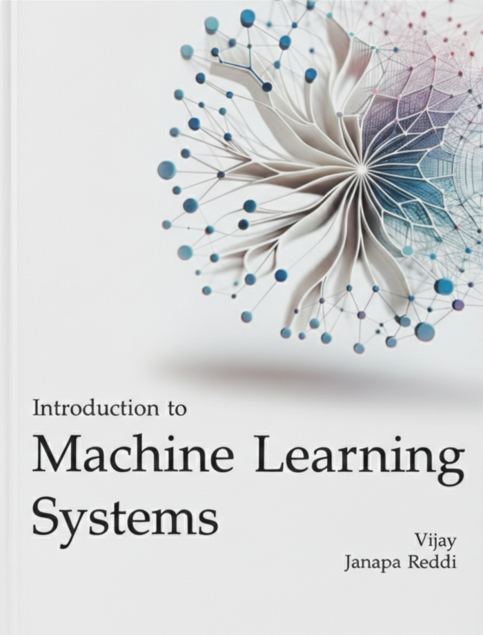
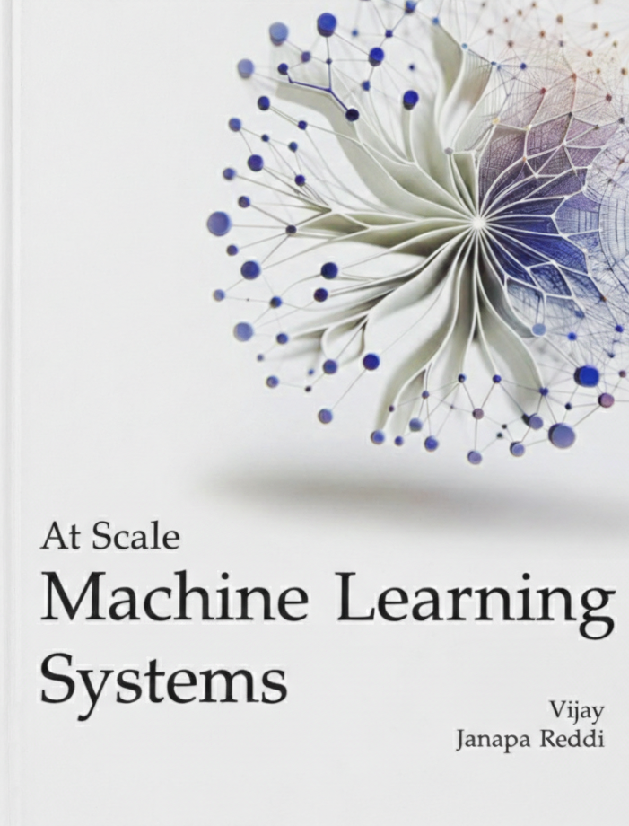
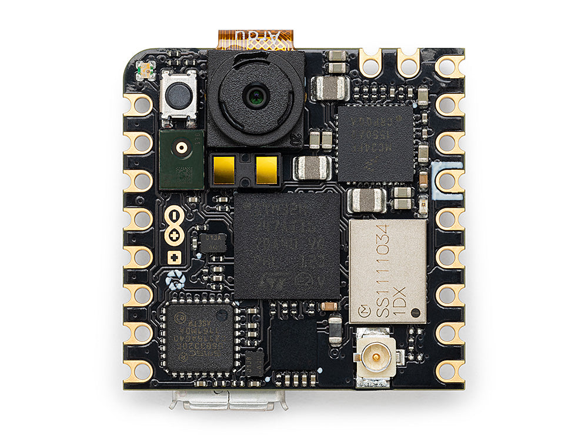

::: {.content-visible when-format="html"}

```{=html}
<div id="mls-neural-bg" aria-hidden="true"></div>
<div class="mls-landing">

<!-- Section 1: Textbook -->
<section class="mls-section">
<div class="mls-landing-grid">
  <div class="mls-landing-left">
    <p class="mls-hero-eyebrow">TWO-VOLUME TEXTBOOK</p>
    <h1 class="mls-hero-title">Machine Learning<br/>Systems.</h1>
    <p class="mls-hero-tagline">Two volumes. One curriculum.<br/>The physics of AI engineering.</p>
    <p class="mls-hero-intro">A rigorous, principles-first treatment of how ML systems<br/>are built, optimized, and deployed—from a single<br/>machine to fleet-scale infrastructure.</p>

    <div class="mls-meta">
      <p class="mls-links"><a href="https://mlsysbook.ai/tinytorch/">TinyTorch</a> · <a href="https://mlsysbook.ai/mlsysim/">MLSys·im</a> · <a href="https://mlsysbook.ai/labs/">Labs</a> · <a href="https://mlsysbook.ai/kits/">Hardware Kits</a></p>
      <p class="mls-links"><a href="https://github.com/harvard-edge/cs249r_book" target="_blank" rel="noopener">GitHub</a> · <a href="https://opencollective.com/mlsysbook" target="_blank" rel="noopener">Open Collective</a></p>
    </div>
  </div>

  <div class="mls-landing-right">
    <div class="mls-volumes">
      <div class="mls-vol-card">
        <a href="https://mlsysbook.ai/vol1/" class="mls-vol-card-link" title="Open Volume I">
          <span class="mls-vol-cover-wrap"></span>
          <p class="mls-vol-title">Volume I</p>
          <p class="mls-vol-subtitle">Introduction to Machine Learning Systems</p>
        </a>
        <p class="mls-vol-downloads">
          <a href="https://mlsysbook.ai/vol1/" target="_blank" rel="noopener">HTML</a>
          <a href="https://mlsysbook.ai/vol1/assets/downloads/Machine-Learning-Systems-Vol1.pdf" target="_blank" rel="noopener">PDF</a>
          <a href="https://mlsysbook.ai/vol1/assets/downloads/Machine-Learning-Systems-Vol1.epub" target="_blank" rel="noopener">EPUB</a>
        </p>
      </div>
      <div class="mls-vol-card">
        <a href="https://mlsysbook.ai/vol2/" class="mls-vol-card-link" title="Open Volume II">
          <span class="mls-vol-cover-wrap"></span>
          <p class="mls-vol-title">Volume II</p>
          <p class="mls-vol-subtitle">Machine Learning Systems at Scale</p>
        </a>
        <p class="mls-vol-downloads">
          <a href="https://mlsysbook.ai/vol2/" target="_blank" rel="noopener">HTML</a>
          <a href="https://mlsysbook.ai/vol2/assets/downloads/Machine-Learning-Systems-Vol2.pdf" target="_blank" rel="noopener">PDF</a>
          <a href="https://mlsysbook.ai/vol2/assets/downloads/Machine-Learning-Systems-Vol2.epub" target="_blank" rel="noopener">EPUB</a>
        </p>
      </div>
    </div>
  </div>
</div>

<div class="mls-scroll-indicator">
  <span>Scroll to Explore</span>
  <div class="mls-scroll-arrow">&darr;</div>
</div>
</section>

<!-- Section 2: TinyTorch (BUILD) -->
<section class="mls-section">
<div class="mls-landing-grid">
  <div class="mls-landing-left">
    <p class="mls-hero-eyebrow">TINYTORCH</p>
    <h1 class="mls-hero-title">Build it.<br/>From scratch.</h1>
    <p class="mls-hero-tagline">20 interactive modules.<br/>Zero magic.</p>
    <p class="mls-hero-intro">Understand the inner workings of modern ML frameworks by building your own tensor library, automatic differentiation engine, and neural network modules in Python.</p>

    <div class="mls-meta">
      <p class="mls-links"><a href="https://mlsysbook.ai/tinytorch/">Start Building &rarr;</a></p>
    </div>
  </div>

  <div class="mls-landing-right">
    <div class="mls-feature-card">
      <div class="css-terminal-wrapper">
        <div class="css-terminal">
          <div class="css-terminal-header">
            <span class="term-dot close"></span>
            <span class="term-dot min"></span>
            <span class="term-dot max"></span>
          </div>
          <div class="css-terminal-body">
            <div class="term-line"><span class="term-kw">class</span> <span class="term-def">Tensor</span>:</div>
            <div class="term-line" style="padding-left: 15px;"><span class="term-kw">def</span> <span class="term-def">__init__</span>(self, data):</div>
            <div class="term-line" style="padding-left: 30px;">self.data = data</div>
            <div class="term-line" style="padding-left: 30px;">self.grad = <span class="term-num">0.0</span></div>
            <div class="term-line" style="padding-left: 30px;">self._backward = <span class="term-kw">lambda</span>: <span class="term-kw">None</span></div>
            <div class="term-line"><span class="term-cursor"></span></div>
          </div>
        </div>
        <div class="term-shadow"></div>
      </div>
      <p class="mls-feature-desc">A pedagogical framework for learning ML systems engineering.</p>
    </div>
  </div>
</div>
</section>

<!-- Section 3: MLSysim (MODEL) -->
<section class="mls-section">
<div class="mls-landing-grid">
  <div class="mls-landing-left">
    <p class="mls-hero-eyebrow">MLSYS·IM</p>
    <h1 class="mls-hero-title">Model the<br/>trade-offs.</h1>
    <p class="mls-hero-tagline">One command.<br/>Every bottleneck.</p>
    <p class="mls-hero-intro">A first-principles modeling engine for reasoning about ML system performance. Evaluate training, serving, and distributed configurations before committing hardware or code.</p>

    <div class="mls-meta">
      <p class="mls-links"><a href="https://mlsysbook.ai/mlsysim/">Explore MLSys·im &rarr;</a></p>
    </div>
  </div>

  <div class="mls-landing-right">
    <div class="mls-feature-card">
      <div class="sim-panel">
        <!-- CLI command line -->
        <div class="sim-cli">
          <span class="sim-cli-prompt">$</span>
          <span class="sim-cli-cmd">mlsysim</span> <span class="sim-cli-arg">serve</span> <span class="sim-cli-model">llama-3-70b</span> <span class="sim-cli-flag">--hw</span> <span class="sim-cli-val">h100</span>
        </div>
        <!-- Roofline on top -->
        <div class="sim-roofline-top">
          <svg viewBox="0 0 260 105" xmlns="http://www.w3.org/2000/svg" class="sim-roofline-svg">
            <line x1="30" y1="88" x2="248" y2="88" stroke="rgba(255,255,255,0.15)" stroke-width="0.8"/>
            <line x1="30" y1="88" x2="30" y2="8" stroke="rgba(255,255,255,0.15)" stroke-width="0.8"/>
            <polyline points="30,78 120,22 248,22" fill="none" stroke="#4a90c4" stroke-width="2" opacity="0.5"/>
            <line x1="120" y1="22" x2="120" y2="88" stroke="rgba(255,255,255,0.08)" stroke-width="0.5" stroke-dasharray="4,3"/>
            <!-- Workload dot slides along roofline -->
            <circle r="5" fill="#a31f34" stroke="rgba(255,255,255,0.6)" stroke-width="1.5">
              <animateMotion dur="6s" repeatCount="indefinite" keyPoints="0;0.5;1;0.5;0" keyTimes="0;0.25;0.5;0.75;1" calcMode="spline" keySplines="0.4 0 0.6 1;0.4 0 0.6 1;0.4 0 0.6 1;0.4 0 0.6 1" path="M80,48 L120,22 L200,22"/>
              <animate attributeName="r" values="5;6;5" dur="3s" repeatCount="indefinite"/>
            </circle>
            <!-- Floating label follows near the dot -->
            <text fill="#ff8a80" font-size="8" font-weight="600" font-family="inherit">
              <animateMotion dur="6s" repeatCount="indefinite" keyPoints="0;0.5;1;0.5;0" keyTimes="0;0.25;0.5;0.75;1" calcMode="spline" keySplines="0.4 0 0.6 1;0.4 0 0.6 1;0.4 0 0.6 1;0.4 0 0.6 1" path="M88,42 L128,16 L208,16"/>
              70B
            </text>
            <text x="48" y="56" fill="rgba(255,255,255,0.3)" font-size="7" font-family="inherit">mem-bound</text>
            <text x="165" y="40" fill="rgba(255,255,255,0.3)" font-size="7" font-family="inherit">compute-bound</text>
            <text x="130" y="100" fill="rgba(255,255,255,0.2)" font-size="6.5" font-family="inherit">Arithmetic Intensity</text>
            <text x="12" y="48" fill="rgba(255,255,255,0.2)" font-size="6.5" font-family="inherit" transform="rotate(-90,12,48)">FLOP/s</text>
          </svg>
        </div>
        <!-- Config output -->
        <div class="sim-output">
          <div class="sim-output-grid">
            <span class="sim-output-key">Model</span><span class="sim-output-val">Llama-3-70B</span>
            <span class="sim-output-key">HW</span><span class="sim-output-val">H100 (80 GB)</span>
            <span class="sim-output-key">Batch</span><span class="sim-output-val">32</span>
            <span class="sim-output-key">Precision</span><span class="sim-output-val">BF16</span>
          </div>
        </div>
        <!-- Result chips -->
        <div class="sim-result-row">
          <span class="sim-result-chip green">MFU 48%</span>
          <span class="sim-result-chip">HBM 81%</span>
          <span class="sim-result-chip amber">TTFT 112 ms</span>
        </div>
      </div>
      <p class="mls-feature-desc">Configure. Model. See every bottleneck before committing hardware.</p>
    </div>
  </div>
</div>
</section>

<!-- Section 4: Labs (EXPLORE) -->
<section class="mls-section">
<div class="mls-landing-grid">
  <div class="mls-landing-left">
    <p class="mls-hero-eyebrow">INTERACTIVE LABS</p>
    <h1 class="mls-hero-title">Learn by<br/>doing.</h1>
    <p class="mls-hero-tagline">Jupyter and Marimo.<br/>Coming Summer 2026.</p>
    <p class="mls-hero-intro">A complete suite of interactive notebooks designed to accompany the textbook. Profile performance, optimize kernels, and explore distributed training configurations.</p>

    <div class="mls-meta">
      <p class="mls-links"><a href="https://mlsysbook.ai/labs/">View Labs &rarr;</a></p>
    </div>
  </div>

  <div class="mls-landing-right">
    <div class="mls-feature-card">
      <div class="lab-card">
        <div class="lab-header">
          <span>Lab 08 &middot; Training Memory</span>
          <span class="lab-badge">Act II</span>
        </div>
        <div class="lab-body">
          <!-- Prediction row -->
          <div class="predict-row">
            <div class="predict-opt">16</div>
            <div class="predict-opt student">128</div>
            <div class="predict-opt answer">64</div>
            <div class="predict-opt">256</div>
          </div>
          <!-- Batch slider -->
          <div class="batch-slider">
            <span class="slider-label">Batch</span>
            <div class="slider-track">
              <div class="slider-fill"></div>
              <div class="slider-thumb"></div>
            </div>
            <span class="slider-val">128</span>
          </div>
          <!-- Memory instrument -->
          <div class="mem-panel">
            <div class="mem-row-label">
              <span>HBM Allocation</span>
              <span class="usage-num">94.2 / 80 GB</span>
            </div>
            <div class="mem-stack">
              <div class="mem-seg w">W</div>
              <div class="mem-seg a">Activations</div>
              <div class="mem-seg o">Opt</div>
              <div class="mem-seg overflow-seg">+14</div>
            </div>
            <div class="limit-row">
              <span class="limit-icon"></span>
              <span>Exceeded 80 GB HBM capacity</span>
            </div>
          </div>
          <!-- OOM verdict -->
          <div class="oom-banner">
            <span class="oom-dot"></span>
            <div class="oom-text">
              <span>OOM &mdash; infeasible</span>
              <span class="oom-detail">Reduce batch size or enable activation checkpointing</span>
            </div>
          </div>
        </div>
        <div class="lab-footer">
          <span><span class="lab-status-dot"></span>Marimo</span>
          <span>Prediction: 0/1</span>
        </div>
      </div>
      <p class="mls-feature-desc">Predict, explore, and break ML systems through interactive notebooks.</p>
    </div>
  </div>
</div>
</section>

<!-- Section 5: Hardware Kits (DEPLOY) -->
<section class="mls-section">
<div class="mls-landing-grid">
  <div class="mls-landing-left">
    <p class="mls-hero-eyebrow">HARDWARE KITS</p>
    <h1 class="mls-hero-title">Deploy to<br/>the edge.</h1>
    <p class="mls-hero-tagline">Real silicon.<br/>Real constraints.</p>
    <p class="mls-hero-intro">Take your models out of the cloud and into the physical world. Hands-on deployment labs using Arduino, Raspberry Pi, and Seeed Studio hardware.</p>

    <div class="mls-meta">
      <p class="mls-links"><a href="https://mlsysbook.ai/kits/">Explore Kits &rarr;</a></p>
    </div>
  </div>

  <div class="mls-landing-right">
    <div class="mls-feature-card">
      
      <p class="mls-feature-desc">Microcontrollers, single-board computers, and specialized accelerators.</p>
    </div>
  </div>
</div>

<footer class="mls-footer" style="margin-top: 6rem;">
  <span>Vijay Janapa Reddi, Harvard University · MIT Press 2026</span>
</footer>
</section>

</div>

<script src="neural-bg.js"></script>
```

:::
