# Margin Figure Reader-Link Audit

This packet is an inspectable editor/LLM audit of margin-figure correspondence. It is not just a score table: each entry embeds the figure, shows the caption, shows the objective `fig-alt`, and shows the nearest prose before and after the `.column-margin` block.

## How To Read The QMD

A margin figure corresponds to the point in the text because it is placed directly in document flow inside a `.column-margin` block:

```markdown
::: {.column-margin}
{width="100%" fig-alt="..."}

*Caption states the reader takeaway.*
:::
```

When inspecting source markdown, use the `Source QMD` line below, then read the paragraph immediately before and after that margin block. Those paragraphs are the prose anchor. If the figure sits inside a callout or notebook, the local callout content is the anchor. The caption is good only when the prose anchor, visual marks, and caption all make the same point.

## Summary

- Margin figures audited: `224`
- Strict review threshold: `0.30`
- Entries marked for manual review by the packet: `58`
- Manual review standard: prose claim + visual evidence + caption takeaway click together.

## Entries

### 001. vol1/benchmarking @ line 199: Component speedup rarely survives as end-to-end benchmark speedup.

- **Source QMD:** `../../quarto/contents/vol1/benchmarking/benchmarking.qmd:199`
- **Asset:** `../../quarto/contents/vol1/benchmarking/images/svg/vol1_benchmarking_margin_001.svg`
- **Audit status:** `Pass`; lexical overlap `0.50`
- **Caption:** Component speedup rarely survives as end-to-end benchmark speedup.
- **Figure evidence (`fig-alt`):** Two stacked latency bars compare before and after a 3 times model-stage speedup: the model segment shrinks, but the other pipeline work remains, so 50 milliseconds only falls to about 43 milliseconds.


**Source Markdown Excerpt**

```markdown
197
198  ::: {.column-margin}
199  {width="100%" fig-alt="Two stacked latency bars compare before and after a 3 times model-stage speedup: the model segment shrinks, but the other pipeline work remains, so 50 milliseconds only falls to about 43 milliseconds."}
200
201  *Component speedup rarely survives as end-to-end benchmark speedup.*
202  :::
203
204  [^fn-goodharts-law]: **Goodhart's Law**: @goodhart1984 articulated the original 1975 Bank of England observation on monetary policy; @strathern1997improving generalized it into the form quoted above. The original context was macroeconomics: once a monetary aggregate became an official policy target, banks changed behavior to game the metric, destroying its predictive value. In ML, the same failure mode recurs structurally: BLEU scores incentivize n-gram matching over fluency, ImageNet accuracy rewards architecture tricks over robustness, and benchmark leaderboards incentivize test-set overfitting---each a case where the metric's success as a target caused its failure as a measure. \index{Goodhart's Law!etymology}
```

**Strongest Prose Anchor**

> A {python} ComponentLatencyExample.component speedup str$ $ inference speedup applied to a {python} ComponentLatencyExample.model latency ms str model stage inside a {python} ComponentLatencyExample.e2e latency ms str pipeline yields only about {python} ComponentLatencyExample.e2e speedup str$ $ end-to-end improvement, or worse if the optimization increases memory pressure.

**Placement Context**

_Paragraph before the margin block:_

> Third, end-to-end beats component metrics. Vendors report component latency (5–10 ms for model inference), but production latency includes preprocessing, queuing, and postprocessing (50–100 ms total). A {python} ComponentLatencyExample.component speedup str$ $ inference speedup applied to a {python} ComponentLatencyExample.model latency ms str model stage inside a {python} ComponentLatencyExample.e2e latency ms str pipeline yields only about {python} ComponentLatencyExample.e2e speedup str$ $ end-to-end improvement, or worse if the optimization increases memory pressure.

_Paragraph after the margin block:_

> These principles reappear throughout this chapter and are examined in depth in

**Reader-Link Check**

- Source markdown: the excerpt above shows the `.column-margin` block and the exact caption beside the prose.
- The prose anchor is the text an editor should compare against the caption.
- The `fig-alt` describes what the visual marks encode; the caption should state the reader takeaway from those marks.

### 002. vol1/benchmarking @ line 415: A 1K test set cannot reliably see a one-point regression.

- **Source QMD:** `../../quarto/contents/vol1/benchmarking/benchmarking.qmd:415`
- **Asset:** `../../quarto/contents/vol1/benchmarking/images/svg/benchmarking_confidence_detectability.svg`
- **Audit status:** `Pass`; lexical overlap `0.43`
- **Caption:** A 1K test set cannot reliably see a one-point regression.
- **Figure evidence (`fig-alt`):** Horizontal detectability marker: a 1K test set sits in the noisy region, while roughly 2K samples are needed for a plus or minus 1 percentage point confidence interval.


**Source Markdown Excerpt**

```markdown
413
414  ::: {.column-margin}
415  {width="100%" fig-alt="Horizontal detectability marker: a 1K test set sits in the noisy region, while roughly 2K samples are needed for a plus or minus 1 percentage point confidence interval."}
416
417  *A 1K test set cannot reliably see a one-point regression.*
418  :::
419
420  ::: {#nbk-benchmarking-statistical-confidence-trap .callout-notebook title="The statistical confidence trap"}
```

**Strongest Prose Anchor**

> A "compressed" version is deployed and its accuracy measured on a {python} StatisticalConfidenceTrap.n images str-image test set, yielding {python} StatisticalConfidenceTrap.compressed accuracy pct str.

**Placement Context**

_Paragraph before the margin block:_

> Beyond workload representativeness, the distinction between statistical significance and practical significance requires careful interpretation. A small performance improvement might achieve statistical significance across hundreds of trials but prove operationally irrelevant if it falls within measurement noise or costs exceed benefits. This creates what we call the statistical confidence trap , where seemingly rigorous evaluation still misleads.

_Paragraph after the margin block:_

> Problem : An image classifier currently has {python} StatisticalConfidenceTrap.baseline accuracy pct str accuracy. A "compressed" version is deployed and its accuracy measured on a {python} StatisticalConfidenceTrap.n images str-image test set, yielding {python} StatisticalConfidenceTrap.compressed accuracy pct str. Did the optimization cause a real regression, or is it noise?

**Reader-Link Check**

- Source markdown: the excerpt above shows the `.column-margin` block and the exact caption beside the prose.
- The prose anchor is the text an editor should compare against the caption.
- The `fig-alt` describes what the visual marks encode; the caption should state the reader takeaway from those marks.

### 003. vol1/benchmarking @ line 728: Larger batches push transformer inference from memory-bound to compute-bound.

- **Source QMD:** `../../quarto/contents/vol1/benchmarking/benchmarking.qmd:728`
- **Asset:** `../../quarto/contents/vol1/benchmarking/images/svg/vol1_benchmarking_margin_002.svg`
- **Audit status:** `Pass`; lexical overlap `0.43`
- **Caption:** Larger batches push transformer inference from memory-bound to compute-bound.
- **Figure evidence (`fig-alt`):** BERT batch 1 dot left of ridge and batch 32 dot near compute plateau.


**Source Markdown Excerpt**

```markdown
726
727  ::: {.column-margin}
728  {width="100%" fig-alt="BERT batch 1 dot left of ridge and batch 32 dot near compute plateau."}
729
730  *Larger batches push transformer inference from memory-bound to compute-bound.*
731  :::
732
733  \index{Roofline Model!etymology and origin}
```

**Strongest Prose Anchor**

> For instance, increasing batch size from one to thirty-two for transformer inference can shift operations from memory-bound to compute bound, improving GPU utilization from {python} RooflineExamples.bert util b1 str to {python} RooflineExamples.utilization peak pct str [ ].

**Placement Context**

_Paragraph before the margin block:_

> This quantitative analysis, formalized in roofline models[^fn-roofline-model], guides both algorithm design and hardware selection by identifying the dominant performance constraint for a given workload. For instance, increasing batch size from one to thirty-two for transformer inference can shift operations from memory-bound to compute bound, improving GPU utilization from {python} RooflineExamples.bert util b1 str to {python} RooflineExamples.utilization peak pct str [ ].

_Paragraph after the margin block:_

> _No adjacent prose captured._

**Reader-Link Check**

- Source markdown: the excerpt above shows the `.column-margin` block and the exact caption beside the prose.
- The prose anchor is the text an editor should compare against the caption.
- The `fig-alt` describes what the visual marks encode; the caption should state the reader takeaway from those marks.

### 004. vol1/benchmarking @ line 1912: Burst benchmark FPS collapses once thermal throttling sets in.

- **Source QMD:** `../../quarto/contents/vol1/benchmarking/benchmarking.qmd:1912`
- **Asset:** `../../quarto/contents/vol1/benchmarking/images/svg/vol1_benchmarking_margin_003.svg`
- **Audit status:** `Pass`; lexical overlap `0.38`
- **Caption:** Burst benchmark FPS collapses once thermal throttling sets in.
- **Figure evidence (`fig-alt`):** FPS holds briefly then drops at thermal throttling knee.


**Source Markdown Excerpt**

```markdown
1910
1911  ::: {.column-margin}
1912  {width="100%" fig-alt="FPS holds briefly then drops at thermal throttling knee."}
1913
1914  *Burst benchmark FPS collapses once thermal throttling sets in.*
1915  :::
1916
1917  ::: {#psp-benchmarking-edge-benchmark-reality-check .callout-perspective title="Edge benchmark reality check"}
```

**Strongest Prose Anchor**

> Thermal throttling on a 3--5 W thermal design power (TDP) envelope can begin within seconds of sustained inference, making any benchmark shorter than 30 seconds functionally meaningless for always-on applications.

**Placement Context**

_Paragraph before the margin block:_

> Thermal throttling on a 3--5 W thermal design power (TDP) envelope can begin within seconds of sustained inference, making any benchmark shorter than 30 seconds functionally meaningless for always-on applications. Any edge evaluation must therefore account for sustained power draw under thermal steady state, not burst-mode peaks, and must measure end-to-end latency including data transfer overhead.

_Paragraph after the margin block:_

> When evaluating edge hardware claims:

**Reader-Link Check**

- Source markdown: the excerpt above shows the `.column-margin` block and the exact caption beside the prose.
- The prose anchor is the text an editor should compare against the caption.
- The `fig-alt` describes what the visual marks encode; the caption should state the reader takeaway from those marks.

### 005. vol1/benchmarking @ line 3363: Deployment power spans ten orders of magnitude, µW to kW.

- **Source QMD:** `../../quarto/contents/vol1/benchmarking/benchmarking.qmd:3363`
- **Asset:** `../../quarto/contents/vol1/benchmarking/images/svg/benchmarking_power_ladder.svg`
- **Audit status:** `Pass`; lexical overlap `0.67`
- **Caption:** Deployment power spans ten orders of magnitude, µW to kW.
- **Figure evidence (`fig-alt`):** Vertical ladder of orange bars on a log scale spanning deployment power from a neural decision processor at 150 microwatts at the bottom up through a microcontroller at 25 milliwatts, a Raspberry Pi at 3.5 watts, an edge server at 80 watts, an ML server node at 400 watts, to an ML server rack at 10 kilowatts at the top.


**Source Markdown Excerpt**

```markdown
3361
3362  ::: {.column-margin}
3363  {width="100%" fig-alt="Vertical ladder of orange bars on a log scale spanning deployment power from a neural decision processor at 150 microwatts at the bottom up through a microcontroller at 25 milliwatts, a Raspberry Pi at 3.5 watts, an edge server at 80 watts, an ML server node at 400 watts, to an ML server rack at 10 kilowatts at the top."}
3364
3365  *Deployment power spans ten orders of magnitude, µW to kW.*
3366  :::
3367
3368  | **Category** | **Device Type**                 | **Power Consumption** |
```

**Strongest Prose Anchor**

> : Power Consumption Spectrum : The representative deployment points listed here span over seven orders of magnitude in power demands, from microwatt-scale TinyML devices (150 µW) to kilowatt-scale ML server racks (10 kW); extends the same picture down to 5.6 µW at the TinyML floor and up to roughly 498 kW at the training-cluster ceiling, covering nearly eleven orders of magnitude.

**Placement Context**

_Paragraph before the margin block:_

> Creating a unified methodology across this ten-orders-of-magnitude range requires careful consideration of each scale's unique characteristics: microwatt-level TinyML measurements demand different instrumentation than kilowatt-scale server rack monitoring. A comprehensive framework must accommodate these scales while maintaining consistency, fairness, and reproducibility.

_Paragraph after the margin block:_

> : Power Consumption Spectrum : The representative deployment points listed here span over seven orders of magnitude in power demands, from microwatt-scale TinyML devices (150 µW) to kilowatt-scale ML server racks (10 kW); extends the same picture down to 5.6 µW at the TinyML floor and up to roughly 498 kW at the training-cluster ceiling, covering nearly eleven orders of magnitude. This enormous range explains why no single measurement technique or efficiency metric applies universally: benchmarking a 150 µW neural processor requires fundamentally different instrumentation than measuring a 10 kW server rack. { }

**Reader-Link Check**

- Source markdown: the excerpt above shows the `.column-margin` block and the exact caption beside the prose.
- The prose anchor is the text an editor should compare against the caption.
- The `fig-alt` describes what the visual marks encode; the caption should state the reader takeaway from those marks.

### 006. vol1/benchmarking @ line 4467: A dominated model loses on both axes of the Pareto frontier.

- **Source QMD:** `../../quarto/contents/vol1/benchmarking/benchmarking.qmd:4467`
- **Asset:** `../../quarto/contents/vol1/benchmarking/images/svg/vol1_benchmarking_margin_004.svg`
- **Audit status:** `Pass`; lexical overlap `0.71`
- **Caption:** A dominated model loses on both axes of the Pareto frontier.
- **Figure evidence (`fig-alt`):** Tiny Pareto frontier with one dominated point.


**Source Markdown Excerpt**

```markdown
4465
4466  ::: {.column-margin}
4467  {width="100%" fig-alt="Tiny Pareto frontier with one dominated point."}
4468
4469  *A dominated model loses on both axes of the Pareto frontier.*
4470  :::
4471
4472  [^fn-pareto]: **Pareto Frontier**: Named after economist Vilfredo Pareto [@pareto1896cours], the frontier contains all solutions where improving one objective requires degrading another. In compression benchmarking, the frontier's shape carries diagnostic information: a steep region means efficiency gains come cheaply (prune here), while a flat region means further compression costs disproportionate accuracy (stop here). Points below the frontier are strictly dominated and represent wasted capacity. \index{Pareto Frontier!compression trade-off}
```

**Strongest Prose Anchor**

> Models on the Pareto frontier cannot improve one metric without degrading the other; models below the frontier are dominated by better alternatives.

**Placement Context**

_Paragraph before the margin block:_

> Pareto frontier[^fn-pareto] evaluation determines whether a compressed model represents a good trade-off. Plotting accuracy against the target efficiency metric (latency, model size, energy) reveals the trade-off frontier. Models on the Pareto frontier cannot improve one metric without degrading the other; models below the frontier are dominated by better alternatives.

_Paragraph after the margin block:_

> Different compression techniques fail in different ways. Quantization (reducing numerical precision) typically preserves average-case performance while degrading on inputs near decision boundaries, exactly the edge cases that often matter most. Pruning (removing weights or structures) loses capacity for rare features, potentially fine for common cases but catastrophic for tail scenarios. Distillation (training smaller models to mimic larger ones) can lose calibration even when matching accuracy. Validation must probe these specific failure modes, not just measure aggregate accuracy.

**Reader-Link Check**

- Source markdown: the excerpt above shows the `.column-margin` block and the exact caption beside the prose.
- The prose anchor is the text an editor should compare against the caption.
- The `fig-alt` describes what the visual marks encode; the caption should state the reader takeaway from those marks.

### 007. vol1/benchmarking @ line 5203: Mean benchmark latency understates the production tail by an order of magnitude.

- **Source QMD:** `../../quarto/contents/vol1/benchmarking/benchmarking.qmd:5203`
- **Asset:** `../../quarto/contents/vol1/benchmarking/images/svg/benchmarking_tail_latency_gap.svg`
- **Audit status:** `Pass`; lexical overlap `0.50`
- **Caption:** Mean benchmark latency understates the production tail by an order of magnitude.
- **Figure evidence (`fig-alt`):** Margin ladder comparing production P99 latency around 150 to 200 milliseconds with a 15 millisecond benchmark mean, annotated as a 10 to 13.3 times gap.


**Source Markdown Excerpt**

```markdown
5201
5202  ::: {.column-margin}
5203  {width="100%" fig-alt="Margin ladder comparing production P99 latency around 150 to 200 milliseconds with a 15 millisecond benchmark mean, annotated as a 10 to 13.3 times gap."}
5204
5205  *Mean benchmark latency understates the production tail by an order of magnitude.*
5206  :::
5207
5208  **Pitfall**: *Optimizing exclusively for benchmark metrics without considering broader system requirements.*
```

**Strongest Prose Anchor**

> An inference system with {python} FallaciesPitfallsSetup.benchmark latency mean ms str mean latency on MLPerf experiences {python} FallaciesPitfallsSetup.production p99 range str p99 latency in production ({python} FallaciesPitfallsSetup.latency degradation range str$ $ degradation) due to concurrent load, garbage collection pauses, and network variability.

**Placement Context**

_Paragraph before the margin block:_

> The seductive clarity of benchmark rankings leads teams to select systems as though leaderboard position predicts production behavior. It rarely does. As demonstrates, ML systems exhibit inherent variability from data quality issues, distribution shifts, and resource constraints absent in controlled evaluation. A language model achieving {python} FallaciesPitfallsSetup.benchmark accuracy pct str benchmark accuracy drops to {python} FallaciesPitfallsSetup.production accuracy range str accuracy in production when processing user-generated text with spelling errors, informal language, and domain-specific terminology. An inference system with...

_Paragraph after the margin block:_

> Pitfall : Optimizing exclusively for benchmark metrics without considering broader system requirements.

**Reader-Link Check**

- Source markdown: the excerpt above shows the `.column-margin` block and the exact caption beside the prose.
- The prose anchor is the text an editor should compare against the caption.
- The `fig-alt` describes what the visual marks encode; the caption should state the reader takeaway from those marks.

### 008. vol1/conclusion @ line 92: Architecture choices cascade into compression, serving, drift, and governance.

- **Source QMD:** `../../quarto/contents/vol1/conclusion/conclusion.qmd:92`
- **Asset:** `../../quarto/contents/vol1/conclusion/images/svg/vol1_conclusion_margin_001.svg`
- **Audit status:** `Pass`; lexical overlap `0.57`
- **Caption:** Architecture choices cascade into compression, serving, drift, and governance.
- **Figure evidence (`fig-alt`):** Causal chain from architecture choice to INT8 quantization, P99 serving latency, and drift or governance obligations.


**Source Markdown Excerpt**

```markdown
90
91  ::: {.column-margin}
92  {width="100%" fig-alt="Causal chain from architecture choice to INT8 quantization, P99 serving latency, and drift or governance obligations."}
93
94  *Architecture choices cascade into compression, serving, drift, and governance.*
95  :::
96
97  The remainder of this chapter distills that integrated perspective into a framework for reasoning about ML systems as wholes rather than as collections of parts. We begin by revisiting the Lighthouse Models that traced these constraint interactions across chapters, then formalize thirteen quantitative invariants, rooted in physics, information theory, and statistics, that govern ML system behavior regardless of framework, hardware generation, or model family. We then examine how these principles apply across three domains, explore future directions where systems thinking will matter most, and close with the engineering responsibility that accompanies building systems of this power.
```

**Strongest Prose Anchor**

> An architecture choice enabled a compression choice, which enabled an acceleration choice, which shaped a serving constraint, which defined an operational requirement.

**Placement Context**

_Paragraph before the margin block:_

> Each chapter contributed a piece. The real lesson, however, lies not in any individual piece but in how the pieces constrain each other. An architecture choice enabled a compression choice, which enabled an acceleration choice, which shaped a serving constraint, which defined an operational requirement. Depthwise separable convolutions in MobileNetV2 made INT8 quantization practical under deployment validation. That quantization in turn enabled mobile NPU deployment, which shaped a $ < 50$ ms latency constraint and required drift monitoring across heterogeneous device populations. Every decision propagated forward, and the engineer who...

_Paragraph after the margin block:_

> The remainder of this chapter distills that integrated perspective into a framework for reasoning about ML systems as wholes rather than as collections of parts. We begin by revisiting the Lighthouse Models that traced these constraint interactions across chapters, then formalize thirteen quantitative invariants, rooted in physics, information theory, and statistics, that govern ML system behavior regardless of framework, hardware generation, or model family. We then examine how these principles apply across three domains, explore future directions where systems thinking will matter most, and close with the engineering responsibility that...

**Reader-Link Check**

- Source markdown: the excerpt above shows the `.column-margin` block and the exact caption beside the prose.
- The prose anchor is the text an editor should compare against the caption.
- The `fig-alt` describes what the visual marks encode; the caption should state the reader takeaway from those marks.

### 009. vol1/conclusion @ line 718: Decode stays memory-bound, left of the roofline ridge.

- **Source QMD:** `../../quarto/contents/vol1/conclusion/conclusion.qmd:718`
- **Asset:** `../../quarto/contents/vol1/conclusion/images/svg/vol1_conclusion_margin_002.svg`
- **Audit status:** `Manual review candidate`; lexical overlap `0.17`
- **Caption:** Decode stays memory-bound, left of the roofline ridge.
- **Figure evidence (`fig-alt`):** Llama decode dot on H100 memory-bound slope.


**Source Markdown Excerpt**

```markdown
716
717  ::: {.column-margin}
718  {width="100%" fig-alt="Llama decode dot on H100 memory-bound slope."}
719
720  *Decode stays memory-bound, left of the roofline ridge.*
721  :::
722
723  :::
```

**Strongest Prose Anchor**

> The system is heavily memory-bound (arithmetic intensity $ $ 1).

**Placement Context**

_Paragraph before the margin block:_

> The memory time $T { }$ is {python} ConclusionRoofline.ratio str$ $ larger than compute time $T { }$. The system is heavily memory-bound (arithmetic intensity $ $ 1). To honor the silicon contract, we must either increase arithmetic intensity (via batching users to reuse $D { }$) or reduce data volume (via quantization to INT4). A systems engineer who optimizes compute kernels $(T { })$ without addressing memory $(T { })$ can improve only the {python} ConclusionRoofline.t comp ms str compute term while leaving the {python} ConclusionRoofline.t mem ms str memory term untouched.

_Paragraph after the margin block:_

> This calculation illustrates a broader truth: the invariant framework is not an abstract taxonomy but a diagnostic instrument. Every chapter in this book applied these invariants to specific engineering decisions, often without naming them explicitly. Tracing those applications across three domains---building foundations, engineering for scale, and navigating production reality---reveals how the framework we have just formalized has already been guiding our thinking throughout this book.

**Reader-Link Check**

- Source markdown: the excerpt above shows the `.column-margin` block and the exact caption beside the prose.
- The prose anchor is the text an editor should compare against the caption.
- The `fig-alt` describes what the visual marks encode; the caption should state the reader takeaway from those marks.

### 010. vol1/conclusion @ line 787: Mean latency hides the tail; P99 governs user experience.

- **Source QMD:** `../../quarto/contents/vol1/conclusion/conclusion.qmd:787`
- **Asset:** `../../quarto/contents/vol1/conclusion/images/svg/vol1_conclusion_margin_003.svg`
- **Audit status:** `Pass`; lexical overlap `0.75`
- **Caption:** Mean latency hides the tail; P99 governs user experience.
- **Figure evidence (`fig-alt`):** Mean latency versus P99 latency.


**Source Markdown Excerpt**

```markdown
785
786  ::: {.column-margin}
787  {width="100%" fig-alt="Mean latency versus P99 latency."}
788
789  *Mean latency hides the tail; P99 governs user experience.*
790  :::
791
792  Beyond technical performance, @sec-responsible-engineering broadened the framework to include societal impact. The verification invariant demands monitoring for fairness violations alongside performance: tracking prediction distributions across demographic groups, detecting bias amplification over time (Principle \ref{pri-bias-feedback}), and alerting on unexplained accuracy disparities. The statistical drift invariant applies equally to demographic subgroup performance, where accuracy may degrade for underrepresented populations even as aggregate metrics remain stable. Responsible AI is therefore an integral dimension of systems engineering, a first-class design constraint governed by the same invariants that govern performance.
```

**Strongest Prose Anchor**

> The latency budget invariant makes P99 the governing constraint, and tracking tail latencies reveals that mean latency tells little about user experience when the 99th-percentile request can be {python} TailLatencyRatio.conclusion tail ratio str$ $ the mean latency.

**Placement Context**

_Paragraph before the margin block:_

> The transition from training to inference inverts optimization objectives: where training maximizes throughput over days, inference optimizes latency per request in milliseconds. The latency budget invariant makes P99 the governing constraint, and tracking tail latencies reveals that mean latency tells little about user experience when the 99th-percentile request can be {python} TailLatencyRatio.conclusion tail ratio str$ $ the mean latency. MLOps ( ) orchestrates the full system lifecycle, transforming the statistical drift invariant and the training-serving skew law from abstract equations into monitoring alerts and automated retraining...

_Paragraph after the margin block:_

> Beyond technical performance, broadened the framework to include societal impact. The verification invariant demands monitoring for fairness violations alongside performance: tracking prediction distributions across demographic groups, detecting bias amplification over time (Principle ), and alerting on unexplained accuracy disparities. The statistical drift invariant applies equally to demographic subgroup performance, where accuracy may degrade for underrepresented populations even as aggregate metrics remain stable. Responsible AI is therefore an integral dimension of systems engineering, a first-class design constraint governed by the...

**Reader-Link Check**

- Source markdown: the excerpt above shows the `.column-margin` block and the exact caption beside the prose.
- The prose anchor is the text an editor should compare against the caption.
- The `fig-alt` describes what the visual marks encode; the caption should state the reader takeaway from those marks.

### 011. vol1/conclusion @ line 912: Fleet scale turns rare component failures into routine system events.

- **Source QMD:** `../../quarto/contents/vol1/conclusion/conclusion.qmd:912`
- **Asset:** `../../quarto/contents/vol1/conclusion/images/svg/vol1_conclusion_fleet_mtbf_ladder.svg`
- **Audit status:** `Pass`; lexical overlap `0.56`
- **Caption:** Fleet scale turns rare component failures into routine system events.
- **Figure evidence (`fig-alt`):** Margin ladder showing one GPU with about 5.7 years mean time to failure versus a 1024 GPU pool with about 48.8 hours mean time between failures.


**Source Markdown Excerpt**

```markdown
910
911  ::: {.column-margin}
912  {width="100%" fig-alt="Margin ladder showing one GPU with about 5.7 years mean time to failure versus a 1024 GPU pool with about 48.8 hours mean time between failures."}
913
914  *Fleet scale turns rare component failures into routine system events.*
915  :::
916
917  ## Journey Forward {#sec--journey-forward-6453}
```

**Strongest Prose Anchor**

> Reliability is where that shift becomes visible first: as independent components accumulate, rare individual failures become routine fleet events.

**Placement Context**

_Paragraph before the margin block:_

> Whether or not AGI emerges in its fullest form, the systems principles established throughout this book will remain essential. The principles do not expire; they evolve. Their most immediate evolution is the transition from a single machine to the fleet-scale infrastructure that frontier AI already demands, a transition that brings with it both engineering opportunity and engineering responsibility. Reliability is where that shift becomes visible first: as independent components accumulate, rare individual failures become routine fleet events.

_Paragraph after the margin block:_

> Every frontier explored in the previous section (diverse deployment contexts, robust systems, societal applications, and the path to AGI through compound AI systems) rests on a common foundation: the engineering skills this book has developed. Managing the stochastic nature of data through the data as code invariant (Principle ) and the statistical drift invariant, while enforcing deterministic reliability through the iron law (Principle ), silicon contract (Principle ), and latency budget, requires bridging the gap between Software 1.0's explicit logic and Software 2.0's learned behaviors. That bridge is the engineering rigor required to...

**Reader-Link Check**

- Source markdown: the excerpt above shows the `.column-margin` block and the exact caption beside the prose.
- The prose anchor is the text an editor should compare against the caption.
- The `fig-alt` describes what the visual marks encode; the caption should state the reader takeaway from those marks.

### 012. vol1/data_engineering @ line 197: Selection gain is highest where entropy is high and data gravity low.

- **Source QMD:** `../../quarto/contents/vol1/data_engineering/data_engineering.qmd:197`
- **Asset:** `../../quarto/contents/vol1/data_engineering/images/svg/data_engineering_data_gravity_entropy.svg`
- **Audit status:** `Pass`; lexical overlap `0.89`
- **Caption:** Selection gain is highest where entropy is high and data gravity low.
- **Figure evidence (`fig-alt`):** A 2-by-2 quadrant. The horizontal axis is data gravity (movement cost), the vertical axis is information entropy (signal density). The top-left cell, low gravity and high entropy, is highlighted and labeled high gain; the other three cells are neutral gray.


**Source Markdown Excerpt**

```markdown
195
196  ::: {.column-margin}
197  {width="100%" fig-alt="A 2-by-2 quadrant. The horizontal axis is data gravity (movement cost), the vertical axis is information entropy (signal density). The top-left cell, low gravity and high entropy, is highlighted and labeled high gain; the other three cells are neutral gray."}
198
199  *Selection gain is highest where entropy is high and data gravity low.*
200  :::
201
202  **Information entropy**\index{Information Entropy!data density} is the density of signal. A dataset of 1 million identical images has high gravity (TB of storage) but zero entropy (one image worth of information). A dataset of 10,000 diverse edge cases has low gravity but high entropy. Let Information Entropy measure signal density (bits of information per byte) and data gravity capture movement cost (data volume/bandwidth, that is, transfer time). The ratio of the two quantities captures a dataset's return on movement cost, which @eq-data-selection-gain formalizes as the data selection gain:
```

**Strongest Prose Anchor**

> A dataset of 10,000 diverse edge cases has low gravity but high entropy.

**Placement Context**

_Paragraph before the margin block:_

> Data gravity is the cost of movement. It is a function of volume $(D { })$ and network bandwidth $( )$. The time to move a petabyte dataset across a 10 Gbps link is fixed by physics ({python} DataGravity.transfer time 10g math); even a 100 Gbps dedicated link leaves transfer time and egress cost large enough to shape the architecture. This gravity dictates architecture: because moving 1 PB to the compute is slow and expensive, the compute often must move to the data. This explains the rise of "Data Lakehouse" architectures[^fn-lakehouse-gravity] [ ] where processing engines (Spark, Presto) run directly on storage nodes. In contrast, Data...

_Paragraph after the margin block:_

> Information entropy is the density of signal. A dataset of 1 million identical images has high gravity (TB of storage) but zero entropy (one image worth of information). A dataset of 10,000 diverse edge cases has low gravity but high entropy. Let Information Entropy measure signal density (bits of information per byte) and data gravity capture movement cost (data volume/bandwidth, that is, transfer time). The ratio of the two quantities captures a dataset's return on movement cost, which formalizes as the data selection gain:

**Reader-Link Check**

- Source markdown: the excerpt above shows the `.column-margin` block and the exact caption beside the prose.
- The prose anchor is the text an editor should compare against the caption.
- The `fig-alt` describes what the visual marks encode; the caption should state the reader takeaway from those marks.

### 013. vol1/data_engineering @ line 856: Small per-window false-positive rates compound into operational failure.

- **Source QMD:** `../../quarto/contents/vol1/data_engineering/data_engineering.qmd:856`
- **Asset:** `../../quarto/contents/vol1/data_engineering/images/svg/vol1_data_engineering_margin_001.svg`
- **Audit status:** `Manual review candidate`; lexical overlap `0.14`
- **Caption:** Small per-window false-positive rates compound into operational failure.
- **Figure evidence (`fig-alt`):** A curve of monthly false wakes that stays low then bends sharply upward as the per-window false-positive rate rises; the steep region past the knee is shaded red.


**Source Markdown Excerpt**

```markdown
854
855  ::: {.column-margin}
856  {width="100%" fig-alt="A curve of monthly false wakes that stays low then bends sharply upward as the per-window false-positive rate rises; the steep region past the knee is shaded red."}
857
858  *Small per-window false-positive rates compound into operational failure.*
859  :::
860
861  ```{python}
```

**Strongest Prose Anchor**

> With one-second classification windows running around the clock, how strict does the per-window false positive rate need to be?

**Placement Context**

_Paragraph before the margin block:_

> Of these metrics, the false positive rate deserves particular attention for always-on systems. Because KWS listens continuously, every second of every day, even a seemingly negligible false positive rate compounds across millions of evaluation windows. A quick calculation shows how strict that requirement becomes.

_Paragraph after the margin block:_

> Problem : An always-on KWS system must tolerate at most one false wake-up per month. With one-second classification windows running around the clock, how strict does the per-window false positive rate need to be?

**Reader-Link Check**

- Source markdown: the excerpt above shows the `.column-margin` block and the exact caption beside the prose.
- The prose anchor is the text an editor should compare against the caption.
- The `fig-alt` describes what the visual marks encode; the caption should state the reader takeaway from those marks.

### 014. vol1/data_engineering @ line 2327: Each drift type traces to the distribution component that shifted.

- **Source QMD:** `../../quarto/contents/vol1/data_engineering/data_engineering.qmd:2327`
- **Asset:** `../../quarto/contents/vol1/data_engineering/images/svg/vol1_data_engineering_margin_002.svg`
- **Audit status:** `Pass`; lexical overlap `0.38`
- **Caption:** Each drift type traces to the distribution component that shifted.
- **Figure evidence (`fig-alt`):** A three-node locator with vertices labeled p(x), p(y), and p(y\|x) for the distribution components; one vertex is filled to mark which component has drifted, the others gray.


**Source Markdown Excerpt**

```markdown
2325
2326  ::: {.column-margin}
2327  {width="100%" fig-alt="A three-node locator with vertices labeled p(x), p(y), and p(y|x) for the distribution components; one vertex is filled to mark which component has drifted, the others gray."}
2328
2329  *Each drift type traces to the distribution component that shifted.*
2330  :::
2331
2332  #### Covariate shift {#sec-data-engineering-covariate-shift-b3d9}
```

**Strongest Prose Anchor**

> Each type manifests differently in production systems and requires distinct monitoring approaches.

**Placement Context**

_Paragraph before the margin block:_

> Understanding the three core types of drift enables targeted detection and response strategies. Each type manifests differently in production systems and requires distinct monitoring approaches.

_Paragraph after the margin block:_

> Covariate shift occurs when input feature distributions change while the relationship between features and labels remains constant: $p(x)$ changes but $p(y x)$ stays the same. A medical imaging system trained on one camera model might see production data from a different camera manufacturer. The disease-image relationship remains unchanged (same pathologies produce same visual indicators), but pixel value distributions shift due to different sensor characteristics, color calibration, or image processing pipelines. Detection focuses on monitoring feature distributions using statistical metrics like PSI or KL divergence applied to input...

**Reader-Link Check**

- Source markdown: the excerpt above shows the `.column-margin` block and the exact caption beside the prose.
- The prose anchor is the text an editor should compare against the caption.
- The `fig-alt` describes what the visual marks encode; the caption should state the reader takeaway from those marks.

### 015. vol1/data_engineering @ line 3192: Local aggregation beats gather-all when network latency dominates.

- **Source QMD:** `../../quarto/contents/vol1/data_engineering/data_engineering.qmd:3192`
- **Asset:** `../../quarto/contents/vol1/data_engineering/images/svg/vol1_data_engineering_margin_003.svg`
- **Audit status:** `Manual review candidate`; lexical overlap `0.25`
- **Caption:** Local aggregation beats gather-all when network latency dominates.
- **Figure evidence (`fig-alt`):** Vertical time ladder comparing gather-all normalization around 120 seconds against local aggregation around 0.2 seconds.


**Source Markdown Excerpt**

```markdown
3190
3191  ::: {.column-margin}
3192  {width="100%" fig-alt="Vertical time ladder comparing gather-all normalization around 120 seconds against local aggregation around 0.2 seconds."}
3193
3194  *Local aggregation beats gather-all when network latency dominates.*
3195  :::
3196
3197  Single-machine processing\index{Single-Machine Processing!scalability} suffices for surprisingly large workloads when engineered carefully. Modern servers with 256 gigabytes RAM can process datasets of several terabytes using out-of-core processing that streams data from disk. Libraries like Dask or Vaex\index{Lazy Evaluation!data processing} enable pandas-like APIs that automatically stream and parallelize computations across multiple cores. Before investing in distributed processing infrastructure, teams should exhaust single-machine optimization: using efficient data formats (Parquet[^fn-parquet-columnar-io] instead of CSV), minimizing memory allocations, using vectorized operations, and exploiting multi-core parallelism. The operational simplicity of single-machine processing (no network coordination, no partial failures, simple debugging) makes it preferable when performance is adequate.
```

**Strongest Prose Anchor**

> The operational simplicity of single-machine processing (no network coordination, no partial failures, simple debugging) makes it preferable when performance is adequate.

**Placement Context**

_Paragraph before the margin block:_

> Systems insight : Operations that reduce data (sum, mean, count) should always run locally first. Operations that expand data (joins, cross-products) face unavoidable network costs. Pipeline design should minimize data movement by pushing computation to where data resides, the compute-follows-data principle central to systems like MapReduce [ ], Spark [ ], and modern ML frameworks.

_Paragraph after the margin block:_

> Single-machine processing suffices for surprisingly large workloads when engineered carefully. Modern servers with 256 gigabytes RAM can process datasets of several terabytes using out-of-core processing that streams data from disk. Libraries like Dask or Vaex enable pandas-like APIs that automatically stream and parallelize computations across multiple cores. Before investing in distributed processing infrastructure, teams should exhaust single-machine optimization: using efficient data formats (Parquet[^fn-parquet-columnar-io] instead of CSV), minimizing memory allocations, using vectorized operations, and exploiting multi-core...

**Reader-Link Check**

- Source markdown: the excerpt above shows the `.column-margin` block and the exact caption beside the prose.
- The prose anchor is the text an editor should compare against the caption.
- The `fig-alt` describes what the visual marks encode; the caption should state the reader takeaway from those marks.

### 016. vol1/data_engineering @ line 3341: Finer annotation granularity multiplies storage and processing scale.

- **Source QMD:** `../../quarto/contents/vol1/data_engineering/data_engineering.qmd:3341`
- **Asset:** `../../quarto/contents/vol1/data_engineering/images/svg/vol1_data_engineering_margin_004.svg`
- **Audit status:** `Manual review candidate`; lexical overlap `0.29`
- **Caption:** Finer annotation granularity multiplies storage and processing scale.
- **Figure evidence (`fig-alt`):** Vertical count ladder comparing about 2.1 million segmentation-mask labels against 40 scalar bounding-box entries.


**Source Markdown Excerpt**

```markdown
3339
3340  ::: {.column-margin}
3341  {width="100%" fig-alt="Vertical count ladder comparing about 2.1 million segmentation-mask labels against 40 scalar bounding-box entries."}
3342
3343  *Finer annotation granularity multiplies storage and processing scale.*
3344  :::
3345
3346  Compare the five label types in @fig-labels. The choice depends on system requirements and resource constraints [@johnson-roberson2017]: classification suffices for traffic counting, but autonomous vehicles need segmentation maps for precise navigation. Production systems often maintain hybrid annotations: a single camera frame might carry classification labels (scene type), bounding boxes (obstacle detection), and segmentation masks (path planning), with each label type serving distinct downstream models.
```

**Strongest Prose Anchor**

> These detailed annotations significantly increase our storage and processing requirements.

**Placement Context**

_Paragraph before the margin block:_

> Segmentation maps provide the most comprehensive information by classifying objects at the pixel level, highlighting each object in a distinct color. For our traffic monitoring system, this might mean precisely outlining each vehicle, pedestrian, and road sign. These detailed annotations significantly increase our storage and processing requirements. A segmentation mask for a $1920{ }1080$ image requires about {python} SegmentationLabelScale.pixel labels m str labels (one per pixel), compared to perhaps {python} SegmentationLabelScale.box count str bounding boxes or a single classification label. If each box stores {python}...

_Paragraph after the margin block:_

> Compare the five label types in The choice depends on system requirements and resource constraints [ ]: classification suffices for traffic counting, but autonomous vehicles need segmentation maps for precise navigation. Production systems often maintain hybrid annotations: a single camera frame might carry classification labels (scene type), bounding boxes (obstacle detection), and segmentation masks (path planning), with each label type serving distinct downstream models.

**Reader-Link Check**

- Source markdown: the excerpt above shows the `.column-margin` block and the exact caption beside the prose.
- The prose anchor is the text an editor should compare against the caption.
- The `fig-alt` describes what the visual marks encode; the caption should state the reader takeaway from those marks.

### 017. vol1/data_engineering @ line 3561: Full-pool scoring can exceed the label budget before labeling begins.

- **Source QMD:** `../../quarto/contents/vol1/data_engineering/data_engineering.qmd:3561`
- **Asset:** `../../quarto/contents/vol1/data_engineering/images/svg/data_engineering_active_learning_budget.svg`
- **Audit status:** `Pass`; lexical overlap `0.44`
- **Caption:** Full-pool scoring can exceed the label budget before labeling begins.
- **Figure evidence (`fig-alt`):** Budget-envelope chart with a 50K-dollar limit marker; the labeling budget fits at the limit, while full-pool scoring extends into the red over-budget region at 100K dollars.


**Source Markdown Excerpt**

```markdown
3559
3560  ::: {.column-margin}
3561  {width="100%" fig-alt="Budget-envelope chart with a 50K-dollar limit marker; the labeling budget fits at the limit, while full-pool scoring extends into the red over-budget region at 100K dollars."}
3562
3563  *Full-pool scoring can exceed the label budget before labeling begins.*
3564  :::
3565
3566  ::: {#nbk-data-engineering-active-learning-multiplier .callout-notebook title="The active learning multiplier"}
```

**Strongest Prose Anchor**

> Problem : A {python} ActiveLearningBudget.dataset images str dataset has a {python} ActiveLearningBudget.label budget str labeling budget.

**Placement Context**

_Paragraph before the margin block:_

> Methods such as active learning [^fn-active-learning-budget] complement these approaches by intelligently prioritizing which examples need human attention [ ]. These systems continuously analyze model uncertainty to identify valuable labeling candidates. Rather than labeling a random sample of unlabeled data, active learning selects examples where the current model is most uncertain or where labels would most improve model performance. The infrastructure must efficiently compute uncertainty metrics (often prediction entropy or disagreement between ensemble models), maintain task queues ordered by informativeness, and adapt prioritization...

_Paragraph after the margin block:_

> Problem : A {python} ActiveLearningBudget.dataset images str dataset has a {python} ActiveLearningBudget.label budget str labeling budget. Random sampling achieves {python} ActiveLearningBudget.baseline acc str accuracy with {python} ActiveLearningBudget.active labels low str, while the target is {python} ActiveLearningBudget.target acc str accuracy.

**Reader-Link Check**

- Source markdown: the excerpt above shows the `.column-margin` block and the exact caption beside the prose.
- The prose anchor is the text an editor should compare against the caption.
- The `fig-alt` describes what the visual marks encode; the caption should state the reader takeaway from those marks.

### 018. vol1/data_engineering @ line 3853: Access latency spans eight orders of magnitude, cache to internet.

- **Source QMD:** `../../quarto/contents/vol1/data_engineering/data_engineering.qmd:3853`
- **Asset:** `../../quarto/contents/vol1/data_engineering/images/svg/data_engineering_storage_latency_hierarchy.svg`
- **Audit status:** `Pass`; lexical overlap `0.38`
- **Caption:** Access latency spans eight orders of magnitude, cache to internet.
- **Figure evidence (`fig-alt`):** Vertical log-scale ladder of storage-access latencies as slate bars, fastest at bottom to slowest at top: L1 0.5 ns, DRAM 100 ns, SSD 100 µs, network 500 µs, internet 100 ms. A red ceiling caps the slowest tier; the span covers about eight orders of magnitude.


**Source Markdown Excerpt**

```markdown
3851
3852  ::: {.column-margin}
3853  {width="100%" fig-alt="Vertical log-scale ladder of storage-access latencies as slate bars, fastest at bottom to slowest at top: L1 0.5 ns, DRAM 100 ns, SSD 100 µs, network 500 µs, internet 100 ms. A red ceiling caps the slowest tier; the span covers about eight orders of magnitude."}
3854
3855  *Access latency spans eight orders of magnitude, cache to internet.*
3856  :::
3857
3858  To build engineering judgment, practitioners must internalize the orders of magnitude separating these tiers. @Tbl-ml-latencies translates these disparities into human-scale analogies that build intuition for system design: if a CPU cycle were one second, fetching from local SSD would take two days, while a cross-country network request would span six years. Internalizing these ratios (three orders of magnitude between L1 cache and DRAM, another three between DRAM and SSD) explains why seemingly small architectural choices cascade into large performance differences.
```

**Strongest Prose Anchor**

> Internalizing these ratios (three orders of magnitude between L1 cache and DRAM, another three between DRAM and SSD) explains why seemingly small architectural choices cascade into large performance differences.

**Placement Context**

_Paragraph before the margin block:_

> The performance difference directly impacts iteration velocity. Training that loads data at {python} StorageLoading.nvme bw gbs str completes dataset loading in {python} StorageLoading.nvme load s str, compared to {python} StorageLoading.obj load s str at typical object storage speeds. This {python} StorageLoading.load speedup str$ $ difference determines whether teams can iterate multiple times daily or must wait hours between experiments.

_Paragraph after the margin block:_

> To build engineering judgment, practitioners must internalize the orders of magnitude separating these tiers. translates these disparities into human-scale analogies that build intuition for system design: if a CPU cycle were one second, fetching from local SSD would take two days, while a cross-country network request would span six years. Internalizing these ratios (three orders of magnitude between L1 cache and DRAM, another three between DRAM and SSD) explains why seemingly small architectural choices cascade into large performance differences.

**Reader-Link Check**

- Source markdown: the excerpt above shows the `.column-margin` block and the exact caption beside the prose.
- The prose anchor is the text an editor should compare against the caption.
- The `fig-alt` describes what the visual marks encode; the caption should state the reader takeaway from those marks.

### 019. vol1/data_engineering @ line 4413: Data debt diverges as accumulation rate rises.

- **Source QMD:** `../../quarto/contents/vol1/data_engineering/data_engineering.qmd:4413`
- **Asset:** `../../quarto/contents/vol1/data_engineering/images/svg/data_engineering_debt_compounding.svg`
- **Audit status:** `Pass`; lexical overlap `0.67`
- **Caption:** Data debt diverges as accumulation rate rises.
- **Figure evidence (`fig-alt`):** Two rising curves compare normalized data debt over time at 10 percent and 30 percent accumulation rates; the 30 percent curve pulls sharply above the 10 percent curve.


**Source Markdown Excerpt**

```markdown
4411
4412  ::: {.column-margin}
4413  {width="100%" fig-alt="Two rising curves compare normalized data debt over time at 10 percent and 30 percent accumulation rates; the 30 percent curve pulls sharply above the 10 percent curve."}
4414
4415  *Data debt diverges as accumulation rate rises.*
4416  :::
4417
4418  ### Remediation strategies {#sec-data-engineering-remediation-strategies-e457}
```

**Strongest Prose Anchor**

> The growth follows $$ n 0 (1 + r)^n$$ { } where $r$ is the debt accumulation rate (typically 10–30 percent per period for undocumented systems).

**Placement Context**

_Paragraph before the margin block:_

> The compound nature means that data debt left unaddressed for $n$ periods grows superlinearly. Let $ 0$ be the initial debt level, $r$ the accumulation rate per period, and $n$ the number of periods. The growth follows $$ n 0 (1 + r)^n$$ { } where $r$ is the debt accumulation rate (typically 10–30 percent per period for undocumented systems).

_Paragraph after the margin block:_

> Addressing data debt requires systematic investment, not heroic one-time efforts. Each debt category calls for a distinct remediation approach, but all share a common pattern: regular, budgeted effort rather than crisis-driven scrambles.

**Reader-Link Check**

- Source markdown: the excerpt above shows the `.column-margin` block and the exact caption beside the prose.
- The prose anchor is the text an editor should compare against the caption.
- The `fig-alt` describes what the visual marks encode; the caption should state the reader takeaway from those marks.

### 020. vol1/data_selection @ line 61: Compute supply can outrun high-quality data supply.

- **Source QMD:** `../../quarto/contents/vol1/data_selection/data_selection.qmd:61`
- **Asset:** `../../quarto/contents/vol1/data_selection/images/svg/data_selection_scaling_saturation.svg`
- **Audit status:** `Pass`; lexical overlap `0.83`
- **Caption:** Compute supply can outrun high-quality data supply.
- **Figure evidence (`fig-alt`):** Two diverging trend lines: compute supply rises faster than high-quality data supply, opening a red gap that represents the data wall.


**Source Markdown Excerpt**

```markdown
59
60  ::: {.column-margin}
61  {width="100%" fig-alt="Two diverging trend lines: compute supply rises faster than high-quality data supply, opening a red gap that represents the data wall."}
62
63  *Compute supply can outrun high-quality data supply.*
64  :::
65
66  [^fn-scaling-laws-origin]: **Scaling Laws**: Jared Kaplan and colleagues at Johns Hopkins and OpenAI empirically demonstrated in 2020 that language model loss follows power-law relationships with model size, dataset size, and compute budget, each with predictable exponents. For data selection, the key consequence is quantitative: loss scales as $\mathcal{L} \propto D^{-\alpha}$ with $\alpha \approx 0.095$, meaning each doubling of data yields diminishing returns -- making it possible to reason about when selection becomes more cost-effective than collection. \index{Scaling Laws!power-law origin}
```

**Strongest Prose Anchor**

> Hardware acceleration ( ) can expand usable compute faster than the supply of novel, high-quality human-generated text and images.

**Placement Context**

_Paragraph before the margin block:_

> For decades, the dominant strategy was straightforward: more data, better models. Scaling laws[^fn-scaling-laws-origin] [ ; ] confirmed that model performance improves predictably with dataset size, and teams responded rationally by scraping more web pages, labeling more images, and generating more synthetic examples. A critical asymmetry has since emerged. Hardware acceleration ( ) can expand usable compute faster than the supply of novel, high-quality human-generated text and images. Much of the easily accessible public web has already been incorporated into large training corpora, and expert labeling capacity grows slowly. This...

_Paragraph after the margin block:_

> quantifies the growth rates underlying this data-compute imbalance:

**Reader-Link Check**

- Source markdown: the excerpt above shows the `.column-margin` block and the exact caption beside the prose.
- The prose anchor is the text an editor should compare against the caption.
- The `fig-alt` describes what the visual marks encode; the caption should state the reader takeaway from those marks.

### 021. vol1/data_selection @ line 726: Past the frontier, data becomes a tax: compute climbs, learning stalls.

- **Source QMD:** `../../quarto/contents/vol1/data_selection/data_selection.qmd:726`
- **Asset:** `../../quarto/contents/vol1/data_selection/images/svg/data_selection_icr_frontier.svg`
- **Audit status:** `Pass`; lexical overlap `0.33`
- **Caption:** Past the frontier, data becomes a tax: compute climbs, learning stalls.
- **Figure evidence (`fig-alt`):** A curve that stays flat and low, then bends sharply upward into a steep climb. A dot marks the bend. The region to the right of the dot is shaded red. The curve is the compute cost per unit of learning: low until the bend, then exploding.


**Source Markdown Excerpt**

```markdown
724
725  ::: {.column-margin}
726  {width="100%" fig-alt="A curve that stays flat and low, then bends sharply upward into a steep climb. A dot marks the bend. The region to the right of the dot is shaded red. The curve is the compute cost per unit of learning: low until the bend, then exploding."}
727
728  *Past the frontier, data becomes a tax: compute climbs, learning stalls.*
729  :::
730
731  The Information-Compute Ratio is not constant; it follows a law of diminishing returns. We define the **ICR Frontier**\index{ICR Frontier!diminishing returns} as the point where the marginal learning signal from additional data drops toward zero.
```

**Strongest Prose Anchor**

> We define the ICR Frontier as the point where the marginal learning signal from additional data drops toward zero.

**Placement Context**

_Paragraph before the margin block:_

> A higher ICR means each FLOP of training buys more learning; pushing it up is the goal of every technique in this chapter.

_Paragraph after the margin block:_

> The Information-Compute Ratio is not constant; it follows a law of diminishing returns. We define the ICR Frontier as the point where the marginal learning signal from additional data drops toward zero.

**Reader-Link Check**

- Source markdown: the excerpt above shows the `.column-margin` block and the exact caption beside the prose.
- The prose anchor is the text an editor should compare against the caption.
- The `fig-alt` describes what the visual marks encode; the caption should state the reader takeaway from those marks.

### 022. vol1/data_selection @ line 1147: One clean label can be worth a hundred noisy ones.

- **Source QMD:** `../../quarto/contents/vol1/data_selection/data_selection.qmd:1147`
- **Asset:** `../../quarto/contents/vol1/data_selection/images/svg/vol1_data_selection_margin_001.svg`
- **Audit status:** `Pass`; lexical overlap `0.62`
- **Caption:** One clean label can be worth a hundred noisy ones.
- **Figure evidence (`fig-alt`):** Vertical log-scale data ladder comparing 10,000 noisy samples against 100 clean samples, showing a 100-times sample-quality multiplier.


**Source Markdown Excerpt**

```markdown
1145
1146  ::: {.column-margin}
1147  {width="100%" fig-alt="Vertical log-scale data ladder comparing 10,000 noisy samples against 100 clean samples, showing a 100-times sample-quality multiplier."}
1148
1149  *One clean label can be worth a hundred noisy ones.*
1150  :::
1151
1152  **Math**: Classical learning theory (for convex optimization with SGD) tells us that convergence rates depend on label noise. While deep learning operates in a nonconvex regime, the qualitative relationship holds broadly.
```

**Strongest Prose Anchor**

> The physics of noise : This estimate explains why one clean sample provides as much learning signal as 100 noisy ones.

**Placement Context**

_Paragraph before the margin block:_

> The physics of noise : This estimate explains why one clean sample provides as much learning signal as 100 noisy ones.

_Paragraph after the margin block:_

> Math : Classical learning theory (for convex optimization with SGD) tells us that convergence rates depend on label noise. While deep learning operates in a nonconvex regime, the qualitative relationship holds broadly.

**Reader-Link Check**

- Source markdown: the excerpt above shows the `.column-margin` block and the exact caption beside the prose.
- The prose anchor is the text an editor should compare against the caption.
- The `fig-alt` describes what the visual marks encode; the caption should state the reader takeaway from those marks.

### 023. vol1/data_selection @ line 2448: One pretraining corpus defect propagates into many downstream tasks.

- **Source QMD:** `../../quarto/contents/vol1/data_selection/data_selection.qmd:2448`
- **Asset:** `../../quarto/contents/vol1/data_selection/images/svg/vol1_data_selection_margin_002.svg`
- **Audit status:** `Pass`; lexical overlap `0.38`
- **Caption:** One pretraining corpus defect propagates into many downstream tasks.
- **Figure evidence (`fig-alt`):** One red source node at left fans out through arrows to several blue downstream task nodes at right.


**Source Markdown Excerpt**

```markdown
2446
2447  ::: {.column-margin}
2448  {width="100%" fig-alt="One red source node at left fans out through arrows to several blue downstream task nodes at right."}
2449
2450  *One pretraining corpus defect propagates into many downstream tasks.*
2451  :::
2452
2453  [^fn-foundation-model-risk]: **Foundation Model**: The name emphasizes that these models serve as a shared base for many downstream tasks, but this creates a single point of failure. Defects in the foundation model's pretraining data (biases, factual errors, memorized private content) propagate to every application built upon it. From a systems perspective, this homogenization risk means that data selection quality during pretraining has an outsized blast radius: a curation error that would affect one task in the train-from-scratch paradigm now affects thousands of downstream deployments. \index{Foundation Model!homogenization risk}
```

**Strongest Prose Anchor**

> Pretraining corpus curation applies the same deduplication and quality filtering techniques at web scale, and fine-tuning data selection determines which labeled examples maximize downstream task performance.

**Placement Context**

_Paragraph before the margin block:_

> The multiplicative advantage of SSL creates the foundation model paradigm [^fn-foundation-model-risk] [ ] that defines modern ML systems. The data selection principles discussed throughout this chapter (coreset selection, curriculum learning, active learning) remain relevant within the foundation model paradigm. Pretraining corpus curation applies the same deduplication and quality filtering techniques at web scale, and fine-tuning data selection determines which labeled examples maximize downstream task performance.

_Paragraph after the margin block:_

> Self-supervised learning addresses the label bottleneck by learning from data structure rather than human annotation, yet it cannot solve data scarcity itself. Rare classes may have too few examples, edge cases may never appear in the wild, and privacy constraints may prevent collecting real samples. The third stage of our data selection pipeline addresses this gap: rather than selecting or curating existing data, we create new data on demand.

**Reader-Link Check**

- Source markdown: the excerpt above shows the `.column-margin` block and the exact caption beside the prose.
- The prose anchor is the text an editor should compare against the caption.
- The `fig-alt` describes what the visual marks encode; the caption should state the reader takeaway from those marks.

### 024. vol1/data_selection @ line 3202: Data echoing helps only until the pipeline ratio threshold; beyond it, diversity falls.

- **Source QMD:** `../../quarto/contents/vol1/data_selection/data_selection.qmd:3202`
- **Asset:** `../../quarto/contents/vol1/data_selection/images/svg/vol1_data_selection_margin_003.svg`
- **Audit status:** `Pass`; lexical overlap `0.45`
- **Caption:** Data echoing helps only until the pipeline ratio threshold; beyond it, diversity falls.
- **Figure evidence (`fig-alt`):** A threshold curve with a dashed red marker labeled e equals R; the region beyond the threshold is the over-echo zone.


**Source Markdown Excerpt**

```markdown
3200
3201  ::: {.column-margin}
3202  {width="100%" fig-alt="A threshold curve with a dashed red marker labeled e equals R; the region beyond the threshold is the over-echo zone."}
3203
3204  *Data echoing helps only until the pipeline ratio threshold; beyond it, diversity falls.*
3205  :::
3206
3207  ```{python}
```

**Strongest Prose Anchor**

> If $R > 1$ (data pipeline is the bottleneck), an echo factor $e < R$ partially recovers idle GPU cycles, while $e R$ can fully use GPU capacity if echoed samples remain statistically useful.

**Placement Context**

_Paragraph before the margin block:_

> If $R > 1$ (data pipeline is the bottleneck), an echo factor $e < R$ partially recovers idle GPU cycles, while $e R$ can fully use GPU capacity if echoed samples remain statistically useful. Increasing $e$ beyond $R$ no longer improves utilization and can reduce sample diversity. If $R < 1$ (GPU is the bottleneck), data echoing provides no benefit. A realistic scenario makes these trade-offs concrete.

_Paragraph after the margin block:_

> Scenario : Training ResNet-50 on ImageNet with heavy augmentation (RandAugment + MixUp).

**Reader-Link Check**

- Source markdown: the excerpt above shows the `.column-margin` block and the exact caption beside the prose.
- The prose anchor is the text an editor should compare against the caption.
- The `fig-alt` describes what the visual marks encode; the caption should state the reader takeaway from those marks.

### 025. vol1/data_selection @ line 4611: Recursive synthetic-data training degrades accuracy across generations.

- **Source QMD:** `../../quarto/contents/vol1/data_selection/data_selection.qmd:4611`
- **Asset:** `../../quarto/contents/vol1/data_selection/images/svg/vol1_data_selection_margin_004.svg`
- **Audit status:** `Pass`; lexical overlap `0.71`
- **Caption:** Recursive synthetic-data training degrades accuracy across generations.
- **Figure evidence (`fig-alt`):** A line falling from a high accuracy at generation one down to a low accuracy at generation five across successive training generations.


**Source Markdown Excerpt**

```markdown
4609
4610  ::: {.column-margin}
4611  {width="100%" fig-alt="A line falling from a high accuracy at generation one down to a low accuracy at generation five across successive training generations."}
4612
4613  *Recursive synthetic-data training degrades accuracy across generations.*
4614  :::
4615
4616  **Fallacy**: *Data selection is just data cleaning.*
```

**Strongest Prose Anchor**

> Second, recursive training on model-generated data can cause model collapse: accuracy degrades from {python} FpFallacyCalc.synthetic gen1 acc str to {python} FpFallacyCalc.synthetic gen5 acc str after five generations of training on model-generated data, a {python} FpFallacyCalc.synthetic acc drop str-point drop.

**Placement Context**

_Paragraph before the margin block:_

> Engineers assume generative models produce unlimited training data at marginal cost. Synthetic-only training can fail through two different mechanisms. First, and show the domain-gap problem: generated data can diverge from the real deployment distribution, causing the learned decision boundary in to misclassify real-world inputs. Second, recursive training on model-generated data can cause model collapse: accuracy degrades from {python} FpFallacyCalc.synthetic gen1 acc str to {python} FpFallacyCalc.synthetic gen5 acc str after five generations of training on model-generated data, a {python} FpFallacyCalc.synthetic acc drop str-point drop....

_Paragraph after the margin block:_

> Fallacy : Data selection is just data cleaning.

**Reader-Link Check**

- Source markdown: the excerpt above shows the `.column-margin` block and the exact caption beside the prose.
- The prose anchor is the text an editor should compare against the caption.
- The `fig-alt` describes what the visual marks encode; the caption should state the reader takeaway from those marks.

### 026. vol1/frameworks @ line 881: As work grows, useful compute outpaces fixed dispatch cost; the tax shrinks.

- **Source QMD:** `../../quarto/contents/vol1/frameworks/frameworks.qmd:881`
- **Asset:** `../../quarto/contents/vol1/frameworks/images/svg/frameworks_dispatch_tax_divergence.svg`
- **Audit status:** `Pass`; lexical overlap `0.30`
- **Caption:** As work grows, useful compute outpaces fixed dispatch cost; the tax shrinks.
- **Figure evidence (`fig-alt`):** Sparkline of two diverging strokes over operation size. A flat blue stroke marks the fixed Python dispatch cost; a green stroke accelerates above it as useful device work grows, the shaded gap widening to the right.


**Source Markdown Excerpt**

```markdown
879
880  ::: {.column-margin}
881  {width="100%" fig-alt="Sparkline of two diverging strokes over operation size. A flat blue stroke marks the fixed Python dispatch cost; a green stroke accelerates above it as useful device work grows, the shaded gap widening to the right."}
882
883  *As work grows, useful compute outpaces fixed dispatch cost; the tax shrinks.*
884  :::
885
886  Every operation in an eager framework (like standard PyTorch) must pay a fixed "Tax" of approximately `{python} DispatchTax.python_overhead_str` $\mu$s for Python to look up the function, check tensor types, and launch the kernel.
```

**Strongest Prose Anchor**

> Every operation in an eager framework (like standard PyTorch) must pay a fixed "Tax" of approximately {python} DispatchTax.python overhead str $ $s for Python to look up the function, check tensor types, and launch the kernel.

**Placement Context**

_Paragraph before the margin block:_

> Eager execution's performance ceiling is driven by a fundamental systems mismatch: the speed of the host-side interpreter vs. the speed of the device-side silicon. We quantify this using The Dispatch Tax , defined as the fraction of time spent in the host-side orchestration (Python) vs. actual device execution (GPU).

_Paragraph after the margin block:_

> Every operation in an eager framework (like standard PyTorch) must pay a fixed "Tax" of approximately {python} DispatchTax.python overhead str $ $s for Python to look up the function, check tensor types, and launch the kernel.

**Reader-Link Check**

- Source markdown: the excerpt above shows the `.column-margin` block and the exact caption beside the prose.
- The prose anchor is the text an editor should compare against the caption.
- The `fig-alt` describes what the visual marks encode; the caption should state the reader takeaway from those marks.

### 027. vol1/frameworks @ line 2635: Training memory dwarfs inference memory.

- **Source QMD:** `../../quarto/contents/vol1/frameworks/frameworks.qmd:2635`
- **Asset:** `../../quarto/contents/vol1/frameworks/images/svg/vol1_frameworks_margin_001.svg`
- **Audit status:** `Pass`; lexical overlap `0.75`
- **Caption:** Training memory dwarfs inference memory.
- **Figure evidence (`fig-alt`):** Vertical memory ladder comparing a ResNet-50 training footprint around 10 to 15 GB against an inference footprint around 102 MB.


**Source Markdown Excerpt**

```markdown
2633
2634  ::: {.column-margin}
2635  {width="100%" fig-alt="Vertical memory ladder comparing a ResNet-50 training footprint around 10 to 15 GB against an inference footprint around 102 MB."}
2636
2637  *Training memory dwarfs inference memory.*
2638  :::
2639
2640  This `{python} ResNetMemory.resnet_training_ratio_min_str`--`{python} ResNetMemory.resnet_training_ratio_max_str`$\times$ ratio between training and inference memory quantifies why the Data Movement $(D_{\text{vol}})$ term dominates training latency in the iron law. During training, the framework must write all activations to memory during the forward pass and read them back during the backward pass, doubling the memory traffic compared to inference alone. For a complete derivation of the four-component training memory equation ($M_{\text{total}} = M_{\text{weights}} + M_{\text{gradients}} + M_{\text{optimizer}} + M_{\text{activations}}$) and worked examples at larger model scales, see @sec-appdx-algorithm-foundations-true-cost-training-memory-e54e.
```

**Strongest Prose Anchor**

> This {python} ResNetMemory.resnet training ratio min str--{python} ResNetMemory.resnet training ratio max str$ $ ratio between training and inference memory quantifies why the Data Movement $(D { })$ term dominates training latency in the iron law.

**Placement Context**

_Paragraph before the margin block:_

> For a network with $N L$ layers, the system must save approximately $N L$ activation tensors, one per layer, for the entire batch. Consider a concrete example: ResNet-50 has {python} ResNetMemory.resnet params m str parameters (~{python} ResNetMemory.resnet fp32 mb str in FP32) and processes batch size 64 with $224{ }224$ images. The memory breakdown reveals the scale of this trade-off. Forward activations alone consume approximately 8--12 GB (varying by implementation and checkpointing strategy). Parameter gradients add another ~{python} ResNetMemory.resnet fp32 mb str (the same size as the parameters themselves), and Adaptive Moment...

_Paragraph after the margin block:_

> This {python} ResNetMemory.resnet training ratio min str--{python} ResNetMemory.resnet training ratio max str$ $ ratio between training and inference memory quantifies why the Data Movement $(D { })$ term dominates training latency in the iron law. During training, the framework must write all activations to memory during the forward pass and read them back during the backward pass, doubling the memory traffic compared to inference alone. For a complete derivation of the four-component training memory equation ($M { } = M { } + M { } + M { } + M { }$) and worked examples at larger model scales, see

**Reader-Link Check**

- Source markdown: the excerpt above shows the `.column-margin` block and the exact caption beside the prose.
- The prose anchor is the text an editor should compare against the caption.
- The `fig-alt` describes what the visual marks encode; the caption should state the reader takeaway from those marks.

### 028. vol1/frameworks @ line 3521: Interconnect bandwidth spans ~64$\\times$: HBM far above NVLink, NVLink far above PCIe.

- **Source QMD:** `../../quarto/contents/vol1/frameworks/frameworks.qmd:3521`
- **Asset:** `../../quarto/contents/vol1/frameworks/images/svg/frameworks_bandwidth_hierarchy.svg`
- **Audit status:** `Pass`; lexical overlap `0.38`
- **Caption:** Interconnect bandwidth spans ~64$\\times$: HBM far above NVLink, NVLink far above PCIe.
- **Figure evidence (`fig-alt`):** Vertical bandwidth ladder on a log axis: HBM at 2,039 GB/s sits far above NVLink at 600 GB/s, which sits far above PCIe at 32 GB/s, spanning roughly 64 times from slowest to fastest interconnect.

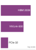

**Source Markdown Excerpt**

```markdown
3519
3520  ::: {.column-margin}
3521  {width="100%" fig-alt="Vertical bandwidth ladder on a log axis: HBM at 2,039 GB/s sits far above NVLink at 600 GB/s, which sits far above PCIe at 32 GB/s, spanning roughly 64 times from slowest to fastest interconnect."}
3522
3523  *Interconnect bandwidth spans ~64$\times$: HBM far above NVLink, NVLink far above PCIe.*
3524  :::
3525
3526  Device placement matters for framework design because the framework must track where every tensor lives and enforce that operations only combine tensors on the same device. When data must move, the framework must decide whether to block execution or overlap the transfer with other work. These decisions, invisible to most users, determine whether a training loop achieves 30 percent or 80 percent of theoretical hardware throughput.
```

**Strongest Prose Anchor**

> This {python} DeviceBandwidthHierarchy.pcie to hbm gap str$ $ bandwidth gap means a single misplaced tensor transfer can erase the entire speedup from GPU acceleration.

**Placement Context**

_Paragraph before the margin block:_

> Every tensor resides on a specific device, and cross-device operations incur transfer costs that can dominate execution time. PCIe 4.0 delivers {python} DeviceBandwidthHierarchy.pcie4 gbs str between CPU and GPU, while HBM2e provides {python} DeviceBandwidthHierarchy.a100 bw tbs str within the GPU. This {python} DeviceBandwidthHierarchy.pcie to hbm gap str$ $ bandwidth gap means a single misplaced tensor transfer can erase the entire speedup from GPU acceleration.

_Paragraph after the margin block:_

> Device placement matters for framework design because the framework must track where every tensor lives and enforce that operations only combine tensors on the same device. When data must move, the framework must decide whether to block execution or overlap the transfer with other work. These decisions, invisible to most users, determine whether a training loop achieves 30 percent or 80 percent of theoretical hardware throughput.

**Reader-Link Check**

- Source markdown: the excerpt above shows the `.column-margin` block and the exact caption beside the prose.
- The prose anchor is the text an editor should compare against the caption.
- The `fig-alt` describes what the visual marks encode; the caption should state the reader takeaway from those marks.

### 029. vol1/frameworks @ line 3558: Overlapping copy and compute costs max(copy, compute), not their sum.

- **Source QMD:** `../../quarto/contents/vol1/frameworks/frameworks.qmd:3558`
- **Asset:** `../../quarto/contents/vol1/frameworks/images/svg/vol1_frameworks_margin_002.svg`
- **Audit status:** `Pass`; lexical overlap `0.38`
- **Caption:** Overlapping copy and compute costs max(copy, compute), not their sum.
- **Figure evidence (`fig-alt`):** Two aligned rows: serial execution pays copy plus compute, while overlapped execution pays only the longer max stage.


**Source Markdown Excerpt**

```markdown
3556
3557  ::: {.column-margin}
3558  {width="100%" fig-alt="Two aligned rows: serial execution pays copy plus compute, while overlapped execution pays only the longer max stage."}
3559
3560  *Overlapping copy and compute costs max(copy, compute), not their sum.*
3561  :::
3562
3563  ::: {#lst-overlap-compute-transfer lst-cap="**Overlapping Computation and Transfer**: Use separate streams for data transfer and computation to hide transfer latency. Pinned memory enables truly asynchronous non-blocking transfers."}
```

**Strongest Prose Anchor**

> By placing data transfers on one stream and computation on another, the effective latency approaches the theoretical minimum of $ ( , )$ rather than their sum.

**Placement Context**

_Paragraph before the margin block:_

> Without explicit concurrency control, the GPU serializes all operations on a single default stream, leaving execution units idle while data transfers complete. By placing data transfers on one stream and computation on another, the effective latency approaches the theoretical minimum of $ ( , )$ rather than their sum. Stream-based overlap effectively hides the $D { }/ $ penalty when computation is the longer operation (see ):

_Paragraph after the margin block:_

> The non blocking=True flag enables asynchronous transfers that return immediately without waiting for completion. This works only when the source tensor uses pinned memory (page-locked memory that enables DMA transfers). Without pinned memory, the transfer blocks even when non blocking=True is specified, because the GPU's copy engine cannot initiate a DMA transfer from pageable host memory.

**Reader-Link Check**

- Source markdown: the excerpt above shows the `.column-margin` block and the exact caption beside the prose.
- The prose anchor is the text an editor should compare against the caption.
- The `fig-alt` describes what the visual marks encode; the caption should state the reader takeaway from those marks.

### 030. vol1/frameworks @ line 3732: Each DataLoader knob relieves a specific input bottleneck.

- **Source QMD:** `../../quarto/contents/vol1/frameworks/frameworks.qmd:3732`
- **Asset:** `../../quarto/contents/vol1/frameworks/images/svg/vol1_frameworks_margin_003.svg`
- **Audit status:** `Manual review candidate`; lexical overlap `0.29`
- **Caption:** Each DataLoader knob relieves a specific input bottleneck.
- **Figure evidence (`fig-alt`):** DataLoader knobs mapped to CPU parallelism, prefetch depth, and DMA.


**Source Markdown Excerpt**

```markdown
3730
3731  ::: {.column-margin}
3732  {width="100%" fig-alt="DataLoader knobs mapped to CPU parallelism, prefetch depth, and DMA."}
3733
3734  *Each DataLoader knob relieves a specific input bottleneck.*
3735  :::
3736
3737  The second mechanism is *prefetching*. The `prefetch_factor` parameter (default 2) controls how many batches each worker prepares in advance. With four workers and `prefetch_factor=2`, the pipeline maintains eight batches in flight, ensuring the GPU never stalls waiting for data. While the model processes batch $N$ on the GPU, workers simultaneously load and preprocess batch $N+1$ through $N+8$ on CPUs, effectively hiding data loading latency behind computation. The cost is memory consumption proportional to batch size times prefetch depth.
```

**Strongest Prose Anchor**

> The first is parallel worker processes : the DataLoader spawns multiple CPU processes, each independently loading and preprocessing samples.

**Placement Context**

_Paragraph before the margin block:_

> Frameworks address this throughput requirement through three mechanisms. The first is parallel worker processes : the DataLoader spawns multiple CPU processes, each independently loading and preprocessing samples. Because data loading involves disk I/O and CPU-bound transformations (decoding, augmentation, normalization), a single process cannot saturate a modern GPU. Multiple workers overlap I/O wait times with preprocessing computation, collectively sustaining throughput that no single process could achieve. When num workers > 0, the DataLoader distributes sample indices across workers through a shared queue, and workers push completed...

_Paragraph after the margin block:_

> The second mechanism is prefetching . The prefetch factor parameter (default 2) controls how many batches each worker prepares in advance. With four workers and prefetch factor=2, the pipeline maintains eight batches in flight, ensuring the GPU never stalls waiting for data. While the model processes batch $N$ on the GPU, workers simultaneously load and preprocess batch $N+1$ through $N+8$ on CPUs, effectively hiding data loading latency behind computation. The cost is memory consumption proportional to batch size times prefetch depth.

**Reader-Link Check**

- Source markdown: the excerpt above shows the `.column-margin` block and the exact caption beside the prose.
- The prose anchor is the text an editor should compare against the caption.
- The `fig-alt` describes what the visual marks encode; the caption should state the reader takeaway from those marks.

### 031. vol1/frameworks @ line 4430: Each framework optimizes for a different system bottleneck.

- **Source QMD:** `../../quarto/contents/vol1/frameworks/frameworks.qmd:4430`
- **Asset:** `../../quarto/contents/vol1/frameworks/images/svg/vol1_frameworks_margin_004.svg`
- **Audit status:** `Pass`; lexical overlap `0.33`
- **Caption:** Each framework optimizes for a different system bottleneck.
- **Figure evidence (`fig-alt`):** TensorFlow, PyTorch, and JAX mapped to their strongest design emphasis.


**Source Markdown Excerpt**

```markdown
4428
4429  ::: {.column-margin}
4430  {width="100%" fig-alt="TensorFlow, PyTorch, and JAX mapped to their strongest design emphasis."}
4431
4432  *Each framework optimizes for a different system bottleneck.*
4433  :::
4434
4435  ### TensorFlow: The graph-first production machine {#sec-ml-frameworks-tensorflow-ecosystem-063c}
```

**Strongest Prose Anchor**

> Each major framework represents a distinct point in the design space defined by the three core problems: TensorFlow prioritizes the Abstraction Problem through its comprehensive deployment ecosystem, PyTorch prioritizes the Execution Problem through its dynamic graph approach, and JAX reframes the Differentiation Problem through composable function transformations.

**Placement Context**

_Paragraph before the margin block:_

> Each major framework represents a distinct point in the design space defined by the three core problems: TensorFlow prioritizes the Abstraction Problem through its comprehensive deployment ecosystem, PyTorch prioritizes the Execution Problem through its dynamic graph approach, and JAX reframes the Differentiation Problem through composable function transformations. These differences are architectural, reflecting fundamental capability trade-offs that determine what each framework can and cannot do well.

_Paragraph after the margin block:_

> TensorFlow's architecture reflects a comprehensive solution to the Abstraction Problem: targeting diverse hardware, from cloud TPUs to microcontrollers, through a single interface. Google's production environment demanded this breadth because the same model often needed to serve predictions on TPU pods in the data center, on Android phones via TensorFlow Lite, and in web browsers through TensorFlow.js . This deployment diversity drove the choice of a static graph (or "Define-and-Run") design. By requiring the model to be represented as a complete computational graph before execution, TensorFlow enables ahead-of-time (AOT) compilation and...

**Reader-Link Check**

- Source markdown: the excerpt above shows the `.column-margin` block and the exact caption beside the prose.
- The prose anchor is the text an editor should compare against the caption.
- The `fig-alt` describes what the visual marks encode; the caption should state the reader takeaway from those marks.

### 032. vol1/hw_acceleration @ line 84: Hardware acceleration turns on the Machine axis.

- **Source QMD:** `../../quarto/contents/vol1/hw_acceleration/hw_acceleration.qmd:84`
- **Asset:** `../../quarto/contents/vol1/hw_acceleration/images/svg/hw_acceleration_dam_locator.svg`
- **Audit status:** `Pass`; lexical overlap `0.80`
- **Caption:** Hardware acceleration turns on the Machine axis.
- **Figure evidence (`fig-alt`):** D·A·M taxonomy triangle with three vertices labeled D, A, and M connected by edges. The M (Machine) vertex is filled in solid color; the D and A vertices are gray, marking this chapter as the Machine axis.


**Source Markdown Excerpt**

```markdown
82
83  ::: {.column-margin}
84  {width="100%" fig-alt="D·A·M taxonomy triangle with three vertices labeled D, A, and M connected by edges. The M (Machine) vertex is filled in solid color; the D and A vertices are gray, marking this chapter as the Machine axis."}
85
86  *Hardware acceleration turns on the Machine axis.*
87  :::
88
89  \index{D·A·M Taxonomy!machine axis}
```

**Strongest Prose Anchor**

> Data was optimized in and the Algorithm (Model) was compressed in The final Machine axis of the D·A·M taxonomy in is the subject of hardware acceleration.

**Placement Context**

_Paragraph before the margin block:_

> - Explain why systolic arrays and Tensor Cores achieve 10 to 100 times better efficiency than general-purpose processors - Calculate arithmetic intensity and use the Roofline Model to determine compute-bound vs. memory-bound workloads - Predict performance bottlenecks by quantifying the memory wall: bandwidth limits, energy costs, and cache hierarchy trade-offs - Select appropriate dataflow strategies (weight-stationary, output-stationary, input-stationary) based on workload reuse priorities - Analyze compiler optimizations including kernel fusion, tiling, and memory planning for efficient hardware execution - Evaluate accelerator choices...

_Paragraph after the margin block:_

> Data was optimized in and the Algorithm (Model) was compressed in The final Machine axis of the D·A·M taxonomy in is the subject of hardware acceleration. Hardware acceleration exists because of a striking asymmetry in modern computing: arithmetic is cheap , but moving data is expensive . In the time a modern accelerator computes a thousand floating-point operations, a single value travels from main memory. This inversion, where computation is the abundant resource and bandwidth is the scarce one, is the reason specialized hardware matters for machine learning.

**Reader-Link Check**

- Source markdown: the excerpt above shows the `.column-margin` block and the exact caption beside the prose.
- The prose anchor is the text an editor should compare against the caption.
- The `fig-alt` describes what the visual marks encode; the caption should state the reader takeaway from those marks.

### 033. vol1/hw_acceleration @ line 850: A DRAM access costs ~100$\\times$ a MAC; data movement dominates energy.

- **Source QMD:** `../../quarto/contents/vol1/hw_acceleration/hw_acceleration.qmd:850`
- **Asset:** `../../quarto/contents/vol1/hw_acceleration/images/svg/hw_acceleration_energy_ladder.svg`
- **Audit status:** `Manual review candidate`; lexical overlap `0.25`
- **Caption:** A DRAM access costs ~100$\\times$ a MAC; data movement dominates energy.
- **Figure evidence (`fig-alt`):** A log-scale ladder of energy per operation: DRAM access at 640 pJ is by far the longest bar, MAC arithmetic at 3.7 pJ is much shorter, and SRAM access at 0.5 pJ is shortest, showing memory access costs orders of magnitude more energy than computation.


**Source Markdown Excerpt**

```markdown
848
849  ::: {.column-margin}
850  {width="100%" fig-alt="A log-scale ladder of energy per operation: DRAM access at 640 pJ is by far the longest bar, MAC arithmetic at 3.7 pJ is much shorter, and SRAM access at 0.5 pJ is shortest, showing memory access costs orders of magnitude more energy than computation."}
851
852  *A DRAM access costs ~100$\times$ a MAC; data movement dominates energy.*
853  :::
854
855  Machine learning computational requirements reveal limitations in traditional processors. CPUs reach only `{python} CpuMlInefficiency.cpu_utilization_min_str`–`{python} CpuMlInefficiency.cpu_utilization_max_str` utilization on neural network workloads, delivering approximately `{python} CpuMlInefficiency.cpu_gflops_str` (billions of floating-point operations per second) while consuming hundreds of watts. This inefficiency results from architectural mismatches: CPUs optimize for single-thread performance and irregular memory access, while neural networks require massive parallelism and predictable data streams. The memory bandwidth constraint compounds the problem: a single neural network layer may require accessing gigabytes of parameters, overwhelming CPU cache hierarchies designed for kilobyte-scale working sets.
```

**Strongest Prose Anchor**

> This inefficiency results from architectural mismatches: CPUs optimize for single-thread performance and irregular memory access, while neural networks require massive parallelism and predictable data streams.

**Placement Context**

_Paragraph before the margin block:_

> 1. Significance (quantitative) : The efficiency differential over CPUs is quantifiable. An A100 GPU delivers {python} MlAcceleratorCallout.a100 tflops fp16 str for FP16/BF16 matrix multiplication with {python} MlAcceleratorCallout.a100 bw tbs str memory bandwidth, while a high-end server CPU delivers roughly 1–2 TFLOP/s FP32 with 200 GB/s bandwidth, a {python} MlAcceleratorCallout.cpu gap min str--{python} MlAcceleratorCallout.cpu gap max str$ $ compute throughput gap and a 10$ $ bandwidth gap for the same matrix-multiply workloads that dominate neural network training and inference. 2. Distinction (durable) : Unlike a general-purpose CPU...

_Paragraph after the margin block:_

> Machine learning computational requirements reveal limitations in traditional processors. CPUs reach only {python} CpuMlInefficiency.cpu utilization min str–{python} CpuMlInefficiency.cpu utilization max str utilization on neural network workloads, delivering approximately {python} CpuMlInefficiency.cpu gflops str (billions of floating-point operations per second) while consuming hundreds of watts. This inefficiency results from architectural mismatches: CPUs optimize for single-thread performance and irregular memory access, while neural networks require massive parallelism and predictable data streams. The memory bandwidth constraint...

**Reader-Link Check**

- Source markdown: the excerpt above shows the `.column-margin` block and the exact caption beside the prose.
- The prose anchor is the text an editor should compare against the caption.
- The `fig-alt` describes what the visual marks encode; the caption should state the reader takeaway from those marks.

### 034. vol1/hw_acceleration @ line 2254: One extra dimension past the tile width tips utilization off a cliff.

- **Source QMD:** `../../quarto/contents/vol1/hw_acceleration/hw_acceleration.qmd:2254`
- **Asset:** `../../quarto/contents/vol1/hw_acceleration/images/svg/vol1_hw_acceleration_margin_001.svg`
- **Audit status:** `Pass`; lexical overlap `0.30`
- **Caption:** One extra dimension past the tile width tips utilization off a cliff.
- **Figure evidence (`fig-alt`):** An efficiency curve that holds high up to a tile width of 128, then drops sharply at 129 where a fringe tile appears; the region past the cliff is shaded red.


**Source Markdown Excerpt**

```markdown
2252
2253  ::: {.column-margin}
2254  {width="100%" fig-alt="An efficiency curve that holds high up to a tile width of 128, then drops sharply at 129 where a fringe tile appears; the region past the cliff is shaded red."}
2255
2256  *One extra dimension past the tile width tips utilization off a cliff.*
2257  :::
2258
2259  The systolic array architecture achieves computational efficiency through synchronized data movement across a structured grid of processing elements. Systolic arrays organize computation around four components:
```

**Strongest Prose Anchor**

> An engineer who understands tiling understands the "silicon contract": if a layer's dimensions are not multiples of the tile size (for example, a width of 129 on a 128 array), the system pays a fringe tax in underutilized silicon, where 127 units sit idle while one unit finishes the "remainder" tile.

**Placement Context**

_Paragraph before the margin block:_

> This tiling pattern is the central mechanism behind high-performance ML systems. It allows the hardware to maintain high system efficiency $( { })$ by ensuring that for every byte loaded from main memory, the data is reused {python} TilingPrinciple.reuse factor str$ $ within the systolic grid. An engineer who understands tiling understands the "silicon contract": if a layer's dimensions are not multiples of the tile size (for example, a width of 129 on a 128 array), the system pays a fringe tax in underutilized silicon, where 127 units sit idle while one unit finishes the "remainder" tile.

_Paragraph after the margin block:_

> The systolic array architecture achieves computational efficiency through synchronized data movement across a structured grid of processing elements. Systolic arrays organize computation around four components:

**Reader-Link Check**

- Source markdown: the excerpt above shows the `.column-margin` block and the exact caption beside the prose.
- The prose anchor is the text an editor should compare against the caption.
- The `fig-alt` describes what the visual marks encode; the caption should state the reader takeaway from those marks.

### 035. vol1/hw_acceleration @ line 3455: Bandwidth tapers steeply as data moves farther from the accelerator.

- **Source QMD:** `../../quarto/contents/vol1/hw_acceleration/hw_acceleration.qmd:3455`
- **Asset:** `../../quarto/contents/vol1/hw_acceleration/images/svg/vol1_hw_acceleration_margin_002.svg`
- **Audit status:** `Pass`; lexical overlap `0.43`
- **Caption:** Bandwidth tapers steeply as data moves farther from the accelerator.
- **Figure evidence (`fig-alt`):** Vertical log-scale ladder of violet bandwidth bars, widest at top: HBM, then NVLink, then PCIe, down to a narrow network bar at the bottom.


**Source Markdown Excerpt**

```markdown
3453
3454  ::: {.column-margin}
3455  {width="100%" fig-alt="Vertical log-scale ladder of violet bandwidth bars, widest at top: HBM, then NVLink, then PCIe, down to a narrow network bar at the bottom."}
3456
3457  *Bandwidth tapers steeply as data moves farther from the accelerator.*
3458  :::
3459
3460  ```{python}
```

**Strongest Prose Anchor**

> A typical AI server is not a flat mesh of connected devices but a hierarchy of bandwidths that tapers as we move away from the chip.

**Placement Context**

_Paragraph before the margin block:_

> To optimize data movement, we must understand the physical topology of the compute node. A typical AI server is not a flat mesh of connected devices but a hierarchy of bandwidths that tapers as we move away from the chip.

_Paragraph after the margin block:_

> 1. Device-Device Interconnect (NVLink/Infinity Fabric) [^fn-nvlink-bandwidth] : Modern multi-GPU nodes use specialized high-speed bridges like NVLink to connect accelerators directly, bypassing the host CPU. Bandwidth ranges from {python} InterconnectHierarchy.nvlink a100 gb s str to {python} InterconnectHierarchy.nvlink h100 gb s str per GPU. The primary use case is gradient synchronization (AllReduce) [^fn-allreduce-gradient-sync] during distributed training. This bandwidth is critical for scaling; without it, multi-GPU training often scales poorly.

**Reader-Link Check**

- Source markdown: the excerpt above shows the `.column-margin` block and the exact caption beside the prose.
- The prose anchor is the text an editor should compare against the caption.
- The `fig-alt` describes what the visual marks encode; the caption should state the reader takeaway from those marks.

### 036. vol1/hw_acceleration @ line 3619: Low arithmetic intensity pins the workload in the memory-bound regime.

- **Source QMD:** `../../quarto/contents/vol1/hw_acceleration/hw_acceleration.qmd:3619`
- **Asset:** `../../quarto/contents/vol1/hw_acceleration/images/svg/hw_acceleration_roofline_elbow.svg`
- **Audit status:** `Pass`; lexical overlap `0.57`
- **Caption:** Low arithmetic intensity pins the workload in the memory-bound regime.
- **Figure evidence (`fig-alt`):** Roofline elbow: a blue memory-bound slope rises left to right to a short orange compute-bound ceiling, with a dashed vertical ridge line at the bend and one workload dot sitting low on the blue slope, far below the ridge in the memory-bound region.


**Source Markdown Excerpt**

```markdown
3617
3618  ::: {.column-margin}
3619  {width="100%" fig-alt="Roofline elbow: a blue memory-bound slope rises left to right to a short orange compute-bound ceiling, with a dashed vertical ridge line at the bend and one workload dot sitting low on the blue slope, far below the ridge in the memory-bound region."}
3620
3621  *Low arithmetic intensity pins the workload in the memory-bound regime.*
3622  :::
3623
3624  \index{Roofline Model!efficiency measurement}
```

**Strongest Prose Anchor**

> The Roofline Model answers this question by plotting arithmetic intensity against attainable performance, revealing whether each operation hits a compute ceiling or a memory bandwidth ceiling.

**Placement Context**

_Paragraph before the margin block:_

> As ML workloads continue to grow in complexity, memory efficiency becomes as critical as raw compute power. The analysis reveals how memory systems dominate accelerator performance: DRAM access has 100$ $ or higher energy cost than on-chip arithmetic, carefully structured memory hierarchies can improve effective bandwidth substantially, and different neural network architectures create distinct memory pressure patterns. These constraints (bandwidth limitations, energy costs, and communication overheads) determine whether theoretical computational capabilities translate into real-world performance. The remaining question is whether a...

_Paragraph after the margin block:_

> The Roofline Model answers this question by plotting arithmetic intensity against attainable performance, revealing whether each operation hits a compute ceiling or a memory bandwidth ceiling. Rather than relying on peak FLOP/s figures, which reflect marketing rather than achievable throughput, the Roofline Model provides a quantitative framework that maps any workload onto a specific hardware platform and immediately exposes the binding constraint. This section develops that framework and applies it to the neural network architectures analyzed earlier.

**Reader-Link Check**

- Source markdown: the excerpt above shows the `.column-margin` block and the exact caption beside the prose.
- The prose anchor is the text an editor should compare against the caption.
- The `fig-alt` describes what the visual marks encode; the caption should state the reader takeaway from those marks.

### 037. vol1/hw_acceleration @ line 4498: Mapping choices explode combinatorially as loop dimensions grow.

- **Source QMD:** `../../quarto/contents/vol1/hw_acceleration/hw_acceleration.qmd:4498`
- **Asset:** `../../quarto/contents/vol1/hw_acceleration/images/svg/vol1_hw_acceleration_margin_003.svg`
- **Audit status:** `Manual review candidate`; lexical overlap `0.29`
- **Caption:** Mapping choices explode combinatorially as loop dimensions grow.
- **Figure evidence (`fig-alt`):** A line on a log scale rising steeply from a handful of choices at left to a billion-scale search space at right as loop dimensions grow.


**Source Markdown Excerpt**

```markdown
4496
4497  ::: {.column-margin}
4498  {width="100%" fig-alt="A line on a log scale rising steeply from a handful of choices at left to a billion-scale search space at right as loop dimensions grow."}
4499
4500  *Mapping choices explode combinatorially as loop dimensions grow.*
4501  :::
4502
4503  When considering multiple memory levels, the search space expands as:
```

**Strongest Prose Anchor**

> A typical convolutional layer may involve up to seven loop dimensions, leading to: $$ 7!

**Placement Context**

_Paragraph before the margin block:_

> The number of ways to arrange $n { }$ loops follows a factorial growth pattern: $$ N { } = n { }! $$ which scales rapidly. A typical convolutional layer may involve up to seven loop dimensions, leading to: $$ 7! = 5,040 $$

_Paragraph after the margin block:_

> When considering multiple memory levels, the search space expands as: $$ (n { }!)^{N { }} $$ where $N { }$ is the number of memory hierarchy levels. This rapid expansion shows why execution order optimization matters: poor loop ordering can lead to excessive memory traffic, while an optimized order improves cache utilization [ ].

**Reader-Link Check**

- Source markdown: the excerpt above shows the `.column-margin` block and the exact caption beside the prose.
- The prose anchor is the text an editor should compare against the caption.
- The `fig-alt` describes what the visual marks encode; the caption should state the reader takeaway from those marks.

### 038. vol1/introduction @ line 141: Production ML work is mostly the surrounding system, not the model code alone.

- **Source QMD:** `../../quarto/contents/vol1/introduction/introduction.qmd:141`
- **Asset:** `../../quarto/contents/vol1/introduction/images/svg/vol1_introduction_margin_001.svg`
- **Audit status:** `Pass`; lexical overlap `0.67`
- **Caption:** Production ML work is mostly the surrounding system, not the model code alone.
- **Figure evidence (`fig-alt`):** A small orange box labeled ML code 5 percent nested inside a much larger surrounding frame labeled System 95 percent; the inner box occupies a tiny fraction of the outer area.


**Source Markdown Excerpt**

```markdown
139
140  ::: {.column-margin}
141  {width="100%" fig-alt="A small orange box labeled ML code 5 percent nested inside a much larger surrounding frame labeled System 95 percent; the inner box occupies a tiny fraction of the outer area."}
142
143  *Production ML work is mostly the surrounding system, not the model code alone.*
144  :::
145
146  **Systems insight**: "Machine Learning" is easy; "Machine Learning Systems" are hard. The friction in deployment rarely comes from the matrix multiplication alone; it comes from the interface between that math and the messy reality of the surrounding system. Optimizing only the model optimizes the visible center of a much larger engineering problem.
```

**Strongest Prose Anchor**

> Their paper's schematic "ML code" box occupies roughly 5 percent of the surrounding infrastructure diagram, not as a literal line-count audit but as a useful scale intuition: data collection, verification, feature extraction, resource management, monitoring, and serving infrastructure dominate the engineering surface.

**Placement Context**

_Paragraph before the margin block:_

> Insight : They demonstrated that in mature ML systems, the ML Code (the model itself) is often only a small fraction of the total system. Their paper's schematic "ML code" box occupies roughly 5 percent of the surrounding infrastructure diagram, not as a literal line-count audit but as a useful scale intuition: data collection, verification, feature extraction, resource management, monitoring, and serving infrastructure dominate the engineering surface.

_Paragraph after the margin block:_

> Systems insight : "Machine Learning" is easy; "Machine Learning Systems" are hard. The friction in deployment rarely comes from the matrix multiplication alone; it comes from the interface between that math and the messy reality of the surrounding system. Optimizing only the model optimizes the visible center of a much larger engineering problem.

**Reader-Link Check**

- Source markdown: the excerpt above shows the `.column-margin` block and the exact caption beside the prose.
- The prose anchor is the text an editor should compare against the caption.
- The `fig-alt` describes what the visual marks encode; the caption should state the reader takeaway from those marks.

### 039. vol1/introduction @ line 271: Test coverage is a vanishing fraction of the input space.

- **Source QMD:** `../../quarto/contents/vol1/introduction/introduction.qmd:271`
- **Asset:** `../../quarto/contents/vol1/introduction/images/svg/vol1_introduction_margin_002.svg`
- **Audit status:** `Pass`; lexical overlap `0.67`
- **Caption:** Test coverage is a vanishing fraction of the input space.
- **Figure evidence (`fig-alt`):** Vertical log-scale ladder of two blue bars: a towering bar for the total input space far above a tiny bar for test-set coverage, the gap between them spanning many orders of magnitude.


**Source Markdown Excerpt**

```markdown
269
270  ::: {.column-margin}
271  {width="100%" fig-alt="Vertical log-scale ladder of two blue bars: a towering bar for the total input space far above a tiny bar for test-set coverage, the gap between them spanning many orders of magnitude."}
272
273  *Test coverage is a vanishing fraction of the input space.*
274  :::
275
276  This gap means we must rely on *statistical monitoring* in production (@sec-ml-operations develops the monitoring infrastructure that makes this feasible) rather than predeployment verification alone. Guaranteed correctness is traded for statistical reliability.
```

**Strongest Prose Anchor**

> Let Total Input Space denote the number of possible inputs and Test Set Coverage denote the number of inputs a test suite actually evaluates.

**Placement Context**

_Paragraph before the margin block:_

> In Software 2.0, the input space is high-dimensional (for example, all possible images). Although technically discrete, it is so vast that it is practically unsamplable. Consider an image classifier: a $224{ }224$ RGB image has $256^{150{,}528}$ possible pixel configurations, a number with {python} VerificationGap.vg digits str digits. ImageNet's entire test set covers only {python} VerificationGap.imagenet test images str of them. Let Total Input Space denote the number of possible inputs and Test Set Coverage denote the number of inputs a test suite actually evaluates. No test suite can sample this space meaningfully. captures this...

_Paragraph after the margin block:_

> This gap means we must rely on statistical monitoring in production ( develops the monitoring infrastructure that makes this feasible) rather than predeployment verification alone. Guaranteed correctness is traded for statistical reliability.

**Reader-Link Check**

- Source markdown: the excerpt above shows the `.column-margin` block and the exact caption beside the prose.
- The prose anchor is the text an editor should compare against the caption.
- The `fig-alt` describes what the visual marks encode; the caption should state the reader takeaway from those marks.

### 040. vol1/introduction @ line 1754: Accuracy decays silently under drift.

- **Source QMD:** `../../quarto/contents/vol1/introduction/introduction.qmd:1754`
- **Asset:** `../../quarto/contents/vol1/introduction/images/svg/vol1_introduction_margin_003.svg`
- **Audit status:** `Manual review candidate`; lexical overlap `0.20`
- **Caption:** Accuracy decays silently under drift.
- **Figure evidence (`fig-alt`):** A line falling from a high initial accuracy to a lower degraded accuracy as drift increases over time, with no abrupt break.

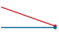

**Source Markdown Excerpt**

```markdown
1752
1753  ::: {.column-margin}
1754  {width="100%" fig-alt="A line falling from a high initial accuracy to a lower degraded accuracy as drift increases over time, with no abrupt break."}
1755
1756  *Accuracy decays silently under drift.*
1757  :::
1758
1759  *   $\text{Accuracy}_0$: Initial accuracy at deployment
```

**Strongest Prose Anchor**

> $ 0$: Initial accuracy at deployment $ (P t P 0)$: Statistical divergence between current data distribution $P t$ and training distribution $P 0$ $ $: Model sensitivity to distribution shift (architecture-dependent)

**Placement Context**

_Paragraph before the margin block:_

> Because this failure mode is silent, crash logs cannot be relied upon for detection; mathematical approaches must be used. When failures do not announce themselves, quantitative signals are needed that connect measurable distribution shift to expected performance loss. Just as Patterson and Hennessy's iron law [- ] decomposed CPU performance into fundamental components, we can decompose ML system degradation into constituent factors. The degradation equation in captures how model performance evolves over time: $$ (t) 0 - (P t P 0) $$ { } where:

_Paragraph after the margin block:_

> $ 0$: Initial accuracy at deployment $ (P t P 0)$: Statistical divergence between current data distribution $P t$ and training distribution $P 0$ $ $: Model sensitivity to distribution shift (architecture-dependent)

**Reader-Link Check**

- Source markdown: the excerpt above shows the `.column-margin` block and the exact caption beside the prose.
- The prose anchor is the text an editor should compare against the caption.
- The `fig-alt` describes what the visual marks encode; the caption should state the reader takeaway from those marks.

### 041. vol1/introduction @ line 1978: Moving a byte costs about 145 times an FP16 op, the data-movement tax.

- **Source QMD:** `../../quarto/contents/vol1/introduction/introduction.qmd:1978`
- **Asset:** `../../quarto/contents/vol1/introduction/images/svg/introduction_energy_hierarchy.svg`
- **Audit status:** `Pass`; lexical overlap `0.75`
- **Caption:** Moving a byte costs about 145 times an FP16 op, the data-movement tax.
- **Figure evidence (`fig-alt`):** Vertical ladder of three orange bars on a log scale, longest at top: DRAM 160 pJ towers far above FP16 1.1 pJ and INT8 0.2 pJ, showing data movement costs orders of magnitude more energy than arithmetic.

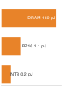

**Source Markdown Excerpt**

```markdown
1976
1977  ::: {.column-margin}
1978  {width="100%" fig-alt="Vertical ladder of three orange bars on a log scale, longest at top: DRAM 160 pJ towers far above FP16 1.1 pJ and INT8 0.2 pJ, showing data movement costs orders of magnitude more energy than arithmetic."}
1979
1980  *Moving a byte costs about 145 times an FP16 op, the data-movement tax.*
1981  :::
1982
1983  The dominant term is data movement: $E_{\text{move}} \gg E_{\text{compute}}$. Under the energy constants used in this text, moving one byte from off-chip DRAM costs about `{python} EnergyMovementRatios.fp16_ratio_str`$\times$ one FP16 operation and about `{python} EnergyMovementRatios.int8_ratio_str`$\times$ one INT8 operation. The exact ratio depends on precision and memory level, but the conclusion is stable: moving data through the memory hierarchy costs orders of magnitude more energy than arithmetic. The physical reason is that data movement requires charging and discharging wires over macroscopic distances, while arithmetic is performed locally within a processing unit's circuits. Therefore, minimizing data movement $(D_{\text{vol}})$ is the primary lever for both speed *and* energy efficiency.
```

**Strongest Prose Anchor**

> Under the energy constants used in this text, moving one byte from off-chip DRAM costs about {python} EnergyMovementRatios.fp16 ratio str$ $ one FP16 operation and about {python} EnergyMovementRatios.int8 ratio str$ $ one INT8 operation.

**Placement Context**

_Paragraph before the margin block:_

> Just as time is governed by physics, so is energy. We must add a fourth term to our mental model: The Energy Tax. In many modern systems (mobile, edge, and large-scale training), energy, not time, is the hard constraint. Let $D { }$ be the total data volume moved (bytes), $E { }$ the energy per byte moved, $O$ the total operation count, and $E { }$ the energy per operation. formalizes this relationship: $$ E { } } E { } } { } + } } { } $$ { }

_Paragraph after the margin block:_

> The dominant term is data movement: $E { } E { }$. Under the energy constants used in this text, moving one byte from off-chip DRAM costs about {python} EnergyMovementRatios.fp16 ratio str$ $ one FP16 operation and about {python} EnergyMovementRatios.int8 ratio str$ $ one INT8 operation. The exact ratio depends on precision and memory level, but the conclusion is stable: moving data through the memory hierarchy costs orders of magnitude more energy than arithmetic. The physical reason is that data movement requires charging and discharging wires over macroscopic distances, while arithmetic is performed locally within a processing unit's...

**Reader-Link Check**

- Source markdown: the excerpt above shows the `.column-margin` block and the exact caption beside the prose.
- The prose anchor is the text an editor should compare against the caption.
- The `fig-alt` describes what the visual marks encode; the caption should state the reader takeaway from those marks.

### 042. vol1/introduction @ line 2027: GPT-2 decode is bandwidth-bound: the data term dominates.

- **Source QMD:** `../../quarto/contents/vol1/introduction/introduction.qmd:2027`
- **Asset:** `../../quarto/contents/vol1/introduction/images/svg/introduction_iron_law_bars.svg`
- **Audit status:** `Pass`; lexical overlap `1.00`
- **Caption:** GPT-2 decode is bandwidth-bound: the data term dominates.
- **Figure evidence (`fig-alt`):** Horizontal three-segment bar labeled D, C, L for the iron law's data, compute, and latency terms. The data segment is widest and shaded blue, dominating; the compute and latency segments are narrow and gray.


**Source Markdown Excerpt**

```markdown
2025
2026  ::: {.column-margin}
2027  {width="100%" fig-alt="Horizontal three-segment bar labeled D, C, L for the iron law's data, compute, and latency terms. The data segment is widest and shaded blue, dominating; the compute and latency segments are narrow and gray."}
2028
2029  *GPT-2 decode is bandwidth-bound: the data term dominates.*
2030  :::
2031
2032  The iron law makes these differences precise. ResNet-50 applies the same small weight filters across many spatial positions and, under batching, across many inputs; that reuse can make $O/(R_{\text{peak}} \cdot \eta_{\text{hw}})$ the dominant term because the processor must sustain enormous arithmetic throughput while the data footprint remains modest. GPT-2, by contrast, loads billions of unique weight parameters for every token it generates, and each weight is used only once before the next must be fetched; its $D_{\text{vol}}/\text{BW}$ term dominates because memory bandwidth, not arithmetic, is the binding constraint. The same equation, applied to two different workloads, yields different diagnoses and therefore different optimization strategies: doubling $R_{\text{peak}}$ helps batched ResNet-50 once reuse lifts arithmetic intensity, but barely affects GPT-2 decode; doubling $\text{BW}$ has the reverse effect for bandwidth-bound decode.
```

**Strongest Prose Anchor**

> The same equation, applied to two different workloads, yields different diagnoses and therefore different optimization strategies: doubling $R { }$ helps batched ResNet-50 once reuse lifts arithmetic intensity, but barely affects GPT-2 decode; doubling $ $ has the reverse effect for bandwidth-bound decode.

**Placement Context**

_Paragraph before the margin block:_

> : Lighthouse Models as Reference Workloads : Each workload isolates a distinct bottleneck, enabling systematic investigation of how system constraints affect different architectural patterns. Quantitative specifications and architectural details appear in { tbl-colwidths="[23,25,25,27]"}

_Paragraph after the margin block:_

> The iron law makes these differences precise. ResNet-50 applies the same small weight filters across many spatial positions and, under batching, across many inputs; that reuse can make $O/(R { } { })$ the dominant term because the processor must sustain enormous arithmetic throughput while the data footprint remains modest. GPT-2, by contrast, loads billions of unique weight parameters for every token it generates, and each weight is used only once before the next must be fetched; its $D { }/ $ term dominates because memory bandwidth, not arithmetic, is the binding constraint. The same equation, applied to two different workloads, yields...

**Reader-Link Check**

- Source markdown: the excerpt above shows the `.column-margin` block and the exact caption beside the prose.
- The prose anchor is the text an editor should compare against the caption.
- The `fig-alt` describes what the visual marks encode; the caption should state the reader takeaway from those marks.

### 043. vol1/introduction @ line 3358: Optimizing only inference leaves end-to-end latency mostly intact.

- **Source QMD:** `../../quarto/contents/vol1/introduction/introduction.qmd:3358`
- **Asset:** `../../quarto/contents/vol1/introduction/images/svg/vol1_introduction_margin_004.svg`
- **Audit status:** `Pass`; lexical overlap `0.62`
- **Caption:** Optimizing only inference leaves end-to-end latency mostly intact.
- **Figure evidence (`fig-alt`):** Two stacked latency bars, before and after: the inference segment shrinks sharply in the after bar while the pre-processing and post-processing segments stay the same, so the total barely changes.


**Source Markdown Excerpt**

```markdown
3356
3357  ::: {.column-margin}
3358  {width="100%" fig-alt="Two stacked latency bars, before and after: the inference segment shrinks sharply in the after bar while the pre-processing and post-processing segments stay the same, so the total barely changes."}
3359
3360  *Optimizing only inference leaves end-to-end latency mostly intact.*
3361  :::
3362
3363  ```{python}
```

**Strongest Prose Anchor**

> Engineers optimize inference latency in isolation, but Amdahl's Law governs end-to-end performance.

**Placement Context**

_Paragraph before the margin block:_

> Engineers optimize inference latency in isolation, but Amdahl's Law governs end-to-end performance. A team reduces model inference from {python} AmdahlsPitfall.t inference ms str to {python} AmdahlsPitfall.t inf new ms str, expecting proportional improvement. Yet preprocessing consumes {python} AmdahlsPitfall.t pre ms str and postprocessing adds {python} AmdahlsPitfall.t post ms str, so total latency drops only from {python} AmdahlsPitfall.total ms str to {python} AmdahlsPitfall.new total ms str: {python} AmdahlsPitfall.improv pct str improvement rather than the expected {python} AmdahlsPitfall.naive p str. The D·A·M taxonomy ( ) shows...

_Paragraph after the margin block:_

> Fallacy : ML systems can be deployed once and left to run indefinitely.

**Reader-Link Check**

- Source markdown: the excerpt above shows the `.column-margin` block and the exact caption beside the prose.
- The prose anchor is the text an editor should compare against the caption.
- The `fig-alt` describes what the visual marks encode; the caption should state the reader takeaway from those marks.

### 044. vol1/ml_ops @ line 345: Cumulative manual work overtakes the one-time automation investment near week 20.

- **Source QMD:** `../../quarto/contents/vol1/ml_ops/ml_ops.qmd:345`
- **Asset:** `../../quarto/contents/vol1/ml_ops/images/svg/vol1_ml_ops_margin_001.svg`
- **Audit status:** `Pass`; lexical overlap `0.33`
- **Caption:** Cumulative manual work overtakes the one-time automation investment near week 20.
- **Figure evidence (`fig-alt`):** Two strokes against weeks elapsed: a rising manual-work line crossing a flat one-time pipeline-investment line near week 20, with the area past the crossover shaded.


**Source Markdown Excerpt**

```markdown
343
344  ::: {.column-margin}
345  {width="100%" fig-alt="Two strokes against weeks elapsed: a rising manual-work line crossing a flat one-time pipeline-investment line near week 20, with the area past the crossover shaded."}
346
347  *Cumulative manual work overtakes the one-time automation investment near week 20.*
348  :::
349
350  ```{python}
```

**Strongest Prose Anchor**

> Teams often resist automation investment because manual processes seem faster in the short term, but this intuition is systematically wrong.

**Placement Context**

_Paragraph before the margin block:_

> The abstract notion of technical debt becomes concrete when we examine cost dynamics. Teams often resist automation investment because manual processes seem faster in the short term, but this intuition is systematically wrong. A break-even calculation makes that compounding concrete.

_Paragraph after the margin block:_

> Problem : Why build automated pipelines when manual retraining is faster?

**Reader-Link Check**

- Source markdown: the excerpt above shows the `.column-margin` block and the exact caption beside the prose.
- The prose anchor is the text an editor should compare against the caption.
- The `fig-alt` describes what the visual marks encode; the caption should state the reader takeaway from those marks.

### 045. vol1/ml_ops @ line 1489: Stretch retraining too far and staleness cost runs away.

- **Source QMD:** `../../quarto/contents/vol1/ml_ops/ml_ops.qmd:1489`
- **Asset:** `../../quarto/contents/vol1/ml_ops/images/svg/vol1_ml_ops_margin_002.svg`
- **Audit status:** `Manual review candidate`; lexical overlap `0.25`
- **Caption:** Stretch retraining too far and staleness cost runs away.
- **Figure evidence (`fig-alt`):** A U-shaped total-cost curve over retraining cadence: a falling stroke and a rising stroke meet at a marked low point near one day, with a dot at the minimum.

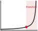

**Source Markdown Excerpt**

```markdown
1487
1488  ::: {.column-margin}
1489  {width="100%" fig-alt="A U-shaped total-cost curve over retraining cadence: a falling stroke and a rising stroke meet at a marked low point near one day, with a dot at the minimum."}
1490
1491  *Stretch retraining too far and staleness cost runs away.*
1492  :::
1493
1494  For exponential decay, this yields the square-root law used in our earlier napkin math calculation. In fraud detection, these formulas translate directly into a retraining schedule.
```

**Strongest Prose Anchor**

> The optimal retraining interval $T^ $ minimizes total cost per unit time, as shows: $$T^ = T (T) + }{T}$$ { }

**Placement Context**

_Paragraph before the margin block:_

> The optimal retraining interval $T^ $ minimizes total cost per unit time, as shows: $$T^ = T (T) + }{T}$$ { }

_Paragraph after the margin block:_

> For exponential decay, this yields the square-root law used in our earlier napkin math calculation. In fraud detection, these formulas translate directly into a retraining schedule.

**Reader-Link Check**

- Source markdown: the excerpt above shows the `.column-margin` block and the exact caption beside the prose.
- The prose anchor is the text an editor should compare against the caption.
- The `fig-alt` describes what the visual marks encode; the caption should state the reader takeaway from those marks.

### 046. vol1/ml_ops @ line 1980: Edge power budgets span sensors, gateways, and vehicles across orders of magnitude.

- **Source QMD:** `../../quarto/contents/vol1/ml_ops/ml_ops.qmd:1980`
- **Asset:** `../../quarto/contents/vol1/ml_ops/images/svg/vol1_ml_ops_margin_003.svg`
- **Audit status:** `Pass`; lexical overlap `0.80`
- **Caption:** Edge power budgets span sensors, gateways, and vehicles across orders of magnitude.
- **Figure evidence (`fig-alt`):** Vertical log-scale ladder of orange bars, smallest at bottom: sensor in milliwatts, gateway in watts, automotive in tens of watts.


**Source Markdown Excerpt**

```markdown
1978
1979  ::: {.column-margin}
1980  {width="100%" fig-alt="Vertical log-scale ladder of orange bars, smallest at bottom: sensor in milliwatts, gateway in watts, automotive in tens of watts."}
1981
1982  *Edge power budgets span sensors, gateways, and vehicles across orders of magnitude.*
1983  :::
1984
1985  These constraints shape a natural *deployment hierarchy* across three tiers. Sensor-level processing handles immediate data filtering and feature extraction on microcontroller-class devices consuming 1–100&nbsp;mW. Edge gateway processing performs intermediate inference on application processors with 1–10&nbsp;W power budgets. Cloud coordination manages model distribution, aggregated learning, and complex reasoning requiring GPU-class resources. This hierarchy enables system-wide optimization: computationally expensive operations migrate upward while latency-critical decisions remain local. Two deployment contexts deserve specific attention. TinyML\index{TinyML!operational constraints} targets microcontroller-based inference with memory under one&nbsp;MB and milliwatt power consumption, requiring specialized engines (TensorFlow Lite Micro, CMSIS-NN) that eliminate dynamic memory allocation. Model architectures must be co-designed with hardware constraints, favoring depthwise convolutions and pruned models achieving 90 percent+ sparsity. Mobile AI extends edge deployment to smartphones with moderate compute, using NPUs and GPU compute shaders to achieve 5–50&nbsp;ms latency under 500&nbsp;mW, with sophisticated power management balancing performance against battery life.
```

**Strongest Prose Anchor**

> Power budgets span four orders of magnitude, from milliwatts for IoT sensors to tens of watts in automotive systems, demanding power-aware inference scheduling and thermal management.

**Placement Context**

_Paragraph before the margin block:_

> Resource constraints dominate edge deployment decisions. Edge devices require the aggressive model optimization techniques established in (quantization, pruning, knowledge distillation) to meet memory footprints that are often sub-megabyte in microcontroller-class deployments. Power budgets span four orders of magnitude, from milliwatts for IoT sensors to tens of watts in automotive systems, demanding power-aware inference scheduling and thermal management. Safety-critical applications impose deterministic timing targets (milliseconds for collision avoidance, tens of milliseconds for interactive robotics) requiring worst-case execution...

_Paragraph after the margin block:_

> These constraints shape a natural deployment hierarchy across three tiers. Sensor-level processing handles immediate data filtering and feature extraction on microcontroller-class devices consuming 1–100&nbsp;mW. Edge gateway processing performs intermediate inference on application processors with 1–10&nbsp;W power budgets. Cloud coordination manages model distribution, aggregated learning, and complex reasoning requiring GPU-class resources. This hierarchy enables system-wide optimization: computationally expensive operations migrate upward while latency-critical decisions remain local. Two deployment contexts deserve specific attention....

**Reader-Link Check**

- Source markdown: the excerpt above shows the `.column-margin` block and the exact caption beside the prose.
- The prose anchor is the text an editor should compare against the caption.
- The `fig-alt` describes what the visual marks encode; the caption should state the reader takeaway from those marks.

### 047. vol1/ml_ops @ line 2271: Drift detection speed is bounded by the sample rate.

- **Source QMD:** `../../quarto/contents/vol1/ml_ops/ml_ops.qmd:2271`
- **Asset:** `../../quarto/contents/vol1/ml_ops/images/svg/ml_ops_drift_threshold_knee.svg`
- **Audit status:** `Pass`; lexical overlap `0.67`
- **Caption:** Drift detection speed is bounded by the sample rate.
- **Figure evidence (`fig-alt`):** Two-rung time ladder contrasting high-traffic drift detection at about 17 minutes with low-traffic drift detection at about 10 days.


**Source Markdown Excerpt**

```markdown
2269
2270  ::: {.column-margin}
2271  {width="100%" fig-alt="Two-rung time ladder contrasting high-traffic drift detection at about 17 minutes with low-traffic drift detection at about 10 days."}
2272
2273  *Drift detection speed is bounded by the sample rate.*
2274  :::
2275
2276  **Systems insight**: The "Sample Rate" of monitoring is physically limited by traffic volume. For low-traffic, high-stakes models (like medical diagnosis), drift detection can take days or weeks, leaving the system in a long-term "Silent Failure" state. This is why high-stakes systems must supplement statistical monitoring with proactive **Model Audits**\index{Model Audit!high-stakes systems}.
```

**Strongest Prose Anchor**

> For low-traffic, high-stakes models (like medical diagnosis), drift detection can take days or weeks, leaving the system in a long-term "Silent Failure" state.

**Placement Context**

_Paragraph before the margin block:_

> 1. Required samples : To distinguish {python} DriftDetectionDelay.baseline acc pct str from {python} DriftDetectionDelay.target acc pct str with high confidence, detection requires ≈ {python} DriftDetectionDelay.samples needed str labeled samples. 2. Detection latency : {python} DriftDetectionDelay.samples needed str samples / {python} DriftDetectionDelay.qps high str = {python} DriftDetectionDelay.seconds needed high str ≈ {python} DriftDetectionDelay.minutes needed high str. 3. Low-traffic case : If the model only processes {python} DriftDetectionDelay.requests per day low str requests per day, detecting the same {python}...

_Paragraph after the margin block:_

> Systems insight : The "Sample Rate" of monitoring is physically limited by traffic volume. For low-traffic, high-stakes models (like medical diagnosis), drift detection can take days or weeks, leaving the system in a long-term "Silent Failure" state. This is why high-stakes systems must supplement statistical monitoring with proactive Model Audits .

**Reader-Link Check**

- Source markdown: the excerpt above shows the `.column-margin` block and the exact caption beside the prose.
- The prose anchor is the text an editor should compare against the caption.
- The `fig-alt` describes what the visual marks encode; the caption should state the reader takeaway from those marks.

### 048. vol1/ml_ops @ line 2929: Production debugging starts on the Data axis of D-A-M.

- **Source QMD:** `../../quarto/contents/vol1/ml_ops/ml_ops.qmd:2929`
- **Asset:** `../../quarto/contents/vol1/ml_ops/images/svg/vol1_ml_ops_margin_004.svg`
- **Audit status:** `Pass`; lexical overlap `0.33`
- **Caption:** Production debugging starts on the Data axis of D-A-M.
- **Figure evidence (`fig-alt`):** A D·A·M triangle with vertices D, A, M; the Data vertex filled in green, the Algorithm and Machine vertices gray.

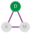

**Source Markdown Excerpt**

```markdown
2927
2928  ::: {.column-margin}
2929  {width="100%" fig-alt="A D·A·M triangle with vertices D, A, M; the Data vertex filled in green, the Algorithm and Machine vertices gray."}
2930
2931  *Production debugging starts on the Data axis of D-A-M.*
2932  :::
2933
2934  1. **Is it the data?** Check for upstream data pipeline failures, schema changes, missing values, or distribution shifts. Most production ML issues (60–80 percent) originate in data.
```

**Strongest Prose Anchor**

> Most production ML issues (60–80 percent) originate in data.

**Placement Context**

_Paragraph before the margin block:_

> When model performance degrades , work through these diagnostic questions in order. For a systematic diagnostic matrix that maps symptoms to D·A·M (Data · Algorithm · Machine) axes, see in

_Paragraph after the margin block:_

> 1. Is it the data? Check for upstream data pipeline failures, schema changes, missing values, or distribution shifts. Most production ML issues (60–80 percent) originate in data.

**Reader-Link Check**

- Source markdown: the excerpt above shows the `.column-margin` block and the exact caption beside the prose.
- The prose anchor is the text an editor should compare against the caption.
- The `fig-alt` describes what the visual marks encode; the caption should state the reader takeaway from those marks.

### 049. vol1/ml_systems @ line 84: Power spans the paradigms from megawatts (cloud) to milliwatts (TinyML).

- **Source QMD:** `../../quarto/contents/vol1/ml_systems/ml_systems.qmd:84`
- **Asset:** `../../quarto/contents/vol1/ml_systems/images/svg/ml_systems_deployment_span.svg`
- **Audit status:** `Pass`; lexical overlap `0.86`
- **Caption:** Power spans the paradigms from megawatts (cloud) to milliwatts (TinyML).
- **Figure evidence (`fig-alt`):** Vertical bar ladder of four deployment tiers by power on a log scale: Cloud 3 MW, Edge 200 W, Mobile 5 W, TinyML 50 mW, spanning megawatts to milliwatts.


**Source Markdown Excerpt**

```markdown
82
83  ::: {.column-margin}
84  {width="100%" fig-alt="Vertical bar ladder of four deployment tiers by power on a log scale: Cloud 3 MW, Edge 200 W, Mobile 5 W, TinyML 50 mW, spanning megawatts to milliwatts."}
85
86  *Power spans the paradigms from megawatts (cloud) to milliwatts (TinyML).*
87  :::
88
89  The physical constraints that govern each environment (latency, power, and memory) force ML deployment into four distinct paradigms, each with its own engineering trade-offs and system design patterns. **Cloud ML**\index{Cloud ML!characteristics} aggregates computational resources in data centers, offering virtually unlimited compute and storage at the cost of network latency. **Edge ML**\index{Edge ML!latency benefits} moves computation closer to where data originates, including factory floors, retail stores, and hospitals, achieving lower latency and keeping sensitive data on-premises. **Mobile ML**\index{Mobile ML!energy constraints} brings intelligence directly to smartphones and tablets, balancing computational capability against battery life and thermal constraints. **TinyML**\index{TinyML!always-on sensing} pushes intelligence to the smallest devices: microcontrollers costing dollars and consuming milliwatts, enabling always-on sensing that runs for months on a coin-cell battery. These four paradigms span nine orders of magnitude in power consumption (megawatts to milliwatts) and memory capacity (terabytes to kilobytes), a range so vast that the engineering principles governing one end of the spectrum barely apply at the other.
```

**Strongest Prose Anchor**

> These four paradigms span nine orders of magnitude in power consumption (megawatts to milliwatts) and memory capacity (terabytes to kilobytes), a range so vast that the engineering principles governing one end of the spectrum barely apply at the other.

**Placement Context**

_Paragraph before the margin block:_

> Consider two extremes: a wake-word detector on a smartwatch and a recommendation engine in a data center. The wake-word detector represents a TinyML workload operating under milliwatt power budgets and kilobyte memory limits; the recommendation engine exemplifies a cloud ML workload requiring terabytes of embedding tables and megawatt-scale infrastructure. These systems solve different problems under opposite physical constraints, and the infrastructure that supports them shares almost nothing in common. This reality transforms deployment from an operational afterthought into a first-order engineering decision, one that the D·A·M taxonomy...

_Paragraph after the margin block:_

> The physical constraints that govern each environment (latency, power, and memory) force ML deployment into four distinct paradigms, each with its own engineering trade-offs and system design patterns. Cloud ML aggregates computational resources in data centers, offering virtually unlimited compute and storage at the cost of network latency. Edge ML moves computation closer to where data originates, including factory floors, retail stores, and hospitals, achieving lower latency and keeping sensitive data on-premises. Mobile ML brings intelligence directly to smartphones and tablets, balancing computational capability against battery life...

**Reader-Link Check**

- Source markdown: the excerpt above shows the `.column-margin` block and the exact caption beside the prose.
- The prose anchor is the text an editor should compare against the caption.
- The `fig-alt` describes what the visual marks encode; the caption should state the reader takeaway from those marks.

### 050. vol1/ml_systems @ line 502: Compute capacity outruns memory bandwidth; the widening gap is the memory wall.

- **Source QMD:** `../../quarto/contents/vol1/ml_systems/ml_systems.qmd:502`
- **Asset:** `../../quarto/contents/vol1/ml_systems/images/svg/ml_systems_memory_wall_divergence.svg`
- **Audit status:** `Pass`; lexical overlap `0.88`
- **Caption:** Compute capacity outruns memory bandwidth; the widening gap is the memory wall.
- **Figure evidence (`fig-alt`):** Two diverging trend strokes: a steep red compute-growth curve pulling away from a shallow blue memory-bandwidth curve, the widening gap between them shaded red. The gap is the memory wall.


**Source Markdown Excerpt**

```markdown
500
501  ::: {.column-margin}
502  {width="100%" fig-alt="Two diverging trend strokes: a steep red compute-growth curve pulling away from a shallow blue memory-bandwidth curve, the widening gap between them shaded red. The gap is the memory wall."}
503
504  *Compute capacity outruns memory bandwidth; the widening gap is the memory wall.*
505  :::
506
507  ::: {#chk-ml-systems-physical-constraints-deployment .callout-checkpoint title="Physical constraints and deployment"}
```

**Strongest Prose Anchor**

> quantifies this divergence: processors have doubled in compute capacity roughly every {python} MemoryWallTrends.compute doubling months str, but memory bandwidth has improved only ~{python} MemoryWallTrends.mem bw growth pct str annually.

**Placement Context**

_Paragraph before the margin block:_

> quantifies this divergence: processors have doubled in compute capacity roughly every {python} MemoryWallTrends.compute doubling months str, but memory bandwidth has improved only ~{python} MemoryWallTrends.mem bw growth pct str annually. This widening gap makes data movement the dominant bottleneck and energy cost for most ML workloads. This constraint affects all paradigms but is especially acute for TinyML, where devices have only kilobytes of memory to work with. We examine the hardware architectural responses to the memory wall, including HBM and on-chip SRAM hierarchies, in detail in

_Paragraph after the margin block:_

> Deployment choices are governed by physics, not just preference. Check your understanding:

**Reader-Link Check**

- Source markdown: the excerpt above shows the `.column-margin` block and the exact caption beside the prose.
- The prose anchor is the text an editor should compare against the caption.
- The `fig-alt` describes what the visual marks encode; the caption should state the reader takeaway from those marks.

### 051. vol1/ml_systems @ line 641: Data, Algorithm, and Machine are coupled; move one and the others shift.

- **Source QMD:** `../../quarto/contents/vol1/ml_systems/ml_systems.qmd:641`
- **Asset:** `../../quarto/contents/vol1/ml_systems/images/svg/ml_systems_dam_locator.svg`
- **Audit status:** `Pass`; lexical overlap `0.33`
- **Caption:** Data, Algorithm, and Machine are coupled; move one and the others shift.
- **Figure evidence (`fig-alt`):** Triangle diagram with three labeled nodes connected by violet edges: D for data at top, A for algorithm at lower left, M for machine at lower right, showing the three axes are coupled.


**Source Markdown Excerpt**

```markdown
639
640  ::: {.column-margin}
641  {width="100%" fig-alt="Triangle diagram with three labeled nodes connected by violet edges: D for data at top, A for algorithm at lower left, M for machine at lower right, showing the three axes are coupled."}
642
643  *Data, Algorithm, and Machine are coupled; move one and the others shift.*
644  :::
645
646  The bottleneck principle reduces optimization to a single diagnostic: identifying which constraint dominates for a given workload. The answer depends on the D·A·M taxonomy in @tbl-dam-taxonomy, which decomposes every ML system into Data, Algorithm, and Machine. Different deployment environments create different bottlenecks along these axes—a cloud server with terabytes of memory faces algorithm constraints, while a microcontroller with kilobytes faces machine constraints.
```

**Strongest Prose Anchor**

> The answer depends on the D·A·M taxonomy in , which decomposes every ML system into Data, Algorithm, and Machine.

**Placement Context**

_Paragraph before the margin block:_

> _No adjacent prose captured._

_Paragraph after the margin block:_

> The bottleneck principle reduces optimization to a single diagnostic: identifying which constraint dominates for a given workload. The answer depends on the D·A·M taxonomy in , which decomposes every ML system into Data, Algorithm, and Machine. Different deployment environments create different bottlenecks along these axes—a cloud server with terabytes of memory faces algorithm constraints, while a microcontroller with kilobytes faces machine constraints.

**Reader-Link Check**

- Source markdown: the excerpt above shows the `.column-margin` block and the exact caption beside the prose.
- The prose anchor is the text an editor should compare against the caption.
- The `fig-alt` describes what the visual marks encode; the caption should state the reader takeaway from those marks.

### 052. vol1/ml_systems @ line 959: Batch-1 inference sits on the memory-bound side of the roofline.

- **Source QMD:** `../../quarto/contents/vol1/ml_systems/ml_systems.qmd:959`
- **Asset:** `../../quarto/contents/vol1/ml_systems/images/svg/vol1_ml_systems_margin_001.svg`
- **Audit status:** `Pass`; lexical overlap `0.50`
- **Caption:** Batch-1 inference sits on the memory-bound side of the roofline.
- **Figure evidence (`fig-alt`):** A roofline silhouette: a blue memory-bound slope rising to a dashed ridge line, then a flat orange compute-bound ceiling, with a batch-1 workload dot on the memory-bound slope, left of the ridge.


**Source Markdown Excerpt**

```markdown
957
958  ::: {.column-margin}
959  {width="100%" fig-alt="A roofline silhouette: a blue memory-bound slope rising to a dashed ridge line, then a flat orange compute-bound ceiling, with a batch-1 workload dot on the memory-bound slope, left of the ridge."}
960
961  *Batch-1 inference sits on the memory-bound side of the roofline.*
962  :::
963
964  This shift between training and inference is critical to understand. Recall the D·A·M taxonomy from @tbl-dam-taxonomy: every ML system comprises Data, Algorithm, and Machine. @Tbl-dam-phase shows how each component behaves differently depending on whether the system is training (learning patterns) or serving (applying them).
```

**Strongest Prose Anchor**

> We use this framing informally here; derives the model in full, defining arithmetic intensity formally and deriving the ridge point that separates the memory-bound and compute-bound regimes.

**Placement Context**

_Paragraph before the margin block:_

> Roofline analysis classifies bottlenecks by comparing a workload's arithmetic intensity against the machine balance point [ ]. We use this framing informally here; derives the model in full, defining arithmetic intensity formally and deriving the ridge point that separates the memory-bound and compute-bound regimes. In that framing, the same ResNet-50 model can shift from compute-bound training behavior at high batch sizes to more memory-sensitive single-image inference at batch=1. Deployment paradigm selection must account for this shift.

_Paragraph after the margin block:_

> This shift between training and inference is critical to understand. Recall the D·A·M taxonomy from every ML system comprises Data, Algorithm, and Machine. shows how each component behaves differently depending on whether the system is training (learning patterns) or serving (applying them).

**Reader-Link Check**

- Source markdown: the excerpt above shows the `.column-margin` block and the exact caption beside the prose.
- The prose anchor is the text an editor should compare against the caption.
- The `fig-alt` describes what the visual marks encode; the caption should state the reader takeaway from those marks.

### 053. vol1/ml_systems @ line 2002: Raw edge data can be wider than the network pipe.

- **Source QMD:** `../../quarto/contents/vol1/ml_systems/ml_systems.qmd:2002`
- **Asset:** `../../quarto/contents/vol1/ml_systems/images/svg/vol1_ml_systems_margin_002.svg`
- **Audit status:** `Pass`; lexical overlap `0.50`
- **Caption:** Raw edge data can be wider than the network pipe.
- **Figure evidence (`fig-alt`):** Two-rung bandwidth ladder comparing 100 raw 1080p camera feeds at about 18.7 GB per second with a 10G link at about 1.25 GB per second.


**Source Markdown Excerpt**

```markdown
2000
2001  ::: {.column-margin}
2002  {width="100%" fig-alt="Two-rung bandwidth ladder comparing 100 raw 1080p camera feeds at about 18.7 GB per second with a 10G link at about 1.25 GB per second."}
2003
2004  *Raw edge data can be wider than the network pipe.*
2005  :::
2006
2007  ```{python}
```

**Strongest Prose Anchor**

> The defining characteristic of edge deployment is less about where processing occurs than about how much data that location must handle.

**Placement Context**

_Paragraph before the margin block:_

> The benefits of lower bandwidth usage and reduced latency become stark when we examine real-world data rates. The defining characteristic of edge deployment is less about where processing occurs than about how much data that location must handle. When the data rate exceeds available network capacity, the resulting bandwidth bottleneck forces processing to the edge regardless of other considerations.

_Paragraph after the margin block:_

> Problem : Consider a quality control system for a factory floor with {python} BandwidthBottleneck.num cameras str cameras running at {python} BandwidthBottleneck.bb fps str with 1080p resolution. Should the system stream to the cloud or process at the edge?

**Reader-Link Check**

- Source markdown: the excerpt above shows the `.column-margin` block and the exact caption beside the prose.
- The prose anchor is the text an editor should compare against the caption.
- The `fig-alt` describes what the visual marks encode; the caption should state the reader takeaway from those marks.

### 054. vol1/ml_systems @ line 2777: Sustained thermal performance falls well below burst peaks.

- **Source QMD:** `../../quarto/contents/vol1/ml_systems/ml_systems.qmd:2777`
- **Asset:** `../../quarto/contents/vol1/ml_systems/images/svg/vol1_ml_systems_margin_003.svg`
- **Audit status:** `Manual review candidate`; lexical overlap `0.25`
- **Caption:** Sustained thermal performance falls well below burst peaks.
- **Figure evidence (`fig-alt`):** Two horizontal throughput levels: a high burst line and, well below it, a lower sustained line after thermal throttling engages.


**Source Markdown Excerpt**

```markdown
2775
2776  ::: {.column-margin}
2777  {width="100%" fig-alt="Two horizontal throughput levels: a high burst line and, well below it, a lower sustained line after thermal throttling engages."}
2778
2779  *Sustained thermal performance falls well below burst peaks.*
2780  :::
2781
2782  ```{python}
```

**Strongest Prose Anchor**

> The two constraints therefore attack different points in the iron law: the battery limits total operations per charge ($O$ integrated over time), while the thermal wall caps the instantaneous rate ($R { } $) the silicon can sustain.

**Placement Context**

_Paragraph before the margin block:_

> The distinction matters for engineering decisions: the battery tax is a budget problem, solvable in principle by reducing how often the model runs or by increasing battery capacity. The thermal wall is a physics ceiling. No duty cycle, no larger battery, and no software optimization can raise the maximum sustained wattage a passive chassis can dissipate. A model that exceeds the thermal envelope triggers hardware throttling within seconds, regardless of how much energy remains in the battery. The two constraints therefore attack different points in the iron law: the battery limits total operations per charge ($O$ integrated over time)...

_Paragraph after the margin block:_

> Problem : An unoptimized LLM requires {python} ThermalQuantCalc.baseline w str peak compute. Can it be deployed on a mobile device?

**Reader-Link Check**

- Source markdown: the excerpt above shows the `.column-margin` block and the exact caption beside the prose.
- The prose anchor is the text an editor should compare against the caption.
- The `fig-alt` describes what the visual marks encode; the caption should state the reader takeaway from those marks.

### 055. vol1/ml_systems @ line 4551: A faster model stage does not linearly speed up a camera pipeline.

- **Source QMD:** `../../quarto/contents/vol1/ml_systems/ml_systems.qmd:4551`
- **Asset:** `../../quarto/contents/vol1/ml_systems/images/svg/vol1_ml_systems_margin_004.svg`
- **Audit status:** `Pass`; lexical overlap `0.78`
- **Caption:** A faster model stage does not linearly speed up a camera pipeline.
- **Figure evidence (`fig-alt`):** Two stacked pipeline bars, before and after a 10× model-stage speedup: the model segment shrinks sharply while the other camera-pipeline stages stay fixed, so the total drops only modestly.


**Source Markdown Excerpt**

```markdown
4549
4550  ::: {.column-margin}
4551  {width="100%" fig-alt="Two stacked pipeline bars, before and after a 10× model-stage speedup: the model segment shrinks sharply while the other camera-pipeline stages stay fixed, so the total drops only modestly."}
4552
4553  *A faster model stage does not linearly speed up a camera pipeline.*
4554  :::
4555
4556  Amdahl's Law[^fn-amdahls-law-pipeline]\index{Amdahl's Law!speedup limits}\index{Optimization!Amdahl's Law} establishes hard limits that the Bottleneck Principle (@sec-ml-systems-bottleneck-principle-3514) makes operational, where @sec-appdx-machine-foundations-strong-scaling-amdahls-law-c6c2 derives the strong-scaling form and works a speedup example at eight processors: $\text{Speedup}_{\text{overall}} = \frac{1}{(1-p) + \frac{p}{s}}$ where $p$ is the fraction of work that can be improved and $s$ is the speedup of that fraction. Consider tapping the shutter on a smartphone camera. The image passes through `{python} AmdahlCameraCalc.cam_isp_ms_str` of signal processing (auto-exposure, white balance), `{python} AmdahlCameraCalc.cam_ml_ms_str` of ML scene classification, and `{python} AmdahlCameraCalc.cam_post_ms_str` of postprocessing (tone mapping, HDR merge)---`{python} AmdahlCameraCalc.cam_total_ms_str` total. Optimizing the ML classifier to run 10$\times$ faster (`{python} AmdahlCameraCalc.cam_ml_opt_ms_str` instead of `{python} AmdahlCameraCalc.cam_ml_ms_str`) drops total time from `{python} AmdahlCameraCalc.cam_total_ms_str` to `{python} AmdahlCameraCalc.cam_total_opt_ms_str`---only `{python} AmdahlCameraCalc.cam_speedup_10x_str`$\times$ overall, not 10$\times$. Even eliminating ML entirely $(s = \infty)$ achieves only `{python} AmdahlCameraCalc.cam_speedup_inf_str`$\times$ speedup, because the remaining `{python} AmdahlCameraCalc.cam_non_ml_pct_str` of the pipeline is untouched. Effective optimization requires profiling the entire pipeline and addressing bottlenecks systematically, because system performance depends on the slowest unoptimized stage.
```

**Strongest Prose Anchor**

> Optimizing the ML classifier to run 10$ $ faster ({python} AmdahlCameraCalc.cam ml opt ms str instead of {python} AmdahlCameraCalc.cam ml ms str) drops total time from {python} AmdahlCameraCalc.cam total ms str to {python} AmdahlCameraCalc.cam total opt ms str---only {python} AmdahlCameraCalc.cam speedup 10x str$ $ overall, not 10$ $.

**Placement Context**

_Paragraph before the margin block:_

> Fallacy : Model optimization translates linearly to system speedup.

_Paragraph after the margin block:_

> Amdahl's Law[^fn-amdahls-law-pipeline] establishes hard limits that the Bottleneck Principle ( ) makes operational, where derives the strong-scaling form and works a speedup example at eight processors: $ { } = {(1-p) + {s}}$ where $p$ is the fraction of work that can be improved and $s$ is the speedup of that fraction. Consider tapping the shutter on a smartphone camera. The image passes through {python} AmdahlCameraCalc.cam isp ms str of signal processing (auto-exposure, white balance), {python} AmdahlCameraCalc.cam ml ms str of ML scene classification, and {python} AmdahlCameraCalc.cam post ms str of postprocessing (tone mapping, HDR...

**Reader-Link Check**

- Source markdown: the excerpt above shows the `.column-margin` block and the exact caption beside the prose.
- The prose anchor is the text an editor should compare against the caption.
- The `fig-alt` describes what the visual marks encode; the caption should state the reader takeaway from those marks.

### 056. vol1/ml_workflow @ line 317: Slow iteration loses to fast feedback over time.

- **Source QMD:** `../../quarto/contents/vol1/ml_workflow/ml_workflow.qmd:317`
- **Asset:** `../../quarto/contents/vol1/ml_workflow/images/svg/vol1_ml_workflow_margin_001.svg`
- **Audit status:** `Pass`; lexical overlap `0.43`
- **Caption:** Slow iteration loses to fast feedback over time.
- **Figure evidence (`fig-alt`):** Two rising curves over 26 weeks: a steeper hourly-iteration curve overtaking a shallower weekly-iteration curve, the two crossing partway across.


**Source Markdown Excerpt**

```markdown
315
316  ::: {.column-margin}
317  {width="100%" fig-alt="Two rising curves over 26 weeks: a steeper hourly-iteration curve overtaking a shallower weekly-iteration curve, the two crossing partway across."}
318
319  *Slow iteration loses to fast feedback over time.*
320  :::
321
322  ```{python}
```

**Strongest Prose Anchor**

> This compounding cost of slow iteration creates what we call the iteration tax .

**Placement Context**

_Paragraph before the margin block:_

> This compounding cost of slow iteration creates what we call the iteration tax . A quick calculation makes the bottleneck concrete.

_Paragraph after the margin block:_

> Problem : A diabetic retinopathy (DR) screening system for rural clinics must choose between a large ensemble trained on high-resolution fundus images (training time: {python} IterationTax.large time weeks str, accuracy: {python} IterationTax.large acc str) and a lightweight model suitable for edge deployment on clinic hardware (training time: {python} IterationTax.small time hours str, accuracy: {python} IterationTax.small acc str). Which approach yields a better screening system in six months?

**Reader-Link Check**

- Source markdown: the excerpt above shows the `.column-margin` block and the exact caption beside the prose.
- The prose anchor is the text an editor should compare against the caption.
- The `fig-alt` describes what the visual marks encode; the caption should state the reader takeaway from those marks.

### 057. vol1/ml_workflow @ line 1067: Edge summaries beat raw medical-image uploads when bandwidth dominates.

- **Source QMD:** `../../quarto/contents/vol1/ml_workflow/ml_workflow.qmd:1067`
- **Asset:** `../../quarto/contents/vol1/ml_workflow/images/svg/vol1_ml_workflow_margin_002.svg`
- **Audit status:** `Manual review candidate`; lexical overlap `0.22`
- **Caption:** Edge summaries beat raw medical-image uploads when bandwidth dominates.
- **Figure evidence (`fig-alt`):** Vertical ladder of two bars: a tall bar for raw retinal-image uploads towering over a short bar for compact edge detection summaries sent over the network.


**Source Markdown Excerpt**

```markdown
1065
1066  ::: {.column-margin}
1067  {width="100%" fig-alt="Vertical ladder of two bars: a tall bar for raw retinal-image uploads towering over a short bar for compact edge detection summaries sent over the network."}
1068
1069  *Edge summaries beat raw medical-image uploads when bandwidth dominates.*
1070  :::
1071
1072  ```{python}
```

**Strongest Prose Anchor**

> This tension between bandwidth and compute forces architectural decisions toward edge-computing solutions rather than cloud-based processing.

**Placement Context**

_Paragraph before the margin block:_

> High-resolution retinal scans can generate tens of megabytes per image, creating substantial infrastructure challenges. A clinic processing dozens of patients per day can produce gigabytes to tens of gigabytes of imaging data per week, exceeding the capacity of rural internet connections with only a few megabits per second of upload. This tension between bandwidth and compute forces architectural decisions toward edge-computing solutions rather than cloud-based processing.

_Paragraph after the margin block:_

> Problem : A rural clinic captures retinal images for DR screening. Can the clinic upload all images to the cloud for processing, or must it process them locally on edge hardware?

**Reader-Link Check**

- Source markdown: the excerpt above shows the `.column-margin` block and the exact caption beside the prose.
- The prose anchor is the text an editor should compare against the caption.
- The `fig-alt` describes what the visual marks encode; the caption should state the reader takeaway from those marks.

### 058. vol1/ml_workflow @ line 1786: Production validation is a gate: field sensitivity below the required floor fails deployment.

- **Source QMD:** `../../quarto/contents/vol1/ml_workflow/ml_workflow.qmd:1786`
- **Asset:** `../../quarto/contents/vol1/ml_workflow/images/svg/vol1_ml_workflow_margin_003.svg`
- **Audit status:** `Pass`; lexical overlap `0.50`
- **Caption:** Production validation is a gate: field sensitivity below the required floor fails deployment.
- **Figure evidence (`fig-alt`):** A bar for the 78 percent field sensitivity result falling short of a dashed horizontal threshold line marking the 90 percent required floor; the shortfall below the line is shaded red.


**Source Markdown Excerpt**

```markdown
1784
1785  ::: {.column-margin}
1786  {width="100%" fig-alt="A bar for the 78 percent field sensitivity result falling short of a dashed horizontal threshold line marking the 90 percent required floor; the shortfall below the line is shaded red."}
1787
1788  *Production validation is a gate: field sensitivity below the required floor fails deployment.*
1789  :::
1790
1791  Evaluation and validation address different questions. Evaluation measures model performance against held-out test data using metrics established during problem definition. Validation confirms that the model generalizes appropriately to conditions it will encounter in production, including edge cases, distribution shifts, and adversarial inputs. Together these processes establish the evidence base required for deployment decisions and define validation as a risk-management discipline.
```

**Strongest Prose Anchor**

> Before deployment, trained models must undergo rigorous evaluation and validation to confirm they meet performance requirements across the diverse conditions encountered in production.

**Placement Context**

_Paragraph before the margin block:_

> The DR team's model achieves an AUC of 0.99 on the curated research dataset—matching the best ophthalmologists. Then they test it on images from a rural clinic in Chiang Mai where a technician with two weeks of training operates a five-year-old fundus camera. Sensitivity drops to 78 percent. The model has not failed in any algorithmic sense; it has simply never seen images this blurry, this poorly lit, or this inconsistently framed. Laboratory success does not guarantee production value, and the gap between the two is where many ML projects fail. Before deployment, trained models must undergo rigorous evaluation and validation to confirm...

_Paragraph after the margin block:_

> Evaluation and validation address different questions. Evaluation measures model performance against held-out test data using metrics established during problem definition. Validation confirms that the model generalizes appropriately to conditions it will encounter in production, including edge cases, distribution shifts, and adversarial inputs. Together these processes establish the evidence base required for deployment decisions and define validation as a risk-management discipline.

**Reader-Link Check**

- Source markdown: the excerpt above shows the `.column-margin` block and the exact caption beside the prose.
- The prose anchor is the text an editor should compare against the caption.
- The `fig-alt` describes what the visual marks encode; the caption should state the reader takeaway from those marks.

### 059. vol1/ml_workflow @ line 1998: Cloud and edge lifetime costs cross as scale grows.

- **Source QMD:** `../../quarto/contents/vol1/ml_workflow/ml_workflow.qmd:1998`
- **Asset:** `../../quarto/contents/vol1/ml_workflow/images/svg/vol1_ml_workflow_margin_004.svg`
- **Audit status:** `Manual review candidate`; lexical overlap `0.14`
- **Caption:** Cloud and edge lifetime costs cross as scale grows.
- **Figure evidence (`fig-alt`):** Two rising cumulative-cost curves over time: an edge curve starting higher but climbing slowly, a cloud curve starting lower but climbing steeply, crossing at a marked payback point.


**Source Markdown Excerpt**

```markdown
1996
1997  ::: {.column-margin}
1998  {width="100%" fig-alt="Two rising cumulative-cost curves over time: an edge curve starting higher but climbing slowly, a cloud curve starting lower but climbing steeply, crossing at a marked payback point."}
1999
2000  *Cloud and edge lifetime costs cross as scale grows.*
2001  :::
2002
2003  :::
```

**Strongest Prose Anchor**

> Systems insight : Edge deployment pays back in {python} DeploymentEconomics.payback years str and provides better reliability, yet it requires tighter model optimization (must fit in edge memory) and more complex update pipelines.

**Placement Context**

_Paragraph before the margin block:_

> Systems insight : Edge deployment pays back in {python} DeploymentEconomics.payback years str and provides better reliability, yet it requires tighter model optimization (must fit in edge memory) and more complex update pipelines. The deployment paradigm selected during Problem Definition determines whether the edge option is even viable.

_Paragraph after the margin block:_

> Integration with existing systems poses additional challenges. The ML system must interface with hospital information systems (HIS) for accessing patient records and storing results. Privacy regulations mandate secure data handling at every step, shaping deployment decisions. These considerations ensure that the system adheres to clinical and legal standards while remaining practical for daily use. details operational considerations that apply to these deployments.

**Reader-Link Check**

- Source markdown: the excerpt above shows the `.column-margin` block and the exact caption beside the prose.
- The prose anchor is the text an editor should compare against the caption.
- The `fig-alt` describes what the visual marks encode; the caption should state the reader takeaway from those marks.

### 060. vol1/ml_workflow @ line 2117: Late-discovered constraints trigger exponential rework.

- **Source QMD:** `../../quarto/contents/vol1/ml_workflow/ml_workflow.qmd:2117`
- **Asset:** `../../quarto/contents/vol1/ml_workflow/images/svg/ml_workflow_constraint_cost_escalation.svg`
- **Audit status:** `Manual review candidate`; lexical overlap `0.20`
- **Caption:** Late-discovered constraints trigger exponential rework.
- **Figure evidence (`fig-alt`):** Rising correction-cost curve across six lifecycle stages, from define at 1x to monitor at 32x. The curve steepens as constraints are discovered later in the lifecycle.


**Source Markdown Excerpt**

```markdown
2115
2116  ::: {.column-margin}
2117  {width="100%" fig-alt="Rising correction-cost curve across six lifecycle stages, from define at 1x to monitor at 32x. The curve steepens as constraints are discovered later in the lifecycle."}
2118
2119  *Late-discovered constraints trigger exponential rework.*
2120  :::
2121
2122  The DR case study illustrated constraint propagation repeatedly: bandwidth limits drove edge deployment, which constrained model size, which reshaped data preprocessing. Each decision narrowed the feasible design space for every subsequent stage. This narrowing gives the pattern its name.
```

**Strongest Prose Anchor**

> Recognizing these patterns transforms reactive debugging about deployment failure into proactive design that surfaces downstream constraints early.

**Placement Context**

_Paragraph before the margin block:_

> The lifecycle stages do not merely execute in sequence. They interact through three structural patterns that recurred at every stage of the DR case study. Recognizing these patterns transforms reactive debugging about deployment failure into proactive design that surfaces downstream constraints early. We formalize each pattern below.

_Paragraph after the margin block:_

> The DR case study illustrated constraint propagation repeatedly: bandwidth limits drove edge deployment, which constrained model size, which reshaped data preprocessing. Each decision narrowed the feasible design space for every subsequent stage. This narrowing gives the pattern its name.

**Reader-Link Check**

- Source markdown: the excerpt above shows the `.column-margin` block and the exact caption beside the prose.
- The prose anchor is the text an editor should compare against the caption.
- The `fig-alt` describes what the visual marks encode; the caption should state the reader takeaway from those marks.

### 061. vol1/ml_workflow @ line 2144: Feedback loops span minutes to quarters across five orders of magnitude.

- **Source QMD:** `../../quarto/contents/vol1/ml_workflow/ml_workflow.qmd:2144`
- **Asset:** `../../quarto/contents/vol1/ml_workflow/images/svg/ml_workflow_feedback_timescales.svg`
- **Audit status:** `Pass`; lexical overlap `0.33`
- **Caption:** Feedback loops span minutes to quarters across five orders of magnitude.
- **Figure evidence (`fig-alt`):** Vertical ladder of six feedback-loop cadences as nested blue bars, longest at top to shortest at bottom: quarter, month, week, day, hour, minute. The bar lengths span roughly five orders of magnitude in duration.


**Source Markdown Excerpt**

```markdown
2142
2143  ::: {.column-margin}
2144  {width="100%" fig-alt="Vertical ladder of six feedback-loop cadences as nested blue bars, longest at top to shortest at bottom: quarter, month, week, day, hour, minute. The bar lengths span roughly five orders of magnitude in duration."}
2145
2146  *Feedback loops span minutes to quarters across five orders of magnitude.*
2147  :::
2148
2149  \index{Feedback Loop!multi-scale temporal structure}
```

**Strongest Prose Anchor**

> ML systems succeed through orchestrating feedback loops across multiple timescales, each serving different optimization purposes.

**Placement Context**

_Paragraph before the margin block:_

> The constraint propagation principle quantifies what experienced ML engineers know intuitively: decisions made in ignorance of downstream constraints create compounding technical debt[^fn-ml-debt-entanglement]. The stage interface specification ( ) operationalizes this principle by making constraints explicit at each stage boundary, aligning with the model, data, and infrastructure contract practices discussed in Those contracts enable early detection before propagation costs escalate. When propagation occurs specifically through data quality failures, the resulting pattern is known as a data cascade ; formalizes this failure mode and...

_Paragraph after the margin block:_

> ML systems succeed through orchestrating feedback loops across multiple timescales, each serving different optimization purposes. Our DR deployment exemplifies this pattern: minute-level loops catch a misconfigured camera before it produces a day's worth of unusable images; daily loops detect that a particular clinic's sensitivity has drifted below threshold; weekly loops aggregate accuracy statistics and run drift detection tests; monthly loops reveal that demographic shifts in a region require expanded training data; and quarterly loops evaluate whether the overall architecture still meets evolving clinical needs.

**Reader-Link Check**

- Source markdown: the excerpt above shows the `.column-margin` block and the exact caption beside the prose.
- The prose anchor is the text an editor should compare against the caption.
- The `fig-alt` describes what the visual marks encode; the caption should state the reader takeaway from those marks.

### 062. vol1/model_compression @ line 95: Frontier weights dwarf phone and microcontroller memory; compression bridges the gap.

- **Source QMD:** `../../quarto/contents/vol1/model_compression/model_compression.qmd:95`
- **Asset:** `../../quarto/contents/vol1/model_compression/images/svg/vol1_model_compression_margin_001.svg`
- **Audit status:** `Pass`; lexical overlap `0.33`
- **Caption:** Frontier weights dwarf phone and microcontroller memory; compression bridges the gap.
- **Figure evidence (`fig-alt`):** Vertical log-scale ladder of blue bars: a 175B FP16 weight footprint at top towers over a phone RAM bar, which towers over a tiny microcontroller RAM bar at the bottom.


**Source Markdown Excerpt**

```markdown
 93
 94  ::: {.column-margin}
 95  {width="100%" fig-alt="Vertical log-scale ladder of blue bars: a 175B FP16 weight footprint at top towers over a phone RAM bar, which towers over a tiny microcontroller RAM bar at the bottom."}
 96
 97  *Frontier weights dwarf phone and microcontroller memory; compression bridges the gap.*
 98  :::
 99
100  \index{Operator Fusion!framework introduction}
```

**Strongest Prose Anchor**

> Precision optimization reduces the numerical bit-width of weights and activations, for example converting 32-bit floating point values to 8-bit integers (exploiting Tensor Cores discussed in ), which shrinks memory footprint and accelerates arithmetic on hardware that supports lower-precision operations.

**Placement Context**

_Paragraph before the margin block:_

> The scale of this renegotiation makes model optimization an engineering discipline, not a collection of ad hoc tricks. A {python} CompressionDeploymentScale.llm 175b str billion parameter model consumes over {python} CompressionDeploymentScale.llm 175b mem gb str in FP16 representation alone, yet a smartphone provides {python} CompressionDeploymentScale.smartphone ram gb str of RAM and a microcontroller offers {python} CompressionDeploymentScale.mcu ram kb str. Bridging six orders of magnitude requires systematic methods with predictable trade-offs, not trial and error. Every optimization technique removes something from the model...

_Paragraph after the margin block:_

> This chapter organizes these techniques along three complementary dimensions. Structural optimization removes redundancy from the model itself: pruning eliminates parameters that contribute little to output quality, knowledge distillation transfers a large model's learned behavior into a smaller architecture, and neural architecture search discovers designs that are inherently efficient. Precision optimization reduces the numerical bit-width of weights and activations, for example converting 32-bit floating point values to 8-bit integers (exploiting Tensor Cores discussed in ), which shrinks memory footprint and accelerates arithmetic on...

**Reader-Link Check**

- Source markdown: the excerpt above shows the `.column-margin` block and the exact caption beside the prose.
- The prose anchor is the text an editor should compare against the caption.
- The `fig-alt` describes what the visual marks encode; the caption should state the reader takeaway from those marks.

### 063. vol1/model_compression @ line 3238: Quantization pays off only when the Machine axis has the right integer units.

- **Source QMD:** `../../quarto/contents/vol1/model_compression/model_compression.qmd:3238`
- **Asset:** `../../quarto/contents/vol1/model_compression/images/svg/model_compression_dam_locator.svg`
- **Audit status:** `Pass`; lexical overlap `0.64`
- **Caption:** Quantization pays off only when the Machine axis has the right integer units.
- **Figure evidence (`fig-alt`):** Stacked D, A, and M locator boxes with the Machine axis highlighted, marking quantization hardware support as the binding axis for this section.


**Source Markdown Excerpt**

```markdown
3236
3237  ::: {.column-margin}
3238  {width="100%" fig-alt="Stacked D, A, and M locator boxes with the Machine axis highlighted, marking quantization hardware support as the binding axis for this section."}
3239
3240  *Quantization pays off only when the Machine axis has the right integer units.*
3241  :::
3242
3243  \index{DLRM!embedding quantization}
```

**Strongest Prose Anchor**

> This disparity reinforces why the "Machine" axis of the AI Triad has moved toward specialized INT8 and INT4 integer units rather than general-purpose floating-point hardware.

**Placement Context**

_Paragraph before the margin block:_

> The resulting efficiency gain is {python} EnergyDividend.energy dividend str$ $. We call this the "Dividend" because the system pays a 4$ $ "price" in bits but receives a 30$ $ "return" in energy efficiency. For a battery-powered edge device or a megawatt-scale data center, this means that even if a model could fit in memory at higher precision, quantization is often mandatory to stay within the power envelope. This disparity reinforces why the "Machine" axis of the AI Triad has moved toward specialized INT8 and INT4 integer units rather than general-purpose floating-point hardware.

_Paragraph after the margin block:_

> These energy savings take on a different character for models where memory capacity, not compute, is the binding constraint.

**Reader-Link Check**

- Source markdown: the excerpt above shows the `.column-margin` block and the exact caption beside the prose.
- The prose anchor is the text an editor should compare against the caption.
- The `fig-alt` describes what the visual marks encode; the caption should state the reader takeaway from those marks.

### 064. vol1/model_compression @ line 3684: Quantization speedup depends on which side of the ridge you occupy.

- **Source QMD:** `../../quarto/contents/vol1/model_compression/model_compression.qmd:3684`
- **Asset:** `../../quarto/contents/vol1/model_compression/images/svg/model_compression_quantization_roofline.svg`
- **Audit status:** `Pass`; lexical overlap `0.38`
- **Caption:** Quantization speedup depends on which side of the ridge you occupy.
- **Figure evidence (`fig-alt`):** Mini roofline with one workload dot on the memory-bound slope labeled mem 2x and one workload dot on the compute-bound ceiling labeled comp 8x, showing that quantization speedup depends on bottleneck regime.

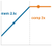

**Source Markdown Excerpt**

```markdown
3682
3683  ::: {.column-margin}
3684  {width="100%" fig-alt="Mini roofline with one workload dot on the memory-bound slope labeled mem 2x and one workload dot on the compute-bound ceiling labeled comp 8x, showing that quantization speedup depends on bottleneck regime."}
3685
3686  *Quantization speedup depends on which side of the ridge you occupy.*
3687  :::
3688
3689  ### Numerical format comparison {#sec-model-compression-numerical-format-comparison-8fa2}
```

**Strongest Prose Anchor**

> Systems insight : The speedup from quantization depends on the bottleneck.

**Placement Context**

_Paragraph before the margin block:_

> Systems insight : The speedup from quantization depends on the bottleneck. Compute-bound operations (large batch sizes, high Arithmetic Intensity $[ ]$) see ~{python} A100Int8Speedup.a100 int8 speedup str$ $ from faster INT8 units. The FP16-to-INT8 bandwidth-bound case achieves up to {python} A100Int8Speedup.bandwidth bound speedup str$ $ because memory traffic dominates, so halving data size nearly doubles effective throughput. Larger bandwidth-bound reductions, such as FP16 to INT4 or FP32 to INT8, can reach 4$ $ when the bytes moved fall by 4$ $.

_Paragraph after the margin block:_

> compares commonly used numerical precision formats in machine learning, each exhibiting distinct trade-offs in storage efficiency, computational speed, and energy consumption. Emerging formats like FP8 and TF32 have been introduced to further optimize performance, especially on AI accelerators.

**Reader-Link Check**

- Source markdown: the excerpt above shows the `.column-margin` block and the exact caption beside the prose.
- The prose anchor is the text an editor should compare against the caption.
- The `fig-alt` describes what the visual marks encode; the caption should state the reader takeaway from those marks.

### 065. vol1/model_compression @ line 5249: Operator fusion cuts memory transfers while arithmetic stays unchanged.

- **Source QMD:** `../../quarto/contents/vol1/model_compression/model_compression.qmd:5249`
- **Asset:** `../../quarto/contents/vol1/model_compression/images/svg/vol1_model_compression_margin_002.svg`
- **Audit status:** `Pass`; lexical overlap `0.44`
- **Caption:** Operator fusion cuts memory transfers while arithmetic stays unchanged.
- **Figure evidence (`fig-alt`):** Two bars: a tall unfused bar with many memory transfers beside a much shorter fused bar with few, while a separate arithmetic bar stays the same height in both.


**Source Markdown Excerpt**

```markdown
5247
5248  ::: {.column-margin}
5249  {width="100%" fig-alt="Two bars: a tall unfused bar with many memory transfers beside a much shorter fused bar with few, while a separate arithmetic bar stays the same height in both."}
5250
5251  *Operator fusion cuts memory transfers while arithmetic stays unchanged.*
5252  :::
5253
5254  \index{Operator Fusion!attention (FlashAttention)}
```

**Strongest Prose Anchor**

> The arithmetic operations remain identical, but memory traffic drops from 6 transfers to 2 transfers ({python} ConvFusionCalc.transfer reduction str$ $ reduction).

**Placement Context**

_Paragraph before the margin block:_

> The arithmetic operations remain identical, but memory traffic drops from 6 transfers to 2 transfers ({python} ConvFusionCalc.transfer reduction str$ $ reduction). For a ResNet-50 layer with 256 channels and spatial size $28{ }28$, this eliminates {python} ConvFusionCalc.conv bn relu mem math of intermediate memory traffic per layer.

_Paragraph after the margin block:_

> The same principle extends beyond CNNs. General matrix multiply (GEMM) bias-activation fusion eliminates intermediate writes in transformer linear layers by computing element-wise operations in registers immediately after each matrix multiplication output element. Attention tiling, as in FlashAttention[^fn-flashattention-fusion], reduces HBM traffic from $ (S^2)$ to $ (S)$ for long-context transformers by processing attention in SRAM-sized tiles rather than materializing the full $S{ }S$ attention matrix, as detailed in

**Reader-Link Check**

- Source markdown: the excerpt above shows the `.column-margin` block and the exact caption beside the prose.
- The prose anchor is the text an editor should compare against the caption.
- The `fig-alt` describes what the visual marks encode; the caption should state the reader takeaway from those marks.

### 066. vol1/model_compression @ line 6978: Unstructured sparsity pays off only past a 90 to 95 percent zero fraction.

- **Source QMD:** `../../quarto/contents/vol1/model_compression/model_compression.qmd:6978`
- **Asset:** `../../quarto/contents/vol1/model_compression/images/svg/vol1_model_compression_margin_003.svg`
- **Audit status:** `Pass`; lexical overlap `0.44`
- **Caption:** Unstructured sparsity pays off only past a 90 to 95 percent zero fraction.
- **Figure evidence (`fig-alt`):** A speedup curve that stays flat and below the break-even line until a marked knee near 90 to 95 percent zeros, then climbs; the low-payoff region left of the knee is shaded red.

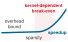

**Source Markdown Excerpt**

```markdown
6976
6977  ::: {.column-margin}
6978  {width="100%" fig-alt="A speedup curve that stays flat and below the break-even line until a marked knee near 90 to 95 percent zeros, then climbs; the low-payoff region left of the knee is shaded red."}
6979
6980  *Unstructured sparsity pays off only past a 90 to 95 percent zero fraction.*
6981  :::
6982
6983  The accuracy-efficiency trade-off requires careful calibration. Aggressive sparsity can degrade accuracy beyond acceptable thresholds, and the relationship is often nonlinear, as models may tolerate 70 percent sparsity with minimal impact but collapse at 80 percent. Finding the optimal operating point requires extensive experimentation.
```

**Strongest Prose Anchor**

> details the Compressed Sparse Row layout and quantifies how its per-nonzero metadata makes the memory payoff density-dependent, which is why a rule of thumb holds that sparsity typically must exceed 90–95 percent to be worthwhile for performance.

**Placement Context**

_Paragraph before the margin block:_

> The central challenge is the gap between theoretical and practical speedups. Unstructured pruning removes individual weights based on importance, creating irregular patterns that hardware accelerators struggle to exploit. Most GPUs and TPUs optimize for structured data; without regular patterns, they cannot skip zero elements efficiently. Pruning algorithms themselves introduce overhead, as determining which weights to prune requires sophisticated importance estimation that can be computationally expensive for large models. Even when sparsity is achieved, sparse matrix storage formats add indexing overhead that can offset computational...

_Paragraph after the margin block:_

> The accuracy-efficiency trade-off requires careful calibration. Aggressive sparsity can degrade accuracy beyond acceptable thresholds, and the relationship is often nonlinear, as models may tolerate 70 percent sparsity with minimal impact but collapse at 80 percent. Finding the optimal operating point requires extensive experimentation.

**Reader-Link Check**

- Source markdown: the excerpt above shows the `.column-margin` block and the exact caption beside the prose.
- The prose anchor is the text an editor should compare against the caption.
- The `fig-alt` describes what the visual marks encode; the caption should state the reader takeaway from those marks.

### 067. vol1/model_compression @ line 7321: Compression hits an end-to-end ceiling once non-model work dominates the pipeline.

- **Source QMD:** `../../quarto/contents/vol1/model_compression/model_compression.qmd:7321`
- **Asset:** `../../quarto/contents/vol1/model_compression/images/svg/vol1_model_compression_margin_004.svg`
- **Audit status:** `Manual review candidate`; lexical overlap `0.11`
- **Caption:** Compression hits an end-to-end ceiling once non-model work dominates the pipeline.
- **Figure evidence (`fig-alt`):** A horizontal stacked bar: a small 20 percent segment labeled model inference shaded blue, and a wide 80 percent segment labeled other pipeline work in gray.


**Source Markdown Excerpt**

```markdown
7319
7320  ::: {.column-margin}
7321  {width="100%" fig-alt="A horizontal stacked bar: a small 20 percent segment labeled model inference shaded blue, and a wide 80 percent segment labeled other pipeline work in gray."}
7322
7323  *Compression hits an end-to-end ceiling once non-model work dominates the pipeline.*
7324  :::
7325
7326  :::
```

**Strongest Prose Anchor**

> Critically, Amdahl's Law ( ) applies at the system level: if model inference accounts for only {python} AmdahlCompression.model fraction pct str of end-to-end latency (with the remaining {python} AmdahlCompression.non model pct str spent on data loading, preprocessing, and postprocessing), then even perfect model optimization yields at most {python} AmdahlCompression.max speedup str$ $ overall speedup.

**Placement Context**

_Paragraph before the margin block:_

> Reducing a model's FLOPs by 50 percent does not guarantee 50 percent latency reduction. Memory-bound operations (common in LLM inference and normalization layers) see minimal benefit from compute reduction because they are bottlenecked by data movement, not arithmetic. Critically, Amdahl's Law ( ) applies at the system level: if model inference accounts for only {python} AmdahlCompression.model fraction pct str of end-to-end latency (with the remaining {python} AmdahlCompression.non model pct str spent on data loading, preprocessing, and postprocessing), then even perfect model optimization yields at most {python} AmdahlCompression.max...

_Paragraph after the margin block:_

> Consider profiling a Vision Transformer (ViT) for edge deployment. Using PyTorch Profiler reveals three key findings: attention layers consume 65 percent of total FLOPs (highly amenable to structured pruning), layer normalization consumes 8 percent of latency despite only 2 percent of FLOPs (a memory-bound operation), and the final classification head consumes 1 percent of computation but 15 percent of parameter memory. This profile suggests a clear priority ordering: first, apply magnitude-based pruning to attention layers for high FLOP reduction; second, quantize the classification head to INT8 for large memory savings with minimal...

**Reader-Link Check**

- Source markdown: the excerpt above shows the `.column-margin` block and the exact caption beside the prose.
- The prose anchor is the text an editor should compare against the caption.
- The `fig-alt` describes what the visual marks encode; the caption should state the reader takeaway from those marks.

### 068. vol1/model_compression @ line 7434: INT8 quantization: size collapses about 4 times, accuracy holds.

- **Source QMD:** `../../quarto/contents/vol1/model_compression/model_compression.qmd:7434`
- **Asset:** `../../quarto/contents/vol1/model_compression/images/svg/model_compression_int8_beforeafter.svg`
- **Audit status:** `Pass`; lexical overlap `0.50`
- **Caption:** INT8 quantization: size collapses about 4 times, accuracy holds.
- **Figure evidence (`fig-alt`):** Two strokes from FP32 to INT8, each ending in a dot. The model-size stroke falls steeply to about a quarter of its start (4x smaller). The accuracy stroke stays flat near the top. Quantization shrinks the model 4 times while accuracy barely moves.

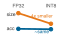

**Source Markdown Excerpt**

```markdown
7432
7433  ::: {.column-margin}
7434  {width="100%" fig-alt="Two strokes from FP32 to INT8, each ending in a dot. The model-size stroke falls steeply to about a quarter of its start (4x smaller). The accuracy stroke stays flat near the top. Quantization shrinks the model 4 times while accuracy barely moves."}
7435
7436  *INT8 quantization: size collapses about 4 times, accuracy holds.*
7437  :::
7438
7439  With these comprehensive baselines in place, the measurement framework must track optimization impact systematically. Rather than evaluating techniques in isolation, applying our three-dimensional framework requires understanding how different approaches interact when combined. Sequential application can lead to compounding benefits or unexpected interactions that diminish overall effectiveness. @Sec-benchmarking-compression-validation-efficiencyquality-frontier-e9c4 provides additional structured evaluation methods for comprehensive performance assessment.
```

**Strongest Prose Anchor**

> Additional analysis shows per-class accuracy degradation ranging from {python} ResNet50Int8Metrics.per class min drop str to {python} ResNet50Int8Metrics.per class max drop str percentage points with highest impact on fine-grained categories, calibration error increasing from {python} ResNet50Int8Metrics.calibration error fp32 str to {python} ResNet50Int8Metrics.calibration error int8 str, and INT8 quantization providing {python} ResNet50Int8Metrics.latency speedup str$ $ speedup on GPU but only {python} ResNet50Int8Metrics.cpu speedup str$ $ on CPU, demonstrating hardware-dependent gains.

**Placement Context**

_Paragraph before the margin block:_

> When quantizing ResNet-50 from FP32 to INT8, baseline metrics show Top-1 accuracy of {python} ResNet50Int8Metrics.fp32 top1 str, inference latency on V100 of {python} ResNet50Int8Metrics.fp32 latency ms str, model size of {python} ResNet50Int8Metrics.fp32 size mb str, and energy per inference of {python} ResNet50Int8Metrics.fp32 energy j str. Postquantization metrics reveal Top-1 accuracy of {python} ResNet50Int8Metrics.int8 top1 str ({python} ResNet50Int8Metrics.top1 drop str percentage-point degradation), inference latency of {python} ResNet50Int8Metrics.int8 latency ms str ({python} ResNet50Int8Metrics.latency speedup str$ $ speedup)...

_Paragraph after the margin block:_

> With these comprehensive baselines in place, the measurement framework must track optimization impact systematically. Rather than evaluating techniques in isolation, applying our three-dimensional framework requires understanding how different approaches interact when combined. Sequential application can lead to compounding benefits or unexpected interactions that diminish overall effectiveness. provides additional structured evaluation methods for comprehensive performance assessment.

**Reader-Link Check**

- Source markdown: the excerpt above shows the `.column-margin` block and the exact caption beside the prose.
- The prose anchor is the text an editor should compare against the caption.
- The `fig-alt` describes what the visual marks encode; the caption should state the reader takeaway from those marks.

### 069. vol1/model_serving @ line 1036: One noisy neighbor perturbs every workload sharing the node.

- **Source QMD:** `../../quarto/contents/vol1/model_serving/model_serving.qmd:1036`
- **Asset:** `../../quarto/contents/vol1/model_serving/images/svg/model_serving_blast_radius.svg`
- **Audit status:** `Manual review candidate`; lexical overlap `0.12`
- **Caption:** One noisy neighbor perturbs every workload sharing the node.
- **Figure evidence (`fig-alt`):** Schematic of one red source node on the left fanning out through four arrows to four identical blue consumer nodes on the right, showing one-to-many propagation from a single source.


**Source Markdown Excerpt**

```markdown
1034
1035  ::: {.column-margin}
1036  {width="100%" fig-alt="Schematic of one red source node on the left fanning out through four arrows to four identical blue consumer nodes on the right, showing one-to-many propagation from a single source."}
1037
1038  *One noisy neighbor perturbs every workload sharing the node.*
1039  :::
1040
1041  An inference server does not operate in isolation. On a single machine, the operating system manages multiple competing processes (logging agents, monitoring tools, and system interrupts) that can intermittently steal CPU cycles from the inference pipeline. These "noisy neighbors" are a primary source of **latency jitter**\index{Latency Jitter!resource contention}, where the time required to process identical requests varies significantly, causing the 99th percentile (P99) latency to spike even when the hardware is underused. The tail latency explosion from @fig-tail-latency-explosion illustrates the same spike, but here the trigger is resource contention rather than queuing.
```

**Strongest Prose Anchor**

> These "noisy neighbors" are a primary source of latency jitter , where the time required to process identical requests varies significantly, causing the 99th percentile (P99) latency to spike even when the hardware is underused.

**Placement Context**

_Paragraph before the margin block:_

> While load balancers distribute requests across replicas , achieving predictable latency also requires controlling what happens within each machine . The operating system environment introduces its own sources of variability.

_Paragraph after the margin block:_

> An inference server does not operate in isolation. On a single machine, the operating system manages multiple competing processes (logging agents, monitoring tools, and system interrupts) that can intermittently steal CPU cycles from the inference pipeline. These "noisy neighbors" are a primary source of latency jitter , where the time required to process identical requests varies significantly, causing the 99th percentile (P99) latency to spike even when the hardware is underused. The tail latency explosion from illustrates the same spike, but here the trigger is resource contention rather than queuing.

**Reader-Link Check**

- Source markdown: the excerpt above shows the `.column-margin` block and the exact caption beside the prose.
- The prose anchor is the text an editor should compare against the caption.
- The `fig-alt` describes what the visual marks encode; the caption should state the reader takeaway from those marks.

### 070. vol1/model_serving @ line 1533: Inference is one slice of the latency budget; preprocessing rivals it.

- **Source QMD:** `../../quarto/contents/vol1/model_serving/model_serving.qmd:1533`
- **Asset:** `../../quarto/contents/vol1/model_serving/images/svg/model_serving_latency_budget_bar.svg`
- **Audit status:** `Pass`; lexical overlap `0.57`
- **Caption:** Inference is one slice of the latency budget; preprocessing rivals it.
- **Figure evidence (`fig-alt`):** Horizontal stacked bar of the request latency budget: a gray preprocessing segment on the left, an orange inference segment of about the same width in the middle, and a thin gray trailing segment on the right. Inference is one slice among equals rather than the whole budget.


**Source Markdown Excerpt**

```markdown
1531
1532  ::: {.column-margin}
1533  {width="100%" fig-alt="Horizontal stacked bar of the request latency budget: a gray preprocessing segment on the left, an orange inference segment of about the same width in the middle, and a thin gray trailing segment on the right. Inference is one slice among equals rather than the whole budget."}
1534
1535  *Inference is one slice of the latency budget; preprocessing rivals it.*
1536  :::
1537
1538  Faster hardware does not automatically mean faster serving\index{Amdahl's Law!preprocessing bottleneck}. In practice, preprocessing and postprocessing can dominate total latency when inference runs on optimized accelerators. Optimizing exclusively the inference phase yields diminishing returns if the surrounding pipeline remains bottlenecked by CPU operations.
```

**Strongest Prose Anchor**

> In practice, preprocessing and postprocessing can dominate total latency when inference runs on optimized accelerators.

**Placement Context**

_Paragraph before the margin block:_

> Every serving request decomposes into three phases that each consume part of the latency budget. Preprocessing transforms raw input such as image bytes or text strings into model-ready tensors. Inference executes the model computation. Postprocessing transforms model outputs into user-facing responses.

_Paragraph after the margin block:_

> Faster hardware does not automatically mean faster serving . In practice, preprocessing and postprocessing can dominate total latency when inference runs on optimized accelerators. Optimizing exclusively the inference phase yields diminishing returns if the surrounding pipeline remains bottlenecked by CPU operations.

**Reader-Link Check**

- Source markdown: the excerpt above shows the `.column-margin` block and the exact caption beside the prose.
- The prose anchor is the text an editor should compare against the caption.
- The `fig-alt` describes what the visual marks encode; the caption should state the reader takeaway from those marks.

### 071. vol1/model_serving @ line 2719: Model loading lands far outside a tight serving SLO.

- **Source QMD:** `../../quarto/contents/vol1/model_serving/model_serving.qmd:2719`
- **Asset:** `../../quarto/contents/vol1/model_serving/images/svg/vol1_model_serving_margin_001.svg`
- **Audit status:** `Manual review candidate`; lexical overlap `0.25`
- **Caption:** Model loading lands far outside a tight serving SLO.
- **Figure evidence (`fig-alt`):** Horizontal millisecond scale with a dashed 50 ms SLO marker far left of a red model-load marker around 312 ms.


**Source Markdown Excerpt**

```markdown
2717
2718  ::: {.column-margin}
2719  {width="100%" fig-alt="Horizontal millisecond scale with a dashed 50 ms SLO marker far left of a red model-load marker around 312 ms."}
2720
2721  *Model loading lands far outside a tight serving SLO.*
2722  :::
2723
2724  To mitigate this, systems use *pinned memory*\index{Pinned Memory!DMA transfer} (page-locked host memory). By default, the operating system can move ("page") any memory region to disk when RAM is under pressure. This creates a problem for GPU transfers: if the GPU's DMA (Direct Memory Access) engine begins reading a memory region that gets paged out mid-transfer, the transfer fails or stalls. To avoid this, the CPU must first copy data to a temporary pinned buffer before the GPU can safely read it, adding both latency and CPU overhead.
```

**Strongest Prose Anchor**

> For a {python} ModelSwapCalc.model size gb str model on PCIe Gen4 x16 ({python} ModelSwapCalc.pcie bw gbs str theoretical bandwidth), loading takes at least {python} ModelSwapCalc.model swap ms str before deserialization, graph setup, or warmup.

**Placement Context**

_Paragraph before the margin block:_

> For a {python} ModelSwapCalc.model size gb str model on PCIe Gen4 x16 ({python} ModelSwapCalc.pcie bw gbs str theoretical bandwidth), loading takes at least {python} ModelSwapCalc.model swap ms str before deserialization, graph setup, or warmup.

_Paragraph after the margin block:_

> To mitigate this, systems use pinned memory (page-locked host memory). By default, the operating system can move ("page") any memory region to disk when RAM is under pressure. This creates a problem for GPU transfers: if the GPU's DMA (Direct Memory Access) engine begins reading a memory region that gets paged out mid-transfer, the transfer fails or stalls. To avoid this, the CPU must first copy data to a temporary pinned buffer before the GPU can safely read it, adding both latency and CPU overhead.

**Reader-Link Check**

- Source markdown: the excerpt above shows the `.column-margin` block and the exact caption beside the prose.
- The prose anchor is the text an editor should compare against the caption.
- The `fig-alt` describes what the visual marks encode; the caption should state the reader takeaway from those marks.

### 072. vol1/model_serving @ line 3460: PagedAttention recovers the KV-cache waste of contiguous allocation.

- **Source QMD:** `../../quarto/contents/vol1/model_serving/model_serving.qmd:3460`
- **Asset:** `../../quarto/contents/vol1/model_serving/images/svg/vol1_model_serving_margin_002.svg`
- **Audit status:** `Pass`; lexical overlap `0.50`
- **Caption:** PagedAttention recovers the KV-cache waste of contiguous allocation.
- **Figure evidence (`fig-alt`):** Two horizontal bars: the contiguous-allocation bar carries a wide red wasted segment; the paged-allocation bar below shows only a thin red sliver, the rest used.


**Source Markdown Excerpt**

```markdown
3458
3459  ::: {.column-margin}
3460  {width="100%" fig-alt="Two horizontal bars: the contiguous-allocation bar carries a wide red wasted segment; the paged-allocation bar below shows only a thin red sliver, the rest used."}
3461
3462  *PagedAttention recovers the KV-cache waste of contiguous allocation.*
3463  :::
3464
3465  [^fn-pagedattention-serving]: **PagedAttention**: The name directly references OS virtual memory paging, first implemented on the Atlas computer at Manchester (1962) to solve the same problem---programs needed more memory than physically available, and contiguous allocation wasted space. Introduced at SOSP 2023, PagedAttention applies this six-decade-old abstraction to GPU memory: before it, LLM serving systems wasted 60--80 percent of KV cache memory due to fragmentation and over-reservation. PagedAttention reduces waste to under 4 percent, enabling 2--4$\times$ higher throughput on the same hardware. \index{PagedAttention!memory efficiency}
```

**Strongest Prose Anchor**

> This approach achieves near-zero fragmentation: vLLM reports memory utilization above 95 percent compared to 50–60 percent for contiguous allocation schemes.

**Placement Context**

_Paragraph before the margin block:_

> PagedAttention ,[^fn-pagedattention-serving] introduced in vLLM, solves this fragmentation problem by applying operating system virtual memory concepts to GPU memory [ ]. Instead of allocating one contiguous block per sequence, PagedAttention divides the KV cache into fixed-size pages (typically 16 tokens each). A sequence's cache consists of pointers to noncontiguous pages scattered across GPU memory. When a sequence completes, its pages return to a free list and can be reused by any new sequence, regardless of length. This approach achieves near-zero fragmentation: vLLM reports memory utilization above 95 percent compared to 50–60...

_Paragraph after the margin block:_

> The batching and memory techniques covered here establish the foundation for LLM serving, but several advanced topics warrant additional study:

**Reader-Link Check**

- Source markdown: the excerpt above shows the `.column-margin` block and the exact caption beside the prose.
- The prose anchor is the text an editor should compare against the caption.
- The `fig-alt` describes what the visual marks encode; the caption should state the reader takeaway from those marks.

### 073. vol1/model_serving @ line 3512: As QPS rises, the batching window shrinks while batch size grows.

- **Source QMD:** `../../quarto/contents/vol1/model_serving/model_serving.qmd:3512`
- **Asset:** `../../quarto/contents/vol1/model_serving/images/svg/vol1_model_serving_margin_003.svg`
- **Audit status:** `Pass`; lexical overlap `0.56`
- **Caption:** As QPS rises, the batching window shrinks while batch size grows.
- **Figure evidence (`fig-alt`):** Two strokes against rising QPS: batch size climbs upward while the batching window falls.


**Source Markdown Excerpt**

```markdown
3510
3511  ::: {.column-margin}
3512  {width="100%" fig-alt="Two strokes against rising QPS: batch size climbs upward while the batching window falls."}
3513
3514  *As QPS rises, the batching window shrinks while batch size grows.*
3515  :::
3516
3517  ```{python}
```

**Strongest Prose Anchor**

> A counterintuitive result emerges from this equation: as traffic increases, the optimal window decreases while achieved batch sizes still grow.

**Placement Context**

_Paragraph before the margin block:_

> A useful heuristic for the batching window balances waiting cost against throughput benefit. expresses one such rule: $$T { } (L { } - T { }, }}{ }} )$$ { } where $L { }$ is the latency SLO, $T { }$ is the service time (in seconds), and $ $ is the arrival rate (in requests per second), making the second term dimensionally consistent in seconds. The square-root form follows the same scaling law as classical economic batch sizing, where the optimal batch interval grows as $ / }$; see [ ] for the underlying queueing analysis. The expression is a tuning heuristic rather than a closed-form optimum for ML serving specifically; production systems...

_Paragraph after the margin block:_

> : Traffic-Adaptive Batching : Higher traffic enables shorter windows while still achieving larger average batches. Values are computed from with a 50 ms SLO and a 25 ms service-time assumption, so the latency column is the approximate service-plus-window budget rather than a measured production p99. { }

**Reader-Link Check**

- Source markdown: the excerpt above shows the `.column-margin` block and the exact caption beside the prose.
- The prose anchor is the text an editor should compare against the caption.
- The `fig-alt` describes what the visual marks encode; the caption should state the reader takeaway from those marks.

### 074. vol1/model_serving @ line 3806: TTFT and TPOT live in different bottleneck regimes.

- **Source QMD:** `../../quarto/contents/vol1/model_serving/model_serving.qmd:3806`
- **Asset:** `../../quarto/contents/vol1/model_serving/images/svg/vol1_model_serving_margin_004.svg`
- **Audit status:** `Pass`; lexical overlap `0.33`
- **Caption:** TTFT and TPOT live in different bottleneck regimes.
- **Figure evidence (`fig-alt`):** A roofline silhouette: a blue memory-bound slope rising to a dashed ridge, then a flat orange compute-bound ceiling. A TTFT dot sits on the orange ceiling; a TPOT dot sits on the blue slope.


**Source Markdown Excerpt**

```markdown
3804
3805  ::: {.column-margin}
3806  {width="100%" fig-alt="A roofline silhouette: a blue memory-bound slope rising to a dashed ridge, then a flat orange compute-bound ceiling. A TTFT dot sits on the orange ceiling; a TPOT dot sits on the blue slope."}
3807
3808  *TTFT and TPOT live in different bottleneck regimes.*
3809  :::
3810
3811  ::: {#dfn-model-serving-llm-performance-metrics .callout-definition title="LLM performance metrics"}
```

**Strongest Prose Anchor**

> The two key measures are Time to First Token (TTFT) and Time Per Output Token (TPOT) , which capture responsiveness and fluidity respectively.

**Placement Context**

_Paragraph before the margin block:_

> Generative models produce a stream of tokens rather than a single output tensor. This streaming nature requires dedicated LLM performance metrics that reflect the internal state transition from "prefill" (processing input) to "decode" (generating output). The two key measures are Time to First Token (TTFT) and Time Per Output Token (TPOT) , which capture responsiveness and fluidity respectively.

_Paragraph after the margin block:_

> LLM Performance Metrics are the two-dimensional measurements of latency for streaming autoregressive generation.

**Reader-Link Check**

- Source markdown: the excerpt above shows the `.column-margin` block and the exact caption beside the prose.
- The prose anchor is the text an editor should compare against the caption.
- The `fig-alt` describes what the visual marks encode; the caption should state the reader takeaway from those marks.

### 075. vol1/nn_architectures @ line 60: Inductive bias from strong (CNN) to weak (MLP): stronger prior, less data needed.

- **Source QMD:** `../../quarto/contents/vol1/nn_architectures/nn_architectures.qmd:60`
- **Asset:** `../../quarto/contents/vol1/nn_architectures/images/svg/nn_architectures_inductive_bias.svg`
- **Audit status:** `Manual review candidate`; lexical overlap `0.18`
- **Caption:** Inductive bias from strong (CNN) to weak (MLP): stronger prior, less data needed.
- **Figure evidence (`fig-alt`):** Vertical list of three architectures with a dark-to-light dot ramp: CNN (darkest, strong spatial prior), Transformer (mid), MLP (lightest, no structural prior), ordered by inductive-bias strength.


**Source Markdown Excerpt**

```markdown
58
59  ::: {.column-margin}
60  {width="100%" fig-alt="Vertical list of three architectures with a dark-to-light dot ramp: CNN (darkest, strong spatial prior), Transformer (mid), MLP (lightest, no structural prior), ordered by inductive-bias strength."}
61
62  *Inductive bias from strong (CNN) to weak (MLP): stronger prior, less data needed.*
63  :::
64
65  The structural assumptions that each architecture encodes are known as inductive biases[^fn-inductive-bias], and they serve as the unifying concept for this entire chapter.
```

**Strongest Prose Anchor**

> The structural assumptions that each architecture encodes are known as inductive biases[^fn-inductive-bias], and they serve as the unifying concept for this entire chapter.

**Placement Context**

_Paragraph before the margin block:_

> Every neural network architecture answers one central question: how should we structure computation to match the structure in our data? Images have spatial locality, language has sequential dependencies, and tabular records have no inherent structure at all. The architecture encodes assumptions about these patterns directly into the computational graph, and those assumptions determine everything from parameter count to hardware utilization to deployment feasibility. Architecture selection is therefore a systems engineering problem that directly determines the iron law terms: the number of operations $O$ and the volume of data movement $D {...

_Paragraph after the margin block:_

> The structural assumptions that each architecture encodes are known as inductive biases[^fn-inductive-bias], and they serve as the unifying concept for this entire chapter.

**Reader-Link Check**

- Source markdown: the excerpt above shows the `.column-margin` block and the exact caption beside the prose.
- The prose anchor is the text an editor should compare against the caption.
- The `fig-alt` describes what the visual marks encode; the caption should state the reader takeaway from those marks.

### 076. vol1/nn_architectures @ line 122: Architecture is the Algorithm axis of D·A·M: it sets the operation-count budget.

- **Source QMD:** `../../quarto/contents/vol1/nn_architectures/nn_architectures.qmd:122`
- **Asset:** `../../quarto/contents/vol1/nn_architectures/images/svg/nn_architectures_algorithm_axis.svg`
- **Audit status:** `Pass`; lexical overlap `0.50`
- **Caption:** Architecture is the Algorithm axis of D·A·M: it sets the operation-count budget.
- **Figure evidence (`fig-alt`):** Vertical three-box D·A·M stack: Data (gray, top), Algorithm (orange, lit, middle), Machine (gray, bottom). The lit Algorithm box marks the axis this chapter is about.


**Source Markdown Excerpt**

```markdown
120
121  ::: {.column-margin}
122  {width="100%" fig-alt="Vertical three-box D·A·M stack: Data (gray, top), Algorithm (orange, lit, middle), Machine (gray, bottom). The lit Algorithm box marks the axis this chapter is about."}
123
124  *Architecture is the Algorithm axis of D·A·M: it sets the operation-count budget.*
125  :::
126
127  Machine learning systems face a core engineering trade-off: **representational power vs. computational efficiency**\index{Architecture!representational power vs. efficiency}. Under the iron law of ML systems (Principle \ref{pri-iron-law}) (@sec-introduction-iron-law-ml-systems-c32a), architectural choice is the primary determinant of the operation-count term $O$. A transformer's attention mechanism enables global relationships but scales as $\mathcal{O}(S^2)$ operations with sequence length $S$; a CNN exploits spatial locality to reduce operations to linear scaling in the number of spatial positions. Matching the right inductive biases to a workload's data while setting a manageable operation-count budget defines the practice of neural architecture selection.
```

**Strongest Prose Anchor**

> Matching the right inductive biases to a workload's data while setting a manageable operation-count budget defines the practice of neural architecture selection.

**Placement Context**

_Paragraph before the margin block:_

> A convolutional neural network (CNN) encodes an inductive bias of spatial locality: nearby pixels matter more than distant ones. A transformer's inductive bias is that any element may attend to any other, enabling flexible long-range relationships at the cost of quadratic memory scaling. These biases are not incidental design choices; they are the mechanism through which architectures achieve efficiency by restricting the space of functions they can represent. Without these biases, the hypothesis space is so large that learning even simple tasks would require effectively infinite data and compute. We formalize how inductive biases unify...

_Paragraph after the margin block:_

> Machine learning systems face a core engineering trade-off: representational power vs. computational efficiency . Under the iron law of ML systems (Principle ) ( ), architectural choice is the primary determinant of the operation-count term $O$. A transformer's attention mechanism enables global relationships but scales as $ (S^2)$ operations with sequence length $S$; a CNN exploits spatial locality to reduce operations to linear scaling in the number of spatial positions. Matching the right inductive biases to a workload's data while setting a manageable operation-count budget defines the practice of neural architecture selection.

**Reader-Link Check**

- Source markdown: the excerpt above shows the `.column-margin` block and the exact caption beside the prose.
- The prose anchor is the text an editor should compare against the caption.
- The `fig-alt` describes what the visual marks encode; the caption should state the reader takeaway from those marks.

### 077. vol1/nn_architectures @ line 486: Arithmetic intensity spans ~80$\\times$: ResNet saturates compute, GPT-2 starves for bandwidth.

- **Source QMD:** `../../quarto/contents/vol1/nn_architectures/nn_architectures.qmd:486`
- **Asset:** `../../quarto/contents/vol1/nn_architectures/images/svg/nn_architectures_arithmetic_intensity.svg`
- **Audit status:** `Pass`; lexical overlap `0.33`
- **Caption:** Arithmetic intensity spans ~80$\\times$: ResNet saturates compute, GPT-2 starves for bandwidth.
- **Figure evidence (`fig-alt`):** Three stacked horizontal bars on a log scale labeled ResNet 40, MobileNet 21, and GPT-2 0.5 FLOP per byte, the topmost bar far longer than the bottom one.


**Source Markdown Excerpt**

```markdown
484
485  ::: {.column-margin}
486  {width="100%" fig-alt="Three stacked horizontal bars on a log scale labeled ResNet 40, MobileNet 21, and GPT-2 0.5 FLOP per byte, the topmost bar far longer than the bottom one."}
487
488  *Arithmetic intensity spans ~80$\times$: ResNet saturates compute, GPT-2 starves for bandwidth.*
489  :::
490
491  These bottlenecks are not accidental; they are the "signatures" of the underlying math. We quantify these signatures using arithmetic intensity $(I)$\index{Arithmetic Intensity!lighthouse signatures}, defined as FLOP/byte: floating-point work divided by bytes moved from main memory. @Sec-appdx-algorithm-foundations-computational-complexity-cheat-sheet-0c6c gives the per-operation FLOP and parameter formulas that supply the numerator of this ratio, so the intensity of any layer can be estimated before hardware is provisioned.
```

**Strongest Prose Anchor**

> We quantify these signatures using arithmetic intensity $(I)$ , defined as FLOP/byte: floating-point work divided by bytes moved from main memory.

**Placement Context**

_Paragraph before the margin block:_

> The quantitative characteristics of these Lighthouse models expose a critical engineering constraint established in arithmetic intensity . As we saw, this FLOP/byte ratio determines whether a workload is compute bound or memory bound.

_Paragraph after the margin block:_

> These bottlenecks are not accidental; they are the "signatures" of the underlying math. We quantify these signatures using arithmetic intensity $(I)$ , defined as FLOP/byte: floating-point work divided by bytes moved from main memory. gives the per-operation FLOP and parameter formulas that supply the numerator of this ratio, so the intensity of any layer can be estimated before hardware is provisioned.

**Reader-Link Check**

- Source markdown: the excerpt above shows the `.column-margin` block and the exact caption beside the prose.
- The prose anchor is the text an editor should compare against the caption.
- The `fig-alt` describes what the visual marks encode; the caption should state the reader takeaway from those marks.

### 078. vol1/nn_architectures @ line 1331: Weight sharing spares convolution the fully-connected parameter explosion.

- **Source QMD:** `../../quarto/contents/vol1/nn_architectures/nn_architectures.qmd:1331`
- **Asset:** `../../quarto/contents/vol1/nn_architectures/images/svg/vol1_nn_architectures_margin_001.svg`
- **Audit status:** `Pass`; lexical overlap `0.57`
- **Caption:** Weight sharing spares convolution the fully-connected parameter explosion.
- **Figure evidence (`fig-alt`):** Fully connected parameter count versus shared convolution parameters.


**Source Markdown Excerpt**

```markdown
1329
1330  ::: {.column-margin}
1331  {width="100%" fig-alt="Fully connected parameter count versus shared convolution parameters."}
1332
1333  *Weight sharing spares convolution the fully-connected parameter explosion.*
1334  :::
1335
1336  :::
```

**Strongest Prose Anchor**

> Significance (quantitative) : Weight sharing produces dramatic parameter reduction.

**Placement Context**

_Paragraph before the margin block:_

> 1. Significance (quantitative) : Weight sharing produces dramatic parameter reduction. A $3{ }3$ convolutional layer with 64 input and 64 output channels requires $3 3 64 64 37{,}000$ parameters regardless of whether the input image is $224{ }224$ or $1024{ }1024$. An equivalent fully connected layer on a $224{ }224{ }64$ input would require $224^2 64 64 205$ million parameters, a roughly 5,500$ $ difference. This constant-parameter scaling enables CNNs to process high-resolution inputs within the memory budget of a single accelerator. 2. Distinction (durable) : Unlike MLPs, which connect every input element to every output element (global...

_Paragraph after the margin block:_

> The trade-off is explicit: CNNs sacrifice the theoretical generality of MLPs for practical efficiency gains when data exhibits known structure. Where MLPs treat each input element independently, CNNs exploit spatial relationships to achieve both computational savings and improved accuracy on vision tasks.

**Reader-Link Check**

- Source markdown: the excerpt above shows the `.column-margin` block and the exact caption beside the prose.
- The prose anchor is the text an editor should compare against the caption.
- The `fig-alt` describes what the visual marks encode; the caption should state the reader takeaway from those marks.

### 079. vol1/nn_architectures @ line 2166: RNNs hold state memory fixed, but latency grows with sequence length.

- **Source QMD:** `../../quarto/contents/vol1/nn_architectures/nn_architectures.qmd:2166`
- **Asset:** `../../quarto/contents/vol1/nn_architectures/images/svg/vol1_nn_architectures_margin_002.svg`
- **Audit status:** `Pass`; lexical overlap `0.60`
- **Caption:** RNNs hold state memory fixed, but latency grows with sequence length.
- **Figure evidence (`fig-alt`):** Flat state memory versus rising serial latency as sequence length grows.


**Source Markdown Excerpt**

```markdown
2164
2165  ::: {.column-margin}
2166  {width="100%" fig-alt="Flat state memory versus rising serial latency as sequence length grows."}
2167
2168  *RNNs hold state memory fixed, but latency grows with sequence length.*
2169  :::
2170
2171  :::
```

**Strongest Prose Anchor**

> Significance (quantitative) : The fixed-size state provides $ (1)$ inference memory regardless of sequence length (processing a 10,000-token sequence requires the same memory as a 10-token sequence), but the sequential update rule creates a sequential bottleneck where all $S$ steps must execute in order, directly contributing to the $L { }$ term of the iron law and making RNNs unable to exploit GPU parallelism across the time dimension during training.

**Placement Context**

_Paragraph before the margin block:_

> 1. Significance (quantitative) : The fixed-size state provides $ (1)$ inference memory regardless of sequence length (processing a 10,000-token sequence requires the same memory as a 10-token sequence), but the sequential update rule creates a sequential bottleneck where all $S$ steps must execute in order, directly contributing to the $L { }$ term of the iron law and making RNNs unable to exploit GPU parallelism across the time dimension during training. 2. Distinction (durable) : Unlike Attention Mechanisms, which access the entire token history simultaneously with $ (S^2)$ memory cost, RNNs compress history into a bottleneck state...

_Paragraph after the margin block:_

> Sequential pattern processing addresses scenarios where current input interpretation depends on preceding information. Consider the word "bank": in "river bank" it denotes a shoreline, but in "bank account" it denotes a financial institution. The correct interpretation depends not just on the word itself but on the words that came before it. This contextual dependency pervades natural language, speech recognition (where phoneme interpretation depends on surrounding sounds), and financial forecasting (where future values depend on historical patterns).

**Reader-Link Check**

- Source markdown: the excerpt above shows the `.column-margin` block and the exact caption beside the prose.
- The prose anchor is the text an editor should compare against the caption.
- The `fig-alt` describes what the visual marks encode; the caption should state the reader takeaway from those marks.

### 080. vol1/nn_architectures @ line 2959: Doubling the context quadruples attention memory: past the knee, the cost wall is unavoidable.

- **Source QMD:** `../../quarto/contents/vol1/nn_architectures/nn_architectures.qmd:2959`
- **Asset:** `../../quarto/contents/vol1/nn_architectures/images/svg/nn_architectures_attention_memory_wall.svg`
- **Audit status:** `Pass`; lexical overlap `0.40`
- **Caption:** Doubling the context quadruples attention memory: past the knee, the cost wall is unavoidable.
- **Figure evidence (`fig-alt`):** A flat curve that hockey-sticks sharply upward; a dot marks the knee, and the region to the right of the knee is shaded red as a danger zone.

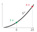

**Source Markdown Excerpt**

```markdown
2957
2958  ::: {.column-margin}
2959  {width="100%" fig-alt="A flat curve that hockey-sticks sharply upward; a dot marks the knee, and the region to the right of the knee is shaded red as a danger zone."}
2960
2961  *Doubling the context quadruples attention memory: past the knee, the cost wall is unavoidable.*
2962  :::
2963
2964  ```{python}
```

**Strongest Prose Anchor**

> Problem : How much memory does the attention matrix of a single layer require at sequence length $S =$ {python} AttentionMemory.seq len str (context window)?

**Placement Context**

_Paragraph before the margin block:_

> Attention mechanisms require storage for attention weights, key-query-value projections, and intermediate feature representations. For a sequence length $S$ and dimension $d$, each attention layer must store an $S{ }S$ attention weight matrix for each sequence in the batch, three sets of projection matrices for queries, keys, and values (each sized $d{ }d$), and input and output feature maps of size $S{ }d$. The dynamic generation of attention weights for every input creates a memory access pattern where intermediate attention weights become a significant factor in memory usage, producing a quadratic bottleneck that defines modern...

_Paragraph after the margin block:_

> Problem : How much memory does the attention matrix of a single layer require at sequence length $S =$ {python} AttentionMemory.seq len str (context window)?

**Reader-Link Check**

- Source markdown: the excerpt above shows the `.column-margin` block and the exact caption beside the prose.
- The prose anchor is the text an editor should compare against the caption.
- The `fig-alt` describes what the visual marks encode; the caption should state the reader takeaway from those marks.

### 081. vol1/nn_architectures @ line 3790: DLRM embedding lookups force all-to-all dependence across shards.

- **Source QMD:** `../../quarto/contents/vol1/nn_architectures/nn_architectures.qmd:3790`
- **Asset:** `../../quarto/contents/vol1/nn_architectures/images/svg/vol1_nn_architectures_margin_003.svg`
- **Audit status:** `Pass`; lexical overlap `0.50`
- **Caption:** DLRM embedding lookups force all-to-all dependence across shards.
- **Figure evidence (`fig-alt`):** Four embedding shards connected by all-to-all exchange arrows, showing that each shard depends on data from the others.

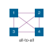

**Source Markdown Excerpt**

```markdown
3788
3789  ::: {.column-margin}
3790  {width="100%" fig-alt="Four embedding shards connected by all-to-all exchange arrows, showing that each shard depends on data from the others."}
3791
3792  *DLRM embedding lookups force all-to-all dependence across shards.*
3793  :::
3794
3795  \index{Bisection Bandwidth}
```

**Strongest Prose Anchor**

> Optimizing these systems requires high-speed interconnects (NVLink, InfiniBand) and specialized embedding caches, hardware design decisions examined in The distributed training strategies that coordinate these sharded embeddings across nodes are covered in

**Placement Context**

_Paragraph before the margin block:_

> Sharding : The massive embedding tables are split (sharded) across hundreds of GPUs. GPU 1 might hold items 1--1M, GPU 2 holds items 1M--2M, and so on. Replication : The dense MLPs are small and replicated on every GPU (data parallelism). The communication bottleneck : During the forward pass, GPU 1 processes a batch of users. These users might interact with items located on GPU 2, GPU 50, and GPU 99. GPU 1 cannot compute the dot products without those vectors.

_Paragraph after the margin block:_

> This dependency creates an All-to-All communication pattern: every GPU must exchange data with every other GPU to gather the specific embedding vectors needed for its local batch. Consequently, DLRM performance is often limited not by FLOP/s, but by bisection bandwidth, the capacity of the network switch fabric to move data between all nodes simultaneously. Optimizing these systems requires high-speed interconnects (NVLink, InfiniBand) and specialized embedding caches, hardware design decisions examined in The distributed training strategies that coordinate these sharded embeddings across nodes are covered in

**Reader-Link Check**

- Source markdown: the excerpt above shows the `.column-margin` block and the exact caption beside the prose.
- The prose anchor is the text an editor should compare against the caption.
- The `fig-alt` describes what the visual marks encode; the caption should state the reader takeaway from those marks.

### 082. vol1/nn_architectures @ line 3853: One embedding table fits an 80 GB A100; a second breaches the capacity wall.

- **Source QMD:** `../../quarto/contents/vol1/nn_architectures/nn_architectures.qmd:3853`
- **Asset:** `../../quarto/contents/vol1/nn_architectures/images/svg/nn_architectures_capacity_wall.svg`
- **Audit status:** `Manual review candidate`; lexical overlap `0.22`
- **Caption:** One embedding table fits an 80 GB A100; a second breaches the capacity wall.
- **Figure evidence (`fig-alt`):** Three stacked memory bars: a single item embedding table at 51 GB fits below an 80 GB A100 capacity bar, but an item-plus-user pair at 102 GB overshoots it, no longer fitting on one device.

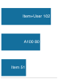

**Source Markdown Excerpt**

```markdown
3851
3852  ::: {.column-margin}
3853  {width="100%" fig-alt="Three stacked memory bars: a single item embedding table at 51 GB fits below an 80 GB A100 capacity bar, but an item-plus-user pair at 102 GB overshoots it, no longer fitting on one device."}
3854
3855  *One embedding table fits an 80 GB A100; a second breaches the capacity wall.*
3856  :::
3857
3858  ::: {#nbk-nn-architectures-capacity-wall .callout-notebook title="The capacity wall"}
```

**Strongest Prose Anchor**

> Problem : Consider a recommendation system for a store with {python} CapacityWall.cw num items str items using an embedding size of {python} CapacityWall.cw embed dim str.

**Placement Context**

_Paragraph before the margin block:_

> A quick calculation shows how fast embedding tables exceed single-GPU memory.

_Paragraph after the margin block:_

> Problem : Consider a recommendation system for a store with {python} CapacityWall.cw num items str items using an embedding size of {python} CapacityWall.cw embed dim str. How much memory does the item table alone require?

**Reader-Link Check**

- Source markdown: the excerpt above shows the `.column-margin` block and the exact caption beside the prose.
- The prose anchor is the text an editor should compare against the caption.
- The `fig-alt` describes what the visual marks encode; the caption should state the reader takeaway from those marks.

### 083. vol1/nn_architectures @ line 4772: Moving a value from DRAM costs far more energy than a MAC.

- **Source QMD:** `../../quarto/contents/vol1/nn_architectures/nn_architectures.qmd:4772`
- **Asset:** `../../quarto/contents/vol1/nn_architectures/images/svg/vol1_nn_architectures_margin_004.svg`
- **Audit status:** `Pass`; lexical overlap `0.67`
- **Caption:** Moving a value from DRAM costs far more energy than a MAC.
- **Figure evidence (`fig-alt`):** DRAM access energy versus MAC energy.


**Source Markdown Excerpt**

```markdown
4770
4771  ::: {.column-margin}
4772  {width="100%" fig-alt="DRAM access energy versus MAC energy."}
4773
4774  *Moving a value from DRAM costs far more energy than a MAC.*
4775  :::
4776
4777  Convolutional operations reduce energy consumption through data reuse but exhibit variable efficiency depending on implementation. Im2col-based convolution implementations trade memory for simplicity; a fully materialized lowering can multiply temporary storage and memory traffic, up to $K^2$ for stride-1 $K{\times}K$ filters away from the borders. Direct convolution implementations can achieve substantially better energy efficiency by eliminating redundant data movement, particularly for larger kernel sizes where im2col duplication is most severe.
```

**Strongest Prose Anchor**

> Each multiply-accumulate operation consumes approximately {python} EnergyConsumptionAnalysis.energy mac pj str, while data movement from DRAM costs {python} EnergyConsumptionAnalysis.energy dram pj str per 32-bit value [ ], about {python} EnergyConsumptionAnalysis.energy ratio str$ $ higher.

**Placement Context**

_Paragraph before the margin block:_

> Large batched GEMMs in MLPs can achieve excellent arithmetic intensity, but small-batch MLP inference often has low reuse and spends most of its energy on data movement. Each multiply-accumulate operation consumes approximately {python} EnergyConsumptionAnalysis.energy mac pj str, while data movement from DRAM costs {python} EnergyConsumptionAnalysis.energy dram pj str per 32-bit value [ ], about {python} EnergyConsumptionAnalysis.energy ratio str$ $ higher. Given this energy ratio, typical MLP inference spends the majority of its energy budget on data movement rather than computation, making memory bandwidth optimization critical for...

_Paragraph after the margin block:_

> Convolutional operations reduce energy consumption through data reuse but exhibit variable efficiency depending on implementation. Im2col-based convolution implementations trade memory for simplicity; a fully materialized lowering can multiply temporary storage and memory traffic, up to $K^2$ for stride-1 $K{ }K$ filters away from the borders. Direct convolution implementations can achieve substantially better energy efficiency by eliminating redundant data movement, particularly for larger kernel sizes where im2col duplication is most severe.

**Reader-Link Check**

- Source markdown: the excerpt above shows the `.column-margin` block and the exact caption beside the prose.
- The prose anchor is the text an editor should compare against the caption.
- The `fig-alt` describes what the visual marks encode; the caption should state the reader takeaway from those marks.

### 084. vol1/nn_computation @ line 896: Learned features buy accuracy by spending far more arithmetic.

- **Source QMD:** `../../quarto/contents/vol1/nn_computation/nn_computation.qmd:896`
- **Asset:** `../../quarto/contents/vol1/nn_computation/images/svg/vol1_nn_computation_margin_001.svg`
- **Audit status:** `Manual review candidate`; lexical overlap `0.00`
- **Caption:** Learned features buy accuracy by spending far more arithmetic.
- **Figure evidence (`fig-alt`):** Vertical log-scale ladder of orange bars, smallest at bottom: rule-based comparisons, then HOG operations, then neural-network matrix MACs at the top, spanning several orders of magnitude.


**Source Markdown Excerpt**

```markdown
894
895  ::: {.column-margin}
896  {width="100%" fig-alt="Vertical log-scale ladder of orange bars, smallest at bottom: rule-based comparisons, then HOG operations, then neural-network matrix MACs at the top, spanning several orders of magnitude."}
897
898  *Learned features buy accuracy by spending far more arithmetic.*
899  :::
900
901  | **System Aspect**    | **Traditional Programming**   | **ML with Features**        | **Deep Learning**               |
```

**Strongest Prose Anchor**

> The MNIST running example traced a single digit from ~{python} ParadigmInfrastructureRecap.rb ops str comparisons (rule-based) through ~{python} ParadigmInfrastructureRecap.hog ops approx str structured operations (HOG) to {python} ParadigmInfrastructureRecap.dl total macs str matrix MACs (neural network): a {python} ParadigmInfrastructureRecap.dl ops ratio str$ $ escalation in computation, with a corresponding shift from predictable sequential access to bandwidth-hungry parallel matrix operations.

**Placement Context**

_Paragraph before the margin block:_

> The MNIST running example traced a single digit from ~{python} ParadigmInfrastructureRecap.rb ops str comparisons (rule-based) through ~{python} ParadigmInfrastructureRecap.hog ops approx str structured operations (HOG) to {python} ParadigmInfrastructureRecap.dl total macs str matrix MACs (neural network): a {python} ParadigmInfrastructureRecap.dl ops ratio str$ $ escalation in computation, with a corresponding shift from predictable sequential access to bandwidth-hungry parallel matrix operations. generalizes this pattern across every systems dimension.

_Paragraph after the margin block:_

> : System Resource Evolution : Programming paradigms shift system demands from sequential computation to structured parallelism with feature engineering, and finally to massive matrix operations and complex memory hierarchies in deep learning. Deep learning reshapes system requirements compared to traditional programming and classical machine learning, impacting both computation and memory access patterns. { tbl-colwidths="[17,25,25,33]"}

**Reader-Link Check**

- Source markdown: the excerpt above shows the `.column-margin` block and the exact caption beside the prose.
- The prose anchor is the text an editor should compare against the caption.
- The `fig-alt` describes what the visual marks encode; the caption should state the reader takeaway from those marks.

### 085. vol1/nn_computation @ line 1838: Neural-network history is a scale explosion in training energy.

- **Source QMD:** `../../quarto/contents/vol1/nn_computation/nn_computation.qmd:1838`
- **Asset:** `../../quarto/contents/vol1/nn_computation/images/svg/vol1_nn_computation_margin_002.svg`
- **Audit status:** `Pass`; lexical overlap `0.33`
- **Caption:** Neural-network history is a scale explosion in training energy.
- **Figure evidence (`fig-alt`):** Vertical log-scale ladder of orange bars, smallest at bottom: LeNet-scale training energy at the base rising to GPT-4-scale training energy at the top, spanning many orders of magnitude.


**Source Markdown Excerpt**

```markdown
1836
1837  ::: {.column-margin}
1838  {width="100%" fig-alt="Vertical log-scale ladder of orange bars, smallest at bottom: LeNet-scale training energy at the base rising to GPT-4-scale training energy at the top, spanning many orders of magnitude."}
1839
1840  *Neural-network history is a scale explosion in training energy.*
1841  :::
1842
1843  [^fn-energy-scale-training]: **Training Energy Scale**: This estimate uses `{python} TrainingEnergyScale.household_mwh_per_year_str` as a representative US household electricity budget and treats GPT-4's public GPU-day estimate as A100-equivalent accelerator time with datacenter overhead. The point is order of magnitude, not an audited utility bill: a single frontier training run now rivals a small industrial facility's energy budget, making J-per-operation a first-order design constraint alongside achieved FLOP/s. \index{Energy!training scale}
```

**Strongest Prose Anchor**

> A GPT-4-scale training run, using public GPU-day estimates and a datacenter-overhead factor, lands around {python} TrainingEnergyScale.gpt4 energy mwh str—enough to power roughly {python} TrainingEnergyScale.us homes str US homes for a year[^fn-energy-scale-training].

**Placement Context**

_Paragraph before the margin block:_

> Beyond raw compute, this exponential growth carries an energy cost that systems engineers cannot ignore. Training LeNet-1 in 1989 consumed roughly {python} TrainingEnergyScale.lenet kwh str, about a few days of household electricity. A GPT-4-scale training run, using public GPU-day estimates and a datacenter-overhead factor, lands around {python} TrainingEnergyScale.gpt4 energy mwh str—enough to power roughly {python} TrainingEnergyScale.us homes str US homes for a year[^fn-energy-scale-training]. The energy cost of AI has moved from negligible to industrial, forcing engineers to treat energy efficiency (J per operation) as a primary...

_Paragraph after the margin block:_

> Three quantitative patterns emerge from this historical data. The plotted post-2012 training-compute frontier doubles on the order of months, while broader summaries that smooth across model families and account for reporting uncertainty show similarly rapid annual growth. Separately, the compute required to achieve a fixed benchmark has improved substantially due to algorithmic and systems advances. Training costs grow more slowly than raw compute because hardware utilization, reduced precision, and software efficiency also improve. Frontier model training costs have nonetheless moved from workstation-scale budgets into industrial-scale...

**Reader-Link Check**

- Source markdown: the excerpt above shows the `.column-margin` block and the exact caption beside the prose.
- The prose anchor is the text an editor should compare against the caption.
- The `fig-alt` describes what the visual marks encode; the caption should state the reader takeaway from those marks.

### 086. vol1/nn_computation @ line 2582: ReLU's comparator logic is far cheaper in silicon than a sigmoid exponential.

- **Source QMD:** `../../quarto/contents/vol1/nn_computation/nn_computation.qmd:2582`
- **Asset:** `../../quarto/contents/vol1/nn_computation/images/svg/vol1_nn_computation_margin_003.svg`
- **Audit status:** `Pass`; lexical overlap `0.33`
- **Caption:** ReLU's comparator logic is far cheaper in silicon than a sigmoid exponential.
- **Figure evidence (`fig-alt`):** Vertical log-scale ladder of orange bars: a tiny ReLU comparator at the bottom, a much taller sigmoid exponential unit above it, the transistor-count gap spanning orders of magnitude.


**Source Markdown Excerpt**

```markdown
2580
2581  ::: {.column-margin}
2582  {width="100%" fig-alt="Vertical log-scale ladder of orange bars: a tiny ReLU comparator at the bottom, a much taller sigmoid exponential unit above it, the transistor-count gap spanning orders of magnitude."}
2583
2584  *ReLU's comparator logic is far cheaper in silicon than a sigmoid exponential.*
2585  :::
2586
2587  These nonlinear transformations convert the linear input sum into a nonlinear output, giving us the complete perceptron computation in @eq-perceptron:
```

**Strongest Prose Anchor**

> We call this disparity The Transistor Tax : selecting Sigmoid over ReLU increases the silicon "price" of an activation by {python} ActivationLogic.activation ratio str$ $.

**Placement Context**

_Paragraph before the margin block:_

> We call this disparity The Transistor Tax : selecting Sigmoid over ReLU increases the silicon "price" of an activation by {python} ActivationLogic.activation ratio str$ $. For a systems engineer, this means ReLU is a density optimization that allows hardware architects to pack orders of magnitude more neurons into the same power and area budget. This physical efficiency is the primary reason the deep learning era shifted away from the "biologically plausible" Sigmoid toward the "silicon-efficient" ReLU.

_Paragraph after the margin block:_

> These nonlinear transformations convert the linear input sum into a nonlinear output, giving us the complete perceptron computation in $$ = (z) = ( (x i w {ij}) + b ) $$ { }

**Reader-Link Check**

- Source markdown: the excerpt above shows the `.column-margin` block and the exact caption beside the prose.
- The prose anchor is the text an editor should compare against the caption.
- The `fig-alt` describes what the visual marks encode; the caption should state the reader takeaway from those marks.

### 087. vol1/nn_computation @ line 3583: MNIST is cache-scale; GPT-2 is VRAM-scale.

- **Source QMD:** `../../quarto/contents/vol1/nn_computation/nn_computation.qmd:3583`
- **Asset:** `../../quarto/contents/vol1/nn_computation/images/svg/nn_computation_memory_explosion.svg`
- **Audit status:** `Pass`; lexical overlap `0.50`
- **Caption:** MNIST is cache-scale; GPT-2 is VRAM-scale.
- **Figure evidence (`fig-alt`):** Log-scale comparison of model memory footprints. MNIST is a small 438 KB cache-scale model, while GPT-2 is a 6 GB VRAM-scale model, separated by roughly four orders of magnitude.


**Source Markdown Excerpt**

```markdown
3581
3582  ::: {.column-margin}
3583  {width="100%" fig-alt="Log-scale comparison of model memory footprints. MNIST is a small 438 KB cache-scale model, while GPT-2 is a 6 GB VRAM-scale model, separated by roughly four orders of magnitude."}
3584
3585  *MNIST is cache-scale; GPT-2 is VRAM-scale.*
3586  :::
3587
3588  The preceding memory calculations are precise but slow. In practice, systems engineers work at two levels of fidelity: exact budgets for design documents and order-of-magnitude estimates for early feasibility gates. The exact budget we just computed confirmed that MNIST fits comfortably in cache while GPT-2 requires dedicated accelerator memory. A quick mental estimate should reach the same conclusion in seconds, not minutes, and flag any model that cannot physically fit on the target hardware before a single line of profiling code runs.
```

**Strongest Prose Anchor**

> The increase represents a phase change in engineering, not merely "more parameters." MNIST is a cache-resident arithmetic problem; GPT-2 is a data movement problem.

**Placement Context**

_Paragraph before the margin block:_

> Systems insight : Moving from ~{python} MemoryExplosionCalc.mnist params k str to {python} MemoryExplosionCalc.gpt2 params b str parameters is a {python} MemoryExplosionCalc.mem jump str$ $ jump. The increase represents a phase change in engineering, not merely "more parameters." MNIST is a cache-resident arithmetic problem; GPT-2 is a data movement problem.

_Paragraph after the margin block:_

> The preceding memory calculations are precise but slow. In practice, systems engineers work at two levels of fidelity: exact budgets for design documents and order-of-magnitude estimates for early feasibility gates. The exact budget we just computed confirmed that MNIST fits comfortably in cache while GPT-2 requires dedicated accelerator memory. A quick mental estimate should reach the same conclusion in seconds, not minutes, and flag any model that cannot physically fit on the target hardware before a single line of profiling code runs.

**Reader-Link Check**

- Source markdown: the excerpt above shows the `.column-margin` block and the exact caption beside the prose.
- The prose anchor is the text an editor should compare against the caption.
- The `fig-alt` describes what the visual marks encode; the caption should state the reader takeaway from those marks.

### 088. vol1/nn_computation @ line 3921: Matrix multiplication is over 90 percent of forward-pass FLOPs.

- **Source QMD:** `../../quarto/contents/vol1/nn_computation/nn_computation.qmd:3921`
- **Asset:** `../../quarto/contents/vol1/nn_computation/images/svg/nn_computation_matmul_dominance.svg`
- **Audit status:** `Pass`; lexical overlap `0.33`
- **Caption:** Matrix multiplication is over 90 percent of forward-pass FLOPs.
- **Figure evidence (`fig-alt`):** Horizontal stacked bar of the forward-pass floating-point budget. A wide orange segment labeled MatMul fills about 90 percent of the bar; a narrow gray segment fills the remainder, the element-wise work.


**Source Markdown Excerpt**

```markdown
3919
3920  ::: {.column-margin}
3921  {width="100%" fig-alt="Horizontal stacked bar of the forward-pass floating-point budget. A wide orange segment labeled MatMul fills about 90 percent of the bar; a narrow gray segment fills the remainder, the element-wise work."}
3922
3923  *Matrix multiplication is over 90 percent of forward-pass FLOPs.*
3924  :::
3925
3926  This composition reveals that forward propagation is, at its core, a chain of matrix multiplications interleaved with nonlinear activations. Understanding *why* matrix multiplication dominates AI computation requires examining the arithmetic intensity of each operation.
```

**Strongest Prose Anchor**

> Understanding why matrix multiplication dominates AI computation requires examining the arithmetic intensity of each operation.

**Placement Context**

_Paragraph before the margin block:_

> For a network with $N L$ layers, we can express the full forward computation as $$ ^{(N L)} = f^{(N L)}\! ( f^{(2)}\! (f^{(1)}( ^{(1)} + ^{(1)}) ^{(2)} + ^{(2)} ) ^{(N L)} + ^{(N L)} ) $$ { }

_Paragraph after the margin block:_

> This composition reveals that forward propagation is, at its core, a chain of matrix multiplications interleaved with nonlinear activations. Understanding why matrix multiplication dominates AI computation requires examining the arithmetic intensity of each operation.

**Reader-Link Check**

- Source markdown: the excerpt above shows the `.column-margin` block and the exact caption beside the prose.
- The prose anchor is the text an editor should compare against the caption.
- The `fig-alt` describes what the visual marks encode; the caption should state the reader takeaway from those marks.

### 089. vol1/nn_computation @ line 5839: Small neural workloads stay memory-bound even on large GPUs.

- **Source QMD:** `../../quarto/contents/vol1/nn_computation/nn_computation.qmd:5839`
- **Asset:** `../../quarto/contents/vol1/nn_computation/images/svg/vol1_nn_computation_margin_004.svg`
- **Audit status:** `Pass`; lexical overlap `0.62`
- **Caption:** Small neural workloads stay memory-bound even on large GPUs.
- **Figure evidence (`fig-alt`):** A roofline silhouette: a blue memory-bound slope rising to a dashed ridge, then a flat orange compute-bound ceiling, with the MNIST workload dot deep on the memory-bound slope, far left of the ridge.

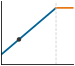

**Source Markdown Excerpt**

```markdown
5837
5838  ::: {.column-margin}
5839  {width="100%" fig-alt="A roofline silhouette: a blue memory-bound slope rising to a dashed ridge, then a flat orange compute-bound ceiling, with the MNIST workload dot deep on the memory-bound slope, far left of the ridge."}
5840
5841  *Small neural workloads stay memory-bound even on large GPUs.*
5842  :::
5843
5844  **Pitfall**: *Extrapolating accuracy improvements without considering diminishing returns.*
```

**Strongest Prose Anchor**

> For memory-bound workloads, a commodity CPU can match an expensive accelerator; for compute-bound GPT-scale models, accelerators provide the large speedups they were built for.

**Placement Context**

_Paragraph before the margin block:_

> Teams purchase expensive GPUs expecting proportional speedups, then discover workloads are memory bound. Arithmetic intensity determines which resource constrains performance. The MNIST forward-pass analysis in and the roofline model in show why small networks like MNIST (784 to 128 to 64 to 10) have arithmetic intensity of approximately {python} FallacyQuantExamples.mnist arith intensity str FLOP/byte, far below the A100 and H100 dense-FP16 ridge points of about {python} FallacyQuantExamples.a100 ridge str and {python} FallacyQuantExamples.h100 ridge str FLOP/byte. For memory-bound workloads, a commodity CPU can match an expensive...

_Paragraph after the margin block:_

> Pitfall : Extrapolating accuracy improvements without considering diminishing returns.

**Reader-Link Check**

- Source markdown: the excerpt above shows the `.column-margin` block and the exact caption beside the prose.
- The prose anchor is the text an editor should compare against the caption.
- The `fig-alt` describes what the visual marks encode; the caption should state the reader takeaway from those marks.

### 090. vol1/responsible_engr @ line 73: The Amazon failure is a Data-axis failure: biased historical signal.

- **Source QMD:** `../../quarto/contents/vol1/responsible_engr/responsible_engr.qmd:73`
- **Asset:** `../../quarto/contents/vol1/responsible_engr/images/svg/responsible_engr_dam_locator_data.svg`
- **Audit status:** `Pass`; lexical overlap `0.50`
- **Caption:** The Amazon failure is a Data-axis failure: biased historical signal.
- **Figure evidence (`fig-alt`):** D-A-M locator triangle with three nodes: D (Data) at top filled solid green, A (Algorithm) and M (Machine) at the lower corners shown gray, connected by violet edges. The Data node is highlighted.

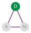

**Source Markdown Excerpt**

```markdown
71
72  ::: {.column-margin}
73  {width="100%" fig-alt="D-A-M locator triangle with three nodes: D (Data) at top filled solid green, A (Algorithm) and M (Machine) at the lower corners shown gray, connected by violet edges. The Data node is highlighted."}
74
75  *The Amazon failure is a Data-axis failure: biased historical signal.*
76  :::
77
78  The Amazon recruiting tool case illustrates this gap. In 2014, Amazon developed an AI system to automate resume screening for technical positions, training it on historical hiring data spanning ten years of resumes submitted to the company.\index{Bias!historical data encoding} By 2015, the company discovered the system exhibited gender bias\index{Bias!gender discrimination} in candidate ratings [@dastin2018].
```

**Strongest Prose Anchor**

> In 2014, Amazon developed an AI system to automate resume screening for technical positions, training it on historical hiring data spanning ten years of resumes submitted to the company.

**Placement Context**

_Paragraph before the margin block:_

> The gap manifests through concrete mechanisms: proxy variables, feedback loops, and distribution shift, each producing harm through a distinct pathway. Concrete cases where optimization succeeded but systems failed reveal these mechanisms and the silent failure modes that make them invisible to conventional monitoring. Organizations that closed the gap through systematic engineering practice demonstrate that prevention is feasible. The testing challenge that makes responsibility fundamentally harder to verify than traditional software correctness then determines where responsibility ownership must sit within engineering organizations.

_Paragraph after the margin block:_

> The Amazon recruiting tool case illustrates this gap. In 2014, Amazon developed an AI system to automate resume screening for technical positions, training it on historical hiring data spanning ten years of resumes submitted to the company. By 2015, the company discovered the system exhibited gender bias in candidate ratings [ ].

**Reader-Link Check**

- Source markdown: the excerpt above shows the `.column-margin` block and the exact caption beside the prose.
- The prose anchor is the text an editor should compare against the caption.
- The `fig-alt` describes what the visual marks encode; the caption should state the reader takeaway from those marks.

### 091. vol1/responsible_engr @ line 131: One upstream change; many silently affected.

- **Source QMD:** `../../quarto/contents/vol1/responsible_engr/responsible_engr.qmd:131`
- **Asset:** `../../quarto/contents/vol1/responsible_engr/images/svg/responsible_engr_blast_radius_sepsis.svg`
- **Audit status:** `Manual review candidate`; lexical overlap `0.17`
- **Caption:** One upstream change; many silently affected.
- **Figure evidence (`fig-alt`):** A red square source on the left with five arrows fanning out to five identical blue circles on the right, representing one upstream fault propagating to many downstream consumers.


**Source Markdown Excerpt**

```markdown
129
130  ::: {.column-margin}
131  {width="100%" fig-alt="A red square source on the left with five arrows fanning out to five identical blue circles on the right, representing one upstream fault propagating to many downstream consumers."}
132
133  *One upstream change; many silently affected.*
134  :::
135
136  Consider a hospital sepsis model that begins recommending aggressive treatments for low-risk patients after an electronic health record (EHR) workflow change alters how vital signs are recorded. No alarm triggers---the model's confidence scores remain high, its latency stays within its service level agreement (SLA), and all system health checks pass green. The failure is silent: the input data distribution has shifted, but the monitoring pipeline has no mechanism to detect distributional drift.
```

**Strongest Prose Anchor**

> Consider a hospital sepsis model that begins recommending aggressive treatments for low-risk patients after an electronic health record (EHR) workflow change alters how vital signs are recorded.

**Placement Context**

_Paragraph before the margin block:_

> The checkpoint's questions have a precise answer here. Better testing would not catch these problems because they represent failures of problem specification, where the technical objective (minimizing prediction error on historical outcomes) diverges from the desired social objective (making fair and accurate predictions across demographic groups). Specification failures are difficult to detect precisely because the systems continue functioning normally by conventional engineering metrics. The deeper problem is clear: when a system appears healthy by every available metric, the harm it causes remains invisible to conventional monitoring.

_Paragraph after the margin block:_

> Consider a hospital sepsis model that begins recommending aggressive treatments for low-risk patients after an electronic health record (EHR) workflow change alters how vital signs are recorded. No alarm triggers---the model's confidence scores remain high, its latency stays within its service level agreement (SLA), and all system health checks pass green. The failure is silent: the input data distribution has shifted, but the monitoring pipeline has no mechanism to detect distributional drift.

**Reader-Link Check**

- Source markdown: the excerpt above shows the `.column-margin` block and the exact caption beside the prose.
- The prose anchor is the text an editor should compare against the caption.
- The `fig-alt` describes what the visual marks encode; the caption should state the reader takeaway from those marks.

### 092. vol1/responsible_engr @ line 155: Past the knee, the proxy decouples from the goal.

- **Source QMD:** `../../quarto/contents/vol1/responsible_engr/responsible_engr.qmd:155`
- **Asset:** `../../quarto/contents/vol1/responsible_engr/images/svg/responsible_engr_scale_anchor_goodhart.svg`
- **Audit status:** `Pass`; lexical overlap `0.40`
- **Caption:** Past the knee, the proxy decouples from the goal.
- **Figure evidence (`fig-alt`):** A curve that stays flat then bends sharply upward at a red knee dot, with the region to the right of the knee shaded red to mark the danger zone.

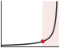

**Source Markdown Excerpt**

```markdown
153
154  ::: {.column-margin}
155  {width="100%" fig-alt="A curve that stays flat then bends sharply upward at a red knee dot, with the region to the right of the knee shaded red to mark the danger zone."}
156
157  *Past the knee, the proxy decouples from the goal.*
158  :::
159
160  ::: {#nbk-responsible-engr-alignment-gap .callout-notebook title="The alignment gap"}
```

**Strongest Prose Anchor**

> The dynamics of that divergence are made precise by Goodhart's Law: once a proxy becomes the optimization target, it stops tracking the goal it was chosen to represent.

**Placement Context**

_Paragraph before the margin block:_

> Distribution shift explains why models degrade over time (the operational detection and monitoring strategies for drift are covered in ). The failure is environmental: the world changed after the model was trained, and the model has no mechanism to notice. Retraining on fresh data can partially address this class of failure, but it cannot address a second mechanism for silent failure that operates even when the data distribution is perfectly stable. Metric misalignment occurs when the quantity the model optimizes diverges from the outcome the organization actually values. The dynamics of that divergence are made precise by Goodhart's Law...

_Paragraph after the margin block:_

> Problem : A model optimizes a proxy metric (Clicks) because the true metric (User Satisfaction) is unobservable. How much can they diverge?

**Reader-Link Check**

- Source markdown: the excerpt above shows the `.column-margin` block and the exact caption beside the prose.
- The prose anchor is the text an editor should compare against the caption.
- The `fig-alt` describes what the visual marks encode; the caption should state the reader takeaway from those marks.

### 093. vol1/responsible_engr @ line 643: Random sampling barely reaches small subgroups.

- **Source QMD:** `../../quarto/contents/vol1/responsible_engr/responsible_engr.qmd:643`
- **Asset:** `../../quarto/contents/vol1/responsible_engr/images/svg/vol1_responsible_engr_margin_001.svg`
- **Audit status:** `Pass`; lexical overlap `0.33`
- **Caption:** Random sampling barely reaches small subgroups.
- **Figure evidence (`fig-alt`):** Random sampling versus targeted stratified evaluation for a 1 percent subgroup.

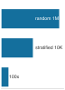

**Source Markdown Excerpt**

```markdown
641
642  ::: {.column-margin}
643  {width="100%" fig-alt="Random sampling versus targeted stratified evaluation for a 1 percent subgroup."}
644
645  *Random sampling barely reaches small subgroups.*
646  :::
647
648  :::
```

**Strongest Prose Anchor**

> Systems insight : Relying on "natural distribution" data for fairness is prohibitively expensive under random sampling.

**Placement Context**

_Paragraph before the margin block:_

> Systems insight : Relying on "natural distribution" data for fairness is prohibitively expensive under random sampling. Validating the minority group effectively requires {python} RepresentationStats.repr multiplier str$ $ more data than the majority group. Fairness requires intentional data engineering , not just more data.

_Paragraph after the margin block:_

> Intentional data engineering addresses what the model sees during evaluation, but even a perfectly representative dataset cannot prevent harm at deployment if the system lacks adequate human oversight. The representation cost calculated above is a predeployment gate; the question that follows is what happens once the model is live and making decisions that affect people.

**Reader-Link Check**

- Source markdown: the excerpt above shows the `.column-margin` block and the exact caption beside the prose.
- The prose anchor is the text an editor should compare against the caption.
- The `fig-alt` describes what the visual marks encode; the caption should state the reader takeaway from those marks.

### 094. vol1/responsible_engr @ line 665: As automation grows more reliable, human vigilance decays.

- **Source QMD:** `../../quarto/contents/vol1/responsible_engr/responsible_engr.qmd:665`
- **Asset:** `../../quarto/contents/vol1/responsible_engr/images/svg/vol1_responsible_engr_margin_002.svg`
- **Audit status:** `Manual review candidate`; lexical overlap `0.29`
- **Caption:** As automation grows more reliable, human vigilance decays.
- **Figure evidence (`fig-alt`):** Automation reliability rises while human vigilance falls.


**Source Markdown Excerpt**

```markdown
663
664  ::: {.column-margin}
665  {width="100%" fig-alt="Automation reliability rises while human vigilance falls."}
666
667  *As automation grows more reliable, human vigilance decays.*
668  :::
669
670  :::
```

**Strongest Prose Anchor**

> Systems lesson : Adding a human backup to an unreliable system does not make it reliable; it creates a new system with complex failure modes.

**Placement Context**

_Paragraph before the margin block:_

> Systems lesson : Adding a human backup to an unreliable system does not make it reliable; it creates a new system with complex failure modes. If the AI is 99 percent reliable, the human will eventually trust it 100 percent, making the "backup" useless precisely when it is needed most.

_Paragraph after the margin block:_

> The predeployment assessment framework parallels aviation preflight checklists, where pilots follow every item without exception to ensure comprehensive coverage of critical concerns despite time pressure. Production ML deployments require equivalent discipline and rigorous verification. Checklists ensure teams ask the right questions; documentation standards ensure the answers persist and travel with the model.

**Reader-Link Check**

- Source markdown: the excerpt above shows the `.column-margin` block and the exact caption beside the prose.
- The prose anchor is the text an editor should compare against the caption.
- The `fig-alt` describes what the visual marks encode; the caption should state the reader takeaway from those marks.

### 095. vol1/responsible_engr @ line 1646: Inference dominates lifetime cost; training is a rounding error.

- **Source QMD:** `../../quarto/contents/vol1/responsible_engr/responsible_engr.qmd:1646`
- **Asset:** `../../quarto/contents/vol1/responsible_engr/images/svg/responsible_engr_tco_bar.svg`
- **Audit status:** `Pass`; lexical overlap `0.43`
- **Caption:** Inference dominates lifetime cost; training is a rounding error.
- **Figure evidence (`fig-alt`):** Horizontal stacked bar of three-year total cost of ownership: a thin gray training sliver on the left, a wide orange inference segment dominating the middle, and a gray operations segment on the right. Training is a sliver; inference is most of the total.


**Source Markdown Excerpt**

```markdown
1644
1645  ::: {.column-margin}
1646  {width="100%" fig-alt="Horizontal stacked bar of three-year total cost of ownership: a thin gray training sliver on the left, a wide orange inference segment dominating the middle, and a gray operations segment on the right. Training is a sliver; inference is most of the total."}
1647
1648  *Inference dominates lifetime cost; training is a rounding error.*
1649  :::
1650
1651  [^fn-tco-inference-dominance]: **Total Cost of Ownership (TCO)**: The standard TCO figure typically excludes three categories of costs that ML systems add over conventional software: data labeling infrastructure (often 10--30 percent of total ML project cost), model monitoring and retraining (ongoing operational cost proportional to data volume), and remediation costs when models fail (which in regulated industries can exceed the original development cost). Additional externalities (carbon emissions, fairness audits, regulatory compliance overhead) make the upfront compute cost a misleading proxy for ML system cost, and explain why inference dominates TCO by 10--1,000$\times$ over training for any system that reaches production scale. \index{TCO!inference dominance}
```

**Strongest Prose Anchor**

> The surprise exposes a structural asymmetry in total cost of ownership [^fn-tco-inference-dominance]: power budgets translate directly to financial costs (a model that consumes 2 W instead of 4 W cuts electricity expenses in half), and for successful production systems, inference costs typically exceed training costs by ten to 1,000 times depending on traffic volume.

**Placement Context**

_Paragraph before the margin block:_

> A team spends \$3,200 training a recommendation model and celebrates the modest cost. Six months later, they discover they are spending \$500,000 per year serving it. The surprise exposes a structural asymmetry in total cost of ownership [^fn-tco-inference-dominance]: power budgets translate directly to financial costs (a model that consumes 2 W instead of 4 W cuts electricity expenses in half), and for successful production systems, inference costs typically exceed training costs by ten to 1,000 times depending on traffic volume. Inference cost dominance dictates where optimization efforts should focus.

_Paragraph after the margin block:_

> Consider a concrete example of a recommendation system serving {python} InferenceCostCalc.users daily m str users daily. Training costs appear considerable: data preparation consumes {python} InferenceCostCalc.data prep hrs str at approximately {python} InferenceCostCalc.gpu rate input str ({python} InferenceCostCalc.data prep usd str), hyperparameter search across multiple configurations requires {python} InferenceCostCalc.hyperparam hrs str ({python} InferenceCostCalc.hyperparam usd str), and the final training run uses {python} InferenceCostCalc.train hrs str ({python} InferenceCostCalc.train cost str). Total training cost reaches...

**Reader-Link Check**

- Source markdown: the excerpt above shows the `.column-margin` block and the exact caption beside the prose.
- The prose anchor is the text an editor should compare against the caption.
- The `fig-alt` describes what the visual marks encode; the caption should state the reader takeaway from those marks.

### 096. vol1/responsible_engr @ line 2183: Training one model can rival a car's annual carbon.

- **Source QMD:** `../../quarto/contents/vol1/responsible_engr/responsible_engr.qmd:2183`
- **Asset:** `../../quarto/contents/vol1/responsible_engr/images/svg/vol1_responsible_engr_margin_003.svg`
- **Audit status:** `Pass`; lexical overlap `0.62`
- **Caption:** Training one model can rival a car's annual carbon.
- **Figure evidence (`fig-alt`):** Model-training emissions versus one passenger-car year.

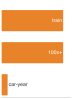

**Source Markdown Excerpt**

```markdown
2181
2182  ::: {.column-margin}
2183  {width="100%" fig-alt="Model-training emissions versus one passenger-car year."}
2184
2185  *Training one model can rival a car's annual carbon.*
2186  :::
2187
2188  :::
```

**Strongest Prose Anchor**

> Systems insight : Training a single state-of-the-art model is equivalent to the annual carbon footprint of {python} CarbonScaleCalc.cars eq str cars.

**Placement Context**

_Paragraph before the margin block:_

> Systems insight : Training a single state-of-the-art model is equivalent to the annual carbon footprint of {python} CarbonScaleCalc.cars eq str cars. At this scale, efficiency transforms from a technical preference into a moral requirement. Every 1 percent improvement in the efficiency $( { })$ of a training pipeline removes the equivalent of about {python} CarbonScaleCalc.one pct cars equivalent str cars' annual emissions from the atmosphere.

_Paragraph after the margin block:_

> The key insight is that efficiency optimization and environmental responsibility align: the techniques that reduce inference costs also reduce carbon emissions per prediction. More granular carbon accounting methodologies---lifecycle assessment, scope 1/2/3 emissions tracking, and carbon-aware scheduling---build on this foundation for organizations requiring detailed environmental impact analysis.

**Reader-Link Check**

- Source markdown: the excerpt above shows the `.column-margin` block and the exact caption beside the prose.
- The prose anchor is the text an editor should compare against the caption.
- The `fig-alt` describes what the visual marks encode; the caption should state the reader takeaway from those marks.

### 097. vol1/responsible_engr @ line 2736: Audit logs grow without bound as decisions are retained.

- **Source QMD:** `../../quarto/contents/vol1/responsible_engr/responsible_engr.qmd:2736`
- **Asset:** `../../quarto/contents/vol1/responsible_engr/images/svg/vol1_responsible_engr_margin_004.svg`
- **Audit status:** `Pass`; lexical overlap `0.43`
- **Caption:** Audit logs grow without bound as decisions are retained.
- **Figure evidence (`fig-alt`):** Append-only audit volume grows with retained decisions.


**Source Markdown Excerpt**

```markdown
2734
2735  ::: {.column-margin}
2736  {width="100%" fig-alt="Append-only audit volume grows with retained decisions."}
2737
2738  *Audit logs grow without bound as decisions are retained.*
2739  :::
2740
2741  Together, the four governance domains---security, privacy, compliance, and audit---form the enforcement layer that makes every other practice in this chapter durable. Data governance ensures that measurements are captured, actions are recorded, and commitments are verifiable under regulatory scrutiny. Without this infrastructure, responsible engineering remains aspirational; with it, responsibility becomes a demonstrable system property.
```

**Strongest Prose Anchor**

> Training infrastructure logs dataset access, recording which jobs read which data partitions, implementing the accountability needed to demonstrate that deleted user data no longer appears in new model versions.

**Placement Context**

_Paragraph before the margin block:_

> KWS systems implement multi-tier audit architectures that balance granularity against performance and cost. Edge devices log critical events locally with logs periodically uploaded to centralized storage for compliance retention. Feature stores log every query with request metadata: which service requested features, which user IDs were accessed, and what features were retrieved. Training infrastructure logs dataset access, recording which jobs read which data partitions, implementing the accountability needed to demonstrate that deleted user data no longer appears in new model versions.

_Paragraph after the margin block:_

> Together, the four governance domains---security, privacy, compliance, and audit---form the enforcement layer that makes every other practice in this chapter durable. Data governance ensures that measurements are captured, actions are recorded, and commitments are verifiable under regulatory scrutiny. Without this infrastructure, responsible engineering remains aspirational; with it, responsibility becomes a demonstrable system property.

**Reader-Link Check**

- Source markdown: the excerpt above shows the `.column-margin` block and the exact caption beside the prose.
- The prose anchor is the text an editor should compare against the caption.
- The `fig-alt` describes what the visual marks encode; the caption should state the reader takeaway from those marks.

### 098. vol1/training @ line 131: Training cost stays flat across scale, then explodes past the frontier knee.

- **Source QMD:** `../../quarto/contents/vol1/training/training.qmd:131`
- **Asset:** `../../quarto/contents/vol1/training/images/svg/training_cost_asymmetry.svg`
- **Audit status:** `Manual review candidate`; lexical overlap `0.27`
- **Caption:** Training cost stays flat across scale, then explodes past the frontier knee.
- **Figure evidence (`fig-alt`):** A cost curve that stays nearly flat across model scale, then rises almost vertically at the right, with a marked knee point and a shaded danger zone past it. Training cost explodes at frontier scale.


**Source Markdown Excerpt**

```markdown
129
130  ::: {.column-margin}
131  {width="100%" fig-alt="A cost curve that stays nearly flat across model scale, then rises almost vertically at the right, with a marked knee point and a shaded danger zone past it. Training cost explodes at frontier scale."}
132
133  *Training cost stays flat across scale, then explodes past the frontier knee.*
134  :::
135
136  The frameworks examined in @sec-ml-frameworks provided the execution substrate: computational graphs that schedule operations, automatic differentiation that computes gradients, and hardware abstractions that target diverse accelerators. Those tools make a single training step possible. This chapter confronts what happens when that step must execute billions of times, and what systems engineering is required to do so within practical time and budget constraints.
```

**Strongest Prose Anchor**

> - Explain the iron law of training performance and identify which term (operations, peak throughput, or utilization) each optimization technique targets - Calculate computational requirements (FLOPs), memory footprints (activation storage, optimizer states), and training cost estimates for neural network training - Compare optimization algorithms (SGD, Adam, AdamW) based on convergence speed, memory overhead, and computational cost - Identify training bottlenecks using arithmetic intensity (Roofline Model) and the profile-diagnose-fix-reprofile methodology to distinguish compute, memory, and data-bound regimes - Apply memory and throughput...

**Placement Context**

_Paragraph before the margin block:_

> - Explain the iron law of training performance and identify which term (operations, peak throughput, or utilization) each optimization technique targets - Calculate computational requirements (FLOPs), memory footprints (activation storage, optimizer states), and training cost estimates for neural network training - Compare optimization algorithms (SGD, Adam, AdamW) based on convergence speed, memory overhead, and computational cost - Identify training bottlenecks using arithmetic intensity (Roofline Model) and the profile-diagnose-fix-reprofile methodology to distinguish compute, memory, and data-bound regimes - Apply memory and throughput...

_Paragraph after the margin block:_

> The frameworks examined in provided the execution substrate: computational graphs that schedule operations, automatic differentiation that computes gradients, and hardware abstractions that target diverse accelerators. Those tools make a single training step possible. This chapter confronts what happens when that step must execute billions of times, and what systems engineering is required to do so within practical time and budget constraints.

**Reader-Link Check**

- Source markdown: the excerpt above shows the `.column-margin` block and the exact caption beside the prose.
- The prose anchor is the text an editor should compare against the caption.
- The `fig-alt` describes what the visual marks encode; the caption should state the reader takeaway from those marks.

### 099. vol1/training @ line 234: Training is compute-dominated: data and latency overlap away.

- **Source QMD:** `../../quarto/contents/vol1/training/training.qmd:234`
- **Asset:** `../../quarto/contents/vol1/training/images/svg/training_iron_law_bars.svg`
- **Audit status:** `Pass`; lexical overlap `0.33`
- **Caption:** Training is compute-dominated: data and latency overlap away.
- **Figure evidence (`fig-alt`):** A horizontal bar split into three segments labeled D, C, and L for data, compute, and latency. The middle compute segment is the widest and shaded orange; the data and latency segments are narrow and gray, showing compute dominates training time.


**Source Markdown Excerpt**

```markdown
232
233  ::: {.column-margin}
234  {width="100%" fig-alt="A horizontal bar split into three segments labeled D, C, and L for data, compute, and latency. The middle compute segment is the widest and shaded orange; the data and latency segments are narrow and gray, showing compute dominates training time."}
235
236  *Training is compute-dominated: data and latency overlap away.*
237  :::
238
239  @Eq-training-iron-law reveals three levers for improvement: reduce total operations through algorithmic innovation, increase peak throughput through hardware utilization, or improve utilization through better pipeline orchestration. Each optimization technique in this chapter pulls one or more of these levers, as summarized in @tbl-iron-law-mapping.
```

**Strongest Prose Anchor**

> Significance (quantitative) : The three factors identify three distinct optimization levers: $O$ (reducible by algorithmic or model changes such as pruning, distillation, sparsity, or fewer training tokens), $R { }$ (improved by hardware and lower-precision tensor cores), and $ { }$ (the utilization fraction and primary engineering target; GPT-3 training achieved $ { } 0.45$ [ ] while current systems target $ { } > 0.55$).

**Placement Context**

_Paragraph before the margin block:_

> 1. Significance (quantitative) : The three factors identify three distinct optimization levers: $O$ (reducible by algorithmic or model changes such as pruning, distillation, sparsity, or fewer training tokens), $R { }$ (improved by hardware and lower-precision tensor cores), and $ { }$ (the utilization fraction and primary engineering target; GPT-3 training achieved $ { } 0.45$ [ ] while current systems target $ { } > 0.55$). 2. Distinction (durable) : Unlike the general iron law, which models all three cost terms $(D { }/ , O/(R { } { }), L { })$, this simplified form assumes data movement and communication are not the binding constraint...

_Paragraph after the margin block:_

> reveals three levers for improvement: reduce total operations through algorithmic innovation, increase peak throughput through hardware utilization, or improve utilization through better pipeline orchestration. Each optimization technique in this chapter pulls one or more of these levers, as summarized in

**Reader-Link Check**

- Source markdown: the excerpt above shows the `.column-margin` block and the exact caption beside the prose.
- The prose anchor is the text an editor should compare against the caption.
- The `fig-alt` describes what the visual marks encode; the caption should state the reader takeaway from those marks.

### 100. vol1/training @ line 1140: Adam state is the largest piece: 2$\\times$ the weights, half of training memory.

- **Source QMD:** `../../quarto/contents/vol1/training/training.qmd:1140`
- **Asset:** `../../quarto/contents/vol1/training/images/svg/training_optimizer_memory.svg`
- **Audit status:** `Pass`; lexical overlap `0.50`
- **Caption:** Adam state is the largest piece: 2$\\times$ the weights, half of training memory.
- **Figure evidence (`fig-alt`):** A single stacked memory bar split into three segments, Params, Grads, and Adam optimizer state in a 1 to 1 to 2 ratio, with the optimizer-state segment highlighted as the largest single piece, half the total.


**Source Markdown Excerpt**

```markdown
1138
1139  ::: {.column-margin}
1140  {width="100%" fig-alt="A single stacked memory bar split into three segments, Params, Grads, and Adam optimizer state in a 1 to 1 to 2 ratio, with the optimizer-state segment highlighted as the largest single piece, half the total."}
1141
1142  *Adam state is the largest piece: 2$\times$ the weights, half of training memory.*
1143  :::
1144
1145  ::: {#nbk-gpt2-optimizer .callout-notebook title="GPT-2 optimizer memory requirements"}
```

**Strongest Prose Anchor**

> The multiplier row counts parameters plus optimizer auxiliary state and excludes gradients and activations; full training memory must add those terms explicitly.

**Placement Context**

_Paragraph before the margin block:_

> : Optimizer Memory Footprint : Different optimization algorithms impose varying auxiliary-state costs due to the storage of intermediate values like velocities and squared gradients. The multiplier row counts parameters plus optimizer auxiliary state and excludes gradients and activations; full training memory must add those terms explicitly. Understanding these trade-offs is important for resource-constrained deployments and large-scale model training. { tbl-colwidths="[22,12,15,17,34]"}

_Paragraph after the margin block:_

> A representative GPT-2 XL training configuration uses the Adam optimizer with the following hyperparameters:

**Reader-Link Check**

- Source markdown: the excerpt above shows the `.column-margin` block and the exact caption beside the prose.
- The prose anchor is the text an editor should compare against the caption.
- The `fig-alt` describes what the visual marks encode; the caption should state the reader takeaway from those marks.

### 101. vol1/training @ line 1469: Activation memory spans MNIST toys to GPT-scale training.

- **Source QMD:** `../../quarto/contents/vol1/training/training.qmd:1469`
- **Asset:** `../../quarto/contents/vol1/training/images/svg/vol1_training_margin_001.svg`
- **Audit status:** `Pass`; lexical overlap `0.57`
- **Caption:** Activation memory spans MNIST toys to GPT-scale training.
- **Figure evidence (`fig-alt`):** Three-rung memory ladder comparing kilobyte-scale MNIST activations, a 32 GB V100 HBM ceiling, and GPT-2 activation memory above that ceiling.


**Source Markdown Excerpt**

```markdown
1467
1468  ::: {.column-margin}
1469  {width="100%" fig-alt="Three-rung memory ladder comparing kilobyte-scale MNIST activations, a 32 GB V100 HBM ceiling, and GPT-2 activation memory above that ceiling."}
1470
1471  *Activation memory spans MNIST toys to GPT-scale training.*
1472  :::
1473
1474  #### Activation memory requirements {#sec-model-training-activation-memory-requirements-f44c}
```

**Strongest Prose Anchor**

> For the mathematical foundations of how backpropagation drives these memory costs, including the full training memory equation ($M { } = M { } + M { } + M { } + M { }$), see Modern training systems use autodifferentiation (see ) to handle gradient computations automatically, but the underlying memory and computation patterns remain the systems engineer's responsibility to manage.

**Placement Context**

_Paragraph before the margin block:_

> A simple three-layer network processing MNIST requires kilobytes of activation storage. GPT-2 processing a single batch requires over {python} GPT2ActivationMemory.total act gb str, more than most accelerators can hold. That gap defines the engineering challenge this chapter addresses. For the mathematical foundations of how backpropagation drives these memory costs, including the full training memory equation ($M { } = M { } + M { } + M { } + M { }$), see Modern training systems use autodifferentiation (see ) to handle gradient computations automatically, but the underlying memory and computation patterns remain the systems engineer's...

_Paragraph after the margin block:_

> Training systems must maintain intermediate values (activations) from the forward pass to compute gradients during the backward pass. This requirement compounds the memory demands of optimization algorithms. For each layer $ $, the system must store:

**Reader-Link Check**

- Source markdown: the excerpt above shows the `.column-margin` block and the exact caption beside the prose.
- The prose anchor is the text an editor should compare against the caption.
- The `fig-alt` describes what the visual marks encode; the caption should state the reader takeaway from those marks.

### 102. vol1/training @ line 2679: Bandwidth steps up the storage to DRAM to HBM hierarchy.

- **Source QMD:** `../../quarto/contents/vol1/training/training.qmd:2679`
- **Asset:** `../../quarto/contents/vol1/training/images/svg/vol1_training_margin_002.svg`
- **Audit status:** `Pass`; lexical overlap `0.67`
- **Caption:** Bandwidth steps up the storage to DRAM to HBM hierarchy.
- **Figure evidence (`fig-alt`):** Three-rung bandwidth ladder for the training data path: storage around 1.5 GB/s, DRAM around 75 GB/s, and V100 HBM around 900 GB/s.


**Source Markdown Excerpt**

```markdown
2677
2678  ::: {.column-margin}
2679  {width="100%" fig-alt="Three-rung bandwidth ladder for the training data path: storage around 1.5 GB/s, DRAM around 75 GB/s, and V100 HBM around 900 GB/s."}
2680
2681  *Bandwidth steps up the storage to DRAM to HBM hierarchy.*
2682  :::
2683
2684  ```{python}
```

**Strongest Prose Anchor**

> This cascading bandwidth hierarchy explains why the iteration time of a well-pipelined system is governed by the maximum of its component latencies rather than their sum , as shows: $$t { } = (t { }, t { }, t { })$$ { }

**Placement Context**

_Paragraph before the margin block:_

> Training data traverses three memory tiers on its way from disk to accelerator, and the bandwidth gap between these tiers, spanning three orders of magnitude, is the central challenge of data pipeline design. The effective transfer rate through the hierarchy is bounded by its slowest link, as shows: $$R { } = ( { }, { }, { })$$ { }

_Paragraph after the margin block:_

> Storage devices provide 1--2 GB/s, system memory delivers 50--100 GB/s, and accelerator HBM achieves {python} MemoryHierarchyBandwidth.v100 bw gb s str or higher. Each tier is orders of magnitude faster than the one below it, which means data that flows freely within accelerator memory creates a severe bottleneck when it must be fetched from disk. This cascading bandwidth hierarchy explains why the iteration time of a well-pipelined system is governed by the maximum of its component latencies rather than their sum , as shows: $$t { } = (t { }, t { }, t { })$$ { }

**Reader-Link Check**

- Source markdown: the excerpt above shows the `.column-margin` block and the exact caption beside the prose.
- The prose anchor is the text an editor should compare against the caption.
- The `fig-alt` describes what the visual marks encode; the caption should state the reader takeaway from those marks.

### 103. vol1/training @ line 4794: FlashAttention swaps the full attention matrix for small SRAM tiles.

- **Source QMD:** `../../quarto/contents/vol1/training/training.qmd:4794`
- **Asset:** `../../quarto/contents/vol1/training/images/svg/vol1_training_margin_003.svg`
- **Audit status:** `Pass`; lexical overlap `0.38`
- **Caption:** FlashAttention swaps the full attention matrix for small SRAM tiles.
- **Figure evidence (`fig-alt`):** Two-rung memory ladder comparing a full 4096 by 4096 attention matrix at about 64 MB with a 128 by 128 SRAM tile at about 64 KB.


**Source Markdown Excerpt**

```markdown
4792
4793  ::: {.column-margin}
4794  {width="100%" fig-alt="Two-rung memory ladder comparing a full 4096 by 4096 attention matrix at about 64 MB with a 128 by 128 SRAM tile at about 64 KB."}
4795
4796  *FlashAttention swaps the full attention matrix for small SRAM tiles.*
4797  :::
4798
4799  The online softmax algorithm enables this decomposition. Traditional softmax requires knowing all inputs before computing any output: $\text{softmax}(x)_i = e^{x_i} / \sum_j e^{x_j}$. Flash Attention uses an incremental formulation that updates softmax statistics as new blocks arrive, tracking the running maximum $m$ (for numerical stability) and denominator $l$ as each block is processed, then rescaling accumulated outputs accordingly.
```

**Strongest Prose Anchor**

> The largest intermediate tensor is $b{ }b$ (typically $b = 128$), requiring only 64 KB for a $128{ }128$ FP32 matrix compared to 64 MB for the full $4096{ }4096$ matrix.

**Placement Context**

_Paragraph before the margin block:_

> No $S{ }S$ matrix ever exists in HBM. The largest intermediate tensor is $b{ }b$ (typically $b = 128$), requiring only 64 KB for a $128{ }128$ FP32 matrix compared to 64 MB for the full $4096{ }4096$ matrix.

_Paragraph after the margin block:_

> The online softmax algorithm enables this decomposition. Traditional softmax requires knowing all inputs before computing any output: $ (x) i = e^{x i} / j e^{x j}$. Flash Attention uses an incremental formulation that updates softmax statistics as new blocks arrive, tracking the running maximum $m$ (for numerical stability) and denominator $l$ as each block is processed, then rescaling accumulated outputs accordingly.

**Reader-Link Check**

- Source markdown: the excerpt above shows the `.column-margin` block and the exact caption beside the prose.
- The prose anchor is the text an editor should compare against the caption.
- The `fig-alt` describes what the visual marks encode; the caption should state the reader takeaway from those marks.

### 104. vol1/training @ line 5854: Some models exceed single-GPU memory before anything else matters.

- **Source QMD:** `../../quarto/contents/vol1/training/training.qmd:5854`
- **Asset:** `../../quarto/contents/vol1/training/images/svg/vol1_training_margin_004.svg`
- **Audit status:** `Pass`; lexical overlap `0.33`
- **Caption:** Some models exceed single-GPU memory before anything else matters.
- **Figure evidence (`fig-alt`):** 80 GB GPU capacity threshold with 70B FP16 weights above it.


**Source Markdown Excerpt**

```markdown
5852
5853  ::: {.column-margin}
5854  {width="100%" fig-alt="80 GB GPU capacity threshold with 70B FP16 weights above it."}
5855
5856  *Some models exceed single-GPU memory before anything else matters.*
5857  :::
5858
5859  When single-machine optimization has been exhausted, the only remaining option is to spread computation across multiple devices. Multi-device training provides three capabilities unavailable to a single GPU: aggregate memory capacity, aggregate compute throughput, and aggregate storage bandwidth. Scaling beyond a single device begins with multi-GPU configurations inside one machine, then reaches the threshold where distributed systems become necessary. The key parallelism strategies and their trade-offs are introduced here; the implementation details of multi-node distributed training (collective communication primitives, fault tolerance, and elastic scheduling) are beyond our current scope.
```

**Strongest Prose Anchor**

> However, some models simply will not fit, no matter how aggressively these techniques are applied.

**Placement Context**

_Paragraph before the margin block:_

> The optimization toolkit developed in the previous section (mixed precision, Flash Attention, gradient checkpointing, and data prefetching) can transform an infeasible training configuration into a practical one on a single machine. The GPT-2 walkthrough demonstrated reducing memory from {python} GPT2SummaryScalingRecap.b total mem gb str to {python} GPT2SummaryScalingRecap.o total mem gb str, bringing a 1.5-billion-parameter model within reach of a single V100 GPU ({python} GPT2SummaryScalingRecap.v100 mem gib str). However, some models simply will not fit, no matter how aggressively these techniques are applied. A 70-billion-parameter...

_Paragraph after the margin block:_

> When single-machine optimization has been exhausted, the only remaining option is to spread computation across multiple devices. Multi-device training provides three capabilities unavailable to a single GPU: aggregate memory capacity, aggregate compute throughput, and aggregate storage bandwidth. Scaling beyond a single device begins with multi-GPU configurations inside one machine, then reaches the threshold where distributed systems become necessary. The key parallelism strategies and their trade-offs are introduced here; the implementation details of multi-node distributed training (collective communication primitives, fault tolerance...

**Reader-Link Check**

- Source markdown: the excerpt above shows the `.column-margin` block and the exact caption beside the prose.
- The prose anchor is the text an editor should compare against the caption.
- The `fig-alt` describes what the visual marks encode; the caption should state the reader takeaway from those marks.

### 105. vol2/collective_communication @ line 75: Gradient synchronization devours 30 to 70 percent of each step at scale.

- **Source QMD:** `../../quarto/contents/vol2/collective_communication/collective_communication.qmd:75`
- **Asset:** `../../quarto/contents/vol2/collective_communication/images/svg/collective_communication_comm_dominance.svg`
- **Audit status:** `Pass`; lexical overlap `0.71`
- **Caption:** Gradient synchronization devours 30 to 70 percent of each step at scale.
- **Figure evidence (`fig-alt`):** Two horizontal bars comparing the step's iron-law terms at frontier scale. The communication bar is wide and shaded violet, dominating; the compute bar is a narrow gray sliver.


**Source Markdown Excerpt**

```markdown
73
74  ::: {.column-margin}
75  {width="100%" fig-alt="Two horizontal bars comparing the step's iron-law terms at frontier scale. The communication bar is wide and shaded violet, dominating; the compute bar is a narrow gray sliver."}
76
77  *Gradient synchronization devours 30 to 70 percent of each step at scale.*
78  :::
79
80  At frontier scale (hundreds of billions of parameters across thousands of GPUs), gradient synchronization dominates the training step time, consuming 30--70 percent of wall-clock time unless aggressive optimization techniques are applied. The remainder of this chapter develops those techniques systematically.
```

**Strongest Prose Anchor**

> At frontier scale (hundreds of billions of parameters across thousands of GPUs), gradient synchronization dominates the training step time, consuming 30--70 percent of wall-clock time unless aggressive optimization techniques are applied.

**Placement Context**

_Paragraph before the margin block:_

> The volume of data that must be synchronized is proportional to the model size. A model with $P$ parameters stored in BF16 (2 bytes per parameter) generates $2P$ bytes of gradient data per training step per GPU. For a 70 billion parameter model, this is 140 GB of gradients that every GPU must send and receive.[^fn-ring-allreduce-origin]

_Paragraph after the margin block:_

> At frontier scale (hundreds of billions of parameters across thousands of GPUs), gradient synchronization dominates the training step time, consuming 30--70 percent of wall-clock time unless aggressive optimization techniques are applied. The remainder of this chapter develops those techniques systematically.

**Reader-Link Check**

- Source markdown: the excerpt above shows the `.column-margin` block and the exact caption beside the prose.
- The prose anchor is the text an editor should compare against the caption.
- The `fig-alt` describes what the visual marks encode; the caption should state the reader takeaway from those marks.

### 106. vol2/collective_communication @ line 429: Small messages are latency-bound, large ones bandwidth-bound; the cost reverses.

- **Source QMD:** `../../quarto/contents/vol2/collective_communication/collective_communication.qmd:429`
- **Asset:** `../../quarto/contents/vol2/collective_communication/images/svg/collective_communication_alpha_beta_dominance.svg`
- **Audit status:** `Pass`; lexical overlap `0.56`
- **Caption:** Small messages are latency-bound, large ones bandwidth-bound; the cost reverses.
- **Figure evidence (`fig-alt`):** Two horizontal bars. Top (large message): a wide blue bandwidth segment labeled n over beta, plus a thin gray latency sliver. Bottom (small message): a wide violet latency segment labeled alpha, plus a thin gray sliver. The dominant term flips.


**Source Markdown Excerpt**

```markdown
427
428  ::: {.column-margin}
429  {width="100%" fig-alt="Two horizontal bars. Top (large message): a wide blue bandwidth segment labeled n over beta, plus a thin gray latency sliver. Bottom (small message): a wide violet latency segment labeled alpha, plus a thin gray sliver. The dominant term flips."}
430
431  *Small messages are latency-bound, large ones bandwidth-bound; the cost reverses.*
432  :::
433
434  The critical message size separates two distinct operating regimes:
```

**Strongest Prose Anchor**

> Messages over {python} CriticalMsgSize.n star kb str, such as large language model (LLM) gradients, are bandwidth-bound : buy more bandwidth and compress the data.

**Placement Context**

_Paragraph before the margin block:_

> Systems insight : Messages under {python} CriticalMsgSize.n star kb str (like MoE tokens, pipeline activations) are latency-bound : buy lower-latency switches and reduce software overhead. Messages over {python} CriticalMsgSize.n star kb str, such as large language model (LLM) gradients, are bandwidth-bound : buy more bandwidth and compress the data. Applying the wrong optimization wastes money without improving performance.

_Paragraph after the margin block:_

> The critical message size separates two distinct operating regimes:

**Reader-Link Check**

- Source markdown: the excerpt above shows the `.column-margin` block and the exact caption beside the prose.
- The prose anchor is the text an editor should compare against the caption.
- The `fig-alt` describes what the visual marks encode; the caption should state the reader takeaway from those marks.

### 107. vol2/collective_communication @ line 703: All-to-All traffic scales worse than AllReduce.

- **Source QMD:** `../../quarto/contents/vol2/collective_communication/collective_communication.qmd:703`
- **Asset:** `../../quarto/contents/vol2/collective_communication/images/svg/vol2_collective_communication_margin_001.svg`
- **Audit status:** `Pass`; lexical overlap `0.33`
- **Caption:** All-to-All traffic scales worse than AllReduce.
- **Figure evidence (`fig-alt`):** All-to-All quadratic connection growth versus the AllReduce curve.


**Source Markdown Excerpt**

```markdown
701
702  ::: {.column-margin}
703  {width="100%" fig-alt="All-to-All quadratic connection growth versus the AllReduce curve."}
704
705  *All-to-All traffic scales worse than AllReduce.*
706  :::
707
708  This is why Expert Parallelism (MoE) and large-scale recommendation systems\index{Recommendation Systems} often hit a "communication wall" much earlier than standard data-parallel models. The algorithm choice (AllReduce vs. AllToAll) determines the scaling ceiling.
```

**Strongest Prose Anchor**

> This is why Expert Parallelism (MoE) and large-scale recommendation systems often hit a "communication wall" much earlier than standard data-parallel models.

**Placement Context**

_Paragraph before the margin block:_

> In an AllToAll, every process has a unique piece of data for every other process. This creates $ (N^2)$ logical connections. At the hardware level, this leads to network contention : if 1024 GPUs all try to send data to different targets simultaneously, the "Fat-Tree" or "Spine" switches in the data center become the bottleneck.

_Paragraph after the margin block:_

> This is why Expert Parallelism (MoE) and large-scale recommendation systems often hit a "communication wall" much earlier than standard data-parallel models. The algorithm choice (AllReduce vs. AllToAll) determines the scaling ceiling.

**Reader-Link Check**

- Source markdown: the excerpt above shows the `.column-margin` block and the exact caption beside the prose.
- The prose anchor is the text an editor should compare against the caption.
- The `fig-alt` describes what the visual marks encode; the caption should state the reader takeaway from those marks.

### 108. vol2/collective_communication @ line 820: FSDP trades one step-level collective for two per-layer collectives.

- **Source QMD:** `../../quarto/contents/vol2/collective_communication/collective_communication.qmd:820`
- **Asset:** `../../quarto/contents/vol2/collective_communication/images/svg/vol2_collective_communication_margin_002.svg`
- **Audit status:** `Pass`; lexical overlap `0.38`
- **Caption:** FSDP trades one step-level collective for two per-layer collectives.
- **Figure evidence (`fig-alt`):** Two symbolic formula rows: data parallelism uses one collective per step, while FSDP uses two N sub L collectives per step.


**Source Markdown Excerpt**

```markdown
818
819  ::: {.column-margin}
820  {width="100%" fig-alt="Two symbolic formula rows: data parallelism uses one collective per step, while FSDP uses two N sub L collectives per step."}
821
822  *FSDP trades one step-level collective for two per-layer collectives.*
823  :::
824
825  The higher operation count makes FSDP more sensitive to latency ($\alpha$) than standard data parallelism. If each of the $2N_L$ collectives pays the full NCCL startup overhead (25--50 $\mu\text{s}$ per operation from @tbl-nccl-vs-theory), the aggregate overhead for a 100-layer model is 5--10 ms, which can represent a meaningful fraction of step time. FSDP implementations mitigate this through prefetching\index{Prefetching} (launching the next layer's AllGather while the current layer is computing) and **communication stream pipelining** (using dedicated CUDA streams for communication that overlap with compute streams).
```

**Strongest Prose Anchor**

> For a model with $N L$ layers, FSDP issues $2N L$ collective operations per step instead of 1; across all those operations, the total communication volume can be comparable to the single full-gradient AllReduce, but it is spread across many smaller operations.

**Placement Context**

_Paragraph before the margin block:_

> The consequence is a trade-off between memory and communication frequency. Standard data parallelism communicates once per training step (a single AllReduce of the full gradient). FSDP communicates twice per layer per step (AllGather in forward, ReduceScatter in backward), but each communication is smaller (only that layer's parameters, sharded across ranks). For a model with $N L$ layers, FSDP issues $2N L$ collective operations per step instead of 1; across all those operations, the total communication volume can be comparable to the single full-gradient AllReduce, but it is spread across many smaller operations.

_Paragraph after the margin block:_

> The higher operation count makes FSDP more sensitive to latency ($ $) than standard data parallelism. If each of the $2N L$ collectives pays the full NCCL startup overhead (25--50 $ $ per operation from ), the aggregate overhead for a 100-layer model is 5--10 ms, which can represent a meaningful fraction of step time. FSDP implementations mitigate this through prefetching (launching the next layer's AllGather while the current layer is computing) and communication stream pipelining (using dedicated CUDA streams for communication that overlap with compute streams).

**Reader-Link Check**

- Source markdown: the excerpt above shows the `.column-margin` block and the exact caption beside the prose.
- The prose anchor is the text an editor should compare against the caption.
- The `fig-alt` describes what the visual marks encode; the caption should state the reader takeaway from those marks.

### 109. vol2/collective_communication @ line 969: Ring latency grows with N; tree stays logarithmic.

- **Source QMD:** `../../quarto/contents/vol2/collective_communication/collective_communication.qmd:969`
- **Asset:** `../../quarto/contents/vol2/collective_communication/images/svg/collective_communication_ring_tree_divergence.svg`
- **Audit status:** `Manual review candidate`; lexical overlap `0.17`
- **Caption:** Ring latency grows with N; tree stays logarithmic.
- **Figure evidence (`fig-alt`):** Two trend strokes from a shared origin. A steep red stroke (Ring, latency growing linearly with node count) pulls away above a near-flat blue stroke (Tree, latency growing logarithmically) as the cluster grows.


**Source Markdown Excerpt**

```markdown
967
968  ::: {.column-margin}
969  {width="100%" fig-alt="Two trend strokes from a shared origin. A steep red stroke (Ring, latency growing linearly with node count) pulls away above a near-flat blue stroke (Tree, latency growing logarithmically) as the cluster grows."}
970
971  *Ring latency grows with N; tree stays logarithmic.*
972  :::
973
974  The performance follows directly from the algorithm structure. Each node sends and receives $\frac{M}{N}$ bytes in each of the $2(N-1)$ steps.
```

**Strongest Prose Anchor**

> The trace above illustrates the key property of Ring AllReduce: at every step, every link in the ring is active, with data flowing in the same direction.

**Placement Context**

_Paragraph before the margin block:_

> The trace above illustrates the key property of Ring AllReduce: at every step, every link in the ring is active, with data flowing in the same direction. No GPU ever sits idle, and no link is underutilized. This uniform link utilization is what makes Ring bandwidth-optimal.

_Paragraph after the margin block:_

> The performance follows directly from the algorithm structure. Each node sends and receives $ {N}$ bytes in each of the $2(N-1)$ steps. $$ T { } = { } + {N} { }} { } $$

**Reader-Link Check**

- Source markdown: the excerpt above shows the `.column-margin` block and the exact caption beside the prose.
- The prose anchor is the text an editor should compare against the caption.
- The `fig-alt` describes what the visual marks encode; the caption should state the reader takeaway from those marks.

### 110. vol2/collective_communication @ line 1452: Hierarchical collectives shrink payload before it crosses slow tiers.

- **Source QMD:** `../../quarto/contents/vol2/collective_communication/collective_communication.qmd:1452`
- **Asset:** `../../quarto/contents/vol2/collective_communication/images/svg/vol2_collective_communication_margin_003.svg`
- **Audit status:** `Manual review candidate`; lexical overlap `0.25`
- **Caption:** Hierarchical collectives shrink payload before it crosses slow tiers.
- **Figure evidence (`fig-alt`):** Three-rung payload ladder showing M, M over 8, and M over 32, with 32x marked as an annotation.


**Source Markdown Excerpt**

```markdown
1450
1451  ::: {.column-margin}
1452  {width="100%" fig-alt="Three-rung payload ladder showing M, M over 8, and M over 32, with 32x marked as an annotation."}
1453
1454  *Hierarchical collectives shrink payload before it crosses slow tiers.*
1455  :::
1456
1457  ### In-network reduction: SHARP and beyond {#sec-communication-sharp}
```

**Strongest Prose Anchor**

> NVIDIA's Scalable Hierarchical Aggregation and Reduction Protocol (SHARP) [^fn-sharp-innetwork] implements this idea: instead of gradients traveling to a destination GPU for summation, the InfiniBand switch aggregates partial sums as data packets pass through it.

**Placement Context**

_Paragraph before the margin block:_

> The hierarchical approach generalizes beyond two levels. Large clusters with multiple racks connected through spine switches introduce a third bandwidth tier (rack-to-rack at reduced bisection bandwidth). At 128 GPUs arranged as 4 racks of 4 nodes of 8 GPUs with 2:1 cross-rack oversubscription, applying the same decomposition at each tier shrinks the cross-rack payload per GPU by 32$ $ compared to the original gradient—roughly 15 ms total versus 160 ms for flat AllReduce. The hierarchical decomposition concentrates traffic where bandwidth is abundant and minimizes traffic where bandwidth is scarce.

_Paragraph after the margin block:_

> Hierarchical AllReduce reduces the volume of cross-node traffic, but the aggregation still requires multiple network round-trips. As contrasts, an alternative approach eliminates round-trips entirely by performing the reduction inside the network switch itself. NVIDIA's Scalable Hierarchical Aggregation and Reduction Protocol (SHARP) [^fn-sharp-innetwork] implements this idea: instead of gradients traveling to a destination GPU for summation, the InfiniBand switch aggregates partial sums as data packets pass through it.

**Reader-Link Check**

- Source markdown: the excerpt above shows the `.column-margin` block and the exact caption beside the prose.
- The prose anchor is the text an editor should compare against the caption.
- The `fig-alt` describes what the visual marks encode; the caption should state the reader takeaway from those marks.

### 111. vol2/collective_communication @ line 1593: Error feedback carries the residual into the next compressed step.

- **Source QMD:** `../../quarto/contents/vol2/collective_communication/collective_communication.qmd:1593`
- **Asset:** `../../quarto/contents/vol2/collective_communication/images/svg/vol2_collective_communication_margin_004.svg`
- **Audit status:** `Pass`; lexical overlap `0.57`
- **Caption:** Error feedback carries the residual into the next compressed step.
- **Figure evidence (`fig-alt`):** Error-feedback loop with residual carried into next step.


**Source Markdown Excerpt**

```markdown
1591
1592  ::: {.column-margin}
1593  {width="100%" fig-alt="Error-feedback loop with residual carried into next step."}
1594
1595  *Error feedback carries the residual into the next compressed step.*
1596  :::
1597
1598  ::: {#dfn-collective-communication-error-feedback-mechanism .callout-definition title="Error feedback mechanism"}
```

**Strongest Prose Anchor**

> Error Feedback is a convergence-preserving technique for gradient compression that maintains a per-worker residual accumulator $e t$, re-injecting the compression error back into the next gradient update so that information deferred by the compressor is never permanently discarded.

**Placement Context**

_Paragraph before the margin block:_

> We solve the conflict between compression and convergence with error feedback. The system applies the compressor immediately to recover bandwidth, then stores the discarded residual in a local accumulator and re-injects it into the next gradient. The error is deferred, not destroyed. We maintain a local error accumulator $e t$ that stores the compression residual.

_Paragraph after the margin block:_

> Error Feedback is a convergence-preserving technique for gradient compression that maintains a per-worker residual accumulator $e t$, re-injecting the compression error back into the next gradient update so that information deferred by the compressor is never permanently discarded.

**Reader-Link Check**

- Source markdown: the excerpt above shows the `.column-margin` block and the exact caption beside the prose.
- The prose anchor is the text an editor should compare against the caption.
- The `fig-alt` describes what the visual marks encode; the caption should state the reader takeaway from those marks.

### 112. vol2/compute_infrastructure @ line 1166: Decode sits deep in the memory-bound regime, far below the ridge.

- **Source QMD:** `../../quarto/contents/vol2/compute_infrastructure/compute_infrastructure.qmd:1166`
- **Asset:** `../../quarto/contents/vol2/compute_infrastructure/images/svg/compute_infrastructure_decode_roofline.svg`
- **Audit status:** `Manual review candidate`; lexical overlap `0.25`
- **Caption:** Decode sits deep in the memory-bound regime, far below the ridge.
- **Figure evidence (`fig-alt`):** A roofline: a blue memory-bound slope rising to an orange compute-bound ceiling at the ridge point. A workload dot sits low on the blue slope, far left of the ridge, marking LLM decode as deeply memory-bound.


**Source Markdown Excerpt**

```markdown
1164
1165  ::: {.column-margin}
1166  {width="100%" fig-alt="A roofline: a blue memory-bound slope rising to an orange compute-bound ceiling at the ridge point. A workload dot sits low on the blue slope, far left of the ridge, marking LLM decode as deeply memory-bound."}
1167
1168  *Decode sits deep in the memory-bound regime, far below the ridge.*
1169  :::
1170
1171  Specific ML workloads occupy different regions of this plot depending on the operation and the batch size:
```

**Strongest Prose Anchor**

> Workloads with an intensity below the ridge point are Bandwidth-Bound $( )$, while those above are Compute-Bound $(R { })$.

**Placement Context**

_Paragraph before the margin block:_

> 1. Significance (quantitative) : It defines the Hardware Efficiency Threshold. Workloads with an intensity below the ridge point are Bandwidth-Bound $( )$, while those above are Compute-Bound $(R { })$. 2. Distinction (durable) : Unlike Peak FLOP/s (which only describes the horizontal ceiling), the ridge point describes the Balance of the architecture. A rising ridge point over hardware generations indicates that compute is growing faster than bandwidth, making utilization harder. 3. Common pitfall : A frequent misconception is that all GPUs have the same ridge point. In reality, it varies by Precision: because $R { }$ is higher for INT8...

_Paragraph after the margin block:_

> Specific ML workloads occupy different regions of this plot depending on the operation and the batch size:

**Reader-Link Check**

- Source markdown: the excerpt above shows the `.column-margin` block and the exact caption beside the prose.
- The prose anchor is the text an editor should compare against the caption.
- The `fig-alt` describes what the visual marks encode; the caption should state the reader takeaway from those marks.

### 113. vol2/compute_infrastructure @ line 1944: Data movement dwarfs arithmetic in energy cost.

- **Source QMD:** `../../quarto/contents/vol2/compute_infrastructure/compute_infrastructure.qmd:1944`
- **Asset:** `../../quarto/contents/vol2/compute_infrastructure/images/svg/vol2_compute_infrastructure_margin_001.svg`
- **Audit status:** `Pass`; lexical overlap `0.83`
- **Caption:** Data movement dwarfs arithmetic in energy cost.
- **Figure evidence (`fig-alt`):** MAC, HBM read, and DRAM read energy costs.


**Source Markdown Excerpt**

```markdown
1942
1943  ::: {.column-margin}
1944  {width="100%" fig-alt="MAC, HBM read, and DRAM read energy costs."}
1945
1946  *Data movement dwarfs arithmetic in energy cost.*
1947  :::
1948
1949  This operand-level ratio explains why accelerator architects devote so much silicon area to data reuse. A Tensor Core's tile-based execution model loads a small matrix into local registers and reuses each element hundreds of times (once per element in the opposing matrix), amortizing the HBM access cost across hundreds of 1 pJ compute operations. Without this reuse, the energy budget would be dominated by memory access, and most of the chip's power would be spent heating wires rather than switching transistors.
```

**Strongest Prose Anchor**

> The raw operand fetch can therefore cost about 64$ $ the arithmetic operation, before tiling and reuse amortize that movement across many MACs.

**Placement Context**

_Paragraph before the margin block:_

> The Roofline Model and token latency analysis demonstrate that data movement limits performance. Data movement also dominates energy consumption, with direct implications for fleet economics. A useful normalization is an FP16 operand: reading one 16-bit value from HBM at roughly 4 pJ/bit costs about 64 picojoules (pJ), while one FP16 multiply-accumulate (MAC) costs roughly 1 pJ. The raw operand fetch can therefore cost about 64$ $ the arithmetic operation, before tiling and reuse amortize that movement across many MACs.

_Paragraph after the margin block:_

> This operand-level ratio explains why accelerator architects devote so much silicon area to data reuse. A Tensor Core's tile-based execution model loads a small matrix into local registers and reuses each element hundreds of times (once per element in the opposing matrix), amortizing the HBM access cost across hundreds of 1 pJ compute operations. Without this reuse, the energy budget would be dominated by memory access, and most of the chip's power would be spent heating wires rather than switching transistors.

**Reader-Link Check**

- Source markdown: the excerpt above shows the `.column-margin` block and the exact caption beside the prose.
- The prose anchor is the text an editor should compare against the caption.
- The `fig-alt` describes what the visual marks encode; the caption should state the reader takeaway from those marks.

### 114. vol2/compute_infrastructure @ line 3149: Modern GPU racks cross the air-cooling envelope.

- **Source QMD:** `../../quarto/contents/vol2/compute_infrastructure/compute_infrastructure.qmd:3149`
- **Asset:** `../../quarto/contents/vol2/compute_infrastructure/images/svg/vol2_compute_infrastructure_margin_002.svg`
- **Audit status:** `Pass`; lexical overlap `0.33`
- **Caption:** Modern GPU racks cross the air-cooling envelope.
- **Figure evidence (`fig-alt`):** Linear rack-power scale with a dashed 10 kW air-cooling envelope and a red DGX H100 rack marker around 33 kW.


**Source Markdown Excerpt**

```markdown
3147
3148  ::: {.column-margin}
3149  {width="100%" fig-alt="Linear rack-power scale with a dashed 10 kW air-cooling envelope and a red DGX H100 rack marker around 33 kW."}
3150
3151  *Modern GPU racks cross the air-cooling envelope.*
3152  :::
3153
3154  ```{python}
```

**Strongest Prose Anchor**

> A failure at any point in the power delivery chain, from the utility substation to the individual GPU voltage regulator, can halt the entire training run, wasting hours of computation and potentially corrupting the training state.

**Placement Context**

_Paragraph before the margin block:_

> A standard 42U server rack in a traditional data center draws 5--10 kW and can be cooled by room-temperature air pushed through perforated floor tiles. Now place four DGX H100 nodes in that same rack: 32 GPUs, each drawing {python} H100TdpRackRecap.tdp w str, plus host CPUs, memory, networking, power conversion losses, and cooling overhead. The rack power reaches {python} RackPowerRackRecap.rack power kw str, an order of magnitude beyond what traditional data center infrastructure was designed to deliver or cool. At this density, the engineering constraints shift from silicon and signal integrity to power delivery and thermodynamics. The...

_Paragraph after the margin block:_

> For our {python} InfraFrontierRackPowerRecap.frontier params b str model, training across 1,024 GPUs requires approximately 32 racks (4 nodes of 8 GPUs each per rack). Each rack dissipates {python} RackPowerRackRecap.rack power kw str as heat, the thermal output of a small industrial furnace. The aggregate facility-relevant power draw of the training cluster is approximately 1.1 MW, enough to power several hundred homes. Delivering this power reliably, converting it efficiently, and removing the resulting heat without allowing any component to exceed its thermal limit is a multi-disciplinary engineering challenge that spans electrical...

**Reader-Link Check**

- Source markdown: the excerpt above shows the `.column-margin` block and the exact caption beside the prose.
- The prose anchor is the text an editor should compare against the caption.
- The `fig-alt` describes what the visual marks encode; the caption should state the reader takeaway from those marks.

### 115. vol2/compute_infrastructure @ line 3550: Fleet-level MTBF falls inversely with GPU count.

- **Source QMD:** `../../quarto/contents/vol2/compute_infrastructure/compute_infrastructure.qmd:3550`
- **Asset:** `../../quarto/contents/vol2/compute_infrastructure/images/svg/vol2_compute_infrastructure_margin_003.svg`
- **Audit status:** `Pass`; lexical overlap `0.67`
- **Caption:** Fleet-level MTBF falls inversely with GPU count.
- **Figure evidence (`fig-alt`):** Three-rung time ladder: one GPU has about 50,000 hours MTTF, 1,000 GPUs about 50 hours, and 10,000 GPUs about 5 hours.


**Source Markdown Excerpt**

```markdown
3548
3549  ::: {.column-margin}
3550  {width="100%" fig-alt="Three-rung time ladder: one GPU has about 50,000 hours MTTF, 1,000 GPUs about 50 hours, and 10,000 GPUs about 5 hours."}
3551
3552  *Fleet-level MTBF falls inversely with GPU count.*
3553  :::
3554
3555  \index{MTBF}
```

**Strongest Prose Anchor**

> derives why this cluster-level rate follows from the per-component lifetimes: reliability degrades linearly with component count at each level, so a node MTBF divided by node count yields the fleet-level interval between failures.

**Placement Context**

_Paragraph before the margin block:_

> The second principle is that failure is routine, not exceptional. A cluster of 10,000 GPUs, each with a mean time between failures (MTBF) of approximately 50,000 hours (the canonical GPU MTTF anchor Systems.Reliability.Gpu.mttf hours used in ), will experience a GPU failure roughly once every five hours on average. derives why this cluster-level rate follows from the per-component lifetimes: reliability degrades linearly with component count at each level, so a node MTBF divided by node count yields the fleet-level interval between failures.

_Paragraph after the margin block:_

> _No adjacent prose captured._

**Reader-Link Check**

- Source markdown: the excerpt above shows the `.column-margin` block and the exact caption beside the prose.
- The prose anchor is the text an editor should compare against the caption.
- The `fig-alt` describes what the visual marks encode; the caption should state the reader takeaway from those marks.

### 116. vol2/compute_infrastructure @ line 3718: One slow accelerator stalls every peer at the barrier.

- **Source QMD:** `../../quarto/contents/vol2/compute_infrastructure/compute_infrastructure.qmd:3718`
- **Asset:** `../../quarto/contents/vol2/compute_infrastructure/images/svg/vol2_compute_infrastructure_margin_004.svg`
- **Audit status:** `Manual review candidate`; lexical overlap `0.29`
- **Caption:** One slow accelerator stalls every peer at the barrier.
- **Figure evidence (`fig-alt`):** One slow GPU at an all-reduce barrier delays peers.


**Source Markdown Excerpt**

```markdown
3716
3717  ::: {.column-margin}
3718  {width="100%" fig-alt="One slow GPU at an all-reduce barrier delays peers."}
3719
3720  *One slow accelerator stalls every peer at the barrier.*
3721  :::
3722
3723  The most insidious adversary in a large fleet is not the hard failure but the **gray failure**\index{Gray Failure} -- a component that continues to function but at degraded performance. A single GPU with a partially failed HBM stack might operate at only 75 percent of its peak bandwidth. An NVLink with marginal signal integrity might force frequent link retraining, causing microsecond stalls that accumulate into seconds of lost time per training step. In a synchronous data-parallel workload, a single straggler slows the entire cluster, because every other GPU must wait for the slowest participant to complete its AllReduce contribution. These gray failures are invisible to simple "up/down" health checks and require continuous, fine-grained performance benchmarking to detect. The most effective approach is to run periodic micro-benchmarks on idle nodes (or during scheduled maintenance windows) and compare each node's performance against the fleet baseline. A node whose GEMM throughput drops below 90 percent of the fleet median, or whose NVLink bandwidth drops below 85 percent, is flagged for investigation even though it has not experienced any hard error.
```

**Strongest Prose Anchor**

> In a synchronous data-parallel workload, a single straggler slows the entire cluster, because every other GPU must wait for the slowest participant to complete its AllReduce contribution.

**Placement Context**

_Paragraph before the margin block:_

> Before a training job is allocated to a set of nodes, the scheduler employs automated preflight checks to verify hardware health. The control plane runs a battery of short, intensive diagnostics: GEMM benchmarks to verify Tensor Core throughput, NCCL AllReduce tests to validate NVLink and InfiniBand bandwidth, and memory stress tests to catch weak HBM bit cells that might produce uncorrectable errors under sustained load. A node that underperforms on any diagnostic is automatically quarantined for repair, and a healthy replacement is substituted before the job launches. This validation process adds 5--10 minutes to job startup time, a...

_Paragraph after the margin block:_

> The most insidious adversary in a large fleet is not the hard failure but the gray failure -- a component that continues to function but at degraded performance. A single GPU with a partially failed HBM stack might operate at only 75 percent of its peak bandwidth. An NVLink with marginal signal integrity might force frequent link retraining, causing microsecond stalls that accumulate into seconds of lost time per training step. In a synchronous data-parallel workload, a single straggler slows the entire cluster, because every other GPU must wait for the slowest participant to complete its AllReduce contribution. These gray failures are...

**Reader-Link Check**

- Source markdown: the excerpt above shows the `.column-margin` block and the exact caption beside the prose.
- The prose anchor is the text an editor should compare against the caption.
- The `fig-alt` describes what the visual marks encode; the caption should state the reader takeaway from those marks.

### 117. vol2/compute_infrastructure @ line 4040: HBM is 50-fold faster, so CXL is capacity only.

- **Source QMD:** `../../quarto/contents/vol2/compute_infrastructure/compute_infrastructure.qmd:4040`
- **Asset:** `../../quarto/contents/vol2/compute_infrastructure/images/svg/compute_infrastructure_cxl_bandwidth_gap.svg`
- **Audit status:** `Pass`; lexical overlap `0.50`
- **Caption:** HBM is 50-fold faster, so CXL is capacity only.
- **Figure evidence (`fig-alt`):** Two-rung bandwidth ladder comparing HBM3 at about 3.35 terabytes per second with CXL3 at 64 gigabytes per second, annotated as roughly 50 times slower.


**Source Markdown Excerpt**

```markdown
4038
4039  ::: {.column-margin}
4040  {width="100%" fig-alt="Two-rung bandwidth ladder comparing HBM3 at about 3.35 terabytes per second with CXL3 at 64 gigabytes per second, annotated as roughly 50 times slower."}
4041
4042  *HBM is 50-fold faster, so CXL is capacity only.*
4043  :::
4044
4045  The practical timeline for CXL adoption in ML infrastructure is 2025–2027 for initial deployments, with CXL 3.0 memory pooling expected to reach production readiness by 2026–2027. Infrastructure planners designing facilities today should ensure that their server platforms support CXL and that their rack layouts can accommodate CXL memory expander modules.
```

**Strongest Prose Anchor**

> CXL memory is therefore a complement to HBM, not a replacement: it extends the capacity of the memory hierarchy without competing with HBM's bandwidth tier.

**Placement Context**

_Paragraph before the margin block:_

> The challenge is bandwidth. CXL 3.0 over a PCIe Gen5 x16 link provides approximately 64 GB/s of read bandwidth, which is roughly 50$ $ slower than HBM3 ({python} MemoryBandwidthEmergingRecap.h100 bw tb s str). Data that must be accessed at HBM speeds (weights and activations during the forward and backward passes) cannot reside in CXL memory without creating severe bottlenecks. CXL memory is therefore a complement to HBM, not a replacement: it extends the capacity of the memory hierarchy without competing with HBM's bandwidth tier.

_Paragraph after the margin block:_

> The practical timeline for CXL adoption in ML infrastructure is 2025–2027 for initial deployments, with CXL 3.0 memory pooling expected to reach production readiness by 2026–2027. Infrastructure planners designing facilities today should ensure that their server platforms support CXL and that their rack layouts can accommodate CXL memory expander modules.

**Reader-Link Check**

- Source markdown: the excerpt above shows the `.column-margin` block and the exact caption beside the prose.
- The prose anchor is the text an editor should compare against the caption.
- The `fig-alt` describes what the visual marks encode; the caption should state the reader takeaway from those marks.

### 118. vol2/conclusion @ line 180: Decode sits memory-bound, left of the roofline ridge.

- **Source QMD:** `../../quarto/contents/vol2/conclusion/conclusion.qmd:180`
- **Asset:** `../../quarto/contents/vol2/conclusion/images/svg/vol2_conclusion_margin_001.svg`
- **Audit status:** `Manual review candidate`; lexical overlap `0.17`
- **Caption:** Decode sits memory-bound, left of the roofline ridge.
- **Figure evidence (`fig-alt`):** Decode dot on memory slope below compute ceiling.


**Source Markdown Excerpt**

```markdown
178
179  ::: {.column-margin}
180  {width="100%" fig-alt="Decode dot on memory slope below compute ceiling."}
181
182  *Decode sits memory-bound, left of the roofline ridge.*
183  :::
184
185  Moving up the fleet stack from physical foundation to societal constraints, the fourth principle shifts from what we can build to what we should build. @Sec-responsible-ai transforms abstract ethical principles into concrete engineering constraints [@amodei2016concrete]. Fairness, transparency, accountability, privacy, and safety are first-class requirements that shape system architecture throughout the ML lifecycle.
```

**Strongest Prose Anchor**

> The memory wall makes this principle concrete: while compute (TFLOP/s) is plentiful, memory bandwidth (GB/s) remains the gating constraint for the modern decode bottleneck .

**Placement Context**

_Paragraph before the margin block:_

> The memory wall makes this principle concrete: while compute (TFLOP/s) is plentiful, memory bandwidth (GB/s) remains the gating constraint for the modern decode bottleneck . and quantify how the inability to move data fast enough from HBM to the processor makes autoregressive generation inherently inefficient. Mastering the fleet requires understanding these physical limits, from chip-level thermal density to cluster-wide bisection bandwidth.

_Paragraph after the margin block:_

> Moving up the fleet stack from physical foundation to societal constraints, the fourth principle shifts from what we can build to what we should build. transforms abstract ethical principles into concrete engineering constraints [ ]. Fairness, transparency, accountability, privacy, and safety are first-class requirements that shape system architecture throughout the ML lifecycle.

**Reader-Link Check**

- Source markdown: the excerpt above shows the `.column-margin` block and the exact caption beside the prose.
- The prose anchor is the text an editor should compare against the caption.
- The `fig-alt` describes what the visual marks encode; the caption should state the reader takeaway from those marks.

### 119. vol2/conclusion @ line 214: Storage and communication must be co-designed around matching rates.

- **Source QMD:** `../../quarto/contents/vol2/conclusion/conclusion.qmd:214`
- **Asset:** `../../quarto/contents/vol2/conclusion/images/svg/vol2_conclusion_margin_002.svg`
- **Audit status:** `Pass`; lexical overlap `0.86`
- **Caption:** Storage and communication must be co-designed around matching rates.
- **Figure evidence (`fig-alt`):** Two matched horizontal bands, one for communication capacity and one for storage bandwidth, with a small label indicating that the rates must be matched.


**Source Markdown Excerpt**

```markdown
212
213  ::: {.column-margin}
214  {width="100%" fig-alt="Two matched horizontal bands, one for communication capacity and one for storage bandwidth, with a small label indicating that the rates must be matched."}
215
216  *Storage and communication must be co-designed around matching rates.*
217  :::
218
219  @Sec-distributed-training-systems converts clusters into systems capable of training models that exceed single-device capabilities, combining data parallelism, model parallelism, and pipeline parallelism to address different constraints. Hybrid strategies assemble these approaches for large language models and recommendation systems.
```

**Strongest Prose Anchor**

> These subsystems must be co-designed: storage bandwidth that exceeds communication capacity wastes resources, and communication paths that exceed storage throughput leave accelerators idle.

**Placement Context**

_Paragraph before the margin block:_

> Storage and communication jointly enable distribution. addresses the capacity and bandwidth requirements for serving training data at rates matching accelerator throughput, while connects distributed workers through collective operations that synchronize computation. These subsystems must be co-designed: storage bandwidth that exceeds communication capacity wastes resources, and communication paths that exceed storage throughput leave accelerators idle.

_Paragraph after the margin block:_

> converts clusters into systems capable of training models that exceed single-device capabilities, combining data parallelism, model parallelism, and pipeline parallelism to address different constraints. Hybrid strategies assemble these approaches for large language models and recommendation systems.

**Reader-Link Check**

- Source markdown: the excerpt above shows the `.column-margin` block and the exact caption beside the prose.
- The prose anchor is the text an editor should compare against the caption.
- The `fig-alt` describes what the visual marks encode; the caption should state the reader takeaway from those marks.

### 120. vol2/conclusion @ line 303: Future efficiency needs hardware, algorithm, and orchestration gains together.

- **Source QMD:** `../../quarto/contents/vol2/conclusion/conclusion.qmd:303`
- **Asset:** `../../quarto/contents/vol2/conclusion/images/svg/vol2_conclusion_margin_003.svg`
- **Audit status:** `Manual review candidate`; lexical overlap `0.25`
- **Caption:** Future efficiency needs hardware, algorithm, and orchestration gains together.
- **Figure evidence (`fig-alt`):** Three-rung gain ladder showing orchestration at 10 times, hardware at 4 times, and algorithmic compression at 2.5 times as multiplicative contributors toward a 100 times fleet-efficiency target.


**Source Markdown Excerpt**

```markdown
301
302  ::: {.column-margin}
303  {width="100%" fig-alt="Three-rung gain ladder showing orchestration at 10 times, hardware at 4 times, and algorithmic compression at 2.5 times as multiplicative contributors toward a 100 times fleet-efficiency target."}
304
305  *Future efficiency needs hardware, algorithm, and orchestration gains together.*
306  :::
307
308  :::
```

**Strongest Prose Anchor**

> Intelligence emerges from the orchestration of specialized agents (reasoning, retrieval, and action) coordinated through the machine learning operations (MLOps) pipelines established in The orchestration layer becomes the new "CPU," scheduling cognitive tasks across a fleet of specialized models just as an OS schedules threads across cores, precisely the kind of fleet orchestration studied in

**Placement Context**

_Paragraph before the margin block:_

> Systems insight : Because silicon and math are hitting diminishing returns, an aggressive 100$ $ target cannot rely on one layer alone. In this illustrative scenario, the remaining {python} FleetEvolution.fe orch gain str$ $ comes from system orchestration: moving from monolithic models to compound AI systems that use reasoning loops, tool-use, and dynamic retrieval to extract more utility from the same number of FLOP/s. The future of AI is not only in the model weights; it is also in the fleet logic.

_Paragraph after the margin block:_

> The compound AI system is becoming the standard pattern. Intelligence emerges from the orchestration of specialized agents (reasoning, retrieval, and action) coordinated through the machine learning operations (MLOps) pipelines established in The orchestration layer becomes the new "CPU," scheduling cognitive tasks across a fleet of specialized models just as an OS schedules threads across cores, precisely the kind of fleet orchestration studied in

**Reader-Link Check**

- Source markdown: the excerpt above shows the `.column-margin` block and the exact caption beside the prose.
- The prose anchor is the text an editor should compare against the caption.
- The `fig-alt` describes what the visual marks encode; the caption should state the reader takeaway from those marks.

### 121. vol2/conclusion @ line 370: A datacenter draws megawatts; the brain runs on ~20 watts.

- **Source QMD:** `../../quarto/contents/vol2/conclusion/conclusion.qmd:370`
- **Asset:** `../../quarto/contents/vol2/conclusion/images/svg/vol2_conclusion_margin_004.svg`
- **Audit status:** `Manual review candidate`; lexical overlap `0.17`
- **Caption:** A datacenter draws megawatts; the brain runs on ~20 watts.
- **Figure evidence (`fig-alt`):** Cluster power versus brain power.


**Source Markdown Excerpt**

```markdown
368
369  ::: {.column-margin}
370  {width="100%" fig-alt="Cluster power versus brain power."}
371
372  *A datacenter draws megawatts; the brain runs on ~20 watts.*
373  :::
374
375  ```{python}
```

**Strongest Prose Anchor**

> The scale of modern ML infrastructure invites comparison with the most efficient computing system we know: the human brain.

**Placement Context**

_Paragraph before the margin block:_

> The scale of modern ML infrastructure invites comparison with the most efficient computing system we know: the human brain. A rough Fermi estimate frames that comparison without treating machine FLOP/s and synaptic activity as equivalent.

_Paragraph after the margin block:_

> Problem : A hypothetical frontier-scale cluster is compared against rough estimates of human brain synaptic activity. This Fermi-style sanity check is not a like-for-like operation metric; what is the order-of-magnitude relationship between the two?

**Reader-Link Check**

- Source markdown: the excerpt above shows the `.column-margin` block and the exact caption beside the prose.
- The prose anchor is the text an editor should compare against the caption.
- The `fig-alt` describes what the visual marks encode; the caption should state the reader takeaway from those marks.

### 122. vol2/data_storage @ line 140: Storage is the Infrastructure axis of the fleet stack.

- **Source QMD:** `../../quarto/contents/vol2/data_storage/data_storage.qmd:140`
- **Asset:** `../../quarto/contents/vol2/data_storage/images/svg/data_storage_dai_locator.svg`
- **Audit status:** `Pass`; lexical overlap `0.80`
- **Caption:** Storage is the Infrastructure axis of the fleet stack.
- **Figure evidence (`fig-alt`):** Three side-by-side pills labeled D, A, and I. The I pill is filled blue and the D and A pills are gray, marking the Infrastructure axis as this chapter's focus.


**Source Markdown Excerpt**

```markdown
138
139  ::: {.column-margin}
140  {width="100%" fig-alt="Three side-by-side pills labeled D, A, and I. The I pill is filled blue and the D and A pills are gray, marking the Infrastructure axis as this chapter's focus."}
141
142  *Storage is the Infrastructure axis of the fleet stack.*
143  :::
144
145  Consider the running example that will thread through this chapter. A 175-billion parameter language model trains on 1.5 trillion tokens of text: roughly `{python} StorageFuelLineContext.compressed_text_tb_str` in compressed source form, or `{python} StorageFuelLineContext.tokenized_text_tb_str` once represented as 4-byte token IDs. Each training epoch reads every token once, in a shuffled order determined by the random seed. There is no "hot" subset of data that dominates access; every byte is consumed exactly once per pass. Meanwhile, each accelerator processes its local batch in roughly 200 ms, then waits for the next. If storage cannot deliver data within that 200 ms window, the accelerator sits idle, and the organization pays for silicon that produces heat instead of gradients.
```

**Strongest Prose Anchor**

> In the Fleet Stack shown in , Data Storage forms the third pillar of the infrastructure layer.

**Placement Context**

_Paragraph before the margin block:_

> In the Fleet Stack shown in , Data Storage forms the third pillar of the infrastructure layer. The accelerator hierarchy consumes data, and the network fabric moves it between nodes. Data Storage completes the physical foundation by providing the fuel supply: the tiered hierarchy that stages training data, model weights, and checkpoints at the right distance from the accelerator to keep the fleet running without stalls.

_Paragraph after the margin block:_

> Consider the running example that will thread through this chapter. A 175-billion parameter language model trains on 1.5 trillion tokens of text: roughly {python} StorageFuelLineContext.compressed text tb str in compressed source form, or {python} StorageFuelLineContext.tokenized text tb str once represented as 4-byte token IDs. Each training epoch reads every token once, in a shuffled order determined by the random seed. There is no "hot" subset of data that dominates access; every byte is consumed exactly once per pass. Meanwhile, each accelerator processes its local batch in roughly 200 ms, then waits for the next. If storage cannot...

**Reader-Link Check**

- Source markdown: the excerpt above shows the `.column-margin` block and the exact caption beside the prose.
- The prose anchor is the text an editor should compare against the caption.
- The `fig-alt` describes what the visual marks encode; the caption should state the reader takeaway from those marks.

### 123. vol2/data_storage @ line 152: Checkpoint writes dwarf training-data reads by about 1,000 times.

- **Source QMD:** `../../quarto/contents/vol2/data_storage/data_storage.qmd:152`
- **Asset:** `../../quarto/contents/vol2/data_storage/images/svg/data_storage_checkpoint_dominance.svg`
- **Audit status:** `Pass`; lexical overlap `0.57`
- **Caption:** Checkpoint writes dwarf training-data reads by about 1,000 times.
- **Figure evidence (`fig-alt`):** A two-rung ladder on a log scale: a tall blue rung for checkpoint writes at 7.56 PB towering over a tiny rung for per-epoch training data at 6 TB, showing checkpoints move over a thousand times more bytes than the dataset.


**Source Markdown Excerpt**

```markdown
150
151  ::: {.column-margin}
152  {width="100%" fig-alt="A two-rung ladder on a log scale: a tall blue rung for checkpoint writes at 7.56 PB towering over a tiny rung for per-epoch training data at 6 TB, showing checkpoints move over a thousand times more bytes than the dataset."}
153
154  *Checkpoint writes dwarf training-data reads by about 1,000 times.*
155  :::
156
157  The canonical training-data footprint for this example is roughly `{python} StorageFuelLineContext.baseline_training_tb_str` across the hierarchy, combining the compressed corpus and tokenized shards introduced above. Additional shuffled or packed variants can raise the staging footprint, but the per-epoch training read over 4-byte token IDs is `{python} StorageFuelLineContext.tokenized_text_tb_str`. The model generates roughly 1.75 TB checkpoints (`{python} StorageFuelLineContext.ckpt_total_gb_str` total: 350 GB of weights plus 1.4 TB of Adam optimizer state) every 10 minutes. Over a 30-day training run on 256 nodes, the storage system must deliver `{python} StorageFuelLineContext.tokenized_text_tb_str` of tokenized training data per epoch, absorb `{python} StorageFuelLineContext.ckpt_fleet_total_pb_str` of checkpoint writes, and stage model weights for evaluation runs. These numbers thread through every section of this chapter, grounding abstract principles in concrete engineering constraints.
```

**Strongest Prose Anchor**

> Over a 30-day training run on 256 nodes, the storage system must deliver {python} StorageFuelLineContext.tokenized text tb str of tokenized training data per epoch, absorb {python} StorageFuelLineContext.ckpt fleet total pb str of checkpoint writes, and stage model weights for evaluation runs.

**Placement Context**

_Paragraph before the margin block:_

> The storage problem is fundamentally one of physics meeting economics. Physics dictates that data closer to the accelerator (in both physical distance and interconnect hops) can be delivered faster but in smaller quantities. Economics dictates that cheaper storage can hold more data but at greater distance. The engineering art is constructing a pipeline that bridges these constraints, keeping the expensive top tier full by drawing from cheaper lower tiers fast enough that the accelerator never perceives the delay. This chapter shows how to reason quantitatively about each tier in the hierarchy, how to size the pipeline that connects them...

_Paragraph after the margin block:_

> The canonical training-data footprint for this example is roughly {python} StorageFuelLineContext.baseline training tb str across the hierarchy, combining the compressed corpus and tokenized shards introduced above. Additional shuffled or packed variants can raise the staging footprint, but the per-epoch training read over 4-byte token IDs is {python} StorageFuelLineContext.tokenized text tb str. The model generates roughly 1.75 TB checkpoints ({python} StorageFuelLineContext.ckpt total gb str total: 350 GB of weights plus 1.4 TB of Adam optimizer state) every 10 minutes. Over a 30-day training run on 256 nodes, the storage system must...

**Reader-Link Check**

- Source markdown: the excerpt above shows the `.column-margin` block and the exact caption beside the prose.
- The prose anchor is the text an editor should compare against the caption.
- The `fig-alt` describes what the visual marks encode; the caption should state the reader takeaway from those marks.

### 124. vol2/data_storage @ line 486: Bandwidth drops roughly 479$\\times$ across the top three tiers, from HBM to local NVMe.

- **Source QMD:** `../../quarto/contents/vol2/data_storage/data_storage.qmd:486`
- **Asset:** `../../quarto/contents/vol2/data_storage/images/svg/data_storage_bandwidth_cliff.svg`
- **Audit status:** `Pass`; lexical overlap `0.60`
- **Caption:** Bandwidth drops roughly 479$\\times$ across the top three tiers, from HBM to local NVMe.
- **Figure evidence (`fig-alt`):** Three stacked horizontal bars on a log scale, longest at top: HBM at 3.35 TB/s, host DRAM at 200 GB/s, and NVMe at 7 GB/s, showing bandwidth dropping sharply across the top three storage tiers.

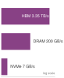

**Source Markdown Excerpt**

```markdown
484
485  ::: {.column-margin}
486  {width="100%" fig-alt="Three stacked horizontal bars on a log scale, longest at top: HBM at 3.35 TB/s, host DRAM at 200 GB/s, and NVMe at 7 GB/s, showing bandwidth dropping sharply across the top three storage tiers."}
487
488  *Bandwidth drops roughly 479$\times$ across the top three tiers, from HBM to local NVMe.*
489  :::
490
491  ```{python}
```

**Strongest Prose Anchor**

> : Extended Memory Hierarchy for ML Systems : The roughly 30$ $ aggregate-to-aggregate bandwidth gap between HBM and object storage (and a much larger per-client gap once a single inference instance pulls from a shared object endpoint) drives the need for sophisticated prefetching and caching across multiple levels.

**Placement Context**

_Paragraph before the margin block:_

> A system architect must organize storage to serve workloads that simultaneously demand terabytes-per-second bandwidth (for computation), petabyte-scale capacity (for datasets), and eleven-nines durability (for checkpoints). No single technology satisfies all three requirements. HBM provides bandwidth but not capacity. Object storage provides capacity and durability but not bandwidth. The resolution is a multi-tier hierarchy that places small amounts of fast, expensive storage close to the accelerator and large amounts of slow, cheap storage at the periphery. Each tier exists because it resolves a specific tension between physics (bandwidth...

_Paragraph after the margin block:_

> : Extended Memory Hierarchy for ML Systems : The roughly 30$ $ aggregate-to-aggregate bandwidth gap between HBM and object storage (and a much larger per-client gap once a single inference instance pulls from a shared object endpoint) drives the need for sophisticated prefetching and caching across multiple levels. { }

**Reader-Link Check**

- Source markdown: the excerpt above shows the `.column-margin` block and the exact caption beside the prose.
- The prose anchor is the text an editor should compare against the caption.
- The `fig-alt` describes what the visual marks encode; the caption should state the reader takeaway from those marks.

### 125. vol2/data_storage @ line 633: Storage bandwidth demand swings wildly with data modality.

- **Source QMD:** `../../quarto/contents/vol2/data_storage/data_storage.qmd:633`
- **Asset:** `../../quarto/contents/vol2/data_storage/images/svg/vol2_data_storage_margin_001.svg`
- **Audit status:** `Pass`; lexical overlap `0.57`
- **Caption:** Storage bandwidth demand swings wildly with data modality.
- **Figure evidence (`fig-alt`):** Text training bandwidth versus image training bandwidth.


**Source Markdown Excerpt**

```markdown
631
632  ::: {.column-margin}
633  {width="100%" fig-alt="Text training bandwidth versus image training bandwidth."}
634
635  *Storage bandwidth demand swings wildly with data modality.*
636  :::
637
638  For **text training**\index{Training!text}, the demand is surprisingly low. With a typical batch size of `{python} TextImageBandwidth.text_tokens_per_gpu_str` per GPU and a `{python} TextImageBandwidth.step_ms_str` step time, the aggregate bandwidth is:
```

**Strongest Prose Anchor**

> The bandwidth demand of a {python} TextImageBandwidth.n gpus str-GPU cluster depends entirely on the data modality.

**Placement Context**

_Paragraph before the margin block:_

> The bandwidth demand of a {python} TextImageBandwidth.n gpus str-GPU cluster depends entirely on the data modality.

_Paragraph after the margin block:_

> For text training , the demand is surprisingly low. With a typical batch size of {python} TextImageBandwidth.text tokens per gpu str per GPU and a {python} TextImageBandwidth.step ms str step time, the aggregate bandwidth is:

**Reader-Link Check**

- Source markdown: the excerpt above shows the `.column-margin` block and the exact caption beside the prose.
- The prose anchor is the text an editor should compare against the caption.
- The `fig-alt` describes what the visual marks encode; the caption should state the reader takeaway from those marks.

### 126. vol2/data_storage @ line 1656: P99 I/O latency sets the required prefetch depth.

- **Source QMD:** `../../quarto/contents/vol2/data_storage/data_storage.qmd:1656`
- **Asset:** `../../quarto/contents/vol2/data_storage/images/svg/vol2_data_storage_margin_002.svg`
- **Audit status:** `Pass`; lexical overlap `0.67`
- **Caption:** P99 I/O latency sets the required prefetch depth.
- **Figure evidence (`fig-alt`):** Sequence strip showing a 500 ms P99 I/O delay spanning three 200 ms compute windows, which implies a prefetch depth of three batches.

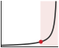

**Source Markdown Excerpt**

```markdown
1654
1655  ::: {.column-margin}
1656  {width="100%" fig-alt="Sequence strip showing a 500 ms P99 I/O delay spanning three 200 ms compute windows, which implies a prefetch depth of three batches."}
1657
1658  *P99 I/O latency sets the required prefetch depth.*
1659  :::
1660
1661  \index{Prefetch Buffer!depth calculation}To illustrate the memory cost, consider a large-batch text pipeline where each GPU processes a packed token batch in roughly 200 ms and the collated batch occupies about 40 MB per GPU. Reading from local NVMe, the P99 I/O latency for that batch is approximately 50 ms. The minimum prefetch depth is $\lceil 50/200 \rceil = 1$ batch, and a safety margin of 2 is adequate. Reading from a parallel file system, the P99 I/O latency rises to roughly 200 ms due to network jitter and contention, requiring a minimum depth of $\lceil 200/200 \rceil = 1$, with a safety margin of 3 to account for occasional multi-hundred-millisecond outliers. Reading from object storage, the P99 latency can exceed 500 ms, requiring a depth of at least 3, with a safety margin of 5 or more. These numbers translate directly into host DRAM consumption: at 40 MB per batch, a depth-5 prefetch buffer per GPU consumes 200 MB, and 8 GPUs per node consume 1.6 GB. At 40 MB per batch with a depth of 1, the same node needs only 320 MB. The storage tier directly determines the memory cost of the prefetch buffer.
```

**Strongest Prose Anchor**

> Setting prefetch factor=2 with 4 workers creates a buffer of 8 batches, which is typically sufficient for NVMe-backed pipelines but may be inadequate for object-storage-backed pipelines where P99 latency can exceed 500 ms.

**Placement Context**

_Paragraph before the margin block:_

> If I/O at the 99th percentile takes 500 ms and compute takes 200 ms, then $Q { } = 3$ batches, with a safety margin of 5. In practice, data loaders like PyTorch's DataLoader use prefetch factor and num workers parameters to control this depth. Setting prefetch factor=2 with 4 workers creates a buffer of 8 batches, which is typically sufficient for NVMe-backed pipelines but may be inadequate for object-storage-backed pipelines where P99 latency can exceed 500 ms.

_Paragraph after the margin block:_

> To illustrate the memory cost, consider a large-batch text pipeline where each GPU processes a packed token batch in roughly 200 ms and the collated batch occupies about 40 MB per GPU. Reading from local NVMe, the P99 I/O latency for that batch is approximately 50 ms. The minimum prefetch depth is $ 50/200 = 1$ batch, and a safety margin of 2 is adequate. Reading from a parallel file system, the P99 I/O latency rises to roughly 200 ms due to network jitter and contention, requiring a minimum depth of $ 200/200 = 1$, with a safety margin of 3 to account for occasional multi-hundred-millisecond outliers. Reading from object storage, the P99...

**Reader-Link Check**

- Source markdown: the excerpt above shows the `.column-margin` block and the exact caption beside the prose.
- The prose anchor is the text an editor should compare against the caption.
- The `fig-alt` describes what the visual marks encode; the caption should state the reader takeaway from those marks.

### 127. vol2/data_storage @ line 2034: Repeated egress, not storage, dominates cloud cost.

- **Source QMD:** `../../quarto/contents/vol2/data_storage/data_storage.qmd:2034`
- **Asset:** `../../quarto/contents/vol2/data_storage/images/svg/vol2_data_storage_margin_003.svg`
- **Audit status:** `Pass`; lexical overlap `0.57`
- **Caption:** Repeated egress, not storage, dominates cloud cost.
- **Figure evidence (`fig-alt`):** Cloud storage cost bar dominated by repeated egress.


**Source Markdown Excerpt**

```markdown
2032
2033  ::: {.column-margin}
2034  {width="100%" fig-alt="Cloud storage cost bar dominated by repeated egress."}
2035
2036  *Repeated egress, not storage, dominates cloud cost.*
2037  :::
2038
2039  Storage cost, however, is only part of the equation. **Data transfer costs**\index{Data Transfer Cost} can dominate, especially in cloud environments. Reading the 100 TB dataset from S3 to compute instances incurs an egress charge of `{python} EconRatios.egress_100tb_usd_str`. For multi-epoch training that reads the dataset 10 times, the egress cost alone exceeds \$90,000, more than the annual storage cost. This inversion, where *reading* data costs more than *storing* it, drives the architecture decision to cache data on local NVMe rather than streaming from object storage each epoch.
```

**Strongest Prose Anchor**

> For multi-epoch training that reads the dataset 10 times, the egress cost alone exceeds \$90,000, more than the annual storage cost.

**Placement Context**

_Paragraph before the margin block:_

> The {python} EconRatios.tier cost ratio str$ $ cost difference between local NVMe and object storage (with the full HBM-to-archive span exceeding 3,000$ $) explains why the hierarchy exists: data must live at the cheapest tier possible, migrating upward only when needed and returning downward when done. This cost gradient reflects the underlying physics. Faster storage requires more expensive materials (HBM uses 3D-stacked silicon with through-silicon vias), more energy per bit accessed, and more physical proximity to the accelerator (which limits the amount that can be provisioned per node). Cheaper storage uses commodity components...

_Paragraph after the margin block:_

> Storage cost, however, is only part of the equation. Data transfer costs can dominate, especially in cloud environments. Reading the 100 TB dataset from S3 to compute instances incurs an egress charge of {python} EconRatios.egress 100tb usd str. For multi-epoch training that reads the dataset 10 times, the egress cost alone exceeds \$90,000, more than the annual storage cost. This inversion, where reading data costs more than storing it, drives the architecture decision to cache data on local NVMe rather than streaming from object storage each epoch.

**Reader-Link Check**

- Source markdown: the excerpt above shows the `.column-margin` block and the exact caption beside the prose.
- The prose anchor is the text an editor should compare against the caption.
- The `fig-alt` describes what the visual marks encode; the caption should state the reader takeaway from those marks.

### 128. vol2/data_storage @ line 2258: Sharding collapses checkpoint-storm write time by two orders of magnitude.

- **Source QMD:** `../../quarto/contents/vol2/data_storage/data_storage.qmd:2258`
- **Asset:** `../../quarto/contents/vol2/data_storage/images/svg/data_storage_checkpoint_storm_write_time.svg`
- **Audit status:** `Manual review candidate`; lexical overlap `0.00`
- **Caption:** Sharding collapses checkpoint-storm write time by two orders of magnitude.
- **Figure evidence (`fig-alt`):** Margin ladder comparing a naive checkpoint storm taking about 23.9 minutes with a ZeRO-3 sharded write taking about 11.2 seconds, annotated as a 128 times reduction.

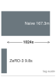

**Source Markdown Excerpt**

```markdown
2256
2257  ::: {.column-margin}
2258  {width="100%" fig-alt="Margin ladder comparing a naive checkpoint storm taking about 23.9 minutes with a ZeRO-3 sharded write taking about 11.2 seconds, annotated as a 128 times reduction."}
2259
2260  *Sharding collapses checkpoint-storm write time by two orders of magnitude.*
2261  :::
2262
2263  ::: {#dfn-data-storage-checkpoint-storm .callout-definition title="Checkpoint storm"}
```

**Strongest Prose Anchor**

> The checkpoint includes model weights (350 GB in FP16), optimizer state (momentum and variance, 1,400 GB in FP32), learning rate scheduler state, random number generator state, and the current data loader position.

**Placement Context**

_Paragraph before the margin block:_

> A {python} CheckpointModelIntro.gpt3 params b str parameter model with Adam optimizer generates checkpoints of approximately {python} CheckpointModelIntro.ckpt total gb str. The checkpoint includes model weights (350 GB in FP16), optimizer state (momentum and variance, 1,400 GB in FP32), learning rate scheduler state, random number generator state, and the current data loader position. Every GPU in the cluster saves its shard of the checkpoint simultaneously, creating a checkpoint storm that the storage system must absorb without disrupting ongoing training reads.

_Paragraph after the margin block:_

> Checkpoint Storm is a burst of synchronized network and storage traffic that occurs when all nodes in a training fleet save model state simultaneously.

**Reader-Link Check**

- Source markdown: the excerpt above shows the `.column-margin` block and the exact caption beside the prose.
- The prose anchor is the text an editor should compare against the caption.
- The `fig-alt` describes what the visual marks encode; the caption should state the reader takeaway from those marks.

### 129. vol2/distributed_training @ line 146: Past a communication-to-compute threshold, scaling stops being ideal.

- **Source QMD:** `../../quarto/contents/vol2/distributed_training/distributed_training.qmd:146`
- **Asset:** `../../quarto/contents/vol2/distributed_training/images/svg/vol2_distributed_training_margin_001.svg`
- **Audit status:** `Manual review candidate`; lexical overlap `0.14`
- **Caption:** Past a communication-to-compute threshold, scaling stops being ideal.
- **Figure evidence (`fig-alt`):** Two equal-width zones labeled compute and communication with a dashed rho equals one threshold between ideal scaling and waiting.


**Source Markdown Excerpt**

```markdown
144
145  ::: {.column-margin}
146  {width="100%" fig-alt="Two equal-width zones labeled compute and communication with a dashed rho equals one threshold between ideal scaling and waiting."}
147
148  *Past a communication-to-compute threshold, scaling stops being ideal.*
149  :::
150
151  *   **Compute-bound (low ratio)**: $T_{\text{compute}}/N \gg T_{\text{comm}}(N)$. The GPUs spend most of their time multiplying matrices. This is the ideal state, typical for large batch sizes on dense models (like ResNet).
```

**Strongest Prose Anchor**

> This is the ideal state, typical for large batch sizes on dense models (like ResNet).

**Placement Context**

_Paragraph before the margin block:_

> The critical term is the communication-computation ratio $ = T { }(N)/(T { }/N)$. This ratio determines whether a cluster behaves as a supercomputer or a collection of idling heaters.

_Paragraph after the margin block:_

> Compute-bound (low ratio) : $T { }/N T { }(N)$. The GPUs spend most of their time multiplying matrices. This is the ideal state, typical for large batch sizes on dense models (like ResNet). Communication-bound (high ratio) : $T { }(N) T { }/N$. The GPUs spend significant time waiting for gradients or activations to arrive. This is the common state for large language models (LLMs) and deep learning recommendation models (DLRMs), where parameter synchronization saturates the network.

**Reader-Link Check**

- Source markdown: the excerpt above shows the `.column-margin` block and the exact caption beside the prose.
- The prose anchor is the text an editor should compare against the caption.
- The `fig-alt` describes what the visual marks encode; the caption should state the reader takeaway from those marks.

### 130. vol2/distributed_training @ line 553: One missing worker stalls the entire AllReduce barrier.

- **Source QMD:** `../../quarto/contents/vol2/distributed_training/distributed_training.qmd:553`
- **Asset:** `../../quarto/contents/vol2/distributed_training/images/svg/vol2_distributed_training_margin_002.svg`
- **Audit status:** `Pass`; lexical overlap `0.57`
- **Caption:** One missing worker stalls the entire AllReduce barrier.
- **Figure evidence (`fig-alt`):** Five worker dots approach a vertical barrier; one red missing worker causes the peer lanes to stop before the barrier.


**Source Markdown Excerpt**

```markdown
551
552  ::: {.column-margin}
553  {width="100%" fig-alt="Five worker dots approach a vertical barrier; one red missing worker causes the peer lanes to stop before the barrier."}
554
555  *One missing worker stalls the entire AllReduce barrier.*
556  :::
557
558  Gradient mismatches occur when workers disagree on which tensors to synchronize due to conditional computation paths or dynamic batching. AllReduce operations may block waiting for tensors that some workers never send. This commonly occurs with variable-length sequences in NLP models, dynamic computation graphs, and mixture-of-experts with different routing decisions.
```

**Strongest Prose Anchor**

> Worker failures during AllReduce cause all other workers to block indefinitely while waiting for the missing contribution.

**Placement Context**

_Paragraph before the margin block:_

> Worker failures during AllReduce cause all other workers to block indefinitely while waiting for the missing contribution. Without timeout mechanisms, the entire training job hangs rather than failing cleanly. Production systems implement watchdog timers typically set to 5--10 minutes to detect and terminate stuck jobs.

_Paragraph after the margin block:_

> Gradient mismatches occur when workers disagree on which tensors to synchronize due to conditional computation paths or dynamic batching. AllReduce operations may block waiting for tensors that some workers never send. This commonly occurs with variable-length sequences in NLP models, dynamic computation graphs, and mixture-of-experts with different routing decisions.

**Reader-Link Check**

- Source markdown: the excerpt above shows the `.column-margin` block and the exact caption beside the prose.
- The prose anchor is the text an editor should compare against the caption.
- The `fig-alt` describes what the visual marks encode; the caption should state the reader takeaway from those marks.

### 131. vol2/distributed_training @ line 1268: Communication energy climbs from HBM out to the network.

- **Source QMD:** `../../quarto/contents/vol2/distributed_training/distributed_training.qmd:1268`
- **Asset:** `../../quarto/contents/vol2/distributed_training/images/svg/vol2_distributed_training_margin_003.svg`
- **Audit status:** `Pass`; lexical overlap `0.67`
- **Caption:** Communication energy climbs from HBM out to the network.
- **Figure evidence (`fig-alt`):** Orange energy-per-bit ladder with representative midpoints: InfiniBand 35 pJ, NVLink 7.5 pJ, and HBM 1.5 pJ.


**Source Markdown Excerpt**

```markdown
1266
1267  ::: {.column-margin}
1268  {width="100%" fig-alt="Orange energy-per-bit ladder with representative midpoints: InfiniBand 35 pJ, NVLink 7.5 pJ, and HBM 1.5 pJ."}
1269
1270  *Communication energy climbs from HBM out to the network.*
1271  :::
1272
1273  ::: {#psp-distributed-training-energy-tax-scale .callout-perspective title="The energy tax of scale"}
```

**Strongest Prose Anchor**

> Beyond wall-clock time, this communication overhead imposes an energy tax that scales with physical distance between devices.

**Placement Context**

_Paragraph before the margin block:_

> The equation reveals the Scaling Wall : as $N$ increases, the compute term $(T { }/N)$ shrinks, but the communication and synchronization terms can remain constant or grow. Eventually, the denominator is dominated by overhead, driving efficiency toward zero. Beyond wall-clock time, this communication overhead imposes an energy tax that scales with physical distance between devices.

_Paragraph after the margin block:_

> Distributed training is a race against energy as much as against time. In a single GPU, moving a byte from HBM to the cores costs roughly 1–2 pJ/bit. Moving that same byte across an NVLink interconnect costs 5–10 pJ/bit. Moving it across an InfiniBand network through switches costs 20–50 pJ/bit.

**Reader-Link Check**

- Source markdown: the excerpt above shows the `.column-margin` block and the exact caption beside the prose.
- The prose anchor is the text an editor should compare against the caption.
- The `fig-alt` describes what the visual marks encode; the caption should state the reader takeaway from those marks.

### 132. vol2/distributed_training @ line 1716: Optimizer state, not weights, dominates the per-replica training budget.

- **Source QMD:** `../../quarto/contents/vol2/distributed_training/distributed_training.qmd:1716`
- **Asset:** `../../quarto/contents/vol2/distributed_training/images/svg/distributed_training_memory_budget.svg`
- **Audit status:** `Pass`; lexical overlap `0.62`
- **Caption:** Optimizer state, not weights, dominates the per-replica training budget.
- **Figure evidence (`fig-alt`):** Ladder of three memory rungs for a 175B-parameter mixed-precision Adam training state: optimizer state 2,100 GB (longest), gradients 350 GB, and weights 350 GB. The optimizer rung is about six times the others.


**Source Markdown Excerpt**

```markdown
1714
1715  ::: {.column-margin}
1716  {width="100%" fig-alt="Ladder of three memory rungs for a 175B-parameter mixed-precision Adam training state: optimizer state 2,100 GB (longest), gradients 350 GB, and weights 350 GB. The optimizer rung is about six times the others."}
1717
1718  *Optimizer state, not weights, dominates the per-replica training budget.*
1719  :::
1720
1721  Even with ZeRO-3 fully deployed, sharding optimizer states, gradients, and parameters across workers, some architectures remain intractable. Tensor parallelism, illustrated in @fig-model-parallel-flow, addresses this by partitioning individual weight matrices across devices; pipeline parallelism partitions layers across stages and is introduced later in @sec-distributed-training-systems-systems-pipeline-parallelism-8748. For a `{python} FrontierModelParallelRecap.frontier_params_b_str` parameter model, weights alone occupy `{python} ModelParallelMemoryFacts.weight_gb_str`, or about `{python} ModelParallelMemoryFacts.weight_per_gpu_gb_str` per GPU across 64 GPUs. Full mixed-precision Adam training state is much larger: `{python} ModelParallelMemoryFacts.full_state_gb_str` globally, or roughly `{python} ModelParallelMemoryFacts.full_state_per_gpu_gb_str` per GPU before activations. This distinction matters because optimizer sharding reduces static state, but it does not eliminate the activation and per-layer capacity constraints that force model parallelism.
```

**Strongest Prose Anchor**

> This distinction matters because optimizer sharding reduces static state, but it does not eliminate the activation and per-layer capacity constraints that force model parallelism.

**Placement Context**

_Paragraph before the margin block:_

> When a model is so massive that even a single layer's weights exceed the memory capacity of a GPU, data parallelism entirely collapses. This is the memory capacity gap (Principle ) in operational form: model parameter growth outpaces device memory growth, forcing the model itself to be partitioned. The memory optimization techniques examined in the previous section extend data parallelism's reach, but eventually, we must partition the model itself.

_Paragraph after the margin block:_

> Even with ZeRO-3 fully deployed, sharding optimizer states, gradients, and parameters across workers, some architectures remain intractable. Tensor parallelism, illustrated in , addresses this by partitioning individual weight matrices across devices; pipeline parallelism partitions layers across stages and is introduced later in For a {python} FrontierModelParallelRecap.frontier params b str parameter model, weights alone occupy {python} ModelParallelMemoryFacts.weight gb str, or about {python} ModelParallelMemoryFacts.weight per gpu gb str per GPU across 64 GPUs. Full mixed-precision Adam training state is much larger: {python}...

**Reader-Link Check**

- Source markdown: the excerpt above shows the `.column-margin` block and the exact caption beside the prose.
- The prose anchor is the text an editor should compare against the caption.
- The `fig-alt` describes what the visual marks encode; the caption should state the reader takeaway from those marks.

### 133. vol2/distributed_training @ line 1953: More stages require enough microbatches or the bubble dominates utilization.

- **Source QMD:** `../../quarto/contents/vol2/distributed_training/distributed_training.qmd:1953`
- **Asset:** `../../quarto/contents/vol2/distributed_training/images/svg/distributed_training_pipeline_bubble_tax.svg`
- **Audit status:** `Pass`; lexical overlap `0.50`
- **Caption:** More stages require enough microbatches or the bubble dominates utilization.
- **Figure evidence (`fig-alt`):** Two proportional stacked bars comparing pipeline bubble tax: p8 m32 has about 18 percent idle time, while p16 m16 has about 48 percent idle time.


**Source Markdown Excerpt**

```markdown
1951
1952  ::: {.column-margin}
1953  {width="100%" fig-alt="Two proportional stacked bars comparing pipeline bubble tax: p8 m32 has about 18 percent idle time, while p16 m16 has about 48 percent idle time."}
1954
1955  *More stages require enough microbatches or the bubble dominates utilization.*
1956  :::
1957
1958  The same bubble term becomes concrete in the worked example below, where an 8-stage pipeline and 32 microbatches still leave a measurable idle-time tax.
```

**Strongest Prose Anchor**

> The pipeline bubble fraction grows as $(p-1)/(m+p-1)$: with $p=16$ stages and $m=16$ micro-batches, 48 percent of compute is wasted idle—requiring large micro-batch counts ($m p$) to keep the bubble below 10 percent, which in turn increases peak activation memory and the memory pressure on each stage.

**Placement Context**

_Paragraph before the margin block:_

> 1. Significance (quantitative) : Inter-stage communication transmits only the activation tensor at each stage boundary, sized as $B { } S d { } 2$ bytes at BF16, where $B { }$ is the micro-batch size. For a hidden dimension of 8,192 with micro-batch size 1 and a 2,048-token sequence, this is approximately $8{,}192 2{,}048 2 32$ MB per boundary, compared to the gigabytes required for gradient AllReduce in data parallelism. This low communication volume makes pipeline parallelism the primary technique for scaling model depth across nodes connected by 50 GB/s InfiniBand. The pipeline bubble wastes approximately $(p-1)/(m+p-1)$ of total...

_Paragraph after the margin block:_

> The same bubble term becomes concrete in the worked example below, where an 8-stage pipeline and 32 microbatches still leave a measurable idle-time tax.

**Reader-Link Check**

- Source markdown: the excerpt above shows the `.column-margin` block and the exact caption beside the prose.
- The prose anchor is the text an editor should compare against the caption.
- The `fig-alt` describes what the visual marks encode; the caption should state the reader takeaway from those marks.

### 134. vol2/distributed_training @ line 2061: Tensor parallelism needs NVLink bandwidth; pipeline parallelism tolerates slower fabric.

- **Source QMD:** `../../quarto/contents/vol2/distributed_training/distributed_training.qmd:2061`
- **Asset:** `../../quarto/contents/vol2/distributed_training/images/svg/vol2_distributed_training_margin_004.svg`
- **Audit status:** `Pass`; lexical overlap `0.56`
- **Caption:** Tensor parallelism needs NVLink bandwidth; pipeline parallelism tolerates slower fabric.
- **Figure evidence (`fig-alt`):** Violet bandwidth ladder comparing NVLink at 900 GB per second with NDR InfiniBand at 50 GB per second; 18x appears as an annotation.


**Source Markdown Excerpt**

```markdown
2059
2060  ::: {.column-margin}
2061  {width="100%" fig-alt="Violet bandwidth ladder comparing NVLink at 900 GB per second with NDR InfiniBand at 50 GB per second; 18x appears as an annotation."}
2062
2063  *Tensor parallelism needs NVLink bandwidth; pipeline parallelism tolerates slower fabric.*
2064  :::
2065
2066  Megatron-style tensor parallelism[^fn-megatron] [@shoeybi2019megatron] partitions matrix multiplications in two ways. Examine @fig-tensor-parallel-split: column-parallel splitting divides weight matrices along columns for QKV projections, allowing independent computation across GPUs, while row-parallel splitting divides along rows for output layers, requiring AllReduce to combine partial sums at the end of each block.
```

**Strongest Prose Anchor**

> Tensor parallelism's per-layer synchronization demands NVLink-class bandwidth; pipeline parallelism's boundary-only communication tolerates InfiniBand.

**Placement Context**

_Paragraph before the margin block:_

> The interconnect topology dictates which form of model parallelism is viable at each level of the cluster hierarchy. Tensor parallelism's per-layer synchronization demands NVLink-class bandwidth; pipeline parallelism's boundary-only communication tolerates InfiniBand. This bandwidth pattern creates the design pressure for a hybrid: use tensor parallelism for bandwidth-intensive intra-layer splits and pipeline parallelism for coarser inter-layer splits.

_Paragraph after the margin block:_

> Megatron-style tensor parallelism[^fn-megatron] [ ] partitions matrix multiplications in two ways. Examine column-parallel splitting divides weight matrices along columns for QKV projections, allowing independent computation across GPUs, while row-parallel splitting divides along rows for output layers, requiring AllReduce to combine partial sums at the end of each block.

**Reader-Link Check**

- Source markdown: the excerpt above shows the `.column-margin` block and the exact caption beside the prose.
- The prose anchor is the text an editor should compare against the caption.
- The `fig-alt` describes what the visual marks encode; the caption should state the reader takeaway from those marks.

### 135. vol2/distributed_training @ line 3190: The optimal checkpoint cadence balances write overhead against rework risk.

- **Source QMD:** `../../quarto/contents/vol2/distributed_training/distributed_training.qmd:3190`
- **Asset:** `../../quarto/contents/vol2/distributed_training/images/svg/distributed_training_young_daly_optimum.svg`
- **Audit status:** `Pass`; lexical overlap `0.44`
- **Caption:** The optimal checkpoint cadence balances write overhead against rework risk.
- **Figure evidence (`fig-alt`):** Compact checkpoint-interval curve marking 15 minutes as too frequent, about 2.9 hours as the Young-Daly optimum, and 8 hours as sparse.


**Source Markdown Excerpt**

```markdown
3188
3189  ::: {.column-margin}
3190  {width="100%" fig-alt="Compact checkpoint-interval curve marking 15 minutes as too frequent, about 2.9 hours as the Young-Daly optimum, and 8 hours as sparse."}
3191
3192  *The optimal checkpoint cadence balances write overhead against rework risk.*
3193  :::
3194
3195  ## Summary {#sec-distributed-training-systems-summary}
```

**Strongest Prose Anchor**

> For a {python} YoungDaly.num gpus str-GPU cluster at the canonical {python} YoungDaly.gpu mttf hours str per-GPU MTBF, the cluster-level $ { }$ is {python} YoungDaly.cluster mtbf hr str ($ { }/N$); with a {python} YoungDaly.t write min str checkpoint time, the optimal interval is approximately {python} YoungDaly.t opt min str (~{python} YoungDaly.t opt hr str), with an unavoidable checkpoint-plus-rework tax of {python} YoungDaly.opt overhead pct str.

**Placement Context**

_Paragraph before the margin block:_

> The Young-Daly formula establishes the optimal checkpoint interval as $ { } = } { }}$, where $T { }$ is checkpoint write time and $ { }$ is mean time between system failures. For a {python} YoungDaly.num gpus str-GPU cluster at the canonical {python} YoungDaly.gpu mttf hours str per-GPU MTBF, the cluster-level $ { }$ is {python} YoungDaly.cluster mtbf hr str ($ { }/N$); with a {python} YoungDaly.t write min str checkpoint time, the optimal interval is approximately {python} YoungDaly.t opt min str (~{python} YoungDaly.t opt hr str), with an unavoidable checkpoint-plus-rework tax of {python} YoungDaly.opt overhead pct str. Checkpointing...

_Paragraph after the margin block:_

> The chapter opened with a "scaling wall": the point where adding more GPUs eventually makes training slower rather than faster. We have reframed distributed training not as a simple hardware problem, but as a constraint satisfaction problem governed by the interaction between model size, batch size, and interconnect bandwidth.

**Reader-Link Check**

- Source markdown: the excerpt above shows the `.column-margin` block and the exact caption beside the prose.
- The prose anchor is the text an editor should compare against the caption.
- The `fig-alt` describes what the visual marks encode; the caption should state the reader takeaway from those marks.

### 136. vol2/edge_intelligence @ line 181: On-device learning hits the memory wall before the compute wall.

- **Source QMD:** `../../quarto/contents/vol2/edge_intelligence/edge_intelligence.qmd:181`
- **Asset:** `../../quarto/contents/vol2/edge_intelligence/images/svg/vol2_edge_intelligence_margin_001.svg`
- **Audit status:** `Pass`; lexical overlap `0.57`
- **Caption:** On-device learning hits the memory wall before the compute wall.
- **Figure evidence (`fig-alt`):** Blue memory ladder comparing a 300 MB app budget with a 75 MB local gradient update, with 25 percent marked as an annotation.

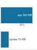

**Source Markdown Excerpt**

```markdown
179
180  ::: {.column-margin}
181  {width="100%" fig-alt="Blue memory ladder comparing a 300 MB app budget with a 75 MB local gradient update, with 25 percent marked as an annotation."}
182
183  *On-device learning hits the memory wall before the compute wall.*
184  :::
185
186  ### On-device learning benefits {#sec-edge-intelligence-ondevice-learning-benefits-3256}
```

**Strongest Prose Anchor**

> This razor-thin margin demonstrates the central engineering challenge of on-device learning: a single training step can consume 25 percent of available memory.

**Placement Context**

_Paragraph before the margin block:_

> Consider a smartphone keyboard adapting to a user's unique vocabulary and typing patterns. To personalize predictions, the system must perform gradient updates on a compact language model using locally observed text input. A single gradient update for even a minimal language model requires 50–100 MB of memory for activations and optimizer state. Modern smartphones typically allocate 200–300 MB to background applications like keyboards (varies by OS and device generation). This razor-thin margin demonstrates the central engineering challenge of on-device learning: a single training step can consume 25 percent of available memory. The system...

_Paragraph after the margin block:_

> Traditional machine learning systems rely on a clear division of labor between model training and inference. Centralized environments with high-performance compute resources and large-scale datasets handle training; client devices receive the trained models and operate in a static inference-only mode.

**Reader-Link Check**

- Source markdown: the excerpt above shows the `.column-margin` block and the exact caption beside the prose.
- The prose anchor is the text an editor should compare against the caption.
- The `fig-alt` describes what the visual marks encode; the caption should state the reader takeaway from those marks.

### 137. vol2/edge_intelligence @ line 986: Datacenter HBM outruns mobile memory bandwidth by about 34 times.

- **Source QMD:** `../../quarto/contents/vol2/edge_intelligence/edge_intelligence.qmd:986`
- **Asset:** `../../quarto/contents/vol2/edge_intelligence/images/svg/edge_intelligence_bandwidth_ladder.svg`
- **Audit status:** `Manual review candidate`; lexical overlap `0.25`
- **Caption:** Datacenter HBM outruns mobile memory bandwidth by about 34 times.
- **Figure evidence (`fig-alt`):** Two-rung bandwidth ladder. Top rung, data-center HBM3 at 3,350 GB/s, capped by a red ceiling line marking the wall. Bottom rung, mobile LPDDR5X at 100 GB/s, about 34× shorter.

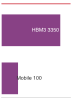

**Source Markdown Excerpt**

```markdown
984
985  ::: {.column-margin}
986  {width="100%" fig-alt="Two-rung bandwidth ladder. Top rung, data-center HBM3 at 3,350 GB/s, capped by a red ceiling line marking the wall. Bottom rung, mobile LPDDR5X at 100 GB/s, about 34× shorter."}
987
988  *Datacenter HBM outruns mobile memory bandwidth by about 34 times.*
989  :::
990
991  - **Data Center (H100)**: HBM3 provides `{python} EdgeH100BwRecap.h100_mem_bw_gbs_str` bandwidth.
```

**Strongest Prose Anchor**

> - Flagship Mobile (A17/Snapdragon 8 Gen 3) : LPDDR5X provides 64–100 GB/s bandwidth.

**Placement Context**

_Paragraph before the margin block:_

> The quantitative disparity is stark:

_Paragraph after the margin block:_

> - Data Center (H100) : HBM3 provides {python} EdgeH100BwRecap.h100 mem bw gbs str bandwidth. - Flagship Mobile (A17/Snapdragon 8 Gen 3) : LPDDR5X provides 64–100 GB/s bandwidth.

**Reader-Link Check**

- Source markdown: the excerpt above shows the `.column-margin` block and the exact caption beside the prose.
- The prose anchor is the text an editor should compare against the caption.
- The `fig-alt` describes what the visual marks encode; the caption should state the reader takeaway from those marks.

### 138. vol2/edge_intelligence @ line 1076: Device memory spans about 15,000 times, phone to microcontroller.

- **Source QMD:** `../../quarto/contents/vol2/edge_intelligence/edge_intelligence.qmd:1076`
- **Asset:** `../../quarto/contents/vol2/edge_intelligence/images/svg/edge_intelligence_device_memory_ladder.svg`
- **Audit status:** `Pass`; lexical overlap `0.43`
- **Caption:** Device memory spans about 15,000 times, phone to microcontroller.
- **Figure evidence (`fig-alt`):** Vertical ladder of four blue bars on a log scale showing device-class memory shrinking by orders of magnitude: smartphone 8 GB, IoT 1 GB, microcontroller flash 4 MB, microcontroller SRAM 520 KB.

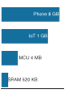

**Source Markdown Excerpt**

```markdown
1074
1075  ::: {.column-margin}
1076  {width="100%" fig-alt="Vertical ladder of four blue bars on a log scale showing device-class memory shrinking by orders of magnitude: smartphone 8 GB, IoT 1 GB, microcontroller flash 4 MB, microcontroller SRAM 520 KB."}
1077
1078  *Device memory spans about 15,000 times, phone to microcontroller.*
1079  :::
1080
1081  The device memory hierarchy spans several orders of magnitude across different device classes, each presenting distinct constraints for on-device learning. The iPhone 15 Pro provides 8 GB total system memory, but only approximately 2--4 GB remains available for application workloads after accounting for operating system requirements and background processes. Budget Android devices operate with 4 GB total system memory, leaving just 1--2 GB available for ML workloads after OS overhead consumes significant resources. IoT embedded systems provide 64 MB--1 GB total memory that must be shared between system tasks and application data, creating severe constraints for any learning algorithms. Microcontrollers offer only 256 KB--2 MB SRAM, requiring extreme optimization and careful memory management that fundamentally limits the complexity of models that can adapt on such platforms.
```

**Strongest Prose Anchor**

> The device memory hierarchy spans several orders of magnitude across different device classes, each presenting distinct constraints for on-device learning.

**Placement Context**

_Paragraph before the margin block:_

> Complementing the thermal and power challenges, memory hierarchy constraints create another fundamental bottleneck that shapes on-device learning system design. As established in the constraint amplification analysis above, these limitations affect both static model storage and the dynamic memory requirements during training, often pushing systems beyond their practical limits.

_Paragraph after the margin block:_

> The device memory hierarchy spans several orders of magnitude across different device classes, each presenting distinct constraints for on-device learning. The iPhone 15 Pro provides 8 GB total system memory, but only approximately 2--4 GB remains available for application workloads after accounting for operating system requirements and background processes. Budget Android devices operate with 4 GB total system memory, leaving just 1--2 GB available for ML workloads after OS overhead consumes significant resources. IoT embedded systems provide 64 MB--1 GB total memory that must be shared between system tasks and application data, creating...

**Reader-Link Check**

- Source markdown: the excerpt above shows the `.column-margin` block and the exact caption beside the prose.
- The prose anchor is the text an editor should compare against the caption.
- The `fig-alt` describes what the visual marks encode; the caption should state the reader takeaway from those marks.

### 139. vol2/edge_intelligence @ line 1202: Adapters make per-user personalization cheap versus full model copies.

- **Source QMD:** `../../quarto/contents/vol2/edge_intelligence/edge_intelligence.qmd:1202`
- **Asset:** `../../quarto/contents/vol2/edge_intelligence/images/svg/vol2_edge_intelligence_margin_002.svg`
- **Audit status:** `Pass`; lexical overlap `0.44`
- **Caption:** Adapters make per-user personalization cheap versus full model copies.
- **Figure evidence (`fig-alt`):** Blue memory ladder comparing a 40 MB full model copy with a 0.2 MB adapter, with 200x marked as an annotation.

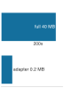

**Source Markdown Excerpt**

```markdown
1200
1201  ::: {.column-margin}
1202  {width="100%" fig-alt="Blue memory ladder comparing a 40 MB full model copy with a 0.2 MB adapter, with 200x marked as an annotation."}
1203
1204  *Adapters make per-user personalization cheap versus full model copies.*
1205  :::
1206
1207  :::
```

**Strongest Prose Anchor**

> Sharding the model into a frozen backbone and Dynamic Adapters reduces the marginal cost of a new user context by {python} StorageWall.ls savings ratio str$ $.

**Placement Context**

_Paragraph before the margin block:_

> Systems insight : Personalization is a storage density problem. On a device with limited flash memory, storing {python} StorageWall.ls contexts str versions of the same {python} StorageWall.ls full mb str model quickly consumes {python} StorageWall.ls total full mb str. Sharding the model into a frozen backbone and Dynamic Adapters reduces the marginal cost of a new user context by {python} StorageWall.ls savings ratio str$ $. In the edge fleet, modularity is the only way to scale intelligence without exhausting the physical hardware.

_Paragraph after the margin block:_

> The engineering challenge centers on navigating a fundamental trade-off space: adaptation expressivity vs. resource consumption. At one extreme, updating all parameters provides maximum flexibility but exceeds edge device capabilities. At the other extreme, no adaptation preserves resources but fails to capture user-specific patterns. Effective on-device learning systems must operate in the middle ground, selecting adaptation strategies based on three key engineering criteria.

**Reader-Link Check**

- Source markdown: the excerpt above shows the `.column-margin` block and the exact caption beside the prose.
- The prose anchor is the text an editor should compare against the caption.
- The `fig-alt` describes what the visual marks encode; the caption should state the reader takeaway from those marks.

### 140. vol2/edge_intelligence @ line 1860: Learning the new task erodes accuracy on the old one.

- **Source QMD:** `../../quarto/contents/vol2/edge_intelligence/edge_intelligence.qmd:1860`
- **Asset:** `../../quarto/contents/vol2/edge_intelligence/images/svg/vol2_edge_intelligence_margin_003.svg`
- **Audit status:** `Pass`; lexical overlap `0.86`
- **Caption:** Learning the new task erodes accuracy on the old one.
- **Figure evidence (`fig-alt`):** Two trend lines: green new-task performance rises while red old-task accuracy falls.

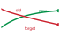

**Source Markdown Excerpt**

```markdown
1858
1859  ::: {.column-margin}
1860  {width="100%" fig-alt="Two trend lines: green new-task performance rises while red old-task accuracy falls."}
1861
1862  *Learning the new task erodes accuracy on the old one.*
1863  :::
1864
1865  :::
```

**Strongest Prose Anchor**

> Significance (quantitative) : Without explicit mitigation, fine-tuning a deployed classifier on a new domain can drop prior-task accuracy by 30 to 80 percent within hundreds of update steps, even when the new domain is closely related to the old one [ ].

**Placement Context**

_Paragraph before the margin block:_

> 1. Significance (quantitative) : Without explicit mitigation, fine-tuning a deployed classifier on a new domain can drop prior-task accuracy by 30 to 80 percent within hundreds of update steps, even when the new domain is closely related to the old one [ ]. This is the central failure mode of on-device and federated learning: every device that adapts locally to its user's recent data risks erasing the general capabilities the centralized training run paid for, and the loss is invisible until inference encounters out-of-recent-context inputs. 2. Distinction (durable) : Catastrophic forgetting is distinct from overfitting, which is a...

_Paragraph after the margin block:_

> Experience replay addresses catastrophic forgetting in continuous learning scenarios by maintaining a buffer of representative examples from previous learning episodes. This technique, originally developed for reinforcement learning [ ], proves essential in on-device learning where sequential data streams can cause models to overfit to recent examples. We introduce experience replay here to address immediate stability needs; the deeper challenge of lifelong adaptation without forgetting receives comprehensive treatment in the bio-inspired learning section below ( ).

**Reader-Link Check**

- Source markdown: the excerpt above shows the `.column-margin` block and the exact caption beside the prose.
- The prose anchor is the text an editor should compare against the caption.
- The `fig-alt` describes what the visual marks encode; the caption should state the reader takeaway from those marks.

### 141. vol2/edge_intelligence @ line 2046: Federated learning ships updates, not raw data, cutting network load.

- **Source QMD:** `../../quarto/contents/vol2/edge_intelligence/edge_intelligence.qmd:2046`
- **Asset:** `../../quarto/contents/vol2/edge_intelligence/images/svg/vol2_edge_intelligence_margin_004.svg`
- **Audit status:** `Pass`; lexical overlap `0.70`
- **Caption:** Federated learning ships updates, not raw data, cutting network load.
- **Figure evidence (`fig-alt`):** Violet network ladder comparing 200 MB of raw upload with a 2.5 MB federated update, with 80x marked as an annotation.


**Source Markdown Excerpt**

```markdown
2044
2045  ::: {.column-margin}
2046  {width="100%" fig-alt="Violet network ladder comparing 200 MB of raw upload with a 2.5 MB federated update, with 80x marked as an annotation."}
2047
2048  *Federated learning ships updates, not raw data, cutting network load.*
2049  :::
2050
2051  :::
```

**Strongest Prose Anchor**

> Shifting the "Compute to the Data" reduces network load by {python} FederatedSavings.fs reduction str$ $, enabling continuous learning even in bandwidth-constrained environments.

**Placement Context**

_Paragraph before the margin block:_

> Systems insight : Federated learning is a network multiplier . For a user on a limited cellular plan, uploading {python} FederatedSavings.fs raw data mb str of raw data is expensive and slow. Uploading a {python} FederatedSavings.fs update mb str update is nearly invisible. Shifting the "Compute to the Data" reduces network load by {python} FederatedSavings.fs reduction str$ $, enabling continuous learning even in bandwidth-constrained environments. In the Machine Learning Fleet, this is how systems scale to large user populations without bankrupting the networking budget or violating user privacy.

_Paragraph after the margin block:_

> contrasts federated learning with other learning paradigms to clarify its unique position. In traditional offline learning, all data is collected and processed centrally. The model is trained in the cloud using curated datasets and is then deployed to edge devices without further adaptation. In contrast, on-device learning allows local model adaptation using data generated on the device itself, supporting personalization but in isolation, without sharing insights across users. Federated learning bridges these two extremes by enabling localized training while coordinating updates globally. It retains data privacy by keeping raw data local...

**Reader-Link Check**

- Source markdown: the excerpt above shows the `.column-margin` block and the exact caption beside the prose.
- The prose anchor is the text an editor should compare against the caption.
- The `fig-alt` describes what the visual marks encode; the caption should state the reader takeaway from those marks.

### 142. vol2/edge_intelligence @ line 2323: Over-selection closes the round on the first K updates.

- **Source QMD:** `../../quarto/contents/vol2/edge_intelligence/edge_intelligence.qmd:2323`
- **Asset:** `../../quarto/contents/vol2/edge_intelligence/images/svg/edge_intelligence_straggler_cutoff_strip.svg`
- **Audit status:** `Pass`; lexical overlap `0.80`
- **Caption:** Over-selection closes the round on the first K updates.
- **Figure evidence (`fig-alt`):** Sequence strip showing the first K federated-client updates accepted before the round closes, while a late straggler is dropped.


**Source Markdown Excerpt**

```markdown
2321
2322  ::: {.column-margin}
2323  {width="100%" fig-alt="Sequence strip showing the first K federated-client updates accepted before the round closes, while a late straggler is dropped."}
2324
2325  *Over-selection closes the round on the first K updates.*
2326  :::
2327
2328  To prevent the global model update from stalling, production FL systems employ **Over-Selection**\index{Over-Selection!straggler mitigation}. The server selects a candidate pool size $K_{\text{candidates}}$ larger than the target number of updates $K_{\text{target}}$ (typically $K_{\text{candidates}} \approx 1.3 \times K_{\text{target}}$). The server aggregates updates from the first $K_{\text{target}}$ responders and discards the rest. This approach bounds the round duration by the speed of the $K_{\text{target}}$-th fastest device rather than the absolute slowest, dramatically accelerating convergence wall-clock time.
```

**Strongest Prose Anchor**

> The server aggregates updates from the first $K { }$ responders and discards the rest.

**Placement Context**

_Paragraph before the margin block:_

> In a fleet of millions of heterogeneous devices, waiting for every selected client to report its update is impractical. Network latency, battery depletion, or background process contention can cause some devices ("stragglers") to take 10$ $ longer than average.

_Paragraph after the margin block:_

> To prevent the global model update from stalling, production FL systems employ Over-Selection . The server selects a candidate pool size $K { }$ larger than the target number of updates $K { }$ (typically $K { } 1.3 K { }$). The server aggregates updates from the first $K { }$ responders and discards the rest. This approach bounds the round duration by the speed of the $K { }$-th fastest device rather than the absolute slowest, dramatically accelerating convergence wall-clock time.

**Reader-Link Check**

- Source markdown: the excerpt above shows the `.column-margin` block and the exact caption beside the prose.
- The prose anchor is the text an editor should compare against the caption.
- The `fig-alt` describes what the visual marks encode; the caption should state the reader takeaway from those marks.

### 143. vol2/fault_tolerance @ line 132: System MTBF collapses as the fleet grows: 50,000 h to 5 h.

- **Source QMD:** `../../quarto/contents/vol2/fault_tolerance/fault_tolerance.qmd:132`
- **Asset:** `../../quarto/contents/vol2/fault_tolerance/images/svg/fault_tolerance_mtbf_ladder.svg`
- **Audit status:** `Manual review candidate`; lexical overlap `0.20`
- **Caption:** System MTBF collapses as the fleet grows: 50,000 h to 5 h.
- **Figure evidence (`fig-alt`):** Time ladder showing system mean time between failures collapsing as fleet size grows: 1 GPU at 50,000 hours, 1,000 GPUs at 50 hours, 10,000 GPUs at 5 hours.


**Source Markdown Excerpt**

```markdown
130
131  ::: {.column-margin}
132  {width="100%" fig-alt="Time ladder showing system mean time between failures collapsing as fleet size grows: 1 GPU at 50,000 hours, 1,000 GPUs at 50 hours, 10,000 GPUs at 5 hours."}
133
134  *System MTBF collapses as the fleet grows: 50,000 h to 5 h.*
135  :::
136
137  Understanding failure at scale requires abandoning the mindset that treats failures as bugs to be fixed. Individual component failures *cannot* be eliminated; they can only be managed. Memory errors, network partitions, storage corruption, and software crashes will occur with statistical regularity that increases predictably with system size. The engineering challenge is not to prevent these failures but to build systems that continue making progress despite them.
```

**Strongest Prose Anchor**

> Memory errors, network partitions, storage corruption, and software crashes will occur with statistical regularity that increases predictably with system size.

**Placement Context**

_Paragraph before the margin block:_

> The transition from small-scale experimentation to large-scale production changes the relationship between systems and failures. A researcher training a model on a single GPU can go years without a hardware failure. That same workload on a 1,000-GPU cluster sees GPU-only failures every couple of days, and a production cluster fails more often once PCIe, power, storage, and network domains enter the failure budget. This shift from rare exception to routine occurrence demands different engineering approaches. The mathematical analysis that follows makes this transition precise and quantitative.

_Paragraph after the margin block:_

> Understanding failure at scale requires abandoning the mindset that treats failures as bugs to be fixed. Individual component failures cannot be eliminated; they can only be managed. Memory errors, network partitions, storage corruption, and software crashes will occur with statistical regularity that increases predictably with system size. The engineering challenge is not to prevent these failures but to build systems that continue making progress despite them.

**Reader-Link Check**

- Source markdown: the excerpt above shows the `.column-margin` block and the exact caption beside the prose.
- The prose anchor is the text an editor should compare against the caption.
- The `fig-alt` describes what the visual marks encode; the caption should state the reader takeaway from those marks.

### 144. vol2/fault_tolerance @ line 767: One shared dependency fails and takes every node with it.

- **Source QMD:** `../../quarto/contents/vol2/fault_tolerance/fault_tolerance.qmd:767`
- **Asset:** `../../quarto/contents/vol2/fault_tolerance/images/svg/fault_tolerance_blast.svg`
- **Audit status:** `Manual review candidate`; lexical overlap `0.29`
- **Caption:** One shared dependency fails and takes every node with it.
- **Figure evidence (`fig-alt`):** A single red fault source on the left with arrows fanning out to five blue nodes on the right, showing one shared dependency taking down all the components that depend on it.


**Source Markdown Excerpt**

```markdown
765
766  ::: {.column-margin}
767  {width="100%" fig-alt="A single red fault source on the left with arrows fanning out to five blue nodes on the right, showing one shared dependency taking down all the components that depend on it."}
768
769  *One shared dependency fails and takes every node with it.*
770  :::
771
772  Correlated failures violate the independence assumption underlying @eq-system-reliability-n-components. When failures are correlated, the actual system reliability is lower than the formula predicts. Correlated failures can also defeat redundancy strategies. Three replicas of a model provide no availability benefit if all three run on the same power domain and a power failure takes out all three simultaneously.
```

**Strongest Prose Anchor**

> - Power supply failure : All GPUs in a node lose power simultaneously - Network switch failure : All nodes connected to the switch become unreachable - Cooling system failure : Thermal shutdown affects multiple racks - Software bugs : A bug in the CUDA driver crashes all processes using that driver version - Operator error : Misconfiguration affects entire cluster

**Placement Context**

_Paragraph before the margin block:_

> - Power supply failure : All GPUs in a node lose power simultaneously - Network switch failure : All nodes connected to the switch become unreachable - Cooling system failure : Thermal shutdown affects multiple racks - Software bugs : A bug in the CUDA driver crashes all processes using that driver version - Operator error : Misconfiguration affects entire cluster

_Paragraph after the margin block:_

> Correlated failures violate the independence assumption underlying When failures are correlated, the actual system reliability is lower than the formula predicts. Correlated failures can also defeat redundancy strategies. Three replicas of a model provide no availability benefit if all three run on the same power domain and a power failure takes out all three simultaneously.

**Reader-Link Check**

- Source markdown: the excerpt above shows the `.column-margin` block and the exact caption beside the prose.
- The prose anchor is the text an editor should compare against the caption.
- The `fig-alt` describes what the visual marks encode; the caption should state the reader takeaway from those marks.

### 145. vol2/fault_tolerance @ line 1873: Silent data corruption accumulates until it becomes routine.

- **Source QMD:** `../../quarto/contents/vol2/fault_tolerance/fault_tolerance.qmd:1873`
- **Asset:** `../../quarto/contents/vol2/fault_tolerance/images/svg/vol2_fault_tolerance_margin_001.svg`
- **Audit status:** `Pass`; lexical overlap `0.43`
- **Caption:** Silent data corruption accumulates until it becomes routine.
- **Figure evidence (`fig-alt`):** Cumulative silent-data-corruption risk over training steps.


**Source Markdown Excerpt**

```markdown
1871
1872  ::: {.column-margin}
1873  {width="100%" fig-alt="Cumulative silent-data-corruption risk over training steps."}
1874
1875  *Silent data corruption accumulates until it becomes routine.*
1876  :::
1877
1878  A quick estimate makes the exposure concrete.
```

**Strongest Prose Anchor**

> As clusters scale to 100,000+ GPUs, the probability of a "Silent Data Corruption" (SDC) event (in which an ALU or HBM bit flip occurs without triggering ECC or hardware alerts) approaches certainty during large collective operations.

**Placement Context**

_Paragraph before the margin block:_

> As clusters scale to 100,000+ GPUs, the probability of a "Silent Data Corruption" (SDC) event (in which an ALU or HBM bit flip occurs without triggering ECC or hardware alerts) approaches certainty during large collective operations. Standard AllReduce algorithms assume that if a node is alive , its data is correct . In the machine learning fleet, we must transition to a Byzantine fault tolerance mindset: "Trust, but verify."

_Paragraph after the margin block:_

> A quick estimate makes the exposure concrete.

**Reader-Link Check**

- Source markdown: the excerpt above shows the `.column-margin` block and the exact caption beside the prose.
- The prose anchor is the text an editor should compare against the caption.
- The `fig-alt` describes what the visual marks encode; the caption should state the reader takeaway from those marks.

### 146. vol2/fault_tolerance @ line 2083: Optimizer state, not weights, dominates checkpoint size.

- **Source QMD:** `../../quarto/contents/vol2/fault_tolerance/fault_tolerance.qmd:2083`
- **Asset:** `../../quarto/contents/vol2/fault_tolerance/images/svg/vol2_fault_tolerance_margin_002.svg`
- **Audit status:** `Manual review candidate`; lexical overlap `0.29`
- **Caption:** Optimizer state, not weights, dominates checkpoint size.
- **Figure evidence (`fig-alt`):** Stacked checkpoint payload bar where weights occupy one quarter and Adam optimizer state occupies about three quarters.


**Source Markdown Excerpt**

```markdown
2081
2082  ::: {.column-margin}
2083  {width="100%" fig-alt="Stacked checkpoint payload bar where weights occupy one quarter and Adam optimizer state occupies about three quarters."}
2084
2085  *Optimizer state, not weights, dominates checkpoint size.*
2086  :::
2087
2088  ```{python}
```

**Strongest Prose Anchor**

> Checkpointing captures sufficient state to resume training from a recorded point: model parameters, optimizer state,[^fn-adam-state-memory] training progress indicators, and random state for reproducibility.

**Placement Context**

_Paragraph before the margin block:_

> A training cluster that loses power without state preservation loses millions of dollars worth of gradient updates computed over the preceding weeks. The defense is to periodically write the model state to durable storage. Checkpointing captures sufficient state to resume training from a recorded point: model parameters, optimizer state,[^fn-adam-state-memory] training progress indicators, and random state for reproducibility.

_Paragraph after the margin block:_

> Checkpointing involves a critical trade-off: frequent checkpoints minimize lost work when failures occur but consume time and resources, while infrequent checkpoints minimize overhead but risk losing substantial work to failures.

**Reader-Link Check**

- Source markdown: the excerpt above shows the `.column-margin` block and the exact caption beside the prose.
- The prose anchor is the text an editor should compare against the caption.
- The `fig-alt` describes what the visual marks encode; the caption should state the reader takeaway from those marks.

### 147. vol2/fault_tolerance @ line 2774: Detection latency climbs from seconds (crash) to hours (silent corruption).

- **Source QMD:** `../../quarto/contents/vol2/fault_tolerance/fault_tolerance.qmd:2774`
- **Asset:** `../../quarto/contents/vol2/fault_tolerance/images/svg/fault_tolerance_detection_ladder.svg`
- **Audit status:** `Manual review candidate`; lexical overlap `0.12`
- **Caption:** Detection latency climbs from seconds (crash) to hours (silent corruption).
- **Figure evidence (`fig-alt`):** A staircase ladder of detection latency on a log scale, ordered by how hard a failure is to see: a process crash at about 30 seconds, a GPU hang at 120 seconds, a network partition at 180 seconds, and silent data corruption at roughly two hours. The span climbs across two to three orders of magnitude.


**Source Markdown Excerpt**

```markdown
2772
2773  ::: {.column-margin}
2774  {width="100%" fig-alt="A staircase ladder of detection latency on a log scale, ordered by how hard a failure is to see: a process crash at about 30 seconds, a GPU hang at 120 seconds, a network partition at 180 seconds, and silent data corruption at roughly two hours. The span climbs across two to three orders of magnitude."}
2775
2776  *Detection latency climbs from seconds (crash) to hours (silent corruption).*
2777  :::
2778
2779  Detection is the first line of defense, governed by a fundamental trade-off between speed and false positive rate. A timeout that is *too aggressive* mistakes temporary network jitter for a node failure, triggering an unnecessary and expensive restart. A timeout that is *too conservative* allows the entire cluster to sit idle while a dead node holds up synchronization.
```

**Strongest Prose Anchor**

> Detection is the first line of defense, governed by a fundamental trade-off between speed and false positive rate.

**Placement Context**

_Paragraph before the margin block:_

> Each component presents distinct optimization opportunities, and the dominant term varies by cluster configuration. Understanding this decomposition enables targeted investment in the bottleneck rather than uniform improvement across all components.

_Paragraph after the margin block:_

> Detection is the first line of defense, governed by a fundamental trade-off between speed and false positive rate. A timeout that is too aggressive mistakes temporary network jitter for a node failure, triggering an unnecessary and expensive restart. A timeout that is too conservative allows the entire cluster to sit idle while a dead node holds up synchronization.

**Reader-Link Check**

- Source markdown: the excerpt above shows the `.column-margin` block and the exact caption beside the prose.
- The prose anchor is the text an editor should compare against the caption.
- The `fig-alt` describes what the visual marks encode; the caption should state the reader takeaway from those marks.

### 148. vol2/fault_tolerance @ line 3022: A single straggler idles every healthy accelerator.

- **Source QMD:** `../../quarto/contents/vol2/fault_tolerance/fault_tolerance.qmd:3022`
- **Asset:** `../../quarto/contents/vol2/fault_tolerance/images/svg/vol2_fault_tolerance_margin_003.svg`
- **Audit status:** `Pass`; lexical overlap `0.67`
- **Caption:** A single straggler idles every healthy accelerator.
- **Figure evidence (`fig-alt`):** One slow rank blocking healthy ranks at synchronization barrier.


**Source Markdown Excerpt**

```markdown
3020
3021  ::: {.column-margin}
3022  {width="100%" fig-alt="One slow rank blocking healthy ranks at synchronization barrier."}
3023
3024  *A single straggler idles every healthy accelerator.*
3025  :::
3026
3027  Because AllReduce cannot complete until every rank has submitted its gradients, the other `{python} StragglerTax.healthy_gpus_str` healthy GPUs sit idle waiting for the straggler.
```

**Strongest Prose Anchor**

> Because AllReduce cannot complete until every rank has submitted its gradients, the other {python} StragglerTax.healthy gpus str healthy GPUs sit idle waiting for the straggler.

**Placement Context**

_Paragraph before the margin block:_

> Consider our {python} StragglerTax.n gpus str-GPU cluster where a normal training iteration takes {python} StragglerTax.normal step str second. A single GPU enters a thermally throttled state, clocking down to {python} StragglerTax.throttle pct str speed, and now takes {python} StragglerTax.straggler step str seconds to complete its computation.

_Paragraph after the margin block:_

> Because AllReduce cannot complete until every rank has submitted its gradients, the other {python} StragglerTax.healthy gpus str healthy GPUs sit idle waiting for the straggler.

**Reader-Link Check**

- Source markdown: the excerpt above shows the `.column-margin` block and the exact caption beside the prose.
- The prose anchor is the text an editor should compare against the caption.
- The `fig-alt` describes what the visual marks encode; the caption should state the reader takeaway from those marks.

### 149. vol2/fault_tolerance @ line 3242: Redundancy turns days of downtime into seconds.

- **Source QMD:** `../../quarto/contents/vol2/fault_tolerance/fault_tolerance.qmd:3242`
- **Asset:** `../../quarto/contents/vol2/fault_tolerance/images/svg/vol2_fault_tolerance_margin_004.svg`
- **Audit status:** `Pass`; lexical overlap `0.40`
- **Caption:** Redundancy turns days of downtime into seconds.
- **Figure evidence (`fig-alt`):** Time ladder showing annual downtime dropping from 3.65 days with one replica to 52.6 minutes with two and 31.5 seconds with three.


**Source Markdown Excerpt**

```markdown
3240
3241  ::: {.column-margin}
3242  {width="100%" fig-alt="Time ladder showing annual downtime dropping from 3.65 days with one replica to 52.6 minutes with two and 31.5 seconds with three."}
3243
3244  *Redundancy turns days of downtime into seconds.*
3245  :::
3246
3247  With two replicas: $A = 1 - (0.01)^2 = 99.99\%$ (52.6 minutes downtime per year)
```

**Strongest Prose Anchor**

> Single replica availability: $A { } = 99\%$ (3.65 days of downtime per year)

**Placement Context**

_Paragraph before the margin block:_

> Single replica availability: $A { } = 99\%$ (3.65 days of downtime per year)

_Paragraph after the margin block:_

> With two replicas: $A = 1 - (0.01)^2 = 99.99\%$ (52.6 minutes downtime per year)

**Reader-Link Check**

- Source markdown: the excerpt above shows the `.column-margin` block and the exact caption beside the prose.
- The prose anchor is the text an editor should compare against the caption.
- The `fig-alt` describes what the visual marks encode; the caption should state the reader takeaway from those marks.

### 150. vol2/fault_tolerance @ line 3331: A long conversation carries tens of GB of live state.

- **Source QMD:** `../../quarto/contents/vol2/fault_tolerance/fault_tolerance.qmd:3331`
- **Asset:** `../../quarto/contents/vol2/fault_tolerance/images/svg/fault_tolerance_kv_live_state_ladder.svg`
- **Audit status:** `Pass`; lexical overlap `0.50`
- **Caption:** A long conversation carries tens of GB of live state.
- **Figure evidence (`fig-alt`):** Memory ladder comparing a 64-head KV cache at 344 GB with a grouped-query KV cache at 43 GB, with the 8x gap marked as a ratio annotation.


**Source Markdown Excerpt**

```markdown
3329
3330  ::: {.column-margin}
3331  {width="100%" fig-alt="Memory ladder comparing a 64-head KV cache at 344 GB with a grouped-query KV cache at 43 GB, with the 8x gap marked as a ratio annotation."}
3332
3333  *A long conversation carries tens of GB of live state.*
3334  :::
3335
3336  LLM serving fault tolerance takes multiple approaches. Accepting regeneration cost means regenerating KV cache from conversation history on failure. This approach is simple but can significantly increase latency for long conversations. KV cache checkpointing periodically saves KV cache state. This enables partial recovery but introduces storage overhead and latency for checkpointing. KV cache replication duplicates KV cache to standby. This provides fast failover but doubles memory requirements. **Prefix caching**\index{Prefix Caching} stores common prefixes separately. System prompts and shared context are cached. On failure, common prefixes restore quickly. Only session-specific state requires regeneration.
```

**Strongest Prose Anchor**

> This approach is simple but can significantly increase latency for long conversations.

**Placement Context**

_Paragraph before the margin block:_

> The KV cache[^fn-kv-cache-serving-ft] can be substantial (gigabytes for long contexts across attention layers). Losing the KV cache requires regenerating all previous turns, which can take seconds to minutes.

_Paragraph after the margin block:_

> LLM serving fault tolerance takes multiple approaches. Accepting regeneration cost means regenerating KV cache from conversation history on failure. This approach is simple but can significantly increase latency for long conversations. KV cache checkpointing periodically saves KV cache state. This enables partial recovery but introduces storage overhead and latency for checkpointing. KV cache replication duplicates KV cache to standby. This provides fast failover but doubles memory requirements. Prefix caching stores common prefixes separately. System prompts and shared context are cached. On failure, common prefixes restore quickly. Only...

**Reader-Link Check**

- Source markdown: the excerpt above shows the `.column-margin` block and the exact caption beside the prose.
- The prose anchor is the text an editor should compare against the caption.
- The `fig-alt` describes what the visual marks encode; the caption should state the reader takeaway from those marks.

### 151. vol2/fleet_orchestration @ line 242: Normal component failure rates guarantee constant fleet failures.

- **Source QMD:** `../../quarto/contents/vol2/fleet_orchestration/fleet_orchestration.qmd:242`
- **Asset:** `../../quarto/contents/vol2/fleet_orchestration/images/svg/vol2_fleet_orchestration_margin_001.svg`
- **Audit status:** `Pass`; lexical overlap `0.38`
- **Caption:** Normal component failure rates guarantee constant fleet failures.
- **Figure evidence (`fig-alt`):** Fleet failure rate rises from single GPU to 10,000 GPUs.


**Source Markdown Excerpt**

```markdown
240
241  ::: {.column-margin}
242  {width="100%" fig-alt="Fleet failure rate rises from single GPU to 10,000 GPUs."}
243
244  *Normal component failure rates guarantee constant fleet failures.*
245  :::
246
247  $$ \text{Expected failures per day} = 4096 \times \frac{0.001}{365} \approx 0.01 \text{ GPU failures/day} $$
```

**Strongest Prose Anchor**

> At scale, failure is normal operation, not exceptional.

**Placement Context**

_Paragraph before the margin block:_

> At scale, failure is normal operation, not exceptional. This principle, established in the reliability analysis of , has direct consequences for scheduling: the scheduler must not merely tolerate failure but actively plan for it in every allocation decision. Component reliability does not change with cluster size, but aggregate system reliability degrades multiplicatively. With 99.9 percent annual GPU reliability (typical for data center hardware), a 4,096-GPU cluster experiences:

_Paragraph after the margin block:_

> $$ = 4096 {365} 0.01 $$

**Reader-Link Check**

- Source markdown: the excerpt above shows the `.column-margin` block and the exact caption beside the prose.
- The prose anchor is the text an editor should compare against the caption.
- The `fig-alt` describes what the visual marks encode; the caption should state the reader takeaway from those marks.

### 152. vol2/fleet_orchestration @ line 302: Past about 70 percent utilization, queue wait time explodes.

- **Source QMD:** `../../quarto/contents/vol2/fleet_orchestration/fleet_orchestration.qmd:302`
- **Asset:** `../../quarto/contents/vol2/fleet_orchestration/images/svg/fleet_orchestration_util_knee.svg`
- **Audit status:** `Pass`; lexical overlap `0.62`
- **Caption:** Past about 70 percent utilization, queue wait time explodes.
- **Figure evidence (`fig-alt`):** A wait-time curve that stays flat at low utilization then turns sharply upward toward the right, with a marked knee and a shaded danger zone past it.


**Source Markdown Excerpt**

```markdown
300
301  ::: {.column-margin}
302  {width="100%" fig-alt="A wait-time curve that stays flat at low utilization then turns sharply upward toward the right, with a marked knee and a shaded danger zone past it."}
303
304  *Past about 70 percent utilization, queue wait time explodes.*
305  :::
306
307  ::: {#nbk-fleet-orchestration-queuing-theory-gpu-clusters .callout-notebook title="The queuing theory of GPU clusters"}
```

**Strongest Prose Anchor**

> The Pollaczek-Khinchine formula defines the expected waiting time in the queue $(W q)$:

**Placement Context**

_Paragraph before the margin block:_

> Consider a 64-GPU scheduling run for our 175B model. From a throughput perspective, this is an ideal job: it runs for weeks with high arithmetic intensity and zero scheduling overhead once started. From a latency perspective, it is a boulder in the stream. To schedule it, the system might need to drain 64 GPUs of all other work, forcing hundreds of smaller jobs to wait. Once running, it occupies those resources immovably. If the scheduler prioritizes the 175B model (throughput), the P99 latency for small jobs explodes. If it prioritizes small jobs (latency) by allowing them to preempt or fragmentation-fill the cluster, the 175B model may...

_Paragraph after the margin block:_

> A GPU cluster can be modeled as an M/G/1 queue, where jobs arrive according to a Poisson process $( { })$ and service times follow a general distribution $(G)$ with mean $1/ $ and standard deviation $ $. The Pollaczek-Khinchine formula defines the expected waiting time in the queue $(W q)$:

**Reader-Link Check**

- Source markdown: the excerpt above shows the `.column-margin` block and the exact caption beside the prose.
- The prose anchor is the text an editor should compare against the caption.
- The `fig-alt` describes what the visual marks encode; the caption should state the reader takeaway from those marks.

### 153. vol2/fleet_orchestration @ line 551: Priority inversion is a wait-for chain, not a root-failure tree.

- **Source QMD:** `../../quarto/contents/vol2/fleet_orchestration/fleet_orchestration.qmd:551`
- **Asset:** `../../quarto/contents/vol2/fleet_orchestration/images/svg/fleet_orchestration_dependency_cascade.svg`
- **Audit status:** `Manual review candidate`; lexical overlap `0.29`
- **Caption:** Priority inversion is a wait-for chain, not a root-failure tree.
- **Figure evidence (`fig-alt`):** Priority inversion wait-for sketch: a high-priority job waits on a low-priority job holding GPUs, while medium-priority jobs starve the low-priority job's checkpoint exit path.


**Source Markdown Excerpt**

```markdown
549
550  ::: {.column-margin}
551  {width="100%" fig-alt="Priority inversion wait-for sketch: a high-priority job waits on a low-priority job holding GPUs, while medium-priority jobs starve the low-priority job's checkpoint exit path."}
552
553  *Priority inversion is a wait-for chain, not a root-failure tree.*
554  :::
555
556  ::: {#dfn-fleet-orchestration-priority-inversion .callout-definition title="Priority inversion"}
```

**Strongest Prose Anchor**

> The most pernicious of these is priority inversion, a scenario borrowed from real-time systems where a high-priority job is indefinitely blocked by a low-priority job.

**Placement Context**

_Paragraph before the margin block:_

> The most pernicious of these is priority inversion, a scenario borrowed from real-time systems where a high-priority job is indefinitely blocked by a low-priority job. Consider a 175B parameter training run (high priority) requesting a gang of 64 GPUs. The scheduler has reserved 60 available GPUs, but the remaining 4 are held by a low-priority data processing job. Normally, the scheduler would preempt the low-priority job to satisfy the high-priority request. However, if a stream of medium-priority development jobs saturates the cluster's CPU or network bandwidth, starving the low-priority job of the resources it needs to checkpoint and...

_Paragraph after the margin block:_

> Priority Inversion is a scheduling pathology in which a high-priority task is forced to wait for a lower-priority task to release a shared resource.

**Reader-Link Check**

- Source markdown: the excerpt above shows the `.column-margin` block and the exact caption beside the prose.
- The prose anchor is the text an editor should compare against the caption.
- The `fig-alt` describes what the visual marks encode; the caption should state the reader takeaway from those marks.

### 154. vol2/fleet_orchestration @ line 824: Bandwidth cliffs from NVLink to spine across the fabric.

- **Source QMD:** `../../quarto/contents/vol2/fleet_orchestration/fleet_orchestration.qmd:824`
- **Asset:** `../../quarto/contents/vol2/fleet_orchestration/images/svg/fleet_orchestration_bw_hierarchy.svg`
- **Audit status:** `Pass`; lexical overlap `0.50`
- **Caption:** Bandwidth cliffs from NVLink to spine across the fabric.
- **Figure evidence (`fig-alt`):** A staircase ladder of interconnect bandwidth on a log scale, in violet: NVLink at 900 GB/s within a node, InfiniBand at 50 GB/s within a rack, and the spine at about 12 GB/s across racks. Each boundary is an order-of-magnitude bandwidth cliff.


**Source Markdown Excerpt**

```markdown
822
823  ::: {.column-margin}
824  {width="100%" fig-alt="A staircase ladder of interconnect bandwidth on a log scale, in violet: NVLink at 900 GB/s within a node, InfiniBand at 50 GB/s within a rack, and the spine at about 12 GB/s across racks. Each boundary is an order-of-magnitude bandwidth cliff."}
825
826  *Bandwidth cliffs from NVLink to spine across the fabric.*
827  :::
828
829  Within a single node, GPUs communicate via **NVLink**\index{NVLink}, providing `{python} FleetTopologyInterconnect.nvlink_a100_gb_s_str` per GPU on A100 systems and `{python} FleetTopologyInterconnect.nvlink_h100_gb_s_str` on H100 systems. This high-bandwidth, low-latency interconnect enables efficient tensor parallelism, where matrix operations are split across GPUs that must exchange intermediate results (activations and gradients) at every transformer layer. The NVLink bandwidth is sufficient to overlap communication with computation for most model architectures, meaning tensor parallel operations can proceed at near-ideal throughput when confined to a single node.
```

**Strongest Prose Anchor**

> The NVLink bandwidth is sufficient to overlap communication with computation for most model architectures, meaning tensor parallel operations can proceed at near-ideal throughput when confined to a single node.

**Placement Context**

_Paragraph before the margin block:_

> Modern GPU clusters exhibit a multi-level communication hierarchy, where bandwidth decreases and latency increases at each level. This hierarchy is not an implementation detail that the scheduler can ignore; it is a physical constraint that directly determines training throughput for communication-intensive workloads. Understanding the hierarchy is essential for making placement decisions that translate allocated resources into useful work.

_Paragraph after the margin block:_

> Within a single node, GPUs communicate via NVLink , providing {python} FleetTopologyInterconnect.nvlink a100 gb s str per GPU on A100 systems and {python} FleetTopologyInterconnect.nvlink h100 gb s str on H100 systems. This high-bandwidth, low-latency interconnect enables efficient tensor parallelism, where matrix operations are split across GPUs that must exchange intermediate results (activations and gradients) at every transformer layer. The NVLink bandwidth is sufficient to overlap communication with computation for most model architectures, meaning tensor parallel operations can proceed at near-ideal throughput when confined to a...

**Reader-Link Check**

- Source markdown: the excerpt above shows the `.column-margin` block and the exact caption beside the prose.
- The prose anchor is the text an editor should compare against the caption.
- The `fig-alt` describes what the visual marks encode; the caption should state the reader takeaway from those marks.

### 155. vol2/fleet_orchestration @ line 1103: Elastic scaling's benefit flattens into saturation.

- **Source QMD:** `../../quarto/contents/vol2/fleet_orchestration/fleet_orchestration.qmd:1103`
- **Asset:** `../../quarto/contents/vol2/fleet_orchestration/images/svg/vol2_fleet_orchestration_margin_002.svg`
- **Audit status:** `Pass`; lexical overlap `0.60`
- **Caption:** Elastic scaling's benefit flattens into saturation.
- **Figure evidence (`fig-alt`):** Elastic scaling curve with linear, sublinear, and saturation phases.


**Source Markdown Excerpt**

```markdown
1101
1102  ::: {.column-margin}
1103  {width="100%" fig-alt="Elastic scaling curve with linear, sublinear, and saturation phases."}
1104
1105  *Elastic scaling's benefit flattens into saturation.*
1106  :::
1107
1108  The decision to scale is therefore a function of marginal utility, not vacancy alone. For our 175B parameter model, the efficiency curve is derived from profiling: it scales linearly from 64 to 512 GPUs, becomes sublinear between 512 and 1,024, and hits diminishing returns beyond 1,024. Consequently, the scheduler enforces an elastic range of $[256, 1024]$. If the cluster has free resources but the job is already at 1,024 GPUs, the scheduler withholds the extra nodes, predicting that the 5 percent marginal throughput gain does not justify the re-sharding overhead or the opportunity cost of starving a pending job. Similarly, if only 128 GPUs are available, the scheduler may choose to queue the job rather than run it, as the training intensity per GPU would be too low to hide the communication latency.
```

**Strongest Prose Anchor**

> A job's scaling efficiency $ { }(k)$, defined as the ratio of observed throughput at $k$ workers to the ideal linear speedup, typically exhibits three distinct phases: a linear phase where computation dominates communication, a sublinear phase where gradient synchronization latency begins to mask compute, and a saturation phase where the AllReduce ring becomes the bottleneck.

**Placement Context**

_Paragraph before the margin block:_

> Adding resources to a running job does not always accelerate time-to-convergence. The naive assumption that throughput scales linearly with worker count collapses under the weight of communication overhead, requiring the scheduler to enforce elastic scaling policies based on empirical efficiency curves rather than resource availability alone. A job's scaling efficiency $ { }(k)$, defined as the ratio of observed throughput at $k$ workers to the ideal linear speedup, typically exhibits three distinct phases: a linear phase where computation dominates communication, a sublinear phase where gradient synchronization latency begins to mask...

_Paragraph after the margin block:_

> The decision to scale is therefore a function of marginal utility, not vacancy alone. For our 175B parameter model, the efficiency curve is derived from profiling: it scales linearly from 64 to 512 GPUs, becomes sublinear between 512 and 1,024, and hits diminishing returns beyond 1,024. Consequently, the scheduler enforces an elastic range of $[256, 1024]$. If the cluster has free resources but the job is already at 1,024 GPUs, the scheduler withholds the extra nodes, predicting that the 5 percent marginal throughput gain does not justify the re-sharding overhead or the opportunity cost of starving a pending job. Similarly, if only 128...

**Reader-Link Check**

- Source markdown: the excerpt above shows the `.column-margin` block and the exact caption beside the prose.
- The prose anchor is the text an editor should compare against the caption.
- The `fig-alt` describes what the visual marks encode; the caption should state the reader takeaway from those marks.

### 156. vol2/fleet_orchestration @ line 1671: Reactive autoscaling opens an SLO gap during cold start.

- **Source QMD:** `../../quarto/contents/vol2/fleet_orchestration/fleet_orchestration.qmd:1671`
- **Asset:** `../../quarto/contents/vol2/fleet_orchestration/images/svg/vol2_fleet_orchestration_margin_003.svg`
- **Audit status:** `Pass`; lexical overlap `0.50`
- **Caption:** Reactive autoscaling opens an SLO gap during cold start.
- **Figure evidence (`fig-alt`):** Demand exceeds capacity until delayed scale-up closes the gap.


**Source Markdown Excerpt**

```markdown
1669
1670  ::: {.column-margin}
1671  {width="100%" fig-alt="Demand exceeds capacity until delayed scale-up closes the gap."}
1672
1673  *Reactive autoscaling opens an SLO gap during cold start.*
1674  :::
1675
1676  Predictive autoscaling decouples scaling actions from current load. By analyzing historical traffic patterns (diurnal cycles, day-of-week seasonality) and incorporating real-time leading indicators (for example, a surge in login requests often precedes a surge in inference queries), the scheduler can preprovision capacity *before* the demand arrives. Serving our 175B model with a 500 ms P99 SLO requires this anticipation. If the model takes 3 minutes to become ready, the predictive scaler must issue the scale-up command at least 4 minutes before the expected traffic ramp. This transforms the scaling problem from a *control theory problem* (reacting to error) to a *forecasting problem* (predicting the future).
```

**Strongest Prose Anchor**

> If traffic doubles in 30 seconds, a realistic scenario during a product launch or viral event, the reactive scaler will provision new replicas only after the surge has already saturated the existing fleet, causing a 3-minute window of degraded latency and dropped requests.

**Placement Context**

_Paragraph before the margin block:_

> Reactive autoscaling (like Kubernetes HPA) is inherently backward-looking: it observes a metric breach (for example, GPU utilization exceeding 80 percent), waits for a stabilization window, and then triggers a scale-up event. For a container that starts in milliseconds, this lag is negligible. For a 175B parameter model that takes 3 minutes to load weights from disk to GPU memory, this lag is fatal to SLOs. If traffic doubles in 30 seconds, a realistic scenario during a product launch or viral event, the reactive scaler will provision new replicas only after the surge has already saturated the existing fleet, causing a 3-minute window of...

_Paragraph after the margin block:_

> Predictive autoscaling decouples scaling actions from current load. By analyzing historical traffic patterns (diurnal cycles, day-of-week seasonality) and incorporating real-time leading indicators (for example, a surge in login requests often precedes a surge in inference queries), the scheduler can preprovision capacity before the demand arrives. Serving our 175B model with a 500 ms P99 SLO requires this anticipation. If the model takes 3 minutes to become ready, the predictive scaler must issue the scale-up command at least 4 minutes before the expected traffic ramp. This transforms the scaling problem from a control theory problem...

**Reader-Link Check**

- Source markdown: the excerpt above shows the `.column-margin` block and the exact caption beside the prose.
- The prose anchor is the text an editor should compare against the caption.
- The `fig-alt` describes what the visual marks encode; the caption should state the reader takeaway from those marks.

### 157. vol2/fleet_orchestration @ line 1782: Sharing packs two tenants, cutting wasted memory from 67 percent to 35 percent.

- **Source QMD:** `../../quarto/contents/vol2/fleet_orchestration/fleet_orchestration.qmd:1782`
- **Asset:** `../../quarto/contents/vol2/fleet_orchestration/images/svg/fleet_orchestration_sharing_fill.svg`
- **Audit status:** `Pass`; lexical overlap `0.50`
- **Caption:** Sharing packs two tenants, cutting wasted memory from 67 percent to 35 percent.
- **Figure evidence (`fig-alt`):** Two stacked bars of an 80 GB GPU's memory. Exclusive hosting: a 26 GB blue used segment and a wide gray dark segment. Shared hosting: a 52 GB blue used segment and a narrow gray dark segment. Sharing reclaims the dark capacity.


**Source Markdown Excerpt**

```markdown
1780
1781  ::: {.column-margin}
1782  {width="100%" fig-alt="Two stacked bars of an 80 GB GPU's memory. Exclusive hosting: a 26 GB blue used segment and a wide gray dark segment. Shared hosting: a 52 GB blue used segment and a narrow gray dark segment. Sharing reclaims the dark capacity."}
1783
1784  *Sharing packs two tenants, cutting wasted memory from 67 percent to 35 percent.*
1785  :::
1786
1787  Consider an 80 GB A100 GPU serving a 7B parameter model. The model weights in FP16 consume approximately 14 GB. With a typical KV cache and activation overhead, the total runtime footprint is roughly 26 GB. Under an exclusive access policy, this single model leaves 54 GB (67 percent) of the GPU's high-bandwidth memory dark, a waste of silicon capital. Partitioning the GPU with MIG (for example, a `3g.40gb` profile) tightens the container, reducing the waste to roughly 35 percent within the partition, but still leaves the remainder of the GPU strictly segmented. Enabling MPS to pack two such models onto the same 80 GB device consumes 52 GB, dropping the aggregate memory waste to just 35 percent. For fleets running hundreds of small models, shifting from exclusive to shared hosting can reduce the required GPU count by a factor of 2--3$\times$.
```

**Strongest Prose Anchor**

> Enabling MPS to pack two such models onto the same 80 GB device consumes 52 GB, dropping the aggregate memory waste to just 35 percent.

**Placement Context**

_Paragraph before the margin block:_

> The decision to co-locate multiple models on a single GPU defines the efficiency frontier of an inference fleet. This choice operates on a spectrum: at one end, exclusive access guarantees isolation but strands capacity; at the other, aggressive sharing (via MPS or time-slicing) maximizes utilization but risks latency interference. The physics of this trade-off are dictated by memory fragmentation and compute contention.

_Paragraph after the margin block:_

> Consider an 80 GB A100 GPU serving a 7B parameter model. The model weights in FP16 consume approximately 14 GB. With a typical KV cache and activation overhead, the total runtime footprint is roughly 26 GB. Under an exclusive access policy, this single model leaves 54 GB (67 percent) of the GPU's high-bandwidth memory dark, a waste of silicon capital. Partitioning the GPU with MIG (for example, a 3g.40gb profile) tightens the container, reducing the waste to roughly 35 percent within the partition, but still leaves the remainder of the GPU strictly segmented. Enabling MPS to pack two such models onto the same 80 GB device consumes 52 GB...

**Reader-Link Check**

- Source markdown: the excerpt above shows the `.column-margin` block and the exact caption beside the prose.
- The prose anchor is the text an editor should compare against the caption.
- The `fig-alt` describes what the visual marks encode; the caption should state the reader takeaway from those marks.

### 158. vol2/fleet_orchestration @ line 2001: Allocated, active, and productive utilization drift far apart.

- **Source QMD:** `../../quarto/contents/vol2/fleet_orchestration/fleet_orchestration.qmd:2001`
- **Asset:** `../../quarto/contents/vol2/fleet_orchestration/images/svg/vol2_fleet_orchestration_margin_004.svg`
- **Audit status:** `Pass`; lexical overlap `0.57`
- **Caption:** Allocated, active, and productive utilization drift far apart.
- **Figure evidence (`fig-alt`):** Allocated, compute-active, and productive GPUs.


**Source Markdown Excerpt**

```markdown
1999
2000  ::: {.column-margin}
2001  {width="100%" fig-alt="Allocated, compute-active, and productive GPUs."}
2002
2003  *Allocated, active, and productive utilization drift far apart.*
2004  :::
2005
2006  Attribution in a shared fleet presents a forensic challenge. A single "training" job might be a shared experiment between three teams, or a platform test run by an SRE. Without granular tagging at the job level, costs default to the "infrastructure" bucket, creating a tragedy of the commons where no one owns the bill. Kubernetes labels and Slurm accounts provide the mechanism for attribution, but the organizational discipline to apply them consistently is the harder problem. Mature organizations enforce "no tag, no schedule" policies, rejecting untagged jobs at the admission controller level.
```

**Strongest Prose Anchor**

> Productive utilization measures the fraction of time the GPU is advancing the model state, excluding data loading pauses, communication overhead, and checkpointing.

**Placement Context**

_Paragraph before the margin block:_

> Three tiers of measurement expose this gap. Allocated capacity measures what the scheduler has reserved for a job: the resources that are unavailable to others. Compute utilization measures the percentage of time the GPU kernels are active. Productive utilization measures the fraction of time the GPU is advancing the model state, excluding data loading pauses, communication overhead, and checkpointing. The distinction is financial, not merely technical. A team might be "allocated" 500 GPUs but only using 350 (70 percent compute utilization) and only "productively using" 280 (56 percent of allocation). If the organization pays for...

_Paragraph after the margin block:_

> Attribution in a shared fleet presents a forensic challenge. A single "training" job might be a shared experiment between three teams, or a platform test run by an SRE. Without granular tagging at the job level, costs default to the "infrastructure" bucket, creating a tragedy of the commons where no one owns the bill. Kubernetes labels and Slurm accounts provide the mechanism for attribution, but the organizational discipline to apply them consistently is the harder problem. Mature organizations enforce "no tag, no schedule" policies, rejecting untagged jobs at the admission controller level.

**Reader-Link Check**

- Source markdown: the excerpt above shows the `.column-margin` block and the exact caption beside the prose.
- The prose anchor is the text an editor should compare against the caption.
- The `fig-alt` describes what the visual marks encode; the caption should state the reader takeaway from those marks.

### 159. vol2/fleet_orchestration @ line 2071: One eviction ripples to many: the preemption cascade.

- **Source QMD:** `../../quarto/contents/vol2/fleet_orchestration/fleet_orchestration.qmd:2071`
- **Asset:** `../../quarto/contents/vol2/fleet_orchestration/images/svg/fleet_orchestration_preempt_cascade.svg`
- **Audit status:** `Pass`; lexical overlap `0.33`
- **Caption:** One eviction ripples to many: the preemption cascade.
- **Figure evidence (`fig-alt`):** One red source node on the left with arrows fanning out to five separate downstream nodes on the right, showing one event displacing many.


**Source Markdown Excerpt**

```markdown
2069
2070  ::: {.column-margin}
2071  {width="100%" fig-alt="One red source node on the left with arrows fanning out to five separate downstream nodes on the right, showing one event displacing many."}
2072
2073  *One eviction ripples to many: the preemption cascade.*
2074  :::
2075
2076  When a high-priority job enters a saturated cluster, the scheduler must decide which running workloads to terminate to free up resources. This decision is rarely isolated. In tightly packed clusters, evicting a medium-priority job to accommodate a high-priority request often triggers a **preemption cascade**\index{Preemption Cascade}, where the evicted job immediately attempts to reschedule itself by displacing lower-priority workloads. Without dampening controls, a single urgent inference service deployment can ripple through the queue, destabilizing dozens of training jobs and forcing a storm of checkpoint reloads that saturate storage bandwidth.
```

**Strongest Prose Anchor**

> In tightly packed clusters, evicting a medium-priority job to accommodate a high-priority request often triggers a preemption cascade , where the evicted job immediately attempts to reschedule itself by displacing lower-priority workloads.

**Placement Context**

_Paragraph before the margin block:_

> Security in multi-tenant environments extends beyond simple resource fairness. Side-channel attacks on shared GPUs are a documented vulnerability; by monitoring contention on shared caches or memory controllers, a malicious tenant can infer the architecture or even data properties of a co-resident model. In highly sensitive environments, hardware isolation mechanisms like MIG or strictly dedicating entire GPU nodes to single tenants become mandatory requirements.

_Paragraph after the margin block:_

> When a high-priority job enters a saturated cluster, the scheduler must decide which running workloads to terminate to free up resources. This decision is rarely isolated. In tightly packed clusters, evicting a medium-priority job to accommodate a high-priority request often triggers a preemption cascade , where the evicted job immediately attempts to reschedule itself by displacing lower-priority workloads. Without dampening controls, a single urgent inference service deployment can ripple through the queue, destabilizing dozens of training jobs and forcing a storm of checkpoint reloads that saturate storage bandwidth.

**Reader-Link Check**

- Source markdown: the excerpt above shows the `.column-margin` block and the exact caption beside the prose.
- The prose anchor is the text an editor should compare against the caption.
- The `fig-alt` describes what the visual marks encode; the caption should state the reader takeaway from those marks.

### 160. vol2/inference @ line 211: Lifetime serving cost dwarfs one-time training.

- **Source QMD:** `../../quarto/contents/vol2/inference/inference.qmd:211`
- **Asset:** `../../quarto/contents/vol2/inference/images/svg/inference_serving_cost_dominance.svg`
- **Audit status:** `Pass`; lexical overlap `0.83`
- **Caption:** Lifetime serving cost dwarfs one-time training.
- **Figure evidence (`fig-alt`):** Two horizontal bars comparing lifetime cost terms. The serving OpEx bar is wide and shaded orange, dominating; the training CapEx bar is a narrow gray sliver.


**Source Markdown Excerpt**

```markdown
209
210  ::: {.column-margin}
211  {width="100%" fig-alt="Two horizontal bars comparing lifetime cost terms. The serving OpEx bar is wide and shaded orange, dominating; the training CapEx bar is a narrow gray sliver."}
212
213  *Lifetime serving cost dwarfs one-time training.*
214  :::
215
216  The serving tax quantified above consumes a fraction of the latency budget per request. The true economic impact of inference emerges when we consider cost over a model's entire operational lifetime. Serving cost typically dominates training cost by orders of magnitude because training is a *one-time capital expenditure* (CapEx) while serving is a *continuous operational expenditure* (OpEx) that scales with user growth. A quick cost calculation makes the multiplier concrete.
```

**Strongest Prose Anchor**

> Serving cost typically dominates training cost by orders of magnitude because training is a one-time capital expenditure (CapEx) while serving is a continuous operational expenditure (OpEx) that scales with user growth.

**Placement Context**

_Paragraph before the margin block:_

> Minimizing this tax requires co-locating communicating components, using high-bandwidth interconnects, and designing communication patterns that minimize round trips.

_Paragraph after the margin block:_

> The serving tax quantified above consumes a fraction of the latency budget per request. The true economic impact of inference emerges when we consider cost over a model's entire operational lifetime. Serving cost typically dominates training cost by orders of magnitude because training is a one-time capital expenditure (CapEx) while serving is a continuous operational expenditure (OpEx) that scales with user growth. A quick cost calculation makes the multiplier concrete.

**Reader-Link Check**

- Source markdown: the excerpt above shows the `.column-margin` block and the exact caption beside the prose.
- The prose anchor is the text an editor should compare against the caption.
- The `fig-alt` describes what the visual marks encode; the caption should state the reader takeaway from those marks.

### 161. vol2/inference @ line 784: Throughput saturates at the batch size where latency hits the SLO.

- **Source QMD:** `../../quarto/contents/vol2/inference/inference.qmd:784`
- **Asset:** `../../quarto/contents/vol2/inference/images/svg/inference_batching_knee.svg`
- **Audit status:** `Pass`; lexical overlap `0.62`
- **Caption:** Throughput saturates at the batch size where latency hits the SLO.
- **Figure evidence (`fig-alt`):** A throughput curve that rises steeply then plateaus, with a knee dot marking the optimal batch size. A red wash shades the region past the knee, where larger batches add latency without gaining throughput.


**Source Markdown Excerpt**

```markdown
782
783  ::: {.column-margin}
784  {width="100%" fig-alt="A throughput curve that rises steeply then plateaus, with a knee dot marking the optimal batch size. A red wash shades the region past the knee, where larger batches add latency without gaining throughput."}
785
786  *Throughput saturates at the batch size where latency hits the SLO.*
787  :::
788
789  The engineering goal is to find the maximum $B$ such that $T_{\text{lat}}(B) \le \text{SLO}$. This formulation explains why vision models (high $T_{\text{variable}}$) saturate at smaller batches than LLMs (high $T_{\text{fixed}}$ due to weight loading), requiring different tuning strategies.
```

**Strongest Prose Anchor**

> The knee : The optimal batch size is the point where throughput gains diminish while latency continues to grow linearly.

**Placement Context**

_Paragraph before the margin block:_

> 1. Small $B$ : Throughput is dominated by $T { }$. The system is latency-bound (or overhead-bound). Increasing $B$ yields super-linear throughput gains. 2. Large $B$ : As $B $, the $T { }$ term becomes negligible. Throughput asymptotically approaches the hardware limit $1/T { }$. The system becomes compute-bound (or bandwidth-bound for LLMs). 3. The knee : The optimal batch size is the point where throughput gains diminish while latency continues to grow linearly.

_Paragraph after the margin block:_

> The engineering goal is to find the maximum $B$ such that $T { }(B) $. This formulation explains why vision models (high $T { }$) saturate at smaller batches than LLMs (high $T { }$ due to weight loading), requiring different tuning strategies.

**Reader-Link Check**

- Source markdown: the excerpt above shows the `.column-margin` block and the exact caption beside the prose.
- The prose anchor is the text an editor should compare against the caption.
- The `fig-alt` describes what the visual marks encode; the caption should state the reader takeaway from those marks.

### 162. vol2/inference @ line 1076: Reasoning expands latency about 128 times over fast pattern-matching.

- **Source QMD:** `../../quarto/contents/vol2/inference/inference.qmd:1076`
- **Asset:** `../../quarto/contents/vol2/inference/images/svg/inference_logic_wall_ladder.svg`
- **Audit status:** `Manual review candidate`; lexical overlap `0.25`
- **Caption:** Reasoning expands latency about 128 times over fast pattern-matching.
- **Figure evidence (`fig-alt`):** A two-rung magnitude ladder on a log scale, in slate. The reasoning response rung is about 12.8 seconds; the fast pattern-match rung is about 0.1 seconds. The gap is roughly 128 times.


**Source Markdown Excerpt**

```markdown
1074
1075  ::: {.column-margin}
1076  {width="100%" fig-alt="A two-rung magnitude ladder on a log scale, in slate. The reasoning response rung is about 12.8 seconds; the fast pattern-match rung is about 0.1 seconds. The gap is roughly 128 times."}
1077
1078  *Reasoning expands latency about 128 times over fast pattern-matching.*
1079  :::
1080
1081  Large-model capability work describes emergent behaviors [@wei2022emergent], while later analysis cautions that some apparent emergence can be an artifact of metric choice [@schaeffer2023mirage]. From a serving-systems perspective, models that transition from "Fast Thinking" (instant pattern matching) to "Slow Thinking" (deliberative reasoning) shift pressure from HBM Bandwidth toward **Test-Time Compute**\index{Test-Time Compute}. This is the **Logic Wall**\index{Logic Wall}: the realization that for complex problems, the fleet must scale compute per request proportional to the difficulty of the task, often through search or "Chain-of-Thought" (CoT) unrolling.
```

**Strongest Prose Anchor**

> From a serving-systems perspective, models that transition from "Fast Thinking" (instant pattern matching) to "Slow Thinking" (deliberative reasoning) shift pressure from HBM Bandwidth toward Test-Time Compute .

**Placement Context**

_Paragraph before the margin block:_

> As shows, the 3$ $ throughput improvement from continuous batching comes from eliminating idle GPU cycles during sequence length variation.

_Paragraph after the margin block:_

> Large-model capability work describes emergent behaviors [ ], while later analysis cautions that some apparent emergence can be an artifact of metric choice [ ]. From a serving-systems perspective, models that transition from "Fast Thinking" (instant pattern matching) to "Slow Thinking" (deliberative reasoning) shift pressure from HBM Bandwidth toward Test-Time Compute . This is the Logic Wall : the realization that for complex problems, the fleet must scale compute per request proportional to the difficulty of the task, often through search or "Chain-of-Thought" (CoT) unrolling.

**Reader-Link Check**

- Source markdown: the excerpt above shows the `.column-margin` block and the exact caption beside the prose.
- The prose anchor is the text an editor should compare against the caption.
- The `fig-alt` describes what the visual marks encode; the caption should state the reader takeaway from those marks.

### 163. vol2/inference @ line 1971: The KV cache fills HBM, capping concurrent requests.

- **Source QMD:** `../../quarto/contents/vol2/inference/inference.qmd:1971`
- **Asset:** `../../quarto/contents/vol2/inference/images/svg/inference_kv_cache_ladder.svg`
- **Audit status:** `Manual review candidate`; lexical overlap `0.17`
- **Caption:** The KV cache fills HBM, capping concurrent requests.
- **Figure evidence (`fig-alt`):** Memory ladder on a log scale: a single token uses 0.33 MB, a 128K request uses 43 GB, and the available KV budget is 480 GB.


**Source Markdown Excerpt**

```markdown
1969
1970  ::: {.column-margin}
1971  {width="100%" fig-alt="Memory ladder on a log scale: a single token uses 0.33 MB, a 128K request uses 43 GB, and the available KV budget is 480 GB."}
1972
1973  *The KV cache fills HBM, capping concurrent requests.*
1974  :::
1975
1976  The same formula can be turned into an explicit batch-size limit for production hardware.
```

**Strongest Prose Anchor**

> Sharding provides the memory headroom needed to maintain high batch sizes for long-context requests.

**Placement Context**

_Paragraph before the margin block:_

> The visualization reveals why the Distribution Layer must sometimes shard models that would otherwise fit on a single GPU. Sharding provides the memory headroom needed to maintain high batch sizes for long-context requests. Without sharding, a 128K context request effectively "evicts" all other users from the GPU.

_Paragraph after the margin block:_

> The same formula can be turned into an explicit batch-size limit for production hardware.

**Reader-Link Check**

- Source markdown: the excerpt above shows the `.column-margin` block and the exact caption beside the prose.
- The prose anchor is the text an editor should compare against the caption.
- The `fig-alt` describes what the visual marks encode; the caption should state the reader takeaway from those marks.

### 164. vol2/inference @ line 2606: Decode is memory-bound; parallel verification moves work toward the ridge.

- **Source QMD:** `../../quarto/contents/vol2/inference/inference.qmd:2606`
- **Asset:** `../../quarto/contents/vol2/inference/images/svg/inference_decode_roofline.svg`
- **Audit status:** `Manual review candidate`; lexical overlap `0.12`
- **Caption:** Decode is memory-bound; parallel verification moves work toward the ridge.
- **Figure evidence (`fig-alt`):** A roofline silhouette: a blue memory-bound slope rising to a dashed ridge line, then an orange compute-bound ceiling. A workload dot sits deep on the memory-bound slope, the regime batch-1 decode occupies before parallel verification raises its arithmetic intensity toward the ridge.


**Source Markdown Excerpt**

```markdown
2604
2605  ::: {.column-margin}
2606  {width="100%" fig-alt="A roofline silhouette: a blue memory-bound slope rising to a dashed ridge line, then an orange compute-bound ceiling. A workload dot sits deep on the memory-bound slope, the regime batch-1 decode occupies before parallel verification raises its arithmetic intensity toward the ridge."}
2607
2608  *Decode is memory-bound; parallel verification moves work toward the ridge.*
2609  :::
2610
2611  The speculative decoding algorithm proceeds in three phases:
```

**Strongest Prose Anchor**

> Speculative decoding[^fn-speculative-cpu-analogy] [ ; ] breaks this bottleneck by having a small, fast model guess the next several tokens, allowing the massive main model to verify them all in a single parallel step.

**Placement Context**

_Paragraph before the margin block:_

> Autoregressive generation is inherently sequential: each token depends on previous tokens. Speculative decoding[^fn-speculative-cpu-analogy] [ ; ] breaks this bottleneck by having a small, fast model guess the next several tokens, allowing the massive main model to verify them all in a single parallel step.

_Paragraph after the margin block:_

> The speculative decoding algorithm proceeds in three phases:

**Reader-Link Check**

- Source markdown: the excerpt above shows the `.column-margin` block and the exact caption beside the prose.
- The prose anchor is the text an editor should compare against the caption.
- The `fig-alt` describes what the visual marks encode; the caption should state the reader takeaway from those marks.

### 165. vol2/inference @ line 2678: Speculative decoding's speedup hinges on the acceptance rate.

- **Source QMD:** `../../quarto/contents/vol2/inference/inference.qmd:2678`
- **Asset:** `../../quarto/contents/vol2/inference/images/svg/vol2_inference_margin_001.svg`
- **Audit status:** `Pass`; lexical overlap `0.50`
- **Caption:** Speculative decoding's speedup hinges on the acceptance rate.
- **Figure evidence (`fig-alt`):** Speculative decoding speedup threshold around 70 percent acceptance.


**Source Markdown Excerpt**

```markdown
2676
2677  ::: {.column-margin}
2678  {width="100%" fig-alt="Speculative decoding speedup threshold around 70 percent acceptance."}
2679
2680  *Speculative decoding's speedup hinges on the acceptance rate.*
2681  :::
2682
2683  ```{python}
```

**Strongest Prose Anchor**

> The speedup depends on the acceptance rate $ { }$ (probability that the draft token matches the target model's distribution) and the draft length $K$.

**Placement Context**

_Paragraph before the margin block:_

> The speedup depends on the acceptance rate $ { }$ (probability that the draft token matches the target model's distribution) and the draft length $K$. The expected number of emitted tokens per round, including the target model's correction token, is approximately $ {i=0}^{K} { }^i = }^{K+1}}{1 - { }}$.

_Paragraph after the margin block:_

> For $K = 5$ draft tokens and a draft model that is 20$ $ faster than the target:

**Reader-Link Check**

- Source markdown: the excerpt above shows the `.column-margin` block and the exact caption beside the prose.
- The prose anchor is the text an editor should compare against the caption.
- The `fig-alt` describes what the visual marks encode; the caption should state the reader takeaway from those marks.

### 166. vol2/inference @ line 3308: MoE keeps every expert resident but activates few per token.

- **Source QMD:** `../../quarto/contents/vol2/inference/inference.qmd:3308`
- **Asset:** `../../quarto/contents/vol2/inference/images/svg/vol2_inference_margin_002.svg`
- **Audit status:** `Pass`; lexical overlap `0.30`
- **Caption:** MoE keeps every expert resident but activates few per token.
- **Figure evidence (`fig-alt`):** Memory ladder comparing MoE resident weights at 1342 GB, dense resident weights at 800 GB, and MoE active read at 74 GB.


**Source Markdown Excerpt**

```markdown
3306
3307  ::: {.column-margin}
3308  {width="100%" fig-alt="Memory ladder comparing MoE resident weights at 1342 GB, dense resident weights at 800 GB, and MoE active read at 74 GB."}
3309
3310  *MoE keeps every expert resident but activates few per token.*
3311  :::
3312
3313  The trade-off is memory capacity: all experts must reside in memory even though only a fraction are active at any time. DeepSeek-V3's full model in FP16 requires approximately `{python} MoEEconomics.moe_mem_gb_str`, necessitating distribution across many GPUs.
```

**Strongest Prose Anchor**

> The compute savings are proportional: {python} MoEEconomics.compute ratio str$ $ fewer FLOPs per token.

**Placement Context**

_Paragraph before the margin block:_

> The performance advantages are striking. During autoregressive decode at batch size 1, the dominant cost is reading weights from HBM. A dense 400B model in FP16 reads {python} MoEEconomics.dense mem gb str per step. DeepSeek-V3, despite having more total parameters, reads only the 37B active parameters per step (approximately 74 GB in FP16), a {python} MoEEconomics.bw ratio str$ $ reduction in per-token bandwidth. The compute savings are proportional: {python} MoEEconomics.compute ratio str$ $ fewer FLOPs per token.

_Paragraph after the margin block:_

> The trade-off is memory capacity: all experts must reside in memory even though only a fraction are active at any time. DeepSeek-V3's full model in FP16 requires approximately {python} MoEEconomics.moe mem gb str, necessitating distribution across many GPUs.

**Reader-Link Check**

- Source markdown: the excerpt above shows the `.column-margin` block and the exact caption beside the prose.
- The prose anchor is the text an editor should compare against the caption.
- The `fig-alt` describes what the visual marks encode; the caption should state the reader takeaway from those marks.

### 167. vol2/inference @ line 3931: Two-choice routing flattens the tail imbalance of random placement.

- **Source QMD:** `../../quarto/contents/vol2/inference/inference.qmd:3931`
- **Asset:** `../../quarto/contents/vol2/inference/images/svg/vol2_inference_margin_003.svg`
- **Audit status:** `Manual review candidate`; lexical overlap `0.14`
- **Caption:** Two-choice routing flattens the tail imbalance of random placement.
- **Figure evidence (`fig-alt`):** Random-assignment tail curve versus two-choices curve.


**Source Markdown Excerpt**

```markdown
3929
3930  ::: {.column-margin}
3931  {width="100%" fig-alt="Random-assignment tail curve versus two-choices curve."}
3932
3933  *Two-choice routing flattens the tail imbalance of random placement.*
3934  :::
3935
3936  ::: {.callout-important title="Exponential gain from one change"}
```

**Strongest Prose Anchor**

> The improvement is exponential: two choices with 1,000 servers achieves better balance than random with just 10 servers.

**Placement Context**

_Paragraph before the margin block:_

> The improvement is exponential: two choices with 1,000 servers achieves better balance than random with just 10 servers.

_Paragraph after the margin block:_

> The power-of-two-choices result is one of the most impactful findings in distributed systems theory. By examining just one additional server, maximum queue length improves from $ ( R / R)$ to $ ( R)$, an exponential improvement.

**Reader-Link Check**

- Source markdown: the excerpt above shows the `.column-margin` block and the exact caption beside the prose.
- The prose anchor is the text an editor should compare against the caption.
- The `fig-alt` describes what the visual marks encode; the caption should state the reader takeaway from those marks.

### 168. vol2/inference @ line 4470: One tenant's burst eats shared KV cache and starves the rest.

- **Source QMD:** `../../quarto/contents/vol2/inference/inference.qmd:4470`
- **Asset:** `../../quarto/contents/vol2/inference/images/svg/vol2_inference_margin_004.svg`
- **Audit status:** `Pass`; lexical overlap `0.38`
- **Caption:** One tenant's burst eats shared KV cache and starves the rest.
- **Figure evidence (`fig-alt`):** One bursting tenant propagates SLO impact through a shared pool.


**Source Markdown Excerpt**

```markdown
4468
4469  ::: {.column-margin}
4470  {width="100%" fig-alt="One bursting tenant propagates SLO impact through a shared pool."}
4471
4472  *One tenant's burst eats shared KV cache and starves the rest.*
4473  :::
4474
4475  GPU memory contention is the most severe: a tenant with unexpectedly long sequences can consume a disproportionate share of the KV cache pool. Consider three tenants sharing a 60 GB KV cache pool with equal 20 GB allocations. When one tenant begins issuing long-context requests, its allocation can swell to 45 GB, forcing evictions that reduce the other tenants from 200 concurrent sequences each to 75 -- a 62 percent batch size reduction that directly degrades their throughput. Network bandwidth saturation compounds this effect when a tenant streaming many large responses consumes the available egress capacity. GPU time-sharing between tenants introduces context-switching overhead and unpredictable latency variance. Measuring noisy-neighbor impact requires capturing all three interference dimensions simultaneously.
```

**Strongest Prose Anchor**

> When one tenant begins issuing long-context requests, its allocation can swell to 45 GB, forcing evictions that reduce the other tenants from 200 concurrent sequences each to 75 -- a 62 percent batch size reduction that directly degrades their throughput.

**Placement Context**

_Paragraph before the margin block:_

> The noisy neighbor problem occurs when one tenant's workload degrades performance for others sharing the same infrastructure. The interference manifests across three resource dimensions simultaneously.

_Paragraph after the margin block:_

> GPU memory contention is the most severe: a tenant with unexpectedly long sequences can consume a disproportionate share of the KV cache pool. Consider three tenants sharing a 60 GB KV cache pool with equal 20 GB allocations. When one tenant begins issuing long-context requests, its allocation can swell to 45 GB, forcing evictions that reduce the other tenants from 200 concurrent sequences each to 75 -- a 62 percent batch size reduction that directly degrades their throughput. Network bandwidth saturation compounds this effect when a tenant streaming many large responses consumes the available egress capacity. GPU time-sharing between...

**Reader-Link Check**

- Source markdown: the excerpt above shows the `.column-margin` block and the exact caption beside the prose.
- The prose anchor is the text an editor should compare against the caption.
- The `fig-alt` describes what the visual marks encode; the caption should state the reader takeaway from those marks.

### 169. vol2/inference @ line 5284: INT4 turns a two-GPU model into a one-GPU candidate.

- **Source QMD:** `../../quarto/contents/vol2/inference/inference.qmd:5284`
- **Asset:** `../../quarto/contents/vol2/inference/images/svg/inference_quantization_capacity_ladder.svg`
- **Audit status:** `Manual review candidate`; lexical overlap `0.17`
- **Caption:** INT4 turns a two-GPU model into a one-GPU candidate.
- **Figure evidence (`fig-alt`):** Memory ladder comparing a 140 GB FP16 70B model with a 35 GB INT4 70B model, with the 4x capacity reduction marked as a ratio annotation.


**Source Markdown Excerpt**

```markdown
5282
5283  ::: {.column-margin}
5284  {width="100%" fig-alt="Memory ladder comparing a 140 GB FP16 70B model with a 35 GB INT4 70B model, with the 4x capacity reduction marked as a ratio annotation."}
5285
5286  *INT4 turns a two-GPU model into a one-GPU candidate.*
5287  :::
5288
5289  ### LLM-specific quantization challenges {#sec-inference-scale-llmspecific-quantization-challenges-b7a2}
```

**Strongest Prose Anchor**

> Quantization reduces numerical precision of model weights and activations, decreasing memory footprint by 2--4$ $ while increasing decode throughput, which is memory-bandwidth limited rather than compute limited .

**Placement Context**

_Paragraph before the margin block:_

> Quantization reduces numerical precision of model weights and activations, decreasing memory footprint by 2--4$ $ while increasing decode throughput, which is memory-bandwidth limited rather than compute limited . While these quantization fundamentals are established techniques, serving at scale introduces distinct challenges: models must be quantized after training without access to training data, quality must be preserved across diverse inputs, and hardware deployment targets vary from data center GPUs to edge accelerators. The following discussion covers quantization techniques specifically designed for production inference.

_Paragraph after the margin block:_

> Large language models present unique quantization challenges distinct from vision or recommendation models. The outlier activation problem occurs because certain attention heads produce activation magnitudes orders of magnitude larger than typical values. Naive quantization clips these outliers, causing significant quality degradation.

**Reader-Link Check**

- Source markdown: the excerpt above shows the `.column-margin` block and the exact caption beside the prose.
- The prose anchor is the text an editor should compare against the caption.
- The `fig-alt` describes what the visual marks encode; the caption should state the reader takeaway from those marks.

### 170. vol2/introduction @ line 161: Fleet reliability collapses as node count climbs.

- **Source QMD:** `../../quarto/contents/vol2/introduction/introduction.qmd:161`
- **Asset:** `../../quarto/contents/vol2/introduction/images/svg/vol2_introduction_reliability_knee.svg`
- **Audit status:** `Manual review candidate`; lexical overlap `0.17`
- **Caption:** Fleet reliability collapses as node count climbs.
- **Figure evidence (`fig-alt`):** A curve of system mean-time-between-failures against fleet size that stays flat then bends sharply downward at a knee, with the region past the knee shaded red, marking the regime where the fleet is almost always in partial failure.


**Source Markdown Excerpt**

```markdown
159
160  ::: {.column-margin}
161  {width="100%" fig-alt="A curve of system mean-time-between-failures against fleet size that stays flat then bends sharply downward at a knee, with the region past the knee shaded red, marking the regime where the fleet is almost always in partial failure."}
162
163  *Fleet reliability collapses as node count climbs.*
164  :::
165
166  Consider a GPT-4-class training scenario using a hypothetical `{python} Gpt4TrainingScenario.hw_name_str` cluster of `{python} Gpt4TrainingScenario.gpt4_gpus_str` running for `{python} Gpt4TrainingScenario.gpt4_days_str` days. These values are illustrative rather than disclosed by OpenAI [@openai2023gpt4]. In a cluster of this size, the probability of at least one failure over an interval $t$, $\Pr(\text{failure before } t) = 1 - e^{-t/\text{MTBF}_{\text{system}}}$, becomes the dominant constraint. The worked example below establishes the arithmetic for one cluster; @sec-appdx-reliability-foundations-mtbf-cascade formalizes the MTBF cascade that governs failure rates across multi-thousand-GPU fleets, so a reader can predict the interruption cadence for any fleet size.
```

**Strongest Prose Anchor**

> The worked example below establishes the arithmetic for one cluster; formalizes the MTBF cascade that governs failure rates across multi-thousand-GPU fleets, so a reader can predict the interruption cadence for any fleet size.

**Placement Context**

_Paragraph before the margin block:_

> Between 2012 and the mid-2020s, public and third-party estimates place frontier training compute growth from roughly $10^{18}$ FLOPs for AlexNet to approaching $10^{25}$ FLOPs for leading frontier-class models, roughly seven orders of magnitude. The difference is qualitative, not merely quantitative.

_Paragraph after the margin block:_

> Consider a GPT-4-class training scenario using a hypothetical {python} Gpt4TrainingScenario.hw name str cluster of {python} Gpt4TrainingScenario.gpt4 gpus str running for {python} Gpt4TrainingScenario.gpt4 days str days. These values are illustrative rather than disclosed by OpenAI [ ]. In a cluster of this size, the probability of at least one failure over an interval $t$, $ ( t) = 1 - e^{-t/ { }}$, becomes the dominant constraint. The worked example below establishes the arithmetic for one cluster; formalizes the MTBF cascade that governs failure rates across multi-thousand-GPU fleets, so a reader can predict the interruption cadence for...

**Reader-Link Check**

- Source markdown: the excerpt above shows the `.column-margin` block and the exact caption beside the prose.
- The prose anchor is the text an editor should compare against the caption.
- The `fig-alt` describes what the visual marks encode; the caption should state the reader takeaway from those marks.

### 171. vol2/introduction @ line 932: Gradient synchronization becomes the defining cost of distributed training.

- **Source QMD:** `../../quarto/contents/vol2/introduction/introduction.qmd:932`
- **Asset:** `../../quarto/contents/vol2/introduction/images/svg/vol2_introduction_margin_001.svg`
- **Audit status:** `Pass`; lexical overlap `0.43`
- **Caption:** Gradient synchronization becomes the defining cost of distributed training.
- **Figure evidence (`fig-alt`):** GPT-3 weights, FP32 gradient payload, and ring all-reduce traffic.


**Source Markdown Excerpt**

```markdown
930
931  ::: {.column-margin}
932  {width="100%" fig-alt="GPT-3 weights, FP32 gradient payload, and ring all-reduce traffic."}
933
934  *Gradient synchronization becomes the defining cost of distributed training.*
935  :::
936
937  This ratio explains *why* distributed training systems optimize communication so aggressively. **Horovod**\index{Horovod} uses Ring All-Reduce, NCCL integration, and Tensor Fusion to improve collective communication [@sergeev2018horovod]; **Megatron-LM**\index{Megatron-LM} applies model parallelism [@shoeybi2019megatron]; and **ZeRO**\index{ZeRO} reduces memory redundancy [@rajbhandari2020]. At fleet scale, these techniques are requirements for viability, not optional performance improvements.
```

**Strongest Prose Anchor**

> This ratio explains why distributed training systems optimize communication so aggressively.

**Placement Context**

_Paragraph before the margin block:_

> At large scale, communication dominates . Distributed training requires synchronizing gradients across workers after each batch. For a model with {python} Gpt3CommunicationScenario.gpt3 params b str billion parameters, FP32 gradients occupy about {python} Gpt3CommunicationScenario.gpt3 gradient gb str before any collective algorithm is applied. In Ring All-Reduce, each worker sends and receives roughly $2(N-1)/N$ times the gradient tensor size, so network traffic depends on precision, worker count, and collective implementation. When using Ring All-Reduce across 1,000 workers on InfiniBand, communication can consume up to 40 percent of the...

_Paragraph after the margin block:_

> This ratio explains why distributed training systems optimize communication so aggressively. Horovod uses Ring All-Reduce, NCCL integration, and Tensor Fusion to improve collective communication [ ]; Megatron-LM applies model parallelism [ ]; and ZeRO reduces memory redundancy [ ]. At fleet scale, these techniques are requirements for viability, not optional performance improvements.

**Reader-Link Check**

- Source markdown: the excerpt above shows the `.column-margin` block and the exact caption beside the prose.
- The prose anchor is the text an editor should compare against the caption.
- The `fig-alt` describes what the visual marks encode; the caption should state the reader takeaway from those marks.

### 172. vol2/introduction @ line 1077: Scaling regimes are compute-scarce, data-scarce, or balanced.

- **Source QMD:** `../../quarto/contents/vol2/introduction/introduction.qmd:1077`
- **Asset:** `../../quarto/contents/vol2/introduction/images/svg/vol2_introduction_margin_002.svg`
- **Audit status:** `Pass`; lexical overlap `0.33`
- **Caption:** Scaling regimes are compute-scarce, data-scarce, or balanced.
- **Figure evidence (`fig-alt`):** Classifier for compute-scarce, data-scarce, and balanced regimes.


**Source Markdown Excerpt**

```markdown
1075
1076  ::: {.column-margin}
1077  {width="100%" fig-alt="Classifier for compute-scarce, data-scarce, and balanced regimes."}
1078
1079  *Scaling regimes are compute-scarce, data-scarce, or balanced.*
1080  :::
1081
1082  In the **compute-limited regime**\index{Compute-Limited Regime}, available computational resources restrict scaling potential despite abundant training data. Academic institutions, startups, and teams with strict training time constraints operate here. The optimal strategy trains smaller models for longer periods, maximizing utilization through extended training schedules rather than larger architectures.
```

**Strongest Prose Anchor**

> Applying scaling laws in practice requires recognizing three distinct resource allocation regimes that emerge from trade-offs between compute budget, data availability, and model size.

**Placement Context**

_Paragraph before the margin block:_

> Applying scaling laws in practice requires recognizing three distinct resource allocation regimes that emerge from trade-offs between compute budget, data availability, and model size.

_Paragraph after the margin block:_

> In the compute-limited regime , available computational resources restrict scaling potential despite abundant training data. Academic institutions, startups, and teams with strict training time constraints operate here. The optimal strategy trains smaller models for longer periods, maximizing utilization through extended training schedules rather than larger architectures.

**Reader-Link Check**

- Source markdown: the excerpt above shows the `.column-margin` block and the exact caption beside the prose.
- The prose anchor is the text an editor should compare against the caption.
- The `fig-alt` describes what the visual marks encode; the caption should state the reader takeaway from those marks.

### 173. vol2/introduction @ line 1468: Past the communication-intensity cliff, adding GPUs stops helping.

- **Source QMD:** `../../quarto/contents/vol2/introduction/introduction.qmd:1468`
- **Asset:** `../../quarto/contents/vol2/introduction/images/svg/vol2_introduction_ci_knee.svg`
- **Audit status:** `Manual review candidate`; lexical overlap `0.29`
- **Caption:** Past the communication-intensity cliff, adding GPUs stops helping.
- **Figure evidence (`fig-alt`):** A curve that stays flat at low communication intensity then bends sharply upward past a dashed red threshold line labeled CI, marking the bandwidth-saturation point where adding accelerators stops helping.


**Source Markdown Excerpt**

```markdown
1466
1467  ::: {.column-margin}
1468  {width="100%" fig-alt="A curve that stays flat at low communication intensity then bends sharply upward past a dashed red threshold line labeled CI, marking the bandwidth-saturation point where adding accelerators stops helping."}
1469
1470  *Past the communication-intensity cliff, adding GPUs stops helping.*
1471  :::
1472
1473  *   **Low** $\text{CI}$ $(\text{CI} < 0.01)$: The workload is compute-heavy. The GPUs spend most of their time doing math. Scaling is easy.
```

**Strongest Prose Anchor**

> Adding more GPUs may slow down the training.

**Placement Context**

_Paragraph before the margin block:_

> $$ = }{ }$$ { }

_Paragraph after the margin block:_

> Low $ $ $( < 0.01)$: The workload is compute-heavy. The GPUs spend most of their time doing math. Scaling is easy. High $ $ $( > 0.1)$: The workload is network-bound. The system is limited by bisection bandwidth. Adding more GPUs may slow down the training.

**Reader-Link Check**

- Source markdown: the excerpt above shows the `.column-margin` block and the exact caption beside the prose.
- The prose anchor is the text an editor should compare against the caption.
- The `fig-alt` describes what the visual marks encode; the caption should state the reader takeaway from those marks.

### 174. vol2/introduction @ line 1513: At fleet scale, a technical bug becomes societal risk.

- **Source QMD:** `../../quarto/contents/vol2/introduction/introduction.qmd:1513`
- **Asset:** `../../quarto/contents/vol2/introduction/images/svg/vol2_introduction_margin_003.svg`
- **Audit status:** `Pass`; lexical overlap `1.00`
- **Caption:** At fleet scale, a technical bug becomes societal risk.
- **Figure evidence (`fig-alt`):** One technical bug fanning out to user or system nodes.


**Source Markdown Excerpt**

```markdown
1511
1512  ::: {.column-margin}
1513  {width="100%" fig-alt="One technical bug fanning out to user or system nodes."}
1514
1515  *At fleet scale, a technical bug becomes societal risk.*
1516  :::
1517
1518  #### Security and the fleet threat {#sec-introduction-security-fleet-threat-e320}
```

**Strongest Prose Anchor**

> When a system serves billions of users, a technical bug becomes a societal risk.

**Placement Context**

_Paragraph before the margin block:_

> Scale and distribution amplify impact beyond engineering. When a system serves billions of users, a technical bug becomes a societal risk. This amplification creates governance requirements that small-scale systems can safely ignore. We frame governance as the Control Plane of the Machine Learning Fleet, not a set of external rules.

_Paragraph after the margin block:_

> ML systems face unique security threats that intensify at production scale. Model extraction attacks steal proprietary intellectual property through API queries. Data poisoning injects backdoors into models that remain dormant until triggered by a specific input. At fleet scale, these threats become economically attractive targets for sophisticated attackers. Defending the fleet requires systematic approaches: access controls, differential privacy[^fn-dp-forward], and continuous behavioral monitoring that go far beyond traditional perimeter security.

**Reader-Link Check**

- Source markdown: the excerpt above shows the `.column-margin` block and the exact caption beside the prose.
- The prose anchor is the text an editor should compare against the caption.
- The `fig-alt` describes what the visual marks encode; the caption should state the reader takeaway from those marks.

### 175. vol2/introduction @ line 1706: At scale only about 4 percent of step time is compute; sync dominates.

- **Source QMD:** `../../quarto/contents/vol2/introduction/introduction.qmd:1706`
- **Asset:** `../../quarto/contents/vol2/introduction/images/svg/vol2_introduction_coordination_tax.svg`
- **Audit status:** `Pass`; lexical overlap `0.44`
- **Caption:** At scale only about 4 percent of step time is compute; sync dominates.
- **Figure evidence (`fig-alt`):** A single horizontal bar of one training step almost entirely filled by a violet synchronization segment, with only a thin compute sliver at the left, showing that at fleet scale the network dominates the step and accelerators sit idle.


**Source Markdown Excerpt**

```markdown
1704
1705  ::: {.column-margin}
1706  {width="100%" fig-alt="A single horizontal bar of one training step almost entirely filled by a violet synchronization segment, with only a thin compute sliver at the left, showing that at fleet scale the network dominates the step and accelerators sit idle."}
1707
1708  *At scale only about 4 percent of step time is compute; sync dominates.*
1709  :::
1710
1711  **The thermodynamic cost (energy wall)**:
```

**Strongest Prose Anchor**

> InfiniBand (200 Gbps): High bandwidth and low latency yield a scaling efficiency of only {python} GPT3SyncTax.ib efficiency pct str, meaning the accelerators compute for just 4 out of every 100 seconds while the rest is consumed by synchronization.

**Placement Context**

_Paragraph before the margin block:_

> InfiniBand (200 Gbps): High bandwidth and low latency yield a scaling efficiency of only {python} GPT3SyncTax.ib efficiency pct str, meaning the accelerators compute for just 4 out of every 100 seconds while the rest is consumed by synchronization. Ethernet (100 Gbps): Lower bandwidth and higher overhead collapse the scaling efficiency further to {python} GPT3SyncTax.eth efficiency pct str, leaving the accelerators productive for roughly 2 out of every 100 seconds.

_Paragraph after the margin block:_

> The thermodynamic cost (energy wall) : Each endpoint's gradient synchronization consumes approximately {python} GPT3SyncTax.sync energy j str across the network fabric (at 15 pJ/bit). In a training run of {python} GPT3SyncTax.million steps str steps, the endpoint network movement alone accounts for about {python} GPT3SyncTax.sync energy mj str of energy before multiplying by the number of participating accelerators.

**Reader-Link Check**

- Source markdown: the excerpt above shows the `.column-margin` block and the exact caption beside the prose.
- The prose anchor is the text an editor should compare against the caption.
- The `fig-alt` describes what the visual marks encode; the caption should state the reader takeaway from those marks.

### 176. vol2/introduction @ line 2017: Cutting FLOPs alone leaves latency memory-bound.

- **Source QMD:** `../../quarto/contents/vol2/introduction/introduction.qmd:2017`
- **Asset:** `../../quarto/contents/vol2/introduction/images/svg/vol2_introduction_margin_004.svg`
- **Audit status:** `Pass`; lexical overlap `0.33`
- **Caption:** Cutting FLOPs alone leaves latency memory-bound.
- **Figure evidence (`fig-alt`):** Memory-bound roofline dot despite FLOP reduction.


**Source Markdown Excerpt**

```markdown
2015
2016  ::: {.column-margin}
2017  {width="100%" fig-alt="Memory-bound roofline dot despite FLOP reduction."}
2018
2019  *Cutting FLOPs alone leaves latency memory-bound.*
2020  :::
2021
2022  **Fallacy**: ***Efficiency optimizations always improve system performance across all metrics.***
```

**Strongest Prose Anchor**

> A model reduced from 10B to 3B parameters (70 percent FLOPs reduction) might achieve only 20 percent latency improvement because memory bandwidth bottlenecks dominate and the pruning pattern lacks hardware-friendly structure.

**Placement Context**

_Paragraph before the margin block:_

> Engineers often optimize FLOPs and parameter counts assuming these metrics predict deployment performance. Real efficiency depends on how well the math aligns with the underlying hardware. For example, unstructured pruning achieves 80 percent sparsity but delivers no speedup on dense hardware (like NVIDIA Tensor Cores), while structured pruning at 50 percent sparsity can enable up to 2$ $ sparse-math throughput on supported hardware and kernels, but does not guarantee end-to-end speedup. A model reduced from 10B to 3B parameters (70 percent FLOPs reduction) might achieve only 20 percent latency improvement because memory bandwidth...

_Paragraph after the margin block:_

> Fallacy : Efficiency optimizations always improve system performance across all metrics.

**Reader-Link Check**

- Source markdown: the excerpt above shows the `.column-margin` block and the exact caption beside the prose.
- The prose anchor is the text an editor should compare against the caption.
- The `fig-alt` describes what the visual marks encode; the caption should state the reader takeaway from those marks.

### 177. vol2/network_fabrics @ line 70: One slow link stalls every peer that waits on it.

- **Source QMD:** `../../quarto/contents/vol2/network_fabrics/network_fabrics.qmd:70`
- **Asset:** `../../quarto/contents/vol2/network_fabrics/images/svg/network_fabrics_gpu_fanout.svg`
- **Audit status:** `Pass`; lexical overlap `0.75`
- **Caption:** One slow link stalls every peer that waits on it.
- **Figure evidence (`fig-alt`):** A schematic fan: one red source node on the left connects by six gray arrows to six blue nodes on the right, showing one node reaching many peers.


**Source Markdown Excerpt**

```markdown
68
69  ::: {.column-margin}
70  {width="100%" fig-alt="A schematic fan: one red source node on the left connects by six gray arrows to six blue nodes on the right, showing one node reaching many peers."}
71
72  *One slow link stalls every peer that waits on it.*
73  :::
74
75  Consider the running example that threads through this volume: a 175-billion-parameter language model partitioned across `{python} NetworkRunningExampleCluster.n_gpus_str`. Each training step requires an AllReduce of 350 GB of gradient data, meaning every GPU must send and receive its share before the next step can begin. If even one link in the fabric is slow, all `{python} NetworkRunningExampleCluster.peer_gpus_str` other GPUs wait. The network is not auxiliary infrastructure; it is the synchronization backbone that determines whether this cluster trains efficiently or wastes millions of dollars in idle compute. @Sec-appdx-fleet-assumption-provenance records the model sizes and gradient-volume calculations behind the 350 GB AllReduce figure that recurs throughout this chapter.
```

**Strongest Prose Anchor**

> If even one link in the fabric is slow, all {python} NetworkRunningExampleCluster.peer gpus str other GPUs wait.

**Placement Context**

_Paragraph before the margin block:_

> - Model network communication cost using the $ $-$ $ framework and identify bandwidth-dominated vs. latency-dominated regimes - Compare RDMA transport protocols (InfiniBand and RoCE) in terms of latency, lossless guarantees, and operational complexity - Analyze network topologies (fat-tree, rail-optimized, dragonfly) by computing $ { }$ and hop count for ML collective patterns - Evaluate congestion control mechanisms (PFC, DCQCN, HPCC) and their impact on tail latency during distributed training - Design network virtualization strategies for multi-tenant GPU clusters using SR-IOV and traffic isolation - Diagnose network performance...

_Paragraph after the margin block:_

> Consider the running example that threads through this volume: a 175-billion-parameter language model partitioned across {python} NetworkRunningExampleCluster.n gpus str. Each training step requires an AllReduce of 350 GB of gradient data, meaning every GPU must send and receive its share before the next step can begin. If even one link in the fabric is slow, all {python} NetworkRunningExampleCluster.peer gpus str other GPUs wait. The network is not auxiliary infrastructure; it is the synchronization backbone that determines whether this cluster trains efficiently or wastes millions of dollars in idle compute. records the model sizes and...

**Reader-Link Check**

- Source markdown: the excerpt above shows the `.column-margin` block and the exact caption beside the prose.
- The prose anchor is the text an editor should compare against the caption.
- The `fig-alt` describes what the visual marks encode; the caption should state the reader takeaway from those marks.

### 178. vol2/network_fabrics @ line 1301: One paused receiver can freeze unrelated flows.

- **Source QMD:** `../../quarto/contents/vol2/network_fabrics/network_fabrics.qmd:1301`
- **Asset:** `../../quarto/contents/vol2/network_fabrics/images/svg/network_fabrics_pfc_pause_blast.svg`
- **Audit status:** `Pass`; lexical overlap `0.57`
- **Caption:** One paused receiver can freeze unrelated flows.
- **Figure evidence (`fig-alt`):** A red source node fans out through arrows to five downstream nodes, showing one pause source affecting many flows.


**Source Markdown Excerpt**

```markdown
1299
1300  ::: {.column-margin}
1301  {width="100%" fig-alt="A red source node fans out through arrows to five downstream nodes, showing one pause source affecting many flows."}
1302
1303  *One paused receiver can freeze unrelated flows.*
1304  :::
1305
1306  ::: {#fig-congestion-cascade fig-env="figure" fig-pos="htb" fig-cap="**The Incast Problem in Distributed Training**: During AllReduce synchronization, every GPU node sends line-rate traffic to a common aggregation switch port, producing a many-to-one traffic burst. The figure shows 256 GPU nodes each at 50 GB/s converging on a switch port with 400 Gb/s (50 GB/s) capacity and a 32 MB buffer: 12.8 TB/s of offered load against 50 GB/s of capacity oversubscribes the egress port by 256×. This deterministic overload is the root cause of the PFC backpressure cascades described later in this section." fig-alt="Eight labeled GPU nodes (with 248 more implied) each at 50 GB/s converge on a central Switch Port with 400 Gb/s capacity and a 32 MB buffer that overflows. Callout notes 256-times egress oversubscription: 256 times 50 GB/s = 12.8 TB/s vs. 50 GB/s port capacity."}
```

**Strongest Prose Anchor**

> In practice, a single slow receiver can propagate pauses across the entire fabric in milliseconds, freezing links that have no direct relationship to the original congestion point.

**Placement Context**

_Paragraph before the margin block:_

> The danger of PFC lies in its cascading nature. When a switch port's buffer fills, it sends a PAUSE frame upstream, which causes that switch's buffers to fill, which triggers another PAUSE frame further upstream. In theory, this backpressure should throttle the source. In practice, a single slow receiver can propagate pauses across the entire fabric in milliseconds, freezing links that have no direct relationship to the original congestion point. This cascading behavior, known as congestion spreading or victim flows , is the primary operational risk of PFC-based lossless Ethernet. The root cause is incast, a many-to-one traffic pattern...

_Paragraph after the margin block:_

> A production incident shows how this cascade can freeze a cluster.

**Reader-Link Check**

- Source markdown: the excerpt above shows the `.column-margin` block and the exact caption beside the prose.
- The prose anchor is the text an editor should compare against the caption.
- The `fig-alt` describes what the visual marks encode; the caption should state the reader takeaway from those marks.

### 179. vol2/network_fabrics @ line 1753: Each extra meter pushes the fabric from copper toward optics.

- **Source QMD:** `../../quarto/contents/vol2/network_fabrics/network_fabrics.qmd:1753`
- **Asset:** `../../quarto/contents/vol2/network_fabrics/images/svg/network_fabrics_physical_reach_ladder.svg`
- **Audit status:** `Manual review candidate`; lexical overlap `0.12`
- **Caption:** Each extra meter pushes the fabric from copper toward optics.
- **Figure evidence (`fig-alt`):** Vertical reach ladder with four marked levels: package at millimeters, DAC at 1 to 3 meters, AOC at 3 to 30 meters, and fiber at 100 meters.


**Source Markdown Excerpt**

```markdown
1751
1752  ::: {.column-margin}
1753  {width="100%" fig-alt="Vertical reach ladder with four marked levels: package at millimeters, DAC at 1 to 3 meters, AOC at 3 to 30 meters, and fiber at 100 meters."}
1754
1755  *Each extra meter pushes the fabric from copper toward optics.*
1756  :::
1757
1758  The bandwidth hierarchy has a physical limitation: electrical signaling over copper traces becomes increasingly power-hungry and distance-limited as data rates increase. At 112 Gb/s per lane (the current PAM-4 signaling rate used by NVLink 4.0 and InfiniBand NDR), copper SerDes transceivers consume approximately 7--10 pJ per bit and are limited to distances of 2--3 meters before signal integrity degrades beyond the point where equalization can recover the data.
```

**Strongest Prose Anchor**

> At 112 Gb/s per lane (the current PAM-4 signaling rate used by NVLink 4.0 and InfiniBand NDR), copper SerDes transceivers consume approximately 7--10 pJ per bit and are limited to distances of 2--3 meters before signal integrity degrades beyond the point where equalization can recover the data.

**Placement Context**

_Paragraph before the margin block:_

> _No adjacent prose captured._

_Paragraph after the margin block:_

> The bandwidth hierarchy has a physical limitation: electrical signaling over copper traces becomes increasingly power-hungry and distance-limited as data rates increase. At 112 Gb/s per lane (the current PAM-4 signaling rate used by NVLink 4.0 and InfiniBand NDR), copper SerDes transceivers consume approximately 7--10 pJ per bit and are limited to distances of 2--3 meters before signal integrity degrades beyond the point where equalization can recover the data.

**Reader-Link Check**

- Source markdown: the excerpt above shows the `.column-margin` block and the exact caption beside the prose.
- The prose anchor is the text an editor should compare against the caption.
- The `fig-alt` describes what the visual marks encode; the caption should state the reader takeaway from those marks.

### 180. vol2/ops_scale @ line 176: One upstream embedding update can degrade every dependent model.

- **Source QMD:** `../../quarto/contents/vol2/ops_scale/ops_scale.qmd:176`
- **Asset:** `../../quarto/contents/vol2/ops_scale/images/svg/ops_scale_cross_model_blast.svg`
- **Audit status:** `Pass`; lexical overlap `0.33`
- **Caption:** One upstream embedding update can degrade every dependent model.
- **Figure evidence (`fig-alt`):** Blast-radius fan: one red embedding-update source on the left sends arrows to five downstream model nodes on the right, showing how a model dependency change can degrade many consumers.


**Source Markdown Excerpt**

```markdown
174
175  ::: {.column-margin}
176  {width="100%" fig-alt="Blast-radius fan: one red embedding-update source on the left sends arrows to five downstream model nodes on the right, showing how a model dependency change can degrade many consumers."}
177
178  *One upstream embedding update can degrade every dependent model.*
179  :::
180
181  The fundamental insight is that per-model operational practices do not compose. When Model A depends on features computed by Pipeline B, which uses embeddings from Model C, changes to any component cascade unpredictably. A seemingly innocuous update to Model C's embedding layer might shift the feature distributions that Model A depends upon, degrading its performance even though Model A itself has not changed. This cascading interdependence turns scale into a qualitatively different management problem.
```

**Strongest Prose Anchor**

> A seemingly innocuous update to Model C's embedding layer might shift the feature distributions that Model A depends upon, degrading its performance even though Model A itself has not changed.

**Placement Context**

_Paragraph before the margin block:_

> Systems insight : Multi-tenancy acts as an infrastructure multiplier. Breaking down resource silos reduces required hardware by 57 percent for the same workload; with the same hardware budget, it raises useful work from 30 to 70 active GPU-equivalents. In the machine learning fleet, statistical multiplexing (the principle that different teams' peak demands rarely coincide) is the mechanism that makes shared platforms economically sustainable. The platform team's primary role is to harvest this sharing dividend and reinvest it into future capacity growth.

_Paragraph after the margin block:_

> The fundamental insight is that per-model operational practices do not compose. When Model A depends on features computed by Pipeline B, which uses embeddings from Model C, changes to any component cascade unpredictably. A seemingly innocuous update to Model C's embedding layer might shift the feature distributions that Model A depends upon, degrading its performance even though Model A itself has not changed. This cascading interdependence turns scale into a qualitatively different management problem.

**Reader-Link Check**

- Source markdown: the excerpt above shows the `.column-margin` block and the exact caption beside the prose.
- The prose anchor is the text an editor should compare against the caption.
- The `fig-alt` describes what the visual marks encode; the caption should state the reader takeaway from those marks.

### 181. vol2/ops_scale @ line 982: Streaming closes the freshness lag that batch leaves open.

- **Source QMD:** `../../quarto/contents/vol2/ops_scale/ops_scale.qmd:982`
- **Asset:** `../../quarto/contents/vol2/ops_scale/images/svg/vol2_ops_scale_margin_001.svg`
- **Audit status:** `Manual review candidate`; lexical overlap `0.00`
- **Caption:** Streaming closes the freshness lag that batch leaves open.
- **Figure evidence (`fig-alt`):** Batch freshness lag versus streaming freshness lag.


**Source Markdown Excerpt**

```markdown
980
981  ::: {.column-margin}
982  {width="100%" fig-alt="Batch freshness lag versus streaming freshness lag."}
983
984  *Streaming closes the freshness lag that batch leaves open.*
985  :::
986
987  Consider the scenario:
```

**Strongest Prose Anchor**

> Consider the scenario:

**Placement Context**

_Paragraph before the margin block:_

> The formula is: $$T { } = T { } - T { }$$

_Paragraph after the margin block:_

> Consider the scenario:

**Reader-Link Check**

- Source markdown: the excerpt above shows the `.column-margin` block and the exact caption beside the prose.
- The prose anchor is the text an editor should compare against the caption.
- The `fig-alt` describes what the visual marks encode; the caption should state the reader takeaway from those marks.

### 182. vol2/ops_scale @ line 2334: Canary rollout cuts initial exposure by 20x.

- **Source QMD:** `../../quarto/contents/vol2/ops_scale/ops_scale.qmd:2334`
- **Asset:** `../../quarto/contents/vol2/ops_scale/images/svg/ops_scale_canary_exposure_ladder.svg`
- **Audit status:** `Pass`; lexical overlap `0.60`
- **Caption:** Canary rollout cuts initial exposure by 20x.
- **Figure evidence (`fig-alt`):** Exposure ladder comparing blue-green deployment at 100 percent of users with a canary rollout at 5 percent of users, with the 20x risk-exposure reduction marked as a ratio annotation.


**Source Markdown Excerpt**

```markdown
2332
2333  ::: {.column-margin}
2334  {width="100%" fig-alt="Exposure ladder comparing blue-green deployment at 100 percent of users with a canary rollout at 5 percent of users, with the 20x risk-exposure reduction marked as a ratio annotation."}
2335
2336  *Canary rollout cuts initial exposure by 20x.*
2337  :::
2338
2339  #### Blue-green deployment {#sec-ml-operations-scale-bluegreen-deployment-894e}
```

**Strongest Prose Anchor**

> Limiting initial exposure to {python} DeploymentSafety.ds canary pct str reduces the blast radius of a catastrophic failure by {python} DeploymentSafety.ds risk reduction str$ $.

**Placement Context**

_Paragraph before the margin block:_

> Systems insight : Staged rollouts are an insurance policy for model quality. Limiting initial exposure to {python} DeploymentSafety.ds canary pct str reduces the blast radius of a catastrophic failure by {python} DeploymentSafety.ds risk reduction str$ $. In the Machine Learning Fleet, where model behavior is probabilistic and hard to unit-test, gradual exposure is the only reliable way to ensure that "SOTA on paper" does not become "Broken in Production."

_Paragraph after the margin block:_

> Blue-green deployment maintains two identical production environments. The current version (blue) serves traffic while the new version (green) is prepared. Once ready, traffic switches instantaneously to green.

**Reader-Link Check**

- Source markdown: the excerpt above shows the `.column-margin` block and the exact caption beside the prose.
- The prose anchor is the text an editor should compare against the caption.
- The `fig-alt` describes what the visual marks encode; the caption should state the reader takeaway from those marks.

### 183. vol2/ops_scale @ line 2754: Detecting smaller effects explodes the required sample size.

- **Source QMD:** `../../quarto/contents/vol2/ops_scale/ops_scale.qmd:2754`
- **Asset:** `../../quarto/contents/vol2/ops_scale/images/svg/vol2_ops_scale_margin_002.svg`
- **Audit status:** `Pass`; lexical overlap `0.57`
- **Caption:** Detecting smaller effects explodes the required sample size.
- **Figure evidence (`fig-alt`):** Inverse-square curve showing required sample size rising sharply as the detectable effect gets smaller.


**Source Markdown Excerpt**

```markdown
2752
2753  ::: {.column-margin}
2754  {width="100%" fig-alt="Inverse-square curve showing required sample size rising sharply as the detectable effect gets smaller."}
2755
2756  *Detecting smaller effects explodes the required sample size.*
2757  :::
2758
2759  $$n_{\text{sample}} = \frac{(Z_{\alpha_{\text{sig}}} + Z_{\beta_{\text{stat}}})^2 \times 2p(1-p)}{\delta^2}$$ {#eq-ops-scale-ab-sample-size}
```

**Strongest Prose Anchor**

> The required sample size for detecting an effect depends on four parameters: significance level $( { })$, statistical power $(1- { })$, baseline conversion rate $(p)$, and minimum detectable effect $( )$.

**Placement Context**

_Paragraph before the margin block:_

> The required sample size for detecting an effect depends on four parameters: significance level $( { })$, statistical power $(1- { })$, baseline conversion rate $(p)$, and minimum detectable effect $( )$. formalizes this relationship for comparing two proportions, showing that required samples scale inversely with the square of the minimum detectable effect:

_Paragraph after the margin block:_

> $$n { } = }} + Z { { }})^2 2p(1-p)}{ ^2}$$ { }

**Reader-Link Check**

- Source markdown: the excerpt above shows the `.column-margin` block and the exact caption beside the prose.
- The prose anchor is the text an editor should compare against the caption.
- The `fig-alt` describes what the visual marks encode; the caption should state the reader takeaway from those marks.

### 184. vol2/ops_scale @ line 3250: As tests multiply, false alerts become mathematically inevitable.

- **Source QMD:** `../../quarto/contents/vol2/ops_scale/ops_scale.qmd:3250`
- **Asset:** `../../quarto/contents/vol2/ops_scale/images/svg/vol2_ops_scale_margin_003.svg`
- **Audit status:** `Manual review candidate`; lexical overlap `0.29`
- **Caption:** As tests multiply, false alerts become mathematically inevitable.
- **Figure evidence (`fig-alt`):** Saturating curve for one minus one minus alpha to the N, approaching near certainty as the number of tests grows.


**Source Markdown Excerpt**

```markdown
3248
3249  ::: {.column-margin}
3250  {width="100%" fig-alt="Saturating curve for one minus one minus alpha to the N, approaching near certainty as the number of tests grows."}
3251
3252  *As tests multiply, false alerts become mathematically inevitable.*
3253  :::
3254
3255  $$\Pr(\text{at least one false alert}) = 1 - (1 - \alpha_{\text{fp}})^{N_{\text{tests}}}$$ {#eq-false-alert-rate}
```

**Strongest Prose Anchor**

> reveals the mathematical inevitability of alert fatigue at scale: for a single metric with false positive rate $ { }$, the probability of at least one false alert grows exponentially with the number of independent tests $N { }$:

**Placement Context**

_Paragraph before the margin block:_

> reveals the mathematical inevitability of alert fatigue at scale: for a single metric with false positive rate $ { }$, the probability of at least one false alert grows exponentially with the number of independent tests $N { }$:

_Paragraph after the margin block:_

> $$ ( ) = 1 - (1 - { })^{N { }}$$ { }

**Reader-Link Check**

- Source markdown: the excerpt above shows the `.column-margin` block and the exact caption beside the prose.
- The prose anchor is the text an editor should compare against the caption.
- The `fig-alt` describes what the visual marks encode; the caption should state the reader takeaway from those marks.

### 185. vol2/ops_scale @ line 4325: At production scale, serving (infer) dominates total cost of ownership.

- **Source QMD:** `../../quarto/contents/vol2/ops_scale/ops_scale.qmd:4325`
- **Asset:** `../../quarto/contents/vol2/ops_scale/images/svg/ops_scale_tco_dominance.svg`
- **Audit status:** `Pass`; lexical overlap `0.62`
- **Caption:** At production scale, serving (infer) dominates total cost of ownership.
- **Figure evidence (`fig-alt`):** Stacked bar of the four TCO terms train, infer, data, iter; the infer segment is the widest and shaded orange, the others gray.


**Source Markdown Excerpt**

```markdown
4323
4324  ::: {.column-margin}
4325  {width="100%" fig-alt="Stacked bar of the four TCO terms train, infer, data, iter; the infer segment is the widest and shaded orange, the others gray."}
4326
4327  *At production scale, serving (infer) dominates total cost of ownership.*
4328  :::
4329
4330  Inference costs dominate TCO for production ML systems at scale. @Eq-ops-scale-inference-cost expresses serving cost as a function of query volume, latency requirements, and utilization efficiency:
```

**Strongest Prose Anchor**

> However, training cost often represents a small fraction of total TCO for production systems serving millions of users.

**Placement Context**

_Paragraph before the margin block:_

> If this model requires quarterly retraining, annual training cost reaches approximately \$1.6 million. However, training cost often represents a small fraction of total TCO for production systems serving millions of users.

_Paragraph after the margin block:_

> Inference costs dominate TCO for production ML systems at scale. expresses serving cost as a function of query volume, latency requirements, and utilization efficiency:

**Reader-Link Check**

- Source markdown: the excerpt above shows the `.column-margin` block and the exact caption beside the prose.
- The prose anchor is the text an editor should compare against the caption.
- The `fig-alt` describes what the visual marks encode; the caption should state the reader takeaway from those marks.

### 186. vol2/ops_scale @ line 4869: Every minute of delayed detection compounds the cost.

- **Source QMD:** `../../quarto/contents/vol2/ops_scale/ops_scale.qmd:4869`
- **Asset:** `../../quarto/contents/vol2/ops_scale/images/svg/vol2_ops_scale_margin_004.svg`
- **Audit status:** `Pass`; lexical overlap `0.33`
- **Caption:** Every minute of delayed detection compounds the cost.
- **Figure evidence (`fig-alt`):** Time ladder comparing a late five-day detection window with a four-hour automated alert window, marked as a 30x gap.


**Source Markdown Excerpt**

```markdown
4867
4868  ::: {.column-margin}
4869  {width="100%" fig-alt="Time ladder comparing a late five-day detection window with a four-hour automated alert window, marked as a 30x gap."}
4870
4871  *Every minute of delayed detection compounds the cost.*
4872  :::
4873
4874  The resolution is to roll back the pipeline to the previous version, redeploy models with correctly computed features, and add a distribution validation gate to prevent future pipeline deployments with feature shifts exceeding 10 percent threshold.
```

**Strongest Prose Anchor**

> Detection latency of five days cost \$857K in revenue.

**Placement Context**

_Paragraph before the margin block:_

> Detection latency of five days cost \$857K in revenue. Distribution monitoring with automated alerts would detect the shift within four hours, reducing impact by 97 percent.

_Paragraph after the margin block:_

> The resolution is to roll back the pipeline to the previous version, redeploy models with correctly computed features, and add a distribution validation gate to prevent future pipeline deployments with feature shifts exceeding 10 percent threshold.

**Reader-Link Check**

- Source markdown: the excerpt above shows the `.column-margin` block and the exact caption beside the prose.
- The prose anchor is the text an editor should compare against the caption.
- The `fig-alt` describes what the visual marks encode; the caption should state the reader takeaway from those marks.

### 187. vol2/performance_engineering @ line 102: Most transformer inference is memory-bound: the data-movement term dominates the iron law.

- **Source QMD:** `../../quarto/contents/vol2/performance_engineering/performance_engineering.qmd:102`
- **Asset:** `../../quarto/contents/vol2/performance_engineering/images/svg/performance_engineering_iron_law_bars.svg`
- **Audit status:** `Pass`; lexical overlap `0.56`
- **Caption:** Most transformer inference is memory-bound: the data-movement term dominates the iron law.
- **Figure evidence (`fig-alt`):** Iron-law bar split into three segments, Data, Compute, and Latency. The Data segment is the widest and shaded; Compute and Latency are narrow and gray.


**Source Markdown Excerpt**

```markdown
100
101  ::: {.column-margin}
102  {width="100%" fig-alt="Iron-law bar split into three segments, Data, Compute, and Latency. The Data segment is the widest and shaded; Compute and Latency are narrow and gray."}
103
104  *Most transformer inference is memory-bound: the data-movement term dominates the iron law.*
105  :::
106
107  Standard model compression (pruning, quantization, distillation) reduces the *numerators*, performing fewer operations on smaller data. System optimization, the focus of this chapter, attacks the *structure* of the equation itself:
```

**Strongest Prose Anchor**

> The roofline approximation then asks which exposed term dominates at a given operating point: increasing compute throughput for a memory-bound workload, for example, does not materially improve performance until the memory term is reduced.

**Placement Context**

_Paragraph before the margin block:_

> The inherited iron law decomposes execution time into three terms. The compute fraction represents the total floating-point operations divided by realized hardware throughput. The data fraction represents total bytes transferred divided by memory bandwidth. The roofline approximation then asks which exposed term dominates at a given operating point: increasing compute throughput for a memory-bound workload, for example, does not materially improve performance until the memory term is reduced. The overhead term captures everything else: kernel launch latency, synchronization, communication, and software stack inefficiency.

_Paragraph after the margin block:_

> Standard model compression (pruning, quantization, distillation) reduces the numerators , performing fewer operations on smaller data. System optimization, the focus of this chapter, attacks the structure of the equation itself:

**Reader-Link Check**

- Source markdown: the excerpt above shows the `.column-margin` block and the exact caption beside the prose.
- The prose anchor is the text an editor should compare against the caption.
- The `fig-alt` describes what the visual marks encode; the caption should state the reader takeaway from those marks.

### 188. vol2/performance_engineering @ line 260: Access energy climbs from registers out to HBM.

- **Source QMD:** `../../quarto/contents/vol2/performance_engineering/performance_engineering.qmd:260`
- **Asset:** `../../quarto/contents/vol2/performance_engineering/images/svg/vol2_performance_engineering_margin_001.svg`
- **Audit status:** `Pass`; lexical overlap `0.33`
- **Caption:** Access energy climbs from registers out to HBM.
- **Figure evidence (`fig-alt`):** Orange energy ladder showing HBM at 640 pJ, SRAM at 0.5 pJ, and register access at 0.01 pJ.


**Source Markdown Excerpt**

```markdown
258
259  ::: {.column-margin}
260  {width="100%" fig-alt="Orange energy ladder showing HBM at 640 pJ, SRAM at 0.5 pJ, and register access at 0.01 pJ."}
261
262  *Access energy climbs from registers out to HBM.*
263  :::
264
265  The capacity-bandwidth tension shapes every optimization technique in this chapter. Operator fusion reduces the number of trips to HBM by combining operations so that intermediate results stay in SRAM. Precision engineering reduces the number of bytes per trip by representing values in FP8 or INT4 instead of FP16. Tiling strategies restructure algorithms to maximize data reuse within SRAM. Graph compilers automate these transformations. Each technique attacks a different term in the same fundamental equation: minimize the ratio of bytes moved to operations performed.
```

**Strongest Prose Anchor**

> Accessing a value from on-chip SRAM (L1 cache) costs approximately 0.5 pJ, while fetching the same value from off-chip HBM costs roughly 640 pJ, a ratio of {python} MemoryWallScenario.energy ratio str$ $.

**Placement Context**

_Paragraph before the margin block:_

> The memory wall represents a fundamental physical constraint rather than a temporary engineering limitation. Moving data costs energy proportional to distance. Accessing a value from on-chip SRAM (L1 cache) costs approximately 0.5 pJ, while fetching the same value from off-chip HBM costs roughly 640 pJ, a ratio of {python} MemoryWallScenario.energy ratio str$ $. Manufacturing constraints limit the amount of SRAM that can sit close to the compute units. HBM provides capacity (the H100 offers {python} MemoryWallScenario.h100 mem gb str) but at physically greater distance, requiring the data to traverse longer wires. The fundamental tension...

_Paragraph after the margin block:_

> The capacity-bandwidth tension shapes every optimization technique in this chapter. Operator fusion reduces the number of trips to HBM by combining operations so that intermediate results stay in SRAM. Precision engineering reduces the number of bytes per trip by representing values in FP8 or INT4 instead of FP16. Tiling strategies restructure algorithms to maximize data reuse within SRAM. Graph compilers automate these transformations. Each technique attacks a different term in the same fundamental equation: minimize the ratio of bytes moved to operations performed.

**Reader-Link Check**

- Source markdown: the excerpt above shows the `.column-margin` block and the exact caption beside the prose.
- The prose anchor is the text an editor should compare against the caption.
- The `fig-alt` describes what the visual marks encode; the caption should state the reader takeaway from those marks.

### 189. vol2/performance_engineering @ line 637: Larger batches raise arithmetic intensity toward the ridge.

- **Source QMD:** `../../quarto/contents/vol2/performance_engineering/performance_engineering.qmd:637`
- **Asset:** `../../quarto/contents/vol2/performance_engineering/images/svg/vol2_performance_engineering_margin_002.svg`
- **Audit status:** `Manual review candidate`; lexical overlap `0.00`
- **Caption:** Larger batches raise arithmetic intensity toward the ridge.
- **Figure evidence (`fig-alt`):** Roofline thumbnail with a B equals 1 point on the memory-bound slope and a B equals 256 point near the compute plateau.


**Source Markdown Excerpt**

```markdown
635
636  ::: {.column-margin}
637  {width="100%" fig-alt="Roofline thumbnail with a B equals 1 point on the memory-bound slope and a B equals 256 point near the compute plateau."}
638
639  *Larger batches raise arithmetic intensity toward the ridge.*
640  :::
641
642  At large batch sizes, the GPU transitions from memory-bound to compute-bound, and utilization increases dramatically. A single H100 achieving 2 percent utilization at batch size 1 may achieve 60 percent utilization at batch size 256. The economic implication is stark: the cost per token decreases by 30$\times$ as batch size increases from 1 to 256.
```

**Strongest Prose Anchor**

> At batch size 256, the weight term still dominates, but the same weight bytes are amortized across more requests, so $I 2 256/b { } 256$ FLOP/byte, approaching the compute-bound regime.

**Placement Context**

_Paragraph before the margin block:_

> At batch size 1, the denominator is dominated by the weight term $(P b { })$, and $I 2/b { } 1$ FLOP/byte for FP16. At batch size 256, the weight term still dominates, but the same weight bytes are amortized across more requests, so $I 2 256/b { } 256$ FLOP/byte, approaching the compute-bound regime.

_Paragraph after the margin block:_

> At large batch sizes, the GPU transitions from memory-bound to compute-bound, and utilization increases dramatically. A single H100 achieving 2 percent utilization at batch size 1 may achieve 60 percent utilization at batch size 256. The economic implication is stark: the cost per token decreases by 30$ $ as batch size increases from 1 to 256.

**Reader-Link Check**

- Source markdown: the excerpt above shows the `.column-margin` block and the exact caption beside the prose.
- The prose anchor is the text an editor should compare against the caption.
- The `fig-alt` describes what the visual marks encode; the caption should state the reader takeaway from those marks.

### 190. vol2/performance_engineering @ line 929: FlashAttention shrinks attention memory about 65 times.

- **Source QMD:** `../../quarto/contents/vol2/performance_engineering/performance_engineering.qmd:929`
- **Asset:** `../../quarto/contents/vol2/performance_engineering/images/svg/performance_engineering_flash_ladder.svg`
- **Audit status:** `Pass`; lexical overlap `0.33`
- **Caption:** FlashAttention shrinks attention memory about 65 times.
- **Figure evidence (`fig-alt`):** A two-rung magnitude ladder on a log scale, in blue. The naive attention rung is about 35 GB of materialized HBM state; the FlashAttention rung is about 537 MB. The gap is roughly 65 times.


**Source Markdown Excerpt**

```markdown
927
928  ::: {.column-margin}
929  {width="100%" fig-alt="A two-rung magnitude ladder on a log scale, in blue. The naive attention rung is about 35 GB of materialized HBM state; the FlashAttention rung is about 537 MB. The gap is roughly 65 times."}
930
931  *FlashAttention shrinks attention memory about 65 times.*
932  :::
933
934  The reduction in materialized attention state is dramatic. For a sequence length of `{python} FlashAttentionSavings.head_n_str`, 64 heads, and head dimension `{python} FlashAttentionSavings.head_d_str` in FP16, the naive implementation materializes and revisits approximately `{python} FlashAttentionSavings.naive_mb_str` of HBM-resident tensors for the full layer, or `{python} FlashAttentionSavings.naive_head_traffic_mb_str` per head. FlashAttention avoids the quadratic score and probability tensors; its persistent HBM-visible tensors are dominated by $Q$, $K$, $V$, and output $Y$, totaling approximately `{python} FlashAttentionSavings.flash_mb_str` for the full layer, or `{python} FlashAttentionSavings.flash_head_traffic_mb_str` per head. This simplified accounting excludes schedule-dependent tile reloads inside a particular kernel, but it captures the important scaling result: a `{python} FlashAttentionSavings.savings_str`$\times$ reduction in materialized attention state for this configuration.
```

**Strongest Prose Anchor**

> FlashAttention [ ] reformulates attention as a tiled computation.

**Placement Context**

_Paragraph before the margin block:_

> FlashAttention [ ] reformulates attention as a tiled computation. Instead of materializing the full $S{ }S$ attention matrix, it processes $Q$, $K$, and $V$ in small blocks that fit in on-chip SRAM. The algorithm loads tiles of $Q$, $K$, and $V$, computes partial attention scores, and maintains running statistics (online softmax) to produce the exact result without ever storing the full attention matrix in HBM.

_Paragraph after the margin block:_

> The reduction in materialized attention state is dramatic. For a sequence length of {python} FlashAttentionSavings.head n str, 64 heads, and head dimension {python} FlashAttentionSavings.head d str in FP16, the naive implementation materializes and revisits approximately {python} FlashAttentionSavings.naive mb str of HBM-resident tensors for the full layer, or {python} FlashAttentionSavings.naive head traffic mb str per head. FlashAttention avoids the quadratic score and probability tensors; its persistent HBM-visible tensors are dominated by $Q$, $K$, $V$, and output $Y$, totaling approximately {python} FlashAttentionSavings.flash mb str...

**Reader-Link Check**

- Source markdown: the excerpt above shows the `.column-margin` block and the exact caption beside the prose.
- The prose anchor is the text an editor should compare against the caption.
- The `fig-alt` describes what the visual marks encode; the caption should state the reader takeaway from those marks.

### 191. vol2/performance_engineering @ line 1251: Lower precision frees memory, enlarging the feasible batch.

- **Source QMD:** `../../quarto/contents/vol2/performance_engineering/performance_engineering.qmd:1251`
- **Asset:** `../../quarto/contents/vol2/performance_engineering/images/svg/vol2_performance_engineering_margin_003.svg`
- **Audit status:** `Manual review candidate`; lexical overlap `0.29`
- **Caption:** Lower precision frees memory, enlarging the feasible batch.
- **Figure evidence (`fig-alt`):** Memory ladder comparing FP16 KV cache at 80 GB with INT4 KV cache at 20 GB, marked as a 4x reduction.


**Source Markdown Excerpt**

```markdown
1249
1250  ::: {.column-margin}
1251  {width="100%" fig-alt="Memory ladder comparing FP16 KV cache at 80 GB with INT4 KV cache at 20 GB, marked as a 4x reduction."}
1252
1253  *Lower precision frees memory, enlarging the feasible batch.*
1254  :::
1255
1256  ::: {#nbk-performance-engineering-precision-dividend .callout-notebook title="The precision dividend"}
```

**Strongest Prose Anchor**

> How does quantizing weights to INT4 and KV cache to INT8 change the maximum batch size?

**Placement Context**

_Paragraph before the margin block:_

> A capacity calculation makes the serving impact of precision choices concrete.

_Paragraph after the margin block:_

> Problem : A 70B parameter model is served on {python} KVCacheAnalysis.tensor parallel degree str$ $ H100 GPUs. The model weights in FP16 consume {python} KVCacheAnalysis.weight fp16 total gb str ({python} KVCacheAnalysis.weight fp16 shard gb str per GPU). KV cache at FP16 consumes {python} KVCacheAnalysis.kv fp16 gb str per request. How does quantizing weights to INT4 and KV cache to INT8 change the maximum batch size?

**Reader-Link Check**

- Source markdown: the excerpt above shows the `.column-margin` block and the exact caption beside the prose.
- The prose anchor is the text an editor should compare against the caption.
- The `fig-alt` describes what the visual marks encode; the caption should state the reader takeaway from those marks.

### 192. vol2/performance_engineering @ line 1514: Speculative decoding shifts decode toward the compute-bound ridge.

- **Source QMD:** `../../quarto/contents/vol2/performance_engineering/performance_engineering.qmd:1514`
- **Asset:** `../../quarto/contents/vol2/performance_engineering/images/svg/performance_engineering_specdec_roofline.svg`
- **Audit status:** `Pass`; lexical overlap `0.86`
- **Caption:** Speculative decoding shifts decode toward the compute-bound ridge.
- **Figure evidence (`fig-alt`):** A roofline silhouette: a blue memory-bound slope rising to a dashed ridge line, then an orange compute-bound ceiling. A workload dot sits on the memory-bound slope, shifted rightward toward the ridge.


**Source Markdown Excerpt**

```markdown
1512
1513  ::: {.column-margin}
1514  {width="100%" fig-alt="A roofline silhouette: a blue memory-bound slope rising to a dashed ridge line, then an orange compute-bound ceiling. A workload dot sits on the memory-bound slope, shifted rightward toward the ridge."}
1515
1516  *Speculative decoding shifts decode toward the compute-bound ridge.*
1517  :::
1518
1519  Speculative decoding is a latency optimization that breaks the sequential bottleneck of autoregressive generation by using a smaller draft model to predict multiple tokens, which are then verified in parallel by the target model. The performance-engineering relevance is that speculative decoding raises the effective arithmetic intensity of the decode phase: a single forward pass of the target model now processes $k$ candidate tokens for the same weight-streaming cost as one token, shifting the operating point from deeply memory-bound toward the ridge point on the roofline. The speedup is bounded by the draft model's acceptance rate and breaks down when the draft model is too cheap (low acceptance) or too expensive (compute-bound verification). It interacts with batching: at large batch sizes the decode phase is already closer to compute-bound, so the marginal benefit of speculation shrinks. The full algorithm, speedup analysis, and SLA-driven deployment patterns are in @sec-inference-scale-speculative-decoding-c438.
```

**Strongest Prose Anchor**

> The performance-engineering relevance is that speculative decoding raises the effective arithmetic intensity of the decode phase: a single forward pass of the target model now processes $k$ candidate tokens for the same weight-streaming cost as one token, shifting the operating point from deeply memory-bound toward the ridge point on the roofline.

**Placement Context**

_Paragraph before the margin block:_

> Graph compilation automates what manual kernel engineering achieves for individual operations, applying it systematically across the entire model graph. An orthogonal class of optimizations changes the fundamental algorithm itself: speculative decoding trades cheap compute for lower latency, and mixture of experts decouples model capacity from per-token cost.

_Paragraph after the margin block:_

> Speculative decoding is a latency optimization that breaks the sequential bottleneck of autoregressive generation by using a smaller draft model to predict multiple tokens, which are then verified in parallel by the target model. The performance-engineering relevance is that speculative decoding raises the effective arithmetic intensity of the decode phase: a single forward pass of the target model now processes $k$ candidate tokens for the same weight-streaming cost as one token, shifting the operating point from deeply memory-bound toward the ridge point on the roofline. The speedup is bounded by the draft model's acceptance rate and...

**Reader-Link Check**

- Source markdown: the excerpt above shows the `.column-margin` block and the exact caption beside the prose.
- The prose anchor is the text an editor should compare against the caption.
- The `fig-alt` describes what the visual marks encode; the caption should state the reader takeaway from those marks.

### 193. vol2/performance_engineering @ line 2157: The communication tax erodes local MFU into fleet MFU.

- **Source QMD:** `../../quarto/contents/vol2/performance_engineering/performance_engineering.qmd:2157`
- **Asset:** `../../quarto/contents/vol2/performance_engineering/images/svg/vol2_performance_engineering_margin_004.svg`
- **Audit status:** `Pass`; lexical overlap `0.67`
- **Caption:** The communication tax erodes local MFU into fleet MFU.
- **Figure evidence (`fig-alt`):** Two-point trend showing high kernel efficiency falling to lower fleet efficiency because of synchronization tax.


**Source Markdown Excerpt**

```markdown
2155
2156  ::: {.column-margin}
2157  {width="100%" fig-alt="Two-point trend showing high kernel efficiency falling to lower fleet efficiency because of synchronization tax."}
2158
2159  *The communication tax erodes local MFU into fleet MFU.*
2160  :::
2161
2162  *   **Local node baseline**\index{Model FLOPs Utilization!local node baseline}: A single 8-GPU node achieves `{python} FleetEfficiencyCalc.fleet_local_mfu_str` MFU.
```

**Strongest Prose Anchor**

> When training scales to {python} FleetEfficiencyCalc.fleet nodes str H100 GPUs, how much MFU does inter-node communication overhead consume?

**Placement Context**

_Paragraph before the margin block:_

> Problem : A {python} FleetEfficiencyCalc.fleet params b str parameter model achieves {python} FleetEfficiencyCalc.fleet local mfu str MFU on a single 8-GPU node. When training scales to {python} FleetEfficiencyCalc.fleet nodes str H100 GPUs, how much MFU does inter-node communication overhead consume?

_Paragraph after the margin block:_

> Local node baseline : A single 8-GPU node achieves {python} FleetEfficiencyCalc.fleet local mfu str MFU. Fleet performance : At {python} FleetEfficiencyCalc.fleet nodes str, the step time increases to {python} FleetEfficiencyCalc.fleet t step ms str, dropping MFU to {python} FleetEfficiencyCalc.fleet global mfu str.

**Reader-Link Check**

- Source markdown: the excerpt above shows the `.column-margin` block and the exact caption beside the prose.
- The prose anchor is the text an editor should compare against the caption.
- The `fig-alt` describes what the visual marks encode; the caption should state the reader takeaway from those marks.

### 194. vol2/responsible_ai @ line 210: Fairness constraints cost a few points of accuracy, the responsibility tax.

- **Source QMD:** `../../quarto/contents/vol2/responsible_ai/responsible_ai.qmd:210`
- **Asset:** `../../quarto/contents/vol2/responsible_ai/images/svg/responsible_ai_fairness_tax.svg`
- **Audit status:** `Manual review candidate`; lexical overlap `0.25`
- **Caption:** Fairness constraints cost a few points of accuracy, the responsibility tax.
- **Figure evidence (`fig-alt`):** Two columns comparing model accuracy. The unconstrained baseline column (gray) reaches 85 percent; the demographic-parity-constrained column (orange) reaches 81 percent, a 4-point fairness tax.


**Source Markdown Excerpt**

```markdown
208
209  ::: {.column-margin}
210  {width="100%" fig-alt="Two columns comparing model accuracy. The unconstrained baseline column (gray) reaches 85 percent; the demographic-parity-constrained column (orange) reaches 81 percent, a 4-point fairness tax."}
211
212  *Fairness constraints cost a few points of accuracy, the responsibility tax.*
213  :::
214
215  Fairness in machine learning presents complex challenges that extend beyond transparency. As established in @sec-responsible-ai-core-principles-1bd7, fairness requires that automated systems not disproportionately disadvantage protected groups. Because these systems are trained on historical data, they are susceptible to reproducing and amplifying patterns of systemic bias embedded in that data. Without careful design, machine learning systems may unintentionally reinforce social inequities rather than mitigate them.
```

**Strongest Prose Anchor**

> Within the iron law, achieving fairness often requires trading off total accuracy $( )$ for Group-Specific Calibration , ensuring that the system's benefits and harms are distributed equitably.

**Placement Context**

_Paragraph before the margin block:_

> 1. Significance (quantitative) : It transforms fairness from an intuition into a Multi-Objective Optimization problem. Within the iron law, achieving fairness often requires trading off total accuracy $( )$ for Group-Specific Calibration , ensuring that the system's benefits and harms are distributed equitably. 2. Distinction (durable) : Unlike Average Accuracy (which hides disparities in the aggregate), Algorithmic Fairness focuses on the Subgroup Distribution $(p(Y X, ))$, identifying where the model fails for minority populations. 3. Common pitfall : A frequent misconception is that there is a single "fair" solution. In reality...

_Paragraph after the margin block:_

> Fairness in machine learning presents complex challenges that extend beyond transparency. As established in , fairness requires that automated systems not disproportionately disadvantage protected groups. Because these systems are trained on historical data, they are susceptible to reproducing and amplifying patterns of systemic bias embedded in that data. Without careful design, machine learning systems may unintentionally reinforce social inequities rather than mitigate them.

**Reader-Link Check**

- Source markdown: the excerpt above shows the `.column-margin` block and the exact caption beside the prose.
- The prose anchor is the text an editor should compare against the caption.
- The `fig-alt` describes what the visual marks encode; the caption should state the reader takeaway from those marks.

### 195. vol2/responsible_ai @ line 549: Error concentrates at the intersection: dark-skinned women.

- **Source QMD:** `../../quarto/contents/vol2/responsible_ai/responsible_ai.qmd:549`
- **Asset:** `../../quarto/contents/vol2/responsible_ai/images/svg/responsible_ai_intersectional_quadrant.svg`
- **Audit status:** `Pass`; lexical overlap `0.60`
- **Caption:** Error concentrates at the intersection: dark-skinned women.
- **Figure evidence (`fig-alt`):** A labeled 2-by-2 skin-tone-by-gender grid. Most cells show high accuracy, while the dark-skinned women cell is crimson and marked 65 percent, showing the failing intersection hidden by single-axis audits.


**Source Markdown Excerpt**

```markdown
547
548  ::: {.column-margin}
549  {width="100%" fig-alt="A labeled 2-by-2 skin-tone-by-gender grid. Most cells show high accuracy, while the dark-skinned women cell is crimson and marked 65 percent, showing the failing intersection hidden by single-axis audits."}
550
551  *Error concentrates at the intersection: dark-skinned women.*
552  :::
553
554  For example, a facial recognition system might have 99 percent accuracy for "Men" and 99 percent accuracy for "Light-Skinned People", but only 65 percent accuracy for "Dark-Skinned Women" [@buolamwini2018gender]. If the audit only checks Race and Gender separately, the model appears fair. This phenomenon, sometimes called **Fairness Gerrymandering**\index{Fairness!gerrymandering}, requires evaluating model performance on intersectional subgroups (for example, $\text{Race}{\times}\text{Gender}$) to detect and mitigate compounded biases.
```

**Strongest Prose Anchor**

> For example, a facial recognition system might have 99 percent accuracy for "Men" and 99 percent accuracy for "Light-Skinned People", but only 65 percent accuracy for "Dark-Skinned Women" [ ].

**Placement Context**

_Paragraph before the margin block:_

> A critical limitation of standard fairness analysis is that it often evaluates single axes of identity (for example, race or gender) independently. This can mask profound disparities that exist at the intersection of these attributes.

_Paragraph after the margin block:_

> For example, a facial recognition system might have 99 percent accuracy for "Men" and 99 percent accuracy for "Light-Skinned People", but only 65 percent accuracy for "Dark-Skinned Women" [ ]. If the audit only checks Race and Gender separately, the model appears fair. This phenomenon, sometimes called Fairness Gerrymandering , requires evaluating model performance on intersectional subgroups (for example, $ { } $) to detect and mitigate compounded biases.

**Reader-Link Check**

- Source markdown: the excerpt above shows the `.column-margin` block and the exact caption beside the prose.
- The prose anchor is the text an editor should compare against the caption.
- The `fig-alt` describes what the visual marks encode; the caption should state the reader takeaway from those marks.

### 196. vol2/responsible_ai @ line 1867: SISA unlearning beats full retraining by about 100 times.

- **Source QMD:** `../../quarto/contents/vol2/responsible_ai/responsible_ai.qmd:1867`
- **Asset:** `../../quarto/contents/vol2/responsible_ai/images/svg/responsible_ai_unlearning_cost_ladder.svg`
- **Audit status:** `Manual review candidate`; lexical overlap `0.29`
- **Caption:** SISA unlearning beats full retraining by about 100 times.
- **Figure evidence (`fig-alt`):** Two-rung cost ladder on a log scale. Top rung, full retraining at 4.6 million dollars; bottom rung, SISA sharded unlearning at 46 thousand dollars, about 100× cheaper.


**Source Markdown Excerpt**

```markdown
1865
1866  ::: {.column-margin}
1867  {width="100%" fig-alt="Two-rung cost ladder on a log scale. Top rung, full retraining at 4.6 million dollars; bottom rung, SISA sharded unlearning at 46 thousand dollars, about 100× cheaper."}
1868
1869  *SISA unlearning beats full retraining by about 100 times.*
1870  :::
1871
1872  **Trade-off**: Accuracy drops `{python} UnlearningCostAnalysis.acc_drop_low_pct_str`--`{python} UnlearningCostAnalysis.acc_drop_high_pct_str` because each sub-model sees less data. Inference slows because predictions must be aggregated across 100 sub-models. For a fleet receiving `{python} UnlearningCostAnalysis.deletion_requests_per_day_str` deletion requests per day, SISA transforms unlearning from "economically impossible" to "manageable operational cost"---at the price of model quality.
```

**Strongest Prose Anchor**

> For a fleet receiving {python} UnlearningCostAnalysis.deletion requests per day str deletion requests per day, SISA transforms unlearning from "economically impossible" to "manageable operational cost"---at the price of model quality.

**Placement Context**

_Paragraph before the margin block:_

> Engineering fix (SISA) : Sharded, Isolated, Sliced, and Aggregated training partitions data into $K =$ {python} UnlearningCostAnalysis.n shards str independent shards, training 100 sub-models. To delete one datum, retrain only the specific shard containing it (1 percent of data). New cost: {python} UnlearningCostAnalysis.sisa cost str. Time: approximately {python} UnlearningCostAnalysis.sisa time hr str.

_Paragraph after the margin block:_

> Trade-off : Accuracy drops {python} UnlearningCostAnalysis.acc drop low pct str--{python} UnlearningCostAnalysis.acc drop high pct str because each sub-model sees less data. Inference slows because predictions must be aggregated across 100 sub-models. For a fleet receiving {python} UnlearningCostAnalysis.deletion requests per day str deletion requests per day, SISA transforms unlearning from "economically impossible" to "manageable operational cost"---at the price of model quality.

**Reader-Link Check**

- Source markdown: the excerpt above shows the `.column-margin` block and the exact caption beside the prose.
- The prose anchor is the text an editor should compare against the caption.
- The `fig-alt` describes what the visual marks encode; the caption should state the reader takeaway from those marks.

### 197. vol2/responsible_ai @ line 1979: Exact SHAP cost explodes with feature count.

- **Source QMD:** `../../quarto/contents/vol2/responsible_ai/responsible_ai.qmd:1979`
- **Asset:** `../../quarto/contents/vol2/responsible_ai/images/svg/vol2_responsible_ai_margin_001.svg`
- **Audit status:** `Pass`; lexical overlap `0.50`
- **Caption:** Exact SHAP cost explodes with feature count.
- **Figure evidence (`fig-alt`):** Exact SHAP subset evaluations explode from 3 to 20 features.


**Source Markdown Excerpt**

```markdown
1977
1978  ::: {.column-margin}
1979  {width="100%" fig-alt="Exact SHAP subset evaluations explode from 3 to 20 features."}
1980
1981  *Exact SHAP cost explodes with feature count.*
1982  :::
1983
1984  Another posthoc approach involves **counterfactual explanations**\index{Counterfactual Explanations}[^fn-counterfactual-explanations], which describe how a model's output would change if the input were modified in specific ways.
```

**Strongest Prose Anchor**

> While SHAP provides theoretically grounded, additive feature attribution that satisfies desirable properties (local accuracy, missingness, consistency), these costs make SHAP impractical for real-time explanation in high-throughput systems without approximation or caching strategies.

**Placement Context**

_Paragraph before the margin block:_

> However, this rigor comes at significant computational cost. This 3-feature example requires evaluating $2^3 = 8$ feature subsets. For a model with 20 features, SHAP requires $2^{20} 1$ million subset evaluations, explaining the 50--1000$ $ computational overhead compared to simple gradient methods. Tree-based SHAP implementations exploit model structure to reduce this to polynomial time, but deep learning models typically require approximation algorithms (KernelSHAP, DeepSHAP) with sampling-based estimation. While SHAP provides theoretically grounded, additive feature attribution that satisfies desirable properties (local accuracy...

_Paragraph after the margin block:_

> Another posthoc approach involves counterfactual explanations [^fn-counterfactual-explanations], which describe how a model's output would change if the input were modified in specific ways.

**Reader-Link Check**

- Source markdown: the excerpt above shows the `.column-margin` block and the exact caption beside the prose.
- The prose anchor is the text an editor should compare against the caption.
- The `fig-alt` describes what the visual marks encode; the caption should state the reader takeaway from those marks.

### 198. vol2/responsible_ai @ line 2078: Responsible AI monitoring becomes its own production data system.

- **Source QMD:** `../../quarto/contents/vol2/responsible_ai/responsible_ai.qmd:2078`
- **Asset:** `../../quarto/contents/vol2/responsible_ai/images/svg/responsible_ai_monitoring_scale.svg`
- **Audit status:** `Pass`; lexical overlap `0.75`
- **Caption:** Responsible AI monitoring becomes its own production data system.
- **Figure evidence (`fig-alt`):** Three compact rows showing responsible AI monitoring scale: 150 metrics, 8.64 million events per day, and 7.5 false alerts per day.


**Source Markdown Excerpt**

```markdown
2076
2077  ::: {.column-margin}
2078  {width="100%" fig-alt="Three compact rows showing responsible AI monitoring scale: 150 metrics, 8.64 million events per day, and 7.5 false alerts per day."}
2079
2080  *Responsible AI monitoring becomes its own production data system.*
2081  :::
2082
2083  At the scale of a global production fleet, responsible AI monitoring becomes a massive data engineering challenge. A platform serving roughly 864 million inferences per day at 10,000 QPS across 50 distinct demographic subgroups must track at least 150 metrics continuously (for example, false positive rate, true positive rate, and calibration error for each of the 50 groups). Even with a 1 percent sampling rate, this generates 8.64 million monitoring events daily. Storing the necessary metadata---prediction inputs, confidence scores, ground truth labels, and sensitive attributes---at a modest 200 bytes per record requires approximately 1.7&nbsp;GB per day of storage, while full audit logging can consume substantially more. This scale introduces a meta-monitoring problem: the monitoring infrastructure itself becomes a complex distributed system that must be reliable, secure, and cost-effective. With 150 active metrics, a standard false alarm rate of just 5 percent would trigger roughly 7.5 spurious alerts every day, leading to severe alert fatigue. Effective monitoring therefore requires intelligent aggregation, hierarchical alerting logic, and automated root cause analysis to distinguish genuine fairness drift from statistical noise.
```

**Strongest Prose Anchor**

> At the scale of a global production fleet, responsible AI monitoring becomes a massive data engineering challenge.

**Placement Context**

_Paragraph before the margin block:_

> Monitoring also supports feedback-driven improvement. For example, repeated user disagreement, correction requests, or operator overrides can signal problematic behavior. This feedback must be aggregated, validated, and translated into updates to training datasets, data labeling processes, or model architecture. However, such feedback loops carry risks: biased user responses can introduce new inequities, and excessive logging can compromise privacy. Designing these loops requires careful coordination between user experience design, system security, and ethical governance.

_Paragraph after the margin block:_

> At the scale of a global production fleet, responsible AI monitoring becomes a massive data engineering challenge. A platform serving roughly 864 million inferences per day at 10,000 QPS across 50 distinct demographic subgroups must track at least 150 metrics continuously (for example, false positive rate, true positive rate, and calibration error for each of the 50 groups). Even with a 1 percent sampling rate, this generates 8.64 million monitoring events daily. Storing the necessary metadata---prediction inputs, confidence scores, ground truth labels, and sensitive attributes---at a modest 200 bytes per record requires approximately...

**Reader-Link Check**

- Source markdown: the excerpt above shows the `.column-margin` block and the exact caption beside the prose.
- The prose anchor is the text an editor should compare against the caption.
- The `fig-alt` describes what the visual marks encode; the caption should state the reader takeaway from those marks.

### 199. vol2/responsible_ai @ line 2197: Higher AI accuracy can paradoxically lower human vigilance.

- **Source QMD:** `../../quarto/contents/vol2/responsible_ai/responsible_ai.qmd:2197`
- **Asset:** `../../quarto/contents/vol2/responsible_ai/images/svg/vol2_responsible_ai_margin_002.svg`
- **Audit status:** `Pass`; lexical overlap `0.43`
- **Caption:** Higher AI accuracy can paradoxically lower human vigilance.
- **Figure evidence (`fig-alt`):** Two trend lines: model accuracy rises while the red human override rate falls.


**Source Markdown Excerpt**

```markdown
2195
2196  ::: {.column-margin}
2197  {width="100%" fig-alt="Two trend lines: model accuracy rises while the red human override rate falls."}
2198
2199  *Higher AI accuracy can paradoxically lower human vigilance.*
2200  :::
2201
2202  - At 90 percent AI accuracy, human override rate might be $R_{\text{override}} = 15\%$.
```

**Strongest Prose Anchor**

> As AI reliability increases, human vigilance decreases---a phenomenon known as the paradox of reliability.

**Placement Context**

_Paragraph before the margin block:_

> As AI reliability increases, human vigilance decreases---a phenomenon known as the paradox of reliability.

_Paragraph after the margin block:_

> - At 90 percent AI accuracy, human override rate might be $R { } = 15\%$. - At 99 percent AI accuracy, $R { }$ drops to $ 2\%$.

**Reader-Link Check**

- Source markdown: the excerpt above shows the `.column-margin` block and the exact caption beside the prose.
- The prose anchor is the text an editor should compare against the caption.
- The `fig-alt` describes what the visual marks encode; the caption should state the reader takeaway from those marks.

### 200. vol2/responsible_ai @ line 2280: Contestability is a production stack, not just a policy word.

- **Source QMD:** `../../quarto/contents/vol2/responsible_ai/responsible_ai.qmd:2280`
- **Asset:** `../../quarto/contents/vol2/responsible_ai/images/svg/vol2_responsible_ai_margin_003.svg`
- **Audit status:** `Pass`; lexical overlap `0.43`
- **Caption:** Contestability is a production stack, not just a policy word.
- **Figure evidence (`fig-alt`):** Vertical neutral governance stack with model card, evaluation, and audit stages; the card stage is accented.


**Source Markdown Excerpt**

```markdown
2278
2279  ::: {.column-margin}
2280  {width="100%" fig-alt="Vertical neutral governance stack with model card, evaluation, and audit stages; the card stage is accented."}
2281
2282  *Contestability is a production stack, not just a policy word.*
2283  :::
2284
2285  The degree of contestability that is feasible varies by deployment context. In centralized cloud platforms, it may be possible to offer full explanation APIs, user dashboards, and appeal workflows. In contrast, in edge and TinyML deployments, contestability may be limited to logging and periodic updates based on batch-synchronized feedback. In all cases, the design of machine learning systems must acknowledge that transparency is not simply a matter of technical disclosure. It is a structural property of systems that determines whether users and institutions can meaningfully question, correct, and govern the behavior of automated decision-making.
```

**Strongest Prose Anchor**

> Architecturally, contestability requires a specialized contestability stack , a design pattern analogous to distributed tracing in microservices.

**Placement Context**

_Paragraph before the margin block:_

> Architecturally, contestability requires a specialized contestability stack , a design pattern analogous to distributed tracing in microservices. This stack must orchestrate four coupled components: (1) decision provenance , which cryptographically links a specific output to the exact model binary and input vector used; (2) explanation generation , a high-latency service that triggers resource-intensive interpretation methods only upon user request; (3) appeal routing , a workflow engine that directs contested decisions to human reviewers with appropriate domain expertise; and (4) outcome tracking , which closes the loop by recording...

_Paragraph after the margin block:_

> The degree of contestability that is feasible varies by deployment context. In centralized cloud platforms, it may be possible to offer full explanation APIs, user dashboards, and appeal workflows. In contrast, in edge and TinyML deployments, contestability may be limited to logging and periodic updates based on batch-synchronized feedback. In all cases, the design of machine learning systems must acknowledge that transparency is not simply a matter of technical disclosure. It is a structural property of systems that determines whether users and institutions can meaningfully question, correct, and govern the behavior of automated...

**Reader-Link Check**

- Source markdown: the excerpt above shows the `.column-margin` block and the exact caption beside the prose.
- The prose anchor is the text an editor should compare against the caption.
- The `fig-alt` describes what the visual marks encode; the caption should state the reader takeaway from those marks.

### 201. vol2/responsible_ai @ line 2434: Representation cost scales with subgroup coverage, not just dataset size.

- **Source QMD:** `../../quarto/contents/vol2/responsible_ai/responsible_ai.qmd:2434`
- **Asset:** `../../quarto/contents/vol2/responsible_ai/images/svg/responsible_ai_representation_tax_ladder.svg`
- **Audit status:** `Manual review candidate`; lexical overlap `0.22`
- **Caption:** Representation cost scales with subgroup coverage, not just dataset size.
- **Figure evidence (`fig-alt`):** Two-rung cost ladder comparing one subgroup at about 12.5 million dollars with ten subgroups at about 125 million dollars before harmonization overhead.


**Source Markdown Excerpt**

```markdown
2432
2433  ::: {.column-margin}
2434  {width="100%" fig-alt="Two-rung cost ladder comparing one subgroup at about 12.5 million dollars with ten subgroups at about 125 million dollars before harmonization overhead."}
2435
2436  *Representation cost scales with subgroup coverage, not just dataset size.*
2437  :::
2438
2439  **Data harmonization**\index{Data Harmonization} (normalizing across different scanners, protocols, and labeling conventions) adds `{python} RepresentationTax.overhead_low_str`--`{python} RepresentationTax.overhead_high_str` overhead, bringing the total to `{python} RepresentationTax.harmonized_low_usd_m_str`--`{python} RepresentationTax.harmonized_high_usd_m_str`.
```

**Strongest Prose Anchor**

> At the midpoint of the cost range, {python} RepresentationTax.subgroup count str subgroups times {python} RepresentationTax.images per subgroup str per subgroup times {python} RepresentationTax.midpoint cost usd str per image yields {python} RepresentationTax.acquisition total usd m str in data acquisition alone.

**Placement Context**

_Paragraph before the margin block:_

> At the midpoint of the cost range, {python} RepresentationTax.subgroup count str subgroups times {python} RepresentationTax.images per subgroup str per subgroup times {python} RepresentationTax.midpoint cost usd str per image yields {python} RepresentationTax.acquisition total usd m str in data acquisition alone.

_Paragraph after the margin block:_

> Data harmonization (normalizing across different scanners, protocols, and labeling conventions) adds {python} RepresentationTax.overhead low str--{python} RepresentationTax.overhead high str overhead, bringing the total to {python} RepresentationTax.harmonized low usd m str--{python} RepresentationTax.harmonized high usd m str.

**Reader-Link Check**

- Source markdown: the excerpt above shows the `.column-margin` block and the exact caption beside the prose.
- The prose anchor is the text an editor should compare against the caption.
- The `fig-alt` describes what the visual marks encode; the caption should state the reader takeaway from those marks.

### 202. vol2/responsible_ai @ line 2625: At fleet scale, rare failures become expected incidents.

- **Source QMD:** `../../quarto/contents/vol2/responsible_ai/responsible_ai.qmd:2625`
- **Asset:** `../../quarto/contents/vol2/responsible_ai/images/svg/vol2_responsible_ai_margin_004.svg`
- **Audit status:** `Pass`; lexical overlap `0.71`
- **Caption:** At fleet scale, rare failures become expected incidents.
- **Figure evidence (`fig-alt`):** Saturating risk curve labeled rare at small scale and certain at fleet scale.


**Source Markdown Excerpt**

```markdown
2623
2624  ::: {.column-margin}
2625  {width="100%" fig-alt="Saturating risk curve labeled rare at small scale and certain at fleet scale."}
2626
2627  *At fleet scale, rare failures become expected incidents.*
2628  :::
2629
2630  Fourth, safety must be engineered as a **fleet-level property**\index{Fleet-Level Property} rather than a model-level attribute alone. A single model with 99.9 percent safety compliance seems robust in isolation, but when deployed across 10,000 inference nodes serving billions of requests per day, that 0.1 percent failure rate guarantees millions of safety incidents daily. At this scale, rare failures accumulate into statistical certainties. Mitigating this requires distributed safety patterns borrowed from reliability engineering: **circuit breakers**\index{Circuit Breaker!safety mechanism} that automatically halt serving when aggregate safety metrics degrade below a threshold, **canary deployments**\index{Canary Deployment!safety validation} that route only 1 percent of traffic to new model versions to validate safety properties in production, and centralized telemetry dashboards that aggregate per-node safety violations into a global view. As detailed in @sec-ops-scale, the operational infrastructure must treat safety violations as critical system alerts, triggering automated rollbacks just as latency spikes or error rates would.
```

**Strongest Prose Anchor**

> At this scale, rare failures accumulate into statistical certainties.

**Placement Context**

_Paragraph before the margin block:_

> Third, the engineering requirements for safety are increasingly dictated by a fragmented global regulatory landscape that treats AI risk as a verifiable metric. The EU AI Act (2024) uses a risk-based structure that includes prohibited practices, high-risk systems, transparency duties for some systems, and minimal or no-risk uses; high-risk deployments face conformity, documentation, and logging obligations. In the United States, Executive Order 14110 (2023) formerly established federal AI safety reporting thresholds, but it was revoked by Executive Order 14148 in January 2025; Executive Order 14179 then directed agencies to review and...

_Paragraph after the margin block:_

> Fourth, safety must be engineered as a fleet-level property rather than a model-level attribute alone. A single model with 99.9 percent safety compliance seems robust in isolation, but when deployed across 10,000 inference nodes serving billions of requests per day, that 0.1 percent failure rate guarantees millions of safety incidents daily. At this scale, rare failures accumulate into statistical certainties. Mitigating this requires distributed safety patterns borrowed from reliability engineering: circuit breakers that automatically halt serving when aggregate safety metrics degrade below a threshold, canary deployments that route only...

**Reader-Link Check**

- Source markdown: the excerpt above shows the `.column-margin` block and the exact caption beside the prose.
- The prose anchor is the text an editor should compare against the caption.
- The `fig-alt` describes what the visual marks encode; the caption should state the reader takeaway from those marks.

### 203. vol2/robust_ai @ line 316: In sharded inference, one failed stage fails the whole request.

- **Source QMD:** `../../quarto/contents/vol2/robust_ai/robust_ai.qmd:316`
- **Asset:** `../../quarto/contents/vol2/robust_ai/images/svg/vol2_robust_ai_margin_001.svg`
- **Audit status:** `Pass`; lexical overlap `0.50`
- **Caption:** In sharded inference, one failed stage fails the whole request.
- **Figure evidence (`fig-alt`):** One failing shard cascades through pipeline stages to a failed request.


**Source Markdown Excerpt**

```markdown
314
315  ::: {.column-margin}
316  {width="100%" fig-alt="One failing shard cascades through pipeline stages to a failed request."}
317
318  *In sharded inference, one failed stage fails the whole request.*
319  :::
320
321  ### From ML performance to system reliability {#sec-robust-ai-ml-performance-system-reliability-7d42}
```

**Strongest Prose Anchor**

> Each additional pipeline or tensor-parallel stage increases the fault surface compared with a monolithic deployment: a single bit flip, network partition, or adversarial input targeting one stage can bring down the entire inference request.

**Placement Context**

_Paragraph before the margin block:_

> The scale of modern models amplifies these risks. A 175B-parameter model is too large for a single accelerator under typical FP16/BF16 serving precision, so deployments shard weights and activations across multiple devices. Each additional pipeline or tensor-parallel stage increases the fault surface compared with a monolithic deployment: a single bit flip, network partition, or adversarial input targeting one stage can bring down the entire inference request. Efficiency techniques such as INT8 quantization and aggressive pruning compound this problem by reducing the model's robustness margin , making it more susceptible to small input...

_Paragraph after the margin block:_

> Bridging the gap between ML performance concepts and reliability engineering principles reveals why traditional metrics are insufficient. Standard ML development focuses on model accuracy, inference latency, and throughput. Real-world deployment introduces an additional dimension: the reliability of the underlying computational substrate that executes the models.

**Reader-Link Check**

- Source markdown: the excerpt above shows the `.column-margin` block and the exact caption beside the prose.
- The prose anchor is the text an editor should compare against the caption.
- The `fig-alt` describes what the visual marks encode; the caption should state the reader takeaway from those marks.

### 204. vol2/robust_ai @ line 1167: Drift stays benign until the index crosses a threshold; past the knee, reliability degrades fast.

- **Source QMD:** `../../quarto/contents/vol2/robust_ai/robust_ai.qmd:1167`
- **Asset:** `../../quarto/contents/vol2/robust_ai/images/svg/robust_ai_psi_drift_knee.svg`
- **Audit status:** `Manual review candidate`; lexical overlap `0.08`
- **Caption:** Drift stays benign until the index crosses a threshold; past the knee, reliability degrades fast.
- **Figure evidence (`fig-alt`):** A line curve that stays nearly flat across the left and rises sharply into a hockey-stick on the right, with a dot marking the knee and the region to the right of the knee shaded to mark a danger zone.


**Source Markdown Excerpt**

```markdown
1165
1166  ::: {.column-margin}
1167  {width="100%" fig-alt="A line curve that stays nearly flat across the left and rises sharply into a hockey-stick on the right, with a dot marking the knee and the region to the right of the knee shaded to mark a danger zone."}
1168
1169  *Drift stays benign until the index crosses a threshold; past the knee, reliability degrades fast.*
1170  :::
1171
1172  A systematic decision framework integrates drift metrics with performance monitoring to determine optimal retraining timing. The framework operates on three levels.
```

**Strongest Prose Anchor**

> A systematic decision framework integrates drift metrics with performance monitoring to determine optimal retraining timing.

**Placement Context**

_Paragraph before the margin block:_

> Decision: Continue monitoring with increased frequency (weekly instead of monthly). If PSI or KL divergence exceeds 0.1 in the next monitoring cycle, or if model performance metrics (precision, recall) degrade by more than 5 percent, initiate retraining.

_Paragraph after the margin block:_

> A systematic decision framework integrates drift metrics with performance monitoring to determine optimal retraining timing. The framework operates on three levels.

**Reader-Link Check**

- Source markdown: the excerpt above shows the `.column-margin` block and the exact caption beside the prose.
- The prose anchor is the text an editor should compare against the caption.
- The `fig-alt` describes what the visual marks encode; the caption should state the reader takeaway from those marks.

### 205. vol2/robust_ai @ line 1325: One surrogate-crafted adversarial example transfers across many models.

- **Source QMD:** `../../quarto/contents/vol2/robust_ai/robust_ai.qmd:1325`
- **Asset:** `../../quarto/contents/vol2/robust_ai/images/svg/vol2_robust_ai_margin_002.svg`
- **Audit status:** `Pass`; lexical overlap `0.38`
- **Caption:** One surrogate-crafted adversarial example transfers across many models.
- **Figure evidence (`fig-alt`):** One surrogate-crafted attack fans out to target models.


**Source Markdown Excerpt**

```markdown
1323
1324  ::: {.column-margin}
1325  {width="100%" fig-alt="One surrogate-crafted attack fans out to target models."}
1326
1327  *One surrogate-crafted adversarial example transfers across many models.*
1328  :::
1329
1330  Transferability underlies the feasibility of black-box attacks, where the adversary cannot query gradients but can still fool a model by crafting attacks on a publicly available or similar substitute model. Transfer-based attacks are particularly relevant in practical threat scenarios, such as attacking commercial ML APIs, where the attacker can observe inputs and outputs but not internal computations.
```

**Strongest Prose Anchor**

> Transferability refers to the phenomenon where adversarial examples crafted for one ML model can often fool other models, even if they have different architectures or were trained on different datasets.

**Placement Context**

_Paragraph before the margin block:_

> Transfer-based attacks exploit the transferability property[^fn-transferability-blackbox] of adversarial examples. Transferability refers to the phenomenon where adversarial examples crafted for one ML model can often fool other models, even if they have different architectures or were trained on different datasets. This enables attackers to generate adversarial examples using a surrogate model and then transfer them to the target model without requiring direct access to its parameters or gradients.

_Paragraph after the margin block:_

> Transferability underlies the feasibility of black-box attacks, where the adversary cannot query gradients but can still fool a model by crafting attacks on a publicly available or similar substitute model. Transfer-based attacks are particularly relevant in practical threat scenarios, such as attacking commercial ML APIs, where the attacker can observe inputs and outputs but not internal computations.

**Reader-Link Check**

- Source markdown: the excerpt above shows the `.column-margin` block and the exact caption beside the prose.
- The prose anchor is the text an editor should compare against the caption.
- The `fig-alt` describes what the visual marks encode; the caption should state the reader takeaway from those marks.

### 206. vol2/robust_ai @ line 1431: Data poisoning runs a lifecycle: inject, learn, trigger.

- **Source QMD:** `../../quarto/contents/vol2/robust_ai/robust_ai.qmd:1431`
- **Asset:** `../../quarto/contents/vol2/robust_ai/images/svg/vol2_robust_ai_margin_003.svg`
- **Audit status:** `Manual review candidate`; lexical overlap `0.29`
- **Caption:** Data poisoning runs a lifecycle: inject, learn, trigger.
- **Figure evidence (`fig-alt`):** Poisoning lifecycle: inject, learn, trigger.


**Source Markdown Excerpt**

```markdown
1429
1430  ::: {.column-margin}
1431  {width="100%" fig-alt="Poisoning lifecycle: inject, learn, trigger."}
1432
1433  *Data poisoning runs a lifecycle: inject, learn, trigger.*
1434  :::
1435
1436  Four main categories of poisoning attacks have been identified in the literature [@oprea2022]. In availability attacks, a substantial portion of the training data is poisoned with the aim of degrading overall model performance. A classic example involves flipping labels, for instance, systematically changing instances with true label $y = 1$ to $y = 0$ in a binary classification task. These attacks render the model unreliable across a wide range of inputs, effectively making it unusable.
```

**Strongest Prose Anchor**

> Data poisoning typically unfolds in three stages.

**Placement Context**

_Paragraph before the margin block:_

> Data poisoning typically unfolds in three stages. During injection, the attacker introduces poisoned samples into the training dataset---altered versions of existing data or entirely new instances designed to blend in with clean examples. The attacker may target specific classes, insert malicious triggers, or craft outliers intended to distort the decision boundary. During training, the model incorporates these samples and learns spurious or misleading patterns; because the poisoned data is often statistically similar to clean data, the corruption goes unnoticed during standard evaluation. Finally, during deployment, the attacker exploits...

_Paragraph after the margin block:_

> Four main categories of poisoning attacks have been identified in the literature [ ]. In availability attacks, a substantial portion of the training data is poisoned with the aim of degrading overall model performance. A classic example involves flipping labels, for instance, systematically changing instances with true label $y = 1$ to $y = 0$ in a binary classification task. These attacks render the model unreliable across a wide range of inputs, effectively making it unusable.

**Reader-Link Check**

- Source markdown: the excerpt above shows the `.column-margin` block and the exact caption beside the prose.
- The prose anchor is the text an editor should compare against the caption.
- The `fig-alt` describes what the visual marks encode; the caption should state the reader takeaway from those marks.

### 207. vol2/robust_ai @ line 2033: Adversarial robustness costs roughly 26 points of clean accuracy.

- **Source QMD:** `../../quarto/contents/vol2/robust_ai/robust_ai.qmd:2033`
- **Asset:** `../../quarto/contents/vol2/robust_ai/images/svg/robust_ai_robustness_tax.svg`
- **Audit status:** `Pass`; lexical overlap `0.71`
- **Caption:** Adversarial robustness costs roughly 26 points of clean accuracy.
- **Figure evidence (`fig-alt`):** Two columns comparing clean ImageNet accuracy. The standard model column reaches 76 percent; the adversarially trained model column reaches about 50 percent, a 26-point robustness tax.


**Source Markdown Excerpt**

```markdown
2031
2032  ::: {.column-margin}
2033  {width="100%" fig-alt="Two columns comparing clean ImageNet accuracy. The standard model column reaches 76 percent; the adversarially trained model column reaches about 50 percent, a 26-point robustness tax."}
2034
2035  *Adversarial robustness costs roughly 26 points of clean accuracy.*
2036  :::
2037
2038  **Result**: Gaining robustness against rare adversarial attacks sacrifices `{python} RobustnessTaxAnalysis.acc_drop_str` percentage points of clean accuracy on normal inputs.
```

**Strongest Prose Anchor**

> Result : Gaining robustness against rare adversarial attacks sacrifices {python} RobustnessTaxAnalysis.acc drop str percentage points of clean accuracy on normal inputs.

**Placement Context**

_Paragraph before the margin block:_

> 1. Standard ResNet-50 : {python} RobustnessTaxAnalysis.clean acc str Top-1 Accuracy on ImageNet. 2. Adversarially Trained ResNet-50 $( =8/255)$: ~{python} RobustnessTaxAnalysis.robust acc str Top-1 Accuracy on Clean ImageNet.

_Paragraph after the margin block:_

> Result : Gaining robustness against rare adversarial attacks sacrifices {python} RobustnessTaxAnalysis.acc drop str percentage points of clean accuracy on normal inputs.

**Reader-Link Check**

- Source markdown: the excerpt above shows the `.column-margin` block and the exact caption beside the prose.
- The prose anchor is the text an editor should compare against the caption.
- The `fig-alt` describes what the visual marks encode; the caption should state the reader takeaway from those marks.

### 208. vol2/robust_ai @ line 2564: Huber loss caps the outlier influence that squared loss amplifies.

- **Source QMD:** `../../quarto/contents/vol2/robust_ai/robust_ai.qmd:2564`
- **Asset:** `../../quarto/contents/vol2/robust_ai/images/svg/vol2_robust_ai_margin_004.svg`
- **Audit status:** `Pass`; lexical overlap `0.38`
- **Caption:** Huber loss caps the outlier influence that squared loss amplifies.
- **Figure evidence (`fig-alt`):** MSE curve versus Huber loss curve with gentler tail.


**Source Markdown Excerpt**

```markdown
2562
2563  ::: {.column-margin}
2564  {width="100%" fig-alt="MSE curve versus Huber loss curve with gentler tail."}
2565
2566  *Huber loss caps the outlier influence that squared loss amplifies.*
2567  :::
2568
2569  Data augmentation generates additional training examples by applying random transformations or perturbations to existing data (@fig-data-augmentation), increasing the diversity and robustness of the training dataset. Controlled variations make the model less sensitive to specific patterns or artifacts that poisoned instances contain. Randomization techniques such as random subsampling or bootstrap aggregating further reduce the impact of poisoned data by training multiple models on different subsets and combining their predictions.\index{Data Augmentation!techniques}
```

**Strongest Prose Anchor**

> Robust loss functions such as the Huber loss[^fn-huber-loss-robust], the Tukey loss [ ], and the trimmed mean loss down-weight or ignore the contribution of abnormal instances during training.

**Placement Context**

_Paragraph before the margin block:_

> Robust optimization modifies the training objective to minimize the impact of outliers or poisoned instances. Robust loss functions such as the Huber loss[^fn-huber-loss-robust], the Tukey loss [ ], and the trimmed mean loss down-weight or ignore the contribution of abnormal instances during training. Regularization techniques ($ 1$ or $ 2$ regularization) constrain model complexity and reduce sensitivity to poisoned data. At a higher level, robust objective functions such as the minimax[^fn-minimax-adversarial] or distributionally robust objective optimize the model's performance under worst-case scenarios, providing formal guarantees...

_Paragraph after the margin block:_

> Data augmentation generates additional training examples by applying random transformations or perturbations to existing data ( ), increasing the diversity and robustness of the training dataset. Controlled variations make the model less sensitive to specific patterns or artifacts that poisoned instances contain. Randomization techniques such as random subsampling or bootstrap aggregating further reduce the impact of poisoned data by training multiple models on different subsets and combining their predictions.

**Reader-Link Check**

- Source markdown: the excerpt above shows the `.column-margin` block and the exact caption beside the prose.
- The prose anchor is the text an editor should compare against the caption.
- The `fig-alt` describes what the visual marks encode; the caption should state the reader takeaway from those marks.

### 209. vol2/security_privacy @ line 938: The attack surface spans Data, Algorithm, and Infrastructure.

- **Source QMD:** `../../quarto/contents/vol2/security_privacy/security_privacy.qmd:938`
- **Asset:** `../../quarto/contents/vol2/security_privacy/images/svg/security_privacy_dai_attack_surface.svg`
- **Audit status:** `Pass`; lexical overlap `0.50`
- **Caption:** The attack surface spans Data, Algorithm, and Infrastructure.
- **Figure evidence (`fig-alt`):** Triangle with three labeled nodes connected by edges: D (data), A (algorithm), and I (infrastructure), showing the three coupled attack-surface axes of an ML system.


**Source Markdown Excerpt**

```markdown
936
937  ::: {.column-margin}
938  {width="100%" fig-alt="Triangle with three labeled nodes connected by edges: D (data), A (algorithm), and I (infrastructure), showing the three coupled attack-surface axes of an ML system."}
939
940  *The attack surface spans Data, Algorithm, and Infrastructure.*
941  :::
942
943  The ML attack surface can be decomposed into four interconnected layers, each presenting distinct vulnerabilities and requiring different defensive approaches:
```

**Strongest Prose Anchor**

> The ML attack surface can be decomposed into four interconnected layers, each presenting distinct vulnerabilities and requiring different defensive approaches:

**Placement Context**

_Paragraph before the margin block:_

> % Data points [point, fill=RedLine, label={right: Data Poisoning}] at (7, 7) {}; [point, fill=OrangeLine, label={right: Model Extraction}] at (7, 3) {}; [point, fill=OrangeLine, label={right: Hardware Side-channel}] at (1.5, 7) {}; [point, fill=GrayLine, label={right: Membership Inference}] at (3, 2) {}; [point, fill=RedLine, label={right: Prompt Injection}] at (7.5, 5) {};

_Paragraph after the margin block:_

> The ML attack surface can be decomposed into four interconnected layers, each presenting distinct vulnerabilities and requiring different defensive approaches:

**Reader-Link Check**

- Source markdown: the excerpt above shows the `.column-margin` block and the exact caption beside the prose.
- The prose anchor is the text an editor should compare against the caption.
- The `fig-alt` describes what the visual marks encode; the caption should state the reader takeaway from those marks.

### 210. vol2/security_privacy @ line 1339: Full distributions leak far more than top-k outputs.

- **Source QMD:** `../../quarto/contents/vol2/security_privacy/security_privacy.qmd:1339`
- **Asset:** `../../quarto/contents/vol2/security_privacy/images/svg/security_privacy_output_leakage_ladder.svg`
- **Audit status:** `Manual review candidate`; lexical overlap `0.12`
- **Caption:** Full distributions leak far more than top-k outputs.
- **Figure evidence (`fig-alt`):** Two-rung ladder comparing a full 1000-score output distribution with top-5 returned scores, annotated as a 200 times reduction in exposed scores.


**Source Markdown Excerpt**

```markdown
1337
1338  ::: {.column-margin}
1339  {width="100%" fig-alt="Two-rung ladder comparing a full 1000-score output distribution with top-5 returned scores, annotated as a 200 times reduction in exposed scores."}
1340
1341  *Full distributions leak far more than top-k outputs.*
1342  :::
1343
1344  **Additive Noise Injection**: Add calibrated noise to outputs to reduce extraction fidelity while preserving decision quality:
```

**Strongest Prose Anchor**

> Additive Noise Injection : Add calibrated noise to outputs to reduce extraction fidelity while preserving decision quality:

**Placement Context**

_Paragraph before the margin block:_

> class count str = fmt(class count, precision=0, commas=False) from decimals str = fmt(from decimals, precision=0, commas=False) to decimals str = fmt(to decimals, precision=0, commas=False) decimal digits removed str = fmt(decimal digits removed, precision=0, commas=False) bits removed str = fmt(bits removed, precision=1, commas=False) retained bits str = fmt(retained bits, precision=1, commas=False) top k str = fmt(top k, precision=0, commas=False) topk bits str = fmt(topk bits, precision=1, commas=False) topk eliminated pct str = fmt(topk eliminated pct, precision=1, commas=False)

_Paragraph after the margin block:_

> Additive Noise Injection : Add calibrated noise to outputs to reduce extraction fidelity while preserving decision quality:

**Reader-Link Check**

- Source markdown: the excerpt above shows the `.column-margin` block and the exact caption beside the prose.
- The prose anchor is the text an editor should compare against the caption.
- The `fig-alt` describes what the visual marks encode; the caption should state the reader takeaway from those marks.

### 211. vol2/security_privacy @ line 2596: Enclave memory caps which models can run securely.

- **Source QMD:** `../../quarto/contents/vol2/security_privacy/security_privacy.qmd:2596`
- **Asset:** `../../quarto/contents/vol2/security_privacy/images/svg/vol2_security_privacy_margin_001.svg`
- **Audit status:** `Manual review candidate`; lexical overlap `0.25`
- **Caption:** Enclave memory caps which models can run securely.
- **Figure evidence (`fig-alt`):** Memory ladder comparing a 128 MB SGX EPC limit with ResNet-50 at 102 MB and ResNet-18 at 12 MB.


**Source Markdown Excerpt**

```markdown
2594
2595  ::: {.column-margin}
2596  {width="100%" fig-alt="Memory ladder comparing a 128 MB SGX EPC limit with ResNet-50 at 102 MB and ResNet-18 at 12 MB."}
2597
2598  *Enclave memory caps which models can run securely.*
2599  :::
2600
2601  Different threat models and protection levels require quantitative trade-off analysis. For ML workloads requiring cryptographic verification, AES-256 operations add 0.1--0.5 ms per inference depending on model size and hardware acceleration availability.
```

**Strongest Prose Anchor**

> TEE memory limitations constrain model size regardless of available system memory.

**Placement Context**

_Paragraph before the margin block:_

> Security features scale differently than computational resources. TEE memory limitations constrain model size regardless of available system memory. A ResNet-18 model is about {python} TEEMemoryFootprint.resnet18 fp32 mb str with FP32 weights or {python} TEEMemoryFootprint.resnet18 int8 mb str with INT8 weights, while ResNet-50 is about {python} TEEMemoryFootprint.resnet50 fp32 mb str with FP32 weights or {python} TEEMemoryFootprint.resnet50 int8 mb str with INT8 weights before activations and runtime buffers. These constraints create architectural decisions that must be made early in system design.

_Paragraph after the margin block:_

> Different threat models and protection levels require quantitative trade-off analysis. For ML workloads requiring cryptographic verification, AES-256 operations add 0.1--0.5 ms per inference depending on model size and hardware acceleration availability.

**Reader-Link Check**

- Source markdown: the excerpt above shows the `.column-margin` block and the exact caption beside the prose.
- The prose anchor is the text an editor should compare against the caption.
- The `fig-alt` describes what the visual marks encode; the caption should state the reader takeaway from those marks.

### 212. vol2/security_privacy @ line 2658: Privacy-preserving computation costs orders more latency than encryption.

- **Source QMD:** `../../quarto/contents/vol2/security_privacy/security_privacy.qmd:2658`
- **Asset:** `../../quarto/contents/vol2/security_privacy/images/svg/vol2_security_privacy_margin_002.svg`
- **Audit status:** `Pass`; lexical overlap `0.75`
- **Caption:** Privacy-preserving computation costs orders more latency than encryption.
- **Figure evidence (`fig-alt`):** Plaintext, AES, and FHE latency ladder.


**Source Markdown Excerpt**

```markdown
2656
2657  ::: {.column-margin}
2658  {width="100%" fig-alt="Plaintext, AES, and FHE latency ladder."}
2659
2660  *Privacy-preserving computation costs orders more latency than encryption.*
2661  :::
2662
2663  :::
```

**Strongest Prose Anchor**

> Privacy-preserving compute (FHE) protects data during computation but costs {python} EncryptionOverhead.eo fhe ratio str$ $ in performance.

**Placement Context**

_Paragraph before the margin block:_

> Systems insight : Security is a latency-utility trade-off. Standard encryption (AES) is "nearly free" on modern hardware, but it only protects data between computations . Privacy-preserving compute (FHE) protects data during computation but costs {python} EncryptionOverhead.eo fhe ratio str$ $ in performance. For a real-time monitor, this example makes FHE architecturally impractical. Many confidential-compute deployments therefore use Trusted Execution Environments (TEEs) like Intel SGX or NVIDIA H100 Confidential Computing, which offer hardware isolation at much lower latency than FHE while relying on different trust assumptions.

_Paragraph after the margin block:_

> Homomorphic encryption operations can impose orders-of-magnitude computational overhead, with fully homomorphic encryption (FHE) usually at the higher end and somewhat homomorphic encryption (SHE) at the lower end, making them viable mainly for small models or offline scenarios where strong privacy guarantees justify the performance cost.

**Reader-Link Check**

- Source markdown: the excerpt above shows the `.column-margin` block and the exact caption beside the prose.
- The prose anchor is the text an editor should compare against the caption.
- The `fig-alt` describes what the visual marks encode; the caption should state the reader takeaway from those marks.

### 213. vol2/security_privacy @ line 3341: Each query spends part of the finite $\\epsilon$ privacy budget.

- **Source QMD:** `../../quarto/contents/vol2/security_privacy/security_privacy.qmd:3341`
- **Asset:** `../../quarto/contents/vol2/security_privacy/images/svg/vol2_security_privacy_margin_003.svg`
- **Audit status:** `Pass`; lexical overlap `0.43`
- **Caption:** Each query spends part of the finite $\\epsilon$ privacy budget.
- **Figure evidence (`fig-alt`):** Budget envelope showing ten privacy-consuming queries reaching an epsilon budget limit of 10.


**Source Markdown Excerpt**

```markdown
3339
3340  ::: {.column-margin}
3341  {width="100%" fig-alt="Budget envelope showing ten privacy-consuming queries reaching an epsilon budget limit of 10."}
3342
3343  *Each query spends part of the finite $\epsilon$ privacy budget.*
3344  :::
3345
3346  Composition Theorems quantify this accumulation:
```

**Strongest Prose Anchor**

> If an organization trains 10 models on the same dataset, each with $ =1$, the total privacy loss is not $ =1$ but closer to $ =10$ (under simple composition).

**Placement Context**

_Paragraph before the margin block:_

> A critical aspect of differential privacy is that privacy loss accumulates. Every time a mechanism accesses the sensitive data, it consumes a portion of the privacy budget $ $. If an organization trains 10 models on the same dataset, each with $ =1$, the total privacy loss is not $ =1$ but closer to $ =10$ (under simple composition).

_Paragraph after the margin block:_

> Composition Theorems quantify this accumulation:

**Reader-Link Check**

- Source markdown: the excerpt above shows the `.column-margin` block and the exact caption beside the prose.
- The prose anchor is the text an editor should compare against the caption.
- The `fig-alt` describes what the visual marks encode; the caption should state the reader takeaway from those marks.

### 214. vol2/security_privacy @ line 3392: Small sensitive datasets often cannot absorb DP noise without losing utility.

- **Source QMD:** `../../quarto/contents/vol2/security_privacy/security_privacy.qmd:3392`
- **Asset:** `../../quarto/contents/vol2/security_privacy/images/svg/security_privacy_dp_dataset_threshold.svg`
- **Audit status:** `Pass`; lexical overlap `0.56`
- **Caption:** Small sensitive datasets often cannot absorb DP noise without losing utility.
- **Figure evidence (`fig-alt`):** Scale-anchor margin figure showing a 5,000-sample dataset well below the 50,000-sample threshold for effective differential privacy utility.


**Source Markdown Excerpt**

```markdown
3390
3391  ::: {.column-margin}
3392  {width="100%" fig-alt="Scale-anchor margin figure showing a 5,000-sample dataset well below the 50,000-sample threshold for effective differential privacy utility."}
3393
3394  *Small sensitive datasets often cannot absorb DP noise without losing utility.*
3395  :::
3396
3397  #### Criterion 4: Acceptable utility loss {#sec-security-privacy-criterion-4-acceptable-utility-loss-9b98}
```

**Strongest Prose Anchor**

> - Size threshold : Datasets with fewer than 50,000 samples rarely achieve acceptable utility with meaningful privacy $( < 10)$.

**Placement Context**

_Paragraph before the margin block:_

> - Size threshold : Datasets with fewer than 50,000 samples rarely achieve acceptable utility with meaningful privacy $( < 10)$. For small datasets, consider federated learning with secure aggregation as an alternative. - Task complexity : Simple classification tasks (binary or few-class) tolerate noise better than fine-grained recognition or generation tasks. - Data sensitivity distribution : If sensitive attributes are concentrated in rare subgroups, DP may disproportionately degrade performance on those subgroups, raising fairness concerns.

_Paragraph after the margin block:_

> The maximum acceptable accuracy degradation must be quantified before deployment. For safety-critical applications (medical diagnosis, autonomous vehicles), even 5 percent accuracy loss may be unacceptable. For recommendation systems or content personalization, 10--15 percent degradation might be tolerable given the privacy benefits. provides a starting point, followed by experiments on the specific task.

**Reader-Link Check**

- Source markdown: the excerpt above shows the `.column-margin` block and the exact caption beside the prose.
- The prose anchor is the text an editor should compare against the caption.
- The `fig-alt` describes what the visual marks encode; the caption should state the reader takeaway from those marks.

### 215. vol2/security_privacy @ line 3540: The attack surface grows faster than the node count.

- **Source QMD:** `../../quarto/contents/vol2/security_privacy/security_privacy.qmd:3540`
- **Asset:** `../../quarto/contents/vol2/security_privacy/images/svg/vol2_security_privacy_margin_004.svg`
- **Audit status:** `Pass`; lexical overlap `0.57`
- **Caption:** The attack surface grows faster than the node count.
- **Figure evidence (`fig-alt`):** Quadratic channel curve rising above linear node baseline.


**Source Markdown Excerpt**

```markdown
3538
3539  ::: {.column-margin}
3540  {width="100%" fig-alt="Quadratic channel curve rising above linear node baseline."}
3541
3542  *The attack surface grows faster than the node count.*
3543  :::
3544
3545  This phase implements a formal **adversarial robustness**\index{Adversarial Robustness} program. Dedicated red-team exercises are conducted quarterly against the production inference API, simulating realistic attack scenarios: systematic model extraction through crafted query sequences, prompt injection attacks designed to bypass content filters, and membership inference probes targeting the fine-tuning data. For safety-critical serving domains (medical diagnosis, financial risk assessment), adversarial training using Projected Gradient Descent (PGD) [@madry2018towards] is integrated into the fine-tuning pipeline, and certified defenses [@cohen2019certified] provide mathematical guarantees on robustness within defined perturbation bounds. For the highest-sensitivity workloads, a subset of the fleet is migrated to run within Trusted Execution Environments (TEEs) as described in @sec-security-privacy-trusted-execution-environments-80ed, providing hardware-level isolation that protects both the model weights and user data even if the host operating system is compromised. Secure boot processes are enforced on all serving nodes, establishing a verified chain of trust from power-on to model loading.
```

**Strongest Prose Anchor**

> The attack surface grows superlinearly with fleet size: 32 nodes create $ (n { }^2)$ inter-node communication channels, each a potential vector for gradient manipulation or man-in-the-middle attacks on model synchronization.

**Placement Context**

_Paragraph before the margin block:_

> The final phase moves from a defensive posture to proactive threat hunting and hardening against sophisticated, ML-specific attacks. At the scale of a 175B-parameter fleet, threats become more subtle and dangerous. A single compromised node among the 32 could be used to inject poisoned data during online learning or serve as a beachhead for exfiltrating model weights. The attack surface grows superlinearly with fleet size: 32 nodes create $ (n { }^2)$ inter-node communication channels, each a potential vector for gradient manipulation or man-in-the-middle attacks on model synchronization.

_Paragraph after the margin block:_

> This phase implements a formal adversarial robustness program. Dedicated red-team exercises are conducted quarterly against the production inference API, simulating realistic attack scenarios: systematic model extraction through crafted query sequences, prompt injection attacks designed to bypass content filters, and membership inference probes targeting the fine-tuning data. For safety-critical serving domains (medical diagnosis, financial risk assessment), adversarial training using Projected Gradient Descent (PGD) [ ] is integrated into the fine-tuning pipeline, and certified defenses [ ] provide mathematical guarantees on robustness...

**Reader-Link Check**

- Source markdown: the excerpt above shows the `.column-margin` block and the exact caption beside the prose.
- The prose anchor is the text an editor should compare against the caption.
- The `fig-alt` describes what the visual marks encode; the caption should state the reader takeaway from those marks.

### 216. vol2/sustainable_ai @ line 367: The same job's carbon emissions depend on where it runs.

- **Source QMD:** `../../quarto/contents/vol2/sustainable_ai/sustainable_ai.qmd:367`
- **Asset:** `../../quarto/contents/vol2/sustainable_ai/images/svg/vol2_sustainable_ai_margin_001.svg`
- **Audit status:** `Manual review candidate`; lexical overlap `0.29`
- **Caption:** The same job's carbon emissions depend on where it runs.
- **Figure evidence (`fig-alt`):** Carbon-emissions ladder for the same training job: Poland is about 80 tonnes CO2, Quebec about 2 tonnes, with the 40 times difference shown as an annotation rather than a third bar.


**Source Markdown Excerpt**

```markdown
365
366  ::: {.column-margin}
367  {width="100%" fig-alt="Carbon-emissions ladder for the same training job: Poland is about 80 tonnes CO2, Quebec about 2 tonnes, with the 40 times difference shown as an annotation rather than a third bar."}
368
369  *The same job's carbon emissions depend on where it runs.*
370  :::
371
372  :::
```

**Strongest Prose Anchor**

> A {python} CarbonFrontier.cf ratio str$ $ difference in carbon emissions is larger than any possible algorithmic speedup.

**Placement Context**

_Paragraph before the margin block:_

> Systems insight : Site selection is the single most effective tool for sustainable AI. A {python} CarbonFrontier.cf ratio str$ $ difference in carbon emissions is larger than any possible algorithmic speedup. In the machine learning fleet, carbon-aware scheduling (moving nonurgent jobs to low-carbon regions or hours) is a first-class operational competency. Efficiency extends beyond FLOPs to the carbon-intensity of those FLOPs.

_Paragraph after the margin block:_

> Training a single large language model consumes thousands of megawatt-hours of electricity, equivalent to powering hundreds of households for months.[^fn-household-energy] IEA projects global data-center electricity consumption to reach about 945 TWh by 2030, just under 3 percent of global electricity demand, with AI-accelerated servers driving much of the growth.[^fn-data-center-industrial-scale] Computational demands increased 350,000$ $ from 2012 to 2019 [ ], while hardware efficiency improved at a far slower rate, creating an unsustainable growth trajectory.

**Reader-Link Check**

- Source markdown: the excerpt above shows the `.column-margin` block and the exact caption beside the prose.
- The prose anchor is the text an editor should compare against the caption.
- The `fig-alt` describes what the visual marks encode; the caption should state the reader takeaway from those marks.

### 217. vol2/sustainable_ai @ line 1121: PUE is the infrastructure energy tax on top of compute.

- **Source QMD:** `../../quarto/contents/vol2/sustainable_ai/sustainable_ai.qmd:1121`
- **Asset:** `../../quarto/contents/vol2/sustainable_ai/images/svg/vol2_sustainable_ai_margin_002.svg`
- **Audit status:** `Pass`; lexical overlap `0.50`
- **Caption:** PUE is the infrastructure energy tax on top of compute.
- **Figure evidence (`fig-alt`):** Two horizontal PUE bars showing the same IT energy base plus infrastructure overhead: plus 58 percent at PUE 1.58 and plus 10 percent at PUE 1.10.


**Source Markdown Excerpt**

```markdown
1119
1120  ::: {.column-margin}
1121  {width="100%" fig-alt="Two horizontal PUE bars showing the same IT energy base plus infrastructure overhead: plus 58 percent at PUE 1.58 and plus 10 percent at PUE 1.10."}
1122
1123  *PUE is the infrastructure energy tax on top of compute.*
1124  :::
1125
1126  @Eq-wue formalizes **Water Usage Effectiveness (WUE)**\index{Water Usage Effectiveness}, capturing the water consumption that evaporative cooling and other processes require:
```

**Strongest Prose Anchor**

> Industry-average data centers operate at PUE of 1.5 to 2.0, meaning that 50 percent to 100 percent additional energy beyond computation goes to infrastructure [ ].

**Placement Context**

_Paragraph before the margin block:_

> A PUE of 1.0 would indicate perfect efficiency where all energy powers computation, though this is physically impossible since cooling, power distribution, and lighting require nonzero energy. Industry-average data centers operate at PUE of 1.5 to 2.0, meaning that 50 percent to 100 percent additional energy beyond computation goes to infrastructure [ ]. Leading hyperscale facilities achieve PUE between 1.1 and 1.2 through advanced cooling techniques including free-air cooling in cold climates, liquid cooling for high-density GPU clusters, and optimized power distribution.

_Paragraph after the margin block:_

> formalizes Water Usage Effectiveness (WUE) , capturing the water consumption that evaporative cooling and other processes require:

**Reader-Link Check**

- Source markdown: the excerpt above shows the `.column-margin` block and the exact caption beside the prose.
- The prose anchor is the text an editor should compare against the caption.
- The `fig-alt` describes what the visual marks encode; the caption should state the reader takeaway from those marks.

### 218. vol2/sustainable_ai @ line 1201: Per-byte move energy spans five orders, register to network.

- **Source QMD:** `../../quarto/contents/vol2/sustainable_ai/sustainable_ai.qmd:1201`
- **Asset:** `../../quarto/contents/vol2/sustainable_ai/images/svg/sustainable_ai_energy_per_byte_ladder.svg`
- **Audit status:** `Pass`; lexical overlap `0.50`
- **Caption:** Per-byte move energy spans five orders, register to network.
- **Figure evidence (`fig-alt`):** Six-rung energy staircase on a log scale: network 10,000, NVMe 1,000, DRAM 160, L2 5, L1 1, and register 0.1 pJ per byte, spanning five orders of magnitude.


**Source Markdown Excerpt**

```markdown
1199
1200  ::: {.column-margin}
1201  {width="100%" fig-alt="Six-rung energy staircase on a log scale: network 10,000, NVMe 1,000, DRAM 160, L2 5, L1 1, and register 0.1 pJ per byte, spanning five orders of magnitude."}
1202
1203  *Per-byte move energy spans five orders, register to network.*
1204  :::
1205
1206  ```{python}
```

**Strongest Prose Anchor**

> The energy cost of memory access spans five orders of magnitude across the storage hierarchy:

**Placement Context**

_Paragraph before the margin block:_

> Data movement often dominates energy consumption in modern AI systems. The energy cost of memory access spans five orders of magnitude across the storage hierarchy:

_Paragraph after the margin block:_

> reveals a critical insight: moving data from DRAM consumes 10 to 100 times more energy than performing arithmetic operations. For a GPU operating at 10 pJ/FLOP, accessing one FP32 operand from DRAM (4 bytes times 160 pJ/byte = 640 pJ) costs 64 times more than the computation itself. This energy gap drives architectural innovations including:

**Reader-Link Check**

- Source markdown: the excerpt above shows the `.column-margin` block and the exact caption beside the prose.
- The prose anchor is the text an editor should compare against the caption.
- The `fig-alt` describes what the visual marks encode; the caption should state the reader takeaway from those marks.

### 219. vol2/sustainable_ai @ line 1879: Cumulative inference emissions overtake the one-time training cost.

- **Source QMD:** `../../quarto/contents/vol2/sustainable_ai/sustainable_ai.qmd:1879`
- **Asset:** `../../quarto/contents/vol2/sustainable_ai/images/svg/sustainable_ai_inference_crossover.svg`
- **Audit status:** `Pass`; lexical overlap `0.43`
- **Caption:** Cumulative inference emissions overtake the one-time training cost.
- **Figure evidence (`fig-alt`):** Two curves over a model's service life: a flat blue training-emissions baseline and a rising red cumulative-inference curve that climbs steeply past it, crossing over so inference dominates total emissions.


**Source Markdown Excerpt**

```markdown
1877
1878  ::: {.column-margin}
1879  {width="100%" fig-alt="Two curves over a model's service life: a flat blue training-emissions baseline and a rising red cumulative-inference curve that climbs steeply past it, crossing over so inference dominates total emissions."}
1880
1881  *Cumulative inference emissions overtake the one-time training cost.*
1882  :::
1883
1884  That single-deployment snapshot in @fig-carbon-lifecycle tells only part of the story. The cumulative picture is the opposite: a model serving millions of queries per day can exceed its entire training carbon footprint within months, or within days for higher-traffic services, making inference optimization the highest-impact sustainability intervention for production systems over a model's service life.
```

**Strongest Prose Anchor**

> The cumulative picture is the opposite: a model serving millions of queries per day can exceed its entire training carbon footprint within months, or within days for higher-traffic services, making inference optimization the highest-impact sustainability intervention for production systems over a model's service life.

**Placement Context**

_Paragraph before the margin block:_

> As shows, training dominates this single-deployment lifecycle snapshot, while manufacturing and inference remain significant factors.

_Paragraph after the margin block:_

> That single-deployment snapshot in tells only part of the story. The cumulative picture is the opposite: a model serving millions of queries per day can exceed its entire training carbon footprint within months, or within days for higher-traffic services, making inference optimization the highest-impact sustainability intervention for production systems over a model's service life.

**Reader-Link Check**

- Source markdown: the excerpt above shows the `.column-margin` block and the exact caption beside the prose.
- The prose anchor is the text an editor should compare against the caption.
- The `fig-alt` describes what the visual marks encode; the caption should state the reader takeaway from those marks.

### 220. vol2/sustainable_ai @ line 2420: Substation lead time can run 4$\\times$ longer than GPU procurement.

- **Source QMD:** `../../quarto/contents/vol2/sustainable_ai/sustainable_ai.qmd:2420`
- **Asset:** `../../quarto/contents/vol2/sustainable_ai/images/svg/sustainable_ai_grid_interconnection_ladder.svg`
- **Audit status:** `Manual review candidate`; lexical overlap `0.11`
- **Caption:** Substation lead time can run 4$\\times$ longer than GPU procurement.
- **Figure evidence (`fig-alt`):** Time ladder comparing a 24-month substation path with a 6-month GPU procurement path, with the fourfold lag marked as a ratio annotation.


**Source Markdown Excerpt**

```markdown
2418
2419  ::: {.column-margin}
2420  {width="100%" fig-alt="Time ladder comparing a 24-month substation path with a 6-month GPU procurement path, with the fourfold lag marked as a ratio annotation."}
2421
2422  *Substation lead time can run 4$\times$ longer than GPU procurement.*
2423  :::
2424
2425  Stage 2: UPS and Power Conditioning. An Uninterruptible Power Supply (UPS) sits between the utility feed and the IT equipment. The UPS serves two functions: it conditions the incoming power (removing voltage fluctuations and frequency variations) and provides battery backup during brief outages. Modern online (double-conversion) UPS systems convert AC to DC, charge a battery bank, and then convert back to AC, ensuring clean power but losing 3--5 percent efficiency. Newer high-efficiency "eco-mode" UPS designs bypass the double conversion during normal operation, achieving 98--99 percent efficiency but providing slightly less protection against input power anomalies.
```

**Strongest Prose Anchor**

> An engineer who optimizes for GPU utilization without a 2-year power roadmap will find their fleet "electrically stranded": expensive silicon sitting in a dark building waiting for a transformer.

**Placement Context**

_Paragraph before the margin block:_

> Systems insight : In the era of the ML Fleet, the primary bottleneck is not the supply chain of silicon, but the interconnection queue of the grid. As of 2024, there are over {python} GridQueue.queue gw str of capacity waiting for grid connection in the US alone. An engineer who optimizes for GPU utilization without a 2-year power roadmap will find their fleet "electrically stranded": expensive silicon sitting in a dark building waiting for a transformer.

_Paragraph after the margin block:_

> Stage 2: UPS and Power Conditioning. An Uninterruptible Power Supply (UPS) sits between the utility feed and the IT equipment. The UPS serves two functions: it conditions the incoming power (removing voltage fluctuations and frequency variations) and provides battery backup during brief outages. Modern online (double-conversion) UPS systems convert AC to DC, charge a battery bank, and then convert back to AC, ensuring clean power but losing 3--5 percent efficiency. Newer high-efficiency "eco-mode" UPS designs bypass the double conversion during normal operation, achieving 98--99 percent efficiency but providing slightly less protection...

**Reader-Link Check**

- Source markdown: the excerpt above shows the `.column-margin` block and the exact caption beside the prose.
- The prose anchor is the text an editor should compare against the caption.
- The `fig-alt` describes what the visual marks encode; the caption should state the reader takeaway from those marks.

### 221. vol2/sustainable_ai @ line 2607: Training power climbs far above steady serving load.

- **Source QMD:** `../../quarto/contents/vol2/sustainable_ai/sustainable_ai.qmd:2607`
- **Asset:** `../../quarto/contents/vol2/sustainable_ai/images/svg/vol2_sustainable_ai_margin_003.svg`
- **Audit status:** `Pass`; lexical overlap `0.38`
- **Caption:** Training power climbs far above steady serving load.
- **Figure evidence (`fig-alt`):** Smooth web-serving load versus microsecond training power shock.


**Source Markdown Excerpt**

```markdown
2605
2606  ::: {.column-margin}
2607  {width="100%" fig-alt="Smooth web-serving load versus microsecond training power shock."}
2608
2609  *Training power climbs far above steady serving load.*
2610  :::
2611
2612  The power delivery chain itself introduces inefficiencies at each stage. Utility-to-medium-voltage transformation loses 1--2 percent. The UPS loses 3--5 percent (modern double-conversion designs) or 1--2 percent (eco-mode designs that bypass the inverter during normal operation). The PDU loses 2--3 percent. Voltage regulation on the baseboard loses another 5--8 percent. Cumulatively, 10--15 percent of the power drawn from the grid is dissipated as heat in the delivery chain before it ever reaches a transistor. This overhead is part of the PUE calculation: a PUE of 1.10 implies that the delivery chain and cooling together consume 10 percent above the IT load.
```

**Strongest Prose Anchor**

> This overhead is part of the PUE calculation: a PUE of 1.10 implies that the delivery chain and cooling together consume 10 percent above the IT load.

**Placement Context**

_Paragraph before the margin block:_

> To appreciate the magnitude of these transients, consider a {python} H100TdpRackRecap.cluster gpus str-GPU cluster transitioning from communication phase ({python} H100TdpRackRecap.comm phase w str per GPU average) to matrix multiplication phase ({python} H100TdpRackRecap.tdp w str per GPU). The power delta is {python} H100TdpRackRecap.power delta w str $ $ {python} H100TdpRackRecap.cluster gpus str = {python} H100TdpRackRecap.power delta kw str, and this transition occurs in approximately {python} H100TdpRackRecap.transition us str. The rate of power change is therefore {python} H100TdpRackRecap.power delta kw str/{python}...

_Paragraph after the margin block:_

> The power delivery chain itself introduces inefficiencies at each stage. Utility-to-medium-voltage transformation loses 1--2 percent. The UPS loses 3--5 percent (modern double-conversion designs) or 1--2 percent (eco-mode designs that bypass the inverter during normal operation). The PDU loses 2--3 percent. Voltage regulation on the baseboard loses another 5--8 percent. Cumulatively, 10--15 percent of the power drawn from the grid is dissipated as heat in the delivery chain before it ever reaches a transistor. This overhead is part of the PUE calculation: a PUE of 1.10 implies that the delivery chain and cooling together consume 10 percent...

**Reader-Link Check**

- Source markdown: the excerpt above shows the `.column-margin` block and the exact caption beside the prose.
- The prose anchor is the text an editor should compare against the caption.
- The `fig-alt` describes what the visual marks encode; the caption should state the reader takeaway from those marks.

### 222. vol2/sustainable_ai @ line 2669: Below the thermal limit the chip runs safely; cross it and throttling climbs steeply.

- **Source QMD:** `../../quarto/contents/vol2/sustainable_ai/sustainable_ai.qmd:2669`
- **Asset:** `../../quarto/contents/vol2/sustainable_ai/images/svg/sustainable_ai_thermal_throttle_knee.svg`
- **Audit status:** `Pass`; lexical overlap `0.30`
- **Caption:** Below the thermal limit the chip runs safely; cross it and throttling climbs steeply.
- **Figure evidence (`fig-alt`):** A curve that stays flat and low in a green safe zone, then bends sharply upward and turns red as thermal load nears the cooling limit. The green-to-red recoloring marks the throttling tipping point: safe below it, steeply worse above.


**Source Markdown Excerpt**

```markdown
2667
2668  ::: {.column-margin}
2669  {width="100%" fig-alt="A curve that stays flat and low in a green safe zone, then bends sharply upward and turns red as thermal load nears the cooling limit. The green-to-red recoloring marks the throttling tipping point: safe below it, steeply worse above."}
2670
2671  *Below the thermal limit the chip runs safely; cross it and throttling climbs steeply.*
2672  :::
2673
2674  Air cooling, the dominant technology for decades, works by blowing room-temperature air across heat sinks attached to the chips. The air absorbs heat at a rate determined by its specific heat capacity, roughly 1.0 kJ/kg/K. The heated air is exhausted from the rear of the rack, typically 15--20 degrees Celsius warmer than the inlet, and directed to a computer room air conditioning (CRAC) unit that cools it before recirculating.
```

**Strongest Prose Anchor**

> If cooling falls behind even briefly, chip temperatures rise, triggering thermal throttling that reduces clock speeds and throughput.

**Placement Context**

_Paragraph before the margin block:_

> Every watt of electrical power delivered to a GPU is ultimately converted to heat. The first law of thermodynamics guarantees this: the electrical energy is converted to computational work (switching transistors), but the "work" product is just bit flips in memory, which themselves have negligible energy. All of the input energy exits the system as thermal energy that must be physically removed from the chip, transported out of the rack, and rejected to the environment. The fundamental physics of heat transfer establishes an unavoidable constraint: the rack-level electrical load represented by {python} SustainableCoolingRackPowerRecap.rack...

_Paragraph after the margin block:_

> Air cooling, the dominant technology for decades, works by blowing room-temperature air across heat sinks attached to the chips. The air absorbs heat at a rate determined by its specific heat capacity, roughly 1.0 kJ/kg/K. The heated air is exhausted from the rear of the rack, typically 15--20 degrees Celsius warmer than the inlet, and directed to a computer room air conditioning (CRAC) unit that cools it before recirculating.

**Reader-Link Check**

- Source markdown: the excerpt above shows the `.column-margin` block and the exact caption beside the prose.
- The prose anchor is the text an editor should compare against the caption.
- The `fig-alt` describes what the visual marks encode; the caption should state the reader takeaway from those marks.

### 223. vol2/sustainable_ai @ line 2904: One cooling failure can idle the whole training job.

- **Source QMD:** `../../quarto/contents/vol2/sustainable_ai/sustainable_ai.qmd:2904`
- **Asset:** `../../quarto/contents/vol2/sustainable_ai/images/svg/sustainable_ai_cooling_failure_blast.svg`
- **Audit status:** `Pass`; lexical overlap `0.75`
- **Caption:** One cooling failure can idle the whole training job.
- **Figure evidence (`fig-alt`):** Blast-radius fan with one red cooling-failure source sending arrows to six blue affected nodes, labeled to show that a rack failure idles the synchronized training job.


**Source Markdown Excerpt**

```markdown
2902
2903  ::: {.column-margin}
2904  {width="100%" fig-alt="Blast-radius fan with one red cooling-failure source sending arrows to six blue affected nodes, labeled to show that a rack failure idles the synchronized training job."}
2905
2906  *One cooling failure can idle the whole training job.*
2907  :::
2908
2909  Maintaining the physical integrity of the liquid loop requires managing complex hydro-chemical dynamics. The fluid circulating through direct-to-chip systems is typically **deionized water**\index{Deionized Water} mixed with specific corrosion inhibitors, not simple tap water. The conductivity must be rigorously maintained below 1 microsiemens per centimeter ($\mu$S/cm) to prevent **galvanic corrosion**\index{Galvanic Corrosion}, where the electrical potential difference between dissimilar metals in the loop (copper cold plates and stainless steel manifolds) eats away at the cooling surfaces. This chemical balance is unstable: inhibitors are consumed over time and dissolved gases accumulate, necessitating monthly quality testing and annual full-volume replacement. Biological contamination poses an equally severe threat. **Biofilm**\index{Biofilm} growth on the internal micro-fins of a cold plate acts as a thermal insulator; a mere 50-micron layer of organic growth can degrade heat transfer coefficients by 30 percent, forcing pumps to run at maximum power to compensate. Regular biocide treatments and periodic system flushing are therefore as critical to cluster performance as driver updates or firmware patches.
```

**Strongest Prose Anchor**

> The nonlinear scaling of failure costs makes N+1 redundancy in cooling loops a mathematical necessity for training economics.

**Placement Context**

_Paragraph before the margin block:_

> The economics of cooling reliability shift dramatically when moving from independent inference servers to tightly coupled training clusters. In a distributed training run using synchronous parallelism, a single rack failure halts the entire job. Consider a cooling failure that triggers a thermal shutdown of a 256-GPU rack within a 10,000-GPU cluster. The direct hardware cost is negligible, but the opportunity cost is immense. If the repair time for a CDU pump is four hours, the immediate loss of 256 GPUs at \$4 per GPU-hour is only \$4,096. However, because the training algorithm requires all workers to proceed in lockstep, the remaining...

_Paragraph after the margin block:_

> Maintaining the physical integrity of the liquid loop requires managing complex hydro-chemical dynamics. The fluid circulating through direct-to-chip systems is typically deionized water mixed with specific corrosion inhibitors, not simple tap water. The conductivity must be rigorously maintained below 1 microsiemens per centimeter ($ $S/cm) to prevent galvanic corrosion , where the electrical potential difference between dissimilar metals in the loop (copper cold plates and stainless steel manifolds) eats away at the cooling surfaces. This chemical balance is unstable: inhibitors are consumed over time and dissolved gases accumulate...

**Reader-Link Check**

- Source markdown: the excerpt above shows the `.column-margin` block and the exact caption beside the prose.
- The prose anchor is the text an editor should compare against the caption.
- The `fig-alt` describes what the visual marks encode; the caption should state the reader takeaway from those marks.

### 224. vol2/sustainable_ai @ line 3271: Radio transmission dwarfs local arithmetic in energy.

- **Source QMD:** `../../quarto/contents/vol2/sustainable_ai/sustainable_ai.qmd:3271`
- **Asset:** `../../quarto/contents/vol2/sustainable_ai/images/svg/vol2_sustainable_ai_margin_004.svg`
- **Audit status:** `Pass`; lexical overlap `0.67`
- **Caption:** Radio transmission dwarfs local arithmetic in energy.
- **Figure evidence (`fig-alt`):** Energy ladder showing wireless transmission around 250,000 pJ per bit dwarfing a 4 pJ FP32 multiply and a 0.1 pJ INT32 add; the radio-to-multiply range is annotated separately.


**Source Markdown Excerpt**

```markdown
3269
3270  ::: {.column-margin}
3271  {width="100%" fig-alt="Energy ladder showing wireless transmission around 250,000 pJ per bit dwarfing a 4 pJ FP32 multiply and a 0.1 pJ INT32 add; the radio-to-multiply range is annotated separately."}
3272
3273  *Radio transmission dwarfs local arithmetic in energy.*
3274  :::
3275
3276  :::
```

**Strongest Prose Anchor**

> When insight can be extracted from data using fewer than roughly 100,000 floating-point operations per bit, local processing is usually more energy efficient than cloud offloading.

**Placement Context**

_Paragraph before the margin block:_

> Systems insight : Transmitting a single bit of data costs roughly the same energy as performing 25,000 to 125,000 FP32 multiplies, or 1 million to 5 million 32-bit integer adds, under these operation-cost assumptions. When insight can be extracted from data using fewer than roughly 100,000 floating-point operations per bit, local processing is usually more energy efficient than cloud offloading. This ratio drives the architecture of federated learning: compute is cheap; radio transmission is expensive .

_Paragraph after the margin block:_

> With sufficient optimization, TinyML enables energy-autonomous operation where devices harvest ambient energy rather than relying on batteries:

**Reader-Link Check**

- Source markdown: the excerpt above shows the `.column-margin` block and the exact caption beside the prose.
- The prose anchor is the text an editor should compare against the caption.
- The `fig-alt` describes what the visual marks encode; the caption should state the reader takeaway from those marks.
