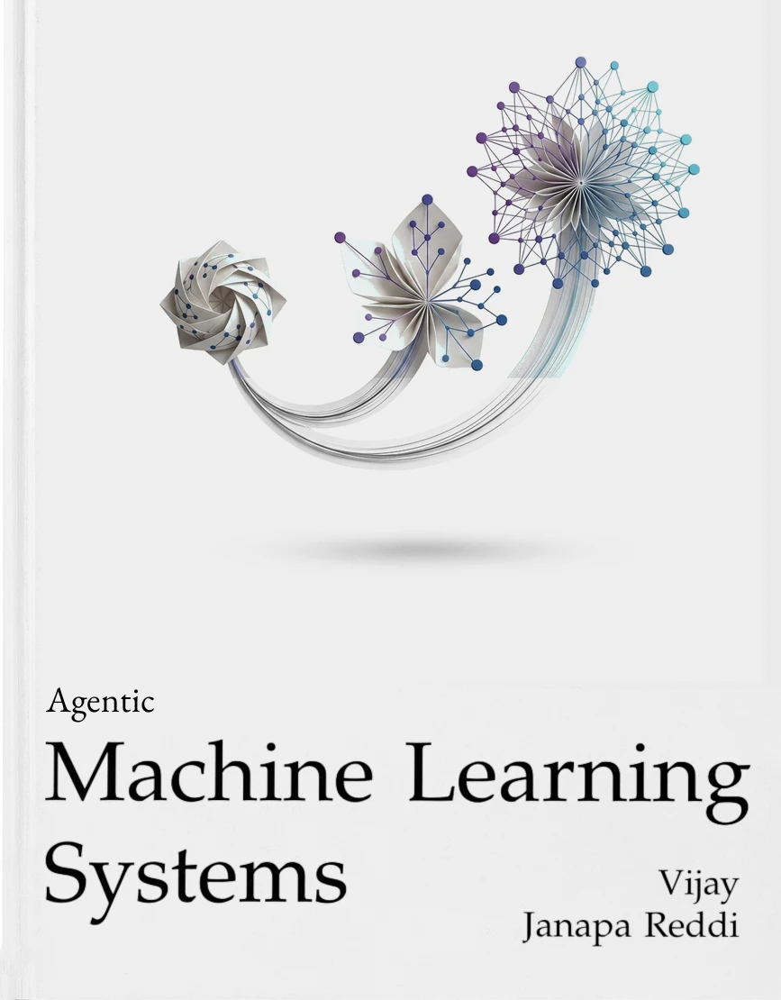

::: {.content-visible when-format="html:js"}

```{=html}
<div class="abstract-section">
  <div class="abstract-content">
    <p><strong>This is a working volume.</strong> Agentic machine learning systems turn model inference into a stateful control loop that observes, decides, acts, verifies, and adapts. The managed trajectory, rather than the isolated request, is the central unit of engineering.</p>
    <p>The volume builds an agentic system in the order its dependencies impose, model, memory, tools, runtime, measurement, learning, and scale, and treats unsettled mechanisms as open design questions rather than fixed doctrine.</p>
  </div>

  <div class="book-card">
    <a href="assets/downloads/Machine-Learning-Systems-Vol3.pdf" target="_blank" title="Download PDF">
      
    </a>
    <p class="book-title">Agentic Machine Learning Systems</p>
    <p class="book-subtitle">Vijay Janapa Reddi</p>
    <p style="font-size: 0.85em; color: #6c757d; margin-top: 8px; margin-bottom: 0;">
      <a href="assets/downloads/Machine-Learning-Systems-Vol3.pdf" target="_blank" rel="noopener" style="text-decoration: none; font-weight: 600;">📖 Download PDF</a>
      <span style="color: #adb5bd; margin: 0 4px;">&middot;</span>
      <a href="assets/downloads/Machine-Learning-Systems-Vol3.epub" target="_blank" rel="noopener" style="text-decoration: none; font-weight: 600;">📱 Download EPUB</a>
    </p>
  </div>
</div>

<h2>What You Will Learn</h2>

<p>The book opens with an introduction that defines the agentic system, its unit of work (the trajectory), and the three exposures an agent adds beyond a single model call: horizon, state, and authority. Seven parts then build the system in order.</p>
<ul>
  <li><strong>Part I: The Model</strong>. The foundation model and test-time compute.</li>
  <li><strong>Part II: Agent Memory</strong>. Context engineering, KV cache management, and long-term memory.</li>
  <li><strong>Part III: Tool Use</strong>. Tool calling and agent sandboxes.</li>
  <li><strong>Part IV: The Agent Runtime</strong>. The agent harness, durable execution, failure recovery, and agent evaluation.</li>
  <li><strong>Part V: Learning from Trajectories</strong>. Trajectory curation, trajectory fine-tuning, and reinforcement learning from verifiable rewards.</li>
  <li><strong>Part VI: Agents at Scale</strong>. Multi-agent coordination and agent economics.</li>
  <li><strong>Part VII: Synthesis</strong>. One trajectory through every part, and the specification boundary.</li>
</ul>

<h2>Prerequisites</h2>

<p>Readers should know how neural networks are trained and served, be comfortable with computer systems fundamentals and programming in Python, and have undergraduate-level probability. The book assumes no earlier volume of this series and develops every agentic and serving concept it needs.</p>
```

:::
