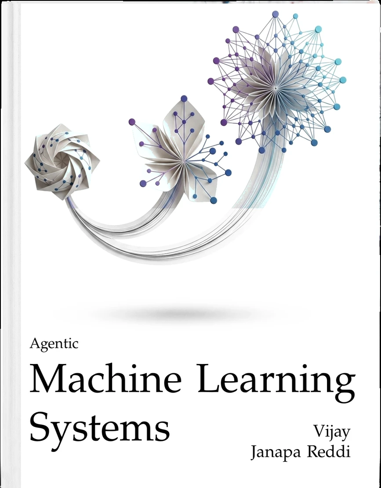

::: {.content-visible when-format="html:js"}

```{=html}
<div class="abstract-section">
  <div class="abstract-content">
    <p><strong>This is a working volume.</strong> Agentic machine learning systems turn model inference into a stateful control loop that observes, decides, acts, verifies, and adapts. The managed trajectory, rather than the isolated request, is the central unit of engineering.</p>
    <p>The volume develops durable systems abstractions for context, memory, action, control, runtime, evaluation, and operations while treating unsettled mechanisms as open design questions rather than fixed doctrine.</p>
  </div>

  <a href="assets/downloads/Machine-Learning-Systems-Vol3.pdf" target="_blank" class="book-card-link" title="Download PDF">
    <div class="book-card">
      
      <p class="book-title">Agentic Machine Learning Systems</p>
      <p class="book-subtitle">Vijay Janapa Reddi</p>
      <p style="font-size: 0.8em; color: #6c757d; margin-top: 6px; margin-bottom: 0;">📖 Download the PDF</p>
    </div>
  </a>
</div>

<h2>What You Will Learn</h2>

<p>The book progresses through five parts:</p>
<ul>
  <li><strong>Part I: The Agent Loop</strong>—Horizon, state, authority, context, perception, and memory.</li>
  <li><strong>Part II: Decision and Action</strong>—Tool interfaces, planning, hybrid control, and multi-agent coordination.</li>
  <li><strong>Part III: Control and Protection</strong>—Verification, recovery, human control, security, and isolation.</li>
  <li><strong>Part IV: Runtime and Economics</strong>—Durable execution, scheduling, serving, state reuse, and cost per verified outcome.</li>
  <li><strong>Part V: Evidence and Evolution</strong>—Evaluation, testing, observability, replay, deployment, and improvement.</li>
</ul>

<h2>Prerequisites</h2>

<p>Readers should know the single-machine and distributed-system foundations developed in Volumes I and II, be comfortable programming in Python, and have undergraduate-level probability and linear algebra.</p>
```

:::
