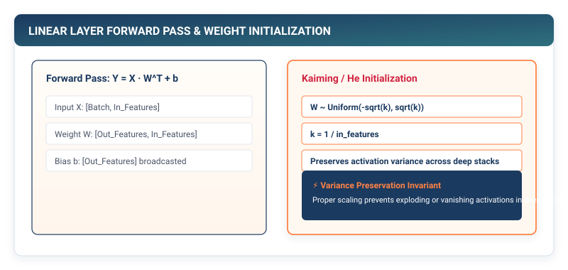

## Purpose {.unnumbered}

_Why does an uncalibrated weight matrix destroy signal propagation before training even begins?_

When an input vector passes through a deep sequence of linear transformations, the variance of the intermediate activations is multiplied by the layer width at every step. If weight matrices are initialized with uncalibrated random values, the magnitude of activation values will either explode exponentially towards infinity or collapse exponentially towards zero within a few layers, saturating numerical registers and destroying the signal before any learning can occur. Beyond the mathematics of linear projections, real deep learning frameworks cannot treat layers as simple mathematical functions; layers are stateful software containers that encapsulate trainable weight and bias buffers, manage random number generator states, and dynamically alter behavior between stochastic training and deterministic evaluation. In a framework runtime, layer abstractions are the physical bridge that binds raw tensor memory buffers into structured, executable neural network architectures.

::: {.callout-learning-objectives}
## Learning Objectives

- **Construct** the foundational `Layer` base class and stateful `Linear` layer container encapsulating trainable `Tensor` parameter buffers.
- **Derive** the variance conservation equations governing LeCun and He weight initialization ($1/\sqrt{\text{fan\_in}}$ vs $\sqrt{2/\text{fan\_in}}$) to stabilize forward signal propagation across deep stacks.
- **Implement** stochastic `Dropout` regularization using the inverted scaling invariant ($\frac{1}{1-p}$) to guarantee zero computational overhead during evaluation.
- **Build** state-aware execution pipelines with `.train()` and `.eval()` mode switching.
- **Compose** multi-layer neural networks using the `Sequential` container and calculate the exact physical memory footprint of model parameters.
:::

---

## 3.1 The Physics of Weight Initialization

Consider a single linear transformation without bias computing the output vector $\mathbf{y} \in \mathbb{R}^{d_{\text{out}}}$ from an input vector $\mathbf{x} \in \mathbb{R}^{d_{\text{in}}}$:

$$y_j = \sum_{i=1}^{d_{\text{in}}} x_i W_{i, j}$$

Assume the input features $x_i$ are independent and identically distributed with zero mean ($\mathbb{E}[x_i] = 0$) and unit variance ($\text{Var}(x_i) = 1$). If we initialize the weight matrix elements $W_{i, j}$ from a standard normal distribution $\mathcal{N}(0, 1)$ with $\mathbb{E}[W_{i, j}] = 0$ and $\text{Var}(W_{i, j}) = 1$, the variance of each output element $y_j$ is given by:

$$\text{Var}(y_j) = \text{Var}\left(\sum_{i=1}^{d_{\text{in}}} x_i W_{i, j}\right) = \sum_{i=1}^{d_{\text{in}}} \text{Var}(x_i W_{i, j})$$

Because $x_i$ and $W_{i, j}$ are independent zero-mean variables, $\text{Var}(x_i W_{i, j}) = \text{Var}(x_i) \cdot \text{Var}(W_{i, j}) = 1 \times 1 = 1$. Summing across all $d_{\text{in}}$ incoming connections yields:

$$\text{Var}(y_j) = d_{\text{in}} \cdot \text{Var}(x) \cdot \text{Var}(W) = d_{\text{in}} \times 1 = d_{\text{in}}$$

```
┌─────────────────────────────────────────────────────────────┐
│  The Variance Explosion Trap                                │
├─────────────────────────────────────────────────────────────┤
│  Layer 0: Input Variance = 1.0                              │
│  Layer 1 (d_in = 512): Output Variance = 512                │
│  Layer 2 (d_in = 512): Output Variance = 512 * 512 = 262,144│
│  Layer 3 (d_in = 512): Output Variance = 1.34 * 10^8        │
│  => Activations overflow IEEE 754 float32 in ~5 layers!     │
└─────────────────────────────────────────────────────────────┘
```

If an architecture has hidden dimension $d_{\text{in}} = 512$, passing an input through just three uncalibrated layers causes activation variance to explode by a factor of $512^3 \approx 1.34 \times 10^8$, overflowing floating-point registers.

::: {.callout-principle}
## The Law of Variance Conservation

To preserve signal magnitude across consecutive linear layers ($\text{Var}(y) = \text{Var}(x)$), the variance of the weight initialization must be inversely proportional to the number of input connections ($\text{fan\_in}$):

$$\text{Var}(W) = \frac{1}{\text{fan\_in}} \implies \sigma_W = \sqrt{\frac{1}{\text{fan\_in}}}$$

- **LeCun Initialization**: $\sigma = \sqrt{\frac{1}{d_{\text{in}}}}$ (optimal for linear and zero-centered activations like Tanh).
- **He (Kaiming) Initialization**: $\sigma = \sqrt{\frac{2}{d_{\text{in}}}}$ (multiplies variance by 2 to compensate for ReLU zeroing out half of the activation distribution).
:::

---

## 3.2 The Stateful Linear Layer

In TinyTorch, all neural network components inherit from a common `Layer` base class that establishes the framework's execution and parameter tracking protocol.

```python
# Listing 3.1: The Layer Base Class
from tinytorch.core.tensor import Tensor
from typing import List

class Layer:
    """Base class for all neural network layers in TinyTorch."""

    def forward(self, x: Tensor) -> Tensor:
        """Compute the forward transformation."""
        raise NotImplementedError("Subclasses must implement forward()")

    def __call__(self, x: Tensor, *args, **kwargs) -> Tensor:
        """Allow layer instances to be called directly as functions."""
        return self.forward(x, *args, **kwargs)

    def parameters(self) -> List[Tensor]:
        """Return a list of all trainable parameter Tensors."""
        return []

    def __repr__(self) -> str:
        return f"{self.__class__.__name__}()"
```

The `Linear` layer (also termed a *Dense* or *Fully Connected* layer) encapsulates two trainable parameter tensors:
1. **Weight Matrix ($\mathbf{W}$)** of shape $(d_{\text{in}}, d_{\text{out}})$, initialized with LeCun scaled normal noise.
2. **Bias Vector ($\mathbf{b}$)** of shape $(d_{\text{out}},)$, initialized to zeros.

```python
# Listing 3.2: The Stateful Linear Layer Implementation
import numpy as np

class Linear(Layer):
    """
    Fully connected linear transformation: y = x @ W + b.
    
    Encapsulates trainable weight and bias parameter Tensors.
    """

    def __init__(
        self,
        in_features: int,
        out_features: int,
        bias: bool = True,
        dtype: np.dtype = np.float32
    ) -> None:
        self.in_features = in_features
        self.out_features = out_features
        self.use_bias = bias

        # LeCun weight initialization: std = sqrt(1 / in_features)
        std = np.sqrt(1.0 / in_features)
        weight_data = np.random.normal(0.0, std, (in_features, out_features)).astype(dtype)
        self.weight = Tensor(weight_data, requires_grad=True)

        if bias:
            bias_data = np.zeros(out_features, dtype=dtype)
            self.bias = Tensor(bias_data, requires_grad=True)
        else:
            self.bias = None

    def forward(self, x: Tensor) -> Tensor:
        """
        Compute affine projection: y = x @ W + b.
        
        Args:
            x: Input Tensor of shape (batch_size, in_features)
        Returns:
            Output Tensor of shape (batch_size, out_features)
        """
        # Matrix multiplication: (B, in_features) @ (in_features, out_features) -> (B, out_features)
        out = x.matmul(self.weight)
        if self.bias is not None:
            # Broadcasting addition: (B, out_features) + (out_features,)
            out = out + self.bias
        return out

    def parameters(self) -> List[Tensor]:
        """Return encapsulated trainable parameters."""
        if self.bias is not None:
            return [self.weight, self.bias]
        return [self.weight]

    def __repr__(self) -> str:
        return f"Linear(in_features={self.in_features}, out_features={self.out_features}, bias={self.use_bias})"
```

---

## 3.3 Regularization via Inverted Dropout

Deep neural networks with millions of parameters are susceptible to **co-adaptation**, where individual neurons rely on the specific presence of other neurons to make predictions, leading to overfitting on training samples.

**Dropout** mitigates co-adaptation by randomly setting a fraction $p \in [0, 1)$ of activation units to zero during forward execution.

::: {#fig-dropout-architecture}


**Figure 3.1: Standard vs. Inverted Dropout Execution.** During training, a random binary mask zeroes activations with probability $p$. Inverted Dropout scales surviving units by $\frac{1}{1-p}$, ensuring test-time evaluation requires zero arithmetic scaling.
:::

### The Inverted Dropout Invariant

In classical dropout, activations are multiplied by a Bernoulli mask during training, which scales the expected output by $(1 - p)$. To correct for this at inference time, classical implementations had to multiply all weights by $(1 - p)$ during evaluation.

Modern frameworks use **Inverted Dropout**: by scaling the surviving activations by $\frac{1}{1 - p}$ *during the forward training step*, the mathematical expectation is preserved immediately:

$$\mathbb{E}[y_{\text{train}}] = \mathbb{E}\left[\frac{x \cdot \text{mask}}{1 - p}\right] = \frac{x \cdot (1 - p)}{1 - p} = x = \mathbb{E}[y_{\text{eval}}]$$

```python
# Listing 3.3: Inverted Dropout Implementation with State Modes
class Dropout(Layer):
    """
    Inverted Dropout regularization layer.
    
    Randomly zeroes elements with probability p during training.
    Scales surviving elements by 1 / (1 - p) to preserve expectation.
    """

    def __init__(self, p: float = 0.5) -> None:
        if not 0.0 <= p < 1.0:
            raise ValueError(f"Dropout probability must be in [0, 1), got {p}")
        self.p = p
        self.training = True

    def train(self) -> None:
        """Enable training mode (stochastic dropout active)."""
        self.training = True

    def eval(self) -> None:
        """Enable evaluation mode (deterministic identity pass)."""
        self.training = False

    def forward(self, x: Tensor) -> Tensor:
        # In evaluation mode or when p=0, dropout is a pure no-op identity
        if not self.training or self.p == 0.0:
            return x

        # Generate binary mask: True with probability (1 - p)
        mask = (np.random.random(x.shape) >= self.p).astype(x.dtype)
        # Scale surviving elements by 1 / (1 - p)
        scale = 1.0 / (1.0 - self.p)
        return Tensor(x.data * mask * scale)

    def __repr__(self) -> str:
        return f"Dropout(p={self.p}, training={self.training})"
```

::: {.callout-pitfall}
## Pitfall: Forgetting to Toggle `.eval()` During Inference

If a model is evaluated in `.train()` mode, randomly dropping 50% of activations introduces stochastic noise into test predictions, severely degrading benchmark accuracy. Always toggle `model.eval()` before running inference.
:::

---

## 3.4 Composition: The Sequential Container

With `Linear`, `Dropout`, and our activation suite (`ReLU`, `GELU`, `Softmax` from Chapter 3), we can now assemble multi-layer neural network architectures.

The `Sequential` container encapsulates an ordered list of layers, executing them in sequence:

$$\mathbf{x} \longrightarrow \text{Layer}_1 \longrightarrow \text{Layer}_2 \longrightarrow \dots \longrightarrow \text{Layer}_K \longrightarrow \mathbf{y}$$

```python
# Listing 3.4: The Sequential Model Container
class Sequential(Layer):
    """Sequential container executing layers in linear succession."""

    def __init__(self, *layers: Layer) -> None:
        self.layers = list(layers)

    def train(self) -> None:
        """Set all sub-layers to training mode."""
        for layer in self.layers:
            if hasattr(layer, 'train'):
                layer.train()

    def eval(self) -> None:
        """Set all sub-layers to evaluation mode."""
        for layer in self.layers:
            if hasattr(layer, 'eval'):
                layer.eval()

    def forward(self, x: Tensor) -> Tensor:
        """Sequentially pass input through all layers."""
        out = x
        for layer in self.layers:
            out = layer(out)
        return out

    def parameters(self) -> List[Tensor]:
        """Recursively collect parameters across all sub-layers."""
        params = []
        for layer in self.layers:
            params.extend(layer.parameters())
        return params

    def __repr__(self) -> str:
        layer_strs = "\n  ".join(str(layer) for layer in self.layers)
        return f"Sequential(\n  {layer_strs}\n)"
```

### Running a Complete Multi-Layer Forward Pass

We can now construct a 3-layer Multi-Layer Perceptron (MLP) for digit classification (such as MNIST: 784 input pixels, 128 hidden units, 10 output classes) and execute a forward pass:

```python
# Listing 3.5: Constructing and Executing a Multi-Layer Network
from tinytorch.core.activations import ReLU, Softmax

# Construct the multi-layer architecture
model = Sequential(
    Linear(in_features=784, out_features=128),
    ReLU(),
    Dropout(p=0.2),
    Linear(in_features=128, out_features=64),
    ReLU(),
    Linear(in_features=64, out_features=10),
    Softmax(axis=-1)
)

# Generate a synthetic batch of 16 images
batch_x = Tensor(np.random.randn(16, 784).astype(np.float32))

# Execute forward pass
predictions = model(batch_x)
print(f"Output shape: {predictions.shape}")  # (16, 10)
print(f"Total parameter tensors: {len(model.parameters())}")  # 6 (3 weights, 3 biases)
```

---

## 3.5 Systems Reality: Parameter Counting and Storage Footprint

Every parameter in a neural network is a float in memory. When designing frameworks, we must calculate the exact physical memory required to store model weights:

$$\text{Params}_{\text{Linear}} = (d_{\text{in}} \times d_{\text{out}}) + d_{\text{out}}$$

$$\text{Memory} = \text{Total Parameters} \times \text{sizeof}(\text{dtype})$$

::: {.callout-checkpoint}
## Check Your Understanding: Calculating Network Weight Footprint

Consider the 3-layer MLP constructed in Listing 3.5:
- Layer 1: `Linear(784, 128)`
- Layer 2: `Linear(128, 64)`
- Layer 3: `Linear(64, 10)`

1. Calculate the total number of learnable parameters in the network.
2. How many bytes of RAM are required to store these parameters in 32-bit float (`float32`, 4 bytes per element)?

*Solution:*
- Layer 1: $(784 \times 128) + 128 = 100,352 + 128 = 100,480\text{ params}$.
- Layer 2: $(128 \times 64) + 64 = 8,192 + 64 = 8,256\text{ params}$.
- Layer 3: $(64 \times 10) + 10 = 640 + 10 = 650\text{ params}$.
- Total Parameters: $100,480 + 8,256 + 650 = 109,386\text{ parameters}$.
- Physical Memory: $109,386 \times 4\text{ bytes} = 437,544\text{ bytes} \approx 427.3\text{ KB}$.
:::

---

## Summary

In this chapter, we built the third tier of TinyTorch: stateful layers, parameter management, and multi-layer network composition. We proved why uncalibrated random weight initialization causes exponential activation explosion, and derived the LeCun and He variance conservation scaling laws ($1/\sqrt{\text{fan\_in}}$ vs $\sqrt{2/\text{fan\_in}}$) that stabilize signal flow through deep linear layers.

We implemented the `Linear` layer encapsulating trainable weight and bias tensors, constructed `Dropout` regularization using the inverted scaling invariant ($\frac{1}{1-p}$) to guarantee zero inference overhead, and built the `Sequential` container to compose layers into complete forward pipelines. With tensors, activations, and layers now functional, we have built a complete forward-pass neural network runtime.

::: {.callout-takeaways}
## Chapter Takeaways

- **Variance Conservation**: Initializing weights with standard normal noise explodes activation magnitude; scaling variance by $1/\text{fan\_in}$ keeps signal variance constant across layers.
- **Stateful Layer Encapsulation**: Unlike stateless activations, the `Linear` layer manages trainable `Tensor` parameter buffers registered via the `parameters()` protocol.
- **Inverted Dropout Invariant**: Scaling training activations by $\frac{1}{1-p}$ maintains the mathematical expectation $\mathbb{E}[y] = x$, allowing evaluation mode to run as a cost-free identity pass.
- **Execution Mode Switching**: Models must maintain explicit `.train()` and `.eval()` state flags to toggle stochastic behavior between training and evaluation.
- **Sequential Composition**: The `Sequential` container executes layers in linear order and recursively aggregates parameters across all sub-modules.
:::

::: {.callout-chapter-connection}
## Chapter Connection: Measuring Model Error

Our framework can now construct and execute multi-layer neural networks, but how do we quantify how well a network's predictions match ground-truth labels? In **Chapter 5 (Objective Functions and Loss Formulations)**, we build objective loss functions (MSE, Binary Cross-Entropy, and Softmax Cross-Entropy), analyze numerical stability in log-space, and measure forward prediction error.
:::
