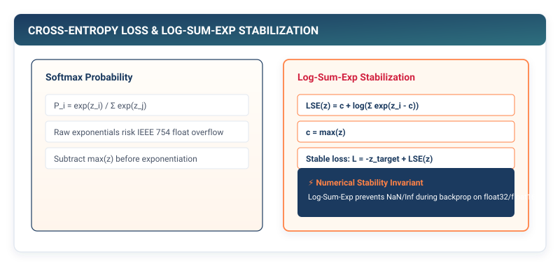

## Purpose {.unnumbered}

_Why does computing loss in probability space corrupt numerical precision compared to log-space?_

A neural network’s forward pass maps input data into raw continuous predictions or unnormalized logit vectors. To steer the network, the framework must evaluate an objective function that quantifies the discrepancy between model predictions and ground-truth targets as a single scalar error value. In production deep learning frameworks, loss calculation is not merely a mathematical formula; it is a critical numerical stability boundary. Naive implementations that first convert raw logits into probability distributions via Softmax and subsequently compute logarithms ($\log(\text{Softmax}(\mathbf{z}))$) suffer from catastrophic floating-point underflow whenever probabilities approach zero ($\log(0) \to -\infty \to \text{NaN}$). To maintain numerical precision across extreme dynamic ranges, frameworks fuse activation normalization and error measurement into a single unified mathematical invariant: the **Log-Sum-Exp operator**. In a framework runtime, loss functions are the physical calibration dials where statistical likelihood is stabilized against the hardware limits of IEEE 754 arithmetic.

::: {.callout-learning-objectives}
## Learning Objectives

- **Construct** modular, reusable loss classes (`MSELoss`, `BCELoss`, `CrossEntropyLoss`) operating seamlessly over multidimensional `Tensor` containers.
- **Implement** epsilon-clamping safeguards to prevent $\log(0)$ register crashes and NaN corruption in binary cross-entropy evaluation.
- **Derive** and **implement** the Log-Sum-Exp numerical invariant in `log_softmax` to execute categorical cross-entropy in a single, overflow-proof pass.
- **Support** flexible framework target formats, handling both sparse integer class indices and dense one-hot probability vectors.
- **Connect** our multi-layer `Sequential` architecture (built in Chapter 4) directly to `CrossEntropyLoss` to measure forward prediction error.
:::

---

## 4.1 The Framework Role of Loss Functions

In a machine learning runtime, the forward pass produces an output tensor $\hat{\mathbf{y}}$ (predictions or logits) corresponding to a batch of input samples. The loss function takes $\hat{\mathbf{y}}$ and the ground-truth target tensor $\mathbf{y}$, and reduces them to a single scalar `Tensor`:

$$\mathcal{L} = \text{Loss}(\hat{\mathbf{y}}, \mathbf{y})$$

```
┌─────────────────────────────────────────────────────────────┐
│  Input Batch (B, D_in)  ──>  Sequential Model (Ch 4)        │
│                                    │                        │
│                                    ▼                        │
│  Target Labels (B,)     ──>  Predictions / Logits (B, C)    │
│            │                       │                        │
│            └───────────────┬───────┘                        │
│                            ▼                                │
│                   Loss Function (Ch 5)                      │
│                            │                                │
│                            ▼                                │
│                   Scalar Loss L (0D Tensor)                 │
└─────────────────────────────────────────────────────────────┘
```

The computed loss scalar serves as the definitive numerical score of prediction quality:
- If predictions match targets perfectly, $\mathcal{L} \to 0$.
- If predictions diverge from targets, $\mathcal{L}$ grows, providing the magnitude of error that will subsequently guide optimization.

---

## 4.2 Mean Squared Error (MSELoss) for Continuous Regression

For regression tasks (such as predicting continuous physical measurements, prices, or coordinates), the standard objective is **Mean Squared Error (MSE)**.

Given a prediction tensor $\hat{\mathbf{y}} \in \mathbb{R}^{B \times D}$ and target tensor $\mathbf{y} \in \mathbb{R}^{B \times D}$, MSE computes the average squared difference across all $N = B \times D$ elements:

$$\mathcal{L}_{\text{MSE}}(\hat{\mathbf{y}}, \mathbf{y}) = \frac{1}{N} \sum_{i=1}^N (\hat{y}_i - y_i)^2$$

```python
# Listing 4.1: Mean Squared Error (MSELoss) Implementation
from tinytorch.core.tensor import Tensor
import numpy as np

class MSELoss:
    """Mean Squared Error loss for continuous regression."""

    def forward(self, predictions: Tensor, targets: Tensor) -> Tensor:
        """
        Compute mean squared error between predictions and targets.
        
        Args:
            predictions: Model output Tensor of shape (B, ...)
            targets: Ground-truth Tensor of identical shape (B, ...)
        Returns:
            Scalar Tensor containing mean squared error
        """
        diff = predictions.data - targets.data
        loss_val = np.mean(diff ** 2)
        return Tensor(loss_val)

    def __call__(self, predictions: Tensor, targets: Tensor) -> Tensor:
        return self.forward(predictions, targets)
```

**Properties of MSE**:
1. **Non-negativity**: $\mathcal{L}_{\text{MSE}} \ge 0$, with equality if and only if $\hat{\mathbf{y}} = \mathbf{y}$.
2. **Outlier Sensitivity**: Because errors are squared, a prediction error of $10.0$ generates a penalty 100× greater than an error of $1.0$, heavily discouraging large deviations.

---

## 4.3 Binary Cross-Entropy (BCELoss) and Epsilon Clamping

For binary classification problems (where targets are discrete labels $y \in \{0, 1\}$ and predictions are probabilities $\hat{y} \in (0, 1)$ produced by a Sigmoid activation), the objective is **Binary Cross-Entropy (BCE)**:

$$\mathcal{L}_{\text{BCE}}(\hat{\mathbf{y}}, \mathbf{y}) = -\frac{1}{N} \sum_{i=1}^N \left[ y_i \log(\hat{y}_i) + (1 - y_i) \log(1 - \hat{y}_i) \right]$$

### The Logarithm Hazard in IEEE 754

If a model predicts $\hat{y} = 0.0$ for a sample whose true label is $y = 1$, evaluating $\log(\hat{y}) = \log(0.0)$ produces $-\infty$. In subsequent arithmetic, multiplying $0 \times (-\infty)$ produces `NaN` (Not a Number), crashing execution.

To guarantee complete numerical robustness, the framework must clamp predictions to an interior interval $[\epsilon, 1 - \epsilon]$ where $\epsilon = 10^{-7}$:

```python
# Listing 4.2: Binary Cross-Entropy (BCELoss) with Epsilon Safeguard
EPSILON = 1e-7

class BCELoss:
    """Binary Cross-Entropy loss with numerical epsilon clamping."""

    def __init__(self, eps: float = EPSILON) -> None:
        self.eps = eps

    def forward(self, predictions: Tensor, targets: Tensor) -> Tensor:
        # Clamp predictions to [eps, 1 - eps] to prevent log(0) -> -inf
        preds_clamped = np.clip(predictions.data, self.eps, 1.0 - self.eps)
        targets_data = targets.data

        # Compute element-wise cross-entropy
        bce = -(targets_data * np.log(preds_clamped) + (1.0 - targets_data) * np.log(1.0 - preds_clamped))
        return Tensor(np.mean(bce))

    def __call__(self, predictions: Tensor, targets: Tensor) -> Tensor:
        return self.forward(predictions, targets)
```

---

## 4.4 Categorical Cross-Entropy and the Log-Sum-Exp Invariant

For multi-class classification across $C$ mutually exclusive classes (such as classifying handwritten digits $0\dots 9$ or predicting the next token in a language model vocabulary), the model produces raw unnormalized scores $\mathbf{z} \in \mathbb{R}^C$ called **logits**.

The mathematical cross-entropy for a sample with target class index $y \in \{0, \dots, C-1\}$ is the negative log-probability assigned to the correct class:

$$\mathcal{L}_{\text{CE}}(\mathbf{z}, y) = -\log\left(\text{Softmax}(\mathbf{z})_y\right) = -\log\left(\frac{e^{z_y}}{\sum_{j=1}^C e^{z_j}}\right)$$

### The Underflow Trap of Naive Softmax + Log

Suppose we implement this naively by first computing $\mathbf{p} = \text{Softmax}(\mathbf{z})$ and then evaluating $\log(\mathbf{p}_y)$.

If the model is poorly calibrated early in training, an unnormalized logit $z_y$ might be $-100.0$ relative to other classes. The resulting probability $p_y = e^{-100} \approx 3.7 \times 10^{-44}$ underflows standard 32-bit floating-point precision to `0.0`. Taking $\log(0.0)$ results in $-\infty$, corrupting the loss.

::: {.callout-principle}
## The Log-Sum-Exp Invariant

Expanding the logarithm of the Softmax quotient algebraically yields:

$$\log\left(\text{Softmax}(\mathbf{z})_i\right) = \log\left(\frac{e^{z_i}}{\sum_{j=1}^C e^{z_j}}\right) = z_i - \log\left(\sum_{j=1}^C e^{z_j}\right)$$

Applying the shift-invariance property with $M = \max_j(z_j)$:

$$\sum_{j=1}^C e^{z_j} = \sum_{j=1}^C e^{z_j - M + M} = e^M \sum_{j=1}^C e^{z_j - M}$$

$$\log\left(\sum_{j=1}^C e^{z_j}\right) = M + \log\left(\sum_{j=1}^C e^{z_j - M}\right)$$

Substituting back into the log-softmax formula gives the exact **Log-Sum-Exp Invariant**:

$$\log(\text{Softmax}(\mathbf{z})_i) = (z_i - M) - \log\left(\sum_{j=1}^C e^{z_j - M}\right)$$

Because $z_j - M \le 0$ for all $j$, the exponential terms $e^{z_j - M} \in (0, 1]$ **never overflow**, while the subtraction in log-space prevents underflow to zero.
:::

```python
# Listing 4.3: Numerically Stable Log-Softmax Implementation
def log_softmax(x: Tensor, dim: int = -1) -> Tensor:
    """
    Compute log-softmax using the Log-Sum-Exp numerical stability trick.
    
    Args:
        x: Input Tensor of unnormalized logits
        dim: Dimension along which to compute log-softmax (default: -1)
    Returns:
        Tensor of exact log-probabilities
    """
    x_data = x.data
    # 1. Compute maximum along target dimension for stability
    max_vals = np.max(x_data, axis=dim, keepdims=True)
    # 2. Subtract maximum to guarantee all exponents <= 0
    shifted = x_data - max_vals
    # 3. Compute log-sum-exp
    log_sum_exp = np.log(np.sum(np.exp(shifted), axis=dim, keepdims=True))
    # 4. Return log-probabilities: (x - max) - log(sum(exp(x - max)))
    return Tensor(shifted - log_sum_exp)
```

::: {#fig-log-sum-exp-pipeline}


**Figure 4.1: Naive Softmax vs. Fused Log-Sum-Exp Pipeline.** Computing probabilities in linear space risks exponent overflow and log underflow. Fusing the operations into the Log-Sum-Exp invariant operates directly on shifted logits, guaranteeing stable IEEE 754 precision.
:::

---

### Building the Complete CrossEntropyLoss Layer

In TinyTorch (as in PyTorch), `CrossEntropyLoss` takes **raw unnormalized logits** directly from the final `Linear` layer, bypassing explicit `Softmax` calls. It supports both 1D integer class label targets and 2D one-hot probability distributions:

```python
# Listing 4.4: CrossEntropyLoss Implementation in TinyTorch
class CrossEntropyLoss:
    """
    Cross-Entropy loss combining log_softmax and Negative Log-Likelihood (NLL).
    
    Expects unnormalized logits directly from the model.
    """

    def forward(self, logits: Tensor, targets: Tensor) -> Tensor:
        """
        Compute categorical cross-entropy loss.
        
        Args:
            logits: Unnormalized logits Tensor of shape (B, C)
            targets: Class indices (B,) or one-hot vectors (B, C)
        Returns:
            Scalar Tensor containing average cross-entropy loss
        """
        batch_size = logits.shape[0]
        # Compute numerically stable log-probabilities
        log_probs = log_softmax(logits, dim=-1).data

        if targets.ndim == 1:
            # Sparse integer class indices: shape (B,)
            target_indices = targets.data.astype(int)
            # Index correct class log-probability for each sample in batch
            sample_losses = -log_probs[np.arange(batch_size), target_indices]
        else:
            # One-hot encoded probability distributions: shape (B, C)
            sample_losses = -np.sum(targets.data * log_probs, axis=-1)

        return Tensor(np.mean(sample_losses))

    def __call__(self, logits: Tensor, targets: Tensor) -> Tensor:
        return self.forward(logits, targets)
```

::: {.callout-pitfall}
## Pitfall: Double Softmax Application

A frequent beginner mistake is adding a `Softmax` layer at the end of a `Sequential` network and then passing the output to `CrossEntropyLoss`. Because `CrossEntropyLoss` applies `log_softmax` internally, passing already-softmaxxed probabilities applies Softmax twice, destroying gradient scaling. Always output raw unnormalized logits from the final `Linear` layer when training with `CrossEntropyLoss`.
:::

---


::: {.callout-note}
## PyTorch Systems Bridge: `torch.nn.CrossEntropyLoss`

A universal source of confusion for ML newcomers is why PyTorch's `CrossEntropyLoss` takes unnormalized raw logits instead of probabilities. 

In PyTorch, `nn.CrossEntropyLoss()` combines `LogSoftmax` and `NLLLoss` (Negative Log-Likelihood Loss) into a single C++ kernel:

```python
import torch
import torch.nn as nn

criterion = nn.CrossEntropyLoss()
logits = torch.randn(8, 10)  # Shape (B, C) - Raw unnormalized scores!
targets = torch.randint(0, 10, (8,))  # Shape (B,) - Class indices!

loss = criterion(logits, targets)  # Single scalar output
```
By taking raw logits, PyTorch executes the stable Log-Sum-Exp subtraction directly in CUDA without ever materializing an intermediate probability array in GPU RAM.[^pytorch-ce]
:::

[^pytorch-ce]: In PyTorch ATen (`aten/src/ATen/native/Loss.cpp`), `cross_entropy_loss` dispatches to `nll_loss_forward` with fused target indexing, achieving $O(B)$ memory writes instead of $O(B 	imes C)$.

## 4.5 Forward Error Evaluation: Connecting Networks to Loss

We can now connect the entire forward execution pipeline: passing an input batch through our Chapter 4 multi-layer `Sequential` network, generating raw logits, and calculating the exact forward prediction error using `CrossEntropyLoss`.

```python
# Listing 4.5: End-to-End Forward Evaluation Pipeline
from tinytorch.core.layers import Linear, Dropout, Sequential
from tinytorch.core.activations import ReLU

# 1. Define 3-layer MLP for digit classification (outputting raw logits)
model = Sequential(
    Linear(in_features=784, out_features=128),
    ReLU(),
    Dropout(p=0.1),
    Linear(in_features=128, out_features=64),
    ReLU(),
    Linear(in_features=64, out_features=10)  # No Softmax: outputs raw logits!
)

# 2. Instantiate CrossEntropyLoss
criterion = CrossEntropyLoss()

# 3. Create synthetic batch of 8 images and ground-truth digit labels
batch_x = Tensor(np.random.randn(8, 784).astype(np.float32))
batch_y = Tensor(np.array([3, 7, 0, 9, 2, 1, 4, 8]))  # True digit classes

# 4. Execute forward pass to obtain logits
logits = model(batch_x)
print(f"Logits Shape: {logits.shape}")  # (8, 10)

# 5. Evaluate scalar forward loss
loss = criterion(logits, batch_y)
print(f"Forward Evaluation Loss: {loss.data:.4f}")
```

::: {.callout-checkpoint}
## Check Your Understanding: Initial Random Loss Benchmark

For a randomly initialized model with 10 balanced classes ($C = 10$), what is the expected initial cross-entropy loss before any training occurs?

*Solution:*
Before learning begins, a properly initialized model assigns equal unnormalized logits to all $C = 10$ classes ($p_i \approx \frac{1}{10} = 0.1$).

$$\mathcal{L}_{\text{expected}} = -\log(0.1) = \log(10) \approx 2.3026$$

Checking that your initial forward loss is close to $\log(C)$ ($\approx 2.30$ for 10-class MNIST or CIFAR-10) is a universal systems sanity check to verify weight initialization and loss calculations before starting training.
:::

---

## Summary

In this chapter, we built the fourth tier of TinyTorch: objective functions and error measurement. We explored the mathematical formulation of error across continuous regression (`MSELoss`), binary classification (`BCELoss`), and multi-class categorical classification (`CrossEntropyLoss`).

We analyzed the critical numerical hazards of computing logarithms on digital hardware, implementing epsilon-clamping to prevent $\log(0)$ crashes and deriving the **Log-Sum-Exp invariant** to execute log-softmax in a single, overflow-proof pass. Finally, we demonstrated the complete forward evaluation pipeline by connecting our Chapter 4 multi-layer `Sequential` model directly to `CrossEntropyLoss` to measure forward prediction error.

::: {.callout-takeaways}
## Chapter Takeaways

- **The Loss Contract**: Loss functions reduce multidimensional prediction and target tensors into a single scalar `Tensor` measuring prediction error.
- **The Logarithm Hazard**: Evaluating $\log(0)$ produces $-\infty$, which creates NaN values in downstream arithmetic; epsilon clamping ($10^{-7}$) safeguards binary classification.
- **Log-Sum-Exp Invariant**: Computing Softmax in linear probability space risks exponential overflow and underflow; fusing normalization into log-space ($(z_i - M) - \log\sum e^{z_j - M}$) guarantees numerical stability.
- **Raw Logits Convention**: Production frameworks require models to output raw unnormalized logits directly to `CrossEntropyLoss`, avoiding redundant and numerically fragile double-softmax passes.
- **Initial Loss Sanity Check**: For balanced $C$-class classification, the initial forward loss of an untrained network should approximate $\log(C)$.
:::

::: {.callout-chapter-connection}
## Chapter Connection: Feeding Data at Scale

Our framework can now construct multi-layer models and compute prediction error, but where do batches of training samples come from? In **Chapter 6 (Data Pipelines, Datasets, and Batching)**, we build the `Dataset` and `DataLoader` abstractions to manage shuffling, mini-batch chunking, and memory-efficient data loading pipelines.
:::
