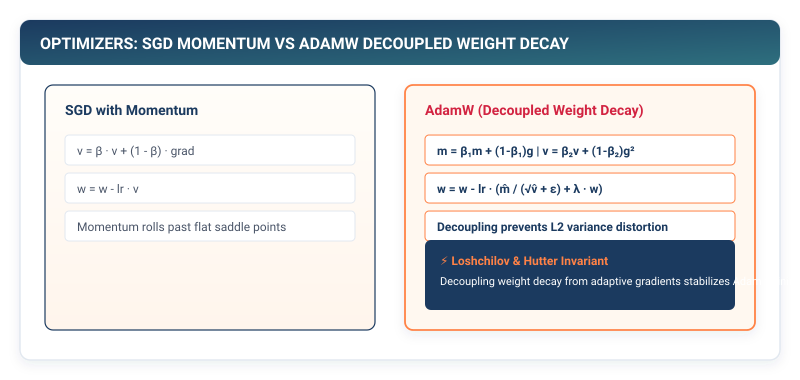

## Purpose {.unnumbered}

_Why does naive stochastic gradient descent oscillate erratically in high-dimensional loss landscapes, and how do momentum and adaptive learning rates conquer non-convex optimization?_

In Chapter 6, we implemented automatic differentiation, providing every parameter tensor with an exact mathematical gradient $\nabla_\theta \mathcal{L}$. However, having gradients is useless without an optimization algorithm to steer parameter updates. Naive Stochastic Gradient Descent (SGD) treats every dimension uniformly, causing parameter updates to oscillate violently across steep ravines while crawling along flat plateaus. **Optimizers** are the dynamical control systems of deep learning: they introduce physical momentum to dampen high-frequency oscillations, escape saddle points, and maintain per-parameter adaptive learning rates that normalize update steps across heterogeneous gradient scales. In a framework runtime, optimizers maintain stateful history buffers that consume substantial GPU memory, directly determining training throughput and stability.

::: {.callout-learning-objectives}
## Learning Objectives

- **Formulate** the parameter update invariant across Stochastic Gradient Descent (SGD), Momentum, Adam, and AdamW.
- **Analyze** the physical mechanics of momentum as a second-order dynamical system that dampens high-frequency gradient variance and rolls past zero-gradient saddle points.
- **Derive** Adam's first and second raw moment expectations and prove the mathematical necessity of time-step bias corrections ($\hat{\mathbf{m}}_t, \hat{\mathbf{v}}_t$).
- **Prove** why $L_2$ regularization pollutes the second moment variance estimate in adaptive optimizers, and implement decoupled weight decay (`AdamW`) to restore uniform parameter shrinkage.
- **Calculate** the exact hardware memory allocation footprint of optimizer state buffers ($16\text{ bytes per parameter}$ in FP32 / AMP AdamW).
- **Bridge** TinyTorch optimizers to production PyTorch `torch.optim.AdamW` with fused and multi-tensor CUDA kernels.
:::

---

## The Fundamental Parameter Update Invariant

Every optimizer in deep learning implements an iterative stateful update rule over parameter weights $\mathbf{\theta}_t \in \mathbb{R}^D$ given loss gradients $\mathbf{g}_t = \nabla_\theta \mathcal{L}(\mathbf{\theta}_t)$:

$$\mathbf{\theta}_{t+1} = \mathbf{\theta}_t - \eta \cdot \mathbf{u}(\mathbf{g}_1, \dots, \mathbf{g}_t)$$

where $\eta > 0$ is the learning rate and $\mathbf{u}(\cdot)$ is the transformed update vector.

```
┌─────────────────────────────────────────────────────────────┐
│  The Optimizer Hierarchy in Framework Architecture          │
├─────────────────────────────────────────────────────────────┤
│  1. Vanilla SGD : u_t = g_t (Memory: 0 extra bytes)         │
│  2. SGD Momentum: u_t = v_t (Memory: 4 bytes/param)         │
│  3. AdamW       : u_t = m_t / sqrt(v_t) + lambda * theta    │
│                   (Memory: 8 extra bytes/param)             │
└─────────────────────────────────────────────────────────────┘
```

---

## The Physics of Momentum and Ill-Conditioned Surfaces

In high-dimensional deep learning loss surfaces, the local curvature is characterized by the Hessian matrix $\mathbf{H} = \nabla^2 \mathcal{L}(\mathbf{\theta})$. The condition number $\kappa = \frac{\lambda_{\max}}{\lambda_{\min}}$ measures the ratio of maximum to minimum curvature eigenvalues.

When $\kappa \gg 1$ (an ill-conditioned ravine):
- The gradient along the steep perpendicular direction ($\mathbf{g}_\perp$) is massive, causing vanilla SGD to oscillate violently between ravine walls.
- The gradient along the flat parallel valley floor ($\mathbf{g}_\parallel$) is tiny, causing progress toward the minimum to stall.

::: {#fig-optimizers-momentum}


**Figure 7.1: Trajectory of SGD vs. Momentum in an Ill-Conditioned Ravine.** Vanilla SGD oscillates wildly across steep contours. Momentum accumulates forward velocity along the low-curvature valley, rapidly accelerating convergence.
:::

### Heavy-Ball Dynamics: Escaping Saddle Points

Polyak Momentum (1964) models optimization as a physical heavy ball with mass rolling down a potential energy surface with friction coefficient $\gamma$:

$$\ddot{\mathbf{\theta}}(t) + \gamma \dot{\mathbf{\theta}}(t) + \nabla \mathcal{L}(\mathbf{\theta}(t)) = \mathbf{0}$$

Discretizing this second-order ordinary differential equation yields the velocity accumulator update:

$$\mathbf{v}_t = \beta \mathbf{v}_{t-1} + (1 - \beta) \mathbf{g}_t, \quad \mathbf{\theta}_{t+1} = \mathbf{\theta}_t - \eta \mathbf{v}_t$$

where $\beta \in [0, 1)$ is the momentum decay factor (typically $\beta = 0.9$).

**Two Critical Physical Properties**:
1. **High-Frequency Damping**: Successive gradient vectors along oscillating directions alternate signs ($\mathbf{g}_{\perp, t} \approx -\mathbf{g}_{\perp, t-1}$), canceling out inside the accumulator ($\sum \mathbf{g}_\perp \to \mathbf{0}$).
2. **Saddle Point Escape**: At strict saddle points or flat plateaus where local gradient $\nabla \mathcal{L} \approx \mathbf{0}$, standard SGD becomes trapped. Momentum retains stored kinetic velocity ($\mathbf{v}_t = \beta \mathbf{v}_{t-1} \ne \mathbf{0}$), rolling the parameter trajectory through flat regions without stopping.

---

## Adam and AdamW: Adaptive Moment Estimation

**Adam (Kingma & Ba, 2014)** combines momentum with per-parameter adaptive learning rates by tracking both the exponentially decaying first raw moment (mean velocity $\mathbf{m}_t$) and second uncentered moment (variance $\mathbf{v}_t$):

$$\mathbf{m}_t = \beta_1 \mathbf{m}_{t-1} + (1 - \beta_1) \mathbf{g}_t, \quad \mathbf{v}_t = \beta_2 \mathbf{v}_{t-1} + (1 - \beta_2) \mathbf{g}_t^2$$

### Derivation of Initialization Bias Correction

Because moment accumulators are initialized to zero ($\mathbf{m}_0 = \mathbf{0}, \mathbf{v}_0 = \mathbf{0}$), early estimates are heavily biased toward zero.

Unrolling $\mathbf{m}_t$ recursively as a linear combination of past gradients:

$$\mathbf{m}_t = (1 - \beta_1) \sum_{i=1}^t \beta_1^{t-i} \mathbf{g}_i$$

Taking expectations under the assumption that the true gradient distribution $\mathbb{E}[\mathbf{g}_i] \approx \mathbb{E}[\mathbf{g}_t]$ is locally stationary:

$$\mathbb{E}[\mathbf{m}_t] = \mathbb{E}\left[ (1 - \beta_1) \sum_{i=1}^t \beta_1^{t-i} \mathbf{g}_i \right] = \mathbb{E}[\mathbf{g}_t] (1 - \beta_1) \sum_{i=1}^t \beta_1^{t-i} = \mathbb{E}[\mathbf{g}_t] (1 - \beta_1^t)$$

To obtain an unbiased estimator $\mathbb{E}[\hat{\mathbf{m}}_t] = \mathbb{E}[\mathbf{g}_t]$, we must rescale by $\frac{1}{1 - \beta_1^t}$:

$$\hat{\mathbf{m}}_t = \frac{\mathbf{m}_t}{1 - \beta_1^t}, \quad \hat{\mathbf{v}}_t = \frac{\mathbf{v}_t}{1 - \beta_2^t}$$

As $t \to \infty$, the correction factor $\beta^t \to 0$, naturally vanishing as training progresses.

---

### The $L_2$ Regularization vs. Decoupled Weight Decay Proof

In standard stochastic gradient descent, $L_2$ regularization ($\mathcal{L}_{\text{total}} = \mathcal{L} + \frac{\lambda}{2} \|\mathbf{\theta}\|^2$) is mathematically equivalent to weight decay:

$$\nabla_\theta \mathcal{L}_{\text{total}} = \mathbf{g}_t + \lambda \mathbf{\theta}_t \implies \mathbf{\theta}_{t+1} = \mathbf{\theta}_t - \eta (\mathbf{g}_t + \lambda \mathbf{\theta}_t) = (1 - \eta \lambda)\mathbf{\theta}_t - \eta \mathbf{g}_t$$

In adaptive optimizers (Adam), this equivalence completely breaks down.

If $L_2$ regularization is applied by adding $\lambda \mathbf{\theta}_t$ directly to the gradient $\mathbf{g}_t$, the polluted gradient $\mathbf{g}_t' = \mathbf{g}_t + \lambda \mathbf{\theta}_t$ enters the second raw moment accumulator:

$$\mathbf{v}_t = \beta_2 \mathbf{v}_{t-1} + (1 - \beta_2) (\mathbf{g}_t + \lambda \mathbf{\theta}_t)^2$$

::: {.callout-principle}
## The Variance Pollution Hazard

When a parameter $\theta_i$ has a large magnitude, the regularization term $(\lambda \theta_i)^2$ artificially inflates $v_{t,i}$. The resulting parameter update becomes:

$$\Delta \theta_i = -\frac{\eta}{\sqrt{\hat{v}_{t,i}} + \epsilon} (\hat{m}_{t,i} + \lambda \theta_i) \approx -\frac{\eta}{\lambda |\theta_i|} (\lambda \theta_i) = -\eta \cdot \text{sign}(\theta_i)$$

Parameters with **large magnitudes** have their effective regularization decay divided by $\sqrt{\hat{v}_{t,i}}$, receiving *smaller* relative shrinkage than parameters with small magnitudes—the exact opposite of the intended regularizer!
:::

**AdamW (Loshchilov & Hutter, 2017)** decouples weight decay from gradient moment accumulation, applying parameter shrinkage directly to the weight:

$$\mathbf{\theta}_{t+1} = \mathbf{\theta}_t - \eta \left( \frac{\hat{\mathbf{m}}_t}{\sqrt{\hat{\mathbf{v}}_t} + \epsilon} + \lambda \mathbf{\theta}_t \right)$$

This restores uniform, scale-invariant geometric decay across all model parameters.

---

## Implementing Optimizers in TinyTorch

```python
# Listing 7.1: The Optimizer Base Class and AdamW in TinyTorch
from tinytorch.core.tensor import Tensor
from typing import List
import numpy as np

class Optimizer:
    """Base class for all TinyTorch optimizers."""

    def __init__(self, params: List[Tensor], lr: float = 1e-3) -> None:
        self.params = params
        self.lr = lr

    def zero_grad(self) -> None:
        """Reset gradients of all parameters to zero."""
        for p in self.params:
            p.zero_grad()

    def step(self) -> None:
        raise NotImplementedError

class AdamW(Optimizer):
    """AdamW optimizer with decoupled weight decay."""

    def __init__(
        self,
        params: List[Tensor],
        lr: float = 1e-3,
        betas: tuple = (0.9, 0.999),
        eps: float = 1e-8,
        weight_decay: float = 1e-2
    ) -> None:
        super().__init__(params, lr)
        self.beta1, self.beta2 = betas
        self.eps = eps
        self.weight_decay = weight_decay
        self.t = 0

        # Optimizer state buffers (First & Second moments per parameter)
        self.m = [np.zeros_like(p.data) for p in self.params]
        self.v = [np.zeros_like(p.data) for p in self.params]

    def step(self) -> None:
        self.t += 1
        b1, b2 = self.beta1, self.beta2

        for i, p in enumerate(self.params):
            if p.grad is None:
                continue

            g = p.grad.data

            # 1. Update biased 1st and 2nd moments
            self.m[i] = b1 * self.m[i] + (1 - b1) * g
            self.v[i] = b2 * self.v[i] + (1 - b2) * (g ** 2)

            # 2. Bias corrections
            m_hat = self.m[i] / (1.0 - (b1 ** self.t))
            v_hat = self.v[i] / (1.0 - (b2 ** self.t))

            # 3. Decoupled weight decay + adaptive gradient step
            step_val = (m_hat / (np.sqrt(v_hat) + self.eps)) + (self.weight_decay * p.data)
            p.data -= self.lr * step_val
```

---

## Optimizer Memory Footprint Accounting

In large-scale systems, the optimizer state is often the single largest consumer of GPU VRAM.

For a model with $N$ parameters in standard IEEE 754 32-bit float (`float32` = 4 bytes):

| Component | Storage Type | Bytes per Parameter | Total (LLaMA-7B) |
| :--- | :--- | :---: | :---: |
| **Model Weights** ($\mathbf{\theta}$) | `float32` | $4\text{ bytes}$ | $28.0\text{ GB}$ |
| **Gradients** ($\mathbf{g}$) | `float32` | $4\text{ bytes}$ | $28.0\text{ GB}$ |
| **AdamW First Moment** ($\mathbf{m}$) | `float32` | $4\text{ bytes}$ | $28.0\text{ GB}$ |
| **AdamW Second Moment** ($\mathbf{v}$) | `float32` | $4\text{ bytes}$ | $28.0\text{ GB}$ |
| **Total Training Memory** | | **$16\text{ bytes}$** | **$112.0\text{ GB}$** |

::: {.callout-principle}
## The 16-Byte Rule of AdamW Training

Training an $N$-parameter model in standard FP32 AdamW requires at least **$16 \times N$ bytes of memory** just for parameter weights, gradients, and optimizer state buffers—excluding all activation memory.[^adam-mem]
:::

[^adam-mem]: This massive memory footprint motivated low-bit optimizers like 8-bit Adam (Dettmers et al., 2021) and ZeRO memory sharding (Rajbhandari et al., 2020).

::: {.callout-note}
## PyTorch Systems Bridge: `torch.optim.AdamW` and Fused Kernels

In PyTorch, training large models uses `torch.optim.AdamW` with `fused=True`:

```python
import torch

model = torch.nn.Linear(1024, 1024).cuda()
# Fused AdamW launches a single vectorized CUDA kernel for all parameters
optimizer = torch.optim.AdamW(model.parameters(), lr=1e-3, weight_decay=1e-2, fused=True)
```
Standard optimizer updates launch separate GPU kernels for every parameter tensor (reading weights, gradients, first moments, and second moments). `fused=True` combines multi-tensor parameter updates into a single vectorized kernel (`torch._foreach_add_`), slashing kernel launch overhead and GPU DRAM read traffic.[^fused-adamw]
:::

[^fused-adamw]: NVIDIA Apex and PyTorch Multi-Tensor apply libraries group hundreds of parameter pointers into a single array passed to a C++ kernel, saturating GPU memory bandwidth during parameter updates.

---

## Summary

In this chapter, we explored parameter optimization from first principles. We analyzed the physical dynamics of momentum, showing how velocity accumulators eliminate oscillations across ill-conditioned ravines.

We derived Adam and AdamW, implemented decoupled weight decay in pure Python, and established the rigorous $16\text{ bytes/parameter}$ memory accounting law governing deep learning training systems.

::: {.callout-takeaways}
## Chapter Takeaways

- **The Update Invariant**: Optimizers transform raw gradients $\mathbf{g}_t$ into smooth, variance-reduced parameter updates $\mathbf{\theta}_{t+1} = \mathbf{\theta}_t - \eta \mathbf{u}_t$.
- **Momentum Damping**: Velocity accumulation cancels perpendicular high-frequency oscillations while accelerating along the true low-curvature gradient direction.
- **Decoupled Weight Decay**: AdamW applies weight decay directly to weights rather than mixing it into the second moment accumulator, preserving regularized shrinkage.
- **Memory Multiplier**: State buffers in AdamW consume $8\text{ bytes}$ of extra memory per parameter, bringing total training memory to $16\text{ bytes/param}$.
:::

::: {.callout-chapter-connection}
## Chapter Connection: Closing the Training Loop

We now have parameter tensors (Ch 1), forward activations (Ch 2), layers (Ch 3), losses (Ch 4), dataloaders (Ch 5), autograd gradients (Ch 6), and optimizers (Ch 7). In **Chapter 8 (The Training Loop and Trainer Architecture)**, we assemble these components into the unified 5-step training contract and train complete neural networks.
:::
