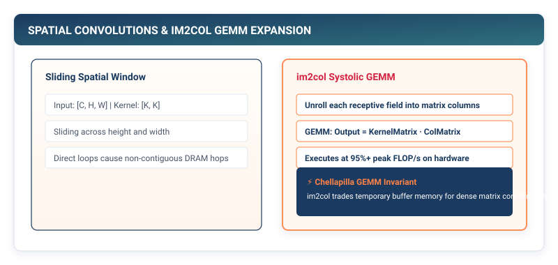

## Purpose {.unnumbered}

_Why does flattening an image destroy the fundamental inductive bias of the physical world?_

When an image is flattened into a one-dimensional feature vector to feed a dense linear layer, the geometric relationships between neighboring pixels are destroyed. A dense layer must learn separate, independent weights for every pixel coordinate, requiring millions of parameters and failing to recognize that a visual pattern (such as an edge, texture, or object) retains its identity regardless of where it appears in the frame (translation equivariance). Convolutions solve this parameter explosion by enforcing two fundamental physical priors: **local connectivity** and **spatial weight sharing**. However, executing 2D convolutions in software presents a severe systems challenge: naive sliding-window implementations require seven nested loops ($O(B \cdot C_{\text{out}} \cdot H_{\text{out}} \cdot W_{\text{out}} \cdot C_{\text{in}} \cdot K_h \cdot K_w)$), stalling CPU instruction pipelines. In a framework runtime, spatial operators are transformed into high-performance matrix multiplications via the memory-unrolling **`im2col` GEMM transform**.

::: {.callout-learning-objectives}
## Learning Objectives

- **Construct** stateful `Conv2d` layers encapsulating 4D weight tensors of shape $(C_{\text{out}}, C_{\text{in}}, K_h, K_w)$ with explicit padding and striding arithmetic.
- **Derive** the spatial output dimension formulas governing spatial resolution through convolutional and pooling layers.
- **Implement** `MaxPool2d` and `AvgPool2d` layers to achieve translational invariance and spatial feature downsampling.
- **Analyze** receptive field expansion, proving why stacking two $3 \times 3$ convolutions matches the receptive field of a single $5 \times 5$ convolution with 28% fewer parameters.
- **Evaluate** the systems transformation from 7-nested sliding window loops to the high-throughput `im2col` GEMM execution model.
:::

---

## The Failure of Dense Layers for Spatial Data

Consider classifying a standard high-resolution color image of size $224 \times 224 \times 3 = 150,528$ pixels using a dense `Linear` layer with $1024$ hidden units.

$$\text{Weight Matrix Size} = 150,528 \times 1024 = 154,140,672\text{ parameters}$$

Storing the weights of just this single layer requires over **$600\text{ MB}$ of RAM**. More critically, if an object shifts by a single pixel to the right, every input coordinate changes, forcing the dense layer to learn the object's visual appearance independently at every possible spatial location.

```
┌─────────────────────────────────────────────────────────────┐
│  Dense Linear Layer: No Spatial Inductive Bias              │
│  • Input: Flattened 1D array of 150,528 numbers             │
│  • Parameters: 154 Million weights (600 MB RAM for 1 layer) │
│  • Translation Invariance: ZERO (Must re-learn everywhere)   │
├─────────────────────────────────────────────────────────────┤
│  2D Convolutional Layer: Spatial Weight Sharing             │
│  • Input: Structured 4D Tensor (B, C, H, W)                 │
│  • Parameters (3x3, 64 filters): 3 * 3 * 3 * 64 = 1,728 params│
│  • Translation Invariance: BUILT-IN (Weights shared spatially)│
└─────────────────────────────────────────────────────────────┘
```

---

## The Mathematics of 2D Convolutions

A 2D convolutional layer slides a small bank of learnable parameter filters across the height and width of an input tensor $\mathbf{X} \in \mathbb{R}^{B \times C_{\text{in}} \times H_{\text{in}} \times W_{\text{in}}}$.

For a filter $c_{\text{out}}$ with kernel weights $\mathbf{W} \in \mathbb{R}^{C_{\text{in}} \times K \times K}$ and scalar bias $b_{c_{\text{out}}}$, the activation at output coordinate $(h, w)$ is the sum of element-wise products across all input channels and spatial kernel offsets:

$$\mathbf{Y}[b, c_{\text{out}}, h, w] = b_{c_{\text{out}}} + \sum_{c_{\text{in}}=0}^{C_{\text{in}}-1} \sum_{i=0}^{K-1} \sum_{j=0}^{K-1} \mathbf{X}[b, c_{\text{in}}, h \cdot S + i - P, w \cdot S + j - P] \cdot \mathbf{W}[c_{\text{out}}, c_{\text{in}}, i, j]$$

where $S$ is the stride and $P$ is the zero-padding size.

::: {#fig-conv2d-sliding}


**Figure 9.1: 2D Convolution Sliding Window.** A $3 \times 3$ filter slides across input channels. At each spatial position, the element-wise dot product produces a single output activation, preserving 2D spatial relationships.
:::

---

## Spatial Dimensions, Padding, and Striding Arithmetic

The spatial dimensions of the output tensor $(H_{\text{out}}, W_{\text{out}})$ are determined by the input dimensions, kernel size $K$, padding $P$, and stride $S$:

$$H_{\text{out}} = \left\lfloor \frac{H_{\text{in}} + 2P - K_h}{S} \right\rfloor + 1, \quad W_{\text{out}} = \left\lfloor \frac{W_{\text{in}} + 2P - K_w}{S} \right\rfloor + 1$$

- **Valid Padding ($P = 0$)**: No padding is added. The output shrinks by $(K - 1)$ pixels along each spatial dimension.
- **Same Padding ($P = \lfloor K/2 \rfloor$)**: With stride $S = 1$, padding preserves the exact spatial dimensions ($H_{\text{out}} = H_{\text{in}}$).

::: {.callout-principle}
## The Receptive Field Expansion Invariant

The **receptive field** is the spatial area of the original input image that contributes to a specific activation in a deeper layer.
- Layer 1 with $3 \times 3$ kernel: Receptive field is $3 \times 3$.
- Layer 2 with $3 \times 3$ kernel: Receptive field grows to $5 \times 5$.
- Stacking $L$ convolutional layers with $3 \times 3$ kernels produces an effective receptive field of:
  $$\text{RF} = 1 + L \times (K - 1) = 1 + 2L$$

Stacking two $3 \times 3$ layers uses $2 \times (3^2) = 18$ weights per channel, whereas a single $5 \times 5$ layer requires $25$ weights—achieving the identical receptive field with a 28% parameter reduction and an extra non-linear activation.
:::

---

## Implementing Conv2d in TinyTorch

In TinyTorch, the `Conv2d` layer encapsulates a 4D weight parameter tensor of shape $(C_{\text{out}}, C_{\text{in}}, K, K)$ and a 1D bias vector of shape $(C_{\text{out}},)$:

```python
# Listing 9.1: The Conv2d Layer in TinyTorch
from tinytorch.core.tensor import Tensor
from tinytorch.core.layers import Layer
from typing import List, Optional, Tuple
import numpy as np

class Conv2d(Layer):
    """
    2D Convolutional Layer for spatial feature extraction.
    
    Weights shape: (out_channels, in_channels, kernel_size, kernel_size)
    """

    def __init__(
        self,
        in_channels: int,
        out_channels: int,
        kernel_size: int = 3,
        stride: int = 1,
        padding: int = 0,
        bias: bool = True
    ) -> None:
        self.in_channels = in_channels
        self.out_channels = out_channels
        self.kernel_size = kernel_size
        self.stride = stride
        self.padding = padding

        # Kaiming He initialization: std = sqrt(2 / fan_in)
        fan_in = in_channels * kernel_size * kernel_size
        std = np.sqrt(2.0 / fan_in)
        weight_data = np.random.normal(0.0, std, (out_channels, in_channels, kernel_size, kernel_size)).astype(np.float32)
        self.weight = Tensor(weight_data, requires_grad=True)

        if bias:
            self.bias = Tensor(np.zeros(out_channels, dtype=np.float32), requires_grad=True)
        else:
            self.bias = None

    def forward(self, x: Tensor) -> Tensor:
        """
        Execute 2D convolution over batch tensor of shape (B, C_in, H, W).
        """
        B, C_in, H, W = x.shape
        K = self.kernel_size
        S = self.stride
        P = self.padding

        # Calculate output spatial dimensions
        H_out = (H + 2 * P - K) // S + 1
        W_out = (W + 2 * P - K) // S + 1

        # Apply zero-padding to input if P > 0
        if P > 0:
            x_pad = np.pad(x.data, ((0, 0), (0, 0), (P, P), (P, P)), mode='constant')
        else:
            x_pad = x.data

        out = np.zeros((B, self.out_channels, H_out, W_out), dtype=np.float32)

        # Sliding window evaluation across batch and spatial grid
        for b in range(B):
            for c_out in range(self.out_channels):
                w_filter = self.weight.data[c_out]  # Shape: (C_in, K, K)
                for h_out in range(H_out):
                    h_start = h_out * S
                    h_end = h_start + K
                    for w_out_idx in range(W_out):
                        w_start = w_out_idx * S
                        w_end = w_start + K
                        
                        # Extract 3D patch: (C_in, K, K)
                        patch = x_pad[b, :, h_start:h_end, w_start:w_end]
                        val = np.sum(patch * w_filter)
                        if self.bias is not None:
                            val += self.bias.data[c_out]
                        out[b, c_out, h_out, w_out_idx] = val

        return Tensor(out)

    def parameters(self) -> List[Tensor]:
        if self.bias is not None:
            return [self.weight, self.bias]
        return [self.weight]
```

---

## Spatial Downsampling: MaxPool2d and AvgPool2d

To aggregate features and reduce spatial resolution (reducing memory and compute in deeper layers), vision architectures insert pooling layers.

- **`MaxPool2d`**: Selects the maximum activation within each spatial window, providing invariance to small spatial shifts.
- **`AvgPool2d`**: Computes the arithmetic mean within each window, producing a smoothed summary.

```python
# Listing 9.2: MaxPool2d Implementation in TinyTorch
class MaxPool2d(Layer):
    """Max pooling layer for spatial dimension reduction."""

    def __init__(self, kernel_size: int = 2, stride: Optional[int] = None) -> None:
        self.kernel_size = kernel_size
        self.stride = stride if stride is not None else kernel_size

    def forward(self, x: Tensor) -> Tensor:
        B, C, H, W = x.shape
        K = self.kernel_size
        S = self.stride

        H_out = (H - K) // S + 1
        W_out = (W - K) // S + 1
        out = np.zeros((B, C, H_out, W_out), dtype=np.float32)

        for b in range(B):
            for c in range(C):
                for h in range(H_out):
                    h_start = h * S
                    for w in range(W_out):
                        w_start = w * S
                        patch = x.data[b, c, h_start:h_start+K, w_start:w_start+K]
                        out[b, c, h, w] = np.max(patch)

        return Tensor(out)
```

---


::: {.callout-note}
## PyTorch Systems Bridge: `torch.nn.Conv2d` and cuDNN Engine Selection

When you instantiate `torch.nn.Conv2d` in PyTorch, the runtime does not execute nested loops. It delegates to **NVIDIA cuDNN**, which profiles multiple execution algorithms at runtime (`torch.backends.cudnn.benchmark=True`):
1. **Direct GEMM via `im2col`**: Unrolls patches for moderate image sizes.
2. **Winograd Convolution**: Uses minimal filtering algorithms to compute $3 	imes 3$ convolutions with 2.25× fewer multiplications.
3. **FFT-based Convolution**: Transforms large kernels ($7 	imes 7+$) into the frequency domain via Fast Fourier Transforms.
:::

## Systems Reality: The `im2col` GEMM Transformation

While nested Python loops illustrate the mathematical definition of convolution, their execution speed is crippled by loop overhead and uncoalesced memory reads.

Production frameworks (PyTorch, cuDNN, TensorRT) lower 2D convolutions into a single **General Matrix Multiplication (GEMM)** using the **`im2col`** (image-to-column) transformation:

```
┌─────────────────────────────────────────────────────────────┐
│  The im2col GEMM Pipeline                                   │
├─────────────────────────────────────────────────────────────┤
│  1. Unroll Input Patches (im2col):                          │
│     Input Image (B, C_in, H, W) ──> Matrix (N_patches, C_in*K*K)│
│                                                             │
│  2. Reshape Filters:                                        │
│     Filters (C_out, C_in, K, K) ──> Matrix (C_in*K*K, C_out)│
│                                                             │
│  3. Execute High-Speed GEMM:                                │
│     Output Matrix = Patches @ Filters  (BLAS / Tensor Cores)│
│                                                             │
│  4. Reshape to Output Tensor (col2im):                      │
│     Output Matrix ──> Output Tensor (B, C_out, H_out, W_out)│
└─────────────────────────────────────────────────────────────┘
```

By unrolling spatial patches into a dense 2D matrix, convolution is transformed into standard matrix multiplication, enabling hardware systolic arrays (such as NVIDIA Tensor Cores) to execute convolutions at peak hardware TFLOPs.

---

## Assembling a Convolutional Neural Network (CNN)

We can now combine `Conv2d`, `ReLU`, `MaxPool2d`, and `Linear` into a complete convolutional vision architecture:

```python
# Listing 9.3: Assembling a CNN in TinyTorch
from tinytorch.core.layers import Sequential, Linear
from tinytorch.core.activations import ReLU

# Define LeNet-style Vision Architecture
class Flatten(Layer):
    """Flattens 4D tensor (B, C, H, W) to 2D matrix (B, C*H*W)."""
    def forward(self, x: Tensor) -> Tensor:
        B = x.shape[0]
        return Tensor(x.data.reshape(B, -1))

cnn_model = Sequential(
    # Block 1: (B, 1, 28, 28) -> (B, 6, 14, 14)
    Conv2d(in_channels=1, out_channels=6, kernel_size=3, padding=1),
    ReLU(),
    MaxPool2d(kernel_size=2, stride=2),
    
    # Block 2: (B, 6, 14, 14) -> (B, 16, 7, 7)
    Conv2d(in_channels=6, out_channels=16, kernel_size=3, padding=1),
    ReLU(),
    MaxPool2d(kernel_size=2, stride=2),
    
    # Classifier Head: 16 * 7 * 7 = 784 features -> 10 classes
    Flatten(),
    Linear(in_features=784, out_features=120),
    ReLU(),
    Linear(in_features=120, out_features=10)
)

print(f"CNN Model constructed with {len(cnn_model.parameters())} parameter tensors.")
```

---

## Summary

In this chapter, we expanded TinyTorch into spatial computing by constructing 2D convolutions and pooling layers. We proved why dense layers fail on visual data, demonstrating how local connectivity and spatial weight sharing provide translation equivariance while reducing parameter counts by orders of magnitude.

We derived the spatial dimension equations governing padding and striding, proved how stacking small $3 \times 3$ filters expands receptive fields with superior parameter efficiency, and built `Conv2d` and `MaxPool2d`. Finally, we analyzed the `im2col` transformation that enables production frameworks to execute convolutions as high-throughput matrix multiplications.

::: {.callout-takeaways}
## Chapter Takeaways

- **Spatial Weight Sharing**: Convolutions reuse a small bank of $(C_{\text{out}}, C_{\text{in}}, K, K)$ parameter filters across all spatial positions, guaranteeing translation equivariance.
- **Receptive Field Scaling**: Stacking $L$ layers of $3 \times 3$ convolutions yields a receptive field of $(1 + 2L)$, matching larger single kernels with fewer parameters and greater non-linear depth.
- **Padding and Striding**: Output dimensions follow $\lfloor (H + 2P - K)/S \rfloor + 1$; Same Padding ($P = \lfloor K/2 \rfloor$) preserves spatial resolution when $S = 1$.
- **Spatial Pooling**: Max pooling selects peak activations within local windows, providing robustness against small translations while downsampling spatial resolution.
- **The im2col Transformation**: Modern runtimes unroll overlapping image patches into dense matrices, executing spatial convolutions as optimized GEMM matrix multiplications.
:::

::: {.callout-chapter-connection}
## Chapter Connection: Moving from Pixels to Natural Language

We have conquered spatial representations for vision, but how do modern frameworks process sequential discrete data like human language? In **Chapter 10 (Subword Tokenization and Vocabulary Construction)**, we transition into Natural Language Processing by building Byte-Pair Encoding (BPE) tokenizers from scratch.
:::
