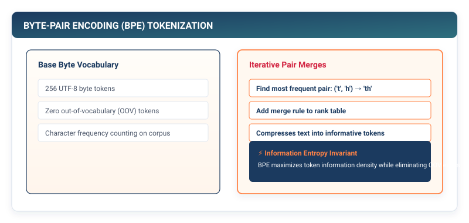

## Purpose {.unnumbered}

_Why is the choice of tokenization algorithm the primary bottleneck on transformer context length and embedding table memory?_

Neural networks are continuous mathematical engines operating on vectors of floating-point numbers, whereas human language is composed of discrete, variable-length symbolic strings. Before a language model can execute a single matrix multiplication, raw text must be converted into a sequence of discrete integer token identifiers ($T \in \{0, 1, \dots, V-1\}^S$). The choice of tokenization granularity dictates a fundamental systems trade-off: word-level tokenization creates massive vocabularies ($V > 1,000,000$), causing embedding tables to consume gigabytes of memory and failing completely on unseen words (Out-Of-Vocabulary errors); conversely, character-level tokenization creates tiny vocabularies ($V \approx 256$) but expands sequence length $S$ by 4× to 5×, which inflates the quadratic $O(S^2)$ compute cost of transformer attention by 25×. Subword **Byte-Pair Encoding (BPE)** resolves this dilemma by finding the optimal information-theoretic compression frontier between vocabulary size and sequence length.

::: {.callout-learning-objectives}
## Learning Objectives

- **Construct** the `Tokenizer` base class and implement `CharTokenizer` and `BPETokenizer` in pure Python.
- **Implement** the iterative Byte-Pair Encoding merge algorithm, extracting statistical character pair frequencies across training corpora.
- **Analyze** the Pareto trade-off between vocabulary size $V$ (embedding table memory footprint) and tokenized sequence length $S$ (quadratic attention compute cost).
- **Design** reversible encoding and decoding pipelines with dedicated handling for out-of-vocabulary (`<UNK>`) and boundary tokens (`<BOS>`, `<EOS>`).
- **Evaluate** why modern Large Language Models (GPT-4, LLaMA) standardized on BPE tokenizers with $V \approx 32,000 - 100,000$.
:::

---

## 10.1 The Discrete-to-Continuous Bridge in NLP

To process natural language, a machine learning framework must execute a two-stage translation:

$$\text{Raw Text (String)} \xrightarrow{\quad \text{Tokenizer (Ch 10)} \quad} \text{Token IDs (Integers } \mathbb{Z}^S \text{)} \xrightarrow{\quad \text{Embedding Layer (Ch 11)} \quad} \text{Continuous Vectors } \mathbb{R}^{S \times D}$$

```
┌─────────────────────────────────────────────────────────────┐
│  The NLP Ingestion Pipeline                                 │
├─────────────────────────────────────────────────────────────┤
│  1. Raw Text:    "Machine learning systems are fast"        │
│                         │ (Tokenizer)                       │
│                         ▼                                   │
│  2. Token IDs:   [1482, 3819, 2901, 461, 2810]              │
│                         │ (Embedding Lookup)                │
│                         ▼                                   │
│  3. Vectors:     Matrix of shape (5, 768) in float32        │
└─────────────────────────────────────────────────────────────┘
```

The tokenizer's responsibility is to map strings into integer indices and back, managing a discrete vocabulary dictionary:

$$\text{Vocabulary: } \mathcal{V} = \{ \text{token}_0: 0, \text{token}_1: 1, \dots, \text{token}_{V-1}: V-1 \}$$

---

## 10.2 The Tokenization Granularity Dilemma

```
┌─────────────────────────────────────────────────────────────┐
│  Granularity Comparison on: "unhappiness"                   │
├─────────────────────────────────────────────────────────────┤
│  1. Word-Level:                                             │
│     • Tokens: ["unhappiness"] (1 token)                     │
│     • Vocab Size: Huge (1,000,000+ words).                  │
│     • Failure Mode: Out-of-Vocabulary (OOV) on new words.   │
├─────────────────────────────────────────────────────────────┤
│  2. Character-Level:                                        │
│     • Tokens: ['u','n','h','a','p','p','i','n','e','s','s']│
│     • Vocab Size: Tiny (256 ASCII / Unicode bytes).         │
│     • Failure Mode: Sequence length S explodes 11x!         │
│       O(S^2) attention compute increases by 121x!           │
├─────────────────────────────────────────────────────────────┤
│  3. Subword (BPE):                                          │
│     • Tokens: ["un", "happi", "ness"] (3 tokens)            │
│     • Vocab Size: Tunable (e.g., 32,000 tokens).            │
│     • Property: Zero OOV (falls back to characters);        │
│       compact sequence length S.                            │
└─────────────────────────────────────────────────────────────┘
```

::: {.callout-principle}
## The Vocabulary vs. Sequence Length Trade-off

For a fixed text corpus of $N$ characters:
- **Embedding Table Memory**: Scales linearly with vocabulary size $V \times D \times 4\text{ bytes}$.
- **Attention Computation**: Scales quadratically with tokenized sequence length $O(S^2)$.

BPE tokenization allows framework designers to select an exact vocabulary size (typically $V = 32,000$ to $100,000$) that balances embedding memory against sequence length.
:::

---

## 10.3 The Byte-Pair Encoding (BPE) Algorithm

Byte-Pair Encoding (Sennrich et al., 2015; Radford et al., 2019) is a data-driven compression algorithm that constructs a subword vocabulary from a training text corpus:

1. **Initialize Vocabulary**: Start with all individual base characters (or bytes) present in the training text.
2. **Frequency Counting**: Tokenize the text into individual characters and count the frequency of all adjacent symbol pairs.
3. **Merge Most Frequent Pair**: Identify the most frequent pair $(A, B)$, create a new merged token $AB$, and add it to the vocabulary.
4. **Repeat**: Iterate steps 2 and 3 until the desired vocabulary size $V$ or target number of merges is reached.

::: {#fig-bpe-merging}


**Figure 10.1: Byte-Pair Encoding Merge Progression.** Base characters are iteratively combined based on corpus frequency: `'l'` + `'o'` $\to$ `'lo'`, `'l'` + `'o'` $\to$ `'lo'`, `'lo'` + `'w'` $\to$ `'low'`.
:::

---

## 10.4 Implementing BPETokenizer in TinyTorch

```python
# Listing 10.1: The BPE Tokenizer Engine in TinyTorch
from collections import Counter
from typing import Dict, List, Tuple, Optional

class BPETokenizer:
    """Byte-Pair Encoding (BPE) tokenizer implemented from scratch."""

    def __init__(self, vocab_size: int = 256) -> None:
        self.target_vocab_size = vocab_size
        self.merges: List[Tuple[str, str]] = []
        self.token_to_id: Dict[str, int] = {}
        self.id_to_token: Dict[int, str] = {}
        self.unk_token = "<UNK>"

    def _get_stats(self, splits: List[List[str]]) -> Counter:
        """Count frequencies of adjacent token pairs across all words."""
        pairs = Counter()
        for word in splits:
            for i in range(len(word) - 1):
                pairs[(word[i], word[i + 1])] += 1
        return pairs

    def train(self, corpus: str) -> None:
        """Train BPE merges on a raw text corpus."""
        # 1. Initialize with unique base characters
        words = corpus.split()
        splits = [[char for char in word] for word in words]
        
        # Build base vocabulary
        unique_chars = sorted(list(set("".join(corpus.split()))))
        base_vocab = [self.unk_token] + unique_chars
        for idx, token in enumerate(base_vocab):
            self.token_to_id[token] = idx
            self.id_to_token[idx] = token

        # 2. Iteratively merge most frequent pairs
        num_merges = self.target_vocab_size - len(self.token_to_id)
        for _ in range(max(0, num_merges)):
            stats = self._get_stats(splits)
            if not stats:
                break
                
            # Find most frequent pair
            best_pair = stats.most_common(1)[0][0]
            self.merges.append(best_pair)
            
            # Register new merged token
            new_token = "".join(best_pair)
            new_id = len(self.token_to_id)
            self.token_to_id[new_token] = new_id
            self.id_to_token[new_id] = new_token
            
            # Apply merge to active splits
            new_splits = []
            for word in splits:
                new_word = []
                i = 0
                while i < len(word):
                    if i < len(word) - 1 and (word[i], word[i + 1]) == best_pair:
                        new_word.append(new_token)
                        i += 2
                    else:
                        new_word.append(word[i])
                        i += 1
                new_splits.append(new_word)
            splits = new_splits

    def encode(self, text: str) -> List[int]:
        """Encode string into list of token integer IDs."""
        words = text.split()
        token_ids = []
        
        for word in words:
            # Start with characters
            subwords = [c for c in word]
            
            # Apply learned merges in order of creation
            for pair in self.merges:
                merged_token = "".join(pair)
                new_subwords = []
                i = 0
                while i < len(subwords):
                    if i < len(subwords) - 1 and (subwords[i], subwords[i + 1]) == pair:
                        new_subwords.append(merged_token)
                        i += 2
                    else:
                        new_subwords.append(subwords[i])
                        i += 1
                subwords = new_subwords

            # Map to IDs
            for sw in subwords:
                token_ids.append(self.token_to_id.get(sw, self.token_to_id[self.unk_token]))
                
        return token_ids

    def decode(self, token_ids: List[int]) -> str:
        """Decode list of integer IDs back to string."""
        tokens = [self.id_to_token.get(idx, self.unk_token) for idx in token_ids]
        return " ".join(tokens)
```

---

## 10.5 Vocabulary Management and Special Tokens

In production language models, tokenizers reserve special non-linguistic tokens for framework control flow:

```
┌─────────────────────────────────────────────────────────────┐
│  Special Token Architecture                                 │
├─────────────────────────────────────────────────────────────┤
│  • <PAD> (ID: 0) : Pads variable-length sequences in batch. │
│  • <UNK> (ID: 1) : Represents unrecognized characters.      │
│  • <BOS> (ID: 2) : Beginning of sequence marker.            │
│  • <EOS> (ID: 3) : End of sequence / generation stop flag.  │
└─────────────────────────────────────────────────────────────┘
```

When batching text of different lengths (e.g., Sentence 1 has 12 tokens, Sentence 2 has 20 tokens), the data pipeline pads Sentence 1 with eight `<PAD>` tokens to construct a uniform 2D tensor of shape $(B, S) = (2, 20)$.

---


::: {.callout-note}
## Production Systems Bridge: OpenAI `tiktoken` and Rust Tokenizers

In modern LLM production stacks, tokenizers are implemented in Rust (such as Hugging Face `tokenizers` and OpenAI `tiktoken`) using multi-threaded chunking and byte-level BPE:

```python
import tiktoken

# Cl100k_base tokenizer used by GPT-4 (Vocab Size: 100,277)
enc = tiktoken.get_encoding("cl100k_base")
tokens = enc.encode("Machine learning systems are fast")
print("Token IDs:", tokens)
print("Decoded:", enc.decode(tokens))
```
These tokenizers process text at over **10 Megabytes/second per CPU core**, guaranteeing that token ingestion never bottlenecks GPU training pipelines.[^tiktoken-rust]
:::

[^tiktoken-rust]: OpenAI's `tiktoken` uses regex splitting into word chunks followed by parallel hash-table pair lookups, executing in sub-microsecond latency.

## 10.6 Systems Reality: Tokenizer Speed and Memory Footprint

In production inference servers (such as vLLM or Hugging Face Text Generation Inference), tokenization runs on the host CPU while the GPU executes transformer matrix multiplications.

If an unoptimized Python tokenizer takes $5\text{ ms}$ to tokenize a prompt, but the GPU generates the first token in $2\text{ ms}$, the system is **tokenizer-bound**, leaving expensive accelerator hardware idle.

For this reason, industrial frameworks implement BPE tokenizers in Rust or C++ (e.g., Hugging Face `tokenizers` library) using Aho-Corasick string matching and multi-threaded parallel chunking.

::: {.callout-checkpoint}
## Check Your Understanding: Embedding Memory Calculation

Suppose we configure a language model with hidden dimension $D = 4096$.

1. What is the memory footprint of the embedding table if we use a word-level tokenizer with $V = 1,000,000$ in `float32`?
2. What is the memory footprint if we use a BPE tokenizer with $V = 32,000$?

*Solution:*
- Word-Level Table: $1,000,000 \times 4096 \times 4\text{ bytes} = 16,384,000,000\text{ bytes} \approx 16.38\text{ GB}$.
- BPE Table: $32,000 \times 4096 \times 4\text{ bytes} = 524,288,000\text{ bytes} \approx 524.3\text{ MB}$.

Switching from word-level to BPE subwords reduces embedding memory by **$15.8\text{ GB}$**, freeing crucial GPU VRAM for model weights and activation caches.
:::

---

## Summary

In this chapter, we constructed the first component of TinyTorch's Natural Language Processing engine: the tokenizer. We analyzed the fundamental dilemma between word-level, character-level, and subword tokenization, proving how BPE optimizes the trade-off between embedding table memory and quadratic attention sequence length.

We implemented the complete `BPETokenizer` in pure Python, extracting pair frequencies and executing iterative subword merges. We examined special token conventions (`<PAD>`, `<UNK>`, `<EOS>`) required for batched transformer execution, and calculated the physical RAM savings achieved by subword vocabularies.

::: {.callout-takeaways}
## Chapter Takeaways

- **Discrete-to-Continuous Bridge**: Tokenizers convert variable-length discrete text strings into integer token IDs $\mathbb{Z}^S$ for downstream embedding tables.
- **The BPE Invariant**: Byte-Pair Encoding merges frequent character pairs into subwords, eliminating Out-of-Vocabulary errors while maintaining compact sequence lengths.
- **Embedding vs. Sequence Cost**: Vocabulary size $V$ dictates embedding table RAM ($V \times D$), while sequence length $S$ dictates attention compute ($O(S^2)$).
- **Special Tokens**: `<PAD>`, `<BOS>`, `<EOS>`, and `<UNK>` provide essential control signals for mini-batch collation and autoregressive generation stopping.
- **Host Tokenizer Throughput**: High-throughput inference requires fast tokenizers to prevent CPU string processing from bottlenecking GPU matrix engines.
:::

::: {.callout-chapter-connection}
## Chapter Connection: From Token IDs to Continuous Embeddings

Now that we can convert text into integer token arrays, how do we map discrete IDs into dense, continuous vector spaces? In **Chapter 11 (Representing Sequences: Embeddings and Positional Encoding)**, we construct embedding lookup tables, sinusoidal positional encodings, and learned sequence representations.
:::
