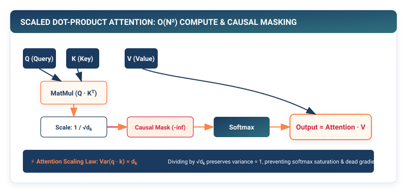

## Purpose {.unnumbered}

_Why did scaled dot-product attention replace recurrent memory cells across the entire landscape of artificial intelligence?_

Prior to the transformer, sequence processing relied on Recurrent Neural Networks (RNNs, LSTMs, and GRUs) that updated a fixed-size hidden state vector $\mathbf{h}_t$ sequentially token-by-token. This sequential dependency created two fatal bottlenecks: computational unrolling prohibited hardware parallelism across time steps ($O(S)$ sequential latency), and sequential backpropagation compressed long-range context through an information bottleneck, suffering from vanishing gradients. Attention shatters this paradigm by establishing direct $O(1)$ routing connections between every token pair in a sequence, retrieving context dynamically via **Query-Key-Value (QKV)** dot products. In a framework runtime, attention replaces sequential loops with dense, parallel matrix multiplications, but introduces a new systems challenge: the pairwise similarity matrix requires $O(S^2)$ memory and arithmetic, creating the infamous **quadratic attention memory wall**.

::: {.callout-learning-objectives}
## Learning Objectives

- **Formulate** the Query-Key-Value information retrieval mechanism and derive the variance stabilization scaling factor $\frac{1}{\sqrt{d_k}}$.
- **Implement** `scaled_dot_product_attention` in pure Python, supporting both bidirectional and causal autoregressive masking.
- **Construct** `MultiHeadAttention` with parallel head projection, 4D tensor reshaping $(B, H, S, d_k)$, and linear output recombination.
- **Calculate** the exact memory allocation footprint of intermediate attention score matrices across varying sequence lengths ($S = 512 \to 8192$).
- **Evaluate** the systems transition from naive materialization of $S \times S$ attention maps to tile-based IO-aware kernel fusion (FlashAttention).
:::

---

## The Information Bottleneck of Recurrence

In an RNN, information from token 1 must pass through $S-1$ recurrent state transitions to reach token $S$:

$$\mathbf{h}_t = \tanh(\mathbf{W}_{hh} \mathbf{h}_{t-1} + \mathbf{W}_{xh} \mathbf{x}_t)$$

```
┌─────────────────────────────────────────────────────────────┐
│  Recurrent Neural Network: Sequential Information Bottleneck│
├─────────────────────────────────────────────────────────────┤
│  Token 1 ──> [Cell 1] ──> [Cell 2] ──> ... ──> [Cell S]     │
│                 │            │                    │         │
│                 ▼            ▼                    ▼         │
│             Hidden h1    Hidden h2            Hidden hS     │
│  • Parallelism across time: ZERO (Must wait for h_{t-1})    │
│  • Maximum path length between tokens: O(S)                 │
├─────────────────────────────────────────────────────────────┤
│  Self-Attention: Direct Parallel Interconnect               │
├─────────────────────────────────────────────────────────────┤
│  Token 1 <──────────────────────────────────────> Token S   │
│  • Parallelism across time: FULL (Matrix multiplications)   │
│  • Maximum path length between tokens: O(1)                 │
└─────────────────────────────────────────────────────────────┘
```

Attention replaces sequential unrolling with direct pairwise dot products, reducing the maximum path length between any two tokens in a document from $O(S)$ to $O(1)$.

---

## The Query-Key-Value Paradigm

Attention formulates sequence interaction as a differentiable database retrieval system:

- **Query ($\mathbf{Q} \in \mathbb{R}^{S \times d_k}$)**: What the current token is searching for.
- **Key ($\mathbf{K} \in \mathbb{R}^{S \times d_k}$)**: What each candidate token in the sequence contains.
- **Value ($\mathbf{V} \in \mathbb{R}^{S \times d_v}$)**: The actual semantic payload retrieved if the Query matches the Key.

For an input matrix $\mathbf{X} \in \mathbb{R}^{S \times D}$, the three matrices are computed via learned linear projections:

$$\mathbf{Q} = \mathbf{X} \mathbf{W}_Q, \quad \mathbf{K} = \mathbf{X} \mathbf{W}_K, \quad \mathbf{V} = \mathbf{X} \mathbf{W}_V$$

where $\mathbf{W}_Q, \mathbf{W}_K \in \mathbb{R}^{D \times d_k}$ and $\mathbf{W}_V \in \mathbb{R}^{D \times d_v}$.

::: {#fig-qkv-attention}


**Figure 12.1: Scaled Dot-Product Attention Mechanism.** Queries and Keys are multiplied to produce pairwise affinity logits. After scaling and causal masking, Softmax normalizes affinities into attention weights that linearly blend Value vectors.
:::

---

## Scaled Dot-Product Attention

The attention weights between all token pairs are computed via the scaled dot-product formula:

$$\text{Attention}(\mathbf{Q}, \mathbf{K}, \mathbf{V}) = \text{softmax}\left( \frac{\mathbf{Q} \mathbf{K}^T}{\sqrt{d_k}} + \mathbf{M} \right) \mathbf{V}$$

### Why the Scale Factor $\frac{1}{\sqrt{d_k}}$ is Mandatory

Assume the components of $\mathbf{q}$ and $\mathbf{k}$ are independent random variables with zero mean and unit variance: $\mathbb{E}[q_i] = 0, \text{Var}(q_i) = 1$.

The dot product $z = \mathbf{q} \cdot \mathbf{k} = \sum_{i=1}^{d_k} q_i k_i$ has mean zero and variance:

$$\text{Var}(z) = \sum_{i=1}^{d_k} \text{Var}(q_i k_i) = \sum_{i=1}^{d_k} \text{Var}(q_i)\text{Var}(k_i) = d_k$$

For high-dimensional embeddings (e.g., $d_k = 128$), the variance of raw dot products is $128$, producing standard deviations of $\approx 11.3$. When values of magnitude $\pm 15$ are fed into `Softmax`, the exponential function saturates: the largest element receives an output probability of $1.0$, while all other elements receive $0.0$.

In this saturated regime, the gradient of Softmax vanishes to zero ($\frac{\partial s_i}{\partial z_j} \approx 0$), halting gradient backpropagation. Dividing by $\sqrt{d_k}$ rescales the variance back to unit variance ($1.0$), ensuring stable gradients.

---

## Causal Masking: Enforcing the Arrow of Time

In autoregressive language generation (GPT), token $i$ must not attend to future tokens $j > i$.

To enforce this causal constraint without disrupting parallel matrix multiplications, frameworks apply an upper-triangular **Causal Mask** $\mathbf{M} \in \mathbb{R}^{S \times S}$:

$$\mathbf{M}_{ij} = \begin{cases} 0 & \text{if } j \le i \\ -\infty \quad (\text{or } -10^9) & \text{if } j > i \end{cases}$$

When added to the scaled scores before Softmax:

$$\text{softmax}\left( \frac{\mathbf{Q} \mathbf{K}^T}{\sqrt{d_k}} + \mathbf{M} \right)_{ij} = \frac{e^{z_{ij} + M_{ij}}}{\sum_k e^{z_{ik} + M_{ik}}} = \frac{e^{-\infty}}{\sum \dots} = 0 \quad \forall j > i$$

```
┌─────────────────────────────────────────────────────────────┐
│  Causal Attention Mask Matrix M (4 x 4 Sequence)            │
├─────────────────────────────────────────────────────────────┤
│               Token 0   Token 1   Token 2   Token 3         │
│  Token 0: [      0,       -inf,     -inf,     -inf   ]      │
│  Token 1: [      0,         0,      -inf,     -inf   ]      │
│  Token 2: [      0,         0,        0,      -inf   ]      │
│  Token 3: [      0,         0,        0,        0    ]      │
└─────────────────────────────────────────────────────────────┘
```

---

## Multi-Head Attention: Parallel Subspaces

Rather than performing a single attention function with $D$-dimensional keys and values, **Multi-Head Attention (MHA)** projects the queries, keys, and values $H$ times into lower-dimensional subspaces of dimension $d_k = D / H$:

$$\text{head}_h = \text{Attention}(\mathbf{Q} \mathbf{W}_Q^{(h)}, \mathbf{K} \mathbf{W}_K^{(h)}, \mathbf{V} \mathbf{W}_V^{(h)})$$

$$\text{MultiHead}(\mathbf{Q}, \mathbf{K}, \mathbf{V}) = \text{Concat}(\text{head}_1, \text{head}_2, \dots, \text{head}_H) \mathbf{W}_O$$

where $\mathbf{W}_O \in \mathbb{R}^{D \times D}$ linearly recombines the outputs of all heads.

Multi-head projections allow the network to jointly attend to information from different representation subspaces at different positions (e.g., Head 1 tracks grammatical syntax, Head 2 tracks pronoun reference, and Head 3 tracks punctuation).

---

## Implementing MultiHeadAttention in TinyTorch

```python
# Listing 12.1: MultiHeadAttention Implementation in TinyTorch
from tinytorch.core.tensor import Tensor
from tinytorch.core.layers import Layer, Linear
from tinytorch.core.activations import Softmax
from typing import List, Optional, Tuple
import numpy as np

def scaled_dot_product_attention(
    q: Tensor,
    k: Tensor,
    v: Tensor,
    mask: Optional[Tensor] = None
) -> Tuple[Tensor, Tensor]:
    """
    Compute Scaled Dot-Product Attention over 4D tensors (B, H, S, d_k).
    """
    d_k = q.shape[-1]
    scale = 1.0 / np.sqrt(d_k)

    # 1. Compute raw affinity scores: Q @ K^T -> (B, H, S, S)
    # Transpose last two dimensions of K
    k_t = np.swapaxes(k.data, -1, -2)
    scores = np.matmul(q.data, k_t) * scale

    # 2. Apply causal or padding mask
    if mask is not None:
        scores += mask.data

    # 3. Softmax along last dimension to obtain attention probabilities
    softmax = Softmax(dim=-1)
    attn_weights = softmax(Tensor(scores))

    # 4. Multiply by Values: (B, H, S, S) @ (B, H, S, d_k) -> (B, H, S, d_k)
    output = np.matmul(attn_weights.data, v.data)

    return Tensor(output), attn_weights


class MultiHeadAttention(Layer):
    """
    Multi-Head Attention module for parallel subspace representation.
    """

    def __init__(self, d_model: int, num_heads: int) -> None:
        assert d_model % num_heads == 0, "d_model must be divisible by num_heads"
        self.d_model = d_model
        self.num_heads = num_heads
        self.d_k = d_model // num_heads

        # Linear projections for Q, K, V and output O
        self.w_q = Linear(d_model, d_model)
        self.w_k = Linear(d_model, d_model)
        self.w_v = Linear(d_model, d_model)
        self.w_o = Linear(d_model, d_model)

    def forward(self, q: Tensor, k: Tensor, v: Tensor, mask: Optional[Tensor] = None) -> Tensor:
        B, S_q, _ = q.shape
        B, S_k, _ = k.shape

        # 1. Linear projections: (B, S, D)
        proj_q = self.w_q(q)
        proj_k = self.w_k(k)
        proj_v = self.w_v(v)

        # 2. Split heads and transpose: (B, S, H, d_k) -> (B, H, S, d_k)
        q_heads = proj_q.data.reshape(B, S_q, self.num_heads, self.d_k).swapaxes(1, 2)
        k_heads = proj_k.data.reshape(B, S_k, self.num_heads, self.d_k).swapaxes(1, 2)
        v_heads = proj_v.data.reshape(B, S_k, self.num_heads, self.d_k).swapaxes(1, 2)

        # 3. Scaled dot-product attention
        out_heads, _ = scaled_dot_product_attention(
            Tensor(q_heads), Tensor(k_heads), Tensor(v_heads), mask
        )

        # 4. Concatenate heads: (B, H, S_q, d_k) -> (B, S_q, H * d_k)
        out_concat = out_heads.data.swapaxes(1, 2).reshape(B, S_q, self.d_model)

        # 5. Final output projection
        return self.w_o(Tensor(out_concat))

    def parameters(self) -> List[Tensor]:
        return (
            self.w_q.parameters() +
            self.w_k.parameters() +
            self.w_v.parameters() +
            self.w_o.parameters()
        )
```

---


::: {.callout-note}
## PyTorch Systems Bridge: `F.scaled_dot_product_attention` (FlashAttention)

In PyTorch 2.0+, you never manually compute `(Q @ K.T) / sqrt(d_k) -> softmax -> @ V`. PyTorch includes `torch.nn.functional.scaled_dot_product_attention`, which automatically dispatches to **FlashAttention-2** or **Memory-Efficient Attention (xFormers)**:

```python
import torch
import torch.nn.functional as F

q = torch.randn(2, 8, 512, 64, dtype=torch.float16, device="cuda")
k = torch.randn(2, 8, 512, 64, dtype=torch.float16, device="cuda")
v = torch.randn(2, 8, 512, 64, dtype=torch.float16, device="cuda")

# Fused FlashAttention kernel: 0 intermediate S x S allocations in HBM!
out = F.scaled_dot_product_attention(q, k, v, is_causal=True)
```
This fused kernel executes at $>60\%$ of theoretical peak GPU TFLOPs while consuming strictly $O(S)$ memory.[^flash-attn]
:::

[^flash-attn]: FlashAttention-2 (Dao, 2023) parallelizes over sequence length and attention heads simultaneously, minimizing non-matmul FLOPs in Softmax rescaling.

## Systems Reality: The Quadratic Memory Wall and FlashAttention

The intermediate attention score matrix $\mathbf{S} = \mathbf{Q}\mathbf{K}^T$ has shape $(B, H, S, S)$.

```
┌─────────────────────────────────────────────────────────────┐
│  Attention Memory Footprint (B=4, H=32, float16: 2 bytes)   │
├─────────────────────────────────────────────────────────────┤
│  • Sequence Length S = 512   : 4 * 32 * 512^2   * 2B = 67 MB│
│  • Sequence Length S = 2,048 : 4 * 32 * 2048^2  * 2B = 1.07GB│
│  • Sequence Length S = 8,192 : 4 * 32 * 8192^2  * 2B = 17.2GB│
│  • Sequence Length S = 32,768: 4 * 32 * 32768^2 * 2B = 274 GB│
└─────────────────────────────────────────────────────────────┘
```

At $S = 32,768$, materializing a single attention matrix requires **$274\text{ GB}$ of GPU memory**, exceeding the physical capacity of modern accelerators.

In 2022, Tri Dao et al. introduced **FlashAttention**, an IO-aware algorithm that tiles $\mathbf{Q}$, $\mathbf{K}$, and $\mathbf{V}$ into fast GPU SRAM ($192\text{ KB}$ on-chip cache) and computes Softmax online without ever materializing the $S \times S$ matrix in High-Bandwidth Memory (HBM), reducing memory from $O(S^2)$ to $O(S)$ and accelerating execution by 3× to 5×.

---

## Summary

In this chapter, we constructed the core attention mechanism of modern deep learning. We examined how direct $O(1)$ routing overcomes the sequential information bottleneck of Recurrent Neural Networks.

We derived the variance-stabilizing scaling factor $\frac{1}{\sqrt{d_k}}$ that prevents Softmax saturation, implemented causal autoregressive masking to enforce sequential dependencies, and built `MultiHeadAttention` with 4D tensor manipulation. Finally, we quantified the $O(S^2)$ quadratic memory wall and examined how modern IO-aware kernels eliminate intermediate matrix allocation.

::: {.callout-takeaways}
## Chapter Takeaways

- **Direct Token Routing**: Self-attention replaces $O(S)$ sequential recurrent transitions with direct $O(1)$ pairwise Query-Key-Value interactions.
- **Variance Stabilization**: Scaling by $\frac{1}{\sqrt{d_k}}$ maintains unit variance in dot products, preventing Softmax gradient saturation.
- **Causal Masking**: Adding $-\infty$ to upper-triangular elements enforces the autoregressive property during parallel training.
- **Multi-Head Subspaces**: Splitting hidden dimension $D$ across $H$ heads allows the model to attend to distinct semantic relations simultaneously.
- **The Quadratic Memory Wall**: The $O(S^2)$ attention map creates severe memory bottlenecks at long context lengths, solved in production by fused IO-aware algorithms (FlashAttention).
:::

::: {.callout-chapter-connection}
## Chapter Connection: Assembling the Full Transformer

With multi-head attention, positional encodings, and linear projections complete, how do we combine these components into a stable, deep architecture capable of generating text? In **Chapter 13 (The Modern Transformer and Autoregressive GPT)**, we build Layer Normalization, residual connections, and complete GPT language models.
:::
