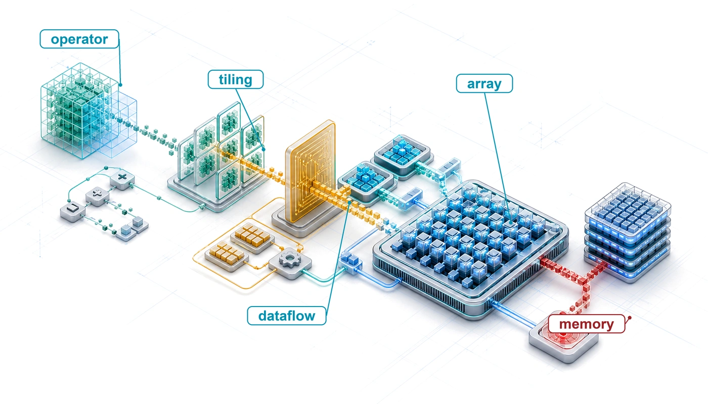
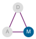

# Hardware Acceleration {#sec-hardware-acceleration}

::: {layout-narrow}
::: {.column-margin}

\chapterminitoc

:::

::: {.content-visible when-format="pdf"}
\noindent
{fig-alt="Layered isometric hardware blueprint where a tensor operation lowers into tiles, local SRAM, and an execution array while avoiding an off-chip memory wall."}
:::

::: {.content-visible unless-format="pdf"}
{fig-alt="Layered isometric hardware blueprint where a tensor operation lowers into tiles, local SRAM, and an execution array while avoiding an off-chip memory wall."}
:::

:::

## Purpose {.unnumbered .unlisted}

\begin{marginfigure}
\mlsysstack{90}{35}{25}{35}{30}{0}{0}{0}
\end{marginfigure}

_Why does moving data cost more than computing it?_

Arithmetic is inexpensive relative to many memory accesses. In the time it takes to fetch a value from main memory, a processor can perform many calculations. This imbalance, the "memory wall," reflects the latency, bandwidth, and energy costs of moving data across a system. It explains why specialized accelerators are not merely faster at math but are architected to hide, amortize, and reduce the cost of moving data through deep memory hierarchies, massive parallelism, and specialized data paths. Hardware acceleration allows many large AI workloads to grow when general-purpose processor scaling alone is insufficient. It also explains why some optimizations that reduce theoretical computation fail to improve runtime. If an operation is memory bound, computing less may not help because computation is not the bottleneck. Hardware selection therefore cannot be reduced to comparing peak FLOP/s. What matters is whether a workload's data movement patterns align with what the hardware was designed to accelerate. A model with large embedding tables and irregular lookups needs a different accelerator than one performing dense matrix multiplications over compact weight tensors. Software must expose and schedule the available reuse; otherwise specialized units wait while data moves and headline throughput remains theoretical. Matching workload and hardware determines whether execution remains at a fraction of theoretical peak or approaches the hardware's practical ceiling. In D·A·M terms, the accelerator makes the machine constraint concrete and shapes which algorithms remain practical in production.

::: {.content-visible when-format="pdf"}

\newpage

:::

::: {.callout-learning-objectives}

- Explain hardware acceleration as machine-axis specialization for tensor workloads, data reuse, and performance per watt
- Calculate arithmetic intensity and roofline ceilings to classify kernels as compute bound or memory bound
- Diagnose memory-wall bottlenecks using bandwidth, cache hierarchy, host-device transfer, and energy-movement costs
- Compare Tensor Cores, systolic arrays, SIMD/SIMT units, and sparse execution for ML compute primitives
- Select dataflow, tiling, and mapping strategies that maximize reuse under memory-capacity constraints
- Analyze compiler and runtime optimizations that fuse kernels, plan memory, and schedule accelerators
- Evaluate accelerator choices across throughput, latency, power, cost, and deployment-context constraints

:::

```{python}
#| echo: false
from mlsysim import *
from mlsysim.core.units import *

from mlsysim.fmt import (
    fmt_int,
    fmt,
    fmt_qty,
    fmt_qty_int,
    check,
    fmt_memory,
    fmt_bandwidth,
    fmt_flop_rate,
    fmt_power,
    fmt_energy,
    fmt_count,
    fmt_params,
    fmt_carbon_intensity,
    fmt_compute_efficiency,
    fmt_multiple_range,
)

class HwAccelSetup:
    """A100 peak FP16/BF16 throughput vs. the registry reference CPU for the opening callout."""

    # LOAD
    a100_tflops_fp16 = Hardware.Cloud.A100.compute.peak_flops.to(TFLOPs / second).magnitude
    cpu_tflops_low = Hardware.Cloud.ReferenceCPU.compute.peak_flops.to(TFLOPs / second).magnitude
    cpu_tflops_high = 2

    # EXECUTE
    cpu_gap_min = a100_tflops_fp16 / cpu_tflops_high
    cpu_gap_max = a100_tflops_fp16 / cpu_tflops_low

    # GUARD
    check(150 <= cpu_gap_min <= 160, f"Unexpected lower CPU gap: {cpu_gap_min:.1f}x")
    check(300 <= cpu_gap_max <= 320, f"Unexpected upper CPU gap: {cpu_gap_max:.1f}x")

    # OUTPUT
    a100_fp16_tflop_per_s_str = fmt_flop_rate(Hardware.Cloud.A100.compute.peak_flops, unit=TFLOP / second, precision=0, commas=False)
    cpu_gap_range_mult_str = fmt_multiple_range(cpu_gap_min, cpu_gap_max, precision=0, commas=False)
```

## Acceleration Fundamentals {#sec-hardware-acceleration-ai-hardware-acceleration-fundamentals-9b28}

::: {.column-margin}
{width="100%" fig-alt="D·A·M taxonomy triangle with three vertices labeled D, A, and M connected by edges. The M (Machine) vertex is filled in solid color; the D and A vertices are gray, marking the Machine axis."}

*Hardware acceleration turns on the machine axis.*
:::

Reducing parameters, precision, or operations only matters when the machine can execute the resulting representation efficiently. Data selection reduced the data term, and compression reduced the algorithm's work; hardware acceleration asks what the machine can actually deliver. The answer starts with the memory wall: arithmetic is often cheap relative to data movement. An off-chip memory access can take many processor cycles and consume orders of magnitude more energy than a low-precision arithmetic operation, with the exact ratio depending on the device and memory level. Specialized hardware matters because it raises compute throughput while organizing memory, dataflow, and parallelism so those arithmetic units stay fed.

::: {#dfn-hw-acceleration-hardware-acceleration .callout-definition title="Hardware acceleration"}

***Hardware acceleration***\index{Hardware acceleration!definition} is the practice of mapping work from general-purpose execution onto specialized processors or functional units optimized for a narrower operation class. For ML workloads, that specialization commonly trades some programmability for the compute density $(R_{\text{peak}})$ and performance-per-watt gains that regular tensor operations can exploit.

1.  **Significance**: An A100 GPU delivers `{python} HwAccelSetup.a100_fp16_tflop_per_s_str` for FP16/BF16 matrix multiplication; against this chapter's illustrative 1–2 TFLOP/s reference-CPU baseline, this is a `{python} HwAccelSetup.cpu_gap_range_mult_str` gap. Its 54.2 billion transistors devote far more silicon to parallel arithmetic than to branch prediction, out-of-order scheduling, and large caches [@NVIDIA2020; @choquette2021].
2.  **Distinction**: A general-purpose CPU is designed for flexible execution, low-latency control, and varied workloads. An accelerator instead concentrates resources on a narrower operation class, so it achieves its gains only when the workload exposes the supported operations and enough parallel work to keep its arithmetic units busy.
3.  **Common pitfall**: A frequent misconception is that an accelerator's advertised peak throughput is the throughput a workload receives. Delivered performance is the lower of the compute ceiling and what memory bandwidth can feed, the roofline constraint: a low-arithmetic-intensity kernel can sit at a small fraction of peak FLOP/s no matter how fast the silicon is rated, because it starves for data rather than for arithmetic.

:::

This definition frames the chapter's central engineering trade-off. General-purpose processors allocate silicon area to complex control logic, speculative execution, branch prediction, and multi-level cache hierarchies to handle arbitrary control flow. An accelerator redirects that transistor budget toward dense arithmetic arrays, dedicated register files, and high-bandwidth memory paths tailored to a narrower workload class. When the software path exposes sufficient tensor parallelism, this specialization yields order-of-magnitude improvements in energy efficiency and throughput per watt.

Hardware alone cannot achieve these gains. Algorithms must structure operations to expose data reuse and regular memory access, while silicon architectures must allocate physical units to the mathematical primitives and numeric precisions that algorithms actually execute. This symbiosis motivates a complementary principle: hardware-software co-design.

::: {#dfn-hw-acceleration-hardware-software-co-design .callout-definition title="Hardware-software co-design"}

***Hardware-Software Co-design***\index{Hardware-Software Co-design!definition} is an ML accelerator development method that crosses conventional abstraction boundaries, allowing algorithm constraints to inform silicon design and hardware capabilities to shape algorithm formulation.

1.  **Significance**: On a supported tensor-core path, 8-bit integer (INT8) quantization can deliver multi-fold throughput gains because hardware executes lower-precision operations more densely and moves fewer bytes than an FP32 path; the exact gain depends on the architecture and workload [@NVIDIA2020; @dally2021; @dally2023].
2.  **Distinction**: Unlike layered abstraction (where software calls a hardware API without knowing the silicon details), co-design exposes hardware constraints directly to algorithm and compiler authors: data alignment requirements, precision formats, and memory access patterns all become visible inputs to global cross-layer optimization.
3.  **Common pitfall**: A frequent misconception is that co-design is a one-time hardware design choice. In practice, the supported features continue to evolve: NVIDIA Tensor Cores began with FP16 matrix multiplication, later generations added TF32 and broader integer support, and Ampere added acceleration for 2:4 structured sparsity [@nvidia_tensors_fp16_2017; @NVIDIA2020].

:::

Co-design explains why the compression techniques introduced in @sec-model-compression deliver real speedups. The quantization techniques in @sec-model-compression-quantization-precision-cd46 show why converting FP32 to INT8\index{Quantization!INT8 co-design} accelerates execution on supported hardware: reduced precision cuts memory traffic, while specialized arithmetic units execute more low-precision operations per cycle than FP32 equivalents [@NVIDIA2020]. Structured pruning\index{Structured pruning!hardware alignment} improves performance when it produces smaller dense shapes or a sparsity pattern recognized by silicon, whereas arbitrary unstructured sparsity incurs metadata handling and non-coalesced memory accesses that often erase theoretical gains. Evaluating accelerator performance requires tracing this path from workload to silicon: compute primitives, memory hierarchies, roofline diagnosis, mapping and dataflow, and compiler scheduling. The recurring question is why algorithmic improvements frequently fail to deliver proportional end-to-end speedups. Amdahl's law provides the governing limit.

::: {#thrm-hw-acceleration-fundamental-limit-acceleration-amdahls-law .callout-theorem title="The fundamental limit of acceleration (Amdahl's Law)"}

Hardware acceleration *does not speed up the entire system*; it speeds only the baseline-time fraction using the accelerated path. For that fraction $p$ and path gain $G_{\text{accel}}$, **Amdahl's law for AI**\index{Amdahl's law!parallel fraction}\index{Parallel Computing!Amdahl's Law} [@amdahl1967] gives the bound in @eq-amdahl.
$$ \text{Speedup} = \frac{1}{(1 - p) + \frac{p}{G_{\text{accel}}}} $$ {#eq-amdahl}

*   **Accelerated fraction**\index{Parallel fraction!definition} ($p$): Share of baseline time receiving the stated gain, often in matrix multiplication or another supported kernel.
*   **Accelerator gain**\index{Accelerator gain!definition} ($G_{\text{accel}}$): The raw speed advantage of the GPU or Tensor Processing Unit (TPU) over the CPU for the accelerated portion of the workload.
*   **Unaccelerated fraction**\index{Serial fraction!Amdahl bottleneck} ($1-p$): Work outside the chosen path, such as data loading, host overhead, unsupported operators, and kernel launch latency\index{Kernel Launch Latency!serial overhead}.

**Pitfall**: *Unaccelerated work caps total speedup.* If 10 percent of baseline time is unaffected ($p=0.9$), even infinite path gain ($G_{\text{accel}}=\infty$) yields at most 10$\times$ overall. Once the accelerated component is fast enough, unaffected work dominates.

:::

Hardware acceleration targets specific terms in the iron law of ML systems\index{Iron law of ML systems!hardware acceleration} (@sec-introduction-iron-law-ml-systems-c32a), which decomposes end-to-end time into data volume $(D_{\text{vol}}/\text{BW})$, computation $(O/(R_{\text{peak}} \cdot \eta_{\text{hw}}))$, and fixed latency $(L_{\text{lat}})$. While data selection reduced total data volume and model compression reduced operations $O$ per sample, hardware acceleration increases the rate of execution by improving $R_{\text{peak}}$, $\eta_{\text{hw}}$, and $\text{BW}$. @Sec-appdx-machine-foundations-physics-computing-c77f supplies the analytical performance models that diagnose which of these terms dominates a given workload, including the dimensional analysis that confirms each iron law term resolves to seconds. Yet acceleration encounters a hard ceiling established by Amdahl's law.[^fn-amdahls-law-acceleration]

[^fn-amdahls-law-acceleration]: **Amdahl's law**\index{Amdahl's law!acceleration ceiling}: Maps onto the iron law only after the proposed change is specified. If a faster tensor unit reduces the computation term $(O/(R_{\text{peak}} \cdot \eta_{\text{hw}}))$ but leaves data transfer and fixed latency unchanged, those unaffected terms bound total speedup. A different accelerator or memory system may improve bandwidth as well. The unaccelerated fraction is therefore defined by the intervention, not by a permanent classification of each term as serial.

This dynamic explains why hardware upgrades frequently fail to produce proportional end-to-end speedups. @Fig-iron-law-heatmap visualizes this **acceleration wall**\index{Acceleration wall!diminishing returns}: as long as an unaccelerated fraction $1-p$ remains, the asymptotic ceiling $1/(1-p)$ enforces sharp diminishing returns on path gain $G_{\text{accel}}$ unless $p$ approaches unity.

::: {#fig-iron-law-heatmap fig-env="figure" fig-pos="htb" fig-cap="**The Iron Law Heatmap**: Total system speedup as a function of accelerator gain ($G_{\text{accel}}$) and accelerated fraction ($p$). High speedup appears only near the top-right corner, where both accelerator gain and accelerated fraction are high. At $p=0.9$, for example, even an infinite gain on the accelerated path cannot exceed 10$\times$ end-to-end speedup. Contours span roughly 1$\times$–500$\times$ speedup." fig-alt="Heatmap of speedup vs. accelerator gain and accelerated fraction. High speedup in red and orange appears near the top-right corner where the accelerated fraction is near 1.0 and accelerator gain is high; lower-fraction regions remain blue. White contour lines are labeled from 1x to 200x, and text labels mark a Compute Bound region above and an Unaccelerated Bound region below."}

```{python}
#| echo: false
# ┌─────────────────────────────────────────────────────────────────────────────
# │ IRON LAW HEATMAP (FIGURE)
# ├─────────────────────────────────────────────────────────────────────────────
# │ Context: @fig-iron-law-heatmap—Amdahl's Law and Acceleration Wall
# │
# │ Goal: Visualize speedup = 1/((1-p)+p/S) as function of S and p; show
# │       diminishing returns when parallel fraction is low.
# │ Show: Contour heatmap; Compute Bound vs Serial Bound regions.
# │ How: meshgrid S, P; contourf with LogNorm; book_style.setup_plot().
# │
# └─────────────────────────────────────────────────────────────────────────────
# ┌── 1. CANVAS ────────────────────────────────────────────────────────────────
# │ Visualize speedup = 1/((1-p)+p/G_accel) as function of accelerator gain and p; show
import sys
import os
import numpy as np
import matplotlib.colors as mcolors

# ┌── 2. ARRAYS ────────────────────────────────────────────────────────────────
sys.path.insert(0, ".")
from binder.tools.figures import style as book_style
from mlsysim.physics import calc_amdahls_speedup

fig, ax, COLORS, plt = book_style.setup_plot(figsize=(10, 4.2))

# =============================================================================
# PLOT: The Iron Law Heatmap
# =============================================================================
g_accel_vals = np.logspace(0, 3, 100)
p_vals = np.linspace(0.8, 0.999, 100)
g_accel_grid, p_grid = np.meshgrid(g_accel_vals, p_vals)
overall_speedup = np.vectorize(calc_amdahls_speedup)(p_grid, g_accel_grid)

# ┌── 3. RENDER ────────────────────────────────────────────────────────────────
levels = [1, 2, 5, 10, 20, 50, 100, 200, 500]
norm = mcolors.LogNorm(vmin=1, vmax=500)

cf = ax.contourf(g_accel_grid, p_grid, overall_speedup, levels=levels, cmap='RdYlBu_r', norm=norm, alpha=0.8)
cs = ax.contour(g_accel_grid, p_grid, overall_speedup, levels=levels, colors='white', linewidths=0.8, alpha=0.6)
ax.clabel(cs, inline=1, fontsize=8, fmt='%gx', colors='black')

ax.set_xscale('log')
ax.set_xlabel(r'Accelerator gain ($G_{\mathrm{accel}}$)')
ax.set_ylabel('Accelerated Fraction (p)')

ax.text(
    100,
    0.98,
    "Compute Bound",
    color='black',
    ha='center',
    va='top',
    fontweight='bold',
    fontsize=9,
    bbox=dict(facecolor='white', alpha=0.8, edgecolor='none', pad=0.5),
)
ax.text(
    100,
    0.82,
    "Unaccelerated Bound",
    color='white',
    ha='center',
    va='bottom',
    fontweight='bold',
    fontsize=9,
    bbox=dict(facecolor='black', alpha=0.6, edgecolor='none', pad=0.5),
)
plt.show()
plt.close()

# ┌── 4. DECORATE ──────────────────────────────────────────────────────────────
```

:::

Raw accelerator speedup translates into system-level throughput only after the unaccelerated fraction has been minimized. The accelerated fraction $p$ differs substantially across workload archetypes running on identical hardware, determining whether an accelerator investment pays off or stalls on non-matrix operations.

::: {#chk-hw-acceleration-parallelism-gate .callout-checkpoint title="The parallelism gate"}

These checks turn Amdahl's bound into a hardware-selection test.

**Amdahl's reality**\index{Amdahl's reality!definition}

- [ ] **Serial bottlenecks**: use Amdahl's bound to explain why a 1,000$\times$ faster GPU may only speed up training by 5$\times$ when data loading is slow.
- [ ] **Speedup ceiling**: for $p=0.95$ and $G_{\text{accel}}=100$, estimate total speedup and compare it with the infinite-accelerator ceiling.
- [ ] **Workload variation**: compare ResNet-50\index{ResNet-50!compute-bound workload} and MobileNet accelerated fractions for a proposed hardware change, then predict which benefits more.

:::

The serial bottleneck becomes concrete on real hardware, where the same accelerator that nears its parallel ceiling on one workload can stall on another. @Sec-appdx-machine-foundations-numbers-know-b531 collects the reference $R_{\text{peak}}$ figures across accelerator generations and the latency hierarchy that ground these hardware comparisons in order-of-magnitude terms. Evaluating an NVIDIA H100 running compute-bound convolution versus memory-bound autoregressive decoding illustrates how differing unaccelerated fractions govern realized speedup.

```{python}
#| echo: false
#| label: amdahl-h_h100-calc
# ┌─────────────────────────────────────────────────────────────────────────────
# │ AMDAHL'S LAW ON H100
# ├─────────────────────────────────────────────────────────────────────────────
# │ Context: "Amdahl's Law on H100" lighthouse callout
# │
# │ Goal: Demonstrate the limits of parallel speedup on H100.
# │ Show: Why ResNet achieves 20× speedup while GPT-2 is capped at 5×.
# │ How: Apply Amdahl's Law with different parallelizable fractions (95% vs 80%).
# │      LLM optimization focuses on reducing serial fraction.
# │
# └─────────────────────────────────────────────────────────────────────────────
from mlsysim.fmt import fmt_int, fmt, fmt_math, fmt_ops_rate, fmt_ratio, check
from mlsysim.physics import calc_amdahls_speedup

# ┌── LEGO ───────────────────────────────────────────────
class AmdahlH100:
    """
    Namespace for Amdahl's Law on H100.
    Scenario: Comparing speedup for Compute-Bound (ResNet) vs Memory-Bound (GPT-2).
    """

    # ┌── 1. LOAD (Constants) ───────────────────────────────────────────────
    h100_int8 = Hardware.Cloud.H100.compute.precision_flops["int8"]
    cpu_int8_tops = 8 * TOPS  # scenario assumption: baseline server-CPU INT8 throughput

    # Workload Parallel Fractions (p)
    p_resnet = 0.95  # 95% parallel (Compute Bound)
    p_gpt2 = 0.80  # 80% parallel (Bandwidth Bound/Serial Overhead)

    # ┌── 2. EXECUTE (The Compute) ─────────────────────────────────────────
    # Amdahl's Law: Speedup = 1 / ((1-p) + (p/G_accel))
    # (2026-06-10 audit: the derived ~247x ratio was hardcoded in LOAD; if
    # the registry INT8 figure changed, the displayed TOPS ref updated but
    # the speedup silently did not.)
    hw_speedup_factor = (h100_int8 / cpu_int8_tops).to("").magnitude

    speedup_resnet = calc_amdahls_speedup(p_resnet, hw_speedup_factor)
    speedup_gpt2 = calc_amdahls_speedup(p_gpt2, hw_speedup_factor)

    # Step 1: Theoretical ceiling (if accelerator gain tends to infinity)
    ceiling_gpt2 = calc_amdahls_speedup(p_gpt2, float("inf"))

    # ┌── 3. GUARD (Invariants) ───────────────────────────────────────────
    check(speedup_resnet >= speedup_gpt2 * 3, f"ResNet speedup ({speedup_resnet:.1f}x) should be much higher than GPT-2 ({speedup_gpt2:.1f}x).")
    check(speedup_gpt2 <= ceiling_gpt2, "Speedup cannot exceed theoretical ceiling.")

    # ┌── 4. OUTPUT (Formatting) ──────────────────────────────────────────────
    # Hardware context
    h100_int8_tops_str = fmt_ops_rate(Hardware.Cloud.H100.compute.precision_flops["int8"], unit=TOPS, precision=0, commas=False)
    cpu_int8_tops_str = fmt_ops_rate(cpu_int8_tops, unit=TOPS, precision=0, commas=False)
    hw_speedup_mult_str = fmt_multiple(round(hw_speedup_factor), precision=0, commas=False)
    hw_speedup_factor_str = fmt_int(hw_speedup_factor, commas=False)

    # ResNet
    p_resnet_str = fmt(p_resnet, precision=2, commas=False)
    p_resnet_pct_str = fmt_percent(p_resnet, precision=0, commas=False, style='prose')
    serial_resnet_str = fmt(1 - p_resnet, precision=2, commas=False)
    serial_resnet_pct_str = fmt_percent(1 - p_resnet, precision=0, commas=False, style='prose')
    p_resnet_over_accel_str = fmt_ratio(p_resnet / hw_speedup_factor, precision=4, commas=False)
    amdahl_resnet_str = fmt(speedup_resnet, precision=1, commas=False)
    amdahl_resnet_speedup_mult_str = fmt_multiple(speedup_resnet, precision=1, commas=False)

    # GPT-2
    p_gpt2_str = fmt(p_gpt2, precision=2, commas=False)
    serial_gpt2_str = fmt(1 - p_gpt2, precision=2, commas=False)
    serial_gpt2_pct_str = fmt_percent(1 - p_gpt2, precision=0, commas=False, style='prose')
    p_gpt2_over_accel_str = fmt_ratio(p_gpt2 / hw_speedup_factor, precision=4, commas=False)
    amdahl_gpt2_str = fmt(speedup_gpt2, precision=1, commas=False)
    amdahl_gpt2_ceiling_speedup_mult_str = fmt_multiple(ceiling_gpt2, precision=0, commas=False)

    resnet_speedup_eq_math = fmt_math(
        rf"\text{{Speedup}} = \frac{{1}}{{(1-{p_resnet_str}) + \frac{{{p_resnet_str}}}{{{hw_speedup_factor_str}}}}} "
        rf"= \frac{{1}}{{{serial_resnet_str} + {p_resnet_over_accel_str}}} "
        rf"\approx {amdahl_resnet_str}\times"
    )
    gpt2_speedup_eq_math = fmt_math(
        rf"\text{{Speedup}} = \frac{{1}}{{(1-{p_gpt2_str}) + \frac{{{p_gpt2_str}}}{{{hw_speedup_factor_str}}}}} "
        rf"= \frac{{1}}{{{serial_gpt2_str} + {p_gpt2_over_accel_str}}} "
        rf"\approx {amdahl_gpt2_str}\times"
    )
```

::: {#lhs-amdahl-h_h100 .callout-lighthouse title="An illustrative Amdahl budget on H100"}

**Illustrative ResNet-50 inference on NVIDIA H100**:

- Assume H100 provides $G_{\text{accel}}$ = `{python} AmdahlH100.hw_speedup_mult_str` on matrix multiplication relative to a reference CPU without matrix extensions (`{python} AmdahlH100.h100_int8_tops_str` INT8 vs. ~`{python} AmdahlH100.cpu_int8_tops_str`) [@choquette2023].
- Assume $p$ = `{python} AmdahlH100.p_resnet_str`: `{python} AmdahlH100.p_resnet_pct_str` of baseline time receives that gain, while `{python} AmdahlH100.serial_resnet_pct_str` remains in data loading, preprocessing, postprocessing, and other work.
$$
\text{`{python} AmdahlH100.resnet_speedup_eq_math`}
$$
The `{python} AmdahlH100.hw_speedup_mult_str` path gain produces only `{python} AmdahlH100.amdahl_resnet_speedup_mult_str` end-to-end speedup because the `{python} AmdahlH100.serial_resnet_pct_str` unaffected fraction sets the ceiling.

**Contrast with GPT-2 (autoregressive)**:

- For GPT-2 token generation, assume $p$ = `{python} AmdahlH100.p_gpt2_str`; the remaining `{python} AmdahlH100.serial_gpt2_pct_str` includes host overhead, sampling, and decoding work outside the accelerated matrix path.
$$
\text{`{python} AmdahlH100.gpt2_speedup_eq_math`}
$$
Less token-generation time receives the assumed gain, so even an infinite path gain yields at most $1/(1-p)$ = `{python} AmdahlH100.amdahl_gpt2_ceiling_speedup_mult_str`. Serving optimizations address this limit differently: batching improves cross-request utilization, while speculative decoding uses a draft model to reduce sequential target-model steps.

:::

Whether an operation is limited by compute rate or by data movement dictates both hardware selection and software optimization. Upgrading to an accelerator with $10\times$ higher peak compute yields negligible speedup if data delivery is the binding bottleneck. The Roofline Model\index{Roofline model!hardware diagnosis} provides the analytical framework for making this diagnosis [@williams2009]; it is introduced formally in @sec-appdx-machine-foundations-roofline-model-2529 and @sec-hardware-acceleration-roofline-model-42ff applies it to AI workloads. It plots an operation's arithmetic intensity,[^fn-arithmetic-intensity-roofline] defined as the ratio of floating-point operations to bytes of memory traffic (FLOP/byte), against hardware capabilities, revealing whether performance is capped by compute or bandwidth. A dense matrix multiplication with high arithmetic intensity benefits from additional TFLOP/s; a LayerNorm with low arithmetic intensity benefits only from greater memory bandwidth. High-reuse ResNet-50 convolutions operate in the compute-bound regime, while low-batch autoregressive attention operates in the memory-bound regime. Consequently, compute-bound workloads require strategies that maximize arithmetic throughput and functional-unit utilization, whereas memory-bound kernels require operator fusion and memory-hierarchy staging to minimize off-chip traffic.

[^fn-arithmetic-intensity-roofline]: **Arithmetic intensity**\index{Arithmetic intensity!roofline diagnostic}: The ratio of compute operations to bytes transferred across the memory interface being modeled (FLOP/byte). Workloads above that hardware level's ridge point, such as well-tiled matrix multiplications with substantial reuse, are compute bound and can benefit from more TFLOP/s. Low-intensity operations, including some low-batch attention and decoding kernels, are bandwidth bound at that level and need more bandwidth or reuse rather than only more compute throughput.

Architectural design begins with the physical constraints that forced specialization: the breakdown of classical Dennard voltage scaling and the prohibitive energy cost of moving data across memory hierarchies. When general-purpose microarchitectures encountered these thermal and memory barriers, domain-specific hardware specialization emerged as the primary engineering path to sustain performance scaling.
## Hardware Specialization {#sec-hardware-acceleration-evolution-hardware-specialization-fdb7}

When Google deployed its first Tensor Processing Unit (TPUv1) into production data centers alongside NVIDIA K80 GPUs, the comparison highlighted a fundamental efficiency divide. General-purpose processors dedicate substantial silicon area and power budgets to instruction fetching, branch prediction, and cache coherence hardware designed for arbitrary code. For deep learning workloads dominated by regular, dense linear algebra, that control overhead yields poor arithmetic density. When an algorithmic pattern becomes sufficiently dominant and structured, specialized hardware\index{Hardware specialization!evolution} outperforms general-purpose platforms by replacing dynamic control machinery with dedicated arithmetic arrays and software-managed data movement. Google's production inference evaluation quantified this efficiency gap (example \ref{exmp-hw-acceleration-tpuv1-vs-k80-efficiency-shock}).

::: {#exmp-hw-acceleration-tpuv1-vs-k80-efficiency-shock .callout-example title="The TPUv1 vs. K80 efficiency shock"}

**Scenario**: In 2015, Google deployed its first Tensor Processing Unit (TPUv1) into production data centers, comparing its throughput and energy efficiency against general-purpose NVIDIA K80 GPUs [@jouppi2017].

**Diagnosis**: The K80 was a programmable GPU designed to support a broader mix of graphics and compute workloads. The TPUv1 domain-specific architecture (DSA) made a narrower inference-focused bet, pairing a large 8-bit systolic matrix unit with software-managed memory and simpler control.

**Systems lesson**: On the six Google inference workloads and contemporary CPU/GPU baselines evaluated in the TPU paper, tailoring silicon to the dominant matrix operations delivered 15–30$\times$ higher throughput and 30–80$\times$ better performance per watt [@jouppi2017]. Those ratios describe the evaluated systems, not every workload.

:::

[^fn-tpu-google-origin]: **TPU (tensor processing unit)**\index{TPU!origin}: The first TPU made a deliberately narrow bet, centering the design on a single $256{\times}256$ systolic array for 8-bit matrix multiplication and avoiding much of the control machinery required by a general-purpose core [@jouppi2017]. That trade buys high compute density on dense matrix multiplication at the cost of flexibility. Irregular or branch-heavy code remains a poor fit, and compiler tiling, padding, and layer dimensions determine how fully the array is used.

In D·A·M terms, this efficiency gain stems from tailoring machine resources to algorithmic structure. By replacing hardware caches with software-managed scratchpad buffers and routing data directly between neighboring arithmetic units in a systolic array, specialized architectures maximize arithmetic intensity and minimize off-chip memory traffic. Yet this specialization imposes an architectural trade-off: rigid execution pipelines forfeit flexibility. When workloads introduce irregular memory access, dynamic control flow, or unsupported numeric precisions, fixed-function data paths stall, leaving expensive silicon idle.

Modern ML accelerators—including DianNao-class neural-network accelerators [@chen2014diannao], GPUs with Tensor Cores, Google's TPUs,[^fn-tpu-google-origin] and Apple's Neural Engine—reflect this continuous balancing act between arithmetic specialization and programmable flexibility. Their designs emerge from a historical trajectory spanning four distinct phases: specialized computing origins, parallel graphics processing, domain-specific architectures, and the emergence of ML-specific hardware. Each phase addressed the specific resource bottleneck that constrained scaling in its era.
### Specialized computing {#sec-hardware-acceleration-specialized-computing-22ce}

Hardware specialization emerges when specific computational patterns become the primary system bottleneck, preventing general-purpose processors from scaling efficiently. This history highlights three recurring limits: slow implementation of scalar floating-point, insufficient throughput for parallel graphics, and poor integration between memory and parallel compute.

The first phase, the precision bottleneck\index{Floating-point unit!precision bottleneck}, occurred when scientific and engineering applications required floating-point arithmetic on microprocessors with integer-only arithmetic logic units. In the late 1970s, CPUs emulated floating-point operations through multi-instruction software routines that unpacked sign, exponent, and mantissa fields, shifted bits to align binary points, and normalized the output. This software emulation imposed severe scalar instruction overhead for even a single multiplication, motivating the first major wave of hardware specialization: the mathematics coprocessor.

The Intel 8087\index{Intel 8087!floating-point coprocessor}\index{Floating-point unit!history} (1980)[^fn-intel-8087-specialization] addressed this bottleneck by executing floating-point instructions directly on dedicated hardware pipelines [@palmer1980intel8087]. Replacing multi-instruction emulation routines with hardwired arithmetic logic established a core systems principle: when an inner loop is dominated by a specific operation, specialized silicon eliminates general-purpose instruction overhead and shifts the execution ceiling.

[^fn-intel-8087-specialization]: **Intel 8087**\index{Intel 8087!specialization pattern}: The coprocessor implemented floating-point logic directly in silicon, avoiding the CPU's slow, multi-instruction software emulation for each calculation. Its benefit depended on how much time an application spent in supported floating-point operations, illustrating why specialization helps most when the accelerated work dominates execution.

As specialized functions demonstrated their utility, they followed a recurring pattern of integration. The Intel 486DX (1989) moved the FPU directly onto the CPU die, eliminating off-chip bus communication latency and making high-precision math a standard feature rather than an optional coprocessor [@patterson2017hardware]. This cycle—specialization to resolve an acute bottleneck followed by architectural integration—recurs across hardware eras.

@Fig-timeline traces this progression across five eras, illustrating how recurring computational bottlenecks drove hardware evolution from floating-point coprocessors and digital signal processors to programmable GPUs, streaming media codecs, and deep-learning tensor accelerators. Modern machine learning workloads depend directly on principles established across these eras: dedicating silicon to dominant matrix operations, staging operands in local memories, and minimizing off-chip data movement.

::: {#fig-timeline fig-env="figure" fig-pos="htb" fig-cap="**Hardware Specialization Timeline**: Computing architectures evolve through recurring cycles of specialization and integration across five eras. Each era introduces domain-specific hardware to resolve an important memory or arithmetic bottleneck—from off-chip FPUs to GPUs, codecs, and TPU/Tensor Core array units. Many of these capabilities later appear alongside CPUs in broader systems, even when the specialized units remain distinct." fig-alt="Five-column timeline from the 1980s through the 2020s. The columns list floating-point and signal processing (Intel 8087, TMS32010 DSP), 3D graphics and multimedia (early GPUs, GeForce 256), real-time media and network processing (H.264 and MP3 codecs, IXP2800), deep-learning tensor operations (Google TPU v1 and NVIDIA Tensor Cores), and application-specific acceleration (AI engines, SmartNICs, and multi-chip and wafer-scale systems)."}

```{.tikz}
\begin{tikzpicture}[font=\sffamily\small]
\tikzset{
  Box/.style={inner xsep=1pt,
    font=\sffamily\footnotesize,
    draw=none,node distance=3mm,
    fill=#1,align=flush center,
    anchor=west,
    text width=35mm,
    minimum width=35mm, minimum height=10mm
  },
  Box/.default=red
}
\definecolor{col1}{RGB}{128, 179, 255}
\definecolor{col2}{RGB}{255, 255, 128}
\definecolor{col3}{RGB}{204, 255, 204}
\definecolor{col4}{RGB}{230, 179, 255}
\definecolor{col5}{RGB}{255, 153, 204}
\definecolor{col6}{RGB}{245, 82, 102}
\definecolor{col7}{RGB}{255, 102, 102}
\node[Box={col1}](B1){1980s};
\node[Box={col2},right=of B1](B2){1990s};
\node[Box={col3},right=of B2](B3){2000s};
\node[Box={col4},right=of B3](B4){2010s};
\node[Box={col5},right=of B4](B5){2020s};
\foreach \x in{1,2,...,5}
\draw[dashed,thick,-latex](B\x)--++(270:7.2);
\path[red]([yshift=-5mm]B1.south west)coordinate(P)-|coordinate(K)(B5.south east);
\draw[line width=2pt,-latex](P)--(K)--++(0:3mm);
%
\def\vi{1.1}
\node[Box={col1!50},below=\vi of B1](BB1){Floating-Point \&\\Signal Processing};
\node[Box={col1!50},below=of BB1](BB2){Intel 8087 FPU\\(1980)};
\node[Box={col1!50},below=of BB2](BB3){Texas Instruments\\TMS32010 DSP (1983)};
\node[Box={col1!50},below=of BB3](BB4){Integration of FPU\\into Intel 486DX\\(1989)};
%
\node[Box={col2!50},below=\vi of B2](2BB1){3D Graphics \&\\Multimedia};
\node[Box={col2!50},below=of 2BB1](2BB2){Introduction of\\Early GPUs};
\node[Box={col2!50},below=of 2BB2](2BB3){NVIDIA GeForce 256 --\\First GPU with\\Hardware T\&L (1999)};
\node[Box={col2!50},below=of 2BB3](2BB4){Rise of SIMD\\Processing Units};
%
\node[Box={col3!50},below=\vi of B3](3BB1){Real-time Media\\Coding \&\\Network Processing};
\node[Box={col3!50},below=of 3BB1](3BB2){Media Codecs\\(H.264, MP3)};
\node[Box={col3!50},below=of 3BB2](3BB3){Intel IXP2800\\Network Processor};
\node[Box={col3!50},below=of 3BB3](3BB4){Dedicated hardware\\for streaming\\and encoding};
%
\node[Box={col4!50},below=\vi of B4](4BB1){Deep Learning\\Tensor Operations};
\node[Box={col4!50},below=of 4BB1](4BB2){Google TPU v1 for\\ML Inference (2015)};
\node[Box={col4!50},below=of 4BB2](4BB3){NVIDIA Tensor Cores\\for DL Acceleration};
\node[Box={col4!50},below=of 4BB3](4BB4){AI-specific memory\\optimizations};
%
\node[Box={col5!50},below=\vi of B5](5BB1){Application-Specific\\Acceleration};
\node[Box={col5!50},below=of 5BB1](5BB2){AI Engines \&\\SmartNICs};
\node[Box={col5!50},below=of 5BB2](5BB3){Multi-chip and\\wafer-scale ML\\acceleration};
\node[Box={col5!50},below=of 5BB3](5BB4){ML frameworks\\optimizing for\\specialized hardware};
\end{tikzpicture}
```

:::
### Parallel computing and graphics processing {#sec-hardware-acceleration-parallel-computing-graphics-processing-4654}

General-purpose CPUs allocate most of their silicon budget to control logic, branch prediction, and multi-level caches designed to minimize execution latency for a single instruction stream. When a workload exhibits massive, uniform data parallelism—applying identical arithmetic across millions of independent elements—this latency-oriented architecture expends chip area and thermal budget on control structures that do not increase computational throughput. Specialized accelerators resolve this imbalance by reallocating silicon from cache and control to dense arrays of arithmetic logic units (ALUs), prioritizing aggregate throughput over single-thread latency.

Real-time 3D graphics drove this throughput-oriented specialization throughout the 1990s. Early graphics accelerators offloaded fixed rasterization tasks such as bitmap transfers and polygon filling. In 1999, NVIDIA's GeForce 256\index{NVIDIA!GeForce 256}\index{GPU!history} integrated hardware-accelerated transform and lighting (T&L)\index{Transform and lighting!hardware acceleration}, shifting coordinate transformations from the host CPU to dedicated on-chip silicon. While not yet programmable, these initial Graphics Processing Units (GPUs) demonstrated how specialized pipelines could accelerate fixed mathematical operations like vertex transformation and texture mapping. However, rigid fixed-function pipelines caused severe load imbalances: complex geometries left rasterization hardware idle, while dense fragment shading starved vertex pipelines. The transition to programmable shaders in the GeForce 3 (2001) and unified shader architectures in the GeForce 8 (2006) resolved this imbalance by replacing segregated functional units with arrays of identical, programmable compute cores. This structural unification decoupled the hardware from fixed graphics stages and established the GPU as a general-purpose parallel processor capable of dense matrix arithmetic. By 2004, high-end GPUs could process over 100 million polygons per second [@owens2008].

In parallel with graphics hardware, Digital Signal Processing (DSP)\index{Digital signal processing!multiply-accumulate units} processors addressed a different physical constraint: deterministic, low-latency execution within tight energy budgets. General-purpose cache hierarchies introduce variable latency whenever cache misses occur, violating strict real-time deadlines in signal processing. DSPs replaced unpredictable caches with software-managed scratchpad memories and paired specialized multiply-accumulate (MAC) units with circular addressing buffers to execute continuous filtering and Fourier transforms without memory-stall jitter. Texas Instruments' TMS32010 (1983) demonstrated how domain-specific instruction sets and dedicated MAC data paths could outpace general-purpose microprocessors on vector operations [@lyons2011understanding].

Network processing confronted an even tighter latency deadline: sustaining packet inspection at line rate. When packets arrive every few nanoseconds, an off-chip memory access stall drops packets. Intel's IXP2800 network processor shows the consequence of this hard constraint: meeting line-rate packet deadlines leaves no slack for cache misses, so the design arranges many parallel cores around tiered on-chip memory to keep data adjacent to compute. That compute-near-memory organization, forced by packet arrival deadlines, prefigured the memory hierarchies that modern machine learning accelerators use to keep processing-element arrays continuously fed with tensor tiles.

These domains diverged in implementation because their computational profiles differed. DSPs optimized for low-latency 1D signal streams under milliwatt thermal envelopes, while network processors optimized for packet routing with minimal state retention. In contrast, deep learning workloads are dominated by dense matrix multiplications and multidimensional convolutions. These operations exhibit high arithmetic intensity and massive data parallelism. The unified GPU provided the ideal machine match: thousands of parallel ALU lanes backed by wide memory buses, using hardware-managed multithreading to hide off-chip memory latency during dense tensor operations.

The practical impact of this architectural alignment became clear in 2012, when AlexNet\index{AlexNet!GPU deep learning era}[^fn-alexnet-gpu-era] [@krizhevsky2012imagenet] won the ImageNet competition by more than ten percentage points. Training was performed on two consumer-grade NVIDIA GTX 580 graphics cards, each with only 3 GB of VRAM. The underlying algorithm—convolutional networks trained with gradient descent—had existed for decades, but CPU compute throughput made large-scale training computationally impractical. By mapping dense 2D convolutions directly to GPU execution units, the authors compressed months of CPU computation into five to six days. In D·A·M terms, the machine constraint had previously dictated which algorithms were feasible; aligning the parallel structure of convolutions with throughput-oriented GPU hardware made deep models practical to train on large datasets.

[^fn-alexnet-gpu-era]: **AlexNet**\index{AlexNet!two-GPU training}: Krizhevsky, Sutskever, and Hinton's 60-million-parameter convolutional neural network (CNN) won ImageNet 2012 by more than ten percentage points on two consumer GTX 580 GPUs with only 3 GB of VRAM each. Because the model exceeded single-GPU memory, the authors partitioned the network across two cards and limited communication between them, an early form of model parallelism that foreshadowed systematic tensor and pipeline parallelism. The reported training run took five to six days [@krizhevsky2012imagenet].
### Emergence of domain-specific architectures {#sec-hardware-acceleration-emergence-domainspecific-architectures-e56e}

These diverse acceleration patterns converged in a broader architectural shift. The emergence of **domain-specific architectures (DSAs)**\index{DSA!definition}\index{DSA!scaling law breakdown}\index{Domain-Specific Architecture|see{DSA}}[^fn-dsa-domain-efficiency] marks a transition in computer system design, driven by the slowing benefits of traditional scaling [@esmaeilzadeh2011] and the increasing computational demands of specialized workloads. Moore's Law\index{Moore's law!slowdown}[^fn-moores-law-scaling] described a long-running increase in transistor density [@moore1998]. Dennard scaling\index{Dennard Scaling!end of}[^fn-dennard-scaling-power] [@dennard1974] allowed voltage to fall as transistors shrank; its breakdown removed the accompanying path to routine frequency gains at constant power density. Together, these shifts constrained general-purpose performance and efficiency. As @hennessy2019 argued in the 2017 Turing Lecture, the response was a new era of domain-specific solutions optimized for important workloads.

[^fn-dsa-domain-efficiency]: **DSA (domain-specific architecture)**\index{DSA!efficiency trade-off}: Hardware optimized for an application domain, sacrificing some general-purpose programmability for efficiency. Google's TPUv1 achieved 15--30$\times$ better performance and 30--80$\times$ better performance per watt than the contemporary CPU and GPU systems evaluated on Google's inference workloads by centering its design on a systolic array and software-managed memory [@jouppi2017]. A DSA that excels at dense matrix multiplication may perform worse than a CPU on irregular workloads such as graph traversal, so the workload limits and efficiency gain must justify the software, compiler, and ecosystem cost [@hennessy2019; @patterson2017hardware].

The scale of this challenge becomes stark in @fig-systems-gap, which plots an illustrative systems gap between model demand and hardware supply, sometimes discussed under the informal label Huang's Law\index{Huang's law!GPU performance scaling}.[^fn-huangs-law-gpu] The normalized scenario assumes GPU supply rises about 1.7$\times$ per year while model demand rises about 6$\times$ per year, producing a gap that widens by roughly 3--4$\times$ each year. Published compute trends motivate the qualitative divergence, while the plotted rates are scenario assumptions rather than a forecast [@amodei2018ai; @epochai2024compute].

[^fn-huangs-law-gpu]: **Huang's law**\index{Huang's law!GPU performance scaling}: The observation that GPU performance for AI workloads has improved through architectural innovations such as Tensor Cores as well as transistor scaling. The normalized figure uses illustrative GPU-supply and model-demand curves to show how unequal growth rates create a widening systems gap; it is not a forecast of either rate [@amodei2018ai; @epochai2024compute; @NVIDIA2020; @choquette2023].

::: {#fig-systems-gap fig-env="figure" fig-pos="htb" fig-cap="**The Systems Gap**: Relative compute growth (log scale) comparing model demand to hardware supply, normalized to 2012 = 1.0. The gray dotted line (CPU) and blue dashed line (GPU) reflect hardware progress, which lags the exponential red solid line (Model Demand). The purple region is the 'Systems Gap' that must be bridged through parallelism and co-design." fig-alt="Log-scale line chart from 2012 to 2024. Red line (model demand) rises steeply. Blue line (GPU supply) rises moderately. Gray line (CPU trend) rises slowly. A large purple shaded area between red and blue is labeled 'The Systems Gap.'"}

```{python}
#| echo: false
# ┌─────────────────────────────────────────────────────────────────────────────
# │ SYSTEMS GAP (FIGURE)
# ├─────────────────────────────────────────────────────────────────────────────
# │ Context: @fig-systems-gap—model demand vs hardware supply divergence
# │
# │ Goal: Plot CPU (Moore), GPU (Huang), Model Demand growth; show widening
# │       purple gap that parallelism/co-design must bridge.
# │ Show: Log-scale; three curves; fill_between; model milestones.
# │ How: Exponential growth rates; book_style.setup_plot().
# │
# └─────────────────────────────────────────────────────────────────────────────
# ┌── 1. CANVAS ────────────────────────────────────────────────────────────────
# │ Plot CPU (Moore), GPU (Huang), Model Demand growth; show widening
import numpy as np
from binder.tools.figures import style as book_style
from mlsysim.fmt import fmt_int, fmt

fig, ax, COLORS, plt = book_style.setup_plot(figsize=(10, 3.6))

# =============================================================================
# PLOT: The Systems Gap
# =============================================================================

# ┌── 2. ARRAYS ────────────────────────────────────────────────────────────────
years = np.linspace(2012, 2024.5, 100)

# Growth rates (log10 per year)
cpu_slope = np.log10(19) / 10  # Moore's Law
gpu_slope = np.log10(250) / 10  # Huang's Law
demand_slope = np.log10(4.6e8) / 11  # Model demand

moore = 1.0 * 10 ** (cpu_slope * (years - 2012))
huang = 1.0 * 10 ** (gpu_slope * (years - 2012))
demand = 1.0 * 10 ** (demand_slope * (years - 2012))

# ┌── 3. RENDER ────────────────────────────────────────────────────────────────
ax.plot(years, moore, ':', color=COLORS['grid'], label="CPU Performance Trend", linewidth=2)
ax.plot(years, huang, '--', color=COLORS['BlueLine'], label="GPU Peak Performance Trend", linewidth=2.5)
ax.plot(years, demand, '-', color=COLORS['RedLine'], label="Model Demand (Scaling Laws)", linewidth=3)

ax.fill_between(years, huang, demand, where=(demand > huang), color=COLORS['VioletL'], alpha=0.3)

# ┌── 4. DECORATE ──────────────────────────────────────────────────────────────
ax.set_yscale('log')
ax.set_xlabel('Year')
ax.set_ylabel('Relative Growth (2012 = 1.0)')
ax.set_xlim(2012, 2024.5)
ax.set_ylim(0.5, 1e10)

gap_x = 2020.0
h_val = 10 ** (gpu_slope * (gap_x - 2012))
d_val = 10 ** (demand_slope * (gap_x - 2012))
gap_y = np.sqrt(h_val * d_val)

ax.text(
    gap_x,
    gap_y,
    "THE SYSTEMS GAP\n(Closed by Parallelism,\nArchitecture & Co-design)",
    ha='center',
    va='center',
    fontweight='bold',
    color=COLORS['VioletLine'],
    linespacing=1.4,
    fontsize=8,
    bbox=dict(facecolor='white', alpha=0.7, edgecolor='none', pad=2),
)

# Model milestones
points = [
    (2012, 1.0, "AlexNet"),
    (2017, 10 ** (demand_slope * 5), "Transformer"),
    (2020, 10 ** (demand_slope * 8), "GPT-3"),
    (2023, 10 ** (demand_slope * 11), "GPT-4"),
]

default_label_style = {
    "xytext": (0, 8),
    "textcoords": "offset points",
    "fontsize": 8,
    "ha": "center",
    "va": "bottom",
    "color": COLORS["RedLine"],
    "fontweight": "bold",
    "bbox": dict(boxstyle="round,pad=0.2", facecolor="white", edgecolor="none", alpha=0.8),
}

label_styles = {
    "AlexNet": {"xytext": (30, 35), "ha": "center", "va": "center", "arrowprops": dict(arrowstyle="-", color=COLORS["RedLine"], lw=0.8)},
    "Transformer": {
        "xytext": (-7, 4),
        "ha": "right",
        "va": "center",
    },
    "GPT-3": {
        "xytext": (-7, 4),
        "ha": "right",
        "va": "center",
    },
    "GPT-4": {
        "xytext": (-7, 4),
        "ha": "right",
        "va": "center",
    },
}

for y, v, label in points:
    ax.scatter(y, v, color=COLORS["RedLine"], s=25, zorder=5, edgecolors="white")

    style = default_label_style.copy()
    style.update(label_styles.get(label, {}))

    ax.annotate(label, (y, v), **style)

ax.legend(loc='upper left', fontsize=8, frameon=True, facecolor='white', framealpha=0.95, edgecolor='gray', fancybox=True, borderpad=0.6)
plt.show()
plt.close()
```

:::

```{python}
#| echo: false
#| label: systems-gap-rates-calc
import math
from mlsysim.fmt import fmt_int, fmt

class SystemsGapRates:
    """Annualized growth rates implied by the @fig-systems-gap assumptions."""

    # LOAD — same log10-per-year slopes as the figure cell
    cpu_slope = math.log10(19) / 10
    gpu_slope = math.log10(250) / 10
    demand_slope = math.log10(4.6e8) / 11

    # EXECUTE
    cpu_growth_per_year = 10**cpu_slope
    gpu_growth_per_year = 10**gpu_slope
    demand_growth_per_year = 10**demand_slope
    demand_supply_gap_per_year = demand_growth_per_year / gpu_growth_per_year

    # OUTPUT
    gpu_growth_per_year_factor_mult_str = fmt_multiple(gpu_growth_per_year, precision=1, commas=False)
    demand_growth_per_year_factor_mult_str = fmt_multiple(demand_growth_per_year, precision=1, commas=False)
    demand_supply_gap_per_year_mult_str = fmt_multiple(demand_supply_gap_per_year, precision=1, commas=False)
```

[^fn-moores-law-scaling]: **Moore's law**\index{Moore's law!ML systems consequence}: In the illustrative assumptions used by @fig-systems-gap, model compute demand grows roughly `{python} SystemsGapRates.demand_growth_per_year_factor_mult_str` per year while accelerator peak supply improves roughly `{python} SystemsGapRates.gpu_growth_per_year_factor_mult_str` per year, widening the modeled demand/supply gap by about `{python} SystemsGapRates.demand_supply_gap_per_year_mult_str` per year. Published compute trends motivate the divergence, but the plotted rates are assumptions rather than forecasts. The figure therefore shows how sensitive the systems gap is to sustained differences in growth rates, not a fixed future trajectory. Under such a gap, algorithmic efficiency techniques such as compression, quantization, and sparsity become increasingly valuable [@amodei2018ai; @epochai2024compute].

[^fn-dennard-scaling-power]: **Dennard scaling**\index{Dennard scaling!power constraint}: The 1974 scaling model held that operating voltage could fall as transistor dimensions shrank, keeping power density approximately constant [@dennard1974]. Its breakdown after about 2005 constrained further clock-frequency growth within a chip's thermal design power; the resulting **dark silicon**\index{Dark Silicon!specialization driver} literature estimated, for modeled advanced nodes and design assumptions, that thermal limits could prevent large fractions of available transistors from operating simultaneously. That fraction is not a universal constant, but the power constraint is durable: specialized units make the active silicon budget more useful by dedicating it to high-value operation classes [@esmaeilzadeh2011].

```{=latex}
\vspace*{-0.5mm}
```

The plot is normalized to a 2012 baseline to emphasize relative growth. The purple-shaded region highlights this divergence: the systems gap cannot be closed by process node advances alone, but requires architectural innovation, parallel distribution, and hardware-software co-design.

### The technology S-curve: Why architectures shift {#sec-hardware-acceleration-technology-scurve-must-shift-42e0}

Many computing technologies are described by a lifecycle of ferment (initial slow progress), take-off (rapid growth), and saturation (diminishing returns near physical or economic limits). @Fig-tech-s-curve uses two conceptual S-curves\index{Technology S-Curve!computing paradigms} to express the pattern: as gains from one design approach taper, domain-specific architectures can open a new efficiency curve for workloads with stable computational structure.

::: {#fig-tech-s-curve fig-env="figure" fig-pos="htb" fig-cap="**The Twin S-Curves of Specialized Computing**: This conceptual diagram represents a general-purpose design approach (gray) reaching diminishing returns as a specialized approach (blue) begins a new efficiency curve. It is a schematic of an architectural transition, not a measured historical performance series. Specializing hardware for stable linear-algebra workloads can produce large gains at the cost of general programmability." fig-alt="Conceptual diagram of two overlapping S-curves. A gray curve for a general-purpose approach reaches saturation as a blue curve for domain-specific architectures enters a take-off phase."}

```{python}
#| echo: false
#| warning: false
# ┌─────────────────────────────────────────────────────────────────────────────
# │ TECHNOLOGY S-CURVE (FIGURE)
# ├─────────────────────────────────────────────────────────────────────────────
# │ Context: @fig-tech-s-curve—paradigm lifecycle (ferment, take-off, saturation)
# │
# │ Goal: Plot twin S-curves: general-purpose CPUs (saturation) vs DSAs (take-off).
# │ Show: Overlapping curves; Ferment/Take-off/Saturation phase labels.
# │ How: Sigmoid curves for years 1980–2030; book_style.setup_plot().
# │
# └─────────────────────────────────────────────────────────────────────────────
# ┌── 1. CANVAS ────────────────────────────────────────────────────────────────
# │ Plot twin S-curves: general-purpose CPUs (saturation) vs DSAs (take-off).
import numpy as np
from binder.tools.figures import style as book_style

fig, ax, COLORS, plt = book_style.setup_plot(figsize=(10, 3.5))

# =============================================================================
# PLOT: The Twin S-Curves of Modern Computing
# =============================================================================

# ┌── 2. ARRAYS ────────────────────────────────────────────────────────────────
years = np.linspace(1980, 2030, 500)

def sigmoid(x, L, k, x0):
    return L / (1 + np.exp(-k * (x - x0)))

# Curve 1: General Purpose Computing (Moore's Law/Dennard Scaling Era)
cpu_curve = sigmoid(years, 100, 0.25, 2000)

# Curve 2: Domain Specific Architectures (Accelerator Era)
accel_curve = sigmoid(years, 10000, 0.35, 2022)

# ┌── 3. RENDER ────────────────────────────────────────────────────────────────
ax.plot(years, cpu_curve, color=COLORS['grid'], linewidth=3, label='General Purpose (CPU)')
ax.plot(years, accel_curve, color=COLORS['BlueLine'], linewidth=3, label='Domain Specific (Accelerator)')

# Fill the gap (The Shift)
mask = (years > 2012) & (accel_curve > cpu_curve)
ax.fill_between(years, cpu_curve, accel_curve, where=mask, color=COLORS['BlueL'], alpha=0.2)

# ┌── 4. DECORATE ──────────────────────────────────────────────────────────────
ax.set_yscale('log')
ax.set_ylim(0.1, 20000)
ax.set_xlim(1980, 2030)

# Annotations
ax.text(1990, 5, "Moore's Law\n(Exponential Growth)", color=COLORS['primary'], ha='center', fontsize=8, rotation=25.5, alpha=0.6)
ax.text(2021, 145, "Dennard Scaling Ends\n(Saturation)", color=COLORS['primary'], ha='center', fontweight='normal', fontsize=9)
ax.annotate(
    "The Paradigm Shift\n(Hardware-Software Co-design)",
    xy=(2012, 99),
    xytext=(2012, 4.1),
    arrowprops=dict(arrowstyle='->', lw=1, color=COLORS['RedLine']),
    fontsize=8,
    ha='center',
    fontweight='bold',
    color=COLORS['RedLine'],
    bbox=dict(facecolor='white', alpha=0.9, edgecolor='none', pad=2),
)
ax.text(2014, 330, "Era of Accelerators\n(Matrix Math focus)", color=COLORS['BlueLine'], ha='center', fontweight='normal', fontsize=9, rotation=35)
ax.annotate("", xy=(2029, 9000), xytext=(2029, 105), arrowprops=dict(arrowstyle="<->", color=COLORS['primary'], lw=1.5))
ax.text(2028.5, 900, "The Systems\nGap (~100×)", ha='right', va='center', fontsize=8, fontweight='bold', color=COLORS['primary'])

ax.set_xlabel('Year')
ax.set_ylabel('Performance/Efficiency (Log Scale)')
ax.legend(loc='upper left', fontsize=8, frameon=True, facecolor='white', framealpha=0.95, edgecolor='gray', fancybox=True, borderpad=0.6)
plt.show()
plt.close()
```

:::

The routine gains once associated with shrinking transistors have slowed\index{Moore's law!slowdown impact}, while AI model compute demand has expanded faster than general-purpose hardware capacity. Closing this gap cannot be accomplished by waiting for successive CPU process shrinks; it requires architectural changes that restructure how workloads use silicon area, memory bandwidth, and thermal budgets.

During the growth phase of the general-purpose S-curve, semiconductor scaling delivered predictable performance gains to existing software. Under classical Dennard scaling, shrinking transistor dimensions permitted operating voltages to scale down proportionally, keeping power density constant while clock frequencies increased. When Dennard scaling broke down in the mid-2000s, subthreshold leakage currents prevented further voltage reductions, forcing clock frequencies to stall against a thermal dissipation wall. Architects initially responded by adding processor cores, but multicore expansion encountered two physical boundaries: Amdahl's Law and dark silicon—the thermal constraint where only a fraction of a chip's transistors can switch simultaneously at full frequency. Furthermore, general-purpose CPUs expend the vast majority of their energy budget on control overhead—instruction fetch and decode, branch prediction, speculative out-of-order execution, and cache coherence—rather than arithmetic. For regular linear algebra workloads, executing an instruction on a CPU core can consume hundreds of picojoules of control energy to perform a 3-picojoule floating-point operation.

Domain-specific architectures shift to a new efficiency curve by eliminating this control overhead and dedicating silicon to matching data paths. The primary architectural innovation is a customized data path\index{Data path!customization}: matrix multiplication units in AI accelerators, for example, implement **systolic arrays**\index{Systolic array!definition}, grid-like networks of processing elements that compute and forward data directly to neighboring units. Instead of continually writing intermediate results back to register files or caches, a systolic array streams activations and weights across adjacent cells, enabling a value fetched once from on-chip memory to be reused across an entire row or column of multiply-accumulate operations. Once that data path is established, the memory hierarchy\index{Memory hierarchy!domain-specific} can be tailored directly to workload reuse patterns, replacing hardware-managed caches with software-managed scratchpads, prefetching logic\index{Prefetching!accelerator optimization}, and memory controllers designed for deterministic tensor streams.

Domain-specific instruction sets reinforce this physical specialization. Rather than fetching and decoding scalar operations individually, domain-specific instruction sets encode coarse-grained tensor primitives into single macro-instructions that configure thousands of arithmetic units concurrently, amortizing decode and dispatch overhead. Fixed-function circuit blocks bypass software execution entirely for invariant operations such as activation functions and normalization layers. The resulting efficiency stems from unified hardware specialization across every layer: data movement, memory locality, instruction overhead, and circuit implementation all align around identical computational invariants.

Mobile system-on-chip (SoC) architectures demonstrate this efficiency trade-off directly. Modern smartphones decode high-resolution video within milliwatt thermal envelopes, despite video processing requiring billions of operations per second. This efficiency is achieved through dedicated hardware video codecs[^fn-codec-etymology-hardware] implementing industry standards such as H.264/AVC and H.265/HEVC [@sullivan2012]. These specialized circuits provide order-of-magnitude performance-per-watt gains compared with software decoding on general-purpose CPU cores, with the exact gain depending on codec profile, resolution, process node, and CPU baseline.

[^fn-codec-etymology-hardware]: **Codec**\index{Codec!definition}: A portmanteau of "coder-decoder," reflecting the hardware's dual function. Encoding (compression) is compute-intensive because it searches for optimal representations, while decoding (decompression) is bandwidth-intensive because it reconstructs full-resolution frames from compressed streams. Dedicated codec silicon implements both paths in fixed-function hardware, so neither path wastes transistors on unrelated general-purpose control logic.

This architectural shift recurs across data-intensive computing domains whenever a workload's computational kernel stabilizes. Genomics processing uses custom accelerators because long-read assembly contains fixed dynamic programming alignment kernels that dedicated hardware pipelines directly in silicon [@turakhia2018darwin]. Cryptographic workloads produced application-specific integrated circuits (ASICs)[^fn-asic-custom-hardware] for the same reason: fixed hashing algorithms justify dedicated silicon pipelines that trade all programmable flexibility for maximum energy efficiency [@bedford_taylor2017].

[^fn-asic-custom-hardware]: **ASIC (application-specific integrated circuit)**\index{ASIC!flexibility trade-off}: These circuits achieve their extreme efficiency by implementing a single algorithm directly in silicon, often improving performance-per-watt by $10^3\times$ to $10^5\times$. Examples include cryptographic hashing for blockchain mining and sequence alignment for genomics. The trade-off is total inflexibility: if that core algorithm changes, the ASIC cannot be reprogrammed and becomes obsolete, locking the hardware design to the specific problem version it was built to solve.

These transitions underscore the central principle of modern systems engineering: the era of automatic performance gains from general-purpose scaling is over. For decades, software developers could rely on Moore's Law to accelerate existing software without modifying code structures. With the breakdown of Dennard scaling\index{Dennard Scaling!multi-core revolution}, computational bottlenecks can no longer be resolved by waiting for faster general-purpose cores; they require designing the machine to match the algorithm. In D·A·M terms, the accelerator makes the physical machine constraint explicit. Performance is governed by hardware-software co-design: execution efficiency is determined by how effectively an algorithm's tensor dimensions, memory access patterns, and parallelism map to the specialized physical structures of domain-specific architectures.

```{python}
#| echo: false
#| label: cpu-ml-inefficiency
# ┌─────────────────────────────────────────────────────────────────────────────
# │ CPU ML INEFFICIENCY STATISTICS
# ├─────────────────────────────────────────────────────────────────────────────
# │ Context: "Machine Learning Hardware Specialization" section
# │
# │ Goal: Demonstrate the inefficiency of general-purpose CPUs for ML.
# │ Show: An illustrative CPU utilization scenario alongside accelerator baselines.
# │ How: Compute delivered GFLOP/s at the upper end of an assumed utilization range.
# │
# └─────────────────────────────────────────────────────────────────────────────
from mlsysim.fmt import fmt, fmt_percent, fmt_flop_rate, fmt_ops_rate

class CpuMlInefficiency:
    """CPU vs accelerator efficiency gap for ML workloads."""

    # ┌── 1. LOAD (Constants) ──────────────────────────────────────────────
    cpu_utilization_min_value = 5  # illustrative % of peak
    cpu_utilization_max_value = 10  # illustrative % of peak
    cpu_peak_flops = Hardware.Cloud.ReferenceCPU.compute.peak_flops

    # ┌── 2. EXECUTE (The Compute) ────────────────────────────────────────
    cpu_delivered_flops = cpu_peak_flops * (cpu_utilization_max_value / 100)

    # ┌── 4. OUTPUT (Formatting) ─────────────────────────────────────────────
    cpu_utilization_min_str = fmt_percent(round(cpu_utilization_min_value / 100, 2), precision=0, commas=False, style='prose')
    cpu_utilization_max_str = fmt_percent(round(cpu_utilization_max_value / 100, 2), precision=0, commas=False, style='prose')
    cpu_gflop_per_s_str = fmt_flop_rate(round(cpu_delivered_flops), unit=GFLOP / second, precision=0, commas=False)

    # A100/V100/Mobile specs for footnote comparison
    a100_fp16_tflop_per_s_str = fmt_flop_rate(Hardware.Cloud.A100.compute.peak_flops, unit=TFLOP / second, precision=0, commas=False)
    v100_fp16_tflop_per_s_str = fmt_flop_rate(Hardware.Cloud.V100.compute.peak_flops, unit=TFLOP / second, precision=0, commas=False)
    a100_tf32_tflop_per_s_str = fmt_flop_rate(Hardware.Cloud.A100.compute.precision_flops['tf32'], unit=TFLOP / second, precision=0, commas=False)
    mobile_tops_str = fmt_ops_rate(Hardware.Mobile.iPhone15Pro.compute.peak_flops, unit=TOPS, precision=0, commas=False)
```
### Machine learning hardware specialization {#sec-hardware-acceleration-machine-learning-hardware-specialization-09c5}

Many important neural-network workloads contain regular tensor operations, substantial data parallelism, and opportunities for reduced precision. Dense matrix multiplications and convolutions are prominent examples because their loop structure exposes repeated operations and predictable reuse. These characteristics have driven specialized hardware architectures that would be ineffective for arbitrary code but can provide substantial gains on matching ML kernels. Other ML operations remain irregular, bandwidth bound, sequential, or too small to fill a wide engine, so the same device need not accelerate every part of a model. The hardware built to exploit the regular portion constitutes a class of devices known as ML accelerators, and the economic trigger for specialization appears when that supported workload is important at fleet scale rather than only in a benchmark.

::: {#exmp-hw-acceleration-google-tpu-voice-search .callout-example title="The TPU capacity cliff"}

**Scenario**: Google projected in 2013 that user adoption of voice-search speech recognition (3 minutes/day/user) would require doubling global data center capacity to run CPU-based neural network inference [@jouppi2017].

**Diagnosis**: General-purpose CPU server capacity was economically unable to absorb the exponential growth in inference FLOPs, threatening a capital infrastructure bottleneck.

**Systems lesson**: Custom hardware acceleration becomes mandatory when workload volume crosses fleet-level economic thresholds. Aggregate arithmetic intensity and server total cost of ownership drive custom ASIC deployment decisions.

:::

```{python}
#| echo: false
#| label: ml-accelerator-callout-calc
from mlsysim.fmt import fmt, check, fmt_bandwidth, fmt_flop_rate, fmt_multiple

class MlAcceleratorCallout:
    """A100 throughput and bandwidth against the host DRAM path for the ML accelerator callout."""

    # LOAD
    a100_peak_flops = Hardware.Cloud.A100.compute.peak_flops
    a100_bandwidth = Hardware.Cloud.A100.memory.bandwidth
    host_dram_bandwidth = Hardware.Tech.Storage.HostDram.bandwidth

    # EXECUTE
    hbm_vs_host_dram = (a100_bandwidth / host_dram_bandwidth).to("").magnitude

    # GUARD
    check(a100_peak_flops > 0, "A100 peak FLOP/s must be positive")
    check(a100_bandwidth > 0, "A100 memory bandwidth must be positive")
    check(hbm_vs_host_dram > 1, "Accelerator HBM must outrun the host DRAM path")

    # OUTPUT
    a100_fp16_tflop_per_s_str = fmt_flop_rate(a100_peak_flops, unit=TFLOP / second, precision=0, commas=False)
    a100_bw_tb_per_s_str = fmt_bandwidth(a100_bandwidth, unit=TB / second, precision=2, commas=False)
    host_dram_bw_gb_per_s_str = fmt_bandwidth(host_dram_bandwidth, unit=GB / second, precision=0, commas=False)
    hbm_vs_host_dram_mult_str = fmt_multiple(hbm_vs_host_dram, precision=1, commas=False)
```

Machine learning computational requirements reveal limitations in traditional processors. In an illustrative scenario where a reference CPU sustains `{python} CpuMlInefficiency.cpu_utilization_min_str`–`{python} CpuMlInefficiency.cpu_utilization_max_str` of its peak on a neural network workload, the upper endpoint delivers approximately `{python} CpuMlInefficiency.cpu_gflop_per_s_str` (billions of floating-point operations per second). This inefficiency results from architectural mismatches: CPUs optimize for single-thread performance and irregular memory access, while neural networks require massive parallelism and predictable data streams. The memory bandwidth constraint compounds the problem: a single neural network layer may require accessing gigabytes of parameters, overwhelming CPU cache hierarchies designed for smaller working sets.

The energy economics of data movement\index{Energy!data movement cost} influence accelerator design. Per event, accessing a 32-bit value from DRAM can consume on the order of $10^2\times$ more energy than one FP32 multiply (exact values vary by technology node and design), making data movement a primary optimization target [@horowitz2014; @sze2017]. This disparity helps explain the progression from repurposed graphics processors to purpose-built neural network accelerators. TPUs and other custom accelerators can sustain high utilization on dense kernels by implementing systolic arrays and other architectures that maximize data reuse while minimizing movement.

Training and inference\index{Training vs. Inference!accelerator design} present different computational profiles that influence accelerator design. Training computes gradients and updates weights: FP32 and FP16 are standardized binary floating-point formats [@ieee_754_2019]\index{FP16!training precision}\index{FP32!gradient computation}, while mixed-precision training uses lower-precision tensor operations with higher-precision accumulation when accuracy permits [@micikevicius2017mixed]. Backpropagation\index{Backpropagation!memory requirements} also retains or recomputes activations (see @sec-model-training-activation-memory-requirements-f44c), increasing memory demand. Inference requires only the forward path and may use INT8 or INT4 when the model and kernels support it. Interactive inference may prioritize tail latency, while offline or batched inference may prioritize throughput, cost, or energy; accelerator choice follows the actual service objective. These profiles often favor high-capacity, throughput-oriented training systems and energy-efficient inference paths, but batch size and service policy can reverse the apparent preference.[^fn-latency-throughput-hw]

[^fn-latency-throughput-hw]: **Latency vs. throughput in accelerator design**\index{Latency vs. throughput!accelerator design}: Training commonly uses throughput-oriented execution and larger batches to amortize work, while latency-sensitive inference must control single-request and tail latency. This is a service objective, not a universal training/inference divide: batched inference can also be throughput oriented, and small or interactive training loops may care about step latency. Pipeline depth, batching delay, kernel setup, and queueing can make a training-oriented path less suitable for an interactive request even when its peak FLOP/s is higher, so the design must match the workload's actual arrival pattern, batch opportunity, and objective.

::: {#dfn-hw-acceleration-ml-accelerator .callout-definition title="ML accelerator"}

***Machine Learning Accelerators***\index{ML Accelerator!definition}\index{Accelerator!ML} are processors or specialized units designed primarily for common neural-network tensor operations and dataflows. They pursue high $R_{\text{peak}}$ and data reuse on matching workloads by devoting more resources to arithmetic and local data movement than a general-purpose execution path can.

1.  **Significance**: An ML accelerator's defining feature is not raw arithmetic alone but a balanced path that supplies operands and retains reusable values nearby. The A100 provides `{python} MlAcceleratorCallout.a100_bw_tb_per_s_str` of device-memory bandwidth, about `{python} MlAcceleratorCallout.hbm_vs_host_dram_mult_str` the illustrative `{python} MlAcceleratorCallout.host_dram_bw_gb_per_s_str` host-DRAM path used here [@NVIDIA2020; @choquette2021]. This is a ceiling comparison, not a guarantee: sufficient arithmetic intensity, concurrency, and reuse are still required to approach its `{python} MlAcceleratorCallout.a100_fp16_tflop_per_s_str` FP16/BF16 peak.
2.  **Distinction**: The gains are conditional on operation support, parallel work, regular data access, and a software stack that selects the intended path. An ML accelerator can be orders of magnitude faster than a reference CPU on large dense matrix multiplication, yet lose much of that advantage on small, irregular, synchronization-heavy, or control-heavy workloads. Transfers and unsupported operators can dominate even when the accelerated kernel itself is fast.
3.  **Common pitfall**: A frequent misconception is that ML accelerators always accelerate ML. Approaching peak throughput requires a compatible precision, operation shape, layout, implementation, and enough parallel work to keep the relevant units busy. Utilization also depends on whether memory and interconnect paths can sustain that work. A batch-1 autoregressive request may therefore use only a small fraction of a large training accelerator's arithmetic capacity even though the same device performs well on batched prefill or training.

:::

::: {.column-margin}
{width="100%" fig-alt="A log-scale ladder of energy per event: DRAM access at 640 pJ is by far the longest bar, an FP32 multiply at 3.7 pJ is much shorter, and on-chip SRAM access at 0.5 pJ is the shortest."}

*A DRAM access costs over 100$\times$ one FP32 multiply per event.*
:::

Deployment context shapes architectural choices by identifying the binding constraint. In data centers, the constraint is often time-to-result for training massive models. An NVIDIA H100\index{NVIDIA!H100} trades hundreds of watts of power for high throughput [@choquette2023]; whether that trade lowers total cost depends on utilization, rental price, workload scaling, and the electricity rate. Google's TPUv4\index{TPU!data center integration} makes a similar architectural trade, prioritizing throughput through systolic arrays and high-bandwidth memory [@jouppi2023].

::: {#chk-hw-acceleration-accelerator-gate .callout-checkpoint title="The accelerator gate"}

Use the energy hierarchy to decide when specialization pays.

**Energy inversion**

- [ ] **Data movement cost**: can you explain why moving data from DRAM costs 100$\times$ more energy than computing on it?
- [ ] **Architectural response**: explain how systolic arrays (TPU) and Tensor Cores (GPU) reduce repeated movement of the same operands.

**Selection logic**\index{Selection logic!definition}

- [ ] **Training vs. inference**: why do training chips need massive HBM bandwidth, while inference chips prioritize low latency and INT8 ops?

:::

At the edge, the priority often shifts toward energy per inference and hard latency or power limits, although throughput remains important for continuous camera, audio, or sensor streams. A smartphone camera or always-on audio path operating inside a few-watt budget cannot simply adopt a data center accelerator's high-power memory system. Edge architectures instead reduce movement through local scratchpads, tightly integrated accelerators, dynamic voltage and frequency scaling, and event-driven processing when the workload permits. The same memory-wall principle applies in both settings: data center chips invest in high-bandwidth memory (HBM) capacity and bandwidth, while edge chips depend heavily on proximity and reuse.

No single architecture dominates every ML workload. Edge devices favor energy efficiency and bounded latency, while cloud-scale training values throughput, capacity, and interconnect performance. Cloud inference can emphasize cost per request or tail latency, and an edge device may still need sustained throughput for a real-time stream. Specialized architectures therefore reflect their deployment context, yet all remain subject to the energy and latency costs of moving data.

@Tbl-hw-evolution summarizes these milestones in hardware specialization. Floating-point coprocessors accelerated arithmetic previously implemented in software, early GPUs increased graphics throughput, and media engines showed how stable pipelines could justify fixed-function blocks. AI accelerators combine dense tensor units with memory hierarchies and software support, making integration between data movement and parallel execution a central challenge.

Modern AI acceleration therefore extends beyond the chip. Useful accelerators need framework, compiler, library, driver, and runtime support for graph transformations, kernel selection, fusion, memory scheduling, and deployment across environments from data centers to edge devices. Unsupported operations or surrounding transfers can erase a kernel-level gain.

| Era                               | **Computational pattern**\index{Computational pattern!definition} | **Architecture examples**\index{Architecture examples!definition} | **Characteristics**\index{Characteristics!definition}                                               |
|:----------------------------------|:------------------------------------------------------------------|:------------------------------------------------------------------|:----------------------------------------------------------------------------------------------------|
| **1980s**\index{1980s!definition} | Floating-Point & Signal Processing                                | FPU, DSP                                                          | • Single-purpose engines<br>• Focused instruction sets<br>• Coprocessor interfaces                  |
| **1990s**\index{1990s!definition} | 3D Graphics & Multimedia                                          | GPU, SIMD Units                                                   | • Many identical compute units<br>• Regular data patterns<br>• Wide memory interfaces               |
| **2000s**\index{2000s!definition} | Real-time Media Coding                                            | Media Codecs, Network Processors                                  | • Fixed-function pipelines<br>• High throughput processing<br>• Power-performance optimization      |
| **2010s**\index{2010s!definition} | Deep Learning Tensor Operations                                   | TPU, GPU Tensor Cores                                             | • Matrix multiplication units<br>• Massive parallelism<br>• Memory bandwidth optimization           |
| **2020s**\index{2020s!definition} | Application-Specific Acceleration                                 | ML Engines, Smart NICs, Domain Accelerators                       | • Workload-specific datapaths<br>• Customized memory hierarchies<br>• Application-optimized designs |

: **Hardware Specialization Trends**: Successive computing eras progressively integrate specialized hardware to accelerate prevalent workloads, moving from general-purpose CPUs to domain-specific architectures and ultimately to customizable AI accelerators. Tailoring hardware to computational patterns improves performance and energy efficiency, driving innovation in machine learning systems. {#tbl-hw-evolution tbl-colwidths="[10,27,28,35]"}

### The integration bottleneck {#sec-hardware-acceleration-integration-bottleneck-ai-needs-specialized-hardware-0b41}

The evolution from the Intel 8087 numeric coprocessor to modern graphics and AI accelerators reveals a consistent pattern: hardware evolves to fit the algorithm's dominant bottleneck [@palmer1980intel8087; @goodfellow2016deep; @sze2017; @jouppi2017]. Where the 8087 offloaded floating-point arithmetic that overwhelmed general-purpose CPUs in scientific computing, modern AI accelerators target dense matrix multiplications and convolutions. In this domain, provisioning raw arithmetic units is straightforward compared to feeding them with data. Modern AI architectures must resolve an **integration bottleneck**\index{Integration bottleneck!data movement cost}: transporting operands and results through the memory hierarchy rapidly and efficiently enough to sustain thousands of parallel compute units. Specialized silicon delivers substantial performance-per-watt gains over general-purpose processors only when the workload's computational demand concentrates into regular operations that align with physical hardware data paths.

Three properties of neural-network kernels make this integration bottleneck tractable. First, large matrix multiplications and convolutions expose abundant data parallelism that dense processing-element arrays can exploit concurrently. Second, static or compiled tensor graphs exhibit predictable dataflow, enabling compilers to tile and stage transfers into local scratchpads[^fn-scratchpad-sram-memory] rather than relying exclusively on hardware-managed caches. This grants software explicit control over regular working sets while retaining hardware caches for irregular access. Third, many tensor operations exhibit algorithmic tolerance to reduced precision\index{Quantization!reduced precision tolerance}, allowing supported 8-bit or 4-bit paths to increase compute density and reduce bytes per value [@dally2021; @dally2023]. Conversely, workloads dominated by dynamic control flow, large embedding tables, small tensors, variable shapes, or strict precision requirements violate these assumptions and remain bound by memory latency and irregular access.

[^fn-scratchpad-sram-memory]: **Scratchpad memory**\index{Scratchpad memory!ML advantage}: When a compiler can determine a tensor kernel's access pattern, it can explicitly stage tiles in fast, software-controlled local memory. This avoids some tag, replacement, and coherence machinery, but transfers, synchronization, banking, and capacity must be scheduled correctly. Scratchpads complement rather than universally replace caches because irregular or shared data may still benefit from hardware management. Google's TPU v1, for example, used a 24 MB software-managed Unified Buffer for intermediate activations, while weights and instructions used other paths [@jouppi2017].

```{python}
#| echo: false
#| label: hw-acceleration-hbm-vs-gddr

# ┌─────────────────────────────────────────────────────────────────────────────
# │ HBM VS GDDR6X BANDWIDTH GAP
# ├─────────────────────────────────────────────────────────────────────────────
# │ Context: footnote fn-hbm-bandwidth-cost in the integration-bottleneck
# │          discussion — quantifies the HBM-over-GDDR6X bandwidth advantage.
# │
# │ Goal: Anchor the HBM vs GDDR6X comparison to registry values instead of
# │       hand-typed ranges (the old 500–700 GB/s GDDR6X figure contradicted
# │       the registry's 760 GB/s).
# │ Show: Device-level HBM range (A100 HBM2e to H100 HBM3), GDDR6X tech-class
# │       bandwidth, and the computed advantage multiple.
# │ How: Read Hardware.Cloud.A100/H100 memory bandwidth and
# │      Hardware.Tech.Memory.GDDR6X.bandwidth; form range and ratio.
# │
# └─────────────────────────────────────────────────────────────────────────────
from mlsysim.fmt import fmt_qty_range, fmt_bandwidth, fmt_multiple_range, check

class HbmVsGddr:
    # ┌── 1. LOAD (Constants) ──────────────────────────────────────────────
    gddr6x_bw = Hardware.Tech.Memory.GDDR6X.bandwidth
    hbm_low = Hardware.Cloud.A100.memory.bandwidth  # HBM2e device anchor
    hbm_high = Hardware.Cloud.H100.memory.bandwidth  # HBM3 device anchor

    # ┌── 2. EXECUTE (The Compute) ────────────────────────────────────────
    gap_low = (hbm_low / gddr6x_bw).to("").magnitude
    gap_high = (hbm_high / gddr6x_bw).to("").magnitude

    # ┌── 3. GUARD (Invariants) ───────────────────────────────────────────
    check(2.0 < gap_low < gap_high < 5.0, f"HBM-over-GDDR6X advantage should span roughly 2-5x, got {gap_low:.1f}-{gap_high:.1f}")

    # ┌── 4. OUTPUT (Formatting) ──────────────────────────────────────────
    hbm_bw_range_str = fmt_qty_range(hbm_low, hbm_high, TB / second, precision=1, commas=False)
    gddr6x_bw_str = fmt_bandwidth(gddr6x_bw, unit=GB / second, precision=0, commas=False)
    gap_mult_range_str = fmt_multiple_range(gap_low, gap_high, precision=1, commas=False)
```

Once arithmetic capacity is abundant, the central engineering challenge becomes keeping data close enough to use it. A DRAM access\index{DRAM!energy cost} can consume more than 100$\times$ the energy of a low-precision arithmetic operation under the physical constraints analyzed by @horowitz2014. This steep energy hierarchy dictates why accelerator architectures invest silicon area and power budgets into HBM, on-chip SRAM, and software-managed scratchpads\index{Scratchpad Memory!accelerator design} rather than exclusively adding arithmetic logic units.[^fn-hbm-bandwidth-cost]

[^fn-hbm-bandwidth-cost]: **HBM**\index{HBM!bandwidth-cost trade-off}: The A100 and H100 generations provide `{python} HbmVsGddr.hbm_bw_range_str` of device-memory bandwidth through stacked memory and wide interfaces, compared with `{python} HbmVsGddr.gddr6x_bw_str` for the GDDR6X reference used here [@NVIDIA2020; @choquette2023]. Raising the bandwidth ceiling can move some kernels toward the compute-bound side of the roofline, but only if their access pattern and arithmetic intensity can use it. HBM also increases packaging and system cost, so its value depends on the workload's bandwidth demand.

Hardware acceleration resolves the integration bottleneck through specialized spatial layout and tiered storage hierarchies. As shown in the architectural blueprint in @fig-accelerator-anatomy, high-bandwidth memory feeds shared on-chip storage, which in turn supplies local scratchpad memory surrounding a grid of execution units.

::: {#fig-accelerator-anatomy fig-env="figure" fig-pos="htb" fig-cap="**Anatomy of a Modern AI Accelerator**: This generic schematic combines common components rather than depicting one product. A host interface connects the accelerator to a CPU, a high-bandwidth device-memory interface feeds shared on-chip storage, and processing elements contain matrix, vector, and special-function units with local memory. Real accelerators differ in which units they provide and whether storage is hardware-managed cache or software-managed scratchpad." fig-alt="Generic schematic of an AI accelerator chip linked by a host interface to a host CPU and by a memory interface to high-bandwidth memory. Inside the chip, rows of processing elements surround shared on-chip storage. An enlarged processing element contains local memory, a matrix unit, a vector unit, and a special function unit. A separate dashed link connects host DRAM to the host CPU."}

```{.tikz}
\begin{tikzpicture}[line cap=round,line join=round,font=\sffamily\small]
\tikzset{
  Box/.style={align=center,outer sep=0pt,
    inner xsep=2pt,
    node distance=0.45,
    draw=GreenLine,
    line width=0.75pt,
    fill=GreenL!60,
   % text width=32mm,
    minimum width=77mm, minimum height=11mm
  },
   Box2/.style={Box, minimum width=10mm, minimum height=6mm,fill=BrownL!60,draw=BrownLine},
   Box3/.style={Box,text width=20mm,  minimum width=20mm, minimum height=9mm,fill=RedL!60,draw=RedLine},
   Box4/.style={Box3, fill=BlueLine!20,draw=BlueLine},
   Box5/.style={Box3, fill=OrangeLine!20,draw=OrangeLine},
   Box6/.style={Box3, text width=27mm,  minimum width=27mm,  minimum height=13mm,fill=OrangeLine!20,draw=OrangeLine},
Line/.style={violet!50, line width=1.1pt,shorten <=1pt,shorten >=2pt},
LineA/.style={violet!50,line width=0.8pt,{-{Triangle[width=1.0*4pt,length=1.0*6pt]}},shorten <=1pt,shorten >=1pt},
ALine/.style={black!50, line width=1.1pt,{{Triangle[width=0.9*6pt,length=1.2*6pt]}-}},
Larrow/.style={fill=violet!50, double arrow,  inner sep=2pt, double arrow head extend=3pt,
            single arrow head indent=0pt,minimum height=17mm, minimum width=3pt}
}

\tikzset{
pics/dram/.style = {
        code = {
        \pgfkeys{/channel/.cd, #1}
\begin{scope}[shift={($(0,0)+(0,0)$)},scale=\scalefac,every node/.append style={transform shape}]
\node[draw=\drawcolor,fill=\filllcolor!70,line width=1.5*\Linewidth,inner sep=0pt,outer sep=0pt,
minimum width=56mm,minimum height=14mm](DRAM\picname)at(0,0){};
\node[draw=\drawcolor,fill=\filllcolor!30,line width=1.5*\Linewidth,inner sep=0pt,outer sep=0pt,anchor=north,
minimum width=52mm,minimum height=6mm](MDRAM\picname)at(DRAM\picname.south){};
%
\pgfmathsetmacro{\spacing}{56/(6+1)}
\foreach \i in {1,...,6} {
  \pgfmathsetmacro{\x}{\i * \spacing}
  \node[draw=\drawcolor,fill=\filllcolor!20,line width=\Linewidth, inner sep=0pt, outer sep=0pt,
        minimum width=6mm, minimum height=8mm]
        at ([xshift=\x mm]DRAM\picname.west) {};
}
%
\foreach \i in {1,...,19} {
  \pgfmathsetmacro{\x}{\i*(52/20)}
  \draw[draw=\drawcolor, line width=3*\Linewidth]
    ([xshift=\x mm,yshift=1pt]MDRAM\picname.south west) -- ++(0,2mm);
}

\end{scope}
    }
  }
}
%CPU style
\tikzset{
pics/cpu/.style = {
        code = {
        \pgfkeys{/channel/.cd, #1}
\begin{scope}[local bounding box = CPU,scale=0.6, every node/.append style={transform shape}]
\node[fill=\filllcolor,minimum width=66, minimum height=66,
            rounded corners=2,outer sep=2pt] (C1) {};
\node[fill=white,minimum width=54, minimum height=54] (C2) {};
\node[fill=\filllcolor!50,minimum width=44, minimum height=44] (C3) {\large CPU};

\foreach \x/\y in {0.11/1,0.26/2,0.41/3,0.56/4,0.71/5,0.85/6}{
\node[fill=\filllcolor,minimum width=4, minimum height=15,
           inner sep=0pt,anchor=south](GO\y)at($(C1.north west)!\x!(C1.north east)$){};
}
\foreach \x/\y in {0.11/1,0.26/2,0.41/3,0.56/4,0.71/5,0.85/6}{
\node[fill=\filllcolor,minimum width=4, minimum height=15,
           inner sep=0pt,anchor=north](DO\y)at($(C1.south west)!\x!(C1.south east)$){};
}
\foreach \x/\y in {0.11/1,0.26/2,0.41/3,0.56/4,0.71/5,0.85/6}{
\node[fill=\filllcolor,minimum width=15, minimum height=4,
           inner sep=0pt,anchor=east](LE\y)at($(C1.north west)!\x!(C1.south west)$){};
}
\foreach \x/\y in {0.11/1,0.26/2,0.41/3,0.56/4,0.71/5,0.85/6}{
\node[fill=\filllcolor,minimum width=15, minimum height=4,
           inner sep=0pt,anchor=west](DE\y)at($(C1.north east)!\x!(C1.south east)$){};
}
\end{scope}
    }  }}
\pgfkeys{
  /channel/.cd,
   Depth/.store in=\Depth,
  Height/.store in=\Height,
  Width/.store in=\Width,
  filllcirclecolor/.store in=\filllcirclecolor,
  filllcolor/.store in=\filllcolor,
  drawcolor/.store in=\drawcolor,
  drawcircle/.store in=\drawcircle,
  scalefac/.store in=\scalefac,
  Linewidth/.store in=\Linewidth,
  picname/.store in=\picname,
  filllcolor=BrownLine,
  filllcirclecolor=BlueFill,
  drawcolor=black,
  drawcircle=violet,
  scalefac=1,
  Linewidth=0.5pt,
  Depth=1.3,
  Height=0.8,
  Width=1.1,
  picname=C
}

\node[Box](B1){L2 Cache (Shared)};
\coordinate(PO1)at($(B1.north west)+(0.5,0.65)$);
\pgfmathsetmacro{\spacing}{47/(2+1)}
\foreach \i [count=\j] in {0,...,2} {
  \pgfmathsetmacro{\x}{\i * \spacing}
\node[Box2,anchor=south west](GPE\j)at([xshift=\x mm]PO1){PE};
}
\node[Box2,right=1.5 of GPE3](GPE4){PE};
\node[font=\tiny\sffamily]at($(GPE3)!0.5!(GPE4)$){$\bullet$ $\bullet$ $\bullet$};
%
\coordinate(PO2)at($(B1.south west)+(0.5,-0.65)$);
\pgfmathsetmacro{\spacing}{47/(2+1)}
\foreach \i [count=\j]in {0,...,2} {
  \pgfmathsetmacro{\x}{\i * \spacing}
\node[Box2,anchor=north west](DPE\j)at([xshift=\x mm]PO2){PE};
}
\node[Box2,right=1.5 of DPE3](DPE4){PE};
\node[font=\tiny\sffamily]at($(DPE3)!0.5!(DPE4)$){$\bullet$ $\bullet$ $\bullet$};
%arrows
\foreach \i  in {1,...,4} {
\draw[LineA](B1.south)--++(0,-0.25)
-|(DPE\i.north);
}
\foreach \i  in {1,...,4} {
\draw[LineA](B1.north)--++(0,0.25)-|(GPE\i.south);
}
\begin{scope}[shift={($(GPE1)+(0.3,2.8)$)}]
\node[Box3](L1){L1 Cache / Scratchpad};
\node[Box4,above right=-0.10 and 0.3 of L1](TC){Tensor Core};
\node[Box4,below right=0.1 and 0.3 of L1](VU){Vector Unit};
\node[Box5,below right=0 and 0.3 of TC](SFU){SFU};
\draw[LineA](L1)|-(TC);
\draw[LineA](L1)|-(VU);
\draw[LineA](TC)-|(SFU);
\draw[LineA](VU)-|(SFU);
%%fitting
\scoped[on background layer]
\node[draw=BackLine,fill=BackColor!20, inner ysep=4mm, inner xsep=2mm,yshift=2mm,
fit=(L1)(TC)(SFU)(VU),yshift=0mm](BB1){};
\node[below left=0 and 0 of BB1.north east]{Processing Element};
\scoped[on background layer]
\fill[BrownLine!10](GPE3.north west)--(BB1.south west)--(BB1.south east)--(GPE3.north east)--cycle;
\draw[BrownLine](GPE3.north west)--(BB1.south west) (BB1.south east)--(GPE3.north east);
\end{scope}
%%fitting
\node[draw=red,dashed,fill=none, inner ysep=4mm, inner xsep=3mm,yshift=2mm,
fit=(BB1)(DPE1)(DPE4)(B1),yshift=0mm](BB2){};
\node[below =0pt of BB2.north]{AI Accelerator Chip};
%CPU
\begin{scope}[local bounding box=CPU1,shift={($(B1)+(-8.1,0)$)}]
\pic[shift={(0,0)}] at (0,0) {cpu={scalefac=1,picname=1,drawcolor=BlueLine,filllcolor=BlueLine!80!,Linewidth=0.5pt}};
\end{scope}
\node[above=6pt of CPU1]{Host CPU};
%%%%
\begin{scope}[local bounding box=DRAM1,shift={($(CPU1)+(0,-1.9)$)},scale=1, every node/.append style={transform shape}]
\pic[shift={(0,0)}] at  (0,0){dram={scalefac=0.45,picname=1,drawcolor=black,filllcolor=OrangeLine!50!,Linewidth=0.5pt}};
\end{scope}
\node[below=9pt of DRAM1]{Host DRAM};
\node[Larrow](AR1)at($(CPU1.east)!0.45!(B1.west)$){};
\node[align=center,above=2pt of AR1,font=\sffamily\footnotesize]{Host Interface\\ (PCIe/NVLink)};
\draw[LineA,dashed](DRAM1)--(CPU1);
%%
\node[Box6,right=2.5 of B1](B6){High-Bandwidth Memory (HBM)};
\node[Larrow](AR2)at($(B1.east)!0.55!(B6.west)$){};
\node[align=center,above=2pt of AR2,font=\sffamily\footnotesize]{Memory\\ Interface};
\end{tikzpicture}
```

:::

In the generic design in @fig-accelerator-anatomy, an array of **processing elements**\index{Processing element!accelerator building block} contains units specialized for distinct operation classes: matrix units\index{Tensor Core!matrix multiplication} execute dense matrix multiplication, vector units\index{Vector Unit!element-wise operations} perform element-wise arithmetic, and special function units\index{Special Function Unit!activation functions} approximate transcendental operations such as exponentials and activations. The number, grouping, and vendor nomenclature of these units vary across architectures, but all aim to exploit data-level parallelism across tensor tiles. Some designs arrange units into an explicit 2D systolic grid; others distribute matrix engines among wide parallel compute cores. The schematic represents these functional responsibilities rather than a single vendor's physical layout.

Complementing the execution units, the memory hierarchy amortizes the latency and energy cost of data transport across multiple tiers. High-bandwidth memory\index{HBM!throughput requirements} provides off-chip capacity and aggregate throughput, while shared on-chip storage and per-element caches or scratchpads reduce off-chip traffic. While specific implementations differ—some relying on hardware-managed caches, others exposing software-managed SRAM, and many combining both—the physical principle is constant: moving a tensor tile across package boundaries consumes orders of magnitude more energy than keeping it on chip. Compilers and runtime kernels must coordinate tile capacity, reuse, prefetching, and double buffering to keep operands staged in fast local memory. Expanding HBM bandwidth raises the off-chip throughput ceiling, but without temporal and spatial reuse in local SRAM, execution units stall waiting for operands. The machine foundations appendix collects reference specifications for modern accelerators, including H100 and TPU v5, and summarizes the latency hierarchy.

The host interface links the accelerator to the host CPU and broader system memory. A host CPU coordinates execution graphs, asynchronous I/O, and unsupported fallback operations, while the accelerator executes dispatched compute kernels. This partition is not absolute: modern accelerators can schedule work queues autonomously, and CPUs can compute tensor operations. In practice, system throughput depends on where each operator runs and the volume of transfers, kernel launches, and synchronization barriers separating them. Direct-memory-access engines and hardware-managed queues can overlap host-device transfers with active execution, but unsupported operators force costly CPU round-trips. The communication boundary between host memory and accelerator storage therefore establishes the effective speedup envelope; kernel execution time matters little if host-device transfers dominate end-to-end latency.

The specialization evident in processing elements, vector pipelines, and tiered scratchpads reflects the computational profile of neural networks: models repeatedly invoke a compact set of linear-algebraic and element-wise primitives. Within the D·A·M framework, algorithmic modifications produce wall-clock speedups only when their computational structure and memory access patterns map directly onto these specialized hardware primitives. Algorithmic optimizations that reduce theoretical operations without aligning with hardware data paths leave compute units starved, rendering the claimed gains purely theoretical.
## AI Compute Primitives {#sec-hardware-acceleration-ai-compute-primitives-2c99}

Across fully connected, convolutional, and attention layers, learned linear transformations reduce to repeated MAC operations\index{NN!dominant MAC pattern}. A large layer can issue millions or billions of MACs, and its regular tensor structure exposes parallel work and reuse, making it a natural specialization target. MACs do not dominate every model or phase—normalization, routing, indexing, communication, and element-wise operations can become limiting—but they account for much of the peak arithmetic capacity in modern ML accelerators. Whether they dominate elapsed time still depends on tensor shape, data movement, and the surrounding operators.

The hardware units that exploit these patterns are **AI compute primitives**\index{AI compute primitive!definition}: specialized functional blocks, each optimized for a particular class of operation. Three primitives are especially common in accelerators, each targeting a distinct computational pattern found in neural networks.

```{python}
#| echo: false
#| label: weight-matrix-calc
from mlsysim import MFLOP, flop
from mlsysim.fmt import fmt_int, fmt, fmt_count, fmt_flops, fmt_time, check

class WeightMatrixCalc:
    """Dense-layer MAC counts used by the compute-primitives listings."""

    # LOAD
    wm_batch_value = 32
    wm_in_value = 256
    wm_out_value = 512
    wm_vector_width = 8

    # EXECUTE
    wm_params_value = wm_in_value * wm_out_value
    wm_batch_macs_value = wm_batch_value * wm_in_value * wm_out_value
    wm_vector_chunks_value = wm_batch_macs_value / wm_vector_width

    # GUARD
    check(wm_params_value == 131_072, f"Unexpected per-sample MAC count: {wm_params_value}")
    check(wm_batch_macs_value == 4_194_304, f"Unexpected batch MAC count: {wm_batch_macs_value}")
    check(wm_vector_chunks_value == 524_288, f"Unexpected vector chunk count: {wm_vector_chunks_value}")

    # OUTPUT
    wm_macs_str = fmt_count(wm_params_value, label="MAC")
    wm_params_str = fmt_count(wm_params_value, label="parameter")
    wm_out_str = fmt(wm_out_value, precision=0, commas=False)
    wm_in_str = fmt(wm_in_value, precision=0, commas=False)
    wm_batch_str = fmt(wm_batch_value, precision=0, commas=False)
    wm_batch_macs_m_str = fmt_count(wm_batch_macs_value, scale="M", precision=1, commas=False, label="MAC")
    wm_vector_chunks_str = fmt(wm_vector_chunks_value, precision=0, commas=True)
```

At the framework level, a single declarative statement encapsulates thousands of arithmetic operations (@lst-dense_layer_def).

::: {#lst-dense_layer_def lst-cap="**Dense Layer Abstraction**: High-level framework APIs encapsulate `{python} WeightMatrixCalc.wm_macs_str` (`{python} WeightMatrixCalc.wm_in_str` inputs times `{python} WeightMatrixCalc.wm_out_str` outputs) in a single function call, hiding the computational complexity from developers while enabling automatic hardware optimization."}

```{.python}
# Framework abstracts compute-intensive operations
dense = Dense(512)(input_tensor)  # 256x512 MACs per sample
```

:::

Beneath this API call, an autograd or compilation engine lowers the layer into a computational graph. @Lst-dense_expansion exposes this decomposition into a bulk matrix multiplication, a bias broadcast, and an element-wise activation.

::: {#lst-dense_expansion lst-cap="**Matrix Operation Expansion**: Each dense layer decomposes into matrix multiplication and element-wise operations, exposing the dominant compute pattern that many neural-network kernels are built around."}

```{.python}
# Linear transformation work scales with input_dim x output_dim x
# batch.
output = (
    matmul(input, weights) + bias
)  # Matrix multiply dominates cost
output = activation(
    output
)  # Element-wise: proportional to output_dim x batch
```

:::

While graph representations group these steps into coarse tensor operators, execution on physical hardware requires scheduling individual scalar operations. Lowering the matrix multiplication to loop nests (@lst-loop_level_dense) makes the execution structure explicit: three nested iterations traverse the batch, output feature, and reduction dimensions, establishing $\mathcal{O}(B \times d_{\text{in}} \times d_{\text{out}})$ arithmetic complexity.

::: {#lst-loop_level_dense lst-cap="**Processor-Level Execution**: Nested loops reveal the $\mathcal{O}(B \times d_{\text{in}} \times d_{\text{out}})$ multiply-accumulate operations that accelerators must execute, with `{python} WeightMatrixCalc.wm_batch_macs_m_str` for $B$=`{python} WeightMatrixCalc.wm_batch_str`, $d_{\text{in}}$=`{python} WeightMatrixCalc.wm_in_str`, $d_{\text{out}}$=`{python} WeightMatrixCalc.wm_out_str` configurations."}

```{.python}
# Total operations: batch_size × output_size × input_size MACs
for n in range(batch_size):  # Batch dimension: parallelizable
    for m in range(output_size):  # Output neurons: parallelizable
        sum = bias[m]  # Initialize accumulator
        for k in range(input_size):  # Reduction dimension: sequential
            sum += input[n, k] * weights[k, m]  # MAC operation
        output[n, m] = activation(sum)  # Nonlinear transformation
# Example work scales as batch_size × output_size ×
# input_size multiply-accumulate operations
```

:::

These nested loops expose three recurring computational patterns: element-wise operations along vectors, matrix-level multiply-accumulate reductions, and nonlinear transformations. Their ubiquity justifies dedicated hardware execution paths: vector pipelines stream independent elements and reductions, matrix engines organize multiply-accumulate grids across spatial tiles, and special-function units approximate nonlinear math. The boundaries between these units are architectural rather than mathematical; an optimizing compiler frequently fuses operations across all three paths within a single kernel invocation to eliminate intermediate memory traffic.

### Vector operations {#sec-hardware-acceleration-vector-operations-19bf}

Vector operations\index{Vector Operation!hardware acceleration}\index{SIMD!data-level parallelism} accelerate computation by executing a single instruction across multiple data elements simultaneously. In the scalar formulation of @lst-loop_level_dense, processing a batch of `{python} WeightMatrixCalc.wm_batch_str` samples through a `{python} WeightMatrixCalc.wm_in_str`-to-`{python} WeightMatrixCalc.wm_out_str` dense layer requires `{python} WeightMatrixCalc.wm_batch_macs_m_str`. A scalar processor issues a distinct instruction to load each input-weight pair, perform the multiplication, and update the accumulator, incurring full instruction-fetch, decode, and branch-prediction overhead on every element. Vector pipelines eliminate this instruction overhead by operating on vector registers spanning multiple parallel execution lanes.

RISC-V\index{RISC-V!vector extensions},[^fn-riscv-ai-customization] an open instruction-set architecture (ISA) with a standardized vector extension [@waterman2013], provides a concrete vehicle for this execution model. In RISC-V vector assembly (@lst-riscv_vector_mac), vector instructions express operations over arrays of runtime-configured length, decoupling software from the physical lane width of the processor.

[^fn-riscv-ai-customization]: **RISC-V (reduced instruction set computer V)**\index{RISC-V!AI customization}: The open ISA allows hardware teams to add custom ML instructions, including vector dot products, activation functions, and sparse tensor operations, without changing the base ISA. The trade-off is software ecosystem maturity: custom extensions require corresponding compiler, library, and runtime support, which can limit portability and increase integration work.

::: {#lst-riscv_vector_mac lst-cap="**Vectorized Dot-Product Loop**: This illustrative loop processes several element pairs per iteration and reduces them into one scalar dot product."}

```{.c}
fmv.w.x fa0, zero          # Scalar dot-product accumulator
fmv.w.x ft1, zero          # Zero seed for vector reduction
loop_feature:
    vsetvli t0, feature_cnt, e32, m1, ta, ma
    vle32.v v1, (in_ptr)
    vle32.v v2, (wt_ptr)
    vfmul.vv v3, v1, v2
    vfmv.v.f v0, ft1
    vfredusum.vs v4, v3, v0
    vfmv.f.s ft0, v4
    fadd.s fa0, fa0, ft0
    slli t1, t0, 2         # Four bytes per FP32 element
    add in_ptr, in_ptr, t1
    add wt_ptr, wt_ptr, t1
    sub feature_cnt, feature_cnt, t0
    bnez feature_cnt, loop_feature
```

:::

The vectorized reduction loop in @lst-riscv_vector_mac progresses through five hardware-visible stages:

1. **Vector length configuration**: `vsetvli` configures the vector units for 32-bit elements (`e32`), dynamically computing how many elements (`t0`) fit into the hardware vector registers (`VLEN`).
2. **Vector initialization**: Clears the scalar accumulator that will hold the accumulated dot product.
3. **Vector loads**: `vle32.v` loads contiguous 32-bit elements into vector registers `v1` and `v2`, dispatching wide memory requests across the memory interface.
4. **Vector multiply and reduction**: `vfmul.vv` multiplies element pairs in parallel across vector lanes, and `vfredusum.vs` reduces the products into a partial scalar sum.
5. **Pointer arithmetic and loop branch**: Advances base addresses, decrements the remaining element count by the processed chunk size `t0`, and branches if elements remain.

Across iterations, the vector multiply instruction processes multiple data elements concurrently while wide loads amortize instruction decode and memory-request overhead. Because the runtime vector length dynamically adapts to the implementation's hardware width (`VLEN`), the identical binary executes correctly on both narrow embedded vector units and wide data-center pipelines. For this `{python} WeightMatrixCalc.wm_in_str`-feature workload, an 8-lane implementation breaks the reduction into approximately `{python} WeightMatrixCalc.wm_vector_chunks_str` vector chunks across the batch.

Beyond dense inner products, deep learning workloads rely on a broader set of vector instructions. @Tbl-vector maps these primitive vector operations to the specific neural network layers that depend on them.

| **Vector operation**\index{Vector operation!definition}               | Description                                               | **Neural network application**\index{Neural network application!definition} |
|:----------------------------------------------------------------------|:----------------------------------------------------------|:----------------------------------------------------------------------------|
| **Reduction**\index{Reduction!definition}                             | Combines elements across a vector (for example, sum, max) | Pooling layers, attention score computation                                 |
| **Gather**\index{Gather!definition}                                   | Loads multiple nonconsecutive memory elements             | Embedding lookups, sparse operations                                        |
| **Scatter**\index{Scatter!definition}                                 | Writes to multiple nonconsecutive memory locations        | Gradient updates for embeddings                                             |
| **Masked operations**\index{Masked operations!definition}             | Selectively operates on vector elements                   | Attention masks, padding handling                                           |
| **Vector-scalar broadcast**\index{Vector-scalar broadcast!definition} | Applies scalar to all vector elements                     | Bias addition, scaling operations                                           |

: **Vector Operations**: Core vector operations map directly to deep learning primitives: reductions implement pooling layers, gathers enable embedding lookups, scatters update embedding gradients, and masked operations handle attention masks. These mappings show how vector hardware supports common ML primitives. {#tbl-vector}

The benefit extends beyond instruction count. Contiguous vector loads can use memory interfaces efficiently, and control overhead is amortized across several data elements. Gather, scatter, masking, and short tails may use fewer lanes or require extra memory transactions, so vector width alone does not guarantee proportional speedup. The architectural pattern is not new. The Cray-1[^fn-cray-vector-legacy] used vector registers and pipelined functional units for scientific computing in the 1970s [@jordan1982]; modern ML processors apply related principles at much larger commercial scale.

[^fn-cray-vector-legacy]: **Cray-1 vector legacy**\index{Cray-1!AI accelerator lineage}: The Cray-1 (1975) used 64-element vector registers with pipelined functional units, allowing a stream of elements to advance through arithmetic operations without issuing one scalar instruction per element. Modern accelerators extend the same principles of wide registers, pipelined execution, and data reuse to vector and matrix tiles.

Vector operations excel at element-wise transformations like activation functions, where each output depends only on *its corresponding input*. Neural networks, however, also require structured computations where each output depends on *all inputs*—the weighted sums that define layer transformations. These many-to-many operations naturally express themselves as matrix multiplications, the second compute primitive.

### Matrix operations {#sec-hardware-acceleration-matrix-operations-508d}

Matrix multiplication\index{Matrix multiplication!neural network workhorse} accounts for much of the arithmetic in many dense neural networks, transforming high-dimensional data through structured patterns of weights, activations, and gradients [@goodfellow2016deep]. While vector operations process elements independently or reduce them, matrix operations organize work across multiple dimensions. Hardware and libraries tile those dimensions so blocks of weights and activations can be reused while partial sums accumulate locally. This regular structure drives important hardware strategies, but small or irregular matrices may leave tile capacity unused.

#### Matrix operations in neural networks {#sec-hardware-acceleration-matrix-operations-neural-networks-527a}

Neural network computations decompose into hierarchical matrix operations\index{Matrix operation!hierarchical decomposition}. @Lst-linear_matrix_hierarchy captures this hierarchy through a linear layer that transforms input features into output neurons over a batch.

::: {#lst-linear_matrix_hierarchy lst-cap="**Linear-Layer Operation Hierarchy**: The example expands a linear layer into a matrix multiply and bias broadcast, then applies element-wise ReLU, separating the matrix and vector work that hardware must execute."}

```{.python}
layer = nn.Linear(256, 512)  # Layer transforms 256 inputs to 512 outputs
output = layer(input_batch)  # Process a batch of 32 samples

# Framework Internal: Core operations (column-batch convention)
Z = matmul(weights, input)  # Matrix: transforms [256×32]
# input to [512×32] output
Z = Z + bias  # Vector: adds bias to each
# output independently
output = relu(Z)  # Vector: applies activation to
# each element independently
```

:::

This computation demonstrates the scale of matrix operations in neural networks. Each output neuron (`{python} WeightMatrixCalc.wm_out_str` total) must process all input features (`{python} WeightMatrixCalc.wm_in_str` total) for every sample in the batch (`{python} WeightMatrixCalc.wm_batch_str` samples). The weight matrix alone contains `{python} WeightMatrixCalc.wm_in_str` $\times$ `{python} WeightMatrixCalc.wm_out_str` = `{python} WeightMatrixCalc.wm_params_str` that define these transformations, illustrating why efficient matrix multiplication dominates performance considerations.

Neural networks employ matrix operations across architectural patterns beyond simple linear layers. Convolution operations\index{Convolution!matrix multiplication equivalence} transform into matrix multiplications through the im2col technique\index{im2col!convolution to matrix},[^fn-im2col-memory-tradeoff] enabling efficient execution on matrix-optimized hardware. @Lst-matrix_patterns illustrates these applications.

[^fn-im2col-memory-tradeoff]: **Im2col (image-to-column)**\index{im2col!memory-compute trade-off}: Transforms convolution into a matrix multiplication by arranging receptive-field values as columns. An explicit materialization can duplicate overlapping values and expand storage by up to roughly the kernel area before edge, stride, and channel effects are considered. Production libraries often use implicit-GEMM or direct-convolution kernels to obtain matrix-friendly execution without materializing the full expanded matrix.

::: {#lst-matrix_patterns lst-cap="**Matrix Patterns Across Architectures**: Linear layers, attention mechanisms, and convolutions all reduce key work to matrix multiplications, making matrix hardware the shared primitive across modern neural architectures."}

```{.python}
hidden = matmul(weights, inputs)
# weights: [out_dim x in_dim], inputs: [in_dim x batch]
# Result combines all inputs for each output

# Attention Mechanisms - Multiple matrix operations
Q = matmul(Wq, inputs)
# Project inputs to query space [query_dim x batch]
K = matmul(Wk, inputs)
# Project inputs to key space [key_dim x batch]
attention = matmul(Q.T, K)
# Compare all query tokens with all key tokens [batch x batch]

# Convolutions - Matrix multiply after reshaping
patches = im2col(input)
# Convert [H x W x C] image to matrix of patches
output = matmul(kernel, patches)
# Apply kernels to all patches simultaneously
```

:::

These examples differ in tensor shape and reuse pattern, which determines how efficiently each multiplication occupies a matrix unit. Linear layers reuse one weight matrix across a batch; attention forms projections and then a token-to-token score matrix; convolution reuses each kernel across many image patches. Expressing all three as matrix multiplication exposes a common interface to hardware, but it does not make their execution costs identical. Batch size, sequence length, channel count, and tiling determine whether operands are reused locally or repeatedly fetched from memory.

#### Matrix operations hardware acceleration {#sec-hardware-acceleration-matrix-operations-hardware-acceleration-514a}

This pervasive pattern of matrix multiplication has direct implications for hardware design\index{Matrix operation!hardware acceleration}: accelerators need specialized units that can handle these computations at scale. @Lst-matrix_unit demonstrates a representative dedicated matrix unit that processes an entire $16{\times}16$ block at once, illustrating why matrix instructions and Tensor Cores can deliver much higher throughput than scalar or vector-only execution paths [@nvidia_tensors_fp16_2017; @intel2021amx].

::: {#lst-matrix_unit lst-cap="**Illustrative Matrix-Unit Operation**: Representative load, matrix-multiply-accumulate, and store instructions operate on matrix blocks rather than individual scalar elements."}

```{.c}
mload mr1, (weight_ptr)     # Load e.g., 16x16 block of
                            # weight matrix
mload mr2, (input_ptr)      # Load corresponding input block
matmul.mm mr3, mr1, mr2     # Multiply and accumulate entire
                            # blocks at once
mstore (output_ptr), mr3    # Store computed output block
```

:::

```{=latex}
\vspace*{-1.5ex}
```
The illustrative unit operates on matrix tiles rather than individual elements. A full $16{\times}16{\times}16$ tile product contains $16^3=4{,}096$ multiply-accumulate operations, but the cycles required depend on the actual instruction and architecture. Sustained throughput also depends on the number of matrix units, operand precision, issue rate, pipeline behavior, and whether memory can keep the units fed. Matrix units complement vector execution by accelerating structured many-to-many transformations.

Like vector processing, matrix acceleration has deep historical roots—DSPs and GPUs optimized for matrix computations in the 1980s-1990s for image processing, scientific computing, and 3D rendering [@owens2008; @hwu2011]. Neural networks have made matrix multiplication commercially dominant, driving the integration of two-dimensional systolic arrays and matrix execution engines (such as NVIDIA Tensor Cores and Google TPUs) directly into processor datapaths.

Linear algebra constitutes only part of the neural network execution pipeline. Between linear transformations, neural networks introduce nonlinear activation functions and normalization layers. While piecewise-linear functions such as ReLU map to simple vector comparison instructions, transcendental computations (such as exponentials in softmax and GELU, or reciprocal square roots in normalization) cannot be computed directly on multiply-accumulate datapaths without incurring severe cycle penalties. @Tbl-matrix summarizes the execution characteristics of the three primary compute primitives and their mapping to neural network operations.

```{=latex}
\begingroup
\renewcommand{\arraystretch}{1.3}
```

| **Operation type**\index{Operation type!definition} | Best For                  | Examples                                                          | **Key characteristic**\index{Key characteristic!definition} |
|:----------------------------------------------------|:--------------------------|:------------------------------------------------------------------|:------------------------------------------------------------|
| **Matrix Operations**                               | Many-to-many transforms   | Layer transformations, attention, convolutions                    | Each output depends on multiple inputs                      |
| **Vector Operations**                               | Vector and reduction work | Activation functions, layer normalization, element-wise gradients | Uses element-wise operations and vector reductions          |
| **Special-Function Paths**                          | Transcendental arithmetic | Exponential, logarithm, reciprocal square root                    | Uses architecture-specific approximation or dedicated logic |

: **Operation Characteristics**: Matrix operations excel at many-to-many transformations, while vector units handle element-wise operations and reductions such as activation and normalization. Special-function paths handle transcendental arithmetic through architecture-specific approximation or dedicated logic. The operation structure determines which hardware primitive is appropriate. {#tbl-matrix tbl-colwidths="[18,17,35,30]"}

```{=latex}
\endgroup
```

### Special function units {#sec-hardware-acceleration-special-function-units-ed00}

Special Function Units (SFUs)\index{Special Function Unit!SFU} or specialized instruction paths accelerate nonlinear functions and related arithmetic, completing the chapter's trio of processing primitives. The need is not new: floating-point coprocessors addressed scalar arithmetic bottlenecks [@palmer1980intel8087], and digital signal processors added specialized arithmetic for signal-processing workloads [@broesch1997]. An implementation may use a standalone unit, vector approximation instructions, or a library sequence, trading accuracy, latency, and throughput. In neural networks, activation, normalization, and softmax operations can become important between matrix kernels, particularly when repeated memory passes or transcendental functions limit throughput.

#### Nonlinear functions {#sec-hardware-acceleration-nonlinear-functions-cc93}

```{=latex}
\noindent
\begin{minipage}{1\linewidth}
```
A common layer sequence illustrates how non-matrix operators enter the execution pipeline [@goodfellow2016deep]. @Lst-nonlinear_layer chains a linear transformation with ReLU activation and batch normalization—operations that appear trivial in Python framework code but impose distinct arithmetic and memory constraints on hardware.

::: {#lst-nonlinear_layer lst-cap="**Linear–Nonlinear Layer Sequence**: A linear layer, ReLU, and BatchNorm combine matrix, element-wise, and normalization work in one common layer sequence."}

```{.python}
layer = nn.Sequential(
    nn.Linear(256, 512), nn.ReLU(), nn.BatchNorm1d(512)
)
output = layer(input_tensor)
```

:::
```{=latex}
\end{minipage}
```

@Lst-nonlinear_math expands this sequence into its arithmetic primitives, isolating the element-wise thresholding of ReLU from the cross-batch reductions and reciprocal square root required by batch normalization.

::: {#lst-nonlinear_math lst-cap="**Nonlinear Operation Expansion**: Expanding the layer sequence exposes ReLU comparison, BatchNorm reductions, variance computation, and square-root normalization around the matrix multiply."}

```{.python}
Z = matmul(weights, input) + bias  # Linear transformation
H = max(0, Z)  # ReLU activation
mean = reduce_mean(H, axis=0)  # BatchNorm statistics
var = reduce_mean((H - mean) ** 2)  # Variance computation
output = gamma * (H - mean) / sqrt(var + eps) + beta  # Normalization
```

:::

#### Hardware implementation of nonlinear functions {#sec-hardware-acceleration-hardware-implementation-nonlinear-functions-1e39}

Translating these mathematical functions to silicon exposes sharp differences in memory traffic, instruction count, and pipeline utilization. For instance, batch normalization [@ioffe2015batch] demands multi-pass statistics gathering across memory, variance accumulation, and a reciprocal square root, while softmax requires computing exponentials across an entire normalization dimension. \index{Batch normalization!hardware implementation}\index{ReLU!conditional operation overhead} While a rectified linear unit (ReLU) is mathematically simple, a naive scalar implementation incurs branch overhead or redundant memory round-trips unless fused into adjacent kernels. @Lst-traditional_overhead contrasts the memory and dependency overheads of pointwise activation against multi-pass normalization in an unfused loop model.

The label *nonlinear* hides three different execution contracts. Pointwise functions such as ReLU leave elements independent and therefore map naturally to vector lanes or parallel threads. Reductions such as the mean and variance in batch normalization introduce cross-element dependencies: partial results must be combined before later stages can proceed. Transcendental functions such as exponential, logarithm, and reciprocal square root add a numerical contract because their implementations trade latency, precision, and valid input range. The dependency pattern, not the mathematical label alone, determines whether vector arithmetic, a reduction tree, or a specialized approximation path is appropriate. A faster special-function path accelerates only the operation it implements; it does not remove surrounding tensor traffic or synchronization.

@Lst-traditional_overhead is intentionally dependency-explicit rather than a model of an optimized kernel. The loops expose three state lifetimes: per-element activations, per-feature accumulators, and the final normalized outputs. The normalization parameters cannot be applied until the required statistics are available, so implementations must either retain intermediate activations or recompute them. Training derives those statistics from the current batch, whereas inference can use stored statistics and reduce normalization to an element-wise affine transform. Compilers may fuse legal stages, but the data dependencies determine which transformations preserve the computation. Reading the listing as a dependency graph therefore reveals the durable hardware questions: how often each tensor crosses a memory interface, which intermediates remain local, and where reductions impose synchronization.

::: {#lst-traditional_overhead lst-cap="**ReLU and BatchNorm Operations**: Neural networks process input data through element-wise selections and multiple normalization passes, highlighting efficiency challenges in naive implementations."}

```{.python}
for batch in range(32):
    for feature in range(512):
        # ReLU: Naive scalar compare/select; optimized kernels
        # usually implement this branchlessly.
        z = matmul_output[batch, feature]
        h = max(0.0, z)  # Conditional operation

        # BatchNorm: Multiple passes over data
        mean_sum[feature] += h  # First pass for mean
        var_sum[feature] += h * h  # Additional pass for variance

        temp[batch, feature] = h  # Extra memory storage needed


# Normalization requires complex arithmetic
for feature in range(512):
    mean = mean_sum[feature] / batch_size
    var = (var_sum[feature] / batch_size) - mean * mean

    # Square root computation: Multiple iterations
    scale = gamma[feature] / sqrt(var + eps)  # Iterative
    # approximation
    shift = beta[feature] - mean * scale

    # Additional pass over data for final computation
    for batch in range(32):
        output[batch, feature] = temp[batch, feature] * scale + shift
```

:::

The dependency structure in @lst-traditional_overhead exposes why naive execution collapses performance: arithmetic intensity drops precipitously. The pointwise ReLU and normalization scale-and-shift perform only one or two arithmetic operations per four-byte memory access, plunging the workload deep into the memory-bound regime. Furthermore, because batch statistics cannot be finalized until all samples are processed, the intermediate tensor `temp` must be written back to memory and reread in a subsequent pass, inflating memory bandwidth consumption and cache pressure. At the same time, computing $1/\sqrt{\mathrm{var} + \epsilon}$ requires an iterative square root and division that can stall pipeline execution for tens of cycles if executed on standard integer or floating-point ALUs. Mitigating these overheads requires two complementary strategies: hardware-level Special Function Units to approximate transcendental arithmetic in single-digit cycles, and compiler-level kernel fusion to keep intermediate values in registers rather than spilling them across the memory bus.

#### SFU hardware implementation {#sec-hardware-acceleration-sfu-hardware-implementation-90ff}

SFUs address arithmetic bottlenecks by implementing nonlinear and transcendental operations in specialized functional units rather than multi-instruction software routines. Accelerators deploy dedicated datapath circuits—such as quadratic polynomial interpolators and small lookup tables (LUTs)—that evaluate functions like exponential, reciprocal square root, and logarithm within a few pipeline stages. @Lst-sfu_vector_ops illustrates how an instruction set exposes these operations alongside vector memory accesses.

::: {#lst-sfu_vector_ops lst-cap="**Illustrative SFU Operations**: Pseudocode shows vector nonlinear operations that may map to specialized execution paths; instruction names and latency are implementation dependent."}

```{.c}
vld.v v1, (input_ptr)    # Load vector of values (pseudocode)
vrelu.v v2, v1           # Vector ReLU path
vsigm.v v3, v1           # Vector sigmoid path
vtanh.v v4, v1           # Vector tanh path
vrsqrt.v v5, v1          # Vector reciprocal-square-root path
```

:::

Specialized function paths balance circuit area against mathematical precision. While piecewise linear activations such as ReLU require only single-cycle compare-and-select (maximum) datapath logic, transcendental functions trade off lookup table size and polynomial interpolation degrees against approximation error. @Tbl-sfu summarizes representative hardware mechanisms and their qualitative latency characteristics across these primitives.

| **Function unit**\index{Function unit!definition}       | Operation               | **Implementation strategy**\index{Implementation strategy!definition} | **Illustrative latency**\index{Illustrative latency!definition} |
|:--------------------------------------------------------|:------------------------|:----------------------------------------------------------------------|:----------------------------------------------------------------|
| **Activation unit**\index{Activation unit!definition}   | ReLU                    | Compare-and-select or maximum                                         | Low; architecture-dependent                                     |
| **Statistics unit**\index{Statistics unit!definition}   | Mean, variance          | Parallel reduction trees                                              | Grows with reduction depth                                      |
| **Exponential unit**\index{Exponential unit!definition} | exp, log, sigmoid, tanh | Approximation, table lookup, and interpolation                        | Architecture-dependent                                          |
| **Root/power unit**\index{Root/power unit!definition}   | sqrt, rsqrt             | Iterative or approximation hardware                                   | Architecture-dependent                                          |

: **Special Function Units**: Dedicated paths reduce instruction overhead for nonlinear and reduction primitives. Implementations and latency are architecture-dependent; the table describes mechanisms rather than universal cycle counts. {#tbl-sfu tbl-colwidths="[18,23,32,27]"}

Vector operations, matrix operations, and special-function paths establish the foundational arithmetic primitives of ML accelerators, but functional units alone do not dictate sustained throughput. These primitives govern *what* the silicon computes; the execution model and memory hierarchy govern *how* data feeds the datapath. A matrix unit rated for hundreds of teraFLOP/s will idle if memory bandwidth cannot sustain operand delivery, if tile dimensions mismatch register blocking, or if thread synchronization serializes execution. Peak hardware ratings describe performance under idealized operand availability; the architecture's execution model dictates how much of that peak is achievable on real neural network workloads.
## Compute Units and Execution Models {#sec-hardware-acceleration-compute-units-execution-models-f406}

Applying ReLU to a 512-element vector shows why execution models matter: the operation is simple, but throughput depends on whether the hardware treats those 512 comparisons as scalar instructions, SIMD lanes, GPU threads, or tensor-program fragments. Modern AI processors package the three compute primitives into distinct execution units: single instruction, multiple data (SIMD) units, Tensor Cores, and processing elements that define how computations are structured and exposed to programmers. Understanding this organization reveals both the theoretical capabilities and practical performance characteristics that determine real-world throughput.

### Mapping primitives to execution units {#sec-hardware-acceleration-mapping-primitives-execution-units-ccb6}

Mapping computational primitives to execution units is governed by physical wire energy and data reuse. Reading an operand from a register file and moving it across on-chip wires consumes several times more energy than the arithmetic operation itself. Hardware accelerators manage this physical constraint by provisioning specialized execution units matched to the reuse characteristics of each primitive:

* Vector operations → SIMD and single instruction, multiple threads (SIMT) units. These execute 1D elementwise primitives—such as additions, scaling, and bias offsets—across parallel ALUs that share instruction fetch and decode logic. Because vector operations exhibit $O(1)$ arithmetic reuse per operand loaded, their throughput remains bounded by register file port bandwidth and memory delivery.
* Matrix operations → Tensor Cores[^fn-dally-gpu-precision] and systolic arrays. These map 2D inner-product primitives to dense two-dimensional grids of MAC circuits. By routing activations and weights directly between adjacent processing elements through local wires—such as in weight-stationary or output-stationary dataflows—matrix units reuse data in flight. This spatial reuse decouples arithmetic throughput from main register file bandwidth, sustaining peak compute density within a manageable thermal envelope.
* Special functions → Special Function Units (SFUs). These map transcendental and non-linear primitives—such as $\exp$, $\ln$, and reciprocal square roots—to dedicated pipelines using piecewise polynomial approximations and lookup tables. Evaluating transcendentals on general-purpose ALUs requires iterative numerical algorithms that consume dozens of clock cycles; dedicated SFUs evaluate these functions off the primary execution path at lower throughput, preventing activation layers from stalling vector pipelines.

In the D·A·M taxonomy, this partitioning defines how algorithmic primitives bind to physical machine execution paths. Routing dense matrix multiplications through standard vector pipelines rapidly saturates register file read ports, collapsing throughput to a small fraction of the accelerator's peak capacity. Conversely, routing low-arithmetic-intensity elementwise operations or irregular activations through matrix arrays leaves processing lanes unutilized. Sustained system performance depends on matching each computational primitive to the execution unit whose dataflow and storage hierarchy match its arithmetic intensity.
### Evolution from SIMD to SIMT architectures {#sec-hardware-acceleration-evolution-simd-simt-architectures-e1fd}

In scalar processor architectures, executing an elementwise operation across a 512-element activation vector requires 512 individual loop iterations. Each iteration fetches, decodes, and tracks an instruction through the pipeline, consuming substantially more energy in instruction control logic than the arithmetic logic unit (ALU) expends performing the actual comparison or addition. Under fixed thermal design power (TDP) budgets, scalar execution spends silicon area and power on instruction management rather than arithmetic throughput. Flynn's SIMD\index{SIMD!hardware execution} execution model amortizes this front-end overhead by issuing a single decoded instruction across multiple data elements packed into wide vector registers [@flynn1966]. A 512-bit SIMD register, for example, processes sixteen 32-bit floating-point values simultaneously in a single clock cycle, reducing instruction fetch and decode traffic sixteenfold.

Traditional fixed-width SIMD architectures bind compiled machine code to specific hardware register widths, such as 128, 256, or 512 bits. When a tensor dimension does not align with the fixed vector width, compilers must generate scalar cleanup loops or insert memory padding, increasing binary footprint and branch complexity. The Arm Scalable Vector Extension (SVE) resolves this rigidity through vector-length-agnostic (VLA) execution and per-lane predication [@stephens2017]. Instead of hardcoding physical register widths into the instruction encoding, SVE relies on predicate registers to dynamically configure active lanes, as shown in the vector arithmetic sequence in @lst-arm_sve_vector.

::: {#lst-arm_sve_vector lst-cap="**Arm SVE Vector Execution**: Predicated vector assembly loads, multiplies, and adds floating-point elements using length-agnostic registers."}

```
ptrue p0.s              # Create predicate for vector length
ld1w z0.s, p0/z, [x0]   # Load vector of inputs
fmul z1.s, z0.s, z0.s   # Multiply elements
fadd z2.s, z1.s, z0.s   # Add elements
st1w z2.s, p0, [x1]     # Store results
```

:::

The `ptrue` instruction activates all available predicate lanes without encoding a fixed vector length. This vector-length-agnostic programming model allows the same SVE binary to run on implementations from 128 to 2048 bits without recompilation [@stephens2017]. Intel's Advanced Matrix Extensions (AMX) take specialization a step further: dedicated tile registers and matrix-multiplication accelerators operate directly on two-dimensional data blocks rather than one-dimensional vectors [@intel2021amx]. Together, SVE and AMX represent CPU-side adaptations for ML workloads: portable vector execution and fixed-tile matrix pipelines.

Despite vector-length agility, CPU SIMD architectures face fundamental physical limitations when scaling to large neural network workloads. CPUs dedicate substantial silicon area to branch predictors, out-of-order execution logic, and multi-level cache hierarchies to minimize latency for a few sequential threads. When streaming through gigabytes of tensor data, cache misses force the execution pipeline to wait hundreds of cycles for main memory fetches. The CPU's instruction reorder buffer fills rapidly during memory stalls, leaving wide SIMD pipelines starved of work. Furthermore, conditional branching within a vector requires evaluating both paths under bitmasks, reducing useful lane utilization.

Single Instruction, Multiple Threads (**SIMT**)\index{SIMT!definition} architectures resolve these bottlenecks by decoupling the logical programming abstraction from physical hardware execution [@lindholm2008; @nickolls2008]. Instead of requiring the programmer to pack data into explicit vector registers, SIMT exposes an execution model of independent scalar threads. In GPU architectures, each Streaming Multiprocessor (SM)\index{Streaming multiprocessor!GPU architecture}[^fn-sm-gpu-block] coordinates thousands of concurrent threads. Hardware warp schedulers group these threads into **warps**\index{Warp!execution unit},[^fn-warp-divergence-branching] which are 32-thread execution units (or wavefronts in AMD architectures) that execute instructions in lockstep across parallel ALUs. Rather than relying on large caches to reduce memory latency, GPUs hide latency through massive thread-level concurrency. An SM statically partitions an on-chip register file across all active threads, eliminating context-saving overhead; when one warp stalls waiting hundreds of cycles for an off-chip memory fetch, the warp scheduler selects and issues instructions from another ready warp on the very next cycle. The baseline matrix multiplication kernel in @lst-cuda_simt illustrates how this scalar thread model maps onto hardware.

[^fn-dally-gpu-precision]: **Reduced-precision ML**\index{Precision!reduced, architectural trade-off}: Halving operand width halves the bytes per stored element and can support denser arithmetic, although realized throughput depends on the available datapath and kernel [@dally2021; @dally2023]. NVIDIA's transition from Pascal P100 vector arithmetic to mixed-precision Tensor Cores in Volta V100 increased advertised peak FP16 throughput from about 21.2 to `{python} CpuMlInefficiency.v100_fp16_tflop_per_s_str`, roughly 6$\times$ across those products [@nvidia_tensors_fp16_2017]. Precision selection must preserve numerical behavior and use an efficient supported path; the smallest format is not automatically the best one.

[^fn-sm-gpu-block]: **SM (streaming multiprocessor)**\index{Streaming multiprocessor!occupancy}: The physical hardware engine that implements the SIMT model by using warp schedulers to coordinate many parallel threads. Maintaining enough active warps can help hide instruction and memory latency, but occupancy alone does not identify the bottleneck. Low occupancy may result from register use, shared-memory use, block dimensions, or insufficient parallel work, while a memory-bound kernel can still have high occupancy.

[^fn-warp-divergence-branching]: **Warp**\index{Warp!divergence penalty}: On NVIDIA GPUs, a warp is a hardware scheduling group of 32 threads that execute a common instruction when their control paths agree. If threads take different paths, the hardware executes the required paths under different masks, reducing useful lane utilization. The penalty depends on path length and how many lanes take each path, which is why ML kernels often prefer uniform or predicated control flow.

::: {#lst-cuda_simt lst-cap="**SIMT Execution**: Each thread processes a unique output element in parallel, demonstrating how SIMT enables efficient matrix multiplication on GPUs."}

```{.c}
__global__ void matrix_multiply(float* C, float* A, float*
                                B, int N) {  // CUDA kernel
    // Each thread processes one output element
    int row = blockIdx.y * blockDim.y + threadIdx.y;
    int col = blockIdx.x * blockDim.x + threadIdx.x;

    float sum = 0.0f;
    for (int k = 0; k < N; k++) {
        // Threads in a warp execute in parallel
        sum += A[row * N + k] * B[k * N + col];
    }
    C[row * N + col] = sum;
}
```

:::

[^fn-cuda-software-ecosystem]: **CUDA (compute unified device architecture)**\index{CUDA!ecosystem lock-in}: Released by NVIDIA in 2006, CUDA eliminated the need to disguise general-purpose computations as graphics operations, opening GPUs to scientific and ML workloads through a C-like programming model. The ecosystem it created—cuBLAS, cuDNN, TensorRT—constitutes a software moat that can lock the ML training stack to NVIDIA hardware: migrating away requires rewriting or replacing thousands of GPU-optimized kernels, a cost that often exceeds the hardware savings of competing platforms. This software lock-in, not raw silicon performance alone, helps explain why many large ML training stacks remain CUDA-centered.

In @lst-cuda_simt, the CUDA[^fn-cuda-software-ecosystem] kernel assigns one output element $C[\text{row}, \text{col}]$ to each thread. Adjacent threads in a warp share the same row index while having consecutive column indices (`threadIdx.x`). When threads fetch $B[k \cdot N + \text{col}]$, their memory requests target contiguous 4-byte floating-point addresses. The memory controller merges these 32 individual 4-byte loads into a single 128-byte coalesced memory transaction, maximizing DRAM bus efficiency. Concurrently, all threads in the warp read the identical element $A[\text{row} \cdot N + k]$, allowing the hardware to broadcast that single fetched value across all 32 lanes. However, this naive kernel illustrates the iron law of ML systems: arithmetic intensity limits delivered throughput. Because each inner-loop iteration performs only two floating-point operations while reloading operands from global memory without on-chip SRAM staging, the kernel remains severely memory bound. Furthermore, executing dense matrix multiplication on scalar SIMT ALUs requires one instruction fetch, decode, and issue cycle for every multiply-accumulate, saturating register file read ports. Overcoming this machine bottleneck requires moving beyond vector-of-scalars execution to specialized two-dimensional matrix units.
### Tensor Cores {#sec-hardware-acceleration-tensor-cores-771f}

```{python}
#| echo: false
#| label: attention-head-tensor-core-calc
from mlsysim.fmt import fmt_int, fmt, check

class AttentionHeadTensorCoreCalc:
    """Arithmetic for one 2048-token, 64-dimension attention-head QK^T."""

    # LOAD
    seq_len = 2048
    head_dim = 64
    scalar_clock_hz = 2e9
    tensor_core_ms = 0.5

    # EXECUTE
    macs = seq_len * seq_len * head_dim
    flops = 2 * macs
    scalar_ms = flops / scalar_clock_hz * THOUSAND
    tensor_speedup = scalar_ms / tensor_core_ms

    # GUARD
    check(macs == 268_435_456, f"Unexpected attention MAC count: {macs}")
    check(500 < tensor_speedup < 600, f"Unexpected tensor-core speedup: {tensor_speedup:.0f}x")

    # OUTPUT
    seq_len_str = fmt(seq_len, precision=0, commas=True)
    head_dim_str = fmt(head_dim, precision=0, commas=False)
    macs_m_str = fmt_count(macs, scale="M", precision=1, commas=False, label="MAC")
    flops_mflop_str = fmt_flops(flops * flop, unit=MFLOP, precision=1, commas=False)
    scalar_ms_str = fmt_time(scalar_ms, unit="millisecond", precision=1, commas=False)
    tensor_speedup_mult_str = fmt_multiple(tensor_speedup, precision=1, commas=False)
```

Consider a single transformer attention head computing the $\mathbf{Q} \times \mathbf{K}^T$ product for a `{python} AttentionHeadTensorCoreCalc.seq_len_str`-token sequence with `{python} AttentionHeadTensorCoreCalc.head_dim_str`-dimensional embeddings. This operation requires multiplying a $2048{\times}64$ matrix by a $64{\times}2048$ matrix: roughly `{python} AttentionHeadTensorCoreCalc.macs_m_str`, or about `{python} AttentionHeadTensorCoreCalc.flops_mflop_str` when the multiply and add are counted separately. On a scalar processor executing one FLOP per cycle at 2 GHz, this single attention head would take about `{python} AttentionHeadTensorCoreCalc.scalar_ms_str`. GPU SIMT execution can distribute this work across many threads, but Tensor Cores go further by processing entire matrix tiles per instruction; under the illustrative assumption used here, the tiled path completes the same operation in 0.5 milliseconds, a roughly `{python} AttentionHeadTensorCoreCalc.tensor_speedup_mult_str` improvement over scalar execution. This speedup arises not from higher clock frequencies, but from hardwiring tile-level data reuse directly into the execution datapath.

While SIMD and SIMT units execute vector work efficiently, large matrix computations\index{Matrix operation!neural network workloads} benefit from units organized around multidimensional tiles. Dedicated matrix engines amortize operand loads across many multiply-accumulate operations by reusing tiles on chip. NVIDIA GPUs expose Tensor Cores\index{Tensor Core!hardware execution}\index{Tensor Core!energy efficiency}, whereas Google TPUs use matrix units built around systolic arrays. Both execute tiled matrix multiplication and accumulation.[^fn-tensor-core-alignment] The benefit depends on tile reuse, shape, precision, and memory behavior.

[^fn-tensor-core-alignment]: **Tensor Core dimension alignment**\index{Tensor Core!dimension alignment}: NVIDIA Tensor Cores are most efficient when matrix dimensions are aligned to precision- and architecture-specific multiples, such as multiples of 8 or 16 for common FP16/BF16/INT8 paths. Modern cuBLAS and cuDNN can still use Tensor Cores for many nonaligned dimensions, but poorly aligned shapes may trigger less efficient kernels, require padding, or reduce effective throughput [@nvidia_cublas; @nvidia2021cudnn]. This is why model architects often choose embedding and channel dimensions such as 512 rather than 500 and why batch-size-1 inference may fail to reach peak Tensor Core utilization: alignment and arithmetic intensity jointly determine whether the hardware's matrix engines stay full.

NVIDIA Parallel Thread Execution (PTX) exposes this architecture through warp-synchronous matrix instructions.[^fn-tensor-core-origin] In @lst-tensor_core_op, all 32 threads in a warp execute `mma.sync` collectively to compute a matrix tile product $D = A \times B + C$.

[^fn-tensor-core-origin]: **Tensor Core**\index{Tensor Core!throughput mechanism}: A single Tensor Core instruction executes a complete matrix-multiply-accumulate operation on a small tile of data using a dedicated hardware block [@nvidia_tensors_fp16_2017; @NVIDIA2020]. This approach bypasses the overhead of fetching and scheduling dozens of individual arithmetic instructions on general-purpose CUDA cores. Because these blocks constitute a large fraction of a modern accelerator's advertised tensor throughput, failing to use them can leave most of the chip's theoretical peak unavailable to the workload.

::: {#lst-tensor_core_op lst-cap="**Tensor Core Operation**: Matrix multiplications are performed in parallel across entire matrix blocks, optimizing computational efficiency for neural network training."}

```{.c}

Tensor Core Operation (example GPU PTX):
mma.sync.aligned.m16n8k16.row.col.f32.f16.f16.f32
  {d0,d1,d2,d3},     // Destination registers
  {a0,a1,a2,a3},     // Source matrix A
  {b0,b1},           // Source matrix B
  {c0,c1,c2,c3};     // Accumulator
```

:::

In this instruction, the warp executes an $M=16, N=8, K=16$ matrix multiply-accumulate operation in mixed precision: inputs $A$ ($16{\times}16$) and $B$ ($16{\times}8$) are formatted in FP16, while accumulator $C$ and destination $D$ ($16{\times}8$) use FP32. Rather than scheduling 64 separate scalar fused multiply-add (`fma`) instructions per thread, the warp scheduler issues a single instruction that evaluates 2,048 multiply-accumulate operations across the Tensor Core datapath. Distributing matrix fragments across thread registers and accumulating intermediate sums within dedicated adder trees relieves two key hardware bottlenecks of conventional SIMT execution: instruction issue bandwidth and register file read-port contention.

Design priorities determine how matrix engines appear in different processor families. GPU Tensor Cores\index{Tensor Core!precision support} preserve programmability while accelerating general-purpose deep learning kernels. TPU-style designs use large-scale matrix units arranged in systolic arrays to maximize sustained training throughput on dense tensor kernels. Mobile NPUs[^fn-npu-ondevice-strategy] shrink the same idea into low-power inference blocks, while server CPUs add matrix instruction extensions (AMX-class tiles) for inference and mixed workloads. Each version changes the same contract: how much flexibility the hardware keeps while reducing movement around dense matrix operations.

[^fn-npu-ondevice-strategy]: **NPU (neural processing unit)**\index{NPU!on-device strategy}: Mobile NPUs achieve low-power inference by implementing common tensor operations in fixed-function or narrowly programmable hardware rather than as fully general GPU kernels. This architectural commitment can deliver large energy-efficiency gains for supported kernels, but it makes deployment dependent on operator coverage: unsupported functions must fall back to a CPU or GPU path that may be far less efficient for that workload [@sze2017].

@Fig-ai-performance shows how specialization, lower precision, and sparsity support changed advertised peak capability. From K20X FP32 to H100 FP8 with structured sparsity, the displayed values rise by roughly three orders of magnitude [@nvidia2017gpu; @NVIDIA2020; @choquette2023; @nvidia2024blackwell]. The points do not measure one consistent quantity: they mix precision formats and combine FLOP/s with INT8 operations per second. The curve therefore compares each generation's most prominent advertised path, not same-precision application performance. @Tbl-appdx-assumptions-accelerator-matrix provides the corresponding precision-specific specifications, bandwidth, and power limits.

::: {#fig-ai-performance fig-env="figure" fig-pos="htb" fig-cap="**Advertised GPU Peak Capability Across Generations**: Single-chip values are plotted on a logarithmic axis. The precision label at each point is essential: the curve combines architectural gains with different numerical formats and, for some points, sparsity assumptions rather than measuring same-precision application scaling [@nvidia2017gpu; @NVIDIA2020; @choquette2023; @nvidia2024blackwell]." fig-alt="Line graph of advertised NVIDIA GPU peak capability from 2012 to 2024 on a logarithmic axis. Values rise from K20X FP32 through mixed FP16, INT8, TF32, FP8, and FP4 paths; labels identify each point's precision and any sparsity assumption."}

```{.tikz}
\begin{tikzpicture}[font=\sffamily\small]

\pgfplotsset{
  layers/axis lines on top/.define layer set={
    axis background,
    axis grid,
    axis ticks,
    axis tick labels,
    pre main,
    main,
    axis lines,
    axis descriptions,
    axis foreground,
  }{/pgfplots/layers/standard},
}

\begin{axis}[
   /pgf/number format/.cd,
   tick label style={/pgf/number format/assume math mode=true},
   ticklabel style={font=\footnotesize\sffamily},
   1000 sep={}, % uklanja zareze
  yticklabel style={
  /pgf/number format/.cd,
  sci,
  sci generic={mantissa e exponent},
  precision=1
},
    width=15cm,
    height=85mm,
    xmin=2010, xmax=2026,
    ymin=1e0, ymax=1e4,
    ymode=log,
    log basis y=10,
    xtick={2012,2014,2016,2017,2020,2022,2024},
    %ytick={1e9,1e10,1e11,1e12,1e13,1e14,1e15},
    yticklabels={1,10,100,{1,000},{10,000}},
    xlabel={Year},
    ylabel={Peak throughput (as labeled)},
    title style={align=center},
    title={NVIDIA GPU Inference Performance\\
    {\color{black!60}\footnotesize\sffamily\itshape TFLOP/s for floating point; TOPS for INT8, logarithmic scale}},
    axis lines*=left,
    axis line style={gray!70,line width=1pt},
 % axis on top=true,
  set layers=axis lines on top,
    tick style={black!90},
    tick label style={font=\sffamily\small},
    xlabel style={font=\sffamily\large},
    ylabel style={font=\sffamily\large},
    ylabel style={font=\small\sffamily,align=center,yshift=-1.2mm},
    xlabel style={font=\small\sffamily},
    grid=major,
    major grid style={black!22},
    %minor grid style={gray!6},
    clip=false,
   tick align=outside,
   major tick length=1.5mm,
]

%—shaded public text stock band ---

\addplot[
    draw=none,
    fill=magenta!03,opacity=0.7,
] coordinates {
    (2010,1e0)
    (2010,1e4)
    (2016,1e4)
    (2016,1e0)
}; %\closedcycle
\addplot[
    draw=none,
    fill=magenta!08,opacity=0.7,
] coordinates {
    (2016,1e0)
    (2016,1e4)
    (2026,1e4)
    (2026,1e0)
}; %\closedcycle

%—data points ---
\addplot[
    %only marks,
    mark=*,
    mark options={draw=white,fill=crimson, line width=0.95pt, mark size=3.25,
    },
    crimson,line width=1.75pt
] coordinates {
    (2012,5e0)   % K20X
    (2014,7e0)   % M40
    (2016,0.44e2)   % P40
    (2017,1.3e2)   % V100
    (2020,1.1e3)   % A100
    (2022,0.4e4)   % H100
    (2024,0.9e4)   % B200 (FP8 sparse ~9,000 TFLOP/s; mlsysim Hardware.Cloud.B200)
};
%—point labels ---
\node[anchor=north, align=center,text=black, font=\sffamily\fontsize{7pt}{8}\selectfont]
    at (axis cs:2012,4.4e0) {\textbf{K20X} \\ {\color{black!60}3.9 TFLOP/s FP32}};

\node[anchor=south, align=center,text=black, font=\sffamily\fontsize{7pt}{8}\selectfont]
    at (axis cs:2014,9.5e0) {\textbf{M40} \\ {\color{black!60}6.8 TFLOP/s FP32}};

\node[anchor=east, align=center,text=black, font=\sffamily\fontsize{7pt}{8}\selectfont]
    at (axis cs:2015.75,0.62e2) {\textbf{P40} \\ {\color{black!60}47 TOPS INT8}};

\node[anchor=west, align=center,text=black, font=\sffamily\fontsize{7pt}{8}\selectfont]
    at (axis cs:2017.25,1.05e2) {\textbf{V100} \\ {\color{black!60}125 TFLOP/s FP16}};

\node[anchor=north, align=center,text=black, font=\sffamily\fontsize{7pt}{8}\selectfont]
    at (axis cs:2020.4,1.0e3) {\textbf{A100} \\ {\color{black!60}1,248 TOPS INT8}};

\node[anchor=south east, align=center,text=black, font=\sffamily\fontsize{7pt}{8}\selectfont]
    at (axis cs:2021.8,0.45e4) {\textbf{H100} \\ {\color{black!60}4,000 TFLOP/s FP8}};

\node[anchor=west, align=center,text=black, font=\sffamily\fontsize{7pt}{8}\selectfont]
    at (axis cs:2024.3,0.9e4) {\textbf{B200} \\ {\color{black!60}9,000 TFLOP/s FP8}};
%
\coordinate(A)at(axis cs:2022.5,0.4e4);
\coordinate(B)at(axis cs:2012,5e0);
\coordinate(C)at(axis cs:2016,1e0);
\coordinate(D)at(axis cs:2016,1e4);
\end{axis}
%\scoped[on background layer]
\path[](A)|-coordinate(SR)(B);
\draw[myred,dashed,thick](C)--(D);
\draw[myred,dashed,thick](A)--node[right,font=\sffamily\fontsize{9pt}{9}\selectfont]{1,000$\times$}(SR);
\end{tikzpicture}
```

:::
### Processing elements {#sec-hardware-acceleration-processing-elements-daa1}

At the next level of execution hierarchy, accelerators integrate multiple Tensor Cores with local memory into modular processing elements (PEs). High-throughput matrix units cannot be fed directly from global memory; off-chip DRAM and on-package HBM lack the bandwidth and low latency required to stream operands into dense arithmetic arrays every cycle. A processing element resolves this bandwidth deficit by co-locating heterogeneous compute pipelines—Tensor Cores for matrix multiplication, vector units for element-wise operations, and special function units for nonlinear transformations—directly alongside high-bandwidth register files and scratchpad SRAM. Staging operands inside the PE keeps data adjacent to the functional units, amortizing the latency and energy cost of external memory accesses across repeated arithmetic reuse.

Processing element design varies because each architecture chooses a different balance between compute density, local memory capacity, and interconnect distance. Graphcore's Intelligence Processing Unit (IPU)\index{Graphcore!IPU} distributes computation across 1,472 tiles, each containing an independent processing element backed by dedicated local SRAM to exploit fine-grained parallelism without memory contention [@Graphcore2020]. Cerebras extends this local-storage principle in the CS-2 system, integrating roughly 850,000 AI-optimized cores across a wafer-scale device\index{Wafer-scale integration!single-die approach} to bypass off-chip memory interfaces entirely in favor of an on-chip SRAM mesh [@Cerebras2021]. Tesla's D1\index{Tesla D1!autonomous vehicle processor} processor dedicates substantial silicon area to local SRAM and high-throughput routing interfaces inside its processing elements, prioritizing low-latency data exchange across tightly coupled compute arrays [@Tesla2021].

Across these designs, the binding physical constraint is compute density versus data locality: silicon area dedicated to arithmetic units cannot simultaneously house SRAM storage or routing wires. Packing more execution units raises peak theoretical FLOP/s, but those units idle if memory bandwidth and routing channels cannot deliver operands. A processing element's delivered efficiency therefore depends as much on its local memory hierarchy and interconnect strategy as on its raw arithmetic capability.

That same dependence on locality governs which algorithmic optimizations the hardware can actually exploit. A regular grid of processing elements accelerates sparsity only when the surviving nonzero values preserve the predictable access patterns the grid depends on, which is precisely the constraint that N:M structured sparsity is designed to satisfy.
### N:M structured sparsity mechanics {#sec-hardware-acceleration-nm-structured-sparsity-mechanics-9a71}

While unstructured pruning reduces model parameter counts, it rarely translates to hardware speedup\index{Sparsity!hardware speedup requirement} because arbitrary nonzero placements destroy memory locality. Hardware accelerators resolve this with N:M structured sparsity\index{Sparsity!N:M structured pattern},[^fn-sparsity-nm-regularity] which bounds sparsity to a deterministic, fine-grained pattern. The notation "$N{:}M$" specifies that exactly $N$ values must be nonzero within every contiguous block of $M$ values along the reduction dimension. Restricting nonzeros to fixed local intervals guarantees uniform memory access and predictable indexing across parallel execution units.

[^fn-sparsity-nm-regularity]: **N:M structured sparsity**\index{Structured sparsity!N:M pattern}: The 2:4 ratio (50 percent density) used by NVIDIA's Ampere Sparse Tensor Cores is a hardware-friendly compromise: every contiguous four-value group retains two nonzero values, preserving regular indexing while halving the dense value payload [@NVIDIA2020]. At 2:4, the metadata overhead is compact enough to store alongside the weights without overwhelming the memory-traffic savings, which is the constraint that makes the advertised 2$\times$ tensor-math throughput path plausible when kernels and model weights satisfy the pattern.

Parallel architectures require structural regularity because of how sparse matrices must be encoded in memory. Classical formats such as Compressed Sparse Row (CSR) and Block Compressed Sparse Row (BSR)—treated formally in @sec-appdx-algorithm-foundations-sparse-matrix-formats-0bd0—rely on auxiliary index arrays to locate nonzero entries. When sparsity is unstructured, adjacent threads in a SIMT warp access non-contiguous memory addresses, generating uncoalesced memory transactions that saturate the memory bus while fetching mostly empty cache lines. In addition, varying numbers of nonzeros across rows cause branch divergence, forcing threads to serialize. While coarse block sparsity groups nonzeros into larger dense tiles to mitigate divergence, it degrades model accuracy when whole blocks must be pruned. @Fig-sparse-formats compares these occupancy patterns and demonstrates the substantial metadata required to index irregular or blocked nonzeros.

::: {#fig-sparse-formats fig-env="figure" fig-pos="htb" fig-cap="**Sparse Matrix Layouts**: The four panels compare dense, CSR, block-sparse, and BSR matrix occupancy patterns. The separate nonzero-block-index column represents the metadata required to locate retained blocks in the block-sparse cases. Regular block structure keeps this metadata predictable and compact so hardware can skip zero blocks and fetch retained blocks efficiently." fig-alt="Four 3-by-9 cell grids labeled Dense Matrix, Sparse Matrix (CSR), Block Sparse Matrix, and Block Sparse (BSR). Blue cells mark retained values or blocks against gray cells. A vertical list of nonzero block indices 1, 2, 4, 5, 7, and 9 connects by arrows to the two block-sparse grids."}

```{.tikz}
\begin{tikzpicture}[ x=5mm,y=5mm,line join=round,font=\sffamily\small]
\tikzset{%
  cell/.style={draw=white, line width=0.6pt},
  gridline/.style={draw=black!70, line width=1.5pt},
  Arr/.style={->,>=Latex,line width=0.75pt},
}
  % dimensions
  \def\Rows{3}
  \def\Cols{9}

\definecolor{blue1}{RGB}{23,68,150}
\definecolor{blue2}{RGB}{84,131,217}
\definecolor{blue3}{RGB}{145,177,237}
  %—2) Macro: paint cell (r,c) with color ---
  \newcommand{\ColorCell}[3]{% #1=row, #2=col, #3=color
    \pgfmathtruncatemacro{\yy}{\Rows-#1}
    \fill[#3] (#2-1,\yy) rectangle ++(1,1);
    \draw[cell] (#2-1,\yy) rectangle ++(1,1);
  }
%Grid 9x3
\newcommand{\Gridd}{%
\foreach \r in {1,...,\Rows}{
  \foreach \c in {1,...,\Cols}{
    \pgfmathtruncatemacro{\yy}{\Rows-\r}

    % draw cell
    \fill[gray!25] (\c-1,\yy) rectangle ++(1,1);
    \draw[cell]    (\c-1,\yy) rectangle ++(1,1);

    % corners
    \coordinate (\br-cell-\r-\c-sw) at (\c-1,\yy);
    \coordinate (\br-cell-\r-\c-se) at (\c,\yy);
    \coordinate (\br-cell-\r-\c-nw) at (\c-1,\yy+1);
    \coordinate (\br-cell-\r-\c-ne) at (\c,\yy+1);
    \coordinate (\br-cell-\r-\c-n) at (\c-0.5,\yy+1);
    % center
    \coordinate (cell-\r-\c) at (\c-0.5,\yy+0.5);
  }
}
}
%%%%%%%%%%%%%
%Dense Matrix
%%%%%%%%%%%%%
\begin{scope}[local bounding box=BLOCK-A,shift={(0.0,0.0)}]
%—1) Base + all cell coordinates ---
\def\br{A}
\Gridd

  \ColorCell{1}{1}{blue2}
  \ColorCell{1}{2}{blue3}
  \ColorCell{1}{3}{blue2}
  \ColorCell{2}{1}{blue2}
  \ColorCell{2}{2}{blue1}
  \ColorCell{2}{3}{blue2}
  \ColorCell{3}{1}{blue2}
  \ColorCell{3}{2}{blue2}
  \ColorCell{3}{3}{blue2}
%Center
  \ColorCell{1}{4}{blue1}
  \ColorCell{1}{5}{blue2}
  \ColorCell{1}{6}{blue2}
  \ColorCell{2}{4}{blue3}
  \ColorCell{2}{5}{blue2}
  \ColorCell{2}{6}{blue1}
  \ColorCell{3}{4}{blue2}
  \ColorCell{3}{5}{blue1}
  \ColorCell{3}{6}{blue2}
%—4) Thick frame around the entire 9x3 grid ---
  \draw[gridline] (0,0) rectangle (\Cols,\Rows);

% (optional) thick vertical division after 3 and after 6 columns (as in the picture)
  \draw[gridline] (3,0) -- (3,\Rows);
  \draw[gridline] (6,0) -- (6,\Rows);
\end{scope}
%%%%%%%%%%%%%
%Sparse Matrix (CSR)
%%%%%%%%%%%%%
\begin{scope}[local bounding box=BLOCK-B,shift={(0.0,-6.7)}]
%—1) Base + all cell coordinates ---
\def\br{B}
\Gridd

  \ColorCell{1}{7}{blue1}
  \ColorCell{1}{8}{blue2}
  \ColorCell{1}{9}{blue2}
  \ColorCell{2}{7}{blue3}
  \ColorCell{2}{8}{blue2}
  \ColorCell{2}{9}{blue1}
  \ColorCell{3}{7}{blue2}
  \ColorCell{3}{8}{blue1}
  \ColorCell{3}{9}{blue2}

%—4) Thick frame around the entire 9x3 grid ---
  \draw[gridline] (0,0) rectangle (\Cols,\Rows);

% (optional) thick vertical division after 3 and after 6 columns (as in the picture)
  \draw[gridline] (3,0) -- (3,\Rows);
  \draw[gridline] (6,0) -- (6,\Rows);
\end{scope}
%%%%%%%%%%%%%
%Block Sparse Matrix
%%%%%%%%%%%%%
\begin{scope}[local bounding box=BLOCK-C,shift={(12,0,0)}]
%—1) Base + all cell coordinates ---
\def\br{C}
\Gridd
%LEFT
  \ColorCell{1}{1}{blue2}
  \ColorCell{1}{2}{blue3}
  \ColorCell{1}{3}{blue2}
  \ColorCell{2}{1}{blue2}
  \ColorCell{2}{2}{blue1}
  \ColorCell{2}{3}{blue2}
  \ColorCell{3}{1}{blue2}
  \ColorCell{3}{2}{blue2}
  \ColorCell{3}{3}{blue2}
%RIGHT
  \ColorCell{1}{7}{blue1}
  \ColorCell{1}{8}{blue2}
  \ColorCell{1}{9}{blue2}
  \ColorCell{2}{7}{blue3}
  \ColorCell{2}{8}{blue2}
  \ColorCell{2}{9}{blue1}
  \ColorCell{3}{7}{blue2}
  \ColorCell{3}{8}{blue1}
  \ColorCell{3}{9}{blue2}
%

  \draw[gridline] (0,0) rectangle (\Cols,\Rows);
  \draw[gridline] (3,0) -- (3,\Rows);
  \draw[gridline] (6,0) -- (6,\Rows);
\end{scope}
%%%%%%%%%%%%%
%Block Sparse (BSR)
%%%%%%%%%%%%%
\begin{scope}[local bounding box=BLOCK-D,shift={(12,-6.7)}]
%—1) Base + all cell coordinates ---
\def\br{D}
\Gridd
  \ColorCell{1}{4}{blue1}
  \ColorCell{1}{5}{blue2}
  \ColorCell{1}{6}{blue2}
  \ColorCell{2}{4}{blue3}
  \ColorCell{2}{5}{blue2}
  \ColorCell{2}{6}{blue1}
  \ColorCell{3}{4}{blue2}
  \ColorCell{3}{5}{blue1}
  \ColorCell{3}{6}{blue2}

  \draw[gridline] (0,0) rectangle (\Cols,\Rows);
 \draw[gridline] (3,0) -- (3,\Rows);
 \draw[gridline] (6,0) -- (6,\Rows);
\end{scope}
% =========================
% MINI GRID: 1-by-6
% =========================
\begin{scope}[local bounding box=MINI-G,shift={(27,2.1)},node distance=-0.95pt,
mCell/.style={draw=black!60,rectangle,minimum width=7.5mm,
minimum height=7.5mm,line width=0.75pt, fill=orange!15}]
\node[mCell](R1){1};
\node[mCell,below =of R1](R2){2};
\node[mCell,below =of R2](R3){4};
\node[mCell,below =of R3](R4){5};
\node[mCell,below =of R4](R5){7};
\node[mCell,below =of R5](R6){9};
\draw[black!70, line width=1pt] (R1.north west) rectangle (R6.south east);
\end{scope}
%%%%%%
\node[below=1pt of BLOCK-A]{Dense Matrix};
\node[below=1pt of BLOCK-B]{Sparse Matrix (CSR)};
\node[below=1pt of BLOCK-C]{Block Sparse Matrix};
\node[below=1pt of BLOCK-D](BSS){Block Sparse  (BSR)};
\path[red](BSS)-|coordinate(SR1)(MINI-G);
\node[align=center]at(SR1){Non-zero Block Indices};
%
%—Above   (R1,R2,R3 -> BLOCK-C) ---
\coordinate (busC) at ([xshift=-7mm]R1.west);
%
\coordinate (tapC1) at (busC |- R1.west);
\coordinate (tapC2) at (busC |- R2.west);
\coordinate (tapC3) at (busC |- R3.west);
% Arrows:
\draw[] (R1.west) -- (tapC1) ;
\draw[] (R2.west) -- (tapC2);
\draw[] (R3.west) -- (tapC3);
%
\draw[Arr] (tapC2)--++(-1.2,0)--++(0,3.5)-| (C-cell-1-1-n);
\draw[Arr] (tapC2)--++(-1.2,0)--++(0,3.5)-| (C-cell-1-3-n);
\draw[Arr] (tapC2)--++(-1.2,0)--++(0,3.5)-| (C-cell-1-9-n);
\draw[black!60,line width=4.0pt]
  ([yshift= 4mm]busC |- R1.west) -- ([yshift=-3mm]busC |- R3.west);
\fill[black!70] ($(tapC2)+(-3pt,0)$) circle (1.75pt);

% ---Below (R4,R5,R6 -> BLOCK-D) ---
\coordinate (busD) at ([xshift=-7mm]R4.west);

\coordinate (tapD4) at (busD |- R4.west);
\coordinate (tapD5) at (busD |- R5.west);
\coordinate (tapD6) at (busD |- R6.west);

\draw[] (R4.west) -- (tapD4);
\draw[] (R5.west) -- (tapD5);
\draw[] (R6.west) -- (tapD6);
  %
\draw[Arr] (tapD5)--++(-1.2,0)--++(0,1.2)-| (D-cell-1-4-n);
\draw[Arr] (tapD5)--++(-1.2,0)--++(0,1.2)-| (D-cell-1-7-n);
\draw[Arr] (tapD5)--++(-1.2,0)--++(0,1.2)-| (D-cell-1-9-n);
\draw[black!60,line width=4.0pt]
  ([yshift= 2mm]busD |- R4.west) -- ([yshift=-3mm]busD |- R6.west);
  \fill[black!70] ($(tapD5)+(-3pt,0)$) circle (1.75pt);
\end{tikzpicture}
```

:::

NVIDIA's Sparse Tensor Cores\index{Sparse Tensor Core!2:4 constraint} implement a concrete instance of fine-grained structured sparsity: the 2:4 constraint\index{Sparsity!structured, 2:4 hardware support}, which requires that exactly two of every contiguous block of four values along the reduction dimension be nonzero [@NVIDIA2020; @nvidia_cusparse_block]. In memory, the weight matrix is stored in compressed form: only the two nonzero values are retained, accompanied by a 4-bit metadata tag per block (2 bits per value) indicating each nonzero element's original position within the four-element vector. During execution, the memory hierarchy transfers only the compressed weights and their metadata, halving the required weight memory bandwidth relative to dense execution. Inside the Sparse Tensor Core datapath, the 4-bit metadata steers an internal multiplexer network that selects the matching two values from an uncompressed four-element activation vector. These selected activations and the two nonzero weights are then routed into a half-sized dot-product multiplier tree. Because the hardware computes only on the nonzeros while streaming compressed weights, this design doubles the peak arithmetic instruction throughput—yielding an advertised 2$\times$ tensor-math speedup over dense operations when weights are fine-tuned to satisfy the pattern.

The 2:4 pattern reinforces the central reality of the memory wall: hardware accelerators gain efficiency not by computing on zeros faster, but by eliminating their transfer entirely. Halving the weight payload reduces traffic across HBM and on-chip SRAM caches, shifting the workload to a higher operational arithmetic intensity on the roofline curve.

While Sparse Tensor Cores accelerate matrix multiplication by filtering operands through multiplexers within a SIMT datapath, alternative architectures bypass memory bandwidth limits by altering how data moves through space. Rather than repeatedly cycling activations between execution units and centralized register files, systolic arrays forward intermediate values directly between neighboring processing elements across a physical grid.
### Systolic arrays {#sec-hardware-acceleration-systolic-arrays-6fa8}

While Tensor Cores package matrix operations into small, specialized instruction tiles, systolic arrays structure processing elements into large two-dimensional grids optimized for continuous data flow and operand reuse. By pulsing inputs horizontally and partial sums vertically through the array, systolic architectures minimize expensive DRAM fetches, enabling low-precision, quantized weights to achieve maximum compute density. The core motivation for systolic architectures stems from the same energy constraint that drives accelerator design: minimizing memory access penalties through physical operand reuse. A simple energy comparison through the array reveals why this architecture has become central to modern AI accelerators.

```{python}
#| echo: false
#| label: systolic-energy-calc
# ┌─────────────────────────────────────────────────────────────────────────────
# │ SYSTOLIC ARRAY ENERGY ADVANTAGE
# ├─────────────────────────────────────────────────────────────────────────────
# │ Context: "The Energy Advantage of Pulsing Data" callout
# │
# │ Goal: Quantify the benefit of operand reuse in a systolic array.
# │ Show: The energy gap between a DRAM-streaming baseline and systolic reuse.
# │ How: Compare DRAM access counts for naive and systolic matrix multiplication.
# │
# └─────────────────────────────────────────────────────────────────────────────
from mlsysim.core.units import pJ, flop
from mlsysim.fmt import fmt, fmt_energy_per_op, fmt_multiple, fmt_qty, check

# ┌── LEGO ───────────────────────────────────────────────
class SystolicEnergy:
    """
    Namespace for Systolic Array Energy calculation.
    Scenario: Comparing a DRAM-streaming MAC with systolic operand reuse.
    """

    # ┌── 1. LOAD (Constants) ───────────────────────────────────────────────
    # Energy value sourced from the mlsysim registry (Hardware.Tech.Memory).
    ENERGY_DRAM_ACCESS_PJ = Hardware.Tech.Memory.DRAM.energy_per_access
    dram_pj = ENERGY_DRAM_ACCESS_PJ.to(pJ).magnitude
    mac_pj = 1.0  # Compute cost

    # Naive DRAM-streaming baseline: 3 loads (A, B, C) + 1 write (C) per MAC
    vector_dram_accesses = 4.0

    # Systolic Array: Amortizes loads across array width
    SYSTOLIC_ARRAY_DIM = 128  # pedagogical systolic-array dimension example
    array_dim = SYSTOLIC_ARRAY_DIM  # 128

    # ┌── 2. EXECUTE (The Compute) ─────────────────────────────────────────
    # Step 1: Streaming-baseline energy = (4 * DRAM) + MAC
    e_vector = (vector_dram_accesses * dram_pj) + mac_pj

    # Systolic Energy = (2 loads / 128 ops * DRAM) + MAC
    # Step 2: Note: Only 2 loads (A, B) are amortized; C stays in accumulator
    systolic_dram_per_op = 2.0 / array_dim
    e_systolic = (systolic_dram_per_op * dram_pj) + mac_pj

    efficiency_ratio = e_vector / e_systolic

    # ┌── 3. GUARD (Invariants) ───────────────────────────────────────────
    check(efficiency_ratio >= 100, f"Unexpected ratio for the stated DRAM-streaming scenario: {efficiency_ratio:.1f}×")

    # ┌── 4. OUTPUT (Formatting) ──────────────────────────────────────────────
    dram_access_pj_str = fmt_qty(ENERGY_DRAM_ACCESS_PJ, pJ, precision=0, commas=False)
    systolic_size_str = fmt(array_dim, precision=0, commas=False)
    vector_accesses_str = fmt(vector_dram_accesses, precision=0, commas=False)
    compute_energy_pj_str = fmt_qty(mac_pj * pJ, pJ, precision=0, commas=False)
    vector_energy_pj_per_op_str = fmt_energy_per_op(e_vector * pJ / flop, precision=0)
    systolic_access_str = fmt(systolic_dram_per_op, precision=3, commas=False)
    systolic_energy_pj_per_op_str = fmt_energy_per_op(e_systolic * pJ / flop, precision=0, commas=False)
    energy_ratio_mult_str = fmt_multiple(efficiency_ratio, precision=1, commas=False)
```

```{python}
#| echo: false
#| label: systolic-efficiency-anchor
# ┌─────────────────────────────────────────────────────────────────────────────
# │ SYSTOLIC ARRAY EFFICIENCY ANCHOR
# ├─────────────────────────────────────────────────────────────────────────────
# │ Context: "The Energy Advantage of Pulsing Data" callout — Systems insight bullets
# │
# │ Goal: Anchor the 128×128 MAC/cycle throughput example.
# │ How: Use a pedagogical systolic-array dimension.
# │
# └─────────────────────────────────────────────────────────────────────────────
from mlsysim.fmt import fmt, fmt_multiple, fmt_rate, fmt_qty

# ┌── LEGO ───────────────────────────────────────────────
class AcceleratorEfficiencyAnchor:
    """
    Namespace for systolic array efficiency anchor.
    """

    # ┌── 1. LOAD (Constants) ───────────────────────────────────────────────
    systolic_dim = 128
    # ┌── 2. EXECUTE (The Compute) ─────────────────────────────────────────
    systolic_macs_cycle = systolic_dim * systolic_dim

    # ┌── 4. OUTPUT (Formatting) ──────────────────────────────────────────────
    systolic_macs_per_cycle_str = fmt_rate(systolic_macs_cycle, "MACs/cycle", precision=0)
```

::: {#nbk-hw-acceleration-energy-advantage-pulsing-data .callout-notebook title="The energy advantage of pulsing data"}

**Scenario**: The systolic architecture improves energy efficiency by keeping operands local as work pulses through the array; the "Systolic" (heartbeat) metaphor reflects this benefit of reusing operands locally. This worked model compares systolic dataflow with a naive implementation that streams every operand through DRAM:

1.  **DRAM-streaming baseline**: Loads $\mathbf{A}$, loads $\mathbf{B}$, computes $\mathbf{A} \times \mathbf{B} + \mathbf{C}$, and writes $\mathbf{C}$ without cache or register reuse.
    - **Data movement**: 3 loads + 1 write = `{python} SystolicEnergy.vector_accesses_str` DRAM accesses (per operation).
    - **Energy**: ≈ `{python} SystolicEnergy.vector_accesses_str` $\times$ `{python} SystolicEnergy.dram_access_pj_str` + `{python} SystolicEnergy.compute_energy_pj_str` (compute) = `{python} SystolicEnergy.vector_energy_pj_per_op_str`.
2.  Systolic Array (`{python} SystolicEnergy.systolic_size_str` $\times$ `{python} SystolicEnergy.systolic_size_str` size): Loads A and B once at the edges. Data "pulses" through `{python} SystolicEnergy.systolic_size_str` processing elements.
    - **Data movement**: 2 loads per `{python} SystolicEnergy.systolic_size_str` operations = `{python} SystolicEnergy.systolic_access_str` DRAM accesses (per operation).
    - **Energy**: ≈ `{python} SystolicEnergy.systolic_access_str` $\times$ `{python} SystolicEnergy.dram_access_pj_str` + `{python} SystolicEnergy.compute_energy_pj_str` (compute) ≈ `{python} SystolicEnergy.systolic_energy_pj_per_op_str`.

```{=latex}
\vspace*{-1.5ex}
```
**Systems insight**: Under this deliberately naive DRAM-streaming baseline, the worked model gives the systolic array a `{python} SystolicEnergy.energy_ratio_mult_str` energy advantage. The ratio measures locality, not an inherent gap between vector and systolic arithmetic.

- Concretely, a $128{\times}128$ array can sustain `{python} AcceleratorEfficiencyAnchor.systolic_macs_per_cycle_str` with a large energy dividend by pulsing data through processing elements instead of repeatedly loading it from DRAM [@horowitz2014; @jouppi2023].
- This locality lets dense arrays sustain many simultaneous MAC operations without paying a DRAM access for every operation.
- **Limitation**: The comparison assumes no effective reuse in the baseline and full reuse across the array. Caches, register blocking, array underutilization, and other dataflows change the ratio substantially.

:::

A systolic array\index{Systolic Array!energy efficiency}\index{Systolic Array!data flow architecture} arranges processing elements in a grid pattern, where data flows rhythmically between neighboring units in a synchronized manner, enabling each operand to participate in multiple computations as it propagates through the array. This structured movement minimizes external memory accesses by maximizing local data reuse. A single weight value can contribute to dozens of operations as it moves through the processing elements, transforming the energy profile from memory-bound to compute-efficient execution.

Kung\index{Kung, H.T.!systolic array inventor} and Leiserson\index{Leiserson, Charles E.!systolic array inventor}[^fn-systolic-array-dataflow] [@kung1979systolic] first introduced systolic arrays, formalizing their use in parallel computing architectures for efficient matrix operations [@kung1982]. Unlike general-purpose execution units, systolic arrays exploit spatial and temporal locality\index{Data Locality!spatial and temporal} by reusing operands as they propagate through the grid. Google's TPU\index{TPU!systolic array scaling} exemplifies this architectural approach: in the TPUv4, a $128{\times}128$ systolic array\index{Systolic Array!TPU configuration} of multiply-accumulate units\index{Multiply-Accumulate!MAC unit} processes matrix operations by streaming data through the array in a pipelined manner [@jouppi2023]. @Fig-systolic-array follows these data paths: a control unit feeds input buffers that stream data horizontally into the array, while the partial sums each cell produces flow vertically down to the accumulator chain at the bottom, which collects the finished results. Each processing element performs one multiply-accumulate per cycle and passes its operands to its neighbors, so a value loaded once is reused across an entire row or column rather than refetched from memory.

[^fn-systolic-array-dataflow]: **Systolic array**\index{Systolic array!etymology}\index{Systolic Array!dataflow design}: From Greek *sustole* ("contraction"), borrowed from cardiology to evoke rhythmic pumping. Kung and Leiserson used the term for arrays in which data advances through neighboring processing elements on a regular schedule [@kung1979systolic]. Pipeline fill permits concurrent wavefronts and local reuse. The benefit depends on the stationary operand, tile, buffers, and utilization; it does not guarantee fixed DRAM savings. Irregular workloads and poorly aligned shapes remain a weaker fit because fill, drain, and idle elements consume capacity.

::: {#fig-systolic-array fig-env="figure" fig-pos="htb" fig-cap="**Systolic Array Dataflow Architecture**: A pipelined grid of processing elements (PEs) passes operands and partial results between neighbors. The illustrated movement is one possible matrix-multiplication dataflow; designs choose which operand or partial sum remains stationary to match reuse, buffers, and tensor shape. Utilization depends on mapping and dimensions." fig-alt="Systolic array diagram with a control unit feeding data streams into a processing-element grid. Elements perform multiply-accumulate operations and pass values or partial results to neighboring elements."}

```{.tikz}
\resizebox{0.75\textwidth}{!}{%
\begin{tikzpicture}[font=\sffamily]
%
\tikzset{%
    Line/.style={line width=1.3pt,black!70,rounded corners}
}
\node[line width=0.75pt, draw=VioletLine,fill=VioletL!30, rectangle,
minimum width=200,minimum height=200](B){};
\foreach \x/\y in{0.08/1,0.33/2,0.58/3,0.95/4}
\draw[Line,line cap=round]($(B.south west)!\x!(B.south east)$)coordinate(G\y)
                --++(270:0.7)coordinate(D\y);
%
\foreach \a in{1,2,3,4}{
\begin{scope}[shift={(D\a)}, yshift=-33]
\node[line width=1.25pt, draw,fill=GreenL!30,
              minimum width=22, minimum height=32](MB\a){};
\foreach \x in{0.2,0.4,0.6,0.8}
\draw[line width=1.25pt]($(MB\a.north west)!\x!(MB\a.south west)$)--
            ($(MB\a.north east)!\x!(MB\a.south east)$);
\node[circle,line width=1.25pt,draw,minimum width=19,
           above=0.22 of MB\a,fill=white](C\a){};
\node[font=\bfseries\sffamily\bfseries]at(C\a){+};
\draw[Line](C\a)--(MB\a);
\draw[Line](MB\a.south)--++(270:0.3)--++(180:0.9)|-(C\a.west)coordinate(T\a);
\end{scope}
}

\draw[Line,-latex](MB1)--(MB2);
\draw[Line,-latex](MB2)--(MB3);
\node[font=\Huge](DL)at($(MB3.east)!0.44!(MB4.west)$){...};
\draw[Line,-latex](MB3)--(DL);
\draw[Line,-latex](DL)--(MB4);
\draw[Line,-latex](MB4)--++(0:1)node[right]{Done};

\foreach \x/\y in{0.08/1,0.31/2,0.55/3,0.95/4}
\draw[Line,line cap=round]($(B.north west)!\x!(B.south west)$)coordinate(GG\y)
                --++(180:0.7)coordinate(DD\y);

\foreach \a in{1,2,3,4}{
\begin{scope}[shift={(DD\a)}, xshift=-12,line cap=round]
\node[line width=1.25pt, draw=none,fill=GreenL!80,
              minimum width=32, minimum height=20](2MB\a){};
\foreach \x in{0,0.25,0.5,0.75}
\draw[line width=1.25pt]($(2MB\a.north west)!\x!(2MB\a.north east)$)--
            ($(2MB\a.south west)!\x!(2MB\a.south east)$);
\draw[line width=1.25pt,line cap=round,red](2MB\a.north west)
--++(180:2mm)coordinate(Z);
\draw[line width=1.25pt,line cap=round,red](2MB\a.south west)
--++(180:2mm)coordinate(DZ);
\draw[line width=1.25pt,line cap=round](Z)--(2MB\a.north east)|-(DZ);
\end{scope}
}
\draw[Line,-latex](2MB1)--(2MB2);
\draw[Line,-latex](2MB2)--(2MB3);
\node[font=\Huge,rotate=90](2DL)at($(2MB3.south)!0.52!(2MB4.north)$){...};
\draw[Line,-latex](2MB3)--(2DL);
\draw[Line,-latex](2DL)--(2MB4);
\draw[Line,-latex](2MB4)|-(MB1);
%
\node[line width=1.25pt, draw,fill=BlueL,
             % minimum width=22mm, minimum height=10mm,
             inner ysep=8,inner xsep=10,
              above left=0.25 and 1.2 of 2MB1](CO){Control};
\draw[Line,-latex](CO.350)-|(2MB1);
\draw[Line,-latex](CO.10)-|(B.north west);
%%
\def\di{0.5}
\def\du{1.0}
\draw[Line,-latex](GG1)++(\di,0)--++(0:\du)coordinate(H);
\draw[Line,-latex](H)++(\di,0)--++(0:\du)coordinate(H1);
\draw[Line,-latex](H1)++(\di,0)--++(0:\du)coordinate(H2)
node[right]{Data};
\draw[Line,-latex](GG2)++(\di,0)--++(0:\du)coordinate(2H);
\draw[Line,-latex](2H)++(\di,0)--++(0:\du)coordinate(2H1);
\draw[Line,-latex](GG3)++(\di,0)--++(0:\du)coordinate(3H);
%
\path[](H)-|coordinate(V1)(G4);
\draw[Line,-latex](V1)++(0,-5mm)--++(270:\du)coordinate(V2);
\draw[Line,-latex](V2)++(0,-5mm)--++(270:\du)coordinate(V3);
\draw[Line,-latex](V3)++(0,-5mm)--++(270:\du)coordinate(V4);
%
\path[](2H)-|coordinate(2V1)(G3);
\draw[Line,-latex](2V1)++(0,-0.8*\di)--++(270:0.8*\du)coordinate(2V2);
\draw[Line,-latex](2V2)++(0,-0.8*\di)--++(270:0.8*\du)coordinate(2V3);
\draw[Line,-latex](2V3)++(0,-0.8*\di)--++(270:0.8*\du)node[below]{Partial Sums};
%
\path[](3H)-|coordinate(3V1)(G2);
\draw[Line,-latex](3V1)--++(270:0.8*\du)coordinate(3V2);
\draw[Line,-latex](3V2)++(0,-0.6*\di)--++(270:0.8*\du)coordinate(3V3);
\draw[Line,-latex](3V3)++(0,-0.6*\di)--++(270:0.8*\du)coordinate(3V4);
\end{tikzpicture}}
```

:::

```{python}
#| echo: false
#| label: tiling-principle-calc
# ┌─────────────────────────────────────────────────────────────────────────────
# │ THE TILING PRINCIPLE: SRAM TO SYSTOLIC
# ├─────────────────────────────────────────────────────────────────────────────
# │ Context: "The Tiling Principle" section
# │
# │ Goal: Demonstrate how large matrices are partitioned for hardware.
# │ Show: A 4096 GEMM has 1,024 output tiles and 32,768 tile products.
# │ How: Calculate tile count and memory reuse factors.
# │
# └─────────────────────────────────────────────────────────────────────────────
from mlsysim.fmt import check, fmt, fmt_arithmetic_intensity, fmt_bandwidth, fmt_flop_rate

# ┌── LEGO ───────────────────────────────────────────────
class TilingPrinciple:
    """
    Namespace for The Tiling Principle calculation.
    Scenario: Mapping a Transformer hidden layer to a Systolic Array.
    """

    # ┌── 1. LOAD (Constants) ───────────────────────────────────────────────
    SYSTOLIC_ARRAY_DIM = 128  # pedagogical systolic-array dimension example
    layer_dim = 4096  # Standard Transformer layer width
    array_dim = SYSTOLIC_ARRAY_DIM  # 128

    # ┌── 2. EXECUTE (The Compute) ─────────────────────────────────────────
    # Step 1: Number of tiles per dimension
    tiles_per_dim = layer_dim / array_dim
    output_tiles = tiles_per_dim**2
    tile_products = tiles_per_dim**3

    # Step 2: Each tile of weights is loaded once and used for 'layer_dim' MACs
    reuse_factor = array_dim

    # ┌── 3. GUARD (Invariants) ───────────────────────────────────────────
    check(output_tiles == 1024, f"Output tiles for 4096/128 should be 1024. Got {output_tiles:.0f}")
    check(tile_products == 32768, f"Tile products for 4096/128 should be 32768. Got {tile_products:.0f}")

    # ┌── 4. OUTPUT (Formatting) ──────────────────────────────────────────────
    layer_dim_str = fmt(layer_dim, precision=0)
    array_dim_str = fmt(array_dim, precision=0, commas=False)
    output_tile_count_str = fmt_int(output_tiles)
    tile_product_count_str = fmt_int(tile_products)
    reuse_factor_mult_str = fmt_multiple(reuse_factor, precision=0, commas=False)
```

### The tiling principle: Bridging graph and silicon {#sec-hardware-acceleration-tiling-principle}

A fundamental mismatch exists between the *computational graph* (which sees a single `{python} TilingPrinciple.layer_dim_str` $\times$ `{python} TilingPrinciple.layer_dim_str` matrix multiplication) and the *physical silicon* (which possesses a fixed `{python} TilingPrinciple.array_dim_str` $\times$ `{python} TilingPrinciple.array_dim_str` systolic array). Bridging this gap requires tiling\index{Tiling!principle, hardware-graph bridge}: the process of partitioning large tensor operations into "tiles" that fit exactly into the hardware's fast local memory (SRAM or scratchpad memory).

To process the `{python} TilingPrinciple.layer_dim_str`-wide worked-example layer on a `{python} TilingPrinciple.array_dim_str`-wide systolic array, the compiler decomposes the result into `{python} TilingPrinciple.output_tile_count_str` output tiles. Each output tile accumulates across 32 reduction-dimension tiles, so the complete matrix multiplication executes `{python} TilingPrinciple.tile_product_count_str` $\mathbf{A}$-tile-by-$\mathbf{B}$-tile products. This decomposition is a physical requirement imposed by memory hierarchy limits: operand tiles are fetched from high-capacity, high-latency HBM, staged in fast SRAM, and pulsed through the systolic array.

::: {.column-margin}
{width="100%" fig-alt="An efficiency curve that holds high up to a tile width of 128, then drops sharply at 129 where a fringe tile appears; the region past the cliff is shaded red."}

*One extra dimension past the tile width tips utilization off a cliff.*
:::

Tile dimensions balance on-chip capacity against arithmetic intensity. A larger tile reuses each loaded byte across more multiply-accumulate operations, raising the kernel's arithmetic intensity and pushing it toward the compute-bound regime of the roofline model; the capacity ceiling is how much of $\mathbf{A}$, $\mathbf{B}$, and $\mathbf{C}$ fits simultaneously in fast on-chip memory. Tiling sustains high hardware efficiency $(\eta_{\text{hw}})$ by ensuring that for every byte loaded from main memory, the data is reused `{python} TilingPrinciple.reuse_factor_mult_str` within the systolic grid. Conversely, violating this alignment breaches the silicon contract: if a layer's dimensions are not multiples of the tile size (for example, a width of 129 on a 128 array), the system pays a *fringe tax* in underutilized silicon, where 127 units sit idle while one unit finishes the remainder tile. @Algo-tiled-gemm formalizes the resulting loop nest emitted by the compiler to orchestrate this on-chip staging and accumulation.

```pseudocode
#| label: algo-tiled-gemm
#| pdf-line-number: true
#| pdf-right-comment: false
#| html-comment-delimiter: "▷"
\begin{algorithm}
\caption{Tiled (blocked) matrix multiply}
\begin{algorithmic}
\Require $\mathbf{A} \in \mathbb{R}^{M\times K}$, $\mathbf{B} \in \mathbb{R}^{K\times N}$; tile sizes $T_M, T_N, T_K$
\Ensure $\mathbf{C} = \mathbf{A}\mathbf{B}$
\For{each row tile $i_0$ (size $T_M$)}
    \For{each column tile $j_0$ (size $T_N$)}
        \State initialize the $\mathbf{C}$-tile accumulator to zero on chip
        \For{each $k_0$ over $K$ in steps of $T_K$}
            \State load $\mathbf{A}$-tile $[i_0,k_0]$ and $\mathbf{B}$-tile $[k_0,j_0]$ on chip
            \State accumulate the tile product on chip \Comment{reuse $T_N$/$T_M$ per byte}
        \EndFor
        \State write the $\mathbf{C}$-tile back to memory
    \EndFor
\EndFor
\end{algorithmic}
\end{algorithm}
```

Once operand tiles reside in fast local SRAM, the hardware executes the tile product without further off-chip memory traffic. Systolic arrays achieve computational efficiency by routing operands through a structured 2D grid of processing elements (PEs) that communicate directly with adjacent neighbors across dedicated registers, bypassing shared-memory bus contention. In a weight-stationary design—the canonical TPU dataflow mapped in @fig-systolic-array—weights from the $\mathbf{B}$-tile are preloaded into local PE registers and held stationary. Input activations from the $\mathbf{A}$-tile stream horizontally across rows from left to right, while partial sums accumulate vertically down columns. On each clock cycle, every active PE multiplies its incoming activation by its stationary weight, adds the result to the incoming partial sum from above, and passes the activation rightward to its adjacent neighbor for the next cycle.

Because operands propagate one hop per cycle, synchronized execution requires an intentional time skew. Consider a minimal $2{\times}2$ tile product where output element $C_{ij} = A_{i0}B_{0j} + A_{i1}B_{1j}$ requires two products and one accumulation. The weight matrix $\mathbf{B}$ is held stationary across four PEs: $\text{PE}_{00}$ stores $B_{00}$, $\text{PE}_{01}$ stores $B_{01}$, $\text{PE}_{10}$ stores $B_{10}$, and $\text{PE}_{11}$ stores $B_{11}$. If activation $A_{00}$ enters $\text{PE}_{00}$ at cycle 0, its partial product $A_{00}B_{00}$ moves down to $\text{PE}_{10}$ at cycle 1. To combine with this arriving partial sum, activation $A_{01}$ must be injected with a one-cycle delay. Inputs along each successive row and column are staggered so operands meeting at any physical coordinate represent identical reduction indices. Local reuse amortizes the initial fill and drain overhead: each loaded activation is reused across an entire row of $T_N$ processing elements, while each stationary weight serves an entire sequence of input vectors before eviction. Sustained throughput, however, remains bounded by off-chip memory bandwidth whenever operand replenishment cannot keep pace with array retirement (@sec-hardware-acceleration-understanding-ai-memory-wall-3ea9).

```{python}
#| echo: false
#| label: systolic-ops-calc
# ┌─────────────────────────────────────────────────────────────────────────────
# │ SYSTOLIC ARRAY OPERATIONS PER CYCLE
# ├─────────────────────────────────────────────────────────────────────────────
# │ Context: Prose describing systolic array dimensions and throughput
# │
# │ Goal: Calculate the peak throughput of a systolic array.
# │ Show: That a 128×128 array achieves over 16,000 MACs per cycle.
# │ How: Multiply array dimensions to derive total processing element count.
# │
# └─────────────────────────────────────────────────────────────────────────────
from mlsysim.fmt import fmt_int, fmt, fmt_count

class SystolicOpsCalc:
    """Peak MAC throughput of the canonical 128×128 systolic array."""

    # ┌── 1. LOAD (Constants) ──────────────────────────────────────────────
    SYSTOLIC_ARRAY_DIM = 128  # pedagogical systolic-array dimension example
    systolic_dim_value = SYSTOLIC_ARRAY_DIM
    tpuv4_bw = Hardware.Cloud.TPUv4.memory.bandwidth

    # ┌── 2. EXECUTE (The Compute) ────────────────────────────────────────
    systolic_ops_value = systolic_dim_value * systolic_dim_value

    # ┌── 4. OUTPUT (Formatting) ─────────────────────────────────────────────
    systolic_dim_str = fmt(systolic_dim_value, precision=0, commas=False)
    systolic_ops_str = fmt_count(systolic_ops_value, label="operation")
    tpuv4_bw_gb_per_s_str = fmt_bandwidth(tpuv4_bw, unit=GB / second, precision=0, commas=True)
```

A `{python} SystolicOpsCalc.systolic_dim_str` $\times$ `{python} SystolicOpsCalc.systolic_dim_str` systolic array capable of `{python} SystolicOpsCalc.systolic_ops_str` per cycle requires a continuous operand stream to maintain utilization. On-chip buffers feed activations and weights to the array edges and are replenished from off-chip memory as needed; reuse within the array avoids fetching every operand from HBM each cycle. The TPU v4's `{python} SystolicOpsCalc.tpuv4_bw_gb_per_s_str` HBM2 bandwidth helps sustain this stream, but off-chip bandwidth can still limit models whose working sets and reuse patterns exceed on-chip capacity.

The quantization techniques in @sec-model-compression-quantization-precision-cd46 reduce model memory footprint by converting FP32 weights to INT8 representations. Converting 32-bit floating-point weights to 8-bit integers reduces weight traffic by 4$\times$; whether that changes a kernel from bandwidth bound to compute bound depends on the operation's original arithmetic intensity, the accelerator's INT8 ridge point (the intensity threshold at which its INT8 compute saturates), and the overhead of quantization and dequantization. Similarly, structured pruning removes entire rows or columns of weight matrices, reducing both the data volume that must traverse memory hierarchies and the computation required. In the D·A·M taxonomy, these algorithmic optimizations prove valuable precisely because they target the memory bottleneck that limits accelerator performance in practice.

::: {#psp-hw-acceleration-matching-architecture-workload .callout-perspective title="Matching architecture to workload"}

**Challenge**: Systolic arrays must choose which data to keep stationary (in registers) to minimize movement. This choice hard-codes the hardware's preference for certain model types. @Tbl-hw-acceleration-systolic-dataflow previews the three stationary-operand strategies and the workloads each favors; @sec-hardware-acceleration-dataflow-optimization-strategies-ce52 develops each one in full as a general mapping decision.

| Strategy                                                         | **Stationary item**\index{Stationary item!definition} | **Optimized for**\index{Optimized for!definition} | Example Workload                                                                        |
|:-----------------------------------------------------------------|:------------------------------------------------------|:--------------------------------------------------|:----------------------------------------------------------------------------------------|
| **Weight-stationary**\index{Weight-stationary!dataflow strategy} | Weights ($\mathbf{W}$)                                | High Reuse of Weights                             | CNNs (Conv2D): Filters are small and reused across the entire image.                    |
| **Output-stationary**\index{Output-stationary!dataflow strategy} | Partial Sums ($\mathbf{C}$)                           | High Reuse of Accumulators                        | Large Batch MatMul: Accumulating results for many inputs against a large weight matrix. |
| **Input-stationary**\index{Input-stationary!dataflow strategy}   | Inputs ($\mathbf{A}$)                                 | High Reuse of Activations                         | Transformers: The same activations feed many weight matrices across attention heads.    |

: **Systolic-Array Dataflow Strategies**: Three stationary-operand choices for systolic arrays, the reuse pattern each maximizes, and the workload class that benefits, showing how a fixed dataflow choice hard-codes an accelerator's affinity for specific models. {#tbl-hw-acceleration-systolic-dataflow tbl-colwidths="[20,18,18,44]"}

No single accelerator architecture suits every workload. A chip optimized for weight-stationary dataflow (like early TPUs) excels at CNNs where filter weights are small and reused across many image patches. That same architecture stalls on large language model (LLM) autoregressive inference at batch size 1, where the entire weight matrix must be read from off-chip memory once per generated token with zero batch reuse, forcing architectures toward output-stationary or hybrid dataflow patterns.

:::
### Numerics in AI acceleration {#sec-hardware-acceleration-numerics-ai-acceleration-f7be}

Systolic arrays and Tensor Cores often support reduced-precision arithmetic. FP16 halves the bytes per value relative to FP32, and a target may provision more low-precision multiply-accumulate capacity. A 2$\times$ speedup is not automatic: it requires a supported kernel and sufficient parallel work without another bottleneck. Building on @sec-model-compression, reduced precision is a hardware-software decision. Input and accumulation formats may differ, affecting accuracy, throughput, energy, and movement.

#### Precision trade-offs {#sec-hardware-acceleration-precision-tradeoffs-8fa8}

Lower precision\index{Precision!hardware design parameter} is not free. FP16 has a 5-bit exponent and 10 stored fraction bits, giving it more significand precision than BF16 but much less dynamic range than FP32. Its smallest normal value is about $6.1\times10^{-5}$ and its largest finite value is 65,504; subnormals extend lower with reduced precision. BF16 retains FP32's 8-bit exponent and uses 7 fraction bits, preserving similar dynamic range at lower precision. INT8 has no floating-point exponent and depends on scale, zero-point, and clipping choices. Hardware and software must balance these properties against throughput and bandwidth.

The evolution of AI hardware reflects co-design between numerical methods and hardware capability. Earlier GPU generations lacked the dedicated mixed-precision matrix paths now used for deep learning, even when other units supported several formats. As training and inference methods demonstrated acceptable accuracy with selected lower-precision operations, vendors added native FP16, BF16, and integer tensor paths. Frameworks and libraries expose them through compatible kernels, autocasting, quantization, and calibration. Software gains materialize only when the model selects an efficient path; changing storage alone may reduce bytes without producing the advertised arithmetic speedup.

Precision support is integrated into execution units and memory paths. SIMD and SIMT lanes may support several scalar formats, while Tensor Cores (@sec-hardware-acceleration-tensor-cores-771f) and systolic units (@sec-hardware-acceleration-systolic-arrays-6fa8) expose architecture-specific input and accumulation combinations. Lower precision reduces bytes per operand and may increase operations per cycle. Tiling and dataflow, not precision itself, determine reuse, while conversion, scaling, or fallback overhead can offset part of the gain. A format is useful only when the kernel and numerical policy can employ it safely.

Despite the advantages of reduced precision, deep learning models cannot always rely solely on low-bit representations. To address this challenge, modern AI accelerators implement mixed-precision computing, where different numerical formats are used at different stages of execution. These precision choices affect numerical reliability: matrix multiplications may be performed in FP16 or BF16, while accumulations are maintained in FP32 to prevent precision loss. Similarly, inference engines use INT8 arithmetic while preserving key activations in higher precision when necessary.

#### Mixed-precision computing {#sec-hardware-acceleration-mixedprecision-computing-656f}

Modern AI accelerators increasingly support mixed-precision execution\index{Mixed-Precision Computing!training and inference}, allowing different numerical formats to be used at various stages of computation. Training workloads often use FP16 or BF16 for matrix multiplications, while maintaining FP32 accumulations to preserve precision [@micikevicius2017mixed; @mellempudi2019mixed]. The software implementation of mixed-precision training, including loss scaling techniques and framework support, is covered in @sec-model-training-mixedprecision-training-9218. Inference workloads, by contrast, optimize for INT8 or even INT4, achieving high efficiency while retaining acceptable accuracy.

The shift toward precision diversity is evident in the evolution of AI hardware. Early architectures such as NVIDIA Volta provided limited support for lower precision beyond FP16, whereas later architectures, including Turing and Ampere, expanded the range of supported formats. @Tbl-nvidia-numerics traces this progression: Ampere GPUs introduced TF32 as a hybrid between FP32 and FP16 [@nvidia_tf32], alongside broader support for BF16, INT8, and INT4 [@nvidia2017gpu; @nvidia2018t4; @NVIDIA2020].

| Architecture                                 | Year | **Supported Tensor Core precisions**\index{Supported Tensor Core precisions!definition} | **Supported CUDA Core Precisions** |
|:---------------------------------------------|-----:|:----------------------------------------------------------------------------------------|:-----------------------------------|
| **Volta**\index{Volta!definition}            | 2017 | FP16                                                                                    | FP64, FP32, FP16                   |
| **Turing**\index{Turing!definition}          | 2018 | FP16, INT8, INT4, INT1                                                                  | FP64, FP32, FP16, INT8             |
| **Ampere**\index{NVIDIA!Ampere architecture} | 2020 | FP64, TF32\index{TF32!tensor float 32}, BF16, FP16, INT8, INT4                          | FP64, FP32, FP16, BF16, INT8       |

: **Precision Support Evolution**: From Volta through Ampere, Tensor Core support expanded from FP16 to TF32, BF16, and integer formats, broadening the precision choices available to training and inference; the CUDA-core column shows the separate scalar/vector formats each generation supports. {#tbl-nvidia-numerics tbl-colwidths="[15,10,38,37]"}

Newer architectures incorporate a growing diversity of numerical formats because different workloads bind at different points on the accuracy-throughput-energy trade-off. Precision support is therefore another form of workload matching, not a generic feature checklist.

The precision format used in hardware design has cascading implications across the entire system. Reducing from FP32 to FP16 cuts memory traffic in half, which matters far more than it might seem: because memory access dominates energy consumption, halving memory traffic can substantially reduce energy per inference when data movement is the bottleneck [@horowitz2014]. Simultaneously, Tensor Cores and systolic arrays can pack more lower-precision multiply-accumulate units into the same silicon area, raising peak throughput [@dally2021; @dally2023]. Lower-precision integer arithmetic also consumes less energy than FP32 in representative technology studies [@horowitz2014], and the inference-focused TPUv1 was built around 8-bit multiply units [@jouppi2017]. The systems insight is that reduced precision does not merely "save bits": it simultaneously relieves the memory bandwidth bottleneck *and* increases compute density, attacking both sides of the roofline at once.

As AI models continue to scale, precision support connects the compute primitive discussion back to the memory wall: lower-bit formats matter when they reduce the bytes moved and keep the hardware's matrix engines fed. The remaining architectural question is how these execution units, precision formats, and memory paths integrate into complete accelerator systems. Architectural integration\index{Architectural Integration!execution unit organization} determines how efficiently computational primitives become usable accelerator throughput. SIMD lanes, Tensor Cores, and systolic arrays are building blocks, but their full-chip organization varies significantly across AI processors; the choice of execution units, their numerical precision support, and their connectivity shape how effectively hardware can scale for deep learning workloads.

### Intra-node interconnects: Scaling the stack {#sec-hardware-acceleration-interconnects}

Mastery of the single-machine stack requires understanding how bits move between GPUs and the CPU. In the 1–8 GPU regime, scaling is achieved through high-speed intra-node interconnects such as NVLink\index{NVLink!intra-node scaling} and host-to-device PCIe\index{PCIe!host-to-device transfers} transfers that mitigate the memory wall. These links form a **bandwidth taper**\index{Bandwidth taper!interconnect hierarchy}: data-movement speed falls at each step away from the compute units, from on-package HBM through the GPU-to-GPU NVLink bridge down to the host PCIe link. The PCIe step is much slower than the accelerator-local memory and inter-GPU fabric, so any data path that touches the CPU can become a performance hazard, the "PCIe Wall"\index{NVLink!PCIe wall} that NVLink exists to avoid [@NVIDIA2020nvlink]. @Sec-hardware-acceleration-nodelevel-interconnect-topology-b45b develops this hierarchy quantitatively, where host-accelerator communication is the operative concern.

Modern AI processors exhibit a range of design trade-offs based on their intended applications, and comparing their configurations reveals how deployment constraints drive architectural divergence. A training-optimized accelerator like the NVIDIA A100 packs many Streaming Multiprocessors with wide SIMD units and FP16 Tensor Cores because training throughput scales with aggregate multiply-accumulate capacity [@NVIDIA2020]. Google's TPUv4 makes a radically different bet: just two cores per chip, each containing massive BF16 systolic arrays, a design that trades programmer flexibility for efficiency on dense matrix multiplications [@jouppi2023]. At the inference end, Intel's Sapphire Rapids dedicates Advanced Matrix Extensions (AMX) tile engines to INT8 and BF16, reflecting the insight from @sec-model-compression that inference models tolerate reduced precision [@intel2021amx]. Mobile neural engines take this further by shrinking matrix engines into low-power SoC blocks, prioritizing energy efficiency per operation over peak throughput. @Tbl-execution-units compares these architectural configurations.

| Processor                                       | **Vector execution**\index{Vector execution!definition} | **Matrix engine**\index{Matrix engine!definition} |  Processing Elements  | **Primary workloads**\index{Primary workloads!definition} |
|:------------------------------------------------|:-------------------------------------------------------:|:-------------------------------------------------:|:---------------------:|:----------------------------------------------------------|
| **NVIDIA A100**\index{NVIDIA A100!definition}   |                    CUDA FP/INT lanes                    |           Tensor Core instruction tiles           |        108 SMs        | Training, HPC                                             |
| **Google TPUv4**\index{Google TPUv4!definition} |                       Vector unit                       |       $128{\times}128$ BF16 systolic arrays       |      2 cores/chip     | Training                                                  |
| **Intel Sapphire**\index{Intel!Sapphire Rapids} |                     512-bit AVX-512                     |     AMX tiles (up to 16 rows by 64 bytes each)    |     Up to 60 cores    | Inference                                                 |
| Mobile NPU                                      |                   CPU/GPU/DSP vectors                   |                Small matrix engines               | Integrated NPU blocks | Mobile inference                                          |

: **AI Processor Configurations**: Modern AI processors prioritize different execution unit characteristics for specific workloads: NVIDIA A100 uses wide SIMD and Tensor Cores for training, Google TPUv4 emphasizes high-throughput BF16 matrix multiplication, Intel Sapphire Rapids focuses on INT8-optimized inference, and mobile NPUs prioritize low-power execution. These variations in SIMD width, Tensor Core size, and processing element count reflect the growing diversity in AI hardware architectures. {#tbl-execution-units tbl-colwidths="[15,23,20,23,19]"}

The pattern across these configurations reveals a consistent engineering principle: each design sacrifices generality to optimize for its target workload's dominant operation and precision. Training chips invest silicon in wide floating-point datapaths; inference chips trade precision for throughput; mobile chips trade throughput for energy efficiency. No single design dominates across all workloads, which is precisely why hardware selection depends on workload analysis rather than headline specifications.

### Cost-performance analysis {#sec-hardware-acceleration-costperformance-analysis-e925}

Architectural specifications define computational potential, but deployment decisions require cost-performance analysis\index{Cost-Performance Analysis!accelerator economics}. Raw compute is only one input: delivered performance may be limited by arithmetic throughput, memory bandwidth, interconnect latency, software overhead, or low operational utilization.

The physical energy differential established in @sec-hardware-acceleration-machine-learning-hardware-specialization-09c5—where moving operands from off-chip DRAM consumes orders of magnitude more energy than performing arithmetic—drives accelerator specialization. Because memory access costs dominate computation, accelerators achieve only a fraction of their peak throughput on memory-bound kernels. Conversely, architectures that maximize data reuse, such as systolic arrays executing dense matrix multiplications, sustain substantially higher utilization by amortizing each memory fetch across multiple arithmetic operations.

Consider an engineering team choosing between deploying a larger cluster of older accelerators or a smaller cluster of newer units. Peak FLOP/s figures mislead whenever dominant kernels are memory-bandwidth or communication bound. In a large model pipeline, dense feed-forward and attention projection layers may remain compute bound, whereas embedding lookups, layer normalization, residual additions, and autoregressive decoding steps are strictly memory bound. The decisive metric is delivered workload throughput per dollar under realistic cluster utilization, memory capacity constraints, available memory bandwidth, and scale-out interconnect efficiency.

These architectural and economic constraints explain the rapid industry adoption of newer accelerators despite substantial increases in nominal unit price. For memory-bound workloads, generational improvements in memory bandwidth and compiler code generation dominate end-to-end execution time. Cloud deployments introduce additional trade-offs: hourly rental rates, dynamic instance utilization, and infrastructure overhead continuously shift the economic break-even point between purchasing on-premises hardware and leasing cloud capacity.

```{python}
#| echo: false
#| label: accelerator-economics-calc
from mlsysim.fmt import fmt_qty

# ┌─────────────────────────────────────────────────────────────────────────────
# │ ACCELERATOR ECONOMICS CALCULATION
# ├─────────────────────────────────────────────────────────────────────────────
# │ Context: @tbl-accelerator-economics and surrounding prose
# │
# │ Goal: Compare the economics of accelerator generations (V100→A100→H100→TPUv5p).
# │ Show: Cost per TFLOP/s across generations (V100→A100→H100, TF32 for H100).
# │ How: Divide list price by peak TFLOP/s for each accelerator via Hardware Digital Twin.
# │
# └─────────────────────────────────────────────────────────────────────────────
from mlsysim import Hardware

class AcceleratorEconomics:
    """Cost-performance comparison across accelerator generations."""

    # ┌── 1. LOAD (Constants) ──────────────────────────────────────────────
    h_v100 = Hardware.Cloud.V100
    h_a100 = Hardware.Cloud.A100
    h_h100 = Hardware.Cloud.H100
    h_tpu = Hardware.Cloud.TPUv4

    price_v100 = Hardware.Cloud.V100.unit_cost.to(USD).magnitude  # older generation
    price_a100 = Hardware.Cloud.A100.unit_cost.to(USD).magnitude  # current workhorse
    price_h100 = h_h100.unit_cost.to(USD).magnitude
    price_h100_max = h_h100.unit_cost_max.to(USD).magnitude
    price_tpu = 8000  # estimated from cloud rates
    price_gaudi = 12000  # Intel alternative

    # Gaudi 2 (FP8 — Gaudi 2's flagship precision)
    gaudi_flops = Hardware.Cloud.Gaudi2.compute.precision_flops["fp8"]
    gaudi_bw = Hardware.Cloud.Gaudi2.memory.bandwidth

    # ┌── 2. EXECUTE (The Compute) ────────────────────────────────────────
    v100_tf = h_v100.compute.peak_flops.to(TFLOPs / second).magnitude
    v100_ratio = price_v100 / v100_tf

    a100_tf = h_a100.compute.peak_flops.to(TFLOPs / second).magnitude
    a100_ratio = price_a100 / a100_tf

    h100_tf = h_h100.compute.precision_flops["tf32"].to(TFLOPs / second).magnitude
    h100_ratio = price_h100 / h100_tf

    tpu_tf = h_tpu.compute.peak_flops.to(TFLOPs / second).magnitude
    tpu_ratio = price_tpu / tpu_tf

    gaudi_ratio = price_gaudi / gaudi_flops.to(TFLOP / second).magnitude

    # ┌── 4. OUTPUT (Formatting) ─────────────────────────────────────────────
    # V100 specs
    v100_tflop_per_s_str = fmt_qty(h_v100.compute.peak_flops, TFLOP / second, precision=0, commas=False)
    v100_bw_gb_per_s_str = fmt_qty(h_v100.memory.bandwidth, GB / second, precision=0, commas=False)
    v100_price_str = fmt_usd(price_v100, precision=0, approx=True)
    v100_pp_usd_str = fmt_usd(v100_ratio, precision=0, commas=False, per="(TFLOP/s)")

    # A100 specs (also used later in roofline sections)
    a100_fp16_tflop_per_s_str = fmt_qty(h_a100.compute.peak_flops, TFLOP / second, precision=0, commas=False)
    a100_bw_gb_per_s_str = fmt_qty(h_a100.memory.bandwidth, GB / second, precision=0, commas=True)
    a100_bw_tb_per_s_str = fmt_qty(h_a100.memory.bandwidth, TB / second, precision=2, commas=False)
    a100_price_str = fmt_usd(price_a100, precision=0, approx=True)
    a100_pp_usd_str = fmt_usd(a100_ratio, precision=1, commas=False, per="(TFLOP/s)")

    # H100 specs
    h100_tf32_tflop_per_s_str = fmt_qty(h_h100.compute.precision_flops["tf32"], TFLOP / second, precision=0, commas=False)
    h100_fp16_tflop_per_s_str = fmt_flop_rate(h_h100.compute.peak_flops, unit=TFLOPs / second, precision=0, commas=False)
    h100_fp8_tflop_per_s_str = fmt_flop_rate(Hardware.Cloud.H100.compute.precision_flops["fp8"], unit=TFLOPs / second, precision=0)
    h100_bw_gb_per_s_str = fmt_qty(h_h100.memory.bandwidth, GB / second, precision=0, commas=True)
    h100_bw_tb_per_s_str = fmt_qty(h_h100.memory.bandwidth, TB / second, precision=2, commas=False)
    h100_price_str = fmt_usd_range(price_h100, price_h100_max, precision=0, approx=True, repeat_symbol=False)
    h100_pp_usd_str = fmt_usd(h100_ratio, precision=1, commas=False, approx=True, per="(TFLOP/s)")

    # TPUv4 specs
    tpuv4_tflop_per_s_str = fmt_qty(h_tpu.compute.peak_flops, TFLOP / second, precision=0, commas=False)
    tpuv4_bw_gb_per_s_str = fmt_qty(h_tpu.memory.bandwidth, GB / second, precision=0, commas=True)
    tpu_price_str = fmt_usd(price_tpu, precision=0, approx=True, marker="*")
    tpu_pp_usd_str = fmt_usd(tpu_ratio, precision=1, commas=False, approx=True, per="(TFLOP/s)")

    # Gaudi 2 specs
    gaudi_tflop_per_s_str = fmt_flop_rate(gaudi_flops, unit=TFLOP / second, precision=0, commas=False)
    gaudi_bw_gb_per_s_str = fmt_bandwidth(gaudi_bw, unit=GB / second, precision=0, commas=True)
    gaudi_price_str = fmt_usd(price_gaudi, precision=0, approx=True)
    gaudi_pp_usd_str = fmt_usd(gaudi_ratio, precision=1, commas=False, per="(TFLOP/s)")
```

@Tbl-accelerator-economics provides an illustrative cost worksheet for common accelerators. List prices vary across vendor, region, contract terms, and procurement volume. Furthermore, the throughput rows correspond to distinct numerical precision modes, meaning the price-per-peak-operation metric is meaningful within a single row but invalid as a cross-device benchmark. The table establishes a framework for making economic assumptions explicit rather than offering a universal hardware ranking.

```{=latex}
\begingroup
\renewcommand{\arraystretch}{1.3}
```

| Accelerator                                       |   **List price**\index{List price!definition}   |       **Representative Peak Throughput (precision shown)**       |                    Memory Bandwidth                   | **Price/performance**\index{Price/performance!definition} |
|:--------------------------------------------------|:-----------------------------------------------:|:----------------------------------------------------------------:|:-----------------------------------------------------:|:---------------------------------------------------------:|
| **NVIDIA V100**\index{NVIDIA!V100}                |  `{python} AcceleratorEconomics.v100_price_str` |       `{python} AcceleratorEconomics.v100_tflop_per_s_str`       |  `{python} AcceleratorEconomics.v100_bw_gb_per_s_str` |      `{python} AcceleratorEconomics.v100_pp_usd_str`      |
| NVIDIA A100\index{NVIDIA!A100}                    |  `{python} AcceleratorEconomics.a100_price_str` |    `{python} AcceleratorEconomics.a100_fp16_tflop_per_s_str`     |  `{python} AcceleratorEconomics.a100_bw_gb_per_s_str` |      `{python} AcceleratorEconomics.a100_pp_usd_str`      |
| **NVIDIA H100**\index{NVIDIA H100!definition}     |  `{python} AcceleratorEconomics.h100_price_str` | `{python} AcceleratorEconomics.h100_tf32_tflop_per_s_str` (TF32) |  `{python} AcceleratorEconomics.h100_bw_gb_per_s_str` |      `{python} AcceleratorEconomics.h100_pp_usd_str`      |
| Google TPUv4                                      |  `{python} AcceleratorEconomics.tpu_price_str`  |   `{python} AcceleratorEconomics.tpuv4_tflop_per_s_str` (BF16)   | `{python} AcceleratorEconomics.tpuv4_bw_gb_per_s_str` |       `{python} AcceleratorEconomics.tpu_pp_usd_str`      |
| **Intel Gaudi 2**\index{Intel Gaudi 2!definition} | `{python} AcceleratorEconomics.gaudi_price_str` |   `{python} AcceleratorEconomics.gaudi_tflop_per_s_str` (FP8)    | `{python} AcceleratorEconomics.gaudi_bw_gb_per_s_str` |      `{python} AcceleratorEconomics.gaudi_pp_usd_str`     |

: **Illustrative Accelerator Cost Worksheet**: Each row divides an approximate acquisition-price assumption by the representative peak mode shown. Because precision, sparsity assumptions, and price sources differ, the ratios are not comparable as workload performance. Total cost also includes utilization, memory capacity, power, cooling, interconnect, software, and infrastructure; TPU acquisition cost is estimated from cloud pricing. {#tbl-accelerator-economics tbl-colwidths="[15,16,36,13,20]"}

```{=latex}
\endgroup
```

The worksheet demonstrates why accelerator selection cannot be reduced to a single headline specification. A bandwidth-bound kernel benefits more from the H100's `{python} AcceleratorEconomics.h100_bw_gb_per_s_str` memory subsystem than from an incremental gain in peak arithmetic, whereas a compute-bound general matrix multiplication (GEMM) shows the opposite sensitivity. Device memory capacity dictates whether working sets fit on-chip without spilling or partitioning, while compiler and driver maturity determines whether the application can actually reach the advertised datapath.

Software framework selection directly impacts these economic trade-offs: graph compilers, operator fusion passes, and runtime dispatchers govern the efficiency with which high-level model descriptions map onto physical execution units. Concrete framework-level optimization strategies are examined in @sec-ml-frameworks, while empirical measurement and benchmarking methodologies are developed in @sec-benchmarking.

```{python}
#| echo: false
# ┌─────────────────────────────────────────────────────────────────────────────
# │ B200 FP4 PEAK THROUGHPUT
# ├─────────────────────────────────────────────────────────────────────────────
# │ Context: B200 FP4 reference in the AI Memory Systems lead-in prose.
# │
# │ Goal: Surface NVIDIA's headline B200 FP4 peak throughput (dense + sparse).
# │ Show: ~9 PFLOP/s dense / ~18 PFLOP/s sparse in FP4 per chip.
# │ How: Read Hardware.Cloud.B200.compute.precision_flops["fp4"] from constants and double
# │      for the sparse case per the constants-file comment.
# │
# └─────────────────────────────────────────────────────────────────────────────
from mlsysim import Systems
from mlsysim.fmt import fmt, fmt_bandwidth, fmt_flop_rate, fmt_percent, fmt_qty

class B200FP4Specs:
    """B200 FP4 peak throughput (dense and sparse)."""

    dense_flops = Hardware.Cloud.B200.compute.precision_flops["fp4"]
    sparse_flops = 2 * dense_flops
    dense_pflop_per_s_str = fmt_flop_rate(dense_flops, unit=PFLOP / second, precision=0, commas=False)
    sparse_pflop_per_s_str = fmt_flop_rate(sparse_flops, unit=PFLOP / second, precision=0, commas=False)
```

Vector pipelines, matrix-tile engines, and Tensor Cores provide massive peak arithmetic capability. An NVIDIA A100 advertises `{python} AcceleratorEconomics.a100_fp16_tflop_per_s_str` on its FP16 tensor path, and subsequent accelerator designs add narrow-precision FP8 execution modes [@NVIDIA2020; @blankevoort2022; @micikevicius2022fp8]. NVIDIA's Blackwell (B200) architecture extends this trajectory with an FP4 tensor datapath, rated at up to `{python} B200FP4Specs.dense_pflop_per_s_str` dense or `{python} B200FP4Specs.sparse_pflop_per_s_str` sparse peak throughput per chip [@nvidia2024blackwell]. Reaching those theoretical ceilings requires numerical representations, kernel implementations, and sparsity patterns that align exactly with the specialized hardware paths. Narrower numerical formats expand the available design space, but numerical stability and dynamic range requirements dictate whether a workload can safely utilize FP4.

Dividing a model's total operation count by peak arithmetic throughput produces an idealized lower bound on execution time, not a realistic inference latency. On an A100, dividing the arithmetic operations in ResNet-50 by `{python} AcceleratorEconomics.a100_fp16_tflop_per_s_str` yields a microsecond-scale estimate. Real ResNet-50 inference, however, requires milliseconds. This orders-of-magnitude discrepancy exposes the central tension in machine learning systems: arithmetic throughput has far outpaced the memory bandwidth required to feed the execution units. *Moving data from memory costs orders of magnitude more energy than arithmetic, and memory bandwidth has improved more slowly than tensor arithmetic throughput.* This physical imbalance dictates whether that advertised `{python} AcceleratorEconomics.a100_fp16_tflop_per_s_str` delivers high sustained hardware utilization or remains largely idle on a given workload [@horowitz2014; @gholami2024].

Resolving this performance gap requires analyzing the memory hierarchies that supply the compute units. The memory subsystem is not passive scaffolding; in conjunction with arithmetic intensity and kernel scheduling, it determines the fraction of peak compute an algorithm can extract from the machine.
## AI Memory Systems {#sec-hardware-acceleration-ai-memory-systems-0057}

ResNet-50 can expose the gap between accelerator arithmetic and memory: convolution weights, activations, and intermediate results still have to arrive on time. Modern accelerators reach hundreds of TFLOP/s or more on selected low-precision paths [@NVIDIA2020; @choquette2023; @nvidia2024blackwell], but a kernel cannot use that capacity when its required traffic exceeds the relevant memory bandwidth. The **AI memory wall**\index{AI memory systems!bandwidth bottleneck} names this growing mismatch between arithmetic demand and the memory system that feeds it.

Unlike conventional workloads, ML models require frequent access to large volumes of parameters, activations, and intermediate results, leading to substantial memory bandwidth demands. This challenge intersects with the data management strategies covered in @sec-data-engineering. Modern AI hardware addresses these demands through advanced memory hierarchies, efficient data movement techniques, and compression strategies that promote efficient execution.

### Understanding the AI memory wall {#sec-hardware-acceleration-understanding-ai-memory-wall-3ea9}

::: {#dfn-hw-acceleration-ai-memory-wall .callout-definition title="AI memory wall"}

***The AI memory wall***\index{AI Memory Wall!definition} is the ML accelerator performance constraint that arises when arithmetic throughput $(R_{\text{peak}})$ outpaces memory bandwidth $(\text{BW})$. The core issue is whether the memory system can supply operands and absorb results quickly enough to sustain the specialized primitives introduced in @sec-hardware-acceleration-compute-units-execution-models-f406.

1.  **Significance**: A workload has reached the memory wall when increasing FLOP/s alone no longer reduces execution time because the $\frac{D_{\text{vol}}}{\text{BW}}$ term dominates the overall runtime.
2.  **Distinction**: Unlike a general-purpose memory wall, which affects all computing, the AI memory wall is driven by the large parameter volumes and intermediate activation tensors required by deep learning.
3.  **Common pitfall**: A frequent misconception is that the memory wall is "fixed" by more memory. In reality, it is a bandwidth-latency gap: even with infinite capacity, the speed of moving data between memory and compute remains the fundamental physical bottleneck.
```{=latex}
\vspace*{-2ex}
```
:::

Data access can dominate the energy budget of a memory-intensive kernel.[^fn-von-neumann-bottleneck] @Fig-energy-hierarchy compares representative operation costs from one technology study, revealing the multi-order-of-magnitude gap between simple local arithmetic and an off-chip DRAM access.

[^fn-von-neumann-bottleneck]: **Von Neumann bottleneck**\index{Von Neumann bottleneck!ML accelerator constraint}: Separating storage from compute requires instructions and data to cross interfaces rather than remain in local registers. In the representative 45 nm estimates from @horowitz2014, a DRAM access consumes over 20,000$\times$ the energy of an INT8 addition. The exact ratio changes with technology and operation, but locality remains a first-order design concern.

::: {#fig-energy-hierarchy fig-env="figure" fig-pos="htb" fig-cap="**The Energy Hierarchy**: Representative 45 nm energy estimates on a logarithmic scale from @horowitz2014. An off-chip DRAM access costs about 128$\times$ an 8 KB SRAM read and over 20,000$\times$ an INT8 addition in this model. The values are not universal device specifications; they illustrate why reuse in registers and SRAM can matter more than reducing arithmetic count alone." fig-alt="Log-scale horizontal bar chart of representative 45-nanometer energy estimates. INT8 addition is 0.03 pJ, FP32 addition is 0.9 pJ, FP32 multiplication is 3.7 pJ, an 8 KB SRAM read is 5 pJ, and a DRAM read is 640 pJ. An arrow from the SRAM bar to the DRAM bar marks an approximately 128-fold difference."}

```{python}
#| echo: false
# ┌─────────────────────────────────────────────────────────────────────────────
# │ ENERGY HIERARCHY (FIGURE)
# ├─────────────────────────────────────────────────────────────────────────────
# │ Context: @fig-energy-hierarchy—Horowitz Numbers and Von Neumann bottleneck
# │
# │ Goal: Visualize energy cost per operation (INT8 add to DRAM read); show
# │       ~128× gap between an 8 KB SRAM read and DRAM that drives locality optimization.
# │ Show: Horizontal bar chart; log scale; "~128× Cost" annotation.
# │ How: Hardcoded ENERGY_DATA; barh; book_style.setup_plot().
# │
# └─────────────────────────────────────────────────────────────────────────────
# ┌── 1. CANVAS ────────────────────────────────────────────────────────────────
# │ Visualize energy cost per operation (INT8 add to DRAM read); show
import numpy as np
from binder.tools.figures import style as book_style

fig, ax, COLORS, plt = book_style.setup_plot(figsize=(10, 4.65))

# =============================================================================
# DATA: Horowitz Numbers
# =============================================================================

# ┌── 2. ARRAYS ────────────────────────────────────────────────────────────────
ENERGY_DATA = [
    {'Operation': 'INT8 Add', 'Energy_pJ': 0.03},
    {'Operation': 'FP32 Add', 'Energy_pJ': 0.9},
    {'Operation': 'FP32 Mult', 'Energy_pJ': 3.7},
    {'Operation': 'SRAM Read (8 KB)', 'Energy_pJ': 5.0},
    {'Operation': 'DRAM Read', 'Energy_pJ': 640.0},
]
ops = [d['Operation'] for d in ENERGY_DATA]
energy = [d['Energy_pJ'] for d in ENERGY_DATA]

# =============================================================================
# PLOT: The Energy Hierarchy
# =============================================================================
colors = [COLORS['GreenLine'], COLORS['BlueLine'], COLORS['BlueLine'], COLORS['OrangeLine'], COLORS['RedLine']]
y_pos = np.arange(len(ops))

ax.barh(y_pos, energy, color=colors, alpha=0.8)
ax.set_yticks(y_pos)
ax.set_yticklabels(ops)
ax.set_xscale('log')
ax.set_xlabel('Energy per Operation (picojoules) [Log Scale]')
ax.set_xlim(0.01, 2100)

# ┌── 3. RENDER ────────────────────────────────────────────────────────────────
for i, v in enumerate(energy):
    ax.text(
        v * 1.1,
        i,
        f"{v} pJ",
        va='center',
        fontsize=9,
        fontweight='bold',
        color=COLORS['primary'],
        bbox=dict(facecolor='white', alpha=0.8, edgecolor='none', pad=0.5),
    )

# ┌── 4. DECORATE ──────────────────────────────────────────────────────────────
ax.annotate("", xy=(640, 3), xytext=(12, 3), arrowprops=dict(arrowstyle="->", color=COLORS['RedLine'], lw=1.5))
ax.text(
    80,
    3.1,
    "~128× Cost (The Memory Wall)",
    color=COLORS['RedLine'],
    ha='center',
    fontsize=9,
    bbox=dict(facecolor='white', alpha=0.8, edgecolor='none', pad=0.5),
)
plt.show()
plt.close()
```

:::

```{python}
#| echo: false
#| label: memory-wall-h100-specs-calc
from mlsysim.fmt import fmt_bandwidth, fmt_flop_rate

class MemoryWallH100Specs:
    """H100 peak throughput and bandwidth for the memory-wall scaling prose."""

    h100_peak_flops = Hardware.Cloud.H100.compute.peak_flops
    h100_bandwidth = Hardware.Cloud.H100.memory.bandwidth

    h100_fp16_tflop_per_s_str = fmt_flop_rate(h100_peak_flops, unit=TFLOP / second, precision=0, commas=False)
    h100_bw_tb_per_s_str = fmt_bandwidth(h100_bandwidth, unit=TB / second, precision=2, commas=False)
```

#### Quantifying the compute-memory performance gap {#sec-hardware-acceleration-quantifying-computememory-performance-gap-1526}

The energy disparity that @fig-energy-hierarchy captures grows more severe with each hardware generation. Over the past two decades, peak computational capabilities have grown substantially faster than DRAM bandwidth\index{Memory Bandwidth!scaling trends} [@gholami2024]. This divergence stems from physical scaling constraints: while transistor scaling and dense systolic arrays multiply arithmetic throughput, memory bandwidth remains bounded by pin counts, package-substrate routing density, and interface signaling power. Representative high-end accelerators can deliver on the order of $10^3$ TFLOP/s of peak tensor throughput (for example, NVIDIA H100 delivering `{python} MemoryWallH100Specs.h100_fp16_tflop_per_s_str` in FP16 or nearly 2,000 TFLOP/s in dense FP8) while providing approximately `{python} MemoryWallH100Specs.h100_bw_tb_per_s_str` of memory bandwidth [@choquette2023]. This implies that on the order of $10^2$ FLOP of work per byte moved is required to fully use the compute, which can exceed the arithmetic intensity of many practical neural network workloads.

When a workload's arithmetic intensity falls below this threshold, the execution budget shifts entirely to data transfer ($\frac{D_{\text{vol}}}{\text{BW}}$). Accelerators attempt to tolerate memory latency—typically hundreds of clock cycles for off-chip DRAM—by maintaining thousands of concurrent execution threads and switching between active warps while memory requests remain in flight. However, when memory bandwidth saturates or when register pressure limits occupancy, the scheduler runs out of independent instructions to issue. Compute pipelines then stall, leaving high-throughput tensor cores idle while waiting for operands. Simultaneously, driving wide off-chip memory buses across capacitive printed circuit board traces and PHY interfaces consumes a substantial fraction of the chip's TDP, directly constraining the energy budget available for arithmetic logic [@horowitz2014; @sze2017].
### Hardware balance ($I_{\text{ridge}}$): The paradigm partition {#sec-hardware-acceleration-hardware-balance}

Different devices place the compute-bandwidth boundary at different intensities. The **hardware balance $(I_{\text{ridge}})$**\index{Hardware balance} is the ratio of peak arithmetic throughput to peak memory bandwidth. In the roofline model, it is the ridge point\index{Ridge Point!hardware balance} where the compute and bandwidth ceilings intersect:
$$ I_{\text{ridge}} = \frac{R_{\text{peak}}}{\text{BW}} $$

The ratio sets a device-specific boundary. Depending on the chosen precision, a high-end accelerator such as H100 may require roughly $150$--$300$ FLOP/byte to reach its arithmetic ceiling, whereas a microcontroller may have a much lower ridge point. The same kernel can therefore be bandwidth bound on a compute-dense accelerator and compute bound on an edge processor. Hardware balance does not label either device as universally efficient; it identifies how much reuse a workload needs on that device.

Peak computational capability has expanded faster than memory bus performance across accelerator generations, and the size of that mismatch is what sets how much data reuse a kernel needs to stay fed. @Fig-compute-memory-imbalance separates the two growth rates that produce the ridge point, each normalized to the V100 baseline, so the widening distance between them can be read directly.

```{python}
#| echo: false
#| label: compute-bandwidth-divergence-calc
# +-----------------------------------------------------------------------------
# | COMPUTE VS BANDWIDTH GROWTH, V100 THROUGH B200
# +-----------------------------------------------------------------------------
# | Context: the lead-in prose above and @fig-compute-memory-imbalance.
# |
# | Goal: Quantify how much faster peak dense FP16 throughput grew than memory
# |       bandwidth across five NVIDIA datacenter generations.
# | Show: Growth multiples for compute, for bandwidth, and for the gap between
# |       them, which is the ridge-point rise @fig-rising-ridge then plots.
# | How:  Read peak_flops and memory.bandwidth per generation from the hardware
# |       registry and normalize both series to the V100 baseline.
# +-----------------------------------------------------------------------------
from mlsysim.fmt import fmt_multiple, MarkdownStr

class ComputeBandwidthDivergence:
    """Registry-sourced compute vs bandwidth growth, V100 through B200."""

    # +-- 1. LOAD (Constants) --------------------------------------------------
    generations = [
        Hardware.Cloud.V100,
        Hardware.Cloud.A100,
        Hardware.Cloud.H100,
        Hardware.Cloud.H200,
        Hardware.Cloud.B200,
    ]

    # +-- 2. EXECUTE (The Compute) ---------------------------------------------
    # A comprehension body cannot see class-scope names, so the baselines are
    # divided out in plain expressions rather than inside a comprehension.
    years = [g.release_year for g in generations]
    compute = [g.compute.peak_flops.to(TFLOP / second).magnitude for g in generations]
    bandwidth = [g.memory.bandwidth.to(GB / second).magnitude for g in generations]
    compute_growth = compute[-1] / compute[0]
    bandwidth_growth = bandwidth[-1] / bandwidth[0]
    gap_growth = compute_growth / bandwidth_growth

    # +-- 3. GUARD (Invariants) ------------------------------------------------
    check(compute_growth > bandwidth_growth, "Compute must outgrow bandwidth for the divergence to exist.")
    check(compute[3] == compute[2], "H200 should match H100 peak compute; the narrowing lesson depends on it.")
    check(bandwidth[3] > bandwidth[2], "H200 should exceed H100 bandwidth; the narrowing lesson depends on it.")

    # +-- 4. OUTPUT (Formatting) -----------------------------------------------
    span_str = MarkdownStr(f"{years[0]}--{years[-1]}")
    compute_growth_mult_str = fmt_multiple(compute_growth, precision=0, commas=False)
    bandwidth_growth_mult_str = fmt_multiple(bandwidth_growth, precision=1, commas=False)
    gap_growth_mult_str = fmt_multiple(gap_growth, precision=1, commas=False)
```

::: {#fig-compute-memory-imbalance fig-env="figure" fig-pos="htb" fig-cap="**The Compute-Bandwidth Divergence**: Peak dense FP16 throughput and memory bandwidth across five NVIDIA datacenter generations, each normalized to its V100 baseline on a log scale. Over `{python} ComputeBandwidthDivergence.span_str` compute grows `{python} ComputeBandwidthDivergence.compute_growth_mult_str` while bandwidth grows `{python} ComputeBandwidthDivergence.bandwidth_growth_mult_str`, so the shaded separation between the curves widens by `{python} ComputeBandwidthDivergence.gap_growth_mult_str`. That separation is the data reuse a kernel must supply to keep the arithmetic units busy. The H200 step is the instructive exception: bandwidth rose while peak compute held flat, narrowing the gap for one generation." fig-alt="Line graph on a log scale comparing compute growth against memory bandwidth growth across five GPU generations from 2017 to 2024, each normalized to 1 at the V100. The compute line rises to roughly 18 and the bandwidth line to roughly 9, with the area between them shaded. At the H200 point the bandwidth line rises while the compute line stays flat, so the shaded area narrows before widening again."}

```{python}
#| echo: false
# +-----------------------------------------------------------------------------
# | COMPUTE-BANDWIDTH DIVERGENCE (FIGURE)
# +-----------------------------------------------------------------------------
# | Context: @fig-compute-memory-imbalance
# |
# | Goal: Plot peak compute growth against memory bandwidth growth per
# |       accelerator generation and shade the separation between them.
# | Show: Two curves normalized to the V100 baseline, log y axis, shaded gap,
# |       generations annotated so the H200 bandwidth step is visible.
# | How:  Read peak_flops and memory.bandwidth from the hardware registry, the
# |       same source as the calc cell above; no values are hardcoded here.
# +-----------------------------------------------------------------------------
# +-- 1. CANVAS ----------------------------------------------------------------
from binder.tools.figures import style as book_style
from matplotlib.ticker import FixedLocator, FixedFormatter, NullLocator
import numpy as np

fig, ax, COLORS, plt = book_style.setup_plot(figsize=(10, 4.2))

# +-- 2. ARRAYS ----------------------------------------------------------------
_gens = [
    ("V100", Hardware.Cloud.V100),
    ("A100", Hardware.Cloud.A100),
    ("H100", Hardware.Cloud.H100),
    ("H200", Hardware.Cloud.H200),
    ("B200", Hardware.Cloud.B200),
]
_labels = [n for n, _ in _gens]
_years = [g.release_year for _, g in _gens]
_compute = np.asarray([g.compute.peak_flops.to(TFLOP / second).magnitude for _, g in _gens])
_bandwidth = np.asarray([g.memory.bandwidth.to(GB / second).magnitude for _, g in _gens])
compute_index = _compute / _compute[0]
bandwidth_index = _bandwidth / _bandwidth[0]

# +-- 3. RENDER ----------------------------------------------------------------
# Semantic palette: compute is orange, memory is blue.
ax.fill_between(_years, bandwidth_index, compute_index, color=COLORS['grid'], alpha=0.3)
ax.plot(_years, compute_index, 'o-', color=COLORS['OrangeLine'], linewidth=1.5, markersize=5, label='Peak compute growth')
ax.plot(_years, bandwidth_index, 's-', color=COLORS['BlueLine'], linewidth=1.5, markersize=5, label='Memory bandwidth growth')

# +-- 4. DECORATE --------------------------------------------------------------
for _x, _y, _n in zip(_years, compute_index, _labels):
    ax.annotate(_n, xy=(_x, _y), xytext=(0, 8), textcoords='offset points', ha='center', fontsize=8, color=COLORS['primary'])

# On a log axis the vertical distance between the curves IS their ratio, which
# is the ridge-point rise @fig-rising-ridge plots. Label sits to the right of
# the arrow, in clear space, so it never masks the compute stroke.
_gap = compute_index[-1] / bandwidth_index[-1]
ax.annotate(
    '',
    xy=(_years[-1], compute_index[-1]),
    xytext=(_years[-1], bandwidth_index[-1]),
    arrowprops=dict(arrowstyle='<->', color=COLORS['primary'], lw=1.5),
)
ax.annotate(
    f'Reuse\nburden\n{_gap:.1f}$\\times$',
    xy=(_years[-1], float(np.sqrt(compute_index[-1] * bandwidth_index[-1]))),
    xytext=(9, 0),
    textcoords='offset points',
    ha='left',
    va='center',
    linespacing=1.25,
    fontsize=9,
    color=COLORS['primary'],
    fontweight='bold',
)

ax.set_yscale('log')
# A 1-18 range gives only 10^0 and 10^1 by default, so label the growth
# multiples a reader actually wants to read off the axis.
ax.yaxis.set_major_locator(FixedLocator([1, 2, 5, 10, 20]))
ax.yaxis.set_major_formatter(FixedFormatter(['1', '2', '5', '10', '20']))
ax.yaxis.set_minor_locator(NullLocator())
ax.set_ylim(0.85, 26)
ax.set_xlim(_years[0] - 0.4, _years[-1] + 1.05)
ax.set_xlabel('Year')
ax.set_ylabel('Relative growth (V100 = 1.0)')
ax.set_xticks(_years)
ax.legend(loc='upper left', fontsize=8, frameon=True, facecolor='white', framealpha=0.95, edgecolor='gray', fancybox=True, borderpad=0.6)
plt.show()
plt.close()
```

:::

The threshold required for a kernel to become compute bound has shifted across accelerator hardware generations. Across successive data center architectures (@fig-rising-ridge), hardware ridge points climb from V100 through B200, steadily increasing the arithmetic intensity required to saturate peak compute throughput.

::: {#fig-rising-ridge fig-env="figure" fig-pos="htb" fig-cap="**The Rising Ridge**: Hardware arithmetic intensity (FLOP/byte) over time computed as each chip's dense FP16 tensor peak divided by its memory bandwidth. This is the arithmetic intensity a kernel must reach before compute rather than bandwidth limits it. As compute capability grows faster than memory bandwidth, the ridge point rises from V100 through H100 and remains high on B200. This trend explains why architectures with high data reuse flourish while low-reuse workloads face a growing hardware tax." fig-alt="Line plot showing dense-FP16 arithmetic intensity ridge points: about 140 FLOP/byte for V100, 153 for A100, 295 for H100, and 281 for B200. Shaded regions indicate memory-rich and compute-dense zones."}

```{python}
#| echo: false
# ┌─────────────────────────────────────────────────────────────────────────────
# │ RISING RIDGE (FIGURE)
# ├─────────────────────────────────────────────────────────────────────────────
# │ Context: @fig-rising-ridge—ridge point and memory-bound regime
# │
# │ Goal: Plot hardware ridge point (FLOP/byte) over time using one precision
# │       basis; explain why low-reuse ops become memory-bound.
# │ Show: Line plot; chip annotations; ridge values.
# │ How: Compute dense FP16 ridge points from local hardware constants.
# │
# └─────────────────────────────────────────────────────────────────────────────
# ┌── 1. CANVAS ────────────────────────────────────────────────────────────────
# │ Plot hardware ridge point (FLOP/byte) over time; show V100→B200
from binder.tools.figures import style as book_style
import numpy as np

fig, ax, COLORS, plt = book_style.setup_plot(figsize=(10, 4.0))

# =============================================================================
# DATA: Ridge Points (Peak FLOP/s/Memory Bandwidth)
# =============================================================================

years = [2017, 2020, 2022, 2024]
chips = ['V100', 'A100', 'H100', 'B200']
ridges = [
    Hardware.Cloud.V100.compute.peak_flops.to(TFLOPs / second).magnitude / Hardware.Cloud.V100.memory.bandwidth.to(TB / second).magnitude,
    Hardware.Cloud.A100.compute.peak_flops.to(TFLOPs / second).magnitude / Hardware.Cloud.A100.memory.bandwidth.to(TB / second).magnitude,
    Hardware.Cloud.H100.compute.peak_flops.to(TFLOPs / second).magnitude / Hardware.Cloud.H100.memory.bandwidth.to(TB / second).magnitude,
    Hardware.Cloud.B200.compute.peak_flops.to(TFLOPs / second).magnitude / Hardware.Cloud.B200.memory.bandwidth.to(TB / second).magnitude,
]

# =============================================================================
# PLOT: The Rising Ridge
# =============================================================================

ax.plot(years, ridges, 'o-', color=COLORS['RedLine'], linewidth=2.5, markersize=8, label='Hardware Ridge Point')

# -------------------------------------------------------------------------
# Default styles
# -------------------------------------------------------------------------
default_chip_label_style = {
    "xytext": (0, 12),
    "textcoords": "offset points",
    "ha": "center",
    "va": "bottom",
    "fontweight": "bold",
    "color": COLORS["RedLine"],
    "fontsize": 9,
    "bbox": dict(boxstyle="round,pad=0.2", facecolor="white", edgecolor="none", alpha=0.8),
}

default_value_label_style = {
    "xytext": (0, -18),
    "textcoords": "offset points",
    "ha": "center",
    "va": "top",
    "fontsize": 8,
    "color": COLORS["primary"],
    "bbox": dict(boxstyle="round,pad=0.2", facecolor="white", edgecolor="none", alpha=0.8),
}

# -------------------------------------------------------------------------
# Per-label overrides
# -------------------------------------------------------------------------
chip_label_styles = {
    "V100": {
        "xytext": (0, 7),
        "ha": "center",
    },
    "A100": {
        "xytext": (-5, 7),
        "ha": "center",
    },
    "H100": {
        "xytext": (-10, 7),
        "ha": "center",
    },
    "B200": {
        "xytext": (0, 7),
        "ha": "center",
    },
}

value_label_styles = {
    "V100": {
        "xytext": (0, -8),
        "ha": "center",
    },
    "A100": {
        "xytext": (0, -8),
        "ha": "center",
    },
    "H100": {
        "xytext": (0, -8),
        "ha": "center",
    },
    "B200": {
        "xytext": (4, -8),
        "ha": "center",
    },
}

# -------------------------------------------------------------------------
# Render labels
# -------------------------------------------------------------------------
for year, ridge, chip in zip(years, ridges, chips):
    chip_style = default_chip_label_style.copy()
    chip_style.update(chip_label_styles.get(chip, {}))

    value_style = default_value_label_style.copy()
    value_style.update(value_label_styles.get(chip, {}))

    ax.annotate(chip, (year, ridge), **chip_style)
    ax.annotate(f"{ridge:.0f}", (year, ridge), **value_style)

ax.axhspan(0, 100, color=COLORS['BlueL'], alpha=0.2)

# ┌── 4. DECORATE ──────────────────────────────────────────────────────────────
ax.text(
    2019,
    50,
    "Memory-Rich Zone\n(Legacy Ops Safe)",
    color=COLORS['BlueLine'],
    ha='center',
    va='center',
    fontsize=8,
    fontweight='bold',
    bbox=dict(facecolor='white', alpha=0.8, edgecolor='none', pad=0.5),
)
ax.axhspan(100, 600, color=COLORS['OrangeL'], alpha=0.1)
ax.text(
    2019,
    350,
    "Compute-Dense Zone\n(Transformers Required)",
    color=COLORS['OrangeLine'],
    ha='center',
    va='center',
    fontsize=8,
    fontweight='bold',
    bbox=dict(facecolor='white', alpha=0.8, edgecolor='none', pad=0.5),
)

ax.set_xlabel('Release Year')
ax.set_ylabel('Arithmetic Intensity (FLOP/byte)')
ax.set_ylim(0, 650)
ax.set_xticks(years)
plt.show()
plt.close()
```

:::

Beyond performance limitations, memory access imposes a steep energy cost. Fetching data from off-chip DRAM consumes orders of magnitude more energy than performing arithmetic operations on-chip [@horowitz2014]. An arithmetic unit drives signals over micrometer-scale wires on silicon, consuming tens of femtojoules per operation; fetching an operand from DRAM requires driving macroscopic PCB traces and package interconnects, consuming tens of picojoules. In machine learning models where billions of parameters and activations stream across the bus, data movement quickly dominates the total power envelope. This energy differential drives architectural decisions: Google's TPUv1 achieved 30--80$\times$ better performance per watt than contemporary CPUs and GPUs on inference benchmarks by minimizing off-chip data movement through systolic arrays and large on-chip SRAM [@jouppi2017]. These design choices demonstrate that energy budgets, as much as cycle budgets, dictate what architectures can execute in production.

#### Memory access patterns in ML workloads {#sec-hardware-acceleration-memory-access-patterns-ml-workloads-a960}

Beyond raw computational throughput, an accelerator's sustained efficiency depends on supplying operands to execution units without pipeline stalls. Deep neural networks impose three concurrent demands on this data supply. First, model parameters (weights and biases) may reach hundreds of billions of values [@brown2020language]. In autoregressive generation at batch size 1, every parameter must be streamed from memory for each generated token, collapsing arithmetic intensity to roughly 1 FLOP/byte. Second, intermediate activations produced at each layer must be buffered in memory for subsequent operations; during training, deep architectures must retain these activations across the entire forward pass until backpropagation consumes them. Third, training adds gradient and optimizer traffic: backpropagation computes gradients for every parameter, while algorithms such as Adaptive Moment Estimation (Adam) read and write multi-word momentum states, multiplying data movement volume per parameter update [@narayanan2021; @kwon2019].

The physical cost of this data movement depends on where each tensor resides in the memory hierarchy. While an on-chip register access completes in a single clock cycle at sub-picojoule energy, an off-chip DRAM fetch stalls execution for hundreds of cycles and expends orders of magnitude more energy. Tracing a single tensor through the memory tiers during an inference pass makes this disparity concrete, as demonstrated by the keyword spotting (KWS) pipeline in lighthouse \ref{lhs-hw-acceleration-life-tensor-kws-journey}.

```{python}
#| echo: false
#| label: tensor-lifecycle-calc
# ┌─────────────────────────────────────────────────────────────────────────────
# │ TENSOR LIFECYCLE: KWS AUDIO JOURNEY
# ├─────────────────────────────────────────────────────────────────────────────
# │ Context: "Life of a Tensor: The KWS Journey" callout tracing a tensor
# │          through the memory hierarchy during inference
# │
# │ Goal: Demonstrate the physical costs of the memory hierarchy.
# │ Show: The widening gaps in latency and energy between registers and DRAM.
# │ How: Calculate physical costs for a 1-second audio clip across memory tiers.
# │
# └─────────────────────────────────────────────────────────────────────────────
from mlsysim.fmt import fmt_int, fmt, fmt_energy_per_bit, fmt_flop_rate, fmt_magnitude, fmt_memory, fmt_qty, fmt_time

class TensorLifecycleCalc:
    """Memory-hierarchy costs for a 1-second KWS audio tensor during inference."""

    # ┌── 1. LOAD (Constants) ──────────────────────────────────────────────
    # Energy value sourced from the mlsysim registry (Hardware.Tech.Memory).
    ENERGY_DRAM_PJ_PER_BYTE = Hardware.Tech.Memory.DRAM.energy_per_byte
    kws_samples_value = 16_000
    kws_bytes_fp16_value = BYTES_FP16.to(byte).magnitude

    # ┌── 2. EXECUTE (The Compute) ────────────────────────────────────────
    kws_tensor = kws_samples_value * BYTES_FP16
    dram_energy_pj_bit_value = ENERGY_DRAM_PJ_PER_BYTE.to(pJ / byte).magnitude / 8
    dram_energy_per_bit = dram_energy_pj_bit_value * pJ / bit
    reg_energy_per_bit = 0.1 * pJ / bit
    a100_fp16_flops = Hardware.Cloud.A100.compute.peak_flops

    # ┌── 4. OUTPUT (Formatting) ─────────────────────────────────────────────
    kws_tensor_kb_str = fmt_memory(kws_tensor, unit=KB, precision=0, commas=False)
    kws_samples_str = fmt(kws_samples_value, precision=0, commas=True)
    kws_bytes_value_str = fmt_magnitude(BYTES_FP16, unit=byte, precision=0, commas=False)
    dram_energy_pj_bit_str = fmt_energy_per_bit(dram_energy_per_bit, precision=0, commas=False)
    latency_hbm_ns_str = fmt_time(Hardware.Tech.Memory.DRAM.latency, unit=nanosecond, precision=0, commas=False)
    latency_l2_ns_str = fmt_time(Hardware.Tech.Memory.L2.latency, unit=nanosecond, precision=0, commas=False)
    latency_l1_ns_str = fmt_time(Hardware.Tech.Memory.L1.latency, unit=nanosecond, precision=0, commas=False)
    a100_fp16_tflop_per_s_str = fmt_flop_rate(a100_fp16_flops, unit=TFLOP / second, precision=0, commas=False)
    reg_energy_pj_bit_str = fmt_energy_per_bit(reg_energy_per_bit, precision=1, commas=False)
```

::: {#lhs-hw-acceleration-life-tensor-kws-journey .callout-lighthouse title="Life of a tensor: GPU-hosted KWS"}

Recall the Keyword Spotting lighthouse summarized in @tbl-ml-systems-lighthouse-archetypes. If the same one-second audio clip is batched on a GPU-hosted inference path, its physical journey through the memory hierarchy looks like this:

1.  **DRAM (HBM)**: The tensor starts here.
    *   **Size**: `{python} TensorLifecycleCalc.kws_samples_str` samples $\times$ `{python} TensorLifecycleCalc.kws_bytes_value_str` bytes (FP16) = `{python} TensorLifecycleCalc.kws_tensor_kb_str`.
    *   **Latency**: Fetching this from off-chip memory takes ~`{python} TensorLifecycleCalc.latency_hbm_ns_str` (plus queuing delay).
    *   **Energy**: Cost is ~`{python} TensorLifecycleCalc.dram_energy_pj_bit_str`. High cost.
2.  **L2 cache**: Device-memory requests may be served here when the requested cache lines are resident.
    *   **Latency**: ~`{python} TensorLifecycleCalc.latency_l2_ns_str`.
    *   **Access**: Shared across multiple Streaming Multiprocessors (SMs).
3.  **L1 cache/shared memory**: A specific SM works on a tile of the audio, using hardware-managed cache or explicitly staged shared memory.
    *   **Latency**: ~`{python} TensorLifecycleCalc.latency_l1_ns_str`.
    *   **Locality**: If an L1 request misses, it can still be served by L2 before an HBM access is required.
4.  **Registers**: The Tensor Core operates here.
    *   **Latency**: Typically a small number of cycles, depending on the instruction and architecture.
    *   **Throughput**: `{python} TensorLifecycleCalc.a100_fp16_tflop_per_s_str`.
    *   **Energy**: Cost is ~`{python} TensorLifecycleCalc.reg_energy_pj_bit_str`.

**Systems insight**: Performance is bounded by the lower of peak compute throughput and bandwidth times arithmetic intensity. Which memory link supplies the relevant bandwidth depends on where the working set resides; HBM-to-L2 is one possible limiting path, not the roofline's sole determinant.

:::

The boundary between memory-bound and compute-bound execution emerges directly from the balance between data transfer time and arithmetic execution time. For a workload requiring data volume $D_{\text{vol}}$ (bytes) across available memory bandwidth $\text{BW}$ (bytes/s), and executing $O$ floating-point operations on hardware with peak throughput $R_{\text{peak}}$ (FLOP/s) at realized hardware utilization $\eta_{\text{hw}}$, the respective execution times are:
\begin{gather*}
T_{\text{mem}} = \frac{D_{\text{vol}}}{\text{BW}}
\\
T_{\text{compute}} = \frac{O}{R_{\text{peak}} \cdot \eta_{\text{hw}}}
\end{gather*}

In a strictly sequential model without overlap, $T_{\text{mem}} > T_{\text{compute}}$ identifies memory-bound execution. When hardware overlaps memory transfers with computation, the larger term sets the theoretical lower bound on execution time. In practice, however, data dependencies, memory controller queueing, and partial pipeline overlap dictate how much arithmetic hardware remains idle while waiting for operands.

The structural widening between model footprints and available memory bandwidth is what turns $T_{\text{mem}}$ into the binding constraint across generations. @Fig-memory-wall quantifies this disparity across public milestone models and accelerator architectures [@krizhevsky2012imagenet; @brown2020language; @chowdhery2022palm; @dubey2024llama]. Even high-bandwidth accelerators such as NVIDIA B200 and AMD MI300X/MI325X cannot close this growth-rate gap through bandwidth scaling alone [@nvidia2024blackwell; @amd2023mi300x]. Parameter counts for proprietary systems such as GPT-4 and Gemini are not officially disclosed, so they are not plotted as factual data points.

::: {#fig-memory-wall fig-env="figure" fig-pos="htb" fig-cap="**Model Size vs. Hardware Bandwidth**: Both series are the base-10 logarithm of growth relative to 2014, so each unit on the vertical axis is a tenfold increase. Over the plotted decade parameter counts peak at roughly 4,900$\times$ against bandwidth's 17$\times$. The shaded band is a gap between logarithms rather than a difference, so its width reads as a ratio, and the two fitted trends diverge at a constant rate." fig-alt="Scatter plot with two fitted trend lines from 2012 to 2025. The vertical axis is base-10 logarithm of growth relative to 2014, running from about negative one to four. Red model-size points rise to about 3.7 and blue bandwidth points to about 1.2, with a gray band shaded between the two trend lines from 2016 onward, labeled in bold as the AI memory wall."}

```{python}
#| echo: false
# ┌─────────────────────────────────────────────────────────────────────────────
# │ MEMORY WALL (FIGURE)
# ├─────────────────────────────────────────────────────────────────────────────
# │ Context: @fig-memory-wall—model size vs hardware bandwidth divergence
# │
# │ Goal: Plot model parameter counts and accelerator bandwidth over time;
# │       show 10,000× model growth vs 16× bandwidth growth.
# │ Show: Scatter + trend lines; processor and model milestones.
# │ How: Hardcoded proc/model data; book_style.setup_plot().
# │
# └─────────────────────────────────────────────────────────────────────────────
# ┌── 1. CANVAS ────────────────────────────────────────────────────────────────
# │ Plot model parameter counts and accelerator bandwidth over time;
import numpy as np
from binder.tools.figures import style as book_style

fig, ax, COLORS, plt = book_style.setup_plot(figsize=(10, 4.0))

# =============================================================================
# DATA
# =============================================================================

proc_names = [
    "NVIDIA Tesla K80",
    "Google TPU v2",
    "NVIDIA Tesla V100",
    "NVIDIA A100",
    "Google TPU v4",
    "NVIDIA H100",
    "AMD MI300X",
    "Google TPU v6e",
    "AMD MI325X",
    "NVIDIA B200",
]
proc_years = [2014, 2017, 2017, 2020, 2021, 2022, 2024, 2024, 2025, 2025]
# A100 and H100 bandwidths come from the hardware registry so this figure cannot
# drift from the ridge-point figure and prose that read the same twins.
proc_bw = [
    480,
    600,
    900,
    Hardware.Cloud.A100.memory.bandwidth.to(GB / second).magnitude,
    1200,
    Hardware.Cloud.H100.memory.bandwidth.to(GB / second).magnitude,
    5300,
    1640,
    6000,
    8000,
]
proc_index = np.asarray(proc_bw) / proc_bw[0]
proc_log_index = np.log10(proc_index)

model_names = ["AlexNet", "VGG-16", "ResNet-50", "BERT Large", "GPT-3", "PaLM", "Llama 3.1", "DeepSeek-V3", "Llama 4 Maverick"]
model_years = [2012, 2014, 2015, 2018, 2020, 2022, 2024.3, 2024.9, 2025.3]
model_params = [60, 138, 25.6, 340, 175000, 540000, 405000, 671000, 400000]
model_index = np.asarray(model_params) / model_params[1]
model_log_index = np.log10(model_index)

# =============================================================================
# PLOT: Model Size vs Hardware Bandwidth
# =============================================================================

proc_fit = np.polyfit(proc_years, proc_log_index, 1)
model_fit = np.polyfit(model_years, model_log_index, 1)
years_range = np.arange(2012, 2027)
proc_trend = np.polyval(proc_fit, years_range)
model_trend = np.polyval(model_fit, years_range)

mask = years_range >= 2016

# -----------------------------------------------------------------------------
# Example render
# -----------------------------------------------------------------------------
ax.scatter(proc_years, proc_log_index, s=45, color=COLORS["BlueLine"], edgecolors="white", linewidths=0.8, zorder=4, label="Bandwidth growth index")

ax.scatter(model_years, model_log_index, s=45, color=COLORS["RedLine"], edgecolors="white", linewidths=0.8, zorder=4, label="Model-size growth index")

ax.plot(years_range, proc_trend, '--', color=COLORS["BlueLine"], lw=1.0, alpha=0.9)

ax.plot(years_range, model_trend, '--', color=COLORS["RedLine"], lw=1.0, alpha=0.9)

# =============================================================================
# LABEL CONTROL
# =============================================================================

default_proc_label_style = {
    "textcoords": "offset points",
    "fontsize": 7,
    "color": COLORS["BlueLine"],
    "ha": "left",
    "va": "bottom",
    "bbox": dict(boxstyle="round,pad=0.15", facecolor="white", edgecolor="none", alpha=0.75),
}

default_model_label_style = {
    "textcoords": "offset points",
    "fontsize": 7,
    "color": COLORS["RedLine"],
    "ha": "left",
    "va": "bottom",
    "bbox": dict(boxstyle="round,pad=0.15", facecolor="white", edgecolor="none", alpha=0.75),
}

# -----------------------------------------------------------------------------
# Samo labele koje želite da se vide
# Ključ = ime tačke
# -----------------------------------------------------------------------------
visible_proc_labels = {
    "NVIDIA Tesla K80": {"xytext": (0, 5), "ha": "center"},
    "Google TPU v2": {"xytext": (0, -10), "ha": "center", "va": "center"},
    "NVIDIA Tesla V100": {
        "xytext": (-15, 25),
        "ha": "center",
        "arrowprops": dict(arrowstyle="-", color=COLORS["BlueLine"], lw=0.8),
    },
    "Google TPU v6e": {"xytext": (0, -10), "ha": "center", "va": "center"},
    "AMD MI325X": {"xytext": (10, -13), "ha": "center", "va": "center"},
    "NVIDIA B200": {"xytext": (0, 5), "ha": "center"},
}

visible_model_labels = {
    "PaLM": {"xytext": (0, 5), "ha": "center"},
    "DeepSeek-V3": {"xytext": (25, 8), "ha": "center", "va": "center"},
    "Llama 4 Maverick": {"xytext": (5, -10), "ha": "center", "va": "center"},
}

# -----------------------------------------------------------------------------
# Draw processor labels
# -----------------------------------------------------------------------------
proc_points = dict(zip(proc_names, zip(proc_years, proc_log_index)))
model_points = dict(zip(model_names, zip(model_years, model_log_index)))

for name, custom_style in visible_proc_labels.items():
    x, y = proc_points[name]
    style = default_proc_label_style.copy()
    style.update(custom_style)
    ax.annotate(name, (x, y), **style)

for name, custom_style in visible_model_labels.items():
    x, y = model_points[name]
    style = default_model_label_style.copy()
    style.update(custom_style)
    ax.annotate(name, (x, y), **style)

mask = years_range >= 2016

ax.fill_between(years_range[mask], proc_trend[mask], model_trend[mask], color=COLORS['grid'], alpha=0.2)

# ┌── 4. DECORATE ──────────────────────────────────────────────────────────────
ax.text(
    2022.3,
    4.2,
    'AI Memory Wall',
    fontsize=9,
    fontweight='bold',
    ha='center',
    color=COLORS['primary'],
    bbox=dict(facecolor='white', alpha=0.8, edgecolor='none', pad=0.5),
)

ax.set_xlabel('Year')
ax.set_ylabel('Log10 Relative Growth (2014 = 1.0)')
ax.set_xlim(2011, 2027)
ax.legend(loc='upper left', fontsize=8, framealpha=0.85)
plt.show()
plt.close()
```

:::

#### Irregular memory access {#sec-hardware-acceleration-irregular-memory-access-c6ec}

Production machine learning workloads combine regular dense matrix kernels with irregular memory access patterns\index{Memory Access!irregular patterns} that defeat conventional caching and prefetching hardware. While dense operations like GEMM and convolution stream contiguous blocks that map cleanly onto hardware caches and systolic arrays, irregular operations rely on indirect, sparse, or input-dependent memory addresses. @Tbl-traditional-vs-ml-mem contrasts these two memory regimes across access geometry, cache locality, and hardware pressure.

```{=latex}
\begingroup
\renewcommand{\arraystretch}{1.4}
```

| Feature                                                     | **Regular dense kernels**\index{Regular dense kernels!definition} | **Irregular ML components**\index{Irregular ML components!definition} |
|:------------------------------------------------------------|:------------------------------------------------------------------|:----------------------------------------------------------------------|
| **Access pattern**\index{Access pattern!definition}         | Contiguous or tiled                                               | Indirect, scattered, or input-dependent                               |
| **Cache locality**\index{Cache locality!definition}         | Often high after tiling                                           | Often lower and workload-dependent                                    |
| **Data reuse**\index{Data reuse!definition}                 | Structured across tiles or batches                                | Sparse or dynamic, depending on the operator                          |
| Dependencies                                                | Static loop nests                                                 | Input-dependent routing or variable shapes                            |
| Examples                                                    | GEMM, convolution, dense attention                                | Embedding lookup, unstructured sparsity, MoE routing                  |
| **Primary pressure**\index{Primary pressure!definition}     | Compute or bandwidth, depending on arithmetic intensity           | Latency, bandwidth, metadata, and load imbalance                      |
| **Energy consequence**\index{Energy consequence!definition} | Depends on reuse and memory tier                                  | Extra movement and metadata can increase energy                       |

: **Regular and Irregular Memory Access**: Regular dense kernels expose tileable reuse and predictable addresses, whereas irregular ML components rely more on indirect or input-dependent access, weakening caching and prefetching and adding metadata or load-balance overhead. A single model may contain both regimes. {#tbl-traditional-vs-ml-mem tbl-colwidths="[20,32,48]"}

```{=latex}
\endgroup
```

Within a single neural network, memory access behavior varies sharply across layer types. Convolutional layers exhibit high spatial locality and register reuse as small weight kernels slide across input feature maps. Fully connected layers and dense attention execute regular matrix multiplications, but their large parameter matrices or key-value caches can exceed on-chip SRAM capacity and become bandwidth bound when operational reuse is low. Variable sequence lengths complicate memory buffer allocation, but the attention operations within each sequence remain regular, contiguous matrix multiplies.

True memory irregularity arises from three distinct architectural patterns: unstructured sparsity,[^fn-sparsity-memory-access] embedding lookups, and dynamic token routing. In unstructured sparsity, nonzero weights or activations are stored in compressed formats (such as CSR or COO) that require pointer indirection to decode operand coordinates. In embedding tables, sparse categorical IDs select arbitrary rows from tables spanning tens of gigabytes in DRAM, transforming sequential memory transfers into uncoalesced, scattered reads. In Mixture-of-Experts (MoE)\index{MoE!dynamic computation paths} models, routing gates direct tokens to different expert networks based on input context; while deterministic for a given input, token assignments vary across batches, disrupting prefetch pipelines and unbalancing execution queues across parallel cores.

[^fn-sparsity-memory-access]: [offset=-17mm] **Sparsity and memory irregularity**\index{Sparsity!memory access irregularity}: Unstructured sparse formats commonly gather nonzero elements through indirect addressing, which can weaken sequential access and make metadata overhead significant. Structured sparsity preserves hardware-friendly blocks, so its access behavior differs from arbitrary pruning. Without suitable kernels or hardware support, an unstructured sparse model can run slower than its dense counterpart despite performing fewer arithmetic operations.

Irregularity degrades performance through distinct mechanisms, and treating them as one memory problem can point to the wrong optimization. Scattered addresses may turn one logical access into several memory transactions, so each fetched cache line carries few useful payload bytes. Indirection can also serialize address generation: the system must fetch an index or pointer before it knows which payload to request, limiting memory-level parallelism even when aggregate bandwidth remains available. Input-dependent routing creates a third failure mode when some processing elements receive longer queues than others; completion time follows the slowest queue while neighboring units idle. Variable-sized allocations may fragment capacity, but fragmentation is neither necessary nor sufficient for irregular access. A sequential stream can saturate bandwidth without being irregular, whereas a dependent lookup chain can stall far below peak bandwidth.

Diagnosis should therefore begin with the mechanism that prevents forward progress. A low ratio of useful payload bytes to transferred bytes indicates poor spatial utilization or coalescing. Long memory stalls alongside unused bandwidth indicate dependent misses or too few concurrent requests to hide latency. Uneven queue depths or per-route work reveal load imbalance rather than a cache-capacity problem. Cache hit rate alone cannot distinguish these cases because a miss can waste bandwidth, expose latency, or both. Each diagnosis implies a different remedy: packing or blocking improves spatial utilization, reordering and prefetching expose concurrent requests, structured sparse formats reduce indexing overhead, and routing or partitioning balances work. The memory hierarchy determines the cost of the remaining accesses, while dataflow and tensor-layout choices determine how much irregularity software can remove before execution reaches the hardware.

The optimization order follows that diagnosis. Representation comes first when the format is under system control because a block-structured sparse format or grouped routing can remove indirection before a kernel executes. Request organization comes next: accesses issued together should target adjacent addresses, and enough independent requests must remain in flight to hide unavoidable latency. Additional cache capacity or bandwidth helps only when profiling shows that the regularized request stream still exhausts that resource. More bandwidth cannot resolve a serial pointer dependency, and more capacity cannot rebalance skewed work. The objective is to expose as much regular structure as possible while confining unavoidable irregularity to the smallest portion of execution.

Software can mitigate irregular access by regularizing tensor layouts, enforcing structured sparsity, and sorting dynamic routes into uniform batches. Yet software restructuring cannot eliminate the physical penalty of data movement: whether a memory request is contiguous or scattered, every transferred byte must cross physical wires governed by finite bandwidth, propagation latency, and energy dissipation. Bounding these physical costs requires organizing storage into cascading hardware tiers. Rather than treating memory as a uniform pool, accelerator architectures deploy multilevel memory hierarchies that trade off capacity against latency and energy at every tier.
### Memory hierarchy {#sec-hardware-acceleration-memory-hierarchy-1839}

No single storage technology can simultaneously satisfy the multi-terabyte-per-second bandwidth required by dense execution units and the tens of gigabytes of capacity required to hold modern model parameters. Accelerators resolve this tension through multilevel memory hierarchies\index{Memory hierarchy!speed-capacity trade-off}. Rather than treating memory as a monolithic address space, the machine organizes storage into distinct physical tiers, each optimized for a specific balance of capacity, access latency, bandwidth, and energy dissipation.

At the apex of the hierarchy, register files\index{Register!fastest memory} and on-chip SRAM caches supply operands to arithmetic units with sub-nanosecond latency and single-digit picojoule energy costs, but their capacity is strictly limited by silicon die area. At the base, nonvolatile flash storage holds hundreds of gigabytes of model checkpoints and training datasets, but requires milliseconds or microseconds to access. Between these boundaries, software-managed scratchpads stage active tensor tiles, while device-local DRAM (such as HBM or GDDR) provides the primary working memory for parameters and activations.

This organization establishes an inverse relationship across tiers: as storage capacity expands and physical distance from arithmetic units grows, bandwidth falls, latency lengthens by orders of magnitude, and energy consumption per bit escalates. @Tbl-memory-hierarchy compares these tiers across latency, bandwidth, capacity, and functional roles in deep learning workloads.

| Memory Level                                              | **Relative latency**\index{Relative latency!definition} |      Bandwidth      | **Relative capacity**\index{Relative capacity!definition} | **Example Use in Deep Learning**                                 |
|:----------------------------------------------------------|:--------------------------------------------------------|:-------------------:|:----------------------------------------------------------|:-----------------------------------------------------------------|
| Registers                                                 | Lowest                                                  |       Highest       | Tiny                                                      | Storing operands for immediate computation                       |
| **L1/L2 Cache (SRAM)**\index{SRAM!on-chip cache}          | Very low                                                |         High        | Small                                                     | Caching frequently accessed activations and small weight blocks  |
| **Scratchpad memory**\index{Scratchpad memory!definition} | Very low                                                |         High        | Small to medium                                           | Software-managed storage for intermediate computations           |
| **Device DRAM (HBM, GDDR, or LPDDR)**                     | High                                                    | Moderate--Very High | Large                                                     | Storing model parameters and activations that do not fit on-chip |
| **Host DRAM (typically DDR)**                             | High locally; transfer adds latency                     |       Moderate      | Large to very large                                       | Staging or offloading data outside accelerator memory            |
| **Flash Storage (SSD/NVMe)**                              | Very high                                               |         Low         | Very large                                                | Storing pretrained models and checkpoints for later loading      |

: **Memory Hierarchy Trade-Offs**: AI accelerators use a multilevel memory hierarchy to balance performance and capacity. Each level provides distinct latency, bandwidth, and capacity characteristics that dictate how neural network components (weights, activations, and intermediate results) should be allocated to minimize bottlenecks and maximize throughput. Relative labels describe the typical ordering; exact values depend on architecture. @Sec-appdx-machine-foundations-latencies-every-programmer-know-e89f supplies registry-backed reference latencies. {#tbl-memory-hierarchy tbl-colwidths="[22,17,14,12,35]"}

A recurring systems question is why accelerators cannot bypass on-chip SRAM entirely and stream all operands directly from high-capacity off-chip DRAM. The physical constraint preventing this design is the latency floor imposed by chip geometry, electrical signal propagation, and DRAM cell access dynamics.

```{python}
#| echo: false
from mlsysim import Hardware
from mlsysim.core.units import ureg
from mlsysim.fmt import check, fmt_area

# ┌── LEGO ───────────────────────────────────────────────
class SpeedOfLightLimitCalc:
    """Chip-area reference for the signal-propagation callout."""

    h100_die_area = Hardware.Cloud.H100.die_area

    check(h100_die_area is not None, "H100 registry entry should expose die_area.")
    check(800 <= h100_die_area.to(ureg.millimeter**2).magnitude <= 830, "H100 die area should stay near 814 mm^2.")

    # ┌── 4. OUTPUT (Formatting) ──────────────────────────────────────────────
    h100_die_area_mm2_str = fmt_area(h100_die_area, unit=ureg.millimeter**2, commas=False)
```

::: {#nbk-hw-acceleration-speed-light-limit .callout-notebook title="The speed of light limit"}

**Problem**: Why is on-chip SRAM necessary instead of fetching all data from HBM?

**Math**:

1.  **Distance**: On an H100-class `{python} SpeedOfLightLimitCalc.h100_die_area_mm2_str` die, signals travel ~20 mm.
2.  **Propagation latency**: At $\approx 0.5c$ in silicon, $20\text{ mm}/(0.5c) \approx 130\text{ ps}$.
3.  **Clock cycle**: At 2 GHz, $1/(2\text{ GHz}) = 500\text{ ps}$.
4.  **DRAM**: Off-chip HBM sits millimeters away on the package, but DRAM access latency plus protocol overhead = 100+ cycles.

**Systems insight**: The 20 mm propagation estimate is about 130 ps, less than one 500 ps clock cycle, so distance alone does not prove a one-cycle access impossible. A real HBM access includes DRAM-array latency, serialization, protocol traversal, interconnect delay, and queuing, producing this 100-plus-cycle access path. Local registers and SRAM are therefore required to feed compute units at 2 GHz. For transformer models, this complete access path is why weights must be staged in SRAM in tiles rather than read on demand from HBM, and why repeatedly streaming an entire KV cache can collapse inference throughput when its memory traffic cannot be hidden behind arithmetic.

:::

#### On-chip memory {#sec-hardware-acceleration-onchip-memory-72d1}

The **on-chip memory**\index{On-chip memory!definition} subsystem integrates registers, Static Random-Access Memory (SRAM) caches\index{SRAM!on-chip fast memory}, and software-managed scratchpads directly on the accelerator die. Register files provide the immediate operand and accumulator storage needed by execution pipelines. Modern accelerators provision substantial register capacity in aggregate across the chip, but partition this pool dynamically among concurrent threads or warps. Increasing per-thread register allocation allows individual threads to retain larger matrix tiles, but limits the total number of concurrently scheduled warps, reducing the hardware's ability to hide memory latency. Conversely, underallocating registers forces the compiler to spill values to off-chip memory, converting single-cycle register accesses into multi-cycle stalls. Efficient kernel design balances register allocation to maintain maximum occupancy while keeping hot operands resident.

Hardware-managed L1 and L2 caches provide fast buffering for frequently referenced data using automatic tag checking and hardware eviction policies. However, automatic caches are poorly suited for streaming multi-gigabyte tensor operations: scanning through large activation tensors can evict reusable weight tiles before arithmetic units can reuse them. Furthermore, specialized execution pipelines impose strict layout and data-type constraints that general caches cannot satisfy automatically. As illustrated in example \ref{exmp-hw-acceleration-tensor-core-contract}, hardware matrix engines require specific alignments and memory contracts; violating these requirements causes execution to fall back to unaccelerated paths.

::: {#exmp-hw-acceleration-tensor-core-contract .callout-example title="The Tensor Core contract"}

**Scenario**: An engineering team migrates a transformer workload to NVIDIA A100 GPUs expecting automatic Tensor Core acceleration, but profiling reveals Tensor Cores remain idle [@NVIDIA2020].

**Diagnosis**: The workload used shapes and data types that selected less efficient kernels rather than the intended Tensor Core path.

**Systems lesson**: Specialized paths have operator, precision, layout, and shape requirements. Libraries can often handle nonaligned dimensions through padding or alternative kernels, but reaching high utilization requires verifying which path was actually selected.

:::

To avoid the eviction overhead and unpredictability of automatic caches, AI accelerators incorporate scratchpad memory\index{Scratchpad Memory!software-managed storage}. Unlike hardware caches, scratchpads are software-managed SRAM structures mapped directly into the core's address space without tag directories or hardware replacement logic. The compiler or programmer explicitly controls when tensor tiles are loaded from external DRAM, how long they reside on-chip, and when updated values are written back. In convolutional models, scratchpads retain input feature maps and weight kernels across sliding receptive windows, eliminating redundant DRAM reads [@chen2017]. On NVIDIA GPUs, scratchpad memory is exposed as *shared memory*: a fast, programmer-controlled SRAM bank shared across all threads within a thread block. Custom kernels written in CUDA or Triton manage shared memory explicitly. FlashAttention demonstrates the power of this mechanism: rather than materializing the full $S{\times}S$ attention score matrix in off-chip HBM, the kernel tiles queries, keys, and values through shared memory and updates softmax statistics online [@dao2022]. The speedup stems entirely from eliminating high-latency HBM round trips rather than reducing arithmetic operations; in fact, the algorithm recomputes intermediate attention values during the backward pass to avoid storing them to off-chip memory.

#### Off-chip memory {#sec-hardware-acceleration-offchip-memory-ecdb}

When tensor working sets exceed on-chip SRAM capacity, operands and parameters reside in device-local DRAM. Rather than sequential hierarchy levels, High Bandwidth Memory (HBM)\index{HBM!3D die stacking}, Graphics DDR (GDDR)\index{GDDR!off-chip DRAM variant}, and Low-Power DDR (LPDDR)\index{LPDDR!low-power DRAM variant} represent alternative memory architectures engineered for distinct cost, bandwidth, and power envelopes. High-performance accelerators use HBM, which stacks DRAM dies vertically using through-silicon vias (TSVs) and interfaces with the accelerator die across a wide silicon interposer (e.g., 1,024 to 8,192 bits). This wide bus delivers multi-terabyte-per-second bandwidth at lower clock frequencies and lower energy per bit than conventional DRAM, but requires complex 2.5D packaging. Where silicon interposers are cost-prohibitive, accelerators adopt GDDR, which uses narrower buses (e.g., 256 to 384 bits) driven at high pin speeds across standard circuit boards. Mobile and embedded accelerators utilize LPDDR, trading raw bandwidth for low operating voltage and reduced standby power.

When parameter and activation footprints exceed device-local DRAM capacity, the system must offload state to host DRAM (typically standard DDR). Accessing host memory requires crossing an I/O interconnect such as PCIe or a coherent fabric like NVLink or Compute Express Link (CXL). Because PCIe bandwidth (tens of gigabytes per second) is one to two orders of magnitude lower than accelerator DRAM bandwidth, unmanaged offloading stalls arithmetic execution. Efficient runtimes mitigate this penalty by overlapping asynchronous Direct Memory Access (DMA) copies with kernel execution, prefetching upcoming layer parameters while current layers compute.

At the base of the hierarchy, nonvolatile flash storage and solid-state drives (SSDs) provide persistent, multi-terabyte capacity for datasets and training checkpoints [@narayanan2021]. With read latencies measured in tens of microseconds and bus bandwidths capped at single-digit gigabytes per second, flash devices cannot participate directly in kernel execution. Checkpointing and data-loading pipelines treat flash storage as an asynchronous streaming source, staging batches through host DRAM into accelerator memory before computation begins.

The physical tiers of the memory hierarchy establish the latency floors and capacity ceilings of the accelerator. How closely an application approaches hardware peak depends on whether software can sustain high utilization across each tier: advertised memory bandwidth represents only a theoretical limit, while achievable throughput is determined by access regularity, tensor layout, and reuse locality.
### Memory bandwidth and architectural trade-offs {#sec-hardware-acceleration-memory-bandwidth-architectural-tradeoffs-435c}

Advertised memory bandwidth is only a ceiling; achievable bandwidth depends on access pattern, batching, locality, and the host interface that feeds the accelerator.\index{Memory Bandwidth!architectural trade-offs} Representative data center accelerators provide memory bandwidth on the order of a few TB/s, paired with tens of GB of high-bandwidth memory. Peak figures assume continuous, stride-1 coalesced access across all memory channels. Real neural network workloads deviate substantially from this ideal: transformer attention, convolution, and fully connected layers realize distinct fractions of peak bandwidth because their memory access strides, tiling dimensions, and operational reuse differ. Fully connected layers approach peak bandwidth only when batch sizes are large enough to amortize the cost of loading weight matrices—connecting directly to the batch-size sensitivity analyzed under the roofline model in @sec-hardware-acceleration-roofline-model-42ff. When batch sizes are small, execution is throttled by memory latency and underutilized channels, leaving effective throughput well below advertised ceilings.

On-chip memory access typically consumes energy in the single-digit-to-tens of picojoules per access, while external DRAM can be on the order of hundreds of picojoules per access—an order-of-magnitude energy penalty (@sec-hardware-acceleration-understanding-ai-memory-wall-3ea9). Because driving off-chip physical interfaces dominates the thermal and power budget, accelerators structure their execution pipelines around spatial data reuse. Rather than repeatedly round-tripping tensors through DRAM, architectures adopt specific stationary dataflows. In a weight-stationary design, model parameters remain fixed inside processing element registers while input activations stream through, amortizing parameter loads across multiple tokens or spatial positions. In an input-stationary design, activations are buffered locally while weights stream through, maximizing reuse across kernel filters. In an output-stationary design, partial sums accumulate directly inside local accumulators until final reductions complete, eliminating intermediate round-trips of partially computed feature maps to external DRAM.

Physical constraints at the silicon and packaging boundaries govern how memory bandwidth scales across accelerator classes. HBM achieves multi-terabyte-per-second throughput by stacking DRAM dies vertically using through-silicon vias and interfacing with the processor over a silicon interposer. This packaging provides wide parallel interfaces—reaching on the order of 1 TB/s in mainstream products and a few TB/s in high-end systems—at substantially higher packaging cost and thermal density. TPU-class designs pair high-bandwidth memory with large on-chip buffers and 2D systolic arrays, trading general-purpose memory flexibility for tight spatial reuse on dense matrix multiplications. At the opposite extreme, mobile SoC designs operate within a few-watt power envelope and cannot accommodate the cost or thermal dissipation of interposer-based stacks. These edge processors rely on unified commodity LPDDR architectures, delivering on the order of hundreds of GB/s of shared bandwidth that must be strictly scheduled across CPU, GPU, and neural accelerator cores to prevent memory bus contention and thermal throttling.

Bandwidth limitations extend beyond the accelerator package to the host-device interface. When an input must cross a 64 GB/s PCIe link before using an accelerator with 2 TB/s of HBM bandwidth, the interface has roughly 30$\times$ less bandwidth and can dominate small, frequent transfers [@NVIDIA2020; @NVIDIA2020nvlink]. For low-latency inference queries or fine-grained kernel offloading, transfer serialization across the host bus can easily outlast kernel computation. Mitigating this interface bottleneck requires keeping model parameters and intermediate activation states resident in accelerator memory across execution steps, or bypassing the host link entirely through direct peer-to-peer storage and network data paths.
### Host-accelerator communication {#sec-hardware-acceleration-hostaccelerator-communication-bb7a}

In discrete accelerator systems, the host CPU and the accelerator operate as separate computational domains joined by a peripheral bus. The host manages storage I/O, network streams, and runtime orchestration, while the accelerator executes dense mathematical kernels over high-bandwidth device memory. Because CPU memory (system DRAM) and accelerator memory (HBM or GDDR) occupy distinct physical address spaces, computation cannot begin until tensors traverse the host-accelerator interconnect. Host-accelerator data movement\index{Host-Accelerator Communication!transfer bottleneck} therefore establishes an operational boundary: if transfers over the peripheral bus cannot feed the accelerator's compute cores at line rate, the device idles regardless of its raw FLOP/s capacity.

@Fig-host-accelerator-data-movement traces the four-phase execution sequence that governs this host-device interaction. Before computation begins, input tensors must be copied from host DRAM across the PCIe bus to accelerator memory (step 1) via DMA.[^fn-dma-memory-overlap] The CPU then submits kernel launch commands to the accelerator command queue (step 2), prompting the compute units to process tiles in parallel out of local memory (step 3). Once execution completes, the accelerator stores its output tensors in device memory and copies the results back across PCIe to host DRAM (step 4). In a naive synchronous execution model, every transfer step sits directly on the critical path, stalling either the host or the accelerator until each memory transaction finishes.

::: {#fig-host-accelerator-data-movement fig-env="figure" fig-pos="htb" fig-cap="**Host-Accelerator Data Transfer Sequence**: Four-step execution flow between CPU host and GPU device: (1) copying input data over PCIe, (2) issuing kernel instructions, (3) GPU compute, and (4) transferring results back to host memory. Low PCIe bandwidth and host dispatch latencies can easily dominate runtime unless kernel compute time exceeds data transfer overhead." fig-alt="Four-step data flow diagram: (1) copy data from main memory to GPU memory, (2) CPU instructs GPU, (3) GPU executes in parallel, (4) results copy back to main memory."}

```{.tikz}
\begin{tikzpicture}[font=\sffamily\small]
\tikzset{%
    Line/.style={line width=1.0pt,black!50}
}
\tikzset{
  Box/.style={inner xsep=2pt,
    draw=GreenLine,
    line width=0.75pt,
    node distance=1.5,
    fill=GreenL!70,
    align=flush center,
    text width=26mm,
    minimum width=26mm,
    minimum height=10mm
  },
}

\begin{scope}
\node[Box](B1){Main Memory};
\node[Box,right=of B1](B2){CPU};
\node[Box,right=of B2](B3){Memory for GPU};
\node[Box,right=of B3](B4){GPU};
\end{scope}
%
\begin{scope}[shift={(0,-6)}]
\colorlet{GreenL}{OrangeL}
\colorlet{GreenLine}{OrangeLine}
\node[Box](2B1){Main Memory};
\node[Box,right=of 2B1](2B2){CPU};
\node[Box,right=of 2B2](2B3){Memory for GPU};
\node[Box,right=of 2B3](2B4){GPU};
%
\end{scope}
%
\foreach \x in {1,2,3,4} {
 \draw[Line] (B\x) -- (2B\x);
}
%
\draw[Line,-latex]($(B1)!0.2!(2B1)$)--
node[above,text=black,pos=0.26]{Copy processing data (1)}
($(B3)!0.2!(2B3)$);
\draw[Line,-latex]($(B2)!0.37!(2B2)$)--
node[above,text=black,pos=0.26]{Instruct the processing (2)}
($(B4)!0.37!(2B4)$);
%
\draw[Line,-latex]($(B4)!0.75!(2B4)$)--
node[above,text=black,pos=0.5]{Store results}
($(B3)!0.75!(2B3)$);
\draw[Line,-latex]($(B3)!0.85!(2B3)$)--
node[above,text=black,pos=0.25]{Copy the result (4)}
($(B1)!0.85!(2B1)$);
%
\draw[Line,-latex]($(B4)!0.57!(2B4)$)
to [out=10,in=350,distance=42]
node[above,text=black,pos=0.1,fill=white]{Execute parallel in each core (3)}
($(B4)!0.62!(2B4)$);
\end{tikzpicture}

```

:::

[^fn-dma-memory-overlap]: **DMA (direct memory access)**\index{DMA!computation overlap}: A dedicated hardware unit that manages the data copy (step 1) without direct CPU management, freeing the CPU to immediately issue computation commands (step 2). This concurrency is critical: without it, the accelerator can idle between compute batches, especially when host-to-device movement is on the critical path.

The end-to-end latency of a kernel launch decomposes into transfer time, queue dispatch overhead, and arithmetic execution time. When tensor transfers are small or frequent, the fixed overhead of driver submission and bus round trips dominates runtime. When transfers are large, the low bandwidth of PCIe relative to on-package HBM creates a sustained I/O bottleneck. In D·A·M terms, the Machine boundary between host and accelerator forces the Algorithm to maximize arithmetic reuse on the device once tensors arrive.

#### Node-level interconnect topology {#sec-hardware-acceleration-nodelevel-interconnect-topology-b45b}

Optimizing data movement requires understanding the physical topology of the compute node. A typical AI server is not a flat mesh of connected devices but a hierarchy of bandwidths that tapers as data moves farther from the chip.

```{python}
#| echo: false
#| label: interconnect-bandwidth
# ┌─────────────────────────────────────────────────────────────────────────────
# │ INTERCONNECT BANDWIDTH SPECS
# ├─────────────────────────────────────────────────────────────────────────────
# │ Context: "Node-Level Interconnect Topology" prose
# │
# │ Goal: Demonstrate the bandwidth hierarchy across system interconnects.
# │ Show: The 30-100× slowdown when data moves from local NVLink to PCIe or Network.
# │ How: List bandwidth constants for NVLink, PCIe, and InfiniBand.
# │
# └─────────────────────────────────────────────────────────────────────────────
from mlsysim.fmt import fmt, fmt_bandwidth

# ┌── LEGO ───────────────────────────────────────────────
class InterconnectHierarchy:
    """
    Namespace for Interconnect Bandwidth Hierarchy.
    Scenario: The bandwidth taper from Chip -> Node -> Cluster.
    """

    # ┌── 1. LOAD (Constants) ───────────────────────────────────────────────
    # Device
    hbm_bw = Hardware.Cloud.A100.memory.bandwidth

    # Chip-to-Chip
    nvlink_a100 = Hardware.Cloud.A100.nvlink.bandwidth
    nvlink_h100 = Hardware.Cloud.H100.nvlink.bandwidth

    # Host-to-Device
    pcie_gen4 = Hardware.Cloud.A100.interconnect.bandwidth

    # Node-to-Node (Network)
    ib_hdr_gbps = Systems.Fabrics.InfiniBand_HDR.bandwidth.to(Gbps).magnitude
    ib_hdr_bw = Systems.Fabrics.InfiniBand_HDR.bandwidth

    ib_ndr_gbps = Systems.Fabrics.InfiniBand_NDR.bandwidth.to(Gbps).magnitude

    # ┌── 3. GUARD (Invariants) ───────────────────────────────────────────
    # The "bandwidth taper" must hold: HBM > NVLink > PCIe > Network
    check(hbm_bw > nvlink_h100 > pcie_gen4 > ib_hdr_bw, "Bandwidth hierarchy violated. HBM > NVLink > PCIe > Network")

    # ┌── 4. OUTPUT (Formatting) ──────────────────────────────────────────────
    nvlink_a100_gb_per_s_str = fmt_bandwidth(nvlink_a100, unit=GB / second, precision=0, commas=False)
    nvlink_h100_gb_per_s_str = fmt_bandwidth(nvlink_h100, unit=GB / second, precision=0, commas=False)
    ib_hdr_gbit_per_s_str = fmt_bandwidth(ib_hdr_bw, unit=Gbps, precision=0, commas=False)
    ib_ndr_gbit_per_s_str = fmt_bandwidth(Systems.Fabrics.InfiniBand_NDR.bandwidth, unit=Gbps, precision=0, commas=False)

    # Bandwidth-taper equation — one consistent chip (H100-class) so HBM, NVLink,
    # PCIe (Gen5), and the NDR network link cannot mix incompatible generations.
    taper_hbm = Hardware.Cloud.H100.memory.bandwidth
    taper_nvlink = nvlink_h100
    taper_pcie = Hardware.Cloud.H100.interconnect.bandwidth
    taper_net = Systems.Fabrics.InfiniBand_NDR.bandwidth
    check(taper_hbm > taper_nvlink > taper_pcie > taper_net, "bandwidth taper HBM > NVLink > PCIe > Network must hold")
    taper_eq_math = fmt_display_math(
        rf"\begin{{aligned}} \text{{HBM ({taper_hbm.to(GB/second).magnitude:.0f} GB/s)}} &\gg \text{{NVLink ({taper_nvlink.to(GB/second).magnitude:.0f} GB/s)}} \\ &\gg \text{{PCIe ({taper_pcie.to(GB/second).magnitude:.0f} GB/s)}} \gg \text{{Network ({taper_net.to(GB/second).magnitude:.0f} GB/s)}} \end{{aligned}}"
    )
```

::: {.column-margin}
{width="100%" fig-alt="Vertical log-scale ladder of violet bandwidth bars, widest at top: HBM, then NVLink, then PCIe, down to a narrow network bar at the bottom."}

*Bandwidth tapers steeply as data moves farther from the accelerator.*
:::

Within a multi-accelerator server node, three interconnect tiers define this bandwidth taper:

1. **Device-device interconnect (NVLink/Infinity Fabric)**: Modern multi-GPU nodes use specialized high-speed bridges like NVLink[^fn-nvlink-interconnect-bandwidth]\index{NVLink!GPU interconnect}\index{GPU Interconnect!switching fabric}\index{Infinity Fabric!AMD interconnect} to connect accelerators directly, bypassing the host CPU. Bandwidth ranges from `{python} InterconnectHierarchy.nvlink_a100_gb_per_s_str` to `{python} InterconnectHierarchy.nvlink_h100_gb_per_s_str` per GPU [@NVIDIA2020nvlink; @choquette2023]. This link matters whenever tensors must move between accelerators within one server, including model partitioning, activation exchange, and gradient synchronization during training.[^fn-allreduce-gradient-sync] The architectural principle is the boundary: traffic that stays on the accelerator fabric is far cheaper than traffic that falls back through the host.
2. **Host-device interconnect (PCIe)**: The link between the CPU and the accelerator. Bandwidth ranges from 32 to 64 GB/s (PCIe Gen4/Gen5)\index{PCIe!host-device interconnect}\index{PCIe!bandwidth generations}. Host-staged training data can bottleneck here, although resident data, direct storage or network I/O, and coherent accelerator links can use other paths. Multi-GPU servers may also provide multiple PCIe links rather than a single shared 64 GB/s path.
3. **Network interface card**: The link from the host to the outside world, connecting to other nodes. Bandwidth ranges from 25 to 50 GB/s (`{python} InterconnectHierarchy.ib_hdr_gbit_per_s_str` to `{python} InterconnectHierarchy.ib_ndr_gbit_per_s_str` Ethernet/InfiniBand[^fn-infiniband-rdma-interconnect])\index{Network interface card!node interconnect}\index{InfiniBand!bandwidth tiers}. This interconnect is the first step from single-node hardware reasoning into the next frontier: scale. Traversing the network moves traffic onto the narrowest, highest-latency path in the system.

[^fn-nvlink-interconnect-bandwidth]: **NVLink (NVIDIA Link)**\index{NVLink!definition}: This direct GPU-to-GPU interconnect exists to keep accelerator-to-accelerator traffic off PCIe when tensors must move inside a server. Its 600--900 GB/s aggregate bidirectional bandwidth is roughly 300--450 GB/s per direction under balanced full-duplex traffic, several times the directional bandwidth of a standard PCIe link, so workloads with frequent cross-device tensor movement can remain in the fast part of the bandwidth taper [@NVIDIA2020nvlink; @choquette2023]. The training algorithms that determine how much tensor traffic must cross this link are developed later; the hardware fact needed here is the bandwidth gap. \index{NVLink!training scaling}

[^fn-allreduce-gradient-sync]: **AllReduce**\index{AllReduce!definition}: A collective operation from MPI that aggregates values across processes (the "reduce") and distributes the result back to every process (the "all"). Here, the term identifies why accelerator-to-accelerator bandwidth matters for distributed training workloads. At scale, algorithms, topology choices, and runtime protocols determine how costly this synchronization becomes. \index{AllReduce!gradient synchronization cost}

[^fn-infiniband-rdma-interconnect]: **InfiniBand**\index{InfiniBand!RDMA for ML training}: Its key feature for multi-node scaling is RDMA (Remote Direct Memory Access)\index{RDMA!multi-node scaling}. With a GPU-aware path such as GPUDirect RDMA and registered GPU memory, a network adapter can transfer data directly between GPUs across nodes without staging it through host memory. This reduces host involvement and protocol overhead, so scaling is more often constrained by physical bandwidth, topology, and collective implementation rather than CPU-managed packet processing.

These three levels produce a characteristic bandwidth taper:

`{python} InterconnectHierarchy.taper_eq_math`

System efficiency depends on keeping tensors on the highest-bandwidth links available. Because PCIe and network links offer orders of magnitude less bandwidth and higher latency than on-package memory, placement and scheduling must minimize crossings across these boundaries.

#### Transfer optimization {#sec-hardware-acceleration-transfer-optimization-85a8}

Two complementary strategies mitigate transfer overheads across the host-accelerator interface: asynchronous data movement and unified memory abstraction.

In an asynchronous pipeline, software allocates pinned (page-locked) host memory and enqueues non-blocking memory copies onto dedicated DMA engines. Because copy engines operate independently of compute units, the next input batch can transfer across PCIe concurrently while the accelerator processes the current batch in local memory. This double buffering conceals transfer latency behind arithmetic runtime whenever computation time exceeds transfer time ($T_\text{compute} \ge T_\text{transfer}$). When compute duration is too short to amortize the transfer, execution remains bus-bound and compute units inevitably stall.

Unified Memory\index{Unified Memory!single address space} provides an alternative abstraction by presenting a single virtual address space spanning host DRAM and device HBM. Rather than requiring manual buffer allocation and explicit staging copies, the runtime driver migrates memory pages on demand via hardware page faults when either processor touches an address. While this eliminates boilerplate staging code, on-demand migration introduces severe performance unpredictability. Page faults trigger driver interrupts that stall execution pipelines, and scattered access patterns can cause page thrashing across the PCIe bus. Consequently, high-throughput production workloads rely on explicit, pipelined DMA transfers for deterministic performance, reserving Unified Memory for rapid prototyping or applications where programmer productivity outweighs sustained hardware utilization.

These interconnect and memory bounds dictate how neural network architectures map to physical silicon. Convolution exposes high spatial reuse that amortizes transfer costs through on-chip register and SRAM tiling. Dense self-attention exhibits regular matrix structure, yet quadratic sequence-length scaling creates intense pressure on package memory capacity and bandwidth. Sparse embeddings, mixture-of-experts routing, and autoregressive key-value caches present still other memory access patterns—shifting the binding constraint from arithmetic throughput to memory capacity, bus latency, or interconnect bandwidth.
### Model memory pressure {#sec-hardware-acceleration-model-memory-pressure-f95e}

Model architecture determines which memory term binds\index{Model Memory Pressure!architecture-specific}. Multilayer perceptrons (MLPs), convolutional neural networks (CNNs), and transformers exhibit fundamentally different dataflow profiles: some are bound by weight capacity, others by intermediate activation footprint, device memory bandwidth, or host interconnect throughput. Consequently, each workload demands a distinct accelerator memory hierarchy and execution strategy.

The lighthouse models introduced in @tbl-lighthouse-examples ground this analysis: ResNet-50 represents CNN workloads with high spatial reuse and heavy activation footprint, GPT-2 and Llama exemplify transformer memory pressure spanning both parameter capacity and intermediate attention states, DLRM illustrates sparse embedding lookups that stress random-access memory bandwidth rather than dense compute, and MobileNetV2 demonstrates efficiency-optimized architectures where depthwise convolutions trade arithmetic intensity for lower parameter footprint. Their memory characteristics reveal how computational graph structure dictates physical hardware utilization.

#### Multilayer perceptrons {#sec-hardware-acceleration-multilayer-perceptrons-0bbc}

An MLP layer is a dense matrix multiplication followed by optional bias, activation, and normalization. Its operational intensity depends directly on the batch size: at batch size $B = 1$, each parameter loaded from off-chip memory serves only a single multiply-accumulate operation, yielding low arithmetic intensity (often $\le 1\text{ FLOP/byte}$) that starves ALUs and leaves execution memory-bandwidth bound. Increasing the batch size reuses each loaded weight matrix across $B$ independent input vectors, scaling arithmetic intensity until the matrix multiplication reaches the accelerator's compute-bound roofline ceiling.

Dense weight matrices regularly exceed the tens of megabytes available in on-chip SRAM, requiring parameters to reside in device-local DRAM (HBM or GDDR). The host interconnect (such as PCIe) enters the critical path only when streaming dynamic inputs or when parameters and activations exceed device memory capacity and require host offloading.

Because MLP memory access patterns are regular and predictable, accelerators tile matrix operations into blocks that fit within on-chip SRAM and register files. Hardware double-buffering prefetches subsequent weight and activation tiles from DRAM into SRAM concurrently with arithmetic execution on current tiles. Delivered throughput therefore depends on whether the batch size provides sufficient arithmetic intensity and whether matrix dimensions align cleanly with hardware tile boundaries [@chen2017].

#### Convolutional neural networks {#sec-hardware-acceleration-convolutional-neural-networks-3085}

A convolutional layer processes input feature maps using small filter kernels that slide across spatial dimensions\index{CNN!spatial data reuse}. This localized sliding-window structure yields high arithmetic intensity through three distinct forms of data reuse: convolutional reuse (neighboring spatial windows share input activations), filter reuse (the same kernel weights evaluate across every spatial position), and channel reuse (input channels are evaluated across multiple output filters). Unlike MLPs, where weight matrices dominate memory footprint, early CNN layers feature compact parameter tensors but produce massive intermediate activation maps.

Because intermediate activation tensors frequently exceed on-chip SRAM capacity, unoptimized layer-by-layer execution would continuously spill feature maps to device DRAM, bottlenecking the pipeline on memory bandwidth. Accelerators prevent these round-trips through spatial tiling: dividing activations and filters into tiles dimensioned to fit within on-chip SRAM buffers [@chen2017]. Staging overlapping boundary pixels directly in local memory allows adjacent convolutions to consume activations without refetching them across the device DRAM bus.

Specialized CNN accelerators configure their hardware dataflow around these reuse patterns. The Eyeriss architecture introduced a row-stationary dataflow\index{Eyeriss!row-stationary dataflow} that maps one-dimensional rows of filter weights and activations to processing engine registers, keeping filter rows and accumulating partial sums stationary in local storage to minimize energy-intensive interconnect traffic [@chen2016eyeriss]. In the broader taxonomy of @sec-hardware-acceleration-dataflow-optimization-strategies-ce52, this design exemplifies a hybrid dataflow that exploits multidimensional convolutional reuse across registers, SRAM buffers, and execution units.

#### Transformer networks {#sec-hardware-acceleration-transformer-networks-638c}

The transformer architecture introduced in @sec-network-architectures-transformers-attentiononly-architecture-1b56 replaces local sliding windows with global self-attention[^fn-attention-memory-pressure] and dense feed-forward blocks, creating dual memory bottlenecks: quadratic intermediate attention matrices and massive parameter footprints.

[^fn-attention-memory-pressure]: **Attention mechanism**\index{Attention mechanism!memory pressure}: Bahdanau, Cho, and Bengio introduced attention for sequence-to-sequence models; Transformer self-attention later allowed each token to attend to every token in the sequence [@bahdanau2015neural; @vaswani2017]; materializing full attention scores for a sequence of length $S$ requires an $S{\times}S$ matrix, producing quadratic intermediate storage. FlashAttention tiles the computation to avoid materializing that full matrix in HBM [@dao2022]. The inference KV cache is separate: its capacity grows linearly with sequence length per layer, although each decode step reads an increasing cache (see @sec-model-serving-memory-kv-cache-d1ea).

Global token interaction\index{Attention Mechanism!global token interaction} produces distinct memory challenges during training and inference. In standard multi-head attention, computing pairwise token affinity generates an $S \times S$ score matrix for sequence length $S$. Materializing this intermediate matrix in HBM repeatedly reads and writes $O(S^2)$ data across the memory bus, saturating bandwidth even though matrix multiplication arithmetic units remain underutilized. Tiled attention algorithms, such as FlashAttention [@dao2022], resolve this bottleneck by staging query, key, and value blocks in on-chip SRAM, computing online softmax reductions locally, and streaming outputs directly to HBM without materializing the quadratic intermediate matrix in device DRAM.

In autoregressive inference, memory pressure shifts to the key-value (KV) cache (see @sec-model-serving-memory-kv-cache-d1ea). Generating each subsequent token requires reading the accumulated historical KV states from HBM for a single vector-matrix operation, operating at very low arithmetic intensity and binding generation speed directly to memory bandwidth.

At the scale of large language models [@brown2020language], parameter counts exceed the physical HBM capacity of any single accelerator. Distributing these models across multiple accelerators requires partitioning weights and activations across GPUs. Within a server node, high-bandwidth interconnects like NVLink provide the interconnect throughput necessary to sustain all-reduce and all-gather collectives during tensor and sequence parallelism, where standard PCIe links would throttle execution. System runtimes schedule asynchronous transfers to overlap these cross-accelerator communication phases with local matrix multiplication arithmetic [@narayanan2021].
### Accelerator design implications {#sec-hardware-acceleration-ml-accelerators-implications-c962}

Workload-specific accelerator design is dictated by the memory and data-flow requirements of target neural network architectures\index{Accelerator!design, workload-specific memory}. Within the D·A·M taxonomy, the algorithmic formulation directly shapes data movement patterns across the physical memory hierarchy, making a single rigid hardware architecture inefficient across different model classes. @Tbl-model-mem-compare compares the resulting tensor dimensions, reuse profiles, access regularities, and primary hardware bottlenecks across foundational model families.

| **Model type**\index{Model type!definition} | **Weight size**\index{Weight size!definition}       | **Activation reuse**\index{Activation reuse!definition} | **Memory access pattern**\index{Memory access pattern!definition} | Primary Bottleneck          |
|:--------------------------------------------|:----------------------------------------------------|:--------------------------------------------------------|:------------------------------------------------------------------|:----------------------------|
| **MLP (Dense)**                             | Large, dense                                        | Low                                                     | Regular, sequential (streamed)                                    | Bandwidth (off-chip)        |
| CNN                                         | Small, reused                                       | High                                                    | Spatial locality                                                  | Feature map movement        |
| Transformer                                 | Large, usually dense; sparse in MoE/pruned variants | Low-to-medium                                           | Mostly regular GEMM plus KV-cache/attention traffic               | Memory capacity + bandwidth |

: **ML Model Memory Access**: Different machine learning models exhibit distinct memory access patterns and bottlenecks due to variations in weight size, activation reuse, and data movement. Standard dense transformers demand high bandwidth and capacity because large weights, KV caches, and attention traffic dominate memory pressure; sparse MoE or pruned variants add further routing and sparsity considerations. CNNs benefit from spatial locality and high activation reuse, reducing memory pressure. {#tbl-model-mem-compare tbl-colwidths="[16,25,16,25,18]"}

Each model architecture exercises the memory subsystem differently. In small-batch multi-layer perceptron (MLP) inference, matrix-vector multiplications (GEMV) dominate execution; each weight element is transferred from off-chip memory to interact with a single activation vector, producing an arithmetic intensity near one FLOP per byte and saturating off-chip bandwidth while matrix units sit idle. Increasing the batch size transforms the kernel into matrix-matrix multiplication (GEMM), amortizing weight loads across multiple input vectors. In CNNs, compact filter kernels slide over spatial feature maps, enabling high arithmetic reuse; accelerators exploit this spatial locality by staging feature tiles in on-chip static RAM (SRAM) or scratchpad memories to prevent redundant off-chip traffic. Transformers present distinct bottlenecks across execution phases: distributed training is constrained by activation retention for backpropagation and inter-accelerator communication, whereas autoregressive decoding is bound by memory bandwidth as each generated token streams the entire parameter set and an expanding key-value (KV) cache from device memory.

Hardware architects address these divergent demands with multi-tier memory hierarchies. On-chip SRAM (caches and scratchpad memories) provides tens of terabytes per second of bandwidth at low latency, capturing high-reuse activations and tiled matrix blocks. HBM provides the capacity and throughput required to stage massive weight tensors and dynamic sequence states. When model scale exceeds the physical memory capacity of an individual accelerator, high-speed interconnects such as NVLink supply peer-to-peer inter-accelerator bandwidth for distributed tensor and pipeline parallelism, avoiding the narrower host PCIe bus.

Data movement also dominates the energy budget of hardware accelerators. Transferring operands from off-chip dynamic RAM (DRAM) consumes roughly two orders of magnitude more energy than executing an arithmetic operation on local execution units. Consequently, hardware efficiency depends on maximizing computation per byte fetched from external storage. Determining whether a given kernel execution is constrained by compute throughput or memory bandwidth requires an analytical boundary. The roofline model establishes this relationship by comparing operational intensity against hardware performance limits, ensuring optimizations target the true physical bottleneck.
## Roofline Model {#sec-hardware-acceleration-roofline-model-42ff}

::: {.column-margin}
{width="100%" fig-alt="Roofline elbow: a blue memory-bound slope rises left to right to a short orange compute-bound ceiling, with a dashed vertical ridge line at the bend and one workload dot sitting low on the blue slope, far below the ridge in the memory-bound region."}

*Low arithmetic intensity pins the workload in the memory-bound regime.*
:::

Peak FLOP/s indicates what execution units can deliver when operands are already on chip, but sustained accelerator throughput is ultimately bounded by the rate at which the memory hierarchy delivers data. The Roofline Model[^fn-roofline-performance-model]\index{Roofline Model!efficiency measurement} [@williams2009] formalizes this relationship by plotting attainable performance against arithmetic intensity, establishing whether an operation is compute bound\index{Compute-Bound!roofline classification} or memory bound\index{Memory-Bound!roofline classification}. Rather than evaluating compute capacity in isolation, the model intersects hardware arithmetic throughput with memory bandwidth, revealing which physical ceiling binds execution before an engineer commits optimization effort.

[^fn-roofline-performance-model]: **Roofline model**\index{Roofline model!optimization diagnostic}: Introduced by @williams2009 at UC Berkeley, building on earlier I/O complexity work from the 1980s. Their specific contribution was making the compute vs. bandwidth trade-off *visual* and *actionable*: the characteristic roofline plot immediately reveals whether a kernel is compute bound (hitting the flat ceiling) or memory bound (hitting the sloped bandwidth line) and quantifies the gap to hardware limits. A kernel operating at only 50 percent of its ceiling has a clear 2$\times$ utilization gap to close, making this the standard diagnostic tool for accelerator optimization.

```{python}
#| echo: false
#| label: roofline-utilization-gap-calc
# ┌─────────────────────────────────────────────────────────────────────────────
# │ ROOFLINE UTILIZATION GAP CALCULATION
# ├─────────────────────────────────────────────────────────────────────────────
# │ Context: "The Utilization Gap" callout in §Roofline Model
# │
# │ Goal: Demonstrate why newer accelerators are harder to saturate each generation.
# │ Show: Ridge points ~139 FLOP/byte (V100), ~153 (A100), ~296 (H100); rising gap.
# │ How: ridge_point() = peak_flops/memory_bw via Hardware Digital Twin; both in
# │      SI-compatible pint units so .to(flop/byte).magnitude extracts dimensionless ratio.
# │
# └─────────────────────────────────────────────────────────────────────────────
from mlsysim.fmt import fmt_int, fmt, fmt_qty, check, fmt_arithmetic_intensity
from mlsysim import Hardware

# ┌── LEGO ───────────────────────────────────────────────
class RooflineGap:
    """
    Namespace for Roofline Utilization Gap.
    Scenario: Comparing Ridge Points across generations (V100 -> H100).
    """

    # ┌── 1. LOAD (Constants) ───────────────────────────────────────────────
    # Thresholds
    legacy_ai = 200.0
    relu_ai = 0.125
    dense_matmul_dim = 1024
    dense_matmul_bytes_per_val = 2

    # Hardware Twins
    h_v100 = Hardware.Cloud.V100
    h_a100 = Hardware.Cloud.A100
    h_h100 = Hardware.Cloud.H100

    # ┌── 2. EXECUTE (The Compute) ─────────────────────────────────────────
    # Step 1: Ridge Points (FLOP/byte) directly from Twins
    v100_ridge = h_v100.ridge_point().to(flop / byte).magnitude
    a100_ridge = h_a100.ridge_point().to(flop / byte).magnitude
    h100_ridge = h_h100.ridge_point().to(flop / byte).magnitude

    # Step 2: FP32 Ridge for A100
    a100_ridge_fp32 = (h_a100.compute.precision_flops['fp32'] / h_a100.memory.bandwidth).to(flop / byte).magnitude

    # Step 3: Display specs used by the nearby ridge-point prose
    v100_flops = h_v100.compute.peak_flops
    v100_bandwidth = h_v100.memory.bandwidth
    a100_fp16_flops = h_a100.compute.peak_flops
    a100_bandwidth = h_a100.memory.bandwidth
    h100_fp16_flops = h_h100.compute.peak_flops
    h100_bandwidth = h_h100.memory.bandwidth

    # Step 4: Comparisons
    bw_growth = (h_h100.memory.bandwidth / h_a100.memory.bandwidth).to_base_units().magnitude
    flops_growth = (h_h100.compute.peak_flops / h_a100.compute.peak_flops).to_base_units().magnitude
    relu_gap = h100_ridge / relu_ai
    dense_matmul_flops = 2 * dense_matmul_dim**3
    dense_matmul_bytes = 3 * dense_matmul_dim**2 * dense_matmul_bytes_per_val
    dense_matmul_ai = dense_matmul_flops / dense_matmul_bytes

    # ┌── 3. GUARD (Invariants) ───────────────────────────────────────────
    # Ridge points must climb: H100 > A100 > V100
    check(h100_ridge > a100_ridge > v100_ridge, f"Ridge points must climb. H100({h100_ridge:.0f}) > A100({a100_ridge:.0f}) > V100({v100_ridge:.0f}).")
    check(relu_gap >= 1000, f"ReLU gap ({relu_gap:.0f}x) is too small.")
    check(dense_matmul_ai > h100_ridge, f"Large matmul should clear the H100 ridge, got AI={dense_matmul_ai:.0f}.")
    check(
        300 <= a100_fp16_flops.to(TFLOP / second).magnitude <= 320,
        f"A100 FP16 peak should be near 312 TFLOP/s, got {a100_fp16_flops.to(TFLOP/second).magnitude:.0f}.",
    )

    # ┌── 4. OUTPUT (Formatting) ──────────────────────────────────────────────
    v100_tflop_per_s_str = fmt_flop_rate(v100_flops, unit=TFLOP / second, precision=0, commas=False)
    v100_bw_tb_per_s_str = fmt_bandwidth(v100_bandwidth, unit=TB / second, precision=1, commas=False)
    a100_fp16_tflop_per_s_str = fmt_flop_rate(a100_fp16_flops, unit=TFLOP / second, precision=0, commas=False)
    a100_bw_tb_per_s_str = fmt_bandwidth(a100_bandwidth, unit=TB / second, precision=2, commas=False)
    h100_fp16_tflop_per_s_str = fmt_flop_rate(h100_fp16_flops, unit=TFLOP / second, precision=0, commas=False)
    h100_bw_tb_per_s_str = fmt_bandwidth(h100_bandwidth, unit=TB / second, precision=2, commas=False)

    v100_year_str = fmt(h_v100.release_year, precision=0, commas=False)
    a100_year_str = fmt(h_a100.release_year, precision=0, commas=False)
    h100_year_str = fmt(h_h100.release_year, precision=0, commas=False)

    v100_ridge_str = fmt_arithmetic_intensity(h_v100.ridge_point(), unit=flop / byte, commas=False)
    a100_ridge_str = fmt_arithmetic_intensity(h_a100.ridge_point(), unit=flop / byte, commas=False)
    h100_ridge_str = fmt_arithmetic_intensity(h_h100.ridge_point(), unit=flop / byte, commas=False)
    a100_ridge_fp32_str = fmt_arithmetic_intensity(
        h_a100.compute.precision_flops['fp32'] / h_a100.memory.bandwidth, unit=flop / byte, precision=1, commas=False
    )

    legacy_ai_str = fmt(legacy_ai, precision=0, commas=False)
    relu_ai_str = fmt(relu_ai, precision=3, commas=False)
    dense_matmul_dim_str = fmt(dense_matmul_dim, precision=0, commas=False)
    dense_matmul_ai_str = fmt(dense_matmul_ai, precision=1, commas=False)
    bandwidth_ratio_mult_str = fmt_multiple(bw_growth, precision=1, commas=False)
    flops_ratio_mult_str = fmt_multiple(flops_growth, precision=1, commas=False)
    full_util_pct_str = fmt_percent(1.0, precision=0, commas=False, style='prose')
```

Performance is bounded by two ceilings, as @eq-roofline formalizes. Here, attainable performance $R_{\text{attain}}$ and peak compute $R_{\text{peak}}$ are in FLOP/s (often reported as TFLOP/s), peak bandwidth $\text{BW}$ is in bytes/s (often TB/s), and arithmetic intensity $I$ is in FLOP/byte:
$$R_{\text{attain}} = \min(R_{\text{peak}}, \text{BW} \times I)$$ {#eq-roofline}

::: {#dfn-hw-acceleration-arithmetic-intensity .callout-definition title="Arithmetic intensity"}

***Arithmetic intensity***\index{Arithmetic intensity!definition} is the ratio of operations to bytes transferred across the memory interface being modeled ($\text{FLOP}/\text{byte}$). Together with that level's bandwidth and the relevant compute peak, it determines which idealized roofline ceiling is lower.

1.  **Significance**: The threshold between the two ceilings is the ridge point $R_{\text{peak}} / \text{BW}$. For an A100 (`{python} RooflineGap.a100_fp16_tflop_per_s_str` FP16/BF16, `{python} RooflineGap.a100_bw_tb_per_s_str`), it is roughly `{python} RooflineGap.a100_ridge_str`. Under the stated traffic models, a large well-tiled `{python} RooflineGap.dense_matmul_dim_str` $\times$ `{python} RooflineGap.dense_matmul_dim_str` multiply reaches about `{python} RooflineGap.dense_matmul_ai_str` FLOP/byte, while standalone ReLU is about `{python} RooflineGap.relu_ai_str` FLOP/byte. They therefore meet different ceilings on the same hardware.
2.  **Distinction**: Unlike total FLOPs (a count of operations), arithmetic intensity is a ratio that characterizes the shape of a workload's hardware demand. Two kernels with identical FLOPs but different memory access patterns have different arithmetic intensities and will be bottlenecked by different hardware resources.
3.  **Common pitfall**: A frequent misconception is that arithmetic intensity is a fixed property of an operation. In practice, it depends on implementation details: a naive matrix multiplication that reloads operands from DRAM for each output element has low arithmetic intensity; a blocked (tiled) implementation that reuses data from fast SRAM achieves high arithmetic intensity—the same mathematical operation, orders of magnitude apart in hardware efficiency.

:::

With $O$ as the operation count and $D_{\text{vol}}$ as data volume in bytes, @eq-arithmetic-intensity makes the definition operational.
$$I = \frac{O}{D_{\text{vol}}}$$ {#eq-arithmetic-intensity}

The roofline visualization shows performance (TFLOP/s) on the vertical axis and arithmetic intensity (FLOP/byte) on the horizontal axis. At low arithmetic intensity, performance increases linearly along the memory bandwidth slope ($\text{BW} \times I$), where execution is memory bound. Above the ridge point, performance saturates at peak compute ($R_{\text{peak}}$), where execution is compute bound. @Sec-appdx-dam-taxonomy-bottleneck-diagnostic-3fc9 maps each regime to the optimizations that pay off and the ones that waste effort, so that classifying a workload as memory-bound or compute-bound tells the engineer directly whether a faster accelerator or more bandwidth is the binding investment.
### Hardware ridge points {#sec-hardware-acceleration-hardware-ridge-points-b5b6}

The ridge point\index{Ridge Point!hardware comparison}, the hardware balance $I_{\text{ridge}}$ established in @sec-hardware-acceleration-hardware-balance, is the arithmetic-intensity threshold at which an accelerator transitions from memory-bound to compute-bound execution. @Tbl-ridge-points quantifies this boundary across three generations of NVIDIA accelerators:

```{=latex}
\begingroup
\renewcommand{\arraystretch}{1.5}
```

| **NVIDIA Accelerator**\index{NVIDIA Accelerator!definition} |    **Peak FP16**\index{Peak FP16!definition}     |                  Bandwidth                  |              Ridge Point              |
|:------------------------------------------------------------|:------------------------------------------------:|:-------------------------------------------:|:-------------------------------------:|
| **V100 (`{python} RooflineGap.v100_year_str`)**             |   `{python} RooflineGap.v100_tflop_per_s_str`    | `{python} RooflineGap.v100_bw_tb_per_s_str` | `{python} RooflineGap.v100_ridge_str` |
| **A100 (`{python} RooflineGap.a100_year_str`)**             | `{python} RooflineGap.a100_fp16_tflop_per_s_str` | `{python} RooflineGap.a100_bw_tb_per_s_str` | `{python} RooflineGap.a100_ridge_str` |
| **H100 (`{python} RooflineGap.h100_year_str`)**             | `{python} RooflineGap.h100_fp16_tflop_per_s_str` | `{python} RooflineGap.h100_bw_tb_per_s_str` | `{python} RooflineGap.h100_ridge_str` |

: **Hardware Ridge Points**: Vendor-published FP16 peak throughput and memory bandwidth for three NVIDIA generations, and the ridge point each pair implies. The ridge rises from V100 to H100 because compute throughput grows faster than bandwidth; these values are hardware-specific rather than universal generation averages. {#tbl-ridge-points}

```{=latex}
\endgroup
```

Because arithmetic throughput has grown far faster than memory bandwidth across generations, the hardware ridge point shifts progressively rightward. A workload must therefore exhibit substantially greater data reuse to saturate newer hardware; an algorithm that was compute-bound on an older architecture can easily become memory-bound on a newer one.

::: {#nbk-hw-acceleration-utilization-gap .callout-notebook title="The utilization gap"}

**Problem**: Why is it harder to get `{python} RooflineGap.full_util_pct_str` utilization on an H100 than a V100?

**Metric**: The ridge point $I_{\text{ridge}} = R_{\text{peak}} / \text{BW}$ (FLOP/byte) from @sec-hardware-acceleration-hardware-balance: how many math operations the hardware must perform for every byte of data loaded to keep the compute units busy.

**Evolution**:

*   **V100 (`{python} RooflineGap.v100_year_str`)**: `{python} RooflineGap.v100_tflop_per_s_str` / `{python} RooflineGap.v100_bw_tb_per_s_str` ≈ `{python} RooflineGap.v100_ridge_str`.
*   **A100 (`{python} RooflineGap.a100_year_str`)**: `{python} RooflineGap.a100_fp16_tflop_per_s_str` / `{python} RooflineGap.a100_bw_tb_per_s_str` ≈ `{python} RooflineGap.a100_ridge_str`.
*   **H100 (`{python} RooflineGap.h100_year_str`)**: `{python} RooflineGap.h100_fp16_tflop_per_s_str` / `{python} RooflineGap.h100_bw_tb_per_s_str` ≈ `{python} RooflineGap.h100_ridge_str`.

**Result**: The intensity needed to reach the tensor peak has increased. Under this simple HBM roofline, a kernel with $I$ = `{python} RooflineGap.legacy_ai_str` FLOP/byte lies above the A100 ridge but below the H100 ridge. If its intensity and implementation remain unchanged, its idealized gain is then closer to the `{python} RooflineGap.bandwidth_ratio_mult_str` bandwidth ratio than the `{python} RooflineGap.flops_ratio_mult_str` peak-compute ratio.

**Systems insight**: A standalone ReLU under a one-read, one-write FP32 traffic model performs about 1 operation per 8 bytes, far below the H100 tensor ridge. A well-tiled `{python} RooflineGap.dense_matmul_dim_str` $\times$ `{python} RooflineGap.dense_matmul_dim_str` dense multiply reaches about `{python} RooflineGap.dense_matmul_ai_str` FLOP/byte under its idealized traffic model. Fusion is valuable for low-intensity chains because it can remove intermediate round-trips; it is not automatically the best optimization for every kernel.

:::

Operations such as depthwise convolution\index{Depthwise Convolution!low arithmetic intensity}, embedding lookup\index{Embedding Lookup!memory-bound operation}, LayerNorm\index{LayerNorm!memory-bound operation}, and softmax\index{Softmax!memory-bound operation} serve as low-intensity reference points because their minimal data reuse causes execution time to be dominated by memory transfers.
@Tbl-roofline-operations maps common neural network operations to the Roofline Model.

```{=latex}
\begingroup
\renewcommand{\arraystretch}{1.5}
```

| Operation                                           | Arithmetic Intensity | **Classification**\index{Classification!definition} | **Lighthouse example**\index{Lighthouse example!definition} |
|:----------------------------------------------------|:---------------------|:----------------------------------------------------|:------------------------------------------------------------|
| **Conv2D (Dense)**                                  | 50--200 FLOP/byte    | Straddles ridge; high-reuse cases compute-bound     | ResNet-50                                                   |
| **Dense MatMul (large batch, well-tiled)**          | 64--256+ FLOP/byte   | Often compute-bound at large batch                  | GPT-2 (batched projections)                                 |
| **Depthwise conv**\index{Depthwise conv!definition} | 10--20 FLOP/byte     | Memory-bound                                        | MobileNet                                                   |
| Attention Softmax                                   | Convention-dependent | Memory-bound                                        | GPT-2 (Generation)                                          |
| LayerNorm                                           | 1--2 FLOP/byte       | Memory-bound                                        | GPT-2/Llama                                                 |
| Embedding lookup                                    | $<1$ FLOP/byte       | Memory-bound                                        | DLRM                                                        |

: **Operations on the Roofline**: Neural network layers span a wide range of arithmetic intensities. Large, well-tiled convolutions and batched GEMMs can be compute-bound, while MobileNet depthwise layers, attention softmax, normalization, and DLRM embeddings are often memory-bound. To see how these intensity values translate into real performance predictions, a transformer layer provides a complete arithmetic-intensity calculation across its major sub-operations. {#tbl-roofline-operations tbl-colwidths="[25,25,25,25]"}

```{python}
#| echo: false
#| label: transformer-layer-calc
# ┌─────────────────────────────────────────────────────────────────────────────
# │ TRANSFORMER LAYER ARITHMETIC INTENSITY
# ├─────────────────────────────────────────────────────────────────────────────
# │ Context: "Transformer Layer Analysis" callout in Roofline section
# │
# │ Goal: Contrast compute-bound and memory-bound ops in a transformer layer.
# │ Show: Why softmax dominates memory traffic despite having few FLOPs.
# │ How: Calculate arithmetic intensity for QKV projection vs. softmax.
# │
# └─────────────────────────────────────────────────────────────────────────────
from mlsysim.fmt import fmt, fmt_flops, fmt_int, fmt_memory, fmt_arithmetic_intensity

class TransformerLayerCalc:
    """Arithmetic intensity for QKV projection vs. softmax in a transformer layer."""

    # ┌── 1. LOAD (Constants) ──────────────────────────────────────────────
    # Illustrative transformer-layer config for this worked example (BERT-base-like).
    hidden_dim = 768
    batch_size = 32
    seq_len = 512
    num_heads = 12
    t_fp_bytes_value = BYTES_FP16.to(byte).magnitude

    # ┌── 2. EXECUTE (The Compute) ────────────────────────────────────────
    # QKV Projection
    qkv_flops_value = 2 * 3 * batch_size * seq_len * hidden_dim * hidden_dim
    qkv_flops_b_value = (qkv_flops_value * flop).to(GFLOPs).magnitude

    qkv_input_value = batch_size * seq_len * hidden_dim
    qkv_weights_value = 3 * hidden_dim * hidden_dim
    qkv_output_value = batch_size * seq_len * hidden_dim * 3
    qkv_bytes_value = (qkv_input_value + qkv_weights_value + qkv_output_value) * t_fp_bytes_value
    qkv_memory = qkv_bytes_value * byte
    qkv_ai_value = qkv_flops_value / qkv_bytes_value

    # Softmax
    softmax_flops_value = batch_size * num_heads * seq_len * seq_len * 3
    softmax_flops_m_value = (softmax_flops_value * flop).to(MFLOPs).magnitude
    softmax_bytes_value = batch_size * num_heads * seq_len * seq_len * 2 * t_fp_bytes_value
    softmax_memory = softmax_bytes_value * byte
    softmax_ai_value = softmax_flops_value / softmax_bytes_value

    a100_ridge_value = Hardware.Cloud.A100.ridge_point().to(flop / byte).magnitude

    # ┌── 4. OUTPUT (Formatting) ─────────────────────────────────────────────
    t_hidden_str = fmt(hidden_dim, precision=0, commas=False)
    t_batch_str = fmt(batch_size, precision=0, commas=False)
    t_seq_str = fmt(seq_len, precision=0, commas=False)
    t_heads_str = fmt(num_heads, precision=0, commas=False)
    qkv_gflop_str = fmt_flops(qkv_flops_value * flop, unit=GFLOPs, commas=False)
    qkv_mb_str = fmt_memory(qkv_memory, unit=MB, precision=1, commas=False)
    qkv_ai_str = fmt(qkv_ai_value, precision=1, commas=False)
    softmax_mflop_str = fmt_flops(softmax_flops_value * flop, unit=MFLOPs, commas=False)
    softmax_mb_str = fmt_memory(softmax_memory, unit=MB, precision=1, commas=False)
    softmax_ai_str = fmt(softmax_ai_value, precision=2, commas=False)
    a100_ridge_str = fmt_arithmetic_intensity(Hardware.Cloud.A100.ridge_point(), unit=flop / byte, commas=False)
```

::: {#nbk-transformer-layers .callout-notebook title="Transformer layer analysis"}

For a transformer with hidden_dim = `{python} TransformerLayerCalc.t_hidden_str`, batch = `{python} TransformerLayerCalc.t_batch_str`, seq = `{python} TransformerLayerCalc.t_seq_str`:

**Attention QKV projection**:

- FLOPs: 2 $\times$ 3 $\times$ `{python} TransformerLayerCalc.t_batch_str` $\times$ `{python} TransformerLayerCalc.t_seq_str` $\times$ `{python} TransformerLayerCalc.t_hidden_str` $\times$ `{python} TransformerLayerCalc.t_hidden_str` = `{python} TransformerLayerCalc.qkv_gflop_str`
- Bytes: (input + weights + output) = (`{python} TransformerLayerCalc.t_batch_str` $\times$ `{python} TransformerLayerCalc.t_seq_str` $\times$ `{python} TransformerLayerCalc.t_hidden_str` + 3 $\times$ `{python} TransformerLayerCalc.t_hidden_str` $\times$ `{python} TransformerLayerCalc.t_hidden_str` + `{python} TransformerLayerCalc.t_batch_str` $\times$ `{python} TransformerLayerCalc.t_seq_str` $\times$ `{python} TransformerLayerCalc.t_hidden_str` $\times$ 3) $\times$ 2 ≈ `{python} TransformerLayerCalc.qkv_mb_str`
- AI = `{python} TransformerLayerCalc.qkv_gflop_str` / `{python} TransformerLayerCalc.qkv_mb_str` = `{python} TransformerLayerCalc.qkv_ai_str` FLOP/byte, which is compute bound on A100 (above `{python} TransformerLayerCalc.a100_ridge_str` threshold)

**Softmax**:

- FLOPs: `{python} TransformerLayerCalc.t_batch_str` $\times$ `{python} TransformerLayerCalc.t_heads_str` $\times$ `{python} TransformerLayerCalc.t_seq_str` $\times$ `{python} TransformerLayerCalc.t_seq_str` $\times$ 3 ≈ `{python} TransformerLayerCalc.softmax_mflop_str` (exp, sum, div)
- Bytes: `{python} TransformerLayerCalc.t_batch_str` $\times$ `{python} TransformerLayerCalc.t_heads_str` $\times$ `{python} TransformerLayerCalc.t_seq_str` $\times$ `{python} TransformerLayerCalc.t_seq_str` $\times 2 \times 2$ = `{python} TransformerLayerCalc.softmax_mb_str`
- AI = `{python} TransformerLayerCalc.softmax_mflop_str` / `{python} TransformerLayerCalc.softmax_mb_str` = `{python} TransformerLayerCalc.softmax_ai_str` FLOP/byte under this simple operation count, which is memory-bound. Counts that weight exponentials and division as multiple operations produce a larger numerical intensity without changing the bottleneck classification.

**Systems insight**: This analysis explains why FlashAttention\index{FlashAttention!memory optimization}\index{Attention Mechanism!memory-bound softmax} focuses on reducing memory traffic in attention rather than reducing FLOPs.

:::

The roofline classification dictates which physical subsystem limits performance and which optimizations can relieve it. For memory-bound operations, execution time is dominated by data transfers across the off-chip memory bus; ALU pipelines spend idle cycles waiting for operands. Optimization must therefore focus on conserving memory bandwidth: fusing adjacent operators keeps intermediate activations in on-chip registers or shared memory (SRAM), lower-precision numeric formats reduce the physical byte count of memory transfers, and algorithmic refactorings like FlashAttention restructure access patterns to compute within SRAM tiles. For compute-bound operations, off-chip bandwidth is no longer the bottleneck because high data reuse keeps execution units supplied. Performance here depends on saturating arithmetic execution pipelines: structuring matrix tiles to sustain Tensor Core throughput, hiding instruction latencies through software pipelining, and scaling batch sizes to distribute work across all available streaming multiprocessors.
### Calculating memory bandwidth bounds {#sec-hardware-acceleration-calculating-memory-bandwidth-bounds-7fc0}

The memory-bound region of the Roofline Model is governed by the accelerator's off-chip memory bandwidth. To sustain an operational throughput $R_{\text{ops}}$ (FLOP/s) for a workload with arithmetic intensity $I$ (FLOP/byte), the memory subsystem must transfer data at the rate defined by @eq-required-bandwidth:
$$\text{BW}_{\text{req}} = \frac{R_{\text{ops}}}{I} \text{ bytes/s}$$ {#eq-required-bandwidth}

When this required bandwidth exceeds the hardware's peak memory bandwidth $\text{BW}$, memory transfers cap attainable throughput according to @eq-attainable-throughput:
$$R_{\text{attain}} = \text{BW} \times I$$ {#eq-attainable-throughput}

Evaluating an operation against the hardware's ridge point determines whether execution is bound by memory bandwidth or arithmetic throughput. When data reuse is extensive, arithmetic intensity clears the ridge point, placing the kernel in the compute-bound regime. A 2D convolution demonstrates this behavior.

```{python}
#| echo: false
#| label: conv2d-analysis-calc
# ┌─────────────────────────────────────────────────────────────────────────────
# │ CONV2D LAYER ROOFLINE ANALYSIS
# ├─────────────────────────────────────────────────────────────────────────────
# │ Context: "Convolutional Layer Analysis" callout notebook
# │
# │ Goal: Demonstrate a compute-bound operation using convolution.
# │ Show: That weight reuse in Conv2D yields high arithmetic intensity.
# │ How: Calculate FLOPs and memory traffic for a standard 3x3 convolution.
# │
# └─────────────────────────────────────────────────────────────────────────────
from mlsysim.fmt import fmt, fmt_int, fmt_count, fmt_arithmetic_intensity

class Conv2dAnalysisCalc:
    """Roofline analysis for a 3×3 Conv2D layer showing compute-bound behavior."""

    # ┌── 1. LOAD (Constants) ──────────────────────────────────────────────
    conv_batch = 32
    conv_cin = 128
    conv_h = 56
    conv_w = 56
    conv_cout = 256
    conv_k = 3
    conv_fp_bytes = BYTES_FP16.to(byte).magnitude

    # ┌── 2. EXECUTE (The Compute) ────────────────────────────────────────
    conv_out_elements = conv_batch * conv_cout * conv_h * conv_w
    conv_out_m = conv_out_elements / MILLION
    conv_flops_per_out = conv_cin * conv_k * conv_k * 2
    conv_total_flops = conv_out_elements * conv_flops_per_out * flop

    conv_input_memory = conv_batch * conv_cin * conv_h * conv_w * conv_fp_bytes * byte
    conv_weights_memory = conv_cout * conv_cin * conv_k * conv_k * conv_fp_bytes * byte
    conv_output_memory = conv_batch * conv_cout * conv_h * conv_w * conv_fp_bytes * byte
    conv_total_memory = conv_input_memory + conv_weights_memory + conv_output_memory

    conv_ai = (conv_total_flops / conv_total_memory).to(flop / byte).magnitude

    a100_ridge_value = Hardware.Cloud.A100.ridge_point().to(flop / byte).magnitude
    a100_fp16_flops = Hardware.Cloud.A100.compute.peak_flops

    # ┌── 4. OUTPUT (Formatting) ─────────────────────────────────────────────
    conv_out_m_str = fmt_count(conv_out_elements, scale="M", precision=1, commas=False)
    conv_flops_per_out_value_str = fmt(conv_flops_per_out, precision=0)
    conv_total_gflop_str = fmt_flops(conv_total_flops, unit=GFLOPs, precision=1, commas=False)
    conv_input_mb_str = fmt_memory(conv_input_memory, unit=MB, precision=1, commas=False)
    conv_weights_mb_str = fmt_memory(conv_weights_memory, unit=MB, precision=1, commas=False)
    conv_output_mb_str = fmt_memory(conv_output_memory, unit=MB, precision=1, commas=False)
    conv_total_mb_str = fmt_memory(conv_total_memory, unit=MB, precision=1, commas=False)
    conv_ai_str = fmt(conv_ai, precision=1, commas=False)
    a100_ridge_str = fmt_arithmetic_intensity(Hardware.Cloud.A100.ridge_point(), unit=flop / byte, commas=False)
    a100_fp16_tflop_per_s_str = fmt_flop_rate(a100_fp16_flops, unit=TFLOP / second, precision=0, commas=False)
    # Calc-line LHS products pinned to cell constants (inline {python} cannot
    # evaluate inside $...$): each renders the explicit derivation expression.
    _fpb = int(conv_fp_bytes)
    conv_out_dims_math = fmt_math(f"{conv_batch} \\times {conv_cout} \\times {conv_h} \\times {conv_w}")
    conv_flops_per_out_math = fmt_math(f"{conv_cin} \\times {conv_k} \\times {conv_k} \\times 2")
    conv_input_dims_math = fmt_math(f"{conv_batch} \\times {conv_cin} \\times {conv_h} \\times {conv_w} \\times {_fpb}")
    conv_weights_dims_math = fmt_math(f"{conv_cout} \\times {conv_cin} \\times {conv_k} \\times {conv_k} \\times {_fpb}")
    conv_output_dims_math = fmt_math(f"{conv_batch} \\times {conv_cout} \\times {conv_h} \\times {conv_w} \\times {_fpb}")
```

::: {#nbk-conv-analysis .callout-notebook title="Convolutional layer analysis"}

Consider a Conv2D\index{Roofline Analysis!conv2d layer} layer with input shape (batch = 32, channels = 128, height = 56, width = 56), output channels = 256, and kernel size $3{\times}3$ on an A100 GPU:

**Computational requirements**:

- Output size: `{python} Conv2dAnalysisCalc.conv_out_dims_math` = `{python} Conv2dAnalysisCalc.conv_out_m_str` elements
- FLOPs per output: `{python} Conv2dAnalysisCalc.conv_flops_per_out_math` = `{python} Conv2dAnalysisCalc.conv_flops_per_out_value_str` (multiply-add)
- Total FLOPs: `{python} Conv2dAnalysisCalc.conv_out_m_str` $\times$ `{python} Conv2dAnalysisCalc.conv_flops_per_out_value_str` = `{python} Conv2dAnalysisCalc.conv_total_gflop_str`

```{=latex}
\vspace*{-0.75ex}
```
**Memory traffic analysis**:

- Input: `{python} Conv2dAnalysisCalc.conv_input_dims_math` = `{python} Conv2dAnalysisCalc.conv_input_mb_str` (FP16)
- Weights: `{python} Conv2dAnalysisCalc.conv_weights_dims_math` ≈ `{python} Conv2dAnalysisCalc.conv_weights_mb_str` (FP16)
- Output: `{python} Conv2dAnalysisCalc.conv_output_dims_math` = `{python} Conv2dAnalysisCalc.conv_output_mb_str` (FP16)
- Total: `{python} Conv2dAnalysisCalc.conv_total_mb_str`

```{=latex}
\vspace*{-0.75ex}
```
**Arithmetic intensity**:
$I$ = `{python} Conv2dAnalysisCalc.conv_total_gflop_str` / `{python} Conv2dAnalysisCalc.conv_total_mb_str` = `{python} Conv2dAnalysisCalc.conv_ai_str` FLOP/byte

**Systems insight**: This is well above A100's ridge point of `{python} Conv2dAnalysisCalc.a100_ridge_str`, so the simple Roofline Model places the operation in the compute-limited region. Peak throughput of ~`{python} Conv2dAnalysisCalc.a100_fp16_tflop_per_s_str` (FP16 with Tensor Cores) is therefore the ceiling, but realized performance still depends on tiling, occupancy, instruction mix, and library efficiency.

:::

The convolutional layer's high arithmetic intensity arises from spatial weight reuse: the same $3{\times}3$ kernel is applied across every spatial location in the feature map, amortizing the cost of loading weights from off-chip memory across millions of multiply-accumulate operations. Because intermediate values and kernel weights remain in fast on-chip registers and shared memory, the off-chip memory bus remains idle while arithmetic pipelines stay saturated.

Not all neural network layers exhibit such extensive data reuse. Fully connected (dense) layers—such as classification heads, feed-forward networks, and linear projections in transformer attention blocks—lack spatial dimensions. When evaluated at small batch sizes, their arithmetic intensity drops substantially, shifting execution into the memory-bound regime:

```{python}
#| echo: false
#| label: dense-layer-analysis-calc
# ┌─────────────────────────────────────────────────────────────────────────────
# │ DENSE LAYER ROOFLINE ANALYSIS
# ├─────────────────────────────────────────────────────────────────────────────
# │ Context: "Dense Layer Analysis" callout notebook
# │
# │ Goal: Contrast memory-bound GEMM with compute-bound convolution.
# │ Show: That small GEMMs fail to saturate GPU compute due to memory bandwidth limits.
# │ How: Apply the Roofline Model to calculate attainable performance for a dense layer.
# │
# └─────────────────────────────────────────────────────────────────────────────
from mlsysim.fmt import fmt, fmt_flops, fmt_int, fmt_arithmetic_intensity

class DenseLayerAnalysisCalc:
    """Roofline analysis for a small GEMM showing memory-bound behavior."""

    # ┌── 1. LOAD (Constants) ──────────────────────────────────────────────
    dense_batch = 32
    dense_in = 2048
    dense_out = 2048

    # ┌── 2. EXECUTE (The Compute) ────────────────────────────────────────
    dense_total_mflops = (2 * dense_batch * dense_in * dense_out * flop).to(MFLOPs).magnitude

    dense_input_memory = dense_batch * dense_in * 2 * byte
    dense_weights_memory = dense_in * dense_out * 2 * byte
    dense_output_memory = dense_batch * dense_out * 2 * byte
    dense_total_memory = dense_input_memory + dense_weights_memory + dense_output_memory

    dense_total_flops = dense_total_mflops * MFLOPs
    dense_ai_qty = (dense_total_flops / dense_total_memory).to(flop / byte)
    dense_ai = dense_ai_qty.magnitude

    a100_bandwidth = Hardware.Cloud.A100.memory.bandwidth
    a100_peak = Hardware.Cloud.A100.compute.peak_flops
    dense_attainable = (a100_bandwidth * dense_ai_qty).to(TFLOP / second)
    dense_util_pct = (dense_attainable / a100_peak).to_base_units().magnitude * 100

    a100_ridge_value = Hardware.Cloud.A100.ridge_point().to(flop / byte).magnitude

    # ┌── 4. OUTPUT (Formatting) ─────────────────────────────────────────────
    dense_total_mflop_str = fmt_flops(dense_total_flops, unit=MFLOPs, precision=1, commas=False)
    dense_input_kb_str = fmt_memory(dense_input_memory, unit=KB, precision=1, commas=False)
    dense_weights_mb_str = fmt_memory(dense_weights_memory, unit=MB, precision=1, commas=False)
    dense_output_kb_str = fmt_memory(dense_output_memory, unit=KB, precision=1, commas=False)
    dense_total_mb_str = fmt_memory(dense_total_memory, unit=MB, precision=1, commas=False)
    dense_ai_flops_per_byte_str = fmt_arithmetic_intensity(dense_ai_qty, unit=flop / byte, commas=False)
    dense_attainable_tflop_per_s_str = fmt_flop_rate(dense_attainable, unit=TFLOP / second, commas=False)
    dense_util_pct_str = fmt_percent(dense_util_pct / 100, precision=1, commas=False, style='prose')
    a100_bw_gb_per_s_str = fmt_bandwidth(a100_bandwidth, unit=GB / second, precision=0, commas=True)
    a100_ridge_str = fmt_arithmetic_intensity(Hardware.Cloud.A100.ridge_point(), unit=flop / byte, commas=False)
    # Calc-line LHS products pinned to cell constants (inline {python} cannot
    # evaluate inside $...$): each renders the explicit derivation expression.
    dense_matmul_dims_math = fmt_math(f"({dense_batch} \\times {dense_in}) \\times ({dense_in} \\times {dense_out})")
    dense_total_flops_math = fmt_math(f"2 \\times {dense_batch} \\times {dense_in} \\times {dense_out}")
    dense_input_dims_math = fmt_math(f"{dense_batch} \\times {dense_in} \\times 2")
    dense_weights_dims_math = fmt_math(f"{dense_in} \\times {dense_out} \\times 2")
    dense_output_dims_math = fmt_math(f"{dense_batch} \\times {dense_out} \\times 2")
```

::: {#nbk-hw-acceleration-dense-layer-analysis .callout-notebook title="Dense layer analysis"}

Consider a fully connected layer\index{Dense Layer!roofline analysis}\index{Roofline Analysis!dense layer}: input (batch = 32, features = 2048) → output (batch = 32, features = 2048) on the same A100:

**Computational requirements**:

- Matrix multiply: `{python} DenseLayerAnalysisCalc.dense_matmul_dims_math`
- Total FLOPs: `{python} DenseLayerAnalysisCalc.dense_total_flops_math` = `{python} DenseLayerAnalysisCalc.dense_total_mflop_str`

```{=latex}
\vspace*{-0.75ex}
```
**Memory traffic analysis**:

- Input: `{python} DenseLayerAnalysisCalc.dense_input_dims_math` = `{python} DenseLayerAnalysisCalc.dense_input_kb_str` (FP16)
- Weights: `{python} DenseLayerAnalysisCalc.dense_weights_dims_math` = `{python} DenseLayerAnalysisCalc.dense_weights_mb_str` (FP16)
- Output: `{python} DenseLayerAnalysisCalc.dense_output_dims_math` = `{python} DenseLayerAnalysisCalc.dense_output_kb_str` (FP16)
- Total: `{python} DenseLayerAnalysisCalc.dense_total_mb_str`

```{=latex}
\vspace*{-0.75ex}
```
**Arithmetic intensity**:
$I$ = `{python} DenseLayerAnalysisCalc.dense_total_mflop_str` / `{python} DenseLayerAnalysisCalc.dense_total_mb_str` = `{python} DenseLayerAnalysisCalc.dense_ai_flops_per_byte_str`

This intensity sits below A100's ridge point of `{python} DenseLayerAnalysisCalc.a100_ridge_str`, making this operation memory-bound. Attainable performance:
$R_{\text{attain}}$ = `{python} DenseLayerAnalysisCalc.a100_bw_gb_per_s_str` $\times$ `{python} DenseLayerAnalysisCalc.dense_ai_flops_per_byte_str` = `{python} DenseLayerAnalysisCalc.dense_attainable_tflop_per_s_str`

**Systems insight**: Delivered throughput reaches only `{python} DenseLayerAnalysisCalc.dense_util_pct_str` of peak compute capability, demonstrating the memory wall effect for small batch sizes.

:::

The dense layer's lower arithmetic intensity stems from limited parameter reuse. While a convolutional kernel is reused across every spatial location in an activation map, a dense weight matrix is reused only across the batch dimension. At a batch size of 32, each weight parameter transferred from HBM is multiplied only 32 times before being evicted. Because the off-chip memory bus cannot transfer operands fast enough to keep the tensor cores fed, arithmetic units spend over 80 percent of their cycles stalled, capping throughput at `{python} DenseLayerAnalysisCalc.dense_util_pct_str` of peak compute capacity. This structural constraint explains why transformer inference at low batch sizes is dominated by memory bandwidth rather than arithmetic capability.

While small-batch matrix multiplications suffer from restricted parameter reuse, elementwise and reduction operators represent an even more acute memory bottleneck. Operations such as layer normalization, activation functions, and residual additions perform only a few arithmetic operations per element loaded from memory, driving arithmetic intensity to its physical floor:

```{python}
#| echo: false
#| label: layernorm-analysis-calc
# ┌─────────────────────────────────────────────────────────────────────────────
# │ LAYERNORM ROOFLINE ANALYSIS
# ├─────────────────────────────────────────────────────────────────────────────
# │ Context: "LayerNorm Analysis" callout notebook
# │
# │ Goal: Demonstrate a severely memory-bound workload.
# │ Show: Why LayerNorm achieves <1% of peak compute despite its necessity.
# │ How: Apply the Roofline Model to calculate arithmetic intensity for LayerNorm.
# │
# └─────────────────────────────────────────────────────────────────────────────
from mlsysim.fmt import fmt_int, fmt, fmt_flops, fmt_count, check

class LayernormAnalysisCalc:
    """Roofline analysis for LayerNorm showing severely memory-bound behavior."""

    # ┌── 1. LOAD (Constants) ──────────────────────────────────────────────
    ln_batch = 32
    ln_seq = 512
    ln_hidden = 768
    ln_fp_bytes = int(BYTES_FP16.to(byte).magnitude)

    # ┌── 2. EXECUTE (The Compute) ────────────────────────────────────────
    ln_elements = ln_batch * ln_seq * ln_hidden
    ln_elements_m = ln_elements / MILLION
    ln_flops_per = 8
    ln_total_mflops = ln_elements_m * ln_flops_per

    ln_input_memory = ln_elements * ln_fp_bytes * byte
    ln_params_memory = ln_hidden * 2 * ln_fp_bytes * byte
    ln_output_memory = ln_elements * ln_fp_bytes * byte
    ln_total_memory = ln_input_memory + ln_output_memory + ln_params_memory

    ln_total_flops = ln_total_mflops * MFLOPs
    ln_ai_qty = (ln_total_flops / ln_total_memory).to(flop / byte)
    ln_ai = ln_ai_qty.magnitude

    a100_bandwidth = Hardware.Cloud.A100.memory.bandwidth
    a100_ridge_value = Hardware.Cloud.A100.ridge_point().to(flop / byte).magnitude
    ln_attainable = (a100_bandwidth * ln_ai_qty).to(TFLOP / second)
    ln_ridge_gap = a100_ridge_value / ln_ai

    # ┌── 3. GUARD (Invariants) ───────────────────────────────────────────
    check(1.5 < ln_ai < 2.5, f"LayerNorm AI should be around 2 FLOP/byte, got {ln_ai:.2f}")
    check(ln_ridge_gap > 50, f"LayerNorm should sit far below the A100 ridge, got {ln_ridge_gap:.1f}x")

    # ┌── 4. OUTPUT (Formatting) ─────────────────────────────────────────────
    ln_elements_m_str = fmt_count(ln_elements, scale="M", precision=1, commas=False)
    ln_total_mflop_str = fmt_flops(ln_total_flops, unit=MFLOPs, precision=1, commas=False)
    ln_input_mb_str = fmt_memory(ln_input_memory, unit=MB, precision=1, commas=False)
    ln_params_kb_str = fmt_memory(ln_params_memory, unit=KB, precision=1, commas=False)
    ln_output_mb_str = fmt_memory(ln_output_memory, unit=MB, precision=1, commas=False)
    ln_total_mb_str = fmt_memory(ln_total_memory, unit=MB, precision=1, commas=False)
    ln_ai_str = fmt(ln_ai, precision=1, commas=False)
    ln_ridge_gap_mult_str = fmt_multiple(round(ln_ridge_gap), commas=False, precision=0)
    ln_attainable_tflop_per_s_str = fmt_flop_rate(ln_attainable, unit=TFLOP / second, precision=1, commas=False)
    a100_bw_gb_per_s_str = fmt_bandwidth(a100_bandwidth, unit=GB / second, precision=0, commas=False)
    ln_flops_per_element_value_str = fmt(ln_flops_per, precision=0, commas=False)
    ln_fp_bytes_str = fmt(ln_fp_bytes, precision=0, commas=False)
    # Calc-line LHS products pinned to cell constants (inline {python} cannot
    # evaluate inside $...$).
    ln_elements_dims_math = fmt_math(f"{ln_batch} \\times {ln_seq} \\times {ln_hidden}")
    ln_params_dims_math = fmt_math(f"{ln_hidden} \\times 2 \\times {ln_fp_bytes}")
```

::: {#nbk-hw-acceleration-layernorm-analysis .callout-notebook title="LayerNorm analysis"}

LayerNorm with input shape (batch = 32, seq = 512, hidden = 768):

**Computational requirements**:

- Elements: `{python} LayernormAnalysisCalc.ln_elements_dims_math` = `{python} LayernormAnalysisCalc.ln_elements_m_str`
- Approximate operations per element: mean reduction (1 ADD), variance (2 ADD, 1 MUL), normalization and affine transform (2 ADD, 2 MUL) ≈ `{python} LayernormAnalysisCalc.ln_flops_per_element_value_str`; reciprocal-square-root overhead is amortized across each hidden vector
- Total FLOPs: `{python} LayernormAnalysisCalc.ln_elements_m_str` $\times$ `{python} LayernormAnalysisCalc.ln_flops_per_element_value_str` = `{python} LayernormAnalysisCalc.ln_total_mflop_str`

```{=latex}
\vspace*{-0.75ex}
```
**Memory traffic**:

- Input: `{python} LayernormAnalysisCalc.ln_elements_m_str` $\times$ `{python} LayernormAnalysisCalc.ln_fp_bytes_str` = `{python} LayernormAnalysisCalc.ln_input_mb_str`
- Parameters (scale, bias): `{python} LayernormAnalysisCalc.ln_params_dims_math` = `{python} LayernormAnalysisCalc.ln_params_kb_str` (negligible)
- Output: `{python} LayernormAnalysisCalc.ln_elements_m_str` $\times$ `{python} LayernormAnalysisCalc.ln_fp_bytes_str` = `{python} LayernormAnalysisCalc.ln_output_mb_str`
- Total: `{python} LayernormAnalysisCalc.ln_total_mb_str`

```{=latex}
\vspace*{-0.75ex}
```
**Arithmetic intensity**:
$I$ = `{python} LayernormAnalysisCalc.ln_total_mflop_str` / `{python} LayernormAnalysisCalc.ln_total_mb_str` = `{python} LayernormAnalysisCalc.ln_ai_str` FLOP/byte

This arithmetic intensity sits severely below the A100 ridge point (`{python} LayernormAnalysisCalc.ln_ridge_gap_mult_str` below). Performance is limited to:
$R_{\text{attain}}$ = `{python} LayernormAnalysisCalc.a100_bw_gb_per_s_str` $\times$ `{python} LayernormAnalysisCalc.ln_ai_str` FLOP/byte = `{python} LayernormAnalysisCalc.ln_attainable_tflop_per_s_str`

**Systems insight**: The simple HBM roofline bounds this standalone LayerNorm at about 1 percent of A100's tensor peak. Actual latency also depends on fusion, reduction strategy, launch overhead, and which memory level supplies the data.

:::

Standalone normalization performs minimal arithmetic relative to the memory traffic it generates, as the LayerNorm\index{Roofline Analysis!layer normalization} analysis demonstrates. In an unfused implementation, every activation element is transferred from off-chip HBM across the global bus, reduced, and written back to memory, achieving an arithmetic intensity of approximately 2 FLOP/byte and leaving compute units idling 99 percent of the time. In the D·A·M framework, when the machine constraint is an unyielding memory bandwidth wall, the algorithmic response is operator fusion: collapsing adjacent operations—such as linear projections, bias additions, normalization, and activations—into a single kernel. Fusion keeps intermediate activations resident in fast on-chip SRAM or registers, eliminating round-trips across the memory bus and transforming bandwidth-starved workloads into compute-efficient execution.
### Optimization by intensity regime {#sec-hardware-acceleration-optimization-intensity-regime-cb3a}

The roofline analysis directly informs optimization priorities, summarized in @tbl-optimization-intensity-regime.

| **Intensity regime**\index{Intensity regime!definition} | **Typical operations**\index{Typical operations!definition} | **Optimization priority**\index{Optimization priority!definition} | **Common techniques**\index{Common techniques!definition}                             | **Expected impact**\index{Expected impact!definition}                          |
|:--------------------------------------------------------|:------------------------------------------------------------|:------------------------------------------------------------------|:--------------------------------------------------------------------------------------|:-------------------------------------------------------------------------------|
| **High AI ($>200$ FLOP/byte)**                          | Large convolutions                                          | Maximize compute utilization.                                     | Tensor Cores, thread-block tuning, and high occupancy.                                | Raises sustained compute utilization when the kernel already clears the ridge. |
| **Medium AI (20--200 FLOP/byte)**                       | Medium-sized dense layers                                   | Balance compute and memory optimization.                          | Larger batches, register tiling, and fusion with adjacent operations.                 | Can move the binding bottleneck between memory and compute.                    |
| **Low AI ($<20$ FLOP/byte)**                            | Small dense layers and element-wise operations              | Reduce memory traffic.                                            | Aggressive operator fusion, reduced precision (FP16 → INT8), and algorithmic changes. | Reduces external-memory traffic when fusion or layout changes are legal.       |
| **Very low AI ($<2$ FLOP/byte)**                        | Normalization layers and activation functions               | Eliminate memory round-trips.                                     | Fuse with adjacent operations and use in-place computation where legal.               | Removes intermediate round-trips when adjacent operations can be fused.        |

: **Optimization by Arithmetic Intensity Regime**: Roofline position determines whether an optimization should chase compute utilization, memory-traffic reduction, or complete elimination of memory round-trips. The lower the arithmetic intensity, the more valuable fusion and data-movement avoidance become. {#tbl-optimization-intensity-regime tbl-colwidths="[13,18,16,25,28]"}

For low-AI operations, operator fusion\index{Operator fusion!memory-bound optimization} is often the decisive optimization: LayerNorm\index{LayerNorm!kernel fusion target} combined with the Gaussian Error Linear Unit (GELU), for example, can become a single fused kernel. One of the most accessible levers for moving an operation up and right on the roofline is batching.

```{python}
#| echo: false
#| label: batch-ai-calc
from mlsysim.fmt import fmt_int, fmt, check, fmt_arithmetic_intensity

class BatchAiCalc:
    """Arithmetic intensity for a 2048x2048 dense layer as batch size grows."""

    # LOAD
    M = 2048
    N = 2048
    batch_small = 1
    batch_medium = 32
    batch_large = 256

    # EXECUTE
    def dense_ai(batch, m=M, n=N):
        flops = 2 * batch * m * n
        bytes_moved = 2 * batch * m + 2 * m * n + 2 * batch * n
        return flops / bytes_moved

    batch1_ai = dense_ai(batch_small)
    batch32_ai = dense_ai(batch_medium)
    batch256_ai = dense_ai(batch_large)

    # GUARD
    check(0.9 < batch1_ai < 1.1, f"Batch-1 AI should be near 1, got {batch1_ai:.2f}")
    check(30 < batch32_ai < 32, f"Batch-32 AI should be near 31, got {batch32_ai:.2f}")
    check(200 < batch256_ai < 210, f"Batch-256 AI should be near 205, got {batch256_ai:.2f}")

    # OUTPUT
    batch1_ai_flops_per_byte_str = fmt_arithmetic_intensity(batch1_ai * flop / byte, unit=flop / byte, commas=False)
    batch32_ai_flops_per_byte_str = fmt_arithmetic_intensity(batch32_ai * flop / byte, unit=flop / byte, commas=False)
    batch256_ai_flops_per_byte_str = fmt_arithmetic_intensity(batch256_ai * flop / byte, unit=flop / byte, commas=False)
    batch_small_str = fmt(batch_small, precision=0, commas=False)
    batch_medium_str = fmt(batch_medium, precision=0, commas=False)
    batch_large_str = fmt(batch_large, precision=0, commas=False)
    matrix_dim_str = fmt(M, precision=0, commas=False)
    check(M == N, "Batch-AI example assumes a square M=N matrix.")
```

::: {#nbk-hw-acceleration-batch-size-arithmetic-intensity .callout-notebook title="Batch size and arithmetic intensity"}

Increasing batch size\index{Batch Size!arithmetic intensity impact} improves arithmetic intensity for matrix operations by amortizing weight loading. @Eq-batch-ai formalizes this relationship for an idealized FP16/BF16 dense layer $(B{\times}M){\times}(M{\times}N)$, counting one read each of the input and weights and one write of the output, where $B$ is batch size and $M$ and $N$ are the input and output dimensions:
$$I = \frac{2BMN}{2BM + 2MN + 2BN} \approx \frac{2BMN}{2MN} = B \quad (\text{when } 2MN \gg 2B(M+N))$$ {#eq-batch-ai}

Example: Dense layer with M=N=`{python} BatchAiCalc.matrix_dim_str` (FP16)

- Batch = `{python} BatchAiCalc.batch_small_str`: AI ≈ `{python} BatchAiCalc.batch1_ai_flops_per_byte_str` (memory bound)
- Batch = `{python} BatchAiCalc.batch_medium_str`: AI ≈ `{python} BatchAiCalc.batch32_ai_flops_per_byte_str` (memory bound)
- Batch = `{python} BatchAiCalc.batch_large_str`: AI ≈ `{python} BatchAiCalc.batch256_ai_flops_per_byte_str` (compute bound on A100)

**Systems insight**: This explains why batching can produce large throughput improvements in production inference systems, as MLPerf Inference\index{MLPerf!inference benchmarking}, the standardized benchmark suite covered in @sec-benchmarking, demonstrates by separating bulk-throughput runs from latency-constrained serving runs [@reddi2020].

:::

The batch size analysis reveals why inference serving systems are designed around batching: it changes the arithmetic intensity regime of memory-bound workloads. However, batching introduces latency trade-offs, since requests must wait in a queue until a batch forms. This tension between throughput (favoring large batches) and latency (favoring small batches) is a central challenge in ML serving systems, explored in depth in @sec-model-serving-dynamic-batching-latencythroughput-tradeoffs-986d.

When service latency limits batching, batch-1 or small-batch LLM decode often retains low weight reuse and low arithmetic intensity. The next worked model quantifies that particular regime rather than treating all LLM inference as identical.

```{python}
#| echo: false
#| label: gpt2-throughput-calc
# ┌─────────────────────────────────────────────────────────────────────────────
# │ GPT-2 THROUGHPUT CEILING ANALYSIS
# ├─────────────────────────────────────────────────────────────────────────────
# │ Context: "The Throughput Ceiling" callout
# │
# │ Goal: Demonstrate the throughput ceiling for single-batch inference.
# │ Show: Why GPT-2 achieves only 1% utilization on A100 at batch=1.
# │ How: Calculate attainable TFLOP/s based on GPT-2's arithmetic intensity.
# │
# └─────────────────────────────────────────────────────────────────────────────
from mlsysim.fmt import (
    fmt,
    fmt_bandwidth,
    fmt_flop_rate,
    fmt_flops,
    fmt_int,
    fmt_memory,
    fmt_percent,
    fmt_usd,
    fmt_arithmetic_intensity,
    fmt_math,
)
from mlsysim.physics import model_memory

class Gpt2ThroughputCalc:
    """Throughput ceiling for GPT-2 XL autoregressive inference at batch=1."""

    # ┌── 1. LOAD (Constants) ──────────────────────────────────────────────
    gpt2_weight = Models.Language.GPT2.size_in_bytes(BYTES_FP16)

    # ┌── 2. EXECUTE (The Compute) ────────────────────────────────────────
    gpt2_decode_flops = 2 * Models.Language.GPT2.parameters.to(param) * flop / param
    gpt2_decode_ai_qty = (gpt2_decode_flops / gpt2_weight).to(flop / byte)
    gpt2_decode_ai = gpt2_decode_ai_qty.magnitude

    a100_bandwidth = Hardware.Cloud.A100.memory.bandwidth
    a100_fp16_flops = Hardware.Cloud.A100.compute.peak_flops
    a100_fp32_flops = Hardware.Cloud.A100.compute.precision_flops["fp32"]
    a100_ridge_value = Hardware.Cloud.A100.ridge_point().to(flop / byte).magnitude
    a100_ridge_fp32_value = (Hardware.Cloud.A100.compute.precision_flops['fp32'] / Hardware.Cloud.A100.memory.bandwidth).to(flop / byte).magnitude
    gpt2_max_flops = (gpt2_decode_ai_qty * a100_bandwidth).to(TFLOP / second)
    gpt2_utilization = (gpt2_max_flops / a100_fp16_flops).to_base_units().magnitude * 100

    # ┌── 4. OUTPUT (Formatting) ─────────────────────────────────────────────
    gpt2_weight_gb_str = fmt_memory(gpt2_weight, unit=GB, precision=0, commas=False)
    gpt2_decode_gflop_str = fmt_flops(gpt2_decode_flops, unit=GFLOPs, precision=0, commas=False)
    gpt2_decode_ai_str = fmt(gpt2_decode_ai, precision=0, commas=False)
    gpt2_max_tflop_per_s_str = fmt_flop_rate(gpt2_max_flops, unit=TFLOP / second, commas=False)
    gpt2_utilization_pct_str = fmt_percent(gpt2_utilization / 100, precision=1, commas=False, style='prose')
    # "%"-glyph math form for the Actual/Peak worked-calc line; the prose twin (gpt2_utilization_pct_str) keeps the word.
    gpt2_utilization_pct_math = fmt_math(rf"{gpt2_utilization:.1f}\%")
    a100_fp16_tflop_per_s_str = fmt_flop_rate(a100_fp16_flops, unit=TFLOP / second, precision=0, commas=False)
    a100_bw_tb_per_s_str = fmt_bandwidth(a100_bandwidth, unit=TB / second, precision=2, commas=False)
    a100_fp32_tflop_per_s_str = fmt_flop_rate(a100_fp32_flops, unit=TFLOP / second, precision=1, commas=False)
    a100_ridge_str = fmt_arithmetic_intensity(Hardware.Cloud.A100.ridge_point(), unit=flop / byte, commas=False)
    a100_ridge_fp32_str = fmt_arithmetic_intensity(
        Hardware.Cloud.A100.compute.precision_flops['fp32'] / Hardware.Cloud.A100.memory.bandwidth, unit=flop / byte, precision=1, commas=False
    )
    a100_cost_usd_str = fmt_usd(15_000, precision=0)
    gpt2_util_ceiling_str = fmt_percent(0.01, precision=0, commas=False, style='prose')
```

::: {#nbk-hw-acceleration-throughput-ceiling .callout-notebook title="The throughput ceiling"}

**Problem**: A batch-1 GPT-2 calculation makes this bandwidth ceiling concrete: what is the maximum possible utilization of an NVIDIA A100 when running GPT-2 inference (batch size 1)?

**The hardware constraints (the denominators)**

*   **Peak compute**: `{python} Gpt2ThroughputCalc.a100_fp16_tflop_per_s_str` (FP16 Tensor Core).
*   **Peak bandwidth**: `{python} Gpt2ThroughputCalc.a100_bw_tb_per_s_str` (HBM2e).
*   **Ridge point $(R_{\text{peak}}/\text{BW})$**: `{python} Gpt2ThroughputCalc.a100_fp16_tflop_per_s_str` / `{python} Gpt2ThroughputCalc.a100_bw_tb_per_s_str` = `{python} Gpt2ThroughputCalc.a100_ridge_str` (for FP16 Tensor Core).

    **Interpretation**: Saturating this chip at FP16 precision requires `{python} Gpt2ThroughputCalc.a100_ridge_str` operations for every byte loaded. The ridge point varies by precision: FP32 operations (`{python} Gpt2ThroughputCalc.a100_fp32_tflop_per_s_str` peak) have a ridge point of only ~`{python} Gpt2ThroughputCalc.a100_ridge_fp32_str`.

**The workload characteristics (the numerator)**

*   **Model**: GPT-2 XL (1.5 billion parameters).
*   **Operation**: Autoregressive generation (1 token at a time).
*   **Data movement**: Must load all weights (`{python} Gpt2ThroughputCalc.gpt2_weight_gb_str` @ FP16) for every token.
*   **Compute**: Vector-Matrix multiplication. 2 $\times$ Params ≈ `{python} Gpt2ThroughputCalc.gpt2_decode_gflop_str`.
*   **Arithmetic intensity**:
    `{python} Gpt2ThroughputCalc.gpt2_decode_gflop_str` / `{python} Gpt2ThroughputCalc.gpt2_weight_gb_str` = `{python} Gpt2ThroughputCalc.gpt2_decode_ai_str` FLOP/byte

**The prediction (iron law)**

Since Actual Intensity (`{python} Gpt2ThroughputCalc.gpt2_decode_ai_str`) $\ll$ Ridge Point (`{python} Gpt2ThroughputCalc.a100_ridge_str`), the system is bandwidth bound.

*   **Maximum throughput**: `{python} Gpt2ThroughputCalc.gpt2_decode_ai_str` FLOP/byte $\times$ `{python} Gpt2ThroughputCalc.a100_bw_tb_per_s_str` = `{python} Gpt2ThroughputCalc.gpt2_max_tflop_per_s_str`.
*   **Utilization ceiling**:
    `{python} Gpt2ThroughputCalc.gpt2_max_tflop_per_s_str` (Actual) / `{python} Gpt2ThroughputCalc.a100_fp16_tflop_per_s_str` (Peak) ≈ `{python} Gpt2ThroughputCalc.gpt2_utilization_pct_math`

**Systems insight**:
Without batching, a `{python} Gpt2ThroughputCalc.a100_cost_usd_str` GPU runs at less than `{python} Gpt2ThroughputCalc.gpt2_util_ceiling_str` compute utilization in this weight-streaming decode model. Batching and weight quantization address that gap; key-value caching instead avoids recomputing prior attention states.

:::

Through this derivation, the Roofline Model provides a diagnostic framework for identifying whether operations are compute bound or memory bound. Knowing that a workload is memory bound at `{python} Gpt2ThroughputCalc.gpt2_utilization_pct_str` utilization is only the first step; the next challenge is translating this diagnosis into efficient execution plans that exploit accelerator architectures.

## Hardware Mapping {#sec-hardware-acceleration-hardware-mapping-fundamentals-neural-networks-f9a9}

Consider a $3{\times}3$ convolution running on an accelerator tile. The mathematical operation is fixed, but the execution plan is not. One schedule can keep a filter in local registers while many output pixels stream past it; another can advance pixel by pixel and reload the same filter values repeatedly from a slower memory tier. Both schedules compute the same tensor. Only one turns the reuse in the convolution into real bandwidth savings.

::: {#dfn-hw-acceleration-mapping-ai-acceleration .callout-definition title="Mapping in AI acceleration"}

***Mapping in AI acceleration***\index{Hardware Mapping!definition} is the accelerator-compiler process of binding the logical computation graph to the physical hardware topology by deciding which operations execute on which processing elements, which data resides in which memory tier, and in what temporal order.

1.  **Significance**: Within the D·A·M taxonomy, mapping is a machine-axis decision that helps determine how closely an operation approaches the roofline bound $\min(R_{\text{peak}},\; \text{BW} \times I)$. A poor tiling choice that forces unnecessary DRAM accesses can reduce effective arithmetic intensity enough to move a nominally compute-bound operation into the bandwidth-bound regime.
2.  **Distinction**: Traditional compilation often emphasizes instruction selection, register allocation, and scheduling for general-purpose processors. Accelerator mapping gives equal prominence to spatial placement and explicit data movement across a dataflow architecture\index{Dataflow Architecture!definition}. The reason is physical: in the 45 nm comparison introduced earlier, off-chip DRAM access consumed roughly 200$\times$ the energy of a local integer multiply-accumulate, although the ratio depends on the technology and operation.
3.  **Common pitfall**: A frequent misconception is that mapping is automatically handled by frameworks. For general GPU workloads, compilers such as Accelerated Linear Algebra (XLA) can find strong mappings for common kernels; for specialized accelerators (systolic arrays, custom ASICs), compiler-generated mappings may still lag hand-tuned schedules because the compiler's search space is limited by the time budget at compilation.

:::

The convolution example exposes the three decisions that recur throughout accelerator compilation. Placement assigns the multiply-accumulate work to processing elements so parallelism does not turn into idle time or interconnect congestion. Allocation keeps weights, activations, and partial sums in the memory tier where their next use will occur, rather than letting reuse spill back to DRAM. Scheduling orders loops and kernels so the chosen placement and allocation remain valid over time. A poor choice in any one dimension can collapse a high-arithmetic-intensity operation back into a bandwidth-bound execution. In practice, these choices are too coupled for developers to manage by hand at model scale, which is why systems such as XLA\index{XLA!accelerator compilation}, TVM\index{Apache TVM!accelerator compilation}, and TensorRT\index{TensorRT!accelerator compilation} lower high-level models and search or select execution plans within their compile-time and hardware budgets. @Sec-hardware-acceleration-compiler-support-172e examines that compiler support in detail.

### Placement and allocation {#sec-hardware-acceleration-computation-placement-23d2}

Translating a model's computational graph into efficient hardware execution requires solving two tightly coupled problems. Computation placement\index{Computation Placement!processing element assignment} determines which operations run on which processing elements, balancing parallelism against communication costs. Memory allocation determines where data resides within the memory hierarchy, trading capacity against access latency. These two decisions interact: placing operations on distant processing elements increases the memory bandwidth required to shuttle data between them, while allocating data to fast but small on-chip memory limits which operations can execute concurrently. Getting either wrong leaves thousands of processing elements idle or starved for data.

#### Computation placement {#sec-hardware-acceleration-computation-placement-e03f}

Computation placement is the process of assigning operations to an accelerator's processing elements (PEs) to expose parallelism, limit idle time, and reduce unnecessary data movement. Modern accelerators contain many such resources: the NVIDIA H100 has more than 16,000 CUDA cores\index{CUDA!cores, streaming processors} and more than 500 Tensor Cores [@choquette2023], TPUs organize thousands of multiply-accumulate units into systolic arrays [@jouppi2017], and wafer-scale processors such as Cerebras' CS-2 integrate more than 850,000 cores [@Cerebras2021]. At these scales, placement inefficiencies become measurable because idle cores and redundant transfers waste both time and energy.

The difficulty of placement depends on workload regularity. Convolutional networks and dense transformer operations possess regular access patterns that tile predictably, though transformer architectures mix operations with distinct tensor shapes and reuse profiles. Graph neural networks (GNNs)\index{Graph Neural Network!irregular computation} present greater difficulty: sparse, input-dependent neighborhood aggregations introduce load imbalance and non-uniform communication across processing elements. @Tbl-placement-challenges summarizes these core placement challenges and their operational impact.

| **Challenge**\index{Challenge!definition}                                           | **Impact on execution**\index{Impact on execution!definition}                                                      | **Key Considerations for Placement**                                                        |
|:------------------------------------------------------------------------------------|:-------------------------------------------------------------------------------------------------------------------|:--------------------------------------------------------------------------------------------|
| **Workload imbalance**\index{Workload imbalance!definition}                         | Some processing elements finish early while others remain overloaded, leading to idle compute resources.           | Distribute operations evenly to prevent stalls and ensure full utilization of PEs.          |
| **Irregular computation patterns**\index{Irregular computation patterns!definition} | Sparse graphs, routing, and variable shapes can create nonuniform work that complicates static placement.          | Use adaptive placement when workload characteristics vary at run time.                      |
| **Excessive data movement**\index{Excessive data movement!definition}               | Frequent memory transfers introduce latency and increase power consumption.                                        | Keep frequently used data close to the compute units and minimize off-chip memory accesses. |
| **Limited interconnect bandwidth**\index{Limited interconnect bandwidth!definition} | Poorly placed operations can create congestion, slowing data movement between PEs.                                 | Optimize spatial and temporal placement to reduce communication overhead.                   |
| **Model-specific execution needs**\index{Model-specific execution needs!definition} | CNNs, transformers, and GNNs require different execution patterns, making a single placement strategy ineffective. | Tailor placement strategies to match the computational structure of each model type.        |

: **Computation Placement Challenges**: Effective neural network deployment requires strategic allocation of computations to processing elements, balancing workload distribution, data movement costs, and hardware constraints to maximize execution efficiency. These challenges guide the design of mapping strategies that optimize resource utilization and minimize communication overhead. {#tbl-placement-challenges tbl-colwidths="[20,45,35]"}

Static spatial mappings suffice for regular dense operations whose shapes and loop bounds are known ahead of time. Workloads with dynamic shapes, sparsity, or mixture-of-experts routing instead require runtime scheduling to balance execution across processing elements. Yet even an optimal computation placement stalls if the required operands are not staged in time: compute units can execute only as fast as operands arrive from the memory hierarchy.

#### Memory allocation {#sec-hardware-acceleration-memory-allocation-faec}

While computation placement determines where operations execute, memory allocation defines where data resides and how it flows through the hierarchy. The goal is to keep reused data near the processing elements without exceeding faster-tier capacity. GPUs expose global memory, shared memory, caches, and registers that kernels coordinate through tiling [@NVIDIA2020]. TPUs use on-chip buffers to stage activations and weights for systolic-array execution (@fig-systolic-array) [@jouppi2017], while wafer-scale processors partition memory and computation to control interconnect traffic [@Cerebras2021]. General-purpose processors and accelerators both use memory hierarchies, but many accelerators expose more placement decisions to compilers and kernels. When allocation fails to exploit locality, processing elements stall waiting for operands, driving down utilization and dissipating energy across the memory bus.

The severity of these penalties varies by workload. Convolutional networks rely on structured, localized access patterns and benefit from well-defined memory layouts that facilitate predictable reuse [@chen2016eyeriss]. Transformers require access to large parameter sets and intermediate activations, making them sensitive to capacity and bandwidth. Graph neural networks add irregular sparse structures that complicate allocation and prefetching.

Capacity is only the first allocation test. A tensor can fit in accelerator memory yet still dominate execution if each kernel rereads it from a distant tier; conversely, tiling can keep a larger working set efficient by preserving reuse locally. The allocation diagnostic is therefore traffic, not capacity alone: compilers must track how frequently values cross each memory boundary and keep high-reuse tensors in the fastest feasible tier. Systems combine static memory plans for known shapes with dynamic buffer management when shapes vary, while device capacity limits which models fit without partitioning or offload. @Tbl-memory-allocation summarizes these allocation challenges across the hierarchy.

| Challenge                                                                               | Impact on Execution                                                                    | **Key Considerations for Allocation**                                                             |
|:----------------------------------------------------------------------------------------|:---------------------------------------------------------------------------------------|:--------------------------------------------------------------------------------------------------|
| **High memory latency**\index{High memory latency!definition}                           | Slow data access delays execution and reduces throughput.                              | Prioritize placing frequently accessed data in faster memory locations.                           |
| **Limited on-chip storage**\index{Limited on-chip storage!definition}                   | Small local memory constrains the amount of data available near compute units.         | Allocate storage efficiently to maximize data availability without exceeding hardware limits.     |
| **High off-chip bandwidth demand**\index{High off-chip bandwidth demand!definition}     | Frequent access to external memory increases delays and power consumption.             | Reduce unnecessary memory transfers by carefully managing when and how data is moved.             |
| **Irregular memory access patterns**\index{Irregular memory access patterns!definition} | Some models require accessing data unpredictably, leading to inefficient memory usage. | Organize memory layout to align with access patterns and minimize unnecessary data movement.      |
| **Model-specific memory needs**\index{Model-specific memory needs!definition}           | Different models require different allocation strategies to optimize performance.      | Tailor allocation decisions based on the structure and execution characteristics of the workload. |

: **Memory Allocation Challenges**: Efficient memory management in AI accelerators balances data access speed with hardware constraints, mitigating performance bottlenecks caused by latency, bandwidth limitations, and irregular data patterns. Complex models such as transformers and graph networks impose variable and demanding memory requirements that amplify these challenges. {#tbl-memory-allocation tbl-colwidths="[17,40,43]"}

### Combinatorial complexity {#sec-hardware-acceleration-combinatorial-complexity-ea33}

The small convolution example illustrates why hardware mapping becomes a combinatorial search problem\index{Hardware Mapping!combinatorial search space}. Keeping a filter resident in local storage improves reuse only if the assigned processing elements have sufficient storage and if the loop schedule revisits that filter before eviction. Similarly, parallelizing across more processing elements improves throughput only until synchronization overhead and interconnect contention erode the benefit. Because changing one decision alters the feasible and efficient choices for the others, compilers must evaluate placement, allocation, and scheduling jointly rather than independently. @Tbl-combinatorial-complexity summarizes these recurring trade-offs across the execution stack.

| Dimension                                                                                 | **Placement considerations**\index{Placement considerations!definition}                                  | **Allocation and Scheduling Considerations**                                                         |
|:------------------------------------------------------------------------------------------|:---------------------------------------------------------------------------------------------------------|:-----------------------------------------------------------------------------------------------------|
| **Computational granularity**\index{Computational granularity!definition}                 | Fine-grained placement enables greater parallelism but increases synchronization overhead.               | Coarse-grained scheduling reduces synchronization overhead but may limit flexibility.                |
| **Spatial vs. Temporal Mapping**                                                          | Spatial placement enhances parallel execution but can lead to resource contention and memory congestion. | Temporal scheduling balances resource sharing but may reduce overall throughput.                     |
| **Memory and Data Locality**                                                              | Placing data closer to compute units minimizes latency but may reduce overall memory availability.       | Allocating data across multiple memory levels increases capacity but introduces higher access costs. |
| **Communication and synchronization**\index{Communication and synchronization!definition} | Co-locating compute units reduces communication latency but may introduce contention.                    | Scheduling synchronization mechanisms mitigates stalls but can introduce additional overhead.        |
| **Dataflow and Execution Ordering**                                                       | Static placement simplifies execution but limits adaptability to workload variations.                    | Dynamic scheduling improves adaptability but adds scheduling complexity.                             |

: **Placement-Allocation-Scheduling Trade-Offs**: AI accelerator performance depends on mapping computations to hardware, allocating data to memory tiers, and scheduling execution over time. Careful consideration of these interdependent factors is essential for maximizing throughput and minimizing energy consumption. {#tbl-combinatorial-complexity tbl-colwidths="[25,38,37]"}

Evaluating these trade-offs requires navigating an unconstrained search space governed by three structural decisions: loop execution order, spatial parallelization across processing elements, and memory allocation across the hierarchy. To understand why exhaustive search is impractical, consider the combinatorial growth of each dimension independently.

#### Ordering computation and execution {#sec-hardware-acceleration-ordering-computation-execution-59e5}

Machine learning workloads are typically expressed as nested loops that iterate over tensor dimensions. For instance, a matrix multiplication kernel loops over batch size ($B$), input features ($C_{\text{in}}$), and output features ($C_{\text{out}}$). The loop execution order\index{Loop Ordering!computational efficiency} dictates which tensor elements remain resident in registers or SRAM between iterations, directly determining data locality and reuse.

Ignoring dependences and equivalent orderings, the number of ways to arrange $n_{\text{loops}}$ loops has the toy upper bound:
$$
N_{\text{order}} = n_{\text{loops}}!
$$
which scales rapidly. A typical convolutional layer may involve up to seven loop dimensions, leading to:
$$
7! = 5,040 \text{ possible execution orders.}
$$

::: {.column-margin}
{width="100%" fig-alt="A line on a log scale rising steeply from a handful of choices at left to a billion-scale search space at right as loop dimensions grow."}

*Mapping choices explode combinatorially as loop dimensions grow.*
:::

If each memory level could choose an ordering independently, the corresponding toy upper bound would expand as:
$$
(n_{\text{loops}}!)^{N_{\text{mem}}}
$$
where $N_{\text{mem}}$ is the number of memory hierarchy levels. This rapid expansion shows why execution order optimization matters: suboptimal loop ordering evicts values prematurely and multiplies DRAM traffic, whereas an optimized ordering maximizes reuse in local SRAM and caches [@sze2017].

#### Parallelization across processing elements {#sec-hardware-acceleration-parallelization-across-processing-elements-ee26}

Modern AI accelerators use thousands of processing elements to execute loop iterations concurrently. Parallelizing an inner reduction loop, however, requires cross-core synchronization and collective communication, whereas parallelizing outer independent loops (such as batch or output feature channels) allows each core to execute independently without interconnect traffic. Determining which loops to map spatially requires careful partitioning.

Before legality and capacity constraints are applied, the number of ordered ways to select loops for parallel execution has the upper bound:
$$
\mathcal{P}_{\text{parallel}} = \frac{n_{\text{loops}}!}{(n_{\text{loops}}-k_{\text{parallel}})!}
$$
where $n_{\text{loops}}$ is the number of loops, and $k_{\text{parallel}}$ is the number selected for parallel execution. For a six-loop computation where three loops are selected, this unconstrained count is:
$$
\frac{6!}{(6-3)!} = 120.
$$

Even for a single layer, the candidate count reaches hundreds before invalid or equivalent strategies are removed. Each candidate schedule imposes different demands on barrier synchronization, interconnect bandwidth, and PE utilization.

#### Memory placement and data movement {#sec-hardware-acceleration-memory-placement-data-movement-b47a}

The physical memory hierarchy forces compilers to determine which tensors reside in registers, shared memory, or global DRAM at each stage of execution. Fetching operands from off-chip DRAM consumes orders of magnitude more energy and latency than reading from local SRAM, making data placement the primary determinant of achieved arithmetic intensity.

If each computational dimension had $n$ independent choices at every memory level, the resulting toy upper bound would be:
$$
\mathcal{M}_{\text{placement}} = n^{N_{\text{comp}} \times N_{\text{mem}}}
$$
where:

- $n$ = number of placement choices per level,
- $N_{\text{comp}}$ = number of computational dimensions,
- $N_{\text{mem}}$ = number of memory hierarchy levels.

For a model with:

- $N_{\text{comp}} = 5$ computational dimensions,
- $N_{\text{mem}} = 3$ memory levels,
- $n = 4$ possible placement choices per level,

\noindent the number of possible memory allocations is:
$$
4^{5 \times 3} = 4^{15} = 1,073,741,824.
$$

#### Mapping search space {#sec-hardware-acceleration-mapping-search-space-b150}

This unconstrained mapping example exceeds a billion combinations, although many are illegal, coupled, or equivalent. Multiplying the toy counts gives an upper-bound illustration of the mapping search space:
$$
\mathcal{S}_{\text{mapping}} = \left( n^{N_{\text{comp}}} \times n_{\text{loops}}! \times \frac{n_{\text{loops}}!}{(n_{\text{loops}}-k_{\text{parallel}})!} \right)^{N_{\text{mem}}}
$$
where:

- $n^{N_{\text{comp}}}$ represents memory placement choices,
- $n_{\text{loops}}!$ accounts for computation ordering choices,
- $\frac{n_{\text{loops}}!}{(n_{\text{loops}}-k_{\text{parallel}})!}$ captures parallelization possibilities,
- $N_{\text{mem}}$ is the number of memory hierarchy levels.

This equation is not an exact count of legal schedules because choices interact and hardware constraints prune the space. It illustrates why candidate spaces grow rapidly and why exhaustive search becomes impractical. Even within a small layer, altering a single ordering decision can produce an order-of-magnitude difference in memory traffic.

::: {#exmp-hw-acceleration-loop-ordering-small-convolution .callout-example title="Loop ordering in a small convolution"}

Consider a convolution applying 16 filters of size $3{\times}3$ to an $8{\times}8$ single-channel input. The computation can be expressed as five nested loops iterating over output rows ($H_{\text{out}}$), output columns ($W_{\text{out}}$), filter count ($C_{\text{out}}$), filter height ($F_h$), and filter width ($F_w$). The $5! = 120$ permutations are an unconstrained upper bound: legal orderings preserve the mathematical result, although floating-point reduction order can change rounding, and they generate different memory traffic.

**Ordering A (weight-stationary)**: Place the filter loops ($C_{\text{out}}$, $F_h$, $F_w$) outermost and the spatial loops ($H_{\text{out}}$, $W_{\text{out}}$) innermost. Each $3{\times}3$ filter is loaded into registers once and then applied across all 36 output positions before the next filter is loaded. Total weight loads: $16 \times 9 = 144$ values, each loaded exactly once.

**Ordering B (output-stationary)**: Place the spatial loops outermost and the filter loops innermost. For every output position, all 16 filters must be loaded, applied, and their partial sums accumulated before advancing to the next position. If the register file cannot hold all 16 filters simultaneously, filters are repeatedly fetched from cache or DRAM. In the worst case, each of the 36 output positions reloads all 144 filter weights, producing $36 \times 144 = 5{,}184$ weight reads.

**Systems insight**: Under these two limiting assumptions, Ordering A reduces modeled weight reads by 36$\times$ relative to the worst case for Ordering B. Real kernels also account for activation and partial-sum traffic, register capacity, cache behavior, and vectorization. The example nevertheless shows why two mathematically equivalent loop orders can place very different demands on the memory system.

:::

This combinatorial explosion presents a central puzzle in ML systems: if the unconstrained search space contains billions of candidates, how do compilers and kernel developers routinely achieve near-peak hardware efficiency? Rather than evaluating arbitrary permutations, production systems restrict their search to a small family of canonical dataflow patterns—spatial and temporal schedules engineered to exploit the specific reuse properties of neural network operators.
## Dataflow Optimization {#sec-hardware-acceleration-dataflow-optimization-strategies-ce52}

Spatial and temporal mapping (@sec-hardware-acceleration-hardware-mapping-fundamentals-neural-networks-f9a9) establish where operations execute and where operands reside, but **dataflow optimization**\index{Dataflow optimization!data movement minimization} governs the exact trajectories and schedules of data moving through processing elements and the memory hierarchy. In a systolic array or tiled vector unit, the temporal schedule and spatial routing of weights, inputs, and partial sums dictate how frequently operands must be fetched from energy-expensive DRAM rather than reused from local registers or scratchpads. By controlling off-chip traffic, the dataflow establishes the effective operational intensity of the kernel, determining whether execution achieves the compute-bound plateau or stalls in the memory-bound regime of the Roofline model. Optimizing compilers (@sec-hardware-acceleration-compiler-support-172e) and runtime systems (@sec-hardware-acceleration-runtime-support-f94f) therefore tailor dataflow patterns to match the reuse characteristics of each layer to the hardware constraints of the target accelerator.

Three recurring architectural decisions structure this design space:

1. **Locality**: Stationary operand selection (weight-stationary, output-stationary, or input-stationary) dictates which tensor remains pinned in local registers or processing-element scratchpads, trading off memory traffic against register pressure.
2. **Organization**: Physical tensor layouts (such as channels-last `NHWC` versus channels-first `NCHW`) govern whether memory accesses match hardware memory controller burst sizes and SIMD vector widths, preventing uncoalesced memory transactions.
3. **Combination**: Kernel fusion and loop tiling partition iteration spaces and merge adjacent operations to eliminate round-trips to off-chip memory for intermediate tensors.

Together, these patterns provide a compact vocabulary for navigating dataflow choices without exhaustive search across billions of candidate schedules.

### Building blocks of mapping strategies {#sec-hardware-acceleration-building-blocks-mapping-strategies-4932}

These three decisions translate into four foundational techniques\index{Data movement!optimization strategies}: data movement patterns\index{Tensor layout!memory-aware} that fix specific operands near the arithmetic units (weight-stationary, output-stationary, and input-stationary), memory-efficient tensor layouts\index{NHWC!channels-last layout}\index{NCHW!channels-first layout} (channels-last versus channels-first), kernel fusion\index{Kernel fusion!reducing memory writes} that keeps intermediate activations in on-chip SRAM between operations, and loop tiling\index{Tiling!memory optimization} that bounds working set sizes to fit local memory capacity. Rather than rediscovering schedules from scratch, heuristic compilers and auto-tuning frameworks compose these building blocks to construct efficient execution plans across deep neural network layers.

#### Data movement patterns {#sec-hardware-acceleration-data-movement-patterns-3b06}

On modern accelerators, accessing an operand from off-chip DRAM consumes roughly two to three orders of magnitude more energy than executing an arithmetic operation or fetching from a local register file [@chen2016eyeriss]. Whether a workload executes dense matrix operations that exceed on-chip cache capacity or irregular sparse lookups, data movement strategy\index{Data movement!energy dominance} dictates overall execution latency and total power consumption. If data cannot be staged and supplied to processing elements at the rate required by their arithmetic throughput, the execution units stall on memory latency, stranding theoretical compute capacity and inflating memory subsystem energy.

To prevent arithmetic pipelines from stalling, a data movement strategy must capture the inherent algorithmic reuse of tensor operations within local, low-energy storage. @Lst-matmul_data_movement illustrates the canonical three-nested-loop implementation of matrix multiplication, exposing the operand reuse across weights, inputs, and partial sums that a hardware mapping must capture in local storage.

::: {#lst-matmul_data_movement lst-cap="**Naïve Matrix-Multiplication Dataflow**: The loop nest revisits weight rows, input columns, and output accumulators, exposing the reuse that a mapping must capture in local memory."}

```{.python}
## Matrix multiplication where:
## weights: [512x256] - model parameters
## input:   [256x32]  - batch of activations
## Z:       [512x32]  - output activations

## Computing each output element Z[i,j]:
for i in range(512):
    for j in range(32):
        for k in range(256):
            Z[i, j] += weights[i, k] * input[k, j]
```

:::

This computation reveals several critical dataflow challenges. The first challenge is the number of memory accesses required. For each output $Z_{ij}$, the computation must fetch an entire row of weights from the weight matrix and a full column of activations from the input matrix. Since the weight matrix contains 512 rows and the input matrix contains 32 columns, this results in repeated memory accesses that place a heavy burden on memory bandwidth.

The second challenge comes from weight reuse. The same weights are applied to multiple inputs, meaning that an ideal mapping strategy should maximize weight locality to avoid redundant memory fetches. Without proper reuse, the accelerator would waste bandwidth loading the same weights multiple times [@chen2018tvm].

The third challenge involves the accumulation of intermediate results. Since each element in $Z_{ij}$ requires contributions from 256 different weight-input pairs, partial sums must be stored and retrieved before the final value is computed. If these intermediate values are stored inefficiently, the system will require frequent memory accesses, further increasing bandwidth demands.

One way to mitigate these challenges is to use SIMD and SIMT execution models, which allow multiple values to be fetched in parallel. However, even with these optimizations, data movement remains a bottleneck. The primary bottleneck is not retrieval speed alone, but transfer frequency and placement within the memory hierarchy [@han2016].

Because moving data dominates the energy budget that @fig-energy-hierarchy charts, the single most important goal of an accelerator is to minimize memory access. Dataflow strategies\index{Dataflow!optimization strategies} achieve this by maximizing data reuse\index{Data reuse!accelerator optimization}. The central decision is which data is most valuable to keep local. Accelerators answer that decision by determining which data remains fixed in memory and which data streams dynamically: weight-stationary keeps model parameters local, input-stationary maintains activation data, and output-stationary preserves intermediate results. Each approach trades off different memory access patterns to maximize data reuse and minimize the energy-intensive transfers that constitute the primary bottleneck in AI acceleration.

##### Weight stationary {#sec-hardware-acceleration-weight-stationary-156a}

The weight stationary strategy\index{Weight-stationary!CNN optimization} keeps weights fixed in local memory, while input activations and partial sums are streamed through the system. Weight stationary approaches prove particularly beneficial in CNNs and matrix multiplications, where the same set of weights is applied across multiple inputs. By ensuring weights remain stationary, this method reduces redundant memory fetches, which helps alleviate bandwidth bottlenecks and improves energy efficiency.

A key advantage of weight stationary is that it maximizes weight reuse, reducing the frequency of memory accesses to external storage. Since weight parameters are often shared across multiple computations, keeping them in local memory eliminates unnecessary data movement, lowering the overall energy cost of computation. This makes it particularly effective for architectures where weights represent the dominant memory overhead, such as systolic arrays and custom accelerators designed for machine learning. @Lst-weight_stationary demonstrates how Weight Stationary execution keeps weights fixed in local memory while streaming inputs and accumulating partial sums.

::: {#lst-weight_stationary lst-cap="**Weight Stationary Dataflow**: Weights stay resident in local memory while inputs and partial sums stream through, minimizing parameter read traffic; best for CNNs and matrix multiplications with heavy weight reuse."}

```{.python}
## Weight Stationary Matrix Multiplication
## - Weights remain fixed in local memory
## - Input activations stream through
## - Partial sums accumulate for final output

for weight_block in weights:  # Load and keep weights stationary
    load_to_local(weight_block)  # Fixed in local storage
    for input_block in inputs:  # Stream inputs dynamically
        for output_block in outputs:  # Compute results
            output_block += compute(weight_block, input_block)
            # Reuse weights across inputs
```

:::

In weight stationary execution, weights are loaded once into local memory and remain fixed throughout the computation while inputs stream dynamically, reducing redundant memory accesses. Partial sums accumulate efficiently, minimizing unnecessary data movement. Because weights need not be reloaded for each new computation, bandwidth requirements drop significantly, making this dataflow highly effective for workloads with heavy weight reuse patterns such as CNNs and matrix multiplications.

However, while this strategy reduces weight-related memory traffic, it introduces trade-offs in input and output movement. Since inputs must be streamed dynamically while weights remain fixed, the efficiency of this approach depends on how well input activations can be delivered to the computational units without causing stalls. Partial sums, which represent intermediate results, must also be carefully accumulated to avoid excessive memory traffic. The total performance gain depends on the size of available on-chip memory, as storing larger weight matrices locally can become a constraint in models with millions or billions of parameters.

The weight stationary strategy is well-suited for workloads where weights exhibit high reuse and memory bandwidth is a limiting factor. It is commonly employed in CNNs, systolic arrays, and matrix multiplication kernels, where structured weight reuse leads to measurable performance improvements. However, for models where input or output reuse is more critical, alternative dataflow strategies, such as output stationary or input stationary, may provide better trade-offs.

##### Output stationary {#sec-hardware-acceleration-output-stationary-54e5}

Weight stationary keeps weights local and streams inputs through the system. The dominant cost shifts, however, when the bottleneck is not weight loading but the frequent writes of partial sums. In fully connected layers and transformer attention mechanisms, each output element accumulates contributions from hundreds or thousands of weight-input pairs. Writing those intermediate partial sums to external memory after every accumulation step would create a write-bandwidth bottleneck far more severe than the read overhead that weight stationary addresses. The output stationary strategy\index{Output-stationary!partial sum accumulation} inverts the priority: it keeps partial sums fixed in local memory while streaming both weights and input activations through the system, so that each output element is written to external memory only once, after all its contributions have been accumulated [@chen2016eyeriss].

@Lst-output_stationary demonstrates how accumulating partial sums locally minimizes memory writes and enhances efficiency during matrix multiplication. In this implementation, the accumulator buffer stays in local registers or scratchpad throughout the inner loop; weights and inputs stream in, contribute to the running sum, and are discarded. The final result is written out only once per output element, eliminating the repeated write traffic that would otherwise dominate bandwidth.

This approach aligns naturally with systolic arrays, where computation progresses through a grid of processing elements and partial sums can flow along one axis without leaving the chip. The trade-off is that both weights and activations must now be streamed dynamically, so the system must sustain high read bandwidth for two data streams simultaneously. Parallel implementations also require careful synchronization when multiple PEs contribute to the same output element. Output stationary is therefore most effective for workloads where accumulation dominates, such as fully connected layers and attention mechanisms, but less suitable when input reuse is the critical bottleneck.

::: {#lst-output_stationary lst-cap="**Output Stationary Dataflow**: Partial sums stay resident in local memory while weights and inputs stream through, so each output is written out only once, minimizing accumulation write traffic; best for fully connected layers and attention."}

```{.python}
## - Partial sums remain in local memory
## - Weights and input activations stream through dynamically
## - Final outputs are written only once

for output_block in outputs:  # Keep partial sums stationary
    accumulator = 0  # Initialize accumulation buffer
    for weight_block, input_block in zip(weights, inputs):
        accumulator += compute(weight_block, input_block)
        # Accumulate partial sums
    store_output(accumulator)  # Single write to memory
```

:::

##### Input stationary {#sec-hardware-acceleration-input-stationary-6c7b}

The two strategies examined so far each fix a different operand in local memory: weight stationary fixes weights to reduce read bandwidth for parameters, and output stationary fixes partial sums to reduce write bandwidth for accumulations. The third strategy completes the picture by fixing the remaining operand: input activations\index{Input-stationary!dataflow strategy}. Within a transformer layer, one activation can feed multiple projections or attention heads; the next layer receives a newly computed representation rather than the same token activation. When activation reuse is the dominant memory cost, keeping inputs stationary and streaming weights through the system can reduce energy and bandwidth. @Lst-input_stationary illustrates this approach.

::: {#lst-input_stationary lst-cap="**Input Stationary Dataflow**: Input activations stay resident in local memory while weights stream through, reducing activation read traffic when one activation tile feeds several computations."}

```{.python}
## - Input activations remain in local memory
## - Weights stream through dynamically
## - Partial sums accumulate and are written out

for input_block in inputs:  # Keep input activations stationary
    load_to_local(input_block)  # Fixed in local storage
    for weight_block in weights:  # Stream weights dynamically
        for output_block in outputs:  # Compute results
            output_block += compute(weight_block, input_block)
            # Reuse inputs across weights
```

:::

Here, input activations are loaded once and held fixed in local storage while weights stream through. Partial sums accumulate and are eventually written out, but unlike output-stationary dataflow, the accumulation buffer is not the primary beneficiary of locality; instead, the input activations are.

The trade-off mirrors the other two strategies: weights stream dynamically, requiring sustained read bandwidth from memory, and partial sums require buffering before write-back. Input stationary is most effective when an activation tile feeds multiple projections, attention heads, or gate evaluations before eviction.

Taken together, the three dataflow strategies provide a decision framework rather than a hierarchy of quality. Weight stationary minimizes parameter read traffic, fitting convolutional networks with compact, heavily reused filters. Output stationary minimizes write traffic for accumulations, fitting fully connected layers with wide fan-in. Input stationary minimizes activation read traffic, fitting transformers and large-batch inference with high activation reuse. No single strategy dominates; the optimal choice depends on which tensor dimension provides the highest reuse ratio relative to on-chip storage capacity. Hardware compilers select among these strategies based on workload dimensions and memory hierarchy limits. Convolution-specific designs add a fourth label, row-stationary (as in Eyeriss), but it is a hybrid that keeps rows of inputs and partial sums local when that mapping yields higher reuse than fixing any single operand (@sec-hardware-acceleration-convolutional-neural-networks-3085).

#### Memory-efficient tensor layouts {#sec-hardware-acceleration-memoryefficient-tensor-layouts-e250}

The dataflow strategies in @sec-hardware-acceleration-data-movement-patterns-3b06 determine which operands stay close to compute units; tensor layouts\index{Tensor layout!hardware alignment} determine whether those operands can be accessed efficiently once they arrive. A well-chosen weight-stationary schedule still stalls if weights are laid out in a format that produces strided, non-coalesced memory fetches. Tensor layout represents a kernel contract: the physical ordering of multidimensional data in linear memory must match the memory access stride expected by the accelerator's execution units, or the processor pays in memory stalls, cache underutilization, and redundant bus transactions.

Hardware accelerators fetch data from device memory in fixed-size transactions—typically 32 to 128 bytes per transaction. When compute units request non-contiguous addresses, each transaction delivers only a fraction of useful payload, degrading effective memory bandwidth. Aligning the tensor layout with the hardware execution model ensures that concurrent threads or SIMD vector lanes access contiguous memory locations in a single unified transaction [@nvidia2021cudnn].

Machine learning frameworks and compilers often manage this layout selection automatically. Optimization tools such as cuDNN for NVIDIA GPUs, XLA for TensorFlow and JAX, and MLIR-based compiler stacks transform tensor layouts as they lower operations to backend-specific kernels [@nvidia2021cudnn; @GoogleXLA; @lattner2021]. In high-level frameworks, layout transformations are typically applied transparently, but developers authoring custom kernels or targeting low-level APIs such as CUDA, Metal, or OpenCL must manage tensor formats directly.

In PyTorch\index{PyTorch!tensor layout}, for example, view operations such as `tensor.permute()` adjust tensor strides without moving data in memory, requiring an explicit `tensor.contiguous()` call to materialize a packed buffer when a downstream kernel requires contiguous storage [@pytorch2026tensorviews]. Conversely, TensorFlow\index{TensorFlow!tensor layout} defaults to channels-last (NHWC) for convolutional models on NVIDIA GPUs, warning that NCHW inputs introduce automatic transpose overhead when lowered to GPU kernels [@tensorflow2024profiler]. Hardware-optimized libraries such as cuDNN on GPUs and oneDNN on CPUs implement tailored memory formats to maximize cache line utilization and SIMD throughput. The governing principle is to treat memory layout as an intrinsic property of the backend execution path: the fastest tensor format is the one that minimizes layout conversion overhead and makes memory accesses contiguous across hardware execution units.

##### Channels-last layout {#sec-hardware-acceleration-rowmajor-layout-741f}

In an NHWC channels-last layout, the channel index varies fastest in a contiguous tensor, placing the channel values for each spatial coordinate adjacent in memory. NHWC specifies a logical dimension ordering rather than a linear storage convention; both NHWC and NCHW tensors represent linear storage sequences of their respective dimension orders.

Consider an RGB image tensor of shape $(\text{Height}, \text{Width}, \text{Channels}) = (3, 3, 3)$. The elements are laid out in linear memory as follows:
\begin{gather*}
I(0,0,0), I(0,0,1), I(0,0,2), I(0,1,0), I(0,1,1), \\
I(0,1,2), I(0,2,0), I(0,2,1), I(0,2,2), \ldots
\end{gather*}

All channel values for a given pixel are adjacent, and memory addresses advance across width before advancing down height. This layout supports vectorized execution when a compute kernel processes multiple channels simultaneously: CPU SIMD registers and GPU Tensor Cores can load contiguous channel vectors directly without intra-register shuffling.

The advantage of channels-last storage depends on the target operator and hardware unit. TensorFlow uses NHWC\index{NHWC!channels-last layout} by default, whereas PyTorch provides a dedicated channels-last memory format that decouples logical dimension ordering from physical storage. Modern Tensor Core kernels in cuDNN favor NHWC because matrix-multiply units pack channel dimensions directly into accumulator tiles. When kernels require channel-contiguous inputs, passing an incompatible format forces the framework runtime to insert an explicit memory transpose, incurring a memory bandwidth penalty before computation begins.

##### Channels-first layout {#sec-hardware-acceleration-channelmajor-layout-d6a9}

In a contiguous NCHW channels-first layout, the spatial width index varies fastest, and all spatial values across an entire channel are stored contiguously before the next channel begins. Accelerators process data in parallel across thread warps or SIMD lanes; when consecutive threads in a warp access consecutive memory addresses, the memory controller coalesces those requests into a single memory transaction (**memory coalescing**\index{Memory coalescing!GPU optimization}).[^fn-memory-coalescing-gpu]

[^fn-memory-coalescing-gpu]: **Memory coalescing**\index{Memory coalescing!tensor layout impact}: The GPU hardware mechanism that fuses memory requests from threads in a warp into a single transaction when those threads access contiguous memory. Tensor layout affects coalescing, but the sign of the effect depends on the kernel: NCHW can be efficient for some convolution implementations, while NHWC/channels-last is often preferred for modern Tensor Core convolution and fusion paths. Poor layout choices can still create multi-fold performance gaps, but the correct fix is to match the layout to the backend rather than memorize one universal format.

Consider the same RGB image tensor with dimensions reordered in channels-first order as $(\text{Channels}, \text{Height}, \text{Width}) = (3, 3, 3)$. Retaining $I(h,w,c)$ as semantic coordinate notation, the data are stored in channels-first order as follows:
\begin{gather*}
I(0,0,0), I(0,1,0), I(0,2,0), I(1,0,0), I(1,1,0), I(1,2,0), \ldots, \\
I(0,0,1), I(0,1,1), I(0,2,1), \ldots, I(0,0,2), I(0,1,2), I(0,2,2), \ldots
\end{gather*}

In this format, all red channel values for the entire image are stored first, followed by all green values, and then all blue values. This arrangement allows kernels that parallelize across spatial coordinates $(H, W)$ to issue coalesced reads along image rows, which suited earlier GPU convolution algorithms and SIMD execution pipelines [@chetlur2014cudnn].

The relative advantage of NCHW\index{NCHW!channels-first layout} versus NHWC depends on how the underlying kernel maps computation to hardware threads. Convolutional layers evaluate filters across spatial and channel dimensions simultaneously. In classic direct or FFT-based convolutions, channels-first ordering enabled efficient spatial sliding without stride jumps. However, modern GEMM-lowered convolutions and Tensor Core pipelines map channel reduction directly to matrix multiply accumulators, favoring channels-last structures. When a model operates in NCHW but invokes a Tensor Core-optimized backend, the runtime must either run an unoptimized fallback kernel or dynamically transpose the tensor into NHWC, burning memory bandwidth in both cases.[^fn-nhwc-nchw-layout]

[^fn-nhwc-nchw-layout]: **NHWC vs. NCHW**\index{NHWC vs. NCHW!performance impact}: NHWC lists dimensions as batch, height, width, channel; NCHW lists batch, channel, height, width. Physical memory format determines whether adjacent threads read adjacent addresses, so the performance effect is backend-specific. Layout-to-hardware mismatch is not a micro-optimization; it can create multi-fold performance gaps, especially when a conversion prevents Tensor Core convolution or fusion paths from being used.

##### Comparing channels-last and channels-first layouts {#sec-hardware-acceleration-comparing-rowmajor-channelmajor-layouts-e410}

Both channels-last (NHWC) and channels-first (NCHW) layouts address specific hardware access patterns, with their efficiency determined by whether a kernel parallelizes over spatial coordinates or vectorizes across channel dimensions. Layout choice directly governs cache line utilization, memory bus transaction count, and compute unit occupancy. @Tbl-major contrasts the performance trade-offs and hardware compatibility between these two approaches.

| Feature                                                               | **Channels-Last (NHWC)**                                       | **Channels-First (NCHW)**                                      |
|:----------------------------------------------------------------------|:---------------------------------------------------------------|:---------------------------------------------------------------|
| **Memory storage order**\index{Memory storage order!definition}       | Pixels are stored row-by-row, channel interleaved              | All values for a given channel are stored together first       |
| Best for                                                              | CPU loops, element-wise operations, many channels-last kernels | Many legacy GPU convolution paths and channel-first model code |
| **Cache efficiency**\index{Cache efficiency!definition}               | High cache locality for sequential row/channel-last access     | Can improve coalescing for channel-first kernels               |
| **Convolution performance**\index{Convolution performance!definition} | Often preferred by modern Tensor Core convolution/fusion paths | Efficient for many cuDNN and framework kernels                 |
| **Memory fetching**\index{Memory fetching!definition}                 | Good when kernels vectorize over adjacent channel data         | Good when kernels process channel-major tiles                  |
| **Default in frameworks**\index{Default in frameworks!definition}     | Common TensorFlow convention; PyTorch channels-last option     | Common PyTorch tensor shape convention                         |

: **Data Layout Strategies**: Channels-last (NHWC) and channels-first (NCHW) layouts optimize memory access patterns for different backend kernels. NHWC often suits CPU vectorization and modern Tensor Core convolution/fusion paths, while NCHW remains common in PyTorch model code and many GPU kernels. Choosing the appropriate layout directly impacts performance by maximizing cache utilization and memory bandwidth efficiency. {#tbl-major}

While compilers such as XLA, TensorRT, and PyTorch Inductor automate layout propagation and insert layout conversions when beneficial, format conversions are not free: transposing a tensor requires reading every element from memory and writing it back in a different order, consuming memory bandwidth without executing useful arithmetic. In production deployments, matching the model's memory layout to the accelerator's native kernel format eliminates these layout transformations entirely.

Even when tensor layout is perfectly aligned with the hardware, executing operations as isolated kernels introduces a separate bottleneck: intermediate values must still travel to and from device memory between operations. Resolving that bottleneck requires changing how operations are scheduled rather than how tensors are laid out.

#### Kernel fusion {#sec-hardware-acceleration-kernel-fusion-7faf}

Reducing intermediate data movement between operations is one of the primary mechanisms for mitigating the memory wall. Kernel fusion\index{Kernel Fusion!hardware data movement}[^fn-kernel-fusion-memory] combines multiple successive operations into a single executable kernel, eliminating intermediate memory round trips.

[^fn-kernel-fusion-memory]: **Kernel fusion**\index{Kernel fusion!memory traffic reduction}: Separate GPU kernels expose intermediate results through device memory, although caches can absorb some traffic. A fused kernel can keep intermediates in registers or local storage and avoid corresponding external write/read cycles. The resulting speedup depends on cache behavior, occupancy, launch overhead, and whether memory traffic was the bottleneck; it is not necessarily proportional to the byte reduction.

##### Intermediate memory write {#sec-hardware-acceleration-intermediate-memory-write-f140}

Neural network execution is frequently bound by memory bandwidth rather than arithmetic throughput. When operations execute as isolated kernels, each intermediate result is written to device memory (DRAM or HBM) and subsequently read back by the downstream operator. This round trip introduces memory latency, stalls compute units, and consumes bus bandwidth on data with zero reuse outside that immediate pair of operations.

This hardware reality provides the physical motivation for the operator fusion techniques introduced in @sec-model-compression-operator-fusion-ac1d. While @sec-hardware-acceleration-understanding-ai-memory-wall-3ea9 analyzed bandwidth limits in terms of low operational intensity, chained elementwise operations aggravate the memory wall by multiplying global memory transactions [@nvidia2017gpu].

```{python}
#| echo: false
#| label: memory-footprint-calc
# ┌─────────────────────────────────────────────────────────────────────────────
# │ INTERMEDIATE MEMORY FOOTPRINT CALCULATION
# ├─────────────────────────────────────────────────────────────────────────────
# │ Context: @tbl-memory-footprint showing naive execution memory overhead
# │
# │ Goal: Demonstrate the memory overhead of intermediate tensors.
# │ Show: The footprint when four named tensors remain simultaneously live.
# │ How: Calculate total memory for ReLU, BatchNorm, and scaling intermediates.
# │
# └─────────────────────────────────────────────────────────────────────────────
from mlsysim.fmt import fmt

class MemoryFootprintCalc:
    """Live-tensor footprint for naïve ReLU-BatchNorm-scale execution."""

    # ┌── 1. LOAD (Constants) ──────────────────────────────────────────────
    tensor_dim = 1024
    n_live_tensors = 4  # X, X', X'', and Y

    # ┌── 2. EXECUTE (The Compute) ────────────────────────────────────────
    tensor_memory = tensor_dim * tensor_dim * BYTES_FP32
    total_memory = n_live_tensors * tensor_memory

    # ┌── 4. OUTPUT (Formatting) ─────────────────────────────────────────────
    tensor_mb_str = fmt_memory(tensor_memory, unit=MB, precision=1, commas=False)
    total_mb_str = fmt_memory(total_memory, unit=MB, precision=1, commas=False)
```

In a naïve execution model, each operation executes as a separate GPU kernel, forcing intermediate tensors to round-trip through device memory (@lst-naive_execution). In a chain of three operations—such as ReLU, batch normalization, and affine scaling—the intermediate outputs $X_1$ and $X_2$ are written to DRAM only to be immediately re-read by the subsequent kernel. For elementwise operators where arithmetic intensity is low ($I \ll 1\text{ FLOP/byte}$), the time spent moving data across the memory bus outweighs the computation time [@Jia2019]. Furthermore, holding these un-fused intermediate buffers in memory inflates the live-tensor footprint during execution (@tbl-memory-footprint).

::: {#lst-naive_execution lst-cap="**Naïve Execution**: Each step writes intermediate results to memory before processing the next, leading to increased bandwidth usage and reduced efficiency."}

```{.python}
import torch
import torch.nn.functional as F

## Input tensor
X = torch.randn(1024, 1024).cuda()
running_mean = torch.zeros(1024, device=X.device)
running_var = torch.ones(1024, device=X.device)

## Step-by-step execution (naïve approach)
X1 = torch.relu(X)  # Intermediate tensor stored in memory
X2 = F.batch_norm(
    X1, running_mean, running_var, training=False
)  # Frozen inference BatchNorm
Y = 2.0 * X2 + 1.0  # Final result
```

:::

##### Kernel fusion for memory efficiency {#sec-hardware-acceleration-kernel-fusion-memory-efficiency-f227}

The two intermediate tensors consume memory capacity when they remain live and create external traffic when separate kernels materialize them. Kernel fusion\index{Kernel fusion!memory efficiency} can eliminate those intermediate writes and reloads [@Jia2019] by propagating values through registers or local memory within one kernel.

```{=latex}
\begingroup
\renewcommand{\arraystretch}{1.3}
```

| Tensor       |   **Size (MB) for $1024{\times}1024$ Tensor**   |
|:-------------|:-----------------------------------------------:|
| **X**        |   `{python} MemoryFootprintCalc.tensor_mb_str`  |
| **X'**       |   `{python} MemoryFootprintCalc.tensor_mb_str`  |
| **X''**      |   `{python} MemoryFootprintCalc.tensor_mb_str`  |
| **Y**        |   `{python} MemoryFootprintCalc.tensor_mb_str`  |
| Total Memory | **`{python} MemoryFootprintCalc.total_mb_str`** |

: **Intermediate Tensor Storage**: If all four named tensors remain live in this naïve example, they occupy `{python} MemoryFootprintCalc.total_mb_str`; an optimizing runtime may reuse buffers when earlier values are no longer needed. Fusion primarily guarantees removal of the external write and read for each eliminated intermediate rather than a universal reduction in peak allocated memory. {#tbl-memory-footprint}

A machine learning inference sequence might apply ReLU, frozen batch normalization, and then an affine scaling with scale $\alpha$ and offset $\beta$. In a naïve implementation, each separate kernel generates an intermediate tensor that is written to memory and read back by the next kernel:
$$
\begin{aligned}
\mathbf{X}' &= \text{ReLU}(\mathbf{X}) \\
\mathbf{X}'' &= \text{BatchNorm}(\mathbf{X}') \\
\mathbf{Y} &= \alpha \cdot \mathbf{X}'' + \beta
\end{aligned}
$$

With kernel fusion, these operations are combined into a single computation step, allowing the entire transformation to occur without generating unnecessary intermediate tensors:
$$
\mathbf{Y} = \alpha \cdot \text{BatchNorm}\big(\text{ReLU}(\mathbf{X})\big) + \beta
$$

```{python}
#| echo: false
#| label: fusion-benefits-calc
# ┌─────────────────────────────────────────────────────────────────────────────
# │ KERNEL FUSION BENEFITS CALCULATION
# ├─────────────────────────────────────────────────────────────────────────────
# │ Context: @tbl-fusion-benefits comparing naive vs fused execution
# │
# │ Goal: Quantify the memory savings from kernel fusion.
# │ Show: That fusing three operations reduces ideal external traffic by 3×.
# │ How: Compare six naive payload transfers with one fused read and write.
# │
# └─────────────────────────────────────────────────────────────────────────────
from mlsysim import BYTES_FP32, MB
from mlsysim.fmt import fmt_memory

class FusionBenefitsCalc:
    """Memory savings from fusing ReLU-BatchNorm-scale into a single kernel."""

    # ┌── 1. LOAD (Constants) ──────────────────────────────────────────────
    tensor_dim = 1024
    bytes_per_float = BYTES_FP32

    # ┌── 2. EXECUTE (The Compute) ────────────────────────────────────────
    tensor_memory = tensor_dim * tensor_dim * bytes_per_float
    naive_memory = tensor_memory * 6  # Three external reads and three writes
    fused_memory = tensor_memory * 2  # Read X once and write Y once

    # ┌── 4. OUTPUT (Formatting) ─────────────────────────────────────────────
    # Memory formatter owns the MB unit display.
    naive_mb_str = fmt_memory(naive_memory, unit=MB, precision=1, commas=False)
    fused_mb_str = fmt_memory(fused_memory, unit=MB, precision=1, commas=False)
```

@Tbl-fusion-benefits highlights the impact of operation fusion on memory efficiency. By keeping intermediate results in registers or local memory rather than writing them to main memory, fusion reduces external traffic. For three separate pointwise inference kernels, the idealized naïve path reads and writes one tensor per operation, whereas the fused path reads the input once and writes the output once.

| Execution Model                                       | **External tensor payloads**\index{External tensor payloads!definition} |              **Traffic (MB)**              |
|:------------------------------------------------------|:-----------------------------------------------------------------------:|:------------------------------------------:|
| **Naïve execution**\index{Naïve execution!definition} |                            3 reads + 3 writes                           | `{python} FusionBenefitsCalc.naive_mb_str` |
| **Fused execution**\index{Fused execution!definition} |                             1 read + 1 write                            | `{python} FusionBenefitsCalc.fused_mb_str` |

: **Operation Fusion Benefits**: In this idealized inference sequence, fusion reduces external tensor traffic from `{python} FusionBenefitsCalc.naive_mb_str` to `{python} FusionBenefitsCalc.fused_mb_str`, a 3$\times$ reduction. Actual traffic depends on cache behavior and the compiler's buffer reuse. {#tbl-fusion-benefits}

```{=latex}
\endgroup
```

##### Performance benefits and constraints {#sec-hardware-acceleration-performance-benefits-constraints-1b74}

Kernel fusion brings several key advantages that enhance memory efficiency and computation throughput. By reducing memory accesses, fused kernels ensure that intermediate values stay within registers instead of being repeatedly written to and read from memory. This significantly lowers memory traffic, which is one of the primary bottlenecks in machine learning workloads. GPUs and TPUs, in particular, benefit from kernel fusion because high-bandwidth memory is a scarce resource, and reducing memory transactions leads to better utilization of compute units [@NVIDIA2020].

However, not all operations can be fused arbitrarily. Element-wise operations and frozen inference normalization are strong candidates because their computations do not require batch-wide reductions. Training-mode batch normalization computes batch statistics and is not purely element-wise. Matrix multiplications and convolutions constrain fusion because they involve reductions and large data movement; they are often fused with element-wise epilogues such as bias or activation, but cannot be freely fused with unrelated global operations.

Another major consideration is register pressure. Fusing multiple operations means all temporary values must be kept in registers rather than memory. While this eliminates redundant memory writes, it also increases register demand. If a fused kernel exceeds the available registers per thread, the compiler can spill excess values to per-thread local memory, which is backed by device memory and may be cached, introducing additional latency and potentially negating the benefits of fusion. On GPUs, where thread occupancy (the number of threads that can run in parallel) is limited by available registers, excessive fusion can reduce parallelism, leading to diminishing returns.

Different AI accelerators and compilers handle fusion in distinct ways. NVIDIA GPUs, for example, favor warp-level parallelism, where element-wise fusion is straightforward [@NVIDIA2020]. TPUs, on the other hand, prioritize systolic array execution for dense matrix operations [@jouppi2017]. Compiler and inference stacks such as TVM, XLA, TensorRT, and MLIR apply graph rewrites, lowering passes, or engine-building heuristics to balance memory savings against execution constraints [@chen2018tvm; @GoogleXLA; @nvidia2024tensorrt; @lattner2021].

Despite its advantages, fusion is not always beneficial. Some AI frameworks allow developers to disable fusion selectively, especially when debugging performance issues or making frequent model modifications. The decision to fuse operations must consider trade-offs between memory efficiency, register usage, and hardware execution constraints to ensure that fusion leads to tangible performance improvements.

::: {#chk-hw-acceleration-data-movement-kernel-fusion .callout-checkpoint title="Data movement and kernel fusion"}

The dataflow building blocks are now in place: data locality, tensor layout, and kernel fusion. These fusion decisions are ultimately about data locality, which ties together the chapter's core data movement strategies:

- [ ] **Locality choice**: given weight-stationary, output-stationary, and input-stationary dataflows, which tensor does each hold near the compute units, and how does that choice shift where the memory traffic lands?
- [ ] **Layout match**: a kernel runs on a backend expecting NHWC but receives an NCHW tensor. Predict what happens to its memory access pattern and to delivered throughput.
- [ ] **Fusion eligibility**: for a Conv2D, a BatchNorm, and a ReLU executed in sequence, decide which pairs are worth fusing and what determines whether fusing them pays off.
- [ ] **Remaining gap**: locality, layout, and fusion are all chosen well, yet the operation still stalls on memory. What is the missing transformation, and why do the other three not address it?

:::

#### Memory-efficient tiling strategies {#sec-hardware-acceleration-memoryefficient-tiling-strategies-9fce}

While modern AI accelerators offer high computational throughput, their performance is often limited by memory bandwidth rather than raw processing power. If data cannot be supplied to processing units fast enough, execution stalls occur, leading to wasted cycles and inefficient hardware utilization.

Tiling\index{Tiling!memory-efficient strategies}[^fn-tiling-cache-reuse] mitigates this issue by restructuring computations into smaller, memory-friendly subproblems. When memory bandwidth cannot be increased directly, systems must reduce trips to main memory. Instead of processing entire matrices or tensors at once, which leads to excessive memory traffic, tiling partitions computations into smaller blocks (tiles) that fit within fast local memory (for example, caches, shared memory, or registers) [@lam1991].

[^fn-tiling-cache-reuse]: **Tiling (loop blocking)**\index{Tiling!DRAM traffic reduction}: This restructuring partitions a computation into blocks sized for a fast local tier. A naive loop makes repeated references to the same elements; caches may capture some, while blocking deliberately concentrates reuse before eviction [@lam1991]. This reduction in lower-tier traffic is a primary source of the gap between naive matrix multiplication and optimized GEMM routines.

Matrix multiplication, widely used in AI models, demonstrates inefficient memory access when implemented naively. @Lst-naive_matmul shows how, without tiling, repeated memory accesses for the same data lead to unnecessary bandwidth consumption.

::: {#lst-naive_matmul lst-cap="**Naïve Matrix Multiplication**: Direct implementation makes $\mathcal{O}(N^3)$ array references for $N{\times}N$ matrices. Caches can serve some references, but the loop order does not deliberately block reuse for the memory hierarchy."}

```{.python}
for i in range(N):
    for j in range(N):
        for k in range(N):
            C[i, j] += A[i, k] * B[k, j]  # Repeatedly fetching
            # A[i, k] and B[k, j]
```

:::

The loop repeatedly references elements of $\mathbf{A}$ and $\mathbf{B}$. Some references can hit in cache, but large matrices and an unfavorable traversal order can still cause excessive lower-tier traffic.

Tiling addresses this problem by ensuring that smaller portions of matrices are loaded into fast memory, reused efficiently, and only written back to main memory when necessary. This technique is especially important in AI accelerators, where memory accesses dominate execution time. @Fig-tiling-diagram labels the product $\mathbf{C} = \mathbf{A}\mathbf{B}$ by its three dimensions: $M$ rows and $K$ columns in $\mathbf{A}$, $K$ rows and $N$ columns in $\mathbf{B}$, and $M{\times}N$ in the output $\mathbf{C}$. Each highlighted tile is the working set that fits in fast memory at one moment: a green $M_{\text{tile}}{\times}K_{\text{tile}}$ row band of $\mathbf{A}$ multiplies a pink $K_{\text{tile}}{\times}N_{\text{tile}}$ column band of $\mathbf{B}$ to accumulate one blue $M_{\text{tile}}{\times}N_{\text{tile}}$ output block ($\text{Block}_{m,n}$) of $\mathbf{C}$. Processing all computations for one tile before moving to the next avoids repeatedly paying the DRAM access penalty.

::: {#fig-tiling-diagram fig-env="figure" fig-pos="htb" fig-cap="**Matrix Tiling Mechanics**: Partitioning large matrix multiplication ($\mathbf{C}=\mathbf{A}\mathbf{B}$) into $M_{\text{tile}}\times K_{\text{tile}}$ and $K_{\text{tile}}\times N_{\text{tile}}$ blocks aligns memory footprints with fast on-chip SRAM/registers. Maximizing register reuse within each tile amortizes slow off-chip DRAM accesses and keeps compute engines operating at peak throughput." fig-alt="Three matrices A, B, C with highlighted tiles showing how matrix multiplication partitions into smaller blocks. Dimensions labeled M, N, K with corresponding tile sizes Mtile, Ntile, Ktile."}

```{.tikz}
\scalebox{0.65}{%
\begin{tikzpicture}[line join=round,font=\sffamily,x=1mm,y=1mm]
\tikzset{%
   Line/.style={draw,line width=1.25pt,black,text=black},
   LineT/.style={draw,line width=0.75pt,black,text=black},
  }
%Bmatrix
\node[Line,rectangle,anchor=south west,
minimum width=66mm,minimum height=60mm](BM)at(0,0){};
\scoped[on background layer]
\node[LineT,rectangle,anchor=south west,fill=RedFill,
minimum width=18mm,minimum height=60mm](BM1)at(18mm,0){};
\node[LineT,rectangle,anchor=south west,fill=RedFill,
minimum width=18mm,minimum height=9mm](BM2)at(18mm,30mm){};
%
\draw[thick,decorate,decoration={brace, amplitude=7pt}]([yshift=2mm]BM.north west)--
([yshift=2mm]BM.north east)node[midway,above=9pt]{N};
\draw[thick,decorate,decoration={brace, amplitude=7pt,mirror}]([xshift=-2mm]BM.north west)--
([xshift=-2mm]BM.south west)node[midway,left=9pt]{K};
\draw[thick,decorate,decoration={brace, amplitude=5pt}]([xshift=2mm]BM2.north east)--
([xshift=2mm]BM2.south east)node[midway,right=6pt]{Ktile};
\draw[thick,decorate,decoration={brace, amplitude=5pt,mirror}]([yshift=-2mm,xshift=1mm]BM2.south west)--
([yshift=-2mm,xshift=-1mm]BM2.south east)node[midway,below=6pt]{Ntile};
\node[below left=2 of BM.north east]{B matrix};
%Cmatrix
\node[Line,rectangle,anchor=north west,
minimum width=66mm,minimum height=48mm](CM)at(0,-10){};
\node[LineT,rectangle,anchor=north west,
minimum width=18mm,minimum height=48mm](CM1)at(18mm,-10){};
\node[LineT,rectangle,anchor=south west,
minimum width=66mm,minimum height=15mm](CM2)at(CM.south west){};
\node[LineT,rectangle,anchor=south west,fill=BlueL,
minimum width=18mm,minimum height=14.8mm](CM3)at(CM1.south west){};
%
\draw[thick,decorate,decoration={brace, amplitude=5pt}]([yshift=-1mm,xshift=2mm]CM3.north east)--
([yshift=1mm,xshift=2mm]CM3.south east)node[midway,right=6pt]{Mtile};
\draw[thick,decorate,decoration={brace, amplitude=5pt,mirror}]([yshift=-2mm,xshift=1mm]CM3.south west)--
([yshift=-2mm,xshift=-1mm]CM3.south east)node[midway,below=6pt]{Ntile};
\node[above right=2 of CM3.north east]{Block \textsubscript{m,n}};
%Amatrix
\node[Line,rectangle,anchor=north east,
minimum width=60mm,minimum height=48mm](AM)at(-10,-10){};
\node[LineT,rectangle,anchor=south west,fill=GreenL!40,
minimum width=60mm,minimum height=15mm](AM1)at(AM.south west){};
\node[LineT,rectangle,anchor=south west,fill=GreenL,
minimum width=9mm,minimum height=15mm](AM2)at($(AM.south west)+(21mm,0)$){};
\node[below left=2 of CM.north east]{C matrix};
\node[Line,rectangle,anchor=north east,
minimum width=60mm,minimum height=48mm](AM)at(-10,-10){};
%
\draw[thick,decorate,decoration={brace, amplitude=7pt}]([yshift=2mm]AM.north west)--
([yshift=2mm]AM.north east)node[midway,above=9pt]{K};
\draw[thick,decorate,decoration={brace, amplitude=7pt,mirror}]([xshift=-2mm]AM.north west)--
([xshift=-2mm]AM.south west)node[midway,left=9pt]{M};
\draw[thick,decorate,decoration={brace, amplitude=5pt}]([yshift=-1mm,xshift=2mm]AM2.north east)--
([yshift=1mm,xshift=2mm]AM2.south east)node[midway,right=6pt]{Mtile};
\draw[thick,decorate,decoration={brace, amplitude=5pt,mirror}]([yshift=-2mm,xshift=1mm]AM2.south west)--
([yshift=-2mm,xshift=-1mm]AM2.south east)node[midway,below=6pt]{Ktile};
\node[below left=2 of AM.north east]{A matrix};
\end{tikzpicture}}
```

:::

##### Tiling fundamentals {#sec-hardware-acceleration-tiling-fundamentals-e9e6}

Tiling divides a computation into smaller tiles that fit within available fast memory rather than operating on an entire data structure at once. This structure maximizes data reuse, reducing redundant memory accesses and improving efficiency.

Consider matrix multiplication, a key operation in machine learning workloads. The operation computes $\mathbf{C} = \mathbf{A} \times \mathbf{B}$ where each element $C_{ij} = \sum_{k} A_{ik} \times B_{kj}$. @Lst-naive_matmul exposes the core problem: every iteration of the innermost loop fetches elements from matrices $\mathbf{A}$ and $\mathbf{B}$ from memory, performs a multiplication, and updates matrix $\mathbf{C}$. Because matrices are large, the processor repeatedly reloads the same values from memory, even though they were just used in previous computations.

This data movement overhead is expensive: DRAM access has much higher latency and energy cost than access to on-chip cache or registers [@horowitz2014; @sze2017]. The solution is tiling.

##### Performance benefits of tiling {#sec-hardware-acceleration-performance-benefits-tiling-e7bd}

Instead of computing one element at a time and constantly moving data in and out of slow memory, tiling processes submatrices (tiles) at a time, keeping frequently used values in fast memory. The idea is to divide the matrices into smaller blocks that fit within the processor's cache or shared memory, ensuring that once a block is loaded, it is reused multiple times before moving to the next one. @Lst-tiled_matmul demonstrates cache-friendly loop blocking: the loop bounds partition the matrices into tiles, and the hardware cache hierarchy keeps recently used tile data close to the compute units when access order has locality.

::: {#lst-tiled_matmul lst-cap="**Cache-Blocked Matrix Multiplication**: This high-level loop blocking approach divides matrices into smaller index ranges so hardware caches can reuse data within each tile, improving computational efficiency without explicit scratchpad loads."}

```{.python}
TILE_SIZE = 32  # Choose a tile size based on hardware constraints

# Cache blocking: partition data via loop bounds.
# Loads are implicit through the hardware cache hierarchy.
for i in range(0, N, TILE_SIZE):
    for j in range(0, N, TILE_SIZE):
        for k in range(0, N, TILE_SIZE):
            # Each tile computed independently
            for ii in range(i, min(i + TILE_SIZE, N)):
                for jj in range(j, min(j + TILE_SIZE, N)):
                    for kk in range(k, min(k + TILE_SIZE, N)):
                        C[ii, jj] += A[ii, kk] * B[kk, jj]
```

:::

This restructuring significantly improves performance through three reinforcing effects. Memory reuse improves because the approach visits a small tile repeatedly while it is likely to remain in cache before moving on to the next tile, rather than fetching elements from $\mathbf{A}$ and $\mathbf{B}$ repeatedly from slow memory, which minimizes redundant memory accesses. Memory bandwidth usage drops as a direct consequence: since each tile is used multiple times before being evicted, most required data is available in L1/L2 cache or shared memory rather than DRAM, so traffic falls and execution speeds up. Compute efficiency rises in turn, because processors spend less time waiting for data and more time performing useful work; in architectures like GPUs and TPUs, where thousands of parallel processing units operate simultaneously, tiling keeps data read and processed in a structured manner that avoids unnecessary stalls.

This technique is particularly effective in AI accelerators, where machine learning workloads consist of large matrix multiplications and tensor transformations. Without tiling, these workloads quickly become memory bound, meaning performance is constrained by how fast data can be retrieved rather than by the raw computational power of the processor.

##### Tiling methods {#sec-hardware-acceleration-tiling-methods-6257}

While the general principle of tiling remains the same, which involves partitioning large computations into smaller subproblems to improve memory reuse, there are different ways to apply tiling based on the structure of the computation and hardware constraints. The two primary tiling strategies are spatial tiling and temporal tiling. These strategies optimize different aspects of computation and memory access, and in practice, they are often combined to achieve the best performance.

Spatial tiling\index{Tiling!spatial, data partitioning} partitions data structures into smaller blocks that fit within fast memory. The tiled matrix multiplication in @lst-tiled_matmul demonstrates cache-friendly loop blocking: the code does not issue explicit scratchpad loads, but the tile-shaped access pattern lets hardware caches reuse nearby values before they are evicted. This strategy is particularly beneficial for large tensors that exceed fast memory capacity—by breaking computations into smaller tiles, data movement between memory levels is minimized, keeping operations localized within cache hierarchies.

Temporal tiling\index{Tiling!temporal} complements spatial tiling by explicitly staging data in shared memory or registers and reorganizing the computation order around that staged data. Many ML workloads access the same data repeatedly across iterations—without temporal tiling, this results in redundant memory fetches. Temporal tiling restructures the computation to ensure that frequently used data stays in fast memory for as long as possible before the next computation begins.

A classic example where temporal tiling is beneficial is convolutional operations, where the same set of weights is applied to multiple input regions. Without loop blocking, these weights might be loaded from memory multiple times for each computation. With temporal tiling, the computation is reordered so that the weights remain in fast memory across multiple inputs, reducing unnecessary memory fetches and improving overall efficiency. @Lst-loop_blocking illustrates explicit tile staging: the code loads blocks of $\mathbf{A}$ and $\mathbf{B}$ into temporary fast storage, then reuses them across multiple inner-loop operations.

::: {#lst-loop_blocking lst-cap="**Explicit Tile Staging Pseudocode**: A backend maps the temporary tile objects to fast storage and reuses them across inner-loop operations."}

```{.python}
# Explicit tile staging: load data into fast
# temporary storage before the inner loops.
for i in range(0, N, TILE_SIZE):
    for j in range(0, N, TILE_SIZE):
        for k in range(0, N, TILE_SIZE):
            # Pseudocode: map these tile objects to fast memory
            A_tile = A[i : i + TILE_SIZE, k : k + TILE_SIZE]
            B_tile = B[k : k + TILE_SIZE, j : j + TILE_SIZE]

            # Reuse loaded tiles for all inner iterations
            for ii in range(A_tile.shape[0]):
                for jj in range(B_tile.shape[1]):
                    for kk in range(A_tile.shape[1]):
                        C[i + ii, j + jj] += (
                            A_tile[ii, kk] * B_tile[kk, jj]
                        )
```

:::

Explicit tile staging improves performance when the backend places the temporary tiles in fast memory and reuses them before eviction. The pseudocode includes shortened boundary tiles when $N$ is not divisible by `TILE_SIZE`.

This technique is particularly useful in workloads where certain values are used repeatedly, such as convolutions, recurrent neural networks (RNNs), and self-attention mechanisms in transformers. By applying loop blocking, AI accelerators can significantly reduce memory stalls and improve execution throughput.

##### Tiling challenges and trade-offs {#sec-hardware-acceleration-tiling-challenges-tradeoffs-e9c9}

Tiling improves performance only when the tile matches the locality budget of the hardware. If the tile is too small, memory fetches still dominate execution time because reuse is too limited. If the tile is too large, it exceeds fast memory and causes cache thrashing or scratchpad spills. Selecting the right tile size therefore directly determines computational efficiency and memory bandwidth usage.

The tile choice also controls load balance. In architectures such as GPUs and TPUs, computations execute in parallel across thousands of processing units. If tiles are not evenly distributed, some units remain idle while others are overloaded, leading to suboptimal utilization of computational resources. Effective tile scheduling keeps parallel execution balanced and efficient.

Data movement remains the limiting cost even after tiling. Although tiling reduces the number of slow memory accesses, transferring tiles between hierarchy levels still incurs latency and energy cost, especially when data falls from cache or scratchpad back to DRAM. Efficient memory prefetching and scheduling strategies minimize this residual movement and ensure that data is available when needed.

Hybrid tiling combines spatial and temporal strategies when neither dimension alone captures the workload's reuse pattern. Some AI accelerators use spatial tiling for matrix multiplications while employing temporal tiling for weight reuse in convolutional layers, dynamically adjusting tile sizes or reordering computations based on real-time execution conditions.

Register blocking, double buffering, and hierarchical tiling extend the same locality principle at smaller and larger memory tiers. AI compilers and runtime systems such as TensorFlow XLA, TVM, and MLIR automatically select these tiling strategies based on hardware constraints, enabling fine-tuned performance optimization without manual intervention. @Tbl-tiling-strategies provides a comparative overview of spatial, temporal, and hybrid tiling approaches, highlighting their respective benefits and trade-offs.

When machine learning models grow in size and complexity, tiling remains a critical tool for improving hardware efficiency, ensuring that AI accelerators operate near their practical potential. While manual tiling strategies can provide substantial benefits, compilers and hardware-aware optimization techniques further enhance performance by automatically selecting effective tiling strategies for a given workload.

| Aspect                                                    | **Spatial Tiling (Data Tiling)**                                                           | **Temporal Tiling (Loop Blocking)**                                    | **Hybrid tiling**\index{Hybrid tiling!definition}              |
|:----------------------------------------------------------|:-------------------------------------------------------------------------------------------|:-----------------------------------------------------------------------|:---------------------------------------------------------------|
| Primary Goal                                              | Reduce memory accesses by keeping data in fast memory longer                               | Increase data reuse across loop iterations                             | Adapt dynamically to workload constraints                      |
| Optimization Focus                                        | Partitioning data structures into smaller, memory-friendly blocks                          | Reordering computations to maximize reuse before eviction              | Balancing spatial and temporal reuse strategies                |
| **Memory usage**\index{Memory usage!definition}           | Improves cache locality and reduces DRAM access                                            | Keeps frequently used data in fast memory for multiple iterations      | Minimizes data movement while ensuring high reuse              |
| **Common use cases**\index{Common use cases!definition}   | Matrix multiplications, CNNs, self-attention in transformers                               | Convolutions, recurrent neural networks (RNNs), iterative computations | AI accelerators with hierarchical memory, mixed workloads      |
| **Performance gains**\index{Performance gains!definition} | Reduced memory bandwidth requirements, better cache utilization                            | Lower memory fetch latency, improved data locality                     | Maximized efficiency across multiple hardware types            |
| Challenges                                                | Requires careful tile size selection, inefficient for workloads with minimal spatial reuse | Can increase register pressure, requires loop restructuring            | Complexity in tuning tile size and execution order dynamically |
| **Best when**\index{Best when!definition}                 | Data is large and needs to be partitioned for efficient processing                         | The same data is accessed multiple times across iterations             | Both data partitioning and iteration-based reuse are important |

: **Tiling Strategies**: Spatial, temporal, and hybrid tiling optimize memory access patterns for improved performance. Spatial tiling maximizes data reuse within fast memory, temporal tiling exploits loop structure for reduced accesses, and hybrid tiling combines both approaches. AI compilers and runtime systems use these techniques to automatically optimize model execution on diverse hardware. {#tbl-tiling-strategies tbl-colwidths="[16,31,27,26]"}

### Applying mapping strategies to neural networks {#sec-hardware-acceleration-applying-mapping-strategies-neural-networks-3110}

While these foundational mapping techniques apply broadly, their effectiveness varies based on the computational structure, data access patterns, and parallelization opportunities of different neural network architectures. Each architecture imposes distinct constraints on data movement, memory hierarchy, and computation scheduling, requiring tailored mapping strategies to optimize performance.

A structured approach to mapping is required to address the combinatorial explosion of choices that arise when assigning computations to AI accelerators. Rather than treating each model as a separate optimization problem, the same principles apply across different architectures; only their priority shifts based on workload characteristics. The goal is to systematically select and apply mapping strategies that maximize efficiency for different types of machine learning models.

These principles apply to three representative AI workloads, each characterized by distinct computational demands. CNNs benefit from spatial data reuse, making weight-stationary execution and tiling especially effective. Transformer behavior depends on phase and shape: training and prefill matrix multiplications can be compute bound, while low-batch decoding often depends on weight and KV-cache bandwidth. MLPs involve substantial matrix multiplication and benefit from structured tiling, optimized weight layouts, and memory-aware execution.

Despite their differences, each of these models follows a common set of mapping principles, with variations in how optimizations are prioritized. @Tbl-mapping-strategies summarizes the suitability of different optimization strategies for CNNs, transformers, and MLPs.

#### Convolutional neural networks (ResNet-50) {#sec-hardware-acceleration-convolutional-neural-networks-resnet50-3eb6}

For ResNet-50\index{ResNet-50!weight reuse mapping} and similar CNNs, a key mapping opportunity is spatial weight reuse\index{Weight Reuse!spatial}. A small filter is applied across many spatial locations, so its weights participate in many multiply-accumulate operations. Weight-stationary mappings can capture that reuse by retaining filter tiles locally, while row-stationary or output-stationary mappings may better balance activation and partial-sum traffic on other architectures. Favorable convolution shapes can achieve high arithmetic intensity, which makes them well suited to matrix and systolic execution paths. The model family does not determine one universal dataflow: layer shape, batch size, local-storage capacity, and the target's supported kernels decide which reuse pattern is worth retaining.

| **Optimization technique**\index{Optimization technique!definition}           | CNNs                                                                                 | Transformers                                      | MLPs                        | Rationale                                                                                                                                                                                            |
|:------------------------------------------------------------------------------|:-------------------------------------------------------------------------------------|:--------------------------------------------------|:----------------------------|:-----------------------------------------------------------------------------------------------------------------------------------------------------------------------------------------------------|
| **Dataflow strategy**\index{Dataflow strategy!definition}                     | Weight, row, or output stationary                                                    | Phase- and kernel-dependent                       | Weight or output stationary | CNNs expose filter and spatial reuse; transformer attention and MLP blocks impose different traffic; dense MLPs reuse weights across a batch and accumulate outputs.                                 |
| **Memory-aware tensor layouts**\index{Memory-aware tensor layouts!definition} | Backend-dependent (often NCHW for cuDNN convolutions, channels-last on Tensor Cores) | Backend-dependent (row-major activations typical) | Row-major typical           | Layout choice depends on backend kernel path and precision mode (see @sec-hardware-acceleration-memoryefficient-tensor-layouts-e250); the entries name common defaults, not universal prescriptions. |
| Kernel Fusion                                                                 | Convolution + Activation                                                             | Fused Attention                                   | GEMM Fusion                 | CNNs optimize convolution+activation fusion; Transformers fuse attention mechanisms; MLPs benefit from fused matrix multiplications.                                                                 |
| **Tiling for Memory Efficiency**                                              | Spatial Tiling                                                                       | Temporal Tiling                                   | Blocked Tiling              | CNNs tile along spatial dimensions; Transformers use loop blocking to improve sequence memory efficiency; MLPs use blocked tiling for large matrix multiplications.                                  |

: **Architecture-Specific Mapping Strategies**: Each neural network architecture benefits from different optimization priorities based on its computational and memory characteristics. {#tbl-mapping-strategies tbl-colwidths="[13,21,14,10,42]"}

This spatial regularity also enables aggressive fusion and tiling. For inference with frozen BatchNorm statistics, compilers can fold or fuse convolution, normalization, and activation to avoid unnecessary intermediate writes. Training-mode BatchNorm requires reductions over batch statistics and does not have the same element-wise fusion contract. Spatial tiling partitions the feature map into subregions sized to fit within on-chip SRAM, so the fused kernel processes each tile from fast memory before moving to the next.

#### Transformer architectures (GPT-2/Llama) {#sec-hardware-acceleration-transformer-architectures-gpt2llama-dd9a}

Where CNNs are defined by weight reuse, transformers\index{Transformer!KV-cache memory pressure} are defined by the memory pressure of the key-value (KV) cache\index{KV cache!transformer memory pressure}. During attention computation, every query vector must access stored key and value pairs across the entire sequence length. As sequences grow, the full KV cache usually lives in HBM or device DRAM, while attention kernels tile active blocks through SRAM, registers, or shared memory. This access pattern motivates activation stationary execution: keep the currently used KV tiles close to compute while streaming queries through them, rather than repeatedly materializing large attention intermediates in external memory.

The memory traffic created by standard attention implementations explains why fused attention kernels, such as FlashAttention\index{FlashAttention!tiled attention implementation} [@dao2022], can deliver large performance gains: by fusing the query-key dot product, softmax normalization, and value-weighted summation into a single kernel that tiles along the sequence dimension, these implementations avoid materializing the full attention matrix in main memory. This temporal tiling approach processes sequence blocks that fit within on-chip SRAM, substantially reducing HBM traffic while preserving the $\mathcal{O}(S^2)$ attention computation. Transformer mapping depends on the phase and shape: training and prefill GEMMs can be compute-bound, while low-batch autoregressive decode is commonly constrained by weight and KV-cache bandwidth.

#### Multilayer perceptrons and DLRM {#sec-hardware-acceleration-multilayer-perceptrons-dlrm-7c0d}

MLPs\index{MLP!GEMM-dominated computation} present the most straightforward mapping problem because their computation reduces largely to dense GEMM.[^fn-gemm-ml-primitive] Each fully connected layer multiplies an activation matrix by a weight matrix. The weight matrix is fixed across samples, so batching reuses each loaded weight across more activations and raises arithmetic intensity. A batch size of one provides little cross-sample weight reuse and often underutilizes wide matrix engines, while larger batches can move execution toward the compute-bound regime. @Sec-appdx-algorithm-foundations-general-matrix-multiply-gemm-b55d derives the scaling that governs this sensitivity.

[^fn-gemm-ml-primitive]: **GEMM**\index{GEMM!ML performance predictor}: The operation $\mathbf{C} = \alpha \mathbf{A}\mathbf{B} + \beta \mathbf{C}$ is the dense linear-algebra primitive that many deep-learning layers lower to. Optimized GEMM libraries such as cuBLAS and oneDNN use register blocking, vectorization, and hierarchical tiling to approach hardware limits on favorable shapes [@nvidia_cublas; @oneDNN2021]. Modern AI accelerators are heavily specialized for GEMM-like tiles: Tensor Cores, systolic arrays, and matrix extensions all exist to accelerate this primitive, which is why GEMM performance is an important predictor of end-to-end throughput across architectures.

Because MLP layers are typically followed by activation functions and bias additions, GEMM fusion combines these steps into a single kernel, avoiding intermediate memory writes. Blocked tiling partitions the large matrix multiplications into sub-blocks sized for the accelerator's shared memory, ensuring high cache utilization throughout computation. The simplicity of the MLP mapping, dominated by a single primitive with predictable access patterns, is precisely why hardware vendors optimize GEMM libraries so aggressively: gains in GEMM performance translate directly to MLP throughput. DLRM is not purely an MLP workload, however. Its large sparse embedding tables and feature-interaction stage can dominate capacity and memory traffic, so the dense mapping described here applies to its bottom and top MLP towers rather than to the entire model [@naumov2019deep].

### Hybrid mapping strategies {#sec-hardware-acceleration-hybrid-mapping-strategies-3e8c}

The preceding architectural subsections treat each architecture in isolation, but real models rarely consist of a single layer type. A vision transformer, for example, combines a patch embedding stage, self-attention layers, and MLP blocks [@dosovitskiy2021image]. Those layers create different reuse patterns: the embedding stage can benefit from weight-stationary mapping, attention emphasizes activation movement and tiling, and MLP blocks demand blocked GEMM tiling and fusion. No single dataflow strategy is optimal across all these layers, so hardware mapping becomes hybrid and layer-specific\index{Hardware mapping!hybrid, layer-specific strategy}.

Hybrid mapping addresses this heterogeneity by allowing the accelerator to switch strategies at layer boundaries. Each layer presents a different balance of compute intensity, data reuse, and memory access pattern, and the optimal mapping must shift accordingly [@sze2017]. Rather than committing to one dataflow for the entire model, hybrid approaches select weight stationary execution for layers with high weight reuse, activation stationary execution for attention layers with large KV caches, and output stationary execution for layers where minimizing write traffic matters most.

Modern accelerators provide the architectural features needed to realize hybrid mapping in practice. TPU-style systolic arrays, NVIDIA GPUs, and tile-based accelerator designs expose different combinations of local memory, tensor layouts, fusion, and scheduling controls, allowing compilers and runtimes to choose layer-specific strategies rather than one global dataflow for the whole model [@jouppi2023; @NVIDIA2020; @chen2018tvm]. These implementations require programmable memory hierarchies, efficient interconnects, and specialized execution pipelines, reinforcing the hardware-software co-design principle.

However, hybrid mapping remains a design-time optimization. In production workloads, execution conditions change dynamically due to varying input sizes, memory contention, and hardware resource availability. Machine learning compilers and runtime systems extend these static mapping choices by introducing dynamic scheduling, memory optimizations, and automatic tuning, ensuring that deep learning workloads operate efficiently across diverse accelerators and deployment environments.

## Compiler Support {#sec-hardware-acceleration-compiler-support-172e}

A single convolution can be implemented with dozens of valid tiling strategies, kernel variants, and memory layouts, most of which perform poorly on a given target. **Machine learning compilers**\index{ML compiler!definition} navigate this complexity by translating high-level dataflow representations into target-specific executable code. Compiling ResNet-50 for GPU inference illustrates the core compiler stages:

1. **Graph optimization**\index{Graph optimization!definition} fuses repeated Conv2D-BatchNorm-ReLU patterns into single compound kernels, eliminating intermediate round-trips to HBM.
2. **Kernel selection**\index{Kernel selection!definition} chooses specialized Tensor Core implementations for compatible matrix multiplications, exploiting the high arithmetic intensity of dense convolutions.
3. **Memory planning**\index{Memory planning!definition} determines activation lifetimes to safely overlap and reuse intermediate buffer allocations.
4. **Computation scheduling**\index{Computation scheduling!definition} pipelines memory copies with execution across independent hardware queues to hide data transfer latencies.

```{python}
#| echo: false
#| label: compiler-speedup-calc
# ┌─────────────────────────────────────────────────────────────────────────────
# │ ML COMPILER OPTIMIZATION SPEEDUP
# ├─────────────────────────────────────────────────────────────────────────────
# │ Context: @sec-hardware-acceleration-compiler-support-172e introduction
# │
# │ Goal: Demonstrate the practical impact of ML compiler optimizations.
# │ Show: The 5-6× speedup achieved via graph and memory optimizations.
# │ How: Contrast raw framework latency with optimized compiler output.
# │
# └─────────────────────────────────────────────────────────────────────────────
from mlsysim.fmt import fmt

class CompilerSpeedupCalc:
    """ResNet-50 latency improvement from ML compiler graph and memory optimizations."""

    # ┌── 1. LOAD (Constants) ──────────────────────────────────────────────
    naive_inference_ms = 47  # Naive execution latency (ms)
    optimized_inference_ms = 8  # Compiler-optimized latency (ms)

    # ┌── 2. EXECUTE (The Compute) ────────────────────────────────────────
    compiler_speedup = naive_inference_ms / optimized_inference_ms

    # ┌── 4. OUTPUT (Formatting) ─────────────────────────────────────────────
    # Surface suffix-bearing aliases for prose; raw ints kept above for the
    # arithmetic at line 5070.
    naive_inference_ms_str = fmt_time(naive_inference_ms, 'millisecond', precision=0, commas=False)
    optimized_inference_ms_str = fmt_time(optimized_inference_ms, 'millisecond', precision=0, commas=False)
    compiler_speedup_mult_str = fmt_multiple(compiler_speedup, precision=1, commas=False)
```

In this scenario, inference latency drops from `{python} CompilerSpeedupCalc.naive_inference_ms_str` to `{python} CompilerSpeedupCalc.optimized_inference_ms_str`, a `{python} CompilerSpeedupCalc.compiler_speedup_mult_str` improvement without altering the model's mathematical output. These numbers reflect how graph rewrites, kernel selection, memory planning, and scheduling systematically apply kernel fusion (@sec-hardware-acceleration-kernel-fusion-7faf) and memory-efficient tiling (@sec-hardware-acceleration-memoryefficient-tiling-strategies-9fce) to convert theoretical hardware FLOP/s into delivered throughput [@chen2018tvm; @nvidia2024tensorrt].

This pipeline embodies the hardware-software co-design principle introduced in @sec-hardware-acceleration-ai-hardware-acceleration-fundamentals-9b28. Machine learning compilers bridge high-level model specifications and low-level execution engines by restructuring computations, selecting hardware-specialized kernels, and planning tensor storage lifetimes [@chen2018tvm]. They build on classical compiler foundations while introducing tensor- and graph-level transformations.

### ML compiler design {#sec-hardware-acceleration-compiler-design-differences-ml-workloads-0698}

Machine learning compilers\index{ML compiler!vs. traditional compiler} specialize conventional compilation techniques for programs expressed as tensor graphs and operator libraries. General-purpose compilers optimize scalar control flow, vector instructions, register allocation, and cache locality; ML compiler stacks operate at a higher semantic level, optimizing graph topology, tensor memory layouts, shape specialization, accelerator kernel dispatch, and inter-device execution planning [@li2021].

@Tbl-ml-vs-traditional-compilers contrasts the emphasis of these two compiler layers. The boundary is complementary rather than disjoint: an ML compiler stack lowers high-level tensor operations into intermediate representations that feed into an LLVM, GPU, or vendor-specific backend.

| Aspect                                                                | **Traditional compiler**\index{Traditional compiler!definition}  | **Machine learning compiler**\index{Machine learning compiler!definition} |
|:----------------------------------------------------------------------|:-----------------------------------------------------------------|:--------------------------------------------------------------------------|
| **Input representation**\index{Input representation!definition}       | Source or intermediate-representation program                    | Tensor graph or tensor-level intermediate representation                  |
| Execution Model                                                       | Control flow, loops, threads, vectors, and tasks                 | Tensor operators, kernels, graphs, and accelerator streams                |
| **Optimization priorities**\index{Optimization priorities!definition} | Instruction selection, loop transforms, vectorization, registers | Graph rewrites, fusion, layouts, shapes, and kernel selection             |
| **Memory management**\index{Memory management!definition}             | Objects, stack/heap, caches, locality, and prefetching           | Tensor lifetimes, buffer reuse, layouts, tiling, and device transfers     |
| Target Hardware                                                       | CPUs, GPUs, and other programmable targets                       | CPUs, GPUs, TPUs, and custom accelerators                                 |
| **Compilation output**\index{Compilation output!definition}           | Machine code or lower-level intermediate representation          | Kernels plus a hardware-specific graph or execution plan                  |

: **Compiler Optimization Priorities**: ML compiler stacks add tensor- and graph-level decisions to conventional instruction- and loop-level compilation. In a production toolchain, the two layers commonly cooperate rather than replace one another. {#tbl-ml-vs-traditional-compilers tbl-colwidths="[21,40,39]"}

The distinction in @tbl-ml-vs-traditional-compilers explains why compiler configuration dictates delivered performance even when the underlying neural network code remains unmodified. ML compilers manage the translation layer between high-level tensor operations and hardware execution units; when this mapping fails to optimize data reuse or layout alignment, arithmetic units stall while memory buses saturate.

::: {#psp-hw-acceleration-hidden-optimization-layer .callout-perspective title="The hidden optimization layer"}

Most practitioners never interact directly with ML compilers, yet compiler quality determines what fraction of peak accelerator throughput a model achieves. Calling `model.compile()` in Keras, `torch.compile()` in PyTorch, or deploying an engine through TensorRT invokes multi-stage optimization pipelines that execute four transformations:

- **Fuse operations**\index{Fuse operations!definition} never combined by the developer (such as merging Conv2D, BatchNorm, and ReLU into a single kernel)
- **Reorder computations**\index{Reorder computations!definition} to maximize data reuse in fast local memory (such as tiling matrix multiplications)
- **Select kernels**\index{Select kernels!definition} from libraries containing hundreds of hand-tuned, architecture-specific implementations
- **Transform tensor layouts**\index{Transform tensor layouts!definition} between what the framework API expects and what hardware memory controllers require

The same model definition runs at vastly different throughputs depending on the compilation backend, graph lowering choices, kernel selection, and runtime configuration. When execution latency exceeds service targets, compiler configuration and backend lowering are primary optimization levers that require no alterations to model architecture or training parameters.

:::

### ML compilation pipeline {#sec-hardware-acceleration-ml-compilation-pipeline-7676}

Machine learning models defined in modern frameworks are represented as high-level dataflow graphs describing operations on multidimensional tensors. Lowering these representations into executable code for CPUs, GPUs, TPUs, or custom ASICs requires an ML compilation pipeline\index{ML compiler!compilation pipeline} [@chen2018tvm; @GoogleXLA; @lattner2021].

A standard compilation pipeline executes five interconnected responsibilities:

1. Graph optimization restructures the computation to eliminate redundant work and reduce data traffic.
2. Kernel selection maps mathematical operations to optimized target-specific implementations.
3. Memory planning assigns tensor layouts, static buffer offsets, and lifetime bounds.
4. Computation scheduling orders kernels and memory transfers to maximize parallelism and hide transfer latencies.
5. Code generation emits target-specific machine instructions, assembly, or interpreted bytecode.

Across these stages, the compiler applies the dataflow strategies developed in @sec-hardware-acceleration-dataflow-optimization-strategies-ce52: kernel fusion, memory tiling, and compute placement. Hardware acceleration delivers its theoretical throughput only when these compiler-driven transformations expose sufficient arithmetic intensity and align memory access with the hardware hierarchy.

### Graph optimization {#sec-hardware-acceleration-graph-optimization-f888}

Machine learning frameworks represent models as high-level computation graphs\index{Graph optimization!computation graph restructuring}, where nodes represent mathematical operators (such as convolutions, matrix multiplications, and activations) and directed edges represent tensor data dependencies. Executing this graph node-by-node, as defined by framework frontends, incurs severe memory penalties: every edge forces an allocation and an off-chip memory transaction (DRAM or HBM write followed by a read), while every node incurs kernel launch and synchronization overhead. On accelerators where arithmetic throughput outpaces memory bandwidth by an order of magnitude, materializing unneeded intermediate tensors dominates total execution time.

Graph optimization transforms this computation graph into an efficient execution plan before hardware code generation [@chen2018tvm; @Jia2019]. Working primarily at a target-independent intermediate representation (IR) level before lowering (@sec-hardware-acceleration-code-generation-85c8), graph passes apply four core transformations:

Operator fusion merges adjacent operations into a single compound kernel to eliminate off-chip memory round-trips and launch overheads. In convolutional networks, fusing Conv2D, batch normalization, and ReLU into one kernel keeps activations in local registers or shared SRAM throughout the sequence (@sec-hardware-acceleration-kernel-fusion-7faf). In transformer architectures, pattern matchers replace multi-operator self-attention subgraphs (matrix multiplication, scaling, masking, softmax, and projection) with monolithic, IO-aware attention kernels that tile computations entirely within fast on-chip memory [@dao2022].

Redundant computation elimination and constant folding identify and remove unnecessary operations. During inference compilation, parameters from static layers—such as batch normalization scale and offset vectors—are folded directly into the weights and biases of preceding linear or convolutional layers, eliminating normalization operators from runtime execution. Graph passes also prune dead subgraphs and merge identical parallel paths through common subexpression elimination.

Algebraic simplification and layout adjustments reorder operations where mathematically equivalent to minimize data movement. For example, transpositions can be pushed through elementwise operations or cancelled against inverse permutations, reducing runtime reshape overhead.

Memory-aware node reordering evaluates data dependencies across topological sorts of the graph to schedule independent operations in an order that minimizes peak live-tensor footprint. Reordering nodes ensures that intermediate activations are consumed and deallocated promptly, preventing memory pressure from forcing spills to host memory.

Compilers such as XLA, TVM, TensorRT, and MLIR execute these rewrites via pattern-matching rules and equality saturation. By eliminating unnecessary memory round-trips and exposing coarse-grained parallelism, graph optimization produces an execution graph that aligns with the accelerator's bandwidth constraints. Once the graph is restructured into optimized compound operations, the compiler must bind each node to a concrete, hardware-specific execution routine.

### Kernel selection {#sec-hardware-acceleration-kernel-selection-df01}

Kernel selection\index{Kernel selection!hardware-specific implementation} binds each node in the optimized graph to a concrete hardware implementation. Accelerators provide dozens of valid kernel implementations for a single tensor operation, each parameterized by tile dimensions, thread block configurations, memory staging patterns, and target precision. Choosing the optimal kernel determines whether the execution engine achieves high compute utilization or stalls on uncoalesced memory accesses and pipeline bubbles [@chen2018tvm; @zheng2020ansor].

In most production pipelines, compilers draw from vendor-optimized kernel libraries rather than synthesizing kernels from scratch. NVIDIA's cuDNN\index{cuDNN!NVIDIA deep learning library} and cuBLAS\index{cuBLAS!NVIDIA linear algebra} provide hand-tuned routines for GPUs, Intel's oneDNN\index{oneDNN!Intel optimization library} targets x86 architectures, the Arm Compute Library (ACL) targets Arm processors, and BLIS provides optimized CPU matrix primitives. These libraries encode microarchitectural details—such as register file capacity, cache hierarchy latency, and vector lane width—allowing the compiler to invoke pre-tuned implementations.

AI compilers employ three primary strategies to select among candidate kernels:

Rule-based selection relies on static heuristics[^fn-heuristic-kernel-selection] to map operators based on tensor shapes, data types, and hardware targets. For example, XLA selects Tensor Core-enabled GEMM kernels on NVIDIA GPUs whenever matrix dimensions are multiples of 8 or 16 and precision is set to FP16 or BF16. Heuristics incur zero compilation time overhead, though they can miss non-obvious optimal configurations on irregular tensor shapes.

Cost model-based selection estimates kernel execution latency and memory traffic using analytical models of the hardware architecture. Frameworks such as MLIR provide infrastructure for cost models that predict register pressure, cache hit rates, and arithmetic intensity across parameter spaces, pruning unpromising candidates without running physical benchmarks [@lattner2021].

Profile-guided selection evaluates candidate kernels empirically on the target hardware. TVM's AutoTVM and Ansor systems measure execution latency directly on the accelerator, navigating tile sizes, loop unrolling factors, and thread configurations via statistical search to converge on the fastest implementation [@chen2018tvm; @zheng2020ansor]. Similarly, TensorRT builds hardware-specific execution engines by benchmarking tactic candidates directly against target batch sizes and memory constraints.

Precision-aware selection integrates numerical requirements into the selection process. While training requires FP32 or BF16 to maintain numerical stability during gradient accumulation, inference pipelines leverage FP16 or INT8 to maximize arithmetic throughput and halve memory traffic. A selection error here impacts correctness as well as speed: routing an uncalibrated model to an INT8 kernel degrades model accuracy, while defaulting to FP32 leaves Tensor Core engines underutilized.

Once kernels are selected, memory planning and computation scheduling determine exact buffer allocations, launch sequences, and stream concurrency.

[^fn-heuristic-kernel-selection]: **Heuristic in kernel selection**\index{Heuristic!kernel selection trade-off}: A practical rule that chooses a promising implementation without exhaustively benchmarking the full candidate space. Tile sizes, layouts, precision modes, fusion choices, and shape constraints can create many legal GEMM variants. Heuristics reduce tuning cost but may miss a faster candidate, which is why autotuners such as AutoTVM profile selected options on the target hardware.

### Memory planning {#sec-hardware-acceleration-memory-planning-fb9f}

Memory planning\index{Memory planning!compiler phase} assigns physical storage locations, buffer offsets, and tensor lifetimes across the accelerator's memory hierarchy [@roesch2018; @chen2018tvm]. High-performance execution plans fail if memory management introduces uncoalesced memory transactions, bank conflicts, or unnecessary memory allocations that exhaust accelerator memory.

The compiler coordinates three core memory management mechanisms:

Tensor layout optimization determines the physical arrangement of tensor dimensions in memory. Different hardware architectures and compute engines require specific memory layouts to enable coalesced global memory access and vectorization (@sec-hardware-acceleration-memoryefficient-tensor-layouts-e250). For example, NVIDIA Tensor Cores achieve peak throughput with the channels-last `NHWC` layout for FP16 and INT8 convolutions, where channel dimensions align with 16-byte memory transactions, whereas legacy FP32 CUDA cores historically favored channels-first `NCHW` [@nvidia2021cudnn; @GoogleXLA]. Compilers perform layout assignment globally across the graph to prevent back-to-back layout transformation kernels that consume memory bandwidth.

Liveness analysis and buffer reuse prevent out-of-memory errors by sharing physical memory across non-overlapping tensors. Deep neural networks generate dozens of intermediate activation tensors during forward propagation. Allocating a unique memory buffer for every tensor would quickly exceed the capacity of device memory (such as 16 to 80 GB on typical accelerator GPUs). The compiler analyzes the graph to compute the liveness interval of each tensor—from its generation to the completion of its last consumer. By modeling memory allocation as an interval graph coloring or 2D bin-packing problem, the compiler assigns multiple non-overlapping intermediate tensors to the same physical memory offsets [@roesch2018]. This static reuse reduces peak device memory requirements to the working set size of concurrently active tensors, avoiding runtime allocation overhead and fragmentation.

Memory hierarchy placement optimizes the staging of data between external memory (HBM or GDDR) and on-chip scratchpad memories (SRAM or shared memory). External memory bandwidth is a scarce resource; moving intermediate tiles back and forth across the memory bus creates memory-bound stalls. Compilers synthesize tiling parameters that guarantee intermediate blocks remain resident in on-chip SRAM until all local compute operations complete, minimizing round-trip traffic across the memory bus.

With memory layouts fixed and buffer addresses assigned, the compiler schedules operation execution across hardware compute resources.

### Computation scheduling {#sec-hardware-acceleration-computation-scheduling-7ccd}

Computation scheduling\index{Computation scheduling!parallel execution} determines the execution timeline and hardware resource binding for operations in the compiled graph [@zheng2020ansor]. Modern accelerators feature deep hardware pipelines, multiple independent compute engines, and dedicated DMA copy engines. Effective scheduling coordinates these resources to maximize hardware occupancy, preserve data dependencies, and prevent pipeline stalls [@chen2018tvm].

#### Implementation in AI compilers {#sec-hardware-acceleration-implementation-ai-compilers-ff25}

Compilers implement scheduling across three distinct architectural dimensions:

Task partitioning maps computational subgraphs onto the target's physical execution units. On GPUs, computations are partitioned into grids of thread blocks dispatched across Streaming Multiprocessors (SMs). On TPUs, matrix multiplications are partitioned into tile sequences matched to the physical dimensions of systolic arrays (e.g., $128 \times 128$ or $256 \times 256$ processing elements) [@norrie2021]. On CPUs, tasks are split into thread pools matching physical cores and vectorized to fill SIMD registers.

Execution ordering resolves dependencies while minimizing live memory pressure. Operations that depend on prior results must wait for producer kernels to complete, but independent branches—such as multi-head attention projections or parallel residual paths—can execute concurrently or interleave to maintain uniform compute utilization. Compilers analyze the dependency graph to schedule operations in an order that keeps compute pipelines full while keeping activation lifetimes short, preventing buffer bloat.

Asynchronous overlap hides memory latency by executing data transfers concurrently with compute kernels. Accelerators feature dedicated DMA engines that operate independently of arithmetic pipelines. Compilers exploit this architectural separation by scheduling memory transfers (such as host-to-device weights or inter-accelerator halo exchanges) in separate hardware queues or CUDA streams, overlapping transfer latency behind long-running compute operations [@chen2018tvm; @nvidia2024tensorrt]. When compute and transfer overlap completely, data movement costs are hidden behind arithmetic execution.

Poor scheduling introduces execution bubbles where arithmetic units sit idle waiting for kernel dispatches or serialized data copies. Synchronizing kernels via explicit compiler-generated events and stream schedules ensures the hardware sustains continuous execution without CPU driver intervention [@nvidia2024tensorrt; @zheng2020ansor].

#### Code generation {#sec-hardware-acceleration-code-generation-85c8}

With scheduling complete, the final compilation stage translates the scheduled execution plan into target-specific machine instructions. Code generation\index{Code generation!hardware-specific instructions} applies traditional backend compiler passes—instruction selection, register allocation, instruction scheduling, and peephole optimization—tailored to accelerator architectures.

Crucially, instruction selection for ML targets must emit instructions that directly engage specialized matrix ISA extensions. On NVIDIA GPUs, code generators emit PTX instructions such as `mma.sync.aligned` to invoke Tensor Cores directly, as shown in @lst-tensor_core_op. On Intel CPUs with Advanced Matrix Extensions (AMX), the backend targets tile-multiply instructions operating on 2D register tiles. On Arm architectures with the Scalable Matrix Extension (SME), the target is outer-product accumulation across scalable vector tiles. A backend that emits generic floating-point vector instructions instead of these matrix extensions leaves the primary compute engines unutilized, reducing effective throughput by an order of magnitude.

For CPUs and GPUs, compilers emit machine code or optimized assembly; for TPUs, field-programmable gate arrays (FPGAs),[^fn-fpga-reconfigurable-logic] and proprietary NPUs, the output is often an optimized bytecode or binary execution package executed by a specialized hardware runtime.

[^fn-fpga-reconfigurable-logic]: **Field-programmable gate array**\index{FPGA!reconfigurability trade-off}: "Field-programmable" means the logic fabric is configurable after manufacturing, contrasting with fixed-function ASICs. FPGAs can improve performance for latency-sensitive data center services by implementing custom pipelines matched to a particular workload [@putnam2014]. This reconfigurability makes FPGAs attractive for rapidly evolving ML architectures where committing to an ASIC risks obsolescence, but the requirement for hardware description languages (Verilog/VHDL) and compilation times measured in hours creates a productivity barrier that limits adoption to deployments where the efficiency benefit justifies the engineering cost.

### From compilation to runtime {#sec-hardware-acceleration-compilationruntime-support-0206}

A compiler transforms a high-level model into an execution plan tailored to target hardware, but that plan embeds static assumptions about runtime conditions: tensor shapes, workspace allocation limits, device capabilities, and execution concurrency. Ahead-of-time (AOT) compilation optimizes graph structures, fusion boundaries, and memory layouts for fixed shapes and known hardware configurations. While just-in-time (JIT) compilation can compile specialized variants dynamically as new shapes arrive, each compiled kernel still executes a fixed execution plan.

Production AI serving environments, however, operate under dynamic constraints that differ from static compiler assumptions. Request arrival rates fluctuate, batch sizes vary dynamically, multiple inference workloads compete for shared accelerator memory, and thermal throttling can reduce clock frequencies below rated specifications. Serving runtimes manage these variations through dynamic request batching, multi-stream concurrency, admission control, and execution engine selection, rather than regenerating kernel fusion or tiling strategies on the fly. The serving chapter addresses dynamic batching, admission control, and service-level objectives as system-level engineering challenges (@sec-model-serving); the immediate systems concern is how the accelerator runtime dispatches compiled execution plans efficiently once a batch reaches the hardware.
## Runtime Support {#sec-hardware-acceleration-runtime-support-f94f}

An AI runtime\index{AI runtime!dynamic execution management} bridges static graph compilation and the dynamic realities of accelerator execution. Compilers optimize and lower computational graphs under fixed structural assumptions, but production systems encounter variable batch sizes, fluctuating sequence lengths, and constrained memory budgets. The runtime executes compiled engines while managing input-dependent tensor shapes, scratchpad allocations, asynchronous hardware streams, and precompiled execution profiles. In production inference stacks such as NVIDIA TensorRT, the offline builder optimizes the network and benchmarks candidate tactics to construct an execution engine, while the runtime engine binds input buffers, selects valid optimization profiles, and dispatches kernels to the accelerator [@nvidia2026tensorrtarchitecture; @nvidia2026tensorrtdynamicshapes].

This execution lifecycle spans three core responsibilities. First, the runtime selects and dispatches precompiled kernel variants matched to runtime tensor dimensions and hardware capabilities. Second, it manages device memory through arena allocators and static buffer reuse, eliminating costly host-device synchronization during execution. Third, in distributed environments, framework runtimes coordinate cross-device execution boundaries, as demonstrated in pipeline-parallel frameworks such as GPipe [@huang2019gpipe] and automated device-placement systems [@mirhoseini_device_placement_2017]. While serving schedulers oversee request batching and admission control across clusters, the accelerator runtime governs local execution on the device.

Comparing AI runtimes to traditional software execution environments clarifies why machine learning workloads demand specialized execution strategies.

### ML runtime architecture {#sec-hardware-acceleration-runtime-architecture-differences-ml-systems-932e}

General-purpose runtimes manage threads, preemptive tasks, heap allocations, and asynchronous I/O across arbitrary control-flow paths. In contrast, an AI runtime\index{AI runtime!vs. traditional runtime} operates over dataflow graphs composed of multidimensional tensors, pre-scheduled kernel grids, device memory arenas, and hardware command queues.

The architectural differences between traditional software runtimes and AI execution environments are contrasted in @tbl-runtime-comparison.

```{=latex}
\begingroup
\renewcommand{\arraystretch}{1.3}
```

| Aspect                                                | **Traditional runtime**\index{Traditional runtime!definition} | **AI runtime**\index{AI runtime!definition}                   |
|:------------------------------------------------------|:--------------------------------------------------------------|:--------------------------------------------------------------|
| Execution Model                                       | Functions, threads, tasks, events, and asynchronous I/O       | Tensor graphs, kernels, streams, and device events            |
| **Task scheduling**\index{Task scheduling!definition} | Threads and tasks across processor resources                  | Dependency-aware kernel and transfer dispatch                 |
| Memory Management                                     | Objects, stacks, heaps, pools, and virtual memory             | Tensor buffers, workspaces, device memory, and buffer reuse   |
| Optimization Priorities                               | Responsiveness, throughput, locality, and resource sharing    | Shape compatibility, transfer overlap, reuse, and utilization |
| **Adaptability**\index{Adaptability!definition}       | Dynamic scheduling and allocation within program semantics    | Runtime choices within compiled graphs and available kernels  |
| Target Hardware                                       | CPUs and heterogeneous devices                                | CPUs, GPUs, TPUs, and custom accelerators                     |

: **Runtime Execution Models**: AI runtimes add tensor-, graph-, and accelerator-aware resource management to conventional runtime services. The exact boundary among framework, compiler runtime, device library, and serving scheduler varies by stack. {#tbl-runtime-comparison tbl-colwidths="[22,35,43]"}

```{=latex}
\endgroup
```

Tensor memory management represents a primary architectural divergence. In traditional systems, general-purpose allocators manage variable-sized heap objects using runtime metadata. On AI accelerators, dynamic memory allocations through device-driver calls (such as `cudaMalloc`) invoke host-driver traps that stall the accelerator pipeline. AI runtimes eliminate this overhead by combining offline lifetime analysis with arena allocation. For fixed-shape graphs, the compiler computes static memory offsets, mapping non-overlapping intermediate tensors to shared physical buffers. For variable-shape tensors, the runtime carves memory from preallocated scratchpad pools, bounding peak memory footprint without runtime allocation calls.

Hardware execution environments also impose physical operating boundaries that diverge from offline benchmarking setups.

```{python}
#| echo: false
#| label: runtime-production-tdp
# ┌─────────────────────────────────────────────────────────────────────────────
# │ A100 FORM-FACTOR TDP COMPARISON
# ├─────────────────────────────────────────────────────────────────────────────
# │ Context: Production and benchmark hardware may use different form factors
# │
# │ Goal: Show one hardware reason production performance can differ.
# │ Show: The gap in Thermal Design Power (TDP) between SXM and PCIe variants.
# │ How: List TDP wattage constants for different A100 form factors.
# │
# └─────────────────────────────────────────────────────────────────────────────
from mlsysim.fmt import fmt

class RuntimeProductionTdp:
    """A100 SXM maximum Thermal Design Power for form-factor comparison."""

    # ┌── 2. EXECUTE (The Compute) ────────────────────────────────────────
    # (constant lookup, no derivation)

    # ┌── 4. OUTPUT (Formatting) ─────────────────────────────────────────────
    a100_tdp_w_str = fmt_power(Hardware.Cloud.A100.tdp, unit=watt, precision=0, commas=False)
```

Production environments introduce physical constraints that differ from offline benchmarks. For example, an NVIDIA A100 SXM accelerator operates with a maximum TDP of `{python} RuntimeProductionTdp.a100_tdp_w_str`, whereas the A100 PCIe variant is constrained to a 300 W TDP envelope. Because sustained clock frequencies scale with available power and thermal dissipation, a compiled kernel tuned for an SXM module may experience thermal throttling or fail to meet latency bounds on a PCIe card. The runtime cannot re-synthesize loop structures or change thread-block dimensions dynamically in response to thermal constraints; it must execute within precompiled profiles while the serving system handles request batching and admission control.

### Dynamic kernel execution {#sec-hardware-acceleration-dynamic-kernel-execution-33fc}

While static compilation generates high-performance machine code for fixed shapes, production inference requires executing requests with dynamic dimensions\index{Dynamic kernel execution!runtime adaptation}. In language models, input sequence length $S$ and batch size $B$ vary across requests. Recompiling a computational graph dynamically when an unexpected shape arrives is impractical: exploring loop unrolling, shared-memory tiling, and register allocation requires seconds or minutes, while serving deadlines operate on millisecond timescales.

AI runtimes resolve this mismatch using precompiled optimization profiles. An optimization profile establishes valid dimension bounds (minimum, optimum, and maximum shapes) for dynamic tensor axes. During engine construction, the builder allocates scratchpad workspace sized for the maximum shape and selects kernel tactics that maximize arithmetic intensity across the defined operating range. At execution time:

- When incoming tensor shapes match an active profile, the runtime binds tensor pointers to preallocated buffers and launches the corresponding precompiled kernels without JIT overhead.
- When input dimensions fall outside all compiled profiles, the runtime cannot synthesize new tiling strategies on the fly; the serving system must either pad inputs to a valid dimension boundary, split the batch, or route the request to a slower, general-purpose fallback kernel.

Dynamic request processing also strains the host-to-accelerator interconnect. If input transfers proceed synchronously, accelerator compute engines sit idle during data movement. To overlap communication with computation, the runtime employs asynchronous streams and double buffering\index{Double buffering!latency hiding}. By staging input tensors in page-locked (pinned) host memory, dedicated DMA copy engines transfer batch $n{+}1$ across PCIe or NVLink concurrently with the execution of batch $n$ on accelerator cores. This pipelining hides transfer latency provided the compute duration exceeds the transfer duration; if memory movement dominates, the accelerator pipeline stalls.

### Runtime kernel selection {#sec-hardware-acceleration-runtime-kernel-selection-1ffe}

Within a selected optimization profile, an operation can be executed by multiple precompiled kernel implementations, termed tactics. The runtime selects the optimal tactic based on tensor dimensions, arithmetic intensity, and available scratchpad memory.

Operational batch size directly dictates the optimal execution strategy. For small batch sizes ($B=1$ during autoregressive token generation), matrix-vector multiplication is memory-bandwidth bound, with low arithmetic intensity. The runtime selects memory-streaming kernels (GEMV) optimized for global memory read throughput. For large prompt-processing batches ($B \ge 64$), the workload transitions to compute-bound GEMM. The runtime dispatches tactics designed for Tensor Core systolic arrays, using 2D register and shared-memory tiling to maximize data reuse from on-chip SRAM.

Scratchpad workspace availability further constrains tactic selection. When a GEMM has a small output dimension but a large reduction dimension $K$, standard tiling underutilizes the accelerator because too few thread blocks are launched to occupy all Streaming Multiprocessors (SMs). In this regime, the builder provides a split-$K$ tactic that partitions the reduction dimension across separate thread blocks running concurrently on different SMs. However, split-$K$ execution requires an auxiliary workspace buffer in device memory (HBM) to store partial reduction sums before a final accumulation pass. If device memory is constrained by concurrent requests, the runtime must reject the split-$K$ variant and dispatch a non-split kernel, sacrificing parallel occupancy to respect the memory ceiling.

Runtime selection remains strictly bounded by the numerical formats established during compilation. In mixed-precision training and inference systems such as Megatron-LM, executing matrix multiplications in FP16 or BF16 on Tensor Cores with FP32 accumulation is an architectural invariant validated prior to deployment [@shoeybi2019megatron]. The runtime does not monitor loss values or dynamically alter precision; it only chooses among the validated tactics that implement the specified numerical precision.

### Kernel scheduling and utilization {#sec-hardware-acceleration-kernel-scheduling-utilization-99d6}

Kernel dispatch\index{Kernel scheduling!hardware utilization} represents the final stage of runtime execution, coordinating host-side task queues with device-side execution.

The software runtime manages host-side command queues (such as CUDA streams or TPU command rings) and records hardware events or semaphores to enforce dataflow dependencies asynchronously. When independent operations—such as parallel multi-head attention projections—exhibit no mutual data dependencies, the runtime dispatches them onto separate streams to enable concurrent execution on the accelerator. Once submitted to the device queue, however, execution control transfers entirely to hardware schedulers. On a GPU, the hardware warp scheduler and work distribution engine assign thread blocks to SMs based on register file availability, shared memory capacity, and maximum warp occupancy; the software runtime cannot schedule individual threads or dictate L1/L2 cache replacement policies. Similarly, TPU runtimes submit macro-instructions to on-chip command queues, while hardware sequencers feed systolic matrix units and vector units [@jouppi2017].

Memory management directly reinforces accelerator utilization. Calling device-driver memory allocators (such as `cudaMalloc`) during request execution forces global device synchronization, draining the execution pipeline. AI runtimes eliminate this latency by maintaining preallocated memory arenas and managing tensor lifecycles statically. Intermediate activations are allocated from scratchpad memory with overlapping lifetimes mapped to identical physical addresses, ensuring zero-allocation overhead on the inference hot path.

Even with aggressive kernel fusion, optimal tactic selection, and zero-allocation memory reuse, the execution capacity of a single accelerator is physically bounded by its silicon area, thermal dissipation limit, and high-bandwidth memory capacity. Scaling beyond these physical boundaries requires distributing computation across multiple accelerators.

```{python}
#| echo: false
#| label: gpt3-single-h_h100-time-calc
from mlsysim.physics import dTime
from mlsysim.fmt import fmt_flop_rate, fmt_time, fmt_time_range, check

class Gpt3SingleH100Calc:
    """Single-H100 lower-bound runtime for GPT-3-scale training compute."""

    # LOAD
    # Using dTime (alias for calc_training_time) for canonical training math
    peak_seconds_qty = dTime(
        total_ops=Models.Language.GPT3.training_ops,
        num_devices=1,
        peak_flops_per_device=Hardware.Cloud.H100.compute.precision_flops["fp8"],
        efficiency_eta=1.0,
    )
    peak_seconds = peak_seconds_qty.to(second).magnitude
    peak_years = peak_seconds / SEC_PER_YEAR

    realistic_util_low = 0.40
    realistic_util_high = 0.60
    realistic_years_low = peak_years / realistic_util_high
    realistic_years_high = peak_years / realistic_util_low

    # GUARD
    check(4.5 < peak_years < 5.5, f"Single-H100 FP8 peak time should be ~5 years, got {peak_years:.2f}")

    # OUTPUT
    h100_fp8_pflop_per_s_str = fmt_flop_rate(Hardware.Cloud.H100.compute.precision_flops["fp8"], unit=PFLOPs / second, precision=2, commas=False)
    peak_years_str = fmt_time(round(peak_years), "year", precision=0, commas=False, style="word")
    realistic_years_range_str = fmt_time_range(realistic_years_low, realistic_years_high, "year", precision=1, commas=False, style="word")
```

Consider the estimated $3.14 \times 10^{23}$ floating-point operations associated with training GPT-3 [@brown2020language]. As a scale comparison, divide that historical operation count by a later H100's peak FP8 rate of `{python} Gpt3SingleH100Calc.h100_fp8_pflop_per_s_str`. The arithmetic lower bound is about `{python} Gpt3SingleH100Calc.peak_years_str` on one device, and `{python} Gpt3SingleH100Calc.realistic_years_range_str` under the illustrative 40--60 percent utilization range [@choquette2023]. This is not a reconstruction of GPT-3 training: the precision, hardware, communication, and workload are counterfactual. It simply shows why model-scale compute or service-scale request volume can exceed the useful capacity of one accelerator.
## Multi-Chip Scaling {#sec-hardware-acceleration-multichip-scaling-c649}

A single H100 has a large FP8 peak, yet a training-time or throughput target may still require many accelerators. The techniques covered earlier remain the foundation for multi-chip scaling\index{Multi-chip scaling!beyond single accelerator}; each device still needs an efficient dataflow. The new lesson is that communication adds further hierarchy boundaries. Moving data through on-chip storage, HBM, an intra-node link, and a cluster fabric generally increases latency and energy, so scaling is not merely a question of adding chips.

When single-accelerator capacity proves insufficient, the design problem shifts from feeding one chip to choosing which communication boundary the workload can tolerate. Practitioners encounter these boundaries in production even when most optimization work remains inside a single accelerator.

### Multi-chip scaling approaches {#sec-hardware-acceleration-multichip-scaling-approaches-1b9d}

Large AI systems scale beyond individual accelerators by moving the communication boundary outward, and each boundary changes the dominant trade-off. The sequence begins inside the package. Chiplet-based architectures\index{Chiplet!modular die interconnect} partition large designs into smaller, modular dies interconnected within one package, bypassing manufacturing limits of monolithic chips while preserving relatively low communication latency. The next boundary is the node: multi-accelerator servers connect several chips through board- or server-level interconnects. Each accelerator has dedicated memory and compute resources, so workloads split through data parallelism\index{Data parallelism!multi-accelerator scaling} (each accelerator processes different batches) or model parallelism\index{Model parallelism!multi-accelerator scaling} (either pipeline parallelism, where different accelerators handle sequential network layers, or tensor parallelism, where individual matrix multiplications are sliced across devices within high-bandwidth interconnect domains). High-bandwidth intra-node interconnects can enable efficient gradient synchronization, though realized performance depends on topology and collective communication efficiency.

Beyond the node, the boundary expands into the cluster. Purpose-built data center fabrics coordinate hundreds of accelerators, making topology and collective communication algorithms central determinants of scaling efficiency; near-linear scaling is achievable on some workloads when communication overhead is controlled. Wafer-scale integration is the counter-move: instead of pushing the boundary outward, it collapses more computation back into one large device. Platforms such as Cerebras WSE-class systems integrate extremely large numbers of transistors and cores on a single device, reducing inter-chip communication overhead while introducing their own challenges in thermal dissipation, fault tolerance, and manufacturing yield.

### Why scaling introduces new constraints {#sec-hardware-acceleration-scaling-introduces-new-constraints-4d27}

The transition from single-chip to multi-chip architectures introduces communication overhead\index{Multi-chip scaling!communication overhead} and other constraints that reshape optimization. Communication, synchronization, load balance, and parallel work per device can all limit scaling. Amdahl's Law\index{Amdahl's law!distributed training limit}[^fn-amdahls-law-scaling] provides one first-order model for exposed work that does not shrink with additional devices. For hundred-billion-parameter models, an unsharded full-gradient payload can occupy hundreds of gigabytes per step, and an AllReduce[^fn-allreduce-gradient-sync] must aggregate it; precision, sharding, compression, and the collective algorithm change the bytes each device transfers.

[^fn-amdahls-law-scaling]: **Amdahl's law (scaling limit)**\index{Amdahl's law!multi-accelerator scaling}: @sec-appdx-machine-foundations-amdahls-law-gustafsons-law-b741 formalizes the bound for a fixed nonaccelerated fraction. If 5 percent of a fixed workload remains exposed and unaffected by device count, that model caps speedup at 20$\times$. Distributed training is more complicated because communication can overlap computation and its cost can itself change with scale, but the example explains why exposed synchronization must be reduced or hidden.

The first-order quantity is the gradient payload. For a model with $P$ parameters, that payload is roughly the parameter count multiplied by the bytes stored for each gradient element before optimizer state, padding, and protocol overhead enter. Scaling therefore improves only when the saved compute time exceeds the time to move this payload through the chosen interconnect and collective algorithm.

This overhead explains why large accelerator counts can show diminishing returns unless the system reduces exchanged data, overlaps communication with useful computation, or chooses a better parallelization pattern. The memory model also changes: separate accelerator memories are commonly managed explicitly, and collective operations establish the required synchronization rather than presenting one fully coherent memory image across the cluster. Coherent links exist in some systems, but their scope and cost are architecture-dependent.

Once computation spans many links, chips, and memory stacks, reliability and energy become part of the same scaling story. Large-scale systems must handle component failures gracefully because the probability of at least one failure rises with system size. The architectural principle is fundamental: distributed TPU systems must tolerate component failures at system scale [@jouppi2023], while Cerebras uses redundant cores and fabric links to replace manufacturing-defective cores and restore the wafer's logical mesh [@lie2021cerebras]. Data movement also grows more expensive with distance, transforming distributed training into a careful balance between computation parallelism and communication efficiency.

Data center scaling and edge deployment represent opposite ends of a deployment spectrum, yet they share the same core principles. Data center scaling coordinates many high-throughput accelerators, while edge scaling fits useful AI into a few constrained watts. Both cases require matching workload characteristics to hardware capabilities while minimizing data movement. The principles of compute specialization, memory hierarchy optimization, and workload mapping apply at both scales; only the constraints differ. Data centers optimize for aggregate throughput within power budgets measured in megawatts; edge devices optimize for responsiveness within tight battery and thermal envelopes. The same vision model that runs comfortably in a data center may need a radically different mapping strategy on a smartphone or microcontroller.

## Heterogeneous SoC Design {#sec-hardware-acceleration-heterogeneous-soc-ai-acceleration-b1bb}

Edge, mobile, and automotive deployments operate under strict physical constraints: sealed enclosures without active fans limit thermal dissipation to a few watts, while battery capacity caps total energy consumption. To deliver machine learning capabilities within these boundaries, heterogeneous SoC\index{System-on-chip!heterogeneous AI acceleration} architectures integrate general-purpose CPU cores, GPU shader arrays, digital signal processors (DSPs), and specialized neural processing units (NPUs) onto a single silicon die sharing a unified memory subsystem. The workload mapping problem introduced for discrete accelerators persists, but it expands to include hardware operator coverage, cross-engine transfer overheads, real-time deadlines, and dynamic thermal throttling.

### Mobile SoC architecture evolution {#sec-hardware-acceleration-mobile-soc-architecture-evolution-6ca8}

Mobile system-on-chip architectures\index{Mobile SoC!architecture evolution} implement heterogeneous computing\index{Heterogeneous computing!mobile SoC} by coupling distinct execution engines—multicore CPUs, wide SIMD GPU shader cores, fixed-point DSPs, and dedicated neural processing units (NPUs)\index{NPU!mobile SoC}[^fn-npu-efficiency-tradeoff]—over an on-chip network connected to shared low-power DRAM (LPDDR). Workload partitioning routes sensory and perceptual tasks to the compute engine best aligned with their arithmetic structure: continuous audio feature extraction and keyword spotting run on low-power DSPs, dense convolution and matrix-multiplication layers execute on systolic or tensor-array NPUs, parallel graphics and image postprocessing map to GPUs, and sequential control flow runs on the CPU. Meeting real-time frame deadlines without triggering aggressive thermal throttling requires scheduling execution across these engines while respecting their differing power profiles.

::: {#exmp-hw-acceleration-heterogeneous-microcontrollers .callout-example title="Heterogeneous microcontrollers"}

**Scenario**: An embedded smart doorbell must run periodic person detection within a tight memory, energy, and latency budget.

**Diagnosis**: On a supported deployment, a general-purpose Cortex-M path misses the measured energy or latency target. A micro-NPU such as Arm Ethos-U can offload compatible convolution operators, while the CPU retains control flow and unsupported operations.

**Systems lesson**: Micro-NPU specialization can improve the energy and latency of supported operators, but feasibility must be measured for the whole pipeline, including fallbacks and sensor processing.

:::

[^fn-npu-efficiency-tradeoff]: **NPU (neural processing unit)**\index{NPU!efficiency trade-off}: The NPU's specialized matrix engines are optimized for dense tensor operations, providing the hardware basis for the workload distribution described. This specialization creates a critical constraint for the scheduler: any AI operator not mapped to the NPU's supported data paths must "fall back" to a GPU or CPU. This fallback can erase the NPU's energy-efficiency advantage, complicate real-time latency budgets, and contribute to thermal pressure on mobile devices.

Modern mobile SoCs utilize unified memory architectures\index{Unified memory!mobile SoC} where all processing units share a common physical address space in LPDDR. Unlike discrete accelerator architectures that incur explicit PCIe transfer latencies, unified memory allows zero-copy buffer passing between the image signal processor (ISP), CPU, GPU, and NPU. However, sharing physical DRAM does not guarantee zero software overhead. If an NPU engine lacks hardware cache snooping, passing an intermediate tensor from the CPU requires explicit cache flushes and invalidations. Furthermore, specialized NPUs often require hardware-specific tensor layouts—such as channels-last ($NHWC$) with 16- or 32-byte channel alignment to feed vector register lanes—forcing memory-bound transpositions when interfacing with CPU layers structured in channels-first ($NCHW$) formats.

SoC architects customize these compute blocks according to domain-specific physical constraints. High-end smartphone SoCs emphasize peak burst performance and low idle leakage for interactive tasks such as real-time computational photography and on-device text generation. In contrast, embedded and automotive SoCs prioritize deterministic memory access, hardware fault detection, and bounded worst-case latency to satisfy real-time control constraints.

### Strategies for dynamic workload distribution {#sec-hardware-acceleration-strategies-dynamic-workload-distribution-a421}

Partitioning neural network workloads\index{Workload distribution!heterogeneous processor} across heterogeneous SoC cores requires matching the arithmetic intensity and memory regularity of each computational graph operator to the microarchitecture best equipped to execute it. Consider a real-time object detection pipeline executing on a mobile SoC with an integrated CPU, GPU, and NPU. The pipeline comprises three consecutive stages: a MobileNet backbone for feature extraction, nonmaximum suppression\index{Non-maximum suppression!irregular memory access} (NMS) for postprocessing candidate bounding boxes, and a display overlay\index{Display overlay!GPU mapping} to render final detections onto a camera feed. The convolutional backbone exhibits regular, deterministic memory access and dense arithmetic suitable for the NPU's fixed-function tensor engine, even though depthwise separable layers exhibit lower arithmetic intensity than standard convolutions. NMS, by contrast, relies on score-based sorting and conditional intersection-over-union loops evaluated across variable-length candidate lists. This irregular, branch-heavy control flow maps poorly to an NPU's spatial array but executes efficiently on out-of-order CPU cores with branch prediction and hardware caching. Finally, the display overlay requires per-pixel rasterization and alpha blending across a high-resolution frame—an embarrassingly parallel, memory-bandwidth-bound task that maps directly to the GPU's rasterizers and texture units. Splitting the pipeline across the three engines—NPU for feature extraction, CPU for NMS, and GPU for display compositing—minimizes end-to-end latency and total energy consumption compared to executing the entire pipeline on any single processor.

This pipeline partitioning reflects the broader relationship between algorithmic structures and machine architectures. Regular matrix contractions and convolutions map cleanly to systolic or vectorized NPU datapaths, whereas data-dependent control flow maps to CPU execution resources. Transformer attention layers span both paradigms: the projection GEMMs ($Q, K, V, O$) and attention score contractions ($Q K^T$ and $A V$) execute efficiently on NPU matrix units, but intermediate softmax reductions, causal masking, and layer normalizations involve elementwise operations. If the NPU runtime cannot fuse these elementwise operations into on-chip SRAM scratchpads, intermediate tensors must spill to LPDDR, eroding the accelerator's throughput advantage.

Optimal processor assignment is dynamic rather than static. As device thermal conditions deteriorate or battery reserves drop, the runtime must adapt its scheduling policy. However, migrating an executing model across processor backends carries non-trivial overhead: weights must be re-bound in memory, intermediate buffers may require layout reformatting, and device drivers incur kernel dispatch latency. If the overhead of synchronizing state across processors exceeds the compute savings of offloading, retaining execution on a single suboptimal engine can yield lower total latency and energy than continuous cross-engine migration.

Shared memory subsystems introduce cross-engine interference during simultaneous execution. Because the CPU, GPU, NPU, camera ISP, and display engine share a single LPDDR memory bus, the SoC memory controller enforces Quality of Service (QoS) priorities to satisfy real-time hardware deadlines. The display engine and camera ISP must receive guaranteed memory bandwidth and bounded latency to prevent display flicker and sensor FIFO overflow; the memory controller consequently prioritizes display and camera transactions over NPU and GPU traffic. During memory-intensive phases—such as autoregressive language model decoding where model weights must be read from DRAM for every generated token—high-priority ISP or display traffic reduces effective NPU memory bandwidth, increasing token generation latency.

### Power and thermal management {#sec-hardware-acceleration-power-thermal-management-6c00}

Fanless mobile devices operate within strict continuous power budgets\index{Power management!mobile AI} and thermal envelopes\index{Thermal management!mobile constraints}, typically dissipating no more than 3 to 5 watts sustained across the entire chassis before touch temperatures exceed safety thresholds. Although transient bursts can draw 10 to 15 watts, continuous inference rapidly saturates the thermal capacitance of the device, heating the silicon junction and requiring active power management across the SoC.

Heterogeneous SoCs manage power across distinct silicon partitions using **dynamic voltage and frequency scaling (DVFS)**\index{DVFS!power-performance envelope}. Because dynamic power scales quadratically with supply voltage and linearly with operating frequency ($P_{\text{dyn}} \propto V^2 f$), dropping the clock frequency allows lowering the core voltage, yielding substantial power reductions. On a heterogeneous SoC, CPU clusters, GPU shader cores, and NPU engines occupy separate power and voltage domains. Increasing the voltage and frequency of the NPU to meet a tight latency deadline consumes electrical current and thermal headroom that would otherwise be available to the CPU or GPU. System power governors continuously adjust these operating points based on workload queues, temperature sensor readings, and frame deadline targets.

When sustained computation exceeds the chassis dissipation rate, the platform initiates thermal throttling\index{Thermal throttling!intelligent migration}. Because specialized NPUs achieve higher energy efficiency (TOPS/W) for tensor math than general-purpose cores, offloading matrix workloads to a CPU or GPU during a thermal event often increases total energy dissipation, exacerbating thermal accumulation. Instead, runtimes manage thermal limits by capping clock frequencies, reducing inference duty cycles (such as throttling a perception model from 30 frames per second to 15 frames per second), or dynamically switching to a smaller, pruned model checkpoint. Task migration is applied selectively to move non-tensor preprocessing away from localized silicon hot spots on the die.

Battery state further shapes runtime scheduling. When battery charge drops below critical thresholds or the device enters a low-power mode, the system scheduler trades inferencing fidelity for battery life by quantizing operations to lower bit widths (such as transitioning from 16-bit floating-point to 8-bit integer precision), increasing execution sparsity, or batching asynchronous inference requests to maximize the time cores spend in deep low-power sleep states.

### Automotive heterogeneous AI systems {#sec-hardware-acceleration-automotive-heterogeneous-ai-systems-deda}

Automotive computing platforms\index{Automotive AI!real-time safety requirements} operate under a dual mandate: delivering hundreds of tera-operations per second (TOPS) for multi-camera perception and sensor fusion while satisfying strict functional safety standards (such as ISO 26262). Unlike mobile systems where thermal throttling gracefully degrades user experience, automotive systems operate under hard real-time deadlines where missing a frame deadline can compromise vehicle control. However, not all in-vehicle AI workloads require the highest safety integrity; infotainment and driver-comfort models share compute platforms with safety-critical perception pipelines.

To support this mixed-criticality execution, automotive SoCs enforce freedom from interference between safety-critical workloads (such as automated emergency braking) and non-critical applications (such as natural-language cabin assistants). Hardware-enforced virtualization, input-output memory management units (IOMMUs), and memory bus bandwidth reservations isolate compute cores and LPDDR channels. Without memory bandwidth reservations, an unverified convenience model streaming weights from DRAM could saturate memory channels, delaying frame delivery to an emergency perception kernel with a certified worst-case execution time (WCET). Real-time operating systems schedule critical neural network pipelines using time-triggered dispatching rather than average-throughput priority queues.

Automotive architectures also address end-to-end latency across distributed and centralized sensor topographies. Autonomous platforms ingest high-bandwidth data streams simultaneously from high-resolution cameras, automotive radar, and lidar. Ingesting, packetizing, and transporting this data across automotive Ethernet (such as 10GBASE-T1) or serial deserializer links (SerDes) introduces transport latency and jitter. Sensor fusion algorithms require hardware-timestamped data streams synchronized to a shared microsecond clock (via IEEE 802.1AS). Accelerators cannot begin cross-sensor fusion until the slowest sensor frame in a temporal window arrives, meaning sensor alignment, serialization overheads, and DMA ingest latencies must be budgeted alongside neural network inference time.

External vehicle-to-everything (V2X) inputs introduce non-deterministic communication latencies and variable packet delivery rates. Because wireless signals are subject to packet drops, multi-path fading, and adversarial spoofing, safety-critical perception algorithms cannot treat V2X inputs as synchronous sensor feeds. Instead, planning pipelines incorporate V2X payloads as asynchronous contextual hints, bounding their influence to ensure vehicle safety remains guaranteed by onboard deterministic sensors.

### Software stack challenges {#sec-hardware-acceleration-software-stack-challenges-255c}

Heterogeneity shifts the primary systems challenge from silicon design to software coordination. Standard programming models like OpenCL\index{OpenCL!cross-processor execution} and Vulkan provide portable low-level execution abstractions across compute devices, but they do not eliminate the need for microarchitecture-specific kernel tuning. Machine learning inference runtimes partition computation graphs through hardware-specific delegates or backends targeting CPUs, GPUs, DSPs, and NPUs. When a model contains an operator unsupported by an NPU delegate—such as a custom activation, dynamic tensor shape, or non-standard reduction—the runtime splits the graph into subgraphs, inserting fallback paths to the CPU or GPU. Each boundary crossing requires synchronizing execution and translating data representations, transforming an algorithmic graph into a fragmented sequence of hardware dispatches.

Shared memory subsystems require explicit cache and memory management across non-coherent execution domains. While CPUs maintain cache coherence across their own cores via hardware snooping protocols, mobile NPUs and DSPs frequently interface with system memory as non-coherent DMA bus masters. When the CPU writes input tensors to cached DRAM and hands control to an NPU, software must explicitly flush the CPU's dirty cache lines to DRAM before NPU execution begins. Similarly, upon NPU completion, the CPU must invalidate its own cache lines over the destination memory range to prevent reading stale cached data. If unsupported operators cause an inference graph to ping-pong repeatedly between CPU and NPU, the latency of cache maintenance and intermediate DRAM round-trips can exceed the execution time of the operators themselves.

Runtimes navigate this scheduling complexity using ahead-of-time compilation, empirical profile databases, and dynamic dispatch heuristics. Device telemetry—monitoring frame completion times, core temperatures, and battery drain—informs runtime decisions to throttle clock frequencies or swap execution delegates. However, dynamic adaptation cannot replace deterministic graph lowering for latency-sensitive applications; deployment requires validating the compiled, lowered partition on physical target silicon under worst-case thermal and memory contention.

Heterogeneous acceleration demonstrates that system efficiency is fundamentally a coordination problem rather than an inventory of specialized execution blocks. In the D·A·M taxonomy, an SoC represents a composite Machine layer whose components exhibit divergent memory hierarchies, arithmetic strengths, and thermal envelopes. The iron law of ML systems dictates that overall runtime and energy consumption are governed by data movement: when software coordination fails to maintain tensor locality or induces frequent cross-engine fallbacks, energy dissipation is dominated by interconnect and DRAM traffic rather than arithmetic. Maximizing performance on heterogeneous SoCs requires minimizing data movement across domain boundaries while matching each algorithmic operation to the specialized datapath architected to accelerate it.
## Hardware Sustainability {#sec-hardware-acceleration-hardware-sustainability-e902}

At fleet scale, energy per useful inference becomes an important hardware-selection criterion\index{Hardware sustainability!carbon footprint}. Operational emissions depend on workload throughput, measured system power, utilization, cooling overhead, and the electricity mix; embodied emissions add another lifecycle cost. Peak performance per watt\index{Performance per watt!efficiency metric}\index{Energy efficiency!TFLOPS per watt} is therefore a screening metric, not a substitute for end-to-end energy per request. The following scenario shows how assumptions compound when comparing a generic-CPU fleet with specialized accelerators.

```{python}
#| echo: false
#| label: carbon-roi-calc
# ┌─────────────────────────────────────────────────────────────────────────────
# │ CARBON ROI OF SPECIALIZED SILICON
# ├─────────────────────────────────────────────────────────────────────────────
# │ Context: "The Carbon ROI of Specialized Silicon" callout
# │
# │ Goal: Quantify carbon savings of NPUs vs CPUs for inference fleets.
# │ Show: The 200× efficiency gap and ~350 metric tons CO2e saved per year.
# │ How: Compare power consumption and compute efficiency, then project
# │      daily energy use and annual carbon savings.
# │
# └─────────────────────────────────────────────────────────────────────────────
from mlsysim.fmt import fmt_int, fmt, check

class CarbonRoiCalc:
    """Illustrative operational-energy scenario for CPU and NPU fleets."""

    # ┌── 1. LOAD (Constants) ──────────────────────────────────────────────
    cpu_power = 100 * watt  # scenario baseline per CPU server doing inference
    cpu_flops = 1 * (TFLOP / second)  # scenario baseline peak CPU inference throughput
    cpu_servers = 1000  # Fleet size for 1B inferences/day example
    npu_power = 5 * watt  # scenario baseline per NPU chip
    npu_flops = 10 * (TFLOP / second)  # scenario baseline peak NPU inference throughput
    npu_chips = 100  # Same throughput class as 1000 CPUs
    inferences_per_day = 1 * BILLION  # 1 billion inferences/day
    carbon_intensity = Infrastructure.Grids.US_Avg.carbon_intensity_kg_kwh * kg / kWh
    cpu_power_total = cpu_servers * cpu_power
    npu_power_total = npu_chips * npu_power
    cpu_energy_day = (cpu_power_total * HOURS_PER_DAY * hour).to(kWh)
    npu_energy_day = (npu_power_total * HOURS_PER_DAY * hour).to(kWh)

    # ┌── 2. EXECUTE (The Compute) ────────────────────────────────────────
    cpu_eff = (cpu_flops / cpu_power).to(TFLOP / second / watt)
    npu_eff = (npu_flops / npu_power).to(TFLOP / second / watt)
    eff_gap = (npu_eff / cpu_eff).to_base_units().magnitude

    energy_savings_day = cpu_energy_day - npu_energy_day
    cpu_co2_year = (cpu_energy_day * DAYS_PER_YEAR * carbon_intensity).to(metric_ton)
    co2_saved_year = (energy_savings_day * DAYS_PER_YEAR * carbon_intensity).to(metric_ton)

    # ┌── 3. GUARD (Invariants) ──────────────────────────────────────────
    check(eff_gap == 200, f"Efficiency gap should be 200×, got {eff_gap}×")
    check(co2_saved_year > 300 * metric_ton, f"CO2e savings should exceed 300 tons, got {co2_saved_year.to(metric_ton).magnitude}")
    check(co2_saved_year < cpu_co2_year, "Annual savings cannot exceed total CPU fleet emissions.")

    # ┌── 4. OUTPUT (Formatting) ─────────────────────────────────────────────
    cpu_power_w_str = fmt_power(cpu_power, unit=watt, precision=0, commas=True)
    npu_power_w_str = fmt_power(npu_power, unit=watt, precision=0, commas=True)
    cpu_servers_str = fmt(cpu_servers, precision=0)
    npu_chips_str = fmt(npu_chips, precision=0)
    cpu_tflop_per_s_str = fmt_flop_rate(cpu_flops, unit=TFLOP / second, precision=0, commas=True)
    npu_tflop_per_s_str = fmt_flop_rate(npu_flops, unit=TFLOP / second, precision=0, commas=True)
    cpu_efficiency_tflop_per_s_per_w_str = fmt_compute_efficiency(cpu_eff, unit=TFLOP / second / watt, precision=2)
    npu_efficiency_tflop_per_s_per_w_str = fmt_compute_efficiency(npu_eff, unit=TFLOP / second / watt, precision=0)
    eff_gap_mult_str = fmt_multiple(eff_gap, precision=0, commas=True)
    workload_str = fmt_count(inferences_per_day, scale="billion", commas=False, scale_style="word")
    cpu_energy_day_kwh_str = fmt_energy(cpu_energy_day, unit=kWh, precision=0, commas=True)
    npu_energy_day_kwh_str = fmt_energy(npu_energy_day, unit=kWh, precision=0, commas=True)
    carbon_intensity_str = fmt_carbon_intensity(carbon_intensity, unit=kg / kWh, precision=3)
    co2_saved_str = fmt_emissions(co2_saved_year, unit=metric_ton, precision=1)
```

::: {#nbk-hw-acceleration-carbon-roi-specialized-silicon .callout-notebook title="An illustrative operational-energy comparison"}

**Problem**: Under a stated throughput-equivalence assumption, how does operational energy change when a CPU fleet is replaced by specialized NPUs (Neural Processing Units)?

**Assumptions**: This stylized comparison treats the listed peak rates as useful workload throughput, assumes both fleets run continuously at the listed power, and excludes host power, cooling, embodied carbon, and utilization differences. It is a sensitivity calculation, not a measured procurement result.

*   **CPU inference**: `{python} CarbonRoiCalc.cpu_power_w_str` for `{python} CarbonRoiCalc.cpu_tflop_per_s_str` (efficiency = `{python} CarbonRoiCalc.cpu_efficiency_tflop_per_s_per_w_str`).
*   **NPU inference**: `{python} CarbonRoiCalc.npu_power_w_str` for `{python} CarbonRoiCalc.npu_tflop_per_s_str` (efficiency = `{python} CarbonRoiCalc.npu_efficiency_tflop_per_s_per_w_str`).
*   **The assumed peak-efficiency gap**: `{python} CarbonRoiCalc.eff_gap_mult_str`.

**Math**:

1.  **Workload**: `{python} CarbonRoiCalc.workload_str` inferences per day.
2.  **CPU fleet energy**: `{python} CarbonRoiCalc.cpu_servers_str` CPU servers $\times$ `{python} CarbonRoiCalc.cpu_power_w_str` $\times$ 24 h $\approx$ `{python} CarbonRoiCalc.cpu_energy_day_kwh_str`/day.
3.  **NPU fleet energy**: `{python} CarbonRoiCalc.npu_chips_str` NPU chips $\times$ `{python} CarbonRoiCalc.npu_power_w_str` $\times$ 24 h $\approx$ `{python} CarbonRoiCalc.npu_energy_day_kwh_str`/day.
4.  **Carbon savings**: At `{python} CarbonRoiCalc.carbon_intensity_str`, switching to NPUs saves ~`{python} CarbonRoiCalc.co2_saved_str` of CO~2~ per year.

**Systems insight**: Specialized accelerators can reduce operational energy when the workload uses their efficient path and fewer devices deliver the required service throughput. Replace these assumptions with measured requests per second and wall power before using the result for procurement or carbon accounting.

:::

The sustainability perspective reinforces a central theme: hardware selection is not determined by peak speed alone. Energy per useful result, carbon intensity, embodied impact, and total cost of ownership belong beside latency, throughput, and memory capacity. The remaining step is to identify the misconceptions that cause teams to choose the wrong hardware path.

## Fallacies and Pitfalls {#sec-hardware-acceleration-fallacies-pitfalls-dc1f}

Hardware acceleration exhibits counterintuitive performance characteristics because headline specifications frequently mask workload-specific bottlenecks. The fallacies and pitfalls here capture selection, scaling, and optimization errors that leave expensive compute resources underutilized.

```{python}
#| echo: false
#| label: fp-workload-fit-recap
from mlsysim.fmt import fmt_int, fmt, check, fmt_flop_rate, fmt_percent

class FpWorkloadFitRecap:
    """A100 roofline recap for the hardware-specialization fallacy."""

    # LOAD
    a100_peak_flops = Hardware.Cloud.A100.compute.peak_flops
    a100_bandwidth = Hardware.Cloud.A100.memory.bandwidth
    softmax_ai_low = 2 * (flop / byte)  # scenario assumption: attention-softmax AI lower bound
    softmax_ai_high = 5 * (flop / byte)  # scenario assumption: attention-softmax AI upper bound
    cpu_ridge_low = 10 * (flop / byte)  # scenario assumption: CPU ridge lower bound
    cpu_ridge_high = 20 * (flop / byte)  # scenario assumption: CPU ridge upper bound

    # EXECUTE
    a100_ridge = (a100_peak_flops / a100_bandwidth).to(flop / byte)
    softmax_flops_low = (softmax_ai_low * a100_bandwidth).to(TFLOP / second)
    softmax_flops_high = (softmax_ai_high * a100_bandwidth).to(TFLOP / second)
    softmax_util_high = (softmax_flops_high / a100_peak_flops).to_base_units().magnitude
    cpu_softmax_util_low = (softmax_ai_low / cpu_ridge_high).to_base_units().magnitude
    cpu_softmax_util_high = (softmax_ai_high / cpu_ridge_low).to_base_units().magnitude

    # GUARD
    check(150 * (flop / byte) <= a100_ridge <= 160 * (flop / byte), f"Unexpected A100 ridge: {a100_ridge.to(flop / byte).magnitude:.1f}")
    check(
        4 * (TFLOP / second) <= softmax_flops_low <= 5 * (TFLOP / second),
        f"Unexpected softmax low throughput: {softmax_flops_low.to(TFLOP / second).magnitude:.1f} TFLOP/s",
    )
    check(
        10 * (TFLOP / second) <= softmax_flops_high <= 11 * (TFLOP / second),
        f"Unexpected softmax high throughput: {softmax_flops_high.to(TFLOP / second).magnitude:.1f} TFLOP/s",
    )

    # OUTPUT
    a100_ridge_str = fmt_arithmetic_intensity(a100_ridge, unit=flop / byte, commas=False)
    a100_fp16_tflop_per_s_str = fmt_flop_rate(a100_peak_flops, unit=TFLOP / second, precision=0, commas=False)
    softmax_ai_low_str = fmt_arithmetic_intensity(softmax_ai_low, unit=flop / byte, commas=False)
    softmax_ai_high_str = fmt_arithmetic_intensity(softmax_ai_high, unit=flop / byte, commas=False)
    softmax_low_tflop_per_s_str = fmt_flop_rate(softmax_flops_low, unit=TFLOP / second, precision=1, commas=False)
    softmax_high_tflop_per_s_str = fmt_flop_rate(softmax_flops_high, unit=TFLOP / second, precision=1, commas=False)
    softmax_util_high_str = fmt_percent(softmax_util_high, precision=1, commas=False, style='prose')
    cpu_ridge_low_str = fmt_arithmetic_intensity(cpu_ridge_low, unit=flop / byte, commas=False)
    cpu_ridge_high_str = fmt_arithmetic_intensity(cpu_ridge_high, unit=flop / byte, commas=False)
    cpu_softmax_util_low_str = fmt_percent(cpu_softmax_util_low, precision=0, commas=False, style='prose')
    cpu_softmax_util_high_str = fmt_percent(cpu_softmax_util_high, precision=0, commas=False, style='prose')
```

::: {.fallacy-pitfall}

**Fallacy**: *More specialized hardware always provides better performance than general-purpose alternatives.*

Specialized accelerators achieve high efficiency only when workload access patterns match underlying execution datapaths: the core tenet of algorithm-machine co-design. Under the Roofline Model (@sec-hardware-acceleration-roofline-model-42ff), an operation must exceed the hardware ridge point to become compute bound. An A100 GPU has a ridge point of `{python} FpWorkloadFitRecap.a100_ridge_str`, meaning operations with arithmetic intensity below this threshold remain memory bound regardless of the chip's `{python} FpWorkloadFitRecap.a100_fp16_tflop_per_s_str` peak compute. A transformer attention softmax with AI = `{python} FpWorkloadFitRecap.softmax_ai_low_str`--`{python} FpWorkloadFitRecap.softmax_ai_high_str` achieves only `{python} FpWorkloadFitRecap.softmax_low_tflop_per_s_str`--`{python} FpWorkloadFitRecap.softmax_high_tflop_per_s_str` (`{python} FpWorkloadFitRecap.softmax_util_high_str` utilization) on an A100. CPUs with ridge points around `{python} FpWorkloadFitRecap.cpu_ridge_low_str`--`{python} FpWorkloadFitRecap.cpu_ridge_high_str` also execute this kernel in the memory-bound regime, but that same arithmetic intensity saturates `{python} FpWorkloadFitRecap.cpu_softmax_util_low_str`--`{python} FpWorkloadFitRecap.cpu_softmax_util_high_str` of the CPU's compute capacity. When workloads exhibit irregular memory access, tiny batch sizes, or dynamic control flow, massively parallel execution pipelines stall on memory latency and thread divergence. General-purpose CPUs with large cache hierarchies, out-of-order execution, and branch predictors often deliver superior latency and resource efficiency under these conditions. Hardware selection\index{Hardware selection!workload matching} requires matching workload arithmetic intensity and dataflow regularity to architectural ridge points rather than assuming specialization guarantees speed.

:::

```{python}
#| echo: false
#| label: fp-memory-energy-calc
# ┌─────────────────────────────────────────────────────────────────────────────
# │ F&P: MEMORY BANDWIDTH ENERGY COSTS
# ├─────────────────────────────────────────────────────────────────────────────
# │ Context: Pitfall about ignoring memory bandwidth limitations
# │
# │ Goal: Quantifies the energy penalty of DRAM vs on-chip memory and shows
# │      how low-AI operations like LayerNorm achieve <1% utilization on
# │      high-compute accelerators.
# │
# └─────────────────────────────────────────────────────────────────────────────
from mlsysim.fmt import fmt

class FpMemoryEnergyCalc:
    """Energy cost disparity and ridge-point pitfall for memory-bandwidth-limited ops."""

    # ┌── 1. LOAD (Constants) ──────────────────────────────────────────────
    # Energy values sourced from the mlsysim registry (Hardware.Tech.Memory).
    ENERGY_DRAM_ACCESS_PJ = Hardware.Tech.Memory.DRAM.energy_per_access
    ENERGY_SRAM_L1_PJ = Hardware.Tech.Memory.L1.energy_per_access
    dram_pj = ENERGY_DRAM_ACCESS_PJ.to(pJ).magnitude
    sram_pj = ENERGY_SRAM_L1_PJ.to(pJ).magnitude

    layernorm_ai = 1.5
    peak_flops = 300 * (TFLOP / second)  # hypothetical accelerator
    peak_bw = 2 * (TB / second)  # hypothetical accelerator

    # ┌── 2. EXECUTE (The Compute) ────────────────────────────────────────
    energy_ratio = int(dram_pj / sram_pj)
    fp_ridge_example = (peak_flops / peak_bw).to(flop / byte).magnitude

    layernorm_flops = (layernorm_ai * flop / byte * peak_bw).to(TFLOP / second)
    layernorm_util = (layernorm_flops / peak_flops).to_base_units().magnitude * 100

    # ┌── 4. OUTPUT (Formatting) ─────────────────────────────────────────────
    fp_ridge_example_str = fmt(fp_ridge_example, precision=0, commas=False)
    fp_layernorm_tflop_per_s_str = fmt_flop_rate(round(layernorm_flops), unit=TFLOP / second, precision=0, commas=False)
    fp_layernorm_util_str = fmt_percent(round(layernorm_util / 100, 2), precision=0, commas=False, style='prose')
    fp_dram_pj_str = fmt_qty(ENERGY_DRAM_ACCESS_PJ, pJ, precision=0, commas=False)
    fp_sram_pj_str = fmt_qty(ENERGY_SRAM_L1_PJ, pJ, precision=1, commas=False)
    fp_peak_tflop_per_s_str = fmt_flop_rate(peak_flops, unit=TFLOP / second, precision=0, commas=False)
    fp_peak_bw_tb_per_s_str = fmt_bandwidth(peak_bw, unit=TB / second, precision=0, commas=False)
    fp_layernorm_ai_str = fmt(layernorm_ai, precision=1, commas=False)
```

::: {.fallacy-pitfall}

**Pitfall**: *Ignoring memory bandwidth limitations when selecting acceleration strategies.*

Procurement decisions frequently target peak arithmetic throughput while overlooking memory interface constraints. Off-chip data movement imposes severe performance and energy penalties: fetching an operand from DRAM consumes roughly `{python} FpMemoryEnergyCalc.fp_dram_pj_str` compared to `{python} FpMemoryEnergyCalc.fp_sram_pj_str` for an on-chip L1 SRAM access (@sec-hardware-acceleration-understanding-ai-memory-wall-3ea9). Consider an accelerator providing `{python} FpMemoryEnergyCalc.fp_peak_tflop_per_s_str` of compute alongside `{python} FpMemoryEnergyCalc.fp_peak_bw_tb_per_s_str` of memory bandwidth, setting a ridge point of `{python} FpMemoryEnergyCalc.fp_ridge_example_str` FLOP/byte. A normalization kernel such as LayerNorm with an arithmetic intensity of `{python} FpMemoryEnergyCalc.fp_layernorm_ai_str` FLOP/byte achieves only `{python} FpMemoryEnergyCalc.fp_layernorm_tflop_per_s_str` (`{python} FpMemoryEnergyCalc.fp_layernorm_util_str` compute utilization). Because LayerNorm streams full activation tensors through memory to compute simple reduction statistics, memory bandwidth strictly caps throughput. Adding compute units without expanding memory bandwidth leaves runtime unchanged and wastes silicon area.

:::

```{python}
#| echo: false
#| label: fp-multigpu-scaling-calc
# ┌─────────────────────────────────────────────────────────────────────────────
# │ F&P: MULTI-GPU SCALING OVERHEAD
# ├─────────────────────────────────────────────────────────────────────────────
# │ Context: Fallacy about linear multi-GPU scaling
# │
# │ Goal: Demonstrate why multi-GPU scaling is sublinear.
# │ Show: The communication overhead of gradient synchronization.
# │ How: Contrast local compute throughput with NVLink bandwidth for an 8-GPU node.
# │
# └─────────────────────────────────────────────────────────────────────────────
from mlsysim.fmt import fmt

class FpMultigpuScalingCalc:
    """NVLink gradient-sync overhead quantifying sublinear multi-GPU scaling."""

    # ┌── 1. LOAD (Constants) ──────────────────────────────────────────────
    nvlink_bw = Hardware.Cloud.A100.nvlink.bandwidth  # datasheet bidirectional total (for display)
    nvlink_bw_beta = Hardware.Cloud.A100.nvlink.bandwidth_per_direction  # one-way rate for transfer math
    gradient_size = 1.0 * GB  # scenario assumption
    step_time = 50 * millisecond  # scenario assumption
    gpu_count = Systems.Nodes.DGX_A100.accelerators_per_node

    # ┌── 2. EXECUTE (The Compute) ────────────────────────────────────────
    ring_transfer_multiplier = 2 * (gpu_count - 1) / gpu_count
    transfer_volume = gradient_size * ring_transfer_multiplier
    sync_time = (transfer_volume / nvlink_bw_beta).to(millisecond)
    sync_overhead_pct = (sync_time / step_time).to_base_units().magnitude * 100
    no_overlap_speedup = (gpu_count * step_time / (step_time + sync_time)).to_base_units().magnitude
    no_overlap_efficiency_pct = no_overlap_speedup / gpu_count * 100

    # ┌── 4. OUTPUT (Formatting) ─────────────────────────────────────────────
    fp_nvlink_bw_gb_per_s_str = fmt_bandwidth(nvlink_bw, unit=GB / second, precision=0, commas=False)
    fp_ring_transfer_mult_str = fmt_multiple(ring_transfer_multiplier, precision=2, commas=False)
    fp_sync_time_ms_str = fmt_time(sync_time, 'millisecond', precision=2, commas=False)
    fp_sync_overhead_str = fmt_percent(sync_overhead_pct / 100, precision=1, commas=False, style='prose')
    fp_no_overlap_speedup_mult_str = fmt_multiple(no_overlap_speedup, precision=1, commas=False)
    fp_no_overlap_efficiency_str = fmt_percent(no_overlap_efficiency_pct / 100, precision=1, commas=False, style='prose')
```

::: {.fallacy-pitfall}

**Fallacy**: *Hardware acceleration benefits scale linearly with additional accelerators.*

Distributed training does not deliver $8\times$ throughput on eight accelerators because inter-chip communication overhead degrades parallel efficiency. Synchronizing gradients across ranks via ring AllReduce (@sec-hardware-acceleration-multichip-scaling-c649) requires each rank to transfer $2(N-1)/N$ times the model gradient volume: `{python} FpMultigpuScalingCalc.fp_ring_transfer_mult_str` payloads across eight devices. With an interconnect such as NVLink providing `{python} FpMultigpuScalingCalc.fp_nvlink_bw_gb_per_s_str` bidirectional bandwidth (half that per direction), transmitting a 1 GB gradient payload consumes `{python} FpMultigpuScalingCalc.fp_sync_time_ms_str`. For a model with a 50 ms compute step, this data exchange adds `{python} FpMultigpuScalingCalc.fp_sync_overhead_str` communication overhead before counting software collective latency. Without compute-communication pipelining, an eight-accelerator node reaches only `{python} FpMultigpuScalingCalc.fp_no_overlap_speedup_mult_str` speedup (`{python} FpMultigpuScalingCalc.fp_no_overlap_efficiency_str` parallel efficiency). Stragglers, barrier synchronizations, and collective protocol overhead widen the gap between linear expectations and physical cluster scaling.

:::

```{python}
#| echo: false
#| label: fp-peak-vs-sustained-recap
from mlsysim.fmt import fmt, check, fmt_flop_rate, fmt_percent, fmt_multiple

class FpPeakVsSustainedRecap:
    """A100 peak and sustained ranges for the peak-FLOP/s fallacy."""

    # LOAD
    a100_peak_flops = Hardware.Cloud.A100.compute.peak_flops
    h100_fp16_flops = Hardware.Cloud.H100.compute.peak_flops
    h100_fp32_flops = Hardware.Cloud.H100.compute.precision_flops["fp32"]
    transformer_flops_low = 120 * (TFLOP / second)  # scenario assumption: sustained transformer lower bound
    transformer_flops_high = 180 * (TFLOP / second)  # scenario assumption: sustained transformer upper bound
    recsys_flops_low = 10 * (TFLOP / second)  # scenario assumption: sustained recommender lower bound
    recsys_flops_high = 30 * (TFLOP / second)  # scenario assumption: sustained recommender upper bound

    # EXECUTE
    transformer_util_low = (transformer_flops_low / a100_peak_flops).to_base_units().magnitude
    transformer_util_high = (transformer_flops_high / a100_peak_flops).to_base_units().magnitude
    recsys_util_low = (recsys_flops_low / a100_peak_flops).to_base_units().magnitude
    recsys_util_high = (recsys_flops_high / a100_peak_flops).to_base_units().magnitude

    transformer_util_low_rounded = round(transformer_util_low * 10) / 10
    transformer_util_high_rounded = round(transformer_util_high * 10) / 10
    h100_prec_gap = (h100_fp16_flops / h100_fp32_flops).to("").magnitude

    # GUARD
    check(
        300 * (TFLOP / second) <= a100_peak_flops <= 320 * (TFLOP / second),
        f"Unexpected A100 peak: {a100_peak_flops.to(TFLOP / second).magnitude:.0f}",
    )
    check(0.35 <= transformer_util_low <= 0.45, f"Unexpected transformer low utilization: {transformer_util_low:.3f}")
    check(0.55 <= transformer_util_high <= 0.65, f"Unexpected transformer high utilization: {transformer_util_high:.3f}")
    check(0.03 <= recsys_util_low <= 0.04, f"Unexpected recsys low utilization: {recsys_util_low:.3f}")
    check(0.09 <= recsys_util_high <= 0.10, f"Unexpected recsys high utilization: {recsys_util_high:.3f}")

    # OUTPUT
    a100_fp16_tflop_per_s_str = fmt_flop_rate(a100_peak_flops, unit=TFLOP / second, precision=0, commas=False)
    h100_fp16_tflop_per_s_str = fmt_flop_rate(h100_fp16_flops, unit=TFLOP / second, precision=0, commas=True)
    h100_fp32_tflop_per_s_str = fmt_flop_rate(h100_fp32_flops, unit=TFLOP / second, precision=0, commas=False)
    h100_prec_gap_mult_str = fmt_multiple(round(h100_prec_gap), precision=0, commas=False)
    transformer_low_tflop_per_s_str = fmt_flop_rate(transformer_flops_low, unit=TFLOP / second, precision=0, commas=False)
    transformer_high_tflop_per_s_str = fmt_flop_rate(transformer_flops_high, unit=TFLOP / second, precision=0, commas=False)
    transformer_util_low_str = fmt_percent(transformer_util_low_rounded, precision=0, commas=False, style='prose')
    transformer_util_high_str = fmt_percent(transformer_util_high_rounded, precision=0, commas=False, style='prose')
    recsys_low_tflop_per_s_str = fmt_flop_rate(recsys_flops_low, unit=TFLOP / second, precision=0, commas=False)
    recsys_high_tflop_per_s_str = fmt_flop_rate(recsys_flops_high, unit=TFLOP / second, precision=0, commas=False)
    recsys_util_low_str = fmt_percent(recsys_util_low, precision=1, commas=False, style='prose')
    recsys_util_high_str = fmt_percent(recsys_util_high, precision=1, commas=False, style='prose')
```

::: {.fallacy-pitfall}

**Pitfall**: *Planning accelerator capacity from peak FLOP/s specifications.*

Peak FLOP/s\index{Peak FLOPS!misleading metric} measures arithmetic unit capacity under ideal instruction mixes and continuous operand availability, not delivered application throughput. Realized performance depends on kernel arithmetic intensity, matrix dimensions, memory coalescing, and runtime launch overhead. The Roofline Model (@sec-hardware-acceleration-roofline-model-42ff) bounds the gap between peak compute and bandwidth-limited execution. On an A100 GPU with a `{python} FpPeakVsSustainedRecap.a100_fp16_tflop_per_s_str` peak, dense transformer training sustains `{python} FpPeakVsSustainedRecap.transformer_low_tflop_per_s_str`--`{python} FpPeakVsSustainedRecap.transformer_high_tflop_per_s_str` (`{python} FpPeakVsSustainedRecap.transformer_util_low_str`--`{python} FpPeakVsSustainedRecap.transformer_util_high_str` model FLOPs utilization). Conversely, a sparse recommender model sustains only `{python} FpPeakVsSustainedRecap.recsys_low_tflop_per_s_str`--`{python} FpPeakVsSustainedRecap.recsys_high_tflop_per_s_str` (`{python} FpPeakVsSustainedRecap.recsys_util_low_str`--`{python} FpPeakVsSustainedRecap.recsys_util_high_str` utilization) because sparse embedding table lookups issue uncoalesced memory reads that starve tensor execution units. Sizing cluster capacity from peak FLOP/s creates severe under-provisioning; capacity planning must rely on measured sustained throughput or roofline-bounded kernel projections.

:::

::: {.fallacy-pitfall}

**Fallacy**: *Any FLOP/s rating can estimate a low-precision workload.*

Accelerators have separate datapaths for different precisions, and the peak throughput varies dramatically across them. An H100 delivers roughly `{python} FpPeakVsSustainedRecap.h100_fp16_tflop_per_s_str` in FP16 tensor operations but only about `{python} FpPeakVsSustainedRecap.h100_fp32_tflop_per_s_str` in FP32 CUDA-core operations: a roughly `{python} FpPeakVsSustainedRecap.h100_prec_gap_mult_str` gap within the same chip [@choquette2023]. Estimating training time with the FP32 number when the workload actually uses BF16 produces utilization figures that appear severely degraded without physical cause, and matching against the wrong roofline misclassifies kernels as compute-bound when they are memory-bound (or vice versa). Always match the peak constant to the precision the workload actually issues, and quote precision explicitly when reporting model FLOPs utilization.

:::

```{python}
#| echo: false
#| label: fp-small-batch-calc
# ┌─────────────────────────────────────────────────────────────────────────────
# │ F&P: SMALL-BATCH INFERENCE ECONOMICS
# ├─────────────────────────────────────────────────────────────────────────────
# │ Context: Pitfall about deploying small-batch inference on high-compute GPUs
# │
# │ Goal: Demonstrate the economics of small-batch inference.
# │ Show: Why cheap GPUs (T4) are more cost-effective than A100s for batch=1.
# │ How: Contrast arithmetic intensity and utilization across GPU tiers.
# │
# └─────────────────────────────────────────────────────────────────────────────
from mlsysim.fmt import fmt_int, fmt, fmt_arithmetic_intensity

class FpSmallBatchCalc:
    """Small-batch arithmetic intensity and T4 ridge point for inference economics."""

    # ┌── 1. LOAD (Constants) ──────────────────────────────────────────────
    M = 2048
    N = 2048
    B = 256

    # ┌── 2. EXECUTE (The Compute) ────────────────────────────────────────
    # Batch=1
    flops_b1 = 2 * M * N
    bytes_b1 = (M * N + M + N) * 2
    ai_b1 = flops_b1 / bytes_b1

    # Batch=256
    flops_b256 = 2 * B * M * N
    bytes_b256 = (M * N + B * M + B * N) * 2
    ai_b256 = flops_b256 / bytes_b256

    # T4 ridge point
    t4_flops = Hardware.Cloud.T4.compute.peak_flops
    t4_bw = Hardware.Cloud.T4.memory.bandwidth
    a100_bw = Hardware.Cloud.A100.memory.bandwidth
    t4_ridge = (t4_flops / t4_bw).to(flop / byte).magnitude
    a100_roof_b1 = (a100_bw * ai_b1 * flop / byte).to(TFLOP / second)
    t4_roof_b1 = (t4_bw * ai_b1 * flop / byte).to(TFLOP / second)

    # ┌── 4. OUTPUT (Formatting) ─────────────────────────────────────────────
    fp_ai_b1_flops_per_byte_str = fmt_arithmetic_intensity(ai_b1 * flop / byte, unit=flop / byte, commas=False)
    fp_ai_b256_flops_per_byte_str = fmt_arithmetic_intensity(ai_b256 * flop / byte, unit=flop / byte, commas=False)
    fp_t4_ridge_str = fmt_arithmetic_intensity(Hardware.Cloud.T4.ridge_point(), unit=flop / byte, precision=1, commas=False)
    fp_t4_flops_tflop_per_s_str = fmt_flop_rate(t4_flops, unit=TFLOP / second, precision=0, commas=False)
    fp_t4_bw_gb_per_s_str = fmt_bandwidth(t4_bw, unit=GB / second, precision=0, commas=False)
    fp_a100_roof_b1_tflop_per_s_str = fmt_flop_rate(a100_roof_b1, unit=TFLOP / second, commas=False)
    fp_t4_roof_b1_tflop_per_s_str = fmt_flop_rate(t4_roof_b1, unit=TFLOP / second, commas=False)
```

::: {.fallacy-pitfall}

**Pitfall**: *Deploying small-batch inference workloads on high-compute accelerators.*

Small-batch inference severely underutilizes high-compute accelerators because single-sample execution lacks parameter reuse. For a dense linear projection with dimension $M=N=2048$, a single request ($B=1$) requires streaming the entire weight tensor from device memory to execute a matrix-vector product, yielding an arithmetic intensity of only `{python} FpSmallBatchCalc.fp_ai_b1_flops_per_byte_str`. At batch size $B=256$, weight reuse amortizes memory transfers across tokens, elevating arithmetic intensity to `{python} FpSmallBatchCalc.fp_ai_b256_flops_per_byte_str`. At $B=1$, memory bandwidth clamps delivered performance to `{python} FpSmallBatchCalc.fp_a100_roof_b1_tflop_per_s_str` on an A100 and `{python} FpSmallBatchCalc.fp_t4_roof_b1_tflop_per_s_str` on a T4. Although the T4 provides a lower peak of `{python} FpSmallBatchCalc.fp_t4_flops_tflop_per_s_str` with a ridge point of `{python} FpSmallBatchCalc.fp_t4_ridge_str`, its delivered throughput at $B=1$ is within a factor of two of the A100 at a fraction of the acquisition cost and thermal footprint. Deploying an A100 for unbatched real-time inference leaves expensive compute units idle; system architects must align accelerator selection with operational batch sizes and latency objectives.

:::

::: {.fallacy-pitfall}

**Fallacy**: *Vendor-specific optimizations have no long-term portability cost.*

Optimizing exclusively for a single vendor runtime captures immediate kernel efficiency but introduces severe architectural lock-in\index{Vendor lock-in!portability trade-off} (@sec-hardware-acceleration-compiler-support-172e). Codebases saturated with proprietary device intrinsics, vendor-specific assembly, and non-standard memory layouts require months of engineering labor to port when newer, more cost-effective accelerators emerge. This technical debt delays hardware transitions and prevents multi-vendor procurement strategies. To preserve flexibility, systems must isolate vendor-tuned micro-kernels behind hardware abstraction layers\index{Hardware abstraction layer!portability} or target intermediate compiler representations (such as Triton or MLIR). Preserving portable execution paths allows infrastructure to track hardware innovation without sacrificing the optimization benefits of specialized execution units.

:::

```{python}
#| echo: false
#| label: feasibility-calc
# ┌─────────────────────────────────────────────────────────────────────────────
# │ HARDWARE FEASIBILITY ASSESSMENT
# ├─────────────────────────────────────────────────────────────────────────────
# │ Context: Callout "Feasibility Assessment: Can You Run It?"
# │
# │ Goal: Quantify three deployment feasibility checks.
# │ Show: Memory headroom, bandwidth-limited latency, and real-time frame budget.
# │ How: Three independent checks using model_memory() formula.
# │
# └─────────────────────────────────────────────────────────────────────────────
from mlsysim.fmt import fmt_int, fmt, check
from mlsysim.physics import model_memory

# ┌── LEGO ───────────────────────────────────────────────
class FeasibilityAssessment:
    """
    Namespace for Hardware Feasibility Assessment.
    Check 1: Memory--7-billion-parameter model (FP16) on 16 GB GPU.
    Check 2: Bandwidth--70-billion-parameter model on 1 TB/s GPU.
    Check 3: Compute—30 FPS video processing.
    """

    # ┌── 1. LOAD (Constants) ───────────────────────────────────────────────
    # Memory check: 7-billion-parameter Llama model on 16 GB GPU
    llama_7b = Models.Language.Llama2_7B
    params_7b = llama_7b.parameters
    gpu_memory = 16 * GB  # scenario assumption

    # Bandwidth check: 70-billion-parameter model on 1 TB/s GPU
    llama_70b = Models.Language.Llama2_70B
    mem_bw = 1 * (TB / second)  # scenario assumption

    # Compute check: video at 30 FPS
    fps_target = 30
    latency_target = 50 * millisecond  # scenario assumption
    roofline_peak = 2 * (TFLOP / second)  # scenario assumption
    roofline_bandwidth = 200 * (GB / second)  # scenario assumption
    roofline_kernel_ai = 10 * (flop / byte)  # scenario assumption

    # ┌── 2. EXECUTE (The Compute) ─────────────────────────────────────────
    # Step 1: Memory: does the model fit?
    model_7b_memory = llama_7b.size_in_bytes(BYTES_FP16).to(GB)
    headroom = gpu_memory - model_7b_memory

    # Step 2: Bandwidth: how fast can we generate tokens?
    model_70b_memory = llama_70b.size_in_bytes(BYTES_FP16).to(GB)
    token_latency = (model_70b_memory / mem_bw).to(millisecond)

    # Step 3: Compute: real-time frame budget
    frame_budget = (1 / fps_target) * second
    roofline_ridge = roofline_peak / roofline_bandwidth

    # ┌── 3. GUARD (Invariants) ───────────────────────────────────────────
    check(headroom >= 2 * GB, f"Expected >= 2 GB VRAM headroom, got {headroom}")
    check(token_latency > 0 * millisecond, "Token latency must be positive.")
    check(abs(roofline_ridge.to(flop / byte).magnitude - 10) < 1e-9, "Roofline checkpoint should put a 10 FLOP/byte kernel at the ridge point.")

    # ┌── 4. OUTPUT (Formatting) ──────────────────────────────────────────────
    model_7b_gb_str = fmt_memory(model_7b_memory, unit=GB, precision=0, commas=False)
    model_70b_gb_str = fmt_memory(model_70b_memory, unit=GB, precision=0, commas=False)
    mem_bw_tb_per_s_str = fmt_bandwidth(mem_bw, unit=TB / second, precision=0, commas=False)
    latency_target_ms_str = fmt_time(latency_target, 'millisecond', precision=0, commas=False)
    frame_budget_ms_str = fmt_time(frame_budget, 'millisecond', precision=1, commas=False)
    params_7b_billion_str = fmt_params(params_7b, scale="billion", precision=0, commas=False, scale_style="word", attributive=True)
    gpu_mem_gb_str = fmt_memory(gpu_memory, unit=GB, precision=0, commas=False)
    roofline_peak_tflop_per_s_str = fmt_flop_rate(roofline_peak, unit=TFLOP / second, precision=0, commas=False)
    roofline_bandwidth_gb_per_s_str = fmt_bandwidth(roofline_bandwidth, unit=GB / second, precision=0, commas=False)
    roofline_kernel_ai_str = fmt_arithmetic_intensity(roofline_kernel_ai, unit=flop / byte, precision=0, commas=False)
```

::: {#chk-hw-acceleration-feasibility-assessment-can-you-run-it .callout-checkpoint title="Feasibility assessment: Can you run it?"}

Before procuring hardware, validate each physical constraint. These failure modes translate into a concrete feasibility test:

- [ ] **Memory capacity**: compute $M_{\text{req}} = \text{Weights} + \text{KV Cache} + \text{Activation Buffer}$ and verify $M_{\text{req}} < M_{\text{device}}$ for a `{python} FeasibilityAssessment.params_7b_billion_str`-parameter Llama model with `{python} FeasibilityAssessment.model_7b_gb_str` FP16 weights on a `{python} FeasibilityAssessment.gpu_mem_gb_str` GPU.
- [ ] **Bandwidth**: compute $T_{\text{token}} = D_{\text{vol}} / \text{BW}$ for a 70-billion-parameter model (`{python} FeasibilityAssessment.model_70b_gb_str`) on `{python} FeasibilityAssessment.mem_bw_tb_per_s_str` memory bandwidth, then compare the result with a `{python} FeasibilityAssessment.latency_target_ms_str` latency target.
- [ ] **Compute**: compute $T_{\text{process}} = O / (R_{\text{peak}} \cdot \eta_{\text{hw}})$ and compare it with the throughput target. Processing video at 30 FPS requires completing inference within `{python} FeasibilityAssessment.frame_budget_ms_str`.
- [ ] **Roofline placement**: for an accelerator at roughly `{python} FeasibilityAssessment.roofline_peak_tflop_per_s_str` peak and `{python} FeasibilityAssessment.roofline_bandwidth_gb_per_s_str` bandwidth, estimate the ridge-point arithmetic intensity, then place a `{python} FeasibilityAssessment.roofline_kernel_ai_str` kernel against it: is it compute- or memory-bound, and would a faster clock help it at all?

:::

This checklist translates architectural principles into rigorous engineering practice. System evaluation demands a disciplined diagnostic habit: characterize the workload arithmetic intensity, identify the physical bottleneck metric, match execution to the appropriate datapath, and account for interconnect, scaling, and portability costs.
## Summary {#sec-hardware-acceleration-summary-a5f8}

Hardware acceleration co-designs compute engines, memory hierarchies, numerical formats, and dataflows. For a chosen memory interface, the iron law compares compute time $O/(R_{\text{peak}}\eta_{\text{hw}})$ with movement time $D_{\text{vol}}/\text{BW}$; the roofline restates that competition as $\min(R_{\text{peak}}, \text{BW}I)$. End-to-end latency also includes launch, synchronization, communication, and fixed overheads. Accelerators improve efficiency only when supported paths capture reuse locally. Hardware selection therefore begins with the workload's measured or modeled bottleneck, not a vendor peak.

```{python}
#| echo: false
#| label: summary-roofline-recap
from mlsysim.fmt import fmt_int, check

class SummaryRooflineRecap:
    """A100 ridge-point recap for the final takeaways."""

    # LOAD
    a100_peak_flops = Hardware.Cloud.A100.compute.peak_flops
    a100_bandwidth = Hardware.Cloud.A100.memory.bandwidth

    # EXECUTE
    a100_ridge = (a100_peak_flops / a100_bandwidth).to(flop / byte)

    # GUARD
    check(150 * (flop / byte) <= a100_ridge <= 160 * (flop / byte), f"Unexpected A100 summary ridge: {a100_ridge.to(flop / byte).magnitude:.1f}")

    # OUTPUT
    a100_ridge_str = fmt_arithmetic_intensity(a100_ridge, unit=flop / byte, commas=False)
```

::: {.callout-takeaways title="Moving data costs more than computing it"}

* **The Roofline Model identifies bottlenecks**: Compare a kernel's measured intensity with the target's precision-specific ridge point (`{python} SummaryRooflineRecap.a100_ridge_str` here). Below it, reduce memory traffic; above it, improve compute utilization.
* **Memory bandwidth constrains performance**: GPU compute capacity has grown faster than memory bandwidth. Many inference phases are memory bound, especially low-batch decoding and embedding lookup, while large-batch GEMMs can remain compute bound.
* **Hardware-software co-design compounds performance**: Matching algorithm patterns to architectural capabilities, such as dense GEMM on systolic or tensor units and supported sparsity on sparse paths, can produce large improvements.
* **Tensor Cores require a compatible path**: Precision, dimensions, layouts, and library support must match the architecture. Batch and shape affect reuse and utilization, but no single batch threshold guarantees peak performance.
* **End-to-end speedup stops at the next bottleneck**: Accelerating one kernel leaves launch, transfer, synchronization, communication, and unsupported work unchanged. Use Amdahl's law and profiling to decide whether further silicon, better mapping, or less movement will improve the complete workload.

:::

An accelerator is not a uniformly faster computer; it provides efficient paths for particular operations and dataflows. Tiling, fusion, hierarchy-aware scheduling, and systolic execution reduce modeled-interface traffic only when the workload, numerical format, and software path can use them.

The Roofline Model provides a first diagnostic by using arithmetic intensity and the ridge point to narrow the likely bottleneck; profiling then accounts for latency, occupancy, communication, and implementation overhead. The result is a testable hypothesis, not a prediction.

::: {.callout-chapter-connection title="From optimization to validation"}

The ML optimization stack rests on three complementary efficiency strategies: data selection (@sec-data-selection) minimizes training sample requirements, model compression (@sec-model-compression) reduces algorithmic parameter and precision complexity, and hardware acceleration maximizes physical machine throughput. Optimization without empirical measurement, however, remains incomplete. @Sec-benchmarking moves from theoretical FLOP bounds to measured wall-clock latency, applying standardized benchmark suites and statistical protocols to test optimization claims against operational reality.

:::

::: { .quiz-end }
:::
